cola Report for Hierarchical Partitioning - 'RomanovBrain'
==================

**Date**: 2021-07-27 12:23:27 CEST, **cola version**: 1.9.4

----------------------------------------------------------------

<style type='text/css'>

body, td, th {
   font-family: Arial,Helvetica,sans-serif;
   background-color: white;
   font-size: 13px;
  max-width: 800px;
  margin: auto;
  margin-left:210px;
  padding: 0px 10px 0px 10px;
  border-left: 1px solid #EEEEEE;
  line-height: 150%;
}

tt, code, pre {
   font-family: 'DejaVu Sans Mono', 'Droid Sans Mono', 'Lucida Console', Consolas, Monaco, 

monospace;
}

h1 {
   font-size:2.2em;
}

h2 {
   font-size:1.8em;
}

h3 {
   font-size:1.4em;
}

h4 {
   font-size:1.0em;
}

h5 {
   font-size:0.9em;
}

h6 {
   font-size:0.8em;
}

a {
  text-decoration: none;
  color: #0366d6;
}

a:hover {
  text-decoration: underline;
}

a:visited {
   color: #0366d6;
}

pre, img {
  max-width: 100%;
}
pre {
  overflow-x: auto;
}
pre code {
   display: block; padding: 0.5em;
}

code {
  font-size: 92%;
  border: 1px solid #ccc;
}

code[class] {
  background-color: #F8F8F8;
}

table, td, th {
  border: 1px solid #ccc;
}

blockquote {
   color:#666666;
   margin:0;
   padding-left: 1em;
   border-left: 0.5em #EEE solid;
}

hr {
   height: 0px;
   border-bottom: none;
   border-top-width: thin;
   border-top-style: dotted;
   border-top-color: #999999;
}

@media print {
   * {
      background: transparent !important;
      color: black !important;
      filter:none !important;
      -ms-filter: none !important;
   }

   body {
      font-size:12pt;
      max-width:100%;
   }

   a, a:visited {
      text-decoration: underline;
   }

   hr {
      visibility: hidden;
      page-break-before: always;
   }

   pre, blockquote {
      padding-right: 1em;
      page-break-inside: avoid;
   }

   tr, img {
      page-break-inside: avoid;
   }

   img {
      max-width: 100% !important;
   }

   @page :left {
      margin: 15mm 20mm 15mm 10mm;
   }

   @page :right {
      margin: 15mm 10mm 15mm 20mm;
   }

   p, h2, h3 {
      orphans: 3; widows: 3;
   }

   h2, h3 {
      page-break-after: avoid;
   }
}
</style>


## Summary


First the variable is renamed to `res_rh`.


```r
res_rh = rh
```


The partition hierarchy and all available functions which can be applied to `res_rh` object.


```r
res_rh
```

```
#> A 'HierarchicalPartition' object with 'ATC:skmeans' method.
#>   On a matrix with 10389 rows and 2881 columns.
#>   Performed in total 11100 partitions.
#>   There are 48 groups under the following parameters:
#>     - min_samples: 29
#>     - mean_silhouette_cutoff: 0.9
#>     - min_n_signatures: 335 (signatures are selected based on:)
#>       - fdr_cutoff: 0.05
#>       - group_diff (scaled values): 0.5
#> 
#> Hierarchy of the partition:
#>   0, 2881 cols
#>   |-- 01, 1273 cols, 2797 signatures
#>   |   |-- 011, 485 cols, 890 signatures
#>   |   |   |-- 0111, 198 cols, 64 signatures (c)
#>   |   |   |-- 0112, 168 cols, 218 signatures (c)
#>   |   |   `-- 0113, 119 cols, 755 signatures
#>   |   |       |-- 01131, 45 cols (b)
#>   |   |       |-- 01132, 39 cols (b)
#>   |   |       `-- 01133, 35 cols (b)
#>   |   |-- 012, 448 cols, 960 signatures
#>   |   |   |-- 0121, 177 cols, 577 signatures
#>   |   |   |   |-- 01211, 102 cols, 19 signatures (c)
#>   |   |   |   `-- 01212, 75 cols, 172 signatures (c)
#>   |   |   |-- 0122, 131 cols, 1000 signatures
#>   |   |   |   |-- 01221, 64 cols, 8 signatures (c)
#>   |   |   |   |-- 01222, 41 cols (b)
#>   |   |   |   `-- 01223, 26 cols (b)
#>   |   |   `-- 0123, 140 cols, 1387 signatures
#>   |   |       |-- 01231, 36 cols (b)
#>   |   |       |-- 01232, 35 cols (b)
#>   |   |       |-- 01233, 33 cols (b)
#>   |   |       `-- 01234, 36 cols (b)
#>   |   |-- 013, 201 cols, 628 signatures
#>   |   |   |-- 0131, 114 cols, 99 signatures (c)
#>   |   |   `-- 0132, 87 cols, 104 signatures (c)
#>   |   `-- 014, 139 cols, 1908 signatures
#>   |       |-- 0141, 63 cols, 242 signatures (c)
#>   |       |-- 0142, 53 cols (b)
#>   |       `-- 0143, 23 cols (b)
#>   |-- 02, 960 cols, 5466 signatures
#>   |   |-- 021, 386 cols, 2878 signatures
#>   |   |   |-- 0211, 181 cols, 3324 signatures
#>   |   |   |   |-- 02111, 65 cols, 677 signatures
#>   |   |   |   |   |-- 021111, 34 cols (b)
#>   |   |   |   |   `-- 021112, 31 cols (b)
#>   |   |   |   |-- 02112, 71 cols, 438 signatures
#>   |   |   |   |   |-- 021121, 38 cols (b)
#>   |   |   |   |   `-- 021122, 33 cols (b)
#>   |   |   |   `-- 02113, 45 cols (b)
#>   |   |   `-- 0212, 205 cols, 1348 signatures
#>   |   |       |-- 02121, 87 cols, 146 signatures (c)
#>   |   |       |-- 02122, 85 cols, 155 signatures (c)
#>   |   |       `-- 02123, 33 cols (b)
#>   |   |-- 022, 433 cols, 1390 signatures
#>   |   |   |-- 0221, 188 cols, 178 signatures (c)
#>   |   |   |-- 0222, 109 cols, 634 signatures
#>   |   |   |   |-- 02221, 60 cols, 98 signatures (c)
#>   |   |   |   `-- 02222, 49 cols (b)
#>   |   |   `-- 0223, 136 cols, 175 signatures (c)
#>   |   `-- 023, 141 cols, 3262 signatures
#>   |       |-- 0231, 54 cols (b)
#>   |       |-- 0232, 36 cols (b)
#>   |       |-- 0233, 29 cols (b)
#>   |       `-- 0234, 22 cols (b)
#>   `-- 03, 648 cols, 4249 signatures
#>       |-- 031, 402 cols, 3301 signatures
#>       |   |-- 0311, 153 cols, 347 signatures
#>       |   |   |-- 03111, 88 cols (a)
#>       |   |   `-- 03112, 65 cols, 230 signatures (c)
#>       |   |-- 0312, 131 cols, 979 signatures
#>       |   |   |-- 03121, 71 cols, 304 signatures (c)
#>       |   |   `-- 03122, 60 cols, 508 signatures
#>       |   |       |-- 031221, 32 cols (b)
#>       |   |       `-- 031222, 28 cols (b)
#>       |   `-- 0313, 118 cols, 236 signatures (c)
#>       |-- 032, 185 cols, 3273 signatures
#>       |   |-- 0321, 77 cols, 58 signatures (c)
#>       |   |-- 0322, 44 cols (b)
#>       |   |-- 0323, 38 cols (b)
#>       |   `-- 0324, 26 cols (b)
#>       `-- 033, 61 cols, 2292 signatures
#>           |-- 0331, 25 cols (b)
#>           |-- 0332, 21 cols (b)
#>           `-- 0333, 15 cols (b)
#> Stop reason:
#>   a) Mean silhouette score was too small
#>   b) Subgroup had too few columns.
#>   c) There were too few signatures.
#> 
#> Following methods can be applied to this 'HierarchicalPartition' object:
#>  [1] "all_leaves"            "all_nodes"             "cola_report"           "collect_classes"      
#>  [5] "colnames"              "compare_signatures"    "dimension_reduction"   "functional_enrichment"
#>  [9] "get_anno_col"          "get_anno"              "get_children_nodes"    "get_classes"          
#> [13] "get_matrix"            "get_signatures"        "is_leaf_node"          "max_depth"            
#> [17] "merge_node"            "ncol"                  "node_info"             "node_level"           
#> [21] "nrow"                  "rownames"              "show"                  "split_node"           
#> [25] "suggest_best_k"        "test_to_known_factors" "top_rows_heatmap"      "top_rows_overlap"     
#> 
#> You can get result for a single node by e.g. object["01"]
```

The call of `hierarchical_partition()` was:


```
#> hierarchical_partition(data = lt$mat, anno = lt$anno, subset = 500, cores = 4)
```

Dimension of the input matrix:


```r
mat = get_matrix(res_rh)
dim(mat)
```

```
#> [1] 10389  2881
```

All the methods that were tried:


```r
res_rh@param$combination_method
```

```
#> [[1]]
#> [1] "ATC"     "skmeans"
```

### Density distribution

The density distribution for each sample is visualized as one column in the following heatmap.
The clustering is based on the distance which is the Kolmogorov-Smirnov statistic between two distributions.


```r
library(ComplexHeatmap)
densityHeatmap(mat, top_annotation = HeatmapAnnotation(df = get_anno(res_rh), 
    col = get_anno_col(res_rh)), ylab = "value", cluster_columns = TRUE, show_column_names = FALSE,
    mc.cores = 1)
```


Some values about the hierarchy:


```r
all_nodes(res_rh)
```

```
#>  [1] "0"      "01"     "011"    "0111"   "0112"   "0113"   "01131"  "01132"  "01133"  "012"   
#> [11] "0121"   "01211"  "01212"  "0122"   "01221"  "01222"  "01223"  "0123"   "01231"  "01232" 
#> [21] "01233"  "01234"  "013"    "0131"   "0132"   "014"    "0141"   "0142"   "0143"   "02"    
#> [31] "021"    "0211"   "02111"  "021111" "021112" "02112"  "021121" "021122" "02113"  "0212"  
#> [41] "02121"  "02122"  "02123"  "022"    "0221"   "0222"   "02221"  "02222"  "0223"   "023"   
#> [51] "0231"   "0232"   "0233"   "0234"   "03"     "031"    "0311"   "03111"  "03112"  "0312"  
#> [61] "03121"  "03122"  "031221" "031222" "0313"   "032"    "0321"   "0322"   "0323"   "0324"  
#> [71] "033"    "0331"   "0332"   "0333"
```

```r
all_leaves(res_rh)
```

```
#>  [1] "0111"   "0112"   "01131"  "01132"  "01133"  "01211"  "01212"  "01221"  "01222"  "01223" 
#> [11] "01231"  "01232"  "01233"  "01234"  "0131"   "0132"   "0141"   "0142"   "0143"   "021111"
#> [21] "021112" "021121" "021122" "02113"  "02121"  "02122"  "02123"  "0221"   "02221"  "02222" 
#> [31] "0223"   "0231"   "0232"   "0233"   "0234"   "03111"  "03112"  "03121"  "031221" "031222"
#> [41] "0313"   "0321"   "0322"   "0323"   "0324"   "0331"   "0332"   "0333"
```

```r
node_info(res_rh)
```

```
#>        id best_method depth best_k n_columns n_signatures p_signatures is_leaf
#> 1       0 ATC:skmeans     1      3      2881         6708      0.64568   FALSE
#> 2      01 ATC:skmeans     2      4      1273         2797      0.26923   FALSE
#> 3     011 ATC:skmeans     3      3       485          890      0.08567   FALSE
#> 4    0111 ATC:skmeans     4      2       198           64      0.00616    TRUE
#> 5    0112 ATC:skmeans     4      2       168          218      0.02098    TRUE
#> 6    0113 ATC:skmeans     4      3       119          755      0.07267   FALSE
#> 7   01131 not applied     5     NA        45           NA           NA    TRUE
#> 8   01132 not applied     5     NA        39           NA           NA    TRUE
#> 9   01133 not applied     5     NA        35           NA           NA    TRUE
#> 10    012 ATC:skmeans     3      3       448          960      0.09241   FALSE
#> 11   0121 ATC:skmeans     4      2       177          577      0.05554   FALSE
#> 12  01211 ATC:skmeans     5      2       102           19      0.00183    TRUE
#> 13  01212 ATC:skmeans     5      2        75          172      0.01656    TRUE
#> 14   0122 ATC:skmeans     4      3       131         1000      0.09626   FALSE
#> 15  01221 ATC:skmeans     5      2        64            8      0.00077    TRUE
#> 16  01222 not applied     5     NA        41           NA           NA    TRUE
#> 17  01223 not applied     5     NA        26           NA           NA    TRUE
#> 18   0123 ATC:skmeans     4      4       140         1387      0.13351   FALSE
#> 19  01231 not applied     5     NA        36           NA           NA    TRUE
#> 20  01232 not applied     5     NA        35           NA           NA    TRUE
#> 21  01233 not applied     5     NA        33           NA           NA    TRUE
#> 22  01234 not applied     5     NA        36           NA           NA    TRUE
#> 23    013 ATC:skmeans     3      2       201          628      0.06045   FALSE
#> 24   0131 ATC:skmeans     4      2       114           99      0.00953    TRUE
#> 25   0132 ATC:skmeans     4      2        87          104      0.01001    TRUE
#> 26    014 ATC:skmeans     3      3       139         1908      0.18366   FALSE
#> 27   0141 ATC:skmeans     4      2        63          242      0.02329    TRUE
#> 28   0142 not applied     4     NA        53           NA           NA    TRUE
#> 29   0143 not applied     4     NA        23           NA           NA    TRUE
#> 30     02 ATC:skmeans     2      3       960         5466      0.52613   FALSE
#> 31    021 ATC:skmeans     3      2       386         2878      0.27702   FALSE
#> 32   0211 ATC:skmeans     4      3       181         3324      0.31995   FALSE
#> 33  02111 ATC:skmeans     5      2        65          677      0.06517   FALSE
#> 34 021111 not applied     6     NA        34           NA           NA    TRUE
#> 35 021112 not applied     6     NA        31           NA           NA    TRUE
#> 36  02112 ATC:skmeans     5      2        71          438      0.04216   FALSE
#> 37 021121 not applied     6     NA        38           NA           NA    TRUE
#> 38 021122 not applied     6     NA        33           NA           NA    TRUE
#> 39  02113 not applied     5     NA        45           NA           NA    TRUE
#> 40   0212 ATC:skmeans     4      3       205         1348      0.12975   FALSE
#> 41  02121 ATC:skmeans     5      2        87          146      0.01405    TRUE
#> 42  02122 ATC:skmeans     5      2        85          155      0.01492    TRUE
#> 43  02123 not applied     5     NA        33           NA           NA    TRUE
#> 44    022 ATC:skmeans     3      3       433         1390      0.13380   FALSE
#> 45   0221 ATC:skmeans     4      2       188          178      0.01713    TRUE
#> 46   0222 ATC:skmeans     4      2       109          634      0.06103   FALSE
#> 47  02221 ATC:skmeans     5      2        60           98      0.00943    TRUE
#> 48  02222 not applied     5     NA        49           NA           NA    TRUE
#> 49   0223 ATC:skmeans     4      2       136          175      0.01684    TRUE
#> 50    023 ATC:skmeans     3      4       141         3262      0.31399   FALSE
#> 51   0231 not applied     4     NA        54           NA           NA    TRUE
#> 52   0232 not applied     4     NA        36           NA           NA    TRUE
#> 53   0233 not applied     4     NA        29           NA           NA    TRUE
#> 54   0234 not applied     4     NA        22           NA           NA    TRUE
#> 55     03 ATC:skmeans     2      3       648         4249      0.40899   FALSE
#> 56    031 ATC:skmeans     3      3       402         3301      0.31774   FALSE
#> 57   0311 ATC:skmeans     4      2       153          347      0.03340   FALSE
#> 58  03111 ATC:skmeans     5      3        88           NA           NA    TRUE
#> 59  03112 ATC:skmeans     5      2        65          230      0.02214    TRUE
#> 60   0312 ATC:skmeans     4      2       131          979      0.09423   FALSE
#> 61  03121 ATC:skmeans     5      2        71          304      0.02926    TRUE
#> 62  03122 ATC:skmeans     5      2        60          508      0.04890   FALSE
#> 63 031221 not applied     6     NA        32           NA           NA    TRUE
#> 64 031222 not applied     6     NA        28           NA           NA    TRUE
#> 65   0313 ATC:skmeans     4      2       118          236      0.02272    TRUE
#> 66    032 ATC:skmeans     3      4       185         3273      0.31504   FALSE
#> 67   0321 ATC:skmeans     4      2        77           58      0.00558    TRUE
#> 68   0322 not applied     4     NA        44           NA           NA    TRUE
#> 69   0323 not applied     4     NA        38           NA           NA    TRUE
#> 70   0324 not applied     4     NA        26           NA           NA    TRUE
#> 71    033 ATC:skmeans     3      3        61         2292      0.22062   FALSE
#> 72   0331 not applied     4     NA        25           NA           NA    TRUE
#> 73   0332 not applied     4     NA        21           NA           NA    TRUE
#> 74   0333 not applied     4     NA        15           NA           NA    TRUE
```

In the output from `node_info()`, there are the following columns:

- `id`: The node id.
- `best_method`: The best method selected.
- `depth`: Depth of the node in the hierarchy.
- `best_k`: Best number of groups of the partition on that node.
- `n_columns`: Number of columns in the submatrix.
- `n_signatures`: Number of signatures with the `best_k`.
- `p_signatures`: Proportion of hte signatures in total number of rows in the matrix.
- `is_leaf`: Whether the node is a leaf.

Labels of nodes are encoded in a special way. The number of digits
correspond to the depth of the node in the hierarchy and the value of the
digits correspond to the index of the subgroup in the current node, E.g. a label
of “012” means the node is the second subgroup of the partition which is the
first subgroup of the root node.

### Suggest the best k


Following table shows the best `k` (number of partitions) for each node in the
partition hierarchy. Clicking on the node name in the table goes to the
corresponding section for the partitioning on that node.

[The cola vignette](https://jokergoo.github.io/cola_vignettes/cola.html#toc_13)
explains the definition of the metrics used for determining the best
number of partitions.


```r
suggest_best_k(res_rh)
```


|Node                    |Best method                                         |Is leaf   |Best k |1-PAC |Mean silhouette |Concordance | #samples|   |
|:-----------------------|:---------------------------------------------------|:---------|:------|:-----|:---------------|:-----------|--------:|:--|
|[Node0](#Node0)         |ATC:skmeans                                         |          |4      |1.00  |0.95            |0.98        |     2881|** |
|[Node01](#Node01)       |ATC:skmeans                                         |          |4      |1.00  |0.97            |0.99        |     1273|** |
|[Node011](#Node011)     |ATC:skmeans                                         |          |3      |0.97  |0.96            |0.98        |      485|** |
|Node0111-leaf           |ATC:skmeans                                         |✓ (&#99;) |2      |0.92  |0.95            |0.98        |      198|*  |
|Node0112-leaf           |ATC:skmeans                                         |✓ (&#99;) |2      |1.00  |0.97            |0.99        |      168|** |
|[Node0113](#Node0113)   |ATC:skmeans                                         |          |3      |1.00  |0.96            |0.98        |      119|** |
|Node01131-leaf          |<span style='color:grey;'><i>not applied</i></span> |✓ (b)     |       |      |                |            |       45|   |
|Node01132-leaf          |<span style='color:grey;'><i>not applied</i></span> |✓ (b)     |       |      |                |            |       39|   |
|Node01133-leaf          |<span style='color:grey;'><i>not applied</i></span> |✓ (b)     |       |      |                |            |       35|   |
|[Node012](#Node012)     |ATC:skmeans                                         |          |3      |1.00  |0.99            |0.99        |      448|** |
|[Node0121](#Node0121)   |ATC:skmeans                                         |          |2      |1.00  |0.97            |0.99        |      177|** |
|Node01211-leaf          |ATC:skmeans                                         |✓ (&#99;) |2      |0.82  |0.91            |0.96        |      102|   |
|Node01212-leaf          |ATC:skmeans                                         |✓ (&#99;) |2      |1.00  |0.99            |1.00        |       75|** |
|[Node0122](#Node0122)   |ATC:skmeans                                         |          |3      |0.98  |0.96            |0.98        |      131|** |
|Node01221-leaf          |ATC:skmeans                                         |✓ (&#99;) |2      |0.93  |0.92            |0.97        |       64|*  |
|Node01222-leaf          |<span style='color:grey;'><i>not applied</i></span> |✓ (b)     |       |      |                |            |       41|   |
|Node01223-leaf          |<span style='color:grey;'><i>not applied</i></span> |✓ (b)     |       |      |                |            |       26|   |
|[Node0123](#Node0123)   |ATC:skmeans                                         |          |4      |0.99  |0.97            |0.98        |      140|** |
|Node01231-leaf          |<span style='color:grey;'><i>not applied</i></span> |✓ (b)     |       |      |                |            |       36|   |
|Node01232-leaf          |<span style='color:grey;'><i>not applied</i></span> |✓ (b)     |       |      |                |            |       35|   |
|Node01233-leaf          |<span style='color:grey;'><i>not applied</i></span> |✓ (b)     |       |      |                |            |       33|   |
|Node01234-leaf          |<span style='color:grey;'><i>not applied</i></span> |✓ (b)     |       |      |                |            |       36|   |
|[Node013](#Node013)     |ATC:skmeans                                         |          |2      |0.95  |0.95            |0.98        |      201|*  |
|Node0131-leaf           |ATC:skmeans                                         |✓ (&#99;) |2      |0.90  |0.93            |0.97        |      114|*  |
|Node0132-leaf           |ATC:skmeans                                         |✓ (&#99;) |2      |0.78  |0.91            |0.96        |       87|   |
|[Node014](#Node014)     |ATC:skmeans                                         |          |3      |1.00  |0.96            |0.99        |      139|** |
|Node0141-leaf           |ATC:skmeans                                         |✓ (&#99;) |3      |0.92  |0.94            |0.97        |       63|*  |
|Node0142-leaf           |<span style='color:grey;'><i>not applied</i></span> |✓ (b)     |       |      |                |            |       53|   |
|Node0143-leaf           |<span style='color:grey;'><i>not applied</i></span> |✓ (b)     |       |      |                |            |       23|   |
|[Node02](#Node02)       |ATC:skmeans                                         |          |4      |0.97  |0.94            |0.97        |      960|** |
|[Node021](#Node021)     |ATC:skmeans                                         |          |3      |0.94  |0.94            |0.98        |      386|*  |
|[Node0211](#Node0211)   |ATC:skmeans                                         |          |3      |1.00  |0.98            |0.99        |      181|** |
|[Node02111](#Node02111) |ATC:skmeans                                         |          |3      |0.93  |0.91            |0.96        |       65|*  |
|Node021111-leaf         |<span style='color:grey;'><i>not applied</i></span> |✓ (b)     |       |      |                |            |       34|   |
|Node021112-leaf         |<span style='color:grey;'><i>not applied</i></span> |✓ (b)     |       |      |                |            |       31|   |
|[Node02112](#Node02112) |ATC:skmeans                                         |          |3      |0.91  |0.91            |0.96        |       71|*  |
|Node021121-leaf         |<span style='color:grey;'><i>not applied</i></span> |✓ (b)     |       |      |                |            |       38|   |
|Node021122-leaf         |<span style='color:grey;'><i>not applied</i></span> |✓ (b)     |       |      |                |            |       33|   |
|Node02113-leaf          |<span style='color:grey;'><i>not applied</i></span> |✓ (b)     |       |      |                |            |       45|   |
|[Node0212](#Node0212)   |ATC:skmeans                                         |          |3      |0.99  |0.96            |0.98        |      205|** |
|Node02121-leaf          |ATC:skmeans                                         |✓ (&#99;) |3      |0.94  |0.93            |0.97        |       87|*  |
|Node02122-leaf          |ATC:skmeans                                         |✓ (&#99;) |2      |0.97  |0.96            |0.98        |       85|** |
|Node02123-leaf          |<span style='color:grey;'><i>not applied</i></span> |✓ (b)     |       |      |                |            |       33|   |
|[Node022](#Node022)     |ATC:skmeans                                         |          |4      |0.94  |0.91            |0.97        |      433|*  |
|Node0221-leaf           |ATC:skmeans                                         |✓ (&#99;) |3      |0.95  |0.94            |0.97        |      188|** |
|[Node0222](#Node0222)   |ATC:skmeans                                         |          |2      |1.00  |0.98            |0.99        |      109|** |
|Node02221-leaf          |ATC:skmeans                                         |✓ (&#99;) |3      |0.91  |0.92            |0.97        |       60|*  |
|Node02222-leaf          |<span style='color:grey;'><i>not applied</i></span> |✓ (b)     |       |      |                |            |       49|   |
|Node0223-leaf           |ATC:skmeans                                         |✓ (&#99;) |2      |0.89  |0.93            |0.97        |      136|   |
|[Node023](#Node023)     |ATC:skmeans                                         |          |4      |1.00  |0.97            |0.99        |      141|** |
|Node0231-leaf           |<span style='color:grey;'><i>not applied</i></span> |✓ (b)     |       |      |                |            |       54|   |
|Node0232-leaf           |<span style='color:grey;'><i>not applied</i></span> |✓ (b)     |       |      |                |            |       36|   |
|Node0233-leaf           |<span style='color:grey;'><i>not applied</i></span> |✓ (b)     |       |      |                |            |       29|   |
|Node0234-leaf           |<span style='color:grey;'><i>not applied</i></span> |✓ (b)     |       |      |                |            |       22|   |
|[Node03](#Node03)       |ATC:skmeans                                         |          |4      |0.97  |0.94            |0.97        |      648|** |
|[Node031](#Node031)     |ATC:skmeans                                         |          |4      |0.94  |0.92            |0.97        |      402|*  |
|[Node0311](#Node0311)   |ATC:skmeans                                         |          |3      |0.96  |0.94            |0.98        |      153|** |
|Node03111-leaf          |ATC:skmeans                                         |✓ (a)     |3      |0.83  |0.87            |0.94        |       88|   |
|Node03112-leaf          |ATC:skmeans                                         |✓ (&#99;) |2      |1.00  |0.98            |0.99        |       65|** |
|[Node0312](#Node0312)   |ATC:skmeans                                         |          |4      |0.92  |0.91            |0.96        |      131|*  |
|Node03121-leaf          |ATC:skmeans                                         |✓ (&#99;) |4      |0.94  |0.93            |0.97        |       71|*  |
|[Node03122](#Node03122) |ATC:skmeans                                         |          |2      |1.00  |0.98            |0.99        |       60|** |
|Node031221-leaf         |<span style='color:grey;'><i>not applied</i></span> |✓ (b)     |       |      |                |            |       32|   |
|Node031222-leaf         |<span style='color:grey;'><i>not applied</i></span> |✓ (b)     |       |      |                |            |       28|   |
|Node0313-leaf           |ATC:skmeans                                         |✓ (&#99;) |3      |0.94  |0.94            |0.97        |      118|*  |
|[Node032](#Node032)     |ATC:skmeans                                         |          |4      |1.00  |0.98            |0.99        |      185|** |
|Node0321-leaf           |ATC:skmeans                                         |✓ (&#99;) |2      |0.97  |0.95            |0.98        |       77|** |
|Node0322-leaf           |<span style='color:grey;'><i>not applied</i></span> |✓ (b)     |       |      |                |            |       44|   |
|Node0323-leaf           |<span style='color:grey;'><i>not applied</i></span> |✓ (b)     |       |      |                |            |       38|   |
|Node0324-leaf           |<span style='color:grey;'><i>not applied</i></span> |✓ (b)     |       |      |                |            |       26|   |
|[Node033](#Node033)     |ATC:skmeans                                         |          |4      |1.00  |0.98            |0.99        |       61|** |
|Node0331-leaf           |<span style='color:grey;'><i>not applied</i></span> |✓ (b)     |       |      |                |            |       25|   |
|Node0332-leaf           |<span style='color:grey;'><i>not applied</i></span> |✓ (b)     |       |      |                |            |       21|   |
|Node0333-leaf           |<span style='color:grey;'><i>not applied</i></span> |✓ (b)     |       |      |                |            |       15|   |


Stop reason: a) Mean silhouette score was too small b) Subgroup had too few columns. c) There were too few signatures. 

\*\*: 1-PAC > 0.95, \*: 1-PAC > 0.9


### Partition hierarchy

The nodes of the hierarchy can be merged by setting the `merge_node` parameters. Here we 
control the hierarchy with the `min_n_signatures` parameter. The value of `min_n_signatures` is
from `node_info()`.


<style type='text/css'>


.ui-helper-hidden {
	display: none;
}
.ui-helper-hidden-accessible {
	border: 0;
	clip: rect(0 0 0 0);
	height: 1px;
	margin: -1px;
	overflow: hidden;
	padding: 0;
	position: absolute;
	width: 1px;
}
.ui-helper-reset {
	margin: 0;
	padding: 0;
	border: 0;
	outline: 0;
	line-height: 1.3;
	text-decoration: none;
	font-size: 100%;
	list-style: none;
}
.ui-helper-clearfix:before,
.ui-helper-clearfix:after {
	content: "";
	display: table;
	border-collapse: collapse;
}
.ui-helper-clearfix:after {
	clear: both;
}
.ui-helper-zfix {
	width: 100%;
	height: 100%;
	top: 0;
	left: 0;
	position: absolute;
	opacity: 0;
	filter:Alpha(Opacity=0); 
}

.ui-front {
	z-index: 100;
}


.ui-state-disabled {
	cursor: default !important;
	pointer-events: none;
}


.ui-icon {
	display: inline-block;
	vertical-align: middle;
	margin-top: -.25em;
	position: relative;
	text-indent: -99999px;
	overflow: hidden;
	background-repeat: no-repeat;
}

.ui-widget-icon-block {
	left: 50%;
	margin-left: -8px;
	display: block;
}


.ui-widget-overlay {
	position: fixed;
	top: 0;
	left: 0;
	width: 100%;
	height: 100%;
}
.ui-accordion .ui-accordion-header {
	display: block;
	cursor: pointer;
	position: relative;
	margin: 2px 0 0 0;
	padding: .5em .5em .5em .7em;
	font-size: 100%;
}
.ui-accordion .ui-accordion-content {
	padding: 1em 2.2em;
	border-top: 0;
	overflow: auto;
}
.ui-autocomplete {
	position: absolute;
	top: 0;
	left: 0;
	cursor: default;
}
.ui-menu {
	list-style: none;
	padding: 0;
	margin: 0;
	display: block;
	outline: 0;
}
.ui-menu .ui-menu {
	position: absolute;
}
.ui-menu .ui-menu-item {
	margin: 0;
	cursor: pointer;
	
	list-style-image: url("data:image/gif;base64,R0lGODlhAQABAIAAAAAAAP///yH5BAEAAAAALAAAAAABAAEAAAIBRAA7");
}
.ui-menu .ui-menu-item-wrapper {
	position: relative;
	padding: 3px 1em 3px .4em;
}
.ui-menu .ui-menu-divider {
	margin: 5px 0;
	height: 0;
	font-size: 0;
	line-height: 0;
	border-width: 1px 0 0 0;
}
.ui-menu .ui-state-focus,
.ui-menu .ui-state-active {
	margin: -1px;
}


.ui-menu-icons {
	position: relative;
}
.ui-menu-icons .ui-menu-item-wrapper {
	padding-left: 2em;
}


.ui-menu .ui-icon {
	position: absolute;
	top: 0;
	bottom: 0;
	left: .2em;
	margin: auto 0;
}


.ui-menu .ui-menu-icon {
	left: auto;
	right: 0;
}
.ui-button {
	padding: .4em 1em;
	display: inline-block;
	position: relative;
	line-height: normal;
	margin-right: .1em;
	cursor: pointer;
	vertical-align: middle;
	text-align: center;
	-webkit-user-select: none;
	-moz-user-select: none;
	-ms-user-select: none;
	user-select: none;

	
	overflow: visible;
}

.ui-button,
.ui-button:link,
.ui-button:visited,
.ui-button:hover,
.ui-button:active {
	text-decoration: none;
}


.ui-button-icon-only {
	width: 2em;
	box-sizing: border-box;
	text-indent: -9999px;
	white-space: nowrap;
}


input.ui-button.ui-button-icon-only {
	text-indent: 0;
}


.ui-button-icon-only .ui-icon {
	position: absolute;
	top: 50%;
	left: 50%;
	margin-top: -8px;
	margin-left: -8px;
}

.ui-button.ui-icon-notext .ui-icon {
	padding: 0;
	width: 2.1em;
	height: 2.1em;
	text-indent: -9999px;
	white-space: nowrap;

}

input.ui-button.ui-icon-notext .ui-icon {
	width: auto;
	height: auto;
	text-indent: 0;
	white-space: normal;
	padding: .4em 1em;
}


input.ui-button::-moz-focus-inner,
button.ui-button::-moz-focus-inner {
	border: 0;
	padding: 0;
}
.ui-controlgroup {
	vertical-align: middle;
	display: inline-block;
}
.ui-controlgroup > .ui-controlgroup-item {
	float: left;
	margin-left: 0;
	margin-right: 0;
}
.ui-controlgroup > .ui-controlgroup-item:focus,
.ui-controlgroup > .ui-controlgroup-item.ui-visual-focus {
	z-index: 9999;
}
.ui-controlgroup-vertical > .ui-controlgroup-item {
	display: block;
	float: none;
	width: 100%;
	margin-top: 0;
	margin-bottom: 0;
	text-align: left;
}
.ui-controlgroup-vertical .ui-controlgroup-item {
	box-sizing: border-box;
}
.ui-controlgroup .ui-controlgroup-label {
	padding: .4em 1em;
}
.ui-controlgroup .ui-controlgroup-label span {
	font-size: 80%;
}
.ui-controlgroup-horizontal .ui-controlgroup-label + .ui-controlgroup-item {
	border-left: none;
}
.ui-controlgroup-vertical .ui-controlgroup-label + .ui-controlgroup-item {
	border-top: none;
}
.ui-controlgroup-horizontal .ui-controlgroup-label.ui-widget-content {
	border-right: none;
}
.ui-controlgroup-vertical .ui-controlgroup-label.ui-widget-content {
	border-bottom: none;
}


.ui-controlgroup-vertical .ui-spinner-input {

	
	width: 75%;
	width: calc( 100% - 2.4em );
}
.ui-controlgroup-vertical .ui-spinner .ui-spinner-up {
	border-top-style: solid;
}

.ui-checkboxradio-label .ui-icon-background {
	box-shadow: inset 1px 1px 1px #ccc;
	border-radius: .12em;
	border: none;
}
.ui-checkboxradio-radio-label .ui-icon-background {
	width: 16px;
	height: 16px;
	border-radius: 1em;
	overflow: visible;
	border: none;
}
.ui-checkboxradio-radio-label.ui-checkboxradio-checked .ui-icon,
.ui-checkboxradio-radio-label.ui-checkboxradio-checked:hover .ui-icon {
	background-image: none;
	width: 8px;
	height: 8px;
	border-width: 4px;
	border-style: solid;
}
.ui-checkboxradio-disabled {
	pointer-events: none;
}
.ui-datepicker {
	width: 17em;
	padding: .2em .2em 0;
	display: none;
}
.ui-datepicker .ui-datepicker-header {
	position: relative;
	padding: .2em 0;
}
.ui-datepicker .ui-datepicker-prev,
.ui-datepicker .ui-datepicker-next {
	position: absolute;
	top: 2px;
	width: 1.8em;
	height: 1.8em;
}
.ui-datepicker .ui-datepicker-prev-hover,
.ui-datepicker .ui-datepicker-next-hover {
	top: 1px;
}
.ui-datepicker .ui-datepicker-prev {
	left: 2px;
}
.ui-datepicker .ui-datepicker-next {
	right: 2px;
}
.ui-datepicker .ui-datepicker-prev-hover {
	left: 1px;
}
.ui-datepicker .ui-datepicker-next-hover {
	right: 1px;
}
.ui-datepicker .ui-datepicker-prev span,
.ui-datepicker .ui-datepicker-next span {
	display: block;
	position: absolute;
	left: 50%;
	margin-left: -8px;
	top: 50%;
	margin-top: -8px;
}
.ui-datepicker .ui-datepicker-title {
	margin: 0 2.3em;
	line-height: 1.8em;
	text-align: center;
}
.ui-datepicker .ui-datepicker-title select {
	font-size: 1em;
	margin: 1px 0;
}
.ui-datepicker select.ui-datepicker-month,
.ui-datepicker select.ui-datepicker-year {
	width: 45%;
}
.ui-datepicker table {
	width: 100%;
	font-size: .9em;
	border-collapse: collapse;
	margin: 0 0 .4em;
}
.ui-datepicker th {
	padding: .7em .3em;
	text-align: center;
	font-weight: bold;
	border: 0;
}
.ui-datepicker td {
	border: 0;
	padding: 1px;
}
.ui-datepicker td span,
.ui-datepicker td a {
	display: block;
	padding: .2em;
	text-align: right;
	text-decoration: none;
}
.ui-datepicker .ui-datepicker-buttonpane {
	background-image: none;
	margin: .7em 0 0 0;
	padding: 0 .2em;
	border-left: 0;
	border-right: 0;
	border-bottom: 0;
}
.ui-datepicker .ui-datepicker-buttonpane button {
	float: right;
	margin: .5em .2em .4em;
	cursor: pointer;
	padding: .2em .6em .3em .6em;
	width: auto;
	overflow: visible;
}
.ui-datepicker .ui-datepicker-buttonpane button.ui-datepicker-current {
	float: left;
}


.ui-datepicker.ui-datepicker-multi {
	width: auto;
}
.ui-datepicker-multi .ui-datepicker-group {
	float: left;
}
.ui-datepicker-multi .ui-datepicker-group table {
	width: 95%;
	margin: 0 auto .4em;
}
.ui-datepicker-multi-2 .ui-datepicker-group {
	width: 50%;
}
.ui-datepicker-multi-3 .ui-datepicker-group {
	width: 33.3%;
}
.ui-datepicker-multi-4 .ui-datepicker-group {
	width: 25%;
}
.ui-datepicker-multi .ui-datepicker-group-last .ui-datepicker-header,
.ui-datepicker-multi .ui-datepicker-group-middle .ui-datepicker-header {
	border-left-width: 0;
}
.ui-datepicker-multi .ui-datepicker-buttonpane {
	clear: left;
}
.ui-datepicker-row-break {
	clear: both;
	width: 100%;
	font-size: 0;
}


.ui-datepicker-rtl {
	direction: rtl;
}
.ui-datepicker-rtl .ui-datepicker-prev {
	right: 2px;
	left: auto;
}
.ui-datepicker-rtl .ui-datepicker-next {
	left: 2px;
	right: auto;
}
.ui-datepicker-rtl .ui-datepicker-prev:hover {
	right: 1px;
	left: auto;
}
.ui-datepicker-rtl .ui-datepicker-next:hover {
	left: 1px;
	right: auto;
}
.ui-datepicker-rtl .ui-datepicker-buttonpane {
	clear: right;
}
.ui-datepicker-rtl .ui-datepicker-buttonpane button {
	float: left;
}
.ui-datepicker-rtl .ui-datepicker-buttonpane button.ui-datepicker-current,
.ui-datepicker-rtl .ui-datepicker-group {
	float: right;
}
.ui-datepicker-rtl .ui-datepicker-group-last .ui-datepicker-header,
.ui-datepicker-rtl .ui-datepicker-group-middle .ui-datepicker-header {
	border-right-width: 0;
	border-left-width: 1px;
}


.ui-datepicker .ui-icon {
	display: block;
	text-indent: -99999px;
	overflow: hidden;
	background-repeat: no-repeat;
	left: .5em;
	top: .3em;
}
.ui-dialog {
	position: absolute;
	top: 0;
	left: 0;
	padding: .2em;
	outline: 0;
}
.ui-dialog .ui-dialog-titlebar {
	padding: .4em 1em;
	position: relative;
}
.ui-dialog .ui-dialog-title {
	float: left;
	margin: .1em 0;
	white-space: nowrap;
	width: 90%;
	overflow: hidden;
	text-overflow: ellipsis;
}
.ui-dialog .ui-dialog-titlebar-close {
	position: absolute;
	right: .3em;
	top: 50%;
	width: 20px;
	margin: -10px 0 0 0;
	padding: 1px;
	height: 20px;
}
.ui-dialog .ui-dialog-content {
	position: relative;
	border: 0;
	padding: .5em 1em;
	background: none;
	overflow: auto;
}
.ui-dialog .ui-dialog-buttonpane {
	text-align: left;
	border-width: 1px 0 0 0;
	background-image: none;
	margin-top: .5em;
	padding: .3em 1em .5em .4em;
}
.ui-dialog .ui-dialog-buttonpane .ui-dialog-buttonset {
	float: right;
}
.ui-dialog .ui-dialog-buttonpane button {
	margin: .5em .4em .5em 0;
	cursor: pointer;
}
.ui-dialog .ui-resizable-n {
	height: 2px;
	top: 0;
}
.ui-dialog .ui-resizable-e {
	width: 2px;
	right: 0;
}
.ui-dialog .ui-resizable-s {
	height: 2px;
	bottom: 0;
}
.ui-dialog .ui-resizable-w {
	width: 2px;
	left: 0;
}
.ui-dialog .ui-resizable-se,
.ui-dialog .ui-resizable-sw,
.ui-dialog .ui-resizable-ne,
.ui-dialog .ui-resizable-nw {
	width: 7px;
	height: 7px;
}
.ui-dialog .ui-resizable-se {
	right: 0;
	bottom: 0;
}
.ui-dialog .ui-resizable-sw {
	left: 0;
	bottom: 0;
}
.ui-dialog .ui-resizable-ne {
	right: 0;
	top: 0;
}
.ui-dialog .ui-resizable-nw {
	left: 0;
	top: 0;
}
.ui-draggable .ui-dialog-titlebar {
	cursor: move;
}
.ui-draggable-handle {
	-ms-touch-action: none;
	touch-action: none;
}
.ui-resizable {
	position: relative;
}
.ui-resizable-handle {
	position: absolute;
	font-size: 0.1px;
	display: block;
	-ms-touch-action: none;
	touch-action: none;
}
.ui-resizable-disabled .ui-resizable-handle,
.ui-resizable-autohide .ui-resizable-handle {
	display: none;
}
.ui-resizable-n {
	cursor: n-resize;
	height: 7px;
	width: 100%;
	top: -5px;
	left: 0;
}
.ui-resizable-s {
	cursor: s-resize;
	height: 7px;
	width: 100%;
	bottom: -5px;
	left: 0;
}
.ui-resizable-e {
	cursor: e-resize;
	width: 7px;
	right: -5px;
	top: 0;
	height: 100%;
}
.ui-resizable-w {
	cursor: w-resize;
	width: 7px;
	left: -5px;
	top: 0;
	height: 100%;
}
.ui-resizable-se {
	cursor: se-resize;
	width: 12px;
	height: 12px;
	right: 1px;
	bottom: 1px;
}
.ui-resizable-sw {
	cursor: sw-resize;
	width: 9px;
	height: 9px;
	left: -5px;
	bottom: -5px;
}
.ui-resizable-nw {
	cursor: nw-resize;
	width: 9px;
	height: 9px;
	left: -5px;
	top: -5px;
}
.ui-resizable-ne {
	cursor: ne-resize;
	width: 9px;
	height: 9px;
	right: -5px;
	top: -5px;
}
.ui-progressbar {
	height: 2em;
	text-align: left;
	overflow: hidden;
}
.ui-progressbar .ui-progressbar-value {
	margin: -1px;
	height: 100%;
}
.ui-progressbar .ui-progressbar-overlay {
	background: url("data:image/gif;base64,R0lGODlhKAAoAIABAAAAAP///yH/C05FVFNDQVBFMi4wAwEAAAAh+QQJAQABACwAAAAAKAAoAAACkYwNqXrdC52DS06a7MFZI+4FHBCKoDeWKXqymPqGqxvJrXZbMx7Ttc+w9XgU2FB3lOyQRWET2IFGiU9m1frDVpxZZc6bfHwv4c1YXP6k1Vdy292Fb6UkuvFtXpvWSzA+HycXJHUXiGYIiMg2R6W459gnWGfHNdjIqDWVqemH2ekpObkpOlppWUqZiqr6edqqWQAAIfkECQEAAQAsAAAAACgAKAAAApSMgZnGfaqcg1E2uuzDmmHUBR8Qil95hiPKqWn3aqtLsS18y7G1SzNeowWBENtQd+T1JktP05nzPTdJZlR6vUxNWWjV+vUWhWNkWFwxl9VpZRedYcflIOLafaa28XdsH/ynlcc1uPVDZxQIR0K25+cICCmoqCe5mGhZOfeYSUh5yJcJyrkZWWpaR8doJ2o4NYq62lAAACH5BAkBAAEALAAAAAAoACgAAAKVDI4Yy22ZnINRNqosw0Bv7i1gyHUkFj7oSaWlu3ovC8GxNso5fluz3qLVhBVeT/Lz7ZTHyxL5dDalQWPVOsQWtRnuwXaFTj9jVVh8pma9JjZ4zYSj5ZOyma7uuolffh+IR5aW97cHuBUXKGKXlKjn+DiHWMcYJah4N0lYCMlJOXipGRr5qdgoSTrqWSq6WFl2ypoaUAAAIfkECQEAAQAsAAAAACgAKAAAApaEb6HLgd/iO7FNWtcFWe+ufODGjRfoiJ2akShbueb0wtI50zm02pbvwfWEMWBQ1zKGlLIhskiEPm9R6vRXxV4ZzWT2yHOGpWMyorblKlNp8HmHEb/lCXjcW7bmtXP8Xt229OVWR1fod2eWqNfHuMjXCPkIGNileOiImVmCOEmoSfn3yXlJWmoHGhqp6ilYuWYpmTqKUgAAIfkECQEAAQAsAAAAACgAKAAAApiEH6kb58biQ3FNWtMFWW3eNVcojuFGfqnZqSebuS06w5V80/X02pKe8zFwP6EFWOT1lDFk8rGERh1TTNOocQ61Hm4Xm2VexUHpzjymViHrFbiELsefVrn6XKfnt2Q9G/+Xdie499XHd2g4h7ioOGhXGJboGAnXSBnoBwKYyfioubZJ2Hn0RuRZaflZOil56Zp6iioKSXpUAAAh+QQJAQABACwAAAAAKAAoAAACkoQRqRvnxuI7kU1a1UU5bd5tnSeOZXhmn5lWK3qNTWvRdQxP8qvaC+/yaYQzXO7BMvaUEmJRd3TsiMAgswmNYrSgZdYrTX6tSHGZO73ezuAw2uxuQ+BbeZfMxsexY35+/Qe4J1inV0g4x3WHuMhIl2jXOKT2Q+VU5fgoSUI52VfZyfkJGkha6jmY+aaYdirq+lQAACH5BAkBAAEALAAAAAAoACgAAAKWBIKpYe0L3YNKToqswUlvznigd4wiR4KhZrKt9Upqip61i9E3vMvxRdHlbEFiEXfk9YARYxOZZD6VQ2pUunBmtRXo1Lf8hMVVcNl8JafV38aM2/Fu5V16Bn63r6xt97j09+MXSFi4BniGFae3hzbH9+hYBzkpuUh5aZmHuanZOZgIuvbGiNeomCnaxxap2upaCZsq+1kAACH5BAkBAAEALAAAAAAoACgAAAKXjI8By5zf4kOxTVrXNVlv1X0d8IGZGKLnNpYtm8Lr9cqVeuOSvfOW79D9aDHizNhDJidFZhNydEahOaDH6nomtJjp1tutKoNWkvA6JqfRVLHU/QUfau9l2x7G54d1fl995xcIGAdXqMfBNadoYrhH+Mg2KBlpVpbluCiXmMnZ2Sh4GBqJ+ckIOqqJ6LmKSllZmsoq6wpQAAAh+QQJAQABACwAAAAAKAAoAAAClYx/oLvoxuJDkU1a1YUZbJ59nSd2ZXhWqbRa2/gF8Gu2DY3iqs7yrq+xBYEkYvFSM8aSSObE+ZgRl1BHFZNr7pRCavZ5BW2142hY3AN/zWtsmf12p9XxxFl2lpLn1rseztfXZjdIWIf2s5dItwjYKBgo9yg5pHgzJXTEeGlZuenpyPmpGQoKOWkYmSpaSnqKileI2FAAACH5BAkBAAEALAAAAAAoACgAAAKVjB+gu+jG4kORTVrVhRlsnn2dJ3ZleFaptFrb+CXmO9OozeL5VfP99HvAWhpiUdcwkpBH3825AwYdU8xTqlLGhtCosArKMpvfa1mMRae9VvWZfeB2XfPkeLmm18lUcBj+p5dnN8jXZ3YIGEhYuOUn45aoCDkp16hl5IjYJvjWKcnoGQpqyPlpOhr3aElaqrq56Bq7VAAAOw==");
	height: 100%;
	filter: alpha(opacity=25); 
	opacity: 0.25;
}
.ui-progressbar-indeterminate .ui-progressbar-value {
	background-image: none;
}
.ui-selectable {
	-ms-touch-action: none;
	touch-action: none;
}
.ui-selectable-helper {
	position: absolute;
	z-index: 100;
	border: 1px dotted black;
}
.ui-selectmenu-menu {
	padding: 0;
	margin: 0;
	position: absolute;
	top: 0;
	left: 0;
	display: none;
}
.ui-selectmenu-menu .ui-menu {
	overflow: auto;
	overflow-x: hidden;
	padding-bottom: 1px;
}
.ui-selectmenu-menu .ui-menu .ui-selectmenu-optgroup {
	font-size: 1em;
	font-weight: bold;
	line-height: 1.5;
	padding: 2px 0.4em;
	margin: 0.5em 0 0 0;
	height: auto;
	border: 0;
}
.ui-selectmenu-open {
	display: block;
}
.ui-selectmenu-text {
	display: block;
	margin-right: 20px;
	overflow: hidden;
	text-overflow: ellipsis;
}
.ui-selectmenu-button.ui-button {
	text-align: left;
	white-space: nowrap;
	width: 14em;
}
.ui-selectmenu-icon.ui-icon {
	float: right;
	margin-top: 0;
}
.ui-slider {
	position: relative;
	text-align: left;
}
.ui-slider .ui-slider-handle {
	position: absolute;
	z-index: 2;
	width: 1.2em;
	height: 1.2em;
	cursor: default;
	-ms-touch-action: none;
	touch-action: none;
}
.ui-slider .ui-slider-range {
	position: absolute;
	z-index: 1;
	font-size: .7em;
	display: block;
	border: 0;
	background-position: 0 0;
}


.ui-slider.ui-state-disabled .ui-slider-handle,
.ui-slider.ui-state-disabled .ui-slider-range {
	filter: inherit;
}

.ui-slider-horizontal {
	height: .8em;
}
.ui-slider-horizontal .ui-slider-handle {
	top: -.3em;
	margin-left: -.6em;
}
.ui-slider-horizontal .ui-slider-range {
	top: 0;
	height: 100%;
}
.ui-slider-horizontal .ui-slider-range-min {
	left: 0;
}
.ui-slider-horizontal .ui-slider-range-max {
	right: 0;
}

.ui-slider-vertical {
	width: .8em;
	height: 100px;
}
.ui-slider-vertical .ui-slider-handle {
	left: -.3em;
	margin-left: 0;
	margin-bottom: -.6em;
}
.ui-slider-vertical .ui-slider-range {
	left: 0;
	width: 100%;
}
.ui-slider-vertical .ui-slider-range-min {
	bottom: 0;
}
.ui-slider-vertical .ui-slider-range-max {
	top: 0;
}
.ui-sortable-handle {
	-ms-touch-action: none;
	touch-action: none;
}
.ui-spinner {
	position: relative;
	display: inline-block;
	overflow: hidden;
	padding: 0;
	vertical-align: middle;
}
.ui-spinner-input {
	border: none;
	background: none;
	color: inherit;
	padding: .222em 0;
	margin: .2em 0;
	vertical-align: middle;
	margin-left: .4em;
	margin-right: 2em;
}
.ui-spinner-button {
	width: 1.6em;
	height: 50%;
	font-size: .5em;
	padding: 0;
	margin: 0;
	text-align: center;
	position: absolute;
	cursor: default;
	display: block;
	overflow: hidden;
	right: 0;
}

.ui-spinner a.ui-spinner-button {
	border-top-style: none;
	border-bottom-style: none;
	border-right-style: none;
}
.ui-spinner-up {
	top: 0;
}
.ui-spinner-down {
	bottom: 0;
}
.ui-tabs {
	position: relative;
	padding: .2em;
}
.ui-tabs .ui-tabs-nav {
	margin: 0;
	padding: .2em .2em 0;
}
.ui-tabs .ui-tabs-nav li {
	list-style: none;
	float: left;
	position: relative;
	top: 0;
	margin: 1px .2em 0 0;
	border-bottom-width: 0;
	padding: 0;
	white-space: nowrap;
}
.ui-tabs .ui-tabs-nav .ui-tabs-anchor {
	float: left;
	padding: .5em 1em;
	text-decoration: none;
}
.ui-tabs .ui-tabs-nav li.ui-tabs-active {
	margin-bottom: -1px;
	padding-bottom: 1px;
}
.ui-tabs .ui-tabs-nav li.ui-tabs-active .ui-tabs-anchor,
.ui-tabs .ui-tabs-nav li.ui-state-disabled .ui-tabs-anchor,
.ui-tabs .ui-tabs-nav li.ui-tabs-loading .ui-tabs-anchor {
	cursor: text;
}
.ui-tabs-collapsible .ui-tabs-nav li.ui-tabs-active .ui-tabs-anchor {
	cursor: pointer;
}
.ui-tabs .ui-tabs-panel {
	display: block;
	border-width: 0;
	padding: 1em 1.4em;
	background: none;
}
.ui-tooltip {
	padding: 8px;
	position: absolute;
	z-index: 9999;
	max-width: 300px;
}
body .ui-tooltip {
	border-width: 2px;
}

.ui-widget {
	font-family: Arial,Helvetica,sans-serif;
	font-size: 1em;
}
.ui-widget .ui-widget {
	font-size: 1em;
}
.ui-widget input,
.ui-widget select,
.ui-widget textarea,
.ui-widget button {
	font-family: Arial,Helvetica,sans-serif;
	font-size: 1em;
}
.ui-widget.ui-widget-content {
	border: 1px solid #c5c5c5;
}
.ui-widget-content {
	border: 1px solid #dddddd;
	background: #ffffff;
	color: #333333;
}
.ui-widget-content a {
	color: #333333;
}
.ui-widget-header {
	border: 1px solid #dddddd;
	background: #e9e9e9;
	color: #333333;
	font-weight: bold;
}
.ui-widget-header a {
	color: #333333;
}


.ui-state-default,
.ui-widget-content .ui-state-default,
.ui-widget-header .ui-state-default,
.ui-button,


html .ui-button.ui-state-disabled:hover,
html .ui-button.ui-state-disabled:active {
	border: 1px solid #c5c5c5;
	background: #f6f6f6;
	font-weight: normal;
	color: #454545;
}
.ui-state-default a,
.ui-state-default a:link,
.ui-state-default a:visited,
a.ui-button,
a:link.ui-button,
a:visited.ui-button,
.ui-button {
	color: #454545;
	text-decoration: none;
}
.ui-state-hover,
.ui-widget-content .ui-state-hover,
.ui-widget-header .ui-state-hover,
.ui-state-focus,
.ui-widget-content .ui-state-focus,
.ui-widget-header .ui-state-focus,
.ui-button:hover,
.ui-button:focus {
	border: 1px solid #cccccc;
	background: #ededed;
	font-weight: normal;
	color: #2b2b2b;
}
.ui-state-hover a,
.ui-state-hover a:hover,
.ui-state-hover a:link,
.ui-state-hover a:visited,
.ui-state-focus a,
.ui-state-focus a:hover,
.ui-state-focus a:link,
.ui-state-focus a:visited,
a.ui-button:hover,
a.ui-button:focus {
	color: #2b2b2b;
	text-decoration: none;
}

.ui-visual-focus {
	box-shadow: 0 0 3px 1px rgb(94, 158, 214);
}
.ui-state-active,
.ui-widget-content .ui-state-active,
.ui-widget-header .ui-state-active,
a.ui-button:active,
.ui-button:active,
.ui-button.ui-state-active:hover {
	border: 1px solid #003eff;
	background: #007fff;
	font-weight: normal;
	color: #ffffff;
}
.ui-icon-background,
.ui-state-active .ui-icon-background {
	border: #003eff;
	background-color: #ffffff;
}
.ui-state-active a,
.ui-state-active a:link,
.ui-state-active a:visited {
	color: #ffffff;
	text-decoration: none;
}


.ui-state-highlight,
.ui-widget-content .ui-state-highlight,
.ui-widget-header .ui-state-highlight {
	border: 1px solid #dad55e;
	background: #fffa90;
	color: #777620;
}
.ui-state-checked {
	border: 1px solid #dad55e;
	background: #fffa90;
}
.ui-state-highlight a,
.ui-widget-content .ui-state-highlight a,
.ui-widget-header .ui-state-highlight a {
	color: #777620;
}
.ui-state-error,
.ui-widget-content .ui-state-error,
.ui-widget-header .ui-state-error {
	border: 1px solid #f1a899;
	background: #fddfdf;
	color: #5f3f3f;
}
.ui-state-error a,
.ui-widget-content .ui-state-error a,
.ui-widget-header .ui-state-error a {
	color: #5f3f3f;
}
.ui-state-error-text,
.ui-widget-content .ui-state-error-text,
.ui-widget-header .ui-state-error-text {
	color: #5f3f3f;
}
.ui-priority-primary,
.ui-widget-content .ui-priority-primary,
.ui-widget-header .ui-priority-primary {
	font-weight: bold;
}
.ui-priority-secondary,
.ui-widget-content .ui-priority-secondary,
.ui-widget-header .ui-priority-secondary {
	opacity: .7;
	filter:Alpha(Opacity=70); 
	font-weight: normal;
}
.ui-state-disabled,
.ui-widget-content .ui-state-disabled,
.ui-widget-header .ui-state-disabled {
	opacity: .35;
	filter:Alpha(Opacity=35); 
	background-image: none;
}
.ui-state-disabled .ui-icon {
	filter:Alpha(Opacity=35); 
}


.ui-icon {
	width: 16px;
	height: 16px;
}
.ui-icon,
.ui-widget-content .ui-icon {
	background-image: url("images/ui-icons_444444_256x240.png");
}
.ui-widget-header .ui-icon {
	background-image: url("images/ui-icons_444444_256x240.png");
}
.ui-state-hover .ui-icon,
.ui-state-focus .ui-icon,
.ui-button:hover .ui-icon,
.ui-button:focus .ui-icon {
	background-image: url("images/ui-icons_555555_256x240.png");
}
.ui-state-active .ui-icon,
.ui-button:active .ui-icon {
	background-image: url("images/ui-icons_ffffff_256x240.png");
}
.ui-state-highlight .ui-icon,
.ui-button .ui-state-highlight.ui-icon {
	background-image: url("images/ui-icons_777620_256x240.png");
}
.ui-state-error .ui-icon,
.ui-state-error-text .ui-icon {
	background-image: url("images/ui-icons_cc0000_256x240.png");
}
.ui-button .ui-icon {
	background-image: url("images/ui-icons_777777_256x240.png");
}


.ui-icon-blank { background-position: 16px 16px; }
.ui-icon-caret-1-n { background-position: 0 0; }
.ui-icon-caret-1-ne { background-position: -16px 0; }
.ui-icon-caret-1-e { background-position: -32px 0; }
.ui-icon-caret-1-se { background-position: -48px 0; }
.ui-icon-caret-1-s { background-position: -65px 0; }
.ui-icon-caret-1-sw { background-position: -80px 0; }
.ui-icon-caret-1-w { background-position: -96px 0; }
.ui-icon-caret-1-nw { background-position: -112px 0; }
.ui-icon-caret-2-n-s { background-position: -128px 0; }
.ui-icon-caret-2-e-w { background-position: -144px 0; }
.ui-icon-triangle-1-n { background-position: 0 -16px; }
.ui-icon-triangle-1-ne { background-position: -16px -16px; }
.ui-icon-triangle-1-e { background-position: -32px -16px; }
.ui-icon-triangle-1-se { background-position: -48px -16px; }
.ui-icon-triangle-1-s { background-position: -65px -16px; }
.ui-icon-triangle-1-sw { background-position: -80px -16px; }
.ui-icon-triangle-1-w { background-position: -96px -16px; }
.ui-icon-triangle-1-nw { background-position: -112px -16px; }
.ui-icon-triangle-2-n-s { background-position: -128px -16px; }
.ui-icon-triangle-2-e-w { background-position: -144px -16px; }
.ui-icon-arrow-1-n { background-position: 0 -32px; }
.ui-icon-arrow-1-ne { background-position: -16px -32px; }
.ui-icon-arrow-1-e { background-position: -32px -32px; }
.ui-icon-arrow-1-se { background-position: -48px -32px; }
.ui-icon-arrow-1-s { background-position: -65px -32px; }
.ui-icon-arrow-1-sw { background-position: -80px -32px; }
.ui-icon-arrow-1-w { background-position: -96px -32px; }
.ui-icon-arrow-1-nw { background-position: -112px -32px; }
.ui-icon-arrow-2-n-s { background-position: -128px -32px; }
.ui-icon-arrow-2-ne-sw { background-position: -144px -32px; }
.ui-icon-arrow-2-e-w { background-position: -160px -32px; }
.ui-icon-arrow-2-se-nw { background-position: -176px -32px; }
.ui-icon-arrowstop-1-n { background-position: -192px -32px; }
.ui-icon-arrowstop-1-e { background-position: -208px -32px; }
.ui-icon-arrowstop-1-s { background-position: -224px -32px; }
.ui-icon-arrowstop-1-w { background-position: -240px -32px; }
.ui-icon-arrowthick-1-n { background-position: 1px -48px; }
.ui-icon-arrowthick-1-ne { background-position: -16px -48px; }
.ui-icon-arrowthick-1-e { background-position: -32px -48px; }
.ui-icon-arrowthick-1-se { background-position: -48px -48px; }
.ui-icon-arrowthick-1-s { background-position: -64px -48px; }
.ui-icon-arrowthick-1-sw { background-position: -80px -48px; }
.ui-icon-arrowthick-1-w { background-position: -96px -48px; }
.ui-icon-arrowthick-1-nw { background-position: -112px -48px; }
.ui-icon-arrowthick-2-n-s { background-position: -128px -48px; }
.ui-icon-arrowthick-2-ne-sw { background-position: -144px -48px; }
.ui-icon-arrowthick-2-e-w { background-position: -160px -48px; }
.ui-icon-arrowthick-2-se-nw { background-position: -176px -48px; }
.ui-icon-arrowthickstop-1-n { background-position: -192px -48px; }
.ui-icon-arrowthickstop-1-e { background-position: -208px -48px; }
.ui-icon-arrowthickstop-1-s { background-position: -224px -48px; }
.ui-icon-arrowthickstop-1-w { background-position: -240px -48px; }
.ui-icon-arrowreturnthick-1-w { background-position: 0 -64px; }
.ui-icon-arrowreturnthick-1-n { background-position: -16px -64px; }
.ui-icon-arrowreturnthick-1-e { background-position: -32px -64px; }
.ui-icon-arrowreturnthick-1-s { background-position: -48px -64px; }
.ui-icon-arrowreturn-1-w { background-position: -64px -64px; }
.ui-icon-arrowreturn-1-n { background-position: -80px -64px; }
.ui-icon-arrowreturn-1-e { background-position: -96px -64px; }
.ui-icon-arrowreturn-1-s { background-position: -112px -64px; }
.ui-icon-arrowrefresh-1-w { background-position: -128px -64px; }
.ui-icon-arrowrefresh-1-n { background-position: -144px -64px; }
.ui-icon-arrowrefresh-1-e { background-position: -160px -64px; }
.ui-icon-arrowrefresh-1-s { background-position: -176px -64px; }
.ui-icon-arrow-4 { background-position: 0 -80px; }
.ui-icon-arrow-4-diag { background-position: -16px -80px; }
.ui-icon-extlink { background-position: -32px -80px; }
.ui-icon-newwin { background-position: -48px -80px; }
.ui-icon-refresh { background-position: -64px -80px; }
.ui-icon-shuffle { background-position: -80px -80px; }
.ui-icon-transfer-e-w { background-position: -96px -80px; }
.ui-icon-transferthick-e-w { background-position: -112px -80px; }
.ui-icon-folder-collapsed { background-position: 0 -96px; }
.ui-icon-folder-open { background-position: -16px -96px; }
.ui-icon-document { background-position: -32px -96px; }
.ui-icon-document-b { background-position: -48px -96px; }
.ui-icon-note { background-position: -64px -96px; }
.ui-icon-mail-closed { background-position: -80px -96px; }
.ui-icon-mail-open { background-position: -96px -96px; }
.ui-icon-suitcase { background-position: -112px -96px; }
.ui-icon-comment { background-position: -128px -96px; }
.ui-icon-person { background-position: -144px -96px; }
.ui-icon-print { background-position: -160px -96px; }
.ui-icon-trash { background-position: -176px -96px; }
.ui-icon-locked { background-position: -192px -96px; }
.ui-icon-unlocked { background-position: -208px -96px; }
.ui-icon-bookmark { background-position: -224px -96px; }
.ui-icon-tag { background-position: -240px -96px; }
.ui-icon-home { background-position: 0 -112px; }
.ui-icon-flag { background-position: -16px -112px; }
.ui-icon-calendar { background-position: -32px -112px; }
.ui-icon-cart { background-position: -48px -112px; }
.ui-icon-pencil { background-position: -64px -112px; }
.ui-icon-clock { background-position: -80px -112px; }
.ui-icon-disk { background-position: -96px -112px; }
.ui-icon-calculator { background-position: -112px -112px; }
.ui-icon-zoomin { background-position: -128px -112px; }
.ui-icon-zoomout { background-position: -144px -112px; }
.ui-icon-search { background-position: -160px -112px; }
.ui-icon-wrench { background-position: -176px -112px; }
.ui-icon-gear { background-position: -192px -112px; }
.ui-icon-heart { background-position: -208px -112px; }
.ui-icon-star { background-position: -224px -112px; }
.ui-icon-link { background-position: -240px -112px; }
.ui-icon-cancel { background-position: 0 -128px; }
.ui-icon-plus { background-position: -16px -128px; }
.ui-icon-plusthick { background-position: -32px -128px; }
.ui-icon-minus { background-position: -48px -128px; }
.ui-icon-minusthick { background-position: -64px -128px; }
.ui-icon-close { background-position: -80px -128px; }
.ui-icon-closethick { background-position: -96px -128px; }
.ui-icon-key { background-position: -112px -128px; }
.ui-icon-lightbulb { background-position: -128px -128px; }
.ui-icon-scissors { background-position: -144px -128px; }
.ui-icon-clipboard { background-position: -160px -128px; }
.ui-icon-copy { background-position: -176px -128px; }
.ui-icon-contact { background-position: -192px -128px; }
.ui-icon-image { background-position: -208px -128px; }
.ui-icon-video { background-position: -224px -128px; }
.ui-icon-script { background-position: -240px -128px; }
.ui-icon-alert { background-position: 0 -144px; }
.ui-icon-info { background-position: -16px -144px; }
.ui-icon-notice { background-position: -32px -144px; }
.ui-icon-help { background-position: -48px -144px; }
.ui-icon-check { background-position: -64px -144px; }
.ui-icon-bullet { background-position: -80px -144px; }
.ui-icon-radio-on { background-position: -96px -144px; }
.ui-icon-radio-off { background-position: -112px -144px; }
.ui-icon-pin-w { background-position: -128px -144px; }
.ui-icon-pin-s { background-position: -144px -144px; }
.ui-icon-play { background-position: 0 -160px; }
.ui-icon-pause { background-position: -16px -160px; }
.ui-icon-seek-next { background-position: -32px -160px; }
.ui-icon-seek-prev { background-position: -48px -160px; }
.ui-icon-seek-end { background-position: -64px -160px; }
.ui-icon-seek-start { background-position: -80px -160px; }

.ui-icon-seek-first { background-position: -80px -160px; }
.ui-icon-stop { background-position: -96px -160px; }
.ui-icon-eject { background-position: -112px -160px; }
.ui-icon-volume-off { background-position: -128px -160px; }
.ui-icon-volume-on { background-position: -144px -160px; }
.ui-icon-power { background-position: 0 -176px; }
.ui-icon-signal-diag { background-position: -16px -176px; }
.ui-icon-signal { background-position: -32px -176px; }
.ui-icon-battery-0 { background-position: -48px -176px; }
.ui-icon-battery-1 { background-position: -64px -176px; }
.ui-icon-battery-2 { background-position: -80px -176px; }
.ui-icon-battery-3 { background-position: -96px -176px; }
.ui-icon-circle-plus { background-position: 0 -192px; }
.ui-icon-circle-minus { background-position: -16px -192px; }
.ui-icon-circle-close { background-position: -32px -192px; }
.ui-icon-circle-triangle-e { background-position: -48px -192px; }
.ui-icon-circle-triangle-s { background-position: -64px -192px; }
.ui-icon-circle-triangle-w { background-position: -80px -192px; }
.ui-icon-circle-triangle-n { background-position: -96px -192px; }
.ui-icon-circle-arrow-e { background-position: -112px -192px; }
.ui-icon-circle-arrow-s { background-position: -128px -192px; }
.ui-icon-circle-arrow-w { background-position: -144px -192px; }
.ui-icon-circle-arrow-n { background-position: -160px -192px; }
.ui-icon-circle-zoomin { background-position: -176px -192px; }
.ui-icon-circle-zoomout { background-position: -192px -192px; }
.ui-icon-circle-check { background-position: -208px -192px; }
.ui-icon-circlesmall-plus { background-position: 0 -208px; }
.ui-icon-circlesmall-minus { background-position: -16px -208px; }
.ui-icon-circlesmall-close { background-position: -32px -208px; }
.ui-icon-squaresmall-plus { background-position: -48px -208px; }
.ui-icon-squaresmall-minus { background-position: -64px -208px; }
.ui-icon-squaresmall-close { background-position: -80px -208px; }
.ui-icon-grip-dotted-vertical { background-position: 0 -224px; }
.ui-icon-grip-dotted-horizontal { background-position: -16px -224px; }
.ui-icon-grip-solid-vertical { background-position: -32px -224px; }
.ui-icon-grip-solid-horizontal { background-position: -48px -224px; }
.ui-icon-gripsmall-diagonal-se { background-position: -64px -224px; }
.ui-icon-grip-diagonal-se { background-position: -80px -224px; }


.ui-corner-all,
.ui-corner-top,
.ui-corner-left,
.ui-corner-tl {
	border-top-left-radius: 3px;
}
.ui-corner-all,
.ui-corner-top,
.ui-corner-right,
.ui-corner-tr {
	border-top-right-radius: 3px;
}
.ui-corner-all,
.ui-corner-bottom,
.ui-corner-left,
.ui-corner-bl {
	border-bottom-left-radius: 3px;
}
.ui-corner-all,
.ui-corner-bottom,
.ui-corner-right,
.ui-corner-br {
	border-bottom-right-radius: 3px;
}


.ui-widget-overlay {
	background: #aaaaaa;
	opacity: .3;
	filter: Alpha(Opacity=30); 
}
.ui-widget-shadow {
	-webkit-box-shadow: 0px 0px 5px #666666;
	box-shadow: 0px 0px 5px #666666;
} 
</style>
<script src='js/jquery-1.12.4.js'></script>
<script src='js/jquery-ui.js'></script>

<script>
$( function() {
	$( '#tabs-collect-classes-from-hierarchical-partition' ).tabs();
} );
</script>
<div id='tabs-collect-classes-from-hierarchical-partition'>
<ul>
<li><a href='#tab-collect-classes-from-hierarchical-partition-1'>n_signatures ≥ 347</a></li>
<li><a href='#tab-collect-classes-from-hierarchical-partition-2'>n_signatures ≥ 438</a></li>
<li><a href='#tab-collect-classes-from-hierarchical-partition-3'>n_signatures ≥ 508</a></li>
<li><a href='#tab-collect-classes-from-hierarchical-partition-4'>n_signatures ≥ 577</a></li>
<li><a href='#tab-collect-classes-from-hierarchical-partition-5'>n_signatures ≥ 628</a></li>
<li><a href='#tab-collect-classes-from-hierarchical-partition-6'>n_signatures ≥ 634</a></li>
<li><a href='#tab-collect-classes-from-hierarchical-partition-7'>n_signatures ≥ 677</a></li>
<li><a href='#tab-collect-classes-from-hierarchical-partition-8'>n_signatures ≥ 755</a></li>
<li><a href='#tab-collect-classes-from-hierarchical-partition-9'>n_signatures ≥ 890</a></li>
<li><a href='#tab-collect-classes-from-hierarchical-partition-10'>n_signatures ≥ 960</a></li>
<li><a href='#tab-collect-classes-from-hierarchical-partition-11'>n_signatures ≥ 979</a></li>
<li><a href='#tab-collect-classes-from-hierarchical-partition-12'>n_signatures ≥ 1000</a></li>
<li><a href='#tab-collect-classes-from-hierarchical-partition-13'>n_signatures ≥ 1348</a></li>
<li><a href='#tab-collect-classes-from-hierarchical-partition-14'>n_signatures ≥ 1387</a></li>
<li><a href='#tab-collect-classes-from-hierarchical-partition-15'>n_signatures ≥ 1390</a></li>
<li><a href='#tab-collect-classes-from-hierarchical-partition-16'>n_signatures ≥ 1908</a></li>
<li><a href='#tab-collect-classes-from-hierarchical-partition-17'>n_signatures ≥ 2292</a></li>
<li><a href='#tab-collect-classes-from-hierarchical-partition-18'>n_signatures ≥ 2797</a></li>
<li><a href='#tab-collect-classes-from-hierarchical-partition-19'>n_signatures ≥ 2878</a></li>
<li><a href='#tab-collect-classes-from-hierarchical-partition-20'>n_signatures ≥ 3262</a></li>
<li><a href='#tab-collect-classes-from-hierarchical-partition-21'>n_signatures ≥ 3273</a></li>
<li><a href='#tab-collect-classes-from-hierarchical-partition-22'>n_signatures ≥ 3301</a></li>
<li><a href='#tab-collect-classes-from-hierarchical-partition-23'>n_signatures ≥ 3324</a></li>
<li><a href='#tab-collect-classes-from-hierarchical-partition-24'>n_signatures ≥ 4249</a></li>
<li><a href='#tab-collect-classes-from-hierarchical-partition-25'>n_signatures ≥ 5466</a></li>
<li><a href='#tab-collect-classes-from-hierarchical-partition-26'>n_signatures ≥ 6708</a></li>
</ul>
<div id='tab-collect-classes-from-hierarchical-partition-1'>
<pre><code class="r">collect_classes(res_rh, merge_node = merge_node_param(min_n_signatures = 347))
</code></pre>

<pre><code>#&gt; Error in dimnames(x) &lt;- dn: length of &#39;dimnames&#39; [2] not equal to array extent
</code></pre>

</div>
<div id='tab-collect-classes-from-hierarchical-partition-2'>
<pre><code class="r">collect_classes(res_rh, merge_node = merge_node_param(min_n_signatures = 438))
</code></pre>

<pre><code>#&gt; Error in dimnames(x) &lt;- dn: length of &#39;dimnames&#39; [2] not equal to array extent
</code></pre>

</div>
<div id='tab-collect-classes-from-hierarchical-partition-3'>
<pre><code class="r">collect_classes(res_rh, merge_node = merge_node_param(min_n_signatures = 508))
</code></pre>

<pre><code>#&gt; Error in dimnames(x) &lt;- dn: length of &#39;dimnames&#39; [2] not equal to array extent
</code></pre>

</div>
<div id='tab-collect-classes-from-hierarchical-partition-4'>
<pre><code class="r">collect_classes(res_rh, merge_node = merge_node_param(min_n_signatures = 577))
</code></pre>

<pre><code>#&gt; Error in dimnames(x) &lt;- dn: length of &#39;dimnames&#39; [2] not equal to array extent
</code></pre>

</div>
<div id='tab-collect-classes-from-hierarchical-partition-5'>
<pre><code class="r">collect_classes(res_rh, merge_node = merge_node_param(min_n_signatures = 628))
</code></pre>

<pre><code>#&gt; Error in dimnames(x) &lt;- dn: length of &#39;dimnames&#39; [2] not equal to array extent
</code></pre>

</div>
<div id='tab-collect-classes-from-hierarchical-partition-6'>
<pre><code class="r">collect_classes(res_rh, merge_node = merge_node_param(min_n_signatures = 634))
</code></pre>

<pre><code>#&gt; Error in dimnames(x) &lt;- dn: length of &#39;dimnames&#39; [2] not equal to array extent
</code></pre>

</div>
<div id='tab-collect-classes-from-hierarchical-partition-7'>
<pre><code class="r">collect_classes(res_rh, merge_node = merge_node_param(min_n_signatures = 677))
</code></pre>

<pre><code>#&gt; Error in dimnames(x) &lt;- dn: length of &#39;dimnames&#39; [2] not equal to array extent
</code></pre>

</div>
<div id='tab-collect-classes-from-hierarchical-partition-8'>
<pre><code class="r">collect_classes(res_rh, merge_node = merge_node_param(min_n_signatures = 755))
</code></pre>

<pre><code>#&gt; Error in dimnames(x) &lt;- dn: length of &#39;dimnames&#39; [2] not equal to array extent
</code></pre>

</div>
<div id='tab-collect-classes-from-hierarchical-partition-9'>
<pre><code class="r">collect_classes(res_rh, merge_node = merge_node_param(min_n_signatures = 890))
</code></pre>

<pre><code>#&gt; Error in dimnames(x) &lt;- dn: length of &#39;dimnames&#39; [2] not equal to array extent
</code></pre>

</div>
<div id='tab-collect-classes-from-hierarchical-partition-10'>
<pre><code class="r">collect_classes(res_rh, merge_node = merge_node_param(min_n_signatures = 960))
</code></pre>

<pre><code>#&gt; Error in dimnames(x) &lt;- dn: length of &#39;dimnames&#39; [2] not equal to array extent
</code></pre>

</div>
<div id='tab-collect-classes-from-hierarchical-partition-11'>
<pre><code class="r">collect_classes(res_rh, merge_node = merge_node_param(min_n_signatures = 979))
</code></pre>

<pre><code>#&gt; Error in dimnames(x) &lt;- dn: length of &#39;dimnames&#39; [2] not equal to array extent
</code></pre>

</div>
<div id='tab-collect-classes-from-hierarchical-partition-12'>
<pre><code class="r">collect_classes(res_rh, merge_node = merge_node_param(min_n_signatures = 1000))
</code></pre>

<pre><code>#&gt; Error in dimnames(x) &lt;- dn: length of &#39;dimnames&#39; [2] not equal to array extent
</code></pre>

</div>
<div id='tab-collect-classes-from-hierarchical-partition-13'>
<pre><code class="r">collect_classes(res_rh, merge_node = merge_node_param(min_n_signatures = 1348))
</code></pre>

<pre><code>#&gt; Error in dimnames(x) &lt;- dn: length of &#39;dimnames&#39; [2] not equal to array extent
</code></pre>

</div>
<div id='tab-collect-classes-from-hierarchical-partition-14'>
<pre><code class="r">collect_classes(res_rh, merge_node = merge_node_param(min_n_signatures = 1387))
</code></pre>

<pre><code>#&gt; Error in dimnames(x) &lt;- dn: length of &#39;dimnames&#39; [2] not equal to array extent
</code></pre>

</div>
<div id='tab-collect-classes-from-hierarchical-partition-15'>
<pre><code class="r">collect_classes(res_rh, merge_node = merge_node_param(min_n_signatures = 1390))
</code></pre>

<pre><code>#&gt; Error in dimnames(x) &lt;- dn: length of &#39;dimnames&#39; [2] not equal to array extent
</code></pre>

</div>
<div id='tab-collect-classes-from-hierarchical-partition-16'>
<pre><code class="r">collect_classes(res_rh, merge_node = merge_node_param(min_n_signatures = 1908))
</code></pre>

<pre><code>#&gt; Error in dimnames(x) &lt;- dn: length of &#39;dimnames&#39; [2] not equal to array extent
</code></pre>

</div>
<div id='tab-collect-classes-from-hierarchical-partition-17'>
<pre><code class="r">collect_classes(res_rh, merge_node = merge_node_param(min_n_signatures = 2292))
</code></pre>

<pre><code>#&gt; Error in dimnames(x) &lt;- dn: length of &#39;dimnames&#39; [2] not equal to array extent
</code></pre>

</div>
<div id='tab-collect-classes-from-hierarchical-partition-18'>
<pre><code class="r">collect_classes(res_rh, merge_node = merge_node_param(min_n_signatures = 2797))
</code></pre>

<pre><code>#&gt; Error in dimnames(x) &lt;- dn: length of &#39;dimnames&#39; [2] not equal to array extent
</code></pre>

</div>
<div id='tab-collect-classes-from-hierarchical-partition-19'>
<pre><code class="r">collect_classes(res_rh, merge_node = merge_node_param(min_n_signatures = 2878))
</code></pre>

<pre><code>#&gt; Error in dimnames(x) &lt;- dn: length of &#39;dimnames&#39; [2] not equal to array extent
</code></pre>

</div>
<div id='tab-collect-classes-from-hierarchical-partition-20'>
<pre><code class="r">collect_classes(res_rh, merge_node = merge_node_param(min_n_signatures = 3262))
</code></pre>

<pre><code>#&gt; Error in dimnames(x) &lt;- dn: length of &#39;dimnames&#39; [2] not equal to array extent
</code></pre>

</div>
<div id='tab-collect-classes-from-hierarchical-partition-21'>
<pre><code class="r">collect_classes(res_rh, merge_node = merge_node_param(min_n_signatures = 3273))
</code></pre>

<pre><code>#&gt; Error in dimnames(x) &lt;- dn: length of &#39;dimnames&#39; [2] not equal to array extent
</code></pre>

</div>
<div id='tab-collect-classes-from-hierarchical-partition-22'>
<pre><code class="r">collect_classes(res_rh, merge_node = merge_node_param(min_n_signatures = 3301))
</code></pre>

<pre><code>#&gt; Error in dimnames(x) &lt;- dn: length of &#39;dimnames&#39; [2] not equal to array extent
</code></pre>

</div>
<div id='tab-collect-classes-from-hierarchical-partition-23'>
<pre><code class="r">collect_classes(res_rh, merge_node = merge_node_param(min_n_signatures = 3324))
</code></pre>

<pre><code>#&gt; Error in dimnames(x) &lt;- dn: length of &#39;dimnames&#39; [2] not equal to array extent
</code></pre>

</div>
<div id='tab-collect-classes-from-hierarchical-partition-24'>
<pre><code class="r">collect_classes(res_rh, merge_node = merge_node_param(min_n_signatures = 4249))
</code></pre>

<pre><code>#&gt; Error in dimnames(x) &lt;- dn: length of &#39;dimnames&#39; [2] not equal to array extent
</code></pre>

</div>
<div id='tab-collect-classes-from-hierarchical-partition-25'>
<pre><code class="r">collect_classes(res_rh, merge_node = merge_node_param(min_n_signatures = 5466))
</code></pre>

<pre><code>#&gt; Error in dimnames(x) &lt;- dn: length of &#39;dimnames&#39; [2] not equal to array extent
</code></pre>

</div>
<div id='tab-collect-classes-from-hierarchical-partition-26'>
<pre><code class="r">collect_classes(res_rh, merge_node = merge_node_param(min_n_signatures = 6708))
</code></pre>

<pre><code>#&gt; Error in dimnames(x) &lt;- dn: length of &#39;dimnames&#39; [2] not equal to array extent
</code></pre>

</div>
</div>

Following shows the table of the partitions (You need to click the **show/hide
code output** link to see it).


<script>
$( function() {
	$( '#tabs-get-classes-from-hierarchical-partition' ).tabs();
} );
</script>
<div id='tabs-get-classes-from-hierarchical-partition'>
<ul>
<li><a href='#tab-get-classes-from-hierarchical-partition-1'>n_signatures ≥ 347</a></li>
<li><a href='#tab-get-classes-from-hierarchical-partition-2'>n_signatures ≥ 438</a></li>
<li><a href='#tab-get-classes-from-hierarchical-partition-3'>n_signatures ≥ 508</a></li>
<li><a href='#tab-get-classes-from-hierarchical-partition-4'>n_signatures ≥ 577</a></li>
<li><a href='#tab-get-classes-from-hierarchical-partition-5'>n_signatures ≥ 628</a></li>
<li><a href='#tab-get-classes-from-hierarchical-partition-6'>n_signatures ≥ 634</a></li>
<li><a href='#tab-get-classes-from-hierarchical-partition-7'>n_signatures ≥ 677</a></li>
<li><a href='#tab-get-classes-from-hierarchical-partition-8'>n_signatures ≥ 755</a></li>
<li><a href='#tab-get-classes-from-hierarchical-partition-9'>n_signatures ≥ 890</a></li>
<li><a href='#tab-get-classes-from-hierarchical-partition-10'>n_signatures ≥ 960</a></li>
<li><a href='#tab-get-classes-from-hierarchical-partition-11'>n_signatures ≥ 979</a></li>
<li><a href='#tab-get-classes-from-hierarchical-partition-12'>n_signatures ≥ 1000</a></li>
<li><a href='#tab-get-classes-from-hierarchical-partition-13'>n_signatures ≥ 1348</a></li>
<li><a href='#tab-get-classes-from-hierarchical-partition-14'>n_signatures ≥ 1387</a></li>
<li><a href='#tab-get-classes-from-hierarchical-partition-15'>n_signatures ≥ 1390</a></li>
<li><a href='#tab-get-classes-from-hierarchical-partition-16'>n_signatures ≥ 1908</a></li>
<li><a href='#tab-get-classes-from-hierarchical-partition-17'>n_signatures ≥ 2292</a></li>
<li><a href='#tab-get-classes-from-hierarchical-partition-18'>n_signatures ≥ 2797</a></li>
<li><a href='#tab-get-classes-from-hierarchical-partition-19'>n_signatures ≥ 2878</a></li>
<li><a href='#tab-get-classes-from-hierarchical-partition-20'>n_signatures ≥ 3262</a></li>
<li><a href='#tab-get-classes-from-hierarchical-partition-21'>n_signatures ≥ 3273</a></li>
<li><a href='#tab-get-classes-from-hierarchical-partition-22'>n_signatures ≥ 3301</a></li>
<li><a href='#tab-get-classes-from-hierarchical-partition-23'>n_signatures ≥ 3324</a></li>
<li><a href='#tab-get-classes-from-hierarchical-partition-24'>n_signatures ≥ 4249</a></li>
<li><a href='#tab-get-classes-from-hierarchical-partition-25'>n_signatures ≥ 5466</a></li>
<li><a href='#tab-get-classes-from-hierarchical-partition-26'>n_signatures ≥ 6708</a></li>
</ul>

<div id='tab-get-classes-from-hierarchical-partition-1'>
<p><a id='tab-get-classes-from-hierarchical-partition-1-a' style='color:#0366d6' href='#'>show/hide code output</a></p>
<pre><code class="r">get_classes(res_rh, merge_node = merge_node_param(min_n_signatures = 347))
</code></pre>

<pre><code>#&gt;    [1] &quot;01232&quot;  &quot;01232&quot;  &quot;0231&quot;   &quot;0322&quot;   &quot;01232&quot;  &quot;01232&quot;  &quot;0322&quot;   &quot;01131&quot;  &quot;01232&quot;  &quot;01232&quot; 
#&gt;   [11] &quot;01232&quot;  &quot;01131&quot;  &quot;0322&quot;   &quot;01232&quot;  &quot;01232&quot;  &quot;01232&quot;  &quot;01232&quot;  &quot;01232&quot;  &quot;0313&quot;   &quot;01131&quot; 
#&gt;   [21] &quot;0322&quot;   &quot;01232&quot;  &quot;01131&quot;  &quot;0322&quot;   &quot;01232&quot;  &quot;0322&quot;   &quot;0322&quot;   &quot;0322&quot;   &quot;01232&quot;  &quot;03121&quot; 
#&gt;   [31] &quot;0322&quot;   &quot;01232&quot;  &quot;0322&quot;   &quot;0322&quot;   &quot;0322&quot;   &quot;01232&quot;  &quot;01232&quot;  &quot;01232&quot;  &quot;03121&quot;  &quot;03112&quot; 
#&gt;   [41] &quot;01131&quot;  &quot;02222&quot;  &quot;01131&quot;  &quot;03112&quot;  &quot;01232&quot;  &quot;01232&quot;  &quot;03112&quot;  &quot;03121&quot;  &quot;0322&quot;   &quot;01131&quot; 
#&gt;   [51] &quot;03121&quot;  &quot;01131&quot;  &quot;01131&quot;  &quot;01232&quot;  &quot;01232&quot;  &quot;02123&quot;  &quot;02123&quot;  &quot;0143&quot;   &quot;01133&quot;  &quot;0313&quot;  
#&gt;   [61] &quot;0322&quot;   &quot;01131&quot;  &quot;01131&quot;  &quot;02221&quot;  &quot;03111&quot;  &quot;01132&quot;  &quot;01232&quot;  &quot;01232&quot;  &quot;0322&quot;   &quot;01232&quot; 
#&gt;   [71] &quot;0322&quot;   &quot;03111&quot;  &quot;0322&quot;   &quot;01131&quot;  &quot;01131&quot;  &quot;0143&quot;   &quot;0111&quot;   &quot;0112&quot;   &quot;02221&quot;  &quot;01131&quot; 
#&gt;   [81] &quot;0143&quot;   &quot;0322&quot;   &quot;01131&quot;  &quot;0143&quot;   &quot;01133&quot;  &quot;02221&quot;  &quot;01131&quot;  &quot;01131&quot;  &quot;01131&quot;  &quot;01231&quot; 
#&gt;   [91] &quot;0322&quot;   &quot;0111&quot;   &quot;02113&quot;  &quot;01131&quot;  &quot;01131&quot;  &quot;01131&quot;  &quot;01131&quot;  &quot;01132&quot;  &quot;0143&quot;   &quot;0313&quot;  
#&gt;  [101] &quot;01131&quot;  &quot;01131&quot;  &quot;0111&quot;   &quot;01133&quot;  &quot;0111&quot;   &quot;0322&quot;   &quot;02221&quot;  &quot;0141&quot;   &quot;0142&quot;   &quot;0111&quot;  
#&gt;  [111] &quot;01131&quot;  &quot;01131&quot;  &quot;01133&quot;  &quot;0143&quot;   &quot;01132&quot;  &quot;02221&quot;  &quot;02221&quot;  &quot;0322&quot;   &quot;01132&quot;  &quot;0321&quot;  
#&gt;  [121] &quot;0313&quot;   &quot;0322&quot;   &quot;02222&quot;  &quot;02221&quot;  &quot;02222&quot;  &quot;0234&quot;   &quot;01231&quot;  &quot;0111&quot;   &quot;01133&quot;  &quot;01133&quot; 
#&gt;  [131] &quot;01231&quot;  &quot;01131&quot;  &quot;01133&quot;  &quot;0324&quot;   &quot;0111&quot;   &quot;02222&quot;  &quot;01131&quot;  &quot;01131&quot;  &quot;0322&quot;   &quot;0111&quot;  
#&gt;  [141] &quot;01131&quot;  &quot;0111&quot;   &quot;01232&quot;  &quot;01231&quot;  &quot;01231&quot;  &quot;02222&quot;  &quot;01131&quot;  &quot;02123&quot;  &quot;01131&quot;  &quot;0324&quot;  
#&gt;  [151] &quot;0313&quot;   &quot;0313&quot;   &quot;01131&quot;  &quot;0313&quot;   &quot;0322&quot;   &quot;01131&quot;  &quot;0313&quot;   &quot;0234&quot;   &quot;0322&quot;   &quot;0322&quot;  
#&gt;  [161] &quot;0322&quot;   &quot;01131&quot;  &quot;0313&quot;   &quot;0313&quot;   &quot;02222&quot;  &quot;01131&quot;  &quot;0322&quot;   &quot;0313&quot;   &quot;01131&quot;  &quot;01131&quot; 
#&gt;  [171] &quot;0322&quot;   &quot;0313&quot;   &quot;0313&quot;   &quot;02222&quot;  &quot;02222&quot;  &quot;0313&quot;   &quot;0313&quot;   &quot;01131&quot;  &quot;0313&quot;   &quot;0313&quot;  
#&gt;  [181] &quot;03121&quot;  &quot;0313&quot;   &quot;0322&quot;   &quot;0313&quot;   &quot;0322&quot;   &quot;0313&quot;   &quot;0313&quot;   &quot;0313&quot;   &quot;03121&quot;  &quot;02222&quot; 
#&gt;  [191] &quot;0322&quot;   &quot;01131&quot;  &quot;0313&quot;   &quot;03121&quot;  &quot;0313&quot;   &quot;0322&quot;   &quot;03121&quot;  &quot;03121&quot;  &quot;03121&quot;  &quot;031221&quot;
#&gt;  [201] &quot;03121&quot;  &quot;0313&quot;   &quot;03121&quot;  &quot;0313&quot;   &quot;03121&quot;  &quot;03121&quot;  &quot;0322&quot;   &quot;0313&quot;   &quot;0322&quot;   &quot;02222&quot; 
#&gt;  [211] &quot;0313&quot;   &quot;0234&quot;   &quot;0313&quot;   &quot;03121&quot;  &quot;0313&quot;   &quot;0313&quot;   &quot;0322&quot;   &quot;02222&quot;  &quot;03121&quot;  &quot;01133&quot; 
#&gt;  [221] &quot;03121&quot;  &quot;0313&quot;   &quot;031221&quot; &quot;0313&quot;   &quot;03121&quot;  &quot;0313&quot;   &quot;03121&quot;  &quot;03121&quot;  &quot;01131&quot;  &quot;02113&quot; 
#&gt;  [231] &quot;0313&quot;   &quot;0313&quot;   &quot;03121&quot;  &quot;0313&quot;   &quot;02113&quot;  &quot;03121&quot;  &quot;03121&quot;  &quot;0313&quot;   &quot;03121&quot;  &quot;0313&quot;  
#&gt;  [241] &quot;0313&quot;   &quot;0313&quot;   &quot;03121&quot;  &quot;01133&quot;  &quot;03121&quot;  &quot;03121&quot;  &quot;03121&quot;  &quot;02222&quot;  &quot;03121&quot;  &quot;0313&quot;  
#&gt;  [251] &quot;01133&quot;  &quot;0313&quot;   &quot;03121&quot;  &quot;03121&quot;  &quot;0313&quot;   &quot;0313&quot;   &quot;01133&quot;  &quot;03121&quot;  &quot;0313&quot;   &quot;0313&quot;  
#&gt;  [261] &quot;01133&quot;  &quot;0313&quot;   &quot;01133&quot;  &quot;01133&quot;  &quot;01133&quot;  &quot;0313&quot;   &quot;01133&quot;  &quot;01133&quot;  &quot;01133&quot;  &quot;0313&quot;  
#&gt;  [271] &quot;01133&quot;  &quot;01133&quot;  &quot;0313&quot;   &quot;0313&quot;   &quot;01133&quot;  &quot;0313&quot;   &quot;0313&quot;   &quot;0313&quot;   &quot;0313&quot;   &quot;0322&quot;  
#&gt;  [281] &quot;02123&quot;  &quot;01133&quot;  &quot;0313&quot;   &quot;0313&quot;   &quot;0313&quot;   &quot;02222&quot;  &quot;0313&quot;   &quot;0313&quot;   &quot;03121&quot;  &quot;03121&quot; 
#&gt;  [291] &quot;03121&quot;  &quot;031221&quot; &quot;03121&quot;  &quot;03121&quot;  &quot;03121&quot;  &quot;03121&quot;  &quot;03121&quot;  &quot;031221&quot; &quot;02113&quot;  &quot;03121&quot; 
#&gt;  [301] &quot;02113&quot;  &quot;0313&quot;   &quot;0313&quot;   &quot;0234&quot;   &quot;0313&quot;   &quot;02113&quot;  &quot;02222&quot;  &quot;031221&quot; &quot;02222&quot;  &quot;03121&quot; 
#&gt;  [311] &quot;03121&quot;  &quot;0313&quot;   &quot;02222&quot;  &quot;0313&quot;   &quot;0313&quot;   &quot;03121&quot;  &quot;01133&quot;  &quot;0313&quot;   &quot;0313&quot;   &quot;01133&quot; 
#&gt;  [321] &quot;0313&quot;   &quot;01133&quot;  &quot;03121&quot;  &quot;0313&quot;   &quot;03111&quot;  &quot;01133&quot;  &quot;0313&quot;   &quot;0313&quot;   &quot;0313&quot;   &quot;0313&quot;  
#&gt;  [331] &quot;0313&quot;   &quot;01133&quot;  &quot;01133&quot;  &quot;01133&quot;  &quot;01132&quot;  &quot;02222&quot;  &quot;02222&quot;  &quot;01132&quot;  &quot;0313&quot;   &quot;0112&quot;  
#&gt;  [341] &quot;0313&quot;   &quot;0313&quot;   &quot;02222&quot;  &quot;0313&quot;   &quot;0313&quot;   &quot;0313&quot;   &quot;02222&quot;  &quot;03111&quot;  &quot;03111&quot;  &quot;02222&quot; 
#&gt;  [351] &quot;0313&quot;   &quot;01133&quot;  &quot;0313&quot;   &quot;0313&quot;   &quot;0313&quot;   &quot;0313&quot;   &quot;031221&quot; &quot;03121&quot;  &quot;031221&quot; &quot;031221&quot;
#&gt;  [361] &quot;03121&quot;  &quot;0313&quot;   &quot;0313&quot;   &quot;0313&quot;   &quot;0313&quot;   &quot;0313&quot;   &quot;0313&quot;   &quot;03121&quot;  &quot;03121&quot;  &quot;03121&quot; 
#&gt;  [371] &quot;0313&quot;   &quot;031221&quot; &quot;031221&quot; &quot;03121&quot;  &quot;03121&quot;  &quot;03121&quot;  &quot;03121&quot;  &quot;031221&quot; &quot;031221&quot; &quot;0313&quot;  
#&gt;  [381] &quot;0111&quot;   &quot;0112&quot;   &quot;02222&quot;  &quot;03111&quot;  &quot;0112&quot;   &quot;0111&quot;   &quot;0112&quot;   &quot;03111&quot;  &quot;0324&quot;   &quot;03111&quot; 
#&gt;  [391] &quot;0112&quot;   &quot;03111&quot;  &quot;0112&quot;   &quot;03111&quot;  &quot;02222&quot;  &quot;03111&quot;  &quot;0313&quot;   &quot;03111&quot;  &quot;0112&quot;   &quot;0111&quot;  
#&gt;  [401] &quot;03111&quot;  &quot;0112&quot;   &quot;0143&quot;   &quot;03111&quot;  &quot;0112&quot;   &quot;02222&quot;  &quot;0111&quot;   &quot;03111&quot;  &quot;0112&quot;   &quot;0112&quot;  
#&gt;  [411] &quot;03111&quot;  &quot;03111&quot;  &quot;02123&quot;  &quot;0112&quot;   &quot;0112&quot;   &quot;0112&quot;   &quot;0111&quot;   &quot;01133&quot;  &quot;03111&quot;  &quot;0111&quot;  
#&gt;  [421] &quot;0111&quot;   &quot;0111&quot;   &quot;0112&quot;   &quot;0313&quot;   &quot;0234&quot;   &quot;0112&quot;   &quot;0111&quot;   &quot;0112&quot;   &quot;0112&quot;   &quot;0112&quot;  
#&gt;  [431] &quot;0112&quot;   &quot;0234&quot;   &quot;0112&quot;   &quot;0234&quot;   &quot;0111&quot;   &quot;02221&quot;  &quot;0112&quot;   &quot;02123&quot;  &quot;0112&quot;   &quot;0234&quot;  
#&gt;  [441] &quot;0234&quot;   &quot;03111&quot;  &quot;03111&quot;  &quot;03111&quot;  &quot;03111&quot;  &quot;0112&quot;   &quot;0112&quot;   &quot;031221&quot; &quot;031221&quot; &quot;03121&quot; 
#&gt;  [451] &quot;03111&quot;  &quot;0112&quot;   &quot;03112&quot;  &quot;0112&quot;   &quot;0112&quot;   &quot;03121&quot;  &quot;0112&quot;   &quot;0112&quot;   &quot;031222&quot; &quot;031222&quot;
#&gt;  [461] &quot;03111&quot;  &quot;031221&quot; &quot;03111&quot;  &quot;03111&quot;  &quot;031221&quot; &quot;031221&quot; &quot;031222&quot; &quot;03111&quot;  &quot;031221&quot; &quot;031221&quot;
#&gt;  [471] &quot;031222&quot; &quot;03111&quot;  &quot;031222&quot; &quot;031221&quot; &quot;031221&quot; &quot;03111&quot;  &quot;03111&quot;  &quot;03121&quot;  &quot;03111&quot;  &quot;03111&quot; 
#&gt;  [481] &quot;03111&quot;  &quot;03111&quot;  &quot;03111&quot;  &quot;0112&quot;   &quot;02123&quot;  &quot;031222&quot; &quot;03112&quot;  &quot;03111&quot;  &quot;02222&quot;  &quot;02222&quot; 
#&gt;  [491] &quot;02123&quot;  &quot;03121&quot;  &quot;031222&quot; &quot;02222&quot;  &quot;031222&quot; &quot;0112&quot;   &quot;02123&quot;  &quot;02113&quot;  &quot;0112&quot;   &quot;031222&quot;
#&gt;  [501] &quot;02113&quot;  &quot;0112&quot;   &quot;03111&quot;  &quot;031221&quot; &quot;03111&quot;  &quot;02113&quot;  &quot;0112&quot;   &quot;03111&quot;  &quot;03111&quot;  &quot;03111&quot; 
#&gt;  [511] &quot;03111&quot;  &quot;02222&quot;  &quot;03111&quot;  &quot;03111&quot;  &quot;0112&quot;   &quot;0112&quot;   &quot;02222&quot;  &quot;03111&quot;  &quot;03121&quot;  &quot;03111&quot; 
#&gt;  [521] &quot;0112&quot;   &quot;0112&quot;   &quot;0112&quot;   &quot;031221&quot; &quot;03121&quot;  &quot;0313&quot;   &quot;03121&quot;  &quot;0112&quot;   &quot;0112&quot;   &quot;02221&quot; 
#&gt;  [531] &quot;02123&quot;  &quot;02123&quot;  &quot;0112&quot;   &quot;02222&quot;  &quot;0111&quot;   &quot;0111&quot;   &quot;0111&quot;   &quot;02123&quot;  &quot;0111&quot;   &quot;03111&quot; 
#&gt;  [541] &quot;0112&quot;   &quot;02222&quot;  &quot;0111&quot;   &quot;0112&quot;   &quot;02222&quot;  &quot;0111&quot;   &quot;0111&quot;   &quot;0112&quot;   &quot;03111&quot;  &quot;0111&quot;  
#&gt;  [551] &quot;0111&quot;   &quot;0112&quot;   &quot;0112&quot;   &quot;0112&quot;   &quot;0111&quot;   &quot;0143&quot;   &quot;0112&quot;   &quot;03111&quot;  &quot;03111&quot;  &quot;0143&quot;  
#&gt;  [561] &quot;03112&quot;  &quot;01132&quot;  &quot;0324&quot;   &quot;0324&quot;   &quot;01132&quot;  &quot;0112&quot;   &quot;0111&quot;   &quot;02221&quot;  &quot;03111&quot;  &quot;0112&quot;  
#&gt;  [571] &quot;0112&quot;   &quot;02221&quot;  &quot;0324&quot;   &quot;03111&quot;  &quot;0112&quot;   &quot;03121&quot;  &quot;0111&quot;   &quot;0112&quot;   &quot;0112&quot;   &quot;02221&quot; 
#&gt;  [581] &quot;0112&quot;   &quot;0112&quot;   &quot;0111&quot;   &quot;0112&quot;   &quot;03111&quot;  &quot;0112&quot;   &quot;03112&quot;  &quot;0112&quot;   &quot;0111&quot;   &quot;01132&quot; 
#&gt;  [591] &quot;0111&quot;   &quot;0313&quot;   &quot;0112&quot;   &quot;031222&quot; &quot;0313&quot;   &quot;0324&quot;   &quot;0112&quot;   &quot;0313&quot;   &quot;0313&quot;   &quot;0111&quot;  
#&gt;  [601] &quot;0111&quot;   &quot;01132&quot;  &quot;0111&quot;   &quot;0313&quot;   &quot;0111&quot;   &quot;0112&quot;   &quot;02222&quot;  &quot;0111&quot;   &quot;0111&quot;   &quot;0111&quot;  
#&gt;  [611] &quot;0111&quot;   &quot;0111&quot;   &quot;0112&quot;   &quot;0111&quot;   &quot;0111&quot;   &quot;0234&quot;   &quot;03111&quot;  &quot;03111&quot;  &quot;0112&quot;   &quot;03111&quot; 
#&gt;  [621] &quot;03111&quot;  &quot;0313&quot;   &quot;0112&quot;   &quot;03111&quot;  &quot;0112&quot;   &quot;03112&quot;  &quot;03112&quot;  &quot;03112&quot;  &quot;03111&quot;  &quot;03111&quot; 
#&gt;  [631] &quot;0112&quot;   &quot;0112&quot;   &quot;0313&quot;   &quot;0112&quot;   &quot;03111&quot;  &quot;02113&quot;  &quot;03111&quot;  &quot;0112&quot;   &quot;0112&quot;   &quot;0112&quot;  
#&gt;  [641] &quot;0112&quot;   &quot;03111&quot;  &quot;03111&quot;  &quot;0112&quot;   &quot;03111&quot;  &quot;03121&quot;  &quot;0112&quot;   &quot;0112&quot;   &quot;02222&quot;  &quot;0112&quot;  
#&gt;  [651] &quot;0112&quot;   &quot;0112&quot;   &quot;0112&quot;   &quot;0112&quot;   &quot;03111&quot;  &quot;0112&quot;   &quot;0112&quot;   &quot;0112&quot;   &quot;03111&quot;  &quot;03112&quot; 
#&gt;  [661] &quot;03111&quot;  &quot;0112&quot;   &quot;0234&quot;   &quot;0112&quot;   &quot;0112&quot;   &quot;031222&quot; &quot;03112&quot;  &quot;03111&quot;  &quot;03111&quot;  &quot;03112&quot; 
#&gt;  [671] &quot;02222&quot;  &quot;0112&quot;   &quot;02222&quot;  &quot;03111&quot;  &quot;0313&quot;   &quot;0234&quot;   &quot;03111&quot;  &quot;03112&quot;  &quot;02222&quot;  &quot;0112&quot;  
#&gt;  [681] &quot;03111&quot;  &quot;03111&quot;  &quot;031222&quot; &quot;031222&quot; &quot;03112&quot;  &quot;031222&quot; &quot;031222&quot; &quot;031222&quot; &quot;03112&quot;  &quot;03112&quot; 
#&gt;  [691] &quot;03112&quot;  &quot;0112&quot;   &quot;031222&quot; &quot;03112&quot;  &quot;02222&quot;  &quot;03112&quot;  &quot;031221&quot; &quot;0112&quot;   &quot;031222&quot; &quot;0143&quot;  
#&gt;  [701] &quot;031221&quot; &quot;0112&quot;   &quot;0111&quot;   &quot;03112&quot;  &quot;03112&quot;  &quot;02222&quot;  &quot;02222&quot;  &quot;0112&quot;   &quot;0324&quot;   &quot;0112&quot;  
#&gt;  [711] &quot;0324&quot;   &quot;02123&quot;  &quot;0111&quot;   &quot;0112&quot;   &quot;0111&quot;   &quot;0112&quot;   &quot;0111&quot;   &quot;0111&quot;   &quot;02221&quot;  &quot;03112&quot; 
#&gt;  [721] &quot;03112&quot;  &quot;02221&quot;  &quot;0234&quot;   &quot;0112&quot;   &quot;02221&quot;  &quot;03112&quot;  &quot;03112&quot;  &quot;03112&quot;  &quot;0112&quot;   &quot;0112&quot;  
#&gt;  [731] &quot;03112&quot;  &quot;0112&quot;   &quot;0111&quot;   &quot;03112&quot;  &quot;0112&quot;   &quot;0112&quot;   &quot;0111&quot;   &quot;0111&quot;   &quot;0111&quot;   &quot;03112&quot; 
#&gt;  [741] &quot;0112&quot;   &quot;0112&quot;   &quot;0112&quot;   &quot;03112&quot;  &quot;03112&quot;  &quot;0112&quot;   &quot;03112&quot;  &quot;031222&quot; &quot;031222&quot; &quot;031221&quot;
#&gt;  [751] &quot;03112&quot;  &quot;0112&quot;   &quot;03112&quot;  &quot;0112&quot;   &quot;0112&quot;   &quot;0112&quot;   &quot;03112&quot;  &quot;0112&quot;   &quot;0324&quot;   &quot;03112&quot; 
#&gt;  [761] &quot;02123&quot;  &quot;02222&quot;  &quot;0112&quot;   &quot;0112&quot;   &quot;03112&quot;  &quot;0112&quot;   &quot;0112&quot;   &quot;0112&quot;   &quot;0111&quot;   &quot;0111&quot;  
#&gt;  [771] &quot;031222&quot; &quot;0112&quot;   &quot;0112&quot;   &quot;03112&quot;  &quot;0112&quot;   &quot;02222&quot;  &quot;0111&quot;   &quot;0112&quot;   &quot;02113&quot;  &quot;0112&quot;  
#&gt;  [781] &quot;03112&quot;  &quot;0112&quot;   &quot;0112&quot;   &quot;0111&quot;   &quot;0112&quot;   &quot;0112&quot;   &quot;031222&quot; &quot;0111&quot;   &quot;03111&quot;  &quot;03112&quot; 
#&gt;  [791] &quot;0112&quot;   &quot;0112&quot;   &quot;031221&quot; &quot;02222&quot;  &quot;0112&quot;   &quot;031222&quot; &quot;0111&quot;   &quot;0111&quot;   &quot;0234&quot;   &quot;03112&quot; 
#&gt;  [801] &quot;031222&quot; &quot;02222&quot;  &quot;03112&quot;  &quot;03112&quot;  &quot;03112&quot;  &quot;0234&quot;   &quot;03112&quot;  &quot;0112&quot;   &quot;03112&quot;  &quot;0112&quot;  
#&gt;  [811] &quot;0112&quot;   &quot;0112&quot;   &quot;0324&quot;   &quot;0324&quot;   &quot;01231&quot;  &quot;0143&quot;   &quot;0111&quot;   &quot;0112&quot;   &quot;0111&quot;   &quot;02123&quot; 
#&gt;  [821] &quot;0111&quot;   &quot;0111&quot;   &quot;0111&quot;   &quot;0111&quot;   &quot;0111&quot;   &quot;0111&quot;   &quot;0111&quot;   &quot;0111&quot;   &quot;0111&quot;   &quot;0112&quot;  
#&gt;  [831] &quot;0111&quot;   &quot;0111&quot;   &quot;0111&quot;   &quot;01231&quot;  &quot;0111&quot;   &quot;0111&quot;   &quot;0111&quot;   &quot;0111&quot;   &quot;0111&quot;   &quot;0111&quot;  
#&gt;  [841] &quot;0111&quot;   &quot;0111&quot;   &quot;0111&quot;   &quot;0111&quot;   &quot;0111&quot;   &quot;0111&quot;   &quot;0111&quot;   &quot;0112&quot;   &quot;0324&quot;   &quot;01231&quot; 
#&gt;  [851] &quot;01132&quot;  &quot;0234&quot;   &quot;0324&quot;   &quot;02222&quot;  &quot;0111&quot;   &quot;0143&quot;   &quot;0143&quot;   &quot;0143&quot;   &quot;0324&quot;   &quot;0111&quot;  
#&gt;  [861] &quot;0111&quot;   &quot;0324&quot;   &quot;0111&quot;   &quot;0111&quot;   &quot;0111&quot;   &quot;0111&quot;   &quot;0111&quot;   &quot;0111&quot;   &quot;0112&quot;   &quot;03111&quot; 
#&gt;  [871] &quot;0112&quot;   &quot;0111&quot;   &quot;0112&quot;   &quot;0111&quot;   &quot;0111&quot;   &quot;0111&quot;   &quot;0143&quot;   &quot;0111&quot;   &quot;0111&quot;   &quot;0111&quot;  
#&gt;  [881] &quot;0111&quot;   &quot;0111&quot;   &quot;0111&quot;   &quot;0111&quot;   &quot;01231&quot;  &quot;02123&quot;  &quot;0111&quot;   &quot;0324&quot;   &quot;0111&quot;   &quot;0324&quot;  
#&gt;  [891] &quot;0111&quot;   &quot;03112&quot;  &quot;0111&quot;   &quot;0111&quot;   &quot;0111&quot;   &quot;02221&quot;  &quot;02221&quot;  &quot;0111&quot;   &quot;0111&quot;   &quot;0111&quot;  
#&gt;  [901] &quot;0111&quot;   &quot;0111&quot;   &quot;03112&quot;  &quot;0111&quot;   &quot;0111&quot;   &quot;0112&quot;   &quot;0112&quot;   &quot;0112&quot;   &quot;0112&quot;   &quot;0111&quot;  
#&gt;  [911] &quot;0111&quot;   &quot;0111&quot;   &quot;0111&quot;   &quot;0111&quot;   &quot;0111&quot;   &quot;0111&quot;   &quot;0111&quot;   &quot;0111&quot;   &quot;0111&quot;   &quot;0111&quot;  
#&gt;  [921] &quot;0111&quot;   &quot;0111&quot;   &quot;0111&quot;   &quot;0112&quot;   &quot;0111&quot;   &quot;0111&quot;   &quot;0111&quot;   &quot;0111&quot;   &quot;02221&quot;  &quot;0111&quot;  
#&gt;  [931] &quot;0143&quot;   &quot;0111&quot;   &quot;0111&quot;   &quot;0111&quot;   &quot;02221&quot;  &quot;0324&quot;   &quot;0111&quot;   &quot;02221&quot;  &quot;0111&quot;   &quot;0111&quot;  
#&gt;  [941] &quot;0111&quot;   &quot;0143&quot;   &quot;0111&quot;   &quot;0111&quot;   &quot;0111&quot;   &quot;0111&quot;   &quot;0111&quot;   &quot;0111&quot;   &quot;0111&quot;   &quot;0111&quot;  
#&gt;  [951] &quot;0111&quot;   &quot;0111&quot;   &quot;0111&quot;   &quot;03111&quot;  &quot;01132&quot;  &quot;02123&quot;  &quot;0143&quot;   &quot;0143&quot;   &quot;0111&quot;   &quot;02123&quot; 
#&gt;  [961] &quot;02221&quot;  &quot;0112&quot;   &quot;0111&quot;   &quot;02123&quot;  &quot;03112&quot;  &quot;0112&quot;   &quot;0111&quot;   &quot;0111&quot;   &quot;0111&quot;   &quot;03111&quot; 
#&gt;  [971] &quot;0111&quot;   &quot;0111&quot;   &quot;02221&quot;  &quot;0112&quot;   &quot;01231&quot;  &quot;0111&quot;   &quot;0111&quot;   &quot;0111&quot;   &quot;0111&quot;   &quot;0111&quot;  
#&gt;  [981] &quot;0324&quot;   &quot;0324&quot;   &quot;02222&quot;  &quot;02221&quot;  &quot;03112&quot;  &quot;0112&quot;   &quot;0111&quot;   &quot;0112&quot;   &quot;0112&quot;   &quot;03112&quot; 
#&gt;  [991] &quot;03112&quot;  &quot;0112&quot;   &quot;0112&quot;   &quot;0111&quot;   &quot;03112&quot;  &quot;0111&quot;   &quot;0111&quot;   &quot;0324&quot;   &quot;0324&quot;   &quot;0111&quot;  
#&gt; [1001] &quot;02221&quot;  &quot;0132&quot;   &quot;01211&quot;  &quot;01212&quot;  &quot;01212&quot;  &quot;01212&quot;  &quot;01212&quot;  &quot;01212&quot;  &quot;01212&quot;  &quot;01212&quot; 
#&gt; [1011] &quot;01212&quot;  &quot;01212&quot;  &quot;01212&quot;  &quot;02221&quot;  &quot;01212&quot;  &quot;02221&quot;  &quot;01212&quot;  &quot;01212&quot;  &quot;01212&quot;  &quot;01212&quot; 
#&gt; [1021] &quot;01212&quot;  &quot;01212&quot;  &quot;01212&quot;  &quot;01212&quot;  &quot;01212&quot;  &quot;0323&quot;   &quot;0142&quot;   &quot;01212&quot;  &quot;01212&quot;  &quot;01212&quot; 
#&gt; [1031] &quot;01212&quot;  &quot;01212&quot;  &quot;01212&quot;  &quot;01212&quot;  &quot;01212&quot;  &quot;03111&quot;  &quot;01212&quot;  &quot;03121&quot;  &quot;01212&quot;  &quot;02113&quot; 
#&gt; [1041] &quot;01212&quot;  &quot;01132&quot;  &quot;0322&quot;   &quot;01212&quot;  &quot;01212&quot;  &quot;01212&quot;  &quot;03121&quot;  &quot;01211&quot;  &quot;01211&quot;  &quot;01212&quot; 
#&gt; [1051] &quot;01132&quot;  &quot;01212&quot;  &quot;01212&quot;  &quot;01211&quot;  &quot;01211&quot;  &quot;01211&quot;  &quot;01212&quot;  &quot;01212&quot;  &quot;01132&quot;  &quot;01211&quot; 
#&gt; [1061] &quot;01211&quot;  &quot;01212&quot;  &quot;01212&quot;  &quot;01211&quot;  &quot;01211&quot;  &quot;01212&quot;  &quot;01212&quot;  &quot;01212&quot;  &quot;01212&quot;  &quot;01211&quot; 
#&gt; [1071] &quot;01211&quot;  &quot;01212&quot;  &quot;0132&quot;   &quot;01212&quot;  &quot;0322&quot;   &quot;01211&quot;  &quot;01211&quot;  &quot;01211&quot;  &quot;0132&quot;   &quot;01211&quot; 
#&gt; [1081] &quot;01212&quot;  &quot;01211&quot;  &quot;03121&quot;  &quot;01211&quot;  &quot;01211&quot;  &quot;01211&quot;  &quot;01211&quot;  &quot;03112&quot;  &quot;01211&quot;  &quot;01212&quot; 
#&gt; [1091] &quot;01211&quot;  &quot;01212&quot;  &quot;01132&quot;  &quot;0132&quot;   &quot;01211&quot;  &quot;01211&quot;  &quot;01211&quot;  &quot;01212&quot;  &quot;01211&quot;  &quot;01212&quot; 
#&gt; [1101] &quot;0142&quot;   &quot;01212&quot;  &quot;01212&quot;  &quot;01212&quot;  &quot;01212&quot;  &quot;01212&quot;  &quot;01211&quot;  &quot;01211&quot;  &quot;01212&quot;  &quot;03112&quot; 
#&gt; [1111] &quot;01212&quot;  &quot;01212&quot;  &quot;01212&quot;  &quot;01212&quot;  &quot;01212&quot;  &quot;0132&quot;   &quot;01212&quot;  &quot;0313&quot;   &quot;01212&quot;  &quot;0141&quot;  
#&gt; [1121] &quot;01212&quot;  &quot;0313&quot;   &quot;01212&quot;  &quot;01212&quot;  &quot;01211&quot;  &quot;01212&quot;  &quot;01211&quot;  &quot;031221&quot; &quot;01212&quot;  &quot;01211&quot; 
#&gt; [1131] &quot;01211&quot;  &quot;01132&quot;  &quot;01132&quot;  &quot;01211&quot;  &quot;0322&quot;   &quot;01211&quot;  &quot;01212&quot;  &quot;01211&quot;  &quot;01211&quot;  &quot;01211&quot; 
#&gt; [1141] &quot;0221&quot;   &quot;01211&quot;  &quot;01211&quot;  &quot;01132&quot;  &quot;0322&quot;   &quot;01232&quot;  &quot;01211&quot;  &quot;0111&quot;   &quot;01211&quot;  &quot;0142&quot;  
#&gt; [1151] &quot;01211&quot;  &quot;01211&quot;  &quot;01231&quot;  &quot;01232&quot;  &quot;01211&quot;  &quot;01211&quot;  &quot;01211&quot;  &quot;01211&quot;  &quot;01211&quot;  &quot;01211&quot; 
#&gt; [1161] &quot;01132&quot;  &quot;01232&quot;  &quot;01132&quot;  &quot;01211&quot;  &quot;01211&quot;  &quot;01211&quot;  &quot;01211&quot;  &quot;0111&quot;   &quot;01132&quot;  &quot;0111&quot;  
#&gt; [1171] &quot;01231&quot;  &quot;03112&quot;  &quot;01132&quot;  &quot;01211&quot;  &quot;01132&quot;  &quot;01132&quot;  &quot;01211&quot;  &quot;01211&quot;  &quot;01211&quot;  &quot;01211&quot; 
#&gt; [1181] &quot;0223&quot;   &quot;01211&quot;  &quot;0141&quot;   &quot;01211&quot;  &quot;0221&quot;   &quot;0111&quot;   &quot;01211&quot;  &quot;01211&quot;  &quot;01132&quot;  &quot;01211&quot; 
#&gt; [1191] &quot;01211&quot;  &quot;01211&quot;  &quot;01211&quot;  &quot;01211&quot;  &quot;01211&quot;  &quot;0141&quot;   &quot;01211&quot;  &quot;01231&quot;  &quot;0131&quot;   &quot;01211&quot; 
#&gt; [1201] &quot;01211&quot;  &quot;0141&quot;   &quot;01211&quot;  &quot;01211&quot;  &quot;01211&quot;  &quot;01211&quot;  &quot;01211&quot;  &quot;0112&quot;   &quot;01211&quot;  &quot;01211&quot; 
#&gt; [1211] &quot;0131&quot;   &quot;01211&quot;  &quot;01232&quot;  &quot;0141&quot;   &quot;02221&quot;  &quot;01211&quot;  &quot;0321&quot;   &quot;0313&quot;   &quot;01211&quot;  &quot;01211&quot; 
#&gt; [1221] &quot;01131&quot;  &quot;01211&quot;  &quot;01211&quot;  &quot;0221&quot;   &quot;01211&quot;  &quot;0223&quot;   &quot;01232&quot;  &quot;01211&quot;  &quot;01211&quot;  &quot;0141&quot;  
#&gt; [1231] &quot;01211&quot;  &quot;01211&quot;  &quot;01211&quot;  &quot;01132&quot;  &quot;01211&quot;  &quot;01131&quot;  &quot;0112&quot;   &quot;0313&quot;   &quot;0141&quot;   &quot;01211&quot; 
#&gt; [1241] &quot;0333&quot;   &quot;0321&quot;   &quot;03112&quot;  &quot;01211&quot;  &quot;01211&quot;  &quot;01211&quot;  &quot;01132&quot;  &quot;01132&quot;  &quot;01211&quot;  &quot;01211&quot; 
#&gt; [1251] &quot;01132&quot;  &quot;01234&quot;  &quot;0112&quot;   &quot;0111&quot;   &quot;0112&quot;   &quot;0221&quot;   &quot;0221&quot;   &quot;0221&quot;   &quot;0223&quot;   &quot;01223&quot; 
#&gt; [1261] &quot;01212&quot;  &quot;01223&quot;  &quot;01211&quot;  &quot;01234&quot;  &quot;03111&quot;  &quot;0141&quot;   &quot;0111&quot;   &quot;01132&quot;  &quot;0132&quot;   &quot;0132&quot;  
#&gt; [1271] &quot;0132&quot;   &quot;0131&quot;   &quot;0331&quot;   &quot;0131&quot;   &quot;0131&quot;   &quot;0132&quot;   &quot;0333&quot;   &quot;02122&quot;  &quot;0332&quot;   &quot;0332&quot;  
#&gt; [1281] &quot;0331&quot;   &quot;0132&quot;   &quot;0332&quot;   &quot;0132&quot;   &quot;0132&quot;   &quot;0132&quot;   &quot;0132&quot;   &quot;0132&quot;   &quot;0332&quot;   &quot;0332&quot;  
#&gt; [1291] &quot;0132&quot;   &quot;0331&quot;   &quot;0132&quot;   &quot;0132&quot;   &quot;0233&quot;   &quot;0333&quot;   &quot;0132&quot;   &quot;0132&quot;   &quot;0132&quot;   &quot;0131&quot;  
#&gt; [1301] &quot;0132&quot;   &quot;0131&quot;   &quot;0131&quot;   &quot;0132&quot;   &quot;0131&quot;   &quot;0131&quot;   &quot;0131&quot;   &quot;0132&quot;   &quot;0132&quot;   &quot;0132&quot;  
#&gt; [1311] &quot;0132&quot;   &quot;0132&quot;   &quot;0223&quot;   &quot;0331&quot;   &quot;0221&quot;   &quot;0131&quot;   &quot;0333&quot;   &quot;02122&quot;  &quot;0132&quot;   &quot;0131&quot;  
#&gt; [1321] &quot;0131&quot;   &quot;0132&quot;   &quot;0132&quot;   &quot;0132&quot;   &quot;0131&quot;   &quot;0132&quot;   &quot;0333&quot;   &quot;01223&quot;  &quot;0131&quot;   &quot;0131&quot;  
#&gt; [1331] &quot;0132&quot;   &quot;02113&quot;  &quot;0132&quot;   &quot;0331&quot;   &quot;0132&quot;   &quot;0333&quot;   &quot;0132&quot;   &quot;0132&quot;   &quot;0132&quot;   &quot;0131&quot;  
#&gt; [1341] &quot;0132&quot;   &quot;0132&quot;   &quot;02221&quot;  &quot;0132&quot;   &quot;0131&quot;   &quot;0223&quot;   &quot;0233&quot;   &quot;02113&quot;  &quot;0131&quot;   &quot;0132&quot;  
#&gt; [1351] &quot;0131&quot;   &quot;0131&quot;   &quot;02113&quot;  &quot;0223&quot;   &quot;0132&quot;   &quot;0131&quot;   &quot;0131&quot;   &quot;0132&quot;   &quot;0131&quot;   &quot;0131&quot;  
#&gt; [1361] &quot;02122&quot;  &quot;02122&quot;  &quot;0131&quot;   &quot;0132&quot;   &quot;0331&quot;   &quot;0331&quot;   &quot;0131&quot;   &quot;0331&quot;   &quot;0132&quot;   &quot;0331&quot;  
#&gt; [1371] &quot;0331&quot;   &quot;0331&quot;   &quot;0332&quot;   &quot;0132&quot;   &quot;0331&quot;   &quot;0132&quot;   &quot;0132&quot;   &quot;0131&quot;   &quot;0131&quot;   &quot;0132&quot;  
#&gt; [1381] &quot;0131&quot;   &quot;0132&quot;   &quot;0132&quot;   &quot;0132&quot;   &quot;0132&quot;   &quot;0132&quot;   &quot;0132&quot;   &quot;01234&quot;  &quot;01223&quot;  &quot;01231&quot; 
#&gt; [1391] &quot;01234&quot;  &quot;0321&quot;   &quot;0131&quot;   &quot;0131&quot;   &quot;0231&quot;   &quot;0141&quot;   &quot;02113&quot;  &quot;0233&quot;   &quot;0233&quot;   &quot;01231&quot; 
#&gt; [1401] &quot;0233&quot;   &quot;0132&quot;   &quot;0132&quot;   &quot;0131&quot;   &quot;0131&quot;   &quot;0333&quot;   &quot;0233&quot;   &quot;0131&quot;   &quot;0131&quot;   &quot;03112&quot; 
#&gt; [1411] &quot;0131&quot;   &quot;0131&quot;   &quot;0131&quot;   &quot;0131&quot;   &quot;0131&quot;   &quot;0131&quot;   &quot;0131&quot;   &quot;0131&quot;   &quot;0333&quot;   &quot;0131&quot;  
#&gt; [1421] &quot;0131&quot;   &quot;03111&quot;  &quot;0131&quot;   &quot;0131&quot;   &quot;0131&quot;   &quot;0132&quot;   &quot;0131&quot;   &quot;0131&quot;   &quot;0333&quot;   &quot;03111&quot; 
#&gt; [1431] &quot;0131&quot;   &quot;0112&quot;   &quot;0131&quot;   &quot;03112&quot;  &quot;01231&quot;  &quot;0131&quot;   &quot;0131&quot;   &quot;0131&quot;   &quot;0131&quot;   &quot;0131&quot;  
#&gt; [1441] &quot;0131&quot;   &quot;0131&quot;   &quot;0131&quot;   &quot;0131&quot;   &quot;0131&quot;   &quot;01231&quot;  &quot;0131&quot;   &quot;0131&quot;   &quot;0233&quot;   &quot;0131&quot;  
#&gt; [1451] &quot;0333&quot;   &quot;0221&quot;   &quot;0132&quot;   &quot;0131&quot;   &quot;0221&quot;   &quot;0131&quot;   &quot;0131&quot;   &quot;0131&quot;   &quot;0223&quot;   &quot;0131&quot;  
#&gt; [1461] &quot;0131&quot;   &quot;0131&quot;   &quot;0132&quot;   &quot;0132&quot;   &quot;01231&quot;  &quot;0131&quot;   &quot;0111&quot;   &quot;0111&quot;   &quot;01131&quot;  &quot;0132&quot;  
#&gt; [1471] &quot;0131&quot;   &quot;0333&quot;   &quot;01231&quot;  &quot;0313&quot;   &quot;0333&quot;   &quot;0313&quot;   &quot;0112&quot;   &quot;02121&quot;  &quot;0131&quot;   &quot;0221&quot;  
#&gt; [1481] &quot;01232&quot;  &quot;0131&quot;   &quot;0132&quot;   &quot;0111&quot;   &quot;0131&quot;   &quot;0131&quot;   &quot;0131&quot;   &quot;0321&quot;   &quot;0141&quot;   &quot;0131&quot;  
#&gt; [1491] &quot;0141&quot;   &quot;0131&quot;   &quot;0131&quot;   &quot;0111&quot;   &quot;0231&quot;   &quot;0141&quot;   &quot;0131&quot;   &quot;0111&quot;   &quot;0131&quot;   &quot;0233&quot;  
#&gt; [1501] &quot;01231&quot;  &quot;0141&quot;   &quot;0131&quot;   &quot;0111&quot;   &quot;01231&quot;  &quot;0321&quot;   &quot;0132&quot;   &quot;02222&quot;  &quot;0131&quot;   &quot;0223&quot;  
#&gt; [1511] &quot;01231&quot;  &quot;0131&quot;   &quot;01231&quot;  &quot;0132&quot;   &quot;0131&quot;   &quot;01231&quot;  &quot;0131&quot;   &quot;0221&quot;   &quot;0331&quot;   &quot;0221&quot;  
#&gt; [1521] &quot;0233&quot;   &quot;0233&quot;   &quot;0142&quot;   &quot;0221&quot;   &quot;0142&quot;   &quot;0132&quot;   &quot;0333&quot;   &quot;0132&quot;   &quot;0132&quot;   &quot;0131&quot;  
#&gt; [1531] &quot;0142&quot;   &quot;0131&quot;   &quot;0132&quot;   &quot;02113&quot;  &quot;01223&quot;  &quot;0223&quot;   &quot;0112&quot;   &quot;0111&quot;   &quot;0132&quot;   &quot;0131&quot;  
#&gt; [1541] &quot;01232&quot;  &quot;0131&quot;   &quot;0131&quot;   &quot;0131&quot;   &quot;0131&quot;   &quot;0131&quot;   &quot;0131&quot;   &quot;0131&quot;   &quot;0131&quot;   &quot;0131&quot;  
#&gt; [1551] &quot;03111&quot;  &quot;0131&quot;   &quot;0111&quot;   &quot;0131&quot;   &quot;0131&quot;   &quot;0131&quot;   &quot;0142&quot;   &quot;02121&quot;  &quot;0233&quot;   &quot;0131&quot;  
#&gt; [1561] &quot;01231&quot;  &quot;01231&quot;  &quot;0143&quot;   &quot;03121&quot;  &quot;0223&quot;   &quot;01133&quot;  &quot;0132&quot;   &quot;0333&quot;   &quot;0131&quot;   &quot;01231&quot; 
#&gt; [1571] &quot;0131&quot;   &quot;0223&quot;   &quot;02121&quot;  &quot;0142&quot;   &quot;02121&quot;  &quot;0332&quot;   &quot;0332&quot;   &quot;02113&quot;  &quot;0233&quot;   &quot;0233&quot;  
#&gt; [1581] &quot;0332&quot;   &quot;02113&quot;  &quot;0332&quot;   &quot;0233&quot;   &quot;0332&quot;   &quot;0332&quot;   &quot;0331&quot;   &quot;0332&quot;   &quot;0331&quot;   &quot;0332&quot;  
#&gt; [1591] &quot;0132&quot;   &quot;0331&quot;   &quot;0332&quot;   &quot;02221&quot;  &quot;0331&quot;   &quot;02113&quot;  &quot;02121&quot;  &quot;0233&quot;   &quot;0132&quot;   &quot;02113&quot; 
#&gt; [1601] &quot;0132&quot;   &quot;0332&quot;   &quot;0132&quot;   &quot;02123&quot;  &quot;02113&quot;  &quot;0132&quot;   &quot;0132&quot;   &quot;0233&quot;   &quot;02113&quot;  &quot;02113&quot; 
#&gt; [1611] &quot;0331&quot;   &quot;0331&quot;   &quot;0332&quot;   &quot;0331&quot;   &quot;0331&quot;   &quot;0331&quot;   &quot;0331&quot;   &quot;02113&quot;  &quot;0132&quot;   &quot;02221&quot; 
#&gt; [1621] &quot;02113&quot;  &quot;0233&quot;   &quot;0132&quot;   &quot;0331&quot;   &quot;01132&quot;  &quot;02122&quot;  &quot;01234&quot;  &quot;0132&quot;   &quot;01234&quot;  &quot;0132&quot;  
#&gt; [1631] &quot;0141&quot;   &quot;01234&quot;  &quot;0323&quot;   &quot;01234&quot;  &quot;02122&quot;  &quot;01234&quot;  &quot;01234&quot;  &quot;01234&quot;  &quot;0221&quot;   &quot;01234&quot; 
#&gt; [1641] &quot;01234&quot;  &quot;0132&quot;   &quot;01234&quot;  &quot;0233&quot;   &quot;0141&quot;   &quot;01234&quot;  &quot;0141&quot;   &quot;01234&quot;  &quot;01234&quot;  &quot;01234&quot; 
#&gt; [1651] &quot;0142&quot;   &quot;01234&quot;  &quot;01234&quot;  &quot;0321&quot;   &quot;01234&quot;  &quot;0111&quot;   &quot;01231&quot;  &quot;0111&quot;   &quot;01133&quot;  &quot;01234&quot; 
#&gt; [1661] &quot;01234&quot;  &quot;01234&quot;  &quot;01234&quot;  &quot;01234&quot;  &quot;01234&quot;  &quot;01234&quot;  &quot;01234&quot;  &quot;01234&quot;  &quot;01234&quot;  &quot;01234&quot; 
#&gt; [1671] &quot;01234&quot;  &quot;01231&quot;  &quot;01233&quot;  &quot;01233&quot;  &quot;01233&quot;  &quot;0231&quot;   &quot;01233&quot;  &quot;0112&quot;   &quot;0112&quot;   &quot;0233&quot;  
#&gt; [1681] &quot;01233&quot;  &quot;01233&quot;  &quot;01221&quot;  &quot;0141&quot;   &quot;01233&quot;  &quot;01212&quot;  &quot;01132&quot;  &quot;01211&quot;  &quot;01232&quot;  &quot;01223&quot; 
#&gt; [1691] &quot;01233&quot;  &quot;01233&quot;  &quot;0322&quot;   &quot;01212&quot;  &quot;01233&quot;  &quot;01233&quot;  &quot;01233&quot;  &quot;0112&quot;   &quot;01233&quot;  &quot;01233&quot; 
#&gt; [1701] &quot;0112&quot;   &quot;01233&quot;  &quot;03112&quot;  &quot;01233&quot;  &quot;01233&quot;  &quot;01221&quot;  &quot;0323&quot;   &quot;01223&quot;  &quot;01233&quot;  &quot;01233&quot; 
#&gt; [1711] &quot;0131&quot;   &quot;03111&quot;  &quot;01233&quot;  &quot;01233&quot;  &quot;01223&quot;  &quot;0132&quot;   &quot;01233&quot;  &quot;01233&quot;  &quot;0323&quot;   &quot;0323&quot;  
#&gt; [1721] &quot;0131&quot;   &quot;01233&quot;  &quot;0141&quot;   &quot;01233&quot;  &quot;01233&quot;  &quot;01233&quot;  &quot;01233&quot;  &quot;0313&quot;   &quot;01233&quot;  &quot;03111&quot; 
#&gt; [1731] &quot;03111&quot;  &quot;01233&quot;  &quot;01211&quot;  &quot;02121&quot;  &quot;01231&quot;  &quot;01133&quot;  &quot;01223&quot;  &quot;01133&quot;  &quot;0112&quot;   &quot;0111&quot;  
#&gt; [1741] &quot;01221&quot;  &quot;01223&quot;  &quot;0132&quot;   &quot;01221&quot;  &quot;0131&quot;   &quot;01221&quot;  &quot;01222&quot;  &quot;01223&quot;  &quot;0323&quot;   &quot;01222&quot; 
#&gt; [1751] &quot;03121&quot;  &quot;01223&quot;  &quot;0221&quot;   &quot;01221&quot;  &quot;0221&quot;   &quot;01221&quot;  &quot;0111&quot;   &quot;01221&quot;  &quot;0142&quot;   &quot;031221&quot;
#&gt; [1761] &quot;0223&quot;   &quot;01221&quot;  &quot;0112&quot;   &quot;01223&quot;  &quot;0111&quot;   &quot;0221&quot;   &quot;03111&quot;  &quot;0111&quot;   &quot;0131&quot;   &quot;0221&quot;  
#&gt; [1771] &quot;01221&quot;  &quot;01221&quot;  &quot;01221&quot;  &quot;01221&quot;  &quot;01221&quot;  &quot;01221&quot;  &quot;01132&quot;  &quot;01221&quot;  &quot;01221&quot;  &quot;01221&quot; 
#&gt; [1781] &quot;0322&quot;   &quot;01132&quot;  &quot;01221&quot;  &quot;01221&quot;  &quot;0112&quot;   &quot;01221&quot;  &quot;0313&quot;   &quot;0111&quot;   &quot;01221&quot;  &quot;0323&quot;  
#&gt; [1791] &quot;01222&quot;  &quot;0313&quot;   &quot;0313&quot;   &quot;0323&quot;   &quot;0223&quot;   &quot;01132&quot;  &quot;01221&quot;  &quot;0313&quot;   &quot;0223&quot;   &quot;01221&quot; 
#&gt; [1801] &quot;01221&quot;  &quot;01221&quot;  &quot;01222&quot;  &quot;0323&quot;   &quot;01221&quot;  &quot;01221&quot;  &quot;0233&quot;   &quot;02121&quot;  &quot;0223&quot;   &quot;03112&quot; 
#&gt; [1811] &quot;0221&quot;   &quot;01221&quot;  &quot;01221&quot;  &quot;01131&quot;  &quot;01223&quot;  &quot;01221&quot;  &quot;01221&quot;  &quot;01221&quot;  &quot;01221&quot;  &quot;01221&quot; 
#&gt; [1821] &quot;0313&quot;   &quot;01221&quot;  &quot;01221&quot;  &quot;01221&quot;  &quot;01221&quot;  &quot;01221&quot;  &quot;01221&quot;  &quot;01221&quot;  &quot;01222&quot;  &quot;0223&quot;  
#&gt; [1831] &quot;01221&quot;  &quot;01221&quot;  &quot;0323&quot;   &quot;01221&quot;  &quot;01222&quot;  &quot;02122&quot;  &quot;0223&quot;   &quot;01221&quot;  &quot;0111&quot;   &quot;01221&quot; 
#&gt; [1841] &quot;01222&quot;  &quot;01222&quot;  &quot;02121&quot;  &quot;01221&quot;  &quot;01221&quot;  &quot;0143&quot;   &quot;01221&quot;  &quot;01221&quot;  &quot;01222&quot;  &quot;01221&quot; 
#&gt; [1851] &quot;01222&quot;  &quot;0323&quot;   &quot;01223&quot;  &quot;01234&quot;  &quot;0111&quot;   &quot;01234&quot;  &quot;01223&quot;  &quot;01132&quot;  &quot;0322&quot;   &quot;01233&quot; 
#&gt; [1861] &quot;031222&quot; &quot;01233&quot;  &quot;01233&quot;  &quot;0332&quot;   &quot;0223&quot;   &quot;031221&quot; &quot;0321&quot;   &quot;0323&quot;   &quot;02122&quot;  &quot;01221&quot; 
#&gt; [1871] &quot;01221&quot;  &quot;0323&quot;   &quot;0323&quot;   &quot;01221&quot;  &quot;01222&quot;  &quot;01223&quot;  &quot;0231&quot;   &quot;01221&quot;  &quot;01223&quot;  &quot;01211&quot; 
#&gt; [1881] &quot;021121&quot; &quot;01223&quot;  &quot;01223&quot;  &quot;01223&quot;  &quot;01223&quot;  &quot;0323&quot;   &quot;01222&quot;  &quot;031222&quot; &quot;01222&quot;  &quot;01222&quot; 
#&gt; [1891] &quot;01132&quot;  &quot;0221&quot;   &quot;01221&quot;  &quot;01221&quot;  &quot;01222&quot;  &quot;03112&quot;  &quot;01221&quot;  &quot;01222&quot;  &quot;01221&quot;  &quot;03121&quot; 
#&gt; [1901] &quot;0132&quot;   &quot;0323&quot;   &quot;01223&quot;  &quot;03111&quot;  &quot;01223&quot;  &quot;01223&quot;  &quot;0332&quot;   &quot;01223&quot;  &quot;01222&quot;  &quot;01222&quot; 
#&gt; [1911] &quot;01222&quot;  &quot;01222&quot;  &quot;01222&quot;  &quot;01221&quot;  &quot;0323&quot;   &quot;01222&quot;  &quot;01221&quot;  &quot;01132&quot;  &quot;01221&quot;  &quot;031221&quot;
#&gt; [1921] &quot;0223&quot;   &quot;01222&quot;  &quot;0323&quot;   &quot;0323&quot;   &quot;01222&quot;  &quot;03112&quot;  &quot;01222&quot;  &quot;01222&quot;  &quot;01222&quot;  &quot;0233&quot;  
#&gt; [1931] &quot;0323&quot;   &quot;01222&quot;  &quot;021121&quot; &quot;01222&quot;  &quot;0323&quot;   &quot;0233&quot;   &quot;0333&quot;   &quot;01222&quot;  &quot;01222&quot;  &quot;0323&quot;  
#&gt; [1941] &quot;0323&quot;   &quot;01222&quot;  &quot;0323&quot;   &quot;01222&quot;  &quot;0332&quot;   &quot;02221&quot;  &quot;031221&quot; &quot;0323&quot;   &quot;01222&quot;  &quot;03121&quot; 
#&gt; [1951] &quot;0323&quot;   &quot;01222&quot;  &quot;01222&quot;  &quot;02123&quot;  &quot;01222&quot;  &quot;01222&quot;  &quot;0233&quot;   &quot;0323&quot;   &quot;02113&quot;  &quot;0323&quot;  
#&gt; [1961] &quot;0221&quot;   &quot;0323&quot;   &quot;0323&quot;   &quot;02221&quot;  &quot;01222&quot;  &quot;0323&quot;   &quot;021121&quot; &quot;0331&quot;   &quot;0323&quot;   &quot;031222&quot;
#&gt; [1971] &quot;01222&quot;  &quot;0233&quot;   &quot;031222&quot; &quot;0323&quot;   &quot;02122&quot;  &quot;03112&quot;  &quot;01222&quot;  &quot;02122&quot;  &quot;0323&quot;   &quot;02121&quot; 
#&gt; [1981] &quot;0323&quot;   &quot;0323&quot;   &quot;0332&quot;   &quot;0232&quot;   &quot;021122&quot; &quot;0232&quot;   &quot;02121&quot;  &quot;02122&quot;  &quot;02122&quot;  &quot;021122&quot;
#&gt; [1991] &quot;0221&quot;   &quot;02122&quot;  &quot;0231&quot;   &quot;0232&quot;   &quot;0223&quot;   &quot;02123&quot;  &quot;0231&quot;   &quot;0231&quot;   &quot;021122&quot; &quot;0231&quot;  
#&gt; [2001] &quot;0223&quot;   &quot;02113&quot;  &quot;021121&quot; &quot;0232&quot;   &quot;021122&quot; &quot;02221&quot;  &quot;0221&quot;   &quot;02121&quot;  &quot;0232&quot;   &quot;0232&quot;  
#&gt; [2011] &quot;02123&quot;  &quot;0231&quot;   &quot;02121&quot;  &quot;0231&quot;   &quot;0142&quot;   &quot;0221&quot;   &quot;0231&quot;   &quot;0321&quot;   &quot;0223&quot;   &quot;021122&quot;
#&gt; [2021] &quot;02122&quot;  &quot;02221&quot;  &quot;0223&quot;   &quot;0221&quot;   &quot;02221&quot;  &quot;0321&quot;   &quot;0223&quot;   &quot;02122&quot;  &quot;02122&quot;  &quot;0223&quot;  
#&gt; [2031] &quot;02221&quot;  &quot;02122&quot;  &quot;0223&quot;   &quot;0232&quot;   &quot;0221&quot;   &quot;02113&quot;  &quot;0221&quot;   &quot;021121&quot; &quot;0223&quot;   &quot;0223&quot;  
#&gt; [2041] &quot;0221&quot;   &quot;0321&quot;   &quot;021121&quot; &quot;0233&quot;   &quot;0232&quot;   &quot;02113&quot;  &quot;02122&quot;  &quot;02121&quot;  &quot;02121&quot;  &quot;0142&quot;  
#&gt; [2051] &quot;0221&quot;   &quot;02113&quot;  &quot;0231&quot;   &quot;02113&quot;  &quot;021122&quot; &quot;02121&quot;  &quot;0223&quot;   &quot;02122&quot;  &quot;0321&quot;   &quot;0223&quot;  
#&gt; [2061] &quot;021121&quot; &quot;0223&quot;   &quot;0223&quot;   &quot;02122&quot;  &quot;0221&quot;   &quot;0223&quot;   &quot;02122&quot;  &quot;02122&quot;  &quot;02122&quot;  &quot;021121&quot;
#&gt; [2071] &quot;021121&quot; &quot;0223&quot;   &quot;0232&quot;   &quot;02221&quot;  &quot;02113&quot;  &quot;0233&quot;   &quot;021122&quot; &quot;02221&quot;  &quot;021121&quot; &quot;021121&quot;
#&gt; [2081] &quot;021121&quot; &quot;02123&quot;  &quot;02122&quot;  &quot;0231&quot;   &quot;02121&quot;  &quot;02122&quot;  &quot;02121&quot;  &quot;0232&quot;   &quot;02121&quot;  &quot;0221&quot;  
#&gt; [2091] &quot;02121&quot;  &quot;0223&quot;   &quot;0223&quot;   &quot;02122&quot;  &quot;0223&quot;   &quot;0223&quot;   &quot;0223&quot;   &quot;02121&quot;  &quot;0223&quot;   &quot;0231&quot;  
#&gt; [2101] &quot;02121&quot;  &quot;02121&quot;  &quot;02121&quot;  &quot;02122&quot;  &quot;021121&quot; &quot;021121&quot; &quot;02121&quot;  &quot;021122&quot; &quot;0231&quot;   &quot;021122&quot;
#&gt; [2111] &quot;0231&quot;   &quot;0223&quot;   &quot;021121&quot; &quot;021122&quot; &quot;021122&quot; &quot;021122&quot; &quot;0223&quot;   &quot;02123&quot;  &quot;0231&quot;   &quot;0232&quot;  
#&gt; [2121] &quot;02121&quot;  &quot;02121&quot;  &quot;0233&quot;   &quot;0232&quot;   &quot;0142&quot;   &quot;0223&quot;   &quot;02121&quot;  &quot;0142&quot;   &quot;021121&quot; &quot;021122&quot;
#&gt; [2131] &quot;02122&quot;  &quot;02121&quot;  &quot;021122&quot; &quot;021122&quot; &quot;021121&quot; &quot;02121&quot;  &quot;02122&quot;  &quot;02121&quot;  &quot;0221&quot;   &quot;02121&quot; 
#&gt; [2141] &quot;02221&quot;  &quot;0223&quot;   &quot;02122&quot;  &quot;0221&quot;   &quot;0221&quot;   &quot;02221&quot;  &quot;0223&quot;   &quot;02121&quot;  &quot;0223&quot;   &quot;02121&quot; 
#&gt; [2151] &quot;021121&quot; &quot;02122&quot;  &quot;0223&quot;   &quot;0223&quot;   &quot;02122&quot;  &quot;021121&quot; &quot;02121&quot;  &quot;0223&quot;   &quot;0223&quot;   &quot;021121&quot;
#&gt; [2161] &quot;0221&quot;   &quot;0223&quot;   &quot;0221&quot;   &quot;02122&quot;  &quot;0223&quot;   &quot;0223&quot;   &quot;0221&quot;   &quot;02121&quot;  &quot;0223&quot;   &quot;0223&quot;  
#&gt; [2171] &quot;0223&quot;   &quot;0221&quot;   &quot;02121&quot;  &quot;0321&quot;   &quot;0221&quot;   &quot;0221&quot;   &quot;0221&quot;   &quot;021112&quot; &quot;02122&quot;  &quot;02122&quot; 
#&gt; [2181] &quot;02122&quot;  &quot;0223&quot;   &quot;0234&quot;   &quot;02222&quot;  &quot;0223&quot;   &quot;0221&quot;   &quot;0221&quot;   &quot;0221&quot;   &quot;0221&quot;   &quot;0143&quot;  
#&gt; [2191] &quot;0221&quot;   &quot;0142&quot;   &quot;0221&quot;   &quot;03121&quot;  &quot;0221&quot;   &quot;0321&quot;   &quot;0221&quot;   &quot;02113&quot;  &quot;021121&quot; &quot;0221&quot;  
#&gt; [2201] &quot;0232&quot;   &quot;0231&quot;   &quot;0223&quot;   &quot;0232&quot;   &quot;0232&quot;   &quot;02221&quot;  &quot;02121&quot;  &quot;02121&quot;  &quot;02121&quot;  &quot;0231&quot;  
#&gt; [2211] &quot;0232&quot;   &quot;0221&quot;   &quot;0232&quot;   &quot;0223&quot;   &quot;02121&quot;  &quot;02123&quot;  &quot;021122&quot; &quot;021121&quot; &quot;02121&quot;  &quot;02121&quot; 
#&gt; [2221] &quot;0223&quot;   &quot;02123&quot;  &quot;02121&quot;  &quot;02121&quot;  &quot;0221&quot;   &quot;021122&quot; &quot;021122&quot; &quot;02121&quot;  &quot;0223&quot;   &quot;02121&quot; 
#&gt; [2231] &quot;0223&quot;   &quot;0223&quot;   &quot;0223&quot;   &quot;0223&quot;   &quot;02121&quot;  &quot;0221&quot;   &quot;0321&quot;   &quot;02221&quot;  &quot;0221&quot;   &quot;0321&quot;  
#&gt; [2241] &quot;0221&quot;   &quot;0321&quot;   &quot;0223&quot;   &quot;0221&quot;   &quot;0223&quot;   &quot;0223&quot;   &quot;0223&quot;   &quot;0231&quot;   &quot;0231&quot;   &quot;0221&quot;  
#&gt; [2251] &quot;02221&quot;  &quot;0321&quot;   &quot;02221&quot;  &quot;0221&quot;   &quot;0231&quot;   &quot;0231&quot;   &quot;0221&quot;   &quot;0221&quot;   &quot;0141&quot;   &quot;0321&quot;  
#&gt; [2261] &quot;021122&quot; &quot;0221&quot;   &quot;0221&quot;   &quot;0221&quot;   &quot;0223&quot;   &quot;0321&quot;   &quot;0231&quot;   &quot;0221&quot;   &quot;0321&quot;   &quot;0223&quot;  
#&gt; [2271] &quot;0223&quot;   &quot;0223&quot;   &quot;0142&quot;   &quot;0223&quot;   &quot;0142&quot;   &quot;02221&quot;  &quot;0223&quot;   &quot;0321&quot;   &quot;0221&quot;   &quot;0231&quot;  
#&gt; [2281] &quot;02221&quot;  &quot;0221&quot;   &quot;0141&quot;   &quot;02221&quot;  &quot;0221&quot;   &quot;0221&quot;   &quot;0142&quot;   &quot;0321&quot;   &quot;0321&quot;   &quot;0221&quot;  
#&gt; [2291] &quot;0221&quot;   &quot;0321&quot;   &quot;0221&quot;   &quot;0221&quot;   &quot;0142&quot;   &quot;0221&quot;   &quot;0221&quot;   &quot;0221&quot;   &quot;0141&quot;   &quot;0321&quot;  
#&gt; [2301] &quot;0142&quot;   &quot;0142&quot;   &quot;0141&quot;   &quot;0223&quot;   &quot;0142&quot;   &quot;02221&quot;  &quot;0142&quot;   &quot;0142&quot;   &quot;0142&quot;   &quot;0223&quot;  
#&gt; [2311] &quot;0142&quot;   &quot;0321&quot;   &quot;0221&quot;   &quot;0142&quot;   &quot;0141&quot;   &quot;0141&quot;   &quot;01231&quot;  &quot;02122&quot;  &quot;0231&quot;   &quot;0221&quot;  
#&gt; [2321] &quot;0142&quot;   &quot;0221&quot;   &quot;0223&quot;   &quot;0321&quot;   &quot;0221&quot;   &quot;0221&quot;   &quot;0221&quot;   &quot;0221&quot;   &quot;0221&quot;   &quot;0221&quot;  
#&gt; [2331] &quot;0223&quot;   &quot;0221&quot;   &quot;0221&quot;   &quot;0223&quot;   &quot;0321&quot;   &quot;0142&quot;   &quot;0141&quot;   &quot;0321&quot;   &quot;0221&quot;   &quot;0141&quot;  
#&gt; [2341] &quot;0321&quot;   &quot;0321&quot;   &quot;0221&quot;   &quot;02122&quot;  &quot;0232&quot;   &quot;0223&quot;   &quot;0223&quot;   &quot;0223&quot;   &quot;0221&quot;   &quot;0221&quot;  
#&gt; [2351] &quot;0321&quot;   &quot;02221&quot;  &quot;0223&quot;   &quot;0223&quot;   &quot;0221&quot;   &quot;0221&quot;   &quot;0321&quot;   &quot;02121&quot;  &quot;021122&quot; &quot;0221&quot;  
#&gt; [2361] &quot;02121&quot;  &quot;0221&quot;   &quot;02121&quot;  &quot;0234&quot;   &quot;02121&quot;  &quot;02122&quot;  &quot;0221&quot;   &quot;021122&quot; &quot;021122&quot; &quot;0221&quot;  
#&gt; [2371] &quot;0223&quot;   &quot;0223&quot;   &quot;02121&quot;  &quot;0223&quot;   &quot;02121&quot;  &quot;0223&quot;   &quot;0221&quot;   &quot;0221&quot;   &quot;02123&quot;  &quot;02121&quot; 
#&gt; [2381] &quot;0232&quot;   &quot;0223&quot;   &quot;021121&quot; &quot;02122&quot;  &quot;0232&quot;   &quot;0221&quot;   &quot;0223&quot;   &quot;0223&quot;   &quot;0223&quot;   &quot;0231&quot;  
#&gt; [2391] &quot;02113&quot;  &quot;0223&quot;   &quot;0221&quot;   &quot;0221&quot;   &quot;021112&quot; &quot;02121&quot;  &quot;02122&quot;  &quot;0223&quot;   &quot;0321&quot;   &quot;0221&quot;  
#&gt; [2401] &quot;0141&quot;   &quot;0141&quot;   &quot;0141&quot;   &quot;02122&quot;  &quot;0221&quot;   &quot;0231&quot;   &quot;021112&quot; &quot;0223&quot;   &quot;02122&quot;  &quot;02221&quot; 
#&gt; [2411] &quot;02122&quot;  &quot;0221&quot;   &quot;02122&quot;  &quot;0142&quot;   &quot;0221&quot;   &quot;0223&quot;   &quot;0221&quot;   &quot;0223&quot;   &quot;0231&quot;   &quot;01231&quot; 
#&gt; [2421] &quot;0223&quot;   &quot;0221&quot;   &quot;0321&quot;   &quot;02121&quot;  &quot;02121&quot;  &quot;0231&quot;   &quot;0223&quot;   &quot;0221&quot;   &quot;0223&quot;   &quot;0223&quot;  
#&gt; [2431] &quot;0221&quot;   &quot;0221&quot;   &quot;0141&quot;   &quot;0321&quot;   &quot;0141&quot;   &quot;0221&quot;   &quot;0321&quot;   &quot;0321&quot;   &quot;0321&quot;   &quot;0141&quot;  
#&gt; [2441] &quot;0141&quot;   &quot;01234&quot;  &quot;0321&quot;   &quot;0321&quot;   &quot;0321&quot;   &quot;0223&quot;   &quot;0223&quot;   &quot;0221&quot;   &quot;02122&quot;  &quot;0223&quot;  
#&gt; [2451] &quot;02122&quot;  &quot;02122&quot;  &quot;02122&quot;  &quot;021121&quot; &quot;02122&quot;  &quot;02122&quot;  &quot;021121&quot; &quot;02122&quot;  &quot;02122&quot;  &quot;0231&quot;  
#&gt; [2461] &quot;02122&quot;  &quot;02122&quot;  &quot;02122&quot;  &quot;02123&quot;  &quot;02122&quot;  &quot;02123&quot;  &quot;02122&quot;  &quot;02122&quot;  &quot;02221&quot;  &quot;0221&quot;  
#&gt; [2471] &quot;0321&quot;   &quot;0221&quot;   &quot;0221&quot;   &quot;0221&quot;   &quot;02122&quot;  &quot;02122&quot;  &quot;0223&quot;   &quot;02122&quot;  &quot;0223&quot;   &quot;0221&quot;  
#&gt; [2481] &quot;0223&quot;   &quot;02122&quot;  &quot;0223&quot;   &quot;0223&quot;   &quot;021121&quot; &quot;0223&quot;   &quot;02122&quot;  &quot;02122&quot;  &quot;02122&quot;  &quot;021121&quot;
#&gt; [2491] &quot;02123&quot;  &quot;02122&quot;  &quot;02122&quot;  &quot;021122&quot; &quot;0223&quot;   &quot;02122&quot;  &quot;0223&quot;   &quot;02122&quot;  &quot;02122&quot;  &quot;0221&quot;  
#&gt; [2501] &quot;02122&quot;  &quot;0223&quot;   &quot;02121&quot;  &quot;0223&quot;   &quot;0223&quot;   &quot;0221&quot;   &quot;0223&quot;   &quot;0321&quot;   &quot;0321&quot;   &quot;0221&quot;  
#&gt; [2511] &quot;0324&quot;   &quot;02122&quot;  &quot;02122&quot;  &quot;021121&quot; &quot;02122&quot;  &quot;02122&quot;  &quot;021121&quot; &quot;02122&quot;  &quot;0221&quot;   &quot;02122&quot; 
#&gt; [2521] &quot;02121&quot;  &quot;021122&quot; &quot;0221&quot;   &quot;02221&quot;  &quot;0221&quot;   &quot;02122&quot;  &quot;021122&quot; &quot;0221&quot;   &quot;02122&quot;  &quot;02113&quot; 
#&gt; [2531] &quot;0223&quot;   &quot;02122&quot;  &quot;021121&quot; &quot;0141&quot;   &quot;02121&quot;  &quot;0321&quot;   &quot;0221&quot;   &quot;0221&quot;   &quot;0221&quot;   &quot;0231&quot;  
#&gt; [2541] &quot;0221&quot;   &quot;0221&quot;   &quot;0221&quot;   &quot;0221&quot;   &quot;0232&quot;   &quot;0221&quot;   &quot;0221&quot;   &quot;0223&quot;   &quot;0142&quot;   &quot;0221&quot;  
#&gt; [2551] &quot;0321&quot;   &quot;0321&quot;   &quot;0142&quot;   &quot;0141&quot;   &quot;02121&quot;  &quot;0321&quot;   &quot;0221&quot;   &quot;0141&quot;   &quot;021122&quot; &quot;02121&quot; 
#&gt; [2561] &quot;0321&quot;   &quot;02122&quot;  &quot;0321&quot;   &quot;0223&quot;   &quot;0221&quot;   &quot;0321&quot;   &quot;0221&quot;   &quot;0221&quot;   &quot;0221&quot;   &quot;0221&quot;  
#&gt; [2571] &quot;0223&quot;   &quot;0142&quot;   &quot;0141&quot;   &quot;0141&quot;   &quot;0321&quot;   &quot;0321&quot;   &quot;0221&quot;   &quot;0221&quot;   &quot;021121&quot; &quot;02122&quot; 
#&gt; [2581] &quot;02122&quot;  &quot;0223&quot;   &quot;0223&quot;   &quot;0221&quot;   &quot;0221&quot;   &quot;02221&quot;  &quot;0221&quot;   &quot;0142&quot;   &quot;021112&quot; &quot;0232&quot;  
#&gt; [2591] &quot;0234&quot;   &quot;0232&quot;   &quot;02113&quot;  &quot;02113&quot;  &quot;021111&quot; &quot;02113&quot;  &quot;02113&quot;  &quot;021111&quot; &quot;0231&quot;   &quot;02113&quot; 
#&gt; [2601] &quot;021111&quot; &quot;021111&quot; &quot;0232&quot;   &quot;02113&quot;  &quot;0232&quot;   &quot;0231&quot;   &quot;0234&quot;   &quot;0232&quot;   &quot;0323&quot;   &quot;0142&quot;  
#&gt; [2611] &quot;0232&quot;   &quot;021121&quot; &quot;0231&quot;   &quot;0221&quot;   &quot;0223&quot;   &quot;0321&quot;   &quot;0221&quot;   &quot;0231&quot;   &quot;0231&quot;   &quot;0234&quot;  
#&gt; [2621] &quot;0233&quot;   &quot;0232&quot;   &quot;0142&quot;   &quot;021122&quot; &quot;02222&quot;  &quot;0231&quot;   &quot;0142&quot;   &quot;0142&quot;   &quot;0141&quot;   &quot;0231&quot;  
#&gt; [2631] &quot;021121&quot; &quot;021122&quot; &quot;02121&quot;  &quot;021122&quot; &quot;021121&quot; &quot;0223&quot;   &quot;02122&quot;  &quot;0223&quot;   &quot;0223&quot;   &quot;0221&quot;  
#&gt; [2641] &quot;0221&quot;   &quot;0321&quot;   &quot;0221&quot;   &quot;0221&quot;   &quot;02121&quot;  &quot;0221&quot;   &quot;0221&quot;   &quot;0223&quot;   &quot;0321&quot;   &quot;0221&quot;  
#&gt; [2651] &quot;01221&quot;  &quot;0221&quot;   &quot;0221&quot;   &quot;0221&quot;   &quot;0221&quot;   &quot;0221&quot;   &quot;0231&quot;   &quot;0221&quot;   &quot;02221&quot;  &quot;0221&quot;  
#&gt; [2661] &quot;0221&quot;   &quot;0221&quot;   &quot;0221&quot;   &quot;0321&quot;   &quot;0321&quot;   &quot;0221&quot;   &quot;0321&quot;   &quot;0221&quot;   &quot;0221&quot;   &quot;0321&quot;  
#&gt; [2671] &quot;0221&quot;   &quot;0141&quot;   &quot;0321&quot;   &quot;0221&quot;   &quot;0321&quot;   &quot;0221&quot;   &quot;0221&quot;   &quot;0324&quot;   &quot;01231&quot;  &quot;0141&quot;  
#&gt; [2681] &quot;01231&quot;  &quot;0221&quot;   &quot;0141&quot;   &quot;01231&quot;  &quot;01212&quot;  &quot;0232&quot;   &quot;0232&quot;   &quot;021122&quot; &quot;021122&quot; &quot;0321&quot;  
#&gt; [2691] &quot;02121&quot;  &quot;02121&quot;  &quot;0234&quot;   &quot;0231&quot;   &quot;0143&quot;   &quot;0221&quot;   &quot;0324&quot;   &quot;02121&quot;  &quot;0221&quot;   &quot;0321&quot;  
#&gt; [2701] &quot;0221&quot;   &quot;02121&quot;  &quot;0141&quot;   &quot;02221&quot;  &quot;02221&quot;  &quot;0321&quot;   &quot;0142&quot;   &quot;02221&quot;  &quot;0141&quot;   &quot;0142&quot;  
#&gt; [2711] &quot;02221&quot;  &quot;0141&quot;   &quot;0141&quot;   &quot;0231&quot;   &quot;02221&quot;  &quot;0231&quot;   &quot;0141&quot;   &quot;0142&quot;   &quot;0231&quot;   &quot;0141&quot;  
#&gt; [2721] &quot;0223&quot;   &quot;02221&quot;  &quot;0141&quot;   &quot;021122&quot; &quot;0321&quot;   &quot;0141&quot;   &quot;0321&quot;   &quot;0141&quot;   &quot;01231&quot;  &quot;0321&quot;  
#&gt; [2731] &quot;02121&quot;  &quot;0221&quot;   &quot;0321&quot;   &quot;0221&quot;   &quot;0321&quot;   &quot;0141&quot;   &quot;0141&quot;   &quot;0321&quot;   &quot;0141&quot;   &quot;0321&quot;  
#&gt; [2741] &quot;0141&quot;   &quot;0141&quot;   &quot;02121&quot;  &quot;0221&quot;   &quot;0221&quot;   &quot;0141&quot;   &quot;0141&quot;   &quot;0141&quot;   &quot;0142&quot;   &quot;0321&quot;  
#&gt; [2751] &quot;0141&quot;   &quot;0141&quot;   &quot;0221&quot;   &quot;0221&quot;   &quot;0321&quot;   &quot;0323&quot;   &quot;0142&quot;   &quot;021111&quot; &quot;021111&quot; &quot;021111&quot;
#&gt; [2761] &quot;021111&quot; &quot;021111&quot; &quot;021111&quot; &quot;021111&quot; &quot;0232&quot;   &quot;0142&quot;   &quot;0142&quot;   &quot;0221&quot;   &quot;021111&quot; &quot;02113&quot; 
#&gt; [2771] &quot;021112&quot; &quot;021112&quot; &quot;021111&quot; &quot;021111&quot; &quot;021111&quot; &quot;021112&quot; &quot;021111&quot; &quot;021111&quot; &quot;021112&quot; &quot;021112&quot;
#&gt; [2781] &quot;021112&quot; &quot;0231&quot;   &quot;021111&quot; &quot;021111&quot; &quot;021111&quot; &quot;0232&quot;   &quot;021111&quot; &quot;0232&quot;   &quot;021111&quot; &quot;0142&quot;  
#&gt; [2791] &quot;0142&quot;   &quot;0223&quot;   &quot;0231&quot;   &quot;0231&quot;   &quot;021112&quot; &quot;021112&quot; &quot;021112&quot; &quot;021112&quot; &quot;021111&quot; &quot;021111&quot;
#&gt; [2801] &quot;021111&quot; &quot;02113&quot;  &quot;0233&quot;   &quot;021112&quot; &quot;02113&quot;  &quot;021111&quot; &quot;021112&quot; &quot;0232&quot;   &quot;021111&quot; &quot;021111&quot;
#&gt; [2811] &quot;021111&quot; &quot;021111&quot; &quot;021112&quot; &quot;021112&quot; &quot;021111&quot; &quot;021112&quot; &quot;0221&quot;   &quot;0142&quot;   &quot;0142&quot;   &quot;0142&quot;  
#&gt; [2821] &quot;0221&quot;   &quot;02121&quot;  &quot;0231&quot;   &quot;021112&quot; &quot;021112&quot; &quot;02121&quot;  &quot;021112&quot; &quot;02121&quot;  &quot;021112&quot; &quot;0223&quot;  
#&gt; [2831] &quot;02121&quot;  &quot;02121&quot;  &quot;021112&quot; &quot;02121&quot;  &quot;0231&quot;   &quot;0223&quot;   &quot;02121&quot;  &quot;02121&quot;  &quot;0232&quot;   &quot;0231&quot;  
#&gt; [2841] &quot;021112&quot; &quot;021112&quot; &quot;021121&quot; &quot;021121&quot; &quot;02121&quot;  &quot;021111&quot; &quot;021121&quot; &quot;021112&quot; &quot;021112&quot; &quot;021121&quot;
#&gt; [2851] &quot;021112&quot; &quot;021111&quot; &quot;0321&quot;   &quot;0231&quot;   &quot;0142&quot;   &quot;0221&quot;   &quot;02123&quot;  &quot;0141&quot;   &quot;0221&quot;   &quot;021122&quot;
#&gt; [2861] &quot;0231&quot;   &quot;0232&quot;   &quot;0223&quot;   &quot;0223&quot;   &quot;02121&quot;  &quot;02121&quot;  &quot;0231&quot;   &quot;0221&quot;   &quot;02121&quot;  &quot;0221&quot;  
#&gt; [2871] &quot;021112&quot; &quot;02121&quot;  &quot;02123&quot;  &quot;021111&quot; &quot;021112&quot; &quot;02121&quot;  &quot;0223&quot;   &quot;02121&quot;  &quot;0142&quot;   &quot;02121&quot; 
#&gt; [2881] &quot;02121&quot;
</code></pre>

<script>
$('#tab-get-classes-from-hierarchical-partition-1-a').parent().next().next().hide();
$('#tab-get-classes-from-hierarchical-partition-1-a').click(function(){
  $('#tab-get-classes-from-hierarchical-partition-1-a').parent().next().next().toggle();
  return(false);
});
</script>
</div>

<div id='tab-get-classes-from-hierarchical-partition-2'>
<p><a id='tab-get-classes-from-hierarchical-partition-2-a' style='color:#0366d6' href='#'>show/hide code output</a></p>
<pre><code class="r">get_classes(res_rh, merge_node = merge_node_param(min_n_signatures = 438))
</code></pre>

<pre><code>#&gt;    [1] &quot;01232&quot;  &quot;01232&quot;  &quot;0231&quot;   &quot;0322&quot;   &quot;01232&quot;  &quot;01232&quot;  &quot;0322&quot;   &quot;01131&quot;  &quot;01232&quot;  &quot;01232&quot; 
#&gt;   [11] &quot;01232&quot;  &quot;01131&quot;  &quot;0322&quot;   &quot;01232&quot;  &quot;01232&quot;  &quot;01232&quot;  &quot;01232&quot;  &quot;01232&quot;  &quot;0313&quot;   &quot;01131&quot; 
#&gt;   [21] &quot;0322&quot;   &quot;01232&quot;  &quot;01131&quot;  &quot;0322&quot;   &quot;01232&quot;  &quot;0322&quot;   &quot;0322&quot;   &quot;0322&quot;   &quot;01232&quot;  &quot;03121&quot; 
#&gt;   [31] &quot;0322&quot;   &quot;01232&quot;  &quot;0322&quot;   &quot;0322&quot;   &quot;0322&quot;   &quot;01232&quot;  &quot;01232&quot;  &quot;01232&quot;  &quot;03121&quot;  &quot;0311&quot;  
#&gt;   [41] &quot;01131&quot;  &quot;02222&quot;  &quot;01131&quot;  &quot;0311&quot;   &quot;01232&quot;  &quot;01232&quot;  &quot;0311&quot;   &quot;03121&quot;  &quot;0322&quot;   &quot;01131&quot; 
#&gt;   [51] &quot;03121&quot;  &quot;01131&quot;  &quot;01131&quot;  &quot;01232&quot;  &quot;01232&quot;  &quot;02123&quot;  &quot;02123&quot;  &quot;0143&quot;   &quot;01133&quot;  &quot;0313&quot;  
#&gt;   [61] &quot;0322&quot;   &quot;01131&quot;  &quot;01131&quot;  &quot;02221&quot;  &quot;0311&quot;   &quot;01132&quot;  &quot;01232&quot;  &quot;01232&quot;  &quot;0322&quot;   &quot;01232&quot; 
#&gt;   [71] &quot;0322&quot;   &quot;0311&quot;   &quot;0322&quot;   &quot;01131&quot;  &quot;01131&quot;  &quot;0143&quot;   &quot;0111&quot;   &quot;0112&quot;   &quot;02221&quot;  &quot;01131&quot; 
#&gt;   [81] &quot;0143&quot;   &quot;0322&quot;   &quot;01131&quot;  &quot;0143&quot;   &quot;01133&quot;  &quot;02221&quot;  &quot;01131&quot;  &quot;01131&quot;  &quot;01131&quot;  &quot;01231&quot; 
#&gt;   [91] &quot;0322&quot;   &quot;0111&quot;   &quot;02113&quot;  &quot;01131&quot;  &quot;01131&quot;  &quot;01131&quot;  &quot;01131&quot;  &quot;01132&quot;  &quot;0143&quot;   &quot;0313&quot;  
#&gt;  [101] &quot;01131&quot;  &quot;01131&quot;  &quot;0111&quot;   &quot;01133&quot;  &quot;0111&quot;   &quot;0322&quot;   &quot;02221&quot;  &quot;0141&quot;   &quot;0142&quot;   &quot;0111&quot;  
#&gt;  [111] &quot;01131&quot;  &quot;01131&quot;  &quot;01133&quot;  &quot;0143&quot;   &quot;01132&quot;  &quot;02221&quot;  &quot;02221&quot;  &quot;0322&quot;   &quot;01132&quot;  &quot;0321&quot;  
#&gt;  [121] &quot;0313&quot;   &quot;0322&quot;   &quot;02222&quot;  &quot;02221&quot;  &quot;02222&quot;  &quot;0234&quot;   &quot;01231&quot;  &quot;0111&quot;   &quot;01133&quot;  &quot;01133&quot; 
#&gt;  [131] &quot;01231&quot;  &quot;01131&quot;  &quot;01133&quot;  &quot;0324&quot;   &quot;0111&quot;   &quot;02222&quot;  &quot;01131&quot;  &quot;01131&quot;  &quot;0322&quot;   &quot;0111&quot;  
#&gt;  [141] &quot;01131&quot;  &quot;0111&quot;   &quot;01232&quot;  &quot;01231&quot;  &quot;01231&quot;  &quot;02222&quot;  &quot;01131&quot;  &quot;02123&quot;  &quot;01131&quot;  &quot;0324&quot;  
#&gt;  [151] &quot;0313&quot;   &quot;0313&quot;   &quot;01131&quot;  &quot;0313&quot;   &quot;0322&quot;   &quot;01131&quot;  &quot;0313&quot;   &quot;0234&quot;   &quot;0322&quot;   &quot;0322&quot;  
#&gt;  [161] &quot;0322&quot;   &quot;01131&quot;  &quot;0313&quot;   &quot;0313&quot;   &quot;02222&quot;  &quot;01131&quot;  &quot;0322&quot;   &quot;0313&quot;   &quot;01131&quot;  &quot;01131&quot; 
#&gt;  [171] &quot;0322&quot;   &quot;0313&quot;   &quot;0313&quot;   &quot;02222&quot;  &quot;02222&quot;  &quot;0313&quot;   &quot;0313&quot;   &quot;01131&quot;  &quot;0313&quot;   &quot;0313&quot;  
#&gt;  [181] &quot;03121&quot;  &quot;0313&quot;   &quot;0322&quot;   &quot;0313&quot;   &quot;0322&quot;   &quot;0313&quot;   &quot;0313&quot;   &quot;0313&quot;   &quot;03121&quot;  &quot;02222&quot; 
#&gt;  [191] &quot;0322&quot;   &quot;01131&quot;  &quot;0313&quot;   &quot;03121&quot;  &quot;0313&quot;   &quot;0322&quot;   &quot;03121&quot;  &quot;03121&quot;  &quot;03121&quot;  &quot;031221&quot;
#&gt;  [201] &quot;03121&quot;  &quot;0313&quot;   &quot;03121&quot;  &quot;0313&quot;   &quot;03121&quot;  &quot;03121&quot;  &quot;0322&quot;   &quot;0313&quot;   &quot;0322&quot;   &quot;02222&quot; 
#&gt;  [211] &quot;0313&quot;   &quot;0234&quot;   &quot;0313&quot;   &quot;03121&quot;  &quot;0313&quot;   &quot;0313&quot;   &quot;0322&quot;   &quot;02222&quot;  &quot;03121&quot;  &quot;01133&quot; 
#&gt;  [221] &quot;03121&quot;  &quot;0313&quot;   &quot;031221&quot; &quot;0313&quot;   &quot;03121&quot;  &quot;0313&quot;   &quot;03121&quot;  &quot;03121&quot;  &quot;01131&quot;  &quot;02113&quot; 
#&gt;  [231] &quot;0313&quot;   &quot;0313&quot;   &quot;03121&quot;  &quot;0313&quot;   &quot;02113&quot;  &quot;03121&quot;  &quot;03121&quot;  &quot;0313&quot;   &quot;03121&quot;  &quot;0313&quot;  
#&gt;  [241] &quot;0313&quot;   &quot;0313&quot;   &quot;03121&quot;  &quot;01133&quot;  &quot;03121&quot;  &quot;03121&quot;  &quot;03121&quot;  &quot;02222&quot;  &quot;03121&quot;  &quot;0313&quot;  
#&gt;  [251] &quot;01133&quot;  &quot;0313&quot;   &quot;03121&quot;  &quot;03121&quot;  &quot;0313&quot;   &quot;0313&quot;   &quot;01133&quot;  &quot;03121&quot;  &quot;0313&quot;   &quot;0313&quot;  
#&gt;  [261] &quot;01133&quot;  &quot;0313&quot;   &quot;01133&quot;  &quot;01133&quot;  &quot;01133&quot;  &quot;0313&quot;   &quot;01133&quot;  &quot;01133&quot;  &quot;01133&quot;  &quot;0313&quot;  
#&gt;  [271] &quot;01133&quot;  &quot;01133&quot;  &quot;0313&quot;   &quot;0313&quot;   &quot;01133&quot;  &quot;0313&quot;   &quot;0313&quot;   &quot;0313&quot;   &quot;0313&quot;   &quot;0322&quot;  
#&gt;  [281] &quot;02123&quot;  &quot;01133&quot;  &quot;0313&quot;   &quot;0313&quot;   &quot;0313&quot;   &quot;02222&quot;  &quot;0313&quot;   &quot;0313&quot;   &quot;03121&quot;  &quot;03121&quot; 
#&gt;  [291] &quot;03121&quot;  &quot;031221&quot; &quot;03121&quot;  &quot;03121&quot;  &quot;03121&quot;  &quot;03121&quot;  &quot;03121&quot;  &quot;031221&quot; &quot;02113&quot;  &quot;03121&quot; 
#&gt;  [301] &quot;02113&quot;  &quot;0313&quot;   &quot;0313&quot;   &quot;0234&quot;   &quot;0313&quot;   &quot;02113&quot;  &quot;02222&quot;  &quot;031221&quot; &quot;02222&quot;  &quot;03121&quot; 
#&gt;  [311] &quot;03121&quot;  &quot;0313&quot;   &quot;02222&quot;  &quot;0313&quot;   &quot;0313&quot;   &quot;03121&quot;  &quot;01133&quot;  &quot;0313&quot;   &quot;0313&quot;   &quot;01133&quot; 
#&gt;  [321] &quot;0313&quot;   &quot;01133&quot;  &quot;03121&quot;  &quot;0313&quot;   &quot;0311&quot;   &quot;01133&quot;  &quot;0313&quot;   &quot;0313&quot;   &quot;0313&quot;   &quot;0313&quot;  
#&gt;  [331] &quot;0313&quot;   &quot;01133&quot;  &quot;01133&quot;  &quot;01133&quot;  &quot;01132&quot;  &quot;02222&quot;  &quot;02222&quot;  &quot;01132&quot;  &quot;0313&quot;   &quot;0112&quot;  
#&gt;  [341] &quot;0313&quot;   &quot;0313&quot;   &quot;02222&quot;  &quot;0313&quot;   &quot;0313&quot;   &quot;0313&quot;   &quot;02222&quot;  &quot;0311&quot;   &quot;0311&quot;   &quot;02222&quot; 
#&gt;  [351] &quot;0313&quot;   &quot;01133&quot;  &quot;0313&quot;   &quot;0313&quot;   &quot;0313&quot;   &quot;0313&quot;   &quot;031221&quot; &quot;03121&quot;  &quot;031221&quot; &quot;031221&quot;
#&gt;  [361] &quot;03121&quot;  &quot;0313&quot;   &quot;0313&quot;   &quot;0313&quot;   &quot;0313&quot;   &quot;0313&quot;   &quot;0313&quot;   &quot;03121&quot;  &quot;03121&quot;  &quot;03121&quot; 
#&gt;  [371] &quot;0313&quot;   &quot;031221&quot; &quot;031221&quot; &quot;03121&quot;  &quot;03121&quot;  &quot;03121&quot;  &quot;03121&quot;  &quot;031221&quot; &quot;031221&quot; &quot;0313&quot;  
#&gt;  [381] &quot;0111&quot;   &quot;0112&quot;   &quot;02222&quot;  &quot;0311&quot;   &quot;0112&quot;   &quot;0111&quot;   &quot;0112&quot;   &quot;0311&quot;   &quot;0324&quot;   &quot;0311&quot;  
#&gt;  [391] &quot;0112&quot;   &quot;0311&quot;   &quot;0112&quot;   &quot;0311&quot;   &quot;02222&quot;  &quot;0311&quot;   &quot;0313&quot;   &quot;0311&quot;   &quot;0112&quot;   &quot;0111&quot;  
#&gt;  [401] &quot;0311&quot;   &quot;0112&quot;   &quot;0143&quot;   &quot;0311&quot;   &quot;0112&quot;   &quot;02222&quot;  &quot;0111&quot;   &quot;0311&quot;   &quot;0112&quot;   &quot;0112&quot;  
#&gt;  [411] &quot;0311&quot;   &quot;0311&quot;   &quot;02123&quot;  &quot;0112&quot;   &quot;0112&quot;   &quot;0112&quot;   &quot;0111&quot;   &quot;01133&quot;  &quot;0311&quot;   &quot;0111&quot;  
#&gt;  [421] &quot;0111&quot;   &quot;0111&quot;   &quot;0112&quot;   &quot;0313&quot;   &quot;0234&quot;   &quot;0112&quot;   &quot;0111&quot;   &quot;0112&quot;   &quot;0112&quot;   &quot;0112&quot;  
#&gt;  [431] &quot;0112&quot;   &quot;0234&quot;   &quot;0112&quot;   &quot;0234&quot;   &quot;0111&quot;   &quot;02221&quot;  &quot;0112&quot;   &quot;02123&quot;  &quot;0112&quot;   &quot;0234&quot;  
#&gt;  [441] &quot;0234&quot;   &quot;0311&quot;   &quot;0311&quot;   &quot;0311&quot;   &quot;0311&quot;   &quot;0112&quot;   &quot;0112&quot;   &quot;031221&quot; &quot;031221&quot; &quot;03121&quot; 
#&gt;  [451] &quot;0311&quot;   &quot;0112&quot;   &quot;0311&quot;   &quot;0112&quot;   &quot;0112&quot;   &quot;03121&quot;  &quot;0112&quot;   &quot;0112&quot;   &quot;031222&quot; &quot;031222&quot;
#&gt;  [461] &quot;0311&quot;   &quot;031221&quot; &quot;0311&quot;   &quot;0311&quot;   &quot;031221&quot; &quot;031221&quot; &quot;031222&quot; &quot;0311&quot;   &quot;031221&quot; &quot;031221&quot;
#&gt;  [471] &quot;031222&quot; &quot;0311&quot;   &quot;031222&quot; &quot;031221&quot; &quot;031221&quot; &quot;0311&quot;   &quot;0311&quot;   &quot;03121&quot;  &quot;0311&quot;   &quot;0311&quot;  
#&gt;  [481] &quot;0311&quot;   &quot;0311&quot;   &quot;0311&quot;   &quot;0112&quot;   &quot;02123&quot;  &quot;031222&quot; &quot;0311&quot;   &quot;0311&quot;   &quot;02222&quot;  &quot;02222&quot; 
#&gt;  [491] &quot;02123&quot;  &quot;03121&quot;  &quot;031222&quot; &quot;02222&quot;  &quot;031222&quot; &quot;0112&quot;   &quot;02123&quot;  &quot;02113&quot;  &quot;0112&quot;   &quot;031222&quot;
#&gt;  [501] &quot;02113&quot;  &quot;0112&quot;   &quot;0311&quot;   &quot;031221&quot; &quot;0311&quot;   &quot;02113&quot;  &quot;0112&quot;   &quot;0311&quot;   &quot;0311&quot;   &quot;0311&quot;  
#&gt;  [511] &quot;0311&quot;   &quot;02222&quot;  &quot;0311&quot;   &quot;0311&quot;   &quot;0112&quot;   &quot;0112&quot;   &quot;02222&quot;  &quot;0311&quot;   &quot;03121&quot;  &quot;0311&quot;  
#&gt;  [521] &quot;0112&quot;   &quot;0112&quot;   &quot;0112&quot;   &quot;031221&quot; &quot;03121&quot;  &quot;0313&quot;   &quot;03121&quot;  &quot;0112&quot;   &quot;0112&quot;   &quot;02221&quot; 
#&gt;  [531] &quot;02123&quot;  &quot;02123&quot;  &quot;0112&quot;   &quot;02222&quot;  &quot;0111&quot;   &quot;0111&quot;   &quot;0111&quot;   &quot;02123&quot;  &quot;0111&quot;   &quot;0311&quot;  
#&gt;  [541] &quot;0112&quot;   &quot;02222&quot;  &quot;0111&quot;   &quot;0112&quot;   &quot;02222&quot;  &quot;0111&quot;   &quot;0111&quot;   &quot;0112&quot;   &quot;0311&quot;   &quot;0111&quot;  
#&gt;  [551] &quot;0111&quot;   &quot;0112&quot;   &quot;0112&quot;   &quot;0112&quot;   &quot;0111&quot;   &quot;0143&quot;   &quot;0112&quot;   &quot;0311&quot;   &quot;0311&quot;   &quot;0143&quot;  
#&gt;  [561] &quot;0311&quot;   &quot;01132&quot;  &quot;0324&quot;   &quot;0324&quot;   &quot;01132&quot;  &quot;0112&quot;   &quot;0111&quot;   &quot;02221&quot;  &quot;0311&quot;   &quot;0112&quot;  
#&gt;  [571] &quot;0112&quot;   &quot;02221&quot;  &quot;0324&quot;   &quot;0311&quot;   &quot;0112&quot;   &quot;03121&quot;  &quot;0111&quot;   &quot;0112&quot;   &quot;0112&quot;   &quot;02221&quot; 
#&gt;  [581] &quot;0112&quot;   &quot;0112&quot;   &quot;0111&quot;   &quot;0112&quot;   &quot;0311&quot;   &quot;0112&quot;   &quot;0311&quot;   &quot;0112&quot;   &quot;0111&quot;   &quot;01132&quot; 
#&gt;  [591] &quot;0111&quot;   &quot;0313&quot;   &quot;0112&quot;   &quot;031222&quot; &quot;0313&quot;   &quot;0324&quot;   &quot;0112&quot;   &quot;0313&quot;   &quot;0313&quot;   &quot;0111&quot;  
#&gt;  [601] &quot;0111&quot;   &quot;01132&quot;  &quot;0111&quot;   &quot;0313&quot;   &quot;0111&quot;   &quot;0112&quot;   &quot;02222&quot;  &quot;0111&quot;   &quot;0111&quot;   &quot;0111&quot;  
#&gt;  [611] &quot;0111&quot;   &quot;0111&quot;   &quot;0112&quot;   &quot;0111&quot;   &quot;0111&quot;   &quot;0234&quot;   &quot;0311&quot;   &quot;0311&quot;   &quot;0112&quot;   &quot;0311&quot;  
#&gt;  [621] &quot;0311&quot;   &quot;0313&quot;   &quot;0112&quot;   &quot;0311&quot;   &quot;0112&quot;   &quot;0311&quot;   &quot;0311&quot;   &quot;0311&quot;   &quot;0311&quot;   &quot;0311&quot;  
#&gt;  [631] &quot;0112&quot;   &quot;0112&quot;   &quot;0313&quot;   &quot;0112&quot;   &quot;0311&quot;   &quot;02113&quot;  &quot;0311&quot;   &quot;0112&quot;   &quot;0112&quot;   &quot;0112&quot;  
#&gt;  [641] &quot;0112&quot;   &quot;0311&quot;   &quot;0311&quot;   &quot;0112&quot;   &quot;0311&quot;   &quot;03121&quot;  &quot;0112&quot;   &quot;0112&quot;   &quot;02222&quot;  &quot;0112&quot;  
#&gt;  [651] &quot;0112&quot;   &quot;0112&quot;   &quot;0112&quot;   &quot;0112&quot;   &quot;0311&quot;   &quot;0112&quot;   &quot;0112&quot;   &quot;0112&quot;   &quot;0311&quot;   &quot;0311&quot;  
#&gt;  [661] &quot;0311&quot;   &quot;0112&quot;   &quot;0234&quot;   &quot;0112&quot;   &quot;0112&quot;   &quot;031222&quot; &quot;0311&quot;   &quot;0311&quot;   &quot;0311&quot;   &quot;0311&quot;  
#&gt;  [671] &quot;02222&quot;  &quot;0112&quot;   &quot;02222&quot;  &quot;0311&quot;   &quot;0313&quot;   &quot;0234&quot;   &quot;0311&quot;   &quot;0311&quot;   &quot;02222&quot;  &quot;0112&quot;  
#&gt;  [681] &quot;0311&quot;   &quot;0311&quot;   &quot;031222&quot; &quot;031222&quot; &quot;0311&quot;   &quot;031222&quot; &quot;031222&quot; &quot;031222&quot; &quot;0311&quot;   &quot;0311&quot;  
#&gt;  [691] &quot;0311&quot;   &quot;0112&quot;   &quot;031222&quot; &quot;0311&quot;   &quot;02222&quot;  &quot;0311&quot;   &quot;031221&quot; &quot;0112&quot;   &quot;031222&quot; &quot;0143&quot;  
#&gt;  [701] &quot;031221&quot; &quot;0112&quot;   &quot;0111&quot;   &quot;0311&quot;   &quot;0311&quot;   &quot;02222&quot;  &quot;02222&quot;  &quot;0112&quot;   &quot;0324&quot;   &quot;0112&quot;  
#&gt;  [711] &quot;0324&quot;   &quot;02123&quot;  &quot;0111&quot;   &quot;0112&quot;   &quot;0111&quot;   &quot;0112&quot;   &quot;0111&quot;   &quot;0111&quot;   &quot;02221&quot;  &quot;0311&quot;  
#&gt;  [721] &quot;0311&quot;   &quot;02221&quot;  &quot;0234&quot;   &quot;0112&quot;   &quot;02221&quot;  &quot;0311&quot;   &quot;0311&quot;   &quot;0311&quot;   &quot;0112&quot;   &quot;0112&quot;  
#&gt;  [731] &quot;0311&quot;   &quot;0112&quot;   &quot;0111&quot;   &quot;0311&quot;   &quot;0112&quot;   &quot;0112&quot;   &quot;0111&quot;   &quot;0111&quot;   &quot;0111&quot;   &quot;0311&quot;  
#&gt;  [741] &quot;0112&quot;   &quot;0112&quot;   &quot;0112&quot;   &quot;0311&quot;   &quot;0311&quot;   &quot;0112&quot;   &quot;0311&quot;   &quot;031222&quot; &quot;031222&quot; &quot;031221&quot;
#&gt;  [751] &quot;0311&quot;   &quot;0112&quot;   &quot;0311&quot;   &quot;0112&quot;   &quot;0112&quot;   &quot;0112&quot;   &quot;0311&quot;   &quot;0112&quot;   &quot;0324&quot;   &quot;0311&quot;  
#&gt;  [761] &quot;02123&quot;  &quot;02222&quot;  &quot;0112&quot;   &quot;0112&quot;   &quot;0311&quot;   &quot;0112&quot;   &quot;0112&quot;   &quot;0112&quot;   &quot;0111&quot;   &quot;0111&quot;  
#&gt;  [771] &quot;031222&quot; &quot;0112&quot;   &quot;0112&quot;   &quot;0311&quot;   &quot;0112&quot;   &quot;02222&quot;  &quot;0111&quot;   &quot;0112&quot;   &quot;02113&quot;  &quot;0112&quot;  
#&gt;  [781] &quot;0311&quot;   &quot;0112&quot;   &quot;0112&quot;   &quot;0111&quot;   &quot;0112&quot;   &quot;0112&quot;   &quot;031222&quot; &quot;0111&quot;   &quot;0311&quot;   &quot;0311&quot;  
#&gt;  [791] &quot;0112&quot;   &quot;0112&quot;   &quot;031221&quot; &quot;02222&quot;  &quot;0112&quot;   &quot;031222&quot; &quot;0111&quot;   &quot;0111&quot;   &quot;0234&quot;   &quot;0311&quot;  
#&gt;  [801] &quot;031222&quot; &quot;02222&quot;  &quot;0311&quot;   &quot;0311&quot;   &quot;0311&quot;   &quot;0234&quot;   &quot;0311&quot;   &quot;0112&quot;   &quot;0311&quot;   &quot;0112&quot;  
#&gt;  [811] &quot;0112&quot;   &quot;0112&quot;   &quot;0324&quot;   &quot;0324&quot;   &quot;01231&quot;  &quot;0143&quot;   &quot;0111&quot;   &quot;0112&quot;   &quot;0111&quot;   &quot;02123&quot; 
#&gt;  [821] &quot;0111&quot;   &quot;0111&quot;   &quot;0111&quot;   &quot;0111&quot;   &quot;0111&quot;   &quot;0111&quot;   &quot;0111&quot;   &quot;0111&quot;   &quot;0111&quot;   &quot;0112&quot;  
#&gt;  [831] &quot;0111&quot;   &quot;0111&quot;   &quot;0111&quot;   &quot;01231&quot;  &quot;0111&quot;   &quot;0111&quot;   &quot;0111&quot;   &quot;0111&quot;   &quot;0111&quot;   &quot;0111&quot;  
#&gt;  [841] &quot;0111&quot;   &quot;0111&quot;   &quot;0111&quot;   &quot;0111&quot;   &quot;0111&quot;   &quot;0111&quot;   &quot;0111&quot;   &quot;0112&quot;   &quot;0324&quot;   &quot;01231&quot; 
#&gt;  [851] &quot;01132&quot;  &quot;0234&quot;   &quot;0324&quot;   &quot;02222&quot;  &quot;0111&quot;   &quot;0143&quot;   &quot;0143&quot;   &quot;0143&quot;   &quot;0324&quot;   &quot;0111&quot;  
#&gt;  [861] &quot;0111&quot;   &quot;0324&quot;   &quot;0111&quot;   &quot;0111&quot;   &quot;0111&quot;   &quot;0111&quot;   &quot;0111&quot;   &quot;0111&quot;   &quot;0112&quot;   &quot;0311&quot;  
#&gt;  [871] &quot;0112&quot;   &quot;0111&quot;   &quot;0112&quot;   &quot;0111&quot;   &quot;0111&quot;   &quot;0111&quot;   &quot;0143&quot;   &quot;0111&quot;   &quot;0111&quot;   &quot;0111&quot;  
#&gt;  [881] &quot;0111&quot;   &quot;0111&quot;   &quot;0111&quot;   &quot;0111&quot;   &quot;01231&quot;  &quot;02123&quot;  &quot;0111&quot;   &quot;0324&quot;   &quot;0111&quot;   &quot;0324&quot;  
#&gt;  [891] &quot;0111&quot;   &quot;0311&quot;   &quot;0111&quot;   &quot;0111&quot;   &quot;0111&quot;   &quot;02221&quot;  &quot;02221&quot;  &quot;0111&quot;   &quot;0111&quot;   &quot;0111&quot;  
#&gt;  [901] &quot;0111&quot;   &quot;0111&quot;   &quot;0311&quot;   &quot;0111&quot;   &quot;0111&quot;   &quot;0112&quot;   &quot;0112&quot;   &quot;0112&quot;   &quot;0112&quot;   &quot;0111&quot;  
#&gt;  [911] &quot;0111&quot;   &quot;0111&quot;   &quot;0111&quot;   &quot;0111&quot;   &quot;0111&quot;   &quot;0111&quot;   &quot;0111&quot;   &quot;0111&quot;   &quot;0111&quot;   &quot;0111&quot;  
#&gt;  [921] &quot;0111&quot;   &quot;0111&quot;   &quot;0111&quot;   &quot;0112&quot;   &quot;0111&quot;   &quot;0111&quot;   &quot;0111&quot;   &quot;0111&quot;   &quot;02221&quot;  &quot;0111&quot;  
#&gt;  [931] &quot;0143&quot;   &quot;0111&quot;   &quot;0111&quot;   &quot;0111&quot;   &quot;02221&quot;  &quot;0324&quot;   &quot;0111&quot;   &quot;02221&quot;  &quot;0111&quot;   &quot;0111&quot;  
#&gt;  [941] &quot;0111&quot;   &quot;0143&quot;   &quot;0111&quot;   &quot;0111&quot;   &quot;0111&quot;   &quot;0111&quot;   &quot;0111&quot;   &quot;0111&quot;   &quot;0111&quot;   &quot;0111&quot;  
#&gt;  [951] &quot;0111&quot;   &quot;0111&quot;   &quot;0111&quot;   &quot;0311&quot;   &quot;01132&quot;  &quot;02123&quot;  &quot;0143&quot;   &quot;0143&quot;   &quot;0111&quot;   &quot;02123&quot; 
#&gt;  [961] &quot;02221&quot;  &quot;0112&quot;   &quot;0111&quot;   &quot;02123&quot;  &quot;0311&quot;   &quot;0112&quot;   &quot;0111&quot;   &quot;0111&quot;   &quot;0111&quot;   &quot;0311&quot;  
#&gt;  [971] &quot;0111&quot;   &quot;0111&quot;   &quot;02221&quot;  &quot;0112&quot;   &quot;01231&quot;  &quot;0111&quot;   &quot;0111&quot;   &quot;0111&quot;   &quot;0111&quot;   &quot;0111&quot;  
#&gt;  [981] &quot;0324&quot;   &quot;0324&quot;   &quot;02222&quot;  &quot;02221&quot;  &quot;0311&quot;   &quot;0112&quot;   &quot;0111&quot;   &quot;0112&quot;   &quot;0112&quot;   &quot;0311&quot;  
#&gt;  [991] &quot;0311&quot;   &quot;0112&quot;   &quot;0112&quot;   &quot;0111&quot;   &quot;0311&quot;   &quot;0111&quot;   &quot;0111&quot;   &quot;0324&quot;   &quot;0324&quot;   &quot;0111&quot;  
#&gt; [1001] &quot;02221&quot;  &quot;0132&quot;   &quot;01211&quot;  &quot;01212&quot;  &quot;01212&quot;  &quot;01212&quot;  &quot;01212&quot;  &quot;01212&quot;  &quot;01212&quot;  &quot;01212&quot; 
#&gt; [1011] &quot;01212&quot;  &quot;01212&quot;  &quot;01212&quot;  &quot;02221&quot;  &quot;01212&quot;  &quot;02221&quot;  &quot;01212&quot;  &quot;01212&quot;  &quot;01212&quot;  &quot;01212&quot; 
#&gt; [1021] &quot;01212&quot;  &quot;01212&quot;  &quot;01212&quot;  &quot;01212&quot;  &quot;01212&quot;  &quot;0323&quot;   &quot;0142&quot;   &quot;01212&quot;  &quot;01212&quot;  &quot;01212&quot; 
#&gt; [1031] &quot;01212&quot;  &quot;01212&quot;  &quot;01212&quot;  &quot;01212&quot;  &quot;01212&quot;  &quot;0311&quot;   &quot;01212&quot;  &quot;03121&quot;  &quot;01212&quot;  &quot;02113&quot; 
#&gt; [1041] &quot;01212&quot;  &quot;01132&quot;  &quot;0322&quot;   &quot;01212&quot;  &quot;01212&quot;  &quot;01212&quot;  &quot;03121&quot;  &quot;01211&quot;  &quot;01211&quot;  &quot;01212&quot; 
#&gt; [1051] &quot;01132&quot;  &quot;01212&quot;  &quot;01212&quot;  &quot;01211&quot;  &quot;01211&quot;  &quot;01211&quot;  &quot;01212&quot;  &quot;01212&quot;  &quot;01132&quot;  &quot;01211&quot; 
#&gt; [1061] &quot;01211&quot;  &quot;01212&quot;  &quot;01212&quot;  &quot;01211&quot;  &quot;01211&quot;  &quot;01212&quot;  &quot;01212&quot;  &quot;01212&quot;  &quot;01212&quot;  &quot;01211&quot; 
#&gt; [1071] &quot;01211&quot;  &quot;01212&quot;  &quot;0132&quot;   &quot;01212&quot;  &quot;0322&quot;   &quot;01211&quot;  &quot;01211&quot;  &quot;01211&quot;  &quot;0132&quot;   &quot;01211&quot; 
#&gt; [1081] &quot;01212&quot;  &quot;01211&quot;  &quot;03121&quot;  &quot;01211&quot;  &quot;01211&quot;  &quot;01211&quot;  &quot;01211&quot;  &quot;0311&quot;   &quot;01211&quot;  &quot;01212&quot; 
#&gt; [1091] &quot;01211&quot;  &quot;01212&quot;  &quot;01132&quot;  &quot;0132&quot;   &quot;01211&quot;  &quot;01211&quot;  &quot;01211&quot;  &quot;01212&quot;  &quot;01211&quot;  &quot;01212&quot; 
#&gt; [1101] &quot;0142&quot;   &quot;01212&quot;  &quot;01212&quot;  &quot;01212&quot;  &quot;01212&quot;  &quot;01212&quot;  &quot;01211&quot;  &quot;01211&quot;  &quot;01212&quot;  &quot;0311&quot;  
#&gt; [1111] &quot;01212&quot;  &quot;01212&quot;  &quot;01212&quot;  &quot;01212&quot;  &quot;01212&quot;  &quot;0132&quot;   &quot;01212&quot;  &quot;0313&quot;   &quot;01212&quot;  &quot;0141&quot;  
#&gt; [1121] &quot;01212&quot;  &quot;0313&quot;   &quot;01212&quot;  &quot;01212&quot;  &quot;01211&quot;  &quot;01212&quot;  &quot;01211&quot;  &quot;031221&quot; &quot;01212&quot;  &quot;01211&quot; 
#&gt; [1131] &quot;01211&quot;  &quot;01132&quot;  &quot;01132&quot;  &quot;01211&quot;  &quot;0322&quot;   &quot;01211&quot;  &quot;01212&quot;  &quot;01211&quot;  &quot;01211&quot;  &quot;01211&quot; 
#&gt; [1141] &quot;0221&quot;   &quot;01211&quot;  &quot;01211&quot;  &quot;01132&quot;  &quot;0322&quot;   &quot;01232&quot;  &quot;01211&quot;  &quot;0111&quot;   &quot;01211&quot;  &quot;0142&quot;  
#&gt; [1151] &quot;01211&quot;  &quot;01211&quot;  &quot;01231&quot;  &quot;01232&quot;  &quot;01211&quot;  &quot;01211&quot;  &quot;01211&quot;  &quot;01211&quot;  &quot;01211&quot;  &quot;01211&quot; 
#&gt; [1161] &quot;01132&quot;  &quot;01232&quot;  &quot;01132&quot;  &quot;01211&quot;  &quot;01211&quot;  &quot;01211&quot;  &quot;01211&quot;  &quot;0111&quot;   &quot;01132&quot;  &quot;0111&quot;  
#&gt; [1171] &quot;01231&quot;  &quot;0311&quot;   &quot;01132&quot;  &quot;01211&quot;  &quot;01132&quot;  &quot;01132&quot;  &quot;01211&quot;  &quot;01211&quot;  &quot;01211&quot;  &quot;01211&quot; 
#&gt; [1181] &quot;0223&quot;   &quot;01211&quot;  &quot;0141&quot;   &quot;01211&quot;  &quot;0221&quot;   &quot;0111&quot;   &quot;01211&quot;  &quot;01211&quot;  &quot;01132&quot;  &quot;01211&quot; 
#&gt; [1191] &quot;01211&quot;  &quot;01211&quot;  &quot;01211&quot;  &quot;01211&quot;  &quot;01211&quot;  &quot;0141&quot;   &quot;01211&quot;  &quot;01231&quot;  &quot;0131&quot;   &quot;01211&quot; 
#&gt; [1201] &quot;01211&quot;  &quot;0141&quot;   &quot;01211&quot;  &quot;01211&quot;  &quot;01211&quot;  &quot;01211&quot;  &quot;01211&quot;  &quot;0112&quot;   &quot;01211&quot;  &quot;01211&quot; 
#&gt; [1211] &quot;0131&quot;   &quot;01211&quot;  &quot;01232&quot;  &quot;0141&quot;   &quot;02221&quot;  &quot;01211&quot;  &quot;0321&quot;   &quot;0313&quot;   &quot;01211&quot;  &quot;01211&quot; 
#&gt; [1221] &quot;01131&quot;  &quot;01211&quot;  &quot;01211&quot;  &quot;0221&quot;   &quot;01211&quot;  &quot;0223&quot;   &quot;01232&quot;  &quot;01211&quot;  &quot;01211&quot;  &quot;0141&quot;  
#&gt; [1231] &quot;01211&quot;  &quot;01211&quot;  &quot;01211&quot;  &quot;01132&quot;  &quot;01211&quot;  &quot;01131&quot;  &quot;0112&quot;   &quot;0313&quot;   &quot;0141&quot;   &quot;01211&quot; 
#&gt; [1241] &quot;0333&quot;   &quot;0321&quot;   &quot;0311&quot;   &quot;01211&quot;  &quot;01211&quot;  &quot;01211&quot;  &quot;01132&quot;  &quot;01132&quot;  &quot;01211&quot;  &quot;01211&quot; 
#&gt; [1251] &quot;01132&quot;  &quot;01234&quot;  &quot;0112&quot;   &quot;0111&quot;   &quot;0112&quot;   &quot;0221&quot;   &quot;0221&quot;   &quot;0221&quot;   &quot;0223&quot;   &quot;01223&quot; 
#&gt; [1261] &quot;01212&quot;  &quot;01223&quot;  &quot;01211&quot;  &quot;01234&quot;  &quot;0311&quot;   &quot;0141&quot;   &quot;0111&quot;   &quot;01132&quot;  &quot;0132&quot;   &quot;0132&quot;  
#&gt; [1271] &quot;0132&quot;   &quot;0131&quot;   &quot;0331&quot;   &quot;0131&quot;   &quot;0131&quot;   &quot;0132&quot;   &quot;0333&quot;   &quot;02122&quot;  &quot;0332&quot;   &quot;0332&quot;  
#&gt; [1281] &quot;0331&quot;   &quot;0132&quot;   &quot;0332&quot;   &quot;0132&quot;   &quot;0132&quot;   &quot;0132&quot;   &quot;0132&quot;   &quot;0132&quot;   &quot;0332&quot;   &quot;0332&quot;  
#&gt; [1291] &quot;0132&quot;   &quot;0331&quot;   &quot;0132&quot;   &quot;0132&quot;   &quot;0233&quot;   &quot;0333&quot;   &quot;0132&quot;   &quot;0132&quot;   &quot;0132&quot;   &quot;0131&quot;  
#&gt; [1301] &quot;0132&quot;   &quot;0131&quot;   &quot;0131&quot;   &quot;0132&quot;   &quot;0131&quot;   &quot;0131&quot;   &quot;0131&quot;   &quot;0132&quot;   &quot;0132&quot;   &quot;0132&quot;  
#&gt; [1311] &quot;0132&quot;   &quot;0132&quot;   &quot;0223&quot;   &quot;0331&quot;   &quot;0221&quot;   &quot;0131&quot;   &quot;0333&quot;   &quot;02122&quot;  &quot;0132&quot;   &quot;0131&quot;  
#&gt; [1321] &quot;0131&quot;   &quot;0132&quot;   &quot;0132&quot;   &quot;0132&quot;   &quot;0131&quot;   &quot;0132&quot;   &quot;0333&quot;   &quot;01223&quot;  &quot;0131&quot;   &quot;0131&quot;  
#&gt; [1331] &quot;0132&quot;   &quot;02113&quot;  &quot;0132&quot;   &quot;0331&quot;   &quot;0132&quot;   &quot;0333&quot;   &quot;0132&quot;   &quot;0132&quot;   &quot;0132&quot;   &quot;0131&quot;  
#&gt; [1341] &quot;0132&quot;   &quot;0132&quot;   &quot;02221&quot;  &quot;0132&quot;   &quot;0131&quot;   &quot;0223&quot;   &quot;0233&quot;   &quot;02113&quot;  &quot;0131&quot;   &quot;0132&quot;  
#&gt; [1351] &quot;0131&quot;   &quot;0131&quot;   &quot;02113&quot;  &quot;0223&quot;   &quot;0132&quot;   &quot;0131&quot;   &quot;0131&quot;   &quot;0132&quot;   &quot;0131&quot;   &quot;0131&quot;  
#&gt; [1361] &quot;02122&quot;  &quot;02122&quot;  &quot;0131&quot;   &quot;0132&quot;   &quot;0331&quot;   &quot;0331&quot;   &quot;0131&quot;   &quot;0331&quot;   &quot;0132&quot;   &quot;0331&quot;  
#&gt; [1371] &quot;0331&quot;   &quot;0331&quot;   &quot;0332&quot;   &quot;0132&quot;   &quot;0331&quot;   &quot;0132&quot;   &quot;0132&quot;   &quot;0131&quot;   &quot;0131&quot;   &quot;0132&quot;  
#&gt; [1381] &quot;0131&quot;   &quot;0132&quot;   &quot;0132&quot;   &quot;0132&quot;   &quot;0132&quot;   &quot;0132&quot;   &quot;0132&quot;   &quot;01234&quot;  &quot;01223&quot;  &quot;01231&quot; 
#&gt; [1391] &quot;01234&quot;  &quot;0321&quot;   &quot;0131&quot;   &quot;0131&quot;   &quot;0231&quot;   &quot;0141&quot;   &quot;02113&quot;  &quot;0233&quot;   &quot;0233&quot;   &quot;01231&quot; 
#&gt; [1401] &quot;0233&quot;   &quot;0132&quot;   &quot;0132&quot;   &quot;0131&quot;   &quot;0131&quot;   &quot;0333&quot;   &quot;0233&quot;   &quot;0131&quot;   &quot;0131&quot;   &quot;0311&quot;  
#&gt; [1411] &quot;0131&quot;   &quot;0131&quot;   &quot;0131&quot;   &quot;0131&quot;   &quot;0131&quot;   &quot;0131&quot;   &quot;0131&quot;   &quot;0131&quot;   &quot;0333&quot;   &quot;0131&quot;  
#&gt; [1421] &quot;0131&quot;   &quot;0311&quot;   &quot;0131&quot;   &quot;0131&quot;   &quot;0131&quot;   &quot;0132&quot;   &quot;0131&quot;   &quot;0131&quot;   &quot;0333&quot;   &quot;0311&quot;  
#&gt; [1431] &quot;0131&quot;   &quot;0112&quot;   &quot;0131&quot;   &quot;0311&quot;   &quot;01231&quot;  &quot;0131&quot;   &quot;0131&quot;   &quot;0131&quot;   &quot;0131&quot;   &quot;0131&quot;  
#&gt; [1441] &quot;0131&quot;   &quot;0131&quot;   &quot;0131&quot;   &quot;0131&quot;   &quot;0131&quot;   &quot;01231&quot;  &quot;0131&quot;   &quot;0131&quot;   &quot;0233&quot;   &quot;0131&quot;  
#&gt; [1451] &quot;0333&quot;   &quot;0221&quot;   &quot;0132&quot;   &quot;0131&quot;   &quot;0221&quot;   &quot;0131&quot;   &quot;0131&quot;   &quot;0131&quot;   &quot;0223&quot;   &quot;0131&quot;  
#&gt; [1461] &quot;0131&quot;   &quot;0131&quot;   &quot;0132&quot;   &quot;0132&quot;   &quot;01231&quot;  &quot;0131&quot;   &quot;0111&quot;   &quot;0111&quot;   &quot;01131&quot;  &quot;0132&quot;  
#&gt; [1471] &quot;0131&quot;   &quot;0333&quot;   &quot;01231&quot;  &quot;0313&quot;   &quot;0333&quot;   &quot;0313&quot;   &quot;0112&quot;   &quot;02121&quot;  &quot;0131&quot;   &quot;0221&quot;  
#&gt; [1481] &quot;01232&quot;  &quot;0131&quot;   &quot;0132&quot;   &quot;0111&quot;   &quot;0131&quot;   &quot;0131&quot;   &quot;0131&quot;   &quot;0321&quot;   &quot;0141&quot;   &quot;0131&quot;  
#&gt; [1491] &quot;0141&quot;   &quot;0131&quot;   &quot;0131&quot;   &quot;0111&quot;   &quot;0231&quot;   &quot;0141&quot;   &quot;0131&quot;   &quot;0111&quot;   &quot;0131&quot;   &quot;0233&quot;  
#&gt; [1501] &quot;01231&quot;  &quot;0141&quot;   &quot;0131&quot;   &quot;0111&quot;   &quot;01231&quot;  &quot;0321&quot;   &quot;0132&quot;   &quot;02222&quot;  &quot;0131&quot;   &quot;0223&quot;  
#&gt; [1511] &quot;01231&quot;  &quot;0131&quot;   &quot;01231&quot;  &quot;0132&quot;   &quot;0131&quot;   &quot;01231&quot;  &quot;0131&quot;   &quot;0221&quot;   &quot;0331&quot;   &quot;0221&quot;  
#&gt; [1521] &quot;0233&quot;   &quot;0233&quot;   &quot;0142&quot;   &quot;0221&quot;   &quot;0142&quot;   &quot;0132&quot;   &quot;0333&quot;   &quot;0132&quot;   &quot;0132&quot;   &quot;0131&quot;  
#&gt; [1531] &quot;0142&quot;   &quot;0131&quot;   &quot;0132&quot;   &quot;02113&quot;  &quot;01223&quot;  &quot;0223&quot;   &quot;0112&quot;   &quot;0111&quot;   &quot;0132&quot;   &quot;0131&quot;  
#&gt; [1541] &quot;01232&quot;  &quot;0131&quot;   &quot;0131&quot;   &quot;0131&quot;   &quot;0131&quot;   &quot;0131&quot;   &quot;0131&quot;   &quot;0131&quot;   &quot;0131&quot;   &quot;0131&quot;  
#&gt; [1551] &quot;0311&quot;   &quot;0131&quot;   &quot;0111&quot;   &quot;0131&quot;   &quot;0131&quot;   &quot;0131&quot;   &quot;0142&quot;   &quot;02121&quot;  &quot;0233&quot;   &quot;0131&quot;  
#&gt; [1561] &quot;01231&quot;  &quot;01231&quot;  &quot;0143&quot;   &quot;03121&quot;  &quot;0223&quot;   &quot;01133&quot;  &quot;0132&quot;   &quot;0333&quot;   &quot;0131&quot;   &quot;01231&quot; 
#&gt; [1571] &quot;0131&quot;   &quot;0223&quot;   &quot;02121&quot;  &quot;0142&quot;   &quot;02121&quot;  &quot;0332&quot;   &quot;0332&quot;   &quot;02113&quot;  &quot;0233&quot;   &quot;0233&quot;  
#&gt; [1581] &quot;0332&quot;   &quot;02113&quot;  &quot;0332&quot;   &quot;0233&quot;   &quot;0332&quot;   &quot;0332&quot;   &quot;0331&quot;   &quot;0332&quot;   &quot;0331&quot;   &quot;0332&quot;  
#&gt; [1591] &quot;0132&quot;   &quot;0331&quot;   &quot;0332&quot;   &quot;02221&quot;  &quot;0331&quot;   &quot;02113&quot;  &quot;02121&quot;  &quot;0233&quot;   &quot;0132&quot;   &quot;02113&quot; 
#&gt; [1601] &quot;0132&quot;   &quot;0332&quot;   &quot;0132&quot;   &quot;02123&quot;  &quot;02113&quot;  &quot;0132&quot;   &quot;0132&quot;   &quot;0233&quot;   &quot;02113&quot;  &quot;02113&quot; 
#&gt; [1611] &quot;0331&quot;   &quot;0331&quot;   &quot;0332&quot;   &quot;0331&quot;   &quot;0331&quot;   &quot;0331&quot;   &quot;0331&quot;   &quot;02113&quot;  &quot;0132&quot;   &quot;02221&quot; 
#&gt; [1621] &quot;02113&quot;  &quot;0233&quot;   &quot;0132&quot;   &quot;0331&quot;   &quot;01132&quot;  &quot;02122&quot;  &quot;01234&quot;  &quot;0132&quot;   &quot;01234&quot;  &quot;0132&quot;  
#&gt; [1631] &quot;0141&quot;   &quot;01234&quot;  &quot;0323&quot;   &quot;01234&quot;  &quot;02122&quot;  &quot;01234&quot;  &quot;01234&quot;  &quot;01234&quot;  &quot;0221&quot;   &quot;01234&quot; 
#&gt; [1641] &quot;01234&quot;  &quot;0132&quot;   &quot;01234&quot;  &quot;0233&quot;   &quot;0141&quot;   &quot;01234&quot;  &quot;0141&quot;   &quot;01234&quot;  &quot;01234&quot;  &quot;01234&quot; 
#&gt; [1651] &quot;0142&quot;   &quot;01234&quot;  &quot;01234&quot;  &quot;0321&quot;   &quot;01234&quot;  &quot;0111&quot;   &quot;01231&quot;  &quot;0111&quot;   &quot;01133&quot;  &quot;01234&quot; 
#&gt; [1661] &quot;01234&quot;  &quot;01234&quot;  &quot;01234&quot;  &quot;01234&quot;  &quot;01234&quot;  &quot;01234&quot;  &quot;01234&quot;  &quot;01234&quot;  &quot;01234&quot;  &quot;01234&quot; 
#&gt; [1671] &quot;01234&quot;  &quot;01231&quot;  &quot;01233&quot;  &quot;01233&quot;  &quot;01233&quot;  &quot;0231&quot;   &quot;01233&quot;  &quot;0112&quot;   &quot;0112&quot;   &quot;0233&quot;  
#&gt; [1681] &quot;01233&quot;  &quot;01233&quot;  &quot;01221&quot;  &quot;0141&quot;   &quot;01233&quot;  &quot;01212&quot;  &quot;01132&quot;  &quot;01211&quot;  &quot;01232&quot;  &quot;01223&quot; 
#&gt; [1691] &quot;01233&quot;  &quot;01233&quot;  &quot;0322&quot;   &quot;01212&quot;  &quot;01233&quot;  &quot;01233&quot;  &quot;01233&quot;  &quot;0112&quot;   &quot;01233&quot;  &quot;01233&quot; 
#&gt; [1701] &quot;0112&quot;   &quot;01233&quot;  &quot;0311&quot;   &quot;01233&quot;  &quot;01233&quot;  &quot;01221&quot;  &quot;0323&quot;   &quot;01223&quot;  &quot;01233&quot;  &quot;01233&quot; 
#&gt; [1711] &quot;0131&quot;   &quot;0311&quot;   &quot;01233&quot;  &quot;01233&quot;  &quot;01223&quot;  &quot;0132&quot;   &quot;01233&quot;  &quot;01233&quot;  &quot;0323&quot;   &quot;0323&quot;  
#&gt; [1721] &quot;0131&quot;   &quot;01233&quot;  &quot;0141&quot;   &quot;01233&quot;  &quot;01233&quot;  &quot;01233&quot;  &quot;01233&quot;  &quot;0313&quot;   &quot;01233&quot;  &quot;0311&quot;  
#&gt; [1731] &quot;0311&quot;   &quot;01233&quot;  &quot;01211&quot;  &quot;02121&quot;  &quot;01231&quot;  &quot;01133&quot;  &quot;01223&quot;  &quot;01133&quot;  &quot;0112&quot;   &quot;0111&quot;  
#&gt; [1741] &quot;01221&quot;  &quot;01223&quot;  &quot;0132&quot;   &quot;01221&quot;  &quot;0131&quot;   &quot;01221&quot;  &quot;01222&quot;  &quot;01223&quot;  &quot;0323&quot;   &quot;01222&quot; 
#&gt; [1751] &quot;03121&quot;  &quot;01223&quot;  &quot;0221&quot;   &quot;01221&quot;  &quot;0221&quot;   &quot;01221&quot;  &quot;0111&quot;   &quot;01221&quot;  &quot;0142&quot;   &quot;031221&quot;
#&gt; [1761] &quot;0223&quot;   &quot;01221&quot;  &quot;0112&quot;   &quot;01223&quot;  &quot;0111&quot;   &quot;0221&quot;   &quot;0311&quot;   &quot;0111&quot;   &quot;0131&quot;   &quot;0221&quot;  
#&gt; [1771] &quot;01221&quot;  &quot;01221&quot;  &quot;01221&quot;  &quot;01221&quot;  &quot;01221&quot;  &quot;01221&quot;  &quot;01132&quot;  &quot;01221&quot;  &quot;01221&quot;  &quot;01221&quot; 
#&gt; [1781] &quot;0322&quot;   &quot;01132&quot;  &quot;01221&quot;  &quot;01221&quot;  &quot;0112&quot;   &quot;01221&quot;  &quot;0313&quot;   &quot;0111&quot;   &quot;01221&quot;  &quot;0323&quot;  
#&gt; [1791] &quot;01222&quot;  &quot;0313&quot;   &quot;0313&quot;   &quot;0323&quot;   &quot;0223&quot;   &quot;01132&quot;  &quot;01221&quot;  &quot;0313&quot;   &quot;0223&quot;   &quot;01221&quot; 
#&gt; [1801] &quot;01221&quot;  &quot;01221&quot;  &quot;01222&quot;  &quot;0323&quot;   &quot;01221&quot;  &quot;01221&quot;  &quot;0233&quot;   &quot;02121&quot;  &quot;0223&quot;   &quot;0311&quot;  
#&gt; [1811] &quot;0221&quot;   &quot;01221&quot;  &quot;01221&quot;  &quot;01131&quot;  &quot;01223&quot;  &quot;01221&quot;  &quot;01221&quot;  &quot;01221&quot;  &quot;01221&quot;  &quot;01221&quot; 
#&gt; [1821] &quot;0313&quot;   &quot;01221&quot;  &quot;01221&quot;  &quot;01221&quot;  &quot;01221&quot;  &quot;01221&quot;  &quot;01221&quot;  &quot;01221&quot;  &quot;01222&quot;  &quot;0223&quot;  
#&gt; [1831] &quot;01221&quot;  &quot;01221&quot;  &quot;0323&quot;   &quot;01221&quot;  &quot;01222&quot;  &quot;02122&quot;  &quot;0223&quot;   &quot;01221&quot;  &quot;0111&quot;   &quot;01221&quot; 
#&gt; [1841] &quot;01222&quot;  &quot;01222&quot;  &quot;02121&quot;  &quot;01221&quot;  &quot;01221&quot;  &quot;0143&quot;   &quot;01221&quot;  &quot;01221&quot;  &quot;01222&quot;  &quot;01221&quot; 
#&gt; [1851] &quot;01222&quot;  &quot;0323&quot;   &quot;01223&quot;  &quot;01234&quot;  &quot;0111&quot;   &quot;01234&quot;  &quot;01223&quot;  &quot;01132&quot;  &quot;0322&quot;   &quot;01233&quot; 
#&gt; [1861] &quot;031222&quot; &quot;01233&quot;  &quot;01233&quot;  &quot;0332&quot;   &quot;0223&quot;   &quot;031221&quot; &quot;0321&quot;   &quot;0323&quot;   &quot;02122&quot;  &quot;01221&quot; 
#&gt; [1871] &quot;01221&quot;  &quot;0323&quot;   &quot;0323&quot;   &quot;01221&quot;  &quot;01222&quot;  &quot;01223&quot;  &quot;0231&quot;   &quot;01221&quot;  &quot;01223&quot;  &quot;01211&quot; 
#&gt; [1881] &quot;021121&quot; &quot;01223&quot;  &quot;01223&quot;  &quot;01223&quot;  &quot;01223&quot;  &quot;0323&quot;   &quot;01222&quot;  &quot;031222&quot; &quot;01222&quot;  &quot;01222&quot; 
#&gt; [1891] &quot;01132&quot;  &quot;0221&quot;   &quot;01221&quot;  &quot;01221&quot;  &quot;01222&quot;  &quot;0311&quot;   &quot;01221&quot;  &quot;01222&quot;  &quot;01221&quot;  &quot;03121&quot; 
#&gt; [1901] &quot;0132&quot;   &quot;0323&quot;   &quot;01223&quot;  &quot;0311&quot;   &quot;01223&quot;  &quot;01223&quot;  &quot;0332&quot;   &quot;01223&quot;  &quot;01222&quot;  &quot;01222&quot; 
#&gt; [1911] &quot;01222&quot;  &quot;01222&quot;  &quot;01222&quot;  &quot;01221&quot;  &quot;0323&quot;   &quot;01222&quot;  &quot;01221&quot;  &quot;01132&quot;  &quot;01221&quot;  &quot;031221&quot;
#&gt; [1921] &quot;0223&quot;   &quot;01222&quot;  &quot;0323&quot;   &quot;0323&quot;   &quot;01222&quot;  &quot;0311&quot;   &quot;01222&quot;  &quot;01222&quot;  &quot;01222&quot;  &quot;0233&quot;  
#&gt; [1931] &quot;0323&quot;   &quot;01222&quot;  &quot;021121&quot; &quot;01222&quot;  &quot;0323&quot;   &quot;0233&quot;   &quot;0333&quot;   &quot;01222&quot;  &quot;01222&quot;  &quot;0323&quot;  
#&gt; [1941] &quot;0323&quot;   &quot;01222&quot;  &quot;0323&quot;   &quot;01222&quot;  &quot;0332&quot;   &quot;02221&quot;  &quot;031221&quot; &quot;0323&quot;   &quot;01222&quot;  &quot;03121&quot; 
#&gt; [1951] &quot;0323&quot;   &quot;01222&quot;  &quot;01222&quot;  &quot;02123&quot;  &quot;01222&quot;  &quot;01222&quot;  &quot;0233&quot;   &quot;0323&quot;   &quot;02113&quot;  &quot;0323&quot;  
#&gt; [1961] &quot;0221&quot;   &quot;0323&quot;   &quot;0323&quot;   &quot;02221&quot;  &quot;01222&quot;  &quot;0323&quot;   &quot;021121&quot; &quot;0331&quot;   &quot;0323&quot;   &quot;031222&quot;
#&gt; [1971] &quot;01222&quot;  &quot;0233&quot;   &quot;031222&quot; &quot;0323&quot;   &quot;02122&quot;  &quot;0311&quot;   &quot;01222&quot;  &quot;02122&quot;  &quot;0323&quot;   &quot;02121&quot; 
#&gt; [1981] &quot;0323&quot;   &quot;0323&quot;   &quot;0332&quot;   &quot;0232&quot;   &quot;021122&quot; &quot;0232&quot;   &quot;02121&quot;  &quot;02122&quot;  &quot;02122&quot;  &quot;021122&quot;
#&gt; [1991] &quot;0221&quot;   &quot;02122&quot;  &quot;0231&quot;   &quot;0232&quot;   &quot;0223&quot;   &quot;02123&quot;  &quot;0231&quot;   &quot;0231&quot;   &quot;021122&quot; &quot;0231&quot;  
#&gt; [2001] &quot;0223&quot;   &quot;02113&quot;  &quot;021121&quot; &quot;0232&quot;   &quot;021122&quot; &quot;02221&quot;  &quot;0221&quot;   &quot;02121&quot;  &quot;0232&quot;   &quot;0232&quot;  
#&gt; [2011] &quot;02123&quot;  &quot;0231&quot;   &quot;02121&quot;  &quot;0231&quot;   &quot;0142&quot;   &quot;0221&quot;   &quot;0231&quot;   &quot;0321&quot;   &quot;0223&quot;   &quot;021122&quot;
#&gt; [2021] &quot;02122&quot;  &quot;02221&quot;  &quot;0223&quot;   &quot;0221&quot;   &quot;02221&quot;  &quot;0321&quot;   &quot;0223&quot;   &quot;02122&quot;  &quot;02122&quot;  &quot;0223&quot;  
#&gt; [2031] &quot;02221&quot;  &quot;02122&quot;  &quot;0223&quot;   &quot;0232&quot;   &quot;0221&quot;   &quot;02113&quot;  &quot;0221&quot;   &quot;021121&quot; &quot;0223&quot;   &quot;0223&quot;  
#&gt; [2041] &quot;0221&quot;   &quot;0321&quot;   &quot;021121&quot; &quot;0233&quot;   &quot;0232&quot;   &quot;02113&quot;  &quot;02122&quot;  &quot;02121&quot;  &quot;02121&quot;  &quot;0142&quot;  
#&gt; [2051] &quot;0221&quot;   &quot;02113&quot;  &quot;0231&quot;   &quot;02113&quot;  &quot;021122&quot; &quot;02121&quot;  &quot;0223&quot;   &quot;02122&quot;  &quot;0321&quot;   &quot;0223&quot;  
#&gt; [2061] &quot;021121&quot; &quot;0223&quot;   &quot;0223&quot;   &quot;02122&quot;  &quot;0221&quot;   &quot;0223&quot;   &quot;02122&quot;  &quot;02122&quot;  &quot;02122&quot;  &quot;021121&quot;
#&gt; [2071] &quot;021121&quot; &quot;0223&quot;   &quot;0232&quot;   &quot;02221&quot;  &quot;02113&quot;  &quot;0233&quot;   &quot;021122&quot; &quot;02221&quot;  &quot;021121&quot; &quot;021121&quot;
#&gt; [2081] &quot;021121&quot; &quot;02123&quot;  &quot;02122&quot;  &quot;0231&quot;   &quot;02121&quot;  &quot;02122&quot;  &quot;02121&quot;  &quot;0232&quot;   &quot;02121&quot;  &quot;0221&quot;  
#&gt; [2091] &quot;02121&quot;  &quot;0223&quot;   &quot;0223&quot;   &quot;02122&quot;  &quot;0223&quot;   &quot;0223&quot;   &quot;0223&quot;   &quot;02121&quot;  &quot;0223&quot;   &quot;0231&quot;  
#&gt; [2101] &quot;02121&quot;  &quot;02121&quot;  &quot;02121&quot;  &quot;02122&quot;  &quot;021121&quot; &quot;021121&quot; &quot;02121&quot;  &quot;021122&quot; &quot;0231&quot;   &quot;021122&quot;
#&gt; [2111] &quot;0231&quot;   &quot;0223&quot;   &quot;021121&quot; &quot;021122&quot; &quot;021122&quot; &quot;021122&quot; &quot;0223&quot;   &quot;02123&quot;  &quot;0231&quot;   &quot;0232&quot;  
#&gt; [2121] &quot;02121&quot;  &quot;02121&quot;  &quot;0233&quot;   &quot;0232&quot;   &quot;0142&quot;   &quot;0223&quot;   &quot;02121&quot;  &quot;0142&quot;   &quot;021121&quot; &quot;021122&quot;
#&gt; [2131] &quot;02122&quot;  &quot;02121&quot;  &quot;021122&quot; &quot;021122&quot; &quot;021121&quot; &quot;02121&quot;  &quot;02122&quot;  &quot;02121&quot;  &quot;0221&quot;   &quot;02121&quot; 
#&gt; [2141] &quot;02221&quot;  &quot;0223&quot;   &quot;02122&quot;  &quot;0221&quot;   &quot;0221&quot;   &quot;02221&quot;  &quot;0223&quot;   &quot;02121&quot;  &quot;0223&quot;   &quot;02121&quot; 
#&gt; [2151] &quot;021121&quot; &quot;02122&quot;  &quot;0223&quot;   &quot;0223&quot;   &quot;02122&quot;  &quot;021121&quot; &quot;02121&quot;  &quot;0223&quot;   &quot;0223&quot;   &quot;021121&quot;
#&gt; [2161] &quot;0221&quot;   &quot;0223&quot;   &quot;0221&quot;   &quot;02122&quot;  &quot;0223&quot;   &quot;0223&quot;   &quot;0221&quot;   &quot;02121&quot;  &quot;0223&quot;   &quot;0223&quot;  
#&gt; [2171] &quot;0223&quot;   &quot;0221&quot;   &quot;02121&quot;  &quot;0321&quot;   &quot;0221&quot;   &quot;0221&quot;   &quot;0221&quot;   &quot;021112&quot; &quot;02122&quot;  &quot;02122&quot; 
#&gt; [2181] &quot;02122&quot;  &quot;0223&quot;   &quot;0234&quot;   &quot;02222&quot;  &quot;0223&quot;   &quot;0221&quot;   &quot;0221&quot;   &quot;0221&quot;   &quot;0221&quot;   &quot;0143&quot;  
#&gt; [2191] &quot;0221&quot;   &quot;0142&quot;   &quot;0221&quot;   &quot;03121&quot;  &quot;0221&quot;   &quot;0321&quot;   &quot;0221&quot;   &quot;02113&quot;  &quot;021121&quot; &quot;0221&quot;  
#&gt; [2201] &quot;0232&quot;   &quot;0231&quot;   &quot;0223&quot;   &quot;0232&quot;   &quot;0232&quot;   &quot;02221&quot;  &quot;02121&quot;  &quot;02121&quot;  &quot;02121&quot;  &quot;0231&quot;  
#&gt; [2211] &quot;0232&quot;   &quot;0221&quot;   &quot;0232&quot;   &quot;0223&quot;   &quot;02121&quot;  &quot;02123&quot;  &quot;021122&quot; &quot;021121&quot; &quot;02121&quot;  &quot;02121&quot; 
#&gt; [2221] &quot;0223&quot;   &quot;02123&quot;  &quot;02121&quot;  &quot;02121&quot;  &quot;0221&quot;   &quot;021122&quot; &quot;021122&quot; &quot;02121&quot;  &quot;0223&quot;   &quot;02121&quot; 
#&gt; [2231] &quot;0223&quot;   &quot;0223&quot;   &quot;0223&quot;   &quot;0223&quot;   &quot;02121&quot;  &quot;0221&quot;   &quot;0321&quot;   &quot;02221&quot;  &quot;0221&quot;   &quot;0321&quot;  
#&gt; [2241] &quot;0221&quot;   &quot;0321&quot;   &quot;0223&quot;   &quot;0221&quot;   &quot;0223&quot;   &quot;0223&quot;   &quot;0223&quot;   &quot;0231&quot;   &quot;0231&quot;   &quot;0221&quot;  
#&gt; [2251] &quot;02221&quot;  &quot;0321&quot;   &quot;02221&quot;  &quot;0221&quot;   &quot;0231&quot;   &quot;0231&quot;   &quot;0221&quot;   &quot;0221&quot;   &quot;0141&quot;   &quot;0321&quot;  
#&gt; [2261] &quot;021122&quot; &quot;0221&quot;   &quot;0221&quot;   &quot;0221&quot;   &quot;0223&quot;   &quot;0321&quot;   &quot;0231&quot;   &quot;0221&quot;   &quot;0321&quot;   &quot;0223&quot;  
#&gt; [2271] &quot;0223&quot;   &quot;0223&quot;   &quot;0142&quot;   &quot;0223&quot;   &quot;0142&quot;   &quot;02221&quot;  &quot;0223&quot;   &quot;0321&quot;   &quot;0221&quot;   &quot;0231&quot;  
#&gt; [2281] &quot;02221&quot;  &quot;0221&quot;   &quot;0141&quot;   &quot;02221&quot;  &quot;0221&quot;   &quot;0221&quot;   &quot;0142&quot;   &quot;0321&quot;   &quot;0321&quot;   &quot;0221&quot;  
#&gt; [2291] &quot;0221&quot;   &quot;0321&quot;   &quot;0221&quot;   &quot;0221&quot;   &quot;0142&quot;   &quot;0221&quot;   &quot;0221&quot;   &quot;0221&quot;   &quot;0141&quot;   &quot;0321&quot;  
#&gt; [2301] &quot;0142&quot;   &quot;0142&quot;   &quot;0141&quot;   &quot;0223&quot;   &quot;0142&quot;   &quot;02221&quot;  &quot;0142&quot;   &quot;0142&quot;   &quot;0142&quot;   &quot;0223&quot;  
#&gt; [2311] &quot;0142&quot;   &quot;0321&quot;   &quot;0221&quot;   &quot;0142&quot;   &quot;0141&quot;   &quot;0141&quot;   &quot;01231&quot;  &quot;02122&quot;  &quot;0231&quot;   &quot;0221&quot;  
#&gt; [2321] &quot;0142&quot;   &quot;0221&quot;   &quot;0223&quot;   &quot;0321&quot;   &quot;0221&quot;   &quot;0221&quot;   &quot;0221&quot;   &quot;0221&quot;   &quot;0221&quot;   &quot;0221&quot;  
#&gt; [2331] &quot;0223&quot;   &quot;0221&quot;   &quot;0221&quot;   &quot;0223&quot;   &quot;0321&quot;   &quot;0142&quot;   &quot;0141&quot;   &quot;0321&quot;   &quot;0221&quot;   &quot;0141&quot;  
#&gt; [2341] &quot;0321&quot;   &quot;0321&quot;   &quot;0221&quot;   &quot;02122&quot;  &quot;0232&quot;   &quot;0223&quot;   &quot;0223&quot;   &quot;0223&quot;   &quot;0221&quot;   &quot;0221&quot;  
#&gt; [2351] &quot;0321&quot;   &quot;02221&quot;  &quot;0223&quot;   &quot;0223&quot;   &quot;0221&quot;   &quot;0221&quot;   &quot;0321&quot;   &quot;02121&quot;  &quot;021122&quot; &quot;0221&quot;  
#&gt; [2361] &quot;02121&quot;  &quot;0221&quot;   &quot;02121&quot;  &quot;0234&quot;   &quot;02121&quot;  &quot;02122&quot;  &quot;0221&quot;   &quot;021122&quot; &quot;021122&quot; &quot;0221&quot;  
#&gt; [2371] &quot;0223&quot;   &quot;0223&quot;   &quot;02121&quot;  &quot;0223&quot;   &quot;02121&quot;  &quot;0223&quot;   &quot;0221&quot;   &quot;0221&quot;   &quot;02123&quot;  &quot;02121&quot; 
#&gt; [2381] &quot;0232&quot;   &quot;0223&quot;   &quot;021121&quot; &quot;02122&quot;  &quot;0232&quot;   &quot;0221&quot;   &quot;0223&quot;   &quot;0223&quot;   &quot;0223&quot;   &quot;0231&quot;  
#&gt; [2391] &quot;02113&quot;  &quot;0223&quot;   &quot;0221&quot;   &quot;0221&quot;   &quot;021112&quot; &quot;02121&quot;  &quot;02122&quot;  &quot;0223&quot;   &quot;0321&quot;   &quot;0221&quot;  
#&gt; [2401] &quot;0141&quot;   &quot;0141&quot;   &quot;0141&quot;   &quot;02122&quot;  &quot;0221&quot;   &quot;0231&quot;   &quot;021112&quot; &quot;0223&quot;   &quot;02122&quot;  &quot;02221&quot; 
#&gt; [2411] &quot;02122&quot;  &quot;0221&quot;   &quot;02122&quot;  &quot;0142&quot;   &quot;0221&quot;   &quot;0223&quot;   &quot;0221&quot;   &quot;0223&quot;   &quot;0231&quot;   &quot;01231&quot; 
#&gt; [2421] &quot;0223&quot;   &quot;0221&quot;   &quot;0321&quot;   &quot;02121&quot;  &quot;02121&quot;  &quot;0231&quot;   &quot;0223&quot;   &quot;0221&quot;   &quot;0223&quot;   &quot;0223&quot;  
#&gt; [2431] &quot;0221&quot;   &quot;0221&quot;   &quot;0141&quot;   &quot;0321&quot;   &quot;0141&quot;   &quot;0221&quot;   &quot;0321&quot;   &quot;0321&quot;   &quot;0321&quot;   &quot;0141&quot;  
#&gt; [2441] &quot;0141&quot;   &quot;01234&quot;  &quot;0321&quot;   &quot;0321&quot;   &quot;0321&quot;   &quot;0223&quot;   &quot;0223&quot;   &quot;0221&quot;   &quot;02122&quot;  &quot;0223&quot;  
#&gt; [2451] &quot;02122&quot;  &quot;02122&quot;  &quot;02122&quot;  &quot;021121&quot; &quot;02122&quot;  &quot;02122&quot;  &quot;021121&quot; &quot;02122&quot;  &quot;02122&quot;  &quot;0231&quot;  
#&gt; [2461] &quot;02122&quot;  &quot;02122&quot;  &quot;02122&quot;  &quot;02123&quot;  &quot;02122&quot;  &quot;02123&quot;  &quot;02122&quot;  &quot;02122&quot;  &quot;02221&quot;  &quot;0221&quot;  
#&gt; [2471] &quot;0321&quot;   &quot;0221&quot;   &quot;0221&quot;   &quot;0221&quot;   &quot;02122&quot;  &quot;02122&quot;  &quot;0223&quot;   &quot;02122&quot;  &quot;0223&quot;   &quot;0221&quot;  
#&gt; [2481] &quot;0223&quot;   &quot;02122&quot;  &quot;0223&quot;   &quot;0223&quot;   &quot;021121&quot; &quot;0223&quot;   &quot;02122&quot;  &quot;02122&quot;  &quot;02122&quot;  &quot;021121&quot;
#&gt; [2491] &quot;02123&quot;  &quot;02122&quot;  &quot;02122&quot;  &quot;021122&quot; &quot;0223&quot;   &quot;02122&quot;  &quot;0223&quot;   &quot;02122&quot;  &quot;02122&quot;  &quot;0221&quot;  
#&gt; [2501] &quot;02122&quot;  &quot;0223&quot;   &quot;02121&quot;  &quot;0223&quot;   &quot;0223&quot;   &quot;0221&quot;   &quot;0223&quot;   &quot;0321&quot;   &quot;0321&quot;   &quot;0221&quot;  
#&gt; [2511] &quot;0324&quot;   &quot;02122&quot;  &quot;02122&quot;  &quot;021121&quot; &quot;02122&quot;  &quot;02122&quot;  &quot;021121&quot; &quot;02122&quot;  &quot;0221&quot;   &quot;02122&quot; 
#&gt; [2521] &quot;02121&quot;  &quot;021122&quot; &quot;0221&quot;   &quot;02221&quot;  &quot;0221&quot;   &quot;02122&quot;  &quot;021122&quot; &quot;0221&quot;   &quot;02122&quot;  &quot;02113&quot; 
#&gt; [2531] &quot;0223&quot;   &quot;02122&quot;  &quot;021121&quot; &quot;0141&quot;   &quot;02121&quot;  &quot;0321&quot;   &quot;0221&quot;   &quot;0221&quot;   &quot;0221&quot;   &quot;0231&quot;  
#&gt; [2541] &quot;0221&quot;   &quot;0221&quot;   &quot;0221&quot;   &quot;0221&quot;   &quot;0232&quot;   &quot;0221&quot;   &quot;0221&quot;   &quot;0223&quot;   &quot;0142&quot;   &quot;0221&quot;  
#&gt; [2551] &quot;0321&quot;   &quot;0321&quot;   &quot;0142&quot;   &quot;0141&quot;   &quot;02121&quot;  &quot;0321&quot;   &quot;0221&quot;   &quot;0141&quot;   &quot;021122&quot; &quot;02121&quot; 
#&gt; [2561] &quot;0321&quot;   &quot;02122&quot;  &quot;0321&quot;   &quot;0223&quot;   &quot;0221&quot;   &quot;0321&quot;   &quot;0221&quot;   &quot;0221&quot;   &quot;0221&quot;   &quot;0221&quot;  
#&gt; [2571] &quot;0223&quot;   &quot;0142&quot;   &quot;0141&quot;   &quot;0141&quot;   &quot;0321&quot;   &quot;0321&quot;   &quot;0221&quot;   &quot;0221&quot;   &quot;021121&quot; &quot;02122&quot; 
#&gt; [2581] &quot;02122&quot;  &quot;0223&quot;   &quot;0223&quot;   &quot;0221&quot;   &quot;0221&quot;   &quot;02221&quot;  &quot;0221&quot;   &quot;0142&quot;   &quot;021112&quot; &quot;0232&quot;  
#&gt; [2591] &quot;0234&quot;   &quot;0232&quot;   &quot;02113&quot;  &quot;02113&quot;  &quot;021111&quot; &quot;02113&quot;  &quot;02113&quot;  &quot;021111&quot; &quot;0231&quot;   &quot;02113&quot; 
#&gt; [2601] &quot;021111&quot; &quot;021111&quot; &quot;0232&quot;   &quot;02113&quot;  &quot;0232&quot;   &quot;0231&quot;   &quot;0234&quot;   &quot;0232&quot;   &quot;0323&quot;   &quot;0142&quot;  
#&gt; [2611] &quot;0232&quot;   &quot;021121&quot; &quot;0231&quot;   &quot;0221&quot;   &quot;0223&quot;   &quot;0321&quot;   &quot;0221&quot;   &quot;0231&quot;   &quot;0231&quot;   &quot;0234&quot;  
#&gt; [2621] &quot;0233&quot;   &quot;0232&quot;   &quot;0142&quot;   &quot;021122&quot; &quot;02222&quot;  &quot;0231&quot;   &quot;0142&quot;   &quot;0142&quot;   &quot;0141&quot;   &quot;0231&quot;  
#&gt; [2631] &quot;021121&quot; &quot;021122&quot; &quot;02121&quot;  &quot;021122&quot; &quot;021121&quot; &quot;0223&quot;   &quot;02122&quot;  &quot;0223&quot;   &quot;0223&quot;   &quot;0221&quot;  
#&gt; [2641] &quot;0221&quot;   &quot;0321&quot;   &quot;0221&quot;   &quot;0221&quot;   &quot;02121&quot;  &quot;0221&quot;   &quot;0221&quot;   &quot;0223&quot;   &quot;0321&quot;   &quot;0221&quot;  
#&gt; [2651] &quot;01221&quot;  &quot;0221&quot;   &quot;0221&quot;   &quot;0221&quot;   &quot;0221&quot;   &quot;0221&quot;   &quot;0231&quot;   &quot;0221&quot;   &quot;02221&quot;  &quot;0221&quot;  
#&gt; [2661] &quot;0221&quot;   &quot;0221&quot;   &quot;0221&quot;   &quot;0321&quot;   &quot;0321&quot;   &quot;0221&quot;   &quot;0321&quot;   &quot;0221&quot;   &quot;0221&quot;   &quot;0321&quot;  
#&gt; [2671] &quot;0221&quot;   &quot;0141&quot;   &quot;0321&quot;   &quot;0221&quot;   &quot;0321&quot;   &quot;0221&quot;   &quot;0221&quot;   &quot;0324&quot;   &quot;01231&quot;  &quot;0141&quot;  
#&gt; [2681] &quot;01231&quot;  &quot;0221&quot;   &quot;0141&quot;   &quot;01231&quot;  &quot;01212&quot;  &quot;0232&quot;   &quot;0232&quot;   &quot;021122&quot; &quot;021122&quot; &quot;0321&quot;  
#&gt; [2691] &quot;02121&quot;  &quot;02121&quot;  &quot;0234&quot;   &quot;0231&quot;   &quot;0143&quot;   &quot;0221&quot;   &quot;0324&quot;   &quot;02121&quot;  &quot;0221&quot;   &quot;0321&quot;  
#&gt; [2701] &quot;0221&quot;   &quot;02121&quot;  &quot;0141&quot;   &quot;02221&quot;  &quot;02221&quot;  &quot;0321&quot;   &quot;0142&quot;   &quot;02221&quot;  &quot;0141&quot;   &quot;0142&quot;  
#&gt; [2711] &quot;02221&quot;  &quot;0141&quot;   &quot;0141&quot;   &quot;0231&quot;   &quot;02221&quot;  &quot;0231&quot;   &quot;0141&quot;   &quot;0142&quot;   &quot;0231&quot;   &quot;0141&quot;  
#&gt; [2721] &quot;0223&quot;   &quot;02221&quot;  &quot;0141&quot;   &quot;021122&quot; &quot;0321&quot;   &quot;0141&quot;   &quot;0321&quot;   &quot;0141&quot;   &quot;01231&quot;  &quot;0321&quot;  
#&gt; [2731] &quot;02121&quot;  &quot;0221&quot;   &quot;0321&quot;   &quot;0221&quot;   &quot;0321&quot;   &quot;0141&quot;   &quot;0141&quot;   &quot;0321&quot;   &quot;0141&quot;   &quot;0321&quot;  
#&gt; [2741] &quot;0141&quot;   &quot;0141&quot;   &quot;02121&quot;  &quot;0221&quot;   &quot;0221&quot;   &quot;0141&quot;   &quot;0141&quot;   &quot;0141&quot;   &quot;0142&quot;   &quot;0321&quot;  
#&gt; [2751] &quot;0141&quot;   &quot;0141&quot;   &quot;0221&quot;   &quot;0221&quot;   &quot;0321&quot;   &quot;0323&quot;   &quot;0142&quot;   &quot;021111&quot; &quot;021111&quot; &quot;021111&quot;
#&gt; [2761] &quot;021111&quot; &quot;021111&quot; &quot;021111&quot; &quot;021111&quot; &quot;0232&quot;   &quot;0142&quot;   &quot;0142&quot;   &quot;0221&quot;   &quot;021111&quot; &quot;02113&quot; 
#&gt; [2771] &quot;021112&quot; &quot;021112&quot; &quot;021111&quot; &quot;021111&quot; &quot;021111&quot; &quot;021112&quot; &quot;021111&quot; &quot;021111&quot; &quot;021112&quot; &quot;021112&quot;
#&gt; [2781] &quot;021112&quot; &quot;0231&quot;   &quot;021111&quot; &quot;021111&quot; &quot;021111&quot; &quot;0232&quot;   &quot;021111&quot; &quot;0232&quot;   &quot;021111&quot; &quot;0142&quot;  
#&gt; [2791] &quot;0142&quot;   &quot;0223&quot;   &quot;0231&quot;   &quot;0231&quot;   &quot;021112&quot; &quot;021112&quot; &quot;021112&quot; &quot;021112&quot; &quot;021111&quot; &quot;021111&quot;
#&gt; [2801] &quot;021111&quot; &quot;02113&quot;  &quot;0233&quot;   &quot;021112&quot; &quot;02113&quot;  &quot;021111&quot; &quot;021112&quot; &quot;0232&quot;   &quot;021111&quot; &quot;021111&quot;
#&gt; [2811] &quot;021111&quot; &quot;021111&quot; &quot;021112&quot; &quot;021112&quot; &quot;021111&quot; &quot;021112&quot; &quot;0221&quot;   &quot;0142&quot;   &quot;0142&quot;   &quot;0142&quot;  
#&gt; [2821] &quot;0221&quot;   &quot;02121&quot;  &quot;0231&quot;   &quot;021112&quot; &quot;021112&quot; &quot;02121&quot;  &quot;021112&quot; &quot;02121&quot;  &quot;021112&quot; &quot;0223&quot;  
#&gt; [2831] &quot;02121&quot;  &quot;02121&quot;  &quot;021112&quot; &quot;02121&quot;  &quot;0231&quot;   &quot;0223&quot;   &quot;02121&quot;  &quot;02121&quot;  &quot;0232&quot;   &quot;0231&quot;  
#&gt; [2841] &quot;021112&quot; &quot;021112&quot; &quot;021121&quot; &quot;021121&quot; &quot;02121&quot;  &quot;021111&quot; &quot;021121&quot; &quot;021112&quot; &quot;021112&quot; &quot;021121&quot;
#&gt; [2851] &quot;021112&quot; &quot;021111&quot; &quot;0321&quot;   &quot;0231&quot;   &quot;0142&quot;   &quot;0221&quot;   &quot;02123&quot;  &quot;0141&quot;   &quot;0221&quot;   &quot;021122&quot;
#&gt; [2861] &quot;0231&quot;   &quot;0232&quot;   &quot;0223&quot;   &quot;0223&quot;   &quot;02121&quot;  &quot;02121&quot;  &quot;0231&quot;   &quot;0221&quot;   &quot;02121&quot;  &quot;0221&quot;  
#&gt; [2871] &quot;021112&quot; &quot;02121&quot;  &quot;02123&quot;  &quot;021111&quot; &quot;021112&quot; &quot;02121&quot;  &quot;0223&quot;   &quot;02121&quot;  &quot;0142&quot;   &quot;02121&quot; 
#&gt; [2881] &quot;02121&quot;
</code></pre>

<script>
$('#tab-get-classes-from-hierarchical-partition-2-a').parent().next().next().hide();
$('#tab-get-classes-from-hierarchical-partition-2-a').click(function(){
  $('#tab-get-classes-from-hierarchical-partition-2-a').parent().next().next().toggle();
  return(false);
});
</script>
</div>

<div id='tab-get-classes-from-hierarchical-partition-3'>
<p><a id='tab-get-classes-from-hierarchical-partition-3-a' style='color:#0366d6' href='#'>show/hide code output</a></p>
<pre><code class="r">get_classes(res_rh, merge_node = merge_node_param(min_n_signatures = 508))
</code></pre>

<pre><code>#&gt;    [1] &quot;01232&quot;  &quot;01232&quot;  &quot;0231&quot;   &quot;0322&quot;   &quot;01232&quot;  &quot;01232&quot;  &quot;0322&quot;   &quot;01131&quot;  &quot;01232&quot;  &quot;01232&quot; 
#&gt;   [11] &quot;01232&quot;  &quot;01131&quot;  &quot;0322&quot;   &quot;01232&quot;  &quot;01232&quot;  &quot;01232&quot;  &quot;01232&quot;  &quot;01232&quot;  &quot;0313&quot;   &quot;01131&quot; 
#&gt;   [21] &quot;0322&quot;   &quot;01232&quot;  &quot;01131&quot;  &quot;0322&quot;   &quot;01232&quot;  &quot;0322&quot;   &quot;0322&quot;   &quot;0322&quot;   &quot;01232&quot;  &quot;03121&quot; 
#&gt;   [31] &quot;0322&quot;   &quot;01232&quot;  &quot;0322&quot;   &quot;0322&quot;   &quot;0322&quot;   &quot;01232&quot;  &quot;01232&quot;  &quot;01232&quot;  &quot;03121&quot;  &quot;0311&quot;  
#&gt;   [41] &quot;01131&quot;  &quot;02222&quot;  &quot;01131&quot;  &quot;0311&quot;   &quot;01232&quot;  &quot;01232&quot;  &quot;0311&quot;   &quot;03121&quot;  &quot;0322&quot;   &quot;01131&quot; 
#&gt;   [51] &quot;03121&quot;  &quot;01131&quot;  &quot;01131&quot;  &quot;01232&quot;  &quot;01232&quot;  &quot;02123&quot;  &quot;02123&quot;  &quot;0143&quot;   &quot;01133&quot;  &quot;0313&quot;  
#&gt;   [61] &quot;0322&quot;   &quot;01131&quot;  &quot;01131&quot;  &quot;02221&quot;  &quot;0311&quot;   &quot;01132&quot;  &quot;01232&quot;  &quot;01232&quot;  &quot;0322&quot;   &quot;01232&quot; 
#&gt;   [71] &quot;0322&quot;   &quot;0311&quot;   &quot;0322&quot;   &quot;01131&quot;  &quot;01131&quot;  &quot;0143&quot;   &quot;0111&quot;   &quot;0112&quot;   &quot;02221&quot;  &quot;01131&quot; 
#&gt;   [81] &quot;0143&quot;   &quot;0322&quot;   &quot;01131&quot;  &quot;0143&quot;   &quot;01133&quot;  &quot;02221&quot;  &quot;01131&quot;  &quot;01131&quot;  &quot;01131&quot;  &quot;01231&quot; 
#&gt;   [91] &quot;0322&quot;   &quot;0111&quot;   &quot;02113&quot;  &quot;01131&quot;  &quot;01131&quot;  &quot;01131&quot;  &quot;01131&quot;  &quot;01132&quot;  &quot;0143&quot;   &quot;0313&quot;  
#&gt;  [101] &quot;01131&quot;  &quot;01131&quot;  &quot;0111&quot;   &quot;01133&quot;  &quot;0111&quot;   &quot;0322&quot;   &quot;02221&quot;  &quot;0141&quot;   &quot;0142&quot;   &quot;0111&quot;  
#&gt;  [111] &quot;01131&quot;  &quot;01131&quot;  &quot;01133&quot;  &quot;0143&quot;   &quot;01132&quot;  &quot;02221&quot;  &quot;02221&quot;  &quot;0322&quot;   &quot;01132&quot;  &quot;0321&quot;  
#&gt;  [121] &quot;0313&quot;   &quot;0322&quot;   &quot;02222&quot;  &quot;02221&quot;  &quot;02222&quot;  &quot;0234&quot;   &quot;01231&quot;  &quot;0111&quot;   &quot;01133&quot;  &quot;01133&quot; 
#&gt;  [131] &quot;01231&quot;  &quot;01131&quot;  &quot;01133&quot;  &quot;0324&quot;   &quot;0111&quot;   &quot;02222&quot;  &quot;01131&quot;  &quot;01131&quot;  &quot;0322&quot;   &quot;0111&quot;  
#&gt;  [141] &quot;01131&quot;  &quot;0111&quot;   &quot;01232&quot;  &quot;01231&quot;  &quot;01231&quot;  &quot;02222&quot;  &quot;01131&quot;  &quot;02123&quot;  &quot;01131&quot;  &quot;0324&quot;  
#&gt;  [151] &quot;0313&quot;   &quot;0313&quot;   &quot;01131&quot;  &quot;0313&quot;   &quot;0322&quot;   &quot;01131&quot;  &quot;0313&quot;   &quot;0234&quot;   &quot;0322&quot;   &quot;0322&quot;  
#&gt;  [161] &quot;0322&quot;   &quot;01131&quot;  &quot;0313&quot;   &quot;0313&quot;   &quot;02222&quot;  &quot;01131&quot;  &quot;0322&quot;   &quot;0313&quot;   &quot;01131&quot;  &quot;01131&quot; 
#&gt;  [171] &quot;0322&quot;   &quot;0313&quot;   &quot;0313&quot;   &quot;02222&quot;  &quot;02222&quot;  &quot;0313&quot;   &quot;0313&quot;   &quot;01131&quot;  &quot;0313&quot;   &quot;0313&quot;  
#&gt;  [181] &quot;03121&quot;  &quot;0313&quot;   &quot;0322&quot;   &quot;0313&quot;   &quot;0322&quot;   &quot;0313&quot;   &quot;0313&quot;   &quot;0313&quot;   &quot;03121&quot;  &quot;02222&quot; 
#&gt;  [191] &quot;0322&quot;   &quot;01131&quot;  &quot;0313&quot;   &quot;03121&quot;  &quot;0313&quot;   &quot;0322&quot;   &quot;03121&quot;  &quot;03121&quot;  &quot;03121&quot;  &quot;031221&quot;
#&gt;  [201] &quot;03121&quot;  &quot;0313&quot;   &quot;03121&quot;  &quot;0313&quot;   &quot;03121&quot;  &quot;03121&quot;  &quot;0322&quot;   &quot;0313&quot;   &quot;0322&quot;   &quot;02222&quot; 
#&gt;  [211] &quot;0313&quot;   &quot;0234&quot;   &quot;0313&quot;   &quot;03121&quot;  &quot;0313&quot;   &quot;0313&quot;   &quot;0322&quot;   &quot;02222&quot;  &quot;03121&quot;  &quot;01133&quot; 
#&gt;  [221] &quot;03121&quot;  &quot;0313&quot;   &quot;031221&quot; &quot;0313&quot;   &quot;03121&quot;  &quot;0313&quot;   &quot;03121&quot;  &quot;03121&quot;  &quot;01131&quot;  &quot;02113&quot; 
#&gt;  [231] &quot;0313&quot;   &quot;0313&quot;   &quot;03121&quot;  &quot;0313&quot;   &quot;02113&quot;  &quot;03121&quot;  &quot;03121&quot;  &quot;0313&quot;   &quot;03121&quot;  &quot;0313&quot;  
#&gt;  [241] &quot;0313&quot;   &quot;0313&quot;   &quot;03121&quot;  &quot;01133&quot;  &quot;03121&quot;  &quot;03121&quot;  &quot;03121&quot;  &quot;02222&quot;  &quot;03121&quot;  &quot;0313&quot;  
#&gt;  [251] &quot;01133&quot;  &quot;0313&quot;   &quot;03121&quot;  &quot;03121&quot;  &quot;0313&quot;   &quot;0313&quot;   &quot;01133&quot;  &quot;03121&quot;  &quot;0313&quot;   &quot;0313&quot;  
#&gt;  [261] &quot;01133&quot;  &quot;0313&quot;   &quot;01133&quot;  &quot;01133&quot;  &quot;01133&quot;  &quot;0313&quot;   &quot;01133&quot;  &quot;01133&quot;  &quot;01133&quot;  &quot;0313&quot;  
#&gt;  [271] &quot;01133&quot;  &quot;01133&quot;  &quot;0313&quot;   &quot;0313&quot;   &quot;01133&quot;  &quot;0313&quot;   &quot;0313&quot;   &quot;0313&quot;   &quot;0313&quot;   &quot;0322&quot;  
#&gt;  [281] &quot;02123&quot;  &quot;01133&quot;  &quot;0313&quot;   &quot;0313&quot;   &quot;0313&quot;   &quot;02222&quot;  &quot;0313&quot;   &quot;0313&quot;   &quot;03121&quot;  &quot;03121&quot; 
#&gt;  [291] &quot;03121&quot;  &quot;031221&quot; &quot;03121&quot;  &quot;03121&quot;  &quot;03121&quot;  &quot;03121&quot;  &quot;03121&quot;  &quot;031221&quot; &quot;02113&quot;  &quot;03121&quot; 
#&gt;  [301] &quot;02113&quot;  &quot;0313&quot;   &quot;0313&quot;   &quot;0234&quot;   &quot;0313&quot;   &quot;02113&quot;  &quot;02222&quot;  &quot;031221&quot; &quot;02222&quot;  &quot;03121&quot; 
#&gt;  [311] &quot;03121&quot;  &quot;0313&quot;   &quot;02222&quot;  &quot;0313&quot;   &quot;0313&quot;   &quot;03121&quot;  &quot;01133&quot;  &quot;0313&quot;   &quot;0313&quot;   &quot;01133&quot; 
#&gt;  [321] &quot;0313&quot;   &quot;01133&quot;  &quot;03121&quot;  &quot;0313&quot;   &quot;0311&quot;   &quot;01133&quot;  &quot;0313&quot;   &quot;0313&quot;   &quot;0313&quot;   &quot;0313&quot;  
#&gt;  [331] &quot;0313&quot;   &quot;01133&quot;  &quot;01133&quot;  &quot;01133&quot;  &quot;01132&quot;  &quot;02222&quot;  &quot;02222&quot;  &quot;01132&quot;  &quot;0313&quot;   &quot;0112&quot;  
#&gt;  [341] &quot;0313&quot;   &quot;0313&quot;   &quot;02222&quot;  &quot;0313&quot;   &quot;0313&quot;   &quot;0313&quot;   &quot;02222&quot;  &quot;0311&quot;   &quot;0311&quot;   &quot;02222&quot; 
#&gt;  [351] &quot;0313&quot;   &quot;01133&quot;  &quot;0313&quot;   &quot;0313&quot;   &quot;0313&quot;   &quot;0313&quot;   &quot;031221&quot; &quot;03121&quot;  &quot;031221&quot; &quot;031221&quot;
#&gt;  [361] &quot;03121&quot;  &quot;0313&quot;   &quot;0313&quot;   &quot;0313&quot;   &quot;0313&quot;   &quot;0313&quot;   &quot;0313&quot;   &quot;03121&quot;  &quot;03121&quot;  &quot;03121&quot; 
#&gt;  [371] &quot;0313&quot;   &quot;031221&quot; &quot;031221&quot; &quot;03121&quot;  &quot;03121&quot;  &quot;03121&quot;  &quot;03121&quot;  &quot;031221&quot; &quot;031221&quot; &quot;0313&quot;  
#&gt;  [381] &quot;0111&quot;   &quot;0112&quot;   &quot;02222&quot;  &quot;0311&quot;   &quot;0112&quot;   &quot;0111&quot;   &quot;0112&quot;   &quot;0311&quot;   &quot;0324&quot;   &quot;0311&quot;  
#&gt;  [391] &quot;0112&quot;   &quot;0311&quot;   &quot;0112&quot;   &quot;0311&quot;   &quot;02222&quot;  &quot;0311&quot;   &quot;0313&quot;   &quot;0311&quot;   &quot;0112&quot;   &quot;0111&quot;  
#&gt;  [401] &quot;0311&quot;   &quot;0112&quot;   &quot;0143&quot;   &quot;0311&quot;   &quot;0112&quot;   &quot;02222&quot;  &quot;0111&quot;   &quot;0311&quot;   &quot;0112&quot;   &quot;0112&quot;  
#&gt;  [411] &quot;0311&quot;   &quot;0311&quot;   &quot;02123&quot;  &quot;0112&quot;   &quot;0112&quot;   &quot;0112&quot;   &quot;0111&quot;   &quot;01133&quot;  &quot;0311&quot;   &quot;0111&quot;  
#&gt;  [421] &quot;0111&quot;   &quot;0111&quot;   &quot;0112&quot;   &quot;0313&quot;   &quot;0234&quot;   &quot;0112&quot;   &quot;0111&quot;   &quot;0112&quot;   &quot;0112&quot;   &quot;0112&quot;  
#&gt;  [431] &quot;0112&quot;   &quot;0234&quot;   &quot;0112&quot;   &quot;0234&quot;   &quot;0111&quot;   &quot;02221&quot;  &quot;0112&quot;   &quot;02123&quot;  &quot;0112&quot;   &quot;0234&quot;  
#&gt;  [441] &quot;0234&quot;   &quot;0311&quot;   &quot;0311&quot;   &quot;0311&quot;   &quot;0311&quot;   &quot;0112&quot;   &quot;0112&quot;   &quot;031221&quot; &quot;031221&quot; &quot;03121&quot; 
#&gt;  [451] &quot;0311&quot;   &quot;0112&quot;   &quot;0311&quot;   &quot;0112&quot;   &quot;0112&quot;   &quot;03121&quot;  &quot;0112&quot;   &quot;0112&quot;   &quot;031222&quot; &quot;031222&quot;
#&gt;  [461] &quot;0311&quot;   &quot;031221&quot; &quot;0311&quot;   &quot;0311&quot;   &quot;031221&quot; &quot;031221&quot; &quot;031222&quot; &quot;0311&quot;   &quot;031221&quot; &quot;031221&quot;
#&gt;  [471] &quot;031222&quot; &quot;0311&quot;   &quot;031222&quot; &quot;031221&quot; &quot;031221&quot; &quot;0311&quot;   &quot;0311&quot;   &quot;03121&quot;  &quot;0311&quot;   &quot;0311&quot;  
#&gt;  [481] &quot;0311&quot;   &quot;0311&quot;   &quot;0311&quot;   &quot;0112&quot;   &quot;02123&quot;  &quot;031222&quot; &quot;0311&quot;   &quot;0311&quot;   &quot;02222&quot;  &quot;02222&quot; 
#&gt;  [491] &quot;02123&quot;  &quot;03121&quot;  &quot;031222&quot; &quot;02222&quot;  &quot;031222&quot; &quot;0112&quot;   &quot;02123&quot;  &quot;02113&quot;  &quot;0112&quot;   &quot;031222&quot;
#&gt;  [501] &quot;02113&quot;  &quot;0112&quot;   &quot;0311&quot;   &quot;031221&quot; &quot;0311&quot;   &quot;02113&quot;  &quot;0112&quot;   &quot;0311&quot;   &quot;0311&quot;   &quot;0311&quot;  
#&gt;  [511] &quot;0311&quot;   &quot;02222&quot;  &quot;0311&quot;   &quot;0311&quot;   &quot;0112&quot;   &quot;0112&quot;   &quot;02222&quot;  &quot;0311&quot;   &quot;03121&quot;  &quot;0311&quot;  
#&gt;  [521] &quot;0112&quot;   &quot;0112&quot;   &quot;0112&quot;   &quot;031221&quot; &quot;03121&quot;  &quot;0313&quot;   &quot;03121&quot;  &quot;0112&quot;   &quot;0112&quot;   &quot;02221&quot; 
#&gt;  [531] &quot;02123&quot;  &quot;02123&quot;  &quot;0112&quot;   &quot;02222&quot;  &quot;0111&quot;   &quot;0111&quot;   &quot;0111&quot;   &quot;02123&quot;  &quot;0111&quot;   &quot;0311&quot;  
#&gt;  [541] &quot;0112&quot;   &quot;02222&quot;  &quot;0111&quot;   &quot;0112&quot;   &quot;02222&quot;  &quot;0111&quot;   &quot;0111&quot;   &quot;0112&quot;   &quot;0311&quot;   &quot;0111&quot;  
#&gt;  [551] &quot;0111&quot;   &quot;0112&quot;   &quot;0112&quot;   &quot;0112&quot;   &quot;0111&quot;   &quot;0143&quot;   &quot;0112&quot;   &quot;0311&quot;   &quot;0311&quot;   &quot;0143&quot;  
#&gt;  [561] &quot;0311&quot;   &quot;01132&quot;  &quot;0324&quot;   &quot;0324&quot;   &quot;01132&quot;  &quot;0112&quot;   &quot;0111&quot;   &quot;02221&quot;  &quot;0311&quot;   &quot;0112&quot;  
#&gt;  [571] &quot;0112&quot;   &quot;02221&quot;  &quot;0324&quot;   &quot;0311&quot;   &quot;0112&quot;   &quot;03121&quot;  &quot;0111&quot;   &quot;0112&quot;   &quot;0112&quot;   &quot;02221&quot; 
#&gt;  [581] &quot;0112&quot;   &quot;0112&quot;   &quot;0111&quot;   &quot;0112&quot;   &quot;0311&quot;   &quot;0112&quot;   &quot;0311&quot;   &quot;0112&quot;   &quot;0111&quot;   &quot;01132&quot; 
#&gt;  [591] &quot;0111&quot;   &quot;0313&quot;   &quot;0112&quot;   &quot;031222&quot; &quot;0313&quot;   &quot;0324&quot;   &quot;0112&quot;   &quot;0313&quot;   &quot;0313&quot;   &quot;0111&quot;  
#&gt;  [601] &quot;0111&quot;   &quot;01132&quot;  &quot;0111&quot;   &quot;0313&quot;   &quot;0111&quot;   &quot;0112&quot;   &quot;02222&quot;  &quot;0111&quot;   &quot;0111&quot;   &quot;0111&quot;  
#&gt;  [611] &quot;0111&quot;   &quot;0111&quot;   &quot;0112&quot;   &quot;0111&quot;   &quot;0111&quot;   &quot;0234&quot;   &quot;0311&quot;   &quot;0311&quot;   &quot;0112&quot;   &quot;0311&quot;  
#&gt;  [621] &quot;0311&quot;   &quot;0313&quot;   &quot;0112&quot;   &quot;0311&quot;   &quot;0112&quot;   &quot;0311&quot;   &quot;0311&quot;   &quot;0311&quot;   &quot;0311&quot;   &quot;0311&quot;  
#&gt;  [631] &quot;0112&quot;   &quot;0112&quot;   &quot;0313&quot;   &quot;0112&quot;   &quot;0311&quot;   &quot;02113&quot;  &quot;0311&quot;   &quot;0112&quot;   &quot;0112&quot;   &quot;0112&quot;  
#&gt;  [641] &quot;0112&quot;   &quot;0311&quot;   &quot;0311&quot;   &quot;0112&quot;   &quot;0311&quot;   &quot;03121&quot;  &quot;0112&quot;   &quot;0112&quot;   &quot;02222&quot;  &quot;0112&quot;  
#&gt;  [651] &quot;0112&quot;   &quot;0112&quot;   &quot;0112&quot;   &quot;0112&quot;   &quot;0311&quot;   &quot;0112&quot;   &quot;0112&quot;   &quot;0112&quot;   &quot;0311&quot;   &quot;0311&quot;  
#&gt;  [661] &quot;0311&quot;   &quot;0112&quot;   &quot;0234&quot;   &quot;0112&quot;   &quot;0112&quot;   &quot;031222&quot; &quot;0311&quot;   &quot;0311&quot;   &quot;0311&quot;   &quot;0311&quot;  
#&gt;  [671] &quot;02222&quot;  &quot;0112&quot;   &quot;02222&quot;  &quot;0311&quot;   &quot;0313&quot;   &quot;0234&quot;   &quot;0311&quot;   &quot;0311&quot;   &quot;02222&quot;  &quot;0112&quot;  
#&gt;  [681] &quot;0311&quot;   &quot;0311&quot;   &quot;031222&quot; &quot;031222&quot; &quot;0311&quot;   &quot;031222&quot; &quot;031222&quot; &quot;031222&quot; &quot;0311&quot;   &quot;0311&quot;  
#&gt;  [691] &quot;0311&quot;   &quot;0112&quot;   &quot;031222&quot; &quot;0311&quot;   &quot;02222&quot;  &quot;0311&quot;   &quot;031221&quot; &quot;0112&quot;   &quot;031222&quot; &quot;0143&quot;  
#&gt;  [701] &quot;031221&quot; &quot;0112&quot;   &quot;0111&quot;   &quot;0311&quot;   &quot;0311&quot;   &quot;02222&quot;  &quot;02222&quot;  &quot;0112&quot;   &quot;0324&quot;   &quot;0112&quot;  
#&gt;  [711] &quot;0324&quot;   &quot;02123&quot;  &quot;0111&quot;   &quot;0112&quot;   &quot;0111&quot;   &quot;0112&quot;   &quot;0111&quot;   &quot;0111&quot;   &quot;02221&quot;  &quot;0311&quot;  
#&gt;  [721] &quot;0311&quot;   &quot;02221&quot;  &quot;0234&quot;   &quot;0112&quot;   &quot;02221&quot;  &quot;0311&quot;   &quot;0311&quot;   &quot;0311&quot;   &quot;0112&quot;   &quot;0112&quot;  
#&gt;  [731] &quot;0311&quot;   &quot;0112&quot;   &quot;0111&quot;   &quot;0311&quot;   &quot;0112&quot;   &quot;0112&quot;   &quot;0111&quot;   &quot;0111&quot;   &quot;0111&quot;   &quot;0311&quot;  
#&gt;  [741] &quot;0112&quot;   &quot;0112&quot;   &quot;0112&quot;   &quot;0311&quot;   &quot;0311&quot;   &quot;0112&quot;   &quot;0311&quot;   &quot;031222&quot; &quot;031222&quot; &quot;031221&quot;
#&gt;  [751] &quot;0311&quot;   &quot;0112&quot;   &quot;0311&quot;   &quot;0112&quot;   &quot;0112&quot;   &quot;0112&quot;   &quot;0311&quot;   &quot;0112&quot;   &quot;0324&quot;   &quot;0311&quot;  
#&gt;  [761] &quot;02123&quot;  &quot;02222&quot;  &quot;0112&quot;   &quot;0112&quot;   &quot;0311&quot;   &quot;0112&quot;   &quot;0112&quot;   &quot;0112&quot;   &quot;0111&quot;   &quot;0111&quot;  
#&gt;  [771] &quot;031222&quot; &quot;0112&quot;   &quot;0112&quot;   &quot;0311&quot;   &quot;0112&quot;   &quot;02222&quot;  &quot;0111&quot;   &quot;0112&quot;   &quot;02113&quot;  &quot;0112&quot;  
#&gt;  [781] &quot;0311&quot;   &quot;0112&quot;   &quot;0112&quot;   &quot;0111&quot;   &quot;0112&quot;   &quot;0112&quot;   &quot;031222&quot; &quot;0111&quot;   &quot;0311&quot;   &quot;0311&quot;  
#&gt;  [791] &quot;0112&quot;   &quot;0112&quot;   &quot;031221&quot; &quot;02222&quot;  &quot;0112&quot;   &quot;031222&quot; &quot;0111&quot;   &quot;0111&quot;   &quot;0234&quot;   &quot;0311&quot;  
#&gt;  [801] &quot;031222&quot; &quot;02222&quot;  &quot;0311&quot;   &quot;0311&quot;   &quot;0311&quot;   &quot;0234&quot;   &quot;0311&quot;   &quot;0112&quot;   &quot;0311&quot;   &quot;0112&quot;  
#&gt;  [811] &quot;0112&quot;   &quot;0112&quot;   &quot;0324&quot;   &quot;0324&quot;   &quot;01231&quot;  &quot;0143&quot;   &quot;0111&quot;   &quot;0112&quot;   &quot;0111&quot;   &quot;02123&quot; 
#&gt;  [821] &quot;0111&quot;   &quot;0111&quot;   &quot;0111&quot;   &quot;0111&quot;   &quot;0111&quot;   &quot;0111&quot;   &quot;0111&quot;   &quot;0111&quot;   &quot;0111&quot;   &quot;0112&quot;  
#&gt;  [831] &quot;0111&quot;   &quot;0111&quot;   &quot;0111&quot;   &quot;01231&quot;  &quot;0111&quot;   &quot;0111&quot;   &quot;0111&quot;   &quot;0111&quot;   &quot;0111&quot;   &quot;0111&quot;  
#&gt;  [841] &quot;0111&quot;   &quot;0111&quot;   &quot;0111&quot;   &quot;0111&quot;   &quot;0111&quot;   &quot;0111&quot;   &quot;0111&quot;   &quot;0112&quot;   &quot;0324&quot;   &quot;01231&quot; 
#&gt;  [851] &quot;01132&quot;  &quot;0234&quot;   &quot;0324&quot;   &quot;02222&quot;  &quot;0111&quot;   &quot;0143&quot;   &quot;0143&quot;   &quot;0143&quot;   &quot;0324&quot;   &quot;0111&quot;  
#&gt;  [861] &quot;0111&quot;   &quot;0324&quot;   &quot;0111&quot;   &quot;0111&quot;   &quot;0111&quot;   &quot;0111&quot;   &quot;0111&quot;   &quot;0111&quot;   &quot;0112&quot;   &quot;0311&quot;  
#&gt;  [871] &quot;0112&quot;   &quot;0111&quot;   &quot;0112&quot;   &quot;0111&quot;   &quot;0111&quot;   &quot;0111&quot;   &quot;0143&quot;   &quot;0111&quot;   &quot;0111&quot;   &quot;0111&quot;  
#&gt;  [881] &quot;0111&quot;   &quot;0111&quot;   &quot;0111&quot;   &quot;0111&quot;   &quot;01231&quot;  &quot;02123&quot;  &quot;0111&quot;   &quot;0324&quot;   &quot;0111&quot;   &quot;0324&quot;  
#&gt;  [891] &quot;0111&quot;   &quot;0311&quot;   &quot;0111&quot;   &quot;0111&quot;   &quot;0111&quot;   &quot;02221&quot;  &quot;02221&quot;  &quot;0111&quot;   &quot;0111&quot;   &quot;0111&quot;  
#&gt;  [901] &quot;0111&quot;   &quot;0111&quot;   &quot;0311&quot;   &quot;0111&quot;   &quot;0111&quot;   &quot;0112&quot;   &quot;0112&quot;   &quot;0112&quot;   &quot;0112&quot;   &quot;0111&quot;  
#&gt;  [911] &quot;0111&quot;   &quot;0111&quot;   &quot;0111&quot;   &quot;0111&quot;   &quot;0111&quot;   &quot;0111&quot;   &quot;0111&quot;   &quot;0111&quot;   &quot;0111&quot;   &quot;0111&quot;  
#&gt;  [921] &quot;0111&quot;   &quot;0111&quot;   &quot;0111&quot;   &quot;0112&quot;   &quot;0111&quot;   &quot;0111&quot;   &quot;0111&quot;   &quot;0111&quot;   &quot;02221&quot;  &quot;0111&quot;  
#&gt;  [931] &quot;0143&quot;   &quot;0111&quot;   &quot;0111&quot;   &quot;0111&quot;   &quot;02221&quot;  &quot;0324&quot;   &quot;0111&quot;   &quot;02221&quot;  &quot;0111&quot;   &quot;0111&quot;  
#&gt;  [941] &quot;0111&quot;   &quot;0143&quot;   &quot;0111&quot;   &quot;0111&quot;   &quot;0111&quot;   &quot;0111&quot;   &quot;0111&quot;   &quot;0111&quot;   &quot;0111&quot;   &quot;0111&quot;  
#&gt;  [951] &quot;0111&quot;   &quot;0111&quot;   &quot;0111&quot;   &quot;0311&quot;   &quot;01132&quot;  &quot;02123&quot;  &quot;0143&quot;   &quot;0143&quot;   &quot;0111&quot;   &quot;02123&quot; 
#&gt;  [961] &quot;02221&quot;  &quot;0112&quot;   &quot;0111&quot;   &quot;02123&quot;  &quot;0311&quot;   &quot;0112&quot;   &quot;0111&quot;   &quot;0111&quot;   &quot;0111&quot;   &quot;0311&quot;  
#&gt;  [971] &quot;0111&quot;   &quot;0111&quot;   &quot;02221&quot;  &quot;0112&quot;   &quot;01231&quot;  &quot;0111&quot;   &quot;0111&quot;   &quot;0111&quot;   &quot;0111&quot;   &quot;0111&quot;  
#&gt;  [981] &quot;0324&quot;   &quot;0324&quot;   &quot;02222&quot;  &quot;02221&quot;  &quot;0311&quot;   &quot;0112&quot;   &quot;0111&quot;   &quot;0112&quot;   &quot;0112&quot;   &quot;0311&quot;  
#&gt;  [991] &quot;0311&quot;   &quot;0112&quot;   &quot;0112&quot;   &quot;0111&quot;   &quot;0311&quot;   &quot;0111&quot;   &quot;0111&quot;   &quot;0324&quot;   &quot;0324&quot;   &quot;0111&quot;  
#&gt; [1001] &quot;02221&quot;  &quot;0132&quot;   &quot;01211&quot;  &quot;01212&quot;  &quot;01212&quot;  &quot;01212&quot;  &quot;01212&quot;  &quot;01212&quot;  &quot;01212&quot;  &quot;01212&quot; 
#&gt; [1011] &quot;01212&quot;  &quot;01212&quot;  &quot;01212&quot;  &quot;02221&quot;  &quot;01212&quot;  &quot;02221&quot;  &quot;01212&quot;  &quot;01212&quot;  &quot;01212&quot;  &quot;01212&quot; 
#&gt; [1021] &quot;01212&quot;  &quot;01212&quot;  &quot;01212&quot;  &quot;01212&quot;  &quot;01212&quot;  &quot;0323&quot;   &quot;0142&quot;   &quot;01212&quot;  &quot;01212&quot;  &quot;01212&quot; 
#&gt; [1031] &quot;01212&quot;  &quot;01212&quot;  &quot;01212&quot;  &quot;01212&quot;  &quot;01212&quot;  &quot;0311&quot;   &quot;01212&quot;  &quot;03121&quot;  &quot;01212&quot;  &quot;02113&quot; 
#&gt; [1041] &quot;01212&quot;  &quot;01132&quot;  &quot;0322&quot;   &quot;01212&quot;  &quot;01212&quot;  &quot;01212&quot;  &quot;03121&quot;  &quot;01211&quot;  &quot;01211&quot;  &quot;01212&quot; 
#&gt; [1051] &quot;01132&quot;  &quot;01212&quot;  &quot;01212&quot;  &quot;01211&quot;  &quot;01211&quot;  &quot;01211&quot;  &quot;01212&quot;  &quot;01212&quot;  &quot;01132&quot;  &quot;01211&quot; 
#&gt; [1061] &quot;01211&quot;  &quot;01212&quot;  &quot;01212&quot;  &quot;01211&quot;  &quot;01211&quot;  &quot;01212&quot;  &quot;01212&quot;  &quot;01212&quot;  &quot;01212&quot;  &quot;01211&quot; 
#&gt; [1071] &quot;01211&quot;  &quot;01212&quot;  &quot;0132&quot;   &quot;01212&quot;  &quot;0322&quot;   &quot;01211&quot;  &quot;01211&quot;  &quot;01211&quot;  &quot;0132&quot;   &quot;01211&quot; 
#&gt; [1081] &quot;01212&quot;  &quot;01211&quot;  &quot;03121&quot;  &quot;01211&quot;  &quot;01211&quot;  &quot;01211&quot;  &quot;01211&quot;  &quot;0311&quot;   &quot;01211&quot;  &quot;01212&quot; 
#&gt; [1091] &quot;01211&quot;  &quot;01212&quot;  &quot;01132&quot;  &quot;0132&quot;   &quot;01211&quot;  &quot;01211&quot;  &quot;01211&quot;  &quot;01212&quot;  &quot;01211&quot;  &quot;01212&quot; 
#&gt; [1101] &quot;0142&quot;   &quot;01212&quot;  &quot;01212&quot;  &quot;01212&quot;  &quot;01212&quot;  &quot;01212&quot;  &quot;01211&quot;  &quot;01211&quot;  &quot;01212&quot;  &quot;0311&quot;  
#&gt; [1111] &quot;01212&quot;  &quot;01212&quot;  &quot;01212&quot;  &quot;01212&quot;  &quot;01212&quot;  &quot;0132&quot;   &quot;01212&quot;  &quot;0313&quot;   &quot;01212&quot;  &quot;0141&quot;  
#&gt; [1121] &quot;01212&quot;  &quot;0313&quot;   &quot;01212&quot;  &quot;01212&quot;  &quot;01211&quot;  &quot;01212&quot;  &quot;01211&quot;  &quot;031221&quot; &quot;01212&quot;  &quot;01211&quot; 
#&gt; [1131] &quot;01211&quot;  &quot;01132&quot;  &quot;01132&quot;  &quot;01211&quot;  &quot;0322&quot;   &quot;01211&quot;  &quot;01212&quot;  &quot;01211&quot;  &quot;01211&quot;  &quot;01211&quot; 
#&gt; [1141] &quot;0221&quot;   &quot;01211&quot;  &quot;01211&quot;  &quot;01132&quot;  &quot;0322&quot;   &quot;01232&quot;  &quot;01211&quot;  &quot;0111&quot;   &quot;01211&quot;  &quot;0142&quot;  
#&gt; [1151] &quot;01211&quot;  &quot;01211&quot;  &quot;01231&quot;  &quot;01232&quot;  &quot;01211&quot;  &quot;01211&quot;  &quot;01211&quot;  &quot;01211&quot;  &quot;01211&quot;  &quot;01211&quot; 
#&gt; [1161] &quot;01132&quot;  &quot;01232&quot;  &quot;01132&quot;  &quot;01211&quot;  &quot;01211&quot;  &quot;01211&quot;  &quot;01211&quot;  &quot;0111&quot;   &quot;01132&quot;  &quot;0111&quot;  
#&gt; [1171] &quot;01231&quot;  &quot;0311&quot;   &quot;01132&quot;  &quot;01211&quot;  &quot;01132&quot;  &quot;01132&quot;  &quot;01211&quot;  &quot;01211&quot;  &quot;01211&quot;  &quot;01211&quot; 
#&gt; [1181] &quot;0223&quot;   &quot;01211&quot;  &quot;0141&quot;   &quot;01211&quot;  &quot;0221&quot;   &quot;0111&quot;   &quot;01211&quot;  &quot;01211&quot;  &quot;01132&quot;  &quot;01211&quot; 
#&gt; [1191] &quot;01211&quot;  &quot;01211&quot;  &quot;01211&quot;  &quot;01211&quot;  &quot;01211&quot;  &quot;0141&quot;   &quot;01211&quot;  &quot;01231&quot;  &quot;0131&quot;   &quot;01211&quot; 
#&gt; [1201] &quot;01211&quot;  &quot;0141&quot;   &quot;01211&quot;  &quot;01211&quot;  &quot;01211&quot;  &quot;01211&quot;  &quot;01211&quot;  &quot;0112&quot;   &quot;01211&quot;  &quot;01211&quot; 
#&gt; [1211] &quot;0131&quot;   &quot;01211&quot;  &quot;01232&quot;  &quot;0141&quot;   &quot;02221&quot;  &quot;01211&quot;  &quot;0321&quot;   &quot;0313&quot;   &quot;01211&quot;  &quot;01211&quot; 
#&gt; [1221] &quot;01131&quot;  &quot;01211&quot;  &quot;01211&quot;  &quot;0221&quot;   &quot;01211&quot;  &quot;0223&quot;   &quot;01232&quot;  &quot;01211&quot;  &quot;01211&quot;  &quot;0141&quot;  
#&gt; [1231] &quot;01211&quot;  &quot;01211&quot;  &quot;01211&quot;  &quot;01132&quot;  &quot;01211&quot;  &quot;01131&quot;  &quot;0112&quot;   &quot;0313&quot;   &quot;0141&quot;   &quot;01211&quot; 
#&gt; [1241] &quot;0333&quot;   &quot;0321&quot;   &quot;0311&quot;   &quot;01211&quot;  &quot;01211&quot;  &quot;01211&quot;  &quot;01132&quot;  &quot;01132&quot;  &quot;01211&quot;  &quot;01211&quot; 
#&gt; [1251] &quot;01132&quot;  &quot;01234&quot;  &quot;0112&quot;   &quot;0111&quot;   &quot;0112&quot;   &quot;0221&quot;   &quot;0221&quot;   &quot;0221&quot;   &quot;0223&quot;   &quot;01223&quot; 
#&gt; [1261] &quot;01212&quot;  &quot;01223&quot;  &quot;01211&quot;  &quot;01234&quot;  &quot;0311&quot;   &quot;0141&quot;   &quot;0111&quot;   &quot;01132&quot;  &quot;0132&quot;   &quot;0132&quot;  
#&gt; [1271] &quot;0132&quot;   &quot;0131&quot;   &quot;0331&quot;   &quot;0131&quot;   &quot;0131&quot;   &quot;0132&quot;   &quot;0333&quot;   &quot;02122&quot;  &quot;0332&quot;   &quot;0332&quot;  
#&gt; [1281] &quot;0331&quot;   &quot;0132&quot;   &quot;0332&quot;   &quot;0132&quot;   &quot;0132&quot;   &quot;0132&quot;   &quot;0132&quot;   &quot;0132&quot;   &quot;0332&quot;   &quot;0332&quot;  
#&gt; [1291] &quot;0132&quot;   &quot;0331&quot;   &quot;0132&quot;   &quot;0132&quot;   &quot;0233&quot;   &quot;0333&quot;   &quot;0132&quot;   &quot;0132&quot;   &quot;0132&quot;   &quot;0131&quot;  
#&gt; [1301] &quot;0132&quot;   &quot;0131&quot;   &quot;0131&quot;   &quot;0132&quot;   &quot;0131&quot;   &quot;0131&quot;   &quot;0131&quot;   &quot;0132&quot;   &quot;0132&quot;   &quot;0132&quot;  
#&gt; [1311] &quot;0132&quot;   &quot;0132&quot;   &quot;0223&quot;   &quot;0331&quot;   &quot;0221&quot;   &quot;0131&quot;   &quot;0333&quot;   &quot;02122&quot;  &quot;0132&quot;   &quot;0131&quot;  
#&gt; [1321] &quot;0131&quot;   &quot;0132&quot;   &quot;0132&quot;   &quot;0132&quot;   &quot;0131&quot;   &quot;0132&quot;   &quot;0333&quot;   &quot;01223&quot;  &quot;0131&quot;   &quot;0131&quot;  
#&gt; [1331] &quot;0132&quot;   &quot;02113&quot;  &quot;0132&quot;   &quot;0331&quot;   &quot;0132&quot;   &quot;0333&quot;   &quot;0132&quot;   &quot;0132&quot;   &quot;0132&quot;   &quot;0131&quot;  
#&gt; [1341] &quot;0132&quot;   &quot;0132&quot;   &quot;02221&quot;  &quot;0132&quot;   &quot;0131&quot;   &quot;0223&quot;   &quot;0233&quot;   &quot;02113&quot;  &quot;0131&quot;   &quot;0132&quot;  
#&gt; [1351] &quot;0131&quot;   &quot;0131&quot;   &quot;02113&quot;  &quot;0223&quot;   &quot;0132&quot;   &quot;0131&quot;   &quot;0131&quot;   &quot;0132&quot;   &quot;0131&quot;   &quot;0131&quot;  
#&gt; [1361] &quot;02122&quot;  &quot;02122&quot;  &quot;0131&quot;   &quot;0132&quot;   &quot;0331&quot;   &quot;0331&quot;   &quot;0131&quot;   &quot;0331&quot;   &quot;0132&quot;   &quot;0331&quot;  
#&gt; [1371] &quot;0331&quot;   &quot;0331&quot;   &quot;0332&quot;   &quot;0132&quot;   &quot;0331&quot;   &quot;0132&quot;   &quot;0132&quot;   &quot;0131&quot;   &quot;0131&quot;   &quot;0132&quot;  
#&gt; [1381] &quot;0131&quot;   &quot;0132&quot;   &quot;0132&quot;   &quot;0132&quot;   &quot;0132&quot;   &quot;0132&quot;   &quot;0132&quot;   &quot;01234&quot;  &quot;01223&quot;  &quot;01231&quot; 
#&gt; [1391] &quot;01234&quot;  &quot;0321&quot;   &quot;0131&quot;   &quot;0131&quot;   &quot;0231&quot;   &quot;0141&quot;   &quot;02113&quot;  &quot;0233&quot;   &quot;0233&quot;   &quot;01231&quot; 
#&gt; [1401] &quot;0233&quot;   &quot;0132&quot;   &quot;0132&quot;   &quot;0131&quot;   &quot;0131&quot;   &quot;0333&quot;   &quot;0233&quot;   &quot;0131&quot;   &quot;0131&quot;   &quot;0311&quot;  
#&gt; [1411] &quot;0131&quot;   &quot;0131&quot;   &quot;0131&quot;   &quot;0131&quot;   &quot;0131&quot;   &quot;0131&quot;   &quot;0131&quot;   &quot;0131&quot;   &quot;0333&quot;   &quot;0131&quot;  
#&gt; [1421] &quot;0131&quot;   &quot;0311&quot;   &quot;0131&quot;   &quot;0131&quot;   &quot;0131&quot;   &quot;0132&quot;   &quot;0131&quot;   &quot;0131&quot;   &quot;0333&quot;   &quot;0311&quot;  
#&gt; [1431] &quot;0131&quot;   &quot;0112&quot;   &quot;0131&quot;   &quot;0311&quot;   &quot;01231&quot;  &quot;0131&quot;   &quot;0131&quot;   &quot;0131&quot;   &quot;0131&quot;   &quot;0131&quot;  
#&gt; [1441] &quot;0131&quot;   &quot;0131&quot;   &quot;0131&quot;   &quot;0131&quot;   &quot;0131&quot;   &quot;01231&quot;  &quot;0131&quot;   &quot;0131&quot;   &quot;0233&quot;   &quot;0131&quot;  
#&gt; [1451] &quot;0333&quot;   &quot;0221&quot;   &quot;0132&quot;   &quot;0131&quot;   &quot;0221&quot;   &quot;0131&quot;   &quot;0131&quot;   &quot;0131&quot;   &quot;0223&quot;   &quot;0131&quot;  
#&gt; [1461] &quot;0131&quot;   &quot;0131&quot;   &quot;0132&quot;   &quot;0132&quot;   &quot;01231&quot;  &quot;0131&quot;   &quot;0111&quot;   &quot;0111&quot;   &quot;01131&quot;  &quot;0132&quot;  
#&gt; [1471] &quot;0131&quot;   &quot;0333&quot;   &quot;01231&quot;  &quot;0313&quot;   &quot;0333&quot;   &quot;0313&quot;   &quot;0112&quot;   &quot;02121&quot;  &quot;0131&quot;   &quot;0221&quot;  
#&gt; [1481] &quot;01232&quot;  &quot;0131&quot;   &quot;0132&quot;   &quot;0111&quot;   &quot;0131&quot;   &quot;0131&quot;   &quot;0131&quot;   &quot;0321&quot;   &quot;0141&quot;   &quot;0131&quot;  
#&gt; [1491] &quot;0141&quot;   &quot;0131&quot;   &quot;0131&quot;   &quot;0111&quot;   &quot;0231&quot;   &quot;0141&quot;   &quot;0131&quot;   &quot;0111&quot;   &quot;0131&quot;   &quot;0233&quot;  
#&gt; [1501] &quot;01231&quot;  &quot;0141&quot;   &quot;0131&quot;   &quot;0111&quot;   &quot;01231&quot;  &quot;0321&quot;   &quot;0132&quot;   &quot;02222&quot;  &quot;0131&quot;   &quot;0223&quot;  
#&gt; [1511] &quot;01231&quot;  &quot;0131&quot;   &quot;01231&quot;  &quot;0132&quot;   &quot;0131&quot;   &quot;01231&quot;  &quot;0131&quot;   &quot;0221&quot;   &quot;0331&quot;   &quot;0221&quot;  
#&gt; [1521] &quot;0233&quot;   &quot;0233&quot;   &quot;0142&quot;   &quot;0221&quot;   &quot;0142&quot;   &quot;0132&quot;   &quot;0333&quot;   &quot;0132&quot;   &quot;0132&quot;   &quot;0131&quot;  
#&gt; [1531] &quot;0142&quot;   &quot;0131&quot;   &quot;0132&quot;   &quot;02113&quot;  &quot;01223&quot;  &quot;0223&quot;   &quot;0112&quot;   &quot;0111&quot;   &quot;0132&quot;   &quot;0131&quot;  
#&gt; [1541] &quot;01232&quot;  &quot;0131&quot;   &quot;0131&quot;   &quot;0131&quot;   &quot;0131&quot;   &quot;0131&quot;   &quot;0131&quot;   &quot;0131&quot;   &quot;0131&quot;   &quot;0131&quot;  
#&gt; [1551] &quot;0311&quot;   &quot;0131&quot;   &quot;0111&quot;   &quot;0131&quot;   &quot;0131&quot;   &quot;0131&quot;   &quot;0142&quot;   &quot;02121&quot;  &quot;0233&quot;   &quot;0131&quot;  
#&gt; [1561] &quot;01231&quot;  &quot;01231&quot;  &quot;0143&quot;   &quot;03121&quot;  &quot;0223&quot;   &quot;01133&quot;  &quot;0132&quot;   &quot;0333&quot;   &quot;0131&quot;   &quot;01231&quot; 
#&gt; [1571] &quot;0131&quot;   &quot;0223&quot;   &quot;02121&quot;  &quot;0142&quot;   &quot;02121&quot;  &quot;0332&quot;   &quot;0332&quot;   &quot;02113&quot;  &quot;0233&quot;   &quot;0233&quot;  
#&gt; [1581] &quot;0332&quot;   &quot;02113&quot;  &quot;0332&quot;   &quot;0233&quot;   &quot;0332&quot;   &quot;0332&quot;   &quot;0331&quot;   &quot;0332&quot;   &quot;0331&quot;   &quot;0332&quot;  
#&gt; [1591] &quot;0132&quot;   &quot;0331&quot;   &quot;0332&quot;   &quot;02221&quot;  &quot;0331&quot;   &quot;02113&quot;  &quot;02121&quot;  &quot;0233&quot;   &quot;0132&quot;   &quot;02113&quot; 
#&gt; [1601] &quot;0132&quot;   &quot;0332&quot;   &quot;0132&quot;   &quot;02123&quot;  &quot;02113&quot;  &quot;0132&quot;   &quot;0132&quot;   &quot;0233&quot;   &quot;02113&quot;  &quot;02113&quot; 
#&gt; [1611] &quot;0331&quot;   &quot;0331&quot;   &quot;0332&quot;   &quot;0331&quot;   &quot;0331&quot;   &quot;0331&quot;   &quot;0331&quot;   &quot;02113&quot;  &quot;0132&quot;   &quot;02221&quot; 
#&gt; [1621] &quot;02113&quot;  &quot;0233&quot;   &quot;0132&quot;   &quot;0331&quot;   &quot;01132&quot;  &quot;02122&quot;  &quot;01234&quot;  &quot;0132&quot;   &quot;01234&quot;  &quot;0132&quot;  
#&gt; [1631] &quot;0141&quot;   &quot;01234&quot;  &quot;0323&quot;   &quot;01234&quot;  &quot;02122&quot;  &quot;01234&quot;  &quot;01234&quot;  &quot;01234&quot;  &quot;0221&quot;   &quot;01234&quot; 
#&gt; [1641] &quot;01234&quot;  &quot;0132&quot;   &quot;01234&quot;  &quot;0233&quot;   &quot;0141&quot;   &quot;01234&quot;  &quot;0141&quot;   &quot;01234&quot;  &quot;01234&quot;  &quot;01234&quot; 
#&gt; [1651] &quot;0142&quot;   &quot;01234&quot;  &quot;01234&quot;  &quot;0321&quot;   &quot;01234&quot;  &quot;0111&quot;   &quot;01231&quot;  &quot;0111&quot;   &quot;01133&quot;  &quot;01234&quot; 
#&gt; [1661] &quot;01234&quot;  &quot;01234&quot;  &quot;01234&quot;  &quot;01234&quot;  &quot;01234&quot;  &quot;01234&quot;  &quot;01234&quot;  &quot;01234&quot;  &quot;01234&quot;  &quot;01234&quot; 
#&gt; [1671] &quot;01234&quot;  &quot;01231&quot;  &quot;01233&quot;  &quot;01233&quot;  &quot;01233&quot;  &quot;0231&quot;   &quot;01233&quot;  &quot;0112&quot;   &quot;0112&quot;   &quot;0233&quot;  
#&gt; [1681] &quot;01233&quot;  &quot;01233&quot;  &quot;01221&quot;  &quot;0141&quot;   &quot;01233&quot;  &quot;01212&quot;  &quot;01132&quot;  &quot;01211&quot;  &quot;01232&quot;  &quot;01223&quot; 
#&gt; [1691] &quot;01233&quot;  &quot;01233&quot;  &quot;0322&quot;   &quot;01212&quot;  &quot;01233&quot;  &quot;01233&quot;  &quot;01233&quot;  &quot;0112&quot;   &quot;01233&quot;  &quot;01233&quot; 
#&gt; [1701] &quot;0112&quot;   &quot;01233&quot;  &quot;0311&quot;   &quot;01233&quot;  &quot;01233&quot;  &quot;01221&quot;  &quot;0323&quot;   &quot;01223&quot;  &quot;01233&quot;  &quot;01233&quot; 
#&gt; [1711] &quot;0131&quot;   &quot;0311&quot;   &quot;01233&quot;  &quot;01233&quot;  &quot;01223&quot;  &quot;0132&quot;   &quot;01233&quot;  &quot;01233&quot;  &quot;0323&quot;   &quot;0323&quot;  
#&gt; [1721] &quot;0131&quot;   &quot;01233&quot;  &quot;0141&quot;   &quot;01233&quot;  &quot;01233&quot;  &quot;01233&quot;  &quot;01233&quot;  &quot;0313&quot;   &quot;01233&quot;  &quot;0311&quot;  
#&gt; [1731] &quot;0311&quot;   &quot;01233&quot;  &quot;01211&quot;  &quot;02121&quot;  &quot;01231&quot;  &quot;01133&quot;  &quot;01223&quot;  &quot;01133&quot;  &quot;0112&quot;   &quot;0111&quot;  
#&gt; [1741] &quot;01221&quot;  &quot;01223&quot;  &quot;0132&quot;   &quot;01221&quot;  &quot;0131&quot;   &quot;01221&quot;  &quot;01222&quot;  &quot;01223&quot;  &quot;0323&quot;   &quot;01222&quot; 
#&gt; [1751] &quot;03121&quot;  &quot;01223&quot;  &quot;0221&quot;   &quot;01221&quot;  &quot;0221&quot;   &quot;01221&quot;  &quot;0111&quot;   &quot;01221&quot;  &quot;0142&quot;   &quot;031221&quot;
#&gt; [1761] &quot;0223&quot;   &quot;01221&quot;  &quot;0112&quot;   &quot;01223&quot;  &quot;0111&quot;   &quot;0221&quot;   &quot;0311&quot;   &quot;0111&quot;   &quot;0131&quot;   &quot;0221&quot;  
#&gt; [1771] &quot;01221&quot;  &quot;01221&quot;  &quot;01221&quot;  &quot;01221&quot;  &quot;01221&quot;  &quot;01221&quot;  &quot;01132&quot;  &quot;01221&quot;  &quot;01221&quot;  &quot;01221&quot; 
#&gt; [1781] &quot;0322&quot;   &quot;01132&quot;  &quot;01221&quot;  &quot;01221&quot;  &quot;0112&quot;   &quot;01221&quot;  &quot;0313&quot;   &quot;0111&quot;   &quot;01221&quot;  &quot;0323&quot;  
#&gt; [1791] &quot;01222&quot;  &quot;0313&quot;   &quot;0313&quot;   &quot;0323&quot;   &quot;0223&quot;   &quot;01132&quot;  &quot;01221&quot;  &quot;0313&quot;   &quot;0223&quot;   &quot;01221&quot; 
#&gt; [1801] &quot;01221&quot;  &quot;01221&quot;  &quot;01222&quot;  &quot;0323&quot;   &quot;01221&quot;  &quot;01221&quot;  &quot;0233&quot;   &quot;02121&quot;  &quot;0223&quot;   &quot;0311&quot;  
#&gt; [1811] &quot;0221&quot;   &quot;01221&quot;  &quot;01221&quot;  &quot;01131&quot;  &quot;01223&quot;  &quot;01221&quot;  &quot;01221&quot;  &quot;01221&quot;  &quot;01221&quot;  &quot;01221&quot; 
#&gt; [1821] &quot;0313&quot;   &quot;01221&quot;  &quot;01221&quot;  &quot;01221&quot;  &quot;01221&quot;  &quot;01221&quot;  &quot;01221&quot;  &quot;01221&quot;  &quot;01222&quot;  &quot;0223&quot;  
#&gt; [1831] &quot;01221&quot;  &quot;01221&quot;  &quot;0323&quot;   &quot;01221&quot;  &quot;01222&quot;  &quot;02122&quot;  &quot;0223&quot;   &quot;01221&quot;  &quot;0111&quot;   &quot;01221&quot; 
#&gt; [1841] &quot;01222&quot;  &quot;01222&quot;  &quot;02121&quot;  &quot;01221&quot;  &quot;01221&quot;  &quot;0143&quot;   &quot;01221&quot;  &quot;01221&quot;  &quot;01222&quot;  &quot;01221&quot; 
#&gt; [1851] &quot;01222&quot;  &quot;0323&quot;   &quot;01223&quot;  &quot;01234&quot;  &quot;0111&quot;   &quot;01234&quot;  &quot;01223&quot;  &quot;01132&quot;  &quot;0322&quot;   &quot;01233&quot; 
#&gt; [1861] &quot;031222&quot; &quot;01233&quot;  &quot;01233&quot;  &quot;0332&quot;   &quot;0223&quot;   &quot;031221&quot; &quot;0321&quot;   &quot;0323&quot;   &quot;02122&quot;  &quot;01221&quot; 
#&gt; [1871] &quot;01221&quot;  &quot;0323&quot;   &quot;0323&quot;   &quot;01221&quot;  &quot;01222&quot;  &quot;01223&quot;  &quot;0231&quot;   &quot;01221&quot;  &quot;01223&quot;  &quot;01211&quot; 
#&gt; [1881] &quot;02112&quot;  &quot;01223&quot;  &quot;01223&quot;  &quot;01223&quot;  &quot;01223&quot;  &quot;0323&quot;   &quot;01222&quot;  &quot;031222&quot; &quot;01222&quot;  &quot;01222&quot; 
#&gt; [1891] &quot;01132&quot;  &quot;0221&quot;   &quot;01221&quot;  &quot;01221&quot;  &quot;01222&quot;  &quot;0311&quot;   &quot;01221&quot;  &quot;01222&quot;  &quot;01221&quot;  &quot;03121&quot; 
#&gt; [1901] &quot;0132&quot;   &quot;0323&quot;   &quot;01223&quot;  &quot;0311&quot;   &quot;01223&quot;  &quot;01223&quot;  &quot;0332&quot;   &quot;01223&quot;  &quot;01222&quot;  &quot;01222&quot; 
#&gt; [1911] &quot;01222&quot;  &quot;01222&quot;  &quot;01222&quot;  &quot;01221&quot;  &quot;0323&quot;   &quot;01222&quot;  &quot;01221&quot;  &quot;01132&quot;  &quot;01221&quot;  &quot;031221&quot;
#&gt; [1921] &quot;0223&quot;   &quot;01222&quot;  &quot;0323&quot;   &quot;0323&quot;   &quot;01222&quot;  &quot;0311&quot;   &quot;01222&quot;  &quot;01222&quot;  &quot;01222&quot;  &quot;0233&quot;  
#&gt; [1931] &quot;0323&quot;   &quot;01222&quot;  &quot;02112&quot;  &quot;01222&quot;  &quot;0323&quot;   &quot;0233&quot;   &quot;0333&quot;   &quot;01222&quot;  &quot;01222&quot;  &quot;0323&quot;  
#&gt; [1941] &quot;0323&quot;   &quot;01222&quot;  &quot;0323&quot;   &quot;01222&quot;  &quot;0332&quot;   &quot;02221&quot;  &quot;031221&quot; &quot;0323&quot;   &quot;01222&quot;  &quot;03121&quot; 
#&gt; [1951] &quot;0323&quot;   &quot;01222&quot;  &quot;01222&quot;  &quot;02123&quot;  &quot;01222&quot;  &quot;01222&quot;  &quot;0233&quot;   &quot;0323&quot;   &quot;02113&quot;  &quot;0323&quot;  
#&gt; [1961] &quot;0221&quot;   &quot;0323&quot;   &quot;0323&quot;   &quot;02221&quot;  &quot;01222&quot;  &quot;0323&quot;   &quot;02112&quot;  &quot;0331&quot;   &quot;0323&quot;   &quot;031222&quot;
#&gt; [1971] &quot;01222&quot;  &quot;0233&quot;   &quot;031222&quot; &quot;0323&quot;   &quot;02122&quot;  &quot;0311&quot;   &quot;01222&quot;  &quot;02122&quot;  &quot;0323&quot;   &quot;02121&quot; 
#&gt; [1981] &quot;0323&quot;   &quot;0323&quot;   &quot;0332&quot;   &quot;0232&quot;   &quot;02112&quot;  &quot;0232&quot;   &quot;02121&quot;  &quot;02122&quot;  &quot;02122&quot;  &quot;02112&quot; 
#&gt; [1991] &quot;0221&quot;   &quot;02122&quot;  &quot;0231&quot;   &quot;0232&quot;   &quot;0223&quot;   &quot;02123&quot;  &quot;0231&quot;   &quot;0231&quot;   &quot;02112&quot;  &quot;0231&quot;  
#&gt; [2001] &quot;0223&quot;   &quot;02113&quot;  &quot;02112&quot;  &quot;0232&quot;   &quot;02112&quot;  &quot;02221&quot;  &quot;0221&quot;   &quot;02121&quot;  &quot;0232&quot;   &quot;0232&quot;  
#&gt; [2011] &quot;02123&quot;  &quot;0231&quot;   &quot;02121&quot;  &quot;0231&quot;   &quot;0142&quot;   &quot;0221&quot;   &quot;0231&quot;   &quot;0321&quot;   &quot;0223&quot;   &quot;02112&quot; 
#&gt; [2021] &quot;02122&quot;  &quot;02221&quot;  &quot;0223&quot;   &quot;0221&quot;   &quot;02221&quot;  &quot;0321&quot;   &quot;0223&quot;   &quot;02122&quot;  &quot;02122&quot;  &quot;0223&quot;  
#&gt; [2031] &quot;02221&quot;  &quot;02122&quot;  &quot;0223&quot;   &quot;0232&quot;   &quot;0221&quot;   &quot;02113&quot;  &quot;0221&quot;   &quot;02112&quot;  &quot;0223&quot;   &quot;0223&quot;  
#&gt; [2041] &quot;0221&quot;   &quot;0321&quot;   &quot;02112&quot;  &quot;0233&quot;   &quot;0232&quot;   &quot;02113&quot;  &quot;02122&quot;  &quot;02121&quot;  &quot;02121&quot;  &quot;0142&quot;  
#&gt; [2051] &quot;0221&quot;   &quot;02113&quot;  &quot;0231&quot;   &quot;02113&quot;  &quot;02112&quot;  &quot;02121&quot;  &quot;0223&quot;   &quot;02122&quot;  &quot;0321&quot;   &quot;0223&quot;  
#&gt; [2061] &quot;02112&quot;  &quot;0223&quot;   &quot;0223&quot;   &quot;02122&quot;  &quot;0221&quot;   &quot;0223&quot;   &quot;02122&quot;  &quot;02122&quot;  &quot;02122&quot;  &quot;02112&quot; 
#&gt; [2071] &quot;02112&quot;  &quot;0223&quot;   &quot;0232&quot;   &quot;02221&quot;  &quot;02113&quot;  &quot;0233&quot;   &quot;02112&quot;  &quot;02221&quot;  &quot;02112&quot;  &quot;02112&quot; 
#&gt; [2081] &quot;02112&quot;  &quot;02123&quot;  &quot;02122&quot;  &quot;0231&quot;   &quot;02121&quot;  &quot;02122&quot;  &quot;02121&quot;  &quot;0232&quot;   &quot;02121&quot;  &quot;0221&quot;  
#&gt; [2091] &quot;02121&quot;  &quot;0223&quot;   &quot;0223&quot;   &quot;02122&quot;  &quot;0223&quot;   &quot;0223&quot;   &quot;0223&quot;   &quot;02121&quot;  &quot;0223&quot;   &quot;0231&quot;  
#&gt; [2101] &quot;02121&quot;  &quot;02121&quot;  &quot;02121&quot;  &quot;02122&quot;  &quot;02112&quot;  &quot;02112&quot;  &quot;02121&quot;  &quot;02112&quot;  &quot;0231&quot;   &quot;02112&quot; 
#&gt; [2111] &quot;0231&quot;   &quot;0223&quot;   &quot;02112&quot;  &quot;02112&quot;  &quot;02112&quot;  &quot;02112&quot;  &quot;0223&quot;   &quot;02123&quot;  &quot;0231&quot;   &quot;0232&quot;  
#&gt; [2121] &quot;02121&quot;  &quot;02121&quot;  &quot;0233&quot;   &quot;0232&quot;   &quot;0142&quot;   &quot;0223&quot;   &quot;02121&quot;  &quot;0142&quot;   &quot;02112&quot;  &quot;02112&quot; 
#&gt; [2131] &quot;02122&quot;  &quot;02121&quot;  &quot;02112&quot;  &quot;02112&quot;  &quot;02112&quot;  &quot;02121&quot;  &quot;02122&quot;  &quot;02121&quot;  &quot;0221&quot;   &quot;02121&quot; 
#&gt; [2141] &quot;02221&quot;  &quot;0223&quot;   &quot;02122&quot;  &quot;0221&quot;   &quot;0221&quot;   &quot;02221&quot;  &quot;0223&quot;   &quot;02121&quot;  &quot;0223&quot;   &quot;02121&quot; 
#&gt; [2151] &quot;02112&quot;  &quot;02122&quot;  &quot;0223&quot;   &quot;0223&quot;   &quot;02122&quot;  &quot;02112&quot;  &quot;02121&quot;  &quot;0223&quot;   &quot;0223&quot;   &quot;02112&quot; 
#&gt; [2161] &quot;0221&quot;   &quot;0223&quot;   &quot;0221&quot;   &quot;02122&quot;  &quot;0223&quot;   &quot;0223&quot;   &quot;0221&quot;   &quot;02121&quot;  &quot;0223&quot;   &quot;0223&quot;  
#&gt; [2171] &quot;0223&quot;   &quot;0221&quot;   &quot;02121&quot;  &quot;0321&quot;   &quot;0221&quot;   &quot;0221&quot;   &quot;0221&quot;   &quot;021112&quot; &quot;02122&quot;  &quot;02122&quot; 
#&gt; [2181] &quot;02122&quot;  &quot;0223&quot;   &quot;0234&quot;   &quot;02222&quot;  &quot;0223&quot;   &quot;0221&quot;   &quot;0221&quot;   &quot;0221&quot;   &quot;0221&quot;   &quot;0143&quot;  
#&gt; [2191] &quot;0221&quot;   &quot;0142&quot;   &quot;0221&quot;   &quot;03121&quot;  &quot;0221&quot;   &quot;0321&quot;   &quot;0221&quot;   &quot;02113&quot;  &quot;02112&quot;  &quot;0221&quot;  
#&gt; [2201] &quot;0232&quot;   &quot;0231&quot;   &quot;0223&quot;   &quot;0232&quot;   &quot;0232&quot;   &quot;02221&quot;  &quot;02121&quot;  &quot;02121&quot;  &quot;02121&quot;  &quot;0231&quot;  
#&gt; [2211] &quot;0232&quot;   &quot;0221&quot;   &quot;0232&quot;   &quot;0223&quot;   &quot;02121&quot;  &quot;02123&quot;  &quot;02112&quot;  &quot;02112&quot;  &quot;02121&quot;  &quot;02121&quot; 
#&gt; [2221] &quot;0223&quot;   &quot;02123&quot;  &quot;02121&quot;  &quot;02121&quot;  &quot;0221&quot;   &quot;02112&quot;  &quot;02112&quot;  &quot;02121&quot;  &quot;0223&quot;   &quot;02121&quot; 
#&gt; [2231] &quot;0223&quot;   &quot;0223&quot;   &quot;0223&quot;   &quot;0223&quot;   &quot;02121&quot;  &quot;0221&quot;   &quot;0321&quot;   &quot;02221&quot;  &quot;0221&quot;   &quot;0321&quot;  
#&gt; [2241] &quot;0221&quot;   &quot;0321&quot;   &quot;0223&quot;   &quot;0221&quot;   &quot;0223&quot;   &quot;0223&quot;   &quot;0223&quot;   &quot;0231&quot;   &quot;0231&quot;   &quot;0221&quot;  
#&gt; [2251] &quot;02221&quot;  &quot;0321&quot;   &quot;02221&quot;  &quot;0221&quot;   &quot;0231&quot;   &quot;0231&quot;   &quot;0221&quot;   &quot;0221&quot;   &quot;0141&quot;   &quot;0321&quot;  
#&gt; [2261] &quot;02112&quot;  &quot;0221&quot;   &quot;0221&quot;   &quot;0221&quot;   &quot;0223&quot;   &quot;0321&quot;   &quot;0231&quot;   &quot;0221&quot;   &quot;0321&quot;   &quot;0223&quot;  
#&gt; [2271] &quot;0223&quot;   &quot;0223&quot;   &quot;0142&quot;   &quot;0223&quot;   &quot;0142&quot;   &quot;02221&quot;  &quot;0223&quot;   &quot;0321&quot;   &quot;0221&quot;   &quot;0231&quot;  
#&gt; [2281] &quot;02221&quot;  &quot;0221&quot;   &quot;0141&quot;   &quot;02221&quot;  &quot;0221&quot;   &quot;0221&quot;   &quot;0142&quot;   &quot;0321&quot;   &quot;0321&quot;   &quot;0221&quot;  
#&gt; [2291] &quot;0221&quot;   &quot;0321&quot;   &quot;0221&quot;   &quot;0221&quot;   &quot;0142&quot;   &quot;0221&quot;   &quot;0221&quot;   &quot;0221&quot;   &quot;0141&quot;   &quot;0321&quot;  
#&gt; [2301] &quot;0142&quot;   &quot;0142&quot;   &quot;0141&quot;   &quot;0223&quot;   &quot;0142&quot;   &quot;02221&quot;  &quot;0142&quot;   &quot;0142&quot;   &quot;0142&quot;   &quot;0223&quot;  
#&gt; [2311] &quot;0142&quot;   &quot;0321&quot;   &quot;0221&quot;   &quot;0142&quot;   &quot;0141&quot;   &quot;0141&quot;   &quot;01231&quot;  &quot;02122&quot;  &quot;0231&quot;   &quot;0221&quot;  
#&gt; [2321] &quot;0142&quot;   &quot;0221&quot;   &quot;0223&quot;   &quot;0321&quot;   &quot;0221&quot;   &quot;0221&quot;   &quot;0221&quot;   &quot;0221&quot;   &quot;0221&quot;   &quot;0221&quot;  
#&gt; [2331] &quot;0223&quot;   &quot;0221&quot;   &quot;0221&quot;   &quot;0223&quot;   &quot;0321&quot;   &quot;0142&quot;   &quot;0141&quot;   &quot;0321&quot;   &quot;0221&quot;   &quot;0141&quot;  
#&gt; [2341] &quot;0321&quot;   &quot;0321&quot;   &quot;0221&quot;   &quot;02122&quot;  &quot;0232&quot;   &quot;0223&quot;   &quot;0223&quot;   &quot;0223&quot;   &quot;0221&quot;   &quot;0221&quot;  
#&gt; [2351] &quot;0321&quot;   &quot;02221&quot;  &quot;0223&quot;   &quot;0223&quot;   &quot;0221&quot;   &quot;0221&quot;   &quot;0321&quot;   &quot;02121&quot;  &quot;02112&quot;  &quot;0221&quot;  
#&gt; [2361] &quot;02121&quot;  &quot;0221&quot;   &quot;02121&quot;  &quot;0234&quot;   &quot;02121&quot;  &quot;02122&quot;  &quot;0221&quot;   &quot;02112&quot;  &quot;02112&quot;  &quot;0221&quot;  
#&gt; [2371] &quot;0223&quot;   &quot;0223&quot;   &quot;02121&quot;  &quot;0223&quot;   &quot;02121&quot;  &quot;0223&quot;   &quot;0221&quot;   &quot;0221&quot;   &quot;02123&quot;  &quot;02121&quot; 
#&gt; [2381] &quot;0232&quot;   &quot;0223&quot;   &quot;02112&quot;  &quot;02122&quot;  &quot;0232&quot;   &quot;0221&quot;   &quot;0223&quot;   &quot;0223&quot;   &quot;0223&quot;   &quot;0231&quot;  
#&gt; [2391] &quot;02113&quot;  &quot;0223&quot;   &quot;0221&quot;   &quot;0221&quot;   &quot;021112&quot; &quot;02121&quot;  &quot;02122&quot;  &quot;0223&quot;   &quot;0321&quot;   &quot;0221&quot;  
#&gt; [2401] &quot;0141&quot;   &quot;0141&quot;   &quot;0141&quot;   &quot;02122&quot;  &quot;0221&quot;   &quot;0231&quot;   &quot;021112&quot; &quot;0223&quot;   &quot;02122&quot;  &quot;02221&quot; 
#&gt; [2411] &quot;02122&quot;  &quot;0221&quot;   &quot;02122&quot;  &quot;0142&quot;   &quot;0221&quot;   &quot;0223&quot;   &quot;0221&quot;   &quot;0223&quot;   &quot;0231&quot;   &quot;01231&quot; 
#&gt; [2421] &quot;0223&quot;   &quot;0221&quot;   &quot;0321&quot;   &quot;02121&quot;  &quot;02121&quot;  &quot;0231&quot;   &quot;0223&quot;   &quot;0221&quot;   &quot;0223&quot;   &quot;0223&quot;  
#&gt; [2431] &quot;0221&quot;   &quot;0221&quot;   &quot;0141&quot;   &quot;0321&quot;   &quot;0141&quot;   &quot;0221&quot;   &quot;0321&quot;   &quot;0321&quot;   &quot;0321&quot;   &quot;0141&quot;  
#&gt; [2441] &quot;0141&quot;   &quot;01234&quot;  &quot;0321&quot;   &quot;0321&quot;   &quot;0321&quot;   &quot;0223&quot;   &quot;0223&quot;   &quot;0221&quot;   &quot;02122&quot;  &quot;0223&quot;  
#&gt; [2451] &quot;02122&quot;  &quot;02122&quot;  &quot;02122&quot;  &quot;02112&quot;  &quot;02122&quot;  &quot;02122&quot;  &quot;02112&quot;  &quot;02122&quot;  &quot;02122&quot;  &quot;0231&quot;  
#&gt; [2461] &quot;02122&quot;  &quot;02122&quot;  &quot;02122&quot;  &quot;02123&quot;  &quot;02122&quot;  &quot;02123&quot;  &quot;02122&quot;  &quot;02122&quot;  &quot;02221&quot;  &quot;0221&quot;  
#&gt; [2471] &quot;0321&quot;   &quot;0221&quot;   &quot;0221&quot;   &quot;0221&quot;   &quot;02122&quot;  &quot;02122&quot;  &quot;0223&quot;   &quot;02122&quot;  &quot;0223&quot;   &quot;0221&quot;  
#&gt; [2481] &quot;0223&quot;   &quot;02122&quot;  &quot;0223&quot;   &quot;0223&quot;   &quot;02112&quot;  &quot;0223&quot;   &quot;02122&quot;  &quot;02122&quot;  &quot;02122&quot;  &quot;02112&quot; 
#&gt; [2491] &quot;02123&quot;  &quot;02122&quot;  &quot;02122&quot;  &quot;02112&quot;  &quot;0223&quot;   &quot;02122&quot;  &quot;0223&quot;   &quot;02122&quot;  &quot;02122&quot;  &quot;0221&quot;  
#&gt; [2501] &quot;02122&quot;  &quot;0223&quot;   &quot;02121&quot;  &quot;0223&quot;   &quot;0223&quot;   &quot;0221&quot;   &quot;0223&quot;   &quot;0321&quot;   &quot;0321&quot;   &quot;0221&quot;  
#&gt; [2511] &quot;0324&quot;   &quot;02122&quot;  &quot;02122&quot;  &quot;02112&quot;  &quot;02122&quot;  &quot;02122&quot;  &quot;02112&quot;  &quot;02122&quot;  &quot;0221&quot;   &quot;02122&quot; 
#&gt; [2521] &quot;02121&quot;  &quot;02112&quot;  &quot;0221&quot;   &quot;02221&quot;  &quot;0221&quot;   &quot;02122&quot;  &quot;02112&quot;  &quot;0221&quot;   &quot;02122&quot;  &quot;02113&quot; 
#&gt; [2531] &quot;0223&quot;   &quot;02122&quot;  &quot;02112&quot;  &quot;0141&quot;   &quot;02121&quot;  &quot;0321&quot;   &quot;0221&quot;   &quot;0221&quot;   &quot;0221&quot;   &quot;0231&quot;  
#&gt; [2541] &quot;0221&quot;   &quot;0221&quot;   &quot;0221&quot;   &quot;0221&quot;   &quot;0232&quot;   &quot;0221&quot;   &quot;0221&quot;   &quot;0223&quot;   &quot;0142&quot;   &quot;0221&quot;  
#&gt; [2551] &quot;0321&quot;   &quot;0321&quot;   &quot;0142&quot;   &quot;0141&quot;   &quot;02121&quot;  &quot;0321&quot;   &quot;0221&quot;   &quot;0141&quot;   &quot;02112&quot;  &quot;02121&quot; 
#&gt; [2561] &quot;0321&quot;   &quot;02122&quot;  &quot;0321&quot;   &quot;0223&quot;   &quot;0221&quot;   &quot;0321&quot;   &quot;0221&quot;   &quot;0221&quot;   &quot;0221&quot;   &quot;0221&quot;  
#&gt; [2571] &quot;0223&quot;   &quot;0142&quot;   &quot;0141&quot;   &quot;0141&quot;   &quot;0321&quot;   &quot;0321&quot;   &quot;0221&quot;   &quot;0221&quot;   &quot;02112&quot;  &quot;02122&quot; 
#&gt; [2581] &quot;02122&quot;  &quot;0223&quot;   &quot;0223&quot;   &quot;0221&quot;   &quot;0221&quot;   &quot;02221&quot;  &quot;0221&quot;   &quot;0142&quot;   &quot;021112&quot; &quot;0232&quot;  
#&gt; [2591] &quot;0234&quot;   &quot;0232&quot;   &quot;02113&quot;  &quot;02113&quot;  &quot;021111&quot; &quot;02113&quot;  &quot;02113&quot;  &quot;021111&quot; &quot;0231&quot;   &quot;02113&quot; 
#&gt; [2601] &quot;021111&quot; &quot;021111&quot; &quot;0232&quot;   &quot;02113&quot;  &quot;0232&quot;   &quot;0231&quot;   &quot;0234&quot;   &quot;0232&quot;   &quot;0323&quot;   &quot;0142&quot;  
#&gt; [2611] &quot;0232&quot;   &quot;02112&quot;  &quot;0231&quot;   &quot;0221&quot;   &quot;0223&quot;   &quot;0321&quot;   &quot;0221&quot;   &quot;0231&quot;   &quot;0231&quot;   &quot;0234&quot;  
#&gt; [2621] &quot;0233&quot;   &quot;0232&quot;   &quot;0142&quot;   &quot;02112&quot;  &quot;02222&quot;  &quot;0231&quot;   &quot;0142&quot;   &quot;0142&quot;   &quot;0141&quot;   &quot;0231&quot;  
#&gt; [2631] &quot;02112&quot;  &quot;02112&quot;  &quot;02121&quot;  &quot;02112&quot;  &quot;02112&quot;  &quot;0223&quot;   &quot;02122&quot;  &quot;0223&quot;   &quot;0223&quot;   &quot;0221&quot;  
#&gt; [2641] &quot;0221&quot;   &quot;0321&quot;   &quot;0221&quot;   &quot;0221&quot;   &quot;02121&quot;  &quot;0221&quot;   &quot;0221&quot;   &quot;0223&quot;   &quot;0321&quot;   &quot;0221&quot;  
#&gt; [2651] &quot;01221&quot;  &quot;0221&quot;   &quot;0221&quot;   &quot;0221&quot;   &quot;0221&quot;   &quot;0221&quot;   &quot;0231&quot;   &quot;0221&quot;   &quot;02221&quot;  &quot;0221&quot;  
#&gt; [2661] &quot;0221&quot;   &quot;0221&quot;   &quot;0221&quot;   &quot;0321&quot;   &quot;0321&quot;   &quot;0221&quot;   &quot;0321&quot;   &quot;0221&quot;   &quot;0221&quot;   &quot;0321&quot;  
#&gt; [2671] &quot;0221&quot;   &quot;0141&quot;   &quot;0321&quot;   &quot;0221&quot;   &quot;0321&quot;   &quot;0221&quot;   &quot;0221&quot;   &quot;0324&quot;   &quot;01231&quot;  &quot;0141&quot;  
#&gt; [2681] &quot;01231&quot;  &quot;0221&quot;   &quot;0141&quot;   &quot;01231&quot;  &quot;01212&quot;  &quot;0232&quot;   &quot;0232&quot;   &quot;02112&quot;  &quot;02112&quot;  &quot;0321&quot;  
#&gt; [2691] &quot;02121&quot;  &quot;02121&quot;  &quot;0234&quot;   &quot;0231&quot;   &quot;0143&quot;   &quot;0221&quot;   &quot;0324&quot;   &quot;02121&quot;  &quot;0221&quot;   &quot;0321&quot;  
#&gt; [2701] &quot;0221&quot;   &quot;02121&quot;  &quot;0141&quot;   &quot;02221&quot;  &quot;02221&quot;  &quot;0321&quot;   &quot;0142&quot;   &quot;02221&quot;  &quot;0141&quot;   &quot;0142&quot;  
#&gt; [2711] &quot;02221&quot;  &quot;0141&quot;   &quot;0141&quot;   &quot;0231&quot;   &quot;02221&quot;  &quot;0231&quot;   &quot;0141&quot;   &quot;0142&quot;   &quot;0231&quot;   &quot;0141&quot;  
#&gt; [2721] &quot;0223&quot;   &quot;02221&quot;  &quot;0141&quot;   &quot;02112&quot;  &quot;0321&quot;   &quot;0141&quot;   &quot;0321&quot;   &quot;0141&quot;   &quot;01231&quot;  &quot;0321&quot;  
#&gt; [2731] &quot;02121&quot;  &quot;0221&quot;   &quot;0321&quot;   &quot;0221&quot;   &quot;0321&quot;   &quot;0141&quot;   &quot;0141&quot;   &quot;0321&quot;   &quot;0141&quot;   &quot;0321&quot;  
#&gt; [2741] &quot;0141&quot;   &quot;0141&quot;   &quot;02121&quot;  &quot;0221&quot;   &quot;0221&quot;   &quot;0141&quot;   &quot;0141&quot;   &quot;0141&quot;   &quot;0142&quot;   &quot;0321&quot;  
#&gt; [2751] &quot;0141&quot;   &quot;0141&quot;   &quot;0221&quot;   &quot;0221&quot;   &quot;0321&quot;   &quot;0323&quot;   &quot;0142&quot;   &quot;021111&quot; &quot;021111&quot; &quot;021111&quot;
#&gt; [2761] &quot;021111&quot; &quot;021111&quot; &quot;021111&quot; &quot;021111&quot; &quot;0232&quot;   &quot;0142&quot;   &quot;0142&quot;   &quot;0221&quot;   &quot;021111&quot; &quot;02113&quot; 
#&gt; [2771] &quot;021112&quot; &quot;021112&quot; &quot;021111&quot; &quot;021111&quot; &quot;021111&quot; &quot;021112&quot; &quot;021111&quot; &quot;021111&quot; &quot;021112&quot; &quot;021112&quot;
#&gt; [2781] &quot;021112&quot; &quot;0231&quot;   &quot;021111&quot; &quot;021111&quot; &quot;021111&quot; &quot;0232&quot;   &quot;021111&quot; &quot;0232&quot;   &quot;021111&quot; &quot;0142&quot;  
#&gt; [2791] &quot;0142&quot;   &quot;0223&quot;   &quot;0231&quot;   &quot;0231&quot;   &quot;021112&quot; &quot;021112&quot; &quot;021112&quot; &quot;021112&quot; &quot;021111&quot; &quot;021111&quot;
#&gt; [2801] &quot;021111&quot; &quot;02113&quot;  &quot;0233&quot;   &quot;021112&quot; &quot;02113&quot;  &quot;021111&quot; &quot;021112&quot; &quot;0232&quot;   &quot;021111&quot; &quot;021111&quot;
#&gt; [2811] &quot;021111&quot; &quot;021111&quot; &quot;021112&quot; &quot;021112&quot; &quot;021111&quot; &quot;021112&quot; &quot;0221&quot;   &quot;0142&quot;   &quot;0142&quot;   &quot;0142&quot;  
#&gt; [2821] &quot;0221&quot;   &quot;02121&quot;  &quot;0231&quot;   &quot;021112&quot; &quot;021112&quot; &quot;02121&quot;  &quot;021112&quot; &quot;02121&quot;  &quot;021112&quot; &quot;0223&quot;  
#&gt; [2831] &quot;02121&quot;  &quot;02121&quot;  &quot;021112&quot; &quot;02121&quot;  &quot;0231&quot;   &quot;0223&quot;   &quot;02121&quot;  &quot;02121&quot;  &quot;0232&quot;   &quot;0231&quot;  
#&gt; [2841] &quot;021112&quot; &quot;021112&quot; &quot;02112&quot;  &quot;02112&quot;  &quot;02121&quot;  &quot;021111&quot; &quot;02112&quot;  &quot;021112&quot; &quot;021112&quot; &quot;02112&quot; 
#&gt; [2851] &quot;021112&quot; &quot;021111&quot; &quot;0321&quot;   &quot;0231&quot;   &quot;0142&quot;   &quot;0221&quot;   &quot;02123&quot;  &quot;0141&quot;   &quot;0221&quot;   &quot;02112&quot; 
#&gt; [2861] &quot;0231&quot;   &quot;0232&quot;   &quot;0223&quot;   &quot;0223&quot;   &quot;02121&quot;  &quot;02121&quot;  &quot;0231&quot;   &quot;0221&quot;   &quot;02121&quot;  &quot;0221&quot;  
#&gt; [2871] &quot;021112&quot; &quot;02121&quot;  &quot;02123&quot;  &quot;021111&quot; &quot;021112&quot; &quot;02121&quot;  &quot;0223&quot;   &quot;02121&quot;  &quot;0142&quot;   &quot;02121&quot; 
#&gt; [2881] &quot;02121&quot;
</code></pre>

<script>
$('#tab-get-classes-from-hierarchical-partition-3-a').parent().next().next().hide();
$('#tab-get-classes-from-hierarchical-partition-3-a').click(function(){
  $('#tab-get-classes-from-hierarchical-partition-3-a').parent().next().next().toggle();
  return(false);
});
</script>
</div>

<div id='tab-get-classes-from-hierarchical-partition-4'>
<p><a id='tab-get-classes-from-hierarchical-partition-4-a' style='color:#0366d6' href='#'>show/hide code output</a></p>
<pre><code class="r">get_classes(res_rh, merge_node = merge_node_param(min_n_signatures = 577))
</code></pre>

<pre><code>#&gt;    [1] &quot;01232&quot;  &quot;01232&quot;  &quot;0231&quot;   &quot;0322&quot;   &quot;01232&quot;  &quot;01232&quot;  &quot;0322&quot;   &quot;01131&quot;  &quot;01232&quot;  &quot;01232&quot; 
#&gt;   [11] &quot;01232&quot;  &quot;01131&quot;  &quot;0322&quot;   &quot;01232&quot;  &quot;01232&quot;  &quot;01232&quot;  &quot;01232&quot;  &quot;01232&quot;  &quot;0313&quot;   &quot;01131&quot; 
#&gt;   [21] &quot;0322&quot;   &quot;01232&quot;  &quot;01131&quot;  &quot;0322&quot;   &quot;01232&quot;  &quot;0322&quot;   &quot;0322&quot;   &quot;0322&quot;   &quot;01232&quot;  &quot;03121&quot; 
#&gt;   [31] &quot;0322&quot;   &quot;01232&quot;  &quot;0322&quot;   &quot;0322&quot;   &quot;0322&quot;   &quot;01232&quot;  &quot;01232&quot;  &quot;01232&quot;  &quot;03121&quot;  &quot;0311&quot;  
#&gt;   [41] &quot;01131&quot;  &quot;02222&quot;  &quot;01131&quot;  &quot;0311&quot;   &quot;01232&quot;  &quot;01232&quot;  &quot;0311&quot;   &quot;03121&quot;  &quot;0322&quot;   &quot;01131&quot; 
#&gt;   [51] &quot;03121&quot;  &quot;01131&quot;  &quot;01131&quot;  &quot;01232&quot;  &quot;01232&quot;  &quot;02123&quot;  &quot;02123&quot;  &quot;0143&quot;   &quot;01133&quot;  &quot;0313&quot;  
#&gt;   [61] &quot;0322&quot;   &quot;01131&quot;  &quot;01131&quot;  &quot;02221&quot;  &quot;0311&quot;   &quot;01132&quot;  &quot;01232&quot;  &quot;01232&quot;  &quot;0322&quot;   &quot;01232&quot; 
#&gt;   [71] &quot;0322&quot;   &quot;0311&quot;   &quot;0322&quot;   &quot;01131&quot;  &quot;01131&quot;  &quot;0143&quot;   &quot;0111&quot;   &quot;0112&quot;   &quot;02221&quot;  &quot;01131&quot; 
#&gt;   [81] &quot;0143&quot;   &quot;0322&quot;   &quot;01131&quot;  &quot;0143&quot;   &quot;01133&quot;  &quot;02221&quot;  &quot;01131&quot;  &quot;01131&quot;  &quot;01131&quot;  &quot;01231&quot; 
#&gt;   [91] &quot;0322&quot;   &quot;0111&quot;   &quot;02113&quot;  &quot;01131&quot;  &quot;01131&quot;  &quot;01131&quot;  &quot;01131&quot;  &quot;01132&quot;  &quot;0143&quot;   &quot;0313&quot;  
#&gt;  [101] &quot;01131&quot;  &quot;01131&quot;  &quot;0111&quot;   &quot;01133&quot;  &quot;0111&quot;   &quot;0322&quot;   &quot;02221&quot;  &quot;0141&quot;   &quot;0142&quot;   &quot;0111&quot;  
#&gt;  [111] &quot;01131&quot;  &quot;01131&quot;  &quot;01133&quot;  &quot;0143&quot;   &quot;01132&quot;  &quot;02221&quot;  &quot;02221&quot;  &quot;0322&quot;   &quot;01132&quot;  &quot;0321&quot;  
#&gt;  [121] &quot;0313&quot;   &quot;0322&quot;   &quot;02222&quot;  &quot;02221&quot;  &quot;02222&quot;  &quot;0234&quot;   &quot;01231&quot;  &quot;0111&quot;   &quot;01133&quot;  &quot;01133&quot; 
#&gt;  [131] &quot;01231&quot;  &quot;01131&quot;  &quot;01133&quot;  &quot;0324&quot;   &quot;0111&quot;   &quot;02222&quot;  &quot;01131&quot;  &quot;01131&quot;  &quot;0322&quot;   &quot;0111&quot;  
#&gt;  [141] &quot;01131&quot;  &quot;0111&quot;   &quot;01232&quot;  &quot;01231&quot;  &quot;01231&quot;  &quot;02222&quot;  &quot;01131&quot;  &quot;02123&quot;  &quot;01131&quot;  &quot;0324&quot;  
#&gt;  [151] &quot;0313&quot;   &quot;0313&quot;   &quot;01131&quot;  &quot;0313&quot;   &quot;0322&quot;   &quot;01131&quot;  &quot;0313&quot;   &quot;0234&quot;   &quot;0322&quot;   &quot;0322&quot;  
#&gt;  [161] &quot;0322&quot;   &quot;01131&quot;  &quot;0313&quot;   &quot;0313&quot;   &quot;02222&quot;  &quot;01131&quot;  &quot;0322&quot;   &quot;0313&quot;   &quot;01131&quot;  &quot;01131&quot; 
#&gt;  [171] &quot;0322&quot;   &quot;0313&quot;   &quot;0313&quot;   &quot;02222&quot;  &quot;02222&quot;  &quot;0313&quot;   &quot;0313&quot;   &quot;01131&quot;  &quot;0313&quot;   &quot;0313&quot;  
#&gt;  [181] &quot;03121&quot;  &quot;0313&quot;   &quot;0322&quot;   &quot;0313&quot;   &quot;0322&quot;   &quot;0313&quot;   &quot;0313&quot;   &quot;0313&quot;   &quot;03121&quot;  &quot;02222&quot; 
#&gt;  [191] &quot;0322&quot;   &quot;01131&quot;  &quot;0313&quot;   &quot;03121&quot;  &quot;0313&quot;   &quot;0322&quot;   &quot;03121&quot;  &quot;03121&quot;  &quot;03121&quot;  &quot;03122&quot; 
#&gt;  [201] &quot;03121&quot;  &quot;0313&quot;   &quot;03121&quot;  &quot;0313&quot;   &quot;03121&quot;  &quot;03121&quot;  &quot;0322&quot;   &quot;0313&quot;   &quot;0322&quot;   &quot;02222&quot; 
#&gt;  [211] &quot;0313&quot;   &quot;0234&quot;   &quot;0313&quot;   &quot;03121&quot;  &quot;0313&quot;   &quot;0313&quot;   &quot;0322&quot;   &quot;02222&quot;  &quot;03121&quot;  &quot;01133&quot; 
#&gt;  [221] &quot;03121&quot;  &quot;0313&quot;   &quot;03122&quot;  &quot;0313&quot;   &quot;03121&quot;  &quot;0313&quot;   &quot;03121&quot;  &quot;03121&quot;  &quot;01131&quot;  &quot;02113&quot; 
#&gt;  [231] &quot;0313&quot;   &quot;0313&quot;   &quot;03121&quot;  &quot;0313&quot;   &quot;02113&quot;  &quot;03121&quot;  &quot;03121&quot;  &quot;0313&quot;   &quot;03121&quot;  &quot;0313&quot;  
#&gt;  [241] &quot;0313&quot;   &quot;0313&quot;   &quot;03121&quot;  &quot;01133&quot;  &quot;03121&quot;  &quot;03121&quot;  &quot;03121&quot;  &quot;02222&quot;  &quot;03121&quot;  &quot;0313&quot;  
#&gt;  [251] &quot;01133&quot;  &quot;0313&quot;   &quot;03121&quot;  &quot;03121&quot;  &quot;0313&quot;   &quot;0313&quot;   &quot;01133&quot;  &quot;03121&quot;  &quot;0313&quot;   &quot;0313&quot;  
#&gt;  [261] &quot;01133&quot;  &quot;0313&quot;   &quot;01133&quot;  &quot;01133&quot;  &quot;01133&quot;  &quot;0313&quot;   &quot;01133&quot;  &quot;01133&quot;  &quot;01133&quot;  &quot;0313&quot;  
#&gt;  [271] &quot;01133&quot;  &quot;01133&quot;  &quot;0313&quot;   &quot;0313&quot;   &quot;01133&quot;  &quot;0313&quot;   &quot;0313&quot;   &quot;0313&quot;   &quot;0313&quot;   &quot;0322&quot;  
#&gt;  [281] &quot;02123&quot;  &quot;01133&quot;  &quot;0313&quot;   &quot;0313&quot;   &quot;0313&quot;   &quot;02222&quot;  &quot;0313&quot;   &quot;0313&quot;   &quot;03121&quot;  &quot;03121&quot; 
#&gt;  [291] &quot;03121&quot;  &quot;03122&quot;  &quot;03121&quot;  &quot;03121&quot;  &quot;03121&quot;  &quot;03121&quot;  &quot;03121&quot;  &quot;03122&quot;  &quot;02113&quot;  &quot;03121&quot; 
#&gt;  [301] &quot;02113&quot;  &quot;0313&quot;   &quot;0313&quot;   &quot;0234&quot;   &quot;0313&quot;   &quot;02113&quot;  &quot;02222&quot;  &quot;03122&quot;  &quot;02222&quot;  &quot;03121&quot; 
#&gt;  [311] &quot;03121&quot;  &quot;0313&quot;   &quot;02222&quot;  &quot;0313&quot;   &quot;0313&quot;   &quot;03121&quot;  &quot;01133&quot;  &quot;0313&quot;   &quot;0313&quot;   &quot;01133&quot; 
#&gt;  [321] &quot;0313&quot;   &quot;01133&quot;  &quot;03121&quot;  &quot;0313&quot;   &quot;0311&quot;   &quot;01133&quot;  &quot;0313&quot;   &quot;0313&quot;   &quot;0313&quot;   &quot;0313&quot;  
#&gt;  [331] &quot;0313&quot;   &quot;01133&quot;  &quot;01133&quot;  &quot;01133&quot;  &quot;01132&quot;  &quot;02222&quot;  &quot;02222&quot;  &quot;01132&quot;  &quot;0313&quot;   &quot;0112&quot;  
#&gt;  [341] &quot;0313&quot;   &quot;0313&quot;   &quot;02222&quot;  &quot;0313&quot;   &quot;0313&quot;   &quot;0313&quot;   &quot;02222&quot;  &quot;0311&quot;   &quot;0311&quot;   &quot;02222&quot; 
#&gt;  [351] &quot;0313&quot;   &quot;01133&quot;  &quot;0313&quot;   &quot;0313&quot;   &quot;0313&quot;   &quot;0313&quot;   &quot;03122&quot;  &quot;03121&quot;  &quot;03122&quot;  &quot;03122&quot; 
#&gt;  [361] &quot;03121&quot;  &quot;0313&quot;   &quot;0313&quot;   &quot;0313&quot;   &quot;0313&quot;   &quot;0313&quot;   &quot;0313&quot;   &quot;03121&quot;  &quot;03121&quot;  &quot;03121&quot; 
#&gt;  [371] &quot;0313&quot;   &quot;03122&quot;  &quot;03122&quot;  &quot;03121&quot;  &quot;03121&quot;  &quot;03121&quot;  &quot;03121&quot;  &quot;03122&quot;  &quot;03122&quot;  &quot;0313&quot;  
#&gt;  [381] &quot;0111&quot;   &quot;0112&quot;   &quot;02222&quot;  &quot;0311&quot;   &quot;0112&quot;   &quot;0111&quot;   &quot;0112&quot;   &quot;0311&quot;   &quot;0324&quot;   &quot;0311&quot;  
#&gt;  [391] &quot;0112&quot;   &quot;0311&quot;   &quot;0112&quot;   &quot;0311&quot;   &quot;02222&quot;  &quot;0311&quot;   &quot;0313&quot;   &quot;0311&quot;   &quot;0112&quot;   &quot;0111&quot;  
#&gt;  [401] &quot;0311&quot;   &quot;0112&quot;   &quot;0143&quot;   &quot;0311&quot;   &quot;0112&quot;   &quot;02222&quot;  &quot;0111&quot;   &quot;0311&quot;   &quot;0112&quot;   &quot;0112&quot;  
#&gt;  [411] &quot;0311&quot;   &quot;0311&quot;   &quot;02123&quot;  &quot;0112&quot;   &quot;0112&quot;   &quot;0112&quot;   &quot;0111&quot;   &quot;01133&quot;  &quot;0311&quot;   &quot;0111&quot;  
#&gt;  [421] &quot;0111&quot;   &quot;0111&quot;   &quot;0112&quot;   &quot;0313&quot;   &quot;0234&quot;   &quot;0112&quot;   &quot;0111&quot;   &quot;0112&quot;   &quot;0112&quot;   &quot;0112&quot;  
#&gt;  [431] &quot;0112&quot;   &quot;0234&quot;   &quot;0112&quot;   &quot;0234&quot;   &quot;0111&quot;   &quot;02221&quot;  &quot;0112&quot;   &quot;02123&quot;  &quot;0112&quot;   &quot;0234&quot;  
#&gt;  [441] &quot;0234&quot;   &quot;0311&quot;   &quot;0311&quot;   &quot;0311&quot;   &quot;0311&quot;   &quot;0112&quot;   &quot;0112&quot;   &quot;03122&quot;  &quot;03122&quot;  &quot;03121&quot; 
#&gt;  [451] &quot;0311&quot;   &quot;0112&quot;   &quot;0311&quot;   &quot;0112&quot;   &quot;0112&quot;   &quot;03121&quot;  &quot;0112&quot;   &quot;0112&quot;   &quot;03122&quot;  &quot;03122&quot; 
#&gt;  [461] &quot;0311&quot;   &quot;03122&quot;  &quot;0311&quot;   &quot;0311&quot;   &quot;03122&quot;  &quot;03122&quot;  &quot;03122&quot;  &quot;0311&quot;   &quot;03122&quot;  &quot;03122&quot; 
#&gt;  [471] &quot;03122&quot;  &quot;0311&quot;   &quot;03122&quot;  &quot;03122&quot;  &quot;03122&quot;  &quot;0311&quot;   &quot;0311&quot;   &quot;03121&quot;  &quot;0311&quot;   &quot;0311&quot;  
#&gt;  [481] &quot;0311&quot;   &quot;0311&quot;   &quot;0311&quot;   &quot;0112&quot;   &quot;02123&quot;  &quot;03122&quot;  &quot;0311&quot;   &quot;0311&quot;   &quot;02222&quot;  &quot;02222&quot; 
#&gt;  [491] &quot;02123&quot;  &quot;03121&quot;  &quot;03122&quot;  &quot;02222&quot;  &quot;03122&quot;  &quot;0112&quot;   &quot;02123&quot;  &quot;02113&quot;  &quot;0112&quot;   &quot;03122&quot; 
#&gt;  [501] &quot;02113&quot;  &quot;0112&quot;   &quot;0311&quot;   &quot;03122&quot;  &quot;0311&quot;   &quot;02113&quot;  &quot;0112&quot;   &quot;0311&quot;   &quot;0311&quot;   &quot;0311&quot;  
#&gt;  [511] &quot;0311&quot;   &quot;02222&quot;  &quot;0311&quot;   &quot;0311&quot;   &quot;0112&quot;   &quot;0112&quot;   &quot;02222&quot;  &quot;0311&quot;   &quot;03121&quot;  &quot;0311&quot;  
#&gt;  [521] &quot;0112&quot;   &quot;0112&quot;   &quot;0112&quot;   &quot;03122&quot;  &quot;03121&quot;  &quot;0313&quot;   &quot;03121&quot;  &quot;0112&quot;   &quot;0112&quot;   &quot;02221&quot; 
#&gt;  [531] &quot;02123&quot;  &quot;02123&quot;  &quot;0112&quot;   &quot;02222&quot;  &quot;0111&quot;   &quot;0111&quot;   &quot;0111&quot;   &quot;02123&quot;  &quot;0111&quot;   &quot;0311&quot;  
#&gt;  [541] &quot;0112&quot;   &quot;02222&quot;  &quot;0111&quot;   &quot;0112&quot;   &quot;02222&quot;  &quot;0111&quot;   &quot;0111&quot;   &quot;0112&quot;   &quot;0311&quot;   &quot;0111&quot;  
#&gt;  [551] &quot;0111&quot;   &quot;0112&quot;   &quot;0112&quot;   &quot;0112&quot;   &quot;0111&quot;   &quot;0143&quot;   &quot;0112&quot;   &quot;0311&quot;   &quot;0311&quot;   &quot;0143&quot;  
#&gt;  [561] &quot;0311&quot;   &quot;01132&quot;  &quot;0324&quot;   &quot;0324&quot;   &quot;01132&quot;  &quot;0112&quot;   &quot;0111&quot;   &quot;02221&quot;  &quot;0311&quot;   &quot;0112&quot;  
#&gt;  [571] &quot;0112&quot;   &quot;02221&quot;  &quot;0324&quot;   &quot;0311&quot;   &quot;0112&quot;   &quot;03121&quot;  &quot;0111&quot;   &quot;0112&quot;   &quot;0112&quot;   &quot;02221&quot; 
#&gt;  [581] &quot;0112&quot;   &quot;0112&quot;   &quot;0111&quot;   &quot;0112&quot;   &quot;0311&quot;   &quot;0112&quot;   &quot;0311&quot;   &quot;0112&quot;   &quot;0111&quot;   &quot;01132&quot; 
#&gt;  [591] &quot;0111&quot;   &quot;0313&quot;   &quot;0112&quot;   &quot;03122&quot;  &quot;0313&quot;   &quot;0324&quot;   &quot;0112&quot;   &quot;0313&quot;   &quot;0313&quot;   &quot;0111&quot;  
#&gt;  [601] &quot;0111&quot;   &quot;01132&quot;  &quot;0111&quot;   &quot;0313&quot;   &quot;0111&quot;   &quot;0112&quot;   &quot;02222&quot;  &quot;0111&quot;   &quot;0111&quot;   &quot;0111&quot;  
#&gt;  [611] &quot;0111&quot;   &quot;0111&quot;   &quot;0112&quot;   &quot;0111&quot;   &quot;0111&quot;   &quot;0234&quot;   &quot;0311&quot;   &quot;0311&quot;   &quot;0112&quot;   &quot;0311&quot;  
#&gt;  [621] &quot;0311&quot;   &quot;0313&quot;   &quot;0112&quot;   &quot;0311&quot;   &quot;0112&quot;   &quot;0311&quot;   &quot;0311&quot;   &quot;0311&quot;   &quot;0311&quot;   &quot;0311&quot;  
#&gt;  [631] &quot;0112&quot;   &quot;0112&quot;   &quot;0313&quot;   &quot;0112&quot;   &quot;0311&quot;   &quot;02113&quot;  &quot;0311&quot;   &quot;0112&quot;   &quot;0112&quot;   &quot;0112&quot;  
#&gt;  [641] &quot;0112&quot;   &quot;0311&quot;   &quot;0311&quot;   &quot;0112&quot;   &quot;0311&quot;   &quot;03121&quot;  &quot;0112&quot;   &quot;0112&quot;   &quot;02222&quot;  &quot;0112&quot;  
#&gt;  [651] &quot;0112&quot;   &quot;0112&quot;   &quot;0112&quot;   &quot;0112&quot;   &quot;0311&quot;   &quot;0112&quot;   &quot;0112&quot;   &quot;0112&quot;   &quot;0311&quot;   &quot;0311&quot;  
#&gt;  [661] &quot;0311&quot;   &quot;0112&quot;   &quot;0234&quot;   &quot;0112&quot;   &quot;0112&quot;   &quot;03122&quot;  &quot;0311&quot;   &quot;0311&quot;   &quot;0311&quot;   &quot;0311&quot;  
#&gt;  [671] &quot;02222&quot;  &quot;0112&quot;   &quot;02222&quot;  &quot;0311&quot;   &quot;0313&quot;   &quot;0234&quot;   &quot;0311&quot;   &quot;0311&quot;   &quot;02222&quot;  &quot;0112&quot;  
#&gt;  [681] &quot;0311&quot;   &quot;0311&quot;   &quot;03122&quot;  &quot;03122&quot;  &quot;0311&quot;   &quot;03122&quot;  &quot;03122&quot;  &quot;03122&quot;  &quot;0311&quot;   &quot;0311&quot;  
#&gt;  [691] &quot;0311&quot;   &quot;0112&quot;   &quot;03122&quot;  &quot;0311&quot;   &quot;02222&quot;  &quot;0311&quot;   &quot;03122&quot;  &quot;0112&quot;   &quot;03122&quot;  &quot;0143&quot;  
#&gt;  [701] &quot;03122&quot;  &quot;0112&quot;   &quot;0111&quot;   &quot;0311&quot;   &quot;0311&quot;   &quot;02222&quot;  &quot;02222&quot;  &quot;0112&quot;   &quot;0324&quot;   &quot;0112&quot;  
#&gt;  [711] &quot;0324&quot;   &quot;02123&quot;  &quot;0111&quot;   &quot;0112&quot;   &quot;0111&quot;   &quot;0112&quot;   &quot;0111&quot;   &quot;0111&quot;   &quot;02221&quot;  &quot;0311&quot;  
#&gt;  [721] &quot;0311&quot;   &quot;02221&quot;  &quot;0234&quot;   &quot;0112&quot;   &quot;02221&quot;  &quot;0311&quot;   &quot;0311&quot;   &quot;0311&quot;   &quot;0112&quot;   &quot;0112&quot;  
#&gt;  [731] &quot;0311&quot;   &quot;0112&quot;   &quot;0111&quot;   &quot;0311&quot;   &quot;0112&quot;   &quot;0112&quot;   &quot;0111&quot;   &quot;0111&quot;   &quot;0111&quot;   &quot;0311&quot;  
#&gt;  [741] &quot;0112&quot;   &quot;0112&quot;   &quot;0112&quot;   &quot;0311&quot;   &quot;0311&quot;   &quot;0112&quot;   &quot;0311&quot;   &quot;03122&quot;  &quot;03122&quot;  &quot;03122&quot; 
#&gt;  [751] &quot;0311&quot;   &quot;0112&quot;   &quot;0311&quot;   &quot;0112&quot;   &quot;0112&quot;   &quot;0112&quot;   &quot;0311&quot;   &quot;0112&quot;   &quot;0324&quot;   &quot;0311&quot;  
#&gt;  [761] &quot;02123&quot;  &quot;02222&quot;  &quot;0112&quot;   &quot;0112&quot;   &quot;0311&quot;   &quot;0112&quot;   &quot;0112&quot;   &quot;0112&quot;   &quot;0111&quot;   &quot;0111&quot;  
#&gt;  [771] &quot;03122&quot;  &quot;0112&quot;   &quot;0112&quot;   &quot;0311&quot;   &quot;0112&quot;   &quot;02222&quot;  &quot;0111&quot;   &quot;0112&quot;   &quot;02113&quot;  &quot;0112&quot;  
#&gt;  [781] &quot;0311&quot;   &quot;0112&quot;   &quot;0112&quot;   &quot;0111&quot;   &quot;0112&quot;   &quot;0112&quot;   &quot;03122&quot;  &quot;0111&quot;   &quot;0311&quot;   &quot;0311&quot;  
#&gt;  [791] &quot;0112&quot;   &quot;0112&quot;   &quot;03122&quot;  &quot;02222&quot;  &quot;0112&quot;   &quot;03122&quot;  &quot;0111&quot;   &quot;0111&quot;   &quot;0234&quot;   &quot;0311&quot;  
#&gt;  [801] &quot;03122&quot;  &quot;02222&quot;  &quot;0311&quot;   &quot;0311&quot;   &quot;0311&quot;   &quot;0234&quot;   &quot;0311&quot;   &quot;0112&quot;   &quot;0311&quot;   &quot;0112&quot;  
#&gt;  [811] &quot;0112&quot;   &quot;0112&quot;   &quot;0324&quot;   &quot;0324&quot;   &quot;01231&quot;  &quot;0143&quot;   &quot;0111&quot;   &quot;0112&quot;   &quot;0111&quot;   &quot;02123&quot; 
#&gt;  [821] &quot;0111&quot;   &quot;0111&quot;   &quot;0111&quot;   &quot;0111&quot;   &quot;0111&quot;   &quot;0111&quot;   &quot;0111&quot;   &quot;0111&quot;   &quot;0111&quot;   &quot;0112&quot;  
#&gt;  [831] &quot;0111&quot;   &quot;0111&quot;   &quot;0111&quot;   &quot;01231&quot;  &quot;0111&quot;   &quot;0111&quot;   &quot;0111&quot;   &quot;0111&quot;   &quot;0111&quot;   &quot;0111&quot;  
#&gt;  [841] &quot;0111&quot;   &quot;0111&quot;   &quot;0111&quot;   &quot;0111&quot;   &quot;0111&quot;   &quot;0111&quot;   &quot;0111&quot;   &quot;0112&quot;   &quot;0324&quot;   &quot;01231&quot; 
#&gt;  [851] &quot;01132&quot;  &quot;0234&quot;   &quot;0324&quot;   &quot;02222&quot;  &quot;0111&quot;   &quot;0143&quot;   &quot;0143&quot;   &quot;0143&quot;   &quot;0324&quot;   &quot;0111&quot;  
#&gt;  [861] &quot;0111&quot;   &quot;0324&quot;   &quot;0111&quot;   &quot;0111&quot;   &quot;0111&quot;   &quot;0111&quot;   &quot;0111&quot;   &quot;0111&quot;   &quot;0112&quot;   &quot;0311&quot;  
#&gt;  [871] &quot;0112&quot;   &quot;0111&quot;   &quot;0112&quot;   &quot;0111&quot;   &quot;0111&quot;   &quot;0111&quot;   &quot;0143&quot;   &quot;0111&quot;   &quot;0111&quot;   &quot;0111&quot;  
#&gt;  [881] &quot;0111&quot;   &quot;0111&quot;   &quot;0111&quot;   &quot;0111&quot;   &quot;01231&quot;  &quot;02123&quot;  &quot;0111&quot;   &quot;0324&quot;   &quot;0111&quot;   &quot;0324&quot;  
#&gt;  [891] &quot;0111&quot;   &quot;0311&quot;   &quot;0111&quot;   &quot;0111&quot;   &quot;0111&quot;   &quot;02221&quot;  &quot;02221&quot;  &quot;0111&quot;   &quot;0111&quot;   &quot;0111&quot;  
#&gt;  [901] &quot;0111&quot;   &quot;0111&quot;   &quot;0311&quot;   &quot;0111&quot;   &quot;0111&quot;   &quot;0112&quot;   &quot;0112&quot;   &quot;0112&quot;   &quot;0112&quot;   &quot;0111&quot;  
#&gt;  [911] &quot;0111&quot;   &quot;0111&quot;   &quot;0111&quot;   &quot;0111&quot;   &quot;0111&quot;   &quot;0111&quot;   &quot;0111&quot;   &quot;0111&quot;   &quot;0111&quot;   &quot;0111&quot;  
#&gt;  [921] &quot;0111&quot;   &quot;0111&quot;   &quot;0111&quot;   &quot;0112&quot;   &quot;0111&quot;   &quot;0111&quot;   &quot;0111&quot;   &quot;0111&quot;   &quot;02221&quot;  &quot;0111&quot;  
#&gt;  [931] &quot;0143&quot;   &quot;0111&quot;   &quot;0111&quot;   &quot;0111&quot;   &quot;02221&quot;  &quot;0324&quot;   &quot;0111&quot;   &quot;02221&quot;  &quot;0111&quot;   &quot;0111&quot;  
#&gt;  [941] &quot;0111&quot;   &quot;0143&quot;   &quot;0111&quot;   &quot;0111&quot;   &quot;0111&quot;   &quot;0111&quot;   &quot;0111&quot;   &quot;0111&quot;   &quot;0111&quot;   &quot;0111&quot;  
#&gt;  [951] &quot;0111&quot;   &quot;0111&quot;   &quot;0111&quot;   &quot;0311&quot;   &quot;01132&quot;  &quot;02123&quot;  &quot;0143&quot;   &quot;0143&quot;   &quot;0111&quot;   &quot;02123&quot; 
#&gt;  [961] &quot;02221&quot;  &quot;0112&quot;   &quot;0111&quot;   &quot;02123&quot;  &quot;0311&quot;   &quot;0112&quot;   &quot;0111&quot;   &quot;0111&quot;   &quot;0111&quot;   &quot;0311&quot;  
#&gt;  [971] &quot;0111&quot;   &quot;0111&quot;   &quot;02221&quot;  &quot;0112&quot;   &quot;01231&quot;  &quot;0111&quot;   &quot;0111&quot;   &quot;0111&quot;   &quot;0111&quot;   &quot;0111&quot;  
#&gt;  [981] &quot;0324&quot;   &quot;0324&quot;   &quot;02222&quot;  &quot;02221&quot;  &quot;0311&quot;   &quot;0112&quot;   &quot;0111&quot;   &quot;0112&quot;   &quot;0112&quot;   &quot;0311&quot;  
#&gt;  [991] &quot;0311&quot;   &quot;0112&quot;   &quot;0112&quot;   &quot;0111&quot;   &quot;0311&quot;   &quot;0111&quot;   &quot;0111&quot;   &quot;0324&quot;   &quot;0324&quot;   &quot;0111&quot;  
#&gt; [1001] &quot;02221&quot;  &quot;0132&quot;   &quot;01211&quot;  &quot;01212&quot;  &quot;01212&quot;  &quot;01212&quot;  &quot;01212&quot;  &quot;01212&quot;  &quot;01212&quot;  &quot;01212&quot; 
#&gt; [1011] &quot;01212&quot;  &quot;01212&quot;  &quot;01212&quot;  &quot;02221&quot;  &quot;01212&quot;  &quot;02221&quot;  &quot;01212&quot;  &quot;01212&quot;  &quot;01212&quot;  &quot;01212&quot; 
#&gt; [1021] &quot;01212&quot;  &quot;01212&quot;  &quot;01212&quot;  &quot;01212&quot;  &quot;01212&quot;  &quot;0323&quot;   &quot;0142&quot;   &quot;01212&quot;  &quot;01212&quot;  &quot;01212&quot; 
#&gt; [1031] &quot;01212&quot;  &quot;01212&quot;  &quot;01212&quot;  &quot;01212&quot;  &quot;01212&quot;  &quot;0311&quot;   &quot;01212&quot;  &quot;03121&quot;  &quot;01212&quot;  &quot;02113&quot; 
#&gt; [1041] &quot;01212&quot;  &quot;01132&quot;  &quot;0322&quot;   &quot;01212&quot;  &quot;01212&quot;  &quot;01212&quot;  &quot;03121&quot;  &quot;01211&quot;  &quot;01211&quot;  &quot;01212&quot; 
#&gt; [1051] &quot;01132&quot;  &quot;01212&quot;  &quot;01212&quot;  &quot;01211&quot;  &quot;01211&quot;  &quot;01211&quot;  &quot;01212&quot;  &quot;01212&quot;  &quot;01132&quot;  &quot;01211&quot; 
#&gt; [1061] &quot;01211&quot;  &quot;01212&quot;  &quot;01212&quot;  &quot;01211&quot;  &quot;01211&quot;  &quot;01212&quot;  &quot;01212&quot;  &quot;01212&quot;  &quot;01212&quot;  &quot;01211&quot; 
#&gt; [1071] &quot;01211&quot;  &quot;01212&quot;  &quot;0132&quot;   &quot;01212&quot;  &quot;0322&quot;   &quot;01211&quot;  &quot;01211&quot;  &quot;01211&quot;  &quot;0132&quot;   &quot;01211&quot; 
#&gt; [1081] &quot;01212&quot;  &quot;01211&quot;  &quot;03121&quot;  &quot;01211&quot;  &quot;01211&quot;  &quot;01211&quot;  &quot;01211&quot;  &quot;0311&quot;   &quot;01211&quot;  &quot;01212&quot; 
#&gt; [1091] &quot;01211&quot;  &quot;01212&quot;  &quot;01132&quot;  &quot;0132&quot;   &quot;01211&quot;  &quot;01211&quot;  &quot;01211&quot;  &quot;01212&quot;  &quot;01211&quot;  &quot;01212&quot; 
#&gt; [1101] &quot;0142&quot;   &quot;01212&quot;  &quot;01212&quot;  &quot;01212&quot;  &quot;01212&quot;  &quot;01212&quot;  &quot;01211&quot;  &quot;01211&quot;  &quot;01212&quot;  &quot;0311&quot;  
#&gt; [1111] &quot;01212&quot;  &quot;01212&quot;  &quot;01212&quot;  &quot;01212&quot;  &quot;01212&quot;  &quot;0132&quot;   &quot;01212&quot;  &quot;0313&quot;   &quot;01212&quot;  &quot;0141&quot;  
#&gt; [1121] &quot;01212&quot;  &quot;0313&quot;   &quot;01212&quot;  &quot;01212&quot;  &quot;01211&quot;  &quot;01212&quot;  &quot;01211&quot;  &quot;03122&quot;  &quot;01212&quot;  &quot;01211&quot; 
#&gt; [1131] &quot;01211&quot;  &quot;01132&quot;  &quot;01132&quot;  &quot;01211&quot;  &quot;0322&quot;   &quot;01211&quot;  &quot;01212&quot;  &quot;01211&quot;  &quot;01211&quot;  &quot;01211&quot; 
#&gt; [1141] &quot;0221&quot;   &quot;01211&quot;  &quot;01211&quot;  &quot;01132&quot;  &quot;0322&quot;   &quot;01232&quot;  &quot;01211&quot;  &quot;0111&quot;   &quot;01211&quot;  &quot;0142&quot;  
#&gt; [1151] &quot;01211&quot;  &quot;01211&quot;  &quot;01231&quot;  &quot;01232&quot;  &quot;01211&quot;  &quot;01211&quot;  &quot;01211&quot;  &quot;01211&quot;  &quot;01211&quot;  &quot;01211&quot; 
#&gt; [1161] &quot;01132&quot;  &quot;01232&quot;  &quot;01132&quot;  &quot;01211&quot;  &quot;01211&quot;  &quot;01211&quot;  &quot;01211&quot;  &quot;0111&quot;   &quot;01132&quot;  &quot;0111&quot;  
#&gt; [1171] &quot;01231&quot;  &quot;0311&quot;   &quot;01132&quot;  &quot;01211&quot;  &quot;01132&quot;  &quot;01132&quot;  &quot;01211&quot;  &quot;01211&quot;  &quot;01211&quot;  &quot;01211&quot; 
#&gt; [1181] &quot;0223&quot;   &quot;01211&quot;  &quot;0141&quot;   &quot;01211&quot;  &quot;0221&quot;   &quot;0111&quot;   &quot;01211&quot;  &quot;01211&quot;  &quot;01132&quot;  &quot;01211&quot; 
#&gt; [1191] &quot;01211&quot;  &quot;01211&quot;  &quot;01211&quot;  &quot;01211&quot;  &quot;01211&quot;  &quot;0141&quot;   &quot;01211&quot;  &quot;01231&quot;  &quot;0131&quot;   &quot;01211&quot; 
#&gt; [1201] &quot;01211&quot;  &quot;0141&quot;   &quot;01211&quot;  &quot;01211&quot;  &quot;01211&quot;  &quot;01211&quot;  &quot;01211&quot;  &quot;0112&quot;   &quot;01211&quot;  &quot;01211&quot; 
#&gt; [1211] &quot;0131&quot;   &quot;01211&quot;  &quot;01232&quot;  &quot;0141&quot;   &quot;02221&quot;  &quot;01211&quot;  &quot;0321&quot;   &quot;0313&quot;   &quot;01211&quot;  &quot;01211&quot; 
#&gt; [1221] &quot;01131&quot;  &quot;01211&quot;  &quot;01211&quot;  &quot;0221&quot;   &quot;01211&quot;  &quot;0223&quot;   &quot;01232&quot;  &quot;01211&quot;  &quot;01211&quot;  &quot;0141&quot;  
#&gt; [1231] &quot;01211&quot;  &quot;01211&quot;  &quot;01211&quot;  &quot;01132&quot;  &quot;01211&quot;  &quot;01131&quot;  &quot;0112&quot;   &quot;0313&quot;   &quot;0141&quot;   &quot;01211&quot; 
#&gt; [1241] &quot;0333&quot;   &quot;0321&quot;   &quot;0311&quot;   &quot;01211&quot;  &quot;01211&quot;  &quot;01211&quot;  &quot;01132&quot;  &quot;01132&quot;  &quot;01211&quot;  &quot;01211&quot; 
#&gt; [1251] &quot;01132&quot;  &quot;01234&quot;  &quot;0112&quot;   &quot;0111&quot;   &quot;0112&quot;   &quot;0221&quot;   &quot;0221&quot;   &quot;0221&quot;   &quot;0223&quot;   &quot;01223&quot; 
#&gt; [1261] &quot;01212&quot;  &quot;01223&quot;  &quot;01211&quot;  &quot;01234&quot;  &quot;0311&quot;   &quot;0141&quot;   &quot;0111&quot;   &quot;01132&quot;  &quot;0132&quot;   &quot;0132&quot;  
#&gt; [1271] &quot;0132&quot;   &quot;0131&quot;   &quot;0331&quot;   &quot;0131&quot;   &quot;0131&quot;   &quot;0132&quot;   &quot;0333&quot;   &quot;02122&quot;  &quot;0332&quot;   &quot;0332&quot;  
#&gt; [1281] &quot;0331&quot;   &quot;0132&quot;   &quot;0332&quot;   &quot;0132&quot;   &quot;0132&quot;   &quot;0132&quot;   &quot;0132&quot;   &quot;0132&quot;   &quot;0332&quot;   &quot;0332&quot;  
#&gt; [1291] &quot;0132&quot;   &quot;0331&quot;   &quot;0132&quot;   &quot;0132&quot;   &quot;0233&quot;   &quot;0333&quot;   &quot;0132&quot;   &quot;0132&quot;   &quot;0132&quot;   &quot;0131&quot;  
#&gt; [1301] &quot;0132&quot;   &quot;0131&quot;   &quot;0131&quot;   &quot;0132&quot;   &quot;0131&quot;   &quot;0131&quot;   &quot;0131&quot;   &quot;0132&quot;   &quot;0132&quot;   &quot;0132&quot;  
#&gt; [1311] &quot;0132&quot;   &quot;0132&quot;   &quot;0223&quot;   &quot;0331&quot;   &quot;0221&quot;   &quot;0131&quot;   &quot;0333&quot;   &quot;02122&quot;  &quot;0132&quot;   &quot;0131&quot;  
#&gt; [1321] &quot;0131&quot;   &quot;0132&quot;   &quot;0132&quot;   &quot;0132&quot;   &quot;0131&quot;   &quot;0132&quot;   &quot;0333&quot;   &quot;01223&quot;  &quot;0131&quot;   &quot;0131&quot;  
#&gt; [1331] &quot;0132&quot;   &quot;02113&quot;  &quot;0132&quot;   &quot;0331&quot;   &quot;0132&quot;   &quot;0333&quot;   &quot;0132&quot;   &quot;0132&quot;   &quot;0132&quot;   &quot;0131&quot;  
#&gt; [1341] &quot;0132&quot;   &quot;0132&quot;   &quot;02221&quot;  &quot;0132&quot;   &quot;0131&quot;   &quot;0223&quot;   &quot;0233&quot;   &quot;02113&quot;  &quot;0131&quot;   &quot;0132&quot;  
#&gt; [1351] &quot;0131&quot;   &quot;0131&quot;   &quot;02113&quot;  &quot;0223&quot;   &quot;0132&quot;   &quot;0131&quot;   &quot;0131&quot;   &quot;0132&quot;   &quot;0131&quot;   &quot;0131&quot;  
#&gt; [1361] &quot;02122&quot;  &quot;02122&quot;  &quot;0131&quot;   &quot;0132&quot;   &quot;0331&quot;   &quot;0331&quot;   &quot;0131&quot;   &quot;0331&quot;   &quot;0132&quot;   &quot;0331&quot;  
#&gt; [1371] &quot;0331&quot;   &quot;0331&quot;   &quot;0332&quot;   &quot;0132&quot;   &quot;0331&quot;   &quot;0132&quot;   &quot;0132&quot;   &quot;0131&quot;   &quot;0131&quot;   &quot;0132&quot;  
#&gt; [1381] &quot;0131&quot;   &quot;0132&quot;   &quot;0132&quot;   &quot;0132&quot;   &quot;0132&quot;   &quot;0132&quot;   &quot;0132&quot;   &quot;01234&quot;  &quot;01223&quot;  &quot;01231&quot; 
#&gt; [1391] &quot;01234&quot;  &quot;0321&quot;   &quot;0131&quot;   &quot;0131&quot;   &quot;0231&quot;   &quot;0141&quot;   &quot;02113&quot;  &quot;0233&quot;   &quot;0233&quot;   &quot;01231&quot; 
#&gt; [1401] &quot;0233&quot;   &quot;0132&quot;   &quot;0132&quot;   &quot;0131&quot;   &quot;0131&quot;   &quot;0333&quot;   &quot;0233&quot;   &quot;0131&quot;   &quot;0131&quot;   &quot;0311&quot;  
#&gt; [1411] &quot;0131&quot;   &quot;0131&quot;   &quot;0131&quot;   &quot;0131&quot;   &quot;0131&quot;   &quot;0131&quot;   &quot;0131&quot;   &quot;0131&quot;   &quot;0333&quot;   &quot;0131&quot;  
#&gt; [1421] &quot;0131&quot;   &quot;0311&quot;   &quot;0131&quot;   &quot;0131&quot;   &quot;0131&quot;   &quot;0132&quot;   &quot;0131&quot;   &quot;0131&quot;   &quot;0333&quot;   &quot;0311&quot;  
#&gt; [1431] &quot;0131&quot;   &quot;0112&quot;   &quot;0131&quot;   &quot;0311&quot;   &quot;01231&quot;  &quot;0131&quot;   &quot;0131&quot;   &quot;0131&quot;   &quot;0131&quot;   &quot;0131&quot;  
#&gt; [1441] &quot;0131&quot;   &quot;0131&quot;   &quot;0131&quot;   &quot;0131&quot;   &quot;0131&quot;   &quot;01231&quot;  &quot;0131&quot;   &quot;0131&quot;   &quot;0233&quot;   &quot;0131&quot;  
#&gt; [1451] &quot;0333&quot;   &quot;0221&quot;   &quot;0132&quot;   &quot;0131&quot;   &quot;0221&quot;   &quot;0131&quot;   &quot;0131&quot;   &quot;0131&quot;   &quot;0223&quot;   &quot;0131&quot;  
#&gt; [1461] &quot;0131&quot;   &quot;0131&quot;   &quot;0132&quot;   &quot;0132&quot;   &quot;01231&quot;  &quot;0131&quot;   &quot;0111&quot;   &quot;0111&quot;   &quot;01131&quot;  &quot;0132&quot;  
#&gt; [1471] &quot;0131&quot;   &quot;0333&quot;   &quot;01231&quot;  &quot;0313&quot;   &quot;0333&quot;   &quot;0313&quot;   &quot;0112&quot;   &quot;02121&quot;  &quot;0131&quot;   &quot;0221&quot;  
#&gt; [1481] &quot;01232&quot;  &quot;0131&quot;   &quot;0132&quot;   &quot;0111&quot;   &quot;0131&quot;   &quot;0131&quot;   &quot;0131&quot;   &quot;0321&quot;   &quot;0141&quot;   &quot;0131&quot;  
#&gt; [1491] &quot;0141&quot;   &quot;0131&quot;   &quot;0131&quot;   &quot;0111&quot;   &quot;0231&quot;   &quot;0141&quot;   &quot;0131&quot;   &quot;0111&quot;   &quot;0131&quot;   &quot;0233&quot;  
#&gt; [1501] &quot;01231&quot;  &quot;0141&quot;   &quot;0131&quot;   &quot;0111&quot;   &quot;01231&quot;  &quot;0321&quot;   &quot;0132&quot;   &quot;02222&quot;  &quot;0131&quot;   &quot;0223&quot;  
#&gt; [1511] &quot;01231&quot;  &quot;0131&quot;   &quot;01231&quot;  &quot;0132&quot;   &quot;0131&quot;   &quot;01231&quot;  &quot;0131&quot;   &quot;0221&quot;   &quot;0331&quot;   &quot;0221&quot;  
#&gt; [1521] &quot;0233&quot;   &quot;0233&quot;   &quot;0142&quot;   &quot;0221&quot;   &quot;0142&quot;   &quot;0132&quot;   &quot;0333&quot;   &quot;0132&quot;   &quot;0132&quot;   &quot;0131&quot;  
#&gt; [1531] &quot;0142&quot;   &quot;0131&quot;   &quot;0132&quot;   &quot;02113&quot;  &quot;01223&quot;  &quot;0223&quot;   &quot;0112&quot;   &quot;0111&quot;   &quot;0132&quot;   &quot;0131&quot;  
#&gt; [1541] &quot;01232&quot;  &quot;0131&quot;   &quot;0131&quot;   &quot;0131&quot;   &quot;0131&quot;   &quot;0131&quot;   &quot;0131&quot;   &quot;0131&quot;   &quot;0131&quot;   &quot;0131&quot;  
#&gt; [1551] &quot;0311&quot;   &quot;0131&quot;   &quot;0111&quot;   &quot;0131&quot;   &quot;0131&quot;   &quot;0131&quot;   &quot;0142&quot;   &quot;02121&quot;  &quot;0233&quot;   &quot;0131&quot;  
#&gt; [1561] &quot;01231&quot;  &quot;01231&quot;  &quot;0143&quot;   &quot;03121&quot;  &quot;0223&quot;   &quot;01133&quot;  &quot;0132&quot;   &quot;0333&quot;   &quot;0131&quot;   &quot;01231&quot; 
#&gt; [1571] &quot;0131&quot;   &quot;0223&quot;   &quot;02121&quot;  &quot;0142&quot;   &quot;02121&quot;  &quot;0332&quot;   &quot;0332&quot;   &quot;02113&quot;  &quot;0233&quot;   &quot;0233&quot;  
#&gt; [1581] &quot;0332&quot;   &quot;02113&quot;  &quot;0332&quot;   &quot;0233&quot;   &quot;0332&quot;   &quot;0332&quot;   &quot;0331&quot;   &quot;0332&quot;   &quot;0331&quot;   &quot;0332&quot;  
#&gt; [1591] &quot;0132&quot;   &quot;0331&quot;   &quot;0332&quot;   &quot;02221&quot;  &quot;0331&quot;   &quot;02113&quot;  &quot;02121&quot;  &quot;0233&quot;   &quot;0132&quot;   &quot;02113&quot; 
#&gt; [1601] &quot;0132&quot;   &quot;0332&quot;   &quot;0132&quot;   &quot;02123&quot;  &quot;02113&quot;  &quot;0132&quot;   &quot;0132&quot;   &quot;0233&quot;   &quot;02113&quot;  &quot;02113&quot; 
#&gt; [1611] &quot;0331&quot;   &quot;0331&quot;   &quot;0332&quot;   &quot;0331&quot;   &quot;0331&quot;   &quot;0331&quot;   &quot;0331&quot;   &quot;02113&quot;  &quot;0132&quot;   &quot;02221&quot; 
#&gt; [1621] &quot;02113&quot;  &quot;0233&quot;   &quot;0132&quot;   &quot;0331&quot;   &quot;01132&quot;  &quot;02122&quot;  &quot;01234&quot;  &quot;0132&quot;   &quot;01234&quot;  &quot;0132&quot;  
#&gt; [1631] &quot;0141&quot;   &quot;01234&quot;  &quot;0323&quot;   &quot;01234&quot;  &quot;02122&quot;  &quot;01234&quot;  &quot;01234&quot;  &quot;01234&quot;  &quot;0221&quot;   &quot;01234&quot; 
#&gt; [1641] &quot;01234&quot;  &quot;0132&quot;   &quot;01234&quot;  &quot;0233&quot;   &quot;0141&quot;   &quot;01234&quot;  &quot;0141&quot;   &quot;01234&quot;  &quot;01234&quot;  &quot;01234&quot; 
#&gt; [1651] &quot;0142&quot;   &quot;01234&quot;  &quot;01234&quot;  &quot;0321&quot;   &quot;01234&quot;  &quot;0111&quot;   &quot;01231&quot;  &quot;0111&quot;   &quot;01133&quot;  &quot;01234&quot; 
#&gt; [1661] &quot;01234&quot;  &quot;01234&quot;  &quot;01234&quot;  &quot;01234&quot;  &quot;01234&quot;  &quot;01234&quot;  &quot;01234&quot;  &quot;01234&quot;  &quot;01234&quot;  &quot;01234&quot; 
#&gt; [1671] &quot;01234&quot;  &quot;01231&quot;  &quot;01233&quot;  &quot;01233&quot;  &quot;01233&quot;  &quot;0231&quot;   &quot;01233&quot;  &quot;0112&quot;   &quot;0112&quot;   &quot;0233&quot;  
#&gt; [1681] &quot;01233&quot;  &quot;01233&quot;  &quot;01221&quot;  &quot;0141&quot;   &quot;01233&quot;  &quot;01212&quot;  &quot;01132&quot;  &quot;01211&quot;  &quot;01232&quot;  &quot;01223&quot; 
#&gt; [1691] &quot;01233&quot;  &quot;01233&quot;  &quot;0322&quot;   &quot;01212&quot;  &quot;01233&quot;  &quot;01233&quot;  &quot;01233&quot;  &quot;0112&quot;   &quot;01233&quot;  &quot;01233&quot; 
#&gt; [1701] &quot;0112&quot;   &quot;01233&quot;  &quot;0311&quot;   &quot;01233&quot;  &quot;01233&quot;  &quot;01221&quot;  &quot;0323&quot;   &quot;01223&quot;  &quot;01233&quot;  &quot;01233&quot; 
#&gt; [1711] &quot;0131&quot;   &quot;0311&quot;   &quot;01233&quot;  &quot;01233&quot;  &quot;01223&quot;  &quot;0132&quot;   &quot;01233&quot;  &quot;01233&quot;  &quot;0323&quot;   &quot;0323&quot;  
#&gt; [1721] &quot;0131&quot;   &quot;01233&quot;  &quot;0141&quot;   &quot;01233&quot;  &quot;01233&quot;  &quot;01233&quot;  &quot;01233&quot;  &quot;0313&quot;   &quot;01233&quot;  &quot;0311&quot;  
#&gt; [1731] &quot;0311&quot;   &quot;01233&quot;  &quot;01211&quot;  &quot;02121&quot;  &quot;01231&quot;  &quot;01133&quot;  &quot;01223&quot;  &quot;01133&quot;  &quot;0112&quot;   &quot;0111&quot;  
#&gt; [1741] &quot;01221&quot;  &quot;01223&quot;  &quot;0132&quot;   &quot;01221&quot;  &quot;0131&quot;   &quot;01221&quot;  &quot;01222&quot;  &quot;01223&quot;  &quot;0323&quot;   &quot;01222&quot; 
#&gt; [1751] &quot;03121&quot;  &quot;01223&quot;  &quot;0221&quot;   &quot;01221&quot;  &quot;0221&quot;   &quot;01221&quot;  &quot;0111&quot;   &quot;01221&quot;  &quot;0142&quot;   &quot;03122&quot; 
#&gt; [1761] &quot;0223&quot;   &quot;01221&quot;  &quot;0112&quot;   &quot;01223&quot;  &quot;0111&quot;   &quot;0221&quot;   &quot;0311&quot;   &quot;0111&quot;   &quot;0131&quot;   &quot;0221&quot;  
#&gt; [1771] &quot;01221&quot;  &quot;01221&quot;  &quot;01221&quot;  &quot;01221&quot;  &quot;01221&quot;  &quot;01221&quot;  &quot;01132&quot;  &quot;01221&quot;  &quot;01221&quot;  &quot;01221&quot; 
#&gt; [1781] &quot;0322&quot;   &quot;01132&quot;  &quot;01221&quot;  &quot;01221&quot;  &quot;0112&quot;   &quot;01221&quot;  &quot;0313&quot;   &quot;0111&quot;   &quot;01221&quot;  &quot;0323&quot;  
#&gt; [1791] &quot;01222&quot;  &quot;0313&quot;   &quot;0313&quot;   &quot;0323&quot;   &quot;0223&quot;   &quot;01132&quot;  &quot;01221&quot;  &quot;0313&quot;   &quot;0223&quot;   &quot;01221&quot; 
#&gt; [1801] &quot;01221&quot;  &quot;01221&quot;  &quot;01222&quot;  &quot;0323&quot;   &quot;01221&quot;  &quot;01221&quot;  &quot;0233&quot;   &quot;02121&quot;  &quot;0223&quot;   &quot;0311&quot;  
#&gt; [1811] &quot;0221&quot;   &quot;01221&quot;  &quot;01221&quot;  &quot;01131&quot;  &quot;01223&quot;  &quot;01221&quot;  &quot;01221&quot;  &quot;01221&quot;  &quot;01221&quot;  &quot;01221&quot; 
#&gt; [1821] &quot;0313&quot;   &quot;01221&quot;  &quot;01221&quot;  &quot;01221&quot;  &quot;01221&quot;  &quot;01221&quot;  &quot;01221&quot;  &quot;01221&quot;  &quot;01222&quot;  &quot;0223&quot;  
#&gt; [1831] &quot;01221&quot;  &quot;01221&quot;  &quot;0323&quot;   &quot;01221&quot;  &quot;01222&quot;  &quot;02122&quot;  &quot;0223&quot;   &quot;01221&quot;  &quot;0111&quot;   &quot;01221&quot; 
#&gt; [1841] &quot;01222&quot;  &quot;01222&quot;  &quot;02121&quot;  &quot;01221&quot;  &quot;01221&quot;  &quot;0143&quot;   &quot;01221&quot;  &quot;01221&quot;  &quot;01222&quot;  &quot;01221&quot; 
#&gt; [1851] &quot;01222&quot;  &quot;0323&quot;   &quot;01223&quot;  &quot;01234&quot;  &quot;0111&quot;   &quot;01234&quot;  &quot;01223&quot;  &quot;01132&quot;  &quot;0322&quot;   &quot;01233&quot; 
#&gt; [1861] &quot;03122&quot;  &quot;01233&quot;  &quot;01233&quot;  &quot;0332&quot;   &quot;0223&quot;   &quot;03122&quot;  &quot;0321&quot;   &quot;0323&quot;   &quot;02122&quot;  &quot;01221&quot; 
#&gt; [1871] &quot;01221&quot;  &quot;0323&quot;   &quot;0323&quot;   &quot;01221&quot;  &quot;01222&quot;  &quot;01223&quot;  &quot;0231&quot;   &quot;01221&quot;  &quot;01223&quot;  &quot;01211&quot; 
#&gt; [1881] &quot;02112&quot;  &quot;01223&quot;  &quot;01223&quot;  &quot;01223&quot;  &quot;01223&quot;  &quot;0323&quot;   &quot;01222&quot;  &quot;03122&quot;  &quot;01222&quot;  &quot;01222&quot; 
#&gt; [1891] &quot;01132&quot;  &quot;0221&quot;   &quot;01221&quot;  &quot;01221&quot;  &quot;01222&quot;  &quot;0311&quot;   &quot;01221&quot;  &quot;01222&quot;  &quot;01221&quot;  &quot;03121&quot; 
#&gt; [1901] &quot;0132&quot;   &quot;0323&quot;   &quot;01223&quot;  &quot;0311&quot;   &quot;01223&quot;  &quot;01223&quot;  &quot;0332&quot;   &quot;01223&quot;  &quot;01222&quot;  &quot;01222&quot; 
#&gt; [1911] &quot;01222&quot;  &quot;01222&quot;  &quot;01222&quot;  &quot;01221&quot;  &quot;0323&quot;   &quot;01222&quot;  &quot;01221&quot;  &quot;01132&quot;  &quot;01221&quot;  &quot;03122&quot; 
#&gt; [1921] &quot;0223&quot;   &quot;01222&quot;  &quot;0323&quot;   &quot;0323&quot;   &quot;01222&quot;  &quot;0311&quot;   &quot;01222&quot;  &quot;01222&quot;  &quot;01222&quot;  &quot;0233&quot;  
#&gt; [1931] &quot;0323&quot;   &quot;01222&quot;  &quot;02112&quot;  &quot;01222&quot;  &quot;0323&quot;   &quot;0233&quot;   &quot;0333&quot;   &quot;01222&quot;  &quot;01222&quot;  &quot;0323&quot;  
#&gt; [1941] &quot;0323&quot;   &quot;01222&quot;  &quot;0323&quot;   &quot;01222&quot;  &quot;0332&quot;   &quot;02221&quot;  &quot;03122&quot;  &quot;0323&quot;   &quot;01222&quot;  &quot;03121&quot; 
#&gt; [1951] &quot;0323&quot;   &quot;01222&quot;  &quot;01222&quot;  &quot;02123&quot;  &quot;01222&quot;  &quot;01222&quot;  &quot;0233&quot;   &quot;0323&quot;   &quot;02113&quot;  &quot;0323&quot;  
#&gt; [1961] &quot;0221&quot;   &quot;0323&quot;   &quot;0323&quot;   &quot;02221&quot;  &quot;01222&quot;  &quot;0323&quot;   &quot;02112&quot;  &quot;0331&quot;   &quot;0323&quot;   &quot;03122&quot; 
#&gt; [1971] &quot;01222&quot;  &quot;0233&quot;   &quot;03122&quot;  &quot;0323&quot;   &quot;02122&quot;  &quot;0311&quot;   &quot;01222&quot;  &quot;02122&quot;  &quot;0323&quot;   &quot;02121&quot; 
#&gt; [1981] &quot;0323&quot;   &quot;0323&quot;   &quot;0332&quot;   &quot;0232&quot;   &quot;02112&quot;  &quot;0232&quot;   &quot;02121&quot;  &quot;02122&quot;  &quot;02122&quot;  &quot;02112&quot; 
#&gt; [1991] &quot;0221&quot;   &quot;02122&quot;  &quot;0231&quot;   &quot;0232&quot;   &quot;0223&quot;   &quot;02123&quot;  &quot;0231&quot;   &quot;0231&quot;   &quot;02112&quot;  &quot;0231&quot;  
#&gt; [2001] &quot;0223&quot;   &quot;02113&quot;  &quot;02112&quot;  &quot;0232&quot;   &quot;02112&quot;  &quot;02221&quot;  &quot;0221&quot;   &quot;02121&quot;  &quot;0232&quot;   &quot;0232&quot;  
#&gt; [2011] &quot;02123&quot;  &quot;0231&quot;   &quot;02121&quot;  &quot;0231&quot;   &quot;0142&quot;   &quot;0221&quot;   &quot;0231&quot;   &quot;0321&quot;   &quot;0223&quot;   &quot;02112&quot; 
#&gt; [2021] &quot;02122&quot;  &quot;02221&quot;  &quot;0223&quot;   &quot;0221&quot;   &quot;02221&quot;  &quot;0321&quot;   &quot;0223&quot;   &quot;02122&quot;  &quot;02122&quot;  &quot;0223&quot;  
#&gt; [2031] &quot;02221&quot;  &quot;02122&quot;  &quot;0223&quot;   &quot;0232&quot;   &quot;0221&quot;   &quot;02113&quot;  &quot;0221&quot;   &quot;02112&quot;  &quot;0223&quot;   &quot;0223&quot;  
#&gt; [2041] &quot;0221&quot;   &quot;0321&quot;   &quot;02112&quot;  &quot;0233&quot;   &quot;0232&quot;   &quot;02113&quot;  &quot;02122&quot;  &quot;02121&quot;  &quot;02121&quot;  &quot;0142&quot;  
#&gt; [2051] &quot;0221&quot;   &quot;02113&quot;  &quot;0231&quot;   &quot;02113&quot;  &quot;02112&quot;  &quot;02121&quot;  &quot;0223&quot;   &quot;02122&quot;  &quot;0321&quot;   &quot;0223&quot;  
#&gt; [2061] &quot;02112&quot;  &quot;0223&quot;   &quot;0223&quot;   &quot;02122&quot;  &quot;0221&quot;   &quot;0223&quot;   &quot;02122&quot;  &quot;02122&quot;  &quot;02122&quot;  &quot;02112&quot; 
#&gt; [2071] &quot;02112&quot;  &quot;0223&quot;   &quot;0232&quot;   &quot;02221&quot;  &quot;02113&quot;  &quot;0233&quot;   &quot;02112&quot;  &quot;02221&quot;  &quot;02112&quot;  &quot;02112&quot; 
#&gt; [2081] &quot;02112&quot;  &quot;02123&quot;  &quot;02122&quot;  &quot;0231&quot;   &quot;02121&quot;  &quot;02122&quot;  &quot;02121&quot;  &quot;0232&quot;   &quot;02121&quot;  &quot;0221&quot;  
#&gt; [2091] &quot;02121&quot;  &quot;0223&quot;   &quot;0223&quot;   &quot;02122&quot;  &quot;0223&quot;   &quot;0223&quot;   &quot;0223&quot;   &quot;02121&quot;  &quot;0223&quot;   &quot;0231&quot;  
#&gt; [2101] &quot;02121&quot;  &quot;02121&quot;  &quot;02121&quot;  &quot;02122&quot;  &quot;02112&quot;  &quot;02112&quot;  &quot;02121&quot;  &quot;02112&quot;  &quot;0231&quot;   &quot;02112&quot; 
#&gt; [2111] &quot;0231&quot;   &quot;0223&quot;   &quot;02112&quot;  &quot;02112&quot;  &quot;02112&quot;  &quot;02112&quot;  &quot;0223&quot;   &quot;02123&quot;  &quot;0231&quot;   &quot;0232&quot;  
#&gt; [2121] &quot;02121&quot;  &quot;02121&quot;  &quot;0233&quot;   &quot;0232&quot;   &quot;0142&quot;   &quot;0223&quot;   &quot;02121&quot;  &quot;0142&quot;   &quot;02112&quot;  &quot;02112&quot; 
#&gt; [2131] &quot;02122&quot;  &quot;02121&quot;  &quot;02112&quot;  &quot;02112&quot;  &quot;02112&quot;  &quot;02121&quot;  &quot;02122&quot;  &quot;02121&quot;  &quot;0221&quot;   &quot;02121&quot; 
#&gt; [2141] &quot;02221&quot;  &quot;0223&quot;   &quot;02122&quot;  &quot;0221&quot;   &quot;0221&quot;   &quot;02221&quot;  &quot;0223&quot;   &quot;02121&quot;  &quot;0223&quot;   &quot;02121&quot; 
#&gt; [2151] &quot;02112&quot;  &quot;02122&quot;  &quot;0223&quot;   &quot;0223&quot;   &quot;02122&quot;  &quot;02112&quot;  &quot;02121&quot;  &quot;0223&quot;   &quot;0223&quot;   &quot;02112&quot; 
#&gt; [2161] &quot;0221&quot;   &quot;0223&quot;   &quot;0221&quot;   &quot;02122&quot;  &quot;0223&quot;   &quot;0223&quot;   &quot;0221&quot;   &quot;02121&quot;  &quot;0223&quot;   &quot;0223&quot;  
#&gt; [2171] &quot;0223&quot;   &quot;0221&quot;   &quot;02121&quot;  &quot;0321&quot;   &quot;0221&quot;   &quot;0221&quot;   &quot;0221&quot;   &quot;021112&quot; &quot;02122&quot;  &quot;02122&quot; 
#&gt; [2181] &quot;02122&quot;  &quot;0223&quot;   &quot;0234&quot;   &quot;02222&quot;  &quot;0223&quot;   &quot;0221&quot;   &quot;0221&quot;   &quot;0221&quot;   &quot;0221&quot;   &quot;0143&quot;  
#&gt; [2191] &quot;0221&quot;   &quot;0142&quot;   &quot;0221&quot;   &quot;03121&quot;  &quot;0221&quot;   &quot;0321&quot;   &quot;0221&quot;   &quot;02113&quot;  &quot;02112&quot;  &quot;0221&quot;  
#&gt; [2201] &quot;0232&quot;   &quot;0231&quot;   &quot;0223&quot;   &quot;0232&quot;   &quot;0232&quot;   &quot;02221&quot;  &quot;02121&quot;  &quot;02121&quot;  &quot;02121&quot;  &quot;0231&quot;  
#&gt; [2211] &quot;0232&quot;   &quot;0221&quot;   &quot;0232&quot;   &quot;0223&quot;   &quot;02121&quot;  &quot;02123&quot;  &quot;02112&quot;  &quot;02112&quot;  &quot;02121&quot;  &quot;02121&quot; 
#&gt; [2221] &quot;0223&quot;   &quot;02123&quot;  &quot;02121&quot;  &quot;02121&quot;  &quot;0221&quot;   &quot;02112&quot;  &quot;02112&quot;  &quot;02121&quot;  &quot;0223&quot;   &quot;02121&quot; 
#&gt; [2231] &quot;0223&quot;   &quot;0223&quot;   &quot;0223&quot;   &quot;0223&quot;   &quot;02121&quot;  &quot;0221&quot;   &quot;0321&quot;   &quot;02221&quot;  &quot;0221&quot;   &quot;0321&quot;  
#&gt; [2241] &quot;0221&quot;   &quot;0321&quot;   &quot;0223&quot;   &quot;0221&quot;   &quot;0223&quot;   &quot;0223&quot;   &quot;0223&quot;   &quot;0231&quot;   &quot;0231&quot;   &quot;0221&quot;  
#&gt; [2251] &quot;02221&quot;  &quot;0321&quot;   &quot;02221&quot;  &quot;0221&quot;   &quot;0231&quot;   &quot;0231&quot;   &quot;0221&quot;   &quot;0221&quot;   &quot;0141&quot;   &quot;0321&quot;  
#&gt; [2261] &quot;02112&quot;  &quot;0221&quot;   &quot;0221&quot;   &quot;0221&quot;   &quot;0223&quot;   &quot;0321&quot;   &quot;0231&quot;   &quot;0221&quot;   &quot;0321&quot;   &quot;0223&quot;  
#&gt; [2271] &quot;0223&quot;   &quot;0223&quot;   &quot;0142&quot;   &quot;0223&quot;   &quot;0142&quot;   &quot;02221&quot;  &quot;0223&quot;   &quot;0321&quot;   &quot;0221&quot;   &quot;0231&quot;  
#&gt; [2281] &quot;02221&quot;  &quot;0221&quot;   &quot;0141&quot;   &quot;02221&quot;  &quot;0221&quot;   &quot;0221&quot;   &quot;0142&quot;   &quot;0321&quot;   &quot;0321&quot;   &quot;0221&quot;  
#&gt; [2291] &quot;0221&quot;   &quot;0321&quot;   &quot;0221&quot;   &quot;0221&quot;   &quot;0142&quot;   &quot;0221&quot;   &quot;0221&quot;   &quot;0221&quot;   &quot;0141&quot;   &quot;0321&quot;  
#&gt; [2301] &quot;0142&quot;   &quot;0142&quot;   &quot;0141&quot;   &quot;0223&quot;   &quot;0142&quot;   &quot;02221&quot;  &quot;0142&quot;   &quot;0142&quot;   &quot;0142&quot;   &quot;0223&quot;  
#&gt; [2311] &quot;0142&quot;   &quot;0321&quot;   &quot;0221&quot;   &quot;0142&quot;   &quot;0141&quot;   &quot;0141&quot;   &quot;01231&quot;  &quot;02122&quot;  &quot;0231&quot;   &quot;0221&quot;  
#&gt; [2321] &quot;0142&quot;   &quot;0221&quot;   &quot;0223&quot;   &quot;0321&quot;   &quot;0221&quot;   &quot;0221&quot;   &quot;0221&quot;   &quot;0221&quot;   &quot;0221&quot;   &quot;0221&quot;  
#&gt; [2331] &quot;0223&quot;   &quot;0221&quot;   &quot;0221&quot;   &quot;0223&quot;   &quot;0321&quot;   &quot;0142&quot;   &quot;0141&quot;   &quot;0321&quot;   &quot;0221&quot;   &quot;0141&quot;  
#&gt; [2341] &quot;0321&quot;   &quot;0321&quot;   &quot;0221&quot;   &quot;02122&quot;  &quot;0232&quot;   &quot;0223&quot;   &quot;0223&quot;   &quot;0223&quot;   &quot;0221&quot;   &quot;0221&quot;  
#&gt; [2351] &quot;0321&quot;   &quot;02221&quot;  &quot;0223&quot;   &quot;0223&quot;   &quot;0221&quot;   &quot;0221&quot;   &quot;0321&quot;   &quot;02121&quot;  &quot;02112&quot;  &quot;0221&quot;  
#&gt; [2361] &quot;02121&quot;  &quot;0221&quot;   &quot;02121&quot;  &quot;0234&quot;   &quot;02121&quot;  &quot;02122&quot;  &quot;0221&quot;   &quot;02112&quot;  &quot;02112&quot;  &quot;0221&quot;  
#&gt; [2371] &quot;0223&quot;   &quot;0223&quot;   &quot;02121&quot;  &quot;0223&quot;   &quot;02121&quot;  &quot;0223&quot;   &quot;0221&quot;   &quot;0221&quot;   &quot;02123&quot;  &quot;02121&quot; 
#&gt; [2381] &quot;0232&quot;   &quot;0223&quot;   &quot;02112&quot;  &quot;02122&quot;  &quot;0232&quot;   &quot;0221&quot;   &quot;0223&quot;   &quot;0223&quot;   &quot;0223&quot;   &quot;0231&quot;  
#&gt; [2391] &quot;02113&quot;  &quot;0223&quot;   &quot;0221&quot;   &quot;0221&quot;   &quot;021112&quot; &quot;02121&quot;  &quot;02122&quot;  &quot;0223&quot;   &quot;0321&quot;   &quot;0221&quot;  
#&gt; [2401] &quot;0141&quot;   &quot;0141&quot;   &quot;0141&quot;   &quot;02122&quot;  &quot;0221&quot;   &quot;0231&quot;   &quot;021112&quot; &quot;0223&quot;   &quot;02122&quot;  &quot;02221&quot; 
#&gt; [2411] &quot;02122&quot;  &quot;0221&quot;   &quot;02122&quot;  &quot;0142&quot;   &quot;0221&quot;   &quot;0223&quot;   &quot;0221&quot;   &quot;0223&quot;   &quot;0231&quot;   &quot;01231&quot; 
#&gt; [2421] &quot;0223&quot;   &quot;0221&quot;   &quot;0321&quot;   &quot;02121&quot;  &quot;02121&quot;  &quot;0231&quot;   &quot;0223&quot;   &quot;0221&quot;   &quot;0223&quot;   &quot;0223&quot;  
#&gt; [2431] &quot;0221&quot;   &quot;0221&quot;   &quot;0141&quot;   &quot;0321&quot;   &quot;0141&quot;   &quot;0221&quot;   &quot;0321&quot;   &quot;0321&quot;   &quot;0321&quot;   &quot;0141&quot;  
#&gt; [2441] &quot;0141&quot;   &quot;01234&quot;  &quot;0321&quot;   &quot;0321&quot;   &quot;0321&quot;   &quot;0223&quot;   &quot;0223&quot;   &quot;0221&quot;   &quot;02122&quot;  &quot;0223&quot;  
#&gt; [2451] &quot;02122&quot;  &quot;02122&quot;  &quot;02122&quot;  &quot;02112&quot;  &quot;02122&quot;  &quot;02122&quot;  &quot;02112&quot;  &quot;02122&quot;  &quot;02122&quot;  &quot;0231&quot;  
#&gt; [2461] &quot;02122&quot;  &quot;02122&quot;  &quot;02122&quot;  &quot;02123&quot;  &quot;02122&quot;  &quot;02123&quot;  &quot;02122&quot;  &quot;02122&quot;  &quot;02221&quot;  &quot;0221&quot;  
#&gt; [2471] &quot;0321&quot;   &quot;0221&quot;   &quot;0221&quot;   &quot;0221&quot;   &quot;02122&quot;  &quot;02122&quot;  &quot;0223&quot;   &quot;02122&quot;  &quot;0223&quot;   &quot;0221&quot;  
#&gt; [2481] &quot;0223&quot;   &quot;02122&quot;  &quot;0223&quot;   &quot;0223&quot;   &quot;02112&quot;  &quot;0223&quot;   &quot;02122&quot;  &quot;02122&quot;  &quot;02122&quot;  &quot;02112&quot; 
#&gt; [2491] &quot;02123&quot;  &quot;02122&quot;  &quot;02122&quot;  &quot;02112&quot;  &quot;0223&quot;   &quot;02122&quot;  &quot;0223&quot;   &quot;02122&quot;  &quot;02122&quot;  &quot;0221&quot;  
#&gt; [2501] &quot;02122&quot;  &quot;0223&quot;   &quot;02121&quot;  &quot;0223&quot;   &quot;0223&quot;   &quot;0221&quot;   &quot;0223&quot;   &quot;0321&quot;   &quot;0321&quot;   &quot;0221&quot;  
#&gt; [2511] &quot;0324&quot;   &quot;02122&quot;  &quot;02122&quot;  &quot;02112&quot;  &quot;02122&quot;  &quot;02122&quot;  &quot;02112&quot;  &quot;02122&quot;  &quot;0221&quot;   &quot;02122&quot; 
#&gt; [2521] &quot;02121&quot;  &quot;02112&quot;  &quot;0221&quot;   &quot;02221&quot;  &quot;0221&quot;   &quot;02122&quot;  &quot;02112&quot;  &quot;0221&quot;   &quot;02122&quot;  &quot;02113&quot; 
#&gt; [2531] &quot;0223&quot;   &quot;02122&quot;  &quot;02112&quot;  &quot;0141&quot;   &quot;02121&quot;  &quot;0321&quot;   &quot;0221&quot;   &quot;0221&quot;   &quot;0221&quot;   &quot;0231&quot;  
#&gt; [2541] &quot;0221&quot;   &quot;0221&quot;   &quot;0221&quot;   &quot;0221&quot;   &quot;0232&quot;   &quot;0221&quot;   &quot;0221&quot;   &quot;0223&quot;   &quot;0142&quot;   &quot;0221&quot;  
#&gt; [2551] &quot;0321&quot;   &quot;0321&quot;   &quot;0142&quot;   &quot;0141&quot;   &quot;02121&quot;  &quot;0321&quot;   &quot;0221&quot;   &quot;0141&quot;   &quot;02112&quot;  &quot;02121&quot; 
#&gt; [2561] &quot;0321&quot;   &quot;02122&quot;  &quot;0321&quot;   &quot;0223&quot;   &quot;0221&quot;   &quot;0321&quot;   &quot;0221&quot;   &quot;0221&quot;   &quot;0221&quot;   &quot;0221&quot;  
#&gt; [2571] &quot;0223&quot;   &quot;0142&quot;   &quot;0141&quot;   &quot;0141&quot;   &quot;0321&quot;   &quot;0321&quot;   &quot;0221&quot;   &quot;0221&quot;   &quot;02112&quot;  &quot;02122&quot; 
#&gt; [2581] &quot;02122&quot;  &quot;0223&quot;   &quot;0223&quot;   &quot;0221&quot;   &quot;0221&quot;   &quot;02221&quot;  &quot;0221&quot;   &quot;0142&quot;   &quot;021112&quot; &quot;0232&quot;  
#&gt; [2591] &quot;0234&quot;   &quot;0232&quot;   &quot;02113&quot;  &quot;02113&quot;  &quot;021111&quot; &quot;02113&quot;  &quot;02113&quot;  &quot;021111&quot; &quot;0231&quot;   &quot;02113&quot; 
#&gt; [2601] &quot;021111&quot; &quot;021111&quot; &quot;0232&quot;   &quot;02113&quot;  &quot;0232&quot;   &quot;0231&quot;   &quot;0234&quot;   &quot;0232&quot;   &quot;0323&quot;   &quot;0142&quot;  
#&gt; [2611] &quot;0232&quot;   &quot;02112&quot;  &quot;0231&quot;   &quot;0221&quot;   &quot;0223&quot;   &quot;0321&quot;   &quot;0221&quot;   &quot;0231&quot;   &quot;0231&quot;   &quot;0234&quot;  
#&gt; [2621] &quot;0233&quot;   &quot;0232&quot;   &quot;0142&quot;   &quot;02112&quot;  &quot;02222&quot;  &quot;0231&quot;   &quot;0142&quot;   &quot;0142&quot;   &quot;0141&quot;   &quot;0231&quot;  
#&gt; [2631] &quot;02112&quot;  &quot;02112&quot;  &quot;02121&quot;  &quot;02112&quot;  &quot;02112&quot;  &quot;0223&quot;   &quot;02122&quot;  &quot;0223&quot;   &quot;0223&quot;   &quot;0221&quot;  
#&gt; [2641] &quot;0221&quot;   &quot;0321&quot;   &quot;0221&quot;   &quot;0221&quot;   &quot;02121&quot;  &quot;0221&quot;   &quot;0221&quot;   &quot;0223&quot;   &quot;0321&quot;   &quot;0221&quot;  
#&gt; [2651] &quot;01221&quot;  &quot;0221&quot;   &quot;0221&quot;   &quot;0221&quot;   &quot;0221&quot;   &quot;0221&quot;   &quot;0231&quot;   &quot;0221&quot;   &quot;02221&quot;  &quot;0221&quot;  
#&gt; [2661] &quot;0221&quot;   &quot;0221&quot;   &quot;0221&quot;   &quot;0321&quot;   &quot;0321&quot;   &quot;0221&quot;   &quot;0321&quot;   &quot;0221&quot;   &quot;0221&quot;   &quot;0321&quot;  
#&gt; [2671] &quot;0221&quot;   &quot;0141&quot;   &quot;0321&quot;   &quot;0221&quot;   &quot;0321&quot;   &quot;0221&quot;   &quot;0221&quot;   &quot;0324&quot;   &quot;01231&quot;  &quot;0141&quot;  
#&gt; [2681] &quot;01231&quot;  &quot;0221&quot;   &quot;0141&quot;   &quot;01231&quot;  &quot;01212&quot;  &quot;0232&quot;   &quot;0232&quot;   &quot;02112&quot;  &quot;02112&quot;  &quot;0321&quot;  
#&gt; [2691] &quot;02121&quot;  &quot;02121&quot;  &quot;0234&quot;   &quot;0231&quot;   &quot;0143&quot;   &quot;0221&quot;   &quot;0324&quot;   &quot;02121&quot;  &quot;0221&quot;   &quot;0321&quot;  
#&gt; [2701] &quot;0221&quot;   &quot;02121&quot;  &quot;0141&quot;   &quot;02221&quot;  &quot;02221&quot;  &quot;0321&quot;   &quot;0142&quot;   &quot;02221&quot;  &quot;0141&quot;   &quot;0142&quot;  
#&gt; [2711] &quot;02221&quot;  &quot;0141&quot;   &quot;0141&quot;   &quot;0231&quot;   &quot;02221&quot;  &quot;0231&quot;   &quot;0141&quot;   &quot;0142&quot;   &quot;0231&quot;   &quot;0141&quot;  
#&gt; [2721] &quot;0223&quot;   &quot;02221&quot;  &quot;0141&quot;   &quot;02112&quot;  &quot;0321&quot;   &quot;0141&quot;   &quot;0321&quot;   &quot;0141&quot;   &quot;01231&quot;  &quot;0321&quot;  
#&gt; [2731] &quot;02121&quot;  &quot;0221&quot;   &quot;0321&quot;   &quot;0221&quot;   &quot;0321&quot;   &quot;0141&quot;   &quot;0141&quot;   &quot;0321&quot;   &quot;0141&quot;   &quot;0321&quot;  
#&gt; [2741] &quot;0141&quot;   &quot;0141&quot;   &quot;02121&quot;  &quot;0221&quot;   &quot;0221&quot;   &quot;0141&quot;   &quot;0141&quot;   &quot;0141&quot;   &quot;0142&quot;   &quot;0321&quot;  
#&gt; [2751] &quot;0141&quot;   &quot;0141&quot;   &quot;0221&quot;   &quot;0221&quot;   &quot;0321&quot;   &quot;0323&quot;   &quot;0142&quot;   &quot;021111&quot; &quot;021111&quot; &quot;021111&quot;
#&gt; [2761] &quot;021111&quot; &quot;021111&quot; &quot;021111&quot; &quot;021111&quot; &quot;0232&quot;   &quot;0142&quot;   &quot;0142&quot;   &quot;0221&quot;   &quot;021111&quot; &quot;02113&quot; 
#&gt; [2771] &quot;021112&quot; &quot;021112&quot; &quot;021111&quot; &quot;021111&quot; &quot;021111&quot; &quot;021112&quot; &quot;021111&quot; &quot;021111&quot; &quot;021112&quot; &quot;021112&quot;
#&gt; [2781] &quot;021112&quot; &quot;0231&quot;   &quot;021111&quot; &quot;021111&quot; &quot;021111&quot; &quot;0232&quot;   &quot;021111&quot; &quot;0232&quot;   &quot;021111&quot; &quot;0142&quot;  
#&gt; [2791] &quot;0142&quot;   &quot;0223&quot;   &quot;0231&quot;   &quot;0231&quot;   &quot;021112&quot; &quot;021112&quot; &quot;021112&quot; &quot;021112&quot; &quot;021111&quot; &quot;021111&quot;
#&gt; [2801] &quot;021111&quot; &quot;02113&quot;  &quot;0233&quot;   &quot;021112&quot; &quot;02113&quot;  &quot;021111&quot; &quot;021112&quot; &quot;0232&quot;   &quot;021111&quot; &quot;021111&quot;
#&gt; [2811] &quot;021111&quot; &quot;021111&quot; &quot;021112&quot; &quot;021112&quot; &quot;021111&quot; &quot;021112&quot; &quot;0221&quot;   &quot;0142&quot;   &quot;0142&quot;   &quot;0142&quot;  
#&gt; [2821] &quot;0221&quot;   &quot;02121&quot;  &quot;0231&quot;   &quot;021112&quot; &quot;021112&quot; &quot;02121&quot;  &quot;021112&quot; &quot;02121&quot;  &quot;021112&quot; &quot;0223&quot;  
#&gt; [2831] &quot;02121&quot;  &quot;02121&quot;  &quot;021112&quot; &quot;02121&quot;  &quot;0231&quot;   &quot;0223&quot;   &quot;02121&quot;  &quot;02121&quot;  &quot;0232&quot;   &quot;0231&quot;  
#&gt; [2841] &quot;021112&quot; &quot;021112&quot; &quot;02112&quot;  &quot;02112&quot;  &quot;02121&quot;  &quot;021111&quot; &quot;02112&quot;  &quot;021112&quot; &quot;021112&quot; &quot;02112&quot; 
#&gt; [2851] &quot;021112&quot; &quot;021111&quot; &quot;0321&quot;   &quot;0231&quot;   &quot;0142&quot;   &quot;0221&quot;   &quot;02123&quot;  &quot;0141&quot;   &quot;0221&quot;   &quot;02112&quot; 
#&gt; [2861] &quot;0231&quot;   &quot;0232&quot;   &quot;0223&quot;   &quot;0223&quot;   &quot;02121&quot;  &quot;02121&quot;  &quot;0231&quot;   &quot;0221&quot;   &quot;02121&quot;  &quot;0221&quot;  
#&gt; [2871] &quot;021112&quot; &quot;02121&quot;  &quot;02123&quot;  &quot;021111&quot; &quot;021112&quot; &quot;02121&quot;  &quot;0223&quot;   &quot;02121&quot;  &quot;0142&quot;   &quot;02121&quot; 
#&gt; [2881] &quot;02121&quot;
</code></pre>

<script>
$('#tab-get-classes-from-hierarchical-partition-4-a').parent().next().next().hide();
$('#tab-get-classes-from-hierarchical-partition-4-a').click(function(){
  $('#tab-get-classes-from-hierarchical-partition-4-a').parent().next().next().toggle();
  return(false);
});
</script>
</div>

<div id='tab-get-classes-from-hierarchical-partition-5'>
<p><a id='tab-get-classes-from-hierarchical-partition-5-a' style='color:#0366d6' href='#'>show/hide code output</a></p>
<pre><code class="r">get_classes(res_rh, merge_node = merge_node_param(min_n_signatures = 628))
</code></pre>

<pre><code>#&gt;    [1] &quot;01232&quot;  &quot;01232&quot;  &quot;0231&quot;   &quot;0322&quot;   &quot;01232&quot;  &quot;01232&quot;  &quot;0322&quot;   &quot;01131&quot;  &quot;01232&quot;  &quot;01232&quot; 
#&gt;   [11] &quot;01232&quot;  &quot;01131&quot;  &quot;0322&quot;   &quot;01232&quot;  &quot;01232&quot;  &quot;01232&quot;  &quot;01232&quot;  &quot;01232&quot;  &quot;0313&quot;   &quot;01131&quot; 
#&gt;   [21] &quot;0322&quot;   &quot;01232&quot;  &quot;01131&quot;  &quot;0322&quot;   &quot;01232&quot;  &quot;0322&quot;   &quot;0322&quot;   &quot;0322&quot;   &quot;01232&quot;  &quot;03121&quot; 
#&gt;   [31] &quot;0322&quot;   &quot;01232&quot;  &quot;0322&quot;   &quot;0322&quot;   &quot;0322&quot;   &quot;01232&quot;  &quot;01232&quot;  &quot;01232&quot;  &quot;03121&quot;  &quot;0311&quot;  
#&gt;   [41] &quot;01131&quot;  &quot;02222&quot;  &quot;01131&quot;  &quot;0311&quot;   &quot;01232&quot;  &quot;01232&quot;  &quot;0311&quot;   &quot;03121&quot;  &quot;0322&quot;   &quot;01131&quot; 
#&gt;   [51] &quot;03121&quot;  &quot;01131&quot;  &quot;01131&quot;  &quot;01232&quot;  &quot;01232&quot;  &quot;02123&quot;  &quot;02123&quot;  &quot;0143&quot;   &quot;01133&quot;  &quot;0313&quot;  
#&gt;   [61] &quot;0322&quot;   &quot;01131&quot;  &quot;01131&quot;  &quot;02221&quot;  &quot;0311&quot;   &quot;01132&quot;  &quot;01232&quot;  &quot;01232&quot;  &quot;0322&quot;   &quot;01232&quot; 
#&gt;   [71] &quot;0322&quot;   &quot;0311&quot;   &quot;0322&quot;   &quot;01131&quot;  &quot;01131&quot;  &quot;0143&quot;   &quot;0111&quot;   &quot;0112&quot;   &quot;02221&quot;  &quot;01131&quot; 
#&gt;   [81] &quot;0143&quot;   &quot;0322&quot;   &quot;01131&quot;  &quot;0143&quot;   &quot;01133&quot;  &quot;02221&quot;  &quot;01131&quot;  &quot;01131&quot;  &quot;01131&quot;  &quot;01231&quot; 
#&gt;   [91] &quot;0322&quot;   &quot;0111&quot;   &quot;02113&quot;  &quot;01131&quot;  &quot;01131&quot;  &quot;01131&quot;  &quot;01131&quot;  &quot;01132&quot;  &quot;0143&quot;   &quot;0313&quot;  
#&gt;  [101] &quot;01131&quot;  &quot;01131&quot;  &quot;0111&quot;   &quot;01133&quot;  &quot;0111&quot;   &quot;0322&quot;   &quot;02221&quot;  &quot;0141&quot;   &quot;0142&quot;   &quot;0111&quot;  
#&gt;  [111] &quot;01131&quot;  &quot;01131&quot;  &quot;01133&quot;  &quot;0143&quot;   &quot;01132&quot;  &quot;02221&quot;  &quot;02221&quot;  &quot;0322&quot;   &quot;01132&quot;  &quot;0321&quot;  
#&gt;  [121] &quot;0313&quot;   &quot;0322&quot;   &quot;02222&quot;  &quot;02221&quot;  &quot;02222&quot;  &quot;0234&quot;   &quot;01231&quot;  &quot;0111&quot;   &quot;01133&quot;  &quot;01133&quot; 
#&gt;  [131] &quot;01231&quot;  &quot;01131&quot;  &quot;01133&quot;  &quot;0324&quot;   &quot;0111&quot;   &quot;02222&quot;  &quot;01131&quot;  &quot;01131&quot;  &quot;0322&quot;   &quot;0111&quot;  
#&gt;  [141] &quot;01131&quot;  &quot;0111&quot;   &quot;01232&quot;  &quot;01231&quot;  &quot;01231&quot;  &quot;02222&quot;  &quot;01131&quot;  &quot;02123&quot;  &quot;01131&quot;  &quot;0324&quot;  
#&gt;  [151] &quot;0313&quot;   &quot;0313&quot;   &quot;01131&quot;  &quot;0313&quot;   &quot;0322&quot;   &quot;01131&quot;  &quot;0313&quot;   &quot;0234&quot;   &quot;0322&quot;   &quot;0322&quot;  
#&gt;  [161] &quot;0322&quot;   &quot;01131&quot;  &quot;0313&quot;   &quot;0313&quot;   &quot;02222&quot;  &quot;01131&quot;  &quot;0322&quot;   &quot;0313&quot;   &quot;01131&quot;  &quot;01131&quot; 
#&gt;  [171] &quot;0322&quot;   &quot;0313&quot;   &quot;0313&quot;   &quot;02222&quot;  &quot;02222&quot;  &quot;0313&quot;   &quot;0313&quot;   &quot;01131&quot;  &quot;0313&quot;   &quot;0313&quot;  
#&gt;  [181] &quot;03121&quot;  &quot;0313&quot;   &quot;0322&quot;   &quot;0313&quot;   &quot;0322&quot;   &quot;0313&quot;   &quot;0313&quot;   &quot;0313&quot;   &quot;03121&quot;  &quot;02222&quot; 
#&gt;  [191] &quot;0322&quot;   &quot;01131&quot;  &quot;0313&quot;   &quot;03121&quot;  &quot;0313&quot;   &quot;0322&quot;   &quot;03121&quot;  &quot;03121&quot;  &quot;03121&quot;  &quot;03122&quot; 
#&gt;  [201] &quot;03121&quot;  &quot;0313&quot;   &quot;03121&quot;  &quot;0313&quot;   &quot;03121&quot;  &quot;03121&quot;  &quot;0322&quot;   &quot;0313&quot;   &quot;0322&quot;   &quot;02222&quot; 
#&gt;  [211] &quot;0313&quot;   &quot;0234&quot;   &quot;0313&quot;   &quot;03121&quot;  &quot;0313&quot;   &quot;0313&quot;   &quot;0322&quot;   &quot;02222&quot;  &quot;03121&quot;  &quot;01133&quot; 
#&gt;  [221] &quot;03121&quot;  &quot;0313&quot;   &quot;03122&quot;  &quot;0313&quot;   &quot;03121&quot;  &quot;0313&quot;   &quot;03121&quot;  &quot;03121&quot;  &quot;01131&quot;  &quot;02113&quot; 
#&gt;  [231] &quot;0313&quot;   &quot;0313&quot;   &quot;03121&quot;  &quot;0313&quot;   &quot;02113&quot;  &quot;03121&quot;  &quot;03121&quot;  &quot;0313&quot;   &quot;03121&quot;  &quot;0313&quot;  
#&gt;  [241] &quot;0313&quot;   &quot;0313&quot;   &quot;03121&quot;  &quot;01133&quot;  &quot;03121&quot;  &quot;03121&quot;  &quot;03121&quot;  &quot;02222&quot;  &quot;03121&quot;  &quot;0313&quot;  
#&gt;  [251] &quot;01133&quot;  &quot;0313&quot;   &quot;03121&quot;  &quot;03121&quot;  &quot;0313&quot;   &quot;0313&quot;   &quot;01133&quot;  &quot;03121&quot;  &quot;0313&quot;   &quot;0313&quot;  
#&gt;  [261] &quot;01133&quot;  &quot;0313&quot;   &quot;01133&quot;  &quot;01133&quot;  &quot;01133&quot;  &quot;0313&quot;   &quot;01133&quot;  &quot;01133&quot;  &quot;01133&quot;  &quot;0313&quot;  
#&gt;  [271] &quot;01133&quot;  &quot;01133&quot;  &quot;0313&quot;   &quot;0313&quot;   &quot;01133&quot;  &quot;0313&quot;   &quot;0313&quot;   &quot;0313&quot;   &quot;0313&quot;   &quot;0322&quot;  
#&gt;  [281] &quot;02123&quot;  &quot;01133&quot;  &quot;0313&quot;   &quot;0313&quot;   &quot;0313&quot;   &quot;02222&quot;  &quot;0313&quot;   &quot;0313&quot;   &quot;03121&quot;  &quot;03121&quot; 
#&gt;  [291] &quot;03121&quot;  &quot;03122&quot;  &quot;03121&quot;  &quot;03121&quot;  &quot;03121&quot;  &quot;03121&quot;  &quot;03121&quot;  &quot;03122&quot;  &quot;02113&quot;  &quot;03121&quot; 
#&gt;  [301] &quot;02113&quot;  &quot;0313&quot;   &quot;0313&quot;   &quot;0234&quot;   &quot;0313&quot;   &quot;02113&quot;  &quot;02222&quot;  &quot;03122&quot;  &quot;02222&quot;  &quot;03121&quot; 
#&gt;  [311] &quot;03121&quot;  &quot;0313&quot;   &quot;02222&quot;  &quot;0313&quot;   &quot;0313&quot;   &quot;03121&quot;  &quot;01133&quot;  &quot;0313&quot;   &quot;0313&quot;   &quot;01133&quot; 
#&gt;  [321] &quot;0313&quot;   &quot;01133&quot;  &quot;03121&quot;  &quot;0313&quot;   &quot;0311&quot;   &quot;01133&quot;  &quot;0313&quot;   &quot;0313&quot;   &quot;0313&quot;   &quot;0313&quot;  
#&gt;  [331] &quot;0313&quot;   &quot;01133&quot;  &quot;01133&quot;  &quot;01133&quot;  &quot;01132&quot;  &quot;02222&quot;  &quot;02222&quot;  &quot;01132&quot;  &quot;0313&quot;   &quot;0112&quot;  
#&gt;  [341] &quot;0313&quot;   &quot;0313&quot;   &quot;02222&quot;  &quot;0313&quot;   &quot;0313&quot;   &quot;0313&quot;   &quot;02222&quot;  &quot;0311&quot;   &quot;0311&quot;   &quot;02222&quot; 
#&gt;  [351] &quot;0313&quot;   &quot;01133&quot;  &quot;0313&quot;   &quot;0313&quot;   &quot;0313&quot;   &quot;0313&quot;   &quot;03122&quot;  &quot;03121&quot;  &quot;03122&quot;  &quot;03122&quot; 
#&gt;  [361] &quot;03121&quot;  &quot;0313&quot;   &quot;0313&quot;   &quot;0313&quot;   &quot;0313&quot;   &quot;0313&quot;   &quot;0313&quot;   &quot;03121&quot;  &quot;03121&quot;  &quot;03121&quot; 
#&gt;  [371] &quot;0313&quot;   &quot;03122&quot;  &quot;03122&quot;  &quot;03121&quot;  &quot;03121&quot;  &quot;03121&quot;  &quot;03121&quot;  &quot;03122&quot;  &quot;03122&quot;  &quot;0313&quot;  
#&gt;  [381] &quot;0111&quot;   &quot;0112&quot;   &quot;02222&quot;  &quot;0311&quot;   &quot;0112&quot;   &quot;0111&quot;   &quot;0112&quot;   &quot;0311&quot;   &quot;0324&quot;   &quot;0311&quot;  
#&gt;  [391] &quot;0112&quot;   &quot;0311&quot;   &quot;0112&quot;   &quot;0311&quot;   &quot;02222&quot;  &quot;0311&quot;   &quot;0313&quot;   &quot;0311&quot;   &quot;0112&quot;   &quot;0111&quot;  
#&gt;  [401] &quot;0311&quot;   &quot;0112&quot;   &quot;0143&quot;   &quot;0311&quot;   &quot;0112&quot;   &quot;02222&quot;  &quot;0111&quot;   &quot;0311&quot;   &quot;0112&quot;   &quot;0112&quot;  
#&gt;  [411] &quot;0311&quot;   &quot;0311&quot;   &quot;02123&quot;  &quot;0112&quot;   &quot;0112&quot;   &quot;0112&quot;   &quot;0111&quot;   &quot;01133&quot;  &quot;0311&quot;   &quot;0111&quot;  
#&gt;  [421] &quot;0111&quot;   &quot;0111&quot;   &quot;0112&quot;   &quot;0313&quot;   &quot;0234&quot;   &quot;0112&quot;   &quot;0111&quot;   &quot;0112&quot;   &quot;0112&quot;   &quot;0112&quot;  
#&gt;  [431] &quot;0112&quot;   &quot;0234&quot;   &quot;0112&quot;   &quot;0234&quot;   &quot;0111&quot;   &quot;02221&quot;  &quot;0112&quot;   &quot;02123&quot;  &quot;0112&quot;   &quot;0234&quot;  
#&gt;  [441] &quot;0234&quot;   &quot;0311&quot;   &quot;0311&quot;   &quot;0311&quot;   &quot;0311&quot;   &quot;0112&quot;   &quot;0112&quot;   &quot;03122&quot;  &quot;03122&quot;  &quot;03121&quot; 
#&gt;  [451] &quot;0311&quot;   &quot;0112&quot;   &quot;0311&quot;   &quot;0112&quot;   &quot;0112&quot;   &quot;03121&quot;  &quot;0112&quot;   &quot;0112&quot;   &quot;03122&quot;  &quot;03122&quot; 
#&gt;  [461] &quot;0311&quot;   &quot;03122&quot;  &quot;0311&quot;   &quot;0311&quot;   &quot;03122&quot;  &quot;03122&quot;  &quot;03122&quot;  &quot;0311&quot;   &quot;03122&quot;  &quot;03122&quot; 
#&gt;  [471] &quot;03122&quot;  &quot;0311&quot;   &quot;03122&quot;  &quot;03122&quot;  &quot;03122&quot;  &quot;0311&quot;   &quot;0311&quot;   &quot;03121&quot;  &quot;0311&quot;   &quot;0311&quot;  
#&gt;  [481] &quot;0311&quot;   &quot;0311&quot;   &quot;0311&quot;   &quot;0112&quot;   &quot;02123&quot;  &quot;03122&quot;  &quot;0311&quot;   &quot;0311&quot;   &quot;02222&quot;  &quot;02222&quot; 
#&gt;  [491] &quot;02123&quot;  &quot;03121&quot;  &quot;03122&quot;  &quot;02222&quot;  &quot;03122&quot;  &quot;0112&quot;   &quot;02123&quot;  &quot;02113&quot;  &quot;0112&quot;   &quot;03122&quot; 
#&gt;  [501] &quot;02113&quot;  &quot;0112&quot;   &quot;0311&quot;   &quot;03122&quot;  &quot;0311&quot;   &quot;02113&quot;  &quot;0112&quot;   &quot;0311&quot;   &quot;0311&quot;   &quot;0311&quot;  
#&gt;  [511] &quot;0311&quot;   &quot;02222&quot;  &quot;0311&quot;   &quot;0311&quot;   &quot;0112&quot;   &quot;0112&quot;   &quot;02222&quot;  &quot;0311&quot;   &quot;03121&quot;  &quot;0311&quot;  
#&gt;  [521] &quot;0112&quot;   &quot;0112&quot;   &quot;0112&quot;   &quot;03122&quot;  &quot;03121&quot;  &quot;0313&quot;   &quot;03121&quot;  &quot;0112&quot;   &quot;0112&quot;   &quot;02221&quot; 
#&gt;  [531] &quot;02123&quot;  &quot;02123&quot;  &quot;0112&quot;   &quot;02222&quot;  &quot;0111&quot;   &quot;0111&quot;   &quot;0111&quot;   &quot;02123&quot;  &quot;0111&quot;   &quot;0311&quot;  
#&gt;  [541] &quot;0112&quot;   &quot;02222&quot;  &quot;0111&quot;   &quot;0112&quot;   &quot;02222&quot;  &quot;0111&quot;   &quot;0111&quot;   &quot;0112&quot;   &quot;0311&quot;   &quot;0111&quot;  
#&gt;  [551] &quot;0111&quot;   &quot;0112&quot;   &quot;0112&quot;   &quot;0112&quot;   &quot;0111&quot;   &quot;0143&quot;   &quot;0112&quot;   &quot;0311&quot;   &quot;0311&quot;   &quot;0143&quot;  
#&gt;  [561] &quot;0311&quot;   &quot;01132&quot;  &quot;0324&quot;   &quot;0324&quot;   &quot;01132&quot;  &quot;0112&quot;   &quot;0111&quot;   &quot;02221&quot;  &quot;0311&quot;   &quot;0112&quot;  
#&gt;  [571] &quot;0112&quot;   &quot;02221&quot;  &quot;0324&quot;   &quot;0311&quot;   &quot;0112&quot;   &quot;03121&quot;  &quot;0111&quot;   &quot;0112&quot;   &quot;0112&quot;   &quot;02221&quot; 
#&gt;  [581] &quot;0112&quot;   &quot;0112&quot;   &quot;0111&quot;   &quot;0112&quot;   &quot;0311&quot;   &quot;0112&quot;   &quot;0311&quot;   &quot;0112&quot;   &quot;0111&quot;   &quot;01132&quot; 
#&gt;  [591] &quot;0111&quot;   &quot;0313&quot;   &quot;0112&quot;   &quot;03122&quot;  &quot;0313&quot;   &quot;0324&quot;   &quot;0112&quot;   &quot;0313&quot;   &quot;0313&quot;   &quot;0111&quot;  
#&gt;  [601] &quot;0111&quot;   &quot;01132&quot;  &quot;0111&quot;   &quot;0313&quot;   &quot;0111&quot;   &quot;0112&quot;   &quot;02222&quot;  &quot;0111&quot;   &quot;0111&quot;   &quot;0111&quot;  
#&gt;  [611] &quot;0111&quot;   &quot;0111&quot;   &quot;0112&quot;   &quot;0111&quot;   &quot;0111&quot;   &quot;0234&quot;   &quot;0311&quot;   &quot;0311&quot;   &quot;0112&quot;   &quot;0311&quot;  
#&gt;  [621] &quot;0311&quot;   &quot;0313&quot;   &quot;0112&quot;   &quot;0311&quot;   &quot;0112&quot;   &quot;0311&quot;   &quot;0311&quot;   &quot;0311&quot;   &quot;0311&quot;   &quot;0311&quot;  
#&gt;  [631] &quot;0112&quot;   &quot;0112&quot;   &quot;0313&quot;   &quot;0112&quot;   &quot;0311&quot;   &quot;02113&quot;  &quot;0311&quot;   &quot;0112&quot;   &quot;0112&quot;   &quot;0112&quot;  
#&gt;  [641] &quot;0112&quot;   &quot;0311&quot;   &quot;0311&quot;   &quot;0112&quot;   &quot;0311&quot;   &quot;03121&quot;  &quot;0112&quot;   &quot;0112&quot;   &quot;02222&quot;  &quot;0112&quot;  
#&gt;  [651] &quot;0112&quot;   &quot;0112&quot;   &quot;0112&quot;   &quot;0112&quot;   &quot;0311&quot;   &quot;0112&quot;   &quot;0112&quot;   &quot;0112&quot;   &quot;0311&quot;   &quot;0311&quot;  
#&gt;  [661] &quot;0311&quot;   &quot;0112&quot;   &quot;0234&quot;   &quot;0112&quot;   &quot;0112&quot;   &quot;03122&quot;  &quot;0311&quot;   &quot;0311&quot;   &quot;0311&quot;   &quot;0311&quot;  
#&gt;  [671] &quot;02222&quot;  &quot;0112&quot;   &quot;02222&quot;  &quot;0311&quot;   &quot;0313&quot;   &quot;0234&quot;   &quot;0311&quot;   &quot;0311&quot;   &quot;02222&quot;  &quot;0112&quot;  
#&gt;  [681] &quot;0311&quot;   &quot;0311&quot;   &quot;03122&quot;  &quot;03122&quot;  &quot;0311&quot;   &quot;03122&quot;  &quot;03122&quot;  &quot;03122&quot;  &quot;0311&quot;   &quot;0311&quot;  
#&gt;  [691] &quot;0311&quot;   &quot;0112&quot;   &quot;03122&quot;  &quot;0311&quot;   &quot;02222&quot;  &quot;0311&quot;   &quot;03122&quot;  &quot;0112&quot;   &quot;03122&quot;  &quot;0143&quot;  
#&gt;  [701] &quot;03122&quot;  &quot;0112&quot;   &quot;0111&quot;   &quot;0311&quot;   &quot;0311&quot;   &quot;02222&quot;  &quot;02222&quot;  &quot;0112&quot;   &quot;0324&quot;   &quot;0112&quot;  
#&gt;  [711] &quot;0324&quot;   &quot;02123&quot;  &quot;0111&quot;   &quot;0112&quot;   &quot;0111&quot;   &quot;0112&quot;   &quot;0111&quot;   &quot;0111&quot;   &quot;02221&quot;  &quot;0311&quot;  
#&gt;  [721] &quot;0311&quot;   &quot;02221&quot;  &quot;0234&quot;   &quot;0112&quot;   &quot;02221&quot;  &quot;0311&quot;   &quot;0311&quot;   &quot;0311&quot;   &quot;0112&quot;   &quot;0112&quot;  
#&gt;  [731] &quot;0311&quot;   &quot;0112&quot;   &quot;0111&quot;   &quot;0311&quot;   &quot;0112&quot;   &quot;0112&quot;   &quot;0111&quot;   &quot;0111&quot;   &quot;0111&quot;   &quot;0311&quot;  
#&gt;  [741] &quot;0112&quot;   &quot;0112&quot;   &quot;0112&quot;   &quot;0311&quot;   &quot;0311&quot;   &quot;0112&quot;   &quot;0311&quot;   &quot;03122&quot;  &quot;03122&quot;  &quot;03122&quot; 
#&gt;  [751] &quot;0311&quot;   &quot;0112&quot;   &quot;0311&quot;   &quot;0112&quot;   &quot;0112&quot;   &quot;0112&quot;   &quot;0311&quot;   &quot;0112&quot;   &quot;0324&quot;   &quot;0311&quot;  
#&gt;  [761] &quot;02123&quot;  &quot;02222&quot;  &quot;0112&quot;   &quot;0112&quot;   &quot;0311&quot;   &quot;0112&quot;   &quot;0112&quot;   &quot;0112&quot;   &quot;0111&quot;   &quot;0111&quot;  
#&gt;  [771] &quot;03122&quot;  &quot;0112&quot;   &quot;0112&quot;   &quot;0311&quot;   &quot;0112&quot;   &quot;02222&quot;  &quot;0111&quot;   &quot;0112&quot;   &quot;02113&quot;  &quot;0112&quot;  
#&gt;  [781] &quot;0311&quot;   &quot;0112&quot;   &quot;0112&quot;   &quot;0111&quot;   &quot;0112&quot;   &quot;0112&quot;   &quot;03122&quot;  &quot;0111&quot;   &quot;0311&quot;   &quot;0311&quot;  
#&gt;  [791] &quot;0112&quot;   &quot;0112&quot;   &quot;03122&quot;  &quot;02222&quot;  &quot;0112&quot;   &quot;03122&quot;  &quot;0111&quot;   &quot;0111&quot;   &quot;0234&quot;   &quot;0311&quot;  
#&gt;  [801] &quot;03122&quot;  &quot;02222&quot;  &quot;0311&quot;   &quot;0311&quot;   &quot;0311&quot;   &quot;0234&quot;   &quot;0311&quot;   &quot;0112&quot;   &quot;0311&quot;   &quot;0112&quot;  
#&gt;  [811] &quot;0112&quot;   &quot;0112&quot;   &quot;0324&quot;   &quot;0324&quot;   &quot;01231&quot;  &quot;0143&quot;   &quot;0111&quot;   &quot;0112&quot;   &quot;0111&quot;   &quot;02123&quot; 
#&gt;  [821] &quot;0111&quot;   &quot;0111&quot;   &quot;0111&quot;   &quot;0111&quot;   &quot;0111&quot;   &quot;0111&quot;   &quot;0111&quot;   &quot;0111&quot;   &quot;0111&quot;   &quot;0112&quot;  
#&gt;  [831] &quot;0111&quot;   &quot;0111&quot;   &quot;0111&quot;   &quot;01231&quot;  &quot;0111&quot;   &quot;0111&quot;   &quot;0111&quot;   &quot;0111&quot;   &quot;0111&quot;   &quot;0111&quot;  
#&gt;  [841] &quot;0111&quot;   &quot;0111&quot;   &quot;0111&quot;   &quot;0111&quot;   &quot;0111&quot;   &quot;0111&quot;   &quot;0111&quot;   &quot;0112&quot;   &quot;0324&quot;   &quot;01231&quot; 
#&gt;  [851] &quot;01132&quot;  &quot;0234&quot;   &quot;0324&quot;   &quot;02222&quot;  &quot;0111&quot;   &quot;0143&quot;   &quot;0143&quot;   &quot;0143&quot;   &quot;0324&quot;   &quot;0111&quot;  
#&gt;  [861] &quot;0111&quot;   &quot;0324&quot;   &quot;0111&quot;   &quot;0111&quot;   &quot;0111&quot;   &quot;0111&quot;   &quot;0111&quot;   &quot;0111&quot;   &quot;0112&quot;   &quot;0311&quot;  
#&gt;  [871] &quot;0112&quot;   &quot;0111&quot;   &quot;0112&quot;   &quot;0111&quot;   &quot;0111&quot;   &quot;0111&quot;   &quot;0143&quot;   &quot;0111&quot;   &quot;0111&quot;   &quot;0111&quot;  
#&gt;  [881] &quot;0111&quot;   &quot;0111&quot;   &quot;0111&quot;   &quot;0111&quot;   &quot;01231&quot;  &quot;02123&quot;  &quot;0111&quot;   &quot;0324&quot;   &quot;0111&quot;   &quot;0324&quot;  
#&gt;  [891] &quot;0111&quot;   &quot;0311&quot;   &quot;0111&quot;   &quot;0111&quot;   &quot;0111&quot;   &quot;02221&quot;  &quot;02221&quot;  &quot;0111&quot;   &quot;0111&quot;   &quot;0111&quot;  
#&gt;  [901] &quot;0111&quot;   &quot;0111&quot;   &quot;0311&quot;   &quot;0111&quot;   &quot;0111&quot;   &quot;0112&quot;   &quot;0112&quot;   &quot;0112&quot;   &quot;0112&quot;   &quot;0111&quot;  
#&gt;  [911] &quot;0111&quot;   &quot;0111&quot;   &quot;0111&quot;   &quot;0111&quot;   &quot;0111&quot;   &quot;0111&quot;   &quot;0111&quot;   &quot;0111&quot;   &quot;0111&quot;   &quot;0111&quot;  
#&gt;  [921] &quot;0111&quot;   &quot;0111&quot;   &quot;0111&quot;   &quot;0112&quot;   &quot;0111&quot;   &quot;0111&quot;   &quot;0111&quot;   &quot;0111&quot;   &quot;02221&quot;  &quot;0111&quot;  
#&gt;  [931] &quot;0143&quot;   &quot;0111&quot;   &quot;0111&quot;   &quot;0111&quot;   &quot;02221&quot;  &quot;0324&quot;   &quot;0111&quot;   &quot;02221&quot;  &quot;0111&quot;   &quot;0111&quot;  
#&gt;  [941] &quot;0111&quot;   &quot;0143&quot;   &quot;0111&quot;   &quot;0111&quot;   &quot;0111&quot;   &quot;0111&quot;   &quot;0111&quot;   &quot;0111&quot;   &quot;0111&quot;   &quot;0111&quot;  
#&gt;  [951] &quot;0111&quot;   &quot;0111&quot;   &quot;0111&quot;   &quot;0311&quot;   &quot;01132&quot;  &quot;02123&quot;  &quot;0143&quot;   &quot;0143&quot;   &quot;0111&quot;   &quot;02123&quot; 
#&gt;  [961] &quot;02221&quot;  &quot;0112&quot;   &quot;0111&quot;   &quot;02123&quot;  &quot;0311&quot;   &quot;0112&quot;   &quot;0111&quot;   &quot;0111&quot;   &quot;0111&quot;   &quot;0311&quot;  
#&gt;  [971] &quot;0111&quot;   &quot;0111&quot;   &quot;02221&quot;  &quot;0112&quot;   &quot;01231&quot;  &quot;0111&quot;   &quot;0111&quot;   &quot;0111&quot;   &quot;0111&quot;   &quot;0111&quot;  
#&gt;  [981] &quot;0324&quot;   &quot;0324&quot;   &quot;02222&quot;  &quot;02221&quot;  &quot;0311&quot;   &quot;0112&quot;   &quot;0111&quot;   &quot;0112&quot;   &quot;0112&quot;   &quot;0311&quot;  
#&gt;  [991] &quot;0311&quot;   &quot;0112&quot;   &quot;0112&quot;   &quot;0111&quot;   &quot;0311&quot;   &quot;0111&quot;   &quot;0111&quot;   &quot;0324&quot;   &quot;0324&quot;   &quot;0111&quot;  
#&gt; [1001] &quot;02221&quot;  &quot;0132&quot;   &quot;0121&quot;   &quot;0121&quot;   &quot;0121&quot;   &quot;0121&quot;   &quot;0121&quot;   &quot;0121&quot;   &quot;0121&quot;   &quot;0121&quot;  
#&gt; [1011] &quot;0121&quot;   &quot;0121&quot;   &quot;0121&quot;   &quot;02221&quot;  &quot;0121&quot;   &quot;02221&quot;  &quot;0121&quot;   &quot;0121&quot;   &quot;0121&quot;   &quot;0121&quot;  
#&gt; [1021] &quot;0121&quot;   &quot;0121&quot;   &quot;0121&quot;   &quot;0121&quot;   &quot;0121&quot;   &quot;0323&quot;   &quot;0142&quot;   &quot;0121&quot;   &quot;0121&quot;   &quot;0121&quot;  
#&gt; [1031] &quot;0121&quot;   &quot;0121&quot;   &quot;0121&quot;   &quot;0121&quot;   &quot;0121&quot;   &quot;0311&quot;   &quot;0121&quot;   &quot;03121&quot;  &quot;0121&quot;   &quot;02113&quot; 
#&gt; [1041] &quot;0121&quot;   &quot;01132&quot;  &quot;0322&quot;   &quot;0121&quot;   &quot;0121&quot;   &quot;0121&quot;   &quot;03121&quot;  &quot;0121&quot;   &quot;0121&quot;   &quot;0121&quot;  
#&gt; [1051] &quot;01132&quot;  &quot;0121&quot;   &quot;0121&quot;   &quot;0121&quot;   &quot;0121&quot;   &quot;0121&quot;   &quot;0121&quot;   &quot;0121&quot;   &quot;01132&quot;  &quot;0121&quot;  
#&gt; [1061] &quot;0121&quot;   &quot;0121&quot;   &quot;0121&quot;   &quot;0121&quot;   &quot;0121&quot;   &quot;0121&quot;   &quot;0121&quot;   &quot;0121&quot;   &quot;0121&quot;   &quot;0121&quot;  
#&gt; [1071] &quot;0121&quot;   &quot;0121&quot;   &quot;0132&quot;   &quot;0121&quot;   &quot;0322&quot;   &quot;0121&quot;   &quot;0121&quot;   &quot;0121&quot;   &quot;0132&quot;   &quot;0121&quot;  
#&gt; [1081] &quot;0121&quot;   &quot;0121&quot;   &quot;03121&quot;  &quot;0121&quot;   &quot;0121&quot;   &quot;0121&quot;   &quot;0121&quot;   &quot;0311&quot;   &quot;0121&quot;   &quot;0121&quot;  
#&gt; [1091] &quot;0121&quot;   &quot;0121&quot;   &quot;01132&quot;  &quot;0132&quot;   &quot;0121&quot;   &quot;0121&quot;   &quot;0121&quot;   &quot;0121&quot;   &quot;0121&quot;   &quot;0121&quot;  
#&gt; [1101] &quot;0142&quot;   &quot;0121&quot;   &quot;0121&quot;   &quot;0121&quot;   &quot;0121&quot;   &quot;0121&quot;   &quot;0121&quot;   &quot;0121&quot;   &quot;0121&quot;   &quot;0311&quot;  
#&gt; [1111] &quot;0121&quot;   &quot;0121&quot;   &quot;0121&quot;   &quot;0121&quot;   &quot;0121&quot;   &quot;0132&quot;   &quot;0121&quot;   &quot;0313&quot;   &quot;0121&quot;   &quot;0141&quot;  
#&gt; [1121] &quot;0121&quot;   &quot;0313&quot;   &quot;0121&quot;   &quot;0121&quot;   &quot;0121&quot;   &quot;0121&quot;   &quot;0121&quot;   &quot;03122&quot;  &quot;0121&quot;   &quot;0121&quot;  
#&gt; [1131] &quot;0121&quot;   &quot;01132&quot;  &quot;01132&quot;  &quot;0121&quot;   &quot;0322&quot;   &quot;0121&quot;   &quot;0121&quot;   &quot;0121&quot;   &quot;0121&quot;   &quot;0121&quot;  
#&gt; [1141] &quot;0221&quot;   &quot;0121&quot;   &quot;0121&quot;   &quot;01132&quot;  &quot;0322&quot;   &quot;01232&quot;  &quot;0121&quot;   &quot;0111&quot;   &quot;0121&quot;   &quot;0142&quot;  
#&gt; [1151] &quot;0121&quot;   &quot;0121&quot;   &quot;01231&quot;  &quot;01232&quot;  &quot;0121&quot;   &quot;0121&quot;   &quot;0121&quot;   &quot;0121&quot;   &quot;0121&quot;   &quot;0121&quot;  
#&gt; [1161] &quot;01132&quot;  &quot;01232&quot;  &quot;01132&quot;  &quot;0121&quot;   &quot;0121&quot;   &quot;0121&quot;   &quot;0121&quot;   &quot;0111&quot;   &quot;01132&quot;  &quot;0111&quot;  
#&gt; [1171] &quot;01231&quot;  &quot;0311&quot;   &quot;01132&quot;  &quot;0121&quot;   &quot;01132&quot;  &quot;01132&quot;  &quot;0121&quot;   &quot;0121&quot;   &quot;0121&quot;   &quot;0121&quot;  
#&gt; [1181] &quot;0223&quot;   &quot;0121&quot;   &quot;0141&quot;   &quot;0121&quot;   &quot;0221&quot;   &quot;0111&quot;   &quot;0121&quot;   &quot;0121&quot;   &quot;01132&quot;  &quot;0121&quot;  
#&gt; [1191] &quot;0121&quot;   &quot;0121&quot;   &quot;0121&quot;   &quot;0121&quot;   &quot;0121&quot;   &quot;0141&quot;   &quot;0121&quot;   &quot;01231&quot;  &quot;0131&quot;   &quot;0121&quot;  
#&gt; [1201] &quot;0121&quot;   &quot;0141&quot;   &quot;0121&quot;   &quot;0121&quot;   &quot;0121&quot;   &quot;0121&quot;   &quot;0121&quot;   &quot;0112&quot;   &quot;0121&quot;   &quot;0121&quot;  
#&gt; [1211] &quot;0131&quot;   &quot;0121&quot;   &quot;01232&quot;  &quot;0141&quot;   &quot;02221&quot;  &quot;0121&quot;   &quot;0321&quot;   &quot;0313&quot;   &quot;0121&quot;   &quot;0121&quot;  
#&gt; [1221] &quot;01131&quot;  &quot;0121&quot;   &quot;0121&quot;   &quot;0221&quot;   &quot;0121&quot;   &quot;0223&quot;   &quot;01232&quot;  &quot;0121&quot;   &quot;0121&quot;   &quot;0141&quot;  
#&gt; [1231] &quot;0121&quot;   &quot;0121&quot;   &quot;0121&quot;   &quot;01132&quot;  &quot;0121&quot;   &quot;01131&quot;  &quot;0112&quot;   &quot;0313&quot;   &quot;0141&quot;   &quot;0121&quot;  
#&gt; [1241] &quot;0333&quot;   &quot;0321&quot;   &quot;0311&quot;   &quot;0121&quot;   &quot;0121&quot;   &quot;0121&quot;   &quot;01132&quot;  &quot;01132&quot;  &quot;0121&quot;   &quot;0121&quot;  
#&gt; [1251] &quot;01132&quot;  &quot;01234&quot;  &quot;0112&quot;   &quot;0111&quot;   &quot;0112&quot;   &quot;0221&quot;   &quot;0221&quot;   &quot;0221&quot;   &quot;0223&quot;   &quot;01223&quot; 
#&gt; [1261] &quot;0121&quot;   &quot;01223&quot;  &quot;0121&quot;   &quot;01234&quot;  &quot;0311&quot;   &quot;0141&quot;   &quot;0111&quot;   &quot;01132&quot;  &quot;0132&quot;   &quot;0132&quot;  
#&gt; [1271] &quot;0132&quot;   &quot;0131&quot;   &quot;0331&quot;   &quot;0131&quot;   &quot;0131&quot;   &quot;0132&quot;   &quot;0333&quot;   &quot;02122&quot;  &quot;0332&quot;   &quot;0332&quot;  
#&gt; [1281] &quot;0331&quot;   &quot;0132&quot;   &quot;0332&quot;   &quot;0132&quot;   &quot;0132&quot;   &quot;0132&quot;   &quot;0132&quot;   &quot;0132&quot;   &quot;0332&quot;   &quot;0332&quot;  
#&gt; [1291] &quot;0132&quot;   &quot;0331&quot;   &quot;0132&quot;   &quot;0132&quot;   &quot;0233&quot;   &quot;0333&quot;   &quot;0132&quot;   &quot;0132&quot;   &quot;0132&quot;   &quot;0131&quot;  
#&gt; [1301] &quot;0132&quot;   &quot;0131&quot;   &quot;0131&quot;   &quot;0132&quot;   &quot;0131&quot;   &quot;0131&quot;   &quot;0131&quot;   &quot;0132&quot;   &quot;0132&quot;   &quot;0132&quot;  
#&gt; [1311] &quot;0132&quot;   &quot;0132&quot;   &quot;0223&quot;   &quot;0331&quot;   &quot;0221&quot;   &quot;0131&quot;   &quot;0333&quot;   &quot;02122&quot;  &quot;0132&quot;   &quot;0131&quot;  
#&gt; [1321] &quot;0131&quot;   &quot;0132&quot;   &quot;0132&quot;   &quot;0132&quot;   &quot;0131&quot;   &quot;0132&quot;   &quot;0333&quot;   &quot;01223&quot;  &quot;0131&quot;   &quot;0131&quot;  
#&gt; [1331] &quot;0132&quot;   &quot;02113&quot;  &quot;0132&quot;   &quot;0331&quot;   &quot;0132&quot;   &quot;0333&quot;   &quot;0132&quot;   &quot;0132&quot;   &quot;0132&quot;   &quot;0131&quot;  
#&gt; [1341] &quot;0132&quot;   &quot;0132&quot;   &quot;02221&quot;  &quot;0132&quot;   &quot;0131&quot;   &quot;0223&quot;   &quot;0233&quot;   &quot;02113&quot;  &quot;0131&quot;   &quot;0132&quot;  
#&gt; [1351] &quot;0131&quot;   &quot;0131&quot;   &quot;02113&quot;  &quot;0223&quot;   &quot;0132&quot;   &quot;0131&quot;   &quot;0131&quot;   &quot;0132&quot;   &quot;0131&quot;   &quot;0131&quot;  
#&gt; [1361] &quot;02122&quot;  &quot;02122&quot;  &quot;0131&quot;   &quot;0132&quot;   &quot;0331&quot;   &quot;0331&quot;   &quot;0131&quot;   &quot;0331&quot;   &quot;0132&quot;   &quot;0331&quot;  
#&gt; [1371] &quot;0331&quot;   &quot;0331&quot;   &quot;0332&quot;   &quot;0132&quot;   &quot;0331&quot;   &quot;0132&quot;   &quot;0132&quot;   &quot;0131&quot;   &quot;0131&quot;   &quot;0132&quot;  
#&gt; [1381] &quot;0131&quot;   &quot;0132&quot;   &quot;0132&quot;   &quot;0132&quot;   &quot;0132&quot;   &quot;0132&quot;   &quot;0132&quot;   &quot;01234&quot;  &quot;01223&quot;  &quot;01231&quot; 
#&gt; [1391] &quot;01234&quot;  &quot;0321&quot;   &quot;0131&quot;   &quot;0131&quot;   &quot;0231&quot;   &quot;0141&quot;   &quot;02113&quot;  &quot;0233&quot;   &quot;0233&quot;   &quot;01231&quot; 
#&gt; [1401] &quot;0233&quot;   &quot;0132&quot;   &quot;0132&quot;   &quot;0131&quot;   &quot;0131&quot;   &quot;0333&quot;   &quot;0233&quot;   &quot;0131&quot;   &quot;0131&quot;   &quot;0311&quot;  
#&gt; [1411] &quot;0131&quot;   &quot;0131&quot;   &quot;0131&quot;   &quot;0131&quot;   &quot;0131&quot;   &quot;0131&quot;   &quot;0131&quot;   &quot;0131&quot;   &quot;0333&quot;   &quot;0131&quot;  
#&gt; [1421] &quot;0131&quot;   &quot;0311&quot;   &quot;0131&quot;   &quot;0131&quot;   &quot;0131&quot;   &quot;0132&quot;   &quot;0131&quot;   &quot;0131&quot;   &quot;0333&quot;   &quot;0311&quot;  
#&gt; [1431] &quot;0131&quot;   &quot;0112&quot;   &quot;0131&quot;   &quot;0311&quot;   &quot;01231&quot;  &quot;0131&quot;   &quot;0131&quot;   &quot;0131&quot;   &quot;0131&quot;   &quot;0131&quot;  
#&gt; [1441] &quot;0131&quot;   &quot;0131&quot;   &quot;0131&quot;   &quot;0131&quot;   &quot;0131&quot;   &quot;01231&quot;  &quot;0131&quot;   &quot;0131&quot;   &quot;0233&quot;   &quot;0131&quot;  
#&gt; [1451] &quot;0333&quot;   &quot;0221&quot;   &quot;0132&quot;   &quot;0131&quot;   &quot;0221&quot;   &quot;0131&quot;   &quot;0131&quot;   &quot;0131&quot;   &quot;0223&quot;   &quot;0131&quot;  
#&gt; [1461] &quot;0131&quot;   &quot;0131&quot;   &quot;0132&quot;   &quot;0132&quot;   &quot;01231&quot;  &quot;0131&quot;   &quot;0111&quot;   &quot;0111&quot;   &quot;01131&quot;  &quot;0132&quot;  
#&gt; [1471] &quot;0131&quot;   &quot;0333&quot;   &quot;01231&quot;  &quot;0313&quot;   &quot;0333&quot;   &quot;0313&quot;   &quot;0112&quot;   &quot;02121&quot;  &quot;0131&quot;   &quot;0221&quot;  
#&gt; [1481] &quot;01232&quot;  &quot;0131&quot;   &quot;0132&quot;   &quot;0111&quot;   &quot;0131&quot;   &quot;0131&quot;   &quot;0131&quot;   &quot;0321&quot;   &quot;0141&quot;   &quot;0131&quot;  
#&gt; [1491] &quot;0141&quot;   &quot;0131&quot;   &quot;0131&quot;   &quot;0111&quot;   &quot;0231&quot;   &quot;0141&quot;   &quot;0131&quot;   &quot;0111&quot;   &quot;0131&quot;   &quot;0233&quot;  
#&gt; [1501] &quot;01231&quot;  &quot;0141&quot;   &quot;0131&quot;   &quot;0111&quot;   &quot;01231&quot;  &quot;0321&quot;   &quot;0132&quot;   &quot;02222&quot;  &quot;0131&quot;   &quot;0223&quot;  
#&gt; [1511] &quot;01231&quot;  &quot;0131&quot;   &quot;01231&quot;  &quot;0132&quot;   &quot;0131&quot;   &quot;01231&quot;  &quot;0131&quot;   &quot;0221&quot;   &quot;0331&quot;   &quot;0221&quot;  
#&gt; [1521] &quot;0233&quot;   &quot;0233&quot;   &quot;0142&quot;   &quot;0221&quot;   &quot;0142&quot;   &quot;0132&quot;   &quot;0333&quot;   &quot;0132&quot;   &quot;0132&quot;   &quot;0131&quot;  
#&gt; [1531] &quot;0142&quot;   &quot;0131&quot;   &quot;0132&quot;   &quot;02113&quot;  &quot;01223&quot;  &quot;0223&quot;   &quot;0112&quot;   &quot;0111&quot;   &quot;0132&quot;   &quot;0131&quot;  
#&gt; [1541] &quot;01232&quot;  &quot;0131&quot;   &quot;0131&quot;   &quot;0131&quot;   &quot;0131&quot;   &quot;0131&quot;   &quot;0131&quot;   &quot;0131&quot;   &quot;0131&quot;   &quot;0131&quot;  
#&gt; [1551] &quot;0311&quot;   &quot;0131&quot;   &quot;0111&quot;   &quot;0131&quot;   &quot;0131&quot;   &quot;0131&quot;   &quot;0142&quot;   &quot;02121&quot;  &quot;0233&quot;   &quot;0131&quot;  
#&gt; [1561] &quot;01231&quot;  &quot;01231&quot;  &quot;0143&quot;   &quot;03121&quot;  &quot;0223&quot;   &quot;01133&quot;  &quot;0132&quot;   &quot;0333&quot;   &quot;0131&quot;   &quot;01231&quot; 
#&gt; [1571] &quot;0131&quot;   &quot;0223&quot;   &quot;02121&quot;  &quot;0142&quot;   &quot;02121&quot;  &quot;0332&quot;   &quot;0332&quot;   &quot;02113&quot;  &quot;0233&quot;   &quot;0233&quot;  
#&gt; [1581] &quot;0332&quot;   &quot;02113&quot;  &quot;0332&quot;   &quot;0233&quot;   &quot;0332&quot;   &quot;0332&quot;   &quot;0331&quot;   &quot;0332&quot;   &quot;0331&quot;   &quot;0332&quot;  
#&gt; [1591] &quot;0132&quot;   &quot;0331&quot;   &quot;0332&quot;   &quot;02221&quot;  &quot;0331&quot;   &quot;02113&quot;  &quot;02121&quot;  &quot;0233&quot;   &quot;0132&quot;   &quot;02113&quot; 
#&gt; [1601] &quot;0132&quot;   &quot;0332&quot;   &quot;0132&quot;   &quot;02123&quot;  &quot;02113&quot;  &quot;0132&quot;   &quot;0132&quot;   &quot;0233&quot;   &quot;02113&quot;  &quot;02113&quot; 
#&gt; [1611] &quot;0331&quot;   &quot;0331&quot;   &quot;0332&quot;   &quot;0331&quot;   &quot;0331&quot;   &quot;0331&quot;   &quot;0331&quot;   &quot;02113&quot;  &quot;0132&quot;   &quot;02221&quot; 
#&gt; [1621] &quot;02113&quot;  &quot;0233&quot;   &quot;0132&quot;   &quot;0331&quot;   &quot;01132&quot;  &quot;02122&quot;  &quot;01234&quot;  &quot;0132&quot;   &quot;01234&quot;  &quot;0132&quot;  
#&gt; [1631] &quot;0141&quot;   &quot;01234&quot;  &quot;0323&quot;   &quot;01234&quot;  &quot;02122&quot;  &quot;01234&quot;  &quot;01234&quot;  &quot;01234&quot;  &quot;0221&quot;   &quot;01234&quot; 
#&gt; [1641] &quot;01234&quot;  &quot;0132&quot;   &quot;01234&quot;  &quot;0233&quot;   &quot;0141&quot;   &quot;01234&quot;  &quot;0141&quot;   &quot;01234&quot;  &quot;01234&quot;  &quot;01234&quot; 
#&gt; [1651] &quot;0142&quot;   &quot;01234&quot;  &quot;01234&quot;  &quot;0321&quot;   &quot;01234&quot;  &quot;0111&quot;   &quot;01231&quot;  &quot;0111&quot;   &quot;01133&quot;  &quot;01234&quot; 
#&gt; [1661] &quot;01234&quot;  &quot;01234&quot;  &quot;01234&quot;  &quot;01234&quot;  &quot;01234&quot;  &quot;01234&quot;  &quot;01234&quot;  &quot;01234&quot;  &quot;01234&quot;  &quot;01234&quot; 
#&gt; [1671] &quot;01234&quot;  &quot;01231&quot;  &quot;01233&quot;  &quot;01233&quot;  &quot;01233&quot;  &quot;0231&quot;   &quot;01233&quot;  &quot;0112&quot;   &quot;0112&quot;   &quot;0233&quot;  
#&gt; [1681] &quot;01233&quot;  &quot;01233&quot;  &quot;01221&quot;  &quot;0141&quot;   &quot;01233&quot;  &quot;0121&quot;   &quot;01132&quot;  &quot;0121&quot;   &quot;01232&quot;  &quot;01223&quot; 
#&gt; [1691] &quot;01233&quot;  &quot;01233&quot;  &quot;0322&quot;   &quot;0121&quot;   &quot;01233&quot;  &quot;01233&quot;  &quot;01233&quot;  &quot;0112&quot;   &quot;01233&quot;  &quot;01233&quot; 
#&gt; [1701] &quot;0112&quot;   &quot;01233&quot;  &quot;0311&quot;   &quot;01233&quot;  &quot;01233&quot;  &quot;01221&quot;  &quot;0323&quot;   &quot;01223&quot;  &quot;01233&quot;  &quot;01233&quot; 
#&gt; [1711] &quot;0131&quot;   &quot;0311&quot;   &quot;01233&quot;  &quot;01233&quot;  &quot;01223&quot;  &quot;0132&quot;   &quot;01233&quot;  &quot;01233&quot;  &quot;0323&quot;   &quot;0323&quot;  
#&gt; [1721] &quot;0131&quot;   &quot;01233&quot;  &quot;0141&quot;   &quot;01233&quot;  &quot;01233&quot;  &quot;01233&quot;  &quot;01233&quot;  &quot;0313&quot;   &quot;01233&quot;  &quot;0311&quot;  
#&gt; [1731] &quot;0311&quot;   &quot;01233&quot;  &quot;0121&quot;   &quot;02121&quot;  &quot;01231&quot;  &quot;01133&quot;  &quot;01223&quot;  &quot;01133&quot;  &quot;0112&quot;   &quot;0111&quot;  
#&gt; [1741] &quot;01221&quot;  &quot;01223&quot;  &quot;0132&quot;   &quot;01221&quot;  &quot;0131&quot;   &quot;01221&quot;  &quot;01222&quot;  &quot;01223&quot;  &quot;0323&quot;   &quot;01222&quot; 
#&gt; [1751] &quot;03121&quot;  &quot;01223&quot;  &quot;0221&quot;   &quot;01221&quot;  &quot;0221&quot;   &quot;01221&quot;  &quot;0111&quot;   &quot;01221&quot;  &quot;0142&quot;   &quot;03122&quot; 
#&gt; [1761] &quot;0223&quot;   &quot;01221&quot;  &quot;0112&quot;   &quot;01223&quot;  &quot;0111&quot;   &quot;0221&quot;   &quot;0311&quot;   &quot;0111&quot;   &quot;0131&quot;   &quot;0221&quot;  
#&gt; [1771] &quot;01221&quot;  &quot;01221&quot;  &quot;01221&quot;  &quot;01221&quot;  &quot;01221&quot;  &quot;01221&quot;  &quot;01132&quot;  &quot;01221&quot;  &quot;01221&quot;  &quot;01221&quot; 
#&gt; [1781] &quot;0322&quot;   &quot;01132&quot;  &quot;01221&quot;  &quot;01221&quot;  &quot;0112&quot;   &quot;01221&quot;  &quot;0313&quot;   &quot;0111&quot;   &quot;01221&quot;  &quot;0323&quot;  
#&gt; [1791] &quot;01222&quot;  &quot;0313&quot;   &quot;0313&quot;   &quot;0323&quot;   &quot;0223&quot;   &quot;01132&quot;  &quot;01221&quot;  &quot;0313&quot;   &quot;0223&quot;   &quot;01221&quot; 
#&gt; [1801] &quot;01221&quot;  &quot;01221&quot;  &quot;01222&quot;  &quot;0323&quot;   &quot;01221&quot;  &quot;01221&quot;  &quot;0233&quot;   &quot;02121&quot;  &quot;0223&quot;   &quot;0311&quot;  
#&gt; [1811] &quot;0221&quot;   &quot;01221&quot;  &quot;01221&quot;  &quot;01131&quot;  &quot;01223&quot;  &quot;01221&quot;  &quot;01221&quot;  &quot;01221&quot;  &quot;01221&quot;  &quot;01221&quot; 
#&gt; [1821] &quot;0313&quot;   &quot;01221&quot;  &quot;01221&quot;  &quot;01221&quot;  &quot;01221&quot;  &quot;01221&quot;  &quot;01221&quot;  &quot;01221&quot;  &quot;01222&quot;  &quot;0223&quot;  
#&gt; [1831] &quot;01221&quot;  &quot;01221&quot;  &quot;0323&quot;   &quot;01221&quot;  &quot;01222&quot;  &quot;02122&quot;  &quot;0223&quot;   &quot;01221&quot;  &quot;0111&quot;   &quot;01221&quot; 
#&gt; [1841] &quot;01222&quot;  &quot;01222&quot;  &quot;02121&quot;  &quot;01221&quot;  &quot;01221&quot;  &quot;0143&quot;   &quot;01221&quot;  &quot;01221&quot;  &quot;01222&quot;  &quot;01221&quot; 
#&gt; [1851] &quot;01222&quot;  &quot;0323&quot;   &quot;01223&quot;  &quot;01234&quot;  &quot;0111&quot;   &quot;01234&quot;  &quot;01223&quot;  &quot;01132&quot;  &quot;0322&quot;   &quot;01233&quot; 
#&gt; [1861] &quot;03122&quot;  &quot;01233&quot;  &quot;01233&quot;  &quot;0332&quot;   &quot;0223&quot;   &quot;03122&quot;  &quot;0321&quot;   &quot;0323&quot;   &quot;02122&quot;  &quot;01221&quot; 
#&gt; [1871] &quot;01221&quot;  &quot;0323&quot;   &quot;0323&quot;   &quot;01221&quot;  &quot;01222&quot;  &quot;01223&quot;  &quot;0231&quot;   &quot;01221&quot;  &quot;01223&quot;  &quot;0121&quot;  
#&gt; [1881] &quot;02112&quot;  &quot;01223&quot;  &quot;01223&quot;  &quot;01223&quot;  &quot;01223&quot;  &quot;0323&quot;   &quot;01222&quot;  &quot;03122&quot;  &quot;01222&quot;  &quot;01222&quot; 
#&gt; [1891] &quot;01132&quot;  &quot;0221&quot;   &quot;01221&quot;  &quot;01221&quot;  &quot;01222&quot;  &quot;0311&quot;   &quot;01221&quot;  &quot;01222&quot;  &quot;01221&quot;  &quot;03121&quot; 
#&gt; [1901] &quot;0132&quot;   &quot;0323&quot;   &quot;01223&quot;  &quot;0311&quot;   &quot;01223&quot;  &quot;01223&quot;  &quot;0332&quot;   &quot;01223&quot;  &quot;01222&quot;  &quot;01222&quot; 
#&gt; [1911] &quot;01222&quot;  &quot;01222&quot;  &quot;01222&quot;  &quot;01221&quot;  &quot;0323&quot;   &quot;01222&quot;  &quot;01221&quot;  &quot;01132&quot;  &quot;01221&quot;  &quot;03122&quot; 
#&gt; [1921] &quot;0223&quot;   &quot;01222&quot;  &quot;0323&quot;   &quot;0323&quot;   &quot;01222&quot;  &quot;0311&quot;   &quot;01222&quot;  &quot;01222&quot;  &quot;01222&quot;  &quot;0233&quot;  
#&gt; [1931] &quot;0323&quot;   &quot;01222&quot;  &quot;02112&quot;  &quot;01222&quot;  &quot;0323&quot;   &quot;0233&quot;   &quot;0333&quot;   &quot;01222&quot;  &quot;01222&quot;  &quot;0323&quot;  
#&gt; [1941] &quot;0323&quot;   &quot;01222&quot;  &quot;0323&quot;   &quot;01222&quot;  &quot;0332&quot;   &quot;02221&quot;  &quot;03122&quot;  &quot;0323&quot;   &quot;01222&quot;  &quot;03121&quot; 
#&gt; [1951] &quot;0323&quot;   &quot;01222&quot;  &quot;01222&quot;  &quot;02123&quot;  &quot;01222&quot;  &quot;01222&quot;  &quot;0233&quot;   &quot;0323&quot;   &quot;02113&quot;  &quot;0323&quot;  
#&gt; [1961] &quot;0221&quot;   &quot;0323&quot;   &quot;0323&quot;   &quot;02221&quot;  &quot;01222&quot;  &quot;0323&quot;   &quot;02112&quot;  &quot;0331&quot;   &quot;0323&quot;   &quot;03122&quot; 
#&gt; [1971] &quot;01222&quot;  &quot;0233&quot;   &quot;03122&quot;  &quot;0323&quot;   &quot;02122&quot;  &quot;0311&quot;   &quot;01222&quot;  &quot;02122&quot;  &quot;0323&quot;   &quot;02121&quot; 
#&gt; [1981] &quot;0323&quot;   &quot;0323&quot;   &quot;0332&quot;   &quot;0232&quot;   &quot;02112&quot;  &quot;0232&quot;   &quot;02121&quot;  &quot;02122&quot;  &quot;02122&quot;  &quot;02112&quot; 
#&gt; [1991] &quot;0221&quot;   &quot;02122&quot;  &quot;0231&quot;   &quot;0232&quot;   &quot;0223&quot;   &quot;02123&quot;  &quot;0231&quot;   &quot;0231&quot;   &quot;02112&quot;  &quot;0231&quot;  
#&gt; [2001] &quot;0223&quot;   &quot;02113&quot;  &quot;02112&quot;  &quot;0232&quot;   &quot;02112&quot;  &quot;02221&quot;  &quot;0221&quot;   &quot;02121&quot;  &quot;0232&quot;   &quot;0232&quot;  
#&gt; [2011] &quot;02123&quot;  &quot;0231&quot;   &quot;02121&quot;  &quot;0231&quot;   &quot;0142&quot;   &quot;0221&quot;   &quot;0231&quot;   &quot;0321&quot;   &quot;0223&quot;   &quot;02112&quot; 
#&gt; [2021] &quot;02122&quot;  &quot;02221&quot;  &quot;0223&quot;   &quot;0221&quot;   &quot;02221&quot;  &quot;0321&quot;   &quot;0223&quot;   &quot;02122&quot;  &quot;02122&quot;  &quot;0223&quot;  
#&gt; [2031] &quot;02221&quot;  &quot;02122&quot;  &quot;0223&quot;   &quot;0232&quot;   &quot;0221&quot;   &quot;02113&quot;  &quot;0221&quot;   &quot;02112&quot;  &quot;0223&quot;   &quot;0223&quot;  
#&gt; [2041] &quot;0221&quot;   &quot;0321&quot;   &quot;02112&quot;  &quot;0233&quot;   &quot;0232&quot;   &quot;02113&quot;  &quot;02122&quot;  &quot;02121&quot;  &quot;02121&quot;  &quot;0142&quot;  
#&gt; [2051] &quot;0221&quot;   &quot;02113&quot;  &quot;0231&quot;   &quot;02113&quot;  &quot;02112&quot;  &quot;02121&quot;  &quot;0223&quot;   &quot;02122&quot;  &quot;0321&quot;   &quot;0223&quot;  
#&gt; [2061] &quot;02112&quot;  &quot;0223&quot;   &quot;0223&quot;   &quot;02122&quot;  &quot;0221&quot;   &quot;0223&quot;   &quot;02122&quot;  &quot;02122&quot;  &quot;02122&quot;  &quot;02112&quot; 
#&gt; [2071] &quot;02112&quot;  &quot;0223&quot;   &quot;0232&quot;   &quot;02221&quot;  &quot;02113&quot;  &quot;0233&quot;   &quot;02112&quot;  &quot;02221&quot;  &quot;02112&quot;  &quot;02112&quot; 
#&gt; [2081] &quot;02112&quot;  &quot;02123&quot;  &quot;02122&quot;  &quot;0231&quot;   &quot;02121&quot;  &quot;02122&quot;  &quot;02121&quot;  &quot;0232&quot;   &quot;02121&quot;  &quot;0221&quot;  
#&gt; [2091] &quot;02121&quot;  &quot;0223&quot;   &quot;0223&quot;   &quot;02122&quot;  &quot;0223&quot;   &quot;0223&quot;   &quot;0223&quot;   &quot;02121&quot;  &quot;0223&quot;   &quot;0231&quot;  
#&gt; [2101] &quot;02121&quot;  &quot;02121&quot;  &quot;02121&quot;  &quot;02122&quot;  &quot;02112&quot;  &quot;02112&quot;  &quot;02121&quot;  &quot;02112&quot;  &quot;0231&quot;   &quot;02112&quot; 
#&gt; [2111] &quot;0231&quot;   &quot;0223&quot;   &quot;02112&quot;  &quot;02112&quot;  &quot;02112&quot;  &quot;02112&quot;  &quot;0223&quot;   &quot;02123&quot;  &quot;0231&quot;   &quot;0232&quot;  
#&gt; [2121] &quot;02121&quot;  &quot;02121&quot;  &quot;0233&quot;   &quot;0232&quot;   &quot;0142&quot;   &quot;0223&quot;   &quot;02121&quot;  &quot;0142&quot;   &quot;02112&quot;  &quot;02112&quot; 
#&gt; [2131] &quot;02122&quot;  &quot;02121&quot;  &quot;02112&quot;  &quot;02112&quot;  &quot;02112&quot;  &quot;02121&quot;  &quot;02122&quot;  &quot;02121&quot;  &quot;0221&quot;   &quot;02121&quot; 
#&gt; [2141] &quot;02221&quot;  &quot;0223&quot;   &quot;02122&quot;  &quot;0221&quot;   &quot;0221&quot;   &quot;02221&quot;  &quot;0223&quot;   &quot;02121&quot;  &quot;0223&quot;   &quot;02121&quot; 
#&gt; [2151] &quot;02112&quot;  &quot;02122&quot;  &quot;0223&quot;   &quot;0223&quot;   &quot;02122&quot;  &quot;02112&quot;  &quot;02121&quot;  &quot;0223&quot;   &quot;0223&quot;   &quot;02112&quot; 
#&gt; [2161] &quot;0221&quot;   &quot;0223&quot;   &quot;0221&quot;   &quot;02122&quot;  &quot;0223&quot;   &quot;0223&quot;   &quot;0221&quot;   &quot;02121&quot;  &quot;0223&quot;   &quot;0223&quot;  
#&gt; [2171] &quot;0223&quot;   &quot;0221&quot;   &quot;02121&quot;  &quot;0321&quot;   &quot;0221&quot;   &quot;0221&quot;   &quot;0221&quot;   &quot;021112&quot; &quot;02122&quot;  &quot;02122&quot; 
#&gt; [2181] &quot;02122&quot;  &quot;0223&quot;   &quot;0234&quot;   &quot;02222&quot;  &quot;0223&quot;   &quot;0221&quot;   &quot;0221&quot;   &quot;0221&quot;   &quot;0221&quot;   &quot;0143&quot;  
#&gt; [2191] &quot;0221&quot;   &quot;0142&quot;   &quot;0221&quot;   &quot;03121&quot;  &quot;0221&quot;   &quot;0321&quot;   &quot;0221&quot;   &quot;02113&quot;  &quot;02112&quot;  &quot;0221&quot;  
#&gt; [2201] &quot;0232&quot;   &quot;0231&quot;   &quot;0223&quot;   &quot;0232&quot;   &quot;0232&quot;   &quot;02221&quot;  &quot;02121&quot;  &quot;02121&quot;  &quot;02121&quot;  &quot;0231&quot;  
#&gt; [2211] &quot;0232&quot;   &quot;0221&quot;   &quot;0232&quot;   &quot;0223&quot;   &quot;02121&quot;  &quot;02123&quot;  &quot;02112&quot;  &quot;02112&quot;  &quot;02121&quot;  &quot;02121&quot; 
#&gt; [2221] &quot;0223&quot;   &quot;02123&quot;  &quot;02121&quot;  &quot;02121&quot;  &quot;0221&quot;   &quot;02112&quot;  &quot;02112&quot;  &quot;02121&quot;  &quot;0223&quot;   &quot;02121&quot; 
#&gt; [2231] &quot;0223&quot;   &quot;0223&quot;   &quot;0223&quot;   &quot;0223&quot;   &quot;02121&quot;  &quot;0221&quot;   &quot;0321&quot;   &quot;02221&quot;  &quot;0221&quot;   &quot;0321&quot;  
#&gt; [2241] &quot;0221&quot;   &quot;0321&quot;   &quot;0223&quot;   &quot;0221&quot;   &quot;0223&quot;   &quot;0223&quot;   &quot;0223&quot;   &quot;0231&quot;   &quot;0231&quot;   &quot;0221&quot;  
#&gt; [2251] &quot;02221&quot;  &quot;0321&quot;   &quot;02221&quot;  &quot;0221&quot;   &quot;0231&quot;   &quot;0231&quot;   &quot;0221&quot;   &quot;0221&quot;   &quot;0141&quot;   &quot;0321&quot;  
#&gt; [2261] &quot;02112&quot;  &quot;0221&quot;   &quot;0221&quot;   &quot;0221&quot;   &quot;0223&quot;   &quot;0321&quot;   &quot;0231&quot;   &quot;0221&quot;   &quot;0321&quot;   &quot;0223&quot;  
#&gt; [2271] &quot;0223&quot;   &quot;0223&quot;   &quot;0142&quot;   &quot;0223&quot;   &quot;0142&quot;   &quot;02221&quot;  &quot;0223&quot;   &quot;0321&quot;   &quot;0221&quot;   &quot;0231&quot;  
#&gt; [2281] &quot;02221&quot;  &quot;0221&quot;   &quot;0141&quot;   &quot;02221&quot;  &quot;0221&quot;   &quot;0221&quot;   &quot;0142&quot;   &quot;0321&quot;   &quot;0321&quot;   &quot;0221&quot;  
#&gt; [2291] &quot;0221&quot;   &quot;0321&quot;   &quot;0221&quot;   &quot;0221&quot;   &quot;0142&quot;   &quot;0221&quot;   &quot;0221&quot;   &quot;0221&quot;   &quot;0141&quot;   &quot;0321&quot;  
#&gt; [2301] &quot;0142&quot;   &quot;0142&quot;   &quot;0141&quot;   &quot;0223&quot;   &quot;0142&quot;   &quot;02221&quot;  &quot;0142&quot;   &quot;0142&quot;   &quot;0142&quot;   &quot;0223&quot;  
#&gt; [2311] &quot;0142&quot;   &quot;0321&quot;   &quot;0221&quot;   &quot;0142&quot;   &quot;0141&quot;   &quot;0141&quot;   &quot;01231&quot;  &quot;02122&quot;  &quot;0231&quot;   &quot;0221&quot;  
#&gt; [2321] &quot;0142&quot;   &quot;0221&quot;   &quot;0223&quot;   &quot;0321&quot;   &quot;0221&quot;   &quot;0221&quot;   &quot;0221&quot;   &quot;0221&quot;   &quot;0221&quot;   &quot;0221&quot;  
#&gt; [2331] &quot;0223&quot;   &quot;0221&quot;   &quot;0221&quot;   &quot;0223&quot;   &quot;0321&quot;   &quot;0142&quot;   &quot;0141&quot;   &quot;0321&quot;   &quot;0221&quot;   &quot;0141&quot;  
#&gt; [2341] &quot;0321&quot;   &quot;0321&quot;   &quot;0221&quot;   &quot;02122&quot;  &quot;0232&quot;   &quot;0223&quot;   &quot;0223&quot;   &quot;0223&quot;   &quot;0221&quot;   &quot;0221&quot;  
#&gt; [2351] &quot;0321&quot;   &quot;02221&quot;  &quot;0223&quot;   &quot;0223&quot;   &quot;0221&quot;   &quot;0221&quot;   &quot;0321&quot;   &quot;02121&quot;  &quot;02112&quot;  &quot;0221&quot;  
#&gt; [2361] &quot;02121&quot;  &quot;0221&quot;   &quot;02121&quot;  &quot;0234&quot;   &quot;02121&quot;  &quot;02122&quot;  &quot;0221&quot;   &quot;02112&quot;  &quot;02112&quot;  &quot;0221&quot;  
#&gt; [2371] &quot;0223&quot;   &quot;0223&quot;   &quot;02121&quot;  &quot;0223&quot;   &quot;02121&quot;  &quot;0223&quot;   &quot;0221&quot;   &quot;0221&quot;   &quot;02123&quot;  &quot;02121&quot; 
#&gt; [2381] &quot;0232&quot;   &quot;0223&quot;   &quot;02112&quot;  &quot;02122&quot;  &quot;0232&quot;   &quot;0221&quot;   &quot;0223&quot;   &quot;0223&quot;   &quot;0223&quot;   &quot;0231&quot;  
#&gt; [2391] &quot;02113&quot;  &quot;0223&quot;   &quot;0221&quot;   &quot;0221&quot;   &quot;021112&quot; &quot;02121&quot;  &quot;02122&quot;  &quot;0223&quot;   &quot;0321&quot;   &quot;0221&quot;  
#&gt; [2401] &quot;0141&quot;   &quot;0141&quot;   &quot;0141&quot;   &quot;02122&quot;  &quot;0221&quot;   &quot;0231&quot;   &quot;021112&quot; &quot;0223&quot;   &quot;02122&quot;  &quot;02221&quot; 
#&gt; [2411] &quot;02122&quot;  &quot;0221&quot;   &quot;02122&quot;  &quot;0142&quot;   &quot;0221&quot;   &quot;0223&quot;   &quot;0221&quot;   &quot;0223&quot;   &quot;0231&quot;   &quot;01231&quot; 
#&gt; [2421] &quot;0223&quot;   &quot;0221&quot;   &quot;0321&quot;   &quot;02121&quot;  &quot;02121&quot;  &quot;0231&quot;   &quot;0223&quot;   &quot;0221&quot;   &quot;0223&quot;   &quot;0223&quot;  
#&gt; [2431] &quot;0221&quot;   &quot;0221&quot;   &quot;0141&quot;   &quot;0321&quot;   &quot;0141&quot;   &quot;0221&quot;   &quot;0321&quot;   &quot;0321&quot;   &quot;0321&quot;   &quot;0141&quot;  
#&gt; [2441] &quot;0141&quot;   &quot;01234&quot;  &quot;0321&quot;   &quot;0321&quot;   &quot;0321&quot;   &quot;0223&quot;   &quot;0223&quot;   &quot;0221&quot;   &quot;02122&quot;  &quot;0223&quot;  
#&gt; [2451] &quot;02122&quot;  &quot;02122&quot;  &quot;02122&quot;  &quot;02112&quot;  &quot;02122&quot;  &quot;02122&quot;  &quot;02112&quot;  &quot;02122&quot;  &quot;02122&quot;  &quot;0231&quot;  
#&gt; [2461] &quot;02122&quot;  &quot;02122&quot;  &quot;02122&quot;  &quot;02123&quot;  &quot;02122&quot;  &quot;02123&quot;  &quot;02122&quot;  &quot;02122&quot;  &quot;02221&quot;  &quot;0221&quot;  
#&gt; [2471] &quot;0321&quot;   &quot;0221&quot;   &quot;0221&quot;   &quot;0221&quot;   &quot;02122&quot;  &quot;02122&quot;  &quot;0223&quot;   &quot;02122&quot;  &quot;0223&quot;   &quot;0221&quot;  
#&gt; [2481] &quot;0223&quot;   &quot;02122&quot;  &quot;0223&quot;   &quot;0223&quot;   &quot;02112&quot;  &quot;0223&quot;   &quot;02122&quot;  &quot;02122&quot;  &quot;02122&quot;  &quot;02112&quot; 
#&gt; [2491] &quot;02123&quot;  &quot;02122&quot;  &quot;02122&quot;  &quot;02112&quot;  &quot;0223&quot;   &quot;02122&quot;  &quot;0223&quot;   &quot;02122&quot;  &quot;02122&quot;  &quot;0221&quot;  
#&gt; [2501] &quot;02122&quot;  &quot;0223&quot;   &quot;02121&quot;  &quot;0223&quot;   &quot;0223&quot;   &quot;0221&quot;   &quot;0223&quot;   &quot;0321&quot;   &quot;0321&quot;   &quot;0221&quot;  
#&gt; [2511] &quot;0324&quot;   &quot;02122&quot;  &quot;02122&quot;  &quot;02112&quot;  &quot;02122&quot;  &quot;02122&quot;  &quot;02112&quot;  &quot;02122&quot;  &quot;0221&quot;   &quot;02122&quot; 
#&gt; [2521] &quot;02121&quot;  &quot;02112&quot;  &quot;0221&quot;   &quot;02221&quot;  &quot;0221&quot;   &quot;02122&quot;  &quot;02112&quot;  &quot;0221&quot;   &quot;02122&quot;  &quot;02113&quot; 
#&gt; [2531] &quot;0223&quot;   &quot;02122&quot;  &quot;02112&quot;  &quot;0141&quot;   &quot;02121&quot;  &quot;0321&quot;   &quot;0221&quot;   &quot;0221&quot;   &quot;0221&quot;   &quot;0231&quot;  
#&gt; [2541] &quot;0221&quot;   &quot;0221&quot;   &quot;0221&quot;   &quot;0221&quot;   &quot;0232&quot;   &quot;0221&quot;   &quot;0221&quot;   &quot;0223&quot;   &quot;0142&quot;   &quot;0221&quot;  
#&gt; [2551] &quot;0321&quot;   &quot;0321&quot;   &quot;0142&quot;   &quot;0141&quot;   &quot;02121&quot;  &quot;0321&quot;   &quot;0221&quot;   &quot;0141&quot;   &quot;02112&quot;  &quot;02121&quot; 
#&gt; [2561] &quot;0321&quot;   &quot;02122&quot;  &quot;0321&quot;   &quot;0223&quot;   &quot;0221&quot;   &quot;0321&quot;   &quot;0221&quot;   &quot;0221&quot;   &quot;0221&quot;   &quot;0221&quot;  
#&gt; [2571] &quot;0223&quot;   &quot;0142&quot;   &quot;0141&quot;   &quot;0141&quot;   &quot;0321&quot;   &quot;0321&quot;   &quot;0221&quot;   &quot;0221&quot;   &quot;02112&quot;  &quot;02122&quot; 
#&gt; [2581] &quot;02122&quot;  &quot;0223&quot;   &quot;0223&quot;   &quot;0221&quot;   &quot;0221&quot;   &quot;02221&quot;  &quot;0221&quot;   &quot;0142&quot;   &quot;021112&quot; &quot;0232&quot;  
#&gt; [2591] &quot;0234&quot;   &quot;0232&quot;   &quot;02113&quot;  &quot;02113&quot;  &quot;021111&quot; &quot;02113&quot;  &quot;02113&quot;  &quot;021111&quot; &quot;0231&quot;   &quot;02113&quot; 
#&gt; [2601] &quot;021111&quot; &quot;021111&quot; &quot;0232&quot;   &quot;02113&quot;  &quot;0232&quot;   &quot;0231&quot;   &quot;0234&quot;   &quot;0232&quot;   &quot;0323&quot;   &quot;0142&quot;  
#&gt; [2611] &quot;0232&quot;   &quot;02112&quot;  &quot;0231&quot;   &quot;0221&quot;   &quot;0223&quot;   &quot;0321&quot;   &quot;0221&quot;   &quot;0231&quot;   &quot;0231&quot;   &quot;0234&quot;  
#&gt; [2621] &quot;0233&quot;   &quot;0232&quot;   &quot;0142&quot;   &quot;02112&quot;  &quot;02222&quot;  &quot;0231&quot;   &quot;0142&quot;   &quot;0142&quot;   &quot;0141&quot;   &quot;0231&quot;  
#&gt; [2631] &quot;02112&quot;  &quot;02112&quot;  &quot;02121&quot;  &quot;02112&quot;  &quot;02112&quot;  &quot;0223&quot;   &quot;02122&quot;  &quot;0223&quot;   &quot;0223&quot;   &quot;0221&quot;  
#&gt; [2641] &quot;0221&quot;   &quot;0321&quot;   &quot;0221&quot;   &quot;0221&quot;   &quot;02121&quot;  &quot;0221&quot;   &quot;0221&quot;   &quot;0223&quot;   &quot;0321&quot;   &quot;0221&quot;  
#&gt; [2651] &quot;01221&quot;  &quot;0221&quot;   &quot;0221&quot;   &quot;0221&quot;   &quot;0221&quot;   &quot;0221&quot;   &quot;0231&quot;   &quot;0221&quot;   &quot;02221&quot;  &quot;0221&quot;  
#&gt; [2661] &quot;0221&quot;   &quot;0221&quot;   &quot;0221&quot;   &quot;0321&quot;   &quot;0321&quot;   &quot;0221&quot;   &quot;0321&quot;   &quot;0221&quot;   &quot;0221&quot;   &quot;0321&quot;  
#&gt; [2671] &quot;0221&quot;   &quot;0141&quot;   &quot;0321&quot;   &quot;0221&quot;   &quot;0321&quot;   &quot;0221&quot;   &quot;0221&quot;   &quot;0324&quot;   &quot;01231&quot;  &quot;0141&quot;  
#&gt; [2681] &quot;01231&quot;  &quot;0221&quot;   &quot;0141&quot;   &quot;01231&quot;  &quot;0121&quot;   &quot;0232&quot;   &quot;0232&quot;   &quot;02112&quot;  &quot;02112&quot;  &quot;0321&quot;  
#&gt; [2691] &quot;02121&quot;  &quot;02121&quot;  &quot;0234&quot;   &quot;0231&quot;   &quot;0143&quot;   &quot;0221&quot;   &quot;0324&quot;   &quot;02121&quot;  &quot;0221&quot;   &quot;0321&quot;  
#&gt; [2701] &quot;0221&quot;   &quot;02121&quot;  &quot;0141&quot;   &quot;02221&quot;  &quot;02221&quot;  &quot;0321&quot;   &quot;0142&quot;   &quot;02221&quot;  &quot;0141&quot;   &quot;0142&quot;  
#&gt; [2711] &quot;02221&quot;  &quot;0141&quot;   &quot;0141&quot;   &quot;0231&quot;   &quot;02221&quot;  &quot;0231&quot;   &quot;0141&quot;   &quot;0142&quot;   &quot;0231&quot;   &quot;0141&quot;  
#&gt; [2721] &quot;0223&quot;   &quot;02221&quot;  &quot;0141&quot;   &quot;02112&quot;  &quot;0321&quot;   &quot;0141&quot;   &quot;0321&quot;   &quot;0141&quot;   &quot;01231&quot;  &quot;0321&quot;  
#&gt; [2731] &quot;02121&quot;  &quot;0221&quot;   &quot;0321&quot;   &quot;0221&quot;   &quot;0321&quot;   &quot;0141&quot;   &quot;0141&quot;   &quot;0321&quot;   &quot;0141&quot;   &quot;0321&quot;  
#&gt; [2741] &quot;0141&quot;   &quot;0141&quot;   &quot;02121&quot;  &quot;0221&quot;   &quot;0221&quot;   &quot;0141&quot;   &quot;0141&quot;   &quot;0141&quot;   &quot;0142&quot;   &quot;0321&quot;  
#&gt; [2751] &quot;0141&quot;   &quot;0141&quot;   &quot;0221&quot;   &quot;0221&quot;   &quot;0321&quot;   &quot;0323&quot;   &quot;0142&quot;   &quot;021111&quot; &quot;021111&quot; &quot;021111&quot;
#&gt; [2761] &quot;021111&quot; &quot;021111&quot; &quot;021111&quot; &quot;021111&quot; &quot;0232&quot;   &quot;0142&quot;   &quot;0142&quot;   &quot;0221&quot;   &quot;021111&quot; &quot;02113&quot; 
#&gt; [2771] &quot;021112&quot; &quot;021112&quot; &quot;021111&quot; &quot;021111&quot; &quot;021111&quot; &quot;021112&quot; &quot;021111&quot; &quot;021111&quot; &quot;021112&quot; &quot;021112&quot;
#&gt; [2781] &quot;021112&quot; &quot;0231&quot;   &quot;021111&quot; &quot;021111&quot; &quot;021111&quot; &quot;0232&quot;   &quot;021111&quot; &quot;0232&quot;   &quot;021111&quot; &quot;0142&quot;  
#&gt; [2791] &quot;0142&quot;   &quot;0223&quot;   &quot;0231&quot;   &quot;0231&quot;   &quot;021112&quot; &quot;021112&quot; &quot;021112&quot; &quot;021112&quot; &quot;021111&quot; &quot;021111&quot;
#&gt; [2801] &quot;021111&quot; &quot;02113&quot;  &quot;0233&quot;   &quot;021112&quot; &quot;02113&quot;  &quot;021111&quot; &quot;021112&quot; &quot;0232&quot;   &quot;021111&quot; &quot;021111&quot;
#&gt; [2811] &quot;021111&quot; &quot;021111&quot; &quot;021112&quot; &quot;021112&quot; &quot;021111&quot; &quot;021112&quot; &quot;0221&quot;   &quot;0142&quot;   &quot;0142&quot;   &quot;0142&quot;  
#&gt; [2821] &quot;0221&quot;   &quot;02121&quot;  &quot;0231&quot;   &quot;021112&quot; &quot;021112&quot; &quot;02121&quot;  &quot;021112&quot; &quot;02121&quot;  &quot;021112&quot; &quot;0223&quot;  
#&gt; [2831] &quot;02121&quot;  &quot;02121&quot;  &quot;021112&quot; &quot;02121&quot;  &quot;0231&quot;   &quot;0223&quot;   &quot;02121&quot;  &quot;02121&quot;  &quot;0232&quot;   &quot;0231&quot;  
#&gt; [2841] &quot;021112&quot; &quot;021112&quot; &quot;02112&quot;  &quot;02112&quot;  &quot;02121&quot;  &quot;021111&quot; &quot;02112&quot;  &quot;021112&quot; &quot;021112&quot; &quot;02112&quot; 
#&gt; [2851] &quot;021112&quot; &quot;021111&quot; &quot;0321&quot;   &quot;0231&quot;   &quot;0142&quot;   &quot;0221&quot;   &quot;02123&quot;  &quot;0141&quot;   &quot;0221&quot;   &quot;02112&quot; 
#&gt; [2861] &quot;0231&quot;   &quot;0232&quot;   &quot;0223&quot;   &quot;0223&quot;   &quot;02121&quot;  &quot;02121&quot;  &quot;0231&quot;   &quot;0221&quot;   &quot;02121&quot;  &quot;0221&quot;  
#&gt; [2871] &quot;021112&quot; &quot;02121&quot;  &quot;02123&quot;  &quot;021111&quot; &quot;021112&quot; &quot;02121&quot;  &quot;0223&quot;   &quot;02121&quot;  &quot;0142&quot;   &quot;02121&quot; 
#&gt; [2881] &quot;02121&quot;
</code></pre>

<script>
$('#tab-get-classes-from-hierarchical-partition-5-a').parent().next().next().hide();
$('#tab-get-classes-from-hierarchical-partition-5-a').click(function(){
  $('#tab-get-classes-from-hierarchical-partition-5-a').parent().next().next().toggle();
  return(false);
});
</script>
</div>

<div id='tab-get-classes-from-hierarchical-partition-6'>
<p><a id='tab-get-classes-from-hierarchical-partition-6-a' style='color:#0366d6' href='#'>show/hide code output</a></p>
<pre><code class="r">get_classes(res_rh, merge_node = merge_node_param(min_n_signatures = 634))
</code></pre>

<pre><code>#&gt;    [1] &quot;01232&quot;  &quot;01232&quot;  &quot;0231&quot;   &quot;0322&quot;   &quot;01232&quot;  &quot;01232&quot;  &quot;0322&quot;   &quot;01131&quot;  &quot;01232&quot;  &quot;01232&quot; 
#&gt;   [11] &quot;01232&quot;  &quot;01131&quot;  &quot;0322&quot;   &quot;01232&quot;  &quot;01232&quot;  &quot;01232&quot;  &quot;01232&quot;  &quot;01232&quot;  &quot;0313&quot;   &quot;01131&quot; 
#&gt;   [21] &quot;0322&quot;   &quot;01232&quot;  &quot;01131&quot;  &quot;0322&quot;   &quot;01232&quot;  &quot;0322&quot;   &quot;0322&quot;   &quot;0322&quot;   &quot;01232&quot;  &quot;03121&quot; 
#&gt;   [31] &quot;0322&quot;   &quot;01232&quot;  &quot;0322&quot;   &quot;0322&quot;   &quot;0322&quot;   &quot;01232&quot;  &quot;01232&quot;  &quot;01232&quot;  &quot;03121&quot;  &quot;0311&quot;  
#&gt;   [41] &quot;01131&quot;  &quot;02222&quot;  &quot;01131&quot;  &quot;0311&quot;   &quot;01232&quot;  &quot;01232&quot;  &quot;0311&quot;   &quot;03121&quot;  &quot;0322&quot;   &quot;01131&quot; 
#&gt;   [51] &quot;03121&quot;  &quot;01131&quot;  &quot;01131&quot;  &quot;01232&quot;  &quot;01232&quot;  &quot;02123&quot;  &quot;02123&quot;  &quot;0143&quot;   &quot;01133&quot;  &quot;0313&quot;  
#&gt;   [61] &quot;0322&quot;   &quot;01131&quot;  &quot;01131&quot;  &quot;02221&quot;  &quot;0311&quot;   &quot;01132&quot;  &quot;01232&quot;  &quot;01232&quot;  &quot;0322&quot;   &quot;01232&quot; 
#&gt;   [71] &quot;0322&quot;   &quot;0311&quot;   &quot;0322&quot;   &quot;01131&quot;  &quot;01131&quot;  &quot;0143&quot;   &quot;0111&quot;   &quot;0112&quot;   &quot;02221&quot;  &quot;01131&quot; 
#&gt;   [81] &quot;0143&quot;   &quot;0322&quot;   &quot;01131&quot;  &quot;0143&quot;   &quot;01133&quot;  &quot;02221&quot;  &quot;01131&quot;  &quot;01131&quot;  &quot;01131&quot;  &quot;01231&quot; 
#&gt;   [91] &quot;0322&quot;   &quot;0111&quot;   &quot;02113&quot;  &quot;01131&quot;  &quot;01131&quot;  &quot;01131&quot;  &quot;01131&quot;  &quot;01132&quot;  &quot;0143&quot;   &quot;0313&quot;  
#&gt;  [101] &quot;01131&quot;  &quot;01131&quot;  &quot;0111&quot;   &quot;01133&quot;  &quot;0111&quot;   &quot;0322&quot;   &quot;02221&quot;  &quot;0141&quot;   &quot;0142&quot;   &quot;0111&quot;  
#&gt;  [111] &quot;01131&quot;  &quot;01131&quot;  &quot;01133&quot;  &quot;0143&quot;   &quot;01132&quot;  &quot;02221&quot;  &quot;02221&quot;  &quot;0322&quot;   &quot;01132&quot;  &quot;0321&quot;  
#&gt;  [121] &quot;0313&quot;   &quot;0322&quot;   &quot;02222&quot;  &quot;02221&quot;  &quot;02222&quot;  &quot;0234&quot;   &quot;01231&quot;  &quot;0111&quot;   &quot;01133&quot;  &quot;01133&quot; 
#&gt;  [131] &quot;01231&quot;  &quot;01131&quot;  &quot;01133&quot;  &quot;0324&quot;   &quot;0111&quot;   &quot;02222&quot;  &quot;01131&quot;  &quot;01131&quot;  &quot;0322&quot;   &quot;0111&quot;  
#&gt;  [141] &quot;01131&quot;  &quot;0111&quot;   &quot;01232&quot;  &quot;01231&quot;  &quot;01231&quot;  &quot;02222&quot;  &quot;01131&quot;  &quot;02123&quot;  &quot;01131&quot;  &quot;0324&quot;  
#&gt;  [151] &quot;0313&quot;   &quot;0313&quot;   &quot;01131&quot;  &quot;0313&quot;   &quot;0322&quot;   &quot;01131&quot;  &quot;0313&quot;   &quot;0234&quot;   &quot;0322&quot;   &quot;0322&quot;  
#&gt;  [161] &quot;0322&quot;   &quot;01131&quot;  &quot;0313&quot;   &quot;0313&quot;   &quot;02222&quot;  &quot;01131&quot;  &quot;0322&quot;   &quot;0313&quot;   &quot;01131&quot;  &quot;01131&quot; 
#&gt;  [171] &quot;0322&quot;   &quot;0313&quot;   &quot;0313&quot;   &quot;02222&quot;  &quot;02222&quot;  &quot;0313&quot;   &quot;0313&quot;   &quot;01131&quot;  &quot;0313&quot;   &quot;0313&quot;  
#&gt;  [181] &quot;03121&quot;  &quot;0313&quot;   &quot;0322&quot;   &quot;0313&quot;   &quot;0322&quot;   &quot;0313&quot;   &quot;0313&quot;   &quot;0313&quot;   &quot;03121&quot;  &quot;02222&quot; 
#&gt;  [191] &quot;0322&quot;   &quot;01131&quot;  &quot;0313&quot;   &quot;03121&quot;  &quot;0313&quot;   &quot;0322&quot;   &quot;03121&quot;  &quot;03121&quot;  &quot;03121&quot;  &quot;03122&quot; 
#&gt;  [201] &quot;03121&quot;  &quot;0313&quot;   &quot;03121&quot;  &quot;0313&quot;   &quot;03121&quot;  &quot;03121&quot;  &quot;0322&quot;   &quot;0313&quot;   &quot;0322&quot;   &quot;02222&quot; 
#&gt;  [211] &quot;0313&quot;   &quot;0234&quot;   &quot;0313&quot;   &quot;03121&quot;  &quot;0313&quot;   &quot;0313&quot;   &quot;0322&quot;   &quot;02222&quot;  &quot;03121&quot;  &quot;01133&quot; 
#&gt;  [221] &quot;03121&quot;  &quot;0313&quot;   &quot;03122&quot;  &quot;0313&quot;   &quot;03121&quot;  &quot;0313&quot;   &quot;03121&quot;  &quot;03121&quot;  &quot;01131&quot;  &quot;02113&quot; 
#&gt;  [231] &quot;0313&quot;   &quot;0313&quot;   &quot;03121&quot;  &quot;0313&quot;   &quot;02113&quot;  &quot;03121&quot;  &quot;03121&quot;  &quot;0313&quot;   &quot;03121&quot;  &quot;0313&quot;  
#&gt;  [241] &quot;0313&quot;   &quot;0313&quot;   &quot;03121&quot;  &quot;01133&quot;  &quot;03121&quot;  &quot;03121&quot;  &quot;03121&quot;  &quot;02222&quot;  &quot;03121&quot;  &quot;0313&quot;  
#&gt;  [251] &quot;01133&quot;  &quot;0313&quot;   &quot;03121&quot;  &quot;03121&quot;  &quot;0313&quot;   &quot;0313&quot;   &quot;01133&quot;  &quot;03121&quot;  &quot;0313&quot;   &quot;0313&quot;  
#&gt;  [261] &quot;01133&quot;  &quot;0313&quot;   &quot;01133&quot;  &quot;01133&quot;  &quot;01133&quot;  &quot;0313&quot;   &quot;01133&quot;  &quot;01133&quot;  &quot;01133&quot;  &quot;0313&quot;  
#&gt;  [271] &quot;01133&quot;  &quot;01133&quot;  &quot;0313&quot;   &quot;0313&quot;   &quot;01133&quot;  &quot;0313&quot;   &quot;0313&quot;   &quot;0313&quot;   &quot;0313&quot;   &quot;0322&quot;  
#&gt;  [281] &quot;02123&quot;  &quot;01133&quot;  &quot;0313&quot;   &quot;0313&quot;   &quot;0313&quot;   &quot;02222&quot;  &quot;0313&quot;   &quot;0313&quot;   &quot;03121&quot;  &quot;03121&quot; 
#&gt;  [291] &quot;03121&quot;  &quot;03122&quot;  &quot;03121&quot;  &quot;03121&quot;  &quot;03121&quot;  &quot;03121&quot;  &quot;03121&quot;  &quot;03122&quot;  &quot;02113&quot;  &quot;03121&quot; 
#&gt;  [301] &quot;02113&quot;  &quot;0313&quot;   &quot;0313&quot;   &quot;0234&quot;   &quot;0313&quot;   &quot;02113&quot;  &quot;02222&quot;  &quot;03122&quot;  &quot;02222&quot;  &quot;03121&quot; 
#&gt;  [311] &quot;03121&quot;  &quot;0313&quot;   &quot;02222&quot;  &quot;0313&quot;   &quot;0313&quot;   &quot;03121&quot;  &quot;01133&quot;  &quot;0313&quot;   &quot;0313&quot;   &quot;01133&quot; 
#&gt;  [321] &quot;0313&quot;   &quot;01133&quot;  &quot;03121&quot;  &quot;0313&quot;   &quot;0311&quot;   &quot;01133&quot;  &quot;0313&quot;   &quot;0313&quot;   &quot;0313&quot;   &quot;0313&quot;  
#&gt;  [331] &quot;0313&quot;   &quot;01133&quot;  &quot;01133&quot;  &quot;01133&quot;  &quot;01132&quot;  &quot;02222&quot;  &quot;02222&quot;  &quot;01132&quot;  &quot;0313&quot;   &quot;0112&quot;  
#&gt;  [341] &quot;0313&quot;   &quot;0313&quot;   &quot;02222&quot;  &quot;0313&quot;   &quot;0313&quot;   &quot;0313&quot;   &quot;02222&quot;  &quot;0311&quot;   &quot;0311&quot;   &quot;02222&quot; 
#&gt;  [351] &quot;0313&quot;   &quot;01133&quot;  &quot;0313&quot;   &quot;0313&quot;   &quot;0313&quot;   &quot;0313&quot;   &quot;03122&quot;  &quot;03121&quot;  &quot;03122&quot;  &quot;03122&quot; 
#&gt;  [361] &quot;03121&quot;  &quot;0313&quot;   &quot;0313&quot;   &quot;0313&quot;   &quot;0313&quot;   &quot;0313&quot;   &quot;0313&quot;   &quot;03121&quot;  &quot;03121&quot;  &quot;03121&quot; 
#&gt;  [371] &quot;0313&quot;   &quot;03122&quot;  &quot;03122&quot;  &quot;03121&quot;  &quot;03121&quot;  &quot;03121&quot;  &quot;03121&quot;  &quot;03122&quot;  &quot;03122&quot;  &quot;0313&quot;  
#&gt;  [381] &quot;0111&quot;   &quot;0112&quot;   &quot;02222&quot;  &quot;0311&quot;   &quot;0112&quot;   &quot;0111&quot;   &quot;0112&quot;   &quot;0311&quot;   &quot;0324&quot;   &quot;0311&quot;  
#&gt;  [391] &quot;0112&quot;   &quot;0311&quot;   &quot;0112&quot;   &quot;0311&quot;   &quot;02222&quot;  &quot;0311&quot;   &quot;0313&quot;   &quot;0311&quot;   &quot;0112&quot;   &quot;0111&quot;  
#&gt;  [401] &quot;0311&quot;   &quot;0112&quot;   &quot;0143&quot;   &quot;0311&quot;   &quot;0112&quot;   &quot;02222&quot;  &quot;0111&quot;   &quot;0311&quot;   &quot;0112&quot;   &quot;0112&quot;  
#&gt;  [411] &quot;0311&quot;   &quot;0311&quot;   &quot;02123&quot;  &quot;0112&quot;   &quot;0112&quot;   &quot;0112&quot;   &quot;0111&quot;   &quot;01133&quot;  &quot;0311&quot;   &quot;0111&quot;  
#&gt;  [421] &quot;0111&quot;   &quot;0111&quot;   &quot;0112&quot;   &quot;0313&quot;   &quot;0234&quot;   &quot;0112&quot;   &quot;0111&quot;   &quot;0112&quot;   &quot;0112&quot;   &quot;0112&quot;  
#&gt;  [431] &quot;0112&quot;   &quot;0234&quot;   &quot;0112&quot;   &quot;0234&quot;   &quot;0111&quot;   &quot;02221&quot;  &quot;0112&quot;   &quot;02123&quot;  &quot;0112&quot;   &quot;0234&quot;  
#&gt;  [441] &quot;0234&quot;   &quot;0311&quot;   &quot;0311&quot;   &quot;0311&quot;   &quot;0311&quot;   &quot;0112&quot;   &quot;0112&quot;   &quot;03122&quot;  &quot;03122&quot;  &quot;03121&quot; 
#&gt;  [451] &quot;0311&quot;   &quot;0112&quot;   &quot;0311&quot;   &quot;0112&quot;   &quot;0112&quot;   &quot;03121&quot;  &quot;0112&quot;   &quot;0112&quot;   &quot;03122&quot;  &quot;03122&quot; 
#&gt;  [461] &quot;0311&quot;   &quot;03122&quot;  &quot;0311&quot;   &quot;0311&quot;   &quot;03122&quot;  &quot;03122&quot;  &quot;03122&quot;  &quot;0311&quot;   &quot;03122&quot;  &quot;03122&quot; 
#&gt;  [471] &quot;03122&quot;  &quot;0311&quot;   &quot;03122&quot;  &quot;03122&quot;  &quot;03122&quot;  &quot;0311&quot;   &quot;0311&quot;   &quot;03121&quot;  &quot;0311&quot;   &quot;0311&quot;  
#&gt;  [481] &quot;0311&quot;   &quot;0311&quot;   &quot;0311&quot;   &quot;0112&quot;   &quot;02123&quot;  &quot;03122&quot;  &quot;0311&quot;   &quot;0311&quot;   &quot;02222&quot;  &quot;02222&quot; 
#&gt;  [491] &quot;02123&quot;  &quot;03121&quot;  &quot;03122&quot;  &quot;02222&quot;  &quot;03122&quot;  &quot;0112&quot;   &quot;02123&quot;  &quot;02113&quot;  &quot;0112&quot;   &quot;03122&quot; 
#&gt;  [501] &quot;02113&quot;  &quot;0112&quot;   &quot;0311&quot;   &quot;03122&quot;  &quot;0311&quot;   &quot;02113&quot;  &quot;0112&quot;   &quot;0311&quot;   &quot;0311&quot;   &quot;0311&quot;  
#&gt;  [511] &quot;0311&quot;   &quot;02222&quot;  &quot;0311&quot;   &quot;0311&quot;   &quot;0112&quot;   &quot;0112&quot;   &quot;02222&quot;  &quot;0311&quot;   &quot;03121&quot;  &quot;0311&quot;  
#&gt;  [521] &quot;0112&quot;   &quot;0112&quot;   &quot;0112&quot;   &quot;03122&quot;  &quot;03121&quot;  &quot;0313&quot;   &quot;03121&quot;  &quot;0112&quot;   &quot;0112&quot;   &quot;02221&quot; 
#&gt;  [531] &quot;02123&quot;  &quot;02123&quot;  &quot;0112&quot;   &quot;02222&quot;  &quot;0111&quot;   &quot;0111&quot;   &quot;0111&quot;   &quot;02123&quot;  &quot;0111&quot;   &quot;0311&quot;  
#&gt;  [541] &quot;0112&quot;   &quot;02222&quot;  &quot;0111&quot;   &quot;0112&quot;   &quot;02222&quot;  &quot;0111&quot;   &quot;0111&quot;   &quot;0112&quot;   &quot;0311&quot;   &quot;0111&quot;  
#&gt;  [551] &quot;0111&quot;   &quot;0112&quot;   &quot;0112&quot;   &quot;0112&quot;   &quot;0111&quot;   &quot;0143&quot;   &quot;0112&quot;   &quot;0311&quot;   &quot;0311&quot;   &quot;0143&quot;  
#&gt;  [561] &quot;0311&quot;   &quot;01132&quot;  &quot;0324&quot;   &quot;0324&quot;   &quot;01132&quot;  &quot;0112&quot;   &quot;0111&quot;   &quot;02221&quot;  &quot;0311&quot;   &quot;0112&quot;  
#&gt;  [571] &quot;0112&quot;   &quot;02221&quot;  &quot;0324&quot;   &quot;0311&quot;   &quot;0112&quot;   &quot;03121&quot;  &quot;0111&quot;   &quot;0112&quot;   &quot;0112&quot;   &quot;02221&quot; 
#&gt;  [581] &quot;0112&quot;   &quot;0112&quot;   &quot;0111&quot;   &quot;0112&quot;   &quot;0311&quot;   &quot;0112&quot;   &quot;0311&quot;   &quot;0112&quot;   &quot;0111&quot;   &quot;01132&quot; 
#&gt;  [591] &quot;0111&quot;   &quot;0313&quot;   &quot;0112&quot;   &quot;03122&quot;  &quot;0313&quot;   &quot;0324&quot;   &quot;0112&quot;   &quot;0313&quot;   &quot;0313&quot;   &quot;0111&quot;  
#&gt;  [601] &quot;0111&quot;   &quot;01132&quot;  &quot;0111&quot;   &quot;0313&quot;   &quot;0111&quot;   &quot;0112&quot;   &quot;02222&quot;  &quot;0111&quot;   &quot;0111&quot;   &quot;0111&quot;  
#&gt;  [611] &quot;0111&quot;   &quot;0111&quot;   &quot;0112&quot;   &quot;0111&quot;   &quot;0111&quot;   &quot;0234&quot;   &quot;0311&quot;   &quot;0311&quot;   &quot;0112&quot;   &quot;0311&quot;  
#&gt;  [621] &quot;0311&quot;   &quot;0313&quot;   &quot;0112&quot;   &quot;0311&quot;   &quot;0112&quot;   &quot;0311&quot;   &quot;0311&quot;   &quot;0311&quot;   &quot;0311&quot;   &quot;0311&quot;  
#&gt;  [631] &quot;0112&quot;   &quot;0112&quot;   &quot;0313&quot;   &quot;0112&quot;   &quot;0311&quot;   &quot;02113&quot;  &quot;0311&quot;   &quot;0112&quot;   &quot;0112&quot;   &quot;0112&quot;  
#&gt;  [641] &quot;0112&quot;   &quot;0311&quot;   &quot;0311&quot;   &quot;0112&quot;   &quot;0311&quot;   &quot;03121&quot;  &quot;0112&quot;   &quot;0112&quot;   &quot;02222&quot;  &quot;0112&quot;  
#&gt;  [651] &quot;0112&quot;   &quot;0112&quot;   &quot;0112&quot;   &quot;0112&quot;   &quot;0311&quot;   &quot;0112&quot;   &quot;0112&quot;   &quot;0112&quot;   &quot;0311&quot;   &quot;0311&quot;  
#&gt;  [661] &quot;0311&quot;   &quot;0112&quot;   &quot;0234&quot;   &quot;0112&quot;   &quot;0112&quot;   &quot;03122&quot;  &quot;0311&quot;   &quot;0311&quot;   &quot;0311&quot;   &quot;0311&quot;  
#&gt;  [671] &quot;02222&quot;  &quot;0112&quot;   &quot;02222&quot;  &quot;0311&quot;   &quot;0313&quot;   &quot;0234&quot;   &quot;0311&quot;   &quot;0311&quot;   &quot;02222&quot;  &quot;0112&quot;  
#&gt;  [681] &quot;0311&quot;   &quot;0311&quot;   &quot;03122&quot;  &quot;03122&quot;  &quot;0311&quot;   &quot;03122&quot;  &quot;03122&quot;  &quot;03122&quot;  &quot;0311&quot;   &quot;0311&quot;  
#&gt;  [691] &quot;0311&quot;   &quot;0112&quot;   &quot;03122&quot;  &quot;0311&quot;   &quot;02222&quot;  &quot;0311&quot;   &quot;03122&quot;  &quot;0112&quot;   &quot;03122&quot;  &quot;0143&quot;  
#&gt;  [701] &quot;03122&quot;  &quot;0112&quot;   &quot;0111&quot;   &quot;0311&quot;   &quot;0311&quot;   &quot;02222&quot;  &quot;02222&quot;  &quot;0112&quot;   &quot;0324&quot;   &quot;0112&quot;  
#&gt;  [711] &quot;0324&quot;   &quot;02123&quot;  &quot;0111&quot;   &quot;0112&quot;   &quot;0111&quot;   &quot;0112&quot;   &quot;0111&quot;   &quot;0111&quot;   &quot;02221&quot;  &quot;0311&quot;  
#&gt;  [721] &quot;0311&quot;   &quot;02221&quot;  &quot;0234&quot;   &quot;0112&quot;   &quot;02221&quot;  &quot;0311&quot;   &quot;0311&quot;   &quot;0311&quot;   &quot;0112&quot;   &quot;0112&quot;  
#&gt;  [731] &quot;0311&quot;   &quot;0112&quot;   &quot;0111&quot;   &quot;0311&quot;   &quot;0112&quot;   &quot;0112&quot;   &quot;0111&quot;   &quot;0111&quot;   &quot;0111&quot;   &quot;0311&quot;  
#&gt;  [741] &quot;0112&quot;   &quot;0112&quot;   &quot;0112&quot;   &quot;0311&quot;   &quot;0311&quot;   &quot;0112&quot;   &quot;0311&quot;   &quot;03122&quot;  &quot;03122&quot;  &quot;03122&quot; 
#&gt;  [751] &quot;0311&quot;   &quot;0112&quot;   &quot;0311&quot;   &quot;0112&quot;   &quot;0112&quot;   &quot;0112&quot;   &quot;0311&quot;   &quot;0112&quot;   &quot;0324&quot;   &quot;0311&quot;  
#&gt;  [761] &quot;02123&quot;  &quot;02222&quot;  &quot;0112&quot;   &quot;0112&quot;   &quot;0311&quot;   &quot;0112&quot;   &quot;0112&quot;   &quot;0112&quot;   &quot;0111&quot;   &quot;0111&quot;  
#&gt;  [771] &quot;03122&quot;  &quot;0112&quot;   &quot;0112&quot;   &quot;0311&quot;   &quot;0112&quot;   &quot;02222&quot;  &quot;0111&quot;   &quot;0112&quot;   &quot;02113&quot;  &quot;0112&quot;  
#&gt;  [781] &quot;0311&quot;   &quot;0112&quot;   &quot;0112&quot;   &quot;0111&quot;   &quot;0112&quot;   &quot;0112&quot;   &quot;03122&quot;  &quot;0111&quot;   &quot;0311&quot;   &quot;0311&quot;  
#&gt;  [791] &quot;0112&quot;   &quot;0112&quot;   &quot;03122&quot;  &quot;02222&quot;  &quot;0112&quot;   &quot;03122&quot;  &quot;0111&quot;   &quot;0111&quot;   &quot;0234&quot;   &quot;0311&quot;  
#&gt;  [801] &quot;03122&quot;  &quot;02222&quot;  &quot;0311&quot;   &quot;0311&quot;   &quot;0311&quot;   &quot;0234&quot;   &quot;0311&quot;   &quot;0112&quot;   &quot;0311&quot;   &quot;0112&quot;  
#&gt;  [811] &quot;0112&quot;   &quot;0112&quot;   &quot;0324&quot;   &quot;0324&quot;   &quot;01231&quot;  &quot;0143&quot;   &quot;0111&quot;   &quot;0112&quot;   &quot;0111&quot;   &quot;02123&quot; 
#&gt;  [821] &quot;0111&quot;   &quot;0111&quot;   &quot;0111&quot;   &quot;0111&quot;   &quot;0111&quot;   &quot;0111&quot;   &quot;0111&quot;   &quot;0111&quot;   &quot;0111&quot;   &quot;0112&quot;  
#&gt;  [831] &quot;0111&quot;   &quot;0111&quot;   &quot;0111&quot;   &quot;01231&quot;  &quot;0111&quot;   &quot;0111&quot;   &quot;0111&quot;   &quot;0111&quot;   &quot;0111&quot;   &quot;0111&quot;  
#&gt;  [841] &quot;0111&quot;   &quot;0111&quot;   &quot;0111&quot;   &quot;0111&quot;   &quot;0111&quot;   &quot;0111&quot;   &quot;0111&quot;   &quot;0112&quot;   &quot;0324&quot;   &quot;01231&quot; 
#&gt;  [851] &quot;01132&quot;  &quot;0234&quot;   &quot;0324&quot;   &quot;02222&quot;  &quot;0111&quot;   &quot;0143&quot;   &quot;0143&quot;   &quot;0143&quot;   &quot;0324&quot;   &quot;0111&quot;  
#&gt;  [861] &quot;0111&quot;   &quot;0324&quot;   &quot;0111&quot;   &quot;0111&quot;   &quot;0111&quot;   &quot;0111&quot;   &quot;0111&quot;   &quot;0111&quot;   &quot;0112&quot;   &quot;0311&quot;  
#&gt;  [871] &quot;0112&quot;   &quot;0111&quot;   &quot;0112&quot;   &quot;0111&quot;   &quot;0111&quot;   &quot;0111&quot;   &quot;0143&quot;   &quot;0111&quot;   &quot;0111&quot;   &quot;0111&quot;  
#&gt;  [881] &quot;0111&quot;   &quot;0111&quot;   &quot;0111&quot;   &quot;0111&quot;   &quot;01231&quot;  &quot;02123&quot;  &quot;0111&quot;   &quot;0324&quot;   &quot;0111&quot;   &quot;0324&quot;  
#&gt;  [891] &quot;0111&quot;   &quot;0311&quot;   &quot;0111&quot;   &quot;0111&quot;   &quot;0111&quot;   &quot;02221&quot;  &quot;02221&quot;  &quot;0111&quot;   &quot;0111&quot;   &quot;0111&quot;  
#&gt;  [901] &quot;0111&quot;   &quot;0111&quot;   &quot;0311&quot;   &quot;0111&quot;   &quot;0111&quot;   &quot;0112&quot;   &quot;0112&quot;   &quot;0112&quot;   &quot;0112&quot;   &quot;0111&quot;  
#&gt;  [911] &quot;0111&quot;   &quot;0111&quot;   &quot;0111&quot;   &quot;0111&quot;   &quot;0111&quot;   &quot;0111&quot;   &quot;0111&quot;   &quot;0111&quot;   &quot;0111&quot;   &quot;0111&quot;  
#&gt;  [921] &quot;0111&quot;   &quot;0111&quot;   &quot;0111&quot;   &quot;0112&quot;   &quot;0111&quot;   &quot;0111&quot;   &quot;0111&quot;   &quot;0111&quot;   &quot;02221&quot;  &quot;0111&quot;  
#&gt;  [931] &quot;0143&quot;   &quot;0111&quot;   &quot;0111&quot;   &quot;0111&quot;   &quot;02221&quot;  &quot;0324&quot;   &quot;0111&quot;   &quot;02221&quot;  &quot;0111&quot;   &quot;0111&quot;  
#&gt;  [941] &quot;0111&quot;   &quot;0143&quot;   &quot;0111&quot;   &quot;0111&quot;   &quot;0111&quot;   &quot;0111&quot;   &quot;0111&quot;   &quot;0111&quot;   &quot;0111&quot;   &quot;0111&quot;  
#&gt;  [951] &quot;0111&quot;   &quot;0111&quot;   &quot;0111&quot;   &quot;0311&quot;   &quot;01132&quot;  &quot;02123&quot;  &quot;0143&quot;   &quot;0143&quot;   &quot;0111&quot;   &quot;02123&quot; 
#&gt;  [961] &quot;02221&quot;  &quot;0112&quot;   &quot;0111&quot;   &quot;02123&quot;  &quot;0311&quot;   &quot;0112&quot;   &quot;0111&quot;   &quot;0111&quot;   &quot;0111&quot;   &quot;0311&quot;  
#&gt;  [971] &quot;0111&quot;   &quot;0111&quot;   &quot;02221&quot;  &quot;0112&quot;   &quot;01231&quot;  &quot;0111&quot;   &quot;0111&quot;   &quot;0111&quot;   &quot;0111&quot;   &quot;0111&quot;  
#&gt;  [981] &quot;0324&quot;   &quot;0324&quot;   &quot;02222&quot;  &quot;02221&quot;  &quot;0311&quot;   &quot;0112&quot;   &quot;0111&quot;   &quot;0112&quot;   &quot;0112&quot;   &quot;0311&quot;  
#&gt;  [991] &quot;0311&quot;   &quot;0112&quot;   &quot;0112&quot;   &quot;0111&quot;   &quot;0311&quot;   &quot;0111&quot;   &quot;0111&quot;   &quot;0324&quot;   &quot;0324&quot;   &quot;0111&quot;  
#&gt; [1001] &quot;02221&quot;  &quot;013&quot;    &quot;0121&quot;   &quot;0121&quot;   &quot;0121&quot;   &quot;0121&quot;   &quot;0121&quot;   &quot;0121&quot;   &quot;0121&quot;   &quot;0121&quot;  
#&gt; [1011] &quot;0121&quot;   &quot;0121&quot;   &quot;0121&quot;   &quot;02221&quot;  &quot;0121&quot;   &quot;02221&quot;  &quot;0121&quot;   &quot;0121&quot;   &quot;0121&quot;   &quot;0121&quot;  
#&gt; [1021] &quot;0121&quot;   &quot;0121&quot;   &quot;0121&quot;   &quot;0121&quot;   &quot;0121&quot;   &quot;0323&quot;   &quot;0142&quot;   &quot;0121&quot;   &quot;0121&quot;   &quot;0121&quot;  
#&gt; [1031] &quot;0121&quot;   &quot;0121&quot;   &quot;0121&quot;   &quot;0121&quot;   &quot;0121&quot;   &quot;0311&quot;   &quot;0121&quot;   &quot;03121&quot;  &quot;0121&quot;   &quot;02113&quot; 
#&gt; [1041] &quot;0121&quot;   &quot;01132&quot;  &quot;0322&quot;   &quot;0121&quot;   &quot;0121&quot;   &quot;0121&quot;   &quot;03121&quot;  &quot;0121&quot;   &quot;0121&quot;   &quot;0121&quot;  
#&gt; [1051] &quot;01132&quot;  &quot;0121&quot;   &quot;0121&quot;   &quot;0121&quot;   &quot;0121&quot;   &quot;0121&quot;   &quot;0121&quot;   &quot;0121&quot;   &quot;01132&quot;  &quot;0121&quot;  
#&gt; [1061] &quot;0121&quot;   &quot;0121&quot;   &quot;0121&quot;   &quot;0121&quot;   &quot;0121&quot;   &quot;0121&quot;   &quot;0121&quot;   &quot;0121&quot;   &quot;0121&quot;   &quot;0121&quot;  
#&gt; [1071] &quot;0121&quot;   &quot;0121&quot;   &quot;013&quot;    &quot;0121&quot;   &quot;0322&quot;   &quot;0121&quot;   &quot;0121&quot;   &quot;0121&quot;   &quot;013&quot;    &quot;0121&quot;  
#&gt; [1081] &quot;0121&quot;   &quot;0121&quot;   &quot;03121&quot;  &quot;0121&quot;   &quot;0121&quot;   &quot;0121&quot;   &quot;0121&quot;   &quot;0311&quot;   &quot;0121&quot;   &quot;0121&quot;  
#&gt; [1091] &quot;0121&quot;   &quot;0121&quot;   &quot;01132&quot;  &quot;013&quot;    &quot;0121&quot;   &quot;0121&quot;   &quot;0121&quot;   &quot;0121&quot;   &quot;0121&quot;   &quot;0121&quot;  
#&gt; [1101] &quot;0142&quot;   &quot;0121&quot;   &quot;0121&quot;   &quot;0121&quot;   &quot;0121&quot;   &quot;0121&quot;   &quot;0121&quot;   &quot;0121&quot;   &quot;0121&quot;   &quot;0311&quot;  
#&gt; [1111] &quot;0121&quot;   &quot;0121&quot;   &quot;0121&quot;   &quot;0121&quot;   &quot;0121&quot;   &quot;013&quot;    &quot;0121&quot;   &quot;0313&quot;   &quot;0121&quot;   &quot;0141&quot;  
#&gt; [1121] &quot;0121&quot;   &quot;0313&quot;   &quot;0121&quot;   &quot;0121&quot;   &quot;0121&quot;   &quot;0121&quot;   &quot;0121&quot;   &quot;03122&quot;  &quot;0121&quot;   &quot;0121&quot;  
#&gt; [1131] &quot;0121&quot;   &quot;01132&quot;  &quot;01132&quot;  &quot;0121&quot;   &quot;0322&quot;   &quot;0121&quot;   &quot;0121&quot;   &quot;0121&quot;   &quot;0121&quot;   &quot;0121&quot;  
#&gt; [1141] &quot;0221&quot;   &quot;0121&quot;   &quot;0121&quot;   &quot;01132&quot;  &quot;0322&quot;   &quot;01232&quot;  &quot;0121&quot;   &quot;0111&quot;   &quot;0121&quot;   &quot;0142&quot;  
#&gt; [1151] &quot;0121&quot;   &quot;0121&quot;   &quot;01231&quot;  &quot;01232&quot;  &quot;0121&quot;   &quot;0121&quot;   &quot;0121&quot;   &quot;0121&quot;   &quot;0121&quot;   &quot;0121&quot;  
#&gt; [1161] &quot;01132&quot;  &quot;01232&quot;  &quot;01132&quot;  &quot;0121&quot;   &quot;0121&quot;   &quot;0121&quot;   &quot;0121&quot;   &quot;0111&quot;   &quot;01132&quot;  &quot;0111&quot;  
#&gt; [1171] &quot;01231&quot;  &quot;0311&quot;   &quot;01132&quot;  &quot;0121&quot;   &quot;01132&quot;  &quot;01132&quot;  &quot;0121&quot;   &quot;0121&quot;   &quot;0121&quot;   &quot;0121&quot;  
#&gt; [1181] &quot;0223&quot;   &quot;0121&quot;   &quot;0141&quot;   &quot;0121&quot;   &quot;0221&quot;   &quot;0111&quot;   &quot;0121&quot;   &quot;0121&quot;   &quot;01132&quot;  &quot;0121&quot;  
#&gt; [1191] &quot;0121&quot;   &quot;0121&quot;   &quot;0121&quot;   &quot;0121&quot;   &quot;0121&quot;   &quot;0141&quot;   &quot;0121&quot;   &quot;01231&quot;  &quot;013&quot;    &quot;0121&quot;  
#&gt; [1201] &quot;0121&quot;   &quot;0141&quot;   &quot;0121&quot;   &quot;0121&quot;   &quot;0121&quot;   &quot;0121&quot;   &quot;0121&quot;   &quot;0112&quot;   &quot;0121&quot;   &quot;0121&quot;  
#&gt; [1211] &quot;013&quot;    &quot;0121&quot;   &quot;01232&quot;  &quot;0141&quot;   &quot;02221&quot;  &quot;0121&quot;   &quot;0321&quot;   &quot;0313&quot;   &quot;0121&quot;   &quot;0121&quot;  
#&gt; [1221] &quot;01131&quot;  &quot;0121&quot;   &quot;0121&quot;   &quot;0221&quot;   &quot;0121&quot;   &quot;0223&quot;   &quot;01232&quot;  &quot;0121&quot;   &quot;0121&quot;   &quot;0141&quot;  
#&gt; [1231] &quot;0121&quot;   &quot;0121&quot;   &quot;0121&quot;   &quot;01132&quot;  &quot;0121&quot;   &quot;01131&quot;  &quot;0112&quot;   &quot;0313&quot;   &quot;0141&quot;   &quot;0121&quot;  
#&gt; [1241] &quot;0333&quot;   &quot;0321&quot;   &quot;0311&quot;   &quot;0121&quot;   &quot;0121&quot;   &quot;0121&quot;   &quot;01132&quot;  &quot;01132&quot;  &quot;0121&quot;   &quot;0121&quot;  
#&gt; [1251] &quot;01132&quot;  &quot;01234&quot;  &quot;0112&quot;   &quot;0111&quot;   &quot;0112&quot;   &quot;0221&quot;   &quot;0221&quot;   &quot;0221&quot;   &quot;0223&quot;   &quot;01223&quot; 
#&gt; [1261] &quot;0121&quot;   &quot;01223&quot;  &quot;0121&quot;   &quot;01234&quot;  &quot;0311&quot;   &quot;0141&quot;   &quot;0111&quot;   &quot;01132&quot;  &quot;013&quot;    &quot;013&quot;   
#&gt; [1271] &quot;013&quot;    &quot;013&quot;    &quot;0331&quot;   &quot;013&quot;    &quot;013&quot;    &quot;013&quot;    &quot;0333&quot;   &quot;02122&quot;  &quot;0332&quot;   &quot;0332&quot;  
#&gt; [1281] &quot;0331&quot;   &quot;013&quot;    &quot;0332&quot;   &quot;013&quot;    &quot;013&quot;    &quot;013&quot;    &quot;013&quot;    &quot;013&quot;    &quot;0332&quot;   &quot;0332&quot;  
#&gt; [1291] &quot;013&quot;    &quot;0331&quot;   &quot;013&quot;    &quot;013&quot;    &quot;0233&quot;   &quot;0333&quot;   &quot;013&quot;    &quot;013&quot;    &quot;013&quot;    &quot;013&quot;   
#&gt; [1301] &quot;013&quot;    &quot;013&quot;    &quot;013&quot;    &quot;013&quot;    &quot;013&quot;    &quot;013&quot;    &quot;013&quot;    &quot;013&quot;    &quot;013&quot;    &quot;013&quot;   
#&gt; [1311] &quot;013&quot;    &quot;013&quot;    &quot;0223&quot;   &quot;0331&quot;   &quot;0221&quot;   &quot;013&quot;    &quot;0333&quot;   &quot;02122&quot;  &quot;013&quot;    &quot;013&quot;   
#&gt; [1321] &quot;013&quot;    &quot;013&quot;    &quot;013&quot;    &quot;013&quot;    &quot;013&quot;    &quot;013&quot;    &quot;0333&quot;   &quot;01223&quot;  &quot;013&quot;    &quot;013&quot;   
#&gt; [1331] &quot;013&quot;    &quot;02113&quot;  &quot;013&quot;    &quot;0331&quot;   &quot;013&quot;    &quot;0333&quot;   &quot;013&quot;    &quot;013&quot;    &quot;013&quot;    &quot;013&quot;   
#&gt; [1341] &quot;013&quot;    &quot;013&quot;    &quot;02221&quot;  &quot;013&quot;    &quot;013&quot;    &quot;0223&quot;   &quot;0233&quot;   &quot;02113&quot;  &quot;013&quot;    &quot;013&quot;   
#&gt; [1351] &quot;013&quot;    &quot;013&quot;    &quot;02113&quot;  &quot;0223&quot;   &quot;013&quot;    &quot;013&quot;    &quot;013&quot;    &quot;013&quot;    &quot;013&quot;    &quot;013&quot;   
#&gt; [1361] &quot;02122&quot;  &quot;02122&quot;  &quot;013&quot;    &quot;013&quot;    &quot;0331&quot;   &quot;0331&quot;   &quot;013&quot;    &quot;0331&quot;   &quot;013&quot;    &quot;0331&quot;  
#&gt; [1371] &quot;0331&quot;   &quot;0331&quot;   &quot;0332&quot;   &quot;013&quot;    &quot;0331&quot;   &quot;013&quot;    &quot;013&quot;    &quot;013&quot;    &quot;013&quot;    &quot;013&quot;   
#&gt; [1381] &quot;013&quot;    &quot;013&quot;    &quot;013&quot;    &quot;013&quot;    &quot;013&quot;    &quot;013&quot;    &quot;013&quot;    &quot;01234&quot;  &quot;01223&quot;  &quot;01231&quot; 
#&gt; [1391] &quot;01234&quot;  &quot;0321&quot;   &quot;013&quot;    &quot;013&quot;    &quot;0231&quot;   &quot;0141&quot;   &quot;02113&quot;  &quot;0233&quot;   &quot;0233&quot;   &quot;01231&quot; 
#&gt; [1401] &quot;0233&quot;   &quot;013&quot;    &quot;013&quot;    &quot;013&quot;    &quot;013&quot;    &quot;0333&quot;   &quot;0233&quot;   &quot;013&quot;    &quot;013&quot;    &quot;0311&quot;  
#&gt; [1411] &quot;013&quot;    &quot;013&quot;    &quot;013&quot;    &quot;013&quot;    &quot;013&quot;    &quot;013&quot;    &quot;013&quot;    &quot;013&quot;    &quot;0333&quot;   &quot;013&quot;   
#&gt; [1421] &quot;013&quot;    &quot;0311&quot;   &quot;013&quot;    &quot;013&quot;    &quot;013&quot;    &quot;013&quot;    &quot;013&quot;    &quot;013&quot;    &quot;0333&quot;   &quot;0311&quot;  
#&gt; [1431] &quot;013&quot;    &quot;0112&quot;   &quot;013&quot;    &quot;0311&quot;   &quot;01231&quot;  &quot;013&quot;    &quot;013&quot;    &quot;013&quot;    &quot;013&quot;    &quot;013&quot;   
#&gt; [1441] &quot;013&quot;    &quot;013&quot;    &quot;013&quot;    &quot;013&quot;    &quot;013&quot;    &quot;01231&quot;  &quot;013&quot;    &quot;013&quot;    &quot;0233&quot;   &quot;013&quot;   
#&gt; [1451] &quot;0333&quot;   &quot;0221&quot;   &quot;013&quot;    &quot;013&quot;    &quot;0221&quot;   &quot;013&quot;    &quot;013&quot;    &quot;013&quot;    &quot;0223&quot;   &quot;013&quot;   
#&gt; [1461] &quot;013&quot;    &quot;013&quot;    &quot;013&quot;    &quot;013&quot;    &quot;01231&quot;  &quot;013&quot;    &quot;0111&quot;   &quot;0111&quot;   &quot;01131&quot;  &quot;013&quot;   
#&gt; [1471] &quot;013&quot;    &quot;0333&quot;   &quot;01231&quot;  &quot;0313&quot;   &quot;0333&quot;   &quot;0313&quot;   &quot;0112&quot;   &quot;02121&quot;  &quot;013&quot;    &quot;0221&quot;  
#&gt; [1481] &quot;01232&quot;  &quot;013&quot;    &quot;013&quot;    &quot;0111&quot;   &quot;013&quot;    &quot;013&quot;    &quot;013&quot;    &quot;0321&quot;   &quot;0141&quot;   &quot;013&quot;   
#&gt; [1491] &quot;0141&quot;   &quot;013&quot;    &quot;013&quot;    &quot;0111&quot;   &quot;0231&quot;   &quot;0141&quot;   &quot;013&quot;    &quot;0111&quot;   &quot;013&quot;    &quot;0233&quot;  
#&gt; [1501] &quot;01231&quot;  &quot;0141&quot;   &quot;013&quot;    &quot;0111&quot;   &quot;01231&quot;  &quot;0321&quot;   &quot;013&quot;    &quot;02222&quot;  &quot;013&quot;    &quot;0223&quot;  
#&gt; [1511] &quot;01231&quot;  &quot;013&quot;    &quot;01231&quot;  &quot;013&quot;    &quot;013&quot;    &quot;01231&quot;  &quot;013&quot;    &quot;0221&quot;   &quot;0331&quot;   &quot;0221&quot;  
#&gt; [1521] &quot;0233&quot;   &quot;0233&quot;   &quot;0142&quot;   &quot;0221&quot;   &quot;0142&quot;   &quot;013&quot;    &quot;0333&quot;   &quot;013&quot;    &quot;013&quot;    &quot;013&quot;   
#&gt; [1531] &quot;0142&quot;   &quot;013&quot;    &quot;013&quot;    &quot;02113&quot;  &quot;01223&quot;  &quot;0223&quot;   &quot;0112&quot;   &quot;0111&quot;   &quot;013&quot;    &quot;013&quot;   
#&gt; [1541] &quot;01232&quot;  &quot;013&quot;    &quot;013&quot;    &quot;013&quot;    &quot;013&quot;    &quot;013&quot;    &quot;013&quot;    &quot;013&quot;    &quot;013&quot;    &quot;013&quot;   
#&gt; [1551] &quot;0311&quot;   &quot;013&quot;    &quot;0111&quot;   &quot;013&quot;    &quot;013&quot;    &quot;013&quot;    &quot;0142&quot;   &quot;02121&quot;  &quot;0233&quot;   &quot;013&quot;   
#&gt; [1561] &quot;01231&quot;  &quot;01231&quot;  &quot;0143&quot;   &quot;03121&quot;  &quot;0223&quot;   &quot;01133&quot;  &quot;013&quot;    &quot;0333&quot;   &quot;013&quot;    &quot;01231&quot; 
#&gt; [1571] &quot;013&quot;    &quot;0223&quot;   &quot;02121&quot;  &quot;0142&quot;   &quot;02121&quot;  &quot;0332&quot;   &quot;0332&quot;   &quot;02113&quot;  &quot;0233&quot;   &quot;0233&quot;  
#&gt; [1581] &quot;0332&quot;   &quot;02113&quot;  &quot;0332&quot;   &quot;0233&quot;   &quot;0332&quot;   &quot;0332&quot;   &quot;0331&quot;   &quot;0332&quot;   &quot;0331&quot;   &quot;0332&quot;  
#&gt; [1591] &quot;013&quot;    &quot;0331&quot;   &quot;0332&quot;   &quot;02221&quot;  &quot;0331&quot;   &quot;02113&quot;  &quot;02121&quot;  &quot;0233&quot;   &quot;013&quot;    &quot;02113&quot; 
#&gt; [1601] &quot;013&quot;    &quot;0332&quot;   &quot;013&quot;    &quot;02123&quot;  &quot;02113&quot;  &quot;013&quot;    &quot;013&quot;    &quot;0233&quot;   &quot;02113&quot;  &quot;02113&quot; 
#&gt; [1611] &quot;0331&quot;   &quot;0331&quot;   &quot;0332&quot;   &quot;0331&quot;   &quot;0331&quot;   &quot;0331&quot;   &quot;0331&quot;   &quot;02113&quot;  &quot;013&quot;    &quot;02221&quot; 
#&gt; [1621] &quot;02113&quot;  &quot;0233&quot;   &quot;013&quot;    &quot;0331&quot;   &quot;01132&quot;  &quot;02122&quot;  &quot;01234&quot;  &quot;013&quot;    &quot;01234&quot;  &quot;013&quot;   
#&gt; [1631] &quot;0141&quot;   &quot;01234&quot;  &quot;0323&quot;   &quot;01234&quot;  &quot;02122&quot;  &quot;01234&quot;  &quot;01234&quot;  &quot;01234&quot;  &quot;0221&quot;   &quot;01234&quot; 
#&gt; [1641] &quot;01234&quot;  &quot;013&quot;    &quot;01234&quot;  &quot;0233&quot;   &quot;0141&quot;   &quot;01234&quot;  &quot;0141&quot;   &quot;01234&quot;  &quot;01234&quot;  &quot;01234&quot; 
#&gt; [1651] &quot;0142&quot;   &quot;01234&quot;  &quot;01234&quot;  &quot;0321&quot;   &quot;01234&quot;  &quot;0111&quot;   &quot;01231&quot;  &quot;0111&quot;   &quot;01133&quot;  &quot;01234&quot; 
#&gt; [1661] &quot;01234&quot;  &quot;01234&quot;  &quot;01234&quot;  &quot;01234&quot;  &quot;01234&quot;  &quot;01234&quot;  &quot;01234&quot;  &quot;01234&quot;  &quot;01234&quot;  &quot;01234&quot; 
#&gt; [1671] &quot;01234&quot;  &quot;01231&quot;  &quot;01233&quot;  &quot;01233&quot;  &quot;01233&quot;  &quot;0231&quot;   &quot;01233&quot;  &quot;0112&quot;   &quot;0112&quot;   &quot;0233&quot;  
#&gt; [1681] &quot;01233&quot;  &quot;01233&quot;  &quot;01221&quot;  &quot;0141&quot;   &quot;01233&quot;  &quot;0121&quot;   &quot;01132&quot;  &quot;0121&quot;   &quot;01232&quot;  &quot;01223&quot; 
#&gt; [1691] &quot;01233&quot;  &quot;01233&quot;  &quot;0322&quot;   &quot;0121&quot;   &quot;01233&quot;  &quot;01233&quot;  &quot;01233&quot;  &quot;0112&quot;   &quot;01233&quot;  &quot;01233&quot; 
#&gt; [1701] &quot;0112&quot;   &quot;01233&quot;  &quot;0311&quot;   &quot;01233&quot;  &quot;01233&quot;  &quot;01221&quot;  &quot;0323&quot;   &quot;01223&quot;  &quot;01233&quot;  &quot;01233&quot; 
#&gt; [1711] &quot;013&quot;    &quot;0311&quot;   &quot;01233&quot;  &quot;01233&quot;  &quot;01223&quot;  &quot;013&quot;    &quot;01233&quot;  &quot;01233&quot;  &quot;0323&quot;   &quot;0323&quot;  
#&gt; [1721] &quot;013&quot;    &quot;01233&quot;  &quot;0141&quot;   &quot;01233&quot;  &quot;01233&quot;  &quot;01233&quot;  &quot;01233&quot;  &quot;0313&quot;   &quot;01233&quot;  &quot;0311&quot;  
#&gt; [1731] &quot;0311&quot;   &quot;01233&quot;  &quot;0121&quot;   &quot;02121&quot;  &quot;01231&quot;  &quot;01133&quot;  &quot;01223&quot;  &quot;01133&quot;  &quot;0112&quot;   &quot;0111&quot;  
#&gt; [1741] &quot;01221&quot;  &quot;01223&quot;  &quot;013&quot;    &quot;01221&quot;  &quot;013&quot;    &quot;01221&quot;  &quot;01222&quot;  &quot;01223&quot;  &quot;0323&quot;   &quot;01222&quot; 
#&gt; [1751] &quot;03121&quot;  &quot;01223&quot;  &quot;0221&quot;   &quot;01221&quot;  &quot;0221&quot;   &quot;01221&quot;  &quot;0111&quot;   &quot;01221&quot;  &quot;0142&quot;   &quot;03122&quot; 
#&gt; [1761] &quot;0223&quot;   &quot;01221&quot;  &quot;0112&quot;   &quot;01223&quot;  &quot;0111&quot;   &quot;0221&quot;   &quot;0311&quot;   &quot;0111&quot;   &quot;013&quot;    &quot;0221&quot;  
#&gt; [1771] &quot;01221&quot;  &quot;01221&quot;  &quot;01221&quot;  &quot;01221&quot;  &quot;01221&quot;  &quot;01221&quot;  &quot;01132&quot;  &quot;01221&quot;  &quot;01221&quot;  &quot;01221&quot; 
#&gt; [1781] &quot;0322&quot;   &quot;01132&quot;  &quot;01221&quot;  &quot;01221&quot;  &quot;0112&quot;   &quot;01221&quot;  &quot;0313&quot;   &quot;0111&quot;   &quot;01221&quot;  &quot;0323&quot;  
#&gt; [1791] &quot;01222&quot;  &quot;0313&quot;   &quot;0313&quot;   &quot;0323&quot;   &quot;0223&quot;   &quot;01132&quot;  &quot;01221&quot;  &quot;0313&quot;   &quot;0223&quot;   &quot;01221&quot; 
#&gt; [1801] &quot;01221&quot;  &quot;01221&quot;  &quot;01222&quot;  &quot;0323&quot;   &quot;01221&quot;  &quot;01221&quot;  &quot;0233&quot;   &quot;02121&quot;  &quot;0223&quot;   &quot;0311&quot;  
#&gt; [1811] &quot;0221&quot;   &quot;01221&quot;  &quot;01221&quot;  &quot;01131&quot;  &quot;01223&quot;  &quot;01221&quot;  &quot;01221&quot;  &quot;01221&quot;  &quot;01221&quot;  &quot;01221&quot; 
#&gt; [1821] &quot;0313&quot;   &quot;01221&quot;  &quot;01221&quot;  &quot;01221&quot;  &quot;01221&quot;  &quot;01221&quot;  &quot;01221&quot;  &quot;01221&quot;  &quot;01222&quot;  &quot;0223&quot;  
#&gt; [1831] &quot;01221&quot;  &quot;01221&quot;  &quot;0323&quot;   &quot;01221&quot;  &quot;01222&quot;  &quot;02122&quot;  &quot;0223&quot;   &quot;01221&quot;  &quot;0111&quot;   &quot;01221&quot; 
#&gt; [1841] &quot;01222&quot;  &quot;01222&quot;  &quot;02121&quot;  &quot;01221&quot;  &quot;01221&quot;  &quot;0143&quot;   &quot;01221&quot;  &quot;01221&quot;  &quot;01222&quot;  &quot;01221&quot; 
#&gt; [1851] &quot;01222&quot;  &quot;0323&quot;   &quot;01223&quot;  &quot;01234&quot;  &quot;0111&quot;   &quot;01234&quot;  &quot;01223&quot;  &quot;01132&quot;  &quot;0322&quot;   &quot;01233&quot; 
#&gt; [1861] &quot;03122&quot;  &quot;01233&quot;  &quot;01233&quot;  &quot;0332&quot;   &quot;0223&quot;   &quot;03122&quot;  &quot;0321&quot;   &quot;0323&quot;   &quot;02122&quot;  &quot;01221&quot; 
#&gt; [1871] &quot;01221&quot;  &quot;0323&quot;   &quot;0323&quot;   &quot;01221&quot;  &quot;01222&quot;  &quot;01223&quot;  &quot;0231&quot;   &quot;01221&quot;  &quot;01223&quot;  &quot;0121&quot;  
#&gt; [1881] &quot;02112&quot;  &quot;01223&quot;  &quot;01223&quot;  &quot;01223&quot;  &quot;01223&quot;  &quot;0323&quot;   &quot;01222&quot;  &quot;03122&quot;  &quot;01222&quot;  &quot;01222&quot; 
#&gt; [1891] &quot;01132&quot;  &quot;0221&quot;   &quot;01221&quot;  &quot;01221&quot;  &quot;01222&quot;  &quot;0311&quot;   &quot;01221&quot;  &quot;01222&quot;  &quot;01221&quot;  &quot;03121&quot; 
#&gt; [1901] &quot;013&quot;    &quot;0323&quot;   &quot;01223&quot;  &quot;0311&quot;   &quot;01223&quot;  &quot;01223&quot;  &quot;0332&quot;   &quot;01223&quot;  &quot;01222&quot;  &quot;01222&quot; 
#&gt; [1911] &quot;01222&quot;  &quot;01222&quot;  &quot;01222&quot;  &quot;01221&quot;  &quot;0323&quot;   &quot;01222&quot;  &quot;01221&quot;  &quot;01132&quot;  &quot;01221&quot;  &quot;03122&quot; 
#&gt; [1921] &quot;0223&quot;   &quot;01222&quot;  &quot;0323&quot;   &quot;0323&quot;   &quot;01222&quot;  &quot;0311&quot;   &quot;01222&quot;  &quot;01222&quot;  &quot;01222&quot;  &quot;0233&quot;  
#&gt; [1931] &quot;0323&quot;   &quot;01222&quot;  &quot;02112&quot;  &quot;01222&quot;  &quot;0323&quot;   &quot;0233&quot;   &quot;0333&quot;   &quot;01222&quot;  &quot;01222&quot;  &quot;0323&quot;  
#&gt; [1941] &quot;0323&quot;   &quot;01222&quot;  &quot;0323&quot;   &quot;01222&quot;  &quot;0332&quot;   &quot;02221&quot;  &quot;03122&quot;  &quot;0323&quot;   &quot;01222&quot;  &quot;03121&quot; 
#&gt; [1951] &quot;0323&quot;   &quot;01222&quot;  &quot;01222&quot;  &quot;02123&quot;  &quot;01222&quot;  &quot;01222&quot;  &quot;0233&quot;   &quot;0323&quot;   &quot;02113&quot;  &quot;0323&quot;  
#&gt; [1961] &quot;0221&quot;   &quot;0323&quot;   &quot;0323&quot;   &quot;02221&quot;  &quot;01222&quot;  &quot;0323&quot;   &quot;02112&quot;  &quot;0331&quot;   &quot;0323&quot;   &quot;03122&quot; 
#&gt; [1971] &quot;01222&quot;  &quot;0233&quot;   &quot;03122&quot;  &quot;0323&quot;   &quot;02122&quot;  &quot;0311&quot;   &quot;01222&quot;  &quot;02122&quot;  &quot;0323&quot;   &quot;02121&quot; 
#&gt; [1981] &quot;0323&quot;   &quot;0323&quot;   &quot;0332&quot;   &quot;0232&quot;   &quot;02112&quot;  &quot;0232&quot;   &quot;02121&quot;  &quot;02122&quot;  &quot;02122&quot;  &quot;02112&quot; 
#&gt; [1991] &quot;0221&quot;   &quot;02122&quot;  &quot;0231&quot;   &quot;0232&quot;   &quot;0223&quot;   &quot;02123&quot;  &quot;0231&quot;   &quot;0231&quot;   &quot;02112&quot;  &quot;0231&quot;  
#&gt; [2001] &quot;0223&quot;   &quot;02113&quot;  &quot;02112&quot;  &quot;0232&quot;   &quot;02112&quot;  &quot;02221&quot;  &quot;0221&quot;   &quot;02121&quot;  &quot;0232&quot;   &quot;0232&quot;  
#&gt; [2011] &quot;02123&quot;  &quot;0231&quot;   &quot;02121&quot;  &quot;0231&quot;   &quot;0142&quot;   &quot;0221&quot;   &quot;0231&quot;   &quot;0321&quot;   &quot;0223&quot;   &quot;02112&quot; 
#&gt; [2021] &quot;02122&quot;  &quot;02221&quot;  &quot;0223&quot;   &quot;0221&quot;   &quot;02221&quot;  &quot;0321&quot;   &quot;0223&quot;   &quot;02122&quot;  &quot;02122&quot;  &quot;0223&quot;  
#&gt; [2031] &quot;02221&quot;  &quot;02122&quot;  &quot;0223&quot;   &quot;0232&quot;   &quot;0221&quot;   &quot;02113&quot;  &quot;0221&quot;   &quot;02112&quot;  &quot;0223&quot;   &quot;0223&quot;  
#&gt; [2041] &quot;0221&quot;   &quot;0321&quot;   &quot;02112&quot;  &quot;0233&quot;   &quot;0232&quot;   &quot;02113&quot;  &quot;02122&quot;  &quot;02121&quot;  &quot;02121&quot;  &quot;0142&quot;  
#&gt; [2051] &quot;0221&quot;   &quot;02113&quot;  &quot;0231&quot;   &quot;02113&quot;  &quot;02112&quot;  &quot;02121&quot;  &quot;0223&quot;   &quot;02122&quot;  &quot;0321&quot;   &quot;0223&quot;  
#&gt; [2061] &quot;02112&quot;  &quot;0223&quot;   &quot;0223&quot;   &quot;02122&quot;  &quot;0221&quot;   &quot;0223&quot;   &quot;02122&quot;  &quot;02122&quot;  &quot;02122&quot;  &quot;02112&quot; 
#&gt; [2071] &quot;02112&quot;  &quot;0223&quot;   &quot;0232&quot;   &quot;02221&quot;  &quot;02113&quot;  &quot;0233&quot;   &quot;02112&quot;  &quot;02221&quot;  &quot;02112&quot;  &quot;02112&quot; 
#&gt; [2081] &quot;02112&quot;  &quot;02123&quot;  &quot;02122&quot;  &quot;0231&quot;   &quot;02121&quot;  &quot;02122&quot;  &quot;02121&quot;  &quot;0232&quot;   &quot;02121&quot;  &quot;0221&quot;  
#&gt; [2091] &quot;02121&quot;  &quot;0223&quot;   &quot;0223&quot;   &quot;02122&quot;  &quot;0223&quot;   &quot;0223&quot;   &quot;0223&quot;   &quot;02121&quot;  &quot;0223&quot;   &quot;0231&quot;  
#&gt; [2101] &quot;02121&quot;  &quot;02121&quot;  &quot;02121&quot;  &quot;02122&quot;  &quot;02112&quot;  &quot;02112&quot;  &quot;02121&quot;  &quot;02112&quot;  &quot;0231&quot;   &quot;02112&quot; 
#&gt; [2111] &quot;0231&quot;   &quot;0223&quot;   &quot;02112&quot;  &quot;02112&quot;  &quot;02112&quot;  &quot;02112&quot;  &quot;0223&quot;   &quot;02123&quot;  &quot;0231&quot;   &quot;0232&quot;  
#&gt; [2121] &quot;02121&quot;  &quot;02121&quot;  &quot;0233&quot;   &quot;0232&quot;   &quot;0142&quot;   &quot;0223&quot;   &quot;02121&quot;  &quot;0142&quot;   &quot;02112&quot;  &quot;02112&quot; 
#&gt; [2131] &quot;02122&quot;  &quot;02121&quot;  &quot;02112&quot;  &quot;02112&quot;  &quot;02112&quot;  &quot;02121&quot;  &quot;02122&quot;  &quot;02121&quot;  &quot;0221&quot;   &quot;02121&quot; 
#&gt; [2141] &quot;02221&quot;  &quot;0223&quot;   &quot;02122&quot;  &quot;0221&quot;   &quot;0221&quot;   &quot;02221&quot;  &quot;0223&quot;   &quot;02121&quot;  &quot;0223&quot;   &quot;02121&quot; 
#&gt; [2151] &quot;02112&quot;  &quot;02122&quot;  &quot;0223&quot;   &quot;0223&quot;   &quot;02122&quot;  &quot;02112&quot;  &quot;02121&quot;  &quot;0223&quot;   &quot;0223&quot;   &quot;02112&quot; 
#&gt; [2161] &quot;0221&quot;   &quot;0223&quot;   &quot;0221&quot;   &quot;02122&quot;  &quot;0223&quot;   &quot;0223&quot;   &quot;0221&quot;   &quot;02121&quot;  &quot;0223&quot;   &quot;0223&quot;  
#&gt; [2171] &quot;0223&quot;   &quot;0221&quot;   &quot;02121&quot;  &quot;0321&quot;   &quot;0221&quot;   &quot;0221&quot;   &quot;0221&quot;   &quot;021112&quot; &quot;02122&quot;  &quot;02122&quot; 
#&gt; [2181] &quot;02122&quot;  &quot;0223&quot;   &quot;0234&quot;   &quot;02222&quot;  &quot;0223&quot;   &quot;0221&quot;   &quot;0221&quot;   &quot;0221&quot;   &quot;0221&quot;   &quot;0143&quot;  
#&gt; [2191] &quot;0221&quot;   &quot;0142&quot;   &quot;0221&quot;   &quot;03121&quot;  &quot;0221&quot;   &quot;0321&quot;   &quot;0221&quot;   &quot;02113&quot;  &quot;02112&quot;  &quot;0221&quot;  
#&gt; [2201] &quot;0232&quot;   &quot;0231&quot;   &quot;0223&quot;   &quot;0232&quot;   &quot;0232&quot;   &quot;02221&quot;  &quot;02121&quot;  &quot;02121&quot;  &quot;02121&quot;  &quot;0231&quot;  
#&gt; [2211] &quot;0232&quot;   &quot;0221&quot;   &quot;0232&quot;   &quot;0223&quot;   &quot;02121&quot;  &quot;02123&quot;  &quot;02112&quot;  &quot;02112&quot;  &quot;02121&quot;  &quot;02121&quot; 
#&gt; [2221] &quot;0223&quot;   &quot;02123&quot;  &quot;02121&quot;  &quot;02121&quot;  &quot;0221&quot;   &quot;02112&quot;  &quot;02112&quot;  &quot;02121&quot;  &quot;0223&quot;   &quot;02121&quot; 
#&gt; [2231] &quot;0223&quot;   &quot;0223&quot;   &quot;0223&quot;   &quot;0223&quot;   &quot;02121&quot;  &quot;0221&quot;   &quot;0321&quot;   &quot;02221&quot;  &quot;0221&quot;   &quot;0321&quot;  
#&gt; [2241] &quot;0221&quot;   &quot;0321&quot;   &quot;0223&quot;   &quot;0221&quot;   &quot;0223&quot;   &quot;0223&quot;   &quot;0223&quot;   &quot;0231&quot;   &quot;0231&quot;   &quot;0221&quot;  
#&gt; [2251] &quot;02221&quot;  &quot;0321&quot;   &quot;02221&quot;  &quot;0221&quot;   &quot;0231&quot;   &quot;0231&quot;   &quot;0221&quot;   &quot;0221&quot;   &quot;0141&quot;   &quot;0321&quot;  
#&gt; [2261] &quot;02112&quot;  &quot;0221&quot;   &quot;0221&quot;   &quot;0221&quot;   &quot;0223&quot;   &quot;0321&quot;   &quot;0231&quot;   &quot;0221&quot;   &quot;0321&quot;   &quot;0223&quot;  
#&gt; [2271] &quot;0223&quot;   &quot;0223&quot;   &quot;0142&quot;   &quot;0223&quot;   &quot;0142&quot;   &quot;02221&quot;  &quot;0223&quot;   &quot;0321&quot;   &quot;0221&quot;   &quot;0231&quot;  
#&gt; [2281] &quot;02221&quot;  &quot;0221&quot;   &quot;0141&quot;   &quot;02221&quot;  &quot;0221&quot;   &quot;0221&quot;   &quot;0142&quot;   &quot;0321&quot;   &quot;0321&quot;   &quot;0221&quot;  
#&gt; [2291] &quot;0221&quot;   &quot;0321&quot;   &quot;0221&quot;   &quot;0221&quot;   &quot;0142&quot;   &quot;0221&quot;   &quot;0221&quot;   &quot;0221&quot;   &quot;0141&quot;   &quot;0321&quot;  
#&gt; [2301] &quot;0142&quot;   &quot;0142&quot;   &quot;0141&quot;   &quot;0223&quot;   &quot;0142&quot;   &quot;02221&quot;  &quot;0142&quot;   &quot;0142&quot;   &quot;0142&quot;   &quot;0223&quot;  
#&gt; [2311] &quot;0142&quot;   &quot;0321&quot;   &quot;0221&quot;   &quot;0142&quot;   &quot;0141&quot;   &quot;0141&quot;   &quot;01231&quot;  &quot;02122&quot;  &quot;0231&quot;   &quot;0221&quot;  
#&gt; [2321] &quot;0142&quot;   &quot;0221&quot;   &quot;0223&quot;   &quot;0321&quot;   &quot;0221&quot;   &quot;0221&quot;   &quot;0221&quot;   &quot;0221&quot;   &quot;0221&quot;   &quot;0221&quot;  
#&gt; [2331] &quot;0223&quot;   &quot;0221&quot;   &quot;0221&quot;   &quot;0223&quot;   &quot;0321&quot;   &quot;0142&quot;   &quot;0141&quot;   &quot;0321&quot;   &quot;0221&quot;   &quot;0141&quot;  
#&gt; [2341] &quot;0321&quot;   &quot;0321&quot;   &quot;0221&quot;   &quot;02122&quot;  &quot;0232&quot;   &quot;0223&quot;   &quot;0223&quot;   &quot;0223&quot;   &quot;0221&quot;   &quot;0221&quot;  
#&gt; [2351] &quot;0321&quot;   &quot;02221&quot;  &quot;0223&quot;   &quot;0223&quot;   &quot;0221&quot;   &quot;0221&quot;   &quot;0321&quot;   &quot;02121&quot;  &quot;02112&quot;  &quot;0221&quot;  
#&gt; [2361] &quot;02121&quot;  &quot;0221&quot;   &quot;02121&quot;  &quot;0234&quot;   &quot;02121&quot;  &quot;02122&quot;  &quot;0221&quot;   &quot;02112&quot;  &quot;02112&quot;  &quot;0221&quot;  
#&gt; [2371] &quot;0223&quot;   &quot;0223&quot;   &quot;02121&quot;  &quot;0223&quot;   &quot;02121&quot;  &quot;0223&quot;   &quot;0221&quot;   &quot;0221&quot;   &quot;02123&quot;  &quot;02121&quot; 
#&gt; [2381] &quot;0232&quot;   &quot;0223&quot;   &quot;02112&quot;  &quot;02122&quot;  &quot;0232&quot;   &quot;0221&quot;   &quot;0223&quot;   &quot;0223&quot;   &quot;0223&quot;   &quot;0231&quot;  
#&gt; [2391] &quot;02113&quot;  &quot;0223&quot;   &quot;0221&quot;   &quot;0221&quot;   &quot;021112&quot; &quot;02121&quot;  &quot;02122&quot;  &quot;0223&quot;   &quot;0321&quot;   &quot;0221&quot;  
#&gt; [2401] &quot;0141&quot;   &quot;0141&quot;   &quot;0141&quot;   &quot;02122&quot;  &quot;0221&quot;   &quot;0231&quot;   &quot;021112&quot; &quot;0223&quot;   &quot;02122&quot;  &quot;02221&quot; 
#&gt; [2411] &quot;02122&quot;  &quot;0221&quot;   &quot;02122&quot;  &quot;0142&quot;   &quot;0221&quot;   &quot;0223&quot;   &quot;0221&quot;   &quot;0223&quot;   &quot;0231&quot;   &quot;01231&quot; 
#&gt; [2421] &quot;0223&quot;   &quot;0221&quot;   &quot;0321&quot;   &quot;02121&quot;  &quot;02121&quot;  &quot;0231&quot;   &quot;0223&quot;   &quot;0221&quot;   &quot;0223&quot;   &quot;0223&quot;  
#&gt; [2431] &quot;0221&quot;   &quot;0221&quot;   &quot;0141&quot;   &quot;0321&quot;   &quot;0141&quot;   &quot;0221&quot;   &quot;0321&quot;   &quot;0321&quot;   &quot;0321&quot;   &quot;0141&quot;  
#&gt; [2441] &quot;0141&quot;   &quot;01234&quot;  &quot;0321&quot;   &quot;0321&quot;   &quot;0321&quot;   &quot;0223&quot;   &quot;0223&quot;   &quot;0221&quot;   &quot;02122&quot;  &quot;0223&quot;  
#&gt; [2451] &quot;02122&quot;  &quot;02122&quot;  &quot;02122&quot;  &quot;02112&quot;  &quot;02122&quot;  &quot;02122&quot;  &quot;02112&quot;  &quot;02122&quot;  &quot;02122&quot;  &quot;0231&quot;  
#&gt; [2461] &quot;02122&quot;  &quot;02122&quot;  &quot;02122&quot;  &quot;02123&quot;  &quot;02122&quot;  &quot;02123&quot;  &quot;02122&quot;  &quot;02122&quot;  &quot;02221&quot;  &quot;0221&quot;  
#&gt; [2471] &quot;0321&quot;   &quot;0221&quot;   &quot;0221&quot;   &quot;0221&quot;   &quot;02122&quot;  &quot;02122&quot;  &quot;0223&quot;   &quot;02122&quot;  &quot;0223&quot;   &quot;0221&quot;  
#&gt; [2481] &quot;0223&quot;   &quot;02122&quot;  &quot;0223&quot;   &quot;0223&quot;   &quot;02112&quot;  &quot;0223&quot;   &quot;02122&quot;  &quot;02122&quot;  &quot;02122&quot;  &quot;02112&quot; 
#&gt; [2491] &quot;02123&quot;  &quot;02122&quot;  &quot;02122&quot;  &quot;02112&quot;  &quot;0223&quot;   &quot;02122&quot;  &quot;0223&quot;   &quot;02122&quot;  &quot;02122&quot;  &quot;0221&quot;  
#&gt; [2501] &quot;02122&quot;  &quot;0223&quot;   &quot;02121&quot;  &quot;0223&quot;   &quot;0223&quot;   &quot;0221&quot;   &quot;0223&quot;   &quot;0321&quot;   &quot;0321&quot;   &quot;0221&quot;  
#&gt; [2511] &quot;0324&quot;   &quot;02122&quot;  &quot;02122&quot;  &quot;02112&quot;  &quot;02122&quot;  &quot;02122&quot;  &quot;02112&quot;  &quot;02122&quot;  &quot;0221&quot;   &quot;02122&quot; 
#&gt; [2521] &quot;02121&quot;  &quot;02112&quot;  &quot;0221&quot;   &quot;02221&quot;  &quot;0221&quot;   &quot;02122&quot;  &quot;02112&quot;  &quot;0221&quot;   &quot;02122&quot;  &quot;02113&quot; 
#&gt; [2531] &quot;0223&quot;   &quot;02122&quot;  &quot;02112&quot;  &quot;0141&quot;   &quot;02121&quot;  &quot;0321&quot;   &quot;0221&quot;   &quot;0221&quot;   &quot;0221&quot;   &quot;0231&quot;  
#&gt; [2541] &quot;0221&quot;   &quot;0221&quot;   &quot;0221&quot;   &quot;0221&quot;   &quot;0232&quot;   &quot;0221&quot;   &quot;0221&quot;   &quot;0223&quot;   &quot;0142&quot;   &quot;0221&quot;  
#&gt; [2551] &quot;0321&quot;   &quot;0321&quot;   &quot;0142&quot;   &quot;0141&quot;   &quot;02121&quot;  &quot;0321&quot;   &quot;0221&quot;   &quot;0141&quot;   &quot;02112&quot;  &quot;02121&quot; 
#&gt; [2561] &quot;0321&quot;   &quot;02122&quot;  &quot;0321&quot;   &quot;0223&quot;   &quot;0221&quot;   &quot;0321&quot;   &quot;0221&quot;   &quot;0221&quot;   &quot;0221&quot;   &quot;0221&quot;  
#&gt; [2571] &quot;0223&quot;   &quot;0142&quot;   &quot;0141&quot;   &quot;0141&quot;   &quot;0321&quot;   &quot;0321&quot;   &quot;0221&quot;   &quot;0221&quot;   &quot;02112&quot;  &quot;02122&quot; 
#&gt; [2581] &quot;02122&quot;  &quot;0223&quot;   &quot;0223&quot;   &quot;0221&quot;   &quot;0221&quot;   &quot;02221&quot;  &quot;0221&quot;   &quot;0142&quot;   &quot;021112&quot; &quot;0232&quot;  
#&gt; [2591] &quot;0234&quot;   &quot;0232&quot;   &quot;02113&quot;  &quot;02113&quot;  &quot;021111&quot; &quot;02113&quot;  &quot;02113&quot;  &quot;021111&quot; &quot;0231&quot;   &quot;02113&quot; 
#&gt; [2601] &quot;021111&quot; &quot;021111&quot; &quot;0232&quot;   &quot;02113&quot;  &quot;0232&quot;   &quot;0231&quot;   &quot;0234&quot;   &quot;0232&quot;   &quot;0323&quot;   &quot;0142&quot;  
#&gt; [2611] &quot;0232&quot;   &quot;02112&quot;  &quot;0231&quot;   &quot;0221&quot;   &quot;0223&quot;   &quot;0321&quot;   &quot;0221&quot;   &quot;0231&quot;   &quot;0231&quot;   &quot;0234&quot;  
#&gt; [2621] &quot;0233&quot;   &quot;0232&quot;   &quot;0142&quot;   &quot;02112&quot;  &quot;02222&quot;  &quot;0231&quot;   &quot;0142&quot;   &quot;0142&quot;   &quot;0141&quot;   &quot;0231&quot;  
#&gt; [2631] &quot;02112&quot;  &quot;02112&quot;  &quot;02121&quot;  &quot;02112&quot;  &quot;02112&quot;  &quot;0223&quot;   &quot;02122&quot;  &quot;0223&quot;   &quot;0223&quot;   &quot;0221&quot;  
#&gt; [2641] &quot;0221&quot;   &quot;0321&quot;   &quot;0221&quot;   &quot;0221&quot;   &quot;02121&quot;  &quot;0221&quot;   &quot;0221&quot;   &quot;0223&quot;   &quot;0321&quot;   &quot;0221&quot;  
#&gt; [2651] &quot;01221&quot;  &quot;0221&quot;   &quot;0221&quot;   &quot;0221&quot;   &quot;0221&quot;   &quot;0221&quot;   &quot;0231&quot;   &quot;0221&quot;   &quot;02221&quot;  &quot;0221&quot;  
#&gt; [2661] &quot;0221&quot;   &quot;0221&quot;   &quot;0221&quot;   &quot;0321&quot;   &quot;0321&quot;   &quot;0221&quot;   &quot;0321&quot;   &quot;0221&quot;   &quot;0221&quot;   &quot;0321&quot;  
#&gt; [2671] &quot;0221&quot;   &quot;0141&quot;   &quot;0321&quot;   &quot;0221&quot;   &quot;0321&quot;   &quot;0221&quot;   &quot;0221&quot;   &quot;0324&quot;   &quot;01231&quot;  &quot;0141&quot;  
#&gt; [2681] &quot;01231&quot;  &quot;0221&quot;   &quot;0141&quot;   &quot;01231&quot;  &quot;0121&quot;   &quot;0232&quot;   &quot;0232&quot;   &quot;02112&quot;  &quot;02112&quot;  &quot;0321&quot;  
#&gt; [2691] &quot;02121&quot;  &quot;02121&quot;  &quot;0234&quot;   &quot;0231&quot;   &quot;0143&quot;   &quot;0221&quot;   &quot;0324&quot;   &quot;02121&quot;  &quot;0221&quot;   &quot;0321&quot;  
#&gt; [2701] &quot;0221&quot;   &quot;02121&quot;  &quot;0141&quot;   &quot;02221&quot;  &quot;02221&quot;  &quot;0321&quot;   &quot;0142&quot;   &quot;02221&quot;  &quot;0141&quot;   &quot;0142&quot;  
#&gt; [2711] &quot;02221&quot;  &quot;0141&quot;   &quot;0141&quot;   &quot;0231&quot;   &quot;02221&quot;  &quot;0231&quot;   &quot;0141&quot;   &quot;0142&quot;   &quot;0231&quot;   &quot;0141&quot;  
#&gt; [2721] &quot;0223&quot;   &quot;02221&quot;  &quot;0141&quot;   &quot;02112&quot;  &quot;0321&quot;   &quot;0141&quot;   &quot;0321&quot;   &quot;0141&quot;   &quot;01231&quot;  &quot;0321&quot;  
#&gt; [2731] &quot;02121&quot;  &quot;0221&quot;   &quot;0321&quot;   &quot;0221&quot;   &quot;0321&quot;   &quot;0141&quot;   &quot;0141&quot;   &quot;0321&quot;   &quot;0141&quot;   &quot;0321&quot;  
#&gt; [2741] &quot;0141&quot;   &quot;0141&quot;   &quot;02121&quot;  &quot;0221&quot;   &quot;0221&quot;   &quot;0141&quot;   &quot;0141&quot;   &quot;0141&quot;   &quot;0142&quot;   &quot;0321&quot;  
#&gt; [2751] &quot;0141&quot;   &quot;0141&quot;   &quot;0221&quot;   &quot;0221&quot;   &quot;0321&quot;   &quot;0323&quot;   &quot;0142&quot;   &quot;021111&quot; &quot;021111&quot; &quot;021111&quot;
#&gt; [2761] &quot;021111&quot; &quot;021111&quot; &quot;021111&quot; &quot;021111&quot; &quot;0232&quot;   &quot;0142&quot;   &quot;0142&quot;   &quot;0221&quot;   &quot;021111&quot; &quot;02113&quot; 
#&gt; [2771] &quot;021112&quot; &quot;021112&quot; &quot;021111&quot; &quot;021111&quot; &quot;021111&quot; &quot;021112&quot; &quot;021111&quot; &quot;021111&quot; &quot;021112&quot; &quot;021112&quot;
#&gt; [2781] &quot;021112&quot; &quot;0231&quot;   &quot;021111&quot; &quot;021111&quot; &quot;021111&quot; &quot;0232&quot;   &quot;021111&quot; &quot;0232&quot;   &quot;021111&quot; &quot;0142&quot;  
#&gt; [2791] &quot;0142&quot;   &quot;0223&quot;   &quot;0231&quot;   &quot;0231&quot;   &quot;021112&quot; &quot;021112&quot; &quot;021112&quot; &quot;021112&quot; &quot;021111&quot; &quot;021111&quot;
#&gt; [2801] &quot;021111&quot; &quot;02113&quot;  &quot;0233&quot;   &quot;021112&quot; &quot;02113&quot;  &quot;021111&quot; &quot;021112&quot; &quot;0232&quot;   &quot;021111&quot; &quot;021111&quot;
#&gt; [2811] &quot;021111&quot; &quot;021111&quot; &quot;021112&quot; &quot;021112&quot; &quot;021111&quot; &quot;021112&quot; &quot;0221&quot;   &quot;0142&quot;   &quot;0142&quot;   &quot;0142&quot;  
#&gt; [2821] &quot;0221&quot;   &quot;02121&quot;  &quot;0231&quot;   &quot;021112&quot; &quot;021112&quot; &quot;02121&quot;  &quot;021112&quot; &quot;02121&quot;  &quot;021112&quot; &quot;0223&quot;  
#&gt; [2831] &quot;02121&quot;  &quot;02121&quot;  &quot;021112&quot; &quot;02121&quot;  &quot;0231&quot;   &quot;0223&quot;   &quot;02121&quot;  &quot;02121&quot;  &quot;0232&quot;   &quot;0231&quot;  
#&gt; [2841] &quot;021112&quot; &quot;021112&quot; &quot;02112&quot;  &quot;02112&quot;  &quot;02121&quot;  &quot;021111&quot; &quot;02112&quot;  &quot;021112&quot; &quot;021112&quot; &quot;02112&quot; 
#&gt; [2851] &quot;021112&quot; &quot;021111&quot; &quot;0321&quot;   &quot;0231&quot;   &quot;0142&quot;   &quot;0221&quot;   &quot;02123&quot;  &quot;0141&quot;   &quot;0221&quot;   &quot;02112&quot; 
#&gt; [2861] &quot;0231&quot;   &quot;0232&quot;   &quot;0223&quot;   &quot;0223&quot;   &quot;02121&quot;  &quot;02121&quot;  &quot;0231&quot;   &quot;0221&quot;   &quot;02121&quot;  &quot;0221&quot;  
#&gt; [2871] &quot;021112&quot; &quot;02121&quot;  &quot;02123&quot;  &quot;021111&quot; &quot;021112&quot; &quot;02121&quot;  &quot;0223&quot;   &quot;02121&quot;  &quot;0142&quot;   &quot;02121&quot; 
#&gt; [2881] &quot;02121&quot;
</code></pre>

<script>
$('#tab-get-classes-from-hierarchical-partition-6-a').parent().next().next().hide();
$('#tab-get-classes-from-hierarchical-partition-6-a').click(function(){
  $('#tab-get-classes-from-hierarchical-partition-6-a').parent().next().next().toggle();
  return(false);
});
</script>
</div>

<div id='tab-get-classes-from-hierarchical-partition-7'>
<p><a id='tab-get-classes-from-hierarchical-partition-7-a' style='color:#0366d6' href='#'>show/hide code output</a></p>
<pre><code class="r">get_classes(res_rh, merge_node = merge_node_param(min_n_signatures = 677))
</code></pre>

<pre><code>#&gt;    [1] &quot;01232&quot;  &quot;01232&quot;  &quot;0231&quot;   &quot;0322&quot;   &quot;01232&quot;  &quot;01232&quot;  &quot;0322&quot;   &quot;01131&quot;  &quot;01232&quot;  &quot;01232&quot; 
#&gt;   [11] &quot;01232&quot;  &quot;01131&quot;  &quot;0322&quot;   &quot;01232&quot;  &quot;01232&quot;  &quot;01232&quot;  &quot;01232&quot;  &quot;01232&quot;  &quot;0313&quot;   &quot;01131&quot; 
#&gt;   [21] &quot;0322&quot;   &quot;01232&quot;  &quot;01131&quot;  &quot;0322&quot;   &quot;01232&quot;  &quot;0322&quot;   &quot;0322&quot;   &quot;0322&quot;   &quot;01232&quot;  &quot;03121&quot; 
#&gt;   [31] &quot;0322&quot;   &quot;01232&quot;  &quot;0322&quot;   &quot;0322&quot;   &quot;0322&quot;   &quot;01232&quot;  &quot;01232&quot;  &quot;01232&quot;  &quot;03121&quot;  &quot;0311&quot;  
#&gt;   [41] &quot;01131&quot;  &quot;0222&quot;   &quot;01131&quot;  &quot;0311&quot;   &quot;01232&quot;  &quot;01232&quot;  &quot;0311&quot;   &quot;03121&quot;  &quot;0322&quot;   &quot;01131&quot; 
#&gt;   [51] &quot;03121&quot;  &quot;01131&quot;  &quot;01131&quot;  &quot;01232&quot;  &quot;01232&quot;  &quot;02123&quot;  &quot;02123&quot;  &quot;0143&quot;   &quot;01133&quot;  &quot;0313&quot;  
#&gt;   [61] &quot;0322&quot;   &quot;01131&quot;  &quot;01131&quot;  &quot;0222&quot;   &quot;0311&quot;   &quot;01132&quot;  &quot;01232&quot;  &quot;01232&quot;  &quot;0322&quot;   &quot;01232&quot; 
#&gt;   [71] &quot;0322&quot;   &quot;0311&quot;   &quot;0322&quot;   &quot;01131&quot;  &quot;01131&quot;  &quot;0143&quot;   &quot;0111&quot;   &quot;0112&quot;   &quot;0222&quot;   &quot;01131&quot; 
#&gt;   [81] &quot;0143&quot;   &quot;0322&quot;   &quot;01131&quot;  &quot;0143&quot;   &quot;01133&quot;  &quot;0222&quot;   &quot;01131&quot;  &quot;01131&quot;  &quot;01131&quot;  &quot;01231&quot; 
#&gt;   [91] &quot;0322&quot;   &quot;0111&quot;   &quot;02113&quot;  &quot;01131&quot;  &quot;01131&quot;  &quot;01131&quot;  &quot;01131&quot;  &quot;01132&quot;  &quot;0143&quot;   &quot;0313&quot;  
#&gt;  [101] &quot;01131&quot;  &quot;01131&quot;  &quot;0111&quot;   &quot;01133&quot;  &quot;0111&quot;   &quot;0322&quot;   &quot;0222&quot;   &quot;0141&quot;   &quot;0142&quot;   &quot;0111&quot;  
#&gt;  [111] &quot;01131&quot;  &quot;01131&quot;  &quot;01133&quot;  &quot;0143&quot;   &quot;01132&quot;  &quot;0222&quot;   &quot;0222&quot;   &quot;0322&quot;   &quot;01132&quot;  &quot;0321&quot;  
#&gt;  [121] &quot;0313&quot;   &quot;0322&quot;   &quot;0222&quot;   &quot;0222&quot;   &quot;0222&quot;   &quot;0234&quot;   &quot;01231&quot;  &quot;0111&quot;   &quot;01133&quot;  &quot;01133&quot; 
#&gt;  [131] &quot;01231&quot;  &quot;01131&quot;  &quot;01133&quot;  &quot;0324&quot;   &quot;0111&quot;   &quot;0222&quot;   &quot;01131&quot;  &quot;01131&quot;  &quot;0322&quot;   &quot;0111&quot;  
#&gt;  [141] &quot;01131&quot;  &quot;0111&quot;   &quot;01232&quot;  &quot;01231&quot;  &quot;01231&quot;  &quot;0222&quot;   &quot;01131&quot;  &quot;02123&quot;  &quot;01131&quot;  &quot;0324&quot;  
#&gt;  [151] &quot;0313&quot;   &quot;0313&quot;   &quot;01131&quot;  &quot;0313&quot;   &quot;0322&quot;   &quot;01131&quot;  &quot;0313&quot;   &quot;0234&quot;   &quot;0322&quot;   &quot;0322&quot;  
#&gt;  [161] &quot;0322&quot;   &quot;01131&quot;  &quot;0313&quot;   &quot;0313&quot;   &quot;0222&quot;   &quot;01131&quot;  &quot;0322&quot;   &quot;0313&quot;   &quot;01131&quot;  &quot;01131&quot; 
#&gt;  [171] &quot;0322&quot;   &quot;0313&quot;   &quot;0313&quot;   &quot;0222&quot;   &quot;0222&quot;   &quot;0313&quot;   &quot;0313&quot;   &quot;01131&quot;  &quot;0313&quot;   &quot;0313&quot;  
#&gt;  [181] &quot;03121&quot;  &quot;0313&quot;   &quot;0322&quot;   &quot;0313&quot;   &quot;0322&quot;   &quot;0313&quot;   &quot;0313&quot;   &quot;0313&quot;   &quot;03121&quot;  &quot;0222&quot;  
#&gt;  [191] &quot;0322&quot;   &quot;01131&quot;  &quot;0313&quot;   &quot;03121&quot;  &quot;0313&quot;   &quot;0322&quot;   &quot;03121&quot;  &quot;03121&quot;  &quot;03121&quot;  &quot;03122&quot; 
#&gt;  [201] &quot;03121&quot;  &quot;0313&quot;   &quot;03121&quot;  &quot;0313&quot;   &quot;03121&quot;  &quot;03121&quot;  &quot;0322&quot;   &quot;0313&quot;   &quot;0322&quot;   &quot;0222&quot;  
#&gt;  [211] &quot;0313&quot;   &quot;0234&quot;   &quot;0313&quot;   &quot;03121&quot;  &quot;0313&quot;   &quot;0313&quot;   &quot;0322&quot;   &quot;0222&quot;   &quot;03121&quot;  &quot;01133&quot; 
#&gt;  [221] &quot;03121&quot;  &quot;0313&quot;   &quot;03122&quot;  &quot;0313&quot;   &quot;03121&quot;  &quot;0313&quot;   &quot;03121&quot;  &quot;03121&quot;  &quot;01131&quot;  &quot;02113&quot; 
#&gt;  [231] &quot;0313&quot;   &quot;0313&quot;   &quot;03121&quot;  &quot;0313&quot;   &quot;02113&quot;  &quot;03121&quot;  &quot;03121&quot;  &quot;0313&quot;   &quot;03121&quot;  &quot;0313&quot;  
#&gt;  [241] &quot;0313&quot;   &quot;0313&quot;   &quot;03121&quot;  &quot;01133&quot;  &quot;03121&quot;  &quot;03121&quot;  &quot;03121&quot;  &quot;0222&quot;   &quot;03121&quot;  &quot;0313&quot;  
#&gt;  [251] &quot;01133&quot;  &quot;0313&quot;   &quot;03121&quot;  &quot;03121&quot;  &quot;0313&quot;   &quot;0313&quot;   &quot;01133&quot;  &quot;03121&quot;  &quot;0313&quot;   &quot;0313&quot;  
#&gt;  [261] &quot;01133&quot;  &quot;0313&quot;   &quot;01133&quot;  &quot;01133&quot;  &quot;01133&quot;  &quot;0313&quot;   &quot;01133&quot;  &quot;01133&quot;  &quot;01133&quot;  &quot;0313&quot;  
#&gt;  [271] &quot;01133&quot;  &quot;01133&quot;  &quot;0313&quot;   &quot;0313&quot;   &quot;01133&quot;  &quot;0313&quot;   &quot;0313&quot;   &quot;0313&quot;   &quot;0313&quot;   &quot;0322&quot;  
#&gt;  [281] &quot;02123&quot;  &quot;01133&quot;  &quot;0313&quot;   &quot;0313&quot;   &quot;0313&quot;   &quot;0222&quot;   &quot;0313&quot;   &quot;0313&quot;   &quot;03121&quot;  &quot;03121&quot; 
#&gt;  [291] &quot;03121&quot;  &quot;03122&quot;  &quot;03121&quot;  &quot;03121&quot;  &quot;03121&quot;  &quot;03121&quot;  &quot;03121&quot;  &quot;03122&quot;  &quot;02113&quot;  &quot;03121&quot; 
#&gt;  [301] &quot;02113&quot;  &quot;0313&quot;   &quot;0313&quot;   &quot;0234&quot;   &quot;0313&quot;   &quot;02113&quot;  &quot;0222&quot;   &quot;03122&quot;  &quot;0222&quot;   &quot;03121&quot; 
#&gt;  [311] &quot;03121&quot;  &quot;0313&quot;   &quot;0222&quot;   &quot;0313&quot;   &quot;0313&quot;   &quot;03121&quot;  &quot;01133&quot;  &quot;0313&quot;   &quot;0313&quot;   &quot;01133&quot; 
#&gt;  [321] &quot;0313&quot;   &quot;01133&quot;  &quot;03121&quot;  &quot;0313&quot;   &quot;0311&quot;   &quot;01133&quot;  &quot;0313&quot;   &quot;0313&quot;   &quot;0313&quot;   &quot;0313&quot;  
#&gt;  [331] &quot;0313&quot;   &quot;01133&quot;  &quot;01133&quot;  &quot;01133&quot;  &quot;01132&quot;  &quot;0222&quot;   &quot;0222&quot;   &quot;01132&quot;  &quot;0313&quot;   &quot;0112&quot;  
#&gt;  [341] &quot;0313&quot;   &quot;0313&quot;   &quot;0222&quot;   &quot;0313&quot;   &quot;0313&quot;   &quot;0313&quot;   &quot;0222&quot;   &quot;0311&quot;   &quot;0311&quot;   &quot;0222&quot;  
#&gt;  [351] &quot;0313&quot;   &quot;01133&quot;  &quot;0313&quot;   &quot;0313&quot;   &quot;0313&quot;   &quot;0313&quot;   &quot;03122&quot;  &quot;03121&quot;  &quot;03122&quot;  &quot;03122&quot; 
#&gt;  [361] &quot;03121&quot;  &quot;0313&quot;   &quot;0313&quot;   &quot;0313&quot;   &quot;0313&quot;   &quot;0313&quot;   &quot;0313&quot;   &quot;03121&quot;  &quot;03121&quot;  &quot;03121&quot; 
#&gt;  [371] &quot;0313&quot;   &quot;03122&quot;  &quot;03122&quot;  &quot;03121&quot;  &quot;03121&quot;  &quot;03121&quot;  &quot;03121&quot;  &quot;03122&quot;  &quot;03122&quot;  &quot;0313&quot;  
#&gt;  [381] &quot;0111&quot;   &quot;0112&quot;   &quot;0222&quot;   &quot;0311&quot;   &quot;0112&quot;   &quot;0111&quot;   &quot;0112&quot;   &quot;0311&quot;   &quot;0324&quot;   &quot;0311&quot;  
#&gt;  [391] &quot;0112&quot;   &quot;0311&quot;   &quot;0112&quot;   &quot;0311&quot;   &quot;0222&quot;   &quot;0311&quot;   &quot;0313&quot;   &quot;0311&quot;   &quot;0112&quot;   &quot;0111&quot;  
#&gt;  [401] &quot;0311&quot;   &quot;0112&quot;   &quot;0143&quot;   &quot;0311&quot;   &quot;0112&quot;   &quot;0222&quot;   &quot;0111&quot;   &quot;0311&quot;   &quot;0112&quot;   &quot;0112&quot;  
#&gt;  [411] &quot;0311&quot;   &quot;0311&quot;   &quot;02123&quot;  &quot;0112&quot;   &quot;0112&quot;   &quot;0112&quot;   &quot;0111&quot;   &quot;01133&quot;  &quot;0311&quot;   &quot;0111&quot;  
#&gt;  [421] &quot;0111&quot;   &quot;0111&quot;   &quot;0112&quot;   &quot;0313&quot;   &quot;0234&quot;   &quot;0112&quot;   &quot;0111&quot;   &quot;0112&quot;   &quot;0112&quot;   &quot;0112&quot;  
#&gt;  [431] &quot;0112&quot;   &quot;0234&quot;   &quot;0112&quot;   &quot;0234&quot;   &quot;0111&quot;   &quot;0222&quot;   &quot;0112&quot;   &quot;02123&quot;  &quot;0112&quot;   &quot;0234&quot;  
#&gt;  [441] &quot;0234&quot;   &quot;0311&quot;   &quot;0311&quot;   &quot;0311&quot;   &quot;0311&quot;   &quot;0112&quot;   &quot;0112&quot;   &quot;03122&quot;  &quot;03122&quot;  &quot;03121&quot; 
#&gt;  [451] &quot;0311&quot;   &quot;0112&quot;   &quot;0311&quot;   &quot;0112&quot;   &quot;0112&quot;   &quot;03121&quot;  &quot;0112&quot;   &quot;0112&quot;   &quot;03122&quot;  &quot;03122&quot; 
#&gt;  [461] &quot;0311&quot;   &quot;03122&quot;  &quot;0311&quot;   &quot;0311&quot;   &quot;03122&quot;  &quot;03122&quot;  &quot;03122&quot;  &quot;0311&quot;   &quot;03122&quot;  &quot;03122&quot; 
#&gt;  [471] &quot;03122&quot;  &quot;0311&quot;   &quot;03122&quot;  &quot;03122&quot;  &quot;03122&quot;  &quot;0311&quot;   &quot;0311&quot;   &quot;03121&quot;  &quot;0311&quot;   &quot;0311&quot;  
#&gt;  [481] &quot;0311&quot;   &quot;0311&quot;   &quot;0311&quot;   &quot;0112&quot;   &quot;02123&quot;  &quot;03122&quot;  &quot;0311&quot;   &quot;0311&quot;   &quot;0222&quot;   &quot;0222&quot;  
#&gt;  [491] &quot;02123&quot;  &quot;03121&quot;  &quot;03122&quot;  &quot;0222&quot;   &quot;03122&quot;  &quot;0112&quot;   &quot;02123&quot;  &quot;02113&quot;  &quot;0112&quot;   &quot;03122&quot; 
#&gt;  [501] &quot;02113&quot;  &quot;0112&quot;   &quot;0311&quot;   &quot;03122&quot;  &quot;0311&quot;   &quot;02113&quot;  &quot;0112&quot;   &quot;0311&quot;   &quot;0311&quot;   &quot;0311&quot;  
#&gt;  [511] &quot;0311&quot;   &quot;0222&quot;   &quot;0311&quot;   &quot;0311&quot;   &quot;0112&quot;   &quot;0112&quot;   &quot;0222&quot;   &quot;0311&quot;   &quot;03121&quot;  &quot;0311&quot;  
#&gt;  [521] &quot;0112&quot;   &quot;0112&quot;   &quot;0112&quot;   &quot;03122&quot;  &quot;03121&quot;  &quot;0313&quot;   &quot;03121&quot;  &quot;0112&quot;   &quot;0112&quot;   &quot;0222&quot;  
#&gt;  [531] &quot;02123&quot;  &quot;02123&quot;  &quot;0112&quot;   &quot;0222&quot;   &quot;0111&quot;   &quot;0111&quot;   &quot;0111&quot;   &quot;02123&quot;  &quot;0111&quot;   &quot;0311&quot;  
#&gt;  [541] &quot;0112&quot;   &quot;0222&quot;   &quot;0111&quot;   &quot;0112&quot;   &quot;0222&quot;   &quot;0111&quot;   &quot;0111&quot;   &quot;0112&quot;   &quot;0311&quot;   &quot;0111&quot;  
#&gt;  [551] &quot;0111&quot;   &quot;0112&quot;   &quot;0112&quot;   &quot;0112&quot;   &quot;0111&quot;   &quot;0143&quot;   &quot;0112&quot;   &quot;0311&quot;   &quot;0311&quot;   &quot;0143&quot;  
#&gt;  [561] &quot;0311&quot;   &quot;01132&quot;  &quot;0324&quot;   &quot;0324&quot;   &quot;01132&quot;  &quot;0112&quot;   &quot;0111&quot;   &quot;0222&quot;   &quot;0311&quot;   &quot;0112&quot;  
#&gt;  [571] &quot;0112&quot;   &quot;0222&quot;   &quot;0324&quot;   &quot;0311&quot;   &quot;0112&quot;   &quot;03121&quot;  &quot;0111&quot;   &quot;0112&quot;   &quot;0112&quot;   &quot;0222&quot;  
#&gt;  [581] &quot;0112&quot;   &quot;0112&quot;   &quot;0111&quot;   &quot;0112&quot;   &quot;0311&quot;   &quot;0112&quot;   &quot;0311&quot;   &quot;0112&quot;   &quot;0111&quot;   &quot;01132&quot; 
#&gt;  [591] &quot;0111&quot;   &quot;0313&quot;   &quot;0112&quot;   &quot;03122&quot;  &quot;0313&quot;   &quot;0324&quot;   &quot;0112&quot;   &quot;0313&quot;   &quot;0313&quot;   &quot;0111&quot;  
#&gt;  [601] &quot;0111&quot;   &quot;01132&quot;  &quot;0111&quot;   &quot;0313&quot;   &quot;0111&quot;   &quot;0112&quot;   &quot;0222&quot;   &quot;0111&quot;   &quot;0111&quot;   &quot;0111&quot;  
#&gt;  [611] &quot;0111&quot;   &quot;0111&quot;   &quot;0112&quot;   &quot;0111&quot;   &quot;0111&quot;   &quot;0234&quot;   &quot;0311&quot;   &quot;0311&quot;   &quot;0112&quot;   &quot;0311&quot;  
#&gt;  [621] &quot;0311&quot;   &quot;0313&quot;   &quot;0112&quot;   &quot;0311&quot;   &quot;0112&quot;   &quot;0311&quot;   &quot;0311&quot;   &quot;0311&quot;   &quot;0311&quot;   &quot;0311&quot;  
#&gt;  [631] &quot;0112&quot;   &quot;0112&quot;   &quot;0313&quot;   &quot;0112&quot;   &quot;0311&quot;   &quot;02113&quot;  &quot;0311&quot;   &quot;0112&quot;   &quot;0112&quot;   &quot;0112&quot;  
#&gt;  [641] &quot;0112&quot;   &quot;0311&quot;   &quot;0311&quot;   &quot;0112&quot;   &quot;0311&quot;   &quot;03121&quot;  &quot;0112&quot;   &quot;0112&quot;   &quot;0222&quot;   &quot;0112&quot;  
#&gt;  [651] &quot;0112&quot;   &quot;0112&quot;   &quot;0112&quot;   &quot;0112&quot;   &quot;0311&quot;   &quot;0112&quot;   &quot;0112&quot;   &quot;0112&quot;   &quot;0311&quot;   &quot;0311&quot;  
#&gt;  [661] &quot;0311&quot;   &quot;0112&quot;   &quot;0234&quot;   &quot;0112&quot;   &quot;0112&quot;   &quot;03122&quot;  &quot;0311&quot;   &quot;0311&quot;   &quot;0311&quot;   &quot;0311&quot;  
#&gt;  [671] &quot;0222&quot;   &quot;0112&quot;   &quot;0222&quot;   &quot;0311&quot;   &quot;0313&quot;   &quot;0234&quot;   &quot;0311&quot;   &quot;0311&quot;   &quot;0222&quot;   &quot;0112&quot;  
#&gt;  [681] &quot;0311&quot;   &quot;0311&quot;   &quot;03122&quot;  &quot;03122&quot;  &quot;0311&quot;   &quot;03122&quot;  &quot;03122&quot;  &quot;03122&quot;  &quot;0311&quot;   &quot;0311&quot;  
#&gt;  [691] &quot;0311&quot;   &quot;0112&quot;   &quot;03122&quot;  &quot;0311&quot;   &quot;0222&quot;   &quot;0311&quot;   &quot;03122&quot;  &quot;0112&quot;   &quot;03122&quot;  &quot;0143&quot;  
#&gt;  [701] &quot;03122&quot;  &quot;0112&quot;   &quot;0111&quot;   &quot;0311&quot;   &quot;0311&quot;   &quot;0222&quot;   &quot;0222&quot;   &quot;0112&quot;   &quot;0324&quot;   &quot;0112&quot;  
#&gt;  [711] &quot;0324&quot;   &quot;02123&quot;  &quot;0111&quot;   &quot;0112&quot;   &quot;0111&quot;   &quot;0112&quot;   &quot;0111&quot;   &quot;0111&quot;   &quot;0222&quot;   &quot;0311&quot;  
#&gt;  [721] &quot;0311&quot;   &quot;0222&quot;   &quot;0234&quot;   &quot;0112&quot;   &quot;0222&quot;   &quot;0311&quot;   &quot;0311&quot;   &quot;0311&quot;   &quot;0112&quot;   &quot;0112&quot;  
#&gt;  [731] &quot;0311&quot;   &quot;0112&quot;   &quot;0111&quot;   &quot;0311&quot;   &quot;0112&quot;   &quot;0112&quot;   &quot;0111&quot;   &quot;0111&quot;   &quot;0111&quot;   &quot;0311&quot;  
#&gt;  [741] &quot;0112&quot;   &quot;0112&quot;   &quot;0112&quot;   &quot;0311&quot;   &quot;0311&quot;   &quot;0112&quot;   &quot;0311&quot;   &quot;03122&quot;  &quot;03122&quot;  &quot;03122&quot; 
#&gt;  [751] &quot;0311&quot;   &quot;0112&quot;   &quot;0311&quot;   &quot;0112&quot;   &quot;0112&quot;   &quot;0112&quot;   &quot;0311&quot;   &quot;0112&quot;   &quot;0324&quot;   &quot;0311&quot;  
#&gt;  [761] &quot;02123&quot;  &quot;0222&quot;   &quot;0112&quot;   &quot;0112&quot;   &quot;0311&quot;   &quot;0112&quot;   &quot;0112&quot;   &quot;0112&quot;   &quot;0111&quot;   &quot;0111&quot;  
#&gt;  [771] &quot;03122&quot;  &quot;0112&quot;   &quot;0112&quot;   &quot;0311&quot;   &quot;0112&quot;   &quot;0222&quot;   &quot;0111&quot;   &quot;0112&quot;   &quot;02113&quot;  &quot;0112&quot;  
#&gt;  [781] &quot;0311&quot;   &quot;0112&quot;   &quot;0112&quot;   &quot;0111&quot;   &quot;0112&quot;   &quot;0112&quot;   &quot;03122&quot;  &quot;0111&quot;   &quot;0311&quot;   &quot;0311&quot;  
#&gt;  [791] &quot;0112&quot;   &quot;0112&quot;   &quot;03122&quot;  &quot;0222&quot;   &quot;0112&quot;   &quot;03122&quot;  &quot;0111&quot;   &quot;0111&quot;   &quot;0234&quot;   &quot;0311&quot;  
#&gt;  [801] &quot;03122&quot;  &quot;0222&quot;   &quot;0311&quot;   &quot;0311&quot;   &quot;0311&quot;   &quot;0234&quot;   &quot;0311&quot;   &quot;0112&quot;   &quot;0311&quot;   &quot;0112&quot;  
#&gt;  [811] &quot;0112&quot;   &quot;0112&quot;   &quot;0324&quot;   &quot;0324&quot;   &quot;01231&quot;  &quot;0143&quot;   &quot;0111&quot;   &quot;0112&quot;   &quot;0111&quot;   &quot;02123&quot; 
#&gt;  [821] &quot;0111&quot;   &quot;0111&quot;   &quot;0111&quot;   &quot;0111&quot;   &quot;0111&quot;   &quot;0111&quot;   &quot;0111&quot;   &quot;0111&quot;   &quot;0111&quot;   &quot;0112&quot;  
#&gt;  [831] &quot;0111&quot;   &quot;0111&quot;   &quot;0111&quot;   &quot;01231&quot;  &quot;0111&quot;   &quot;0111&quot;   &quot;0111&quot;   &quot;0111&quot;   &quot;0111&quot;   &quot;0111&quot;  
#&gt;  [841] &quot;0111&quot;   &quot;0111&quot;   &quot;0111&quot;   &quot;0111&quot;   &quot;0111&quot;   &quot;0111&quot;   &quot;0111&quot;   &quot;0112&quot;   &quot;0324&quot;   &quot;01231&quot; 
#&gt;  [851] &quot;01132&quot;  &quot;0234&quot;   &quot;0324&quot;   &quot;0222&quot;   &quot;0111&quot;   &quot;0143&quot;   &quot;0143&quot;   &quot;0143&quot;   &quot;0324&quot;   &quot;0111&quot;  
#&gt;  [861] &quot;0111&quot;   &quot;0324&quot;   &quot;0111&quot;   &quot;0111&quot;   &quot;0111&quot;   &quot;0111&quot;   &quot;0111&quot;   &quot;0111&quot;   &quot;0112&quot;   &quot;0311&quot;  
#&gt;  [871] &quot;0112&quot;   &quot;0111&quot;   &quot;0112&quot;   &quot;0111&quot;   &quot;0111&quot;   &quot;0111&quot;   &quot;0143&quot;   &quot;0111&quot;   &quot;0111&quot;   &quot;0111&quot;  
#&gt;  [881] &quot;0111&quot;   &quot;0111&quot;   &quot;0111&quot;   &quot;0111&quot;   &quot;01231&quot;  &quot;02123&quot;  &quot;0111&quot;   &quot;0324&quot;   &quot;0111&quot;   &quot;0324&quot;  
#&gt;  [891] &quot;0111&quot;   &quot;0311&quot;   &quot;0111&quot;   &quot;0111&quot;   &quot;0111&quot;   &quot;0222&quot;   &quot;0222&quot;   &quot;0111&quot;   &quot;0111&quot;   &quot;0111&quot;  
#&gt;  [901] &quot;0111&quot;   &quot;0111&quot;   &quot;0311&quot;   &quot;0111&quot;   &quot;0111&quot;   &quot;0112&quot;   &quot;0112&quot;   &quot;0112&quot;   &quot;0112&quot;   &quot;0111&quot;  
#&gt;  [911] &quot;0111&quot;   &quot;0111&quot;   &quot;0111&quot;   &quot;0111&quot;   &quot;0111&quot;   &quot;0111&quot;   &quot;0111&quot;   &quot;0111&quot;   &quot;0111&quot;   &quot;0111&quot;  
#&gt;  [921] &quot;0111&quot;   &quot;0111&quot;   &quot;0111&quot;   &quot;0112&quot;   &quot;0111&quot;   &quot;0111&quot;   &quot;0111&quot;   &quot;0111&quot;   &quot;0222&quot;   &quot;0111&quot;  
#&gt;  [931] &quot;0143&quot;   &quot;0111&quot;   &quot;0111&quot;   &quot;0111&quot;   &quot;0222&quot;   &quot;0324&quot;   &quot;0111&quot;   &quot;0222&quot;   &quot;0111&quot;   &quot;0111&quot;  
#&gt;  [941] &quot;0111&quot;   &quot;0143&quot;   &quot;0111&quot;   &quot;0111&quot;   &quot;0111&quot;   &quot;0111&quot;   &quot;0111&quot;   &quot;0111&quot;   &quot;0111&quot;   &quot;0111&quot;  
#&gt;  [951] &quot;0111&quot;   &quot;0111&quot;   &quot;0111&quot;   &quot;0311&quot;   &quot;01132&quot;  &quot;02123&quot;  &quot;0143&quot;   &quot;0143&quot;   &quot;0111&quot;   &quot;02123&quot; 
#&gt;  [961] &quot;0222&quot;   &quot;0112&quot;   &quot;0111&quot;   &quot;02123&quot;  &quot;0311&quot;   &quot;0112&quot;   &quot;0111&quot;   &quot;0111&quot;   &quot;0111&quot;   &quot;0311&quot;  
#&gt;  [971] &quot;0111&quot;   &quot;0111&quot;   &quot;0222&quot;   &quot;0112&quot;   &quot;01231&quot;  &quot;0111&quot;   &quot;0111&quot;   &quot;0111&quot;   &quot;0111&quot;   &quot;0111&quot;  
#&gt;  [981] &quot;0324&quot;   &quot;0324&quot;   &quot;0222&quot;   &quot;0222&quot;   &quot;0311&quot;   &quot;0112&quot;   &quot;0111&quot;   &quot;0112&quot;   &quot;0112&quot;   &quot;0311&quot;  
#&gt;  [991] &quot;0311&quot;   &quot;0112&quot;   &quot;0112&quot;   &quot;0111&quot;   &quot;0311&quot;   &quot;0111&quot;   &quot;0111&quot;   &quot;0324&quot;   &quot;0324&quot;   &quot;0111&quot;  
#&gt; [1001] &quot;0222&quot;   &quot;013&quot;    &quot;0121&quot;   &quot;0121&quot;   &quot;0121&quot;   &quot;0121&quot;   &quot;0121&quot;   &quot;0121&quot;   &quot;0121&quot;   &quot;0121&quot;  
#&gt; [1011] &quot;0121&quot;   &quot;0121&quot;   &quot;0121&quot;   &quot;0222&quot;   &quot;0121&quot;   &quot;0222&quot;   &quot;0121&quot;   &quot;0121&quot;   &quot;0121&quot;   &quot;0121&quot;  
#&gt; [1021] &quot;0121&quot;   &quot;0121&quot;   &quot;0121&quot;   &quot;0121&quot;   &quot;0121&quot;   &quot;0323&quot;   &quot;0142&quot;   &quot;0121&quot;   &quot;0121&quot;   &quot;0121&quot;  
#&gt; [1031] &quot;0121&quot;   &quot;0121&quot;   &quot;0121&quot;   &quot;0121&quot;   &quot;0121&quot;   &quot;0311&quot;   &quot;0121&quot;   &quot;03121&quot;  &quot;0121&quot;   &quot;02113&quot; 
#&gt; [1041] &quot;0121&quot;   &quot;01132&quot;  &quot;0322&quot;   &quot;0121&quot;   &quot;0121&quot;   &quot;0121&quot;   &quot;03121&quot;  &quot;0121&quot;   &quot;0121&quot;   &quot;0121&quot;  
#&gt; [1051] &quot;01132&quot;  &quot;0121&quot;   &quot;0121&quot;   &quot;0121&quot;   &quot;0121&quot;   &quot;0121&quot;   &quot;0121&quot;   &quot;0121&quot;   &quot;01132&quot;  &quot;0121&quot;  
#&gt; [1061] &quot;0121&quot;   &quot;0121&quot;   &quot;0121&quot;   &quot;0121&quot;   &quot;0121&quot;   &quot;0121&quot;   &quot;0121&quot;   &quot;0121&quot;   &quot;0121&quot;   &quot;0121&quot;  
#&gt; [1071] &quot;0121&quot;   &quot;0121&quot;   &quot;013&quot;    &quot;0121&quot;   &quot;0322&quot;   &quot;0121&quot;   &quot;0121&quot;   &quot;0121&quot;   &quot;013&quot;    &quot;0121&quot;  
#&gt; [1081] &quot;0121&quot;   &quot;0121&quot;   &quot;03121&quot;  &quot;0121&quot;   &quot;0121&quot;   &quot;0121&quot;   &quot;0121&quot;   &quot;0311&quot;   &quot;0121&quot;   &quot;0121&quot;  
#&gt; [1091] &quot;0121&quot;   &quot;0121&quot;   &quot;01132&quot;  &quot;013&quot;    &quot;0121&quot;   &quot;0121&quot;   &quot;0121&quot;   &quot;0121&quot;   &quot;0121&quot;   &quot;0121&quot;  
#&gt; [1101] &quot;0142&quot;   &quot;0121&quot;   &quot;0121&quot;   &quot;0121&quot;   &quot;0121&quot;   &quot;0121&quot;   &quot;0121&quot;   &quot;0121&quot;   &quot;0121&quot;   &quot;0311&quot;  
#&gt; [1111] &quot;0121&quot;   &quot;0121&quot;   &quot;0121&quot;   &quot;0121&quot;   &quot;0121&quot;   &quot;013&quot;    &quot;0121&quot;   &quot;0313&quot;   &quot;0121&quot;   &quot;0141&quot;  
#&gt; [1121] &quot;0121&quot;   &quot;0313&quot;   &quot;0121&quot;   &quot;0121&quot;   &quot;0121&quot;   &quot;0121&quot;   &quot;0121&quot;   &quot;03122&quot;  &quot;0121&quot;   &quot;0121&quot;  
#&gt; [1131] &quot;0121&quot;   &quot;01132&quot;  &quot;01132&quot;  &quot;0121&quot;   &quot;0322&quot;   &quot;0121&quot;   &quot;0121&quot;   &quot;0121&quot;   &quot;0121&quot;   &quot;0121&quot;  
#&gt; [1141] &quot;0221&quot;   &quot;0121&quot;   &quot;0121&quot;   &quot;01132&quot;  &quot;0322&quot;   &quot;01232&quot;  &quot;0121&quot;   &quot;0111&quot;   &quot;0121&quot;   &quot;0142&quot;  
#&gt; [1151] &quot;0121&quot;   &quot;0121&quot;   &quot;01231&quot;  &quot;01232&quot;  &quot;0121&quot;   &quot;0121&quot;   &quot;0121&quot;   &quot;0121&quot;   &quot;0121&quot;   &quot;0121&quot;  
#&gt; [1161] &quot;01132&quot;  &quot;01232&quot;  &quot;01132&quot;  &quot;0121&quot;   &quot;0121&quot;   &quot;0121&quot;   &quot;0121&quot;   &quot;0111&quot;   &quot;01132&quot;  &quot;0111&quot;  
#&gt; [1171] &quot;01231&quot;  &quot;0311&quot;   &quot;01132&quot;  &quot;0121&quot;   &quot;01132&quot;  &quot;01132&quot;  &quot;0121&quot;   &quot;0121&quot;   &quot;0121&quot;   &quot;0121&quot;  
#&gt; [1181] &quot;0223&quot;   &quot;0121&quot;   &quot;0141&quot;   &quot;0121&quot;   &quot;0221&quot;   &quot;0111&quot;   &quot;0121&quot;   &quot;0121&quot;   &quot;01132&quot;  &quot;0121&quot;  
#&gt; [1191] &quot;0121&quot;   &quot;0121&quot;   &quot;0121&quot;   &quot;0121&quot;   &quot;0121&quot;   &quot;0141&quot;   &quot;0121&quot;   &quot;01231&quot;  &quot;013&quot;    &quot;0121&quot;  
#&gt; [1201] &quot;0121&quot;   &quot;0141&quot;   &quot;0121&quot;   &quot;0121&quot;   &quot;0121&quot;   &quot;0121&quot;   &quot;0121&quot;   &quot;0112&quot;   &quot;0121&quot;   &quot;0121&quot;  
#&gt; [1211] &quot;013&quot;    &quot;0121&quot;   &quot;01232&quot;  &quot;0141&quot;   &quot;0222&quot;   &quot;0121&quot;   &quot;0321&quot;   &quot;0313&quot;   &quot;0121&quot;   &quot;0121&quot;  
#&gt; [1221] &quot;01131&quot;  &quot;0121&quot;   &quot;0121&quot;   &quot;0221&quot;   &quot;0121&quot;   &quot;0223&quot;   &quot;01232&quot;  &quot;0121&quot;   &quot;0121&quot;   &quot;0141&quot;  
#&gt; [1231] &quot;0121&quot;   &quot;0121&quot;   &quot;0121&quot;   &quot;01132&quot;  &quot;0121&quot;   &quot;01131&quot;  &quot;0112&quot;   &quot;0313&quot;   &quot;0141&quot;   &quot;0121&quot;  
#&gt; [1241] &quot;0333&quot;   &quot;0321&quot;   &quot;0311&quot;   &quot;0121&quot;   &quot;0121&quot;   &quot;0121&quot;   &quot;01132&quot;  &quot;01132&quot;  &quot;0121&quot;   &quot;0121&quot;  
#&gt; [1251] &quot;01132&quot;  &quot;01234&quot;  &quot;0112&quot;   &quot;0111&quot;   &quot;0112&quot;   &quot;0221&quot;   &quot;0221&quot;   &quot;0221&quot;   &quot;0223&quot;   &quot;01223&quot; 
#&gt; [1261] &quot;0121&quot;   &quot;01223&quot;  &quot;0121&quot;   &quot;01234&quot;  &quot;0311&quot;   &quot;0141&quot;   &quot;0111&quot;   &quot;01132&quot;  &quot;013&quot;    &quot;013&quot;   
#&gt; [1271] &quot;013&quot;    &quot;013&quot;    &quot;0331&quot;   &quot;013&quot;    &quot;013&quot;    &quot;013&quot;    &quot;0333&quot;   &quot;02122&quot;  &quot;0332&quot;   &quot;0332&quot;  
#&gt; [1281] &quot;0331&quot;   &quot;013&quot;    &quot;0332&quot;   &quot;013&quot;    &quot;013&quot;    &quot;013&quot;    &quot;013&quot;    &quot;013&quot;    &quot;0332&quot;   &quot;0332&quot;  
#&gt; [1291] &quot;013&quot;    &quot;0331&quot;   &quot;013&quot;    &quot;013&quot;    &quot;0233&quot;   &quot;0333&quot;   &quot;013&quot;    &quot;013&quot;    &quot;013&quot;    &quot;013&quot;   
#&gt; [1301] &quot;013&quot;    &quot;013&quot;    &quot;013&quot;    &quot;013&quot;    &quot;013&quot;    &quot;013&quot;    &quot;013&quot;    &quot;013&quot;    &quot;013&quot;    &quot;013&quot;   
#&gt; [1311] &quot;013&quot;    &quot;013&quot;    &quot;0223&quot;   &quot;0331&quot;   &quot;0221&quot;   &quot;013&quot;    &quot;0333&quot;   &quot;02122&quot;  &quot;013&quot;    &quot;013&quot;   
#&gt; [1321] &quot;013&quot;    &quot;013&quot;    &quot;013&quot;    &quot;013&quot;    &quot;013&quot;    &quot;013&quot;    &quot;0333&quot;   &quot;01223&quot;  &quot;013&quot;    &quot;013&quot;   
#&gt; [1331] &quot;013&quot;    &quot;02113&quot;  &quot;013&quot;    &quot;0331&quot;   &quot;013&quot;    &quot;0333&quot;   &quot;013&quot;    &quot;013&quot;    &quot;013&quot;    &quot;013&quot;   
#&gt; [1341] &quot;013&quot;    &quot;013&quot;    &quot;0222&quot;   &quot;013&quot;    &quot;013&quot;    &quot;0223&quot;   &quot;0233&quot;   &quot;02113&quot;  &quot;013&quot;    &quot;013&quot;   
#&gt; [1351] &quot;013&quot;    &quot;013&quot;    &quot;02113&quot;  &quot;0223&quot;   &quot;013&quot;    &quot;013&quot;    &quot;013&quot;    &quot;013&quot;    &quot;013&quot;    &quot;013&quot;   
#&gt; [1361] &quot;02122&quot;  &quot;02122&quot;  &quot;013&quot;    &quot;013&quot;    &quot;0331&quot;   &quot;0331&quot;   &quot;013&quot;    &quot;0331&quot;   &quot;013&quot;    &quot;0331&quot;  
#&gt; [1371] &quot;0331&quot;   &quot;0331&quot;   &quot;0332&quot;   &quot;013&quot;    &quot;0331&quot;   &quot;013&quot;    &quot;013&quot;    &quot;013&quot;    &quot;013&quot;    &quot;013&quot;   
#&gt; [1381] &quot;013&quot;    &quot;013&quot;    &quot;013&quot;    &quot;013&quot;    &quot;013&quot;    &quot;013&quot;    &quot;013&quot;    &quot;01234&quot;  &quot;01223&quot;  &quot;01231&quot; 
#&gt; [1391] &quot;01234&quot;  &quot;0321&quot;   &quot;013&quot;    &quot;013&quot;    &quot;0231&quot;   &quot;0141&quot;   &quot;02113&quot;  &quot;0233&quot;   &quot;0233&quot;   &quot;01231&quot; 
#&gt; [1401] &quot;0233&quot;   &quot;013&quot;    &quot;013&quot;    &quot;013&quot;    &quot;013&quot;    &quot;0333&quot;   &quot;0233&quot;   &quot;013&quot;    &quot;013&quot;    &quot;0311&quot;  
#&gt; [1411] &quot;013&quot;    &quot;013&quot;    &quot;013&quot;    &quot;013&quot;    &quot;013&quot;    &quot;013&quot;    &quot;013&quot;    &quot;013&quot;    &quot;0333&quot;   &quot;013&quot;   
#&gt; [1421] &quot;013&quot;    &quot;0311&quot;   &quot;013&quot;    &quot;013&quot;    &quot;013&quot;    &quot;013&quot;    &quot;013&quot;    &quot;013&quot;    &quot;0333&quot;   &quot;0311&quot;  
#&gt; [1431] &quot;013&quot;    &quot;0112&quot;   &quot;013&quot;    &quot;0311&quot;   &quot;01231&quot;  &quot;013&quot;    &quot;013&quot;    &quot;013&quot;    &quot;013&quot;    &quot;013&quot;   
#&gt; [1441] &quot;013&quot;    &quot;013&quot;    &quot;013&quot;    &quot;013&quot;    &quot;013&quot;    &quot;01231&quot;  &quot;013&quot;    &quot;013&quot;    &quot;0233&quot;   &quot;013&quot;   
#&gt; [1451] &quot;0333&quot;   &quot;0221&quot;   &quot;013&quot;    &quot;013&quot;    &quot;0221&quot;   &quot;013&quot;    &quot;013&quot;    &quot;013&quot;    &quot;0223&quot;   &quot;013&quot;   
#&gt; [1461] &quot;013&quot;    &quot;013&quot;    &quot;013&quot;    &quot;013&quot;    &quot;01231&quot;  &quot;013&quot;    &quot;0111&quot;   &quot;0111&quot;   &quot;01131&quot;  &quot;013&quot;   
#&gt; [1471] &quot;013&quot;    &quot;0333&quot;   &quot;01231&quot;  &quot;0313&quot;   &quot;0333&quot;   &quot;0313&quot;   &quot;0112&quot;   &quot;02121&quot;  &quot;013&quot;    &quot;0221&quot;  
#&gt; [1481] &quot;01232&quot;  &quot;013&quot;    &quot;013&quot;    &quot;0111&quot;   &quot;013&quot;    &quot;013&quot;    &quot;013&quot;    &quot;0321&quot;   &quot;0141&quot;   &quot;013&quot;   
#&gt; [1491] &quot;0141&quot;   &quot;013&quot;    &quot;013&quot;    &quot;0111&quot;   &quot;0231&quot;   &quot;0141&quot;   &quot;013&quot;    &quot;0111&quot;   &quot;013&quot;    &quot;0233&quot;  
#&gt; [1501] &quot;01231&quot;  &quot;0141&quot;   &quot;013&quot;    &quot;0111&quot;   &quot;01231&quot;  &quot;0321&quot;   &quot;013&quot;    &quot;0222&quot;   &quot;013&quot;    &quot;0223&quot;  
#&gt; [1511] &quot;01231&quot;  &quot;013&quot;    &quot;01231&quot;  &quot;013&quot;    &quot;013&quot;    &quot;01231&quot;  &quot;013&quot;    &quot;0221&quot;   &quot;0331&quot;   &quot;0221&quot;  
#&gt; [1521] &quot;0233&quot;   &quot;0233&quot;   &quot;0142&quot;   &quot;0221&quot;   &quot;0142&quot;   &quot;013&quot;    &quot;0333&quot;   &quot;013&quot;    &quot;013&quot;    &quot;013&quot;   
#&gt; [1531] &quot;0142&quot;   &quot;013&quot;    &quot;013&quot;    &quot;02113&quot;  &quot;01223&quot;  &quot;0223&quot;   &quot;0112&quot;   &quot;0111&quot;   &quot;013&quot;    &quot;013&quot;   
#&gt; [1541] &quot;01232&quot;  &quot;013&quot;    &quot;013&quot;    &quot;013&quot;    &quot;013&quot;    &quot;013&quot;    &quot;013&quot;    &quot;013&quot;    &quot;013&quot;    &quot;013&quot;   
#&gt; [1551] &quot;0311&quot;   &quot;013&quot;    &quot;0111&quot;   &quot;013&quot;    &quot;013&quot;    &quot;013&quot;    &quot;0142&quot;   &quot;02121&quot;  &quot;0233&quot;   &quot;013&quot;   
#&gt; [1561] &quot;01231&quot;  &quot;01231&quot;  &quot;0143&quot;   &quot;03121&quot;  &quot;0223&quot;   &quot;01133&quot;  &quot;013&quot;    &quot;0333&quot;   &quot;013&quot;    &quot;01231&quot; 
#&gt; [1571] &quot;013&quot;    &quot;0223&quot;   &quot;02121&quot;  &quot;0142&quot;   &quot;02121&quot;  &quot;0332&quot;   &quot;0332&quot;   &quot;02113&quot;  &quot;0233&quot;   &quot;0233&quot;  
#&gt; [1581] &quot;0332&quot;   &quot;02113&quot;  &quot;0332&quot;   &quot;0233&quot;   &quot;0332&quot;   &quot;0332&quot;   &quot;0331&quot;   &quot;0332&quot;   &quot;0331&quot;   &quot;0332&quot;  
#&gt; [1591] &quot;013&quot;    &quot;0331&quot;   &quot;0332&quot;   &quot;0222&quot;   &quot;0331&quot;   &quot;02113&quot;  &quot;02121&quot;  &quot;0233&quot;   &quot;013&quot;    &quot;02113&quot; 
#&gt; [1601] &quot;013&quot;    &quot;0332&quot;   &quot;013&quot;    &quot;02123&quot;  &quot;02113&quot;  &quot;013&quot;    &quot;013&quot;    &quot;0233&quot;   &quot;02113&quot;  &quot;02113&quot; 
#&gt; [1611] &quot;0331&quot;   &quot;0331&quot;   &quot;0332&quot;   &quot;0331&quot;   &quot;0331&quot;   &quot;0331&quot;   &quot;0331&quot;   &quot;02113&quot;  &quot;013&quot;    &quot;0222&quot;  
#&gt; [1621] &quot;02113&quot;  &quot;0233&quot;   &quot;013&quot;    &quot;0331&quot;   &quot;01132&quot;  &quot;02122&quot;  &quot;01234&quot;  &quot;013&quot;    &quot;01234&quot;  &quot;013&quot;   
#&gt; [1631] &quot;0141&quot;   &quot;01234&quot;  &quot;0323&quot;   &quot;01234&quot;  &quot;02122&quot;  &quot;01234&quot;  &quot;01234&quot;  &quot;01234&quot;  &quot;0221&quot;   &quot;01234&quot; 
#&gt; [1641] &quot;01234&quot;  &quot;013&quot;    &quot;01234&quot;  &quot;0233&quot;   &quot;0141&quot;   &quot;01234&quot;  &quot;0141&quot;   &quot;01234&quot;  &quot;01234&quot;  &quot;01234&quot; 
#&gt; [1651] &quot;0142&quot;   &quot;01234&quot;  &quot;01234&quot;  &quot;0321&quot;   &quot;01234&quot;  &quot;0111&quot;   &quot;01231&quot;  &quot;0111&quot;   &quot;01133&quot;  &quot;01234&quot; 
#&gt; [1661] &quot;01234&quot;  &quot;01234&quot;  &quot;01234&quot;  &quot;01234&quot;  &quot;01234&quot;  &quot;01234&quot;  &quot;01234&quot;  &quot;01234&quot;  &quot;01234&quot;  &quot;01234&quot; 
#&gt; [1671] &quot;01234&quot;  &quot;01231&quot;  &quot;01233&quot;  &quot;01233&quot;  &quot;01233&quot;  &quot;0231&quot;   &quot;01233&quot;  &quot;0112&quot;   &quot;0112&quot;   &quot;0233&quot;  
#&gt; [1681] &quot;01233&quot;  &quot;01233&quot;  &quot;01221&quot;  &quot;0141&quot;   &quot;01233&quot;  &quot;0121&quot;   &quot;01132&quot;  &quot;0121&quot;   &quot;01232&quot;  &quot;01223&quot; 
#&gt; [1691] &quot;01233&quot;  &quot;01233&quot;  &quot;0322&quot;   &quot;0121&quot;   &quot;01233&quot;  &quot;01233&quot;  &quot;01233&quot;  &quot;0112&quot;   &quot;01233&quot;  &quot;01233&quot; 
#&gt; [1701] &quot;0112&quot;   &quot;01233&quot;  &quot;0311&quot;   &quot;01233&quot;  &quot;01233&quot;  &quot;01221&quot;  &quot;0323&quot;   &quot;01223&quot;  &quot;01233&quot;  &quot;01233&quot; 
#&gt; [1711] &quot;013&quot;    &quot;0311&quot;   &quot;01233&quot;  &quot;01233&quot;  &quot;01223&quot;  &quot;013&quot;    &quot;01233&quot;  &quot;01233&quot;  &quot;0323&quot;   &quot;0323&quot;  
#&gt; [1721] &quot;013&quot;    &quot;01233&quot;  &quot;0141&quot;   &quot;01233&quot;  &quot;01233&quot;  &quot;01233&quot;  &quot;01233&quot;  &quot;0313&quot;   &quot;01233&quot;  &quot;0311&quot;  
#&gt; [1731] &quot;0311&quot;   &quot;01233&quot;  &quot;0121&quot;   &quot;02121&quot;  &quot;01231&quot;  &quot;01133&quot;  &quot;01223&quot;  &quot;01133&quot;  &quot;0112&quot;   &quot;0111&quot;  
#&gt; [1741] &quot;01221&quot;  &quot;01223&quot;  &quot;013&quot;    &quot;01221&quot;  &quot;013&quot;    &quot;01221&quot;  &quot;01222&quot;  &quot;01223&quot;  &quot;0323&quot;   &quot;01222&quot; 
#&gt; [1751] &quot;03121&quot;  &quot;01223&quot;  &quot;0221&quot;   &quot;01221&quot;  &quot;0221&quot;   &quot;01221&quot;  &quot;0111&quot;   &quot;01221&quot;  &quot;0142&quot;   &quot;03122&quot; 
#&gt; [1761] &quot;0223&quot;   &quot;01221&quot;  &quot;0112&quot;   &quot;01223&quot;  &quot;0111&quot;   &quot;0221&quot;   &quot;0311&quot;   &quot;0111&quot;   &quot;013&quot;    &quot;0221&quot;  
#&gt; [1771] &quot;01221&quot;  &quot;01221&quot;  &quot;01221&quot;  &quot;01221&quot;  &quot;01221&quot;  &quot;01221&quot;  &quot;01132&quot;  &quot;01221&quot;  &quot;01221&quot;  &quot;01221&quot; 
#&gt; [1781] &quot;0322&quot;   &quot;01132&quot;  &quot;01221&quot;  &quot;01221&quot;  &quot;0112&quot;   &quot;01221&quot;  &quot;0313&quot;   &quot;0111&quot;   &quot;01221&quot;  &quot;0323&quot;  
#&gt; [1791] &quot;01222&quot;  &quot;0313&quot;   &quot;0313&quot;   &quot;0323&quot;   &quot;0223&quot;   &quot;01132&quot;  &quot;01221&quot;  &quot;0313&quot;   &quot;0223&quot;   &quot;01221&quot; 
#&gt; [1801] &quot;01221&quot;  &quot;01221&quot;  &quot;01222&quot;  &quot;0323&quot;   &quot;01221&quot;  &quot;01221&quot;  &quot;0233&quot;   &quot;02121&quot;  &quot;0223&quot;   &quot;0311&quot;  
#&gt; [1811] &quot;0221&quot;   &quot;01221&quot;  &quot;01221&quot;  &quot;01131&quot;  &quot;01223&quot;  &quot;01221&quot;  &quot;01221&quot;  &quot;01221&quot;  &quot;01221&quot;  &quot;01221&quot; 
#&gt; [1821] &quot;0313&quot;   &quot;01221&quot;  &quot;01221&quot;  &quot;01221&quot;  &quot;01221&quot;  &quot;01221&quot;  &quot;01221&quot;  &quot;01221&quot;  &quot;01222&quot;  &quot;0223&quot;  
#&gt; [1831] &quot;01221&quot;  &quot;01221&quot;  &quot;0323&quot;   &quot;01221&quot;  &quot;01222&quot;  &quot;02122&quot;  &quot;0223&quot;   &quot;01221&quot;  &quot;0111&quot;   &quot;01221&quot; 
#&gt; [1841] &quot;01222&quot;  &quot;01222&quot;  &quot;02121&quot;  &quot;01221&quot;  &quot;01221&quot;  &quot;0143&quot;   &quot;01221&quot;  &quot;01221&quot;  &quot;01222&quot;  &quot;01221&quot; 
#&gt; [1851] &quot;01222&quot;  &quot;0323&quot;   &quot;01223&quot;  &quot;01234&quot;  &quot;0111&quot;   &quot;01234&quot;  &quot;01223&quot;  &quot;01132&quot;  &quot;0322&quot;   &quot;01233&quot; 
#&gt; [1861] &quot;03122&quot;  &quot;01233&quot;  &quot;01233&quot;  &quot;0332&quot;   &quot;0223&quot;   &quot;03122&quot;  &quot;0321&quot;   &quot;0323&quot;   &quot;02122&quot;  &quot;01221&quot; 
#&gt; [1871] &quot;01221&quot;  &quot;0323&quot;   &quot;0323&quot;   &quot;01221&quot;  &quot;01222&quot;  &quot;01223&quot;  &quot;0231&quot;   &quot;01221&quot;  &quot;01223&quot;  &quot;0121&quot;  
#&gt; [1881] &quot;02112&quot;  &quot;01223&quot;  &quot;01223&quot;  &quot;01223&quot;  &quot;01223&quot;  &quot;0323&quot;   &quot;01222&quot;  &quot;03122&quot;  &quot;01222&quot;  &quot;01222&quot; 
#&gt; [1891] &quot;01132&quot;  &quot;0221&quot;   &quot;01221&quot;  &quot;01221&quot;  &quot;01222&quot;  &quot;0311&quot;   &quot;01221&quot;  &quot;01222&quot;  &quot;01221&quot;  &quot;03121&quot; 
#&gt; [1901] &quot;013&quot;    &quot;0323&quot;   &quot;01223&quot;  &quot;0311&quot;   &quot;01223&quot;  &quot;01223&quot;  &quot;0332&quot;   &quot;01223&quot;  &quot;01222&quot;  &quot;01222&quot; 
#&gt; [1911] &quot;01222&quot;  &quot;01222&quot;  &quot;01222&quot;  &quot;01221&quot;  &quot;0323&quot;   &quot;01222&quot;  &quot;01221&quot;  &quot;01132&quot;  &quot;01221&quot;  &quot;03122&quot; 
#&gt; [1921] &quot;0223&quot;   &quot;01222&quot;  &quot;0323&quot;   &quot;0323&quot;   &quot;01222&quot;  &quot;0311&quot;   &quot;01222&quot;  &quot;01222&quot;  &quot;01222&quot;  &quot;0233&quot;  
#&gt; [1931] &quot;0323&quot;   &quot;01222&quot;  &quot;02112&quot;  &quot;01222&quot;  &quot;0323&quot;   &quot;0233&quot;   &quot;0333&quot;   &quot;01222&quot;  &quot;01222&quot;  &quot;0323&quot;  
#&gt; [1941] &quot;0323&quot;   &quot;01222&quot;  &quot;0323&quot;   &quot;01222&quot;  &quot;0332&quot;   &quot;0222&quot;   &quot;03122&quot;  &quot;0323&quot;   &quot;01222&quot;  &quot;03121&quot; 
#&gt; [1951] &quot;0323&quot;   &quot;01222&quot;  &quot;01222&quot;  &quot;02123&quot;  &quot;01222&quot;  &quot;01222&quot;  &quot;0233&quot;   &quot;0323&quot;   &quot;02113&quot;  &quot;0323&quot;  
#&gt; [1961] &quot;0221&quot;   &quot;0323&quot;   &quot;0323&quot;   &quot;0222&quot;   &quot;01222&quot;  &quot;0323&quot;   &quot;02112&quot;  &quot;0331&quot;   &quot;0323&quot;   &quot;03122&quot; 
#&gt; [1971] &quot;01222&quot;  &quot;0233&quot;   &quot;03122&quot;  &quot;0323&quot;   &quot;02122&quot;  &quot;0311&quot;   &quot;01222&quot;  &quot;02122&quot;  &quot;0323&quot;   &quot;02121&quot; 
#&gt; [1981] &quot;0323&quot;   &quot;0323&quot;   &quot;0332&quot;   &quot;0232&quot;   &quot;02112&quot;  &quot;0232&quot;   &quot;02121&quot;  &quot;02122&quot;  &quot;02122&quot;  &quot;02112&quot; 
#&gt; [1991] &quot;0221&quot;   &quot;02122&quot;  &quot;0231&quot;   &quot;0232&quot;   &quot;0223&quot;   &quot;02123&quot;  &quot;0231&quot;   &quot;0231&quot;   &quot;02112&quot;  &quot;0231&quot;  
#&gt; [2001] &quot;0223&quot;   &quot;02113&quot;  &quot;02112&quot;  &quot;0232&quot;   &quot;02112&quot;  &quot;0222&quot;   &quot;0221&quot;   &quot;02121&quot;  &quot;0232&quot;   &quot;0232&quot;  
#&gt; [2011] &quot;02123&quot;  &quot;0231&quot;   &quot;02121&quot;  &quot;0231&quot;   &quot;0142&quot;   &quot;0221&quot;   &quot;0231&quot;   &quot;0321&quot;   &quot;0223&quot;   &quot;02112&quot; 
#&gt; [2021] &quot;02122&quot;  &quot;0222&quot;   &quot;0223&quot;   &quot;0221&quot;   &quot;0222&quot;   &quot;0321&quot;   &quot;0223&quot;   &quot;02122&quot;  &quot;02122&quot;  &quot;0223&quot;  
#&gt; [2031] &quot;0222&quot;   &quot;02122&quot;  &quot;0223&quot;   &quot;0232&quot;   &quot;0221&quot;   &quot;02113&quot;  &quot;0221&quot;   &quot;02112&quot;  &quot;0223&quot;   &quot;0223&quot;  
#&gt; [2041] &quot;0221&quot;   &quot;0321&quot;   &quot;02112&quot;  &quot;0233&quot;   &quot;0232&quot;   &quot;02113&quot;  &quot;02122&quot;  &quot;02121&quot;  &quot;02121&quot;  &quot;0142&quot;  
#&gt; [2051] &quot;0221&quot;   &quot;02113&quot;  &quot;0231&quot;   &quot;02113&quot;  &quot;02112&quot;  &quot;02121&quot;  &quot;0223&quot;   &quot;02122&quot;  &quot;0321&quot;   &quot;0223&quot;  
#&gt; [2061] &quot;02112&quot;  &quot;0223&quot;   &quot;0223&quot;   &quot;02122&quot;  &quot;0221&quot;   &quot;0223&quot;   &quot;02122&quot;  &quot;02122&quot;  &quot;02122&quot;  &quot;02112&quot; 
#&gt; [2071] &quot;02112&quot;  &quot;0223&quot;   &quot;0232&quot;   &quot;0222&quot;   &quot;02113&quot;  &quot;0233&quot;   &quot;02112&quot;  &quot;0222&quot;   &quot;02112&quot;  &quot;02112&quot; 
#&gt; [2081] &quot;02112&quot;  &quot;02123&quot;  &quot;02122&quot;  &quot;0231&quot;   &quot;02121&quot;  &quot;02122&quot;  &quot;02121&quot;  &quot;0232&quot;   &quot;02121&quot;  &quot;0221&quot;  
#&gt; [2091] &quot;02121&quot;  &quot;0223&quot;   &quot;0223&quot;   &quot;02122&quot;  &quot;0223&quot;   &quot;0223&quot;   &quot;0223&quot;   &quot;02121&quot;  &quot;0223&quot;   &quot;0231&quot;  
#&gt; [2101] &quot;02121&quot;  &quot;02121&quot;  &quot;02121&quot;  &quot;02122&quot;  &quot;02112&quot;  &quot;02112&quot;  &quot;02121&quot;  &quot;02112&quot;  &quot;0231&quot;   &quot;02112&quot; 
#&gt; [2111] &quot;0231&quot;   &quot;0223&quot;   &quot;02112&quot;  &quot;02112&quot;  &quot;02112&quot;  &quot;02112&quot;  &quot;0223&quot;   &quot;02123&quot;  &quot;0231&quot;   &quot;0232&quot;  
#&gt; [2121] &quot;02121&quot;  &quot;02121&quot;  &quot;0233&quot;   &quot;0232&quot;   &quot;0142&quot;   &quot;0223&quot;   &quot;02121&quot;  &quot;0142&quot;   &quot;02112&quot;  &quot;02112&quot; 
#&gt; [2131] &quot;02122&quot;  &quot;02121&quot;  &quot;02112&quot;  &quot;02112&quot;  &quot;02112&quot;  &quot;02121&quot;  &quot;02122&quot;  &quot;02121&quot;  &quot;0221&quot;   &quot;02121&quot; 
#&gt; [2141] &quot;0222&quot;   &quot;0223&quot;   &quot;02122&quot;  &quot;0221&quot;   &quot;0221&quot;   &quot;0222&quot;   &quot;0223&quot;   &quot;02121&quot;  &quot;0223&quot;   &quot;02121&quot; 
#&gt; [2151] &quot;02112&quot;  &quot;02122&quot;  &quot;0223&quot;   &quot;0223&quot;   &quot;02122&quot;  &quot;02112&quot;  &quot;02121&quot;  &quot;0223&quot;   &quot;0223&quot;   &quot;02112&quot; 
#&gt; [2161] &quot;0221&quot;   &quot;0223&quot;   &quot;0221&quot;   &quot;02122&quot;  &quot;0223&quot;   &quot;0223&quot;   &quot;0221&quot;   &quot;02121&quot;  &quot;0223&quot;   &quot;0223&quot;  
#&gt; [2171] &quot;0223&quot;   &quot;0221&quot;   &quot;02121&quot;  &quot;0321&quot;   &quot;0221&quot;   &quot;0221&quot;   &quot;0221&quot;   &quot;021112&quot; &quot;02122&quot;  &quot;02122&quot; 
#&gt; [2181] &quot;02122&quot;  &quot;0223&quot;   &quot;0234&quot;   &quot;0222&quot;   &quot;0223&quot;   &quot;0221&quot;   &quot;0221&quot;   &quot;0221&quot;   &quot;0221&quot;   &quot;0143&quot;  
#&gt; [2191] &quot;0221&quot;   &quot;0142&quot;   &quot;0221&quot;   &quot;03121&quot;  &quot;0221&quot;   &quot;0321&quot;   &quot;0221&quot;   &quot;02113&quot;  &quot;02112&quot;  &quot;0221&quot;  
#&gt; [2201] &quot;0232&quot;   &quot;0231&quot;   &quot;0223&quot;   &quot;0232&quot;   &quot;0232&quot;   &quot;0222&quot;   &quot;02121&quot;  &quot;02121&quot;  &quot;02121&quot;  &quot;0231&quot;  
#&gt; [2211] &quot;0232&quot;   &quot;0221&quot;   &quot;0232&quot;   &quot;0223&quot;   &quot;02121&quot;  &quot;02123&quot;  &quot;02112&quot;  &quot;02112&quot;  &quot;02121&quot;  &quot;02121&quot; 
#&gt; [2221] &quot;0223&quot;   &quot;02123&quot;  &quot;02121&quot;  &quot;02121&quot;  &quot;0221&quot;   &quot;02112&quot;  &quot;02112&quot;  &quot;02121&quot;  &quot;0223&quot;   &quot;02121&quot; 
#&gt; [2231] &quot;0223&quot;   &quot;0223&quot;   &quot;0223&quot;   &quot;0223&quot;   &quot;02121&quot;  &quot;0221&quot;   &quot;0321&quot;   &quot;0222&quot;   &quot;0221&quot;   &quot;0321&quot;  
#&gt; [2241] &quot;0221&quot;   &quot;0321&quot;   &quot;0223&quot;   &quot;0221&quot;   &quot;0223&quot;   &quot;0223&quot;   &quot;0223&quot;   &quot;0231&quot;   &quot;0231&quot;   &quot;0221&quot;  
#&gt; [2251] &quot;0222&quot;   &quot;0321&quot;   &quot;0222&quot;   &quot;0221&quot;   &quot;0231&quot;   &quot;0231&quot;   &quot;0221&quot;   &quot;0221&quot;   &quot;0141&quot;   &quot;0321&quot;  
#&gt; [2261] &quot;02112&quot;  &quot;0221&quot;   &quot;0221&quot;   &quot;0221&quot;   &quot;0223&quot;   &quot;0321&quot;   &quot;0231&quot;   &quot;0221&quot;   &quot;0321&quot;   &quot;0223&quot;  
#&gt; [2271] &quot;0223&quot;   &quot;0223&quot;   &quot;0142&quot;   &quot;0223&quot;   &quot;0142&quot;   &quot;0222&quot;   &quot;0223&quot;   &quot;0321&quot;   &quot;0221&quot;   &quot;0231&quot;  
#&gt; [2281] &quot;0222&quot;   &quot;0221&quot;   &quot;0141&quot;   &quot;0222&quot;   &quot;0221&quot;   &quot;0221&quot;   &quot;0142&quot;   &quot;0321&quot;   &quot;0321&quot;   &quot;0221&quot;  
#&gt; [2291] &quot;0221&quot;   &quot;0321&quot;   &quot;0221&quot;   &quot;0221&quot;   &quot;0142&quot;   &quot;0221&quot;   &quot;0221&quot;   &quot;0221&quot;   &quot;0141&quot;   &quot;0321&quot;  
#&gt; [2301] &quot;0142&quot;   &quot;0142&quot;   &quot;0141&quot;   &quot;0223&quot;   &quot;0142&quot;   &quot;0222&quot;   &quot;0142&quot;   &quot;0142&quot;   &quot;0142&quot;   &quot;0223&quot;  
#&gt; [2311] &quot;0142&quot;   &quot;0321&quot;   &quot;0221&quot;   &quot;0142&quot;   &quot;0141&quot;   &quot;0141&quot;   &quot;01231&quot;  &quot;02122&quot;  &quot;0231&quot;   &quot;0221&quot;  
#&gt; [2321] &quot;0142&quot;   &quot;0221&quot;   &quot;0223&quot;   &quot;0321&quot;   &quot;0221&quot;   &quot;0221&quot;   &quot;0221&quot;   &quot;0221&quot;   &quot;0221&quot;   &quot;0221&quot;  
#&gt; [2331] &quot;0223&quot;   &quot;0221&quot;   &quot;0221&quot;   &quot;0223&quot;   &quot;0321&quot;   &quot;0142&quot;   &quot;0141&quot;   &quot;0321&quot;   &quot;0221&quot;   &quot;0141&quot;  
#&gt; [2341] &quot;0321&quot;   &quot;0321&quot;   &quot;0221&quot;   &quot;02122&quot;  &quot;0232&quot;   &quot;0223&quot;   &quot;0223&quot;   &quot;0223&quot;   &quot;0221&quot;   &quot;0221&quot;  
#&gt; [2351] &quot;0321&quot;   &quot;0222&quot;   &quot;0223&quot;   &quot;0223&quot;   &quot;0221&quot;   &quot;0221&quot;   &quot;0321&quot;   &quot;02121&quot;  &quot;02112&quot;  &quot;0221&quot;  
#&gt; [2361] &quot;02121&quot;  &quot;0221&quot;   &quot;02121&quot;  &quot;0234&quot;   &quot;02121&quot;  &quot;02122&quot;  &quot;0221&quot;   &quot;02112&quot;  &quot;02112&quot;  &quot;0221&quot;  
#&gt; [2371] &quot;0223&quot;   &quot;0223&quot;   &quot;02121&quot;  &quot;0223&quot;   &quot;02121&quot;  &quot;0223&quot;   &quot;0221&quot;   &quot;0221&quot;   &quot;02123&quot;  &quot;02121&quot; 
#&gt; [2381] &quot;0232&quot;   &quot;0223&quot;   &quot;02112&quot;  &quot;02122&quot;  &quot;0232&quot;   &quot;0221&quot;   &quot;0223&quot;   &quot;0223&quot;   &quot;0223&quot;   &quot;0231&quot;  
#&gt; [2391] &quot;02113&quot;  &quot;0223&quot;   &quot;0221&quot;   &quot;0221&quot;   &quot;021112&quot; &quot;02121&quot;  &quot;02122&quot;  &quot;0223&quot;   &quot;0321&quot;   &quot;0221&quot;  
#&gt; [2401] &quot;0141&quot;   &quot;0141&quot;   &quot;0141&quot;   &quot;02122&quot;  &quot;0221&quot;   &quot;0231&quot;   &quot;021112&quot; &quot;0223&quot;   &quot;02122&quot;  &quot;0222&quot;  
#&gt; [2411] &quot;02122&quot;  &quot;0221&quot;   &quot;02122&quot;  &quot;0142&quot;   &quot;0221&quot;   &quot;0223&quot;   &quot;0221&quot;   &quot;0223&quot;   &quot;0231&quot;   &quot;01231&quot; 
#&gt; [2421] &quot;0223&quot;   &quot;0221&quot;   &quot;0321&quot;   &quot;02121&quot;  &quot;02121&quot;  &quot;0231&quot;   &quot;0223&quot;   &quot;0221&quot;   &quot;0223&quot;   &quot;0223&quot;  
#&gt; [2431] &quot;0221&quot;   &quot;0221&quot;   &quot;0141&quot;   &quot;0321&quot;   &quot;0141&quot;   &quot;0221&quot;   &quot;0321&quot;   &quot;0321&quot;   &quot;0321&quot;   &quot;0141&quot;  
#&gt; [2441] &quot;0141&quot;   &quot;01234&quot;  &quot;0321&quot;   &quot;0321&quot;   &quot;0321&quot;   &quot;0223&quot;   &quot;0223&quot;   &quot;0221&quot;   &quot;02122&quot;  &quot;0223&quot;  
#&gt; [2451] &quot;02122&quot;  &quot;02122&quot;  &quot;02122&quot;  &quot;02112&quot;  &quot;02122&quot;  &quot;02122&quot;  &quot;02112&quot;  &quot;02122&quot;  &quot;02122&quot;  &quot;0231&quot;  
#&gt; [2461] &quot;02122&quot;  &quot;02122&quot;  &quot;02122&quot;  &quot;02123&quot;  &quot;02122&quot;  &quot;02123&quot;  &quot;02122&quot;  &quot;02122&quot;  &quot;0222&quot;   &quot;0221&quot;  
#&gt; [2471] &quot;0321&quot;   &quot;0221&quot;   &quot;0221&quot;   &quot;0221&quot;   &quot;02122&quot;  &quot;02122&quot;  &quot;0223&quot;   &quot;02122&quot;  &quot;0223&quot;   &quot;0221&quot;  
#&gt; [2481] &quot;0223&quot;   &quot;02122&quot;  &quot;0223&quot;   &quot;0223&quot;   &quot;02112&quot;  &quot;0223&quot;   &quot;02122&quot;  &quot;02122&quot;  &quot;02122&quot;  &quot;02112&quot; 
#&gt; [2491] &quot;02123&quot;  &quot;02122&quot;  &quot;02122&quot;  &quot;02112&quot;  &quot;0223&quot;   &quot;02122&quot;  &quot;0223&quot;   &quot;02122&quot;  &quot;02122&quot;  &quot;0221&quot;  
#&gt; [2501] &quot;02122&quot;  &quot;0223&quot;   &quot;02121&quot;  &quot;0223&quot;   &quot;0223&quot;   &quot;0221&quot;   &quot;0223&quot;   &quot;0321&quot;   &quot;0321&quot;   &quot;0221&quot;  
#&gt; [2511] &quot;0324&quot;   &quot;02122&quot;  &quot;02122&quot;  &quot;02112&quot;  &quot;02122&quot;  &quot;02122&quot;  &quot;02112&quot;  &quot;02122&quot;  &quot;0221&quot;   &quot;02122&quot; 
#&gt; [2521] &quot;02121&quot;  &quot;02112&quot;  &quot;0221&quot;   &quot;0222&quot;   &quot;0221&quot;   &quot;02122&quot;  &quot;02112&quot;  &quot;0221&quot;   &quot;02122&quot;  &quot;02113&quot; 
#&gt; [2531] &quot;0223&quot;   &quot;02122&quot;  &quot;02112&quot;  &quot;0141&quot;   &quot;02121&quot;  &quot;0321&quot;   &quot;0221&quot;   &quot;0221&quot;   &quot;0221&quot;   &quot;0231&quot;  
#&gt; [2541] &quot;0221&quot;   &quot;0221&quot;   &quot;0221&quot;   &quot;0221&quot;   &quot;0232&quot;   &quot;0221&quot;   &quot;0221&quot;   &quot;0223&quot;   &quot;0142&quot;   &quot;0221&quot;  
#&gt; [2551] &quot;0321&quot;   &quot;0321&quot;   &quot;0142&quot;   &quot;0141&quot;   &quot;02121&quot;  &quot;0321&quot;   &quot;0221&quot;   &quot;0141&quot;   &quot;02112&quot;  &quot;02121&quot; 
#&gt; [2561] &quot;0321&quot;   &quot;02122&quot;  &quot;0321&quot;   &quot;0223&quot;   &quot;0221&quot;   &quot;0321&quot;   &quot;0221&quot;   &quot;0221&quot;   &quot;0221&quot;   &quot;0221&quot;  
#&gt; [2571] &quot;0223&quot;   &quot;0142&quot;   &quot;0141&quot;   &quot;0141&quot;   &quot;0321&quot;   &quot;0321&quot;   &quot;0221&quot;   &quot;0221&quot;   &quot;02112&quot;  &quot;02122&quot; 
#&gt; [2581] &quot;02122&quot;  &quot;0223&quot;   &quot;0223&quot;   &quot;0221&quot;   &quot;0221&quot;   &quot;0222&quot;   &quot;0221&quot;   &quot;0142&quot;   &quot;021112&quot; &quot;0232&quot;  
#&gt; [2591] &quot;0234&quot;   &quot;0232&quot;   &quot;02113&quot;  &quot;02113&quot;  &quot;021111&quot; &quot;02113&quot;  &quot;02113&quot;  &quot;021111&quot; &quot;0231&quot;   &quot;02113&quot; 
#&gt; [2601] &quot;021111&quot; &quot;021111&quot; &quot;0232&quot;   &quot;02113&quot;  &quot;0232&quot;   &quot;0231&quot;   &quot;0234&quot;   &quot;0232&quot;   &quot;0323&quot;   &quot;0142&quot;  
#&gt; [2611] &quot;0232&quot;   &quot;02112&quot;  &quot;0231&quot;   &quot;0221&quot;   &quot;0223&quot;   &quot;0321&quot;   &quot;0221&quot;   &quot;0231&quot;   &quot;0231&quot;   &quot;0234&quot;  
#&gt; [2621] &quot;0233&quot;   &quot;0232&quot;   &quot;0142&quot;   &quot;02112&quot;  &quot;0222&quot;   &quot;0231&quot;   &quot;0142&quot;   &quot;0142&quot;   &quot;0141&quot;   &quot;0231&quot;  
#&gt; [2631] &quot;02112&quot;  &quot;02112&quot;  &quot;02121&quot;  &quot;02112&quot;  &quot;02112&quot;  &quot;0223&quot;   &quot;02122&quot;  &quot;0223&quot;   &quot;0223&quot;   &quot;0221&quot;  
#&gt; [2641] &quot;0221&quot;   &quot;0321&quot;   &quot;0221&quot;   &quot;0221&quot;   &quot;02121&quot;  &quot;0221&quot;   &quot;0221&quot;   &quot;0223&quot;   &quot;0321&quot;   &quot;0221&quot;  
#&gt; [2651] &quot;01221&quot;  &quot;0221&quot;   &quot;0221&quot;   &quot;0221&quot;   &quot;0221&quot;   &quot;0221&quot;   &quot;0231&quot;   &quot;0221&quot;   &quot;0222&quot;   &quot;0221&quot;  
#&gt; [2661] &quot;0221&quot;   &quot;0221&quot;   &quot;0221&quot;   &quot;0321&quot;   &quot;0321&quot;   &quot;0221&quot;   &quot;0321&quot;   &quot;0221&quot;   &quot;0221&quot;   &quot;0321&quot;  
#&gt; [2671] &quot;0221&quot;   &quot;0141&quot;   &quot;0321&quot;   &quot;0221&quot;   &quot;0321&quot;   &quot;0221&quot;   &quot;0221&quot;   &quot;0324&quot;   &quot;01231&quot;  &quot;0141&quot;  
#&gt; [2681] &quot;01231&quot;  &quot;0221&quot;   &quot;0141&quot;   &quot;01231&quot;  &quot;0121&quot;   &quot;0232&quot;   &quot;0232&quot;   &quot;02112&quot;  &quot;02112&quot;  &quot;0321&quot;  
#&gt; [2691] &quot;02121&quot;  &quot;02121&quot;  &quot;0234&quot;   &quot;0231&quot;   &quot;0143&quot;   &quot;0221&quot;   &quot;0324&quot;   &quot;02121&quot;  &quot;0221&quot;   &quot;0321&quot;  
#&gt; [2701] &quot;0221&quot;   &quot;02121&quot;  &quot;0141&quot;   &quot;0222&quot;   &quot;0222&quot;   &quot;0321&quot;   &quot;0142&quot;   &quot;0222&quot;   &quot;0141&quot;   &quot;0142&quot;  
#&gt; [2711] &quot;0222&quot;   &quot;0141&quot;   &quot;0141&quot;   &quot;0231&quot;   &quot;0222&quot;   &quot;0231&quot;   &quot;0141&quot;   &quot;0142&quot;   &quot;0231&quot;   &quot;0141&quot;  
#&gt; [2721] &quot;0223&quot;   &quot;0222&quot;   &quot;0141&quot;   &quot;02112&quot;  &quot;0321&quot;   &quot;0141&quot;   &quot;0321&quot;   &quot;0141&quot;   &quot;01231&quot;  &quot;0321&quot;  
#&gt; [2731] &quot;02121&quot;  &quot;0221&quot;   &quot;0321&quot;   &quot;0221&quot;   &quot;0321&quot;   &quot;0141&quot;   &quot;0141&quot;   &quot;0321&quot;   &quot;0141&quot;   &quot;0321&quot;  
#&gt; [2741] &quot;0141&quot;   &quot;0141&quot;   &quot;02121&quot;  &quot;0221&quot;   &quot;0221&quot;   &quot;0141&quot;   &quot;0141&quot;   &quot;0141&quot;   &quot;0142&quot;   &quot;0321&quot;  
#&gt; [2751] &quot;0141&quot;   &quot;0141&quot;   &quot;0221&quot;   &quot;0221&quot;   &quot;0321&quot;   &quot;0323&quot;   &quot;0142&quot;   &quot;021111&quot; &quot;021111&quot; &quot;021111&quot;
#&gt; [2761] &quot;021111&quot; &quot;021111&quot; &quot;021111&quot; &quot;021111&quot; &quot;0232&quot;   &quot;0142&quot;   &quot;0142&quot;   &quot;0221&quot;   &quot;021111&quot; &quot;02113&quot; 
#&gt; [2771] &quot;021112&quot; &quot;021112&quot; &quot;021111&quot; &quot;021111&quot; &quot;021111&quot; &quot;021112&quot; &quot;021111&quot; &quot;021111&quot; &quot;021112&quot; &quot;021112&quot;
#&gt; [2781] &quot;021112&quot; &quot;0231&quot;   &quot;021111&quot; &quot;021111&quot; &quot;021111&quot; &quot;0232&quot;   &quot;021111&quot; &quot;0232&quot;   &quot;021111&quot; &quot;0142&quot;  
#&gt; [2791] &quot;0142&quot;   &quot;0223&quot;   &quot;0231&quot;   &quot;0231&quot;   &quot;021112&quot; &quot;021112&quot; &quot;021112&quot; &quot;021112&quot; &quot;021111&quot; &quot;021111&quot;
#&gt; [2801] &quot;021111&quot; &quot;02113&quot;  &quot;0233&quot;   &quot;021112&quot; &quot;02113&quot;  &quot;021111&quot; &quot;021112&quot; &quot;0232&quot;   &quot;021111&quot; &quot;021111&quot;
#&gt; [2811] &quot;021111&quot; &quot;021111&quot; &quot;021112&quot; &quot;021112&quot; &quot;021111&quot; &quot;021112&quot; &quot;0221&quot;   &quot;0142&quot;   &quot;0142&quot;   &quot;0142&quot;  
#&gt; [2821] &quot;0221&quot;   &quot;02121&quot;  &quot;0231&quot;   &quot;021112&quot; &quot;021112&quot; &quot;02121&quot;  &quot;021112&quot; &quot;02121&quot;  &quot;021112&quot; &quot;0223&quot;  
#&gt; [2831] &quot;02121&quot;  &quot;02121&quot;  &quot;021112&quot; &quot;02121&quot;  &quot;0231&quot;   &quot;0223&quot;   &quot;02121&quot;  &quot;02121&quot;  &quot;0232&quot;   &quot;0231&quot;  
#&gt; [2841] &quot;021112&quot; &quot;021112&quot; &quot;02112&quot;  &quot;02112&quot;  &quot;02121&quot;  &quot;021111&quot; &quot;02112&quot;  &quot;021112&quot; &quot;021112&quot; &quot;02112&quot; 
#&gt; [2851] &quot;021112&quot; &quot;021111&quot; &quot;0321&quot;   &quot;0231&quot;   &quot;0142&quot;   &quot;0221&quot;   &quot;02123&quot;  &quot;0141&quot;   &quot;0221&quot;   &quot;02112&quot; 
#&gt; [2861] &quot;0231&quot;   &quot;0232&quot;   &quot;0223&quot;   &quot;0223&quot;   &quot;02121&quot;  &quot;02121&quot;  &quot;0231&quot;   &quot;0221&quot;   &quot;02121&quot;  &quot;0221&quot;  
#&gt; [2871] &quot;021112&quot; &quot;02121&quot;  &quot;02123&quot;  &quot;021111&quot; &quot;021112&quot; &quot;02121&quot;  &quot;0223&quot;   &quot;02121&quot;  &quot;0142&quot;   &quot;02121&quot; 
#&gt; [2881] &quot;02121&quot;
</code></pre>

<script>
$('#tab-get-classes-from-hierarchical-partition-7-a').parent().next().next().hide();
$('#tab-get-classes-from-hierarchical-partition-7-a').click(function(){
  $('#tab-get-classes-from-hierarchical-partition-7-a').parent().next().next().toggle();
  return(false);
});
</script>
</div>

<div id='tab-get-classes-from-hierarchical-partition-8'>
<p><a id='tab-get-classes-from-hierarchical-partition-8-a' style='color:#0366d6' href='#'>show/hide code output</a></p>
<pre><code class="r">get_classes(res_rh, merge_node = merge_node_param(min_n_signatures = 755))
</code></pre>

<pre><code>#&gt;    [1] &quot;01232&quot; &quot;01232&quot; &quot;0231&quot;  &quot;0322&quot;  &quot;01232&quot; &quot;01232&quot; &quot;0322&quot;  &quot;01131&quot; &quot;01232&quot; &quot;01232&quot; &quot;01232&quot;
#&gt;   [12] &quot;01131&quot; &quot;0322&quot;  &quot;01232&quot; &quot;01232&quot; &quot;01232&quot; &quot;01232&quot; &quot;01232&quot; &quot;0313&quot;  &quot;01131&quot; &quot;0322&quot;  &quot;01232&quot;
#&gt;   [23] &quot;01131&quot; &quot;0322&quot;  &quot;01232&quot; &quot;0322&quot;  &quot;0322&quot;  &quot;0322&quot;  &quot;01232&quot; &quot;03121&quot; &quot;0322&quot;  &quot;01232&quot; &quot;0322&quot; 
#&gt;   [34] &quot;0322&quot;  &quot;0322&quot;  &quot;01232&quot; &quot;01232&quot; &quot;01232&quot; &quot;03121&quot; &quot;0311&quot;  &quot;01131&quot; &quot;0222&quot;  &quot;01131&quot; &quot;0311&quot; 
#&gt;   [45] &quot;01232&quot; &quot;01232&quot; &quot;0311&quot;  &quot;03121&quot; &quot;0322&quot;  &quot;01131&quot; &quot;03121&quot; &quot;01131&quot; &quot;01131&quot; &quot;01232&quot; &quot;01232&quot;
#&gt;   [56] &quot;02123&quot; &quot;02123&quot; &quot;0143&quot;  &quot;01133&quot; &quot;0313&quot;  &quot;0322&quot;  &quot;01131&quot; &quot;01131&quot; &quot;0222&quot;  &quot;0311&quot;  &quot;01132&quot;
#&gt;   [67] &quot;01232&quot; &quot;01232&quot; &quot;0322&quot;  &quot;01232&quot; &quot;0322&quot;  &quot;0311&quot;  &quot;0322&quot;  &quot;01131&quot; &quot;01131&quot; &quot;0143&quot;  &quot;0111&quot; 
#&gt;   [78] &quot;0112&quot;  &quot;0222&quot;  &quot;01131&quot; &quot;0143&quot;  &quot;0322&quot;  &quot;01131&quot; &quot;0143&quot;  &quot;01133&quot; &quot;0222&quot;  &quot;01131&quot; &quot;01131&quot;
#&gt;   [89] &quot;01131&quot; &quot;01231&quot; &quot;0322&quot;  &quot;0111&quot;  &quot;02113&quot; &quot;01131&quot; &quot;01131&quot; &quot;01131&quot; &quot;01131&quot; &quot;01132&quot; &quot;0143&quot; 
#&gt;  [100] &quot;0313&quot;  &quot;01131&quot; &quot;01131&quot; &quot;0111&quot;  &quot;01133&quot; &quot;0111&quot;  &quot;0322&quot;  &quot;0222&quot;  &quot;0141&quot;  &quot;0142&quot;  &quot;0111&quot; 
#&gt;  [111] &quot;01131&quot; &quot;01131&quot; &quot;01133&quot; &quot;0143&quot;  &quot;01132&quot; &quot;0222&quot;  &quot;0222&quot;  &quot;0322&quot;  &quot;01132&quot; &quot;0321&quot;  &quot;0313&quot; 
#&gt;  [122] &quot;0322&quot;  &quot;0222&quot;  &quot;0222&quot;  &quot;0222&quot;  &quot;0234&quot;  &quot;01231&quot; &quot;0111&quot;  &quot;01133&quot; &quot;01133&quot; &quot;01231&quot; &quot;01131&quot;
#&gt;  [133] &quot;01133&quot; &quot;0324&quot;  &quot;0111&quot;  &quot;0222&quot;  &quot;01131&quot; &quot;01131&quot; &quot;0322&quot;  &quot;0111&quot;  &quot;01131&quot; &quot;0111&quot;  &quot;01232&quot;
#&gt;  [144] &quot;01231&quot; &quot;01231&quot; &quot;0222&quot;  &quot;01131&quot; &quot;02123&quot; &quot;01131&quot; &quot;0324&quot;  &quot;0313&quot;  &quot;0313&quot;  &quot;01131&quot; &quot;0313&quot; 
#&gt;  [155] &quot;0322&quot;  &quot;01131&quot; &quot;0313&quot;  &quot;0234&quot;  &quot;0322&quot;  &quot;0322&quot;  &quot;0322&quot;  &quot;01131&quot; &quot;0313&quot;  &quot;0313&quot;  &quot;0222&quot; 
#&gt;  [166] &quot;01131&quot; &quot;0322&quot;  &quot;0313&quot;  &quot;01131&quot; &quot;01131&quot; &quot;0322&quot;  &quot;0313&quot;  &quot;0313&quot;  &quot;0222&quot;  &quot;0222&quot;  &quot;0313&quot; 
#&gt;  [177] &quot;0313&quot;  &quot;01131&quot; &quot;0313&quot;  &quot;0313&quot;  &quot;03121&quot; &quot;0313&quot;  &quot;0322&quot;  &quot;0313&quot;  &quot;0322&quot;  &quot;0313&quot;  &quot;0313&quot; 
#&gt;  [188] &quot;0313&quot;  &quot;03121&quot; &quot;0222&quot;  &quot;0322&quot;  &quot;01131&quot; &quot;0313&quot;  &quot;03121&quot; &quot;0313&quot;  &quot;0322&quot;  &quot;03121&quot; &quot;03121&quot;
#&gt;  [199] &quot;03121&quot; &quot;03122&quot; &quot;03121&quot; &quot;0313&quot;  &quot;03121&quot; &quot;0313&quot;  &quot;03121&quot; &quot;03121&quot; &quot;0322&quot;  &quot;0313&quot;  &quot;0322&quot; 
#&gt;  [210] &quot;0222&quot;  &quot;0313&quot;  &quot;0234&quot;  &quot;0313&quot;  &quot;03121&quot; &quot;0313&quot;  &quot;0313&quot;  &quot;0322&quot;  &quot;0222&quot;  &quot;03121&quot; &quot;01133&quot;
#&gt;  [221] &quot;03121&quot; &quot;0313&quot;  &quot;03122&quot; &quot;0313&quot;  &quot;03121&quot; &quot;0313&quot;  &quot;03121&quot; &quot;03121&quot; &quot;01131&quot; &quot;02113&quot; &quot;0313&quot; 
#&gt;  [232] &quot;0313&quot;  &quot;03121&quot; &quot;0313&quot;  &quot;02113&quot; &quot;03121&quot; &quot;03121&quot; &quot;0313&quot;  &quot;03121&quot; &quot;0313&quot;  &quot;0313&quot;  &quot;0313&quot; 
#&gt;  [243] &quot;03121&quot; &quot;01133&quot; &quot;03121&quot; &quot;03121&quot; &quot;03121&quot; &quot;0222&quot;  &quot;03121&quot; &quot;0313&quot;  &quot;01133&quot; &quot;0313&quot;  &quot;03121&quot;
#&gt;  [254] &quot;03121&quot; &quot;0313&quot;  &quot;0313&quot;  &quot;01133&quot; &quot;03121&quot; &quot;0313&quot;  &quot;0313&quot;  &quot;01133&quot; &quot;0313&quot;  &quot;01133&quot; &quot;01133&quot;
#&gt;  [265] &quot;01133&quot; &quot;0313&quot;  &quot;01133&quot; &quot;01133&quot; &quot;01133&quot; &quot;0313&quot;  &quot;01133&quot; &quot;01133&quot; &quot;0313&quot;  &quot;0313&quot;  &quot;01133&quot;
#&gt;  [276] &quot;0313&quot;  &quot;0313&quot;  &quot;0313&quot;  &quot;0313&quot;  &quot;0322&quot;  &quot;02123&quot; &quot;01133&quot; &quot;0313&quot;  &quot;0313&quot;  &quot;0313&quot;  &quot;0222&quot; 
#&gt;  [287] &quot;0313&quot;  &quot;0313&quot;  &quot;03121&quot; &quot;03121&quot; &quot;03121&quot; &quot;03122&quot; &quot;03121&quot; &quot;03121&quot; &quot;03121&quot; &quot;03121&quot; &quot;03121&quot;
#&gt;  [298] &quot;03122&quot; &quot;02113&quot; &quot;03121&quot; &quot;02113&quot; &quot;0313&quot;  &quot;0313&quot;  &quot;0234&quot;  &quot;0313&quot;  &quot;02113&quot; &quot;0222&quot;  &quot;03122&quot;
#&gt;  [309] &quot;0222&quot;  &quot;03121&quot; &quot;03121&quot; &quot;0313&quot;  &quot;0222&quot;  &quot;0313&quot;  &quot;0313&quot;  &quot;03121&quot; &quot;01133&quot; &quot;0313&quot;  &quot;0313&quot; 
#&gt;  [320] &quot;01133&quot; &quot;0313&quot;  &quot;01133&quot; &quot;03121&quot; &quot;0313&quot;  &quot;0311&quot;  &quot;01133&quot; &quot;0313&quot;  &quot;0313&quot;  &quot;0313&quot;  &quot;0313&quot; 
#&gt;  [331] &quot;0313&quot;  &quot;01133&quot; &quot;01133&quot; &quot;01133&quot; &quot;01132&quot; &quot;0222&quot;  &quot;0222&quot;  &quot;01132&quot; &quot;0313&quot;  &quot;0112&quot;  &quot;0313&quot; 
#&gt;  [342] &quot;0313&quot;  &quot;0222&quot;  &quot;0313&quot;  &quot;0313&quot;  &quot;0313&quot;  &quot;0222&quot;  &quot;0311&quot;  &quot;0311&quot;  &quot;0222&quot;  &quot;0313&quot;  &quot;01133&quot;
#&gt;  [353] &quot;0313&quot;  &quot;0313&quot;  &quot;0313&quot;  &quot;0313&quot;  &quot;03122&quot; &quot;03121&quot; &quot;03122&quot; &quot;03122&quot; &quot;03121&quot; &quot;0313&quot;  &quot;0313&quot; 
#&gt;  [364] &quot;0313&quot;  &quot;0313&quot;  &quot;0313&quot;  &quot;0313&quot;  &quot;03121&quot; &quot;03121&quot; &quot;03121&quot; &quot;0313&quot;  &quot;03122&quot; &quot;03122&quot; &quot;03121&quot;
#&gt;  [375] &quot;03121&quot; &quot;03121&quot; &quot;03121&quot; &quot;03122&quot; &quot;03122&quot; &quot;0313&quot;  &quot;0111&quot;  &quot;0112&quot;  &quot;0222&quot;  &quot;0311&quot;  &quot;0112&quot; 
#&gt;  [386] &quot;0111&quot;  &quot;0112&quot;  &quot;0311&quot;  &quot;0324&quot;  &quot;0311&quot;  &quot;0112&quot;  &quot;0311&quot;  &quot;0112&quot;  &quot;0311&quot;  &quot;0222&quot;  &quot;0311&quot; 
#&gt;  [397] &quot;0313&quot;  &quot;0311&quot;  &quot;0112&quot;  &quot;0111&quot;  &quot;0311&quot;  &quot;0112&quot;  &quot;0143&quot;  &quot;0311&quot;  &quot;0112&quot;  &quot;0222&quot;  &quot;0111&quot; 
#&gt;  [408] &quot;0311&quot;  &quot;0112&quot;  &quot;0112&quot;  &quot;0311&quot;  &quot;0311&quot;  &quot;02123&quot; &quot;0112&quot;  &quot;0112&quot;  &quot;0112&quot;  &quot;0111&quot;  &quot;01133&quot;
#&gt;  [419] &quot;0311&quot;  &quot;0111&quot;  &quot;0111&quot;  &quot;0111&quot;  &quot;0112&quot;  &quot;0313&quot;  &quot;0234&quot;  &quot;0112&quot;  &quot;0111&quot;  &quot;0112&quot;  &quot;0112&quot; 
#&gt;  [430] &quot;0112&quot;  &quot;0112&quot;  &quot;0234&quot;  &quot;0112&quot;  &quot;0234&quot;  &quot;0111&quot;  &quot;0222&quot;  &quot;0112&quot;  &quot;02123&quot; &quot;0112&quot;  &quot;0234&quot; 
#&gt;  [441] &quot;0234&quot;  &quot;0311&quot;  &quot;0311&quot;  &quot;0311&quot;  &quot;0311&quot;  &quot;0112&quot;  &quot;0112&quot;  &quot;03122&quot; &quot;03122&quot; &quot;03121&quot; &quot;0311&quot; 
#&gt;  [452] &quot;0112&quot;  &quot;0311&quot;  &quot;0112&quot;  &quot;0112&quot;  &quot;03121&quot; &quot;0112&quot;  &quot;0112&quot;  &quot;03122&quot; &quot;03122&quot; &quot;0311&quot;  &quot;03122&quot;
#&gt;  [463] &quot;0311&quot;  &quot;0311&quot;  &quot;03122&quot; &quot;03122&quot; &quot;03122&quot; &quot;0311&quot;  &quot;03122&quot; &quot;03122&quot; &quot;03122&quot; &quot;0311&quot;  &quot;03122&quot;
#&gt;  [474] &quot;03122&quot; &quot;03122&quot; &quot;0311&quot;  &quot;0311&quot;  &quot;03121&quot; &quot;0311&quot;  &quot;0311&quot;  &quot;0311&quot;  &quot;0311&quot;  &quot;0311&quot;  &quot;0112&quot; 
#&gt;  [485] &quot;02123&quot; &quot;03122&quot; &quot;0311&quot;  &quot;0311&quot;  &quot;0222&quot;  &quot;0222&quot;  &quot;02123&quot; &quot;03121&quot; &quot;03122&quot; &quot;0222&quot;  &quot;03122&quot;
#&gt;  [496] &quot;0112&quot;  &quot;02123&quot; &quot;02113&quot; &quot;0112&quot;  &quot;03122&quot; &quot;02113&quot; &quot;0112&quot;  &quot;0311&quot;  &quot;03122&quot; &quot;0311&quot;  &quot;02113&quot;
#&gt;  [507] &quot;0112&quot;  &quot;0311&quot;  &quot;0311&quot;  &quot;0311&quot;  &quot;0311&quot;  &quot;0222&quot;  &quot;0311&quot;  &quot;0311&quot;  &quot;0112&quot;  &quot;0112&quot;  &quot;0222&quot; 
#&gt;  [518] &quot;0311&quot;  &quot;03121&quot; &quot;0311&quot;  &quot;0112&quot;  &quot;0112&quot;  &quot;0112&quot;  &quot;03122&quot; &quot;03121&quot; &quot;0313&quot;  &quot;03121&quot; &quot;0112&quot; 
#&gt;  [529] &quot;0112&quot;  &quot;0222&quot;  &quot;02123&quot; &quot;02123&quot; &quot;0112&quot;  &quot;0222&quot;  &quot;0111&quot;  &quot;0111&quot;  &quot;0111&quot;  &quot;02123&quot; &quot;0111&quot; 
#&gt;  [540] &quot;0311&quot;  &quot;0112&quot;  &quot;0222&quot;  &quot;0111&quot;  &quot;0112&quot;  &quot;0222&quot;  &quot;0111&quot;  &quot;0111&quot;  &quot;0112&quot;  &quot;0311&quot;  &quot;0111&quot; 
#&gt;  [551] &quot;0111&quot;  &quot;0112&quot;  &quot;0112&quot;  &quot;0112&quot;  &quot;0111&quot;  &quot;0143&quot;  &quot;0112&quot;  &quot;0311&quot;  &quot;0311&quot;  &quot;0143&quot;  &quot;0311&quot; 
#&gt;  [562] &quot;01132&quot; &quot;0324&quot;  &quot;0324&quot;  &quot;01132&quot; &quot;0112&quot;  &quot;0111&quot;  &quot;0222&quot;  &quot;0311&quot;  &quot;0112&quot;  &quot;0112&quot;  &quot;0222&quot; 
#&gt;  [573] &quot;0324&quot;  &quot;0311&quot;  &quot;0112&quot;  &quot;03121&quot; &quot;0111&quot;  &quot;0112&quot;  &quot;0112&quot;  &quot;0222&quot;  &quot;0112&quot;  &quot;0112&quot;  &quot;0111&quot; 
#&gt;  [584] &quot;0112&quot;  &quot;0311&quot;  &quot;0112&quot;  &quot;0311&quot;  &quot;0112&quot;  &quot;0111&quot;  &quot;01132&quot; &quot;0111&quot;  &quot;0313&quot;  &quot;0112&quot;  &quot;03122&quot;
#&gt;  [595] &quot;0313&quot;  &quot;0324&quot;  &quot;0112&quot;  &quot;0313&quot;  &quot;0313&quot;  &quot;0111&quot;  &quot;0111&quot;  &quot;01132&quot; &quot;0111&quot;  &quot;0313&quot;  &quot;0111&quot; 
#&gt;  [606] &quot;0112&quot;  &quot;0222&quot;  &quot;0111&quot;  &quot;0111&quot;  &quot;0111&quot;  &quot;0111&quot;  &quot;0111&quot;  &quot;0112&quot;  &quot;0111&quot;  &quot;0111&quot;  &quot;0234&quot; 
#&gt;  [617] &quot;0311&quot;  &quot;0311&quot;  &quot;0112&quot;  &quot;0311&quot;  &quot;0311&quot;  &quot;0313&quot;  &quot;0112&quot;  &quot;0311&quot;  &quot;0112&quot;  &quot;0311&quot;  &quot;0311&quot; 
#&gt;  [628] &quot;0311&quot;  &quot;0311&quot;  &quot;0311&quot;  &quot;0112&quot;  &quot;0112&quot;  &quot;0313&quot;  &quot;0112&quot;  &quot;0311&quot;  &quot;02113&quot; &quot;0311&quot;  &quot;0112&quot; 
#&gt;  [639] &quot;0112&quot;  &quot;0112&quot;  &quot;0112&quot;  &quot;0311&quot;  &quot;0311&quot;  &quot;0112&quot;  &quot;0311&quot;  &quot;03121&quot; &quot;0112&quot;  &quot;0112&quot;  &quot;0222&quot; 
#&gt;  [650] &quot;0112&quot;  &quot;0112&quot;  &quot;0112&quot;  &quot;0112&quot;  &quot;0112&quot;  &quot;0311&quot;  &quot;0112&quot;  &quot;0112&quot;  &quot;0112&quot;  &quot;0311&quot;  &quot;0311&quot; 
#&gt;  [661] &quot;0311&quot;  &quot;0112&quot;  &quot;0234&quot;  &quot;0112&quot;  &quot;0112&quot;  &quot;03122&quot; &quot;0311&quot;  &quot;0311&quot;  &quot;0311&quot;  &quot;0311&quot;  &quot;0222&quot; 
#&gt;  [672] &quot;0112&quot;  &quot;0222&quot;  &quot;0311&quot;  &quot;0313&quot;  &quot;0234&quot;  &quot;0311&quot;  &quot;0311&quot;  &quot;0222&quot;  &quot;0112&quot;  &quot;0311&quot;  &quot;0311&quot; 
#&gt;  [683] &quot;03122&quot; &quot;03122&quot; &quot;0311&quot;  &quot;03122&quot; &quot;03122&quot; &quot;03122&quot; &quot;0311&quot;  &quot;0311&quot;  &quot;0311&quot;  &quot;0112&quot;  &quot;03122&quot;
#&gt;  [694] &quot;0311&quot;  &quot;0222&quot;  &quot;0311&quot;  &quot;03122&quot; &quot;0112&quot;  &quot;03122&quot; &quot;0143&quot;  &quot;03122&quot; &quot;0112&quot;  &quot;0111&quot;  &quot;0311&quot; 
#&gt;  [705] &quot;0311&quot;  &quot;0222&quot;  &quot;0222&quot;  &quot;0112&quot;  &quot;0324&quot;  &quot;0112&quot;  &quot;0324&quot;  &quot;02123&quot; &quot;0111&quot;  &quot;0112&quot;  &quot;0111&quot; 
#&gt;  [716] &quot;0112&quot;  &quot;0111&quot;  &quot;0111&quot;  &quot;0222&quot;  &quot;0311&quot;  &quot;0311&quot;  &quot;0222&quot;  &quot;0234&quot;  &quot;0112&quot;  &quot;0222&quot;  &quot;0311&quot; 
#&gt;  [727] &quot;0311&quot;  &quot;0311&quot;  &quot;0112&quot;  &quot;0112&quot;  &quot;0311&quot;  &quot;0112&quot;  &quot;0111&quot;  &quot;0311&quot;  &quot;0112&quot;  &quot;0112&quot;  &quot;0111&quot; 
#&gt;  [738] &quot;0111&quot;  &quot;0111&quot;  &quot;0311&quot;  &quot;0112&quot;  &quot;0112&quot;  &quot;0112&quot;  &quot;0311&quot;  &quot;0311&quot;  &quot;0112&quot;  &quot;0311&quot;  &quot;03122&quot;
#&gt;  [749] &quot;03122&quot; &quot;03122&quot; &quot;0311&quot;  &quot;0112&quot;  &quot;0311&quot;  &quot;0112&quot;  &quot;0112&quot;  &quot;0112&quot;  &quot;0311&quot;  &quot;0112&quot;  &quot;0324&quot; 
#&gt;  [760] &quot;0311&quot;  &quot;02123&quot; &quot;0222&quot;  &quot;0112&quot;  &quot;0112&quot;  &quot;0311&quot;  &quot;0112&quot;  &quot;0112&quot;  &quot;0112&quot;  &quot;0111&quot;  &quot;0111&quot; 
#&gt;  [771] &quot;03122&quot; &quot;0112&quot;  &quot;0112&quot;  &quot;0311&quot;  &quot;0112&quot;  &quot;0222&quot;  &quot;0111&quot;  &quot;0112&quot;  &quot;02113&quot; &quot;0112&quot;  &quot;0311&quot; 
#&gt;  [782] &quot;0112&quot;  &quot;0112&quot;  &quot;0111&quot;  &quot;0112&quot;  &quot;0112&quot;  &quot;03122&quot; &quot;0111&quot;  &quot;0311&quot;  &quot;0311&quot;  &quot;0112&quot;  &quot;0112&quot; 
#&gt;  [793] &quot;03122&quot; &quot;0222&quot;  &quot;0112&quot;  &quot;03122&quot; &quot;0111&quot;  &quot;0111&quot;  &quot;0234&quot;  &quot;0311&quot;  &quot;03122&quot; &quot;0222&quot;  &quot;0311&quot; 
#&gt;  [804] &quot;0311&quot;  &quot;0311&quot;  &quot;0234&quot;  &quot;0311&quot;  &quot;0112&quot;  &quot;0311&quot;  &quot;0112&quot;  &quot;0112&quot;  &quot;0112&quot;  &quot;0324&quot;  &quot;0324&quot; 
#&gt;  [815] &quot;01231&quot; &quot;0143&quot;  &quot;0111&quot;  &quot;0112&quot;  &quot;0111&quot;  &quot;02123&quot; &quot;0111&quot;  &quot;0111&quot;  &quot;0111&quot;  &quot;0111&quot;  &quot;0111&quot; 
#&gt;  [826] &quot;0111&quot;  &quot;0111&quot;  &quot;0111&quot;  &quot;0111&quot;  &quot;0112&quot;  &quot;0111&quot;  &quot;0111&quot;  &quot;0111&quot;  &quot;01231&quot; &quot;0111&quot;  &quot;0111&quot; 
#&gt;  [837] &quot;0111&quot;  &quot;0111&quot;  &quot;0111&quot;  &quot;0111&quot;  &quot;0111&quot;  &quot;0111&quot;  &quot;0111&quot;  &quot;0111&quot;  &quot;0111&quot;  &quot;0111&quot;  &quot;0111&quot; 
#&gt;  [848] &quot;0112&quot;  &quot;0324&quot;  &quot;01231&quot; &quot;01132&quot; &quot;0234&quot;  &quot;0324&quot;  &quot;0222&quot;  &quot;0111&quot;  &quot;0143&quot;  &quot;0143&quot;  &quot;0143&quot; 
#&gt;  [859] &quot;0324&quot;  &quot;0111&quot;  &quot;0111&quot;  &quot;0324&quot;  &quot;0111&quot;  &quot;0111&quot;  &quot;0111&quot;  &quot;0111&quot;  &quot;0111&quot;  &quot;0111&quot;  &quot;0112&quot; 
#&gt;  [870] &quot;0311&quot;  &quot;0112&quot;  &quot;0111&quot;  &quot;0112&quot;  &quot;0111&quot;  &quot;0111&quot;  &quot;0111&quot;  &quot;0143&quot;  &quot;0111&quot;  &quot;0111&quot;  &quot;0111&quot; 
#&gt;  [881] &quot;0111&quot;  &quot;0111&quot;  &quot;0111&quot;  &quot;0111&quot;  &quot;01231&quot; &quot;02123&quot; &quot;0111&quot;  &quot;0324&quot;  &quot;0111&quot;  &quot;0324&quot;  &quot;0111&quot; 
#&gt;  [892] &quot;0311&quot;  &quot;0111&quot;  &quot;0111&quot;  &quot;0111&quot;  &quot;0222&quot;  &quot;0222&quot;  &quot;0111&quot;  &quot;0111&quot;  &quot;0111&quot;  &quot;0111&quot;  &quot;0111&quot; 
#&gt;  [903] &quot;0311&quot;  &quot;0111&quot;  &quot;0111&quot;  &quot;0112&quot;  &quot;0112&quot;  &quot;0112&quot;  &quot;0112&quot;  &quot;0111&quot;  &quot;0111&quot;  &quot;0111&quot;  &quot;0111&quot; 
#&gt;  [914] &quot;0111&quot;  &quot;0111&quot;  &quot;0111&quot;  &quot;0111&quot;  &quot;0111&quot;  &quot;0111&quot;  &quot;0111&quot;  &quot;0111&quot;  &quot;0111&quot;  &quot;0111&quot;  &quot;0112&quot; 
#&gt;  [925] &quot;0111&quot;  &quot;0111&quot;  &quot;0111&quot;  &quot;0111&quot;  &quot;0222&quot;  &quot;0111&quot;  &quot;0143&quot;  &quot;0111&quot;  &quot;0111&quot;  &quot;0111&quot;  &quot;0222&quot; 
#&gt;  [936] &quot;0324&quot;  &quot;0111&quot;  &quot;0222&quot;  &quot;0111&quot;  &quot;0111&quot;  &quot;0111&quot;  &quot;0143&quot;  &quot;0111&quot;  &quot;0111&quot;  &quot;0111&quot;  &quot;0111&quot; 
#&gt;  [947] &quot;0111&quot;  &quot;0111&quot;  &quot;0111&quot;  &quot;0111&quot;  &quot;0111&quot;  &quot;0111&quot;  &quot;0111&quot;  &quot;0311&quot;  &quot;01132&quot; &quot;02123&quot; &quot;0143&quot; 
#&gt;  [958] &quot;0143&quot;  &quot;0111&quot;  &quot;02123&quot; &quot;0222&quot;  &quot;0112&quot;  &quot;0111&quot;  &quot;02123&quot; &quot;0311&quot;  &quot;0112&quot;  &quot;0111&quot;  &quot;0111&quot; 
#&gt;  [969] &quot;0111&quot;  &quot;0311&quot;  &quot;0111&quot;  &quot;0111&quot;  &quot;0222&quot;  &quot;0112&quot;  &quot;01231&quot; &quot;0111&quot;  &quot;0111&quot;  &quot;0111&quot;  &quot;0111&quot; 
#&gt;  [980] &quot;0111&quot;  &quot;0324&quot;  &quot;0324&quot;  &quot;0222&quot;  &quot;0222&quot;  &quot;0311&quot;  &quot;0112&quot;  &quot;0111&quot;  &quot;0112&quot;  &quot;0112&quot;  &quot;0311&quot; 
#&gt;  [991] &quot;0311&quot;  &quot;0112&quot;  &quot;0112&quot;  &quot;0111&quot;  &quot;0311&quot;  &quot;0111&quot;  &quot;0111&quot;  &quot;0324&quot;  &quot;0324&quot;  &quot;0111&quot;  &quot;0222&quot; 
#&gt; [1002] &quot;013&quot;   &quot;0121&quot;  &quot;0121&quot;  &quot;0121&quot;  &quot;0121&quot;  &quot;0121&quot;  &quot;0121&quot;  &quot;0121&quot;  &quot;0121&quot;  &quot;0121&quot;  &quot;0121&quot; 
#&gt; [1013] &quot;0121&quot;  &quot;0222&quot;  &quot;0121&quot;  &quot;0222&quot;  &quot;0121&quot;  &quot;0121&quot;  &quot;0121&quot;  &quot;0121&quot;  &quot;0121&quot;  &quot;0121&quot;  &quot;0121&quot; 
#&gt; [1024] &quot;0121&quot;  &quot;0121&quot;  &quot;0323&quot;  &quot;0142&quot;  &quot;0121&quot;  &quot;0121&quot;  &quot;0121&quot;  &quot;0121&quot;  &quot;0121&quot;  &quot;0121&quot;  &quot;0121&quot; 
#&gt; [1035] &quot;0121&quot;  &quot;0311&quot;  &quot;0121&quot;  &quot;03121&quot; &quot;0121&quot;  &quot;02113&quot; &quot;0121&quot;  &quot;01132&quot; &quot;0322&quot;  &quot;0121&quot;  &quot;0121&quot; 
#&gt; [1046] &quot;0121&quot;  &quot;03121&quot; &quot;0121&quot;  &quot;0121&quot;  &quot;0121&quot;  &quot;01132&quot; &quot;0121&quot;  &quot;0121&quot;  &quot;0121&quot;  &quot;0121&quot;  &quot;0121&quot; 
#&gt; [1057] &quot;0121&quot;  &quot;0121&quot;  &quot;01132&quot; &quot;0121&quot;  &quot;0121&quot;  &quot;0121&quot;  &quot;0121&quot;  &quot;0121&quot;  &quot;0121&quot;  &quot;0121&quot;  &quot;0121&quot; 
#&gt; [1068] &quot;0121&quot;  &quot;0121&quot;  &quot;0121&quot;  &quot;0121&quot;  &quot;0121&quot;  &quot;013&quot;   &quot;0121&quot;  &quot;0322&quot;  &quot;0121&quot;  &quot;0121&quot;  &quot;0121&quot; 
#&gt; [1079] &quot;013&quot;   &quot;0121&quot;  &quot;0121&quot;  &quot;0121&quot;  &quot;03121&quot; &quot;0121&quot;  &quot;0121&quot;  &quot;0121&quot;  &quot;0121&quot;  &quot;0311&quot;  &quot;0121&quot; 
#&gt; [1090] &quot;0121&quot;  &quot;0121&quot;  &quot;0121&quot;  &quot;01132&quot; &quot;013&quot;   &quot;0121&quot;  &quot;0121&quot;  &quot;0121&quot;  &quot;0121&quot;  &quot;0121&quot;  &quot;0121&quot; 
#&gt; [1101] &quot;0142&quot;  &quot;0121&quot;  &quot;0121&quot;  &quot;0121&quot;  &quot;0121&quot;  &quot;0121&quot;  &quot;0121&quot;  &quot;0121&quot;  &quot;0121&quot;  &quot;0311&quot;  &quot;0121&quot; 
#&gt; [1112] &quot;0121&quot;  &quot;0121&quot;  &quot;0121&quot;  &quot;0121&quot;  &quot;013&quot;   &quot;0121&quot;  &quot;0313&quot;  &quot;0121&quot;  &quot;0141&quot;  &quot;0121&quot;  &quot;0313&quot; 
#&gt; [1123] &quot;0121&quot;  &quot;0121&quot;  &quot;0121&quot;  &quot;0121&quot;  &quot;0121&quot;  &quot;03122&quot; &quot;0121&quot;  &quot;0121&quot;  &quot;0121&quot;  &quot;01132&quot; &quot;01132&quot;
#&gt; [1134] &quot;0121&quot;  &quot;0322&quot;  &quot;0121&quot;  &quot;0121&quot;  &quot;0121&quot;  &quot;0121&quot;  &quot;0121&quot;  &quot;0221&quot;  &quot;0121&quot;  &quot;0121&quot;  &quot;01132&quot;
#&gt; [1145] &quot;0322&quot;  &quot;01232&quot; &quot;0121&quot;  &quot;0111&quot;  &quot;0121&quot;  &quot;0142&quot;  &quot;0121&quot;  &quot;0121&quot;  &quot;01231&quot; &quot;01232&quot; &quot;0121&quot; 
#&gt; [1156] &quot;0121&quot;  &quot;0121&quot;  &quot;0121&quot;  &quot;0121&quot;  &quot;0121&quot;  &quot;01132&quot; &quot;01232&quot; &quot;01132&quot; &quot;0121&quot;  &quot;0121&quot;  &quot;0121&quot; 
#&gt; [1167] &quot;0121&quot;  &quot;0111&quot;  &quot;01132&quot; &quot;0111&quot;  &quot;01231&quot; &quot;0311&quot;  &quot;01132&quot; &quot;0121&quot;  &quot;01132&quot; &quot;01132&quot; &quot;0121&quot; 
#&gt; [1178] &quot;0121&quot;  &quot;0121&quot;  &quot;0121&quot;  &quot;0223&quot;  &quot;0121&quot;  &quot;0141&quot;  &quot;0121&quot;  &quot;0221&quot;  &quot;0111&quot;  &quot;0121&quot;  &quot;0121&quot; 
#&gt; [1189] &quot;01132&quot; &quot;0121&quot;  &quot;0121&quot;  &quot;0121&quot;  &quot;0121&quot;  &quot;0121&quot;  &quot;0121&quot;  &quot;0141&quot;  &quot;0121&quot;  &quot;01231&quot; &quot;013&quot;  
#&gt; [1200] &quot;0121&quot;  &quot;0121&quot;  &quot;0141&quot;  &quot;0121&quot;  &quot;0121&quot;  &quot;0121&quot;  &quot;0121&quot;  &quot;0121&quot;  &quot;0112&quot;  &quot;0121&quot;  &quot;0121&quot; 
#&gt; [1211] &quot;013&quot;   &quot;0121&quot;  &quot;01232&quot; &quot;0141&quot;  &quot;0222&quot;  &quot;0121&quot;  &quot;0321&quot;  &quot;0313&quot;  &quot;0121&quot;  &quot;0121&quot;  &quot;01131&quot;
#&gt; [1222] &quot;0121&quot;  &quot;0121&quot;  &quot;0221&quot;  &quot;0121&quot;  &quot;0223&quot;  &quot;01232&quot; &quot;0121&quot;  &quot;0121&quot;  &quot;0141&quot;  &quot;0121&quot;  &quot;0121&quot; 
#&gt; [1233] &quot;0121&quot;  &quot;01132&quot; &quot;0121&quot;  &quot;01131&quot; &quot;0112&quot;  &quot;0313&quot;  &quot;0141&quot;  &quot;0121&quot;  &quot;0333&quot;  &quot;0321&quot;  &quot;0311&quot; 
#&gt; [1244] &quot;0121&quot;  &quot;0121&quot;  &quot;0121&quot;  &quot;01132&quot; &quot;01132&quot; &quot;0121&quot;  &quot;0121&quot;  &quot;01132&quot; &quot;01234&quot; &quot;0112&quot;  &quot;0111&quot; 
#&gt; [1255] &quot;0112&quot;  &quot;0221&quot;  &quot;0221&quot;  &quot;0221&quot;  &quot;0223&quot;  &quot;01223&quot; &quot;0121&quot;  &quot;01223&quot; &quot;0121&quot;  &quot;01234&quot; &quot;0311&quot; 
#&gt; [1266] &quot;0141&quot;  &quot;0111&quot;  &quot;01132&quot; &quot;013&quot;   &quot;013&quot;   &quot;013&quot;   &quot;013&quot;   &quot;0331&quot;  &quot;013&quot;   &quot;013&quot;   &quot;013&quot;  
#&gt; [1277] &quot;0333&quot;  &quot;02122&quot; &quot;0332&quot;  &quot;0332&quot;  &quot;0331&quot;  &quot;013&quot;   &quot;0332&quot;  &quot;013&quot;   &quot;013&quot;   &quot;013&quot;   &quot;013&quot;  
#&gt; [1288] &quot;013&quot;   &quot;0332&quot;  &quot;0332&quot;  &quot;013&quot;   &quot;0331&quot;  &quot;013&quot;   &quot;013&quot;   &quot;0233&quot;  &quot;0333&quot;  &quot;013&quot;   &quot;013&quot;  
#&gt; [1299] &quot;013&quot;   &quot;013&quot;   &quot;013&quot;   &quot;013&quot;   &quot;013&quot;   &quot;013&quot;   &quot;013&quot;   &quot;013&quot;   &quot;013&quot;   &quot;013&quot;   &quot;013&quot;  
#&gt; [1310] &quot;013&quot;   &quot;013&quot;   &quot;013&quot;   &quot;0223&quot;  &quot;0331&quot;  &quot;0221&quot;  &quot;013&quot;   &quot;0333&quot;  &quot;02122&quot; &quot;013&quot;   &quot;013&quot;  
#&gt; [1321] &quot;013&quot;   &quot;013&quot;   &quot;013&quot;   &quot;013&quot;   &quot;013&quot;   &quot;013&quot;   &quot;0333&quot;  &quot;01223&quot; &quot;013&quot;   &quot;013&quot;   &quot;013&quot;  
#&gt; [1332] &quot;02113&quot; &quot;013&quot;   &quot;0331&quot;  &quot;013&quot;   &quot;0333&quot;  &quot;013&quot;   &quot;013&quot;   &quot;013&quot;   &quot;013&quot;   &quot;013&quot;   &quot;013&quot;  
#&gt; [1343] &quot;0222&quot;  &quot;013&quot;   &quot;013&quot;   &quot;0223&quot;  &quot;0233&quot;  &quot;02113&quot; &quot;013&quot;   &quot;013&quot;   &quot;013&quot;   &quot;013&quot;   &quot;02113&quot;
#&gt; [1354] &quot;0223&quot;  &quot;013&quot;   &quot;013&quot;   &quot;013&quot;   &quot;013&quot;   &quot;013&quot;   &quot;013&quot;   &quot;02122&quot; &quot;02122&quot; &quot;013&quot;   &quot;013&quot;  
#&gt; [1365] &quot;0331&quot;  &quot;0331&quot;  &quot;013&quot;   &quot;0331&quot;  &quot;013&quot;   &quot;0331&quot;  &quot;0331&quot;  &quot;0331&quot;  &quot;0332&quot;  &quot;013&quot;   &quot;0331&quot; 
#&gt; [1376] &quot;013&quot;   &quot;013&quot;   &quot;013&quot;   &quot;013&quot;   &quot;013&quot;   &quot;013&quot;   &quot;013&quot;   &quot;013&quot;   &quot;013&quot;   &quot;013&quot;   &quot;013&quot;  
#&gt; [1387] &quot;013&quot;   &quot;01234&quot; &quot;01223&quot; &quot;01231&quot; &quot;01234&quot; &quot;0321&quot;  &quot;013&quot;   &quot;013&quot;   &quot;0231&quot;  &quot;0141&quot;  &quot;02113&quot;
#&gt; [1398] &quot;0233&quot;  &quot;0233&quot;  &quot;01231&quot; &quot;0233&quot;  &quot;013&quot;   &quot;013&quot;   &quot;013&quot;   &quot;013&quot;   &quot;0333&quot;  &quot;0233&quot;  &quot;013&quot;  
#&gt; [1409] &quot;013&quot;   &quot;0311&quot;  &quot;013&quot;   &quot;013&quot;   &quot;013&quot;   &quot;013&quot;   &quot;013&quot;   &quot;013&quot;   &quot;013&quot;   &quot;013&quot;   &quot;0333&quot; 
#&gt; [1420] &quot;013&quot;   &quot;013&quot;   &quot;0311&quot;  &quot;013&quot;   &quot;013&quot;   &quot;013&quot;   &quot;013&quot;   &quot;013&quot;   &quot;013&quot;   &quot;0333&quot;  &quot;0311&quot; 
#&gt; [1431] &quot;013&quot;   &quot;0112&quot;  &quot;013&quot;   &quot;0311&quot;  &quot;01231&quot; &quot;013&quot;   &quot;013&quot;   &quot;013&quot;   &quot;013&quot;   &quot;013&quot;   &quot;013&quot;  
#&gt; [1442] &quot;013&quot;   &quot;013&quot;   &quot;013&quot;   &quot;013&quot;   &quot;01231&quot; &quot;013&quot;   &quot;013&quot;   &quot;0233&quot;  &quot;013&quot;   &quot;0333&quot;  &quot;0221&quot; 
#&gt; [1453] &quot;013&quot;   &quot;013&quot;   &quot;0221&quot;  &quot;013&quot;   &quot;013&quot;   &quot;013&quot;   &quot;0223&quot;  &quot;013&quot;   &quot;013&quot;   &quot;013&quot;   &quot;013&quot;  
#&gt; [1464] &quot;013&quot;   &quot;01231&quot; &quot;013&quot;   &quot;0111&quot;  &quot;0111&quot;  &quot;01131&quot; &quot;013&quot;   &quot;013&quot;   &quot;0333&quot;  &quot;01231&quot; &quot;0313&quot; 
#&gt; [1475] &quot;0333&quot;  &quot;0313&quot;  &quot;0112&quot;  &quot;02121&quot; &quot;013&quot;   &quot;0221&quot;  &quot;01232&quot; &quot;013&quot;   &quot;013&quot;   &quot;0111&quot;  &quot;013&quot;  
#&gt; [1486] &quot;013&quot;   &quot;013&quot;   &quot;0321&quot;  &quot;0141&quot;  &quot;013&quot;   &quot;0141&quot;  &quot;013&quot;   &quot;013&quot;   &quot;0111&quot;  &quot;0231&quot;  &quot;0141&quot; 
#&gt; [1497] &quot;013&quot;   &quot;0111&quot;  &quot;013&quot;   &quot;0233&quot;  &quot;01231&quot; &quot;0141&quot;  &quot;013&quot;   &quot;0111&quot;  &quot;01231&quot; &quot;0321&quot;  &quot;013&quot;  
#&gt; [1508] &quot;0222&quot;  &quot;013&quot;   &quot;0223&quot;  &quot;01231&quot; &quot;013&quot;   &quot;01231&quot; &quot;013&quot;   &quot;013&quot;   &quot;01231&quot; &quot;013&quot;   &quot;0221&quot; 
#&gt; [1519] &quot;0331&quot;  &quot;0221&quot;  &quot;0233&quot;  &quot;0233&quot;  &quot;0142&quot;  &quot;0221&quot;  &quot;0142&quot;  &quot;013&quot;   &quot;0333&quot;  &quot;013&quot;   &quot;013&quot;  
#&gt; [1530] &quot;013&quot;   &quot;0142&quot;  &quot;013&quot;   &quot;013&quot;   &quot;02113&quot; &quot;01223&quot; &quot;0223&quot;  &quot;0112&quot;  &quot;0111&quot;  &quot;013&quot;   &quot;013&quot;  
#&gt; [1541] &quot;01232&quot; &quot;013&quot;   &quot;013&quot;   &quot;013&quot;   &quot;013&quot;   &quot;013&quot;   &quot;013&quot;   &quot;013&quot;   &quot;013&quot;   &quot;013&quot;   &quot;0311&quot; 
#&gt; [1552] &quot;013&quot;   &quot;0111&quot;  &quot;013&quot;   &quot;013&quot;   &quot;013&quot;   &quot;0142&quot;  &quot;02121&quot; &quot;0233&quot;  &quot;013&quot;   &quot;01231&quot; &quot;01231&quot;
#&gt; [1563] &quot;0143&quot;  &quot;03121&quot; &quot;0223&quot;  &quot;01133&quot; &quot;013&quot;   &quot;0333&quot;  &quot;013&quot;   &quot;01231&quot; &quot;013&quot;   &quot;0223&quot;  &quot;02121&quot;
#&gt; [1574] &quot;0142&quot;  &quot;02121&quot; &quot;0332&quot;  &quot;0332&quot;  &quot;02113&quot; &quot;0233&quot;  &quot;0233&quot;  &quot;0332&quot;  &quot;02113&quot; &quot;0332&quot;  &quot;0233&quot; 
#&gt; [1585] &quot;0332&quot;  &quot;0332&quot;  &quot;0331&quot;  &quot;0332&quot;  &quot;0331&quot;  &quot;0332&quot;  &quot;013&quot;   &quot;0331&quot;  &quot;0332&quot;  &quot;0222&quot;  &quot;0331&quot; 
#&gt; [1596] &quot;02113&quot; &quot;02121&quot; &quot;0233&quot;  &quot;013&quot;   &quot;02113&quot; &quot;013&quot;   &quot;0332&quot;  &quot;013&quot;   &quot;02123&quot; &quot;02113&quot; &quot;013&quot;  
#&gt; [1607] &quot;013&quot;   &quot;0233&quot;  &quot;02113&quot; &quot;02113&quot; &quot;0331&quot;  &quot;0331&quot;  &quot;0332&quot;  &quot;0331&quot;  &quot;0331&quot;  &quot;0331&quot;  &quot;0331&quot; 
#&gt; [1618] &quot;02113&quot; &quot;013&quot;   &quot;0222&quot;  &quot;02113&quot; &quot;0233&quot;  &quot;013&quot;   &quot;0331&quot;  &quot;01132&quot; &quot;02122&quot; &quot;01234&quot; &quot;013&quot;  
#&gt; [1629] &quot;01234&quot; &quot;013&quot;   &quot;0141&quot;  &quot;01234&quot; &quot;0323&quot;  &quot;01234&quot; &quot;02122&quot; &quot;01234&quot; &quot;01234&quot; &quot;01234&quot; &quot;0221&quot; 
#&gt; [1640] &quot;01234&quot; &quot;01234&quot; &quot;013&quot;   &quot;01234&quot; &quot;0233&quot;  &quot;0141&quot;  &quot;01234&quot; &quot;0141&quot;  &quot;01234&quot; &quot;01234&quot; &quot;01234&quot;
#&gt; [1651] &quot;0142&quot;  &quot;01234&quot; &quot;01234&quot; &quot;0321&quot;  &quot;01234&quot; &quot;0111&quot;  &quot;01231&quot; &quot;0111&quot;  &quot;01133&quot; &quot;01234&quot; &quot;01234&quot;
#&gt; [1662] &quot;01234&quot; &quot;01234&quot; &quot;01234&quot; &quot;01234&quot; &quot;01234&quot; &quot;01234&quot; &quot;01234&quot; &quot;01234&quot; &quot;01234&quot; &quot;01234&quot; &quot;01231&quot;
#&gt; [1673] &quot;01233&quot; &quot;01233&quot; &quot;01233&quot; &quot;0231&quot;  &quot;01233&quot; &quot;0112&quot;  &quot;0112&quot;  &quot;0233&quot;  &quot;01233&quot; &quot;01233&quot; &quot;01221&quot;
#&gt; [1684] &quot;0141&quot;  &quot;01233&quot; &quot;0121&quot;  &quot;01132&quot; &quot;0121&quot;  &quot;01232&quot; &quot;01223&quot; &quot;01233&quot; &quot;01233&quot; &quot;0322&quot;  &quot;0121&quot; 
#&gt; [1695] &quot;01233&quot; &quot;01233&quot; &quot;01233&quot; &quot;0112&quot;  &quot;01233&quot; &quot;01233&quot; &quot;0112&quot;  &quot;01233&quot; &quot;0311&quot;  &quot;01233&quot; &quot;01233&quot;
#&gt; [1706] &quot;01221&quot; &quot;0323&quot;  &quot;01223&quot; &quot;01233&quot; &quot;01233&quot; &quot;013&quot;   &quot;0311&quot;  &quot;01233&quot; &quot;01233&quot; &quot;01223&quot; &quot;013&quot;  
#&gt; [1717] &quot;01233&quot; &quot;01233&quot; &quot;0323&quot;  &quot;0323&quot;  &quot;013&quot;   &quot;01233&quot; &quot;0141&quot;  &quot;01233&quot; &quot;01233&quot; &quot;01233&quot; &quot;01233&quot;
#&gt; [1728] &quot;0313&quot;  &quot;01233&quot; &quot;0311&quot;  &quot;0311&quot;  &quot;01233&quot; &quot;0121&quot;  &quot;02121&quot; &quot;01231&quot; &quot;01133&quot; &quot;01223&quot; &quot;01133&quot;
#&gt; [1739] &quot;0112&quot;  &quot;0111&quot;  &quot;01221&quot; &quot;01223&quot; &quot;013&quot;   &quot;01221&quot; &quot;013&quot;   &quot;01221&quot; &quot;01222&quot; &quot;01223&quot; &quot;0323&quot; 
#&gt; [1750] &quot;01222&quot; &quot;03121&quot; &quot;01223&quot; &quot;0221&quot;  &quot;01221&quot; &quot;0221&quot;  &quot;01221&quot; &quot;0111&quot;  &quot;01221&quot; &quot;0142&quot;  &quot;03122&quot;
#&gt; [1761] &quot;0223&quot;  &quot;01221&quot; &quot;0112&quot;  &quot;01223&quot; &quot;0111&quot;  &quot;0221&quot;  &quot;0311&quot;  &quot;0111&quot;  &quot;013&quot;   &quot;0221&quot;  &quot;01221&quot;
#&gt; [1772] &quot;01221&quot; &quot;01221&quot; &quot;01221&quot; &quot;01221&quot; &quot;01221&quot; &quot;01132&quot; &quot;01221&quot; &quot;01221&quot; &quot;01221&quot; &quot;0322&quot;  &quot;01132&quot;
#&gt; [1783] &quot;01221&quot; &quot;01221&quot; &quot;0112&quot;  &quot;01221&quot; &quot;0313&quot;  &quot;0111&quot;  &quot;01221&quot; &quot;0323&quot;  &quot;01222&quot; &quot;0313&quot;  &quot;0313&quot; 
#&gt; [1794] &quot;0323&quot;  &quot;0223&quot;  &quot;01132&quot; &quot;01221&quot; &quot;0313&quot;  &quot;0223&quot;  &quot;01221&quot; &quot;01221&quot; &quot;01221&quot; &quot;01222&quot; &quot;0323&quot; 
#&gt; [1805] &quot;01221&quot; &quot;01221&quot; &quot;0233&quot;  &quot;02121&quot; &quot;0223&quot;  &quot;0311&quot;  &quot;0221&quot;  &quot;01221&quot; &quot;01221&quot; &quot;01131&quot; &quot;01223&quot;
#&gt; [1816] &quot;01221&quot; &quot;01221&quot; &quot;01221&quot; &quot;01221&quot; &quot;01221&quot; &quot;0313&quot;  &quot;01221&quot; &quot;01221&quot; &quot;01221&quot; &quot;01221&quot; &quot;01221&quot;
#&gt; [1827] &quot;01221&quot; &quot;01221&quot; &quot;01222&quot; &quot;0223&quot;  &quot;01221&quot; &quot;01221&quot; &quot;0323&quot;  &quot;01221&quot; &quot;01222&quot; &quot;02122&quot; &quot;0223&quot; 
#&gt; [1838] &quot;01221&quot; &quot;0111&quot;  &quot;01221&quot; &quot;01222&quot; &quot;01222&quot; &quot;02121&quot; &quot;01221&quot; &quot;01221&quot; &quot;0143&quot;  &quot;01221&quot; &quot;01221&quot;
#&gt; [1849] &quot;01222&quot; &quot;01221&quot; &quot;01222&quot; &quot;0323&quot;  &quot;01223&quot; &quot;01234&quot; &quot;0111&quot;  &quot;01234&quot; &quot;01223&quot; &quot;01132&quot; &quot;0322&quot; 
#&gt; [1860] &quot;01233&quot; &quot;03122&quot; &quot;01233&quot; &quot;01233&quot; &quot;0332&quot;  &quot;0223&quot;  &quot;03122&quot; &quot;0321&quot;  &quot;0323&quot;  &quot;02122&quot; &quot;01221&quot;
#&gt; [1871] &quot;01221&quot; &quot;0323&quot;  &quot;0323&quot;  &quot;01221&quot; &quot;01222&quot; &quot;01223&quot; &quot;0231&quot;  &quot;01221&quot; &quot;01223&quot; &quot;0121&quot;  &quot;02112&quot;
#&gt; [1882] &quot;01223&quot; &quot;01223&quot; &quot;01223&quot; &quot;01223&quot; &quot;0323&quot;  &quot;01222&quot; &quot;03122&quot; &quot;01222&quot; &quot;01222&quot; &quot;01132&quot; &quot;0221&quot; 
#&gt; [1893] &quot;01221&quot; &quot;01221&quot; &quot;01222&quot; &quot;0311&quot;  &quot;01221&quot; &quot;01222&quot; &quot;01221&quot; &quot;03121&quot; &quot;013&quot;   &quot;0323&quot;  &quot;01223&quot;
#&gt; [1904] &quot;0311&quot;  &quot;01223&quot; &quot;01223&quot; &quot;0332&quot;  &quot;01223&quot; &quot;01222&quot; &quot;01222&quot; &quot;01222&quot; &quot;01222&quot; &quot;01222&quot; &quot;01221&quot;
#&gt; [1915] &quot;0323&quot;  &quot;01222&quot; &quot;01221&quot; &quot;01132&quot; &quot;01221&quot; &quot;03122&quot; &quot;0223&quot;  &quot;01222&quot; &quot;0323&quot;  &quot;0323&quot;  &quot;01222&quot;
#&gt; [1926] &quot;0311&quot;  &quot;01222&quot; &quot;01222&quot; &quot;01222&quot; &quot;0233&quot;  &quot;0323&quot;  &quot;01222&quot; &quot;02112&quot; &quot;01222&quot; &quot;0323&quot;  &quot;0233&quot; 
#&gt; [1937] &quot;0333&quot;  &quot;01222&quot; &quot;01222&quot; &quot;0323&quot;  &quot;0323&quot;  &quot;01222&quot; &quot;0323&quot;  &quot;01222&quot; &quot;0332&quot;  &quot;0222&quot;  &quot;03122&quot;
#&gt; [1948] &quot;0323&quot;  &quot;01222&quot; &quot;03121&quot; &quot;0323&quot;  &quot;01222&quot; &quot;01222&quot; &quot;02123&quot; &quot;01222&quot; &quot;01222&quot; &quot;0233&quot;  &quot;0323&quot; 
#&gt; [1959] &quot;02113&quot; &quot;0323&quot;  &quot;0221&quot;  &quot;0323&quot;  &quot;0323&quot;  &quot;0222&quot;  &quot;01222&quot; &quot;0323&quot;  &quot;02112&quot; &quot;0331&quot;  &quot;0323&quot; 
#&gt; [1970] &quot;03122&quot; &quot;01222&quot; &quot;0233&quot;  &quot;03122&quot; &quot;0323&quot;  &quot;02122&quot; &quot;0311&quot;  &quot;01222&quot; &quot;02122&quot; &quot;0323&quot;  &quot;02121&quot;
#&gt; [1981] &quot;0323&quot;  &quot;0323&quot;  &quot;0332&quot;  &quot;0232&quot;  &quot;02112&quot; &quot;0232&quot;  &quot;02121&quot; &quot;02122&quot; &quot;02122&quot; &quot;02112&quot; &quot;0221&quot; 
#&gt; [1992] &quot;02122&quot; &quot;0231&quot;  &quot;0232&quot;  &quot;0223&quot;  &quot;02123&quot; &quot;0231&quot;  &quot;0231&quot;  &quot;02112&quot; &quot;0231&quot;  &quot;0223&quot;  &quot;02113&quot;
#&gt; [2003] &quot;02112&quot; &quot;0232&quot;  &quot;02112&quot; &quot;0222&quot;  &quot;0221&quot;  &quot;02121&quot; &quot;0232&quot;  &quot;0232&quot;  &quot;02123&quot; &quot;0231&quot;  &quot;02121&quot;
#&gt; [2014] &quot;0231&quot;  &quot;0142&quot;  &quot;0221&quot;  &quot;0231&quot;  &quot;0321&quot;  &quot;0223&quot;  &quot;02112&quot; &quot;02122&quot; &quot;0222&quot;  &quot;0223&quot;  &quot;0221&quot; 
#&gt; [2025] &quot;0222&quot;  &quot;0321&quot;  &quot;0223&quot;  &quot;02122&quot; &quot;02122&quot; &quot;0223&quot;  &quot;0222&quot;  &quot;02122&quot; &quot;0223&quot;  &quot;0232&quot;  &quot;0221&quot; 
#&gt; [2036] &quot;02113&quot; &quot;0221&quot;  &quot;02112&quot; &quot;0223&quot;  &quot;0223&quot;  &quot;0221&quot;  &quot;0321&quot;  &quot;02112&quot; &quot;0233&quot;  &quot;0232&quot;  &quot;02113&quot;
#&gt; [2047] &quot;02122&quot; &quot;02121&quot; &quot;02121&quot; &quot;0142&quot;  &quot;0221&quot;  &quot;02113&quot; &quot;0231&quot;  &quot;02113&quot; &quot;02112&quot; &quot;02121&quot; &quot;0223&quot; 
#&gt; [2058] &quot;02122&quot; &quot;0321&quot;  &quot;0223&quot;  &quot;02112&quot; &quot;0223&quot;  &quot;0223&quot;  &quot;02122&quot; &quot;0221&quot;  &quot;0223&quot;  &quot;02122&quot; &quot;02122&quot;
#&gt; [2069] &quot;02122&quot; &quot;02112&quot; &quot;02112&quot; &quot;0223&quot;  &quot;0232&quot;  &quot;0222&quot;  &quot;02113&quot; &quot;0233&quot;  &quot;02112&quot; &quot;0222&quot;  &quot;02112&quot;
#&gt; [2080] &quot;02112&quot; &quot;02112&quot; &quot;02123&quot; &quot;02122&quot; &quot;0231&quot;  &quot;02121&quot; &quot;02122&quot; &quot;02121&quot; &quot;0232&quot;  &quot;02121&quot; &quot;0221&quot; 
#&gt; [2091] &quot;02121&quot; &quot;0223&quot;  &quot;0223&quot;  &quot;02122&quot; &quot;0223&quot;  &quot;0223&quot;  &quot;0223&quot;  &quot;02121&quot; &quot;0223&quot;  &quot;0231&quot;  &quot;02121&quot;
#&gt; [2102] &quot;02121&quot; &quot;02121&quot; &quot;02122&quot; &quot;02112&quot; &quot;02112&quot; &quot;02121&quot; &quot;02112&quot; &quot;0231&quot;  &quot;02112&quot; &quot;0231&quot;  &quot;0223&quot; 
#&gt; [2113] &quot;02112&quot; &quot;02112&quot; &quot;02112&quot; &quot;02112&quot; &quot;0223&quot;  &quot;02123&quot; &quot;0231&quot;  &quot;0232&quot;  &quot;02121&quot; &quot;02121&quot; &quot;0233&quot; 
#&gt; [2124] &quot;0232&quot;  &quot;0142&quot;  &quot;0223&quot;  &quot;02121&quot; &quot;0142&quot;  &quot;02112&quot; &quot;02112&quot; &quot;02122&quot; &quot;02121&quot; &quot;02112&quot; &quot;02112&quot;
#&gt; [2135] &quot;02112&quot; &quot;02121&quot; &quot;02122&quot; &quot;02121&quot; &quot;0221&quot;  &quot;02121&quot; &quot;0222&quot;  &quot;0223&quot;  &quot;02122&quot; &quot;0221&quot;  &quot;0221&quot; 
#&gt; [2146] &quot;0222&quot;  &quot;0223&quot;  &quot;02121&quot; &quot;0223&quot;  &quot;02121&quot; &quot;02112&quot; &quot;02122&quot; &quot;0223&quot;  &quot;0223&quot;  &quot;02122&quot; &quot;02112&quot;
#&gt; [2157] &quot;02121&quot; &quot;0223&quot;  &quot;0223&quot;  &quot;02112&quot; &quot;0221&quot;  &quot;0223&quot;  &quot;0221&quot;  &quot;02122&quot; &quot;0223&quot;  &quot;0223&quot;  &quot;0221&quot; 
#&gt; [2168] &quot;02121&quot; &quot;0223&quot;  &quot;0223&quot;  &quot;0223&quot;  &quot;0221&quot;  &quot;02121&quot; &quot;0321&quot;  &quot;0221&quot;  &quot;0221&quot;  &quot;0221&quot;  &quot;02111&quot;
#&gt; [2179] &quot;02122&quot; &quot;02122&quot; &quot;02122&quot; &quot;0223&quot;  &quot;0234&quot;  &quot;0222&quot;  &quot;0223&quot;  &quot;0221&quot;  &quot;0221&quot;  &quot;0221&quot;  &quot;0221&quot; 
#&gt; [2190] &quot;0143&quot;  &quot;0221&quot;  &quot;0142&quot;  &quot;0221&quot;  &quot;03121&quot; &quot;0221&quot;  &quot;0321&quot;  &quot;0221&quot;  &quot;02113&quot; &quot;02112&quot; &quot;0221&quot; 
#&gt; [2201] &quot;0232&quot;  &quot;0231&quot;  &quot;0223&quot;  &quot;0232&quot;  &quot;0232&quot;  &quot;0222&quot;  &quot;02121&quot; &quot;02121&quot; &quot;02121&quot; &quot;0231&quot;  &quot;0232&quot; 
#&gt; [2212] &quot;0221&quot;  &quot;0232&quot;  &quot;0223&quot;  &quot;02121&quot; &quot;02123&quot; &quot;02112&quot; &quot;02112&quot; &quot;02121&quot; &quot;02121&quot; &quot;0223&quot;  &quot;02123&quot;
#&gt; [2223] &quot;02121&quot; &quot;02121&quot; &quot;0221&quot;  &quot;02112&quot; &quot;02112&quot; &quot;02121&quot; &quot;0223&quot;  &quot;02121&quot; &quot;0223&quot;  &quot;0223&quot;  &quot;0223&quot; 
#&gt; [2234] &quot;0223&quot;  &quot;02121&quot; &quot;0221&quot;  &quot;0321&quot;  &quot;0222&quot;  &quot;0221&quot;  &quot;0321&quot;  &quot;0221&quot;  &quot;0321&quot;  &quot;0223&quot;  &quot;0221&quot; 
#&gt; [2245] &quot;0223&quot;  &quot;0223&quot;  &quot;0223&quot;  &quot;0231&quot;  &quot;0231&quot;  &quot;0221&quot;  &quot;0222&quot;  &quot;0321&quot;  &quot;0222&quot;  &quot;0221&quot;  &quot;0231&quot; 
#&gt; [2256] &quot;0231&quot;  &quot;0221&quot;  &quot;0221&quot;  &quot;0141&quot;  &quot;0321&quot;  &quot;02112&quot; &quot;0221&quot;  &quot;0221&quot;  &quot;0221&quot;  &quot;0223&quot;  &quot;0321&quot; 
#&gt; [2267] &quot;0231&quot;  &quot;0221&quot;  &quot;0321&quot;  &quot;0223&quot;  &quot;0223&quot;  &quot;0223&quot;  &quot;0142&quot;  &quot;0223&quot;  &quot;0142&quot;  &quot;0222&quot;  &quot;0223&quot; 
#&gt; [2278] &quot;0321&quot;  &quot;0221&quot;  &quot;0231&quot;  &quot;0222&quot;  &quot;0221&quot;  &quot;0141&quot;  &quot;0222&quot;  &quot;0221&quot;  &quot;0221&quot;  &quot;0142&quot;  &quot;0321&quot; 
#&gt; [2289] &quot;0321&quot;  &quot;0221&quot;  &quot;0221&quot;  &quot;0321&quot;  &quot;0221&quot;  &quot;0221&quot;  &quot;0142&quot;  &quot;0221&quot;  &quot;0221&quot;  &quot;0221&quot;  &quot;0141&quot; 
#&gt; [2300] &quot;0321&quot;  &quot;0142&quot;  &quot;0142&quot;  &quot;0141&quot;  &quot;0223&quot;  &quot;0142&quot;  &quot;0222&quot;  &quot;0142&quot;  &quot;0142&quot;  &quot;0142&quot;  &quot;0223&quot; 
#&gt; [2311] &quot;0142&quot;  &quot;0321&quot;  &quot;0221&quot;  &quot;0142&quot;  &quot;0141&quot;  &quot;0141&quot;  &quot;01231&quot; &quot;02122&quot; &quot;0231&quot;  &quot;0221&quot;  &quot;0142&quot; 
#&gt; [2322] &quot;0221&quot;  &quot;0223&quot;  &quot;0321&quot;  &quot;0221&quot;  &quot;0221&quot;  &quot;0221&quot;  &quot;0221&quot;  &quot;0221&quot;  &quot;0221&quot;  &quot;0223&quot;  &quot;0221&quot; 
#&gt; [2333] &quot;0221&quot;  &quot;0223&quot;  &quot;0321&quot;  &quot;0142&quot;  &quot;0141&quot;  &quot;0321&quot;  &quot;0221&quot;  &quot;0141&quot;  &quot;0321&quot;  &quot;0321&quot;  &quot;0221&quot; 
#&gt; [2344] &quot;02122&quot; &quot;0232&quot;  &quot;0223&quot;  &quot;0223&quot;  &quot;0223&quot;  &quot;0221&quot;  &quot;0221&quot;  &quot;0321&quot;  &quot;0222&quot;  &quot;0223&quot;  &quot;0223&quot; 
#&gt; [2355] &quot;0221&quot;  &quot;0221&quot;  &quot;0321&quot;  &quot;02121&quot; &quot;02112&quot; &quot;0221&quot;  &quot;02121&quot; &quot;0221&quot;  &quot;02121&quot; &quot;0234&quot;  &quot;02121&quot;
#&gt; [2366] &quot;02122&quot; &quot;0221&quot;  &quot;02112&quot; &quot;02112&quot; &quot;0221&quot;  &quot;0223&quot;  &quot;0223&quot;  &quot;02121&quot; &quot;0223&quot;  &quot;02121&quot; &quot;0223&quot; 
#&gt; [2377] &quot;0221&quot;  &quot;0221&quot;  &quot;02123&quot; &quot;02121&quot; &quot;0232&quot;  &quot;0223&quot;  &quot;02112&quot; &quot;02122&quot; &quot;0232&quot;  &quot;0221&quot;  &quot;0223&quot; 
#&gt; [2388] &quot;0223&quot;  &quot;0223&quot;  &quot;0231&quot;  &quot;02113&quot; &quot;0223&quot;  &quot;0221&quot;  &quot;0221&quot;  &quot;02111&quot; &quot;02121&quot; &quot;02122&quot; &quot;0223&quot; 
#&gt; [2399] &quot;0321&quot;  &quot;0221&quot;  &quot;0141&quot;  &quot;0141&quot;  &quot;0141&quot;  &quot;02122&quot; &quot;0221&quot;  &quot;0231&quot;  &quot;02111&quot; &quot;0223&quot;  &quot;02122&quot;
#&gt; [2410] &quot;0222&quot;  &quot;02122&quot; &quot;0221&quot;  &quot;02122&quot; &quot;0142&quot;  &quot;0221&quot;  &quot;0223&quot;  &quot;0221&quot;  &quot;0223&quot;  &quot;0231&quot;  &quot;01231&quot;
#&gt; [2421] &quot;0223&quot;  &quot;0221&quot;  &quot;0321&quot;  &quot;02121&quot; &quot;02121&quot; &quot;0231&quot;  &quot;0223&quot;  &quot;0221&quot;  &quot;0223&quot;  &quot;0223&quot;  &quot;0221&quot; 
#&gt; [2432] &quot;0221&quot;  &quot;0141&quot;  &quot;0321&quot;  &quot;0141&quot;  &quot;0221&quot;  &quot;0321&quot;  &quot;0321&quot;  &quot;0321&quot;  &quot;0141&quot;  &quot;0141&quot;  &quot;01234&quot;
#&gt; [2443] &quot;0321&quot;  &quot;0321&quot;  &quot;0321&quot;  &quot;0223&quot;  &quot;0223&quot;  &quot;0221&quot;  &quot;02122&quot; &quot;0223&quot;  &quot;02122&quot; &quot;02122&quot; &quot;02122&quot;
#&gt; [2454] &quot;02112&quot; &quot;02122&quot; &quot;02122&quot; &quot;02112&quot; &quot;02122&quot; &quot;02122&quot; &quot;0231&quot;  &quot;02122&quot; &quot;02122&quot; &quot;02122&quot; &quot;02123&quot;
#&gt; [2465] &quot;02122&quot; &quot;02123&quot; &quot;02122&quot; &quot;02122&quot; &quot;0222&quot;  &quot;0221&quot;  &quot;0321&quot;  &quot;0221&quot;  &quot;0221&quot;  &quot;0221&quot;  &quot;02122&quot;
#&gt; [2476] &quot;02122&quot; &quot;0223&quot;  &quot;02122&quot; &quot;0223&quot;  &quot;0221&quot;  &quot;0223&quot;  &quot;02122&quot; &quot;0223&quot;  &quot;0223&quot;  &quot;02112&quot; &quot;0223&quot; 
#&gt; [2487] &quot;02122&quot; &quot;02122&quot; &quot;02122&quot; &quot;02112&quot; &quot;02123&quot; &quot;02122&quot; &quot;02122&quot; &quot;02112&quot; &quot;0223&quot;  &quot;02122&quot; &quot;0223&quot; 
#&gt; [2498] &quot;02122&quot; &quot;02122&quot; &quot;0221&quot;  &quot;02122&quot; &quot;0223&quot;  &quot;02121&quot; &quot;0223&quot;  &quot;0223&quot;  &quot;0221&quot;  &quot;0223&quot;  &quot;0321&quot; 
#&gt; [2509] &quot;0321&quot;  &quot;0221&quot;  &quot;0324&quot;  &quot;02122&quot; &quot;02122&quot; &quot;02112&quot; &quot;02122&quot; &quot;02122&quot; &quot;02112&quot; &quot;02122&quot; &quot;0221&quot; 
#&gt; [2520] &quot;02122&quot; &quot;02121&quot; &quot;02112&quot; &quot;0221&quot;  &quot;0222&quot;  &quot;0221&quot;  &quot;02122&quot; &quot;02112&quot; &quot;0221&quot;  &quot;02122&quot; &quot;02113&quot;
#&gt; [2531] &quot;0223&quot;  &quot;02122&quot; &quot;02112&quot; &quot;0141&quot;  &quot;02121&quot; &quot;0321&quot;  &quot;0221&quot;  &quot;0221&quot;  &quot;0221&quot;  &quot;0231&quot;  &quot;0221&quot; 
#&gt; [2542] &quot;0221&quot;  &quot;0221&quot;  &quot;0221&quot;  &quot;0232&quot;  &quot;0221&quot;  &quot;0221&quot;  &quot;0223&quot;  &quot;0142&quot;  &quot;0221&quot;  &quot;0321&quot;  &quot;0321&quot; 
#&gt; [2553] &quot;0142&quot;  &quot;0141&quot;  &quot;02121&quot; &quot;0321&quot;  &quot;0221&quot;  &quot;0141&quot;  &quot;02112&quot; &quot;02121&quot; &quot;0321&quot;  &quot;02122&quot; &quot;0321&quot; 
#&gt; [2564] &quot;0223&quot;  &quot;0221&quot;  &quot;0321&quot;  &quot;0221&quot;  &quot;0221&quot;  &quot;0221&quot;  &quot;0221&quot;  &quot;0223&quot;  &quot;0142&quot;  &quot;0141&quot;  &quot;0141&quot; 
#&gt; [2575] &quot;0321&quot;  &quot;0321&quot;  &quot;0221&quot;  &quot;0221&quot;  &quot;02112&quot; &quot;02122&quot; &quot;02122&quot; &quot;0223&quot;  &quot;0223&quot;  &quot;0221&quot;  &quot;0221&quot; 
#&gt; [2586] &quot;0222&quot;  &quot;0221&quot;  &quot;0142&quot;  &quot;02111&quot; &quot;0232&quot;  &quot;0234&quot;  &quot;0232&quot;  &quot;02113&quot; &quot;02113&quot; &quot;02111&quot; &quot;02113&quot;
#&gt; [2597] &quot;02113&quot; &quot;02111&quot; &quot;0231&quot;  &quot;02113&quot; &quot;02111&quot; &quot;02111&quot; &quot;0232&quot;  &quot;02113&quot; &quot;0232&quot;  &quot;0231&quot;  &quot;0234&quot; 
#&gt; [2608] &quot;0232&quot;  &quot;0323&quot;  &quot;0142&quot;  &quot;0232&quot;  &quot;02112&quot; &quot;0231&quot;  &quot;0221&quot;  &quot;0223&quot;  &quot;0321&quot;  &quot;0221&quot;  &quot;0231&quot; 
#&gt; [2619] &quot;0231&quot;  &quot;0234&quot;  &quot;0233&quot;  &quot;0232&quot;  &quot;0142&quot;  &quot;02112&quot; &quot;0222&quot;  &quot;0231&quot;  &quot;0142&quot;  &quot;0142&quot;  &quot;0141&quot; 
#&gt; [2630] &quot;0231&quot;  &quot;02112&quot; &quot;02112&quot; &quot;02121&quot; &quot;02112&quot; &quot;02112&quot; &quot;0223&quot;  &quot;02122&quot; &quot;0223&quot;  &quot;0223&quot;  &quot;0221&quot; 
#&gt; [2641] &quot;0221&quot;  &quot;0321&quot;  &quot;0221&quot;  &quot;0221&quot;  &quot;02121&quot; &quot;0221&quot;  &quot;0221&quot;  &quot;0223&quot;  &quot;0321&quot;  &quot;0221&quot;  &quot;01221&quot;
#&gt; [2652] &quot;0221&quot;  &quot;0221&quot;  &quot;0221&quot;  &quot;0221&quot;  &quot;0221&quot;  &quot;0231&quot;  &quot;0221&quot;  &quot;0222&quot;  &quot;0221&quot;  &quot;0221&quot;  &quot;0221&quot; 
#&gt; [2663] &quot;0221&quot;  &quot;0321&quot;  &quot;0321&quot;  &quot;0221&quot;  &quot;0321&quot;  &quot;0221&quot;  &quot;0221&quot;  &quot;0321&quot;  &quot;0221&quot;  &quot;0141&quot;  &quot;0321&quot; 
#&gt; [2674] &quot;0221&quot;  &quot;0321&quot;  &quot;0221&quot;  &quot;0221&quot;  &quot;0324&quot;  &quot;01231&quot; &quot;0141&quot;  &quot;01231&quot; &quot;0221&quot;  &quot;0141&quot;  &quot;01231&quot;
#&gt; [2685] &quot;0121&quot;  &quot;0232&quot;  &quot;0232&quot;  &quot;02112&quot; &quot;02112&quot; &quot;0321&quot;  &quot;02121&quot; &quot;02121&quot; &quot;0234&quot;  &quot;0231&quot;  &quot;0143&quot; 
#&gt; [2696] &quot;0221&quot;  &quot;0324&quot;  &quot;02121&quot; &quot;0221&quot;  &quot;0321&quot;  &quot;0221&quot;  &quot;02121&quot; &quot;0141&quot;  &quot;0222&quot;  &quot;0222&quot;  &quot;0321&quot; 
#&gt; [2707] &quot;0142&quot;  &quot;0222&quot;  &quot;0141&quot;  &quot;0142&quot;  &quot;0222&quot;  &quot;0141&quot;  &quot;0141&quot;  &quot;0231&quot;  &quot;0222&quot;  &quot;0231&quot;  &quot;0141&quot; 
#&gt; [2718] &quot;0142&quot;  &quot;0231&quot;  &quot;0141&quot;  &quot;0223&quot;  &quot;0222&quot;  &quot;0141&quot;  &quot;02112&quot; &quot;0321&quot;  &quot;0141&quot;  &quot;0321&quot;  &quot;0141&quot; 
#&gt; [2729] &quot;01231&quot; &quot;0321&quot;  &quot;02121&quot; &quot;0221&quot;  &quot;0321&quot;  &quot;0221&quot;  &quot;0321&quot;  &quot;0141&quot;  &quot;0141&quot;  &quot;0321&quot;  &quot;0141&quot; 
#&gt; [2740] &quot;0321&quot;  &quot;0141&quot;  &quot;0141&quot;  &quot;02121&quot; &quot;0221&quot;  &quot;0221&quot;  &quot;0141&quot;  &quot;0141&quot;  &quot;0141&quot;  &quot;0142&quot;  &quot;0321&quot; 
#&gt; [2751] &quot;0141&quot;  &quot;0141&quot;  &quot;0221&quot;  &quot;0221&quot;  &quot;0321&quot;  &quot;0323&quot;  &quot;0142&quot;  &quot;02111&quot; &quot;02111&quot; &quot;02111&quot; &quot;02111&quot;
#&gt; [2762] &quot;02111&quot; &quot;02111&quot; &quot;02111&quot; &quot;0232&quot;  &quot;0142&quot;  &quot;0142&quot;  &quot;0221&quot;  &quot;02111&quot; &quot;02113&quot; &quot;02111&quot; &quot;02111&quot;
#&gt; [2773] &quot;02111&quot; &quot;02111&quot; &quot;02111&quot; &quot;02111&quot; &quot;02111&quot; &quot;02111&quot; &quot;02111&quot; &quot;02111&quot; &quot;02111&quot; &quot;0231&quot;  &quot;02111&quot;
#&gt; [2784] &quot;02111&quot; &quot;02111&quot; &quot;0232&quot;  &quot;02111&quot; &quot;0232&quot;  &quot;02111&quot; &quot;0142&quot;  &quot;0142&quot;  &quot;0223&quot;  &quot;0231&quot;  &quot;0231&quot; 
#&gt; [2795] &quot;02111&quot; &quot;02111&quot; &quot;02111&quot; &quot;02111&quot; &quot;02111&quot; &quot;02111&quot; &quot;02111&quot; &quot;02113&quot; &quot;0233&quot;  &quot;02111&quot; &quot;02113&quot;
#&gt; [2806] &quot;02111&quot; &quot;02111&quot; &quot;0232&quot;  &quot;02111&quot; &quot;02111&quot; &quot;02111&quot; &quot;02111&quot; &quot;02111&quot; &quot;02111&quot; &quot;02111&quot; &quot;02111&quot;
#&gt; [2817] &quot;0221&quot;  &quot;0142&quot;  &quot;0142&quot;  &quot;0142&quot;  &quot;0221&quot;  &quot;02121&quot; &quot;0231&quot;  &quot;02111&quot; &quot;02111&quot; &quot;02121&quot; &quot;02111&quot;
#&gt; [2828] &quot;02121&quot; &quot;02111&quot; &quot;0223&quot;  &quot;02121&quot; &quot;02121&quot; &quot;02111&quot; &quot;02121&quot; &quot;0231&quot;  &quot;0223&quot;  &quot;02121&quot; &quot;02121&quot;
#&gt; [2839] &quot;0232&quot;  &quot;0231&quot;  &quot;02111&quot; &quot;02111&quot; &quot;02112&quot; &quot;02112&quot; &quot;02121&quot; &quot;02111&quot; &quot;02112&quot; &quot;02111&quot; &quot;02111&quot;
#&gt; [2850] &quot;02112&quot; &quot;02111&quot; &quot;02111&quot; &quot;0321&quot;  &quot;0231&quot;  &quot;0142&quot;  &quot;0221&quot;  &quot;02123&quot; &quot;0141&quot;  &quot;0221&quot;  &quot;02112&quot;
#&gt; [2861] &quot;0231&quot;  &quot;0232&quot;  &quot;0223&quot;  &quot;0223&quot;  &quot;02121&quot; &quot;02121&quot; &quot;0231&quot;  &quot;0221&quot;  &quot;02121&quot; &quot;0221&quot;  &quot;02111&quot;
#&gt; [2872] &quot;02121&quot; &quot;02123&quot; &quot;02111&quot; &quot;02111&quot; &quot;02121&quot; &quot;0223&quot;  &quot;02121&quot; &quot;0142&quot;  &quot;02121&quot; &quot;02121&quot;
</code></pre>

<script>
$('#tab-get-classes-from-hierarchical-partition-8-a').parent().next().next().hide();
$('#tab-get-classes-from-hierarchical-partition-8-a').click(function(){
  $('#tab-get-classes-from-hierarchical-partition-8-a').parent().next().next().toggle();
  return(false);
});
</script>
</div>

<div id='tab-get-classes-from-hierarchical-partition-9'>
<p><a id='tab-get-classes-from-hierarchical-partition-9-a' style='color:#0366d6' href='#'>show/hide code output</a></p>
<pre><code class="r">get_classes(res_rh, merge_node = merge_node_param(min_n_signatures = 890))
</code></pre>

<pre><code>#&gt;    [1] &quot;01232&quot; &quot;01232&quot; &quot;0231&quot;  &quot;0322&quot;  &quot;01232&quot; &quot;01232&quot; &quot;0322&quot;  &quot;0113&quot;  &quot;01232&quot; &quot;01232&quot; &quot;01232&quot;
#&gt;   [12] &quot;0113&quot;  &quot;0322&quot;  &quot;01232&quot; &quot;01232&quot; &quot;01232&quot; &quot;01232&quot; &quot;01232&quot; &quot;0313&quot;  &quot;0113&quot;  &quot;0322&quot;  &quot;01232&quot;
#&gt;   [23] &quot;0113&quot;  &quot;0322&quot;  &quot;01232&quot; &quot;0322&quot;  &quot;0322&quot;  &quot;0322&quot;  &quot;01232&quot; &quot;03121&quot; &quot;0322&quot;  &quot;01232&quot; &quot;0322&quot; 
#&gt;   [34] &quot;0322&quot;  &quot;0322&quot;  &quot;01232&quot; &quot;01232&quot; &quot;01232&quot; &quot;03121&quot; &quot;0311&quot;  &quot;0113&quot;  &quot;0222&quot;  &quot;0113&quot;  &quot;0311&quot; 
#&gt;   [45] &quot;01232&quot; &quot;01232&quot; &quot;0311&quot;  &quot;03121&quot; &quot;0322&quot;  &quot;0113&quot;  &quot;03121&quot; &quot;0113&quot;  &quot;0113&quot;  &quot;01232&quot; &quot;01232&quot;
#&gt;   [56] &quot;02123&quot; &quot;02123&quot; &quot;0143&quot;  &quot;0113&quot;  &quot;0313&quot;  &quot;0322&quot;  &quot;0113&quot;  &quot;0113&quot;  &quot;0222&quot;  &quot;0311&quot;  &quot;0113&quot; 
#&gt;   [67] &quot;01232&quot; &quot;01232&quot; &quot;0322&quot;  &quot;01232&quot; &quot;0322&quot;  &quot;0311&quot;  &quot;0322&quot;  &quot;0113&quot;  &quot;0113&quot;  &quot;0143&quot;  &quot;0111&quot; 
#&gt;   [78] &quot;0112&quot;  &quot;0222&quot;  &quot;0113&quot;  &quot;0143&quot;  &quot;0322&quot;  &quot;0113&quot;  &quot;0143&quot;  &quot;0113&quot;  &quot;0222&quot;  &quot;0113&quot;  &quot;0113&quot; 
#&gt;   [89] &quot;0113&quot;  &quot;01231&quot; &quot;0322&quot;  &quot;0111&quot;  &quot;02113&quot; &quot;0113&quot;  &quot;0113&quot;  &quot;0113&quot;  &quot;0113&quot;  &quot;0113&quot;  &quot;0143&quot; 
#&gt;  [100] &quot;0313&quot;  &quot;0113&quot;  &quot;0113&quot;  &quot;0111&quot;  &quot;0113&quot;  &quot;0111&quot;  &quot;0322&quot;  &quot;0222&quot;  &quot;0141&quot;  &quot;0142&quot;  &quot;0111&quot; 
#&gt;  [111] &quot;0113&quot;  &quot;0113&quot;  &quot;0113&quot;  &quot;0143&quot;  &quot;0113&quot;  &quot;0222&quot;  &quot;0222&quot;  &quot;0322&quot;  &quot;0113&quot;  &quot;0321&quot;  &quot;0313&quot; 
#&gt;  [122] &quot;0322&quot;  &quot;0222&quot;  &quot;0222&quot;  &quot;0222&quot;  &quot;0234&quot;  &quot;01231&quot; &quot;0111&quot;  &quot;0113&quot;  &quot;0113&quot;  &quot;01231&quot; &quot;0113&quot; 
#&gt;  [133] &quot;0113&quot;  &quot;0324&quot;  &quot;0111&quot;  &quot;0222&quot;  &quot;0113&quot;  &quot;0113&quot;  &quot;0322&quot;  &quot;0111&quot;  &quot;0113&quot;  &quot;0111&quot;  &quot;01232&quot;
#&gt;  [144] &quot;01231&quot; &quot;01231&quot; &quot;0222&quot;  &quot;0113&quot;  &quot;02123&quot; &quot;0113&quot;  &quot;0324&quot;  &quot;0313&quot;  &quot;0313&quot;  &quot;0113&quot;  &quot;0313&quot; 
#&gt;  [155] &quot;0322&quot;  &quot;0113&quot;  &quot;0313&quot;  &quot;0234&quot;  &quot;0322&quot;  &quot;0322&quot;  &quot;0322&quot;  &quot;0113&quot;  &quot;0313&quot;  &quot;0313&quot;  &quot;0222&quot; 
#&gt;  [166] &quot;0113&quot;  &quot;0322&quot;  &quot;0313&quot;  &quot;0113&quot;  &quot;0113&quot;  &quot;0322&quot;  &quot;0313&quot;  &quot;0313&quot;  &quot;0222&quot;  &quot;0222&quot;  &quot;0313&quot; 
#&gt;  [177] &quot;0313&quot;  &quot;0113&quot;  &quot;0313&quot;  &quot;0313&quot;  &quot;03121&quot; &quot;0313&quot;  &quot;0322&quot;  &quot;0313&quot;  &quot;0322&quot;  &quot;0313&quot;  &quot;0313&quot; 
#&gt;  [188] &quot;0313&quot;  &quot;03121&quot; &quot;0222&quot;  &quot;0322&quot;  &quot;0113&quot;  &quot;0313&quot;  &quot;03121&quot; &quot;0313&quot;  &quot;0322&quot;  &quot;03121&quot; &quot;03121&quot;
#&gt;  [199] &quot;03121&quot; &quot;03122&quot; &quot;03121&quot; &quot;0313&quot;  &quot;03121&quot; &quot;0313&quot;  &quot;03121&quot; &quot;03121&quot; &quot;0322&quot;  &quot;0313&quot;  &quot;0322&quot; 
#&gt;  [210] &quot;0222&quot;  &quot;0313&quot;  &quot;0234&quot;  &quot;0313&quot;  &quot;03121&quot; &quot;0313&quot;  &quot;0313&quot;  &quot;0322&quot;  &quot;0222&quot;  &quot;03121&quot; &quot;0113&quot; 
#&gt;  [221] &quot;03121&quot; &quot;0313&quot;  &quot;03122&quot; &quot;0313&quot;  &quot;03121&quot; &quot;0313&quot;  &quot;03121&quot; &quot;03121&quot; &quot;0113&quot;  &quot;02113&quot; &quot;0313&quot; 
#&gt;  [232] &quot;0313&quot;  &quot;03121&quot; &quot;0313&quot;  &quot;02113&quot; &quot;03121&quot; &quot;03121&quot; &quot;0313&quot;  &quot;03121&quot; &quot;0313&quot;  &quot;0313&quot;  &quot;0313&quot; 
#&gt;  [243] &quot;03121&quot; &quot;0113&quot;  &quot;03121&quot; &quot;03121&quot; &quot;03121&quot; &quot;0222&quot;  &quot;03121&quot; &quot;0313&quot;  &quot;0113&quot;  &quot;0313&quot;  &quot;03121&quot;
#&gt;  [254] &quot;03121&quot; &quot;0313&quot;  &quot;0313&quot;  &quot;0113&quot;  &quot;03121&quot; &quot;0313&quot;  &quot;0313&quot;  &quot;0113&quot;  &quot;0313&quot;  &quot;0113&quot;  &quot;0113&quot; 
#&gt;  [265] &quot;0113&quot;  &quot;0313&quot;  &quot;0113&quot;  &quot;0113&quot;  &quot;0113&quot;  &quot;0313&quot;  &quot;0113&quot;  &quot;0113&quot;  &quot;0313&quot;  &quot;0313&quot;  &quot;0113&quot; 
#&gt;  [276] &quot;0313&quot;  &quot;0313&quot;  &quot;0313&quot;  &quot;0313&quot;  &quot;0322&quot;  &quot;02123&quot; &quot;0113&quot;  &quot;0313&quot;  &quot;0313&quot;  &quot;0313&quot;  &quot;0222&quot; 
#&gt;  [287] &quot;0313&quot;  &quot;0313&quot;  &quot;03121&quot; &quot;03121&quot; &quot;03121&quot; &quot;03122&quot; &quot;03121&quot; &quot;03121&quot; &quot;03121&quot; &quot;03121&quot; &quot;03121&quot;
#&gt;  [298] &quot;03122&quot; &quot;02113&quot; &quot;03121&quot; &quot;02113&quot; &quot;0313&quot;  &quot;0313&quot;  &quot;0234&quot;  &quot;0313&quot;  &quot;02113&quot; &quot;0222&quot;  &quot;03122&quot;
#&gt;  [309] &quot;0222&quot;  &quot;03121&quot; &quot;03121&quot; &quot;0313&quot;  &quot;0222&quot;  &quot;0313&quot;  &quot;0313&quot;  &quot;03121&quot; &quot;0113&quot;  &quot;0313&quot;  &quot;0313&quot; 
#&gt;  [320] &quot;0113&quot;  &quot;0313&quot;  &quot;0113&quot;  &quot;03121&quot; &quot;0313&quot;  &quot;0311&quot;  &quot;0113&quot;  &quot;0313&quot;  &quot;0313&quot;  &quot;0313&quot;  &quot;0313&quot; 
#&gt;  [331] &quot;0313&quot;  &quot;0113&quot;  &quot;0113&quot;  &quot;0113&quot;  &quot;0113&quot;  &quot;0222&quot;  &quot;0222&quot;  &quot;0113&quot;  &quot;0313&quot;  &quot;0112&quot;  &quot;0313&quot; 
#&gt;  [342] &quot;0313&quot;  &quot;0222&quot;  &quot;0313&quot;  &quot;0313&quot;  &quot;0313&quot;  &quot;0222&quot;  &quot;0311&quot;  &quot;0311&quot;  &quot;0222&quot;  &quot;0313&quot;  &quot;0113&quot; 
#&gt;  [353] &quot;0313&quot;  &quot;0313&quot;  &quot;0313&quot;  &quot;0313&quot;  &quot;03122&quot; &quot;03121&quot; &quot;03122&quot; &quot;03122&quot; &quot;03121&quot; &quot;0313&quot;  &quot;0313&quot; 
#&gt;  [364] &quot;0313&quot;  &quot;0313&quot;  &quot;0313&quot;  &quot;0313&quot;  &quot;03121&quot; &quot;03121&quot; &quot;03121&quot; &quot;0313&quot;  &quot;03122&quot; &quot;03122&quot; &quot;03121&quot;
#&gt;  [375] &quot;03121&quot; &quot;03121&quot; &quot;03121&quot; &quot;03122&quot; &quot;03122&quot; &quot;0313&quot;  &quot;0111&quot;  &quot;0112&quot;  &quot;0222&quot;  &quot;0311&quot;  &quot;0112&quot; 
#&gt;  [386] &quot;0111&quot;  &quot;0112&quot;  &quot;0311&quot;  &quot;0324&quot;  &quot;0311&quot;  &quot;0112&quot;  &quot;0311&quot;  &quot;0112&quot;  &quot;0311&quot;  &quot;0222&quot;  &quot;0311&quot; 
#&gt;  [397] &quot;0313&quot;  &quot;0311&quot;  &quot;0112&quot;  &quot;0111&quot;  &quot;0311&quot;  &quot;0112&quot;  &quot;0143&quot;  &quot;0311&quot;  &quot;0112&quot;  &quot;0222&quot;  &quot;0111&quot; 
#&gt;  [408] &quot;0311&quot;  &quot;0112&quot;  &quot;0112&quot;  &quot;0311&quot;  &quot;0311&quot;  &quot;02123&quot; &quot;0112&quot;  &quot;0112&quot;  &quot;0112&quot;  &quot;0111&quot;  &quot;0113&quot; 
#&gt;  [419] &quot;0311&quot;  &quot;0111&quot;  &quot;0111&quot;  &quot;0111&quot;  &quot;0112&quot;  &quot;0313&quot;  &quot;0234&quot;  &quot;0112&quot;  &quot;0111&quot;  &quot;0112&quot;  &quot;0112&quot; 
#&gt;  [430] &quot;0112&quot;  &quot;0112&quot;  &quot;0234&quot;  &quot;0112&quot;  &quot;0234&quot;  &quot;0111&quot;  &quot;0222&quot;  &quot;0112&quot;  &quot;02123&quot; &quot;0112&quot;  &quot;0234&quot; 
#&gt;  [441] &quot;0234&quot;  &quot;0311&quot;  &quot;0311&quot;  &quot;0311&quot;  &quot;0311&quot;  &quot;0112&quot;  &quot;0112&quot;  &quot;03122&quot; &quot;03122&quot; &quot;03121&quot; &quot;0311&quot; 
#&gt;  [452] &quot;0112&quot;  &quot;0311&quot;  &quot;0112&quot;  &quot;0112&quot;  &quot;03121&quot; &quot;0112&quot;  &quot;0112&quot;  &quot;03122&quot; &quot;03122&quot; &quot;0311&quot;  &quot;03122&quot;
#&gt;  [463] &quot;0311&quot;  &quot;0311&quot;  &quot;03122&quot; &quot;03122&quot; &quot;03122&quot; &quot;0311&quot;  &quot;03122&quot; &quot;03122&quot; &quot;03122&quot; &quot;0311&quot;  &quot;03122&quot;
#&gt;  [474] &quot;03122&quot; &quot;03122&quot; &quot;0311&quot;  &quot;0311&quot;  &quot;03121&quot; &quot;0311&quot;  &quot;0311&quot;  &quot;0311&quot;  &quot;0311&quot;  &quot;0311&quot;  &quot;0112&quot; 
#&gt;  [485] &quot;02123&quot; &quot;03122&quot; &quot;0311&quot;  &quot;0311&quot;  &quot;0222&quot;  &quot;0222&quot;  &quot;02123&quot; &quot;03121&quot; &quot;03122&quot; &quot;0222&quot;  &quot;03122&quot;
#&gt;  [496] &quot;0112&quot;  &quot;02123&quot; &quot;02113&quot; &quot;0112&quot;  &quot;03122&quot; &quot;02113&quot; &quot;0112&quot;  &quot;0311&quot;  &quot;03122&quot; &quot;0311&quot;  &quot;02113&quot;
#&gt;  [507] &quot;0112&quot;  &quot;0311&quot;  &quot;0311&quot;  &quot;0311&quot;  &quot;0311&quot;  &quot;0222&quot;  &quot;0311&quot;  &quot;0311&quot;  &quot;0112&quot;  &quot;0112&quot;  &quot;0222&quot; 
#&gt;  [518] &quot;0311&quot;  &quot;03121&quot; &quot;0311&quot;  &quot;0112&quot;  &quot;0112&quot;  &quot;0112&quot;  &quot;03122&quot; &quot;03121&quot; &quot;0313&quot;  &quot;03121&quot; &quot;0112&quot; 
#&gt;  [529] &quot;0112&quot;  &quot;0222&quot;  &quot;02123&quot; &quot;02123&quot; &quot;0112&quot;  &quot;0222&quot;  &quot;0111&quot;  &quot;0111&quot;  &quot;0111&quot;  &quot;02123&quot; &quot;0111&quot; 
#&gt;  [540] &quot;0311&quot;  &quot;0112&quot;  &quot;0222&quot;  &quot;0111&quot;  &quot;0112&quot;  &quot;0222&quot;  &quot;0111&quot;  &quot;0111&quot;  &quot;0112&quot;  &quot;0311&quot;  &quot;0111&quot; 
#&gt;  [551] &quot;0111&quot;  &quot;0112&quot;  &quot;0112&quot;  &quot;0112&quot;  &quot;0111&quot;  &quot;0143&quot;  &quot;0112&quot;  &quot;0311&quot;  &quot;0311&quot;  &quot;0143&quot;  &quot;0311&quot; 
#&gt;  [562] &quot;0113&quot;  &quot;0324&quot;  &quot;0324&quot;  &quot;0113&quot;  &quot;0112&quot;  &quot;0111&quot;  &quot;0222&quot;  &quot;0311&quot;  &quot;0112&quot;  &quot;0112&quot;  &quot;0222&quot; 
#&gt;  [573] &quot;0324&quot;  &quot;0311&quot;  &quot;0112&quot;  &quot;03121&quot; &quot;0111&quot;  &quot;0112&quot;  &quot;0112&quot;  &quot;0222&quot;  &quot;0112&quot;  &quot;0112&quot;  &quot;0111&quot; 
#&gt;  [584] &quot;0112&quot;  &quot;0311&quot;  &quot;0112&quot;  &quot;0311&quot;  &quot;0112&quot;  &quot;0111&quot;  &quot;0113&quot;  &quot;0111&quot;  &quot;0313&quot;  &quot;0112&quot;  &quot;03122&quot;
#&gt;  [595] &quot;0313&quot;  &quot;0324&quot;  &quot;0112&quot;  &quot;0313&quot;  &quot;0313&quot;  &quot;0111&quot;  &quot;0111&quot;  &quot;0113&quot;  &quot;0111&quot;  &quot;0313&quot;  &quot;0111&quot; 
#&gt;  [606] &quot;0112&quot;  &quot;0222&quot;  &quot;0111&quot;  &quot;0111&quot;  &quot;0111&quot;  &quot;0111&quot;  &quot;0111&quot;  &quot;0112&quot;  &quot;0111&quot;  &quot;0111&quot;  &quot;0234&quot; 
#&gt;  [617] &quot;0311&quot;  &quot;0311&quot;  &quot;0112&quot;  &quot;0311&quot;  &quot;0311&quot;  &quot;0313&quot;  &quot;0112&quot;  &quot;0311&quot;  &quot;0112&quot;  &quot;0311&quot;  &quot;0311&quot; 
#&gt;  [628] &quot;0311&quot;  &quot;0311&quot;  &quot;0311&quot;  &quot;0112&quot;  &quot;0112&quot;  &quot;0313&quot;  &quot;0112&quot;  &quot;0311&quot;  &quot;02113&quot; &quot;0311&quot;  &quot;0112&quot; 
#&gt;  [639] &quot;0112&quot;  &quot;0112&quot;  &quot;0112&quot;  &quot;0311&quot;  &quot;0311&quot;  &quot;0112&quot;  &quot;0311&quot;  &quot;03121&quot; &quot;0112&quot;  &quot;0112&quot;  &quot;0222&quot; 
#&gt;  [650] &quot;0112&quot;  &quot;0112&quot;  &quot;0112&quot;  &quot;0112&quot;  &quot;0112&quot;  &quot;0311&quot;  &quot;0112&quot;  &quot;0112&quot;  &quot;0112&quot;  &quot;0311&quot;  &quot;0311&quot; 
#&gt;  [661] &quot;0311&quot;  &quot;0112&quot;  &quot;0234&quot;  &quot;0112&quot;  &quot;0112&quot;  &quot;03122&quot; &quot;0311&quot;  &quot;0311&quot;  &quot;0311&quot;  &quot;0311&quot;  &quot;0222&quot; 
#&gt;  [672] &quot;0112&quot;  &quot;0222&quot;  &quot;0311&quot;  &quot;0313&quot;  &quot;0234&quot;  &quot;0311&quot;  &quot;0311&quot;  &quot;0222&quot;  &quot;0112&quot;  &quot;0311&quot;  &quot;0311&quot; 
#&gt;  [683] &quot;03122&quot; &quot;03122&quot; &quot;0311&quot;  &quot;03122&quot; &quot;03122&quot; &quot;03122&quot; &quot;0311&quot;  &quot;0311&quot;  &quot;0311&quot;  &quot;0112&quot;  &quot;03122&quot;
#&gt;  [694] &quot;0311&quot;  &quot;0222&quot;  &quot;0311&quot;  &quot;03122&quot; &quot;0112&quot;  &quot;03122&quot; &quot;0143&quot;  &quot;03122&quot; &quot;0112&quot;  &quot;0111&quot;  &quot;0311&quot; 
#&gt;  [705] &quot;0311&quot;  &quot;0222&quot;  &quot;0222&quot;  &quot;0112&quot;  &quot;0324&quot;  &quot;0112&quot;  &quot;0324&quot;  &quot;02123&quot; &quot;0111&quot;  &quot;0112&quot;  &quot;0111&quot; 
#&gt;  [716] &quot;0112&quot;  &quot;0111&quot;  &quot;0111&quot;  &quot;0222&quot;  &quot;0311&quot;  &quot;0311&quot;  &quot;0222&quot;  &quot;0234&quot;  &quot;0112&quot;  &quot;0222&quot;  &quot;0311&quot; 
#&gt;  [727] &quot;0311&quot;  &quot;0311&quot;  &quot;0112&quot;  &quot;0112&quot;  &quot;0311&quot;  &quot;0112&quot;  &quot;0111&quot;  &quot;0311&quot;  &quot;0112&quot;  &quot;0112&quot;  &quot;0111&quot; 
#&gt;  [738] &quot;0111&quot;  &quot;0111&quot;  &quot;0311&quot;  &quot;0112&quot;  &quot;0112&quot;  &quot;0112&quot;  &quot;0311&quot;  &quot;0311&quot;  &quot;0112&quot;  &quot;0311&quot;  &quot;03122&quot;
#&gt;  [749] &quot;03122&quot; &quot;03122&quot; &quot;0311&quot;  &quot;0112&quot;  &quot;0311&quot;  &quot;0112&quot;  &quot;0112&quot;  &quot;0112&quot;  &quot;0311&quot;  &quot;0112&quot;  &quot;0324&quot; 
#&gt;  [760] &quot;0311&quot;  &quot;02123&quot; &quot;0222&quot;  &quot;0112&quot;  &quot;0112&quot;  &quot;0311&quot;  &quot;0112&quot;  &quot;0112&quot;  &quot;0112&quot;  &quot;0111&quot;  &quot;0111&quot; 
#&gt;  [771] &quot;03122&quot; &quot;0112&quot;  &quot;0112&quot;  &quot;0311&quot;  &quot;0112&quot;  &quot;0222&quot;  &quot;0111&quot;  &quot;0112&quot;  &quot;02113&quot; &quot;0112&quot;  &quot;0311&quot; 
#&gt;  [782] &quot;0112&quot;  &quot;0112&quot;  &quot;0111&quot;  &quot;0112&quot;  &quot;0112&quot;  &quot;03122&quot; &quot;0111&quot;  &quot;0311&quot;  &quot;0311&quot;  &quot;0112&quot;  &quot;0112&quot; 
#&gt;  [793] &quot;03122&quot; &quot;0222&quot;  &quot;0112&quot;  &quot;03122&quot; &quot;0111&quot;  &quot;0111&quot;  &quot;0234&quot;  &quot;0311&quot;  &quot;03122&quot; &quot;0222&quot;  &quot;0311&quot; 
#&gt;  [804] &quot;0311&quot;  &quot;0311&quot;  &quot;0234&quot;  &quot;0311&quot;  &quot;0112&quot;  &quot;0311&quot;  &quot;0112&quot;  &quot;0112&quot;  &quot;0112&quot;  &quot;0324&quot;  &quot;0324&quot; 
#&gt;  [815] &quot;01231&quot; &quot;0143&quot;  &quot;0111&quot;  &quot;0112&quot;  &quot;0111&quot;  &quot;02123&quot; &quot;0111&quot;  &quot;0111&quot;  &quot;0111&quot;  &quot;0111&quot;  &quot;0111&quot; 
#&gt;  [826] &quot;0111&quot;  &quot;0111&quot;  &quot;0111&quot;  &quot;0111&quot;  &quot;0112&quot;  &quot;0111&quot;  &quot;0111&quot;  &quot;0111&quot;  &quot;01231&quot; &quot;0111&quot;  &quot;0111&quot; 
#&gt;  [837] &quot;0111&quot;  &quot;0111&quot;  &quot;0111&quot;  &quot;0111&quot;  &quot;0111&quot;  &quot;0111&quot;  &quot;0111&quot;  &quot;0111&quot;  &quot;0111&quot;  &quot;0111&quot;  &quot;0111&quot; 
#&gt;  [848] &quot;0112&quot;  &quot;0324&quot;  &quot;01231&quot; &quot;0113&quot;  &quot;0234&quot;  &quot;0324&quot;  &quot;0222&quot;  &quot;0111&quot;  &quot;0143&quot;  &quot;0143&quot;  &quot;0143&quot; 
#&gt;  [859] &quot;0324&quot;  &quot;0111&quot;  &quot;0111&quot;  &quot;0324&quot;  &quot;0111&quot;  &quot;0111&quot;  &quot;0111&quot;  &quot;0111&quot;  &quot;0111&quot;  &quot;0111&quot;  &quot;0112&quot; 
#&gt;  [870] &quot;0311&quot;  &quot;0112&quot;  &quot;0111&quot;  &quot;0112&quot;  &quot;0111&quot;  &quot;0111&quot;  &quot;0111&quot;  &quot;0143&quot;  &quot;0111&quot;  &quot;0111&quot;  &quot;0111&quot; 
#&gt;  [881] &quot;0111&quot;  &quot;0111&quot;  &quot;0111&quot;  &quot;0111&quot;  &quot;01231&quot; &quot;02123&quot; &quot;0111&quot;  &quot;0324&quot;  &quot;0111&quot;  &quot;0324&quot;  &quot;0111&quot; 
#&gt;  [892] &quot;0311&quot;  &quot;0111&quot;  &quot;0111&quot;  &quot;0111&quot;  &quot;0222&quot;  &quot;0222&quot;  &quot;0111&quot;  &quot;0111&quot;  &quot;0111&quot;  &quot;0111&quot;  &quot;0111&quot; 
#&gt;  [903] &quot;0311&quot;  &quot;0111&quot;  &quot;0111&quot;  &quot;0112&quot;  &quot;0112&quot;  &quot;0112&quot;  &quot;0112&quot;  &quot;0111&quot;  &quot;0111&quot;  &quot;0111&quot;  &quot;0111&quot; 
#&gt;  [914] &quot;0111&quot;  &quot;0111&quot;  &quot;0111&quot;  &quot;0111&quot;  &quot;0111&quot;  &quot;0111&quot;  &quot;0111&quot;  &quot;0111&quot;  &quot;0111&quot;  &quot;0111&quot;  &quot;0112&quot; 
#&gt;  [925] &quot;0111&quot;  &quot;0111&quot;  &quot;0111&quot;  &quot;0111&quot;  &quot;0222&quot;  &quot;0111&quot;  &quot;0143&quot;  &quot;0111&quot;  &quot;0111&quot;  &quot;0111&quot;  &quot;0222&quot; 
#&gt;  [936] &quot;0324&quot;  &quot;0111&quot;  &quot;0222&quot;  &quot;0111&quot;  &quot;0111&quot;  &quot;0111&quot;  &quot;0143&quot;  &quot;0111&quot;  &quot;0111&quot;  &quot;0111&quot;  &quot;0111&quot; 
#&gt;  [947] &quot;0111&quot;  &quot;0111&quot;  &quot;0111&quot;  &quot;0111&quot;  &quot;0111&quot;  &quot;0111&quot;  &quot;0111&quot;  &quot;0311&quot;  &quot;0113&quot;  &quot;02123&quot; &quot;0143&quot; 
#&gt;  [958] &quot;0143&quot;  &quot;0111&quot;  &quot;02123&quot; &quot;0222&quot;  &quot;0112&quot;  &quot;0111&quot;  &quot;02123&quot; &quot;0311&quot;  &quot;0112&quot;  &quot;0111&quot;  &quot;0111&quot; 
#&gt;  [969] &quot;0111&quot;  &quot;0311&quot;  &quot;0111&quot;  &quot;0111&quot;  &quot;0222&quot;  &quot;0112&quot;  &quot;01231&quot; &quot;0111&quot;  &quot;0111&quot;  &quot;0111&quot;  &quot;0111&quot; 
#&gt;  [980] &quot;0111&quot;  &quot;0324&quot;  &quot;0324&quot;  &quot;0222&quot;  &quot;0222&quot;  &quot;0311&quot;  &quot;0112&quot;  &quot;0111&quot;  &quot;0112&quot;  &quot;0112&quot;  &quot;0311&quot; 
#&gt;  [991] &quot;0311&quot;  &quot;0112&quot;  &quot;0112&quot;  &quot;0111&quot;  &quot;0311&quot;  &quot;0111&quot;  &quot;0111&quot;  &quot;0324&quot;  &quot;0324&quot;  &quot;0111&quot;  &quot;0222&quot; 
#&gt; [1002] &quot;013&quot;   &quot;0121&quot;  &quot;0121&quot;  &quot;0121&quot;  &quot;0121&quot;  &quot;0121&quot;  &quot;0121&quot;  &quot;0121&quot;  &quot;0121&quot;  &quot;0121&quot;  &quot;0121&quot; 
#&gt; [1013] &quot;0121&quot;  &quot;0222&quot;  &quot;0121&quot;  &quot;0222&quot;  &quot;0121&quot;  &quot;0121&quot;  &quot;0121&quot;  &quot;0121&quot;  &quot;0121&quot;  &quot;0121&quot;  &quot;0121&quot; 
#&gt; [1024] &quot;0121&quot;  &quot;0121&quot;  &quot;0323&quot;  &quot;0142&quot;  &quot;0121&quot;  &quot;0121&quot;  &quot;0121&quot;  &quot;0121&quot;  &quot;0121&quot;  &quot;0121&quot;  &quot;0121&quot; 
#&gt; [1035] &quot;0121&quot;  &quot;0311&quot;  &quot;0121&quot;  &quot;03121&quot; &quot;0121&quot;  &quot;02113&quot; &quot;0121&quot;  &quot;0113&quot;  &quot;0322&quot;  &quot;0121&quot;  &quot;0121&quot; 
#&gt; [1046] &quot;0121&quot;  &quot;03121&quot; &quot;0121&quot;  &quot;0121&quot;  &quot;0121&quot;  &quot;0113&quot;  &quot;0121&quot;  &quot;0121&quot;  &quot;0121&quot;  &quot;0121&quot;  &quot;0121&quot; 
#&gt; [1057] &quot;0121&quot;  &quot;0121&quot;  &quot;0113&quot;  &quot;0121&quot;  &quot;0121&quot;  &quot;0121&quot;  &quot;0121&quot;  &quot;0121&quot;  &quot;0121&quot;  &quot;0121&quot;  &quot;0121&quot; 
#&gt; [1068] &quot;0121&quot;  &quot;0121&quot;  &quot;0121&quot;  &quot;0121&quot;  &quot;0121&quot;  &quot;013&quot;   &quot;0121&quot;  &quot;0322&quot;  &quot;0121&quot;  &quot;0121&quot;  &quot;0121&quot; 
#&gt; [1079] &quot;013&quot;   &quot;0121&quot;  &quot;0121&quot;  &quot;0121&quot;  &quot;03121&quot; &quot;0121&quot;  &quot;0121&quot;  &quot;0121&quot;  &quot;0121&quot;  &quot;0311&quot;  &quot;0121&quot; 
#&gt; [1090] &quot;0121&quot;  &quot;0121&quot;  &quot;0121&quot;  &quot;0113&quot;  &quot;013&quot;   &quot;0121&quot;  &quot;0121&quot;  &quot;0121&quot;  &quot;0121&quot;  &quot;0121&quot;  &quot;0121&quot; 
#&gt; [1101] &quot;0142&quot;  &quot;0121&quot;  &quot;0121&quot;  &quot;0121&quot;  &quot;0121&quot;  &quot;0121&quot;  &quot;0121&quot;  &quot;0121&quot;  &quot;0121&quot;  &quot;0311&quot;  &quot;0121&quot; 
#&gt; [1112] &quot;0121&quot;  &quot;0121&quot;  &quot;0121&quot;  &quot;0121&quot;  &quot;013&quot;   &quot;0121&quot;  &quot;0313&quot;  &quot;0121&quot;  &quot;0141&quot;  &quot;0121&quot;  &quot;0313&quot; 
#&gt; [1123] &quot;0121&quot;  &quot;0121&quot;  &quot;0121&quot;  &quot;0121&quot;  &quot;0121&quot;  &quot;03122&quot; &quot;0121&quot;  &quot;0121&quot;  &quot;0121&quot;  &quot;0113&quot;  &quot;0113&quot; 
#&gt; [1134] &quot;0121&quot;  &quot;0322&quot;  &quot;0121&quot;  &quot;0121&quot;  &quot;0121&quot;  &quot;0121&quot;  &quot;0121&quot;  &quot;0221&quot;  &quot;0121&quot;  &quot;0121&quot;  &quot;0113&quot; 
#&gt; [1145] &quot;0322&quot;  &quot;01232&quot; &quot;0121&quot;  &quot;0111&quot;  &quot;0121&quot;  &quot;0142&quot;  &quot;0121&quot;  &quot;0121&quot;  &quot;01231&quot; &quot;01232&quot; &quot;0121&quot; 
#&gt; [1156] &quot;0121&quot;  &quot;0121&quot;  &quot;0121&quot;  &quot;0121&quot;  &quot;0121&quot;  &quot;0113&quot;  &quot;01232&quot; &quot;0113&quot;  &quot;0121&quot;  &quot;0121&quot;  &quot;0121&quot; 
#&gt; [1167] &quot;0121&quot;  &quot;0111&quot;  &quot;0113&quot;  &quot;0111&quot;  &quot;01231&quot; &quot;0311&quot;  &quot;0113&quot;  &quot;0121&quot;  &quot;0113&quot;  &quot;0113&quot;  &quot;0121&quot; 
#&gt; [1178] &quot;0121&quot;  &quot;0121&quot;  &quot;0121&quot;  &quot;0223&quot;  &quot;0121&quot;  &quot;0141&quot;  &quot;0121&quot;  &quot;0221&quot;  &quot;0111&quot;  &quot;0121&quot;  &quot;0121&quot; 
#&gt; [1189] &quot;0113&quot;  &quot;0121&quot;  &quot;0121&quot;  &quot;0121&quot;  &quot;0121&quot;  &quot;0121&quot;  &quot;0121&quot;  &quot;0141&quot;  &quot;0121&quot;  &quot;01231&quot; &quot;013&quot;  
#&gt; [1200] &quot;0121&quot;  &quot;0121&quot;  &quot;0141&quot;  &quot;0121&quot;  &quot;0121&quot;  &quot;0121&quot;  &quot;0121&quot;  &quot;0121&quot;  &quot;0112&quot;  &quot;0121&quot;  &quot;0121&quot; 
#&gt; [1211] &quot;013&quot;   &quot;0121&quot;  &quot;01232&quot; &quot;0141&quot;  &quot;0222&quot;  &quot;0121&quot;  &quot;0321&quot;  &quot;0313&quot;  &quot;0121&quot;  &quot;0121&quot;  &quot;0113&quot; 
#&gt; [1222] &quot;0121&quot;  &quot;0121&quot;  &quot;0221&quot;  &quot;0121&quot;  &quot;0223&quot;  &quot;01232&quot; &quot;0121&quot;  &quot;0121&quot;  &quot;0141&quot;  &quot;0121&quot;  &quot;0121&quot; 
#&gt; [1233] &quot;0121&quot;  &quot;0113&quot;  &quot;0121&quot;  &quot;0113&quot;  &quot;0112&quot;  &quot;0313&quot;  &quot;0141&quot;  &quot;0121&quot;  &quot;0333&quot;  &quot;0321&quot;  &quot;0311&quot; 
#&gt; [1244] &quot;0121&quot;  &quot;0121&quot;  &quot;0121&quot;  &quot;0113&quot;  &quot;0113&quot;  &quot;0121&quot;  &quot;0121&quot;  &quot;0113&quot;  &quot;01234&quot; &quot;0112&quot;  &quot;0111&quot; 
#&gt; [1255] &quot;0112&quot;  &quot;0221&quot;  &quot;0221&quot;  &quot;0221&quot;  &quot;0223&quot;  &quot;01223&quot; &quot;0121&quot;  &quot;01223&quot; &quot;0121&quot;  &quot;01234&quot; &quot;0311&quot; 
#&gt; [1266] &quot;0141&quot;  &quot;0111&quot;  &quot;0113&quot;  &quot;013&quot;   &quot;013&quot;   &quot;013&quot;   &quot;013&quot;   &quot;0331&quot;  &quot;013&quot;   &quot;013&quot;   &quot;013&quot;  
#&gt; [1277] &quot;0333&quot;  &quot;02122&quot; &quot;0332&quot;  &quot;0332&quot;  &quot;0331&quot;  &quot;013&quot;   &quot;0332&quot;  &quot;013&quot;   &quot;013&quot;   &quot;013&quot;   &quot;013&quot;  
#&gt; [1288] &quot;013&quot;   &quot;0332&quot;  &quot;0332&quot;  &quot;013&quot;   &quot;0331&quot;  &quot;013&quot;   &quot;013&quot;   &quot;0233&quot;  &quot;0333&quot;  &quot;013&quot;   &quot;013&quot;  
#&gt; [1299] &quot;013&quot;   &quot;013&quot;   &quot;013&quot;   &quot;013&quot;   &quot;013&quot;   &quot;013&quot;   &quot;013&quot;   &quot;013&quot;   &quot;013&quot;   &quot;013&quot;   &quot;013&quot;  
#&gt; [1310] &quot;013&quot;   &quot;013&quot;   &quot;013&quot;   &quot;0223&quot;  &quot;0331&quot;  &quot;0221&quot;  &quot;013&quot;   &quot;0333&quot;  &quot;02122&quot; &quot;013&quot;   &quot;013&quot;  
#&gt; [1321] &quot;013&quot;   &quot;013&quot;   &quot;013&quot;   &quot;013&quot;   &quot;013&quot;   &quot;013&quot;   &quot;0333&quot;  &quot;01223&quot; &quot;013&quot;   &quot;013&quot;   &quot;013&quot;  
#&gt; [1332] &quot;02113&quot; &quot;013&quot;   &quot;0331&quot;  &quot;013&quot;   &quot;0333&quot;  &quot;013&quot;   &quot;013&quot;   &quot;013&quot;   &quot;013&quot;   &quot;013&quot;   &quot;013&quot;  
#&gt; [1343] &quot;0222&quot;  &quot;013&quot;   &quot;013&quot;   &quot;0223&quot;  &quot;0233&quot;  &quot;02113&quot; &quot;013&quot;   &quot;013&quot;   &quot;013&quot;   &quot;013&quot;   &quot;02113&quot;
#&gt; [1354] &quot;0223&quot;  &quot;013&quot;   &quot;013&quot;   &quot;013&quot;   &quot;013&quot;   &quot;013&quot;   &quot;013&quot;   &quot;02122&quot; &quot;02122&quot; &quot;013&quot;   &quot;013&quot;  
#&gt; [1365] &quot;0331&quot;  &quot;0331&quot;  &quot;013&quot;   &quot;0331&quot;  &quot;013&quot;   &quot;0331&quot;  &quot;0331&quot;  &quot;0331&quot;  &quot;0332&quot;  &quot;013&quot;   &quot;0331&quot; 
#&gt; [1376] &quot;013&quot;   &quot;013&quot;   &quot;013&quot;   &quot;013&quot;   &quot;013&quot;   &quot;013&quot;   &quot;013&quot;   &quot;013&quot;   &quot;013&quot;   &quot;013&quot;   &quot;013&quot;  
#&gt; [1387] &quot;013&quot;   &quot;01234&quot; &quot;01223&quot; &quot;01231&quot; &quot;01234&quot; &quot;0321&quot;  &quot;013&quot;   &quot;013&quot;   &quot;0231&quot;  &quot;0141&quot;  &quot;02113&quot;
#&gt; [1398] &quot;0233&quot;  &quot;0233&quot;  &quot;01231&quot; &quot;0233&quot;  &quot;013&quot;   &quot;013&quot;   &quot;013&quot;   &quot;013&quot;   &quot;0333&quot;  &quot;0233&quot;  &quot;013&quot;  
#&gt; [1409] &quot;013&quot;   &quot;0311&quot;  &quot;013&quot;   &quot;013&quot;   &quot;013&quot;   &quot;013&quot;   &quot;013&quot;   &quot;013&quot;   &quot;013&quot;   &quot;013&quot;   &quot;0333&quot; 
#&gt; [1420] &quot;013&quot;   &quot;013&quot;   &quot;0311&quot;  &quot;013&quot;   &quot;013&quot;   &quot;013&quot;   &quot;013&quot;   &quot;013&quot;   &quot;013&quot;   &quot;0333&quot;  &quot;0311&quot; 
#&gt; [1431] &quot;013&quot;   &quot;0112&quot;  &quot;013&quot;   &quot;0311&quot;  &quot;01231&quot; &quot;013&quot;   &quot;013&quot;   &quot;013&quot;   &quot;013&quot;   &quot;013&quot;   &quot;013&quot;  
#&gt; [1442] &quot;013&quot;   &quot;013&quot;   &quot;013&quot;   &quot;013&quot;   &quot;01231&quot; &quot;013&quot;   &quot;013&quot;   &quot;0233&quot;  &quot;013&quot;   &quot;0333&quot;  &quot;0221&quot; 
#&gt; [1453] &quot;013&quot;   &quot;013&quot;   &quot;0221&quot;  &quot;013&quot;   &quot;013&quot;   &quot;013&quot;   &quot;0223&quot;  &quot;013&quot;   &quot;013&quot;   &quot;013&quot;   &quot;013&quot;  
#&gt; [1464] &quot;013&quot;   &quot;01231&quot; &quot;013&quot;   &quot;0111&quot;  &quot;0111&quot;  &quot;0113&quot;  &quot;013&quot;   &quot;013&quot;   &quot;0333&quot;  &quot;01231&quot; &quot;0313&quot; 
#&gt; [1475] &quot;0333&quot;  &quot;0313&quot;  &quot;0112&quot;  &quot;02121&quot; &quot;013&quot;   &quot;0221&quot;  &quot;01232&quot; &quot;013&quot;   &quot;013&quot;   &quot;0111&quot;  &quot;013&quot;  
#&gt; [1486] &quot;013&quot;   &quot;013&quot;   &quot;0321&quot;  &quot;0141&quot;  &quot;013&quot;   &quot;0141&quot;  &quot;013&quot;   &quot;013&quot;   &quot;0111&quot;  &quot;0231&quot;  &quot;0141&quot; 
#&gt; [1497] &quot;013&quot;   &quot;0111&quot;  &quot;013&quot;   &quot;0233&quot;  &quot;01231&quot; &quot;0141&quot;  &quot;013&quot;   &quot;0111&quot;  &quot;01231&quot; &quot;0321&quot;  &quot;013&quot;  
#&gt; [1508] &quot;0222&quot;  &quot;013&quot;   &quot;0223&quot;  &quot;01231&quot; &quot;013&quot;   &quot;01231&quot; &quot;013&quot;   &quot;013&quot;   &quot;01231&quot; &quot;013&quot;   &quot;0221&quot; 
#&gt; [1519] &quot;0331&quot;  &quot;0221&quot;  &quot;0233&quot;  &quot;0233&quot;  &quot;0142&quot;  &quot;0221&quot;  &quot;0142&quot;  &quot;013&quot;   &quot;0333&quot;  &quot;013&quot;   &quot;013&quot;  
#&gt; [1530] &quot;013&quot;   &quot;0142&quot;  &quot;013&quot;   &quot;013&quot;   &quot;02113&quot; &quot;01223&quot; &quot;0223&quot;  &quot;0112&quot;  &quot;0111&quot;  &quot;013&quot;   &quot;013&quot;  
#&gt; [1541] &quot;01232&quot; &quot;013&quot;   &quot;013&quot;   &quot;013&quot;   &quot;013&quot;   &quot;013&quot;   &quot;013&quot;   &quot;013&quot;   &quot;013&quot;   &quot;013&quot;   &quot;0311&quot; 
#&gt; [1552] &quot;013&quot;   &quot;0111&quot;  &quot;013&quot;   &quot;013&quot;   &quot;013&quot;   &quot;0142&quot;  &quot;02121&quot; &quot;0233&quot;  &quot;013&quot;   &quot;01231&quot; &quot;01231&quot;
#&gt; [1563] &quot;0143&quot;  &quot;03121&quot; &quot;0223&quot;  &quot;0113&quot;  &quot;013&quot;   &quot;0333&quot;  &quot;013&quot;   &quot;01231&quot; &quot;013&quot;   &quot;0223&quot;  &quot;02121&quot;
#&gt; [1574] &quot;0142&quot;  &quot;02121&quot; &quot;0332&quot;  &quot;0332&quot;  &quot;02113&quot; &quot;0233&quot;  &quot;0233&quot;  &quot;0332&quot;  &quot;02113&quot; &quot;0332&quot;  &quot;0233&quot; 
#&gt; [1585] &quot;0332&quot;  &quot;0332&quot;  &quot;0331&quot;  &quot;0332&quot;  &quot;0331&quot;  &quot;0332&quot;  &quot;013&quot;   &quot;0331&quot;  &quot;0332&quot;  &quot;0222&quot;  &quot;0331&quot; 
#&gt; [1596] &quot;02113&quot; &quot;02121&quot; &quot;0233&quot;  &quot;013&quot;   &quot;02113&quot; &quot;013&quot;   &quot;0332&quot;  &quot;013&quot;   &quot;02123&quot; &quot;02113&quot; &quot;013&quot;  
#&gt; [1607] &quot;013&quot;   &quot;0233&quot;  &quot;02113&quot; &quot;02113&quot; &quot;0331&quot;  &quot;0331&quot;  &quot;0332&quot;  &quot;0331&quot;  &quot;0331&quot;  &quot;0331&quot;  &quot;0331&quot; 
#&gt; [1618] &quot;02113&quot; &quot;013&quot;   &quot;0222&quot;  &quot;02113&quot; &quot;0233&quot;  &quot;013&quot;   &quot;0331&quot;  &quot;0113&quot;  &quot;02122&quot; &quot;01234&quot; &quot;013&quot;  
#&gt; [1629] &quot;01234&quot; &quot;013&quot;   &quot;0141&quot;  &quot;01234&quot; &quot;0323&quot;  &quot;01234&quot; &quot;02122&quot; &quot;01234&quot; &quot;01234&quot; &quot;01234&quot; &quot;0221&quot; 
#&gt; [1640] &quot;01234&quot; &quot;01234&quot; &quot;013&quot;   &quot;01234&quot; &quot;0233&quot;  &quot;0141&quot;  &quot;01234&quot; &quot;0141&quot;  &quot;01234&quot; &quot;01234&quot; &quot;01234&quot;
#&gt; [1651] &quot;0142&quot;  &quot;01234&quot; &quot;01234&quot; &quot;0321&quot;  &quot;01234&quot; &quot;0111&quot;  &quot;01231&quot; &quot;0111&quot;  &quot;0113&quot;  &quot;01234&quot; &quot;01234&quot;
#&gt; [1662] &quot;01234&quot; &quot;01234&quot; &quot;01234&quot; &quot;01234&quot; &quot;01234&quot; &quot;01234&quot; &quot;01234&quot; &quot;01234&quot; &quot;01234&quot; &quot;01234&quot; &quot;01231&quot;
#&gt; [1673] &quot;01233&quot; &quot;01233&quot; &quot;01233&quot; &quot;0231&quot;  &quot;01233&quot; &quot;0112&quot;  &quot;0112&quot;  &quot;0233&quot;  &quot;01233&quot; &quot;01233&quot; &quot;01221&quot;
#&gt; [1684] &quot;0141&quot;  &quot;01233&quot; &quot;0121&quot;  &quot;0113&quot;  &quot;0121&quot;  &quot;01232&quot; &quot;01223&quot; &quot;01233&quot; &quot;01233&quot; &quot;0322&quot;  &quot;0121&quot; 
#&gt; [1695] &quot;01233&quot; &quot;01233&quot; &quot;01233&quot; &quot;0112&quot;  &quot;01233&quot; &quot;01233&quot; &quot;0112&quot;  &quot;01233&quot; &quot;0311&quot;  &quot;01233&quot; &quot;01233&quot;
#&gt; [1706] &quot;01221&quot; &quot;0323&quot;  &quot;01223&quot; &quot;01233&quot; &quot;01233&quot; &quot;013&quot;   &quot;0311&quot;  &quot;01233&quot; &quot;01233&quot; &quot;01223&quot; &quot;013&quot;  
#&gt; [1717] &quot;01233&quot; &quot;01233&quot; &quot;0323&quot;  &quot;0323&quot;  &quot;013&quot;   &quot;01233&quot; &quot;0141&quot;  &quot;01233&quot; &quot;01233&quot; &quot;01233&quot; &quot;01233&quot;
#&gt; [1728] &quot;0313&quot;  &quot;01233&quot; &quot;0311&quot;  &quot;0311&quot;  &quot;01233&quot; &quot;0121&quot;  &quot;02121&quot; &quot;01231&quot; &quot;0113&quot;  &quot;01223&quot; &quot;0113&quot; 
#&gt; [1739] &quot;0112&quot;  &quot;0111&quot;  &quot;01221&quot; &quot;01223&quot; &quot;013&quot;   &quot;01221&quot; &quot;013&quot;   &quot;01221&quot; &quot;01222&quot; &quot;01223&quot; &quot;0323&quot; 
#&gt; [1750] &quot;01222&quot; &quot;03121&quot; &quot;01223&quot; &quot;0221&quot;  &quot;01221&quot; &quot;0221&quot;  &quot;01221&quot; &quot;0111&quot;  &quot;01221&quot; &quot;0142&quot;  &quot;03122&quot;
#&gt; [1761] &quot;0223&quot;  &quot;01221&quot; &quot;0112&quot;  &quot;01223&quot; &quot;0111&quot;  &quot;0221&quot;  &quot;0311&quot;  &quot;0111&quot;  &quot;013&quot;   &quot;0221&quot;  &quot;01221&quot;
#&gt; [1772] &quot;01221&quot; &quot;01221&quot; &quot;01221&quot; &quot;01221&quot; &quot;01221&quot; &quot;0113&quot;  &quot;01221&quot; &quot;01221&quot; &quot;01221&quot; &quot;0322&quot;  &quot;0113&quot; 
#&gt; [1783] &quot;01221&quot; &quot;01221&quot; &quot;0112&quot;  &quot;01221&quot; &quot;0313&quot;  &quot;0111&quot;  &quot;01221&quot; &quot;0323&quot;  &quot;01222&quot; &quot;0313&quot;  &quot;0313&quot; 
#&gt; [1794] &quot;0323&quot;  &quot;0223&quot;  &quot;0113&quot;  &quot;01221&quot; &quot;0313&quot;  &quot;0223&quot;  &quot;01221&quot; &quot;01221&quot; &quot;01221&quot; &quot;01222&quot; &quot;0323&quot; 
#&gt; [1805] &quot;01221&quot; &quot;01221&quot; &quot;0233&quot;  &quot;02121&quot; &quot;0223&quot;  &quot;0311&quot;  &quot;0221&quot;  &quot;01221&quot; &quot;01221&quot; &quot;0113&quot;  &quot;01223&quot;
#&gt; [1816] &quot;01221&quot; &quot;01221&quot; &quot;01221&quot; &quot;01221&quot; &quot;01221&quot; &quot;0313&quot;  &quot;01221&quot; &quot;01221&quot; &quot;01221&quot; &quot;01221&quot; &quot;01221&quot;
#&gt; [1827] &quot;01221&quot; &quot;01221&quot; &quot;01222&quot; &quot;0223&quot;  &quot;01221&quot; &quot;01221&quot; &quot;0323&quot;  &quot;01221&quot; &quot;01222&quot; &quot;02122&quot; &quot;0223&quot; 
#&gt; [1838] &quot;01221&quot; &quot;0111&quot;  &quot;01221&quot; &quot;01222&quot; &quot;01222&quot; &quot;02121&quot; &quot;01221&quot; &quot;01221&quot; &quot;0143&quot;  &quot;01221&quot; &quot;01221&quot;
#&gt; [1849] &quot;01222&quot; &quot;01221&quot; &quot;01222&quot; &quot;0323&quot;  &quot;01223&quot; &quot;01234&quot; &quot;0111&quot;  &quot;01234&quot; &quot;01223&quot; &quot;0113&quot;  &quot;0322&quot; 
#&gt; [1860] &quot;01233&quot; &quot;03122&quot; &quot;01233&quot; &quot;01233&quot; &quot;0332&quot;  &quot;0223&quot;  &quot;03122&quot; &quot;0321&quot;  &quot;0323&quot;  &quot;02122&quot; &quot;01221&quot;
#&gt; [1871] &quot;01221&quot; &quot;0323&quot;  &quot;0323&quot;  &quot;01221&quot; &quot;01222&quot; &quot;01223&quot; &quot;0231&quot;  &quot;01221&quot; &quot;01223&quot; &quot;0121&quot;  &quot;02112&quot;
#&gt; [1882] &quot;01223&quot; &quot;01223&quot; &quot;01223&quot; &quot;01223&quot; &quot;0323&quot;  &quot;01222&quot; &quot;03122&quot; &quot;01222&quot; &quot;01222&quot; &quot;0113&quot;  &quot;0221&quot; 
#&gt; [1893] &quot;01221&quot; &quot;01221&quot; &quot;01222&quot; &quot;0311&quot;  &quot;01221&quot; &quot;01222&quot; &quot;01221&quot; &quot;03121&quot; &quot;013&quot;   &quot;0323&quot;  &quot;01223&quot;
#&gt; [1904] &quot;0311&quot;  &quot;01223&quot; &quot;01223&quot; &quot;0332&quot;  &quot;01223&quot; &quot;01222&quot; &quot;01222&quot; &quot;01222&quot; &quot;01222&quot; &quot;01222&quot; &quot;01221&quot;
#&gt; [1915] &quot;0323&quot;  &quot;01222&quot; &quot;01221&quot; &quot;0113&quot;  &quot;01221&quot; &quot;03122&quot; &quot;0223&quot;  &quot;01222&quot; &quot;0323&quot;  &quot;0323&quot;  &quot;01222&quot;
#&gt; [1926] &quot;0311&quot;  &quot;01222&quot; &quot;01222&quot; &quot;01222&quot; &quot;0233&quot;  &quot;0323&quot;  &quot;01222&quot; &quot;02112&quot; &quot;01222&quot; &quot;0323&quot;  &quot;0233&quot; 
#&gt; [1937] &quot;0333&quot;  &quot;01222&quot; &quot;01222&quot; &quot;0323&quot;  &quot;0323&quot;  &quot;01222&quot; &quot;0323&quot;  &quot;01222&quot; &quot;0332&quot;  &quot;0222&quot;  &quot;03122&quot;
#&gt; [1948] &quot;0323&quot;  &quot;01222&quot; &quot;03121&quot; &quot;0323&quot;  &quot;01222&quot; &quot;01222&quot; &quot;02123&quot; &quot;01222&quot; &quot;01222&quot; &quot;0233&quot;  &quot;0323&quot; 
#&gt; [1959] &quot;02113&quot; &quot;0323&quot;  &quot;0221&quot;  &quot;0323&quot;  &quot;0323&quot;  &quot;0222&quot;  &quot;01222&quot; &quot;0323&quot;  &quot;02112&quot; &quot;0331&quot;  &quot;0323&quot; 
#&gt; [1970] &quot;03122&quot; &quot;01222&quot; &quot;0233&quot;  &quot;03122&quot; &quot;0323&quot;  &quot;02122&quot; &quot;0311&quot;  &quot;01222&quot; &quot;02122&quot; &quot;0323&quot;  &quot;02121&quot;
#&gt; [1981] &quot;0323&quot;  &quot;0323&quot;  &quot;0332&quot;  &quot;0232&quot;  &quot;02112&quot; &quot;0232&quot;  &quot;02121&quot; &quot;02122&quot; &quot;02122&quot; &quot;02112&quot; &quot;0221&quot; 
#&gt; [1992] &quot;02122&quot; &quot;0231&quot;  &quot;0232&quot;  &quot;0223&quot;  &quot;02123&quot; &quot;0231&quot;  &quot;0231&quot;  &quot;02112&quot; &quot;0231&quot;  &quot;0223&quot;  &quot;02113&quot;
#&gt; [2003] &quot;02112&quot; &quot;0232&quot;  &quot;02112&quot; &quot;0222&quot;  &quot;0221&quot;  &quot;02121&quot; &quot;0232&quot;  &quot;0232&quot;  &quot;02123&quot; &quot;0231&quot;  &quot;02121&quot;
#&gt; [2014] &quot;0231&quot;  &quot;0142&quot;  &quot;0221&quot;  &quot;0231&quot;  &quot;0321&quot;  &quot;0223&quot;  &quot;02112&quot; &quot;02122&quot; &quot;0222&quot;  &quot;0223&quot;  &quot;0221&quot; 
#&gt; [2025] &quot;0222&quot;  &quot;0321&quot;  &quot;0223&quot;  &quot;02122&quot; &quot;02122&quot; &quot;0223&quot;  &quot;0222&quot;  &quot;02122&quot; &quot;0223&quot;  &quot;0232&quot;  &quot;0221&quot; 
#&gt; [2036] &quot;02113&quot; &quot;0221&quot;  &quot;02112&quot; &quot;0223&quot;  &quot;0223&quot;  &quot;0221&quot;  &quot;0321&quot;  &quot;02112&quot; &quot;0233&quot;  &quot;0232&quot;  &quot;02113&quot;
#&gt; [2047] &quot;02122&quot; &quot;02121&quot; &quot;02121&quot; &quot;0142&quot;  &quot;0221&quot;  &quot;02113&quot; &quot;0231&quot;  &quot;02113&quot; &quot;02112&quot; &quot;02121&quot; &quot;0223&quot; 
#&gt; [2058] &quot;02122&quot; &quot;0321&quot;  &quot;0223&quot;  &quot;02112&quot; &quot;0223&quot;  &quot;0223&quot;  &quot;02122&quot; &quot;0221&quot;  &quot;0223&quot;  &quot;02122&quot; &quot;02122&quot;
#&gt; [2069] &quot;02122&quot; &quot;02112&quot; &quot;02112&quot; &quot;0223&quot;  &quot;0232&quot;  &quot;0222&quot;  &quot;02113&quot; &quot;0233&quot;  &quot;02112&quot; &quot;0222&quot;  &quot;02112&quot;
#&gt; [2080] &quot;02112&quot; &quot;02112&quot; &quot;02123&quot; &quot;02122&quot; &quot;0231&quot;  &quot;02121&quot; &quot;02122&quot; &quot;02121&quot; &quot;0232&quot;  &quot;02121&quot; &quot;0221&quot; 
#&gt; [2091] &quot;02121&quot; &quot;0223&quot;  &quot;0223&quot;  &quot;02122&quot; &quot;0223&quot;  &quot;0223&quot;  &quot;0223&quot;  &quot;02121&quot; &quot;0223&quot;  &quot;0231&quot;  &quot;02121&quot;
#&gt; [2102] &quot;02121&quot; &quot;02121&quot; &quot;02122&quot; &quot;02112&quot; &quot;02112&quot; &quot;02121&quot; &quot;02112&quot; &quot;0231&quot;  &quot;02112&quot; &quot;0231&quot;  &quot;0223&quot; 
#&gt; [2113] &quot;02112&quot; &quot;02112&quot; &quot;02112&quot; &quot;02112&quot; &quot;0223&quot;  &quot;02123&quot; &quot;0231&quot;  &quot;0232&quot;  &quot;02121&quot; &quot;02121&quot; &quot;0233&quot; 
#&gt; [2124] &quot;0232&quot;  &quot;0142&quot;  &quot;0223&quot;  &quot;02121&quot; &quot;0142&quot;  &quot;02112&quot; &quot;02112&quot; &quot;02122&quot; &quot;02121&quot; &quot;02112&quot; &quot;02112&quot;
#&gt; [2135] &quot;02112&quot; &quot;02121&quot; &quot;02122&quot; &quot;02121&quot; &quot;0221&quot;  &quot;02121&quot; &quot;0222&quot;  &quot;0223&quot;  &quot;02122&quot; &quot;0221&quot;  &quot;0221&quot; 
#&gt; [2146] &quot;0222&quot;  &quot;0223&quot;  &quot;02121&quot; &quot;0223&quot;  &quot;02121&quot; &quot;02112&quot; &quot;02122&quot; &quot;0223&quot;  &quot;0223&quot;  &quot;02122&quot; &quot;02112&quot;
#&gt; [2157] &quot;02121&quot; &quot;0223&quot;  &quot;0223&quot;  &quot;02112&quot; &quot;0221&quot;  &quot;0223&quot;  &quot;0221&quot;  &quot;02122&quot; &quot;0223&quot;  &quot;0223&quot;  &quot;0221&quot; 
#&gt; [2168] &quot;02121&quot; &quot;0223&quot;  &quot;0223&quot;  &quot;0223&quot;  &quot;0221&quot;  &quot;02121&quot; &quot;0321&quot;  &quot;0221&quot;  &quot;0221&quot;  &quot;0221&quot;  &quot;02111&quot;
#&gt; [2179] &quot;02122&quot; &quot;02122&quot; &quot;02122&quot; &quot;0223&quot;  &quot;0234&quot;  &quot;0222&quot;  &quot;0223&quot;  &quot;0221&quot;  &quot;0221&quot;  &quot;0221&quot;  &quot;0221&quot; 
#&gt; [2190] &quot;0143&quot;  &quot;0221&quot;  &quot;0142&quot;  &quot;0221&quot;  &quot;03121&quot; &quot;0221&quot;  &quot;0321&quot;  &quot;0221&quot;  &quot;02113&quot; &quot;02112&quot; &quot;0221&quot; 
#&gt; [2201] &quot;0232&quot;  &quot;0231&quot;  &quot;0223&quot;  &quot;0232&quot;  &quot;0232&quot;  &quot;0222&quot;  &quot;02121&quot; &quot;02121&quot; &quot;02121&quot; &quot;0231&quot;  &quot;0232&quot; 
#&gt; [2212] &quot;0221&quot;  &quot;0232&quot;  &quot;0223&quot;  &quot;02121&quot; &quot;02123&quot; &quot;02112&quot; &quot;02112&quot; &quot;02121&quot; &quot;02121&quot; &quot;0223&quot;  &quot;02123&quot;
#&gt; [2223] &quot;02121&quot; &quot;02121&quot; &quot;0221&quot;  &quot;02112&quot; &quot;02112&quot; &quot;02121&quot; &quot;0223&quot;  &quot;02121&quot; &quot;0223&quot;  &quot;0223&quot;  &quot;0223&quot; 
#&gt; [2234] &quot;0223&quot;  &quot;02121&quot; &quot;0221&quot;  &quot;0321&quot;  &quot;0222&quot;  &quot;0221&quot;  &quot;0321&quot;  &quot;0221&quot;  &quot;0321&quot;  &quot;0223&quot;  &quot;0221&quot; 
#&gt; [2245] &quot;0223&quot;  &quot;0223&quot;  &quot;0223&quot;  &quot;0231&quot;  &quot;0231&quot;  &quot;0221&quot;  &quot;0222&quot;  &quot;0321&quot;  &quot;0222&quot;  &quot;0221&quot;  &quot;0231&quot; 
#&gt; [2256] &quot;0231&quot;  &quot;0221&quot;  &quot;0221&quot;  &quot;0141&quot;  &quot;0321&quot;  &quot;02112&quot; &quot;0221&quot;  &quot;0221&quot;  &quot;0221&quot;  &quot;0223&quot;  &quot;0321&quot; 
#&gt; [2267] &quot;0231&quot;  &quot;0221&quot;  &quot;0321&quot;  &quot;0223&quot;  &quot;0223&quot;  &quot;0223&quot;  &quot;0142&quot;  &quot;0223&quot;  &quot;0142&quot;  &quot;0222&quot;  &quot;0223&quot; 
#&gt; [2278] &quot;0321&quot;  &quot;0221&quot;  &quot;0231&quot;  &quot;0222&quot;  &quot;0221&quot;  &quot;0141&quot;  &quot;0222&quot;  &quot;0221&quot;  &quot;0221&quot;  &quot;0142&quot;  &quot;0321&quot; 
#&gt; [2289] &quot;0321&quot;  &quot;0221&quot;  &quot;0221&quot;  &quot;0321&quot;  &quot;0221&quot;  &quot;0221&quot;  &quot;0142&quot;  &quot;0221&quot;  &quot;0221&quot;  &quot;0221&quot;  &quot;0141&quot; 
#&gt; [2300] &quot;0321&quot;  &quot;0142&quot;  &quot;0142&quot;  &quot;0141&quot;  &quot;0223&quot;  &quot;0142&quot;  &quot;0222&quot;  &quot;0142&quot;  &quot;0142&quot;  &quot;0142&quot;  &quot;0223&quot; 
#&gt; [2311] &quot;0142&quot;  &quot;0321&quot;  &quot;0221&quot;  &quot;0142&quot;  &quot;0141&quot;  &quot;0141&quot;  &quot;01231&quot; &quot;02122&quot; &quot;0231&quot;  &quot;0221&quot;  &quot;0142&quot; 
#&gt; [2322] &quot;0221&quot;  &quot;0223&quot;  &quot;0321&quot;  &quot;0221&quot;  &quot;0221&quot;  &quot;0221&quot;  &quot;0221&quot;  &quot;0221&quot;  &quot;0221&quot;  &quot;0223&quot;  &quot;0221&quot; 
#&gt; [2333] &quot;0221&quot;  &quot;0223&quot;  &quot;0321&quot;  &quot;0142&quot;  &quot;0141&quot;  &quot;0321&quot;  &quot;0221&quot;  &quot;0141&quot;  &quot;0321&quot;  &quot;0321&quot;  &quot;0221&quot; 
#&gt; [2344] &quot;02122&quot; &quot;0232&quot;  &quot;0223&quot;  &quot;0223&quot;  &quot;0223&quot;  &quot;0221&quot;  &quot;0221&quot;  &quot;0321&quot;  &quot;0222&quot;  &quot;0223&quot;  &quot;0223&quot; 
#&gt; [2355] &quot;0221&quot;  &quot;0221&quot;  &quot;0321&quot;  &quot;02121&quot; &quot;02112&quot; &quot;0221&quot;  &quot;02121&quot; &quot;0221&quot;  &quot;02121&quot; &quot;0234&quot;  &quot;02121&quot;
#&gt; [2366] &quot;02122&quot; &quot;0221&quot;  &quot;02112&quot; &quot;02112&quot; &quot;0221&quot;  &quot;0223&quot;  &quot;0223&quot;  &quot;02121&quot; &quot;0223&quot;  &quot;02121&quot; &quot;0223&quot; 
#&gt; [2377] &quot;0221&quot;  &quot;0221&quot;  &quot;02123&quot; &quot;02121&quot; &quot;0232&quot;  &quot;0223&quot;  &quot;02112&quot; &quot;02122&quot; &quot;0232&quot;  &quot;0221&quot;  &quot;0223&quot; 
#&gt; [2388] &quot;0223&quot;  &quot;0223&quot;  &quot;0231&quot;  &quot;02113&quot; &quot;0223&quot;  &quot;0221&quot;  &quot;0221&quot;  &quot;02111&quot; &quot;02121&quot; &quot;02122&quot; &quot;0223&quot; 
#&gt; [2399] &quot;0321&quot;  &quot;0221&quot;  &quot;0141&quot;  &quot;0141&quot;  &quot;0141&quot;  &quot;02122&quot; &quot;0221&quot;  &quot;0231&quot;  &quot;02111&quot; &quot;0223&quot;  &quot;02122&quot;
#&gt; [2410] &quot;0222&quot;  &quot;02122&quot; &quot;0221&quot;  &quot;02122&quot; &quot;0142&quot;  &quot;0221&quot;  &quot;0223&quot;  &quot;0221&quot;  &quot;0223&quot;  &quot;0231&quot;  &quot;01231&quot;
#&gt; [2421] &quot;0223&quot;  &quot;0221&quot;  &quot;0321&quot;  &quot;02121&quot; &quot;02121&quot; &quot;0231&quot;  &quot;0223&quot;  &quot;0221&quot;  &quot;0223&quot;  &quot;0223&quot;  &quot;0221&quot; 
#&gt; [2432] &quot;0221&quot;  &quot;0141&quot;  &quot;0321&quot;  &quot;0141&quot;  &quot;0221&quot;  &quot;0321&quot;  &quot;0321&quot;  &quot;0321&quot;  &quot;0141&quot;  &quot;0141&quot;  &quot;01234&quot;
#&gt; [2443] &quot;0321&quot;  &quot;0321&quot;  &quot;0321&quot;  &quot;0223&quot;  &quot;0223&quot;  &quot;0221&quot;  &quot;02122&quot; &quot;0223&quot;  &quot;02122&quot; &quot;02122&quot; &quot;02122&quot;
#&gt; [2454] &quot;02112&quot; &quot;02122&quot; &quot;02122&quot; &quot;02112&quot; &quot;02122&quot; &quot;02122&quot; &quot;0231&quot;  &quot;02122&quot; &quot;02122&quot; &quot;02122&quot; &quot;02123&quot;
#&gt; [2465] &quot;02122&quot; &quot;02123&quot; &quot;02122&quot; &quot;02122&quot; &quot;0222&quot;  &quot;0221&quot;  &quot;0321&quot;  &quot;0221&quot;  &quot;0221&quot;  &quot;0221&quot;  &quot;02122&quot;
#&gt; [2476] &quot;02122&quot; &quot;0223&quot;  &quot;02122&quot; &quot;0223&quot;  &quot;0221&quot;  &quot;0223&quot;  &quot;02122&quot; &quot;0223&quot;  &quot;0223&quot;  &quot;02112&quot; &quot;0223&quot; 
#&gt; [2487] &quot;02122&quot; &quot;02122&quot; &quot;02122&quot; &quot;02112&quot; &quot;02123&quot; &quot;02122&quot; &quot;02122&quot; &quot;02112&quot; &quot;0223&quot;  &quot;02122&quot; &quot;0223&quot; 
#&gt; [2498] &quot;02122&quot; &quot;02122&quot; &quot;0221&quot;  &quot;02122&quot; &quot;0223&quot;  &quot;02121&quot; &quot;0223&quot;  &quot;0223&quot;  &quot;0221&quot;  &quot;0223&quot;  &quot;0321&quot; 
#&gt; [2509] &quot;0321&quot;  &quot;0221&quot;  &quot;0324&quot;  &quot;02122&quot; &quot;02122&quot; &quot;02112&quot; &quot;02122&quot; &quot;02122&quot; &quot;02112&quot; &quot;02122&quot; &quot;0221&quot; 
#&gt; [2520] &quot;02122&quot; &quot;02121&quot; &quot;02112&quot; &quot;0221&quot;  &quot;0222&quot;  &quot;0221&quot;  &quot;02122&quot; &quot;02112&quot; &quot;0221&quot;  &quot;02122&quot; &quot;02113&quot;
#&gt; [2531] &quot;0223&quot;  &quot;02122&quot; &quot;02112&quot; &quot;0141&quot;  &quot;02121&quot; &quot;0321&quot;  &quot;0221&quot;  &quot;0221&quot;  &quot;0221&quot;  &quot;0231&quot;  &quot;0221&quot; 
#&gt; [2542] &quot;0221&quot;  &quot;0221&quot;  &quot;0221&quot;  &quot;0232&quot;  &quot;0221&quot;  &quot;0221&quot;  &quot;0223&quot;  &quot;0142&quot;  &quot;0221&quot;  &quot;0321&quot;  &quot;0321&quot; 
#&gt; [2553] &quot;0142&quot;  &quot;0141&quot;  &quot;02121&quot; &quot;0321&quot;  &quot;0221&quot;  &quot;0141&quot;  &quot;02112&quot; &quot;02121&quot; &quot;0321&quot;  &quot;02122&quot; &quot;0321&quot; 
#&gt; [2564] &quot;0223&quot;  &quot;0221&quot;  &quot;0321&quot;  &quot;0221&quot;  &quot;0221&quot;  &quot;0221&quot;  &quot;0221&quot;  &quot;0223&quot;  &quot;0142&quot;  &quot;0141&quot;  &quot;0141&quot; 
#&gt; [2575] &quot;0321&quot;  &quot;0321&quot;  &quot;0221&quot;  &quot;0221&quot;  &quot;02112&quot; &quot;02122&quot; &quot;02122&quot; &quot;0223&quot;  &quot;0223&quot;  &quot;0221&quot;  &quot;0221&quot; 
#&gt; [2586] &quot;0222&quot;  &quot;0221&quot;  &quot;0142&quot;  &quot;02111&quot; &quot;0232&quot;  &quot;0234&quot;  &quot;0232&quot;  &quot;02113&quot; &quot;02113&quot; &quot;02111&quot; &quot;02113&quot;
#&gt; [2597] &quot;02113&quot; &quot;02111&quot; &quot;0231&quot;  &quot;02113&quot; &quot;02111&quot; &quot;02111&quot; &quot;0232&quot;  &quot;02113&quot; &quot;0232&quot;  &quot;0231&quot;  &quot;0234&quot; 
#&gt; [2608] &quot;0232&quot;  &quot;0323&quot;  &quot;0142&quot;  &quot;0232&quot;  &quot;02112&quot; &quot;0231&quot;  &quot;0221&quot;  &quot;0223&quot;  &quot;0321&quot;  &quot;0221&quot;  &quot;0231&quot; 
#&gt; [2619] &quot;0231&quot;  &quot;0234&quot;  &quot;0233&quot;  &quot;0232&quot;  &quot;0142&quot;  &quot;02112&quot; &quot;0222&quot;  &quot;0231&quot;  &quot;0142&quot;  &quot;0142&quot;  &quot;0141&quot; 
#&gt; [2630] &quot;0231&quot;  &quot;02112&quot; &quot;02112&quot; &quot;02121&quot; &quot;02112&quot; &quot;02112&quot; &quot;0223&quot;  &quot;02122&quot; &quot;0223&quot;  &quot;0223&quot;  &quot;0221&quot; 
#&gt; [2641] &quot;0221&quot;  &quot;0321&quot;  &quot;0221&quot;  &quot;0221&quot;  &quot;02121&quot; &quot;0221&quot;  &quot;0221&quot;  &quot;0223&quot;  &quot;0321&quot;  &quot;0221&quot;  &quot;01221&quot;
#&gt; [2652] &quot;0221&quot;  &quot;0221&quot;  &quot;0221&quot;  &quot;0221&quot;  &quot;0221&quot;  &quot;0231&quot;  &quot;0221&quot;  &quot;0222&quot;  &quot;0221&quot;  &quot;0221&quot;  &quot;0221&quot; 
#&gt; [2663] &quot;0221&quot;  &quot;0321&quot;  &quot;0321&quot;  &quot;0221&quot;  &quot;0321&quot;  &quot;0221&quot;  &quot;0221&quot;  &quot;0321&quot;  &quot;0221&quot;  &quot;0141&quot;  &quot;0321&quot; 
#&gt; [2674] &quot;0221&quot;  &quot;0321&quot;  &quot;0221&quot;  &quot;0221&quot;  &quot;0324&quot;  &quot;01231&quot; &quot;0141&quot;  &quot;01231&quot; &quot;0221&quot;  &quot;0141&quot;  &quot;01231&quot;
#&gt; [2685] &quot;0121&quot;  &quot;0232&quot;  &quot;0232&quot;  &quot;02112&quot; &quot;02112&quot; &quot;0321&quot;  &quot;02121&quot; &quot;02121&quot; &quot;0234&quot;  &quot;0231&quot;  &quot;0143&quot; 
#&gt; [2696] &quot;0221&quot;  &quot;0324&quot;  &quot;02121&quot; &quot;0221&quot;  &quot;0321&quot;  &quot;0221&quot;  &quot;02121&quot; &quot;0141&quot;  &quot;0222&quot;  &quot;0222&quot;  &quot;0321&quot; 
#&gt; [2707] &quot;0142&quot;  &quot;0222&quot;  &quot;0141&quot;  &quot;0142&quot;  &quot;0222&quot;  &quot;0141&quot;  &quot;0141&quot;  &quot;0231&quot;  &quot;0222&quot;  &quot;0231&quot;  &quot;0141&quot; 
#&gt; [2718] &quot;0142&quot;  &quot;0231&quot;  &quot;0141&quot;  &quot;0223&quot;  &quot;0222&quot;  &quot;0141&quot;  &quot;02112&quot; &quot;0321&quot;  &quot;0141&quot;  &quot;0321&quot;  &quot;0141&quot; 
#&gt; [2729] &quot;01231&quot; &quot;0321&quot;  &quot;02121&quot; &quot;0221&quot;  &quot;0321&quot;  &quot;0221&quot;  &quot;0321&quot;  &quot;0141&quot;  &quot;0141&quot;  &quot;0321&quot;  &quot;0141&quot; 
#&gt; [2740] &quot;0321&quot;  &quot;0141&quot;  &quot;0141&quot;  &quot;02121&quot; &quot;0221&quot;  &quot;0221&quot;  &quot;0141&quot;  &quot;0141&quot;  &quot;0141&quot;  &quot;0142&quot;  &quot;0321&quot; 
#&gt; [2751] &quot;0141&quot;  &quot;0141&quot;  &quot;0221&quot;  &quot;0221&quot;  &quot;0321&quot;  &quot;0323&quot;  &quot;0142&quot;  &quot;02111&quot; &quot;02111&quot; &quot;02111&quot; &quot;02111&quot;
#&gt; [2762] &quot;02111&quot; &quot;02111&quot; &quot;02111&quot; &quot;0232&quot;  &quot;0142&quot;  &quot;0142&quot;  &quot;0221&quot;  &quot;02111&quot; &quot;02113&quot; &quot;02111&quot; &quot;02111&quot;
#&gt; [2773] &quot;02111&quot; &quot;02111&quot; &quot;02111&quot; &quot;02111&quot; &quot;02111&quot; &quot;02111&quot; &quot;02111&quot; &quot;02111&quot; &quot;02111&quot; &quot;0231&quot;  &quot;02111&quot;
#&gt; [2784] &quot;02111&quot; &quot;02111&quot; &quot;0232&quot;  &quot;02111&quot; &quot;0232&quot;  &quot;02111&quot; &quot;0142&quot;  &quot;0142&quot;  &quot;0223&quot;  &quot;0231&quot;  &quot;0231&quot; 
#&gt; [2795] &quot;02111&quot; &quot;02111&quot; &quot;02111&quot; &quot;02111&quot; &quot;02111&quot; &quot;02111&quot; &quot;02111&quot; &quot;02113&quot; &quot;0233&quot;  &quot;02111&quot; &quot;02113&quot;
#&gt; [2806] &quot;02111&quot; &quot;02111&quot; &quot;0232&quot;  &quot;02111&quot; &quot;02111&quot; &quot;02111&quot; &quot;02111&quot; &quot;02111&quot; &quot;02111&quot; &quot;02111&quot; &quot;02111&quot;
#&gt; [2817] &quot;0221&quot;  &quot;0142&quot;  &quot;0142&quot;  &quot;0142&quot;  &quot;0221&quot;  &quot;02121&quot; &quot;0231&quot;  &quot;02111&quot; &quot;02111&quot; &quot;02121&quot; &quot;02111&quot;
#&gt; [2828] &quot;02121&quot; &quot;02111&quot; &quot;0223&quot;  &quot;02121&quot; &quot;02121&quot; &quot;02111&quot; &quot;02121&quot; &quot;0231&quot;  &quot;0223&quot;  &quot;02121&quot; &quot;02121&quot;
#&gt; [2839] &quot;0232&quot;  &quot;0231&quot;  &quot;02111&quot; &quot;02111&quot; &quot;02112&quot; &quot;02112&quot; &quot;02121&quot; &quot;02111&quot; &quot;02112&quot; &quot;02111&quot; &quot;02111&quot;
#&gt; [2850] &quot;02112&quot; &quot;02111&quot; &quot;02111&quot; &quot;0321&quot;  &quot;0231&quot;  &quot;0142&quot;  &quot;0221&quot;  &quot;02123&quot; &quot;0141&quot;  &quot;0221&quot;  &quot;02112&quot;
#&gt; [2861] &quot;0231&quot;  &quot;0232&quot;  &quot;0223&quot;  &quot;0223&quot;  &quot;02121&quot; &quot;02121&quot; &quot;0231&quot;  &quot;0221&quot;  &quot;02121&quot; &quot;0221&quot;  &quot;02111&quot;
#&gt; [2872] &quot;02121&quot; &quot;02123&quot; &quot;02111&quot; &quot;02111&quot; &quot;02121&quot; &quot;0223&quot;  &quot;02121&quot; &quot;0142&quot;  &quot;02121&quot; &quot;02121&quot;
</code></pre>

<script>
$('#tab-get-classes-from-hierarchical-partition-9-a').parent().next().next().hide();
$('#tab-get-classes-from-hierarchical-partition-9-a').click(function(){
  $('#tab-get-classes-from-hierarchical-partition-9-a').parent().next().next().toggle();
  return(false);
});
</script>
</div>

<div id='tab-get-classes-from-hierarchical-partition-10'>
<p><a id='tab-get-classes-from-hierarchical-partition-10-a' style='color:#0366d6' href='#'>show/hide code output</a></p>
<pre><code class="r">get_classes(res_rh, merge_node = merge_node_param(min_n_signatures = 960))
</code></pre>

<pre><code>#&gt;    [1] &quot;01232&quot; &quot;01232&quot; &quot;0231&quot;  &quot;0322&quot;  &quot;01232&quot; &quot;01232&quot; &quot;0322&quot;  &quot;011&quot;   &quot;01232&quot; &quot;01232&quot; &quot;01232&quot;
#&gt;   [12] &quot;011&quot;   &quot;0322&quot;  &quot;01232&quot; &quot;01232&quot; &quot;01232&quot; &quot;01232&quot; &quot;01232&quot; &quot;0313&quot;  &quot;011&quot;   &quot;0322&quot;  &quot;01232&quot;
#&gt;   [23] &quot;011&quot;   &quot;0322&quot;  &quot;01232&quot; &quot;0322&quot;  &quot;0322&quot;  &quot;0322&quot;  &quot;01232&quot; &quot;03121&quot; &quot;0322&quot;  &quot;01232&quot; &quot;0322&quot; 
#&gt;   [34] &quot;0322&quot;  &quot;0322&quot;  &quot;01232&quot; &quot;01232&quot; &quot;01232&quot; &quot;03121&quot; &quot;0311&quot;  &quot;011&quot;   &quot;0222&quot;  &quot;011&quot;   &quot;0311&quot; 
#&gt;   [45] &quot;01232&quot; &quot;01232&quot; &quot;0311&quot;  &quot;03121&quot; &quot;0322&quot;  &quot;011&quot;   &quot;03121&quot; &quot;011&quot;   &quot;011&quot;   &quot;01232&quot; &quot;01232&quot;
#&gt;   [56] &quot;02123&quot; &quot;02123&quot; &quot;0143&quot;  &quot;011&quot;   &quot;0313&quot;  &quot;0322&quot;  &quot;011&quot;   &quot;011&quot;   &quot;0222&quot;  &quot;0311&quot;  &quot;011&quot;  
#&gt;   [67] &quot;01232&quot; &quot;01232&quot; &quot;0322&quot;  &quot;01232&quot; &quot;0322&quot;  &quot;0311&quot;  &quot;0322&quot;  &quot;011&quot;   &quot;011&quot;   &quot;0143&quot;  &quot;011&quot;  
#&gt;   [78] &quot;011&quot;   &quot;0222&quot;  &quot;011&quot;   &quot;0143&quot;  &quot;0322&quot;  &quot;011&quot;   &quot;0143&quot;  &quot;011&quot;   &quot;0222&quot;  &quot;011&quot;   &quot;011&quot;  
#&gt;   [89] &quot;011&quot;   &quot;01231&quot; &quot;0322&quot;  &quot;011&quot;   &quot;02113&quot; &quot;011&quot;   &quot;011&quot;   &quot;011&quot;   &quot;011&quot;   &quot;011&quot;   &quot;0143&quot; 
#&gt;  [100] &quot;0313&quot;  &quot;011&quot;   &quot;011&quot;   &quot;011&quot;   &quot;011&quot;   &quot;011&quot;   &quot;0322&quot;  &quot;0222&quot;  &quot;0141&quot;  &quot;0142&quot;  &quot;011&quot;  
#&gt;  [111] &quot;011&quot;   &quot;011&quot;   &quot;011&quot;   &quot;0143&quot;  &quot;011&quot;   &quot;0222&quot;  &quot;0222&quot;  &quot;0322&quot;  &quot;011&quot;   &quot;0321&quot;  &quot;0313&quot; 
#&gt;  [122] &quot;0322&quot;  &quot;0222&quot;  &quot;0222&quot;  &quot;0222&quot;  &quot;0234&quot;  &quot;01231&quot; &quot;011&quot;   &quot;011&quot;   &quot;011&quot;   &quot;01231&quot; &quot;011&quot;  
#&gt;  [133] &quot;011&quot;   &quot;0324&quot;  &quot;011&quot;   &quot;0222&quot;  &quot;011&quot;   &quot;011&quot;   &quot;0322&quot;  &quot;011&quot;   &quot;011&quot;   &quot;011&quot;   &quot;01232&quot;
#&gt;  [144] &quot;01231&quot; &quot;01231&quot; &quot;0222&quot;  &quot;011&quot;   &quot;02123&quot; &quot;011&quot;   &quot;0324&quot;  &quot;0313&quot;  &quot;0313&quot;  &quot;011&quot;   &quot;0313&quot; 
#&gt;  [155] &quot;0322&quot;  &quot;011&quot;   &quot;0313&quot;  &quot;0234&quot;  &quot;0322&quot;  &quot;0322&quot;  &quot;0322&quot;  &quot;011&quot;   &quot;0313&quot;  &quot;0313&quot;  &quot;0222&quot; 
#&gt;  [166] &quot;011&quot;   &quot;0322&quot;  &quot;0313&quot;  &quot;011&quot;   &quot;011&quot;   &quot;0322&quot;  &quot;0313&quot;  &quot;0313&quot;  &quot;0222&quot;  &quot;0222&quot;  &quot;0313&quot; 
#&gt;  [177] &quot;0313&quot;  &quot;011&quot;   &quot;0313&quot;  &quot;0313&quot;  &quot;03121&quot; &quot;0313&quot;  &quot;0322&quot;  &quot;0313&quot;  &quot;0322&quot;  &quot;0313&quot;  &quot;0313&quot; 
#&gt;  [188] &quot;0313&quot;  &quot;03121&quot; &quot;0222&quot;  &quot;0322&quot;  &quot;011&quot;   &quot;0313&quot;  &quot;03121&quot; &quot;0313&quot;  &quot;0322&quot;  &quot;03121&quot; &quot;03121&quot;
#&gt;  [199] &quot;03121&quot; &quot;03122&quot; &quot;03121&quot; &quot;0313&quot;  &quot;03121&quot; &quot;0313&quot;  &quot;03121&quot; &quot;03121&quot; &quot;0322&quot;  &quot;0313&quot;  &quot;0322&quot; 
#&gt;  [210] &quot;0222&quot;  &quot;0313&quot;  &quot;0234&quot;  &quot;0313&quot;  &quot;03121&quot; &quot;0313&quot;  &quot;0313&quot;  &quot;0322&quot;  &quot;0222&quot;  &quot;03121&quot; &quot;011&quot;  
#&gt;  [221] &quot;03121&quot; &quot;0313&quot;  &quot;03122&quot; &quot;0313&quot;  &quot;03121&quot; &quot;0313&quot;  &quot;03121&quot; &quot;03121&quot; &quot;011&quot;   &quot;02113&quot; &quot;0313&quot; 
#&gt;  [232] &quot;0313&quot;  &quot;03121&quot; &quot;0313&quot;  &quot;02113&quot; &quot;03121&quot; &quot;03121&quot; &quot;0313&quot;  &quot;03121&quot; &quot;0313&quot;  &quot;0313&quot;  &quot;0313&quot; 
#&gt;  [243] &quot;03121&quot; &quot;011&quot;   &quot;03121&quot; &quot;03121&quot; &quot;03121&quot; &quot;0222&quot;  &quot;03121&quot; &quot;0313&quot;  &quot;011&quot;   &quot;0313&quot;  &quot;03121&quot;
#&gt;  [254] &quot;03121&quot; &quot;0313&quot;  &quot;0313&quot;  &quot;011&quot;   &quot;03121&quot; &quot;0313&quot;  &quot;0313&quot;  &quot;011&quot;   &quot;0313&quot;  &quot;011&quot;   &quot;011&quot;  
#&gt;  [265] &quot;011&quot;   &quot;0313&quot;  &quot;011&quot;   &quot;011&quot;   &quot;011&quot;   &quot;0313&quot;  &quot;011&quot;   &quot;011&quot;   &quot;0313&quot;  &quot;0313&quot;  &quot;011&quot;  
#&gt;  [276] &quot;0313&quot;  &quot;0313&quot;  &quot;0313&quot;  &quot;0313&quot;  &quot;0322&quot;  &quot;02123&quot; &quot;011&quot;   &quot;0313&quot;  &quot;0313&quot;  &quot;0313&quot;  &quot;0222&quot; 
#&gt;  [287] &quot;0313&quot;  &quot;0313&quot;  &quot;03121&quot; &quot;03121&quot; &quot;03121&quot; &quot;03122&quot; &quot;03121&quot; &quot;03121&quot; &quot;03121&quot; &quot;03121&quot; &quot;03121&quot;
#&gt;  [298] &quot;03122&quot; &quot;02113&quot; &quot;03121&quot; &quot;02113&quot; &quot;0313&quot;  &quot;0313&quot;  &quot;0234&quot;  &quot;0313&quot;  &quot;02113&quot; &quot;0222&quot;  &quot;03122&quot;
#&gt;  [309] &quot;0222&quot;  &quot;03121&quot; &quot;03121&quot; &quot;0313&quot;  &quot;0222&quot;  &quot;0313&quot;  &quot;0313&quot;  &quot;03121&quot; &quot;011&quot;   &quot;0313&quot;  &quot;0313&quot; 
#&gt;  [320] &quot;011&quot;   &quot;0313&quot;  &quot;011&quot;   &quot;03121&quot; &quot;0313&quot;  &quot;0311&quot;  &quot;011&quot;   &quot;0313&quot;  &quot;0313&quot;  &quot;0313&quot;  &quot;0313&quot; 
#&gt;  [331] &quot;0313&quot;  &quot;011&quot;   &quot;011&quot;   &quot;011&quot;   &quot;011&quot;   &quot;0222&quot;  &quot;0222&quot;  &quot;011&quot;   &quot;0313&quot;  &quot;011&quot;   &quot;0313&quot; 
#&gt;  [342] &quot;0313&quot;  &quot;0222&quot;  &quot;0313&quot;  &quot;0313&quot;  &quot;0313&quot;  &quot;0222&quot;  &quot;0311&quot;  &quot;0311&quot;  &quot;0222&quot;  &quot;0313&quot;  &quot;011&quot;  
#&gt;  [353] &quot;0313&quot;  &quot;0313&quot;  &quot;0313&quot;  &quot;0313&quot;  &quot;03122&quot; &quot;03121&quot; &quot;03122&quot; &quot;03122&quot; &quot;03121&quot; &quot;0313&quot;  &quot;0313&quot; 
#&gt;  [364] &quot;0313&quot;  &quot;0313&quot;  &quot;0313&quot;  &quot;0313&quot;  &quot;03121&quot; &quot;03121&quot; &quot;03121&quot; &quot;0313&quot;  &quot;03122&quot; &quot;03122&quot; &quot;03121&quot;
#&gt;  [375] &quot;03121&quot; &quot;03121&quot; &quot;03121&quot; &quot;03122&quot; &quot;03122&quot; &quot;0313&quot;  &quot;011&quot;   &quot;011&quot;   &quot;0222&quot;  &quot;0311&quot;  &quot;011&quot;  
#&gt;  [386] &quot;011&quot;   &quot;011&quot;   &quot;0311&quot;  &quot;0324&quot;  &quot;0311&quot;  &quot;011&quot;   &quot;0311&quot;  &quot;011&quot;   &quot;0311&quot;  &quot;0222&quot;  &quot;0311&quot; 
#&gt;  [397] &quot;0313&quot;  &quot;0311&quot;  &quot;011&quot;   &quot;011&quot;   &quot;0311&quot;  &quot;011&quot;   &quot;0143&quot;  &quot;0311&quot;  &quot;011&quot;   &quot;0222&quot;  &quot;011&quot;  
#&gt;  [408] &quot;0311&quot;  &quot;011&quot;   &quot;011&quot;   &quot;0311&quot;  &quot;0311&quot;  &quot;02123&quot; &quot;011&quot;   &quot;011&quot;   &quot;011&quot;   &quot;011&quot;   &quot;011&quot;  
#&gt;  [419] &quot;0311&quot;  &quot;011&quot;   &quot;011&quot;   &quot;011&quot;   &quot;011&quot;   &quot;0313&quot;  &quot;0234&quot;  &quot;011&quot;   &quot;011&quot;   &quot;011&quot;   &quot;011&quot;  
#&gt;  [430] &quot;011&quot;   &quot;011&quot;   &quot;0234&quot;  &quot;011&quot;   &quot;0234&quot;  &quot;011&quot;   &quot;0222&quot;  &quot;011&quot;   &quot;02123&quot; &quot;011&quot;   &quot;0234&quot; 
#&gt;  [441] &quot;0234&quot;  &quot;0311&quot;  &quot;0311&quot;  &quot;0311&quot;  &quot;0311&quot;  &quot;011&quot;   &quot;011&quot;   &quot;03122&quot; &quot;03122&quot; &quot;03121&quot; &quot;0311&quot; 
#&gt;  [452] &quot;011&quot;   &quot;0311&quot;  &quot;011&quot;   &quot;011&quot;   &quot;03121&quot; &quot;011&quot;   &quot;011&quot;   &quot;03122&quot; &quot;03122&quot; &quot;0311&quot;  &quot;03122&quot;
#&gt;  [463] &quot;0311&quot;  &quot;0311&quot;  &quot;03122&quot; &quot;03122&quot; &quot;03122&quot; &quot;0311&quot;  &quot;03122&quot; &quot;03122&quot; &quot;03122&quot; &quot;0311&quot;  &quot;03122&quot;
#&gt;  [474] &quot;03122&quot; &quot;03122&quot; &quot;0311&quot;  &quot;0311&quot;  &quot;03121&quot; &quot;0311&quot;  &quot;0311&quot;  &quot;0311&quot;  &quot;0311&quot;  &quot;0311&quot;  &quot;011&quot;  
#&gt;  [485] &quot;02123&quot; &quot;03122&quot; &quot;0311&quot;  &quot;0311&quot;  &quot;0222&quot;  &quot;0222&quot;  &quot;02123&quot; &quot;03121&quot; &quot;03122&quot; &quot;0222&quot;  &quot;03122&quot;
#&gt;  [496] &quot;011&quot;   &quot;02123&quot; &quot;02113&quot; &quot;011&quot;   &quot;03122&quot; &quot;02113&quot; &quot;011&quot;   &quot;0311&quot;  &quot;03122&quot; &quot;0311&quot;  &quot;02113&quot;
#&gt;  [507] &quot;011&quot;   &quot;0311&quot;  &quot;0311&quot;  &quot;0311&quot;  &quot;0311&quot;  &quot;0222&quot;  &quot;0311&quot;  &quot;0311&quot;  &quot;011&quot;   &quot;011&quot;   &quot;0222&quot; 
#&gt;  [518] &quot;0311&quot;  &quot;03121&quot; &quot;0311&quot;  &quot;011&quot;   &quot;011&quot;   &quot;011&quot;   &quot;03122&quot; &quot;03121&quot; &quot;0313&quot;  &quot;03121&quot; &quot;011&quot;  
#&gt;  [529] &quot;011&quot;   &quot;0222&quot;  &quot;02123&quot; &quot;02123&quot; &quot;011&quot;   &quot;0222&quot;  &quot;011&quot;   &quot;011&quot;   &quot;011&quot;   &quot;02123&quot; &quot;011&quot;  
#&gt;  [540] &quot;0311&quot;  &quot;011&quot;   &quot;0222&quot;  &quot;011&quot;   &quot;011&quot;   &quot;0222&quot;  &quot;011&quot;   &quot;011&quot;   &quot;011&quot;   &quot;0311&quot;  &quot;011&quot;  
#&gt;  [551] &quot;011&quot;   &quot;011&quot;   &quot;011&quot;   &quot;011&quot;   &quot;011&quot;   &quot;0143&quot;  &quot;011&quot;   &quot;0311&quot;  &quot;0311&quot;  &quot;0143&quot;  &quot;0311&quot; 
#&gt;  [562] &quot;011&quot;   &quot;0324&quot;  &quot;0324&quot;  &quot;011&quot;   &quot;011&quot;   &quot;011&quot;   &quot;0222&quot;  &quot;0311&quot;  &quot;011&quot;   &quot;011&quot;   &quot;0222&quot; 
#&gt;  [573] &quot;0324&quot;  &quot;0311&quot;  &quot;011&quot;   &quot;03121&quot; &quot;011&quot;   &quot;011&quot;   &quot;011&quot;   &quot;0222&quot;  &quot;011&quot;   &quot;011&quot;   &quot;011&quot;  
#&gt;  [584] &quot;011&quot;   &quot;0311&quot;  &quot;011&quot;   &quot;0311&quot;  &quot;011&quot;   &quot;011&quot;   &quot;011&quot;   &quot;011&quot;   &quot;0313&quot;  &quot;011&quot;   &quot;03122&quot;
#&gt;  [595] &quot;0313&quot;  &quot;0324&quot;  &quot;011&quot;   &quot;0313&quot;  &quot;0313&quot;  &quot;011&quot;   &quot;011&quot;   &quot;011&quot;   &quot;011&quot;   &quot;0313&quot;  &quot;011&quot;  
#&gt;  [606] &quot;011&quot;   &quot;0222&quot;  &quot;011&quot;   &quot;011&quot;   &quot;011&quot;   &quot;011&quot;   &quot;011&quot;   &quot;011&quot;   &quot;011&quot;   &quot;011&quot;   &quot;0234&quot; 
#&gt;  [617] &quot;0311&quot;  &quot;0311&quot;  &quot;011&quot;   &quot;0311&quot;  &quot;0311&quot;  &quot;0313&quot;  &quot;011&quot;   &quot;0311&quot;  &quot;011&quot;   &quot;0311&quot;  &quot;0311&quot; 
#&gt;  [628] &quot;0311&quot;  &quot;0311&quot;  &quot;0311&quot;  &quot;011&quot;   &quot;011&quot;   &quot;0313&quot;  &quot;011&quot;   &quot;0311&quot;  &quot;02113&quot; &quot;0311&quot;  &quot;011&quot;  
#&gt;  [639] &quot;011&quot;   &quot;011&quot;   &quot;011&quot;   &quot;0311&quot;  &quot;0311&quot;  &quot;011&quot;   &quot;0311&quot;  &quot;03121&quot; &quot;011&quot;   &quot;011&quot;   &quot;0222&quot; 
#&gt;  [650] &quot;011&quot;   &quot;011&quot;   &quot;011&quot;   &quot;011&quot;   &quot;011&quot;   &quot;0311&quot;  &quot;011&quot;   &quot;011&quot;   &quot;011&quot;   &quot;0311&quot;  &quot;0311&quot; 
#&gt;  [661] &quot;0311&quot;  &quot;011&quot;   &quot;0234&quot;  &quot;011&quot;   &quot;011&quot;   &quot;03122&quot; &quot;0311&quot;  &quot;0311&quot;  &quot;0311&quot;  &quot;0311&quot;  &quot;0222&quot; 
#&gt;  [672] &quot;011&quot;   &quot;0222&quot;  &quot;0311&quot;  &quot;0313&quot;  &quot;0234&quot;  &quot;0311&quot;  &quot;0311&quot;  &quot;0222&quot;  &quot;011&quot;   &quot;0311&quot;  &quot;0311&quot; 
#&gt;  [683] &quot;03122&quot; &quot;03122&quot; &quot;0311&quot;  &quot;03122&quot; &quot;03122&quot; &quot;03122&quot; &quot;0311&quot;  &quot;0311&quot;  &quot;0311&quot;  &quot;011&quot;   &quot;03122&quot;
#&gt;  [694] &quot;0311&quot;  &quot;0222&quot;  &quot;0311&quot;  &quot;03122&quot; &quot;011&quot;   &quot;03122&quot; &quot;0143&quot;  &quot;03122&quot; &quot;011&quot;   &quot;011&quot;   &quot;0311&quot; 
#&gt;  [705] &quot;0311&quot;  &quot;0222&quot;  &quot;0222&quot;  &quot;011&quot;   &quot;0324&quot;  &quot;011&quot;   &quot;0324&quot;  &quot;02123&quot; &quot;011&quot;   &quot;011&quot;   &quot;011&quot;  
#&gt;  [716] &quot;011&quot;   &quot;011&quot;   &quot;011&quot;   &quot;0222&quot;  &quot;0311&quot;  &quot;0311&quot;  &quot;0222&quot;  &quot;0234&quot;  &quot;011&quot;   &quot;0222&quot;  &quot;0311&quot; 
#&gt;  [727] &quot;0311&quot;  &quot;0311&quot;  &quot;011&quot;   &quot;011&quot;   &quot;0311&quot;  &quot;011&quot;   &quot;011&quot;   &quot;0311&quot;  &quot;011&quot;   &quot;011&quot;   &quot;011&quot;  
#&gt;  [738] &quot;011&quot;   &quot;011&quot;   &quot;0311&quot;  &quot;011&quot;   &quot;011&quot;   &quot;011&quot;   &quot;0311&quot;  &quot;0311&quot;  &quot;011&quot;   &quot;0311&quot;  &quot;03122&quot;
#&gt;  [749] &quot;03122&quot; &quot;03122&quot; &quot;0311&quot;  &quot;011&quot;   &quot;0311&quot;  &quot;011&quot;   &quot;011&quot;   &quot;011&quot;   &quot;0311&quot;  &quot;011&quot;   &quot;0324&quot; 
#&gt;  [760] &quot;0311&quot;  &quot;02123&quot; &quot;0222&quot;  &quot;011&quot;   &quot;011&quot;   &quot;0311&quot;  &quot;011&quot;   &quot;011&quot;   &quot;011&quot;   &quot;011&quot;   &quot;011&quot;  
#&gt;  [771] &quot;03122&quot; &quot;011&quot;   &quot;011&quot;   &quot;0311&quot;  &quot;011&quot;   &quot;0222&quot;  &quot;011&quot;   &quot;011&quot;   &quot;02113&quot; &quot;011&quot;   &quot;0311&quot; 
#&gt;  [782] &quot;011&quot;   &quot;011&quot;   &quot;011&quot;   &quot;011&quot;   &quot;011&quot;   &quot;03122&quot; &quot;011&quot;   &quot;0311&quot;  &quot;0311&quot;  &quot;011&quot;   &quot;011&quot;  
#&gt;  [793] &quot;03122&quot; &quot;0222&quot;  &quot;011&quot;   &quot;03122&quot; &quot;011&quot;   &quot;011&quot;   &quot;0234&quot;  &quot;0311&quot;  &quot;03122&quot; &quot;0222&quot;  &quot;0311&quot; 
#&gt;  [804] &quot;0311&quot;  &quot;0311&quot;  &quot;0234&quot;  &quot;0311&quot;  &quot;011&quot;   &quot;0311&quot;  &quot;011&quot;   &quot;011&quot;   &quot;011&quot;   &quot;0324&quot;  &quot;0324&quot; 
#&gt;  [815] &quot;01231&quot; &quot;0143&quot;  &quot;011&quot;   &quot;011&quot;   &quot;011&quot;   &quot;02123&quot; &quot;011&quot;   &quot;011&quot;   &quot;011&quot;   &quot;011&quot;   &quot;011&quot;  
#&gt;  [826] &quot;011&quot;   &quot;011&quot;   &quot;011&quot;   &quot;011&quot;   &quot;011&quot;   &quot;011&quot;   &quot;011&quot;   &quot;011&quot;   &quot;01231&quot; &quot;011&quot;   &quot;011&quot;  
#&gt;  [837] &quot;011&quot;   &quot;011&quot;   &quot;011&quot;   &quot;011&quot;   &quot;011&quot;   &quot;011&quot;   &quot;011&quot;   &quot;011&quot;   &quot;011&quot;   &quot;011&quot;   &quot;011&quot;  
#&gt;  [848] &quot;011&quot;   &quot;0324&quot;  &quot;01231&quot; &quot;011&quot;   &quot;0234&quot;  &quot;0324&quot;  &quot;0222&quot;  &quot;011&quot;   &quot;0143&quot;  &quot;0143&quot;  &quot;0143&quot; 
#&gt;  [859] &quot;0324&quot;  &quot;011&quot;   &quot;011&quot;   &quot;0324&quot;  &quot;011&quot;   &quot;011&quot;   &quot;011&quot;   &quot;011&quot;   &quot;011&quot;   &quot;011&quot;   &quot;011&quot;  
#&gt;  [870] &quot;0311&quot;  &quot;011&quot;   &quot;011&quot;   &quot;011&quot;   &quot;011&quot;   &quot;011&quot;   &quot;011&quot;   &quot;0143&quot;  &quot;011&quot;   &quot;011&quot;   &quot;011&quot;  
#&gt;  [881] &quot;011&quot;   &quot;011&quot;   &quot;011&quot;   &quot;011&quot;   &quot;01231&quot; &quot;02123&quot; &quot;011&quot;   &quot;0324&quot;  &quot;011&quot;   &quot;0324&quot;  &quot;011&quot;  
#&gt;  [892] &quot;0311&quot;  &quot;011&quot;   &quot;011&quot;   &quot;011&quot;   &quot;0222&quot;  &quot;0222&quot;  &quot;011&quot;   &quot;011&quot;   &quot;011&quot;   &quot;011&quot;   &quot;011&quot;  
#&gt;  [903] &quot;0311&quot;  &quot;011&quot;   &quot;011&quot;   &quot;011&quot;   &quot;011&quot;   &quot;011&quot;   &quot;011&quot;   &quot;011&quot;   &quot;011&quot;   &quot;011&quot;   &quot;011&quot;  
#&gt;  [914] &quot;011&quot;   &quot;011&quot;   &quot;011&quot;   &quot;011&quot;   &quot;011&quot;   &quot;011&quot;   &quot;011&quot;   &quot;011&quot;   &quot;011&quot;   &quot;011&quot;   &quot;011&quot;  
#&gt;  [925] &quot;011&quot;   &quot;011&quot;   &quot;011&quot;   &quot;011&quot;   &quot;0222&quot;  &quot;011&quot;   &quot;0143&quot;  &quot;011&quot;   &quot;011&quot;   &quot;011&quot;   &quot;0222&quot; 
#&gt;  [936] &quot;0324&quot;  &quot;011&quot;   &quot;0222&quot;  &quot;011&quot;   &quot;011&quot;   &quot;011&quot;   &quot;0143&quot;  &quot;011&quot;   &quot;011&quot;   &quot;011&quot;   &quot;011&quot;  
#&gt;  [947] &quot;011&quot;   &quot;011&quot;   &quot;011&quot;   &quot;011&quot;   &quot;011&quot;   &quot;011&quot;   &quot;011&quot;   &quot;0311&quot;  &quot;011&quot;   &quot;02123&quot; &quot;0143&quot; 
#&gt;  [958] &quot;0143&quot;  &quot;011&quot;   &quot;02123&quot; &quot;0222&quot;  &quot;011&quot;   &quot;011&quot;   &quot;02123&quot; &quot;0311&quot;  &quot;011&quot;   &quot;011&quot;   &quot;011&quot;  
#&gt;  [969] &quot;011&quot;   &quot;0311&quot;  &quot;011&quot;   &quot;011&quot;   &quot;0222&quot;  &quot;011&quot;   &quot;01231&quot; &quot;011&quot;   &quot;011&quot;   &quot;011&quot;   &quot;011&quot;  
#&gt;  [980] &quot;011&quot;   &quot;0324&quot;  &quot;0324&quot;  &quot;0222&quot;  &quot;0222&quot;  &quot;0311&quot;  &quot;011&quot;   &quot;011&quot;   &quot;011&quot;   &quot;011&quot;   &quot;0311&quot; 
#&gt;  [991] &quot;0311&quot;  &quot;011&quot;   &quot;011&quot;   &quot;011&quot;   &quot;0311&quot;  &quot;011&quot;   &quot;011&quot;   &quot;0324&quot;  &quot;0324&quot;  &quot;011&quot;   &quot;0222&quot; 
#&gt; [1002] &quot;013&quot;   &quot;0121&quot;  &quot;0121&quot;  &quot;0121&quot;  &quot;0121&quot;  &quot;0121&quot;  &quot;0121&quot;  &quot;0121&quot;  &quot;0121&quot;  &quot;0121&quot;  &quot;0121&quot; 
#&gt; [1013] &quot;0121&quot;  &quot;0222&quot;  &quot;0121&quot;  &quot;0222&quot;  &quot;0121&quot;  &quot;0121&quot;  &quot;0121&quot;  &quot;0121&quot;  &quot;0121&quot;  &quot;0121&quot;  &quot;0121&quot; 
#&gt; [1024] &quot;0121&quot;  &quot;0121&quot;  &quot;0323&quot;  &quot;0142&quot;  &quot;0121&quot;  &quot;0121&quot;  &quot;0121&quot;  &quot;0121&quot;  &quot;0121&quot;  &quot;0121&quot;  &quot;0121&quot; 
#&gt; [1035] &quot;0121&quot;  &quot;0311&quot;  &quot;0121&quot;  &quot;03121&quot; &quot;0121&quot;  &quot;02113&quot; &quot;0121&quot;  &quot;011&quot;   &quot;0322&quot;  &quot;0121&quot;  &quot;0121&quot; 
#&gt; [1046] &quot;0121&quot;  &quot;03121&quot; &quot;0121&quot;  &quot;0121&quot;  &quot;0121&quot;  &quot;011&quot;   &quot;0121&quot;  &quot;0121&quot;  &quot;0121&quot;  &quot;0121&quot;  &quot;0121&quot; 
#&gt; [1057] &quot;0121&quot;  &quot;0121&quot;  &quot;011&quot;   &quot;0121&quot;  &quot;0121&quot;  &quot;0121&quot;  &quot;0121&quot;  &quot;0121&quot;  &quot;0121&quot;  &quot;0121&quot;  &quot;0121&quot; 
#&gt; [1068] &quot;0121&quot;  &quot;0121&quot;  &quot;0121&quot;  &quot;0121&quot;  &quot;0121&quot;  &quot;013&quot;   &quot;0121&quot;  &quot;0322&quot;  &quot;0121&quot;  &quot;0121&quot;  &quot;0121&quot; 
#&gt; [1079] &quot;013&quot;   &quot;0121&quot;  &quot;0121&quot;  &quot;0121&quot;  &quot;03121&quot; &quot;0121&quot;  &quot;0121&quot;  &quot;0121&quot;  &quot;0121&quot;  &quot;0311&quot;  &quot;0121&quot; 
#&gt; [1090] &quot;0121&quot;  &quot;0121&quot;  &quot;0121&quot;  &quot;011&quot;   &quot;013&quot;   &quot;0121&quot;  &quot;0121&quot;  &quot;0121&quot;  &quot;0121&quot;  &quot;0121&quot;  &quot;0121&quot; 
#&gt; [1101] &quot;0142&quot;  &quot;0121&quot;  &quot;0121&quot;  &quot;0121&quot;  &quot;0121&quot;  &quot;0121&quot;  &quot;0121&quot;  &quot;0121&quot;  &quot;0121&quot;  &quot;0311&quot;  &quot;0121&quot; 
#&gt; [1112] &quot;0121&quot;  &quot;0121&quot;  &quot;0121&quot;  &quot;0121&quot;  &quot;013&quot;   &quot;0121&quot;  &quot;0313&quot;  &quot;0121&quot;  &quot;0141&quot;  &quot;0121&quot;  &quot;0313&quot; 
#&gt; [1123] &quot;0121&quot;  &quot;0121&quot;  &quot;0121&quot;  &quot;0121&quot;  &quot;0121&quot;  &quot;03122&quot; &quot;0121&quot;  &quot;0121&quot;  &quot;0121&quot;  &quot;011&quot;   &quot;011&quot;  
#&gt; [1134] &quot;0121&quot;  &quot;0322&quot;  &quot;0121&quot;  &quot;0121&quot;  &quot;0121&quot;  &quot;0121&quot;  &quot;0121&quot;  &quot;0221&quot;  &quot;0121&quot;  &quot;0121&quot;  &quot;011&quot;  
#&gt; [1145] &quot;0322&quot;  &quot;01232&quot; &quot;0121&quot;  &quot;011&quot;   &quot;0121&quot;  &quot;0142&quot;  &quot;0121&quot;  &quot;0121&quot;  &quot;01231&quot; &quot;01232&quot; &quot;0121&quot; 
#&gt; [1156] &quot;0121&quot;  &quot;0121&quot;  &quot;0121&quot;  &quot;0121&quot;  &quot;0121&quot;  &quot;011&quot;   &quot;01232&quot; &quot;011&quot;   &quot;0121&quot;  &quot;0121&quot;  &quot;0121&quot; 
#&gt; [1167] &quot;0121&quot;  &quot;011&quot;   &quot;011&quot;   &quot;011&quot;   &quot;01231&quot; &quot;0311&quot;  &quot;011&quot;   &quot;0121&quot;  &quot;011&quot;   &quot;011&quot;   &quot;0121&quot; 
#&gt; [1178] &quot;0121&quot;  &quot;0121&quot;  &quot;0121&quot;  &quot;0223&quot;  &quot;0121&quot;  &quot;0141&quot;  &quot;0121&quot;  &quot;0221&quot;  &quot;011&quot;   &quot;0121&quot;  &quot;0121&quot; 
#&gt; [1189] &quot;011&quot;   &quot;0121&quot;  &quot;0121&quot;  &quot;0121&quot;  &quot;0121&quot;  &quot;0121&quot;  &quot;0121&quot;  &quot;0141&quot;  &quot;0121&quot;  &quot;01231&quot; &quot;013&quot;  
#&gt; [1200] &quot;0121&quot;  &quot;0121&quot;  &quot;0141&quot;  &quot;0121&quot;  &quot;0121&quot;  &quot;0121&quot;  &quot;0121&quot;  &quot;0121&quot;  &quot;011&quot;   &quot;0121&quot;  &quot;0121&quot; 
#&gt; [1211] &quot;013&quot;   &quot;0121&quot;  &quot;01232&quot; &quot;0141&quot;  &quot;0222&quot;  &quot;0121&quot;  &quot;0321&quot;  &quot;0313&quot;  &quot;0121&quot;  &quot;0121&quot;  &quot;011&quot;  
#&gt; [1222] &quot;0121&quot;  &quot;0121&quot;  &quot;0221&quot;  &quot;0121&quot;  &quot;0223&quot;  &quot;01232&quot; &quot;0121&quot;  &quot;0121&quot;  &quot;0141&quot;  &quot;0121&quot;  &quot;0121&quot; 
#&gt; [1233] &quot;0121&quot;  &quot;011&quot;   &quot;0121&quot;  &quot;011&quot;   &quot;011&quot;   &quot;0313&quot;  &quot;0141&quot;  &quot;0121&quot;  &quot;0333&quot;  &quot;0321&quot;  &quot;0311&quot; 
#&gt; [1244] &quot;0121&quot;  &quot;0121&quot;  &quot;0121&quot;  &quot;011&quot;   &quot;011&quot;   &quot;0121&quot;  &quot;0121&quot;  &quot;011&quot;   &quot;01234&quot; &quot;011&quot;   &quot;011&quot;  
#&gt; [1255] &quot;011&quot;   &quot;0221&quot;  &quot;0221&quot;  &quot;0221&quot;  &quot;0223&quot;  &quot;01223&quot; &quot;0121&quot;  &quot;01223&quot; &quot;0121&quot;  &quot;01234&quot; &quot;0311&quot; 
#&gt; [1266] &quot;0141&quot;  &quot;011&quot;   &quot;011&quot;   &quot;013&quot;   &quot;013&quot;   &quot;013&quot;   &quot;013&quot;   &quot;0331&quot;  &quot;013&quot;   &quot;013&quot;   &quot;013&quot;  
#&gt; [1277] &quot;0333&quot;  &quot;02122&quot; &quot;0332&quot;  &quot;0332&quot;  &quot;0331&quot;  &quot;013&quot;   &quot;0332&quot;  &quot;013&quot;   &quot;013&quot;   &quot;013&quot;   &quot;013&quot;  
#&gt; [1288] &quot;013&quot;   &quot;0332&quot;  &quot;0332&quot;  &quot;013&quot;   &quot;0331&quot;  &quot;013&quot;   &quot;013&quot;   &quot;0233&quot;  &quot;0333&quot;  &quot;013&quot;   &quot;013&quot;  
#&gt; [1299] &quot;013&quot;   &quot;013&quot;   &quot;013&quot;   &quot;013&quot;   &quot;013&quot;   &quot;013&quot;   &quot;013&quot;   &quot;013&quot;   &quot;013&quot;   &quot;013&quot;   &quot;013&quot;  
#&gt; [1310] &quot;013&quot;   &quot;013&quot;   &quot;013&quot;   &quot;0223&quot;  &quot;0331&quot;  &quot;0221&quot;  &quot;013&quot;   &quot;0333&quot;  &quot;02122&quot; &quot;013&quot;   &quot;013&quot;  
#&gt; [1321] &quot;013&quot;   &quot;013&quot;   &quot;013&quot;   &quot;013&quot;   &quot;013&quot;   &quot;013&quot;   &quot;0333&quot;  &quot;01223&quot; &quot;013&quot;   &quot;013&quot;   &quot;013&quot;  
#&gt; [1332] &quot;02113&quot; &quot;013&quot;   &quot;0331&quot;  &quot;013&quot;   &quot;0333&quot;  &quot;013&quot;   &quot;013&quot;   &quot;013&quot;   &quot;013&quot;   &quot;013&quot;   &quot;013&quot;  
#&gt; [1343] &quot;0222&quot;  &quot;013&quot;   &quot;013&quot;   &quot;0223&quot;  &quot;0233&quot;  &quot;02113&quot; &quot;013&quot;   &quot;013&quot;   &quot;013&quot;   &quot;013&quot;   &quot;02113&quot;
#&gt; [1354] &quot;0223&quot;  &quot;013&quot;   &quot;013&quot;   &quot;013&quot;   &quot;013&quot;   &quot;013&quot;   &quot;013&quot;   &quot;02122&quot; &quot;02122&quot; &quot;013&quot;   &quot;013&quot;  
#&gt; [1365] &quot;0331&quot;  &quot;0331&quot;  &quot;013&quot;   &quot;0331&quot;  &quot;013&quot;   &quot;0331&quot;  &quot;0331&quot;  &quot;0331&quot;  &quot;0332&quot;  &quot;013&quot;   &quot;0331&quot; 
#&gt; [1376] &quot;013&quot;   &quot;013&quot;   &quot;013&quot;   &quot;013&quot;   &quot;013&quot;   &quot;013&quot;   &quot;013&quot;   &quot;013&quot;   &quot;013&quot;   &quot;013&quot;   &quot;013&quot;  
#&gt; [1387] &quot;013&quot;   &quot;01234&quot; &quot;01223&quot; &quot;01231&quot; &quot;01234&quot; &quot;0321&quot;  &quot;013&quot;   &quot;013&quot;   &quot;0231&quot;  &quot;0141&quot;  &quot;02113&quot;
#&gt; [1398] &quot;0233&quot;  &quot;0233&quot;  &quot;01231&quot; &quot;0233&quot;  &quot;013&quot;   &quot;013&quot;   &quot;013&quot;   &quot;013&quot;   &quot;0333&quot;  &quot;0233&quot;  &quot;013&quot;  
#&gt; [1409] &quot;013&quot;   &quot;0311&quot;  &quot;013&quot;   &quot;013&quot;   &quot;013&quot;   &quot;013&quot;   &quot;013&quot;   &quot;013&quot;   &quot;013&quot;   &quot;013&quot;   &quot;0333&quot; 
#&gt; [1420] &quot;013&quot;   &quot;013&quot;   &quot;0311&quot;  &quot;013&quot;   &quot;013&quot;   &quot;013&quot;   &quot;013&quot;   &quot;013&quot;   &quot;013&quot;   &quot;0333&quot;  &quot;0311&quot; 
#&gt; [1431] &quot;013&quot;   &quot;011&quot;   &quot;013&quot;   &quot;0311&quot;  &quot;01231&quot; &quot;013&quot;   &quot;013&quot;   &quot;013&quot;   &quot;013&quot;   &quot;013&quot;   &quot;013&quot;  
#&gt; [1442] &quot;013&quot;   &quot;013&quot;   &quot;013&quot;   &quot;013&quot;   &quot;01231&quot; &quot;013&quot;   &quot;013&quot;   &quot;0233&quot;  &quot;013&quot;   &quot;0333&quot;  &quot;0221&quot; 
#&gt; [1453] &quot;013&quot;   &quot;013&quot;   &quot;0221&quot;  &quot;013&quot;   &quot;013&quot;   &quot;013&quot;   &quot;0223&quot;  &quot;013&quot;   &quot;013&quot;   &quot;013&quot;   &quot;013&quot;  
#&gt; [1464] &quot;013&quot;   &quot;01231&quot; &quot;013&quot;   &quot;011&quot;   &quot;011&quot;   &quot;011&quot;   &quot;013&quot;   &quot;013&quot;   &quot;0333&quot;  &quot;01231&quot; &quot;0313&quot; 
#&gt; [1475] &quot;0333&quot;  &quot;0313&quot;  &quot;011&quot;   &quot;02121&quot; &quot;013&quot;   &quot;0221&quot;  &quot;01232&quot; &quot;013&quot;   &quot;013&quot;   &quot;011&quot;   &quot;013&quot;  
#&gt; [1486] &quot;013&quot;   &quot;013&quot;   &quot;0321&quot;  &quot;0141&quot;  &quot;013&quot;   &quot;0141&quot;  &quot;013&quot;   &quot;013&quot;   &quot;011&quot;   &quot;0231&quot;  &quot;0141&quot; 
#&gt; [1497] &quot;013&quot;   &quot;011&quot;   &quot;013&quot;   &quot;0233&quot;  &quot;01231&quot; &quot;0141&quot;  &quot;013&quot;   &quot;011&quot;   &quot;01231&quot; &quot;0321&quot;  &quot;013&quot;  
#&gt; [1508] &quot;0222&quot;  &quot;013&quot;   &quot;0223&quot;  &quot;01231&quot; &quot;013&quot;   &quot;01231&quot; &quot;013&quot;   &quot;013&quot;   &quot;01231&quot; &quot;013&quot;   &quot;0221&quot; 
#&gt; [1519] &quot;0331&quot;  &quot;0221&quot;  &quot;0233&quot;  &quot;0233&quot;  &quot;0142&quot;  &quot;0221&quot;  &quot;0142&quot;  &quot;013&quot;   &quot;0333&quot;  &quot;013&quot;   &quot;013&quot;  
#&gt; [1530] &quot;013&quot;   &quot;0142&quot;  &quot;013&quot;   &quot;013&quot;   &quot;02113&quot; &quot;01223&quot; &quot;0223&quot;  &quot;011&quot;   &quot;011&quot;   &quot;013&quot;   &quot;013&quot;  
#&gt; [1541] &quot;01232&quot; &quot;013&quot;   &quot;013&quot;   &quot;013&quot;   &quot;013&quot;   &quot;013&quot;   &quot;013&quot;   &quot;013&quot;   &quot;013&quot;   &quot;013&quot;   &quot;0311&quot; 
#&gt; [1552] &quot;013&quot;   &quot;011&quot;   &quot;013&quot;   &quot;013&quot;   &quot;013&quot;   &quot;0142&quot;  &quot;02121&quot; &quot;0233&quot;  &quot;013&quot;   &quot;01231&quot; &quot;01231&quot;
#&gt; [1563] &quot;0143&quot;  &quot;03121&quot; &quot;0223&quot;  &quot;011&quot;   &quot;013&quot;   &quot;0333&quot;  &quot;013&quot;   &quot;01231&quot; &quot;013&quot;   &quot;0223&quot;  &quot;02121&quot;
#&gt; [1574] &quot;0142&quot;  &quot;02121&quot; &quot;0332&quot;  &quot;0332&quot;  &quot;02113&quot; &quot;0233&quot;  &quot;0233&quot;  &quot;0332&quot;  &quot;02113&quot; &quot;0332&quot;  &quot;0233&quot; 
#&gt; [1585] &quot;0332&quot;  &quot;0332&quot;  &quot;0331&quot;  &quot;0332&quot;  &quot;0331&quot;  &quot;0332&quot;  &quot;013&quot;   &quot;0331&quot;  &quot;0332&quot;  &quot;0222&quot;  &quot;0331&quot; 
#&gt; [1596] &quot;02113&quot; &quot;02121&quot; &quot;0233&quot;  &quot;013&quot;   &quot;02113&quot; &quot;013&quot;   &quot;0332&quot;  &quot;013&quot;   &quot;02123&quot; &quot;02113&quot; &quot;013&quot;  
#&gt; [1607] &quot;013&quot;   &quot;0233&quot;  &quot;02113&quot; &quot;02113&quot; &quot;0331&quot;  &quot;0331&quot;  &quot;0332&quot;  &quot;0331&quot;  &quot;0331&quot;  &quot;0331&quot;  &quot;0331&quot; 
#&gt; [1618] &quot;02113&quot; &quot;013&quot;   &quot;0222&quot;  &quot;02113&quot; &quot;0233&quot;  &quot;013&quot;   &quot;0331&quot;  &quot;011&quot;   &quot;02122&quot; &quot;01234&quot; &quot;013&quot;  
#&gt; [1629] &quot;01234&quot; &quot;013&quot;   &quot;0141&quot;  &quot;01234&quot; &quot;0323&quot;  &quot;01234&quot; &quot;02122&quot; &quot;01234&quot; &quot;01234&quot; &quot;01234&quot; &quot;0221&quot; 
#&gt; [1640] &quot;01234&quot; &quot;01234&quot; &quot;013&quot;   &quot;01234&quot; &quot;0233&quot;  &quot;0141&quot;  &quot;01234&quot; &quot;0141&quot;  &quot;01234&quot; &quot;01234&quot; &quot;01234&quot;
#&gt; [1651] &quot;0142&quot;  &quot;01234&quot; &quot;01234&quot; &quot;0321&quot;  &quot;01234&quot; &quot;011&quot;   &quot;01231&quot; &quot;011&quot;   &quot;011&quot;   &quot;01234&quot; &quot;01234&quot;
#&gt; [1662] &quot;01234&quot; &quot;01234&quot; &quot;01234&quot; &quot;01234&quot; &quot;01234&quot; &quot;01234&quot; &quot;01234&quot; &quot;01234&quot; &quot;01234&quot; &quot;01234&quot; &quot;01231&quot;
#&gt; [1673] &quot;01233&quot; &quot;01233&quot; &quot;01233&quot; &quot;0231&quot;  &quot;01233&quot; &quot;011&quot;   &quot;011&quot;   &quot;0233&quot;  &quot;01233&quot; &quot;01233&quot; &quot;01221&quot;
#&gt; [1684] &quot;0141&quot;  &quot;01233&quot; &quot;0121&quot;  &quot;011&quot;   &quot;0121&quot;  &quot;01232&quot; &quot;01223&quot; &quot;01233&quot; &quot;01233&quot; &quot;0322&quot;  &quot;0121&quot; 
#&gt; [1695] &quot;01233&quot; &quot;01233&quot; &quot;01233&quot; &quot;011&quot;   &quot;01233&quot; &quot;01233&quot; &quot;011&quot;   &quot;01233&quot; &quot;0311&quot;  &quot;01233&quot; &quot;01233&quot;
#&gt; [1706] &quot;01221&quot; &quot;0323&quot;  &quot;01223&quot; &quot;01233&quot; &quot;01233&quot; &quot;013&quot;   &quot;0311&quot;  &quot;01233&quot; &quot;01233&quot; &quot;01223&quot; &quot;013&quot;  
#&gt; [1717] &quot;01233&quot; &quot;01233&quot; &quot;0323&quot;  &quot;0323&quot;  &quot;013&quot;   &quot;01233&quot; &quot;0141&quot;  &quot;01233&quot; &quot;01233&quot; &quot;01233&quot; &quot;01233&quot;
#&gt; [1728] &quot;0313&quot;  &quot;01233&quot; &quot;0311&quot;  &quot;0311&quot;  &quot;01233&quot; &quot;0121&quot;  &quot;02121&quot; &quot;01231&quot; &quot;011&quot;   &quot;01223&quot; &quot;011&quot;  
#&gt; [1739] &quot;011&quot;   &quot;011&quot;   &quot;01221&quot; &quot;01223&quot; &quot;013&quot;   &quot;01221&quot; &quot;013&quot;   &quot;01221&quot; &quot;01222&quot; &quot;01223&quot; &quot;0323&quot; 
#&gt; [1750] &quot;01222&quot; &quot;03121&quot; &quot;01223&quot; &quot;0221&quot;  &quot;01221&quot; &quot;0221&quot;  &quot;01221&quot; &quot;011&quot;   &quot;01221&quot; &quot;0142&quot;  &quot;03122&quot;
#&gt; [1761] &quot;0223&quot;  &quot;01221&quot; &quot;011&quot;   &quot;01223&quot; &quot;011&quot;   &quot;0221&quot;  &quot;0311&quot;  &quot;011&quot;   &quot;013&quot;   &quot;0221&quot;  &quot;01221&quot;
#&gt; [1772] &quot;01221&quot; &quot;01221&quot; &quot;01221&quot; &quot;01221&quot; &quot;01221&quot; &quot;011&quot;   &quot;01221&quot; &quot;01221&quot; &quot;01221&quot; &quot;0322&quot;  &quot;011&quot;  
#&gt; [1783] &quot;01221&quot; &quot;01221&quot; &quot;011&quot;   &quot;01221&quot; &quot;0313&quot;  &quot;011&quot;   &quot;01221&quot; &quot;0323&quot;  &quot;01222&quot; &quot;0313&quot;  &quot;0313&quot; 
#&gt; [1794] &quot;0323&quot;  &quot;0223&quot;  &quot;011&quot;   &quot;01221&quot; &quot;0313&quot;  &quot;0223&quot;  &quot;01221&quot; &quot;01221&quot; &quot;01221&quot; &quot;01222&quot; &quot;0323&quot; 
#&gt; [1805] &quot;01221&quot; &quot;01221&quot; &quot;0233&quot;  &quot;02121&quot; &quot;0223&quot;  &quot;0311&quot;  &quot;0221&quot;  &quot;01221&quot; &quot;01221&quot; &quot;011&quot;   &quot;01223&quot;
#&gt; [1816] &quot;01221&quot; &quot;01221&quot; &quot;01221&quot; &quot;01221&quot; &quot;01221&quot; &quot;0313&quot;  &quot;01221&quot; &quot;01221&quot; &quot;01221&quot; &quot;01221&quot; &quot;01221&quot;
#&gt; [1827] &quot;01221&quot; &quot;01221&quot; &quot;01222&quot; &quot;0223&quot;  &quot;01221&quot; &quot;01221&quot; &quot;0323&quot;  &quot;01221&quot; &quot;01222&quot; &quot;02122&quot; &quot;0223&quot; 
#&gt; [1838] &quot;01221&quot; &quot;011&quot;   &quot;01221&quot; &quot;01222&quot; &quot;01222&quot; &quot;02121&quot; &quot;01221&quot; &quot;01221&quot; &quot;0143&quot;  &quot;01221&quot; &quot;01221&quot;
#&gt; [1849] &quot;01222&quot; &quot;01221&quot; &quot;01222&quot; &quot;0323&quot;  &quot;01223&quot; &quot;01234&quot; &quot;011&quot;   &quot;01234&quot; &quot;01223&quot; &quot;011&quot;   &quot;0322&quot; 
#&gt; [1860] &quot;01233&quot; &quot;03122&quot; &quot;01233&quot; &quot;01233&quot; &quot;0332&quot;  &quot;0223&quot;  &quot;03122&quot; &quot;0321&quot;  &quot;0323&quot;  &quot;02122&quot; &quot;01221&quot;
#&gt; [1871] &quot;01221&quot; &quot;0323&quot;  &quot;0323&quot;  &quot;01221&quot; &quot;01222&quot; &quot;01223&quot; &quot;0231&quot;  &quot;01221&quot; &quot;01223&quot; &quot;0121&quot;  &quot;02112&quot;
#&gt; [1882] &quot;01223&quot; &quot;01223&quot; &quot;01223&quot; &quot;01223&quot; &quot;0323&quot;  &quot;01222&quot; &quot;03122&quot; &quot;01222&quot; &quot;01222&quot; &quot;011&quot;   &quot;0221&quot; 
#&gt; [1893] &quot;01221&quot; &quot;01221&quot; &quot;01222&quot; &quot;0311&quot;  &quot;01221&quot; &quot;01222&quot; &quot;01221&quot; &quot;03121&quot; &quot;013&quot;   &quot;0323&quot;  &quot;01223&quot;
#&gt; [1904] &quot;0311&quot;  &quot;01223&quot; &quot;01223&quot; &quot;0332&quot;  &quot;01223&quot; &quot;01222&quot; &quot;01222&quot; &quot;01222&quot; &quot;01222&quot; &quot;01222&quot; &quot;01221&quot;
#&gt; [1915] &quot;0323&quot;  &quot;01222&quot; &quot;01221&quot; &quot;011&quot;   &quot;01221&quot; &quot;03122&quot; &quot;0223&quot;  &quot;01222&quot; &quot;0323&quot;  &quot;0323&quot;  &quot;01222&quot;
#&gt; [1926] &quot;0311&quot;  &quot;01222&quot; &quot;01222&quot; &quot;01222&quot; &quot;0233&quot;  &quot;0323&quot;  &quot;01222&quot; &quot;02112&quot; &quot;01222&quot; &quot;0323&quot;  &quot;0233&quot; 
#&gt; [1937] &quot;0333&quot;  &quot;01222&quot; &quot;01222&quot; &quot;0323&quot;  &quot;0323&quot;  &quot;01222&quot; &quot;0323&quot;  &quot;01222&quot; &quot;0332&quot;  &quot;0222&quot;  &quot;03122&quot;
#&gt; [1948] &quot;0323&quot;  &quot;01222&quot; &quot;03121&quot; &quot;0323&quot;  &quot;01222&quot; &quot;01222&quot; &quot;02123&quot; &quot;01222&quot; &quot;01222&quot; &quot;0233&quot;  &quot;0323&quot; 
#&gt; [1959] &quot;02113&quot; &quot;0323&quot;  &quot;0221&quot;  &quot;0323&quot;  &quot;0323&quot;  &quot;0222&quot;  &quot;01222&quot; &quot;0323&quot;  &quot;02112&quot; &quot;0331&quot;  &quot;0323&quot; 
#&gt; [1970] &quot;03122&quot; &quot;01222&quot; &quot;0233&quot;  &quot;03122&quot; &quot;0323&quot;  &quot;02122&quot; &quot;0311&quot;  &quot;01222&quot; &quot;02122&quot; &quot;0323&quot;  &quot;02121&quot;
#&gt; [1981] &quot;0323&quot;  &quot;0323&quot;  &quot;0332&quot;  &quot;0232&quot;  &quot;02112&quot; &quot;0232&quot;  &quot;02121&quot; &quot;02122&quot; &quot;02122&quot; &quot;02112&quot; &quot;0221&quot; 
#&gt; [1992] &quot;02122&quot; &quot;0231&quot;  &quot;0232&quot;  &quot;0223&quot;  &quot;02123&quot; &quot;0231&quot;  &quot;0231&quot;  &quot;02112&quot; &quot;0231&quot;  &quot;0223&quot;  &quot;02113&quot;
#&gt; [2003] &quot;02112&quot; &quot;0232&quot;  &quot;02112&quot; &quot;0222&quot;  &quot;0221&quot;  &quot;02121&quot; &quot;0232&quot;  &quot;0232&quot;  &quot;02123&quot; &quot;0231&quot;  &quot;02121&quot;
#&gt; [2014] &quot;0231&quot;  &quot;0142&quot;  &quot;0221&quot;  &quot;0231&quot;  &quot;0321&quot;  &quot;0223&quot;  &quot;02112&quot; &quot;02122&quot; &quot;0222&quot;  &quot;0223&quot;  &quot;0221&quot; 
#&gt; [2025] &quot;0222&quot;  &quot;0321&quot;  &quot;0223&quot;  &quot;02122&quot; &quot;02122&quot; &quot;0223&quot;  &quot;0222&quot;  &quot;02122&quot; &quot;0223&quot;  &quot;0232&quot;  &quot;0221&quot; 
#&gt; [2036] &quot;02113&quot; &quot;0221&quot;  &quot;02112&quot; &quot;0223&quot;  &quot;0223&quot;  &quot;0221&quot;  &quot;0321&quot;  &quot;02112&quot; &quot;0233&quot;  &quot;0232&quot;  &quot;02113&quot;
#&gt; [2047] &quot;02122&quot; &quot;02121&quot; &quot;02121&quot; &quot;0142&quot;  &quot;0221&quot;  &quot;02113&quot; &quot;0231&quot;  &quot;02113&quot; &quot;02112&quot; &quot;02121&quot; &quot;0223&quot; 
#&gt; [2058] &quot;02122&quot; &quot;0321&quot;  &quot;0223&quot;  &quot;02112&quot; &quot;0223&quot;  &quot;0223&quot;  &quot;02122&quot; &quot;0221&quot;  &quot;0223&quot;  &quot;02122&quot; &quot;02122&quot;
#&gt; [2069] &quot;02122&quot; &quot;02112&quot; &quot;02112&quot; &quot;0223&quot;  &quot;0232&quot;  &quot;0222&quot;  &quot;02113&quot; &quot;0233&quot;  &quot;02112&quot; &quot;0222&quot;  &quot;02112&quot;
#&gt; [2080] &quot;02112&quot; &quot;02112&quot; &quot;02123&quot; &quot;02122&quot; &quot;0231&quot;  &quot;02121&quot; &quot;02122&quot; &quot;02121&quot; &quot;0232&quot;  &quot;02121&quot; &quot;0221&quot; 
#&gt; [2091] &quot;02121&quot; &quot;0223&quot;  &quot;0223&quot;  &quot;02122&quot; &quot;0223&quot;  &quot;0223&quot;  &quot;0223&quot;  &quot;02121&quot; &quot;0223&quot;  &quot;0231&quot;  &quot;02121&quot;
#&gt; [2102] &quot;02121&quot; &quot;02121&quot; &quot;02122&quot; &quot;02112&quot; &quot;02112&quot; &quot;02121&quot; &quot;02112&quot; &quot;0231&quot;  &quot;02112&quot; &quot;0231&quot;  &quot;0223&quot; 
#&gt; [2113] &quot;02112&quot; &quot;02112&quot; &quot;02112&quot; &quot;02112&quot; &quot;0223&quot;  &quot;02123&quot; &quot;0231&quot;  &quot;0232&quot;  &quot;02121&quot; &quot;02121&quot; &quot;0233&quot; 
#&gt; [2124] &quot;0232&quot;  &quot;0142&quot;  &quot;0223&quot;  &quot;02121&quot; &quot;0142&quot;  &quot;02112&quot; &quot;02112&quot; &quot;02122&quot; &quot;02121&quot; &quot;02112&quot; &quot;02112&quot;
#&gt; [2135] &quot;02112&quot; &quot;02121&quot; &quot;02122&quot; &quot;02121&quot; &quot;0221&quot;  &quot;02121&quot; &quot;0222&quot;  &quot;0223&quot;  &quot;02122&quot; &quot;0221&quot;  &quot;0221&quot; 
#&gt; [2146] &quot;0222&quot;  &quot;0223&quot;  &quot;02121&quot; &quot;0223&quot;  &quot;02121&quot; &quot;02112&quot; &quot;02122&quot; &quot;0223&quot;  &quot;0223&quot;  &quot;02122&quot; &quot;02112&quot;
#&gt; [2157] &quot;02121&quot; &quot;0223&quot;  &quot;0223&quot;  &quot;02112&quot; &quot;0221&quot;  &quot;0223&quot;  &quot;0221&quot;  &quot;02122&quot; &quot;0223&quot;  &quot;0223&quot;  &quot;0221&quot; 
#&gt; [2168] &quot;02121&quot; &quot;0223&quot;  &quot;0223&quot;  &quot;0223&quot;  &quot;0221&quot;  &quot;02121&quot; &quot;0321&quot;  &quot;0221&quot;  &quot;0221&quot;  &quot;0221&quot;  &quot;02111&quot;
#&gt; [2179] &quot;02122&quot; &quot;02122&quot; &quot;02122&quot; &quot;0223&quot;  &quot;0234&quot;  &quot;0222&quot;  &quot;0223&quot;  &quot;0221&quot;  &quot;0221&quot;  &quot;0221&quot;  &quot;0221&quot; 
#&gt; [2190] &quot;0143&quot;  &quot;0221&quot;  &quot;0142&quot;  &quot;0221&quot;  &quot;03121&quot; &quot;0221&quot;  &quot;0321&quot;  &quot;0221&quot;  &quot;02113&quot; &quot;02112&quot; &quot;0221&quot; 
#&gt; [2201] &quot;0232&quot;  &quot;0231&quot;  &quot;0223&quot;  &quot;0232&quot;  &quot;0232&quot;  &quot;0222&quot;  &quot;02121&quot; &quot;02121&quot; &quot;02121&quot; &quot;0231&quot;  &quot;0232&quot; 
#&gt; [2212] &quot;0221&quot;  &quot;0232&quot;  &quot;0223&quot;  &quot;02121&quot; &quot;02123&quot; &quot;02112&quot; &quot;02112&quot; &quot;02121&quot; &quot;02121&quot; &quot;0223&quot;  &quot;02123&quot;
#&gt; [2223] &quot;02121&quot; &quot;02121&quot; &quot;0221&quot;  &quot;02112&quot; &quot;02112&quot; &quot;02121&quot; &quot;0223&quot;  &quot;02121&quot; &quot;0223&quot;  &quot;0223&quot;  &quot;0223&quot; 
#&gt; [2234] &quot;0223&quot;  &quot;02121&quot; &quot;0221&quot;  &quot;0321&quot;  &quot;0222&quot;  &quot;0221&quot;  &quot;0321&quot;  &quot;0221&quot;  &quot;0321&quot;  &quot;0223&quot;  &quot;0221&quot; 
#&gt; [2245] &quot;0223&quot;  &quot;0223&quot;  &quot;0223&quot;  &quot;0231&quot;  &quot;0231&quot;  &quot;0221&quot;  &quot;0222&quot;  &quot;0321&quot;  &quot;0222&quot;  &quot;0221&quot;  &quot;0231&quot; 
#&gt; [2256] &quot;0231&quot;  &quot;0221&quot;  &quot;0221&quot;  &quot;0141&quot;  &quot;0321&quot;  &quot;02112&quot; &quot;0221&quot;  &quot;0221&quot;  &quot;0221&quot;  &quot;0223&quot;  &quot;0321&quot; 
#&gt; [2267] &quot;0231&quot;  &quot;0221&quot;  &quot;0321&quot;  &quot;0223&quot;  &quot;0223&quot;  &quot;0223&quot;  &quot;0142&quot;  &quot;0223&quot;  &quot;0142&quot;  &quot;0222&quot;  &quot;0223&quot; 
#&gt; [2278] &quot;0321&quot;  &quot;0221&quot;  &quot;0231&quot;  &quot;0222&quot;  &quot;0221&quot;  &quot;0141&quot;  &quot;0222&quot;  &quot;0221&quot;  &quot;0221&quot;  &quot;0142&quot;  &quot;0321&quot; 
#&gt; [2289] &quot;0321&quot;  &quot;0221&quot;  &quot;0221&quot;  &quot;0321&quot;  &quot;0221&quot;  &quot;0221&quot;  &quot;0142&quot;  &quot;0221&quot;  &quot;0221&quot;  &quot;0221&quot;  &quot;0141&quot; 
#&gt; [2300] &quot;0321&quot;  &quot;0142&quot;  &quot;0142&quot;  &quot;0141&quot;  &quot;0223&quot;  &quot;0142&quot;  &quot;0222&quot;  &quot;0142&quot;  &quot;0142&quot;  &quot;0142&quot;  &quot;0223&quot; 
#&gt; [2311] &quot;0142&quot;  &quot;0321&quot;  &quot;0221&quot;  &quot;0142&quot;  &quot;0141&quot;  &quot;0141&quot;  &quot;01231&quot; &quot;02122&quot; &quot;0231&quot;  &quot;0221&quot;  &quot;0142&quot; 
#&gt; [2322] &quot;0221&quot;  &quot;0223&quot;  &quot;0321&quot;  &quot;0221&quot;  &quot;0221&quot;  &quot;0221&quot;  &quot;0221&quot;  &quot;0221&quot;  &quot;0221&quot;  &quot;0223&quot;  &quot;0221&quot; 
#&gt; [2333] &quot;0221&quot;  &quot;0223&quot;  &quot;0321&quot;  &quot;0142&quot;  &quot;0141&quot;  &quot;0321&quot;  &quot;0221&quot;  &quot;0141&quot;  &quot;0321&quot;  &quot;0321&quot;  &quot;0221&quot; 
#&gt; [2344] &quot;02122&quot; &quot;0232&quot;  &quot;0223&quot;  &quot;0223&quot;  &quot;0223&quot;  &quot;0221&quot;  &quot;0221&quot;  &quot;0321&quot;  &quot;0222&quot;  &quot;0223&quot;  &quot;0223&quot; 
#&gt; [2355] &quot;0221&quot;  &quot;0221&quot;  &quot;0321&quot;  &quot;02121&quot; &quot;02112&quot; &quot;0221&quot;  &quot;02121&quot; &quot;0221&quot;  &quot;02121&quot; &quot;0234&quot;  &quot;02121&quot;
#&gt; [2366] &quot;02122&quot; &quot;0221&quot;  &quot;02112&quot; &quot;02112&quot; &quot;0221&quot;  &quot;0223&quot;  &quot;0223&quot;  &quot;02121&quot; &quot;0223&quot;  &quot;02121&quot; &quot;0223&quot; 
#&gt; [2377] &quot;0221&quot;  &quot;0221&quot;  &quot;02123&quot; &quot;02121&quot; &quot;0232&quot;  &quot;0223&quot;  &quot;02112&quot; &quot;02122&quot; &quot;0232&quot;  &quot;0221&quot;  &quot;0223&quot; 
#&gt; [2388] &quot;0223&quot;  &quot;0223&quot;  &quot;0231&quot;  &quot;02113&quot; &quot;0223&quot;  &quot;0221&quot;  &quot;0221&quot;  &quot;02111&quot; &quot;02121&quot; &quot;02122&quot; &quot;0223&quot; 
#&gt; [2399] &quot;0321&quot;  &quot;0221&quot;  &quot;0141&quot;  &quot;0141&quot;  &quot;0141&quot;  &quot;02122&quot; &quot;0221&quot;  &quot;0231&quot;  &quot;02111&quot; &quot;0223&quot;  &quot;02122&quot;
#&gt; [2410] &quot;0222&quot;  &quot;02122&quot; &quot;0221&quot;  &quot;02122&quot; &quot;0142&quot;  &quot;0221&quot;  &quot;0223&quot;  &quot;0221&quot;  &quot;0223&quot;  &quot;0231&quot;  &quot;01231&quot;
#&gt; [2421] &quot;0223&quot;  &quot;0221&quot;  &quot;0321&quot;  &quot;02121&quot; &quot;02121&quot; &quot;0231&quot;  &quot;0223&quot;  &quot;0221&quot;  &quot;0223&quot;  &quot;0223&quot;  &quot;0221&quot; 
#&gt; [2432] &quot;0221&quot;  &quot;0141&quot;  &quot;0321&quot;  &quot;0141&quot;  &quot;0221&quot;  &quot;0321&quot;  &quot;0321&quot;  &quot;0321&quot;  &quot;0141&quot;  &quot;0141&quot;  &quot;01234&quot;
#&gt; [2443] &quot;0321&quot;  &quot;0321&quot;  &quot;0321&quot;  &quot;0223&quot;  &quot;0223&quot;  &quot;0221&quot;  &quot;02122&quot; &quot;0223&quot;  &quot;02122&quot; &quot;02122&quot; &quot;02122&quot;
#&gt; [2454] &quot;02112&quot; &quot;02122&quot; &quot;02122&quot; &quot;02112&quot; &quot;02122&quot; &quot;02122&quot; &quot;0231&quot;  &quot;02122&quot; &quot;02122&quot; &quot;02122&quot; &quot;02123&quot;
#&gt; [2465] &quot;02122&quot; &quot;02123&quot; &quot;02122&quot; &quot;02122&quot; &quot;0222&quot;  &quot;0221&quot;  &quot;0321&quot;  &quot;0221&quot;  &quot;0221&quot;  &quot;0221&quot;  &quot;02122&quot;
#&gt; [2476] &quot;02122&quot; &quot;0223&quot;  &quot;02122&quot; &quot;0223&quot;  &quot;0221&quot;  &quot;0223&quot;  &quot;02122&quot; &quot;0223&quot;  &quot;0223&quot;  &quot;02112&quot; &quot;0223&quot; 
#&gt; [2487] &quot;02122&quot; &quot;02122&quot; &quot;02122&quot; &quot;02112&quot; &quot;02123&quot; &quot;02122&quot; &quot;02122&quot; &quot;02112&quot; &quot;0223&quot;  &quot;02122&quot; &quot;0223&quot; 
#&gt; [2498] &quot;02122&quot; &quot;02122&quot; &quot;0221&quot;  &quot;02122&quot; &quot;0223&quot;  &quot;02121&quot; &quot;0223&quot;  &quot;0223&quot;  &quot;0221&quot;  &quot;0223&quot;  &quot;0321&quot; 
#&gt; [2509] &quot;0321&quot;  &quot;0221&quot;  &quot;0324&quot;  &quot;02122&quot; &quot;02122&quot; &quot;02112&quot; &quot;02122&quot; &quot;02122&quot; &quot;02112&quot; &quot;02122&quot; &quot;0221&quot; 
#&gt; [2520] &quot;02122&quot; &quot;02121&quot; &quot;02112&quot; &quot;0221&quot;  &quot;0222&quot;  &quot;0221&quot;  &quot;02122&quot; &quot;02112&quot; &quot;0221&quot;  &quot;02122&quot; &quot;02113&quot;
#&gt; [2531] &quot;0223&quot;  &quot;02122&quot; &quot;02112&quot; &quot;0141&quot;  &quot;02121&quot; &quot;0321&quot;  &quot;0221&quot;  &quot;0221&quot;  &quot;0221&quot;  &quot;0231&quot;  &quot;0221&quot; 
#&gt; [2542] &quot;0221&quot;  &quot;0221&quot;  &quot;0221&quot;  &quot;0232&quot;  &quot;0221&quot;  &quot;0221&quot;  &quot;0223&quot;  &quot;0142&quot;  &quot;0221&quot;  &quot;0321&quot;  &quot;0321&quot; 
#&gt; [2553] &quot;0142&quot;  &quot;0141&quot;  &quot;02121&quot; &quot;0321&quot;  &quot;0221&quot;  &quot;0141&quot;  &quot;02112&quot; &quot;02121&quot; &quot;0321&quot;  &quot;02122&quot; &quot;0321&quot; 
#&gt; [2564] &quot;0223&quot;  &quot;0221&quot;  &quot;0321&quot;  &quot;0221&quot;  &quot;0221&quot;  &quot;0221&quot;  &quot;0221&quot;  &quot;0223&quot;  &quot;0142&quot;  &quot;0141&quot;  &quot;0141&quot; 
#&gt; [2575] &quot;0321&quot;  &quot;0321&quot;  &quot;0221&quot;  &quot;0221&quot;  &quot;02112&quot; &quot;02122&quot; &quot;02122&quot; &quot;0223&quot;  &quot;0223&quot;  &quot;0221&quot;  &quot;0221&quot; 
#&gt; [2586] &quot;0222&quot;  &quot;0221&quot;  &quot;0142&quot;  &quot;02111&quot; &quot;0232&quot;  &quot;0234&quot;  &quot;0232&quot;  &quot;02113&quot; &quot;02113&quot; &quot;02111&quot; &quot;02113&quot;
#&gt; [2597] &quot;02113&quot; &quot;02111&quot; &quot;0231&quot;  &quot;02113&quot; &quot;02111&quot; &quot;02111&quot; &quot;0232&quot;  &quot;02113&quot; &quot;0232&quot;  &quot;0231&quot;  &quot;0234&quot; 
#&gt; [2608] &quot;0232&quot;  &quot;0323&quot;  &quot;0142&quot;  &quot;0232&quot;  &quot;02112&quot; &quot;0231&quot;  &quot;0221&quot;  &quot;0223&quot;  &quot;0321&quot;  &quot;0221&quot;  &quot;0231&quot; 
#&gt; [2619] &quot;0231&quot;  &quot;0234&quot;  &quot;0233&quot;  &quot;0232&quot;  &quot;0142&quot;  &quot;02112&quot; &quot;0222&quot;  &quot;0231&quot;  &quot;0142&quot;  &quot;0142&quot;  &quot;0141&quot; 
#&gt; [2630] &quot;0231&quot;  &quot;02112&quot; &quot;02112&quot; &quot;02121&quot; &quot;02112&quot; &quot;02112&quot; &quot;0223&quot;  &quot;02122&quot; &quot;0223&quot;  &quot;0223&quot;  &quot;0221&quot; 
#&gt; [2641] &quot;0221&quot;  &quot;0321&quot;  &quot;0221&quot;  &quot;0221&quot;  &quot;02121&quot; &quot;0221&quot;  &quot;0221&quot;  &quot;0223&quot;  &quot;0321&quot;  &quot;0221&quot;  &quot;01221&quot;
#&gt; [2652] &quot;0221&quot;  &quot;0221&quot;  &quot;0221&quot;  &quot;0221&quot;  &quot;0221&quot;  &quot;0231&quot;  &quot;0221&quot;  &quot;0222&quot;  &quot;0221&quot;  &quot;0221&quot;  &quot;0221&quot; 
#&gt; [2663] &quot;0221&quot;  &quot;0321&quot;  &quot;0321&quot;  &quot;0221&quot;  &quot;0321&quot;  &quot;0221&quot;  &quot;0221&quot;  &quot;0321&quot;  &quot;0221&quot;  &quot;0141&quot;  &quot;0321&quot; 
#&gt; [2674] &quot;0221&quot;  &quot;0321&quot;  &quot;0221&quot;  &quot;0221&quot;  &quot;0324&quot;  &quot;01231&quot; &quot;0141&quot;  &quot;01231&quot; &quot;0221&quot;  &quot;0141&quot;  &quot;01231&quot;
#&gt; [2685] &quot;0121&quot;  &quot;0232&quot;  &quot;0232&quot;  &quot;02112&quot; &quot;02112&quot; &quot;0321&quot;  &quot;02121&quot; &quot;02121&quot; &quot;0234&quot;  &quot;0231&quot;  &quot;0143&quot; 
#&gt; [2696] &quot;0221&quot;  &quot;0324&quot;  &quot;02121&quot; &quot;0221&quot;  &quot;0321&quot;  &quot;0221&quot;  &quot;02121&quot; &quot;0141&quot;  &quot;0222&quot;  &quot;0222&quot;  &quot;0321&quot; 
#&gt; [2707] &quot;0142&quot;  &quot;0222&quot;  &quot;0141&quot;  &quot;0142&quot;  &quot;0222&quot;  &quot;0141&quot;  &quot;0141&quot;  &quot;0231&quot;  &quot;0222&quot;  &quot;0231&quot;  &quot;0141&quot; 
#&gt; [2718] &quot;0142&quot;  &quot;0231&quot;  &quot;0141&quot;  &quot;0223&quot;  &quot;0222&quot;  &quot;0141&quot;  &quot;02112&quot; &quot;0321&quot;  &quot;0141&quot;  &quot;0321&quot;  &quot;0141&quot; 
#&gt; [2729] &quot;01231&quot; &quot;0321&quot;  &quot;02121&quot; &quot;0221&quot;  &quot;0321&quot;  &quot;0221&quot;  &quot;0321&quot;  &quot;0141&quot;  &quot;0141&quot;  &quot;0321&quot;  &quot;0141&quot; 
#&gt; [2740] &quot;0321&quot;  &quot;0141&quot;  &quot;0141&quot;  &quot;02121&quot; &quot;0221&quot;  &quot;0221&quot;  &quot;0141&quot;  &quot;0141&quot;  &quot;0141&quot;  &quot;0142&quot;  &quot;0321&quot; 
#&gt; [2751] &quot;0141&quot;  &quot;0141&quot;  &quot;0221&quot;  &quot;0221&quot;  &quot;0321&quot;  &quot;0323&quot;  &quot;0142&quot;  &quot;02111&quot; &quot;02111&quot; &quot;02111&quot; &quot;02111&quot;
#&gt; [2762] &quot;02111&quot; &quot;02111&quot; &quot;02111&quot; &quot;0232&quot;  &quot;0142&quot;  &quot;0142&quot;  &quot;0221&quot;  &quot;02111&quot; &quot;02113&quot; &quot;02111&quot; &quot;02111&quot;
#&gt; [2773] &quot;02111&quot; &quot;02111&quot; &quot;02111&quot; &quot;02111&quot; &quot;02111&quot; &quot;02111&quot; &quot;02111&quot; &quot;02111&quot; &quot;02111&quot; &quot;0231&quot;  &quot;02111&quot;
#&gt; [2784] &quot;02111&quot; &quot;02111&quot; &quot;0232&quot;  &quot;02111&quot; &quot;0232&quot;  &quot;02111&quot; &quot;0142&quot;  &quot;0142&quot;  &quot;0223&quot;  &quot;0231&quot;  &quot;0231&quot; 
#&gt; [2795] &quot;02111&quot; &quot;02111&quot; &quot;02111&quot; &quot;02111&quot; &quot;02111&quot; &quot;02111&quot; &quot;02111&quot; &quot;02113&quot; &quot;0233&quot;  &quot;02111&quot; &quot;02113&quot;
#&gt; [2806] &quot;02111&quot; &quot;02111&quot; &quot;0232&quot;  &quot;02111&quot; &quot;02111&quot; &quot;02111&quot; &quot;02111&quot; &quot;02111&quot; &quot;02111&quot; &quot;02111&quot; &quot;02111&quot;
#&gt; [2817] &quot;0221&quot;  &quot;0142&quot;  &quot;0142&quot;  &quot;0142&quot;  &quot;0221&quot;  &quot;02121&quot; &quot;0231&quot;  &quot;02111&quot; &quot;02111&quot; &quot;02121&quot; &quot;02111&quot;
#&gt; [2828] &quot;02121&quot; &quot;02111&quot; &quot;0223&quot;  &quot;02121&quot; &quot;02121&quot; &quot;02111&quot; &quot;02121&quot; &quot;0231&quot;  &quot;0223&quot;  &quot;02121&quot; &quot;02121&quot;
#&gt; [2839] &quot;0232&quot;  &quot;0231&quot;  &quot;02111&quot; &quot;02111&quot; &quot;02112&quot; &quot;02112&quot; &quot;02121&quot; &quot;02111&quot; &quot;02112&quot; &quot;02111&quot; &quot;02111&quot;
#&gt; [2850] &quot;02112&quot; &quot;02111&quot; &quot;02111&quot; &quot;0321&quot;  &quot;0231&quot;  &quot;0142&quot;  &quot;0221&quot;  &quot;02123&quot; &quot;0141&quot;  &quot;0221&quot;  &quot;02112&quot;
#&gt; [2861] &quot;0231&quot;  &quot;0232&quot;  &quot;0223&quot;  &quot;0223&quot;  &quot;02121&quot; &quot;02121&quot; &quot;0231&quot;  &quot;0221&quot;  &quot;02121&quot; &quot;0221&quot;  &quot;02111&quot;
#&gt; [2872] &quot;02121&quot; &quot;02123&quot; &quot;02111&quot; &quot;02111&quot; &quot;02121&quot; &quot;0223&quot;  &quot;02121&quot; &quot;0142&quot;  &quot;02121&quot; &quot;02121&quot;
</code></pre>

<script>
$('#tab-get-classes-from-hierarchical-partition-10-a').parent().next().next().hide();
$('#tab-get-classes-from-hierarchical-partition-10-a').click(function(){
  $('#tab-get-classes-from-hierarchical-partition-10-a').parent().next().next().toggle();
  return(false);
});
</script>
</div>

<div id='tab-get-classes-from-hierarchical-partition-11'>
<p><a id='tab-get-classes-from-hierarchical-partition-11-a' style='color:#0366d6' href='#'>show/hide code output</a></p>
<pre><code class="r">get_classes(res_rh, merge_node = merge_node_param(min_n_signatures = 979))
</code></pre>

<pre><code>#&gt;    [1] &quot;012&quot;   &quot;012&quot;   &quot;0231&quot;  &quot;0322&quot;  &quot;012&quot;   &quot;012&quot;   &quot;0322&quot;  &quot;011&quot;   &quot;012&quot;   &quot;012&quot;   &quot;012&quot;  
#&gt;   [12] &quot;011&quot;   &quot;0322&quot;  &quot;012&quot;   &quot;012&quot;   &quot;012&quot;   &quot;012&quot;   &quot;012&quot;   &quot;0313&quot;  &quot;011&quot;   &quot;0322&quot;  &quot;012&quot;  
#&gt;   [23] &quot;011&quot;   &quot;0322&quot;  &quot;012&quot;   &quot;0322&quot;  &quot;0322&quot;  &quot;0322&quot;  &quot;012&quot;   &quot;03121&quot; &quot;0322&quot;  &quot;012&quot;   &quot;0322&quot; 
#&gt;   [34] &quot;0322&quot;  &quot;0322&quot;  &quot;012&quot;   &quot;012&quot;   &quot;012&quot;   &quot;03121&quot; &quot;0311&quot;  &quot;011&quot;   &quot;0222&quot;  &quot;011&quot;   &quot;0311&quot; 
#&gt;   [45] &quot;012&quot;   &quot;012&quot;   &quot;0311&quot;  &quot;03121&quot; &quot;0322&quot;  &quot;011&quot;   &quot;03121&quot; &quot;011&quot;   &quot;011&quot;   &quot;012&quot;   &quot;012&quot;  
#&gt;   [56] &quot;02123&quot; &quot;02123&quot; &quot;0143&quot;  &quot;011&quot;   &quot;0313&quot;  &quot;0322&quot;  &quot;011&quot;   &quot;011&quot;   &quot;0222&quot;  &quot;0311&quot;  &quot;011&quot;  
#&gt;   [67] &quot;012&quot;   &quot;012&quot;   &quot;0322&quot;  &quot;012&quot;   &quot;0322&quot;  &quot;0311&quot;  &quot;0322&quot;  &quot;011&quot;   &quot;011&quot;   &quot;0143&quot;  &quot;011&quot;  
#&gt;   [78] &quot;011&quot;   &quot;0222&quot;  &quot;011&quot;   &quot;0143&quot;  &quot;0322&quot;  &quot;011&quot;   &quot;0143&quot;  &quot;011&quot;   &quot;0222&quot;  &quot;011&quot;   &quot;011&quot;  
#&gt;   [89] &quot;011&quot;   &quot;012&quot;   &quot;0322&quot;  &quot;011&quot;   &quot;02113&quot; &quot;011&quot;   &quot;011&quot;   &quot;011&quot;   &quot;011&quot;   &quot;011&quot;   &quot;0143&quot; 
#&gt;  [100] &quot;0313&quot;  &quot;011&quot;   &quot;011&quot;   &quot;011&quot;   &quot;011&quot;   &quot;011&quot;   &quot;0322&quot;  &quot;0222&quot;  &quot;0141&quot;  &quot;0142&quot;  &quot;011&quot;  
#&gt;  [111] &quot;011&quot;   &quot;011&quot;   &quot;011&quot;   &quot;0143&quot;  &quot;011&quot;   &quot;0222&quot;  &quot;0222&quot;  &quot;0322&quot;  &quot;011&quot;   &quot;0321&quot;  &quot;0313&quot; 
#&gt;  [122] &quot;0322&quot;  &quot;0222&quot;  &quot;0222&quot;  &quot;0222&quot;  &quot;0234&quot;  &quot;012&quot;   &quot;011&quot;   &quot;011&quot;   &quot;011&quot;   &quot;012&quot;   &quot;011&quot;  
#&gt;  [133] &quot;011&quot;   &quot;0324&quot;  &quot;011&quot;   &quot;0222&quot;  &quot;011&quot;   &quot;011&quot;   &quot;0322&quot;  &quot;011&quot;   &quot;011&quot;   &quot;011&quot;   &quot;012&quot;  
#&gt;  [144] &quot;012&quot;   &quot;012&quot;   &quot;0222&quot;  &quot;011&quot;   &quot;02123&quot; &quot;011&quot;   &quot;0324&quot;  &quot;0313&quot;  &quot;0313&quot;  &quot;011&quot;   &quot;0313&quot; 
#&gt;  [155] &quot;0322&quot;  &quot;011&quot;   &quot;0313&quot;  &quot;0234&quot;  &quot;0322&quot;  &quot;0322&quot;  &quot;0322&quot;  &quot;011&quot;   &quot;0313&quot;  &quot;0313&quot;  &quot;0222&quot; 
#&gt;  [166] &quot;011&quot;   &quot;0322&quot;  &quot;0313&quot;  &quot;011&quot;   &quot;011&quot;   &quot;0322&quot;  &quot;0313&quot;  &quot;0313&quot;  &quot;0222&quot;  &quot;0222&quot;  &quot;0313&quot; 
#&gt;  [177] &quot;0313&quot;  &quot;011&quot;   &quot;0313&quot;  &quot;0313&quot;  &quot;03121&quot; &quot;0313&quot;  &quot;0322&quot;  &quot;0313&quot;  &quot;0322&quot;  &quot;0313&quot;  &quot;0313&quot; 
#&gt;  [188] &quot;0313&quot;  &quot;03121&quot; &quot;0222&quot;  &quot;0322&quot;  &quot;011&quot;   &quot;0313&quot;  &quot;03121&quot; &quot;0313&quot;  &quot;0322&quot;  &quot;03121&quot; &quot;03121&quot;
#&gt;  [199] &quot;03121&quot; &quot;03122&quot; &quot;03121&quot; &quot;0313&quot;  &quot;03121&quot; &quot;0313&quot;  &quot;03121&quot; &quot;03121&quot; &quot;0322&quot;  &quot;0313&quot;  &quot;0322&quot; 
#&gt;  [210] &quot;0222&quot;  &quot;0313&quot;  &quot;0234&quot;  &quot;0313&quot;  &quot;03121&quot; &quot;0313&quot;  &quot;0313&quot;  &quot;0322&quot;  &quot;0222&quot;  &quot;03121&quot; &quot;011&quot;  
#&gt;  [221] &quot;03121&quot; &quot;0313&quot;  &quot;03122&quot; &quot;0313&quot;  &quot;03121&quot; &quot;0313&quot;  &quot;03121&quot; &quot;03121&quot; &quot;011&quot;   &quot;02113&quot; &quot;0313&quot; 
#&gt;  [232] &quot;0313&quot;  &quot;03121&quot; &quot;0313&quot;  &quot;02113&quot; &quot;03121&quot; &quot;03121&quot; &quot;0313&quot;  &quot;03121&quot; &quot;0313&quot;  &quot;0313&quot;  &quot;0313&quot; 
#&gt;  [243] &quot;03121&quot; &quot;011&quot;   &quot;03121&quot; &quot;03121&quot; &quot;03121&quot; &quot;0222&quot;  &quot;03121&quot; &quot;0313&quot;  &quot;011&quot;   &quot;0313&quot;  &quot;03121&quot;
#&gt;  [254] &quot;03121&quot; &quot;0313&quot;  &quot;0313&quot;  &quot;011&quot;   &quot;03121&quot; &quot;0313&quot;  &quot;0313&quot;  &quot;011&quot;   &quot;0313&quot;  &quot;011&quot;   &quot;011&quot;  
#&gt;  [265] &quot;011&quot;   &quot;0313&quot;  &quot;011&quot;   &quot;011&quot;   &quot;011&quot;   &quot;0313&quot;  &quot;011&quot;   &quot;011&quot;   &quot;0313&quot;  &quot;0313&quot;  &quot;011&quot;  
#&gt;  [276] &quot;0313&quot;  &quot;0313&quot;  &quot;0313&quot;  &quot;0313&quot;  &quot;0322&quot;  &quot;02123&quot; &quot;011&quot;   &quot;0313&quot;  &quot;0313&quot;  &quot;0313&quot;  &quot;0222&quot; 
#&gt;  [287] &quot;0313&quot;  &quot;0313&quot;  &quot;03121&quot; &quot;03121&quot; &quot;03121&quot; &quot;03122&quot; &quot;03121&quot; &quot;03121&quot; &quot;03121&quot; &quot;03121&quot; &quot;03121&quot;
#&gt;  [298] &quot;03122&quot; &quot;02113&quot; &quot;03121&quot; &quot;02113&quot; &quot;0313&quot;  &quot;0313&quot;  &quot;0234&quot;  &quot;0313&quot;  &quot;02113&quot; &quot;0222&quot;  &quot;03122&quot;
#&gt;  [309] &quot;0222&quot;  &quot;03121&quot; &quot;03121&quot; &quot;0313&quot;  &quot;0222&quot;  &quot;0313&quot;  &quot;0313&quot;  &quot;03121&quot; &quot;011&quot;   &quot;0313&quot;  &quot;0313&quot; 
#&gt;  [320] &quot;011&quot;   &quot;0313&quot;  &quot;011&quot;   &quot;03121&quot; &quot;0313&quot;  &quot;0311&quot;  &quot;011&quot;   &quot;0313&quot;  &quot;0313&quot;  &quot;0313&quot;  &quot;0313&quot; 
#&gt;  [331] &quot;0313&quot;  &quot;011&quot;   &quot;011&quot;   &quot;011&quot;   &quot;011&quot;   &quot;0222&quot;  &quot;0222&quot;  &quot;011&quot;   &quot;0313&quot;  &quot;011&quot;   &quot;0313&quot; 
#&gt;  [342] &quot;0313&quot;  &quot;0222&quot;  &quot;0313&quot;  &quot;0313&quot;  &quot;0313&quot;  &quot;0222&quot;  &quot;0311&quot;  &quot;0311&quot;  &quot;0222&quot;  &quot;0313&quot;  &quot;011&quot;  
#&gt;  [353] &quot;0313&quot;  &quot;0313&quot;  &quot;0313&quot;  &quot;0313&quot;  &quot;03122&quot; &quot;03121&quot; &quot;03122&quot; &quot;03122&quot; &quot;03121&quot; &quot;0313&quot;  &quot;0313&quot; 
#&gt;  [364] &quot;0313&quot;  &quot;0313&quot;  &quot;0313&quot;  &quot;0313&quot;  &quot;03121&quot; &quot;03121&quot; &quot;03121&quot; &quot;0313&quot;  &quot;03122&quot; &quot;03122&quot; &quot;03121&quot;
#&gt;  [375] &quot;03121&quot; &quot;03121&quot; &quot;03121&quot; &quot;03122&quot; &quot;03122&quot; &quot;0313&quot;  &quot;011&quot;   &quot;011&quot;   &quot;0222&quot;  &quot;0311&quot;  &quot;011&quot;  
#&gt;  [386] &quot;011&quot;   &quot;011&quot;   &quot;0311&quot;  &quot;0324&quot;  &quot;0311&quot;  &quot;011&quot;   &quot;0311&quot;  &quot;011&quot;   &quot;0311&quot;  &quot;0222&quot;  &quot;0311&quot; 
#&gt;  [397] &quot;0313&quot;  &quot;0311&quot;  &quot;011&quot;   &quot;011&quot;   &quot;0311&quot;  &quot;011&quot;   &quot;0143&quot;  &quot;0311&quot;  &quot;011&quot;   &quot;0222&quot;  &quot;011&quot;  
#&gt;  [408] &quot;0311&quot;  &quot;011&quot;   &quot;011&quot;   &quot;0311&quot;  &quot;0311&quot;  &quot;02123&quot; &quot;011&quot;   &quot;011&quot;   &quot;011&quot;   &quot;011&quot;   &quot;011&quot;  
#&gt;  [419] &quot;0311&quot;  &quot;011&quot;   &quot;011&quot;   &quot;011&quot;   &quot;011&quot;   &quot;0313&quot;  &quot;0234&quot;  &quot;011&quot;   &quot;011&quot;   &quot;011&quot;   &quot;011&quot;  
#&gt;  [430] &quot;011&quot;   &quot;011&quot;   &quot;0234&quot;  &quot;011&quot;   &quot;0234&quot;  &quot;011&quot;   &quot;0222&quot;  &quot;011&quot;   &quot;02123&quot; &quot;011&quot;   &quot;0234&quot; 
#&gt;  [441] &quot;0234&quot;  &quot;0311&quot;  &quot;0311&quot;  &quot;0311&quot;  &quot;0311&quot;  &quot;011&quot;   &quot;011&quot;   &quot;03122&quot; &quot;03122&quot; &quot;03121&quot; &quot;0311&quot; 
#&gt;  [452] &quot;011&quot;   &quot;0311&quot;  &quot;011&quot;   &quot;011&quot;   &quot;03121&quot; &quot;011&quot;   &quot;011&quot;   &quot;03122&quot; &quot;03122&quot; &quot;0311&quot;  &quot;03122&quot;
#&gt;  [463] &quot;0311&quot;  &quot;0311&quot;  &quot;03122&quot; &quot;03122&quot; &quot;03122&quot; &quot;0311&quot;  &quot;03122&quot; &quot;03122&quot; &quot;03122&quot; &quot;0311&quot;  &quot;03122&quot;
#&gt;  [474] &quot;03122&quot; &quot;03122&quot; &quot;0311&quot;  &quot;0311&quot;  &quot;03121&quot; &quot;0311&quot;  &quot;0311&quot;  &quot;0311&quot;  &quot;0311&quot;  &quot;0311&quot;  &quot;011&quot;  
#&gt;  [485] &quot;02123&quot; &quot;03122&quot; &quot;0311&quot;  &quot;0311&quot;  &quot;0222&quot;  &quot;0222&quot;  &quot;02123&quot; &quot;03121&quot; &quot;03122&quot; &quot;0222&quot;  &quot;03122&quot;
#&gt;  [496] &quot;011&quot;   &quot;02123&quot; &quot;02113&quot; &quot;011&quot;   &quot;03122&quot; &quot;02113&quot; &quot;011&quot;   &quot;0311&quot;  &quot;03122&quot; &quot;0311&quot;  &quot;02113&quot;
#&gt;  [507] &quot;011&quot;   &quot;0311&quot;  &quot;0311&quot;  &quot;0311&quot;  &quot;0311&quot;  &quot;0222&quot;  &quot;0311&quot;  &quot;0311&quot;  &quot;011&quot;   &quot;011&quot;   &quot;0222&quot; 
#&gt;  [518] &quot;0311&quot;  &quot;03121&quot; &quot;0311&quot;  &quot;011&quot;   &quot;011&quot;   &quot;011&quot;   &quot;03122&quot; &quot;03121&quot; &quot;0313&quot;  &quot;03121&quot; &quot;011&quot;  
#&gt;  [529] &quot;011&quot;   &quot;0222&quot;  &quot;02123&quot; &quot;02123&quot; &quot;011&quot;   &quot;0222&quot;  &quot;011&quot;   &quot;011&quot;   &quot;011&quot;   &quot;02123&quot; &quot;011&quot;  
#&gt;  [540] &quot;0311&quot;  &quot;011&quot;   &quot;0222&quot;  &quot;011&quot;   &quot;011&quot;   &quot;0222&quot;  &quot;011&quot;   &quot;011&quot;   &quot;011&quot;   &quot;0311&quot;  &quot;011&quot;  
#&gt;  [551] &quot;011&quot;   &quot;011&quot;   &quot;011&quot;   &quot;011&quot;   &quot;011&quot;   &quot;0143&quot;  &quot;011&quot;   &quot;0311&quot;  &quot;0311&quot;  &quot;0143&quot;  &quot;0311&quot; 
#&gt;  [562] &quot;011&quot;   &quot;0324&quot;  &quot;0324&quot;  &quot;011&quot;   &quot;011&quot;   &quot;011&quot;   &quot;0222&quot;  &quot;0311&quot;  &quot;011&quot;   &quot;011&quot;   &quot;0222&quot; 
#&gt;  [573] &quot;0324&quot;  &quot;0311&quot;  &quot;011&quot;   &quot;03121&quot; &quot;011&quot;   &quot;011&quot;   &quot;011&quot;   &quot;0222&quot;  &quot;011&quot;   &quot;011&quot;   &quot;011&quot;  
#&gt;  [584] &quot;011&quot;   &quot;0311&quot;  &quot;011&quot;   &quot;0311&quot;  &quot;011&quot;   &quot;011&quot;   &quot;011&quot;   &quot;011&quot;   &quot;0313&quot;  &quot;011&quot;   &quot;03122&quot;
#&gt;  [595] &quot;0313&quot;  &quot;0324&quot;  &quot;011&quot;   &quot;0313&quot;  &quot;0313&quot;  &quot;011&quot;   &quot;011&quot;   &quot;011&quot;   &quot;011&quot;   &quot;0313&quot;  &quot;011&quot;  
#&gt;  [606] &quot;011&quot;   &quot;0222&quot;  &quot;011&quot;   &quot;011&quot;   &quot;011&quot;   &quot;011&quot;   &quot;011&quot;   &quot;011&quot;   &quot;011&quot;   &quot;011&quot;   &quot;0234&quot; 
#&gt;  [617] &quot;0311&quot;  &quot;0311&quot;  &quot;011&quot;   &quot;0311&quot;  &quot;0311&quot;  &quot;0313&quot;  &quot;011&quot;   &quot;0311&quot;  &quot;011&quot;   &quot;0311&quot;  &quot;0311&quot; 
#&gt;  [628] &quot;0311&quot;  &quot;0311&quot;  &quot;0311&quot;  &quot;011&quot;   &quot;011&quot;   &quot;0313&quot;  &quot;011&quot;   &quot;0311&quot;  &quot;02113&quot; &quot;0311&quot;  &quot;011&quot;  
#&gt;  [639] &quot;011&quot;   &quot;011&quot;   &quot;011&quot;   &quot;0311&quot;  &quot;0311&quot;  &quot;011&quot;   &quot;0311&quot;  &quot;03121&quot; &quot;011&quot;   &quot;011&quot;   &quot;0222&quot; 
#&gt;  [650] &quot;011&quot;   &quot;011&quot;   &quot;011&quot;   &quot;011&quot;   &quot;011&quot;   &quot;0311&quot;  &quot;011&quot;   &quot;011&quot;   &quot;011&quot;   &quot;0311&quot;  &quot;0311&quot; 
#&gt;  [661] &quot;0311&quot;  &quot;011&quot;   &quot;0234&quot;  &quot;011&quot;   &quot;011&quot;   &quot;03122&quot; &quot;0311&quot;  &quot;0311&quot;  &quot;0311&quot;  &quot;0311&quot;  &quot;0222&quot; 
#&gt;  [672] &quot;011&quot;   &quot;0222&quot;  &quot;0311&quot;  &quot;0313&quot;  &quot;0234&quot;  &quot;0311&quot;  &quot;0311&quot;  &quot;0222&quot;  &quot;011&quot;   &quot;0311&quot;  &quot;0311&quot; 
#&gt;  [683] &quot;03122&quot; &quot;03122&quot; &quot;0311&quot;  &quot;03122&quot; &quot;03122&quot; &quot;03122&quot; &quot;0311&quot;  &quot;0311&quot;  &quot;0311&quot;  &quot;011&quot;   &quot;03122&quot;
#&gt;  [694] &quot;0311&quot;  &quot;0222&quot;  &quot;0311&quot;  &quot;03122&quot; &quot;011&quot;   &quot;03122&quot; &quot;0143&quot;  &quot;03122&quot; &quot;011&quot;   &quot;011&quot;   &quot;0311&quot; 
#&gt;  [705] &quot;0311&quot;  &quot;0222&quot;  &quot;0222&quot;  &quot;011&quot;   &quot;0324&quot;  &quot;011&quot;   &quot;0324&quot;  &quot;02123&quot; &quot;011&quot;   &quot;011&quot;   &quot;011&quot;  
#&gt;  [716] &quot;011&quot;   &quot;011&quot;   &quot;011&quot;   &quot;0222&quot;  &quot;0311&quot;  &quot;0311&quot;  &quot;0222&quot;  &quot;0234&quot;  &quot;011&quot;   &quot;0222&quot;  &quot;0311&quot; 
#&gt;  [727] &quot;0311&quot;  &quot;0311&quot;  &quot;011&quot;   &quot;011&quot;   &quot;0311&quot;  &quot;011&quot;   &quot;011&quot;   &quot;0311&quot;  &quot;011&quot;   &quot;011&quot;   &quot;011&quot;  
#&gt;  [738] &quot;011&quot;   &quot;011&quot;   &quot;0311&quot;  &quot;011&quot;   &quot;011&quot;   &quot;011&quot;   &quot;0311&quot;  &quot;0311&quot;  &quot;011&quot;   &quot;0311&quot;  &quot;03122&quot;
#&gt;  [749] &quot;03122&quot; &quot;03122&quot; &quot;0311&quot;  &quot;011&quot;   &quot;0311&quot;  &quot;011&quot;   &quot;011&quot;   &quot;011&quot;   &quot;0311&quot;  &quot;011&quot;   &quot;0324&quot; 
#&gt;  [760] &quot;0311&quot;  &quot;02123&quot; &quot;0222&quot;  &quot;011&quot;   &quot;011&quot;   &quot;0311&quot;  &quot;011&quot;   &quot;011&quot;   &quot;011&quot;   &quot;011&quot;   &quot;011&quot;  
#&gt;  [771] &quot;03122&quot; &quot;011&quot;   &quot;011&quot;   &quot;0311&quot;  &quot;011&quot;   &quot;0222&quot;  &quot;011&quot;   &quot;011&quot;   &quot;02113&quot; &quot;011&quot;   &quot;0311&quot; 
#&gt;  [782] &quot;011&quot;   &quot;011&quot;   &quot;011&quot;   &quot;011&quot;   &quot;011&quot;   &quot;03122&quot; &quot;011&quot;   &quot;0311&quot;  &quot;0311&quot;  &quot;011&quot;   &quot;011&quot;  
#&gt;  [793] &quot;03122&quot; &quot;0222&quot;  &quot;011&quot;   &quot;03122&quot; &quot;011&quot;   &quot;011&quot;   &quot;0234&quot;  &quot;0311&quot;  &quot;03122&quot; &quot;0222&quot;  &quot;0311&quot; 
#&gt;  [804] &quot;0311&quot;  &quot;0311&quot;  &quot;0234&quot;  &quot;0311&quot;  &quot;011&quot;   &quot;0311&quot;  &quot;011&quot;   &quot;011&quot;   &quot;011&quot;   &quot;0324&quot;  &quot;0324&quot; 
#&gt;  [815] &quot;012&quot;   &quot;0143&quot;  &quot;011&quot;   &quot;011&quot;   &quot;011&quot;   &quot;02123&quot; &quot;011&quot;   &quot;011&quot;   &quot;011&quot;   &quot;011&quot;   &quot;011&quot;  
#&gt;  [826] &quot;011&quot;   &quot;011&quot;   &quot;011&quot;   &quot;011&quot;   &quot;011&quot;   &quot;011&quot;   &quot;011&quot;   &quot;011&quot;   &quot;012&quot;   &quot;011&quot;   &quot;011&quot;  
#&gt;  [837] &quot;011&quot;   &quot;011&quot;   &quot;011&quot;   &quot;011&quot;   &quot;011&quot;   &quot;011&quot;   &quot;011&quot;   &quot;011&quot;   &quot;011&quot;   &quot;011&quot;   &quot;011&quot;  
#&gt;  [848] &quot;011&quot;   &quot;0324&quot;  &quot;012&quot;   &quot;011&quot;   &quot;0234&quot;  &quot;0324&quot;  &quot;0222&quot;  &quot;011&quot;   &quot;0143&quot;  &quot;0143&quot;  &quot;0143&quot; 
#&gt;  [859] &quot;0324&quot;  &quot;011&quot;   &quot;011&quot;   &quot;0324&quot;  &quot;011&quot;   &quot;011&quot;   &quot;011&quot;   &quot;011&quot;   &quot;011&quot;   &quot;011&quot;   &quot;011&quot;  
#&gt;  [870] &quot;0311&quot;  &quot;011&quot;   &quot;011&quot;   &quot;011&quot;   &quot;011&quot;   &quot;011&quot;   &quot;011&quot;   &quot;0143&quot;  &quot;011&quot;   &quot;011&quot;   &quot;011&quot;  
#&gt;  [881] &quot;011&quot;   &quot;011&quot;   &quot;011&quot;   &quot;011&quot;   &quot;012&quot;   &quot;02123&quot; &quot;011&quot;   &quot;0324&quot;  &quot;011&quot;   &quot;0324&quot;  &quot;011&quot;  
#&gt;  [892] &quot;0311&quot;  &quot;011&quot;   &quot;011&quot;   &quot;011&quot;   &quot;0222&quot;  &quot;0222&quot;  &quot;011&quot;   &quot;011&quot;   &quot;011&quot;   &quot;011&quot;   &quot;011&quot;  
#&gt;  [903] &quot;0311&quot;  &quot;011&quot;   &quot;011&quot;   &quot;011&quot;   &quot;011&quot;   &quot;011&quot;   &quot;011&quot;   &quot;011&quot;   &quot;011&quot;   &quot;011&quot;   &quot;011&quot;  
#&gt;  [914] &quot;011&quot;   &quot;011&quot;   &quot;011&quot;   &quot;011&quot;   &quot;011&quot;   &quot;011&quot;   &quot;011&quot;   &quot;011&quot;   &quot;011&quot;   &quot;011&quot;   &quot;011&quot;  
#&gt;  [925] &quot;011&quot;   &quot;011&quot;   &quot;011&quot;   &quot;011&quot;   &quot;0222&quot;  &quot;011&quot;   &quot;0143&quot;  &quot;011&quot;   &quot;011&quot;   &quot;011&quot;   &quot;0222&quot; 
#&gt;  [936] &quot;0324&quot;  &quot;011&quot;   &quot;0222&quot;  &quot;011&quot;   &quot;011&quot;   &quot;011&quot;   &quot;0143&quot;  &quot;011&quot;   &quot;011&quot;   &quot;011&quot;   &quot;011&quot;  
#&gt;  [947] &quot;011&quot;   &quot;011&quot;   &quot;011&quot;   &quot;011&quot;   &quot;011&quot;   &quot;011&quot;   &quot;011&quot;   &quot;0311&quot;  &quot;011&quot;   &quot;02123&quot; &quot;0143&quot; 
#&gt;  [958] &quot;0143&quot;  &quot;011&quot;   &quot;02123&quot; &quot;0222&quot;  &quot;011&quot;   &quot;011&quot;   &quot;02123&quot; &quot;0311&quot;  &quot;011&quot;   &quot;011&quot;   &quot;011&quot;  
#&gt;  [969] &quot;011&quot;   &quot;0311&quot;  &quot;011&quot;   &quot;011&quot;   &quot;0222&quot;  &quot;011&quot;   &quot;012&quot;   &quot;011&quot;   &quot;011&quot;   &quot;011&quot;   &quot;011&quot;  
#&gt;  [980] &quot;011&quot;   &quot;0324&quot;  &quot;0324&quot;  &quot;0222&quot;  &quot;0222&quot;  &quot;0311&quot;  &quot;011&quot;   &quot;011&quot;   &quot;011&quot;   &quot;011&quot;   &quot;0311&quot; 
#&gt;  [991] &quot;0311&quot;  &quot;011&quot;   &quot;011&quot;   &quot;011&quot;   &quot;0311&quot;  &quot;011&quot;   &quot;011&quot;   &quot;0324&quot;  &quot;0324&quot;  &quot;011&quot;   &quot;0222&quot; 
#&gt; [1002] &quot;013&quot;   &quot;012&quot;   &quot;012&quot;   &quot;012&quot;   &quot;012&quot;   &quot;012&quot;   &quot;012&quot;   &quot;012&quot;   &quot;012&quot;   &quot;012&quot;   &quot;012&quot;  
#&gt; [1013] &quot;012&quot;   &quot;0222&quot;  &quot;012&quot;   &quot;0222&quot;  &quot;012&quot;   &quot;012&quot;   &quot;012&quot;   &quot;012&quot;   &quot;012&quot;   &quot;012&quot;   &quot;012&quot;  
#&gt; [1024] &quot;012&quot;   &quot;012&quot;   &quot;0323&quot;  &quot;0142&quot;  &quot;012&quot;   &quot;012&quot;   &quot;012&quot;   &quot;012&quot;   &quot;012&quot;   &quot;012&quot;   &quot;012&quot;  
#&gt; [1035] &quot;012&quot;   &quot;0311&quot;  &quot;012&quot;   &quot;03121&quot; &quot;012&quot;   &quot;02113&quot; &quot;012&quot;   &quot;011&quot;   &quot;0322&quot;  &quot;012&quot;   &quot;012&quot;  
#&gt; [1046] &quot;012&quot;   &quot;03121&quot; &quot;012&quot;   &quot;012&quot;   &quot;012&quot;   &quot;011&quot;   &quot;012&quot;   &quot;012&quot;   &quot;012&quot;   &quot;012&quot;   &quot;012&quot;  
#&gt; [1057] &quot;012&quot;   &quot;012&quot;   &quot;011&quot;   &quot;012&quot;   &quot;012&quot;   &quot;012&quot;   &quot;012&quot;   &quot;012&quot;   &quot;012&quot;   &quot;012&quot;   &quot;012&quot;  
#&gt; [1068] &quot;012&quot;   &quot;012&quot;   &quot;012&quot;   &quot;012&quot;   &quot;012&quot;   &quot;013&quot;   &quot;012&quot;   &quot;0322&quot;  &quot;012&quot;   &quot;012&quot;   &quot;012&quot;  
#&gt; [1079] &quot;013&quot;   &quot;012&quot;   &quot;012&quot;   &quot;012&quot;   &quot;03121&quot; &quot;012&quot;   &quot;012&quot;   &quot;012&quot;   &quot;012&quot;   &quot;0311&quot;  &quot;012&quot;  
#&gt; [1090] &quot;012&quot;   &quot;012&quot;   &quot;012&quot;   &quot;011&quot;   &quot;013&quot;   &quot;012&quot;   &quot;012&quot;   &quot;012&quot;   &quot;012&quot;   &quot;012&quot;   &quot;012&quot;  
#&gt; [1101] &quot;0142&quot;  &quot;012&quot;   &quot;012&quot;   &quot;012&quot;   &quot;012&quot;   &quot;012&quot;   &quot;012&quot;   &quot;012&quot;   &quot;012&quot;   &quot;0311&quot;  &quot;012&quot;  
#&gt; [1112] &quot;012&quot;   &quot;012&quot;   &quot;012&quot;   &quot;012&quot;   &quot;013&quot;   &quot;012&quot;   &quot;0313&quot;  &quot;012&quot;   &quot;0141&quot;  &quot;012&quot;   &quot;0313&quot; 
#&gt; [1123] &quot;012&quot;   &quot;012&quot;   &quot;012&quot;   &quot;012&quot;   &quot;012&quot;   &quot;03122&quot; &quot;012&quot;   &quot;012&quot;   &quot;012&quot;   &quot;011&quot;   &quot;011&quot;  
#&gt; [1134] &quot;012&quot;   &quot;0322&quot;  &quot;012&quot;   &quot;012&quot;   &quot;012&quot;   &quot;012&quot;   &quot;012&quot;   &quot;0221&quot;  &quot;012&quot;   &quot;012&quot;   &quot;011&quot;  
#&gt; [1145] &quot;0322&quot;  &quot;012&quot;   &quot;012&quot;   &quot;011&quot;   &quot;012&quot;   &quot;0142&quot;  &quot;012&quot;   &quot;012&quot;   &quot;012&quot;   &quot;012&quot;   &quot;012&quot;  
#&gt; [1156] &quot;012&quot;   &quot;012&quot;   &quot;012&quot;   &quot;012&quot;   &quot;012&quot;   &quot;011&quot;   &quot;012&quot;   &quot;011&quot;   &quot;012&quot;   &quot;012&quot;   &quot;012&quot;  
#&gt; [1167] &quot;012&quot;   &quot;011&quot;   &quot;011&quot;   &quot;011&quot;   &quot;012&quot;   &quot;0311&quot;  &quot;011&quot;   &quot;012&quot;   &quot;011&quot;   &quot;011&quot;   &quot;012&quot;  
#&gt; [1178] &quot;012&quot;   &quot;012&quot;   &quot;012&quot;   &quot;0223&quot;  &quot;012&quot;   &quot;0141&quot;  &quot;012&quot;   &quot;0221&quot;  &quot;011&quot;   &quot;012&quot;   &quot;012&quot;  
#&gt; [1189] &quot;011&quot;   &quot;012&quot;   &quot;012&quot;   &quot;012&quot;   &quot;012&quot;   &quot;012&quot;   &quot;012&quot;   &quot;0141&quot;  &quot;012&quot;   &quot;012&quot;   &quot;013&quot;  
#&gt; [1200] &quot;012&quot;   &quot;012&quot;   &quot;0141&quot;  &quot;012&quot;   &quot;012&quot;   &quot;012&quot;   &quot;012&quot;   &quot;012&quot;   &quot;011&quot;   &quot;012&quot;   &quot;012&quot;  
#&gt; [1211] &quot;013&quot;   &quot;012&quot;   &quot;012&quot;   &quot;0141&quot;  &quot;0222&quot;  &quot;012&quot;   &quot;0321&quot;  &quot;0313&quot;  &quot;012&quot;   &quot;012&quot;   &quot;011&quot;  
#&gt; [1222] &quot;012&quot;   &quot;012&quot;   &quot;0221&quot;  &quot;012&quot;   &quot;0223&quot;  &quot;012&quot;   &quot;012&quot;   &quot;012&quot;   &quot;0141&quot;  &quot;012&quot;   &quot;012&quot;  
#&gt; [1233] &quot;012&quot;   &quot;011&quot;   &quot;012&quot;   &quot;011&quot;   &quot;011&quot;   &quot;0313&quot;  &quot;0141&quot;  &quot;012&quot;   &quot;0333&quot;  &quot;0321&quot;  &quot;0311&quot; 
#&gt; [1244] &quot;012&quot;   &quot;012&quot;   &quot;012&quot;   &quot;011&quot;   &quot;011&quot;   &quot;012&quot;   &quot;012&quot;   &quot;011&quot;   &quot;012&quot;   &quot;011&quot;   &quot;011&quot;  
#&gt; [1255] &quot;011&quot;   &quot;0221&quot;  &quot;0221&quot;  &quot;0221&quot;  &quot;0223&quot;  &quot;012&quot;   &quot;012&quot;   &quot;012&quot;   &quot;012&quot;   &quot;012&quot;   &quot;0311&quot; 
#&gt; [1266] &quot;0141&quot;  &quot;011&quot;   &quot;011&quot;   &quot;013&quot;   &quot;013&quot;   &quot;013&quot;   &quot;013&quot;   &quot;0331&quot;  &quot;013&quot;   &quot;013&quot;   &quot;013&quot;  
#&gt; [1277] &quot;0333&quot;  &quot;02122&quot; &quot;0332&quot;  &quot;0332&quot;  &quot;0331&quot;  &quot;013&quot;   &quot;0332&quot;  &quot;013&quot;   &quot;013&quot;   &quot;013&quot;   &quot;013&quot;  
#&gt; [1288] &quot;013&quot;   &quot;0332&quot;  &quot;0332&quot;  &quot;013&quot;   &quot;0331&quot;  &quot;013&quot;   &quot;013&quot;   &quot;0233&quot;  &quot;0333&quot;  &quot;013&quot;   &quot;013&quot;  
#&gt; [1299] &quot;013&quot;   &quot;013&quot;   &quot;013&quot;   &quot;013&quot;   &quot;013&quot;   &quot;013&quot;   &quot;013&quot;   &quot;013&quot;   &quot;013&quot;   &quot;013&quot;   &quot;013&quot;  
#&gt; [1310] &quot;013&quot;   &quot;013&quot;   &quot;013&quot;   &quot;0223&quot;  &quot;0331&quot;  &quot;0221&quot;  &quot;013&quot;   &quot;0333&quot;  &quot;02122&quot; &quot;013&quot;   &quot;013&quot;  
#&gt; [1321] &quot;013&quot;   &quot;013&quot;   &quot;013&quot;   &quot;013&quot;   &quot;013&quot;   &quot;013&quot;   &quot;0333&quot;  &quot;012&quot;   &quot;013&quot;   &quot;013&quot;   &quot;013&quot;  
#&gt; [1332] &quot;02113&quot; &quot;013&quot;   &quot;0331&quot;  &quot;013&quot;   &quot;0333&quot;  &quot;013&quot;   &quot;013&quot;   &quot;013&quot;   &quot;013&quot;   &quot;013&quot;   &quot;013&quot;  
#&gt; [1343] &quot;0222&quot;  &quot;013&quot;   &quot;013&quot;   &quot;0223&quot;  &quot;0233&quot;  &quot;02113&quot; &quot;013&quot;   &quot;013&quot;   &quot;013&quot;   &quot;013&quot;   &quot;02113&quot;
#&gt; [1354] &quot;0223&quot;  &quot;013&quot;   &quot;013&quot;   &quot;013&quot;   &quot;013&quot;   &quot;013&quot;   &quot;013&quot;   &quot;02122&quot; &quot;02122&quot; &quot;013&quot;   &quot;013&quot;  
#&gt; [1365] &quot;0331&quot;  &quot;0331&quot;  &quot;013&quot;   &quot;0331&quot;  &quot;013&quot;   &quot;0331&quot;  &quot;0331&quot;  &quot;0331&quot;  &quot;0332&quot;  &quot;013&quot;   &quot;0331&quot; 
#&gt; [1376] &quot;013&quot;   &quot;013&quot;   &quot;013&quot;   &quot;013&quot;   &quot;013&quot;   &quot;013&quot;   &quot;013&quot;   &quot;013&quot;   &quot;013&quot;   &quot;013&quot;   &quot;013&quot;  
#&gt; [1387] &quot;013&quot;   &quot;012&quot;   &quot;012&quot;   &quot;012&quot;   &quot;012&quot;   &quot;0321&quot;  &quot;013&quot;   &quot;013&quot;   &quot;0231&quot;  &quot;0141&quot;  &quot;02113&quot;
#&gt; [1398] &quot;0233&quot;  &quot;0233&quot;  &quot;012&quot;   &quot;0233&quot;  &quot;013&quot;   &quot;013&quot;   &quot;013&quot;   &quot;013&quot;   &quot;0333&quot;  &quot;0233&quot;  &quot;013&quot;  
#&gt; [1409] &quot;013&quot;   &quot;0311&quot;  &quot;013&quot;   &quot;013&quot;   &quot;013&quot;   &quot;013&quot;   &quot;013&quot;   &quot;013&quot;   &quot;013&quot;   &quot;013&quot;   &quot;0333&quot; 
#&gt; [1420] &quot;013&quot;   &quot;013&quot;   &quot;0311&quot;  &quot;013&quot;   &quot;013&quot;   &quot;013&quot;   &quot;013&quot;   &quot;013&quot;   &quot;013&quot;   &quot;0333&quot;  &quot;0311&quot; 
#&gt; [1431] &quot;013&quot;   &quot;011&quot;   &quot;013&quot;   &quot;0311&quot;  &quot;012&quot;   &quot;013&quot;   &quot;013&quot;   &quot;013&quot;   &quot;013&quot;   &quot;013&quot;   &quot;013&quot;  
#&gt; [1442] &quot;013&quot;   &quot;013&quot;   &quot;013&quot;   &quot;013&quot;   &quot;012&quot;   &quot;013&quot;   &quot;013&quot;   &quot;0233&quot;  &quot;013&quot;   &quot;0333&quot;  &quot;0221&quot; 
#&gt; [1453] &quot;013&quot;   &quot;013&quot;   &quot;0221&quot;  &quot;013&quot;   &quot;013&quot;   &quot;013&quot;   &quot;0223&quot;  &quot;013&quot;   &quot;013&quot;   &quot;013&quot;   &quot;013&quot;  
#&gt; [1464] &quot;013&quot;   &quot;012&quot;   &quot;013&quot;   &quot;011&quot;   &quot;011&quot;   &quot;011&quot;   &quot;013&quot;   &quot;013&quot;   &quot;0333&quot;  &quot;012&quot;   &quot;0313&quot; 
#&gt; [1475] &quot;0333&quot;  &quot;0313&quot;  &quot;011&quot;   &quot;02121&quot; &quot;013&quot;   &quot;0221&quot;  &quot;012&quot;   &quot;013&quot;   &quot;013&quot;   &quot;011&quot;   &quot;013&quot;  
#&gt; [1486] &quot;013&quot;   &quot;013&quot;   &quot;0321&quot;  &quot;0141&quot;  &quot;013&quot;   &quot;0141&quot;  &quot;013&quot;   &quot;013&quot;   &quot;011&quot;   &quot;0231&quot;  &quot;0141&quot; 
#&gt; [1497] &quot;013&quot;   &quot;011&quot;   &quot;013&quot;   &quot;0233&quot;  &quot;012&quot;   &quot;0141&quot;  &quot;013&quot;   &quot;011&quot;   &quot;012&quot;   &quot;0321&quot;  &quot;013&quot;  
#&gt; [1508] &quot;0222&quot;  &quot;013&quot;   &quot;0223&quot;  &quot;012&quot;   &quot;013&quot;   &quot;012&quot;   &quot;013&quot;   &quot;013&quot;   &quot;012&quot;   &quot;013&quot;   &quot;0221&quot; 
#&gt; [1519] &quot;0331&quot;  &quot;0221&quot;  &quot;0233&quot;  &quot;0233&quot;  &quot;0142&quot;  &quot;0221&quot;  &quot;0142&quot;  &quot;013&quot;   &quot;0333&quot;  &quot;013&quot;   &quot;013&quot;  
#&gt; [1530] &quot;013&quot;   &quot;0142&quot;  &quot;013&quot;   &quot;013&quot;   &quot;02113&quot; &quot;012&quot;   &quot;0223&quot;  &quot;011&quot;   &quot;011&quot;   &quot;013&quot;   &quot;013&quot;  
#&gt; [1541] &quot;012&quot;   &quot;013&quot;   &quot;013&quot;   &quot;013&quot;   &quot;013&quot;   &quot;013&quot;   &quot;013&quot;   &quot;013&quot;   &quot;013&quot;   &quot;013&quot;   &quot;0311&quot; 
#&gt; [1552] &quot;013&quot;   &quot;011&quot;   &quot;013&quot;   &quot;013&quot;   &quot;013&quot;   &quot;0142&quot;  &quot;02121&quot; &quot;0233&quot;  &quot;013&quot;   &quot;012&quot;   &quot;012&quot;  
#&gt; [1563] &quot;0143&quot;  &quot;03121&quot; &quot;0223&quot;  &quot;011&quot;   &quot;013&quot;   &quot;0333&quot;  &quot;013&quot;   &quot;012&quot;   &quot;013&quot;   &quot;0223&quot;  &quot;02121&quot;
#&gt; [1574] &quot;0142&quot;  &quot;02121&quot; &quot;0332&quot;  &quot;0332&quot;  &quot;02113&quot; &quot;0233&quot;  &quot;0233&quot;  &quot;0332&quot;  &quot;02113&quot; &quot;0332&quot;  &quot;0233&quot; 
#&gt; [1585] &quot;0332&quot;  &quot;0332&quot;  &quot;0331&quot;  &quot;0332&quot;  &quot;0331&quot;  &quot;0332&quot;  &quot;013&quot;   &quot;0331&quot;  &quot;0332&quot;  &quot;0222&quot;  &quot;0331&quot; 
#&gt; [1596] &quot;02113&quot; &quot;02121&quot; &quot;0233&quot;  &quot;013&quot;   &quot;02113&quot; &quot;013&quot;   &quot;0332&quot;  &quot;013&quot;   &quot;02123&quot; &quot;02113&quot; &quot;013&quot;  
#&gt; [1607] &quot;013&quot;   &quot;0233&quot;  &quot;02113&quot; &quot;02113&quot; &quot;0331&quot;  &quot;0331&quot;  &quot;0332&quot;  &quot;0331&quot;  &quot;0331&quot;  &quot;0331&quot;  &quot;0331&quot; 
#&gt; [1618] &quot;02113&quot; &quot;013&quot;   &quot;0222&quot;  &quot;02113&quot; &quot;0233&quot;  &quot;013&quot;   &quot;0331&quot;  &quot;011&quot;   &quot;02122&quot; &quot;012&quot;   &quot;013&quot;  
#&gt; [1629] &quot;012&quot;   &quot;013&quot;   &quot;0141&quot;  &quot;012&quot;   &quot;0323&quot;  &quot;012&quot;   &quot;02122&quot; &quot;012&quot;   &quot;012&quot;   &quot;012&quot;   &quot;0221&quot; 
#&gt; [1640] &quot;012&quot;   &quot;012&quot;   &quot;013&quot;   &quot;012&quot;   &quot;0233&quot;  &quot;0141&quot;  &quot;012&quot;   &quot;0141&quot;  &quot;012&quot;   &quot;012&quot;   &quot;012&quot;  
#&gt; [1651] &quot;0142&quot;  &quot;012&quot;   &quot;012&quot;   &quot;0321&quot;  &quot;012&quot;   &quot;011&quot;   &quot;012&quot;   &quot;011&quot;   &quot;011&quot;   &quot;012&quot;   &quot;012&quot;  
#&gt; [1662] &quot;012&quot;   &quot;012&quot;   &quot;012&quot;   &quot;012&quot;   &quot;012&quot;   &quot;012&quot;   &quot;012&quot;   &quot;012&quot;   &quot;012&quot;   &quot;012&quot;   &quot;012&quot;  
#&gt; [1673] &quot;012&quot;   &quot;012&quot;   &quot;012&quot;   &quot;0231&quot;  &quot;012&quot;   &quot;011&quot;   &quot;011&quot;   &quot;0233&quot;  &quot;012&quot;   &quot;012&quot;   &quot;012&quot;  
#&gt; [1684] &quot;0141&quot;  &quot;012&quot;   &quot;012&quot;   &quot;011&quot;   &quot;012&quot;   &quot;012&quot;   &quot;012&quot;   &quot;012&quot;   &quot;012&quot;   &quot;0322&quot;  &quot;012&quot;  
#&gt; [1695] &quot;012&quot;   &quot;012&quot;   &quot;012&quot;   &quot;011&quot;   &quot;012&quot;   &quot;012&quot;   &quot;011&quot;   &quot;012&quot;   &quot;0311&quot;  &quot;012&quot;   &quot;012&quot;  
#&gt; [1706] &quot;012&quot;   &quot;0323&quot;  &quot;012&quot;   &quot;012&quot;   &quot;012&quot;   &quot;013&quot;   &quot;0311&quot;  &quot;012&quot;   &quot;012&quot;   &quot;012&quot;   &quot;013&quot;  
#&gt; [1717] &quot;012&quot;   &quot;012&quot;   &quot;0323&quot;  &quot;0323&quot;  &quot;013&quot;   &quot;012&quot;   &quot;0141&quot;  &quot;012&quot;   &quot;012&quot;   &quot;012&quot;   &quot;012&quot;  
#&gt; [1728] &quot;0313&quot;  &quot;012&quot;   &quot;0311&quot;  &quot;0311&quot;  &quot;012&quot;   &quot;012&quot;   &quot;02121&quot; &quot;012&quot;   &quot;011&quot;   &quot;012&quot;   &quot;011&quot;  
#&gt; [1739] &quot;011&quot;   &quot;011&quot;   &quot;012&quot;   &quot;012&quot;   &quot;013&quot;   &quot;012&quot;   &quot;013&quot;   &quot;012&quot;   &quot;012&quot;   &quot;012&quot;   &quot;0323&quot; 
#&gt; [1750] &quot;012&quot;   &quot;03121&quot; &quot;012&quot;   &quot;0221&quot;  &quot;012&quot;   &quot;0221&quot;  &quot;012&quot;   &quot;011&quot;   &quot;012&quot;   &quot;0142&quot;  &quot;03122&quot;
#&gt; [1761] &quot;0223&quot;  &quot;012&quot;   &quot;011&quot;   &quot;012&quot;   &quot;011&quot;   &quot;0221&quot;  &quot;0311&quot;  &quot;011&quot;   &quot;013&quot;   &quot;0221&quot;  &quot;012&quot;  
#&gt; [1772] &quot;012&quot;   &quot;012&quot;   &quot;012&quot;   &quot;012&quot;   &quot;012&quot;   &quot;011&quot;   &quot;012&quot;   &quot;012&quot;   &quot;012&quot;   &quot;0322&quot;  &quot;011&quot;  
#&gt; [1783] &quot;012&quot;   &quot;012&quot;   &quot;011&quot;   &quot;012&quot;   &quot;0313&quot;  &quot;011&quot;   &quot;012&quot;   &quot;0323&quot;  &quot;012&quot;   &quot;0313&quot;  &quot;0313&quot; 
#&gt; [1794] &quot;0323&quot;  &quot;0223&quot;  &quot;011&quot;   &quot;012&quot;   &quot;0313&quot;  &quot;0223&quot;  &quot;012&quot;   &quot;012&quot;   &quot;012&quot;   &quot;012&quot;   &quot;0323&quot; 
#&gt; [1805] &quot;012&quot;   &quot;012&quot;   &quot;0233&quot;  &quot;02121&quot; &quot;0223&quot;  &quot;0311&quot;  &quot;0221&quot;  &quot;012&quot;   &quot;012&quot;   &quot;011&quot;   &quot;012&quot;  
#&gt; [1816] &quot;012&quot;   &quot;012&quot;   &quot;012&quot;   &quot;012&quot;   &quot;012&quot;   &quot;0313&quot;  &quot;012&quot;   &quot;012&quot;   &quot;012&quot;   &quot;012&quot;   &quot;012&quot;  
#&gt; [1827] &quot;012&quot;   &quot;012&quot;   &quot;012&quot;   &quot;0223&quot;  &quot;012&quot;   &quot;012&quot;   &quot;0323&quot;  &quot;012&quot;   &quot;012&quot;   &quot;02122&quot; &quot;0223&quot; 
#&gt; [1838] &quot;012&quot;   &quot;011&quot;   &quot;012&quot;   &quot;012&quot;   &quot;012&quot;   &quot;02121&quot; &quot;012&quot;   &quot;012&quot;   &quot;0143&quot;  &quot;012&quot;   &quot;012&quot;  
#&gt; [1849] &quot;012&quot;   &quot;012&quot;   &quot;012&quot;   &quot;0323&quot;  &quot;012&quot;   &quot;012&quot;   &quot;011&quot;   &quot;012&quot;   &quot;012&quot;   &quot;011&quot;   &quot;0322&quot; 
#&gt; [1860] &quot;012&quot;   &quot;03122&quot; &quot;012&quot;   &quot;012&quot;   &quot;0332&quot;  &quot;0223&quot;  &quot;03122&quot; &quot;0321&quot;  &quot;0323&quot;  &quot;02122&quot; &quot;012&quot;  
#&gt; [1871] &quot;012&quot;   &quot;0323&quot;  &quot;0323&quot;  &quot;012&quot;   &quot;012&quot;   &quot;012&quot;   &quot;0231&quot;  &quot;012&quot;   &quot;012&quot;   &quot;012&quot;   &quot;02112&quot;
#&gt; [1882] &quot;012&quot;   &quot;012&quot;   &quot;012&quot;   &quot;012&quot;   &quot;0323&quot;  &quot;012&quot;   &quot;03122&quot; &quot;012&quot;   &quot;012&quot;   &quot;011&quot;   &quot;0221&quot; 
#&gt; [1893] &quot;012&quot;   &quot;012&quot;   &quot;012&quot;   &quot;0311&quot;  &quot;012&quot;   &quot;012&quot;   &quot;012&quot;   &quot;03121&quot; &quot;013&quot;   &quot;0323&quot;  &quot;012&quot;  
#&gt; [1904] &quot;0311&quot;  &quot;012&quot;   &quot;012&quot;   &quot;0332&quot;  &quot;012&quot;   &quot;012&quot;   &quot;012&quot;   &quot;012&quot;   &quot;012&quot;   &quot;012&quot;   &quot;012&quot;  
#&gt; [1915] &quot;0323&quot;  &quot;012&quot;   &quot;012&quot;   &quot;011&quot;   &quot;012&quot;   &quot;03122&quot; &quot;0223&quot;  &quot;012&quot;   &quot;0323&quot;  &quot;0323&quot;  &quot;012&quot;  
#&gt; [1926] &quot;0311&quot;  &quot;012&quot;   &quot;012&quot;   &quot;012&quot;   &quot;0233&quot;  &quot;0323&quot;  &quot;012&quot;   &quot;02112&quot; &quot;012&quot;   &quot;0323&quot;  &quot;0233&quot; 
#&gt; [1937] &quot;0333&quot;  &quot;012&quot;   &quot;012&quot;   &quot;0323&quot;  &quot;0323&quot;  &quot;012&quot;   &quot;0323&quot;  &quot;012&quot;   &quot;0332&quot;  &quot;0222&quot;  &quot;03122&quot;
#&gt; [1948] &quot;0323&quot;  &quot;012&quot;   &quot;03121&quot; &quot;0323&quot;  &quot;012&quot;   &quot;012&quot;   &quot;02123&quot; &quot;012&quot;   &quot;012&quot;   &quot;0233&quot;  &quot;0323&quot; 
#&gt; [1959] &quot;02113&quot; &quot;0323&quot;  &quot;0221&quot;  &quot;0323&quot;  &quot;0323&quot;  &quot;0222&quot;  &quot;012&quot;   &quot;0323&quot;  &quot;02112&quot; &quot;0331&quot;  &quot;0323&quot; 
#&gt; [1970] &quot;03122&quot; &quot;012&quot;   &quot;0233&quot;  &quot;03122&quot; &quot;0323&quot;  &quot;02122&quot; &quot;0311&quot;  &quot;012&quot;   &quot;02122&quot; &quot;0323&quot;  &quot;02121&quot;
#&gt; [1981] &quot;0323&quot;  &quot;0323&quot;  &quot;0332&quot;  &quot;0232&quot;  &quot;02112&quot; &quot;0232&quot;  &quot;02121&quot; &quot;02122&quot; &quot;02122&quot; &quot;02112&quot; &quot;0221&quot; 
#&gt; [1992] &quot;02122&quot; &quot;0231&quot;  &quot;0232&quot;  &quot;0223&quot;  &quot;02123&quot; &quot;0231&quot;  &quot;0231&quot;  &quot;02112&quot; &quot;0231&quot;  &quot;0223&quot;  &quot;02113&quot;
#&gt; [2003] &quot;02112&quot; &quot;0232&quot;  &quot;02112&quot; &quot;0222&quot;  &quot;0221&quot;  &quot;02121&quot; &quot;0232&quot;  &quot;0232&quot;  &quot;02123&quot; &quot;0231&quot;  &quot;02121&quot;
#&gt; [2014] &quot;0231&quot;  &quot;0142&quot;  &quot;0221&quot;  &quot;0231&quot;  &quot;0321&quot;  &quot;0223&quot;  &quot;02112&quot; &quot;02122&quot; &quot;0222&quot;  &quot;0223&quot;  &quot;0221&quot; 
#&gt; [2025] &quot;0222&quot;  &quot;0321&quot;  &quot;0223&quot;  &quot;02122&quot; &quot;02122&quot; &quot;0223&quot;  &quot;0222&quot;  &quot;02122&quot; &quot;0223&quot;  &quot;0232&quot;  &quot;0221&quot; 
#&gt; [2036] &quot;02113&quot; &quot;0221&quot;  &quot;02112&quot; &quot;0223&quot;  &quot;0223&quot;  &quot;0221&quot;  &quot;0321&quot;  &quot;02112&quot; &quot;0233&quot;  &quot;0232&quot;  &quot;02113&quot;
#&gt; [2047] &quot;02122&quot; &quot;02121&quot; &quot;02121&quot; &quot;0142&quot;  &quot;0221&quot;  &quot;02113&quot; &quot;0231&quot;  &quot;02113&quot; &quot;02112&quot; &quot;02121&quot; &quot;0223&quot; 
#&gt; [2058] &quot;02122&quot; &quot;0321&quot;  &quot;0223&quot;  &quot;02112&quot; &quot;0223&quot;  &quot;0223&quot;  &quot;02122&quot; &quot;0221&quot;  &quot;0223&quot;  &quot;02122&quot; &quot;02122&quot;
#&gt; [2069] &quot;02122&quot; &quot;02112&quot; &quot;02112&quot; &quot;0223&quot;  &quot;0232&quot;  &quot;0222&quot;  &quot;02113&quot; &quot;0233&quot;  &quot;02112&quot; &quot;0222&quot;  &quot;02112&quot;
#&gt; [2080] &quot;02112&quot; &quot;02112&quot; &quot;02123&quot; &quot;02122&quot; &quot;0231&quot;  &quot;02121&quot; &quot;02122&quot; &quot;02121&quot; &quot;0232&quot;  &quot;02121&quot; &quot;0221&quot; 
#&gt; [2091] &quot;02121&quot; &quot;0223&quot;  &quot;0223&quot;  &quot;02122&quot; &quot;0223&quot;  &quot;0223&quot;  &quot;0223&quot;  &quot;02121&quot; &quot;0223&quot;  &quot;0231&quot;  &quot;02121&quot;
#&gt; [2102] &quot;02121&quot; &quot;02121&quot; &quot;02122&quot; &quot;02112&quot; &quot;02112&quot; &quot;02121&quot; &quot;02112&quot; &quot;0231&quot;  &quot;02112&quot; &quot;0231&quot;  &quot;0223&quot; 
#&gt; [2113] &quot;02112&quot; &quot;02112&quot; &quot;02112&quot; &quot;02112&quot; &quot;0223&quot;  &quot;02123&quot; &quot;0231&quot;  &quot;0232&quot;  &quot;02121&quot; &quot;02121&quot; &quot;0233&quot; 
#&gt; [2124] &quot;0232&quot;  &quot;0142&quot;  &quot;0223&quot;  &quot;02121&quot; &quot;0142&quot;  &quot;02112&quot; &quot;02112&quot; &quot;02122&quot; &quot;02121&quot; &quot;02112&quot; &quot;02112&quot;
#&gt; [2135] &quot;02112&quot; &quot;02121&quot; &quot;02122&quot; &quot;02121&quot; &quot;0221&quot;  &quot;02121&quot; &quot;0222&quot;  &quot;0223&quot;  &quot;02122&quot; &quot;0221&quot;  &quot;0221&quot; 
#&gt; [2146] &quot;0222&quot;  &quot;0223&quot;  &quot;02121&quot; &quot;0223&quot;  &quot;02121&quot; &quot;02112&quot; &quot;02122&quot; &quot;0223&quot;  &quot;0223&quot;  &quot;02122&quot; &quot;02112&quot;
#&gt; [2157] &quot;02121&quot; &quot;0223&quot;  &quot;0223&quot;  &quot;02112&quot; &quot;0221&quot;  &quot;0223&quot;  &quot;0221&quot;  &quot;02122&quot; &quot;0223&quot;  &quot;0223&quot;  &quot;0221&quot; 
#&gt; [2168] &quot;02121&quot; &quot;0223&quot;  &quot;0223&quot;  &quot;0223&quot;  &quot;0221&quot;  &quot;02121&quot; &quot;0321&quot;  &quot;0221&quot;  &quot;0221&quot;  &quot;0221&quot;  &quot;02111&quot;
#&gt; [2179] &quot;02122&quot; &quot;02122&quot; &quot;02122&quot; &quot;0223&quot;  &quot;0234&quot;  &quot;0222&quot;  &quot;0223&quot;  &quot;0221&quot;  &quot;0221&quot;  &quot;0221&quot;  &quot;0221&quot; 
#&gt; [2190] &quot;0143&quot;  &quot;0221&quot;  &quot;0142&quot;  &quot;0221&quot;  &quot;03121&quot; &quot;0221&quot;  &quot;0321&quot;  &quot;0221&quot;  &quot;02113&quot; &quot;02112&quot; &quot;0221&quot; 
#&gt; [2201] &quot;0232&quot;  &quot;0231&quot;  &quot;0223&quot;  &quot;0232&quot;  &quot;0232&quot;  &quot;0222&quot;  &quot;02121&quot; &quot;02121&quot; &quot;02121&quot; &quot;0231&quot;  &quot;0232&quot; 
#&gt; [2212] &quot;0221&quot;  &quot;0232&quot;  &quot;0223&quot;  &quot;02121&quot; &quot;02123&quot; &quot;02112&quot; &quot;02112&quot; &quot;02121&quot; &quot;02121&quot; &quot;0223&quot;  &quot;02123&quot;
#&gt; [2223] &quot;02121&quot; &quot;02121&quot; &quot;0221&quot;  &quot;02112&quot; &quot;02112&quot; &quot;02121&quot; &quot;0223&quot;  &quot;02121&quot; &quot;0223&quot;  &quot;0223&quot;  &quot;0223&quot; 
#&gt; [2234] &quot;0223&quot;  &quot;02121&quot; &quot;0221&quot;  &quot;0321&quot;  &quot;0222&quot;  &quot;0221&quot;  &quot;0321&quot;  &quot;0221&quot;  &quot;0321&quot;  &quot;0223&quot;  &quot;0221&quot; 
#&gt; [2245] &quot;0223&quot;  &quot;0223&quot;  &quot;0223&quot;  &quot;0231&quot;  &quot;0231&quot;  &quot;0221&quot;  &quot;0222&quot;  &quot;0321&quot;  &quot;0222&quot;  &quot;0221&quot;  &quot;0231&quot; 
#&gt; [2256] &quot;0231&quot;  &quot;0221&quot;  &quot;0221&quot;  &quot;0141&quot;  &quot;0321&quot;  &quot;02112&quot; &quot;0221&quot;  &quot;0221&quot;  &quot;0221&quot;  &quot;0223&quot;  &quot;0321&quot; 
#&gt; [2267] &quot;0231&quot;  &quot;0221&quot;  &quot;0321&quot;  &quot;0223&quot;  &quot;0223&quot;  &quot;0223&quot;  &quot;0142&quot;  &quot;0223&quot;  &quot;0142&quot;  &quot;0222&quot;  &quot;0223&quot; 
#&gt; [2278] &quot;0321&quot;  &quot;0221&quot;  &quot;0231&quot;  &quot;0222&quot;  &quot;0221&quot;  &quot;0141&quot;  &quot;0222&quot;  &quot;0221&quot;  &quot;0221&quot;  &quot;0142&quot;  &quot;0321&quot; 
#&gt; [2289] &quot;0321&quot;  &quot;0221&quot;  &quot;0221&quot;  &quot;0321&quot;  &quot;0221&quot;  &quot;0221&quot;  &quot;0142&quot;  &quot;0221&quot;  &quot;0221&quot;  &quot;0221&quot;  &quot;0141&quot; 
#&gt; [2300] &quot;0321&quot;  &quot;0142&quot;  &quot;0142&quot;  &quot;0141&quot;  &quot;0223&quot;  &quot;0142&quot;  &quot;0222&quot;  &quot;0142&quot;  &quot;0142&quot;  &quot;0142&quot;  &quot;0223&quot; 
#&gt; [2311] &quot;0142&quot;  &quot;0321&quot;  &quot;0221&quot;  &quot;0142&quot;  &quot;0141&quot;  &quot;0141&quot;  &quot;012&quot;   &quot;02122&quot; &quot;0231&quot;  &quot;0221&quot;  &quot;0142&quot; 
#&gt; [2322] &quot;0221&quot;  &quot;0223&quot;  &quot;0321&quot;  &quot;0221&quot;  &quot;0221&quot;  &quot;0221&quot;  &quot;0221&quot;  &quot;0221&quot;  &quot;0221&quot;  &quot;0223&quot;  &quot;0221&quot; 
#&gt; [2333] &quot;0221&quot;  &quot;0223&quot;  &quot;0321&quot;  &quot;0142&quot;  &quot;0141&quot;  &quot;0321&quot;  &quot;0221&quot;  &quot;0141&quot;  &quot;0321&quot;  &quot;0321&quot;  &quot;0221&quot; 
#&gt; [2344] &quot;02122&quot; &quot;0232&quot;  &quot;0223&quot;  &quot;0223&quot;  &quot;0223&quot;  &quot;0221&quot;  &quot;0221&quot;  &quot;0321&quot;  &quot;0222&quot;  &quot;0223&quot;  &quot;0223&quot; 
#&gt; [2355] &quot;0221&quot;  &quot;0221&quot;  &quot;0321&quot;  &quot;02121&quot; &quot;02112&quot; &quot;0221&quot;  &quot;02121&quot; &quot;0221&quot;  &quot;02121&quot; &quot;0234&quot;  &quot;02121&quot;
#&gt; [2366] &quot;02122&quot; &quot;0221&quot;  &quot;02112&quot; &quot;02112&quot; &quot;0221&quot;  &quot;0223&quot;  &quot;0223&quot;  &quot;02121&quot; &quot;0223&quot;  &quot;02121&quot; &quot;0223&quot; 
#&gt; [2377] &quot;0221&quot;  &quot;0221&quot;  &quot;02123&quot; &quot;02121&quot; &quot;0232&quot;  &quot;0223&quot;  &quot;02112&quot; &quot;02122&quot; &quot;0232&quot;  &quot;0221&quot;  &quot;0223&quot; 
#&gt; [2388] &quot;0223&quot;  &quot;0223&quot;  &quot;0231&quot;  &quot;02113&quot; &quot;0223&quot;  &quot;0221&quot;  &quot;0221&quot;  &quot;02111&quot; &quot;02121&quot; &quot;02122&quot; &quot;0223&quot; 
#&gt; [2399] &quot;0321&quot;  &quot;0221&quot;  &quot;0141&quot;  &quot;0141&quot;  &quot;0141&quot;  &quot;02122&quot; &quot;0221&quot;  &quot;0231&quot;  &quot;02111&quot; &quot;0223&quot;  &quot;02122&quot;
#&gt; [2410] &quot;0222&quot;  &quot;02122&quot; &quot;0221&quot;  &quot;02122&quot; &quot;0142&quot;  &quot;0221&quot;  &quot;0223&quot;  &quot;0221&quot;  &quot;0223&quot;  &quot;0231&quot;  &quot;012&quot;  
#&gt; [2421] &quot;0223&quot;  &quot;0221&quot;  &quot;0321&quot;  &quot;02121&quot; &quot;02121&quot; &quot;0231&quot;  &quot;0223&quot;  &quot;0221&quot;  &quot;0223&quot;  &quot;0223&quot;  &quot;0221&quot; 
#&gt; [2432] &quot;0221&quot;  &quot;0141&quot;  &quot;0321&quot;  &quot;0141&quot;  &quot;0221&quot;  &quot;0321&quot;  &quot;0321&quot;  &quot;0321&quot;  &quot;0141&quot;  &quot;0141&quot;  &quot;012&quot;  
#&gt; [2443] &quot;0321&quot;  &quot;0321&quot;  &quot;0321&quot;  &quot;0223&quot;  &quot;0223&quot;  &quot;0221&quot;  &quot;02122&quot; &quot;0223&quot;  &quot;02122&quot; &quot;02122&quot; &quot;02122&quot;
#&gt; [2454] &quot;02112&quot; &quot;02122&quot; &quot;02122&quot; &quot;02112&quot; &quot;02122&quot; &quot;02122&quot; &quot;0231&quot;  &quot;02122&quot; &quot;02122&quot; &quot;02122&quot; &quot;02123&quot;
#&gt; [2465] &quot;02122&quot; &quot;02123&quot; &quot;02122&quot; &quot;02122&quot; &quot;0222&quot;  &quot;0221&quot;  &quot;0321&quot;  &quot;0221&quot;  &quot;0221&quot;  &quot;0221&quot;  &quot;02122&quot;
#&gt; [2476] &quot;02122&quot; &quot;0223&quot;  &quot;02122&quot; &quot;0223&quot;  &quot;0221&quot;  &quot;0223&quot;  &quot;02122&quot; &quot;0223&quot;  &quot;0223&quot;  &quot;02112&quot; &quot;0223&quot; 
#&gt; [2487] &quot;02122&quot; &quot;02122&quot; &quot;02122&quot; &quot;02112&quot; &quot;02123&quot; &quot;02122&quot; &quot;02122&quot; &quot;02112&quot; &quot;0223&quot;  &quot;02122&quot; &quot;0223&quot; 
#&gt; [2498] &quot;02122&quot; &quot;02122&quot; &quot;0221&quot;  &quot;02122&quot; &quot;0223&quot;  &quot;02121&quot; &quot;0223&quot;  &quot;0223&quot;  &quot;0221&quot;  &quot;0223&quot;  &quot;0321&quot; 
#&gt; [2509] &quot;0321&quot;  &quot;0221&quot;  &quot;0324&quot;  &quot;02122&quot; &quot;02122&quot; &quot;02112&quot; &quot;02122&quot; &quot;02122&quot; &quot;02112&quot; &quot;02122&quot; &quot;0221&quot; 
#&gt; [2520] &quot;02122&quot; &quot;02121&quot; &quot;02112&quot; &quot;0221&quot;  &quot;0222&quot;  &quot;0221&quot;  &quot;02122&quot; &quot;02112&quot; &quot;0221&quot;  &quot;02122&quot; &quot;02113&quot;
#&gt; [2531] &quot;0223&quot;  &quot;02122&quot; &quot;02112&quot; &quot;0141&quot;  &quot;02121&quot; &quot;0321&quot;  &quot;0221&quot;  &quot;0221&quot;  &quot;0221&quot;  &quot;0231&quot;  &quot;0221&quot; 
#&gt; [2542] &quot;0221&quot;  &quot;0221&quot;  &quot;0221&quot;  &quot;0232&quot;  &quot;0221&quot;  &quot;0221&quot;  &quot;0223&quot;  &quot;0142&quot;  &quot;0221&quot;  &quot;0321&quot;  &quot;0321&quot; 
#&gt; [2553] &quot;0142&quot;  &quot;0141&quot;  &quot;02121&quot; &quot;0321&quot;  &quot;0221&quot;  &quot;0141&quot;  &quot;02112&quot; &quot;02121&quot; &quot;0321&quot;  &quot;02122&quot; &quot;0321&quot; 
#&gt; [2564] &quot;0223&quot;  &quot;0221&quot;  &quot;0321&quot;  &quot;0221&quot;  &quot;0221&quot;  &quot;0221&quot;  &quot;0221&quot;  &quot;0223&quot;  &quot;0142&quot;  &quot;0141&quot;  &quot;0141&quot; 
#&gt; [2575] &quot;0321&quot;  &quot;0321&quot;  &quot;0221&quot;  &quot;0221&quot;  &quot;02112&quot; &quot;02122&quot; &quot;02122&quot; &quot;0223&quot;  &quot;0223&quot;  &quot;0221&quot;  &quot;0221&quot; 
#&gt; [2586] &quot;0222&quot;  &quot;0221&quot;  &quot;0142&quot;  &quot;02111&quot; &quot;0232&quot;  &quot;0234&quot;  &quot;0232&quot;  &quot;02113&quot; &quot;02113&quot; &quot;02111&quot; &quot;02113&quot;
#&gt; [2597] &quot;02113&quot; &quot;02111&quot; &quot;0231&quot;  &quot;02113&quot; &quot;02111&quot; &quot;02111&quot; &quot;0232&quot;  &quot;02113&quot; &quot;0232&quot;  &quot;0231&quot;  &quot;0234&quot; 
#&gt; [2608] &quot;0232&quot;  &quot;0323&quot;  &quot;0142&quot;  &quot;0232&quot;  &quot;02112&quot; &quot;0231&quot;  &quot;0221&quot;  &quot;0223&quot;  &quot;0321&quot;  &quot;0221&quot;  &quot;0231&quot; 
#&gt; [2619] &quot;0231&quot;  &quot;0234&quot;  &quot;0233&quot;  &quot;0232&quot;  &quot;0142&quot;  &quot;02112&quot; &quot;0222&quot;  &quot;0231&quot;  &quot;0142&quot;  &quot;0142&quot;  &quot;0141&quot; 
#&gt; [2630] &quot;0231&quot;  &quot;02112&quot; &quot;02112&quot; &quot;02121&quot; &quot;02112&quot; &quot;02112&quot; &quot;0223&quot;  &quot;02122&quot; &quot;0223&quot;  &quot;0223&quot;  &quot;0221&quot; 
#&gt; [2641] &quot;0221&quot;  &quot;0321&quot;  &quot;0221&quot;  &quot;0221&quot;  &quot;02121&quot; &quot;0221&quot;  &quot;0221&quot;  &quot;0223&quot;  &quot;0321&quot;  &quot;0221&quot;  &quot;012&quot;  
#&gt; [2652] &quot;0221&quot;  &quot;0221&quot;  &quot;0221&quot;  &quot;0221&quot;  &quot;0221&quot;  &quot;0231&quot;  &quot;0221&quot;  &quot;0222&quot;  &quot;0221&quot;  &quot;0221&quot;  &quot;0221&quot; 
#&gt; [2663] &quot;0221&quot;  &quot;0321&quot;  &quot;0321&quot;  &quot;0221&quot;  &quot;0321&quot;  &quot;0221&quot;  &quot;0221&quot;  &quot;0321&quot;  &quot;0221&quot;  &quot;0141&quot;  &quot;0321&quot; 
#&gt; [2674] &quot;0221&quot;  &quot;0321&quot;  &quot;0221&quot;  &quot;0221&quot;  &quot;0324&quot;  &quot;012&quot;   &quot;0141&quot;  &quot;012&quot;   &quot;0221&quot;  &quot;0141&quot;  &quot;012&quot;  
#&gt; [2685] &quot;012&quot;   &quot;0232&quot;  &quot;0232&quot;  &quot;02112&quot; &quot;02112&quot; &quot;0321&quot;  &quot;02121&quot; &quot;02121&quot; &quot;0234&quot;  &quot;0231&quot;  &quot;0143&quot; 
#&gt; [2696] &quot;0221&quot;  &quot;0324&quot;  &quot;02121&quot; &quot;0221&quot;  &quot;0321&quot;  &quot;0221&quot;  &quot;02121&quot; &quot;0141&quot;  &quot;0222&quot;  &quot;0222&quot;  &quot;0321&quot; 
#&gt; [2707] &quot;0142&quot;  &quot;0222&quot;  &quot;0141&quot;  &quot;0142&quot;  &quot;0222&quot;  &quot;0141&quot;  &quot;0141&quot;  &quot;0231&quot;  &quot;0222&quot;  &quot;0231&quot;  &quot;0141&quot; 
#&gt; [2718] &quot;0142&quot;  &quot;0231&quot;  &quot;0141&quot;  &quot;0223&quot;  &quot;0222&quot;  &quot;0141&quot;  &quot;02112&quot; &quot;0321&quot;  &quot;0141&quot;  &quot;0321&quot;  &quot;0141&quot; 
#&gt; [2729] &quot;012&quot;   &quot;0321&quot;  &quot;02121&quot; &quot;0221&quot;  &quot;0321&quot;  &quot;0221&quot;  &quot;0321&quot;  &quot;0141&quot;  &quot;0141&quot;  &quot;0321&quot;  &quot;0141&quot; 
#&gt; [2740] &quot;0321&quot;  &quot;0141&quot;  &quot;0141&quot;  &quot;02121&quot; &quot;0221&quot;  &quot;0221&quot;  &quot;0141&quot;  &quot;0141&quot;  &quot;0141&quot;  &quot;0142&quot;  &quot;0321&quot; 
#&gt; [2751] &quot;0141&quot;  &quot;0141&quot;  &quot;0221&quot;  &quot;0221&quot;  &quot;0321&quot;  &quot;0323&quot;  &quot;0142&quot;  &quot;02111&quot; &quot;02111&quot; &quot;02111&quot; &quot;02111&quot;
#&gt; [2762] &quot;02111&quot; &quot;02111&quot; &quot;02111&quot; &quot;0232&quot;  &quot;0142&quot;  &quot;0142&quot;  &quot;0221&quot;  &quot;02111&quot; &quot;02113&quot; &quot;02111&quot; &quot;02111&quot;
#&gt; [2773] &quot;02111&quot; &quot;02111&quot; &quot;02111&quot; &quot;02111&quot; &quot;02111&quot; &quot;02111&quot; &quot;02111&quot; &quot;02111&quot; &quot;02111&quot; &quot;0231&quot;  &quot;02111&quot;
#&gt; [2784] &quot;02111&quot; &quot;02111&quot; &quot;0232&quot;  &quot;02111&quot; &quot;0232&quot;  &quot;02111&quot; &quot;0142&quot;  &quot;0142&quot;  &quot;0223&quot;  &quot;0231&quot;  &quot;0231&quot; 
#&gt; [2795] &quot;02111&quot; &quot;02111&quot; &quot;02111&quot; &quot;02111&quot; &quot;02111&quot; &quot;02111&quot; &quot;02111&quot; &quot;02113&quot; &quot;0233&quot;  &quot;02111&quot; &quot;02113&quot;
#&gt; [2806] &quot;02111&quot; &quot;02111&quot; &quot;0232&quot;  &quot;02111&quot; &quot;02111&quot; &quot;02111&quot; &quot;02111&quot; &quot;02111&quot; &quot;02111&quot; &quot;02111&quot; &quot;02111&quot;
#&gt; [2817] &quot;0221&quot;  &quot;0142&quot;  &quot;0142&quot;  &quot;0142&quot;  &quot;0221&quot;  &quot;02121&quot; &quot;0231&quot;  &quot;02111&quot; &quot;02111&quot; &quot;02121&quot; &quot;02111&quot;
#&gt; [2828] &quot;02121&quot; &quot;02111&quot; &quot;0223&quot;  &quot;02121&quot; &quot;02121&quot; &quot;02111&quot; &quot;02121&quot; &quot;0231&quot;  &quot;0223&quot;  &quot;02121&quot; &quot;02121&quot;
#&gt; [2839] &quot;0232&quot;  &quot;0231&quot;  &quot;02111&quot; &quot;02111&quot; &quot;02112&quot; &quot;02112&quot; &quot;02121&quot; &quot;02111&quot; &quot;02112&quot; &quot;02111&quot; &quot;02111&quot;
#&gt; [2850] &quot;02112&quot; &quot;02111&quot; &quot;02111&quot; &quot;0321&quot;  &quot;0231&quot;  &quot;0142&quot;  &quot;0221&quot;  &quot;02123&quot; &quot;0141&quot;  &quot;0221&quot;  &quot;02112&quot;
#&gt; [2861] &quot;0231&quot;  &quot;0232&quot;  &quot;0223&quot;  &quot;0223&quot;  &quot;02121&quot; &quot;02121&quot; &quot;0231&quot;  &quot;0221&quot;  &quot;02121&quot; &quot;0221&quot;  &quot;02111&quot;
#&gt; [2872] &quot;02121&quot; &quot;02123&quot; &quot;02111&quot; &quot;02111&quot; &quot;02121&quot; &quot;0223&quot;  &quot;02121&quot; &quot;0142&quot;  &quot;02121&quot; &quot;02121&quot;
</code></pre>

<script>
$('#tab-get-classes-from-hierarchical-partition-11-a').parent().next().next().hide();
$('#tab-get-classes-from-hierarchical-partition-11-a').click(function(){
  $('#tab-get-classes-from-hierarchical-partition-11-a').parent().next().next().toggle();
  return(false);
});
</script>
</div>

<div id='tab-get-classes-from-hierarchical-partition-12'>
<p><a id='tab-get-classes-from-hierarchical-partition-12-a' style='color:#0366d6' href='#'>show/hide code output</a></p>
<pre><code class="r">get_classes(res_rh, merge_node = merge_node_param(min_n_signatures = 1000))
</code></pre>

<pre><code>#&gt;    [1] &quot;012&quot;   &quot;012&quot;   &quot;0231&quot;  &quot;0322&quot;  &quot;012&quot;   &quot;012&quot;   &quot;0322&quot;  &quot;011&quot;   &quot;012&quot;   &quot;012&quot;   &quot;012&quot;  
#&gt;   [12] &quot;011&quot;   &quot;0322&quot;  &quot;012&quot;   &quot;012&quot;   &quot;012&quot;   &quot;012&quot;   &quot;012&quot;   &quot;0313&quot;  &quot;011&quot;   &quot;0322&quot;  &quot;012&quot;  
#&gt;   [23] &quot;011&quot;   &quot;0322&quot;  &quot;012&quot;   &quot;0322&quot;  &quot;0322&quot;  &quot;0322&quot;  &quot;012&quot;   &quot;0312&quot;  &quot;0322&quot;  &quot;012&quot;   &quot;0322&quot; 
#&gt;   [34] &quot;0322&quot;  &quot;0322&quot;  &quot;012&quot;   &quot;012&quot;   &quot;012&quot;   &quot;0312&quot;  &quot;0311&quot;  &quot;011&quot;   &quot;0222&quot;  &quot;011&quot;   &quot;0311&quot; 
#&gt;   [45] &quot;012&quot;   &quot;012&quot;   &quot;0311&quot;  &quot;0312&quot;  &quot;0322&quot;  &quot;011&quot;   &quot;0312&quot;  &quot;011&quot;   &quot;011&quot;   &quot;012&quot;   &quot;012&quot;  
#&gt;   [56] &quot;02123&quot; &quot;02123&quot; &quot;0143&quot;  &quot;011&quot;   &quot;0313&quot;  &quot;0322&quot;  &quot;011&quot;   &quot;011&quot;   &quot;0222&quot;  &quot;0311&quot;  &quot;011&quot;  
#&gt;   [67] &quot;012&quot;   &quot;012&quot;   &quot;0322&quot;  &quot;012&quot;   &quot;0322&quot;  &quot;0311&quot;  &quot;0322&quot;  &quot;011&quot;   &quot;011&quot;   &quot;0143&quot;  &quot;011&quot;  
#&gt;   [78] &quot;011&quot;   &quot;0222&quot;  &quot;011&quot;   &quot;0143&quot;  &quot;0322&quot;  &quot;011&quot;   &quot;0143&quot;  &quot;011&quot;   &quot;0222&quot;  &quot;011&quot;   &quot;011&quot;  
#&gt;   [89] &quot;011&quot;   &quot;012&quot;   &quot;0322&quot;  &quot;011&quot;   &quot;02113&quot; &quot;011&quot;   &quot;011&quot;   &quot;011&quot;   &quot;011&quot;   &quot;011&quot;   &quot;0143&quot; 
#&gt;  [100] &quot;0313&quot;  &quot;011&quot;   &quot;011&quot;   &quot;011&quot;   &quot;011&quot;   &quot;011&quot;   &quot;0322&quot;  &quot;0222&quot;  &quot;0141&quot;  &quot;0142&quot;  &quot;011&quot;  
#&gt;  [111] &quot;011&quot;   &quot;011&quot;   &quot;011&quot;   &quot;0143&quot;  &quot;011&quot;   &quot;0222&quot;  &quot;0222&quot;  &quot;0322&quot;  &quot;011&quot;   &quot;0321&quot;  &quot;0313&quot; 
#&gt;  [122] &quot;0322&quot;  &quot;0222&quot;  &quot;0222&quot;  &quot;0222&quot;  &quot;0234&quot;  &quot;012&quot;   &quot;011&quot;   &quot;011&quot;   &quot;011&quot;   &quot;012&quot;   &quot;011&quot;  
#&gt;  [133] &quot;011&quot;   &quot;0324&quot;  &quot;011&quot;   &quot;0222&quot;  &quot;011&quot;   &quot;011&quot;   &quot;0322&quot;  &quot;011&quot;   &quot;011&quot;   &quot;011&quot;   &quot;012&quot;  
#&gt;  [144] &quot;012&quot;   &quot;012&quot;   &quot;0222&quot;  &quot;011&quot;   &quot;02123&quot; &quot;011&quot;   &quot;0324&quot;  &quot;0313&quot;  &quot;0313&quot;  &quot;011&quot;   &quot;0313&quot; 
#&gt;  [155] &quot;0322&quot;  &quot;011&quot;   &quot;0313&quot;  &quot;0234&quot;  &quot;0322&quot;  &quot;0322&quot;  &quot;0322&quot;  &quot;011&quot;   &quot;0313&quot;  &quot;0313&quot;  &quot;0222&quot; 
#&gt;  [166] &quot;011&quot;   &quot;0322&quot;  &quot;0313&quot;  &quot;011&quot;   &quot;011&quot;   &quot;0322&quot;  &quot;0313&quot;  &quot;0313&quot;  &quot;0222&quot;  &quot;0222&quot;  &quot;0313&quot; 
#&gt;  [177] &quot;0313&quot;  &quot;011&quot;   &quot;0313&quot;  &quot;0313&quot;  &quot;0312&quot;  &quot;0313&quot;  &quot;0322&quot;  &quot;0313&quot;  &quot;0322&quot;  &quot;0313&quot;  &quot;0313&quot; 
#&gt;  [188] &quot;0313&quot;  &quot;0312&quot;  &quot;0222&quot;  &quot;0322&quot;  &quot;011&quot;   &quot;0313&quot;  &quot;0312&quot;  &quot;0313&quot;  &quot;0322&quot;  &quot;0312&quot;  &quot;0312&quot; 
#&gt;  [199] &quot;0312&quot;  &quot;0312&quot;  &quot;0312&quot;  &quot;0313&quot;  &quot;0312&quot;  &quot;0313&quot;  &quot;0312&quot;  &quot;0312&quot;  &quot;0322&quot;  &quot;0313&quot;  &quot;0322&quot; 
#&gt;  [210] &quot;0222&quot;  &quot;0313&quot;  &quot;0234&quot;  &quot;0313&quot;  &quot;0312&quot;  &quot;0313&quot;  &quot;0313&quot;  &quot;0322&quot;  &quot;0222&quot;  &quot;0312&quot;  &quot;011&quot;  
#&gt;  [221] &quot;0312&quot;  &quot;0313&quot;  &quot;0312&quot;  &quot;0313&quot;  &quot;0312&quot;  &quot;0313&quot;  &quot;0312&quot;  &quot;0312&quot;  &quot;011&quot;   &quot;02113&quot; &quot;0313&quot; 
#&gt;  [232] &quot;0313&quot;  &quot;0312&quot;  &quot;0313&quot;  &quot;02113&quot; &quot;0312&quot;  &quot;0312&quot;  &quot;0313&quot;  &quot;0312&quot;  &quot;0313&quot;  &quot;0313&quot;  &quot;0313&quot; 
#&gt;  [243] &quot;0312&quot;  &quot;011&quot;   &quot;0312&quot;  &quot;0312&quot;  &quot;0312&quot;  &quot;0222&quot;  &quot;0312&quot;  &quot;0313&quot;  &quot;011&quot;   &quot;0313&quot;  &quot;0312&quot; 
#&gt;  [254] &quot;0312&quot;  &quot;0313&quot;  &quot;0313&quot;  &quot;011&quot;   &quot;0312&quot;  &quot;0313&quot;  &quot;0313&quot;  &quot;011&quot;   &quot;0313&quot;  &quot;011&quot;   &quot;011&quot;  
#&gt;  [265] &quot;011&quot;   &quot;0313&quot;  &quot;011&quot;   &quot;011&quot;   &quot;011&quot;   &quot;0313&quot;  &quot;011&quot;   &quot;011&quot;   &quot;0313&quot;  &quot;0313&quot;  &quot;011&quot;  
#&gt;  [276] &quot;0313&quot;  &quot;0313&quot;  &quot;0313&quot;  &quot;0313&quot;  &quot;0322&quot;  &quot;02123&quot; &quot;011&quot;   &quot;0313&quot;  &quot;0313&quot;  &quot;0313&quot;  &quot;0222&quot; 
#&gt;  [287] &quot;0313&quot;  &quot;0313&quot;  &quot;0312&quot;  &quot;0312&quot;  &quot;0312&quot;  &quot;0312&quot;  &quot;0312&quot;  &quot;0312&quot;  &quot;0312&quot;  &quot;0312&quot;  &quot;0312&quot; 
#&gt;  [298] &quot;0312&quot;  &quot;02113&quot; &quot;0312&quot;  &quot;02113&quot; &quot;0313&quot;  &quot;0313&quot;  &quot;0234&quot;  &quot;0313&quot;  &quot;02113&quot; &quot;0222&quot;  &quot;0312&quot; 
#&gt;  [309] &quot;0222&quot;  &quot;0312&quot;  &quot;0312&quot;  &quot;0313&quot;  &quot;0222&quot;  &quot;0313&quot;  &quot;0313&quot;  &quot;0312&quot;  &quot;011&quot;   &quot;0313&quot;  &quot;0313&quot; 
#&gt;  [320] &quot;011&quot;   &quot;0313&quot;  &quot;011&quot;   &quot;0312&quot;  &quot;0313&quot;  &quot;0311&quot;  &quot;011&quot;   &quot;0313&quot;  &quot;0313&quot;  &quot;0313&quot;  &quot;0313&quot; 
#&gt;  [331] &quot;0313&quot;  &quot;011&quot;   &quot;011&quot;   &quot;011&quot;   &quot;011&quot;   &quot;0222&quot;  &quot;0222&quot;  &quot;011&quot;   &quot;0313&quot;  &quot;011&quot;   &quot;0313&quot; 
#&gt;  [342] &quot;0313&quot;  &quot;0222&quot;  &quot;0313&quot;  &quot;0313&quot;  &quot;0313&quot;  &quot;0222&quot;  &quot;0311&quot;  &quot;0311&quot;  &quot;0222&quot;  &quot;0313&quot;  &quot;011&quot;  
#&gt;  [353] &quot;0313&quot;  &quot;0313&quot;  &quot;0313&quot;  &quot;0313&quot;  &quot;0312&quot;  &quot;0312&quot;  &quot;0312&quot;  &quot;0312&quot;  &quot;0312&quot;  &quot;0313&quot;  &quot;0313&quot; 
#&gt;  [364] &quot;0313&quot;  &quot;0313&quot;  &quot;0313&quot;  &quot;0313&quot;  &quot;0312&quot;  &quot;0312&quot;  &quot;0312&quot;  &quot;0313&quot;  &quot;0312&quot;  &quot;0312&quot;  &quot;0312&quot; 
#&gt;  [375] &quot;0312&quot;  &quot;0312&quot;  &quot;0312&quot;  &quot;0312&quot;  &quot;0312&quot;  &quot;0313&quot;  &quot;011&quot;   &quot;011&quot;   &quot;0222&quot;  &quot;0311&quot;  &quot;011&quot;  
#&gt;  [386] &quot;011&quot;   &quot;011&quot;   &quot;0311&quot;  &quot;0324&quot;  &quot;0311&quot;  &quot;011&quot;   &quot;0311&quot;  &quot;011&quot;   &quot;0311&quot;  &quot;0222&quot;  &quot;0311&quot; 
#&gt;  [397] &quot;0313&quot;  &quot;0311&quot;  &quot;011&quot;   &quot;011&quot;   &quot;0311&quot;  &quot;011&quot;   &quot;0143&quot;  &quot;0311&quot;  &quot;011&quot;   &quot;0222&quot;  &quot;011&quot;  
#&gt;  [408] &quot;0311&quot;  &quot;011&quot;   &quot;011&quot;   &quot;0311&quot;  &quot;0311&quot;  &quot;02123&quot; &quot;011&quot;   &quot;011&quot;   &quot;011&quot;   &quot;011&quot;   &quot;011&quot;  
#&gt;  [419] &quot;0311&quot;  &quot;011&quot;   &quot;011&quot;   &quot;011&quot;   &quot;011&quot;   &quot;0313&quot;  &quot;0234&quot;  &quot;011&quot;   &quot;011&quot;   &quot;011&quot;   &quot;011&quot;  
#&gt;  [430] &quot;011&quot;   &quot;011&quot;   &quot;0234&quot;  &quot;011&quot;   &quot;0234&quot;  &quot;011&quot;   &quot;0222&quot;  &quot;011&quot;   &quot;02123&quot; &quot;011&quot;   &quot;0234&quot; 
#&gt;  [441] &quot;0234&quot;  &quot;0311&quot;  &quot;0311&quot;  &quot;0311&quot;  &quot;0311&quot;  &quot;011&quot;   &quot;011&quot;   &quot;0312&quot;  &quot;0312&quot;  &quot;0312&quot;  &quot;0311&quot; 
#&gt;  [452] &quot;011&quot;   &quot;0311&quot;  &quot;011&quot;   &quot;011&quot;   &quot;0312&quot;  &quot;011&quot;   &quot;011&quot;   &quot;0312&quot;  &quot;0312&quot;  &quot;0311&quot;  &quot;0312&quot; 
#&gt;  [463] &quot;0311&quot;  &quot;0311&quot;  &quot;0312&quot;  &quot;0312&quot;  &quot;0312&quot;  &quot;0311&quot;  &quot;0312&quot;  &quot;0312&quot;  &quot;0312&quot;  &quot;0311&quot;  &quot;0312&quot; 
#&gt;  [474] &quot;0312&quot;  &quot;0312&quot;  &quot;0311&quot;  &quot;0311&quot;  &quot;0312&quot;  &quot;0311&quot;  &quot;0311&quot;  &quot;0311&quot;  &quot;0311&quot;  &quot;0311&quot;  &quot;011&quot;  
#&gt;  [485] &quot;02123&quot; &quot;0312&quot;  &quot;0311&quot;  &quot;0311&quot;  &quot;0222&quot;  &quot;0222&quot;  &quot;02123&quot; &quot;0312&quot;  &quot;0312&quot;  &quot;0222&quot;  &quot;0312&quot; 
#&gt;  [496] &quot;011&quot;   &quot;02123&quot; &quot;02113&quot; &quot;011&quot;   &quot;0312&quot;  &quot;02113&quot; &quot;011&quot;   &quot;0311&quot;  &quot;0312&quot;  &quot;0311&quot;  &quot;02113&quot;
#&gt;  [507] &quot;011&quot;   &quot;0311&quot;  &quot;0311&quot;  &quot;0311&quot;  &quot;0311&quot;  &quot;0222&quot;  &quot;0311&quot;  &quot;0311&quot;  &quot;011&quot;   &quot;011&quot;   &quot;0222&quot; 
#&gt;  [518] &quot;0311&quot;  &quot;0312&quot;  &quot;0311&quot;  &quot;011&quot;   &quot;011&quot;   &quot;011&quot;   &quot;0312&quot;  &quot;0312&quot;  &quot;0313&quot;  &quot;0312&quot;  &quot;011&quot;  
#&gt;  [529] &quot;011&quot;   &quot;0222&quot;  &quot;02123&quot; &quot;02123&quot; &quot;011&quot;   &quot;0222&quot;  &quot;011&quot;   &quot;011&quot;   &quot;011&quot;   &quot;02123&quot; &quot;011&quot;  
#&gt;  [540] &quot;0311&quot;  &quot;011&quot;   &quot;0222&quot;  &quot;011&quot;   &quot;011&quot;   &quot;0222&quot;  &quot;011&quot;   &quot;011&quot;   &quot;011&quot;   &quot;0311&quot;  &quot;011&quot;  
#&gt;  [551] &quot;011&quot;   &quot;011&quot;   &quot;011&quot;   &quot;011&quot;   &quot;011&quot;   &quot;0143&quot;  &quot;011&quot;   &quot;0311&quot;  &quot;0311&quot;  &quot;0143&quot;  &quot;0311&quot; 
#&gt;  [562] &quot;011&quot;   &quot;0324&quot;  &quot;0324&quot;  &quot;011&quot;   &quot;011&quot;   &quot;011&quot;   &quot;0222&quot;  &quot;0311&quot;  &quot;011&quot;   &quot;011&quot;   &quot;0222&quot; 
#&gt;  [573] &quot;0324&quot;  &quot;0311&quot;  &quot;011&quot;   &quot;0312&quot;  &quot;011&quot;   &quot;011&quot;   &quot;011&quot;   &quot;0222&quot;  &quot;011&quot;   &quot;011&quot;   &quot;011&quot;  
#&gt;  [584] &quot;011&quot;   &quot;0311&quot;  &quot;011&quot;   &quot;0311&quot;  &quot;011&quot;   &quot;011&quot;   &quot;011&quot;   &quot;011&quot;   &quot;0313&quot;  &quot;011&quot;   &quot;0312&quot; 
#&gt;  [595] &quot;0313&quot;  &quot;0324&quot;  &quot;011&quot;   &quot;0313&quot;  &quot;0313&quot;  &quot;011&quot;   &quot;011&quot;   &quot;011&quot;   &quot;011&quot;   &quot;0313&quot;  &quot;011&quot;  
#&gt;  [606] &quot;011&quot;   &quot;0222&quot;  &quot;011&quot;   &quot;011&quot;   &quot;011&quot;   &quot;011&quot;   &quot;011&quot;   &quot;011&quot;   &quot;011&quot;   &quot;011&quot;   &quot;0234&quot; 
#&gt;  [617] &quot;0311&quot;  &quot;0311&quot;  &quot;011&quot;   &quot;0311&quot;  &quot;0311&quot;  &quot;0313&quot;  &quot;011&quot;   &quot;0311&quot;  &quot;011&quot;   &quot;0311&quot;  &quot;0311&quot; 
#&gt;  [628] &quot;0311&quot;  &quot;0311&quot;  &quot;0311&quot;  &quot;011&quot;   &quot;011&quot;   &quot;0313&quot;  &quot;011&quot;   &quot;0311&quot;  &quot;02113&quot; &quot;0311&quot;  &quot;011&quot;  
#&gt;  [639] &quot;011&quot;   &quot;011&quot;   &quot;011&quot;   &quot;0311&quot;  &quot;0311&quot;  &quot;011&quot;   &quot;0311&quot;  &quot;0312&quot;  &quot;011&quot;   &quot;011&quot;   &quot;0222&quot; 
#&gt;  [650] &quot;011&quot;   &quot;011&quot;   &quot;011&quot;   &quot;011&quot;   &quot;011&quot;   &quot;0311&quot;  &quot;011&quot;   &quot;011&quot;   &quot;011&quot;   &quot;0311&quot;  &quot;0311&quot; 
#&gt;  [661] &quot;0311&quot;  &quot;011&quot;   &quot;0234&quot;  &quot;011&quot;   &quot;011&quot;   &quot;0312&quot;  &quot;0311&quot;  &quot;0311&quot;  &quot;0311&quot;  &quot;0311&quot;  &quot;0222&quot; 
#&gt;  [672] &quot;011&quot;   &quot;0222&quot;  &quot;0311&quot;  &quot;0313&quot;  &quot;0234&quot;  &quot;0311&quot;  &quot;0311&quot;  &quot;0222&quot;  &quot;011&quot;   &quot;0311&quot;  &quot;0311&quot; 
#&gt;  [683] &quot;0312&quot;  &quot;0312&quot;  &quot;0311&quot;  &quot;0312&quot;  &quot;0312&quot;  &quot;0312&quot;  &quot;0311&quot;  &quot;0311&quot;  &quot;0311&quot;  &quot;011&quot;   &quot;0312&quot; 
#&gt;  [694] &quot;0311&quot;  &quot;0222&quot;  &quot;0311&quot;  &quot;0312&quot;  &quot;011&quot;   &quot;0312&quot;  &quot;0143&quot;  &quot;0312&quot;  &quot;011&quot;   &quot;011&quot;   &quot;0311&quot; 
#&gt;  [705] &quot;0311&quot;  &quot;0222&quot;  &quot;0222&quot;  &quot;011&quot;   &quot;0324&quot;  &quot;011&quot;   &quot;0324&quot;  &quot;02123&quot; &quot;011&quot;   &quot;011&quot;   &quot;011&quot;  
#&gt;  [716] &quot;011&quot;   &quot;011&quot;   &quot;011&quot;   &quot;0222&quot;  &quot;0311&quot;  &quot;0311&quot;  &quot;0222&quot;  &quot;0234&quot;  &quot;011&quot;   &quot;0222&quot;  &quot;0311&quot; 
#&gt;  [727] &quot;0311&quot;  &quot;0311&quot;  &quot;011&quot;   &quot;011&quot;   &quot;0311&quot;  &quot;011&quot;   &quot;011&quot;   &quot;0311&quot;  &quot;011&quot;   &quot;011&quot;   &quot;011&quot;  
#&gt;  [738] &quot;011&quot;   &quot;011&quot;   &quot;0311&quot;  &quot;011&quot;   &quot;011&quot;   &quot;011&quot;   &quot;0311&quot;  &quot;0311&quot;  &quot;011&quot;   &quot;0311&quot;  &quot;0312&quot; 
#&gt;  [749] &quot;0312&quot;  &quot;0312&quot;  &quot;0311&quot;  &quot;011&quot;   &quot;0311&quot;  &quot;011&quot;   &quot;011&quot;   &quot;011&quot;   &quot;0311&quot;  &quot;011&quot;   &quot;0324&quot; 
#&gt;  [760] &quot;0311&quot;  &quot;02123&quot; &quot;0222&quot;  &quot;011&quot;   &quot;011&quot;   &quot;0311&quot;  &quot;011&quot;   &quot;011&quot;   &quot;011&quot;   &quot;011&quot;   &quot;011&quot;  
#&gt;  [771] &quot;0312&quot;  &quot;011&quot;   &quot;011&quot;   &quot;0311&quot;  &quot;011&quot;   &quot;0222&quot;  &quot;011&quot;   &quot;011&quot;   &quot;02113&quot; &quot;011&quot;   &quot;0311&quot; 
#&gt;  [782] &quot;011&quot;   &quot;011&quot;   &quot;011&quot;   &quot;011&quot;   &quot;011&quot;   &quot;0312&quot;  &quot;011&quot;   &quot;0311&quot;  &quot;0311&quot;  &quot;011&quot;   &quot;011&quot;  
#&gt;  [793] &quot;0312&quot;  &quot;0222&quot;  &quot;011&quot;   &quot;0312&quot;  &quot;011&quot;   &quot;011&quot;   &quot;0234&quot;  &quot;0311&quot;  &quot;0312&quot;  &quot;0222&quot;  &quot;0311&quot; 
#&gt;  [804] &quot;0311&quot;  &quot;0311&quot;  &quot;0234&quot;  &quot;0311&quot;  &quot;011&quot;   &quot;0311&quot;  &quot;011&quot;   &quot;011&quot;   &quot;011&quot;   &quot;0324&quot;  &quot;0324&quot; 
#&gt;  [815] &quot;012&quot;   &quot;0143&quot;  &quot;011&quot;   &quot;011&quot;   &quot;011&quot;   &quot;02123&quot; &quot;011&quot;   &quot;011&quot;   &quot;011&quot;   &quot;011&quot;   &quot;011&quot;  
#&gt;  [826] &quot;011&quot;   &quot;011&quot;   &quot;011&quot;   &quot;011&quot;   &quot;011&quot;   &quot;011&quot;   &quot;011&quot;   &quot;011&quot;   &quot;012&quot;   &quot;011&quot;   &quot;011&quot;  
#&gt;  [837] &quot;011&quot;   &quot;011&quot;   &quot;011&quot;   &quot;011&quot;   &quot;011&quot;   &quot;011&quot;   &quot;011&quot;   &quot;011&quot;   &quot;011&quot;   &quot;011&quot;   &quot;011&quot;  
#&gt;  [848] &quot;011&quot;   &quot;0324&quot;  &quot;012&quot;   &quot;011&quot;   &quot;0234&quot;  &quot;0324&quot;  &quot;0222&quot;  &quot;011&quot;   &quot;0143&quot;  &quot;0143&quot;  &quot;0143&quot; 
#&gt;  [859] &quot;0324&quot;  &quot;011&quot;   &quot;011&quot;   &quot;0324&quot;  &quot;011&quot;   &quot;011&quot;   &quot;011&quot;   &quot;011&quot;   &quot;011&quot;   &quot;011&quot;   &quot;011&quot;  
#&gt;  [870] &quot;0311&quot;  &quot;011&quot;   &quot;011&quot;   &quot;011&quot;   &quot;011&quot;   &quot;011&quot;   &quot;011&quot;   &quot;0143&quot;  &quot;011&quot;   &quot;011&quot;   &quot;011&quot;  
#&gt;  [881] &quot;011&quot;   &quot;011&quot;   &quot;011&quot;   &quot;011&quot;   &quot;012&quot;   &quot;02123&quot; &quot;011&quot;   &quot;0324&quot;  &quot;011&quot;   &quot;0324&quot;  &quot;011&quot;  
#&gt;  [892] &quot;0311&quot;  &quot;011&quot;   &quot;011&quot;   &quot;011&quot;   &quot;0222&quot;  &quot;0222&quot;  &quot;011&quot;   &quot;011&quot;   &quot;011&quot;   &quot;011&quot;   &quot;011&quot;  
#&gt;  [903] &quot;0311&quot;  &quot;011&quot;   &quot;011&quot;   &quot;011&quot;   &quot;011&quot;   &quot;011&quot;   &quot;011&quot;   &quot;011&quot;   &quot;011&quot;   &quot;011&quot;   &quot;011&quot;  
#&gt;  [914] &quot;011&quot;   &quot;011&quot;   &quot;011&quot;   &quot;011&quot;   &quot;011&quot;   &quot;011&quot;   &quot;011&quot;   &quot;011&quot;   &quot;011&quot;   &quot;011&quot;   &quot;011&quot;  
#&gt;  [925] &quot;011&quot;   &quot;011&quot;   &quot;011&quot;   &quot;011&quot;   &quot;0222&quot;  &quot;011&quot;   &quot;0143&quot;  &quot;011&quot;   &quot;011&quot;   &quot;011&quot;   &quot;0222&quot; 
#&gt;  [936] &quot;0324&quot;  &quot;011&quot;   &quot;0222&quot;  &quot;011&quot;   &quot;011&quot;   &quot;011&quot;   &quot;0143&quot;  &quot;011&quot;   &quot;011&quot;   &quot;011&quot;   &quot;011&quot;  
#&gt;  [947] &quot;011&quot;   &quot;011&quot;   &quot;011&quot;   &quot;011&quot;   &quot;011&quot;   &quot;011&quot;   &quot;011&quot;   &quot;0311&quot;  &quot;011&quot;   &quot;02123&quot; &quot;0143&quot; 
#&gt;  [958] &quot;0143&quot;  &quot;011&quot;   &quot;02123&quot; &quot;0222&quot;  &quot;011&quot;   &quot;011&quot;   &quot;02123&quot; &quot;0311&quot;  &quot;011&quot;   &quot;011&quot;   &quot;011&quot;  
#&gt;  [969] &quot;011&quot;   &quot;0311&quot;  &quot;011&quot;   &quot;011&quot;   &quot;0222&quot;  &quot;011&quot;   &quot;012&quot;   &quot;011&quot;   &quot;011&quot;   &quot;011&quot;   &quot;011&quot;  
#&gt;  [980] &quot;011&quot;   &quot;0324&quot;  &quot;0324&quot;  &quot;0222&quot;  &quot;0222&quot;  &quot;0311&quot;  &quot;011&quot;   &quot;011&quot;   &quot;011&quot;   &quot;011&quot;   &quot;0311&quot; 
#&gt;  [991] &quot;0311&quot;  &quot;011&quot;   &quot;011&quot;   &quot;011&quot;   &quot;0311&quot;  &quot;011&quot;   &quot;011&quot;   &quot;0324&quot;  &quot;0324&quot;  &quot;011&quot;   &quot;0222&quot; 
#&gt; [1002] &quot;013&quot;   &quot;012&quot;   &quot;012&quot;   &quot;012&quot;   &quot;012&quot;   &quot;012&quot;   &quot;012&quot;   &quot;012&quot;   &quot;012&quot;   &quot;012&quot;   &quot;012&quot;  
#&gt; [1013] &quot;012&quot;   &quot;0222&quot;  &quot;012&quot;   &quot;0222&quot;  &quot;012&quot;   &quot;012&quot;   &quot;012&quot;   &quot;012&quot;   &quot;012&quot;   &quot;012&quot;   &quot;012&quot;  
#&gt; [1024] &quot;012&quot;   &quot;012&quot;   &quot;0323&quot;  &quot;0142&quot;  &quot;012&quot;   &quot;012&quot;   &quot;012&quot;   &quot;012&quot;   &quot;012&quot;   &quot;012&quot;   &quot;012&quot;  
#&gt; [1035] &quot;012&quot;   &quot;0311&quot;  &quot;012&quot;   &quot;0312&quot;  &quot;012&quot;   &quot;02113&quot; &quot;012&quot;   &quot;011&quot;   &quot;0322&quot;  &quot;012&quot;   &quot;012&quot;  
#&gt; [1046] &quot;012&quot;   &quot;0312&quot;  &quot;012&quot;   &quot;012&quot;   &quot;012&quot;   &quot;011&quot;   &quot;012&quot;   &quot;012&quot;   &quot;012&quot;   &quot;012&quot;   &quot;012&quot;  
#&gt; [1057] &quot;012&quot;   &quot;012&quot;   &quot;011&quot;   &quot;012&quot;   &quot;012&quot;   &quot;012&quot;   &quot;012&quot;   &quot;012&quot;   &quot;012&quot;   &quot;012&quot;   &quot;012&quot;  
#&gt; [1068] &quot;012&quot;   &quot;012&quot;   &quot;012&quot;   &quot;012&quot;   &quot;012&quot;   &quot;013&quot;   &quot;012&quot;   &quot;0322&quot;  &quot;012&quot;   &quot;012&quot;   &quot;012&quot;  
#&gt; [1079] &quot;013&quot;   &quot;012&quot;   &quot;012&quot;   &quot;012&quot;   &quot;0312&quot;  &quot;012&quot;   &quot;012&quot;   &quot;012&quot;   &quot;012&quot;   &quot;0311&quot;  &quot;012&quot;  
#&gt; [1090] &quot;012&quot;   &quot;012&quot;   &quot;012&quot;   &quot;011&quot;   &quot;013&quot;   &quot;012&quot;   &quot;012&quot;   &quot;012&quot;   &quot;012&quot;   &quot;012&quot;   &quot;012&quot;  
#&gt; [1101] &quot;0142&quot;  &quot;012&quot;   &quot;012&quot;   &quot;012&quot;   &quot;012&quot;   &quot;012&quot;   &quot;012&quot;   &quot;012&quot;   &quot;012&quot;   &quot;0311&quot;  &quot;012&quot;  
#&gt; [1112] &quot;012&quot;   &quot;012&quot;   &quot;012&quot;   &quot;012&quot;   &quot;013&quot;   &quot;012&quot;   &quot;0313&quot;  &quot;012&quot;   &quot;0141&quot;  &quot;012&quot;   &quot;0313&quot; 
#&gt; [1123] &quot;012&quot;   &quot;012&quot;   &quot;012&quot;   &quot;012&quot;   &quot;012&quot;   &quot;0312&quot;  &quot;012&quot;   &quot;012&quot;   &quot;012&quot;   &quot;011&quot;   &quot;011&quot;  
#&gt; [1134] &quot;012&quot;   &quot;0322&quot;  &quot;012&quot;   &quot;012&quot;   &quot;012&quot;   &quot;012&quot;   &quot;012&quot;   &quot;0221&quot;  &quot;012&quot;   &quot;012&quot;   &quot;011&quot;  
#&gt; [1145] &quot;0322&quot;  &quot;012&quot;   &quot;012&quot;   &quot;011&quot;   &quot;012&quot;   &quot;0142&quot;  &quot;012&quot;   &quot;012&quot;   &quot;012&quot;   &quot;012&quot;   &quot;012&quot;  
#&gt; [1156] &quot;012&quot;   &quot;012&quot;   &quot;012&quot;   &quot;012&quot;   &quot;012&quot;   &quot;011&quot;   &quot;012&quot;   &quot;011&quot;   &quot;012&quot;   &quot;012&quot;   &quot;012&quot;  
#&gt; [1167] &quot;012&quot;   &quot;011&quot;   &quot;011&quot;   &quot;011&quot;   &quot;012&quot;   &quot;0311&quot;  &quot;011&quot;   &quot;012&quot;   &quot;011&quot;   &quot;011&quot;   &quot;012&quot;  
#&gt; [1178] &quot;012&quot;   &quot;012&quot;   &quot;012&quot;   &quot;0223&quot;  &quot;012&quot;   &quot;0141&quot;  &quot;012&quot;   &quot;0221&quot;  &quot;011&quot;   &quot;012&quot;   &quot;012&quot;  
#&gt; [1189] &quot;011&quot;   &quot;012&quot;   &quot;012&quot;   &quot;012&quot;   &quot;012&quot;   &quot;012&quot;   &quot;012&quot;   &quot;0141&quot;  &quot;012&quot;   &quot;012&quot;   &quot;013&quot;  
#&gt; [1200] &quot;012&quot;   &quot;012&quot;   &quot;0141&quot;  &quot;012&quot;   &quot;012&quot;   &quot;012&quot;   &quot;012&quot;   &quot;012&quot;   &quot;011&quot;   &quot;012&quot;   &quot;012&quot;  
#&gt; [1211] &quot;013&quot;   &quot;012&quot;   &quot;012&quot;   &quot;0141&quot;  &quot;0222&quot;  &quot;012&quot;   &quot;0321&quot;  &quot;0313&quot;  &quot;012&quot;   &quot;012&quot;   &quot;011&quot;  
#&gt; [1222] &quot;012&quot;   &quot;012&quot;   &quot;0221&quot;  &quot;012&quot;   &quot;0223&quot;  &quot;012&quot;   &quot;012&quot;   &quot;012&quot;   &quot;0141&quot;  &quot;012&quot;   &quot;012&quot;  
#&gt; [1233] &quot;012&quot;   &quot;011&quot;   &quot;012&quot;   &quot;011&quot;   &quot;011&quot;   &quot;0313&quot;  &quot;0141&quot;  &quot;012&quot;   &quot;0333&quot;  &quot;0321&quot;  &quot;0311&quot; 
#&gt; [1244] &quot;012&quot;   &quot;012&quot;   &quot;012&quot;   &quot;011&quot;   &quot;011&quot;   &quot;012&quot;   &quot;012&quot;   &quot;011&quot;   &quot;012&quot;   &quot;011&quot;   &quot;011&quot;  
#&gt; [1255] &quot;011&quot;   &quot;0221&quot;  &quot;0221&quot;  &quot;0221&quot;  &quot;0223&quot;  &quot;012&quot;   &quot;012&quot;   &quot;012&quot;   &quot;012&quot;   &quot;012&quot;   &quot;0311&quot; 
#&gt; [1266] &quot;0141&quot;  &quot;011&quot;   &quot;011&quot;   &quot;013&quot;   &quot;013&quot;   &quot;013&quot;   &quot;013&quot;   &quot;0331&quot;  &quot;013&quot;   &quot;013&quot;   &quot;013&quot;  
#&gt; [1277] &quot;0333&quot;  &quot;02122&quot; &quot;0332&quot;  &quot;0332&quot;  &quot;0331&quot;  &quot;013&quot;   &quot;0332&quot;  &quot;013&quot;   &quot;013&quot;   &quot;013&quot;   &quot;013&quot;  
#&gt; [1288] &quot;013&quot;   &quot;0332&quot;  &quot;0332&quot;  &quot;013&quot;   &quot;0331&quot;  &quot;013&quot;   &quot;013&quot;   &quot;0233&quot;  &quot;0333&quot;  &quot;013&quot;   &quot;013&quot;  
#&gt; [1299] &quot;013&quot;   &quot;013&quot;   &quot;013&quot;   &quot;013&quot;   &quot;013&quot;   &quot;013&quot;   &quot;013&quot;   &quot;013&quot;   &quot;013&quot;   &quot;013&quot;   &quot;013&quot;  
#&gt; [1310] &quot;013&quot;   &quot;013&quot;   &quot;013&quot;   &quot;0223&quot;  &quot;0331&quot;  &quot;0221&quot;  &quot;013&quot;   &quot;0333&quot;  &quot;02122&quot; &quot;013&quot;   &quot;013&quot;  
#&gt; [1321] &quot;013&quot;   &quot;013&quot;   &quot;013&quot;   &quot;013&quot;   &quot;013&quot;   &quot;013&quot;   &quot;0333&quot;  &quot;012&quot;   &quot;013&quot;   &quot;013&quot;   &quot;013&quot;  
#&gt; [1332] &quot;02113&quot; &quot;013&quot;   &quot;0331&quot;  &quot;013&quot;   &quot;0333&quot;  &quot;013&quot;   &quot;013&quot;   &quot;013&quot;   &quot;013&quot;   &quot;013&quot;   &quot;013&quot;  
#&gt; [1343] &quot;0222&quot;  &quot;013&quot;   &quot;013&quot;   &quot;0223&quot;  &quot;0233&quot;  &quot;02113&quot; &quot;013&quot;   &quot;013&quot;   &quot;013&quot;   &quot;013&quot;   &quot;02113&quot;
#&gt; [1354] &quot;0223&quot;  &quot;013&quot;   &quot;013&quot;   &quot;013&quot;   &quot;013&quot;   &quot;013&quot;   &quot;013&quot;   &quot;02122&quot; &quot;02122&quot; &quot;013&quot;   &quot;013&quot;  
#&gt; [1365] &quot;0331&quot;  &quot;0331&quot;  &quot;013&quot;   &quot;0331&quot;  &quot;013&quot;   &quot;0331&quot;  &quot;0331&quot;  &quot;0331&quot;  &quot;0332&quot;  &quot;013&quot;   &quot;0331&quot; 
#&gt; [1376] &quot;013&quot;   &quot;013&quot;   &quot;013&quot;   &quot;013&quot;   &quot;013&quot;   &quot;013&quot;   &quot;013&quot;   &quot;013&quot;   &quot;013&quot;   &quot;013&quot;   &quot;013&quot;  
#&gt; [1387] &quot;013&quot;   &quot;012&quot;   &quot;012&quot;   &quot;012&quot;   &quot;012&quot;   &quot;0321&quot;  &quot;013&quot;   &quot;013&quot;   &quot;0231&quot;  &quot;0141&quot;  &quot;02113&quot;
#&gt; [1398] &quot;0233&quot;  &quot;0233&quot;  &quot;012&quot;   &quot;0233&quot;  &quot;013&quot;   &quot;013&quot;   &quot;013&quot;   &quot;013&quot;   &quot;0333&quot;  &quot;0233&quot;  &quot;013&quot;  
#&gt; [1409] &quot;013&quot;   &quot;0311&quot;  &quot;013&quot;   &quot;013&quot;   &quot;013&quot;   &quot;013&quot;   &quot;013&quot;   &quot;013&quot;   &quot;013&quot;   &quot;013&quot;   &quot;0333&quot; 
#&gt; [1420] &quot;013&quot;   &quot;013&quot;   &quot;0311&quot;  &quot;013&quot;   &quot;013&quot;   &quot;013&quot;   &quot;013&quot;   &quot;013&quot;   &quot;013&quot;   &quot;0333&quot;  &quot;0311&quot; 
#&gt; [1431] &quot;013&quot;   &quot;011&quot;   &quot;013&quot;   &quot;0311&quot;  &quot;012&quot;   &quot;013&quot;   &quot;013&quot;   &quot;013&quot;   &quot;013&quot;   &quot;013&quot;   &quot;013&quot;  
#&gt; [1442] &quot;013&quot;   &quot;013&quot;   &quot;013&quot;   &quot;013&quot;   &quot;012&quot;   &quot;013&quot;   &quot;013&quot;   &quot;0233&quot;  &quot;013&quot;   &quot;0333&quot;  &quot;0221&quot; 
#&gt; [1453] &quot;013&quot;   &quot;013&quot;   &quot;0221&quot;  &quot;013&quot;   &quot;013&quot;   &quot;013&quot;   &quot;0223&quot;  &quot;013&quot;   &quot;013&quot;   &quot;013&quot;   &quot;013&quot;  
#&gt; [1464] &quot;013&quot;   &quot;012&quot;   &quot;013&quot;   &quot;011&quot;   &quot;011&quot;   &quot;011&quot;   &quot;013&quot;   &quot;013&quot;   &quot;0333&quot;  &quot;012&quot;   &quot;0313&quot; 
#&gt; [1475] &quot;0333&quot;  &quot;0313&quot;  &quot;011&quot;   &quot;02121&quot; &quot;013&quot;   &quot;0221&quot;  &quot;012&quot;   &quot;013&quot;   &quot;013&quot;   &quot;011&quot;   &quot;013&quot;  
#&gt; [1486] &quot;013&quot;   &quot;013&quot;   &quot;0321&quot;  &quot;0141&quot;  &quot;013&quot;   &quot;0141&quot;  &quot;013&quot;   &quot;013&quot;   &quot;011&quot;   &quot;0231&quot;  &quot;0141&quot; 
#&gt; [1497] &quot;013&quot;   &quot;011&quot;   &quot;013&quot;   &quot;0233&quot;  &quot;012&quot;   &quot;0141&quot;  &quot;013&quot;   &quot;011&quot;   &quot;012&quot;   &quot;0321&quot;  &quot;013&quot;  
#&gt; [1508] &quot;0222&quot;  &quot;013&quot;   &quot;0223&quot;  &quot;012&quot;   &quot;013&quot;   &quot;012&quot;   &quot;013&quot;   &quot;013&quot;   &quot;012&quot;   &quot;013&quot;   &quot;0221&quot; 
#&gt; [1519] &quot;0331&quot;  &quot;0221&quot;  &quot;0233&quot;  &quot;0233&quot;  &quot;0142&quot;  &quot;0221&quot;  &quot;0142&quot;  &quot;013&quot;   &quot;0333&quot;  &quot;013&quot;   &quot;013&quot;  
#&gt; [1530] &quot;013&quot;   &quot;0142&quot;  &quot;013&quot;   &quot;013&quot;   &quot;02113&quot; &quot;012&quot;   &quot;0223&quot;  &quot;011&quot;   &quot;011&quot;   &quot;013&quot;   &quot;013&quot;  
#&gt; [1541] &quot;012&quot;   &quot;013&quot;   &quot;013&quot;   &quot;013&quot;   &quot;013&quot;   &quot;013&quot;   &quot;013&quot;   &quot;013&quot;   &quot;013&quot;   &quot;013&quot;   &quot;0311&quot; 
#&gt; [1552] &quot;013&quot;   &quot;011&quot;   &quot;013&quot;   &quot;013&quot;   &quot;013&quot;   &quot;0142&quot;  &quot;02121&quot; &quot;0233&quot;  &quot;013&quot;   &quot;012&quot;   &quot;012&quot;  
#&gt; [1563] &quot;0143&quot;  &quot;0312&quot;  &quot;0223&quot;  &quot;011&quot;   &quot;013&quot;   &quot;0333&quot;  &quot;013&quot;   &quot;012&quot;   &quot;013&quot;   &quot;0223&quot;  &quot;02121&quot;
#&gt; [1574] &quot;0142&quot;  &quot;02121&quot; &quot;0332&quot;  &quot;0332&quot;  &quot;02113&quot; &quot;0233&quot;  &quot;0233&quot;  &quot;0332&quot;  &quot;02113&quot; &quot;0332&quot;  &quot;0233&quot; 
#&gt; [1585] &quot;0332&quot;  &quot;0332&quot;  &quot;0331&quot;  &quot;0332&quot;  &quot;0331&quot;  &quot;0332&quot;  &quot;013&quot;   &quot;0331&quot;  &quot;0332&quot;  &quot;0222&quot;  &quot;0331&quot; 
#&gt; [1596] &quot;02113&quot; &quot;02121&quot; &quot;0233&quot;  &quot;013&quot;   &quot;02113&quot; &quot;013&quot;   &quot;0332&quot;  &quot;013&quot;   &quot;02123&quot; &quot;02113&quot; &quot;013&quot;  
#&gt; [1607] &quot;013&quot;   &quot;0233&quot;  &quot;02113&quot; &quot;02113&quot; &quot;0331&quot;  &quot;0331&quot;  &quot;0332&quot;  &quot;0331&quot;  &quot;0331&quot;  &quot;0331&quot;  &quot;0331&quot; 
#&gt; [1618] &quot;02113&quot; &quot;013&quot;   &quot;0222&quot;  &quot;02113&quot; &quot;0233&quot;  &quot;013&quot;   &quot;0331&quot;  &quot;011&quot;   &quot;02122&quot; &quot;012&quot;   &quot;013&quot;  
#&gt; [1629] &quot;012&quot;   &quot;013&quot;   &quot;0141&quot;  &quot;012&quot;   &quot;0323&quot;  &quot;012&quot;   &quot;02122&quot; &quot;012&quot;   &quot;012&quot;   &quot;012&quot;   &quot;0221&quot; 
#&gt; [1640] &quot;012&quot;   &quot;012&quot;   &quot;013&quot;   &quot;012&quot;   &quot;0233&quot;  &quot;0141&quot;  &quot;012&quot;   &quot;0141&quot;  &quot;012&quot;   &quot;012&quot;   &quot;012&quot;  
#&gt; [1651] &quot;0142&quot;  &quot;012&quot;   &quot;012&quot;   &quot;0321&quot;  &quot;012&quot;   &quot;011&quot;   &quot;012&quot;   &quot;011&quot;   &quot;011&quot;   &quot;012&quot;   &quot;012&quot;  
#&gt; [1662] &quot;012&quot;   &quot;012&quot;   &quot;012&quot;   &quot;012&quot;   &quot;012&quot;   &quot;012&quot;   &quot;012&quot;   &quot;012&quot;   &quot;012&quot;   &quot;012&quot;   &quot;012&quot;  
#&gt; [1673] &quot;012&quot;   &quot;012&quot;   &quot;012&quot;   &quot;0231&quot;  &quot;012&quot;   &quot;011&quot;   &quot;011&quot;   &quot;0233&quot;  &quot;012&quot;   &quot;012&quot;   &quot;012&quot;  
#&gt; [1684] &quot;0141&quot;  &quot;012&quot;   &quot;012&quot;   &quot;011&quot;   &quot;012&quot;   &quot;012&quot;   &quot;012&quot;   &quot;012&quot;   &quot;012&quot;   &quot;0322&quot;  &quot;012&quot;  
#&gt; [1695] &quot;012&quot;   &quot;012&quot;   &quot;012&quot;   &quot;011&quot;   &quot;012&quot;   &quot;012&quot;   &quot;011&quot;   &quot;012&quot;   &quot;0311&quot;  &quot;012&quot;   &quot;012&quot;  
#&gt; [1706] &quot;012&quot;   &quot;0323&quot;  &quot;012&quot;   &quot;012&quot;   &quot;012&quot;   &quot;013&quot;   &quot;0311&quot;  &quot;012&quot;   &quot;012&quot;   &quot;012&quot;   &quot;013&quot;  
#&gt; [1717] &quot;012&quot;   &quot;012&quot;   &quot;0323&quot;  &quot;0323&quot;  &quot;013&quot;   &quot;012&quot;   &quot;0141&quot;  &quot;012&quot;   &quot;012&quot;   &quot;012&quot;   &quot;012&quot;  
#&gt; [1728] &quot;0313&quot;  &quot;012&quot;   &quot;0311&quot;  &quot;0311&quot;  &quot;012&quot;   &quot;012&quot;   &quot;02121&quot; &quot;012&quot;   &quot;011&quot;   &quot;012&quot;   &quot;011&quot;  
#&gt; [1739] &quot;011&quot;   &quot;011&quot;   &quot;012&quot;   &quot;012&quot;   &quot;013&quot;   &quot;012&quot;   &quot;013&quot;   &quot;012&quot;   &quot;012&quot;   &quot;012&quot;   &quot;0323&quot; 
#&gt; [1750] &quot;012&quot;   &quot;0312&quot;  &quot;012&quot;   &quot;0221&quot;  &quot;012&quot;   &quot;0221&quot;  &quot;012&quot;   &quot;011&quot;   &quot;012&quot;   &quot;0142&quot;  &quot;0312&quot; 
#&gt; [1761] &quot;0223&quot;  &quot;012&quot;   &quot;011&quot;   &quot;012&quot;   &quot;011&quot;   &quot;0221&quot;  &quot;0311&quot;  &quot;011&quot;   &quot;013&quot;   &quot;0221&quot;  &quot;012&quot;  
#&gt; [1772] &quot;012&quot;   &quot;012&quot;   &quot;012&quot;   &quot;012&quot;   &quot;012&quot;   &quot;011&quot;   &quot;012&quot;   &quot;012&quot;   &quot;012&quot;   &quot;0322&quot;  &quot;011&quot;  
#&gt; [1783] &quot;012&quot;   &quot;012&quot;   &quot;011&quot;   &quot;012&quot;   &quot;0313&quot;  &quot;011&quot;   &quot;012&quot;   &quot;0323&quot;  &quot;012&quot;   &quot;0313&quot;  &quot;0313&quot; 
#&gt; [1794] &quot;0323&quot;  &quot;0223&quot;  &quot;011&quot;   &quot;012&quot;   &quot;0313&quot;  &quot;0223&quot;  &quot;012&quot;   &quot;012&quot;   &quot;012&quot;   &quot;012&quot;   &quot;0323&quot; 
#&gt; [1805] &quot;012&quot;   &quot;012&quot;   &quot;0233&quot;  &quot;02121&quot; &quot;0223&quot;  &quot;0311&quot;  &quot;0221&quot;  &quot;012&quot;   &quot;012&quot;   &quot;011&quot;   &quot;012&quot;  
#&gt; [1816] &quot;012&quot;   &quot;012&quot;   &quot;012&quot;   &quot;012&quot;   &quot;012&quot;   &quot;0313&quot;  &quot;012&quot;   &quot;012&quot;   &quot;012&quot;   &quot;012&quot;   &quot;012&quot;  
#&gt; [1827] &quot;012&quot;   &quot;012&quot;   &quot;012&quot;   &quot;0223&quot;  &quot;012&quot;   &quot;012&quot;   &quot;0323&quot;  &quot;012&quot;   &quot;012&quot;   &quot;02122&quot; &quot;0223&quot; 
#&gt; [1838] &quot;012&quot;   &quot;011&quot;   &quot;012&quot;   &quot;012&quot;   &quot;012&quot;   &quot;02121&quot; &quot;012&quot;   &quot;012&quot;   &quot;0143&quot;  &quot;012&quot;   &quot;012&quot;  
#&gt; [1849] &quot;012&quot;   &quot;012&quot;   &quot;012&quot;   &quot;0323&quot;  &quot;012&quot;   &quot;012&quot;   &quot;011&quot;   &quot;012&quot;   &quot;012&quot;   &quot;011&quot;   &quot;0322&quot; 
#&gt; [1860] &quot;012&quot;   &quot;0312&quot;  &quot;012&quot;   &quot;012&quot;   &quot;0332&quot;  &quot;0223&quot;  &quot;0312&quot;  &quot;0321&quot;  &quot;0323&quot;  &quot;02122&quot; &quot;012&quot;  
#&gt; [1871] &quot;012&quot;   &quot;0323&quot;  &quot;0323&quot;  &quot;012&quot;   &quot;012&quot;   &quot;012&quot;   &quot;0231&quot;  &quot;012&quot;   &quot;012&quot;   &quot;012&quot;   &quot;02112&quot;
#&gt; [1882] &quot;012&quot;   &quot;012&quot;   &quot;012&quot;   &quot;012&quot;   &quot;0323&quot;  &quot;012&quot;   &quot;0312&quot;  &quot;012&quot;   &quot;012&quot;   &quot;011&quot;   &quot;0221&quot; 
#&gt; [1893] &quot;012&quot;   &quot;012&quot;   &quot;012&quot;   &quot;0311&quot;  &quot;012&quot;   &quot;012&quot;   &quot;012&quot;   &quot;0312&quot;  &quot;013&quot;   &quot;0323&quot;  &quot;012&quot;  
#&gt; [1904] &quot;0311&quot;  &quot;012&quot;   &quot;012&quot;   &quot;0332&quot;  &quot;012&quot;   &quot;012&quot;   &quot;012&quot;   &quot;012&quot;   &quot;012&quot;   &quot;012&quot;   &quot;012&quot;  
#&gt; [1915] &quot;0323&quot;  &quot;012&quot;   &quot;012&quot;   &quot;011&quot;   &quot;012&quot;   &quot;0312&quot;  &quot;0223&quot;  &quot;012&quot;   &quot;0323&quot;  &quot;0323&quot;  &quot;012&quot;  
#&gt; [1926] &quot;0311&quot;  &quot;012&quot;   &quot;012&quot;   &quot;012&quot;   &quot;0233&quot;  &quot;0323&quot;  &quot;012&quot;   &quot;02112&quot; &quot;012&quot;   &quot;0323&quot;  &quot;0233&quot; 
#&gt; [1937] &quot;0333&quot;  &quot;012&quot;   &quot;012&quot;   &quot;0323&quot;  &quot;0323&quot;  &quot;012&quot;   &quot;0323&quot;  &quot;012&quot;   &quot;0332&quot;  &quot;0222&quot;  &quot;0312&quot; 
#&gt; [1948] &quot;0323&quot;  &quot;012&quot;   &quot;0312&quot;  &quot;0323&quot;  &quot;012&quot;   &quot;012&quot;   &quot;02123&quot; &quot;012&quot;   &quot;012&quot;   &quot;0233&quot;  &quot;0323&quot; 
#&gt; [1959] &quot;02113&quot; &quot;0323&quot;  &quot;0221&quot;  &quot;0323&quot;  &quot;0323&quot;  &quot;0222&quot;  &quot;012&quot;   &quot;0323&quot;  &quot;02112&quot; &quot;0331&quot;  &quot;0323&quot; 
#&gt; [1970] &quot;0312&quot;  &quot;012&quot;   &quot;0233&quot;  &quot;0312&quot;  &quot;0323&quot;  &quot;02122&quot; &quot;0311&quot;  &quot;012&quot;   &quot;02122&quot; &quot;0323&quot;  &quot;02121&quot;
#&gt; [1981] &quot;0323&quot;  &quot;0323&quot;  &quot;0332&quot;  &quot;0232&quot;  &quot;02112&quot; &quot;0232&quot;  &quot;02121&quot; &quot;02122&quot; &quot;02122&quot; &quot;02112&quot; &quot;0221&quot; 
#&gt; [1992] &quot;02122&quot; &quot;0231&quot;  &quot;0232&quot;  &quot;0223&quot;  &quot;02123&quot; &quot;0231&quot;  &quot;0231&quot;  &quot;02112&quot; &quot;0231&quot;  &quot;0223&quot;  &quot;02113&quot;
#&gt; [2003] &quot;02112&quot; &quot;0232&quot;  &quot;02112&quot; &quot;0222&quot;  &quot;0221&quot;  &quot;02121&quot; &quot;0232&quot;  &quot;0232&quot;  &quot;02123&quot; &quot;0231&quot;  &quot;02121&quot;
#&gt; [2014] &quot;0231&quot;  &quot;0142&quot;  &quot;0221&quot;  &quot;0231&quot;  &quot;0321&quot;  &quot;0223&quot;  &quot;02112&quot; &quot;02122&quot; &quot;0222&quot;  &quot;0223&quot;  &quot;0221&quot; 
#&gt; [2025] &quot;0222&quot;  &quot;0321&quot;  &quot;0223&quot;  &quot;02122&quot; &quot;02122&quot; &quot;0223&quot;  &quot;0222&quot;  &quot;02122&quot; &quot;0223&quot;  &quot;0232&quot;  &quot;0221&quot; 
#&gt; [2036] &quot;02113&quot; &quot;0221&quot;  &quot;02112&quot; &quot;0223&quot;  &quot;0223&quot;  &quot;0221&quot;  &quot;0321&quot;  &quot;02112&quot; &quot;0233&quot;  &quot;0232&quot;  &quot;02113&quot;
#&gt; [2047] &quot;02122&quot; &quot;02121&quot; &quot;02121&quot; &quot;0142&quot;  &quot;0221&quot;  &quot;02113&quot; &quot;0231&quot;  &quot;02113&quot; &quot;02112&quot; &quot;02121&quot; &quot;0223&quot; 
#&gt; [2058] &quot;02122&quot; &quot;0321&quot;  &quot;0223&quot;  &quot;02112&quot; &quot;0223&quot;  &quot;0223&quot;  &quot;02122&quot; &quot;0221&quot;  &quot;0223&quot;  &quot;02122&quot; &quot;02122&quot;
#&gt; [2069] &quot;02122&quot; &quot;02112&quot; &quot;02112&quot; &quot;0223&quot;  &quot;0232&quot;  &quot;0222&quot;  &quot;02113&quot; &quot;0233&quot;  &quot;02112&quot; &quot;0222&quot;  &quot;02112&quot;
#&gt; [2080] &quot;02112&quot; &quot;02112&quot; &quot;02123&quot; &quot;02122&quot; &quot;0231&quot;  &quot;02121&quot; &quot;02122&quot; &quot;02121&quot; &quot;0232&quot;  &quot;02121&quot; &quot;0221&quot; 
#&gt; [2091] &quot;02121&quot; &quot;0223&quot;  &quot;0223&quot;  &quot;02122&quot; &quot;0223&quot;  &quot;0223&quot;  &quot;0223&quot;  &quot;02121&quot; &quot;0223&quot;  &quot;0231&quot;  &quot;02121&quot;
#&gt; [2102] &quot;02121&quot; &quot;02121&quot; &quot;02122&quot; &quot;02112&quot; &quot;02112&quot; &quot;02121&quot; &quot;02112&quot; &quot;0231&quot;  &quot;02112&quot; &quot;0231&quot;  &quot;0223&quot; 
#&gt; [2113] &quot;02112&quot; &quot;02112&quot; &quot;02112&quot; &quot;02112&quot; &quot;0223&quot;  &quot;02123&quot; &quot;0231&quot;  &quot;0232&quot;  &quot;02121&quot; &quot;02121&quot; &quot;0233&quot; 
#&gt; [2124] &quot;0232&quot;  &quot;0142&quot;  &quot;0223&quot;  &quot;02121&quot; &quot;0142&quot;  &quot;02112&quot; &quot;02112&quot; &quot;02122&quot; &quot;02121&quot; &quot;02112&quot; &quot;02112&quot;
#&gt; [2135] &quot;02112&quot; &quot;02121&quot; &quot;02122&quot; &quot;02121&quot; &quot;0221&quot;  &quot;02121&quot; &quot;0222&quot;  &quot;0223&quot;  &quot;02122&quot; &quot;0221&quot;  &quot;0221&quot; 
#&gt; [2146] &quot;0222&quot;  &quot;0223&quot;  &quot;02121&quot; &quot;0223&quot;  &quot;02121&quot; &quot;02112&quot; &quot;02122&quot; &quot;0223&quot;  &quot;0223&quot;  &quot;02122&quot; &quot;02112&quot;
#&gt; [2157] &quot;02121&quot; &quot;0223&quot;  &quot;0223&quot;  &quot;02112&quot; &quot;0221&quot;  &quot;0223&quot;  &quot;0221&quot;  &quot;02122&quot; &quot;0223&quot;  &quot;0223&quot;  &quot;0221&quot; 
#&gt; [2168] &quot;02121&quot; &quot;0223&quot;  &quot;0223&quot;  &quot;0223&quot;  &quot;0221&quot;  &quot;02121&quot; &quot;0321&quot;  &quot;0221&quot;  &quot;0221&quot;  &quot;0221&quot;  &quot;02111&quot;
#&gt; [2179] &quot;02122&quot; &quot;02122&quot; &quot;02122&quot; &quot;0223&quot;  &quot;0234&quot;  &quot;0222&quot;  &quot;0223&quot;  &quot;0221&quot;  &quot;0221&quot;  &quot;0221&quot;  &quot;0221&quot; 
#&gt; [2190] &quot;0143&quot;  &quot;0221&quot;  &quot;0142&quot;  &quot;0221&quot;  &quot;0312&quot;  &quot;0221&quot;  &quot;0321&quot;  &quot;0221&quot;  &quot;02113&quot; &quot;02112&quot; &quot;0221&quot; 
#&gt; [2201] &quot;0232&quot;  &quot;0231&quot;  &quot;0223&quot;  &quot;0232&quot;  &quot;0232&quot;  &quot;0222&quot;  &quot;02121&quot; &quot;02121&quot; &quot;02121&quot; &quot;0231&quot;  &quot;0232&quot; 
#&gt; [2212] &quot;0221&quot;  &quot;0232&quot;  &quot;0223&quot;  &quot;02121&quot; &quot;02123&quot; &quot;02112&quot; &quot;02112&quot; &quot;02121&quot; &quot;02121&quot; &quot;0223&quot;  &quot;02123&quot;
#&gt; [2223] &quot;02121&quot; &quot;02121&quot; &quot;0221&quot;  &quot;02112&quot; &quot;02112&quot; &quot;02121&quot; &quot;0223&quot;  &quot;02121&quot; &quot;0223&quot;  &quot;0223&quot;  &quot;0223&quot; 
#&gt; [2234] &quot;0223&quot;  &quot;02121&quot; &quot;0221&quot;  &quot;0321&quot;  &quot;0222&quot;  &quot;0221&quot;  &quot;0321&quot;  &quot;0221&quot;  &quot;0321&quot;  &quot;0223&quot;  &quot;0221&quot; 
#&gt; [2245] &quot;0223&quot;  &quot;0223&quot;  &quot;0223&quot;  &quot;0231&quot;  &quot;0231&quot;  &quot;0221&quot;  &quot;0222&quot;  &quot;0321&quot;  &quot;0222&quot;  &quot;0221&quot;  &quot;0231&quot; 
#&gt; [2256] &quot;0231&quot;  &quot;0221&quot;  &quot;0221&quot;  &quot;0141&quot;  &quot;0321&quot;  &quot;02112&quot; &quot;0221&quot;  &quot;0221&quot;  &quot;0221&quot;  &quot;0223&quot;  &quot;0321&quot; 
#&gt; [2267] &quot;0231&quot;  &quot;0221&quot;  &quot;0321&quot;  &quot;0223&quot;  &quot;0223&quot;  &quot;0223&quot;  &quot;0142&quot;  &quot;0223&quot;  &quot;0142&quot;  &quot;0222&quot;  &quot;0223&quot; 
#&gt; [2278] &quot;0321&quot;  &quot;0221&quot;  &quot;0231&quot;  &quot;0222&quot;  &quot;0221&quot;  &quot;0141&quot;  &quot;0222&quot;  &quot;0221&quot;  &quot;0221&quot;  &quot;0142&quot;  &quot;0321&quot; 
#&gt; [2289] &quot;0321&quot;  &quot;0221&quot;  &quot;0221&quot;  &quot;0321&quot;  &quot;0221&quot;  &quot;0221&quot;  &quot;0142&quot;  &quot;0221&quot;  &quot;0221&quot;  &quot;0221&quot;  &quot;0141&quot; 
#&gt; [2300] &quot;0321&quot;  &quot;0142&quot;  &quot;0142&quot;  &quot;0141&quot;  &quot;0223&quot;  &quot;0142&quot;  &quot;0222&quot;  &quot;0142&quot;  &quot;0142&quot;  &quot;0142&quot;  &quot;0223&quot; 
#&gt; [2311] &quot;0142&quot;  &quot;0321&quot;  &quot;0221&quot;  &quot;0142&quot;  &quot;0141&quot;  &quot;0141&quot;  &quot;012&quot;   &quot;02122&quot; &quot;0231&quot;  &quot;0221&quot;  &quot;0142&quot; 
#&gt; [2322] &quot;0221&quot;  &quot;0223&quot;  &quot;0321&quot;  &quot;0221&quot;  &quot;0221&quot;  &quot;0221&quot;  &quot;0221&quot;  &quot;0221&quot;  &quot;0221&quot;  &quot;0223&quot;  &quot;0221&quot; 
#&gt; [2333] &quot;0221&quot;  &quot;0223&quot;  &quot;0321&quot;  &quot;0142&quot;  &quot;0141&quot;  &quot;0321&quot;  &quot;0221&quot;  &quot;0141&quot;  &quot;0321&quot;  &quot;0321&quot;  &quot;0221&quot; 
#&gt; [2344] &quot;02122&quot; &quot;0232&quot;  &quot;0223&quot;  &quot;0223&quot;  &quot;0223&quot;  &quot;0221&quot;  &quot;0221&quot;  &quot;0321&quot;  &quot;0222&quot;  &quot;0223&quot;  &quot;0223&quot; 
#&gt; [2355] &quot;0221&quot;  &quot;0221&quot;  &quot;0321&quot;  &quot;02121&quot; &quot;02112&quot; &quot;0221&quot;  &quot;02121&quot; &quot;0221&quot;  &quot;02121&quot; &quot;0234&quot;  &quot;02121&quot;
#&gt; [2366] &quot;02122&quot; &quot;0221&quot;  &quot;02112&quot; &quot;02112&quot; &quot;0221&quot;  &quot;0223&quot;  &quot;0223&quot;  &quot;02121&quot; &quot;0223&quot;  &quot;02121&quot; &quot;0223&quot; 
#&gt; [2377] &quot;0221&quot;  &quot;0221&quot;  &quot;02123&quot; &quot;02121&quot; &quot;0232&quot;  &quot;0223&quot;  &quot;02112&quot; &quot;02122&quot; &quot;0232&quot;  &quot;0221&quot;  &quot;0223&quot; 
#&gt; [2388] &quot;0223&quot;  &quot;0223&quot;  &quot;0231&quot;  &quot;02113&quot; &quot;0223&quot;  &quot;0221&quot;  &quot;0221&quot;  &quot;02111&quot; &quot;02121&quot; &quot;02122&quot; &quot;0223&quot; 
#&gt; [2399] &quot;0321&quot;  &quot;0221&quot;  &quot;0141&quot;  &quot;0141&quot;  &quot;0141&quot;  &quot;02122&quot; &quot;0221&quot;  &quot;0231&quot;  &quot;02111&quot; &quot;0223&quot;  &quot;02122&quot;
#&gt; [2410] &quot;0222&quot;  &quot;02122&quot; &quot;0221&quot;  &quot;02122&quot; &quot;0142&quot;  &quot;0221&quot;  &quot;0223&quot;  &quot;0221&quot;  &quot;0223&quot;  &quot;0231&quot;  &quot;012&quot;  
#&gt; [2421] &quot;0223&quot;  &quot;0221&quot;  &quot;0321&quot;  &quot;02121&quot; &quot;02121&quot; &quot;0231&quot;  &quot;0223&quot;  &quot;0221&quot;  &quot;0223&quot;  &quot;0223&quot;  &quot;0221&quot; 
#&gt; [2432] &quot;0221&quot;  &quot;0141&quot;  &quot;0321&quot;  &quot;0141&quot;  &quot;0221&quot;  &quot;0321&quot;  &quot;0321&quot;  &quot;0321&quot;  &quot;0141&quot;  &quot;0141&quot;  &quot;012&quot;  
#&gt; [2443] &quot;0321&quot;  &quot;0321&quot;  &quot;0321&quot;  &quot;0223&quot;  &quot;0223&quot;  &quot;0221&quot;  &quot;02122&quot; &quot;0223&quot;  &quot;02122&quot; &quot;02122&quot; &quot;02122&quot;
#&gt; [2454] &quot;02112&quot; &quot;02122&quot; &quot;02122&quot; &quot;02112&quot; &quot;02122&quot; &quot;02122&quot; &quot;0231&quot;  &quot;02122&quot; &quot;02122&quot; &quot;02122&quot; &quot;02123&quot;
#&gt; [2465] &quot;02122&quot; &quot;02123&quot; &quot;02122&quot; &quot;02122&quot; &quot;0222&quot;  &quot;0221&quot;  &quot;0321&quot;  &quot;0221&quot;  &quot;0221&quot;  &quot;0221&quot;  &quot;02122&quot;
#&gt; [2476] &quot;02122&quot; &quot;0223&quot;  &quot;02122&quot; &quot;0223&quot;  &quot;0221&quot;  &quot;0223&quot;  &quot;02122&quot; &quot;0223&quot;  &quot;0223&quot;  &quot;02112&quot; &quot;0223&quot; 
#&gt; [2487] &quot;02122&quot; &quot;02122&quot; &quot;02122&quot; &quot;02112&quot; &quot;02123&quot; &quot;02122&quot; &quot;02122&quot; &quot;02112&quot; &quot;0223&quot;  &quot;02122&quot; &quot;0223&quot; 
#&gt; [2498] &quot;02122&quot; &quot;02122&quot; &quot;0221&quot;  &quot;02122&quot; &quot;0223&quot;  &quot;02121&quot; &quot;0223&quot;  &quot;0223&quot;  &quot;0221&quot;  &quot;0223&quot;  &quot;0321&quot; 
#&gt; [2509] &quot;0321&quot;  &quot;0221&quot;  &quot;0324&quot;  &quot;02122&quot; &quot;02122&quot; &quot;02112&quot; &quot;02122&quot; &quot;02122&quot; &quot;02112&quot; &quot;02122&quot; &quot;0221&quot; 
#&gt; [2520] &quot;02122&quot; &quot;02121&quot; &quot;02112&quot; &quot;0221&quot;  &quot;0222&quot;  &quot;0221&quot;  &quot;02122&quot; &quot;02112&quot; &quot;0221&quot;  &quot;02122&quot; &quot;02113&quot;
#&gt; [2531] &quot;0223&quot;  &quot;02122&quot; &quot;02112&quot; &quot;0141&quot;  &quot;02121&quot; &quot;0321&quot;  &quot;0221&quot;  &quot;0221&quot;  &quot;0221&quot;  &quot;0231&quot;  &quot;0221&quot; 
#&gt; [2542] &quot;0221&quot;  &quot;0221&quot;  &quot;0221&quot;  &quot;0232&quot;  &quot;0221&quot;  &quot;0221&quot;  &quot;0223&quot;  &quot;0142&quot;  &quot;0221&quot;  &quot;0321&quot;  &quot;0321&quot; 
#&gt; [2553] &quot;0142&quot;  &quot;0141&quot;  &quot;02121&quot; &quot;0321&quot;  &quot;0221&quot;  &quot;0141&quot;  &quot;02112&quot; &quot;02121&quot; &quot;0321&quot;  &quot;02122&quot; &quot;0321&quot; 
#&gt; [2564] &quot;0223&quot;  &quot;0221&quot;  &quot;0321&quot;  &quot;0221&quot;  &quot;0221&quot;  &quot;0221&quot;  &quot;0221&quot;  &quot;0223&quot;  &quot;0142&quot;  &quot;0141&quot;  &quot;0141&quot; 
#&gt; [2575] &quot;0321&quot;  &quot;0321&quot;  &quot;0221&quot;  &quot;0221&quot;  &quot;02112&quot; &quot;02122&quot; &quot;02122&quot; &quot;0223&quot;  &quot;0223&quot;  &quot;0221&quot;  &quot;0221&quot; 
#&gt; [2586] &quot;0222&quot;  &quot;0221&quot;  &quot;0142&quot;  &quot;02111&quot; &quot;0232&quot;  &quot;0234&quot;  &quot;0232&quot;  &quot;02113&quot; &quot;02113&quot; &quot;02111&quot; &quot;02113&quot;
#&gt; [2597] &quot;02113&quot; &quot;02111&quot; &quot;0231&quot;  &quot;02113&quot; &quot;02111&quot; &quot;02111&quot; &quot;0232&quot;  &quot;02113&quot; &quot;0232&quot;  &quot;0231&quot;  &quot;0234&quot; 
#&gt; [2608] &quot;0232&quot;  &quot;0323&quot;  &quot;0142&quot;  &quot;0232&quot;  &quot;02112&quot; &quot;0231&quot;  &quot;0221&quot;  &quot;0223&quot;  &quot;0321&quot;  &quot;0221&quot;  &quot;0231&quot; 
#&gt; [2619] &quot;0231&quot;  &quot;0234&quot;  &quot;0233&quot;  &quot;0232&quot;  &quot;0142&quot;  &quot;02112&quot; &quot;0222&quot;  &quot;0231&quot;  &quot;0142&quot;  &quot;0142&quot;  &quot;0141&quot; 
#&gt; [2630] &quot;0231&quot;  &quot;02112&quot; &quot;02112&quot; &quot;02121&quot; &quot;02112&quot; &quot;02112&quot; &quot;0223&quot;  &quot;02122&quot; &quot;0223&quot;  &quot;0223&quot;  &quot;0221&quot; 
#&gt; [2641] &quot;0221&quot;  &quot;0321&quot;  &quot;0221&quot;  &quot;0221&quot;  &quot;02121&quot; &quot;0221&quot;  &quot;0221&quot;  &quot;0223&quot;  &quot;0321&quot;  &quot;0221&quot;  &quot;012&quot;  
#&gt; [2652] &quot;0221&quot;  &quot;0221&quot;  &quot;0221&quot;  &quot;0221&quot;  &quot;0221&quot;  &quot;0231&quot;  &quot;0221&quot;  &quot;0222&quot;  &quot;0221&quot;  &quot;0221&quot;  &quot;0221&quot; 
#&gt; [2663] &quot;0221&quot;  &quot;0321&quot;  &quot;0321&quot;  &quot;0221&quot;  &quot;0321&quot;  &quot;0221&quot;  &quot;0221&quot;  &quot;0321&quot;  &quot;0221&quot;  &quot;0141&quot;  &quot;0321&quot; 
#&gt; [2674] &quot;0221&quot;  &quot;0321&quot;  &quot;0221&quot;  &quot;0221&quot;  &quot;0324&quot;  &quot;012&quot;   &quot;0141&quot;  &quot;012&quot;   &quot;0221&quot;  &quot;0141&quot;  &quot;012&quot;  
#&gt; [2685] &quot;012&quot;   &quot;0232&quot;  &quot;0232&quot;  &quot;02112&quot; &quot;02112&quot; &quot;0321&quot;  &quot;02121&quot; &quot;02121&quot; &quot;0234&quot;  &quot;0231&quot;  &quot;0143&quot; 
#&gt; [2696] &quot;0221&quot;  &quot;0324&quot;  &quot;02121&quot; &quot;0221&quot;  &quot;0321&quot;  &quot;0221&quot;  &quot;02121&quot; &quot;0141&quot;  &quot;0222&quot;  &quot;0222&quot;  &quot;0321&quot; 
#&gt; [2707] &quot;0142&quot;  &quot;0222&quot;  &quot;0141&quot;  &quot;0142&quot;  &quot;0222&quot;  &quot;0141&quot;  &quot;0141&quot;  &quot;0231&quot;  &quot;0222&quot;  &quot;0231&quot;  &quot;0141&quot; 
#&gt; [2718] &quot;0142&quot;  &quot;0231&quot;  &quot;0141&quot;  &quot;0223&quot;  &quot;0222&quot;  &quot;0141&quot;  &quot;02112&quot; &quot;0321&quot;  &quot;0141&quot;  &quot;0321&quot;  &quot;0141&quot; 
#&gt; [2729] &quot;012&quot;   &quot;0321&quot;  &quot;02121&quot; &quot;0221&quot;  &quot;0321&quot;  &quot;0221&quot;  &quot;0321&quot;  &quot;0141&quot;  &quot;0141&quot;  &quot;0321&quot;  &quot;0141&quot; 
#&gt; [2740] &quot;0321&quot;  &quot;0141&quot;  &quot;0141&quot;  &quot;02121&quot; &quot;0221&quot;  &quot;0221&quot;  &quot;0141&quot;  &quot;0141&quot;  &quot;0141&quot;  &quot;0142&quot;  &quot;0321&quot; 
#&gt; [2751] &quot;0141&quot;  &quot;0141&quot;  &quot;0221&quot;  &quot;0221&quot;  &quot;0321&quot;  &quot;0323&quot;  &quot;0142&quot;  &quot;02111&quot; &quot;02111&quot; &quot;02111&quot; &quot;02111&quot;
#&gt; [2762] &quot;02111&quot; &quot;02111&quot; &quot;02111&quot; &quot;0232&quot;  &quot;0142&quot;  &quot;0142&quot;  &quot;0221&quot;  &quot;02111&quot; &quot;02113&quot; &quot;02111&quot; &quot;02111&quot;
#&gt; [2773] &quot;02111&quot; &quot;02111&quot; &quot;02111&quot; &quot;02111&quot; &quot;02111&quot; &quot;02111&quot; &quot;02111&quot; &quot;02111&quot; &quot;02111&quot; &quot;0231&quot;  &quot;02111&quot;
#&gt; [2784] &quot;02111&quot; &quot;02111&quot; &quot;0232&quot;  &quot;02111&quot; &quot;0232&quot;  &quot;02111&quot; &quot;0142&quot;  &quot;0142&quot;  &quot;0223&quot;  &quot;0231&quot;  &quot;0231&quot; 
#&gt; [2795] &quot;02111&quot; &quot;02111&quot; &quot;02111&quot; &quot;02111&quot; &quot;02111&quot; &quot;02111&quot; &quot;02111&quot; &quot;02113&quot; &quot;0233&quot;  &quot;02111&quot; &quot;02113&quot;
#&gt; [2806] &quot;02111&quot; &quot;02111&quot; &quot;0232&quot;  &quot;02111&quot; &quot;02111&quot; &quot;02111&quot; &quot;02111&quot; &quot;02111&quot; &quot;02111&quot; &quot;02111&quot; &quot;02111&quot;
#&gt; [2817] &quot;0221&quot;  &quot;0142&quot;  &quot;0142&quot;  &quot;0142&quot;  &quot;0221&quot;  &quot;02121&quot; &quot;0231&quot;  &quot;02111&quot; &quot;02111&quot; &quot;02121&quot; &quot;02111&quot;
#&gt; [2828] &quot;02121&quot; &quot;02111&quot; &quot;0223&quot;  &quot;02121&quot; &quot;02121&quot; &quot;02111&quot; &quot;02121&quot; &quot;0231&quot;  &quot;0223&quot;  &quot;02121&quot; &quot;02121&quot;
#&gt; [2839] &quot;0232&quot;  &quot;0231&quot;  &quot;02111&quot; &quot;02111&quot; &quot;02112&quot; &quot;02112&quot; &quot;02121&quot; &quot;02111&quot; &quot;02112&quot; &quot;02111&quot; &quot;02111&quot;
#&gt; [2850] &quot;02112&quot; &quot;02111&quot; &quot;02111&quot; &quot;0321&quot;  &quot;0231&quot;  &quot;0142&quot;  &quot;0221&quot;  &quot;02123&quot; &quot;0141&quot;  &quot;0221&quot;  &quot;02112&quot;
#&gt; [2861] &quot;0231&quot;  &quot;0232&quot;  &quot;0223&quot;  &quot;0223&quot;  &quot;02121&quot; &quot;02121&quot; &quot;0231&quot;  &quot;0221&quot;  &quot;02121&quot; &quot;0221&quot;  &quot;02111&quot;
#&gt; [2872] &quot;02121&quot; &quot;02123&quot; &quot;02111&quot; &quot;02111&quot; &quot;02121&quot; &quot;0223&quot;  &quot;02121&quot; &quot;0142&quot;  &quot;02121&quot; &quot;02121&quot;
</code></pre>

<script>
$('#tab-get-classes-from-hierarchical-partition-12-a').parent().next().next().hide();
$('#tab-get-classes-from-hierarchical-partition-12-a').click(function(){
  $('#tab-get-classes-from-hierarchical-partition-12-a').parent().next().next().toggle();
  return(false);
});
</script>
</div>

<div id='tab-get-classes-from-hierarchical-partition-13'>
<p><a id='tab-get-classes-from-hierarchical-partition-13-a' style='color:#0366d6' href='#'>show/hide code output</a></p>
<pre><code class="r">get_classes(res_rh, merge_node = merge_node_param(min_n_signatures = 1348))
</code></pre>

<pre><code>#&gt;    [1] &quot;012&quot;   &quot;012&quot;   &quot;0231&quot;  &quot;0322&quot;  &quot;012&quot;   &quot;012&quot;   &quot;0322&quot;  &quot;011&quot;   &quot;012&quot;   &quot;012&quot;   &quot;012&quot;  
#&gt;   [12] &quot;011&quot;   &quot;0322&quot;  &quot;012&quot;   &quot;012&quot;   &quot;012&quot;   &quot;012&quot;   &quot;012&quot;   &quot;0313&quot;  &quot;011&quot;   &quot;0322&quot;  &quot;012&quot;  
#&gt;   [23] &quot;011&quot;   &quot;0322&quot;  &quot;012&quot;   &quot;0322&quot;  &quot;0322&quot;  &quot;0322&quot;  &quot;012&quot;   &quot;0312&quot;  &quot;0322&quot;  &quot;012&quot;   &quot;0322&quot; 
#&gt;   [34] &quot;0322&quot;  &quot;0322&quot;  &quot;012&quot;   &quot;012&quot;   &quot;012&quot;   &quot;0312&quot;  &quot;0311&quot;  &quot;011&quot;   &quot;0222&quot;  &quot;011&quot;   &quot;0311&quot; 
#&gt;   [45] &quot;012&quot;   &quot;012&quot;   &quot;0311&quot;  &quot;0312&quot;  &quot;0322&quot;  &quot;011&quot;   &quot;0312&quot;  &quot;011&quot;   &quot;011&quot;   &quot;012&quot;   &quot;012&quot;  
#&gt;   [56] &quot;02123&quot; &quot;02123&quot; &quot;0143&quot;  &quot;011&quot;   &quot;0313&quot;  &quot;0322&quot;  &quot;011&quot;   &quot;011&quot;   &quot;0222&quot;  &quot;0311&quot;  &quot;011&quot;  
#&gt;   [67] &quot;012&quot;   &quot;012&quot;   &quot;0322&quot;  &quot;012&quot;   &quot;0322&quot;  &quot;0311&quot;  &quot;0322&quot;  &quot;011&quot;   &quot;011&quot;   &quot;0143&quot;  &quot;011&quot;  
#&gt;   [78] &quot;011&quot;   &quot;0222&quot;  &quot;011&quot;   &quot;0143&quot;  &quot;0322&quot;  &quot;011&quot;   &quot;0143&quot;  &quot;011&quot;   &quot;0222&quot;  &quot;011&quot;   &quot;011&quot;  
#&gt;   [89] &quot;011&quot;   &quot;012&quot;   &quot;0322&quot;  &quot;011&quot;   &quot;02113&quot; &quot;011&quot;   &quot;011&quot;   &quot;011&quot;   &quot;011&quot;   &quot;011&quot;   &quot;0143&quot; 
#&gt;  [100] &quot;0313&quot;  &quot;011&quot;   &quot;011&quot;   &quot;011&quot;   &quot;011&quot;   &quot;011&quot;   &quot;0322&quot;  &quot;0222&quot;  &quot;0141&quot;  &quot;0142&quot;  &quot;011&quot;  
#&gt;  [111] &quot;011&quot;   &quot;011&quot;   &quot;011&quot;   &quot;0143&quot;  &quot;011&quot;   &quot;0222&quot;  &quot;0222&quot;  &quot;0322&quot;  &quot;011&quot;   &quot;0321&quot;  &quot;0313&quot; 
#&gt;  [122] &quot;0322&quot;  &quot;0222&quot;  &quot;0222&quot;  &quot;0222&quot;  &quot;0234&quot;  &quot;012&quot;   &quot;011&quot;   &quot;011&quot;   &quot;011&quot;   &quot;012&quot;   &quot;011&quot;  
#&gt;  [133] &quot;011&quot;   &quot;0324&quot;  &quot;011&quot;   &quot;0222&quot;  &quot;011&quot;   &quot;011&quot;   &quot;0322&quot;  &quot;011&quot;   &quot;011&quot;   &quot;011&quot;   &quot;012&quot;  
#&gt;  [144] &quot;012&quot;   &quot;012&quot;   &quot;0222&quot;  &quot;011&quot;   &quot;02123&quot; &quot;011&quot;   &quot;0324&quot;  &quot;0313&quot;  &quot;0313&quot;  &quot;011&quot;   &quot;0313&quot; 
#&gt;  [155] &quot;0322&quot;  &quot;011&quot;   &quot;0313&quot;  &quot;0234&quot;  &quot;0322&quot;  &quot;0322&quot;  &quot;0322&quot;  &quot;011&quot;   &quot;0313&quot;  &quot;0313&quot;  &quot;0222&quot; 
#&gt;  [166] &quot;011&quot;   &quot;0322&quot;  &quot;0313&quot;  &quot;011&quot;   &quot;011&quot;   &quot;0322&quot;  &quot;0313&quot;  &quot;0313&quot;  &quot;0222&quot;  &quot;0222&quot;  &quot;0313&quot; 
#&gt;  [177] &quot;0313&quot;  &quot;011&quot;   &quot;0313&quot;  &quot;0313&quot;  &quot;0312&quot;  &quot;0313&quot;  &quot;0322&quot;  &quot;0313&quot;  &quot;0322&quot;  &quot;0313&quot;  &quot;0313&quot; 
#&gt;  [188] &quot;0313&quot;  &quot;0312&quot;  &quot;0222&quot;  &quot;0322&quot;  &quot;011&quot;   &quot;0313&quot;  &quot;0312&quot;  &quot;0313&quot;  &quot;0322&quot;  &quot;0312&quot;  &quot;0312&quot; 
#&gt;  [199] &quot;0312&quot;  &quot;0312&quot;  &quot;0312&quot;  &quot;0313&quot;  &quot;0312&quot;  &quot;0313&quot;  &quot;0312&quot;  &quot;0312&quot;  &quot;0322&quot;  &quot;0313&quot;  &quot;0322&quot; 
#&gt;  [210] &quot;0222&quot;  &quot;0313&quot;  &quot;0234&quot;  &quot;0313&quot;  &quot;0312&quot;  &quot;0313&quot;  &quot;0313&quot;  &quot;0322&quot;  &quot;0222&quot;  &quot;0312&quot;  &quot;011&quot;  
#&gt;  [221] &quot;0312&quot;  &quot;0313&quot;  &quot;0312&quot;  &quot;0313&quot;  &quot;0312&quot;  &quot;0313&quot;  &quot;0312&quot;  &quot;0312&quot;  &quot;011&quot;   &quot;02113&quot; &quot;0313&quot; 
#&gt;  [232] &quot;0313&quot;  &quot;0312&quot;  &quot;0313&quot;  &quot;02113&quot; &quot;0312&quot;  &quot;0312&quot;  &quot;0313&quot;  &quot;0312&quot;  &quot;0313&quot;  &quot;0313&quot;  &quot;0313&quot; 
#&gt;  [243] &quot;0312&quot;  &quot;011&quot;   &quot;0312&quot;  &quot;0312&quot;  &quot;0312&quot;  &quot;0222&quot;  &quot;0312&quot;  &quot;0313&quot;  &quot;011&quot;   &quot;0313&quot;  &quot;0312&quot; 
#&gt;  [254] &quot;0312&quot;  &quot;0313&quot;  &quot;0313&quot;  &quot;011&quot;   &quot;0312&quot;  &quot;0313&quot;  &quot;0313&quot;  &quot;011&quot;   &quot;0313&quot;  &quot;011&quot;   &quot;011&quot;  
#&gt;  [265] &quot;011&quot;   &quot;0313&quot;  &quot;011&quot;   &quot;011&quot;   &quot;011&quot;   &quot;0313&quot;  &quot;011&quot;   &quot;011&quot;   &quot;0313&quot;  &quot;0313&quot;  &quot;011&quot;  
#&gt;  [276] &quot;0313&quot;  &quot;0313&quot;  &quot;0313&quot;  &quot;0313&quot;  &quot;0322&quot;  &quot;02123&quot; &quot;011&quot;   &quot;0313&quot;  &quot;0313&quot;  &quot;0313&quot;  &quot;0222&quot; 
#&gt;  [287] &quot;0313&quot;  &quot;0313&quot;  &quot;0312&quot;  &quot;0312&quot;  &quot;0312&quot;  &quot;0312&quot;  &quot;0312&quot;  &quot;0312&quot;  &quot;0312&quot;  &quot;0312&quot;  &quot;0312&quot; 
#&gt;  [298] &quot;0312&quot;  &quot;02113&quot; &quot;0312&quot;  &quot;02113&quot; &quot;0313&quot;  &quot;0313&quot;  &quot;0234&quot;  &quot;0313&quot;  &quot;02113&quot; &quot;0222&quot;  &quot;0312&quot; 
#&gt;  [309] &quot;0222&quot;  &quot;0312&quot;  &quot;0312&quot;  &quot;0313&quot;  &quot;0222&quot;  &quot;0313&quot;  &quot;0313&quot;  &quot;0312&quot;  &quot;011&quot;   &quot;0313&quot;  &quot;0313&quot; 
#&gt;  [320] &quot;011&quot;   &quot;0313&quot;  &quot;011&quot;   &quot;0312&quot;  &quot;0313&quot;  &quot;0311&quot;  &quot;011&quot;   &quot;0313&quot;  &quot;0313&quot;  &quot;0313&quot;  &quot;0313&quot; 
#&gt;  [331] &quot;0313&quot;  &quot;011&quot;   &quot;011&quot;   &quot;011&quot;   &quot;011&quot;   &quot;0222&quot;  &quot;0222&quot;  &quot;011&quot;   &quot;0313&quot;  &quot;011&quot;   &quot;0313&quot; 
#&gt;  [342] &quot;0313&quot;  &quot;0222&quot;  &quot;0313&quot;  &quot;0313&quot;  &quot;0313&quot;  &quot;0222&quot;  &quot;0311&quot;  &quot;0311&quot;  &quot;0222&quot;  &quot;0313&quot;  &quot;011&quot;  
#&gt;  [353] &quot;0313&quot;  &quot;0313&quot;  &quot;0313&quot;  &quot;0313&quot;  &quot;0312&quot;  &quot;0312&quot;  &quot;0312&quot;  &quot;0312&quot;  &quot;0312&quot;  &quot;0313&quot;  &quot;0313&quot; 
#&gt;  [364] &quot;0313&quot;  &quot;0313&quot;  &quot;0313&quot;  &quot;0313&quot;  &quot;0312&quot;  &quot;0312&quot;  &quot;0312&quot;  &quot;0313&quot;  &quot;0312&quot;  &quot;0312&quot;  &quot;0312&quot; 
#&gt;  [375] &quot;0312&quot;  &quot;0312&quot;  &quot;0312&quot;  &quot;0312&quot;  &quot;0312&quot;  &quot;0313&quot;  &quot;011&quot;   &quot;011&quot;   &quot;0222&quot;  &quot;0311&quot;  &quot;011&quot;  
#&gt;  [386] &quot;011&quot;   &quot;011&quot;   &quot;0311&quot;  &quot;0324&quot;  &quot;0311&quot;  &quot;011&quot;   &quot;0311&quot;  &quot;011&quot;   &quot;0311&quot;  &quot;0222&quot;  &quot;0311&quot; 
#&gt;  [397] &quot;0313&quot;  &quot;0311&quot;  &quot;011&quot;   &quot;011&quot;   &quot;0311&quot;  &quot;011&quot;   &quot;0143&quot;  &quot;0311&quot;  &quot;011&quot;   &quot;0222&quot;  &quot;011&quot;  
#&gt;  [408] &quot;0311&quot;  &quot;011&quot;   &quot;011&quot;   &quot;0311&quot;  &quot;0311&quot;  &quot;02123&quot; &quot;011&quot;   &quot;011&quot;   &quot;011&quot;   &quot;011&quot;   &quot;011&quot;  
#&gt;  [419] &quot;0311&quot;  &quot;011&quot;   &quot;011&quot;   &quot;011&quot;   &quot;011&quot;   &quot;0313&quot;  &quot;0234&quot;  &quot;011&quot;   &quot;011&quot;   &quot;011&quot;   &quot;011&quot;  
#&gt;  [430] &quot;011&quot;   &quot;011&quot;   &quot;0234&quot;  &quot;011&quot;   &quot;0234&quot;  &quot;011&quot;   &quot;0222&quot;  &quot;011&quot;   &quot;02123&quot; &quot;011&quot;   &quot;0234&quot; 
#&gt;  [441] &quot;0234&quot;  &quot;0311&quot;  &quot;0311&quot;  &quot;0311&quot;  &quot;0311&quot;  &quot;011&quot;   &quot;011&quot;   &quot;0312&quot;  &quot;0312&quot;  &quot;0312&quot;  &quot;0311&quot; 
#&gt;  [452] &quot;011&quot;   &quot;0311&quot;  &quot;011&quot;   &quot;011&quot;   &quot;0312&quot;  &quot;011&quot;   &quot;011&quot;   &quot;0312&quot;  &quot;0312&quot;  &quot;0311&quot;  &quot;0312&quot; 
#&gt;  [463] &quot;0311&quot;  &quot;0311&quot;  &quot;0312&quot;  &quot;0312&quot;  &quot;0312&quot;  &quot;0311&quot;  &quot;0312&quot;  &quot;0312&quot;  &quot;0312&quot;  &quot;0311&quot;  &quot;0312&quot; 
#&gt;  [474] &quot;0312&quot;  &quot;0312&quot;  &quot;0311&quot;  &quot;0311&quot;  &quot;0312&quot;  &quot;0311&quot;  &quot;0311&quot;  &quot;0311&quot;  &quot;0311&quot;  &quot;0311&quot;  &quot;011&quot;  
#&gt;  [485] &quot;02123&quot; &quot;0312&quot;  &quot;0311&quot;  &quot;0311&quot;  &quot;0222&quot;  &quot;0222&quot;  &quot;02123&quot; &quot;0312&quot;  &quot;0312&quot;  &quot;0222&quot;  &quot;0312&quot; 
#&gt;  [496] &quot;011&quot;   &quot;02123&quot; &quot;02113&quot; &quot;011&quot;   &quot;0312&quot;  &quot;02113&quot; &quot;011&quot;   &quot;0311&quot;  &quot;0312&quot;  &quot;0311&quot;  &quot;02113&quot;
#&gt;  [507] &quot;011&quot;   &quot;0311&quot;  &quot;0311&quot;  &quot;0311&quot;  &quot;0311&quot;  &quot;0222&quot;  &quot;0311&quot;  &quot;0311&quot;  &quot;011&quot;   &quot;011&quot;   &quot;0222&quot; 
#&gt;  [518] &quot;0311&quot;  &quot;0312&quot;  &quot;0311&quot;  &quot;011&quot;   &quot;011&quot;   &quot;011&quot;   &quot;0312&quot;  &quot;0312&quot;  &quot;0313&quot;  &quot;0312&quot;  &quot;011&quot;  
#&gt;  [529] &quot;011&quot;   &quot;0222&quot;  &quot;02123&quot; &quot;02123&quot; &quot;011&quot;   &quot;0222&quot;  &quot;011&quot;   &quot;011&quot;   &quot;011&quot;   &quot;02123&quot; &quot;011&quot;  
#&gt;  [540] &quot;0311&quot;  &quot;011&quot;   &quot;0222&quot;  &quot;011&quot;   &quot;011&quot;   &quot;0222&quot;  &quot;011&quot;   &quot;011&quot;   &quot;011&quot;   &quot;0311&quot;  &quot;011&quot;  
#&gt;  [551] &quot;011&quot;   &quot;011&quot;   &quot;011&quot;   &quot;011&quot;   &quot;011&quot;   &quot;0143&quot;  &quot;011&quot;   &quot;0311&quot;  &quot;0311&quot;  &quot;0143&quot;  &quot;0311&quot; 
#&gt;  [562] &quot;011&quot;   &quot;0324&quot;  &quot;0324&quot;  &quot;011&quot;   &quot;011&quot;   &quot;011&quot;   &quot;0222&quot;  &quot;0311&quot;  &quot;011&quot;   &quot;011&quot;   &quot;0222&quot; 
#&gt;  [573] &quot;0324&quot;  &quot;0311&quot;  &quot;011&quot;   &quot;0312&quot;  &quot;011&quot;   &quot;011&quot;   &quot;011&quot;   &quot;0222&quot;  &quot;011&quot;   &quot;011&quot;   &quot;011&quot;  
#&gt;  [584] &quot;011&quot;   &quot;0311&quot;  &quot;011&quot;   &quot;0311&quot;  &quot;011&quot;   &quot;011&quot;   &quot;011&quot;   &quot;011&quot;   &quot;0313&quot;  &quot;011&quot;   &quot;0312&quot; 
#&gt;  [595] &quot;0313&quot;  &quot;0324&quot;  &quot;011&quot;   &quot;0313&quot;  &quot;0313&quot;  &quot;011&quot;   &quot;011&quot;   &quot;011&quot;   &quot;011&quot;   &quot;0313&quot;  &quot;011&quot;  
#&gt;  [606] &quot;011&quot;   &quot;0222&quot;  &quot;011&quot;   &quot;011&quot;   &quot;011&quot;   &quot;011&quot;   &quot;011&quot;   &quot;011&quot;   &quot;011&quot;   &quot;011&quot;   &quot;0234&quot; 
#&gt;  [617] &quot;0311&quot;  &quot;0311&quot;  &quot;011&quot;   &quot;0311&quot;  &quot;0311&quot;  &quot;0313&quot;  &quot;011&quot;   &quot;0311&quot;  &quot;011&quot;   &quot;0311&quot;  &quot;0311&quot; 
#&gt;  [628] &quot;0311&quot;  &quot;0311&quot;  &quot;0311&quot;  &quot;011&quot;   &quot;011&quot;   &quot;0313&quot;  &quot;011&quot;   &quot;0311&quot;  &quot;02113&quot; &quot;0311&quot;  &quot;011&quot;  
#&gt;  [639] &quot;011&quot;   &quot;011&quot;   &quot;011&quot;   &quot;0311&quot;  &quot;0311&quot;  &quot;011&quot;   &quot;0311&quot;  &quot;0312&quot;  &quot;011&quot;   &quot;011&quot;   &quot;0222&quot; 
#&gt;  [650] &quot;011&quot;   &quot;011&quot;   &quot;011&quot;   &quot;011&quot;   &quot;011&quot;   &quot;0311&quot;  &quot;011&quot;   &quot;011&quot;   &quot;011&quot;   &quot;0311&quot;  &quot;0311&quot; 
#&gt;  [661] &quot;0311&quot;  &quot;011&quot;   &quot;0234&quot;  &quot;011&quot;   &quot;011&quot;   &quot;0312&quot;  &quot;0311&quot;  &quot;0311&quot;  &quot;0311&quot;  &quot;0311&quot;  &quot;0222&quot; 
#&gt;  [672] &quot;011&quot;   &quot;0222&quot;  &quot;0311&quot;  &quot;0313&quot;  &quot;0234&quot;  &quot;0311&quot;  &quot;0311&quot;  &quot;0222&quot;  &quot;011&quot;   &quot;0311&quot;  &quot;0311&quot; 
#&gt;  [683] &quot;0312&quot;  &quot;0312&quot;  &quot;0311&quot;  &quot;0312&quot;  &quot;0312&quot;  &quot;0312&quot;  &quot;0311&quot;  &quot;0311&quot;  &quot;0311&quot;  &quot;011&quot;   &quot;0312&quot; 
#&gt;  [694] &quot;0311&quot;  &quot;0222&quot;  &quot;0311&quot;  &quot;0312&quot;  &quot;011&quot;   &quot;0312&quot;  &quot;0143&quot;  &quot;0312&quot;  &quot;011&quot;   &quot;011&quot;   &quot;0311&quot; 
#&gt;  [705] &quot;0311&quot;  &quot;0222&quot;  &quot;0222&quot;  &quot;011&quot;   &quot;0324&quot;  &quot;011&quot;   &quot;0324&quot;  &quot;02123&quot; &quot;011&quot;   &quot;011&quot;   &quot;011&quot;  
#&gt;  [716] &quot;011&quot;   &quot;011&quot;   &quot;011&quot;   &quot;0222&quot;  &quot;0311&quot;  &quot;0311&quot;  &quot;0222&quot;  &quot;0234&quot;  &quot;011&quot;   &quot;0222&quot;  &quot;0311&quot; 
#&gt;  [727] &quot;0311&quot;  &quot;0311&quot;  &quot;011&quot;   &quot;011&quot;   &quot;0311&quot;  &quot;011&quot;   &quot;011&quot;   &quot;0311&quot;  &quot;011&quot;   &quot;011&quot;   &quot;011&quot;  
#&gt;  [738] &quot;011&quot;   &quot;011&quot;   &quot;0311&quot;  &quot;011&quot;   &quot;011&quot;   &quot;011&quot;   &quot;0311&quot;  &quot;0311&quot;  &quot;011&quot;   &quot;0311&quot;  &quot;0312&quot; 
#&gt;  [749] &quot;0312&quot;  &quot;0312&quot;  &quot;0311&quot;  &quot;011&quot;   &quot;0311&quot;  &quot;011&quot;   &quot;011&quot;   &quot;011&quot;   &quot;0311&quot;  &quot;011&quot;   &quot;0324&quot; 
#&gt;  [760] &quot;0311&quot;  &quot;02123&quot; &quot;0222&quot;  &quot;011&quot;   &quot;011&quot;   &quot;0311&quot;  &quot;011&quot;   &quot;011&quot;   &quot;011&quot;   &quot;011&quot;   &quot;011&quot;  
#&gt;  [771] &quot;0312&quot;  &quot;011&quot;   &quot;011&quot;   &quot;0311&quot;  &quot;011&quot;   &quot;0222&quot;  &quot;011&quot;   &quot;011&quot;   &quot;02113&quot; &quot;011&quot;   &quot;0311&quot; 
#&gt;  [782] &quot;011&quot;   &quot;011&quot;   &quot;011&quot;   &quot;011&quot;   &quot;011&quot;   &quot;0312&quot;  &quot;011&quot;   &quot;0311&quot;  &quot;0311&quot;  &quot;011&quot;   &quot;011&quot;  
#&gt;  [793] &quot;0312&quot;  &quot;0222&quot;  &quot;011&quot;   &quot;0312&quot;  &quot;011&quot;   &quot;011&quot;   &quot;0234&quot;  &quot;0311&quot;  &quot;0312&quot;  &quot;0222&quot;  &quot;0311&quot; 
#&gt;  [804] &quot;0311&quot;  &quot;0311&quot;  &quot;0234&quot;  &quot;0311&quot;  &quot;011&quot;   &quot;0311&quot;  &quot;011&quot;   &quot;011&quot;   &quot;011&quot;   &quot;0324&quot;  &quot;0324&quot; 
#&gt;  [815] &quot;012&quot;   &quot;0143&quot;  &quot;011&quot;   &quot;011&quot;   &quot;011&quot;   &quot;02123&quot; &quot;011&quot;   &quot;011&quot;   &quot;011&quot;   &quot;011&quot;   &quot;011&quot;  
#&gt;  [826] &quot;011&quot;   &quot;011&quot;   &quot;011&quot;   &quot;011&quot;   &quot;011&quot;   &quot;011&quot;   &quot;011&quot;   &quot;011&quot;   &quot;012&quot;   &quot;011&quot;   &quot;011&quot;  
#&gt;  [837] &quot;011&quot;   &quot;011&quot;   &quot;011&quot;   &quot;011&quot;   &quot;011&quot;   &quot;011&quot;   &quot;011&quot;   &quot;011&quot;   &quot;011&quot;   &quot;011&quot;   &quot;011&quot;  
#&gt;  [848] &quot;011&quot;   &quot;0324&quot;  &quot;012&quot;   &quot;011&quot;   &quot;0234&quot;  &quot;0324&quot;  &quot;0222&quot;  &quot;011&quot;   &quot;0143&quot;  &quot;0143&quot;  &quot;0143&quot; 
#&gt;  [859] &quot;0324&quot;  &quot;011&quot;   &quot;011&quot;   &quot;0324&quot;  &quot;011&quot;   &quot;011&quot;   &quot;011&quot;   &quot;011&quot;   &quot;011&quot;   &quot;011&quot;   &quot;011&quot;  
#&gt;  [870] &quot;0311&quot;  &quot;011&quot;   &quot;011&quot;   &quot;011&quot;   &quot;011&quot;   &quot;011&quot;   &quot;011&quot;   &quot;0143&quot;  &quot;011&quot;   &quot;011&quot;   &quot;011&quot;  
#&gt;  [881] &quot;011&quot;   &quot;011&quot;   &quot;011&quot;   &quot;011&quot;   &quot;012&quot;   &quot;02123&quot; &quot;011&quot;   &quot;0324&quot;  &quot;011&quot;   &quot;0324&quot;  &quot;011&quot;  
#&gt;  [892] &quot;0311&quot;  &quot;011&quot;   &quot;011&quot;   &quot;011&quot;   &quot;0222&quot;  &quot;0222&quot;  &quot;011&quot;   &quot;011&quot;   &quot;011&quot;   &quot;011&quot;   &quot;011&quot;  
#&gt;  [903] &quot;0311&quot;  &quot;011&quot;   &quot;011&quot;   &quot;011&quot;   &quot;011&quot;   &quot;011&quot;   &quot;011&quot;   &quot;011&quot;   &quot;011&quot;   &quot;011&quot;   &quot;011&quot;  
#&gt;  [914] &quot;011&quot;   &quot;011&quot;   &quot;011&quot;   &quot;011&quot;   &quot;011&quot;   &quot;011&quot;   &quot;011&quot;   &quot;011&quot;   &quot;011&quot;   &quot;011&quot;   &quot;011&quot;  
#&gt;  [925] &quot;011&quot;   &quot;011&quot;   &quot;011&quot;   &quot;011&quot;   &quot;0222&quot;  &quot;011&quot;   &quot;0143&quot;  &quot;011&quot;   &quot;011&quot;   &quot;011&quot;   &quot;0222&quot; 
#&gt;  [936] &quot;0324&quot;  &quot;011&quot;   &quot;0222&quot;  &quot;011&quot;   &quot;011&quot;   &quot;011&quot;   &quot;0143&quot;  &quot;011&quot;   &quot;011&quot;   &quot;011&quot;   &quot;011&quot;  
#&gt;  [947] &quot;011&quot;   &quot;011&quot;   &quot;011&quot;   &quot;011&quot;   &quot;011&quot;   &quot;011&quot;   &quot;011&quot;   &quot;0311&quot;  &quot;011&quot;   &quot;02123&quot; &quot;0143&quot; 
#&gt;  [958] &quot;0143&quot;  &quot;011&quot;   &quot;02123&quot; &quot;0222&quot;  &quot;011&quot;   &quot;011&quot;   &quot;02123&quot; &quot;0311&quot;  &quot;011&quot;   &quot;011&quot;   &quot;011&quot;  
#&gt;  [969] &quot;011&quot;   &quot;0311&quot;  &quot;011&quot;   &quot;011&quot;   &quot;0222&quot;  &quot;011&quot;   &quot;012&quot;   &quot;011&quot;   &quot;011&quot;   &quot;011&quot;   &quot;011&quot;  
#&gt;  [980] &quot;011&quot;   &quot;0324&quot;  &quot;0324&quot;  &quot;0222&quot;  &quot;0222&quot;  &quot;0311&quot;  &quot;011&quot;   &quot;011&quot;   &quot;011&quot;   &quot;011&quot;   &quot;0311&quot; 
#&gt;  [991] &quot;0311&quot;  &quot;011&quot;   &quot;011&quot;   &quot;011&quot;   &quot;0311&quot;  &quot;011&quot;   &quot;011&quot;   &quot;0324&quot;  &quot;0324&quot;  &quot;011&quot;   &quot;0222&quot; 
#&gt; [1002] &quot;013&quot;   &quot;012&quot;   &quot;012&quot;   &quot;012&quot;   &quot;012&quot;   &quot;012&quot;   &quot;012&quot;   &quot;012&quot;   &quot;012&quot;   &quot;012&quot;   &quot;012&quot;  
#&gt; [1013] &quot;012&quot;   &quot;0222&quot;  &quot;012&quot;   &quot;0222&quot;  &quot;012&quot;   &quot;012&quot;   &quot;012&quot;   &quot;012&quot;   &quot;012&quot;   &quot;012&quot;   &quot;012&quot;  
#&gt; [1024] &quot;012&quot;   &quot;012&quot;   &quot;0323&quot;  &quot;0142&quot;  &quot;012&quot;   &quot;012&quot;   &quot;012&quot;   &quot;012&quot;   &quot;012&quot;   &quot;012&quot;   &quot;012&quot;  
#&gt; [1035] &quot;012&quot;   &quot;0311&quot;  &quot;012&quot;   &quot;0312&quot;  &quot;012&quot;   &quot;02113&quot; &quot;012&quot;   &quot;011&quot;   &quot;0322&quot;  &quot;012&quot;   &quot;012&quot;  
#&gt; [1046] &quot;012&quot;   &quot;0312&quot;  &quot;012&quot;   &quot;012&quot;   &quot;012&quot;   &quot;011&quot;   &quot;012&quot;   &quot;012&quot;   &quot;012&quot;   &quot;012&quot;   &quot;012&quot;  
#&gt; [1057] &quot;012&quot;   &quot;012&quot;   &quot;011&quot;   &quot;012&quot;   &quot;012&quot;   &quot;012&quot;   &quot;012&quot;   &quot;012&quot;   &quot;012&quot;   &quot;012&quot;   &quot;012&quot;  
#&gt; [1068] &quot;012&quot;   &quot;012&quot;   &quot;012&quot;   &quot;012&quot;   &quot;012&quot;   &quot;013&quot;   &quot;012&quot;   &quot;0322&quot;  &quot;012&quot;   &quot;012&quot;   &quot;012&quot;  
#&gt; [1079] &quot;013&quot;   &quot;012&quot;   &quot;012&quot;   &quot;012&quot;   &quot;0312&quot;  &quot;012&quot;   &quot;012&quot;   &quot;012&quot;   &quot;012&quot;   &quot;0311&quot;  &quot;012&quot;  
#&gt; [1090] &quot;012&quot;   &quot;012&quot;   &quot;012&quot;   &quot;011&quot;   &quot;013&quot;   &quot;012&quot;   &quot;012&quot;   &quot;012&quot;   &quot;012&quot;   &quot;012&quot;   &quot;012&quot;  
#&gt; [1101] &quot;0142&quot;  &quot;012&quot;   &quot;012&quot;   &quot;012&quot;   &quot;012&quot;   &quot;012&quot;   &quot;012&quot;   &quot;012&quot;   &quot;012&quot;   &quot;0311&quot;  &quot;012&quot;  
#&gt; [1112] &quot;012&quot;   &quot;012&quot;   &quot;012&quot;   &quot;012&quot;   &quot;013&quot;   &quot;012&quot;   &quot;0313&quot;  &quot;012&quot;   &quot;0141&quot;  &quot;012&quot;   &quot;0313&quot; 
#&gt; [1123] &quot;012&quot;   &quot;012&quot;   &quot;012&quot;   &quot;012&quot;   &quot;012&quot;   &quot;0312&quot;  &quot;012&quot;   &quot;012&quot;   &quot;012&quot;   &quot;011&quot;   &quot;011&quot;  
#&gt; [1134] &quot;012&quot;   &quot;0322&quot;  &quot;012&quot;   &quot;012&quot;   &quot;012&quot;   &quot;012&quot;   &quot;012&quot;   &quot;0221&quot;  &quot;012&quot;   &quot;012&quot;   &quot;011&quot;  
#&gt; [1145] &quot;0322&quot;  &quot;012&quot;   &quot;012&quot;   &quot;011&quot;   &quot;012&quot;   &quot;0142&quot;  &quot;012&quot;   &quot;012&quot;   &quot;012&quot;   &quot;012&quot;   &quot;012&quot;  
#&gt; [1156] &quot;012&quot;   &quot;012&quot;   &quot;012&quot;   &quot;012&quot;   &quot;012&quot;   &quot;011&quot;   &quot;012&quot;   &quot;011&quot;   &quot;012&quot;   &quot;012&quot;   &quot;012&quot;  
#&gt; [1167] &quot;012&quot;   &quot;011&quot;   &quot;011&quot;   &quot;011&quot;   &quot;012&quot;   &quot;0311&quot;  &quot;011&quot;   &quot;012&quot;   &quot;011&quot;   &quot;011&quot;   &quot;012&quot;  
#&gt; [1178] &quot;012&quot;   &quot;012&quot;   &quot;012&quot;   &quot;0223&quot;  &quot;012&quot;   &quot;0141&quot;  &quot;012&quot;   &quot;0221&quot;  &quot;011&quot;   &quot;012&quot;   &quot;012&quot;  
#&gt; [1189] &quot;011&quot;   &quot;012&quot;   &quot;012&quot;   &quot;012&quot;   &quot;012&quot;   &quot;012&quot;   &quot;012&quot;   &quot;0141&quot;  &quot;012&quot;   &quot;012&quot;   &quot;013&quot;  
#&gt; [1200] &quot;012&quot;   &quot;012&quot;   &quot;0141&quot;  &quot;012&quot;   &quot;012&quot;   &quot;012&quot;   &quot;012&quot;   &quot;012&quot;   &quot;011&quot;   &quot;012&quot;   &quot;012&quot;  
#&gt; [1211] &quot;013&quot;   &quot;012&quot;   &quot;012&quot;   &quot;0141&quot;  &quot;0222&quot;  &quot;012&quot;   &quot;0321&quot;  &quot;0313&quot;  &quot;012&quot;   &quot;012&quot;   &quot;011&quot;  
#&gt; [1222] &quot;012&quot;   &quot;012&quot;   &quot;0221&quot;  &quot;012&quot;   &quot;0223&quot;  &quot;012&quot;   &quot;012&quot;   &quot;012&quot;   &quot;0141&quot;  &quot;012&quot;   &quot;012&quot;  
#&gt; [1233] &quot;012&quot;   &quot;011&quot;   &quot;012&quot;   &quot;011&quot;   &quot;011&quot;   &quot;0313&quot;  &quot;0141&quot;  &quot;012&quot;   &quot;0333&quot;  &quot;0321&quot;  &quot;0311&quot; 
#&gt; [1244] &quot;012&quot;   &quot;012&quot;   &quot;012&quot;   &quot;011&quot;   &quot;011&quot;   &quot;012&quot;   &quot;012&quot;   &quot;011&quot;   &quot;012&quot;   &quot;011&quot;   &quot;011&quot;  
#&gt; [1255] &quot;011&quot;   &quot;0221&quot;  &quot;0221&quot;  &quot;0221&quot;  &quot;0223&quot;  &quot;012&quot;   &quot;012&quot;   &quot;012&quot;   &quot;012&quot;   &quot;012&quot;   &quot;0311&quot; 
#&gt; [1266] &quot;0141&quot;  &quot;011&quot;   &quot;011&quot;   &quot;013&quot;   &quot;013&quot;   &quot;013&quot;   &quot;013&quot;   &quot;0331&quot;  &quot;013&quot;   &quot;013&quot;   &quot;013&quot;  
#&gt; [1277] &quot;0333&quot;  &quot;02122&quot; &quot;0332&quot;  &quot;0332&quot;  &quot;0331&quot;  &quot;013&quot;   &quot;0332&quot;  &quot;013&quot;   &quot;013&quot;   &quot;013&quot;   &quot;013&quot;  
#&gt; [1288] &quot;013&quot;   &quot;0332&quot;  &quot;0332&quot;  &quot;013&quot;   &quot;0331&quot;  &quot;013&quot;   &quot;013&quot;   &quot;0233&quot;  &quot;0333&quot;  &quot;013&quot;   &quot;013&quot;  
#&gt; [1299] &quot;013&quot;   &quot;013&quot;   &quot;013&quot;   &quot;013&quot;   &quot;013&quot;   &quot;013&quot;   &quot;013&quot;   &quot;013&quot;   &quot;013&quot;   &quot;013&quot;   &quot;013&quot;  
#&gt; [1310] &quot;013&quot;   &quot;013&quot;   &quot;013&quot;   &quot;0223&quot;  &quot;0331&quot;  &quot;0221&quot;  &quot;013&quot;   &quot;0333&quot;  &quot;02122&quot; &quot;013&quot;   &quot;013&quot;  
#&gt; [1321] &quot;013&quot;   &quot;013&quot;   &quot;013&quot;   &quot;013&quot;   &quot;013&quot;   &quot;013&quot;   &quot;0333&quot;  &quot;012&quot;   &quot;013&quot;   &quot;013&quot;   &quot;013&quot;  
#&gt; [1332] &quot;02113&quot; &quot;013&quot;   &quot;0331&quot;  &quot;013&quot;   &quot;0333&quot;  &quot;013&quot;   &quot;013&quot;   &quot;013&quot;   &quot;013&quot;   &quot;013&quot;   &quot;013&quot;  
#&gt; [1343] &quot;0222&quot;  &quot;013&quot;   &quot;013&quot;   &quot;0223&quot;  &quot;0233&quot;  &quot;02113&quot; &quot;013&quot;   &quot;013&quot;   &quot;013&quot;   &quot;013&quot;   &quot;02113&quot;
#&gt; [1354] &quot;0223&quot;  &quot;013&quot;   &quot;013&quot;   &quot;013&quot;   &quot;013&quot;   &quot;013&quot;   &quot;013&quot;   &quot;02122&quot; &quot;02122&quot; &quot;013&quot;   &quot;013&quot;  
#&gt; [1365] &quot;0331&quot;  &quot;0331&quot;  &quot;013&quot;   &quot;0331&quot;  &quot;013&quot;   &quot;0331&quot;  &quot;0331&quot;  &quot;0331&quot;  &quot;0332&quot;  &quot;013&quot;   &quot;0331&quot; 
#&gt; [1376] &quot;013&quot;   &quot;013&quot;   &quot;013&quot;   &quot;013&quot;   &quot;013&quot;   &quot;013&quot;   &quot;013&quot;   &quot;013&quot;   &quot;013&quot;   &quot;013&quot;   &quot;013&quot;  
#&gt; [1387] &quot;013&quot;   &quot;012&quot;   &quot;012&quot;   &quot;012&quot;   &quot;012&quot;   &quot;0321&quot;  &quot;013&quot;   &quot;013&quot;   &quot;0231&quot;  &quot;0141&quot;  &quot;02113&quot;
#&gt; [1398] &quot;0233&quot;  &quot;0233&quot;  &quot;012&quot;   &quot;0233&quot;  &quot;013&quot;   &quot;013&quot;   &quot;013&quot;   &quot;013&quot;   &quot;0333&quot;  &quot;0233&quot;  &quot;013&quot;  
#&gt; [1409] &quot;013&quot;   &quot;0311&quot;  &quot;013&quot;   &quot;013&quot;   &quot;013&quot;   &quot;013&quot;   &quot;013&quot;   &quot;013&quot;   &quot;013&quot;   &quot;013&quot;   &quot;0333&quot; 
#&gt; [1420] &quot;013&quot;   &quot;013&quot;   &quot;0311&quot;  &quot;013&quot;   &quot;013&quot;   &quot;013&quot;   &quot;013&quot;   &quot;013&quot;   &quot;013&quot;   &quot;0333&quot;  &quot;0311&quot; 
#&gt; [1431] &quot;013&quot;   &quot;011&quot;   &quot;013&quot;   &quot;0311&quot;  &quot;012&quot;   &quot;013&quot;   &quot;013&quot;   &quot;013&quot;   &quot;013&quot;   &quot;013&quot;   &quot;013&quot;  
#&gt; [1442] &quot;013&quot;   &quot;013&quot;   &quot;013&quot;   &quot;013&quot;   &quot;012&quot;   &quot;013&quot;   &quot;013&quot;   &quot;0233&quot;  &quot;013&quot;   &quot;0333&quot;  &quot;0221&quot; 
#&gt; [1453] &quot;013&quot;   &quot;013&quot;   &quot;0221&quot;  &quot;013&quot;   &quot;013&quot;   &quot;013&quot;   &quot;0223&quot;  &quot;013&quot;   &quot;013&quot;   &quot;013&quot;   &quot;013&quot;  
#&gt; [1464] &quot;013&quot;   &quot;012&quot;   &quot;013&quot;   &quot;011&quot;   &quot;011&quot;   &quot;011&quot;   &quot;013&quot;   &quot;013&quot;   &quot;0333&quot;  &quot;012&quot;   &quot;0313&quot; 
#&gt; [1475] &quot;0333&quot;  &quot;0313&quot;  &quot;011&quot;   &quot;02121&quot; &quot;013&quot;   &quot;0221&quot;  &quot;012&quot;   &quot;013&quot;   &quot;013&quot;   &quot;011&quot;   &quot;013&quot;  
#&gt; [1486] &quot;013&quot;   &quot;013&quot;   &quot;0321&quot;  &quot;0141&quot;  &quot;013&quot;   &quot;0141&quot;  &quot;013&quot;   &quot;013&quot;   &quot;011&quot;   &quot;0231&quot;  &quot;0141&quot; 
#&gt; [1497] &quot;013&quot;   &quot;011&quot;   &quot;013&quot;   &quot;0233&quot;  &quot;012&quot;   &quot;0141&quot;  &quot;013&quot;   &quot;011&quot;   &quot;012&quot;   &quot;0321&quot;  &quot;013&quot;  
#&gt; [1508] &quot;0222&quot;  &quot;013&quot;   &quot;0223&quot;  &quot;012&quot;   &quot;013&quot;   &quot;012&quot;   &quot;013&quot;   &quot;013&quot;   &quot;012&quot;   &quot;013&quot;   &quot;0221&quot; 
#&gt; [1519] &quot;0331&quot;  &quot;0221&quot;  &quot;0233&quot;  &quot;0233&quot;  &quot;0142&quot;  &quot;0221&quot;  &quot;0142&quot;  &quot;013&quot;   &quot;0333&quot;  &quot;013&quot;   &quot;013&quot;  
#&gt; [1530] &quot;013&quot;   &quot;0142&quot;  &quot;013&quot;   &quot;013&quot;   &quot;02113&quot; &quot;012&quot;   &quot;0223&quot;  &quot;011&quot;   &quot;011&quot;   &quot;013&quot;   &quot;013&quot;  
#&gt; [1541] &quot;012&quot;   &quot;013&quot;   &quot;013&quot;   &quot;013&quot;   &quot;013&quot;   &quot;013&quot;   &quot;013&quot;   &quot;013&quot;   &quot;013&quot;   &quot;013&quot;   &quot;0311&quot; 
#&gt; [1552] &quot;013&quot;   &quot;011&quot;   &quot;013&quot;   &quot;013&quot;   &quot;013&quot;   &quot;0142&quot;  &quot;02121&quot; &quot;0233&quot;  &quot;013&quot;   &quot;012&quot;   &quot;012&quot;  
#&gt; [1563] &quot;0143&quot;  &quot;0312&quot;  &quot;0223&quot;  &quot;011&quot;   &quot;013&quot;   &quot;0333&quot;  &quot;013&quot;   &quot;012&quot;   &quot;013&quot;   &quot;0223&quot;  &quot;02121&quot;
#&gt; [1574] &quot;0142&quot;  &quot;02121&quot; &quot;0332&quot;  &quot;0332&quot;  &quot;02113&quot; &quot;0233&quot;  &quot;0233&quot;  &quot;0332&quot;  &quot;02113&quot; &quot;0332&quot;  &quot;0233&quot; 
#&gt; [1585] &quot;0332&quot;  &quot;0332&quot;  &quot;0331&quot;  &quot;0332&quot;  &quot;0331&quot;  &quot;0332&quot;  &quot;013&quot;   &quot;0331&quot;  &quot;0332&quot;  &quot;0222&quot;  &quot;0331&quot; 
#&gt; [1596] &quot;02113&quot; &quot;02121&quot; &quot;0233&quot;  &quot;013&quot;   &quot;02113&quot; &quot;013&quot;   &quot;0332&quot;  &quot;013&quot;   &quot;02123&quot; &quot;02113&quot; &quot;013&quot;  
#&gt; [1607] &quot;013&quot;   &quot;0233&quot;  &quot;02113&quot; &quot;02113&quot; &quot;0331&quot;  &quot;0331&quot;  &quot;0332&quot;  &quot;0331&quot;  &quot;0331&quot;  &quot;0331&quot;  &quot;0331&quot; 
#&gt; [1618] &quot;02113&quot; &quot;013&quot;   &quot;0222&quot;  &quot;02113&quot; &quot;0233&quot;  &quot;013&quot;   &quot;0331&quot;  &quot;011&quot;   &quot;02122&quot; &quot;012&quot;   &quot;013&quot;  
#&gt; [1629] &quot;012&quot;   &quot;013&quot;   &quot;0141&quot;  &quot;012&quot;   &quot;0323&quot;  &quot;012&quot;   &quot;02122&quot; &quot;012&quot;   &quot;012&quot;   &quot;012&quot;   &quot;0221&quot; 
#&gt; [1640] &quot;012&quot;   &quot;012&quot;   &quot;013&quot;   &quot;012&quot;   &quot;0233&quot;  &quot;0141&quot;  &quot;012&quot;   &quot;0141&quot;  &quot;012&quot;   &quot;012&quot;   &quot;012&quot;  
#&gt; [1651] &quot;0142&quot;  &quot;012&quot;   &quot;012&quot;   &quot;0321&quot;  &quot;012&quot;   &quot;011&quot;   &quot;012&quot;   &quot;011&quot;   &quot;011&quot;   &quot;012&quot;   &quot;012&quot;  
#&gt; [1662] &quot;012&quot;   &quot;012&quot;   &quot;012&quot;   &quot;012&quot;   &quot;012&quot;   &quot;012&quot;   &quot;012&quot;   &quot;012&quot;   &quot;012&quot;   &quot;012&quot;   &quot;012&quot;  
#&gt; [1673] &quot;012&quot;   &quot;012&quot;   &quot;012&quot;   &quot;0231&quot;  &quot;012&quot;   &quot;011&quot;   &quot;011&quot;   &quot;0233&quot;  &quot;012&quot;   &quot;012&quot;   &quot;012&quot;  
#&gt; [1684] &quot;0141&quot;  &quot;012&quot;   &quot;012&quot;   &quot;011&quot;   &quot;012&quot;   &quot;012&quot;   &quot;012&quot;   &quot;012&quot;   &quot;012&quot;   &quot;0322&quot;  &quot;012&quot;  
#&gt; [1695] &quot;012&quot;   &quot;012&quot;   &quot;012&quot;   &quot;011&quot;   &quot;012&quot;   &quot;012&quot;   &quot;011&quot;   &quot;012&quot;   &quot;0311&quot;  &quot;012&quot;   &quot;012&quot;  
#&gt; [1706] &quot;012&quot;   &quot;0323&quot;  &quot;012&quot;   &quot;012&quot;   &quot;012&quot;   &quot;013&quot;   &quot;0311&quot;  &quot;012&quot;   &quot;012&quot;   &quot;012&quot;   &quot;013&quot;  
#&gt; [1717] &quot;012&quot;   &quot;012&quot;   &quot;0323&quot;  &quot;0323&quot;  &quot;013&quot;   &quot;012&quot;   &quot;0141&quot;  &quot;012&quot;   &quot;012&quot;   &quot;012&quot;   &quot;012&quot;  
#&gt; [1728] &quot;0313&quot;  &quot;012&quot;   &quot;0311&quot;  &quot;0311&quot;  &quot;012&quot;   &quot;012&quot;   &quot;02121&quot; &quot;012&quot;   &quot;011&quot;   &quot;012&quot;   &quot;011&quot;  
#&gt; [1739] &quot;011&quot;   &quot;011&quot;   &quot;012&quot;   &quot;012&quot;   &quot;013&quot;   &quot;012&quot;   &quot;013&quot;   &quot;012&quot;   &quot;012&quot;   &quot;012&quot;   &quot;0323&quot; 
#&gt; [1750] &quot;012&quot;   &quot;0312&quot;  &quot;012&quot;   &quot;0221&quot;  &quot;012&quot;   &quot;0221&quot;  &quot;012&quot;   &quot;011&quot;   &quot;012&quot;   &quot;0142&quot;  &quot;0312&quot; 
#&gt; [1761] &quot;0223&quot;  &quot;012&quot;   &quot;011&quot;   &quot;012&quot;   &quot;011&quot;   &quot;0221&quot;  &quot;0311&quot;  &quot;011&quot;   &quot;013&quot;   &quot;0221&quot;  &quot;012&quot;  
#&gt; [1772] &quot;012&quot;   &quot;012&quot;   &quot;012&quot;   &quot;012&quot;   &quot;012&quot;   &quot;011&quot;   &quot;012&quot;   &quot;012&quot;   &quot;012&quot;   &quot;0322&quot;  &quot;011&quot;  
#&gt; [1783] &quot;012&quot;   &quot;012&quot;   &quot;011&quot;   &quot;012&quot;   &quot;0313&quot;  &quot;011&quot;   &quot;012&quot;   &quot;0323&quot;  &quot;012&quot;   &quot;0313&quot;  &quot;0313&quot; 
#&gt; [1794] &quot;0323&quot;  &quot;0223&quot;  &quot;011&quot;   &quot;012&quot;   &quot;0313&quot;  &quot;0223&quot;  &quot;012&quot;   &quot;012&quot;   &quot;012&quot;   &quot;012&quot;   &quot;0323&quot; 
#&gt; [1805] &quot;012&quot;   &quot;012&quot;   &quot;0233&quot;  &quot;02121&quot; &quot;0223&quot;  &quot;0311&quot;  &quot;0221&quot;  &quot;012&quot;   &quot;012&quot;   &quot;011&quot;   &quot;012&quot;  
#&gt; [1816] &quot;012&quot;   &quot;012&quot;   &quot;012&quot;   &quot;012&quot;   &quot;012&quot;   &quot;0313&quot;  &quot;012&quot;   &quot;012&quot;   &quot;012&quot;   &quot;012&quot;   &quot;012&quot;  
#&gt; [1827] &quot;012&quot;   &quot;012&quot;   &quot;012&quot;   &quot;0223&quot;  &quot;012&quot;   &quot;012&quot;   &quot;0323&quot;  &quot;012&quot;   &quot;012&quot;   &quot;02122&quot; &quot;0223&quot; 
#&gt; [1838] &quot;012&quot;   &quot;011&quot;   &quot;012&quot;   &quot;012&quot;   &quot;012&quot;   &quot;02121&quot; &quot;012&quot;   &quot;012&quot;   &quot;0143&quot;  &quot;012&quot;   &quot;012&quot;  
#&gt; [1849] &quot;012&quot;   &quot;012&quot;   &quot;012&quot;   &quot;0323&quot;  &quot;012&quot;   &quot;012&quot;   &quot;011&quot;   &quot;012&quot;   &quot;012&quot;   &quot;011&quot;   &quot;0322&quot; 
#&gt; [1860] &quot;012&quot;   &quot;0312&quot;  &quot;012&quot;   &quot;012&quot;   &quot;0332&quot;  &quot;0223&quot;  &quot;0312&quot;  &quot;0321&quot;  &quot;0323&quot;  &quot;02122&quot; &quot;012&quot;  
#&gt; [1871] &quot;012&quot;   &quot;0323&quot;  &quot;0323&quot;  &quot;012&quot;   &quot;012&quot;   &quot;012&quot;   &quot;0231&quot;  &quot;012&quot;   &quot;012&quot;   &quot;012&quot;   &quot;02112&quot;
#&gt; [1882] &quot;012&quot;   &quot;012&quot;   &quot;012&quot;   &quot;012&quot;   &quot;0323&quot;  &quot;012&quot;   &quot;0312&quot;  &quot;012&quot;   &quot;012&quot;   &quot;011&quot;   &quot;0221&quot; 
#&gt; [1893] &quot;012&quot;   &quot;012&quot;   &quot;012&quot;   &quot;0311&quot;  &quot;012&quot;   &quot;012&quot;   &quot;012&quot;   &quot;0312&quot;  &quot;013&quot;   &quot;0323&quot;  &quot;012&quot;  
#&gt; [1904] &quot;0311&quot;  &quot;012&quot;   &quot;012&quot;   &quot;0332&quot;  &quot;012&quot;   &quot;012&quot;   &quot;012&quot;   &quot;012&quot;   &quot;012&quot;   &quot;012&quot;   &quot;012&quot;  
#&gt; [1915] &quot;0323&quot;  &quot;012&quot;   &quot;012&quot;   &quot;011&quot;   &quot;012&quot;   &quot;0312&quot;  &quot;0223&quot;  &quot;012&quot;   &quot;0323&quot;  &quot;0323&quot;  &quot;012&quot;  
#&gt; [1926] &quot;0311&quot;  &quot;012&quot;   &quot;012&quot;   &quot;012&quot;   &quot;0233&quot;  &quot;0323&quot;  &quot;012&quot;   &quot;02112&quot; &quot;012&quot;   &quot;0323&quot;  &quot;0233&quot; 
#&gt; [1937] &quot;0333&quot;  &quot;012&quot;   &quot;012&quot;   &quot;0323&quot;  &quot;0323&quot;  &quot;012&quot;   &quot;0323&quot;  &quot;012&quot;   &quot;0332&quot;  &quot;0222&quot;  &quot;0312&quot; 
#&gt; [1948] &quot;0323&quot;  &quot;012&quot;   &quot;0312&quot;  &quot;0323&quot;  &quot;012&quot;   &quot;012&quot;   &quot;02123&quot; &quot;012&quot;   &quot;012&quot;   &quot;0233&quot;  &quot;0323&quot; 
#&gt; [1959] &quot;02113&quot; &quot;0323&quot;  &quot;0221&quot;  &quot;0323&quot;  &quot;0323&quot;  &quot;0222&quot;  &quot;012&quot;   &quot;0323&quot;  &quot;02112&quot; &quot;0331&quot;  &quot;0323&quot; 
#&gt; [1970] &quot;0312&quot;  &quot;012&quot;   &quot;0233&quot;  &quot;0312&quot;  &quot;0323&quot;  &quot;02122&quot; &quot;0311&quot;  &quot;012&quot;   &quot;02122&quot; &quot;0323&quot;  &quot;02121&quot;
#&gt; [1981] &quot;0323&quot;  &quot;0323&quot;  &quot;0332&quot;  &quot;0232&quot;  &quot;02112&quot; &quot;0232&quot;  &quot;02121&quot; &quot;02122&quot; &quot;02122&quot; &quot;02112&quot; &quot;0221&quot; 
#&gt; [1992] &quot;02122&quot; &quot;0231&quot;  &quot;0232&quot;  &quot;0223&quot;  &quot;02123&quot; &quot;0231&quot;  &quot;0231&quot;  &quot;02112&quot; &quot;0231&quot;  &quot;0223&quot;  &quot;02113&quot;
#&gt; [2003] &quot;02112&quot; &quot;0232&quot;  &quot;02112&quot; &quot;0222&quot;  &quot;0221&quot;  &quot;02121&quot; &quot;0232&quot;  &quot;0232&quot;  &quot;02123&quot; &quot;0231&quot;  &quot;02121&quot;
#&gt; [2014] &quot;0231&quot;  &quot;0142&quot;  &quot;0221&quot;  &quot;0231&quot;  &quot;0321&quot;  &quot;0223&quot;  &quot;02112&quot; &quot;02122&quot; &quot;0222&quot;  &quot;0223&quot;  &quot;0221&quot; 
#&gt; [2025] &quot;0222&quot;  &quot;0321&quot;  &quot;0223&quot;  &quot;02122&quot; &quot;02122&quot; &quot;0223&quot;  &quot;0222&quot;  &quot;02122&quot; &quot;0223&quot;  &quot;0232&quot;  &quot;0221&quot; 
#&gt; [2036] &quot;02113&quot; &quot;0221&quot;  &quot;02112&quot; &quot;0223&quot;  &quot;0223&quot;  &quot;0221&quot;  &quot;0321&quot;  &quot;02112&quot; &quot;0233&quot;  &quot;0232&quot;  &quot;02113&quot;
#&gt; [2047] &quot;02122&quot; &quot;02121&quot; &quot;02121&quot; &quot;0142&quot;  &quot;0221&quot;  &quot;02113&quot; &quot;0231&quot;  &quot;02113&quot; &quot;02112&quot; &quot;02121&quot; &quot;0223&quot; 
#&gt; [2058] &quot;02122&quot; &quot;0321&quot;  &quot;0223&quot;  &quot;02112&quot; &quot;0223&quot;  &quot;0223&quot;  &quot;02122&quot; &quot;0221&quot;  &quot;0223&quot;  &quot;02122&quot; &quot;02122&quot;
#&gt; [2069] &quot;02122&quot; &quot;02112&quot; &quot;02112&quot; &quot;0223&quot;  &quot;0232&quot;  &quot;0222&quot;  &quot;02113&quot; &quot;0233&quot;  &quot;02112&quot; &quot;0222&quot;  &quot;02112&quot;
#&gt; [2080] &quot;02112&quot; &quot;02112&quot; &quot;02123&quot; &quot;02122&quot; &quot;0231&quot;  &quot;02121&quot; &quot;02122&quot; &quot;02121&quot; &quot;0232&quot;  &quot;02121&quot; &quot;0221&quot; 
#&gt; [2091] &quot;02121&quot; &quot;0223&quot;  &quot;0223&quot;  &quot;02122&quot; &quot;0223&quot;  &quot;0223&quot;  &quot;0223&quot;  &quot;02121&quot; &quot;0223&quot;  &quot;0231&quot;  &quot;02121&quot;
#&gt; [2102] &quot;02121&quot; &quot;02121&quot; &quot;02122&quot; &quot;02112&quot; &quot;02112&quot; &quot;02121&quot; &quot;02112&quot; &quot;0231&quot;  &quot;02112&quot; &quot;0231&quot;  &quot;0223&quot; 
#&gt; [2113] &quot;02112&quot; &quot;02112&quot; &quot;02112&quot; &quot;02112&quot; &quot;0223&quot;  &quot;02123&quot; &quot;0231&quot;  &quot;0232&quot;  &quot;02121&quot; &quot;02121&quot; &quot;0233&quot; 
#&gt; [2124] &quot;0232&quot;  &quot;0142&quot;  &quot;0223&quot;  &quot;02121&quot; &quot;0142&quot;  &quot;02112&quot; &quot;02112&quot; &quot;02122&quot; &quot;02121&quot; &quot;02112&quot; &quot;02112&quot;
#&gt; [2135] &quot;02112&quot; &quot;02121&quot; &quot;02122&quot; &quot;02121&quot; &quot;0221&quot;  &quot;02121&quot; &quot;0222&quot;  &quot;0223&quot;  &quot;02122&quot; &quot;0221&quot;  &quot;0221&quot; 
#&gt; [2146] &quot;0222&quot;  &quot;0223&quot;  &quot;02121&quot; &quot;0223&quot;  &quot;02121&quot; &quot;02112&quot; &quot;02122&quot; &quot;0223&quot;  &quot;0223&quot;  &quot;02122&quot; &quot;02112&quot;
#&gt; [2157] &quot;02121&quot; &quot;0223&quot;  &quot;0223&quot;  &quot;02112&quot; &quot;0221&quot;  &quot;0223&quot;  &quot;0221&quot;  &quot;02122&quot; &quot;0223&quot;  &quot;0223&quot;  &quot;0221&quot; 
#&gt; [2168] &quot;02121&quot; &quot;0223&quot;  &quot;0223&quot;  &quot;0223&quot;  &quot;0221&quot;  &quot;02121&quot; &quot;0321&quot;  &quot;0221&quot;  &quot;0221&quot;  &quot;0221&quot;  &quot;02111&quot;
#&gt; [2179] &quot;02122&quot; &quot;02122&quot; &quot;02122&quot; &quot;0223&quot;  &quot;0234&quot;  &quot;0222&quot;  &quot;0223&quot;  &quot;0221&quot;  &quot;0221&quot;  &quot;0221&quot;  &quot;0221&quot; 
#&gt; [2190] &quot;0143&quot;  &quot;0221&quot;  &quot;0142&quot;  &quot;0221&quot;  &quot;0312&quot;  &quot;0221&quot;  &quot;0321&quot;  &quot;0221&quot;  &quot;02113&quot; &quot;02112&quot; &quot;0221&quot; 
#&gt; [2201] &quot;0232&quot;  &quot;0231&quot;  &quot;0223&quot;  &quot;0232&quot;  &quot;0232&quot;  &quot;0222&quot;  &quot;02121&quot; &quot;02121&quot; &quot;02121&quot; &quot;0231&quot;  &quot;0232&quot; 
#&gt; [2212] &quot;0221&quot;  &quot;0232&quot;  &quot;0223&quot;  &quot;02121&quot; &quot;02123&quot; &quot;02112&quot; &quot;02112&quot; &quot;02121&quot; &quot;02121&quot; &quot;0223&quot;  &quot;02123&quot;
#&gt; [2223] &quot;02121&quot; &quot;02121&quot; &quot;0221&quot;  &quot;02112&quot; &quot;02112&quot; &quot;02121&quot; &quot;0223&quot;  &quot;02121&quot; &quot;0223&quot;  &quot;0223&quot;  &quot;0223&quot; 
#&gt; [2234] &quot;0223&quot;  &quot;02121&quot; &quot;0221&quot;  &quot;0321&quot;  &quot;0222&quot;  &quot;0221&quot;  &quot;0321&quot;  &quot;0221&quot;  &quot;0321&quot;  &quot;0223&quot;  &quot;0221&quot; 
#&gt; [2245] &quot;0223&quot;  &quot;0223&quot;  &quot;0223&quot;  &quot;0231&quot;  &quot;0231&quot;  &quot;0221&quot;  &quot;0222&quot;  &quot;0321&quot;  &quot;0222&quot;  &quot;0221&quot;  &quot;0231&quot; 
#&gt; [2256] &quot;0231&quot;  &quot;0221&quot;  &quot;0221&quot;  &quot;0141&quot;  &quot;0321&quot;  &quot;02112&quot; &quot;0221&quot;  &quot;0221&quot;  &quot;0221&quot;  &quot;0223&quot;  &quot;0321&quot; 
#&gt; [2267] &quot;0231&quot;  &quot;0221&quot;  &quot;0321&quot;  &quot;0223&quot;  &quot;0223&quot;  &quot;0223&quot;  &quot;0142&quot;  &quot;0223&quot;  &quot;0142&quot;  &quot;0222&quot;  &quot;0223&quot; 
#&gt; [2278] &quot;0321&quot;  &quot;0221&quot;  &quot;0231&quot;  &quot;0222&quot;  &quot;0221&quot;  &quot;0141&quot;  &quot;0222&quot;  &quot;0221&quot;  &quot;0221&quot;  &quot;0142&quot;  &quot;0321&quot; 
#&gt; [2289] &quot;0321&quot;  &quot;0221&quot;  &quot;0221&quot;  &quot;0321&quot;  &quot;0221&quot;  &quot;0221&quot;  &quot;0142&quot;  &quot;0221&quot;  &quot;0221&quot;  &quot;0221&quot;  &quot;0141&quot; 
#&gt; [2300] &quot;0321&quot;  &quot;0142&quot;  &quot;0142&quot;  &quot;0141&quot;  &quot;0223&quot;  &quot;0142&quot;  &quot;0222&quot;  &quot;0142&quot;  &quot;0142&quot;  &quot;0142&quot;  &quot;0223&quot; 
#&gt; [2311] &quot;0142&quot;  &quot;0321&quot;  &quot;0221&quot;  &quot;0142&quot;  &quot;0141&quot;  &quot;0141&quot;  &quot;012&quot;   &quot;02122&quot; &quot;0231&quot;  &quot;0221&quot;  &quot;0142&quot; 
#&gt; [2322] &quot;0221&quot;  &quot;0223&quot;  &quot;0321&quot;  &quot;0221&quot;  &quot;0221&quot;  &quot;0221&quot;  &quot;0221&quot;  &quot;0221&quot;  &quot;0221&quot;  &quot;0223&quot;  &quot;0221&quot; 
#&gt; [2333] &quot;0221&quot;  &quot;0223&quot;  &quot;0321&quot;  &quot;0142&quot;  &quot;0141&quot;  &quot;0321&quot;  &quot;0221&quot;  &quot;0141&quot;  &quot;0321&quot;  &quot;0321&quot;  &quot;0221&quot; 
#&gt; [2344] &quot;02122&quot; &quot;0232&quot;  &quot;0223&quot;  &quot;0223&quot;  &quot;0223&quot;  &quot;0221&quot;  &quot;0221&quot;  &quot;0321&quot;  &quot;0222&quot;  &quot;0223&quot;  &quot;0223&quot; 
#&gt; [2355] &quot;0221&quot;  &quot;0221&quot;  &quot;0321&quot;  &quot;02121&quot; &quot;02112&quot; &quot;0221&quot;  &quot;02121&quot; &quot;0221&quot;  &quot;02121&quot; &quot;0234&quot;  &quot;02121&quot;
#&gt; [2366] &quot;02122&quot; &quot;0221&quot;  &quot;02112&quot; &quot;02112&quot; &quot;0221&quot;  &quot;0223&quot;  &quot;0223&quot;  &quot;02121&quot; &quot;0223&quot;  &quot;02121&quot; &quot;0223&quot; 
#&gt; [2377] &quot;0221&quot;  &quot;0221&quot;  &quot;02123&quot; &quot;02121&quot; &quot;0232&quot;  &quot;0223&quot;  &quot;02112&quot; &quot;02122&quot; &quot;0232&quot;  &quot;0221&quot;  &quot;0223&quot; 
#&gt; [2388] &quot;0223&quot;  &quot;0223&quot;  &quot;0231&quot;  &quot;02113&quot; &quot;0223&quot;  &quot;0221&quot;  &quot;0221&quot;  &quot;02111&quot; &quot;02121&quot; &quot;02122&quot; &quot;0223&quot; 
#&gt; [2399] &quot;0321&quot;  &quot;0221&quot;  &quot;0141&quot;  &quot;0141&quot;  &quot;0141&quot;  &quot;02122&quot; &quot;0221&quot;  &quot;0231&quot;  &quot;02111&quot; &quot;0223&quot;  &quot;02122&quot;
#&gt; [2410] &quot;0222&quot;  &quot;02122&quot; &quot;0221&quot;  &quot;02122&quot; &quot;0142&quot;  &quot;0221&quot;  &quot;0223&quot;  &quot;0221&quot;  &quot;0223&quot;  &quot;0231&quot;  &quot;012&quot;  
#&gt; [2421] &quot;0223&quot;  &quot;0221&quot;  &quot;0321&quot;  &quot;02121&quot; &quot;02121&quot; &quot;0231&quot;  &quot;0223&quot;  &quot;0221&quot;  &quot;0223&quot;  &quot;0223&quot;  &quot;0221&quot; 
#&gt; [2432] &quot;0221&quot;  &quot;0141&quot;  &quot;0321&quot;  &quot;0141&quot;  &quot;0221&quot;  &quot;0321&quot;  &quot;0321&quot;  &quot;0321&quot;  &quot;0141&quot;  &quot;0141&quot;  &quot;012&quot;  
#&gt; [2443] &quot;0321&quot;  &quot;0321&quot;  &quot;0321&quot;  &quot;0223&quot;  &quot;0223&quot;  &quot;0221&quot;  &quot;02122&quot; &quot;0223&quot;  &quot;02122&quot; &quot;02122&quot; &quot;02122&quot;
#&gt; [2454] &quot;02112&quot; &quot;02122&quot; &quot;02122&quot; &quot;02112&quot; &quot;02122&quot; &quot;02122&quot; &quot;0231&quot;  &quot;02122&quot; &quot;02122&quot; &quot;02122&quot; &quot;02123&quot;
#&gt; [2465] &quot;02122&quot; &quot;02123&quot; &quot;02122&quot; &quot;02122&quot; &quot;0222&quot;  &quot;0221&quot;  &quot;0321&quot;  &quot;0221&quot;  &quot;0221&quot;  &quot;0221&quot;  &quot;02122&quot;
#&gt; [2476] &quot;02122&quot; &quot;0223&quot;  &quot;02122&quot; &quot;0223&quot;  &quot;0221&quot;  &quot;0223&quot;  &quot;02122&quot; &quot;0223&quot;  &quot;0223&quot;  &quot;02112&quot; &quot;0223&quot; 
#&gt; [2487] &quot;02122&quot; &quot;02122&quot; &quot;02122&quot; &quot;02112&quot; &quot;02123&quot; &quot;02122&quot; &quot;02122&quot; &quot;02112&quot; &quot;0223&quot;  &quot;02122&quot; &quot;0223&quot; 
#&gt; [2498] &quot;02122&quot; &quot;02122&quot; &quot;0221&quot;  &quot;02122&quot; &quot;0223&quot;  &quot;02121&quot; &quot;0223&quot;  &quot;0223&quot;  &quot;0221&quot;  &quot;0223&quot;  &quot;0321&quot; 
#&gt; [2509] &quot;0321&quot;  &quot;0221&quot;  &quot;0324&quot;  &quot;02122&quot; &quot;02122&quot; &quot;02112&quot; &quot;02122&quot; &quot;02122&quot; &quot;02112&quot; &quot;02122&quot; &quot;0221&quot; 
#&gt; [2520] &quot;02122&quot; &quot;02121&quot; &quot;02112&quot; &quot;0221&quot;  &quot;0222&quot;  &quot;0221&quot;  &quot;02122&quot; &quot;02112&quot; &quot;0221&quot;  &quot;02122&quot; &quot;02113&quot;
#&gt; [2531] &quot;0223&quot;  &quot;02122&quot; &quot;02112&quot; &quot;0141&quot;  &quot;02121&quot; &quot;0321&quot;  &quot;0221&quot;  &quot;0221&quot;  &quot;0221&quot;  &quot;0231&quot;  &quot;0221&quot; 
#&gt; [2542] &quot;0221&quot;  &quot;0221&quot;  &quot;0221&quot;  &quot;0232&quot;  &quot;0221&quot;  &quot;0221&quot;  &quot;0223&quot;  &quot;0142&quot;  &quot;0221&quot;  &quot;0321&quot;  &quot;0321&quot; 
#&gt; [2553] &quot;0142&quot;  &quot;0141&quot;  &quot;02121&quot; &quot;0321&quot;  &quot;0221&quot;  &quot;0141&quot;  &quot;02112&quot; &quot;02121&quot; &quot;0321&quot;  &quot;02122&quot; &quot;0321&quot; 
#&gt; [2564] &quot;0223&quot;  &quot;0221&quot;  &quot;0321&quot;  &quot;0221&quot;  &quot;0221&quot;  &quot;0221&quot;  &quot;0221&quot;  &quot;0223&quot;  &quot;0142&quot;  &quot;0141&quot;  &quot;0141&quot; 
#&gt; [2575] &quot;0321&quot;  &quot;0321&quot;  &quot;0221&quot;  &quot;0221&quot;  &quot;02112&quot; &quot;02122&quot; &quot;02122&quot; &quot;0223&quot;  &quot;0223&quot;  &quot;0221&quot;  &quot;0221&quot; 
#&gt; [2586] &quot;0222&quot;  &quot;0221&quot;  &quot;0142&quot;  &quot;02111&quot; &quot;0232&quot;  &quot;0234&quot;  &quot;0232&quot;  &quot;02113&quot; &quot;02113&quot; &quot;02111&quot; &quot;02113&quot;
#&gt; [2597] &quot;02113&quot; &quot;02111&quot; &quot;0231&quot;  &quot;02113&quot; &quot;02111&quot; &quot;02111&quot; &quot;0232&quot;  &quot;02113&quot; &quot;0232&quot;  &quot;0231&quot;  &quot;0234&quot; 
#&gt; [2608] &quot;0232&quot;  &quot;0323&quot;  &quot;0142&quot;  &quot;0232&quot;  &quot;02112&quot; &quot;0231&quot;  &quot;0221&quot;  &quot;0223&quot;  &quot;0321&quot;  &quot;0221&quot;  &quot;0231&quot; 
#&gt; [2619] &quot;0231&quot;  &quot;0234&quot;  &quot;0233&quot;  &quot;0232&quot;  &quot;0142&quot;  &quot;02112&quot; &quot;0222&quot;  &quot;0231&quot;  &quot;0142&quot;  &quot;0142&quot;  &quot;0141&quot; 
#&gt; [2630] &quot;0231&quot;  &quot;02112&quot; &quot;02112&quot; &quot;02121&quot; &quot;02112&quot; &quot;02112&quot; &quot;0223&quot;  &quot;02122&quot; &quot;0223&quot;  &quot;0223&quot;  &quot;0221&quot; 
#&gt; [2641] &quot;0221&quot;  &quot;0321&quot;  &quot;0221&quot;  &quot;0221&quot;  &quot;02121&quot; &quot;0221&quot;  &quot;0221&quot;  &quot;0223&quot;  &quot;0321&quot;  &quot;0221&quot;  &quot;012&quot;  
#&gt; [2652] &quot;0221&quot;  &quot;0221&quot;  &quot;0221&quot;  &quot;0221&quot;  &quot;0221&quot;  &quot;0231&quot;  &quot;0221&quot;  &quot;0222&quot;  &quot;0221&quot;  &quot;0221&quot;  &quot;0221&quot; 
#&gt; [2663] &quot;0221&quot;  &quot;0321&quot;  &quot;0321&quot;  &quot;0221&quot;  &quot;0321&quot;  &quot;0221&quot;  &quot;0221&quot;  &quot;0321&quot;  &quot;0221&quot;  &quot;0141&quot;  &quot;0321&quot; 
#&gt; [2674] &quot;0221&quot;  &quot;0321&quot;  &quot;0221&quot;  &quot;0221&quot;  &quot;0324&quot;  &quot;012&quot;   &quot;0141&quot;  &quot;012&quot;   &quot;0221&quot;  &quot;0141&quot;  &quot;012&quot;  
#&gt; [2685] &quot;012&quot;   &quot;0232&quot;  &quot;0232&quot;  &quot;02112&quot; &quot;02112&quot; &quot;0321&quot;  &quot;02121&quot; &quot;02121&quot; &quot;0234&quot;  &quot;0231&quot;  &quot;0143&quot; 
#&gt; [2696] &quot;0221&quot;  &quot;0324&quot;  &quot;02121&quot; &quot;0221&quot;  &quot;0321&quot;  &quot;0221&quot;  &quot;02121&quot; &quot;0141&quot;  &quot;0222&quot;  &quot;0222&quot;  &quot;0321&quot; 
#&gt; [2707] &quot;0142&quot;  &quot;0222&quot;  &quot;0141&quot;  &quot;0142&quot;  &quot;0222&quot;  &quot;0141&quot;  &quot;0141&quot;  &quot;0231&quot;  &quot;0222&quot;  &quot;0231&quot;  &quot;0141&quot; 
#&gt; [2718] &quot;0142&quot;  &quot;0231&quot;  &quot;0141&quot;  &quot;0223&quot;  &quot;0222&quot;  &quot;0141&quot;  &quot;02112&quot; &quot;0321&quot;  &quot;0141&quot;  &quot;0321&quot;  &quot;0141&quot; 
#&gt; [2729] &quot;012&quot;   &quot;0321&quot;  &quot;02121&quot; &quot;0221&quot;  &quot;0321&quot;  &quot;0221&quot;  &quot;0321&quot;  &quot;0141&quot;  &quot;0141&quot;  &quot;0321&quot;  &quot;0141&quot; 
#&gt; [2740] &quot;0321&quot;  &quot;0141&quot;  &quot;0141&quot;  &quot;02121&quot; &quot;0221&quot;  &quot;0221&quot;  &quot;0141&quot;  &quot;0141&quot;  &quot;0141&quot;  &quot;0142&quot;  &quot;0321&quot; 
#&gt; [2751] &quot;0141&quot;  &quot;0141&quot;  &quot;0221&quot;  &quot;0221&quot;  &quot;0321&quot;  &quot;0323&quot;  &quot;0142&quot;  &quot;02111&quot; &quot;02111&quot; &quot;02111&quot; &quot;02111&quot;
#&gt; [2762] &quot;02111&quot; &quot;02111&quot; &quot;02111&quot; &quot;0232&quot;  &quot;0142&quot;  &quot;0142&quot;  &quot;0221&quot;  &quot;02111&quot; &quot;02113&quot; &quot;02111&quot; &quot;02111&quot;
#&gt; [2773] &quot;02111&quot; &quot;02111&quot; &quot;02111&quot; &quot;02111&quot; &quot;02111&quot; &quot;02111&quot; &quot;02111&quot; &quot;02111&quot; &quot;02111&quot; &quot;0231&quot;  &quot;02111&quot;
#&gt; [2784] &quot;02111&quot; &quot;02111&quot; &quot;0232&quot;  &quot;02111&quot; &quot;0232&quot;  &quot;02111&quot; &quot;0142&quot;  &quot;0142&quot;  &quot;0223&quot;  &quot;0231&quot;  &quot;0231&quot; 
#&gt; [2795] &quot;02111&quot; &quot;02111&quot; &quot;02111&quot; &quot;02111&quot; &quot;02111&quot; &quot;02111&quot; &quot;02111&quot; &quot;02113&quot; &quot;0233&quot;  &quot;02111&quot; &quot;02113&quot;
#&gt; [2806] &quot;02111&quot; &quot;02111&quot; &quot;0232&quot;  &quot;02111&quot; &quot;02111&quot; &quot;02111&quot; &quot;02111&quot; &quot;02111&quot; &quot;02111&quot; &quot;02111&quot; &quot;02111&quot;
#&gt; [2817] &quot;0221&quot;  &quot;0142&quot;  &quot;0142&quot;  &quot;0142&quot;  &quot;0221&quot;  &quot;02121&quot; &quot;0231&quot;  &quot;02111&quot; &quot;02111&quot; &quot;02121&quot; &quot;02111&quot;
#&gt; [2828] &quot;02121&quot; &quot;02111&quot; &quot;0223&quot;  &quot;02121&quot; &quot;02121&quot; &quot;02111&quot; &quot;02121&quot; &quot;0231&quot;  &quot;0223&quot;  &quot;02121&quot; &quot;02121&quot;
#&gt; [2839] &quot;0232&quot;  &quot;0231&quot;  &quot;02111&quot; &quot;02111&quot; &quot;02112&quot; &quot;02112&quot; &quot;02121&quot; &quot;02111&quot; &quot;02112&quot; &quot;02111&quot; &quot;02111&quot;
#&gt; [2850] &quot;02112&quot; &quot;02111&quot; &quot;02111&quot; &quot;0321&quot;  &quot;0231&quot;  &quot;0142&quot;  &quot;0221&quot;  &quot;02123&quot; &quot;0141&quot;  &quot;0221&quot;  &quot;02112&quot;
#&gt; [2861] &quot;0231&quot;  &quot;0232&quot;  &quot;0223&quot;  &quot;0223&quot;  &quot;02121&quot; &quot;02121&quot; &quot;0231&quot;  &quot;0221&quot;  &quot;02121&quot; &quot;0221&quot;  &quot;02111&quot;
#&gt; [2872] &quot;02121&quot; &quot;02123&quot; &quot;02111&quot; &quot;02111&quot; &quot;02121&quot; &quot;0223&quot;  &quot;02121&quot; &quot;0142&quot;  &quot;02121&quot; &quot;02121&quot;
</code></pre>

<script>
$('#tab-get-classes-from-hierarchical-partition-13-a').parent().next().next().hide();
$('#tab-get-classes-from-hierarchical-partition-13-a').click(function(){
  $('#tab-get-classes-from-hierarchical-partition-13-a').parent().next().next().toggle();
  return(false);
});
</script>
</div>

<div id='tab-get-classes-from-hierarchical-partition-14'>
<p><a id='tab-get-classes-from-hierarchical-partition-14-a' style='color:#0366d6' href='#'>show/hide code output</a></p>
<pre><code class="r">get_classes(res_rh, merge_node = merge_node_param(min_n_signatures = 1387))
</code></pre>

<pre><code>#&gt;    [1] &quot;012&quot;   &quot;012&quot;   &quot;0231&quot;  &quot;0322&quot;  &quot;012&quot;   &quot;012&quot;   &quot;0322&quot;  &quot;011&quot;   &quot;012&quot;   &quot;012&quot;   &quot;012&quot;  
#&gt;   [12] &quot;011&quot;   &quot;0322&quot;  &quot;012&quot;   &quot;012&quot;   &quot;012&quot;   &quot;012&quot;   &quot;012&quot;   &quot;0313&quot;  &quot;011&quot;   &quot;0322&quot;  &quot;012&quot;  
#&gt;   [23] &quot;011&quot;   &quot;0322&quot;  &quot;012&quot;   &quot;0322&quot;  &quot;0322&quot;  &quot;0322&quot;  &quot;012&quot;   &quot;0312&quot;  &quot;0322&quot;  &quot;012&quot;   &quot;0322&quot; 
#&gt;   [34] &quot;0322&quot;  &quot;0322&quot;  &quot;012&quot;   &quot;012&quot;   &quot;012&quot;   &quot;0312&quot;  &quot;0311&quot;  &quot;011&quot;   &quot;0222&quot;  &quot;011&quot;   &quot;0311&quot; 
#&gt;   [45] &quot;012&quot;   &quot;012&quot;   &quot;0311&quot;  &quot;0312&quot;  &quot;0322&quot;  &quot;011&quot;   &quot;0312&quot;  &quot;011&quot;   &quot;011&quot;   &quot;012&quot;   &quot;012&quot;  
#&gt;   [56] &quot;0212&quot;  &quot;0212&quot;  &quot;0143&quot;  &quot;011&quot;   &quot;0313&quot;  &quot;0322&quot;  &quot;011&quot;   &quot;011&quot;   &quot;0222&quot;  &quot;0311&quot;  &quot;011&quot;  
#&gt;   [67] &quot;012&quot;   &quot;012&quot;   &quot;0322&quot;  &quot;012&quot;   &quot;0322&quot;  &quot;0311&quot;  &quot;0322&quot;  &quot;011&quot;   &quot;011&quot;   &quot;0143&quot;  &quot;011&quot;  
#&gt;   [78] &quot;011&quot;   &quot;0222&quot;  &quot;011&quot;   &quot;0143&quot;  &quot;0322&quot;  &quot;011&quot;   &quot;0143&quot;  &quot;011&quot;   &quot;0222&quot;  &quot;011&quot;   &quot;011&quot;  
#&gt;   [89] &quot;011&quot;   &quot;012&quot;   &quot;0322&quot;  &quot;011&quot;   &quot;02113&quot; &quot;011&quot;   &quot;011&quot;   &quot;011&quot;   &quot;011&quot;   &quot;011&quot;   &quot;0143&quot; 
#&gt;  [100] &quot;0313&quot;  &quot;011&quot;   &quot;011&quot;   &quot;011&quot;   &quot;011&quot;   &quot;011&quot;   &quot;0322&quot;  &quot;0222&quot;  &quot;0141&quot;  &quot;0142&quot;  &quot;011&quot;  
#&gt;  [111] &quot;011&quot;   &quot;011&quot;   &quot;011&quot;   &quot;0143&quot;  &quot;011&quot;   &quot;0222&quot;  &quot;0222&quot;  &quot;0322&quot;  &quot;011&quot;   &quot;0321&quot;  &quot;0313&quot; 
#&gt;  [122] &quot;0322&quot;  &quot;0222&quot;  &quot;0222&quot;  &quot;0222&quot;  &quot;0234&quot;  &quot;012&quot;   &quot;011&quot;   &quot;011&quot;   &quot;011&quot;   &quot;012&quot;   &quot;011&quot;  
#&gt;  [133] &quot;011&quot;   &quot;0324&quot;  &quot;011&quot;   &quot;0222&quot;  &quot;011&quot;   &quot;011&quot;   &quot;0322&quot;  &quot;011&quot;   &quot;011&quot;   &quot;011&quot;   &quot;012&quot;  
#&gt;  [144] &quot;012&quot;   &quot;012&quot;   &quot;0222&quot;  &quot;011&quot;   &quot;0212&quot;  &quot;011&quot;   &quot;0324&quot;  &quot;0313&quot;  &quot;0313&quot;  &quot;011&quot;   &quot;0313&quot; 
#&gt;  [155] &quot;0322&quot;  &quot;011&quot;   &quot;0313&quot;  &quot;0234&quot;  &quot;0322&quot;  &quot;0322&quot;  &quot;0322&quot;  &quot;011&quot;   &quot;0313&quot;  &quot;0313&quot;  &quot;0222&quot; 
#&gt;  [166] &quot;011&quot;   &quot;0322&quot;  &quot;0313&quot;  &quot;011&quot;   &quot;011&quot;   &quot;0322&quot;  &quot;0313&quot;  &quot;0313&quot;  &quot;0222&quot;  &quot;0222&quot;  &quot;0313&quot; 
#&gt;  [177] &quot;0313&quot;  &quot;011&quot;   &quot;0313&quot;  &quot;0313&quot;  &quot;0312&quot;  &quot;0313&quot;  &quot;0322&quot;  &quot;0313&quot;  &quot;0322&quot;  &quot;0313&quot;  &quot;0313&quot; 
#&gt;  [188] &quot;0313&quot;  &quot;0312&quot;  &quot;0222&quot;  &quot;0322&quot;  &quot;011&quot;   &quot;0313&quot;  &quot;0312&quot;  &quot;0313&quot;  &quot;0322&quot;  &quot;0312&quot;  &quot;0312&quot; 
#&gt;  [199] &quot;0312&quot;  &quot;0312&quot;  &quot;0312&quot;  &quot;0313&quot;  &quot;0312&quot;  &quot;0313&quot;  &quot;0312&quot;  &quot;0312&quot;  &quot;0322&quot;  &quot;0313&quot;  &quot;0322&quot; 
#&gt;  [210] &quot;0222&quot;  &quot;0313&quot;  &quot;0234&quot;  &quot;0313&quot;  &quot;0312&quot;  &quot;0313&quot;  &quot;0313&quot;  &quot;0322&quot;  &quot;0222&quot;  &quot;0312&quot;  &quot;011&quot;  
#&gt;  [221] &quot;0312&quot;  &quot;0313&quot;  &quot;0312&quot;  &quot;0313&quot;  &quot;0312&quot;  &quot;0313&quot;  &quot;0312&quot;  &quot;0312&quot;  &quot;011&quot;   &quot;02113&quot; &quot;0313&quot; 
#&gt;  [232] &quot;0313&quot;  &quot;0312&quot;  &quot;0313&quot;  &quot;02113&quot; &quot;0312&quot;  &quot;0312&quot;  &quot;0313&quot;  &quot;0312&quot;  &quot;0313&quot;  &quot;0313&quot;  &quot;0313&quot; 
#&gt;  [243] &quot;0312&quot;  &quot;011&quot;   &quot;0312&quot;  &quot;0312&quot;  &quot;0312&quot;  &quot;0222&quot;  &quot;0312&quot;  &quot;0313&quot;  &quot;011&quot;   &quot;0313&quot;  &quot;0312&quot; 
#&gt;  [254] &quot;0312&quot;  &quot;0313&quot;  &quot;0313&quot;  &quot;011&quot;   &quot;0312&quot;  &quot;0313&quot;  &quot;0313&quot;  &quot;011&quot;   &quot;0313&quot;  &quot;011&quot;   &quot;011&quot;  
#&gt;  [265] &quot;011&quot;   &quot;0313&quot;  &quot;011&quot;   &quot;011&quot;   &quot;011&quot;   &quot;0313&quot;  &quot;011&quot;   &quot;011&quot;   &quot;0313&quot;  &quot;0313&quot;  &quot;011&quot;  
#&gt;  [276] &quot;0313&quot;  &quot;0313&quot;  &quot;0313&quot;  &quot;0313&quot;  &quot;0322&quot;  &quot;0212&quot;  &quot;011&quot;   &quot;0313&quot;  &quot;0313&quot;  &quot;0313&quot;  &quot;0222&quot; 
#&gt;  [287] &quot;0313&quot;  &quot;0313&quot;  &quot;0312&quot;  &quot;0312&quot;  &quot;0312&quot;  &quot;0312&quot;  &quot;0312&quot;  &quot;0312&quot;  &quot;0312&quot;  &quot;0312&quot;  &quot;0312&quot; 
#&gt;  [298] &quot;0312&quot;  &quot;02113&quot; &quot;0312&quot;  &quot;02113&quot; &quot;0313&quot;  &quot;0313&quot;  &quot;0234&quot;  &quot;0313&quot;  &quot;02113&quot; &quot;0222&quot;  &quot;0312&quot; 
#&gt;  [309] &quot;0222&quot;  &quot;0312&quot;  &quot;0312&quot;  &quot;0313&quot;  &quot;0222&quot;  &quot;0313&quot;  &quot;0313&quot;  &quot;0312&quot;  &quot;011&quot;   &quot;0313&quot;  &quot;0313&quot; 
#&gt;  [320] &quot;011&quot;   &quot;0313&quot;  &quot;011&quot;   &quot;0312&quot;  &quot;0313&quot;  &quot;0311&quot;  &quot;011&quot;   &quot;0313&quot;  &quot;0313&quot;  &quot;0313&quot;  &quot;0313&quot; 
#&gt;  [331] &quot;0313&quot;  &quot;011&quot;   &quot;011&quot;   &quot;011&quot;   &quot;011&quot;   &quot;0222&quot;  &quot;0222&quot;  &quot;011&quot;   &quot;0313&quot;  &quot;011&quot;   &quot;0313&quot; 
#&gt;  [342] &quot;0313&quot;  &quot;0222&quot;  &quot;0313&quot;  &quot;0313&quot;  &quot;0313&quot;  &quot;0222&quot;  &quot;0311&quot;  &quot;0311&quot;  &quot;0222&quot;  &quot;0313&quot;  &quot;011&quot;  
#&gt;  [353] &quot;0313&quot;  &quot;0313&quot;  &quot;0313&quot;  &quot;0313&quot;  &quot;0312&quot;  &quot;0312&quot;  &quot;0312&quot;  &quot;0312&quot;  &quot;0312&quot;  &quot;0313&quot;  &quot;0313&quot; 
#&gt;  [364] &quot;0313&quot;  &quot;0313&quot;  &quot;0313&quot;  &quot;0313&quot;  &quot;0312&quot;  &quot;0312&quot;  &quot;0312&quot;  &quot;0313&quot;  &quot;0312&quot;  &quot;0312&quot;  &quot;0312&quot; 
#&gt;  [375] &quot;0312&quot;  &quot;0312&quot;  &quot;0312&quot;  &quot;0312&quot;  &quot;0312&quot;  &quot;0313&quot;  &quot;011&quot;   &quot;011&quot;   &quot;0222&quot;  &quot;0311&quot;  &quot;011&quot;  
#&gt;  [386] &quot;011&quot;   &quot;011&quot;   &quot;0311&quot;  &quot;0324&quot;  &quot;0311&quot;  &quot;011&quot;   &quot;0311&quot;  &quot;011&quot;   &quot;0311&quot;  &quot;0222&quot;  &quot;0311&quot; 
#&gt;  [397] &quot;0313&quot;  &quot;0311&quot;  &quot;011&quot;   &quot;011&quot;   &quot;0311&quot;  &quot;011&quot;   &quot;0143&quot;  &quot;0311&quot;  &quot;011&quot;   &quot;0222&quot;  &quot;011&quot;  
#&gt;  [408] &quot;0311&quot;  &quot;011&quot;   &quot;011&quot;   &quot;0311&quot;  &quot;0311&quot;  &quot;0212&quot;  &quot;011&quot;   &quot;011&quot;   &quot;011&quot;   &quot;011&quot;   &quot;011&quot;  
#&gt;  [419] &quot;0311&quot;  &quot;011&quot;   &quot;011&quot;   &quot;011&quot;   &quot;011&quot;   &quot;0313&quot;  &quot;0234&quot;  &quot;011&quot;   &quot;011&quot;   &quot;011&quot;   &quot;011&quot;  
#&gt;  [430] &quot;011&quot;   &quot;011&quot;   &quot;0234&quot;  &quot;011&quot;   &quot;0234&quot;  &quot;011&quot;   &quot;0222&quot;  &quot;011&quot;   &quot;0212&quot;  &quot;011&quot;   &quot;0234&quot; 
#&gt;  [441] &quot;0234&quot;  &quot;0311&quot;  &quot;0311&quot;  &quot;0311&quot;  &quot;0311&quot;  &quot;011&quot;   &quot;011&quot;   &quot;0312&quot;  &quot;0312&quot;  &quot;0312&quot;  &quot;0311&quot; 
#&gt;  [452] &quot;011&quot;   &quot;0311&quot;  &quot;011&quot;   &quot;011&quot;   &quot;0312&quot;  &quot;011&quot;   &quot;011&quot;   &quot;0312&quot;  &quot;0312&quot;  &quot;0311&quot;  &quot;0312&quot; 
#&gt;  [463] &quot;0311&quot;  &quot;0311&quot;  &quot;0312&quot;  &quot;0312&quot;  &quot;0312&quot;  &quot;0311&quot;  &quot;0312&quot;  &quot;0312&quot;  &quot;0312&quot;  &quot;0311&quot;  &quot;0312&quot; 
#&gt;  [474] &quot;0312&quot;  &quot;0312&quot;  &quot;0311&quot;  &quot;0311&quot;  &quot;0312&quot;  &quot;0311&quot;  &quot;0311&quot;  &quot;0311&quot;  &quot;0311&quot;  &quot;0311&quot;  &quot;011&quot;  
#&gt;  [485] &quot;0212&quot;  &quot;0312&quot;  &quot;0311&quot;  &quot;0311&quot;  &quot;0222&quot;  &quot;0222&quot;  &quot;0212&quot;  &quot;0312&quot;  &quot;0312&quot;  &quot;0222&quot;  &quot;0312&quot; 
#&gt;  [496] &quot;011&quot;   &quot;0212&quot;  &quot;02113&quot; &quot;011&quot;   &quot;0312&quot;  &quot;02113&quot; &quot;011&quot;   &quot;0311&quot;  &quot;0312&quot;  &quot;0311&quot;  &quot;02113&quot;
#&gt;  [507] &quot;011&quot;   &quot;0311&quot;  &quot;0311&quot;  &quot;0311&quot;  &quot;0311&quot;  &quot;0222&quot;  &quot;0311&quot;  &quot;0311&quot;  &quot;011&quot;   &quot;011&quot;   &quot;0222&quot; 
#&gt;  [518] &quot;0311&quot;  &quot;0312&quot;  &quot;0311&quot;  &quot;011&quot;   &quot;011&quot;   &quot;011&quot;   &quot;0312&quot;  &quot;0312&quot;  &quot;0313&quot;  &quot;0312&quot;  &quot;011&quot;  
#&gt;  [529] &quot;011&quot;   &quot;0222&quot;  &quot;0212&quot;  &quot;0212&quot;  &quot;011&quot;   &quot;0222&quot;  &quot;011&quot;   &quot;011&quot;   &quot;011&quot;   &quot;0212&quot;  &quot;011&quot;  
#&gt;  [540] &quot;0311&quot;  &quot;011&quot;   &quot;0222&quot;  &quot;011&quot;   &quot;011&quot;   &quot;0222&quot;  &quot;011&quot;   &quot;011&quot;   &quot;011&quot;   &quot;0311&quot;  &quot;011&quot;  
#&gt;  [551] &quot;011&quot;   &quot;011&quot;   &quot;011&quot;   &quot;011&quot;   &quot;011&quot;   &quot;0143&quot;  &quot;011&quot;   &quot;0311&quot;  &quot;0311&quot;  &quot;0143&quot;  &quot;0311&quot; 
#&gt;  [562] &quot;011&quot;   &quot;0324&quot;  &quot;0324&quot;  &quot;011&quot;   &quot;011&quot;   &quot;011&quot;   &quot;0222&quot;  &quot;0311&quot;  &quot;011&quot;   &quot;011&quot;   &quot;0222&quot; 
#&gt;  [573] &quot;0324&quot;  &quot;0311&quot;  &quot;011&quot;   &quot;0312&quot;  &quot;011&quot;   &quot;011&quot;   &quot;011&quot;   &quot;0222&quot;  &quot;011&quot;   &quot;011&quot;   &quot;011&quot;  
#&gt;  [584] &quot;011&quot;   &quot;0311&quot;  &quot;011&quot;   &quot;0311&quot;  &quot;011&quot;   &quot;011&quot;   &quot;011&quot;   &quot;011&quot;   &quot;0313&quot;  &quot;011&quot;   &quot;0312&quot; 
#&gt;  [595] &quot;0313&quot;  &quot;0324&quot;  &quot;011&quot;   &quot;0313&quot;  &quot;0313&quot;  &quot;011&quot;   &quot;011&quot;   &quot;011&quot;   &quot;011&quot;   &quot;0313&quot;  &quot;011&quot;  
#&gt;  [606] &quot;011&quot;   &quot;0222&quot;  &quot;011&quot;   &quot;011&quot;   &quot;011&quot;   &quot;011&quot;   &quot;011&quot;   &quot;011&quot;   &quot;011&quot;   &quot;011&quot;   &quot;0234&quot; 
#&gt;  [617] &quot;0311&quot;  &quot;0311&quot;  &quot;011&quot;   &quot;0311&quot;  &quot;0311&quot;  &quot;0313&quot;  &quot;011&quot;   &quot;0311&quot;  &quot;011&quot;   &quot;0311&quot;  &quot;0311&quot; 
#&gt;  [628] &quot;0311&quot;  &quot;0311&quot;  &quot;0311&quot;  &quot;011&quot;   &quot;011&quot;   &quot;0313&quot;  &quot;011&quot;   &quot;0311&quot;  &quot;02113&quot; &quot;0311&quot;  &quot;011&quot;  
#&gt;  [639] &quot;011&quot;   &quot;011&quot;   &quot;011&quot;   &quot;0311&quot;  &quot;0311&quot;  &quot;011&quot;   &quot;0311&quot;  &quot;0312&quot;  &quot;011&quot;   &quot;011&quot;   &quot;0222&quot; 
#&gt;  [650] &quot;011&quot;   &quot;011&quot;   &quot;011&quot;   &quot;011&quot;   &quot;011&quot;   &quot;0311&quot;  &quot;011&quot;   &quot;011&quot;   &quot;011&quot;   &quot;0311&quot;  &quot;0311&quot; 
#&gt;  [661] &quot;0311&quot;  &quot;011&quot;   &quot;0234&quot;  &quot;011&quot;   &quot;011&quot;   &quot;0312&quot;  &quot;0311&quot;  &quot;0311&quot;  &quot;0311&quot;  &quot;0311&quot;  &quot;0222&quot; 
#&gt;  [672] &quot;011&quot;   &quot;0222&quot;  &quot;0311&quot;  &quot;0313&quot;  &quot;0234&quot;  &quot;0311&quot;  &quot;0311&quot;  &quot;0222&quot;  &quot;011&quot;   &quot;0311&quot;  &quot;0311&quot; 
#&gt;  [683] &quot;0312&quot;  &quot;0312&quot;  &quot;0311&quot;  &quot;0312&quot;  &quot;0312&quot;  &quot;0312&quot;  &quot;0311&quot;  &quot;0311&quot;  &quot;0311&quot;  &quot;011&quot;   &quot;0312&quot; 
#&gt;  [694] &quot;0311&quot;  &quot;0222&quot;  &quot;0311&quot;  &quot;0312&quot;  &quot;011&quot;   &quot;0312&quot;  &quot;0143&quot;  &quot;0312&quot;  &quot;011&quot;   &quot;011&quot;   &quot;0311&quot; 
#&gt;  [705] &quot;0311&quot;  &quot;0222&quot;  &quot;0222&quot;  &quot;011&quot;   &quot;0324&quot;  &quot;011&quot;   &quot;0324&quot;  &quot;0212&quot;  &quot;011&quot;   &quot;011&quot;   &quot;011&quot;  
#&gt;  [716] &quot;011&quot;   &quot;011&quot;   &quot;011&quot;   &quot;0222&quot;  &quot;0311&quot;  &quot;0311&quot;  &quot;0222&quot;  &quot;0234&quot;  &quot;011&quot;   &quot;0222&quot;  &quot;0311&quot; 
#&gt;  [727] &quot;0311&quot;  &quot;0311&quot;  &quot;011&quot;   &quot;011&quot;   &quot;0311&quot;  &quot;011&quot;   &quot;011&quot;   &quot;0311&quot;  &quot;011&quot;   &quot;011&quot;   &quot;011&quot;  
#&gt;  [738] &quot;011&quot;   &quot;011&quot;   &quot;0311&quot;  &quot;011&quot;   &quot;011&quot;   &quot;011&quot;   &quot;0311&quot;  &quot;0311&quot;  &quot;011&quot;   &quot;0311&quot;  &quot;0312&quot; 
#&gt;  [749] &quot;0312&quot;  &quot;0312&quot;  &quot;0311&quot;  &quot;011&quot;   &quot;0311&quot;  &quot;011&quot;   &quot;011&quot;   &quot;011&quot;   &quot;0311&quot;  &quot;011&quot;   &quot;0324&quot; 
#&gt;  [760] &quot;0311&quot;  &quot;0212&quot;  &quot;0222&quot;  &quot;011&quot;   &quot;011&quot;   &quot;0311&quot;  &quot;011&quot;   &quot;011&quot;   &quot;011&quot;   &quot;011&quot;   &quot;011&quot;  
#&gt;  [771] &quot;0312&quot;  &quot;011&quot;   &quot;011&quot;   &quot;0311&quot;  &quot;011&quot;   &quot;0222&quot;  &quot;011&quot;   &quot;011&quot;   &quot;02113&quot; &quot;011&quot;   &quot;0311&quot; 
#&gt;  [782] &quot;011&quot;   &quot;011&quot;   &quot;011&quot;   &quot;011&quot;   &quot;011&quot;   &quot;0312&quot;  &quot;011&quot;   &quot;0311&quot;  &quot;0311&quot;  &quot;011&quot;   &quot;011&quot;  
#&gt;  [793] &quot;0312&quot;  &quot;0222&quot;  &quot;011&quot;   &quot;0312&quot;  &quot;011&quot;   &quot;011&quot;   &quot;0234&quot;  &quot;0311&quot;  &quot;0312&quot;  &quot;0222&quot;  &quot;0311&quot; 
#&gt;  [804] &quot;0311&quot;  &quot;0311&quot;  &quot;0234&quot;  &quot;0311&quot;  &quot;011&quot;   &quot;0311&quot;  &quot;011&quot;   &quot;011&quot;   &quot;011&quot;   &quot;0324&quot;  &quot;0324&quot; 
#&gt;  [815] &quot;012&quot;   &quot;0143&quot;  &quot;011&quot;   &quot;011&quot;   &quot;011&quot;   &quot;0212&quot;  &quot;011&quot;   &quot;011&quot;   &quot;011&quot;   &quot;011&quot;   &quot;011&quot;  
#&gt;  [826] &quot;011&quot;   &quot;011&quot;   &quot;011&quot;   &quot;011&quot;   &quot;011&quot;   &quot;011&quot;   &quot;011&quot;   &quot;011&quot;   &quot;012&quot;   &quot;011&quot;   &quot;011&quot;  
#&gt;  [837] &quot;011&quot;   &quot;011&quot;   &quot;011&quot;   &quot;011&quot;   &quot;011&quot;   &quot;011&quot;   &quot;011&quot;   &quot;011&quot;   &quot;011&quot;   &quot;011&quot;   &quot;011&quot;  
#&gt;  [848] &quot;011&quot;   &quot;0324&quot;  &quot;012&quot;   &quot;011&quot;   &quot;0234&quot;  &quot;0324&quot;  &quot;0222&quot;  &quot;011&quot;   &quot;0143&quot;  &quot;0143&quot;  &quot;0143&quot; 
#&gt;  [859] &quot;0324&quot;  &quot;011&quot;   &quot;011&quot;   &quot;0324&quot;  &quot;011&quot;   &quot;011&quot;   &quot;011&quot;   &quot;011&quot;   &quot;011&quot;   &quot;011&quot;   &quot;011&quot;  
#&gt;  [870] &quot;0311&quot;  &quot;011&quot;   &quot;011&quot;   &quot;011&quot;   &quot;011&quot;   &quot;011&quot;   &quot;011&quot;   &quot;0143&quot;  &quot;011&quot;   &quot;011&quot;   &quot;011&quot;  
#&gt;  [881] &quot;011&quot;   &quot;011&quot;   &quot;011&quot;   &quot;011&quot;   &quot;012&quot;   &quot;0212&quot;  &quot;011&quot;   &quot;0324&quot;  &quot;011&quot;   &quot;0324&quot;  &quot;011&quot;  
#&gt;  [892] &quot;0311&quot;  &quot;011&quot;   &quot;011&quot;   &quot;011&quot;   &quot;0222&quot;  &quot;0222&quot;  &quot;011&quot;   &quot;011&quot;   &quot;011&quot;   &quot;011&quot;   &quot;011&quot;  
#&gt;  [903] &quot;0311&quot;  &quot;011&quot;   &quot;011&quot;   &quot;011&quot;   &quot;011&quot;   &quot;011&quot;   &quot;011&quot;   &quot;011&quot;   &quot;011&quot;   &quot;011&quot;   &quot;011&quot;  
#&gt;  [914] &quot;011&quot;   &quot;011&quot;   &quot;011&quot;   &quot;011&quot;   &quot;011&quot;   &quot;011&quot;   &quot;011&quot;   &quot;011&quot;   &quot;011&quot;   &quot;011&quot;   &quot;011&quot;  
#&gt;  [925] &quot;011&quot;   &quot;011&quot;   &quot;011&quot;   &quot;011&quot;   &quot;0222&quot;  &quot;011&quot;   &quot;0143&quot;  &quot;011&quot;   &quot;011&quot;   &quot;011&quot;   &quot;0222&quot; 
#&gt;  [936] &quot;0324&quot;  &quot;011&quot;   &quot;0222&quot;  &quot;011&quot;   &quot;011&quot;   &quot;011&quot;   &quot;0143&quot;  &quot;011&quot;   &quot;011&quot;   &quot;011&quot;   &quot;011&quot;  
#&gt;  [947] &quot;011&quot;   &quot;011&quot;   &quot;011&quot;   &quot;011&quot;   &quot;011&quot;   &quot;011&quot;   &quot;011&quot;   &quot;0311&quot;  &quot;011&quot;   &quot;0212&quot;  &quot;0143&quot; 
#&gt;  [958] &quot;0143&quot;  &quot;011&quot;   &quot;0212&quot;  &quot;0222&quot;  &quot;011&quot;   &quot;011&quot;   &quot;0212&quot;  &quot;0311&quot;  &quot;011&quot;   &quot;011&quot;   &quot;011&quot;  
#&gt;  [969] &quot;011&quot;   &quot;0311&quot;  &quot;011&quot;   &quot;011&quot;   &quot;0222&quot;  &quot;011&quot;   &quot;012&quot;   &quot;011&quot;   &quot;011&quot;   &quot;011&quot;   &quot;011&quot;  
#&gt;  [980] &quot;011&quot;   &quot;0324&quot;  &quot;0324&quot;  &quot;0222&quot;  &quot;0222&quot;  &quot;0311&quot;  &quot;011&quot;   &quot;011&quot;   &quot;011&quot;   &quot;011&quot;   &quot;0311&quot; 
#&gt;  [991] &quot;0311&quot;  &quot;011&quot;   &quot;011&quot;   &quot;011&quot;   &quot;0311&quot;  &quot;011&quot;   &quot;011&quot;   &quot;0324&quot;  &quot;0324&quot;  &quot;011&quot;   &quot;0222&quot; 
#&gt; [1002] &quot;013&quot;   &quot;012&quot;   &quot;012&quot;   &quot;012&quot;   &quot;012&quot;   &quot;012&quot;   &quot;012&quot;   &quot;012&quot;   &quot;012&quot;   &quot;012&quot;   &quot;012&quot;  
#&gt; [1013] &quot;012&quot;   &quot;0222&quot;  &quot;012&quot;   &quot;0222&quot;  &quot;012&quot;   &quot;012&quot;   &quot;012&quot;   &quot;012&quot;   &quot;012&quot;   &quot;012&quot;   &quot;012&quot;  
#&gt; [1024] &quot;012&quot;   &quot;012&quot;   &quot;0323&quot;  &quot;0142&quot;  &quot;012&quot;   &quot;012&quot;   &quot;012&quot;   &quot;012&quot;   &quot;012&quot;   &quot;012&quot;   &quot;012&quot;  
#&gt; [1035] &quot;012&quot;   &quot;0311&quot;  &quot;012&quot;   &quot;0312&quot;  &quot;012&quot;   &quot;02113&quot; &quot;012&quot;   &quot;011&quot;   &quot;0322&quot;  &quot;012&quot;   &quot;012&quot;  
#&gt; [1046] &quot;012&quot;   &quot;0312&quot;  &quot;012&quot;   &quot;012&quot;   &quot;012&quot;   &quot;011&quot;   &quot;012&quot;   &quot;012&quot;   &quot;012&quot;   &quot;012&quot;   &quot;012&quot;  
#&gt; [1057] &quot;012&quot;   &quot;012&quot;   &quot;011&quot;   &quot;012&quot;   &quot;012&quot;   &quot;012&quot;   &quot;012&quot;   &quot;012&quot;   &quot;012&quot;   &quot;012&quot;   &quot;012&quot;  
#&gt; [1068] &quot;012&quot;   &quot;012&quot;   &quot;012&quot;   &quot;012&quot;   &quot;012&quot;   &quot;013&quot;   &quot;012&quot;   &quot;0322&quot;  &quot;012&quot;   &quot;012&quot;   &quot;012&quot;  
#&gt; [1079] &quot;013&quot;   &quot;012&quot;   &quot;012&quot;   &quot;012&quot;   &quot;0312&quot;  &quot;012&quot;   &quot;012&quot;   &quot;012&quot;   &quot;012&quot;   &quot;0311&quot;  &quot;012&quot;  
#&gt; [1090] &quot;012&quot;   &quot;012&quot;   &quot;012&quot;   &quot;011&quot;   &quot;013&quot;   &quot;012&quot;   &quot;012&quot;   &quot;012&quot;   &quot;012&quot;   &quot;012&quot;   &quot;012&quot;  
#&gt; [1101] &quot;0142&quot;  &quot;012&quot;   &quot;012&quot;   &quot;012&quot;   &quot;012&quot;   &quot;012&quot;   &quot;012&quot;   &quot;012&quot;   &quot;012&quot;   &quot;0311&quot;  &quot;012&quot;  
#&gt; [1112] &quot;012&quot;   &quot;012&quot;   &quot;012&quot;   &quot;012&quot;   &quot;013&quot;   &quot;012&quot;   &quot;0313&quot;  &quot;012&quot;   &quot;0141&quot;  &quot;012&quot;   &quot;0313&quot; 
#&gt; [1123] &quot;012&quot;   &quot;012&quot;   &quot;012&quot;   &quot;012&quot;   &quot;012&quot;   &quot;0312&quot;  &quot;012&quot;   &quot;012&quot;   &quot;012&quot;   &quot;011&quot;   &quot;011&quot;  
#&gt; [1134] &quot;012&quot;   &quot;0322&quot;  &quot;012&quot;   &quot;012&quot;   &quot;012&quot;   &quot;012&quot;   &quot;012&quot;   &quot;0221&quot;  &quot;012&quot;   &quot;012&quot;   &quot;011&quot;  
#&gt; [1145] &quot;0322&quot;  &quot;012&quot;   &quot;012&quot;   &quot;011&quot;   &quot;012&quot;   &quot;0142&quot;  &quot;012&quot;   &quot;012&quot;   &quot;012&quot;   &quot;012&quot;   &quot;012&quot;  
#&gt; [1156] &quot;012&quot;   &quot;012&quot;   &quot;012&quot;   &quot;012&quot;   &quot;012&quot;   &quot;011&quot;   &quot;012&quot;   &quot;011&quot;   &quot;012&quot;   &quot;012&quot;   &quot;012&quot;  
#&gt; [1167] &quot;012&quot;   &quot;011&quot;   &quot;011&quot;   &quot;011&quot;   &quot;012&quot;   &quot;0311&quot;  &quot;011&quot;   &quot;012&quot;   &quot;011&quot;   &quot;011&quot;   &quot;012&quot;  
#&gt; [1178] &quot;012&quot;   &quot;012&quot;   &quot;012&quot;   &quot;0223&quot;  &quot;012&quot;   &quot;0141&quot;  &quot;012&quot;   &quot;0221&quot;  &quot;011&quot;   &quot;012&quot;   &quot;012&quot;  
#&gt; [1189] &quot;011&quot;   &quot;012&quot;   &quot;012&quot;   &quot;012&quot;   &quot;012&quot;   &quot;012&quot;   &quot;012&quot;   &quot;0141&quot;  &quot;012&quot;   &quot;012&quot;   &quot;013&quot;  
#&gt; [1200] &quot;012&quot;   &quot;012&quot;   &quot;0141&quot;  &quot;012&quot;   &quot;012&quot;   &quot;012&quot;   &quot;012&quot;   &quot;012&quot;   &quot;011&quot;   &quot;012&quot;   &quot;012&quot;  
#&gt; [1211] &quot;013&quot;   &quot;012&quot;   &quot;012&quot;   &quot;0141&quot;  &quot;0222&quot;  &quot;012&quot;   &quot;0321&quot;  &quot;0313&quot;  &quot;012&quot;   &quot;012&quot;   &quot;011&quot;  
#&gt; [1222] &quot;012&quot;   &quot;012&quot;   &quot;0221&quot;  &quot;012&quot;   &quot;0223&quot;  &quot;012&quot;   &quot;012&quot;   &quot;012&quot;   &quot;0141&quot;  &quot;012&quot;   &quot;012&quot;  
#&gt; [1233] &quot;012&quot;   &quot;011&quot;   &quot;012&quot;   &quot;011&quot;   &quot;011&quot;   &quot;0313&quot;  &quot;0141&quot;  &quot;012&quot;   &quot;0333&quot;  &quot;0321&quot;  &quot;0311&quot; 
#&gt; [1244] &quot;012&quot;   &quot;012&quot;   &quot;012&quot;   &quot;011&quot;   &quot;011&quot;   &quot;012&quot;   &quot;012&quot;   &quot;011&quot;   &quot;012&quot;   &quot;011&quot;   &quot;011&quot;  
#&gt; [1255] &quot;011&quot;   &quot;0221&quot;  &quot;0221&quot;  &quot;0221&quot;  &quot;0223&quot;  &quot;012&quot;   &quot;012&quot;   &quot;012&quot;   &quot;012&quot;   &quot;012&quot;   &quot;0311&quot; 
#&gt; [1266] &quot;0141&quot;  &quot;011&quot;   &quot;011&quot;   &quot;013&quot;   &quot;013&quot;   &quot;013&quot;   &quot;013&quot;   &quot;0331&quot;  &quot;013&quot;   &quot;013&quot;   &quot;013&quot;  
#&gt; [1277] &quot;0333&quot;  &quot;0212&quot;  &quot;0332&quot;  &quot;0332&quot;  &quot;0331&quot;  &quot;013&quot;   &quot;0332&quot;  &quot;013&quot;   &quot;013&quot;   &quot;013&quot;   &quot;013&quot;  
#&gt; [1288] &quot;013&quot;   &quot;0332&quot;  &quot;0332&quot;  &quot;013&quot;   &quot;0331&quot;  &quot;013&quot;   &quot;013&quot;   &quot;0233&quot;  &quot;0333&quot;  &quot;013&quot;   &quot;013&quot;  
#&gt; [1299] &quot;013&quot;   &quot;013&quot;   &quot;013&quot;   &quot;013&quot;   &quot;013&quot;   &quot;013&quot;   &quot;013&quot;   &quot;013&quot;   &quot;013&quot;   &quot;013&quot;   &quot;013&quot;  
#&gt; [1310] &quot;013&quot;   &quot;013&quot;   &quot;013&quot;   &quot;0223&quot;  &quot;0331&quot;  &quot;0221&quot;  &quot;013&quot;   &quot;0333&quot;  &quot;0212&quot;  &quot;013&quot;   &quot;013&quot;  
#&gt; [1321] &quot;013&quot;   &quot;013&quot;   &quot;013&quot;   &quot;013&quot;   &quot;013&quot;   &quot;013&quot;   &quot;0333&quot;  &quot;012&quot;   &quot;013&quot;   &quot;013&quot;   &quot;013&quot;  
#&gt; [1332] &quot;02113&quot; &quot;013&quot;   &quot;0331&quot;  &quot;013&quot;   &quot;0333&quot;  &quot;013&quot;   &quot;013&quot;   &quot;013&quot;   &quot;013&quot;   &quot;013&quot;   &quot;013&quot;  
#&gt; [1343] &quot;0222&quot;  &quot;013&quot;   &quot;013&quot;   &quot;0223&quot;  &quot;0233&quot;  &quot;02113&quot; &quot;013&quot;   &quot;013&quot;   &quot;013&quot;   &quot;013&quot;   &quot;02113&quot;
#&gt; [1354] &quot;0223&quot;  &quot;013&quot;   &quot;013&quot;   &quot;013&quot;   &quot;013&quot;   &quot;013&quot;   &quot;013&quot;   &quot;0212&quot;  &quot;0212&quot;  &quot;013&quot;   &quot;013&quot;  
#&gt; [1365] &quot;0331&quot;  &quot;0331&quot;  &quot;013&quot;   &quot;0331&quot;  &quot;013&quot;   &quot;0331&quot;  &quot;0331&quot;  &quot;0331&quot;  &quot;0332&quot;  &quot;013&quot;   &quot;0331&quot; 
#&gt; [1376] &quot;013&quot;   &quot;013&quot;   &quot;013&quot;   &quot;013&quot;   &quot;013&quot;   &quot;013&quot;   &quot;013&quot;   &quot;013&quot;   &quot;013&quot;   &quot;013&quot;   &quot;013&quot;  
#&gt; [1387] &quot;013&quot;   &quot;012&quot;   &quot;012&quot;   &quot;012&quot;   &quot;012&quot;   &quot;0321&quot;  &quot;013&quot;   &quot;013&quot;   &quot;0231&quot;  &quot;0141&quot;  &quot;02113&quot;
#&gt; [1398] &quot;0233&quot;  &quot;0233&quot;  &quot;012&quot;   &quot;0233&quot;  &quot;013&quot;   &quot;013&quot;   &quot;013&quot;   &quot;013&quot;   &quot;0333&quot;  &quot;0233&quot;  &quot;013&quot;  
#&gt; [1409] &quot;013&quot;   &quot;0311&quot;  &quot;013&quot;   &quot;013&quot;   &quot;013&quot;   &quot;013&quot;   &quot;013&quot;   &quot;013&quot;   &quot;013&quot;   &quot;013&quot;   &quot;0333&quot; 
#&gt; [1420] &quot;013&quot;   &quot;013&quot;   &quot;0311&quot;  &quot;013&quot;   &quot;013&quot;   &quot;013&quot;   &quot;013&quot;   &quot;013&quot;   &quot;013&quot;   &quot;0333&quot;  &quot;0311&quot; 
#&gt; [1431] &quot;013&quot;   &quot;011&quot;   &quot;013&quot;   &quot;0311&quot;  &quot;012&quot;   &quot;013&quot;   &quot;013&quot;   &quot;013&quot;   &quot;013&quot;   &quot;013&quot;   &quot;013&quot;  
#&gt; [1442] &quot;013&quot;   &quot;013&quot;   &quot;013&quot;   &quot;013&quot;   &quot;012&quot;   &quot;013&quot;   &quot;013&quot;   &quot;0233&quot;  &quot;013&quot;   &quot;0333&quot;  &quot;0221&quot; 
#&gt; [1453] &quot;013&quot;   &quot;013&quot;   &quot;0221&quot;  &quot;013&quot;   &quot;013&quot;   &quot;013&quot;   &quot;0223&quot;  &quot;013&quot;   &quot;013&quot;   &quot;013&quot;   &quot;013&quot;  
#&gt; [1464] &quot;013&quot;   &quot;012&quot;   &quot;013&quot;   &quot;011&quot;   &quot;011&quot;   &quot;011&quot;   &quot;013&quot;   &quot;013&quot;   &quot;0333&quot;  &quot;012&quot;   &quot;0313&quot; 
#&gt; [1475] &quot;0333&quot;  &quot;0313&quot;  &quot;011&quot;   &quot;0212&quot;  &quot;013&quot;   &quot;0221&quot;  &quot;012&quot;   &quot;013&quot;   &quot;013&quot;   &quot;011&quot;   &quot;013&quot;  
#&gt; [1486] &quot;013&quot;   &quot;013&quot;   &quot;0321&quot;  &quot;0141&quot;  &quot;013&quot;   &quot;0141&quot;  &quot;013&quot;   &quot;013&quot;   &quot;011&quot;   &quot;0231&quot;  &quot;0141&quot; 
#&gt; [1497] &quot;013&quot;   &quot;011&quot;   &quot;013&quot;   &quot;0233&quot;  &quot;012&quot;   &quot;0141&quot;  &quot;013&quot;   &quot;011&quot;   &quot;012&quot;   &quot;0321&quot;  &quot;013&quot;  
#&gt; [1508] &quot;0222&quot;  &quot;013&quot;   &quot;0223&quot;  &quot;012&quot;   &quot;013&quot;   &quot;012&quot;   &quot;013&quot;   &quot;013&quot;   &quot;012&quot;   &quot;013&quot;   &quot;0221&quot; 
#&gt; [1519] &quot;0331&quot;  &quot;0221&quot;  &quot;0233&quot;  &quot;0233&quot;  &quot;0142&quot;  &quot;0221&quot;  &quot;0142&quot;  &quot;013&quot;   &quot;0333&quot;  &quot;013&quot;   &quot;013&quot;  
#&gt; [1530] &quot;013&quot;   &quot;0142&quot;  &quot;013&quot;   &quot;013&quot;   &quot;02113&quot; &quot;012&quot;   &quot;0223&quot;  &quot;011&quot;   &quot;011&quot;   &quot;013&quot;   &quot;013&quot;  
#&gt; [1541] &quot;012&quot;   &quot;013&quot;   &quot;013&quot;   &quot;013&quot;   &quot;013&quot;   &quot;013&quot;   &quot;013&quot;   &quot;013&quot;   &quot;013&quot;   &quot;013&quot;   &quot;0311&quot; 
#&gt; [1552] &quot;013&quot;   &quot;011&quot;   &quot;013&quot;   &quot;013&quot;   &quot;013&quot;   &quot;0142&quot;  &quot;0212&quot;  &quot;0233&quot;  &quot;013&quot;   &quot;012&quot;   &quot;012&quot;  
#&gt; [1563] &quot;0143&quot;  &quot;0312&quot;  &quot;0223&quot;  &quot;011&quot;   &quot;013&quot;   &quot;0333&quot;  &quot;013&quot;   &quot;012&quot;   &quot;013&quot;   &quot;0223&quot;  &quot;0212&quot; 
#&gt; [1574] &quot;0142&quot;  &quot;0212&quot;  &quot;0332&quot;  &quot;0332&quot;  &quot;02113&quot; &quot;0233&quot;  &quot;0233&quot;  &quot;0332&quot;  &quot;02113&quot; &quot;0332&quot;  &quot;0233&quot; 
#&gt; [1585] &quot;0332&quot;  &quot;0332&quot;  &quot;0331&quot;  &quot;0332&quot;  &quot;0331&quot;  &quot;0332&quot;  &quot;013&quot;   &quot;0331&quot;  &quot;0332&quot;  &quot;0222&quot;  &quot;0331&quot; 
#&gt; [1596] &quot;02113&quot; &quot;0212&quot;  &quot;0233&quot;  &quot;013&quot;   &quot;02113&quot; &quot;013&quot;   &quot;0332&quot;  &quot;013&quot;   &quot;0212&quot;  &quot;02113&quot; &quot;013&quot;  
#&gt; [1607] &quot;013&quot;   &quot;0233&quot;  &quot;02113&quot; &quot;02113&quot; &quot;0331&quot;  &quot;0331&quot;  &quot;0332&quot;  &quot;0331&quot;  &quot;0331&quot;  &quot;0331&quot;  &quot;0331&quot; 
#&gt; [1618] &quot;02113&quot; &quot;013&quot;   &quot;0222&quot;  &quot;02113&quot; &quot;0233&quot;  &quot;013&quot;   &quot;0331&quot;  &quot;011&quot;   &quot;0212&quot;  &quot;012&quot;   &quot;013&quot;  
#&gt; [1629] &quot;012&quot;   &quot;013&quot;   &quot;0141&quot;  &quot;012&quot;   &quot;0323&quot;  &quot;012&quot;   &quot;0212&quot;  &quot;012&quot;   &quot;012&quot;   &quot;012&quot;   &quot;0221&quot; 
#&gt; [1640] &quot;012&quot;   &quot;012&quot;   &quot;013&quot;   &quot;012&quot;   &quot;0233&quot;  &quot;0141&quot;  &quot;012&quot;   &quot;0141&quot;  &quot;012&quot;   &quot;012&quot;   &quot;012&quot;  
#&gt; [1651] &quot;0142&quot;  &quot;012&quot;   &quot;012&quot;   &quot;0321&quot;  &quot;012&quot;   &quot;011&quot;   &quot;012&quot;   &quot;011&quot;   &quot;011&quot;   &quot;012&quot;   &quot;012&quot;  
#&gt; [1662] &quot;012&quot;   &quot;012&quot;   &quot;012&quot;   &quot;012&quot;   &quot;012&quot;   &quot;012&quot;   &quot;012&quot;   &quot;012&quot;   &quot;012&quot;   &quot;012&quot;   &quot;012&quot;  
#&gt; [1673] &quot;012&quot;   &quot;012&quot;   &quot;012&quot;   &quot;0231&quot;  &quot;012&quot;   &quot;011&quot;   &quot;011&quot;   &quot;0233&quot;  &quot;012&quot;   &quot;012&quot;   &quot;012&quot;  
#&gt; [1684] &quot;0141&quot;  &quot;012&quot;   &quot;012&quot;   &quot;011&quot;   &quot;012&quot;   &quot;012&quot;   &quot;012&quot;   &quot;012&quot;   &quot;012&quot;   &quot;0322&quot;  &quot;012&quot;  
#&gt; [1695] &quot;012&quot;   &quot;012&quot;   &quot;012&quot;   &quot;011&quot;   &quot;012&quot;   &quot;012&quot;   &quot;011&quot;   &quot;012&quot;   &quot;0311&quot;  &quot;012&quot;   &quot;012&quot;  
#&gt; [1706] &quot;012&quot;   &quot;0323&quot;  &quot;012&quot;   &quot;012&quot;   &quot;012&quot;   &quot;013&quot;   &quot;0311&quot;  &quot;012&quot;   &quot;012&quot;   &quot;012&quot;   &quot;013&quot;  
#&gt; [1717] &quot;012&quot;   &quot;012&quot;   &quot;0323&quot;  &quot;0323&quot;  &quot;013&quot;   &quot;012&quot;   &quot;0141&quot;  &quot;012&quot;   &quot;012&quot;   &quot;012&quot;   &quot;012&quot;  
#&gt; [1728] &quot;0313&quot;  &quot;012&quot;   &quot;0311&quot;  &quot;0311&quot;  &quot;012&quot;   &quot;012&quot;   &quot;0212&quot;  &quot;012&quot;   &quot;011&quot;   &quot;012&quot;   &quot;011&quot;  
#&gt; [1739] &quot;011&quot;   &quot;011&quot;   &quot;012&quot;   &quot;012&quot;   &quot;013&quot;   &quot;012&quot;   &quot;013&quot;   &quot;012&quot;   &quot;012&quot;   &quot;012&quot;   &quot;0323&quot; 
#&gt; [1750] &quot;012&quot;   &quot;0312&quot;  &quot;012&quot;   &quot;0221&quot;  &quot;012&quot;   &quot;0221&quot;  &quot;012&quot;   &quot;011&quot;   &quot;012&quot;   &quot;0142&quot;  &quot;0312&quot; 
#&gt; [1761] &quot;0223&quot;  &quot;012&quot;   &quot;011&quot;   &quot;012&quot;   &quot;011&quot;   &quot;0221&quot;  &quot;0311&quot;  &quot;011&quot;   &quot;013&quot;   &quot;0221&quot;  &quot;012&quot;  
#&gt; [1772] &quot;012&quot;   &quot;012&quot;   &quot;012&quot;   &quot;012&quot;   &quot;012&quot;   &quot;011&quot;   &quot;012&quot;   &quot;012&quot;   &quot;012&quot;   &quot;0322&quot;  &quot;011&quot;  
#&gt; [1783] &quot;012&quot;   &quot;012&quot;   &quot;011&quot;   &quot;012&quot;   &quot;0313&quot;  &quot;011&quot;   &quot;012&quot;   &quot;0323&quot;  &quot;012&quot;   &quot;0313&quot;  &quot;0313&quot; 
#&gt; [1794] &quot;0323&quot;  &quot;0223&quot;  &quot;011&quot;   &quot;012&quot;   &quot;0313&quot;  &quot;0223&quot;  &quot;012&quot;   &quot;012&quot;   &quot;012&quot;   &quot;012&quot;   &quot;0323&quot; 
#&gt; [1805] &quot;012&quot;   &quot;012&quot;   &quot;0233&quot;  &quot;0212&quot;  &quot;0223&quot;  &quot;0311&quot;  &quot;0221&quot;  &quot;012&quot;   &quot;012&quot;   &quot;011&quot;   &quot;012&quot;  
#&gt; [1816] &quot;012&quot;   &quot;012&quot;   &quot;012&quot;   &quot;012&quot;   &quot;012&quot;   &quot;0313&quot;  &quot;012&quot;   &quot;012&quot;   &quot;012&quot;   &quot;012&quot;   &quot;012&quot;  
#&gt; [1827] &quot;012&quot;   &quot;012&quot;   &quot;012&quot;   &quot;0223&quot;  &quot;012&quot;   &quot;012&quot;   &quot;0323&quot;  &quot;012&quot;   &quot;012&quot;   &quot;0212&quot;  &quot;0223&quot; 
#&gt; [1838] &quot;012&quot;   &quot;011&quot;   &quot;012&quot;   &quot;012&quot;   &quot;012&quot;   &quot;0212&quot;  &quot;012&quot;   &quot;012&quot;   &quot;0143&quot;  &quot;012&quot;   &quot;012&quot;  
#&gt; [1849] &quot;012&quot;   &quot;012&quot;   &quot;012&quot;   &quot;0323&quot;  &quot;012&quot;   &quot;012&quot;   &quot;011&quot;   &quot;012&quot;   &quot;012&quot;   &quot;011&quot;   &quot;0322&quot; 
#&gt; [1860] &quot;012&quot;   &quot;0312&quot;  &quot;012&quot;   &quot;012&quot;   &quot;0332&quot;  &quot;0223&quot;  &quot;0312&quot;  &quot;0321&quot;  &quot;0323&quot;  &quot;0212&quot;  &quot;012&quot;  
#&gt; [1871] &quot;012&quot;   &quot;0323&quot;  &quot;0323&quot;  &quot;012&quot;   &quot;012&quot;   &quot;012&quot;   &quot;0231&quot;  &quot;012&quot;   &quot;012&quot;   &quot;012&quot;   &quot;02112&quot;
#&gt; [1882] &quot;012&quot;   &quot;012&quot;   &quot;012&quot;   &quot;012&quot;   &quot;0323&quot;  &quot;012&quot;   &quot;0312&quot;  &quot;012&quot;   &quot;012&quot;   &quot;011&quot;   &quot;0221&quot; 
#&gt; [1893] &quot;012&quot;   &quot;012&quot;   &quot;012&quot;   &quot;0311&quot;  &quot;012&quot;   &quot;012&quot;   &quot;012&quot;   &quot;0312&quot;  &quot;013&quot;   &quot;0323&quot;  &quot;012&quot;  
#&gt; [1904] &quot;0311&quot;  &quot;012&quot;   &quot;012&quot;   &quot;0332&quot;  &quot;012&quot;   &quot;012&quot;   &quot;012&quot;   &quot;012&quot;   &quot;012&quot;   &quot;012&quot;   &quot;012&quot;  
#&gt; [1915] &quot;0323&quot;  &quot;012&quot;   &quot;012&quot;   &quot;011&quot;   &quot;012&quot;   &quot;0312&quot;  &quot;0223&quot;  &quot;012&quot;   &quot;0323&quot;  &quot;0323&quot;  &quot;012&quot;  
#&gt; [1926] &quot;0311&quot;  &quot;012&quot;   &quot;012&quot;   &quot;012&quot;   &quot;0233&quot;  &quot;0323&quot;  &quot;012&quot;   &quot;02112&quot; &quot;012&quot;   &quot;0323&quot;  &quot;0233&quot; 
#&gt; [1937] &quot;0333&quot;  &quot;012&quot;   &quot;012&quot;   &quot;0323&quot;  &quot;0323&quot;  &quot;012&quot;   &quot;0323&quot;  &quot;012&quot;   &quot;0332&quot;  &quot;0222&quot;  &quot;0312&quot; 
#&gt; [1948] &quot;0323&quot;  &quot;012&quot;   &quot;0312&quot;  &quot;0323&quot;  &quot;012&quot;   &quot;012&quot;   &quot;0212&quot;  &quot;012&quot;   &quot;012&quot;   &quot;0233&quot;  &quot;0323&quot; 
#&gt; [1959] &quot;02113&quot; &quot;0323&quot;  &quot;0221&quot;  &quot;0323&quot;  &quot;0323&quot;  &quot;0222&quot;  &quot;012&quot;   &quot;0323&quot;  &quot;02112&quot; &quot;0331&quot;  &quot;0323&quot; 
#&gt; [1970] &quot;0312&quot;  &quot;012&quot;   &quot;0233&quot;  &quot;0312&quot;  &quot;0323&quot;  &quot;0212&quot;  &quot;0311&quot;  &quot;012&quot;   &quot;0212&quot;  &quot;0323&quot;  &quot;0212&quot; 
#&gt; [1981] &quot;0323&quot;  &quot;0323&quot;  &quot;0332&quot;  &quot;0232&quot;  &quot;02112&quot; &quot;0232&quot;  &quot;0212&quot;  &quot;0212&quot;  &quot;0212&quot;  &quot;02112&quot; &quot;0221&quot; 
#&gt; [1992] &quot;0212&quot;  &quot;0231&quot;  &quot;0232&quot;  &quot;0223&quot;  &quot;0212&quot;  &quot;0231&quot;  &quot;0231&quot;  &quot;02112&quot; &quot;0231&quot;  &quot;0223&quot;  &quot;02113&quot;
#&gt; [2003] &quot;02112&quot; &quot;0232&quot;  &quot;02112&quot; &quot;0222&quot;  &quot;0221&quot;  &quot;0212&quot;  &quot;0232&quot;  &quot;0232&quot;  &quot;0212&quot;  &quot;0231&quot;  &quot;0212&quot; 
#&gt; [2014] &quot;0231&quot;  &quot;0142&quot;  &quot;0221&quot;  &quot;0231&quot;  &quot;0321&quot;  &quot;0223&quot;  &quot;02112&quot; &quot;0212&quot;  &quot;0222&quot;  &quot;0223&quot;  &quot;0221&quot; 
#&gt; [2025] &quot;0222&quot;  &quot;0321&quot;  &quot;0223&quot;  &quot;0212&quot;  &quot;0212&quot;  &quot;0223&quot;  &quot;0222&quot;  &quot;0212&quot;  &quot;0223&quot;  &quot;0232&quot;  &quot;0221&quot; 
#&gt; [2036] &quot;02113&quot; &quot;0221&quot;  &quot;02112&quot; &quot;0223&quot;  &quot;0223&quot;  &quot;0221&quot;  &quot;0321&quot;  &quot;02112&quot; &quot;0233&quot;  &quot;0232&quot;  &quot;02113&quot;
#&gt; [2047] &quot;0212&quot;  &quot;0212&quot;  &quot;0212&quot;  &quot;0142&quot;  &quot;0221&quot;  &quot;02113&quot; &quot;0231&quot;  &quot;02113&quot; &quot;02112&quot; &quot;0212&quot;  &quot;0223&quot; 
#&gt; [2058] &quot;0212&quot;  &quot;0321&quot;  &quot;0223&quot;  &quot;02112&quot; &quot;0223&quot;  &quot;0223&quot;  &quot;0212&quot;  &quot;0221&quot;  &quot;0223&quot;  &quot;0212&quot;  &quot;0212&quot; 
#&gt; [2069] &quot;0212&quot;  &quot;02112&quot; &quot;02112&quot; &quot;0223&quot;  &quot;0232&quot;  &quot;0222&quot;  &quot;02113&quot; &quot;0233&quot;  &quot;02112&quot; &quot;0222&quot;  &quot;02112&quot;
#&gt; [2080] &quot;02112&quot; &quot;02112&quot; &quot;0212&quot;  &quot;0212&quot;  &quot;0231&quot;  &quot;0212&quot;  &quot;0212&quot;  &quot;0212&quot;  &quot;0232&quot;  &quot;0212&quot;  &quot;0221&quot; 
#&gt; [2091] &quot;0212&quot;  &quot;0223&quot;  &quot;0223&quot;  &quot;0212&quot;  &quot;0223&quot;  &quot;0223&quot;  &quot;0223&quot;  &quot;0212&quot;  &quot;0223&quot;  &quot;0231&quot;  &quot;0212&quot; 
#&gt; [2102] &quot;0212&quot;  &quot;0212&quot;  &quot;0212&quot;  &quot;02112&quot; &quot;02112&quot; &quot;0212&quot;  &quot;02112&quot; &quot;0231&quot;  &quot;02112&quot; &quot;0231&quot;  &quot;0223&quot; 
#&gt; [2113] &quot;02112&quot; &quot;02112&quot; &quot;02112&quot; &quot;02112&quot; &quot;0223&quot;  &quot;0212&quot;  &quot;0231&quot;  &quot;0232&quot;  &quot;0212&quot;  &quot;0212&quot;  &quot;0233&quot; 
#&gt; [2124] &quot;0232&quot;  &quot;0142&quot;  &quot;0223&quot;  &quot;0212&quot;  &quot;0142&quot;  &quot;02112&quot; &quot;02112&quot; &quot;0212&quot;  &quot;0212&quot;  &quot;02112&quot; &quot;02112&quot;
#&gt; [2135] &quot;02112&quot; &quot;0212&quot;  &quot;0212&quot;  &quot;0212&quot;  &quot;0221&quot;  &quot;0212&quot;  &quot;0222&quot;  &quot;0223&quot;  &quot;0212&quot;  &quot;0221&quot;  &quot;0221&quot; 
#&gt; [2146] &quot;0222&quot;  &quot;0223&quot;  &quot;0212&quot;  &quot;0223&quot;  &quot;0212&quot;  &quot;02112&quot; &quot;0212&quot;  &quot;0223&quot;  &quot;0223&quot;  &quot;0212&quot;  &quot;02112&quot;
#&gt; [2157] &quot;0212&quot;  &quot;0223&quot;  &quot;0223&quot;  &quot;02112&quot; &quot;0221&quot;  &quot;0223&quot;  &quot;0221&quot;  &quot;0212&quot;  &quot;0223&quot;  &quot;0223&quot;  &quot;0221&quot; 
#&gt; [2168] &quot;0212&quot;  &quot;0223&quot;  &quot;0223&quot;  &quot;0223&quot;  &quot;0221&quot;  &quot;0212&quot;  &quot;0321&quot;  &quot;0221&quot;  &quot;0221&quot;  &quot;0221&quot;  &quot;02111&quot;
#&gt; [2179] &quot;0212&quot;  &quot;0212&quot;  &quot;0212&quot;  &quot;0223&quot;  &quot;0234&quot;  &quot;0222&quot;  &quot;0223&quot;  &quot;0221&quot;  &quot;0221&quot;  &quot;0221&quot;  &quot;0221&quot; 
#&gt; [2190] &quot;0143&quot;  &quot;0221&quot;  &quot;0142&quot;  &quot;0221&quot;  &quot;0312&quot;  &quot;0221&quot;  &quot;0321&quot;  &quot;0221&quot;  &quot;02113&quot; &quot;02112&quot; &quot;0221&quot; 
#&gt; [2201] &quot;0232&quot;  &quot;0231&quot;  &quot;0223&quot;  &quot;0232&quot;  &quot;0232&quot;  &quot;0222&quot;  &quot;0212&quot;  &quot;0212&quot;  &quot;0212&quot;  &quot;0231&quot;  &quot;0232&quot; 
#&gt; [2212] &quot;0221&quot;  &quot;0232&quot;  &quot;0223&quot;  &quot;0212&quot;  &quot;0212&quot;  &quot;02112&quot; &quot;02112&quot; &quot;0212&quot;  &quot;0212&quot;  &quot;0223&quot;  &quot;0212&quot; 
#&gt; [2223] &quot;0212&quot;  &quot;0212&quot;  &quot;0221&quot;  &quot;02112&quot; &quot;02112&quot; &quot;0212&quot;  &quot;0223&quot;  &quot;0212&quot;  &quot;0223&quot;  &quot;0223&quot;  &quot;0223&quot; 
#&gt; [2234] &quot;0223&quot;  &quot;0212&quot;  &quot;0221&quot;  &quot;0321&quot;  &quot;0222&quot;  &quot;0221&quot;  &quot;0321&quot;  &quot;0221&quot;  &quot;0321&quot;  &quot;0223&quot;  &quot;0221&quot; 
#&gt; [2245] &quot;0223&quot;  &quot;0223&quot;  &quot;0223&quot;  &quot;0231&quot;  &quot;0231&quot;  &quot;0221&quot;  &quot;0222&quot;  &quot;0321&quot;  &quot;0222&quot;  &quot;0221&quot;  &quot;0231&quot; 
#&gt; [2256] &quot;0231&quot;  &quot;0221&quot;  &quot;0221&quot;  &quot;0141&quot;  &quot;0321&quot;  &quot;02112&quot; &quot;0221&quot;  &quot;0221&quot;  &quot;0221&quot;  &quot;0223&quot;  &quot;0321&quot; 
#&gt; [2267] &quot;0231&quot;  &quot;0221&quot;  &quot;0321&quot;  &quot;0223&quot;  &quot;0223&quot;  &quot;0223&quot;  &quot;0142&quot;  &quot;0223&quot;  &quot;0142&quot;  &quot;0222&quot;  &quot;0223&quot; 
#&gt; [2278] &quot;0321&quot;  &quot;0221&quot;  &quot;0231&quot;  &quot;0222&quot;  &quot;0221&quot;  &quot;0141&quot;  &quot;0222&quot;  &quot;0221&quot;  &quot;0221&quot;  &quot;0142&quot;  &quot;0321&quot; 
#&gt; [2289] &quot;0321&quot;  &quot;0221&quot;  &quot;0221&quot;  &quot;0321&quot;  &quot;0221&quot;  &quot;0221&quot;  &quot;0142&quot;  &quot;0221&quot;  &quot;0221&quot;  &quot;0221&quot;  &quot;0141&quot; 
#&gt; [2300] &quot;0321&quot;  &quot;0142&quot;  &quot;0142&quot;  &quot;0141&quot;  &quot;0223&quot;  &quot;0142&quot;  &quot;0222&quot;  &quot;0142&quot;  &quot;0142&quot;  &quot;0142&quot;  &quot;0223&quot; 
#&gt; [2311] &quot;0142&quot;  &quot;0321&quot;  &quot;0221&quot;  &quot;0142&quot;  &quot;0141&quot;  &quot;0141&quot;  &quot;012&quot;   &quot;0212&quot;  &quot;0231&quot;  &quot;0221&quot;  &quot;0142&quot; 
#&gt; [2322] &quot;0221&quot;  &quot;0223&quot;  &quot;0321&quot;  &quot;0221&quot;  &quot;0221&quot;  &quot;0221&quot;  &quot;0221&quot;  &quot;0221&quot;  &quot;0221&quot;  &quot;0223&quot;  &quot;0221&quot; 
#&gt; [2333] &quot;0221&quot;  &quot;0223&quot;  &quot;0321&quot;  &quot;0142&quot;  &quot;0141&quot;  &quot;0321&quot;  &quot;0221&quot;  &quot;0141&quot;  &quot;0321&quot;  &quot;0321&quot;  &quot;0221&quot; 
#&gt; [2344] &quot;0212&quot;  &quot;0232&quot;  &quot;0223&quot;  &quot;0223&quot;  &quot;0223&quot;  &quot;0221&quot;  &quot;0221&quot;  &quot;0321&quot;  &quot;0222&quot;  &quot;0223&quot;  &quot;0223&quot; 
#&gt; [2355] &quot;0221&quot;  &quot;0221&quot;  &quot;0321&quot;  &quot;0212&quot;  &quot;02112&quot; &quot;0221&quot;  &quot;0212&quot;  &quot;0221&quot;  &quot;0212&quot;  &quot;0234&quot;  &quot;0212&quot; 
#&gt; [2366] &quot;0212&quot;  &quot;0221&quot;  &quot;02112&quot; &quot;02112&quot; &quot;0221&quot;  &quot;0223&quot;  &quot;0223&quot;  &quot;0212&quot;  &quot;0223&quot;  &quot;0212&quot;  &quot;0223&quot; 
#&gt; [2377] &quot;0221&quot;  &quot;0221&quot;  &quot;0212&quot;  &quot;0212&quot;  &quot;0232&quot;  &quot;0223&quot;  &quot;02112&quot; &quot;0212&quot;  &quot;0232&quot;  &quot;0221&quot;  &quot;0223&quot; 
#&gt; [2388] &quot;0223&quot;  &quot;0223&quot;  &quot;0231&quot;  &quot;02113&quot; &quot;0223&quot;  &quot;0221&quot;  &quot;0221&quot;  &quot;02111&quot; &quot;0212&quot;  &quot;0212&quot;  &quot;0223&quot; 
#&gt; [2399] &quot;0321&quot;  &quot;0221&quot;  &quot;0141&quot;  &quot;0141&quot;  &quot;0141&quot;  &quot;0212&quot;  &quot;0221&quot;  &quot;0231&quot;  &quot;02111&quot; &quot;0223&quot;  &quot;0212&quot; 
#&gt; [2410] &quot;0222&quot;  &quot;0212&quot;  &quot;0221&quot;  &quot;0212&quot;  &quot;0142&quot;  &quot;0221&quot;  &quot;0223&quot;  &quot;0221&quot;  &quot;0223&quot;  &quot;0231&quot;  &quot;012&quot;  
#&gt; [2421] &quot;0223&quot;  &quot;0221&quot;  &quot;0321&quot;  &quot;0212&quot;  &quot;0212&quot;  &quot;0231&quot;  &quot;0223&quot;  &quot;0221&quot;  &quot;0223&quot;  &quot;0223&quot;  &quot;0221&quot; 
#&gt; [2432] &quot;0221&quot;  &quot;0141&quot;  &quot;0321&quot;  &quot;0141&quot;  &quot;0221&quot;  &quot;0321&quot;  &quot;0321&quot;  &quot;0321&quot;  &quot;0141&quot;  &quot;0141&quot;  &quot;012&quot;  
#&gt; [2443] &quot;0321&quot;  &quot;0321&quot;  &quot;0321&quot;  &quot;0223&quot;  &quot;0223&quot;  &quot;0221&quot;  &quot;0212&quot;  &quot;0223&quot;  &quot;0212&quot;  &quot;0212&quot;  &quot;0212&quot; 
#&gt; [2454] &quot;02112&quot; &quot;0212&quot;  &quot;0212&quot;  &quot;02112&quot; &quot;0212&quot;  &quot;0212&quot;  &quot;0231&quot;  &quot;0212&quot;  &quot;0212&quot;  &quot;0212&quot;  &quot;0212&quot; 
#&gt; [2465] &quot;0212&quot;  &quot;0212&quot;  &quot;0212&quot;  &quot;0212&quot;  &quot;0222&quot;  &quot;0221&quot;  &quot;0321&quot;  &quot;0221&quot;  &quot;0221&quot;  &quot;0221&quot;  &quot;0212&quot; 
#&gt; [2476] &quot;0212&quot;  &quot;0223&quot;  &quot;0212&quot;  &quot;0223&quot;  &quot;0221&quot;  &quot;0223&quot;  &quot;0212&quot;  &quot;0223&quot;  &quot;0223&quot;  &quot;02112&quot; &quot;0223&quot; 
#&gt; [2487] &quot;0212&quot;  &quot;0212&quot;  &quot;0212&quot;  &quot;02112&quot; &quot;0212&quot;  &quot;0212&quot;  &quot;0212&quot;  &quot;02112&quot; &quot;0223&quot;  &quot;0212&quot;  &quot;0223&quot; 
#&gt; [2498] &quot;0212&quot;  &quot;0212&quot;  &quot;0221&quot;  &quot;0212&quot;  &quot;0223&quot;  &quot;0212&quot;  &quot;0223&quot;  &quot;0223&quot;  &quot;0221&quot;  &quot;0223&quot;  &quot;0321&quot; 
#&gt; [2509] &quot;0321&quot;  &quot;0221&quot;  &quot;0324&quot;  &quot;0212&quot;  &quot;0212&quot;  &quot;02112&quot; &quot;0212&quot;  &quot;0212&quot;  &quot;02112&quot; &quot;0212&quot;  &quot;0221&quot; 
#&gt; [2520] &quot;0212&quot;  &quot;0212&quot;  &quot;02112&quot; &quot;0221&quot;  &quot;0222&quot;  &quot;0221&quot;  &quot;0212&quot;  &quot;02112&quot; &quot;0221&quot;  &quot;0212&quot;  &quot;02113&quot;
#&gt; [2531] &quot;0223&quot;  &quot;0212&quot;  &quot;02112&quot; &quot;0141&quot;  &quot;0212&quot;  &quot;0321&quot;  &quot;0221&quot;  &quot;0221&quot;  &quot;0221&quot;  &quot;0231&quot;  &quot;0221&quot; 
#&gt; [2542] &quot;0221&quot;  &quot;0221&quot;  &quot;0221&quot;  &quot;0232&quot;  &quot;0221&quot;  &quot;0221&quot;  &quot;0223&quot;  &quot;0142&quot;  &quot;0221&quot;  &quot;0321&quot;  &quot;0321&quot; 
#&gt; [2553] &quot;0142&quot;  &quot;0141&quot;  &quot;0212&quot;  &quot;0321&quot;  &quot;0221&quot;  &quot;0141&quot;  &quot;02112&quot; &quot;0212&quot;  &quot;0321&quot;  &quot;0212&quot;  &quot;0321&quot; 
#&gt; [2564] &quot;0223&quot;  &quot;0221&quot;  &quot;0321&quot;  &quot;0221&quot;  &quot;0221&quot;  &quot;0221&quot;  &quot;0221&quot;  &quot;0223&quot;  &quot;0142&quot;  &quot;0141&quot;  &quot;0141&quot; 
#&gt; [2575] &quot;0321&quot;  &quot;0321&quot;  &quot;0221&quot;  &quot;0221&quot;  &quot;02112&quot; &quot;0212&quot;  &quot;0212&quot;  &quot;0223&quot;  &quot;0223&quot;  &quot;0221&quot;  &quot;0221&quot; 
#&gt; [2586] &quot;0222&quot;  &quot;0221&quot;  &quot;0142&quot;  &quot;02111&quot; &quot;0232&quot;  &quot;0234&quot;  &quot;0232&quot;  &quot;02113&quot; &quot;02113&quot; &quot;02111&quot; &quot;02113&quot;
#&gt; [2597] &quot;02113&quot; &quot;02111&quot; &quot;0231&quot;  &quot;02113&quot; &quot;02111&quot; &quot;02111&quot; &quot;0232&quot;  &quot;02113&quot; &quot;0232&quot;  &quot;0231&quot;  &quot;0234&quot; 
#&gt; [2608] &quot;0232&quot;  &quot;0323&quot;  &quot;0142&quot;  &quot;0232&quot;  &quot;02112&quot; &quot;0231&quot;  &quot;0221&quot;  &quot;0223&quot;  &quot;0321&quot;  &quot;0221&quot;  &quot;0231&quot; 
#&gt; [2619] &quot;0231&quot;  &quot;0234&quot;  &quot;0233&quot;  &quot;0232&quot;  &quot;0142&quot;  &quot;02112&quot; &quot;0222&quot;  &quot;0231&quot;  &quot;0142&quot;  &quot;0142&quot;  &quot;0141&quot; 
#&gt; [2630] &quot;0231&quot;  &quot;02112&quot; &quot;02112&quot; &quot;0212&quot;  &quot;02112&quot; &quot;02112&quot; &quot;0223&quot;  &quot;0212&quot;  &quot;0223&quot;  &quot;0223&quot;  &quot;0221&quot; 
#&gt; [2641] &quot;0221&quot;  &quot;0321&quot;  &quot;0221&quot;  &quot;0221&quot;  &quot;0212&quot;  &quot;0221&quot;  &quot;0221&quot;  &quot;0223&quot;  &quot;0321&quot;  &quot;0221&quot;  &quot;012&quot;  
#&gt; [2652] &quot;0221&quot;  &quot;0221&quot;  &quot;0221&quot;  &quot;0221&quot;  &quot;0221&quot;  &quot;0231&quot;  &quot;0221&quot;  &quot;0222&quot;  &quot;0221&quot;  &quot;0221&quot;  &quot;0221&quot; 
#&gt; [2663] &quot;0221&quot;  &quot;0321&quot;  &quot;0321&quot;  &quot;0221&quot;  &quot;0321&quot;  &quot;0221&quot;  &quot;0221&quot;  &quot;0321&quot;  &quot;0221&quot;  &quot;0141&quot;  &quot;0321&quot; 
#&gt; [2674] &quot;0221&quot;  &quot;0321&quot;  &quot;0221&quot;  &quot;0221&quot;  &quot;0324&quot;  &quot;012&quot;   &quot;0141&quot;  &quot;012&quot;   &quot;0221&quot;  &quot;0141&quot;  &quot;012&quot;  
#&gt; [2685] &quot;012&quot;   &quot;0232&quot;  &quot;0232&quot;  &quot;02112&quot; &quot;02112&quot; &quot;0321&quot;  &quot;0212&quot;  &quot;0212&quot;  &quot;0234&quot;  &quot;0231&quot;  &quot;0143&quot; 
#&gt; [2696] &quot;0221&quot;  &quot;0324&quot;  &quot;0212&quot;  &quot;0221&quot;  &quot;0321&quot;  &quot;0221&quot;  &quot;0212&quot;  &quot;0141&quot;  &quot;0222&quot;  &quot;0222&quot;  &quot;0321&quot; 
#&gt; [2707] &quot;0142&quot;  &quot;0222&quot;  &quot;0141&quot;  &quot;0142&quot;  &quot;0222&quot;  &quot;0141&quot;  &quot;0141&quot;  &quot;0231&quot;  &quot;0222&quot;  &quot;0231&quot;  &quot;0141&quot; 
#&gt; [2718] &quot;0142&quot;  &quot;0231&quot;  &quot;0141&quot;  &quot;0223&quot;  &quot;0222&quot;  &quot;0141&quot;  &quot;02112&quot; &quot;0321&quot;  &quot;0141&quot;  &quot;0321&quot;  &quot;0141&quot; 
#&gt; [2729] &quot;012&quot;   &quot;0321&quot;  &quot;0212&quot;  &quot;0221&quot;  &quot;0321&quot;  &quot;0221&quot;  &quot;0321&quot;  &quot;0141&quot;  &quot;0141&quot;  &quot;0321&quot;  &quot;0141&quot; 
#&gt; [2740] &quot;0321&quot;  &quot;0141&quot;  &quot;0141&quot;  &quot;0212&quot;  &quot;0221&quot;  &quot;0221&quot;  &quot;0141&quot;  &quot;0141&quot;  &quot;0141&quot;  &quot;0142&quot;  &quot;0321&quot; 
#&gt; [2751] &quot;0141&quot;  &quot;0141&quot;  &quot;0221&quot;  &quot;0221&quot;  &quot;0321&quot;  &quot;0323&quot;  &quot;0142&quot;  &quot;02111&quot; &quot;02111&quot; &quot;02111&quot; &quot;02111&quot;
#&gt; [2762] &quot;02111&quot; &quot;02111&quot; &quot;02111&quot; &quot;0232&quot;  &quot;0142&quot;  &quot;0142&quot;  &quot;0221&quot;  &quot;02111&quot; &quot;02113&quot; &quot;02111&quot; &quot;02111&quot;
#&gt; [2773] &quot;02111&quot; &quot;02111&quot; &quot;02111&quot; &quot;02111&quot; &quot;02111&quot; &quot;02111&quot; &quot;02111&quot; &quot;02111&quot; &quot;02111&quot; &quot;0231&quot;  &quot;02111&quot;
#&gt; [2784] &quot;02111&quot; &quot;02111&quot; &quot;0232&quot;  &quot;02111&quot; &quot;0232&quot;  &quot;02111&quot; &quot;0142&quot;  &quot;0142&quot;  &quot;0223&quot;  &quot;0231&quot;  &quot;0231&quot; 
#&gt; [2795] &quot;02111&quot; &quot;02111&quot; &quot;02111&quot; &quot;02111&quot; &quot;02111&quot; &quot;02111&quot; &quot;02111&quot; &quot;02113&quot; &quot;0233&quot;  &quot;02111&quot; &quot;02113&quot;
#&gt; [2806] &quot;02111&quot; &quot;02111&quot; &quot;0232&quot;  &quot;02111&quot; &quot;02111&quot; &quot;02111&quot; &quot;02111&quot; &quot;02111&quot; &quot;02111&quot; &quot;02111&quot; &quot;02111&quot;
#&gt; [2817] &quot;0221&quot;  &quot;0142&quot;  &quot;0142&quot;  &quot;0142&quot;  &quot;0221&quot;  &quot;0212&quot;  &quot;0231&quot;  &quot;02111&quot; &quot;02111&quot; &quot;0212&quot;  &quot;02111&quot;
#&gt; [2828] &quot;0212&quot;  &quot;02111&quot; &quot;0223&quot;  &quot;0212&quot;  &quot;0212&quot;  &quot;02111&quot; &quot;0212&quot;  &quot;0231&quot;  &quot;0223&quot;  &quot;0212&quot;  &quot;0212&quot; 
#&gt; [2839] &quot;0232&quot;  &quot;0231&quot;  &quot;02111&quot; &quot;02111&quot; &quot;02112&quot; &quot;02112&quot; &quot;0212&quot;  &quot;02111&quot; &quot;02112&quot; &quot;02111&quot; &quot;02111&quot;
#&gt; [2850] &quot;02112&quot; &quot;02111&quot; &quot;02111&quot; &quot;0321&quot;  &quot;0231&quot;  &quot;0142&quot;  &quot;0221&quot;  &quot;0212&quot;  &quot;0141&quot;  &quot;0221&quot;  &quot;02112&quot;
#&gt; [2861] &quot;0231&quot;  &quot;0232&quot;  &quot;0223&quot;  &quot;0223&quot;  &quot;0212&quot;  &quot;0212&quot;  &quot;0231&quot;  &quot;0221&quot;  &quot;0212&quot;  &quot;0221&quot;  &quot;02111&quot;
#&gt; [2872] &quot;0212&quot;  &quot;0212&quot;  &quot;02111&quot; &quot;02111&quot; &quot;0212&quot;  &quot;0223&quot;  &quot;0212&quot;  &quot;0142&quot;  &quot;0212&quot;  &quot;0212&quot;
</code></pre>

<script>
$('#tab-get-classes-from-hierarchical-partition-14-a').parent().next().next().hide();
$('#tab-get-classes-from-hierarchical-partition-14-a').click(function(){
  $('#tab-get-classes-from-hierarchical-partition-14-a').parent().next().next().toggle();
  return(false);
});
</script>
</div>

<div id='tab-get-classes-from-hierarchical-partition-15'>
<p><a id='tab-get-classes-from-hierarchical-partition-15-a' style='color:#0366d6' href='#'>show/hide code output</a></p>
<pre><code class="r">get_classes(res_rh, merge_node = merge_node_param(min_n_signatures = 1390))
</code></pre>

<pre><code>#&gt;    [1] &quot;012&quot;   &quot;012&quot;   &quot;0231&quot;  &quot;0322&quot;  &quot;012&quot;   &quot;012&quot;   &quot;0322&quot;  &quot;011&quot;   &quot;012&quot;   &quot;012&quot;   &quot;012&quot;  
#&gt;   [12] &quot;011&quot;   &quot;0322&quot;  &quot;012&quot;   &quot;012&quot;   &quot;012&quot;   &quot;012&quot;   &quot;012&quot;   &quot;0313&quot;  &quot;011&quot;   &quot;0322&quot;  &quot;012&quot;  
#&gt;   [23] &quot;011&quot;   &quot;0322&quot;  &quot;012&quot;   &quot;0322&quot;  &quot;0322&quot;  &quot;0322&quot;  &quot;012&quot;   &quot;0312&quot;  &quot;0322&quot;  &quot;012&quot;   &quot;0322&quot; 
#&gt;   [34] &quot;0322&quot;  &quot;0322&quot;  &quot;012&quot;   &quot;012&quot;   &quot;012&quot;   &quot;0312&quot;  &quot;0311&quot;  &quot;011&quot;   &quot;0222&quot;  &quot;011&quot;   &quot;0311&quot; 
#&gt;   [45] &quot;012&quot;   &quot;012&quot;   &quot;0311&quot;  &quot;0312&quot;  &quot;0322&quot;  &quot;011&quot;   &quot;0312&quot;  &quot;011&quot;   &quot;011&quot;   &quot;012&quot;   &quot;012&quot;  
#&gt;   [56] &quot;0212&quot;  &quot;0212&quot;  &quot;0143&quot;  &quot;011&quot;   &quot;0313&quot;  &quot;0322&quot;  &quot;011&quot;   &quot;011&quot;   &quot;0222&quot;  &quot;0311&quot;  &quot;011&quot;  
#&gt;   [67] &quot;012&quot;   &quot;012&quot;   &quot;0322&quot;  &quot;012&quot;   &quot;0322&quot;  &quot;0311&quot;  &quot;0322&quot;  &quot;011&quot;   &quot;011&quot;   &quot;0143&quot;  &quot;011&quot;  
#&gt;   [78] &quot;011&quot;   &quot;0222&quot;  &quot;011&quot;   &quot;0143&quot;  &quot;0322&quot;  &quot;011&quot;   &quot;0143&quot;  &quot;011&quot;   &quot;0222&quot;  &quot;011&quot;   &quot;011&quot;  
#&gt;   [89] &quot;011&quot;   &quot;012&quot;   &quot;0322&quot;  &quot;011&quot;   &quot;02113&quot; &quot;011&quot;   &quot;011&quot;   &quot;011&quot;   &quot;011&quot;   &quot;011&quot;   &quot;0143&quot; 
#&gt;  [100] &quot;0313&quot;  &quot;011&quot;   &quot;011&quot;   &quot;011&quot;   &quot;011&quot;   &quot;011&quot;   &quot;0322&quot;  &quot;0222&quot;  &quot;0141&quot;  &quot;0142&quot;  &quot;011&quot;  
#&gt;  [111] &quot;011&quot;   &quot;011&quot;   &quot;011&quot;   &quot;0143&quot;  &quot;011&quot;   &quot;0222&quot;  &quot;0222&quot;  &quot;0322&quot;  &quot;011&quot;   &quot;0321&quot;  &quot;0313&quot; 
#&gt;  [122] &quot;0322&quot;  &quot;0222&quot;  &quot;0222&quot;  &quot;0222&quot;  &quot;0234&quot;  &quot;012&quot;   &quot;011&quot;   &quot;011&quot;   &quot;011&quot;   &quot;012&quot;   &quot;011&quot;  
#&gt;  [133] &quot;011&quot;   &quot;0324&quot;  &quot;011&quot;   &quot;0222&quot;  &quot;011&quot;   &quot;011&quot;   &quot;0322&quot;  &quot;011&quot;   &quot;011&quot;   &quot;011&quot;   &quot;012&quot;  
#&gt;  [144] &quot;012&quot;   &quot;012&quot;   &quot;0222&quot;  &quot;011&quot;   &quot;0212&quot;  &quot;011&quot;   &quot;0324&quot;  &quot;0313&quot;  &quot;0313&quot;  &quot;011&quot;   &quot;0313&quot; 
#&gt;  [155] &quot;0322&quot;  &quot;011&quot;   &quot;0313&quot;  &quot;0234&quot;  &quot;0322&quot;  &quot;0322&quot;  &quot;0322&quot;  &quot;011&quot;   &quot;0313&quot;  &quot;0313&quot;  &quot;0222&quot; 
#&gt;  [166] &quot;011&quot;   &quot;0322&quot;  &quot;0313&quot;  &quot;011&quot;   &quot;011&quot;   &quot;0322&quot;  &quot;0313&quot;  &quot;0313&quot;  &quot;0222&quot;  &quot;0222&quot;  &quot;0313&quot; 
#&gt;  [177] &quot;0313&quot;  &quot;011&quot;   &quot;0313&quot;  &quot;0313&quot;  &quot;0312&quot;  &quot;0313&quot;  &quot;0322&quot;  &quot;0313&quot;  &quot;0322&quot;  &quot;0313&quot;  &quot;0313&quot; 
#&gt;  [188] &quot;0313&quot;  &quot;0312&quot;  &quot;0222&quot;  &quot;0322&quot;  &quot;011&quot;   &quot;0313&quot;  &quot;0312&quot;  &quot;0313&quot;  &quot;0322&quot;  &quot;0312&quot;  &quot;0312&quot; 
#&gt;  [199] &quot;0312&quot;  &quot;0312&quot;  &quot;0312&quot;  &quot;0313&quot;  &quot;0312&quot;  &quot;0313&quot;  &quot;0312&quot;  &quot;0312&quot;  &quot;0322&quot;  &quot;0313&quot;  &quot;0322&quot; 
#&gt;  [210] &quot;0222&quot;  &quot;0313&quot;  &quot;0234&quot;  &quot;0313&quot;  &quot;0312&quot;  &quot;0313&quot;  &quot;0313&quot;  &quot;0322&quot;  &quot;0222&quot;  &quot;0312&quot;  &quot;011&quot;  
#&gt;  [221] &quot;0312&quot;  &quot;0313&quot;  &quot;0312&quot;  &quot;0313&quot;  &quot;0312&quot;  &quot;0313&quot;  &quot;0312&quot;  &quot;0312&quot;  &quot;011&quot;   &quot;02113&quot; &quot;0313&quot; 
#&gt;  [232] &quot;0313&quot;  &quot;0312&quot;  &quot;0313&quot;  &quot;02113&quot; &quot;0312&quot;  &quot;0312&quot;  &quot;0313&quot;  &quot;0312&quot;  &quot;0313&quot;  &quot;0313&quot;  &quot;0313&quot; 
#&gt;  [243] &quot;0312&quot;  &quot;011&quot;   &quot;0312&quot;  &quot;0312&quot;  &quot;0312&quot;  &quot;0222&quot;  &quot;0312&quot;  &quot;0313&quot;  &quot;011&quot;   &quot;0313&quot;  &quot;0312&quot; 
#&gt;  [254] &quot;0312&quot;  &quot;0313&quot;  &quot;0313&quot;  &quot;011&quot;   &quot;0312&quot;  &quot;0313&quot;  &quot;0313&quot;  &quot;011&quot;   &quot;0313&quot;  &quot;011&quot;   &quot;011&quot;  
#&gt;  [265] &quot;011&quot;   &quot;0313&quot;  &quot;011&quot;   &quot;011&quot;   &quot;011&quot;   &quot;0313&quot;  &quot;011&quot;   &quot;011&quot;   &quot;0313&quot;  &quot;0313&quot;  &quot;011&quot;  
#&gt;  [276] &quot;0313&quot;  &quot;0313&quot;  &quot;0313&quot;  &quot;0313&quot;  &quot;0322&quot;  &quot;0212&quot;  &quot;011&quot;   &quot;0313&quot;  &quot;0313&quot;  &quot;0313&quot;  &quot;0222&quot; 
#&gt;  [287] &quot;0313&quot;  &quot;0313&quot;  &quot;0312&quot;  &quot;0312&quot;  &quot;0312&quot;  &quot;0312&quot;  &quot;0312&quot;  &quot;0312&quot;  &quot;0312&quot;  &quot;0312&quot;  &quot;0312&quot; 
#&gt;  [298] &quot;0312&quot;  &quot;02113&quot; &quot;0312&quot;  &quot;02113&quot; &quot;0313&quot;  &quot;0313&quot;  &quot;0234&quot;  &quot;0313&quot;  &quot;02113&quot; &quot;0222&quot;  &quot;0312&quot; 
#&gt;  [309] &quot;0222&quot;  &quot;0312&quot;  &quot;0312&quot;  &quot;0313&quot;  &quot;0222&quot;  &quot;0313&quot;  &quot;0313&quot;  &quot;0312&quot;  &quot;011&quot;   &quot;0313&quot;  &quot;0313&quot; 
#&gt;  [320] &quot;011&quot;   &quot;0313&quot;  &quot;011&quot;   &quot;0312&quot;  &quot;0313&quot;  &quot;0311&quot;  &quot;011&quot;   &quot;0313&quot;  &quot;0313&quot;  &quot;0313&quot;  &quot;0313&quot; 
#&gt;  [331] &quot;0313&quot;  &quot;011&quot;   &quot;011&quot;   &quot;011&quot;   &quot;011&quot;   &quot;0222&quot;  &quot;0222&quot;  &quot;011&quot;   &quot;0313&quot;  &quot;011&quot;   &quot;0313&quot; 
#&gt;  [342] &quot;0313&quot;  &quot;0222&quot;  &quot;0313&quot;  &quot;0313&quot;  &quot;0313&quot;  &quot;0222&quot;  &quot;0311&quot;  &quot;0311&quot;  &quot;0222&quot;  &quot;0313&quot;  &quot;011&quot;  
#&gt;  [353] &quot;0313&quot;  &quot;0313&quot;  &quot;0313&quot;  &quot;0313&quot;  &quot;0312&quot;  &quot;0312&quot;  &quot;0312&quot;  &quot;0312&quot;  &quot;0312&quot;  &quot;0313&quot;  &quot;0313&quot; 
#&gt;  [364] &quot;0313&quot;  &quot;0313&quot;  &quot;0313&quot;  &quot;0313&quot;  &quot;0312&quot;  &quot;0312&quot;  &quot;0312&quot;  &quot;0313&quot;  &quot;0312&quot;  &quot;0312&quot;  &quot;0312&quot; 
#&gt;  [375] &quot;0312&quot;  &quot;0312&quot;  &quot;0312&quot;  &quot;0312&quot;  &quot;0312&quot;  &quot;0313&quot;  &quot;011&quot;   &quot;011&quot;   &quot;0222&quot;  &quot;0311&quot;  &quot;011&quot;  
#&gt;  [386] &quot;011&quot;   &quot;011&quot;   &quot;0311&quot;  &quot;0324&quot;  &quot;0311&quot;  &quot;011&quot;   &quot;0311&quot;  &quot;011&quot;   &quot;0311&quot;  &quot;0222&quot;  &quot;0311&quot; 
#&gt;  [397] &quot;0313&quot;  &quot;0311&quot;  &quot;011&quot;   &quot;011&quot;   &quot;0311&quot;  &quot;011&quot;   &quot;0143&quot;  &quot;0311&quot;  &quot;011&quot;   &quot;0222&quot;  &quot;011&quot;  
#&gt;  [408] &quot;0311&quot;  &quot;011&quot;   &quot;011&quot;   &quot;0311&quot;  &quot;0311&quot;  &quot;0212&quot;  &quot;011&quot;   &quot;011&quot;   &quot;011&quot;   &quot;011&quot;   &quot;011&quot;  
#&gt;  [419] &quot;0311&quot;  &quot;011&quot;   &quot;011&quot;   &quot;011&quot;   &quot;011&quot;   &quot;0313&quot;  &quot;0234&quot;  &quot;011&quot;   &quot;011&quot;   &quot;011&quot;   &quot;011&quot;  
#&gt;  [430] &quot;011&quot;   &quot;011&quot;   &quot;0234&quot;  &quot;011&quot;   &quot;0234&quot;  &quot;011&quot;   &quot;0222&quot;  &quot;011&quot;   &quot;0212&quot;  &quot;011&quot;   &quot;0234&quot; 
#&gt;  [441] &quot;0234&quot;  &quot;0311&quot;  &quot;0311&quot;  &quot;0311&quot;  &quot;0311&quot;  &quot;011&quot;   &quot;011&quot;   &quot;0312&quot;  &quot;0312&quot;  &quot;0312&quot;  &quot;0311&quot; 
#&gt;  [452] &quot;011&quot;   &quot;0311&quot;  &quot;011&quot;   &quot;011&quot;   &quot;0312&quot;  &quot;011&quot;   &quot;011&quot;   &quot;0312&quot;  &quot;0312&quot;  &quot;0311&quot;  &quot;0312&quot; 
#&gt;  [463] &quot;0311&quot;  &quot;0311&quot;  &quot;0312&quot;  &quot;0312&quot;  &quot;0312&quot;  &quot;0311&quot;  &quot;0312&quot;  &quot;0312&quot;  &quot;0312&quot;  &quot;0311&quot;  &quot;0312&quot; 
#&gt;  [474] &quot;0312&quot;  &quot;0312&quot;  &quot;0311&quot;  &quot;0311&quot;  &quot;0312&quot;  &quot;0311&quot;  &quot;0311&quot;  &quot;0311&quot;  &quot;0311&quot;  &quot;0311&quot;  &quot;011&quot;  
#&gt;  [485] &quot;0212&quot;  &quot;0312&quot;  &quot;0311&quot;  &quot;0311&quot;  &quot;0222&quot;  &quot;0222&quot;  &quot;0212&quot;  &quot;0312&quot;  &quot;0312&quot;  &quot;0222&quot;  &quot;0312&quot; 
#&gt;  [496] &quot;011&quot;   &quot;0212&quot;  &quot;02113&quot; &quot;011&quot;   &quot;0312&quot;  &quot;02113&quot; &quot;011&quot;   &quot;0311&quot;  &quot;0312&quot;  &quot;0311&quot;  &quot;02113&quot;
#&gt;  [507] &quot;011&quot;   &quot;0311&quot;  &quot;0311&quot;  &quot;0311&quot;  &quot;0311&quot;  &quot;0222&quot;  &quot;0311&quot;  &quot;0311&quot;  &quot;011&quot;   &quot;011&quot;   &quot;0222&quot; 
#&gt;  [518] &quot;0311&quot;  &quot;0312&quot;  &quot;0311&quot;  &quot;011&quot;   &quot;011&quot;   &quot;011&quot;   &quot;0312&quot;  &quot;0312&quot;  &quot;0313&quot;  &quot;0312&quot;  &quot;011&quot;  
#&gt;  [529] &quot;011&quot;   &quot;0222&quot;  &quot;0212&quot;  &quot;0212&quot;  &quot;011&quot;   &quot;0222&quot;  &quot;011&quot;   &quot;011&quot;   &quot;011&quot;   &quot;0212&quot;  &quot;011&quot;  
#&gt;  [540] &quot;0311&quot;  &quot;011&quot;   &quot;0222&quot;  &quot;011&quot;   &quot;011&quot;   &quot;0222&quot;  &quot;011&quot;   &quot;011&quot;   &quot;011&quot;   &quot;0311&quot;  &quot;011&quot;  
#&gt;  [551] &quot;011&quot;   &quot;011&quot;   &quot;011&quot;   &quot;011&quot;   &quot;011&quot;   &quot;0143&quot;  &quot;011&quot;   &quot;0311&quot;  &quot;0311&quot;  &quot;0143&quot;  &quot;0311&quot; 
#&gt;  [562] &quot;011&quot;   &quot;0324&quot;  &quot;0324&quot;  &quot;011&quot;   &quot;011&quot;   &quot;011&quot;   &quot;0222&quot;  &quot;0311&quot;  &quot;011&quot;   &quot;011&quot;   &quot;0222&quot; 
#&gt;  [573] &quot;0324&quot;  &quot;0311&quot;  &quot;011&quot;   &quot;0312&quot;  &quot;011&quot;   &quot;011&quot;   &quot;011&quot;   &quot;0222&quot;  &quot;011&quot;   &quot;011&quot;   &quot;011&quot;  
#&gt;  [584] &quot;011&quot;   &quot;0311&quot;  &quot;011&quot;   &quot;0311&quot;  &quot;011&quot;   &quot;011&quot;   &quot;011&quot;   &quot;011&quot;   &quot;0313&quot;  &quot;011&quot;   &quot;0312&quot; 
#&gt;  [595] &quot;0313&quot;  &quot;0324&quot;  &quot;011&quot;   &quot;0313&quot;  &quot;0313&quot;  &quot;011&quot;   &quot;011&quot;   &quot;011&quot;   &quot;011&quot;   &quot;0313&quot;  &quot;011&quot;  
#&gt;  [606] &quot;011&quot;   &quot;0222&quot;  &quot;011&quot;   &quot;011&quot;   &quot;011&quot;   &quot;011&quot;   &quot;011&quot;   &quot;011&quot;   &quot;011&quot;   &quot;011&quot;   &quot;0234&quot; 
#&gt;  [617] &quot;0311&quot;  &quot;0311&quot;  &quot;011&quot;   &quot;0311&quot;  &quot;0311&quot;  &quot;0313&quot;  &quot;011&quot;   &quot;0311&quot;  &quot;011&quot;   &quot;0311&quot;  &quot;0311&quot; 
#&gt;  [628] &quot;0311&quot;  &quot;0311&quot;  &quot;0311&quot;  &quot;011&quot;   &quot;011&quot;   &quot;0313&quot;  &quot;011&quot;   &quot;0311&quot;  &quot;02113&quot; &quot;0311&quot;  &quot;011&quot;  
#&gt;  [639] &quot;011&quot;   &quot;011&quot;   &quot;011&quot;   &quot;0311&quot;  &quot;0311&quot;  &quot;011&quot;   &quot;0311&quot;  &quot;0312&quot;  &quot;011&quot;   &quot;011&quot;   &quot;0222&quot; 
#&gt;  [650] &quot;011&quot;   &quot;011&quot;   &quot;011&quot;   &quot;011&quot;   &quot;011&quot;   &quot;0311&quot;  &quot;011&quot;   &quot;011&quot;   &quot;011&quot;   &quot;0311&quot;  &quot;0311&quot; 
#&gt;  [661] &quot;0311&quot;  &quot;011&quot;   &quot;0234&quot;  &quot;011&quot;   &quot;011&quot;   &quot;0312&quot;  &quot;0311&quot;  &quot;0311&quot;  &quot;0311&quot;  &quot;0311&quot;  &quot;0222&quot; 
#&gt;  [672] &quot;011&quot;   &quot;0222&quot;  &quot;0311&quot;  &quot;0313&quot;  &quot;0234&quot;  &quot;0311&quot;  &quot;0311&quot;  &quot;0222&quot;  &quot;011&quot;   &quot;0311&quot;  &quot;0311&quot; 
#&gt;  [683] &quot;0312&quot;  &quot;0312&quot;  &quot;0311&quot;  &quot;0312&quot;  &quot;0312&quot;  &quot;0312&quot;  &quot;0311&quot;  &quot;0311&quot;  &quot;0311&quot;  &quot;011&quot;   &quot;0312&quot; 
#&gt;  [694] &quot;0311&quot;  &quot;0222&quot;  &quot;0311&quot;  &quot;0312&quot;  &quot;011&quot;   &quot;0312&quot;  &quot;0143&quot;  &quot;0312&quot;  &quot;011&quot;   &quot;011&quot;   &quot;0311&quot; 
#&gt;  [705] &quot;0311&quot;  &quot;0222&quot;  &quot;0222&quot;  &quot;011&quot;   &quot;0324&quot;  &quot;011&quot;   &quot;0324&quot;  &quot;0212&quot;  &quot;011&quot;   &quot;011&quot;   &quot;011&quot;  
#&gt;  [716] &quot;011&quot;   &quot;011&quot;   &quot;011&quot;   &quot;0222&quot;  &quot;0311&quot;  &quot;0311&quot;  &quot;0222&quot;  &quot;0234&quot;  &quot;011&quot;   &quot;0222&quot;  &quot;0311&quot; 
#&gt;  [727] &quot;0311&quot;  &quot;0311&quot;  &quot;011&quot;   &quot;011&quot;   &quot;0311&quot;  &quot;011&quot;   &quot;011&quot;   &quot;0311&quot;  &quot;011&quot;   &quot;011&quot;   &quot;011&quot;  
#&gt;  [738] &quot;011&quot;   &quot;011&quot;   &quot;0311&quot;  &quot;011&quot;   &quot;011&quot;   &quot;011&quot;   &quot;0311&quot;  &quot;0311&quot;  &quot;011&quot;   &quot;0311&quot;  &quot;0312&quot; 
#&gt;  [749] &quot;0312&quot;  &quot;0312&quot;  &quot;0311&quot;  &quot;011&quot;   &quot;0311&quot;  &quot;011&quot;   &quot;011&quot;   &quot;011&quot;   &quot;0311&quot;  &quot;011&quot;   &quot;0324&quot; 
#&gt;  [760] &quot;0311&quot;  &quot;0212&quot;  &quot;0222&quot;  &quot;011&quot;   &quot;011&quot;   &quot;0311&quot;  &quot;011&quot;   &quot;011&quot;   &quot;011&quot;   &quot;011&quot;   &quot;011&quot;  
#&gt;  [771] &quot;0312&quot;  &quot;011&quot;   &quot;011&quot;   &quot;0311&quot;  &quot;011&quot;   &quot;0222&quot;  &quot;011&quot;   &quot;011&quot;   &quot;02113&quot; &quot;011&quot;   &quot;0311&quot; 
#&gt;  [782] &quot;011&quot;   &quot;011&quot;   &quot;011&quot;   &quot;011&quot;   &quot;011&quot;   &quot;0312&quot;  &quot;011&quot;   &quot;0311&quot;  &quot;0311&quot;  &quot;011&quot;   &quot;011&quot;  
#&gt;  [793] &quot;0312&quot;  &quot;0222&quot;  &quot;011&quot;   &quot;0312&quot;  &quot;011&quot;   &quot;011&quot;   &quot;0234&quot;  &quot;0311&quot;  &quot;0312&quot;  &quot;0222&quot;  &quot;0311&quot; 
#&gt;  [804] &quot;0311&quot;  &quot;0311&quot;  &quot;0234&quot;  &quot;0311&quot;  &quot;011&quot;   &quot;0311&quot;  &quot;011&quot;   &quot;011&quot;   &quot;011&quot;   &quot;0324&quot;  &quot;0324&quot; 
#&gt;  [815] &quot;012&quot;   &quot;0143&quot;  &quot;011&quot;   &quot;011&quot;   &quot;011&quot;   &quot;0212&quot;  &quot;011&quot;   &quot;011&quot;   &quot;011&quot;   &quot;011&quot;   &quot;011&quot;  
#&gt;  [826] &quot;011&quot;   &quot;011&quot;   &quot;011&quot;   &quot;011&quot;   &quot;011&quot;   &quot;011&quot;   &quot;011&quot;   &quot;011&quot;   &quot;012&quot;   &quot;011&quot;   &quot;011&quot;  
#&gt;  [837] &quot;011&quot;   &quot;011&quot;   &quot;011&quot;   &quot;011&quot;   &quot;011&quot;   &quot;011&quot;   &quot;011&quot;   &quot;011&quot;   &quot;011&quot;   &quot;011&quot;   &quot;011&quot;  
#&gt;  [848] &quot;011&quot;   &quot;0324&quot;  &quot;012&quot;   &quot;011&quot;   &quot;0234&quot;  &quot;0324&quot;  &quot;0222&quot;  &quot;011&quot;   &quot;0143&quot;  &quot;0143&quot;  &quot;0143&quot; 
#&gt;  [859] &quot;0324&quot;  &quot;011&quot;   &quot;011&quot;   &quot;0324&quot;  &quot;011&quot;   &quot;011&quot;   &quot;011&quot;   &quot;011&quot;   &quot;011&quot;   &quot;011&quot;   &quot;011&quot;  
#&gt;  [870] &quot;0311&quot;  &quot;011&quot;   &quot;011&quot;   &quot;011&quot;   &quot;011&quot;   &quot;011&quot;   &quot;011&quot;   &quot;0143&quot;  &quot;011&quot;   &quot;011&quot;   &quot;011&quot;  
#&gt;  [881] &quot;011&quot;   &quot;011&quot;   &quot;011&quot;   &quot;011&quot;   &quot;012&quot;   &quot;0212&quot;  &quot;011&quot;   &quot;0324&quot;  &quot;011&quot;   &quot;0324&quot;  &quot;011&quot;  
#&gt;  [892] &quot;0311&quot;  &quot;011&quot;   &quot;011&quot;   &quot;011&quot;   &quot;0222&quot;  &quot;0222&quot;  &quot;011&quot;   &quot;011&quot;   &quot;011&quot;   &quot;011&quot;   &quot;011&quot;  
#&gt;  [903] &quot;0311&quot;  &quot;011&quot;   &quot;011&quot;   &quot;011&quot;   &quot;011&quot;   &quot;011&quot;   &quot;011&quot;   &quot;011&quot;   &quot;011&quot;   &quot;011&quot;   &quot;011&quot;  
#&gt;  [914] &quot;011&quot;   &quot;011&quot;   &quot;011&quot;   &quot;011&quot;   &quot;011&quot;   &quot;011&quot;   &quot;011&quot;   &quot;011&quot;   &quot;011&quot;   &quot;011&quot;   &quot;011&quot;  
#&gt;  [925] &quot;011&quot;   &quot;011&quot;   &quot;011&quot;   &quot;011&quot;   &quot;0222&quot;  &quot;011&quot;   &quot;0143&quot;  &quot;011&quot;   &quot;011&quot;   &quot;011&quot;   &quot;0222&quot; 
#&gt;  [936] &quot;0324&quot;  &quot;011&quot;   &quot;0222&quot;  &quot;011&quot;   &quot;011&quot;   &quot;011&quot;   &quot;0143&quot;  &quot;011&quot;   &quot;011&quot;   &quot;011&quot;   &quot;011&quot;  
#&gt;  [947] &quot;011&quot;   &quot;011&quot;   &quot;011&quot;   &quot;011&quot;   &quot;011&quot;   &quot;011&quot;   &quot;011&quot;   &quot;0311&quot;  &quot;011&quot;   &quot;0212&quot;  &quot;0143&quot; 
#&gt;  [958] &quot;0143&quot;  &quot;011&quot;   &quot;0212&quot;  &quot;0222&quot;  &quot;011&quot;   &quot;011&quot;   &quot;0212&quot;  &quot;0311&quot;  &quot;011&quot;   &quot;011&quot;   &quot;011&quot;  
#&gt;  [969] &quot;011&quot;   &quot;0311&quot;  &quot;011&quot;   &quot;011&quot;   &quot;0222&quot;  &quot;011&quot;   &quot;012&quot;   &quot;011&quot;   &quot;011&quot;   &quot;011&quot;   &quot;011&quot;  
#&gt;  [980] &quot;011&quot;   &quot;0324&quot;  &quot;0324&quot;  &quot;0222&quot;  &quot;0222&quot;  &quot;0311&quot;  &quot;011&quot;   &quot;011&quot;   &quot;011&quot;   &quot;011&quot;   &quot;0311&quot; 
#&gt;  [991] &quot;0311&quot;  &quot;011&quot;   &quot;011&quot;   &quot;011&quot;   &quot;0311&quot;  &quot;011&quot;   &quot;011&quot;   &quot;0324&quot;  &quot;0324&quot;  &quot;011&quot;   &quot;0222&quot; 
#&gt; [1002] &quot;013&quot;   &quot;012&quot;   &quot;012&quot;   &quot;012&quot;   &quot;012&quot;   &quot;012&quot;   &quot;012&quot;   &quot;012&quot;   &quot;012&quot;   &quot;012&quot;   &quot;012&quot;  
#&gt; [1013] &quot;012&quot;   &quot;0222&quot;  &quot;012&quot;   &quot;0222&quot;  &quot;012&quot;   &quot;012&quot;   &quot;012&quot;   &quot;012&quot;   &quot;012&quot;   &quot;012&quot;   &quot;012&quot;  
#&gt; [1024] &quot;012&quot;   &quot;012&quot;   &quot;0323&quot;  &quot;0142&quot;  &quot;012&quot;   &quot;012&quot;   &quot;012&quot;   &quot;012&quot;   &quot;012&quot;   &quot;012&quot;   &quot;012&quot;  
#&gt; [1035] &quot;012&quot;   &quot;0311&quot;  &quot;012&quot;   &quot;0312&quot;  &quot;012&quot;   &quot;02113&quot; &quot;012&quot;   &quot;011&quot;   &quot;0322&quot;  &quot;012&quot;   &quot;012&quot;  
#&gt; [1046] &quot;012&quot;   &quot;0312&quot;  &quot;012&quot;   &quot;012&quot;   &quot;012&quot;   &quot;011&quot;   &quot;012&quot;   &quot;012&quot;   &quot;012&quot;   &quot;012&quot;   &quot;012&quot;  
#&gt; [1057] &quot;012&quot;   &quot;012&quot;   &quot;011&quot;   &quot;012&quot;   &quot;012&quot;   &quot;012&quot;   &quot;012&quot;   &quot;012&quot;   &quot;012&quot;   &quot;012&quot;   &quot;012&quot;  
#&gt; [1068] &quot;012&quot;   &quot;012&quot;   &quot;012&quot;   &quot;012&quot;   &quot;012&quot;   &quot;013&quot;   &quot;012&quot;   &quot;0322&quot;  &quot;012&quot;   &quot;012&quot;   &quot;012&quot;  
#&gt; [1079] &quot;013&quot;   &quot;012&quot;   &quot;012&quot;   &quot;012&quot;   &quot;0312&quot;  &quot;012&quot;   &quot;012&quot;   &quot;012&quot;   &quot;012&quot;   &quot;0311&quot;  &quot;012&quot;  
#&gt; [1090] &quot;012&quot;   &quot;012&quot;   &quot;012&quot;   &quot;011&quot;   &quot;013&quot;   &quot;012&quot;   &quot;012&quot;   &quot;012&quot;   &quot;012&quot;   &quot;012&quot;   &quot;012&quot;  
#&gt; [1101] &quot;0142&quot;  &quot;012&quot;   &quot;012&quot;   &quot;012&quot;   &quot;012&quot;   &quot;012&quot;   &quot;012&quot;   &quot;012&quot;   &quot;012&quot;   &quot;0311&quot;  &quot;012&quot;  
#&gt; [1112] &quot;012&quot;   &quot;012&quot;   &quot;012&quot;   &quot;012&quot;   &quot;013&quot;   &quot;012&quot;   &quot;0313&quot;  &quot;012&quot;   &quot;0141&quot;  &quot;012&quot;   &quot;0313&quot; 
#&gt; [1123] &quot;012&quot;   &quot;012&quot;   &quot;012&quot;   &quot;012&quot;   &quot;012&quot;   &quot;0312&quot;  &quot;012&quot;   &quot;012&quot;   &quot;012&quot;   &quot;011&quot;   &quot;011&quot;  
#&gt; [1134] &quot;012&quot;   &quot;0322&quot;  &quot;012&quot;   &quot;012&quot;   &quot;012&quot;   &quot;012&quot;   &quot;012&quot;   &quot;0221&quot;  &quot;012&quot;   &quot;012&quot;   &quot;011&quot;  
#&gt; [1145] &quot;0322&quot;  &quot;012&quot;   &quot;012&quot;   &quot;011&quot;   &quot;012&quot;   &quot;0142&quot;  &quot;012&quot;   &quot;012&quot;   &quot;012&quot;   &quot;012&quot;   &quot;012&quot;  
#&gt; [1156] &quot;012&quot;   &quot;012&quot;   &quot;012&quot;   &quot;012&quot;   &quot;012&quot;   &quot;011&quot;   &quot;012&quot;   &quot;011&quot;   &quot;012&quot;   &quot;012&quot;   &quot;012&quot;  
#&gt; [1167] &quot;012&quot;   &quot;011&quot;   &quot;011&quot;   &quot;011&quot;   &quot;012&quot;   &quot;0311&quot;  &quot;011&quot;   &quot;012&quot;   &quot;011&quot;   &quot;011&quot;   &quot;012&quot;  
#&gt; [1178] &quot;012&quot;   &quot;012&quot;   &quot;012&quot;   &quot;0223&quot;  &quot;012&quot;   &quot;0141&quot;  &quot;012&quot;   &quot;0221&quot;  &quot;011&quot;   &quot;012&quot;   &quot;012&quot;  
#&gt; [1189] &quot;011&quot;   &quot;012&quot;   &quot;012&quot;   &quot;012&quot;   &quot;012&quot;   &quot;012&quot;   &quot;012&quot;   &quot;0141&quot;  &quot;012&quot;   &quot;012&quot;   &quot;013&quot;  
#&gt; [1200] &quot;012&quot;   &quot;012&quot;   &quot;0141&quot;  &quot;012&quot;   &quot;012&quot;   &quot;012&quot;   &quot;012&quot;   &quot;012&quot;   &quot;011&quot;   &quot;012&quot;   &quot;012&quot;  
#&gt; [1211] &quot;013&quot;   &quot;012&quot;   &quot;012&quot;   &quot;0141&quot;  &quot;0222&quot;  &quot;012&quot;   &quot;0321&quot;  &quot;0313&quot;  &quot;012&quot;   &quot;012&quot;   &quot;011&quot;  
#&gt; [1222] &quot;012&quot;   &quot;012&quot;   &quot;0221&quot;  &quot;012&quot;   &quot;0223&quot;  &quot;012&quot;   &quot;012&quot;   &quot;012&quot;   &quot;0141&quot;  &quot;012&quot;   &quot;012&quot;  
#&gt; [1233] &quot;012&quot;   &quot;011&quot;   &quot;012&quot;   &quot;011&quot;   &quot;011&quot;   &quot;0313&quot;  &quot;0141&quot;  &quot;012&quot;   &quot;0333&quot;  &quot;0321&quot;  &quot;0311&quot; 
#&gt; [1244] &quot;012&quot;   &quot;012&quot;   &quot;012&quot;   &quot;011&quot;   &quot;011&quot;   &quot;012&quot;   &quot;012&quot;   &quot;011&quot;   &quot;012&quot;   &quot;011&quot;   &quot;011&quot;  
#&gt; [1255] &quot;011&quot;   &quot;0221&quot;  &quot;0221&quot;  &quot;0221&quot;  &quot;0223&quot;  &quot;012&quot;   &quot;012&quot;   &quot;012&quot;   &quot;012&quot;   &quot;012&quot;   &quot;0311&quot; 
#&gt; [1266] &quot;0141&quot;  &quot;011&quot;   &quot;011&quot;   &quot;013&quot;   &quot;013&quot;   &quot;013&quot;   &quot;013&quot;   &quot;0331&quot;  &quot;013&quot;   &quot;013&quot;   &quot;013&quot;  
#&gt; [1277] &quot;0333&quot;  &quot;0212&quot;  &quot;0332&quot;  &quot;0332&quot;  &quot;0331&quot;  &quot;013&quot;   &quot;0332&quot;  &quot;013&quot;   &quot;013&quot;   &quot;013&quot;   &quot;013&quot;  
#&gt; [1288] &quot;013&quot;   &quot;0332&quot;  &quot;0332&quot;  &quot;013&quot;   &quot;0331&quot;  &quot;013&quot;   &quot;013&quot;   &quot;0233&quot;  &quot;0333&quot;  &quot;013&quot;   &quot;013&quot;  
#&gt; [1299] &quot;013&quot;   &quot;013&quot;   &quot;013&quot;   &quot;013&quot;   &quot;013&quot;   &quot;013&quot;   &quot;013&quot;   &quot;013&quot;   &quot;013&quot;   &quot;013&quot;   &quot;013&quot;  
#&gt; [1310] &quot;013&quot;   &quot;013&quot;   &quot;013&quot;   &quot;0223&quot;  &quot;0331&quot;  &quot;0221&quot;  &quot;013&quot;   &quot;0333&quot;  &quot;0212&quot;  &quot;013&quot;   &quot;013&quot;  
#&gt; [1321] &quot;013&quot;   &quot;013&quot;   &quot;013&quot;   &quot;013&quot;   &quot;013&quot;   &quot;013&quot;   &quot;0333&quot;  &quot;012&quot;   &quot;013&quot;   &quot;013&quot;   &quot;013&quot;  
#&gt; [1332] &quot;02113&quot; &quot;013&quot;   &quot;0331&quot;  &quot;013&quot;   &quot;0333&quot;  &quot;013&quot;   &quot;013&quot;   &quot;013&quot;   &quot;013&quot;   &quot;013&quot;   &quot;013&quot;  
#&gt; [1343] &quot;0222&quot;  &quot;013&quot;   &quot;013&quot;   &quot;0223&quot;  &quot;0233&quot;  &quot;02113&quot; &quot;013&quot;   &quot;013&quot;   &quot;013&quot;   &quot;013&quot;   &quot;02113&quot;
#&gt; [1354] &quot;0223&quot;  &quot;013&quot;   &quot;013&quot;   &quot;013&quot;   &quot;013&quot;   &quot;013&quot;   &quot;013&quot;   &quot;0212&quot;  &quot;0212&quot;  &quot;013&quot;   &quot;013&quot;  
#&gt; [1365] &quot;0331&quot;  &quot;0331&quot;  &quot;013&quot;   &quot;0331&quot;  &quot;013&quot;   &quot;0331&quot;  &quot;0331&quot;  &quot;0331&quot;  &quot;0332&quot;  &quot;013&quot;   &quot;0331&quot; 
#&gt; [1376] &quot;013&quot;   &quot;013&quot;   &quot;013&quot;   &quot;013&quot;   &quot;013&quot;   &quot;013&quot;   &quot;013&quot;   &quot;013&quot;   &quot;013&quot;   &quot;013&quot;   &quot;013&quot;  
#&gt; [1387] &quot;013&quot;   &quot;012&quot;   &quot;012&quot;   &quot;012&quot;   &quot;012&quot;   &quot;0321&quot;  &quot;013&quot;   &quot;013&quot;   &quot;0231&quot;  &quot;0141&quot;  &quot;02113&quot;
#&gt; [1398] &quot;0233&quot;  &quot;0233&quot;  &quot;012&quot;   &quot;0233&quot;  &quot;013&quot;   &quot;013&quot;   &quot;013&quot;   &quot;013&quot;   &quot;0333&quot;  &quot;0233&quot;  &quot;013&quot;  
#&gt; [1409] &quot;013&quot;   &quot;0311&quot;  &quot;013&quot;   &quot;013&quot;   &quot;013&quot;   &quot;013&quot;   &quot;013&quot;   &quot;013&quot;   &quot;013&quot;   &quot;013&quot;   &quot;0333&quot; 
#&gt; [1420] &quot;013&quot;   &quot;013&quot;   &quot;0311&quot;  &quot;013&quot;   &quot;013&quot;   &quot;013&quot;   &quot;013&quot;   &quot;013&quot;   &quot;013&quot;   &quot;0333&quot;  &quot;0311&quot; 
#&gt; [1431] &quot;013&quot;   &quot;011&quot;   &quot;013&quot;   &quot;0311&quot;  &quot;012&quot;   &quot;013&quot;   &quot;013&quot;   &quot;013&quot;   &quot;013&quot;   &quot;013&quot;   &quot;013&quot;  
#&gt; [1442] &quot;013&quot;   &quot;013&quot;   &quot;013&quot;   &quot;013&quot;   &quot;012&quot;   &quot;013&quot;   &quot;013&quot;   &quot;0233&quot;  &quot;013&quot;   &quot;0333&quot;  &quot;0221&quot; 
#&gt; [1453] &quot;013&quot;   &quot;013&quot;   &quot;0221&quot;  &quot;013&quot;   &quot;013&quot;   &quot;013&quot;   &quot;0223&quot;  &quot;013&quot;   &quot;013&quot;   &quot;013&quot;   &quot;013&quot;  
#&gt; [1464] &quot;013&quot;   &quot;012&quot;   &quot;013&quot;   &quot;011&quot;   &quot;011&quot;   &quot;011&quot;   &quot;013&quot;   &quot;013&quot;   &quot;0333&quot;  &quot;012&quot;   &quot;0313&quot; 
#&gt; [1475] &quot;0333&quot;  &quot;0313&quot;  &quot;011&quot;   &quot;0212&quot;  &quot;013&quot;   &quot;0221&quot;  &quot;012&quot;   &quot;013&quot;   &quot;013&quot;   &quot;011&quot;   &quot;013&quot;  
#&gt; [1486] &quot;013&quot;   &quot;013&quot;   &quot;0321&quot;  &quot;0141&quot;  &quot;013&quot;   &quot;0141&quot;  &quot;013&quot;   &quot;013&quot;   &quot;011&quot;   &quot;0231&quot;  &quot;0141&quot; 
#&gt; [1497] &quot;013&quot;   &quot;011&quot;   &quot;013&quot;   &quot;0233&quot;  &quot;012&quot;   &quot;0141&quot;  &quot;013&quot;   &quot;011&quot;   &quot;012&quot;   &quot;0321&quot;  &quot;013&quot;  
#&gt; [1508] &quot;0222&quot;  &quot;013&quot;   &quot;0223&quot;  &quot;012&quot;   &quot;013&quot;   &quot;012&quot;   &quot;013&quot;   &quot;013&quot;   &quot;012&quot;   &quot;013&quot;   &quot;0221&quot; 
#&gt; [1519] &quot;0331&quot;  &quot;0221&quot;  &quot;0233&quot;  &quot;0233&quot;  &quot;0142&quot;  &quot;0221&quot;  &quot;0142&quot;  &quot;013&quot;   &quot;0333&quot;  &quot;013&quot;   &quot;013&quot;  
#&gt; [1530] &quot;013&quot;   &quot;0142&quot;  &quot;013&quot;   &quot;013&quot;   &quot;02113&quot; &quot;012&quot;   &quot;0223&quot;  &quot;011&quot;   &quot;011&quot;   &quot;013&quot;   &quot;013&quot;  
#&gt; [1541] &quot;012&quot;   &quot;013&quot;   &quot;013&quot;   &quot;013&quot;   &quot;013&quot;   &quot;013&quot;   &quot;013&quot;   &quot;013&quot;   &quot;013&quot;   &quot;013&quot;   &quot;0311&quot; 
#&gt; [1552] &quot;013&quot;   &quot;011&quot;   &quot;013&quot;   &quot;013&quot;   &quot;013&quot;   &quot;0142&quot;  &quot;0212&quot;  &quot;0233&quot;  &quot;013&quot;   &quot;012&quot;   &quot;012&quot;  
#&gt; [1563] &quot;0143&quot;  &quot;0312&quot;  &quot;0223&quot;  &quot;011&quot;   &quot;013&quot;   &quot;0333&quot;  &quot;013&quot;   &quot;012&quot;   &quot;013&quot;   &quot;0223&quot;  &quot;0212&quot; 
#&gt; [1574] &quot;0142&quot;  &quot;0212&quot;  &quot;0332&quot;  &quot;0332&quot;  &quot;02113&quot; &quot;0233&quot;  &quot;0233&quot;  &quot;0332&quot;  &quot;02113&quot; &quot;0332&quot;  &quot;0233&quot; 
#&gt; [1585] &quot;0332&quot;  &quot;0332&quot;  &quot;0331&quot;  &quot;0332&quot;  &quot;0331&quot;  &quot;0332&quot;  &quot;013&quot;   &quot;0331&quot;  &quot;0332&quot;  &quot;0222&quot;  &quot;0331&quot; 
#&gt; [1596] &quot;02113&quot; &quot;0212&quot;  &quot;0233&quot;  &quot;013&quot;   &quot;02113&quot; &quot;013&quot;   &quot;0332&quot;  &quot;013&quot;   &quot;0212&quot;  &quot;02113&quot; &quot;013&quot;  
#&gt; [1607] &quot;013&quot;   &quot;0233&quot;  &quot;02113&quot; &quot;02113&quot; &quot;0331&quot;  &quot;0331&quot;  &quot;0332&quot;  &quot;0331&quot;  &quot;0331&quot;  &quot;0331&quot;  &quot;0331&quot; 
#&gt; [1618] &quot;02113&quot; &quot;013&quot;   &quot;0222&quot;  &quot;02113&quot; &quot;0233&quot;  &quot;013&quot;   &quot;0331&quot;  &quot;011&quot;   &quot;0212&quot;  &quot;012&quot;   &quot;013&quot;  
#&gt; [1629] &quot;012&quot;   &quot;013&quot;   &quot;0141&quot;  &quot;012&quot;   &quot;0323&quot;  &quot;012&quot;   &quot;0212&quot;  &quot;012&quot;   &quot;012&quot;   &quot;012&quot;   &quot;0221&quot; 
#&gt; [1640] &quot;012&quot;   &quot;012&quot;   &quot;013&quot;   &quot;012&quot;   &quot;0233&quot;  &quot;0141&quot;  &quot;012&quot;   &quot;0141&quot;  &quot;012&quot;   &quot;012&quot;   &quot;012&quot;  
#&gt; [1651] &quot;0142&quot;  &quot;012&quot;   &quot;012&quot;   &quot;0321&quot;  &quot;012&quot;   &quot;011&quot;   &quot;012&quot;   &quot;011&quot;   &quot;011&quot;   &quot;012&quot;   &quot;012&quot;  
#&gt; [1662] &quot;012&quot;   &quot;012&quot;   &quot;012&quot;   &quot;012&quot;   &quot;012&quot;   &quot;012&quot;   &quot;012&quot;   &quot;012&quot;   &quot;012&quot;   &quot;012&quot;   &quot;012&quot;  
#&gt; [1673] &quot;012&quot;   &quot;012&quot;   &quot;012&quot;   &quot;0231&quot;  &quot;012&quot;   &quot;011&quot;   &quot;011&quot;   &quot;0233&quot;  &quot;012&quot;   &quot;012&quot;   &quot;012&quot;  
#&gt; [1684] &quot;0141&quot;  &quot;012&quot;   &quot;012&quot;   &quot;011&quot;   &quot;012&quot;   &quot;012&quot;   &quot;012&quot;   &quot;012&quot;   &quot;012&quot;   &quot;0322&quot;  &quot;012&quot;  
#&gt; [1695] &quot;012&quot;   &quot;012&quot;   &quot;012&quot;   &quot;011&quot;   &quot;012&quot;   &quot;012&quot;   &quot;011&quot;   &quot;012&quot;   &quot;0311&quot;  &quot;012&quot;   &quot;012&quot;  
#&gt; [1706] &quot;012&quot;   &quot;0323&quot;  &quot;012&quot;   &quot;012&quot;   &quot;012&quot;   &quot;013&quot;   &quot;0311&quot;  &quot;012&quot;   &quot;012&quot;   &quot;012&quot;   &quot;013&quot;  
#&gt; [1717] &quot;012&quot;   &quot;012&quot;   &quot;0323&quot;  &quot;0323&quot;  &quot;013&quot;   &quot;012&quot;   &quot;0141&quot;  &quot;012&quot;   &quot;012&quot;   &quot;012&quot;   &quot;012&quot;  
#&gt; [1728] &quot;0313&quot;  &quot;012&quot;   &quot;0311&quot;  &quot;0311&quot;  &quot;012&quot;   &quot;012&quot;   &quot;0212&quot;  &quot;012&quot;   &quot;011&quot;   &quot;012&quot;   &quot;011&quot;  
#&gt; [1739] &quot;011&quot;   &quot;011&quot;   &quot;012&quot;   &quot;012&quot;   &quot;013&quot;   &quot;012&quot;   &quot;013&quot;   &quot;012&quot;   &quot;012&quot;   &quot;012&quot;   &quot;0323&quot; 
#&gt; [1750] &quot;012&quot;   &quot;0312&quot;  &quot;012&quot;   &quot;0221&quot;  &quot;012&quot;   &quot;0221&quot;  &quot;012&quot;   &quot;011&quot;   &quot;012&quot;   &quot;0142&quot;  &quot;0312&quot; 
#&gt; [1761] &quot;0223&quot;  &quot;012&quot;   &quot;011&quot;   &quot;012&quot;   &quot;011&quot;   &quot;0221&quot;  &quot;0311&quot;  &quot;011&quot;   &quot;013&quot;   &quot;0221&quot;  &quot;012&quot;  
#&gt; [1772] &quot;012&quot;   &quot;012&quot;   &quot;012&quot;   &quot;012&quot;   &quot;012&quot;   &quot;011&quot;   &quot;012&quot;   &quot;012&quot;   &quot;012&quot;   &quot;0322&quot;  &quot;011&quot;  
#&gt; [1783] &quot;012&quot;   &quot;012&quot;   &quot;011&quot;   &quot;012&quot;   &quot;0313&quot;  &quot;011&quot;   &quot;012&quot;   &quot;0323&quot;  &quot;012&quot;   &quot;0313&quot;  &quot;0313&quot; 
#&gt; [1794] &quot;0323&quot;  &quot;0223&quot;  &quot;011&quot;   &quot;012&quot;   &quot;0313&quot;  &quot;0223&quot;  &quot;012&quot;   &quot;012&quot;   &quot;012&quot;   &quot;012&quot;   &quot;0323&quot; 
#&gt; [1805] &quot;012&quot;   &quot;012&quot;   &quot;0233&quot;  &quot;0212&quot;  &quot;0223&quot;  &quot;0311&quot;  &quot;0221&quot;  &quot;012&quot;   &quot;012&quot;   &quot;011&quot;   &quot;012&quot;  
#&gt; [1816] &quot;012&quot;   &quot;012&quot;   &quot;012&quot;   &quot;012&quot;   &quot;012&quot;   &quot;0313&quot;  &quot;012&quot;   &quot;012&quot;   &quot;012&quot;   &quot;012&quot;   &quot;012&quot;  
#&gt; [1827] &quot;012&quot;   &quot;012&quot;   &quot;012&quot;   &quot;0223&quot;  &quot;012&quot;   &quot;012&quot;   &quot;0323&quot;  &quot;012&quot;   &quot;012&quot;   &quot;0212&quot;  &quot;0223&quot; 
#&gt; [1838] &quot;012&quot;   &quot;011&quot;   &quot;012&quot;   &quot;012&quot;   &quot;012&quot;   &quot;0212&quot;  &quot;012&quot;   &quot;012&quot;   &quot;0143&quot;  &quot;012&quot;   &quot;012&quot;  
#&gt; [1849] &quot;012&quot;   &quot;012&quot;   &quot;012&quot;   &quot;0323&quot;  &quot;012&quot;   &quot;012&quot;   &quot;011&quot;   &quot;012&quot;   &quot;012&quot;   &quot;011&quot;   &quot;0322&quot; 
#&gt; [1860] &quot;012&quot;   &quot;0312&quot;  &quot;012&quot;   &quot;012&quot;   &quot;0332&quot;  &quot;0223&quot;  &quot;0312&quot;  &quot;0321&quot;  &quot;0323&quot;  &quot;0212&quot;  &quot;012&quot;  
#&gt; [1871] &quot;012&quot;   &quot;0323&quot;  &quot;0323&quot;  &quot;012&quot;   &quot;012&quot;   &quot;012&quot;   &quot;0231&quot;  &quot;012&quot;   &quot;012&quot;   &quot;012&quot;   &quot;02112&quot;
#&gt; [1882] &quot;012&quot;   &quot;012&quot;   &quot;012&quot;   &quot;012&quot;   &quot;0323&quot;  &quot;012&quot;   &quot;0312&quot;  &quot;012&quot;   &quot;012&quot;   &quot;011&quot;   &quot;0221&quot; 
#&gt; [1893] &quot;012&quot;   &quot;012&quot;   &quot;012&quot;   &quot;0311&quot;  &quot;012&quot;   &quot;012&quot;   &quot;012&quot;   &quot;0312&quot;  &quot;013&quot;   &quot;0323&quot;  &quot;012&quot;  
#&gt; [1904] &quot;0311&quot;  &quot;012&quot;   &quot;012&quot;   &quot;0332&quot;  &quot;012&quot;   &quot;012&quot;   &quot;012&quot;   &quot;012&quot;   &quot;012&quot;   &quot;012&quot;   &quot;012&quot;  
#&gt; [1915] &quot;0323&quot;  &quot;012&quot;   &quot;012&quot;   &quot;011&quot;   &quot;012&quot;   &quot;0312&quot;  &quot;0223&quot;  &quot;012&quot;   &quot;0323&quot;  &quot;0323&quot;  &quot;012&quot;  
#&gt; [1926] &quot;0311&quot;  &quot;012&quot;   &quot;012&quot;   &quot;012&quot;   &quot;0233&quot;  &quot;0323&quot;  &quot;012&quot;   &quot;02112&quot; &quot;012&quot;   &quot;0323&quot;  &quot;0233&quot; 
#&gt; [1937] &quot;0333&quot;  &quot;012&quot;   &quot;012&quot;   &quot;0323&quot;  &quot;0323&quot;  &quot;012&quot;   &quot;0323&quot;  &quot;012&quot;   &quot;0332&quot;  &quot;0222&quot;  &quot;0312&quot; 
#&gt; [1948] &quot;0323&quot;  &quot;012&quot;   &quot;0312&quot;  &quot;0323&quot;  &quot;012&quot;   &quot;012&quot;   &quot;0212&quot;  &quot;012&quot;   &quot;012&quot;   &quot;0233&quot;  &quot;0323&quot; 
#&gt; [1959] &quot;02113&quot; &quot;0323&quot;  &quot;0221&quot;  &quot;0323&quot;  &quot;0323&quot;  &quot;0222&quot;  &quot;012&quot;   &quot;0323&quot;  &quot;02112&quot; &quot;0331&quot;  &quot;0323&quot; 
#&gt; [1970] &quot;0312&quot;  &quot;012&quot;   &quot;0233&quot;  &quot;0312&quot;  &quot;0323&quot;  &quot;0212&quot;  &quot;0311&quot;  &quot;012&quot;   &quot;0212&quot;  &quot;0323&quot;  &quot;0212&quot; 
#&gt; [1981] &quot;0323&quot;  &quot;0323&quot;  &quot;0332&quot;  &quot;0232&quot;  &quot;02112&quot; &quot;0232&quot;  &quot;0212&quot;  &quot;0212&quot;  &quot;0212&quot;  &quot;02112&quot; &quot;0221&quot; 
#&gt; [1992] &quot;0212&quot;  &quot;0231&quot;  &quot;0232&quot;  &quot;0223&quot;  &quot;0212&quot;  &quot;0231&quot;  &quot;0231&quot;  &quot;02112&quot; &quot;0231&quot;  &quot;0223&quot;  &quot;02113&quot;
#&gt; [2003] &quot;02112&quot; &quot;0232&quot;  &quot;02112&quot; &quot;0222&quot;  &quot;0221&quot;  &quot;0212&quot;  &quot;0232&quot;  &quot;0232&quot;  &quot;0212&quot;  &quot;0231&quot;  &quot;0212&quot; 
#&gt; [2014] &quot;0231&quot;  &quot;0142&quot;  &quot;0221&quot;  &quot;0231&quot;  &quot;0321&quot;  &quot;0223&quot;  &quot;02112&quot; &quot;0212&quot;  &quot;0222&quot;  &quot;0223&quot;  &quot;0221&quot; 
#&gt; [2025] &quot;0222&quot;  &quot;0321&quot;  &quot;0223&quot;  &quot;0212&quot;  &quot;0212&quot;  &quot;0223&quot;  &quot;0222&quot;  &quot;0212&quot;  &quot;0223&quot;  &quot;0232&quot;  &quot;0221&quot; 
#&gt; [2036] &quot;02113&quot; &quot;0221&quot;  &quot;02112&quot; &quot;0223&quot;  &quot;0223&quot;  &quot;0221&quot;  &quot;0321&quot;  &quot;02112&quot; &quot;0233&quot;  &quot;0232&quot;  &quot;02113&quot;
#&gt; [2047] &quot;0212&quot;  &quot;0212&quot;  &quot;0212&quot;  &quot;0142&quot;  &quot;0221&quot;  &quot;02113&quot; &quot;0231&quot;  &quot;02113&quot; &quot;02112&quot; &quot;0212&quot;  &quot;0223&quot; 
#&gt; [2058] &quot;0212&quot;  &quot;0321&quot;  &quot;0223&quot;  &quot;02112&quot; &quot;0223&quot;  &quot;0223&quot;  &quot;0212&quot;  &quot;0221&quot;  &quot;0223&quot;  &quot;0212&quot;  &quot;0212&quot; 
#&gt; [2069] &quot;0212&quot;  &quot;02112&quot; &quot;02112&quot; &quot;0223&quot;  &quot;0232&quot;  &quot;0222&quot;  &quot;02113&quot; &quot;0233&quot;  &quot;02112&quot; &quot;0222&quot;  &quot;02112&quot;
#&gt; [2080] &quot;02112&quot; &quot;02112&quot; &quot;0212&quot;  &quot;0212&quot;  &quot;0231&quot;  &quot;0212&quot;  &quot;0212&quot;  &quot;0212&quot;  &quot;0232&quot;  &quot;0212&quot;  &quot;0221&quot; 
#&gt; [2091] &quot;0212&quot;  &quot;0223&quot;  &quot;0223&quot;  &quot;0212&quot;  &quot;0223&quot;  &quot;0223&quot;  &quot;0223&quot;  &quot;0212&quot;  &quot;0223&quot;  &quot;0231&quot;  &quot;0212&quot; 
#&gt; [2102] &quot;0212&quot;  &quot;0212&quot;  &quot;0212&quot;  &quot;02112&quot; &quot;02112&quot; &quot;0212&quot;  &quot;02112&quot; &quot;0231&quot;  &quot;02112&quot; &quot;0231&quot;  &quot;0223&quot; 
#&gt; [2113] &quot;02112&quot; &quot;02112&quot; &quot;02112&quot; &quot;02112&quot; &quot;0223&quot;  &quot;0212&quot;  &quot;0231&quot;  &quot;0232&quot;  &quot;0212&quot;  &quot;0212&quot;  &quot;0233&quot; 
#&gt; [2124] &quot;0232&quot;  &quot;0142&quot;  &quot;0223&quot;  &quot;0212&quot;  &quot;0142&quot;  &quot;02112&quot; &quot;02112&quot; &quot;0212&quot;  &quot;0212&quot;  &quot;02112&quot; &quot;02112&quot;
#&gt; [2135] &quot;02112&quot; &quot;0212&quot;  &quot;0212&quot;  &quot;0212&quot;  &quot;0221&quot;  &quot;0212&quot;  &quot;0222&quot;  &quot;0223&quot;  &quot;0212&quot;  &quot;0221&quot;  &quot;0221&quot; 
#&gt; [2146] &quot;0222&quot;  &quot;0223&quot;  &quot;0212&quot;  &quot;0223&quot;  &quot;0212&quot;  &quot;02112&quot; &quot;0212&quot;  &quot;0223&quot;  &quot;0223&quot;  &quot;0212&quot;  &quot;02112&quot;
#&gt; [2157] &quot;0212&quot;  &quot;0223&quot;  &quot;0223&quot;  &quot;02112&quot; &quot;0221&quot;  &quot;0223&quot;  &quot;0221&quot;  &quot;0212&quot;  &quot;0223&quot;  &quot;0223&quot;  &quot;0221&quot; 
#&gt; [2168] &quot;0212&quot;  &quot;0223&quot;  &quot;0223&quot;  &quot;0223&quot;  &quot;0221&quot;  &quot;0212&quot;  &quot;0321&quot;  &quot;0221&quot;  &quot;0221&quot;  &quot;0221&quot;  &quot;02111&quot;
#&gt; [2179] &quot;0212&quot;  &quot;0212&quot;  &quot;0212&quot;  &quot;0223&quot;  &quot;0234&quot;  &quot;0222&quot;  &quot;0223&quot;  &quot;0221&quot;  &quot;0221&quot;  &quot;0221&quot;  &quot;0221&quot; 
#&gt; [2190] &quot;0143&quot;  &quot;0221&quot;  &quot;0142&quot;  &quot;0221&quot;  &quot;0312&quot;  &quot;0221&quot;  &quot;0321&quot;  &quot;0221&quot;  &quot;02113&quot; &quot;02112&quot; &quot;0221&quot; 
#&gt; [2201] &quot;0232&quot;  &quot;0231&quot;  &quot;0223&quot;  &quot;0232&quot;  &quot;0232&quot;  &quot;0222&quot;  &quot;0212&quot;  &quot;0212&quot;  &quot;0212&quot;  &quot;0231&quot;  &quot;0232&quot; 
#&gt; [2212] &quot;0221&quot;  &quot;0232&quot;  &quot;0223&quot;  &quot;0212&quot;  &quot;0212&quot;  &quot;02112&quot; &quot;02112&quot; &quot;0212&quot;  &quot;0212&quot;  &quot;0223&quot;  &quot;0212&quot; 
#&gt; [2223] &quot;0212&quot;  &quot;0212&quot;  &quot;0221&quot;  &quot;02112&quot; &quot;02112&quot; &quot;0212&quot;  &quot;0223&quot;  &quot;0212&quot;  &quot;0223&quot;  &quot;0223&quot;  &quot;0223&quot; 
#&gt; [2234] &quot;0223&quot;  &quot;0212&quot;  &quot;0221&quot;  &quot;0321&quot;  &quot;0222&quot;  &quot;0221&quot;  &quot;0321&quot;  &quot;0221&quot;  &quot;0321&quot;  &quot;0223&quot;  &quot;0221&quot; 
#&gt; [2245] &quot;0223&quot;  &quot;0223&quot;  &quot;0223&quot;  &quot;0231&quot;  &quot;0231&quot;  &quot;0221&quot;  &quot;0222&quot;  &quot;0321&quot;  &quot;0222&quot;  &quot;0221&quot;  &quot;0231&quot; 
#&gt; [2256] &quot;0231&quot;  &quot;0221&quot;  &quot;0221&quot;  &quot;0141&quot;  &quot;0321&quot;  &quot;02112&quot; &quot;0221&quot;  &quot;0221&quot;  &quot;0221&quot;  &quot;0223&quot;  &quot;0321&quot; 
#&gt; [2267] &quot;0231&quot;  &quot;0221&quot;  &quot;0321&quot;  &quot;0223&quot;  &quot;0223&quot;  &quot;0223&quot;  &quot;0142&quot;  &quot;0223&quot;  &quot;0142&quot;  &quot;0222&quot;  &quot;0223&quot; 
#&gt; [2278] &quot;0321&quot;  &quot;0221&quot;  &quot;0231&quot;  &quot;0222&quot;  &quot;0221&quot;  &quot;0141&quot;  &quot;0222&quot;  &quot;0221&quot;  &quot;0221&quot;  &quot;0142&quot;  &quot;0321&quot; 
#&gt; [2289] &quot;0321&quot;  &quot;0221&quot;  &quot;0221&quot;  &quot;0321&quot;  &quot;0221&quot;  &quot;0221&quot;  &quot;0142&quot;  &quot;0221&quot;  &quot;0221&quot;  &quot;0221&quot;  &quot;0141&quot; 
#&gt; [2300] &quot;0321&quot;  &quot;0142&quot;  &quot;0142&quot;  &quot;0141&quot;  &quot;0223&quot;  &quot;0142&quot;  &quot;0222&quot;  &quot;0142&quot;  &quot;0142&quot;  &quot;0142&quot;  &quot;0223&quot; 
#&gt; [2311] &quot;0142&quot;  &quot;0321&quot;  &quot;0221&quot;  &quot;0142&quot;  &quot;0141&quot;  &quot;0141&quot;  &quot;012&quot;   &quot;0212&quot;  &quot;0231&quot;  &quot;0221&quot;  &quot;0142&quot; 
#&gt; [2322] &quot;0221&quot;  &quot;0223&quot;  &quot;0321&quot;  &quot;0221&quot;  &quot;0221&quot;  &quot;0221&quot;  &quot;0221&quot;  &quot;0221&quot;  &quot;0221&quot;  &quot;0223&quot;  &quot;0221&quot; 
#&gt; [2333] &quot;0221&quot;  &quot;0223&quot;  &quot;0321&quot;  &quot;0142&quot;  &quot;0141&quot;  &quot;0321&quot;  &quot;0221&quot;  &quot;0141&quot;  &quot;0321&quot;  &quot;0321&quot;  &quot;0221&quot; 
#&gt; [2344] &quot;0212&quot;  &quot;0232&quot;  &quot;0223&quot;  &quot;0223&quot;  &quot;0223&quot;  &quot;0221&quot;  &quot;0221&quot;  &quot;0321&quot;  &quot;0222&quot;  &quot;0223&quot;  &quot;0223&quot; 
#&gt; [2355] &quot;0221&quot;  &quot;0221&quot;  &quot;0321&quot;  &quot;0212&quot;  &quot;02112&quot; &quot;0221&quot;  &quot;0212&quot;  &quot;0221&quot;  &quot;0212&quot;  &quot;0234&quot;  &quot;0212&quot; 
#&gt; [2366] &quot;0212&quot;  &quot;0221&quot;  &quot;02112&quot; &quot;02112&quot; &quot;0221&quot;  &quot;0223&quot;  &quot;0223&quot;  &quot;0212&quot;  &quot;0223&quot;  &quot;0212&quot;  &quot;0223&quot; 
#&gt; [2377] &quot;0221&quot;  &quot;0221&quot;  &quot;0212&quot;  &quot;0212&quot;  &quot;0232&quot;  &quot;0223&quot;  &quot;02112&quot; &quot;0212&quot;  &quot;0232&quot;  &quot;0221&quot;  &quot;0223&quot; 
#&gt; [2388] &quot;0223&quot;  &quot;0223&quot;  &quot;0231&quot;  &quot;02113&quot; &quot;0223&quot;  &quot;0221&quot;  &quot;0221&quot;  &quot;02111&quot; &quot;0212&quot;  &quot;0212&quot;  &quot;0223&quot; 
#&gt; [2399] &quot;0321&quot;  &quot;0221&quot;  &quot;0141&quot;  &quot;0141&quot;  &quot;0141&quot;  &quot;0212&quot;  &quot;0221&quot;  &quot;0231&quot;  &quot;02111&quot; &quot;0223&quot;  &quot;0212&quot; 
#&gt; [2410] &quot;0222&quot;  &quot;0212&quot;  &quot;0221&quot;  &quot;0212&quot;  &quot;0142&quot;  &quot;0221&quot;  &quot;0223&quot;  &quot;0221&quot;  &quot;0223&quot;  &quot;0231&quot;  &quot;012&quot;  
#&gt; [2421] &quot;0223&quot;  &quot;0221&quot;  &quot;0321&quot;  &quot;0212&quot;  &quot;0212&quot;  &quot;0231&quot;  &quot;0223&quot;  &quot;0221&quot;  &quot;0223&quot;  &quot;0223&quot;  &quot;0221&quot; 
#&gt; [2432] &quot;0221&quot;  &quot;0141&quot;  &quot;0321&quot;  &quot;0141&quot;  &quot;0221&quot;  &quot;0321&quot;  &quot;0321&quot;  &quot;0321&quot;  &quot;0141&quot;  &quot;0141&quot;  &quot;012&quot;  
#&gt; [2443] &quot;0321&quot;  &quot;0321&quot;  &quot;0321&quot;  &quot;0223&quot;  &quot;0223&quot;  &quot;0221&quot;  &quot;0212&quot;  &quot;0223&quot;  &quot;0212&quot;  &quot;0212&quot;  &quot;0212&quot; 
#&gt; [2454] &quot;02112&quot; &quot;0212&quot;  &quot;0212&quot;  &quot;02112&quot; &quot;0212&quot;  &quot;0212&quot;  &quot;0231&quot;  &quot;0212&quot;  &quot;0212&quot;  &quot;0212&quot;  &quot;0212&quot; 
#&gt; [2465] &quot;0212&quot;  &quot;0212&quot;  &quot;0212&quot;  &quot;0212&quot;  &quot;0222&quot;  &quot;0221&quot;  &quot;0321&quot;  &quot;0221&quot;  &quot;0221&quot;  &quot;0221&quot;  &quot;0212&quot; 
#&gt; [2476] &quot;0212&quot;  &quot;0223&quot;  &quot;0212&quot;  &quot;0223&quot;  &quot;0221&quot;  &quot;0223&quot;  &quot;0212&quot;  &quot;0223&quot;  &quot;0223&quot;  &quot;02112&quot; &quot;0223&quot; 
#&gt; [2487] &quot;0212&quot;  &quot;0212&quot;  &quot;0212&quot;  &quot;02112&quot; &quot;0212&quot;  &quot;0212&quot;  &quot;0212&quot;  &quot;02112&quot; &quot;0223&quot;  &quot;0212&quot;  &quot;0223&quot; 
#&gt; [2498] &quot;0212&quot;  &quot;0212&quot;  &quot;0221&quot;  &quot;0212&quot;  &quot;0223&quot;  &quot;0212&quot;  &quot;0223&quot;  &quot;0223&quot;  &quot;0221&quot;  &quot;0223&quot;  &quot;0321&quot; 
#&gt; [2509] &quot;0321&quot;  &quot;0221&quot;  &quot;0324&quot;  &quot;0212&quot;  &quot;0212&quot;  &quot;02112&quot; &quot;0212&quot;  &quot;0212&quot;  &quot;02112&quot; &quot;0212&quot;  &quot;0221&quot; 
#&gt; [2520] &quot;0212&quot;  &quot;0212&quot;  &quot;02112&quot; &quot;0221&quot;  &quot;0222&quot;  &quot;0221&quot;  &quot;0212&quot;  &quot;02112&quot; &quot;0221&quot;  &quot;0212&quot;  &quot;02113&quot;
#&gt; [2531] &quot;0223&quot;  &quot;0212&quot;  &quot;02112&quot; &quot;0141&quot;  &quot;0212&quot;  &quot;0321&quot;  &quot;0221&quot;  &quot;0221&quot;  &quot;0221&quot;  &quot;0231&quot;  &quot;0221&quot; 
#&gt; [2542] &quot;0221&quot;  &quot;0221&quot;  &quot;0221&quot;  &quot;0232&quot;  &quot;0221&quot;  &quot;0221&quot;  &quot;0223&quot;  &quot;0142&quot;  &quot;0221&quot;  &quot;0321&quot;  &quot;0321&quot; 
#&gt; [2553] &quot;0142&quot;  &quot;0141&quot;  &quot;0212&quot;  &quot;0321&quot;  &quot;0221&quot;  &quot;0141&quot;  &quot;02112&quot; &quot;0212&quot;  &quot;0321&quot;  &quot;0212&quot;  &quot;0321&quot; 
#&gt; [2564] &quot;0223&quot;  &quot;0221&quot;  &quot;0321&quot;  &quot;0221&quot;  &quot;0221&quot;  &quot;0221&quot;  &quot;0221&quot;  &quot;0223&quot;  &quot;0142&quot;  &quot;0141&quot;  &quot;0141&quot; 
#&gt; [2575] &quot;0321&quot;  &quot;0321&quot;  &quot;0221&quot;  &quot;0221&quot;  &quot;02112&quot; &quot;0212&quot;  &quot;0212&quot;  &quot;0223&quot;  &quot;0223&quot;  &quot;0221&quot;  &quot;0221&quot; 
#&gt; [2586] &quot;0222&quot;  &quot;0221&quot;  &quot;0142&quot;  &quot;02111&quot; &quot;0232&quot;  &quot;0234&quot;  &quot;0232&quot;  &quot;02113&quot; &quot;02113&quot; &quot;02111&quot; &quot;02113&quot;
#&gt; [2597] &quot;02113&quot; &quot;02111&quot; &quot;0231&quot;  &quot;02113&quot; &quot;02111&quot; &quot;02111&quot; &quot;0232&quot;  &quot;02113&quot; &quot;0232&quot;  &quot;0231&quot;  &quot;0234&quot; 
#&gt; [2608] &quot;0232&quot;  &quot;0323&quot;  &quot;0142&quot;  &quot;0232&quot;  &quot;02112&quot; &quot;0231&quot;  &quot;0221&quot;  &quot;0223&quot;  &quot;0321&quot;  &quot;0221&quot;  &quot;0231&quot; 
#&gt; [2619] &quot;0231&quot;  &quot;0234&quot;  &quot;0233&quot;  &quot;0232&quot;  &quot;0142&quot;  &quot;02112&quot; &quot;0222&quot;  &quot;0231&quot;  &quot;0142&quot;  &quot;0142&quot;  &quot;0141&quot; 
#&gt; [2630] &quot;0231&quot;  &quot;02112&quot; &quot;02112&quot; &quot;0212&quot;  &quot;02112&quot; &quot;02112&quot; &quot;0223&quot;  &quot;0212&quot;  &quot;0223&quot;  &quot;0223&quot;  &quot;0221&quot; 
#&gt; [2641] &quot;0221&quot;  &quot;0321&quot;  &quot;0221&quot;  &quot;0221&quot;  &quot;0212&quot;  &quot;0221&quot;  &quot;0221&quot;  &quot;0223&quot;  &quot;0321&quot;  &quot;0221&quot;  &quot;012&quot;  
#&gt; [2652] &quot;0221&quot;  &quot;0221&quot;  &quot;0221&quot;  &quot;0221&quot;  &quot;0221&quot;  &quot;0231&quot;  &quot;0221&quot;  &quot;0222&quot;  &quot;0221&quot;  &quot;0221&quot;  &quot;0221&quot; 
#&gt; [2663] &quot;0221&quot;  &quot;0321&quot;  &quot;0321&quot;  &quot;0221&quot;  &quot;0321&quot;  &quot;0221&quot;  &quot;0221&quot;  &quot;0321&quot;  &quot;0221&quot;  &quot;0141&quot;  &quot;0321&quot; 
#&gt; [2674] &quot;0221&quot;  &quot;0321&quot;  &quot;0221&quot;  &quot;0221&quot;  &quot;0324&quot;  &quot;012&quot;   &quot;0141&quot;  &quot;012&quot;   &quot;0221&quot;  &quot;0141&quot;  &quot;012&quot;  
#&gt; [2685] &quot;012&quot;   &quot;0232&quot;  &quot;0232&quot;  &quot;02112&quot; &quot;02112&quot; &quot;0321&quot;  &quot;0212&quot;  &quot;0212&quot;  &quot;0234&quot;  &quot;0231&quot;  &quot;0143&quot; 
#&gt; [2696] &quot;0221&quot;  &quot;0324&quot;  &quot;0212&quot;  &quot;0221&quot;  &quot;0321&quot;  &quot;0221&quot;  &quot;0212&quot;  &quot;0141&quot;  &quot;0222&quot;  &quot;0222&quot;  &quot;0321&quot; 
#&gt; [2707] &quot;0142&quot;  &quot;0222&quot;  &quot;0141&quot;  &quot;0142&quot;  &quot;0222&quot;  &quot;0141&quot;  &quot;0141&quot;  &quot;0231&quot;  &quot;0222&quot;  &quot;0231&quot;  &quot;0141&quot; 
#&gt; [2718] &quot;0142&quot;  &quot;0231&quot;  &quot;0141&quot;  &quot;0223&quot;  &quot;0222&quot;  &quot;0141&quot;  &quot;02112&quot; &quot;0321&quot;  &quot;0141&quot;  &quot;0321&quot;  &quot;0141&quot; 
#&gt; [2729] &quot;012&quot;   &quot;0321&quot;  &quot;0212&quot;  &quot;0221&quot;  &quot;0321&quot;  &quot;0221&quot;  &quot;0321&quot;  &quot;0141&quot;  &quot;0141&quot;  &quot;0321&quot;  &quot;0141&quot; 
#&gt; [2740] &quot;0321&quot;  &quot;0141&quot;  &quot;0141&quot;  &quot;0212&quot;  &quot;0221&quot;  &quot;0221&quot;  &quot;0141&quot;  &quot;0141&quot;  &quot;0141&quot;  &quot;0142&quot;  &quot;0321&quot; 
#&gt; [2751] &quot;0141&quot;  &quot;0141&quot;  &quot;0221&quot;  &quot;0221&quot;  &quot;0321&quot;  &quot;0323&quot;  &quot;0142&quot;  &quot;02111&quot; &quot;02111&quot; &quot;02111&quot; &quot;02111&quot;
#&gt; [2762] &quot;02111&quot; &quot;02111&quot; &quot;02111&quot; &quot;0232&quot;  &quot;0142&quot;  &quot;0142&quot;  &quot;0221&quot;  &quot;02111&quot; &quot;02113&quot; &quot;02111&quot; &quot;02111&quot;
#&gt; [2773] &quot;02111&quot; &quot;02111&quot; &quot;02111&quot; &quot;02111&quot; &quot;02111&quot; &quot;02111&quot; &quot;02111&quot; &quot;02111&quot; &quot;02111&quot; &quot;0231&quot;  &quot;02111&quot;
#&gt; [2784] &quot;02111&quot; &quot;02111&quot; &quot;0232&quot;  &quot;02111&quot; &quot;0232&quot;  &quot;02111&quot; &quot;0142&quot;  &quot;0142&quot;  &quot;0223&quot;  &quot;0231&quot;  &quot;0231&quot; 
#&gt; [2795] &quot;02111&quot; &quot;02111&quot; &quot;02111&quot; &quot;02111&quot; &quot;02111&quot; &quot;02111&quot; &quot;02111&quot; &quot;02113&quot; &quot;0233&quot;  &quot;02111&quot; &quot;02113&quot;
#&gt; [2806] &quot;02111&quot; &quot;02111&quot; &quot;0232&quot;  &quot;02111&quot; &quot;02111&quot; &quot;02111&quot; &quot;02111&quot; &quot;02111&quot; &quot;02111&quot; &quot;02111&quot; &quot;02111&quot;
#&gt; [2817] &quot;0221&quot;  &quot;0142&quot;  &quot;0142&quot;  &quot;0142&quot;  &quot;0221&quot;  &quot;0212&quot;  &quot;0231&quot;  &quot;02111&quot; &quot;02111&quot; &quot;0212&quot;  &quot;02111&quot;
#&gt; [2828] &quot;0212&quot;  &quot;02111&quot; &quot;0223&quot;  &quot;0212&quot;  &quot;0212&quot;  &quot;02111&quot; &quot;0212&quot;  &quot;0231&quot;  &quot;0223&quot;  &quot;0212&quot;  &quot;0212&quot; 
#&gt; [2839] &quot;0232&quot;  &quot;0231&quot;  &quot;02111&quot; &quot;02111&quot; &quot;02112&quot; &quot;02112&quot; &quot;0212&quot;  &quot;02111&quot; &quot;02112&quot; &quot;02111&quot; &quot;02111&quot;
#&gt; [2850] &quot;02112&quot; &quot;02111&quot; &quot;02111&quot; &quot;0321&quot;  &quot;0231&quot;  &quot;0142&quot;  &quot;0221&quot;  &quot;0212&quot;  &quot;0141&quot;  &quot;0221&quot;  &quot;02112&quot;
#&gt; [2861] &quot;0231&quot;  &quot;0232&quot;  &quot;0223&quot;  &quot;0223&quot;  &quot;0212&quot;  &quot;0212&quot;  &quot;0231&quot;  &quot;0221&quot;  &quot;0212&quot;  &quot;0221&quot;  &quot;02111&quot;
#&gt; [2872] &quot;0212&quot;  &quot;0212&quot;  &quot;02111&quot; &quot;02111&quot; &quot;0212&quot;  &quot;0223&quot;  &quot;0212&quot;  &quot;0142&quot;  &quot;0212&quot;  &quot;0212&quot;
</code></pre>

<script>
$('#tab-get-classes-from-hierarchical-partition-15-a').parent().next().next().hide();
$('#tab-get-classes-from-hierarchical-partition-15-a').click(function(){
  $('#tab-get-classes-from-hierarchical-partition-15-a').parent().next().next().toggle();
  return(false);
});
</script>
</div>

<div id='tab-get-classes-from-hierarchical-partition-16'>
<p><a id='tab-get-classes-from-hierarchical-partition-16-a' style='color:#0366d6' href='#'>show/hide code output</a></p>
<pre><code class="r">get_classes(res_rh, merge_node = merge_node_param(min_n_signatures = 1908))
</code></pre>

<pre><code>#&gt;    [1] &quot;012&quot;   &quot;012&quot;   &quot;0231&quot;  &quot;0322&quot;  &quot;012&quot;   &quot;012&quot;   &quot;0322&quot;  &quot;011&quot;   &quot;012&quot;   &quot;012&quot;   &quot;012&quot;  
#&gt;   [12] &quot;011&quot;   &quot;0322&quot;  &quot;012&quot;   &quot;012&quot;   &quot;012&quot;   &quot;012&quot;   &quot;012&quot;   &quot;0313&quot;  &quot;011&quot;   &quot;0322&quot;  &quot;012&quot;  
#&gt;   [23] &quot;011&quot;   &quot;0322&quot;  &quot;012&quot;   &quot;0322&quot;  &quot;0322&quot;  &quot;0322&quot;  &quot;012&quot;   &quot;0312&quot;  &quot;0322&quot;  &quot;012&quot;   &quot;0322&quot; 
#&gt;   [34] &quot;0322&quot;  &quot;0322&quot;  &quot;012&quot;   &quot;012&quot;   &quot;012&quot;   &quot;0312&quot;  &quot;0311&quot;  &quot;011&quot;   &quot;022&quot;   &quot;011&quot;   &quot;0311&quot; 
#&gt;   [45] &quot;012&quot;   &quot;012&quot;   &quot;0311&quot;  &quot;0312&quot;  &quot;0322&quot;  &quot;011&quot;   &quot;0312&quot;  &quot;011&quot;   &quot;011&quot;   &quot;012&quot;   &quot;012&quot;  
#&gt;   [56] &quot;0212&quot;  &quot;0212&quot;  &quot;0143&quot;  &quot;011&quot;   &quot;0313&quot;  &quot;0322&quot;  &quot;011&quot;   &quot;011&quot;   &quot;022&quot;   &quot;0311&quot;  &quot;011&quot;  
#&gt;   [67] &quot;012&quot;   &quot;012&quot;   &quot;0322&quot;  &quot;012&quot;   &quot;0322&quot;  &quot;0311&quot;  &quot;0322&quot;  &quot;011&quot;   &quot;011&quot;   &quot;0143&quot;  &quot;011&quot;  
#&gt;   [78] &quot;011&quot;   &quot;022&quot;   &quot;011&quot;   &quot;0143&quot;  &quot;0322&quot;  &quot;011&quot;   &quot;0143&quot;  &quot;011&quot;   &quot;022&quot;   &quot;011&quot;   &quot;011&quot;  
#&gt;   [89] &quot;011&quot;   &quot;012&quot;   &quot;0322&quot;  &quot;011&quot;   &quot;02113&quot; &quot;011&quot;   &quot;011&quot;   &quot;011&quot;   &quot;011&quot;   &quot;011&quot;   &quot;0143&quot; 
#&gt;  [100] &quot;0313&quot;  &quot;011&quot;   &quot;011&quot;   &quot;011&quot;   &quot;011&quot;   &quot;011&quot;   &quot;0322&quot;  &quot;022&quot;   &quot;0141&quot;  &quot;0142&quot;  &quot;011&quot;  
#&gt;  [111] &quot;011&quot;   &quot;011&quot;   &quot;011&quot;   &quot;0143&quot;  &quot;011&quot;   &quot;022&quot;   &quot;022&quot;   &quot;0322&quot;  &quot;011&quot;   &quot;0321&quot;  &quot;0313&quot; 
#&gt;  [122] &quot;0322&quot;  &quot;022&quot;   &quot;022&quot;   &quot;022&quot;   &quot;0234&quot;  &quot;012&quot;   &quot;011&quot;   &quot;011&quot;   &quot;011&quot;   &quot;012&quot;   &quot;011&quot;  
#&gt;  [133] &quot;011&quot;   &quot;0324&quot;  &quot;011&quot;   &quot;022&quot;   &quot;011&quot;   &quot;011&quot;   &quot;0322&quot;  &quot;011&quot;   &quot;011&quot;   &quot;011&quot;   &quot;012&quot;  
#&gt;  [144] &quot;012&quot;   &quot;012&quot;   &quot;022&quot;   &quot;011&quot;   &quot;0212&quot;  &quot;011&quot;   &quot;0324&quot;  &quot;0313&quot;  &quot;0313&quot;  &quot;011&quot;   &quot;0313&quot; 
#&gt;  [155] &quot;0322&quot;  &quot;011&quot;   &quot;0313&quot;  &quot;0234&quot;  &quot;0322&quot;  &quot;0322&quot;  &quot;0322&quot;  &quot;011&quot;   &quot;0313&quot;  &quot;0313&quot;  &quot;022&quot;  
#&gt;  [166] &quot;011&quot;   &quot;0322&quot;  &quot;0313&quot;  &quot;011&quot;   &quot;011&quot;   &quot;0322&quot;  &quot;0313&quot;  &quot;0313&quot;  &quot;022&quot;   &quot;022&quot;   &quot;0313&quot; 
#&gt;  [177] &quot;0313&quot;  &quot;011&quot;   &quot;0313&quot;  &quot;0313&quot;  &quot;0312&quot;  &quot;0313&quot;  &quot;0322&quot;  &quot;0313&quot;  &quot;0322&quot;  &quot;0313&quot;  &quot;0313&quot; 
#&gt;  [188] &quot;0313&quot;  &quot;0312&quot;  &quot;022&quot;   &quot;0322&quot;  &quot;011&quot;   &quot;0313&quot;  &quot;0312&quot;  &quot;0313&quot;  &quot;0322&quot;  &quot;0312&quot;  &quot;0312&quot; 
#&gt;  [199] &quot;0312&quot;  &quot;0312&quot;  &quot;0312&quot;  &quot;0313&quot;  &quot;0312&quot;  &quot;0313&quot;  &quot;0312&quot;  &quot;0312&quot;  &quot;0322&quot;  &quot;0313&quot;  &quot;0322&quot; 
#&gt;  [210] &quot;022&quot;   &quot;0313&quot;  &quot;0234&quot;  &quot;0313&quot;  &quot;0312&quot;  &quot;0313&quot;  &quot;0313&quot;  &quot;0322&quot;  &quot;022&quot;   &quot;0312&quot;  &quot;011&quot;  
#&gt;  [221] &quot;0312&quot;  &quot;0313&quot;  &quot;0312&quot;  &quot;0313&quot;  &quot;0312&quot;  &quot;0313&quot;  &quot;0312&quot;  &quot;0312&quot;  &quot;011&quot;   &quot;02113&quot; &quot;0313&quot; 
#&gt;  [232] &quot;0313&quot;  &quot;0312&quot;  &quot;0313&quot;  &quot;02113&quot; &quot;0312&quot;  &quot;0312&quot;  &quot;0313&quot;  &quot;0312&quot;  &quot;0313&quot;  &quot;0313&quot;  &quot;0313&quot; 
#&gt;  [243] &quot;0312&quot;  &quot;011&quot;   &quot;0312&quot;  &quot;0312&quot;  &quot;0312&quot;  &quot;022&quot;   &quot;0312&quot;  &quot;0313&quot;  &quot;011&quot;   &quot;0313&quot;  &quot;0312&quot; 
#&gt;  [254] &quot;0312&quot;  &quot;0313&quot;  &quot;0313&quot;  &quot;011&quot;   &quot;0312&quot;  &quot;0313&quot;  &quot;0313&quot;  &quot;011&quot;   &quot;0313&quot;  &quot;011&quot;   &quot;011&quot;  
#&gt;  [265] &quot;011&quot;   &quot;0313&quot;  &quot;011&quot;   &quot;011&quot;   &quot;011&quot;   &quot;0313&quot;  &quot;011&quot;   &quot;011&quot;   &quot;0313&quot;  &quot;0313&quot;  &quot;011&quot;  
#&gt;  [276] &quot;0313&quot;  &quot;0313&quot;  &quot;0313&quot;  &quot;0313&quot;  &quot;0322&quot;  &quot;0212&quot;  &quot;011&quot;   &quot;0313&quot;  &quot;0313&quot;  &quot;0313&quot;  &quot;022&quot;  
#&gt;  [287] &quot;0313&quot;  &quot;0313&quot;  &quot;0312&quot;  &quot;0312&quot;  &quot;0312&quot;  &quot;0312&quot;  &quot;0312&quot;  &quot;0312&quot;  &quot;0312&quot;  &quot;0312&quot;  &quot;0312&quot; 
#&gt;  [298] &quot;0312&quot;  &quot;02113&quot; &quot;0312&quot;  &quot;02113&quot; &quot;0313&quot;  &quot;0313&quot;  &quot;0234&quot;  &quot;0313&quot;  &quot;02113&quot; &quot;022&quot;   &quot;0312&quot; 
#&gt;  [309] &quot;022&quot;   &quot;0312&quot;  &quot;0312&quot;  &quot;0313&quot;  &quot;022&quot;   &quot;0313&quot;  &quot;0313&quot;  &quot;0312&quot;  &quot;011&quot;   &quot;0313&quot;  &quot;0313&quot; 
#&gt;  [320] &quot;011&quot;   &quot;0313&quot;  &quot;011&quot;   &quot;0312&quot;  &quot;0313&quot;  &quot;0311&quot;  &quot;011&quot;   &quot;0313&quot;  &quot;0313&quot;  &quot;0313&quot;  &quot;0313&quot; 
#&gt;  [331] &quot;0313&quot;  &quot;011&quot;   &quot;011&quot;   &quot;011&quot;   &quot;011&quot;   &quot;022&quot;   &quot;022&quot;   &quot;011&quot;   &quot;0313&quot;  &quot;011&quot;   &quot;0313&quot; 
#&gt;  [342] &quot;0313&quot;  &quot;022&quot;   &quot;0313&quot;  &quot;0313&quot;  &quot;0313&quot;  &quot;022&quot;   &quot;0311&quot;  &quot;0311&quot;  &quot;022&quot;   &quot;0313&quot;  &quot;011&quot;  
#&gt;  [353] &quot;0313&quot;  &quot;0313&quot;  &quot;0313&quot;  &quot;0313&quot;  &quot;0312&quot;  &quot;0312&quot;  &quot;0312&quot;  &quot;0312&quot;  &quot;0312&quot;  &quot;0313&quot;  &quot;0313&quot; 
#&gt;  [364] &quot;0313&quot;  &quot;0313&quot;  &quot;0313&quot;  &quot;0313&quot;  &quot;0312&quot;  &quot;0312&quot;  &quot;0312&quot;  &quot;0313&quot;  &quot;0312&quot;  &quot;0312&quot;  &quot;0312&quot; 
#&gt;  [375] &quot;0312&quot;  &quot;0312&quot;  &quot;0312&quot;  &quot;0312&quot;  &quot;0312&quot;  &quot;0313&quot;  &quot;011&quot;   &quot;011&quot;   &quot;022&quot;   &quot;0311&quot;  &quot;011&quot;  
#&gt;  [386] &quot;011&quot;   &quot;011&quot;   &quot;0311&quot;  &quot;0324&quot;  &quot;0311&quot;  &quot;011&quot;   &quot;0311&quot;  &quot;011&quot;   &quot;0311&quot;  &quot;022&quot;   &quot;0311&quot; 
#&gt;  [397] &quot;0313&quot;  &quot;0311&quot;  &quot;011&quot;   &quot;011&quot;   &quot;0311&quot;  &quot;011&quot;   &quot;0143&quot;  &quot;0311&quot;  &quot;011&quot;   &quot;022&quot;   &quot;011&quot;  
#&gt;  [408] &quot;0311&quot;  &quot;011&quot;   &quot;011&quot;   &quot;0311&quot;  &quot;0311&quot;  &quot;0212&quot;  &quot;011&quot;   &quot;011&quot;   &quot;011&quot;   &quot;011&quot;   &quot;011&quot;  
#&gt;  [419] &quot;0311&quot;  &quot;011&quot;   &quot;011&quot;   &quot;011&quot;   &quot;011&quot;   &quot;0313&quot;  &quot;0234&quot;  &quot;011&quot;   &quot;011&quot;   &quot;011&quot;   &quot;011&quot;  
#&gt;  [430] &quot;011&quot;   &quot;011&quot;   &quot;0234&quot;  &quot;011&quot;   &quot;0234&quot;  &quot;011&quot;   &quot;022&quot;   &quot;011&quot;   &quot;0212&quot;  &quot;011&quot;   &quot;0234&quot; 
#&gt;  [441] &quot;0234&quot;  &quot;0311&quot;  &quot;0311&quot;  &quot;0311&quot;  &quot;0311&quot;  &quot;011&quot;   &quot;011&quot;   &quot;0312&quot;  &quot;0312&quot;  &quot;0312&quot;  &quot;0311&quot; 
#&gt;  [452] &quot;011&quot;   &quot;0311&quot;  &quot;011&quot;   &quot;011&quot;   &quot;0312&quot;  &quot;011&quot;   &quot;011&quot;   &quot;0312&quot;  &quot;0312&quot;  &quot;0311&quot;  &quot;0312&quot; 
#&gt;  [463] &quot;0311&quot;  &quot;0311&quot;  &quot;0312&quot;  &quot;0312&quot;  &quot;0312&quot;  &quot;0311&quot;  &quot;0312&quot;  &quot;0312&quot;  &quot;0312&quot;  &quot;0311&quot;  &quot;0312&quot; 
#&gt;  [474] &quot;0312&quot;  &quot;0312&quot;  &quot;0311&quot;  &quot;0311&quot;  &quot;0312&quot;  &quot;0311&quot;  &quot;0311&quot;  &quot;0311&quot;  &quot;0311&quot;  &quot;0311&quot;  &quot;011&quot;  
#&gt;  [485] &quot;0212&quot;  &quot;0312&quot;  &quot;0311&quot;  &quot;0311&quot;  &quot;022&quot;   &quot;022&quot;   &quot;0212&quot;  &quot;0312&quot;  &quot;0312&quot;  &quot;022&quot;   &quot;0312&quot; 
#&gt;  [496] &quot;011&quot;   &quot;0212&quot;  &quot;02113&quot; &quot;011&quot;   &quot;0312&quot;  &quot;02113&quot; &quot;011&quot;   &quot;0311&quot;  &quot;0312&quot;  &quot;0311&quot;  &quot;02113&quot;
#&gt;  [507] &quot;011&quot;   &quot;0311&quot;  &quot;0311&quot;  &quot;0311&quot;  &quot;0311&quot;  &quot;022&quot;   &quot;0311&quot;  &quot;0311&quot;  &quot;011&quot;   &quot;011&quot;   &quot;022&quot;  
#&gt;  [518] &quot;0311&quot;  &quot;0312&quot;  &quot;0311&quot;  &quot;011&quot;   &quot;011&quot;   &quot;011&quot;   &quot;0312&quot;  &quot;0312&quot;  &quot;0313&quot;  &quot;0312&quot;  &quot;011&quot;  
#&gt;  [529] &quot;011&quot;   &quot;022&quot;   &quot;0212&quot;  &quot;0212&quot;  &quot;011&quot;   &quot;022&quot;   &quot;011&quot;   &quot;011&quot;   &quot;011&quot;   &quot;0212&quot;  &quot;011&quot;  
#&gt;  [540] &quot;0311&quot;  &quot;011&quot;   &quot;022&quot;   &quot;011&quot;   &quot;011&quot;   &quot;022&quot;   &quot;011&quot;   &quot;011&quot;   &quot;011&quot;   &quot;0311&quot;  &quot;011&quot;  
#&gt;  [551] &quot;011&quot;   &quot;011&quot;   &quot;011&quot;   &quot;011&quot;   &quot;011&quot;   &quot;0143&quot;  &quot;011&quot;   &quot;0311&quot;  &quot;0311&quot;  &quot;0143&quot;  &quot;0311&quot; 
#&gt;  [562] &quot;011&quot;   &quot;0324&quot;  &quot;0324&quot;  &quot;011&quot;   &quot;011&quot;   &quot;011&quot;   &quot;022&quot;   &quot;0311&quot;  &quot;011&quot;   &quot;011&quot;   &quot;022&quot;  
#&gt;  [573] &quot;0324&quot;  &quot;0311&quot;  &quot;011&quot;   &quot;0312&quot;  &quot;011&quot;   &quot;011&quot;   &quot;011&quot;   &quot;022&quot;   &quot;011&quot;   &quot;011&quot;   &quot;011&quot;  
#&gt;  [584] &quot;011&quot;   &quot;0311&quot;  &quot;011&quot;   &quot;0311&quot;  &quot;011&quot;   &quot;011&quot;   &quot;011&quot;   &quot;011&quot;   &quot;0313&quot;  &quot;011&quot;   &quot;0312&quot; 
#&gt;  [595] &quot;0313&quot;  &quot;0324&quot;  &quot;011&quot;   &quot;0313&quot;  &quot;0313&quot;  &quot;011&quot;   &quot;011&quot;   &quot;011&quot;   &quot;011&quot;   &quot;0313&quot;  &quot;011&quot;  
#&gt;  [606] &quot;011&quot;   &quot;022&quot;   &quot;011&quot;   &quot;011&quot;   &quot;011&quot;   &quot;011&quot;   &quot;011&quot;   &quot;011&quot;   &quot;011&quot;   &quot;011&quot;   &quot;0234&quot; 
#&gt;  [617] &quot;0311&quot;  &quot;0311&quot;  &quot;011&quot;   &quot;0311&quot;  &quot;0311&quot;  &quot;0313&quot;  &quot;011&quot;   &quot;0311&quot;  &quot;011&quot;   &quot;0311&quot;  &quot;0311&quot; 
#&gt;  [628] &quot;0311&quot;  &quot;0311&quot;  &quot;0311&quot;  &quot;011&quot;   &quot;011&quot;   &quot;0313&quot;  &quot;011&quot;   &quot;0311&quot;  &quot;02113&quot; &quot;0311&quot;  &quot;011&quot;  
#&gt;  [639] &quot;011&quot;   &quot;011&quot;   &quot;011&quot;   &quot;0311&quot;  &quot;0311&quot;  &quot;011&quot;   &quot;0311&quot;  &quot;0312&quot;  &quot;011&quot;   &quot;011&quot;   &quot;022&quot;  
#&gt;  [650] &quot;011&quot;   &quot;011&quot;   &quot;011&quot;   &quot;011&quot;   &quot;011&quot;   &quot;0311&quot;  &quot;011&quot;   &quot;011&quot;   &quot;011&quot;   &quot;0311&quot;  &quot;0311&quot; 
#&gt;  [661] &quot;0311&quot;  &quot;011&quot;   &quot;0234&quot;  &quot;011&quot;   &quot;011&quot;   &quot;0312&quot;  &quot;0311&quot;  &quot;0311&quot;  &quot;0311&quot;  &quot;0311&quot;  &quot;022&quot;  
#&gt;  [672] &quot;011&quot;   &quot;022&quot;   &quot;0311&quot;  &quot;0313&quot;  &quot;0234&quot;  &quot;0311&quot;  &quot;0311&quot;  &quot;022&quot;   &quot;011&quot;   &quot;0311&quot;  &quot;0311&quot; 
#&gt;  [683] &quot;0312&quot;  &quot;0312&quot;  &quot;0311&quot;  &quot;0312&quot;  &quot;0312&quot;  &quot;0312&quot;  &quot;0311&quot;  &quot;0311&quot;  &quot;0311&quot;  &quot;011&quot;   &quot;0312&quot; 
#&gt;  [694] &quot;0311&quot;  &quot;022&quot;   &quot;0311&quot;  &quot;0312&quot;  &quot;011&quot;   &quot;0312&quot;  &quot;0143&quot;  &quot;0312&quot;  &quot;011&quot;   &quot;011&quot;   &quot;0311&quot; 
#&gt;  [705] &quot;0311&quot;  &quot;022&quot;   &quot;022&quot;   &quot;011&quot;   &quot;0324&quot;  &quot;011&quot;   &quot;0324&quot;  &quot;0212&quot;  &quot;011&quot;   &quot;011&quot;   &quot;011&quot;  
#&gt;  [716] &quot;011&quot;   &quot;011&quot;   &quot;011&quot;   &quot;022&quot;   &quot;0311&quot;  &quot;0311&quot;  &quot;022&quot;   &quot;0234&quot;  &quot;011&quot;   &quot;022&quot;   &quot;0311&quot; 
#&gt;  [727] &quot;0311&quot;  &quot;0311&quot;  &quot;011&quot;   &quot;011&quot;   &quot;0311&quot;  &quot;011&quot;   &quot;011&quot;   &quot;0311&quot;  &quot;011&quot;   &quot;011&quot;   &quot;011&quot;  
#&gt;  [738] &quot;011&quot;   &quot;011&quot;   &quot;0311&quot;  &quot;011&quot;   &quot;011&quot;   &quot;011&quot;   &quot;0311&quot;  &quot;0311&quot;  &quot;011&quot;   &quot;0311&quot;  &quot;0312&quot; 
#&gt;  [749] &quot;0312&quot;  &quot;0312&quot;  &quot;0311&quot;  &quot;011&quot;   &quot;0311&quot;  &quot;011&quot;   &quot;011&quot;   &quot;011&quot;   &quot;0311&quot;  &quot;011&quot;   &quot;0324&quot; 
#&gt;  [760] &quot;0311&quot;  &quot;0212&quot;  &quot;022&quot;   &quot;011&quot;   &quot;011&quot;   &quot;0311&quot;  &quot;011&quot;   &quot;011&quot;   &quot;011&quot;   &quot;011&quot;   &quot;011&quot;  
#&gt;  [771] &quot;0312&quot;  &quot;011&quot;   &quot;011&quot;   &quot;0311&quot;  &quot;011&quot;   &quot;022&quot;   &quot;011&quot;   &quot;011&quot;   &quot;02113&quot; &quot;011&quot;   &quot;0311&quot; 
#&gt;  [782] &quot;011&quot;   &quot;011&quot;   &quot;011&quot;   &quot;011&quot;   &quot;011&quot;   &quot;0312&quot;  &quot;011&quot;   &quot;0311&quot;  &quot;0311&quot;  &quot;011&quot;   &quot;011&quot;  
#&gt;  [793] &quot;0312&quot;  &quot;022&quot;   &quot;011&quot;   &quot;0312&quot;  &quot;011&quot;   &quot;011&quot;   &quot;0234&quot;  &quot;0311&quot;  &quot;0312&quot;  &quot;022&quot;   &quot;0311&quot; 
#&gt;  [804] &quot;0311&quot;  &quot;0311&quot;  &quot;0234&quot;  &quot;0311&quot;  &quot;011&quot;   &quot;0311&quot;  &quot;011&quot;   &quot;011&quot;   &quot;011&quot;   &quot;0324&quot;  &quot;0324&quot; 
#&gt;  [815] &quot;012&quot;   &quot;0143&quot;  &quot;011&quot;   &quot;011&quot;   &quot;011&quot;   &quot;0212&quot;  &quot;011&quot;   &quot;011&quot;   &quot;011&quot;   &quot;011&quot;   &quot;011&quot;  
#&gt;  [826] &quot;011&quot;   &quot;011&quot;   &quot;011&quot;   &quot;011&quot;   &quot;011&quot;   &quot;011&quot;   &quot;011&quot;   &quot;011&quot;   &quot;012&quot;   &quot;011&quot;   &quot;011&quot;  
#&gt;  [837] &quot;011&quot;   &quot;011&quot;   &quot;011&quot;   &quot;011&quot;   &quot;011&quot;   &quot;011&quot;   &quot;011&quot;   &quot;011&quot;   &quot;011&quot;   &quot;011&quot;   &quot;011&quot;  
#&gt;  [848] &quot;011&quot;   &quot;0324&quot;  &quot;012&quot;   &quot;011&quot;   &quot;0234&quot;  &quot;0324&quot;  &quot;022&quot;   &quot;011&quot;   &quot;0143&quot;  &quot;0143&quot;  &quot;0143&quot; 
#&gt;  [859] &quot;0324&quot;  &quot;011&quot;   &quot;011&quot;   &quot;0324&quot;  &quot;011&quot;   &quot;011&quot;   &quot;011&quot;   &quot;011&quot;   &quot;011&quot;   &quot;011&quot;   &quot;011&quot;  
#&gt;  [870] &quot;0311&quot;  &quot;011&quot;   &quot;011&quot;   &quot;011&quot;   &quot;011&quot;   &quot;011&quot;   &quot;011&quot;   &quot;0143&quot;  &quot;011&quot;   &quot;011&quot;   &quot;011&quot;  
#&gt;  [881] &quot;011&quot;   &quot;011&quot;   &quot;011&quot;   &quot;011&quot;   &quot;012&quot;   &quot;0212&quot;  &quot;011&quot;   &quot;0324&quot;  &quot;011&quot;   &quot;0324&quot;  &quot;011&quot;  
#&gt;  [892] &quot;0311&quot;  &quot;011&quot;   &quot;011&quot;   &quot;011&quot;   &quot;022&quot;   &quot;022&quot;   &quot;011&quot;   &quot;011&quot;   &quot;011&quot;   &quot;011&quot;   &quot;011&quot;  
#&gt;  [903] &quot;0311&quot;  &quot;011&quot;   &quot;011&quot;   &quot;011&quot;   &quot;011&quot;   &quot;011&quot;   &quot;011&quot;   &quot;011&quot;   &quot;011&quot;   &quot;011&quot;   &quot;011&quot;  
#&gt;  [914] &quot;011&quot;   &quot;011&quot;   &quot;011&quot;   &quot;011&quot;   &quot;011&quot;   &quot;011&quot;   &quot;011&quot;   &quot;011&quot;   &quot;011&quot;   &quot;011&quot;   &quot;011&quot;  
#&gt;  [925] &quot;011&quot;   &quot;011&quot;   &quot;011&quot;   &quot;011&quot;   &quot;022&quot;   &quot;011&quot;   &quot;0143&quot;  &quot;011&quot;   &quot;011&quot;   &quot;011&quot;   &quot;022&quot;  
#&gt;  [936] &quot;0324&quot;  &quot;011&quot;   &quot;022&quot;   &quot;011&quot;   &quot;011&quot;   &quot;011&quot;   &quot;0143&quot;  &quot;011&quot;   &quot;011&quot;   &quot;011&quot;   &quot;011&quot;  
#&gt;  [947] &quot;011&quot;   &quot;011&quot;   &quot;011&quot;   &quot;011&quot;   &quot;011&quot;   &quot;011&quot;   &quot;011&quot;   &quot;0311&quot;  &quot;011&quot;   &quot;0212&quot;  &quot;0143&quot; 
#&gt;  [958] &quot;0143&quot;  &quot;011&quot;   &quot;0212&quot;  &quot;022&quot;   &quot;011&quot;   &quot;011&quot;   &quot;0212&quot;  &quot;0311&quot;  &quot;011&quot;   &quot;011&quot;   &quot;011&quot;  
#&gt;  [969] &quot;011&quot;   &quot;0311&quot;  &quot;011&quot;   &quot;011&quot;   &quot;022&quot;   &quot;011&quot;   &quot;012&quot;   &quot;011&quot;   &quot;011&quot;   &quot;011&quot;   &quot;011&quot;  
#&gt;  [980] &quot;011&quot;   &quot;0324&quot;  &quot;0324&quot;  &quot;022&quot;   &quot;022&quot;   &quot;0311&quot;  &quot;011&quot;   &quot;011&quot;   &quot;011&quot;   &quot;011&quot;   &quot;0311&quot; 
#&gt;  [991] &quot;0311&quot;  &quot;011&quot;   &quot;011&quot;   &quot;011&quot;   &quot;0311&quot;  &quot;011&quot;   &quot;011&quot;   &quot;0324&quot;  &quot;0324&quot;  &quot;011&quot;   &quot;022&quot;  
#&gt; [1002] &quot;013&quot;   &quot;012&quot;   &quot;012&quot;   &quot;012&quot;   &quot;012&quot;   &quot;012&quot;   &quot;012&quot;   &quot;012&quot;   &quot;012&quot;   &quot;012&quot;   &quot;012&quot;  
#&gt; [1013] &quot;012&quot;   &quot;022&quot;   &quot;012&quot;   &quot;022&quot;   &quot;012&quot;   &quot;012&quot;   &quot;012&quot;   &quot;012&quot;   &quot;012&quot;   &quot;012&quot;   &quot;012&quot;  
#&gt; [1024] &quot;012&quot;   &quot;012&quot;   &quot;0323&quot;  &quot;0142&quot;  &quot;012&quot;   &quot;012&quot;   &quot;012&quot;   &quot;012&quot;   &quot;012&quot;   &quot;012&quot;   &quot;012&quot;  
#&gt; [1035] &quot;012&quot;   &quot;0311&quot;  &quot;012&quot;   &quot;0312&quot;  &quot;012&quot;   &quot;02113&quot; &quot;012&quot;   &quot;011&quot;   &quot;0322&quot;  &quot;012&quot;   &quot;012&quot;  
#&gt; [1046] &quot;012&quot;   &quot;0312&quot;  &quot;012&quot;   &quot;012&quot;   &quot;012&quot;   &quot;011&quot;   &quot;012&quot;   &quot;012&quot;   &quot;012&quot;   &quot;012&quot;   &quot;012&quot;  
#&gt; [1057] &quot;012&quot;   &quot;012&quot;   &quot;011&quot;   &quot;012&quot;   &quot;012&quot;   &quot;012&quot;   &quot;012&quot;   &quot;012&quot;   &quot;012&quot;   &quot;012&quot;   &quot;012&quot;  
#&gt; [1068] &quot;012&quot;   &quot;012&quot;   &quot;012&quot;   &quot;012&quot;   &quot;012&quot;   &quot;013&quot;   &quot;012&quot;   &quot;0322&quot;  &quot;012&quot;   &quot;012&quot;   &quot;012&quot;  
#&gt; [1079] &quot;013&quot;   &quot;012&quot;   &quot;012&quot;   &quot;012&quot;   &quot;0312&quot;  &quot;012&quot;   &quot;012&quot;   &quot;012&quot;   &quot;012&quot;   &quot;0311&quot;  &quot;012&quot;  
#&gt; [1090] &quot;012&quot;   &quot;012&quot;   &quot;012&quot;   &quot;011&quot;   &quot;013&quot;   &quot;012&quot;   &quot;012&quot;   &quot;012&quot;   &quot;012&quot;   &quot;012&quot;   &quot;012&quot;  
#&gt; [1101] &quot;0142&quot;  &quot;012&quot;   &quot;012&quot;   &quot;012&quot;   &quot;012&quot;   &quot;012&quot;   &quot;012&quot;   &quot;012&quot;   &quot;012&quot;   &quot;0311&quot;  &quot;012&quot;  
#&gt; [1112] &quot;012&quot;   &quot;012&quot;   &quot;012&quot;   &quot;012&quot;   &quot;013&quot;   &quot;012&quot;   &quot;0313&quot;  &quot;012&quot;   &quot;0141&quot;  &quot;012&quot;   &quot;0313&quot; 
#&gt; [1123] &quot;012&quot;   &quot;012&quot;   &quot;012&quot;   &quot;012&quot;   &quot;012&quot;   &quot;0312&quot;  &quot;012&quot;   &quot;012&quot;   &quot;012&quot;   &quot;011&quot;   &quot;011&quot;  
#&gt; [1134] &quot;012&quot;   &quot;0322&quot;  &quot;012&quot;   &quot;012&quot;   &quot;012&quot;   &quot;012&quot;   &quot;012&quot;   &quot;022&quot;   &quot;012&quot;   &quot;012&quot;   &quot;011&quot;  
#&gt; [1145] &quot;0322&quot;  &quot;012&quot;   &quot;012&quot;   &quot;011&quot;   &quot;012&quot;   &quot;0142&quot;  &quot;012&quot;   &quot;012&quot;   &quot;012&quot;   &quot;012&quot;   &quot;012&quot;  
#&gt; [1156] &quot;012&quot;   &quot;012&quot;   &quot;012&quot;   &quot;012&quot;   &quot;012&quot;   &quot;011&quot;   &quot;012&quot;   &quot;011&quot;   &quot;012&quot;   &quot;012&quot;   &quot;012&quot;  
#&gt; [1167] &quot;012&quot;   &quot;011&quot;   &quot;011&quot;   &quot;011&quot;   &quot;012&quot;   &quot;0311&quot;  &quot;011&quot;   &quot;012&quot;   &quot;011&quot;   &quot;011&quot;   &quot;012&quot;  
#&gt; [1178] &quot;012&quot;   &quot;012&quot;   &quot;012&quot;   &quot;022&quot;   &quot;012&quot;   &quot;0141&quot;  &quot;012&quot;   &quot;022&quot;   &quot;011&quot;   &quot;012&quot;   &quot;012&quot;  
#&gt; [1189] &quot;011&quot;   &quot;012&quot;   &quot;012&quot;   &quot;012&quot;   &quot;012&quot;   &quot;012&quot;   &quot;012&quot;   &quot;0141&quot;  &quot;012&quot;   &quot;012&quot;   &quot;013&quot;  
#&gt; [1200] &quot;012&quot;   &quot;012&quot;   &quot;0141&quot;  &quot;012&quot;   &quot;012&quot;   &quot;012&quot;   &quot;012&quot;   &quot;012&quot;   &quot;011&quot;   &quot;012&quot;   &quot;012&quot;  
#&gt; [1211] &quot;013&quot;   &quot;012&quot;   &quot;012&quot;   &quot;0141&quot;  &quot;022&quot;   &quot;012&quot;   &quot;0321&quot;  &quot;0313&quot;  &quot;012&quot;   &quot;012&quot;   &quot;011&quot;  
#&gt; [1222] &quot;012&quot;   &quot;012&quot;   &quot;022&quot;   &quot;012&quot;   &quot;022&quot;   &quot;012&quot;   &quot;012&quot;   &quot;012&quot;   &quot;0141&quot;  &quot;012&quot;   &quot;012&quot;  
#&gt; [1233] &quot;012&quot;   &quot;011&quot;   &quot;012&quot;   &quot;011&quot;   &quot;011&quot;   &quot;0313&quot;  &quot;0141&quot;  &quot;012&quot;   &quot;0333&quot;  &quot;0321&quot;  &quot;0311&quot; 
#&gt; [1244] &quot;012&quot;   &quot;012&quot;   &quot;012&quot;   &quot;011&quot;   &quot;011&quot;   &quot;012&quot;   &quot;012&quot;   &quot;011&quot;   &quot;012&quot;   &quot;011&quot;   &quot;011&quot;  
#&gt; [1255] &quot;011&quot;   &quot;022&quot;   &quot;022&quot;   &quot;022&quot;   &quot;022&quot;   &quot;012&quot;   &quot;012&quot;   &quot;012&quot;   &quot;012&quot;   &quot;012&quot;   &quot;0311&quot; 
#&gt; [1266] &quot;0141&quot;  &quot;011&quot;   &quot;011&quot;   &quot;013&quot;   &quot;013&quot;   &quot;013&quot;   &quot;013&quot;   &quot;0331&quot;  &quot;013&quot;   &quot;013&quot;   &quot;013&quot;  
#&gt; [1277] &quot;0333&quot;  &quot;0212&quot;  &quot;0332&quot;  &quot;0332&quot;  &quot;0331&quot;  &quot;013&quot;   &quot;0332&quot;  &quot;013&quot;   &quot;013&quot;   &quot;013&quot;   &quot;013&quot;  
#&gt; [1288] &quot;013&quot;   &quot;0332&quot;  &quot;0332&quot;  &quot;013&quot;   &quot;0331&quot;  &quot;013&quot;   &quot;013&quot;   &quot;0233&quot;  &quot;0333&quot;  &quot;013&quot;   &quot;013&quot;  
#&gt; [1299] &quot;013&quot;   &quot;013&quot;   &quot;013&quot;   &quot;013&quot;   &quot;013&quot;   &quot;013&quot;   &quot;013&quot;   &quot;013&quot;   &quot;013&quot;   &quot;013&quot;   &quot;013&quot;  
#&gt; [1310] &quot;013&quot;   &quot;013&quot;   &quot;013&quot;   &quot;022&quot;   &quot;0331&quot;  &quot;022&quot;   &quot;013&quot;   &quot;0333&quot;  &quot;0212&quot;  &quot;013&quot;   &quot;013&quot;  
#&gt; [1321] &quot;013&quot;   &quot;013&quot;   &quot;013&quot;   &quot;013&quot;   &quot;013&quot;   &quot;013&quot;   &quot;0333&quot;  &quot;012&quot;   &quot;013&quot;   &quot;013&quot;   &quot;013&quot;  
#&gt; [1332] &quot;02113&quot; &quot;013&quot;   &quot;0331&quot;  &quot;013&quot;   &quot;0333&quot;  &quot;013&quot;   &quot;013&quot;   &quot;013&quot;   &quot;013&quot;   &quot;013&quot;   &quot;013&quot;  
#&gt; [1343] &quot;022&quot;   &quot;013&quot;   &quot;013&quot;   &quot;022&quot;   &quot;0233&quot;  &quot;02113&quot; &quot;013&quot;   &quot;013&quot;   &quot;013&quot;   &quot;013&quot;   &quot;02113&quot;
#&gt; [1354] &quot;022&quot;   &quot;013&quot;   &quot;013&quot;   &quot;013&quot;   &quot;013&quot;   &quot;013&quot;   &quot;013&quot;   &quot;0212&quot;  &quot;0212&quot;  &quot;013&quot;   &quot;013&quot;  
#&gt; [1365] &quot;0331&quot;  &quot;0331&quot;  &quot;013&quot;   &quot;0331&quot;  &quot;013&quot;   &quot;0331&quot;  &quot;0331&quot;  &quot;0331&quot;  &quot;0332&quot;  &quot;013&quot;   &quot;0331&quot; 
#&gt; [1376] &quot;013&quot;   &quot;013&quot;   &quot;013&quot;   &quot;013&quot;   &quot;013&quot;   &quot;013&quot;   &quot;013&quot;   &quot;013&quot;   &quot;013&quot;   &quot;013&quot;   &quot;013&quot;  
#&gt; [1387] &quot;013&quot;   &quot;012&quot;   &quot;012&quot;   &quot;012&quot;   &quot;012&quot;   &quot;0321&quot;  &quot;013&quot;   &quot;013&quot;   &quot;0231&quot;  &quot;0141&quot;  &quot;02113&quot;
#&gt; [1398] &quot;0233&quot;  &quot;0233&quot;  &quot;012&quot;   &quot;0233&quot;  &quot;013&quot;   &quot;013&quot;   &quot;013&quot;   &quot;013&quot;   &quot;0333&quot;  &quot;0233&quot;  &quot;013&quot;  
#&gt; [1409] &quot;013&quot;   &quot;0311&quot;  &quot;013&quot;   &quot;013&quot;   &quot;013&quot;   &quot;013&quot;   &quot;013&quot;   &quot;013&quot;   &quot;013&quot;   &quot;013&quot;   &quot;0333&quot; 
#&gt; [1420] &quot;013&quot;   &quot;013&quot;   &quot;0311&quot;  &quot;013&quot;   &quot;013&quot;   &quot;013&quot;   &quot;013&quot;   &quot;013&quot;   &quot;013&quot;   &quot;0333&quot;  &quot;0311&quot; 
#&gt; [1431] &quot;013&quot;   &quot;011&quot;   &quot;013&quot;   &quot;0311&quot;  &quot;012&quot;   &quot;013&quot;   &quot;013&quot;   &quot;013&quot;   &quot;013&quot;   &quot;013&quot;   &quot;013&quot;  
#&gt; [1442] &quot;013&quot;   &quot;013&quot;   &quot;013&quot;   &quot;013&quot;   &quot;012&quot;   &quot;013&quot;   &quot;013&quot;   &quot;0233&quot;  &quot;013&quot;   &quot;0333&quot;  &quot;022&quot;  
#&gt; [1453] &quot;013&quot;   &quot;013&quot;   &quot;022&quot;   &quot;013&quot;   &quot;013&quot;   &quot;013&quot;   &quot;022&quot;   &quot;013&quot;   &quot;013&quot;   &quot;013&quot;   &quot;013&quot;  
#&gt; [1464] &quot;013&quot;   &quot;012&quot;   &quot;013&quot;   &quot;011&quot;   &quot;011&quot;   &quot;011&quot;   &quot;013&quot;   &quot;013&quot;   &quot;0333&quot;  &quot;012&quot;   &quot;0313&quot; 
#&gt; [1475] &quot;0333&quot;  &quot;0313&quot;  &quot;011&quot;   &quot;0212&quot;  &quot;013&quot;   &quot;022&quot;   &quot;012&quot;   &quot;013&quot;   &quot;013&quot;   &quot;011&quot;   &quot;013&quot;  
#&gt; [1486] &quot;013&quot;   &quot;013&quot;   &quot;0321&quot;  &quot;0141&quot;  &quot;013&quot;   &quot;0141&quot;  &quot;013&quot;   &quot;013&quot;   &quot;011&quot;   &quot;0231&quot;  &quot;0141&quot; 
#&gt; [1497] &quot;013&quot;   &quot;011&quot;   &quot;013&quot;   &quot;0233&quot;  &quot;012&quot;   &quot;0141&quot;  &quot;013&quot;   &quot;011&quot;   &quot;012&quot;   &quot;0321&quot;  &quot;013&quot;  
#&gt; [1508] &quot;022&quot;   &quot;013&quot;   &quot;022&quot;   &quot;012&quot;   &quot;013&quot;   &quot;012&quot;   &quot;013&quot;   &quot;013&quot;   &quot;012&quot;   &quot;013&quot;   &quot;022&quot;  
#&gt; [1519] &quot;0331&quot;  &quot;022&quot;   &quot;0233&quot;  &quot;0233&quot;  &quot;0142&quot;  &quot;022&quot;   &quot;0142&quot;  &quot;013&quot;   &quot;0333&quot;  &quot;013&quot;   &quot;013&quot;  
#&gt; [1530] &quot;013&quot;   &quot;0142&quot;  &quot;013&quot;   &quot;013&quot;   &quot;02113&quot; &quot;012&quot;   &quot;022&quot;   &quot;011&quot;   &quot;011&quot;   &quot;013&quot;   &quot;013&quot;  
#&gt; [1541] &quot;012&quot;   &quot;013&quot;   &quot;013&quot;   &quot;013&quot;   &quot;013&quot;   &quot;013&quot;   &quot;013&quot;   &quot;013&quot;   &quot;013&quot;   &quot;013&quot;   &quot;0311&quot; 
#&gt; [1552] &quot;013&quot;   &quot;011&quot;   &quot;013&quot;   &quot;013&quot;   &quot;013&quot;   &quot;0142&quot;  &quot;0212&quot;  &quot;0233&quot;  &quot;013&quot;   &quot;012&quot;   &quot;012&quot;  
#&gt; [1563] &quot;0143&quot;  &quot;0312&quot;  &quot;022&quot;   &quot;011&quot;   &quot;013&quot;   &quot;0333&quot;  &quot;013&quot;   &quot;012&quot;   &quot;013&quot;   &quot;022&quot;   &quot;0212&quot; 
#&gt; [1574] &quot;0142&quot;  &quot;0212&quot;  &quot;0332&quot;  &quot;0332&quot;  &quot;02113&quot; &quot;0233&quot;  &quot;0233&quot;  &quot;0332&quot;  &quot;02113&quot; &quot;0332&quot;  &quot;0233&quot; 
#&gt; [1585] &quot;0332&quot;  &quot;0332&quot;  &quot;0331&quot;  &quot;0332&quot;  &quot;0331&quot;  &quot;0332&quot;  &quot;013&quot;   &quot;0331&quot;  &quot;0332&quot;  &quot;022&quot;   &quot;0331&quot; 
#&gt; [1596] &quot;02113&quot; &quot;0212&quot;  &quot;0233&quot;  &quot;013&quot;   &quot;02113&quot; &quot;013&quot;   &quot;0332&quot;  &quot;013&quot;   &quot;0212&quot;  &quot;02113&quot; &quot;013&quot;  
#&gt; [1607] &quot;013&quot;   &quot;0233&quot;  &quot;02113&quot; &quot;02113&quot; &quot;0331&quot;  &quot;0331&quot;  &quot;0332&quot;  &quot;0331&quot;  &quot;0331&quot;  &quot;0331&quot;  &quot;0331&quot; 
#&gt; [1618] &quot;02113&quot; &quot;013&quot;   &quot;022&quot;   &quot;02113&quot; &quot;0233&quot;  &quot;013&quot;   &quot;0331&quot;  &quot;011&quot;   &quot;0212&quot;  &quot;012&quot;   &quot;013&quot;  
#&gt; [1629] &quot;012&quot;   &quot;013&quot;   &quot;0141&quot;  &quot;012&quot;   &quot;0323&quot;  &quot;012&quot;   &quot;0212&quot;  &quot;012&quot;   &quot;012&quot;   &quot;012&quot;   &quot;022&quot;  
#&gt; [1640] &quot;012&quot;   &quot;012&quot;   &quot;013&quot;   &quot;012&quot;   &quot;0233&quot;  &quot;0141&quot;  &quot;012&quot;   &quot;0141&quot;  &quot;012&quot;   &quot;012&quot;   &quot;012&quot;  
#&gt; [1651] &quot;0142&quot;  &quot;012&quot;   &quot;012&quot;   &quot;0321&quot;  &quot;012&quot;   &quot;011&quot;   &quot;012&quot;   &quot;011&quot;   &quot;011&quot;   &quot;012&quot;   &quot;012&quot;  
#&gt; [1662] &quot;012&quot;   &quot;012&quot;   &quot;012&quot;   &quot;012&quot;   &quot;012&quot;   &quot;012&quot;   &quot;012&quot;   &quot;012&quot;   &quot;012&quot;   &quot;012&quot;   &quot;012&quot;  
#&gt; [1673] &quot;012&quot;   &quot;012&quot;   &quot;012&quot;   &quot;0231&quot;  &quot;012&quot;   &quot;011&quot;   &quot;011&quot;   &quot;0233&quot;  &quot;012&quot;   &quot;012&quot;   &quot;012&quot;  
#&gt; [1684] &quot;0141&quot;  &quot;012&quot;   &quot;012&quot;   &quot;011&quot;   &quot;012&quot;   &quot;012&quot;   &quot;012&quot;   &quot;012&quot;   &quot;012&quot;   &quot;0322&quot;  &quot;012&quot;  
#&gt; [1695] &quot;012&quot;   &quot;012&quot;   &quot;012&quot;   &quot;011&quot;   &quot;012&quot;   &quot;012&quot;   &quot;011&quot;   &quot;012&quot;   &quot;0311&quot;  &quot;012&quot;   &quot;012&quot;  
#&gt; [1706] &quot;012&quot;   &quot;0323&quot;  &quot;012&quot;   &quot;012&quot;   &quot;012&quot;   &quot;013&quot;   &quot;0311&quot;  &quot;012&quot;   &quot;012&quot;   &quot;012&quot;   &quot;013&quot;  
#&gt; [1717] &quot;012&quot;   &quot;012&quot;   &quot;0323&quot;  &quot;0323&quot;  &quot;013&quot;   &quot;012&quot;   &quot;0141&quot;  &quot;012&quot;   &quot;012&quot;   &quot;012&quot;   &quot;012&quot;  
#&gt; [1728] &quot;0313&quot;  &quot;012&quot;   &quot;0311&quot;  &quot;0311&quot;  &quot;012&quot;   &quot;012&quot;   &quot;0212&quot;  &quot;012&quot;   &quot;011&quot;   &quot;012&quot;   &quot;011&quot;  
#&gt; [1739] &quot;011&quot;   &quot;011&quot;   &quot;012&quot;   &quot;012&quot;   &quot;013&quot;   &quot;012&quot;   &quot;013&quot;   &quot;012&quot;   &quot;012&quot;   &quot;012&quot;   &quot;0323&quot; 
#&gt; [1750] &quot;012&quot;   &quot;0312&quot;  &quot;012&quot;   &quot;022&quot;   &quot;012&quot;   &quot;022&quot;   &quot;012&quot;   &quot;011&quot;   &quot;012&quot;   &quot;0142&quot;  &quot;0312&quot; 
#&gt; [1761] &quot;022&quot;   &quot;012&quot;   &quot;011&quot;   &quot;012&quot;   &quot;011&quot;   &quot;022&quot;   &quot;0311&quot;  &quot;011&quot;   &quot;013&quot;   &quot;022&quot;   &quot;012&quot;  
#&gt; [1772] &quot;012&quot;   &quot;012&quot;   &quot;012&quot;   &quot;012&quot;   &quot;012&quot;   &quot;011&quot;   &quot;012&quot;   &quot;012&quot;   &quot;012&quot;   &quot;0322&quot;  &quot;011&quot;  
#&gt; [1783] &quot;012&quot;   &quot;012&quot;   &quot;011&quot;   &quot;012&quot;   &quot;0313&quot;  &quot;011&quot;   &quot;012&quot;   &quot;0323&quot;  &quot;012&quot;   &quot;0313&quot;  &quot;0313&quot; 
#&gt; [1794] &quot;0323&quot;  &quot;022&quot;   &quot;011&quot;   &quot;012&quot;   &quot;0313&quot;  &quot;022&quot;   &quot;012&quot;   &quot;012&quot;   &quot;012&quot;   &quot;012&quot;   &quot;0323&quot; 
#&gt; [1805] &quot;012&quot;   &quot;012&quot;   &quot;0233&quot;  &quot;0212&quot;  &quot;022&quot;   &quot;0311&quot;  &quot;022&quot;   &quot;012&quot;   &quot;012&quot;   &quot;011&quot;   &quot;012&quot;  
#&gt; [1816] &quot;012&quot;   &quot;012&quot;   &quot;012&quot;   &quot;012&quot;   &quot;012&quot;   &quot;0313&quot;  &quot;012&quot;   &quot;012&quot;   &quot;012&quot;   &quot;012&quot;   &quot;012&quot;  
#&gt; [1827] &quot;012&quot;   &quot;012&quot;   &quot;012&quot;   &quot;022&quot;   &quot;012&quot;   &quot;012&quot;   &quot;0323&quot;  &quot;012&quot;   &quot;012&quot;   &quot;0212&quot;  &quot;022&quot;  
#&gt; [1838] &quot;012&quot;   &quot;011&quot;   &quot;012&quot;   &quot;012&quot;   &quot;012&quot;   &quot;0212&quot;  &quot;012&quot;   &quot;012&quot;   &quot;0143&quot;  &quot;012&quot;   &quot;012&quot;  
#&gt; [1849] &quot;012&quot;   &quot;012&quot;   &quot;012&quot;   &quot;0323&quot;  &quot;012&quot;   &quot;012&quot;   &quot;011&quot;   &quot;012&quot;   &quot;012&quot;   &quot;011&quot;   &quot;0322&quot; 
#&gt; [1860] &quot;012&quot;   &quot;0312&quot;  &quot;012&quot;   &quot;012&quot;   &quot;0332&quot;  &quot;022&quot;   &quot;0312&quot;  &quot;0321&quot;  &quot;0323&quot;  &quot;0212&quot;  &quot;012&quot;  
#&gt; [1871] &quot;012&quot;   &quot;0323&quot;  &quot;0323&quot;  &quot;012&quot;   &quot;012&quot;   &quot;012&quot;   &quot;0231&quot;  &quot;012&quot;   &quot;012&quot;   &quot;012&quot;   &quot;02112&quot;
#&gt; [1882] &quot;012&quot;   &quot;012&quot;   &quot;012&quot;   &quot;012&quot;   &quot;0323&quot;  &quot;012&quot;   &quot;0312&quot;  &quot;012&quot;   &quot;012&quot;   &quot;011&quot;   &quot;022&quot;  
#&gt; [1893] &quot;012&quot;   &quot;012&quot;   &quot;012&quot;   &quot;0311&quot;  &quot;012&quot;   &quot;012&quot;   &quot;012&quot;   &quot;0312&quot;  &quot;013&quot;   &quot;0323&quot;  &quot;012&quot;  
#&gt; [1904] &quot;0311&quot;  &quot;012&quot;   &quot;012&quot;   &quot;0332&quot;  &quot;012&quot;   &quot;012&quot;   &quot;012&quot;   &quot;012&quot;   &quot;012&quot;   &quot;012&quot;   &quot;012&quot;  
#&gt; [1915] &quot;0323&quot;  &quot;012&quot;   &quot;012&quot;   &quot;011&quot;   &quot;012&quot;   &quot;0312&quot;  &quot;022&quot;   &quot;012&quot;   &quot;0323&quot;  &quot;0323&quot;  &quot;012&quot;  
#&gt; [1926] &quot;0311&quot;  &quot;012&quot;   &quot;012&quot;   &quot;012&quot;   &quot;0233&quot;  &quot;0323&quot;  &quot;012&quot;   &quot;02112&quot; &quot;012&quot;   &quot;0323&quot;  &quot;0233&quot; 
#&gt; [1937] &quot;0333&quot;  &quot;012&quot;   &quot;012&quot;   &quot;0323&quot;  &quot;0323&quot;  &quot;012&quot;   &quot;0323&quot;  &quot;012&quot;   &quot;0332&quot;  &quot;022&quot;   &quot;0312&quot; 
#&gt; [1948] &quot;0323&quot;  &quot;012&quot;   &quot;0312&quot;  &quot;0323&quot;  &quot;012&quot;   &quot;012&quot;   &quot;0212&quot;  &quot;012&quot;   &quot;012&quot;   &quot;0233&quot;  &quot;0323&quot; 
#&gt; [1959] &quot;02113&quot; &quot;0323&quot;  &quot;022&quot;   &quot;0323&quot;  &quot;0323&quot;  &quot;022&quot;   &quot;012&quot;   &quot;0323&quot;  &quot;02112&quot; &quot;0331&quot;  &quot;0323&quot; 
#&gt; [1970] &quot;0312&quot;  &quot;012&quot;   &quot;0233&quot;  &quot;0312&quot;  &quot;0323&quot;  &quot;0212&quot;  &quot;0311&quot;  &quot;012&quot;   &quot;0212&quot;  &quot;0323&quot;  &quot;0212&quot; 
#&gt; [1981] &quot;0323&quot;  &quot;0323&quot;  &quot;0332&quot;  &quot;0232&quot;  &quot;02112&quot; &quot;0232&quot;  &quot;0212&quot;  &quot;0212&quot;  &quot;0212&quot;  &quot;02112&quot; &quot;022&quot;  
#&gt; [1992] &quot;0212&quot;  &quot;0231&quot;  &quot;0232&quot;  &quot;022&quot;   &quot;0212&quot;  &quot;0231&quot;  &quot;0231&quot;  &quot;02112&quot; &quot;0231&quot;  &quot;022&quot;   &quot;02113&quot;
#&gt; [2003] &quot;02112&quot; &quot;0232&quot;  &quot;02112&quot; &quot;022&quot;   &quot;022&quot;   &quot;0212&quot;  &quot;0232&quot;  &quot;0232&quot;  &quot;0212&quot;  &quot;0231&quot;  &quot;0212&quot; 
#&gt; [2014] &quot;0231&quot;  &quot;0142&quot;  &quot;022&quot;   &quot;0231&quot;  &quot;0321&quot;  &quot;022&quot;   &quot;02112&quot; &quot;0212&quot;  &quot;022&quot;   &quot;022&quot;   &quot;022&quot;  
#&gt; [2025] &quot;022&quot;   &quot;0321&quot;  &quot;022&quot;   &quot;0212&quot;  &quot;0212&quot;  &quot;022&quot;   &quot;022&quot;   &quot;0212&quot;  &quot;022&quot;   &quot;0232&quot;  &quot;022&quot;  
#&gt; [2036] &quot;02113&quot; &quot;022&quot;   &quot;02112&quot; &quot;022&quot;   &quot;022&quot;   &quot;022&quot;   &quot;0321&quot;  &quot;02112&quot; &quot;0233&quot;  &quot;0232&quot;  &quot;02113&quot;
#&gt; [2047] &quot;0212&quot;  &quot;0212&quot;  &quot;0212&quot;  &quot;0142&quot;  &quot;022&quot;   &quot;02113&quot; &quot;0231&quot;  &quot;02113&quot; &quot;02112&quot; &quot;0212&quot;  &quot;022&quot;  
#&gt; [2058] &quot;0212&quot;  &quot;0321&quot;  &quot;022&quot;   &quot;02112&quot; &quot;022&quot;   &quot;022&quot;   &quot;0212&quot;  &quot;022&quot;   &quot;022&quot;   &quot;0212&quot;  &quot;0212&quot; 
#&gt; [2069] &quot;0212&quot;  &quot;02112&quot; &quot;02112&quot; &quot;022&quot;   &quot;0232&quot;  &quot;022&quot;   &quot;02113&quot; &quot;0233&quot;  &quot;02112&quot; &quot;022&quot;   &quot;02112&quot;
#&gt; [2080] &quot;02112&quot; &quot;02112&quot; &quot;0212&quot;  &quot;0212&quot;  &quot;0231&quot;  &quot;0212&quot;  &quot;0212&quot;  &quot;0212&quot;  &quot;0232&quot;  &quot;0212&quot;  &quot;022&quot;  
#&gt; [2091] &quot;0212&quot;  &quot;022&quot;   &quot;022&quot;   &quot;0212&quot;  &quot;022&quot;   &quot;022&quot;   &quot;022&quot;   &quot;0212&quot;  &quot;022&quot;   &quot;0231&quot;  &quot;0212&quot; 
#&gt; [2102] &quot;0212&quot;  &quot;0212&quot;  &quot;0212&quot;  &quot;02112&quot; &quot;02112&quot; &quot;0212&quot;  &quot;02112&quot; &quot;0231&quot;  &quot;02112&quot; &quot;0231&quot;  &quot;022&quot;  
#&gt; [2113] &quot;02112&quot; &quot;02112&quot; &quot;02112&quot; &quot;02112&quot; &quot;022&quot;   &quot;0212&quot;  &quot;0231&quot;  &quot;0232&quot;  &quot;0212&quot;  &quot;0212&quot;  &quot;0233&quot; 
#&gt; [2124] &quot;0232&quot;  &quot;0142&quot;  &quot;022&quot;   &quot;0212&quot;  &quot;0142&quot;  &quot;02112&quot; &quot;02112&quot; &quot;0212&quot;  &quot;0212&quot;  &quot;02112&quot; &quot;02112&quot;
#&gt; [2135] &quot;02112&quot; &quot;0212&quot;  &quot;0212&quot;  &quot;0212&quot;  &quot;022&quot;   &quot;0212&quot;  &quot;022&quot;   &quot;022&quot;   &quot;0212&quot;  &quot;022&quot;   &quot;022&quot;  
#&gt; [2146] &quot;022&quot;   &quot;022&quot;   &quot;0212&quot;  &quot;022&quot;   &quot;0212&quot;  &quot;02112&quot; &quot;0212&quot;  &quot;022&quot;   &quot;022&quot;   &quot;0212&quot;  &quot;02112&quot;
#&gt; [2157] &quot;0212&quot;  &quot;022&quot;   &quot;022&quot;   &quot;02112&quot; &quot;022&quot;   &quot;022&quot;   &quot;022&quot;   &quot;0212&quot;  &quot;022&quot;   &quot;022&quot;   &quot;022&quot;  
#&gt; [2168] &quot;0212&quot;  &quot;022&quot;   &quot;022&quot;   &quot;022&quot;   &quot;022&quot;   &quot;0212&quot;  &quot;0321&quot;  &quot;022&quot;   &quot;022&quot;   &quot;022&quot;   &quot;02111&quot;
#&gt; [2179] &quot;0212&quot;  &quot;0212&quot;  &quot;0212&quot;  &quot;022&quot;   &quot;0234&quot;  &quot;022&quot;   &quot;022&quot;   &quot;022&quot;   &quot;022&quot;   &quot;022&quot;   &quot;022&quot;  
#&gt; [2190] &quot;0143&quot;  &quot;022&quot;   &quot;0142&quot;  &quot;022&quot;   &quot;0312&quot;  &quot;022&quot;   &quot;0321&quot;  &quot;022&quot;   &quot;02113&quot; &quot;02112&quot; &quot;022&quot;  
#&gt; [2201] &quot;0232&quot;  &quot;0231&quot;  &quot;022&quot;   &quot;0232&quot;  &quot;0232&quot;  &quot;022&quot;   &quot;0212&quot;  &quot;0212&quot;  &quot;0212&quot;  &quot;0231&quot;  &quot;0232&quot; 
#&gt; [2212] &quot;022&quot;   &quot;0232&quot;  &quot;022&quot;   &quot;0212&quot;  &quot;0212&quot;  &quot;02112&quot; &quot;02112&quot; &quot;0212&quot;  &quot;0212&quot;  &quot;022&quot;   &quot;0212&quot; 
#&gt; [2223] &quot;0212&quot;  &quot;0212&quot;  &quot;022&quot;   &quot;02112&quot; &quot;02112&quot; &quot;0212&quot;  &quot;022&quot;   &quot;0212&quot;  &quot;022&quot;   &quot;022&quot;   &quot;022&quot;  
#&gt; [2234] &quot;022&quot;   &quot;0212&quot;  &quot;022&quot;   &quot;0321&quot;  &quot;022&quot;   &quot;022&quot;   &quot;0321&quot;  &quot;022&quot;   &quot;0321&quot;  &quot;022&quot;   &quot;022&quot;  
#&gt; [2245] &quot;022&quot;   &quot;022&quot;   &quot;022&quot;   &quot;0231&quot;  &quot;0231&quot;  &quot;022&quot;   &quot;022&quot;   &quot;0321&quot;  &quot;022&quot;   &quot;022&quot;   &quot;0231&quot; 
#&gt; [2256] &quot;0231&quot;  &quot;022&quot;   &quot;022&quot;   &quot;0141&quot;  &quot;0321&quot;  &quot;02112&quot; &quot;022&quot;   &quot;022&quot;   &quot;022&quot;   &quot;022&quot;   &quot;0321&quot; 
#&gt; [2267] &quot;0231&quot;  &quot;022&quot;   &quot;0321&quot;  &quot;022&quot;   &quot;022&quot;   &quot;022&quot;   &quot;0142&quot;  &quot;022&quot;   &quot;0142&quot;  &quot;022&quot;   &quot;022&quot;  
#&gt; [2278] &quot;0321&quot;  &quot;022&quot;   &quot;0231&quot;  &quot;022&quot;   &quot;022&quot;   &quot;0141&quot;  &quot;022&quot;   &quot;022&quot;   &quot;022&quot;   &quot;0142&quot;  &quot;0321&quot; 
#&gt; [2289] &quot;0321&quot;  &quot;022&quot;   &quot;022&quot;   &quot;0321&quot;  &quot;022&quot;   &quot;022&quot;   &quot;0142&quot;  &quot;022&quot;   &quot;022&quot;   &quot;022&quot;   &quot;0141&quot; 
#&gt; [2300] &quot;0321&quot;  &quot;0142&quot;  &quot;0142&quot;  &quot;0141&quot;  &quot;022&quot;   &quot;0142&quot;  &quot;022&quot;   &quot;0142&quot;  &quot;0142&quot;  &quot;0142&quot;  &quot;022&quot;  
#&gt; [2311] &quot;0142&quot;  &quot;0321&quot;  &quot;022&quot;   &quot;0142&quot;  &quot;0141&quot;  &quot;0141&quot;  &quot;012&quot;   &quot;0212&quot;  &quot;0231&quot;  &quot;022&quot;   &quot;0142&quot; 
#&gt; [2322] &quot;022&quot;   &quot;022&quot;   &quot;0321&quot;  &quot;022&quot;   &quot;022&quot;   &quot;022&quot;   &quot;022&quot;   &quot;022&quot;   &quot;022&quot;   &quot;022&quot;   &quot;022&quot;  
#&gt; [2333] &quot;022&quot;   &quot;022&quot;   &quot;0321&quot;  &quot;0142&quot;  &quot;0141&quot;  &quot;0321&quot;  &quot;022&quot;   &quot;0141&quot;  &quot;0321&quot;  &quot;0321&quot;  &quot;022&quot;  
#&gt; [2344] &quot;0212&quot;  &quot;0232&quot;  &quot;022&quot;   &quot;022&quot;   &quot;022&quot;   &quot;022&quot;   &quot;022&quot;   &quot;0321&quot;  &quot;022&quot;   &quot;022&quot;   &quot;022&quot;  
#&gt; [2355] &quot;022&quot;   &quot;022&quot;   &quot;0321&quot;  &quot;0212&quot;  &quot;02112&quot; &quot;022&quot;   &quot;0212&quot;  &quot;022&quot;   &quot;0212&quot;  &quot;0234&quot;  &quot;0212&quot; 
#&gt; [2366] &quot;0212&quot;  &quot;022&quot;   &quot;02112&quot; &quot;02112&quot; &quot;022&quot;   &quot;022&quot;   &quot;022&quot;   &quot;0212&quot;  &quot;022&quot;   &quot;0212&quot;  &quot;022&quot;  
#&gt; [2377] &quot;022&quot;   &quot;022&quot;   &quot;0212&quot;  &quot;0212&quot;  &quot;0232&quot;  &quot;022&quot;   &quot;02112&quot; &quot;0212&quot;  &quot;0232&quot;  &quot;022&quot;   &quot;022&quot;  
#&gt; [2388] &quot;022&quot;   &quot;022&quot;   &quot;0231&quot;  &quot;02113&quot; &quot;022&quot;   &quot;022&quot;   &quot;022&quot;   &quot;02111&quot; &quot;0212&quot;  &quot;0212&quot;  &quot;022&quot;  
#&gt; [2399] &quot;0321&quot;  &quot;022&quot;   &quot;0141&quot;  &quot;0141&quot;  &quot;0141&quot;  &quot;0212&quot;  &quot;022&quot;   &quot;0231&quot;  &quot;02111&quot; &quot;022&quot;   &quot;0212&quot; 
#&gt; [2410] &quot;022&quot;   &quot;0212&quot;  &quot;022&quot;   &quot;0212&quot;  &quot;0142&quot;  &quot;022&quot;   &quot;022&quot;   &quot;022&quot;   &quot;022&quot;   &quot;0231&quot;  &quot;012&quot;  
#&gt; [2421] &quot;022&quot;   &quot;022&quot;   &quot;0321&quot;  &quot;0212&quot;  &quot;0212&quot;  &quot;0231&quot;  &quot;022&quot;   &quot;022&quot;   &quot;022&quot;   &quot;022&quot;   &quot;022&quot;  
#&gt; [2432] &quot;022&quot;   &quot;0141&quot;  &quot;0321&quot;  &quot;0141&quot;  &quot;022&quot;   &quot;0321&quot;  &quot;0321&quot;  &quot;0321&quot;  &quot;0141&quot;  &quot;0141&quot;  &quot;012&quot;  
#&gt; [2443] &quot;0321&quot;  &quot;0321&quot;  &quot;0321&quot;  &quot;022&quot;   &quot;022&quot;   &quot;022&quot;   &quot;0212&quot;  &quot;022&quot;   &quot;0212&quot;  &quot;0212&quot;  &quot;0212&quot; 
#&gt; [2454] &quot;02112&quot; &quot;0212&quot;  &quot;0212&quot;  &quot;02112&quot; &quot;0212&quot;  &quot;0212&quot;  &quot;0231&quot;  &quot;0212&quot;  &quot;0212&quot;  &quot;0212&quot;  &quot;0212&quot; 
#&gt; [2465] &quot;0212&quot;  &quot;0212&quot;  &quot;0212&quot;  &quot;0212&quot;  &quot;022&quot;   &quot;022&quot;   &quot;0321&quot;  &quot;022&quot;   &quot;022&quot;   &quot;022&quot;   &quot;0212&quot; 
#&gt; [2476] &quot;0212&quot;  &quot;022&quot;   &quot;0212&quot;  &quot;022&quot;   &quot;022&quot;   &quot;022&quot;   &quot;0212&quot;  &quot;022&quot;   &quot;022&quot;   &quot;02112&quot; &quot;022&quot;  
#&gt; [2487] &quot;0212&quot;  &quot;0212&quot;  &quot;0212&quot;  &quot;02112&quot; &quot;0212&quot;  &quot;0212&quot;  &quot;0212&quot;  &quot;02112&quot; &quot;022&quot;   &quot;0212&quot;  &quot;022&quot;  
#&gt; [2498] &quot;0212&quot;  &quot;0212&quot;  &quot;022&quot;   &quot;0212&quot;  &quot;022&quot;   &quot;0212&quot;  &quot;022&quot;   &quot;022&quot;   &quot;022&quot;   &quot;022&quot;   &quot;0321&quot; 
#&gt; [2509] &quot;0321&quot;  &quot;022&quot;   &quot;0324&quot;  &quot;0212&quot;  &quot;0212&quot;  &quot;02112&quot; &quot;0212&quot;  &quot;0212&quot;  &quot;02112&quot; &quot;0212&quot;  &quot;022&quot;  
#&gt; [2520] &quot;0212&quot;  &quot;0212&quot;  &quot;02112&quot; &quot;022&quot;   &quot;022&quot;   &quot;022&quot;   &quot;0212&quot;  &quot;02112&quot; &quot;022&quot;   &quot;0212&quot;  &quot;02113&quot;
#&gt; [2531] &quot;022&quot;   &quot;0212&quot;  &quot;02112&quot; &quot;0141&quot;  &quot;0212&quot;  &quot;0321&quot;  &quot;022&quot;   &quot;022&quot;   &quot;022&quot;   &quot;0231&quot;  &quot;022&quot;  
#&gt; [2542] &quot;022&quot;   &quot;022&quot;   &quot;022&quot;   &quot;0232&quot;  &quot;022&quot;   &quot;022&quot;   &quot;022&quot;   &quot;0142&quot;  &quot;022&quot;   &quot;0321&quot;  &quot;0321&quot; 
#&gt; [2553] &quot;0142&quot;  &quot;0141&quot;  &quot;0212&quot;  &quot;0321&quot;  &quot;022&quot;   &quot;0141&quot;  &quot;02112&quot; &quot;0212&quot;  &quot;0321&quot;  &quot;0212&quot;  &quot;0321&quot; 
#&gt; [2564] &quot;022&quot;   &quot;022&quot;   &quot;0321&quot;  &quot;022&quot;   &quot;022&quot;   &quot;022&quot;   &quot;022&quot;   &quot;022&quot;   &quot;0142&quot;  &quot;0141&quot;  &quot;0141&quot; 
#&gt; [2575] &quot;0321&quot;  &quot;0321&quot;  &quot;022&quot;   &quot;022&quot;   &quot;02112&quot; &quot;0212&quot;  &quot;0212&quot;  &quot;022&quot;   &quot;022&quot;   &quot;022&quot;   &quot;022&quot;  
#&gt; [2586] &quot;022&quot;   &quot;022&quot;   &quot;0142&quot;  &quot;02111&quot; &quot;0232&quot;  &quot;0234&quot;  &quot;0232&quot;  &quot;02113&quot; &quot;02113&quot; &quot;02111&quot; &quot;02113&quot;
#&gt; [2597] &quot;02113&quot; &quot;02111&quot; &quot;0231&quot;  &quot;02113&quot; &quot;02111&quot; &quot;02111&quot; &quot;0232&quot;  &quot;02113&quot; &quot;0232&quot;  &quot;0231&quot;  &quot;0234&quot; 
#&gt; [2608] &quot;0232&quot;  &quot;0323&quot;  &quot;0142&quot;  &quot;0232&quot;  &quot;02112&quot; &quot;0231&quot;  &quot;022&quot;   &quot;022&quot;   &quot;0321&quot;  &quot;022&quot;   &quot;0231&quot; 
#&gt; [2619] &quot;0231&quot;  &quot;0234&quot;  &quot;0233&quot;  &quot;0232&quot;  &quot;0142&quot;  &quot;02112&quot; &quot;022&quot;   &quot;0231&quot;  &quot;0142&quot;  &quot;0142&quot;  &quot;0141&quot; 
#&gt; [2630] &quot;0231&quot;  &quot;02112&quot; &quot;02112&quot; &quot;0212&quot;  &quot;02112&quot; &quot;02112&quot; &quot;022&quot;   &quot;0212&quot;  &quot;022&quot;   &quot;022&quot;   &quot;022&quot;  
#&gt; [2641] &quot;022&quot;   &quot;0321&quot;  &quot;022&quot;   &quot;022&quot;   &quot;0212&quot;  &quot;022&quot;   &quot;022&quot;   &quot;022&quot;   &quot;0321&quot;  &quot;022&quot;   &quot;012&quot;  
#&gt; [2652] &quot;022&quot;   &quot;022&quot;   &quot;022&quot;   &quot;022&quot;   &quot;022&quot;   &quot;0231&quot;  &quot;022&quot;   &quot;022&quot;   &quot;022&quot;   &quot;022&quot;   &quot;022&quot;  
#&gt; [2663] &quot;022&quot;   &quot;0321&quot;  &quot;0321&quot;  &quot;022&quot;   &quot;0321&quot;  &quot;022&quot;   &quot;022&quot;   &quot;0321&quot;  &quot;022&quot;   &quot;0141&quot;  &quot;0321&quot; 
#&gt; [2674] &quot;022&quot;   &quot;0321&quot;  &quot;022&quot;   &quot;022&quot;   &quot;0324&quot;  &quot;012&quot;   &quot;0141&quot;  &quot;012&quot;   &quot;022&quot;   &quot;0141&quot;  &quot;012&quot;  
#&gt; [2685] &quot;012&quot;   &quot;0232&quot;  &quot;0232&quot;  &quot;02112&quot; &quot;02112&quot; &quot;0321&quot;  &quot;0212&quot;  &quot;0212&quot;  &quot;0234&quot;  &quot;0231&quot;  &quot;0143&quot; 
#&gt; [2696] &quot;022&quot;   &quot;0324&quot;  &quot;0212&quot;  &quot;022&quot;   &quot;0321&quot;  &quot;022&quot;   &quot;0212&quot;  &quot;0141&quot;  &quot;022&quot;   &quot;022&quot;   &quot;0321&quot; 
#&gt; [2707] &quot;0142&quot;  &quot;022&quot;   &quot;0141&quot;  &quot;0142&quot;  &quot;022&quot;   &quot;0141&quot;  &quot;0141&quot;  &quot;0231&quot;  &quot;022&quot;   &quot;0231&quot;  &quot;0141&quot; 
#&gt; [2718] &quot;0142&quot;  &quot;0231&quot;  &quot;0141&quot;  &quot;022&quot;   &quot;022&quot;   &quot;0141&quot;  &quot;02112&quot; &quot;0321&quot;  &quot;0141&quot;  &quot;0321&quot;  &quot;0141&quot; 
#&gt; [2729] &quot;012&quot;   &quot;0321&quot;  &quot;0212&quot;  &quot;022&quot;   &quot;0321&quot;  &quot;022&quot;   &quot;0321&quot;  &quot;0141&quot;  &quot;0141&quot;  &quot;0321&quot;  &quot;0141&quot; 
#&gt; [2740] &quot;0321&quot;  &quot;0141&quot;  &quot;0141&quot;  &quot;0212&quot;  &quot;022&quot;   &quot;022&quot;   &quot;0141&quot;  &quot;0141&quot;  &quot;0141&quot;  &quot;0142&quot;  &quot;0321&quot; 
#&gt; [2751] &quot;0141&quot;  &quot;0141&quot;  &quot;022&quot;   &quot;022&quot;   &quot;0321&quot;  &quot;0323&quot;  &quot;0142&quot;  &quot;02111&quot; &quot;02111&quot; &quot;02111&quot; &quot;02111&quot;
#&gt; [2762] &quot;02111&quot; &quot;02111&quot; &quot;02111&quot; &quot;0232&quot;  &quot;0142&quot;  &quot;0142&quot;  &quot;022&quot;   &quot;02111&quot; &quot;02113&quot; &quot;02111&quot; &quot;02111&quot;
#&gt; [2773] &quot;02111&quot; &quot;02111&quot; &quot;02111&quot; &quot;02111&quot; &quot;02111&quot; &quot;02111&quot; &quot;02111&quot; &quot;02111&quot; &quot;02111&quot; &quot;0231&quot;  &quot;02111&quot;
#&gt; [2784] &quot;02111&quot; &quot;02111&quot; &quot;0232&quot;  &quot;02111&quot; &quot;0232&quot;  &quot;02111&quot; &quot;0142&quot;  &quot;0142&quot;  &quot;022&quot;   &quot;0231&quot;  &quot;0231&quot; 
#&gt; [2795] &quot;02111&quot; &quot;02111&quot; &quot;02111&quot; &quot;02111&quot; &quot;02111&quot; &quot;02111&quot; &quot;02111&quot; &quot;02113&quot; &quot;0233&quot;  &quot;02111&quot; &quot;02113&quot;
#&gt; [2806] &quot;02111&quot; &quot;02111&quot; &quot;0232&quot;  &quot;02111&quot; &quot;02111&quot; &quot;02111&quot; &quot;02111&quot; &quot;02111&quot; &quot;02111&quot; &quot;02111&quot; &quot;02111&quot;
#&gt; [2817] &quot;022&quot;   &quot;0142&quot;  &quot;0142&quot;  &quot;0142&quot;  &quot;022&quot;   &quot;0212&quot;  &quot;0231&quot;  &quot;02111&quot; &quot;02111&quot; &quot;0212&quot;  &quot;02111&quot;
#&gt; [2828] &quot;0212&quot;  &quot;02111&quot; &quot;022&quot;   &quot;0212&quot;  &quot;0212&quot;  &quot;02111&quot; &quot;0212&quot;  &quot;0231&quot;  &quot;022&quot;   &quot;0212&quot;  &quot;0212&quot; 
#&gt; [2839] &quot;0232&quot;  &quot;0231&quot;  &quot;02111&quot; &quot;02111&quot; &quot;02112&quot; &quot;02112&quot; &quot;0212&quot;  &quot;02111&quot; &quot;02112&quot; &quot;02111&quot; &quot;02111&quot;
#&gt; [2850] &quot;02112&quot; &quot;02111&quot; &quot;02111&quot; &quot;0321&quot;  &quot;0231&quot;  &quot;0142&quot;  &quot;022&quot;   &quot;0212&quot;  &quot;0141&quot;  &quot;022&quot;   &quot;02112&quot;
#&gt; [2861] &quot;0231&quot;  &quot;0232&quot;  &quot;022&quot;   &quot;022&quot;   &quot;0212&quot;  &quot;0212&quot;  &quot;0231&quot;  &quot;022&quot;   &quot;0212&quot;  &quot;022&quot;   &quot;02111&quot;
#&gt; [2872] &quot;0212&quot;  &quot;0212&quot;  &quot;02111&quot; &quot;02111&quot; &quot;0212&quot;  &quot;022&quot;   &quot;0212&quot;  &quot;0142&quot;  &quot;0212&quot;  &quot;0212&quot;
</code></pre>

<script>
$('#tab-get-classes-from-hierarchical-partition-16-a').parent().next().next().hide();
$('#tab-get-classes-from-hierarchical-partition-16-a').click(function(){
  $('#tab-get-classes-from-hierarchical-partition-16-a').parent().next().next().toggle();
  return(false);
});
</script>
</div>

<div id='tab-get-classes-from-hierarchical-partition-17'>
<p><a id='tab-get-classes-from-hierarchical-partition-17-a' style='color:#0366d6' href='#'>show/hide code output</a></p>
<pre><code class="r">get_classes(res_rh, merge_node = merge_node_param(min_n_signatures = 2292))
</code></pre>

<pre><code>#&gt;    [1] &quot;012&quot;   &quot;012&quot;   &quot;0231&quot;  &quot;0322&quot;  &quot;012&quot;   &quot;012&quot;   &quot;0322&quot;  &quot;011&quot;   &quot;012&quot;   &quot;012&quot;   &quot;012&quot;  
#&gt;   [12] &quot;011&quot;   &quot;0322&quot;  &quot;012&quot;   &quot;012&quot;   &quot;012&quot;   &quot;012&quot;   &quot;012&quot;   &quot;0313&quot;  &quot;011&quot;   &quot;0322&quot;  &quot;012&quot;  
#&gt;   [23] &quot;011&quot;   &quot;0322&quot;  &quot;012&quot;   &quot;0322&quot;  &quot;0322&quot;  &quot;0322&quot;  &quot;012&quot;   &quot;0312&quot;  &quot;0322&quot;  &quot;012&quot;   &quot;0322&quot; 
#&gt;   [34] &quot;0322&quot;  &quot;0322&quot;  &quot;012&quot;   &quot;012&quot;   &quot;012&quot;   &quot;0312&quot;  &quot;0311&quot;  &quot;011&quot;   &quot;022&quot;   &quot;011&quot;   &quot;0311&quot; 
#&gt;   [45] &quot;012&quot;   &quot;012&quot;   &quot;0311&quot;  &quot;0312&quot;  &quot;0322&quot;  &quot;011&quot;   &quot;0312&quot;  &quot;011&quot;   &quot;011&quot;   &quot;012&quot;   &quot;012&quot;  
#&gt;   [56] &quot;0212&quot;  &quot;0212&quot;  &quot;014&quot;   &quot;011&quot;   &quot;0313&quot;  &quot;0322&quot;  &quot;011&quot;   &quot;011&quot;   &quot;022&quot;   &quot;0311&quot;  &quot;011&quot;  
#&gt;   [67] &quot;012&quot;   &quot;012&quot;   &quot;0322&quot;  &quot;012&quot;   &quot;0322&quot;  &quot;0311&quot;  &quot;0322&quot;  &quot;011&quot;   &quot;011&quot;   &quot;014&quot;   &quot;011&quot;  
#&gt;   [78] &quot;011&quot;   &quot;022&quot;   &quot;011&quot;   &quot;014&quot;   &quot;0322&quot;  &quot;011&quot;   &quot;014&quot;   &quot;011&quot;   &quot;022&quot;   &quot;011&quot;   &quot;011&quot;  
#&gt;   [89] &quot;011&quot;   &quot;012&quot;   &quot;0322&quot;  &quot;011&quot;   &quot;02113&quot; &quot;011&quot;   &quot;011&quot;   &quot;011&quot;   &quot;011&quot;   &quot;011&quot;   &quot;014&quot;  
#&gt;  [100] &quot;0313&quot;  &quot;011&quot;   &quot;011&quot;   &quot;011&quot;   &quot;011&quot;   &quot;011&quot;   &quot;0322&quot;  &quot;022&quot;   &quot;014&quot;   &quot;014&quot;   &quot;011&quot;  
#&gt;  [111] &quot;011&quot;   &quot;011&quot;   &quot;011&quot;   &quot;014&quot;   &quot;011&quot;   &quot;022&quot;   &quot;022&quot;   &quot;0322&quot;  &quot;011&quot;   &quot;0321&quot;  &quot;0313&quot; 
#&gt;  [122] &quot;0322&quot;  &quot;022&quot;   &quot;022&quot;   &quot;022&quot;   &quot;0234&quot;  &quot;012&quot;   &quot;011&quot;   &quot;011&quot;   &quot;011&quot;   &quot;012&quot;   &quot;011&quot;  
#&gt;  [133] &quot;011&quot;   &quot;0324&quot;  &quot;011&quot;   &quot;022&quot;   &quot;011&quot;   &quot;011&quot;   &quot;0322&quot;  &quot;011&quot;   &quot;011&quot;   &quot;011&quot;   &quot;012&quot;  
#&gt;  [144] &quot;012&quot;   &quot;012&quot;   &quot;022&quot;   &quot;011&quot;   &quot;0212&quot;  &quot;011&quot;   &quot;0324&quot;  &quot;0313&quot;  &quot;0313&quot;  &quot;011&quot;   &quot;0313&quot; 
#&gt;  [155] &quot;0322&quot;  &quot;011&quot;   &quot;0313&quot;  &quot;0234&quot;  &quot;0322&quot;  &quot;0322&quot;  &quot;0322&quot;  &quot;011&quot;   &quot;0313&quot;  &quot;0313&quot;  &quot;022&quot;  
#&gt;  [166] &quot;011&quot;   &quot;0322&quot;  &quot;0313&quot;  &quot;011&quot;   &quot;011&quot;   &quot;0322&quot;  &quot;0313&quot;  &quot;0313&quot;  &quot;022&quot;   &quot;022&quot;   &quot;0313&quot; 
#&gt;  [177] &quot;0313&quot;  &quot;011&quot;   &quot;0313&quot;  &quot;0313&quot;  &quot;0312&quot;  &quot;0313&quot;  &quot;0322&quot;  &quot;0313&quot;  &quot;0322&quot;  &quot;0313&quot;  &quot;0313&quot; 
#&gt;  [188] &quot;0313&quot;  &quot;0312&quot;  &quot;022&quot;   &quot;0322&quot;  &quot;011&quot;   &quot;0313&quot;  &quot;0312&quot;  &quot;0313&quot;  &quot;0322&quot;  &quot;0312&quot;  &quot;0312&quot; 
#&gt;  [199] &quot;0312&quot;  &quot;0312&quot;  &quot;0312&quot;  &quot;0313&quot;  &quot;0312&quot;  &quot;0313&quot;  &quot;0312&quot;  &quot;0312&quot;  &quot;0322&quot;  &quot;0313&quot;  &quot;0322&quot; 
#&gt;  [210] &quot;022&quot;   &quot;0313&quot;  &quot;0234&quot;  &quot;0313&quot;  &quot;0312&quot;  &quot;0313&quot;  &quot;0313&quot;  &quot;0322&quot;  &quot;022&quot;   &quot;0312&quot;  &quot;011&quot;  
#&gt;  [221] &quot;0312&quot;  &quot;0313&quot;  &quot;0312&quot;  &quot;0313&quot;  &quot;0312&quot;  &quot;0313&quot;  &quot;0312&quot;  &quot;0312&quot;  &quot;011&quot;   &quot;02113&quot; &quot;0313&quot; 
#&gt;  [232] &quot;0313&quot;  &quot;0312&quot;  &quot;0313&quot;  &quot;02113&quot; &quot;0312&quot;  &quot;0312&quot;  &quot;0313&quot;  &quot;0312&quot;  &quot;0313&quot;  &quot;0313&quot;  &quot;0313&quot; 
#&gt;  [243] &quot;0312&quot;  &quot;011&quot;   &quot;0312&quot;  &quot;0312&quot;  &quot;0312&quot;  &quot;022&quot;   &quot;0312&quot;  &quot;0313&quot;  &quot;011&quot;   &quot;0313&quot;  &quot;0312&quot; 
#&gt;  [254] &quot;0312&quot;  &quot;0313&quot;  &quot;0313&quot;  &quot;011&quot;   &quot;0312&quot;  &quot;0313&quot;  &quot;0313&quot;  &quot;011&quot;   &quot;0313&quot;  &quot;011&quot;   &quot;011&quot;  
#&gt;  [265] &quot;011&quot;   &quot;0313&quot;  &quot;011&quot;   &quot;011&quot;   &quot;011&quot;   &quot;0313&quot;  &quot;011&quot;   &quot;011&quot;   &quot;0313&quot;  &quot;0313&quot;  &quot;011&quot;  
#&gt;  [276] &quot;0313&quot;  &quot;0313&quot;  &quot;0313&quot;  &quot;0313&quot;  &quot;0322&quot;  &quot;0212&quot;  &quot;011&quot;   &quot;0313&quot;  &quot;0313&quot;  &quot;0313&quot;  &quot;022&quot;  
#&gt;  [287] &quot;0313&quot;  &quot;0313&quot;  &quot;0312&quot;  &quot;0312&quot;  &quot;0312&quot;  &quot;0312&quot;  &quot;0312&quot;  &quot;0312&quot;  &quot;0312&quot;  &quot;0312&quot;  &quot;0312&quot; 
#&gt;  [298] &quot;0312&quot;  &quot;02113&quot; &quot;0312&quot;  &quot;02113&quot; &quot;0313&quot;  &quot;0313&quot;  &quot;0234&quot;  &quot;0313&quot;  &quot;02113&quot; &quot;022&quot;   &quot;0312&quot; 
#&gt;  [309] &quot;022&quot;   &quot;0312&quot;  &quot;0312&quot;  &quot;0313&quot;  &quot;022&quot;   &quot;0313&quot;  &quot;0313&quot;  &quot;0312&quot;  &quot;011&quot;   &quot;0313&quot;  &quot;0313&quot; 
#&gt;  [320] &quot;011&quot;   &quot;0313&quot;  &quot;011&quot;   &quot;0312&quot;  &quot;0313&quot;  &quot;0311&quot;  &quot;011&quot;   &quot;0313&quot;  &quot;0313&quot;  &quot;0313&quot;  &quot;0313&quot; 
#&gt;  [331] &quot;0313&quot;  &quot;011&quot;   &quot;011&quot;   &quot;011&quot;   &quot;011&quot;   &quot;022&quot;   &quot;022&quot;   &quot;011&quot;   &quot;0313&quot;  &quot;011&quot;   &quot;0313&quot; 
#&gt;  [342] &quot;0313&quot;  &quot;022&quot;   &quot;0313&quot;  &quot;0313&quot;  &quot;0313&quot;  &quot;022&quot;   &quot;0311&quot;  &quot;0311&quot;  &quot;022&quot;   &quot;0313&quot;  &quot;011&quot;  
#&gt;  [353] &quot;0313&quot;  &quot;0313&quot;  &quot;0313&quot;  &quot;0313&quot;  &quot;0312&quot;  &quot;0312&quot;  &quot;0312&quot;  &quot;0312&quot;  &quot;0312&quot;  &quot;0313&quot;  &quot;0313&quot; 
#&gt;  [364] &quot;0313&quot;  &quot;0313&quot;  &quot;0313&quot;  &quot;0313&quot;  &quot;0312&quot;  &quot;0312&quot;  &quot;0312&quot;  &quot;0313&quot;  &quot;0312&quot;  &quot;0312&quot;  &quot;0312&quot; 
#&gt;  [375] &quot;0312&quot;  &quot;0312&quot;  &quot;0312&quot;  &quot;0312&quot;  &quot;0312&quot;  &quot;0313&quot;  &quot;011&quot;   &quot;011&quot;   &quot;022&quot;   &quot;0311&quot;  &quot;011&quot;  
#&gt;  [386] &quot;011&quot;   &quot;011&quot;   &quot;0311&quot;  &quot;0324&quot;  &quot;0311&quot;  &quot;011&quot;   &quot;0311&quot;  &quot;011&quot;   &quot;0311&quot;  &quot;022&quot;   &quot;0311&quot; 
#&gt;  [397] &quot;0313&quot;  &quot;0311&quot;  &quot;011&quot;   &quot;011&quot;   &quot;0311&quot;  &quot;011&quot;   &quot;014&quot;   &quot;0311&quot;  &quot;011&quot;   &quot;022&quot;   &quot;011&quot;  
#&gt;  [408] &quot;0311&quot;  &quot;011&quot;   &quot;011&quot;   &quot;0311&quot;  &quot;0311&quot;  &quot;0212&quot;  &quot;011&quot;   &quot;011&quot;   &quot;011&quot;   &quot;011&quot;   &quot;011&quot;  
#&gt;  [419] &quot;0311&quot;  &quot;011&quot;   &quot;011&quot;   &quot;011&quot;   &quot;011&quot;   &quot;0313&quot;  &quot;0234&quot;  &quot;011&quot;   &quot;011&quot;   &quot;011&quot;   &quot;011&quot;  
#&gt;  [430] &quot;011&quot;   &quot;011&quot;   &quot;0234&quot;  &quot;011&quot;   &quot;0234&quot;  &quot;011&quot;   &quot;022&quot;   &quot;011&quot;   &quot;0212&quot;  &quot;011&quot;   &quot;0234&quot; 
#&gt;  [441] &quot;0234&quot;  &quot;0311&quot;  &quot;0311&quot;  &quot;0311&quot;  &quot;0311&quot;  &quot;011&quot;   &quot;011&quot;   &quot;0312&quot;  &quot;0312&quot;  &quot;0312&quot;  &quot;0311&quot; 
#&gt;  [452] &quot;011&quot;   &quot;0311&quot;  &quot;011&quot;   &quot;011&quot;   &quot;0312&quot;  &quot;011&quot;   &quot;011&quot;   &quot;0312&quot;  &quot;0312&quot;  &quot;0311&quot;  &quot;0312&quot; 
#&gt;  [463] &quot;0311&quot;  &quot;0311&quot;  &quot;0312&quot;  &quot;0312&quot;  &quot;0312&quot;  &quot;0311&quot;  &quot;0312&quot;  &quot;0312&quot;  &quot;0312&quot;  &quot;0311&quot;  &quot;0312&quot; 
#&gt;  [474] &quot;0312&quot;  &quot;0312&quot;  &quot;0311&quot;  &quot;0311&quot;  &quot;0312&quot;  &quot;0311&quot;  &quot;0311&quot;  &quot;0311&quot;  &quot;0311&quot;  &quot;0311&quot;  &quot;011&quot;  
#&gt;  [485] &quot;0212&quot;  &quot;0312&quot;  &quot;0311&quot;  &quot;0311&quot;  &quot;022&quot;   &quot;022&quot;   &quot;0212&quot;  &quot;0312&quot;  &quot;0312&quot;  &quot;022&quot;   &quot;0312&quot; 
#&gt;  [496] &quot;011&quot;   &quot;0212&quot;  &quot;02113&quot; &quot;011&quot;   &quot;0312&quot;  &quot;02113&quot; &quot;011&quot;   &quot;0311&quot;  &quot;0312&quot;  &quot;0311&quot;  &quot;02113&quot;
#&gt;  [507] &quot;011&quot;   &quot;0311&quot;  &quot;0311&quot;  &quot;0311&quot;  &quot;0311&quot;  &quot;022&quot;   &quot;0311&quot;  &quot;0311&quot;  &quot;011&quot;   &quot;011&quot;   &quot;022&quot;  
#&gt;  [518] &quot;0311&quot;  &quot;0312&quot;  &quot;0311&quot;  &quot;011&quot;   &quot;011&quot;   &quot;011&quot;   &quot;0312&quot;  &quot;0312&quot;  &quot;0313&quot;  &quot;0312&quot;  &quot;011&quot;  
#&gt;  [529] &quot;011&quot;   &quot;022&quot;   &quot;0212&quot;  &quot;0212&quot;  &quot;011&quot;   &quot;022&quot;   &quot;011&quot;   &quot;011&quot;   &quot;011&quot;   &quot;0212&quot;  &quot;011&quot;  
#&gt;  [540] &quot;0311&quot;  &quot;011&quot;   &quot;022&quot;   &quot;011&quot;   &quot;011&quot;   &quot;022&quot;   &quot;011&quot;   &quot;011&quot;   &quot;011&quot;   &quot;0311&quot;  &quot;011&quot;  
#&gt;  [551] &quot;011&quot;   &quot;011&quot;   &quot;011&quot;   &quot;011&quot;   &quot;011&quot;   &quot;014&quot;   &quot;011&quot;   &quot;0311&quot;  &quot;0311&quot;  &quot;014&quot;   &quot;0311&quot; 
#&gt;  [562] &quot;011&quot;   &quot;0324&quot;  &quot;0324&quot;  &quot;011&quot;   &quot;011&quot;   &quot;011&quot;   &quot;022&quot;   &quot;0311&quot;  &quot;011&quot;   &quot;011&quot;   &quot;022&quot;  
#&gt;  [573] &quot;0324&quot;  &quot;0311&quot;  &quot;011&quot;   &quot;0312&quot;  &quot;011&quot;   &quot;011&quot;   &quot;011&quot;   &quot;022&quot;   &quot;011&quot;   &quot;011&quot;   &quot;011&quot;  
#&gt;  [584] &quot;011&quot;   &quot;0311&quot;  &quot;011&quot;   &quot;0311&quot;  &quot;011&quot;   &quot;011&quot;   &quot;011&quot;   &quot;011&quot;   &quot;0313&quot;  &quot;011&quot;   &quot;0312&quot; 
#&gt;  [595] &quot;0313&quot;  &quot;0324&quot;  &quot;011&quot;   &quot;0313&quot;  &quot;0313&quot;  &quot;011&quot;   &quot;011&quot;   &quot;011&quot;   &quot;011&quot;   &quot;0313&quot;  &quot;011&quot;  
#&gt;  [606] &quot;011&quot;   &quot;022&quot;   &quot;011&quot;   &quot;011&quot;   &quot;011&quot;   &quot;011&quot;   &quot;011&quot;   &quot;011&quot;   &quot;011&quot;   &quot;011&quot;   &quot;0234&quot; 
#&gt;  [617] &quot;0311&quot;  &quot;0311&quot;  &quot;011&quot;   &quot;0311&quot;  &quot;0311&quot;  &quot;0313&quot;  &quot;011&quot;   &quot;0311&quot;  &quot;011&quot;   &quot;0311&quot;  &quot;0311&quot; 
#&gt;  [628] &quot;0311&quot;  &quot;0311&quot;  &quot;0311&quot;  &quot;011&quot;   &quot;011&quot;   &quot;0313&quot;  &quot;011&quot;   &quot;0311&quot;  &quot;02113&quot; &quot;0311&quot;  &quot;011&quot;  
#&gt;  [639] &quot;011&quot;   &quot;011&quot;   &quot;011&quot;   &quot;0311&quot;  &quot;0311&quot;  &quot;011&quot;   &quot;0311&quot;  &quot;0312&quot;  &quot;011&quot;   &quot;011&quot;   &quot;022&quot;  
#&gt;  [650] &quot;011&quot;   &quot;011&quot;   &quot;011&quot;   &quot;011&quot;   &quot;011&quot;   &quot;0311&quot;  &quot;011&quot;   &quot;011&quot;   &quot;011&quot;   &quot;0311&quot;  &quot;0311&quot; 
#&gt;  [661] &quot;0311&quot;  &quot;011&quot;   &quot;0234&quot;  &quot;011&quot;   &quot;011&quot;   &quot;0312&quot;  &quot;0311&quot;  &quot;0311&quot;  &quot;0311&quot;  &quot;0311&quot;  &quot;022&quot;  
#&gt;  [672] &quot;011&quot;   &quot;022&quot;   &quot;0311&quot;  &quot;0313&quot;  &quot;0234&quot;  &quot;0311&quot;  &quot;0311&quot;  &quot;022&quot;   &quot;011&quot;   &quot;0311&quot;  &quot;0311&quot; 
#&gt;  [683] &quot;0312&quot;  &quot;0312&quot;  &quot;0311&quot;  &quot;0312&quot;  &quot;0312&quot;  &quot;0312&quot;  &quot;0311&quot;  &quot;0311&quot;  &quot;0311&quot;  &quot;011&quot;   &quot;0312&quot; 
#&gt;  [694] &quot;0311&quot;  &quot;022&quot;   &quot;0311&quot;  &quot;0312&quot;  &quot;011&quot;   &quot;0312&quot;  &quot;014&quot;   &quot;0312&quot;  &quot;011&quot;   &quot;011&quot;   &quot;0311&quot; 
#&gt;  [705] &quot;0311&quot;  &quot;022&quot;   &quot;022&quot;   &quot;011&quot;   &quot;0324&quot;  &quot;011&quot;   &quot;0324&quot;  &quot;0212&quot;  &quot;011&quot;   &quot;011&quot;   &quot;011&quot;  
#&gt;  [716] &quot;011&quot;   &quot;011&quot;   &quot;011&quot;   &quot;022&quot;   &quot;0311&quot;  &quot;0311&quot;  &quot;022&quot;   &quot;0234&quot;  &quot;011&quot;   &quot;022&quot;   &quot;0311&quot; 
#&gt;  [727] &quot;0311&quot;  &quot;0311&quot;  &quot;011&quot;   &quot;011&quot;   &quot;0311&quot;  &quot;011&quot;   &quot;011&quot;   &quot;0311&quot;  &quot;011&quot;   &quot;011&quot;   &quot;011&quot;  
#&gt;  [738] &quot;011&quot;   &quot;011&quot;   &quot;0311&quot;  &quot;011&quot;   &quot;011&quot;   &quot;011&quot;   &quot;0311&quot;  &quot;0311&quot;  &quot;011&quot;   &quot;0311&quot;  &quot;0312&quot; 
#&gt;  [749] &quot;0312&quot;  &quot;0312&quot;  &quot;0311&quot;  &quot;011&quot;   &quot;0311&quot;  &quot;011&quot;   &quot;011&quot;   &quot;011&quot;   &quot;0311&quot;  &quot;011&quot;   &quot;0324&quot; 
#&gt;  [760] &quot;0311&quot;  &quot;0212&quot;  &quot;022&quot;   &quot;011&quot;   &quot;011&quot;   &quot;0311&quot;  &quot;011&quot;   &quot;011&quot;   &quot;011&quot;   &quot;011&quot;   &quot;011&quot;  
#&gt;  [771] &quot;0312&quot;  &quot;011&quot;   &quot;011&quot;   &quot;0311&quot;  &quot;011&quot;   &quot;022&quot;   &quot;011&quot;   &quot;011&quot;   &quot;02113&quot; &quot;011&quot;   &quot;0311&quot; 
#&gt;  [782] &quot;011&quot;   &quot;011&quot;   &quot;011&quot;   &quot;011&quot;   &quot;011&quot;   &quot;0312&quot;  &quot;011&quot;   &quot;0311&quot;  &quot;0311&quot;  &quot;011&quot;   &quot;011&quot;  
#&gt;  [793] &quot;0312&quot;  &quot;022&quot;   &quot;011&quot;   &quot;0312&quot;  &quot;011&quot;   &quot;011&quot;   &quot;0234&quot;  &quot;0311&quot;  &quot;0312&quot;  &quot;022&quot;   &quot;0311&quot; 
#&gt;  [804] &quot;0311&quot;  &quot;0311&quot;  &quot;0234&quot;  &quot;0311&quot;  &quot;011&quot;   &quot;0311&quot;  &quot;011&quot;   &quot;011&quot;   &quot;011&quot;   &quot;0324&quot;  &quot;0324&quot; 
#&gt;  [815] &quot;012&quot;   &quot;014&quot;   &quot;011&quot;   &quot;011&quot;   &quot;011&quot;   &quot;0212&quot;  &quot;011&quot;   &quot;011&quot;   &quot;011&quot;   &quot;011&quot;   &quot;011&quot;  
#&gt;  [826] &quot;011&quot;   &quot;011&quot;   &quot;011&quot;   &quot;011&quot;   &quot;011&quot;   &quot;011&quot;   &quot;011&quot;   &quot;011&quot;   &quot;012&quot;   &quot;011&quot;   &quot;011&quot;  
#&gt;  [837] &quot;011&quot;   &quot;011&quot;   &quot;011&quot;   &quot;011&quot;   &quot;011&quot;   &quot;011&quot;   &quot;011&quot;   &quot;011&quot;   &quot;011&quot;   &quot;011&quot;   &quot;011&quot;  
#&gt;  [848] &quot;011&quot;   &quot;0324&quot;  &quot;012&quot;   &quot;011&quot;   &quot;0234&quot;  &quot;0324&quot;  &quot;022&quot;   &quot;011&quot;   &quot;014&quot;   &quot;014&quot;   &quot;014&quot;  
#&gt;  [859] &quot;0324&quot;  &quot;011&quot;   &quot;011&quot;   &quot;0324&quot;  &quot;011&quot;   &quot;011&quot;   &quot;011&quot;   &quot;011&quot;   &quot;011&quot;   &quot;011&quot;   &quot;011&quot;  
#&gt;  [870] &quot;0311&quot;  &quot;011&quot;   &quot;011&quot;   &quot;011&quot;   &quot;011&quot;   &quot;011&quot;   &quot;011&quot;   &quot;014&quot;   &quot;011&quot;   &quot;011&quot;   &quot;011&quot;  
#&gt;  [881] &quot;011&quot;   &quot;011&quot;   &quot;011&quot;   &quot;011&quot;   &quot;012&quot;   &quot;0212&quot;  &quot;011&quot;   &quot;0324&quot;  &quot;011&quot;   &quot;0324&quot;  &quot;011&quot;  
#&gt;  [892] &quot;0311&quot;  &quot;011&quot;   &quot;011&quot;   &quot;011&quot;   &quot;022&quot;   &quot;022&quot;   &quot;011&quot;   &quot;011&quot;   &quot;011&quot;   &quot;011&quot;   &quot;011&quot;  
#&gt;  [903] &quot;0311&quot;  &quot;011&quot;   &quot;011&quot;   &quot;011&quot;   &quot;011&quot;   &quot;011&quot;   &quot;011&quot;   &quot;011&quot;   &quot;011&quot;   &quot;011&quot;   &quot;011&quot;  
#&gt;  [914] &quot;011&quot;   &quot;011&quot;   &quot;011&quot;   &quot;011&quot;   &quot;011&quot;   &quot;011&quot;   &quot;011&quot;   &quot;011&quot;   &quot;011&quot;   &quot;011&quot;   &quot;011&quot;  
#&gt;  [925] &quot;011&quot;   &quot;011&quot;   &quot;011&quot;   &quot;011&quot;   &quot;022&quot;   &quot;011&quot;   &quot;014&quot;   &quot;011&quot;   &quot;011&quot;   &quot;011&quot;   &quot;022&quot;  
#&gt;  [936] &quot;0324&quot;  &quot;011&quot;   &quot;022&quot;   &quot;011&quot;   &quot;011&quot;   &quot;011&quot;   &quot;014&quot;   &quot;011&quot;   &quot;011&quot;   &quot;011&quot;   &quot;011&quot;  
#&gt;  [947] &quot;011&quot;   &quot;011&quot;   &quot;011&quot;   &quot;011&quot;   &quot;011&quot;   &quot;011&quot;   &quot;011&quot;   &quot;0311&quot;  &quot;011&quot;   &quot;0212&quot;  &quot;014&quot;  
#&gt;  [958] &quot;014&quot;   &quot;011&quot;   &quot;0212&quot;  &quot;022&quot;   &quot;011&quot;   &quot;011&quot;   &quot;0212&quot;  &quot;0311&quot;  &quot;011&quot;   &quot;011&quot;   &quot;011&quot;  
#&gt;  [969] &quot;011&quot;   &quot;0311&quot;  &quot;011&quot;   &quot;011&quot;   &quot;022&quot;   &quot;011&quot;   &quot;012&quot;   &quot;011&quot;   &quot;011&quot;   &quot;011&quot;   &quot;011&quot;  
#&gt;  [980] &quot;011&quot;   &quot;0324&quot;  &quot;0324&quot;  &quot;022&quot;   &quot;022&quot;   &quot;0311&quot;  &quot;011&quot;   &quot;011&quot;   &quot;011&quot;   &quot;011&quot;   &quot;0311&quot; 
#&gt;  [991] &quot;0311&quot;  &quot;011&quot;   &quot;011&quot;   &quot;011&quot;   &quot;0311&quot;  &quot;011&quot;   &quot;011&quot;   &quot;0324&quot;  &quot;0324&quot;  &quot;011&quot;   &quot;022&quot;  
#&gt; [1002] &quot;013&quot;   &quot;012&quot;   &quot;012&quot;   &quot;012&quot;   &quot;012&quot;   &quot;012&quot;   &quot;012&quot;   &quot;012&quot;   &quot;012&quot;   &quot;012&quot;   &quot;012&quot;  
#&gt; [1013] &quot;012&quot;   &quot;022&quot;   &quot;012&quot;   &quot;022&quot;   &quot;012&quot;   &quot;012&quot;   &quot;012&quot;   &quot;012&quot;   &quot;012&quot;   &quot;012&quot;   &quot;012&quot;  
#&gt; [1024] &quot;012&quot;   &quot;012&quot;   &quot;0323&quot;  &quot;014&quot;   &quot;012&quot;   &quot;012&quot;   &quot;012&quot;   &quot;012&quot;   &quot;012&quot;   &quot;012&quot;   &quot;012&quot;  
#&gt; [1035] &quot;012&quot;   &quot;0311&quot;  &quot;012&quot;   &quot;0312&quot;  &quot;012&quot;   &quot;02113&quot; &quot;012&quot;   &quot;011&quot;   &quot;0322&quot;  &quot;012&quot;   &quot;012&quot;  
#&gt; [1046] &quot;012&quot;   &quot;0312&quot;  &quot;012&quot;   &quot;012&quot;   &quot;012&quot;   &quot;011&quot;   &quot;012&quot;   &quot;012&quot;   &quot;012&quot;   &quot;012&quot;   &quot;012&quot;  
#&gt; [1057] &quot;012&quot;   &quot;012&quot;   &quot;011&quot;   &quot;012&quot;   &quot;012&quot;   &quot;012&quot;   &quot;012&quot;   &quot;012&quot;   &quot;012&quot;   &quot;012&quot;   &quot;012&quot;  
#&gt; [1068] &quot;012&quot;   &quot;012&quot;   &quot;012&quot;   &quot;012&quot;   &quot;012&quot;   &quot;013&quot;   &quot;012&quot;   &quot;0322&quot;  &quot;012&quot;   &quot;012&quot;   &quot;012&quot;  
#&gt; [1079] &quot;013&quot;   &quot;012&quot;   &quot;012&quot;   &quot;012&quot;   &quot;0312&quot;  &quot;012&quot;   &quot;012&quot;   &quot;012&quot;   &quot;012&quot;   &quot;0311&quot;  &quot;012&quot;  
#&gt; [1090] &quot;012&quot;   &quot;012&quot;   &quot;012&quot;   &quot;011&quot;   &quot;013&quot;   &quot;012&quot;   &quot;012&quot;   &quot;012&quot;   &quot;012&quot;   &quot;012&quot;   &quot;012&quot;  
#&gt; [1101] &quot;014&quot;   &quot;012&quot;   &quot;012&quot;   &quot;012&quot;   &quot;012&quot;   &quot;012&quot;   &quot;012&quot;   &quot;012&quot;   &quot;012&quot;   &quot;0311&quot;  &quot;012&quot;  
#&gt; [1112] &quot;012&quot;   &quot;012&quot;   &quot;012&quot;   &quot;012&quot;   &quot;013&quot;   &quot;012&quot;   &quot;0313&quot;  &quot;012&quot;   &quot;014&quot;   &quot;012&quot;   &quot;0313&quot; 
#&gt; [1123] &quot;012&quot;   &quot;012&quot;   &quot;012&quot;   &quot;012&quot;   &quot;012&quot;   &quot;0312&quot;  &quot;012&quot;   &quot;012&quot;   &quot;012&quot;   &quot;011&quot;   &quot;011&quot;  
#&gt; [1134] &quot;012&quot;   &quot;0322&quot;  &quot;012&quot;   &quot;012&quot;   &quot;012&quot;   &quot;012&quot;   &quot;012&quot;   &quot;022&quot;   &quot;012&quot;   &quot;012&quot;   &quot;011&quot;  
#&gt; [1145] &quot;0322&quot;  &quot;012&quot;   &quot;012&quot;   &quot;011&quot;   &quot;012&quot;   &quot;014&quot;   &quot;012&quot;   &quot;012&quot;   &quot;012&quot;   &quot;012&quot;   &quot;012&quot;  
#&gt; [1156] &quot;012&quot;   &quot;012&quot;   &quot;012&quot;   &quot;012&quot;   &quot;012&quot;   &quot;011&quot;   &quot;012&quot;   &quot;011&quot;   &quot;012&quot;   &quot;012&quot;   &quot;012&quot;  
#&gt; [1167] &quot;012&quot;   &quot;011&quot;   &quot;011&quot;   &quot;011&quot;   &quot;012&quot;   &quot;0311&quot;  &quot;011&quot;   &quot;012&quot;   &quot;011&quot;   &quot;011&quot;   &quot;012&quot;  
#&gt; [1178] &quot;012&quot;   &quot;012&quot;   &quot;012&quot;   &quot;022&quot;   &quot;012&quot;   &quot;014&quot;   &quot;012&quot;   &quot;022&quot;   &quot;011&quot;   &quot;012&quot;   &quot;012&quot;  
#&gt; [1189] &quot;011&quot;   &quot;012&quot;   &quot;012&quot;   &quot;012&quot;   &quot;012&quot;   &quot;012&quot;   &quot;012&quot;   &quot;014&quot;   &quot;012&quot;   &quot;012&quot;   &quot;013&quot;  
#&gt; [1200] &quot;012&quot;   &quot;012&quot;   &quot;014&quot;   &quot;012&quot;   &quot;012&quot;   &quot;012&quot;   &quot;012&quot;   &quot;012&quot;   &quot;011&quot;   &quot;012&quot;   &quot;012&quot;  
#&gt; [1211] &quot;013&quot;   &quot;012&quot;   &quot;012&quot;   &quot;014&quot;   &quot;022&quot;   &quot;012&quot;   &quot;0321&quot;  &quot;0313&quot;  &quot;012&quot;   &quot;012&quot;   &quot;011&quot;  
#&gt; [1222] &quot;012&quot;   &quot;012&quot;   &quot;022&quot;   &quot;012&quot;   &quot;022&quot;   &quot;012&quot;   &quot;012&quot;   &quot;012&quot;   &quot;014&quot;   &quot;012&quot;   &quot;012&quot;  
#&gt; [1233] &quot;012&quot;   &quot;011&quot;   &quot;012&quot;   &quot;011&quot;   &quot;011&quot;   &quot;0313&quot;  &quot;014&quot;   &quot;012&quot;   &quot;0333&quot;  &quot;0321&quot;  &quot;0311&quot; 
#&gt; [1244] &quot;012&quot;   &quot;012&quot;   &quot;012&quot;   &quot;011&quot;   &quot;011&quot;   &quot;012&quot;   &quot;012&quot;   &quot;011&quot;   &quot;012&quot;   &quot;011&quot;   &quot;011&quot;  
#&gt; [1255] &quot;011&quot;   &quot;022&quot;   &quot;022&quot;   &quot;022&quot;   &quot;022&quot;   &quot;012&quot;   &quot;012&quot;   &quot;012&quot;   &quot;012&quot;   &quot;012&quot;   &quot;0311&quot; 
#&gt; [1266] &quot;014&quot;   &quot;011&quot;   &quot;011&quot;   &quot;013&quot;   &quot;013&quot;   &quot;013&quot;   &quot;013&quot;   &quot;0331&quot;  &quot;013&quot;   &quot;013&quot;   &quot;013&quot;  
#&gt; [1277] &quot;0333&quot;  &quot;0212&quot;  &quot;0332&quot;  &quot;0332&quot;  &quot;0331&quot;  &quot;013&quot;   &quot;0332&quot;  &quot;013&quot;   &quot;013&quot;   &quot;013&quot;   &quot;013&quot;  
#&gt; [1288] &quot;013&quot;   &quot;0332&quot;  &quot;0332&quot;  &quot;013&quot;   &quot;0331&quot;  &quot;013&quot;   &quot;013&quot;   &quot;0233&quot;  &quot;0333&quot;  &quot;013&quot;   &quot;013&quot;  
#&gt; [1299] &quot;013&quot;   &quot;013&quot;   &quot;013&quot;   &quot;013&quot;   &quot;013&quot;   &quot;013&quot;   &quot;013&quot;   &quot;013&quot;   &quot;013&quot;   &quot;013&quot;   &quot;013&quot;  
#&gt; [1310] &quot;013&quot;   &quot;013&quot;   &quot;013&quot;   &quot;022&quot;   &quot;0331&quot;  &quot;022&quot;   &quot;013&quot;   &quot;0333&quot;  &quot;0212&quot;  &quot;013&quot;   &quot;013&quot;  
#&gt; [1321] &quot;013&quot;   &quot;013&quot;   &quot;013&quot;   &quot;013&quot;   &quot;013&quot;   &quot;013&quot;   &quot;0333&quot;  &quot;012&quot;   &quot;013&quot;   &quot;013&quot;   &quot;013&quot;  
#&gt; [1332] &quot;02113&quot; &quot;013&quot;   &quot;0331&quot;  &quot;013&quot;   &quot;0333&quot;  &quot;013&quot;   &quot;013&quot;   &quot;013&quot;   &quot;013&quot;   &quot;013&quot;   &quot;013&quot;  
#&gt; [1343] &quot;022&quot;   &quot;013&quot;   &quot;013&quot;   &quot;022&quot;   &quot;0233&quot;  &quot;02113&quot; &quot;013&quot;   &quot;013&quot;   &quot;013&quot;   &quot;013&quot;   &quot;02113&quot;
#&gt; [1354] &quot;022&quot;   &quot;013&quot;   &quot;013&quot;   &quot;013&quot;   &quot;013&quot;   &quot;013&quot;   &quot;013&quot;   &quot;0212&quot;  &quot;0212&quot;  &quot;013&quot;   &quot;013&quot;  
#&gt; [1365] &quot;0331&quot;  &quot;0331&quot;  &quot;013&quot;   &quot;0331&quot;  &quot;013&quot;   &quot;0331&quot;  &quot;0331&quot;  &quot;0331&quot;  &quot;0332&quot;  &quot;013&quot;   &quot;0331&quot; 
#&gt; [1376] &quot;013&quot;   &quot;013&quot;   &quot;013&quot;   &quot;013&quot;   &quot;013&quot;   &quot;013&quot;   &quot;013&quot;   &quot;013&quot;   &quot;013&quot;   &quot;013&quot;   &quot;013&quot;  
#&gt; [1387] &quot;013&quot;   &quot;012&quot;   &quot;012&quot;   &quot;012&quot;   &quot;012&quot;   &quot;0321&quot;  &quot;013&quot;   &quot;013&quot;   &quot;0231&quot;  &quot;014&quot;   &quot;02113&quot;
#&gt; [1398] &quot;0233&quot;  &quot;0233&quot;  &quot;012&quot;   &quot;0233&quot;  &quot;013&quot;   &quot;013&quot;   &quot;013&quot;   &quot;013&quot;   &quot;0333&quot;  &quot;0233&quot;  &quot;013&quot;  
#&gt; [1409] &quot;013&quot;   &quot;0311&quot;  &quot;013&quot;   &quot;013&quot;   &quot;013&quot;   &quot;013&quot;   &quot;013&quot;   &quot;013&quot;   &quot;013&quot;   &quot;013&quot;   &quot;0333&quot; 
#&gt; [1420] &quot;013&quot;   &quot;013&quot;   &quot;0311&quot;  &quot;013&quot;   &quot;013&quot;   &quot;013&quot;   &quot;013&quot;   &quot;013&quot;   &quot;013&quot;   &quot;0333&quot;  &quot;0311&quot; 
#&gt; [1431] &quot;013&quot;   &quot;011&quot;   &quot;013&quot;   &quot;0311&quot;  &quot;012&quot;   &quot;013&quot;   &quot;013&quot;   &quot;013&quot;   &quot;013&quot;   &quot;013&quot;   &quot;013&quot;  
#&gt; [1442] &quot;013&quot;   &quot;013&quot;   &quot;013&quot;   &quot;013&quot;   &quot;012&quot;   &quot;013&quot;   &quot;013&quot;   &quot;0233&quot;  &quot;013&quot;   &quot;0333&quot;  &quot;022&quot;  
#&gt; [1453] &quot;013&quot;   &quot;013&quot;   &quot;022&quot;   &quot;013&quot;   &quot;013&quot;   &quot;013&quot;   &quot;022&quot;   &quot;013&quot;   &quot;013&quot;   &quot;013&quot;   &quot;013&quot;  
#&gt; [1464] &quot;013&quot;   &quot;012&quot;   &quot;013&quot;   &quot;011&quot;   &quot;011&quot;   &quot;011&quot;   &quot;013&quot;   &quot;013&quot;   &quot;0333&quot;  &quot;012&quot;   &quot;0313&quot; 
#&gt; [1475] &quot;0333&quot;  &quot;0313&quot;  &quot;011&quot;   &quot;0212&quot;  &quot;013&quot;   &quot;022&quot;   &quot;012&quot;   &quot;013&quot;   &quot;013&quot;   &quot;011&quot;   &quot;013&quot;  
#&gt; [1486] &quot;013&quot;   &quot;013&quot;   &quot;0321&quot;  &quot;014&quot;   &quot;013&quot;   &quot;014&quot;   &quot;013&quot;   &quot;013&quot;   &quot;011&quot;   &quot;0231&quot;  &quot;014&quot;  
#&gt; [1497] &quot;013&quot;   &quot;011&quot;   &quot;013&quot;   &quot;0233&quot;  &quot;012&quot;   &quot;014&quot;   &quot;013&quot;   &quot;011&quot;   &quot;012&quot;   &quot;0321&quot;  &quot;013&quot;  
#&gt; [1508] &quot;022&quot;   &quot;013&quot;   &quot;022&quot;   &quot;012&quot;   &quot;013&quot;   &quot;012&quot;   &quot;013&quot;   &quot;013&quot;   &quot;012&quot;   &quot;013&quot;   &quot;022&quot;  
#&gt; [1519] &quot;0331&quot;  &quot;022&quot;   &quot;0233&quot;  &quot;0233&quot;  &quot;014&quot;   &quot;022&quot;   &quot;014&quot;   &quot;013&quot;   &quot;0333&quot;  &quot;013&quot;   &quot;013&quot;  
#&gt; [1530] &quot;013&quot;   &quot;014&quot;   &quot;013&quot;   &quot;013&quot;   &quot;02113&quot; &quot;012&quot;   &quot;022&quot;   &quot;011&quot;   &quot;011&quot;   &quot;013&quot;   &quot;013&quot;  
#&gt; [1541] &quot;012&quot;   &quot;013&quot;   &quot;013&quot;   &quot;013&quot;   &quot;013&quot;   &quot;013&quot;   &quot;013&quot;   &quot;013&quot;   &quot;013&quot;   &quot;013&quot;   &quot;0311&quot; 
#&gt; [1552] &quot;013&quot;   &quot;011&quot;   &quot;013&quot;   &quot;013&quot;   &quot;013&quot;   &quot;014&quot;   &quot;0212&quot;  &quot;0233&quot;  &quot;013&quot;   &quot;012&quot;   &quot;012&quot;  
#&gt; [1563] &quot;014&quot;   &quot;0312&quot;  &quot;022&quot;   &quot;011&quot;   &quot;013&quot;   &quot;0333&quot;  &quot;013&quot;   &quot;012&quot;   &quot;013&quot;   &quot;022&quot;   &quot;0212&quot; 
#&gt; [1574] &quot;014&quot;   &quot;0212&quot;  &quot;0332&quot;  &quot;0332&quot;  &quot;02113&quot; &quot;0233&quot;  &quot;0233&quot;  &quot;0332&quot;  &quot;02113&quot; &quot;0332&quot;  &quot;0233&quot; 
#&gt; [1585] &quot;0332&quot;  &quot;0332&quot;  &quot;0331&quot;  &quot;0332&quot;  &quot;0331&quot;  &quot;0332&quot;  &quot;013&quot;   &quot;0331&quot;  &quot;0332&quot;  &quot;022&quot;   &quot;0331&quot; 
#&gt; [1596] &quot;02113&quot; &quot;0212&quot;  &quot;0233&quot;  &quot;013&quot;   &quot;02113&quot; &quot;013&quot;   &quot;0332&quot;  &quot;013&quot;   &quot;0212&quot;  &quot;02113&quot; &quot;013&quot;  
#&gt; [1607] &quot;013&quot;   &quot;0233&quot;  &quot;02113&quot; &quot;02113&quot; &quot;0331&quot;  &quot;0331&quot;  &quot;0332&quot;  &quot;0331&quot;  &quot;0331&quot;  &quot;0331&quot;  &quot;0331&quot; 
#&gt; [1618] &quot;02113&quot; &quot;013&quot;   &quot;022&quot;   &quot;02113&quot; &quot;0233&quot;  &quot;013&quot;   &quot;0331&quot;  &quot;011&quot;   &quot;0212&quot;  &quot;012&quot;   &quot;013&quot;  
#&gt; [1629] &quot;012&quot;   &quot;013&quot;   &quot;014&quot;   &quot;012&quot;   &quot;0323&quot;  &quot;012&quot;   &quot;0212&quot;  &quot;012&quot;   &quot;012&quot;   &quot;012&quot;   &quot;022&quot;  
#&gt; [1640] &quot;012&quot;   &quot;012&quot;   &quot;013&quot;   &quot;012&quot;   &quot;0233&quot;  &quot;014&quot;   &quot;012&quot;   &quot;014&quot;   &quot;012&quot;   &quot;012&quot;   &quot;012&quot;  
#&gt; [1651] &quot;014&quot;   &quot;012&quot;   &quot;012&quot;   &quot;0321&quot;  &quot;012&quot;   &quot;011&quot;   &quot;012&quot;   &quot;011&quot;   &quot;011&quot;   &quot;012&quot;   &quot;012&quot;  
#&gt; [1662] &quot;012&quot;   &quot;012&quot;   &quot;012&quot;   &quot;012&quot;   &quot;012&quot;   &quot;012&quot;   &quot;012&quot;   &quot;012&quot;   &quot;012&quot;   &quot;012&quot;   &quot;012&quot;  
#&gt; [1673] &quot;012&quot;   &quot;012&quot;   &quot;012&quot;   &quot;0231&quot;  &quot;012&quot;   &quot;011&quot;   &quot;011&quot;   &quot;0233&quot;  &quot;012&quot;   &quot;012&quot;   &quot;012&quot;  
#&gt; [1684] &quot;014&quot;   &quot;012&quot;   &quot;012&quot;   &quot;011&quot;   &quot;012&quot;   &quot;012&quot;   &quot;012&quot;   &quot;012&quot;   &quot;012&quot;   &quot;0322&quot;  &quot;012&quot;  
#&gt; [1695] &quot;012&quot;   &quot;012&quot;   &quot;012&quot;   &quot;011&quot;   &quot;012&quot;   &quot;012&quot;   &quot;011&quot;   &quot;012&quot;   &quot;0311&quot;  &quot;012&quot;   &quot;012&quot;  
#&gt; [1706] &quot;012&quot;   &quot;0323&quot;  &quot;012&quot;   &quot;012&quot;   &quot;012&quot;   &quot;013&quot;   &quot;0311&quot;  &quot;012&quot;   &quot;012&quot;   &quot;012&quot;   &quot;013&quot;  
#&gt; [1717] &quot;012&quot;   &quot;012&quot;   &quot;0323&quot;  &quot;0323&quot;  &quot;013&quot;   &quot;012&quot;   &quot;014&quot;   &quot;012&quot;   &quot;012&quot;   &quot;012&quot;   &quot;012&quot;  
#&gt; [1728] &quot;0313&quot;  &quot;012&quot;   &quot;0311&quot;  &quot;0311&quot;  &quot;012&quot;   &quot;012&quot;   &quot;0212&quot;  &quot;012&quot;   &quot;011&quot;   &quot;012&quot;   &quot;011&quot;  
#&gt; [1739] &quot;011&quot;   &quot;011&quot;   &quot;012&quot;   &quot;012&quot;   &quot;013&quot;   &quot;012&quot;   &quot;013&quot;   &quot;012&quot;   &quot;012&quot;   &quot;012&quot;   &quot;0323&quot; 
#&gt; [1750] &quot;012&quot;   &quot;0312&quot;  &quot;012&quot;   &quot;022&quot;   &quot;012&quot;   &quot;022&quot;   &quot;012&quot;   &quot;011&quot;   &quot;012&quot;   &quot;014&quot;   &quot;0312&quot; 
#&gt; [1761] &quot;022&quot;   &quot;012&quot;   &quot;011&quot;   &quot;012&quot;   &quot;011&quot;   &quot;022&quot;   &quot;0311&quot;  &quot;011&quot;   &quot;013&quot;   &quot;022&quot;   &quot;012&quot;  
#&gt; [1772] &quot;012&quot;   &quot;012&quot;   &quot;012&quot;   &quot;012&quot;   &quot;012&quot;   &quot;011&quot;   &quot;012&quot;   &quot;012&quot;   &quot;012&quot;   &quot;0322&quot;  &quot;011&quot;  
#&gt; [1783] &quot;012&quot;   &quot;012&quot;   &quot;011&quot;   &quot;012&quot;   &quot;0313&quot;  &quot;011&quot;   &quot;012&quot;   &quot;0323&quot;  &quot;012&quot;   &quot;0313&quot;  &quot;0313&quot; 
#&gt; [1794] &quot;0323&quot;  &quot;022&quot;   &quot;011&quot;   &quot;012&quot;   &quot;0313&quot;  &quot;022&quot;   &quot;012&quot;   &quot;012&quot;   &quot;012&quot;   &quot;012&quot;   &quot;0323&quot; 
#&gt; [1805] &quot;012&quot;   &quot;012&quot;   &quot;0233&quot;  &quot;0212&quot;  &quot;022&quot;   &quot;0311&quot;  &quot;022&quot;   &quot;012&quot;   &quot;012&quot;   &quot;011&quot;   &quot;012&quot;  
#&gt; [1816] &quot;012&quot;   &quot;012&quot;   &quot;012&quot;   &quot;012&quot;   &quot;012&quot;   &quot;0313&quot;  &quot;012&quot;   &quot;012&quot;   &quot;012&quot;   &quot;012&quot;   &quot;012&quot;  
#&gt; [1827] &quot;012&quot;   &quot;012&quot;   &quot;012&quot;   &quot;022&quot;   &quot;012&quot;   &quot;012&quot;   &quot;0323&quot;  &quot;012&quot;   &quot;012&quot;   &quot;0212&quot;  &quot;022&quot;  
#&gt; [1838] &quot;012&quot;   &quot;011&quot;   &quot;012&quot;   &quot;012&quot;   &quot;012&quot;   &quot;0212&quot;  &quot;012&quot;   &quot;012&quot;   &quot;014&quot;   &quot;012&quot;   &quot;012&quot;  
#&gt; [1849] &quot;012&quot;   &quot;012&quot;   &quot;012&quot;   &quot;0323&quot;  &quot;012&quot;   &quot;012&quot;   &quot;011&quot;   &quot;012&quot;   &quot;012&quot;   &quot;011&quot;   &quot;0322&quot; 
#&gt; [1860] &quot;012&quot;   &quot;0312&quot;  &quot;012&quot;   &quot;012&quot;   &quot;0332&quot;  &quot;022&quot;   &quot;0312&quot;  &quot;0321&quot;  &quot;0323&quot;  &quot;0212&quot;  &quot;012&quot;  
#&gt; [1871] &quot;012&quot;   &quot;0323&quot;  &quot;0323&quot;  &quot;012&quot;   &quot;012&quot;   &quot;012&quot;   &quot;0231&quot;  &quot;012&quot;   &quot;012&quot;   &quot;012&quot;   &quot;02112&quot;
#&gt; [1882] &quot;012&quot;   &quot;012&quot;   &quot;012&quot;   &quot;012&quot;   &quot;0323&quot;  &quot;012&quot;   &quot;0312&quot;  &quot;012&quot;   &quot;012&quot;   &quot;011&quot;   &quot;022&quot;  
#&gt; [1893] &quot;012&quot;   &quot;012&quot;   &quot;012&quot;   &quot;0311&quot;  &quot;012&quot;   &quot;012&quot;   &quot;012&quot;   &quot;0312&quot;  &quot;013&quot;   &quot;0323&quot;  &quot;012&quot;  
#&gt; [1904] &quot;0311&quot;  &quot;012&quot;   &quot;012&quot;   &quot;0332&quot;  &quot;012&quot;   &quot;012&quot;   &quot;012&quot;   &quot;012&quot;   &quot;012&quot;   &quot;012&quot;   &quot;012&quot;  
#&gt; [1915] &quot;0323&quot;  &quot;012&quot;   &quot;012&quot;   &quot;011&quot;   &quot;012&quot;   &quot;0312&quot;  &quot;022&quot;   &quot;012&quot;   &quot;0323&quot;  &quot;0323&quot;  &quot;012&quot;  
#&gt; [1926] &quot;0311&quot;  &quot;012&quot;   &quot;012&quot;   &quot;012&quot;   &quot;0233&quot;  &quot;0323&quot;  &quot;012&quot;   &quot;02112&quot; &quot;012&quot;   &quot;0323&quot;  &quot;0233&quot; 
#&gt; [1937] &quot;0333&quot;  &quot;012&quot;   &quot;012&quot;   &quot;0323&quot;  &quot;0323&quot;  &quot;012&quot;   &quot;0323&quot;  &quot;012&quot;   &quot;0332&quot;  &quot;022&quot;   &quot;0312&quot; 
#&gt; [1948] &quot;0323&quot;  &quot;012&quot;   &quot;0312&quot;  &quot;0323&quot;  &quot;012&quot;   &quot;012&quot;   &quot;0212&quot;  &quot;012&quot;   &quot;012&quot;   &quot;0233&quot;  &quot;0323&quot; 
#&gt; [1959] &quot;02113&quot; &quot;0323&quot;  &quot;022&quot;   &quot;0323&quot;  &quot;0323&quot;  &quot;022&quot;   &quot;012&quot;   &quot;0323&quot;  &quot;02112&quot; &quot;0331&quot;  &quot;0323&quot; 
#&gt; [1970] &quot;0312&quot;  &quot;012&quot;   &quot;0233&quot;  &quot;0312&quot;  &quot;0323&quot;  &quot;0212&quot;  &quot;0311&quot;  &quot;012&quot;   &quot;0212&quot;  &quot;0323&quot;  &quot;0212&quot; 
#&gt; [1981] &quot;0323&quot;  &quot;0323&quot;  &quot;0332&quot;  &quot;0232&quot;  &quot;02112&quot; &quot;0232&quot;  &quot;0212&quot;  &quot;0212&quot;  &quot;0212&quot;  &quot;02112&quot; &quot;022&quot;  
#&gt; [1992] &quot;0212&quot;  &quot;0231&quot;  &quot;0232&quot;  &quot;022&quot;   &quot;0212&quot;  &quot;0231&quot;  &quot;0231&quot;  &quot;02112&quot; &quot;0231&quot;  &quot;022&quot;   &quot;02113&quot;
#&gt; [2003] &quot;02112&quot; &quot;0232&quot;  &quot;02112&quot; &quot;022&quot;   &quot;022&quot;   &quot;0212&quot;  &quot;0232&quot;  &quot;0232&quot;  &quot;0212&quot;  &quot;0231&quot;  &quot;0212&quot; 
#&gt; [2014] &quot;0231&quot;  &quot;014&quot;   &quot;022&quot;   &quot;0231&quot;  &quot;0321&quot;  &quot;022&quot;   &quot;02112&quot; &quot;0212&quot;  &quot;022&quot;   &quot;022&quot;   &quot;022&quot;  
#&gt; [2025] &quot;022&quot;   &quot;0321&quot;  &quot;022&quot;   &quot;0212&quot;  &quot;0212&quot;  &quot;022&quot;   &quot;022&quot;   &quot;0212&quot;  &quot;022&quot;   &quot;0232&quot;  &quot;022&quot;  
#&gt; [2036] &quot;02113&quot; &quot;022&quot;   &quot;02112&quot; &quot;022&quot;   &quot;022&quot;   &quot;022&quot;   &quot;0321&quot;  &quot;02112&quot; &quot;0233&quot;  &quot;0232&quot;  &quot;02113&quot;
#&gt; [2047] &quot;0212&quot;  &quot;0212&quot;  &quot;0212&quot;  &quot;014&quot;   &quot;022&quot;   &quot;02113&quot; &quot;0231&quot;  &quot;02113&quot; &quot;02112&quot; &quot;0212&quot;  &quot;022&quot;  
#&gt; [2058] &quot;0212&quot;  &quot;0321&quot;  &quot;022&quot;   &quot;02112&quot; &quot;022&quot;   &quot;022&quot;   &quot;0212&quot;  &quot;022&quot;   &quot;022&quot;   &quot;0212&quot;  &quot;0212&quot; 
#&gt; [2069] &quot;0212&quot;  &quot;02112&quot; &quot;02112&quot; &quot;022&quot;   &quot;0232&quot;  &quot;022&quot;   &quot;02113&quot; &quot;0233&quot;  &quot;02112&quot; &quot;022&quot;   &quot;02112&quot;
#&gt; [2080] &quot;02112&quot; &quot;02112&quot; &quot;0212&quot;  &quot;0212&quot;  &quot;0231&quot;  &quot;0212&quot;  &quot;0212&quot;  &quot;0212&quot;  &quot;0232&quot;  &quot;0212&quot;  &quot;022&quot;  
#&gt; [2091] &quot;0212&quot;  &quot;022&quot;   &quot;022&quot;   &quot;0212&quot;  &quot;022&quot;   &quot;022&quot;   &quot;022&quot;   &quot;0212&quot;  &quot;022&quot;   &quot;0231&quot;  &quot;0212&quot; 
#&gt; [2102] &quot;0212&quot;  &quot;0212&quot;  &quot;0212&quot;  &quot;02112&quot; &quot;02112&quot; &quot;0212&quot;  &quot;02112&quot; &quot;0231&quot;  &quot;02112&quot; &quot;0231&quot;  &quot;022&quot;  
#&gt; [2113] &quot;02112&quot; &quot;02112&quot; &quot;02112&quot; &quot;02112&quot; &quot;022&quot;   &quot;0212&quot;  &quot;0231&quot;  &quot;0232&quot;  &quot;0212&quot;  &quot;0212&quot;  &quot;0233&quot; 
#&gt; [2124] &quot;0232&quot;  &quot;014&quot;   &quot;022&quot;   &quot;0212&quot;  &quot;014&quot;   &quot;02112&quot; &quot;02112&quot; &quot;0212&quot;  &quot;0212&quot;  &quot;02112&quot; &quot;02112&quot;
#&gt; [2135] &quot;02112&quot; &quot;0212&quot;  &quot;0212&quot;  &quot;0212&quot;  &quot;022&quot;   &quot;0212&quot;  &quot;022&quot;   &quot;022&quot;   &quot;0212&quot;  &quot;022&quot;   &quot;022&quot;  
#&gt; [2146] &quot;022&quot;   &quot;022&quot;   &quot;0212&quot;  &quot;022&quot;   &quot;0212&quot;  &quot;02112&quot; &quot;0212&quot;  &quot;022&quot;   &quot;022&quot;   &quot;0212&quot;  &quot;02112&quot;
#&gt; [2157] &quot;0212&quot;  &quot;022&quot;   &quot;022&quot;   &quot;02112&quot; &quot;022&quot;   &quot;022&quot;   &quot;022&quot;   &quot;0212&quot;  &quot;022&quot;   &quot;022&quot;   &quot;022&quot;  
#&gt; [2168] &quot;0212&quot;  &quot;022&quot;   &quot;022&quot;   &quot;022&quot;   &quot;022&quot;   &quot;0212&quot;  &quot;0321&quot;  &quot;022&quot;   &quot;022&quot;   &quot;022&quot;   &quot;02111&quot;
#&gt; [2179] &quot;0212&quot;  &quot;0212&quot;  &quot;0212&quot;  &quot;022&quot;   &quot;0234&quot;  &quot;022&quot;   &quot;022&quot;   &quot;022&quot;   &quot;022&quot;   &quot;022&quot;   &quot;022&quot;  
#&gt; [2190] &quot;014&quot;   &quot;022&quot;   &quot;014&quot;   &quot;022&quot;   &quot;0312&quot;  &quot;022&quot;   &quot;0321&quot;  &quot;022&quot;   &quot;02113&quot; &quot;02112&quot; &quot;022&quot;  
#&gt; [2201] &quot;0232&quot;  &quot;0231&quot;  &quot;022&quot;   &quot;0232&quot;  &quot;0232&quot;  &quot;022&quot;   &quot;0212&quot;  &quot;0212&quot;  &quot;0212&quot;  &quot;0231&quot;  &quot;0232&quot; 
#&gt; [2212] &quot;022&quot;   &quot;0232&quot;  &quot;022&quot;   &quot;0212&quot;  &quot;0212&quot;  &quot;02112&quot; &quot;02112&quot; &quot;0212&quot;  &quot;0212&quot;  &quot;022&quot;   &quot;0212&quot; 
#&gt; [2223] &quot;0212&quot;  &quot;0212&quot;  &quot;022&quot;   &quot;02112&quot; &quot;02112&quot; &quot;0212&quot;  &quot;022&quot;   &quot;0212&quot;  &quot;022&quot;   &quot;022&quot;   &quot;022&quot;  
#&gt; [2234] &quot;022&quot;   &quot;0212&quot;  &quot;022&quot;   &quot;0321&quot;  &quot;022&quot;   &quot;022&quot;   &quot;0321&quot;  &quot;022&quot;   &quot;0321&quot;  &quot;022&quot;   &quot;022&quot;  
#&gt; [2245] &quot;022&quot;   &quot;022&quot;   &quot;022&quot;   &quot;0231&quot;  &quot;0231&quot;  &quot;022&quot;   &quot;022&quot;   &quot;0321&quot;  &quot;022&quot;   &quot;022&quot;   &quot;0231&quot; 
#&gt; [2256] &quot;0231&quot;  &quot;022&quot;   &quot;022&quot;   &quot;014&quot;   &quot;0321&quot;  &quot;02112&quot; &quot;022&quot;   &quot;022&quot;   &quot;022&quot;   &quot;022&quot;   &quot;0321&quot; 
#&gt; [2267] &quot;0231&quot;  &quot;022&quot;   &quot;0321&quot;  &quot;022&quot;   &quot;022&quot;   &quot;022&quot;   &quot;014&quot;   &quot;022&quot;   &quot;014&quot;   &quot;022&quot;   &quot;022&quot;  
#&gt; [2278] &quot;0321&quot;  &quot;022&quot;   &quot;0231&quot;  &quot;022&quot;   &quot;022&quot;   &quot;014&quot;   &quot;022&quot;   &quot;022&quot;   &quot;022&quot;   &quot;014&quot;   &quot;0321&quot; 
#&gt; [2289] &quot;0321&quot;  &quot;022&quot;   &quot;022&quot;   &quot;0321&quot;  &quot;022&quot;   &quot;022&quot;   &quot;014&quot;   &quot;022&quot;   &quot;022&quot;   &quot;022&quot;   &quot;014&quot;  
#&gt; [2300] &quot;0321&quot;  &quot;014&quot;   &quot;014&quot;   &quot;014&quot;   &quot;022&quot;   &quot;014&quot;   &quot;022&quot;   &quot;014&quot;   &quot;014&quot;   &quot;014&quot;   &quot;022&quot;  
#&gt; [2311] &quot;014&quot;   &quot;0321&quot;  &quot;022&quot;   &quot;014&quot;   &quot;014&quot;   &quot;014&quot;   &quot;012&quot;   &quot;0212&quot;  &quot;0231&quot;  &quot;022&quot;   &quot;014&quot;  
#&gt; [2322] &quot;022&quot;   &quot;022&quot;   &quot;0321&quot;  &quot;022&quot;   &quot;022&quot;   &quot;022&quot;   &quot;022&quot;   &quot;022&quot;   &quot;022&quot;   &quot;022&quot;   &quot;022&quot;  
#&gt; [2333] &quot;022&quot;   &quot;022&quot;   &quot;0321&quot;  &quot;014&quot;   &quot;014&quot;   &quot;0321&quot;  &quot;022&quot;   &quot;014&quot;   &quot;0321&quot;  &quot;0321&quot;  &quot;022&quot;  
#&gt; [2344] &quot;0212&quot;  &quot;0232&quot;  &quot;022&quot;   &quot;022&quot;   &quot;022&quot;   &quot;022&quot;   &quot;022&quot;   &quot;0321&quot;  &quot;022&quot;   &quot;022&quot;   &quot;022&quot;  
#&gt; [2355] &quot;022&quot;   &quot;022&quot;   &quot;0321&quot;  &quot;0212&quot;  &quot;02112&quot; &quot;022&quot;   &quot;0212&quot;  &quot;022&quot;   &quot;0212&quot;  &quot;0234&quot;  &quot;0212&quot; 
#&gt; [2366] &quot;0212&quot;  &quot;022&quot;   &quot;02112&quot; &quot;02112&quot; &quot;022&quot;   &quot;022&quot;   &quot;022&quot;   &quot;0212&quot;  &quot;022&quot;   &quot;0212&quot;  &quot;022&quot;  
#&gt; [2377] &quot;022&quot;   &quot;022&quot;   &quot;0212&quot;  &quot;0212&quot;  &quot;0232&quot;  &quot;022&quot;   &quot;02112&quot; &quot;0212&quot;  &quot;0232&quot;  &quot;022&quot;   &quot;022&quot;  
#&gt; [2388] &quot;022&quot;   &quot;022&quot;   &quot;0231&quot;  &quot;02113&quot; &quot;022&quot;   &quot;022&quot;   &quot;022&quot;   &quot;02111&quot; &quot;0212&quot;  &quot;0212&quot;  &quot;022&quot;  
#&gt; [2399] &quot;0321&quot;  &quot;022&quot;   &quot;014&quot;   &quot;014&quot;   &quot;014&quot;   &quot;0212&quot;  &quot;022&quot;   &quot;0231&quot;  &quot;02111&quot; &quot;022&quot;   &quot;0212&quot; 
#&gt; [2410] &quot;022&quot;   &quot;0212&quot;  &quot;022&quot;   &quot;0212&quot;  &quot;014&quot;   &quot;022&quot;   &quot;022&quot;   &quot;022&quot;   &quot;022&quot;   &quot;0231&quot;  &quot;012&quot;  
#&gt; [2421] &quot;022&quot;   &quot;022&quot;   &quot;0321&quot;  &quot;0212&quot;  &quot;0212&quot;  &quot;0231&quot;  &quot;022&quot;   &quot;022&quot;   &quot;022&quot;   &quot;022&quot;   &quot;022&quot;  
#&gt; [2432] &quot;022&quot;   &quot;014&quot;   &quot;0321&quot;  &quot;014&quot;   &quot;022&quot;   &quot;0321&quot;  &quot;0321&quot;  &quot;0321&quot;  &quot;014&quot;   &quot;014&quot;   &quot;012&quot;  
#&gt; [2443] &quot;0321&quot;  &quot;0321&quot;  &quot;0321&quot;  &quot;022&quot;   &quot;022&quot;   &quot;022&quot;   &quot;0212&quot;  &quot;022&quot;   &quot;0212&quot;  &quot;0212&quot;  &quot;0212&quot; 
#&gt; [2454] &quot;02112&quot; &quot;0212&quot;  &quot;0212&quot;  &quot;02112&quot; &quot;0212&quot;  &quot;0212&quot;  &quot;0231&quot;  &quot;0212&quot;  &quot;0212&quot;  &quot;0212&quot;  &quot;0212&quot; 
#&gt; [2465] &quot;0212&quot;  &quot;0212&quot;  &quot;0212&quot;  &quot;0212&quot;  &quot;022&quot;   &quot;022&quot;   &quot;0321&quot;  &quot;022&quot;   &quot;022&quot;   &quot;022&quot;   &quot;0212&quot; 
#&gt; [2476] &quot;0212&quot;  &quot;022&quot;   &quot;0212&quot;  &quot;022&quot;   &quot;022&quot;   &quot;022&quot;   &quot;0212&quot;  &quot;022&quot;   &quot;022&quot;   &quot;02112&quot; &quot;022&quot;  
#&gt; [2487] &quot;0212&quot;  &quot;0212&quot;  &quot;0212&quot;  &quot;02112&quot; &quot;0212&quot;  &quot;0212&quot;  &quot;0212&quot;  &quot;02112&quot; &quot;022&quot;   &quot;0212&quot;  &quot;022&quot;  
#&gt; [2498] &quot;0212&quot;  &quot;0212&quot;  &quot;022&quot;   &quot;0212&quot;  &quot;022&quot;   &quot;0212&quot;  &quot;022&quot;   &quot;022&quot;   &quot;022&quot;   &quot;022&quot;   &quot;0321&quot; 
#&gt; [2509] &quot;0321&quot;  &quot;022&quot;   &quot;0324&quot;  &quot;0212&quot;  &quot;0212&quot;  &quot;02112&quot; &quot;0212&quot;  &quot;0212&quot;  &quot;02112&quot; &quot;0212&quot;  &quot;022&quot;  
#&gt; [2520] &quot;0212&quot;  &quot;0212&quot;  &quot;02112&quot; &quot;022&quot;   &quot;022&quot;   &quot;022&quot;   &quot;0212&quot;  &quot;02112&quot; &quot;022&quot;   &quot;0212&quot;  &quot;02113&quot;
#&gt; [2531] &quot;022&quot;   &quot;0212&quot;  &quot;02112&quot; &quot;014&quot;   &quot;0212&quot;  &quot;0321&quot;  &quot;022&quot;   &quot;022&quot;   &quot;022&quot;   &quot;0231&quot;  &quot;022&quot;  
#&gt; [2542] &quot;022&quot;   &quot;022&quot;   &quot;022&quot;   &quot;0232&quot;  &quot;022&quot;   &quot;022&quot;   &quot;022&quot;   &quot;014&quot;   &quot;022&quot;   &quot;0321&quot;  &quot;0321&quot; 
#&gt; [2553] &quot;014&quot;   &quot;014&quot;   &quot;0212&quot;  &quot;0321&quot;  &quot;022&quot;   &quot;014&quot;   &quot;02112&quot; &quot;0212&quot;  &quot;0321&quot;  &quot;0212&quot;  &quot;0321&quot; 
#&gt; [2564] &quot;022&quot;   &quot;022&quot;   &quot;0321&quot;  &quot;022&quot;   &quot;022&quot;   &quot;022&quot;   &quot;022&quot;   &quot;022&quot;   &quot;014&quot;   &quot;014&quot;   &quot;014&quot;  
#&gt; [2575] &quot;0321&quot;  &quot;0321&quot;  &quot;022&quot;   &quot;022&quot;   &quot;02112&quot; &quot;0212&quot;  &quot;0212&quot;  &quot;022&quot;   &quot;022&quot;   &quot;022&quot;   &quot;022&quot;  
#&gt; [2586] &quot;022&quot;   &quot;022&quot;   &quot;014&quot;   &quot;02111&quot; &quot;0232&quot;  &quot;0234&quot;  &quot;0232&quot;  &quot;02113&quot; &quot;02113&quot; &quot;02111&quot; &quot;02113&quot;
#&gt; [2597] &quot;02113&quot; &quot;02111&quot; &quot;0231&quot;  &quot;02113&quot; &quot;02111&quot; &quot;02111&quot; &quot;0232&quot;  &quot;02113&quot; &quot;0232&quot;  &quot;0231&quot;  &quot;0234&quot; 
#&gt; [2608] &quot;0232&quot;  &quot;0323&quot;  &quot;014&quot;   &quot;0232&quot;  &quot;02112&quot; &quot;0231&quot;  &quot;022&quot;   &quot;022&quot;   &quot;0321&quot;  &quot;022&quot;   &quot;0231&quot; 
#&gt; [2619] &quot;0231&quot;  &quot;0234&quot;  &quot;0233&quot;  &quot;0232&quot;  &quot;014&quot;   &quot;02112&quot; &quot;022&quot;   &quot;0231&quot;  &quot;014&quot;   &quot;014&quot;   &quot;014&quot;  
#&gt; [2630] &quot;0231&quot;  &quot;02112&quot; &quot;02112&quot; &quot;0212&quot;  &quot;02112&quot; &quot;02112&quot; &quot;022&quot;   &quot;0212&quot;  &quot;022&quot;   &quot;022&quot;   &quot;022&quot;  
#&gt; [2641] &quot;022&quot;   &quot;0321&quot;  &quot;022&quot;   &quot;022&quot;   &quot;0212&quot;  &quot;022&quot;   &quot;022&quot;   &quot;022&quot;   &quot;0321&quot;  &quot;022&quot;   &quot;012&quot;  
#&gt; [2652] &quot;022&quot;   &quot;022&quot;   &quot;022&quot;   &quot;022&quot;   &quot;022&quot;   &quot;0231&quot;  &quot;022&quot;   &quot;022&quot;   &quot;022&quot;   &quot;022&quot;   &quot;022&quot;  
#&gt; [2663] &quot;022&quot;   &quot;0321&quot;  &quot;0321&quot;  &quot;022&quot;   &quot;0321&quot;  &quot;022&quot;   &quot;022&quot;   &quot;0321&quot;  &quot;022&quot;   &quot;014&quot;   &quot;0321&quot; 
#&gt; [2674] &quot;022&quot;   &quot;0321&quot;  &quot;022&quot;   &quot;022&quot;   &quot;0324&quot;  &quot;012&quot;   &quot;014&quot;   &quot;012&quot;   &quot;022&quot;   &quot;014&quot;   &quot;012&quot;  
#&gt; [2685] &quot;012&quot;   &quot;0232&quot;  &quot;0232&quot;  &quot;02112&quot; &quot;02112&quot; &quot;0321&quot;  &quot;0212&quot;  &quot;0212&quot;  &quot;0234&quot;  &quot;0231&quot;  &quot;014&quot;  
#&gt; [2696] &quot;022&quot;   &quot;0324&quot;  &quot;0212&quot;  &quot;022&quot;   &quot;0321&quot;  &quot;022&quot;   &quot;0212&quot;  &quot;014&quot;   &quot;022&quot;   &quot;022&quot;   &quot;0321&quot; 
#&gt; [2707] &quot;014&quot;   &quot;022&quot;   &quot;014&quot;   &quot;014&quot;   &quot;022&quot;   &quot;014&quot;   &quot;014&quot;   &quot;0231&quot;  &quot;022&quot;   &quot;0231&quot;  &quot;014&quot;  
#&gt; [2718] &quot;014&quot;   &quot;0231&quot;  &quot;014&quot;   &quot;022&quot;   &quot;022&quot;   &quot;014&quot;   &quot;02112&quot; &quot;0321&quot;  &quot;014&quot;   &quot;0321&quot;  &quot;014&quot;  
#&gt; [2729] &quot;012&quot;   &quot;0321&quot;  &quot;0212&quot;  &quot;022&quot;   &quot;0321&quot;  &quot;022&quot;   &quot;0321&quot;  &quot;014&quot;   &quot;014&quot;   &quot;0321&quot;  &quot;014&quot;  
#&gt; [2740] &quot;0321&quot;  &quot;014&quot;   &quot;014&quot;   &quot;0212&quot;  &quot;022&quot;   &quot;022&quot;   &quot;014&quot;   &quot;014&quot;   &quot;014&quot;   &quot;014&quot;   &quot;0321&quot; 
#&gt; [2751] &quot;014&quot;   &quot;014&quot;   &quot;022&quot;   &quot;022&quot;   &quot;0321&quot;  &quot;0323&quot;  &quot;014&quot;   &quot;02111&quot; &quot;02111&quot; &quot;02111&quot; &quot;02111&quot;
#&gt; [2762] &quot;02111&quot; &quot;02111&quot; &quot;02111&quot; &quot;0232&quot;  &quot;014&quot;   &quot;014&quot;   &quot;022&quot;   &quot;02111&quot; &quot;02113&quot; &quot;02111&quot; &quot;02111&quot;
#&gt; [2773] &quot;02111&quot; &quot;02111&quot; &quot;02111&quot; &quot;02111&quot; &quot;02111&quot; &quot;02111&quot; &quot;02111&quot; &quot;02111&quot; &quot;02111&quot; &quot;0231&quot;  &quot;02111&quot;
#&gt; [2784] &quot;02111&quot; &quot;02111&quot; &quot;0232&quot;  &quot;02111&quot; &quot;0232&quot;  &quot;02111&quot; &quot;014&quot;   &quot;014&quot;   &quot;022&quot;   &quot;0231&quot;  &quot;0231&quot; 
#&gt; [2795] &quot;02111&quot; &quot;02111&quot; &quot;02111&quot; &quot;02111&quot; &quot;02111&quot; &quot;02111&quot; &quot;02111&quot; &quot;02113&quot; &quot;0233&quot;  &quot;02111&quot; &quot;02113&quot;
#&gt; [2806] &quot;02111&quot; &quot;02111&quot; &quot;0232&quot;  &quot;02111&quot; &quot;02111&quot; &quot;02111&quot; &quot;02111&quot; &quot;02111&quot; &quot;02111&quot; &quot;02111&quot; &quot;02111&quot;
#&gt; [2817] &quot;022&quot;   &quot;014&quot;   &quot;014&quot;   &quot;014&quot;   &quot;022&quot;   &quot;0212&quot;  &quot;0231&quot;  &quot;02111&quot; &quot;02111&quot; &quot;0212&quot;  &quot;02111&quot;
#&gt; [2828] &quot;0212&quot;  &quot;02111&quot; &quot;022&quot;   &quot;0212&quot;  &quot;0212&quot;  &quot;02111&quot; &quot;0212&quot;  &quot;0231&quot;  &quot;022&quot;   &quot;0212&quot;  &quot;0212&quot; 
#&gt; [2839] &quot;0232&quot;  &quot;0231&quot;  &quot;02111&quot; &quot;02111&quot; &quot;02112&quot; &quot;02112&quot; &quot;0212&quot;  &quot;02111&quot; &quot;02112&quot; &quot;02111&quot; &quot;02111&quot;
#&gt; [2850] &quot;02112&quot; &quot;02111&quot; &quot;02111&quot; &quot;0321&quot;  &quot;0231&quot;  &quot;014&quot;   &quot;022&quot;   &quot;0212&quot;  &quot;014&quot;   &quot;022&quot;   &quot;02112&quot;
#&gt; [2861] &quot;0231&quot;  &quot;0232&quot;  &quot;022&quot;   &quot;022&quot;   &quot;0212&quot;  &quot;0212&quot;  &quot;0231&quot;  &quot;022&quot;   &quot;0212&quot;  &quot;022&quot;   &quot;02111&quot;
#&gt; [2872] &quot;0212&quot;  &quot;0212&quot;  &quot;02111&quot; &quot;02111&quot; &quot;0212&quot;  &quot;022&quot;   &quot;0212&quot;  &quot;014&quot;   &quot;0212&quot;  &quot;0212&quot;
</code></pre>

<script>
$('#tab-get-classes-from-hierarchical-partition-17-a').parent().next().next().hide();
$('#tab-get-classes-from-hierarchical-partition-17-a').click(function(){
  $('#tab-get-classes-from-hierarchical-partition-17-a').parent().next().next().toggle();
  return(false);
});
</script>
</div>

<div id='tab-get-classes-from-hierarchical-partition-18'>
<p><a id='tab-get-classes-from-hierarchical-partition-18-a' style='color:#0366d6' href='#'>show/hide code output</a></p>
<pre><code class="r">get_classes(res_rh, merge_node = merge_node_param(min_n_signatures = 2797))
</code></pre>

<pre><code>#&gt;    [1] &quot;012&quot;   &quot;012&quot;   &quot;0231&quot;  &quot;0322&quot;  &quot;012&quot;   &quot;012&quot;   &quot;0322&quot;  &quot;011&quot;   &quot;012&quot;   &quot;012&quot;   &quot;012&quot;  
#&gt;   [12] &quot;011&quot;   &quot;0322&quot;  &quot;012&quot;   &quot;012&quot;   &quot;012&quot;   &quot;012&quot;   &quot;012&quot;   &quot;0313&quot;  &quot;011&quot;   &quot;0322&quot;  &quot;012&quot;  
#&gt;   [23] &quot;011&quot;   &quot;0322&quot;  &quot;012&quot;   &quot;0322&quot;  &quot;0322&quot;  &quot;0322&quot;  &quot;012&quot;   &quot;0312&quot;  &quot;0322&quot;  &quot;012&quot;   &quot;0322&quot; 
#&gt;   [34] &quot;0322&quot;  &quot;0322&quot;  &quot;012&quot;   &quot;012&quot;   &quot;012&quot;   &quot;0312&quot;  &quot;0311&quot;  &quot;011&quot;   &quot;022&quot;   &quot;011&quot;   &quot;0311&quot; 
#&gt;   [45] &quot;012&quot;   &quot;012&quot;   &quot;0311&quot;  &quot;0312&quot;  &quot;0322&quot;  &quot;011&quot;   &quot;0312&quot;  &quot;011&quot;   &quot;011&quot;   &quot;012&quot;   &quot;012&quot;  
#&gt;   [56] &quot;0212&quot;  &quot;0212&quot;  &quot;014&quot;   &quot;011&quot;   &quot;0313&quot;  &quot;0322&quot;  &quot;011&quot;   &quot;011&quot;   &quot;022&quot;   &quot;0311&quot;  &quot;011&quot;  
#&gt;   [67] &quot;012&quot;   &quot;012&quot;   &quot;0322&quot;  &quot;012&quot;   &quot;0322&quot;  &quot;0311&quot;  &quot;0322&quot;  &quot;011&quot;   &quot;011&quot;   &quot;014&quot;   &quot;011&quot;  
#&gt;   [78] &quot;011&quot;   &quot;022&quot;   &quot;011&quot;   &quot;014&quot;   &quot;0322&quot;  &quot;011&quot;   &quot;014&quot;   &quot;011&quot;   &quot;022&quot;   &quot;011&quot;   &quot;011&quot;  
#&gt;   [89] &quot;011&quot;   &quot;012&quot;   &quot;0322&quot;  &quot;011&quot;   &quot;02113&quot; &quot;011&quot;   &quot;011&quot;   &quot;011&quot;   &quot;011&quot;   &quot;011&quot;   &quot;014&quot;  
#&gt;  [100] &quot;0313&quot;  &quot;011&quot;   &quot;011&quot;   &quot;011&quot;   &quot;011&quot;   &quot;011&quot;   &quot;0322&quot;  &quot;022&quot;   &quot;014&quot;   &quot;014&quot;   &quot;011&quot;  
#&gt;  [111] &quot;011&quot;   &quot;011&quot;   &quot;011&quot;   &quot;014&quot;   &quot;011&quot;   &quot;022&quot;   &quot;022&quot;   &quot;0322&quot;  &quot;011&quot;   &quot;0321&quot;  &quot;0313&quot; 
#&gt;  [122] &quot;0322&quot;  &quot;022&quot;   &quot;022&quot;   &quot;022&quot;   &quot;0234&quot;  &quot;012&quot;   &quot;011&quot;   &quot;011&quot;   &quot;011&quot;   &quot;012&quot;   &quot;011&quot;  
#&gt;  [133] &quot;011&quot;   &quot;0324&quot;  &quot;011&quot;   &quot;022&quot;   &quot;011&quot;   &quot;011&quot;   &quot;0322&quot;  &quot;011&quot;   &quot;011&quot;   &quot;011&quot;   &quot;012&quot;  
#&gt;  [144] &quot;012&quot;   &quot;012&quot;   &quot;022&quot;   &quot;011&quot;   &quot;0212&quot;  &quot;011&quot;   &quot;0324&quot;  &quot;0313&quot;  &quot;0313&quot;  &quot;011&quot;   &quot;0313&quot; 
#&gt;  [155] &quot;0322&quot;  &quot;011&quot;   &quot;0313&quot;  &quot;0234&quot;  &quot;0322&quot;  &quot;0322&quot;  &quot;0322&quot;  &quot;011&quot;   &quot;0313&quot;  &quot;0313&quot;  &quot;022&quot;  
#&gt;  [166] &quot;011&quot;   &quot;0322&quot;  &quot;0313&quot;  &quot;011&quot;   &quot;011&quot;   &quot;0322&quot;  &quot;0313&quot;  &quot;0313&quot;  &quot;022&quot;   &quot;022&quot;   &quot;0313&quot; 
#&gt;  [177] &quot;0313&quot;  &quot;011&quot;   &quot;0313&quot;  &quot;0313&quot;  &quot;0312&quot;  &quot;0313&quot;  &quot;0322&quot;  &quot;0313&quot;  &quot;0322&quot;  &quot;0313&quot;  &quot;0313&quot; 
#&gt;  [188] &quot;0313&quot;  &quot;0312&quot;  &quot;022&quot;   &quot;0322&quot;  &quot;011&quot;   &quot;0313&quot;  &quot;0312&quot;  &quot;0313&quot;  &quot;0322&quot;  &quot;0312&quot;  &quot;0312&quot; 
#&gt;  [199] &quot;0312&quot;  &quot;0312&quot;  &quot;0312&quot;  &quot;0313&quot;  &quot;0312&quot;  &quot;0313&quot;  &quot;0312&quot;  &quot;0312&quot;  &quot;0322&quot;  &quot;0313&quot;  &quot;0322&quot; 
#&gt;  [210] &quot;022&quot;   &quot;0313&quot;  &quot;0234&quot;  &quot;0313&quot;  &quot;0312&quot;  &quot;0313&quot;  &quot;0313&quot;  &quot;0322&quot;  &quot;022&quot;   &quot;0312&quot;  &quot;011&quot;  
#&gt;  [221] &quot;0312&quot;  &quot;0313&quot;  &quot;0312&quot;  &quot;0313&quot;  &quot;0312&quot;  &quot;0313&quot;  &quot;0312&quot;  &quot;0312&quot;  &quot;011&quot;   &quot;02113&quot; &quot;0313&quot; 
#&gt;  [232] &quot;0313&quot;  &quot;0312&quot;  &quot;0313&quot;  &quot;02113&quot; &quot;0312&quot;  &quot;0312&quot;  &quot;0313&quot;  &quot;0312&quot;  &quot;0313&quot;  &quot;0313&quot;  &quot;0313&quot; 
#&gt;  [243] &quot;0312&quot;  &quot;011&quot;   &quot;0312&quot;  &quot;0312&quot;  &quot;0312&quot;  &quot;022&quot;   &quot;0312&quot;  &quot;0313&quot;  &quot;011&quot;   &quot;0313&quot;  &quot;0312&quot; 
#&gt;  [254] &quot;0312&quot;  &quot;0313&quot;  &quot;0313&quot;  &quot;011&quot;   &quot;0312&quot;  &quot;0313&quot;  &quot;0313&quot;  &quot;011&quot;   &quot;0313&quot;  &quot;011&quot;   &quot;011&quot;  
#&gt;  [265] &quot;011&quot;   &quot;0313&quot;  &quot;011&quot;   &quot;011&quot;   &quot;011&quot;   &quot;0313&quot;  &quot;011&quot;   &quot;011&quot;   &quot;0313&quot;  &quot;0313&quot;  &quot;011&quot;  
#&gt;  [276] &quot;0313&quot;  &quot;0313&quot;  &quot;0313&quot;  &quot;0313&quot;  &quot;0322&quot;  &quot;0212&quot;  &quot;011&quot;   &quot;0313&quot;  &quot;0313&quot;  &quot;0313&quot;  &quot;022&quot;  
#&gt;  [287] &quot;0313&quot;  &quot;0313&quot;  &quot;0312&quot;  &quot;0312&quot;  &quot;0312&quot;  &quot;0312&quot;  &quot;0312&quot;  &quot;0312&quot;  &quot;0312&quot;  &quot;0312&quot;  &quot;0312&quot; 
#&gt;  [298] &quot;0312&quot;  &quot;02113&quot; &quot;0312&quot;  &quot;02113&quot; &quot;0313&quot;  &quot;0313&quot;  &quot;0234&quot;  &quot;0313&quot;  &quot;02113&quot; &quot;022&quot;   &quot;0312&quot; 
#&gt;  [309] &quot;022&quot;   &quot;0312&quot;  &quot;0312&quot;  &quot;0313&quot;  &quot;022&quot;   &quot;0313&quot;  &quot;0313&quot;  &quot;0312&quot;  &quot;011&quot;   &quot;0313&quot;  &quot;0313&quot; 
#&gt;  [320] &quot;011&quot;   &quot;0313&quot;  &quot;011&quot;   &quot;0312&quot;  &quot;0313&quot;  &quot;0311&quot;  &quot;011&quot;   &quot;0313&quot;  &quot;0313&quot;  &quot;0313&quot;  &quot;0313&quot; 
#&gt;  [331] &quot;0313&quot;  &quot;011&quot;   &quot;011&quot;   &quot;011&quot;   &quot;011&quot;   &quot;022&quot;   &quot;022&quot;   &quot;011&quot;   &quot;0313&quot;  &quot;011&quot;   &quot;0313&quot; 
#&gt;  [342] &quot;0313&quot;  &quot;022&quot;   &quot;0313&quot;  &quot;0313&quot;  &quot;0313&quot;  &quot;022&quot;   &quot;0311&quot;  &quot;0311&quot;  &quot;022&quot;   &quot;0313&quot;  &quot;011&quot;  
#&gt;  [353] &quot;0313&quot;  &quot;0313&quot;  &quot;0313&quot;  &quot;0313&quot;  &quot;0312&quot;  &quot;0312&quot;  &quot;0312&quot;  &quot;0312&quot;  &quot;0312&quot;  &quot;0313&quot;  &quot;0313&quot; 
#&gt;  [364] &quot;0313&quot;  &quot;0313&quot;  &quot;0313&quot;  &quot;0313&quot;  &quot;0312&quot;  &quot;0312&quot;  &quot;0312&quot;  &quot;0313&quot;  &quot;0312&quot;  &quot;0312&quot;  &quot;0312&quot; 
#&gt;  [375] &quot;0312&quot;  &quot;0312&quot;  &quot;0312&quot;  &quot;0312&quot;  &quot;0312&quot;  &quot;0313&quot;  &quot;011&quot;   &quot;011&quot;   &quot;022&quot;   &quot;0311&quot;  &quot;011&quot;  
#&gt;  [386] &quot;011&quot;   &quot;011&quot;   &quot;0311&quot;  &quot;0324&quot;  &quot;0311&quot;  &quot;011&quot;   &quot;0311&quot;  &quot;011&quot;   &quot;0311&quot;  &quot;022&quot;   &quot;0311&quot; 
#&gt;  [397] &quot;0313&quot;  &quot;0311&quot;  &quot;011&quot;   &quot;011&quot;   &quot;0311&quot;  &quot;011&quot;   &quot;014&quot;   &quot;0311&quot;  &quot;011&quot;   &quot;022&quot;   &quot;011&quot;  
#&gt;  [408] &quot;0311&quot;  &quot;011&quot;   &quot;011&quot;   &quot;0311&quot;  &quot;0311&quot;  &quot;0212&quot;  &quot;011&quot;   &quot;011&quot;   &quot;011&quot;   &quot;011&quot;   &quot;011&quot;  
#&gt;  [419] &quot;0311&quot;  &quot;011&quot;   &quot;011&quot;   &quot;011&quot;   &quot;011&quot;   &quot;0313&quot;  &quot;0234&quot;  &quot;011&quot;   &quot;011&quot;   &quot;011&quot;   &quot;011&quot;  
#&gt;  [430] &quot;011&quot;   &quot;011&quot;   &quot;0234&quot;  &quot;011&quot;   &quot;0234&quot;  &quot;011&quot;   &quot;022&quot;   &quot;011&quot;   &quot;0212&quot;  &quot;011&quot;   &quot;0234&quot; 
#&gt;  [441] &quot;0234&quot;  &quot;0311&quot;  &quot;0311&quot;  &quot;0311&quot;  &quot;0311&quot;  &quot;011&quot;   &quot;011&quot;   &quot;0312&quot;  &quot;0312&quot;  &quot;0312&quot;  &quot;0311&quot; 
#&gt;  [452] &quot;011&quot;   &quot;0311&quot;  &quot;011&quot;   &quot;011&quot;   &quot;0312&quot;  &quot;011&quot;   &quot;011&quot;   &quot;0312&quot;  &quot;0312&quot;  &quot;0311&quot;  &quot;0312&quot; 
#&gt;  [463] &quot;0311&quot;  &quot;0311&quot;  &quot;0312&quot;  &quot;0312&quot;  &quot;0312&quot;  &quot;0311&quot;  &quot;0312&quot;  &quot;0312&quot;  &quot;0312&quot;  &quot;0311&quot;  &quot;0312&quot; 
#&gt;  [474] &quot;0312&quot;  &quot;0312&quot;  &quot;0311&quot;  &quot;0311&quot;  &quot;0312&quot;  &quot;0311&quot;  &quot;0311&quot;  &quot;0311&quot;  &quot;0311&quot;  &quot;0311&quot;  &quot;011&quot;  
#&gt;  [485] &quot;0212&quot;  &quot;0312&quot;  &quot;0311&quot;  &quot;0311&quot;  &quot;022&quot;   &quot;022&quot;   &quot;0212&quot;  &quot;0312&quot;  &quot;0312&quot;  &quot;022&quot;   &quot;0312&quot; 
#&gt;  [496] &quot;011&quot;   &quot;0212&quot;  &quot;02113&quot; &quot;011&quot;   &quot;0312&quot;  &quot;02113&quot; &quot;011&quot;   &quot;0311&quot;  &quot;0312&quot;  &quot;0311&quot;  &quot;02113&quot;
#&gt;  [507] &quot;011&quot;   &quot;0311&quot;  &quot;0311&quot;  &quot;0311&quot;  &quot;0311&quot;  &quot;022&quot;   &quot;0311&quot;  &quot;0311&quot;  &quot;011&quot;   &quot;011&quot;   &quot;022&quot;  
#&gt;  [518] &quot;0311&quot;  &quot;0312&quot;  &quot;0311&quot;  &quot;011&quot;   &quot;011&quot;   &quot;011&quot;   &quot;0312&quot;  &quot;0312&quot;  &quot;0313&quot;  &quot;0312&quot;  &quot;011&quot;  
#&gt;  [529] &quot;011&quot;   &quot;022&quot;   &quot;0212&quot;  &quot;0212&quot;  &quot;011&quot;   &quot;022&quot;   &quot;011&quot;   &quot;011&quot;   &quot;011&quot;   &quot;0212&quot;  &quot;011&quot;  
#&gt;  [540] &quot;0311&quot;  &quot;011&quot;   &quot;022&quot;   &quot;011&quot;   &quot;011&quot;   &quot;022&quot;   &quot;011&quot;   &quot;011&quot;   &quot;011&quot;   &quot;0311&quot;  &quot;011&quot;  
#&gt;  [551] &quot;011&quot;   &quot;011&quot;   &quot;011&quot;   &quot;011&quot;   &quot;011&quot;   &quot;014&quot;   &quot;011&quot;   &quot;0311&quot;  &quot;0311&quot;  &quot;014&quot;   &quot;0311&quot; 
#&gt;  [562] &quot;011&quot;   &quot;0324&quot;  &quot;0324&quot;  &quot;011&quot;   &quot;011&quot;   &quot;011&quot;   &quot;022&quot;   &quot;0311&quot;  &quot;011&quot;   &quot;011&quot;   &quot;022&quot;  
#&gt;  [573] &quot;0324&quot;  &quot;0311&quot;  &quot;011&quot;   &quot;0312&quot;  &quot;011&quot;   &quot;011&quot;   &quot;011&quot;   &quot;022&quot;   &quot;011&quot;   &quot;011&quot;   &quot;011&quot;  
#&gt;  [584] &quot;011&quot;   &quot;0311&quot;  &quot;011&quot;   &quot;0311&quot;  &quot;011&quot;   &quot;011&quot;   &quot;011&quot;   &quot;011&quot;   &quot;0313&quot;  &quot;011&quot;   &quot;0312&quot; 
#&gt;  [595] &quot;0313&quot;  &quot;0324&quot;  &quot;011&quot;   &quot;0313&quot;  &quot;0313&quot;  &quot;011&quot;   &quot;011&quot;   &quot;011&quot;   &quot;011&quot;   &quot;0313&quot;  &quot;011&quot;  
#&gt;  [606] &quot;011&quot;   &quot;022&quot;   &quot;011&quot;   &quot;011&quot;   &quot;011&quot;   &quot;011&quot;   &quot;011&quot;   &quot;011&quot;   &quot;011&quot;   &quot;011&quot;   &quot;0234&quot; 
#&gt;  [617] &quot;0311&quot;  &quot;0311&quot;  &quot;011&quot;   &quot;0311&quot;  &quot;0311&quot;  &quot;0313&quot;  &quot;011&quot;   &quot;0311&quot;  &quot;011&quot;   &quot;0311&quot;  &quot;0311&quot; 
#&gt;  [628] &quot;0311&quot;  &quot;0311&quot;  &quot;0311&quot;  &quot;011&quot;   &quot;011&quot;   &quot;0313&quot;  &quot;011&quot;   &quot;0311&quot;  &quot;02113&quot; &quot;0311&quot;  &quot;011&quot;  
#&gt;  [639] &quot;011&quot;   &quot;011&quot;   &quot;011&quot;   &quot;0311&quot;  &quot;0311&quot;  &quot;011&quot;   &quot;0311&quot;  &quot;0312&quot;  &quot;011&quot;   &quot;011&quot;   &quot;022&quot;  
#&gt;  [650] &quot;011&quot;   &quot;011&quot;   &quot;011&quot;   &quot;011&quot;   &quot;011&quot;   &quot;0311&quot;  &quot;011&quot;   &quot;011&quot;   &quot;011&quot;   &quot;0311&quot;  &quot;0311&quot; 
#&gt;  [661] &quot;0311&quot;  &quot;011&quot;   &quot;0234&quot;  &quot;011&quot;   &quot;011&quot;   &quot;0312&quot;  &quot;0311&quot;  &quot;0311&quot;  &quot;0311&quot;  &quot;0311&quot;  &quot;022&quot;  
#&gt;  [672] &quot;011&quot;   &quot;022&quot;   &quot;0311&quot;  &quot;0313&quot;  &quot;0234&quot;  &quot;0311&quot;  &quot;0311&quot;  &quot;022&quot;   &quot;011&quot;   &quot;0311&quot;  &quot;0311&quot; 
#&gt;  [683] &quot;0312&quot;  &quot;0312&quot;  &quot;0311&quot;  &quot;0312&quot;  &quot;0312&quot;  &quot;0312&quot;  &quot;0311&quot;  &quot;0311&quot;  &quot;0311&quot;  &quot;011&quot;   &quot;0312&quot; 
#&gt;  [694] &quot;0311&quot;  &quot;022&quot;   &quot;0311&quot;  &quot;0312&quot;  &quot;011&quot;   &quot;0312&quot;  &quot;014&quot;   &quot;0312&quot;  &quot;011&quot;   &quot;011&quot;   &quot;0311&quot; 
#&gt;  [705] &quot;0311&quot;  &quot;022&quot;   &quot;022&quot;   &quot;011&quot;   &quot;0324&quot;  &quot;011&quot;   &quot;0324&quot;  &quot;0212&quot;  &quot;011&quot;   &quot;011&quot;   &quot;011&quot;  
#&gt;  [716] &quot;011&quot;   &quot;011&quot;   &quot;011&quot;   &quot;022&quot;   &quot;0311&quot;  &quot;0311&quot;  &quot;022&quot;   &quot;0234&quot;  &quot;011&quot;   &quot;022&quot;   &quot;0311&quot; 
#&gt;  [727] &quot;0311&quot;  &quot;0311&quot;  &quot;011&quot;   &quot;011&quot;   &quot;0311&quot;  &quot;011&quot;   &quot;011&quot;   &quot;0311&quot;  &quot;011&quot;   &quot;011&quot;   &quot;011&quot;  
#&gt;  [738] &quot;011&quot;   &quot;011&quot;   &quot;0311&quot;  &quot;011&quot;   &quot;011&quot;   &quot;011&quot;   &quot;0311&quot;  &quot;0311&quot;  &quot;011&quot;   &quot;0311&quot;  &quot;0312&quot; 
#&gt;  [749] &quot;0312&quot;  &quot;0312&quot;  &quot;0311&quot;  &quot;011&quot;   &quot;0311&quot;  &quot;011&quot;   &quot;011&quot;   &quot;011&quot;   &quot;0311&quot;  &quot;011&quot;   &quot;0324&quot; 
#&gt;  [760] &quot;0311&quot;  &quot;0212&quot;  &quot;022&quot;   &quot;011&quot;   &quot;011&quot;   &quot;0311&quot;  &quot;011&quot;   &quot;011&quot;   &quot;011&quot;   &quot;011&quot;   &quot;011&quot;  
#&gt;  [771] &quot;0312&quot;  &quot;011&quot;   &quot;011&quot;   &quot;0311&quot;  &quot;011&quot;   &quot;022&quot;   &quot;011&quot;   &quot;011&quot;   &quot;02113&quot; &quot;011&quot;   &quot;0311&quot; 
#&gt;  [782] &quot;011&quot;   &quot;011&quot;   &quot;011&quot;   &quot;011&quot;   &quot;011&quot;   &quot;0312&quot;  &quot;011&quot;   &quot;0311&quot;  &quot;0311&quot;  &quot;011&quot;   &quot;011&quot;  
#&gt;  [793] &quot;0312&quot;  &quot;022&quot;   &quot;011&quot;   &quot;0312&quot;  &quot;011&quot;   &quot;011&quot;   &quot;0234&quot;  &quot;0311&quot;  &quot;0312&quot;  &quot;022&quot;   &quot;0311&quot; 
#&gt;  [804] &quot;0311&quot;  &quot;0311&quot;  &quot;0234&quot;  &quot;0311&quot;  &quot;011&quot;   &quot;0311&quot;  &quot;011&quot;   &quot;011&quot;   &quot;011&quot;   &quot;0324&quot;  &quot;0324&quot; 
#&gt;  [815] &quot;012&quot;   &quot;014&quot;   &quot;011&quot;   &quot;011&quot;   &quot;011&quot;   &quot;0212&quot;  &quot;011&quot;   &quot;011&quot;   &quot;011&quot;   &quot;011&quot;   &quot;011&quot;  
#&gt;  [826] &quot;011&quot;   &quot;011&quot;   &quot;011&quot;   &quot;011&quot;   &quot;011&quot;   &quot;011&quot;   &quot;011&quot;   &quot;011&quot;   &quot;012&quot;   &quot;011&quot;   &quot;011&quot;  
#&gt;  [837] &quot;011&quot;   &quot;011&quot;   &quot;011&quot;   &quot;011&quot;   &quot;011&quot;   &quot;011&quot;   &quot;011&quot;   &quot;011&quot;   &quot;011&quot;   &quot;011&quot;   &quot;011&quot;  
#&gt;  [848] &quot;011&quot;   &quot;0324&quot;  &quot;012&quot;   &quot;011&quot;   &quot;0234&quot;  &quot;0324&quot;  &quot;022&quot;   &quot;011&quot;   &quot;014&quot;   &quot;014&quot;   &quot;014&quot;  
#&gt;  [859] &quot;0324&quot;  &quot;011&quot;   &quot;011&quot;   &quot;0324&quot;  &quot;011&quot;   &quot;011&quot;   &quot;011&quot;   &quot;011&quot;   &quot;011&quot;   &quot;011&quot;   &quot;011&quot;  
#&gt;  [870] &quot;0311&quot;  &quot;011&quot;   &quot;011&quot;   &quot;011&quot;   &quot;011&quot;   &quot;011&quot;   &quot;011&quot;   &quot;014&quot;   &quot;011&quot;   &quot;011&quot;   &quot;011&quot;  
#&gt;  [881] &quot;011&quot;   &quot;011&quot;   &quot;011&quot;   &quot;011&quot;   &quot;012&quot;   &quot;0212&quot;  &quot;011&quot;   &quot;0324&quot;  &quot;011&quot;   &quot;0324&quot;  &quot;011&quot;  
#&gt;  [892] &quot;0311&quot;  &quot;011&quot;   &quot;011&quot;   &quot;011&quot;   &quot;022&quot;   &quot;022&quot;   &quot;011&quot;   &quot;011&quot;   &quot;011&quot;   &quot;011&quot;   &quot;011&quot;  
#&gt;  [903] &quot;0311&quot;  &quot;011&quot;   &quot;011&quot;   &quot;011&quot;   &quot;011&quot;   &quot;011&quot;   &quot;011&quot;   &quot;011&quot;   &quot;011&quot;   &quot;011&quot;   &quot;011&quot;  
#&gt;  [914] &quot;011&quot;   &quot;011&quot;   &quot;011&quot;   &quot;011&quot;   &quot;011&quot;   &quot;011&quot;   &quot;011&quot;   &quot;011&quot;   &quot;011&quot;   &quot;011&quot;   &quot;011&quot;  
#&gt;  [925] &quot;011&quot;   &quot;011&quot;   &quot;011&quot;   &quot;011&quot;   &quot;022&quot;   &quot;011&quot;   &quot;014&quot;   &quot;011&quot;   &quot;011&quot;   &quot;011&quot;   &quot;022&quot;  
#&gt;  [936] &quot;0324&quot;  &quot;011&quot;   &quot;022&quot;   &quot;011&quot;   &quot;011&quot;   &quot;011&quot;   &quot;014&quot;   &quot;011&quot;   &quot;011&quot;   &quot;011&quot;   &quot;011&quot;  
#&gt;  [947] &quot;011&quot;   &quot;011&quot;   &quot;011&quot;   &quot;011&quot;   &quot;011&quot;   &quot;011&quot;   &quot;011&quot;   &quot;0311&quot;  &quot;011&quot;   &quot;0212&quot;  &quot;014&quot;  
#&gt;  [958] &quot;014&quot;   &quot;011&quot;   &quot;0212&quot;  &quot;022&quot;   &quot;011&quot;   &quot;011&quot;   &quot;0212&quot;  &quot;0311&quot;  &quot;011&quot;   &quot;011&quot;   &quot;011&quot;  
#&gt;  [969] &quot;011&quot;   &quot;0311&quot;  &quot;011&quot;   &quot;011&quot;   &quot;022&quot;   &quot;011&quot;   &quot;012&quot;   &quot;011&quot;   &quot;011&quot;   &quot;011&quot;   &quot;011&quot;  
#&gt;  [980] &quot;011&quot;   &quot;0324&quot;  &quot;0324&quot;  &quot;022&quot;   &quot;022&quot;   &quot;0311&quot;  &quot;011&quot;   &quot;011&quot;   &quot;011&quot;   &quot;011&quot;   &quot;0311&quot; 
#&gt;  [991] &quot;0311&quot;  &quot;011&quot;   &quot;011&quot;   &quot;011&quot;   &quot;0311&quot;  &quot;011&quot;   &quot;011&quot;   &quot;0324&quot;  &quot;0324&quot;  &quot;011&quot;   &quot;022&quot;  
#&gt; [1002] &quot;013&quot;   &quot;012&quot;   &quot;012&quot;   &quot;012&quot;   &quot;012&quot;   &quot;012&quot;   &quot;012&quot;   &quot;012&quot;   &quot;012&quot;   &quot;012&quot;   &quot;012&quot;  
#&gt; [1013] &quot;012&quot;   &quot;022&quot;   &quot;012&quot;   &quot;022&quot;   &quot;012&quot;   &quot;012&quot;   &quot;012&quot;   &quot;012&quot;   &quot;012&quot;   &quot;012&quot;   &quot;012&quot;  
#&gt; [1024] &quot;012&quot;   &quot;012&quot;   &quot;0323&quot;  &quot;014&quot;   &quot;012&quot;   &quot;012&quot;   &quot;012&quot;   &quot;012&quot;   &quot;012&quot;   &quot;012&quot;   &quot;012&quot;  
#&gt; [1035] &quot;012&quot;   &quot;0311&quot;  &quot;012&quot;   &quot;0312&quot;  &quot;012&quot;   &quot;02113&quot; &quot;012&quot;   &quot;011&quot;   &quot;0322&quot;  &quot;012&quot;   &quot;012&quot;  
#&gt; [1046] &quot;012&quot;   &quot;0312&quot;  &quot;012&quot;   &quot;012&quot;   &quot;012&quot;   &quot;011&quot;   &quot;012&quot;   &quot;012&quot;   &quot;012&quot;   &quot;012&quot;   &quot;012&quot;  
#&gt; [1057] &quot;012&quot;   &quot;012&quot;   &quot;011&quot;   &quot;012&quot;   &quot;012&quot;   &quot;012&quot;   &quot;012&quot;   &quot;012&quot;   &quot;012&quot;   &quot;012&quot;   &quot;012&quot;  
#&gt; [1068] &quot;012&quot;   &quot;012&quot;   &quot;012&quot;   &quot;012&quot;   &quot;012&quot;   &quot;013&quot;   &quot;012&quot;   &quot;0322&quot;  &quot;012&quot;   &quot;012&quot;   &quot;012&quot;  
#&gt; [1079] &quot;013&quot;   &quot;012&quot;   &quot;012&quot;   &quot;012&quot;   &quot;0312&quot;  &quot;012&quot;   &quot;012&quot;   &quot;012&quot;   &quot;012&quot;   &quot;0311&quot;  &quot;012&quot;  
#&gt; [1090] &quot;012&quot;   &quot;012&quot;   &quot;012&quot;   &quot;011&quot;   &quot;013&quot;   &quot;012&quot;   &quot;012&quot;   &quot;012&quot;   &quot;012&quot;   &quot;012&quot;   &quot;012&quot;  
#&gt; [1101] &quot;014&quot;   &quot;012&quot;   &quot;012&quot;   &quot;012&quot;   &quot;012&quot;   &quot;012&quot;   &quot;012&quot;   &quot;012&quot;   &quot;012&quot;   &quot;0311&quot;  &quot;012&quot;  
#&gt; [1112] &quot;012&quot;   &quot;012&quot;   &quot;012&quot;   &quot;012&quot;   &quot;013&quot;   &quot;012&quot;   &quot;0313&quot;  &quot;012&quot;   &quot;014&quot;   &quot;012&quot;   &quot;0313&quot; 
#&gt; [1123] &quot;012&quot;   &quot;012&quot;   &quot;012&quot;   &quot;012&quot;   &quot;012&quot;   &quot;0312&quot;  &quot;012&quot;   &quot;012&quot;   &quot;012&quot;   &quot;011&quot;   &quot;011&quot;  
#&gt; [1134] &quot;012&quot;   &quot;0322&quot;  &quot;012&quot;   &quot;012&quot;   &quot;012&quot;   &quot;012&quot;   &quot;012&quot;   &quot;022&quot;   &quot;012&quot;   &quot;012&quot;   &quot;011&quot;  
#&gt; [1145] &quot;0322&quot;  &quot;012&quot;   &quot;012&quot;   &quot;011&quot;   &quot;012&quot;   &quot;014&quot;   &quot;012&quot;   &quot;012&quot;   &quot;012&quot;   &quot;012&quot;   &quot;012&quot;  
#&gt; [1156] &quot;012&quot;   &quot;012&quot;   &quot;012&quot;   &quot;012&quot;   &quot;012&quot;   &quot;011&quot;   &quot;012&quot;   &quot;011&quot;   &quot;012&quot;   &quot;012&quot;   &quot;012&quot;  
#&gt; [1167] &quot;012&quot;   &quot;011&quot;   &quot;011&quot;   &quot;011&quot;   &quot;012&quot;   &quot;0311&quot;  &quot;011&quot;   &quot;012&quot;   &quot;011&quot;   &quot;011&quot;   &quot;012&quot;  
#&gt; [1178] &quot;012&quot;   &quot;012&quot;   &quot;012&quot;   &quot;022&quot;   &quot;012&quot;   &quot;014&quot;   &quot;012&quot;   &quot;022&quot;   &quot;011&quot;   &quot;012&quot;   &quot;012&quot;  
#&gt; [1189] &quot;011&quot;   &quot;012&quot;   &quot;012&quot;   &quot;012&quot;   &quot;012&quot;   &quot;012&quot;   &quot;012&quot;   &quot;014&quot;   &quot;012&quot;   &quot;012&quot;   &quot;013&quot;  
#&gt; [1200] &quot;012&quot;   &quot;012&quot;   &quot;014&quot;   &quot;012&quot;   &quot;012&quot;   &quot;012&quot;   &quot;012&quot;   &quot;012&quot;   &quot;011&quot;   &quot;012&quot;   &quot;012&quot;  
#&gt; [1211] &quot;013&quot;   &quot;012&quot;   &quot;012&quot;   &quot;014&quot;   &quot;022&quot;   &quot;012&quot;   &quot;0321&quot;  &quot;0313&quot;  &quot;012&quot;   &quot;012&quot;   &quot;011&quot;  
#&gt; [1222] &quot;012&quot;   &quot;012&quot;   &quot;022&quot;   &quot;012&quot;   &quot;022&quot;   &quot;012&quot;   &quot;012&quot;   &quot;012&quot;   &quot;014&quot;   &quot;012&quot;   &quot;012&quot;  
#&gt; [1233] &quot;012&quot;   &quot;011&quot;   &quot;012&quot;   &quot;011&quot;   &quot;011&quot;   &quot;0313&quot;  &quot;014&quot;   &quot;012&quot;   &quot;033&quot;   &quot;0321&quot;  &quot;0311&quot; 
#&gt; [1244] &quot;012&quot;   &quot;012&quot;   &quot;012&quot;   &quot;011&quot;   &quot;011&quot;   &quot;012&quot;   &quot;012&quot;   &quot;011&quot;   &quot;012&quot;   &quot;011&quot;   &quot;011&quot;  
#&gt; [1255] &quot;011&quot;   &quot;022&quot;   &quot;022&quot;   &quot;022&quot;   &quot;022&quot;   &quot;012&quot;   &quot;012&quot;   &quot;012&quot;   &quot;012&quot;   &quot;012&quot;   &quot;0311&quot; 
#&gt; [1266] &quot;014&quot;   &quot;011&quot;   &quot;011&quot;   &quot;013&quot;   &quot;013&quot;   &quot;013&quot;   &quot;013&quot;   &quot;033&quot;   &quot;013&quot;   &quot;013&quot;   &quot;013&quot;  
#&gt; [1277] &quot;033&quot;   &quot;0212&quot;  &quot;033&quot;   &quot;033&quot;   &quot;033&quot;   &quot;013&quot;   &quot;033&quot;   &quot;013&quot;   &quot;013&quot;   &quot;013&quot;   &quot;013&quot;  
#&gt; [1288] &quot;013&quot;   &quot;033&quot;   &quot;033&quot;   &quot;013&quot;   &quot;033&quot;   &quot;013&quot;   &quot;013&quot;   &quot;0233&quot;  &quot;033&quot;   &quot;013&quot;   &quot;013&quot;  
#&gt; [1299] &quot;013&quot;   &quot;013&quot;   &quot;013&quot;   &quot;013&quot;   &quot;013&quot;   &quot;013&quot;   &quot;013&quot;   &quot;013&quot;   &quot;013&quot;   &quot;013&quot;   &quot;013&quot;  
#&gt; [1310] &quot;013&quot;   &quot;013&quot;   &quot;013&quot;   &quot;022&quot;   &quot;033&quot;   &quot;022&quot;   &quot;013&quot;   &quot;033&quot;   &quot;0212&quot;  &quot;013&quot;   &quot;013&quot;  
#&gt; [1321] &quot;013&quot;   &quot;013&quot;   &quot;013&quot;   &quot;013&quot;   &quot;013&quot;   &quot;013&quot;   &quot;033&quot;   &quot;012&quot;   &quot;013&quot;   &quot;013&quot;   &quot;013&quot;  
#&gt; [1332] &quot;02113&quot; &quot;013&quot;   &quot;033&quot;   &quot;013&quot;   &quot;033&quot;   &quot;013&quot;   &quot;013&quot;   &quot;013&quot;   &quot;013&quot;   &quot;013&quot;   &quot;013&quot;  
#&gt; [1343] &quot;022&quot;   &quot;013&quot;   &quot;013&quot;   &quot;022&quot;   &quot;0233&quot;  &quot;02113&quot; &quot;013&quot;   &quot;013&quot;   &quot;013&quot;   &quot;013&quot;   &quot;02113&quot;
#&gt; [1354] &quot;022&quot;   &quot;013&quot;   &quot;013&quot;   &quot;013&quot;   &quot;013&quot;   &quot;013&quot;   &quot;013&quot;   &quot;0212&quot;  &quot;0212&quot;  &quot;013&quot;   &quot;013&quot;  
#&gt; [1365] &quot;033&quot;   &quot;033&quot;   &quot;013&quot;   &quot;033&quot;   &quot;013&quot;   &quot;033&quot;   &quot;033&quot;   &quot;033&quot;   &quot;033&quot;   &quot;013&quot;   &quot;033&quot;  
#&gt; [1376] &quot;013&quot;   &quot;013&quot;   &quot;013&quot;   &quot;013&quot;   &quot;013&quot;   &quot;013&quot;   &quot;013&quot;   &quot;013&quot;   &quot;013&quot;   &quot;013&quot;   &quot;013&quot;  
#&gt; [1387] &quot;013&quot;   &quot;012&quot;   &quot;012&quot;   &quot;012&quot;   &quot;012&quot;   &quot;0321&quot;  &quot;013&quot;   &quot;013&quot;   &quot;0231&quot;  &quot;014&quot;   &quot;02113&quot;
#&gt; [1398] &quot;0233&quot;  &quot;0233&quot;  &quot;012&quot;   &quot;0233&quot;  &quot;013&quot;   &quot;013&quot;   &quot;013&quot;   &quot;013&quot;   &quot;033&quot;   &quot;0233&quot;  &quot;013&quot;  
#&gt; [1409] &quot;013&quot;   &quot;0311&quot;  &quot;013&quot;   &quot;013&quot;   &quot;013&quot;   &quot;013&quot;   &quot;013&quot;   &quot;013&quot;   &quot;013&quot;   &quot;013&quot;   &quot;033&quot;  
#&gt; [1420] &quot;013&quot;   &quot;013&quot;   &quot;0311&quot;  &quot;013&quot;   &quot;013&quot;   &quot;013&quot;   &quot;013&quot;   &quot;013&quot;   &quot;013&quot;   &quot;033&quot;   &quot;0311&quot; 
#&gt; [1431] &quot;013&quot;   &quot;011&quot;   &quot;013&quot;   &quot;0311&quot;  &quot;012&quot;   &quot;013&quot;   &quot;013&quot;   &quot;013&quot;   &quot;013&quot;   &quot;013&quot;   &quot;013&quot;  
#&gt; [1442] &quot;013&quot;   &quot;013&quot;   &quot;013&quot;   &quot;013&quot;   &quot;012&quot;   &quot;013&quot;   &quot;013&quot;   &quot;0233&quot;  &quot;013&quot;   &quot;033&quot;   &quot;022&quot;  
#&gt; [1453] &quot;013&quot;   &quot;013&quot;   &quot;022&quot;   &quot;013&quot;   &quot;013&quot;   &quot;013&quot;   &quot;022&quot;   &quot;013&quot;   &quot;013&quot;   &quot;013&quot;   &quot;013&quot;  
#&gt; [1464] &quot;013&quot;   &quot;012&quot;   &quot;013&quot;   &quot;011&quot;   &quot;011&quot;   &quot;011&quot;   &quot;013&quot;   &quot;013&quot;   &quot;033&quot;   &quot;012&quot;   &quot;0313&quot; 
#&gt; [1475] &quot;033&quot;   &quot;0313&quot;  &quot;011&quot;   &quot;0212&quot;  &quot;013&quot;   &quot;022&quot;   &quot;012&quot;   &quot;013&quot;   &quot;013&quot;   &quot;011&quot;   &quot;013&quot;  
#&gt; [1486] &quot;013&quot;   &quot;013&quot;   &quot;0321&quot;  &quot;014&quot;   &quot;013&quot;   &quot;014&quot;   &quot;013&quot;   &quot;013&quot;   &quot;011&quot;   &quot;0231&quot;  &quot;014&quot;  
#&gt; [1497] &quot;013&quot;   &quot;011&quot;   &quot;013&quot;   &quot;0233&quot;  &quot;012&quot;   &quot;014&quot;   &quot;013&quot;   &quot;011&quot;   &quot;012&quot;   &quot;0321&quot;  &quot;013&quot;  
#&gt; [1508] &quot;022&quot;   &quot;013&quot;   &quot;022&quot;   &quot;012&quot;   &quot;013&quot;   &quot;012&quot;   &quot;013&quot;   &quot;013&quot;   &quot;012&quot;   &quot;013&quot;   &quot;022&quot;  
#&gt; [1519] &quot;033&quot;   &quot;022&quot;   &quot;0233&quot;  &quot;0233&quot;  &quot;014&quot;   &quot;022&quot;   &quot;014&quot;   &quot;013&quot;   &quot;033&quot;   &quot;013&quot;   &quot;013&quot;  
#&gt; [1530] &quot;013&quot;   &quot;014&quot;   &quot;013&quot;   &quot;013&quot;   &quot;02113&quot; &quot;012&quot;   &quot;022&quot;   &quot;011&quot;   &quot;011&quot;   &quot;013&quot;   &quot;013&quot;  
#&gt; [1541] &quot;012&quot;   &quot;013&quot;   &quot;013&quot;   &quot;013&quot;   &quot;013&quot;   &quot;013&quot;   &quot;013&quot;   &quot;013&quot;   &quot;013&quot;   &quot;013&quot;   &quot;0311&quot; 
#&gt; [1552] &quot;013&quot;   &quot;011&quot;   &quot;013&quot;   &quot;013&quot;   &quot;013&quot;   &quot;014&quot;   &quot;0212&quot;  &quot;0233&quot;  &quot;013&quot;   &quot;012&quot;   &quot;012&quot;  
#&gt; [1563] &quot;014&quot;   &quot;0312&quot;  &quot;022&quot;   &quot;011&quot;   &quot;013&quot;   &quot;033&quot;   &quot;013&quot;   &quot;012&quot;   &quot;013&quot;   &quot;022&quot;   &quot;0212&quot; 
#&gt; [1574] &quot;014&quot;   &quot;0212&quot;  &quot;033&quot;   &quot;033&quot;   &quot;02113&quot; &quot;0233&quot;  &quot;0233&quot;  &quot;033&quot;   &quot;02113&quot; &quot;033&quot;   &quot;0233&quot; 
#&gt; [1585] &quot;033&quot;   &quot;033&quot;   &quot;033&quot;   &quot;033&quot;   &quot;033&quot;   &quot;033&quot;   &quot;013&quot;   &quot;033&quot;   &quot;033&quot;   &quot;022&quot;   &quot;033&quot;  
#&gt; [1596] &quot;02113&quot; &quot;0212&quot;  &quot;0233&quot;  &quot;013&quot;   &quot;02113&quot; &quot;013&quot;   &quot;033&quot;   &quot;013&quot;   &quot;0212&quot;  &quot;02113&quot; &quot;013&quot;  
#&gt; [1607] &quot;013&quot;   &quot;0233&quot;  &quot;02113&quot; &quot;02113&quot; &quot;033&quot;   &quot;033&quot;   &quot;033&quot;   &quot;033&quot;   &quot;033&quot;   &quot;033&quot;   &quot;033&quot;  
#&gt; [1618] &quot;02113&quot; &quot;013&quot;   &quot;022&quot;   &quot;02113&quot; &quot;0233&quot;  &quot;013&quot;   &quot;033&quot;   &quot;011&quot;   &quot;0212&quot;  &quot;012&quot;   &quot;013&quot;  
#&gt; [1629] &quot;012&quot;   &quot;013&quot;   &quot;014&quot;   &quot;012&quot;   &quot;0323&quot;  &quot;012&quot;   &quot;0212&quot;  &quot;012&quot;   &quot;012&quot;   &quot;012&quot;   &quot;022&quot;  
#&gt; [1640] &quot;012&quot;   &quot;012&quot;   &quot;013&quot;   &quot;012&quot;   &quot;0233&quot;  &quot;014&quot;   &quot;012&quot;   &quot;014&quot;   &quot;012&quot;   &quot;012&quot;   &quot;012&quot;  
#&gt; [1651] &quot;014&quot;   &quot;012&quot;   &quot;012&quot;   &quot;0321&quot;  &quot;012&quot;   &quot;011&quot;   &quot;012&quot;   &quot;011&quot;   &quot;011&quot;   &quot;012&quot;   &quot;012&quot;  
#&gt; [1662] &quot;012&quot;   &quot;012&quot;   &quot;012&quot;   &quot;012&quot;   &quot;012&quot;   &quot;012&quot;   &quot;012&quot;   &quot;012&quot;   &quot;012&quot;   &quot;012&quot;   &quot;012&quot;  
#&gt; [1673] &quot;012&quot;   &quot;012&quot;   &quot;012&quot;   &quot;0231&quot;  &quot;012&quot;   &quot;011&quot;   &quot;011&quot;   &quot;0233&quot;  &quot;012&quot;   &quot;012&quot;   &quot;012&quot;  
#&gt; [1684] &quot;014&quot;   &quot;012&quot;   &quot;012&quot;   &quot;011&quot;   &quot;012&quot;   &quot;012&quot;   &quot;012&quot;   &quot;012&quot;   &quot;012&quot;   &quot;0322&quot;  &quot;012&quot;  
#&gt; [1695] &quot;012&quot;   &quot;012&quot;   &quot;012&quot;   &quot;011&quot;   &quot;012&quot;   &quot;012&quot;   &quot;011&quot;   &quot;012&quot;   &quot;0311&quot;  &quot;012&quot;   &quot;012&quot;  
#&gt; [1706] &quot;012&quot;   &quot;0323&quot;  &quot;012&quot;   &quot;012&quot;   &quot;012&quot;   &quot;013&quot;   &quot;0311&quot;  &quot;012&quot;   &quot;012&quot;   &quot;012&quot;   &quot;013&quot;  
#&gt; [1717] &quot;012&quot;   &quot;012&quot;   &quot;0323&quot;  &quot;0323&quot;  &quot;013&quot;   &quot;012&quot;   &quot;014&quot;   &quot;012&quot;   &quot;012&quot;   &quot;012&quot;   &quot;012&quot;  
#&gt; [1728] &quot;0313&quot;  &quot;012&quot;   &quot;0311&quot;  &quot;0311&quot;  &quot;012&quot;   &quot;012&quot;   &quot;0212&quot;  &quot;012&quot;   &quot;011&quot;   &quot;012&quot;   &quot;011&quot;  
#&gt; [1739] &quot;011&quot;   &quot;011&quot;   &quot;012&quot;   &quot;012&quot;   &quot;013&quot;   &quot;012&quot;   &quot;013&quot;   &quot;012&quot;   &quot;012&quot;   &quot;012&quot;   &quot;0323&quot; 
#&gt; [1750] &quot;012&quot;   &quot;0312&quot;  &quot;012&quot;   &quot;022&quot;   &quot;012&quot;   &quot;022&quot;   &quot;012&quot;   &quot;011&quot;   &quot;012&quot;   &quot;014&quot;   &quot;0312&quot; 
#&gt; [1761] &quot;022&quot;   &quot;012&quot;   &quot;011&quot;   &quot;012&quot;   &quot;011&quot;   &quot;022&quot;   &quot;0311&quot;  &quot;011&quot;   &quot;013&quot;   &quot;022&quot;   &quot;012&quot;  
#&gt; [1772] &quot;012&quot;   &quot;012&quot;   &quot;012&quot;   &quot;012&quot;   &quot;012&quot;   &quot;011&quot;   &quot;012&quot;   &quot;012&quot;   &quot;012&quot;   &quot;0322&quot;  &quot;011&quot;  
#&gt; [1783] &quot;012&quot;   &quot;012&quot;   &quot;011&quot;   &quot;012&quot;   &quot;0313&quot;  &quot;011&quot;   &quot;012&quot;   &quot;0323&quot;  &quot;012&quot;   &quot;0313&quot;  &quot;0313&quot; 
#&gt; [1794] &quot;0323&quot;  &quot;022&quot;   &quot;011&quot;   &quot;012&quot;   &quot;0313&quot;  &quot;022&quot;   &quot;012&quot;   &quot;012&quot;   &quot;012&quot;   &quot;012&quot;   &quot;0323&quot; 
#&gt; [1805] &quot;012&quot;   &quot;012&quot;   &quot;0233&quot;  &quot;0212&quot;  &quot;022&quot;   &quot;0311&quot;  &quot;022&quot;   &quot;012&quot;   &quot;012&quot;   &quot;011&quot;   &quot;012&quot;  
#&gt; [1816] &quot;012&quot;   &quot;012&quot;   &quot;012&quot;   &quot;012&quot;   &quot;012&quot;   &quot;0313&quot;  &quot;012&quot;   &quot;012&quot;   &quot;012&quot;   &quot;012&quot;   &quot;012&quot;  
#&gt; [1827] &quot;012&quot;   &quot;012&quot;   &quot;012&quot;   &quot;022&quot;   &quot;012&quot;   &quot;012&quot;   &quot;0323&quot;  &quot;012&quot;   &quot;012&quot;   &quot;0212&quot;  &quot;022&quot;  
#&gt; [1838] &quot;012&quot;   &quot;011&quot;   &quot;012&quot;   &quot;012&quot;   &quot;012&quot;   &quot;0212&quot;  &quot;012&quot;   &quot;012&quot;   &quot;014&quot;   &quot;012&quot;   &quot;012&quot;  
#&gt; [1849] &quot;012&quot;   &quot;012&quot;   &quot;012&quot;   &quot;0323&quot;  &quot;012&quot;   &quot;012&quot;   &quot;011&quot;   &quot;012&quot;   &quot;012&quot;   &quot;011&quot;   &quot;0322&quot; 
#&gt; [1860] &quot;012&quot;   &quot;0312&quot;  &quot;012&quot;   &quot;012&quot;   &quot;033&quot;   &quot;022&quot;   &quot;0312&quot;  &quot;0321&quot;  &quot;0323&quot;  &quot;0212&quot;  &quot;012&quot;  
#&gt; [1871] &quot;012&quot;   &quot;0323&quot;  &quot;0323&quot;  &quot;012&quot;   &quot;012&quot;   &quot;012&quot;   &quot;0231&quot;  &quot;012&quot;   &quot;012&quot;   &quot;012&quot;   &quot;02112&quot;
#&gt; [1882] &quot;012&quot;   &quot;012&quot;   &quot;012&quot;   &quot;012&quot;   &quot;0323&quot;  &quot;012&quot;   &quot;0312&quot;  &quot;012&quot;   &quot;012&quot;   &quot;011&quot;   &quot;022&quot;  
#&gt; [1893] &quot;012&quot;   &quot;012&quot;   &quot;012&quot;   &quot;0311&quot;  &quot;012&quot;   &quot;012&quot;   &quot;012&quot;   &quot;0312&quot;  &quot;013&quot;   &quot;0323&quot;  &quot;012&quot;  
#&gt; [1904] &quot;0311&quot;  &quot;012&quot;   &quot;012&quot;   &quot;033&quot;   &quot;012&quot;   &quot;012&quot;   &quot;012&quot;   &quot;012&quot;   &quot;012&quot;   &quot;012&quot;   &quot;012&quot;  
#&gt; [1915] &quot;0323&quot;  &quot;012&quot;   &quot;012&quot;   &quot;011&quot;   &quot;012&quot;   &quot;0312&quot;  &quot;022&quot;   &quot;012&quot;   &quot;0323&quot;  &quot;0323&quot;  &quot;012&quot;  
#&gt; [1926] &quot;0311&quot;  &quot;012&quot;   &quot;012&quot;   &quot;012&quot;   &quot;0233&quot;  &quot;0323&quot;  &quot;012&quot;   &quot;02112&quot; &quot;012&quot;   &quot;0323&quot;  &quot;0233&quot; 
#&gt; [1937] &quot;033&quot;   &quot;012&quot;   &quot;012&quot;   &quot;0323&quot;  &quot;0323&quot;  &quot;012&quot;   &quot;0323&quot;  &quot;012&quot;   &quot;033&quot;   &quot;022&quot;   &quot;0312&quot; 
#&gt; [1948] &quot;0323&quot;  &quot;012&quot;   &quot;0312&quot;  &quot;0323&quot;  &quot;012&quot;   &quot;012&quot;   &quot;0212&quot;  &quot;012&quot;   &quot;012&quot;   &quot;0233&quot;  &quot;0323&quot; 
#&gt; [1959] &quot;02113&quot; &quot;0323&quot;  &quot;022&quot;   &quot;0323&quot;  &quot;0323&quot;  &quot;022&quot;   &quot;012&quot;   &quot;0323&quot;  &quot;02112&quot; &quot;033&quot;   &quot;0323&quot; 
#&gt; [1970] &quot;0312&quot;  &quot;012&quot;   &quot;0233&quot;  &quot;0312&quot;  &quot;0323&quot;  &quot;0212&quot;  &quot;0311&quot;  &quot;012&quot;   &quot;0212&quot;  &quot;0323&quot;  &quot;0212&quot; 
#&gt; [1981] &quot;0323&quot;  &quot;0323&quot;  &quot;033&quot;   &quot;0232&quot;  &quot;02112&quot; &quot;0232&quot;  &quot;0212&quot;  &quot;0212&quot;  &quot;0212&quot;  &quot;02112&quot; &quot;022&quot;  
#&gt; [1992] &quot;0212&quot;  &quot;0231&quot;  &quot;0232&quot;  &quot;022&quot;   &quot;0212&quot;  &quot;0231&quot;  &quot;0231&quot;  &quot;02112&quot; &quot;0231&quot;  &quot;022&quot;   &quot;02113&quot;
#&gt; [2003] &quot;02112&quot; &quot;0232&quot;  &quot;02112&quot; &quot;022&quot;   &quot;022&quot;   &quot;0212&quot;  &quot;0232&quot;  &quot;0232&quot;  &quot;0212&quot;  &quot;0231&quot;  &quot;0212&quot; 
#&gt; [2014] &quot;0231&quot;  &quot;014&quot;   &quot;022&quot;   &quot;0231&quot;  &quot;0321&quot;  &quot;022&quot;   &quot;02112&quot; &quot;0212&quot;  &quot;022&quot;   &quot;022&quot;   &quot;022&quot;  
#&gt; [2025] &quot;022&quot;   &quot;0321&quot;  &quot;022&quot;   &quot;0212&quot;  &quot;0212&quot;  &quot;022&quot;   &quot;022&quot;   &quot;0212&quot;  &quot;022&quot;   &quot;0232&quot;  &quot;022&quot;  
#&gt; [2036] &quot;02113&quot; &quot;022&quot;   &quot;02112&quot; &quot;022&quot;   &quot;022&quot;   &quot;022&quot;   &quot;0321&quot;  &quot;02112&quot; &quot;0233&quot;  &quot;0232&quot;  &quot;02113&quot;
#&gt; [2047] &quot;0212&quot;  &quot;0212&quot;  &quot;0212&quot;  &quot;014&quot;   &quot;022&quot;   &quot;02113&quot; &quot;0231&quot;  &quot;02113&quot; &quot;02112&quot; &quot;0212&quot;  &quot;022&quot;  
#&gt; [2058] &quot;0212&quot;  &quot;0321&quot;  &quot;022&quot;   &quot;02112&quot; &quot;022&quot;   &quot;022&quot;   &quot;0212&quot;  &quot;022&quot;   &quot;022&quot;   &quot;0212&quot;  &quot;0212&quot; 
#&gt; [2069] &quot;0212&quot;  &quot;02112&quot; &quot;02112&quot; &quot;022&quot;   &quot;0232&quot;  &quot;022&quot;   &quot;02113&quot; &quot;0233&quot;  &quot;02112&quot; &quot;022&quot;   &quot;02112&quot;
#&gt; [2080] &quot;02112&quot; &quot;02112&quot; &quot;0212&quot;  &quot;0212&quot;  &quot;0231&quot;  &quot;0212&quot;  &quot;0212&quot;  &quot;0212&quot;  &quot;0232&quot;  &quot;0212&quot;  &quot;022&quot;  
#&gt; [2091] &quot;0212&quot;  &quot;022&quot;   &quot;022&quot;   &quot;0212&quot;  &quot;022&quot;   &quot;022&quot;   &quot;022&quot;   &quot;0212&quot;  &quot;022&quot;   &quot;0231&quot;  &quot;0212&quot; 
#&gt; [2102] &quot;0212&quot;  &quot;0212&quot;  &quot;0212&quot;  &quot;02112&quot; &quot;02112&quot; &quot;0212&quot;  &quot;02112&quot; &quot;0231&quot;  &quot;02112&quot; &quot;0231&quot;  &quot;022&quot;  
#&gt; [2113] &quot;02112&quot; &quot;02112&quot; &quot;02112&quot; &quot;02112&quot; &quot;022&quot;   &quot;0212&quot;  &quot;0231&quot;  &quot;0232&quot;  &quot;0212&quot;  &quot;0212&quot;  &quot;0233&quot; 
#&gt; [2124] &quot;0232&quot;  &quot;014&quot;   &quot;022&quot;   &quot;0212&quot;  &quot;014&quot;   &quot;02112&quot; &quot;02112&quot; &quot;0212&quot;  &quot;0212&quot;  &quot;02112&quot; &quot;02112&quot;
#&gt; [2135] &quot;02112&quot; &quot;0212&quot;  &quot;0212&quot;  &quot;0212&quot;  &quot;022&quot;   &quot;0212&quot;  &quot;022&quot;   &quot;022&quot;   &quot;0212&quot;  &quot;022&quot;   &quot;022&quot;  
#&gt; [2146] &quot;022&quot;   &quot;022&quot;   &quot;0212&quot;  &quot;022&quot;   &quot;0212&quot;  &quot;02112&quot; &quot;0212&quot;  &quot;022&quot;   &quot;022&quot;   &quot;0212&quot;  &quot;02112&quot;
#&gt; [2157] &quot;0212&quot;  &quot;022&quot;   &quot;022&quot;   &quot;02112&quot; &quot;022&quot;   &quot;022&quot;   &quot;022&quot;   &quot;0212&quot;  &quot;022&quot;   &quot;022&quot;   &quot;022&quot;  
#&gt; [2168] &quot;0212&quot;  &quot;022&quot;   &quot;022&quot;   &quot;022&quot;   &quot;022&quot;   &quot;0212&quot;  &quot;0321&quot;  &quot;022&quot;   &quot;022&quot;   &quot;022&quot;   &quot;02111&quot;
#&gt; [2179] &quot;0212&quot;  &quot;0212&quot;  &quot;0212&quot;  &quot;022&quot;   &quot;0234&quot;  &quot;022&quot;   &quot;022&quot;   &quot;022&quot;   &quot;022&quot;   &quot;022&quot;   &quot;022&quot;  
#&gt; [2190] &quot;014&quot;   &quot;022&quot;   &quot;014&quot;   &quot;022&quot;   &quot;0312&quot;  &quot;022&quot;   &quot;0321&quot;  &quot;022&quot;   &quot;02113&quot; &quot;02112&quot; &quot;022&quot;  
#&gt; [2201] &quot;0232&quot;  &quot;0231&quot;  &quot;022&quot;   &quot;0232&quot;  &quot;0232&quot;  &quot;022&quot;   &quot;0212&quot;  &quot;0212&quot;  &quot;0212&quot;  &quot;0231&quot;  &quot;0232&quot; 
#&gt; [2212] &quot;022&quot;   &quot;0232&quot;  &quot;022&quot;   &quot;0212&quot;  &quot;0212&quot;  &quot;02112&quot; &quot;02112&quot; &quot;0212&quot;  &quot;0212&quot;  &quot;022&quot;   &quot;0212&quot; 
#&gt; [2223] &quot;0212&quot;  &quot;0212&quot;  &quot;022&quot;   &quot;02112&quot; &quot;02112&quot; &quot;0212&quot;  &quot;022&quot;   &quot;0212&quot;  &quot;022&quot;   &quot;022&quot;   &quot;022&quot;  
#&gt; [2234] &quot;022&quot;   &quot;0212&quot;  &quot;022&quot;   &quot;0321&quot;  &quot;022&quot;   &quot;022&quot;   &quot;0321&quot;  &quot;022&quot;   &quot;0321&quot;  &quot;022&quot;   &quot;022&quot;  
#&gt; [2245] &quot;022&quot;   &quot;022&quot;   &quot;022&quot;   &quot;0231&quot;  &quot;0231&quot;  &quot;022&quot;   &quot;022&quot;   &quot;0321&quot;  &quot;022&quot;   &quot;022&quot;   &quot;0231&quot; 
#&gt; [2256] &quot;0231&quot;  &quot;022&quot;   &quot;022&quot;   &quot;014&quot;   &quot;0321&quot;  &quot;02112&quot; &quot;022&quot;   &quot;022&quot;   &quot;022&quot;   &quot;022&quot;   &quot;0321&quot; 
#&gt; [2267] &quot;0231&quot;  &quot;022&quot;   &quot;0321&quot;  &quot;022&quot;   &quot;022&quot;   &quot;022&quot;   &quot;014&quot;   &quot;022&quot;   &quot;014&quot;   &quot;022&quot;   &quot;022&quot;  
#&gt; [2278] &quot;0321&quot;  &quot;022&quot;   &quot;0231&quot;  &quot;022&quot;   &quot;022&quot;   &quot;014&quot;   &quot;022&quot;   &quot;022&quot;   &quot;022&quot;   &quot;014&quot;   &quot;0321&quot; 
#&gt; [2289] &quot;0321&quot;  &quot;022&quot;   &quot;022&quot;   &quot;0321&quot;  &quot;022&quot;   &quot;022&quot;   &quot;014&quot;   &quot;022&quot;   &quot;022&quot;   &quot;022&quot;   &quot;014&quot;  
#&gt; [2300] &quot;0321&quot;  &quot;014&quot;   &quot;014&quot;   &quot;014&quot;   &quot;022&quot;   &quot;014&quot;   &quot;022&quot;   &quot;014&quot;   &quot;014&quot;   &quot;014&quot;   &quot;022&quot;  
#&gt; [2311] &quot;014&quot;   &quot;0321&quot;  &quot;022&quot;   &quot;014&quot;   &quot;014&quot;   &quot;014&quot;   &quot;012&quot;   &quot;0212&quot;  &quot;0231&quot;  &quot;022&quot;   &quot;014&quot;  
#&gt; [2322] &quot;022&quot;   &quot;022&quot;   &quot;0321&quot;  &quot;022&quot;   &quot;022&quot;   &quot;022&quot;   &quot;022&quot;   &quot;022&quot;   &quot;022&quot;   &quot;022&quot;   &quot;022&quot;  
#&gt; [2333] &quot;022&quot;   &quot;022&quot;   &quot;0321&quot;  &quot;014&quot;   &quot;014&quot;   &quot;0321&quot;  &quot;022&quot;   &quot;014&quot;   &quot;0321&quot;  &quot;0321&quot;  &quot;022&quot;  
#&gt; [2344] &quot;0212&quot;  &quot;0232&quot;  &quot;022&quot;   &quot;022&quot;   &quot;022&quot;   &quot;022&quot;   &quot;022&quot;   &quot;0321&quot;  &quot;022&quot;   &quot;022&quot;   &quot;022&quot;  
#&gt; [2355] &quot;022&quot;   &quot;022&quot;   &quot;0321&quot;  &quot;0212&quot;  &quot;02112&quot; &quot;022&quot;   &quot;0212&quot;  &quot;022&quot;   &quot;0212&quot;  &quot;0234&quot;  &quot;0212&quot; 
#&gt; [2366] &quot;0212&quot;  &quot;022&quot;   &quot;02112&quot; &quot;02112&quot; &quot;022&quot;   &quot;022&quot;   &quot;022&quot;   &quot;0212&quot;  &quot;022&quot;   &quot;0212&quot;  &quot;022&quot;  
#&gt; [2377] &quot;022&quot;   &quot;022&quot;   &quot;0212&quot;  &quot;0212&quot;  &quot;0232&quot;  &quot;022&quot;   &quot;02112&quot; &quot;0212&quot;  &quot;0232&quot;  &quot;022&quot;   &quot;022&quot;  
#&gt; [2388] &quot;022&quot;   &quot;022&quot;   &quot;0231&quot;  &quot;02113&quot; &quot;022&quot;   &quot;022&quot;   &quot;022&quot;   &quot;02111&quot; &quot;0212&quot;  &quot;0212&quot;  &quot;022&quot;  
#&gt; [2399] &quot;0321&quot;  &quot;022&quot;   &quot;014&quot;   &quot;014&quot;   &quot;014&quot;   &quot;0212&quot;  &quot;022&quot;   &quot;0231&quot;  &quot;02111&quot; &quot;022&quot;   &quot;0212&quot; 
#&gt; [2410] &quot;022&quot;   &quot;0212&quot;  &quot;022&quot;   &quot;0212&quot;  &quot;014&quot;   &quot;022&quot;   &quot;022&quot;   &quot;022&quot;   &quot;022&quot;   &quot;0231&quot;  &quot;012&quot;  
#&gt; [2421] &quot;022&quot;   &quot;022&quot;   &quot;0321&quot;  &quot;0212&quot;  &quot;0212&quot;  &quot;0231&quot;  &quot;022&quot;   &quot;022&quot;   &quot;022&quot;   &quot;022&quot;   &quot;022&quot;  
#&gt; [2432] &quot;022&quot;   &quot;014&quot;   &quot;0321&quot;  &quot;014&quot;   &quot;022&quot;   &quot;0321&quot;  &quot;0321&quot;  &quot;0321&quot;  &quot;014&quot;   &quot;014&quot;   &quot;012&quot;  
#&gt; [2443] &quot;0321&quot;  &quot;0321&quot;  &quot;0321&quot;  &quot;022&quot;   &quot;022&quot;   &quot;022&quot;   &quot;0212&quot;  &quot;022&quot;   &quot;0212&quot;  &quot;0212&quot;  &quot;0212&quot; 
#&gt; [2454] &quot;02112&quot; &quot;0212&quot;  &quot;0212&quot;  &quot;02112&quot; &quot;0212&quot;  &quot;0212&quot;  &quot;0231&quot;  &quot;0212&quot;  &quot;0212&quot;  &quot;0212&quot;  &quot;0212&quot; 
#&gt; [2465] &quot;0212&quot;  &quot;0212&quot;  &quot;0212&quot;  &quot;0212&quot;  &quot;022&quot;   &quot;022&quot;   &quot;0321&quot;  &quot;022&quot;   &quot;022&quot;   &quot;022&quot;   &quot;0212&quot; 
#&gt; [2476] &quot;0212&quot;  &quot;022&quot;   &quot;0212&quot;  &quot;022&quot;   &quot;022&quot;   &quot;022&quot;   &quot;0212&quot;  &quot;022&quot;   &quot;022&quot;   &quot;02112&quot; &quot;022&quot;  
#&gt; [2487] &quot;0212&quot;  &quot;0212&quot;  &quot;0212&quot;  &quot;02112&quot; &quot;0212&quot;  &quot;0212&quot;  &quot;0212&quot;  &quot;02112&quot; &quot;022&quot;   &quot;0212&quot;  &quot;022&quot;  
#&gt; [2498] &quot;0212&quot;  &quot;0212&quot;  &quot;022&quot;   &quot;0212&quot;  &quot;022&quot;   &quot;0212&quot;  &quot;022&quot;   &quot;022&quot;   &quot;022&quot;   &quot;022&quot;   &quot;0321&quot; 
#&gt; [2509] &quot;0321&quot;  &quot;022&quot;   &quot;0324&quot;  &quot;0212&quot;  &quot;0212&quot;  &quot;02112&quot; &quot;0212&quot;  &quot;0212&quot;  &quot;02112&quot; &quot;0212&quot;  &quot;022&quot;  
#&gt; [2520] &quot;0212&quot;  &quot;0212&quot;  &quot;02112&quot; &quot;022&quot;   &quot;022&quot;   &quot;022&quot;   &quot;0212&quot;  &quot;02112&quot; &quot;022&quot;   &quot;0212&quot;  &quot;02113&quot;
#&gt; [2531] &quot;022&quot;   &quot;0212&quot;  &quot;02112&quot; &quot;014&quot;   &quot;0212&quot;  &quot;0321&quot;  &quot;022&quot;   &quot;022&quot;   &quot;022&quot;   &quot;0231&quot;  &quot;022&quot;  
#&gt; [2542] &quot;022&quot;   &quot;022&quot;   &quot;022&quot;   &quot;0232&quot;  &quot;022&quot;   &quot;022&quot;   &quot;022&quot;   &quot;014&quot;   &quot;022&quot;   &quot;0321&quot;  &quot;0321&quot; 
#&gt; [2553] &quot;014&quot;   &quot;014&quot;   &quot;0212&quot;  &quot;0321&quot;  &quot;022&quot;   &quot;014&quot;   &quot;02112&quot; &quot;0212&quot;  &quot;0321&quot;  &quot;0212&quot;  &quot;0321&quot; 
#&gt; [2564] &quot;022&quot;   &quot;022&quot;   &quot;0321&quot;  &quot;022&quot;   &quot;022&quot;   &quot;022&quot;   &quot;022&quot;   &quot;022&quot;   &quot;014&quot;   &quot;014&quot;   &quot;014&quot;  
#&gt; [2575] &quot;0321&quot;  &quot;0321&quot;  &quot;022&quot;   &quot;022&quot;   &quot;02112&quot; &quot;0212&quot;  &quot;0212&quot;  &quot;022&quot;   &quot;022&quot;   &quot;022&quot;   &quot;022&quot;  
#&gt; [2586] &quot;022&quot;   &quot;022&quot;   &quot;014&quot;   &quot;02111&quot; &quot;0232&quot;  &quot;0234&quot;  &quot;0232&quot;  &quot;02113&quot; &quot;02113&quot; &quot;02111&quot; &quot;02113&quot;
#&gt; [2597] &quot;02113&quot; &quot;02111&quot; &quot;0231&quot;  &quot;02113&quot; &quot;02111&quot; &quot;02111&quot; &quot;0232&quot;  &quot;02113&quot; &quot;0232&quot;  &quot;0231&quot;  &quot;0234&quot; 
#&gt; [2608] &quot;0232&quot;  &quot;0323&quot;  &quot;014&quot;   &quot;0232&quot;  &quot;02112&quot; &quot;0231&quot;  &quot;022&quot;   &quot;022&quot;   &quot;0321&quot;  &quot;022&quot;   &quot;0231&quot; 
#&gt; [2619] &quot;0231&quot;  &quot;0234&quot;  &quot;0233&quot;  &quot;0232&quot;  &quot;014&quot;   &quot;02112&quot; &quot;022&quot;   &quot;0231&quot;  &quot;014&quot;   &quot;014&quot;   &quot;014&quot;  
#&gt; [2630] &quot;0231&quot;  &quot;02112&quot; &quot;02112&quot; &quot;0212&quot;  &quot;02112&quot; &quot;02112&quot; &quot;022&quot;   &quot;0212&quot;  &quot;022&quot;   &quot;022&quot;   &quot;022&quot;  
#&gt; [2641] &quot;022&quot;   &quot;0321&quot;  &quot;022&quot;   &quot;022&quot;   &quot;0212&quot;  &quot;022&quot;   &quot;022&quot;   &quot;022&quot;   &quot;0321&quot;  &quot;022&quot;   &quot;012&quot;  
#&gt; [2652] &quot;022&quot;   &quot;022&quot;   &quot;022&quot;   &quot;022&quot;   &quot;022&quot;   &quot;0231&quot;  &quot;022&quot;   &quot;022&quot;   &quot;022&quot;   &quot;022&quot;   &quot;022&quot;  
#&gt; [2663] &quot;022&quot;   &quot;0321&quot;  &quot;0321&quot;  &quot;022&quot;   &quot;0321&quot;  &quot;022&quot;   &quot;022&quot;   &quot;0321&quot;  &quot;022&quot;   &quot;014&quot;   &quot;0321&quot; 
#&gt; [2674] &quot;022&quot;   &quot;0321&quot;  &quot;022&quot;   &quot;022&quot;   &quot;0324&quot;  &quot;012&quot;   &quot;014&quot;   &quot;012&quot;   &quot;022&quot;   &quot;014&quot;   &quot;012&quot;  
#&gt; [2685] &quot;012&quot;   &quot;0232&quot;  &quot;0232&quot;  &quot;02112&quot; &quot;02112&quot; &quot;0321&quot;  &quot;0212&quot;  &quot;0212&quot;  &quot;0234&quot;  &quot;0231&quot;  &quot;014&quot;  
#&gt; [2696] &quot;022&quot;   &quot;0324&quot;  &quot;0212&quot;  &quot;022&quot;   &quot;0321&quot;  &quot;022&quot;   &quot;0212&quot;  &quot;014&quot;   &quot;022&quot;   &quot;022&quot;   &quot;0321&quot; 
#&gt; [2707] &quot;014&quot;   &quot;022&quot;   &quot;014&quot;   &quot;014&quot;   &quot;022&quot;   &quot;014&quot;   &quot;014&quot;   &quot;0231&quot;  &quot;022&quot;   &quot;0231&quot;  &quot;014&quot;  
#&gt; [2718] &quot;014&quot;   &quot;0231&quot;  &quot;014&quot;   &quot;022&quot;   &quot;022&quot;   &quot;014&quot;   &quot;02112&quot; &quot;0321&quot;  &quot;014&quot;   &quot;0321&quot;  &quot;014&quot;  
#&gt; [2729] &quot;012&quot;   &quot;0321&quot;  &quot;0212&quot;  &quot;022&quot;   &quot;0321&quot;  &quot;022&quot;   &quot;0321&quot;  &quot;014&quot;   &quot;014&quot;   &quot;0321&quot;  &quot;014&quot;  
#&gt; [2740] &quot;0321&quot;  &quot;014&quot;   &quot;014&quot;   &quot;0212&quot;  &quot;022&quot;   &quot;022&quot;   &quot;014&quot;   &quot;014&quot;   &quot;014&quot;   &quot;014&quot;   &quot;0321&quot; 
#&gt; [2751] &quot;014&quot;   &quot;014&quot;   &quot;022&quot;   &quot;022&quot;   &quot;0321&quot;  &quot;0323&quot;  &quot;014&quot;   &quot;02111&quot; &quot;02111&quot; &quot;02111&quot; &quot;02111&quot;
#&gt; [2762] &quot;02111&quot; &quot;02111&quot; &quot;02111&quot; &quot;0232&quot;  &quot;014&quot;   &quot;014&quot;   &quot;022&quot;   &quot;02111&quot; &quot;02113&quot; &quot;02111&quot; &quot;02111&quot;
#&gt; [2773] &quot;02111&quot; &quot;02111&quot; &quot;02111&quot; &quot;02111&quot; &quot;02111&quot; &quot;02111&quot; &quot;02111&quot; &quot;02111&quot; &quot;02111&quot; &quot;0231&quot;  &quot;02111&quot;
#&gt; [2784] &quot;02111&quot; &quot;02111&quot; &quot;0232&quot;  &quot;02111&quot; &quot;0232&quot;  &quot;02111&quot; &quot;014&quot;   &quot;014&quot;   &quot;022&quot;   &quot;0231&quot;  &quot;0231&quot; 
#&gt; [2795] &quot;02111&quot; &quot;02111&quot; &quot;02111&quot; &quot;02111&quot; &quot;02111&quot; &quot;02111&quot; &quot;02111&quot; &quot;02113&quot; &quot;0233&quot;  &quot;02111&quot; &quot;02113&quot;
#&gt; [2806] &quot;02111&quot; &quot;02111&quot; &quot;0232&quot;  &quot;02111&quot; &quot;02111&quot; &quot;02111&quot; &quot;02111&quot; &quot;02111&quot; &quot;02111&quot; &quot;02111&quot; &quot;02111&quot;
#&gt; [2817] &quot;022&quot;   &quot;014&quot;   &quot;014&quot;   &quot;014&quot;   &quot;022&quot;   &quot;0212&quot;  &quot;0231&quot;  &quot;02111&quot; &quot;02111&quot; &quot;0212&quot;  &quot;02111&quot;
#&gt; [2828] &quot;0212&quot;  &quot;02111&quot; &quot;022&quot;   &quot;0212&quot;  &quot;0212&quot;  &quot;02111&quot; &quot;0212&quot;  &quot;0231&quot;  &quot;022&quot;   &quot;0212&quot;  &quot;0212&quot; 
#&gt; [2839] &quot;0232&quot;  &quot;0231&quot;  &quot;02111&quot; &quot;02111&quot; &quot;02112&quot; &quot;02112&quot; &quot;0212&quot;  &quot;02111&quot; &quot;02112&quot; &quot;02111&quot; &quot;02111&quot;
#&gt; [2850] &quot;02112&quot; &quot;02111&quot; &quot;02111&quot; &quot;0321&quot;  &quot;0231&quot;  &quot;014&quot;   &quot;022&quot;   &quot;0212&quot;  &quot;014&quot;   &quot;022&quot;   &quot;02112&quot;
#&gt; [2861] &quot;0231&quot;  &quot;0232&quot;  &quot;022&quot;   &quot;022&quot;   &quot;0212&quot;  &quot;0212&quot;  &quot;0231&quot;  &quot;022&quot;   &quot;0212&quot;  &quot;022&quot;   &quot;02111&quot;
#&gt; [2872] &quot;0212&quot;  &quot;0212&quot;  &quot;02111&quot; &quot;02111&quot; &quot;0212&quot;  &quot;022&quot;   &quot;0212&quot;  &quot;014&quot;   &quot;0212&quot;  &quot;0212&quot;
</code></pre>

<script>
$('#tab-get-classes-from-hierarchical-partition-18-a').parent().next().next().hide();
$('#tab-get-classes-from-hierarchical-partition-18-a').click(function(){
  $('#tab-get-classes-from-hierarchical-partition-18-a').parent().next().next().toggle();
  return(false);
});
</script>
</div>

<div id='tab-get-classes-from-hierarchical-partition-19'>
<p><a id='tab-get-classes-from-hierarchical-partition-19-a' style='color:#0366d6' href='#'>show/hide code output</a></p>
<pre><code class="r">get_classes(res_rh, merge_node = merge_node_param(min_n_signatures = 2878))
</code></pre>

<pre><code>#&gt;    [1] &quot;01&quot;    &quot;01&quot;    &quot;0231&quot;  &quot;0322&quot;  &quot;01&quot;    &quot;01&quot;    &quot;0322&quot;  &quot;01&quot;    &quot;01&quot;    &quot;01&quot;    &quot;01&quot;   
#&gt;   [12] &quot;01&quot;    &quot;0322&quot;  &quot;01&quot;    &quot;01&quot;    &quot;01&quot;    &quot;01&quot;    &quot;01&quot;    &quot;0313&quot;  &quot;01&quot;    &quot;0322&quot;  &quot;01&quot;   
#&gt;   [23] &quot;01&quot;    &quot;0322&quot;  &quot;01&quot;    &quot;0322&quot;  &quot;0322&quot;  &quot;0322&quot;  &quot;01&quot;    &quot;0312&quot;  &quot;0322&quot;  &quot;01&quot;    &quot;0322&quot; 
#&gt;   [34] &quot;0322&quot;  &quot;0322&quot;  &quot;01&quot;    &quot;01&quot;    &quot;01&quot;    &quot;0312&quot;  &quot;0311&quot;  &quot;01&quot;    &quot;022&quot;   &quot;01&quot;    &quot;0311&quot; 
#&gt;   [45] &quot;01&quot;    &quot;01&quot;    &quot;0311&quot;  &quot;0312&quot;  &quot;0322&quot;  &quot;01&quot;    &quot;0312&quot;  &quot;01&quot;    &quot;01&quot;    &quot;01&quot;    &quot;01&quot;   
#&gt;   [56] &quot;0212&quot;  &quot;0212&quot;  &quot;01&quot;    &quot;01&quot;    &quot;0313&quot;  &quot;0322&quot;  &quot;01&quot;    &quot;01&quot;    &quot;022&quot;   &quot;0311&quot;  &quot;01&quot;   
#&gt;   [67] &quot;01&quot;    &quot;01&quot;    &quot;0322&quot;  &quot;01&quot;    &quot;0322&quot;  &quot;0311&quot;  &quot;0322&quot;  &quot;01&quot;    &quot;01&quot;    &quot;01&quot;    &quot;01&quot;   
#&gt;   [78] &quot;01&quot;    &quot;022&quot;   &quot;01&quot;    &quot;01&quot;    &quot;0322&quot;  &quot;01&quot;    &quot;01&quot;    &quot;01&quot;    &quot;022&quot;   &quot;01&quot;    &quot;01&quot;   
#&gt;   [89] &quot;01&quot;    &quot;01&quot;    &quot;0322&quot;  &quot;01&quot;    &quot;02113&quot; &quot;01&quot;    &quot;01&quot;    &quot;01&quot;    &quot;01&quot;    &quot;01&quot;    &quot;01&quot;   
#&gt;  [100] &quot;0313&quot;  &quot;01&quot;    &quot;01&quot;    &quot;01&quot;    &quot;01&quot;    &quot;01&quot;    &quot;0322&quot;  &quot;022&quot;   &quot;01&quot;    &quot;01&quot;    &quot;01&quot;   
#&gt;  [111] &quot;01&quot;    &quot;01&quot;    &quot;01&quot;    &quot;01&quot;    &quot;01&quot;    &quot;022&quot;   &quot;022&quot;   &quot;0322&quot;  &quot;01&quot;    &quot;0321&quot;  &quot;0313&quot; 
#&gt;  [122] &quot;0322&quot;  &quot;022&quot;   &quot;022&quot;   &quot;022&quot;   &quot;0234&quot;  &quot;01&quot;    &quot;01&quot;    &quot;01&quot;    &quot;01&quot;    &quot;01&quot;    &quot;01&quot;   
#&gt;  [133] &quot;01&quot;    &quot;0324&quot;  &quot;01&quot;    &quot;022&quot;   &quot;01&quot;    &quot;01&quot;    &quot;0322&quot;  &quot;01&quot;    &quot;01&quot;    &quot;01&quot;    &quot;01&quot;   
#&gt;  [144] &quot;01&quot;    &quot;01&quot;    &quot;022&quot;   &quot;01&quot;    &quot;0212&quot;  &quot;01&quot;    &quot;0324&quot;  &quot;0313&quot;  &quot;0313&quot;  &quot;01&quot;    &quot;0313&quot; 
#&gt;  [155] &quot;0322&quot;  &quot;01&quot;    &quot;0313&quot;  &quot;0234&quot;  &quot;0322&quot;  &quot;0322&quot;  &quot;0322&quot;  &quot;01&quot;    &quot;0313&quot;  &quot;0313&quot;  &quot;022&quot;  
#&gt;  [166] &quot;01&quot;    &quot;0322&quot;  &quot;0313&quot;  &quot;01&quot;    &quot;01&quot;    &quot;0322&quot;  &quot;0313&quot;  &quot;0313&quot;  &quot;022&quot;   &quot;022&quot;   &quot;0313&quot; 
#&gt;  [177] &quot;0313&quot;  &quot;01&quot;    &quot;0313&quot;  &quot;0313&quot;  &quot;0312&quot;  &quot;0313&quot;  &quot;0322&quot;  &quot;0313&quot;  &quot;0322&quot;  &quot;0313&quot;  &quot;0313&quot; 
#&gt;  [188] &quot;0313&quot;  &quot;0312&quot;  &quot;022&quot;   &quot;0322&quot;  &quot;01&quot;    &quot;0313&quot;  &quot;0312&quot;  &quot;0313&quot;  &quot;0322&quot;  &quot;0312&quot;  &quot;0312&quot; 
#&gt;  [199] &quot;0312&quot;  &quot;0312&quot;  &quot;0312&quot;  &quot;0313&quot;  &quot;0312&quot;  &quot;0313&quot;  &quot;0312&quot;  &quot;0312&quot;  &quot;0322&quot;  &quot;0313&quot;  &quot;0322&quot; 
#&gt;  [210] &quot;022&quot;   &quot;0313&quot;  &quot;0234&quot;  &quot;0313&quot;  &quot;0312&quot;  &quot;0313&quot;  &quot;0313&quot;  &quot;0322&quot;  &quot;022&quot;   &quot;0312&quot;  &quot;01&quot;   
#&gt;  [221] &quot;0312&quot;  &quot;0313&quot;  &quot;0312&quot;  &quot;0313&quot;  &quot;0312&quot;  &quot;0313&quot;  &quot;0312&quot;  &quot;0312&quot;  &quot;01&quot;    &quot;02113&quot; &quot;0313&quot; 
#&gt;  [232] &quot;0313&quot;  &quot;0312&quot;  &quot;0313&quot;  &quot;02113&quot; &quot;0312&quot;  &quot;0312&quot;  &quot;0313&quot;  &quot;0312&quot;  &quot;0313&quot;  &quot;0313&quot;  &quot;0313&quot; 
#&gt;  [243] &quot;0312&quot;  &quot;01&quot;    &quot;0312&quot;  &quot;0312&quot;  &quot;0312&quot;  &quot;022&quot;   &quot;0312&quot;  &quot;0313&quot;  &quot;01&quot;    &quot;0313&quot;  &quot;0312&quot; 
#&gt;  [254] &quot;0312&quot;  &quot;0313&quot;  &quot;0313&quot;  &quot;01&quot;    &quot;0312&quot;  &quot;0313&quot;  &quot;0313&quot;  &quot;01&quot;    &quot;0313&quot;  &quot;01&quot;    &quot;01&quot;   
#&gt;  [265] &quot;01&quot;    &quot;0313&quot;  &quot;01&quot;    &quot;01&quot;    &quot;01&quot;    &quot;0313&quot;  &quot;01&quot;    &quot;01&quot;    &quot;0313&quot;  &quot;0313&quot;  &quot;01&quot;   
#&gt;  [276] &quot;0313&quot;  &quot;0313&quot;  &quot;0313&quot;  &quot;0313&quot;  &quot;0322&quot;  &quot;0212&quot;  &quot;01&quot;    &quot;0313&quot;  &quot;0313&quot;  &quot;0313&quot;  &quot;022&quot;  
#&gt;  [287] &quot;0313&quot;  &quot;0313&quot;  &quot;0312&quot;  &quot;0312&quot;  &quot;0312&quot;  &quot;0312&quot;  &quot;0312&quot;  &quot;0312&quot;  &quot;0312&quot;  &quot;0312&quot;  &quot;0312&quot; 
#&gt;  [298] &quot;0312&quot;  &quot;02113&quot; &quot;0312&quot;  &quot;02113&quot; &quot;0313&quot;  &quot;0313&quot;  &quot;0234&quot;  &quot;0313&quot;  &quot;02113&quot; &quot;022&quot;   &quot;0312&quot; 
#&gt;  [309] &quot;022&quot;   &quot;0312&quot;  &quot;0312&quot;  &quot;0313&quot;  &quot;022&quot;   &quot;0313&quot;  &quot;0313&quot;  &quot;0312&quot;  &quot;01&quot;    &quot;0313&quot;  &quot;0313&quot; 
#&gt;  [320] &quot;01&quot;    &quot;0313&quot;  &quot;01&quot;    &quot;0312&quot;  &quot;0313&quot;  &quot;0311&quot;  &quot;01&quot;    &quot;0313&quot;  &quot;0313&quot;  &quot;0313&quot;  &quot;0313&quot; 
#&gt;  [331] &quot;0313&quot;  &quot;01&quot;    &quot;01&quot;    &quot;01&quot;    &quot;01&quot;    &quot;022&quot;   &quot;022&quot;   &quot;01&quot;    &quot;0313&quot;  &quot;01&quot;    &quot;0313&quot; 
#&gt;  [342] &quot;0313&quot;  &quot;022&quot;   &quot;0313&quot;  &quot;0313&quot;  &quot;0313&quot;  &quot;022&quot;   &quot;0311&quot;  &quot;0311&quot;  &quot;022&quot;   &quot;0313&quot;  &quot;01&quot;   
#&gt;  [353] &quot;0313&quot;  &quot;0313&quot;  &quot;0313&quot;  &quot;0313&quot;  &quot;0312&quot;  &quot;0312&quot;  &quot;0312&quot;  &quot;0312&quot;  &quot;0312&quot;  &quot;0313&quot;  &quot;0313&quot; 
#&gt;  [364] &quot;0313&quot;  &quot;0313&quot;  &quot;0313&quot;  &quot;0313&quot;  &quot;0312&quot;  &quot;0312&quot;  &quot;0312&quot;  &quot;0313&quot;  &quot;0312&quot;  &quot;0312&quot;  &quot;0312&quot; 
#&gt;  [375] &quot;0312&quot;  &quot;0312&quot;  &quot;0312&quot;  &quot;0312&quot;  &quot;0312&quot;  &quot;0313&quot;  &quot;01&quot;    &quot;01&quot;    &quot;022&quot;   &quot;0311&quot;  &quot;01&quot;   
#&gt;  [386] &quot;01&quot;    &quot;01&quot;    &quot;0311&quot;  &quot;0324&quot;  &quot;0311&quot;  &quot;01&quot;    &quot;0311&quot;  &quot;01&quot;    &quot;0311&quot;  &quot;022&quot;   &quot;0311&quot; 
#&gt;  [397] &quot;0313&quot;  &quot;0311&quot;  &quot;01&quot;    &quot;01&quot;    &quot;0311&quot;  &quot;01&quot;    &quot;01&quot;    &quot;0311&quot;  &quot;01&quot;    &quot;022&quot;   &quot;01&quot;   
#&gt;  [408] &quot;0311&quot;  &quot;01&quot;    &quot;01&quot;    &quot;0311&quot;  &quot;0311&quot;  &quot;0212&quot;  &quot;01&quot;    &quot;01&quot;    &quot;01&quot;    &quot;01&quot;    &quot;01&quot;   
#&gt;  [419] &quot;0311&quot;  &quot;01&quot;    &quot;01&quot;    &quot;01&quot;    &quot;01&quot;    &quot;0313&quot;  &quot;0234&quot;  &quot;01&quot;    &quot;01&quot;    &quot;01&quot;    &quot;01&quot;   
#&gt;  [430] &quot;01&quot;    &quot;01&quot;    &quot;0234&quot;  &quot;01&quot;    &quot;0234&quot;  &quot;01&quot;    &quot;022&quot;   &quot;01&quot;    &quot;0212&quot;  &quot;01&quot;    &quot;0234&quot; 
#&gt;  [441] &quot;0234&quot;  &quot;0311&quot;  &quot;0311&quot;  &quot;0311&quot;  &quot;0311&quot;  &quot;01&quot;    &quot;01&quot;    &quot;0312&quot;  &quot;0312&quot;  &quot;0312&quot;  &quot;0311&quot; 
#&gt;  [452] &quot;01&quot;    &quot;0311&quot;  &quot;01&quot;    &quot;01&quot;    &quot;0312&quot;  &quot;01&quot;    &quot;01&quot;    &quot;0312&quot;  &quot;0312&quot;  &quot;0311&quot;  &quot;0312&quot; 
#&gt;  [463] &quot;0311&quot;  &quot;0311&quot;  &quot;0312&quot;  &quot;0312&quot;  &quot;0312&quot;  &quot;0311&quot;  &quot;0312&quot;  &quot;0312&quot;  &quot;0312&quot;  &quot;0311&quot;  &quot;0312&quot; 
#&gt;  [474] &quot;0312&quot;  &quot;0312&quot;  &quot;0311&quot;  &quot;0311&quot;  &quot;0312&quot;  &quot;0311&quot;  &quot;0311&quot;  &quot;0311&quot;  &quot;0311&quot;  &quot;0311&quot;  &quot;01&quot;   
#&gt;  [485] &quot;0212&quot;  &quot;0312&quot;  &quot;0311&quot;  &quot;0311&quot;  &quot;022&quot;   &quot;022&quot;   &quot;0212&quot;  &quot;0312&quot;  &quot;0312&quot;  &quot;022&quot;   &quot;0312&quot; 
#&gt;  [496] &quot;01&quot;    &quot;0212&quot;  &quot;02113&quot; &quot;01&quot;    &quot;0312&quot;  &quot;02113&quot; &quot;01&quot;    &quot;0311&quot;  &quot;0312&quot;  &quot;0311&quot;  &quot;02113&quot;
#&gt;  [507] &quot;01&quot;    &quot;0311&quot;  &quot;0311&quot;  &quot;0311&quot;  &quot;0311&quot;  &quot;022&quot;   &quot;0311&quot;  &quot;0311&quot;  &quot;01&quot;    &quot;01&quot;    &quot;022&quot;  
#&gt;  [518] &quot;0311&quot;  &quot;0312&quot;  &quot;0311&quot;  &quot;01&quot;    &quot;01&quot;    &quot;01&quot;    &quot;0312&quot;  &quot;0312&quot;  &quot;0313&quot;  &quot;0312&quot;  &quot;01&quot;   
#&gt;  [529] &quot;01&quot;    &quot;022&quot;   &quot;0212&quot;  &quot;0212&quot;  &quot;01&quot;    &quot;022&quot;   &quot;01&quot;    &quot;01&quot;    &quot;01&quot;    &quot;0212&quot;  &quot;01&quot;   
#&gt;  [540] &quot;0311&quot;  &quot;01&quot;    &quot;022&quot;   &quot;01&quot;    &quot;01&quot;    &quot;022&quot;   &quot;01&quot;    &quot;01&quot;    &quot;01&quot;    &quot;0311&quot;  &quot;01&quot;   
#&gt;  [551] &quot;01&quot;    &quot;01&quot;    &quot;01&quot;    &quot;01&quot;    &quot;01&quot;    &quot;01&quot;    &quot;01&quot;    &quot;0311&quot;  &quot;0311&quot;  &quot;01&quot;    &quot;0311&quot; 
#&gt;  [562] &quot;01&quot;    &quot;0324&quot;  &quot;0324&quot;  &quot;01&quot;    &quot;01&quot;    &quot;01&quot;    &quot;022&quot;   &quot;0311&quot;  &quot;01&quot;    &quot;01&quot;    &quot;022&quot;  
#&gt;  [573] &quot;0324&quot;  &quot;0311&quot;  &quot;01&quot;    &quot;0312&quot;  &quot;01&quot;    &quot;01&quot;    &quot;01&quot;    &quot;022&quot;   &quot;01&quot;    &quot;01&quot;    &quot;01&quot;   
#&gt;  [584] &quot;01&quot;    &quot;0311&quot;  &quot;01&quot;    &quot;0311&quot;  &quot;01&quot;    &quot;01&quot;    &quot;01&quot;    &quot;01&quot;    &quot;0313&quot;  &quot;01&quot;    &quot;0312&quot; 
#&gt;  [595] &quot;0313&quot;  &quot;0324&quot;  &quot;01&quot;    &quot;0313&quot;  &quot;0313&quot;  &quot;01&quot;    &quot;01&quot;    &quot;01&quot;    &quot;01&quot;    &quot;0313&quot;  &quot;01&quot;   
#&gt;  [606] &quot;01&quot;    &quot;022&quot;   &quot;01&quot;    &quot;01&quot;    &quot;01&quot;    &quot;01&quot;    &quot;01&quot;    &quot;01&quot;    &quot;01&quot;    &quot;01&quot;    &quot;0234&quot; 
#&gt;  [617] &quot;0311&quot;  &quot;0311&quot;  &quot;01&quot;    &quot;0311&quot;  &quot;0311&quot;  &quot;0313&quot;  &quot;01&quot;    &quot;0311&quot;  &quot;01&quot;    &quot;0311&quot;  &quot;0311&quot; 
#&gt;  [628] &quot;0311&quot;  &quot;0311&quot;  &quot;0311&quot;  &quot;01&quot;    &quot;01&quot;    &quot;0313&quot;  &quot;01&quot;    &quot;0311&quot;  &quot;02113&quot; &quot;0311&quot;  &quot;01&quot;   
#&gt;  [639] &quot;01&quot;    &quot;01&quot;    &quot;01&quot;    &quot;0311&quot;  &quot;0311&quot;  &quot;01&quot;    &quot;0311&quot;  &quot;0312&quot;  &quot;01&quot;    &quot;01&quot;    &quot;022&quot;  
#&gt;  [650] &quot;01&quot;    &quot;01&quot;    &quot;01&quot;    &quot;01&quot;    &quot;01&quot;    &quot;0311&quot;  &quot;01&quot;    &quot;01&quot;    &quot;01&quot;    &quot;0311&quot;  &quot;0311&quot; 
#&gt;  [661] &quot;0311&quot;  &quot;01&quot;    &quot;0234&quot;  &quot;01&quot;    &quot;01&quot;    &quot;0312&quot;  &quot;0311&quot;  &quot;0311&quot;  &quot;0311&quot;  &quot;0311&quot;  &quot;022&quot;  
#&gt;  [672] &quot;01&quot;    &quot;022&quot;   &quot;0311&quot;  &quot;0313&quot;  &quot;0234&quot;  &quot;0311&quot;  &quot;0311&quot;  &quot;022&quot;   &quot;01&quot;    &quot;0311&quot;  &quot;0311&quot; 
#&gt;  [683] &quot;0312&quot;  &quot;0312&quot;  &quot;0311&quot;  &quot;0312&quot;  &quot;0312&quot;  &quot;0312&quot;  &quot;0311&quot;  &quot;0311&quot;  &quot;0311&quot;  &quot;01&quot;    &quot;0312&quot; 
#&gt;  [694] &quot;0311&quot;  &quot;022&quot;   &quot;0311&quot;  &quot;0312&quot;  &quot;01&quot;    &quot;0312&quot;  &quot;01&quot;    &quot;0312&quot;  &quot;01&quot;    &quot;01&quot;    &quot;0311&quot; 
#&gt;  [705] &quot;0311&quot;  &quot;022&quot;   &quot;022&quot;   &quot;01&quot;    &quot;0324&quot;  &quot;01&quot;    &quot;0324&quot;  &quot;0212&quot;  &quot;01&quot;    &quot;01&quot;    &quot;01&quot;   
#&gt;  [716] &quot;01&quot;    &quot;01&quot;    &quot;01&quot;    &quot;022&quot;   &quot;0311&quot;  &quot;0311&quot;  &quot;022&quot;   &quot;0234&quot;  &quot;01&quot;    &quot;022&quot;   &quot;0311&quot; 
#&gt;  [727] &quot;0311&quot;  &quot;0311&quot;  &quot;01&quot;    &quot;01&quot;    &quot;0311&quot;  &quot;01&quot;    &quot;01&quot;    &quot;0311&quot;  &quot;01&quot;    &quot;01&quot;    &quot;01&quot;   
#&gt;  [738] &quot;01&quot;    &quot;01&quot;    &quot;0311&quot;  &quot;01&quot;    &quot;01&quot;    &quot;01&quot;    &quot;0311&quot;  &quot;0311&quot;  &quot;01&quot;    &quot;0311&quot;  &quot;0312&quot; 
#&gt;  [749] &quot;0312&quot;  &quot;0312&quot;  &quot;0311&quot;  &quot;01&quot;    &quot;0311&quot;  &quot;01&quot;    &quot;01&quot;    &quot;01&quot;    &quot;0311&quot;  &quot;01&quot;    &quot;0324&quot; 
#&gt;  [760] &quot;0311&quot;  &quot;0212&quot;  &quot;022&quot;   &quot;01&quot;    &quot;01&quot;    &quot;0311&quot;  &quot;01&quot;    &quot;01&quot;    &quot;01&quot;    &quot;01&quot;    &quot;01&quot;   
#&gt;  [771] &quot;0312&quot;  &quot;01&quot;    &quot;01&quot;    &quot;0311&quot;  &quot;01&quot;    &quot;022&quot;   &quot;01&quot;    &quot;01&quot;    &quot;02113&quot; &quot;01&quot;    &quot;0311&quot; 
#&gt;  [782] &quot;01&quot;    &quot;01&quot;    &quot;01&quot;    &quot;01&quot;    &quot;01&quot;    &quot;0312&quot;  &quot;01&quot;    &quot;0311&quot;  &quot;0311&quot;  &quot;01&quot;    &quot;01&quot;   
#&gt;  [793] &quot;0312&quot;  &quot;022&quot;   &quot;01&quot;    &quot;0312&quot;  &quot;01&quot;    &quot;01&quot;    &quot;0234&quot;  &quot;0311&quot;  &quot;0312&quot;  &quot;022&quot;   &quot;0311&quot; 
#&gt;  [804] &quot;0311&quot;  &quot;0311&quot;  &quot;0234&quot;  &quot;0311&quot;  &quot;01&quot;    &quot;0311&quot;  &quot;01&quot;    &quot;01&quot;    &quot;01&quot;    &quot;0324&quot;  &quot;0324&quot; 
#&gt;  [815] &quot;01&quot;    &quot;01&quot;    &quot;01&quot;    &quot;01&quot;    &quot;01&quot;    &quot;0212&quot;  &quot;01&quot;    &quot;01&quot;    &quot;01&quot;    &quot;01&quot;    &quot;01&quot;   
#&gt;  [826] &quot;01&quot;    &quot;01&quot;    &quot;01&quot;    &quot;01&quot;    &quot;01&quot;    &quot;01&quot;    &quot;01&quot;    &quot;01&quot;    &quot;01&quot;    &quot;01&quot;    &quot;01&quot;   
#&gt;  [837] &quot;01&quot;    &quot;01&quot;    &quot;01&quot;    &quot;01&quot;    &quot;01&quot;    &quot;01&quot;    &quot;01&quot;    &quot;01&quot;    &quot;01&quot;    &quot;01&quot;    &quot;01&quot;   
#&gt;  [848] &quot;01&quot;    &quot;0324&quot;  &quot;01&quot;    &quot;01&quot;    &quot;0234&quot;  &quot;0324&quot;  &quot;022&quot;   &quot;01&quot;    &quot;01&quot;    &quot;01&quot;    &quot;01&quot;   
#&gt;  [859] &quot;0324&quot;  &quot;01&quot;    &quot;01&quot;    &quot;0324&quot;  &quot;01&quot;    &quot;01&quot;    &quot;01&quot;    &quot;01&quot;    &quot;01&quot;    &quot;01&quot;    &quot;01&quot;   
#&gt;  [870] &quot;0311&quot;  &quot;01&quot;    &quot;01&quot;    &quot;01&quot;    &quot;01&quot;    &quot;01&quot;    &quot;01&quot;    &quot;01&quot;    &quot;01&quot;    &quot;01&quot;    &quot;01&quot;   
#&gt;  [881] &quot;01&quot;    &quot;01&quot;    &quot;01&quot;    &quot;01&quot;    &quot;01&quot;    &quot;0212&quot;  &quot;01&quot;    &quot;0324&quot;  &quot;01&quot;    &quot;0324&quot;  &quot;01&quot;   
#&gt;  [892] &quot;0311&quot;  &quot;01&quot;    &quot;01&quot;    &quot;01&quot;    &quot;022&quot;   &quot;022&quot;   &quot;01&quot;    &quot;01&quot;    &quot;01&quot;    &quot;01&quot;    &quot;01&quot;   
#&gt;  [903] &quot;0311&quot;  &quot;01&quot;    &quot;01&quot;    &quot;01&quot;    &quot;01&quot;    &quot;01&quot;    &quot;01&quot;    &quot;01&quot;    &quot;01&quot;    &quot;01&quot;    &quot;01&quot;   
#&gt;  [914] &quot;01&quot;    &quot;01&quot;    &quot;01&quot;    &quot;01&quot;    &quot;01&quot;    &quot;01&quot;    &quot;01&quot;    &quot;01&quot;    &quot;01&quot;    &quot;01&quot;    &quot;01&quot;   
#&gt;  [925] &quot;01&quot;    &quot;01&quot;    &quot;01&quot;    &quot;01&quot;    &quot;022&quot;   &quot;01&quot;    &quot;01&quot;    &quot;01&quot;    &quot;01&quot;    &quot;01&quot;    &quot;022&quot;  
#&gt;  [936] &quot;0324&quot;  &quot;01&quot;    &quot;022&quot;   &quot;01&quot;    &quot;01&quot;    &quot;01&quot;    &quot;01&quot;    &quot;01&quot;    &quot;01&quot;    &quot;01&quot;    &quot;01&quot;   
#&gt;  [947] &quot;01&quot;    &quot;01&quot;    &quot;01&quot;    &quot;01&quot;    &quot;01&quot;    &quot;01&quot;    &quot;01&quot;    &quot;0311&quot;  &quot;01&quot;    &quot;0212&quot;  &quot;01&quot;   
#&gt;  [958] &quot;01&quot;    &quot;01&quot;    &quot;0212&quot;  &quot;022&quot;   &quot;01&quot;    &quot;01&quot;    &quot;0212&quot;  &quot;0311&quot;  &quot;01&quot;    &quot;01&quot;    &quot;01&quot;   
#&gt;  [969] &quot;01&quot;    &quot;0311&quot;  &quot;01&quot;    &quot;01&quot;    &quot;022&quot;   &quot;01&quot;    &quot;01&quot;    &quot;01&quot;    &quot;01&quot;    &quot;01&quot;    &quot;01&quot;   
#&gt;  [980] &quot;01&quot;    &quot;0324&quot;  &quot;0324&quot;  &quot;022&quot;   &quot;022&quot;   &quot;0311&quot;  &quot;01&quot;    &quot;01&quot;    &quot;01&quot;    &quot;01&quot;    &quot;0311&quot; 
#&gt;  [991] &quot;0311&quot;  &quot;01&quot;    &quot;01&quot;    &quot;01&quot;    &quot;0311&quot;  &quot;01&quot;    &quot;01&quot;    &quot;0324&quot;  &quot;0324&quot;  &quot;01&quot;    &quot;022&quot;  
#&gt; [1002] &quot;01&quot;    &quot;01&quot;    &quot;01&quot;    &quot;01&quot;    &quot;01&quot;    &quot;01&quot;    &quot;01&quot;    &quot;01&quot;    &quot;01&quot;    &quot;01&quot;    &quot;01&quot;   
#&gt; [1013] &quot;01&quot;    &quot;022&quot;   &quot;01&quot;    &quot;022&quot;   &quot;01&quot;    &quot;01&quot;    &quot;01&quot;    &quot;01&quot;    &quot;01&quot;    &quot;01&quot;    &quot;01&quot;   
#&gt; [1024] &quot;01&quot;    &quot;01&quot;    &quot;0323&quot;  &quot;01&quot;    &quot;01&quot;    &quot;01&quot;    &quot;01&quot;    &quot;01&quot;    &quot;01&quot;    &quot;01&quot;    &quot;01&quot;   
#&gt; [1035] &quot;01&quot;    &quot;0311&quot;  &quot;01&quot;    &quot;0312&quot;  &quot;01&quot;    &quot;02113&quot; &quot;01&quot;    &quot;01&quot;    &quot;0322&quot;  &quot;01&quot;    &quot;01&quot;   
#&gt; [1046] &quot;01&quot;    &quot;0312&quot;  &quot;01&quot;    &quot;01&quot;    &quot;01&quot;    &quot;01&quot;    &quot;01&quot;    &quot;01&quot;    &quot;01&quot;    &quot;01&quot;    &quot;01&quot;   
#&gt; [1057] &quot;01&quot;    &quot;01&quot;    &quot;01&quot;    &quot;01&quot;    &quot;01&quot;    &quot;01&quot;    &quot;01&quot;    &quot;01&quot;    &quot;01&quot;    &quot;01&quot;    &quot;01&quot;   
#&gt; [1068] &quot;01&quot;    &quot;01&quot;    &quot;01&quot;    &quot;01&quot;    &quot;01&quot;    &quot;01&quot;    &quot;01&quot;    &quot;0322&quot;  &quot;01&quot;    &quot;01&quot;    &quot;01&quot;   
#&gt; [1079] &quot;01&quot;    &quot;01&quot;    &quot;01&quot;    &quot;01&quot;    &quot;0312&quot;  &quot;01&quot;    &quot;01&quot;    &quot;01&quot;    &quot;01&quot;    &quot;0311&quot;  &quot;01&quot;   
#&gt; [1090] &quot;01&quot;    &quot;01&quot;    &quot;01&quot;    &quot;01&quot;    &quot;01&quot;    &quot;01&quot;    &quot;01&quot;    &quot;01&quot;    &quot;01&quot;    &quot;01&quot;    &quot;01&quot;   
#&gt; [1101] &quot;01&quot;    &quot;01&quot;    &quot;01&quot;    &quot;01&quot;    &quot;01&quot;    &quot;01&quot;    &quot;01&quot;    &quot;01&quot;    &quot;01&quot;    &quot;0311&quot;  &quot;01&quot;   
#&gt; [1112] &quot;01&quot;    &quot;01&quot;    &quot;01&quot;    &quot;01&quot;    &quot;01&quot;    &quot;01&quot;    &quot;0313&quot;  &quot;01&quot;    &quot;01&quot;    &quot;01&quot;    &quot;0313&quot; 
#&gt; [1123] &quot;01&quot;    &quot;01&quot;    &quot;01&quot;    &quot;01&quot;    &quot;01&quot;    &quot;0312&quot;  &quot;01&quot;    &quot;01&quot;    &quot;01&quot;    &quot;01&quot;    &quot;01&quot;   
#&gt; [1134] &quot;01&quot;    &quot;0322&quot;  &quot;01&quot;    &quot;01&quot;    &quot;01&quot;    &quot;01&quot;    &quot;01&quot;    &quot;022&quot;   &quot;01&quot;    &quot;01&quot;    &quot;01&quot;   
#&gt; [1145] &quot;0322&quot;  &quot;01&quot;    &quot;01&quot;    &quot;01&quot;    &quot;01&quot;    &quot;01&quot;    &quot;01&quot;    &quot;01&quot;    &quot;01&quot;    &quot;01&quot;    &quot;01&quot;   
#&gt; [1156] &quot;01&quot;    &quot;01&quot;    &quot;01&quot;    &quot;01&quot;    &quot;01&quot;    &quot;01&quot;    &quot;01&quot;    &quot;01&quot;    &quot;01&quot;    &quot;01&quot;    &quot;01&quot;   
#&gt; [1167] &quot;01&quot;    &quot;01&quot;    &quot;01&quot;    &quot;01&quot;    &quot;01&quot;    &quot;0311&quot;  &quot;01&quot;    &quot;01&quot;    &quot;01&quot;    &quot;01&quot;    &quot;01&quot;   
#&gt; [1178] &quot;01&quot;    &quot;01&quot;    &quot;01&quot;    &quot;022&quot;   &quot;01&quot;    &quot;01&quot;    &quot;01&quot;    &quot;022&quot;   &quot;01&quot;    &quot;01&quot;    &quot;01&quot;   
#&gt; [1189] &quot;01&quot;    &quot;01&quot;    &quot;01&quot;    &quot;01&quot;    &quot;01&quot;    &quot;01&quot;    &quot;01&quot;    &quot;01&quot;    &quot;01&quot;    &quot;01&quot;    &quot;01&quot;   
#&gt; [1200] &quot;01&quot;    &quot;01&quot;    &quot;01&quot;    &quot;01&quot;    &quot;01&quot;    &quot;01&quot;    &quot;01&quot;    &quot;01&quot;    &quot;01&quot;    &quot;01&quot;    &quot;01&quot;   
#&gt; [1211] &quot;01&quot;    &quot;01&quot;    &quot;01&quot;    &quot;01&quot;    &quot;022&quot;   &quot;01&quot;    &quot;0321&quot;  &quot;0313&quot;  &quot;01&quot;    &quot;01&quot;    &quot;01&quot;   
#&gt; [1222] &quot;01&quot;    &quot;01&quot;    &quot;022&quot;   &quot;01&quot;    &quot;022&quot;   &quot;01&quot;    &quot;01&quot;    &quot;01&quot;    &quot;01&quot;    &quot;01&quot;    &quot;01&quot;   
#&gt; [1233] &quot;01&quot;    &quot;01&quot;    &quot;01&quot;    &quot;01&quot;    &quot;01&quot;    &quot;0313&quot;  &quot;01&quot;    &quot;01&quot;    &quot;033&quot;   &quot;0321&quot;  &quot;0311&quot; 
#&gt; [1244] &quot;01&quot;    &quot;01&quot;    &quot;01&quot;    &quot;01&quot;    &quot;01&quot;    &quot;01&quot;    &quot;01&quot;    &quot;01&quot;    &quot;01&quot;    &quot;01&quot;    &quot;01&quot;   
#&gt; [1255] &quot;01&quot;    &quot;022&quot;   &quot;022&quot;   &quot;022&quot;   &quot;022&quot;   &quot;01&quot;    &quot;01&quot;    &quot;01&quot;    &quot;01&quot;    &quot;01&quot;    &quot;0311&quot; 
#&gt; [1266] &quot;01&quot;    &quot;01&quot;    &quot;01&quot;    &quot;01&quot;    &quot;01&quot;    &quot;01&quot;    &quot;01&quot;    &quot;033&quot;   &quot;01&quot;    &quot;01&quot;    &quot;01&quot;   
#&gt; [1277] &quot;033&quot;   &quot;0212&quot;  &quot;033&quot;   &quot;033&quot;   &quot;033&quot;   &quot;01&quot;    &quot;033&quot;   &quot;01&quot;    &quot;01&quot;    &quot;01&quot;    &quot;01&quot;   
#&gt; [1288] &quot;01&quot;    &quot;033&quot;   &quot;033&quot;   &quot;01&quot;    &quot;033&quot;   &quot;01&quot;    &quot;01&quot;    &quot;0233&quot;  &quot;033&quot;   &quot;01&quot;    &quot;01&quot;   
#&gt; [1299] &quot;01&quot;    &quot;01&quot;    &quot;01&quot;    &quot;01&quot;    &quot;01&quot;    &quot;01&quot;    &quot;01&quot;    &quot;01&quot;    &quot;01&quot;    &quot;01&quot;    &quot;01&quot;   
#&gt; [1310] &quot;01&quot;    &quot;01&quot;    &quot;01&quot;    &quot;022&quot;   &quot;033&quot;   &quot;022&quot;   &quot;01&quot;    &quot;033&quot;   &quot;0212&quot;  &quot;01&quot;    &quot;01&quot;   
#&gt; [1321] &quot;01&quot;    &quot;01&quot;    &quot;01&quot;    &quot;01&quot;    &quot;01&quot;    &quot;01&quot;    &quot;033&quot;   &quot;01&quot;    &quot;01&quot;    &quot;01&quot;    &quot;01&quot;   
#&gt; [1332] &quot;02113&quot; &quot;01&quot;    &quot;033&quot;   &quot;01&quot;    &quot;033&quot;   &quot;01&quot;    &quot;01&quot;    &quot;01&quot;    &quot;01&quot;    &quot;01&quot;    &quot;01&quot;   
#&gt; [1343] &quot;022&quot;   &quot;01&quot;    &quot;01&quot;    &quot;022&quot;   &quot;0233&quot;  &quot;02113&quot; &quot;01&quot;    &quot;01&quot;    &quot;01&quot;    &quot;01&quot;    &quot;02113&quot;
#&gt; [1354] &quot;022&quot;   &quot;01&quot;    &quot;01&quot;    &quot;01&quot;    &quot;01&quot;    &quot;01&quot;    &quot;01&quot;    &quot;0212&quot;  &quot;0212&quot;  &quot;01&quot;    &quot;01&quot;   
#&gt; [1365] &quot;033&quot;   &quot;033&quot;   &quot;01&quot;    &quot;033&quot;   &quot;01&quot;    &quot;033&quot;   &quot;033&quot;   &quot;033&quot;   &quot;033&quot;   &quot;01&quot;    &quot;033&quot;  
#&gt; [1376] &quot;01&quot;    &quot;01&quot;    &quot;01&quot;    &quot;01&quot;    &quot;01&quot;    &quot;01&quot;    &quot;01&quot;    &quot;01&quot;    &quot;01&quot;    &quot;01&quot;    &quot;01&quot;   
#&gt; [1387] &quot;01&quot;    &quot;01&quot;    &quot;01&quot;    &quot;01&quot;    &quot;01&quot;    &quot;0321&quot;  &quot;01&quot;    &quot;01&quot;    &quot;0231&quot;  &quot;01&quot;    &quot;02113&quot;
#&gt; [1398] &quot;0233&quot;  &quot;0233&quot;  &quot;01&quot;    &quot;0233&quot;  &quot;01&quot;    &quot;01&quot;    &quot;01&quot;    &quot;01&quot;    &quot;033&quot;   &quot;0233&quot;  &quot;01&quot;   
#&gt; [1409] &quot;01&quot;    &quot;0311&quot;  &quot;01&quot;    &quot;01&quot;    &quot;01&quot;    &quot;01&quot;    &quot;01&quot;    &quot;01&quot;    &quot;01&quot;    &quot;01&quot;    &quot;033&quot;  
#&gt; [1420] &quot;01&quot;    &quot;01&quot;    &quot;0311&quot;  &quot;01&quot;    &quot;01&quot;    &quot;01&quot;    &quot;01&quot;    &quot;01&quot;    &quot;01&quot;    &quot;033&quot;   &quot;0311&quot; 
#&gt; [1431] &quot;01&quot;    &quot;01&quot;    &quot;01&quot;    &quot;0311&quot;  &quot;01&quot;    &quot;01&quot;    &quot;01&quot;    &quot;01&quot;    &quot;01&quot;    &quot;01&quot;    &quot;01&quot;   
#&gt; [1442] &quot;01&quot;    &quot;01&quot;    &quot;01&quot;    &quot;01&quot;    &quot;01&quot;    &quot;01&quot;    &quot;01&quot;    &quot;0233&quot;  &quot;01&quot;    &quot;033&quot;   &quot;022&quot;  
#&gt; [1453] &quot;01&quot;    &quot;01&quot;    &quot;022&quot;   &quot;01&quot;    &quot;01&quot;    &quot;01&quot;    &quot;022&quot;   &quot;01&quot;    &quot;01&quot;    &quot;01&quot;    &quot;01&quot;   
#&gt; [1464] &quot;01&quot;    &quot;01&quot;    &quot;01&quot;    &quot;01&quot;    &quot;01&quot;    &quot;01&quot;    &quot;01&quot;    &quot;01&quot;    &quot;033&quot;   &quot;01&quot;    &quot;0313&quot; 
#&gt; [1475] &quot;033&quot;   &quot;0313&quot;  &quot;01&quot;    &quot;0212&quot;  &quot;01&quot;    &quot;022&quot;   &quot;01&quot;    &quot;01&quot;    &quot;01&quot;    &quot;01&quot;    &quot;01&quot;   
#&gt; [1486] &quot;01&quot;    &quot;01&quot;    &quot;0321&quot;  &quot;01&quot;    &quot;01&quot;    &quot;01&quot;    &quot;01&quot;    &quot;01&quot;    &quot;01&quot;    &quot;0231&quot;  &quot;01&quot;   
#&gt; [1497] &quot;01&quot;    &quot;01&quot;    &quot;01&quot;    &quot;0233&quot;  &quot;01&quot;    &quot;01&quot;    &quot;01&quot;    &quot;01&quot;    &quot;01&quot;    &quot;0321&quot;  &quot;01&quot;   
#&gt; [1508] &quot;022&quot;   &quot;01&quot;    &quot;022&quot;   &quot;01&quot;    &quot;01&quot;    &quot;01&quot;    &quot;01&quot;    &quot;01&quot;    &quot;01&quot;    &quot;01&quot;    &quot;022&quot;  
#&gt; [1519] &quot;033&quot;   &quot;022&quot;   &quot;0233&quot;  &quot;0233&quot;  &quot;01&quot;    &quot;022&quot;   &quot;01&quot;    &quot;01&quot;    &quot;033&quot;   &quot;01&quot;    &quot;01&quot;   
#&gt; [1530] &quot;01&quot;    &quot;01&quot;    &quot;01&quot;    &quot;01&quot;    &quot;02113&quot; &quot;01&quot;    &quot;022&quot;   &quot;01&quot;    &quot;01&quot;    &quot;01&quot;    &quot;01&quot;   
#&gt; [1541] &quot;01&quot;    &quot;01&quot;    &quot;01&quot;    &quot;01&quot;    &quot;01&quot;    &quot;01&quot;    &quot;01&quot;    &quot;01&quot;    &quot;01&quot;    &quot;01&quot;    &quot;0311&quot; 
#&gt; [1552] &quot;01&quot;    &quot;01&quot;    &quot;01&quot;    &quot;01&quot;    &quot;01&quot;    &quot;01&quot;    &quot;0212&quot;  &quot;0233&quot;  &quot;01&quot;    &quot;01&quot;    &quot;01&quot;   
#&gt; [1563] &quot;01&quot;    &quot;0312&quot;  &quot;022&quot;   &quot;01&quot;    &quot;01&quot;    &quot;033&quot;   &quot;01&quot;    &quot;01&quot;    &quot;01&quot;    &quot;022&quot;   &quot;0212&quot; 
#&gt; [1574] &quot;01&quot;    &quot;0212&quot;  &quot;033&quot;   &quot;033&quot;   &quot;02113&quot; &quot;0233&quot;  &quot;0233&quot;  &quot;033&quot;   &quot;02113&quot; &quot;033&quot;   &quot;0233&quot; 
#&gt; [1585] &quot;033&quot;   &quot;033&quot;   &quot;033&quot;   &quot;033&quot;   &quot;033&quot;   &quot;033&quot;   &quot;01&quot;    &quot;033&quot;   &quot;033&quot;   &quot;022&quot;   &quot;033&quot;  
#&gt; [1596] &quot;02113&quot; &quot;0212&quot;  &quot;0233&quot;  &quot;01&quot;    &quot;02113&quot; &quot;01&quot;    &quot;033&quot;   &quot;01&quot;    &quot;0212&quot;  &quot;02113&quot; &quot;01&quot;   
#&gt; [1607] &quot;01&quot;    &quot;0233&quot;  &quot;02113&quot; &quot;02113&quot; &quot;033&quot;   &quot;033&quot;   &quot;033&quot;   &quot;033&quot;   &quot;033&quot;   &quot;033&quot;   &quot;033&quot;  
#&gt; [1618] &quot;02113&quot; &quot;01&quot;    &quot;022&quot;   &quot;02113&quot; &quot;0233&quot;  &quot;01&quot;    &quot;033&quot;   &quot;01&quot;    &quot;0212&quot;  &quot;01&quot;    &quot;01&quot;   
#&gt; [1629] &quot;01&quot;    &quot;01&quot;    &quot;01&quot;    &quot;01&quot;    &quot;0323&quot;  &quot;01&quot;    &quot;0212&quot;  &quot;01&quot;    &quot;01&quot;    &quot;01&quot;    &quot;022&quot;  
#&gt; [1640] &quot;01&quot;    &quot;01&quot;    &quot;01&quot;    &quot;01&quot;    &quot;0233&quot;  &quot;01&quot;    &quot;01&quot;    &quot;01&quot;    &quot;01&quot;    &quot;01&quot;    &quot;01&quot;   
#&gt; [1651] &quot;01&quot;    &quot;01&quot;    &quot;01&quot;    &quot;0321&quot;  &quot;01&quot;    &quot;01&quot;    &quot;01&quot;    &quot;01&quot;    &quot;01&quot;    &quot;01&quot;    &quot;01&quot;   
#&gt; [1662] &quot;01&quot;    &quot;01&quot;    &quot;01&quot;    &quot;01&quot;    &quot;01&quot;    &quot;01&quot;    &quot;01&quot;    &quot;01&quot;    &quot;01&quot;    &quot;01&quot;    &quot;01&quot;   
#&gt; [1673] &quot;01&quot;    &quot;01&quot;    &quot;01&quot;    &quot;0231&quot;  &quot;01&quot;    &quot;01&quot;    &quot;01&quot;    &quot;0233&quot;  &quot;01&quot;    &quot;01&quot;    &quot;01&quot;   
#&gt; [1684] &quot;01&quot;    &quot;01&quot;    &quot;01&quot;    &quot;01&quot;    &quot;01&quot;    &quot;01&quot;    &quot;01&quot;    &quot;01&quot;    &quot;01&quot;    &quot;0322&quot;  &quot;01&quot;   
#&gt; [1695] &quot;01&quot;    &quot;01&quot;    &quot;01&quot;    &quot;01&quot;    &quot;01&quot;    &quot;01&quot;    &quot;01&quot;    &quot;01&quot;    &quot;0311&quot;  &quot;01&quot;    &quot;01&quot;   
#&gt; [1706] &quot;01&quot;    &quot;0323&quot;  &quot;01&quot;    &quot;01&quot;    &quot;01&quot;    &quot;01&quot;    &quot;0311&quot;  &quot;01&quot;    &quot;01&quot;    &quot;01&quot;    &quot;01&quot;   
#&gt; [1717] &quot;01&quot;    &quot;01&quot;    &quot;0323&quot;  &quot;0323&quot;  &quot;01&quot;    &quot;01&quot;    &quot;01&quot;    &quot;01&quot;    &quot;01&quot;    &quot;01&quot;    &quot;01&quot;   
#&gt; [1728] &quot;0313&quot;  &quot;01&quot;    &quot;0311&quot;  &quot;0311&quot;  &quot;01&quot;    &quot;01&quot;    &quot;0212&quot;  &quot;01&quot;    &quot;01&quot;    &quot;01&quot;    &quot;01&quot;   
#&gt; [1739] &quot;01&quot;    &quot;01&quot;    &quot;01&quot;    &quot;01&quot;    &quot;01&quot;    &quot;01&quot;    &quot;01&quot;    &quot;01&quot;    &quot;01&quot;    &quot;01&quot;    &quot;0323&quot; 
#&gt; [1750] &quot;01&quot;    &quot;0312&quot;  &quot;01&quot;    &quot;022&quot;   &quot;01&quot;    &quot;022&quot;   &quot;01&quot;    &quot;01&quot;    &quot;01&quot;    &quot;01&quot;    &quot;0312&quot; 
#&gt; [1761] &quot;022&quot;   &quot;01&quot;    &quot;01&quot;    &quot;01&quot;    &quot;01&quot;    &quot;022&quot;   &quot;0311&quot;  &quot;01&quot;    &quot;01&quot;    &quot;022&quot;   &quot;01&quot;   
#&gt; [1772] &quot;01&quot;    &quot;01&quot;    &quot;01&quot;    &quot;01&quot;    &quot;01&quot;    &quot;01&quot;    &quot;01&quot;    &quot;01&quot;    &quot;01&quot;    &quot;0322&quot;  &quot;01&quot;   
#&gt; [1783] &quot;01&quot;    &quot;01&quot;    &quot;01&quot;    &quot;01&quot;    &quot;0313&quot;  &quot;01&quot;    &quot;01&quot;    &quot;0323&quot;  &quot;01&quot;    &quot;0313&quot;  &quot;0313&quot; 
#&gt; [1794] &quot;0323&quot;  &quot;022&quot;   &quot;01&quot;    &quot;01&quot;    &quot;0313&quot;  &quot;022&quot;   &quot;01&quot;    &quot;01&quot;    &quot;01&quot;    &quot;01&quot;    &quot;0323&quot; 
#&gt; [1805] &quot;01&quot;    &quot;01&quot;    &quot;0233&quot;  &quot;0212&quot;  &quot;022&quot;   &quot;0311&quot;  &quot;022&quot;   &quot;01&quot;    &quot;01&quot;    &quot;01&quot;    &quot;01&quot;   
#&gt; [1816] &quot;01&quot;    &quot;01&quot;    &quot;01&quot;    &quot;01&quot;    &quot;01&quot;    &quot;0313&quot;  &quot;01&quot;    &quot;01&quot;    &quot;01&quot;    &quot;01&quot;    &quot;01&quot;   
#&gt; [1827] &quot;01&quot;    &quot;01&quot;    &quot;01&quot;    &quot;022&quot;   &quot;01&quot;    &quot;01&quot;    &quot;0323&quot;  &quot;01&quot;    &quot;01&quot;    &quot;0212&quot;  &quot;022&quot;  
#&gt; [1838] &quot;01&quot;    &quot;01&quot;    &quot;01&quot;    &quot;01&quot;    &quot;01&quot;    &quot;0212&quot;  &quot;01&quot;    &quot;01&quot;    &quot;01&quot;    &quot;01&quot;    &quot;01&quot;   
#&gt; [1849] &quot;01&quot;    &quot;01&quot;    &quot;01&quot;    &quot;0323&quot;  &quot;01&quot;    &quot;01&quot;    &quot;01&quot;    &quot;01&quot;    &quot;01&quot;    &quot;01&quot;    &quot;0322&quot; 
#&gt; [1860] &quot;01&quot;    &quot;0312&quot;  &quot;01&quot;    &quot;01&quot;    &quot;033&quot;   &quot;022&quot;   &quot;0312&quot;  &quot;0321&quot;  &quot;0323&quot;  &quot;0212&quot;  &quot;01&quot;   
#&gt; [1871] &quot;01&quot;    &quot;0323&quot;  &quot;0323&quot;  &quot;01&quot;    &quot;01&quot;    &quot;01&quot;    &quot;0231&quot;  &quot;01&quot;    &quot;01&quot;    &quot;01&quot;    &quot;02112&quot;
#&gt; [1882] &quot;01&quot;    &quot;01&quot;    &quot;01&quot;    &quot;01&quot;    &quot;0323&quot;  &quot;01&quot;    &quot;0312&quot;  &quot;01&quot;    &quot;01&quot;    &quot;01&quot;    &quot;022&quot;  
#&gt; [1893] &quot;01&quot;    &quot;01&quot;    &quot;01&quot;    &quot;0311&quot;  &quot;01&quot;    &quot;01&quot;    &quot;01&quot;    &quot;0312&quot;  &quot;01&quot;    &quot;0323&quot;  &quot;01&quot;   
#&gt; [1904] &quot;0311&quot;  &quot;01&quot;    &quot;01&quot;    &quot;033&quot;   &quot;01&quot;    &quot;01&quot;    &quot;01&quot;    &quot;01&quot;    &quot;01&quot;    &quot;01&quot;    &quot;01&quot;   
#&gt; [1915] &quot;0323&quot;  &quot;01&quot;    &quot;01&quot;    &quot;01&quot;    &quot;01&quot;    &quot;0312&quot;  &quot;022&quot;   &quot;01&quot;    &quot;0323&quot;  &quot;0323&quot;  &quot;01&quot;   
#&gt; [1926] &quot;0311&quot;  &quot;01&quot;    &quot;01&quot;    &quot;01&quot;    &quot;0233&quot;  &quot;0323&quot;  &quot;01&quot;    &quot;02112&quot; &quot;01&quot;    &quot;0323&quot;  &quot;0233&quot; 
#&gt; [1937] &quot;033&quot;   &quot;01&quot;    &quot;01&quot;    &quot;0323&quot;  &quot;0323&quot;  &quot;01&quot;    &quot;0323&quot;  &quot;01&quot;    &quot;033&quot;   &quot;022&quot;   &quot;0312&quot; 
#&gt; [1948] &quot;0323&quot;  &quot;01&quot;    &quot;0312&quot;  &quot;0323&quot;  &quot;01&quot;    &quot;01&quot;    &quot;0212&quot;  &quot;01&quot;    &quot;01&quot;    &quot;0233&quot;  &quot;0323&quot; 
#&gt; [1959] &quot;02113&quot; &quot;0323&quot;  &quot;022&quot;   &quot;0323&quot;  &quot;0323&quot;  &quot;022&quot;   &quot;01&quot;    &quot;0323&quot;  &quot;02112&quot; &quot;033&quot;   &quot;0323&quot; 
#&gt; [1970] &quot;0312&quot;  &quot;01&quot;    &quot;0233&quot;  &quot;0312&quot;  &quot;0323&quot;  &quot;0212&quot;  &quot;0311&quot;  &quot;01&quot;    &quot;0212&quot;  &quot;0323&quot;  &quot;0212&quot; 
#&gt; [1981] &quot;0323&quot;  &quot;0323&quot;  &quot;033&quot;   &quot;0232&quot;  &quot;02112&quot; &quot;0232&quot;  &quot;0212&quot;  &quot;0212&quot;  &quot;0212&quot;  &quot;02112&quot; &quot;022&quot;  
#&gt; [1992] &quot;0212&quot;  &quot;0231&quot;  &quot;0232&quot;  &quot;022&quot;   &quot;0212&quot;  &quot;0231&quot;  &quot;0231&quot;  &quot;02112&quot; &quot;0231&quot;  &quot;022&quot;   &quot;02113&quot;
#&gt; [2003] &quot;02112&quot; &quot;0232&quot;  &quot;02112&quot; &quot;022&quot;   &quot;022&quot;   &quot;0212&quot;  &quot;0232&quot;  &quot;0232&quot;  &quot;0212&quot;  &quot;0231&quot;  &quot;0212&quot; 
#&gt; [2014] &quot;0231&quot;  &quot;01&quot;    &quot;022&quot;   &quot;0231&quot;  &quot;0321&quot;  &quot;022&quot;   &quot;02112&quot; &quot;0212&quot;  &quot;022&quot;   &quot;022&quot;   &quot;022&quot;  
#&gt; [2025] &quot;022&quot;   &quot;0321&quot;  &quot;022&quot;   &quot;0212&quot;  &quot;0212&quot;  &quot;022&quot;   &quot;022&quot;   &quot;0212&quot;  &quot;022&quot;   &quot;0232&quot;  &quot;022&quot;  
#&gt; [2036] &quot;02113&quot; &quot;022&quot;   &quot;02112&quot; &quot;022&quot;   &quot;022&quot;   &quot;022&quot;   &quot;0321&quot;  &quot;02112&quot; &quot;0233&quot;  &quot;0232&quot;  &quot;02113&quot;
#&gt; [2047] &quot;0212&quot;  &quot;0212&quot;  &quot;0212&quot;  &quot;01&quot;    &quot;022&quot;   &quot;02113&quot; &quot;0231&quot;  &quot;02113&quot; &quot;02112&quot; &quot;0212&quot;  &quot;022&quot;  
#&gt; [2058] &quot;0212&quot;  &quot;0321&quot;  &quot;022&quot;   &quot;02112&quot; &quot;022&quot;   &quot;022&quot;   &quot;0212&quot;  &quot;022&quot;   &quot;022&quot;   &quot;0212&quot;  &quot;0212&quot; 
#&gt; [2069] &quot;0212&quot;  &quot;02112&quot; &quot;02112&quot; &quot;022&quot;   &quot;0232&quot;  &quot;022&quot;   &quot;02113&quot; &quot;0233&quot;  &quot;02112&quot; &quot;022&quot;   &quot;02112&quot;
#&gt; [2080] &quot;02112&quot; &quot;02112&quot; &quot;0212&quot;  &quot;0212&quot;  &quot;0231&quot;  &quot;0212&quot;  &quot;0212&quot;  &quot;0212&quot;  &quot;0232&quot;  &quot;0212&quot;  &quot;022&quot;  
#&gt; [2091] &quot;0212&quot;  &quot;022&quot;   &quot;022&quot;   &quot;0212&quot;  &quot;022&quot;   &quot;022&quot;   &quot;022&quot;   &quot;0212&quot;  &quot;022&quot;   &quot;0231&quot;  &quot;0212&quot; 
#&gt; [2102] &quot;0212&quot;  &quot;0212&quot;  &quot;0212&quot;  &quot;02112&quot; &quot;02112&quot; &quot;0212&quot;  &quot;02112&quot; &quot;0231&quot;  &quot;02112&quot; &quot;0231&quot;  &quot;022&quot;  
#&gt; [2113] &quot;02112&quot; &quot;02112&quot; &quot;02112&quot; &quot;02112&quot; &quot;022&quot;   &quot;0212&quot;  &quot;0231&quot;  &quot;0232&quot;  &quot;0212&quot;  &quot;0212&quot;  &quot;0233&quot; 
#&gt; [2124] &quot;0232&quot;  &quot;01&quot;    &quot;022&quot;   &quot;0212&quot;  &quot;01&quot;    &quot;02112&quot; &quot;02112&quot; &quot;0212&quot;  &quot;0212&quot;  &quot;02112&quot; &quot;02112&quot;
#&gt; [2135] &quot;02112&quot; &quot;0212&quot;  &quot;0212&quot;  &quot;0212&quot;  &quot;022&quot;   &quot;0212&quot;  &quot;022&quot;   &quot;022&quot;   &quot;0212&quot;  &quot;022&quot;   &quot;022&quot;  
#&gt; [2146] &quot;022&quot;   &quot;022&quot;   &quot;0212&quot;  &quot;022&quot;   &quot;0212&quot;  &quot;02112&quot; &quot;0212&quot;  &quot;022&quot;   &quot;022&quot;   &quot;0212&quot;  &quot;02112&quot;
#&gt; [2157] &quot;0212&quot;  &quot;022&quot;   &quot;022&quot;   &quot;02112&quot; &quot;022&quot;   &quot;022&quot;   &quot;022&quot;   &quot;0212&quot;  &quot;022&quot;   &quot;022&quot;   &quot;022&quot;  
#&gt; [2168] &quot;0212&quot;  &quot;022&quot;   &quot;022&quot;   &quot;022&quot;   &quot;022&quot;   &quot;0212&quot;  &quot;0321&quot;  &quot;022&quot;   &quot;022&quot;   &quot;022&quot;   &quot;02111&quot;
#&gt; [2179] &quot;0212&quot;  &quot;0212&quot;  &quot;0212&quot;  &quot;022&quot;   &quot;0234&quot;  &quot;022&quot;   &quot;022&quot;   &quot;022&quot;   &quot;022&quot;   &quot;022&quot;   &quot;022&quot;  
#&gt; [2190] &quot;01&quot;    &quot;022&quot;   &quot;01&quot;    &quot;022&quot;   &quot;0312&quot;  &quot;022&quot;   &quot;0321&quot;  &quot;022&quot;   &quot;02113&quot; &quot;02112&quot; &quot;022&quot;  
#&gt; [2201] &quot;0232&quot;  &quot;0231&quot;  &quot;022&quot;   &quot;0232&quot;  &quot;0232&quot;  &quot;022&quot;   &quot;0212&quot;  &quot;0212&quot;  &quot;0212&quot;  &quot;0231&quot;  &quot;0232&quot; 
#&gt; [2212] &quot;022&quot;   &quot;0232&quot;  &quot;022&quot;   &quot;0212&quot;  &quot;0212&quot;  &quot;02112&quot; &quot;02112&quot; &quot;0212&quot;  &quot;0212&quot;  &quot;022&quot;   &quot;0212&quot; 
#&gt; [2223] &quot;0212&quot;  &quot;0212&quot;  &quot;022&quot;   &quot;02112&quot; &quot;02112&quot; &quot;0212&quot;  &quot;022&quot;   &quot;0212&quot;  &quot;022&quot;   &quot;022&quot;   &quot;022&quot;  
#&gt; [2234] &quot;022&quot;   &quot;0212&quot;  &quot;022&quot;   &quot;0321&quot;  &quot;022&quot;   &quot;022&quot;   &quot;0321&quot;  &quot;022&quot;   &quot;0321&quot;  &quot;022&quot;   &quot;022&quot;  
#&gt; [2245] &quot;022&quot;   &quot;022&quot;   &quot;022&quot;   &quot;0231&quot;  &quot;0231&quot;  &quot;022&quot;   &quot;022&quot;   &quot;0321&quot;  &quot;022&quot;   &quot;022&quot;   &quot;0231&quot; 
#&gt; [2256] &quot;0231&quot;  &quot;022&quot;   &quot;022&quot;   &quot;01&quot;    &quot;0321&quot;  &quot;02112&quot; &quot;022&quot;   &quot;022&quot;   &quot;022&quot;   &quot;022&quot;   &quot;0321&quot; 
#&gt; [2267] &quot;0231&quot;  &quot;022&quot;   &quot;0321&quot;  &quot;022&quot;   &quot;022&quot;   &quot;022&quot;   &quot;01&quot;    &quot;022&quot;   &quot;01&quot;    &quot;022&quot;   &quot;022&quot;  
#&gt; [2278] &quot;0321&quot;  &quot;022&quot;   &quot;0231&quot;  &quot;022&quot;   &quot;022&quot;   &quot;01&quot;    &quot;022&quot;   &quot;022&quot;   &quot;022&quot;   &quot;01&quot;    &quot;0321&quot; 
#&gt; [2289] &quot;0321&quot;  &quot;022&quot;   &quot;022&quot;   &quot;0321&quot;  &quot;022&quot;   &quot;022&quot;   &quot;01&quot;    &quot;022&quot;   &quot;022&quot;   &quot;022&quot;   &quot;01&quot;   
#&gt; [2300] &quot;0321&quot;  &quot;01&quot;    &quot;01&quot;    &quot;01&quot;    &quot;022&quot;   &quot;01&quot;    &quot;022&quot;   &quot;01&quot;    &quot;01&quot;    &quot;01&quot;    &quot;022&quot;  
#&gt; [2311] &quot;01&quot;    &quot;0321&quot;  &quot;022&quot;   &quot;01&quot;    &quot;01&quot;    &quot;01&quot;    &quot;01&quot;    &quot;0212&quot;  &quot;0231&quot;  &quot;022&quot;   &quot;01&quot;   
#&gt; [2322] &quot;022&quot;   &quot;022&quot;   &quot;0321&quot;  &quot;022&quot;   &quot;022&quot;   &quot;022&quot;   &quot;022&quot;   &quot;022&quot;   &quot;022&quot;   &quot;022&quot;   &quot;022&quot;  
#&gt; [2333] &quot;022&quot;   &quot;022&quot;   &quot;0321&quot;  &quot;01&quot;    &quot;01&quot;    &quot;0321&quot;  &quot;022&quot;   &quot;01&quot;    &quot;0321&quot;  &quot;0321&quot;  &quot;022&quot;  
#&gt; [2344] &quot;0212&quot;  &quot;0232&quot;  &quot;022&quot;   &quot;022&quot;   &quot;022&quot;   &quot;022&quot;   &quot;022&quot;   &quot;0321&quot;  &quot;022&quot;   &quot;022&quot;   &quot;022&quot;  
#&gt; [2355] &quot;022&quot;   &quot;022&quot;   &quot;0321&quot;  &quot;0212&quot;  &quot;02112&quot; &quot;022&quot;   &quot;0212&quot;  &quot;022&quot;   &quot;0212&quot;  &quot;0234&quot;  &quot;0212&quot; 
#&gt; [2366] &quot;0212&quot;  &quot;022&quot;   &quot;02112&quot; &quot;02112&quot; &quot;022&quot;   &quot;022&quot;   &quot;022&quot;   &quot;0212&quot;  &quot;022&quot;   &quot;0212&quot;  &quot;022&quot;  
#&gt; [2377] &quot;022&quot;   &quot;022&quot;   &quot;0212&quot;  &quot;0212&quot;  &quot;0232&quot;  &quot;022&quot;   &quot;02112&quot; &quot;0212&quot;  &quot;0232&quot;  &quot;022&quot;   &quot;022&quot;  
#&gt; [2388] &quot;022&quot;   &quot;022&quot;   &quot;0231&quot;  &quot;02113&quot; &quot;022&quot;   &quot;022&quot;   &quot;022&quot;   &quot;02111&quot; &quot;0212&quot;  &quot;0212&quot;  &quot;022&quot;  
#&gt; [2399] &quot;0321&quot;  &quot;022&quot;   &quot;01&quot;    &quot;01&quot;    &quot;01&quot;    &quot;0212&quot;  &quot;022&quot;   &quot;0231&quot;  &quot;02111&quot; &quot;022&quot;   &quot;0212&quot; 
#&gt; [2410] &quot;022&quot;   &quot;0212&quot;  &quot;022&quot;   &quot;0212&quot;  &quot;01&quot;    &quot;022&quot;   &quot;022&quot;   &quot;022&quot;   &quot;022&quot;   &quot;0231&quot;  &quot;01&quot;   
#&gt; [2421] &quot;022&quot;   &quot;022&quot;   &quot;0321&quot;  &quot;0212&quot;  &quot;0212&quot;  &quot;0231&quot;  &quot;022&quot;   &quot;022&quot;   &quot;022&quot;   &quot;022&quot;   &quot;022&quot;  
#&gt; [2432] &quot;022&quot;   &quot;01&quot;    &quot;0321&quot;  &quot;01&quot;    &quot;022&quot;   &quot;0321&quot;  &quot;0321&quot;  &quot;0321&quot;  &quot;01&quot;    &quot;01&quot;    &quot;01&quot;   
#&gt; [2443] &quot;0321&quot;  &quot;0321&quot;  &quot;0321&quot;  &quot;022&quot;   &quot;022&quot;   &quot;022&quot;   &quot;0212&quot;  &quot;022&quot;   &quot;0212&quot;  &quot;0212&quot;  &quot;0212&quot; 
#&gt; [2454] &quot;02112&quot; &quot;0212&quot;  &quot;0212&quot;  &quot;02112&quot; &quot;0212&quot;  &quot;0212&quot;  &quot;0231&quot;  &quot;0212&quot;  &quot;0212&quot;  &quot;0212&quot;  &quot;0212&quot; 
#&gt; [2465] &quot;0212&quot;  &quot;0212&quot;  &quot;0212&quot;  &quot;0212&quot;  &quot;022&quot;   &quot;022&quot;   &quot;0321&quot;  &quot;022&quot;   &quot;022&quot;   &quot;022&quot;   &quot;0212&quot; 
#&gt; [2476] &quot;0212&quot;  &quot;022&quot;   &quot;0212&quot;  &quot;022&quot;   &quot;022&quot;   &quot;022&quot;   &quot;0212&quot;  &quot;022&quot;   &quot;022&quot;   &quot;02112&quot; &quot;022&quot;  
#&gt; [2487] &quot;0212&quot;  &quot;0212&quot;  &quot;0212&quot;  &quot;02112&quot; &quot;0212&quot;  &quot;0212&quot;  &quot;0212&quot;  &quot;02112&quot; &quot;022&quot;   &quot;0212&quot;  &quot;022&quot;  
#&gt; [2498] &quot;0212&quot;  &quot;0212&quot;  &quot;022&quot;   &quot;0212&quot;  &quot;022&quot;   &quot;0212&quot;  &quot;022&quot;   &quot;022&quot;   &quot;022&quot;   &quot;022&quot;   &quot;0321&quot; 
#&gt; [2509] &quot;0321&quot;  &quot;022&quot;   &quot;0324&quot;  &quot;0212&quot;  &quot;0212&quot;  &quot;02112&quot; &quot;0212&quot;  &quot;0212&quot;  &quot;02112&quot; &quot;0212&quot;  &quot;022&quot;  
#&gt; [2520] &quot;0212&quot;  &quot;0212&quot;  &quot;02112&quot; &quot;022&quot;   &quot;022&quot;   &quot;022&quot;   &quot;0212&quot;  &quot;02112&quot; &quot;022&quot;   &quot;0212&quot;  &quot;02113&quot;
#&gt; [2531] &quot;022&quot;   &quot;0212&quot;  &quot;02112&quot; &quot;01&quot;    &quot;0212&quot;  &quot;0321&quot;  &quot;022&quot;   &quot;022&quot;   &quot;022&quot;   &quot;0231&quot;  &quot;022&quot;  
#&gt; [2542] &quot;022&quot;   &quot;022&quot;   &quot;022&quot;   &quot;0232&quot;  &quot;022&quot;   &quot;022&quot;   &quot;022&quot;   &quot;01&quot;    &quot;022&quot;   &quot;0321&quot;  &quot;0321&quot; 
#&gt; [2553] &quot;01&quot;    &quot;01&quot;    &quot;0212&quot;  &quot;0321&quot;  &quot;022&quot;   &quot;01&quot;    &quot;02112&quot; &quot;0212&quot;  &quot;0321&quot;  &quot;0212&quot;  &quot;0321&quot; 
#&gt; [2564] &quot;022&quot;   &quot;022&quot;   &quot;0321&quot;  &quot;022&quot;   &quot;022&quot;   &quot;022&quot;   &quot;022&quot;   &quot;022&quot;   &quot;01&quot;    &quot;01&quot;    &quot;01&quot;   
#&gt; [2575] &quot;0321&quot;  &quot;0321&quot;  &quot;022&quot;   &quot;022&quot;   &quot;02112&quot; &quot;0212&quot;  &quot;0212&quot;  &quot;022&quot;   &quot;022&quot;   &quot;022&quot;   &quot;022&quot;  
#&gt; [2586] &quot;022&quot;   &quot;022&quot;   &quot;01&quot;    &quot;02111&quot; &quot;0232&quot;  &quot;0234&quot;  &quot;0232&quot;  &quot;02113&quot; &quot;02113&quot; &quot;02111&quot; &quot;02113&quot;
#&gt; [2597] &quot;02113&quot; &quot;02111&quot; &quot;0231&quot;  &quot;02113&quot; &quot;02111&quot; &quot;02111&quot; &quot;0232&quot;  &quot;02113&quot; &quot;0232&quot;  &quot;0231&quot;  &quot;0234&quot; 
#&gt; [2608] &quot;0232&quot;  &quot;0323&quot;  &quot;01&quot;    &quot;0232&quot;  &quot;02112&quot; &quot;0231&quot;  &quot;022&quot;   &quot;022&quot;   &quot;0321&quot;  &quot;022&quot;   &quot;0231&quot; 
#&gt; [2619] &quot;0231&quot;  &quot;0234&quot;  &quot;0233&quot;  &quot;0232&quot;  &quot;01&quot;    &quot;02112&quot; &quot;022&quot;   &quot;0231&quot;  &quot;01&quot;    &quot;01&quot;    &quot;01&quot;   
#&gt; [2630] &quot;0231&quot;  &quot;02112&quot; &quot;02112&quot; &quot;0212&quot;  &quot;02112&quot; &quot;02112&quot; &quot;022&quot;   &quot;0212&quot;  &quot;022&quot;   &quot;022&quot;   &quot;022&quot;  
#&gt; [2641] &quot;022&quot;   &quot;0321&quot;  &quot;022&quot;   &quot;022&quot;   &quot;0212&quot;  &quot;022&quot;   &quot;022&quot;   &quot;022&quot;   &quot;0321&quot;  &quot;022&quot;   &quot;01&quot;   
#&gt; [2652] &quot;022&quot;   &quot;022&quot;   &quot;022&quot;   &quot;022&quot;   &quot;022&quot;   &quot;0231&quot;  &quot;022&quot;   &quot;022&quot;   &quot;022&quot;   &quot;022&quot;   &quot;022&quot;  
#&gt; [2663] &quot;022&quot;   &quot;0321&quot;  &quot;0321&quot;  &quot;022&quot;   &quot;0321&quot;  &quot;022&quot;   &quot;022&quot;   &quot;0321&quot;  &quot;022&quot;   &quot;01&quot;    &quot;0321&quot; 
#&gt; [2674] &quot;022&quot;   &quot;0321&quot;  &quot;022&quot;   &quot;022&quot;   &quot;0324&quot;  &quot;01&quot;    &quot;01&quot;    &quot;01&quot;    &quot;022&quot;   &quot;01&quot;    &quot;01&quot;   
#&gt; [2685] &quot;01&quot;    &quot;0232&quot;  &quot;0232&quot;  &quot;02112&quot; &quot;02112&quot; &quot;0321&quot;  &quot;0212&quot;  &quot;0212&quot;  &quot;0234&quot;  &quot;0231&quot;  &quot;01&quot;   
#&gt; [2696] &quot;022&quot;   &quot;0324&quot;  &quot;0212&quot;  &quot;022&quot;   &quot;0321&quot;  &quot;022&quot;   &quot;0212&quot;  &quot;01&quot;    &quot;022&quot;   &quot;022&quot;   &quot;0321&quot; 
#&gt; [2707] &quot;01&quot;    &quot;022&quot;   &quot;01&quot;    &quot;01&quot;    &quot;022&quot;   &quot;01&quot;    &quot;01&quot;    &quot;0231&quot;  &quot;022&quot;   &quot;0231&quot;  &quot;01&quot;   
#&gt; [2718] &quot;01&quot;    &quot;0231&quot;  &quot;01&quot;    &quot;022&quot;   &quot;022&quot;   &quot;01&quot;    &quot;02112&quot; &quot;0321&quot;  &quot;01&quot;    &quot;0321&quot;  &quot;01&quot;   
#&gt; [2729] &quot;01&quot;    &quot;0321&quot;  &quot;0212&quot;  &quot;022&quot;   &quot;0321&quot;  &quot;022&quot;   &quot;0321&quot;  &quot;01&quot;    &quot;01&quot;    &quot;0321&quot;  &quot;01&quot;   
#&gt; [2740] &quot;0321&quot;  &quot;01&quot;    &quot;01&quot;    &quot;0212&quot;  &quot;022&quot;   &quot;022&quot;   &quot;01&quot;    &quot;01&quot;    &quot;01&quot;    &quot;01&quot;    &quot;0321&quot; 
#&gt; [2751] &quot;01&quot;    &quot;01&quot;    &quot;022&quot;   &quot;022&quot;   &quot;0321&quot;  &quot;0323&quot;  &quot;01&quot;    &quot;02111&quot; &quot;02111&quot; &quot;02111&quot; &quot;02111&quot;
#&gt; [2762] &quot;02111&quot; &quot;02111&quot; &quot;02111&quot; &quot;0232&quot;  &quot;01&quot;    &quot;01&quot;    &quot;022&quot;   &quot;02111&quot; &quot;02113&quot; &quot;02111&quot; &quot;02111&quot;
#&gt; [2773] &quot;02111&quot; &quot;02111&quot; &quot;02111&quot; &quot;02111&quot; &quot;02111&quot; &quot;02111&quot; &quot;02111&quot; &quot;02111&quot; &quot;02111&quot; &quot;0231&quot;  &quot;02111&quot;
#&gt; [2784] &quot;02111&quot; &quot;02111&quot; &quot;0232&quot;  &quot;02111&quot; &quot;0232&quot;  &quot;02111&quot; &quot;01&quot;    &quot;01&quot;    &quot;022&quot;   &quot;0231&quot;  &quot;0231&quot; 
#&gt; [2795] &quot;02111&quot; &quot;02111&quot; &quot;02111&quot; &quot;02111&quot; &quot;02111&quot; &quot;02111&quot; &quot;02111&quot; &quot;02113&quot; &quot;0233&quot;  &quot;02111&quot; &quot;02113&quot;
#&gt; [2806] &quot;02111&quot; &quot;02111&quot; &quot;0232&quot;  &quot;02111&quot; &quot;02111&quot; &quot;02111&quot; &quot;02111&quot; &quot;02111&quot; &quot;02111&quot; &quot;02111&quot; &quot;02111&quot;
#&gt; [2817] &quot;022&quot;   &quot;01&quot;    &quot;01&quot;    &quot;01&quot;    &quot;022&quot;   &quot;0212&quot;  &quot;0231&quot;  &quot;02111&quot; &quot;02111&quot; &quot;0212&quot;  &quot;02111&quot;
#&gt; [2828] &quot;0212&quot;  &quot;02111&quot; &quot;022&quot;   &quot;0212&quot;  &quot;0212&quot;  &quot;02111&quot; &quot;0212&quot;  &quot;0231&quot;  &quot;022&quot;   &quot;0212&quot;  &quot;0212&quot; 
#&gt; [2839] &quot;0232&quot;  &quot;0231&quot;  &quot;02111&quot; &quot;02111&quot; &quot;02112&quot; &quot;02112&quot; &quot;0212&quot;  &quot;02111&quot; &quot;02112&quot; &quot;02111&quot; &quot;02111&quot;
#&gt; [2850] &quot;02112&quot; &quot;02111&quot; &quot;02111&quot; &quot;0321&quot;  &quot;0231&quot;  &quot;01&quot;    &quot;022&quot;   &quot;0212&quot;  &quot;01&quot;    &quot;022&quot;   &quot;02112&quot;
#&gt; [2861] &quot;0231&quot;  &quot;0232&quot;  &quot;022&quot;   &quot;022&quot;   &quot;0212&quot;  &quot;0212&quot;  &quot;0231&quot;  &quot;022&quot;   &quot;0212&quot;  &quot;022&quot;   &quot;02111&quot;
#&gt; [2872] &quot;0212&quot;  &quot;0212&quot;  &quot;02111&quot; &quot;02111&quot; &quot;0212&quot;  &quot;022&quot;   &quot;0212&quot;  &quot;01&quot;    &quot;0212&quot;  &quot;0212&quot;
</code></pre>

<script>
$('#tab-get-classes-from-hierarchical-partition-19-a').parent().next().next().hide();
$('#tab-get-classes-from-hierarchical-partition-19-a').click(function(){
  $('#tab-get-classes-from-hierarchical-partition-19-a').parent().next().next().toggle();
  return(false);
});
</script>
</div>

<div id='tab-get-classes-from-hierarchical-partition-20'>
<p><a id='tab-get-classes-from-hierarchical-partition-20-a' style='color:#0366d6' href='#'>show/hide code output</a></p>
<pre><code class="r">get_classes(res_rh, merge_node = merge_node_param(min_n_signatures = 3262))
</code></pre>

<pre><code>#&gt;    [1] &quot;01&quot;   &quot;01&quot;   &quot;0231&quot; &quot;0322&quot; &quot;01&quot;   &quot;01&quot;   &quot;0322&quot; &quot;01&quot;   &quot;01&quot;   &quot;01&quot;   &quot;01&quot;   &quot;01&quot;   &quot;0322&quot;
#&gt;   [14] &quot;01&quot;   &quot;01&quot;   &quot;01&quot;   &quot;01&quot;   &quot;01&quot;   &quot;0313&quot; &quot;01&quot;   &quot;0322&quot; &quot;01&quot;   &quot;01&quot;   &quot;0322&quot; &quot;01&quot;   &quot;0322&quot;
#&gt;   [27] &quot;0322&quot; &quot;0322&quot; &quot;01&quot;   &quot;0312&quot; &quot;0322&quot; &quot;01&quot;   &quot;0322&quot; &quot;0322&quot; &quot;0322&quot; &quot;01&quot;   &quot;01&quot;   &quot;01&quot;   &quot;0312&quot;
#&gt;   [40] &quot;0311&quot; &quot;01&quot;   &quot;022&quot;  &quot;01&quot;   &quot;0311&quot; &quot;01&quot;   &quot;01&quot;   &quot;0311&quot; &quot;0312&quot; &quot;0322&quot; &quot;01&quot;   &quot;0312&quot; &quot;01&quot;  
#&gt;   [53] &quot;01&quot;   &quot;01&quot;   &quot;01&quot;   &quot;021&quot;  &quot;021&quot;  &quot;01&quot;   &quot;01&quot;   &quot;0313&quot; &quot;0322&quot; &quot;01&quot;   &quot;01&quot;   &quot;022&quot;  &quot;0311&quot;
#&gt;   [66] &quot;01&quot;   &quot;01&quot;   &quot;01&quot;   &quot;0322&quot; &quot;01&quot;   &quot;0322&quot; &quot;0311&quot; &quot;0322&quot; &quot;01&quot;   &quot;01&quot;   &quot;01&quot;   &quot;01&quot;   &quot;01&quot;  
#&gt;   [79] &quot;022&quot;  &quot;01&quot;   &quot;01&quot;   &quot;0322&quot; &quot;01&quot;   &quot;01&quot;   &quot;01&quot;   &quot;022&quot;  &quot;01&quot;   &quot;01&quot;   &quot;01&quot;   &quot;01&quot;   &quot;0322&quot;
#&gt;   [92] &quot;01&quot;   &quot;021&quot;  &quot;01&quot;   &quot;01&quot;   &quot;01&quot;   &quot;01&quot;   &quot;01&quot;   &quot;01&quot;   &quot;0313&quot; &quot;01&quot;   &quot;01&quot;   &quot;01&quot;   &quot;01&quot;  
#&gt;  [105] &quot;01&quot;   &quot;0322&quot; &quot;022&quot;  &quot;01&quot;   &quot;01&quot;   &quot;01&quot;   &quot;01&quot;   &quot;01&quot;   &quot;01&quot;   &quot;01&quot;   &quot;01&quot;   &quot;022&quot;  &quot;022&quot; 
#&gt;  [118] &quot;0322&quot; &quot;01&quot;   &quot;0321&quot; &quot;0313&quot; &quot;0322&quot; &quot;022&quot;  &quot;022&quot;  &quot;022&quot;  &quot;0234&quot; &quot;01&quot;   &quot;01&quot;   &quot;01&quot;   &quot;01&quot;  
#&gt;  [131] &quot;01&quot;   &quot;01&quot;   &quot;01&quot;   &quot;0324&quot; &quot;01&quot;   &quot;022&quot;  &quot;01&quot;   &quot;01&quot;   &quot;0322&quot; &quot;01&quot;   &quot;01&quot;   &quot;01&quot;   &quot;01&quot;  
#&gt;  [144] &quot;01&quot;   &quot;01&quot;   &quot;022&quot;  &quot;01&quot;   &quot;021&quot;  &quot;01&quot;   &quot;0324&quot; &quot;0313&quot; &quot;0313&quot; &quot;01&quot;   &quot;0313&quot; &quot;0322&quot; &quot;01&quot;  
#&gt;  [157] &quot;0313&quot; &quot;0234&quot; &quot;0322&quot; &quot;0322&quot; &quot;0322&quot; &quot;01&quot;   &quot;0313&quot; &quot;0313&quot; &quot;022&quot;  &quot;01&quot;   &quot;0322&quot; &quot;0313&quot; &quot;01&quot;  
#&gt;  [170] &quot;01&quot;   &quot;0322&quot; &quot;0313&quot; &quot;0313&quot; &quot;022&quot;  &quot;022&quot;  &quot;0313&quot; &quot;0313&quot; &quot;01&quot;   &quot;0313&quot; &quot;0313&quot; &quot;0312&quot; &quot;0313&quot;
#&gt;  [183] &quot;0322&quot; &quot;0313&quot; &quot;0322&quot; &quot;0313&quot; &quot;0313&quot; &quot;0313&quot; &quot;0312&quot; &quot;022&quot;  &quot;0322&quot; &quot;01&quot;   &quot;0313&quot; &quot;0312&quot; &quot;0313&quot;
#&gt;  [196] &quot;0322&quot; &quot;0312&quot; &quot;0312&quot; &quot;0312&quot; &quot;0312&quot; &quot;0312&quot; &quot;0313&quot; &quot;0312&quot; &quot;0313&quot; &quot;0312&quot; &quot;0312&quot; &quot;0322&quot; &quot;0313&quot;
#&gt;  [209] &quot;0322&quot; &quot;022&quot;  &quot;0313&quot; &quot;0234&quot; &quot;0313&quot; &quot;0312&quot; &quot;0313&quot; &quot;0313&quot; &quot;0322&quot; &quot;022&quot;  &quot;0312&quot; &quot;01&quot;   &quot;0312&quot;
#&gt;  [222] &quot;0313&quot; &quot;0312&quot; &quot;0313&quot; &quot;0312&quot; &quot;0313&quot; &quot;0312&quot; &quot;0312&quot; &quot;01&quot;   &quot;021&quot;  &quot;0313&quot; &quot;0313&quot; &quot;0312&quot; &quot;0313&quot;
#&gt;  [235] &quot;021&quot;  &quot;0312&quot; &quot;0312&quot; &quot;0313&quot; &quot;0312&quot; &quot;0313&quot; &quot;0313&quot; &quot;0313&quot; &quot;0312&quot; &quot;01&quot;   &quot;0312&quot; &quot;0312&quot; &quot;0312&quot;
#&gt;  [248] &quot;022&quot;  &quot;0312&quot; &quot;0313&quot; &quot;01&quot;   &quot;0313&quot; &quot;0312&quot; &quot;0312&quot; &quot;0313&quot; &quot;0313&quot; &quot;01&quot;   &quot;0312&quot; &quot;0313&quot; &quot;0313&quot;
#&gt;  [261] &quot;01&quot;   &quot;0313&quot; &quot;01&quot;   &quot;01&quot;   &quot;01&quot;   &quot;0313&quot; &quot;01&quot;   &quot;01&quot;   &quot;01&quot;   &quot;0313&quot; &quot;01&quot;   &quot;01&quot;   &quot;0313&quot;
#&gt;  [274] &quot;0313&quot; &quot;01&quot;   &quot;0313&quot; &quot;0313&quot; &quot;0313&quot; &quot;0313&quot; &quot;0322&quot; &quot;021&quot;  &quot;01&quot;   &quot;0313&quot; &quot;0313&quot; &quot;0313&quot; &quot;022&quot; 
#&gt;  [287] &quot;0313&quot; &quot;0313&quot; &quot;0312&quot; &quot;0312&quot; &quot;0312&quot; &quot;0312&quot; &quot;0312&quot; &quot;0312&quot; &quot;0312&quot; &quot;0312&quot; &quot;0312&quot; &quot;0312&quot; &quot;021&quot; 
#&gt;  [300] &quot;0312&quot; &quot;021&quot;  &quot;0313&quot; &quot;0313&quot; &quot;0234&quot; &quot;0313&quot; &quot;021&quot;  &quot;022&quot;  &quot;0312&quot; &quot;022&quot;  &quot;0312&quot; &quot;0312&quot; &quot;0313&quot;
#&gt;  [313] &quot;022&quot;  &quot;0313&quot; &quot;0313&quot; &quot;0312&quot; &quot;01&quot;   &quot;0313&quot; &quot;0313&quot; &quot;01&quot;   &quot;0313&quot; &quot;01&quot;   &quot;0312&quot; &quot;0313&quot; &quot;0311&quot;
#&gt;  [326] &quot;01&quot;   &quot;0313&quot; &quot;0313&quot; &quot;0313&quot; &quot;0313&quot; &quot;0313&quot; &quot;01&quot;   &quot;01&quot;   &quot;01&quot;   &quot;01&quot;   &quot;022&quot;  &quot;022&quot;  &quot;01&quot;  
#&gt;  [339] &quot;0313&quot; &quot;01&quot;   &quot;0313&quot; &quot;0313&quot; &quot;022&quot;  &quot;0313&quot; &quot;0313&quot; &quot;0313&quot; &quot;022&quot;  &quot;0311&quot; &quot;0311&quot; &quot;022&quot;  &quot;0313&quot;
#&gt;  [352] &quot;01&quot;   &quot;0313&quot; &quot;0313&quot; &quot;0313&quot; &quot;0313&quot; &quot;0312&quot; &quot;0312&quot; &quot;0312&quot; &quot;0312&quot; &quot;0312&quot; &quot;0313&quot; &quot;0313&quot; &quot;0313&quot;
#&gt;  [365] &quot;0313&quot; &quot;0313&quot; &quot;0313&quot; &quot;0312&quot; &quot;0312&quot; &quot;0312&quot; &quot;0313&quot; &quot;0312&quot; &quot;0312&quot; &quot;0312&quot; &quot;0312&quot; &quot;0312&quot; &quot;0312&quot;
#&gt;  [378] &quot;0312&quot; &quot;0312&quot; &quot;0313&quot; &quot;01&quot;   &quot;01&quot;   &quot;022&quot;  &quot;0311&quot; &quot;01&quot;   &quot;01&quot;   &quot;01&quot;   &quot;0311&quot; &quot;0324&quot; &quot;0311&quot;
#&gt;  [391] &quot;01&quot;   &quot;0311&quot; &quot;01&quot;   &quot;0311&quot; &quot;022&quot;  &quot;0311&quot; &quot;0313&quot; &quot;0311&quot; &quot;01&quot;   &quot;01&quot;   &quot;0311&quot; &quot;01&quot;   &quot;01&quot;  
#&gt;  [404] &quot;0311&quot; &quot;01&quot;   &quot;022&quot;  &quot;01&quot;   &quot;0311&quot; &quot;01&quot;   &quot;01&quot;   &quot;0311&quot; &quot;0311&quot; &quot;021&quot;  &quot;01&quot;   &quot;01&quot;   &quot;01&quot;  
#&gt;  [417] &quot;01&quot;   &quot;01&quot;   &quot;0311&quot; &quot;01&quot;   &quot;01&quot;   &quot;01&quot;   &quot;01&quot;   &quot;0313&quot; &quot;0234&quot; &quot;01&quot;   &quot;01&quot;   &quot;01&quot;   &quot;01&quot;  
#&gt;  [430] &quot;01&quot;   &quot;01&quot;   &quot;0234&quot; &quot;01&quot;   &quot;0234&quot; &quot;01&quot;   &quot;022&quot;  &quot;01&quot;   &quot;021&quot;  &quot;01&quot;   &quot;0234&quot; &quot;0234&quot; &quot;0311&quot;
#&gt;  [443] &quot;0311&quot; &quot;0311&quot; &quot;0311&quot; &quot;01&quot;   &quot;01&quot;   &quot;0312&quot; &quot;0312&quot; &quot;0312&quot; &quot;0311&quot; &quot;01&quot;   &quot;0311&quot; &quot;01&quot;   &quot;01&quot;  
#&gt;  [456] &quot;0312&quot; &quot;01&quot;   &quot;01&quot;   &quot;0312&quot; &quot;0312&quot; &quot;0311&quot; &quot;0312&quot; &quot;0311&quot; &quot;0311&quot; &quot;0312&quot; &quot;0312&quot; &quot;0312&quot; &quot;0311&quot;
#&gt;  [469] &quot;0312&quot; &quot;0312&quot; &quot;0312&quot; &quot;0311&quot; &quot;0312&quot; &quot;0312&quot; &quot;0312&quot; &quot;0311&quot; &quot;0311&quot; &quot;0312&quot; &quot;0311&quot; &quot;0311&quot; &quot;0311&quot;
#&gt;  [482] &quot;0311&quot; &quot;0311&quot; &quot;01&quot;   &quot;021&quot;  &quot;0312&quot; &quot;0311&quot; &quot;0311&quot; &quot;022&quot;  &quot;022&quot;  &quot;021&quot;  &quot;0312&quot; &quot;0312&quot; &quot;022&quot; 
#&gt;  [495] &quot;0312&quot; &quot;01&quot;   &quot;021&quot;  &quot;021&quot;  &quot;01&quot;   &quot;0312&quot; &quot;021&quot;  &quot;01&quot;   &quot;0311&quot; &quot;0312&quot; &quot;0311&quot; &quot;021&quot;  &quot;01&quot;  
#&gt;  [508] &quot;0311&quot; &quot;0311&quot; &quot;0311&quot; &quot;0311&quot; &quot;022&quot;  &quot;0311&quot; &quot;0311&quot; &quot;01&quot;   &quot;01&quot;   &quot;022&quot;  &quot;0311&quot; &quot;0312&quot; &quot;0311&quot;
#&gt;  [521] &quot;01&quot;   &quot;01&quot;   &quot;01&quot;   &quot;0312&quot; &quot;0312&quot; &quot;0313&quot; &quot;0312&quot; &quot;01&quot;   &quot;01&quot;   &quot;022&quot;  &quot;021&quot;  &quot;021&quot;  &quot;01&quot;  
#&gt;  [534] &quot;022&quot;  &quot;01&quot;   &quot;01&quot;   &quot;01&quot;   &quot;021&quot;  &quot;01&quot;   &quot;0311&quot; &quot;01&quot;   &quot;022&quot;  &quot;01&quot;   &quot;01&quot;   &quot;022&quot;  &quot;01&quot;  
#&gt;  [547] &quot;01&quot;   &quot;01&quot;   &quot;0311&quot; &quot;01&quot;   &quot;01&quot;   &quot;01&quot;   &quot;01&quot;   &quot;01&quot;   &quot;01&quot;   &quot;01&quot;   &quot;01&quot;   &quot;0311&quot; &quot;0311&quot;
#&gt;  [560] &quot;01&quot;   &quot;0311&quot; &quot;01&quot;   &quot;0324&quot; &quot;0324&quot; &quot;01&quot;   &quot;01&quot;   &quot;01&quot;   &quot;022&quot;  &quot;0311&quot; &quot;01&quot;   &quot;01&quot;   &quot;022&quot; 
#&gt;  [573] &quot;0324&quot; &quot;0311&quot; &quot;01&quot;   &quot;0312&quot; &quot;01&quot;   &quot;01&quot;   &quot;01&quot;   &quot;022&quot;  &quot;01&quot;   &quot;01&quot;   &quot;01&quot;   &quot;01&quot;   &quot;0311&quot;
#&gt;  [586] &quot;01&quot;   &quot;0311&quot; &quot;01&quot;   &quot;01&quot;   &quot;01&quot;   &quot;01&quot;   &quot;0313&quot; &quot;01&quot;   &quot;0312&quot; &quot;0313&quot; &quot;0324&quot; &quot;01&quot;   &quot;0313&quot;
#&gt;  [599] &quot;0313&quot; &quot;01&quot;   &quot;01&quot;   &quot;01&quot;   &quot;01&quot;   &quot;0313&quot; &quot;01&quot;   &quot;01&quot;   &quot;022&quot;  &quot;01&quot;   &quot;01&quot;   &quot;01&quot;   &quot;01&quot;  
#&gt;  [612] &quot;01&quot;   &quot;01&quot;   &quot;01&quot;   &quot;01&quot;   &quot;0234&quot; &quot;0311&quot; &quot;0311&quot; &quot;01&quot;   &quot;0311&quot; &quot;0311&quot; &quot;0313&quot; &quot;01&quot;   &quot;0311&quot;
#&gt;  [625] &quot;01&quot;   &quot;0311&quot; &quot;0311&quot; &quot;0311&quot; &quot;0311&quot; &quot;0311&quot; &quot;01&quot;   &quot;01&quot;   &quot;0313&quot; &quot;01&quot;   &quot;0311&quot; &quot;021&quot;  &quot;0311&quot;
#&gt;  [638] &quot;01&quot;   &quot;01&quot;   &quot;01&quot;   &quot;01&quot;   &quot;0311&quot; &quot;0311&quot; &quot;01&quot;   &quot;0311&quot; &quot;0312&quot; &quot;01&quot;   &quot;01&quot;   &quot;022&quot;  &quot;01&quot;  
#&gt;  [651] &quot;01&quot;   &quot;01&quot;   &quot;01&quot;   &quot;01&quot;   &quot;0311&quot; &quot;01&quot;   &quot;01&quot;   &quot;01&quot;   &quot;0311&quot; &quot;0311&quot; &quot;0311&quot; &quot;01&quot;   &quot;0234&quot;
#&gt;  [664] &quot;01&quot;   &quot;01&quot;   &quot;0312&quot; &quot;0311&quot; &quot;0311&quot; &quot;0311&quot; &quot;0311&quot; &quot;022&quot;  &quot;01&quot;   &quot;022&quot;  &quot;0311&quot; &quot;0313&quot; &quot;0234&quot;
#&gt;  [677] &quot;0311&quot; &quot;0311&quot; &quot;022&quot;  &quot;01&quot;   &quot;0311&quot; &quot;0311&quot; &quot;0312&quot; &quot;0312&quot; &quot;0311&quot; &quot;0312&quot; &quot;0312&quot; &quot;0312&quot; &quot;0311&quot;
#&gt;  [690] &quot;0311&quot; &quot;0311&quot; &quot;01&quot;   &quot;0312&quot; &quot;0311&quot; &quot;022&quot;  &quot;0311&quot; &quot;0312&quot; &quot;01&quot;   &quot;0312&quot; &quot;01&quot;   &quot;0312&quot; &quot;01&quot;  
#&gt;  [703] &quot;01&quot;   &quot;0311&quot; &quot;0311&quot; &quot;022&quot;  &quot;022&quot;  &quot;01&quot;   &quot;0324&quot; &quot;01&quot;   &quot;0324&quot; &quot;021&quot;  &quot;01&quot;   &quot;01&quot;   &quot;01&quot;  
#&gt;  [716] &quot;01&quot;   &quot;01&quot;   &quot;01&quot;   &quot;022&quot;  &quot;0311&quot; &quot;0311&quot; &quot;022&quot;  &quot;0234&quot; &quot;01&quot;   &quot;022&quot;  &quot;0311&quot; &quot;0311&quot; &quot;0311&quot;
#&gt;  [729] &quot;01&quot;   &quot;01&quot;   &quot;0311&quot; &quot;01&quot;   &quot;01&quot;   &quot;0311&quot; &quot;01&quot;   &quot;01&quot;   &quot;01&quot;   &quot;01&quot;   &quot;01&quot;   &quot;0311&quot; &quot;01&quot;  
#&gt;  [742] &quot;01&quot;   &quot;01&quot;   &quot;0311&quot; &quot;0311&quot; &quot;01&quot;   &quot;0311&quot; &quot;0312&quot; &quot;0312&quot; &quot;0312&quot; &quot;0311&quot; &quot;01&quot;   &quot;0311&quot; &quot;01&quot;  
#&gt;  [755] &quot;01&quot;   &quot;01&quot;   &quot;0311&quot; &quot;01&quot;   &quot;0324&quot; &quot;0311&quot; &quot;021&quot;  &quot;022&quot;  &quot;01&quot;   &quot;01&quot;   &quot;0311&quot; &quot;01&quot;   &quot;01&quot;  
#&gt;  [768] &quot;01&quot;   &quot;01&quot;   &quot;01&quot;   &quot;0312&quot; &quot;01&quot;   &quot;01&quot;   &quot;0311&quot; &quot;01&quot;   &quot;022&quot;  &quot;01&quot;   &quot;01&quot;   &quot;021&quot;  &quot;01&quot;  
#&gt;  [781] &quot;0311&quot; &quot;01&quot;   &quot;01&quot;   &quot;01&quot;   &quot;01&quot;   &quot;01&quot;   &quot;0312&quot; &quot;01&quot;   &quot;0311&quot; &quot;0311&quot; &quot;01&quot;   &quot;01&quot;   &quot;0312&quot;
#&gt;  [794] &quot;022&quot;  &quot;01&quot;   &quot;0312&quot; &quot;01&quot;   &quot;01&quot;   &quot;0234&quot; &quot;0311&quot; &quot;0312&quot; &quot;022&quot;  &quot;0311&quot; &quot;0311&quot; &quot;0311&quot; &quot;0234&quot;
#&gt;  [807] &quot;0311&quot; &quot;01&quot;   &quot;0311&quot; &quot;01&quot;   &quot;01&quot;   &quot;01&quot;   &quot;0324&quot; &quot;0324&quot; &quot;01&quot;   &quot;01&quot;   &quot;01&quot;   &quot;01&quot;   &quot;01&quot;  
#&gt;  [820] &quot;021&quot;  &quot;01&quot;   &quot;01&quot;   &quot;01&quot;   &quot;01&quot;   &quot;01&quot;   &quot;01&quot;   &quot;01&quot;   &quot;01&quot;   &quot;01&quot;   &quot;01&quot;   &quot;01&quot;   &quot;01&quot;  
#&gt;  [833] &quot;01&quot;   &quot;01&quot;   &quot;01&quot;   &quot;01&quot;   &quot;01&quot;   &quot;01&quot;   &quot;01&quot;   &quot;01&quot;   &quot;01&quot;   &quot;01&quot;   &quot;01&quot;   &quot;01&quot;   &quot;01&quot;  
#&gt;  [846] &quot;01&quot;   &quot;01&quot;   &quot;01&quot;   &quot;0324&quot; &quot;01&quot;   &quot;01&quot;   &quot;0234&quot; &quot;0324&quot; &quot;022&quot;  &quot;01&quot;   &quot;01&quot;   &quot;01&quot;   &quot;01&quot;  
#&gt;  [859] &quot;0324&quot; &quot;01&quot;   &quot;01&quot;   &quot;0324&quot; &quot;01&quot;   &quot;01&quot;   &quot;01&quot;   &quot;01&quot;   &quot;01&quot;   &quot;01&quot;   &quot;01&quot;   &quot;0311&quot; &quot;01&quot;  
#&gt;  [872] &quot;01&quot;   &quot;01&quot;   &quot;01&quot;   &quot;01&quot;   &quot;01&quot;   &quot;01&quot;   &quot;01&quot;   &quot;01&quot;   &quot;01&quot;   &quot;01&quot;   &quot;01&quot;   &quot;01&quot;   &quot;01&quot;  
#&gt;  [885] &quot;01&quot;   &quot;021&quot;  &quot;01&quot;   &quot;0324&quot; &quot;01&quot;   &quot;0324&quot; &quot;01&quot;   &quot;0311&quot; &quot;01&quot;   &quot;01&quot;   &quot;01&quot;   &quot;022&quot;  &quot;022&quot; 
#&gt;  [898] &quot;01&quot;   &quot;01&quot;   &quot;01&quot;   &quot;01&quot;   &quot;01&quot;   &quot;0311&quot; &quot;01&quot;   &quot;01&quot;   &quot;01&quot;   &quot;01&quot;   &quot;01&quot;   &quot;01&quot;   &quot;01&quot;  
#&gt;  [911] &quot;01&quot;   &quot;01&quot;   &quot;01&quot;   &quot;01&quot;   &quot;01&quot;   &quot;01&quot;   &quot;01&quot;   &quot;01&quot;   &quot;01&quot;   &quot;01&quot;   &quot;01&quot;   &quot;01&quot;   &quot;01&quot;  
#&gt;  [924] &quot;01&quot;   &quot;01&quot;   &quot;01&quot;   &quot;01&quot;   &quot;01&quot;   &quot;022&quot;  &quot;01&quot;   &quot;01&quot;   &quot;01&quot;   &quot;01&quot;   &quot;01&quot;   &quot;022&quot;  &quot;0324&quot;
#&gt;  [937] &quot;01&quot;   &quot;022&quot;  &quot;01&quot;   &quot;01&quot;   &quot;01&quot;   &quot;01&quot;   &quot;01&quot;   &quot;01&quot;   &quot;01&quot;   &quot;01&quot;   &quot;01&quot;   &quot;01&quot;   &quot;01&quot;  
#&gt;  [950] &quot;01&quot;   &quot;01&quot;   &quot;01&quot;   &quot;01&quot;   &quot;0311&quot; &quot;01&quot;   &quot;021&quot;  &quot;01&quot;   &quot;01&quot;   &quot;01&quot;   &quot;021&quot;  &quot;022&quot;  &quot;01&quot;  
#&gt;  [963] &quot;01&quot;   &quot;021&quot;  &quot;0311&quot; &quot;01&quot;   &quot;01&quot;   &quot;01&quot;   &quot;01&quot;   &quot;0311&quot; &quot;01&quot;   &quot;01&quot;   &quot;022&quot;  &quot;01&quot;   &quot;01&quot;  
#&gt;  [976] &quot;01&quot;   &quot;01&quot;   &quot;01&quot;   &quot;01&quot;   &quot;01&quot;   &quot;0324&quot; &quot;0324&quot; &quot;022&quot;  &quot;022&quot;  &quot;0311&quot; &quot;01&quot;   &quot;01&quot;   &quot;01&quot;  
#&gt;  [989] &quot;01&quot;   &quot;0311&quot; &quot;0311&quot; &quot;01&quot;   &quot;01&quot;   &quot;01&quot;   &quot;0311&quot; &quot;01&quot;   &quot;01&quot;   &quot;0324&quot; &quot;0324&quot; &quot;01&quot;   &quot;022&quot; 
#&gt; [1002] &quot;01&quot;   &quot;01&quot;   &quot;01&quot;   &quot;01&quot;   &quot;01&quot;   &quot;01&quot;   &quot;01&quot;   &quot;01&quot;   &quot;01&quot;   &quot;01&quot;   &quot;01&quot;   &quot;01&quot;   &quot;022&quot; 
#&gt; [1015] &quot;01&quot;   &quot;022&quot;  &quot;01&quot;   &quot;01&quot;   &quot;01&quot;   &quot;01&quot;   &quot;01&quot;   &quot;01&quot;   &quot;01&quot;   &quot;01&quot;   &quot;01&quot;   &quot;0323&quot; &quot;01&quot;  
#&gt; [1028] &quot;01&quot;   &quot;01&quot;   &quot;01&quot;   &quot;01&quot;   &quot;01&quot;   &quot;01&quot;   &quot;01&quot;   &quot;01&quot;   &quot;0311&quot; &quot;01&quot;   &quot;0312&quot; &quot;01&quot;   &quot;021&quot; 
#&gt; [1041] &quot;01&quot;   &quot;01&quot;   &quot;0322&quot; &quot;01&quot;   &quot;01&quot;   &quot;01&quot;   &quot;0312&quot; &quot;01&quot;   &quot;01&quot;   &quot;01&quot;   &quot;01&quot;   &quot;01&quot;   &quot;01&quot;  
#&gt; [1054] &quot;01&quot;   &quot;01&quot;   &quot;01&quot;   &quot;01&quot;   &quot;01&quot;   &quot;01&quot;   &quot;01&quot;   &quot;01&quot;   &quot;01&quot;   &quot;01&quot;   &quot;01&quot;   &quot;01&quot;   &quot;01&quot;  
#&gt; [1067] &quot;01&quot;   &quot;01&quot;   &quot;01&quot;   &quot;01&quot;   &quot;01&quot;   &quot;01&quot;   &quot;01&quot;   &quot;01&quot;   &quot;0322&quot; &quot;01&quot;   &quot;01&quot;   &quot;01&quot;   &quot;01&quot;  
#&gt; [1080] &quot;01&quot;   &quot;01&quot;   &quot;01&quot;   &quot;0312&quot; &quot;01&quot;   &quot;01&quot;   &quot;01&quot;   &quot;01&quot;   &quot;0311&quot; &quot;01&quot;   &quot;01&quot;   &quot;01&quot;   &quot;01&quot;  
#&gt; [1093] &quot;01&quot;   &quot;01&quot;   &quot;01&quot;   &quot;01&quot;   &quot;01&quot;   &quot;01&quot;   &quot;01&quot;   &quot;01&quot;   &quot;01&quot;   &quot;01&quot;   &quot;01&quot;   &quot;01&quot;   &quot;01&quot;  
#&gt; [1106] &quot;01&quot;   &quot;01&quot;   &quot;01&quot;   &quot;01&quot;   &quot;0311&quot; &quot;01&quot;   &quot;01&quot;   &quot;01&quot;   &quot;01&quot;   &quot;01&quot;   &quot;01&quot;   &quot;01&quot;   &quot;0313&quot;
#&gt; [1119] &quot;01&quot;   &quot;01&quot;   &quot;01&quot;   &quot;0313&quot; &quot;01&quot;   &quot;01&quot;   &quot;01&quot;   &quot;01&quot;   &quot;01&quot;   &quot;0312&quot; &quot;01&quot;   &quot;01&quot;   &quot;01&quot;  
#&gt; [1132] &quot;01&quot;   &quot;01&quot;   &quot;01&quot;   &quot;0322&quot; &quot;01&quot;   &quot;01&quot;   &quot;01&quot;   &quot;01&quot;   &quot;01&quot;   &quot;022&quot;  &quot;01&quot;   &quot;01&quot;   &quot;01&quot;  
#&gt; [1145] &quot;0322&quot; &quot;01&quot;   &quot;01&quot;   &quot;01&quot;   &quot;01&quot;   &quot;01&quot;   &quot;01&quot;   &quot;01&quot;   &quot;01&quot;   &quot;01&quot;   &quot;01&quot;   &quot;01&quot;   &quot;01&quot;  
#&gt; [1158] &quot;01&quot;   &quot;01&quot;   &quot;01&quot;   &quot;01&quot;   &quot;01&quot;   &quot;01&quot;   &quot;01&quot;   &quot;01&quot;   &quot;01&quot;   &quot;01&quot;   &quot;01&quot;   &quot;01&quot;   &quot;01&quot;  
#&gt; [1171] &quot;01&quot;   &quot;0311&quot; &quot;01&quot;   &quot;01&quot;   &quot;01&quot;   &quot;01&quot;   &quot;01&quot;   &quot;01&quot;   &quot;01&quot;   &quot;01&quot;   &quot;022&quot;  &quot;01&quot;   &quot;01&quot;  
#&gt; [1184] &quot;01&quot;   &quot;022&quot;  &quot;01&quot;   &quot;01&quot;   &quot;01&quot;   &quot;01&quot;   &quot;01&quot;   &quot;01&quot;   &quot;01&quot;   &quot;01&quot;   &quot;01&quot;   &quot;01&quot;   &quot;01&quot;  
#&gt; [1197] &quot;01&quot;   &quot;01&quot;   &quot;01&quot;   &quot;01&quot;   &quot;01&quot;   &quot;01&quot;   &quot;01&quot;   &quot;01&quot;   &quot;01&quot;   &quot;01&quot;   &quot;01&quot;   &quot;01&quot;   &quot;01&quot;  
#&gt; [1210] &quot;01&quot;   &quot;01&quot;   &quot;01&quot;   &quot;01&quot;   &quot;01&quot;   &quot;022&quot;  &quot;01&quot;   &quot;0321&quot; &quot;0313&quot; &quot;01&quot;   &quot;01&quot;   &quot;01&quot;   &quot;01&quot;  
#&gt; [1223] &quot;01&quot;   &quot;022&quot;  &quot;01&quot;   &quot;022&quot;  &quot;01&quot;   &quot;01&quot;   &quot;01&quot;   &quot;01&quot;   &quot;01&quot;   &quot;01&quot;   &quot;01&quot;   &quot;01&quot;   &quot;01&quot;  
#&gt; [1236] &quot;01&quot;   &quot;01&quot;   &quot;0313&quot; &quot;01&quot;   &quot;01&quot;   &quot;033&quot;  &quot;0321&quot; &quot;0311&quot; &quot;01&quot;   &quot;01&quot;   &quot;01&quot;   &quot;01&quot;   &quot;01&quot;  
#&gt; [1249] &quot;01&quot;   &quot;01&quot;   &quot;01&quot;   &quot;01&quot;   &quot;01&quot;   &quot;01&quot;   &quot;01&quot;   &quot;022&quot;  &quot;022&quot;  &quot;022&quot;  &quot;022&quot;  &quot;01&quot;   &quot;01&quot;  
#&gt; [1262] &quot;01&quot;   &quot;01&quot;   &quot;01&quot;   &quot;0311&quot; &quot;01&quot;   &quot;01&quot;   &quot;01&quot;   &quot;01&quot;   &quot;01&quot;   &quot;01&quot;   &quot;01&quot;   &quot;033&quot;  &quot;01&quot;  
#&gt; [1275] &quot;01&quot;   &quot;01&quot;   &quot;033&quot;  &quot;021&quot;  &quot;033&quot;  &quot;033&quot;  &quot;033&quot;  &quot;01&quot;   &quot;033&quot;  &quot;01&quot;   &quot;01&quot;   &quot;01&quot;   &quot;01&quot;  
#&gt; [1288] &quot;01&quot;   &quot;033&quot;  &quot;033&quot;  &quot;01&quot;   &quot;033&quot;  &quot;01&quot;   &quot;01&quot;   &quot;0233&quot; &quot;033&quot;  &quot;01&quot;   &quot;01&quot;   &quot;01&quot;   &quot;01&quot;  
#&gt; [1301] &quot;01&quot;   &quot;01&quot;   &quot;01&quot;   &quot;01&quot;   &quot;01&quot;   &quot;01&quot;   &quot;01&quot;   &quot;01&quot;   &quot;01&quot;   &quot;01&quot;   &quot;01&quot;   &quot;01&quot;   &quot;022&quot; 
#&gt; [1314] &quot;033&quot;  &quot;022&quot;  &quot;01&quot;   &quot;033&quot;  &quot;021&quot;  &quot;01&quot;   &quot;01&quot;   &quot;01&quot;   &quot;01&quot;   &quot;01&quot;   &quot;01&quot;   &quot;01&quot;   &quot;01&quot;  
#&gt; [1327] &quot;033&quot;  &quot;01&quot;   &quot;01&quot;   &quot;01&quot;   &quot;01&quot;   &quot;021&quot;  &quot;01&quot;   &quot;033&quot;  &quot;01&quot;   &quot;033&quot;  &quot;01&quot;   &quot;01&quot;   &quot;01&quot;  
#&gt; [1340] &quot;01&quot;   &quot;01&quot;   &quot;01&quot;   &quot;022&quot;  &quot;01&quot;   &quot;01&quot;   &quot;022&quot;  &quot;0233&quot; &quot;021&quot;  &quot;01&quot;   &quot;01&quot;   &quot;01&quot;   &quot;01&quot;  
#&gt; [1353] &quot;021&quot;  &quot;022&quot;  &quot;01&quot;   &quot;01&quot;   &quot;01&quot;   &quot;01&quot;   &quot;01&quot;   &quot;01&quot;   &quot;021&quot;  &quot;021&quot;  &quot;01&quot;   &quot;01&quot;   &quot;033&quot; 
#&gt; [1366] &quot;033&quot;  &quot;01&quot;   &quot;033&quot;  &quot;01&quot;   &quot;033&quot;  &quot;033&quot;  &quot;033&quot;  &quot;033&quot;  &quot;01&quot;   &quot;033&quot;  &quot;01&quot;   &quot;01&quot;   &quot;01&quot;  
#&gt; [1379] &quot;01&quot;   &quot;01&quot;   &quot;01&quot;   &quot;01&quot;   &quot;01&quot;   &quot;01&quot;   &quot;01&quot;   &quot;01&quot;   &quot;01&quot;   &quot;01&quot;   &quot;01&quot;   &quot;01&quot;   &quot;01&quot;  
#&gt; [1392] &quot;0321&quot; &quot;01&quot;   &quot;01&quot;   &quot;0231&quot; &quot;01&quot;   &quot;021&quot;  &quot;0233&quot; &quot;0233&quot; &quot;01&quot;   &quot;0233&quot; &quot;01&quot;   &quot;01&quot;   &quot;01&quot;  
#&gt; [1405] &quot;01&quot;   &quot;033&quot;  &quot;0233&quot; &quot;01&quot;   &quot;01&quot;   &quot;0311&quot; &quot;01&quot;   &quot;01&quot;   &quot;01&quot;   &quot;01&quot;   &quot;01&quot;   &quot;01&quot;   &quot;01&quot;  
#&gt; [1418] &quot;01&quot;   &quot;033&quot;  &quot;01&quot;   &quot;01&quot;   &quot;0311&quot; &quot;01&quot;   &quot;01&quot;   &quot;01&quot;   &quot;01&quot;   &quot;01&quot;   &quot;01&quot;   &quot;033&quot;  &quot;0311&quot;
#&gt; [1431] &quot;01&quot;   &quot;01&quot;   &quot;01&quot;   &quot;0311&quot; &quot;01&quot;   &quot;01&quot;   &quot;01&quot;   &quot;01&quot;   &quot;01&quot;   &quot;01&quot;   &quot;01&quot;   &quot;01&quot;   &quot;01&quot;  
#&gt; [1444] &quot;01&quot;   &quot;01&quot;   &quot;01&quot;   &quot;01&quot;   &quot;01&quot;   &quot;0233&quot; &quot;01&quot;   &quot;033&quot;  &quot;022&quot;  &quot;01&quot;   &quot;01&quot;   &quot;022&quot;  &quot;01&quot;  
#&gt; [1457] &quot;01&quot;   &quot;01&quot;   &quot;022&quot;  &quot;01&quot;   &quot;01&quot;   &quot;01&quot;   &quot;01&quot;   &quot;01&quot;   &quot;01&quot;   &quot;01&quot;   &quot;01&quot;   &quot;01&quot;   &quot;01&quot;  
#&gt; [1470] &quot;01&quot;   &quot;01&quot;   &quot;033&quot;  &quot;01&quot;   &quot;0313&quot; &quot;033&quot;  &quot;0313&quot; &quot;01&quot;   &quot;021&quot;  &quot;01&quot;   &quot;022&quot;  &quot;01&quot;   &quot;01&quot;  
#&gt; [1483] &quot;01&quot;   &quot;01&quot;   &quot;01&quot;   &quot;01&quot;   &quot;01&quot;   &quot;0321&quot; &quot;01&quot;   &quot;01&quot;   &quot;01&quot;   &quot;01&quot;   &quot;01&quot;   &quot;01&quot;   &quot;0231&quot;
#&gt; [1496] &quot;01&quot;   &quot;01&quot;   &quot;01&quot;   &quot;01&quot;   &quot;0233&quot; &quot;01&quot;   &quot;01&quot;   &quot;01&quot;   &quot;01&quot;   &quot;01&quot;   &quot;0321&quot; &quot;01&quot;   &quot;022&quot; 
#&gt; [1509] &quot;01&quot;   &quot;022&quot;  &quot;01&quot;   &quot;01&quot;   &quot;01&quot;   &quot;01&quot;   &quot;01&quot;   &quot;01&quot;   &quot;01&quot;   &quot;022&quot;  &quot;033&quot;  &quot;022&quot;  &quot;0233&quot;
#&gt; [1522] &quot;0233&quot; &quot;01&quot;   &quot;022&quot;  &quot;01&quot;   &quot;01&quot;   &quot;033&quot;  &quot;01&quot;   &quot;01&quot;   &quot;01&quot;   &quot;01&quot;   &quot;01&quot;   &quot;01&quot;   &quot;021&quot; 
#&gt; [1535] &quot;01&quot;   &quot;022&quot;  &quot;01&quot;   &quot;01&quot;   &quot;01&quot;   &quot;01&quot;   &quot;01&quot;   &quot;01&quot;   &quot;01&quot;   &quot;01&quot;   &quot;01&quot;   &quot;01&quot;   &quot;01&quot;  
#&gt; [1548] &quot;01&quot;   &quot;01&quot;   &quot;01&quot;   &quot;0311&quot; &quot;01&quot;   &quot;01&quot;   &quot;01&quot;   &quot;01&quot;   &quot;01&quot;   &quot;01&quot;   &quot;021&quot;  &quot;0233&quot; &quot;01&quot;  
#&gt; [1561] &quot;01&quot;   &quot;01&quot;   &quot;01&quot;   &quot;0312&quot; &quot;022&quot;  &quot;01&quot;   &quot;01&quot;   &quot;033&quot;  &quot;01&quot;   &quot;01&quot;   &quot;01&quot;   &quot;022&quot;  &quot;021&quot; 
#&gt; [1574] &quot;01&quot;   &quot;021&quot;  &quot;033&quot;  &quot;033&quot;  &quot;021&quot;  &quot;0233&quot; &quot;0233&quot; &quot;033&quot;  &quot;021&quot;  &quot;033&quot;  &quot;0233&quot; &quot;033&quot;  &quot;033&quot; 
#&gt; [1587] &quot;033&quot;  &quot;033&quot;  &quot;033&quot;  &quot;033&quot;  &quot;01&quot;   &quot;033&quot;  &quot;033&quot;  &quot;022&quot;  &quot;033&quot;  &quot;021&quot;  &quot;021&quot;  &quot;0233&quot; &quot;01&quot;  
#&gt; [1600] &quot;021&quot;  &quot;01&quot;   &quot;033&quot;  &quot;01&quot;   &quot;021&quot;  &quot;021&quot;  &quot;01&quot;   &quot;01&quot;   &quot;0233&quot; &quot;021&quot;  &quot;021&quot;  &quot;033&quot;  &quot;033&quot; 
#&gt; [1613] &quot;033&quot;  &quot;033&quot;  &quot;033&quot;  &quot;033&quot;  &quot;033&quot;  &quot;021&quot;  &quot;01&quot;   &quot;022&quot;  &quot;021&quot;  &quot;0233&quot; &quot;01&quot;   &quot;033&quot;  &quot;01&quot;  
#&gt; [1626] &quot;021&quot;  &quot;01&quot;   &quot;01&quot;   &quot;01&quot;   &quot;01&quot;   &quot;01&quot;   &quot;01&quot;   &quot;0323&quot; &quot;01&quot;   &quot;021&quot;  &quot;01&quot;   &quot;01&quot;   &quot;01&quot;  
#&gt; [1639] &quot;022&quot;  &quot;01&quot;   &quot;01&quot;   &quot;01&quot;   &quot;01&quot;   &quot;0233&quot; &quot;01&quot;   &quot;01&quot;   &quot;01&quot;   &quot;01&quot;   &quot;01&quot;   &quot;01&quot;   &quot;01&quot;  
#&gt; [1652] &quot;01&quot;   &quot;01&quot;   &quot;0321&quot; &quot;01&quot;   &quot;01&quot;   &quot;01&quot;   &quot;01&quot;   &quot;01&quot;   &quot;01&quot;   &quot;01&quot;   &quot;01&quot;   &quot;01&quot;   &quot;01&quot;  
#&gt; [1665] &quot;01&quot;   &quot;01&quot;   &quot;01&quot;   &quot;01&quot;   &quot;01&quot;   &quot;01&quot;   &quot;01&quot;   &quot;01&quot;   &quot;01&quot;   &quot;01&quot;   &quot;01&quot;   &quot;0231&quot; &quot;01&quot;  
#&gt; [1678] &quot;01&quot;   &quot;01&quot;   &quot;0233&quot; &quot;01&quot;   &quot;01&quot;   &quot;01&quot;   &quot;01&quot;   &quot;01&quot;   &quot;01&quot;   &quot;01&quot;   &quot;01&quot;   &quot;01&quot;   &quot;01&quot;  
#&gt; [1691] &quot;01&quot;   &quot;01&quot;   &quot;0322&quot; &quot;01&quot;   &quot;01&quot;   &quot;01&quot;   &quot;01&quot;   &quot;01&quot;   &quot;01&quot;   &quot;01&quot;   &quot;01&quot;   &quot;01&quot;   &quot;0311&quot;
#&gt; [1704] &quot;01&quot;   &quot;01&quot;   &quot;01&quot;   &quot;0323&quot; &quot;01&quot;   &quot;01&quot;   &quot;01&quot;   &quot;01&quot;   &quot;0311&quot; &quot;01&quot;   &quot;01&quot;   &quot;01&quot;   &quot;01&quot;  
#&gt; [1717] &quot;01&quot;   &quot;01&quot;   &quot;0323&quot; &quot;0323&quot; &quot;01&quot;   &quot;01&quot;   &quot;01&quot;   &quot;01&quot;   &quot;01&quot;   &quot;01&quot;   &quot;01&quot;   &quot;0313&quot; &quot;01&quot;  
#&gt; [1730] &quot;0311&quot; &quot;0311&quot; &quot;01&quot;   &quot;01&quot;   &quot;021&quot;  &quot;01&quot;   &quot;01&quot;   &quot;01&quot;   &quot;01&quot;   &quot;01&quot;   &quot;01&quot;   &quot;01&quot;   &quot;01&quot;  
#&gt; [1743] &quot;01&quot;   &quot;01&quot;   &quot;01&quot;   &quot;01&quot;   &quot;01&quot;   &quot;01&quot;   &quot;0323&quot; &quot;01&quot;   &quot;0312&quot; &quot;01&quot;   &quot;022&quot;  &quot;01&quot;   &quot;022&quot; 
#&gt; [1756] &quot;01&quot;   &quot;01&quot;   &quot;01&quot;   &quot;01&quot;   &quot;0312&quot; &quot;022&quot;  &quot;01&quot;   &quot;01&quot;   &quot;01&quot;   &quot;01&quot;   &quot;022&quot;  &quot;0311&quot; &quot;01&quot;  
#&gt; [1769] &quot;01&quot;   &quot;022&quot;  &quot;01&quot;   &quot;01&quot;   &quot;01&quot;   &quot;01&quot;   &quot;01&quot;   &quot;01&quot;   &quot;01&quot;   &quot;01&quot;   &quot;01&quot;   &quot;01&quot;   &quot;0322&quot;
#&gt; [1782] &quot;01&quot;   &quot;01&quot;   &quot;01&quot;   &quot;01&quot;   &quot;01&quot;   &quot;0313&quot; &quot;01&quot;   &quot;01&quot;   &quot;0323&quot; &quot;01&quot;   &quot;0313&quot; &quot;0313&quot; &quot;0323&quot;
#&gt; [1795] &quot;022&quot;  &quot;01&quot;   &quot;01&quot;   &quot;0313&quot; &quot;022&quot;  &quot;01&quot;   &quot;01&quot;   &quot;01&quot;   &quot;01&quot;   &quot;0323&quot; &quot;01&quot;   &quot;01&quot;   &quot;0233&quot;
#&gt; [1808] &quot;021&quot;  &quot;022&quot;  &quot;0311&quot; &quot;022&quot;  &quot;01&quot;   &quot;01&quot;   &quot;01&quot;   &quot;01&quot;   &quot;01&quot;   &quot;01&quot;   &quot;01&quot;   &quot;01&quot;   &quot;01&quot;  
#&gt; [1821] &quot;0313&quot; &quot;01&quot;   &quot;01&quot;   &quot;01&quot;   &quot;01&quot;   &quot;01&quot;   &quot;01&quot;   &quot;01&quot;   &quot;01&quot;   &quot;022&quot;  &quot;01&quot;   &quot;01&quot;   &quot;0323&quot;
#&gt; [1834] &quot;01&quot;   &quot;01&quot;   &quot;021&quot;  &quot;022&quot;  &quot;01&quot;   &quot;01&quot;   &quot;01&quot;   &quot;01&quot;   &quot;01&quot;   &quot;021&quot;  &quot;01&quot;   &quot;01&quot;   &quot;01&quot;  
#&gt; [1847] &quot;01&quot;   &quot;01&quot;   &quot;01&quot;   &quot;01&quot;   &quot;01&quot;   &quot;0323&quot; &quot;01&quot;   &quot;01&quot;   &quot;01&quot;   &quot;01&quot;   &quot;01&quot;   &quot;01&quot;   &quot;0322&quot;
#&gt; [1860] &quot;01&quot;   &quot;0312&quot; &quot;01&quot;   &quot;01&quot;   &quot;033&quot;  &quot;022&quot;  &quot;0312&quot; &quot;0321&quot; &quot;0323&quot; &quot;021&quot;  &quot;01&quot;   &quot;01&quot;   &quot;0323&quot;
#&gt; [1873] &quot;0323&quot; &quot;01&quot;   &quot;01&quot;   &quot;01&quot;   &quot;0231&quot; &quot;01&quot;   &quot;01&quot;   &quot;01&quot;   &quot;021&quot;  &quot;01&quot;   &quot;01&quot;   &quot;01&quot;   &quot;01&quot;  
#&gt; [1886] &quot;0323&quot; &quot;01&quot;   &quot;0312&quot; &quot;01&quot;   &quot;01&quot;   &quot;01&quot;   &quot;022&quot;  &quot;01&quot;   &quot;01&quot;   &quot;01&quot;   &quot;0311&quot; &quot;01&quot;   &quot;01&quot;  
#&gt; [1899] &quot;01&quot;   &quot;0312&quot; &quot;01&quot;   &quot;0323&quot; &quot;01&quot;   &quot;0311&quot; &quot;01&quot;   &quot;01&quot;   &quot;033&quot;  &quot;01&quot;   &quot;01&quot;   &quot;01&quot;   &quot;01&quot;  
#&gt; [1912] &quot;01&quot;   &quot;01&quot;   &quot;01&quot;   &quot;0323&quot; &quot;01&quot;   &quot;01&quot;   &quot;01&quot;   &quot;01&quot;   &quot;0312&quot; &quot;022&quot;  &quot;01&quot;   &quot;0323&quot; &quot;0323&quot;
#&gt; [1925] &quot;01&quot;   &quot;0311&quot; &quot;01&quot;   &quot;01&quot;   &quot;01&quot;   &quot;0233&quot; &quot;0323&quot; &quot;01&quot;   &quot;021&quot;  &quot;01&quot;   &quot;0323&quot; &quot;0233&quot; &quot;033&quot; 
#&gt; [1938] &quot;01&quot;   &quot;01&quot;   &quot;0323&quot; &quot;0323&quot; &quot;01&quot;   &quot;0323&quot; &quot;01&quot;   &quot;033&quot;  &quot;022&quot;  &quot;0312&quot; &quot;0323&quot; &quot;01&quot;   &quot;0312&quot;
#&gt; [1951] &quot;0323&quot; &quot;01&quot;   &quot;01&quot;   &quot;021&quot;  &quot;01&quot;   &quot;01&quot;   &quot;0233&quot; &quot;0323&quot; &quot;021&quot;  &quot;0323&quot; &quot;022&quot;  &quot;0323&quot; &quot;0323&quot;
#&gt; [1964] &quot;022&quot;  &quot;01&quot;   &quot;0323&quot; &quot;021&quot;  &quot;033&quot;  &quot;0323&quot; &quot;0312&quot; &quot;01&quot;   &quot;0233&quot; &quot;0312&quot; &quot;0323&quot; &quot;021&quot;  &quot;0311&quot;
#&gt; [1977] &quot;01&quot;   &quot;021&quot;  &quot;0323&quot; &quot;021&quot;  &quot;0323&quot; &quot;0323&quot; &quot;033&quot;  &quot;0232&quot; &quot;021&quot;  &quot;0232&quot; &quot;021&quot;  &quot;021&quot;  &quot;021&quot; 
#&gt; [1990] &quot;021&quot;  &quot;022&quot;  &quot;021&quot;  &quot;0231&quot; &quot;0232&quot; &quot;022&quot;  &quot;021&quot;  &quot;0231&quot; &quot;0231&quot; &quot;021&quot;  &quot;0231&quot; &quot;022&quot;  &quot;021&quot; 
#&gt; [2003] &quot;021&quot;  &quot;0232&quot; &quot;021&quot;  &quot;022&quot;  &quot;022&quot;  &quot;021&quot;  &quot;0232&quot; &quot;0232&quot; &quot;021&quot;  &quot;0231&quot; &quot;021&quot;  &quot;0231&quot; &quot;01&quot;  
#&gt; [2016] &quot;022&quot;  &quot;0231&quot; &quot;0321&quot; &quot;022&quot;  &quot;021&quot;  &quot;021&quot;  &quot;022&quot;  &quot;022&quot;  &quot;022&quot;  &quot;022&quot;  &quot;0321&quot; &quot;022&quot;  &quot;021&quot; 
#&gt; [2029] &quot;021&quot;  &quot;022&quot;  &quot;022&quot;  &quot;021&quot;  &quot;022&quot;  &quot;0232&quot; &quot;022&quot;  &quot;021&quot;  &quot;022&quot;  &quot;021&quot;  &quot;022&quot;  &quot;022&quot;  &quot;022&quot; 
#&gt; [2042] &quot;0321&quot; &quot;021&quot;  &quot;0233&quot; &quot;0232&quot; &quot;021&quot;  &quot;021&quot;  &quot;021&quot;  &quot;021&quot;  &quot;01&quot;   &quot;022&quot;  &quot;021&quot;  &quot;0231&quot; &quot;021&quot; 
#&gt; [2055] &quot;021&quot;  &quot;021&quot;  &quot;022&quot;  &quot;021&quot;  &quot;0321&quot; &quot;022&quot;  &quot;021&quot;  &quot;022&quot;  &quot;022&quot;  &quot;021&quot;  &quot;022&quot;  &quot;022&quot;  &quot;021&quot; 
#&gt; [2068] &quot;021&quot;  &quot;021&quot;  &quot;021&quot;  &quot;021&quot;  &quot;022&quot;  &quot;0232&quot; &quot;022&quot;  &quot;021&quot;  &quot;0233&quot; &quot;021&quot;  &quot;022&quot;  &quot;021&quot;  &quot;021&quot; 
#&gt; [2081] &quot;021&quot;  &quot;021&quot;  &quot;021&quot;  &quot;0231&quot; &quot;021&quot;  &quot;021&quot;  &quot;021&quot;  &quot;0232&quot; &quot;021&quot;  &quot;022&quot;  &quot;021&quot;  &quot;022&quot;  &quot;022&quot; 
#&gt; [2094] &quot;021&quot;  &quot;022&quot;  &quot;022&quot;  &quot;022&quot;  &quot;021&quot;  &quot;022&quot;  &quot;0231&quot; &quot;021&quot;  &quot;021&quot;  &quot;021&quot;  &quot;021&quot;  &quot;021&quot;  &quot;021&quot; 
#&gt; [2107] &quot;021&quot;  &quot;021&quot;  &quot;0231&quot; &quot;021&quot;  &quot;0231&quot; &quot;022&quot;  &quot;021&quot;  &quot;021&quot;  &quot;021&quot;  &quot;021&quot;  &quot;022&quot;  &quot;021&quot;  &quot;0231&quot;
#&gt; [2120] &quot;0232&quot; &quot;021&quot;  &quot;021&quot;  &quot;0233&quot; &quot;0232&quot; &quot;01&quot;   &quot;022&quot;  &quot;021&quot;  &quot;01&quot;   &quot;021&quot;  &quot;021&quot;  &quot;021&quot;  &quot;021&quot; 
#&gt; [2133] &quot;021&quot;  &quot;021&quot;  &quot;021&quot;  &quot;021&quot;  &quot;021&quot;  &quot;021&quot;  &quot;022&quot;  &quot;021&quot;  &quot;022&quot;  &quot;022&quot;  &quot;021&quot;  &quot;022&quot;  &quot;022&quot; 
#&gt; [2146] &quot;022&quot;  &quot;022&quot;  &quot;021&quot;  &quot;022&quot;  &quot;021&quot;  &quot;021&quot;  &quot;021&quot;  &quot;022&quot;  &quot;022&quot;  &quot;021&quot;  &quot;021&quot;  &quot;021&quot;  &quot;022&quot; 
#&gt; [2159] &quot;022&quot;  &quot;021&quot;  &quot;022&quot;  &quot;022&quot;  &quot;022&quot;  &quot;021&quot;  &quot;022&quot;  &quot;022&quot;  &quot;022&quot;  &quot;021&quot;  &quot;022&quot;  &quot;022&quot;  &quot;022&quot; 
#&gt; [2172] &quot;022&quot;  &quot;021&quot;  &quot;0321&quot; &quot;022&quot;  &quot;022&quot;  &quot;022&quot;  &quot;021&quot;  &quot;021&quot;  &quot;021&quot;  &quot;021&quot;  &quot;022&quot;  &quot;0234&quot; &quot;022&quot; 
#&gt; [2185] &quot;022&quot;  &quot;022&quot;  &quot;022&quot;  &quot;022&quot;  &quot;022&quot;  &quot;01&quot;   &quot;022&quot;  &quot;01&quot;   &quot;022&quot;  &quot;0312&quot; &quot;022&quot;  &quot;0321&quot; &quot;022&quot; 
#&gt; [2198] &quot;021&quot;  &quot;021&quot;  &quot;022&quot;  &quot;0232&quot; &quot;0231&quot; &quot;022&quot;  &quot;0232&quot; &quot;0232&quot; &quot;022&quot;  &quot;021&quot;  &quot;021&quot;  &quot;021&quot;  &quot;0231&quot;
#&gt; [2211] &quot;0232&quot; &quot;022&quot;  &quot;0232&quot; &quot;022&quot;  &quot;021&quot;  &quot;021&quot;  &quot;021&quot;  &quot;021&quot;  &quot;021&quot;  &quot;021&quot;  &quot;022&quot;  &quot;021&quot;  &quot;021&quot; 
#&gt; [2224] &quot;021&quot;  &quot;022&quot;  &quot;021&quot;  &quot;021&quot;  &quot;021&quot;  &quot;022&quot;  &quot;021&quot;  &quot;022&quot;  &quot;022&quot;  &quot;022&quot;  &quot;022&quot;  &quot;021&quot;  &quot;022&quot; 
#&gt; [2237] &quot;0321&quot; &quot;022&quot;  &quot;022&quot;  &quot;0321&quot; &quot;022&quot;  &quot;0321&quot; &quot;022&quot;  &quot;022&quot;  &quot;022&quot;  &quot;022&quot;  &quot;022&quot;  &quot;0231&quot; &quot;0231&quot;
#&gt; [2250] &quot;022&quot;  &quot;022&quot;  &quot;0321&quot; &quot;022&quot;  &quot;022&quot;  &quot;0231&quot; &quot;0231&quot; &quot;022&quot;  &quot;022&quot;  &quot;01&quot;   &quot;0321&quot; &quot;021&quot;  &quot;022&quot; 
#&gt; [2263] &quot;022&quot;  &quot;022&quot;  &quot;022&quot;  &quot;0321&quot; &quot;0231&quot; &quot;022&quot;  &quot;0321&quot; &quot;022&quot;  &quot;022&quot;  &quot;022&quot;  &quot;01&quot;   &quot;022&quot;  &quot;01&quot;  
#&gt; [2276] &quot;022&quot;  &quot;022&quot;  &quot;0321&quot; &quot;022&quot;  &quot;0231&quot; &quot;022&quot;  &quot;022&quot;  &quot;01&quot;   &quot;022&quot;  &quot;022&quot;  &quot;022&quot;  &quot;01&quot;   &quot;0321&quot;
#&gt; [2289] &quot;0321&quot; &quot;022&quot;  &quot;022&quot;  &quot;0321&quot; &quot;022&quot;  &quot;022&quot;  &quot;01&quot;   &quot;022&quot;  &quot;022&quot;  &quot;022&quot;  &quot;01&quot;   &quot;0321&quot; &quot;01&quot;  
#&gt; [2302] &quot;01&quot;   &quot;01&quot;   &quot;022&quot;  &quot;01&quot;   &quot;022&quot;  &quot;01&quot;   &quot;01&quot;   &quot;01&quot;   &quot;022&quot;  &quot;01&quot;   &quot;0321&quot; &quot;022&quot;  &quot;01&quot;  
#&gt; [2315] &quot;01&quot;   &quot;01&quot;   &quot;01&quot;   &quot;021&quot;  &quot;0231&quot; &quot;022&quot;  &quot;01&quot;   &quot;022&quot;  &quot;022&quot;  &quot;0321&quot; &quot;022&quot;  &quot;022&quot;  &quot;022&quot; 
#&gt; [2328] &quot;022&quot;  &quot;022&quot;  &quot;022&quot;  &quot;022&quot;  &quot;022&quot;  &quot;022&quot;  &quot;022&quot;  &quot;0321&quot; &quot;01&quot;   &quot;01&quot;   &quot;0321&quot; &quot;022&quot;  &quot;01&quot;  
#&gt; [2341] &quot;0321&quot; &quot;0321&quot; &quot;022&quot;  &quot;021&quot;  &quot;0232&quot; &quot;022&quot;  &quot;022&quot;  &quot;022&quot;  &quot;022&quot;  &quot;022&quot;  &quot;0321&quot; &quot;022&quot;  &quot;022&quot; 
#&gt; [2354] &quot;022&quot;  &quot;022&quot;  &quot;022&quot;  &quot;0321&quot; &quot;021&quot;  &quot;021&quot;  &quot;022&quot;  &quot;021&quot;  &quot;022&quot;  &quot;021&quot;  &quot;0234&quot; &quot;021&quot;  &quot;021&quot; 
#&gt; [2367] &quot;022&quot;  &quot;021&quot;  &quot;021&quot;  &quot;022&quot;  &quot;022&quot;  &quot;022&quot;  &quot;021&quot;  &quot;022&quot;  &quot;021&quot;  &quot;022&quot;  &quot;022&quot;  &quot;022&quot;  &quot;021&quot; 
#&gt; [2380] &quot;021&quot;  &quot;0232&quot; &quot;022&quot;  &quot;021&quot;  &quot;021&quot;  &quot;0232&quot; &quot;022&quot;  &quot;022&quot;  &quot;022&quot;  &quot;022&quot;  &quot;0231&quot; &quot;021&quot;  &quot;022&quot; 
#&gt; [2393] &quot;022&quot;  &quot;022&quot;  &quot;021&quot;  &quot;021&quot;  &quot;021&quot;  &quot;022&quot;  &quot;0321&quot; &quot;022&quot;  &quot;01&quot;   &quot;01&quot;   &quot;01&quot;   &quot;021&quot;  &quot;022&quot; 
#&gt; [2406] &quot;0231&quot; &quot;021&quot;  &quot;022&quot;  &quot;021&quot;  &quot;022&quot;  &quot;021&quot;  &quot;022&quot;  &quot;021&quot;  &quot;01&quot;   &quot;022&quot;  &quot;022&quot;  &quot;022&quot;  &quot;022&quot; 
#&gt; [2419] &quot;0231&quot; &quot;01&quot;   &quot;022&quot;  &quot;022&quot;  &quot;0321&quot; &quot;021&quot;  &quot;021&quot;  &quot;0231&quot; &quot;022&quot;  &quot;022&quot;  &quot;022&quot;  &quot;022&quot;  &quot;022&quot; 
#&gt; [2432] &quot;022&quot;  &quot;01&quot;   &quot;0321&quot; &quot;01&quot;   &quot;022&quot;  &quot;0321&quot; &quot;0321&quot; &quot;0321&quot; &quot;01&quot;   &quot;01&quot;   &quot;01&quot;   &quot;0321&quot; &quot;0321&quot;
#&gt; [2445] &quot;0321&quot; &quot;022&quot;  &quot;022&quot;  &quot;022&quot;  &quot;021&quot;  &quot;022&quot;  &quot;021&quot;  &quot;021&quot;  &quot;021&quot;  &quot;021&quot;  &quot;021&quot;  &quot;021&quot;  &quot;021&quot; 
#&gt; [2458] &quot;021&quot;  &quot;021&quot;  &quot;0231&quot; &quot;021&quot;  &quot;021&quot;  &quot;021&quot;  &quot;021&quot;  &quot;021&quot;  &quot;021&quot;  &quot;021&quot;  &quot;021&quot;  &quot;022&quot;  &quot;022&quot; 
#&gt; [2471] &quot;0321&quot; &quot;022&quot;  &quot;022&quot;  &quot;022&quot;  &quot;021&quot;  &quot;021&quot;  &quot;022&quot;  &quot;021&quot;  &quot;022&quot;  &quot;022&quot;  &quot;022&quot;  &quot;021&quot;  &quot;022&quot; 
#&gt; [2484] &quot;022&quot;  &quot;021&quot;  &quot;022&quot;  &quot;021&quot;  &quot;021&quot;  &quot;021&quot;  &quot;021&quot;  &quot;021&quot;  &quot;021&quot;  &quot;021&quot;  &quot;021&quot;  &quot;022&quot;  &quot;021&quot; 
#&gt; [2497] &quot;022&quot;  &quot;021&quot;  &quot;021&quot;  &quot;022&quot;  &quot;021&quot;  &quot;022&quot;  &quot;021&quot;  &quot;022&quot;  &quot;022&quot;  &quot;022&quot;  &quot;022&quot;  &quot;0321&quot; &quot;0321&quot;
#&gt; [2510] &quot;022&quot;  &quot;0324&quot; &quot;021&quot;  &quot;021&quot;  &quot;021&quot;  &quot;021&quot;  &quot;021&quot;  &quot;021&quot;  &quot;021&quot;  &quot;022&quot;  &quot;021&quot;  &quot;021&quot;  &quot;021&quot; 
#&gt; [2523] &quot;022&quot;  &quot;022&quot;  &quot;022&quot;  &quot;021&quot;  &quot;021&quot;  &quot;022&quot;  &quot;021&quot;  &quot;021&quot;  &quot;022&quot;  &quot;021&quot;  &quot;021&quot;  &quot;01&quot;   &quot;021&quot; 
#&gt; [2536] &quot;0321&quot; &quot;022&quot;  &quot;022&quot;  &quot;022&quot;  &quot;0231&quot; &quot;022&quot;  &quot;022&quot;  &quot;022&quot;  &quot;022&quot;  &quot;0232&quot; &quot;022&quot;  &quot;022&quot;  &quot;022&quot; 
#&gt; [2549] &quot;01&quot;   &quot;022&quot;  &quot;0321&quot; &quot;0321&quot; &quot;01&quot;   &quot;01&quot;   &quot;021&quot;  &quot;0321&quot; &quot;022&quot;  &quot;01&quot;   &quot;021&quot;  &quot;021&quot;  &quot;0321&quot;
#&gt; [2562] &quot;021&quot;  &quot;0321&quot; &quot;022&quot;  &quot;022&quot;  &quot;0321&quot; &quot;022&quot;  &quot;022&quot;  &quot;022&quot;  &quot;022&quot;  &quot;022&quot;  &quot;01&quot;   &quot;01&quot;   &quot;01&quot;  
#&gt; [2575] &quot;0321&quot; &quot;0321&quot; &quot;022&quot;  &quot;022&quot;  &quot;021&quot;  &quot;021&quot;  &quot;021&quot;  &quot;022&quot;  &quot;022&quot;  &quot;022&quot;  &quot;022&quot;  &quot;022&quot;  &quot;022&quot; 
#&gt; [2588] &quot;01&quot;   &quot;021&quot;  &quot;0232&quot; &quot;0234&quot; &quot;0232&quot; &quot;021&quot;  &quot;021&quot;  &quot;021&quot;  &quot;021&quot;  &quot;021&quot;  &quot;021&quot;  &quot;0231&quot; &quot;021&quot; 
#&gt; [2601] &quot;021&quot;  &quot;021&quot;  &quot;0232&quot; &quot;021&quot;  &quot;0232&quot; &quot;0231&quot; &quot;0234&quot; &quot;0232&quot; &quot;0323&quot; &quot;01&quot;   &quot;0232&quot; &quot;021&quot;  &quot;0231&quot;
#&gt; [2614] &quot;022&quot;  &quot;022&quot;  &quot;0321&quot; &quot;022&quot;  &quot;0231&quot; &quot;0231&quot; &quot;0234&quot; &quot;0233&quot; &quot;0232&quot; &quot;01&quot;   &quot;021&quot;  &quot;022&quot;  &quot;0231&quot;
#&gt; [2627] &quot;01&quot;   &quot;01&quot;   &quot;01&quot;   &quot;0231&quot; &quot;021&quot;  &quot;021&quot;  &quot;021&quot;  &quot;021&quot;  &quot;021&quot;  &quot;022&quot;  &quot;021&quot;  &quot;022&quot;  &quot;022&quot; 
#&gt; [2640] &quot;022&quot;  &quot;022&quot;  &quot;0321&quot; &quot;022&quot;  &quot;022&quot;  &quot;021&quot;  &quot;022&quot;  &quot;022&quot;  &quot;022&quot;  &quot;0321&quot; &quot;022&quot;  &quot;01&quot;   &quot;022&quot; 
#&gt; [2653] &quot;022&quot;  &quot;022&quot;  &quot;022&quot;  &quot;022&quot;  &quot;0231&quot; &quot;022&quot;  &quot;022&quot;  &quot;022&quot;  &quot;022&quot;  &quot;022&quot;  &quot;022&quot;  &quot;0321&quot; &quot;0321&quot;
#&gt; [2666] &quot;022&quot;  &quot;0321&quot; &quot;022&quot;  &quot;022&quot;  &quot;0321&quot; &quot;022&quot;  &quot;01&quot;   &quot;0321&quot; &quot;022&quot;  &quot;0321&quot; &quot;022&quot;  &quot;022&quot;  &quot;0324&quot;
#&gt; [2679] &quot;01&quot;   &quot;01&quot;   &quot;01&quot;   &quot;022&quot;  &quot;01&quot;   &quot;01&quot;   &quot;01&quot;   &quot;0232&quot; &quot;0232&quot; &quot;021&quot;  &quot;021&quot;  &quot;0321&quot; &quot;021&quot; 
#&gt; [2692] &quot;021&quot;  &quot;0234&quot; &quot;0231&quot; &quot;01&quot;   &quot;022&quot;  &quot;0324&quot; &quot;021&quot;  &quot;022&quot;  &quot;0321&quot; &quot;022&quot;  &quot;021&quot;  &quot;01&quot;   &quot;022&quot; 
#&gt; [2705] &quot;022&quot;  &quot;0321&quot; &quot;01&quot;   &quot;022&quot;  &quot;01&quot;   &quot;01&quot;   &quot;022&quot;  &quot;01&quot;   &quot;01&quot;   &quot;0231&quot; &quot;022&quot;  &quot;0231&quot; &quot;01&quot;  
#&gt; [2718] &quot;01&quot;   &quot;0231&quot; &quot;01&quot;   &quot;022&quot;  &quot;022&quot;  &quot;01&quot;   &quot;021&quot;  &quot;0321&quot; &quot;01&quot;   &quot;0321&quot; &quot;01&quot;   &quot;01&quot;   &quot;0321&quot;
#&gt; [2731] &quot;021&quot;  &quot;022&quot;  &quot;0321&quot; &quot;022&quot;  &quot;0321&quot; &quot;01&quot;   &quot;01&quot;   &quot;0321&quot; &quot;01&quot;   &quot;0321&quot; &quot;01&quot;   &quot;01&quot;   &quot;021&quot; 
#&gt; [2744] &quot;022&quot;  &quot;022&quot;  &quot;01&quot;   &quot;01&quot;   &quot;01&quot;   &quot;01&quot;   &quot;0321&quot; &quot;01&quot;   &quot;01&quot;   &quot;022&quot;  &quot;022&quot;  &quot;0321&quot; &quot;0323&quot;
#&gt; [2757] &quot;01&quot;   &quot;021&quot;  &quot;021&quot;  &quot;021&quot;  &quot;021&quot;  &quot;021&quot;  &quot;021&quot;  &quot;021&quot;  &quot;0232&quot; &quot;01&quot;   &quot;01&quot;   &quot;022&quot;  &quot;021&quot; 
#&gt; [2770] &quot;021&quot;  &quot;021&quot;  &quot;021&quot;  &quot;021&quot;  &quot;021&quot;  &quot;021&quot;  &quot;021&quot;  &quot;021&quot;  &quot;021&quot;  &quot;021&quot;  &quot;021&quot;  &quot;021&quot;  &quot;0231&quot;
#&gt; [2783] &quot;021&quot;  &quot;021&quot;  &quot;021&quot;  &quot;0232&quot; &quot;021&quot;  &quot;0232&quot; &quot;021&quot;  &quot;01&quot;   &quot;01&quot;   &quot;022&quot;  &quot;0231&quot; &quot;0231&quot; &quot;021&quot; 
#&gt; [2796] &quot;021&quot;  &quot;021&quot;  &quot;021&quot;  &quot;021&quot;  &quot;021&quot;  &quot;021&quot;  &quot;021&quot;  &quot;0233&quot; &quot;021&quot;  &quot;021&quot;  &quot;021&quot;  &quot;021&quot;  &quot;0232&quot;
#&gt; [2809] &quot;021&quot;  &quot;021&quot;  &quot;021&quot;  &quot;021&quot;  &quot;021&quot;  &quot;021&quot;  &quot;021&quot;  &quot;021&quot;  &quot;022&quot;  &quot;01&quot;   &quot;01&quot;   &quot;01&quot;   &quot;022&quot; 
#&gt; [2822] &quot;021&quot;  &quot;0231&quot; &quot;021&quot;  &quot;021&quot;  &quot;021&quot;  &quot;021&quot;  &quot;021&quot;  &quot;021&quot;  &quot;022&quot;  &quot;021&quot;  &quot;021&quot;  &quot;021&quot;  &quot;021&quot; 
#&gt; [2835] &quot;0231&quot; &quot;022&quot;  &quot;021&quot;  &quot;021&quot;  &quot;0232&quot; &quot;0231&quot; &quot;021&quot;  &quot;021&quot;  &quot;021&quot;  &quot;021&quot;  &quot;021&quot;  &quot;021&quot;  &quot;021&quot; 
#&gt; [2848] &quot;021&quot;  &quot;021&quot;  &quot;021&quot;  &quot;021&quot;  &quot;021&quot;  &quot;0321&quot; &quot;0231&quot; &quot;01&quot;   &quot;022&quot;  &quot;021&quot;  &quot;01&quot;   &quot;022&quot;  &quot;021&quot; 
#&gt; [2861] &quot;0231&quot; &quot;0232&quot; &quot;022&quot;  &quot;022&quot;  &quot;021&quot;  &quot;021&quot;  &quot;0231&quot; &quot;022&quot;  &quot;021&quot;  &quot;022&quot;  &quot;021&quot;  &quot;021&quot;  &quot;021&quot; 
#&gt; [2874] &quot;021&quot;  &quot;021&quot;  &quot;021&quot;  &quot;022&quot;  &quot;021&quot;  &quot;01&quot;   &quot;021&quot;  &quot;021&quot;
</code></pre>

<script>
$('#tab-get-classes-from-hierarchical-partition-20-a').parent().next().next().hide();
$('#tab-get-classes-from-hierarchical-partition-20-a').click(function(){
  $('#tab-get-classes-from-hierarchical-partition-20-a').parent().next().next().toggle();
  return(false);
});
</script>
</div>

<div id='tab-get-classes-from-hierarchical-partition-21'>
<p><a id='tab-get-classes-from-hierarchical-partition-21-a' style='color:#0366d6' href='#'>show/hide code output</a></p>
<pre><code class="r">get_classes(res_rh, merge_node = merge_node_param(min_n_signatures = 3273))
</code></pre>

<pre><code>#&gt;    [1] &quot;01&quot;   &quot;01&quot;   &quot;023&quot;  &quot;0322&quot; &quot;01&quot;   &quot;01&quot;   &quot;0322&quot; &quot;01&quot;   &quot;01&quot;   &quot;01&quot;   &quot;01&quot;   &quot;01&quot;   &quot;0322&quot;
#&gt;   [14] &quot;01&quot;   &quot;01&quot;   &quot;01&quot;   &quot;01&quot;   &quot;01&quot;   &quot;0313&quot; &quot;01&quot;   &quot;0322&quot; &quot;01&quot;   &quot;01&quot;   &quot;0322&quot; &quot;01&quot;   &quot;0322&quot;
#&gt;   [27] &quot;0322&quot; &quot;0322&quot; &quot;01&quot;   &quot;0312&quot; &quot;0322&quot; &quot;01&quot;   &quot;0322&quot; &quot;0322&quot; &quot;0322&quot; &quot;01&quot;   &quot;01&quot;   &quot;01&quot;   &quot;0312&quot;
#&gt;   [40] &quot;0311&quot; &quot;01&quot;   &quot;022&quot;  &quot;01&quot;   &quot;0311&quot; &quot;01&quot;   &quot;01&quot;   &quot;0311&quot; &quot;0312&quot; &quot;0322&quot; &quot;01&quot;   &quot;0312&quot; &quot;01&quot;  
#&gt;   [53] &quot;01&quot;   &quot;01&quot;   &quot;01&quot;   &quot;021&quot;  &quot;021&quot;  &quot;01&quot;   &quot;01&quot;   &quot;0313&quot; &quot;0322&quot; &quot;01&quot;   &quot;01&quot;   &quot;022&quot;  &quot;0311&quot;
#&gt;   [66] &quot;01&quot;   &quot;01&quot;   &quot;01&quot;   &quot;0322&quot; &quot;01&quot;   &quot;0322&quot; &quot;0311&quot; &quot;0322&quot; &quot;01&quot;   &quot;01&quot;   &quot;01&quot;   &quot;01&quot;   &quot;01&quot;  
#&gt;   [79] &quot;022&quot;  &quot;01&quot;   &quot;01&quot;   &quot;0322&quot; &quot;01&quot;   &quot;01&quot;   &quot;01&quot;   &quot;022&quot;  &quot;01&quot;   &quot;01&quot;   &quot;01&quot;   &quot;01&quot;   &quot;0322&quot;
#&gt;   [92] &quot;01&quot;   &quot;021&quot;  &quot;01&quot;   &quot;01&quot;   &quot;01&quot;   &quot;01&quot;   &quot;01&quot;   &quot;01&quot;   &quot;0313&quot; &quot;01&quot;   &quot;01&quot;   &quot;01&quot;   &quot;01&quot;  
#&gt;  [105] &quot;01&quot;   &quot;0322&quot; &quot;022&quot;  &quot;01&quot;   &quot;01&quot;   &quot;01&quot;   &quot;01&quot;   &quot;01&quot;   &quot;01&quot;   &quot;01&quot;   &quot;01&quot;   &quot;022&quot;  &quot;022&quot; 
#&gt;  [118] &quot;0322&quot; &quot;01&quot;   &quot;0321&quot; &quot;0313&quot; &quot;0322&quot; &quot;022&quot;  &quot;022&quot;  &quot;022&quot;  &quot;023&quot;  &quot;01&quot;   &quot;01&quot;   &quot;01&quot;   &quot;01&quot;  
#&gt;  [131] &quot;01&quot;   &quot;01&quot;   &quot;01&quot;   &quot;0324&quot; &quot;01&quot;   &quot;022&quot;  &quot;01&quot;   &quot;01&quot;   &quot;0322&quot; &quot;01&quot;   &quot;01&quot;   &quot;01&quot;   &quot;01&quot;  
#&gt;  [144] &quot;01&quot;   &quot;01&quot;   &quot;022&quot;  &quot;01&quot;   &quot;021&quot;  &quot;01&quot;   &quot;0324&quot; &quot;0313&quot; &quot;0313&quot; &quot;01&quot;   &quot;0313&quot; &quot;0322&quot; &quot;01&quot;  
#&gt;  [157] &quot;0313&quot; &quot;023&quot;  &quot;0322&quot; &quot;0322&quot; &quot;0322&quot; &quot;01&quot;   &quot;0313&quot; &quot;0313&quot; &quot;022&quot;  &quot;01&quot;   &quot;0322&quot; &quot;0313&quot; &quot;01&quot;  
#&gt;  [170] &quot;01&quot;   &quot;0322&quot; &quot;0313&quot; &quot;0313&quot; &quot;022&quot;  &quot;022&quot;  &quot;0313&quot; &quot;0313&quot; &quot;01&quot;   &quot;0313&quot; &quot;0313&quot; &quot;0312&quot; &quot;0313&quot;
#&gt;  [183] &quot;0322&quot; &quot;0313&quot; &quot;0322&quot; &quot;0313&quot; &quot;0313&quot; &quot;0313&quot; &quot;0312&quot; &quot;022&quot;  &quot;0322&quot; &quot;01&quot;   &quot;0313&quot; &quot;0312&quot; &quot;0313&quot;
#&gt;  [196] &quot;0322&quot; &quot;0312&quot; &quot;0312&quot; &quot;0312&quot; &quot;0312&quot; &quot;0312&quot; &quot;0313&quot; &quot;0312&quot; &quot;0313&quot; &quot;0312&quot; &quot;0312&quot; &quot;0322&quot; &quot;0313&quot;
#&gt;  [209] &quot;0322&quot; &quot;022&quot;  &quot;0313&quot; &quot;023&quot;  &quot;0313&quot; &quot;0312&quot; &quot;0313&quot; &quot;0313&quot; &quot;0322&quot; &quot;022&quot;  &quot;0312&quot; &quot;01&quot;   &quot;0312&quot;
#&gt;  [222] &quot;0313&quot; &quot;0312&quot; &quot;0313&quot; &quot;0312&quot; &quot;0313&quot; &quot;0312&quot; &quot;0312&quot; &quot;01&quot;   &quot;021&quot;  &quot;0313&quot; &quot;0313&quot; &quot;0312&quot; &quot;0313&quot;
#&gt;  [235] &quot;021&quot;  &quot;0312&quot; &quot;0312&quot; &quot;0313&quot; &quot;0312&quot; &quot;0313&quot; &quot;0313&quot; &quot;0313&quot; &quot;0312&quot; &quot;01&quot;   &quot;0312&quot; &quot;0312&quot; &quot;0312&quot;
#&gt;  [248] &quot;022&quot;  &quot;0312&quot; &quot;0313&quot; &quot;01&quot;   &quot;0313&quot; &quot;0312&quot; &quot;0312&quot; &quot;0313&quot; &quot;0313&quot; &quot;01&quot;   &quot;0312&quot; &quot;0313&quot; &quot;0313&quot;
#&gt;  [261] &quot;01&quot;   &quot;0313&quot; &quot;01&quot;   &quot;01&quot;   &quot;01&quot;   &quot;0313&quot; &quot;01&quot;   &quot;01&quot;   &quot;01&quot;   &quot;0313&quot; &quot;01&quot;   &quot;01&quot;   &quot;0313&quot;
#&gt;  [274] &quot;0313&quot; &quot;01&quot;   &quot;0313&quot; &quot;0313&quot; &quot;0313&quot; &quot;0313&quot; &quot;0322&quot; &quot;021&quot;  &quot;01&quot;   &quot;0313&quot; &quot;0313&quot; &quot;0313&quot; &quot;022&quot; 
#&gt;  [287] &quot;0313&quot; &quot;0313&quot; &quot;0312&quot; &quot;0312&quot; &quot;0312&quot; &quot;0312&quot; &quot;0312&quot; &quot;0312&quot; &quot;0312&quot; &quot;0312&quot; &quot;0312&quot; &quot;0312&quot; &quot;021&quot; 
#&gt;  [300] &quot;0312&quot; &quot;021&quot;  &quot;0313&quot; &quot;0313&quot; &quot;023&quot;  &quot;0313&quot; &quot;021&quot;  &quot;022&quot;  &quot;0312&quot; &quot;022&quot;  &quot;0312&quot; &quot;0312&quot; &quot;0313&quot;
#&gt;  [313] &quot;022&quot;  &quot;0313&quot; &quot;0313&quot; &quot;0312&quot; &quot;01&quot;   &quot;0313&quot; &quot;0313&quot; &quot;01&quot;   &quot;0313&quot; &quot;01&quot;   &quot;0312&quot; &quot;0313&quot; &quot;0311&quot;
#&gt;  [326] &quot;01&quot;   &quot;0313&quot; &quot;0313&quot; &quot;0313&quot; &quot;0313&quot; &quot;0313&quot; &quot;01&quot;   &quot;01&quot;   &quot;01&quot;   &quot;01&quot;   &quot;022&quot;  &quot;022&quot;  &quot;01&quot;  
#&gt;  [339] &quot;0313&quot; &quot;01&quot;   &quot;0313&quot; &quot;0313&quot; &quot;022&quot;  &quot;0313&quot; &quot;0313&quot; &quot;0313&quot; &quot;022&quot;  &quot;0311&quot; &quot;0311&quot; &quot;022&quot;  &quot;0313&quot;
#&gt;  [352] &quot;01&quot;   &quot;0313&quot; &quot;0313&quot; &quot;0313&quot; &quot;0313&quot; &quot;0312&quot; &quot;0312&quot; &quot;0312&quot; &quot;0312&quot; &quot;0312&quot; &quot;0313&quot; &quot;0313&quot; &quot;0313&quot;
#&gt;  [365] &quot;0313&quot; &quot;0313&quot; &quot;0313&quot; &quot;0312&quot; &quot;0312&quot; &quot;0312&quot; &quot;0313&quot; &quot;0312&quot; &quot;0312&quot; &quot;0312&quot; &quot;0312&quot; &quot;0312&quot; &quot;0312&quot;
#&gt;  [378] &quot;0312&quot; &quot;0312&quot; &quot;0313&quot; &quot;01&quot;   &quot;01&quot;   &quot;022&quot;  &quot;0311&quot; &quot;01&quot;   &quot;01&quot;   &quot;01&quot;   &quot;0311&quot; &quot;0324&quot; &quot;0311&quot;
#&gt;  [391] &quot;01&quot;   &quot;0311&quot; &quot;01&quot;   &quot;0311&quot; &quot;022&quot;  &quot;0311&quot; &quot;0313&quot; &quot;0311&quot; &quot;01&quot;   &quot;01&quot;   &quot;0311&quot; &quot;01&quot;   &quot;01&quot;  
#&gt;  [404] &quot;0311&quot; &quot;01&quot;   &quot;022&quot;  &quot;01&quot;   &quot;0311&quot; &quot;01&quot;   &quot;01&quot;   &quot;0311&quot; &quot;0311&quot; &quot;021&quot;  &quot;01&quot;   &quot;01&quot;   &quot;01&quot;  
#&gt;  [417] &quot;01&quot;   &quot;01&quot;   &quot;0311&quot; &quot;01&quot;   &quot;01&quot;   &quot;01&quot;   &quot;01&quot;   &quot;0313&quot; &quot;023&quot;  &quot;01&quot;   &quot;01&quot;   &quot;01&quot;   &quot;01&quot;  
#&gt;  [430] &quot;01&quot;   &quot;01&quot;   &quot;023&quot;  &quot;01&quot;   &quot;023&quot;  &quot;01&quot;   &quot;022&quot;  &quot;01&quot;   &quot;021&quot;  &quot;01&quot;   &quot;023&quot;  &quot;023&quot;  &quot;0311&quot;
#&gt;  [443] &quot;0311&quot; &quot;0311&quot; &quot;0311&quot; &quot;01&quot;   &quot;01&quot;   &quot;0312&quot; &quot;0312&quot; &quot;0312&quot; &quot;0311&quot; &quot;01&quot;   &quot;0311&quot; &quot;01&quot;   &quot;01&quot;  
#&gt;  [456] &quot;0312&quot; &quot;01&quot;   &quot;01&quot;   &quot;0312&quot; &quot;0312&quot; &quot;0311&quot; &quot;0312&quot; &quot;0311&quot; &quot;0311&quot; &quot;0312&quot; &quot;0312&quot; &quot;0312&quot; &quot;0311&quot;
#&gt;  [469] &quot;0312&quot; &quot;0312&quot; &quot;0312&quot; &quot;0311&quot; &quot;0312&quot; &quot;0312&quot; &quot;0312&quot; &quot;0311&quot; &quot;0311&quot; &quot;0312&quot; &quot;0311&quot; &quot;0311&quot; &quot;0311&quot;
#&gt;  [482] &quot;0311&quot; &quot;0311&quot; &quot;01&quot;   &quot;021&quot;  &quot;0312&quot; &quot;0311&quot; &quot;0311&quot; &quot;022&quot;  &quot;022&quot;  &quot;021&quot;  &quot;0312&quot; &quot;0312&quot; &quot;022&quot; 
#&gt;  [495] &quot;0312&quot; &quot;01&quot;   &quot;021&quot;  &quot;021&quot;  &quot;01&quot;   &quot;0312&quot; &quot;021&quot;  &quot;01&quot;   &quot;0311&quot; &quot;0312&quot; &quot;0311&quot; &quot;021&quot;  &quot;01&quot;  
#&gt;  [508] &quot;0311&quot; &quot;0311&quot; &quot;0311&quot; &quot;0311&quot; &quot;022&quot;  &quot;0311&quot; &quot;0311&quot; &quot;01&quot;   &quot;01&quot;   &quot;022&quot;  &quot;0311&quot; &quot;0312&quot; &quot;0311&quot;
#&gt;  [521] &quot;01&quot;   &quot;01&quot;   &quot;01&quot;   &quot;0312&quot; &quot;0312&quot; &quot;0313&quot; &quot;0312&quot; &quot;01&quot;   &quot;01&quot;   &quot;022&quot;  &quot;021&quot;  &quot;021&quot;  &quot;01&quot;  
#&gt;  [534] &quot;022&quot;  &quot;01&quot;   &quot;01&quot;   &quot;01&quot;   &quot;021&quot;  &quot;01&quot;   &quot;0311&quot; &quot;01&quot;   &quot;022&quot;  &quot;01&quot;   &quot;01&quot;   &quot;022&quot;  &quot;01&quot;  
#&gt;  [547] &quot;01&quot;   &quot;01&quot;   &quot;0311&quot; &quot;01&quot;   &quot;01&quot;   &quot;01&quot;   &quot;01&quot;   &quot;01&quot;   &quot;01&quot;   &quot;01&quot;   &quot;01&quot;   &quot;0311&quot; &quot;0311&quot;
#&gt;  [560] &quot;01&quot;   &quot;0311&quot; &quot;01&quot;   &quot;0324&quot; &quot;0324&quot; &quot;01&quot;   &quot;01&quot;   &quot;01&quot;   &quot;022&quot;  &quot;0311&quot; &quot;01&quot;   &quot;01&quot;   &quot;022&quot; 
#&gt;  [573] &quot;0324&quot; &quot;0311&quot; &quot;01&quot;   &quot;0312&quot; &quot;01&quot;   &quot;01&quot;   &quot;01&quot;   &quot;022&quot;  &quot;01&quot;   &quot;01&quot;   &quot;01&quot;   &quot;01&quot;   &quot;0311&quot;
#&gt;  [586] &quot;01&quot;   &quot;0311&quot; &quot;01&quot;   &quot;01&quot;   &quot;01&quot;   &quot;01&quot;   &quot;0313&quot; &quot;01&quot;   &quot;0312&quot; &quot;0313&quot; &quot;0324&quot; &quot;01&quot;   &quot;0313&quot;
#&gt;  [599] &quot;0313&quot; &quot;01&quot;   &quot;01&quot;   &quot;01&quot;   &quot;01&quot;   &quot;0313&quot; &quot;01&quot;   &quot;01&quot;   &quot;022&quot;  &quot;01&quot;   &quot;01&quot;   &quot;01&quot;   &quot;01&quot;  
#&gt;  [612] &quot;01&quot;   &quot;01&quot;   &quot;01&quot;   &quot;01&quot;   &quot;023&quot;  &quot;0311&quot; &quot;0311&quot; &quot;01&quot;   &quot;0311&quot; &quot;0311&quot; &quot;0313&quot; &quot;01&quot;   &quot;0311&quot;
#&gt;  [625] &quot;01&quot;   &quot;0311&quot; &quot;0311&quot; &quot;0311&quot; &quot;0311&quot; &quot;0311&quot; &quot;01&quot;   &quot;01&quot;   &quot;0313&quot; &quot;01&quot;   &quot;0311&quot; &quot;021&quot;  &quot;0311&quot;
#&gt;  [638] &quot;01&quot;   &quot;01&quot;   &quot;01&quot;   &quot;01&quot;   &quot;0311&quot; &quot;0311&quot; &quot;01&quot;   &quot;0311&quot; &quot;0312&quot; &quot;01&quot;   &quot;01&quot;   &quot;022&quot;  &quot;01&quot;  
#&gt;  [651] &quot;01&quot;   &quot;01&quot;   &quot;01&quot;   &quot;01&quot;   &quot;0311&quot; &quot;01&quot;   &quot;01&quot;   &quot;01&quot;   &quot;0311&quot; &quot;0311&quot; &quot;0311&quot; &quot;01&quot;   &quot;023&quot; 
#&gt;  [664] &quot;01&quot;   &quot;01&quot;   &quot;0312&quot; &quot;0311&quot; &quot;0311&quot; &quot;0311&quot; &quot;0311&quot; &quot;022&quot;  &quot;01&quot;   &quot;022&quot;  &quot;0311&quot; &quot;0313&quot; &quot;023&quot; 
#&gt;  [677] &quot;0311&quot; &quot;0311&quot; &quot;022&quot;  &quot;01&quot;   &quot;0311&quot; &quot;0311&quot; &quot;0312&quot; &quot;0312&quot; &quot;0311&quot; &quot;0312&quot; &quot;0312&quot; &quot;0312&quot; &quot;0311&quot;
#&gt;  [690] &quot;0311&quot; &quot;0311&quot; &quot;01&quot;   &quot;0312&quot; &quot;0311&quot; &quot;022&quot;  &quot;0311&quot; &quot;0312&quot; &quot;01&quot;   &quot;0312&quot; &quot;01&quot;   &quot;0312&quot; &quot;01&quot;  
#&gt;  [703] &quot;01&quot;   &quot;0311&quot; &quot;0311&quot; &quot;022&quot;  &quot;022&quot;  &quot;01&quot;   &quot;0324&quot; &quot;01&quot;   &quot;0324&quot; &quot;021&quot;  &quot;01&quot;   &quot;01&quot;   &quot;01&quot;  
#&gt;  [716] &quot;01&quot;   &quot;01&quot;   &quot;01&quot;   &quot;022&quot;  &quot;0311&quot; &quot;0311&quot; &quot;022&quot;  &quot;023&quot;  &quot;01&quot;   &quot;022&quot;  &quot;0311&quot; &quot;0311&quot; &quot;0311&quot;
#&gt;  [729] &quot;01&quot;   &quot;01&quot;   &quot;0311&quot; &quot;01&quot;   &quot;01&quot;   &quot;0311&quot; &quot;01&quot;   &quot;01&quot;   &quot;01&quot;   &quot;01&quot;   &quot;01&quot;   &quot;0311&quot; &quot;01&quot;  
#&gt;  [742] &quot;01&quot;   &quot;01&quot;   &quot;0311&quot; &quot;0311&quot; &quot;01&quot;   &quot;0311&quot; &quot;0312&quot; &quot;0312&quot; &quot;0312&quot; &quot;0311&quot; &quot;01&quot;   &quot;0311&quot; &quot;01&quot;  
#&gt;  [755] &quot;01&quot;   &quot;01&quot;   &quot;0311&quot; &quot;01&quot;   &quot;0324&quot; &quot;0311&quot; &quot;021&quot;  &quot;022&quot;  &quot;01&quot;   &quot;01&quot;   &quot;0311&quot; &quot;01&quot;   &quot;01&quot;  
#&gt;  [768] &quot;01&quot;   &quot;01&quot;   &quot;01&quot;   &quot;0312&quot; &quot;01&quot;   &quot;01&quot;   &quot;0311&quot; &quot;01&quot;   &quot;022&quot;  &quot;01&quot;   &quot;01&quot;   &quot;021&quot;  &quot;01&quot;  
#&gt;  [781] &quot;0311&quot; &quot;01&quot;   &quot;01&quot;   &quot;01&quot;   &quot;01&quot;   &quot;01&quot;   &quot;0312&quot; &quot;01&quot;   &quot;0311&quot; &quot;0311&quot; &quot;01&quot;   &quot;01&quot;   &quot;0312&quot;
#&gt;  [794] &quot;022&quot;  &quot;01&quot;   &quot;0312&quot; &quot;01&quot;   &quot;01&quot;   &quot;023&quot;  &quot;0311&quot; &quot;0312&quot; &quot;022&quot;  &quot;0311&quot; &quot;0311&quot; &quot;0311&quot; &quot;023&quot; 
#&gt;  [807] &quot;0311&quot; &quot;01&quot;   &quot;0311&quot; &quot;01&quot;   &quot;01&quot;   &quot;01&quot;   &quot;0324&quot; &quot;0324&quot; &quot;01&quot;   &quot;01&quot;   &quot;01&quot;   &quot;01&quot;   &quot;01&quot;  
#&gt;  [820] &quot;021&quot;  &quot;01&quot;   &quot;01&quot;   &quot;01&quot;   &quot;01&quot;   &quot;01&quot;   &quot;01&quot;   &quot;01&quot;   &quot;01&quot;   &quot;01&quot;   &quot;01&quot;   &quot;01&quot;   &quot;01&quot;  
#&gt;  [833] &quot;01&quot;   &quot;01&quot;   &quot;01&quot;   &quot;01&quot;   &quot;01&quot;   &quot;01&quot;   &quot;01&quot;   &quot;01&quot;   &quot;01&quot;   &quot;01&quot;   &quot;01&quot;   &quot;01&quot;   &quot;01&quot;  
#&gt;  [846] &quot;01&quot;   &quot;01&quot;   &quot;01&quot;   &quot;0324&quot; &quot;01&quot;   &quot;01&quot;   &quot;023&quot;  &quot;0324&quot; &quot;022&quot;  &quot;01&quot;   &quot;01&quot;   &quot;01&quot;   &quot;01&quot;  
#&gt;  [859] &quot;0324&quot; &quot;01&quot;   &quot;01&quot;   &quot;0324&quot; &quot;01&quot;   &quot;01&quot;   &quot;01&quot;   &quot;01&quot;   &quot;01&quot;   &quot;01&quot;   &quot;01&quot;   &quot;0311&quot; &quot;01&quot;  
#&gt;  [872] &quot;01&quot;   &quot;01&quot;   &quot;01&quot;   &quot;01&quot;   &quot;01&quot;   &quot;01&quot;   &quot;01&quot;   &quot;01&quot;   &quot;01&quot;   &quot;01&quot;   &quot;01&quot;   &quot;01&quot;   &quot;01&quot;  
#&gt;  [885] &quot;01&quot;   &quot;021&quot;  &quot;01&quot;   &quot;0324&quot; &quot;01&quot;   &quot;0324&quot; &quot;01&quot;   &quot;0311&quot; &quot;01&quot;   &quot;01&quot;   &quot;01&quot;   &quot;022&quot;  &quot;022&quot; 
#&gt;  [898] &quot;01&quot;   &quot;01&quot;   &quot;01&quot;   &quot;01&quot;   &quot;01&quot;   &quot;0311&quot; &quot;01&quot;   &quot;01&quot;   &quot;01&quot;   &quot;01&quot;   &quot;01&quot;   &quot;01&quot;   &quot;01&quot;  
#&gt;  [911] &quot;01&quot;   &quot;01&quot;   &quot;01&quot;   &quot;01&quot;   &quot;01&quot;   &quot;01&quot;   &quot;01&quot;   &quot;01&quot;   &quot;01&quot;   &quot;01&quot;   &quot;01&quot;   &quot;01&quot;   &quot;01&quot;  
#&gt;  [924] &quot;01&quot;   &quot;01&quot;   &quot;01&quot;   &quot;01&quot;   &quot;01&quot;   &quot;022&quot;  &quot;01&quot;   &quot;01&quot;   &quot;01&quot;   &quot;01&quot;   &quot;01&quot;   &quot;022&quot;  &quot;0324&quot;
#&gt;  [937] &quot;01&quot;   &quot;022&quot;  &quot;01&quot;   &quot;01&quot;   &quot;01&quot;   &quot;01&quot;   &quot;01&quot;   &quot;01&quot;   &quot;01&quot;   &quot;01&quot;   &quot;01&quot;   &quot;01&quot;   &quot;01&quot;  
#&gt;  [950] &quot;01&quot;   &quot;01&quot;   &quot;01&quot;   &quot;01&quot;   &quot;0311&quot; &quot;01&quot;   &quot;021&quot;  &quot;01&quot;   &quot;01&quot;   &quot;01&quot;   &quot;021&quot;  &quot;022&quot;  &quot;01&quot;  
#&gt;  [963] &quot;01&quot;   &quot;021&quot;  &quot;0311&quot; &quot;01&quot;   &quot;01&quot;   &quot;01&quot;   &quot;01&quot;   &quot;0311&quot; &quot;01&quot;   &quot;01&quot;   &quot;022&quot;  &quot;01&quot;   &quot;01&quot;  
#&gt;  [976] &quot;01&quot;   &quot;01&quot;   &quot;01&quot;   &quot;01&quot;   &quot;01&quot;   &quot;0324&quot; &quot;0324&quot; &quot;022&quot;  &quot;022&quot;  &quot;0311&quot; &quot;01&quot;   &quot;01&quot;   &quot;01&quot;  
#&gt;  [989] &quot;01&quot;   &quot;0311&quot; &quot;0311&quot; &quot;01&quot;   &quot;01&quot;   &quot;01&quot;   &quot;0311&quot; &quot;01&quot;   &quot;01&quot;   &quot;0324&quot; &quot;0324&quot; &quot;01&quot;   &quot;022&quot; 
#&gt; [1002] &quot;01&quot;   &quot;01&quot;   &quot;01&quot;   &quot;01&quot;   &quot;01&quot;   &quot;01&quot;   &quot;01&quot;   &quot;01&quot;   &quot;01&quot;   &quot;01&quot;   &quot;01&quot;   &quot;01&quot;   &quot;022&quot; 
#&gt; [1015] &quot;01&quot;   &quot;022&quot;  &quot;01&quot;   &quot;01&quot;   &quot;01&quot;   &quot;01&quot;   &quot;01&quot;   &quot;01&quot;   &quot;01&quot;   &quot;01&quot;   &quot;01&quot;   &quot;0323&quot; &quot;01&quot;  
#&gt; [1028] &quot;01&quot;   &quot;01&quot;   &quot;01&quot;   &quot;01&quot;   &quot;01&quot;   &quot;01&quot;   &quot;01&quot;   &quot;01&quot;   &quot;0311&quot; &quot;01&quot;   &quot;0312&quot; &quot;01&quot;   &quot;021&quot; 
#&gt; [1041] &quot;01&quot;   &quot;01&quot;   &quot;0322&quot; &quot;01&quot;   &quot;01&quot;   &quot;01&quot;   &quot;0312&quot; &quot;01&quot;   &quot;01&quot;   &quot;01&quot;   &quot;01&quot;   &quot;01&quot;   &quot;01&quot;  
#&gt; [1054] &quot;01&quot;   &quot;01&quot;   &quot;01&quot;   &quot;01&quot;   &quot;01&quot;   &quot;01&quot;   &quot;01&quot;   &quot;01&quot;   &quot;01&quot;   &quot;01&quot;   &quot;01&quot;   &quot;01&quot;   &quot;01&quot;  
#&gt; [1067] &quot;01&quot;   &quot;01&quot;   &quot;01&quot;   &quot;01&quot;   &quot;01&quot;   &quot;01&quot;   &quot;01&quot;   &quot;01&quot;   &quot;0322&quot; &quot;01&quot;   &quot;01&quot;   &quot;01&quot;   &quot;01&quot;  
#&gt; [1080] &quot;01&quot;   &quot;01&quot;   &quot;01&quot;   &quot;0312&quot; &quot;01&quot;   &quot;01&quot;   &quot;01&quot;   &quot;01&quot;   &quot;0311&quot; &quot;01&quot;   &quot;01&quot;   &quot;01&quot;   &quot;01&quot;  
#&gt; [1093] &quot;01&quot;   &quot;01&quot;   &quot;01&quot;   &quot;01&quot;   &quot;01&quot;   &quot;01&quot;   &quot;01&quot;   &quot;01&quot;   &quot;01&quot;   &quot;01&quot;   &quot;01&quot;   &quot;01&quot;   &quot;01&quot;  
#&gt; [1106] &quot;01&quot;   &quot;01&quot;   &quot;01&quot;   &quot;01&quot;   &quot;0311&quot; &quot;01&quot;   &quot;01&quot;   &quot;01&quot;   &quot;01&quot;   &quot;01&quot;   &quot;01&quot;   &quot;01&quot;   &quot;0313&quot;
#&gt; [1119] &quot;01&quot;   &quot;01&quot;   &quot;01&quot;   &quot;0313&quot; &quot;01&quot;   &quot;01&quot;   &quot;01&quot;   &quot;01&quot;   &quot;01&quot;   &quot;0312&quot; &quot;01&quot;   &quot;01&quot;   &quot;01&quot;  
#&gt; [1132] &quot;01&quot;   &quot;01&quot;   &quot;01&quot;   &quot;0322&quot; &quot;01&quot;   &quot;01&quot;   &quot;01&quot;   &quot;01&quot;   &quot;01&quot;   &quot;022&quot;  &quot;01&quot;   &quot;01&quot;   &quot;01&quot;  
#&gt; [1145] &quot;0322&quot; &quot;01&quot;   &quot;01&quot;   &quot;01&quot;   &quot;01&quot;   &quot;01&quot;   &quot;01&quot;   &quot;01&quot;   &quot;01&quot;   &quot;01&quot;   &quot;01&quot;   &quot;01&quot;   &quot;01&quot;  
#&gt; [1158] &quot;01&quot;   &quot;01&quot;   &quot;01&quot;   &quot;01&quot;   &quot;01&quot;   &quot;01&quot;   &quot;01&quot;   &quot;01&quot;   &quot;01&quot;   &quot;01&quot;   &quot;01&quot;   &quot;01&quot;   &quot;01&quot;  
#&gt; [1171] &quot;01&quot;   &quot;0311&quot; &quot;01&quot;   &quot;01&quot;   &quot;01&quot;   &quot;01&quot;   &quot;01&quot;   &quot;01&quot;   &quot;01&quot;   &quot;01&quot;   &quot;022&quot;  &quot;01&quot;   &quot;01&quot;  
#&gt; [1184] &quot;01&quot;   &quot;022&quot;  &quot;01&quot;   &quot;01&quot;   &quot;01&quot;   &quot;01&quot;   &quot;01&quot;   &quot;01&quot;   &quot;01&quot;   &quot;01&quot;   &quot;01&quot;   &quot;01&quot;   &quot;01&quot;  
#&gt; [1197] &quot;01&quot;   &quot;01&quot;   &quot;01&quot;   &quot;01&quot;   &quot;01&quot;   &quot;01&quot;   &quot;01&quot;   &quot;01&quot;   &quot;01&quot;   &quot;01&quot;   &quot;01&quot;   &quot;01&quot;   &quot;01&quot;  
#&gt; [1210] &quot;01&quot;   &quot;01&quot;   &quot;01&quot;   &quot;01&quot;   &quot;01&quot;   &quot;022&quot;  &quot;01&quot;   &quot;0321&quot; &quot;0313&quot; &quot;01&quot;   &quot;01&quot;   &quot;01&quot;   &quot;01&quot;  
#&gt; [1223] &quot;01&quot;   &quot;022&quot;  &quot;01&quot;   &quot;022&quot;  &quot;01&quot;   &quot;01&quot;   &quot;01&quot;   &quot;01&quot;   &quot;01&quot;   &quot;01&quot;   &quot;01&quot;   &quot;01&quot;   &quot;01&quot;  
#&gt; [1236] &quot;01&quot;   &quot;01&quot;   &quot;0313&quot; &quot;01&quot;   &quot;01&quot;   &quot;033&quot;  &quot;0321&quot; &quot;0311&quot; &quot;01&quot;   &quot;01&quot;   &quot;01&quot;   &quot;01&quot;   &quot;01&quot;  
#&gt; [1249] &quot;01&quot;   &quot;01&quot;   &quot;01&quot;   &quot;01&quot;   &quot;01&quot;   &quot;01&quot;   &quot;01&quot;   &quot;022&quot;  &quot;022&quot;  &quot;022&quot;  &quot;022&quot;  &quot;01&quot;   &quot;01&quot;  
#&gt; [1262] &quot;01&quot;   &quot;01&quot;   &quot;01&quot;   &quot;0311&quot; &quot;01&quot;   &quot;01&quot;   &quot;01&quot;   &quot;01&quot;   &quot;01&quot;   &quot;01&quot;   &quot;01&quot;   &quot;033&quot;  &quot;01&quot;  
#&gt; [1275] &quot;01&quot;   &quot;01&quot;   &quot;033&quot;  &quot;021&quot;  &quot;033&quot;  &quot;033&quot;  &quot;033&quot;  &quot;01&quot;   &quot;033&quot;  &quot;01&quot;   &quot;01&quot;   &quot;01&quot;   &quot;01&quot;  
#&gt; [1288] &quot;01&quot;   &quot;033&quot;  &quot;033&quot;  &quot;01&quot;   &quot;033&quot;  &quot;01&quot;   &quot;01&quot;   &quot;023&quot;  &quot;033&quot;  &quot;01&quot;   &quot;01&quot;   &quot;01&quot;   &quot;01&quot;  
#&gt; [1301] &quot;01&quot;   &quot;01&quot;   &quot;01&quot;   &quot;01&quot;   &quot;01&quot;   &quot;01&quot;   &quot;01&quot;   &quot;01&quot;   &quot;01&quot;   &quot;01&quot;   &quot;01&quot;   &quot;01&quot;   &quot;022&quot; 
#&gt; [1314] &quot;033&quot;  &quot;022&quot;  &quot;01&quot;   &quot;033&quot;  &quot;021&quot;  &quot;01&quot;   &quot;01&quot;   &quot;01&quot;   &quot;01&quot;   &quot;01&quot;   &quot;01&quot;   &quot;01&quot;   &quot;01&quot;  
#&gt; [1327] &quot;033&quot;  &quot;01&quot;   &quot;01&quot;   &quot;01&quot;   &quot;01&quot;   &quot;021&quot;  &quot;01&quot;   &quot;033&quot;  &quot;01&quot;   &quot;033&quot;  &quot;01&quot;   &quot;01&quot;   &quot;01&quot;  
#&gt; [1340] &quot;01&quot;   &quot;01&quot;   &quot;01&quot;   &quot;022&quot;  &quot;01&quot;   &quot;01&quot;   &quot;022&quot;  &quot;023&quot;  &quot;021&quot;  &quot;01&quot;   &quot;01&quot;   &quot;01&quot;   &quot;01&quot;  
#&gt; [1353] &quot;021&quot;  &quot;022&quot;  &quot;01&quot;   &quot;01&quot;   &quot;01&quot;   &quot;01&quot;   &quot;01&quot;   &quot;01&quot;   &quot;021&quot;  &quot;021&quot;  &quot;01&quot;   &quot;01&quot;   &quot;033&quot; 
#&gt; [1366] &quot;033&quot;  &quot;01&quot;   &quot;033&quot;  &quot;01&quot;   &quot;033&quot;  &quot;033&quot;  &quot;033&quot;  &quot;033&quot;  &quot;01&quot;   &quot;033&quot;  &quot;01&quot;   &quot;01&quot;   &quot;01&quot;  
#&gt; [1379] &quot;01&quot;   &quot;01&quot;   &quot;01&quot;   &quot;01&quot;   &quot;01&quot;   &quot;01&quot;   &quot;01&quot;   &quot;01&quot;   &quot;01&quot;   &quot;01&quot;   &quot;01&quot;   &quot;01&quot;   &quot;01&quot;  
#&gt; [1392] &quot;0321&quot; &quot;01&quot;   &quot;01&quot;   &quot;023&quot;  &quot;01&quot;   &quot;021&quot;  &quot;023&quot;  &quot;023&quot;  &quot;01&quot;   &quot;023&quot;  &quot;01&quot;   &quot;01&quot;   &quot;01&quot;  
#&gt; [1405] &quot;01&quot;   &quot;033&quot;  &quot;023&quot;  &quot;01&quot;   &quot;01&quot;   &quot;0311&quot; &quot;01&quot;   &quot;01&quot;   &quot;01&quot;   &quot;01&quot;   &quot;01&quot;   &quot;01&quot;   &quot;01&quot;  
#&gt; [1418] &quot;01&quot;   &quot;033&quot;  &quot;01&quot;   &quot;01&quot;   &quot;0311&quot; &quot;01&quot;   &quot;01&quot;   &quot;01&quot;   &quot;01&quot;   &quot;01&quot;   &quot;01&quot;   &quot;033&quot;  &quot;0311&quot;
#&gt; [1431] &quot;01&quot;   &quot;01&quot;   &quot;01&quot;   &quot;0311&quot; &quot;01&quot;   &quot;01&quot;   &quot;01&quot;   &quot;01&quot;   &quot;01&quot;   &quot;01&quot;   &quot;01&quot;   &quot;01&quot;   &quot;01&quot;  
#&gt; [1444] &quot;01&quot;   &quot;01&quot;   &quot;01&quot;   &quot;01&quot;   &quot;01&quot;   &quot;023&quot;  &quot;01&quot;   &quot;033&quot;  &quot;022&quot;  &quot;01&quot;   &quot;01&quot;   &quot;022&quot;  &quot;01&quot;  
#&gt; [1457] &quot;01&quot;   &quot;01&quot;   &quot;022&quot;  &quot;01&quot;   &quot;01&quot;   &quot;01&quot;   &quot;01&quot;   &quot;01&quot;   &quot;01&quot;   &quot;01&quot;   &quot;01&quot;   &quot;01&quot;   &quot;01&quot;  
#&gt; [1470] &quot;01&quot;   &quot;01&quot;   &quot;033&quot;  &quot;01&quot;   &quot;0313&quot; &quot;033&quot;  &quot;0313&quot; &quot;01&quot;   &quot;021&quot;  &quot;01&quot;   &quot;022&quot;  &quot;01&quot;   &quot;01&quot;  
#&gt; [1483] &quot;01&quot;   &quot;01&quot;   &quot;01&quot;   &quot;01&quot;   &quot;01&quot;   &quot;0321&quot; &quot;01&quot;   &quot;01&quot;   &quot;01&quot;   &quot;01&quot;   &quot;01&quot;   &quot;01&quot;   &quot;023&quot; 
#&gt; [1496] &quot;01&quot;   &quot;01&quot;   &quot;01&quot;   &quot;01&quot;   &quot;023&quot;  &quot;01&quot;   &quot;01&quot;   &quot;01&quot;   &quot;01&quot;   &quot;01&quot;   &quot;0321&quot; &quot;01&quot;   &quot;022&quot; 
#&gt; [1509] &quot;01&quot;   &quot;022&quot;  &quot;01&quot;   &quot;01&quot;   &quot;01&quot;   &quot;01&quot;   &quot;01&quot;   &quot;01&quot;   &quot;01&quot;   &quot;022&quot;  &quot;033&quot;  &quot;022&quot;  &quot;023&quot; 
#&gt; [1522] &quot;023&quot;  &quot;01&quot;   &quot;022&quot;  &quot;01&quot;   &quot;01&quot;   &quot;033&quot;  &quot;01&quot;   &quot;01&quot;   &quot;01&quot;   &quot;01&quot;   &quot;01&quot;   &quot;01&quot;   &quot;021&quot; 
#&gt; [1535] &quot;01&quot;   &quot;022&quot;  &quot;01&quot;   &quot;01&quot;   &quot;01&quot;   &quot;01&quot;   &quot;01&quot;   &quot;01&quot;   &quot;01&quot;   &quot;01&quot;   &quot;01&quot;   &quot;01&quot;   &quot;01&quot;  
#&gt; [1548] &quot;01&quot;   &quot;01&quot;   &quot;01&quot;   &quot;0311&quot; &quot;01&quot;   &quot;01&quot;   &quot;01&quot;   &quot;01&quot;   &quot;01&quot;   &quot;01&quot;   &quot;021&quot;  &quot;023&quot;  &quot;01&quot;  
#&gt; [1561] &quot;01&quot;   &quot;01&quot;   &quot;01&quot;   &quot;0312&quot; &quot;022&quot;  &quot;01&quot;   &quot;01&quot;   &quot;033&quot;  &quot;01&quot;   &quot;01&quot;   &quot;01&quot;   &quot;022&quot;  &quot;021&quot; 
#&gt; [1574] &quot;01&quot;   &quot;021&quot;  &quot;033&quot;  &quot;033&quot;  &quot;021&quot;  &quot;023&quot;  &quot;023&quot;  &quot;033&quot;  &quot;021&quot;  &quot;033&quot;  &quot;023&quot;  &quot;033&quot;  &quot;033&quot; 
#&gt; [1587] &quot;033&quot;  &quot;033&quot;  &quot;033&quot;  &quot;033&quot;  &quot;01&quot;   &quot;033&quot;  &quot;033&quot;  &quot;022&quot;  &quot;033&quot;  &quot;021&quot;  &quot;021&quot;  &quot;023&quot;  &quot;01&quot;  
#&gt; [1600] &quot;021&quot;  &quot;01&quot;   &quot;033&quot;  &quot;01&quot;   &quot;021&quot;  &quot;021&quot;  &quot;01&quot;   &quot;01&quot;   &quot;023&quot;  &quot;021&quot;  &quot;021&quot;  &quot;033&quot;  &quot;033&quot; 
#&gt; [1613] &quot;033&quot;  &quot;033&quot;  &quot;033&quot;  &quot;033&quot;  &quot;033&quot;  &quot;021&quot;  &quot;01&quot;   &quot;022&quot;  &quot;021&quot;  &quot;023&quot;  &quot;01&quot;   &quot;033&quot;  &quot;01&quot;  
#&gt; [1626] &quot;021&quot;  &quot;01&quot;   &quot;01&quot;   &quot;01&quot;   &quot;01&quot;   &quot;01&quot;   &quot;01&quot;   &quot;0323&quot; &quot;01&quot;   &quot;021&quot;  &quot;01&quot;   &quot;01&quot;   &quot;01&quot;  
#&gt; [1639] &quot;022&quot;  &quot;01&quot;   &quot;01&quot;   &quot;01&quot;   &quot;01&quot;   &quot;023&quot;  &quot;01&quot;   &quot;01&quot;   &quot;01&quot;   &quot;01&quot;   &quot;01&quot;   &quot;01&quot;   &quot;01&quot;  
#&gt; [1652] &quot;01&quot;   &quot;01&quot;   &quot;0321&quot; &quot;01&quot;   &quot;01&quot;   &quot;01&quot;   &quot;01&quot;   &quot;01&quot;   &quot;01&quot;   &quot;01&quot;   &quot;01&quot;   &quot;01&quot;   &quot;01&quot;  
#&gt; [1665] &quot;01&quot;   &quot;01&quot;   &quot;01&quot;   &quot;01&quot;   &quot;01&quot;   &quot;01&quot;   &quot;01&quot;   &quot;01&quot;   &quot;01&quot;   &quot;01&quot;   &quot;01&quot;   &quot;023&quot;  &quot;01&quot;  
#&gt; [1678] &quot;01&quot;   &quot;01&quot;   &quot;023&quot;  &quot;01&quot;   &quot;01&quot;   &quot;01&quot;   &quot;01&quot;   &quot;01&quot;   &quot;01&quot;   &quot;01&quot;   &quot;01&quot;   &quot;01&quot;   &quot;01&quot;  
#&gt; [1691] &quot;01&quot;   &quot;01&quot;   &quot;0322&quot; &quot;01&quot;   &quot;01&quot;   &quot;01&quot;   &quot;01&quot;   &quot;01&quot;   &quot;01&quot;   &quot;01&quot;   &quot;01&quot;   &quot;01&quot;   &quot;0311&quot;
#&gt; [1704] &quot;01&quot;   &quot;01&quot;   &quot;01&quot;   &quot;0323&quot; &quot;01&quot;   &quot;01&quot;   &quot;01&quot;   &quot;01&quot;   &quot;0311&quot; &quot;01&quot;   &quot;01&quot;   &quot;01&quot;   &quot;01&quot;  
#&gt; [1717] &quot;01&quot;   &quot;01&quot;   &quot;0323&quot; &quot;0323&quot; &quot;01&quot;   &quot;01&quot;   &quot;01&quot;   &quot;01&quot;   &quot;01&quot;   &quot;01&quot;   &quot;01&quot;   &quot;0313&quot; &quot;01&quot;  
#&gt; [1730] &quot;0311&quot; &quot;0311&quot; &quot;01&quot;   &quot;01&quot;   &quot;021&quot;  &quot;01&quot;   &quot;01&quot;   &quot;01&quot;   &quot;01&quot;   &quot;01&quot;   &quot;01&quot;   &quot;01&quot;   &quot;01&quot;  
#&gt; [1743] &quot;01&quot;   &quot;01&quot;   &quot;01&quot;   &quot;01&quot;   &quot;01&quot;   &quot;01&quot;   &quot;0323&quot; &quot;01&quot;   &quot;0312&quot; &quot;01&quot;   &quot;022&quot;  &quot;01&quot;   &quot;022&quot; 
#&gt; [1756] &quot;01&quot;   &quot;01&quot;   &quot;01&quot;   &quot;01&quot;   &quot;0312&quot; &quot;022&quot;  &quot;01&quot;   &quot;01&quot;   &quot;01&quot;   &quot;01&quot;   &quot;022&quot;  &quot;0311&quot; &quot;01&quot;  
#&gt; [1769] &quot;01&quot;   &quot;022&quot;  &quot;01&quot;   &quot;01&quot;   &quot;01&quot;   &quot;01&quot;   &quot;01&quot;   &quot;01&quot;   &quot;01&quot;   &quot;01&quot;   &quot;01&quot;   &quot;01&quot;   &quot;0322&quot;
#&gt; [1782] &quot;01&quot;   &quot;01&quot;   &quot;01&quot;   &quot;01&quot;   &quot;01&quot;   &quot;0313&quot; &quot;01&quot;   &quot;01&quot;   &quot;0323&quot; &quot;01&quot;   &quot;0313&quot; &quot;0313&quot; &quot;0323&quot;
#&gt; [1795] &quot;022&quot;  &quot;01&quot;   &quot;01&quot;   &quot;0313&quot; &quot;022&quot;  &quot;01&quot;   &quot;01&quot;   &quot;01&quot;   &quot;01&quot;   &quot;0323&quot; &quot;01&quot;   &quot;01&quot;   &quot;023&quot; 
#&gt; [1808] &quot;021&quot;  &quot;022&quot;  &quot;0311&quot; &quot;022&quot;  &quot;01&quot;   &quot;01&quot;   &quot;01&quot;   &quot;01&quot;   &quot;01&quot;   &quot;01&quot;   &quot;01&quot;   &quot;01&quot;   &quot;01&quot;  
#&gt; [1821] &quot;0313&quot; &quot;01&quot;   &quot;01&quot;   &quot;01&quot;   &quot;01&quot;   &quot;01&quot;   &quot;01&quot;   &quot;01&quot;   &quot;01&quot;   &quot;022&quot;  &quot;01&quot;   &quot;01&quot;   &quot;0323&quot;
#&gt; [1834] &quot;01&quot;   &quot;01&quot;   &quot;021&quot;  &quot;022&quot;  &quot;01&quot;   &quot;01&quot;   &quot;01&quot;   &quot;01&quot;   &quot;01&quot;   &quot;021&quot;  &quot;01&quot;   &quot;01&quot;   &quot;01&quot;  
#&gt; [1847] &quot;01&quot;   &quot;01&quot;   &quot;01&quot;   &quot;01&quot;   &quot;01&quot;   &quot;0323&quot; &quot;01&quot;   &quot;01&quot;   &quot;01&quot;   &quot;01&quot;   &quot;01&quot;   &quot;01&quot;   &quot;0322&quot;
#&gt; [1860] &quot;01&quot;   &quot;0312&quot; &quot;01&quot;   &quot;01&quot;   &quot;033&quot;  &quot;022&quot;  &quot;0312&quot; &quot;0321&quot; &quot;0323&quot; &quot;021&quot;  &quot;01&quot;   &quot;01&quot;   &quot;0323&quot;
#&gt; [1873] &quot;0323&quot; &quot;01&quot;   &quot;01&quot;   &quot;01&quot;   &quot;023&quot;  &quot;01&quot;   &quot;01&quot;   &quot;01&quot;   &quot;021&quot;  &quot;01&quot;   &quot;01&quot;   &quot;01&quot;   &quot;01&quot;  
#&gt; [1886] &quot;0323&quot; &quot;01&quot;   &quot;0312&quot; &quot;01&quot;   &quot;01&quot;   &quot;01&quot;   &quot;022&quot;  &quot;01&quot;   &quot;01&quot;   &quot;01&quot;   &quot;0311&quot; &quot;01&quot;   &quot;01&quot;  
#&gt; [1899] &quot;01&quot;   &quot;0312&quot; &quot;01&quot;   &quot;0323&quot; &quot;01&quot;   &quot;0311&quot; &quot;01&quot;   &quot;01&quot;   &quot;033&quot;  &quot;01&quot;   &quot;01&quot;   &quot;01&quot;   &quot;01&quot;  
#&gt; [1912] &quot;01&quot;   &quot;01&quot;   &quot;01&quot;   &quot;0323&quot; &quot;01&quot;   &quot;01&quot;   &quot;01&quot;   &quot;01&quot;   &quot;0312&quot; &quot;022&quot;  &quot;01&quot;   &quot;0323&quot; &quot;0323&quot;
#&gt; [1925] &quot;01&quot;   &quot;0311&quot; &quot;01&quot;   &quot;01&quot;   &quot;01&quot;   &quot;023&quot;  &quot;0323&quot; &quot;01&quot;   &quot;021&quot;  &quot;01&quot;   &quot;0323&quot; &quot;023&quot;  &quot;033&quot; 
#&gt; [1938] &quot;01&quot;   &quot;01&quot;   &quot;0323&quot; &quot;0323&quot; &quot;01&quot;   &quot;0323&quot; &quot;01&quot;   &quot;033&quot;  &quot;022&quot;  &quot;0312&quot; &quot;0323&quot; &quot;01&quot;   &quot;0312&quot;
#&gt; [1951] &quot;0323&quot; &quot;01&quot;   &quot;01&quot;   &quot;021&quot;  &quot;01&quot;   &quot;01&quot;   &quot;023&quot;  &quot;0323&quot; &quot;021&quot;  &quot;0323&quot; &quot;022&quot;  &quot;0323&quot; &quot;0323&quot;
#&gt; [1964] &quot;022&quot;  &quot;01&quot;   &quot;0323&quot; &quot;021&quot;  &quot;033&quot;  &quot;0323&quot; &quot;0312&quot; &quot;01&quot;   &quot;023&quot;  &quot;0312&quot; &quot;0323&quot; &quot;021&quot;  &quot;0311&quot;
#&gt; [1977] &quot;01&quot;   &quot;021&quot;  &quot;0323&quot; &quot;021&quot;  &quot;0323&quot; &quot;0323&quot; &quot;033&quot;  &quot;023&quot;  &quot;021&quot;  &quot;023&quot;  &quot;021&quot;  &quot;021&quot;  &quot;021&quot; 
#&gt; [1990] &quot;021&quot;  &quot;022&quot;  &quot;021&quot;  &quot;023&quot;  &quot;023&quot;  &quot;022&quot;  &quot;021&quot;  &quot;023&quot;  &quot;023&quot;  &quot;021&quot;  &quot;023&quot;  &quot;022&quot;  &quot;021&quot; 
#&gt; [2003] &quot;021&quot;  &quot;023&quot;  &quot;021&quot;  &quot;022&quot;  &quot;022&quot;  &quot;021&quot;  &quot;023&quot;  &quot;023&quot;  &quot;021&quot;  &quot;023&quot;  &quot;021&quot;  &quot;023&quot;  &quot;01&quot;  
#&gt; [2016] &quot;022&quot;  &quot;023&quot;  &quot;0321&quot; &quot;022&quot;  &quot;021&quot;  &quot;021&quot;  &quot;022&quot;  &quot;022&quot;  &quot;022&quot;  &quot;022&quot;  &quot;0321&quot; &quot;022&quot;  &quot;021&quot; 
#&gt; [2029] &quot;021&quot;  &quot;022&quot;  &quot;022&quot;  &quot;021&quot;  &quot;022&quot;  &quot;023&quot;  &quot;022&quot;  &quot;021&quot;  &quot;022&quot;  &quot;021&quot;  &quot;022&quot;  &quot;022&quot;  &quot;022&quot; 
#&gt; [2042] &quot;0321&quot; &quot;021&quot;  &quot;023&quot;  &quot;023&quot;  &quot;021&quot;  &quot;021&quot;  &quot;021&quot;  &quot;021&quot;  &quot;01&quot;   &quot;022&quot;  &quot;021&quot;  &quot;023&quot;  &quot;021&quot; 
#&gt; [2055] &quot;021&quot;  &quot;021&quot;  &quot;022&quot;  &quot;021&quot;  &quot;0321&quot; &quot;022&quot;  &quot;021&quot;  &quot;022&quot;  &quot;022&quot;  &quot;021&quot;  &quot;022&quot;  &quot;022&quot;  &quot;021&quot; 
#&gt; [2068] &quot;021&quot;  &quot;021&quot;  &quot;021&quot;  &quot;021&quot;  &quot;022&quot;  &quot;023&quot;  &quot;022&quot;  &quot;021&quot;  &quot;023&quot;  &quot;021&quot;  &quot;022&quot;  &quot;021&quot;  &quot;021&quot; 
#&gt; [2081] &quot;021&quot;  &quot;021&quot;  &quot;021&quot;  &quot;023&quot;  &quot;021&quot;  &quot;021&quot;  &quot;021&quot;  &quot;023&quot;  &quot;021&quot;  &quot;022&quot;  &quot;021&quot;  &quot;022&quot;  &quot;022&quot; 
#&gt; [2094] &quot;021&quot;  &quot;022&quot;  &quot;022&quot;  &quot;022&quot;  &quot;021&quot;  &quot;022&quot;  &quot;023&quot;  &quot;021&quot;  &quot;021&quot;  &quot;021&quot;  &quot;021&quot;  &quot;021&quot;  &quot;021&quot; 
#&gt; [2107] &quot;021&quot;  &quot;021&quot;  &quot;023&quot;  &quot;021&quot;  &quot;023&quot;  &quot;022&quot;  &quot;021&quot;  &quot;021&quot;  &quot;021&quot;  &quot;021&quot;  &quot;022&quot;  &quot;021&quot;  &quot;023&quot; 
#&gt; [2120] &quot;023&quot;  &quot;021&quot;  &quot;021&quot;  &quot;023&quot;  &quot;023&quot;  &quot;01&quot;   &quot;022&quot;  &quot;021&quot;  &quot;01&quot;   &quot;021&quot;  &quot;021&quot;  &quot;021&quot;  &quot;021&quot; 
#&gt; [2133] &quot;021&quot;  &quot;021&quot;  &quot;021&quot;  &quot;021&quot;  &quot;021&quot;  &quot;021&quot;  &quot;022&quot;  &quot;021&quot;  &quot;022&quot;  &quot;022&quot;  &quot;021&quot;  &quot;022&quot;  &quot;022&quot; 
#&gt; [2146] &quot;022&quot;  &quot;022&quot;  &quot;021&quot;  &quot;022&quot;  &quot;021&quot;  &quot;021&quot;  &quot;021&quot;  &quot;022&quot;  &quot;022&quot;  &quot;021&quot;  &quot;021&quot;  &quot;021&quot;  &quot;022&quot; 
#&gt; [2159] &quot;022&quot;  &quot;021&quot;  &quot;022&quot;  &quot;022&quot;  &quot;022&quot;  &quot;021&quot;  &quot;022&quot;  &quot;022&quot;  &quot;022&quot;  &quot;021&quot;  &quot;022&quot;  &quot;022&quot;  &quot;022&quot; 
#&gt; [2172] &quot;022&quot;  &quot;021&quot;  &quot;0321&quot; &quot;022&quot;  &quot;022&quot;  &quot;022&quot;  &quot;021&quot;  &quot;021&quot;  &quot;021&quot;  &quot;021&quot;  &quot;022&quot;  &quot;023&quot;  &quot;022&quot; 
#&gt; [2185] &quot;022&quot;  &quot;022&quot;  &quot;022&quot;  &quot;022&quot;  &quot;022&quot;  &quot;01&quot;   &quot;022&quot;  &quot;01&quot;   &quot;022&quot;  &quot;0312&quot; &quot;022&quot;  &quot;0321&quot; &quot;022&quot; 
#&gt; [2198] &quot;021&quot;  &quot;021&quot;  &quot;022&quot;  &quot;023&quot;  &quot;023&quot;  &quot;022&quot;  &quot;023&quot;  &quot;023&quot;  &quot;022&quot;  &quot;021&quot;  &quot;021&quot;  &quot;021&quot;  &quot;023&quot; 
#&gt; [2211] &quot;023&quot;  &quot;022&quot;  &quot;023&quot;  &quot;022&quot;  &quot;021&quot;  &quot;021&quot;  &quot;021&quot;  &quot;021&quot;  &quot;021&quot;  &quot;021&quot;  &quot;022&quot;  &quot;021&quot;  &quot;021&quot; 
#&gt; [2224] &quot;021&quot;  &quot;022&quot;  &quot;021&quot;  &quot;021&quot;  &quot;021&quot;  &quot;022&quot;  &quot;021&quot;  &quot;022&quot;  &quot;022&quot;  &quot;022&quot;  &quot;022&quot;  &quot;021&quot;  &quot;022&quot; 
#&gt; [2237] &quot;0321&quot; &quot;022&quot;  &quot;022&quot;  &quot;0321&quot; &quot;022&quot;  &quot;0321&quot; &quot;022&quot;  &quot;022&quot;  &quot;022&quot;  &quot;022&quot;  &quot;022&quot;  &quot;023&quot;  &quot;023&quot; 
#&gt; [2250] &quot;022&quot;  &quot;022&quot;  &quot;0321&quot; &quot;022&quot;  &quot;022&quot;  &quot;023&quot;  &quot;023&quot;  &quot;022&quot;  &quot;022&quot;  &quot;01&quot;   &quot;0321&quot; &quot;021&quot;  &quot;022&quot; 
#&gt; [2263] &quot;022&quot;  &quot;022&quot;  &quot;022&quot;  &quot;0321&quot; &quot;023&quot;  &quot;022&quot;  &quot;0321&quot; &quot;022&quot;  &quot;022&quot;  &quot;022&quot;  &quot;01&quot;   &quot;022&quot;  &quot;01&quot;  
#&gt; [2276] &quot;022&quot;  &quot;022&quot;  &quot;0321&quot; &quot;022&quot;  &quot;023&quot;  &quot;022&quot;  &quot;022&quot;  &quot;01&quot;   &quot;022&quot;  &quot;022&quot;  &quot;022&quot;  &quot;01&quot;   &quot;0321&quot;
#&gt; [2289] &quot;0321&quot; &quot;022&quot;  &quot;022&quot;  &quot;0321&quot; &quot;022&quot;  &quot;022&quot;  &quot;01&quot;   &quot;022&quot;  &quot;022&quot;  &quot;022&quot;  &quot;01&quot;   &quot;0321&quot; &quot;01&quot;  
#&gt; [2302] &quot;01&quot;   &quot;01&quot;   &quot;022&quot;  &quot;01&quot;   &quot;022&quot;  &quot;01&quot;   &quot;01&quot;   &quot;01&quot;   &quot;022&quot;  &quot;01&quot;   &quot;0321&quot; &quot;022&quot;  &quot;01&quot;  
#&gt; [2315] &quot;01&quot;   &quot;01&quot;   &quot;01&quot;   &quot;021&quot;  &quot;023&quot;  &quot;022&quot;  &quot;01&quot;   &quot;022&quot;  &quot;022&quot;  &quot;0321&quot; &quot;022&quot;  &quot;022&quot;  &quot;022&quot; 
#&gt; [2328] &quot;022&quot;  &quot;022&quot;  &quot;022&quot;  &quot;022&quot;  &quot;022&quot;  &quot;022&quot;  &quot;022&quot;  &quot;0321&quot; &quot;01&quot;   &quot;01&quot;   &quot;0321&quot; &quot;022&quot;  &quot;01&quot;  
#&gt; [2341] &quot;0321&quot; &quot;0321&quot; &quot;022&quot;  &quot;021&quot;  &quot;023&quot;  &quot;022&quot;  &quot;022&quot;  &quot;022&quot;  &quot;022&quot;  &quot;022&quot;  &quot;0321&quot; &quot;022&quot;  &quot;022&quot; 
#&gt; [2354] &quot;022&quot;  &quot;022&quot;  &quot;022&quot;  &quot;0321&quot; &quot;021&quot;  &quot;021&quot;  &quot;022&quot;  &quot;021&quot;  &quot;022&quot;  &quot;021&quot;  &quot;023&quot;  &quot;021&quot;  &quot;021&quot; 
#&gt; [2367] &quot;022&quot;  &quot;021&quot;  &quot;021&quot;  &quot;022&quot;  &quot;022&quot;  &quot;022&quot;  &quot;021&quot;  &quot;022&quot;  &quot;021&quot;  &quot;022&quot;  &quot;022&quot;  &quot;022&quot;  &quot;021&quot; 
#&gt; [2380] &quot;021&quot;  &quot;023&quot;  &quot;022&quot;  &quot;021&quot;  &quot;021&quot;  &quot;023&quot;  &quot;022&quot;  &quot;022&quot;  &quot;022&quot;  &quot;022&quot;  &quot;023&quot;  &quot;021&quot;  &quot;022&quot; 
#&gt; [2393] &quot;022&quot;  &quot;022&quot;  &quot;021&quot;  &quot;021&quot;  &quot;021&quot;  &quot;022&quot;  &quot;0321&quot; &quot;022&quot;  &quot;01&quot;   &quot;01&quot;   &quot;01&quot;   &quot;021&quot;  &quot;022&quot; 
#&gt; [2406] &quot;023&quot;  &quot;021&quot;  &quot;022&quot;  &quot;021&quot;  &quot;022&quot;  &quot;021&quot;  &quot;022&quot;  &quot;021&quot;  &quot;01&quot;   &quot;022&quot;  &quot;022&quot;  &quot;022&quot;  &quot;022&quot; 
#&gt; [2419] &quot;023&quot;  &quot;01&quot;   &quot;022&quot;  &quot;022&quot;  &quot;0321&quot; &quot;021&quot;  &quot;021&quot;  &quot;023&quot;  &quot;022&quot;  &quot;022&quot;  &quot;022&quot;  &quot;022&quot;  &quot;022&quot; 
#&gt; [2432] &quot;022&quot;  &quot;01&quot;   &quot;0321&quot; &quot;01&quot;   &quot;022&quot;  &quot;0321&quot; &quot;0321&quot; &quot;0321&quot; &quot;01&quot;   &quot;01&quot;   &quot;01&quot;   &quot;0321&quot; &quot;0321&quot;
#&gt; [2445] &quot;0321&quot; &quot;022&quot;  &quot;022&quot;  &quot;022&quot;  &quot;021&quot;  &quot;022&quot;  &quot;021&quot;  &quot;021&quot;  &quot;021&quot;  &quot;021&quot;  &quot;021&quot;  &quot;021&quot;  &quot;021&quot; 
#&gt; [2458] &quot;021&quot;  &quot;021&quot;  &quot;023&quot;  &quot;021&quot;  &quot;021&quot;  &quot;021&quot;  &quot;021&quot;  &quot;021&quot;  &quot;021&quot;  &quot;021&quot;  &quot;021&quot;  &quot;022&quot;  &quot;022&quot; 
#&gt; [2471] &quot;0321&quot; &quot;022&quot;  &quot;022&quot;  &quot;022&quot;  &quot;021&quot;  &quot;021&quot;  &quot;022&quot;  &quot;021&quot;  &quot;022&quot;  &quot;022&quot;  &quot;022&quot;  &quot;021&quot;  &quot;022&quot; 
#&gt; [2484] &quot;022&quot;  &quot;021&quot;  &quot;022&quot;  &quot;021&quot;  &quot;021&quot;  &quot;021&quot;  &quot;021&quot;  &quot;021&quot;  &quot;021&quot;  &quot;021&quot;  &quot;021&quot;  &quot;022&quot;  &quot;021&quot; 
#&gt; [2497] &quot;022&quot;  &quot;021&quot;  &quot;021&quot;  &quot;022&quot;  &quot;021&quot;  &quot;022&quot;  &quot;021&quot;  &quot;022&quot;  &quot;022&quot;  &quot;022&quot;  &quot;022&quot;  &quot;0321&quot; &quot;0321&quot;
#&gt; [2510] &quot;022&quot;  &quot;0324&quot; &quot;021&quot;  &quot;021&quot;  &quot;021&quot;  &quot;021&quot;  &quot;021&quot;  &quot;021&quot;  &quot;021&quot;  &quot;022&quot;  &quot;021&quot;  &quot;021&quot;  &quot;021&quot; 
#&gt; [2523] &quot;022&quot;  &quot;022&quot;  &quot;022&quot;  &quot;021&quot;  &quot;021&quot;  &quot;022&quot;  &quot;021&quot;  &quot;021&quot;  &quot;022&quot;  &quot;021&quot;  &quot;021&quot;  &quot;01&quot;   &quot;021&quot; 
#&gt; [2536] &quot;0321&quot; &quot;022&quot;  &quot;022&quot;  &quot;022&quot;  &quot;023&quot;  &quot;022&quot;  &quot;022&quot;  &quot;022&quot;  &quot;022&quot;  &quot;023&quot;  &quot;022&quot;  &quot;022&quot;  &quot;022&quot; 
#&gt; [2549] &quot;01&quot;   &quot;022&quot;  &quot;0321&quot; &quot;0321&quot; &quot;01&quot;   &quot;01&quot;   &quot;021&quot;  &quot;0321&quot; &quot;022&quot;  &quot;01&quot;   &quot;021&quot;  &quot;021&quot;  &quot;0321&quot;
#&gt; [2562] &quot;021&quot;  &quot;0321&quot; &quot;022&quot;  &quot;022&quot;  &quot;0321&quot; &quot;022&quot;  &quot;022&quot;  &quot;022&quot;  &quot;022&quot;  &quot;022&quot;  &quot;01&quot;   &quot;01&quot;   &quot;01&quot;  
#&gt; [2575] &quot;0321&quot; &quot;0321&quot; &quot;022&quot;  &quot;022&quot;  &quot;021&quot;  &quot;021&quot;  &quot;021&quot;  &quot;022&quot;  &quot;022&quot;  &quot;022&quot;  &quot;022&quot;  &quot;022&quot;  &quot;022&quot; 
#&gt; [2588] &quot;01&quot;   &quot;021&quot;  &quot;023&quot;  &quot;023&quot;  &quot;023&quot;  &quot;021&quot;  &quot;021&quot;  &quot;021&quot;  &quot;021&quot;  &quot;021&quot;  &quot;021&quot;  &quot;023&quot;  &quot;021&quot; 
#&gt; [2601] &quot;021&quot;  &quot;021&quot;  &quot;023&quot;  &quot;021&quot;  &quot;023&quot;  &quot;023&quot;  &quot;023&quot;  &quot;023&quot;  &quot;0323&quot; &quot;01&quot;   &quot;023&quot;  &quot;021&quot;  &quot;023&quot; 
#&gt; [2614] &quot;022&quot;  &quot;022&quot;  &quot;0321&quot; &quot;022&quot;  &quot;023&quot;  &quot;023&quot;  &quot;023&quot;  &quot;023&quot;  &quot;023&quot;  &quot;01&quot;   &quot;021&quot;  &quot;022&quot;  &quot;023&quot; 
#&gt; [2627] &quot;01&quot;   &quot;01&quot;   &quot;01&quot;   &quot;023&quot;  &quot;021&quot;  &quot;021&quot;  &quot;021&quot;  &quot;021&quot;  &quot;021&quot;  &quot;022&quot;  &quot;021&quot;  &quot;022&quot;  &quot;022&quot; 
#&gt; [2640] &quot;022&quot;  &quot;022&quot;  &quot;0321&quot; &quot;022&quot;  &quot;022&quot;  &quot;021&quot;  &quot;022&quot;  &quot;022&quot;  &quot;022&quot;  &quot;0321&quot; &quot;022&quot;  &quot;01&quot;   &quot;022&quot; 
#&gt; [2653] &quot;022&quot;  &quot;022&quot;  &quot;022&quot;  &quot;022&quot;  &quot;023&quot;  &quot;022&quot;  &quot;022&quot;  &quot;022&quot;  &quot;022&quot;  &quot;022&quot;  &quot;022&quot;  &quot;0321&quot; &quot;0321&quot;
#&gt; [2666] &quot;022&quot;  &quot;0321&quot; &quot;022&quot;  &quot;022&quot;  &quot;0321&quot; &quot;022&quot;  &quot;01&quot;   &quot;0321&quot; &quot;022&quot;  &quot;0321&quot; &quot;022&quot;  &quot;022&quot;  &quot;0324&quot;
#&gt; [2679] &quot;01&quot;   &quot;01&quot;   &quot;01&quot;   &quot;022&quot;  &quot;01&quot;   &quot;01&quot;   &quot;01&quot;   &quot;023&quot;  &quot;023&quot;  &quot;021&quot;  &quot;021&quot;  &quot;0321&quot; &quot;021&quot; 
#&gt; [2692] &quot;021&quot;  &quot;023&quot;  &quot;023&quot;  &quot;01&quot;   &quot;022&quot;  &quot;0324&quot; &quot;021&quot;  &quot;022&quot;  &quot;0321&quot; &quot;022&quot;  &quot;021&quot;  &quot;01&quot;   &quot;022&quot; 
#&gt; [2705] &quot;022&quot;  &quot;0321&quot; &quot;01&quot;   &quot;022&quot;  &quot;01&quot;   &quot;01&quot;   &quot;022&quot;  &quot;01&quot;   &quot;01&quot;   &quot;023&quot;  &quot;022&quot;  &quot;023&quot;  &quot;01&quot;  
#&gt; [2718] &quot;01&quot;   &quot;023&quot;  &quot;01&quot;   &quot;022&quot;  &quot;022&quot;  &quot;01&quot;   &quot;021&quot;  &quot;0321&quot; &quot;01&quot;   &quot;0321&quot; &quot;01&quot;   &quot;01&quot;   &quot;0321&quot;
#&gt; [2731] &quot;021&quot;  &quot;022&quot;  &quot;0321&quot; &quot;022&quot;  &quot;0321&quot; &quot;01&quot;   &quot;01&quot;   &quot;0321&quot; &quot;01&quot;   &quot;0321&quot; &quot;01&quot;   &quot;01&quot;   &quot;021&quot; 
#&gt; [2744] &quot;022&quot;  &quot;022&quot;  &quot;01&quot;   &quot;01&quot;   &quot;01&quot;   &quot;01&quot;   &quot;0321&quot; &quot;01&quot;   &quot;01&quot;   &quot;022&quot;  &quot;022&quot;  &quot;0321&quot; &quot;0323&quot;
#&gt; [2757] &quot;01&quot;   &quot;021&quot;  &quot;021&quot;  &quot;021&quot;  &quot;021&quot;  &quot;021&quot;  &quot;021&quot;  &quot;021&quot;  &quot;023&quot;  &quot;01&quot;   &quot;01&quot;   &quot;022&quot;  &quot;021&quot; 
#&gt; [2770] &quot;021&quot;  &quot;021&quot;  &quot;021&quot;  &quot;021&quot;  &quot;021&quot;  &quot;021&quot;  &quot;021&quot;  &quot;021&quot;  &quot;021&quot;  &quot;021&quot;  &quot;021&quot;  &quot;021&quot;  &quot;023&quot; 
#&gt; [2783] &quot;021&quot;  &quot;021&quot;  &quot;021&quot;  &quot;023&quot;  &quot;021&quot;  &quot;023&quot;  &quot;021&quot;  &quot;01&quot;   &quot;01&quot;   &quot;022&quot;  &quot;023&quot;  &quot;023&quot;  &quot;021&quot; 
#&gt; [2796] &quot;021&quot;  &quot;021&quot;  &quot;021&quot;  &quot;021&quot;  &quot;021&quot;  &quot;021&quot;  &quot;021&quot;  &quot;023&quot;  &quot;021&quot;  &quot;021&quot;  &quot;021&quot;  &quot;021&quot;  &quot;023&quot; 
#&gt; [2809] &quot;021&quot;  &quot;021&quot;  &quot;021&quot;  &quot;021&quot;  &quot;021&quot;  &quot;021&quot;  &quot;021&quot;  &quot;021&quot;  &quot;022&quot;  &quot;01&quot;   &quot;01&quot;   &quot;01&quot;   &quot;022&quot; 
#&gt; [2822] &quot;021&quot;  &quot;023&quot;  &quot;021&quot;  &quot;021&quot;  &quot;021&quot;  &quot;021&quot;  &quot;021&quot;  &quot;021&quot;  &quot;022&quot;  &quot;021&quot;  &quot;021&quot;  &quot;021&quot;  &quot;021&quot; 
#&gt; [2835] &quot;023&quot;  &quot;022&quot;  &quot;021&quot;  &quot;021&quot;  &quot;023&quot;  &quot;023&quot;  &quot;021&quot;  &quot;021&quot;  &quot;021&quot;  &quot;021&quot;  &quot;021&quot;  &quot;021&quot;  &quot;021&quot; 
#&gt; [2848] &quot;021&quot;  &quot;021&quot;  &quot;021&quot;  &quot;021&quot;  &quot;021&quot;  &quot;0321&quot; &quot;023&quot;  &quot;01&quot;   &quot;022&quot;  &quot;021&quot;  &quot;01&quot;   &quot;022&quot;  &quot;021&quot; 
#&gt; [2861] &quot;023&quot;  &quot;023&quot;  &quot;022&quot;  &quot;022&quot;  &quot;021&quot;  &quot;021&quot;  &quot;023&quot;  &quot;022&quot;  &quot;021&quot;  &quot;022&quot;  &quot;021&quot;  &quot;021&quot;  &quot;021&quot; 
#&gt; [2874] &quot;021&quot;  &quot;021&quot;  &quot;021&quot;  &quot;022&quot;  &quot;021&quot;  &quot;01&quot;   &quot;021&quot;  &quot;021&quot;
</code></pre>

<script>
$('#tab-get-classes-from-hierarchical-partition-21-a').parent().next().next().hide();
$('#tab-get-classes-from-hierarchical-partition-21-a').click(function(){
  $('#tab-get-classes-from-hierarchical-partition-21-a').parent().next().next().toggle();
  return(false);
});
</script>
</div>

<div id='tab-get-classes-from-hierarchical-partition-22'>
<p><a id='tab-get-classes-from-hierarchical-partition-22-a' style='color:#0366d6' href='#'>show/hide code output</a></p>
<pre><code class="r">get_classes(res_rh, merge_node = merge_node_param(min_n_signatures = 3301))
</code></pre>

<pre><code>#&gt;    [1] &quot;01&quot;   &quot;01&quot;   &quot;023&quot;  &quot;032&quot;  &quot;01&quot;   &quot;01&quot;   &quot;032&quot;  &quot;01&quot;   &quot;01&quot;   &quot;01&quot;   &quot;01&quot;   &quot;01&quot;   &quot;032&quot; 
#&gt;   [14] &quot;01&quot;   &quot;01&quot;   &quot;01&quot;   &quot;01&quot;   &quot;01&quot;   &quot;0313&quot; &quot;01&quot;   &quot;032&quot;  &quot;01&quot;   &quot;01&quot;   &quot;032&quot;  &quot;01&quot;   &quot;032&quot; 
#&gt;   [27] &quot;032&quot;  &quot;032&quot;  &quot;01&quot;   &quot;0312&quot; &quot;032&quot;  &quot;01&quot;   &quot;032&quot;  &quot;032&quot;  &quot;032&quot;  &quot;01&quot;   &quot;01&quot;   &quot;01&quot;   &quot;0312&quot;
#&gt;   [40] &quot;0311&quot; &quot;01&quot;   &quot;022&quot;  &quot;01&quot;   &quot;0311&quot; &quot;01&quot;   &quot;01&quot;   &quot;0311&quot; &quot;0312&quot; &quot;032&quot;  &quot;01&quot;   &quot;0312&quot; &quot;01&quot;  
#&gt;   [53] &quot;01&quot;   &quot;01&quot;   &quot;01&quot;   &quot;021&quot;  &quot;021&quot;  &quot;01&quot;   &quot;01&quot;   &quot;0313&quot; &quot;032&quot;  &quot;01&quot;   &quot;01&quot;   &quot;022&quot;  &quot;0311&quot;
#&gt;   [66] &quot;01&quot;   &quot;01&quot;   &quot;01&quot;   &quot;032&quot;  &quot;01&quot;   &quot;032&quot;  &quot;0311&quot; &quot;032&quot;  &quot;01&quot;   &quot;01&quot;   &quot;01&quot;   &quot;01&quot;   &quot;01&quot;  
#&gt;   [79] &quot;022&quot;  &quot;01&quot;   &quot;01&quot;   &quot;032&quot;  &quot;01&quot;   &quot;01&quot;   &quot;01&quot;   &quot;022&quot;  &quot;01&quot;   &quot;01&quot;   &quot;01&quot;   &quot;01&quot;   &quot;032&quot; 
#&gt;   [92] &quot;01&quot;   &quot;021&quot;  &quot;01&quot;   &quot;01&quot;   &quot;01&quot;   &quot;01&quot;   &quot;01&quot;   &quot;01&quot;   &quot;0313&quot; &quot;01&quot;   &quot;01&quot;   &quot;01&quot;   &quot;01&quot;  
#&gt;  [105] &quot;01&quot;   &quot;032&quot;  &quot;022&quot;  &quot;01&quot;   &quot;01&quot;   &quot;01&quot;   &quot;01&quot;   &quot;01&quot;   &quot;01&quot;   &quot;01&quot;   &quot;01&quot;   &quot;022&quot;  &quot;022&quot; 
#&gt;  [118] &quot;032&quot;  &quot;01&quot;   &quot;032&quot;  &quot;0313&quot; &quot;032&quot;  &quot;022&quot;  &quot;022&quot;  &quot;022&quot;  &quot;023&quot;  &quot;01&quot;   &quot;01&quot;   &quot;01&quot;   &quot;01&quot;  
#&gt;  [131] &quot;01&quot;   &quot;01&quot;   &quot;01&quot;   &quot;032&quot;  &quot;01&quot;   &quot;022&quot;  &quot;01&quot;   &quot;01&quot;   &quot;032&quot;  &quot;01&quot;   &quot;01&quot;   &quot;01&quot;   &quot;01&quot;  
#&gt;  [144] &quot;01&quot;   &quot;01&quot;   &quot;022&quot;  &quot;01&quot;   &quot;021&quot;  &quot;01&quot;   &quot;032&quot;  &quot;0313&quot; &quot;0313&quot; &quot;01&quot;   &quot;0313&quot; &quot;032&quot;  &quot;01&quot;  
#&gt;  [157] &quot;0313&quot; &quot;023&quot;  &quot;032&quot;  &quot;032&quot;  &quot;032&quot;  &quot;01&quot;   &quot;0313&quot; &quot;0313&quot; &quot;022&quot;  &quot;01&quot;   &quot;032&quot;  &quot;0313&quot; &quot;01&quot;  
#&gt;  [170] &quot;01&quot;   &quot;032&quot;  &quot;0313&quot; &quot;0313&quot; &quot;022&quot;  &quot;022&quot;  &quot;0313&quot; &quot;0313&quot; &quot;01&quot;   &quot;0313&quot; &quot;0313&quot; &quot;0312&quot; &quot;0313&quot;
#&gt;  [183] &quot;032&quot;  &quot;0313&quot; &quot;032&quot;  &quot;0313&quot; &quot;0313&quot; &quot;0313&quot; &quot;0312&quot; &quot;022&quot;  &quot;032&quot;  &quot;01&quot;   &quot;0313&quot; &quot;0312&quot; &quot;0313&quot;
#&gt;  [196] &quot;032&quot;  &quot;0312&quot; &quot;0312&quot; &quot;0312&quot; &quot;0312&quot; &quot;0312&quot; &quot;0313&quot; &quot;0312&quot; &quot;0313&quot; &quot;0312&quot; &quot;0312&quot; &quot;032&quot;  &quot;0313&quot;
#&gt;  [209] &quot;032&quot;  &quot;022&quot;  &quot;0313&quot; &quot;023&quot;  &quot;0313&quot; &quot;0312&quot; &quot;0313&quot; &quot;0313&quot; &quot;032&quot;  &quot;022&quot;  &quot;0312&quot; &quot;01&quot;   &quot;0312&quot;
#&gt;  [222] &quot;0313&quot; &quot;0312&quot; &quot;0313&quot; &quot;0312&quot; &quot;0313&quot; &quot;0312&quot; &quot;0312&quot; &quot;01&quot;   &quot;021&quot;  &quot;0313&quot; &quot;0313&quot; &quot;0312&quot; &quot;0313&quot;
#&gt;  [235] &quot;021&quot;  &quot;0312&quot; &quot;0312&quot; &quot;0313&quot; &quot;0312&quot; &quot;0313&quot; &quot;0313&quot; &quot;0313&quot; &quot;0312&quot; &quot;01&quot;   &quot;0312&quot; &quot;0312&quot; &quot;0312&quot;
#&gt;  [248] &quot;022&quot;  &quot;0312&quot; &quot;0313&quot; &quot;01&quot;   &quot;0313&quot; &quot;0312&quot; &quot;0312&quot; &quot;0313&quot; &quot;0313&quot; &quot;01&quot;   &quot;0312&quot; &quot;0313&quot; &quot;0313&quot;
#&gt;  [261] &quot;01&quot;   &quot;0313&quot; &quot;01&quot;   &quot;01&quot;   &quot;01&quot;   &quot;0313&quot; &quot;01&quot;   &quot;01&quot;   &quot;01&quot;   &quot;0313&quot; &quot;01&quot;   &quot;01&quot;   &quot;0313&quot;
#&gt;  [274] &quot;0313&quot; &quot;01&quot;   &quot;0313&quot; &quot;0313&quot; &quot;0313&quot; &quot;0313&quot; &quot;032&quot;  &quot;021&quot;  &quot;01&quot;   &quot;0313&quot; &quot;0313&quot; &quot;0313&quot; &quot;022&quot; 
#&gt;  [287] &quot;0313&quot; &quot;0313&quot; &quot;0312&quot; &quot;0312&quot; &quot;0312&quot; &quot;0312&quot; &quot;0312&quot; &quot;0312&quot; &quot;0312&quot; &quot;0312&quot; &quot;0312&quot; &quot;0312&quot; &quot;021&quot; 
#&gt;  [300] &quot;0312&quot; &quot;021&quot;  &quot;0313&quot; &quot;0313&quot; &quot;023&quot;  &quot;0313&quot; &quot;021&quot;  &quot;022&quot;  &quot;0312&quot; &quot;022&quot;  &quot;0312&quot; &quot;0312&quot; &quot;0313&quot;
#&gt;  [313] &quot;022&quot;  &quot;0313&quot; &quot;0313&quot; &quot;0312&quot; &quot;01&quot;   &quot;0313&quot; &quot;0313&quot; &quot;01&quot;   &quot;0313&quot; &quot;01&quot;   &quot;0312&quot; &quot;0313&quot; &quot;0311&quot;
#&gt;  [326] &quot;01&quot;   &quot;0313&quot; &quot;0313&quot; &quot;0313&quot; &quot;0313&quot; &quot;0313&quot; &quot;01&quot;   &quot;01&quot;   &quot;01&quot;   &quot;01&quot;   &quot;022&quot;  &quot;022&quot;  &quot;01&quot;  
#&gt;  [339] &quot;0313&quot; &quot;01&quot;   &quot;0313&quot; &quot;0313&quot; &quot;022&quot;  &quot;0313&quot; &quot;0313&quot; &quot;0313&quot; &quot;022&quot;  &quot;0311&quot; &quot;0311&quot; &quot;022&quot;  &quot;0313&quot;
#&gt;  [352] &quot;01&quot;   &quot;0313&quot; &quot;0313&quot; &quot;0313&quot; &quot;0313&quot; &quot;0312&quot; &quot;0312&quot; &quot;0312&quot; &quot;0312&quot; &quot;0312&quot; &quot;0313&quot; &quot;0313&quot; &quot;0313&quot;
#&gt;  [365] &quot;0313&quot; &quot;0313&quot; &quot;0313&quot; &quot;0312&quot; &quot;0312&quot; &quot;0312&quot; &quot;0313&quot; &quot;0312&quot; &quot;0312&quot; &quot;0312&quot; &quot;0312&quot; &quot;0312&quot; &quot;0312&quot;
#&gt;  [378] &quot;0312&quot; &quot;0312&quot; &quot;0313&quot; &quot;01&quot;   &quot;01&quot;   &quot;022&quot;  &quot;0311&quot; &quot;01&quot;   &quot;01&quot;   &quot;01&quot;   &quot;0311&quot; &quot;032&quot;  &quot;0311&quot;
#&gt;  [391] &quot;01&quot;   &quot;0311&quot; &quot;01&quot;   &quot;0311&quot; &quot;022&quot;  &quot;0311&quot; &quot;0313&quot; &quot;0311&quot; &quot;01&quot;   &quot;01&quot;   &quot;0311&quot; &quot;01&quot;   &quot;01&quot;  
#&gt;  [404] &quot;0311&quot; &quot;01&quot;   &quot;022&quot;  &quot;01&quot;   &quot;0311&quot; &quot;01&quot;   &quot;01&quot;   &quot;0311&quot; &quot;0311&quot; &quot;021&quot;  &quot;01&quot;   &quot;01&quot;   &quot;01&quot;  
#&gt;  [417] &quot;01&quot;   &quot;01&quot;   &quot;0311&quot; &quot;01&quot;   &quot;01&quot;   &quot;01&quot;   &quot;01&quot;   &quot;0313&quot; &quot;023&quot;  &quot;01&quot;   &quot;01&quot;   &quot;01&quot;   &quot;01&quot;  
#&gt;  [430] &quot;01&quot;   &quot;01&quot;   &quot;023&quot;  &quot;01&quot;   &quot;023&quot;  &quot;01&quot;   &quot;022&quot;  &quot;01&quot;   &quot;021&quot;  &quot;01&quot;   &quot;023&quot;  &quot;023&quot;  &quot;0311&quot;
#&gt;  [443] &quot;0311&quot; &quot;0311&quot; &quot;0311&quot; &quot;01&quot;   &quot;01&quot;   &quot;0312&quot; &quot;0312&quot; &quot;0312&quot; &quot;0311&quot; &quot;01&quot;   &quot;0311&quot; &quot;01&quot;   &quot;01&quot;  
#&gt;  [456] &quot;0312&quot; &quot;01&quot;   &quot;01&quot;   &quot;0312&quot; &quot;0312&quot; &quot;0311&quot; &quot;0312&quot; &quot;0311&quot; &quot;0311&quot; &quot;0312&quot; &quot;0312&quot; &quot;0312&quot; &quot;0311&quot;
#&gt;  [469] &quot;0312&quot; &quot;0312&quot; &quot;0312&quot; &quot;0311&quot; &quot;0312&quot; &quot;0312&quot; &quot;0312&quot; &quot;0311&quot; &quot;0311&quot; &quot;0312&quot; &quot;0311&quot; &quot;0311&quot; &quot;0311&quot;
#&gt;  [482] &quot;0311&quot; &quot;0311&quot; &quot;01&quot;   &quot;021&quot;  &quot;0312&quot; &quot;0311&quot; &quot;0311&quot; &quot;022&quot;  &quot;022&quot;  &quot;021&quot;  &quot;0312&quot; &quot;0312&quot; &quot;022&quot; 
#&gt;  [495] &quot;0312&quot; &quot;01&quot;   &quot;021&quot;  &quot;021&quot;  &quot;01&quot;   &quot;0312&quot; &quot;021&quot;  &quot;01&quot;   &quot;0311&quot; &quot;0312&quot; &quot;0311&quot; &quot;021&quot;  &quot;01&quot;  
#&gt;  [508] &quot;0311&quot; &quot;0311&quot; &quot;0311&quot; &quot;0311&quot; &quot;022&quot;  &quot;0311&quot; &quot;0311&quot; &quot;01&quot;   &quot;01&quot;   &quot;022&quot;  &quot;0311&quot; &quot;0312&quot; &quot;0311&quot;
#&gt;  [521] &quot;01&quot;   &quot;01&quot;   &quot;01&quot;   &quot;0312&quot; &quot;0312&quot; &quot;0313&quot; &quot;0312&quot; &quot;01&quot;   &quot;01&quot;   &quot;022&quot;  &quot;021&quot;  &quot;021&quot;  &quot;01&quot;  
#&gt;  [534] &quot;022&quot;  &quot;01&quot;   &quot;01&quot;   &quot;01&quot;   &quot;021&quot;  &quot;01&quot;   &quot;0311&quot; &quot;01&quot;   &quot;022&quot;  &quot;01&quot;   &quot;01&quot;   &quot;022&quot;  &quot;01&quot;  
#&gt;  [547] &quot;01&quot;   &quot;01&quot;   &quot;0311&quot; &quot;01&quot;   &quot;01&quot;   &quot;01&quot;   &quot;01&quot;   &quot;01&quot;   &quot;01&quot;   &quot;01&quot;   &quot;01&quot;   &quot;0311&quot; &quot;0311&quot;
#&gt;  [560] &quot;01&quot;   &quot;0311&quot; &quot;01&quot;   &quot;032&quot;  &quot;032&quot;  &quot;01&quot;   &quot;01&quot;   &quot;01&quot;   &quot;022&quot;  &quot;0311&quot; &quot;01&quot;   &quot;01&quot;   &quot;022&quot; 
#&gt;  [573] &quot;032&quot;  &quot;0311&quot; &quot;01&quot;   &quot;0312&quot; &quot;01&quot;   &quot;01&quot;   &quot;01&quot;   &quot;022&quot;  &quot;01&quot;   &quot;01&quot;   &quot;01&quot;   &quot;01&quot;   &quot;0311&quot;
#&gt;  [586] &quot;01&quot;   &quot;0311&quot; &quot;01&quot;   &quot;01&quot;   &quot;01&quot;   &quot;01&quot;   &quot;0313&quot; &quot;01&quot;   &quot;0312&quot; &quot;0313&quot; &quot;032&quot;  &quot;01&quot;   &quot;0313&quot;
#&gt;  [599] &quot;0313&quot; &quot;01&quot;   &quot;01&quot;   &quot;01&quot;   &quot;01&quot;   &quot;0313&quot; &quot;01&quot;   &quot;01&quot;   &quot;022&quot;  &quot;01&quot;   &quot;01&quot;   &quot;01&quot;   &quot;01&quot;  
#&gt;  [612] &quot;01&quot;   &quot;01&quot;   &quot;01&quot;   &quot;01&quot;   &quot;023&quot;  &quot;0311&quot; &quot;0311&quot; &quot;01&quot;   &quot;0311&quot; &quot;0311&quot; &quot;0313&quot; &quot;01&quot;   &quot;0311&quot;
#&gt;  [625] &quot;01&quot;   &quot;0311&quot; &quot;0311&quot; &quot;0311&quot; &quot;0311&quot; &quot;0311&quot; &quot;01&quot;   &quot;01&quot;   &quot;0313&quot; &quot;01&quot;   &quot;0311&quot; &quot;021&quot;  &quot;0311&quot;
#&gt;  [638] &quot;01&quot;   &quot;01&quot;   &quot;01&quot;   &quot;01&quot;   &quot;0311&quot; &quot;0311&quot; &quot;01&quot;   &quot;0311&quot; &quot;0312&quot; &quot;01&quot;   &quot;01&quot;   &quot;022&quot;  &quot;01&quot;  
#&gt;  [651] &quot;01&quot;   &quot;01&quot;   &quot;01&quot;   &quot;01&quot;   &quot;0311&quot; &quot;01&quot;   &quot;01&quot;   &quot;01&quot;   &quot;0311&quot; &quot;0311&quot; &quot;0311&quot; &quot;01&quot;   &quot;023&quot; 
#&gt;  [664] &quot;01&quot;   &quot;01&quot;   &quot;0312&quot; &quot;0311&quot; &quot;0311&quot; &quot;0311&quot; &quot;0311&quot; &quot;022&quot;  &quot;01&quot;   &quot;022&quot;  &quot;0311&quot; &quot;0313&quot; &quot;023&quot; 
#&gt;  [677] &quot;0311&quot; &quot;0311&quot; &quot;022&quot;  &quot;01&quot;   &quot;0311&quot; &quot;0311&quot; &quot;0312&quot; &quot;0312&quot; &quot;0311&quot; &quot;0312&quot; &quot;0312&quot; &quot;0312&quot; &quot;0311&quot;
#&gt;  [690] &quot;0311&quot; &quot;0311&quot; &quot;01&quot;   &quot;0312&quot; &quot;0311&quot; &quot;022&quot;  &quot;0311&quot; &quot;0312&quot; &quot;01&quot;   &quot;0312&quot; &quot;01&quot;   &quot;0312&quot; &quot;01&quot;  
#&gt;  [703] &quot;01&quot;   &quot;0311&quot; &quot;0311&quot; &quot;022&quot;  &quot;022&quot;  &quot;01&quot;   &quot;032&quot;  &quot;01&quot;   &quot;032&quot;  &quot;021&quot;  &quot;01&quot;   &quot;01&quot;   &quot;01&quot;  
#&gt;  [716] &quot;01&quot;   &quot;01&quot;   &quot;01&quot;   &quot;022&quot;  &quot;0311&quot; &quot;0311&quot; &quot;022&quot;  &quot;023&quot;  &quot;01&quot;   &quot;022&quot;  &quot;0311&quot; &quot;0311&quot; &quot;0311&quot;
#&gt;  [729] &quot;01&quot;   &quot;01&quot;   &quot;0311&quot; &quot;01&quot;   &quot;01&quot;   &quot;0311&quot; &quot;01&quot;   &quot;01&quot;   &quot;01&quot;   &quot;01&quot;   &quot;01&quot;   &quot;0311&quot; &quot;01&quot;  
#&gt;  [742] &quot;01&quot;   &quot;01&quot;   &quot;0311&quot; &quot;0311&quot; &quot;01&quot;   &quot;0311&quot; &quot;0312&quot; &quot;0312&quot; &quot;0312&quot; &quot;0311&quot; &quot;01&quot;   &quot;0311&quot; &quot;01&quot;  
#&gt;  [755] &quot;01&quot;   &quot;01&quot;   &quot;0311&quot; &quot;01&quot;   &quot;032&quot;  &quot;0311&quot; &quot;021&quot;  &quot;022&quot;  &quot;01&quot;   &quot;01&quot;   &quot;0311&quot; &quot;01&quot;   &quot;01&quot;  
#&gt;  [768] &quot;01&quot;   &quot;01&quot;   &quot;01&quot;   &quot;0312&quot; &quot;01&quot;   &quot;01&quot;   &quot;0311&quot; &quot;01&quot;   &quot;022&quot;  &quot;01&quot;   &quot;01&quot;   &quot;021&quot;  &quot;01&quot;  
#&gt;  [781] &quot;0311&quot; &quot;01&quot;   &quot;01&quot;   &quot;01&quot;   &quot;01&quot;   &quot;01&quot;   &quot;0312&quot; &quot;01&quot;   &quot;0311&quot; &quot;0311&quot; &quot;01&quot;   &quot;01&quot;   &quot;0312&quot;
#&gt;  [794] &quot;022&quot;  &quot;01&quot;   &quot;0312&quot; &quot;01&quot;   &quot;01&quot;   &quot;023&quot;  &quot;0311&quot; &quot;0312&quot; &quot;022&quot;  &quot;0311&quot; &quot;0311&quot; &quot;0311&quot; &quot;023&quot; 
#&gt;  [807] &quot;0311&quot; &quot;01&quot;   &quot;0311&quot; &quot;01&quot;   &quot;01&quot;   &quot;01&quot;   &quot;032&quot;  &quot;032&quot;  &quot;01&quot;   &quot;01&quot;   &quot;01&quot;   &quot;01&quot;   &quot;01&quot;  
#&gt;  [820] &quot;021&quot;  &quot;01&quot;   &quot;01&quot;   &quot;01&quot;   &quot;01&quot;   &quot;01&quot;   &quot;01&quot;   &quot;01&quot;   &quot;01&quot;   &quot;01&quot;   &quot;01&quot;   &quot;01&quot;   &quot;01&quot;  
#&gt;  [833] &quot;01&quot;   &quot;01&quot;   &quot;01&quot;   &quot;01&quot;   &quot;01&quot;   &quot;01&quot;   &quot;01&quot;   &quot;01&quot;   &quot;01&quot;   &quot;01&quot;   &quot;01&quot;   &quot;01&quot;   &quot;01&quot;  
#&gt;  [846] &quot;01&quot;   &quot;01&quot;   &quot;01&quot;   &quot;032&quot;  &quot;01&quot;   &quot;01&quot;   &quot;023&quot;  &quot;032&quot;  &quot;022&quot;  &quot;01&quot;   &quot;01&quot;   &quot;01&quot;   &quot;01&quot;  
#&gt;  [859] &quot;032&quot;  &quot;01&quot;   &quot;01&quot;   &quot;032&quot;  &quot;01&quot;   &quot;01&quot;   &quot;01&quot;   &quot;01&quot;   &quot;01&quot;   &quot;01&quot;   &quot;01&quot;   &quot;0311&quot; &quot;01&quot;  
#&gt;  [872] &quot;01&quot;   &quot;01&quot;   &quot;01&quot;   &quot;01&quot;   &quot;01&quot;   &quot;01&quot;   &quot;01&quot;   &quot;01&quot;   &quot;01&quot;   &quot;01&quot;   &quot;01&quot;   &quot;01&quot;   &quot;01&quot;  
#&gt;  [885] &quot;01&quot;   &quot;021&quot;  &quot;01&quot;   &quot;032&quot;  &quot;01&quot;   &quot;032&quot;  &quot;01&quot;   &quot;0311&quot; &quot;01&quot;   &quot;01&quot;   &quot;01&quot;   &quot;022&quot;  &quot;022&quot; 
#&gt;  [898] &quot;01&quot;   &quot;01&quot;   &quot;01&quot;   &quot;01&quot;   &quot;01&quot;   &quot;0311&quot; &quot;01&quot;   &quot;01&quot;   &quot;01&quot;   &quot;01&quot;   &quot;01&quot;   &quot;01&quot;   &quot;01&quot;  
#&gt;  [911] &quot;01&quot;   &quot;01&quot;   &quot;01&quot;   &quot;01&quot;   &quot;01&quot;   &quot;01&quot;   &quot;01&quot;   &quot;01&quot;   &quot;01&quot;   &quot;01&quot;   &quot;01&quot;   &quot;01&quot;   &quot;01&quot;  
#&gt;  [924] &quot;01&quot;   &quot;01&quot;   &quot;01&quot;   &quot;01&quot;   &quot;01&quot;   &quot;022&quot;  &quot;01&quot;   &quot;01&quot;   &quot;01&quot;   &quot;01&quot;   &quot;01&quot;   &quot;022&quot;  &quot;032&quot; 
#&gt;  [937] &quot;01&quot;   &quot;022&quot;  &quot;01&quot;   &quot;01&quot;   &quot;01&quot;   &quot;01&quot;   &quot;01&quot;   &quot;01&quot;   &quot;01&quot;   &quot;01&quot;   &quot;01&quot;   &quot;01&quot;   &quot;01&quot;  
#&gt;  [950] &quot;01&quot;   &quot;01&quot;   &quot;01&quot;   &quot;01&quot;   &quot;0311&quot; &quot;01&quot;   &quot;021&quot;  &quot;01&quot;   &quot;01&quot;   &quot;01&quot;   &quot;021&quot;  &quot;022&quot;  &quot;01&quot;  
#&gt;  [963] &quot;01&quot;   &quot;021&quot;  &quot;0311&quot; &quot;01&quot;   &quot;01&quot;   &quot;01&quot;   &quot;01&quot;   &quot;0311&quot; &quot;01&quot;   &quot;01&quot;   &quot;022&quot;  &quot;01&quot;   &quot;01&quot;  
#&gt;  [976] &quot;01&quot;   &quot;01&quot;   &quot;01&quot;   &quot;01&quot;   &quot;01&quot;   &quot;032&quot;  &quot;032&quot;  &quot;022&quot;  &quot;022&quot;  &quot;0311&quot; &quot;01&quot;   &quot;01&quot;   &quot;01&quot;  
#&gt;  [989] &quot;01&quot;   &quot;0311&quot; &quot;0311&quot; &quot;01&quot;   &quot;01&quot;   &quot;01&quot;   &quot;0311&quot; &quot;01&quot;   &quot;01&quot;   &quot;032&quot;  &quot;032&quot;  &quot;01&quot;   &quot;022&quot; 
#&gt; [1002] &quot;01&quot;   &quot;01&quot;   &quot;01&quot;   &quot;01&quot;   &quot;01&quot;   &quot;01&quot;   &quot;01&quot;   &quot;01&quot;   &quot;01&quot;   &quot;01&quot;   &quot;01&quot;   &quot;01&quot;   &quot;022&quot; 
#&gt; [1015] &quot;01&quot;   &quot;022&quot;  &quot;01&quot;   &quot;01&quot;   &quot;01&quot;   &quot;01&quot;   &quot;01&quot;   &quot;01&quot;   &quot;01&quot;   &quot;01&quot;   &quot;01&quot;   &quot;032&quot;  &quot;01&quot;  
#&gt; [1028] &quot;01&quot;   &quot;01&quot;   &quot;01&quot;   &quot;01&quot;   &quot;01&quot;   &quot;01&quot;   &quot;01&quot;   &quot;01&quot;   &quot;0311&quot; &quot;01&quot;   &quot;0312&quot; &quot;01&quot;   &quot;021&quot; 
#&gt; [1041] &quot;01&quot;   &quot;01&quot;   &quot;032&quot;  &quot;01&quot;   &quot;01&quot;   &quot;01&quot;   &quot;0312&quot; &quot;01&quot;   &quot;01&quot;   &quot;01&quot;   &quot;01&quot;   &quot;01&quot;   &quot;01&quot;  
#&gt; [1054] &quot;01&quot;   &quot;01&quot;   &quot;01&quot;   &quot;01&quot;   &quot;01&quot;   &quot;01&quot;   &quot;01&quot;   &quot;01&quot;   &quot;01&quot;   &quot;01&quot;   &quot;01&quot;   &quot;01&quot;   &quot;01&quot;  
#&gt; [1067] &quot;01&quot;   &quot;01&quot;   &quot;01&quot;   &quot;01&quot;   &quot;01&quot;   &quot;01&quot;   &quot;01&quot;   &quot;01&quot;   &quot;032&quot;  &quot;01&quot;   &quot;01&quot;   &quot;01&quot;   &quot;01&quot;  
#&gt; [1080] &quot;01&quot;   &quot;01&quot;   &quot;01&quot;   &quot;0312&quot; &quot;01&quot;   &quot;01&quot;   &quot;01&quot;   &quot;01&quot;   &quot;0311&quot; &quot;01&quot;   &quot;01&quot;   &quot;01&quot;   &quot;01&quot;  
#&gt; [1093] &quot;01&quot;   &quot;01&quot;   &quot;01&quot;   &quot;01&quot;   &quot;01&quot;   &quot;01&quot;   &quot;01&quot;   &quot;01&quot;   &quot;01&quot;   &quot;01&quot;   &quot;01&quot;   &quot;01&quot;   &quot;01&quot;  
#&gt; [1106] &quot;01&quot;   &quot;01&quot;   &quot;01&quot;   &quot;01&quot;   &quot;0311&quot; &quot;01&quot;   &quot;01&quot;   &quot;01&quot;   &quot;01&quot;   &quot;01&quot;   &quot;01&quot;   &quot;01&quot;   &quot;0313&quot;
#&gt; [1119] &quot;01&quot;   &quot;01&quot;   &quot;01&quot;   &quot;0313&quot; &quot;01&quot;   &quot;01&quot;   &quot;01&quot;   &quot;01&quot;   &quot;01&quot;   &quot;0312&quot; &quot;01&quot;   &quot;01&quot;   &quot;01&quot;  
#&gt; [1132] &quot;01&quot;   &quot;01&quot;   &quot;01&quot;   &quot;032&quot;  &quot;01&quot;   &quot;01&quot;   &quot;01&quot;   &quot;01&quot;   &quot;01&quot;   &quot;022&quot;  &quot;01&quot;   &quot;01&quot;   &quot;01&quot;  
#&gt; [1145] &quot;032&quot;  &quot;01&quot;   &quot;01&quot;   &quot;01&quot;   &quot;01&quot;   &quot;01&quot;   &quot;01&quot;   &quot;01&quot;   &quot;01&quot;   &quot;01&quot;   &quot;01&quot;   &quot;01&quot;   &quot;01&quot;  
#&gt; [1158] &quot;01&quot;   &quot;01&quot;   &quot;01&quot;   &quot;01&quot;   &quot;01&quot;   &quot;01&quot;   &quot;01&quot;   &quot;01&quot;   &quot;01&quot;   &quot;01&quot;   &quot;01&quot;   &quot;01&quot;   &quot;01&quot;  
#&gt; [1171] &quot;01&quot;   &quot;0311&quot; &quot;01&quot;   &quot;01&quot;   &quot;01&quot;   &quot;01&quot;   &quot;01&quot;   &quot;01&quot;   &quot;01&quot;   &quot;01&quot;   &quot;022&quot;  &quot;01&quot;   &quot;01&quot;  
#&gt; [1184] &quot;01&quot;   &quot;022&quot;  &quot;01&quot;   &quot;01&quot;   &quot;01&quot;   &quot;01&quot;   &quot;01&quot;   &quot;01&quot;   &quot;01&quot;   &quot;01&quot;   &quot;01&quot;   &quot;01&quot;   &quot;01&quot;  
#&gt; [1197] &quot;01&quot;   &quot;01&quot;   &quot;01&quot;   &quot;01&quot;   &quot;01&quot;   &quot;01&quot;   &quot;01&quot;   &quot;01&quot;   &quot;01&quot;   &quot;01&quot;   &quot;01&quot;   &quot;01&quot;   &quot;01&quot;  
#&gt; [1210] &quot;01&quot;   &quot;01&quot;   &quot;01&quot;   &quot;01&quot;   &quot;01&quot;   &quot;022&quot;  &quot;01&quot;   &quot;032&quot;  &quot;0313&quot; &quot;01&quot;   &quot;01&quot;   &quot;01&quot;   &quot;01&quot;  
#&gt; [1223] &quot;01&quot;   &quot;022&quot;  &quot;01&quot;   &quot;022&quot;  &quot;01&quot;   &quot;01&quot;   &quot;01&quot;   &quot;01&quot;   &quot;01&quot;   &quot;01&quot;   &quot;01&quot;   &quot;01&quot;   &quot;01&quot;  
#&gt; [1236] &quot;01&quot;   &quot;01&quot;   &quot;0313&quot; &quot;01&quot;   &quot;01&quot;   &quot;033&quot;  &quot;032&quot;  &quot;0311&quot; &quot;01&quot;   &quot;01&quot;   &quot;01&quot;   &quot;01&quot;   &quot;01&quot;  
#&gt; [1249] &quot;01&quot;   &quot;01&quot;   &quot;01&quot;   &quot;01&quot;   &quot;01&quot;   &quot;01&quot;   &quot;01&quot;   &quot;022&quot;  &quot;022&quot;  &quot;022&quot;  &quot;022&quot;  &quot;01&quot;   &quot;01&quot;  
#&gt; [1262] &quot;01&quot;   &quot;01&quot;   &quot;01&quot;   &quot;0311&quot; &quot;01&quot;   &quot;01&quot;   &quot;01&quot;   &quot;01&quot;   &quot;01&quot;   &quot;01&quot;   &quot;01&quot;   &quot;033&quot;  &quot;01&quot;  
#&gt; [1275] &quot;01&quot;   &quot;01&quot;   &quot;033&quot;  &quot;021&quot;  &quot;033&quot;  &quot;033&quot;  &quot;033&quot;  &quot;01&quot;   &quot;033&quot;  &quot;01&quot;   &quot;01&quot;   &quot;01&quot;   &quot;01&quot;  
#&gt; [1288] &quot;01&quot;   &quot;033&quot;  &quot;033&quot;  &quot;01&quot;   &quot;033&quot;  &quot;01&quot;   &quot;01&quot;   &quot;023&quot;  &quot;033&quot;  &quot;01&quot;   &quot;01&quot;   &quot;01&quot;   &quot;01&quot;  
#&gt; [1301] &quot;01&quot;   &quot;01&quot;   &quot;01&quot;   &quot;01&quot;   &quot;01&quot;   &quot;01&quot;   &quot;01&quot;   &quot;01&quot;   &quot;01&quot;   &quot;01&quot;   &quot;01&quot;   &quot;01&quot;   &quot;022&quot; 
#&gt; [1314] &quot;033&quot;  &quot;022&quot;  &quot;01&quot;   &quot;033&quot;  &quot;021&quot;  &quot;01&quot;   &quot;01&quot;   &quot;01&quot;   &quot;01&quot;   &quot;01&quot;   &quot;01&quot;   &quot;01&quot;   &quot;01&quot;  
#&gt; [1327] &quot;033&quot;  &quot;01&quot;   &quot;01&quot;   &quot;01&quot;   &quot;01&quot;   &quot;021&quot;  &quot;01&quot;   &quot;033&quot;  &quot;01&quot;   &quot;033&quot;  &quot;01&quot;   &quot;01&quot;   &quot;01&quot;  
#&gt; [1340] &quot;01&quot;   &quot;01&quot;   &quot;01&quot;   &quot;022&quot;  &quot;01&quot;   &quot;01&quot;   &quot;022&quot;  &quot;023&quot;  &quot;021&quot;  &quot;01&quot;   &quot;01&quot;   &quot;01&quot;   &quot;01&quot;  
#&gt; [1353] &quot;021&quot;  &quot;022&quot;  &quot;01&quot;   &quot;01&quot;   &quot;01&quot;   &quot;01&quot;   &quot;01&quot;   &quot;01&quot;   &quot;021&quot;  &quot;021&quot;  &quot;01&quot;   &quot;01&quot;   &quot;033&quot; 
#&gt; [1366] &quot;033&quot;  &quot;01&quot;   &quot;033&quot;  &quot;01&quot;   &quot;033&quot;  &quot;033&quot;  &quot;033&quot;  &quot;033&quot;  &quot;01&quot;   &quot;033&quot;  &quot;01&quot;   &quot;01&quot;   &quot;01&quot;  
#&gt; [1379] &quot;01&quot;   &quot;01&quot;   &quot;01&quot;   &quot;01&quot;   &quot;01&quot;   &quot;01&quot;   &quot;01&quot;   &quot;01&quot;   &quot;01&quot;   &quot;01&quot;   &quot;01&quot;   &quot;01&quot;   &quot;01&quot;  
#&gt; [1392] &quot;032&quot;  &quot;01&quot;   &quot;01&quot;   &quot;023&quot;  &quot;01&quot;   &quot;021&quot;  &quot;023&quot;  &quot;023&quot;  &quot;01&quot;   &quot;023&quot;  &quot;01&quot;   &quot;01&quot;   &quot;01&quot;  
#&gt; [1405] &quot;01&quot;   &quot;033&quot;  &quot;023&quot;  &quot;01&quot;   &quot;01&quot;   &quot;0311&quot; &quot;01&quot;   &quot;01&quot;   &quot;01&quot;   &quot;01&quot;   &quot;01&quot;   &quot;01&quot;   &quot;01&quot;  
#&gt; [1418] &quot;01&quot;   &quot;033&quot;  &quot;01&quot;   &quot;01&quot;   &quot;0311&quot; &quot;01&quot;   &quot;01&quot;   &quot;01&quot;   &quot;01&quot;   &quot;01&quot;   &quot;01&quot;   &quot;033&quot;  &quot;0311&quot;
#&gt; [1431] &quot;01&quot;   &quot;01&quot;   &quot;01&quot;   &quot;0311&quot; &quot;01&quot;   &quot;01&quot;   &quot;01&quot;   &quot;01&quot;   &quot;01&quot;   &quot;01&quot;   &quot;01&quot;   &quot;01&quot;   &quot;01&quot;  
#&gt; [1444] &quot;01&quot;   &quot;01&quot;   &quot;01&quot;   &quot;01&quot;   &quot;01&quot;   &quot;023&quot;  &quot;01&quot;   &quot;033&quot;  &quot;022&quot;  &quot;01&quot;   &quot;01&quot;   &quot;022&quot;  &quot;01&quot;  
#&gt; [1457] &quot;01&quot;   &quot;01&quot;   &quot;022&quot;  &quot;01&quot;   &quot;01&quot;   &quot;01&quot;   &quot;01&quot;   &quot;01&quot;   &quot;01&quot;   &quot;01&quot;   &quot;01&quot;   &quot;01&quot;   &quot;01&quot;  
#&gt; [1470] &quot;01&quot;   &quot;01&quot;   &quot;033&quot;  &quot;01&quot;   &quot;0313&quot; &quot;033&quot;  &quot;0313&quot; &quot;01&quot;   &quot;021&quot;  &quot;01&quot;   &quot;022&quot;  &quot;01&quot;   &quot;01&quot;  
#&gt; [1483] &quot;01&quot;   &quot;01&quot;   &quot;01&quot;   &quot;01&quot;   &quot;01&quot;   &quot;032&quot;  &quot;01&quot;   &quot;01&quot;   &quot;01&quot;   &quot;01&quot;   &quot;01&quot;   &quot;01&quot;   &quot;023&quot; 
#&gt; [1496] &quot;01&quot;   &quot;01&quot;   &quot;01&quot;   &quot;01&quot;   &quot;023&quot;  &quot;01&quot;   &quot;01&quot;   &quot;01&quot;   &quot;01&quot;   &quot;01&quot;   &quot;032&quot;  &quot;01&quot;   &quot;022&quot; 
#&gt; [1509] &quot;01&quot;   &quot;022&quot;  &quot;01&quot;   &quot;01&quot;   &quot;01&quot;   &quot;01&quot;   &quot;01&quot;   &quot;01&quot;   &quot;01&quot;   &quot;022&quot;  &quot;033&quot;  &quot;022&quot;  &quot;023&quot; 
#&gt; [1522] &quot;023&quot;  &quot;01&quot;   &quot;022&quot;  &quot;01&quot;   &quot;01&quot;   &quot;033&quot;  &quot;01&quot;   &quot;01&quot;   &quot;01&quot;   &quot;01&quot;   &quot;01&quot;   &quot;01&quot;   &quot;021&quot; 
#&gt; [1535] &quot;01&quot;   &quot;022&quot;  &quot;01&quot;   &quot;01&quot;   &quot;01&quot;   &quot;01&quot;   &quot;01&quot;   &quot;01&quot;   &quot;01&quot;   &quot;01&quot;   &quot;01&quot;   &quot;01&quot;   &quot;01&quot;  
#&gt; [1548] &quot;01&quot;   &quot;01&quot;   &quot;01&quot;   &quot;0311&quot; &quot;01&quot;   &quot;01&quot;   &quot;01&quot;   &quot;01&quot;   &quot;01&quot;   &quot;01&quot;   &quot;021&quot;  &quot;023&quot;  &quot;01&quot;  
#&gt; [1561] &quot;01&quot;   &quot;01&quot;   &quot;01&quot;   &quot;0312&quot; &quot;022&quot;  &quot;01&quot;   &quot;01&quot;   &quot;033&quot;  &quot;01&quot;   &quot;01&quot;   &quot;01&quot;   &quot;022&quot;  &quot;021&quot; 
#&gt; [1574] &quot;01&quot;   &quot;021&quot;  &quot;033&quot;  &quot;033&quot;  &quot;021&quot;  &quot;023&quot;  &quot;023&quot;  &quot;033&quot;  &quot;021&quot;  &quot;033&quot;  &quot;023&quot;  &quot;033&quot;  &quot;033&quot; 
#&gt; [1587] &quot;033&quot;  &quot;033&quot;  &quot;033&quot;  &quot;033&quot;  &quot;01&quot;   &quot;033&quot;  &quot;033&quot;  &quot;022&quot;  &quot;033&quot;  &quot;021&quot;  &quot;021&quot;  &quot;023&quot;  &quot;01&quot;  
#&gt; [1600] &quot;021&quot;  &quot;01&quot;   &quot;033&quot;  &quot;01&quot;   &quot;021&quot;  &quot;021&quot;  &quot;01&quot;   &quot;01&quot;   &quot;023&quot;  &quot;021&quot;  &quot;021&quot;  &quot;033&quot;  &quot;033&quot; 
#&gt; [1613] &quot;033&quot;  &quot;033&quot;  &quot;033&quot;  &quot;033&quot;  &quot;033&quot;  &quot;021&quot;  &quot;01&quot;   &quot;022&quot;  &quot;021&quot;  &quot;023&quot;  &quot;01&quot;   &quot;033&quot;  &quot;01&quot;  
#&gt; [1626] &quot;021&quot;  &quot;01&quot;   &quot;01&quot;   &quot;01&quot;   &quot;01&quot;   &quot;01&quot;   &quot;01&quot;   &quot;032&quot;  &quot;01&quot;   &quot;021&quot;  &quot;01&quot;   &quot;01&quot;   &quot;01&quot;  
#&gt; [1639] &quot;022&quot;  &quot;01&quot;   &quot;01&quot;   &quot;01&quot;   &quot;01&quot;   &quot;023&quot;  &quot;01&quot;   &quot;01&quot;   &quot;01&quot;   &quot;01&quot;   &quot;01&quot;   &quot;01&quot;   &quot;01&quot;  
#&gt; [1652] &quot;01&quot;   &quot;01&quot;   &quot;032&quot;  &quot;01&quot;   &quot;01&quot;   &quot;01&quot;   &quot;01&quot;   &quot;01&quot;   &quot;01&quot;   &quot;01&quot;   &quot;01&quot;   &quot;01&quot;   &quot;01&quot;  
#&gt; [1665] &quot;01&quot;   &quot;01&quot;   &quot;01&quot;   &quot;01&quot;   &quot;01&quot;   &quot;01&quot;   &quot;01&quot;   &quot;01&quot;   &quot;01&quot;   &quot;01&quot;   &quot;01&quot;   &quot;023&quot;  &quot;01&quot;  
#&gt; [1678] &quot;01&quot;   &quot;01&quot;   &quot;023&quot;  &quot;01&quot;   &quot;01&quot;   &quot;01&quot;   &quot;01&quot;   &quot;01&quot;   &quot;01&quot;   &quot;01&quot;   &quot;01&quot;   &quot;01&quot;   &quot;01&quot;  
#&gt; [1691] &quot;01&quot;   &quot;01&quot;   &quot;032&quot;  &quot;01&quot;   &quot;01&quot;   &quot;01&quot;   &quot;01&quot;   &quot;01&quot;   &quot;01&quot;   &quot;01&quot;   &quot;01&quot;   &quot;01&quot;   &quot;0311&quot;
#&gt; [1704] &quot;01&quot;   &quot;01&quot;   &quot;01&quot;   &quot;032&quot;  &quot;01&quot;   &quot;01&quot;   &quot;01&quot;   &quot;01&quot;   &quot;0311&quot; &quot;01&quot;   &quot;01&quot;   &quot;01&quot;   &quot;01&quot;  
#&gt; [1717] &quot;01&quot;   &quot;01&quot;   &quot;032&quot;  &quot;032&quot;  &quot;01&quot;   &quot;01&quot;   &quot;01&quot;   &quot;01&quot;   &quot;01&quot;   &quot;01&quot;   &quot;01&quot;   &quot;0313&quot; &quot;01&quot;  
#&gt; [1730] &quot;0311&quot; &quot;0311&quot; &quot;01&quot;   &quot;01&quot;   &quot;021&quot;  &quot;01&quot;   &quot;01&quot;   &quot;01&quot;   &quot;01&quot;   &quot;01&quot;   &quot;01&quot;   &quot;01&quot;   &quot;01&quot;  
#&gt; [1743] &quot;01&quot;   &quot;01&quot;   &quot;01&quot;   &quot;01&quot;   &quot;01&quot;   &quot;01&quot;   &quot;032&quot;  &quot;01&quot;   &quot;0312&quot; &quot;01&quot;   &quot;022&quot;  &quot;01&quot;   &quot;022&quot; 
#&gt; [1756] &quot;01&quot;   &quot;01&quot;   &quot;01&quot;   &quot;01&quot;   &quot;0312&quot; &quot;022&quot;  &quot;01&quot;   &quot;01&quot;   &quot;01&quot;   &quot;01&quot;   &quot;022&quot;  &quot;0311&quot; &quot;01&quot;  
#&gt; [1769] &quot;01&quot;   &quot;022&quot;  &quot;01&quot;   &quot;01&quot;   &quot;01&quot;   &quot;01&quot;   &quot;01&quot;   &quot;01&quot;   &quot;01&quot;   &quot;01&quot;   &quot;01&quot;   &quot;01&quot;   &quot;032&quot; 
#&gt; [1782] &quot;01&quot;   &quot;01&quot;   &quot;01&quot;   &quot;01&quot;   &quot;01&quot;   &quot;0313&quot; &quot;01&quot;   &quot;01&quot;   &quot;032&quot;  &quot;01&quot;   &quot;0313&quot; &quot;0313&quot; &quot;032&quot; 
#&gt; [1795] &quot;022&quot;  &quot;01&quot;   &quot;01&quot;   &quot;0313&quot; &quot;022&quot;  &quot;01&quot;   &quot;01&quot;   &quot;01&quot;   &quot;01&quot;   &quot;032&quot;  &quot;01&quot;   &quot;01&quot;   &quot;023&quot; 
#&gt; [1808] &quot;021&quot;  &quot;022&quot;  &quot;0311&quot; &quot;022&quot;  &quot;01&quot;   &quot;01&quot;   &quot;01&quot;   &quot;01&quot;   &quot;01&quot;   &quot;01&quot;   &quot;01&quot;   &quot;01&quot;   &quot;01&quot;  
#&gt; [1821] &quot;0313&quot; &quot;01&quot;   &quot;01&quot;   &quot;01&quot;   &quot;01&quot;   &quot;01&quot;   &quot;01&quot;   &quot;01&quot;   &quot;01&quot;   &quot;022&quot;  &quot;01&quot;   &quot;01&quot;   &quot;032&quot; 
#&gt; [1834] &quot;01&quot;   &quot;01&quot;   &quot;021&quot;  &quot;022&quot;  &quot;01&quot;   &quot;01&quot;   &quot;01&quot;   &quot;01&quot;   &quot;01&quot;   &quot;021&quot;  &quot;01&quot;   &quot;01&quot;   &quot;01&quot;  
#&gt; [1847] &quot;01&quot;   &quot;01&quot;   &quot;01&quot;   &quot;01&quot;   &quot;01&quot;   &quot;032&quot;  &quot;01&quot;   &quot;01&quot;   &quot;01&quot;   &quot;01&quot;   &quot;01&quot;   &quot;01&quot;   &quot;032&quot; 
#&gt; [1860] &quot;01&quot;   &quot;0312&quot; &quot;01&quot;   &quot;01&quot;   &quot;033&quot;  &quot;022&quot;  &quot;0312&quot; &quot;032&quot;  &quot;032&quot;  &quot;021&quot;  &quot;01&quot;   &quot;01&quot;   &quot;032&quot; 
#&gt; [1873] &quot;032&quot;  &quot;01&quot;   &quot;01&quot;   &quot;01&quot;   &quot;023&quot;  &quot;01&quot;   &quot;01&quot;   &quot;01&quot;   &quot;021&quot;  &quot;01&quot;   &quot;01&quot;   &quot;01&quot;   &quot;01&quot;  
#&gt; [1886] &quot;032&quot;  &quot;01&quot;   &quot;0312&quot; &quot;01&quot;   &quot;01&quot;   &quot;01&quot;   &quot;022&quot;  &quot;01&quot;   &quot;01&quot;   &quot;01&quot;   &quot;0311&quot; &quot;01&quot;   &quot;01&quot;  
#&gt; [1899] &quot;01&quot;   &quot;0312&quot; &quot;01&quot;   &quot;032&quot;  &quot;01&quot;   &quot;0311&quot; &quot;01&quot;   &quot;01&quot;   &quot;033&quot;  &quot;01&quot;   &quot;01&quot;   &quot;01&quot;   &quot;01&quot;  
#&gt; [1912] &quot;01&quot;   &quot;01&quot;   &quot;01&quot;   &quot;032&quot;  &quot;01&quot;   &quot;01&quot;   &quot;01&quot;   &quot;01&quot;   &quot;0312&quot; &quot;022&quot;  &quot;01&quot;   &quot;032&quot;  &quot;032&quot; 
#&gt; [1925] &quot;01&quot;   &quot;0311&quot; &quot;01&quot;   &quot;01&quot;   &quot;01&quot;   &quot;023&quot;  &quot;032&quot;  &quot;01&quot;   &quot;021&quot;  &quot;01&quot;   &quot;032&quot;  &quot;023&quot;  &quot;033&quot; 
#&gt; [1938] &quot;01&quot;   &quot;01&quot;   &quot;032&quot;  &quot;032&quot;  &quot;01&quot;   &quot;032&quot;  &quot;01&quot;   &quot;033&quot;  &quot;022&quot;  &quot;0312&quot; &quot;032&quot;  &quot;01&quot;   &quot;0312&quot;
#&gt; [1951] &quot;032&quot;  &quot;01&quot;   &quot;01&quot;   &quot;021&quot;  &quot;01&quot;   &quot;01&quot;   &quot;023&quot;  &quot;032&quot;  &quot;021&quot;  &quot;032&quot;  &quot;022&quot;  &quot;032&quot;  &quot;032&quot; 
#&gt; [1964] &quot;022&quot;  &quot;01&quot;   &quot;032&quot;  &quot;021&quot;  &quot;033&quot;  &quot;032&quot;  &quot;0312&quot; &quot;01&quot;   &quot;023&quot;  &quot;0312&quot; &quot;032&quot;  &quot;021&quot;  &quot;0311&quot;
#&gt; [1977] &quot;01&quot;   &quot;021&quot;  &quot;032&quot;  &quot;021&quot;  &quot;032&quot;  &quot;032&quot;  &quot;033&quot;  &quot;023&quot;  &quot;021&quot;  &quot;023&quot;  &quot;021&quot;  &quot;021&quot;  &quot;021&quot; 
#&gt; [1990] &quot;021&quot;  &quot;022&quot;  &quot;021&quot;  &quot;023&quot;  &quot;023&quot;  &quot;022&quot;  &quot;021&quot;  &quot;023&quot;  &quot;023&quot;  &quot;021&quot;  &quot;023&quot;  &quot;022&quot;  &quot;021&quot; 
#&gt; [2003] &quot;021&quot;  &quot;023&quot;  &quot;021&quot;  &quot;022&quot;  &quot;022&quot;  &quot;021&quot;  &quot;023&quot;  &quot;023&quot;  &quot;021&quot;  &quot;023&quot;  &quot;021&quot;  &quot;023&quot;  &quot;01&quot;  
#&gt; [2016] &quot;022&quot;  &quot;023&quot;  &quot;032&quot;  &quot;022&quot;  &quot;021&quot;  &quot;021&quot;  &quot;022&quot;  &quot;022&quot;  &quot;022&quot;  &quot;022&quot;  &quot;032&quot;  &quot;022&quot;  &quot;021&quot; 
#&gt; [2029] &quot;021&quot;  &quot;022&quot;  &quot;022&quot;  &quot;021&quot;  &quot;022&quot;  &quot;023&quot;  &quot;022&quot;  &quot;021&quot;  &quot;022&quot;  &quot;021&quot;  &quot;022&quot;  &quot;022&quot;  &quot;022&quot; 
#&gt; [2042] &quot;032&quot;  &quot;021&quot;  &quot;023&quot;  &quot;023&quot;  &quot;021&quot;  &quot;021&quot;  &quot;021&quot;  &quot;021&quot;  &quot;01&quot;   &quot;022&quot;  &quot;021&quot;  &quot;023&quot;  &quot;021&quot; 
#&gt; [2055] &quot;021&quot;  &quot;021&quot;  &quot;022&quot;  &quot;021&quot;  &quot;032&quot;  &quot;022&quot;  &quot;021&quot;  &quot;022&quot;  &quot;022&quot;  &quot;021&quot;  &quot;022&quot;  &quot;022&quot;  &quot;021&quot; 
#&gt; [2068] &quot;021&quot;  &quot;021&quot;  &quot;021&quot;  &quot;021&quot;  &quot;022&quot;  &quot;023&quot;  &quot;022&quot;  &quot;021&quot;  &quot;023&quot;  &quot;021&quot;  &quot;022&quot;  &quot;021&quot;  &quot;021&quot; 
#&gt; [2081] &quot;021&quot;  &quot;021&quot;  &quot;021&quot;  &quot;023&quot;  &quot;021&quot;  &quot;021&quot;  &quot;021&quot;  &quot;023&quot;  &quot;021&quot;  &quot;022&quot;  &quot;021&quot;  &quot;022&quot;  &quot;022&quot; 
#&gt; [2094] &quot;021&quot;  &quot;022&quot;  &quot;022&quot;  &quot;022&quot;  &quot;021&quot;  &quot;022&quot;  &quot;023&quot;  &quot;021&quot;  &quot;021&quot;  &quot;021&quot;  &quot;021&quot;  &quot;021&quot;  &quot;021&quot; 
#&gt; [2107] &quot;021&quot;  &quot;021&quot;  &quot;023&quot;  &quot;021&quot;  &quot;023&quot;  &quot;022&quot;  &quot;021&quot;  &quot;021&quot;  &quot;021&quot;  &quot;021&quot;  &quot;022&quot;  &quot;021&quot;  &quot;023&quot; 
#&gt; [2120] &quot;023&quot;  &quot;021&quot;  &quot;021&quot;  &quot;023&quot;  &quot;023&quot;  &quot;01&quot;   &quot;022&quot;  &quot;021&quot;  &quot;01&quot;   &quot;021&quot;  &quot;021&quot;  &quot;021&quot;  &quot;021&quot; 
#&gt; [2133] &quot;021&quot;  &quot;021&quot;  &quot;021&quot;  &quot;021&quot;  &quot;021&quot;  &quot;021&quot;  &quot;022&quot;  &quot;021&quot;  &quot;022&quot;  &quot;022&quot;  &quot;021&quot;  &quot;022&quot;  &quot;022&quot; 
#&gt; [2146] &quot;022&quot;  &quot;022&quot;  &quot;021&quot;  &quot;022&quot;  &quot;021&quot;  &quot;021&quot;  &quot;021&quot;  &quot;022&quot;  &quot;022&quot;  &quot;021&quot;  &quot;021&quot;  &quot;021&quot;  &quot;022&quot; 
#&gt; [2159] &quot;022&quot;  &quot;021&quot;  &quot;022&quot;  &quot;022&quot;  &quot;022&quot;  &quot;021&quot;  &quot;022&quot;  &quot;022&quot;  &quot;022&quot;  &quot;021&quot;  &quot;022&quot;  &quot;022&quot;  &quot;022&quot; 
#&gt; [2172] &quot;022&quot;  &quot;021&quot;  &quot;032&quot;  &quot;022&quot;  &quot;022&quot;  &quot;022&quot;  &quot;021&quot;  &quot;021&quot;  &quot;021&quot;  &quot;021&quot;  &quot;022&quot;  &quot;023&quot;  &quot;022&quot; 
#&gt; [2185] &quot;022&quot;  &quot;022&quot;  &quot;022&quot;  &quot;022&quot;  &quot;022&quot;  &quot;01&quot;   &quot;022&quot;  &quot;01&quot;   &quot;022&quot;  &quot;0312&quot; &quot;022&quot;  &quot;032&quot;  &quot;022&quot; 
#&gt; [2198] &quot;021&quot;  &quot;021&quot;  &quot;022&quot;  &quot;023&quot;  &quot;023&quot;  &quot;022&quot;  &quot;023&quot;  &quot;023&quot;  &quot;022&quot;  &quot;021&quot;  &quot;021&quot;  &quot;021&quot;  &quot;023&quot; 
#&gt; [2211] &quot;023&quot;  &quot;022&quot;  &quot;023&quot;  &quot;022&quot;  &quot;021&quot;  &quot;021&quot;  &quot;021&quot;  &quot;021&quot;  &quot;021&quot;  &quot;021&quot;  &quot;022&quot;  &quot;021&quot;  &quot;021&quot; 
#&gt; [2224] &quot;021&quot;  &quot;022&quot;  &quot;021&quot;  &quot;021&quot;  &quot;021&quot;  &quot;022&quot;  &quot;021&quot;  &quot;022&quot;  &quot;022&quot;  &quot;022&quot;  &quot;022&quot;  &quot;021&quot;  &quot;022&quot; 
#&gt; [2237] &quot;032&quot;  &quot;022&quot;  &quot;022&quot;  &quot;032&quot;  &quot;022&quot;  &quot;032&quot;  &quot;022&quot;  &quot;022&quot;  &quot;022&quot;  &quot;022&quot;  &quot;022&quot;  &quot;023&quot;  &quot;023&quot; 
#&gt; [2250] &quot;022&quot;  &quot;022&quot;  &quot;032&quot;  &quot;022&quot;  &quot;022&quot;  &quot;023&quot;  &quot;023&quot;  &quot;022&quot;  &quot;022&quot;  &quot;01&quot;   &quot;032&quot;  &quot;021&quot;  &quot;022&quot; 
#&gt; [2263] &quot;022&quot;  &quot;022&quot;  &quot;022&quot;  &quot;032&quot;  &quot;023&quot;  &quot;022&quot;  &quot;032&quot;  &quot;022&quot;  &quot;022&quot;  &quot;022&quot;  &quot;01&quot;   &quot;022&quot;  &quot;01&quot;  
#&gt; [2276] &quot;022&quot;  &quot;022&quot;  &quot;032&quot;  &quot;022&quot;  &quot;023&quot;  &quot;022&quot;  &quot;022&quot;  &quot;01&quot;   &quot;022&quot;  &quot;022&quot;  &quot;022&quot;  &quot;01&quot;   &quot;032&quot; 
#&gt; [2289] &quot;032&quot;  &quot;022&quot;  &quot;022&quot;  &quot;032&quot;  &quot;022&quot;  &quot;022&quot;  &quot;01&quot;   &quot;022&quot;  &quot;022&quot;  &quot;022&quot;  &quot;01&quot;   &quot;032&quot;  &quot;01&quot;  
#&gt; [2302] &quot;01&quot;   &quot;01&quot;   &quot;022&quot;  &quot;01&quot;   &quot;022&quot;  &quot;01&quot;   &quot;01&quot;   &quot;01&quot;   &quot;022&quot;  &quot;01&quot;   &quot;032&quot;  &quot;022&quot;  &quot;01&quot;  
#&gt; [2315] &quot;01&quot;   &quot;01&quot;   &quot;01&quot;   &quot;021&quot;  &quot;023&quot;  &quot;022&quot;  &quot;01&quot;   &quot;022&quot;  &quot;022&quot;  &quot;032&quot;  &quot;022&quot;  &quot;022&quot;  &quot;022&quot; 
#&gt; [2328] &quot;022&quot;  &quot;022&quot;  &quot;022&quot;  &quot;022&quot;  &quot;022&quot;  &quot;022&quot;  &quot;022&quot;  &quot;032&quot;  &quot;01&quot;   &quot;01&quot;   &quot;032&quot;  &quot;022&quot;  &quot;01&quot;  
#&gt; [2341] &quot;032&quot;  &quot;032&quot;  &quot;022&quot;  &quot;021&quot;  &quot;023&quot;  &quot;022&quot;  &quot;022&quot;  &quot;022&quot;  &quot;022&quot;  &quot;022&quot;  &quot;032&quot;  &quot;022&quot;  &quot;022&quot; 
#&gt; [2354] &quot;022&quot;  &quot;022&quot;  &quot;022&quot;  &quot;032&quot;  &quot;021&quot;  &quot;021&quot;  &quot;022&quot;  &quot;021&quot;  &quot;022&quot;  &quot;021&quot;  &quot;023&quot;  &quot;021&quot;  &quot;021&quot; 
#&gt; [2367] &quot;022&quot;  &quot;021&quot;  &quot;021&quot;  &quot;022&quot;  &quot;022&quot;  &quot;022&quot;  &quot;021&quot;  &quot;022&quot;  &quot;021&quot;  &quot;022&quot;  &quot;022&quot;  &quot;022&quot;  &quot;021&quot; 
#&gt; [2380] &quot;021&quot;  &quot;023&quot;  &quot;022&quot;  &quot;021&quot;  &quot;021&quot;  &quot;023&quot;  &quot;022&quot;  &quot;022&quot;  &quot;022&quot;  &quot;022&quot;  &quot;023&quot;  &quot;021&quot;  &quot;022&quot; 
#&gt; [2393] &quot;022&quot;  &quot;022&quot;  &quot;021&quot;  &quot;021&quot;  &quot;021&quot;  &quot;022&quot;  &quot;032&quot;  &quot;022&quot;  &quot;01&quot;   &quot;01&quot;   &quot;01&quot;   &quot;021&quot;  &quot;022&quot; 
#&gt; [2406] &quot;023&quot;  &quot;021&quot;  &quot;022&quot;  &quot;021&quot;  &quot;022&quot;  &quot;021&quot;  &quot;022&quot;  &quot;021&quot;  &quot;01&quot;   &quot;022&quot;  &quot;022&quot;  &quot;022&quot;  &quot;022&quot; 
#&gt; [2419] &quot;023&quot;  &quot;01&quot;   &quot;022&quot;  &quot;022&quot;  &quot;032&quot;  &quot;021&quot;  &quot;021&quot;  &quot;023&quot;  &quot;022&quot;  &quot;022&quot;  &quot;022&quot;  &quot;022&quot;  &quot;022&quot; 
#&gt; [2432] &quot;022&quot;  &quot;01&quot;   &quot;032&quot;  &quot;01&quot;   &quot;022&quot;  &quot;032&quot;  &quot;032&quot;  &quot;032&quot;  &quot;01&quot;   &quot;01&quot;   &quot;01&quot;   &quot;032&quot;  &quot;032&quot; 
#&gt; [2445] &quot;032&quot;  &quot;022&quot;  &quot;022&quot;  &quot;022&quot;  &quot;021&quot;  &quot;022&quot;  &quot;021&quot;  &quot;021&quot;  &quot;021&quot;  &quot;021&quot;  &quot;021&quot;  &quot;021&quot;  &quot;021&quot; 
#&gt; [2458] &quot;021&quot;  &quot;021&quot;  &quot;023&quot;  &quot;021&quot;  &quot;021&quot;  &quot;021&quot;  &quot;021&quot;  &quot;021&quot;  &quot;021&quot;  &quot;021&quot;  &quot;021&quot;  &quot;022&quot;  &quot;022&quot; 
#&gt; [2471] &quot;032&quot;  &quot;022&quot;  &quot;022&quot;  &quot;022&quot;  &quot;021&quot;  &quot;021&quot;  &quot;022&quot;  &quot;021&quot;  &quot;022&quot;  &quot;022&quot;  &quot;022&quot;  &quot;021&quot;  &quot;022&quot; 
#&gt; [2484] &quot;022&quot;  &quot;021&quot;  &quot;022&quot;  &quot;021&quot;  &quot;021&quot;  &quot;021&quot;  &quot;021&quot;  &quot;021&quot;  &quot;021&quot;  &quot;021&quot;  &quot;021&quot;  &quot;022&quot;  &quot;021&quot; 
#&gt; [2497] &quot;022&quot;  &quot;021&quot;  &quot;021&quot;  &quot;022&quot;  &quot;021&quot;  &quot;022&quot;  &quot;021&quot;  &quot;022&quot;  &quot;022&quot;  &quot;022&quot;  &quot;022&quot;  &quot;032&quot;  &quot;032&quot; 
#&gt; [2510] &quot;022&quot;  &quot;032&quot;  &quot;021&quot;  &quot;021&quot;  &quot;021&quot;  &quot;021&quot;  &quot;021&quot;  &quot;021&quot;  &quot;021&quot;  &quot;022&quot;  &quot;021&quot;  &quot;021&quot;  &quot;021&quot; 
#&gt; [2523] &quot;022&quot;  &quot;022&quot;  &quot;022&quot;  &quot;021&quot;  &quot;021&quot;  &quot;022&quot;  &quot;021&quot;  &quot;021&quot;  &quot;022&quot;  &quot;021&quot;  &quot;021&quot;  &quot;01&quot;   &quot;021&quot; 
#&gt; [2536] &quot;032&quot;  &quot;022&quot;  &quot;022&quot;  &quot;022&quot;  &quot;023&quot;  &quot;022&quot;  &quot;022&quot;  &quot;022&quot;  &quot;022&quot;  &quot;023&quot;  &quot;022&quot;  &quot;022&quot;  &quot;022&quot; 
#&gt; [2549] &quot;01&quot;   &quot;022&quot;  &quot;032&quot;  &quot;032&quot;  &quot;01&quot;   &quot;01&quot;   &quot;021&quot;  &quot;032&quot;  &quot;022&quot;  &quot;01&quot;   &quot;021&quot;  &quot;021&quot;  &quot;032&quot; 
#&gt; [2562] &quot;021&quot;  &quot;032&quot;  &quot;022&quot;  &quot;022&quot;  &quot;032&quot;  &quot;022&quot;  &quot;022&quot;  &quot;022&quot;  &quot;022&quot;  &quot;022&quot;  &quot;01&quot;   &quot;01&quot;   &quot;01&quot;  
#&gt; [2575] &quot;032&quot;  &quot;032&quot;  &quot;022&quot;  &quot;022&quot;  &quot;021&quot;  &quot;021&quot;  &quot;021&quot;  &quot;022&quot;  &quot;022&quot;  &quot;022&quot;  &quot;022&quot;  &quot;022&quot;  &quot;022&quot; 
#&gt; [2588] &quot;01&quot;   &quot;021&quot;  &quot;023&quot;  &quot;023&quot;  &quot;023&quot;  &quot;021&quot;  &quot;021&quot;  &quot;021&quot;  &quot;021&quot;  &quot;021&quot;  &quot;021&quot;  &quot;023&quot;  &quot;021&quot; 
#&gt; [2601] &quot;021&quot;  &quot;021&quot;  &quot;023&quot;  &quot;021&quot;  &quot;023&quot;  &quot;023&quot;  &quot;023&quot;  &quot;023&quot;  &quot;032&quot;  &quot;01&quot;   &quot;023&quot;  &quot;021&quot;  &quot;023&quot; 
#&gt; [2614] &quot;022&quot;  &quot;022&quot;  &quot;032&quot;  &quot;022&quot;  &quot;023&quot;  &quot;023&quot;  &quot;023&quot;  &quot;023&quot;  &quot;023&quot;  &quot;01&quot;   &quot;021&quot;  &quot;022&quot;  &quot;023&quot; 
#&gt; [2627] &quot;01&quot;   &quot;01&quot;   &quot;01&quot;   &quot;023&quot;  &quot;021&quot;  &quot;021&quot;  &quot;021&quot;  &quot;021&quot;  &quot;021&quot;  &quot;022&quot;  &quot;021&quot;  &quot;022&quot;  &quot;022&quot; 
#&gt; [2640] &quot;022&quot;  &quot;022&quot;  &quot;032&quot;  &quot;022&quot;  &quot;022&quot;  &quot;021&quot;  &quot;022&quot;  &quot;022&quot;  &quot;022&quot;  &quot;032&quot;  &quot;022&quot;  &quot;01&quot;   &quot;022&quot; 
#&gt; [2653] &quot;022&quot;  &quot;022&quot;  &quot;022&quot;  &quot;022&quot;  &quot;023&quot;  &quot;022&quot;  &quot;022&quot;  &quot;022&quot;  &quot;022&quot;  &quot;022&quot;  &quot;022&quot;  &quot;032&quot;  &quot;032&quot; 
#&gt; [2666] &quot;022&quot;  &quot;032&quot;  &quot;022&quot;  &quot;022&quot;  &quot;032&quot;  &quot;022&quot;  &quot;01&quot;   &quot;032&quot;  &quot;022&quot;  &quot;032&quot;  &quot;022&quot;  &quot;022&quot;  &quot;032&quot; 
#&gt; [2679] &quot;01&quot;   &quot;01&quot;   &quot;01&quot;   &quot;022&quot;  &quot;01&quot;   &quot;01&quot;   &quot;01&quot;   &quot;023&quot;  &quot;023&quot;  &quot;021&quot;  &quot;021&quot;  &quot;032&quot;  &quot;021&quot; 
#&gt; [2692] &quot;021&quot;  &quot;023&quot;  &quot;023&quot;  &quot;01&quot;   &quot;022&quot;  &quot;032&quot;  &quot;021&quot;  &quot;022&quot;  &quot;032&quot;  &quot;022&quot;  &quot;021&quot;  &quot;01&quot;   &quot;022&quot; 
#&gt; [2705] &quot;022&quot;  &quot;032&quot;  &quot;01&quot;   &quot;022&quot;  &quot;01&quot;   &quot;01&quot;   &quot;022&quot;  &quot;01&quot;   &quot;01&quot;   &quot;023&quot;  &quot;022&quot;  &quot;023&quot;  &quot;01&quot;  
#&gt; [2718] &quot;01&quot;   &quot;023&quot;  &quot;01&quot;   &quot;022&quot;  &quot;022&quot;  &quot;01&quot;   &quot;021&quot;  &quot;032&quot;  &quot;01&quot;   &quot;032&quot;  &quot;01&quot;   &quot;01&quot;   &quot;032&quot; 
#&gt; [2731] &quot;021&quot;  &quot;022&quot;  &quot;032&quot;  &quot;022&quot;  &quot;032&quot;  &quot;01&quot;   &quot;01&quot;   &quot;032&quot;  &quot;01&quot;   &quot;032&quot;  &quot;01&quot;   &quot;01&quot;   &quot;021&quot; 
#&gt; [2744] &quot;022&quot;  &quot;022&quot;  &quot;01&quot;   &quot;01&quot;   &quot;01&quot;   &quot;01&quot;   &quot;032&quot;  &quot;01&quot;   &quot;01&quot;   &quot;022&quot;  &quot;022&quot;  &quot;032&quot;  &quot;032&quot; 
#&gt; [2757] &quot;01&quot;   &quot;021&quot;  &quot;021&quot;  &quot;021&quot;  &quot;021&quot;  &quot;021&quot;  &quot;021&quot;  &quot;021&quot;  &quot;023&quot;  &quot;01&quot;   &quot;01&quot;   &quot;022&quot;  &quot;021&quot; 
#&gt; [2770] &quot;021&quot;  &quot;021&quot;  &quot;021&quot;  &quot;021&quot;  &quot;021&quot;  &quot;021&quot;  &quot;021&quot;  &quot;021&quot;  &quot;021&quot;  &quot;021&quot;  &quot;021&quot;  &quot;021&quot;  &quot;023&quot; 
#&gt; [2783] &quot;021&quot;  &quot;021&quot;  &quot;021&quot;  &quot;023&quot;  &quot;021&quot;  &quot;023&quot;  &quot;021&quot;  &quot;01&quot;   &quot;01&quot;   &quot;022&quot;  &quot;023&quot;  &quot;023&quot;  &quot;021&quot; 
#&gt; [2796] &quot;021&quot;  &quot;021&quot;  &quot;021&quot;  &quot;021&quot;  &quot;021&quot;  &quot;021&quot;  &quot;021&quot;  &quot;023&quot;  &quot;021&quot;  &quot;021&quot;  &quot;021&quot;  &quot;021&quot;  &quot;023&quot; 
#&gt; [2809] &quot;021&quot;  &quot;021&quot;  &quot;021&quot;  &quot;021&quot;  &quot;021&quot;  &quot;021&quot;  &quot;021&quot;  &quot;021&quot;  &quot;022&quot;  &quot;01&quot;   &quot;01&quot;   &quot;01&quot;   &quot;022&quot; 
#&gt; [2822] &quot;021&quot;  &quot;023&quot;  &quot;021&quot;  &quot;021&quot;  &quot;021&quot;  &quot;021&quot;  &quot;021&quot;  &quot;021&quot;  &quot;022&quot;  &quot;021&quot;  &quot;021&quot;  &quot;021&quot;  &quot;021&quot; 
#&gt; [2835] &quot;023&quot;  &quot;022&quot;  &quot;021&quot;  &quot;021&quot;  &quot;023&quot;  &quot;023&quot;  &quot;021&quot;  &quot;021&quot;  &quot;021&quot;  &quot;021&quot;  &quot;021&quot;  &quot;021&quot;  &quot;021&quot; 
#&gt; [2848] &quot;021&quot;  &quot;021&quot;  &quot;021&quot;  &quot;021&quot;  &quot;021&quot;  &quot;032&quot;  &quot;023&quot;  &quot;01&quot;   &quot;022&quot;  &quot;021&quot;  &quot;01&quot;   &quot;022&quot;  &quot;021&quot; 
#&gt; [2861] &quot;023&quot;  &quot;023&quot;  &quot;022&quot;  &quot;022&quot;  &quot;021&quot;  &quot;021&quot;  &quot;023&quot;  &quot;022&quot;  &quot;021&quot;  &quot;022&quot;  &quot;021&quot;  &quot;021&quot;  &quot;021&quot; 
#&gt; [2874] &quot;021&quot;  &quot;021&quot;  &quot;021&quot;  &quot;022&quot;  &quot;021&quot;  &quot;01&quot;   &quot;021&quot;  &quot;021&quot;
</code></pre>

<script>
$('#tab-get-classes-from-hierarchical-partition-22-a').parent().next().next().hide();
$('#tab-get-classes-from-hierarchical-partition-22-a').click(function(){
  $('#tab-get-classes-from-hierarchical-partition-22-a').parent().next().next().toggle();
  return(false);
});
</script>
</div>

<div id='tab-get-classes-from-hierarchical-partition-23'>
<p><a id='tab-get-classes-from-hierarchical-partition-23-a' style='color:#0366d6' href='#'>show/hide code output</a></p>
<pre><code class="r">get_classes(res_rh, merge_node = merge_node_param(min_n_signatures = 3324))
</code></pre>

<pre><code>#&gt;    [1] &quot;01&quot;  &quot;01&quot;  &quot;023&quot; &quot;032&quot; &quot;01&quot;  &quot;01&quot;  &quot;032&quot; &quot;01&quot;  &quot;01&quot;  &quot;01&quot;  &quot;01&quot;  &quot;01&quot;  &quot;032&quot; &quot;01&quot;  &quot;01&quot; 
#&gt;   [16] &quot;01&quot;  &quot;01&quot;  &quot;01&quot;  &quot;031&quot; &quot;01&quot;  &quot;032&quot; &quot;01&quot;  &quot;01&quot;  &quot;032&quot; &quot;01&quot;  &quot;032&quot; &quot;032&quot; &quot;032&quot; &quot;01&quot;  &quot;031&quot;
#&gt;   [31] &quot;032&quot; &quot;01&quot;  &quot;032&quot; &quot;032&quot; &quot;032&quot; &quot;01&quot;  &quot;01&quot;  &quot;01&quot;  &quot;031&quot; &quot;031&quot; &quot;01&quot;  &quot;022&quot; &quot;01&quot;  &quot;031&quot; &quot;01&quot; 
#&gt;   [46] &quot;01&quot;  &quot;031&quot; &quot;031&quot; &quot;032&quot; &quot;01&quot;  &quot;031&quot; &quot;01&quot;  &quot;01&quot;  &quot;01&quot;  &quot;01&quot;  &quot;021&quot; &quot;021&quot; &quot;01&quot;  &quot;01&quot;  &quot;031&quot;
#&gt;   [61] &quot;032&quot; &quot;01&quot;  &quot;01&quot;  &quot;022&quot; &quot;031&quot; &quot;01&quot;  &quot;01&quot;  &quot;01&quot;  &quot;032&quot; &quot;01&quot;  &quot;032&quot; &quot;031&quot; &quot;032&quot; &quot;01&quot;  &quot;01&quot; 
#&gt;   [76] &quot;01&quot;  &quot;01&quot;  &quot;01&quot;  &quot;022&quot; &quot;01&quot;  &quot;01&quot;  &quot;032&quot; &quot;01&quot;  &quot;01&quot;  &quot;01&quot;  &quot;022&quot; &quot;01&quot;  &quot;01&quot;  &quot;01&quot;  &quot;01&quot; 
#&gt;   [91] &quot;032&quot; &quot;01&quot;  &quot;021&quot; &quot;01&quot;  &quot;01&quot;  &quot;01&quot;  &quot;01&quot;  &quot;01&quot;  &quot;01&quot;  &quot;031&quot; &quot;01&quot;  &quot;01&quot;  &quot;01&quot;  &quot;01&quot;  &quot;01&quot; 
#&gt;  [106] &quot;032&quot; &quot;022&quot; &quot;01&quot;  &quot;01&quot;  &quot;01&quot;  &quot;01&quot;  &quot;01&quot;  &quot;01&quot;  &quot;01&quot;  &quot;01&quot;  &quot;022&quot; &quot;022&quot; &quot;032&quot; &quot;01&quot;  &quot;032&quot;
#&gt;  [121] &quot;031&quot; &quot;032&quot; &quot;022&quot; &quot;022&quot; &quot;022&quot; &quot;023&quot; &quot;01&quot;  &quot;01&quot;  &quot;01&quot;  &quot;01&quot;  &quot;01&quot;  &quot;01&quot;  &quot;01&quot;  &quot;032&quot; &quot;01&quot; 
#&gt;  [136] &quot;022&quot; &quot;01&quot;  &quot;01&quot;  &quot;032&quot; &quot;01&quot;  &quot;01&quot;  &quot;01&quot;  &quot;01&quot;  &quot;01&quot;  &quot;01&quot;  &quot;022&quot; &quot;01&quot;  &quot;021&quot; &quot;01&quot;  &quot;032&quot;
#&gt;  [151] &quot;031&quot; &quot;031&quot; &quot;01&quot;  &quot;031&quot; &quot;032&quot; &quot;01&quot;  &quot;031&quot; &quot;023&quot; &quot;032&quot; &quot;032&quot; &quot;032&quot; &quot;01&quot;  &quot;031&quot; &quot;031&quot; &quot;022&quot;
#&gt;  [166] &quot;01&quot;  &quot;032&quot; &quot;031&quot; &quot;01&quot;  &quot;01&quot;  &quot;032&quot; &quot;031&quot; &quot;031&quot; &quot;022&quot; &quot;022&quot; &quot;031&quot; &quot;031&quot; &quot;01&quot;  &quot;031&quot; &quot;031&quot;
#&gt;  [181] &quot;031&quot; &quot;031&quot; &quot;032&quot; &quot;031&quot; &quot;032&quot; &quot;031&quot; &quot;031&quot; &quot;031&quot; &quot;031&quot; &quot;022&quot; &quot;032&quot; &quot;01&quot;  &quot;031&quot; &quot;031&quot; &quot;031&quot;
#&gt;  [196] &quot;032&quot; &quot;031&quot; &quot;031&quot; &quot;031&quot; &quot;031&quot; &quot;031&quot; &quot;031&quot; &quot;031&quot; &quot;031&quot; &quot;031&quot; &quot;031&quot; &quot;032&quot; &quot;031&quot; &quot;032&quot; &quot;022&quot;
#&gt;  [211] &quot;031&quot; &quot;023&quot; &quot;031&quot; &quot;031&quot; &quot;031&quot; &quot;031&quot; &quot;032&quot; &quot;022&quot; &quot;031&quot; &quot;01&quot;  &quot;031&quot; &quot;031&quot; &quot;031&quot; &quot;031&quot; &quot;031&quot;
#&gt;  [226] &quot;031&quot; &quot;031&quot; &quot;031&quot; &quot;01&quot;  &quot;021&quot; &quot;031&quot; &quot;031&quot; &quot;031&quot; &quot;031&quot; &quot;021&quot; &quot;031&quot; &quot;031&quot; &quot;031&quot; &quot;031&quot; &quot;031&quot;
#&gt;  [241] &quot;031&quot; &quot;031&quot; &quot;031&quot; &quot;01&quot;  &quot;031&quot; &quot;031&quot; &quot;031&quot; &quot;022&quot; &quot;031&quot; &quot;031&quot; &quot;01&quot;  &quot;031&quot; &quot;031&quot; &quot;031&quot; &quot;031&quot;
#&gt;  [256] &quot;031&quot; &quot;01&quot;  &quot;031&quot; &quot;031&quot; &quot;031&quot; &quot;01&quot;  &quot;031&quot; &quot;01&quot;  &quot;01&quot;  &quot;01&quot;  &quot;031&quot; &quot;01&quot;  &quot;01&quot;  &quot;01&quot;  &quot;031&quot;
#&gt;  [271] &quot;01&quot;  &quot;01&quot;  &quot;031&quot; &quot;031&quot; &quot;01&quot;  &quot;031&quot; &quot;031&quot; &quot;031&quot; &quot;031&quot; &quot;032&quot; &quot;021&quot; &quot;01&quot;  &quot;031&quot; &quot;031&quot; &quot;031&quot;
#&gt;  [286] &quot;022&quot; &quot;031&quot; &quot;031&quot; &quot;031&quot; &quot;031&quot; &quot;031&quot; &quot;031&quot; &quot;031&quot; &quot;031&quot; &quot;031&quot; &quot;031&quot; &quot;031&quot; &quot;031&quot; &quot;021&quot; &quot;031&quot;
#&gt;  [301] &quot;021&quot; &quot;031&quot; &quot;031&quot; &quot;023&quot; &quot;031&quot; &quot;021&quot; &quot;022&quot; &quot;031&quot; &quot;022&quot; &quot;031&quot; &quot;031&quot; &quot;031&quot; &quot;022&quot; &quot;031&quot; &quot;031&quot;
#&gt;  [316] &quot;031&quot; &quot;01&quot;  &quot;031&quot; &quot;031&quot; &quot;01&quot;  &quot;031&quot; &quot;01&quot;  &quot;031&quot; &quot;031&quot; &quot;031&quot; &quot;01&quot;  &quot;031&quot; &quot;031&quot; &quot;031&quot; &quot;031&quot;
#&gt;  [331] &quot;031&quot; &quot;01&quot;  &quot;01&quot;  &quot;01&quot;  &quot;01&quot;  &quot;022&quot; &quot;022&quot; &quot;01&quot;  &quot;031&quot; &quot;01&quot;  &quot;031&quot; &quot;031&quot; &quot;022&quot; &quot;031&quot; &quot;031&quot;
#&gt;  [346] &quot;031&quot; &quot;022&quot; &quot;031&quot; &quot;031&quot; &quot;022&quot; &quot;031&quot; &quot;01&quot;  &quot;031&quot; &quot;031&quot; &quot;031&quot; &quot;031&quot; &quot;031&quot; &quot;031&quot; &quot;031&quot; &quot;031&quot;
#&gt;  [361] &quot;031&quot; &quot;031&quot; &quot;031&quot; &quot;031&quot; &quot;031&quot; &quot;031&quot; &quot;031&quot; &quot;031&quot; &quot;031&quot; &quot;031&quot; &quot;031&quot; &quot;031&quot; &quot;031&quot; &quot;031&quot; &quot;031&quot;
#&gt;  [376] &quot;031&quot; &quot;031&quot; &quot;031&quot; &quot;031&quot; &quot;031&quot; &quot;01&quot;  &quot;01&quot;  &quot;022&quot; &quot;031&quot; &quot;01&quot;  &quot;01&quot;  &quot;01&quot;  &quot;031&quot; &quot;032&quot; &quot;031&quot;
#&gt;  [391] &quot;01&quot;  &quot;031&quot; &quot;01&quot;  &quot;031&quot; &quot;022&quot; &quot;031&quot; &quot;031&quot; &quot;031&quot; &quot;01&quot;  &quot;01&quot;  &quot;031&quot; &quot;01&quot;  &quot;01&quot;  &quot;031&quot; &quot;01&quot; 
#&gt;  [406] &quot;022&quot; &quot;01&quot;  &quot;031&quot; &quot;01&quot;  &quot;01&quot;  &quot;031&quot; &quot;031&quot; &quot;021&quot; &quot;01&quot;  &quot;01&quot;  &quot;01&quot;  &quot;01&quot;  &quot;01&quot;  &quot;031&quot; &quot;01&quot; 
#&gt;  [421] &quot;01&quot;  &quot;01&quot;  &quot;01&quot;  &quot;031&quot; &quot;023&quot; &quot;01&quot;  &quot;01&quot;  &quot;01&quot;  &quot;01&quot;  &quot;01&quot;  &quot;01&quot;  &quot;023&quot; &quot;01&quot;  &quot;023&quot; &quot;01&quot; 
#&gt;  [436] &quot;022&quot; &quot;01&quot;  &quot;021&quot; &quot;01&quot;  &quot;023&quot; &quot;023&quot; &quot;031&quot; &quot;031&quot; &quot;031&quot; &quot;031&quot; &quot;01&quot;  &quot;01&quot;  &quot;031&quot; &quot;031&quot; &quot;031&quot;
#&gt;  [451] &quot;031&quot; &quot;01&quot;  &quot;031&quot; &quot;01&quot;  &quot;01&quot;  &quot;031&quot; &quot;01&quot;  &quot;01&quot;  &quot;031&quot; &quot;031&quot; &quot;031&quot; &quot;031&quot; &quot;031&quot; &quot;031&quot; &quot;031&quot;
#&gt;  [466] &quot;031&quot; &quot;031&quot; &quot;031&quot; &quot;031&quot; &quot;031&quot; &quot;031&quot; &quot;031&quot; &quot;031&quot; &quot;031&quot; &quot;031&quot; &quot;031&quot; &quot;031&quot; &quot;031&quot; &quot;031&quot; &quot;031&quot;
#&gt;  [481] &quot;031&quot; &quot;031&quot; &quot;031&quot; &quot;01&quot;  &quot;021&quot; &quot;031&quot; &quot;031&quot; &quot;031&quot; &quot;022&quot; &quot;022&quot; &quot;021&quot; &quot;031&quot; &quot;031&quot; &quot;022&quot; &quot;031&quot;
#&gt;  [496] &quot;01&quot;  &quot;021&quot; &quot;021&quot; &quot;01&quot;  &quot;031&quot; &quot;021&quot; &quot;01&quot;  &quot;031&quot; &quot;031&quot; &quot;031&quot; &quot;021&quot; &quot;01&quot;  &quot;031&quot; &quot;031&quot; &quot;031&quot;
#&gt;  [511] &quot;031&quot; &quot;022&quot; &quot;031&quot; &quot;031&quot; &quot;01&quot;  &quot;01&quot;  &quot;022&quot; &quot;031&quot; &quot;031&quot; &quot;031&quot; &quot;01&quot;  &quot;01&quot;  &quot;01&quot;  &quot;031&quot; &quot;031&quot;
#&gt;  [526] &quot;031&quot; &quot;031&quot; &quot;01&quot;  &quot;01&quot;  &quot;022&quot; &quot;021&quot; &quot;021&quot; &quot;01&quot;  &quot;022&quot; &quot;01&quot;  &quot;01&quot;  &quot;01&quot;  &quot;021&quot; &quot;01&quot;  &quot;031&quot;
#&gt;  [541] &quot;01&quot;  &quot;022&quot; &quot;01&quot;  &quot;01&quot;  &quot;022&quot; &quot;01&quot;  &quot;01&quot;  &quot;01&quot;  &quot;031&quot; &quot;01&quot;  &quot;01&quot;  &quot;01&quot;  &quot;01&quot;  &quot;01&quot;  &quot;01&quot; 
#&gt;  [556] &quot;01&quot;  &quot;01&quot;  &quot;031&quot; &quot;031&quot; &quot;01&quot;  &quot;031&quot; &quot;01&quot;  &quot;032&quot; &quot;032&quot; &quot;01&quot;  &quot;01&quot;  &quot;01&quot;  &quot;022&quot; &quot;031&quot; &quot;01&quot; 
#&gt;  [571] &quot;01&quot;  &quot;022&quot; &quot;032&quot; &quot;031&quot; &quot;01&quot;  &quot;031&quot; &quot;01&quot;  &quot;01&quot;  &quot;01&quot;  &quot;022&quot; &quot;01&quot;  &quot;01&quot;  &quot;01&quot;  &quot;01&quot;  &quot;031&quot;
#&gt;  [586] &quot;01&quot;  &quot;031&quot; &quot;01&quot;  &quot;01&quot;  &quot;01&quot;  &quot;01&quot;  &quot;031&quot; &quot;01&quot;  &quot;031&quot; &quot;031&quot; &quot;032&quot; &quot;01&quot;  &quot;031&quot; &quot;031&quot; &quot;01&quot; 
#&gt;  [601] &quot;01&quot;  &quot;01&quot;  &quot;01&quot;  &quot;031&quot; &quot;01&quot;  &quot;01&quot;  &quot;022&quot; &quot;01&quot;  &quot;01&quot;  &quot;01&quot;  &quot;01&quot;  &quot;01&quot;  &quot;01&quot;  &quot;01&quot;  &quot;01&quot; 
#&gt;  [616] &quot;023&quot; &quot;031&quot; &quot;031&quot; &quot;01&quot;  &quot;031&quot; &quot;031&quot; &quot;031&quot; &quot;01&quot;  &quot;031&quot; &quot;01&quot;  &quot;031&quot; &quot;031&quot; &quot;031&quot; &quot;031&quot; &quot;031&quot;
#&gt;  [631] &quot;01&quot;  &quot;01&quot;  &quot;031&quot; &quot;01&quot;  &quot;031&quot; &quot;021&quot; &quot;031&quot; &quot;01&quot;  &quot;01&quot;  &quot;01&quot;  &quot;01&quot;  &quot;031&quot; &quot;031&quot; &quot;01&quot;  &quot;031&quot;
#&gt;  [646] &quot;031&quot; &quot;01&quot;  &quot;01&quot;  &quot;022&quot; &quot;01&quot;  &quot;01&quot;  &quot;01&quot;  &quot;01&quot;  &quot;01&quot;  &quot;031&quot; &quot;01&quot;  &quot;01&quot;  &quot;01&quot;  &quot;031&quot; &quot;031&quot;
#&gt;  [661] &quot;031&quot; &quot;01&quot;  &quot;023&quot; &quot;01&quot;  &quot;01&quot;  &quot;031&quot; &quot;031&quot; &quot;031&quot; &quot;031&quot; &quot;031&quot; &quot;022&quot; &quot;01&quot;  &quot;022&quot; &quot;031&quot; &quot;031&quot;
#&gt;  [676] &quot;023&quot; &quot;031&quot; &quot;031&quot; &quot;022&quot; &quot;01&quot;  &quot;031&quot; &quot;031&quot; &quot;031&quot; &quot;031&quot; &quot;031&quot; &quot;031&quot; &quot;031&quot; &quot;031&quot; &quot;031&quot; &quot;031&quot;
#&gt;  [691] &quot;031&quot; &quot;01&quot;  &quot;031&quot; &quot;031&quot; &quot;022&quot; &quot;031&quot; &quot;031&quot; &quot;01&quot;  &quot;031&quot; &quot;01&quot;  &quot;031&quot; &quot;01&quot;  &quot;01&quot;  &quot;031&quot; &quot;031&quot;
#&gt;  [706] &quot;022&quot; &quot;022&quot; &quot;01&quot;  &quot;032&quot; &quot;01&quot;  &quot;032&quot; &quot;021&quot; &quot;01&quot;  &quot;01&quot;  &quot;01&quot;  &quot;01&quot;  &quot;01&quot;  &quot;01&quot;  &quot;022&quot; &quot;031&quot;
#&gt;  [721] &quot;031&quot; &quot;022&quot; &quot;023&quot; &quot;01&quot;  &quot;022&quot; &quot;031&quot; &quot;031&quot; &quot;031&quot; &quot;01&quot;  &quot;01&quot;  &quot;031&quot; &quot;01&quot;  &quot;01&quot;  &quot;031&quot; &quot;01&quot; 
#&gt;  [736] &quot;01&quot;  &quot;01&quot;  &quot;01&quot;  &quot;01&quot;  &quot;031&quot; &quot;01&quot;  &quot;01&quot;  &quot;01&quot;  &quot;031&quot; &quot;031&quot; &quot;01&quot;  &quot;031&quot; &quot;031&quot; &quot;031&quot; &quot;031&quot;
#&gt;  [751] &quot;031&quot; &quot;01&quot;  &quot;031&quot; &quot;01&quot;  &quot;01&quot;  &quot;01&quot;  &quot;031&quot; &quot;01&quot;  &quot;032&quot; &quot;031&quot; &quot;021&quot; &quot;022&quot; &quot;01&quot;  &quot;01&quot;  &quot;031&quot;
#&gt;  [766] &quot;01&quot;  &quot;01&quot;  &quot;01&quot;  &quot;01&quot;  &quot;01&quot;  &quot;031&quot; &quot;01&quot;  &quot;01&quot;  &quot;031&quot; &quot;01&quot;  &quot;022&quot; &quot;01&quot;  &quot;01&quot;  &quot;021&quot; &quot;01&quot; 
#&gt;  [781] &quot;031&quot; &quot;01&quot;  &quot;01&quot;  &quot;01&quot;  &quot;01&quot;  &quot;01&quot;  &quot;031&quot; &quot;01&quot;  &quot;031&quot; &quot;031&quot; &quot;01&quot;  &quot;01&quot;  &quot;031&quot; &quot;022&quot; &quot;01&quot; 
#&gt;  [796] &quot;031&quot; &quot;01&quot;  &quot;01&quot;  &quot;023&quot; &quot;031&quot; &quot;031&quot; &quot;022&quot; &quot;031&quot; &quot;031&quot; &quot;031&quot; &quot;023&quot; &quot;031&quot; &quot;01&quot;  &quot;031&quot; &quot;01&quot; 
#&gt;  [811] &quot;01&quot;  &quot;01&quot;  &quot;032&quot; &quot;032&quot; &quot;01&quot;  &quot;01&quot;  &quot;01&quot;  &quot;01&quot;  &quot;01&quot;  &quot;021&quot; &quot;01&quot;  &quot;01&quot;  &quot;01&quot;  &quot;01&quot;  &quot;01&quot; 
#&gt;  [826] &quot;01&quot;  &quot;01&quot;  &quot;01&quot;  &quot;01&quot;  &quot;01&quot;  &quot;01&quot;  &quot;01&quot;  &quot;01&quot;  &quot;01&quot;  &quot;01&quot;  &quot;01&quot;  &quot;01&quot;  &quot;01&quot;  &quot;01&quot;  &quot;01&quot; 
#&gt;  [841] &quot;01&quot;  &quot;01&quot;  &quot;01&quot;  &quot;01&quot;  &quot;01&quot;  &quot;01&quot;  &quot;01&quot;  &quot;01&quot;  &quot;032&quot; &quot;01&quot;  &quot;01&quot;  &quot;023&quot; &quot;032&quot; &quot;022&quot; &quot;01&quot; 
#&gt;  [856] &quot;01&quot;  &quot;01&quot;  &quot;01&quot;  &quot;032&quot; &quot;01&quot;  &quot;01&quot;  &quot;032&quot; &quot;01&quot;  &quot;01&quot;  &quot;01&quot;  &quot;01&quot;  &quot;01&quot;  &quot;01&quot;  &quot;01&quot;  &quot;031&quot;
#&gt;  [871] &quot;01&quot;  &quot;01&quot;  &quot;01&quot;  &quot;01&quot;  &quot;01&quot;  &quot;01&quot;  &quot;01&quot;  &quot;01&quot;  &quot;01&quot;  &quot;01&quot;  &quot;01&quot;  &quot;01&quot;  &quot;01&quot;  &quot;01&quot;  &quot;01&quot; 
#&gt;  [886] &quot;021&quot; &quot;01&quot;  &quot;032&quot; &quot;01&quot;  &quot;032&quot; &quot;01&quot;  &quot;031&quot; &quot;01&quot;  &quot;01&quot;  &quot;01&quot;  &quot;022&quot; &quot;022&quot; &quot;01&quot;  &quot;01&quot;  &quot;01&quot; 
#&gt;  [901] &quot;01&quot;  &quot;01&quot;  &quot;031&quot; &quot;01&quot;  &quot;01&quot;  &quot;01&quot;  &quot;01&quot;  &quot;01&quot;  &quot;01&quot;  &quot;01&quot;  &quot;01&quot;  &quot;01&quot;  &quot;01&quot;  &quot;01&quot;  &quot;01&quot; 
#&gt;  [916] &quot;01&quot;  &quot;01&quot;  &quot;01&quot;  &quot;01&quot;  &quot;01&quot;  &quot;01&quot;  &quot;01&quot;  &quot;01&quot;  &quot;01&quot;  &quot;01&quot;  &quot;01&quot;  &quot;01&quot;  &quot;01&quot;  &quot;022&quot; &quot;01&quot; 
#&gt;  [931] &quot;01&quot;  &quot;01&quot;  &quot;01&quot;  &quot;01&quot;  &quot;022&quot; &quot;032&quot; &quot;01&quot;  &quot;022&quot; &quot;01&quot;  &quot;01&quot;  &quot;01&quot;  &quot;01&quot;  &quot;01&quot;  &quot;01&quot;  &quot;01&quot; 
#&gt;  [946] &quot;01&quot;  &quot;01&quot;  &quot;01&quot;  &quot;01&quot;  &quot;01&quot;  &quot;01&quot;  &quot;01&quot;  &quot;01&quot;  &quot;031&quot; &quot;01&quot;  &quot;021&quot; &quot;01&quot;  &quot;01&quot;  &quot;01&quot;  &quot;021&quot;
#&gt;  [961] &quot;022&quot; &quot;01&quot;  &quot;01&quot;  &quot;021&quot; &quot;031&quot; &quot;01&quot;  &quot;01&quot;  &quot;01&quot;  &quot;01&quot;  &quot;031&quot; &quot;01&quot;  &quot;01&quot;  &quot;022&quot; &quot;01&quot;  &quot;01&quot; 
#&gt;  [976] &quot;01&quot;  &quot;01&quot;  &quot;01&quot;  &quot;01&quot;  &quot;01&quot;  &quot;032&quot; &quot;032&quot; &quot;022&quot; &quot;022&quot; &quot;031&quot; &quot;01&quot;  &quot;01&quot;  &quot;01&quot;  &quot;01&quot;  &quot;031&quot;
#&gt;  [991] &quot;031&quot; &quot;01&quot;  &quot;01&quot;  &quot;01&quot;  &quot;031&quot; &quot;01&quot;  &quot;01&quot;  &quot;032&quot; &quot;032&quot; &quot;01&quot;  &quot;022&quot; &quot;01&quot;  &quot;01&quot;  &quot;01&quot;  &quot;01&quot; 
#&gt; [1006] &quot;01&quot;  &quot;01&quot;  &quot;01&quot;  &quot;01&quot;  &quot;01&quot;  &quot;01&quot;  &quot;01&quot;  &quot;01&quot;  &quot;022&quot; &quot;01&quot;  &quot;022&quot; &quot;01&quot;  &quot;01&quot;  &quot;01&quot;  &quot;01&quot; 
#&gt; [1021] &quot;01&quot;  &quot;01&quot;  &quot;01&quot;  &quot;01&quot;  &quot;01&quot;  &quot;032&quot; &quot;01&quot;  &quot;01&quot;  &quot;01&quot;  &quot;01&quot;  &quot;01&quot;  &quot;01&quot;  &quot;01&quot;  &quot;01&quot;  &quot;01&quot; 
#&gt; [1036] &quot;031&quot; &quot;01&quot;  &quot;031&quot; &quot;01&quot;  &quot;021&quot; &quot;01&quot;  &quot;01&quot;  &quot;032&quot; &quot;01&quot;  &quot;01&quot;  &quot;01&quot;  &quot;031&quot; &quot;01&quot;  &quot;01&quot;  &quot;01&quot; 
#&gt; [1051] &quot;01&quot;  &quot;01&quot;  &quot;01&quot;  &quot;01&quot;  &quot;01&quot;  &quot;01&quot;  &quot;01&quot;  &quot;01&quot;  &quot;01&quot;  &quot;01&quot;  &quot;01&quot;  &quot;01&quot;  &quot;01&quot;  &quot;01&quot;  &quot;01&quot; 
#&gt; [1066] &quot;01&quot;  &quot;01&quot;  &quot;01&quot;  &quot;01&quot;  &quot;01&quot;  &quot;01&quot;  &quot;01&quot;  &quot;01&quot;  &quot;01&quot;  &quot;032&quot; &quot;01&quot;  &quot;01&quot;  &quot;01&quot;  &quot;01&quot;  &quot;01&quot; 
#&gt; [1081] &quot;01&quot;  &quot;01&quot;  &quot;031&quot; &quot;01&quot;  &quot;01&quot;  &quot;01&quot;  &quot;01&quot;  &quot;031&quot; &quot;01&quot;  &quot;01&quot;  &quot;01&quot;  &quot;01&quot;  &quot;01&quot;  &quot;01&quot;  &quot;01&quot; 
#&gt; [1096] &quot;01&quot;  &quot;01&quot;  &quot;01&quot;  &quot;01&quot;  &quot;01&quot;  &quot;01&quot;  &quot;01&quot;  &quot;01&quot;  &quot;01&quot;  &quot;01&quot;  &quot;01&quot;  &quot;01&quot;  &quot;01&quot;  &quot;01&quot;  &quot;031&quot;
#&gt; [1111] &quot;01&quot;  &quot;01&quot;  &quot;01&quot;  &quot;01&quot;  &quot;01&quot;  &quot;01&quot;  &quot;01&quot;  &quot;031&quot; &quot;01&quot;  &quot;01&quot;  &quot;01&quot;  &quot;031&quot; &quot;01&quot;  &quot;01&quot;  &quot;01&quot; 
#&gt; [1126] &quot;01&quot;  &quot;01&quot;  &quot;031&quot; &quot;01&quot;  &quot;01&quot;  &quot;01&quot;  &quot;01&quot;  &quot;01&quot;  &quot;01&quot;  &quot;032&quot; &quot;01&quot;  &quot;01&quot;  &quot;01&quot;  &quot;01&quot;  &quot;01&quot; 
#&gt; [1141] &quot;022&quot; &quot;01&quot;  &quot;01&quot;  &quot;01&quot;  &quot;032&quot; &quot;01&quot;  &quot;01&quot;  &quot;01&quot;  &quot;01&quot;  &quot;01&quot;  &quot;01&quot;  &quot;01&quot;  &quot;01&quot;  &quot;01&quot;  &quot;01&quot; 
#&gt; [1156] &quot;01&quot;  &quot;01&quot;  &quot;01&quot;  &quot;01&quot;  &quot;01&quot;  &quot;01&quot;  &quot;01&quot;  &quot;01&quot;  &quot;01&quot;  &quot;01&quot;  &quot;01&quot;  &quot;01&quot;  &quot;01&quot;  &quot;01&quot;  &quot;01&quot; 
#&gt; [1171] &quot;01&quot;  &quot;031&quot; &quot;01&quot;  &quot;01&quot;  &quot;01&quot;  &quot;01&quot;  &quot;01&quot;  &quot;01&quot;  &quot;01&quot;  &quot;01&quot;  &quot;022&quot; &quot;01&quot;  &quot;01&quot;  &quot;01&quot;  &quot;022&quot;
#&gt; [1186] &quot;01&quot;  &quot;01&quot;  &quot;01&quot;  &quot;01&quot;  &quot;01&quot;  &quot;01&quot;  &quot;01&quot;  &quot;01&quot;  &quot;01&quot;  &quot;01&quot;  &quot;01&quot;  &quot;01&quot;  &quot;01&quot;  &quot;01&quot;  &quot;01&quot; 
#&gt; [1201] &quot;01&quot;  &quot;01&quot;  &quot;01&quot;  &quot;01&quot;  &quot;01&quot;  &quot;01&quot;  &quot;01&quot;  &quot;01&quot;  &quot;01&quot;  &quot;01&quot;  &quot;01&quot;  &quot;01&quot;  &quot;01&quot;  &quot;01&quot;  &quot;022&quot;
#&gt; [1216] &quot;01&quot;  &quot;032&quot; &quot;031&quot; &quot;01&quot;  &quot;01&quot;  &quot;01&quot;  &quot;01&quot;  &quot;01&quot;  &quot;022&quot; &quot;01&quot;  &quot;022&quot; &quot;01&quot;  &quot;01&quot;  &quot;01&quot;  &quot;01&quot; 
#&gt; [1231] &quot;01&quot;  &quot;01&quot;  &quot;01&quot;  &quot;01&quot;  &quot;01&quot;  &quot;01&quot;  &quot;01&quot;  &quot;031&quot; &quot;01&quot;  &quot;01&quot;  &quot;033&quot; &quot;032&quot; &quot;031&quot; &quot;01&quot;  &quot;01&quot; 
#&gt; [1246] &quot;01&quot;  &quot;01&quot;  &quot;01&quot;  &quot;01&quot;  &quot;01&quot;  &quot;01&quot;  &quot;01&quot;  &quot;01&quot;  &quot;01&quot;  &quot;01&quot;  &quot;022&quot; &quot;022&quot; &quot;022&quot; &quot;022&quot; &quot;01&quot; 
#&gt; [1261] &quot;01&quot;  &quot;01&quot;  &quot;01&quot;  &quot;01&quot;  &quot;031&quot; &quot;01&quot;  &quot;01&quot;  &quot;01&quot;  &quot;01&quot;  &quot;01&quot;  &quot;01&quot;  &quot;01&quot;  &quot;033&quot; &quot;01&quot;  &quot;01&quot; 
#&gt; [1276] &quot;01&quot;  &quot;033&quot; &quot;021&quot; &quot;033&quot; &quot;033&quot; &quot;033&quot; &quot;01&quot;  &quot;033&quot; &quot;01&quot;  &quot;01&quot;  &quot;01&quot;  &quot;01&quot;  &quot;01&quot;  &quot;033&quot; &quot;033&quot;
#&gt; [1291] &quot;01&quot;  &quot;033&quot; &quot;01&quot;  &quot;01&quot;  &quot;023&quot; &quot;033&quot; &quot;01&quot;  &quot;01&quot;  &quot;01&quot;  &quot;01&quot;  &quot;01&quot;  &quot;01&quot;  &quot;01&quot;  &quot;01&quot;  &quot;01&quot; 
#&gt; [1306] &quot;01&quot;  &quot;01&quot;  &quot;01&quot;  &quot;01&quot;  &quot;01&quot;  &quot;01&quot;  &quot;01&quot;  &quot;022&quot; &quot;033&quot; &quot;022&quot; &quot;01&quot;  &quot;033&quot; &quot;021&quot; &quot;01&quot;  &quot;01&quot; 
#&gt; [1321] &quot;01&quot;  &quot;01&quot;  &quot;01&quot;  &quot;01&quot;  &quot;01&quot;  &quot;01&quot;  &quot;033&quot; &quot;01&quot;  &quot;01&quot;  &quot;01&quot;  &quot;01&quot;  &quot;021&quot; &quot;01&quot;  &quot;033&quot; &quot;01&quot; 
#&gt; [1336] &quot;033&quot; &quot;01&quot;  &quot;01&quot;  &quot;01&quot;  &quot;01&quot;  &quot;01&quot;  &quot;01&quot;  &quot;022&quot; &quot;01&quot;  &quot;01&quot;  &quot;022&quot; &quot;023&quot; &quot;021&quot; &quot;01&quot;  &quot;01&quot; 
#&gt; [1351] &quot;01&quot;  &quot;01&quot;  &quot;021&quot; &quot;022&quot; &quot;01&quot;  &quot;01&quot;  &quot;01&quot;  &quot;01&quot;  &quot;01&quot;  &quot;01&quot;  &quot;021&quot; &quot;021&quot; &quot;01&quot;  &quot;01&quot;  &quot;033&quot;
#&gt; [1366] &quot;033&quot; &quot;01&quot;  &quot;033&quot; &quot;01&quot;  &quot;033&quot; &quot;033&quot; &quot;033&quot; &quot;033&quot; &quot;01&quot;  &quot;033&quot; &quot;01&quot;  &quot;01&quot;  &quot;01&quot;  &quot;01&quot;  &quot;01&quot; 
#&gt; [1381] &quot;01&quot;  &quot;01&quot;  &quot;01&quot;  &quot;01&quot;  &quot;01&quot;  &quot;01&quot;  &quot;01&quot;  &quot;01&quot;  &quot;01&quot;  &quot;01&quot;  &quot;01&quot;  &quot;032&quot; &quot;01&quot;  &quot;01&quot;  &quot;023&quot;
#&gt; [1396] &quot;01&quot;  &quot;021&quot; &quot;023&quot; &quot;023&quot; &quot;01&quot;  &quot;023&quot; &quot;01&quot;  &quot;01&quot;  &quot;01&quot;  &quot;01&quot;  &quot;033&quot; &quot;023&quot; &quot;01&quot;  &quot;01&quot;  &quot;031&quot;
#&gt; [1411] &quot;01&quot;  &quot;01&quot;  &quot;01&quot;  &quot;01&quot;  &quot;01&quot;  &quot;01&quot;  &quot;01&quot;  &quot;01&quot;  &quot;033&quot; &quot;01&quot;  &quot;01&quot;  &quot;031&quot; &quot;01&quot;  &quot;01&quot;  &quot;01&quot; 
#&gt; [1426] &quot;01&quot;  &quot;01&quot;  &quot;01&quot;  &quot;033&quot; &quot;031&quot; &quot;01&quot;  &quot;01&quot;  &quot;01&quot;  &quot;031&quot; &quot;01&quot;  &quot;01&quot;  &quot;01&quot;  &quot;01&quot;  &quot;01&quot;  &quot;01&quot; 
#&gt; [1441] &quot;01&quot;  &quot;01&quot;  &quot;01&quot;  &quot;01&quot;  &quot;01&quot;  &quot;01&quot;  &quot;01&quot;  &quot;01&quot;  &quot;023&quot; &quot;01&quot;  &quot;033&quot; &quot;022&quot; &quot;01&quot;  &quot;01&quot;  &quot;022&quot;
#&gt; [1456] &quot;01&quot;  &quot;01&quot;  &quot;01&quot;  &quot;022&quot; &quot;01&quot;  &quot;01&quot;  &quot;01&quot;  &quot;01&quot;  &quot;01&quot;  &quot;01&quot;  &quot;01&quot;  &quot;01&quot;  &quot;01&quot;  &quot;01&quot;  &quot;01&quot; 
#&gt; [1471] &quot;01&quot;  &quot;033&quot; &quot;01&quot;  &quot;031&quot; &quot;033&quot; &quot;031&quot; &quot;01&quot;  &quot;021&quot; &quot;01&quot;  &quot;022&quot; &quot;01&quot;  &quot;01&quot;  &quot;01&quot;  &quot;01&quot;  &quot;01&quot; 
#&gt; [1486] &quot;01&quot;  &quot;01&quot;  &quot;032&quot; &quot;01&quot;  &quot;01&quot;  &quot;01&quot;  &quot;01&quot;  &quot;01&quot;  &quot;01&quot;  &quot;023&quot; &quot;01&quot;  &quot;01&quot;  &quot;01&quot;  &quot;01&quot;  &quot;023&quot;
#&gt; [1501] &quot;01&quot;  &quot;01&quot;  &quot;01&quot;  &quot;01&quot;  &quot;01&quot;  &quot;032&quot; &quot;01&quot;  &quot;022&quot; &quot;01&quot;  &quot;022&quot; &quot;01&quot;  &quot;01&quot;  &quot;01&quot;  &quot;01&quot;  &quot;01&quot; 
#&gt; [1516] &quot;01&quot;  &quot;01&quot;  &quot;022&quot; &quot;033&quot; &quot;022&quot; &quot;023&quot; &quot;023&quot; &quot;01&quot;  &quot;022&quot; &quot;01&quot;  &quot;01&quot;  &quot;033&quot; &quot;01&quot;  &quot;01&quot;  &quot;01&quot; 
#&gt; [1531] &quot;01&quot;  &quot;01&quot;  &quot;01&quot;  &quot;021&quot; &quot;01&quot;  &quot;022&quot; &quot;01&quot;  &quot;01&quot;  &quot;01&quot;  &quot;01&quot;  &quot;01&quot;  &quot;01&quot;  &quot;01&quot;  &quot;01&quot;  &quot;01&quot; 
#&gt; [1546] &quot;01&quot;  &quot;01&quot;  &quot;01&quot;  &quot;01&quot;  &quot;01&quot;  &quot;031&quot; &quot;01&quot;  &quot;01&quot;  &quot;01&quot;  &quot;01&quot;  &quot;01&quot;  &quot;01&quot;  &quot;021&quot; &quot;023&quot; &quot;01&quot; 
#&gt; [1561] &quot;01&quot;  &quot;01&quot;  &quot;01&quot;  &quot;031&quot; &quot;022&quot; &quot;01&quot;  &quot;01&quot;  &quot;033&quot; &quot;01&quot;  &quot;01&quot;  &quot;01&quot;  &quot;022&quot; &quot;021&quot; &quot;01&quot;  &quot;021&quot;
#&gt; [1576] &quot;033&quot; &quot;033&quot; &quot;021&quot; &quot;023&quot; &quot;023&quot; &quot;033&quot; &quot;021&quot; &quot;033&quot; &quot;023&quot; &quot;033&quot; &quot;033&quot; &quot;033&quot; &quot;033&quot; &quot;033&quot; &quot;033&quot;
#&gt; [1591] &quot;01&quot;  &quot;033&quot; &quot;033&quot; &quot;022&quot; &quot;033&quot; &quot;021&quot; &quot;021&quot; &quot;023&quot; &quot;01&quot;  &quot;021&quot; &quot;01&quot;  &quot;033&quot; &quot;01&quot;  &quot;021&quot; &quot;021&quot;
#&gt; [1606] &quot;01&quot;  &quot;01&quot;  &quot;023&quot; &quot;021&quot; &quot;021&quot; &quot;033&quot; &quot;033&quot; &quot;033&quot; &quot;033&quot; &quot;033&quot; &quot;033&quot; &quot;033&quot; &quot;021&quot; &quot;01&quot;  &quot;022&quot;
#&gt; [1621] &quot;021&quot; &quot;023&quot; &quot;01&quot;  &quot;033&quot; &quot;01&quot;  &quot;021&quot; &quot;01&quot;  &quot;01&quot;  &quot;01&quot;  &quot;01&quot;  &quot;01&quot;  &quot;01&quot;  &quot;032&quot; &quot;01&quot;  &quot;021&quot;
#&gt; [1636] &quot;01&quot;  &quot;01&quot;  &quot;01&quot;  &quot;022&quot; &quot;01&quot;  &quot;01&quot;  &quot;01&quot;  &quot;01&quot;  &quot;023&quot; &quot;01&quot;  &quot;01&quot;  &quot;01&quot;  &quot;01&quot;  &quot;01&quot;  &quot;01&quot; 
#&gt; [1651] &quot;01&quot;  &quot;01&quot;  &quot;01&quot;  &quot;032&quot; &quot;01&quot;  &quot;01&quot;  &quot;01&quot;  &quot;01&quot;  &quot;01&quot;  &quot;01&quot;  &quot;01&quot;  &quot;01&quot;  &quot;01&quot;  &quot;01&quot;  &quot;01&quot; 
#&gt; [1666] &quot;01&quot;  &quot;01&quot;  &quot;01&quot;  &quot;01&quot;  &quot;01&quot;  &quot;01&quot;  &quot;01&quot;  &quot;01&quot;  &quot;01&quot;  &quot;01&quot;  &quot;023&quot; &quot;01&quot;  &quot;01&quot;  &quot;01&quot;  &quot;023&quot;
#&gt; [1681] &quot;01&quot;  &quot;01&quot;  &quot;01&quot;  &quot;01&quot;  &quot;01&quot;  &quot;01&quot;  &quot;01&quot;  &quot;01&quot;  &quot;01&quot;  &quot;01&quot;  &quot;01&quot;  &quot;01&quot;  &quot;032&quot; &quot;01&quot;  &quot;01&quot; 
#&gt; [1696] &quot;01&quot;  &quot;01&quot;  &quot;01&quot;  &quot;01&quot;  &quot;01&quot;  &quot;01&quot;  &quot;01&quot;  &quot;031&quot; &quot;01&quot;  &quot;01&quot;  &quot;01&quot;  &quot;032&quot; &quot;01&quot;  &quot;01&quot;  &quot;01&quot; 
#&gt; [1711] &quot;01&quot;  &quot;031&quot; &quot;01&quot;  &quot;01&quot;  &quot;01&quot;  &quot;01&quot;  &quot;01&quot;  &quot;01&quot;  &quot;032&quot; &quot;032&quot; &quot;01&quot;  &quot;01&quot;  &quot;01&quot;  &quot;01&quot;  &quot;01&quot; 
#&gt; [1726] &quot;01&quot;  &quot;01&quot;  &quot;031&quot; &quot;01&quot;  &quot;031&quot; &quot;031&quot; &quot;01&quot;  &quot;01&quot;  &quot;021&quot; &quot;01&quot;  &quot;01&quot;  &quot;01&quot;  &quot;01&quot;  &quot;01&quot;  &quot;01&quot; 
#&gt; [1741] &quot;01&quot;  &quot;01&quot;  &quot;01&quot;  &quot;01&quot;  &quot;01&quot;  &quot;01&quot;  &quot;01&quot;  &quot;01&quot;  &quot;032&quot; &quot;01&quot;  &quot;031&quot; &quot;01&quot;  &quot;022&quot; &quot;01&quot;  &quot;022&quot;
#&gt; [1756] &quot;01&quot;  &quot;01&quot;  &quot;01&quot;  &quot;01&quot;  &quot;031&quot; &quot;022&quot; &quot;01&quot;  &quot;01&quot;  &quot;01&quot;  &quot;01&quot;  &quot;022&quot; &quot;031&quot; &quot;01&quot;  &quot;01&quot;  &quot;022&quot;
#&gt; [1771] &quot;01&quot;  &quot;01&quot;  &quot;01&quot;  &quot;01&quot;  &quot;01&quot;  &quot;01&quot;  &quot;01&quot;  &quot;01&quot;  &quot;01&quot;  &quot;01&quot;  &quot;032&quot; &quot;01&quot;  &quot;01&quot;  &quot;01&quot;  &quot;01&quot; 
#&gt; [1786] &quot;01&quot;  &quot;031&quot; &quot;01&quot;  &quot;01&quot;  &quot;032&quot; &quot;01&quot;  &quot;031&quot; &quot;031&quot; &quot;032&quot; &quot;022&quot; &quot;01&quot;  &quot;01&quot;  &quot;031&quot; &quot;022&quot; &quot;01&quot; 
#&gt; [1801] &quot;01&quot;  &quot;01&quot;  &quot;01&quot;  &quot;032&quot; &quot;01&quot;  &quot;01&quot;  &quot;023&quot; &quot;021&quot; &quot;022&quot; &quot;031&quot; &quot;022&quot; &quot;01&quot;  &quot;01&quot;  &quot;01&quot;  &quot;01&quot; 
#&gt; [1816] &quot;01&quot;  &quot;01&quot;  &quot;01&quot;  &quot;01&quot;  &quot;01&quot;  &quot;031&quot; &quot;01&quot;  &quot;01&quot;  &quot;01&quot;  &quot;01&quot;  &quot;01&quot;  &quot;01&quot;  &quot;01&quot;  &quot;01&quot;  &quot;022&quot;
#&gt; [1831] &quot;01&quot;  &quot;01&quot;  &quot;032&quot; &quot;01&quot;  &quot;01&quot;  &quot;021&quot; &quot;022&quot; &quot;01&quot;  &quot;01&quot;  &quot;01&quot;  &quot;01&quot;  &quot;01&quot;  &quot;021&quot; &quot;01&quot;  &quot;01&quot; 
#&gt; [1846] &quot;01&quot;  &quot;01&quot;  &quot;01&quot;  &quot;01&quot;  &quot;01&quot;  &quot;01&quot;  &quot;032&quot; &quot;01&quot;  &quot;01&quot;  &quot;01&quot;  &quot;01&quot;  &quot;01&quot;  &quot;01&quot;  &quot;032&quot; &quot;01&quot; 
#&gt; [1861] &quot;031&quot; &quot;01&quot;  &quot;01&quot;  &quot;033&quot; &quot;022&quot; &quot;031&quot; &quot;032&quot; &quot;032&quot; &quot;021&quot; &quot;01&quot;  &quot;01&quot;  &quot;032&quot; &quot;032&quot; &quot;01&quot;  &quot;01&quot; 
#&gt; [1876] &quot;01&quot;  &quot;023&quot; &quot;01&quot;  &quot;01&quot;  &quot;01&quot;  &quot;021&quot; &quot;01&quot;  &quot;01&quot;  &quot;01&quot;  &quot;01&quot;  &quot;032&quot; &quot;01&quot;  &quot;031&quot; &quot;01&quot;  &quot;01&quot; 
#&gt; [1891] &quot;01&quot;  &quot;022&quot; &quot;01&quot;  &quot;01&quot;  &quot;01&quot;  &quot;031&quot; &quot;01&quot;  &quot;01&quot;  &quot;01&quot;  &quot;031&quot; &quot;01&quot;  &quot;032&quot; &quot;01&quot;  &quot;031&quot; &quot;01&quot; 
#&gt; [1906] &quot;01&quot;  &quot;033&quot; &quot;01&quot;  &quot;01&quot;  &quot;01&quot;  &quot;01&quot;  &quot;01&quot;  &quot;01&quot;  &quot;01&quot;  &quot;032&quot; &quot;01&quot;  &quot;01&quot;  &quot;01&quot;  &quot;01&quot;  &quot;031&quot;
#&gt; [1921] &quot;022&quot; &quot;01&quot;  &quot;032&quot; &quot;032&quot; &quot;01&quot;  &quot;031&quot; &quot;01&quot;  &quot;01&quot;  &quot;01&quot;  &quot;023&quot; &quot;032&quot; &quot;01&quot;  &quot;021&quot; &quot;01&quot;  &quot;032&quot;
#&gt; [1936] &quot;023&quot; &quot;033&quot; &quot;01&quot;  &quot;01&quot;  &quot;032&quot; &quot;032&quot; &quot;01&quot;  &quot;032&quot; &quot;01&quot;  &quot;033&quot; &quot;022&quot; &quot;031&quot; &quot;032&quot; &quot;01&quot;  &quot;031&quot;
#&gt; [1951] &quot;032&quot; &quot;01&quot;  &quot;01&quot;  &quot;021&quot; &quot;01&quot;  &quot;01&quot;  &quot;023&quot; &quot;032&quot; &quot;021&quot; &quot;032&quot; &quot;022&quot; &quot;032&quot; &quot;032&quot; &quot;022&quot; &quot;01&quot; 
#&gt; [1966] &quot;032&quot; &quot;021&quot; &quot;033&quot; &quot;032&quot; &quot;031&quot; &quot;01&quot;  &quot;023&quot; &quot;031&quot; &quot;032&quot; &quot;021&quot; &quot;031&quot; &quot;01&quot;  &quot;021&quot; &quot;032&quot; &quot;021&quot;
#&gt; [1981] &quot;032&quot; &quot;032&quot; &quot;033&quot; &quot;023&quot; &quot;021&quot; &quot;023&quot; &quot;021&quot; &quot;021&quot; &quot;021&quot; &quot;021&quot; &quot;022&quot; &quot;021&quot; &quot;023&quot; &quot;023&quot; &quot;022&quot;
#&gt; [1996] &quot;021&quot; &quot;023&quot; &quot;023&quot; &quot;021&quot; &quot;023&quot; &quot;022&quot; &quot;021&quot; &quot;021&quot; &quot;023&quot; &quot;021&quot; &quot;022&quot; &quot;022&quot; &quot;021&quot; &quot;023&quot; &quot;023&quot;
#&gt; [2011] &quot;021&quot; &quot;023&quot; &quot;021&quot; &quot;023&quot; &quot;01&quot;  &quot;022&quot; &quot;023&quot; &quot;032&quot; &quot;022&quot; &quot;021&quot; &quot;021&quot; &quot;022&quot; &quot;022&quot; &quot;022&quot; &quot;022&quot;
#&gt; [2026] &quot;032&quot; &quot;022&quot; &quot;021&quot; &quot;021&quot; &quot;022&quot; &quot;022&quot; &quot;021&quot; &quot;022&quot; &quot;023&quot; &quot;022&quot; &quot;021&quot; &quot;022&quot; &quot;021&quot; &quot;022&quot; &quot;022&quot;
#&gt; [2041] &quot;022&quot; &quot;032&quot; &quot;021&quot; &quot;023&quot; &quot;023&quot; &quot;021&quot; &quot;021&quot; &quot;021&quot; &quot;021&quot; &quot;01&quot;  &quot;022&quot; &quot;021&quot; &quot;023&quot; &quot;021&quot; &quot;021&quot;
#&gt; [2056] &quot;021&quot; &quot;022&quot; &quot;021&quot; &quot;032&quot; &quot;022&quot; &quot;021&quot; &quot;022&quot; &quot;022&quot; &quot;021&quot; &quot;022&quot; &quot;022&quot; &quot;021&quot; &quot;021&quot; &quot;021&quot; &quot;021&quot;
#&gt; [2071] &quot;021&quot; &quot;022&quot; &quot;023&quot; &quot;022&quot; &quot;021&quot; &quot;023&quot; &quot;021&quot; &quot;022&quot; &quot;021&quot; &quot;021&quot; &quot;021&quot; &quot;021&quot; &quot;021&quot; &quot;023&quot; &quot;021&quot;
#&gt; [2086] &quot;021&quot; &quot;021&quot; &quot;023&quot; &quot;021&quot; &quot;022&quot; &quot;021&quot; &quot;022&quot; &quot;022&quot; &quot;021&quot; &quot;022&quot; &quot;022&quot; &quot;022&quot; &quot;021&quot; &quot;022&quot; &quot;023&quot;
#&gt; [2101] &quot;021&quot; &quot;021&quot; &quot;021&quot; &quot;021&quot; &quot;021&quot; &quot;021&quot; &quot;021&quot; &quot;021&quot; &quot;023&quot; &quot;021&quot; &quot;023&quot; &quot;022&quot; &quot;021&quot; &quot;021&quot; &quot;021&quot;
#&gt; [2116] &quot;021&quot; &quot;022&quot; &quot;021&quot; &quot;023&quot; &quot;023&quot; &quot;021&quot; &quot;021&quot; &quot;023&quot; &quot;023&quot; &quot;01&quot;  &quot;022&quot; &quot;021&quot; &quot;01&quot;  &quot;021&quot; &quot;021&quot;
#&gt; [2131] &quot;021&quot; &quot;021&quot; &quot;021&quot; &quot;021&quot; &quot;021&quot; &quot;021&quot; &quot;021&quot; &quot;021&quot; &quot;022&quot; &quot;021&quot; &quot;022&quot; &quot;022&quot; &quot;021&quot; &quot;022&quot; &quot;022&quot;
#&gt; [2146] &quot;022&quot; &quot;022&quot; &quot;021&quot; &quot;022&quot; &quot;021&quot; &quot;021&quot; &quot;021&quot; &quot;022&quot; &quot;022&quot; &quot;021&quot; &quot;021&quot; &quot;021&quot; &quot;022&quot; &quot;022&quot; &quot;021&quot;
#&gt; [2161] &quot;022&quot; &quot;022&quot; &quot;022&quot; &quot;021&quot; &quot;022&quot; &quot;022&quot; &quot;022&quot; &quot;021&quot; &quot;022&quot; &quot;022&quot; &quot;022&quot; &quot;022&quot; &quot;021&quot; &quot;032&quot; &quot;022&quot;
#&gt; [2176] &quot;022&quot; &quot;022&quot; &quot;021&quot; &quot;021&quot; &quot;021&quot; &quot;021&quot; &quot;022&quot; &quot;023&quot; &quot;022&quot; &quot;022&quot; &quot;022&quot; &quot;022&quot; &quot;022&quot; &quot;022&quot; &quot;01&quot; 
#&gt; [2191] &quot;022&quot; &quot;01&quot;  &quot;022&quot; &quot;031&quot; &quot;022&quot; &quot;032&quot; &quot;022&quot; &quot;021&quot; &quot;021&quot; &quot;022&quot; &quot;023&quot; &quot;023&quot; &quot;022&quot; &quot;023&quot; &quot;023&quot;
#&gt; [2206] &quot;022&quot; &quot;021&quot; &quot;021&quot; &quot;021&quot; &quot;023&quot; &quot;023&quot; &quot;022&quot; &quot;023&quot; &quot;022&quot; &quot;021&quot; &quot;021&quot; &quot;021&quot; &quot;021&quot; &quot;021&quot; &quot;021&quot;
#&gt; [2221] &quot;022&quot; &quot;021&quot; &quot;021&quot; &quot;021&quot; &quot;022&quot; &quot;021&quot; &quot;021&quot; &quot;021&quot; &quot;022&quot; &quot;021&quot; &quot;022&quot; &quot;022&quot; &quot;022&quot; &quot;022&quot; &quot;021&quot;
#&gt; [2236] &quot;022&quot; &quot;032&quot; &quot;022&quot; &quot;022&quot; &quot;032&quot; &quot;022&quot; &quot;032&quot; &quot;022&quot; &quot;022&quot; &quot;022&quot; &quot;022&quot; &quot;022&quot; &quot;023&quot; &quot;023&quot; &quot;022&quot;
#&gt; [2251] &quot;022&quot; &quot;032&quot; &quot;022&quot; &quot;022&quot; &quot;023&quot; &quot;023&quot; &quot;022&quot; &quot;022&quot; &quot;01&quot;  &quot;032&quot; &quot;021&quot; &quot;022&quot; &quot;022&quot; &quot;022&quot; &quot;022&quot;
#&gt; [2266] &quot;032&quot; &quot;023&quot; &quot;022&quot; &quot;032&quot; &quot;022&quot; &quot;022&quot; &quot;022&quot; &quot;01&quot;  &quot;022&quot; &quot;01&quot;  &quot;022&quot; &quot;022&quot; &quot;032&quot; &quot;022&quot; &quot;023&quot;
#&gt; [2281] &quot;022&quot; &quot;022&quot; &quot;01&quot;  &quot;022&quot; &quot;022&quot; &quot;022&quot; &quot;01&quot;  &quot;032&quot; &quot;032&quot; &quot;022&quot; &quot;022&quot; &quot;032&quot; &quot;022&quot; &quot;022&quot; &quot;01&quot; 
#&gt; [2296] &quot;022&quot; &quot;022&quot; &quot;022&quot; &quot;01&quot;  &quot;032&quot; &quot;01&quot;  &quot;01&quot;  &quot;01&quot;  &quot;022&quot; &quot;01&quot;  &quot;022&quot; &quot;01&quot;  &quot;01&quot;  &quot;01&quot;  &quot;022&quot;
#&gt; [2311] &quot;01&quot;  &quot;032&quot; &quot;022&quot; &quot;01&quot;  &quot;01&quot;  &quot;01&quot;  &quot;01&quot;  &quot;021&quot; &quot;023&quot; &quot;022&quot; &quot;01&quot;  &quot;022&quot; &quot;022&quot; &quot;032&quot; &quot;022&quot;
#&gt; [2326] &quot;022&quot; &quot;022&quot; &quot;022&quot; &quot;022&quot; &quot;022&quot; &quot;022&quot; &quot;022&quot; &quot;022&quot; &quot;022&quot; &quot;032&quot; &quot;01&quot;  &quot;01&quot;  &quot;032&quot; &quot;022&quot; &quot;01&quot; 
#&gt; [2341] &quot;032&quot; &quot;032&quot; &quot;022&quot; &quot;021&quot; &quot;023&quot; &quot;022&quot; &quot;022&quot; &quot;022&quot; &quot;022&quot; &quot;022&quot; &quot;032&quot; &quot;022&quot; &quot;022&quot; &quot;022&quot; &quot;022&quot;
#&gt; [2356] &quot;022&quot; &quot;032&quot; &quot;021&quot; &quot;021&quot; &quot;022&quot; &quot;021&quot; &quot;022&quot; &quot;021&quot; &quot;023&quot; &quot;021&quot; &quot;021&quot; &quot;022&quot; &quot;021&quot; &quot;021&quot; &quot;022&quot;
#&gt; [2371] &quot;022&quot; &quot;022&quot; &quot;021&quot; &quot;022&quot; &quot;021&quot; &quot;022&quot; &quot;022&quot; &quot;022&quot; &quot;021&quot; &quot;021&quot; &quot;023&quot; &quot;022&quot; &quot;021&quot; &quot;021&quot; &quot;023&quot;
#&gt; [2386] &quot;022&quot; &quot;022&quot; &quot;022&quot; &quot;022&quot; &quot;023&quot; &quot;021&quot; &quot;022&quot; &quot;022&quot; &quot;022&quot; &quot;021&quot; &quot;021&quot; &quot;021&quot; &quot;022&quot; &quot;032&quot; &quot;022&quot;
#&gt; [2401] &quot;01&quot;  &quot;01&quot;  &quot;01&quot;  &quot;021&quot; &quot;022&quot; &quot;023&quot; &quot;021&quot; &quot;022&quot; &quot;021&quot; &quot;022&quot; &quot;021&quot; &quot;022&quot; &quot;021&quot; &quot;01&quot;  &quot;022&quot;
#&gt; [2416] &quot;022&quot; &quot;022&quot; &quot;022&quot; &quot;023&quot; &quot;01&quot;  &quot;022&quot; &quot;022&quot; &quot;032&quot; &quot;021&quot; &quot;021&quot; &quot;023&quot; &quot;022&quot; &quot;022&quot; &quot;022&quot; &quot;022&quot;
#&gt; [2431] &quot;022&quot; &quot;022&quot; &quot;01&quot;  &quot;032&quot; &quot;01&quot;  &quot;022&quot; &quot;032&quot; &quot;032&quot; &quot;032&quot; &quot;01&quot;  &quot;01&quot;  &quot;01&quot;  &quot;032&quot; &quot;032&quot; &quot;032&quot;
#&gt; [2446] &quot;022&quot; &quot;022&quot; &quot;022&quot; &quot;021&quot; &quot;022&quot; &quot;021&quot; &quot;021&quot; &quot;021&quot; &quot;021&quot; &quot;021&quot; &quot;021&quot; &quot;021&quot; &quot;021&quot; &quot;021&quot; &quot;023&quot;
#&gt; [2461] &quot;021&quot; &quot;021&quot; &quot;021&quot; &quot;021&quot; &quot;021&quot; &quot;021&quot; &quot;021&quot; &quot;021&quot; &quot;022&quot; &quot;022&quot; &quot;032&quot; &quot;022&quot; &quot;022&quot; &quot;022&quot; &quot;021&quot;
#&gt; [2476] &quot;021&quot; &quot;022&quot; &quot;021&quot; &quot;022&quot; &quot;022&quot; &quot;022&quot; &quot;021&quot; &quot;022&quot; &quot;022&quot; &quot;021&quot; &quot;022&quot; &quot;021&quot; &quot;021&quot; &quot;021&quot; &quot;021&quot;
#&gt; [2491] &quot;021&quot; &quot;021&quot; &quot;021&quot; &quot;021&quot; &quot;022&quot; &quot;021&quot; &quot;022&quot; &quot;021&quot; &quot;021&quot; &quot;022&quot; &quot;021&quot; &quot;022&quot; &quot;021&quot; &quot;022&quot; &quot;022&quot;
#&gt; [2506] &quot;022&quot; &quot;022&quot; &quot;032&quot; &quot;032&quot; &quot;022&quot; &quot;032&quot; &quot;021&quot; &quot;021&quot; &quot;021&quot; &quot;021&quot; &quot;021&quot; &quot;021&quot; &quot;021&quot; &quot;022&quot; &quot;021&quot;
#&gt; [2521] &quot;021&quot; &quot;021&quot; &quot;022&quot; &quot;022&quot; &quot;022&quot; &quot;021&quot; &quot;021&quot; &quot;022&quot; &quot;021&quot; &quot;021&quot; &quot;022&quot; &quot;021&quot; &quot;021&quot; &quot;01&quot;  &quot;021&quot;
#&gt; [2536] &quot;032&quot; &quot;022&quot; &quot;022&quot; &quot;022&quot; &quot;023&quot; &quot;022&quot; &quot;022&quot; &quot;022&quot; &quot;022&quot; &quot;023&quot; &quot;022&quot; &quot;022&quot; &quot;022&quot; &quot;01&quot;  &quot;022&quot;
#&gt; [2551] &quot;032&quot; &quot;032&quot; &quot;01&quot;  &quot;01&quot;  &quot;021&quot; &quot;032&quot; &quot;022&quot; &quot;01&quot;  &quot;021&quot; &quot;021&quot; &quot;032&quot; &quot;021&quot; &quot;032&quot; &quot;022&quot; &quot;022&quot;
#&gt; [2566] &quot;032&quot; &quot;022&quot; &quot;022&quot; &quot;022&quot; &quot;022&quot; &quot;022&quot; &quot;01&quot;  &quot;01&quot;  &quot;01&quot;  &quot;032&quot; &quot;032&quot; &quot;022&quot; &quot;022&quot; &quot;021&quot; &quot;021&quot;
#&gt; [2581] &quot;021&quot; &quot;022&quot; &quot;022&quot; &quot;022&quot; &quot;022&quot; &quot;022&quot; &quot;022&quot; &quot;01&quot;  &quot;021&quot; &quot;023&quot; &quot;023&quot; &quot;023&quot; &quot;021&quot; &quot;021&quot; &quot;021&quot;
#&gt; [2596] &quot;021&quot; &quot;021&quot; &quot;021&quot; &quot;023&quot; &quot;021&quot; &quot;021&quot; &quot;021&quot; &quot;023&quot; &quot;021&quot; &quot;023&quot; &quot;023&quot; &quot;023&quot; &quot;023&quot; &quot;032&quot; &quot;01&quot; 
#&gt; [2611] &quot;023&quot; &quot;021&quot; &quot;023&quot; &quot;022&quot; &quot;022&quot; &quot;032&quot; &quot;022&quot; &quot;023&quot; &quot;023&quot; &quot;023&quot; &quot;023&quot; &quot;023&quot; &quot;01&quot;  &quot;021&quot; &quot;022&quot;
#&gt; [2626] &quot;023&quot; &quot;01&quot;  &quot;01&quot;  &quot;01&quot;  &quot;023&quot; &quot;021&quot; &quot;021&quot; &quot;021&quot; &quot;021&quot; &quot;021&quot; &quot;022&quot; &quot;021&quot; &quot;022&quot; &quot;022&quot; &quot;022&quot;
#&gt; [2641] &quot;022&quot; &quot;032&quot; &quot;022&quot; &quot;022&quot; &quot;021&quot; &quot;022&quot; &quot;022&quot; &quot;022&quot; &quot;032&quot; &quot;022&quot; &quot;01&quot;  &quot;022&quot; &quot;022&quot; &quot;022&quot; &quot;022&quot;
#&gt; [2656] &quot;022&quot; &quot;023&quot; &quot;022&quot; &quot;022&quot; &quot;022&quot; &quot;022&quot; &quot;022&quot; &quot;022&quot; &quot;032&quot; &quot;032&quot; &quot;022&quot; &quot;032&quot; &quot;022&quot; &quot;022&quot; &quot;032&quot;
#&gt; [2671] &quot;022&quot; &quot;01&quot;  &quot;032&quot; &quot;022&quot; &quot;032&quot; &quot;022&quot; &quot;022&quot; &quot;032&quot; &quot;01&quot;  &quot;01&quot;  &quot;01&quot;  &quot;022&quot; &quot;01&quot;  &quot;01&quot;  &quot;01&quot; 
#&gt; [2686] &quot;023&quot; &quot;023&quot; &quot;021&quot; &quot;021&quot; &quot;032&quot; &quot;021&quot; &quot;021&quot; &quot;023&quot; &quot;023&quot; &quot;01&quot;  &quot;022&quot; &quot;032&quot; &quot;021&quot; &quot;022&quot; &quot;032&quot;
#&gt; [2701] &quot;022&quot; &quot;021&quot; &quot;01&quot;  &quot;022&quot; &quot;022&quot; &quot;032&quot; &quot;01&quot;  &quot;022&quot; &quot;01&quot;  &quot;01&quot;  &quot;022&quot; &quot;01&quot;  &quot;01&quot;  &quot;023&quot; &quot;022&quot;
#&gt; [2716] &quot;023&quot; &quot;01&quot;  &quot;01&quot;  &quot;023&quot; &quot;01&quot;  &quot;022&quot; &quot;022&quot; &quot;01&quot;  &quot;021&quot; &quot;032&quot; &quot;01&quot;  &quot;032&quot; &quot;01&quot;  &quot;01&quot;  &quot;032&quot;
#&gt; [2731] &quot;021&quot; &quot;022&quot; &quot;032&quot; &quot;022&quot; &quot;032&quot; &quot;01&quot;  &quot;01&quot;  &quot;032&quot; &quot;01&quot;  &quot;032&quot; &quot;01&quot;  &quot;01&quot;  &quot;021&quot; &quot;022&quot; &quot;022&quot;
#&gt; [2746] &quot;01&quot;  &quot;01&quot;  &quot;01&quot;  &quot;01&quot;  &quot;032&quot; &quot;01&quot;  &quot;01&quot;  &quot;022&quot; &quot;022&quot; &quot;032&quot; &quot;032&quot; &quot;01&quot;  &quot;021&quot; &quot;021&quot; &quot;021&quot;
#&gt; [2761] &quot;021&quot; &quot;021&quot; &quot;021&quot; &quot;021&quot; &quot;023&quot; &quot;01&quot;  &quot;01&quot;  &quot;022&quot; &quot;021&quot; &quot;021&quot; &quot;021&quot; &quot;021&quot; &quot;021&quot; &quot;021&quot; &quot;021&quot;
#&gt; [2776] &quot;021&quot; &quot;021&quot; &quot;021&quot; &quot;021&quot; &quot;021&quot; &quot;021&quot; &quot;023&quot; &quot;021&quot; &quot;021&quot; &quot;021&quot; &quot;023&quot; &quot;021&quot; &quot;023&quot; &quot;021&quot; &quot;01&quot; 
#&gt; [2791] &quot;01&quot;  &quot;022&quot; &quot;023&quot; &quot;023&quot; &quot;021&quot; &quot;021&quot; &quot;021&quot; &quot;021&quot; &quot;021&quot; &quot;021&quot; &quot;021&quot; &quot;021&quot; &quot;023&quot; &quot;021&quot; &quot;021&quot;
#&gt; [2806] &quot;021&quot; &quot;021&quot; &quot;023&quot; &quot;021&quot; &quot;021&quot; &quot;021&quot; &quot;021&quot; &quot;021&quot; &quot;021&quot; &quot;021&quot; &quot;021&quot; &quot;022&quot; &quot;01&quot;  &quot;01&quot;  &quot;01&quot; 
#&gt; [2821] &quot;022&quot; &quot;021&quot; &quot;023&quot; &quot;021&quot; &quot;021&quot; &quot;021&quot; &quot;021&quot; &quot;021&quot; &quot;021&quot; &quot;022&quot; &quot;021&quot; &quot;021&quot; &quot;021&quot; &quot;021&quot; &quot;023&quot;
#&gt; [2836] &quot;022&quot; &quot;021&quot; &quot;021&quot; &quot;023&quot; &quot;023&quot; &quot;021&quot; &quot;021&quot; &quot;021&quot; &quot;021&quot; &quot;021&quot; &quot;021&quot; &quot;021&quot; &quot;021&quot; &quot;021&quot; &quot;021&quot;
#&gt; [2851] &quot;021&quot; &quot;021&quot; &quot;032&quot; &quot;023&quot; &quot;01&quot;  &quot;022&quot; &quot;021&quot; &quot;01&quot;  &quot;022&quot; &quot;021&quot; &quot;023&quot; &quot;023&quot; &quot;022&quot; &quot;022&quot; &quot;021&quot;
#&gt; [2866] &quot;021&quot; &quot;023&quot; &quot;022&quot; &quot;021&quot; &quot;022&quot; &quot;021&quot; &quot;021&quot; &quot;021&quot; &quot;021&quot; &quot;021&quot; &quot;021&quot; &quot;022&quot; &quot;021&quot; &quot;01&quot;  &quot;021&quot;
#&gt; [2881] &quot;021&quot;
</code></pre>

<script>
$('#tab-get-classes-from-hierarchical-partition-23-a').parent().next().next().hide();
$('#tab-get-classes-from-hierarchical-partition-23-a').click(function(){
  $('#tab-get-classes-from-hierarchical-partition-23-a').parent().next().next().toggle();
  return(false);
});
</script>
</div>

<div id='tab-get-classes-from-hierarchical-partition-24'>
<p><a id='tab-get-classes-from-hierarchical-partition-24-a' style='color:#0366d6' href='#'>show/hide code output</a></p>
<pre><code class="r">get_classes(res_rh, merge_node = merge_node_param(min_n_signatures = 4249))
</code></pre>

<pre><code>#&gt;    [1] &quot;01&quot;  &quot;01&quot;  &quot;023&quot; &quot;032&quot; &quot;01&quot;  &quot;01&quot;  &quot;032&quot; &quot;01&quot;  &quot;01&quot;  &quot;01&quot;  &quot;01&quot;  &quot;01&quot;  &quot;032&quot; &quot;01&quot;  &quot;01&quot; 
#&gt;   [16] &quot;01&quot;  &quot;01&quot;  &quot;01&quot;  &quot;031&quot; &quot;01&quot;  &quot;032&quot; &quot;01&quot;  &quot;01&quot;  &quot;032&quot; &quot;01&quot;  &quot;032&quot; &quot;032&quot; &quot;032&quot; &quot;01&quot;  &quot;031&quot;
#&gt;   [31] &quot;032&quot; &quot;01&quot;  &quot;032&quot; &quot;032&quot; &quot;032&quot; &quot;01&quot;  &quot;01&quot;  &quot;01&quot;  &quot;031&quot; &quot;031&quot; &quot;01&quot;  &quot;022&quot; &quot;01&quot;  &quot;031&quot; &quot;01&quot; 
#&gt;   [46] &quot;01&quot;  &quot;031&quot; &quot;031&quot; &quot;032&quot; &quot;01&quot;  &quot;031&quot; &quot;01&quot;  &quot;01&quot;  &quot;01&quot;  &quot;01&quot;  &quot;021&quot; &quot;021&quot; &quot;01&quot;  &quot;01&quot;  &quot;031&quot;
#&gt;   [61] &quot;032&quot; &quot;01&quot;  &quot;01&quot;  &quot;022&quot; &quot;031&quot; &quot;01&quot;  &quot;01&quot;  &quot;01&quot;  &quot;032&quot; &quot;01&quot;  &quot;032&quot; &quot;031&quot; &quot;032&quot; &quot;01&quot;  &quot;01&quot; 
#&gt;   [76] &quot;01&quot;  &quot;01&quot;  &quot;01&quot;  &quot;022&quot; &quot;01&quot;  &quot;01&quot;  &quot;032&quot; &quot;01&quot;  &quot;01&quot;  &quot;01&quot;  &quot;022&quot; &quot;01&quot;  &quot;01&quot;  &quot;01&quot;  &quot;01&quot; 
#&gt;   [91] &quot;032&quot; &quot;01&quot;  &quot;021&quot; &quot;01&quot;  &quot;01&quot;  &quot;01&quot;  &quot;01&quot;  &quot;01&quot;  &quot;01&quot;  &quot;031&quot; &quot;01&quot;  &quot;01&quot;  &quot;01&quot;  &quot;01&quot;  &quot;01&quot; 
#&gt;  [106] &quot;032&quot; &quot;022&quot; &quot;01&quot;  &quot;01&quot;  &quot;01&quot;  &quot;01&quot;  &quot;01&quot;  &quot;01&quot;  &quot;01&quot;  &quot;01&quot;  &quot;022&quot; &quot;022&quot; &quot;032&quot; &quot;01&quot;  &quot;032&quot;
#&gt;  [121] &quot;031&quot; &quot;032&quot; &quot;022&quot; &quot;022&quot; &quot;022&quot; &quot;023&quot; &quot;01&quot;  &quot;01&quot;  &quot;01&quot;  &quot;01&quot;  &quot;01&quot;  &quot;01&quot;  &quot;01&quot;  &quot;032&quot; &quot;01&quot; 
#&gt;  [136] &quot;022&quot; &quot;01&quot;  &quot;01&quot;  &quot;032&quot; &quot;01&quot;  &quot;01&quot;  &quot;01&quot;  &quot;01&quot;  &quot;01&quot;  &quot;01&quot;  &quot;022&quot; &quot;01&quot;  &quot;021&quot; &quot;01&quot;  &quot;032&quot;
#&gt;  [151] &quot;031&quot; &quot;031&quot; &quot;01&quot;  &quot;031&quot; &quot;032&quot; &quot;01&quot;  &quot;031&quot; &quot;023&quot; &quot;032&quot; &quot;032&quot; &quot;032&quot; &quot;01&quot;  &quot;031&quot; &quot;031&quot; &quot;022&quot;
#&gt;  [166] &quot;01&quot;  &quot;032&quot; &quot;031&quot; &quot;01&quot;  &quot;01&quot;  &quot;032&quot; &quot;031&quot; &quot;031&quot; &quot;022&quot; &quot;022&quot; &quot;031&quot; &quot;031&quot; &quot;01&quot;  &quot;031&quot; &quot;031&quot;
#&gt;  [181] &quot;031&quot; &quot;031&quot; &quot;032&quot; &quot;031&quot; &quot;032&quot; &quot;031&quot; &quot;031&quot; &quot;031&quot; &quot;031&quot; &quot;022&quot; &quot;032&quot; &quot;01&quot;  &quot;031&quot; &quot;031&quot; &quot;031&quot;
#&gt;  [196] &quot;032&quot; &quot;031&quot; &quot;031&quot; &quot;031&quot; &quot;031&quot; &quot;031&quot; &quot;031&quot; &quot;031&quot; &quot;031&quot; &quot;031&quot; &quot;031&quot; &quot;032&quot; &quot;031&quot; &quot;032&quot; &quot;022&quot;
#&gt;  [211] &quot;031&quot; &quot;023&quot; &quot;031&quot; &quot;031&quot; &quot;031&quot; &quot;031&quot; &quot;032&quot; &quot;022&quot; &quot;031&quot; &quot;01&quot;  &quot;031&quot; &quot;031&quot; &quot;031&quot; &quot;031&quot; &quot;031&quot;
#&gt;  [226] &quot;031&quot; &quot;031&quot; &quot;031&quot; &quot;01&quot;  &quot;021&quot; &quot;031&quot; &quot;031&quot; &quot;031&quot; &quot;031&quot; &quot;021&quot; &quot;031&quot; &quot;031&quot; &quot;031&quot; &quot;031&quot; &quot;031&quot;
#&gt;  [241] &quot;031&quot; &quot;031&quot; &quot;031&quot; &quot;01&quot;  &quot;031&quot; &quot;031&quot; &quot;031&quot; &quot;022&quot; &quot;031&quot; &quot;031&quot; &quot;01&quot;  &quot;031&quot; &quot;031&quot; &quot;031&quot; &quot;031&quot;
#&gt;  [256] &quot;031&quot; &quot;01&quot;  &quot;031&quot; &quot;031&quot; &quot;031&quot; &quot;01&quot;  &quot;031&quot; &quot;01&quot;  &quot;01&quot;  &quot;01&quot;  &quot;031&quot; &quot;01&quot;  &quot;01&quot;  &quot;01&quot;  &quot;031&quot;
#&gt;  [271] &quot;01&quot;  &quot;01&quot;  &quot;031&quot; &quot;031&quot; &quot;01&quot;  &quot;031&quot; &quot;031&quot; &quot;031&quot; &quot;031&quot; &quot;032&quot; &quot;021&quot; &quot;01&quot;  &quot;031&quot; &quot;031&quot; &quot;031&quot;
#&gt;  [286] &quot;022&quot; &quot;031&quot; &quot;031&quot; &quot;031&quot; &quot;031&quot; &quot;031&quot; &quot;031&quot; &quot;031&quot; &quot;031&quot; &quot;031&quot; &quot;031&quot; &quot;031&quot; &quot;031&quot; &quot;021&quot; &quot;031&quot;
#&gt;  [301] &quot;021&quot; &quot;031&quot; &quot;031&quot; &quot;023&quot; &quot;031&quot; &quot;021&quot; &quot;022&quot; &quot;031&quot; &quot;022&quot; &quot;031&quot; &quot;031&quot; &quot;031&quot; &quot;022&quot; &quot;031&quot; &quot;031&quot;
#&gt;  [316] &quot;031&quot; &quot;01&quot;  &quot;031&quot; &quot;031&quot; &quot;01&quot;  &quot;031&quot; &quot;01&quot;  &quot;031&quot; &quot;031&quot; &quot;031&quot; &quot;01&quot;  &quot;031&quot; &quot;031&quot; &quot;031&quot; &quot;031&quot;
#&gt;  [331] &quot;031&quot; &quot;01&quot;  &quot;01&quot;  &quot;01&quot;  &quot;01&quot;  &quot;022&quot; &quot;022&quot; &quot;01&quot;  &quot;031&quot; &quot;01&quot;  &quot;031&quot; &quot;031&quot; &quot;022&quot; &quot;031&quot; &quot;031&quot;
#&gt;  [346] &quot;031&quot; &quot;022&quot; &quot;031&quot; &quot;031&quot; &quot;022&quot; &quot;031&quot; &quot;01&quot;  &quot;031&quot; &quot;031&quot; &quot;031&quot; &quot;031&quot; &quot;031&quot; &quot;031&quot; &quot;031&quot; &quot;031&quot;
#&gt;  [361] &quot;031&quot; &quot;031&quot; &quot;031&quot; &quot;031&quot; &quot;031&quot; &quot;031&quot; &quot;031&quot; &quot;031&quot; &quot;031&quot; &quot;031&quot; &quot;031&quot; &quot;031&quot; &quot;031&quot; &quot;031&quot; &quot;031&quot;
#&gt;  [376] &quot;031&quot; &quot;031&quot; &quot;031&quot; &quot;031&quot; &quot;031&quot; &quot;01&quot;  &quot;01&quot;  &quot;022&quot; &quot;031&quot; &quot;01&quot;  &quot;01&quot;  &quot;01&quot;  &quot;031&quot; &quot;032&quot; &quot;031&quot;
#&gt;  [391] &quot;01&quot;  &quot;031&quot; &quot;01&quot;  &quot;031&quot; &quot;022&quot; &quot;031&quot; &quot;031&quot; &quot;031&quot; &quot;01&quot;  &quot;01&quot;  &quot;031&quot; &quot;01&quot;  &quot;01&quot;  &quot;031&quot; &quot;01&quot; 
#&gt;  [406] &quot;022&quot; &quot;01&quot;  &quot;031&quot; &quot;01&quot;  &quot;01&quot;  &quot;031&quot; &quot;031&quot; &quot;021&quot; &quot;01&quot;  &quot;01&quot;  &quot;01&quot;  &quot;01&quot;  &quot;01&quot;  &quot;031&quot; &quot;01&quot; 
#&gt;  [421] &quot;01&quot;  &quot;01&quot;  &quot;01&quot;  &quot;031&quot; &quot;023&quot; &quot;01&quot;  &quot;01&quot;  &quot;01&quot;  &quot;01&quot;  &quot;01&quot;  &quot;01&quot;  &quot;023&quot; &quot;01&quot;  &quot;023&quot; &quot;01&quot; 
#&gt;  [436] &quot;022&quot; &quot;01&quot;  &quot;021&quot; &quot;01&quot;  &quot;023&quot; &quot;023&quot; &quot;031&quot; &quot;031&quot; &quot;031&quot; &quot;031&quot; &quot;01&quot;  &quot;01&quot;  &quot;031&quot; &quot;031&quot; &quot;031&quot;
#&gt;  [451] &quot;031&quot; &quot;01&quot;  &quot;031&quot; &quot;01&quot;  &quot;01&quot;  &quot;031&quot; &quot;01&quot;  &quot;01&quot;  &quot;031&quot; &quot;031&quot; &quot;031&quot; &quot;031&quot; &quot;031&quot; &quot;031&quot; &quot;031&quot;
#&gt;  [466] &quot;031&quot; &quot;031&quot; &quot;031&quot; &quot;031&quot; &quot;031&quot; &quot;031&quot; &quot;031&quot; &quot;031&quot; &quot;031&quot; &quot;031&quot; &quot;031&quot; &quot;031&quot; &quot;031&quot; &quot;031&quot; &quot;031&quot;
#&gt;  [481] &quot;031&quot; &quot;031&quot; &quot;031&quot; &quot;01&quot;  &quot;021&quot; &quot;031&quot; &quot;031&quot; &quot;031&quot; &quot;022&quot; &quot;022&quot; &quot;021&quot; &quot;031&quot; &quot;031&quot; &quot;022&quot; &quot;031&quot;
#&gt;  [496] &quot;01&quot;  &quot;021&quot; &quot;021&quot; &quot;01&quot;  &quot;031&quot; &quot;021&quot; &quot;01&quot;  &quot;031&quot; &quot;031&quot; &quot;031&quot; &quot;021&quot; &quot;01&quot;  &quot;031&quot; &quot;031&quot; &quot;031&quot;
#&gt;  [511] &quot;031&quot; &quot;022&quot; &quot;031&quot; &quot;031&quot; &quot;01&quot;  &quot;01&quot;  &quot;022&quot; &quot;031&quot; &quot;031&quot; &quot;031&quot; &quot;01&quot;  &quot;01&quot;  &quot;01&quot;  &quot;031&quot; &quot;031&quot;
#&gt;  [526] &quot;031&quot; &quot;031&quot; &quot;01&quot;  &quot;01&quot;  &quot;022&quot; &quot;021&quot; &quot;021&quot; &quot;01&quot;  &quot;022&quot; &quot;01&quot;  &quot;01&quot;  &quot;01&quot;  &quot;021&quot; &quot;01&quot;  &quot;031&quot;
#&gt;  [541] &quot;01&quot;  &quot;022&quot; &quot;01&quot;  &quot;01&quot;  &quot;022&quot; &quot;01&quot;  &quot;01&quot;  &quot;01&quot;  &quot;031&quot; &quot;01&quot;  &quot;01&quot;  &quot;01&quot;  &quot;01&quot;  &quot;01&quot;  &quot;01&quot; 
#&gt;  [556] &quot;01&quot;  &quot;01&quot;  &quot;031&quot; &quot;031&quot; &quot;01&quot;  &quot;031&quot; &quot;01&quot;  &quot;032&quot; &quot;032&quot; &quot;01&quot;  &quot;01&quot;  &quot;01&quot;  &quot;022&quot; &quot;031&quot; &quot;01&quot; 
#&gt;  [571] &quot;01&quot;  &quot;022&quot; &quot;032&quot; &quot;031&quot; &quot;01&quot;  &quot;031&quot; &quot;01&quot;  &quot;01&quot;  &quot;01&quot;  &quot;022&quot; &quot;01&quot;  &quot;01&quot;  &quot;01&quot;  &quot;01&quot;  &quot;031&quot;
#&gt;  [586] &quot;01&quot;  &quot;031&quot; &quot;01&quot;  &quot;01&quot;  &quot;01&quot;  &quot;01&quot;  &quot;031&quot; &quot;01&quot;  &quot;031&quot; &quot;031&quot; &quot;032&quot; &quot;01&quot;  &quot;031&quot; &quot;031&quot; &quot;01&quot; 
#&gt;  [601] &quot;01&quot;  &quot;01&quot;  &quot;01&quot;  &quot;031&quot; &quot;01&quot;  &quot;01&quot;  &quot;022&quot; &quot;01&quot;  &quot;01&quot;  &quot;01&quot;  &quot;01&quot;  &quot;01&quot;  &quot;01&quot;  &quot;01&quot;  &quot;01&quot; 
#&gt;  [616] &quot;023&quot; &quot;031&quot; &quot;031&quot; &quot;01&quot;  &quot;031&quot; &quot;031&quot; &quot;031&quot; &quot;01&quot;  &quot;031&quot; &quot;01&quot;  &quot;031&quot; &quot;031&quot; &quot;031&quot; &quot;031&quot; &quot;031&quot;
#&gt;  [631] &quot;01&quot;  &quot;01&quot;  &quot;031&quot; &quot;01&quot;  &quot;031&quot; &quot;021&quot; &quot;031&quot; &quot;01&quot;  &quot;01&quot;  &quot;01&quot;  &quot;01&quot;  &quot;031&quot; &quot;031&quot; &quot;01&quot;  &quot;031&quot;
#&gt;  [646] &quot;031&quot; &quot;01&quot;  &quot;01&quot;  &quot;022&quot; &quot;01&quot;  &quot;01&quot;  &quot;01&quot;  &quot;01&quot;  &quot;01&quot;  &quot;031&quot; &quot;01&quot;  &quot;01&quot;  &quot;01&quot;  &quot;031&quot; &quot;031&quot;
#&gt;  [661] &quot;031&quot; &quot;01&quot;  &quot;023&quot; &quot;01&quot;  &quot;01&quot;  &quot;031&quot; &quot;031&quot; &quot;031&quot; &quot;031&quot; &quot;031&quot; &quot;022&quot; &quot;01&quot;  &quot;022&quot; &quot;031&quot; &quot;031&quot;
#&gt;  [676] &quot;023&quot; &quot;031&quot; &quot;031&quot; &quot;022&quot; &quot;01&quot;  &quot;031&quot; &quot;031&quot; &quot;031&quot; &quot;031&quot; &quot;031&quot; &quot;031&quot; &quot;031&quot; &quot;031&quot; &quot;031&quot; &quot;031&quot;
#&gt;  [691] &quot;031&quot; &quot;01&quot;  &quot;031&quot; &quot;031&quot; &quot;022&quot; &quot;031&quot; &quot;031&quot; &quot;01&quot;  &quot;031&quot; &quot;01&quot;  &quot;031&quot; &quot;01&quot;  &quot;01&quot;  &quot;031&quot; &quot;031&quot;
#&gt;  [706] &quot;022&quot; &quot;022&quot; &quot;01&quot;  &quot;032&quot; &quot;01&quot;  &quot;032&quot; &quot;021&quot; &quot;01&quot;  &quot;01&quot;  &quot;01&quot;  &quot;01&quot;  &quot;01&quot;  &quot;01&quot;  &quot;022&quot; &quot;031&quot;
#&gt;  [721] &quot;031&quot; &quot;022&quot; &quot;023&quot; &quot;01&quot;  &quot;022&quot; &quot;031&quot; &quot;031&quot; &quot;031&quot; &quot;01&quot;  &quot;01&quot;  &quot;031&quot; &quot;01&quot;  &quot;01&quot;  &quot;031&quot; &quot;01&quot; 
#&gt;  [736] &quot;01&quot;  &quot;01&quot;  &quot;01&quot;  &quot;01&quot;  &quot;031&quot; &quot;01&quot;  &quot;01&quot;  &quot;01&quot;  &quot;031&quot; &quot;031&quot; &quot;01&quot;  &quot;031&quot; &quot;031&quot; &quot;031&quot; &quot;031&quot;
#&gt;  [751] &quot;031&quot; &quot;01&quot;  &quot;031&quot; &quot;01&quot;  &quot;01&quot;  &quot;01&quot;  &quot;031&quot; &quot;01&quot;  &quot;032&quot; &quot;031&quot; &quot;021&quot; &quot;022&quot; &quot;01&quot;  &quot;01&quot;  &quot;031&quot;
#&gt;  [766] &quot;01&quot;  &quot;01&quot;  &quot;01&quot;  &quot;01&quot;  &quot;01&quot;  &quot;031&quot; &quot;01&quot;  &quot;01&quot;  &quot;031&quot; &quot;01&quot;  &quot;022&quot; &quot;01&quot;  &quot;01&quot;  &quot;021&quot; &quot;01&quot; 
#&gt;  [781] &quot;031&quot; &quot;01&quot;  &quot;01&quot;  &quot;01&quot;  &quot;01&quot;  &quot;01&quot;  &quot;031&quot; &quot;01&quot;  &quot;031&quot; &quot;031&quot; &quot;01&quot;  &quot;01&quot;  &quot;031&quot; &quot;022&quot; &quot;01&quot; 
#&gt;  [796] &quot;031&quot; &quot;01&quot;  &quot;01&quot;  &quot;023&quot; &quot;031&quot; &quot;031&quot; &quot;022&quot; &quot;031&quot; &quot;031&quot; &quot;031&quot; &quot;023&quot; &quot;031&quot; &quot;01&quot;  &quot;031&quot; &quot;01&quot; 
#&gt;  [811] &quot;01&quot;  &quot;01&quot;  &quot;032&quot; &quot;032&quot; &quot;01&quot;  &quot;01&quot;  &quot;01&quot;  &quot;01&quot;  &quot;01&quot;  &quot;021&quot; &quot;01&quot;  &quot;01&quot;  &quot;01&quot;  &quot;01&quot;  &quot;01&quot; 
#&gt;  [826] &quot;01&quot;  &quot;01&quot;  &quot;01&quot;  &quot;01&quot;  &quot;01&quot;  &quot;01&quot;  &quot;01&quot;  &quot;01&quot;  &quot;01&quot;  &quot;01&quot;  &quot;01&quot;  &quot;01&quot;  &quot;01&quot;  &quot;01&quot;  &quot;01&quot; 
#&gt;  [841] &quot;01&quot;  &quot;01&quot;  &quot;01&quot;  &quot;01&quot;  &quot;01&quot;  &quot;01&quot;  &quot;01&quot;  &quot;01&quot;  &quot;032&quot; &quot;01&quot;  &quot;01&quot;  &quot;023&quot; &quot;032&quot; &quot;022&quot; &quot;01&quot; 
#&gt;  [856] &quot;01&quot;  &quot;01&quot;  &quot;01&quot;  &quot;032&quot; &quot;01&quot;  &quot;01&quot;  &quot;032&quot; &quot;01&quot;  &quot;01&quot;  &quot;01&quot;  &quot;01&quot;  &quot;01&quot;  &quot;01&quot;  &quot;01&quot;  &quot;031&quot;
#&gt;  [871] &quot;01&quot;  &quot;01&quot;  &quot;01&quot;  &quot;01&quot;  &quot;01&quot;  &quot;01&quot;  &quot;01&quot;  &quot;01&quot;  &quot;01&quot;  &quot;01&quot;  &quot;01&quot;  &quot;01&quot;  &quot;01&quot;  &quot;01&quot;  &quot;01&quot; 
#&gt;  [886] &quot;021&quot; &quot;01&quot;  &quot;032&quot; &quot;01&quot;  &quot;032&quot; &quot;01&quot;  &quot;031&quot; &quot;01&quot;  &quot;01&quot;  &quot;01&quot;  &quot;022&quot; &quot;022&quot; &quot;01&quot;  &quot;01&quot;  &quot;01&quot; 
#&gt;  [901] &quot;01&quot;  &quot;01&quot;  &quot;031&quot; &quot;01&quot;  &quot;01&quot;  &quot;01&quot;  &quot;01&quot;  &quot;01&quot;  &quot;01&quot;  &quot;01&quot;  &quot;01&quot;  &quot;01&quot;  &quot;01&quot;  &quot;01&quot;  &quot;01&quot; 
#&gt;  [916] &quot;01&quot;  &quot;01&quot;  &quot;01&quot;  &quot;01&quot;  &quot;01&quot;  &quot;01&quot;  &quot;01&quot;  &quot;01&quot;  &quot;01&quot;  &quot;01&quot;  &quot;01&quot;  &quot;01&quot;  &quot;01&quot;  &quot;022&quot; &quot;01&quot; 
#&gt;  [931] &quot;01&quot;  &quot;01&quot;  &quot;01&quot;  &quot;01&quot;  &quot;022&quot; &quot;032&quot; &quot;01&quot;  &quot;022&quot; &quot;01&quot;  &quot;01&quot;  &quot;01&quot;  &quot;01&quot;  &quot;01&quot;  &quot;01&quot;  &quot;01&quot; 
#&gt;  [946] &quot;01&quot;  &quot;01&quot;  &quot;01&quot;  &quot;01&quot;  &quot;01&quot;  &quot;01&quot;  &quot;01&quot;  &quot;01&quot;  &quot;031&quot; &quot;01&quot;  &quot;021&quot; &quot;01&quot;  &quot;01&quot;  &quot;01&quot;  &quot;021&quot;
#&gt;  [961] &quot;022&quot; &quot;01&quot;  &quot;01&quot;  &quot;021&quot; &quot;031&quot; &quot;01&quot;  &quot;01&quot;  &quot;01&quot;  &quot;01&quot;  &quot;031&quot; &quot;01&quot;  &quot;01&quot;  &quot;022&quot; &quot;01&quot;  &quot;01&quot; 
#&gt;  [976] &quot;01&quot;  &quot;01&quot;  &quot;01&quot;  &quot;01&quot;  &quot;01&quot;  &quot;032&quot; &quot;032&quot; &quot;022&quot; &quot;022&quot; &quot;031&quot; &quot;01&quot;  &quot;01&quot;  &quot;01&quot;  &quot;01&quot;  &quot;031&quot;
#&gt;  [991] &quot;031&quot; &quot;01&quot;  &quot;01&quot;  &quot;01&quot;  &quot;031&quot; &quot;01&quot;  &quot;01&quot;  &quot;032&quot; &quot;032&quot; &quot;01&quot;  &quot;022&quot; &quot;01&quot;  &quot;01&quot;  &quot;01&quot;  &quot;01&quot; 
#&gt; [1006] &quot;01&quot;  &quot;01&quot;  &quot;01&quot;  &quot;01&quot;  &quot;01&quot;  &quot;01&quot;  &quot;01&quot;  &quot;01&quot;  &quot;022&quot; &quot;01&quot;  &quot;022&quot; &quot;01&quot;  &quot;01&quot;  &quot;01&quot;  &quot;01&quot; 
#&gt; [1021] &quot;01&quot;  &quot;01&quot;  &quot;01&quot;  &quot;01&quot;  &quot;01&quot;  &quot;032&quot; &quot;01&quot;  &quot;01&quot;  &quot;01&quot;  &quot;01&quot;  &quot;01&quot;  &quot;01&quot;  &quot;01&quot;  &quot;01&quot;  &quot;01&quot; 
#&gt; [1036] &quot;031&quot; &quot;01&quot;  &quot;031&quot; &quot;01&quot;  &quot;021&quot; &quot;01&quot;  &quot;01&quot;  &quot;032&quot; &quot;01&quot;  &quot;01&quot;  &quot;01&quot;  &quot;031&quot; &quot;01&quot;  &quot;01&quot;  &quot;01&quot; 
#&gt; [1051] &quot;01&quot;  &quot;01&quot;  &quot;01&quot;  &quot;01&quot;  &quot;01&quot;  &quot;01&quot;  &quot;01&quot;  &quot;01&quot;  &quot;01&quot;  &quot;01&quot;  &quot;01&quot;  &quot;01&quot;  &quot;01&quot;  &quot;01&quot;  &quot;01&quot; 
#&gt; [1066] &quot;01&quot;  &quot;01&quot;  &quot;01&quot;  &quot;01&quot;  &quot;01&quot;  &quot;01&quot;  &quot;01&quot;  &quot;01&quot;  &quot;01&quot;  &quot;032&quot; &quot;01&quot;  &quot;01&quot;  &quot;01&quot;  &quot;01&quot;  &quot;01&quot; 
#&gt; [1081] &quot;01&quot;  &quot;01&quot;  &quot;031&quot; &quot;01&quot;  &quot;01&quot;  &quot;01&quot;  &quot;01&quot;  &quot;031&quot; &quot;01&quot;  &quot;01&quot;  &quot;01&quot;  &quot;01&quot;  &quot;01&quot;  &quot;01&quot;  &quot;01&quot; 
#&gt; [1096] &quot;01&quot;  &quot;01&quot;  &quot;01&quot;  &quot;01&quot;  &quot;01&quot;  &quot;01&quot;  &quot;01&quot;  &quot;01&quot;  &quot;01&quot;  &quot;01&quot;  &quot;01&quot;  &quot;01&quot;  &quot;01&quot;  &quot;01&quot;  &quot;031&quot;
#&gt; [1111] &quot;01&quot;  &quot;01&quot;  &quot;01&quot;  &quot;01&quot;  &quot;01&quot;  &quot;01&quot;  &quot;01&quot;  &quot;031&quot; &quot;01&quot;  &quot;01&quot;  &quot;01&quot;  &quot;031&quot; &quot;01&quot;  &quot;01&quot;  &quot;01&quot; 
#&gt; [1126] &quot;01&quot;  &quot;01&quot;  &quot;031&quot; &quot;01&quot;  &quot;01&quot;  &quot;01&quot;  &quot;01&quot;  &quot;01&quot;  &quot;01&quot;  &quot;032&quot; &quot;01&quot;  &quot;01&quot;  &quot;01&quot;  &quot;01&quot;  &quot;01&quot; 
#&gt; [1141] &quot;022&quot; &quot;01&quot;  &quot;01&quot;  &quot;01&quot;  &quot;032&quot; &quot;01&quot;  &quot;01&quot;  &quot;01&quot;  &quot;01&quot;  &quot;01&quot;  &quot;01&quot;  &quot;01&quot;  &quot;01&quot;  &quot;01&quot;  &quot;01&quot; 
#&gt; [1156] &quot;01&quot;  &quot;01&quot;  &quot;01&quot;  &quot;01&quot;  &quot;01&quot;  &quot;01&quot;  &quot;01&quot;  &quot;01&quot;  &quot;01&quot;  &quot;01&quot;  &quot;01&quot;  &quot;01&quot;  &quot;01&quot;  &quot;01&quot;  &quot;01&quot; 
#&gt; [1171] &quot;01&quot;  &quot;031&quot; &quot;01&quot;  &quot;01&quot;  &quot;01&quot;  &quot;01&quot;  &quot;01&quot;  &quot;01&quot;  &quot;01&quot;  &quot;01&quot;  &quot;022&quot; &quot;01&quot;  &quot;01&quot;  &quot;01&quot;  &quot;022&quot;
#&gt; [1186] &quot;01&quot;  &quot;01&quot;  &quot;01&quot;  &quot;01&quot;  &quot;01&quot;  &quot;01&quot;  &quot;01&quot;  &quot;01&quot;  &quot;01&quot;  &quot;01&quot;  &quot;01&quot;  &quot;01&quot;  &quot;01&quot;  &quot;01&quot;  &quot;01&quot; 
#&gt; [1201] &quot;01&quot;  &quot;01&quot;  &quot;01&quot;  &quot;01&quot;  &quot;01&quot;  &quot;01&quot;  &quot;01&quot;  &quot;01&quot;  &quot;01&quot;  &quot;01&quot;  &quot;01&quot;  &quot;01&quot;  &quot;01&quot;  &quot;01&quot;  &quot;022&quot;
#&gt; [1216] &quot;01&quot;  &quot;032&quot; &quot;031&quot; &quot;01&quot;  &quot;01&quot;  &quot;01&quot;  &quot;01&quot;  &quot;01&quot;  &quot;022&quot; &quot;01&quot;  &quot;022&quot; &quot;01&quot;  &quot;01&quot;  &quot;01&quot;  &quot;01&quot; 
#&gt; [1231] &quot;01&quot;  &quot;01&quot;  &quot;01&quot;  &quot;01&quot;  &quot;01&quot;  &quot;01&quot;  &quot;01&quot;  &quot;031&quot; &quot;01&quot;  &quot;01&quot;  &quot;033&quot; &quot;032&quot; &quot;031&quot; &quot;01&quot;  &quot;01&quot; 
#&gt; [1246] &quot;01&quot;  &quot;01&quot;  &quot;01&quot;  &quot;01&quot;  &quot;01&quot;  &quot;01&quot;  &quot;01&quot;  &quot;01&quot;  &quot;01&quot;  &quot;01&quot;  &quot;022&quot; &quot;022&quot; &quot;022&quot; &quot;022&quot; &quot;01&quot; 
#&gt; [1261] &quot;01&quot;  &quot;01&quot;  &quot;01&quot;  &quot;01&quot;  &quot;031&quot; &quot;01&quot;  &quot;01&quot;  &quot;01&quot;  &quot;01&quot;  &quot;01&quot;  &quot;01&quot;  &quot;01&quot;  &quot;033&quot; &quot;01&quot;  &quot;01&quot; 
#&gt; [1276] &quot;01&quot;  &quot;033&quot; &quot;021&quot; &quot;033&quot; &quot;033&quot; &quot;033&quot; &quot;01&quot;  &quot;033&quot; &quot;01&quot;  &quot;01&quot;  &quot;01&quot;  &quot;01&quot;  &quot;01&quot;  &quot;033&quot; &quot;033&quot;
#&gt; [1291] &quot;01&quot;  &quot;033&quot; &quot;01&quot;  &quot;01&quot;  &quot;023&quot; &quot;033&quot; &quot;01&quot;  &quot;01&quot;  &quot;01&quot;  &quot;01&quot;  &quot;01&quot;  &quot;01&quot;  &quot;01&quot;  &quot;01&quot;  &quot;01&quot; 
#&gt; [1306] &quot;01&quot;  &quot;01&quot;  &quot;01&quot;  &quot;01&quot;  &quot;01&quot;  &quot;01&quot;  &quot;01&quot;  &quot;022&quot; &quot;033&quot; &quot;022&quot; &quot;01&quot;  &quot;033&quot; &quot;021&quot; &quot;01&quot;  &quot;01&quot; 
#&gt; [1321] &quot;01&quot;  &quot;01&quot;  &quot;01&quot;  &quot;01&quot;  &quot;01&quot;  &quot;01&quot;  &quot;033&quot; &quot;01&quot;  &quot;01&quot;  &quot;01&quot;  &quot;01&quot;  &quot;021&quot; &quot;01&quot;  &quot;033&quot; &quot;01&quot; 
#&gt; [1336] &quot;033&quot; &quot;01&quot;  &quot;01&quot;  &quot;01&quot;  &quot;01&quot;  &quot;01&quot;  &quot;01&quot;  &quot;022&quot; &quot;01&quot;  &quot;01&quot;  &quot;022&quot; &quot;023&quot; &quot;021&quot; &quot;01&quot;  &quot;01&quot; 
#&gt; [1351] &quot;01&quot;  &quot;01&quot;  &quot;021&quot; &quot;022&quot; &quot;01&quot;  &quot;01&quot;  &quot;01&quot;  &quot;01&quot;  &quot;01&quot;  &quot;01&quot;  &quot;021&quot; &quot;021&quot; &quot;01&quot;  &quot;01&quot;  &quot;033&quot;
#&gt; [1366] &quot;033&quot; &quot;01&quot;  &quot;033&quot; &quot;01&quot;  &quot;033&quot; &quot;033&quot; &quot;033&quot; &quot;033&quot; &quot;01&quot;  &quot;033&quot; &quot;01&quot;  &quot;01&quot;  &quot;01&quot;  &quot;01&quot;  &quot;01&quot; 
#&gt; [1381] &quot;01&quot;  &quot;01&quot;  &quot;01&quot;  &quot;01&quot;  &quot;01&quot;  &quot;01&quot;  &quot;01&quot;  &quot;01&quot;  &quot;01&quot;  &quot;01&quot;  &quot;01&quot;  &quot;032&quot; &quot;01&quot;  &quot;01&quot;  &quot;023&quot;
#&gt; [1396] &quot;01&quot;  &quot;021&quot; &quot;023&quot; &quot;023&quot; &quot;01&quot;  &quot;023&quot; &quot;01&quot;  &quot;01&quot;  &quot;01&quot;  &quot;01&quot;  &quot;033&quot; &quot;023&quot; &quot;01&quot;  &quot;01&quot;  &quot;031&quot;
#&gt; [1411] &quot;01&quot;  &quot;01&quot;  &quot;01&quot;  &quot;01&quot;  &quot;01&quot;  &quot;01&quot;  &quot;01&quot;  &quot;01&quot;  &quot;033&quot; &quot;01&quot;  &quot;01&quot;  &quot;031&quot; &quot;01&quot;  &quot;01&quot;  &quot;01&quot; 
#&gt; [1426] &quot;01&quot;  &quot;01&quot;  &quot;01&quot;  &quot;033&quot; &quot;031&quot; &quot;01&quot;  &quot;01&quot;  &quot;01&quot;  &quot;031&quot; &quot;01&quot;  &quot;01&quot;  &quot;01&quot;  &quot;01&quot;  &quot;01&quot;  &quot;01&quot; 
#&gt; [1441] &quot;01&quot;  &quot;01&quot;  &quot;01&quot;  &quot;01&quot;  &quot;01&quot;  &quot;01&quot;  &quot;01&quot;  &quot;01&quot;  &quot;023&quot; &quot;01&quot;  &quot;033&quot; &quot;022&quot; &quot;01&quot;  &quot;01&quot;  &quot;022&quot;
#&gt; [1456] &quot;01&quot;  &quot;01&quot;  &quot;01&quot;  &quot;022&quot; &quot;01&quot;  &quot;01&quot;  &quot;01&quot;  &quot;01&quot;  &quot;01&quot;  &quot;01&quot;  &quot;01&quot;  &quot;01&quot;  &quot;01&quot;  &quot;01&quot;  &quot;01&quot; 
#&gt; [1471] &quot;01&quot;  &quot;033&quot; &quot;01&quot;  &quot;031&quot; &quot;033&quot; &quot;031&quot; &quot;01&quot;  &quot;021&quot; &quot;01&quot;  &quot;022&quot; &quot;01&quot;  &quot;01&quot;  &quot;01&quot;  &quot;01&quot;  &quot;01&quot; 
#&gt; [1486] &quot;01&quot;  &quot;01&quot;  &quot;032&quot; &quot;01&quot;  &quot;01&quot;  &quot;01&quot;  &quot;01&quot;  &quot;01&quot;  &quot;01&quot;  &quot;023&quot; &quot;01&quot;  &quot;01&quot;  &quot;01&quot;  &quot;01&quot;  &quot;023&quot;
#&gt; [1501] &quot;01&quot;  &quot;01&quot;  &quot;01&quot;  &quot;01&quot;  &quot;01&quot;  &quot;032&quot; &quot;01&quot;  &quot;022&quot; &quot;01&quot;  &quot;022&quot; &quot;01&quot;  &quot;01&quot;  &quot;01&quot;  &quot;01&quot;  &quot;01&quot; 
#&gt; [1516] &quot;01&quot;  &quot;01&quot;  &quot;022&quot; &quot;033&quot; &quot;022&quot; &quot;023&quot; &quot;023&quot; &quot;01&quot;  &quot;022&quot; &quot;01&quot;  &quot;01&quot;  &quot;033&quot; &quot;01&quot;  &quot;01&quot;  &quot;01&quot; 
#&gt; [1531] &quot;01&quot;  &quot;01&quot;  &quot;01&quot;  &quot;021&quot; &quot;01&quot;  &quot;022&quot; &quot;01&quot;  &quot;01&quot;  &quot;01&quot;  &quot;01&quot;  &quot;01&quot;  &quot;01&quot;  &quot;01&quot;  &quot;01&quot;  &quot;01&quot; 
#&gt; [1546] &quot;01&quot;  &quot;01&quot;  &quot;01&quot;  &quot;01&quot;  &quot;01&quot;  &quot;031&quot; &quot;01&quot;  &quot;01&quot;  &quot;01&quot;  &quot;01&quot;  &quot;01&quot;  &quot;01&quot;  &quot;021&quot; &quot;023&quot; &quot;01&quot; 
#&gt; [1561] &quot;01&quot;  &quot;01&quot;  &quot;01&quot;  &quot;031&quot; &quot;022&quot; &quot;01&quot;  &quot;01&quot;  &quot;033&quot; &quot;01&quot;  &quot;01&quot;  &quot;01&quot;  &quot;022&quot; &quot;021&quot; &quot;01&quot;  &quot;021&quot;
#&gt; [1576] &quot;033&quot; &quot;033&quot; &quot;021&quot; &quot;023&quot; &quot;023&quot; &quot;033&quot; &quot;021&quot; &quot;033&quot; &quot;023&quot; &quot;033&quot; &quot;033&quot; &quot;033&quot; &quot;033&quot; &quot;033&quot; &quot;033&quot;
#&gt; [1591] &quot;01&quot;  &quot;033&quot; &quot;033&quot; &quot;022&quot; &quot;033&quot; &quot;021&quot; &quot;021&quot; &quot;023&quot; &quot;01&quot;  &quot;021&quot; &quot;01&quot;  &quot;033&quot; &quot;01&quot;  &quot;021&quot; &quot;021&quot;
#&gt; [1606] &quot;01&quot;  &quot;01&quot;  &quot;023&quot; &quot;021&quot; &quot;021&quot; &quot;033&quot; &quot;033&quot; &quot;033&quot; &quot;033&quot; &quot;033&quot; &quot;033&quot; &quot;033&quot; &quot;021&quot; &quot;01&quot;  &quot;022&quot;
#&gt; [1621] &quot;021&quot; &quot;023&quot; &quot;01&quot;  &quot;033&quot; &quot;01&quot;  &quot;021&quot; &quot;01&quot;  &quot;01&quot;  &quot;01&quot;  &quot;01&quot;  &quot;01&quot;  &quot;01&quot;  &quot;032&quot; &quot;01&quot;  &quot;021&quot;
#&gt; [1636] &quot;01&quot;  &quot;01&quot;  &quot;01&quot;  &quot;022&quot; &quot;01&quot;  &quot;01&quot;  &quot;01&quot;  &quot;01&quot;  &quot;023&quot; &quot;01&quot;  &quot;01&quot;  &quot;01&quot;  &quot;01&quot;  &quot;01&quot;  &quot;01&quot; 
#&gt; [1651] &quot;01&quot;  &quot;01&quot;  &quot;01&quot;  &quot;032&quot; &quot;01&quot;  &quot;01&quot;  &quot;01&quot;  &quot;01&quot;  &quot;01&quot;  &quot;01&quot;  &quot;01&quot;  &quot;01&quot;  &quot;01&quot;  &quot;01&quot;  &quot;01&quot; 
#&gt; [1666] &quot;01&quot;  &quot;01&quot;  &quot;01&quot;  &quot;01&quot;  &quot;01&quot;  &quot;01&quot;  &quot;01&quot;  &quot;01&quot;  &quot;01&quot;  &quot;01&quot;  &quot;023&quot; &quot;01&quot;  &quot;01&quot;  &quot;01&quot;  &quot;023&quot;
#&gt; [1681] &quot;01&quot;  &quot;01&quot;  &quot;01&quot;  &quot;01&quot;  &quot;01&quot;  &quot;01&quot;  &quot;01&quot;  &quot;01&quot;  &quot;01&quot;  &quot;01&quot;  &quot;01&quot;  &quot;01&quot;  &quot;032&quot; &quot;01&quot;  &quot;01&quot; 
#&gt; [1696] &quot;01&quot;  &quot;01&quot;  &quot;01&quot;  &quot;01&quot;  &quot;01&quot;  &quot;01&quot;  &quot;01&quot;  &quot;031&quot; &quot;01&quot;  &quot;01&quot;  &quot;01&quot;  &quot;032&quot; &quot;01&quot;  &quot;01&quot;  &quot;01&quot; 
#&gt; [1711] &quot;01&quot;  &quot;031&quot; &quot;01&quot;  &quot;01&quot;  &quot;01&quot;  &quot;01&quot;  &quot;01&quot;  &quot;01&quot;  &quot;032&quot; &quot;032&quot; &quot;01&quot;  &quot;01&quot;  &quot;01&quot;  &quot;01&quot;  &quot;01&quot; 
#&gt; [1726] &quot;01&quot;  &quot;01&quot;  &quot;031&quot; &quot;01&quot;  &quot;031&quot; &quot;031&quot; &quot;01&quot;  &quot;01&quot;  &quot;021&quot; &quot;01&quot;  &quot;01&quot;  &quot;01&quot;  &quot;01&quot;  &quot;01&quot;  &quot;01&quot; 
#&gt; [1741] &quot;01&quot;  &quot;01&quot;  &quot;01&quot;  &quot;01&quot;  &quot;01&quot;  &quot;01&quot;  &quot;01&quot;  &quot;01&quot;  &quot;032&quot; &quot;01&quot;  &quot;031&quot; &quot;01&quot;  &quot;022&quot; &quot;01&quot;  &quot;022&quot;
#&gt; [1756] &quot;01&quot;  &quot;01&quot;  &quot;01&quot;  &quot;01&quot;  &quot;031&quot; &quot;022&quot; &quot;01&quot;  &quot;01&quot;  &quot;01&quot;  &quot;01&quot;  &quot;022&quot; &quot;031&quot; &quot;01&quot;  &quot;01&quot;  &quot;022&quot;
#&gt; [1771] &quot;01&quot;  &quot;01&quot;  &quot;01&quot;  &quot;01&quot;  &quot;01&quot;  &quot;01&quot;  &quot;01&quot;  &quot;01&quot;  &quot;01&quot;  &quot;01&quot;  &quot;032&quot; &quot;01&quot;  &quot;01&quot;  &quot;01&quot;  &quot;01&quot; 
#&gt; [1786] &quot;01&quot;  &quot;031&quot; &quot;01&quot;  &quot;01&quot;  &quot;032&quot; &quot;01&quot;  &quot;031&quot; &quot;031&quot; &quot;032&quot; &quot;022&quot; &quot;01&quot;  &quot;01&quot;  &quot;031&quot; &quot;022&quot; &quot;01&quot; 
#&gt; [1801] &quot;01&quot;  &quot;01&quot;  &quot;01&quot;  &quot;032&quot; &quot;01&quot;  &quot;01&quot;  &quot;023&quot; &quot;021&quot; &quot;022&quot; &quot;031&quot; &quot;022&quot; &quot;01&quot;  &quot;01&quot;  &quot;01&quot;  &quot;01&quot; 
#&gt; [1816] &quot;01&quot;  &quot;01&quot;  &quot;01&quot;  &quot;01&quot;  &quot;01&quot;  &quot;031&quot; &quot;01&quot;  &quot;01&quot;  &quot;01&quot;  &quot;01&quot;  &quot;01&quot;  &quot;01&quot;  &quot;01&quot;  &quot;01&quot;  &quot;022&quot;
#&gt; [1831] &quot;01&quot;  &quot;01&quot;  &quot;032&quot; &quot;01&quot;  &quot;01&quot;  &quot;021&quot; &quot;022&quot; &quot;01&quot;  &quot;01&quot;  &quot;01&quot;  &quot;01&quot;  &quot;01&quot;  &quot;021&quot; &quot;01&quot;  &quot;01&quot; 
#&gt; [1846] &quot;01&quot;  &quot;01&quot;  &quot;01&quot;  &quot;01&quot;  &quot;01&quot;  &quot;01&quot;  &quot;032&quot; &quot;01&quot;  &quot;01&quot;  &quot;01&quot;  &quot;01&quot;  &quot;01&quot;  &quot;01&quot;  &quot;032&quot; &quot;01&quot; 
#&gt; [1861] &quot;031&quot; &quot;01&quot;  &quot;01&quot;  &quot;033&quot; &quot;022&quot; &quot;031&quot; &quot;032&quot; &quot;032&quot; &quot;021&quot; &quot;01&quot;  &quot;01&quot;  &quot;032&quot; &quot;032&quot; &quot;01&quot;  &quot;01&quot; 
#&gt; [1876] &quot;01&quot;  &quot;023&quot; &quot;01&quot;  &quot;01&quot;  &quot;01&quot;  &quot;021&quot; &quot;01&quot;  &quot;01&quot;  &quot;01&quot;  &quot;01&quot;  &quot;032&quot; &quot;01&quot;  &quot;031&quot; &quot;01&quot;  &quot;01&quot; 
#&gt; [1891] &quot;01&quot;  &quot;022&quot; &quot;01&quot;  &quot;01&quot;  &quot;01&quot;  &quot;031&quot; &quot;01&quot;  &quot;01&quot;  &quot;01&quot;  &quot;031&quot; &quot;01&quot;  &quot;032&quot; &quot;01&quot;  &quot;031&quot; &quot;01&quot; 
#&gt; [1906] &quot;01&quot;  &quot;033&quot; &quot;01&quot;  &quot;01&quot;  &quot;01&quot;  &quot;01&quot;  &quot;01&quot;  &quot;01&quot;  &quot;01&quot;  &quot;032&quot; &quot;01&quot;  &quot;01&quot;  &quot;01&quot;  &quot;01&quot;  &quot;031&quot;
#&gt; [1921] &quot;022&quot; &quot;01&quot;  &quot;032&quot; &quot;032&quot; &quot;01&quot;  &quot;031&quot; &quot;01&quot;  &quot;01&quot;  &quot;01&quot;  &quot;023&quot; &quot;032&quot; &quot;01&quot;  &quot;021&quot; &quot;01&quot;  &quot;032&quot;
#&gt; [1936] &quot;023&quot; &quot;033&quot; &quot;01&quot;  &quot;01&quot;  &quot;032&quot; &quot;032&quot; &quot;01&quot;  &quot;032&quot; &quot;01&quot;  &quot;033&quot; &quot;022&quot; &quot;031&quot; &quot;032&quot; &quot;01&quot;  &quot;031&quot;
#&gt; [1951] &quot;032&quot; &quot;01&quot;  &quot;01&quot;  &quot;021&quot; &quot;01&quot;  &quot;01&quot;  &quot;023&quot; &quot;032&quot; &quot;021&quot; &quot;032&quot; &quot;022&quot; &quot;032&quot; &quot;032&quot; &quot;022&quot; &quot;01&quot; 
#&gt; [1966] &quot;032&quot; &quot;021&quot; &quot;033&quot; &quot;032&quot; &quot;031&quot; &quot;01&quot;  &quot;023&quot; &quot;031&quot; &quot;032&quot; &quot;021&quot; &quot;031&quot; &quot;01&quot;  &quot;021&quot; &quot;032&quot; &quot;021&quot;
#&gt; [1981] &quot;032&quot; &quot;032&quot; &quot;033&quot; &quot;023&quot; &quot;021&quot; &quot;023&quot; &quot;021&quot; &quot;021&quot; &quot;021&quot; &quot;021&quot; &quot;022&quot; &quot;021&quot; &quot;023&quot; &quot;023&quot; &quot;022&quot;
#&gt; [1996] &quot;021&quot; &quot;023&quot; &quot;023&quot; &quot;021&quot; &quot;023&quot; &quot;022&quot; &quot;021&quot; &quot;021&quot; &quot;023&quot; &quot;021&quot; &quot;022&quot; &quot;022&quot; &quot;021&quot; &quot;023&quot; &quot;023&quot;
#&gt; [2011] &quot;021&quot; &quot;023&quot; &quot;021&quot; &quot;023&quot; &quot;01&quot;  &quot;022&quot; &quot;023&quot; &quot;032&quot; &quot;022&quot; &quot;021&quot; &quot;021&quot; &quot;022&quot; &quot;022&quot; &quot;022&quot; &quot;022&quot;
#&gt; [2026] &quot;032&quot; &quot;022&quot; &quot;021&quot; &quot;021&quot; &quot;022&quot; &quot;022&quot; &quot;021&quot; &quot;022&quot; &quot;023&quot; &quot;022&quot; &quot;021&quot; &quot;022&quot; &quot;021&quot; &quot;022&quot; &quot;022&quot;
#&gt; [2041] &quot;022&quot; &quot;032&quot; &quot;021&quot; &quot;023&quot; &quot;023&quot; &quot;021&quot; &quot;021&quot; &quot;021&quot; &quot;021&quot; &quot;01&quot;  &quot;022&quot; &quot;021&quot; &quot;023&quot; &quot;021&quot; &quot;021&quot;
#&gt; [2056] &quot;021&quot; &quot;022&quot; &quot;021&quot; &quot;032&quot; &quot;022&quot; &quot;021&quot; &quot;022&quot; &quot;022&quot; &quot;021&quot; &quot;022&quot; &quot;022&quot; &quot;021&quot; &quot;021&quot; &quot;021&quot; &quot;021&quot;
#&gt; [2071] &quot;021&quot; &quot;022&quot; &quot;023&quot; &quot;022&quot; &quot;021&quot; &quot;023&quot; &quot;021&quot; &quot;022&quot; &quot;021&quot; &quot;021&quot; &quot;021&quot; &quot;021&quot; &quot;021&quot; &quot;023&quot; &quot;021&quot;
#&gt; [2086] &quot;021&quot; &quot;021&quot; &quot;023&quot; &quot;021&quot; &quot;022&quot; &quot;021&quot; &quot;022&quot; &quot;022&quot; &quot;021&quot; &quot;022&quot; &quot;022&quot; &quot;022&quot; &quot;021&quot; &quot;022&quot; &quot;023&quot;
#&gt; [2101] &quot;021&quot; &quot;021&quot; &quot;021&quot; &quot;021&quot; &quot;021&quot; &quot;021&quot; &quot;021&quot; &quot;021&quot; &quot;023&quot; &quot;021&quot; &quot;023&quot; &quot;022&quot; &quot;021&quot; &quot;021&quot; &quot;021&quot;
#&gt; [2116] &quot;021&quot; &quot;022&quot; &quot;021&quot; &quot;023&quot; &quot;023&quot; &quot;021&quot; &quot;021&quot; &quot;023&quot; &quot;023&quot; &quot;01&quot;  &quot;022&quot; &quot;021&quot; &quot;01&quot;  &quot;021&quot; &quot;021&quot;
#&gt; [2131] &quot;021&quot; &quot;021&quot; &quot;021&quot; &quot;021&quot; &quot;021&quot; &quot;021&quot; &quot;021&quot; &quot;021&quot; &quot;022&quot; &quot;021&quot; &quot;022&quot; &quot;022&quot; &quot;021&quot; &quot;022&quot; &quot;022&quot;
#&gt; [2146] &quot;022&quot; &quot;022&quot; &quot;021&quot; &quot;022&quot; &quot;021&quot; &quot;021&quot; &quot;021&quot; &quot;022&quot; &quot;022&quot; &quot;021&quot; &quot;021&quot; &quot;021&quot; &quot;022&quot; &quot;022&quot; &quot;021&quot;
#&gt; [2161] &quot;022&quot; &quot;022&quot; &quot;022&quot; &quot;021&quot; &quot;022&quot; &quot;022&quot; &quot;022&quot; &quot;021&quot; &quot;022&quot; &quot;022&quot; &quot;022&quot; &quot;022&quot; &quot;021&quot; &quot;032&quot; &quot;022&quot;
#&gt; [2176] &quot;022&quot; &quot;022&quot; &quot;021&quot; &quot;021&quot; &quot;021&quot; &quot;021&quot; &quot;022&quot; &quot;023&quot; &quot;022&quot; &quot;022&quot; &quot;022&quot; &quot;022&quot; &quot;022&quot; &quot;022&quot; &quot;01&quot; 
#&gt; [2191] &quot;022&quot; &quot;01&quot;  &quot;022&quot; &quot;031&quot; &quot;022&quot; &quot;032&quot; &quot;022&quot; &quot;021&quot; &quot;021&quot; &quot;022&quot; &quot;023&quot; &quot;023&quot; &quot;022&quot; &quot;023&quot; &quot;023&quot;
#&gt; [2206] &quot;022&quot; &quot;021&quot; &quot;021&quot; &quot;021&quot; &quot;023&quot; &quot;023&quot; &quot;022&quot; &quot;023&quot; &quot;022&quot; &quot;021&quot; &quot;021&quot; &quot;021&quot; &quot;021&quot; &quot;021&quot; &quot;021&quot;
#&gt; [2221] &quot;022&quot; &quot;021&quot; &quot;021&quot; &quot;021&quot; &quot;022&quot; &quot;021&quot; &quot;021&quot; &quot;021&quot; &quot;022&quot; &quot;021&quot; &quot;022&quot; &quot;022&quot; &quot;022&quot; &quot;022&quot; &quot;021&quot;
#&gt; [2236] &quot;022&quot; &quot;032&quot; &quot;022&quot; &quot;022&quot; &quot;032&quot; &quot;022&quot; &quot;032&quot; &quot;022&quot; &quot;022&quot; &quot;022&quot; &quot;022&quot; &quot;022&quot; &quot;023&quot; &quot;023&quot; &quot;022&quot;
#&gt; [2251] &quot;022&quot; &quot;032&quot; &quot;022&quot; &quot;022&quot; &quot;023&quot; &quot;023&quot; &quot;022&quot; &quot;022&quot; &quot;01&quot;  &quot;032&quot; &quot;021&quot; &quot;022&quot; &quot;022&quot; &quot;022&quot; &quot;022&quot;
#&gt; [2266] &quot;032&quot; &quot;023&quot; &quot;022&quot; &quot;032&quot; &quot;022&quot; &quot;022&quot; &quot;022&quot; &quot;01&quot;  &quot;022&quot; &quot;01&quot;  &quot;022&quot; &quot;022&quot; &quot;032&quot; &quot;022&quot; &quot;023&quot;
#&gt; [2281] &quot;022&quot; &quot;022&quot; &quot;01&quot;  &quot;022&quot; &quot;022&quot; &quot;022&quot; &quot;01&quot;  &quot;032&quot; &quot;032&quot; &quot;022&quot; &quot;022&quot; &quot;032&quot; &quot;022&quot; &quot;022&quot; &quot;01&quot; 
#&gt; [2296] &quot;022&quot; &quot;022&quot; &quot;022&quot; &quot;01&quot;  &quot;032&quot; &quot;01&quot;  &quot;01&quot;  &quot;01&quot;  &quot;022&quot; &quot;01&quot;  &quot;022&quot; &quot;01&quot;  &quot;01&quot;  &quot;01&quot;  &quot;022&quot;
#&gt; [2311] &quot;01&quot;  &quot;032&quot; &quot;022&quot; &quot;01&quot;  &quot;01&quot;  &quot;01&quot;  &quot;01&quot;  &quot;021&quot; &quot;023&quot; &quot;022&quot; &quot;01&quot;  &quot;022&quot; &quot;022&quot; &quot;032&quot; &quot;022&quot;
#&gt; [2326] &quot;022&quot; &quot;022&quot; &quot;022&quot; &quot;022&quot; &quot;022&quot; &quot;022&quot; &quot;022&quot; &quot;022&quot; &quot;022&quot; &quot;032&quot; &quot;01&quot;  &quot;01&quot;  &quot;032&quot; &quot;022&quot; &quot;01&quot; 
#&gt; [2341] &quot;032&quot; &quot;032&quot; &quot;022&quot; &quot;021&quot; &quot;023&quot; &quot;022&quot; &quot;022&quot; &quot;022&quot; &quot;022&quot; &quot;022&quot; &quot;032&quot; &quot;022&quot; &quot;022&quot; &quot;022&quot; &quot;022&quot;
#&gt; [2356] &quot;022&quot; &quot;032&quot; &quot;021&quot; &quot;021&quot; &quot;022&quot; &quot;021&quot; &quot;022&quot; &quot;021&quot; &quot;023&quot; &quot;021&quot; &quot;021&quot; &quot;022&quot; &quot;021&quot; &quot;021&quot; &quot;022&quot;
#&gt; [2371] &quot;022&quot; &quot;022&quot; &quot;021&quot; &quot;022&quot; &quot;021&quot; &quot;022&quot; &quot;022&quot; &quot;022&quot; &quot;021&quot; &quot;021&quot; &quot;023&quot; &quot;022&quot; &quot;021&quot; &quot;021&quot; &quot;023&quot;
#&gt; [2386] &quot;022&quot; &quot;022&quot; &quot;022&quot; &quot;022&quot; &quot;023&quot; &quot;021&quot; &quot;022&quot; &quot;022&quot; &quot;022&quot; &quot;021&quot; &quot;021&quot; &quot;021&quot; &quot;022&quot; &quot;032&quot; &quot;022&quot;
#&gt; [2401] &quot;01&quot;  &quot;01&quot;  &quot;01&quot;  &quot;021&quot; &quot;022&quot; &quot;023&quot; &quot;021&quot; &quot;022&quot; &quot;021&quot; &quot;022&quot; &quot;021&quot; &quot;022&quot; &quot;021&quot; &quot;01&quot;  &quot;022&quot;
#&gt; [2416] &quot;022&quot; &quot;022&quot; &quot;022&quot; &quot;023&quot; &quot;01&quot;  &quot;022&quot; &quot;022&quot; &quot;032&quot; &quot;021&quot; &quot;021&quot; &quot;023&quot; &quot;022&quot; &quot;022&quot; &quot;022&quot; &quot;022&quot;
#&gt; [2431] &quot;022&quot; &quot;022&quot; &quot;01&quot;  &quot;032&quot; &quot;01&quot;  &quot;022&quot; &quot;032&quot; &quot;032&quot; &quot;032&quot; &quot;01&quot;  &quot;01&quot;  &quot;01&quot;  &quot;032&quot; &quot;032&quot; &quot;032&quot;
#&gt; [2446] &quot;022&quot; &quot;022&quot; &quot;022&quot; &quot;021&quot; &quot;022&quot; &quot;021&quot; &quot;021&quot; &quot;021&quot; &quot;021&quot; &quot;021&quot; &quot;021&quot; &quot;021&quot; &quot;021&quot; &quot;021&quot; &quot;023&quot;
#&gt; [2461] &quot;021&quot; &quot;021&quot; &quot;021&quot; &quot;021&quot; &quot;021&quot; &quot;021&quot; &quot;021&quot; &quot;021&quot; &quot;022&quot; &quot;022&quot; &quot;032&quot; &quot;022&quot; &quot;022&quot; &quot;022&quot; &quot;021&quot;
#&gt; [2476] &quot;021&quot; &quot;022&quot; &quot;021&quot; &quot;022&quot; &quot;022&quot; &quot;022&quot; &quot;021&quot; &quot;022&quot; &quot;022&quot; &quot;021&quot; &quot;022&quot; &quot;021&quot; &quot;021&quot; &quot;021&quot; &quot;021&quot;
#&gt; [2491] &quot;021&quot; &quot;021&quot; &quot;021&quot; &quot;021&quot; &quot;022&quot; &quot;021&quot; &quot;022&quot; &quot;021&quot; &quot;021&quot; &quot;022&quot; &quot;021&quot; &quot;022&quot; &quot;021&quot; &quot;022&quot; &quot;022&quot;
#&gt; [2506] &quot;022&quot; &quot;022&quot; &quot;032&quot; &quot;032&quot; &quot;022&quot; &quot;032&quot; &quot;021&quot; &quot;021&quot; &quot;021&quot; &quot;021&quot; &quot;021&quot; &quot;021&quot; &quot;021&quot; &quot;022&quot; &quot;021&quot;
#&gt; [2521] &quot;021&quot; &quot;021&quot; &quot;022&quot; &quot;022&quot; &quot;022&quot; &quot;021&quot; &quot;021&quot; &quot;022&quot; &quot;021&quot; &quot;021&quot; &quot;022&quot; &quot;021&quot; &quot;021&quot; &quot;01&quot;  &quot;021&quot;
#&gt; [2536] &quot;032&quot; &quot;022&quot; &quot;022&quot; &quot;022&quot; &quot;023&quot; &quot;022&quot; &quot;022&quot; &quot;022&quot; &quot;022&quot; &quot;023&quot; &quot;022&quot; &quot;022&quot; &quot;022&quot; &quot;01&quot;  &quot;022&quot;
#&gt; [2551] &quot;032&quot; &quot;032&quot; &quot;01&quot;  &quot;01&quot;  &quot;021&quot; &quot;032&quot; &quot;022&quot; &quot;01&quot;  &quot;021&quot; &quot;021&quot; &quot;032&quot; &quot;021&quot; &quot;032&quot; &quot;022&quot; &quot;022&quot;
#&gt; [2566] &quot;032&quot; &quot;022&quot; &quot;022&quot; &quot;022&quot; &quot;022&quot; &quot;022&quot; &quot;01&quot;  &quot;01&quot;  &quot;01&quot;  &quot;032&quot; &quot;032&quot; &quot;022&quot; &quot;022&quot; &quot;021&quot; &quot;021&quot;
#&gt; [2581] &quot;021&quot; &quot;022&quot; &quot;022&quot; &quot;022&quot; &quot;022&quot; &quot;022&quot; &quot;022&quot; &quot;01&quot;  &quot;021&quot; &quot;023&quot; &quot;023&quot; &quot;023&quot; &quot;021&quot; &quot;021&quot; &quot;021&quot;
#&gt; [2596] &quot;021&quot; &quot;021&quot; &quot;021&quot; &quot;023&quot; &quot;021&quot; &quot;021&quot; &quot;021&quot; &quot;023&quot; &quot;021&quot; &quot;023&quot; &quot;023&quot; &quot;023&quot; &quot;023&quot; &quot;032&quot; &quot;01&quot; 
#&gt; [2611] &quot;023&quot; &quot;021&quot; &quot;023&quot; &quot;022&quot; &quot;022&quot; &quot;032&quot; &quot;022&quot; &quot;023&quot; &quot;023&quot; &quot;023&quot; &quot;023&quot; &quot;023&quot; &quot;01&quot;  &quot;021&quot; &quot;022&quot;
#&gt; [2626] &quot;023&quot; &quot;01&quot;  &quot;01&quot;  &quot;01&quot;  &quot;023&quot; &quot;021&quot; &quot;021&quot; &quot;021&quot; &quot;021&quot; &quot;021&quot; &quot;022&quot; &quot;021&quot; &quot;022&quot; &quot;022&quot; &quot;022&quot;
#&gt; [2641] &quot;022&quot; &quot;032&quot; &quot;022&quot; &quot;022&quot; &quot;021&quot; &quot;022&quot; &quot;022&quot; &quot;022&quot; &quot;032&quot; &quot;022&quot; &quot;01&quot;  &quot;022&quot; &quot;022&quot; &quot;022&quot; &quot;022&quot;
#&gt; [2656] &quot;022&quot; &quot;023&quot; &quot;022&quot; &quot;022&quot; &quot;022&quot; &quot;022&quot; &quot;022&quot; &quot;022&quot; &quot;032&quot; &quot;032&quot; &quot;022&quot; &quot;032&quot; &quot;022&quot; &quot;022&quot; &quot;032&quot;
#&gt; [2671] &quot;022&quot; &quot;01&quot;  &quot;032&quot; &quot;022&quot; &quot;032&quot; &quot;022&quot; &quot;022&quot; &quot;032&quot; &quot;01&quot;  &quot;01&quot;  &quot;01&quot;  &quot;022&quot; &quot;01&quot;  &quot;01&quot;  &quot;01&quot; 
#&gt; [2686] &quot;023&quot; &quot;023&quot; &quot;021&quot; &quot;021&quot; &quot;032&quot; &quot;021&quot; &quot;021&quot; &quot;023&quot; &quot;023&quot; &quot;01&quot;  &quot;022&quot; &quot;032&quot; &quot;021&quot; &quot;022&quot; &quot;032&quot;
#&gt; [2701] &quot;022&quot; &quot;021&quot; &quot;01&quot;  &quot;022&quot; &quot;022&quot; &quot;032&quot; &quot;01&quot;  &quot;022&quot; &quot;01&quot;  &quot;01&quot;  &quot;022&quot; &quot;01&quot;  &quot;01&quot;  &quot;023&quot; &quot;022&quot;
#&gt; [2716] &quot;023&quot; &quot;01&quot;  &quot;01&quot;  &quot;023&quot; &quot;01&quot;  &quot;022&quot; &quot;022&quot; &quot;01&quot;  &quot;021&quot; &quot;032&quot; &quot;01&quot;  &quot;032&quot; &quot;01&quot;  &quot;01&quot;  &quot;032&quot;
#&gt; [2731] &quot;021&quot; &quot;022&quot; &quot;032&quot; &quot;022&quot; &quot;032&quot; &quot;01&quot;  &quot;01&quot;  &quot;032&quot; &quot;01&quot;  &quot;032&quot; &quot;01&quot;  &quot;01&quot;  &quot;021&quot; &quot;022&quot; &quot;022&quot;
#&gt; [2746] &quot;01&quot;  &quot;01&quot;  &quot;01&quot;  &quot;01&quot;  &quot;032&quot; &quot;01&quot;  &quot;01&quot;  &quot;022&quot; &quot;022&quot; &quot;032&quot; &quot;032&quot; &quot;01&quot;  &quot;021&quot; &quot;021&quot; &quot;021&quot;
#&gt; [2761] &quot;021&quot; &quot;021&quot; &quot;021&quot; &quot;021&quot; &quot;023&quot; &quot;01&quot;  &quot;01&quot;  &quot;022&quot; &quot;021&quot; &quot;021&quot; &quot;021&quot; &quot;021&quot; &quot;021&quot; &quot;021&quot; &quot;021&quot;
#&gt; [2776] &quot;021&quot; &quot;021&quot; &quot;021&quot; &quot;021&quot; &quot;021&quot; &quot;021&quot; &quot;023&quot; &quot;021&quot; &quot;021&quot; &quot;021&quot; &quot;023&quot; &quot;021&quot; &quot;023&quot; &quot;021&quot; &quot;01&quot; 
#&gt; [2791] &quot;01&quot;  &quot;022&quot; &quot;023&quot; &quot;023&quot; &quot;021&quot; &quot;021&quot; &quot;021&quot; &quot;021&quot; &quot;021&quot; &quot;021&quot; &quot;021&quot; &quot;021&quot; &quot;023&quot; &quot;021&quot; &quot;021&quot;
#&gt; [2806] &quot;021&quot; &quot;021&quot; &quot;023&quot; &quot;021&quot; &quot;021&quot; &quot;021&quot; &quot;021&quot; &quot;021&quot; &quot;021&quot; &quot;021&quot; &quot;021&quot; &quot;022&quot; &quot;01&quot;  &quot;01&quot;  &quot;01&quot; 
#&gt; [2821] &quot;022&quot; &quot;021&quot; &quot;023&quot; &quot;021&quot; &quot;021&quot; &quot;021&quot; &quot;021&quot; &quot;021&quot; &quot;021&quot; &quot;022&quot; &quot;021&quot; &quot;021&quot; &quot;021&quot; &quot;021&quot; &quot;023&quot;
#&gt; [2836] &quot;022&quot; &quot;021&quot; &quot;021&quot; &quot;023&quot; &quot;023&quot; &quot;021&quot; &quot;021&quot; &quot;021&quot; &quot;021&quot; &quot;021&quot; &quot;021&quot; &quot;021&quot; &quot;021&quot; &quot;021&quot; &quot;021&quot;
#&gt; [2851] &quot;021&quot; &quot;021&quot; &quot;032&quot; &quot;023&quot; &quot;01&quot;  &quot;022&quot; &quot;021&quot; &quot;01&quot;  &quot;022&quot; &quot;021&quot; &quot;023&quot; &quot;023&quot; &quot;022&quot; &quot;022&quot; &quot;021&quot;
#&gt; [2866] &quot;021&quot; &quot;023&quot; &quot;022&quot; &quot;021&quot; &quot;022&quot; &quot;021&quot; &quot;021&quot; &quot;021&quot; &quot;021&quot; &quot;021&quot; &quot;021&quot; &quot;022&quot; &quot;021&quot; &quot;01&quot;  &quot;021&quot;
#&gt; [2881] &quot;021&quot;
</code></pre>

<script>
$('#tab-get-classes-from-hierarchical-partition-24-a').parent().next().next().hide();
$('#tab-get-classes-from-hierarchical-partition-24-a').click(function(){
  $('#tab-get-classes-from-hierarchical-partition-24-a').parent().next().next().toggle();
  return(false);
});
</script>
</div>

<div id='tab-get-classes-from-hierarchical-partition-25'>
<p><a id='tab-get-classes-from-hierarchical-partition-25-a' style='color:#0366d6' href='#'>show/hide code output</a></p>
<pre><code class="r">get_classes(res_rh, merge_node = merge_node_param(min_n_signatures = 5466))
</code></pre>

<pre><code>#&gt;    [1] &quot;01&quot;  &quot;01&quot;  &quot;023&quot; &quot;03&quot;  &quot;01&quot;  &quot;01&quot;  &quot;03&quot;  &quot;01&quot;  &quot;01&quot;  &quot;01&quot;  &quot;01&quot;  &quot;01&quot;  &quot;03&quot;  &quot;01&quot;  &quot;01&quot; 
#&gt;   [16] &quot;01&quot;  &quot;01&quot;  &quot;01&quot;  &quot;03&quot;  &quot;01&quot;  &quot;03&quot;  &quot;01&quot;  &quot;01&quot;  &quot;03&quot;  &quot;01&quot;  &quot;03&quot;  &quot;03&quot;  &quot;03&quot;  &quot;01&quot;  &quot;03&quot; 
#&gt;   [31] &quot;03&quot;  &quot;01&quot;  &quot;03&quot;  &quot;03&quot;  &quot;03&quot;  &quot;01&quot;  &quot;01&quot;  &quot;01&quot;  &quot;03&quot;  &quot;03&quot;  &quot;01&quot;  &quot;022&quot; &quot;01&quot;  &quot;03&quot;  &quot;01&quot; 
#&gt;   [46] &quot;01&quot;  &quot;03&quot;  &quot;03&quot;  &quot;03&quot;  &quot;01&quot;  &quot;03&quot;  &quot;01&quot;  &quot;01&quot;  &quot;01&quot;  &quot;01&quot;  &quot;021&quot; &quot;021&quot; &quot;01&quot;  &quot;01&quot;  &quot;03&quot; 
#&gt;   [61] &quot;03&quot;  &quot;01&quot;  &quot;01&quot;  &quot;022&quot; &quot;03&quot;  &quot;01&quot;  &quot;01&quot;  &quot;01&quot;  &quot;03&quot;  &quot;01&quot;  &quot;03&quot;  &quot;03&quot;  &quot;03&quot;  &quot;01&quot;  &quot;01&quot; 
#&gt;   [76] &quot;01&quot;  &quot;01&quot;  &quot;01&quot;  &quot;022&quot; &quot;01&quot;  &quot;01&quot;  &quot;03&quot;  &quot;01&quot;  &quot;01&quot;  &quot;01&quot;  &quot;022&quot; &quot;01&quot;  &quot;01&quot;  &quot;01&quot;  &quot;01&quot; 
#&gt;   [91] &quot;03&quot;  &quot;01&quot;  &quot;021&quot; &quot;01&quot;  &quot;01&quot;  &quot;01&quot;  &quot;01&quot;  &quot;01&quot;  &quot;01&quot;  &quot;03&quot;  &quot;01&quot;  &quot;01&quot;  &quot;01&quot;  &quot;01&quot;  &quot;01&quot; 
#&gt;  [106] &quot;03&quot;  &quot;022&quot; &quot;01&quot;  &quot;01&quot;  &quot;01&quot;  &quot;01&quot;  &quot;01&quot;  &quot;01&quot;  &quot;01&quot;  &quot;01&quot;  &quot;022&quot; &quot;022&quot; &quot;03&quot;  &quot;01&quot;  &quot;03&quot; 
#&gt;  [121] &quot;03&quot;  &quot;03&quot;  &quot;022&quot; &quot;022&quot; &quot;022&quot; &quot;023&quot; &quot;01&quot;  &quot;01&quot;  &quot;01&quot;  &quot;01&quot;  &quot;01&quot;  &quot;01&quot;  &quot;01&quot;  &quot;03&quot;  &quot;01&quot; 
#&gt;  [136] &quot;022&quot; &quot;01&quot;  &quot;01&quot;  &quot;03&quot;  &quot;01&quot;  &quot;01&quot;  &quot;01&quot;  &quot;01&quot;  &quot;01&quot;  &quot;01&quot;  &quot;022&quot; &quot;01&quot;  &quot;021&quot; &quot;01&quot;  &quot;03&quot; 
#&gt;  [151] &quot;03&quot;  &quot;03&quot;  &quot;01&quot;  &quot;03&quot;  &quot;03&quot;  &quot;01&quot;  &quot;03&quot;  &quot;023&quot; &quot;03&quot;  &quot;03&quot;  &quot;03&quot;  &quot;01&quot;  &quot;03&quot;  &quot;03&quot;  &quot;022&quot;
#&gt;  [166] &quot;01&quot;  &quot;03&quot;  &quot;03&quot;  &quot;01&quot;  &quot;01&quot;  &quot;03&quot;  &quot;03&quot;  &quot;03&quot;  &quot;022&quot; &quot;022&quot; &quot;03&quot;  &quot;03&quot;  &quot;01&quot;  &quot;03&quot;  &quot;03&quot; 
#&gt;  [181] &quot;03&quot;  &quot;03&quot;  &quot;03&quot;  &quot;03&quot;  &quot;03&quot;  &quot;03&quot;  &quot;03&quot;  &quot;03&quot;  &quot;03&quot;  &quot;022&quot; &quot;03&quot;  &quot;01&quot;  &quot;03&quot;  &quot;03&quot;  &quot;03&quot; 
#&gt;  [196] &quot;03&quot;  &quot;03&quot;  &quot;03&quot;  &quot;03&quot;  &quot;03&quot;  &quot;03&quot;  &quot;03&quot;  &quot;03&quot;  &quot;03&quot;  &quot;03&quot;  &quot;03&quot;  &quot;03&quot;  &quot;03&quot;  &quot;03&quot;  &quot;022&quot;
#&gt;  [211] &quot;03&quot;  &quot;023&quot; &quot;03&quot;  &quot;03&quot;  &quot;03&quot;  &quot;03&quot;  &quot;03&quot;  &quot;022&quot; &quot;03&quot;  &quot;01&quot;  &quot;03&quot;  &quot;03&quot;  &quot;03&quot;  &quot;03&quot;  &quot;03&quot; 
#&gt;  [226] &quot;03&quot;  &quot;03&quot;  &quot;03&quot;  &quot;01&quot;  &quot;021&quot; &quot;03&quot;  &quot;03&quot;  &quot;03&quot;  &quot;03&quot;  &quot;021&quot; &quot;03&quot;  &quot;03&quot;  &quot;03&quot;  &quot;03&quot;  &quot;03&quot; 
#&gt;  [241] &quot;03&quot;  &quot;03&quot;  &quot;03&quot;  &quot;01&quot;  &quot;03&quot;  &quot;03&quot;  &quot;03&quot;  &quot;022&quot; &quot;03&quot;  &quot;03&quot;  &quot;01&quot;  &quot;03&quot;  &quot;03&quot;  &quot;03&quot;  &quot;03&quot; 
#&gt;  [256] &quot;03&quot;  &quot;01&quot;  &quot;03&quot;  &quot;03&quot;  &quot;03&quot;  &quot;01&quot;  &quot;03&quot;  &quot;01&quot;  &quot;01&quot;  &quot;01&quot;  &quot;03&quot;  &quot;01&quot;  &quot;01&quot;  &quot;01&quot;  &quot;03&quot; 
#&gt;  [271] &quot;01&quot;  &quot;01&quot;  &quot;03&quot;  &quot;03&quot;  &quot;01&quot;  &quot;03&quot;  &quot;03&quot;  &quot;03&quot;  &quot;03&quot;  &quot;03&quot;  &quot;021&quot; &quot;01&quot;  &quot;03&quot;  &quot;03&quot;  &quot;03&quot; 
#&gt;  [286] &quot;022&quot; &quot;03&quot;  &quot;03&quot;  &quot;03&quot;  &quot;03&quot;  &quot;03&quot;  &quot;03&quot;  &quot;03&quot;  &quot;03&quot;  &quot;03&quot;  &quot;03&quot;  &quot;03&quot;  &quot;03&quot;  &quot;021&quot; &quot;03&quot; 
#&gt;  [301] &quot;021&quot; &quot;03&quot;  &quot;03&quot;  &quot;023&quot; &quot;03&quot;  &quot;021&quot; &quot;022&quot; &quot;03&quot;  &quot;022&quot; &quot;03&quot;  &quot;03&quot;  &quot;03&quot;  &quot;022&quot; &quot;03&quot;  &quot;03&quot; 
#&gt;  [316] &quot;03&quot;  &quot;01&quot;  &quot;03&quot;  &quot;03&quot;  &quot;01&quot;  &quot;03&quot;  &quot;01&quot;  &quot;03&quot;  &quot;03&quot;  &quot;03&quot;  &quot;01&quot;  &quot;03&quot;  &quot;03&quot;  &quot;03&quot;  &quot;03&quot; 
#&gt;  [331] &quot;03&quot;  &quot;01&quot;  &quot;01&quot;  &quot;01&quot;  &quot;01&quot;  &quot;022&quot; &quot;022&quot; &quot;01&quot;  &quot;03&quot;  &quot;01&quot;  &quot;03&quot;  &quot;03&quot;  &quot;022&quot; &quot;03&quot;  &quot;03&quot; 
#&gt;  [346] &quot;03&quot;  &quot;022&quot; &quot;03&quot;  &quot;03&quot;  &quot;022&quot; &quot;03&quot;  &quot;01&quot;  &quot;03&quot;  &quot;03&quot;  &quot;03&quot;  &quot;03&quot;  &quot;03&quot;  &quot;03&quot;  &quot;03&quot;  &quot;03&quot; 
#&gt;  [361] &quot;03&quot;  &quot;03&quot;  &quot;03&quot;  &quot;03&quot;  &quot;03&quot;  &quot;03&quot;  &quot;03&quot;  &quot;03&quot;  &quot;03&quot;  &quot;03&quot;  &quot;03&quot;  &quot;03&quot;  &quot;03&quot;  &quot;03&quot;  &quot;03&quot; 
#&gt;  [376] &quot;03&quot;  &quot;03&quot;  &quot;03&quot;  &quot;03&quot;  &quot;03&quot;  &quot;01&quot;  &quot;01&quot;  &quot;022&quot; &quot;03&quot;  &quot;01&quot;  &quot;01&quot;  &quot;01&quot;  &quot;03&quot;  &quot;03&quot;  &quot;03&quot; 
#&gt;  [391] &quot;01&quot;  &quot;03&quot;  &quot;01&quot;  &quot;03&quot;  &quot;022&quot; &quot;03&quot;  &quot;03&quot;  &quot;03&quot;  &quot;01&quot;  &quot;01&quot;  &quot;03&quot;  &quot;01&quot;  &quot;01&quot;  &quot;03&quot;  &quot;01&quot; 
#&gt;  [406] &quot;022&quot; &quot;01&quot;  &quot;03&quot;  &quot;01&quot;  &quot;01&quot;  &quot;03&quot;  &quot;03&quot;  &quot;021&quot; &quot;01&quot;  &quot;01&quot;  &quot;01&quot;  &quot;01&quot;  &quot;01&quot;  &quot;03&quot;  &quot;01&quot; 
#&gt;  [421] &quot;01&quot;  &quot;01&quot;  &quot;01&quot;  &quot;03&quot;  &quot;023&quot; &quot;01&quot;  &quot;01&quot;  &quot;01&quot;  &quot;01&quot;  &quot;01&quot;  &quot;01&quot;  &quot;023&quot; &quot;01&quot;  &quot;023&quot; &quot;01&quot; 
#&gt;  [436] &quot;022&quot; &quot;01&quot;  &quot;021&quot; &quot;01&quot;  &quot;023&quot; &quot;023&quot; &quot;03&quot;  &quot;03&quot;  &quot;03&quot;  &quot;03&quot;  &quot;01&quot;  &quot;01&quot;  &quot;03&quot;  &quot;03&quot;  &quot;03&quot; 
#&gt;  [451] &quot;03&quot;  &quot;01&quot;  &quot;03&quot;  &quot;01&quot;  &quot;01&quot;  &quot;03&quot;  &quot;01&quot;  &quot;01&quot;  &quot;03&quot;  &quot;03&quot;  &quot;03&quot;  &quot;03&quot;  &quot;03&quot;  &quot;03&quot;  &quot;03&quot; 
#&gt;  [466] &quot;03&quot;  &quot;03&quot;  &quot;03&quot;  &quot;03&quot;  &quot;03&quot;  &quot;03&quot;  &quot;03&quot;  &quot;03&quot;  &quot;03&quot;  &quot;03&quot;  &quot;03&quot;  &quot;03&quot;  &quot;03&quot;  &quot;03&quot;  &quot;03&quot; 
#&gt;  [481] &quot;03&quot;  &quot;03&quot;  &quot;03&quot;  &quot;01&quot;  &quot;021&quot; &quot;03&quot;  &quot;03&quot;  &quot;03&quot;  &quot;022&quot; &quot;022&quot; &quot;021&quot; &quot;03&quot;  &quot;03&quot;  &quot;022&quot; &quot;03&quot; 
#&gt;  [496] &quot;01&quot;  &quot;021&quot; &quot;021&quot; &quot;01&quot;  &quot;03&quot;  &quot;021&quot; &quot;01&quot;  &quot;03&quot;  &quot;03&quot;  &quot;03&quot;  &quot;021&quot; &quot;01&quot;  &quot;03&quot;  &quot;03&quot;  &quot;03&quot; 
#&gt;  [511] &quot;03&quot;  &quot;022&quot; &quot;03&quot;  &quot;03&quot;  &quot;01&quot;  &quot;01&quot;  &quot;022&quot; &quot;03&quot;  &quot;03&quot;  &quot;03&quot;  &quot;01&quot;  &quot;01&quot;  &quot;01&quot;  &quot;03&quot;  &quot;03&quot; 
#&gt;  [526] &quot;03&quot;  &quot;03&quot;  &quot;01&quot;  &quot;01&quot;  &quot;022&quot; &quot;021&quot; &quot;021&quot; &quot;01&quot;  &quot;022&quot; &quot;01&quot;  &quot;01&quot;  &quot;01&quot;  &quot;021&quot; &quot;01&quot;  &quot;03&quot; 
#&gt;  [541] &quot;01&quot;  &quot;022&quot; &quot;01&quot;  &quot;01&quot;  &quot;022&quot; &quot;01&quot;  &quot;01&quot;  &quot;01&quot;  &quot;03&quot;  &quot;01&quot;  &quot;01&quot;  &quot;01&quot;  &quot;01&quot;  &quot;01&quot;  &quot;01&quot; 
#&gt;  [556] &quot;01&quot;  &quot;01&quot;  &quot;03&quot;  &quot;03&quot;  &quot;01&quot;  &quot;03&quot;  &quot;01&quot;  &quot;03&quot;  &quot;03&quot;  &quot;01&quot;  &quot;01&quot;  &quot;01&quot;  &quot;022&quot; &quot;03&quot;  &quot;01&quot; 
#&gt;  [571] &quot;01&quot;  &quot;022&quot; &quot;03&quot;  &quot;03&quot;  &quot;01&quot;  &quot;03&quot;  &quot;01&quot;  &quot;01&quot;  &quot;01&quot;  &quot;022&quot; &quot;01&quot;  &quot;01&quot;  &quot;01&quot;  &quot;01&quot;  &quot;03&quot; 
#&gt;  [586] &quot;01&quot;  &quot;03&quot;  &quot;01&quot;  &quot;01&quot;  &quot;01&quot;  &quot;01&quot;  &quot;03&quot;  &quot;01&quot;  &quot;03&quot;  &quot;03&quot;  &quot;03&quot;  &quot;01&quot;  &quot;03&quot;  &quot;03&quot;  &quot;01&quot; 
#&gt;  [601] &quot;01&quot;  &quot;01&quot;  &quot;01&quot;  &quot;03&quot;  &quot;01&quot;  &quot;01&quot;  &quot;022&quot; &quot;01&quot;  &quot;01&quot;  &quot;01&quot;  &quot;01&quot;  &quot;01&quot;  &quot;01&quot;  &quot;01&quot;  &quot;01&quot; 
#&gt;  [616] &quot;023&quot; &quot;03&quot;  &quot;03&quot;  &quot;01&quot;  &quot;03&quot;  &quot;03&quot;  &quot;03&quot;  &quot;01&quot;  &quot;03&quot;  &quot;01&quot;  &quot;03&quot;  &quot;03&quot;  &quot;03&quot;  &quot;03&quot;  &quot;03&quot; 
#&gt;  [631] &quot;01&quot;  &quot;01&quot;  &quot;03&quot;  &quot;01&quot;  &quot;03&quot;  &quot;021&quot; &quot;03&quot;  &quot;01&quot;  &quot;01&quot;  &quot;01&quot;  &quot;01&quot;  &quot;03&quot;  &quot;03&quot;  &quot;01&quot;  &quot;03&quot; 
#&gt;  [646] &quot;03&quot;  &quot;01&quot;  &quot;01&quot;  &quot;022&quot; &quot;01&quot;  &quot;01&quot;  &quot;01&quot;  &quot;01&quot;  &quot;01&quot;  &quot;03&quot;  &quot;01&quot;  &quot;01&quot;  &quot;01&quot;  &quot;03&quot;  &quot;03&quot; 
#&gt;  [661] &quot;03&quot;  &quot;01&quot;  &quot;023&quot; &quot;01&quot;  &quot;01&quot;  &quot;03&quot;  &quot;03&quot;  &quot;03&quot;  &quot;03&quot;  &quot;03&quot;  &quot;022&quot; &quot;01&quot;  &quot;022&quot; &quot;03&quot;  &quot;03&quot; 
#&gt;  [676] &quot;023&quot; &quot;03&quot;  &quot;03&quot;  &quot;022&quot; &quot;01&quot;  &quot;03&quot;  &quot;03&quot;  &quot;03&quot;  &quot;03&quot;  &quot;03&quot;  &quot;03&quot;  &quot;03&quot;  &quot;03&quot;  &quot;03&quot;  &quot;03&quot; 
#&gt;  [691] &quot;03&quot;  &quot;01&quot;  &quot;03&quot;  &quot;03&quot;  &quot;022&quot; &quot;03&quot;  &quot;03&quot;  &quot;01&quot;  &quot;03&quot;  &quot;01&quot;  &quot;03&quot;  &quot;01&quot;  &quot;01&quot;  &quot;03&quot;  &quot;03&quot; 
#&gt;  [706] &quot;022&quot; &quot;022&quot; &quot;01&quot;  &quot;03&quot;  &quot;01&quot;  &quot;03&quot;  &quot;021&quot; &quot;01&quot;  &quot;01&quot;  &quot;01&quot;  &quot;01&quot;  &quot;01&quot;  &quot;01&quot;  &quot;022&quot; &quot;03&quot; 
#&gt;  [721] &quot;03&quot;  &quot;022&quot; &quot;023&quot; &quot;01&quot;  &quot;022&quot; &quot;03&quot;  &quot;03&quot;  &quot;03&quot;  &quot;01&quot;  &quot;01&quot;  &quot;03&quot;  &quot;01&quot;  &quot;01&quot;  &quot;03&quot;  &quot;01&quot; 
#&gt;  [736] &quot;01&quot;  &quot;01&quot;  &quot;01&quot;  &quot;01&quot;  &quot;03&quot;  &quot;01&quot;  &quot;01&quot;  &quot;01&quot;  &quot;03&quot;  &quot;03&quot;  &quot;01&quot;  &quot;03&quot;  &quot;03&quot;  &quot;03&quot;  &quot;03&quot; 
#&gt;  [751] &quot;03&quot;  &quot;01&quot;  &quot;03&quot;  &quot;01&quot;  &quot;01&quot;  &quot;01&quot;  &quot;03&quot;  &quot;01&quot;  &quot;03&quot;  &quot;03&quot;  &quot;021&quot; &quot;022&quot; &quot;01&quot;  &quot;01&quot;  &quot;03&quot; 
#&gt;  [766] &quot;01&quot;  &quot;01&quot;  &quot;01&quot;  &quot;01&quot;  &quot;01&quot;  &quot;03&quot;  &quot;01&quot;  &quot;01&quot;  &quot;03&quot;  &quot;01&quot;  &quot;022&quot; &quot;01&quot;  &quot;01&quot;  &quot;021&quot; &quot;01&quot; 
#&gt;  [781] &quot;03&quot;  &quot;01&quot;  &quot;01&quot;  &quot;01&quot;  &quot;01&quot;  &quot;01&quot;  &quot;03&quot;  &quot;01&quot;  &quot;03&quot;  &quot;03&quot;  &quot;01&quot;  &quot;01&quot;  &quot;03&quot;  &quot;022&quot; &quot;01&quot; 
#&gt;  [796] &quot;03&quot;  &quot;01&quot;  &quot;01&quot;  &quot;023&quot; &quot;03&quot;  &quot;03&quot;  &quot;022&quot; &quot;03&quot;  &quot;03&quot;  &quot;03&quot;  &quot;023&quot; &quot;03&quot;  &quot;01&quot;  &quot;03&quot;  &quot;01&quot; 
#&gt;  [811] &quot;01&quot;  &quot;01&quot;  &quot;03&quot;  &quot;03&quot;  &quot;01&quot;  &quot;01&quot;  &quot;01&quot;  &quot;01&quot;  &quot;01&quot;  &quot;021&quot; &quot;01&quot;  &quot;01&quot;  &quot;01&quot;  &quot;01&quot;  &quot;01&quot; 
#&gt;  [826] &quot;01&quot;  &quot;01&quot;  &quot;01&quot;  &quot;01&quot;  &quot;01&quot;  &quot;01&quot;  &quot;01&quot;  &quot;01&quot;  &quot;01&quot;  &quot;01&quot;  &quot;01&quot;  &quot;01&quot;  &quot;01&quot;  &quot;01&quot;  &quot;01&quot; 
#&gt;  [841] &quot;01&quot;  &quot;01&quot;  &quot;01&quot;  &quot;01&quot;  &quot;01&quot;  &quot;01&quot;  &quot;01&quot;  &quot;01&quot;  &quot;03&quot;  &quot;01&quot;  &quot;01&quot;  &quot;023&quot; &quot;03&quot;  &quot;022&quot; &quot;01&quot; 
#&gt;  [856] &quot;01&quot;  &quot;01&quot;  &quot;01&quot;  &quot;03&quot;  &quot;01&quot;  &quot;01&quot;  &quot;03&quot;  &quot;01&quot;  &quot;01&quot;  &quot;01&quot;  &quot;01&quot;  &quot;01&quot;  &quot;01&quot;  &quot;01&quot;  &quot;03&quot; 
#&gt;  [871] &quot;01&quot;  &quot;01&quot;  &quot;01&quot;  &quot;01&quot;  &quot;01&quot;  &quot;01&quot;  &quot;01&quot;  &quot;01&quot;  &quot;01&quot;  &quot;01&quot;  &quot;01&quot;  &quot;01&quot;  &quot;01&quot;  &quot;01&quot;  &quot;01&quot; 
#&gt;  [886] &quot;021&quot; &quot;01&quot;  &quot;03&quot;  &quot;01&quot;  &quot;03&quot;  &quot;01&quot;  &quot;03&quot;  &quot;01&quot;  &quot;01&quot;  &quot;01&quot;  &quot;022&quot; &quot;022&quot; &quot;01&quot;  &quot;01&quot;  &quot;01&quot; 
#&gt;  [901] &quot;01&quot;  &quot;01&quot;  &quot;03&quot;  &quot;01&quot;  &quot;01&quot;  &quot;01&quot;  &quot;01&quot;  &quot;01&quot;  &quot;01&quot;  &quot;01&quot;  &quot;01&quot;  &quot;01&quot;  &quot;01&quot;  &quot;01&quot;  &quot;01&quot; 
#&gt;  [916] &quot;01&quot;  &quot;01&quot;  &quot;01&quot;  &quot;01&quot;  &quot;01&quot;  &quot;01&quot;  &quot;01&quot;  &quot;01&quot;  &quot;01&quot;  &quot;01&quot;  &quot;01&quot;  &quot;01&quot;  &quot;01&quot;  &quot;022&quot; &quot;01&quot; 
#&gt;  [931] &quot;01&quot;  &quot;01&quot;  &quot;01&quot;  &quot;01&quot;  &quot;022&quot; &quot;03&quot;  &quot;01&quot;  &quot;022&quot; &quot;01&quot;  &quot;01&quot;  &quot;01&quot;  &quot;01&quot;  &quot;01&quot;  &quot;01&quot;  &quot;01&quot; 
#&gt;  [946] &quot;01&quot;  &quot;01&quot;  &quot;01&quot;  &quot;01&quot;  &quot;01&quot;  &quot;01&quot;  &quot;01&quot;  &quot;01&quot;  &quot;03&quot;  &quot;01&quot;  &quot;021&quot; &quot;01&quot;  &quot;01&quot;  &quot;01&quot;  &quot;021&quot;
#&gt;  [961] &quot;022&quot; &quot;01&quot;  &quot;01&quot;  &quot;021&quot; &quot;03&quot;  &quot;01&quot;  &quot;01&quot;  &quot;01&quot;  &quot;01&quot;  &quot;03&quot;  &quot;01&quot;  &quot;01&quot;  &quot;022&quot; &quot;01&quot;  &quot;01&quot; 
#&gt;  [976] &quot;01&quot;  &quot;01&quot;  &quot;01&quot;  &quot;01&quot;  &quot;01&quot;  &quot;03&quot;  &quot;03&quot;  &quot;022&quot; &quot;022&quot; &quot;03&quot;  &quot;01&quot;  &quot;01&quot;  &quot;01&quot;  &quot;01&quot;  &quot;03&quot; 
#&gt;  [991] &quot;03&quot;  &quot;01&quot;  &quot;01&quot;  &quot;01&quot;  &quot;03&quot;  &quot;01&quot;  &quot;01&quot;  &quot;03&quot;  &quot;03&quot;  &quot;01&quot;  &quot;022&quot; &quot;01&quot;  &quot;01&quot;  &quot;01&quot;  &quot;01&quot; 
#&gt; [1006] &quot;01&quot;  &quot;01&quot;  &quot;01&quot;  &quot;01&quot;  &quot;01&quot;  &quot;01&quot;  &quot;01&quot;  &quot;01&quot;  &quot;022&quot; &quot;01&quot;  &quot;022&quot; &quot;01&quot;  &quot;01&quot;  &quot;01&quot;  &quot;01&quot; 
#&gt; [1021] &quot;01&quot;  &quot;01&quot;  &quot;01&quot;  &quot;01&quot;  &quot;01&quot;  &quot;03&quot;  &quot;01&quot;  &quot;01&quot;  &quot;01&quot;  &quot;01&quot;  &quot;01&quot;  &quot;01&quot;  &quot;01&quot;  &quot;01&quot;  &quot;01&quot; 
#&gt; [1036] &quot;03&quot;  &quot;01&quot;  &quot;03&quot;  &quot;01&quot;  &quot;021&quot; &quot;01&quot;  &quot;01&quot;  &quot;03&quot;  &quot;01&quot;  &quot;01&quot;  &quot;01&quot;  &quot;03&quot;  &quot;01&quot;  &quot;01&quot;  &quot;01&quot; 
#&gt; [1051] &quot;01&quot;  &quot;01&quot;  &quot;01&quot;  &quot;01&quot;  &quot;01&quot;  &quot;01&quot;  &quot;01&quot;  &quot;01&quot;  &quot;01&quot;  &quot;01&quot;  &quot;01&quot;  &quot;01&quot;  &quot;01&quot;  &quot;01&quot;  &quot;01&quot; 
#&gt; [1066] &quot;01&quot;  &quot;01&quot;  &quot;01&quot;  &quot;01&quot;  &quot;01&quot;  &quot;01&quot;  &quot;01&quot;  &quot;01&quot;  &quot;01&quot;  &quot;03&quot;  &quot;01&quot;  &quot;01&quot;  &quot;01&quot;  &quot;01&quot;  &quot;01&quot; 
#&gt; [1081] &quot;01&quot;  &quot;01&quot;  &quot;03&quot;  &quot;01&quot;  &quot;01&quot;  &quot;01&quot;  &quot;01&quot;  &quot;03&quot;  &quot;01&quot;  &quot;01&quot;  &quot;01&quot;  &quot;01&quot;  &quot;01&quot;  &quot;01&quot;  &quot;01&quot; 
#&gt; [1096] &quot;01&quot;  &quot;01&quot;  &quot;01&quot;  &quot;01&quot;  &quot;01&quot;  &quot;01&quot;  &quot;01&quot;  &quot;01&quot;  &quot;01&quot;  &quot;01&quot;  &quot;01&quot;  &quot;01&quot;  &quot;01&quot;  &quot;01&quot;  &quot;03&quot; 
#&gt; [1111] &quot;01&quot;  &quot;01&quot;  &quot;01&quot;  &quot;01&quot;  &quot;01&quot;  &quot;01&quot;  &quot;01&quot;  &quot;03&quot;  &quot;01&quot;  &quot;01&quot;  &quot;01&quot;  &quot;03&quot;  &quot;01&quot;  &quot;01&quot;  &quot;01&quot; 
#&gt; [1126] &quot;01&quot;  &quot;01&quot;  &quot;03&quot;  &quot;01&quot;  &quot;01&quot;  &quot;01&quot;  &quot;01&quot;  &quot;01&quot;  &quot;01&quot;  &quot;03&quot;  &quot;01&quot;  &quot;01&quot;  &quot;01&quot;  &quot;01&quot;  &quot;01&quot; 
#&gt; [1141] &quot;022&quot; &quot;01&quot;  &quot;01&quot;  &quot;01&quot;  &quot;03&quot;  &quot;01&quot;  &quot;01&quot;  &quot;01&quot;  &quot;01&quot;  &quot;01&quot;  &quot;01&quot;  &quot;01&quot;  &quot;01&quot;  &quot;01&quot;  &quot;01&quot; 
#&gt; [1156] &quot;01&quot;  &quot;01&quot;  &quot;01&quot;  &quot;01&quot;  &quot;01&quot;  &quot;01&quot;  &quot;01&quot;  &quot;01&quot;  &quot;01&quot;  &quot;01&quot;  &quot;01&quot;  &quot;01&quot;  &quot;01&quot;  &quot;01&quot;  &quot;01&quot; 
#&gt; [1171] &quot;01&quot;  &quot;03&quot;  &quot;01&quot;  &quot;01&quot;  &quot;01&quot;  &quot;01&quot;  &quot;01&quot;  &quot;01&quot;  &quot;01&quot;  &quot;01&quot;  &quot;022&quot; &quot;01&quot;  &quot;01&quot;  &quot;01&quot;  &quot;022&quot;
#&gt; [1186] &quot;01&quot;  &quot;01&quot;  &quot;01&quot;  &quot;01&quot;  &quot;01&quot;  &quot;01&quot;  &quot;01&quot;  &quot;01&quot;  &quot;01&quot;  &quot;01&quot;  &quot;01&quot;  &quot;01&quot;  &quot;01&quot;  &quot;01&quot;  &quot;01&quot; 
#&gt; [1201] &quot;01&quot;  &quot;01&quot;  &quot;01&quot;  &quot;01&quot;  &quot;01&quot;  &quot;01&quot;  &quot;01&quot;  &quot;01&quot;  &quot;01&quot;  &quot;01&quot;  &quot;01&quot;  &quot;01&quot;  &quot;01&quot;  &quot;01&quot;  &quot;022&quot;
#&gt; [1216] &quot;01&quot;  &quot;03&quot;  &quot;03&quot;  &quot;01&quot;  &quot;01&quot;  &quot;01&quot;  &quot;01&quot;  &quot;01&quot;  &quot;022&quot; &quot;01&quot;  &quot;022&quot; &quot;01&quot;  &quot;01&quot;  &quot;01&quot;  &quot;01&quot; 
#&gt; [1231] &quot;01&quot;  &quot;01&quot;  &quot;01&quot;  &quot;01&quot;  &quot;01&quot;  &quot;01&quot;  &quot;01&quot;  &quot;03&quot;  &quot;01&quot;  &quot;01&quot;  &quot;03&quot;  &quot;03&quot;  &quot;03&quot;  &quot;01&quot;  &quot;01&quot; 
#&gt; [1246] &quot;01&quot;  &quot;01&quot;  &quot;01&quot;  &quot;01&quot;  &quot;01&quot;  &quot;01&quot;  &quot;01&quot;  &quot;01&quot;  &quot;01&quot;  &quot;01&quot;  &quot;022&quot; &quot;022&quot; &quot;022&quot; &quot;022&quot; &quot;01&quot; 
#&gt; [1261] &quot;01&quot;  &quot;01&quot;  &quot;01&quot;  &quot;01&quot;  &quot;03&quot;  &quot;01&quot;  &quot;01&quot;  &quot;01&quot;  &quot;01&quot;  &quot;01&quot;  &quot;01&quot;  &quot;01&quot;  &quot;03&quot;  &quot;01&quot;  &quot;01&quot; 
#&gt; [1276] &quot;01&quot;  &quot;03&quot;  &quot;021&quot; &quot;03&quot;  &quot;03&quot;  &quot;03&quot;  &quot;01&quot;  &quot;03&quot;  &quot;01&quot;  &quot;01&quot;  &quot;01&quot;  &quot;01&quot;  &quot;01&quot;  &quot;03&quot;  &quot;03&quot; 
#&gt; [1291] &quot;01&quot;  &quot;03&quot;  &quot;01&quot;  &quot;01&quot;  &quot;023&quot; &quot;03&quot;  &quot;01&quot;  &quot;01&quot;  &quot;01&quot;  &quot;01&quot;  &quot;01&quot;  &quot;01&quot;  &quot;01&quot;  &quot;01&quot;  &quot;01&quot; 
#&gt; [1306] &quot;01&quot;  &quot;01&quot;  &quot;01&quot;  &quot;01&quot;  &quot;01&quot;  &quot;01&quot;  &quot;01&quot;  &quot;022&quot; &quot;03&quot;  &quot;022&quot; &quot;01&quot;  &quot;03&quot;  &quot;021&quot; &quot;01&quot;  &quot;01&quot; 
#&gt; [1321] &quot;01&quot;  &quot;01&quot;  &quot;01&quot;  &quot;01&quot;  &quot;01&quot;  &quot;01&quot;  &quot;03&quot;  &quot;01&quot;  &quot;01&quot;  &quot;01&quot;  &quot;01&quot;  &quot;021&quot; &quot;01&quot;  &quot;03&quot;  &quot;01&quot; 
#&gt; [1336] &quot;03&quot;  &quot;01&quot;  &quot;01&quot;  &quot;01&quot;  &quot;01&quot;  &quot;01&quot;  &quot;01&quot;  &quot;022&quot; &quot;01&quot;  &quot;01&quot;  &quot;022&quot; &quot;023&quot; &quot;021&quot; &quot;01&quot;  &quot;01&quot; 
#&gt; [1351] &quot;01&quot;  &quot;01&quot;  &quot;021&quot; &quot;022&quot; &quot;01&quot;  &quot;01&quot;  &quot;01&quot;  &quot;01&quot;  &quot;01&quot;  &quot;01&quot;  &quot;021&quot; &quot;021&quot; &quot;01&quot;  &quot;01&quot;  &quot;03&quot; 
#&gt; [1366] &quot;03&quot;  &quot;01&quot;  &quot;03&quot;  &quot;01&quot;  &quot;03&quot;  &quot;03&quot;  &quot;03&quot;  &quot;03&quot;  &quot;01&quot;  &quot;03&quot;  &quot;01&quot;  &quot;01&quot;  &quot;01&quot;  &quot;01&quot;  &quot;01&quot; 
#&gt; [1381] &quot;01&quot;  &quot;01&quot;  &quot;01&quot;  &quot;01&quot;  &quot;01&quot;  &quot;01&quot;  &quot;01&quot;  &quot;01&quot;  &quot;01&quot;  &quot;01&quot;  &quot;01&quot;  &quot;03&quot;  &quot;01&quot;  &quot;01&quot;  &quot;023&quot;
#&gt; [1396] &quot;01&quot;  &quot;021&quot; &quot;023&quot; &quot;023&quot; &quot;01&quot;  &quot;023&quot; &quot;01&quot;  &quot;01&quot;  &quot;01&quot;  &quot;01&quot;  &quot;03&quot;  &quot;023&quot; &quot;01&quot;  &quot;01&quot;  &quot;03&quot; 
#&gt; [1411] &quot;01&quot;  &quot;01&quot;  &quot;01&quot;  &quot;01&quot;  &quot;01&quot;  &quot;01&quot;  &quot;01&quot;  &quot;01&quot;  &quot;03&quot;  &quot;01&quot;  &quot;01&quot;  &quot;03&quot;  &quot;01&quot;  &quot;01&quot;  &quot;01&quot; 
#&gt; [1426] &quot;01&quot;  &quot;01&quot;  &quot;01&quot;  &quot;03&quot;  &quot;03&quot;  &quot;01&quot;  &quot;01&quot;  &quot;01&quot;  &quot;03&quot;  &quot;01&quot;  &quot;01&quot;  &quot;01&quot;  &quot;01&quot;  &quot;01&quot;  &quot;01&quot; 
#&gt; [1441] &quot;01&quot;  &quot;01&quot;  &quot;01&quot;  &quot;01&quot;  &quot;01&quot;  &quot;01&quot;  &quot;01&quot;  &quot;01&quot;  &quot;023&quot; &quot;01&quot;  &quot;03&quot;  &quot;022&quot; &quot;01&quot;  &quot;01&quot;  &quot;022&quot;
#&gt; [1456] &quot;01&quot;  &quot;01&quot;  &quot;01&quot;  &quot;022&quot; &quot;01&quot;  &quot;01&quot;  &quot;01&quot;  &quot;01&quot;  &quot;01&quot;  &quot;01&quot;  &quot;01&quot;  &quot;01&quot;  &quot;01&quot;  &quot;01&quot;  &quot;01&quot; 
#&gt; [1471] &quot;01&quot;  &quot;03&quot;  &quot;01&quot;  &quot;03&quot;  &quot;03&quot;  &quot;03&quot;  &quot;01&quot;  &quot;021&quot; &quot;01&quot;  &quot;022&quot; &quot;01&quot;  &quot;01&quot;  &quot;01&quot;  &quot;01&quot;  &quot;01&quot; 
#&gt; [1486] &quot;01&quot;  &quot;01&quot;  &quot;03&quot;  &quot;01&quot;  &quot;01&quot;  &quot;01&quot;  &quot;01&quot;  &quot;01&quot;  &quot;01&quot;  &quot;023&quot; &quot;01&quot;  &quot;01&quot;  &quot;01&quot;  &quot;01&quot;  &quot;023&quot;
#&gt; [1501] &quot;01&quot;  &quot;01&quot;  &quot;01&quot;  &quot;01&quot;  &quot;01&quot;  &quot;03&quot;  &quot;01&quot;  &quot;022&quot; &quot;01&quot;  &quot;022&quot; &quot;01&quot;  &quot;01&quot;  &quot;01&quot;  &quot;01&quot;  &quot;01&quot; 
#&gt; [1516] &quot;01&quot;  &quot;01&quot;  &quot;022&quot; &quot;03&quot;  &quot;022&quot; &quot;023&quot; &quot;023&quot; &quot;01&quot;  &quot;022&quot; &quot;01&quot;  &quot;01&quot;  &quot;03&quot;  &quot;01&quot;  &quot;01&quot;  &quot;01&quot; 
#&gt; [1531] &quot;01&quot;  &quot;01&quot;  &quot;01&quot;  &quot;021&quot; &quot;01&quot;  &quot;022&quot; &quot;01&quot;  &quot;01&quot;  &quot;01&quot;  &quot;01&quot;  &quot;01&quot;  &quot;01&quot;  &quot;01&quot;  &quot;01&quot;  &quot;01&quot; 
#&gt; [1546] &quot;01&quot;  &quot;01&quot;  &quot;01&quot;  &quot;01&quot;  &quot;01&quot;  &quot;03&quot;  &quot;01&quot;  &quot;01&quot;  &quot;01&quot;  &quot;01&quot;  &quot;01&quot;  &quot;01&quot;  &quot;021&quot; &quot;023&quot; &quot;01&quot; 
#&gt; [1561] &quot;01&quot;  &quot;01&quot;  &quot;01&quot;  &quot;03&quot;  &quot;022&quot; &quot;01&quot;  &quot;01&quot;  &quot;03&quot;  &quot;01&quot;  &quot;01&quot;  &quot;01&quot;  &quot;022&quot; &quot;021&quot; &quot;01&quot;  &quot;021&quot;
#&gt; [1576] &quot;03&quot;  &quot;03&quot;  &quot;021&quot; &quot;023&quot; &quot;023&quot; &quot;03&quot;  &quot;021&quot; &quot;03&quot;  &quot;023&quot; &quot;03&quot;  &quot;03&quot;  &quot;03&quot;  &quot;03&quot;  &quot;03&quot;  &quot;03&quot; 
#&gt; [1591] &quot;01&quot;  &quot;03&quot;  &quot;03&quot;  &quot;022&quot; &quot;03&quot;  &quot;021&quot; &quot;021&quot; &quot;023&quot; &quot;01&quot;  &quot;021&quot; &quot;01&quot;  &quot;03&quot;  &quot;01&quot;  &quot;021&quot; &quot;021&quot;
#&gt; [1606] &quot;01&quot;  &quot;01&quot;  &quot;023&quot; &quot;021&quot; &quot;021&quot; &quot;03&quot;  &quot;03&quot;  &quot;03&quot;  &quot;03&quot;  &quot;03&quot;  &quot;03&quot;  &quot;03&quot;  &quot;021&quot; &quot;01&quot;  &quot;022&quot;
#&gt; [1621] &quot;021&quot; &quot;023&quot; &quot;01&quot;  &quot;03&quot;  &quot;01&quot;  &quot;021&quot; &quot;01&quot;  &quot;01&quot;  &quot;01&quot;  &quot;01&quot;  &quot;01&quot;  &quot;01&quot;  &quot;03&quot;  &quot;01&quot;  &quot;021&quot;
#&gt; [1636] &quot;01&quot;  &quot;01&quot;  &quot;01&quot;  &quot;022&quot; &quot;01&quot;  &quot;01&quot;  &quot;01&quot;  &quot;01&quot;  &quot;023&quot; &quot;01&quot;  &quot;01&quot;  &quot;01&quot;  &quot;01&quot;  &quot;01&quot;  &quot;01&quot; 
#&gt; [1651] &quot;01&quot;  &quot;01&quot;  &quot;01&quot;  &quot;03&quot;  &quot;01&quot;  &quot;01&quot;  &quot;01&quot;  &quot;01&quot;  &quot;01&quot;  &quot;01&quot;  &quot;01&quot;  &quot;01&quot;  &quot;01&quot;  &quot;01&quot;  &quot;01&quot; 
#&gt; [1666] &quot;01&quot;  &quot;01&quot;  &quot;01&quot;  &quot;01&quot;  &quot;01&quot;  &quot;01&quot;  &quot;01&quot;  &quot;01&quot;  &quot;01&quot;  &quot;01&quot;  &quot;023&quot; &quot;01&quot;  &quot;01&quot;  &quot;01&quot;  &quot;023&quot;
#&gt; [1681] &quot;01&quot;  &quot;01&quot;  &quot;01&quot;  &quot;01&quot;  &quot;01&quot;  &quot;01&quot;  &quot;01&quot;  &quot;01&quot;  &quot;01&quot;  &quot;01&quot;  &quot;01&quot;  &quot;01&quot;  &quot;03&quot;  &quot;01&quot;  &quot;01&quot; 
#&gt; [1696] &quot;01&quot;  &quot;01&quot;  &quot;01&quot;  &quot;01&quot;  &quot;01&quot;  &quot;01&quot;  &quot;01&quot;  &quot;03&quot;  &quot;01&quot;  &quot;01&quot;  &quot;01&quot;  &quot;03&quot;  &quot;01&quot;  &quot;01&quot;  &quot;01&quot; 
#&gt; [1711] &quot;01&quot;  &quot;03&quot;  &quot;01&quot;  &quot;01&quot;  &quot;01&quot;  &quot;01&quot;  &quot;01&quot;  &quot;01&quot;  &quot;03&quot;  &quot;03&quot;  &quot;01&quot;  &quot;01&quot;  &quot;01&quot;  &quot;01&quot;  &quot;01&quot; 
#&gt; [1726] &quot;01&quot;  &quot;01&quot;  &quot;03&quot;  &quot;01&quot;  &quot;03&quot;  &quot;03&quot;  &quot;01&quot;  &quot;01&quot;  &quot;021&quot; &quot;01&quot;  &quot;01&quot;  &quot;01&quot;  &quot;01&quot;  &quot;01&quot;  &quot;01&quot; 
#&gt; [1741] &quot;01&quot;  &quot;01&quot;  &quot;01&quot;  &quot;01&quot;  &quot;01&quot;  &quot;01&quot;  &quot;01&quot;  &quot;01&quot;  &quot;03&quot;  &quot;01&quot;  &quot;03&quot;  &quot;01&quot;  &quot;022&quot; &quot;01&quot;  &quot;022&quot;
#&gt; [1756] &quot;01&quot;  &quot;01&quot;  &quot;01&quot;  &quot;01&quot;  &quot;03&quot;  &quot;022&quot; &quot;01&quot;  &quot;01&quot;  &quot;01&quot;  &quot;01&quot;  &quot;022&quot; &quot;03&quot;  &quot;01&quot;  &quot;01&quot;  &quot;022&quot;
#&gt; [1771] &quot;01&quot;  &quot;01&quot;  &quot;01&quot;  &quot;01&quot;  &quot;01&quot;  &quot;01&quot;  &quot;01&quot;  &quot;01&quot;  &quot;01&quot;  &quot;01&quot;  &quot;03&quot;  &quot;01&quot;  &quot;01&quot;  &quot;01&quot;  &quot;01&quot; 
#&gt; [1786] &quot;01&quot;  &quot;03&quot;  &quot;01&quot;  &quot;01&quot;  &quot;03&quot;  &quot;01&quot;  &quot;03&quot;  &quot;03&quot;  &quot;03&quot;  &quot;022&quot; &quot;01&quot;  &quot;01&quot;  &quot;03&quot;  &quot;022&quot; &quot;01&quot; 
#&gt; [1801] &quot;01&quot;  &quot;01&quot;  &quot;01&quot;  &quot;03&quot;  &quot;01&quot;  &quot;01&quot;  &quot;023&quot; &quot;021&quot; &quot;022&quot; &quot;03&quot;  &quot;022&quot; &quot;01&quot;  &quot;01&quot;  &quot;01&quot;  &quot;01&quot; 
#&gt; [1816] &quot;01&quot;  &quot;01&quot;  &quot;01&quot;  &quot;01&quot;  &quot;01&quot;  &quot;03&quot;  &quot;01&quot;  &quot;01&quot;  &quot;01&quot;  &quot;01&quot;  &quot;01&quot;  &quot;01&quot;  &quot;01&quot;  &quot;01&quot;  &quot;022&quot;
#&gt; [1831] &quot;01&quot;  &quot;01&quot;  &quot;03&quot;  &quot;01&quot;  &quot;01&quot;  &quot;021&quot; &quot;022&quot; &quot;01&quot;  &quot;01&quot;  &quot;01&quot;  &quot;01&quot;  &quot;01&quot;  &quot;021&quot; &quot;01&quot;  &quot;01&quot; 
#&gt; [1846] &quot;01&quot;  &quot;01&quot;  &quot;01&quot;  &quot;01&quot;  &quot;01&quot;  &quot;01&quot;  &quot;03&quot;  &quot;01&quot;  &quot;01&quot;  &quot;01&quot;  &quot;01&quot;  &quot;01&quot;  &quot;01&quot;  &quot;03&quot;  &quot;01&quot; 
#&gt; [1861] &quot;03&quot;  &quot;01&quot;  &quot;01&quot;  &quot;03&quot;  &quot;022&quot; &quot;03&quot;  &quot;03&quot;  &quot;03&quot;  &quot;021&quot; &quot;01&quot;  &quot;01&quot;  &quot;03&quot;  &quot;03&quot;  &quot;01&quot;  &quot;01&quot; 
#&gt; [1876] &quot;01&quot;  &quot;023&quot; &quot;01&quot;  &quot;01&quot;  &quot;01&quot;  &quot;021&quot; &quot;01&quot;  &quot;01&quot;  &quot;01&quot;  &quot;01&quot;  &quot;03&quot;  &quot;01&quot;  &quot;03&quot;  &quot;01&quot;  &quot;01&quot; 
#&gt; [1891] &quot;01&quot;  &quot;022&quot; &quot;01&quot;  &quot;01&quot;  &quot;01&quot;  &quot;03&quot;  &quot;01&quot;  &quot;01&quot;  &quot;01&quot;  &quot;03&quot;  &quot;01&quot;  &quot;03&quot;  &quot;01&quot;  &quot;03&quot;  &quot;01&quot; 
#&gt; [1906] &quot;01&quot;  &quot;03&quot;  &quot;01&quot;  &quot;01&quot;  &quot;01&quot;  &quot;01&quot;  &quot;01&quot;  &quot;01&quot;  &quot;01&quot;  &quot;03&quot;  &quot;01&quot;  &quot;01&quot;  &quot;01&quot;  &quot;01&quot;  &quot;03&quot; 
#&gt; [1921] &quot;022&quot; &quot;01&quot;  &quot;03&quot;  &quot;03&quot;  &quot;01&quot;  &quot;03&quot;  &quot;01&quot;  &quot;01&quot;  &quot;01&quot;  &quot;023&quot; &quot;03&quot;  &quot;01&quot;  &quot;021&quot; &quot;01&quot;  &quot;03&quot; 
#&gt; [1936] &quot;023&quot; &quot;03&quot;  &quot;01&quot;  &quot;01&quot;  &quot;03&quot;  &quot;03&quot;  &quot;01&quot;  &quot;03&quot;  &quot;01&quot;  &quot;03&quot;  &quot;022&quot; &quot;03&quot;  &quot;03&quot;  &quot;01&quot;  &quot;03&quot; 
#&gt; [1951] &quot;03&quot;  &quot;01&quot;  &quot;01&quot;  &quot;021&quot; &quot;01&quot;  &quot;01&quot;  &quot;023&quot; &quot;03&quot;  &quot;021&quot; &quot;03&quot;  &quot;022&quot; &quot;03&quot;  &quot;03&quot;  &quot;022&quot; &quot;01&quot; 
#&gt; [1966] &quot;03&quot;  &quot;021&quot; &quot;03&quot;  &quot;03&quot;  &quot;03&quot;  &quot;01&quot;  &quot;023&quot; &quot;03&quot;  &quot;03&quot;  &quot;021&quot; &quot;03&quot;  &quot;01&quot;  &quot;021&quot; &quot;03&quot;  &quot;021&quot;
#&gt; [1981] &quot;03&quot;  &quot;03&quot;  &quot;03&quot;  &quot;023&quot; &quot;021&quot; &quot;023&quot; &quot;021&quot; &quot;021&quot; &quot;021&quot; &quot;021&quot; &quot;022&quot; &quot;021&quot; &quot;023&quot; &quot;023&quot; &quot;022&quot;
#&gt; [1996] &quot;021&quot; &quot;023&quot; &quot;023&quot; &quot;021&quot; &quot;023&quot; &quot;022&quot; &quot;021&quot; &quot;021&quot; &quot;023&quot; &quot;021&quot; &quot;022&quot; &quot;022&quot; &quot;021&quot; &quot;023&quot; &quot;023&quot;
#&gt; [2011] &quot;021&quot; &quot;023&quot; &quot;021&quot; &quot;023&quot; &quot;01&quot;  &quot;022&quot; &quot;023&quot; &quot;03&quot;  &quot;022&quot; &quot;021&quot; &quot;021&quot; &quot;022&quot; &quot;022&quot; &quot;022&quot; &quot;022&quot;
#&gt; [2026] &quot;03&quot;  &quot;022&quot; &quot;021&quot; &quot;021&quot; &quot;022&quot; &quot;022&quot; &quot;021&quot; &quot;022&quot; &quot;023&quot; &quot;022&quot; &quot;021&quot; &quot;022&quot; &quot;021&quot; &quot;022&quot; &quot;022&quot;
#&gt; [2041] &quot;022&quot; &quot;03&quot;  &quot;021&quot; &quot;023&quot; &quot;023&quot; &quot;021&quot; &quot;021&quot; &quot;021&quot; &quot;021&quot; &quot;01&quot;  &quot;022&quot; &quot;021&quot; &quot;023&quot; &quot;021&quot; &quot;021&quot;
#&gt; [2056] &quot;021&quot; &quot;022&quot; &quot;021&quot; &quot;03&quot;  &quot;022&quot; &quot;021&quot; &quot;022&quot; &quot;022&quot; &quot;021&quot; &quot;022&quot; &quot;022&quot; &quot;021&quot; &quot;021&quot; &quot;021&quot; &quot;021&quot;
#&gt; [2071] &quot;021&quot; &quot;022&quot; &quot;023&quot; &quot;022&quot; &quot;021&quot; &quot;023&quot; &quot;021&quot; &quot;022&quot; &quot;021&quot; &quot;021&quot; &quot;021&quot; &quot;021&quot; &quot;021&quot; &quot;023&quot; &quot;021&quot;
#&gt; [2086] &quot;021&quot; &quot;021&quot; &quot;023&quot; &quot;021&quot; &quot;022&quot; &quot;021&quot; &quot;022&quot; &quot;022&quot; &quot;021&quot; &quot;022&quot; &quot;022&quot; &quot;022&quot; &quot;021&quot; &quot;022&quot; &quot;023&quot;
#&gt; [2101] &quot;021&quot; &quot;021&quot; &quot;021&quot; &quot;021&quot; &quot;021&quot; &quot;021&quot; &quot;021&quot; &quot;021&quot; &quot;023&quot; &quot;021&quot; &quot;023&quot; &quot;022&quot; &quot;021&quot; &quot;021&quot; &quot;021&quot;
#&gt; [2116] &quot;021&quot; &quot;022&quot; &quot;021&quot; &quot;023&quot; &quot;023&quot; &quot;021&quot; &quot;021&quot; &quot;023&quot; &quot;023&quot; &quot;01&quot;  &quot;022&quot; &quot;021&quot; &quot;01&quot;  &quot;021&quot; &quot;021&quot;
#&gt; [2131] &quot;021&quot; &quot;021&quot; &quot;021&quot; &quot;021&quot; &quot;021&quot; &quot;021&quot; &quot;021&quot; &quot;021&quot; &quot;022&quot; &quot;021&quot; &quot;022&quot; &quot;022&quot; &quot;021&quot; &quot;022&quot; &quot;022&quot;
#&gt; [2146] &quot;022&quot; &quot;022&quot; &quot;021&quot; &quot;022&quot; &quot;021&quot; &quot;021&quot; &quot;021&quot; &quot;022&quot; &quot;022&quot; &quot;021&quot; &quot;021&quot; &quot;021&quot; &quot;022&quot; &quot;022&quot; &quot;021&quot;
#&gt; [2161] &quot;022&quot; &quot;022&quot; &quot;022&quot; &quot;021&quot; &quot;022&quot; &quot;022&quot; &quot;022&quot; &quot;021&quot; &quot;022&quot; &quot;022&quot; &quot;022&quot; &quot;022&quot; &quot;021&quot; &quot;03&quot;  &quot;022&quot;
#&gt; [2176] &quot;022&quot; &quot;022&quot; &quot;021&quot; &quot;021&quot; &quot;021&quot; &quot;021&quot; &quot;022&quot; &quot;023&quot; &quot;022&quot; &quot;022&quot; &quot;022&quot; &quot;022&quot; &quot;022&quot; &quot;022&quot; &quot;01&quot; 
#&gt; [2191] &quot;022&quot; &quot;01&quot;  &quot;022&quot; &quot;03&quot;  &quot;022&quot; &quot;03&quot;  &quot;022&quot; &quot;021&quot; &quot;021&quot; &quot;022&quot; &quot;023&quot; &quot;023&quot; &quot;022&quot; &quot;023&quot; &quot;023&quot;
#&gt; [2206] &quot;022&quot; &quot;021&quot; &quot;021&quot; &quot;021&quot; &quot;023&quot; &quot;023&quot; &quot;022&quot; &quot;023&quot; &quot;022&quot; &quot;021&quot; &quot;021&quot; &quot;021&quot; &quot;021&quot; &quot;021&quot; &quot;021&quot;
#&gt; [2221] &quot;022&quot; &quot;021&quot; &quot;021&quot; &quot;021&quot; &quot;022&quot; &quot;021&quot; &quot;021&quot; &quot;021&quot; &quot;022&quot; &quot;021&quot; &quot;022&quot; &quot;022&quot; &quot;022&quot; &quot;022&quot; &quot;021&quot;
#&gt; [2236] &quot;022&quot; &quot;03&quot;  &quot;022&quot; &quot;022&quot; &quot;03&quot;  &quot;022&quot; &quot;03&quot;  &quot;022&quot; &quot;022&quot; &quot;022&quot; &quot;022&quot; &quot;022&quot; &quot;023&quot; &quot;023&quot; &quot;022&quot;
#&gt; [2251] &quot;022&quot; &quot;03&quot;  &quot;022&quot; &quot;022&quot; &quot;023&quot; &quot;023&quot; &quot;022&quot; &quot;022&quot; &quot;01&quot;  &quot;03&quot;  &quot;021&quot; &quot;022&quot; &quot;022&quot; &quot;022&quot; &quot;022&quot;
#&gt; [2266] &quot;03&quot;  &quot;023&quot; &quot;022&quot; &quot;03&quot;  &quot;022&quot; &quot;022&quot; &quot;022&quot; &quot;01&quot;  &quot;022&quot; &quot;01&quot;  &quot;022&quot; &quot;022&quot; &quot;03&quot;  &quot;022&quot; &quot;023&quot;
#&gt; [2281] &quot;022&quot; &quot;022&quot; &quot;01&quot;  &quot;022&quot; &quot;022&quot; &quot;022&quot; &quot;01&quot;  &quot;03&quot;  &quot;03&quot;  &quot;022&quot; &quot;022&quot; &quot;03&quot;  &quot;022&quot; &quot;022&quot; &quot;01&quot; 
#&gt; [2296] &quot;022&quot; &quot;022&quot; &quot;022&quot; &quot;01&quot;  &quot;03&quot;  &quot;01&quot;  &quot;01&quot;  &quot;01&quot;  &quot;022&quot; &quot;01&quot;  &quot;022&quot; &quot;01&quot;  &quot;01&quot;  &quot;01&quot;  &quot;022&quot;
#&gt; [2311] &quot;01&quot;  &quot;03&quot;  &quot;022&quot; &quot;01&quot;  &quot;01&quot;  &quot;01&quot;  &quot;01&quot;  &quot;021&quot; &quot;023&quot; &quot;022&quot; &quot;01&quot;  &quot;022&quot; &quot;022&quot; &quot;03&quot;  &quot;022&quot;
#&gt; [2326] &quot;022&quot; &quot;022&quot; &quot;022&quot; &quot;022&quot; &quot;022&quot; &quot;022&quot; &quot;022&quot; &quot;022&quot; &quot;022&quot; &quot;03&quot;  &quot;01&quot;  &quot;01&quot;  &quot;03&quot;  &quot;022&quot; &quot;01&quot; 
#&gt; [2341] &quot;03&quot;  &quot;03&quot;  &quot;022&quot; &quot;021&quot; &quot;023&quot; &quot;022&quot; &quot;022&quot; &quot;022&quot; &quot;022&quot; &quot;022&quot; &quot;03&quot;  &quot;022&quot; &quot;022&quot; &quot;022&quot; &quot;022&quot;
#&gt; [2356] &quot;022&quot; &quot;03&quot;  &quot;021&quot; &quot;021&quot; &quot;022&quot; &quot;021&quot; &quot;022&quot; &quot;021&quot; &quot;023&quot; &quot;021&quot; &quot;021&quot; &quot;022&quot; &quot;021&quot; &quot;021&quot; &quot;022&quot;
#&gt; [2371] &quot;022&quot; &quot;022&quot; &quot;021&quot; &quot;022&quot; &quot;021&quot; &quot;022&quot; &quot;022&quot; &quot;022&quot; &quot;021&quot; &quot;021&quot; &quot;023&quot; &quot;022&quot; &quot;021&quot; &quot;021&quot; &quot;023&quot;
#&gt; [2386] &quot;022&quot; &quot;022&quot; &quot;022&quot; &quot;022&quot; &quot;023&quot; &quot;021&quot; &quot;022&quot; &quot;022&quot; &quot;022&quot; &quot;021&quot; &quot;021&quot; &quot;021&quot; &quot;022&quot; &quot;03&quot;  &quot;022&quot;
#&gt; [2401] &quot;01&quot;  &quot;01&quot;  &quot;01&quot;  &quot;021&quot; &quot;022&quot; &quot;023&quot; &quot;021&quot; &quot;022&quot; &quot;021&quot; &quot;022&quot; &quot;021&quot; &quot;022&quot; &quot;021&quot; &quot;01&quot;  &quot;022&quot;
#&gt; [2416] &quot;022&quot; &quot;022&quot; &quot;022&quot; &quot;023&quot; &quot;01&quot;  &quot;022&quot; &quot;022&quot; &quot;03&quot;  &quot;021&quot; &quot;021&quot; &quot;023&quot; &quot;022&quot; &quot;022&quot; &quot;022&quot; &quot;022&quot;
#&gt; [2431] &quot;022&quot; &quot;022&quot; &quot;01&quot;  &quot;03&quot;  &quot;01&quot;  &quot;022&quot; &quot;03&quot;  &quot;03&quot;  &quot;03&quot;  &quot;01&quot;  &quot;01&quot;  &quot;01&quot;  &quot;03&quot;  &quot;03&quot;  &quot;03&quot; 
#&gt; [2446] &quot;022&quot; &quot;022&quot; &quot;022&quot; &quot;021&quot; &quot;022&quot; &quot;021&quot; &quot;021&quot; &quot;021&quot; &quot;021&quot; &quot;021&quot; &quot;021&quot; &quot;021&quot; &quot;021&quot; &quot;021&quot; &quot;023&quot;
#&gt; [2461] &quot;021&quot; &quot;021&quot; &quot;021&quot; &quot;021&quot; &quot;021&quot; &quot;021&quot; &quot;021&quot; &quot;021&quot; &quot;022&quot; &quot;022&quot; &quot;03&quot;  &quot;022&quot; &quot;022&quot; &quot;022&quot; &quot;021&quot;
#&gt; [2476] &quot;021&quot; &quot;022&quot; &quot;021&quot; &quot;022&quot; &quot;022&quot; &quot;022&quot; &quot;021&quot; &quot;022&quot; &quot;022&quot; &quot;021&quot; &quot;022&quot; &quot;021&quot; &quot;021&quot; &quot;021&quot; &quot;021&quot;
#&gt; [2491] &quot;021&quot; &quot;021&quot; &quot;021&quot; &quot;021&quot; &quot;022&quot; &quot;021&quot; &quot;022&quot; &quot;021&quot; &quot;021&quot; &quot;022&quot; &quot;021&quot; &quot;022&quot; &quot;021&quot; &quot;022&quot; &quot;022&quot;
#&gt; [2506] &quot;022&quot; &quot;022&quot; &quot;03&quot;  &quot;03&quot;  &quot;022&quot; &quot;03&quot;  &quot;021&quot; &quot;021&quot; &quot;021&quot; &quot;021&quot; &quot;021&quot; &quot;021&quot; &quot;021&quot; &quot;022&quot; &quot;021&quot;
#&gt; [2521] &quot;021&quot; &quot;021&quot; &quot;022&quot; &quot;022&quot; &quot;022&quot; &quot;021&quot; &quot;021&quot; &quot;022&quot; &quot;021&quot; &quot;021&quot; &quot;022&quot; &quot;021&quot; &quot;021&quot; &quot;01&quot;  &quot;021&quot;
#&gt; [2536] &quot;03&quot;  &quot;022&quot; &quot;022&quot; &quot;022&quot; &quot;023&quot; &quot;022&quot; &quot;022&quot; &quot;022&quot; &quot;022&quot; &quot;023&quot; &quot;022&quot; &quot;022&quot; &quot;022&quot; &quot;01&quot;  &quot;022&quot;
#&gt; [2551] &quot;03&quot;  &quot;03&quot;  &quot;01&quot;  &quot;01&quot;  &quot;021&quot; &quot;03&quot;  &quot;022&quot; &quot;01&quot;  &quot;021&quot; &quot;021&quot; &quot;03&quot;  &quot;021&quot; &quot;03&quot;  &quot;022&quot; &quot;022&quot;
#&gt; [2566] &quot;03&quot;  &quot;022&quot; &quot;022&quot; &quot;022&quot; &quot;022&quot; &quot;022&quot; &quot;01&quot;  &quot;01&quot;  &quot;01&quot;  &quot;03&quot;  &quot;03&quot;  &quot;022&quot; &quot;022&quot; &quot;021&quot; &quot;021&quot;
#&gt; [2581] &quot;021&quot; &quot;022&quot; &quot;022&quot; &quot;022&quot; &quot;022&quot; &quot;022&quot; &quot;022&quot; &quot;01&quot;  &quot;021&quot; &quot;023&quot; &quot;023&quot; &quot;023&quot; &quot;021&quot; &quot;021&quot; &quot;021&quot;
#&gt; [2596] &quot;021&quot; &quot;021&quot; &quot;021&quot; &quot;023&quot; &quot;021&quot; &quot;021&quot; &quot;021&quot; &quot;023&quot; &quot;021&quot; &quot;023&quot; &quot;023&quot; &quot;023&quot; &quot;023&quot; &quot;03&quot;  &quot;01&quot; 
#&gt; [2611] &quot;023&quot; &quot;021&quot; &quot;023&quot; &quot;022&quot; &quot;022&quot; &quot;03&quot;  &quot;022&quot; &quot;023&quot; &quot;023&quot; &quot;023&quot; &quot;023&quot; &quot;023&quot; &quot;01&quot;  &quot;021&quot; &quot;022&quot;
#&gt; [2626] &quot;023&quot; &quot;01&quot;  &quot;01&quot;  &quot;01&quot;  &quot;023&quot; &quot;021&quot; &quot;021&quot; &quot;021&quot; &quot;021&quot; &quot;021&quot; &quot;022&quot; &quot;021&quot; &quot;022&quot; &quot;022&quot; &quot;022&quot;
#&gt; [2641] &quot;022&quot; &quot;03&quot;  &quot;022&quot; &quot;022&quot; &quot;021&quot; &quot;022&quot; &quot;022&quot; &quot;022&quot; &quot;03&quot;  &quot;022&quot; &quot;01&quot;  &quot;022&quot; &quot;022&quot; &quot;022&quot; &quot;022&quot;
#&gt; [2656] &quot;022&quot; &quot;023&quot; &quot;022&quot; &quot;022&quot; &quot;022&quot; &quot;022&quot; &quot;022&quot; &quot;022&quot; &quot;03&quot;  &quot;03&quot;  &quot;022&quot; &quot;03&quot;  &quot;022&quot; &quot;022&quot; &quot;03&quot; 
#&gt; [2671] &quot;022&quot; &quot;01&quot;  &quot;03&quot;  &quot;022&quot; &quot;03&quot;  &quot;022&quot; &quot;022&quot; &quot;03&quot;  &quot;01&quot;  &quot;01&quot;  &quot;01&quot;  &quot;022&quot; &quot;01&quot;  &quot;01&quot;  &quot;01&quot; 
#&gt; [2686] &quot;023&quot; &quot;023&quot; &quot;021&quot; &quot;021&quot; &quot;03&quot;  &quot;021&quot; &quot;021&quot; &quot;023&quot; &quot;023&quot; &quot;01&quot;  &quot;022&quot; &quot;03&quot;  &quot;021&quot; &quot;022&quot; &quot;03&quot; 
#&gt; [2701] &quot;022&quot; &quot;021&quot; &quot;01&quot;  &quot;022&quot; &quot;022&quot; &quot;03&quot;  &quot;01&quot;  &quot;022&quot; &quot;01&quot;  &quot;01&quot;  &quot;022&quot; &quot;01&quot;  &quot;01&quot;  &quot;023&quot; &quot;022&quot;
#&gt; [2716] &quot;023&quot; &quot;01&quot;  &quot;01&quot;  &quot;023&quot; &quot;01&quot;  &quot;022&quot; &quot;022&quot; &quot;01&quot;  &quot;021&quot; &quot;03&quot;  &quot;01&quot;  &quot;03&quot;  &quot;01&quot;  &quot;01&quot;  &quot;03&quot; 
#&gt; [2731] &quot;021&quot; &quot;022&quot; &quot;03&quot;  &quot;022&quot; &quot;03&quot;  &quot;01&quot;  &quot;01&quot;  &quot;03&quot;  &quot;01&quot;  &quot;03&quot;  &quot;01&quot;  &quot;01&quot;  &quot;021&quot; &quot;022&quot; &quot;022&quot;
#&gt; [2746] &quot;01&quot;  &quot;01&quot;  &quot;01&quot;  &quot;01&quot;  &quot;03&quot;  &quot;01&quot;  &quot;01&quot;  &quot;022&quot; &quot;022&quot; &quot;03&quot;  &quot;03&quot;  &quot;01&quot;  &quot;021&quot; &quot;021&quot; &quot;021&quot;
#&gt; [2761] &quot;021&quot; &quot;021&quot; &quot;021&quot; &quot;021&quot; &quot;023&quot; &quot;01&quot;  &quot;01&quot;  &quot;022&quot; &quot;021&quot; &quot;021&quot; &quot;021&quot; &quot;021&quot; &quot;021&quot; &quot;021&quot; &quot;021&quot;
#&gt; [2776] &quot;021&quot; &quot;021&quot; &quot;021&quot; &quot;021&quot; &quot;021&quot; &quot;021&quot; &quot;023&quot; &quot;021&quot; &quot;021&quot; &quot;021&quot; &quot;023&quot; &quot;021&quot; &quot;023&quot; &quot;021&quot; &quot;01&quot; 
#&gt; [2791] &quot;01&quot;  &quot;022&quot; &quot;023&quot; &quot;023&quot; &quot;021&quot; &quot;021&quot; &quot;021&quot; &quot;021&quot; &quot;021&quot; &quot;021&quot; &quot;021&quot; &quot;021&quot; &quot;023&quot; &quot;021&quot; &quot;021&quot;
#&gt; [2806] &quot;021&quot; &quot;021&quot; &quot;023&quot; &quot;021&quot; &quot;021&quot; &quot;021&quot; &quot;021&quot; &quot;021&quot; &quot;021&quot; &quot;021&quot; &quot;021&quot; &quot;022&quot; &quot;01&quot;  &quot;01&quot;  &quot;01&quot; 
#&gt; [2821] &quot;022&quot; &quot;021&quot; &quot;023&quot; &quot;021&quot; &quot;021&quot; &quot;021&quot; &quot;021&quot; &quot;021&quot; &quot;021&quot; &quot;022&quot; &quot;021&quot; &quot;021&quot; &quot;021&quot; &quot;021&quot; &quot;023&quot;
#&gt; [2836] &quot;022&quot; &quot;021&quot; &quot;021&quot; &quot;023&quot; &quot;023&quot; &quot;021&quot; &quot;021&quot; &quot;021&quot; &quot;021&quot; &quot;021&quot; &quot;021&quot; &quot;021&quot; &quot;021&quot; &quot;021&quot; &quot;021&quot;
#&gt; [2851] &quot;021&quot; &quot;021&quot; &quot;03&quot;  &quot;023&quot; &quot;01&quot;  &quot;022&quot; &quot;021&quot; &quot;01&quot;  &quot;022&quot; &quot;021&quot; &quot;023&quot; &quot;023&quot; &quot;022&quot; &quot;022&quot; &quot;021&quot;
#&gt; [2866] &quot;021&quot; &quot;023&quot; &quot;022&quot; &quot;021&quot; &quot;022&quot; &quot;021&quot; &quot;021&quot; &quot;021&quot; &quot;021&quot; &quot;021&quot; &quot;021&quot; &quot;022&quot; &quot;021&quot; &quot;01&quot;  &quot;021&quot;
#&gt; [2881] &quot;021&quot;
</code></pre>

<script>
$('#tab-get-classes-from-hierarchical-partition-25-a').parent().next().next().hide();
$('#tab-get-classes-from-hierarchical-partition-25-a').click(function(){
  $('#tab-get-classes-from-hierarchical-partition-25-a').parent().next().next().toggle();
  return(false);
});
</script>
</div>

<div id='tab-get-classes-from-hierarchical-partition-26'>
<p><a id='tab-get-classes-from-hierarchical-partition-26-a' style='color:#0366d6' href='#'>show/hide code output</a></p>
<pre><code class="r">get_classes(res_rh, merge_node = merge_node_param(min_n_signatures = 6708))
</code></pre>

<pre><code>#&gt;    [1] &quot;01&quot; &quot;01&quot; &quot;02&quot; &quot;03&quot; &quot;01&quot; &quot;01&quot; &quot;03&quot; &quot;01&quot; &quot;01&quot; &quot;01&quot; &quot;01&quot; &quot;01&quot; &quot;03&quot; &quot;01&quot; &quot;01&quot; &quot;01&quot; &quot;01&quot; &quot;01&quot;
#&gt;   [19] &quot;03&quot; &quot;01&quot; &quot;03&quot; &quot;01&quot; &quot;01&quot; &quot;03&quot; &quot;01&quot; &quot;03&quot; &quot;03&quot; &quot;03&quot; &quot;01&quot; &quot;03&quot; &quot;03&quot; &quot;01&quot; &quot;03&quot; &quot;03&quot; &quot;03&quot; &quot;01&quot;
#&gt;   [37] &quot;01&quot; &quot;01&quot; &quot;03&quot; &quot;03&quot; &quot;01&quot; &quot;02&quot; &quot;01&quot; &quot;03&quot; &quot;01&quot; &quot;01&quot; &quot;03&quot; &quot;03&quot; &quot;03&quot; &quot;01&quot; &quot;03&quot; &quot;01&quot; &quot;01&quot; &quot;01&quot;
#&gt;   [55] &quot;01&quot; &quot;02&quot; &quot;02&quot; &quot;01&quot; &quot;01&quot; &quot;03&quot; &quot;03&quot; &quot;01&quot; &quot;01&quot; &quot;02&quot; &quot;03&quot; &quot;01&quot; &quot;01&quot; &quot;01&quot; &quot;03&quot; &quot;01&quot; &quot;03&quot; &quot;03&quot;
#&gt;   [73] &quot;03&quot; &quot;01&quot; &quot;01&quot; &quot;01&quot; &quot;01&quot; &quot;01&quot; &quot;02&quot; &quot;01&quot; &quot;01&quot; &quot;03&quot; &quot;01&quot; &quot;01&quot; &quot;01&quot; &quot;02&quot; &quot;01&quot; &quot;01&quot; &quot;01&quot; &quot;01&quot;
#&gt;   [91] &quot;03&quot; &quot;01&quot; &quot;02&quot; &quot;01&quot; &quot;01&quot; &quot;01&quot; &quot;01&quot; &quot;01&quot; &quot;01&quot; &quot;03&quot; &quot;01&quot; &quot;01&quot; &quot;01&quot; &quot;01&quot; &quot;01&quot; &quot;03&quot; &quot;02&quot; &quot;01&quot;
#&gt;  [109] &quot;01&quot; &quot;01&quot; &quot;01&quot; &quot;01&quot; &quot;01&quot; &quot;01&quot; &quot;01&quot; &quot;02&quot; &quot;02&quot; &quot;03&quot; &quot;01&quot; &quot;03&quot; &quot;03&quot; &quot;03&quot; &quot;02&quot; &quot;02&quot; &quot;02&quot; &quot;02&quot;
#&gt;  [127] &quot;01&quot; &quot;01&quot; &quot;01&quot; &quot;01&quot; &quot;01&quot; &quot;01&quot; &quot;01&quot; &quot;03&quot; &quot;01&quot; &quot;02&quot; &quot;01&quot; &quot;01&quot; &quot;03&quot; &quot;01&quot; &quot;01&quot; &quot;01&quot; &quot;01&quot; &quot;01&quot;
#&gt;  [145] &quot;01&quot; &quot;02&quot; &quot;01&quot; &quot;02&quot; &quot;01&quot; &quot;03&quot; &quot;03&quot; &quot;03&quot; &quot;01&quot; &quot;03&quot; &quot;03&quot; &quot;01&quot; &quot;03&quot; &quot;02&quot; &quot;03&quot; &quot;03&quot; &quot;03&quot; &quot;01&quot;
#&gt;  [163] &quot;03&quot; &quot;03&quot; &quot;02&quot; &quot;01&quot; &quot;03&quot; &quot;03&quot; &quot;01&quot; &quot;01&quot; &quot;03&quot; &quot;03&quot; &quot;03&quot; &quot;02&quot; &quot;02&quot; &quot;03&quot; &quot;03&quot; &quot;01&quot; &quot;03&quot; &quot;03&quot;
#&gt;  [181] &quot;03&quot; &quot;03&quot; &quot;03&quot; &quot;03&quot; &quot;03&quot; &quot;03&quot; &quot;03&quot; &quot;03&quot; &quot;03&quot; &quot;02&quot; &quot;03&quot; &quot;01&quot; &quot;03&quot; &quot;03&quot; &quot;03&quot; &quot;03&quot; &quot;03&quot; &quot;03&quot;
#&gt;  [199] &quot;03&quot; &quot;03&quot; &quot;03&quot; &quot;03&quot; &quot;03&quot; &quot;03&quot; &quot;03&quot; &quot;03&quot; &quot;03&quot; &quot;03&quot; &quot;03&quot; &quot;02&quot; &quot;03&quot; &quot;02&quot; &quot;03&quot; &quot;03&quot; &quot;03&quot; &quot;03&quot;
#&gt;  [217] &quot;03&quot; &quot;02&quot; &quot;03&quot; &quot;01&quot; &quot;03&quot; &quot;03&quot; &quot;03&quot; &quot;03&quot; &quot;03&quot; &quot;03&quot; &quot;03&quot; &quot;03&quot; &quot;01&quot; &quot;02&quot; &quot;03&quot; &quot;03&quot; &quot;03&quot; &quot;03&quot;
#&gt;  [235] &quot;02&quot; &quot;03&quot; &quot;03&quot; &quot;03&quot; &quot;03&quot; &quot;03&quot; &quot;03&quot; &quot;03&quot; &quot;03&quot; &quot;01&quot; &quot;03&quot; &quot;03&quot; &quot;03&quot; &quot;02&quot; &quot;03&quot; &quot;03&quot; &quot;01&quot; &quot;03&quot;
#&gt;  [253] &quot;03&quot; &quot;03&quot; &quot;03&quot; &quot;03&quot; &quot;01&quot; &quot;03&quot; &quot;03&quot; &quot;03&quot; &quot;01&quot; &quot;03&quot; &quot;01&quot; &quot;01&quot; &quot;01&quot; &quot;03&quot; &quot;01&quot; &quot;01&quot; &quot;01&quot; &quot;03&quot;
#&gt;  [271] &quot;01&quot; &quot;01&quot; &quot;03&quot; &quot;03&quot; &quot;01&quot; &quot;03&quot; &quot;03&quot; &quot;03&quot; &quot;03&quot; &quot;03&quot; &quot;02&quot; &quot;01&quot; &quot;03&quot; &quot;03&quot; &quot;03&quot; &quot;02&quot; &quot;03&quot; &quot;03&quot;
#&gt;  [289] &quot;03&quot; &quot;03&quot; &quot;03&quot; &quot;03&quot; &quot;03&quot; &quot;03&quot; &quot;03&quot; &quot;03&quot; &quot;03&quot; &quot;03&quot; &quot;02&quot; &quot;03&quot; &quot;02&quot; &quot;03&quot; &quot;03&quot; &quot;02&quot; &quot;03&quot; &quot;02&quot;
#&gt;  [307] &quot;02&quot; &quot;03&quot; &quot;02&quot; &quot;03&quot; &quot;03&quot; &quot;03&quot; &quot;02&quot; &quot;03&quot; &quot;03&quot; &quot;03&quot; &quot;01&quot; &quot;03&quot; &quot;03&quot; &quot;01&quot; &quot;03&quot; &quot;01&quot; &quot;03&quot; &quot;03&quot;
#&gt;  [325] &quot;03&quot; &quot;01&quot; &quot;03&quot; &quot;03&quot; &quot;03&quot; &quot;03&quot; &quot;03&quot; &quot;01&quot; &quot;01&quot; &quot;01&quot; &quot;01&quot; &quot;02&quot; &quot;02&quot; &quot;01&quot; &quot;03&quot; &quot;01&quot; &quot;03&quot; &quot;03&quot;
#&gt;  [343] &quot;02&quot; &quot;03&quot; &quot;03&quot; &quot;03&quot; &quot;02&quot; &quot;03&quot; &quot;03&quot; &quot;02&quot; &quot;03&quot; &quot;01&quot; &quot;03&quot; &quot;03&quot; &quot;03&quot; &quot;03&quot; &quot;03&quot; &quot;03&quot; &quot;03&quot; &quot;03&quot;
#&gt;  [361] &quot;03&quot; &quot;03&quot; &quot;03&quot; &quot;03&quot; &quot;03&quot; &quot;03&quot; &quot;03&quot; &quot;03&quot; &quot;03&quot; &quot;03&quot; &quot;03&quot; &quot;03&quot; &quot;03&quot; &quot;03&quot; &quot;03&quot; &quot;03&quot; &quot;03&quot; &quot;03&quot;
#&gt;  [379] &quot;03&quot; &quot;03&quot; &quot;01&quot; &quot;01&quot; &quot;02&quot; &quot;03&quot; &quot;01&quot; &quot;01&quot; &quot;01&quot; &quot;03&quot; &quot;03&quot; &quot;03&quot; &quot;01&quot; &quot;03&quot; &quot;01&quot; &quot;03&quot; &quot;02&quot; &quot;03&quot;
#&gt;  [397] &quot;03&quot; &quot;03&quot; &quot;01&quot; &quot;01&quot; &quot;03&quot; &quot;01&quot; &quot;01&quot; &quot;03&quot; &quot;01&quot; &quot;02&quot; &quot;01&quot; &quot;03&quot; &quot;01&quot; &quot;01&quot; &quot;03&quot; &quot;03&quot; &quot;02&quot; &quot;01&quot;
#&gt;  [415] &quot;01&quot; &quot;01&quot; &quot;01&quot; &quot;01&quot; &quot;03&quot; &quot;01&quot; &quot;01&quot; &quot;01&quot; &quot;01&quot; &quot;03&quot; &quot;02&quot; &quot;01&quot; &quot;01&quot; &quot;01&quot; &quot;01&quot; &quot;01&quot; &quot;01&quot; &quot;02&quot;
#&gt;  [433] &quot;01&quot; &quot;02&quot; &quot;01&quot; &quot;02&quot; &quot;01&quot; &quot;02&quot; &quot;01&quot; &quot;02&quot; &quot;02&quot; &quot;03&quot; &quot;03&quot; &quot;03&quot; &quot;03&quot; &quot;01&quot; &quot;01&quot; &quot;03&quot; &quot;03&quot; &quot;03&quot;
#&gt;  [451] &quot;03&quot; &quot;01&quot; &quot;03&quot; &quot;01&quot; &quot;01&quot; &quot;03&quot; &quot;01&quot; &quot;01&quot; &quot;03&quot; &quot;03&quot; &quot;03&quot; &quot;03&quot; &quot;03&quot; &quot;03&quot; &quot;03&quot; &quot;03&quot; &quot;03&quot; &quot;03&quot;
#&gt;  [469] &quot;03&quot; &quot;03&quot; &quot;03&quot; &quot;03&quot; &quot;03&quot; &quot;03&quot; &quot;03&quot; &quot;03&quot; &quot;03&quot; &quot;03&quot; &quot;03&quot; &quot;03&quot; &quot;03&quot; &quot;03&quot; &quot;03&quot; &quot;01&quot; &quot;02&quot; &quot;03&quot;
#&gt;  [487] &quot;03&quot; &quot;03&quot; &quot;02&quot; &quot;02&quot; &quot;02&quot; &quot;03&quot; &quot;03&quot; &quot;02&quot; &quot;03&quot; &quot;01&quot; &quot;02&quot; &quot;02&quot; &quot;01&quot; &quot;03&quot; &quot;02&quot; &quot;01&quot; &quot;03&quot; &quot;03&quot;
#&gt;  [505] &quot;03&quot; &quot;02&quot; &quot;01&quot; &quot;03&quot; &quot;03&quot; &quot;03&quot; &quot;03&quot; &quot;02&quot; &quot;03&quot; &quot;03&quot; &quot;01&quot; &quot;01&quot; &quot;02&quot; &quot;03&quot; &quot;03&quot; &quot;03&quot; &quot;01&quot; &quot;01&quot;
#&gt;  [523] &quot;01&quot; &quot;03&quot; &quot;03&quot; &quot;03&quot; &quot;03&quot; &quot;01&quot; &quot;01&quot; &quot;02&quot; &quot;02&quot; &quot;02&quot; &quot;01&quot; &quot;02&quot; &quot;01&quot; &quot;01&quot; &quot;01&quot; &quot;02&quot; &quot;01&quot; &quot;03&quot;
#&gt;  [541] &quot;01&quot; &quot;02&quot; &quot;01&quot; &quot;01&quot; &quot;02&quot; &quot;01&quot; &quot;01&quot; &quot;01&quot; &quot;03&quot; &quot;01&quot; &quot;01&quot; &quot;01&quot; &quot;01&quot; &quot;01&quot; &quot;01&quot; &quot;01&quot; &quot;01&quot; &quot;03&quot;
#&gt;  [559] &quot;03&quot; &quot;01&quot; &quot;03&quot; &quot;01&quot; &quot;03&quot; &quot;03&quot; &quot;01&quot; &quot;01&quot; &quot;01&quot; &quot;02&quot; &quot;03&quot; &quot;01&quot; &quot;01&quot; &quot;02&quot; &quot;03&quot; &quot;03&quot; &quot;01&quot; &quot;03&quot;
#&gt;  [577] &quot;01&quot; &quot;01&quot; &quot;01&quot; &quot;02&quot; &quot;01&quot; &quot;01&quot; &quot;01&quot; &quot;01&quot; &quot;03&quot; &quot;01&quot; &quot;03&quot; &quot;01&quot; &quot;01&quot; &quot;01&quot; &quot;01&quot; &quot;03&quot; &quot;01&quot; &quot;03&quot;
#&gt;  [595] &quot;03&quot; &quot;03&quot; &quot;01&quot; &quot;03&quot; &quot;03&quot; &quot;01&quot; &quot;01&quot; &quot;01&quot; &quot;01&quot; &quot;03&quot; &quot;01&quot; &quot;01&quot; &quot;02&quot; &quot;01&quot; &quot;01&quot; &quot;01&quot; &quot;01&quot; &quot;01&quot;
#&gt;  [613] &quot;01&quot; &quot;01&quot; &quot;01&quot; &quot;02&quot; &quot;03&quot; &quot;03&quot; &quot;01&quot; &quot;03&quot; &quot;03&quot; &quot;03&quot; &quot;01&quot; &quot;03&quot; &quot;01&quot; &quot;03&quot; &quot;03&quot; &quot;03&quot; &quot;03&quot; &quot;03&quot;
#&gt;  [631] &quot;01&quot; &quot;01&quot; &quot;03&quot; &quot;01&quot; &quot;03&quot; &quot;02&quot; &quot;03&quot; &quot;01&quot; &quot;01&quot; &quot;01&quot; &quot;01&quot; &quot;03&quot; &quot;03&quot; &quot;01&quot; &quot;03&quot; &quot;03&quot; &quot;01&quot; &quot;01&quot;
#&gt;  [649] &quot;02&quot; &quot;01&quot; &quot;01&quot; &quot;01&quot; &quot;01&quot; &quot;01&quot; &quot;03&quot; &quot;01&quot; &quot;01&quot; &quot;01&quot; &quot;03&quot; &quot;03&quot; &quot;03&quot; &quot;01&quot; &quot;02&quot; &quot;01&quot; &quot;01&quot; &quot;03&quot;
#&gt;  [667] &quot;03&quot; &quot;03&quot; &quot;03&quot; &quot;03&quot; &quot;02&quot; &quot;01&quot; &quot;02&quot; &quot;03&quot; &quot;03&quot; &quot;02&quot; &quot;03&quot; &quot;03&quot; &quot;02&quot; &quot;01&quot; &quot;03&quot; &quot;03&quot; &quot;03&quot; &quot;03&quot;
#&gt;  [685] &quot;03&quot; &quot;03&quot; &quot;03&quot; &quot;03&quot; &quot;03&quot; &quot;03&quot; &quot;03&quot; &quot;01&quot; &quot;03&quot; &quot;03&quot; &quot;02&quot; &quot;03&quot; &quot;03&quot; &quot;01&quot; &quot;03&quot; &quot;01&quot; &quot;03&quot; &quot;01&quot;
#&gt;  [703] &quot;01&quot; &quot;03&quot; &quot;03&quot; &quot;02&quot; &quot;02&quot; &quot;01&quot; &quot;03&quot; &quot;01&quot; &quot;03&quot; &quot;02&quot; &quot;01&quot; &quot;01&quot; &quot;01&quot; &quot;01&quot; &quot;01&quot; &quot;01&quot; &quot;02&quot; &quot;03&quot;
#&gt;  [721] &quot;03&quot; &quot;02&quot; &quot;02&quot; &quot;01&quot; &quot;02&quot; &quot;03&quot; &quot;03&quot; &quot;03&quot; &quot;01&quot; &quot;01&quot; &quot;03&quot; &quot;01&quot; &quot;01&quot; &quot;03&quot; &quot;01&quot; &quot;01&quot; &quot;01&quot; &quot;01&quot;
#&gt;  [739] &quot;01&quot; &quot;03&quot; &quot;01&quot; &quot;01&quot; &quot;01&quot; &quot;03&quot; &quot;03&quot; &quot;01&quot; &quot;03&quot; &quot;03&quot; &quot;03&quot; &quot;03&quot; &quot;03&quot; &quot;01&quot; &quot;03&quot; &quot;01&quot; &quot;01&quot; &quot;01&quot;
#&gt;  [757] &quot;03&quot; &quot;01&quot; &quot;03&quot; &quot;03&quot; &quot;02&quot; &quot;02&quot; &quot;01&quot; &quot;01&quot; &quot;03&quot; &quot;01&quot; &quot;01&quot; &quot;01&quot; &quot;01&quot; &quot;01&quot; &quot;03&quot; &quot;01&quot; &quot;01&quot; &quot;03&quot;
#&gt;  [775] &quot;01&quot; &quot;02&quot; &quot;01&quot; &quot;01&quot; &quot;02&quot; &quot;01&quot; &quot;03&quot; &quot;01&quot; &quot;01&quot; &quot;01&quot; &quot;01&quot; &quot;01&quot; &quot;03&quot; &quot;01&quot; &quot;03&quot; &quot;03&quot; &quot;01&quot; &quot;01&quot;
#&gt;  [793] &quot;03&quot; &quot;02&quot; &quot;01&quot; &quot;03&quot; &quot;01&quot; &quot;01&quot; &quot;02&quot; &quot;03&quot; &quot;03&quot; &quot;02&quot; &quot;03&quot; &quot;03&quot; &quot;03&quot; &quot;02&quot; &quot;03&quot; &quot;01&quot; &quot;03&quot; &quot;01&quot;
#&gt;  [811] &quot;01&quot; &quot;01&quot; &quot;03&quot; &quot;03&quot; &quot;01&quot; &quot;01&quot; &quot;01&quot; &quot;01&quot; &quot;01&quot; &quot;02&quot; &quot;01&quot; &quot;01&quot; &quot;01&quot; &quot;01&quot; &quot;01&quot; &quot;01&quot; &quot;01&quot; &quot;01&quot;
#&gt;  [829] &quot;01&quot; &quot;01&quot; &quot;01&quot; &quot;01&quot; &quot;01&quot; &quot;01&quot; &quot;01&quot; &quot;01&quot; &quot;01&quot; &quot;01&quot; &quot;01&quot; &quot;01&quot; &quot;01&quot; &quot;01&quot; &quot;01&quot; &quot;01&quot; &quot;01&quot; &quot;01&quot;
#&gt;  [847] &quot;01&quot; &quot;01&quot; &quot;03&quot; &quot;01&quot; &quot;01&quot; &quot;02&quot; &quot;03&quot; &quot;02&quot; &quot;01&quot; &quot;01&quot; &quot;01&quot; &quot;01&quot; &quot;03&quot; &quot;01&quot; &quot;01&quot; &quot;03&quot; &quot;01&quot; &quot;01&quot;
#&gt;  [865] &quot;01&quot; &quot;01&quot; &quot;01&quot; &quot;01&quot; &quot;01&quot; &quot;03&quot; &quot;01&quot; &quot;01&quot; &quot;01&quot; &quot;01&quot; &quot;01&quot; &quot;01&quot; &quot;01&quot; &quot;01&quot; &quot;01&quot; &quot;01&quot; &quot;01&quot; &quot;01&quot;
#&gt;  [883] &quot;01&quot; &quot;01&quot; &quot;01&quot; &quot;02&quot; &quot;01&quot; &quot;03&quot; &quot;01&quot; &quot;03&quot; &quot;01&quot; &quot;03&quot; &quot;01&quot; &quot;01&quot; &quot;01&quot; &quot;02&quot; &quot;02&quot; &quot;01&quot; &quot;01&quot; &quot;01&quot;
#&gt;  [901] &quot;01&quot; &quot;01&quot; &quot;03&quot; &quot;01&quot; &quot;01&quot; &quot;01&quot; &quot;01&quot; &quot;01&quot; &quot;01&quot; &quot;01&quot; &quot;01&quot; &quot;01&quot; &quot;01&quot; &quot;01&quot; &quot;01&quot; &quot;01&quot; &quot;01&quot; &quot;01&quot;
#&gt;  [919] &quot;01&quot; &quot;01&quot; &quot;01&quot; &quot;01&quot; &quot;01&quot; &quot;01&quot; &quot;01&quot; &quot;01&quot; &quot;01&quot; &quot;01&quot; &quot;02&quot; &quot;01&quot; &quot;01&quot; &quot;01&quot; &quot;01&quot; &quot;01&quot; &quot;02&quot; &quot;03&quot;
#&gt;  [937] &quot;01&quot; &quot;02&quot; &quot;01&quot; &quot;01&quot; &quot;01&quot; &quot;01&quot; &quot;01&quot; &quot;01&quot; &quot;01&quot; &quot;01&quot; &quot;01&quot; &quot;01&quot; &quot;01&quot; &quot;01&quot; &quot;01&quot; &quot;01&quot; &quot;01&quot; &quot;03&quot;
#&gt;  [955] &quot;01&quot; &quot;02&quot; &quot;01&quot; &quot;01&quot; &quot;01&quot; &quot;02&quot; &quot;02&quot; &quot;01&quot; &quot;01&quot; &quot;02&quot; &quot;03&quot; &quot;01&quot; &quot;01&quot; &quot;01&quot; &quot;01&quot; &quot;03&quot; &quot;01&quot; &quot;01&quot;
#&gt;  [973] &quot;02&quot; &quot;01&quot; &quot;01&quot; &quot;01&quot; &quot;01&quot; &quot;01&quot; &quot;01&quot; &quot;01&quot; &quot;03&quot; &quot;03&quot; &quot;02&quot; &quot;02&quot; &quot;03&quot; &quot;01&quot; &quot;01&quot; &quot;01&quot; &quot;01&quot; &quot;03&quot;
#&gt;  [991] &quot;03&quot; &quot;01&quot; &quot;01&quot; &quot;01&quot; &quot;03&quot; &quot;01&quot; &quot;01&quot; &quot;03&quot; &quot;03&quot; &quot;01&quot; &quot;02&quot; &quot;01&quot; &quot;01&quot; &quot;01&quot; &quot;01&quot; &quot;01&quot; &quot;01&quot; &quot;01&quot;
#&gt; [1009] &quot;01&quot; &quot;01&quot; &quot;01&quot; &quot;01&quot; &quot;01&quot; &quot;02&quot; &quot;01&quot; &quot;02&quot; &quot;01&quot; &quot;01&quot; &quot;01&quot; &quot;01&quot; &quot;01&quot; &quot;01&quot; &quot;01&quot; &quot;01&quot; &quot;01&quot; &quot;03&quot;
#&gt; [1027] &quot;01&quot; &quot;01&quot; &quot;01&quot; &quot;01&quot; &quot;01&quot; &quot;01&quot; &quot;01&quot; &quot;01&quot; &quot;01&quot; &quot;03&quot; &quot;01&quot; &quot;03&quot; &quot;01&quot; &quot;02&quot; &quot;01&quot; &quot;01&quot; &quot;03&quot; &quot;01&quot;
#&gt; [1045] &quot;01&quot; &quot;01&quot; &quot;03&quot; &quot;01&quot; &quot;01&quot; &quot;01&quot; &quot;01&quot; &quot;01&quot; &quot;01&quot; &quot;01&quot; &quot;01&quot; &quot;01&quot; &quot;01&quot; &quot;01&quot; &quot;01&quot; &quot;01&quot; &quot;01&quot; &quot;01&quot;
#&gt; [1063] &quot;01&quot; &quot;01&quot; &quot;01&quot; &quot;01&quot; &quot;01&quot; &quot;01&quot; &quot;01&quot; &quot;01&quot; &quot;01&quot; &quot;01&quot; &quot;01&quot; &quot;01&quot; &quot;03&quot; &quot;01&quot; &quot;01&quot; &quot;01&quot; &quot;01&quot; &quot;01&quot;
#&gt; [1081] &quot;01&quot; &quot;01&quot; &quot;03&quot; &quot;01&quot; &quot;01&quot; &quot;01&quot; &quot;01&quot; &quot;03&quot; &quot;01&quot; &quot;01&quot; &quot;01&quot; &quot;01&quot; &quot;01&quot; &quot;01&quot; &quot;01&quot; &quot;01&quot; &quot;01&quot; &quot;01&quot;
#&gt; [1099] &quot;01&quot; &quot;01&quot; &quot;01&quot; &quot;01&quot; &quot;01&quot; &quot;01&quot; &quot;01&quot; &quot;01&quot; &quot;01&quot; &quot;01&quot; &quot;01&quot; &quot;03&quot; &quot;01&quot; &quot;01&quot; &quot;01&quot; &quot;01&quot; &quot;01&quot; &quot;01&quot;
#&gt; [1117] &quot;01&quot; &quot;03&quot; &quot;01&quot; &quot;01&quot; &quot;01&quot; &quot;03&quot; &quot;01&quot; &quot;01&quot; &quot;01&quot; &quot;01&quot; &quot;01&quot; &quot;03&quot; &quot;01&quot; &quot;01&quot; &quot;01&quot; &quot;01&quot; &quot;01&quot; &quot;01&quot;
#&gt; [1135] &quot;03&quot; &quot;01&quot; &quot;01&quot; &quot;01&quot; &quot;01&quot; &quot;01&quot; &quot;02&quot; &quot;01&quot; &quot;01&quot; &quot;01&quot; &quot;03&quot; &quot;01&quot; &quot;01&quot; &quot;01&quot; &quot;01&quot; &quot;01&quot; &quot;01&quot; &quot;01&quot;
#&gt; [1153] &quot;01&quot; &quot;01&quot; &quot;01&quot; &quot;01&quot; &quot;01&quot; &quot;01&quot; &quot;01&quot; &quot;01&quot; &quot;01&quot; &quot;01&quot; &quot;01&quot; &quot;01&quot; &quot;01&quot; &quot;01&quot; &quot;01&quot; &quot;01&quot; &quot;01&quot; &quot;01&quot;
#&gt; [1171] &quot;01&quot; &quot;03&quot; &quot;01&quot; &quot;01&quot; &quot;01&quot; &quot;01&quot; &quot;01&quot; &quot;01&quot; &quot;01&quot; &quot;01&quot; &quot;02&quot; &quot;01&quot; &quot;01&quot; &quot;01&quot; &quot;02&quot; &quot;01&quot; &quot;01&quot; &quot;01&quot;
#&gt; [1189] &quot;01&quot; &quot;01&quot; &quot;01&quot; &quot;01&quot; &quot;01&quot; &quot;01&quot; &quot;01&quot; &quot;01&quot; &quot;01&quot; &quot;01&quot; &quot;01&quot; &quot;01&quot; &quot;01&quot; &quot;01&quot; &quot;01&quot; &quot;01&quot; &quot;01&quot; &quot;01&quot;
#&gt; [1207] &quot;01&quot; &quot;01&quot; &quot;01&quot; &quot;01&quot; &quot;01&quot; &quot;01&quot; &quot;01&quot; &quot;01&quot; &quot;02&quot; &quot;01&quot; &quot;03&quot; &quot;03&quot; &quot;01&quot; &quot;01&quot; &quot;01&quot; &quot;01&quot; &quot;01&quot; &quot;02&quot;
#&gt; [1225] &quot;01&quot; &quot;02&quot; &quot;01&quot; &quot;01&quot; &quot;01&quot; &quot;01&quot; &quot;01&quot; &quot;01&quot; &quot;01&quot; &quot;01&quot; &quot;01&quot; &quot;01&quot; &quot;01&quot; &quot;03&quot; &quot;01&quot; &quot;01&quot; &quot;03&quot; &quot;03&quot;
#&gt; [1243] &quot;03&quot; &quot;01&quot; &quot;01&quot; &quot;01&quot; &quot;01&quot; &quot;01&quot; &quot;01&quot; &quot;01&quot; &quot;01&quot; &quot;01&quot; &quot;01&quot; &quot;01&quot; &quot;01&quot; &quot;02&quot; &quot;02&quot; &quot;02&quot; &quot;02&quot; &quot;01&quot;
#&gt; [1261] &quot;01&quot; &quot;01&quot; &quot;01&quot; &quot;01&quot; &quot;03&quot; &quot;01&quot; &quot;01&quot; &quot;01&quot; &quot;01&quot; &quot;01&quot; &quot;01&quot; &quot;01&quot; &quot;03&quot; &quot;01&quot; &quot;01&quot; &quot;01&quot; &quot;03&quot; &quot;02&quot;
#&gt; [1279] &quot;03&quot; &quot;03&quot; &quot;03&quot; &quot;01&quot; &quot;03&quot; &quot;01&quot; &quot;01&quot; &quot;01&quot; &quot;01&quot; &quot;01&quot; &quot;03&quot; &quot;03&quot; &quot;01&quot; &quot;03&quot; &quot;01&quot; &quot;01&quot; &quot;02&quot; &quot;03&quot;
#&gt; [1297] &quot;01&quot; &quot;01&quot; &quot;01&quot; &quot;01&quot; &quot;01&quot; &quot;01&quot; &quot;01&quot; &quot;01&quot; &quot;01&quot; &quot;01&quot; &quot;01&quot; &quot;01&quot; &quot;01&quot; &quot;01&quot; &quot;01&quot; &quot;01&quot; &quot;02&quot; &quot;03&quot;
#&gt; [1315] &quot;02&quot; &quot;01&quot; &quot;03&quot; &quot;02&quot; &quot;01&quot; &quot;01&quot; &quot;01&quot; &quot;01&quot; &quot;01&quot; &quot;01&quot; &quot;01&quot; &quot;01&quot; &quot;03&quot; &quot;01&quot; &quot;01&quot; &quot;01&quot; &quot;01&quot; &quot;02&quot;
#&gt; [1333] &quot;01&quot; &quot;03&quot; &quot;01&quot; &quot;03&quot; &quot;01&quot; &quot;01&quot; &quot;01&quot; &quot;01&quot; &quot;01&quot; &quot;01&quot; &quot;02&quot; &quot;01&quot; &quot;01&quot; &quot;02&quot; &quot;02&quot; &quot;02&quot; &quot;01&quot; &quot;01&quot;
#&gt; [1351] &quot;01&quot; &quot;01&quot; &quot;02&quot; &quot;02&quot; &quot;01&quot; &quot;01&quot; &quot;01&quot; &quot;01&quot; &quot;01&quot; &quot;01&quot; &quot;02&quot; &quot;02&quot; &quot;01&quot; &quot;01&quot; &quot;03&quot; &quot;03&quot; &quot;01&quot; &quot;03&quot;
#&gt; [1369] &quot;01&quot; &quot;03&quot; &quot;03&quot; &quot;03&quot; &quot;03&quot; &quot;01&quot; &quot;03&quot; &quot;01&quot; &quot;01&quot; &quot;01&quot; &quot;01&quot; &quot;01&quot; &quot;01&quot; &quot;01&quot; &quot;01&quot; &quot;01&quot; &quot;01&quot; &quot;01&quot;
#&gt; [1387] &quot;01&quot; &quot;01&quot; &quot;01&quot; &quot;01&quot; &quot;01&quot; &quot;03&quot; &quot;01&quot; &quot;01&quot; &quot;02&quot; &quot;01&quot; &quot;02&quot; &quot;02&quot; &quot;02&quot; &quot;01&quot; &quot;02&quot; &quot;01&quot; &quot;01&quot; &quot;01&quot;
#&gt; [1405] &quot;01&quot; &quot;03&quot; &quot;02&quot; &quot;01&quot; &quot;01&quot; &quot;03&quot; &quot;01&quot; &quot;01&quot; &quot;01&quot; &quot;01&quot; &quot;01&quot; &quot;01&quot; &quot;01&quot; &quot;01&quot; &quot;03&quot; &quot;01&quot; &quot;01&quot; &quot;03&quot;
#&gt; [1423] &quot;01&quot; &quot;01&quot; &quot;01&quot; &quot;01&quot; &quot;01&quot; &quot;01&quot; &quot;03&quot; &quot;03&quot; &quot;01&quot; &quot;01&quot; &quot;01&quot; &quot;03&quot; &quot;01&quot; &quot;01&quot; &quot;01&quot; &quot;01&quot; &quot;01&quot; &quot;01&quot;
#&gt; [1441] &quot;01&quot; &quot;01&quot; &quot;01&quot; &quot;01&quot; &quot;01&quot; &quot;01&quot; &quot;01&quot; &quot;01&quot; &quot;02&quot; &quot;01&quot; &quot;03&quot; &quot;02&quot; &quot;01&quot; &quot;01&quot; &quot;02&quot; &quot;01&quot; &quot;01&quot; &quot;01&quot;
#&gt; [1459] &quot;02&quot; &quot;01&quot; &quot;01&quot; &quot;01&quot; &quot;01&quot; &quot;01&quot; &quot;01&quot; &quot;01&quot; &quot;01&quot; &quot;01&quot; &quot;01&quot; &quot;01&quot; &quot;01&quot; &quot;03&quot; &quot;01&quot; &quot;03&quot; &quot;03&quot; &quot;03&quot;
#&gt; [1477] &quot;01&quot; &quot;02&quot; &quot;01&quot; &quot;02&quot; &quot;01&quot; &quot;01&quot; &quot;01&quot; &quot;01&quot; &quot;01&quot; &quot;01&quot; &quot;01&quot; &quot;03&quot; &quot;01&quot; &quot;01&quot; &quot;01&quot; &quot;01&quot; &quot;01&quot; &quot;01&quot;
#&gt; [1495] &quot;02&quot; &quot;01&quot; &quot;01&quot; &quot;01&quot; &quot;01&quot; &quot;02&quot; &quot;01&quot; &quot;01&quot; &quot;01&quot; &quot;01&quot; &quot;01&quot; &quot;03&quot; &quot;01&quot; &quot;02&quot; &quot;01&quot; &quot;02&quot; &quot;01&quot; &quot;01&quot;
#&gt; [1513] &quot;01&quot; &quot;01&quot; &quot;01&quot; &quot;01&quot; &quot;01&quot; &quot;02&quot; &quot;03&quot; &quot;02&quot; &quot;02&quot; &quot;02&quot; &quot;01&quot; &quot;02&quot; &quot;01&quot; &quot;01&quot; &quot;03&quot; &quot;01&quot; &quot;01&quot; &quot;01&quot;
#&gt; [1531] &quot;01&quot; &quot;01&quot; &quot;01&quot; &quot;02&quot; &quot;01&quot; &quot;02&quot; &quot;01&quot; &quot;01&quot; &quot;01&quot; &quot;01&quot; &quot;01&quot; &quot;01&quot; &quot;01&quot; &quot;01&quot; &quot;01&quot; &quot;01&quot; &quot;01&quot; &quot;01&quot;
#&gt; [1549] &quot;01&quot; &quot;01&quot; &quot;03&quot; &quot;01&quot; &quot;01&quot; &quot;01&quot; &quot;01&quot; &quot;01&quot; &quot;01&quot; &quot;02&quot; &quot;02&quot; &quot;01&quot; &quot;01&quot; &quot;01&quot; &quot;01&quot; &quot;03&quot; &quot;02&quot; &quot;01&quot;
#&gt; [1567] &quot;01&quot; &quot;03&quot; &quot;01&quot; &quot;01&quot; &quot;01&quot; &quot;02&quot; &quot;02&quot; &quot;01&quot; &quot;02&quot; &quot;03&quot; &quot;03&quot; &quot;02&quot; &quot;02&quot; &quot;02&quot; &quot;03&quot; &quot;02&quot; &quot;03&quot; &quot;02&quot;
#&gt; [1585] &quot;03&quot; &quot;03&quot; &quot;03&quot; &quot;03&quot; &quot;03&quot; &quot;03&quot; &quot;01&quot; &quot;03&quot; &quot;03&quot; &quot;02&quot; &quot;03&quot; &quot;02&quot; &quot;02&quot; &quot;02&quot; &quot;01&quot; &quot;02&quot; &quot;01&quot; &quot;03&quot;
#&gt; [1603] &quot;01&quot; &quot;02&quot; &quot;02&quot; &quot;01&quot; &quot;01&quot; &quot;02&quot; &quot;02&quot; &quot;02&quot; &quot;03&quot; &quot;03&quot; &quot;03&quot; &quot;03&quot; &quot;03&quot; &quot;03&quot; &quot;03&quot; &quot;02&quot; &quot;01&quot; &quot;02&quot;
#&gt; [1621] &quot;02&quot; &quot;02&quot; &quot;01&quot; &quot;03&quot; &quot;01&quot; &quot;02&quot; &quot;01&quot; &quot;01&quot; &quot;01&quot; &quot;01&quot; &quot;01&quot; &quot;01&quot; &quot;03&quot; &quot;01&quot; &quot;02&quot; &quot;01&quot; &quot;01&quot; &quot;01&quot;
#&gt; [1639] &quot;02&quot; &quot;01&quot; &quot;01&quot; &quot;01&quot; &quot;01&quot; &quot;02&quot; &quot;01&quot; &quot;01&quot; &quot;01&quot; &quot;01&quot; &quot;01&quot; &quot;01&quot; &quot;01&quot; &quot;01&quot; &quot;01&quot; &quot;03&quot; &quot;01&quot; &quot;01&quot;
#&gt; [1657] &quot;01&quot; &quot;01&quot; &quot;01&quot; &quot;01&quot; &quot;01&quot; &quot;01&quot; &quot;01&quot; &quot;01&quot; &quot;01&quot; &quot;01&quot; &quot;01&quot; &quot;01&quot; &quot;01&quot; &quot;01&quot; &quot;01&quot; &quot;01&quot; &quot;01&quot; &quot;01&quot;
#&gt; [1675] &quot;01&quot; &quot;02&quot; &quot;01&quot; &quot;01&quot; &quot;01&quot; &quot;02&quot; &quot;01&quot; &quot;01&quot; &quot;01&quot; &quot;01&quot; &quot;01&quot; &quot;01&quot; &quot;01&quot; &quot;01&quot; &quot;01&quot; &quot;01&quot; &quot;01&quot; &quot;01&quot;
#&gt; [1693] &quot;03&quot; &quot;01&quot; &quot;01&quot; &quot;01&quot; &quot;01&quot; &quot;01&quot; &quot;01&quot; &quot;01&quot; &quot;01&quot; &quot;01&quot; &quot;03&quot; &quot;01&quot; &quot;01&quot; &quot;01&quot; &quot;03&quot; &quot;01&quot; &quot;01&quot; &quot;01&quot;
#&gt; [1711] &quot;01&quot; &quot;03&quot; &quot;01&quot; &quot;01&quot; &quot;01&quot; &quot;01&quot; &quot;01&quot; &quot;01&quot; &quot;03&quot; &quot;03&quot; &quot;01&quot; &quot;01&quot; &quot;01&quot; &quot;01&quot; &quot;01&quot; &quot;01&quot; &quot;01&quot; &quot;03&quot;
#&gt; [1729] &quot;01&quot; &quot;03&quot; &quot;03&quot; &quot;01&quot; &quot;01&quot; &quot;02&quot; &quot;01&quot; &quot;01&quot; &quot;01&quot; &quot;01&quot; &quot;01&quot; &quot;01&quot; &quot;01&quot; &quot;01&quot; &quot;01&quot; &quot;01&quot; &quot;01&quot; &quot;01&quot;
#&gt; [1747] &quot;01&quot; &quot;01&quot; &quot;03&quot; &quot;01&quot; &quot;03&quot; &quot;01&quot; &quot;02&quot; &quot;01&quot; &quot;02&quot; &quot;01&quot; &quot;01&quot; &quot;01&quot; &quot;01&quot; &quot;03&quot; &quot;02&quot; &quot;01&quot; &quot;01&quot; &quot;01&quot;
#&gt; [1765] &quot;01&quot; &quot;02&quot; &quot;03&quot; &quot;01&quot; &quot;01&quot; &quot;02&quot; &quot;01&quot; &quot;01&quot; &quot;01&quot; &quot;01&quot; &quot;01&quot; &quot;01&quot; &quot;01&quot; &quot;01&quot; &quot;01&quot; &quot;01&quot; &quot;03&quot; &quot;01&quot;
#&gt; [1783] &quot;01&quot; &quot;01&quot; &quot;01&quot; &quot;01&quot; &quot;03&quot; &quot;01&quot; &quot;01&quot; &quot;03&quot; &quot;01&quot; &quot;03&quot; &quot;03&quot; &quot;03&quot; &quot;02&quot; &quot;01&quot; &quot;01&quot; &quot;03&quot; &quot;02&quot; &quot;01&quot;
#&gt; [1801] &quot;01&quot; &quot;01&quot; &quot;01&quot; &quot;03&quot; &quot;01&quot; &quot;01&quot; &quot;02&quot; &quot;02&quot; &quot;02&quot; &quot;03&quot; &quot;02&quot; &quot;01&quot; &quot;01&quot; &quot;01&quot; &quot;01&quot; &quot;01&quot; &quot;01&quot; &quot;01&quot;
#&gt; [1819] &quot;01&quot; &quot;01&quot; &quot;03&quot; &quot;01&quot; &quot;01&quot; &quot;01&quot; &quot;01&quot; &quot;01&quot; &quot;01&quot; &quot;01&quot; &quot;01&quot; &quot;02&quot; &quot;01&quot; &quot;01&quot; &quot;03&quot; &quot;01&quot; &quot;01&quot; &quot;02&quot;
#&gt; [1837] &quot;02&quot; &quot;01&quot; &quot;01&quot; &quot;01&quot; &quot;01&quot; &quot;01&quot; &quot;02&quot; &quot;01&quot; &quot;01&quot; &quot;01&quot; &quot;01&quot; &quot;01&quot; &quot;01&quot; &quot;01&quot; &quot;01&quot; &quot;03&quot; &quot;01&quot; &quot;01&quot;
#&gt; [1855] &quot;01&quot; &quot;01&quot; &quot;01&quot; &quot;01&quot; &quot;03&quot; &quot;01&quot; &quot;03&quot; &quot;01&quot; &quot;01&quot; &quot;03&quot; &quot;02&quot; &quot;03&quot; &quot;03&quot; &quot;03&quot; &quot;02&quot; &quot;01&quot; &quot;01&quot; &quot;03&quot;
#&gt; [1873] &quot;03&quot; &quot;01&quot; &quot;01&quot; &quot;01&quot; &quot;02&quot; &quot;01&quot; &quot;01&quot; &quot;01&quot; &quot;02&quot; &quot;01&quot; &quot;01&quot; &quot;01&quot; &quot;01&quot; &quot;03&quot; &quot;01&quot; &quot;03&quot; &quot;01&quot; &quot;01&quot;
#&gt; [1891] &quot;01&quot; &quot;02&quot; &quot;01&quot; &quot;01&quot; &quot;01&quot; &quot;03&quot; &quot;01&quot; &quot;01&quot; &quot;01&quot; &quot;03&quot; &quot;01&quot; &quot;03&quot; &quot;01&quot; &quot;03&quot; &quot;01&quot; &quot;01&quot; &quot;03&quot; &quot;01&quot;
#&gt; [1909] &quot;01&quot; &quot;01&quot; &quot;01&quot; &quot;01&quot; &quot;01&quot; &quot;01&quot; &quot;03&quot; &quot;01&quot; &quot;01&quot; &quot;01&quot; &quot;01&quot; &quot;03&quot; &quot;02&quot; &quot;01&quot; &quot;03&quot; &quot;03&quot; &quot;01&quot; &quot;03&quot;
#&gt; [1927] &quot;01&quot; &quot;01&quot; &quot;01&quot; &quot;02&quot; &quot;03&quot; &quot;01&quot; &quot;02&quot; &quot;01&quot; &quot;03&quot; &quot;02&quot; &quot;03&quot; &quot;01&quot; &quot;01&quot; &quot;03&quot; &quot;03&quot; &quot;01&quot; &quot;03&quot; &quot;01&quot;
#&gt; [1945] &quot;03&quot; &quot;02&quot; &quot;03&quot; &quot;03&quot; &quot;01&quot; &quot;03&quot; &quot;03&quot; &quot;01&quot; &quot;01&quot; &quot;02&quot; &quot;01&quot; &quot;01&quot; &quot;02&quot; &quot;03&quot; &quot;02&quot; &quot;03&quot; &quot;02&quot; &quot;03&quot;
#&gt; [1963] &quot;03&quot; &quot;02&quot; &quot;01&quot; &quot;03&quot; &quot;02&quot; &quot;03&quot; &quot;03&quot; &quot;03&quot; &quot;01&quot; &quot;02&quot; &quot;03&quot; &quot;03&quot; &quot;02&quot; &quot;03&quot; &quot;01&quot; &quot;02&quot; &quot;03&quot; &quot;02&quot;
#&gt; [1981] &quot;03&quot; &quot;03&quot; &quot;03&quot; &quot;02&quot; &quot;02&quot; &quot;02&quot; &quot;02&quot; &quot;02&quot; &quot;02&quot; &quot;02&quot; &quot;02&quot; &quot;02&quot; &quot;02&quot; &quot;02&quot; &quot;02&quot; &quot;02&quot; &quot;02&quot; &quot;02&quot;
#&gt; [1999] &quot;02&quot; &quot;02&quot; &quot;02&quot; &quot;02&quot; &quot;02&quot; &quot;02&quot; &quot;02&quot; &quot;02&quot; &quot;02&quot; &quot;02&quot; &quot;02&quot; &quot;02&quot; &quot;02&quot; &quot;02&quot; &quot;02&quot; &quot;02&quot; &quot;01&quot; &quot;02&quot;
#&gt; [2017] &quot;02&quot; &quot;03&quot; &quot;02&quot; &quot;02&quot; &quot;02&quot; &quot;02&quot; &quot;02&quot; &quot;02&quot; &quot;02&quot; &quot;03&quot; &quot;02&quot; &quot;02&quot; &quot;02&quot; &quot;02&quot; &quot;02&quot; &quot;02&quot; &quot;02&quot; &quot;02&quot;
#&gt; [2035] &quot;02&quot; &quot;02&quot; &quot;02&quot; &quot;02&quot; &quot;02&quot; &quot;02&quot; &quot;02&quot; &quot;03&quot; &quot;02&quot; &quot;02&quot; &quot;02&quot; &quot;02&quot; &quot;02&quot; &quot;02&quot; &quot;02&quot; &quot;01&quot; &quot;02&quot; &quot;02&quot;
#&gt; [2053] &quot;02&quot; &quot;02&quot; &quot;02&quot; &quot;02&quot; &quot;02&quot; &quot;02&quot; &quot;03&quot; &quot;02&quot; &quot;02&quot; &quot;02&quot; &quot;02&quot; &quot;02&quot; &quot;02&quot; &quot;02&quot; &quot;02&quot; &quot;02&quot; &quot;02&quot; &quot;02&quot;
#&gt; [2071] &quot;02&quot; &quot;02&quot; &quot;02&quot; &quot;02&quot; &quot;02&quot; &quot;02&quot; &quot;02&quot; &quot;02&quot; &quot;02&quot; &quot;02&quot; &quot;02&quot; &quot;02&quot; &quot;02&quot; &quot;02&quot; &quot;02&quot; &quot;02&quot; &quot;02&quot; &quot;02&quot;
#&gt; [2089] &quot;02&quot; &quot;02&quot; &quot;02&quot; &quot;02&quot; &quot;02&quot; &quot;02&quot; &quot;02&quot; &quot;02&quot; &quot;02&quot; &quot;02&quot; &quot;02&quot; &quot;02&quot; &quot;02&quot; &quot;02&quot; &quot;02&quot; &quot;02&quot; &quot;02&quot; &quot;02&quot;
#&gt; [2107] &quot;02&quot; &quot;02&quot; &quot;02&quot; &quot;02&quot; &quot;02&quot; &quot;02&quot; &quot;02&quot; &quot;02&quot; &quot;02&quot; &quot;02&quot; &quot;02&quot; &quot;02&quot; &quot;02&quot; &quot;02&quot; &quot;02&quot; &quot;02&quot; &quot;02&quot; &quot;02&quot;
#&gt; [2125] &quot;01&quot; &quot;02&quot; &quot;02&quot; &quot;01&quot; &quot;02&quot; &quot;02&quot; &quot;02&quot; &quot;02&quot; &quot;02&quot; &quot;02&quot; &quot;02&quot; &quot;02&quot; &quot;02&quot; &quot;02&quot; &quot;02&quot; &quot;02&quot; &quot;02&quot; &quot;02&quot;
#&gt; [2143] &quot;02&quot; &quot;02&quot; &quot;02&quot; &quot;02&quot; &quot;02&quot; &quot;02&quot; &quot;02&quot; &quot;02&quot; &quot;02&quot; &quot;02&quot; &quot;02&quot; &quot;02&quot; &quot;02&quot; &quot;02&quot; &quot;02&quot; &quot;02&quot; &quot;02&quot; &quot;02&quot;
#&gt; [2161] &quot;02&quot; &quot;02&quot; &quot;02&quot; &quot;02&quot; &quot;02&quot; &quot;02&quot; &quot;02&quot; &quot;02&quot; &quot;02&quot; &quot;02&quot; &quot;02&quot; &quot;02&quot; &quot;02&quot; &quot;03&quot; &quot;02&quot; &quot;02&quot; &quot;02&quot; &quot;02&quot;
#&gt; [2179] &quot;02&quot; &quot;02&quot; &quot;02&quot; &quot;02&quot; &quot;02&quot; &quot;02&quot; &quot;02&quot; &quot;02&quot; &quot;02&quot; &quot;02&quot; &quot;02&quot; &quot;01&quot; &quot;02&quot; &quot;01&quot; &quot;02&quot; &quot;03&quot; &quot;02&quot; &quot;03&quot;
#&gt; [2197] &quot;02&quot; &quot;02&quot; &quot;02&quot; &quot;02&quot; &quot;02&quot; &quot;02&quot; &quot;02&quot; &quot;02&quot; &quot;02&quot; &quot;02&quot; &quot;02&quot; &quot;02&quot; &quot;02&quot; &quot;02&quot; &quot;02&quot; &quot;02&quot; &quot;02&quot; &quot;02&quot;
#&gt; [2215] &quot;02&quot; &quot;02&quot; &quot;02&quot; &quot;02&quot; &quot;02&quot; &quot;02&quot; &quot;02&quot; &quot;02&quot; &quot;02&quot; &quot;02&quot; &quot;02&quot; &quot;02&quot; &quot;02&quot; &quot;02&quot; &quot;02&quot; &quot;02&quot; &quot;02&quot; &quot;02&quot;
#&gt; [2233] &quot;02&quot; &quot;02&quot; &quot;02&quot; &quot;02&quot; &quot;03&quot; &quot;02&quot; &quot;02&quot; &quot;03&quot; &quot;02&quot; &quot;03&quot; &quot;02&quot; &quot;02&quot; &quot;02&quot; &quot;02&quot; &quot;02&quot; &quot;02&quot; &quot;02&quot; &quot;02&quot;
#&gt; [2251] &quot;02&quot; &quot;03&quot; &quot;02&quot; &quot;02&quot; &quot;02&quot; &quot;02&quot; &quot;02&quot; &quot;02&quot; &quot;01&quot; &quot;03&quot; &quot;02&quot; &quot;02&quot; &quot;02&quot; &quot;02&quot; &quot;02&quot; &quot;03&quot; &quot;02&quot; &quot;02&quot;
#&gt; [2269] &quot;03&quot; &quot;02&quot; &quot;02&quot; &quot;02&quot; &quot;01&quot; &quot;02&quot; &quot;01&quot; &quot;02&quot; &quot;02&quot; &quot;03&quot; &quot;02&quot; &quot;02&quot; &quot;02&quot; &quot;02&quot; &quot;01&quot; &quot;02&quot; &quot;02&quot; &quot;02&quot;
#&gt; [2287] &quot;01&quot; &quot;03&quot; &quot;03&quot; &quot;02&quot; &quot;02&quot; &quot;03&quot; &quot;02&quot; &quot;02&quot; &quot;01&quot; &quot;02&quot; &quot;02&quot; &quot;02&quot; &quot;01&quot; &quot;03&quot; &quot;01&quot; &quot;01&quot; &quot;01&quot; &quot;02&quot;
#&gt; [2305] &quot;01&quot; &quot;02&quot; &quot;01&quot; &quot;01&quot; &quot;01&quot; &quot;02&quot; &quot;01&quot; &quot;03&quot; &quot;02&quot; &quot;01&quot; &quot;01&quot; &quot;01&quot; &quot;01&quot; &quot;02&quot; &quot;02&quot; &quot;02&quot; &quot;01&quot; &quot;02&quot;
#&gt; [2323] &quot;02&quot; &quot;03&quot; &quot;02&quot; &quot;02&quot; &quot;02&quot; &quot;02&quot; &quot;02&quot; &quot;02&quot; &quot;02&quot; &quot;02&quot; &quot;02&quot; &quot;02&quot; &quot;03&quot; &quot;01&quot; &quot;01&quot; &quot;03&quot; &quot;02&quot; &quot;01&quot;
#&gt; [2341] &quot;03&quot; &quot;03&quot; &quot;02&quot; &quot;02&quot; &quot;02&quot; &quot;02&quot; &quot;02&quot; &quot;02&quot; &quot;02&quot; &quot;02&quot; &quot;03&quot; &quot;02&quot; &quot;02&quot; &quot;02&quot; &quot;02&quot; &quot;02&quot; &quot;03&quot; &quot;02&quot;
#&gt; [2359] &quot;02&quot; &quot;02&quot; &quot;02&quot; &quot;02&quot; &quot;02&quot; &quot;02&quot; &quot;02&quot; &quot;02&quot; &quot;02&quot; &quot;02&quot; &quot;02&quot; &quot;02&quot; &quot;02&quot; &quot;02&quot; &quot;02&quot; &quot;02&quot; &quot;02&quot; &quot;02&quot;
#&gt; [2377] &quot;02&quot; &quot;02&quot; &quot;02&quot; &quot;02&quot; &quot;02&quot; &quot;02&quot; &quot;02&quot; &quot;02&quot; &quot;02&quot; &quot;02&quot; &quot;02&quot; &quot;02&quot; &quot;02&quot; &quot;02&quot; &quot;02&quot; &quot;02&quot; &quot;02&quot; &quot;02&quot;
#&gt; [2395] &quot;02&quot; &quot;02&quot; &quot;02&quot; &quot;02&quot; &quot;03&quot; &quot;02&quot; &quot;01&quot; &quot;01&quot; &quot;01&quot; &quot;02&quot; &quot;02&quot; &quot;02&quot; &quot;02&quot; &quot;02&quot; &quot;02&quot; &quot;02&quot; &quot;02&quot; &quot;02&quot;
#&gt; [2413] &quot;02&quot; &quot;01&quot; &quot;02&quot; &quot;02&quot; &quot;02&quot; &quot;02&quot; &quot;02&quot; &quot;01&quot; &quot;02&quot; &quot;02&quot; &quot;03&quot; &quot;02&quot; &quot;02&quot; &quot;02&quot; &quot;02&quot; &quot;02&quot; &quot;02&quot; &quot;02&quot;
#&gt; [2431] &quot;02&quot; &quot;02&quot; &quot;01&quot; &quot;03&quot; &quot;01&quot; &quot;02&quot; &quot;03&quot; &quot;03&quot; &quot;03&quot; &quot;01&quot; &quot;01&quot; &quot;01&quot; &quot;03&quot; &quot;03&quot; &quot;03&quot; &quot;02&quot; &quot;02&quot; &quot;02&quot;
#&gt; [2449] &quot;02&quot; &quot;02&quot; &quot;02&quot; &quot;02&quot; &quot;02&quot; &quot;02&quot; &quot;02&quot; &quot;02&quot; &quot;02&quot; &quot;02&quot; &quot;02&quot; &quot;02&quot; &quot;02&quot; &quot;02&quot; &quot;02&quot; &quot;02&quot; &quot;02&quot; &quot;02&quot;
#&gt; [2467] &quot;02&quot; &quot;02&quot; &quot;02&quot; &quot;02&quot; &quot;03&quot; &quot;02&quot; &quot;02&quot; &quot;02&quot; &quot;02&quot; &quot;02&quot; &quot;02&quot; &quot;02&quot; &quot;02&quot; &quot;02&quot; &quot;02&quot; &quot;02&quot; &quot;02&quot; &quot;02&quot;
#&gt; [2485] &quot;02&quot; &quot;02&quot; &quot;02&quot; &quot;02&quot; &quot;02&quot; &quot;02&quot; &quot;02&quot; &quot;02&quot; &quot;02&quot; &quot;02&quot; &quot;02&quot; &quot;02&quot; &quot;02&quot; &quot;02&quot; &quot;02&quot; &quot;02&quot; &quot;02&quot; &quot;02&quot;
#&gt; [2503] &quot;02&quot; &quot;02&quot; &quot;02&quot; &quot;02&quot; &quot;02&quot; &quot;03&quot; &quot;03&quot; &quot;02&quot; &quot;03&quot; &quot;02&quot; &quot;02&quot; &quot;02&quot; &quot;02&quot; &quot;02&quot; &quot;02&quot; &quot;02&quot; &quot;02&quot; &quot;02&quot;
#&gt; [2521] &quot;02&quot; &quot;02&quot; &quot;02&quot; &quot;02&quot; &quot;02&quot; &quot;02&quot; &quot;02&quot; &quot;02&quot; &quot;02&quot; &quot;02&quot; &quot;02&quot; &quot;02&quot; &quot;02&quot; &quot;01&quot; &quot;02&quot; &quot;03&quot; &quot;02&quot; &quot;02&quot;
#&gt; [2539] &quot;02&quot; &quot;02&quot; &quot;02&quot; &quot;02&quot; &quot;02&quot; &quot;02&quot; &quot;02&quot; &quot;02&quot; &quot;02&quot; &quot;02&quot; &quot;01&quot; &quot;02&quot; &quot;03&quot; &quot;03&quot; &quot;01&quot; &quot;01&quot; &quot;02&quot; &quot;03&quot;
#&gt; [2557] &quot;02&quot; &quot;01&quot; &quot;02&quot; &quot;02&quot; &quot;03&quot; &quot;02&quot; &quot;03&quot; &quot;02&quot; &quot;02&quot; &quot;03&quot; &quot;02&quot; &quot;02&quot; &quot;02&quot; &quot;02&quot; &quot;02&quot; &quot;01&quot; &quot;01&quot; &quot;01&quot;
#&gt; [2575] &quot;03&quot; &quot;03&quot; &quot;02&quot; &quot;02&quot; &quot;02&quot; &quot;02&quot; &quot;02&quot; &quot;02&quot; &quot;02&quot; &quot;02&quot; &quot;02&quot; &quot;02&quot; &quot;02&quot; &quot;01&quot; &quot;02&quot; &quot;02&quot; &quot;02&quot; &quot;02&quot;
#&gt; [2593] &quot;02&quot; &quot;02&quot; &quot;02&quot; &quot;02&quot; &quot;02&quot; &quot;02&quot; &quot;02&quot; &quot;02&quot; &quot;02&quot; &quot;02&quot; &quot;02&quot; &quot;02&quot; &quot;02&quot; &quot;02&quot; &quot;02&quot; &quot;02&quot; &quot;03&quot; &quot;01&quot;
#&gt; [2611] &quot;02&quot; &quot;02&quot; &quot;02&quot; &quot;02&quot; &quot;02&quot; &quot;03&quot; &quot;02&quot; &quot;02&quot; &quot;02&quot; &quot;02&quot; &quot;02&quot; &quot;02&quot; &quot;01&quot; &quot;02&quot; &quot;02&quot; &quot;02&quot; &quot;01&quot; &quot;01&quot;
#&gt; [2629] &quot;01&quot; &quot;02&quot; &quot;02&quot; &quot;02&quot; &quot;02&quot; &quot;02&quot; &quot;02&quot; &quot;02&quot; &quot;02&quot; &quot;02&quot; &quot;02&quot; &quot;02&quot; &quot;02&quot; &quot;03&quot; &quot;02&quot; &quot;02&quot; &quot;02&quot; &quot;02&quot;
#&gt; [2647] &quot;02&quot; &quot;02&quot; &quot;03&quot; &quot;02&quot; &quot;01&quot; &quot;02&quot; &quot;02&quot; &quot;02&quot; &quot;02&quot; &quot;02&quot; &quot;02&quot; &quot;02&quot; &quot;02&quot; &quot;02&quot; &quot;02&quot; &quot;02&quot; &quot;02&quot; &quot;03&quot;
#&gt; [2665] &quot;03&quot; &quot;02&quot; &quot;03&quot; &quot;02&quot; &quot;02&quot; &quot;03&quot; &quot;02&quot; &quot;01&quot; &quot;03&quot; &quot;02&quot; &quot;03&quot; &quot;02&quot; &quot;02&quot; &quot;03&quot; &quot;01&quot; &quot;01&quot; &quot;01&quot; &quot;02&quot;
#&gt; [2683] &quot;01&quot; &quot;01&quot; &quot;01&quot; &quot;02&quot; &quot;02&quot; &quot;02&quot; &quot;02&quot; &quot;03&quot; &quot;02&quot; &quot;02&quot; &quot;02&quot; &quot;02&quot; &quot;01&quot; &quot;02&quot; &quot;03&quot; &quot;02&quot; &quot;02&quot; &quot;03&quot;
#&gt; [2701] &quot;02&quot; &quot;02&quot; &quot;01&quot; &quot;02&quot; &quot;02&quot; &quot;03&quot; &quot;01&quot; &quot;02&quot; &quot;01&quot; &quot;01&quot; &quot;02&quot; &quot;01&quot; &quot;01&quot; &quot;02&quot; &quot;02&quot; &quot;02&quot; &quot;01&quot; &quot;01&quot;
#&gt; [2719] &quot;02&quot; &quot;01&quot; &quot;02&quot; &quot;02&quot; &quot;01&quot; &quot;02&quot; &quot;03&quot; &quot;01&quot; &quot;03&quot; &quot;01&quot; &quot;01&quot; &quot;03&quot; &quot;02&quot; &quot;02&quot; &quot;03&quot; &quot;02&quot; &quot;03&quot; &quot;01&quot;
#&gt; [2737] &quot;01&quot; &quot;03&quot; &quot;01&quot; &quot;03&quot; &quot;01&quot; &quot;01&quot; &quot;02&quot; &quot;02&quot; &quot;02&quot; &quot;01&quot; &quot;01&quot; &quot;01&quot; &quot;01&quot; &quot;03&quot; &quot;01&quot; &quot;01&quot; &quot;02&quot; &quot;02&quot;
#&gt; [2755] &quot;03&quot; &quot;03&quot; &quot;01&quot; &quot;02&quot; &quot;02&quot; &quot;02&quot; &quot;02&quot; &quot;02&quot; &quot;02&quot; &quot;02&quot; &quot;02&quot; &quot;01&quot; &quot;01&quot; &quot;02&quot; &quot;02&quot; &quot;02&quot; &quot;02&quot; &quot;02&quot;
#&gt; [2773] &quot;02&quot; &quot;02&quot; &quot;02&quot; &quot;02&quot; &quot;02&quot; &quot;02&quot; &quot;02&quot; &quot;02&quot; &quot;02&quot; &quot;02&quot; &quot;02&quot; &quot;02&quot; &quot;02&quot; &quot;02&quot; &quot;02&quot; &quot;02&quot; &quot;02&quot; &quot;01&quot;
#&gt; [2791] &quot;01&quot; &quot;02&quot; &quot;02&quot; &quot;02&quot; &quot;02&quot; &quot;02&quot; &quot;02&quot; &quot;02&quot; &quot;02&quot; &quot;02&quot; &quot;02&quot; &quot;02&quot; &quot;02&quot; &quot;02&quot; &quot;02&quot; &quot;02&quot; &quot;02&quot; &quot;02&quot;
#&gt; [2809] &quot;02&quot; &quot;02&quot; &quot;02&quot; &quot;02&quot; &quot;02&quot; &quot;02&quot; &quot;02&quot; &quot;02&quot; &quot;02&quot; &quot;01&quot; &quot;01&quot; &quot;01&quot; &quot;02&quot; &quot;02&quot; &quot;02&quot; &quot;02&quot; &quot;02&quot; &quot;02&quot;
#&gt; [2827] &quot;02&quot; &quot;02&quot; &quot;02&quot; &quot;02&quot; &quot;02&quot; &quot;02&quot; &quot;02&quot; &quot;02&quot; &quot;02&quot; &quot;02&quot; &quot;02&quot; &quot;02&quot; &quot;02&quot; &quot;02&quot; &quot;02&quot; &quot;02&quot; &quot;02&quot; &quot;02&quot;
#&gt; [2845] &quot;02&quot; &quot;02&quot; &quot;02&quot; &quot;02&quot; &quot;02&quot; &quot;02&quot; &quot;02&quot; &quot;02&quot; &quot;03&quot; &quot;02&quot; &quot;01&quot; &quot;02&quot; &quot;02&quot; &quot;01&quot; &quot;02&quot; &quot;02&quot; &quot;02&quot; &quot;02&quot;
#&gt; [2863] &quot;02&quot; &quot;02&quot; &quot;02&quot; &quot;02&quot; &quot;02&quot; &quot;02&quot; &quot;02&quot; &quot;02&quot; &quot;02&quot; &quot;02&quot; &quot;02&quot; &quot;02&quot; &quot;02&quot; &quot;02&quot; &quot;02&quot; &quot;02&quot; &quot;01&quot; &quot;02&quot;
#&gt; [2881] &quot;02&quot;
</code></pre>

<script>
$('#tab-get-classes-from-hierarchical-partition-26-a').parent().next().next().hide();
$('#tab-get-classes-from-hierarchical-partition-26-a').click(function(){
  $('#tab-get-classes-from-hierarchical-partition-26-a').parent().next().next().toggle();
  return(false);
});
</script>
</div>
</div>


### Top rows heatmap

Heatmaps of the top rows:


```r
top_rows_heatmap(res_rh)
```


Top rows on each node:


```r
top_rows_overlap(res_rh, method = "upset")
```


### UMAP plot

UMAP plot which shows how samples are separated.


<script>
$( function() {
	$( '#tabs-dimension-reduction-by-depth' ).tabs();
} );
</script>
<div id='tabs-dimension-reduction-by-depth'>
<ul>
<li><a href='#tab-dimension-reduction-by-depth-1'>n_signatures ≥ 347</a></li>
<li><a href='#tab-dimension-reduction-by-depth-2'>n_signatures ≥ 438</a></li>
<li><a href='#tab-dimension-reduction-by-depth-3'>n_signatures ≥ 508</a></li>
<li><a href='#tab-dimension-reduction-by-depth-4'>n_signatures ≥ 577</a></li>
<li><a href='#tab-dimension-reduction-by-depth-5'>n_signatures ≥ 628</a></li>
<li><a href='#tab-dimension-reduction-by-depth-6'>n_signatures ≥ 634</a></li>
<li><a href='#tab-dimension-reduction-by-depth-7'>n_signatures ≥ 677</a></li>
<li><a href='#tab-dimension-reduction-by-depth-8'>n_signatures ≥ 755</a></li>
<li><a href='#tab-dimension-reduction-by-depth-9'>n_signatures ≥ 890</a></li>
<li><a href='#tab-dimension-reduction-by-depth-10'>n_signatures ≥ 960</a></li>
<li><a href='#tab-dimension-reduction-by-depth-11'>n_signatures ≥ 979</a></li>
<li><a href='#tab-dimension-reduction-by-depth-12'>n_signatures ≥ 1000</a></li>
<li><a href='#tab-dimension-reduction-by-depth-13'>n_signatures ≥ 1348</a></li>
<li><a href='#tab-dimension-reduction-by-depth-14'>n_signatures ≥ 1387</a></li>
<li><a href='#tab-dimension-reduction-by-depth-15'>n_signatures ≥ 1390</a></li>
<li><a href='#tab-dimension-reduction-by-depth-16'>n_signatures ≥ 1908</a></li>
<li><a href='#tab-dimension-reduction-by-depth-17'>n_signatures ≥ 2292</a></li>
<li><a href='#tab-dimension-reduction-by-depth-18'>n_signatures ≥ 2797</a></li>
<li><a href='#tab-dimension-reduction-by-depth-19'>n_signatures ≥ 2878</a></li>
<li><a href='#tab-dimension-reduction-by-depth-20'>n_signatures ≥ 3262</a></li>
<li><a href='#tab-dimension-reduction-by-depth-21'>n_signatures ≥ 3273</a></li>
<li><a href='#tab-dimension-reduction-by-depth-22'>n_signatures ≥ 3301</a></li>
<li><a href='#tab-dimension-reduction-by-depth-23'>n_signatures ≥ 3324</a></li>
<li><a href='#tab-dimension-reduction-by-depth-24'>n_signatures ≥ 4249</a></li>
<li><a href='#tab-dimension-reduction-by-depth-25'>n_signatures ≥ 5466</a></li>
<li><a href='#tab-dimension-reduction-by-depth-26'>n_signatures ≥ 6708</a></li>
</ul>
<div id='tab-dimension-reduction-by-depth-1'>
<pre><code class="r">par(mfrow = c(1, 2))
dimension_reduction(res_rh, merge_node = merge_node_param(min_n_signatures = 347),
    method = &quot;UMAP&quot;, top_value_method = &quot;SD&quot;, top_n = 1200, scale_rows = FALSE)
dimension_reduction(res_rh, merge_node = merge_node_param(min_n_signatures = 347),
    method = &quot;UMAP&quot;, top_value_method = &quot;ATC&quot;, top_n = 1200, scale_rows = TRUE)
</code></pre>

<p></p>

</div>
<div id='tab-dimension-reduction-by-depth-2'>
<pre><code class="r">par(mfrow = c(1, 2))
dimension_reduction(res_rh, merge_node = merge_node_param(min_n_signatures = 438),
    method = &quot;UMAP&quot;, top_value_method = &quot;SD&quot;, top_n = 1200, scale_rows = FALSE)
dimension_reduction(res_rh, merge_node = merge_node_param(min_n_signatures = 438),
    method = &quot;UMAP&quot;, top_value_method = &quot;ATC&quot;, top_n = 1200, scale_rows = TRUE)
</code></pre>

<p></p>

</div>
<div id='tab-dimension-reduction-by-depth-3'>
<pre><code class="r">par(mfrow = c(1, 2))
dimension_reduction(res_rh, merge_node = merge_node_param(min_n_signatures = 508),
    method = &quot;UMAP&quot;, top_value_method = &quot;SD&quot;, top_n = 1200, scale_rows = FALSE)
dimension_reduction(res_rh, merge_node = merge_node_param(min_n_signatures = 508),
    method = &quot;UMAP&quot;, top_value_method = &quot;ATC&quot;, top_n = 1200, scale_rows = TRUE)
</code></pre>

<p></p>

</div>
<div id='tab-dimension-reduction-by-depth-4'>
<pre><code class="r">par(mfrow = c(1, 2))
dimension_reduction(res_rh, merge_node = merge_node_param(min_n_signatures = 577),
    method = &quot;UMAP&quot;, top_value_method = &quot;SD&quot;, top_n = 1200, scale_rows = FALSE)
dimension_reduction(res_rh, merge_node = merge_node_param(min_n_signatures = 577),
    method = &quot;UMAP&quot;, top_value_method = &quot;ATC&quot;, top_n = 1200, scale_rows = TRUE)
</code></pre>

<p></p>

</div>
<div id='tab-dimension-reduction-by-depth-5'>
<pre><code class="r">par(mfrow = c(1, 2))
dimension_reduction(res_rh, merge_node = merge_node_param(min_n_signatures = 628),
    method = &quot;UMAP&quot;, top_value_method = &quot;SD&quot;, top_n = 1200, scale_rows = FALSE)
dimension_reduction(res_rh, merge_node = merge_node_param(min_n_signatures = 628),
    method = &quot;UMAP&quot;, top_value_method = &quot;ATC&quot;, top_n = 1200, scale_rows = TRUE)
</code></pre>

<p></p>

</div>
<div id='tab-dimension-reduction-by-depth-6'>
<pre><code class="r">par(mfrow = c(1, 2))
dimension_reduction(res_rh, merge_node = merge_node_param(min_n_signatures = 634),
    method = &quot;UMAP&quot;, top_value_method = &quot;SD&quot;, top_n = 1200, scale_rows = FALSE)
dimension_reduction(res_rh, merge_node = merge_node_param(min_n_signatures = 634),
    method = &quot;UMAP&quot;, top_value_method = &quot;ATC&quot;, top_n = 1200, scale_rows = TRUE)
</code></pre>

<p></p>

</div>
<div id='tab-dimension-reduction-by-depth-7'>
<pre><code class="r">par(mfrow = c(1, 2))
dimension_reduction(res_rh, merge_node = merge_node_param(min_n_signatures = 677),
    method = &quot;UMAP&quot;, top_value_method = &quot;SD&quot;, top_n = 1200, scale_rows = FALSE)
dimension_reduction(res_rh, merge_node = merge_node_param(min_n_signatures = 677),
    method = &quot;UMAP&quot;, top_value_method = &quot;ATC&quot;, top_n = 1200, scale_rows = TRUE)
</code></pre>

<p></p>

</div>
<div id='tab-dimension-reduction-by-depth-8'>
<pre><code class="r">par(mfrow = c(1, 2))
dimension_reduction(res_rh, merge_node = merge_node_param(min_n_signatures = 755),
    method = &quot;UMAP&quot;, top_value_method = &quot;SD&quot;, top_n = 1200, scale_rows = FALSE)
dimension_reduction(res_rh, merge_node = merge_node_param(min_n_signatures = 755),
    method = &quot;UMAP&quot;, top_value_method = &quot;ATC&quot;, top_n = 1200, scale_rows = TRUE)
</code></pre>

<p></p>

</div>
<div id='tab-dimension-reduction-by-depth-9'>
<pre><code class="r">par(mfrow = c(1, 2))
dimension_reduction(res_rh, merge_node = merge_node_param(min_n_signatures = 890),
    method = &quot;UMAP&quot;, top_value_method = &quot;SD&quot;, top_n = 1200, scale_rows = FALSE)
dimension_reduction(res_rh, merge_node = merge_node_param(min_n_signatures = 890),
    method = &quot;UMAP&quot;, top_value_method = &quot;ATC&quot;, top_n = 1200, scale_rows = TRUE)
</code></pre>

<p></p>

</div>
<div id='tab-dimension-reduction-by-depth-10'>
<pre><code class="r">par(mfrow = c(1, 2))
dimension_reduction(res_rh, merge_node = merge_node_param(min_n_signatures = 960),
    method = &quot;UMAP&quot;, top_value_method = &quot;SD&quot;, top_n = 1200, scale_rows = FALSE)
dimension_reduction(res_rh, merge_node = merge_node_param(min_n_signatures = 960),
    method = &quot;UMAP&quot;, top_value_method = &quot;ATC&quot;, top_n = 1200, scale_rows = TRUE)
</code></pre>

<p></p>

</div>
<div id='tab-dimension-reduction-by-depth-11'>
<pre><code class="r">par(mfrow = c(1, 2))
dimension_reduction(res_rh, merge_node = merge_node_param(min_n_signatures = 979),
    method = &quot;UMAP&quot;, top_value_method = &quot;SD&quot;, top_n = 1200, scale_rows = FALSE)
dimension_reduction(res_rh, merge_node = merge_node_param(min_n_signatures = 979),
    method = &quot;UMAP&quot;, top_value_method = &quot;ATC&quot;, top_n = 1200, scale_rows = TRUE)
</code></pre>

<p></p>

</div>
<div id='tab-dimension-reduction-by-depth-12'>
<pre><code class="r">par(mfrow = c(1, 2))
dimension_reduction(res_rh, merge_node = merge_node_param(min_n_signatures = 1000),
    method = &quot;UMAP&quot;, top_value_method = &quot;SD&quot;, top_n = 1200, scale_rows = FALSE)
dimension_reduction(res_rh, merge_node = merge_node_param(min_n_signatures = 1000),
    method = &quot;UMAP&quot;, top_value_method = &quot;ATC&quot;, top_n = 1200, scale_rows = TRUE)
</code></pre>

<p></p>

</div>
<div id='tab-dimension-reduction-by-depth-13'>
<pre><code class="r">par(mfrow = c(1, 2))
dimension_reduction(res_rh, merge_node = merge_node_param(min_n_signatures = 1348),
    method = &quot;UMAP&quot;, top_value_method = &quot;SD&quot;, top_n = 1200, scale_rows = FALSE)
dimension_reduction(res_rh, merge_node = merge_node_param(min_n_signatures = 1348),
    method = &quot;UMAP&quot;, top_value_method = &quot;ATC&quot;, top_n = 1200, scale_rows = TRUE)
</code></pre>

<p></p>

</div>
<div id='tab-dimension-reduction-by-depth-14'>
<pre><code class="r">par(mfrow = c(1, 2))
dimension_reduction(res_rh, merge_node = merge_node_param(min_n_signatures = 1387),
    method = &quot;UMAP&quot;, top_value_method = &quot;SD&quot;, top_n = 1200, scale_rows = FALSE)
dimension_reduction(res_rh, merge_node = merge_node_param(min_n_signatures = 1387),
    method = &quot;UMAP&quot;, top_value_method = &quot;ATC&quot;, top_n = 1200, scale_rows = TRUE)
</code></pre>

<p></p>

</div>
<div id='tab-dimension-reduction-by-depth-15'>
<pre><code class="r">par(mfrow = c(1, 2))
dimension_reduction(res_rh, merge_node = merge_node_param(min_n_signatures = 1390),
    method = &quot;UMAP&quot;, top_value_method = &quot;SD&quot;, top_n = 1200, scale_rows = FALSE)
dimension_reduction(res_rh, merge_node = merge_node_param(min_n_signatures = 1390),
    method = &quot;UMAP&quot;, top_value_method = &quot;ATC&quot;, top_n = 1200, scale_rows = TRUE)
</code></pre>

<p></p>

</div>
<div id='tab-dimension-reduction-by-depth-16'>
<pre><code class="r">par(mfrow = c(1, 2))
dimension_reduction(res_rh, merge_node = merge_node_param(min_n_signatures = 1908),
    method = &quot;UMAP&quot;, top_value_method = &quot;SD&quot;, top_n = 1200, scale_rows = FALSE)
dimension_reduction(res_rh, merge_node = merge_node_param(min_n_signatures = 1908),
    method = &quot;UMAP&quot;, top_value_method = &quot;ATC&quot;, top_n = 1200, scale_rows = TRUE)
</code></pre>

<p></p>

</div>
<div id='tab-dimension-reduction-by-depth-17'>
<pre><code class="r">par(mfrow = c(1, 2))
dimension_reduction(res_rh, merge_node = merge_node_param(min_n_signatures = 2292),
    method = &quot;UMAP&quot;, top_value_method = &quot;SD&quot;, top_n = 1200, scale_rows = FALSE)
dimension_reduction(res_rh, merge_node = merge_node_param(min_n_signatures = 2292),
    method = &quot;UMAP&quot;, top_value_method = &quot;ATC&quot;, top_n = 1200, scale_rows = TRUE)
</code></pre>

<p></p>

</div>
<div id='tab-dimension-reduction-by-depth-18'>
<pre><code class="r">par(mfrow = c(1, 2))
dimension_reduction(res_rh, merge_node = merge_node_param(min_n_signatures = 2797),
    method = &quot;UMAP&quot;, top_value_method = &quot;SD&quot;, top_n = 1200, scale_rows = FALSE)
dimension_reduction(res_rh, merge_node = merge_node_param(min_n_signatures = 2797),
    method = &quot;UMAP&quot;, top_value_method = &quot;ATC&quot;, top_n = 1200, scale_rows = TRUE)
</code></pre>

<p></p>

</div>
<div id='tab-dimension-reduction-by-depth-19'>
<pre><code class="r">par(mfrow = c(1, 2))
dimension_reduction(res_rh, merge_node = merge_node_param(min_n_signatures = 2878),
    method = &quot;UMAP&quot;, top_value_method = &quot;SD&quot;, top_n = 1200, scale_rows = FALSE)
dimension_reduction(res_rh, merge_node = merge_node_param(min_n_signatures = 2878),
    method = &quot;UMAP&quot;, top_value_method = &quot;ATC&quot;, top_n = 1200, scale_rows = TRUE)
</code></pre>

<p></p>

</div>
<div id='tab-dimension-reduction-by-depth-20'>
<pre><code class="r">par(mfrow = c(1, 2))
dimension_reduction(res_rh, merge_node = merge_node_param(min_n_signatures = 3262),
    method = &quot;UMAP&quot;, top_value_method = &quot;SD&quot;, top_n = 1200, scale_rows = FALSE)
dimension_reduction(res_rh, merge_node = merge_node_param(min_n_signatures = 3262),
    method = &quot;UMAP&quot;, top_value_method = &quot;ATC&quot;, top_n = 1200, scale_rows = TRUE)
</code></pre>

<p></p>

</div>
<div id='tab-dimension-reduction-by-depth-21'>
<pre><code class="r">par(mfrow = c(1, 2))
dimension_reduction(res_rh, merge_node = merge_node_param(min_n_signatures = 3273),
    method = &quot;UMAP&quot;, top_value_method = &quot;SD&quot;, top_n = 1200, scale_rows = FALSE)
dimension_reduction(res_rh, merge_node = merge_node_param(min_n_signatures = 3273),
    method = &quot;UMAP&quot;, top_value_method = &quot;ATC&quot;, top_n = 1200, scale_rows = TRUE)
</code></pre>

<p></p>

</div>
<div id='tab-dimension-reduction-by-depth-22'>
<pre><code class="r">par(mfrow = c(1, 2))
dimension_reduction(res_rh, merge_node = merge_node_param(min_n_signatures = 3301),
    method = &quot;UMAP&quot;, top_value_method = &quot;SD&quot;, top_n = 1200, scale_rows = FALSE)
dimension_reduction(res_rh, merge_node = merge_node_param(min_n_signatures = 3301),
    method = &quot;UMAP&quot;, top_value_method = &quot;ATC&quot;, top_n = 1200, scale_rows = TRUE)
</code></pre>

<p></p>

</div>
<div id='tab-dimension-reduction-by-depth-23'>
<pre><code class="r">par(mfrow = c(1, 2))
dimension_reduction(res_rh, merge_node = merge_node_param(min_n_signatures = 3324),
    method = &quot;UMAP&quot;, top_value_method = &quot;SD&quot;, top_n = 1200, scale_rows = FALSE)
dimension_reduction(res_rh, merge_node = merge_node_param(min_n_signatures = 3324),
    method = &quot;UMAP&quot;, top_value_method = &quot;ATC&quot;, top_n = 1200, scale_rows = TRUE)
</code></pre>

<p></p>

</div>
<div id='tab-dimension-reduction-by-depth-24'>
<pre><code class="r">par(mfrow = c(1, 2))
dimension_reduction(res_rh, merge_node = merge_node_param(min_n_signatures = 4249),
    method = &quot;UMAP&quot;, top_value_method = &quot;SD&quot;, top_n = 1200, scale_rows = FALSE)
dimension_reduction(res_rh, merge_node = merge_node_param(min_n_signatures = 4249),
    method = &quot;UMAP&quot;, top_value_method = &quot;ATC&quot;, top_n = 1200, scale_rows = TRUE)
</code></pre>

<p></p>

</div>
<div id='tab-dimension-reduction-by-depth-25'>
<pre><code class="r">par(mfrow = c(1, 2))
dimension_reduction(res_rh, merge_node = merge_node_param(min_n_signatures = 5466),
    method = &quot;UMAP&quot;, top_value_method = &quot;SD&quot;, top_n = 1200, scale_rows = FALSE)
dimension_reduction(res_rh, merge_node = merge_node_param(min_n_signatures = 5466),
    method = &quot;UMAP&quot;, top_value_method = &quot;ATC&quot;, top_n = 1200, scale_rows = TRUE)
</code></pre>

<p></p>

</div>
<div id='tab-dimension-reduction-by-depth-26'>
<pre><code class="r">par(mfrow = c(1, 2))
dimension_reduction(res_rh, merge_node = merge_node_param(min_n_signatures = 6708),
    method = &quot;UMAP&quot;, top_value_method = &quot;SD&quot;, top_n = 1200, scale_rows = FALSE)
dimension_reduction(res_rh, merge_node = merge_node_param(min_n_signatures = 6708),
    method = &quot;UMAP&quot;, top_value_method = &quot;ATC&quot;, top_n = 1200, scale_rows = TRUE)
</code></pre>

<p>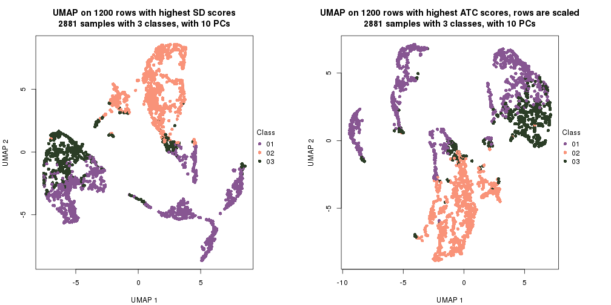</p>

</div>
</div>


### Signature heatmap

Signatures on the heatmap are the union of all signatures found on every node
on the hierarchy. The number of k-means on rows are automatically selected by the function.


<script>
$( function() {
	$( '#tabs-get-signatures-from-hierarchical-partition' ).tabs();
} );
</script>
<div id='tabs-get-signatures-from-hierarchical-partition'>
<ul>
<li><a href='#tab-get-signatures-from-hierarchical-partition-1'>n_signatures ≥ 347</a></li>
<li><a href='#tab-get-signatures-from-hierarchical-partition-2'>n_signatures ≥ 438</a></li>
<li><a href='#tab-get-signatures-from-hierarchical-partition-3'>n_signatures ≥ 508</a></li>
<li><a href='#tab-get-signatures-from-hierarchical-partition-4'>n_signatures ≥ 577</a></li>
<li><a href='#tab-get-signatures-from-hierarchical-partition-5'>n_signatures ≥ 628</a></li>
<li><a href='#tab-get-signatures-from-hierarchical-partition-6'>n_signatures ≥ 634</a></li>
<li><a href='#tab-get-signatures-from-hierarchical-partition-7'>n_signatures ≥ 677</a></li>
<li><a href='#tab-get-signatures-from-hierarchical-partition-8'>n_signatures ≥ 755</a></li>
<li><a href='#tab-get-signatures-from-hierarchical-partition-9'>n_signatures ≥ 890</a></li>
<li><a href='#tab-get-signatures-from-hierarchical-partition-10'>n_signatures ≥ 960</a></li>
<li><a href='#tab-get-signatures-from-hierarchical-partition-11'>n_signatures ≥ 979</a></li>
<li><a href='#tab-get-signatures-from-hierarchical-partition-12'>n_signatures ≥ 1000</a></li>
<li><a href='#tab-get-signatures-from-hierarchical-partition-13'>n_signatures ≥ 1348</a></li>
<li><a href='#tab-get-signatures-from-hierarchical-partition-14'>n_signatures ≥ 1387</a></li>
<li><a href='#tab-get-signatures-from-hierarchical-partition-15'>n_signatures ≥ 1390</a></li>
<li><a href='#tab-get-signatures-from-hierarchical-partition-16'>n_signatures ≥ 1908</a></li>
<li><a href='#tab-get-signatures-from-hierarchical-partition-17'>n_signatures ≥ 2292</a></li>
<li><a href='#tab-get-signatures-from-hierarchical-partition-18'>n_signatures ≥ 2797</a></li>
<li><a href='#tab-get-signatures-from-hierarchical-partition-19'>n_signatures ≥ 2878</a></li>
<li><a href='#tab-get-signatures-from-hierarchical-partition-20'>n_signatures ≥ 3262</a></li>
<li><a href='#tab-get-signatures-from-hierarchical-partition-21'>n_signatures ≥ 3273</a></li>
<li><a href='#tab-get-signatures-from-hierarchical-partition-22'>n_signatures ≥ 3301</a></li>
<li><a href='#tab-get-signatures-from-hierarchical-partition-23'>n_signatures ≥ 3324</a></li>
<li><a href='#tab-get-signatures-from-hierarchical-partition-24'>n_signatures ≥ 4249</a></li>
<li><a href='#tab-get-signatures-from-hierarchical-partition-25'>n_signatures ≥ 5466</a></li>
<li><a href='#tab-get-signatures-from-hierarchical-partition-26'>n_signatures ≥ 6708</a></li>
</ul>
<div id='tab-get-signatures-from-hierarchical-partition-1'>
<pre><code class="r">get_signatures(res_rh, merge_node = merge_node_param(min_n_signatures = 347))
</code></pre>

<p>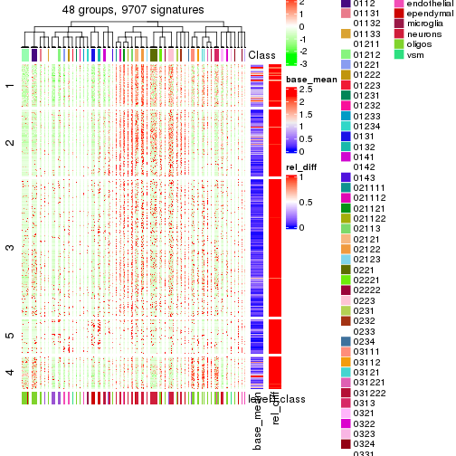</p>

</div>
<div id='tab-get-signatures-from-hierarchical-partition-2'>
<pre><code class="r">get_signatures(res_rh, merge_node = merge_node_param(min_n_signatures = 438))
</code></pre>

<p>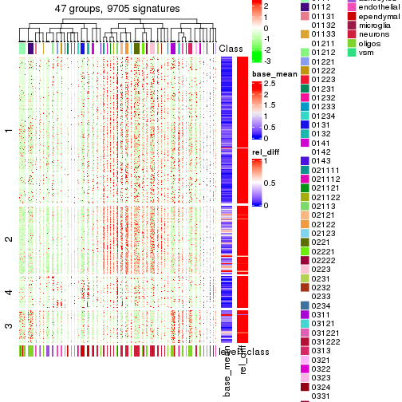</p>

</div>
<div id='tab-get-signatures-from-hierarchical-partition-3'>
<pre><code class="r">get_signatures(res_rh, merge_node = merge_node_param(min_n_signatures = 508))
</code></pre>

<p></p>

</div>
<div id='tab-get-signatures-from-hierarchical-partition-4'>
<pre><code class="r">get_signatures(res_rh, merge_node = merge_node_param(min_n_signatures = 577))
</code></pre>

<p></p>

</div>
<div id='tab-get-signatures-from-hierarchical-partition-5'>
<pre><code class="r">get_signatures(res_rh, merge_node = merge_node_param(min_n_signatures = 628))
</code></pre>

<p></p>

</div>
<div id='tab-get-signatures-from-hierarchical-partition-6'>
<pre><code class="r">get_signatures(res_rh, merge_node = merge_node_param(min_n_signatures = 634))
</code></pre>

<p></p>

</div>
<div id='tab-get-signatures-from-hierarchical-partition-7'>
<pre><code class="r">get_signatures(res_rh, merge_node = merge_node_param(min_n_signatures = 677))
</code></pre>

<p></p>

</div>
<div id='tab-get-signatures-from-hierarchical-partition-8'>
<pre><code class="r">get_signatures(res_rh, merge_node = merge_node_param(min_n_signatures = 755))
</code></pre>

<p></p>

</div>
<div id='tab-get-signatures-from-hierarchical-partition-9'>
<pre><code class="r">get_signatures(res_rh, merge_node = merge_node_param(min_n_signatures = 890))
</code></pre>

<p></p>

</div>
<div id='tab-get-signatures-from-hierarchical-partition-10'>
<pre><code class="r">get_signatures(res_rh, merge_node = merge_node_param(min_n_signatures = 960))
</code></pre>

<p></p>

</div>
<div id='tab-get-signatures-from-hierarchical-partition-11'>
<pre><code class="r">get_signatures(res_rh, merge_node = merge_node_param(min_n_signatures = 979))
</code></pre>

<p></p>

</div>
<div id='tab-get-signatures-from-hierarchical-partition-12'>
<pre><code class="r">get_signatures(res_rh, merge_node = merge_node_param(min_n_signatures = 1000))
</code></pre>

<p></p>

</div>
<div id='tab-get-signatures-from-hierarchical-partition-13'>
<pre><code class="r">get_signatures(res_rh, merge_node = merge_node_param(min_n_signatures = 1348))
</code></pre>

<p></p>

</div>
<div id='tab-get-signatures-from-hierarchical-partition-14'>
<pre><code class="r">get_signatures(res_rh, merge_node = merge_node_param(min_n_signatures = 1387))
</code></pre>

<p></p>

</div>
<div id='tab-get-signatures-from-hierarchical-partition-15'>
<pre><code class="r">get_signatures(res_rh, merge_node = merge_node_param(min_n_signatures = 1390))
</code></pre>

<p></p>

</div>
<div id='tab-get-signatures-from-hierarchical-partition-16'>
<pre><code class="r">get_signatures(res_rh, merge_node = merge_node_param(min_n_signatures = 1908))
</code></pre>

<p></p>

</div>
<div id='tab-get-signatures-from-hierarchical-partition-17'>
<pre><code class="r">get_signatures(res_rh, merge_node = merge_node_param(min_n_signatures = 2292))
</code></pre>

<p></p>

</div>
<div id='tab-get-signatures-from-hierarchical-partition-18'>
<pre><code class="r">get_signatures(res_rh, merge_node = merge_node_param(min_n_signatures = 2797))
</code></pre>

<p></p>

</div>
<div id='tab-get-signatures-from-hierarchical-partition-19'>
<pre><code class="r">get_signatures(res_rh, merge_node = merge_node_param(min_n_signatures = 2878))
</code></pre>

<p></p>

</div>
<div id='tab-get-signatures-from-hierarchical-partition-20'>
<pre><code class="r">get_signatures(res_rh, merge_node = merge_node_param(min_n_signatures = 3262))
</code></pre>

<p></p>

</div>
<div id='tab-get-signatures-from-hierarchical-partition-21'>
<pre><code class="r">get_signatures(res_rh, merge_node = merge_node_param(min_n_signatures = 3273))
</code></pre>

<p></p>

</div>
<div id='tab-get-signatures-from-hierarchical-partition-22'>
<pre><code class="r">get_signatures(res_rh, merge_node = merge_node_param(min_n_signatures = 3301))
</code></pre>

<p></p>

</div>
<div id='tab-get-signatures-from-hierarchical-partition-23'>
<pre><code class="r">get_signatures(res_rh, merge_node = merge_node_param(min_n_signatures = 3324))
</code></pre>

<p></p>

</div>
<div id='tab-get-signatures-from-hierarchical-partition-24'>
<pre><code class="r">get_signatures(res_rh, merge_node = merge_node_param(min_n_signatures = 4249))
</code></pre>

<p></p>

</div>
<div id='tab-get-signatures-from-hierarchical-partition-25'>
<pre><code class="r">get_signatures(res_rh, merge_node = merge_node_param(min_n_signatures = 5466))
</code></pre>

<p></p>

</div>
<div id='tab-get-signatures-from-hierarchical-partition-26'>
<pre><code class="r">get_signatures(res_rh, merge_node = merge_node_param(min_n_signatures = 6708))
</code></pre>

<p></p>

</div>
</div>


Compare signatures from different nodes:


```r
compare_signatures(res_rh, verbose = FALSE)
```


If there are too many signatures, `top_signatures = ...` can be set to only show the 
signatures with the highest FDRs. Note it only works on every node and the final signatures
are the union of all signatures of all nodes.


```r
# code only for demonstration
# e.g. to show the top 500 most significant rows on each node.
tb = get_signature(res_rh, top_signatures = 500)
```


### Test to known annotations

Test correlation between subgroups and known annotations. If the known
annotation is numeric, one-way ANOVA test is applied, and if the known
annotation is discrete, chi-squared contingency table test is applied.


<script>
$( function() {
	$( '#tabs-test-to-known-factors-from-hierarchical-partition' ).tabs();
} );
</script>
<div id='tabs-test-to-known-factors-from-hierarchical-partition'>
<ul>
<li><a href='#tab-test-to-known-factors-from-hierarchical-partition-1'>n_signatures ≥ 347</a></li>
<li><a href='#tab-test-to-known-factors-from-hierarchical-partition-2'>n_signatures ≥ 438</a></li>
<li><a href='#tab-test-to-known-factors-from-hierarchical-partition-3'>n_signatures ≥ 508</a></li>
<li><a href='#tab-test-to-known-factors-from-hierarchical-partition-4'>n_signatures ≥ 577</a></li>
<li><a href='#tab-test-to-known-factors-from-hierarchical-partition-5'>n_signatures ≥ 628</a></li>
<li><a href='#tab-test-to-known-factors-from-hierarchical-partition-6'>n_signatures ≥ 634</a></li>
<li><a href='#tab-test-to-known-factors-from-hierarchical-partition-7'>n_signatures ≥ 677</a></li>
<li><a href='#tab-test-to-known-factors-from-hierarchical-partition-8'>n_signatures ≥ 755</a></li>
<li><a href='#tab-test-to-known-factors-from-hierarchical-partition-9'>n_signatures ≥ 890</a></li>
<li><a href='#tab-test-to-known-factors-from-hierarchical-partition-10'>n_signatures ≥ 960</a></li>
<li><a href='#tab-test-to-known-factors-from-hierarchical-partition-11'>n_signatures ≥ 979</a></li>
<li><a href='#tab-test-to-known-factors-from-hierarchical-partition-12'>n_signatures ≥ 1000</a></li>
<li><a href='#tab-test-to-known-factors-from-hierarchical-partition-13'>n_signatures ≥ 1348</a></li>
<li><a href='#tab-test-to-known-factors-from-hierarchical-partition-14'>n_signatures ≥ 1387</a></li>
<li><a href='#tab-test-to-known-factors-from-hierarchical-partition-15'>n_signatures ≥ 1390</a></li>
<li><a href='#tab-test-to-known-factors-from-hierarchical-partition-16'>n_signatures ≥ 1908</a></li>
<li><a href='#tab-test-to-known-factors-from-hierarchical-partition-17'>n_signatures ≥ 2292</a></li>
<li><a href='#tab-test-to-known-factors-from-hierarchical-partition-18'>n_signatures ≥ 2797</a></li>
<li><a href='#tab-test-to-known-factors-from-hierarchical-partition-19'>n_signatures ≥ 2878</a></li>
<li><a href='#tab-test-to-known-factors-from-hierarchical-partition-20'>n_signatures ≥ 3262</a></li>
<li><a href='#tab-test-to-known-factors-from-hierarchical-partition-21'>n_signatures ≥ 3273</a></li>
<li><a href='#tab-test-to-known-factors-from-hierarchical-partition-22'>n_signatures ≥ 3301</a></li>
<li><a href='#tab-test-to-known-factors-from-hierarchical-partition-23'>n_signatures ≥ 3324</a></li>
<li><a href='#tab-test-to-known-factors-from-hierarchical-partition-24'>n_signatures ≥ 4249</a></li>
<li><a href='#tab-test-to-known-factors-from-hierarchical-partition-25'>n_signatures ≥ 5466</a></li>
<li><a href='#tab-test-to-known-factors-from-hierarchical-partition-26'>n_signatures ≥ 6708</a></li>
</ul>
<div id='tab-test-to-known-factors-from-hierarchical-partition-1'>
<pre><code class="r">test_to_known_factors(res_rh, merge_node = merge_node_param(min_n_signatures = 347))
</code></pre>

<pre><code>#&gt;       level1.class
#&gt; class            0
</code></pre>

</div>
<div id='tab-test-to-known-factors-from-hierarchical-partition-2'>
<pre><code class="r">test_to_known_factors(res_rh, merge_node = merge_node_param(min_n_signatures = 438))
</code></pre>

<pre><code>#&gt;       level1.class
#&gt; class            0
</code></pre>

</div>
<div id='tab-test-to-known-factors-from-hierarchical-partition-3'>
<pre><code class="r">test_to_known_factors(res_rh, merge_node = merge_node_param(min_n_signatures = 508))
</code></pre>

<pre><code>#&gt;       level1.class
#&gt; class            0
</code></pre>

</div>
<div id='tab-test-to-known-factors-from-hierarchical-partition-4'>
<pre><code class="r">test_to_known_factors(res_rh, merge_node = merge_node_param(min_n_signatures = 577))
</code></pre>

<pre><code>#&gt;       level1.class
#&gt; class            0
</code></pre>

</div>
<div id='tab-test-to-known-factors-from-hierarchical-partition-5'>
<pre><code class="r">test_to_known_factors(res_rh, merge_node = merge_node_param(min_n_signatures = 628))
</code></pre>

<pre><code>#&gt;       level1.class
#&gt; class            0
</code></pre>

</div>
<div id='tab-test-to-known-factors-from-hierarchical-partition-6'>
<pre><code class="r">test_to_known_factors(res_rh, merge_node = merge_node_param(min_n_signatures = 634))
</code></pre>

<pre><code>#&gt;       level1.class
#&gt; class            0
</code></pre>

</div>
<div id='tab-test-to-known-factors-from-hierarchical-partition-7'>
<pre><code class="r">test_to_known_factors(res_rh, merge_node = merge_node_param(min_n_signatures = 677))
</code></pre>

<pre><code>#&gt;       level1.class
#&gt; class            0
</code></pre>

</div>
<div id='tab-test-to-known-factors-from-hierarchical-partition-8'>
<pre><code class="r">test_to_known_factors(res_rh, merge_node = merge_node_param(min_n_signatures = 755))
</code></pre>

<pre><code>#&gt;       level1.class
#&gt; class            0
</code></pre>

</div>
<div id='tab-test-to-known-factors-from-hierarchical-partition-9'>
<pre><code class="r">test_to_known_factors(res_rh, merge_node = merge_node_param(min_n_signatures = 890))
</code></pre>

<pre><code>#&gt;       level1.class
#&gt; class            0
</code></pre>

</div>
<div id='tab-test-to-known-factors-from-hierarchical-partition-10'>
<pre><code class="r">test_to_known_factors(res_rh, merge_node = merge_node_param(min_n_signatures = 960))
</code></pre>

<pre><code>#&gt;       level1.class
#&gt; class            0
</code></pre>

</div>
<div id='tab-test-to-known-factors-from-hierarchical-partition-11'>
<pre><code class="r">test_to_known_factors(res_rh, merge_node = merge_node_param(min_n_signatures = 979))
</code></pre>

<pre><code>#&gt;       level1.class
#&gt; class            0
</code></pre>

</div>
<div id='tab-test-to-known-factors-from-hierarchical-partition-12'>
<pre><code class="r">test_to_known_factors(res_rh, merge_node = merge_node_param(min_n_signatures = 1000))
</code></pre>

<pre><code>#&gt;       level1.class
#&gt; class            0
</code></pre>

</div>
<div id='tab-test-to-known-factors-from-hierarchical-partition-13'>
<pre><code class="r">test_to_known_factors(res_rh, merge_node = merge_node_param(min_n_signatures = 1348))
</code></pre>

<pre><code>#&gt;       level1.class
#&gt; class            0
</code></pre>

</div>
<div id='tab-test-to-known-factors-from-hierarchical-partition-14'>
<pre><code class="r">test_to_known_factors(res_rh, merge_node = merge_node_param(min_n_signatures = 1387))
</code></pre>

<pre><code>#&gt;       level1.class
#&gt; class            0
</code></pre>

</div>
<div id='tab-test-to-known-factors-from-hierarchical-partition-15'>
<pre><code class="r">test_to_known_factors(res_rh, merge_node = merge_node_param(min_n_signatures = 1390))
</code></pre>

<pre><code>#&gt;       level1.class
#&gt; class            0
</code></pre>

</div>
<div id='tab-test-to-known-factors-from-hierarchical-partition-16'>
<pre><code class="r">test_to_known_factors(res_rh, merge_node = merge_node_param(min_n_signatures = 1908))
</code></pre>

<pre><code>#&gt;       level1.class
#&gt; class            0
</code></pre>

</div>
<div id='tab-test-to-known-factors-from-hierarchical-partition-17'>
<pre><code class="r">test_to_known_factors(res_rh, merge_node = merge_node_param(min_n_signatures = 2292))
</code></pre>

<pre><code>#&gt;       level1.class
#&gt; class            0
</code></pre>

</div>
<div id='tab-test-to-known-factors-from-hierarchical-partition-18'>
<pre><code class="r">test_to_known_factors(res_rh, merge_node = merge_node_param(min_n_signatures = 2797))
</code></pre>

<pre><code>#&gt;       level1.class
#&gt; class            0
</code></pre>

</div>
<div id='tab-test-to-known-factors-from-hierarchical-partition-19'>
<pre><code class="r">test_to_known_factors(res_rh, merge_node = merge_node_param(min_n_signatures = 2878))
</code></pre>

<pre><code>#&gt;       level1.class
#&gt; class            0
</code></pre>

</div>
<div id='tab-test-to-known-factors-from-hierarchical-partition-20'>
<pre><code class="r">test_to_known_factors(res_rh, merge_node = merge_node_param(min_n_signatures = 3262))
</code></pre>

<pre><code>#&gt;       level1.class
#&gt; class            0
</code></pre>

</div>
<div id='tab-test-to-known-factors-from-hierarchical-partition-21'>
<pre><code class="r">test_to_known_factors(res_rh, merge_node = merge_node_param(min_n_signatures = 3273))
</code></pre>

<pre><code>#&gt;       level1.class
#&gt; class            0
</code></pre>

</div>
<div id='tab-test-to-known-factors-from-hierarchical-partition-22'>
<pre><code class="r">test_to_known_factors(res_rh, merge_node = merge_node_param(min_n_signatures = 3301))
</code></pre>

<pre><code>#&gt;       level1.class
#&gt; class            0
</code></pre>

</div>
<div id='tab-test-to-known-factors-from-hierarchical-partition-23'>
<pre><code class="r">test_to_known_factors(res_rh, merge_node = merge_node_param(min_n_signatures = 3324))
</code></pre>

<pre><code>#&gt;       level1.class
#&gt; class            0
</code></pre>

</div>
<div id='tab-test-to-known-factors-from-hierarchical-partition-24'>
<pre><code class="r">test_to_known_factors(res_rh, merge_node = merge_node_param(min_n_signatures = 4249))
</code></pre>

<pre><code>#&gt;       level1.class
#&gt; class            0
</code></pre>

</div>
<div id='tab-test-to-known-factors-from-hierarchical-partition-25'>
<pre><code class="r">test_to_known_factors(res_rh, merge_node = merge_node_param(min_n_signatures = 5466))
</code></pre>

<pre><code>#&gt;       level1.class
#&gt; class            0
</code></pre>

</div>
<div id='tab-test-to-known-factors-from-hierarchical-partition-26'>
<pre><code class="r">test_to_known_factors(res_rh, merge_node = merge_node_param(min_n_signatures = 6708))
</code></pre>

<pre><code>#&gt;       level1.class
#&gt; class            0
</code></pre>

</div>
</div>


## Results for each node


---------------------------------------------------


### Node0


Child nodes: 
                [Node01](#Node01)
        ,
                [Node02](#Node02)
        ,
                [Node03](#Node03)
        .


The object with results only for a single top-value method and a single partitioning method 
can be extracted as:

```r
res = res_rh["0"]
```

A summary of `res` and all the functions that can be applied to it:

```r
res
```

```
#> A 'DownSamplingConsensusPartition' object with k = 2, 3, 4.
#>   On a matrix with 10389 rows and 500 columns, randomly sampled from 2881 columns.
#>   Top rows (980) are extracted by 'ATC' method.
#>   Subgroups are detected by 'skmeans' method.
#>   Performed in total 150 partitions by row resampling.
#>   Best k for subgroups seems to be 4.
#> 
#> Following methods can be applied to this 'DownSamplingConsensusPartition' object:
#>  [1] "cola_report"             "collect_classes"         "collect_plots"          
#>  [4] "collect_stats"           "colnames"                "compare_partitions"     
#>  [7] "compare_signatures"      "consensus_heatmap"       "dimension_reduction"    
#> [10] "functional_enrichment"   "get_anno_col"            "get_anno"               
#> [13] "get_classes"             "get_consensus"           "get_matrix"             
#> [16] "get_membership"          "get_param"               "get_signatures"         
#> [19] "get_stats"               "is_best_k"               "is_stable_k"            
#> [22] "membership_heatmap"      "ncol"                    "nrow"                   
#> [25] "plot_ecdf"               "predict_classes"         "rownames"               
#> [28] "select_partition_number" "show"                    "suggest_best_k"         
#> [31] "test_to_known_factors"   "top_rows_heatmap"
```

`collect_plots()` function collects all the plots made from `res` for all `k` (number of subgroups)
into one single page to provide an easy and fast comparison between different `k`.

```r
collect_plots(res)
```


The plots are:

- The first row: a plot of the eCDF (empirical cumulative distribution
  function) curves of the consensus matrix for each `k` and the heatmap of
  predicted classes for each `k`.
- The second row: heatmaps of the consensus matrix for each `k`.
- The third row: heatmaps of the membership matrix for each `k`.
- The fouth row: heatmaps of the signatures for each `k`.

All the plots in panels can be made by individual functions and they are
plotted later in this section.

`select_partition_number()` produces several plots showing different
statistics for choosing "optimized" `k`. There are following statistics:

- eCDF curves of the consensus matrix for each `k`;
- 1-PAC. [The PAC score](https://en.wikipedia.org/wiki/Consensus_clustering#Over-interpretation_potential_of_consensus_clustering)
  measures the proportion of the ambiguous subgrouping.
- Mean silhouette score.
- Concordance. The mean probability of fiting the consensus subgroup labels in all
  partitions.
- Area increased. Denote $A_k$ as the area under the eCDF curve for current
  `k`, the area increased is defined as $A_k - A_{k-1}$.
- Rand index. The percent of pairs of samples that are both in a same cluster
  or both are not in a same cluster in the partition of k and k-1.
- Jaccard index. The ratio of pairs of samples are both in a same cluster in
  the partition of k and k-1 and the pairs of samples are both in a same
  cluster in the partition k or k-1.

The detailed explanations of these statistics can be found in [the _cola_
vignette](https://jokergoo.github.io/cola_vignettes/cola.html#toc_13).

Generally speaking, higher 1-PAC score, higher mean silhouette score or higher
concordance corresponds to better partition. Rand index and Jaccard index
measure how similar the current partition is compared to partition with `k-1`.
If they are too similar, we won't accept `k` is better than `k-1`.

```r
select_partition_number(res)
```


The numeric values for all these statistics can be obtained by `get_stats()`.

```r
get_stats(res)
```

```
#>   k 1-PAC mean_silhouette concordance area_increased  Rand Jaccard
#> 2 2 1.000           0.983       0.993         0.4868 0.512   0.512
#> 3 3 1.000           0.973       0.990         0.2476 0.858   0.729
#> 4 4 0.998           0.950       0.977         0.0822 0.938   0.846
```

`suggest_best_k()` suggests the best $k$ based on these statistics. The rules are as follows:

- All $k$ with Jaccard index larger than 0.95 are removed because increasing
  $k$ does not provide enough extra information. If all $k$ are removed, it is
  marked as no subgroup is detected.
- For all $k$ with 1-PAC score larger than 0.9, the maximal $k$ is taken as
  the best $k$, and other $k$ are marked as optional $k$.
- If it does not fit the second rule. The $k$ with the maximal vote of the
  highest 1-PAC score, highest mean silhouette, and highest concordance is
  taken as the best $k$.

```r
suggest_best_k(res)
```

```
#> [1] 4
#> attr(,"optional")
#> [1] 2 3
```

There is also optional best $k$ = 2 3 that is worth to check.

Following is the table of the partitions (You need to click the **show/hide
code output** link to see it). The membership matrix (columns with name `p*`)
is inferred by
[`clue::cl_consensus()`](https://www.rdocumentation.org/link/cl_consensus?package=clue)
function with the `SE` method. Basically the value in the membership matrix
represents the probability to belong to a certain group. The finall subgroup
label for an item is determined with the group with highest probability it
belongs to.

In `get_classes()` function, the entropy is calculated from the membership
matrix and the silhouette score is calculated from the consensus matrix.


<script>
$( function() {
	$( '#tabs-node-0-get-classes' ).tabs();
} );
</script>
<div id='tabs-node-0-get-classes'>
<ul>
<li><a href='#tab-node-0-get-classes-1'>k = 2</a></li>
<li><a href='#tab-node-0-get-classes-2'>k = 3</a></li>
<li><a href='#tab-node-0-get-classes-3'>k = 4</a></li>
</ul>

<div id='tab-node-0-get-classes-1'>
<p><a id='tab-node-0-get-classes-1-a' style='color:#0366d6' href='#'>show/hide code output</a></p>
<pre><code class="r">get_classes(res, k = 2)
</code></pre>

<pre><code>#&gt;      class     p
#&gt; 1        1 0.000
#&gt; 2        1 0.249
#&gt; 3        2 0.000
#&gt; 4        1 0.000
#&gt; 5        1 0.000
#&gt; 6        1 0.000
#&gt; 7        1 0.000
#&gt; 8        1 0.000
#&gt; 9        1 0.000
#&gt; 10       1 0.000
#&gt; 11       1 0.000
#&gt; 12       1 0.000
#&gt; 13       1 0.000
#&gt; 14       1 0.000
#&gt; 15       1 0.000
#&gt; 16       1 0.000
#&gt; 17       1 0.000
#&gt; 18       1 0.000
#&gt; 19       1 0.000
#&gt; 20       1 0.000
#&gt; 21       1 0.000
#&gt; 22       1 0.000
#&gt; 23       1 0.000
#&gt; 24       1 0.000
#&gt; 25       1 0.000
#&gt; 26       1 0.249
#&gt; 27       1 0.000
#&gt; 28       1 0.000
#&gt; 29       1 0.000
#&gt; 30       1 0.000
#&gt; 31       1 0.000
#&gt; 32       1 0.000
#&gt; 33       1 0.000
#&gt; 34       1 0.000
#&gt; 35       1 0.249
#&gt; 36       1 0.000
#&gt; 37       1 0.000
#&gt; 38       1 0.000
#&gt; 39       1 0.000
#&gt; 40       1 0.000
#&gt; 41       1 0.000
#&gt; 42       2 0.000
#&gt; 43       1 0.000
#&gt; 44       1 0.000
#&gt; 45       1 0.000
#&gt; 46       1 0.000
#&gt; 47       1 0.000
#&gt; 48       1 0.000
#&gt; 49       1 0.000
#&gt; 50       1 0.000
#&gt; 51       1 0.000
#&gt; 52       1 0.249
#&gt; 53       1 0.000
#&gt; 54       1 0.000
#&gt; 55       1 0.249
#&gt; 56       2 0.000
#&gt; 57       2 0.000
#&gt; 58       1 0.000
#&gt; 59       1 0.000
#&gt; 60       1 0.000
#&gt; 61       1 0.000
#&gt; 62       1 0.000
#&gt; 63       1 0.249
#&gt; 64       2 0.000
#&gt; 65       1 0.000
#&gt; 66       1 0.249
#&gt; 67       1 0.000
#&gt; 68       1 0.502
#&gt; 69       1 0.000
#&gt; 70       1 0.000
#&gt; 71       1 1.000
#&gt; 72       1 0.000
#&gt; 73       1 0.253
#&gt; 74       1 0.249
#&gt; 75       1 0.000
#&gt; 76       1 0.751
#&gt; 77       1 0.000
#&gt; 78       1 0.000
#&gt; 79       2 0.000
#&gt; 80       1 0.000
#&gt; 81       1 1.000
#&gt; 82       1 0.000
#&gt; 83       1 0.000
#&gt; 84       1 0.249
#&gt; 85       1 0.249
#&gt; 86       2 0.000
#&gt; 87       1 0.000
#&gt; 88       1 0.000
#&gt; 89       1 0.000
#&gt; 90       1 0.249
#&gt; 91       1 0.000
#&gt; 92       1 0.000
#&gt; 93       2 0.000
#&gt; 94       1 0.000
#&gt; 95       1 0.000
#&gt; 96       1 0.000
#&gt; 97       1 0.000
#&gt; 98       1 0.000
#&gt; 99       1 0.498
#&gt; 100      1 0.000
#&gt; 101      1 0.000
#&gt; 102      1 0.000
#&gt; 103      1 0.000
#&gt; 104      1 0.000
#&gt; 105      1 0.000
#&gt; 106      1 0.000
#&gt; 107      2 0.000
#&gt; 108      1 0.502
#&gt; 109      1 0.751
#&gt; 110      1 0.000
#&gt; 111      1 0.000
#&gt; 112      1 0.249
#&gt; 113      1 1.000
#&gt; 114      1 0.751
#&gt; 115      1 1.000
#&gt; 116      2 0.000
#&gt; 117      2 0.000
#&gt; 118      1 0.000
#&gt; 119      1 0.000
#&gt; 120      1 1.000
#&gt; 121      1 0.000
#&gt; 122      1 0.747
#&gt; 123      2 0.000
#&gt; 124      2 0.000
#&gt; 125      2 0.000
#&gt; 126      2 0.000
#&gt; 127      1 0.502
#&gt; 128      1 0.000
#&gt; 129      1 0.000
#&gt; 130      1 0.502
#&gt; 131      1 0.000
#&gt; 132      1 0.000
#&gt; 133      1 0.000
#&gt; 134      1 1.000
#&gt; 135      1 0.751
#&gt; 136      2 0.000
#&gt; 137      1 0.000
#&gt; 138      1 0.000
#&gt; 139      1 0.000
#&gt; 140      1 0.502
#&gt; 141      1 0.000
#&gt; 142      1 0.000
#&gt; 143      1 0.000
#&gt; 144      1 0.249
#&gt; 145      1 0.000
#&gt; 146      2 0.000
#&gt; 147      1 0.000
#&gt; 148      2 0.000
#&gt; 149      1 0.000
#&gt; 150      1 1.000
#&gt; 151      1 0.249
#&gt; 152      1 0.000
#&gt; 153      1 0.000
#&gt; 154      1 0.000
#&gt; 155      1 0.000
#&gt; 156      1 0.000
#&gt; 157      1 0.000
#&gt; 158      2 1.000
#&gt; 159      1 0.000
#&gt; 160      1 0.000
#&gt; 161      1 0.000
#&gt; 162      1 0.000
#&gt; 163      1 0.000
#&gt; 164      1 0.000
#&gt; 165      2 1.000
#&gt; 166      1 0.000
#&gt; 167      1 0.000
#&gt; 168      1 0.000
#&gt; 169      1 0.000
#&gt; 170      1 0.000
#&gt; 171      2 0.502
#&gt; 172      1 0.000
#&gt; 173      1 0.000
#&gt; 174      2 0.000
#&gt; 175      2 0.249
#&gt; 176      1 0.000
#&gt; 177      1 0.000
#&gt; 178      1 0.000
#&gt; 179      1 0.000
#&gt; 180      1 0.000
#&gt; 181      1 0.000
#&gt; 182      1 0.000
#&gt; 183      1 0.000
#&gt; 184      1 0.000
#&gt; 185      1 0.000
#&gt; 186      1 0.000
#&gt; 187      1 0.000
#&gt; 188      1 0.000
#&gt; 189      1 0.000
#&gt; 190      2 0.000
#&gt; 191      1 0.498
#&gt; 192      1 0.000
#&gt; 193      1 0.000
#&gt; 194      1 0.000
#&gt; 195      1 0.000
#&gt; 196      1 0.000
#&gt; 197      2 1.000
#&gt; 198      1 0.000
#&gt; 199      2 1.000
#&gt; 200      2 1.000
#&gt; 201      1 0.000
#&gt; 202      1 0.000
#&gt; 203      1 0.000
#&gt; 204      1 0.000
#&gt; 205      1 0.000
#&gt; 206      1 0.000
#&gt; 207      1 0.000
#&gt; 208      1 0.000
#&gt; 209      1 0.000
#&gt; 210      2 0.000
#&gt; 211      1 0.000
#&gt; 212      2 0.000
#&gt; 213      1 0.000
#&gt; 214      1 0.000
#&gt; 215      1 0.000
#&gt; 216      1 0.000
#&gt; 217      1 0.000
#&gt; 218      2 0.000
#&gt; 219      1 0.000
#&gt; 220      1 0.000
#&gt; 221      2 1.000
#&gt; 222      1 0.000
#&gt; 223      2 1.000
#&gt; 224      1 0.000
#&gt; 225      1 0.000
#&gt; 226      1 0.000
#&gt; 227      1 0.000
#&gt; 228      1 0.000
#&gt; 229      1 0.000
#&gt; 230      2 0.000
#&gt; 231      1 0.000
#&gt; 232      1 0.751
#&gt; 233      1 0.000
#&gt; 234      1 0.000
#&gt; 235      2 0.000
#&gt; 236      2 1.000
#&gt; 237      2 0.000
#&gt; 238      1 0.000
#&gt; 239      1 0.000
#&gt; 240      1 0.000
#&gt; 241      1 0.000
#&gt; 242      1 0.000
#&gt; 243      1 0.000
#&gt; 244      1 0.000
#&gt; 245      1 0.000
#&gt; 246      1 0.000
#&gt; 247      1 0.000
#&gt; 248      2 0.000
#&gt; 249      1 0.000
#&gt; 250      1 0.000
#&gt; 251      1 0.249
#&gt; 252      1 0.000
#&gt; 253      1 0.000
#&gt; 254      1 0.000
#&gt; 255      1 0.249
#&gt; 256      1 0.249
#&gt; 257      1 0.000
#&gt; 258      1 0.000
#&gt; 259      1 0.498
#&gt; 260      1 0.000
#&gt; 261      1 0.000
#&gt; 262      1 0.249
#&gt; 263      1 0.000
#&gt; 264      1 0.000
#&gt; 265      1 0.253
#&gt; 266      1 0.000
#&gt; 267      1 0.000
#&gt; 268      1 0.000
#&gt; 269      1 0.253
#&gt; 270      1 0.000
#&gt; 271      1 0.000
#&gt; 272      1 0.000
#&gt; 273      1 0.000
#&gt; 274      1 0.000
#&gt; 275      1 0.000
#&gt; 276      1 0.000
#&gt; 277      1 0.000
#&gt; 278      1 0.000
#&gt; 279      1 0.000
#&gt; 280      1 0.249
#&gt; 281      2 0.000
#&gt; 282      1 0.000
#&gt; 283      1 0.253
#&gt; 284      1 0.000
#&gt; 285      1 0.000
#&gt; 286      2 0.000
#&gt; 287      1 0.000
#&gt; 288      1 0.000
#&gt; 289      1 0.000
#&gt; 290      2 1.000
#&gt; 291      1 0.000
#&gt; 292      1 0.000
#&gt; 293      1 0.000
#&gt; 294      1 0.000
#&gt; 295      2 0.000
#&gt; 296      1 0.000
#&gt; 297      1 0.000
#&gt; 298      2 1.000
#&gt; 299      2 0.249
#&gt; 300      1 0.000
#&gt; 301      2 0.249
#&gt; 302      1 0.502
#&gt; 303      1 0.249
#&gt; 304      2 0.000
#&gt; 305      1 0.000
#&gt; 306      2 0.000
#&gt; 307      2 0.000
#&gt; 308      2 1.000
#&gt; 309      2 0.000
#&gt; 310      1 0.000
#&gt; 311      1 0.000
#&gt; 312      1 0.000
#&gt; 313      2 0.000
#&gt; 314      1 0.000
#&gt; 315      1 0.000
#&gt; 316      2 1.000
#&gt; 317      1 0.000
#&gt; 318      1 0.498
#&gt; 319      1 0.000
#&gt; 320      1 0.249
#&gt; 321      1 0.000
#&gt; 322      1 0.000
#&gt; 323      2 0.000
#&gt; 324      1 0.000
#&gt; 325      1 0.000
#&gt; 326      1 0.249
#&gt; 327      1 0.000
#&gt; 328      1 0.000
#&gt; 329      1 0.000
#&gt; 330      1 0.000
#&gt; 331      1 0.000
#&gt; 332      1 0.000
#&gt; 333      1 0.253
#&gt; 334      1 0.000
#&gt; 335      1 0.000
#&gt; 336      2 0.000
#&gt; 337      2 0.000
#&gt; 338      1 0.000
#&gt; 339      1 0.249
#&gt; 340      1 0.000
#&gt; 341      1 0.000
#&gt; 342      1 1.000
#&gt; 343      2 0.000
#&gt; 344      1 0.000
#&gt; 345      1 0.000
#&gt; 346      1 0.000
#&gt; 347      2 0.000
#&gt; 348      1 0.747
#&gt; 349      1 0.000
#&gt; 350      2 0.000
#&gt; 351      1 0.249
#&gt; 352      1 0.000
#&gt; 353      1 0.000
#&gt; 354      1 0.000
#&gt; 355      1 0.000
#&gt; 356      1 0.000
#&gt; 357      1 0.000
#&gt; 358      1 0.000
#&gt; 359      2 1.000
#&gt; 360      1 0.000
#&gt; 361      2 0.249
#&gt; 362      1 0.000
#&gt; 363      1 0.000
#&gt; 364      1 0.249
#&gt; 365      1 0.000
#&gt; 366      1 0.249
#&gt; 367      1 0.000
#&gt; 368      1 0.000
#&gt; 369      1 0.000
#&gt; 370      1 0.000
#&gt; 371      1 0.000
#&gt; 372      2 1.000
#&gt; 373      1 0.000
#&gt; 374      1 0.000
#&gt; 375      1 0.000
#&gt; 376      1 0.000
#&gt; 377      1 0.000
#&gt; 378      1 0.000
#&gt; 379      2 1.000
#&gt; 380      1 0.000
#&gt; 381      1 0.000
#&gt; 382      1 0.000
#&gt; 383      2 0.000
#&gt; 384      1 0.498
#&gt; 385      1 0.000
#&gt; 386      1 0.000
#&gt; 387      1 0.000
#&gt; 388      1 0.253
#&gt; 389      1 0.751
#&gt; 390      2 0.502
#&gt; 391      1 0.000
#&gt; 392      1 0.000
#&gt; 393      1 0.000
#&gt; 394      1 1.000
#&gt; 395      2 0.000
#&gt; 396      1 0.000
#&gt; 397      1 0.498
#&gt; 398      1 0.000
#&gt; 399      1 0.000
#&gt; 400      1 0.000
#&gt; 401      1 0.000
#&gt; 402      1 0.000
#&gt; 403      1 1.000
#&gt; 404      1 0.000
#&gt; 405      1 0.000
#&gt; 406      2 0.000
#&gt; 407      1 0.000
#&gt; 408      1 0.249
#&gt; 409      1 0.249
#&gt; 410      1 0.249
#&gt; 411      1 0.249
#&gt; 412      1 0.000
#&gt; 413      2 0.000
#&gt; 414      1 0.747
#&gt; 415      1 0.000
#&gt; 416      1 0.249
#&gt; 417      1 0.000
#&gt; 418      1 0.000
#&gt; 419      1 0.502
#&gt; 420      1 0.000
#&gt; 421      1 1.000
#&gt; 422      1 0.000
#&gt; 423      1 0.000
#&gt; 424      1 0.000
#&gt; 425      2 0.249
#&gt; 426      1 0.000
#&gt; 427      1 0.000
#&gt; 428      1 0.000
#&gt; 429      1 0.000
#&gt; 430      1 0.000
#&gt; 431      1 0.502
#&gt; 432      2 1.000
#&gt; 433      1 0.249
#&gt; 434      2 0.249
#&gt; 435      1 0.000
#&gt; 436      2 0.000
#&gt; 437      1 0.000
#&gt; 438      2 0.000
#&gt; 439      1 0.000
#&gt; 440      2 0.000
#&gt; 441      2 0.000
#&gt; 442      1 0.000
#&gt; 443      1 0.000
#&gt; 444      1 0.000
#&gt; 445      1 0.000
#&gt; 446      1 0.249
#&gt; 447      1 0.000
#&gt; 448      1 0.000
#&gt; 449      1 0.000
#&gt; 450      1 0.000
#&gt; 451      1 0.000
#&gt; 452      1 0.000
#&gt; 453      1 0.000
#&gt; 454      1 0.502
#&gt; 455      1 0.000
#&gt; 456      1 0.000
#&gt; 457      1 0.000
#&gt; 458      1 0.000
#&gt; 459      1 0.000
#&gt; 460      1 0.000
#&gt; 461      1 0.000
#&gt; 462      1 0.000
#&gt; 463      1 0.000
#&gt; 464      1 0.000
#&gt; 465      1 0.000
#&gt; 466      1 0.000
#&gt; 467      1 0.000
#&gt; 468      1 0.000
#&gt; 469      2 1.000
#&gt; 470      2 1.000
#&gt; 471      1 0.000
#&gt; 472      1 0.000
#&gt; 473      1 0.000
#&gt; 474      2 1.000
#&gt; 475      2 1.000
#&gt; 476      1 0.000
#&gt; 477      1 0.000
#&gt; 478      1 0.000
#&gt; 479      1 0.000
#&gt; 480      1 0.000
#&gt; 481      1 0.000
#&gt; 482      1 0.000
#&gt; 483      1 0.000
#&gt; 484      1 0.000
#&gt; 485      2 0.000
#&gt; 486      1 0.000
#&gt; 487      1 0.000
#&gt; 488      1 0.000
#&gt; 489      2 0.502
#&gt; 490      2 0.000
#&gt; 491      2 0.000
#&gt; 492      1 0.000
#&gt; 493      1 0.000
#&gt; 494      2 0.000
#&gt; 495      1 0.000
#&gt; 496      1 0.000
#&gt; 497      2 0.000
#&gt; 498      2 0.249
#&gt; 499      1 0.000
#&gt; 500      1 0.000
#&gt; 501      2 0.000
#&gt; 502      1 0.000
#&gt; 503      1 0.000
#&gt; 504      2 1.000
#&gt; 505      1 0.000
#&gt; 506      2 0.000
#&gt; 507      1 0.000
#&gt; 508      1 0.000
#&gt; 509      1 0.000
#&gt; 510      1 0.000
#&gt; 511      1 0.000
#&gt; 512      2 1.000
#&gt; 513      1 0.000
#&gt; 514      1 0.000
#&gt; 515      1 0.000
#&gt; 516      1 0.000
#&gt; 517      2 0.000
#&gt; 518      1 0.000
#&gt; 519      1 0.000
#&gt; 520      1 0.000
#&gt; 521      1 0.000
#&gt; 522      1 0.000
#&gt; 523      1 0.253
#&gt; 524      2 1.000
#&gt; 525      1 0.000
#&gt; 526      1 0.000
#&gt; 527      1 0.000
#&gt; 528      1 0.000
#&gt; 529      1 1.000
#&gt; 530      2 0.000
#&gt; 531      2 0.000
#&gt; 532      2 0.000
#&gt; 533      1 0.000
#&gt; 534      2 0.000
#&gt; 535      1 0.000
#&gt; 536      1 0.000
#&gt; 537      1 0.000
#&gt; 538      2 0.000
#&gt; 539      1 0.000
#&gt; 540      1 0.000
#&gt; 541      1 0.000
#&gt; 542      2 0.000
#&gt; 543      1 0.000
#&gt; 544      1 0.000
#&gt; 545      2 0.000
#&gt; 546      1 0.000
#&gt; 547      1 0.000
#&gt; 548      1 0.000
#&gt; 549      1 0.000
#&gt; 550      1 0.000
#&gt; 551      1 0.000
#&gt; 552      1 0.000
#&gt; 553      1 0.000
#&gt; 554      1 0.000
#&gt; 555      1 0.000
#&gt; 556      1 0.498
#&gt; 557      1 0.000
#&gt; 558      1 0.502
#&gt; 559      1 0.000
#&gt; 560      1 0.502
#&gt; 561      1 1.000
#&gt; 562      1 0.249
#&gt; 563      2 0.000
#&gt; 564      1 0.751
#&gt; 565      1 0.000
#&gt; 566      1 0.000
#&gt; 567      1 0.498
#&gt; 568      2 0.000
#&gt; 569      1 0.000
#&gt; 570      1 0.000
#&gt; 571      1 0.502
#&gt; 572      2 0.000
#&gt; 573      2 0.000
#&gt; 574      1 0.000
#&gt; 575      1 0.000
#&gt; 576      1 0.000
#&gt; 577      1 0.000
#&gt; 578      1 0.000
#&gt; 579      1 0.000
#&gt; 580      2 0.000
#&gt; 581      1 0.249
#&gt; 582      1 0.000
#&gt; 583      1 0.000
#&gt; 584      1 0.249
#&gt; 585      1 0.502
#&gt; 586      1 0.000
#&gt; 587      2 0.498
#&gt; 588      1 0.249
#&gt; 589      1 0.751
#&gt; 590      1 0.502
#&gt; 591      1 0.502
#&gt; 592      1 0.000
#&gt; 593      1 0.000
#&gt; 594      1 0.000
#&gt; 595      1 0.000
#&gt; 596      1 0.498
#&gt; 597      1 0.249
#&gt; 598      1 0.000
#&gt; 599      1 0.000
#&gt; 600      1 0.000
#&gt; 601      1 0.000
#&gt; 602      1 0.498
#&gt; 603      1 0.000
#&gt; 604      1 0.000
#&gt; 605      1 0.000
#&gt; 606      1 0.000
#&gt; 607      2 0.000
#&gt; 608      1 0.000
#&gt; 609      1 0.000
#&gt; 610      1 0.000
#&gt; 611      1 0.000
#&gt; 612      1 0.000
#&gt; 613      1 0.253
#&gt; 614      1 0.000
#&gt; 615      1 0.249
#&gt; 616      2 0.249
#&gt; 617      1 0.000
#&gt; 618      1 0.000
#&gt; 619      1 0.000
#&gt; 620      1 0.000
#&gt; 621      1 0.000
#&gt; 622      1 0.000
#&gt; 623      1 0.000
#&gt; 624      1 0.747
#&gt; 625      1 0.000
#&gt; 626      1 0.000
#&gt; 627      1 0.000
#&gt; 628      1 0.000
#&gt; 629      1 0.000
#&gt; 630      1 0.000
#&gt; 631      1 0.000
#&gt; 632      1 0.000
#&gt; 633      1 0.000
#&gt; 634      1 0.000
#&gt; 635      1 0.498
#&gt; 636      2 0.253
#&gt; 637      1 0.000
#&gt; 638      1 0.000
#&gt; 639      1 0.249
#&gt; 640      1 0.253
#&gt; 641      1 0.000
#&gt; 642      1 0.502
#&gt; 643      1 0.000
#&gt; 644      1 0.249
#&gt; 645      1 0.000
#&gt; 646      1 0.000
#&gt; 647      1 0.000
#&gt; 648      1 0.000
#&gt; 649      2 0.000
#&gt; 650      1 0.000
#&gt; 651      1 0.000
#&gt; 652      1 0.000
#&gt; 653      1 0.000
#&gt; 654      1 0.000
#&gt; 655      1 0.000
#&gt; 656      1 0.000
#&gt; 657      1 0.000
#&gt; 658      1 0.000
#&gt; 659      1 0.000
#&gt; 660      1 0.000
#&gt; 661      1 0.000
#&gt; 662      1 0.000
#&gt; 663      2 0.000
#&gt; 664      1 0.000
#&gt; 665      1 0.000
#&gt; 666      1 0.000
#&gt; 667      1 0.000
#&gt; 668      1 0.000
#&gt; 669      1 0.000
#&gt; 670      1 0.000
#&gt; 671      2 0.000
#&gt; 672      1 0.000
#&gt; 673      2 0.000
#&gt; 674      1 0.000
#&gt; 675      1 0.000
#&gt; 676      2 0.253
#&gt; 677      1 0.000
#&gt; 678      1 0.000
#&gt; 679      2 0.000
#&gt; 680      1 0.249
#&gt; 681      1 0.000
#&gt; 682      1 0.000
#&gt; 683      1 0.000
#&gt; 684      2 0.751
#&gt; 685      2 0.502
#&gt; 686      2 1.000
#&gt; 687      2 1.000
#&gt; 688      1 0.000
#&gt; 689      1 0.000
#&gt; 690      1 0.000
#&gt; 691      1 0.000
#&gt; 692      1 0.000
#&gt; 693      2 1.000
#&gt; 694      1 0.000
#&gt; 695      2 0.000
#&gt; 696      1 0.000
#&gt; 697      2 1.000
#&gt; 698      1 0.000
#&gt; 699      1 0.000
#&gt; 700      1 0.000
#&gt; 701      2 1.000
#&gt; 702      1 0.000
#&gt; 703      1 0.000
#&gt; 704      1 0.000
#&gt; 705      1 0.000
#&gt; 706      2 0.000
#&gt; 707      2 0.249
#&gt; 708      1 0.000
#&gt; 709      1 0.000
#&gt; 710      1 0.751
#&gt; 711      1 0.000
#&gt; 712      2 0.000
#&gt; 713      1 0.000
#&gt; 714      1 0.000
#&gt; 715      1 0.000
#&gt; 716      1 0.000
#&gt; 717      1 0.000
#&gt; 718      1 0.000
#&gt; 719      2 0.000
#&gt; 720      1 0.000
#&gt; 721      1 0.000
#&gt; 722      2 0.000
#&gt; 723      2 0.000
#&gt; 724      1 0.000
#&gt; 725      2 0.000
#&gt; 726      1 0.249
#&gt; 727      1 0.000
#&gt; 728      1 0.000
#&gt; 729      1 0.000
#&gt; 730      1 0.000
#&gt; 731      1 0.000
#&gt; 732      1 0.000
#&gt; 733      1 0.000
#&gt; 734      1 0.000
#&gt; 735      1 0.000
#&gt; 736      1 0.000
#&gt; 737      1 0.000
#&gt; 738      1 0.000
#&gt; 739      1 0.000
#&gt; 740      1 0.000
#&gt; 741      1 0.000
#&gt; 742      1 0.000
#&gt; 743      1 0.000
#&gt; 744      1 0.000
#&gt; 745      1 0.000
#&gt; 746      1 0.000
#&gt; 747      1 0.253
#&gt; 748      1 0.000
#&gt; 749      1 0.000
#&gt; 750      2 1.000
#&gt; 751      1 0.000
#&gt; 752      1 0.000
#&gt; 753      1 0.000
#&gt; 754      1 0.000
#&gt; 755      1 0.000
#&gt; 756      1 0.000
#&gt; 757      1 0.000
#&gt; 758      1 0.000
#&gt; 759      1 0.000
#&gt; 760      2 0.253
#&gt; 761      2 0.253
#&gt; 762      2 0.751
#&gt; 763      1 0.000
#&gt; 764      1 0.000
#&gt; 765      1 0.253
#&gt; 766      1 0.000
#&gt; 767      1 0.000
#&gt; 768      1 0.000
#&gt; 769      1 0.000
#&gt; 770      1 0.000
#&gt; 771      1 0.000
#&gt; 772      1 0.000
#&gt; 773      1 0.000
#&gt; 774      1 0.000
#&gt; 775      1 0.000
#&gt; 776      2 0.000
#&gt; 777      1 0.000
#&gt; 778      1 0.000
#&gt; 779      2 0.000
#&gt; 780      1 0.000
#&gt; 781      1 0.000
#&gt; 782      1 0.000
#&gt; 783      1 0.000
#&gt; 784      1 0.000
#&gt; 785      1 0.000
#&gt; 786      1 0.000
#&gt; 787      1 0.000
#&gt; 788      1 0.000
#&gt; 789      1 0.000
#&gt; 790      1 0.000
#&gt; 791      1 0.000
#&gt; 792      1 0.000
#&gt; 793      2 1.000
#&gt; 794      2 0.000
#&gt; 795      1 0.000
#&gt; 796      1 0.000
#&gt; 797      1 0.000
#&gt; 798      1 0.000
#&gt; 799      2 0.249
#&gt; 800      1 0.000
#&gt; 801      1 0.000
#&gt; 802      2 0.000
#&gt; 803      1 0.000
#&gt; 804      1 0.000
#&gt; 805      1 0.000
#&gt; 806      2 0.498
#&gt; 807      1 0.000
#&gt; 808      1 0.000
#&gt; 809      1 0.000
#&gt; 810      1 0.000
#&gt; 811      1 0.000
#&gt; 812      1 0.000
#&gt; 813      1 0.747
#&gt; 814      2 0.000
#&gt; 815      1 0.000
#&gt; 816      1 1.000
#&gt; 817      1 0.000
#&gt; 818      1 0.249
#&gt; 819      1 0.000
#&gt; 820      2 0.000
#&gt; 821      1 0.000
#&gt; 822      1 0.000
#&gt; 823      1 0.000
#&gt; 824      1 0.000
#&gt; 825      1 0.249
#&gt; 826      1 0.000
#&gt; 827      1 0.000
#&gt; 828      1 0.000
#&gt; 829      1 0.000
#&gt; 830      1 0.000
#&gt; 831      1 0.000
#&gt; 832      1 0.000
#&gt; 833      1 0.000
#&gt; 834      1 0.000
#&gt; 835      1 0.000
#&gt; 836      1 0.000
#&gt; 837      1 0.000
#&gt; 838      1 0.000
#&gt; 839      1 0.000
#&gt; 840      1 0.000
#&gt; 841      1 0.000
#&gt; 842      1 0.000
#&gt; 843      1 0.000
#&gt; 844      1 0.000
#&gt; 845      1 0.000
#&gt; 846      1 0.000
#&gt; 847      1 0.000
#&gt; 848      1 0.000
#&gt; 849      2 0.000
#&gt; 850      1 0.502
#&gt; 851      1 0.249
#&gt; 852      2 0.000
#&gt; 853      1 1.000
#&gt; 854      2 0.000
#&gt; 855      1 0.249
#&gt; 856      1 1.000
#&gt; 857      1 0.253
#&gt; 858      1 1.000
#&gt; 859      1 1.000
#&gt; 860      1 0.000
#&gt; 861      1 0.000
#&gt; 862      1 1.000
#&gt; 863      1 1.000
#&gt; 864      1 0.000
#&gt; 865      1 0.000
#&gt; 866      1 0.000
#&gt; 867      1 0.000
#&gt; 868      1 0.502
#&gt; 869      1 0.000
#&gt; 870      1 0.000
#&gt; 871      1 0.000
#&gt; 872      1 0.000
#&gt; 873      1 0.000
#&gt; 874      1 0.000
#&gt; 875      1 0.000
#&gt; 876      1 0.000
#&gt; 877      1 0.751
#&gt; 878      1 0.000
#&gt; 879      1 0.253
#&gt; 880      1 0.000
#&gt; 881      1 0.000
#&gt; 882      1 0.000
#&gt; 883      1 0.000
#&gt; 884      1 1.000
#&gt; 885      1 0.000
#&gt; 886      2 0.000
#&gt; 887      1 0.000
#&gt; 888      2 0.000
#&gt; 889      1 0.000
#&gt; 890      1 1.000
#&gt; 891      1 0.000
#&gt; 892      1 0.000
#&gt; 893      1 0.000
#&gt; 894      1 0.000
#&gt; 895      1 0.000
#&gt; 896      2 0.000
#&gt; 897      2 0.000
#&gt; 898      1 0.000
#&gt; 899      1 0.000
#&gt; 900      1 0.000
#&gt; 901      1 0.000
#&gt; 902      1 0.000
#&gt; 903      1 0.000
#&gt; 904      1 0.249
#&gt; 905      1 0.000
#&gt; 906      1 0.253
#&gt; 907      1 0.502
#&gt; 908      1 0.000
#&gt; 909      1 0.000
#&gt; 910      1 0.249
#&gt; 911      1 0.000
#&gt; 912      1 0.000
#&gt; 913      1 0.000
#&gt; 914      1 0.253
#&gt; 915      1 0.000
#&gt; 916      1 0.000
#&gt; 917      1 0.000
#&gt; 918      1 0.000
#&gt; 919      1 0.000
#&gt; 920      1 0.000
#&gt; 921      1 0.000
#&gt; 922      1 0.000
#&gt; 923      1 0.000
#&gt; 924      1 0.000
#&gt; 925      1 0.000
#&gt; 926      1 0.000
#&gt; 927      1 0.253
#&gt; 928      1 0.000
#&gt; 929      2 0.000
#&gt; 930      1 1.000
#&gt; 931      1 1.000
#&gt; 932      1 0.000
#&gt; 933      1 0.000
#&gt; 934      1 0.000
#&gt; 935      2 0.000
#&gt; 936      1 1.000
#&gt; 937      1 0.000
#&gt; 938      2 0.000
#&gt; 939      1 0.000
#&gt; 940      1 0.000
#&gt; 941      1 0.000
#&gt; 942      1 0.249
#&gt; 943      1 0.000
#&gt; 944      1 0.000
#&gt; 945      1 0.000
#&gt; 946      1 0.000
#&gt; 947      1 0.000
#&gt; 948      1 0.000
#&gt; 949      1 0.000
#&gt; 950      1 0.000
#&gt; 951      1 0.253
#&gt; 952      1 0.502
#&gt; 953      1 0.000
#&gt; 954      1 0.000
#&gt; 955      1 0.502
#&gt; 956      2 0.000
#&gt; 957      1 0.502
#&gt; 958      1 0.502
#&gt; 959      1 0.000
#&gt; 960      2 0.000
#&gt; 961      2 0.000
#&gt; 962      1 0.000
#&gt; 963      1 0.000
#&gt; 964      2 0.000
#&gt; 965      1 0.498
#&gt; 966      1 0.249
#&gt; 967      1 0.000
#&gt; 968      1 1.000
#&gt; 969      1 0.000
#&gt; 970      1 0.000
#&gt; 971      1 0.000
#&gt; 972      1 0.253
#&gt; 973      2 0.000
#&gt; 974      1 0.502
#&gt; 975      1 0.000
#&gt; 976      1 0.000
#&gt; 977      1 0.000
#&gt; 978      1 0.000
#&gt; 979      1 0.000
#&gt; 980      1 0.253
#&gt; 981      1 0.751
#&gt; 982      1 1.000
#&gt; 983      2 0.000
#&gt; 984      2 0.000
#&gt; 985      1 0.000
#&gt; 986      1 0.000
#&gt; 987      1 0.000
#&gt; 988      1 0.000
#&gt; 989      1 0.502
#&gt; 990      1 0.000
#&gt; 991      1 0.000
#&gt; 992      1 0.253
#&gt; 993      1 0.000
#&gt; 994      1 0.000
#&gt; 995      1 0.000
#&gt; 996      1 0.000
#&gt; 997      1 0.000
#&gt; 998      1 0.000
#&gt; 999      1 1.000
#&gt; 1000     1 0.502
#&gt; 1001     2 0.000
#&gt; 1002     1 0.502
#&gt; 1003     1 0.253
#&gt; 1004     1 0.000
#&gt; 1005     1 0.000
#&gt; 1006     1 0.000
#&gt; 1007     1 0.000
#&gt; 1008     1 0.249
#&gt; 1009     1 0.751
#&gt; 1010     1 0.000
#&gt; 1011     1 0.253
#&gt; 1012     1 0.000
#&gt; 1013     1 0.000
#&gt; 1014     2 0.000
#&gt; 1015     1 1.000
#&gt; 1016     2 0.000
#&gt; 1017     1 0.000
#&gt; 1018     1 0.000
#&gt; 1019     1 0.249
#&gt; 1020     1 0.253
#&gt; 1021     1 0.000
#&gt; 1022     1 0.000
#&gt; 1023     1 0.000
#&gt; 1024     1 0.000
#&gt; 1025     1 0.000
#&gt; 1026     1 0.498
#&gt; 1027     1 0.253
#&gt; 1028     1 0.000
#&gt; 1029     1 0.000
#&gt; 1030     1 0.000
#&gt; 1031     1 0.249
#&gt; 1032     1 0.000
#&gt; 1033     1 0.000
#&gt; 1034     1 0.000
#&gt; 1035     1 0.249
#&gt; 1036     1 0.000
#&gt; 1037     1 0.000
#&gt; 1038     1 0.000
#&gt; 1039     1 0.000
#&gt; 1040     2 0.000
#&gt; 1041     1 0.000
#&gt; 1042     1 0.000
#&gt; 1043     1 0.000
#&gt; 1044     1 0.000
#&gt; 1045     1 0.000
#&gt; 1046     1 0.502
#&gt; 1047     1 0.000
#&gt; 1048     1 0.000
#&gt; 1049     1 0.000
#&gt; 1050     1 0.249
#&gt; 1051     1 0.000
#&gt; 1052     1 0.498
#&gt; 1053     1 0.000
#&gt; 1054     1 0.000
#&gt; 1055     1 0.253
#&gt; 1056     1 0.000
#&gt; 1057     1 0.000
#&gt; 1058     1 0.000
#&gt; 1059     1 0.751
#&gt; 1060     1 0.000
#&gt; 1061     1 0.000
#&gt; 1062     1 0.000
#&gt; 1063     1 0.000
#&gt; 1064     1 0.000
#&gt; 1065     1 0.249
#&gt; 1066     1 0.000
#&gt; 1067     1 0.751
#&gt; 1068     1 0.249
#&gt; 1069     1 0.000
#&gt; 1070     1 0.000
#&gt; 1071     1 0.249
#&gt; 1072     1 0.000
#&gt; 1073     1 0.000
#&gt; 1074     1 0.249
#&gt; 1075     1 0.000
#&gt; 1076     1 0.000
#&gt; 1077     1 0.000
#&gt; 1078     1 0.249
#&gt; 1079     1 0.000
#&gt; 1080     1 0.000
#&gt; 1081     1 0.000
#&gt; 1082     1 0.249
#&gt; 1083     1 0.000
#&gt; 1084     1 0.000
#&gt; 1085     1 0.000
#&gt; 1086     1 0.000
#&gt; 1087     1 0.249
#&gt; 1088     1 0.000
#&gt; 1089     1 0.000
#&gt; 1090     1 0.747
#&gt; 1091     1 0.502
#&gt; 1092     1 0.000
#&gt; 1093     1 0.249
#&gt; 1094     1 0.000
#&gt; 1095     1 0.000
#&gt; 1096     1 0.000
#&gt; 1097     1 0.249
#&gt; 1098     1 0.751
#&gt; 1099     1 0.000
#&gt; 1100     1 0.747
#&gt; 1101     1 0.249
#&gt; 1102     1 0.000
#&gt; 1103     1 0.000
#&gt; 1104     1 0.498
#&gt; 1105     1 0.000
#&gt; 1106     1 0.000
#&gt; 1107     1 0.249
#&gt; 1108     1 0.000
#&gt; 1109     1 0.000
#&gt; 1110     1 0.000
#&gt; 1111     1 0.000
#&gt; 1112     1 0.000
#&gt; 1113     1 0.000
#&gt; 1114     1 0.000
#&gt; 1115     1 0.249
#&gt; 1116     1 0.000
#&gt; 1117     1 0.000
#&gt; 1118     1 0.000
#&gt; 1119     1 1.000
#&gt; 1120     1 1.000
#&gt; 1121     1 1.000
#&gt; 1122     1 0.000
#&gt; 1123     1 0.253
#&gt; 1124     1 0.000
#&gt; 1125     1 0.000
#&gt; 1126     1 0.249
#&gt; 1127     1 0.000
#&gt; 1128     2 1.000
#&gt; 1129     1 0.249
#&gt; 1130     1 0.000
#&gt; 1131     1 0.502
#&gt; 1132     1 0.502
#&gt; 1133     1 0.000
#&gt; 1134     1 0.000
#&gt; 1135     1 0.000
#&gt; 1136     1 0.000
#&gt; 1137     1 0.000
#&gt; 1138     1 0.000
#&gt; 1139     1 0.000
#&gt; 1140     1 0.751
#&gt; 1141     2 0.000
#&gt; 1142     1 0.249
#&gt; 1143     1 0.000
#&gt; 1144     1 0.000
#&gt; 1145     1 0.000
#&gt; 1146     1 0.249
#&gt; 1147     1 0.000
#&gt; 1148     1 0.000
#&gt; 1149     1 0.000
#&gt; 1150     1 0.751
#&gt; 1151     1 0.253
#&gt; 1152     1 0.000
#&gt; 1153     1 0.253
#&gt; 1154     1 0.249
#&gt; 1155     1 0.000
#&gt; 1156     1 0.000
#&gt; 1157     1 0.000
#&gt; 1158     1 0.000
#&gt; 1159     1 1.000
#&gt; 1160     1 0.502
#&gt; 1161     1 0.502
#&gt; 1162     1 0.000
#&gt; 1163     1 0.000
#&gt; 1164     1 0.000
#&gt; 1165     1 0.000
#&gt; 1166     1 0.000
#&gt; 1167     1 0.000
#&gt; 1168     1 0.000
#&gt; 1169     1 0.000
#&gt; 1170     1 0.253
#&gt; 1171     1 1.000
#&gt; 1172     1 0.000
#&gt; 1173     1 1.000
#&gt; 1174     1 0.498
#&gt; 1175     1 0.000
#&gt; 1176     1 0.253
#&gt; 1177     1 0.000
#&gt; 1178     1 0.253
#&gt; 1179     1 1.000
#&gt; 1180     1 0.000
#&gt; 1181     2 0.000
#&gt; 1182     1 0.502
#&gt; 1183     1 1.000
#&gt; 1184     1 0.751
#&gt; 1185     2 0.000
#&gt; 1186     1 0.000
#&gt; 1187     1 0.000
#&gt; 1188     1 0.000
#&gt; 1189     1 0.000
#&gt; 1190     1 0.751
#&gt; 1191     1 0.502
#&gt; 1192     1 0.000
#&gt; 1193     1 0.502
#&gt; 1194     1 0.751
#&gt; 1195     1 0.000
#&gt; 1196     1 0.751
#&gt; 1197     1 0.502
#&gt; 1198     1 1.000
#&gt; 1199     1 0.502
#&gt; 1200     1 0.253
#&gt; 1201     1 0.000
#&gt; 1202     1 1.000
#&gt; 1203     1 1.000
#&gt; 1204     1 0.249
#&gt; 1205     1 0.253
#&gt; 1206     1 0.000
#&gt; 1207     1 0.249
#&gt; 1208     1 0.000
#&gt; 1209     1 0.000
#&gt; 1210     1 0.000
#&gt; 1211     1 0.000
#&gt; 1212     1 0.000
#&gt; 1213     1 0.747
#&gt; 1214     1 0.502
#&gt; 1215     2 0.000
#&gt; 1216     1 0.000
#&gt; 1217     1 1.000
#&gt; 1218     1 0.249
#&gt; 1219     1 0.502
#&gt; 1220     1 1.000
#&gt; 1221     1 0.000
#&gt; 1222     1 0.751
#&gt; 1223     1 0.751
#&gt; 1224     2 0.000
#&gt; 1225     1 0.253
#&gt; 1226     2 0.000
#&gt; 1227     1 0.000
#&gt; 1228     1 0.000
#&gt; 1229     1 0.000
#&gt; 1230     1 0.249
#&gt; 1231     1 0.000
#&gt; 1232     1 0.000
#&gt; 1233     1 1.000
#&gt; 1234     1 0.000
#&gt; 1235     1 0.249
#&gt; 1236     1 0.000
#&gt; 1237     1 0.000
#&gt; 1238     1 0.000
#&gt; 1239     1 0.502
#&gt; 1240     1 0.249
#&gt; 1241     1 0.000
#&gt; 1242     1 1.000
#&gt; 1243     1 0.000
#&gt; 1244     1 0.000
#&gt; 1245     1 1.000
#&gt; 1246     1 0.502
#&gt; 1247     1 0.000
#&gt; 1248     1 0.000
#&gt; 1249     1 0.502
#&gt; 1250     1 0.000
#&gt; 1251     1 0.000
#&gt; 1252     1 0.000
#&gt; 1253     1 0.000
#&gt; 1254     1 0.253
#&gt; 1255     1 0.000
#&gt; 1256     2 0.000
#&gt; 1257     2 0.000
#&gt; 1258     2 0.000
#&gt; 1259     2 0.000
#&gt; 1260     1 0.000
#&gt; 1261     1 0.000
#&gt; 1262     1 0.000
#&gt; 1263     1 0.502
#&gt; 1264     1 0.249
#&gt; 1265     1 0.000
#&gt; 1266     1 0.000
#&gt; 1267     1 0.000
#&gt; 1268     1 0.000
#&gt; 1269     1 0.000
#&gt; 1270     1 0.249
#&gt; 1271     1 0.000
#&gt; 1272     1 0.000
#&gt; 1273     2 0.000
#&gt; 1274     1 0.000
#&gt; 1275     1 0.498
#&gt; 1276     1 0.502
#&gt; 1277     1 0.000
#&gt; 1278     2 0.000
#&gt; 1279     2 1.000
#&gt; 1280     1 0.502
#&gt; 1281     1 0.000
#&gt; 1282     1 0.000
#&gt; 1283     2 1.000
#&gt; 1284     1 0.000
#&gt; 1285     1 0.000
#&gt; 1286     1 0.000
#&gt; 1287     1 0.000
#&gt; 1288     1 0.000
#&gt; 1289     1 0.000
#&gt; 1290     2 1.000
#&gt; 1291     1 0.000
#&gt; 1292     1 0.000
#&gt; 1293     1 0.000
#&gt; 1294     1 0.249
#&gt; 1295     2 0.000
#&gt; 1296     1 0.000
#&gt; 1297     1 0.000
#&gt; 1298     1 0.502
#&gt; 1299     1 0.253
#&gt; 1300     1 0.751
#&gt; 1301     1 0.000
#&gt; 1302     1 0.000
#&gt; 1303     1 0.000
#&gt; 1304     1 0.000
#&gt; 1305     1 0.000
#&gt; 1306     1 0.000
#&gt; 1307     1 0.000
#&gt; 1308     1 0.000
#&gt; 1309     1 0.000
#&gt; 1310     1 0.249
#&gt; 1311     1 1.000
#&gt; 1312     1 0.000
#&gt; 1313     2 0.000
#&gt; 1314     1 0.000
#&gt; 1315     2 0.000
#&gt; 1316     1 0.000
#&gt; 1317     1 0.000
#&gt; 1318     2 0.000
#&gt; 1319     1 0.000
#&gt; 1320     1 0.000
#&gt; 1321     1 0.000
#&gt; 1322     1 0.000
#&gt; 1323     1 0.000
#&gt; 1324     1 0.000
#&gt; 1325     1 0.253
#&gt; 1326     1 0.249
#&gt; 1327     1 0.000
#&gt; 1328     1 0.249
#&gt; 1329     1 0.000
#&gt; 1330     1 0.000
#&gt; 1331     1 0.502
#&gt; 1332     2 0.000
#&gt; 1333     1 0.249
#&gt; 1334     1 0.000
#&gt; 1335     1 0.249
#&gt; 1336     1 0.000
#&gt; 1337     1 0.000
#&gt; 1338     1 0.000
#&gt; 1339     1 0.000
#&gt; 1340     1 0.000
#&gt; 1341     1 0.000
#&gt; 1342     1 0.249
#&gt; 1343     2 0.000
#&gt; 1344     1 0.000
#&gt; 1345     1 0.249
#&gt; 1346     2 0.000
#&gt; 1347     2 0.000
#&gt; 1348     2 0.000
#&gt; 1349     1 0.000
#&gt; 1350     1 0.000
#&gt; 1351     1 0.502
#&gt; 1352     1 0.000
#&gt; 1353     2 0.000
#&gt; 1354     2 0.000
#&gt; 1355     1 0.000
#&gt; 1356     1 0.000
#&gt; 1357     1 0.000
#&gt; 1358     1 0.000
#&gt; 1359     1 0.000
#&gt; 1360     1 0.751
#&gt; 1361     2 0.000
#&gt; 1362     2 0.000
#&gt; 1363     1 0.502
#&gt; 1364     1 0.000
#&gt; 1365     1 0.000
#&gt; 1366     1 0.000
#&gt; 1367     1 0.000
#&gt; 1368     2 0.751
#&gt; 1369     1 0.000
#&gt; 1370     1 0.000
#&gt; 1371     1 0.000
#&gt; 1372     1 0.249
#&gt; 1373     1 0.000
#&gt; 1374     1 0.498
#&gt; 1375     1 0.000
#&gt; 1376     1 0.000
#&gt; 1377     1 0.751
#&gt; 1378     1 0.000
#&gt; 1379     1 0.249
#&gt; 1380     1 0.000
#&gt; 1381     1 0.000
#&gt; 1382     1 0.249
#&gt; 1383     1 0.000
#&gt; 1384     1 0.000
#&gt; 1385     1 0.000
#&gt; 1386     1 0.502
#&gt; 1387     1 0.000
#&gt; 1388     1 1.000
#&gt; 1389     1 0.249
#&gt; 1390     1 0.000
#&gt; 1391     1 0.498
#&gt; 1392     1 0.502
#&gt; 1393     1 0.000
#&gt; 1394     1 0.000
#&gt; 1395     2 0.000
#&gt; 1396     1 0.502
#&gt; 1397     2 0.000
#&gt; 1398     2 0.000
#&gt; 1399     2 0.249
#&gt; 1400     1 0.253
#&gt; 1401     2 0.249
#&gt; 1402     1 1.000
#&gt; 1403     1 1.000
#&gt; 1404     1 0.249
#&gt; 1405     1 0.751
#&gt; 1406     1 0.000
#&gt; 1407     2 0.000
#&gt; 1408     1 0.000
#&gt; 1409     1 0.249
#&gt; 1410     1 0.000
#&gt; 1411     1 0.000
#&gt; 1412     1 0.000
#&gt; 1413     1 0.249
#&gt; 1414     1 0.000
#&gt; 1415     1 0.000
#&gt; 1416     1 0.000
#&gt; 1417     1 0.000
#&gt; 1418     1 0.000
#&gt; 1419     1 0.000
#&gt; 1420     1 0.000
#&gt; 1421     1 0.000
#&gt; 1422     1 0.000
#&gt; 1423     1 0.000
#&gt; 1424     1 0.000
#&gt; 1425     1 0.000
#&gt; 1426     1 0.000
#&gt; 1427     1 0.000
#&gt; 1428     1 0.000
#&gt; 1429     1 0.000
#&gt; 1430     1 0.000
#&gt; 1431     1 0.000
#&gt; 1432     1 0.000
#&gt; 1433     1 0.000
#&gt; 1434     1 0.000
#&gt; 1435     1 0.000
#&gt; 1436     1 0.000
#&gt; 1437     1 0.000
#&gt; 1438     1 0.000
#&gt; 1439     1 0.000
#&gt; 1440     1 0.000
#&gt; 1441     1 0.000
#&gt; 1442     1 0.502
#&gt; 1443     1 0.000
#&gt; 1444     1 0.747
#&gt; 1445     1 0.000
#&gt; 1446     1 0.000
#&gt; 1447     1 0.000
#&gt; 1448     1 0.000
#&gt; 1449     2 0.249
#&gt; 1450     1 1.000
#&gt; 1451     1 0.000
#&gt; 1452     2 0.000
#&gt; 1453     1 0.249
#&gt; 1454     1 0.253
#&gt; 1455     2 0.000
#&gt; 1456     1 0.249
#&gt; 1457     1 0.498
#&gt; 1458     1 0.000
#&gt; 1459     2 0.000
#&gt; 1460     1 0.498
#&gt; 1461     1 0.000
#&gt; 1462     1 0.253
#&gt; 1463     1 1.000
#&gt; 1464     1 1.000
#&gt; 1465     1 0.253
#&gt; 1466     1 0.000
#&gt; 1467     1 0.000
#&gt; 1468     1 0.000
#&gt; 1469     1 0.000
#&gt; 1470     1 0.000
#&gt; 1471     1 0.249
#&gt; 1472     1 0.000
#&gt; 1473     1 0.502
#&gt; 1474     1 0.000
#&gt; 1475     1 0.000
#&gt; 1476     1 0.000
#&gt; 1477     1 0.000
#&gt; 1478     2 0.000
#&gt; 1479     1 0.000
#&gt; 1480     2 0.000
#&gt; 1481     1 0.751
#&gt; 1482     1 0.000
#&gt; 1483     1 0.000
#&gt; 1484     1 0.000
#&gt; 1485     1 0.498
#&gt; 1486     1 0.000
#&gt; 1487     1 0.000
#&gt; 1488     1 1.000
#&gt; 1489     1 1.000
#&gt; 1490     1 0.000
#&gt; 1491     1 1.000
#&gt; 1492     1 0.502
#&gt; 1493     1 0.751
#&gt; 1494     1 0.751
#&gt; 1495     2 0.249
#&gt; 1496     1 0.751
#&gt; 1497     1 0.000
#&gt; 1498     1 0.000
#&gt; 1499     1 0.253
#&gt; 1500     2 0.000
#&gt; 1501     1 0.000
#&gt; 1502     1 0.751
#&gt; 1503     1 0.000
#&gt; 1504     1 0.000
#&gt; 1505     1 0.249
#&gt; 1506     2 0.000
#&gt; 1507     1 0.000
#&gt; 1508     2 0.000
#&gt; 1509     1 0.249
#&gt; 1510     2 0.000
#&gt; 1511     1 1.000
#&gt; 1512     1 0.000
#&gt; 1513     1 0.253
#&gt; 1514     1 0.751
#&gt; 1515     1 1.000
#&gt; 1516     1 0.253
#&gt; 1517     1 0.000
#&gt; 1518     2 0.000
#&gt; 1519     2 0.000
#&gt; 1520     2 0.000
#&gt; 1521     2 0.000
#&gt; 1522     2 0.000
#&gt; 1523     1 1.000
#&gt; 1524     2 0.000
#&gt; 1525     1 1.000
#&gt; 1526     1 0.000
#&gt; 1527     1 0.000
#&gt; 1528     1 1.000
#&gt; 1529     1 1.000
#&gt; 1530     1 0.249
#&gt; 1531     1 0.249
#&gt; 1532     1 0.000
#&gt; 1533     1 0.000
#&gt; 1534     2 0.249
#&gt; 1535     1 0.000
#&gt; 1536     2 0.000
#&gt; 1537     1 0.000
#&gt; 1538     1 0.000
#&gt; 1539     1 1.000
#&gt; 1540     1 0.249
#&gt; 1541     1 0.000
#&gt; 1542     1 0.000
#&gt; 1543     1 0.000
#&gt; 1544     1 0.000
#&gt; 1545     1 0.000
#&gt; 1546     1 0.000
#&gt; 1547     1 0.000
#&gt; 1548     1 0.000
#&gt; 1549     1 0.000
#&gt; 1550     1 0.000
#&gt; 1551     1 0.000
#&gt; 1552     1 0.000
#&gt; 1553     1 0.000
#&gt; 1554     1 0.502
#&gt; 1555     1 0.249
#&gt; 1556     1 0.000
#&gt; 1557     1 0.751
#&gt; 1558     2 0.000
#&gt; 1559     2 0.000
#&gt; 1560     1 0.000
#&gt; 1561     1 0.747
#&gt; 1562     1 0.498
#&gt; 1563     1 0.000
#&gt; 1564     1 0.502
#&gt; 1565     2 0.000
#&gt; 1566     1 0.000
#&gt; 1567     1 0.498
#&gt; 1568     1 0.249
#&gt; 1569     1 0.000
#&gt; 1570     1 0.253
#&gt; 1571     1 0.000
#&gt; 1572     2 0.000
#&gt; 1573     2 0.000
#&gt; 1574     1 1.000
#&gt; 1575     2 0.000
#&gt; 1576     2 1.000
#&gt; 1577     2 1.000
#&gt; 1578     2 0.498
#&gt; 1579     2 0.751
#&gt; 1580     2 1.000
#&gt; 1581     2 1.000
#&gt; 1582     2 0.747
#&gt; 1583     2 1.000
#&gt; 1584     2 0.249
#&gt; 1585     1 0.000
#&gt; 1586     2 1.000
#&gt; 1587     1 0.249
#&gt; 1588     2 1.000
#&gt; 1589     1 0.000
#&gt; 1590     2 1.000
#&gt; 1591     1 0.502
#&gt; 1592     1 0.000
#&gt; 1593     1 0.000
#&gt; 1594     2 0.249
#&gt; 1595     1 0.000
#&gt; 1596     2 0.000
#&gt; 1597     2 0.000
#&gt; 1598     2 0.000
#&gt; 1599     1 0.000
#&gt; 1600     2 1.000
#&gt; 1601     1 0.000
#&gt; 1602     2 1.000
#&gt; 1603     1 0.000
#&gt; 1604     2 0.249
#&gt; 1605     2 0.000
#&gt; 1606     1 0.000
#&gt; 1607     1 0.000
#&gt; 1608     2 0.249
#&gt; 1609     2 1.000
#&gt; 1610     2 1.000
#&gt; 1611     1 0.000
#&gt; 1612     1 0.000
#&gt; 1613     1 0.000
#&gt; 1614     1 0.000
#&gt; 1615     1 0.000
#&gt; 1616     1 0.000
#&gt; 1617     1 0.000
#&gt; 1618     2 0.249
#&gt; 1619     1 0.000
#&gt; 1620     2 0.000
#&gt; 1621     2 0.000
#&gt; 1622     2 0.498
#&gt; 1623     1 0.249
#&gt; 1624     1 0.498
#&gt; 1625     1 0.498
#&gt; 1626     2 0.000
#&gt; 1627     1 0.000
#&gt; 1628     1 0.000
#&gt; 1629     1 0.000
#&gt; 1630     1 0.000
#&gt; 1631     1 0.000
#&gt; 1632     1 0.000
#&gt; 1633     1 0.249
#&gt; 1634     1 0.000
#&gt; 1635     2 0.000
#&gt; 1636     1 0.000
#&gt; 1637     1 0.000
#&gt; 1638     1 0.000
#&gt; 1639     2 0.000
#&gt; 1640     1 0.502
#&gt; 1641     1 0.249
#&gt; 1642     1 0.000
#&gt; 1643     1 0.000
#&gt; 1644     2 0.751
#&gt; 1645     1 1.000
#&gt; 1646     1 0.000
#&gt; 1647     1 0.000
#&gt; 1648     1 0.000
#&gt; 1649     1 0.000
#&gt; 1650     1 0.000
#&gt; 1651     1 1.000
#&gt; 1652     1 0.000
#&gt; 1653     1 0.253
#&gt; 1654     1 1.000
#&gt; 1655     1 0.000
#&gt; 1656     1 0.000
#&gt; 1657     1 0.000
#&gt; 1658     1 0.000
#&gt; 1659     1 0.000
#&gt; 1660     1 0.751
#&gt; 1661     1 0.249
#&gt; 1662     1 0.000
#&gt; 1663     1 0.000
#&gt; 1664     1 0.751
#&gt; 1665     1 0.000
#&gt; 1666     1 0.000
#&gt; 1667     1 0.000
#&gt; 1668     1 0.000
#&gt; 1669     1 0.000
#&gt; 1670     1 0.000
#&gt; 1671     1 0.000
#&gt; 1672     1 0.751
#&gt; 1673     1 0.000
#&gt; 1674     1 0.249
#&gt; 1675     1 0.000
#&gt; 1676     2 0.000
#&gt; 1677     1 0.000
#&gt; 1678     1 0.249
#&gt; 1679     1 0.000
#&gt; 1680     2 0.000
#&gt; 1681     1 0.000
#&gt; 1682     1 0.000
#&gt; 1683     1 0.000
#&gt; 1684     1 1.000
#&gt; 1685     1 0.249
#&gt; 1686     1 0.000
#&gt; 1687     1 0.000
#&gt; 1688     1 0.253
#&gt; 1689     1 0.000
#&gt; 1690     1 0.000
#&gt; 1691     1 0.000
#&gt; 1692     1 0.000
#&gt; 1693     1 0.000
#&gt; 1694     1 0.249
#&gt; 1695     1 0.000
#&gt; 1696     1 0.000
#&gt; 1697     1 0.249
#&gt; 1698     1 0.000
#&gt; 1699     1 0.000
#&gt; 1700     1 0.000
#&gt; 1701     1 0.000
#&gt; 1702     1 0.000
#&gt; 1703     1 0.000
#&gt; 1704     1 0.000
#&gt; 1705     1 0.000
#&gt; 1706     1 0.000
#&gt; 1707     1 1.000
#&gt; 1708     1 0.000
#&gt; 1709     1 0.000
#&gt; 1710     1 0.502
#&gt; 1711     1 0.000
#&gt; 1712     1 0.000
#&gt; 1713     1 0.000
#&gt; 1714     1 0.000
#&gt; 1715     1 0.000
#&gt; 1716     1 0.000
#&gt; 1717     1 0.000
#&gt; 1718     1 0.000
#&gt; 1719     1 1.000
#&gt; 1720     1 0.000
#&gt; 1721     1 0.000
#&gt; 1722     1 0.249
#&gt; 1723     1 1.000
#&gt; 1724     1 0.751
#&gt; 1725     1 0.253
#&gt; 1726     1 0.249
#&gt; 1727     1 0.000
#&gt; 1728     1 0.000
#&gt; 1729     1 1.000
#&gt; 1730     1 0.000
#&gt; 1731     1 0.000
#&gt; 1732     1 0.498
#&gt; 1733     1 0.249
#&gt; 1734     2 0.000
#&gt; 1735     1 0.000
#&gt; 1736     1 0.000
#&gt; 1737     1 0.000
#&gt; 1738     1 0.249
#&gt; 1739     1 0.000
#&gt; 1740     1 0.000
#&gt; 1741     1 0.000
#&gt; 1742     1 0.000
#&gt; 1743     1 0.000
#&gt; 1744     1 0.000
#&gt; 1745     1 0.498
#&gt; 1746     1 0.000
#&gt; 1747     1 0.000
#&gt; 1748     1 0.249
#&gt; 1749     1 0.000
#&gt; 1750     1 0.000
#&gt; 1751     1 0.000
#&gt; 1752     1 0.000
#&gt; 1753     2 0.000
#&gt; 1754     1 0.000
#&gt; 1755     2 0.000
#&gt; 1756     1 0.000
#&gt; 1757     1 0.000
#&gt; 1758     1 0.000
#&gt; 1759     1 1.000
#&gt; 1760     1 0.000
#&gt; 1761     2 0.000
#&gt; 1762     1 0.000
#&gt; 1763     1 0.000
#&gt; 1764     1 0.249
#&gt; 1765     1 0.249
#&gt; 1766     2 0.000
#&gt; 1767     1 0.000
#&gt; 1768     1 0.253
#&gt; 1769     1 0.000
#&gt; 1770     2 0.000
#&gt; 1771     1 0.000
#&gt; 1772     1 0.000
#&gt; 1773     1 0.000
#&gt; 1774     1 0.000
#&gt; 1775     1 0.000
#&gt; 1776     1 0.249
#&gt; 1777     1 0.000
#&gt; 1778     1 0.000
#&gt; 1779     1 0.000
#&gt; 1780     1 0.249
#&gt; 1781     1 0.000
#&gt; 1782     1 0.000
#&gt; 1783     1 0.000
#&gt; 1784     1 0.000
#&gt; 1785     1 0.000
#&gt; 1786     1 0.000
#&gt; 1787     1 0.000
#&gt; 1788     1 0.000
#&gt; 1789     1 0.000
#&gt; 1790     1 1.000
#&gt; 1791     1 0.249
#&gt; 1792     1 0.000
#&gt; 1793     1 0.000
#&gt; 1794     2 0.000
#&gt; 1795     2 0.000
#&gt; 1796     1 0.000
#&gt; 1797     1 0.000
#&gt; 1798     1 0.253
#&gt; 1799     2 0.000
#&gt; 1800     1 0.249
#&gt; 1801     1 0.249
#&gt; 1802     1 0.000
#&gt; 1803     1 0.000
#&gt; 1804     1 0.000
#&gt; 1805     1 0.249
#&gt; 1806     1 0.253
#&gt; 1807     2 0.000
#&gt; 1808     2 0.000
#&gt; 1809     2 0.249
#&gt; 1810     1 0.000
#&gt; 1811     2 0.249
#&gt; 1812     1 0.000
#&gt; 1813     1 0.000
#&gt; 1814     1 0.249
#&gt; 1815     1 0.000
#&gt; 1816     1 0.000
#&gt; 1817     1 0.000
#&gt; 1818     1 0.249
#&gt; 1819     1 1.000
#&gt; 1820     1 0.000
#&gt; 1821     1 0.000
#&gt; 1822     1 0.000
#&gt; 1823     1 0.000
#&gt; 1824     1 0.000
#&gt; 1825     1 0.502
#&gt; 1826     1 0.000
#&gt; 1827     1 0.000
#&gt; 1828     1 0.000
#&gt; 1829     1 0.000
#&gt; 1830     2 0.000
#&gt; 1831     1 0.249
#&gt; 1832     1 0.751
#&gt; 1833     2 0.000
#&gt; 1834     1 0.000
#&gt; 1835     1 0.000
#&gt; 1836     2 0.000
#&gt; 1837     2 0.000
#&gt; 1838     1 0.000
#&gt; 1839     1 0.000
#&gt; 1840     1 0.000
#&gt; 1841     1 0.000
#&gt; 1842     1 0.000
#&gt; 1843     2 0.000
#&gt; 1844     1 0.253
#&gt; 1845     1 0.000
#&gt; 1846     1 0.747
#&gt; 1847     1 0.000
#&gt; 1848     1 0.000
#&gt; 1849     1 0.000
#&gt; 1850     1 0.000
#&gt; 1851     1 0.000
#&gt; 1852     1 0.249
#&gt; 1853     1 0.000
#&gt; 1854     1 0.000
#&gt; 1855     1 0.000
#&gt; 1856     1 0.000
#&gt; 1857     1 0.000
#&gt; 1858     1 0.249
#&gt; 1859     1 0.000
#&gt; 1860     1 0.000
#&gt; 1861     1 0.000
#&gt; 1862     1 0.000
#&gt; 1863     1 0.000
#&gt; 1864     2 1.000
#&gt; 1865     2 0.000
#&gt; 1866     2 1.000
#&gt; 1867     1 1.000
#&gt; 1868     1 0.249
#&gt; 1869     2 0.000
#&gt; 1870     1 0.000
#&gt; 1871     1 0.249
#&gt; 1872     1 1.000
#&gt; 1873     1 0.000
#&gt; 1874     1 0.000
#&gt; 1875     1 0.000
#&gt; 1876     1 0.000
#&gt; 1877     2 0.000
#&gt; 1878     1 0.502
#&gt; 1879     1 0.000
#&gt; 1880     1 0.000
#&gt; 1881     2 0.000
#&gt; 1882     1 0.000
#&gt; 1883     1 0.000
#&gt; 1884     1 0.000
#&gt; 1885     1 0.000
#&gt; 1886     1 0.000
#&gt; 1887     1 0.000
#&gt; 1888     1 0.000
#&gt; 1889     1 0.000
#&gt; 1890     1 0.000
#&gt; 1891     1 0.000
#&gt; 1892     2 0.000
#&gt; 1893     1 0.000
#&gt; 1894     1 0.000
#&gt; 1895     1 0.000
#&gt; 1896     1 0.000
#&gt; 1897     1 0.000
#&gt; 1898     1 0.000
#&gt; 1899     1 0.000
#&gt; 1900     1 0.000
#&gt; 1901     1 0.249
#&gt; 1902     1 0.000
#&gt; 1903     1 0.000
#&gt; 1904     1 0.000
#&gt; 1905     1 0.000
#&gt; 1906     1 0.000
#&gt; 1907     2 1.000
#&gt; 1908     1 0.000
#&gt; 1909     1 0.000
#&gt; 1910     1 0.249
#&gt; 1911     1 0.000
#&gt; 1912     1 0.000
#&gt; 1913     1 0.249
#&gt; 1914     1 0.000
#&gt; 1915     1 0.498
#&gt; 1916     1 0.000
#&gt; 1917     1 0.000
#&gt; 1918     1 0.000
#&gt; 1919     1 0.000
#&gt; 1920     2 1.000
#&gt; 1921     2 0.000
#&gt; 1922     1 0.000
#&gt; 1923     1 0.249
#&gt; 1924     1 0.249
#&gt; 1925     1 0.000
#&gt; 1926     1 0.000
#&gt; 1927     1 0.000
#&gt; 1928     1 0.000
#&gt; 1929     1 0.000
#&gt; 1930     2 0.000
#&gt; 1931     1 0.000
#&gt; 1932     1 0.000
#&gt; 1933     2 0.000
#&gt; 1934     1 0.000
#&gt; 1935     1 0.000
#&gt; 1936     2 0.751
#&gt; 1937     1 0.000
#&gt; 1938     1 0.000
#&gt; 1939     1 0.000
#&gt; 1940     1 0.249
#&gt; 1941     1 0.000
#&gt; 1942     1 0.000
#&gt; 1943     1 0.000
#&gt; 1944     1 0.000
#&gt; 1945     2 1.000
#&gt; 1946     2 0.502
#&gt; 1947     2 1.000
#&gt; 1948     1 0.000
#&gt; 1949     1 0.000
#&gt; 1950     1 0.000
#&gt; 1951     1 0.000
#&gt; 1952     1 0.000
#&gt; 1953     1 0.751
#&gt; 1954     2 0.000
#&gt; 1955     1 0.000
#&gt; 1956     1 0.000
#&gt; 1957     2 0.000
#&gt; 1958     1 0.000
#&gt; 1959     2 0.249
#&gt; 1960     1 0.249
#&gt; 1961     2 0.000
#&gt; 1962     1 0.000
#&gt; 1963     1 0.000
#&gt; 1964     2 0.000
#&gt; 1965     1 0.000
#&gt; 1966     1 0.000
#&gt; 1967     2 0.000
#&gt; 1968     1 0.249
#&gt; 1969     1 0.502
#&gt; 1970     1 0.000
#&gt; 1971     1 0.000
#&gt; 1972     2 0.000
#&gt; 1973     1 0.000
#&gt; 1974     1 0.000
#&gt; 1975     2 0.000
#&gt; 1976     2 0.498
#&gt; 1977     1 0.249
#&gt; 1978     2 0.000
#&gt; 1979     1 0.249
#&gt; 1980     2 0.000
#&gt; 1981     1 0.000
#&gt; 1982     1 0.000
#&gt; 1983     2 1.000
#&gt; 1984     2 0.000
#&gt; 1985     2 0.000
#&gt; 1986     2 0.249
#&gt; 1987     2 0.000
#&gt; 1988     2 0.000
#&gt; 1989     2 0.000
#&gt; 1990     2 0.000
#&gt; 1991     2 0.000
#&gt; 1992     2 0.000
#&gt; 1993     2 0.000
#&gt; 1994     2 0.000
#&gt; 1995     2 0.249
#&gt; 1996     2 0.000
#&gt; 1997     2 0.000
#&gt; 1998     2 0.000
#&gt; 1999     2 0.000
#&gt; 2000     2 0.000
#&gt; 2001     2 0.000
#&gt; 2002     2 0.000
#&gt; 2003     2 0.751
#&gt; 2004     2 0.000
#&gt; 2005     2 0.000
#&gt; 2006     2 0.000
#&gt; 2007     2 0.000
#&gt; 2008     2 0.000
#&gt; 2009     2 0.000
#&gt; 2010     2 0.249
#&gt; 2011     2 0.000
#&gt; 2012     2 0.000
#&gt; 2013     2 0.000
#&gt; 2014     2 0.000
#&gt; 2015     1 0.751
#&gt; 2016     2 0.000
#&gt; 2017     2 0.000
#&gt; 2018     2 0.000
#&gt; 2019     2 0.000
#&gt; 2020     2 0.000
#&gt; 2021     2 0.000
#&gt; 2022     2 0.000
#&gt; 2023     2 0.000
#&gt; 2024     2 0.000
#&gt; 2025     2 0.000
#&gt; 2026     1 1.000
#&gt; 2027     2 0.000
#&gt; 2028     2 0.000
#&gt; 2029     2 0.000
#&gt; 2030     2 0.000
#&gt; 2031     2 0.000
#&gt; 2032     2 0.000
#&gt; 2033     2 0.253
#&gt; 2034     2 0.000
#&gt; 2035     2 0.000
#&gt; 2036     2 0.000
#&gt; 2037     2 0.249
#&gt; 2038     2 0.000
#&gt; 2039     2 0.000
#&gt; 2040     2 0.000
#&gt; 2041     2 0.000
#&gt; 2042     1 1.000
#&gt; 2043     2 0.000
#&gt; 2044     2 0.000
#&gt; 2045     2 0.000
#&gt; 2046     2 0.000
#&gt; 2047     2 0.000
#&gt; 2048     2 0.000
#&gt; 2049     2 0.000
#&gt; 2050     1 1.000
#&gt; 2051     2 0.000
#&gt; 2052     2 1.000
#&gt; 2053     2 0.000
#&gt; 2054     2 0.249
#&gt; 2055     2 0.000
#&gt; 2056     2 0.000
#&gt; 2057     2 0.000
#&gt; 2058     2 0.000
#&gt; 2059     1 1.000
#&gt; 2060     2 0.000
#&gt; 2061     2 0.249
#&gt; 2062     2 0.000
#&gt; 2063     2 0.000
#&gt; 2064     2 0.000
#&gt; 2065     2 0.000
#&gt; 2066     2 0.000
#&gt; 2067     2 0.249
#&gt; 2068     2 0.000
#&gt; 2069     2 0.000
#&gt; 2070     2 0.000
#&gt; 2071     2 0.000
#&gt; 2072     2 0.000
#&gt; 2073     2 0.000
#&gt; 2074     2 0.000
#&gt; 2075     2 0.000
#&gt; 2076     2 0.000
#&gt; 2077     2 0.000
#&gt; 2078     2 0.000
#&gt; 2079     2 0.000
#&gt; 2080     2 1.000
#&gt; 2081     2 0.000
#&gt; 2082     2 0.000
#&gt; 2083     2 0.000
#&gt; 2084     2 0.000
#&gt; 2085     2 0.000
#&gt; 2086     2 0.000
#&gt; 2087     2 0.000
#&gt; 2088     2 0.000
#&gt; 2089     2 0.000
#&gt; 2090     2 0.000
#&gt; 2091     2 0.000
#&gt; 2092     2 0.000
#&gt; 2093     2 0.000
#&gt; 2094     2 0.000
#&gt; 2095     2 0.000
#&gt; 2096     2 0.000
#&gt; 2097     2 0.000
#&gt; 2098     2 0.000
#&gt; 2099     2 0.000
#&gt; 2100     2 0.249
#&gt; 2101     2 0.000
#&gt; 2102     2 0.000
#&gt; 2103     2 0.000
#&gt; 2104     2 0.000
#&gt; 2105     2 0.000
#&gt; 2106     2 0.000
#&gt; 2107     2 0.000
#&gt; 2108     2 0.000
#&gt; 2109     2 0.000
#&gt; 2110     2 0.000
#&gt; 2111     2 0.000
#&gt; 2112     2 0.000
#&gt; 2113     2 0.000
#&gt; 2114     2 0.000
#&gt; 2115     2 0.000
#&gt; 2116     2 0.000
#&gt; 2117     2 0.000
#&gt; 2118     2 0.000
#&gt; 2119     2 0.000
#&gt; 2120     2 0.000
#&gt; 2121     2 0.000
#&gt; 2122     2 0.000
#&gt; 2123     2 0.000
#&gt; 2124     2 0.000
#&gt; 2125     1 1.000
#&gt; 2126     2 0.000
#&gt; 2127     2 0.000
#&gt; 2128     2 0.249
#&gt; 2129     2 0.000
#&gt; 2130     2 0.000
#&gt; 2131     2 0.000
#&gt; 2132     2 0.000
#&gt; 2133     2 0.000
#&gt; 2134     2 0.000
#&gt; 2135     2 0.498
#&gt; 2136     2 0.000
#&gt; 2137     2 0.000
#&gt; 2138     2 0.249
#&gt; 2139     2 0.000
#&gt; 2140     2 0.000
#&gt; 2141     2 0.000
#&gt; 2142     2 0.000
#&gt; 2143     2 0.000
#&gt; 2144     2 0.000
#&gt; 2145     2 0.000
#&gt; 2146     2 0.000
#&gt; 2147     2 0.000
#&gt; 2148     2 0.000
#&gt; 2149     2 0.000
#&gt; 2150     2 0.000
#&gt; 2151     2 0.000
#&gt; 2152     2 0.000
#&gt; 2153     2 0.000
#&gt; 2154     2 0.000
#&gt; 2155     2 0.000
#&gt; 2156     2 0.249
#&gt; 2157     2 0.000
#&gt; 2158     2 0.000
#&gt; 2159     2 0.000
#&gt; 2160     2 0.000
#&gt; 2161     2 0.000
#&gt; 2162     2 0.000
#&gt; 2163     2 0.000
#&gt; 2164     2 0.000
#&gt; 2165     2 0.000
#&gt; 2166     2 0.000
#&gt; 2167     2 0.000
#&gt; 2168     2 0.000
#&gt; 2169     2 0.000
#&gt; 2170     2 0.000
#&gt; 2171     2 0.000
#&gt; 2172     2 0.000
#&gt; 2173     2 0.000
#&gt; 2174     1 1.000
#&gt; 2175     2 0.000
#&gt; 2176     2 0.000
#&gt; 2177     2 0.000
#&gt; 2178     2 0.000
#&gt; 2179     2 0.000
#&gt; 2180     2 0.000
#&gt; 2181     2 0.000
#&gt; 2182     2 0.000
#&gt; 2183     2 0.249
#&gt; 2184     2 0.000
#&gt; 2185     2 0.000
#&gt; 2186     2 0.000
#&gt; 2187     2 0.000
#&gt; 2188     2 0.000
#&gt; 2189     2 0.000
#&gt; 2190     1 1.000
#&gt; 2191     2 0.000
#&gt; 2192     1 1.000
#&gt; 2193     2 0.000
#&gt; 2194     1 0.000
#&gt; 2195     2 0.000
#&gt; 2196     2 0.000
#&gt; 2197     2 0.000
#&gt; 2198     2 0.249
#&gt; 2199     2 0.000
#&gt; 2200     2 0.000
#&gt; 2201     2 0.000
#&gt; 2202     2 0.000
#&gt; 2203     2 0.000
#&gt; 2204     2 0.000
#&gt; 2205     2 0.000
#&gt; 2206     2 0.000
#&gt; 2207     2 0.000
#&gt; 2208     2 0.000
#&gt; 2209     2 0.000
#&gt; 2210     2 0.000
#&gt; 2211     2 0.000
#&gt; 2212     2 0.000
#&gt; 2213     2 0.000
#&gt; 2214     2 0.000
#&gt; 2215     2 0.000
#&gt; 2216     2 0.000
#&gt; 2217     2 0.000
#&gt; 2218     2 0.000
#&gt; 2219     2 0.000
#&gt; 2220     2 0.000
#&gt; 2221     2 0.000
#&gt; 2222     2 0.000
#&gt; 2223     2 0.000
#&gt; 2224     2 0.000
#&gt; 2225     2 0.000
#&gt; 2226     2 0.000
#&gt; 2227     2 0.000
#&gt; 2228     2 0.000
#&gt; 2229     2 0.000
#&gt; 2230     2 0.000
#&gt; 2231     2 0.000
#&gt; 2232     2 0.000
#&gt; 2233     2 0.000
#&gt; 2234     2 0.000
#&gt; 2235     2 0.000
#&gt; 2236     2 0.000
#&gt; 2237     1 1.000
#&gt; 2238     2 0.000
#&gt; 2239     2 0.000
#&gt; 2240     2 0.000
#&gt; 2241     2 0.000
#&gt; 2242     1 1.000
#&gt; 2243     2 0.000
#&gt; 2244     2 0.000
#&gt; 2245     2 0.000
#&gt; 2246     2 0.000
#&gt; 2247     2 0.000
#&gt; 2248     2 0.000
#&gt; 2249     2 0.000
#&gt; 2250     2 0.000
#&gt; 2251     2 0.000
#&gt; 2252     2 0.000
#&gt; 2253     2 0.000
#&gt; 2254     2 0.000
#&gt; 2255     2 0.000
#&gt; 2256     2 0.000
#&gt; 2257     2 0.000
#&gt; 2258     2 0.000
#&gt; 2259     1 1.000
#&gt; 2260     1 1.000
#&gt; 2261     2 0.000
#&gt; 2262     2 0.000
#&gt; 2263     2 0.000
#&gt; 2264     2 0.000
#&gt; 2265     2 0.000
#&gt; 2266     2 0.000
#&gt; 2267     2 0.000
#&gt; 2268     2 0.000
#&gt; 2269     2 0.000
#&gt; 2270     2 0.000
#&gt; 2271     2 0.000
#&gt; 2272     2 0.000
#&gt; 2273     1 1.000
#&gt; 2274     2 0.000
#&gt; 2275     1 0.751
#&gt; 2276     2 0.000
#&gt; 2277     2 0.000
#&gt; 2278     1 1.000
#&gt; 2279     2 0.000
#&gt; 2280     2 0.000
#&gt; 2281     2 0.000
#&gt; 2282     2 0.000
#&gt; 2283     1 1.000
#&gt; 2284     2 0.000
#&gt; 2285     2 0.000
#&gt; 2286     2 0.502
#&gt; 2287     1 1.000
#&gt; 2288     2 0.000
#&gt; 2289     1 1.000
#&gt; 2290     2 0.000
#&gt; 2291     2 0.000
#&gt; 2292     1 1.000
#&gt; 2293     2 0.000
#&gt; 2294     2 0.000
#&gt; 2295     1 1.000
#&gt; 2296     2 0.000
#&gt; 2297     2 0.000
#&gt; 2298     2 0.000
#&gt; 2299     1 1.000
#&gt; 2300     2 0.000
#&gt; 2301     1 0.502
#&gt; 2302     1 1.000
#&gt; 2303     1 1.000
#&gt; 2304     2 0.000
#&gt; 2305     1 0.000
#&gt; 2306     2 0.000
#&gt; 2307     1 1.000
#&gt; 2308     1 0.751
#&gt; 2309     1 1.000
#&gt; 2310     2 0.000
#&gt; 2311     1 0.751
#&gt; 2312     2 0.000
#&gt; 2313     2 0.249
#&gt; 2314     1 1.000
#&gt; 2315     1 1.000
#&gt; 2316     1 0.253
#&gt; 2317     1 1.000
#&gt; 2318     2 0.249
#&gt; 2319     2 0.000
#&gt; 2320     2 0.000
#&gt; 2321     1 1.000
#&gt; 2322     2 0.000
#&gt; 2323     2 0.000
#&gt; 2324     2 0.000
#&gt; 2325     2 0.000
#&gt; 2326     2 0.000
#&gt; 2327     2 0.000
#&gt; 2328     2 0.000
#&gt; 2329     2 0.000
#&gt; 2330     2 0.000
#&gt; 2331     2 0.000
#&gt; 2332     2 0.000
#&gt; 2333     2 0.000
#&gt; 2334     2 0.000
#&gt; 2335     2 0.000
#&gt; 2336     1 0.751
#&gt; 2337     1 1.000
#&gt; 2338     1 1.000
#&gt; 2339     2 0.000
#&gt; 2340     1 1.000
#&gt; 2341     1 1.000
#&gt; 2342     1 1.000
#&gt; 2343     2 0.000
#&gt; 2344     2 0.000
#&gt; 2345     2 0.000
#&gt; 2346     2 0.000
#&gt; 2347     2 0.000
#&gt; 2348     2 0.000
#&gt; 2349     2 0.000
#&gt; 2350     2 0.000
#&gt; 2351     2 1.000
#&gt; 2352     2 0.000
#&gt; 2353     2 0.000
#&gt; 2354     2 0.000
#&gt; 2355     2 0.000
#&gt; 2356     2 0.000
#&gt; 2357     1 1.000
#&gt; 2358     2 0.000
#&gt; 2359     2 0.000
#&gt; 2360     2 0.000
#&gt; 2361     2 0.000
#&gt; 2362     2 0.000
#&gt; 2363     2 0.000
#&gt; 2364     2 0.000
#&gt; 2365     2 0.000
#&gt; 2366     2 0.000
#&gt; 2367     2 0.000
#&gt; 2368     2 0.000
#&gt; 2369     2 0.000
#&gt; 2370     2 0.000
#&gt; 2371     2 0.000
#&gt; 2372     2 0.000
#&gt; 2373     2 0.000
#&gt; 2374     2 0.000
#&gt; 2375     2 0.000
#&gt; 2376     2 0.000
#&gt; 2377     2 0.000
#&gt; 2378     2 0.000
#&gt; 2379     2 0.000
#&gt; 2380     2 0.000
#&gt; 2381     2 0.000
#&gt; 2382     2 0.000
#&gt; 2383     2 0.000
#&gt; 2384     2 0.000
#&gt; 2385     2 0.000
#&gt; 2386     2 0.000
#&gt; 2387     2 0.000
#&gt; 2388     2 0.000
#&gt; 2389     2 0.000
#&gt; 2390     2 0.000
#&gt; 2391     2 0.000
#&gt; 2392     2 0.000
#&gt; 2393     2 0.000
#&gt; 2394     2 0.000
#&gt; 2395     2 0.000
#&gt; 2396     2 0.000
#&gt; 2397     2 0.000
#&gt; 2398     2 0.498
#&gt; 2399     1 0.747
#&gt; 2400     2 0.000
#&gt; 2401     1 1.000
#&gt; 2402     1 1.000
#&gt; 2403     1 1.000
#&gt; 2404     2 0.000
#&gt; 2405     2 0.000
#&gt; 2406     2 0.000
#&gt; 2407     2 0.000
#&gt; 2408     2 0.000
#&gt; 2409     2 0.000
#&gt; 2410     2 0.000
#&gt; 2411     2 0.000
#&gt; 2412     2 0.000
#&gt; 2413     2 0.000
#&gt; 2414     1 1.000
#&gt; 2415     2 0.000
#&gt; 2416     2 0.000
#&gt; 2417     2 0.000
#&gt; 2418     2 0.000
#&gt; 2419     2 0.000
#&gt; 2420     1 0.253
#&gt; 2421     2 0.000
#&gt; 2422     2 0.000
#&gt; 2423     1 1.000
#&gt; 2424     2 0.000
#&gt; 2425     2 0.000
#&gt; 2426     2 0.000
#&gt; 2427     2 0.000
#&gt; 2428     2 0.000
#&gt; 2429     2 0.000
#&gt; 2430     2 0.000
#&gt; 2431     2 0.000
#&gt; 2432     2 0.000
#&gt; 2433     1 1.000
#&gt; 2434     2 0.000
#&gt; 2435     1 1.000
#&gt; 2436     2 0.000
#&gt; 2437     1 1.000
#&gt; 2438     1 1.000
#&gt; 2439     1 1.000
#&gt; 2440     1 1.000
#&gt; 2441     1 1.000
#&gt; 2442     1 1.000
#&gt; 2443     1 1.000
#&gt; 2444     1 1.000
#&gt; 2445     1 1.000
#&gt; 2446     2 0.000
#&gt; 2447     2 0.000
#&gt; 2448     2 0.000
#&gt; 2449     2 0.000
#&gt; 2450     2 0.000
#&gt; 2451     2 0.000
#&gt; 2452     2 0.000
#&gt; 2453     2 0.000
#&gt; 2454     2 0.747
#&gt; 2455     2 0.000
#&gt; 2456     2 0.000
#&gt; 2457     2 0.000
#&gt; 2458     2 0.000
#&gt; 2459     2 0.000
#&gt; 2460     2 0.000
#&gt; 2461     2 0.000
#&gt; 2462     2 0.000
#&gt; 2463     2 0.000
#&gt; 2464     2 0.000
#&gt; 2465     2 0.000
#&gt; 2466     2 0.000
#&gt; 2467     2 0.000
#&gt; 2468     2 0.000
#&gt; 2469     2 0.000
#&gt; 2470     2 0.000
#&gt; 2471     1 1.000
#&gt; 2472     2 0.000
#&gt; 2473     2 0.000
#&gt; 2474     2 0.000
#&gt; 2475     2 0.000
#&gt; 2476     2 0.502
#&gt; 2477     2 0.000
#&gt; 2478     2 0.498
#&gt; 2479     2 0.000
#&gt; 2480     2 0.000
#&gt; 2481     2 0.751
#&gt; 2482     2 0.000
#&gt; 2483     2 0.000
#&gt; 2484     2 0.000
#&gt; 2485     2 0.253
#&gt; 2486     2 0.000
#&gt; 2487     2 0.000
#&gt; 2488     2 0.000
#&gt; 2489     2 0.000
#&gt; 2490     2 0.000
#&gt; 2491     2 0.249
#&gt; 2492     2 0.000
#&gt; 2493     2 0.000
#&gt; 2494     2 0.000
#&gt; 2495     2 0.000
#&gt; 2496     2 0.000
#&gt; 2497     2 0.000
#&gt; 2498     2 0.000
#&gt; 2499     2 0.000
#&gt; 2500     2 0.000
#&gt; 2501     2 0.000
#&gt; 2502     2 0.000
#&gt; 2503     2 0.000
#&gt; 2504     2 0.000
#&gt; 2505     2 0.000
#&gt; 2506     2 0.000
#&gt; 2507     2 0.000
#&gt; 2508     2 0.000
#&gt; 2509     2 0.000
#&gt; 2510     2 0.000
#&gt; 2511     2 0.000
#&gt; 2512     2 0.000
#&gt; 2513     2 0.000
#&gt; 2514     2 0.000
#&gt; 2515     2 0.000
#&gt; 2516     2 0.000
#&gt; 2517     2 0.000
#&gt; 2518     2 0.000
#&gt; 2519     2 0.000
#&gt; 2520     2 0.000
#&gt; 2521     2 0.000
#&gt; 2522     2 0.000
#&gt; 2523     2 0.000
#&gt; 2524     2 0.249
#&gt; 2525     2 0.000
#&gt; 2526     2 0.000
#&gt; 2527     2 0.000
#&gt; 2528     2 0.000
#&gt; 2529     2 0.000
#&gt; 2530     2 0.000
#&gt; 2531     2 0.000
#&gt; 2532     2 0.000
#&gt; 2533     2 0.502
#&gt; 2534     1 1.000
#&gt; 2535     2 0.000
#&gt; 2536     2 0.000
#&gt; 2537     2 0.000
#&gt; 2538     2 0.000
#&gt; 2539     2 0.000
#&gt; 2540     2 0.000
#&gt; 2541     2 0.000
#&gt; 2542     2 0.000
#&gt; 2543     2 0.000
#&gt; 2544     2 0.000
#&gt; 2545     2 0.000
#&gt; 2546     2 0.000
#&gt; 2547     2 0.000
#&gt; 2548     2 0.000
#&gt; 2549     1 1.000
#&gt; 2550     2 0.000
#&gt; 2551     1 1.000
#&gt; 2552     1 1.000
#&gt; 2553     1 0.502
#&gt; 2554     1 1.000
#&gt; 2555     2 0.000
#&gt; 2556     1 1.000
#&gt; 2557     2 0.000
#&gt; 2558     1 1.000
#&gt; 2559     2 0.000
#&gt; 2560     2 0.000
#&gt; 2561     2 0.000
#&gt; 2562     2 0.000
#&gt; 2563     1 1.000
#&gt; 2564     2 0.000
#&gt; 2565     2 0.000
#&gt; 2566     2 0.000
#&gt; 2567     2 0.000
#&gt; 2568     2 0.000
#&gt; 2569     2 0.000
#&gt; 2570     2 0.000
#&gt; 2571     2 0.000
#&gt; 2572     1 0.751
#&gt; 2573     1 1.000
#&gt; 2574     1 1.000
#&gt; 2575     1 1.000
#&gt; 2576     1 1.000
#&gt; 2577     2 0.000
#&gt; 2578     2 0.000
#&gt; 2579     2 0.000
#&gt; 2580     2 0.000
#&gt; 2581     2 0.000
#&gt; 2582     2 0.000
#&gt; 2583     2 0.000
#&gt; 2584     2 0.000
#&gt; 2585     2 0.000
#&gt; 2586     2 0.000
#&gt; 2587     2 0.000
#&gt; 2588     1 1.000
#&gt; 2589     2 0.000
#&gt; 2590     2 0.000
#&gt; 2591     2 0.000
#&gt; 2592     2 0.000
#&gt; 2593     2 1.000
#&gt; 2594     2 0.000
#&gt; 2595     2 0.000
#&gt; 2596     2 0.000
#&gt; 2597     2 0.000
#&gt; 2598     2 0.000
#&gt; 2599     2 0.000
#&gt; 2600     2 0.000
#&gt; 2601     2 0.000
#&gt; 2602     2 0.000
#&gt; 2603     2 0.000
#&gt; 2604     2 0.249
#&gt; 2605     2 0.000
#&gt; 2606     2 0.000
#&gt; 2607     2 0.000
#&gt; 2608     2 0.000
#&gt; 2609     2 0.747
#&gt; 2610     1 1.000
#&gt; 2611     2 0.000
#&gt; 2612     2 0.000
#&gt; 2613     2 0.000
#&gt; 2614     2 0.000
#&gt; 2615     2 0.000
#&gt; 2616     1 1.000
#&gt; 2617     2 0.000
#&gt; 2618     2 0.000
#&gt; 2619     2 0.000
#&gt; 2620     2 0.000
#&gt; 2621     2 0.249
#&gt; 2622     2 0.000
#&gt; 2623     1 0.502
#&gt; 2624     2 0.000
#&gt; 2625     2 0.000
#&gt; 2626     1 1.000
#&gt; 2627     1 1.000
#&gt; 2628     1 0.751
#&gt; 2629     1 1.000
#&gt; 2630     2 0.249
#&gt; 2631     2 0.000
#&gt; 2632     2 0.000
#&gt; 2633     2 0.000
#&gt; 2634     2 0.000
#&gt; 2635     2 1.000
#&gt; 2636     2 0.000
#&gt; 2637     2 0.000
#&gt; 2638     2 0.000
#&gt; 2639     2 0.000
#&gt; 2640     2 0.000
#&gt; 2641     2 0.000
#&gt; 2642     1 1.000
#&gt; 2643     2 0.000
#&gt; 2644     2 0.000
#&gt; 2645     2 0.000
#&gt; 2646     2 0.000
#&gt; 2647     2 0.000
#&gt; 2648     2 0.000
#&gt; 2649     2 0.000
#&gt; 2650     2 0.000
#&gt; 2651     1 0.000
#&gt; 2652     2 0.000
#&gt; 2653     2 0.000
#&gt; 2654     2 0.000
#&gt; 2655     2 0.000
#&gt; 2656     2 0.000
#&gt; 2657     2 0.000
#&gt; 2658     2 0.000
#&gt; 2659     2 0.000
#&gt; 2660     2 0.000
#&gt; 2661     2 0.000
#&gt; 2662     2 0.000
#&gt; 2663     2 0.000
#&gt; 2664     1 1.000
#&gt; 2665     1 1.000
#&gt; 2666     2 0.000
#&gt; 2667     2 0.000
#&gt; 2668     2 0.000
#&gt; 2669     2 0.000
#&gt; 2670     1 1.000
#&gt; 2671     2 0.000
#&gt; 2672     1 1.000
#&gt; 2673     1 1.000
#&gt; 2674     2 0.000
#&gt; 2675     2 0.000
#&gt; 2676     2 0.000
#&gt; 2677     2 0.000
#&gt; 2678     1 1.000
#&gt; 2679     1 1.000
#&gt; 2680     1 1.000
#&gt; 2681     1 1.000
#&gt; 2682     2 0.000
#&gt; 2683     1 1.000
#&gt; 2684     1 1.000
#&gt; 2685     1 0.000
#&gt; 2686     2 0.000
#&gt; 2687     2 0.000
#&gt; 2688     2 0.000
#&gt; 2689     2 0.000
#&gt; 2690     2 0.000
#&gt; 2691     2 0.000
#&gt; 2692     2 0.000
#&gt; 2693     2 0.000
#&gt; 2694     2 0.000
#&gt; 2695     1 0.751
#&gt; 2696     2 0.000
#&gt; 2697     2 0.000
#&gt; 2698     2 0.000
#&gt; 2699     2 0.000
#&gt; 2700     1 1.000
#&gt; 2701     2 0.000
#&gt; 2702     2 0.000
#&gt; 2703     1 1.000
#&gt; 2704     2 0.000
#&gt; 2705     2 0.000
#&gt; 2706     2 0.000
#&gt; 2707     1 1.000
#&gt; 2708     2 0.000
#&gt; 2709     1 1.000
#&gt; 2710     1 0.751
#&gt; 2711     2 0.000
#&gt; 2712     1 1.000
#&gt; 2713     1 1.000
#&gt; 2714     2 0.000
#&gt; 2715     2 0.000
#&gt; 2716     2 0.000
#&gt; 2717     1 1.000
#&gt; 2718     1 0.751
#&gt; 2719     2 0.000
#&gt; 2720     1 1.000
#&gt; 2721     2 0.000
#&gt; 2722     2 0.000
#&gt; 2723     1 1.000
#&gt; 2724     2 0.000
#&gt; 2725     1 1.000
#&gt; 2726     1 1.000
#&gt; 2727     1 1.000
#&gt; 2728     1 1.000
#&gt; 2729     1 1.000
#&gt; 2730     2 0.000
#&gt; 2731     2 0.000
#&gt; 2732     2 0.000
#&gt; 2733     1 1.000
#&gt; 2734     2 0.249
#&gt; 2735     1 1.000
#&gt; 2736     1 0.751
#&gt; 2737     1 1.000
#&gt; 2738     1 1.000
#&gt; 2739     1 0.751
#&gt; 2740     1 1.000
#&gt; 2741     1 1.000
#&gt; 2742     1 1.000
#&gt; 2743     2 0.000
#&gt; 2744     2 0.000
#&gt; 2745     2 0.000
#&gt; 2746     1 1.000
#&gt; 2747     1 1.000
#&gt; 2748     1 1.000
#&gt; 2749     1 1.000
#&gt; 2750     1 1.000
#&gt; 2751     1 1.000
#&gt; 2752     1 1.000
#&gt; 2753     2 0.000
#&gt; 2754     2 0.000
#&gt; 2755     1 1.000
#&gt; 2756     2 1.000
#&gt; 2757     1 0.253
#&gt; 2758     2 1.000
#&gt; 2759     2 0.249
#&gt; 2760     2 0.249
#&gt; 2761     2 1.000
#&gt; 2762     2 0.249
#&gt; 2763     2 0.751
#&gt; 2764     2 1.000
#&gt; 2765     2 0.000
#&gt; 2766     1 1.000
#&gt; 2767     1 1.000
#&gt; 2768     2 0.000
#&gt; 2769     2 0.000
#&gt; 2770     2 0.000
#&gt; 2771     2 0.000
#&gt; 2772     2 0.000
#&gt; 2773     2 0.249
#&gt; 2774     2 0.000
#&gt; 2775     2 0.000
#&gt; 2776     2 0.249
#&gt; 2777     2 0.000
#&gt; 2778     2 0.000
#&gt; 2779     2 0.000
#&gt; 2780     2 0.000
#&gt; 2781     2 0.000
#&gt; 2782     2 0.000
#&gt; 2783     2 0.000
#&gt; 2784     2 0.000
#&gt; 2785     2 0.249
#&gt; 2786     2 0.000
#&gt; 2787     2 0.000
#&gt; 2788     2 0.000
#&gt; 2789     2 0.000
#&gt; 2790     1 0.751
#&gt; 2791     1 0.751
#&gt; 2792     2 0.000
#&gt; 2793     2 0.000
#&gt; 2794     2 0.000
#&gt; 2795     2 0.000
#&gt; 2796     2 0.000
#&gt; 2797     2 0.000
#&gt; 2798     2 0.000
#&gt; 2799     2 0.249
#&gt; 2800     2 0.000
#&gt; 2801     2 0.000
#&gt; 2802     2 0.000
#&gt; 2803     2 0.000
#&gt; 2804     2 0.000
#&gt; 2805     2 0.249
#&gt; 2806     2 0.000
#&gt; 2807     2 0.000
#&gt; 2808     2 0.000
#&gt; 2809     2 0.502
#&gt; 2810     2 0.000
#&gt; 2811     2 0.000
#&gt; 2812     2 0.249
#&gt; 2813     2 0.000
#&gt; 2814     2 0.000
#&gt; 2815     2 0.000
#&gt; 2816     2 0.000
#&gt; 2817     2 0.000
#&gt; 2818     1 0.751
#&gt; 2819     1 1.000
#&gt; 2820     1 1.000
#&gt; 2821     2 0.000
#&gt; 2822     2 0.000
#&gt; 2823     2 0.000
#&gt; 2824     2 0.000
#&gt; 2825     2 0.249
#&gt; 2826     2 0.249
#&gt; 2827     2 0.000
#&gt; 2828     2 0.000
#&gt; 2829     2 0.000
#&gt; 2830     2 0.000
#&gt; 2831     2 0.000
#&gt; 2832     2 0.000
#&gt; 2833     2 0.000
#&gt; 2834     2 0.000
#&gt; 2835     2 0.000
#&gt; 2836     2 0.000
#&gt; 2837     2 0.000
#&gt; 2838     2 0.000
#&gt; 2839     2 0.000
#&gt; 2840     2 0.000
#&gt; 2841     2 0.000
#&gt; 2842     2 0.000
#&gt; 2843     2 0.249
#&gt; 2844     2 0.000
#&gt; 2845     2 0.000
#&gt; 2846     2 0.249
#&gt; 2847     2 0.000
#&gt; 2848     2 0.000
#&gt; 2849     2 0.000
#&gt; 2850     2 0.000
#&gt; 2851     2 0.498
#&gt; 2852     2 0.000
#&gt; 2853     1 1.000
#&gt; 2854     2 0.000
#&gt; 2855     1 0.751
#&gt; 2856     2 0.000
#&gt; 2857     2 0.000
#&gt; 2858     1 1.000
#&gt; 2859     2 0.000
#&gt; 2860     2 0.000
#&gt; 2861     2 0.000
#&gt; 2862     2 0.000
#&gt; 2863     2 0.000
#&gt; 2864     2 0.000
#&gt; 2865     2 0.000
#&gt; 2866     2 0.000
#&gt; 2867     2 0.000
#&gt; 2868     2 0.000
#&gt; 2869     2 0.000
#&gt; 2870     2 0.000
#&gt; 2871     2 0.000
#&gt; 2872     2 0.000
#&gt; 2873     2 0.000
#&gt; 2874     2 0.000
#&gt; 2875     2 0.000
#&gt; 2876     2 0.000
#&gt; 2877     2 0.000
#&gt; 2878     2 0.000
#&gt; 2879     1 1.000
#&gt; 2880     2 0.000
#&gt; 2881     2 0.000
</code></pre>

<script>
$('#tab-node-0-get-classes-1-a').parent().next().next().hide();
$('#tab-node-0-get-classes-1-a').click(function(){
  $('#tab-node-0-get-classes-1-a').parent().next().next().toggle();
  return(false);
});
</script>
</div>

<div id='tab-node-0-get-classes-2'>
<p><a id='tab-node-0-get-classes-2-a' style='color:#0366d6' href='#'>show/hide code output</a></p>
<pre><code class="r">get_classes(res, k = 3)
</code></pre>

<pre><code>#&gt;      class     p
#&gt; 1        1 0.249
#&gt; 2        1 0.249
#&gt; 3        2 0.000
#&gt; 4        3 1.000
#&gt; 5        1 0.747
#&gt; 6        1 0.000
#&gt; 7        3 0.000
#&gt; 8        1 1.000
#&gt; 9        1 1.000
#&gt; 10       1 0.253
#&gt; 11       1 1.000
#&gt; 12       1 1.000
#&gt; 13       3 1.000
#&gt; 14       1 0.747
#&gt; 15       1 1.000
#&gt; 16       1 1.000
#&gt; 17       1 1.000
#&gt; 18       1 1.000
#&gt; 19       3 0.000
#&gt; 20       1 1.000
#&gt; 21       3 1.000
#&gt; 22       1 0.000
#&gt; 23       1 1.000
#&gt; 24       3 0.000
#&gt; 25       1 1.000
#&gt; 26       3 1.000
#&gt; 27       3 0.000
#&gt; 28       3 0.000
#&gt; 29       1 0.000
#&gt; 30       3 0.000
#&gt; 31       3 0.000
#&gt; 32       1 1.000
#&gt; 33       3 0.000
#&gt; 34       3 1.000
#&gt; 35       3 0.498
#&gt; 36       1 1.000
#&gt; 37       1 1.000
#&gt; 38       1 1.000
#&gt; 39       3 0.000
#&gt; 40       3 0.000
#&gt; 41       1 0.498
#&gt; 42       2 0.000
#&gt; 43       1 1.000
#&gt; 44       3 0.000
#&gt; 45       1 1.000
#&gt; 46       1 1.000
#&gt; 47       3 0.000
#&gt; 48       3 0.000
#&gt; 49       3 0.000
#&gt; 50       1 0.249
#&gt; 51       3 0.000
#&gt; 52       1 1.000
#&gt; 53       1 1.000
#&gt; 54       1 1.000
#&gt; 55       1 0.000
#&gt; 56       2 1.000
#&gt; 57       2 1.000
#&gt; 58       1 0.000
#&gt; 59       1 1.000
#&gt; 60       3 0.000
#&gt; 61       3 0.000
#&gt; 62       1 0.502
#&gt; 63       1 1.000
#&gt; 64       2 1.000
#&gt; 65       3 0.000
#&gt; 66       1 1.000
#&gt; 67       1 0.000
#&gt; 68       1 0.000
#&gt; 69       3 0.000
#&gt; 70       1 0.498
#&gt; 71       3 1.000
#&gt; 72       3 1.000
#&gt; 73       3 0.000
#&gt; 74       1 1.000
#&gt; 75       1 1.000
#&gt; 76       1 0.000
#&gt; 77       1 0.000
#&gt; 78       1 1.000
#&gt; 79       2 1.000
#&gt; 80       1 1.000
#&gt; 81       1 0.000
#&gt; 82       3 1.000
#&gt; 83       1 1.000
#&gt; 84       1 0.249
#&gt; 85       1 0.000
#&gt; 86       2 1.000
#&gt; 87       1 1.000
#&gt; 88       1 1.000
#&gt; 89       1 1.000
#&gt; 90       1 0.000
#&gt; 91       3 0.000
#&gt; 92       1 0.000
#&gt; 93       2 0.000
#&gt; 94       1 0.000
#&gt; 95       1 1.000
#&gt; 96       1 1.000
#&gt; 97       1 1.000
#&gt; 98       1 0.000
#&gt; 99       1 0.747
#&gt; 100      3 1.000
#&gt; 101      1 1.000
#&gt; 102      1 1.000
#&gt; 103      1 0.000
#&gt; 104      1 1.000
#&gt; 105      1 0.000
#&gt; 106      3 1.000
#&gt; 107      2 0.000
#&gt; 108      1 0.000
#&gt; 109      1 0.000
#&gt; 110      1 0.000
#&gt; 111      1 1.000
#&gt; 112      1 1.000
#&gt; 113      1 0.751
#&gt; 114      1 0.000
#&gt; 115      1 0.000
#&gt; 116      2 0.000
#&gt; 117      2 1.000
#&gt; 118      3 1.000
#&gt; 119      1 0.000
#&gt; 120      3 0.498
#&gt; 121      3 1.000
#&gt; 122      3 0.000
#&gt; 123      2 0.253
#&gt; 124      2 0.751
#&gt; 125      2 1.000
#&gt; 126      2 0.000
#&gt; 127      1 0.000
#&gt; 128      1 0.000
#&gt; 129      1 0.000
#&gt; 130      1 0.000
#&gt; 131      1 0.000
#&gt; 132      1 0.000
#&gt; 133      1 0.502
#&gt; 134      3 1.000
#&gt; 135      1 0.000
#&gt; 136      2 0.498
#&gt; 137      1 1.000
#&gt; 138      1 1.000
#&gt; 139      3 1.000
#&gt; 140      1 0.000
#&gt; 141      1 0.000
#&gt; 142      1 0.000
#&gt; 143      1 0.000
#&gt; 144      1 0.000
#&gt; 145      1 0.000
#&gt; 146      2 0.000
#&gt; 147      1 1.000
#&gt; 148      2 1.000
#&gt; 149      1 1.000
#&gt; 150      3 1.000
#&gt; 151      3 0.249
#&gt; 152      3 0.000
#&gt; 153      1 1.000
#&gt; 154      3 0.249
#&gt; 155      3 0.000
#&gt; 156      1 1.000
#&gt; 157      3 0.000
#&gt; 158      2 1.000
#&gt; 159      3 0.000
#&gt; 160      3 0.751
#&gt; 161      3 1.000
#&gt; 162      1 1.000
#&gt; 163      3 0.000
#&gt; 164      3 1.000
#&gt; 165      2 1.000
#&gt; 166      1 1.000
#&gt; 167      3 0.000
#&gt; 168      3 0.000
#&gt; 169      1 1.000
#&gt; 170      1 1.000
#&gt; 171      3 0.000
#&gt; 172      3 0.000
#&gt; 173      3 0.000
#&gt; 174      2 1.000
#&gt; 175      2 0.502
#&gt; 176      3 0.000
#&gt; 177      3 0.000
#&gt; 178      1 1.000
#&gt; 179      3 0.000
#&gt; 180      3 0.000
#&gt; 181      3 0.000
#&gt; 182      3 0.000
#&gt; 183      3 1.000
#&gt; 184      3 0.000
#&gt; 185      3 1.000
#&gt; 186      3 0.000
#&gt; 187      3 1.000
#&gt; 188      3 0.000
#&gt; 189      3 0.000
#&gt; 190      2 1.000
#&gt; 191      3 1.000
#&gt; 192      1 1.000
#&gt; 193      3 0.000
#&gt; 194      3 0.000
#&gt; 195      3 0.000
#&gt; 196      3 1.000
#&gt; 197      3 0.000
#&gt; 198      3 0.000
#&gt; 199      3 0.000
#&gt; 200      3 0.000
#&gt; 201      3 0.000
#&gt; 202      3 1.000
#&gt; 203      3 0.000
#&gt; 204      3 0.000
#&gt; 205      3 0.000
#&gt; 206      3 0.000
#&gt; 207      3 1.000
#&gt; 208      3 0.000
#&gt; 209      3 0.253
#&gt; 210      2 1.000
#&gt; 211      3 0.000
#&gt; 212      2 0.249
#&gt; 213      3 0.000
#&gt; 214      3 0.000
#&gt; 215      3 0.000
#&gt; 216      3 0.000
#&gt; 217      3 1.000
#&gt; 218      2 1.000
#&gt; 219      3 0.000
#&gt; 220      1 1.000
#&gt; 221      3 0.000
#&gt; 222      3 0.000
#&gt; 223      3 0.000
#&gt; 224      3 0.000
#&gt; 225      3 0.000
#&gt; 226      3 0.000
#&gt; 227      3 0.000
#&gt; 228      3 0.000
#&gt; 229      1 1.000
#&gt; 230      2 0.751
#&gt; 231      3 0.000
#&gt; 232      3 0.000
#&gt; 233      3 0.000
#&gt; 234      3 0.000
#&gt; 235      2 1.000
#&gt; 236      3 0.000
#&gt; 237      3 0.000
#&gt; 238      3 0.000
#&gt; 239      3 0.000
#&gt; 240      3 0.000
#&gt; 241      3 0.000
#&gt; 242      3 1.000
#&gt; 243      3 0.000
#&gt; 244      1 1.000
#&gt; 245      3 0.000
#&gt; 246      3 0.000
#&gt; 247      3 0.000
#&gt; 248      2 1.000
#&gt; 249      3 0.000
#&gt; 250      3 0.000
#&gt; 251      1 0.747
#&gt; 252      3 0.000
#&gt; 253      3 0.000
#&gt; 254      3 0.000
#&gt; 255      3 0.000
#&gt; 256      3 0.000
#&gt; 257      1 1.000
#&gt; 258      3 0.000
#&gt; 259      3 0.000
#&gt; 260      3 0.000
#&gt; 261      1 0.000
#&gt; 262      3 0.000
#&gt; 263      1 1.000
#&gt; 264      1 1.000
#&gt; 265      1 1.000
#&gt; 266      3 0.000
#&gt; 267      1 1.000
#&gt; 268      1 1.000
#&gt; 269      1 0.502
#&gt; 270      3 0.000
#&gt; 271      1 1.000
#&gt; 272      1 1.000
#&gt; 273      3 1.000
#&gt; 274      3 0.000
#&gt; 275      1 1.000
#&gt; 276      3 1.000
#&gt; 277      3 0.000
#&gt; 278      3 0.000
#&gt; 279      3 1.000
#&gt; 280      3 0.000
#&gt; 281      2 1.000
#&gt; 282      1 1.000
#&gt; 283      3 1.000
#&gt; 284      3 1.000
#&gt; 285      3 0.000
#&gt; 286      2 1.000
#&gt; 287      3 0.000
#&gt; 288      3 0.000
#&gt; 289      3 0.000
#&gt; 290      3 0.000
#&gt; 291      3 0.000
#&gt; 292      3 0.000
#&gt; 293      3 0.000
#&gt; 294      3 0.000
#&gt; 295      3 0.000
#&gt; 296      3 0.000
#&gt; 297      3 0.000
#&gt; 298      3 0.000
#&gt; 299      2 1.000
#&gt; 300      3 0.000
#&gt; 301      2 0.000
#&gt; 302      3 0.000
#&gt; 303      3 0.000
#&gt; 304      2 0.249
#&gt; 305      3 1.000
#&gt; 306      2 1.000
#&gt; 307      2 1.000
#&gt; 308      3 0.000
#&gt; 309      2 1.000
#&gt; 310      3 0.000
#&gt; 311      3 0.000
#&gt; 312      3 0.000
#&gt; 313      2 1.000
#&gt; 314      3 0.000
#&gt; 315      3 0.000
#&gt; 316      3 0.000
#&gt; 317      1 0.000
#&gt; 318      3 0.253
#&gt; 319      3 0.253
#&gt; 320      1 1.000
#&gt; 321      3 0.000
#&gt; 322      1 1.000
#&gt; 323      3 0.000
#&gt; 324      3 1.000
#&gt; 325      3 0.000
#&gt; 326      1 0.747
#&gt; 327      3 0.751
#&gt; 328      3 0.000
#&gt; 329      3 0.000
#&gt; 330      3 0.000
#&gt; 331      3 0.000
#&gt; 332      1 1.000
#&gt; 333      1 0.498
#&gt; 334      1 1.000
#&gt; 335      1 1.000
#&gt; 336      2 0.000
#&gt; 337      2 0.000
#&gt; 338      1 0.000
#&gt; 339      3 1.000
#&gt; 340      1 1.000
#&gt; 341      3 0.000
#&gt; 342      3 0.000
#&gt; 343      2 0.000
#&gt; 344      3 0.000
#&gt; 345      3 0.000
#&gt; 346      3 0.000
#&gt; 347      2 1.000
#&gt; 348      3 0.502
#&gt; 349      3 0.000
#&gt; 350      2 0.249
#&gt; 351      3 1.000
#&gt; 352      1 1.000
#&gt; 353      3 0.000
#&gt; 354      3 1.000
#&gt; 355      3 0.000
#&gt; 356      3 1.000
#&gt; 357      3 0.000
#&gt; 358      3 0.000
#&gt; 359      3 0.000
#&gt; 360      3 0.000
#&gt; 361      3 0.249
#&gt; 362      3 0.000
#&gt; 363      3 0.000
#&gt; 364      3 0.000
#&gt; 365      3 0.498
#&gt; 366      3 0.000
#&gt; 367      3 0.253
#&gt; 368      3 0.000
#&gt; 369      3 0.000
#&gt; 370      3 0.000
#&gt; 371      3 0.249
#&gt; 372      3 0.000
#&gt; 373      3 0.000
#&gt; 374      3 0.000
#&gt; 375      3 0.000
#&gt; 376      3 0.000
#&gt; 377      3 0.000
#&gt; 378      3 0.000
#&gt; 379      3 0.000
#&gt; 380      3 0.000
#&gt; 381      1 1.000
#&gt; 382      1 1.000
#&gt; 383      2 1.000
#&gt; 384      3 1.000
#&gt; 385      1 1.000
#&gt; 386      1 1.000
#&gt; 387      1 1.000
#&gt; 388      3 0.000
#&gt; 389      3 1.000
#&gt; 390      3 0.751
#&gt; 391      1 1.000
#&gt; 392      3 0.751
#&gt; 393      1 1.000
#&gt; 394      3 1.000
#&gt; 395      2 1.000
#&gt; 396      3 0.000
#&gt; 397      3 0.000
#&gt; 398      3 1.000
#&gt; 399      1 1.000
#&gt; 400      1 0.751
#&gt; 401      3 0.000
#&gt; 402      1 1.000
#&gt; 403      1 0.000
#&gt; 404      3 1.000
#&gt; 405      1 1.000
#&gt; 406      2 1.000
#&gt; 407      1 1.000
#&gt; 408      3 0.000
#&gt; 409      1 1.000
#&gt; 410      1 1.000
#&gt; 411      3 0.000
#&gt; 412      3 0.000
#&gt; 413      2 1.000
#&gt; 414      1 1.000
#&gt; 415      1 1.000
#&gt; 416      1 1.000
#&gt; 417      1 1.000
#&gt; 418      1 1.000
#&gt; 419      3 1.000
#&gt; 420      1 0.751
#&gt; 421      1 0.000
#&gt; 422      1 1.000
#&gt; 423      1 1.000
#&gt; 424      3 0.000
#&gt; 425      2 0.000
#&gt; 426      1 1.000
#&gt; 427      1 1.000
#&gt; 428      1 1.000
#&gt; 429      1 1.000
#&gt; 430      1 1.000
#&gt; 431      1 0.000
#&gt; 432      2 0.000
#&gt; 433      1 1.000
#&gt; 434      2 0.000
#&gt; 435      1 0.000
#&gt; 436      2 1.000
#&gt; 437      1 1.000
#&gt; 438      2 1.000
#&gt; 439      1 0.751
#&gt; 440      2 1.000
#&gt; 441      2 0.000
#&gt; 442      3 1.000
#&gt; 443      3 1.000
#&gt; 444      3 0.502
#&gt; 445      3 1.000
#&gt; 446      1 0.253
#&gt; 447      1 1.000
#&gt; 448      3 0.000
#&gt; 449      3 0.000
#&gt; 450      3 0.000
#&gt; 451      3 0.751
#&gt; 452      1 1.000
#&gt; 453      3 1.000
#&gt; 454      1 1.000
#&gt; 455      1 1.000
#&gt; 456      3 1.000
#&gt; 457      1 1.000
#&gt; 458      1 1.000
#&gt; 459      3 0.000
#&gt; 460      3 0.000
#&gt; 461      3 0.000
#&gt; 462      3 0.000
#&gt; 463      3 1.000
#&gt; 464      3 0.000
#&gt; 465      3 0.000
#&gt; 466      3 0.000
#&gt; 467      3 0.000
#&gt; 468      3 0.000
#&gt; 469      3 1.000
#&gt; 470      3 0.000
#&gt; 471      3 0.000
#&gt; 472      3 0.000
#&gt; 473      3 0.000
#&gt; 474      3 0.000
#&gt; 475      3 0.000
#&gt; 476      3 0.000
#&gt; 477      3 1.000
#&gt; 478      3 0.000
#&gt; 479      3 0.000
#&gt; 480      3 0.000
#&gt; 481      3 0.000
#&gt; 482      3 1.000
#&gt; 483      3 0.000
#&gt; 484      1 1.000
#&gt; 485      2 1.000
#&gt; 486      3 0.000
#&gt; 487      3 0.502
#&gt; 488      3 0.000
#&gt; 489      2 1.000
#&gt; 490      2 1.000
#&gt; 491      2 1.000
#&gt; 492      3 0.000
#&gt; 493      3 0.000
#&gt; 494      2 0.751
#&gt; 495      3 0.000
#&gt; 496      1 1.000
#&gt; 497      2 1.000
#&gt; 498      2 0.249
#&gt; 499      1 1.000
#&gt; 500      3 0.000
#&gt; 501      2 1.000
#&gt; 502      1 1.000
#&gt; 503      3 0.000
#&gt; 504      3 0.000
#&gt; 505      3 0.000
#&gt; 506      2 0.747
#&gt; 507      1 1.000
#&gt; 508      3 1.000
#&gt; 509      3 0.498
#&gt; 510      3 0.000
#&gt; 511      3 0.000
#&gt; 512      2 1.000
#&gt; 513      3 1.000
#&gt; 514      3 1.000
#&gt; 515      1 1.000
#&gt; 516      1 0.747
#&gt; 517      2 1.000
#&gt; 518      3 0.000
#&gt; 519      3 0.000
#&gt; 520      3 0.000
#&gt; 521      1 0.249
#&gt; 522      1 0.000
#&gt; 523      1 1.000
#&gt; 524      3 0.000
#&gt; 525      3 0.000
#&gt; 526      3 0.000
#&gt; 527      3 0.000
#&gt; 528      1 1.000
#&gt; 529      1 0.000
#&gt; 530      2 0.000
#&gt; 531      2 1.000
#&gt; 532      2 1.000
#&gt; 533      1 1.000
#&gt; 534      2 1.000
#&gt; 535      1 0.751
#&gt; 536      1 1.000
#&gt; 537      1 0.502
#&gt; 538      2 0.249
#&gt; 539      1 0.000
#&gt; 540      3 1.000
#&gt; 541      1 1.000
#&gt; 542      2 1.000
#&gt; 543      1 0.249
#&gt; 544      1 1.000
#&gt; 545      2 0.000
#&gt; 546      1 0.000
#&gt; 547      1 0.249
#&gt; 548      1 1.000
#&gt; 549      3 1.000
#&gt; 550      1 1.000
#&gt; 551      1 1.000
#&gt; 552      1 1.000
#&gt; 553      1 1.000
#&gt; 554      1 1.000
#&gt; 555      1 1.000
#&gt; 556      1 0.000
#&gt; 557      1 1.000
#&gt; 558      3 1.000
#&gt; 559      3 0.000
#&gt; 560      1 0.000
#&gt; 561      3 0.000
#&gt; 562      1 1.000
#&gt; 563      3 0.747
#&gt; 564      3 0.000
#&gt; 565      1 1.000
#&gt; 566      1 1.000
#&gt; 567      1 1.000
#&gt; 568      2 1.000
#&gt; 569      3 0.000
#&gt; 570      1 1.000
#&gt; 571      1 0.000
#&gt; 572      2 1.000
#&gt; 573      3 0.000
#&gt; 574      3 0.000
#&gt; 575      1 1.000
#&gt; 576      3 0.000
#&gt; 577      1 1.000
#&gt; 578      1 1.000
#&gt; 579      1 1.000
#&gt; 580      2 0.000
#&gt; 581      1 1.000
#&gt; 582      1 1.000
#&gt; 583      1 1.000
#&gt; 584      1 0.249
#&gt; 585      3 0.000
#&gt; 586      1 1.000
#&gt; 587      3 1.000
#&gt; 588      1 1.000
#&gt; 589      1 0.000
#&gt; 590      1 0.000
#&gt; 591      1 0.000
#&gt; 592      3 0.751
#&gt; 593      1 1.000
#&gt; 594      3 0.000
#&gt; 595      3 0.000
#&gt; 596      3 1.000
#&gt; 597      1 1.000
#&gt; 598      3 1.000
#&gt; 599      3 1.000
#&gt; 600      1 1.000
#&gt; 601      1 0.249
#&gt; 602      1 0.000
#&gt; 603      1 1.000
#&gt; 604      3 0.000
#&gt; 605      1 1.000
#&gt; 606      1 1.000
#&gt; 607      2 0.000
#&gt; 608      1 0.751
#&gt; 609      1 1.000
#&gt; 610      1 1.000
#&gt; 611      1 0.249
#&gt; 612      1 0.502
#&gt; 613      1 1.000
#&gt; 614      1 1.000
#&gt; 615      1 0.000
#&gt; 616      2 0.000
#&gt; 617      3 0.000
#&gt; 618      3 1.000
#&gt; 619      1 1.000
#&gt; 620      3 1.000
#&gt; 621      3 1.000
#&gt; 622      3 0.000
#&gt; 623      1 1.000
#&gt; 624      3 0.000
#&gt; 625      1 1.000
#&gt; 626      3 0.000
#&gt; 627      3 0.000
#&gt; 628      3 0.000
#&gt; 629      3 0.000
#&gt; 630      3 0.000
#&gt; 631      1 1.000
#&gt; 632      1 1.000
#&gt; 633      3 0.000
#&gt; 634      1 1.000
#&gt; 635      3 0.000
#&gt; 636      2 0.751
#&gt; 637      3 0.000
#&gt; 638      1 1.000
#&gt; 639      1 0.751
#&gt; 640      1 1.000
#&gt; 641      1 1.000
#&gt; 642      3 0.000
#&gt; 643      3 0.502
#&gt; 644      1 1.000
#&gt; 645      3 1.000
#&gt; 646      3 0.000
#&gt; 647      1 1.000
#&gt; 648      1 1.000
#&gt; 649      2 0.502
#&gt; 650      1 1.000
#&gt; 651      1 1.000
#&gt; 652      1 1.000
#&gt; 653      1 1.000
#&gt; 654      1 1.000
#&gt; 655      3 0.000
#&gt; 656      1 1.000
#&gt; 657      1 1.000
#&gt; 658      1 1.000
#&gt; 659      3 1.000
#&gt; 660      3 0.751
#&gt; 661      3 0.000
#&gt; 662      1 1.000
#&gt; 663      2 0.000
#&gt; 664      1 1.000
#&gt; 665      1 1.000
#&gt; 666      3 0.000
#&gt; 667      3 0.000
#&gt; 668      3 0.747
#&gt; 669      3 1.000
#&gt; 670      3 1.000
#&gt; 671      2 0.502
#&gt; 672      1 1.000
#&gt; 673      2 0.502
#&gt; 674      3 0.751
#&gt; 675      3 0.000
#&gt; 676      2 0.000
#&gt; 677      3 0.000
#&gt; 678      3 1.000
#&gt; 679      2 0.000
#&gt; 680      1 1.000
#&gt; 681      3 0.000
#&gt; 682      3 0.502
#&gt; 683      3 0.000
#&gt; 684      3 0.253
#&gt; 685      3 0.000
#&gt; 686      3 0.000
#&gt; 687      3 0.000
#&gt; 688      3 0.000
#&gt; 689      3 0.000
#&gt; 690      3 0.000
#&gt; 691      3 0.000
#&gt; 692      1 1.000
#&gt; 693      3 0.000
#&gt; 694      3 0.000
#&gt; 695      2 0.000
#&gt; 696      3 0.000
#&gt; 697      3 1.000
#&gt; 698      1 1.000
#&gt; 699      3 0.000
#&gt; 700      1 0.502
#&gt; 701      3 0.000
#&gt; 702      1 1.000
#&gt; 703      1 1.000
#&gt; 704      3 0.000
#&gt; 705      3 0.000
#&gt; 706      2 0.751
#&gt; 707      2 0.000
#&gt; 708      1 1.000
#&gt; 709      3 1.000
#&gt; 710      1 0.249
#&gt; 711      3 1.000
#&gt; 712      2 0.249
#&gt; 713      1 0.249
#&gt; 714      1 1.000
#&gt; 715      1 1.000
#&gt; 716      1 1.000
#&gt; 717      1 0.498
#&gt; 718      1 1.000
#&gt; 719      2 0.747
#&gt; 720      3 1.000
#&gt; 721      3 1.000
#&gt; 722      2 1.000
#&gt; 723      2 0.000
#&gt; 724      1 1.000
#&gt; 725      2 0.751
#&gt; 726      3 1.000
#&gt; 727      3 1.000
#&gt; 728      3 0.000
#&gt; 729      1 1.000
#&gt; 730      1 1.000
#&gt; 731      3 0.000
#&gt; 732      1 1.000
#&gt; 733      1 1.000
#&gt; 734      3 0.000
#&gt; 735      1 1.000
#&gt; 736      1 1.000
#&gt; 737      1 0.249
#&gt; 738      1 1.000
#&gt; 739      1 1.000
#&gt; 740      3 0.502
#&gt; 741      1 1.000
#&gt; 742      1 1.000
#&gt; 743      1 1.000
#&gt; 744      3 0.000
#&gt; 745      3 1.000
#&gt; 746      1 1.000
#&gt; 747      3 0.000
#&gt; 748      3 0.000
#&gt; 749      3 0.000
#&gt; 750      3 0.000
#&gt; 751      3 0.000
#&gt; 752      1 1.000
#&gt; 753      3 1.000
#&gt; 754      1 1.000
#&gt; 755      1 1.000
#&gt; 756      1 1.000
#&gt; 757      3 1.000
#&gt; 758      1 1.000
#&gt; 759      3 1.000
#&gt; 760      3 1.000
#&gt; 761      2 1.000
#&gt; 762      2 1.000
#&gt; 763      1 1.000
#&gt; 764      1 1.000
#&gt; 765      3 1.000
#&gt; 766      1 1.000
#&gt; 767      1 1.000
#&gt; 768      1 1.000
#&gt; 769      1 1.000
#&gt; 770      1 0.249
#&gt; 771      3 0.000
#&gt; 772      1 1.000
#&gt; 773      1 1.000
#&gt; 774      3 1.000
#&gt; 775      1 1.000
#&gt; 776      2 0.249
#&gt; 777      1 0.498
#&gt; 778      1 1.000
#&gt; 779      2 0.751
#&gt; 780      1 1.000
#&gt; 781      3 1.000
#&gt; 782      1 1.000
#&gt; 783      1 1.000
#&gt; 784      1 1.000
#&gt; 785      1 1.000
#&gt; 786      1 1.000
#&gt; 787      3 0.000
#&gt; 788      1 0.000
#&gt; 789      3 0.249
#&gt; 790      3 0.000
#&gt; 791      1 1.000
#&gt; 792      1 1.000
#&gt; 793      3 0.000
#&gt; 794      2 0.249
#&gt; 795      1 1.000
#&gt; 796      3 0.000
#&gt; 797      1 1.000
#&gt; 798      1 1.000
#&gt; 799      2 0.000
#&gt; 800      3 1.000
#&gt; 801      3 0.000
#&gt; 802      2 0.000
#&gt; 803      3 0.000
#&gt; 804      3 1.000
#&gt; 805      3 0.000
#&gt; 806      2 0.000
#&gt; 807      3 1.000
#&gt; 808      1 1.000
#&gt; 809      3 0.502
#&gt; 810      1 0.751
#&gt; 811      1 1.000
#&gt; 812      1 0.000
#&gt; 813      3 0.249
#&gt; 814      3 0.751
#&gt; 815      1 0.000
#&gt; 816      1 0.000
#&gt; 817      1 1.000
#&gt; 818      1 1.000
#&gt; 819      1 0.000
#&gt; 820      2 0.000
#&gt; 821      1 0.000
#&gt; 822      1 0.751
#&gt; 823      1 0.000
#&gt; 824      1 0.000
#&gt; 825      1 1.000
#&gt; 826      1 1.000
#&gt; 827      1 1.000
#&gt; 828      1 0.747
#&gt; 829      1 1.000
#&gt; 830      1 1.000
#&gt; 831      1 0.498
#&gt; 832      1 0.249
#&gt; 833      1 0.000
#&gt; 834      1 0.000
#&gt; 835      1 0.000
#&gt; 836      1 0.000
#&gt; 837      1 0.000
#&gt; 838      1 0.000
#&gt; 839      1 0.249
#&gt; 840      1 0.000
#&gt; 841      1 1.000
#&gt; 842      1 0.498
#&gt; 843      1 0.000
#&gt; 844      1 0.000
#&gt; 845      1 0.000
#&gt; 846      1 0.000
#&gt; 847      1 1.000
#&gt; 848      1 0.000
#&gt; 849      3 1.000
#&gt; 850      1 0.000
#&gt; 851      1 0.000
#&gt; 852      2 0.000
#&gt; 853      3 0.747
#&gt; 854      2 0.249
#&gt; 855      1 0.000
#&gt; 856      1 0.000
#&gt; 857      1 0.000
#&gt; 858      1 0.502
#&gt; 859      3 1.000
#&gt; 860      1 0.498
#&gt; 861      1 1.000
#&gt; 862      3 1.000
#&gt; 863      1 0.000
#&gt; 864      1 0.000
#&gt; 865      1 0.253
#&gt; 866      1 0.000
#&gt; 867      1 0.000
#&gt; 868      1 0.000
#&gt; 869      1 1.000
#&gt; 870      3 0.000
#&gt; 871      1 1.000
#&gt; 872      1 1.000
#&gt; 873      1 0.249
#&gt; 874      1 0.000
#&gt; 875      1 1.000
#&gt; 876      1 0.502
#&gt; 877      1 0.000
#&gt; 878      1 1.000
#&gt; 879      1 0.249
#&gt; 880      1 0.000
#&gt; 881      1 0.253
#&gt; 882      1 1.000
#&gt; 883      1 0.253
#&gt; 884      1 0.751
#&gt; 885      1 0.000
#&gt; 886      2 0.502
#&gt; 887      1 0.000
#&gt; 888      3 1.000
#&gt; 889      1 1.000
#&gt; 890      3 1.000
#&gt; 891      1 1.000
#&gt; 892      3 1.000
#&gt; 893      1 1.000
#&gt; 894      1 0.000
#&gt; 895      1 1.000
#&gt; 896      2 0.000
#&gt; 897      2 0.502
#&gt; 898      1 0.000
#&gt; 899      1 0.000
#&gt; 900      1 0.000
#&gt; 901      1 0.000
#&gt; 902      1 0.249
#&gt; 903      3 0.000
#&gt; 904      1 0.000
#&gt; 905      1 1.000
#&gt; 906      1 1.000
#&gt; 907      1 0.000
#&gt; 908      1 1.000
#&gt; 909      1 1.000
#&gt; 910      1 0.751
#&gt; 911      1 0.751
#&gt; 912      1 0.747
#&gt; 913      1 0.000
#&gt; 914      1 0.249
#&gt; 915      1 1.000
#&gt; 916      1 1.000
#&gt; 917      1 0.000
#&gt; 918      1 0.000
#&gt; 919      1 0.000
#&gt; 920      1 0.000
#&gt; 921      1 0.000
#&gt; 922      1 0.000
#&gt; 923      1 0.000
#&gt; 924      1 0.751
#&gt; 925      1 1.000
#&gt; 926      1 0.000
#&gt; 927      1 0.000
#&gt; 928      1 0.000
#&gt; 929      2 0.751
#&gt; 930      1 0.000
#&gt; 931      1 0.000
#&gt; 932      1 0.000
#&gt; 933      1 0.498
#&gt; 934      1 0.000
#&gt; 935      2 0.253
#&gt; 936      3 1.000
#&gt; 937      1 0.000
#&gt; 938      2 1.000
#&gt; 939      1 1.000
#&gt; 940      1 0.000
#&gt; 941      1 1.000
#&gt; 942      1 0.000
#&gt; 943      1 0.751
#&gt; 944      1 0.000
#&gt; 945      1 0.249
#&gt; 946      1 0.498
#&gt; 947      1 0.751
#&gt; 948      1 1.000
#&gt; 949      1 0.000
#&gt; 950      1 0.249
#&gt; 951      1 0.000
#&gt; 952      1 0.000
#&gt; 953      1 0.249
#&gt; 954      3 1.000
#&gt; 955      1 0.000
#&gt; 956      2 1.000
#&gt; 957      1 0.000
#&gt; 958      1 0.000
#&gt; 959      1 0.000
#&gt; 960      2 1.000
#&gt; 961      2 0.751
#&gt; 962      1 1.000
#&gt; 963      1 0.000
#&gt; 964      2 1.000
#&gt; 965      3 0.000
#&gt; 966      1 1.000
#&gt; 967      1 0.747
#&gt; 968      1 0.000
#&gt; 969      1 1.000
#&gt; 970      3 0.000
#&gt; 971      1 0.000
#&gt; 972      1 0.000
#&gt; 973      2 1.000
#&gt; 974      1 1.000
#&gt; 975      1 0.000
#&gt; 976      1 0.249
#&gt; 977      1 0.000
#&gt; 978      1 1.000
#&gt; 979      1 0.000
#&gt; 980      1 0.249
#&gt; 981      3 1.000
#&gt; 982      3 1.000
#&gt; 983      2 1.000
#&gt; 984      2 1.000
#&gt; 985      3 1.000
#&gt; 986      1 1.000
#&gt; 987      1 1.000
#&gt; 988      1 1.000
#&gt; 989      1 1.000
#&gt; 990      3 0.000
#&gt; 991      3 1.000
#&gt; 992      1 0.249
#&gt; 993      1 1.000
#&gt; 994      1 1.000
#&gt; 995      3 1.000
#&gt; 996      1 1.000
#&gt; 997      1 0.498
#&gt; 998      3 1.000
#&gt; 999      3 0.751
#&gt; 1000     1 0.000
#&gt; 1001     2 0.000
#&gt; 1002     1 0.000
#&gt; 1003     1 0.000
#&gt; 1004     1 0.249
#&gt; 1005     1 0.000
#&gt; 1006     1 0.751
#&gt; 1007     1 1.000
#&gt; 1008     1 0.000
#&gt; 1009     1 0.000
#&gt; 1010     1 0.000
#&gt; 1011     1 0.000
#&gt; 1012     1 0.249
#&gt; 1013     1 0.253
#&gt; 1014     2 1.000
#&gt; 1015     1 0.000
#&gt; 1016     2 1.000
#&gt; 1017     1 0.000
#&gt; 1018     1 0.751
#&gt; 1019     1 0.000
#&gt; 1020     1 0.502
#&gt; 1021     1 1.000
#&gt; 1022     1 1.000
#&gt; 1023     1 1.000
#&gt; 1024     1 1.000
#&gt; 1025     1 1.000
#&gt; 1026     3 0.000
#&gt; 1027     1 0.000
#&gt; 1028     1 1.000
#&gt; 1029     1 0.751
#&gt; 1030     1 1.000
#&gt; 1031     1 0.000
#&gt; 1032     1 0.249
#&gt; 1033     1 1.000
#&gt; 1034     1 0.000
#&gt; 1035     1 1.000
#&gt; 1036     3 1.000
#&gt; 1037     1 0.249
#&gt; 1038     3 0.000
#&gt; 1039     1 1.000
#&gt; 1040     2 0.000
#&gt; 1041     1 0.000
#&gt; 1042     1 1.000
#&gt; 1043     3 0.000
#&gt; 1044     1 0.502
#&gt; 1045     1 1.000
#&gt; 1046     1 0.000
#&gt; 1047     3 0.000
#&gt; 1048     1 0.000
#&gt; 1049     1 0.000
#&gt; 1050     1 0.000
#&gt; 1051     1 1.000
#&gt; 1052     1 0.502
#&gt; 1053     1 0.751
#&gt; 1054     1 0.000
#&gt; 1055     1 0.000
#&gt; 1056     1 0.000
#&gt; 1057     1 0.000
#&gt; 1058     1 0.000
#&gt; 1059     1 0.000
#&gt; 1060     1 0.000
#&gt; 1061     1 0.000
#&gt; 1062     1 0.000
#&gt; 1063     1 0.000
#&gt; 1064     1 0.000
#&gt; 1065     1 0.000
#&gt; 1066     1 0.000
#&gt; 1067     1 0.000
#&gt; 1068     1 0.000
#&gt; 1069     1 0.000
#&gt; 1070     1 0.000
#&gt; 1071     1 0.000
#&gt; 1072     1 0.000
#&gt; 1073     1 1.000
#&gt; 1074     1 0.000
#&gt; 1075     3 0.000
#&gt; 1076     1 0.000
#&gt; 1077     1 0.000
#&gt; 1078     1 0.000
#&gt; 1079     1 0.502
#&gt; 1080     1 0.000
#&gt; 1081     1 0.000
#&gt; 1082     1 0.000
#&gt; 1083     3 0.000
#&gt; 1084     1 0.000
#&gt; 1085     1 0.000
#&gt; 1086     1 0.000
#&gt; 1087     1 0.000
#&gt; 1088     3 0.000
#&gt; 1089     1 0.000
#&gt; 1090     1 0.000
#&gt; 1091     1 0.000
#&gt; 1092     1 0.000
#&gt; 1093     1 0.000
#&gt; 1094     1 1.000
#&gt; 1095     1 0.000
#&gt; 1096     1 0.000
#&gt; 1097     1 0.000
#&gt; 1098     1 0.000
#&gt; 1099     1 0.000
#&gt; 1100     1 0.000
#&gt; 1101     1 1.000
#&gt; 1102     1 0.000
#&gt; 1103     1 0.000
#&gt; 1104     1 1.000
#&gt; 1105     1 0.000
#&gt; 1106     1 0.000
#&gt; 1107     1 0.000
#&gt; 1108     1 0.000
#&gt; 1109     1 0.000
#&gt; 1110     3 0.000
#&gt; 1111     1 0.000
#&gt; 1112     1 0.000
#&gt; 1113     1 0.000
#&gt; 1114     1 0.000
#&gt; 1115     1 0.000
#&gt; 1116     1 1.000
#&gt; 1117     1 0.000
#&gt; 1118     3 0.000
#&gt; 1119     1 0.000
#&gt; 1120     1 0.000
#&gt; 1121     1 0.253
#&gt; 1122     3 0.000
#&gt; 1123     1 0.502
#&gt; 1124     1 0.000
#&gt; 1125     1 0.000
#&gt; 1126     1 0.000
#&gt; 1127     1 0.000
#&gt; 1128     3 0.000
#&gt; 1129     1 0.000
#&gt; 1130     1 0.000
#&gt; 1131     1 0.000
#&gt; 1132     1 0.000
#&gt; 1133     1 1.000
#&gt; 1134     1 0.000
#&gt; 1135     3 0.000
#&gt; 1136     1 0.000
#&gt; 1137     1 0.000
#&gt; 1138     1 0.000
#&gt; 1139     1 0.000
#&gt; 1140     1 0.000
#&gt; 1141     2 0.000
#&gt; 1142     1 0.000
#&gt; 1143     1 0.000
#&gt; 1144     1 1.000
#&gt; 1145     3 0.000
#&gt; 1146     1 0.000
#&gt; 1147     1 0.000
#&gt; 1148     1 0.000
#&gt; 1149     1 0.000
#&gt; 1150     1 0.000
#&gt; 1151     1 0.000
#&gt; 1152     1 0.000
#&gt; 1153     1 0.000
#&gt; 1154     1 0.000
#&gt; 1155     1 0.000
#&gt; 1156     1 0.000
#&gt; 1157     1 0.000
#&gt; 1158     1 0.000
#&gt; 1159     1 0.000
#&gt; 1160     1 0.000
#&gt; 1161     1 0.000
#&gt; 1162     1 0.747
#&gt; 1163     1 1.000
#&gt; 1164     1 0.000
#&gt; 1165     1 0.000
#&gt; 1166     1 0.000
#&gt; 1167     1 0.000
#&gt; 1168     1 0.249
#&gt; 1169     1 0.000
#&gt; 1170     1 0.000
#&gt; 1171     1 0.000
#&gt; 1172     3 0.000
#&gt; 1173     1 0.000
#&gt; 1174     1 0.000
#&gt; 1175     1 1.000
#&gt; 1176     1 0.498
#&gt; 1177     1 0.000
#&gt; 1178     1 0.000
#&gt; 1179     1 0.000
#&gt; 1180     1 0.000
#&gt; 1181     2 1.000
#&gt; 1182     1 0.000
#&gt; 1183     1 0.000
#&gt; 1184     1 0.000
#&gt; 1185     2 0.000
#&gt; 1186     1 0.000
#&gt; 1187     1 0.000
#&gt; 1188     1 0.000
#&gt; 1189     1 1.000
#&gt; 1190     1 0.000
#&gt; 1191     1 0.000
#&gt; 1192     1 0.000
#&gt; 1193     1 0.000
#&gt; 1194     1 0.000
#&gt; 1195     1 0.000
#&gt; 1196     1 0.000
#&gt; 1197     1 0.000
#&gt; 1198     1 0.000
#&gt; 1199     1 0.000
#&gt; 1200     1 0.000
#&gt; 1201     1 0.000
#&gt; 1202     1 0.000
#&gt; 1203     1 0.000
#&gt; 1204     1 0.000
#&gt; 1205     1 0.000
#&gt; 1206     1 0.000
#&gt; 1207     1 0.000
#&gt; 1208     1 1.000
#&gt; 1209     1 0.000
#&gt; 1210     1 0.000
#&gt; 1211     1 0.000
#&gt; 1212     1 0.000
#&gt; 1213     1 0.000
#&gt; 1214     1 0.000
#&gt; 1215     2 1.000
#&gt; 1216     1 0.000
#&gt; 1217     3 1.000
#&gt; 1218     3 0.000
#&gt; 1219     1 0.000
#&gt; 1220     1 0.000
#&gt; 1221     1 1.000
#&gt; 1222     1 0.000
#&gt; 1223     1 0.000
#&gt; 1224     2 0.249
#&gt; 1225     1 0.000
#&gt; 1226     2 0.000
#&gt; 1227     1 0.000
#&gt; 1228     1 0.000
#&gt; 1229     1 0.000
#&gt; 1230     1 0.000
#&gt; 1231     1 0.000
#&gt; 1232     1 0.000
#&gt; 1233     1 0.000
#&gt; 1234     1 1.000
#&gt; 1235     1 0.000
#&gt; 1236     1 1.000
#&gt; 1237     1 1.000
#&gt; 1238     3 0.000
#&gt; 1239     1 0.000
#&gt; 1240     1 0.000
#&gt; 1241     3 0.000
#&gt; 1242     3 1.000
#&gt; 1243     3 0.000
#&gt; 1244     1 0.000
#&gt; 1245     1 0.000
#&gt; 1246     1 0.000
#&gt; 1247     1 1.000
#&gt; 1248     1 1.000
#&gt; 1249     1 0.000
#&gt; 1250     1 0.000
#&gt; 1251     1 1.000
#&gt; 1252     1 0.000
#&gt; 1253     1 1.000
#&gt; 1254     1 0.000
#&gt; 1255     1 1.000
#&gt; 1256     2 1.000
#&gt; 1257     2 1.000
#&gt; 1258     2 0.000
#&gt; 1259     2 0.000
#&gt; 1260     1 0.751
#&gt; 1261     1 0.000
#&gt; 1262     1 1.000
#&gt; 1263     1 0.000
#&gt; 1264     1 0.000
#&gt; 1265     3 1.000
#&gt; 1266     1 0.000
#&gt; 1267     1 0.000
#&gt; 1268     1 1.000
#&gt; 1269     1 0.249
#&gt; 1270     1 1.000
#&gt; 1271     1 1.000
#&gt; 1272     1 0.751
#&gt; 1273     3 1.000
#&gt; 1274     1 0.000
#&gt; 1275     1 0.000
#&gt; 1276     1 0.000
#&gt; 1277     3 0.000
#&gt; 1278     2 0.249
#&gt; 1279     3 0.000
#&gt; 1280     3 0.000
#&gt; 1281     3 0.000
#&gt; 1282     1 0.751
#&gt; 1283     3 0.000
#&gt; 1284     1 1.000
#&gt; 1285     1 1.000
#&gt; 1286     1 0.000
#&gt; 1287     1 0.000
#&gt; 1288     1 1.000
#&gt; 1289     3 0.000
#&gt; 1290     3 0.000
#&gt; 1291     1 1.000
#&gt; 1292     3 0.000
#&gt; 1293     1 1.000
#&gt; 1294     1 1.000
#&gt; 1295     2 0.000
#&gt; 1296     3 0.000
#&gt; 1297     1 0.502
#&gt; 1298     1 1.000
#&gt; 1299     1 0.000
#&gt; 1300     1 0.000
#&gt; 1301     1 0.249
#&gt; 1302     1 0.000
#&gt; 1303     1 0.502
#&gt; 1304     1 0.000
#&gt; 1305     1 1.000
#&gt; 1306     1 0.000
#&gt; 1307     1 0.000
#&gt; 1308     1 0.000
#&gt; 1309     1 0.000
#&gt; 1310     1 0.000
#&gt; 1311     1 0.000
#&gt; 1312     1 0.747
#&gt; 1313     2 0.000
#&gt; 1314     3 1.000
#&gt; 1315     2 0.000
#&gt; 1316     1 0.000
#&gt; 1317     3 0.000
#&gt; 1318     2 0.751
#&gt; 1319     1 0.249
#&gt; 1320     1 0.000
#&gt; 1321     1 0.751
#&gt; 1322     1 0.000
#&gt; 1323     1 0.000
#&gt; 1324     1 0.249
#&gt; 1325     1 0.000
#&gt; 1326     1 0.253
#&gt; 1327     3 0.000
#&gt; 1328     1 0.000
#&gt; 1329     1 0.000
#&gt; 1330     1 0.000
#&gt; 1331     1 0.000
#&gt; 1332     2 0.000
#&gt; 1333     1 1.000
#&gt; 1334     3 1.000
#&gt; 1335     1 1.000
#&gt; 1336     3 0.000
#&gt; 1337     1 0.000
#&gt; 1338     1 0.000
#&gt; 1339     1 0.000
#&gt; 1340     1 0.751
#&gt; 1341     1 0.751
#&gt; 1342     1 0.000
#&gt; 1343     2 0.498
#&gt; 1344     1 1.000
#&gt; 1345     1 0.000
#&gt; 1346     2 1.000
#&gt; 1347     2 0.000
#&gt; 1348     2 0.000
#&gt; 1349     1 0.502
#&gt; 1350     1 0.751
#&gt; 1351     1 0.000
#&gt; 1352     1 0.000
#&gt; 1353     2 0.498
#&gt; 1354     2 1.000
#&gt; 1355     1 0.751
#&gt; 1356     1 0.000
#&gt; 1357     1 0.751
#&gt; 1358     1 1.000
#&gt; 1359     1 0.000
#&gt; 1360     1 0.000
#&gt; 1361     2 0.249
#&gt; 1362     2 1.000
#&gt; 1363     1 0.000
#&gt; 1364     1 0.498
#&gt; 1365     3 1.000
#&gt; 1366     3 0.000
#&gt; 1367     1 0.000
#&gt; 1368     3 0.000
#&gt; 1369     1 1.000
#&gt; 1370     3 0.000
#&gt; 1371     3 0.000
#&gt; 1372     3 0.000
#&gt; 1373     3 0.000
#&gt; 1374     1 1.000
#&gt; 1375     3 0.000
#&gt; 1376     1 0.751
#&gt; 1377     1 0.502
#&gt; 1378     1 0.000
#&gt; 1379     1 0.249
#&gt; 1380     1 0.000
#&gt; 1381     1 0.000
#&gt; 1382     1 0.498
#&gt; 1383     1 0.249
#&gt; 1384     1 0.000
#&gt; 1385     1 0.000
#&gt; 1386     1 1.000
#&gt; 1387     1 0.000
#&gt; 1388     1 0.000
#&gt; 1389     1 0.253
#&gt; 1390     1 0.000
#&gt; 1391     1 0.000
#&gt; 1392     3 1.000
#&gt; 1393     1 0.000
#&gt; 1394     1 0.000
#&gt; 1395     2 0.000
#&gt; 1396     1 0.000
#&gt; 1397     2 0.000
#&gt; 1398     2 0.000
#&gt; 1399     2 0.000
#&gt; 1400     1 0.000
#&gt; 1401     2 0.000
#&gt; 1402     1 0.000
#&gt; 1403     1 0.000
#&gt; 1404     1 0.000
#&gt; 1405     1 0.000
#&gt; 1406     3 0.000
#&gt; 1407     2 0.000
#&gt; 1408     1 0.000
#&gt; 1409     1 0.000
#&gt; 1410     3 0.000
#&gt; 1411     1 0.000
#&gt; 1412     1 0.000
#&gt; 1413     1 0.000
#&gt; 1414     1 0.000
#&gt; 1415     1 0.000
#&gt; 1416     1 0.000
#&gt; 1417     1 0.000
#&gt; 1418     1 0.000
#&gt; 1419     3 0.000
#&gt; 1420     1 0.000
#&gt; 1421     1 0.000
#&gt; 1422     3 0.253
#&gt; 1423     1 0.000
#&gt; 1424     1 0.000
#&gt; 1425     1 0.000
#&gt; 1426     1 0.747
#&gt; 1427     1 0.000
#&gt; 1428     1 0.000
#&gt; 1429     3 0.253
#&gt; 1430     3 1.000
#&gt; 1431     1 0.000
#&gt; 1432     1 1.000
#&gt; 1433     1 0.000
#&gt; 1434     3 1.000
#&gt; 1435     1 0.000
#&gt; 1436     1 0.000
#&gt; 1437     1 0.000
#&gt; 1438     1 0.000
#&gt; 1439     1 0.000
#&gt; 1440     1 0.000
#&gt; 1441     1 0.000
#&gt; 1442     1 0.000
#&gt; 1443     1 0.253
#&gt; 1444     1 0.000
#&gt; 1445     1 0.000
#&gt; 1446     1 0.000
#&gt; 1447     1 0.000
#&gt; 1448     1 0.000
#&gt; 1449     2 0.000
#&gt; 1450     1 0.000
#&gt; 1451     3 0.000
#&gt; 1452     2 0.000
#&gt; 1453     1 0.000
#&gt; 1454     1 0.000
#&gt; 1455     2 0.000
#&gt; 1456     1 0.000
#&gt; 1457     1 0.000
#&gt; 1458     1 0.000
#&gt; 1459     2 1.000
#&gt; 1460     1 0.000
#&gt; 1461     1 0.000
#&gt; 1462     1 0.000
#&gt; 1463     1 0.000
#&gt; 1464     1 0.000
#&gt; 1465     1 0.000
#&gt; 1466     1 0.000
#&gt; 1467     1 0.000
#&gt; 1468     1 1.000
#&gt; 1469     1 1.000
#&gt; 1470     1 1.000
#&gt; 1471     1 0.000
#&gt; 1472     3 0.000
#&gt; 1473     1 0.000
#&gt; 1474     3 0.000
#&gt; 1475     3 1.000
#&gt; 1476     3 0.000
#&gt; 1477     1 1.000
#&gt; 1478     2 0.000
#&gt; 1479     1 0.000
#&gt; 1480     2 0.000
#&gt; 1481     1 0.000
#&gt; 1482     1 0.000
#&gt; 1483     1 1.000
#&gt; 1484     1 0.498
#&gt; 1485     1 0.000
#&gt; 1486     1 0.000
#&gt; 1487     1 0.000
#&gt; 1488     3 1.000
#&gt; 1489     1 1.000
#&gt; 1490     1 0.000
#&gt; 1491     1 0.000
#&gt; 1492     1 0.000
#&gt; 1493     1 0.000
#&gt; 1494     1 0.000
#&gt; 1495     2 0.000
#&gt; 1496     1 0.000
#&gt; 1497     1 0.000
#&gt; 1498     1 0.000
#&gt; 1499     1 0.000
#&gt; 1500     2 0.000
#&gt; 1501     1 0.000
#&gt; 1502     1 0.000
#&gt; 1503     1 0.000
#&gt; 1504     1 0.751
#&gt; 1505     1 0.000
#&gt; 1506     3 1.000
#&gt; 1507     1 0.000
#&gt; 1508     2 1.000
#&gt; 1509     1 0.000
#&gt; 1510     2 0.000
#&gt; 1511     1 0.000
#&gt; 1512     1 0.000
#&gt; 1513     1 0.000
#&gt; 1514     1 0.000
#&gt; 1515     1 0.000
#&gt; 1516     1 0.000
#&gt; 1517     1 0.000
#&gt; 1518     2 0.000
#&gt; 1519     3 1.000
#&gt; 1520     2 0.000
#&gt; 1521     2 0.000
#&gt; 1522     2 0.000
#&gt; 1523     1 0.000
#&gt; 1524     2 0.000
#&gt; 1525     1 0.000
#&gt; 1526     1 0.000
#&gt; 1527     3 1.000
#&gt; 1528     1 1.000
#&gt; 1529     1 0.000
#&gt; 1530     1 0.000
#&gt; 1531     1 0.000
#&gt; 1532     1 0.000
#&gt; 1533     1 0.751
#&gt; 1534     2 0.000
#&gt; 1535     1 1.000
#&gt; 1536     2 0.000
#&gt; 1537     1 1.000
#&gt; 1538     1 1.000
#&gt; 1539     1 0.000
#&gt; 1540     1 0.000
#&gt; 1541     1 0.000
#&gt; 1542     1 0.000
#&gt; 1543     1 0.000
#&gt; 1544     1 0.000
#&gt; 1545     1 0.000
#&gt; 1546     1 0.000
#&gt; 1547     1 0.000
#&gt; 1548     1 0.000
#&gt; 1549     1 0.000
#&gt; 1550     1 0.000
#&gt; 1551     3 0.253
#&gt; 1552     1 0.000
#&gt; 1553     1 0.751
#&gt; 1554     1 0.000
#&gt; 1555     1 0.000
#&gt; 1556     1 0.000
#&gt; 1557     1 0.000
#&gt; 1558     2 0.000
#&gt; 1559     2 0.000
#&gt; 1560     1 0.000
#&gt; 1561     1 0.000
#&gt; 1562     1 0.000
#&gt; 1563     1 0.000
#&gt; 1564     3 0.249
#&gt; 1565     2 1.000
#&gt; 1566     1 1.000
#&gt; 1567     1 0.751
#&gt; 1568     3 0.000
#&gt; 1569     1 0.000
#&gt; 1570     1 0.000
#&gt; 1571     1 0.000
#&gt; 1572     2 1.000
#&gt; 1573     2 0.000
#&gt; 1574     1 0.000
#&gt; 1575     2 0.000
#&gt; 1576     3 1.000
#&gt; 1577     3 0.502
#&gt; 1578     2 0.000
#&gt; 1579     2 0.502
#&gt; 1580     2 1.000
#&gt; 1581     3 0.000
#&gt; 1582     2 0.000
#&gt; 1583     3 0.000
#&gt; 1584     2 0.000
#&gt; 1585     3 0.000
#&gt; 1586     3 0.000
#&gt; 1587     3 0.000
#&gt; 1588     3 0.000
#&gt; 1589     3 0.000
#&gt; 1590     3 0.751
#&gt; 1591     1 0.000
#&gt; 1592     3 0.000
#&gt; 1593     3 0.000
#&gt; 1594     2 0.498
#&gt; 1595     3 0.000
#&gt; 1596     2 0.000
#&gt; 1597     2 0.000
#&gt; 1598     2 0.000
#&gt; 1599     1 0.502
#&gt; 1600     2 0.000
#&gt; 1601     1 0.000
#&gt; 1602     3 1.000
#&gt; 1603     1 0.502
#&gt; 1604     2 0.000
#&gt; 1605     2 0.000
#&gt; 1606     1 0.751
#&gt; 1607     1 1.000
#&gt; 1608     2 0.000
#&gt; 1609     2 1.000
#&gt; 1610     2 1.000
#&gt; 1611     3 0.000
#&gt; 1612     3 0.249
#&gt; 1613     3 0.000
#&gt; 1614     3 0.000
#&gt; 1615     3 0.000
#&gt; 1616     3 0.000
#&gt; 1617     3 0.000
#&gt; 1618     2 0.000
#&gt; 1619     1 0.249
#&gt; 1620     2 0.000
#&gt; 1621     2 0.000
#&gt; 1622     2 0.000
#&gt; 1623     1 0.000
#&gt; 1624     3 0.000
#&gt; 1625     1 0.000
#&gt; 1626     2 0.249
#&gt; 1627     1 0.000
#&gt; 1628     1 0.751
#&gt; 1629     1 0.000
#&gt; 1630     1 1.000
#&gt; 1631     1 0.000
#&gt; 1632     1 0.000
#&gt; 1633     3 0.502
#&gt; 1634     1 0.000
#&gt; 1635     2 0.253
#&gt; 1636     1 0.000
#&gt; 1637     1 0.000
#&gt; 1638     1 0.000
#&gt; 1639     2 0.000
#&gt; 1640     1 0.000
#&gt; 1641     1 0.000
#&gt; 1642     1 1.000
#&gt; 1643     1 0.000
#&gt; 1644     2 0.000
#&gt; 1645     1 0.000
#&gt; 1646     1 0.000
#&gt; 1647     1 0.000
#&gt; 1648     1 0.000
#&gt; 1649     1 0.249
#&gt; 1650     1 0.000
#&gt; 1651     1 0.000
#&gt; 1652     1 0.000
#&gt; 1653     1 0.000
#&gt; 1654     3 0.751
#&gt; 1655     1 0.000
#&gt; 1656     1 0.000
#&gt; 1657     1 0.000
#&gt; 1658     1 0.000
#&gt; 1659     1 1.000
#&gt; 1660     1 0.000
#&gt; 1661     1 0.000
#&gt; 1662     1 0.000
#&gt; 1663     1 0.000
#&gt; 1664     1 0.000
#&gt; 1665     1 0.000
#&gt; 1666     1 0.000
#&gt; 1667     1 0.000
#&gt; 1668     1 0.000
#&gt; 1669     1 0.249
#&gt; 1670     1 0.000
#&gt; 1671     1 0.000
#&gt; 1672     1 0.000
#&gt; 1673     1 0.000
#&gt; 1674     1 0.000
#&gt; 1675     1 0.000
#&gt; 1676     2 1.000
#&gt; 1677     1 0.000
#&gt; 1678     1 0.751
#&gt; 1679     1 0.000
#&gt; 1680     2 0.000
#&gt; 1681     1 0.000
#&gt; 1682     1 0.000
#&gt; 1683     1 0.000
#&gt; 1684     1 0.502
#&gt; 1685     1 0.000
#&gt; 1686     1 0.498
#&gt; 1687     1 0.000
#&gt; 1688     1 0.000
#&gt; 1689     1 1.000
#&gt; 1690     1 0.747
#&gt; 1691     1 0.000
#&gt; 1692     1 0.000
#&gt; 1693     3 1.000
#&gt; 1694     1 0.000
#&gt; 1695     1 0.000
#&gt; 1696     1 0.000
#&gt; 1697     1 0.000
#&gt; 1698     1 1.000
#&gt; 1699     1 0.000
#&gt; 1700     1 0.000
#&gt; 1701     1 1.000
#&gt; 1702     1 0.000
#&gt; 1703     3 1.000
#&gt; 1704     1 0.000
#&gt; 1705     1 0.000
#&gt; 1706     1 0.000
#&gt; 1707     3 1.000
#&gt; 1708     1 0.000
#&gt; 1709     1 0.000
#&gt; 1710     1 0.000
#&gt; 1711     1 0.000
#&gt; 1712     3 1.000
#&gt; 1713     1 0.000
#&gt; 1714     1 0.000
#&gt; 1715     1 0.249
#&gt; 1716     1 0.000
#&gt; 1717     1 0.000
#&gt; 1718     1 0.000
#&gt; 1719     3 1.000
#&gt; 1720     3 1.000
#&gt; 1721     1 0.000
#&gt; 1722     1 0.000
#&gt; 1723     1 0.000
#&gt; 1724     1 0.000
#&gt; 1725     1 0.000
#&gt; 1726     1 0.000
#&gt; 1727     1 0.000
#&gt; 1728     3 0.000
#&gt; 1729     1 0.000
#&gt; 1730     3 0.000
#&gt; 1731     3 0.000
#&gt; 1732     1 0.000
#&gt; 1733     1 0.000
#&gt; 1734     2 0.000
#&gt; 1735     1 0.000
#&gt; 1736     1 0.000
#&gt; 1737     1 1.000
#&gt; 1738     1 1.000
#&gt; 1739     1 1.000
#&gt; 1740     1 0.498
#&gt; 1741     1 0.000
#&gt; 1742     1 0.000
#&gt; 1743     1 0.502
#&gt; 1744     1 0.000
#&gt; 1745     1 0.000
#&gt; 1746     1 0.000
#&gt; 1747     1 0.751
#&gt; 1748     1 1.000
#&gt; 1749     3 0.249
#&gt; 1750     1 1.000
#&gt; 1751     3 0.000
#&gt; 1752     1 0.000
#&gt; 1753     2 0.000
#&gt; 1754     1 0.000
#&gt; 1755     2 0.000
#&gt; 1756     1 0.000
#&gt; 1757     1 1.000
#&gt; 1758     1 0.000
#&gt; 1759     1 0.249
#&gt; 1760     3 0.000
#&gt; 1761     2 0.000
#&gt; 1762     1 0.000
#&gt; 1763     1 1.000
#&gt; 1764     1 1.000
#&gt; 1765     1 0.000
#&gt; 1766     2 0.000
#&gt; 1767     3 0.000
#&gt; 1768     1 0.000
#&gt; 1769     1 0.000
#&gt; 1770     2 1.000
#&gt; 1771     1 0.000
#&gt; 1772     1 0.000
#&gt; 1773     1 0.000
#&gt; 1774     1 0.000
#&gt; 1775     1 0.000
#&gt; 1776     1 0.000
#&gt; 1777     1 1.000
#&gt; 1778     1 0.000
#&gt; 1779     1 0.000
#&gt; 1780     1 0.000
#&gt; 1781     3 0.000
#&gt; 1782     1 0.000
#&gt; 1783     1 0.000
#&gt; 1784     1 0.000
#&gt; 1785     1 0.249
#&gt; 1786     1 0.747
#&gt; 1787     3 0.253
#&gt; 1788     1 1.000
#&gt; 1789     1 0.000
#&gt; 1790     3 1.000
#&gt; 1791     1 0.000
#&gt; 1792     3 0.000
#&gt; 1793     3 0.000
#&gt; 1794     3 0.747
#&gt; 1795     2 1.000
#&gt; 1796     1 1.000
#&gt; 1797     1 0.000
#&gt; 1798     3 0.000
#&gt; 1799     2 0.000
#&gt; 1800     1 0.000
#&gt; 1801     1 0.000
#&gt; 1802     1 0.000
#&gt; 1803     1 1.000
#&gt; 1804     3 0.751
#&gt; 1805     1 0.000
#&gt; 1806     1 0.000
#&gt; 1807     2 0.000
#&gt; 1808     2 0.000
#&gt; 1809     2 0.000
#&gt; 1810     3 1.000
#&gt; 1811     2 0.747
#&gt; 1812     1 0.000
#&gt; 1813     1 0.000
#&gt; 1814     1 1.000
#&gt; 1815     1 0.000
#&gt; 1816     1 0.000
#&gt; 1817     1 0.000
#&gt; 1818     1 0.000
#&gt; 1819     1 0.000
#&gt; 1820     1 0.000
#&gt; 1821     3 0.000
#&gt; 1822     1 0.000
#&gt; 1823     1 1.000
#&gt; 1824     1 0.000
#&gt; 1825     1 0.000
#&gt; 1826     1 0.000
#&gt; 1827     1 0.000
#&gt; 1828     1 0.000
#&gt; 1829     1 0.000
#&gt; 1830     2 0.000
#&gt; 1831     1 0.000
#&gt; 1832     1 0.000
#&gt; 1833     3 0.249
#&gt; 1834     1 0.249
#&gt; 1835     1 0.747
#&gt; 1836     2 0.000
#&gt; 1837     2 0.000
#&gt; 1838     1 0.000
#&gt; 1839     1 0.000
#&gt; 1840     1 0.000
#&gt; 1841     1 0.000
#&gt; 1842     1 0.000
#&gt; 1843     2 0.249
#&gt; 1844     1 0.000
#&gt; 1845     1 0.000
#&gt; 1846     1 0.000
#&gt; 1847     1 0.000
#&gt; 1848     1 0.000
#&gt; 1849     1 0.249
#&gt; 1850     1 0.000
#&gt; 1851     1 0.000
#&gt; 1852     3 0.000
#&gt; 1853     1 0.498
#&gt; 1854     1 0.000
#&gt; 1855     1 1.000
#&gt; 1856     1 0.000
#&gt; 1857     1 1.000
#&gt; 1858     1 0.747
#&gt; 1859     3 0.000
#&gt; 1860     1 0.000
#&gt; 1861     3 0.000
#&gt; 1862     1 0.000
#&gt; 1863     1 0.000
#&gt; 1864     3 0.000
#&gt; 1865     2 1.000
#&gt; 1866     3 0.000
#&gt; 1867     3 1.000
#&gt; 1868     3 0.498
#&gt; 1869     2 0.000
#&gt; 1870     1 0.000
#&gt; 1871     1 0.000
#&gt; 1872     3 1.000
#&gt; 1873     3 0.751
#&gt; 1874     1 0.249
#&gt; 1875     1 1.000
#&gt; 1876     1 0.249
#&gt; 1877     2 0.000
#&gt; 1878     1 0.000
#&gt; 1879     1 0.498
#&gt; 1880     1 0.000
#&gt; 1881     2 0.000
#&gt; 1882     1 1.000
#&gt; 1883     1 0.000
#&gt; 1884     1 0.000
#&gt; 1885     1 1.000
#&gt; 1886     3 0.751
#&gt; 1887     1 0.000
#&gt; 1888     3 0.000
#&gt; 1889     1 1.000
#&gt; 1890     1 1.000
#&gt; 1891     1 1.000
#&gt; 1892     2 0.000
#&gt; 1893     1 0.000
#&gt; 1894     1 0.000
#&gt; 1895     1 0.000
#&gt; 1896     3 1.000
#&gt; 1897     1 0.000
#&gt; 1898     1 1.000
#&gt; 1899     1 0.000
#&gt; 1900     3 0.000
#&gt; 1901     1 1.000
#&gt; 1902     3 0.000
#&gt; 1903     1 1.000
#&gt; 1904     3 1.000
#&gt; 1905     1 0.249
#&gt; 1906     1 0.000
#&gt; 1907     3 0.000
#&gt; 1908     1 1.000
#&gt; 1909     1 1.000
#&gt; 1910     1 0.000
#&gt; 1911     1 1.000
#&gt; 1912     1 1.000
#&gt; 1913     1 1.000
#&gt; 1914     1 0.000
#&gt; 1915     3 0.000
#&gt; 1916     1 1.000
#&gt; 1917     1 0.000
#&gt; 1918     1 0.751
#&gt; 1919     1 0.000
#&gt; 1920     3 0.000
#&gt; 1921     2 1.000
#&gt; 1922     1 1.000
#&gt; 1923     3 0.000
#&gt; 1924     3 0.000
#&gt; 1925     1 0.498
#&gt; 1926     3 0.000
#&gt; 1927     1 1.000
#&gt; 1928     1 0.249
#&gt; 1929     1 1.000
#&gt; 1930     2 0.000
#&gt; 1931     3 1.000
#&gt; 1932     1 1.000
#&gt; 1933     2 0.000
#&gt; 1934     1 1.000
#&gt; 1935     3 0.249
#&gt; 1936     2 0.000
#&gt; 1937     3 0.000
#&gt; 1938     1 0.751
#&gt; 1939     1 1.000
#&gt; 1940     3 0.000
#&gt; 1941     3 0.000
#&gt; 1942     1 0.000
#&gt; 1943     3 1.000
#&gt; 1944     1 1.000
#&gt; 1945     3 0.000
#&gt; 1946     2 0.000
#&gt; 1947     3 0.000
#&gt; 1948     3 1.000
#&gt; 1949     1 1.000
#&gt; 1950     3 0.000
#&gt; 1951     3 1.000
#&gt; 1952     1 1.000
#&gt; 1953     1 0.000
#&gt; 1954     2 0.502
#&gt; 1955     1 1.000
#&gt; 1956     1 1.000
#&gt; 1957     2 0.000
#&gt; 1958     3 0.000
#&gt; 1959     2 0.747
#&gt; 1960     3 1.000
#&gt; 1961     2 0.498
#&gt; 1962     3 0.000
#&gt; 1963     3 1.000
#&gt; 1964     2 0.249
#&gt; 1965     1 1.000
#&gt; 1966     3 0.000
#&gt; 1967     2 0.000
#&gt; 1968     3 0.000
#&gt; 1969     3 1.000
#&gt; 1970     3 0.000
#&gt; 1971     1 1.000
#&gt; 1972     2 0.000
#&gt; 1973     3 0.000
#&gt; 1974     3 0.000
#&gt; 1975     2 0.000
#&gt; 1976     3 0.000
#&gt; 1977     1 1.000
#&gt; 1978     2 0.498
#&gt; 1979     3 1.000
#&gt; 1980     2 0.502
#&gt; 1981     3 0.000
#&gt; 1982     3 0.000
#&gt; 1983     3 1.000
#&gt; 1984     2 0.000
#&gt; 1985     2 0.000
#&gt; 1986     2 0.000
#&gt; 1987     2 0.000
#&gt; 1988     2 0.000
#&gt; 1989     2 0.000
#&gt; 1990     2 0.000
#&gt; 1991     2 0.000
#&gt; 1992     2 0.000
#&gt; 1993     2 0.000
#&gt; 1994     2 0.000
#&gt; 1995     2 0.000
#&gt; 1996     2 0.000
#&gt; 1997     2 0.000
#&gt; 1998     2 0.000
#&gt; 1999     2 0.000
#&gt; 2000     2 0.000
#&gt; 2001     2 0.000
#&gt; 2002     2 0.000
#&gt; 2003     2 0.000
#&gt; 2004     2 0.000
#&gt; 2005     2 0.000
#&gt; 2006     2 0.000
#&gt; 2007     2 0.000
#&gt; 2008     2 0.498
#&gt; 2009     2 0.000
#&gt; 2010     2 0.000
#&gt; 2011     2 0.000
#&gt; 2012     2 0.000
#&gt; 2013     2 0.502
#&gt; 2014     2 0.000
#&gt; 2015     1 0.000
#&gt; 2016     2 0.000
#&gt; 2017     2 0.000
#&gt; 2018     3 1.000
#&gt; 2019     2 0.498
#&gt; 2020     2 0.000
#&gt; 2021     2 0.502
#&gt; 2022     2 0.502
#&gt; 2023     2 1.000
#&gt; 2024     2 0.751
#&gt; 2025     2 1.000
#&gt; 2026     3 0.249
#&gt; 2027     2 0.000
#&gt; 2028     2 1.000
#&gt; 2029     2 1.000
#&gt; 2030     2 0.000
#&gt; 2031     2 1.000
#&gt; 2032     2 1.000
#&gt; 2033     2 0.502
#&gt; 2034     2 0.000
#&gt; 2035     2 0.000
#&gt; 2036     2 0.000
#&gt; 2037     2 0.000
#&gt; 2038     2 0.498
#&gt; 2039     2 0.000
#&gt; 2040     2 0.000
#&gt; 2041     2 1.000
#&gt; 2042     3 1.000
#&gt; 2043     2 0.000
#&gt; 2044     2 0.000
#&gt; 2045     2 0.000
#&gt; 2046     2 0.000
#&gt; 2047     2 0.000
#&gt; 2048     2 0.000
#&gt; 2049     2 0.000
#&gt; 2050     1 0.000
#&gt; 2051     2 0.000
#&gt; 2052     2 0.000
#&gt; 2053     2 0.000
#&gt; 2054     2 0.000
#&gt; 2055     2 0.000
#&gt; 2056     2 0.000
#&gt; 2057     2 0.000
#&gt; 2058     2 0.000
#&gt; 2059     3 1.000
#&gt; 2060     2 0.000
#&gt; 2061     2 0.000
#&gt; 2062     2 1.000
#&gt; 2063     2 0.000
#&gt; 2064     2 0.000
#&gt; 2065     2 0.000
#&gt; 2066     2 0.000
#&gt; 2067     2 0.000
#&gt; 2068     2 0.249
#&gt; 2069     2 0.000
#&gt; 2070     2 0.000
#&gt; 2071     2 0.000
#&gt; 2072     2 0.000
#&gt; 2073     2 0.000
#&gt; 2074     2 0.751
#&gt; 2075     2 0.000
#&gt; 2076     2 0.000
#&gt; 2077     2 0.000
#&gt; 2078     2 0.751
#&gt; 2079     2 0.000
#&gt; 2080     2 0.000
#&gt; 2081     2 0.000
#&gt; 2082     2 1.000
#&gt; 2083     2 0.000
#&gt; 2084     2 0.000
#&gt; 2085     2 0.000
#&gt; 2086     2 0.000
#&gt; 2087     2 0.000
#&gt; 2088     2 0.000
#&gt; 2089     2 0.000
#&gt; 2090     2 0.000
#&gt; 2091     2 0.000
#&gt; 2092     2 0.000
#&gt; 2093     2 0.000
#&gt; 2094     2 0.498
#&gt; 2095     2 0.000
#&gt; 2096     2 0.000
#&gt; 2097     2 0.000
#&gt; 2098     2 0.502
#&gt; 2099     2 0.249
#&gt; 2100     2 1.000
#&gt; 2101     2 0.000
#&gt; 2102     2 0.000
#&gt; 2103     2 0.000
#&gt; 2104     2 0.000
#&gt; 2105     2 0.000
#&gt; 2106     2 0.000
#&gt; 2107     2 0.000
#&gt; 2108     2 0.000
#&gt; 2109     2 0.000
#&gt; 2110     2 0.000
#&gt; 2111     2 0.000
#&gt; 2112     2 0.000
#&gt; 2113     2 0.000
#&gt; 2114     2 0.000
#&gt; 2115     2 0.000
#&gt; 2116     2 0.000
#&gt; 2117     2 0.000
#&gt; 2118     2 1.000
#&gt; 2119     2 0.000
#&gt; 2120     2 0.000
#&gt; 2121     2 0.000
#&gt; 2122     2 0.000
#&gt; 2123     2 0.000
#&gt; 2124     2 0.000
#&gt; 2125     1 0.751
#&gt; 2126     2 0.000
#&gt; 2127     2 0.000
#&gt; 2128     1 1.000
#&gt; 2129     2 0.000
#&gt; 2130     2 0.000
#&gt; 2131     2 0.000
#&gt; 2132     2 0.249
#&gt; 2133     2 0.000
#&gt; 2134     2 0.000
#&gt; 2135     2 0.000
#&gt; 2136     2 0.000
#&gt; 2137     2 0.000
#&gt; 2138     2 0.000
#&gt; 2139     2 0.000
#&gt; 2140     2 0.000
#&gt; 2141     2 0.000
#&gt; 2142     2 0.751
#&gt; 2143     2 0.498
#&gt; 2144     2 0.000
#&gt; 2145     2 0.000
#&gt; 2146     2 0.000
#&gt; 2147     2 0.498
#&gt; 2148     2 0.000
#&gt; 2149     2 0.249
#&gt; 2150     2 0.000
#&gt; 2151     2 0.000
#&gt; 2152     2 0.498
#&gt; 2153     2 0.000
#&gt; 2154     2 0.000
#&gt; 2155     2 1.000
#&gt; 2156     2 0.000
#&gt; 2157     2 0.000
#&gt; 2158     2 0.751
#&gt; 2159     2 0.249
#&gt; 2160     2 0.000
#&gt; 2161     2 0.000
#&gt; 2162     2 0.000
#&gt; 2163     2 0.000
#&gt; 2164     2 0.249
#&gt; 2165     2 0.000
#&gt; 2166     2 0.000
#&gt; 2167     2 0.000
#&gt; 2168     2 0.000
#&gt; 2169     2 0.000
#&gt; 2170     2 0.000
#&gt; 2171     2 0.000
#&gt; 2172     2 0.000
#&gt; 2173     2 0.000
#&gt; 2174     3 1.000
#&gt; 2175     2 0.498
#&gt; 2176     2 0.000
#&gt; 2177     2 0.000
#&gt; 2178     2 0.000
#&gt; 2179     2 0.000
#&gt; 2180     2 0.000
#&gt; 2181     2 0.000
#&gt; 2182     2 0.000
#&gt; 2183     2 0.000
#&gt; 2184     2 0.498
#&gt; 2185     2 0.000
#&gt; 2186     2 1.000
#&gt; 2187     2 0.000
#&gt; 2188     2 0.000
#&gt; 2189     2 0.249
#&gt; 2190     1 1.000
#&gt; 2191     2 0.000
#&gt; 2192     1 1.000
#&gt; 2193     2 0.000
#&gt; 2194     3 0.000
#&gt; 2195     2 0.000
#&gt; 2196     3 1.000
#&gt; 2197     2 1.000
#&gt; 2198     2 0.000
#&gt; 2199     2 0.000
#&gt; 2200     2 0.000
#&gt; 2201     2 0.000
#&gt; 2202     2 0.000
#&gt; 2203     2 0.000
#&gt; 2204     2 0.000
#&gt; 2205     2 0.000
#&gt; 2206     2 0.000
#&gt; 2207     2 0.000
#&gt; 2208     2 0.000
#&gt; 2209     2 0.000
#&gt; 2210     2 0.000
#&gt; 2211     2 0.000
#&gt; 2212     2 0.000
#&gt; 2213     2 0.000
#&gt; 2214     2 0.000
#&gt; 2215     2 0.253
#&gt; 2216     2 0.747
#&gt; 2217     2 0.000
#&gt; 2218     2 0.000
#&gt; 2219     2 0.000
#&gt; 2220     2 0.000
#&gt; 2221     2 0.000
#&gt; 2222     2 0.000
#&gt; 2223     2 0.000
#&gt; 2224     2 0.000
#&gt; 2225     2 0.000
#&gt; 2226     2 0.000
#&gt; 2227     2 0.000
#&gt; 2228     2 0.000
#&gt; 2229     2 0.000
#&gt; 2230     2 0.000
#&gt; 2231     2 0.000
#&gt; 2232     2 0.000
#&gt; 2233     2 0.249
#&gt; 2234     2 0.000
#&gt; 2235     2 0.000
#&gt; 2236     2 0.000
#&gt; 2237     3 1.000
#&gt; 2238     2 0.000
#&gt; 2239     2 0.000
#&gt; 2240     3 1.000
#&gt; 2241     2 0.498
#&gt; 2242     3 1.000
#&gt; 2243     2 0.502
#&gt; 2244     2 0.000
#&gt; 2245     2 0.000
#&gt; 2246     2 0.000
#&gt; 2247     2 0.000
#&gt; 2248     2 1.000
#&gt; 2249     2 1.000
#&gt; 2250     2 0.000
#&gt; 2251     2 0.000
#&gt; 2252     3 1.000
#&gt; 2253     2 0.000
#&gt; 2254     2 0.000
#&gt; 2255     2 0.000
#&gt; 2256     2 0.000
#&gt; 2257     2 0.000
#&gt; 2258     2 0.000
#&gt; 2259     1 1.000
#&gt; 2260     3 1.000
#&gt; 2261     2 0.000
#&gt; 2262     2 0.000
#&gt; 2263     2 0.000
#&gt; 2264     2 0.000
#&gt; 2265     2 0.000
#&gt; 2266     3 1.000
#&gt; 2267     2 0.000
#&gt; 2268     2 0.000
#&gt; 2269     3 1.000
#&gt; 2270     2 0.000
#&gt; 2271     2 0.000
#&gt; 2272     2 0.000
#&gt; 2273     1 0.498
#&gt; 2274     2 0.253
#&gt; 2275     1 0.253
#&gt; 2276     2 0.000
#&gt; 2277     2 0.000
#&gt; 2278     3 1.000
#&gt; 2279     2 0.498
#&gt; 2280     2 0.000
#&gt; 2281     2 0.000
#&gt; 2282     2 0.000
#&gt; 2283     1 0.000
#&gt; 2284     2 0.000
#&gt; 2285     2 0.000
#&gt; 2286     2 0.000
#&gt; 2287     1 0.000
#&gt; 2288     3 1.000
#&gt; 2289     3 1.000
#&gt; 2290     2 0.000
#&gt; 2291     2 0.000
#&gt; 2292     3 1.000
#&gt; 2293     2 0.000
#&gt; 2294     2 0.000
#&gt; 2295     1 0.000
#&gt; 2296     2 0.000
#&gt; 2297     2 0.000
#&gt; 2298     2 1.000
#&gt; 2299     1 0.000
#&gt; 2300     3 1.000
#&gt; 2301     1 0.000
#&gt; 2302     1 0.000
#&gt; 2303     1 0.000
#&gt; 2304     2 0.253
#&gt; 2305     1 0.000
#&gt; 2306     2 0.747
#&gt; 2307     1 1.000
#&gt; 2308     1 0.000
#&gt; 2309     1 0.000
#&gt; 2310     2 0.000
#&gt; 2311     1 0.000
#&gt; 2312     3 1.000
#&gt; 2313     2 0.000
#&gt; 2314     1 0.000
#&gt; 2315     1 0.000
#&gt; 2316     1 0.000
#&gt; 2317     1 0.000
#&gt; 2318     2 0.000
#&gt; 2319     2 0.000
#&gt; 2320     2 0.000
#&gt; 2321     1 0.253
#&gt; 2322     2 0.000
#&gt; 2323     2 0.000
#&gt; 2324     3 1.000
#&gt; 2325     2 0.000
#&gt; 2326     2 0.000
#&gt; 2327     2 0.000
#&gt; 2328     2 0.000
#&gt; 2329     2 0.000
#&gt; 2330     2 0.000
#&gt; 2331     2 0.000
#&gt; 2332     2 0.249
#&gt; 2333     2 0.000
#&gt; 2334     2 0.000
#&gt; 2335     3 0.249
#&gt; 2336     1 0.000
#&gt; 2337     1 0.000
#&gt; 2338     3 1.000
#&gt; 2339     2 0.000
#&gt; 2340     1 0.000
#&gt; 2341     3 0.498
#&gt; 2342     3 1.000
#&gt; 2343     2 0.000
#&gt; 2344     2 0.747
#&gt; 2345     2 0.000
#&gt; 2346     2 0.000
#&gt; 2347     2 0.000
#&gt; 2348     2 0.000
#&gt; 2349     2 0.000
#&gt; 2350     2 0.000
#&gt; 2351     3 1.000
#&gt; 2352     2 1.000
#&gt; 2353     2 0.253
#&gt; 2354     2 0.000
#&gt; 2355     2 0.000
#&gt; 2356     2 0.000
#&gt; 2357     3 1.000
#&gt; 2358     2 0.000
#&gt; 2359     2 0.000
#&gt; 2360     2 0.000
#&gt; 2361     2 0.000
#&gt; 2362     2 0.000
#&gt; 2363     2 0.000
#&gt; 2364     2 0.000
#&gt; 2365     2 0.000
#&gt; 2366     2 0.000
#&gt; 2367     2 0.000
#&gt; 2368     2 0.000
#&gt; 2369     2 0.000
#&gt; 2370     2 0.000
#&gt; 2371     2 0.000
#&gt; 2372     2 0.000
#&gt; 2373     2 0.000
#&gt; 2374     2 0.000
#&gt; 2375     2 0.000
#&gt; 2376     2 0.000
#&gt; 2377     2 0.000
#&gt; 2378     2 0.000
#&gt; 2379     2 0.249
#&gt; 2380     2 0.000
#&gt; 2381     2 0.000
#&gt; 2382     2 0.000
#&gt; 2383     2 0.000
#&gt; 2384     2 0.000
#&gt; 2385     2 0.000
#&gt; 2386     2 0.000
#&gt; 2387     2 0.000
#&gt; 2388     2 0.000
#&gt; 2389     2 0.249
#&gt; 2390     2 1.000
#&gt; 2391     2 0.000
#&gt; 2392     2 0.000
#&gt; 2393     2 0.000
#&gt; 2394     2 0.000
#&gt; 2395     2 0.000
#&gt; 2396     2 0.000
#&gt; 2397     2 0.502
#&gt; 2398     2 0.751
#&gt; 2399     3 1.000
#&gt; 2400     2 0.000
#&gt; 2401     1 0.249
#&gt; 2402     1 1.000
#&gt; 2403     1 0.000
#&gt; 2404     2 0.000
#&gt; 2405     2 0.000
#&gt; 2406     2 0.000
#&gt; 2407     2 0.000
#&gt; 2408     2 0.000
#&gt; 2409     2 0.249
#&gt; 2410     2 0.751
#&gt; 2411     2 0.000
#&gt; 2412     2 0.000
#&gt; 2413     2 0.249
#&gt; 2414     1 1.000
#&gt; 2415     2 0.000
#&gt; 2416     2 0.000
#&gt; 2417     2 0.000
#&gt; 2418     2 0.000
#&gt; 2419     2 0.000
#&gt; 2420     1 0.000
#&gt; 2421     2 0.000
#&gt; 2422     2 0.000
#&gt; 2423     3 1.000
#&gt; 2424     2 1.000
#&gt; 2425     2 0.000
#&gt; 2426     2 0.000
#&gt; 2427     2 0.000
#&gt; 2428     2 0.000
#&gt; 2429     2 0.249
#&gt; 2430     2 0.249
#&gt; 2431     2 0.000
#&gt; 2432     2 0.000
#&gt; 2433     1 0.000
#&gt; 2434     3 1.000
#&gt; 2435     1 0.000
#&gt; 2436     2 0.000
#&gt; 2437     3 1.000
#&gt; 2438     3 1.000
#&gt; 2439     3 1.000
#&gt; 2440     1 0.000
#&gt; 2441     1 1.000
#&gt; 2442     1 0.000
#&gt; 2443     3 1.000
#&gt; 2444     3 1.000
#&gt; 2445     3 1.000
#&gt; 2446     2 0.249
#&gt; 2447     2 0.000
#&gt; 2448     2 0.000
#&gt; 2449     2 0.000
#&gt; 2450     2 0.000
#&gt; 2451     2 0.498
#&gt; 2452     2 0.751
#&gt; 2453     2 0.747
#&gt; 2454     2 0.000
#&gt; 2455     2 0.249
#&gt; 2456     2 0.747
#&gt; 2457     2 0.000
#&gt; 2458     2 1.000
#&gt; 2459     2 0.000
#&gt; 2460     2 0.000
#&gt; 2461     2 0.249
#&gt; 2462     2 1.000
#&gt; 2463     2 0.000
#&gt; 2464     2 1.000
#&gt; 2465     2 0.249
#&gt; 2466     2 0.000
#&gt; 2467     2 0.751
#&gt; 2468     2 0.747
#&gt; 2469     2 0.000
#&gt; 2470     2 0.000
#&gt; 2471     3 0.747
#&gt; 2472     2 0.000
#&gt; 2473     2 0.000
#&gt; 2474     2 0.000
#&gt; 2475     2 0.249
#&gt; 2476     2 1.000
#&gt; 2477     2 0.000
#&gt; 2478     2 0.249
#&gt; 2479     2 0.249
#&gt; 2480     2 1.000
#&gt; 2481     2 0.000
#&gt; 2482     2 0.249
#&gt; 2483     2 1.000
#&gt; 2484     2 0.249
#&gt; 2485     2 0.747
#&gt; 2486     2 0.751
#&gt; 2487     2 0.747
#&gt; 2488     2 1.000
#&gt; 2489     2 1.000
#&gt; 2490     2 1.000
#&gt; 2491     2 1.000
#&gt; 2492     2 0.000
#&gt; 2493     2 0.000
#&gt; 2494     2 0.000
#&gt; 2495     2 0.249
#&gt; 2496     2 0.000
#&gt; 2497     2 0.000
#&gt; 2498     2 0.000
#&gt; 2499     2 0.249
#&gt; 2500     2 0.000
#&gt; 2501     2 0.000
#&gt; 2502     2 0.000
#&gt; 2503     2 0.000
#&gt; 2504     2 0.000
#&gt; 2505     2 0.000
#&gt; 2506     2 0.000
#&gt; 2507     2 0.000
#&gt; 2508     3 1.000
#&gt; 2509     3 0.751
#&gt; 2510     2 0.000
#&gt; 2511     3 1.000
#&gt; 2512     2 0.000
#&gt; 2513     2 1.000
#&gt; 2514     2 0.000
#&gt; 2515     2 0.000
#&gt; 2516     2 0.000
#&gt; 2517     2 0.498
#&gt; 2518     2 0.000
#&gt; 2519     2 0.249
#&gt; 2520     2 0.000
#&gt; 2521     2 0.000
#&gt; 2522     2 0.000
#&gt; 2523     2 0.498
#&gt; 2524     2 0.498
#&gt; 2525     2 0.000
#&gt; 2526     2 0.000
#&gt; 2527     2 0.000
#&gt; 2528     2 0.249
#&gt; 2529     2 1.000
#&gt; 2530     2 0.498
#&gt; 2531     2 0.000
#&gt; 2532     2 0.000
#&gt; 2533     2 0.000
#&gt; 2534     1 1.000
#&gt; 2535     2 0.000
#&gt; 2536     3 0.253
#&gt; 2537     2 0.000
#&gt; 2538     2 0.000
#&gt; 2539     2 0.000
#&gt; 2540     2 0.000
#&gt; 2541     2 0.000
#&gt; 2542     2 0.000
#&gt; 2543     2 0.000
#&gt; 2544     2 0.000
#&gt; 2545     2 0.000
#&gt; 2546     2 0.000
#&gt; 2547     2 0.000
#&gt; 2548     2 0.751
#&gt; 2549     1 0.000
#&gt; 2550     2 0.000
#&gt; 2551     3 1.000
#&gt; 2552     3 1.000
#&gt; 2553     1 0.000
#&gt; 2554     1 0.000
#&gt; 2555     2 0.249
#&gt; 2556     3 0.751
#&gt; 2557     2 0.498
#&gt; 2558     1 0.498
#&gt; 2559     2 0.000
#&gt; 2560     2 0.000
#&gt; 2561     3 0.502
#&gt; 2562     2 0.498
#&gt; 2563     3 1.000
#&gt; 2564     2 0.000
#&gt; 2565     2 0.000
#&gt; 2566     3 0.000
#&gt; 2567     2 0.000
#&gt; 2568     2 0.000
#&gt; 2569     2 0.000
#&gt; 2570     2 0.253
#&gt; 2571     2 0.000
#&gt; 2572     1 0.000
#&gt; 2573     1 0.000
#&gt; 2574     1 0.000
#&gt; 2575     3 1.000
#&gt; 2576     3 1.000
#&gt; 2577     2 0.000
#&gt; 2578     2 0.000
#&gt; 2579     2 0.000
#&gt; 2580     2 0.000
#&gt; 2581     2 0.000
#&gt; 2582     2 0.000
#&gt; 2583     2 0.000
#&gt; 2584     2 0.000
#&gt; 2585     2 0.000
#&gt; 2586     2 0.000
#&gt; 2587     2 0.000
#&gt; 2588     1 1.000
#&gt; 2589     2 0.000
#&gt; 2590     2 0.000
#&gt; 2591     2 0.000
#&gt; 2592     2 0.000
#&gt; 2593     2 0.000
#&gt; 2594     2 0.000
#&gt; 2595     2 0.000
#&gt; 2596     2 0.000
#&gt; 2597     2 0.000
#&gt; 2598     2 0.000
#&gt; 2599     2 0.000
#&gt; 2600     2 0.000
#&gt; 2601     2 0.000
#&gt; 2602     2 0.000
#&gt; 2603     2 0.000
#&gt; 2604     2 0.000
#&gt; 2605     2 0.000
#&gt; 2606     2 0.000
#&gt; 2607     2 0.000
#&gt; 2608     2 0.000
#&gt; 2609     3 1.000
#&gt; 2610     1 1.000
#&gt; 2611     2 0.000
#&gt; 2612     2 0.000
#&gt; 2613     2 0.000
#&gt; 2614     2 0.000
#&gt; 2615     2 0.000
#&gt; 2616     3 1.000
#&gt; 2617     2 0.000
#&gt; 2618     2 0.000
#&gt; 2619     2 1.000
#&gt; 2620     2 0.000
#&gt; 2621     2 0.000
#&gt; 2622     2 0.000
#&gt; 2623     1 0.000
#&gt; 2624     2 0.000
#&gt; 2625     2 0.000
#&gt; 2626     2 1.000
#&gt; 2627     1 0.000
#&gt; 2628     1 0.000
#&gt; 2629     1 0.000
#&gt; 2630     2 0.751
#&gt; 2631     2 0.000
#&gt; 2632     2 0.000
#&gt; 2633     2 0.000
#&gt; 2634     2 0.000
#&gt; 2635     2 0.000
#&gt; 2636     2 0.000
#&gt; 2637     2 0.751
#&gt; 2638     2 0.000
#&gt; 2639     2 1.000
#&gt; 2640     2 0.751
#&gt; 2641     2 0.000
#&gt; 2642     3 1.000
#&gt; 2643     2 0.751
#&gt; 2644     2 0.000
#&gt; 2645     2 0.000
#&gt; 2646     2 0.000
#&gt; 2647     2 0.000
#&gt; 2648     2 0.000
#&gt; 2649     3 1.000
#&gt; 2650     2 0.000
#&gt; 2651     1 0.000
#&gt; 2652     2 0.000
#&gt; 2653     2 0.000
#&gt; 2654     2 0.498
#&gt; 2655     2 0.249
#&gt; 2656     2 0.000
#&gt; 2657     2 0.000
#&gt; 2658     2 0.000
#&gt; 2659     2 0.249
#&gt; 2660     2 0.000
#&gt; 2661     2 0.000
#&gt; 2662     2 0.000
#&gt; 2663     2 0.000
#&gt; 2664     3 1.000
#&gt; 2665     3 1.000
#&gt; 2666     2 0.000
#&gt; 2667     3 1.000
#&gt; 2668     2 0.000
#&gt; 2669     2 0.000
#&gt; 2670     3 1.000
#&gt; 2671     2 0.000
#&gt; 2672     1 0.000
#&gt; 2673     3 1.000
#&gt; 2674     2 1.000
#&gt; 2675     3 1.000
#&gt; 2676     2 0.751
#&gt; 2677     2 0.000
#&gt; 2678     3 0.751
#&gt; 2679     1 0.000
#&gt; 2680     1 0.000
#&gt; 2681     1 0.000
#&gt; 2682     2 0.000
#&gt; 2683     1 0.000
#&gt; 2684     1 0.000
#&gt; 2685     1 0.000
#&gt; 2686     2 0.000
#&gt; 2687     2 0.000
#&gt; 2688     2 0.000
#&gt; 2689     2 0.000
#&gt; 2690     3 1.000
#&gt; 2691     2 0.498
#&gt; 2692     2 0.000
#&gt; 2693     2 0.000
#&gt; 2694     2 0.000
#&gt; 2695     1 0.000
#&gt; 2696     2 0.000
#&gt; 2697     3 0.000
#&gt; 2698     2 0.498
#&gt; 2699     2 0.000
#&gt; 2700     3 1.000
#&gt; 2701     2 0.498
#&gt; 2702     2 0.000
#&gt; 2703     1 0.000
#&gt; 2704     2 0.502
#&gt; 2705     2 0.747
#&gt; 2706     3 0.498
#&gt; 2707     1 0.000
#&gt; 2708     2 1.000
#&gt; 2709     1 0.000
#&gt; 2710     1 0.000
#&gt; 2711     2 1.000
#&gt; 2712     1 0.000
#&gt; 2713     1 0.000
#&gt; 2714     2 0.000
#&gt; 2715     2 0.249
#&gt; 2716     2 0.000
#&gt; 2717     1 0.000
#&gt; 2718     1 0.000
#&gt; 2719     2 0.249
#&gt; 2720     1 0.000
#&gt; 2721     2 0.000
#&gt; 2722     2 1.000
#&gt; 2723     1 0.000
#&gt; 2724     2 0.000
#&gt; 2725     3 1.000
#&gt; 2726     1 0.000
#&gt; 2727     3 1.000
#&gt; 2728     1 1.000
#&gt; 2729     1 0.000
#&gt; 2730     3 1.000
#&gt; 2731     2 0.502
#&gt; 2732     2 0.498
#&gt; 2733     3 1.000
#&gt; 2734     2 0.000
#&gt; 2735     3 1.000
#&gt; 2736     1 0.249
#&gt; 2737     1 0.000
#&gt; 2738     3 1.000
#&gt; 2739     1 1.000
#&gt; 2740     3 1.000
#&gt; 2741     1 0.000
#&gt; 2742     1 0.751
#&gt; 2743     2 0.000
#&gt; 2744     2 0.747
#&gt; 2745     2 0.000
#&gt; 2746     1 0.249
#&gt; 2747     1 0.000
#&gt; 2748     1 0.000
#&gt; 2749     1 0.751
#&gt; 2750     3 1.000
#&gt; 2751     1 0.000
#&gt; 2752     1 0.000
#&gt; 2753     2 0.000
#&gt; 2754     2 0.000
#&gt; 2755     3 1.000
#&gt; 2756     3 1.000
#&gt; 2757     1 0.000
#&gt; 2758     2 0.249
#&gt; 2759     2 0.498
#&gt; 2760     2 0.747
#&gt; 2761     2 0.498
#&gt; 2762     2 0.751
#&gt; 2763     2 0.747
#&gt; 2764     2 0.747
#&gt; 2765     2 0.000
#&gt; 2766     1 0.000
#&gt; 2767     1 0.502
#&gt; 2768     2 0.000
#&gt; 2769     2 0.000
#&gt; 2770     2 0.000
#&gt; 2771     2 0.498
#&gt; 2772     2 0.000
#&gt; 2773     2 0.249
#&gt; 2774     2 0.249
#&gt; 2775     2 0.498
#&gt; 2776     2 1.000
#&gt; 2777     2 0.249
#&gt; 2778     2 0.498
#&gt; 2779     2 0.000
#&gt; 2780     2 1.000
#&gt; 2781     2 0.498
#&gt; 2782     2 0.000
#&gt; 2783     2 0.000
#&gt; 2784     2 0.249
#&gt; 2785     2 0.000
#&gt; 2786     2 0.000
#&gt; 2787     2 0.000
#&gt; 2788     2 0.000
#&gt; 2789     2 0.000
#&gt; 2790     1 0.000
#&gt; 2791     1 0.000
#&gt; 2792     2 0.000
#&gt; 2793     2 0.000
#&gt; 2794     2 0.000
#&gt; 2795     2 1.000
#&gt; 2796     2 1.000
#&gt; 2797     2 0.249
#&gt; 2798     2 0.000
#&gt; 2799     2 0.498
#&gt; 2800     2 0.249
#&gt; 2801     2 0.000
#&gt; 2802     2 1.000
#&gt; 2803     2 0.000
#&gt; 2804     2 0.498
#&gt; 2805     2 0.000
#&gt; 2806     2 0.000
#&gt; 2807     2 0.000
#&gt; 2808     2 0.000
#&gt; 2809     2 0.000
#&gt; 2810     2 0.751
#&gt; 2811     2 0.498
#&gt; 2812     2 0.000
#&gt; 2813     2 1.000
#&gt; 2814     2 0.000
#&gt; 2815     2 0.498
#&gt; 2816     2 0.747
#&gt; 2817     2 0.000
#&gt; 2818     1 0.000
#&gt; 2819     1 0.249
#&gt; 2820     1 0.000
#&gt; 2821     2 0.000
#&gt; 2822     2 0.000
#&gt; 2823     2 0.000
#&gt; 2824     2 0.747
#&gt; 2825     2 0.751
#&gt; 2826     2 0.249
#&gt; 2827     2 0.249
#&gt; 2828     2 1.000
#&gt; 2829     2 0.249
#&gt; 2830     2 0.498
#&gt; 2831     2 1.000
#&gt; 2832     2 0.000
#&gt; 2833     2 1.000
#&gt; 2834     2 0.000
#&gt; 2835     2 0.000
#&gt; 2836     2 0.000
#&gt; 2837     2 0.000
#&gt; 2838     2 0.000
#&gt; 2839     2 0.000
#&gt; 2840     2 0.249
#&gt; 2841     2 0.000
#&gt; 2842     2 0.000
#&gt; 2843     2 0.000
#&gt; 2844     2 0.000
#&gt; 2845     2 0.000
#&gt; 2846     2 0.000
#&gt; 2847     2 0.249
#&gt; 2848     2 0.000
#&gt; 2849     2 0.249
#&gt; 2850     2 0.000
#&gt; 2851     2 0.498
#&gt; 2852     2 0.000
#&gt; 2853     3 1.000
#&gt; 2854     2 0.000
#&gt; 2855     1 0.000
#&gt; 2856     2 1.000
#&gt; 2857     2 0.747
#&gt; 2858     1 0.000
#&gt; 2859     2 0.000
#&gt; 2860     2 0.000
#&gt; 2861     2 0.000
#&gt; 2862     2 0.000
#&gt; 2863     2 0.000
#&gt; 2864     2 0.000
#&gt; 2865     2 0.747
#&gt; 2866     2 0.498
#&gt; 2867     2 0.000
#&gt; 2868     2 0.000
#&gt; 2869     2 0.000
#&gt; 2870     2 0.000
#&gt; 2871     2 0.000
#&gt; 2872     2 0.000
#&gt; 2873     2 1.000
#&gt; 2874     2 0.000
#&gt; 2875     2 0.249
#&gt; 2876     2 0.000
#&gt; 2877     2 0.000
#&gt; 2878     2 0.249
#&gt; 2879     1 0.000
#&gt; 2880     2 0.000
#&gt; 2881     2 0.000
</code></pre>

<script>
$('#tab-node-0-get-classes-2-a').parent().next().next().hide();
$('#tab-node-0-get-classes-2-a').click(function(){
  $('#tab-node-0-get-classes-2-a').parent().next().next().toggle();
  return(false);
});
</script>
</div>

<div id='tab-node-0-get-classes-3'>
<p><a id='tab-node-0-get-classes-3-a' style='color:#0366d6' href='#'>show/hide code output</a></p>
<pre><code class="r">get_classes(res, k = 4)
</code></pre>

<pre><code>#&gt;      class     p
#&gt; 1        1 0.000
#&gt; 2        1 0.253
#&gt; 3        2 1.000
#&gt; 4        3 1.000
#&gt; 5        1 1.000
#&gt; 6        1 0.000
#&gt; 7        3 0.000
#&gt; 8        1 1.000
#&gt; 9        1 1.000
#&gt; 10       1 0.000
#&gt; 11       1 1.000
#&gt; 12       1 1.000
#&gt; 13       3 1.000
#&gt; 14       1 0.502
#&gt; 15       1 1.000
#&gt; 16       1 1.000
#&gt; 17       1 1.000
#&gt; 18       1 1.000
#&gt; 19       3 0.000
#&gt; 20       1 1.000
#&gt; 21       3 1.000
#&gt; 22       1 0.000
#&gt; 23       1 1.000
#&gt; 24       3 0.000
#&gt; 25       1 1.000
#&gt; 26       3 1.000
#&gt; 27       3 0.000
#&gt; 28       3 0.000
#&gt; 29       1 0.000
#&gt; 30       3 0.000
#&gt; 31       3 0.000
#&gt; 32       1 1.000
#&gt; 33       3 0.000
#&gt; 34       3 1.000
#&gt; 35       3 1.000
#&gt; 36       1 1.000
#&gt; 37       1 1.000
#&gt; 38       1 1.000
#&gt; 39       3 0.000
#&gt; 40       3 0.000
#&gt; 41       1 0.751
#&gt; 42       2 0.498
#&gt; 43       1 1.000
#&gt; 44       3 0.000
#&gt; 45       1 1.000
#&gt; 46       1 1.000
#&gt; 47       3 0.000
#&gt; 48       3 0.000
#&gt; 49       3 0.000
#&gt; 50       1 0.000
#&gt; 51       3 0.000
#&gt; 52       1 1.000
#&gt; 53       1 1.000
#&gt; 54       1 1.000
#&gt; 55       1 0.000
#&gt; 56       2 1.000
#&gt; 57       2 1.000
#&gt; 58       1 1.000
#&gt; 59       1 1.000
#&gt; 60       3 0.000
#&gt; 61       3 0.000
#&gt; 62       1 0.747
#&gt; 63       1 1.000
#&gt; 64       2 0.751
#&gt; 65       3 0.000
#&gt; 66       1 1.000
#&gt; 67       1 0.000
#&gt; 68       1 0.000
#&gt; 69       3 0.000
#&gt; 70       1 0.249
#&gt; 71       4 0.000
#&gt; 72       3 1.000
#&gt; 73       3 0.000
#&gt; 74       1 1.000
#&gt; 75       1 1.000
#&gt; 76       1 1.000
#&gt; 77       1 1.000
#&gt; 78       1 1.000
#&gt; 79       2 1.000
#&gt; 80       1 1.000
#&gt; 81       4 0.000
#&gt; 82       1 1.000
#&gt; 83       1 1.000
#&gt; 84       4 0.000
#&gt; 85       1 0.751
#&gt; 86       2 1.000
#&gt; 87       1 1.000
#&gt; 88       1 1.000
#&gt; 89       1 1.000
#&gt; 90       1 0.751
#&gt; 91       3 0.249
#&gt; 92       1 1.000
#&gt; 93       2 1.000
#&gt; 94       1 0.000
#&gt; 95       1 0.751
#&gt; 96       1 1.000
#&gt; 97       1 1.000
#&gt; 98       1 1.000
#&gt; 99       4 0.000
#&gt; 100      3 1.000
#&gt; 101      1 1.000
#&gt; 102      1 1.000
#&gt; 103      1 0.000
#&gt; 104      1 1.000
#&gt; 105      1 0.000
#&gt; 106      3 1.000
#&gt; 107      2 0.249
#&gt; 108      1 1.000
#&gt; 109      4 0.000
#&gt; 110      1 1.000
#&gt; 111      1 1.000
#&gt; 112      1 1.000
#&gt; 113      1 1.000
#&gt; 114      4 0.000
#&gt; 115      1 1.000
#&gt; 116      2 0.000
#&gt; 117      2 1.000
#&gt; 118      3 1.000
#&gt; 119      1 1.000
#&gt; 120      3 0.498
#&gt; 121      3 1.000
#&gt; 122      3 0.000
#&gt; 123      2 0.000
#&gt; 124      2 0.751
#&gt; 125      2 1.000
#&gt; 126      2 1.000
#&gt; 127      1 1.000
#&gt; 128      1 0.000
#&gt; 129      1 0.000
#&gt; 130      1 1.000
#&gt; 131      1 0.000
#&gt; 132      1 1.000
#&gt; 133      1 0.751
#&gt; 134      4 0.751
#&gt; 135      1 1.000
#&gt; 136      2 0.000
#&gt; 137      1 1.000
#&gt; 138      1 1.000
#&gt; 139      3 1.000
#&gt; 140      1 0.000
#&gt; 141      1 0.249
#&gt; 142      1 0.000
#&gt; 143      1 0.000
#&gt; 144      1 0.000
#&gt; 145      1 0.000
#&gt; 146      2 0.249
#&gt; 147      1 1.000
#&gt; 148      2 1.000
#&gt; 149      1 1.000
#&gt; 150      3 0.751
#&gt; 151      4 1.000
#&gt; 152      3 0.000
#&gt; 153      1 1.000
#&gt; 154      4 1.000
#&gt; 155      3 0.000
#&gt; 156      1 1.000
#&gt; 157      3 0.000
#&gt; 158      2 1.000
#&gt; 159      3 0.253
#&gt; 160      3 1.000
#&gt; 161      3 1.000
#&gt; 162      1 1.000
#&gt; 163      3 0.000
#&gt; 164      3 1.000
#&gt; 165      2 1.000
#&gt; 166      1 1.000
#&gt; 167      3 0.000
#&gt; 168      3 0.000
#&gt; 169      3 1.000
#&gt; 170      1 1.000
#&gt; 171      3 0.000
#&gt; 172      3 0.000
#&gt; 173      3 0.000
#&gt; 174      2 1.000
#&gt; 175      2 1.000
#&gt; 176      3 0.000
#&gt; 177      3 0.000
#&gt; 178      1 1.000
#&gt; 179      3 0.000
#&gt; 180      3 0.000
#&gt; 181      3 0.000
#&gt; 182      3 0.000
#&gt; 183      3 1.000
#&gt; 184      3 0.000
#&gt; 185      3 1.000
#&gt; 186      3 0.000
#&gt; 187      1 1.000
#&gt; 188      3 0.000
#&gt; 189      3 0.000
#&gt; 190      2 1.000
#&gt; 191      3 1.000
#&gt; 192      1 1.000
#&gt; 193      3 0.000
#&gt; 194      3 0.000
#&gt; 195      3 0.000
#&gt; 196      1 1.000
#&gt; 197      3 0.000
#&gt; 198      3 0.000
#&gt; 199      3 0.000
#&gt; 200      3 0.000
#&gt; 201      3 0.000
#&gt; 202      3 1.000
#&gt; 203      3 0.000
#&gt; 204      3 0.000
#&gt; 205      3 0.000
#&gt; 206      3 0.000
#&gt; 207      1 1.000
#&gt; 208      3 0.000
#&gt; 209      3 1.000
#&gt; 210      2 1.000
#&gt; 211      3 0.000
#&gt; 212      4 0.000
#&gt; 213      3 0.000
#&gt; 214      3 0.000
#&gt; 215      3 0.751
#&gt; 216      3 0.000
#&gt; 217      3 1.000
#&gt; 218      2 1.000
#&gt; 219      3 0.000
#&gt; 220      1 1.000
#&gt; 221      4 0.249
#&gt; 222      3 0.000
#&gt; 223      3 0.000
#&gt; 224      3 0.000
#&gt; 225      3 0.000
#&gt; 226      3 0.000
#&gt; 227      3 0.000
#&gt; 228      3 0.000
#&gt; 229      1 1.000
#&gt; 230      2 1.000
#&gt; 231      3 0.000
#&gt; 232      3 1.000
#&gt; 233      3 0.000
#&gt; 234      3 0.000
#&gt; 235      2 1.000
#&gt; 236      3 0.000
#&gt; 237      3 0.000
#&gt; 238      3 0.000
#&gt; 239      3 0.000
#&gt; 240      3 0.000
#&gt; 241      3 0.000
#&gt; 242      3 1.000
#&gt; 243      3 0.000
#&gt; 244      1 1.000
#&gt; 245      3 0.000
#&gt; 246      3 0.000
#&gt; 247      3 0.000
#&gt; 248      2 1.000
#&gt; 249      3 0.000
#&gt; 250      3 0.000
#&gt; 251      1 1.000
#&gt; 252      3 0.000
#&gt; 253      3 0.751
#&gt; 254      3 0.000
#&gt; 255      3 0.498
#&gt; 256      3 0.000
#&gt; 257      1 1.000
#&gt; 258      3 0.000
#&gt; 259      3 0.000
#&gt; 260      3 0.000
#&gt; 261      1 0.747
#&gt; 262      3 1.000
#&gt; 263      1 1.000
#&gt; 264      1 1.000
#&gt; 265      1 1.000
#&gt; 266      3 0.000
#&gt; 267      1 1.000
#&gt; 268      1 1.000
#&gt; 269      4 0.498
#&gt; 270      3 0.000
#&gt; 271      1 1.000
#&gt; 272      1 1.000
#&gt; 273      1 1.000
#&gt; 274      3 0.000
#&gt; 275      1 1.000
#&gt; 276      1 1.000
#&gt; 277      3 0.000
#&gt; 278      3 0.000
#&gt; 279      3 1.000
#&gt; 280      3 0.000
#&gt; 281      2 1.000
#&gt; 282      1 1.000
#&gt; 283      4 0.000
#&gt; 284      3 1.000
#&gt; 285      3 0.000
#&gt; 286      2 1.000
#&gt; 287      3 0.000
#&gt; 288      3 0.000
#&gt; 289      3 0.000
#&gt; 290      3 0.253
#&gt; 291      3 0.000
#&gt; 292      3 0.000
#&gt; 293      3 0.000
#&gt; 294      3 0.000
#&gt; 295      3 0.000
#&gt; 296      3 0.000
#&gt; 297      3 0.000
#&gt; 298      3 0.000
#&gt; 299      2 1.000
#&gt; 300      3 0.000
#&gt; 301      2 0.000
#&gt; 302      3 1.000
#&gt; 303      3 0.000
#&gt; 304      2 0.249
#&gt; 305      1 1.000
#&gt; 306      2 0.751
#&gt; 307      2 1.000
#&gt; 308      3 0.000
#&gt; 309      2 1.000
#&gt; 310      3 0.000
#&gt; 311      3 0.000
#&gt; 312      3 0.000
#&gt; 313      2 1.000
#&gt; 314      3 0.000
#&gt; 315      3 0.000
#&gt; 316      3 0.000
#&gt; 317      1 0.000
#&gt; 318      3 0.502
#&gt; 319      3 1.000
#&gt; 320      1 1.000
#&gt; 321      3 0.000
#&gt; 322      1 1.000
#&gt; 323      3 0.000
#&gt; 324      3 1.000
#&gt; 325      3 0.000
#&gt; 326      1 0.747
#&gt; 327      3 1.000
#&gt; 328      3 0.000
#&gt; 329      3 0.000
#&gt; 330      3 0.000
#&gt; 331      3 0.000
#&gt; 332      1 1.000
#&gt; 333      1 0.249
#&gt; 334      1 1.000
#&gt; 335      1 1.000
#&gt; 336      2 0.000
#&gt; 337      2 0.000
#&gt; 338      1 1.000
#&gt; 339      3 1.000
#&gt; 340      1 1.000
#&gt; 341      3 0.000
#&gt; 342      3 0.000
#&gt; 343      2 0.000
#&gt; 344      3 0.000
#&gt; 345      3 0.000
#&gt; 346      3 0.000
#&gt; 347      2 0.751
#&gt; 348      4 1.000
#&gt; 349      4 1.000
#&gt; 350      2 0.502
#&gt; 351      3 1.000
#&gt; 352      1 1.000
#&gt; 353      3 0.000
#&gt; 354      1 1.000
#&gt; 355      3 0.000
#&gt; 356      1 1.000
#&gt; 357      3 0.000
#&gt; 358      3 0.000
#&gt; 359      3 0.000
#&gt; 360      3 0.000
#&gt; 361      4 1.000
#&gt; 362      3 0.000
#&gt; 363      3 0.000
#&gt; 364      3 0.000
#&gt; 365      4 1.000
#&gt; 366      3 0.000
#&gt; 367      3 1.000
#&gt; 368      3 0.000
#&gt; 369      3 0.000
#&gt; 370      3 0.000
#&gt; 371      3 1.000
#&gt; 372      3 0.000
#&gt; 373      3 0.000
#&gt; 374      3 0.000
#&gt; 375      3 0.000
#&gt; 376      3 0.000
#&gt; 377      3 0.000
#&gt; 378      3 0.000
#&gt; 379      3 0.000
#&gt; 380      3 0.000
#&gt; 381      1 1.000
#&gt; 382      1 1.000
#&gt; 383      2 1.000
#&gt; 384      4 0.000
#&gt; 385      1 1.000
#&gt; 386      1 1.000
#&gt; 387      1 1.000
#&gt; 388      3 0.000
#&gt; 389      4 0.000
#&gt; 390      4 0.249
#&gt; 391      1 1.000
#&gt; 392      3 1.000
#&gt; 393      1 1.000
#&gt; 394      4 0.253
#&gt; 395      2 0.498
#&gt; 396      3 0.000
#&gt; 397      3 0.000
#&gt; 398      1 1.000
#&gt; 399      1 1.000
#&gt; 400      1 0.747
#&gt; 401      3 0.000
#&gt; 402      1 0.751
#&gt; 403      4 0.000
#&gt; 404      1 1.000
#&gt; 405      1 1.000
#&gt; 406      2 1.000
#&gt; 407      1 1.000
#&gt; 408      3 0.751
#&gt; 409      1 1.000
#&gt; 410      1 1.000
#&gt; 411      3 0.000
#&gt; 412      3 0.000
#&gt; 413      2 1.000
#&gt; 414      1 1.000
#&gt; 415      1 1.000
#&gt; 416      1 1.000
#&gt; 417      1 1.000
#&gt; 418      1 1.000
#&gt; 419      4 1.000
#&gt; 420      1 1.000
#&gt; 421      4 1.000
#&gt; 422      1 0.747
#&gt; 423      1 1.000
#&gt; 424      3 0.000
#&gt; 425      2 1.000
#&gt; 426      1 1.000
#&gt; 427      1 1.000
#&gt; 428      1 1.000
#&gt; 429      1 1.000
#&gt; 430      1 1.000
#&gt; 431      1 1.000
#&gt; 432      2 1.000
#&gt; 433      1 1.000
#&gt; 434      2 1.000
#&gt; 435      1 0.000
#&gt; 436      2 1.000
#&gt; 437      1 1.000
#&gt; 438      2 1.000
#&gt; 439      3 1.000
#&gt; 440      2 1.000
#&gt; 441      2 1.000
#&gt; 442      3 1.000
#&gt; 443      3 1.000
#&gt; 444      3 1.000
#&gt; 445      3 1.000
#&gt; 446      1 0.000
#&gt; 447      1 1.000
#&gt; 448      3 0.000
#&gt; 449      3 0.000
#&gt; 450      3 0.000
#&gt; 451      3 1.000
#&gt; 452      1 1.000
#&gt; 453      3 1.000
#&gt; 454      1 1.000
#&gt; 455      1 1.000
#&gt; 456      3 1.000
#&gt; 457      1 1.000
#&gt; 458      1 1.000
#&gt; 459      3 0.000
#&gt; 460      3 0.000
#&gt; 461      3 0.000
#&gt; 462      3 0.000
#&gt; 463      1 1.000
#&gt; 464      3 1.000
#&gt; 465      3 0.000
#&gt; 466      3 0.000
#&gt; 467      3 0.000
#&gt; 468      3 0.000
#&gt; 469      3 1.000
#&gt; 470      3 0.000
#&gt; 471      3 0.000
#&gt; 472      3 0.000
#&gt; 473      3 0.000
#&gt; 474      3 0.000
#&gt; 475      3 0.000
#&gt; 476      3 0.000
#&gt; 477      3 1.000
#&gt; 478      3 0.000
#&gt; 479      3 0.000
#&gt; 480      3 0.000
#&gt; 481      3 0.000
#&gt; 482      3 1.000
#&gt; 483      3 0.000
#&gt; 484      1 1.000
#&gt; 485      2 0.747
#&gt; 486      3 0.000
#&gt; 487      3 1.000
#&gt; 488      3 0.000
#&gt; 489      2 1.000
#&gt; 490      2 1.000
#&gt; 491      2 1.000
#&gt; 492      3 0.000
#&gt; 493      3 0.000
#&gt; 494      2 1.000
#&gt; 495      3 0.000
#&gt; 496      1 1.000
#&gt; 497      2 1.000
#&gt; 498      2 0.502
#&gt; 499      1 1.000
#&gt; 500      3 0.000
#&gt; 501      2 1.000
#&gt; 502      1 1.000
#&gt; 503      3 0.000
#&gt; 504      3 0.000
#&gt; 505      3 0.000
#&gt; 506      2 0.000
#&gt; 507      1 1.000
#&gt; 508      1 1.000
#&gt; 509      3 1.000
#&gt; 510      3 0.000
#&gt; 511      3 0.000
#&gt; 512      2 1.000
#&gt; 513      3 1.000
#&gt; 514      3 1.000
#&gt; 515      1 1.000
#&gt; 516      1 1.000
#&gt; 517      2 1.000
#&gt; 518      3 0.000
#&gt; 519      3 0.000
#&gt; 520      3 0.000
#&gt; 521      1 0.000
#&gt; 522      1 1.000
#&gt; 523      1 1.000
#&gt; 524      3 0.000
#&gt; 525      3 0.000
#&gt; 526      3 0.000
#&gt; 527      3 0.000
#&gt; 528      1 1.000
#&gt; 529      1 0.249
#&gt; 530      4 0.000
#&gt; 531      2 1.000
#&gt; 532      2 1.000
#&gt; 533      1 1.000
#&gt; 534      2 0.751
#&gt; 535      1 0.751
#&gt; 536      1 1.000
#&gt; 537      1 0.249
#&gt; 538      2 0.747
#&gt; 539      1 0.000
#&gt; 540      3 1.000
#&gt; 541      1 1.000
#&gt; 542      2 1.000
#&gt; 543      1 0.000
#&gt; 544      1 1.000
#&gt; 545      2 1.000
#&gt; 546      1 0.000
#&gt; 547      1 0.751
#&gt; 548      1 1.000
#&gt; 549      3 1.000
#&gt; 550      1 1.000
#&gt; 551      1 1.000
#&gt; 552      1 1.000
#&gt; 553      1 0.498
#&gt; 554      1 1.000
#&gt; 555      1 1.000
#&gt; 556      4 0.000
#&gt; 557      1 1.000
#&gt; 558      1 1.000
#&gt; 559      3 0.000
#&gt; 560      4 0.249
#&gt; 561      3 0.249
#&gt; 562      1 1.000
#&gt; 563      3 0.747
#&gt; 564      4 0.249
#&gt; 565      1 1.000
#&gt; 566      1 1.000
#&gt; 567      1 1.000
#&gt; 568      2 0.751
#&gt; 569      3 0.000
#&gt; 570      1 1.000
#&gt; 571      1 0.000
#&gt; 572      2 0.751
#&gt; 573      3 0.000
#&gt; 574      3 0.000
#&gt; 575      1 1.000
#&gt; 576      3 0.000
#&gt; 577      1 1.000
#&gt; 578      1 1.000
#&gt; 579      1 1.000
#&gt; 580      2 0.000
#&gt; 581      1 1.000
#&gt; 582      1 1.000
#&gt; 583      1 1.000
#&gt; 584      4 0.000
#&gt; 585      3 0.000
#&gt; 586      1 1.000
#&gt; 587      4 0.000
#&gt; 588      1 1.000
#&gt; 589      1 0.000
#&gt; 590      4 1.000
#&gt; 591      1 1.000
#&gt; 592      3 1.000
#&gt; 593      1 1.000
#&gt; 594      3 0.000
#&gt; 595      3 0.000
#&gt; 596      4 0.000
#&gt; 597      1 1.000
#&gt; 598      3 1.000
#&gt; 599      1 1.000
#&gt; 600      1 0.751
#&gt; 601      1 0.000
#&gt; 602      4 0.000
#&gt; 603      1 1.000
#&gt; 604      3 0.000
#&gt; 605      1 1.000
#&gt; 606      1 1.000
#&gt; 607      2 0.000
#&gt; 608      1 0.253
#&gt; 609      1 1.000
#&gt; 610      1 1.000
#&gt; 611      1 0.000
#&gt; 612      1 0.502
#&gt; 613      1 1.000
#&gt; 614      1 1.000
#&gt; 615      1 0.000
#&gt; 616      2 1.000
#&gt; 617      3 0.000
#&gt; 618      3 1.000
#&gt; 619      1 1.000
#&gt; 620      3 1.000
#&gt; 621      1 1.000
#&gt; 622      3 0.000
#&gt; 623      1 1.000
#&gt; 624      3 0.000
#&gt; 625      1 1.000
#&gt; 626      3 0.000
#&gt; 627      3 0.000
#&gt; 628      3 0.000
#&gt; 629      3 0.000
#&gt; 630      3 1.000
#&gt; 631      1 1.000
#&gt; 632      1 1.000
#&gt; 633      3 0.000
#&gt; 634      1 1.000
#&gt; 635      3 0.000
#&gt; 636      2 0.249
#&gt; 637      3 0.751
#&gt; 638      1 1.000
#&gt; 639      1 1.000
#&gt; 640      1 0.751
#&gt; 641      1 1.000
#&gt; 642      3 0.000
#&gt; 643      3 0.249
#&gt; 644      1 1.000
#&gt; 645      3 1.000
#&gt; 646      3 0.000
#&gt; 647      1 1.000
#&gt; 648      1 1.000
#&gt; 649      2 0.498
#&gt; 650      1 1.000
#&gt; 651      1 1.000
#&gt; 652      1 1.000
#&gt; 653      1 1.000
#&gt; 654      1 1.000
#&gt; 655      3 0.000
#&gt; 656      1 1.000
#&gt; 657      1 1.000
#&gt; 658      1 1.000
#&gt; 659      3 1.000
#&gt; 660      3 1.000
#&gt; 661      3 0.000
#&gt; 662      1 1.000
#&gt; 663      2 1.000
#&gt; 664      1 1.000
#&gt; 665      1 1.000
#&gt; 666      3 0.000
#&gt; 667      3 0.000
#&gt; 668      3 1.000
#&gt; 669      3 1.000
#&gt; 670      1 1.000
#&gt; 671      2 0.253
#&gt; 672      1 1.000
#&gt; 673      2 0.498
#&gt; 674      3 1.000
#&gt; 675      3 0.000
#&gt; 676      4 0.000
#&gt; 677      3 0.000
#&gt; 678      3 1.000
#&gt; 679      2 0.253
#&gt; 680      1 1.000
#&gt; 681      3 0.498
#&gt; 682      3 1.000
#&gt; 683      3 0.000
#&gt; 684      3 0.747
#&gt; 685      3 0.000
#&gt; 686      3 0.000
#&gt; 687      3 0.000
#&gt; 688      3 0.000
#&gt; 689      3 0.000
#&gt; 690      3 0.000
#&gt; 691      3 0.000
#&gt; 692      1 1.000
#&gt; 693      3 0.000
#&gt; 694      3 0.000
#&gt; 695      2 0.000
#&gt; 696      3 0.000
#&gt; 697      3 1.000
#&gt; 698      1 1.000
#&gt; 699      3 0.000
#&gt; 700      4 0.000
#&gt; 701      3 0.000
#&gt; 702      1 1.000
#&gt; 703      1 1.000
#&gt; 704      3 0.000
#&gt; 705      3 0.000
#&gt; 706      2 1.000
#&gt; 707      2 0.000
#&gt; 708      1 1.000
#&gt; 709      1 1.000
#&gt; 710      4 0.000
#&gt; 711      3 1.000
#&gt; 712      2 0.000
#&gt; 713      1 0.253
#&gt; 714      1 1.000
#&gt; 715      1 1.000
#&gt; 716      1 1.000
#&gt; 717      1 0.747
#&gt; 718      1 1.000
#&gt; 719      2 1.000
#&gt; 720      1 1.000
#&gt; 721      3 1.000
#&gt; 722      2 1.000
#&gt; 723      2 1.000
#&gt; 724      1 1.000
#&gt; 725      2 1.000
#&gt; 726      1 1.000
#&gt; 727      3 1.000
#&gt; 728      3 0.000
#&gt; 729      1 1.000
#&gt; 730      1 1.000
#&gt; 731      3 0.000
#&gt; 732      1 1.000
#&gt; 733      1 0.751
#&gt; 734      3 0.000
#&gt; 735      1 1.000
#&gt; 736      1 1.000
#&gt; 737      1 0.498
#&gt; 738      1 1.000
#&gt; 739      1 1.000
#&gt; 740      3 1.000
#&gt; 741      1 1.000
#&gt; 742      1 1.000
#&gt; 743      1 1.000
#&gt; 744      3 0.000
#&gt; 745      3 1.000
#&gt; 746      1 0.751
#&gt; 747      3 1.000
#&gt; 748      3 0.000
#&gt; 749      3 0.000
#&gt; 750      3 0.000
#&gt; 751      3 0.000
#&gt; 752      1 1.000
#&gt; 753      1 1.000
#&gt; 754      1 1.000
#&gt; 755      1 1.000
#&gt; 756      1 1.000
#&gt; 757      3 1.000
#&gt; 758      1 1.000
#&gt; 759      1 1.000
#&gt; 760      3 0.000
#&gt; 761      2 1.000
#&gt; 762      2 1.000
#&gt; 763      1 1.000
#&gt; 764      1 1.000
#&gt; 765      3 1.000
#&gt; 766      1 1.000
#&gt; 767      1 1.000
#&gt; 768      1 1.000
#&gt; 769      1 1.000
#&gt; 770      1 0.000
#&gt; 771      3 0.000
#&gt; 772      1 1.000
#&gt; 773      1 1.000
#&gt; 774      3 0.751
#&gt; 775      1 1.000
#&gt; 776      2 0.249
#&gt; 777      1 0.751
#&gt; 778      1 1.000
#&gt; 779      2 1.000
#&gt; 780      1 1.000
#&gt; 781      3 1.000
#&gt; 782      1 1.000
#&gt; 783      1 1.000
#&gt; 784      1 1.000
#&gt; 785      1 1.000
#&gt; 786      1 1.000
#&gt; 787      3 0.000
#&gt; 788      1 0.000
#&gt; 789      3 1.000
#&gt; 790      3 0.000
#&gt; 791      1 1.000
#&gt; 792      1 1.000
#&gt; 793      3 0.000
#&gt; 794      2 0.498
#&gt; 795      1 1.000
#&gt; 796      3 0.000
#&gt; 797      1 1.000
#&gt; 798      1 0.502
#&gt; 799      2 1.000
#&gt; 800      1 1.000
#&gt; 801      3 0.000
#&gt; 802      2 0.000
#&gt; 803      3 0.000
#&gt; 804      3 1.000
#&gt; 805      3 0.751
#&gt; 806      2 1.000
#&gt; 807      3 1.000
#&gt; 808      1 1.000
#&gt; 809      3 1.000
#&gt; 810      1 0.751
#&gt; 811      1 1.000
#&gt; 812      1 1.000
#&gt; 813      3 0.000
#&gt; 814      3 0.249
#&gt; 815      1 0.000
#&gt; 816      4 0.000
#&gt; 817      1 1.000
#&gt; 818      1 1.000
#&gt; 819      1 1.000
#&gt; 820      2 0.000
#&gt; 821      1 0.000
#&gt; 822      1 0.751
#&gt; 823      1 0.000
#&gt; 824      1 0.502
#&gt; 825      1 0.751
#&gt; 826      1 1.000
#&gt; 827      1 0.751
#&gt; 828      1 1.000
#&gt; 829      1 1.000
#&gt; 830      1 1.000
#&gt; 831      1 0.747
#&gt; 832      1 0.000
#&gt; 833      1 0.498
#&gt; 834      1 0.000
#&gt; 835      1 0.000
#&gt; 836      1 0.000
#&gt; 837      1 0.498
#&gt; 838      1 0.000
#&gt; 839      1 0.000
#&gt; 840      1 0.000
#&gt; 841      1 1.000
#&gt; 842      1 0.249
#&gt; 843      1 0.000
#&gt; 844      1 0.000
#&gt; 845      1 0.000
#&gt; 846      1 0.751
#&gt; 847      1 1.000
#&gt; 848      1 0.000
#&gt; 849      4 0.253
#&gt; 850      1 0.751
#&gt; 851      4 1.000
#&gt; 852      2 1.000
#&gt; 853      3 0.751
#&gt; 854      2 0.000
#&gt; 855      1 0.000
#&gt; 856      4 0.000
#&gt; 857      4 0.000
#&gt; 858      4 0.000
#&gt; 859      4 0.253
#&gt; 860      1 0.498
#&gt; 861      1 1.000
#&gt; 862      4 1.000
#&gt; 863      1 0.249
#&gt; 864      1 0.000
#&gt; 865      1 0.253
#&gt; 866      1 0.000
#&gt; 867      1 0.000
#&gt; 868      1 0.000
#&gt; 869      1 0.751
#&gt; 870      3 0.000
#&gt; 871      1 1.000
#&gt; 872      1 1.000
#&gt; 873      1 0.747
#&gt; 874      1 0.000
#&gt; 875      1 1.000
#&gt; 876      1 0.498
#&gt; 877      4 0.000
#&gt; 878      1 1.000
#&gt; 879      1 0.498
#&gt; 880      1 0.000
#&gt; 881      1 0.253
#&gt; 882      1 0.751
#&gt; 883      1 0.000
#&gt; 884      1 0.000
#&gt; 885      1 0.000
#&gt; 886      2 0.751
#&gt; 887      1 0.000
#&gt; 888      3 1.000
#&gt; 889      1 1.000
#&gt; 890      4 0.000
#&gt; 891      1 0.751
#&gt; 892      3 1.000
#&gt; 893      1 1.000
#&gt; 894      1 0.000
#&gt; 895      1 1.000
#&gt; 896      2 0.000
#&gt; 897      2 0.253
#&gt; 898      1 0.000
#&gt; 899      1 0.000
#&gt; 900      1 0.000
#&gt; 901      1 0.000
#&gt; 902      1 0.000
#&gt; 903      3 0.751
#&gt; 904      1 0.000
#&gt; 905      1 1.000
#&gt; 906      1 1.000
#&gt; 907      1 1.000
#&gt; 908      1 1.000
#&gt; 909      1 1.000
#&gt; 910      1 0.249
#&gt; 911      1 1.000
#&gt; 912      1 0.751
#&gt; 913      1 0.000
#&gt; 914      1 0.000
#&gt; 915      1 1.000
#&gt; 916      1 1.000
#&gt; 917      1 0.000
#&gt; 918      1 0.000
#&gt; 919      1 0.000
#&gt; 920      1 0.000
#&gt; 921      1 0.000
#&gt; 922      1 0.000
#&gt; 923      1 0.000
#&gt; 924      1 0.502
#&gt; 925      1 1.000
#&gt; 926      1 0.000
#&gt; 927      1 0.000
#&gt; 928      1 0.249
#&gt; 929      2 0.498
#&gt; 930      1 0.502
#&gt; 931      4 0.253
#&gt; 932      1 0.000
#&gt; 933      1 0.751
#&gt; 934      1 0.249
#&gt; 935      2 0.502
#&gt; 936      4 0.000
#&gt; 937      1 0.000
#&gt; 938      2 1.000
#&gt; 939      1 1.000
#&gt; 940      1 0.000
#&gt; 941      1 0.249
#&gt; 942      4 0.000
#&gt; 943      1 0.751
#&gt; 944      1 0.000
#&gt; 945      1 0.000
#&gt; 946      1 0.751
#&gt; 947      1 0.498
#&gt; 948      1 1.000
#&gt; 949      1 0.000
#&gt; 950      1 0.751
#&gt; 951      1 0.249
#&gt; 952      1 0.000
#&gt; 953      1 0.000
#&gt; 954      1 1.000
#&gt; 955      1 1.000
#&gt; 956      2 1.000
#&gt; 957      4 0.000
#&gt; 958      4 0.000
#&gt; 959      1 0.498
#&gt; 960      2 1.000
#&gt; 961      2 0.498
#&gt; 962      1 1.000
#&gt; 963      1 0.000
#&gt; 964      2 1.000
#&gt; 965      3 0.000
#&gt; 966      1 1.000
#&gt; 967      1 0.498
#&gt; 968      1 1.000
#&gt; 969      1 1.000
#&gt; 970      3 0.249
#&gt; 971      1 0.000
#&gt; 972      1 0.000
#&gt; 973      2 1.000
#&gt; 974      1 1.000
#&gt; 975      1 0.000
#&gt; 976      1 0.000
#&gt; 977      1 0.000
#&gt; 978      1 1.000
#&gt; 979      1 0.000
#&gt; 980      1 0.747
#&gt; 981      4 0.000
#&gt; 982      4 0.000
#&gt; 983      2 1.000
#&gt; 984      2 1.000
#&gt; 985      1 1.000
#&gt; 986      1 1.000
#&gt; 987      1 0.502
#&gt; 988      1 1.000
#&gt; 989      1 1.000
#&gt; 990      3 0.000
#&gt; 991      3 1.000
#&gt; 992      4 0.000
#&gt; 993      1 1.000
#&gt; 994      1 1.000
#&gt; 995      1 1.000
#&gt; 996      1 1.000
#&gt; 997      1 0.249
#&gt; 998      3 1.000
#&gt; 999      3 0.498
#&gt; 1000     1 0.249
#&gt; 1001     2 0.000
#&gt; 1002     1 0.747
#&gt; 1003     1 0.502
#&gt; 1004     1 0.000
#&gt; 1005     1 0.000
#&gt; 1006     1 1.000
#&gt; 1007     1 0.498
#&gt; 1008     1 0.000
#&gt; 1009     1 0.000
#&gt; 1010     1 0.000
#&gt; 1011     1 0.502
#&gt; 1012     1 0.000
#&gt; 1013     1 0.000
#&gt; 1014     2 1.000
#&gt; 1015     1 0.000
#&gt; 1016     2 1.000
#&gt; 1017     1 0.000
#&gt; 1018     1 1.000
#&gt; 1019     1 0.000
#&gt; 1020     1 0.498
#&gt; 1021     1 1.000
#&gt; 1022     1 0.498
#&gt; 1023     1 1.000
#&gt; 1024     1 1.000
#&gt; 1025     1 1.000
#&gt; 1026     3 0.253
#&gt; 1027     4 0.000
#&gt; 1028     1 1.000
#&gt; 1029     1 0.249
#&gt; 1030     1 1.000
#&gt; 1031     1 0.000
#&gt; 1032     1 0.000
#&gt; 1033     1 1.000
#&gt; 1034     1 0.000
#&gt; 1035     1 1.000
#&gt; 1036     3 1.000
#&gt; 1037     1 0.000
#&gt; 1038     3 0.000
#&gt; 1039     1 1.000
#&gt; 1040     2 0.000
#&gt; 1041     1 0.000
#&gt; 1042     1 1.000
#&gt; 1043     3 0.000
#&gt; 1044     1 0.249
#&gt; 1045     1 1.000
#&gt; 1046     1 0.000
#&gt; 1047     3 0.000
#&gt; 1048     1 0.000
#&gt; 1049     1 0.000
#&gt; 1050     1 0.000
#&gt; 1051     1 1.000
#&gt; 1052     1 0.000
#&gt; 1053     1 0.249
#&gt; 1054     1 0.000
#&gt; 1055     1 0.000
#&gt; 1056     1 0.000
#&gt; 1057     1 0.000
#&gt; 1058     1 0.000
#&gt; 1059     1 0.000
#&gt; 1060     1 0.000
#&gt; 1061     1 0.000
#&gt; 1062     1 0.000
#&gt; 1063     1 0.000
#&gt; 1064     1 0.000
#&gt; 1065     1 0.000
#&gt; 1066     1 0.000
#&gt; 1067     1 0.502
#&gt; 1068     1 0.000
#&gt; 1069     1 0.000
#&gt; 1070     1 0.000
#&gt; 1071     1 0.000
#&gt; 1072     1 0.000
#&gt; 1073     1 1.000
#&gt; 1074     1 0.000
#&gt; 1075     3 0.000
#&gt; 1076     1 0.000
#&gt; 1077     1 0.000
#&gt; 1078     1 0.000
#&gt; 1079     1 0.000
#&gt; 1080     1 0.000
#&gt; 1081     1 0.000
#&gt; 1082     1 0.000
#&gt; 1083     3 0.000
#&gt; 1084     1 0.498
#&gt; 1085     1 0.502
#&gt; 1086     1 0.000
#&gt; 1087     1 0.000
#&gt; 1088     3 0.000
#&gt; 1089     1 0.000
#&gt; 1090     1 0.000
#&gt; 1091     1 0.751
#&gt; 1092     1 0.000
#&gt; 1093     1 1.000
#&gt; 1094     1 0.751
#&gt; 1095     1 1.000
#&gt; 1096     1 0.000
#&gt; 1097     1 0.751
#&gt; 1098     1 0.000
#&gt; 1099     1 0.000
#&gt; 1100     1 0.000
#&gt; 1101     4 0.000
#&gt; 1102     1 0.000
#&gt; 1103     1 0.000
#&gt; 1104     1 1.000
#&gt; 1105     1 0.000
#&gt; 1106     1 0.000
#&gt; 1107     1 0.249
#&gt; 1108     1 1.000
#&gt; 1109     1 0.000
#&gt; 1110     3 0.000
#&gt; 1111     1 0.000
#&gt; 1112     1 0.000
#&gt; 1113     1 0.000
#&gt; 1114     1 0.000
#&gt; 1115     1 0.502
#&gt; 1116     1 1.000
#&gt; 1117     1 0.000
#&gt; 1118     3 0.000
#&gt; 1119     1 0.000
#&gt; 1120     4 0.000
#&gt; 1121     1 0.000
#&gt; 1122     3 0.000
#&gt; 1123     1 0.249
#&gt; 1124     1 0.000
#&gt; 1125     1 0.747
#&gt; 1126     1 0.000
#&gt; 1127     1 0.747
#&gt; 1128     3 0.000
#&gt; 1129     1 0.000
#&gt; 1130     1 0.747
#&gt; 1131     1 0.751
#&gt; 1132     1 0.000
#&gt; 1133     1 1.000
#&gt; 1134     1 0.000
#&gt; 1135     3 0.000
#&gt; 1136     1 0.000
#&gt; 1137     1 0.000
#&gt; 1138     1 0.000
#&gt; 1139     1 0.000
#&gt; 1140     1 0.249
#&gt; 1141     2 0.000
#&gt; 1142     1 0.000
#&gt; 1143     1 0.000
#&gt; 1144     1 1.000
#&gt; 1145     3 0.000
#&gt; 1146     1 0.000
#&gt; 1147     1 0.000
#&gt; 1148     1 0.253
#&gt; 1149     1 0.249
#&gt; 1150     4 1.000
#&gt; 1151     1 0.498
#&gt; 1152     1 0.000
#&gt; 1153     1 1.000
#&gt; 1154     1 0.000
#&gt; 1155     1 0.502
#&gt; 1156     1 0.000
#&gt; 1157     1 0.000
#&gt; 1158     1 0.000
#&gt; 1159     1 1.000
#&gt; 1160     1 0.000
#&gt; 1161     1 1.000
#&gt; 1162     1 0.502
#&gt; 1163     1 1.000
#&gt; 1164     1 0.000
#&gt; 1165     1 0.000
#&gt; 1166     1 0.000
#&gt; 1167     1 0.000
#&gt; 1168     1 0.000
#&gt; 1169     1 0.000
#&gt; 1170     1 0.000
#&gt; 1171     1 1.000
#&gt; 1172     3 0.000
#&gt; 1173     1 0.249
#&gt; 1174     1 0.502
#&gt; 1175     1 1.000
#&gt; 1176     1 0.498
#&gt; 1177     1 1.000
#&gt; 1178     1 1.000
#&gt; 1179     1 1.000
#&gt; 1180     1 0.000
#&gt; 1181     2 1.000
#&gt; 1182     1 0.000
#&gt; 1183     4 0.000
#&gt; 1184     1 1.000
#&gt; 1185     2 0.000
#&gt; 1186     1 0.000
#&gt; 1187     1 1.000
#&gt; 1188     1 0.000
#&gt; 1189     1 1.000
#&gt; 1190     1 0.249
#&gt; 1191     1 0.751
#&gt; 1192     1 0.000
#&gt; 1193     1 1.000
#&gt; 1194     1 0.000
#&gt; 1195     1 0.000
#&gt; 1196     1 0.747
#&gt; 1197     1 0.000
#&gt; 1198     1 0.502
#&gt; 1199     1 0.000
#&gt; 1200     1 1.000
#&gt; 1201     1 1.000
#&gt; 1202     4 0.000
#&gt; 1203     1 1.000
#&gt; 1204     1 0.000
#&gt; 1205     1 1.000
#&gt; 1206     1 0.000
#&gt; 1207     1 0.000
#&gt; 1208     3 1.000
#&gt; 1209     1 0.000
#&gt; 1210     1 0.000
#&gt; 1211     1 0.000
#&gt; 1212     1 0.249
#&gt; 1213     1 1.000
#&gt; 1214     4 1.000
#&gt; 1215     2 0.747
#&gt; 1216     1 0.000
#&gt; 1217     4 0.249
#&gt; 1218     3 0.000
#&gt; 1219     1 1.000
#&gt; 1220     1 1.000
#&gt; 1221     1 1.000
#&gt; 1222     1 0.000
#&gt; 1223     1 0.747
#&gt; 1224     2 0.000
#&gt; 1225     1 1.000
#&gt; 1226     2 0.000
#&gt; 1227     1 1.000
#&gt; 1228     1 0.000
#&gt; 1229     1 0.000
#&gt; 1230     4 1.000
#&gt; 1231     1 0.000
#&gt; 1232     1 0.000
#&gt; 1233     1 1.000
#&gt; 1234     1 1.000
#&gt; 1235     1 0.747
#&gt; 1236     1 1.000
#&gt; 1237     1 1.000
#&gt; 1238     3 0.000
#&gt; 1239     4 1.000
#&gt; 1240     1 1.000
#&gt; 1241     3 0.000
#&gt; 1242     4 0.000
#&gt; 1243     3 0.000
#&gt; 1244     1 0.000
#&gt; 1245     1 1.000
#&gt; 1246     1 0.000
#&gt; 1247     1 1.000
#&gt; 1248     1 1.000
#&gt; 1249     1 0.000
#&gt; 1250     1 0.000
#&gt; 1251     1 1.000
#&gt; 1252     1 0.000
#&gt; 1253     1 1.000
#&gt; 1254     1 0.000
#&gt; 1255     1 1.000
#&gt; 1256     2 1.000
#&gt; 1257     2 0.498
#&gt; 1258     2 0.000
#&gt; 1259     2 0.000
#&gt; 1260     1 1.000
#&gt; 1261     1 0.000
#&gt; 1262     1 1.000
#&gt; 1263     1 1.000
#&gt; 1264     1 0.000
#&gt; 1265     3 1.000
#&gt; 1266     4 1.000
#&gt; 1267     1 0.000
#&gt; 1268     1 1.000
#&gt; 1269     1 1.000
#&gt; 1270     1 1.000
#&gt; 1271     1 0.751
#&gt; 1272     1 0.249
#&gt; 1273     4 1.000
#&gt; 1274     1 0.000
#&gt; 1275     1 0.000
#&gt; 1276     1 0.502
#&gt; 1277     3 0.000
#&gt; 1278     2 0.000
#&gt; 1279     3 0.000
#&gt; 1280     3 0.000
#&gt; 1281     3 0.000
#&gt; 1282     1 1.000
#&gt; 1283     3 0.000
#&gt; 1284     1 1.000
#&gt; 1285     1 1.000
#&gt; 1286     1 0.249
#&gt; 1287     1 0.249
#&gt; 1288     1 1.000
#&gt; 1289     3 0.000
#&gt; 1290     3 0.000
#&gt; 1291     1 1.000
#&gt; 1292     3 0.000
#&gt; 1293     1 1.000
#&gt; 1294     1 1.000
#&gt; 1295     2 1.000
#&gt; 1296     3 0.000
#&gt; 1297     1 0.249
#&gt; 1298     4 0.000
#&gt; 1299     1 0.747
#&gt; 1300     1 0.498
#&gt; 1301     1 0.000
#&gt; 1302     1 0.000
#&gt; 1303     1 0.751
#&gt; 1304     1 0.000
#&gt; 1305     1 1.000
#&gt; 1306     1 0.000
#&gt; 1307     1 0.000
#&gt; 1308     1 0.000
#&gt; 1309     1 0.000
#&gt; 1310     1 0.000
#&gt; 1311     1 0.751
#&gt; 1312     1 0.751
#&gt; 1313     2 0.253
#&gt; 1314     1 1.000
#&gt; 1315     4 0.249
#&gt; 1316     1 0.249
#&gt; 1317     3 0.000
#&gt; 1318     2 0.502
#&gt; 1319     1 0.000
#&gt; 1320     1 0.000
#&gt; 1321     1 0.498
#&gt; 1322     1 0.000
#&gt; 1323     1 0.000
#&gt; 1324     1 0.249
#&gt; 1325     1 0.000
#&gt; 1326     1 0.502
#&gt; 1327     3 0.000
#&gt; 1328     1 0.000
#&gt; 1329     1 0.000
#&gt; 1330     1 0.000
#&gt; 1331     1 0.000
#&gt; 1332     2 1.000
#&gt; 1333     1 1.000
#&gt; 1334     3 1.000
#&gt; 1335     1 1.000
#&gt; 1336     3 0.000
#&gt; 1337     1 0.000
#&gt; 1338     1 0.000
#&gt; 1339     1 0.000
#&gt; 1340     1 0.253
#&gt; 1341     1 0.502
#&gt; 1342     1 0.000
#&gt; 1343     2 0.000
#&gt; 1344     1 1.000
#&gt; 1345     1 0.000
#&gt; 1346     2 1.000
#&gt; 1347     2 1.000
#&gt; 1348     2 0.000
#&gt; 1349     1 0.751
#&gt; 1350     1 1.000
#&gt; 1351     1 0.000
#&gt; 1352     1 0.000
#&gt; 1353     2 0.751
#&gt; 1354     2 1.000
#&gt; 1355     1 0.751
#&gt; 1356     1 0.000
#&gt; 1357     1 0.000
#&gt; 1358     1 1.000
#&gt; 1359     1 0.502
#&gt; 1360     1 0.498
#&gt; 1361     2 0.249
#&gt; 1362     2 1.000
#&gt; 1363     1 0.000
#&gt; 1364     1 0.000
#&gt; 1365     3 1.000
#&gt; 1366     3 0.000
#&gt; 1367     1 0.000
#&gt; 1368     3 0.000
#&gt; 1369     1 1.000
#&gt; 1370     3 0.000
#&gt; 1371     3 0.000
#&gt; 1372     3 0.000
#&gt; 1373     3 0.000
#&gt; 1374     1 1.000
#&gt; 1375     3 0.000
#&gt; 1376     1 1.000
#&gt; 1377     4 0.000
#&gt; 1378     1 0.000
#&gt; 1379     1 0.000
#&gt; 1380     1 0.000
#&gt; 1381     1 0.000
#&gt; 1382     1 0.000
#&gt; 1383     1 0.249
#&gt; 1384     1 0.000
#&gt; 1385     1 0.000
#&gt; 1386     1 1.000
#&gt; 1387     1 0.000
#&gt; 1388     1 0.000
#&gt; 1389     1 0.751
#&gt; 1390     1 0.000
#&gt; 1391     1 0.000
#&gt; 1392     4 0.000
#&gt; 1393     1 0.000
#&gt; 1394     1 0.000
#&gt; 1395     2 1.000
#&gt; 1396     1 1.000
#&gt; 1397     2 1.000
#&gt; 1398     2 1.000
#&gt; 1399     2 1.000
#&gt; 1400     1 1.000
#&gt; 1401     4 0.000
#&gt; 1402     1 1.000
#&gt; 1403     1 1.000
#&gt; 1404     1 0.000
#&gt; 1405     1 0.000
#&gt; 1406     3 0.000
#&gt; 1407     2 1.000
#&gt; 1408     1 0.000
#&gt; 1409     1 0.000
#&gt; 1410     3 0.000
#&gt; 1411     1 0.000
#&gt; 1412     1 0.000
#&gt; 1413     1 0.000
#&gt; 1414     1 0.000
#&gt; 1415     1 0.000
#&gt; 1416     1 0.000
#&gt; 1417     1 0.000
#&gt; 1418     1 0.000
#&gt; 1419     3 0.000
#&gt; 1420     1 0.000
#&gt; 1421     1 0.000
#&gt; 1422     3 0.502
#&gt; 1423     1 0.000
#&gt; 1424     1 0.000
#&gt; 1425     1 0.000
#&gt; 1426     1 1.000
#&gt; 1427     1 0.000
#&gt; 1428     1 0.000
#&gt; 1429     3 1.000
#&gt; 1430     1 1.000
#&gt; 1431     1 0.000
#&gt; 1432     1 1.000
#&gt; 1433     1 0.751
#&gt; 1434     3 1.000
#&gt; 1435     1 0.000
#&gt; 1436     1 0.000
#&gt; 1437     1 0.000
#&gt; 1438     1 0.000
#&gt; 1439     1 0.000
#&gt; 1440     1 0.000
#&gt; 1441     1 0.000
#&gt; 1442     1 0.000
#&gt; 1443     1 0.253
#&gt; 1444     1 0.000
#&gt; 1445     1 0.000
#&gt; 1446     1 0.000
#&gt; 1447     1 0.000
#&gt; 1448     1 0.000
#&gt; 1449     2 1.000
#&gt; 1450     1 1.000
#&gt; 1451     3 0.000
#&gt; 1452     2 0.000
#&gt; 1453     1 0.000
#&gt; 1454     1 0.000
#&gt; 1455     2 0.000
#&gt; 1456     1 0.000
#&gt; 1457     1 0.498
#&gt; 1458     1 0.000
#&gt; 1459     2 1.000
#&gt; 1460     1 0.000
#&gt; 1461     1 0.000
#&gt; 1462     1 0.000
#&gt; 1463     4 0.502
#&gt; 1464     1 0.498
#&gt; 1465     1 0.000
#&gt; 1466     1 0.000
#&gt; 1467     1 0.000
#&gt; 1468     1 1.000
#&gt; 1469     1 1.000
#&gt; 1470     1 1.000
#&gt; 1471     1 0.000
#&gt; 1472     3 0.000
#&gt; 1473     1 0.249
#&gt; 1474     3 0.000
#&gt; 1475     3 1.000
#&gt; 1476     3 0.502
#&gt; 1477     1 1.000
#&gt; 1478     2 0.000
#&gt; 1479     1 0.000
#&gt; 1480     2 0.000
#&gt; 1481     1 0.249
#&gt; 1482     1 0.000
#&gt; 1483     1 0.502
#&gt; 1484     1 0.502
#&gt; 1485     1 1.000
#&gt; 1486     1 0.000
#&gt; 1487     1 1.000
#&gt; 1488     3 0.502
#&gt; 1489     4 0.000
#&gt; 1490     1 0.000
#&gt; 1491     4 0.000
#&gt; 1492     1 1.000
#&gt; 1493     1 0.000
#&gt; 1494     1 0.000
#&gt; 1495     4 0.000
#&gt; 1496     1 1.000
#&gt; 1497     1 0.000
#&gt; 1498     1 0.000
#&gt; 1499     1 0.249
#&gt; 1500     2 1.000
#&gt; 1501     1 1.000
#&gt; 1502     4 0.000
#&gt; 1503     1 0.000
#&gt; 1504     1 0.249
#&gt; 1505     1 1.000
#&gt; 1506     3 1.000
#&gt; 1507     4 0.000
#&gt; 1508     2 0.751
#&gt; 1509     1 0.000
#&gt; 1510     2 0.000
#&gt; 1511     1 1.000
#&gt; 1512     1 0.000
#&gt; 1513     1 1.000
#&gt; 1514     1 0.498
#&gt; 1515     1 1.000
#&gt; 1516     1 1.000
#&gt; 1517     1 0.000
#&gt; 1518     2 1.000
#&gt; 1519     4 0.249
#&gt; 1520     2 1.000
#&gt; 1521     2 1.000
#&gt; 1522     4 0.000
#&gt; 1523     4 0.000
#&gt; 1524     2 0.000
#&gt; 1525     4 0.000
#&gt; 1526     1 1.000
#&gt; 1527     3 1.000
#&gt; 1528     4 0.000
#&gt; 1529     1 0.502
#&gt; 1530     1 0.000
#&gt; 1531     4 0.000
#&gt; 1532     1 0.000
#&gt; 1533     1 1.000
#&gt; 1534     2 0.000
#&gt; 1535     1 0.498
#&gt; 1536     2 0.000
#&gt; 1537     1 1.000
#&gt; 1538     1 1.000
#&gt; 1539     1 1.000
#&gt; 1540     1 0.000
#&gt; 1541     1 0.253
#&gt; 1542     1 1.000
#&gt; 1543     1 0.000
#&gt; 1544     1 0.000
#&gt; 1545     1 0.000
#&gt; 1546     1 1.000
#&gt; 1547     1 0.000
#&gt; 1548     1 0.249
#&gt; 1549     1 0.000
#&gt; 1550     1 0.000
#&gt; 1551     3 1.000
#&gt; 1552     1 0.751
#&gt; 1553     1 0.498
#&gt; 1554     1 1.000
#&gt; 1555     1 0.000
#&gt; 1556     1 0.000
#&gt; 1557     4 0.000
#&gt; 1558     2 0.502
#&gt; 1559     2 1.000
#&gt; 1560     1 0.000
#&gt; 1561     1 0.000
#&gt; 1562     1 0.000
#&gt; 1563     4 0.000
#&gt; 1564     4 1.000
#&gt; 1565     2 1.000
#&gt; 1566     1 1.000
#&gt; 1567     3 0.751
#&gt; 1568     3 0.000
#&gt; 1569     1 0.000
#&gt; 1570     1 1.000
#&gt; 1571     1 1.000
#&gt; 1572     2 1.000
#&gt; 1573     2 0.000
#&gt; 1574     4 0.000
#&gt; 1575     2 0.502
#&gt; 1576     3 1.000
#&gt; 1577     3 0.000
#&gt; 1578     2 1.000
#&gt; 1579     2 0.249
#&gt; 1580     2 1.000
#&gt; 1581     3 0.000
#&gt; 1582     2 1.000
#&gt; 1583     3 0.000
#&gt; 1584     2 1.000
#&gt; 1585     3 0.000
#&gt; 1586     3 0.000
#&gt; 1587     3 0.000
#&gt; 1588     3 0.000
#&gt; 1589     3 0.000
#&gt; 1590     3 1.000
#&gt; 1591     1 0.249
#&gt; 1592     3 0.000
#&gt; 1593     3 0.000
#&gt; 1594     2 0.751
#&gt; 1595     3 0.000
#&gt; 1596     2 0.249
#&gt; 1597     2 0.000
#&gt; 1598     2 1.000
#&gt; 1599     1 0.498
#&gt; 1600     2 1.000
#&gt; 1601     1 0.000
#&gt; 1602     3 1.000
#&gt; 1603     1 0.000
#&gt; 1604     2 0.253
#&gt; 1605     2 1.000
#&gt; 1606     1 0.000
#&gt; 1607     1 1.000
#&gt; 1608     2 1.000
#&gt; 1609     2 1.000
#&gt; 1610     2 1.000
#&gt; 1611     3 0.000
#&gt; 1612     3 0.498
#&gt; 1613     3 0.000
#&gt; 1614     3 0.000
#&gt; 1615     3 0.000
#&gt; 1616     3 0.000
#&gt; 1617     3 0.000
#&gt; 1618     2 0.000
#&gt; 1619     1 0.000
#&gt; 1620     2 0.000
#&gt; 1621     2 1.000
#&gt; 1622     2 1.000
#&gt; 1623     4 0.000
#&gt; 1624     3 0.000
#&gt; 1625     1 0.502
#&gt; 1626     2 0.249
#&gt; 1627     1 0.000
#&gt; 1628     1 1.000
#&gt; 1629     1 0.000
#&gt; 1630     1 1.000
#&gt; 1631     1 1.000
#&gt; 1632     1 0.249
#&gt; 1633     3 0.000
#&gt; 1634     1 0.000
#&gt; 1635     2 1.000
#&gt; 1636     1 0.000
#&gt; 1637     1 0.000
#&gt; 1638     1 0.000
#&gt; 1639     2 0.249
#&gt; 1640     1 0.000
#&gt; 1641     1 0.000
#&gt; 1642     1 0.751
#&gt; 1643     1 0.000
#&gt; 1644     4 0.000
#&gt; 1645     1 1.000
#&gt; 1646     1 0.000
#&gt; 1647     1 1.000
#&gt; 1648     1 0.000
#&gt; 1649     1 0.502
#&gt; 1650     1 0.000
#&gt; 1651     4 0.000
#&gt; 1652     1 0.000
#&gt; 1653     1 0.000
#&gt; 1654     3 1.000
#&gt; 1655     1 0.000
#&gt; 1656     1 0.000
#&gt; 1657     1 0.000
#&gt; 1658     1 0.000
#&gt; 1659     1 1.000
#&gt; 1660     1 0.000
#&gt; 1661     1 0.000
#&gt; 1662     1 0.000
#&gt; 1663     1 0.000
#&gt; 1664     1 1.000
#&gt; 1665     1 0.000
#&gt; 1666     1 0.000
#&gt; 1667     1 0.000
#&gt; 1668     1 0.000
#&gt; 1669     1 0.502
#&gt; 1670     1 0.000
#&gt; 1671     1 0.000
#&gt; 1672     1 1.000
#&gt; 1673     1 0.000
#&gt; 1674     1 0.000
#&gt; 1675     1 0.000
#&gt; 1676     4 0.000
#&gt; 1677     1 0.000
#&gt; 1678     1 1.000
#&gt; 1679     1 0.249
#&gt; 1680     2 1.000
#&gt; 1681     1 0.000
#&gt; 1682     1 0.000
#&gt; 1683     1 0.000
#&gt; 1684     4 0.751
#&gt; 1685     1 0.000
#&gt; 1686     1 0.498
#&gt; 1687     1 0.000
#&gt; 1688     1 0.000
#&gt; 1689     1 1.000
#&gt; 1690     1 0.751
#&gt; 1691     1 0.000
#&gt; 1692     1 0.000
#&gt; 1693     3 1.000
#&gt; 1694     1 0.000
#&gt; 1695     1 0.000
#&gt; 1696     1 0.000
#&gt; 1697     1 0.000
#&gt; 1698     1 1.000
#&gt; 1699     1 0.000
#&gt; 1700     1 0.000
#&gt; 1701     1 1.000
#&gt; 1702     1 0.000
#&gt; 1703     3 1.000
#&gt; 1704     1 0.000
#&gt; 1705     1 0.000
#&gt; 1706     1 0.000
#&gt; 1707     4 0.000
#&gt; 1708     1 0.000
#&gt; 1709     1 0.000
#&gt; 1710     1 0.253
#&gt; 1711     1 0.000
#&gt; 1712     3 1.000
#&gt; 1713     1 0.000
#&gt; 1714     1 0.000
#&gt; 1715     1 0.249
#&gt; 1716     1 1.000
#&gt; 1717     1 0.000
#&gt; 1718     1 0.253
#&gt; 1719     4 0.000
#&gt; 1720     3 1.000
#&gt; 1721     1 0.249
#&gt; 1722     1 0.253
#&gt; 1723     1 1.000
#&gt; 1724     1 1.000
#&gt; 1725     1 0.000
#&gt; 1726     1 0.000
#&gt; 1727     1 0.000
#&gt; 1728     3 0.000
#&gt; 1729     1 0.000
#&gt; 1730     3 0.000
#&gt; 1731     3 0.000
#&gt; 1732     1 0.000
#&gt; 1733     1 0.000
#&gt; 1734     2 0.000
#&gt; 1735     1 0.000
#&gt; 1736     1 0.747
#&gt; 1737     1 1.000
#&gt; 1738     1 1.000
#&gt; 1739     1 1.000
#&gt; 1740     1 0.000
#&gt; 1741     1 0.000
#&gt; 1742     1 0.000
#&gt; 1743     1 0.000
#&gt; 1744     1 0.000
#&gt; 1745     1 1.000
#&gt; 1746     1 0.000
#&gt; 1747     1 1.000
#&gt; 1748     1 1.000
#&gt; 1749     3 1.000
#&gt; 1750     1 1.000
#&gt; 1751     3 0.000
#&gt; 1752     1 0.000
#&gt; 1753     2 1.000
#&gt; 1754     1 0.000
#&gt; 1755     2 0.000
#&gt; 1756     1 0.000
#&gt; 1757     1 1.000
#&gt; 1758     1 0.000
#&gt; 1759     4 0.000
#&gt; 1760     3 0.000
#&gt; 1761     2 0.000
#&gt; 1762     1 0.000
#&gt; 1763     1 1.000
#&gt; 1764     1 1.000
#&gt; 1765     1 0.000
#&gt; 1766     2 0.000
#&gt; 1767     3 0.000
#&gt; 1768     1 0.498
#&gt; 1769     1 0.000
#&gt; 1770     2 1.000
#&gt; 1771     1 0.000
#&gt; 1772     1 0.000
#&gt; 1773     1 0.000
#&gt; 1774     1 0.000
#&gt; 1775     1 0.000
#&gt; 1776     1 0.000
#&gt; 1777     1 1.000
#&gt; 1778     1 0.000
#&gt; 1779     1 0.000
#&gt; 1780     1 0.000
#&gt; 1781     3 0.000
#&gt; 1782     1 0.000
#&gt; 1783     1 0.000
#&gt; 1784     1 0.000
#&gt; 1785     1 0.751
#&gt; 1786     1 1.000
#&gt; 1787     3 1.000
#&gt; 1788     1 1.000
#&gt; 1789     1 0.000
#&gt; 1790     4 0.000
#&gt; 1791     1 0.498
#&gt; 1792     3 0.000
#&gt; 1793     3 0.000
#&gt; 1794     3 0.502
#&gt; 1795     2 1.000
#&gt; 1796     1 1.000
#&gt; 1797     1 0.000
#&gt; 1798     3 0.000
#&gt; 1799     2 0.000
#&gt; 1800     1 0.000
#&gt; 1801     1 0.000
#&gt; 1802     1 0.000
#&gt; 1803     1 0.751
#&gt; 1804     3 0.751
#&gt; 1805     1 0.000
#&gt; 1806     1 0.000
#&gt; 1807     2 1.000
#&gt; 1808     2 0.498
#&gt; 1809     2 0.000
#&gt; 1810     4 0.249
#&gt; 1811     2 0.747
#&gt; 1812     1 0.000
#&gt; 1813     1 0.000
#&gt; 1814     1 1.000
#&gt; 1815     1 0.000
#&gt; 1816     1 0.000
#&gt; 1817     1 0.000
#&gt; 1818     1 0.000
#&gt; 1819     1 0.249
#&gt; 1820     1 0.000
#&gt; 1821     3 0.000
#&gt; 1822     1 0.000
#&gt; 1823     1 1.000
#&gt; 1824     1 0.000
#&gt; 1825     1 0.000
#&gt; 1826     1 0.000
#&gt; 1827     1 0.000
#&gt; 1828     1 0.000
#&gt; 1829     1 0.000
#&gt; 1830     2 1.000
#&gt; 1831     1 0.000
#&gt; 1832     1 0.000
#&gt; 1833     3 0.000
#&gt; 1834     1 0.498
#&gt; 1835     1 1.000
#&gt; 1836     2 0.000
#&gt; 1837     2 0.751
#&gt; 1838     1 0.000
#&gt; 1839     1 0.000
#&gt; 1840     1 0.000
#&gt; 1841     1 0.000
#&gt; 1842     1 0.000
#&gt; 1843     2 0.000
#&gt; 1844     1 0.000
#&gt; 1845     1 0.000
#&gt; 1846     4 0.000
#&gt; 1847     1 0.000
#&gt; 1848     1 0.000
#&gt; 1849     1 0.751
#&gt; 1850     1 0.000
#&gt; 1851     1 0.000
#&gt; 1852     3 0.000
#&gt; 1853     1 0.249
#&gt; 1854     1 0.000
#&gt; 1855     1 1.000
#&gt; 1856     1 0.000
#&gt; 1857     1 1.000
#&gt; 1858     1 0.751
#&gt; 1859     3 0.000
#&gt; 1860     1 0.000
#&gt; 1861     3 0.000
#&gt; 1862     1 0.000
#&gt; 1863     1 0.000
#&gt; 1864     3 0.000
#&gt; 1865     2 0.498
#&gt; 1866     3 0.000
#&gt; 1867     4 0.000
#&gt; 1868     3 0.249
#&gt; 1869     2 0.000
#&gt; 1870     1 0.000
#&gt; 1871     1 0.000
#&gt; 1872     4 1.000
#&gt; 1873     3 1.000
#&gt; 1874     1 0.000
#&gt; 1875     1 1.000
#&gt; 1876     1 0.000
#&gt; 1877     2 1.000
#&gt; 1878     1 0.000
#&gt; 1879     1 1.000
#&gt; 1880     1 0.000
#&gt; 1881     2 0.253
#&gt; 1882     1 1.000
#&gt; 1883     1 0.000
#&gt; 1884     1 0.000
#&gt; 1885     1 1.000
#&gt; 1886     3 0.249
#&gt; 1887     1 0.000
#&gt; 1888     3 0.000
#&gt; 1889     1 1.000
#&gt; 1890     1 1.000
#&gt; 1891     1 1.000
#&gt; 1892     2 1.000
#&gt; 1893     1 0.000
#&gt; 1894     1 0.000
#&gt; 1895     1 0.000
#&gt; 1896     3 1.000
#&gt; 1897     1 0.000
#&gt; 1898     1 1.000
#&gt; 1899     1 0.000
#&gt; 1900     3 0.000
#&gt; 1901     1 1.000
#&gt; 1902     3 0.000
#&gt; 1903     1 1.000
#&gt; 1904     3 1.000
#&gt; 1905     1 0.498
#&gt; 1906     1 0.000
#&gt; 1907     3 0.000
#&gt; 1908     1 1.000
#&gt; 1909     1 1.000
#&gt; 1910     1 0.000
#&gt; 1911     1 1.000
#&gt; 1912     1 1.000
#&gt; 1913     1 1.000
#&gt; 1914     1 0.000
#&gt; 1915     3 0.000
#&gt; 1916     1 1.000
#&gt; 1917     1 0.249
#&gt; 1918     1 1.000
#&gt; 1919     1 0.000
#&gt; 1920     3 0.000
#&gt; 1921     2 1.000
#&gt; 1922     1 1.000
#&gt; 1923     3 0.000
#&gt; 1924     3 0.000
#&gt; 1925     1 0.751
#&gt; 1926     3 0.000
#&gt; 1927     1 1.000
#&gt; 1928     1 1.000
#&gt; 1929     1 1.000
#&gt; 1930     2 1.000
#&gt; 1931     3 1.000
#&gt; 1932     1 1.000
#&gt; 1933     2 0.000
#&gt; 1934     1 1.000
#&gt; 1935     3 0.000
#&gt; 1936     2 1.000
#&gt; 1937     3 0.000
#&gt; 1938     1 0.751
#&gt; 1939     1 1.000
#&gt; 1940     3 0.000
#&gt; 1941     3 0.000
#&gt; 1942     1 0.000
#&gt; 1943     3 1.000
#&gt; 1944     1 1.000
#&gt; 1945     3 0.000
#&gt; 1946     2 0.000
#&gt; 1947     3 0.000
#&gt; 1948     3 1.000
#&gt; 1949     1 1.000
#&gt; 1950     3 0.000
#&gt; 1951     3 1.000
#&gt; 1952     1 1.000
#&gt; 1953     1 0.000
#&gt; 1954     2 1.000
#&gt; 1955     1 1.000
#&gt; 1956     1 1.000
#&gt; 1957     2 1.000
#&gt; 1958     3 0.000
#&gt; 1959     2 0.253
#&gt; 1960     4 0.000
#&gt; 1961     2 1.000
#&gt; 1962     3 0.000
#&gt; 1963     3 1.000
#&gt; 1964     2 0.498
#&gt; 1965     1 1.000
#&gt; 1966     3 0.000
#&gt; 1967     2 0.000
#&gt; 1968     3 0.000
#&gt; 1969     4 1.000
#&gt; 1970     3 0.000
#&gt; 1971     1 1.000
#&gt; 1972     2 1.000
#&gt; 1973     3 0.000
#&gt; 1974     3 0.000
#&gt; 1975     2 0.000
#&gt; 1976     3 0.000
#&gt; 1977     1 0.249
#&gt; 1978     2 0.751
#&gt; 1979     3 0.747
#&gt; 1980     2 0.502
#&gt; 1981     3 0.000
#&gt; 1982     3 0.000
#&gt; 1983     3 1.000
#&gt; 1984     2 1.000
#&gt; 1985     2 0.000
#&gt; 1986     2 1.000
#&gt; 1987     2 0.502
#&gt; 1988     2 0.000
#&gt; 1989     2 0.000
#&gt; 1990     2 1.000
#&gt; 1991     2 0.000
#&gt; 1992     2 0.000
#&gt; 1993     4 1.000
#&gt; 1994     2 1.000
#&gt; 1995     2 0.000
#&gt; 1996     2 0.000
#&gt; 1997     4 0.502
#&gt; 1998     4 0.000
#&gt; 1999     2 0.253
#&gt; 2000     2 1.000
#&gt; 2001     2 0.747
#&gt; 2002     2 0.000
#&gt; 2003     2 1.000
#&gt; 2004     2 1.000
#&gt; 2005     2 0.751
#&gt; 2006     2 0.000
#&gt; 2007     2 1.000
#&gt; 2008     2 0.253
#&gt; 2009     2 1.000
#&gt; 2010     2 1.000
#&gt; 2011     2 0.000
#&gt; 2012     2 1.000
#&gt; 2013     2 0.253
#&gt; 2014     2 1.000
#&gt; 2015     4 0.000
#&gt; 2016     2 0.000
#&gt; 2017     2 1.000
#&gt; 2018     3 0.502
#&gt; 2019     2 1.000
#&gt; 2020     2 1.000
#&gt; 2021     2 1.000
#&gt; 2022     2 0.000
#&gt; 2023     2 1.000
#&gt; 2024     2 1.000
#&gt; 2025     2 1.000
#&gt; 2026     3 0.249
#&gt; 2027     2 0.249
#&gt; 2028     2 1.000
#&gt; 2029     2 0.498
#&gt; 2030     2 0.000
#&gt; 2031     2 1.000
#&gt; 2032     2 1.000
#&gt; 2033     2 1.000
#&gt; 2034     2 1.000
#&gt; 2035     2 0.000
#&gt; 2036     2 0.498
#&gt; 2037     2 0.502
#&gt; 2038     2 0.498
#&gt; 2039     2 0.751
#&gt; 2040     2 0.249
#&gt; 2041     2 1.000
#&gt; 2042     3 0.249
#&gt; 2043     2 0.000
#&gt; 2044     2 1.000
#&gt; 2045     2 1.000
#&gt; 2046     2 1.000
#&gt; 2047     2 0.000
#&gt; 2048     2 0.000
#&gt; 2049     2 0.000
#&gt; 2050     4 0.000
#&gt; 2051     2 0.000
#&gt; 2052     2 1.000
#&gt; 2053     2 1.000
#&gt; 2054     2 1.000
#&gt; 2055     2 1.000
#&gt; 2056     2 0.000
#&gt; 2057     2 0.000
#&gt; 2058     2 0.000
#&gt; 2059     4 0.751
#&gt; 2060     2 0.000
#&gt; 2061     2 0.000
#&gt; 2062     2 1.000
#&gt; 2063     2 0.000
#&gt; 2064     2 0.000
#&gt; 2065     2 1.000
#&gt; 2066     2 0.253
#&gt; 2067     2 0.000
#&gt; 2068     2 0.000
#&gt; 2069     2 0.000
#&gt; 2070     2 0.000
#&gt; 2071     2 0.000
#&gt; 2072     2 0.000
#&gt; 2073     2 1.000
#&gt; 2074     2 1.000
#&gt; 2075     2 1.000
#&gt; 2076     2 1.000
#&gt; 2077     2 0.000
#&gt; 2078     2 0.498
#&gt; 2079     2 0.000
#&gt; 2080     2 1.000
#&gt; 2081     2 0.000
#&gt; 2082     2 1.000
#&gt; 2083     2 0.000
#&gt; 2084     4 1.000
#&gt; 2085     2 0.000
#&gt; 2086     2 0.000
#&gt; 2087     2 0.502
#&gt; 2088     2 1.000
#&gt; 2089     2 0.000
#&gt; 2090     2 1.000
#&gt; 2091     2 0.502
#&gt; 2092     2 0.000
#&gt; 2093     2 0.000
#&gt; 2094     2 0.000
#&gt; 2095     2 0.249
#&gt; 2096     2 0.000
#&gt; 2097     2 0.000
#&gt; 2098     2 0.000
#&gt; 2099     2 0.000
#&gt; 2100     4 0.000
#&gt; 2101     2 1.000
#&gt; 2102     2 0.751
#&gt; 2103     2 0.253
#&gt; 2104     2 0.000
#&gt; 2105     2 0.000
#&gt; 2106     2 0.000
#&gt; 2107     2 0.000
#&gt; 2108     2 0.751
#&gt; 2109     2 1.000
#&gt; 2110     2 1.000
#&gt; 2111     4 1.000
#&gt; 2112     2 0.000
#&gt; 2113     2 1.000
#&gt; 2114     2 0.502
#&gt; 2115     2 1.000
#&gt; 2116     2 0.751
#&gt; 2117     2 1.000
#&gt; 2118     2 0.498
#&gt; 2119     2 1.000
#&gt; 2120     2 1.000
#&gt; 2121     2 0.000
#&gt; 2122     2 0.000
#&gt; 2123     2 1.000
#&gt; 2124     2 1.000
#&gt; 2125     4 0.000
#&gt; 2126     2 0.000
#&gt; 2127     2 1.000
#&gt; 2128     4 0.000
#&gt; 2129     2 0.000
#&gt; 2130     2 1.000
#&gt; 2131     2 0.000
#&gt; 2132     2 0.000
#&gt; 2133     2 0.751
#&gt; 2134     2 1.000
#&gt; 2135     2 0.000
#&gt; 2136     2 0.000
#&gt; 2137     2 0.000
#&gt; 2138     2 0.751
#&gt; 2139     2 0.000
#&gt; 2140     2 0.000
#&gt; 2141     2 0.000
#&gt; 2142     2 0.751
#&gt; 2143     2 0.000
#&gt; 2144     2 0.000
#&gt; 2145     2 0.000
#&gt; 2146     2 0.000
#&gt; 2147     2 0.751
#&gt; 2148     2 0.000
#&gt; 2149     2 0.000
#&gt; 2150     2 0.000
#&gt; 2151     2 0.000
#&gt; 2152     2 0.502
#&gt; 2153     2 0.000
#&gt; 2154     2 0.747
#&gt; 2155     2 1.000
#&gt; 2156     2 0.000
#&gt; 2157     2 0.000
#&gt; 2158     2 0.751
#&gt; 2159     2 0.000
#&gt; 2160     2 0.000
#&gt; 2161     2 0.000
#&gt; 2162     2 0.000
#&gt; 2163     2 0.000
#&gt; 2164     2 0.000
#&gt; 2165     2 1.000
#&gt; 2166     2 0.000
#&gt; 2167     2 0.000
#&gt; 2168     2 0.000
#&gt; 2169     2 0.000
#&gt; 2170     2 0.000
#&gt; 2171     2 0.000
#&gt; 2172     2 0.249
#&gt; 2173     2 0.000
#&gt; 2174     3 0.751
#&gt; 2175     2 0.502
#&gt; 2176     2 0.751
#&gt; 2177     2 0.253
#&gt; 2178     2 0.751
#&gt; 2179     2 0.000
#&gt; 2180     2 0.747
#&gt; 2181     2 0.000
#&gt; 2182     2 0.000
#&gt; 2183     2 1.000
#&gt; 2184     2 1.000
#&gt; 2185     2 0.000
#&gt; 2186     2 1.000
#&gt; 2187     2 0.000
#&gt; 2188     2 0.000
#&gt; 2189     2 1.000
#&gt; 2190     4 0.000
#&gt; 2191     2 0.000
#&gt; 2192     4 0.000
#&gt; 2193     4 0.751
#&gt; 2194     3 0.000
#&gt; 2195     2 0.000
#&gt; 2196     4 1.000
#&gt; 2197     2 1.000
#&gt; 2198     2 1.000
#&gt; 2199     2 0.000
#&gt; 2200     2 0.000
#&gt; 2201     2 1.000
#&gt; 2202     2 1.000
#&gt; 2203     2 0.000
#&gt; 2204     2 1.000
#&gt; 2205     2 1.000
#&gt; 2206     2 0.000
#&gt; 2207     2 1.000
#&gt; 2208     2 0.000
#&gt; 2209     2 1.000
#&gt; 2210     4 0.000
#&gt; 2211     2 1.000
#&gt; 2212     2 0.000
#&gt; 2213     2 1.000
#&gt; 2214     2 0.000
#&gt; 2215     2 0.249
#&gt; 2216     2 0.253
#&gt; 2217     2 1.000
#&gt; 2218     2 0.000
#&gt; 2219     2 1.000
#&gt; 2220     2 1.000
#&gt; 2221     2 0.000
#&gt; 2222     2 0.000
#&gt; 2223     2 0.249
#&gt; 2224     2 0.751
#&gt; 2225     2 0.000
#&gt; 2226     2 1.000
#&gt; 2227     2 0.498
#&gt; 2228     2 1.000
#&gt; 2229     2 1.000
#&gt; 2230     2 0.000
#&gt; 2231     2 0.000
#&gt; 2232     2 0.000
#&gt; 2233     2 0.000
#&gt; 2234     2 0.000
#&gt; 2235     2 0.000
#&gt; 2236     2 0.000
#&gt; 2237     4 0.000
#&gt; 2238     2 0.000
#&gt; 2239     2 0.498
#&gt; 2240     4 1.000
#&gt; 2241     2 0.751
#&gt; 2242     4 1.000
#&gt; 2243     2 0.249
#&gt; 2244     2 0.000
#&gt; 2245     2 0.000
#&gt; 2246     2 0.000
#&gt; 2247     2 0.000
#&gt; 2248     4 0.000
#&gt; 2249     4 0.000
#&gt; 2250     2 0.000
#&gt; 2251     2 0.000
#&gt; 2252     3 0.747
#&gt; 2253     2 1.000
#&gt; 2254     2 0.000
#&gt; 2255     4 0.000
#&gt; 2256     4 0.751
#&gt; 2257     2 0.000
#&gt; 2258     2 0.751
#&gt; 2259     4 0.502
#&gt; 2260     3 0.751
#&gt; 2261     2 1.000
#&gt; 2262     2 0.000
#&gt; 2263     2 0.000
#&gt; 2264     2 0.249
#&gt; 2265     2 0.000
#&gt; 2266     3 0.253
#&gt; 2267     2 1.000
#&gt; 2268     2 0.000
#&gt; 2269     3 1.000
#&gt; 2270     2 0.000
#&gt; 2271     2 0.000
#&gt; 2272     2 1.000
#&gt; 2273     4 0.000
#&gt; 2274     2 0.000
#&gt; 2275     4 0.000
#&gt; 2276     2 0.000
#&gt; 2277     2 0.000
#&gt; 2278     3 1.000
#&gt; 2279     3 0.498
#&gt; 2280     4 0.000
#&gt; 2281     2 0.000
#&gt; 2282     2 0.000
#&gt; 2283     4 0.000
#&gt; 2284     2 0.000
#&gt; 2285     2 0.000
#&gt; 2286     2 0.000
#&gt; 2287     4 0.000
#&gt; 2288     3 1.000
#&gt; 2289     4 0.747
#&gt; 2290     2 0.000
#&gt; 2291     2 0.000
#&gt; 2292     3 1.000
#&gt; 2293     2 0.498
#&gt; 2294     2 0.000
#&gt; 2295     4 0.000
#&gt; 2296     2 0.000
#&gt; 2297     2 0.000
#&gt; 2298     4 0.502
#&gt; 2299     1 1.000
#&gt; 2300     4 0.000
#&gt; 2301     4 0.000
#&gt; 2302     4 0.000
#&gt; 2303     4 0.000
#&gt; 2304     2 0.000
#&gt; 2305     4 0.000
#&gt; 2306     2 0.747
#&gt; 2307     4 0.000
#&gt; 2308     4 0.000
#&gt; 2309     4 0.000
#&gt; 2310     2 0.000
#&gt; 2311     4 0.000
#&gt; 2312     4 1.000
#&gt; 2313     2 0.000
#&gt; 2314     4 0.000
#&gt; 2315     4 0.000
#&gt; 2316     4 1.000
#&gt; 2317     1 1.000
#&gt; 2318     2 0.000
#&gt; 2319     4 0.000
#&gt; 2320     2 0.000
#&gt; 2321     4 0.000
#&gt; 2322     2 0.000
#&gt; 2323     2 0.000
#&gt; 2324     3 0.751
#&gt; 2325     2 0.000
#&gt; 2326     2 0.000
#&gt; 2327     2 1.000
#&gt; 2328     2 0.000
#&gt; 2329     4 0.000
#&gt; 2330     2 0.000
#&gt; 2331     2 0.000
#&gt; 2332     2 0.000
#&gt; 2333     2 0.000
#&gt; 2334     2 0.000
#&gt; 2335     3 0.751
#&gt; 2336     4 0.000
#&gt; 2337     4 0.000
#&gt; 2338     3 0.498
#&gt; 2339     2 0.000
#&gt; 2340     4 0.751
#&gt; 2341     3 0.000
#&gt; 2342     3 0.751
#&gt; 2343     2 0.000
#&gt; 2344     2 0.000
#&gt; 2345     2 1.000
#&gt; 2346     2 0.000
#&gt; 2347     2 0.000
#&gt; 2348     2 0.000
#&gt; 2349     2 0.000
#&gt; 2350     2 0.000
#&gt; 2351     4 0.000
#&gt; 2352     2 1.000
#&gt; 2353     2 0.000
#&gt; 2354     2 0.000
#&gt; 2355     2 0.000
#&gt; 2356     2 1.000
#&gt; 2357     4 0.000
#&gt; 2358     2 0.253
#&gt; 2359     2 0.751
#&gt; 2360     2 1.000
#&gt; 2361     2 1.000
#&gt; 2362     2 0.000
#&gt; 2363     2 0.000
#&gt; 2364     2 1.000
#&gt; 2365     2 0.000
#&gt; 2366     2 0.751
#&gt; 2367     2 0.249
#&gt; 2368     2 1.000
#&gt; 2369     2 1.000
#&gt; 2370     2 1.000
#&gt; 2371     2 0.000
#&gt; 2372     2 0.000
#&gt; 2373     2 0.000
#&gt; 2374     2 0.498
#&gt; 2375     2 0.249
#&gt; 2376     2 0.000
#&gt; 2377     2 0.000
#&gt; 2378     2 0.000
#&gt; 2379     2 0.000
#&gt; 2380     2 0.498
#&gt; 2381     2 1.000
#&gt; 2382     2 0.000
#&gt; 2383     2 0.000
#&gt; 2384     2 0.000
#&gt; 2385     2 1.000
#&gt; 2386     2 0.000
#&gt; 2387     2 0.000
#&gt; 2388     2 1.000
#&gt; 2389     2 0.000
#&gt; 2390     4 0.000
#&gt; 2391     2 0.502
#&gt; 2392     2 0.000
#&gt; 2393     2 0.000
#&gt; 2394     2 1.000
#&gt; 2395     2 0.249
#&gt; 2396     2 0.000
#&gt; 2397     2 0.000
#&gt; 2398     2 1.000
#&gt; 2399     4 0.000
#&gt; 2400     2 0.249
#&gt; 2401     4 1.000
#&gt; 2402     3 0.751
#&gt; 2403     1 1.000
#&gt; 2404     2 0.000
#&gt; 2405     2 0.000
#&gt; 2406     2 1.000
#&gt; 2407     2 1.000
#&gt; 2408     2 0.747
#&gt; 2409     2 0.502
#&gt; 2410     2 0.249
#&gt; 2411     2 0.000
#&gt; 2412     2 0.000
#&gt; 2413     2 0.000
#&gt; 2414     4 0.000
#&gt; 2415     2 0.000
#&gt; 2416     2 0.000
#&gt; 2417     2 0.000
#&gt; 2418     2 0.000
#&gt; 2419     4 0.000
#&gt; 2420     1 1.000
#&gt; 2421     2 0.000
#&gt; 2422     2 1.000
#&gt; 2423     3 0.751
#&gt; 2424     2 1.000
#&gt; 2425     2 0.751
#&gt; 2426     2 1.000
#&gt; 2427     2 0.000
#&gt; 2428     4 1.000
#&gt; 2429     2 0.000
#&gt; 2430     2 0.000
#&gt; 2431     2 0.000
#&gt; 2432     2 0.000
#&gt; 2433     4 0.751
#&gt; 2434     3 0.498
#&gt; 2435     1 0.249
#&gt; 2436     2 0.502
#&gt; 2437     4 1.000
#&gt; 2438     3 1.000
#&gt; 2439     3 0.751
#&gt; 2440     4 1.000
#&gt; 2441     4 0.253
#&gt; 2442     1 0.000
#&gt; 2443     3 1.000
#&gt; 2444     3 0.249
#&gt; 2445     4 0.000
#&gt; 2446     2 0.000
#&gt; 2447     2 0.000
#&gt; 2448     2 0.000
#&gt; 2449     2 0.000
#&gt; 2450     2 0.000
#&gt; 2451     2 0.751
#&gt; 2452     2 0.253
#&gt; 2453     2 1.000
#&gt; 2454     2 1.000
#&gt; 2455     2 0.000
#&gt; 2456     2 0.000
#&gt; 2457     2 0.000
#&gt; 2458     2 0.751
#&gt; 2459     2 0.000
#&gt; 2460     2 1.000
#&gt; 2461     2 0.000
#&gt; 2462     2 1.000
#&gt; 2463     2 0.000
#&gt; 2464     2 1.000
#&gt; 2465     2 0.249
#&gt; 2466     2 0.253
#&gt; 2467     2 1.000
#&gt; 2468     2 0.498
#&gt; 2469     2 0.249
#&gt; 2470     2 1.000
#&gt; 2471     3 0.249
#&gt; 2472     2 0.253
#&gt; 2473     2 0.249
#&gt; 2474     2 1.000
#&gt; 2475     2 0.000
#&gt; 2476     2 0.498
#&gt; 2477     2 0.751
#&gt; 2478     2 0.000
#&gt; 2479     2 0.249
#&gt; 2480     2 1.000
#&gt; 2481     2 0.000
#&gt; 2482     2 0.000
#&gt; 2483     2 1.000
#&gt; 2484     2 0.000
#&gt; 2485     2 0.498
#&gt; 2486     2 1.000
#&gt; 2487     2 1.000
#&gt; 2488     2 1.000
#&gt; 2489     2 0.502
#&gt; 2490     2 0.249
#&gt; 2491     2 1.000
#&gt; 2492     2 0.000
#&gt; 2493     2 0.747
#&gt; 2494     2 1.000
#&gt; 2495     2 0.000
#&gt; 2496     2 0.000
#&gt; 2497     2 0.000
#&gt; 2498     2 0.000
#&gt; 2499     2 0.000
#&gt; 2500     2 0.000
#&gt; 2501     2 0.000
#&gt; 2502     2 0.000
#&gt; 2503     2 0.000
#&gt; 2504     2 0.000
#&gt; 2505     2 0.253
#&gt; 2506     2 0.000
#&gt; 2507     2 0.000
#&gt; 2508     4 1.000
#&gt; 2509     3 0.502
#&gt; 2510     2 0.249
#&gt; 2511     4 1.000
#&gt; 2512     2 0.000
#&gt; 2513     2 1.000
#&gt; 2514     2 0.000
#&gt; 2515     2 0.000
#&gt; 2516     2 0.000
#&gt; 2517     2 0.249
#&gt; 2518     2 0.000
#&gt; 2519     2 0.249
#&gt; 2520     2 0.000
#&gt; 2521     2 0.000
#&gt; 2522     2 1.000
#&gt; 2523     2 0.000
#&gt; 2524     2 0.498
#&gt; 2525     2 0.000
#&gt; 2526     2 0.000
#&gt; 2527     2 0.000
#&gt; 2528     2 0.000
#&gt; 2529     2 0.751
#&gt; 2530     2 0.000
#&gt; 2531     2 0.000
#&gt; 2532     2 0.000
#&gt; 2533     2 0.000
#&gt; 2534     4 1.000
#&gt; 2535     2 0.000
#&gt; 2536     3 0.000
#&gt; 2537     2 0.000
#&gt; 2538     2 0.751
#&gt; 2539     2 0.249
#&gt; 2540     4 0.000
#&gt; 2541     2 0.502
#&gt; 2542     2 0.000
#&gt; 2543     2 0.000
#&gt; 2544     2 0.000
#&gt; 2545     2 1.000
#&gt; 2546     2 0.000
#&gt; 2547     2 0.000
#&gt; 2548     2 0.502
#&gt; 2549     4 0.000
#&gt; 2550     2 0.000
#&gt; 2551     4 0.000
#&gt; 2552     4 0.000
#&gt; 2553     4 0.000
#&gt; 2554     4 0.000
#&gt; 2555     2 0.000
#&gt; 2556     3 0.751
#&gt; 2557     2 0.249
#&gt; 2558     4 0.000
#&gt; 2559     2 0.000
#&gt; 2560     2 0.000
#&gt; 2561     3 0.000
#&gt; 2562     2 0.249
#&gt; 2563     4 0.751
#&gt; 2564     2 0.000
#&gt; 2565     2 0.000
#&gt; 2566     3 0.000
#&gt; 2567     2 0.000
#&gt; 2568     2 0.000
#&gt; 2569     2 0.000
#&gt; 2570     2 0.000
#&gt; 2571     2 0.000
#&gt; 2572     4 0.000
#&gt; 2573     4 0.000
#&gt; 2574     4 1.000
#&gt; 2575     4 0.751
#&gt; 2576     4 0.502
#&gt; 2577     2 0.000
#&gt; 2578     2 0.000
#&gt; 2579     2 0.000
#&gt; 2580     2 0.249
#&gt; 2581     2 0.000
#&gt; 2582     2 0.000
#&gt; 2583     2 0.000
#&gt; 2584     2 0.000
#&gt; 2585     2 0.000
#&gt; 2586     2 0.000
#&gt; 2587     2 0.000
#&gt; 2588     4 0.000
#&gt; 2589     2 1.000
#&gt; 2590     2 1.000
#&gt; 2591     4 0.000
#&gt; 2592     2 1.000
#&gt; 2593     2 1.000
#&gt; 2594     2 1.000
#&gt; 2595     2 1.000
#&gt; 2596     2 1.000
#&gt; 2597     2 1.000
#&gt; 2598     2 1.000
#&gt; 2599     2 1.000
#&gt; 2600     2 1.000
#&gt; 2601     2 1.000
#&gt; 2602     2 1.000
#&gt; 2603     2 1.000
#&gt; 2604     2 1.000
#&gt; 2605     2 1.000
#&gt; 2606     4 0.000
#&gt; 2607     2 1.000
#&gt; 2608     2 1.000
#&gt; 2609     4 0.000
#&gt; 2610     4 0.000
#&gt; 2611     2 1.000
#&gt; 2612     2 0.000
#&gt; 2613     2 1.000
#&gt; 2614     2 0.000
#&gt; 2615     2 0.000
#&gt; 2616     4 0.000
#&gt; 2617     2 1.000
#&gt; 2618     2 1.000
#&gt; 2619     4 0.000
#&gt; 2620     4 1.000
#&gt; 2621     2 1.000
#&gt; 2622     2 1.000
#&gt; 2623     4 0.000
#&gt; 2624     2 0.751
#&gt; 2625     2 1.000
#&gt; 2626     4 0.000
#&gt; 2627     4 0.000
#&gt; 2628     4 0.000
#&gt; 2629     1 1.000
#&gt; 2630     4 0.000
#&gt; 2631     2 0.000
#&gt; 2632     2 0.000
#&gt; 2633     2 1.000
#&gt; 2634     2 1.000
#&gt; 2635     2 1.000
#&gt; 2636     2 0.000
#&gt; 2637     2 0.502
#&gt; 2638     2 0.000
#&gt; 2639     2 1.000
#&gt; 2640     2 0.751
#&gt; 2641     2 1.000
#&gt; 2642     3 0.000
#&gt; 2643     2 1.000
#&gt; 2644     4 1.000
#&gt; 2645     2 0.000
#&gt; 2646     2 0.000
#&gt; 2647     2 0.751
#&gt; 2648     2 0.000
#&gt; 2649     3 0.000
#&gt; 2650     2 0.000
#&gt; 2651     1 0.000
#&gt; 2652     2 0.000
#&gt; 2653     2 0.000
#&gt; 2654     2 0.498
#&gt; 2655     2 0.249
#&gt; 2656     2 0.000
#&gt; 2657     4 0.000
#&gt; 2658     2 0.000
#&gt; 2659     2 0.000
#&gt; 2660     2 0.000
#&gt; 2661     2 0.000
#&gt; 2662     2 0.747
#&gt; 2663     2 0.000
#&gt; 2664     3 0.751
#&gt; 2665     4 1.000
#&gt; 2666     2 0.000
#&gt; 2667     3 0.249
#&gt; 2668     2 1.000
#&gt; 2669     2 1.000
#&gt; 2670     4 0.000
#&gt; 2671     2 0.000
#&gt; 2672     1 0.000
#&gt; 2673     4 0.249
#&gt; 2674     2 0.502
#&gt; 2675     3 0.751
#&gt; 2676     4 1.000
#&gt; 2677     2 0.000
#&gt; 2678     3 0.751
#&gt; 2679     1 0.000
#&gt; 2680     4 0.000
#&gt; 2681     1 0.000
#&gt; 2682     2 1.000
#&gt; 2683     1 1.000
#&gt; 2684     1 0.000
#&gt; 2685     1 0.000
#&gt; 2686     2 1.000
#&gt; 2687     2 1.000
#&gt; 2688     2 1.000
#&gt; 2689     2 0.751
#&gt; 2690     3 1.000
#&gt; 2691     2 0.000
#&gt; 2692     2 0.000
#&gt; 2693     2 1.000
#&gt; 2694     2 1.000
#&gt; 2695     4 0.000
#&gt; 2696     2 0.000
#&gt; 2697     3 0.000
#&gt; 2698     2 0.502
#&gt; 2699     2 0.751
#&gt; 2700     4 0.000
#&gt; 2701     2 0.751
#&gt; 2702     2 1.000
#&gt; 2703     1 1.000
#&gt; 2704     2 0.000
#&gt; 2705     2 0.249
#&gt; 2706     3 0.498
#&gt; 2707     4 0.000
#&gt; 2708     2 1.000
#&gt; 2709     4 0.000
#&gt; 2710     4 0.000
#&gt; 2711     2 0.751
#&gt; 2712     1 1.000
#&gt; 2713     4 0.751
#&gt; 2714     4 0.000
#&gt; 2715     2 0.000
#&gt; 2716     2 1.000
#&gt; 2717     4 0.000
#&gt; 2718     4 0.000
#&gt; 2719     4 0.000
#&gt; 2720     4 0.000
#&gt; 2721     2 0.000
#&gt; 2722     2 1.000
#&gt; 2723     4 1.000
#&gt; 2724     2 1.000
#&gt; 2725     4 0.000
#&gt; 2726     1 0.249
#&gt; 2727     4 0.000
#&gt; 2728     4 0.000
#&gt; 2729     1 1.000
#&gt; 2730     4 1.000
#&gt; 2731     2 0.502
#&gt; 2732     2 0.249
#&gt; 2733     4 0.498
#&gt; 2734     2 0.000
#&gt; 2735     4 1.000
#&gt; 2736     4 0.000
#&gt; 2737     4 0.747
#&gt; 2738     4 0.000
#&gt; 2739     1 1.000
#&gt; 2740     4 1.000
#&gt; 2741     1 0.000
#&gt; 2742     3 1.000
#&gt; 2743     2 0.000
#&gt; 2744     2 1.000
#&gt; 2745     2 0.000
#&gt; 2746     4 0.249
#&gt; 2747     1 0.249
#&gt; 2748     4 0.249
#&gt; 2749     4 0.000
#&gt; 2750     4 0.253
#&gt; 2751     4 0.498
#&gt; 2752     1 0.000
#&gt; 2753     2 0.000
#&gt; 2754     2 0.000
#&gt; 2755     4 0.751
#&gt; 2756     4 0.000
#&gt; 2757     4 0.000
#&gt; 2758     2 0.751
#&gt; 2759     2 1.000
#&gt; 2760     2 1.000
#&gt; 2761     2 0.249
#&gt; 2762     2 1.000
#&gt; 2763     2 0.249
#&gt; 2764     2 0.249
#&gt; 2765     2 1.000
#&gt; 2766     4 0.000
#&gt; 2767     4 0.000
#&gt; 2768     2 1.000
#&gt; 2769     2 1.000
#&gt; 2770     2 1.000
#&gt; 2771     2 0.502
#&gt; 2772     2 0.751
#&gt; 2773     2 0.000
#&gt; 2774     2 1.000
#&gt; 2775     2 0.253
#&gt; 2776     2 1.000
#&gt; 2777     2 0.000
#&gt; 2778     2 0.000
#&gt; 2779     2 1.000
#&gt; 2780     2 0.751
#&gt; 2781     2 0.000
#&gt; 2782     2 1.000
#&gt; 2783     2 1.000
#&gt; 2784     2 0.747
#&gt; 2785     2 1.000
#&gt; 2786     4 1.000
#&gt; 2787     2 1.000
#&gt; 2788     4 0.000
#&gt; 2789     2 1.000
#&gt; 2790     4 0.000
#&gt; 2791     4 0.000
#&gt; 2792     2 1.000
#&gt; 2793     4 0.000
#&gt; 2794     4 0.000
#&gt; 2795     2 1.000
#&gt; 2796     2 1.000
#&gt; 2797     2 0.000
#&gt; 2798     2 0.249
#&gt; 2799     2 0.000
#&gt; 2800     2 0.498
#&gt; 2801     2 0.751
#&gt; 2802     2 0.000
#&gt; 2803     2 1.000
#&gt; 2804     2 0.000
#&gt; 2805     2 1.000
#&gt; 2806     2 1.000
#&gt; 2807     2 1.000
#&gt; 2808     2 1.000
#&gt; 2809     2 1.000
#&gt; 2810     2 0.249
#&gt; 2811     2 1.000
#&gt; 2812     2 0.000
#&gt; 2813     2 0.751
#&gt; 2814     2 0.498
#&gt; 2815     2 0.000
#&gt; 2816     2 0.000
#&gt; 2817     4 0.000
#&gt; 2818     4 0.000
#&gt; 2819     4 0.000
#&gt; 2820     4 0.000
#&gt; 2821     2 0.751
#&gt; 2822     2 0.751
#&gt; 2823     4 0.000
#&gt; 2824     2 0.000
#&gt; 2825     2 0.498
#&gt; 2826     2 0.751
#&gt; 2827     2 0.502
#&gt; 2828     2 0.751
#&gt; 2829     2 0.253
#&gt; 2830     2 0.000
#&gt; 2831     2 0.751
#&gt; 2832     2 0.751
#&gt; 2833     2 1.000
#&gt; 2834     2 0.000
#&gt; 2835     2 1.000
#&gt; 2836     2 1.000
#&gt; 2837     2 0.751
#&gt; 2838     2 0.000
#&gt; 2839     2 1.000
#&gt; 2840     2 0.751
#&gt; 2841     2 1.000
#&gt; 2842     2 0.751
#&gt; 2843     2 0.000
#&gt; 2844     2 0.000
#&gt; 2845     2 0.000
#&gt; 2846     2 0.502
#&gt; 2847     2 0.000
#&gt; 2848     2 0.000
#&gt; 2849     2 0.000
#&gt; 2850     2 1.000
#&gt; 2851     2 1.000
#&gt; 2852     2 0.000
#&gt; 2853     4 0.000
#&gt; 2854     4 1.000
#&gt; 2855     4 0.000
#&gt; 2856     4 0.000
#&gt; 2857     2 0.751
#&gt; 2858     4 1.000
#&gt; 2859     2 0.502
#&gt; 2860     2 1.000
#&gt; 2861     2 0.502
#&gt; 2862     2 1.000
#&gt; 2863     2 0.000
#&gt; 2864     2 0.000
#&gt; 2865     2 0.000
#&gt; 2866     2 0.498
#&gt; 2867     2 0.751
#&gt; 2868     2 0.000
#&gt; 2869     2 0.000
#&gt; 2870     2 1.000
#&gt; 2871     2 0.751
#&gt; 2872     2 1.000
#&gt; 2873     2 1.000
#&gt; 2874     2 1.000
#&gt; 2875     2 0.000
#&gt; 2876     2 1.000
#&gt; 2877     2 0.000
#&gt; 2878     2 0.498
#&gt; 2879     4 0.000
#&gt; 2880     2 0.502
#&gt; 2881     2 0.000
</code></pre>

<script>
$('#tab-node-0-get-classes-3-a').parent().next().next().hide();
$('#tab-node-0-get-classes-3-a').click(function(){
  $('#tab-node-0-get-classes-3-a').parent().next().next().toggle();
  return(false);
});
</script>
</div>
</div>

Heatmaps for the consensus matrix. It visualizes the probability of two
samples to be in a same group.


<script>
$( function() {
	$( '#tabs-node-0-consensus-heatmap' ).tabs();
} );
</script>
<div id='tabs-node-0-consensus-heatmap'>
<ul>
<li><a href='#tab-node-0-consensus-heatmap-1'>k = 2</a></li>
<li><a href='#tab-node-0-consensus-heatmap-2'>k = 3</a></li>
<li><a href='#tab-node-0-consensus-heatmap-3'>k = 4</a></li>
</ul>
<div id='tab-node-0-consensus-heatmap-1'>
<pre><code class="r">consensus_heatmap(res, k = 2)
</code></pre>

<p></p>

</div>
<div id='tab-node-0-consensus-heatmap-2'>
<pre><code class="r">consensus_heatmap(res, k = 3)
</code></pre>

<p></p>

</div>
<div id='tab-node-0-consensus-heatmap-3'>
<pre><code class="r">consensus_heatmap(res, k = 4)
</code></pre>

<p></p>

</div>
</div>

Heatmaps for the membership of samples in all partitions to see how consistent they are:


<script>
$( function() {
	$( '#tabs-node-0-membership-heatmap' ).tabs();
} );
</script>
<div id='tabs-node-0-membership-heatmap'>
<ul>
<li><a href='#tab-node-0-membership-heatmap-1'>k = 2</a></li>
<li><a href='#tab-node-0-membership-heatmap-2'>k = 3</a></li>
<li><a href='#tab-node-0-membership-heatmap-3'>k = 4</a></li>
</ul>
<div id='tab-node-0-membership-heatmap-1'>
<pre><code class="r">membership_heatmap(res, k = 2)
</code></pre>

<p></p>

</div>
<div id='tab-node-0-membership-heatmap-2'>
<pre><code class="r">membership_heatmap(res, k = 3)
</code></pre>

<p></p>

</div>
<div id='tab-node-0-membership-heatmap-3'>
<pre><code class="r">membership_heatmap(res, k = 4)
</code></pre>

<p></p>

</div>
</div>

As soon as the classes for columns are determined, the signatures
that are significantly different between subgroups can be looked for. 
Following are the heatmaps for signatures.


Signature heatmaps where rows are scaled:


<script>
$( function() {
	$( '#tabs-node-0-get-signatures' ).tabs();
} );
</script>
<div id='tabs-node-0-get-signatures'>
<ul>
<li><a href='#tab-node-0-get-signatures-1'>k = 2</a></li>
<li><a href='#tab-node-0-get-signatures-2'>k = 3</a></li>
<li><a href='#tab-node-0-get-signatures-3'>k = 4</a></li>
</ul>
<div id='tab-node-0-get-signatures-1'>
<pre><code class="r">get_signatures(res, k = 2)
</code></pre>

<p></p>

</div>
<div id='tab-node-0-get-signatures-2'>
<pre><code class="r">get_signatures(res, k = 3)
</code></pre>

<p></p>

</div>
<div id='tab-node-0-get-signatures-3'>
<pre><code class="r">get_signatures(res, k = 4)
</code></pre>

<p></p>

</div>
</div>


Signature heatmaps where rows are not scaled:


<script>
$( function() {
	$( '#tabs-node-0-get-signatures-no-scale' ).tabs();
} );
</script>
<div id='tabs-node-0-get-signatures-no-scale'>
<ul>
<li><a href='#tab-node-0-get-signatures-no-scale-1'>k = 2</a></li>
<li><a href='#tab-node-0-get-signatures-no-scale-2'>k = 3</a></li>
<li><a href='#tab-node-0-get-signatures-no-scale-3'>k = 4</a></li>
</ul>
<div id='tab-node-0-get-signatures-no-scale-1'>
<pre><code class="r">get_signatures(res, k = 2, scale_rows = FALSE)
</code></pre>

<p></p>

</div>
<div id='tab-node-0-get-signatures-no-scale-2'>
<pre><code class="r">get_signatures(res, k = 3, scale_rows = FALSE)
</code></pre>

<p></p>

</div>
<div id='tab-node-0-get-signatures-no-scale-3'>
<pre><code class="r">get_signatures(res, k = 4, scale_rows = FALSE)
</code></pre>

<p>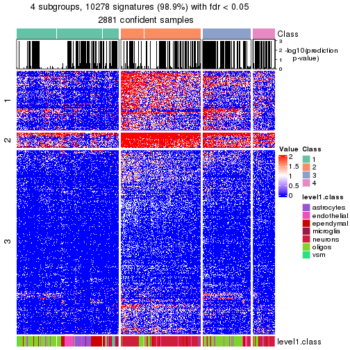</p>

</div>
</div>


Compare the overlap of signatures from different k:

```r
compare_signatures(res)
```


`get_signature()` returns a data frame invisibly. To get the list of signatures, the function
call should be assigned to a variable explicitly. In following code, if `plot` argument is set
to `FALSE`, no heatmap is plotted while only the differential analysis is performed.

```r
# code only for demonstration
tb = get_signature(res, k = ..., plot = FALSE)
```

An example of the output of `tb` is:

```
#>   which_row         fdr    mean_1    mean_2 scaled_mean_1 scaled_mean_2 km
#> 1        38 0.042760348  8.373488  9.131774    -0.5533452     0.5164555  1
#> 2        40 0.018707592  7.106213  8.469186    -0.6173731     0.5762149  1
#> 3        55 0.019134737 10.221463 11.207825    -0.6159697     0.5749050  1
#> 4        59 0.006059896  5.921854  7.869574    -0.6899429     0.6439467  1
#> 5        60 0.018055526  8.928898 10.211722    -0.6204761     0.5791110  1
#> 6        98 0.009384629 15.714769 14.887706     0.6635654    -0.6193277  2
...
```

The columns in `tb` are:

1. `which_row`: row indices corresponding to the input matrix.
2. `fdr`: FDR for the differential test. 
3. `mean_x`: The mean value in group x.
4. `scaled_mean_x`: The mean value in group x after rows are scaled.
5. `km`: Row groups if k-means clustering is applied to rows (which is done by automatically selecting number of clusters).

If there are too many signatures, `top_signatures = ...` can be set to only show the 
signatures with the highest FDRs:

```r
# code only for demonstration
# e.g. to show the top 500 most significant rows
tb = get_signature(res, k = ..., top_signatures = 500)
```

If the signatures are defined as these which are uniquely high in current group, `diff_method` argument
can be set to `"uniquely_high_in_one_group"`:

```r
# code only for demonstration
tb = get_signature(res, k = ..., diff_method = "uniquely_high_in_one_group")
```


UMAP plot which shows how samples are separated.


<script>
$( function() {
	$( '#tabs-node-0-dimension-reduction' ).tabs();
} );
</script>
<div id='tabs-node-0-dimension-reduction'>
<ul>
<li><a href='#tab-node-0-dimension-reduction-1'>k = 2</a></li>
<li><a href='#tab-node-0-dimension-reduction-2'>k = 3</a></li>
<li><a href='#tab-node-0-dimension-reduction-3'>k = 4</a></li>
</ul>
<div id='tab-node-0-dimension-reduction-1'>
<pre><code class="r">dimension_reduction(res, k = 2, method = &quot;UMAP&quot;)
</code></pre>

<p></p>

</div>
<div id='tab-node-0-dimension-reduction-2'>
<pre><code class="r">dimension_reduction(res, k = 3, method = &quot;UMAP&quot;)
</code></pre>

<p></p>

</div>
<div id='tab-node-0-dimension-reduction-3'>
<pre><code class="r">dimension_reduction(res, k = 4, method = &quot;UMAP&quot;)
</code></pre>

<p></p>

</div>
</div>


Following heatmap shows how subgroups are split when increasing `k`:

```r
collect_classes(res)
```


Test correlation between subgroups and known annotations. If the known
annotation is numeric, one-way ANOVA test is applied, and if the known
annotation is discrete, chi-squared contingency table test is applied.

```r
test_to_known_factors(res)
```

```
#>             n_sample level1.class(p-value) k
#> ATC:skmeans     2168             1.90e-307 2
#> ATC:skmeans     1745             1.06e-316 3
#> ATC:skmeans     1417             6.08e-269 4
```


If matrix rows can be associated to genes, consider to use `functional_enrichment(res,
...)` to perform function enrichment for the signature genes. See [this vignette](https://jokergoo.github.io/cola_vignettes/functional_enrichment.html) for more detailed explanations.


 

---------------------------------------------------


### Node01


Parent node: [Node0](#Node0).
Child nodes: 
                [Node011](#Node011)
        ,
                [Node012](#Node012)
        ,
                [Node013](#Node013)
        ,
                [Node014](#Node014)
        ,
                [Node021](#Node021)
        ,
                [Node022](#Node022)
        ,
                [Node023](#Node023)
        ,
                [Node031](#Node031)
        ,
                [Node032](#Node032)
        ,
                [Node033](#Node033)
        .


The object with results only for a single top-value method and a single partitioning method 
can be extracted as:

```r
res = res_rh["01"]
```

A summary of `res` and all the functions that can be applied to it:

```r
res
```

```
#> A 'DownSamplingConsensusPartition' object with k = 2, 3, 4.
#>   On a matrix with 10389 rows and 500 columns, randomly sampled from 1273 columns.
#>   Top rows (983) are extracted by 'ATC' method.
#>   Subgroups are detected by 'skmeans' method.
#>   Performed in total 150 partitions by row resampling.
#>   Best k for subgroups seems to be 4.
#> 
#> Following methods can be applied to this 'DownSamplingConsensusPartition' object:
#>  [1] "cola_report"             "collect_classes"         "collect_plots"          
#>  [4] "collect_stats"           "colnames"                "compare_partitions"     
#>  [7] "compare_signatures"      "consensus_heatmap"       "dimension_reduction"    
#> [10] "functional_enrichment"   "get_anno_col"            "get_anno"               
#> [13] "get_classes"             "get_consensus"           "get_matrix"             
#> [16] "get_membership"          "get_param"               "get_signatures"         
#> [19] "get_stats"               "is_best_k"               "is_stable_k"            
#> [22] "membership_heatmap"      "ncol"                    "nrow"                   
#> [25] "plot_ecdf"               "predict_classes"         "rownames"               
#> [28] "select_partition_number" "show"                    "suggest_best_k"         
#> [31] "test_to_known_factors"   "top_rows_heatmap"
```

`collect_plots()` function collects all the plots made from `res` for all `k` (number of subgroups)
into one single page to provide an easy and fast comparison between different `k`.

```r
collect_plots(res)
```


The plots are:

- The first row: a plot of the eCDF (empirical cumulative distribution
  function) curves of the consensus matrix for each `k` and the heatmap of
  predicted classes for each `k`.
- The second row: heatmaps of the consensus matrix for each `k`.
- The third row: heatmaps of the membership matrix for each `k`.
- The fouth row: heatmaps of the signatures for each `k`.

All the plots in panels can be made by individual functions and they are
plotted later in this section.

`select_partition_number()` produces several plots showing different
statistics for choosing "optimized" `k`. There are following statistics:

- eCDF curves of the consensus matrix for each `k`;
- 1-PAC. [The PAC score](https://en.wikipedia.org/wiki/Consensus_clustering#Over-interpretation_potential_of_consensus_clustering)
  measures the proportion of the ambiguous subgrouping.
- Mean silhouette score.
- Concordance. The mean probability of fiting the consensus subgroup labels in all
  partitions.
- Area increased. Denote $A_k$ as the area under the eCDF curve for current
  `k`, the area increased is defined as $A_k - A_{k-1}$.
- Rand index. The percent of pairs of samples that are both in a same cluster
  or both are not in a same cluster in the partition of k and k-1.
- Jaccard index. The ratio of pairs of samples are both in a same cluster in
  the partition of k and k-1 and the pairs of samples are both in a same
  cluster in the partition k or k-1.

The detailed explanations of these statistics can be found in [the _cola_
vignette](https://jokergoo.github.io/cola_vignettes/cola.html#toc_13).

Generally speaking, higher 1-PAC score, higher mean silhouette score or higher
concordance corresponds to better partition. Rand index and Jaccard index
measure how similar the current partition is compared to partition with `k-1`.
If they are too similar, we won't accept `k` is better than `k-1`.

```r
select_partition_number(res)
```


The numeric values for all these statistics can be obtained by `get_stats()`.

```r
get_stats(res)
```

```
#>   k 1-PAC mean_silhouette concordance area_increased  Rand Jaccard
#> 2 2     1           0.995       0.998         0.4763 0.524   0.524
#> 3 3     1           0.969       0.984         0.3815 0.802   0.627
#> 4 4     1           0.972       0.989         0.0869 0.918   0.769
```

`suggest_best_k()` suggests the best $k$ based on these statistics. The rules are as follows:

- All $k$ with Jaccard index larger than 0.95 are removed because increasing
  $k$ does not provide enough extra information. If all $k$ are removed, it is
  marked as no subgroup is detected.
- For all $k$ with 1-PAC score larger than 0.9, the maximal $k$ is taken as
  the best $k$, and other $k$ are marked as optional $k$.
- If it does not fit the second rule. The $k$ with the maximal vote of the
  highest 1-PAC score, highest mean silhouette, and highest concordance is
  taken as the best $k$.

```r
suggest_best_k(res)
```

```
#> [1] 4
#> attr(,"optional")
#> [1] 2 3
```

There is also optional best $k$ = 2 3 that is worth to check.

Following is the table of the partitions (You need to click the **show/hide
code output** link to see it). The membership matrix (columns with name `p*`)
is inferred by
[`clue::cl_consensus()`](https://www.rdocumentation.org/link/cl_consensus?package=clue)
function with the `SE` method. Basically the value in the membership matrix
represents the probability to belong to a certain group. The finall subgroup
label for an item is determined with the group with highest probability it
belongs to.

In `get_classes()` function, the entropy is calculated from the membership
matrix and the silhouette score is calculated from the consensus matrix.


<script>
$( function() {
	$( '#tabs-node-01-get-classes' ).tabs();
} );
</script>
<div id='tabs-node-01-get-classes'>
<ul>
<li><a href='#tab-node-01-get-classes-1'>k = 2</a></li>
<li><a href='#tab-node-01-get-classes-2'>k = 3</a></li>
<li><a href='#tab-node-01-get-classes-3'>k = 4</a></li>
</ul>

<div id='tab-node-01-get-classes-1'>
<p><a id='tab-node-01-get-classes-1-a' style='color:#0366d6' href='#'>show/hide code output</a></p>
<pre><code class="r">get_classes(res, k = 2)
</code></pre>

<pre><code>#&gt;      class     p
#&gt; 1        2 1.000
#&gt; 2        2 1.000
#&gt; 3        2 0.000
#&gt; 4        2 1.000
#&gt; 5        1 0.000
#&gt; 6        2 1.000
#&gt; 7        2 1.000
#&gt; 8        2 1.000
#&gt; 9        1 0.000
#&gt; 10       2 1.000
#&gt; 11       2 1.000
#&gt; 12       2 1.000
#&gt; 13       2 1.000
#&gt; 14       2 0.751
#&gt; 15       1 0.000
#&gt; 16       2 1.000
#&gt; 17       1 0.000
#&gt; 18       2 1.000
#&gt; 19       2 1.000
#&gt; 20       2 1.000
#&gt; 21       1 0.751
#&gt; 22       1 1.000
#&gt; 23       2 1.000
#&gt; 24       1 0.000
#&gt; 25       1 0.000
#&gt; 26       1 0.000
#&gt; 27       2 1.000
#&gt; 28       1 0.000
#&gt; 29       1 0.000
#&gt; 30       1 0.000
#&gt; 31       2 1.000
#&gt; 32       1 0.253
#&gt; 33       1 0.000
#&gt; 34       1 0.000
#&gt; 35       1 0.000
#&gt; 36       1 0.000
#&gt; 37       1 0.000
#&gt; 38       2 0.751
#&gt; 39       2 1.000
#&gt; 40       2 1.000
#&gt; 41       1 0.000
#&gt; 42       1 0.000
#&gt; 43       1 0.000
#&gt; 44       1 1.000
#&gt; 45       1 0.000
#&gt; 46       1 0.000
#&gt; 47       1 0.000
#&gt; 48       1 0.000
#&gt; 49       1 0.000
#&gt; 50       1 0.000
#&gt; 51       1 0.000
#&gt; 52       1 0.000
#&gt; 53       1 0.000
#&gt; 54       2 1.000
#&gt; 55       1 0.253
#&gt; 56       1 0.000
#&gt; 57       1 0.000
#&gt; 58       1 0.000
#&gt; 59       1 0.000
#&gt; 60       1 0.000
#&gt; 61       1 0.000
#&gt; 62       1 0.000
#&gt; 63       1 0.000
#&gt; 64       1 1.000
#&gt; 65       1 0.000
#&gt; 66       2 1.000
#&gt; 67       2 1.000
#&gt; 68       2 0.502
#&gt; 69       1 0.000
#&gt; 70       1 0.000
#&gt; 71       1 0.000
#&gt; 72       1 0.000
#&gt; 73       1 0.000
#&gt; 74       1 0.000
#&gt; 75       1 0.000
#&gt; 76       2 1.000
#&gt; 77       1 0.000
#&gt; 78       1 0.000
#&gt; 79       1 0.000
#&gt; 80       2 1.000
#&gt; 81       1 1.000
#&gt; 82       1 0.000
#&gt; 83       1 0.751
#&gt; 84       1 0.000
#&gt; 85       1 0.000
#&gt; 86       1 0.000
#&gt; 87       1 0.000
#&gt; 88       2 1.000
#&gt; 89       2 1.000
#&gt; 90       2 1.000
#&gt; 91       2 1.000
#&gt; 92       1 0.000
#&gt; 93       1 0.000
#&gt; 94       1 0.000
#&gt; 95       1 0.000
#&gt; 96       1 0.000
#&gt; 97       1 0.000
#&gt; 98       1 0.000
#&gt; 99       1 0.000
#&gt; 100      1 0.000
#&gt; 101      1 0.000
#&gt; 102      1 0.000
#&gt; 103      1 0.000
#&gt; 104      1 0.000
#&gt; 105      1 0.000
#&gt; 106      1 0.000
#&gt; 107      1 0.000
#&gt; 108      1 0.000
#&gt; 109      1 0.000
#&gt; 110      1 0.000
#&gt; 111      1 0.000
#&gt; 112      1 0.000
#&gt; 113      1 0.000
#&gt; 114      1 0.000
#&gt; 115      1 0.000
#&gt; 116      1 0.000
#&gt; 117      1 0.000
#&gt; 118      1 0.000
#&gt; 119      1 0.000
#&gt; 120      1 0.000
#&gt; 121      1 0.000
#&gt; 122      1 0.000
#&gt; 123      1 0.000
#&gt; 124      1 0.000
#&gt; 125      1 0.000
#&gt; 126      1 0.000
#&gt; 127      1 0.000
#&gt; 128      1 0.000
#&gt; 129      1 0.000
#&gt; 130      1 0.000
#&gt; 131      1 0.000
#&gt; 132      1 0.000
#&gt; 133      1 0.000
#&gt; 134      1 0.000
#&gt; 135      1 0.000
#&gt; 136      1 0.000
#&gt; 137      1 0.000
#&gt; 138      1 0.000
#&gt; 139      1 0.000
#&gt; 140      1 0.000
#&gt; 141      1 0.000
#&gt; 142      1 0.000
#&gt; 143      1 0.000
#&gt; 144      1 0.000
#&gt; 145      1 0.000
#&gt; 146      1 0.000
#&gt; 147      1 0.000
#&gt; 148      1 0.000
#&gt; 149      1 0.000
#&gt; 150      1 0.000
#&gt; 151      1 0.000
#&gt; 152      1 0.000
#&gt; 153      1 0.000
#&gt; 154      1 0.000
#&gt; 155      1 0.000
#&gt; 156      1 0.000
#&gt; 157      1 0.000
#&gt; 158      1 0.000
#&gt; 159      1 0.000
#&gt; 160      1 0.000
#&gt; 161      1 0.000
#&gt; 162      1 0.000
#&gt; 163      1 0.000
#&gt; 164      1 0.000
#&gt; 165      1 0.000
#&gt; 166      1 0.000
#&gt; 167      1 0.000
#&gt; 168      1 0.000
#&gt; 169      1 0.000
#&gt; 170      1 0.000
#&gt; 171      1 0.000
#&gt; 172      1 0.000
#&gt; 173      1 0.000
#&gt; 174      1 0.000
#&gt; 175      1 0.000
#&gt; 176      1 0.000
#&gt; 177      1 0.000
#&gt; 178      1 0.000
#&gt; 179      1 0.000
#&gt; 180      1 0.000
#&gt; 181      1 0.000
#&gt; 182      1 0.000
#&gt; 183      1 0.000
#&gt; 184      1 0.000
#&gt; 185      1 0.000
#&gt; 186      1 0.000
#&gt; 187      1 0.000
#&gt; 188      1 0.000
#&gt; 189      1 0.000
#&gt; 190      1 0.000
#&gt; 191      1 0.000
#&gt; 192      1 0.000
#&gt; 193      1 0.000
#&gt; 194      1 0.000
#&gt; 195      1 0.000
#&gt; 196      1 0.000
#&gt; 197      1 0.000
#&gt; 198      1 0.000
#&gt; 199      1 0.000
#&gt; 200      1 0.000
#&gt; 201      1 0.000
#&gt; 202      1 0.000
#&gt; 203      1 0.000
#&gt; 204      1 0.000
#&gt; 205      1 0.000
#&gt; 206      1 0.000
#&gt; 207      1 0.000
#&gt; 208      1 0.000
#&gt; 209      1 0.000
#&gt; 210      1 0.000
#&gt; 211      1 0.000
#&gt; 212      1 0.000
#&gt; 213      1 0.000
#&gt; 214      1 0.000
#&gt; 215      1 0.000
#&gt; 216      1 0.000
#&gt; 217      1 0.000
#&gt; 218      1 0.000
#&gt; 219      1 0.000
#&gt; 220      1 0.000
#&gt; 221      1 0.000
#&gt; 222      1 0.000
#&gt; 223      1 0.000
#&gt; 224      1 0.000
#&gt; 225      1 0.000
#&gt; 226      1 0.000
#&gt; 227      1 0.000
#&gt; 228      1 0.000
#&gt; 229      1 0.000
#&gt; 230      1 0.000
#&gt; 231      1 0.000
#&gt; 232      1 0.000
#&gt; 233      1 0.000
#&gt; 234      1 0.000
#&gt; 235      1 0.000
#&gt; 236      1 0.000
#&gt; 237      1 0.000
#&gt; 238      1 0.000
#&gt; 239      1 0.000
#&gt; 240      1 0.000
#&gt; 241      1 0.000
#&gt; 242      1 0.000
#&gt; 243      1 0.000
#&gt; 244      1 0.000
#&gt; 245      1 0.000
#&gt; 246      1 0.000
#&gt; 247      1 0.000
#&gt; 248      1 0.000
#&gt; 249      1 0.000
#&gt; 250      1 0.000
#&gt; 251      1 0.000
#&gt; 252      1 0.000
#&gt; 253      1 0.000
#&gt; 254      1 0.000
#&gt; 255      1 0.000
#&gt; 256      1 0.000
#&gt; 257      1 0.000
#&gt; 258      1 0.000
#&gt; 259      1 0.000
#&gt; 260      1 0.000
#&gt; 261      1 0.000
#&gt; 262      1 0.000
#&gt; 263      1 0.000
#&gt; 264      1 0.000
#&gt; 265      1 0.000
#&gt; 266      1 0.000
#&gt; 267      1 0.000
#&gt; 268      1 0.000
#&gt; 269      1 0.000
#&gt; 270      1 0.000
#&gt; 271      1 0.000
#&gt; 272      1 0.000
#&gt; 273      1 0.000
#&gt; 274      1 0.000
#&gt; 275      1 0.000
#&gt; 276      1 0.000
#&gt; 277      1 0.000
#&gt; 278      1 0.000
#&gt; 279      1 0.000
#&gt; 280      1 0.000
#&gt; 281      1 0.000
#&gt; 282      1 0.000
#&gt; 283      1 0.000
#&gt; 284      1 0.000
#&gt; 285      1 0.000
#&gt; 286      1 0.000
#&gt; 287      1 0.000
#&gt; 288      1 0.000
#&gt; 289      1 0.000
#&gt; 290      1 0.000
#&gt; 291      1 0.000
#&gt; 292      1 0.000
#&gt; 293      1 0.000
#&gt; 294      1 0.000
#&gt; 295      1 0.000
#&gt; 296      1 0.000
#&gt; 297      1 0.000
#&gt; 298      1 0.000
#&gt; 299      1 0.000
#&gt; 300      1 0.000
#&gt; 301      1 0.000
#&gt; 302      1 0.000
#&gt; 303      1 0.000
#&gt; 304      1 0.000
#&gt; 305      1 0.000
#&gt; 306      1 0.000
#&gt; 307      1 0.000
#&gt; 308      1 0.000
#&gt; 309      1 0.000
#&gt; 310      1 0.000
#&gt; 311      1 0.000
#&gt; 312      1 0.000
#&gt; 313      1 0.000
#&gt; 314      1 0.000
#&gt; 315      1 0.000
#&gt; 316      1 0.000
#&gt; 317      1 0.000
#&gt; 318      1 0.000
#&gt; 319      1 0.000
#&gt; 320      1 0.000
#&gt; 321      1 0.000
#&gt; 322      1 0.000
#&gt; 323      2 1.000
#&gt; 324      1 0.000
#&gt; 325      1 0.000
#&gt; 326      1 0.000
#&gt; 327      1 1.000
#&gt; 328      1 0.000
#&gt; 329      1 0.000
#&gt; 330      1 0.000
#&gt; 331      1 0.000
#&gt; 332      1 0.000
#&gt; 333      1 0.000
#&gt; 334      1 0.000
#&gt; 335      1 0.000
#&gt; 336      1 0.000
#&gt; 337      1 0.000
#&gt; 338      1 0.000
#&gt; 339      1 0.000
#&gt; 340      1 0.249
#&gt; 341      2 1.000
#&gt; 342      1 0.000
#&gt; 343      1 0.000
#&gt; 344      1 0.000
#&gt; 345      1 0.000
#&gt; 346      1 0.000
#&gt; 347      1 0.000
#&gt; 348      1 0.000
#&gt; 349      1 0.000
#&gt; 350      2 1.000
#&gt; 351      1 1.000
#&gt; 352      1 0.000
#&gt; 353      1 0.000
#&gt; 354      1 0.000
#&gt; 355      1 0.000
#&gt; 356      2 1.000
#&gt; 357      1 0.000
#&gt; 358      1 0.000
#&gt; 359      1 0.000
#&gt; 360      1 0.000
#&gt; 361      1 0.000
#&gt; 362      1 0.000
#&gt; 363      1 0.000
#&gt; 364      1 0.000
#&gt; 365      1 0.000
#&gt; 366      1 0.000
#&gt; 367      1 1.000
#&gt; 368      1 0.000
#&gt; 369      1 0.000
#&gt; 370      1 0.000
#&gt; 371      1 0.000
#&gt; 372      1 0.000
#&gt; 373      1 0.000
#&gt; 374      1 0.000
#&gt; 375      1 0.000
#&gt; 376      1 0.000
#&gt; 377      1 0.000
#&gt; 378      1 0.000
#&gt; 379      1 0.000
#&gt; 380      1 1.000
#&gt; 381      1 0.000
#&gt; 382      1 0.000
#&gt; 383      1 0.000
#&gt; 384      1 0.000
#&gt; 385      2 1.000
#&gt; 386      1 0.000
#&gt; 387      1 0.000
#&gt; 388      1 0.000
#&gt; 389      1 0.000
#&gt; 390      1 0.000
#&gt; 391      1 0.000
#&gt; 392      1 0.498
#&gt; 393      1 1.000
#&gt; 394      1 1.000
#&gt; 395      1 1.000
#&gt; 396      1 1.000
#&gt; 397      1 0.000
#&gt; 398      1 0.000
#&gt; 399      1 0.000
#&gt; 400      1 0.000
#&gt; 401      1 0.000
#&gt; 402      1 0.000
#&gt; 403      1 0.000
#&gt; 404      1 0.000
#&gt; 405      1 0.000
#&gt; 406      1 0.000
#&gt; 407      1 0.000
#&gt; 408      1 0.000
#&gt; 409      1 0.000
#&gt; 410      1 0.000
#&gt; 411      2 1.000
#&gt; 412      2 1.000
#&gt; 413      2 1.000
#&gt; 414      1 0.000
#&gt; 415      1 0.502
#&gt; 416      1 0.000
#&gt; 417      1 0.000
#&gt; 418      1 0.000
#&gt; 419      1 0.000
#&gt; 420      1 0.000
#&gt; 421      1 0.000
#&gt; 422      1 0.000
#&gt; 423      1 0.000
#&gt; 424      1 0.000
#&gt; 425      1 0.000
#&gt; 426      1 0.000
#&gt; 427      1 0.000
#&gt; 428      1 0.000
#&gt; 429      1 0.253
#&gt; 430      1 0.000
#&gt; 431      1 0.000
#&gt; 432      1 0.000
#&gt; 433      1 1.000
#&gt; 434      1 0.000
#&gt; 435      1 0.000
#&gt; 436      1 0.000
#&gt; 437      1 0.000
#&gt; 438      1 0.000
#&gt; 439      1 0.000
#&gt; 440      1 0.000
#&gt; 441      1 0.000
#&gt; 442      1 0.000
#&gt; 443      1 0.000
#&gt; 444      1 0.000
#&gt; 445      1 0.000
#&gt; 446      1 0.000
#&gt; 447      1 0.000
#&gt; 448      1 0.751
#&gt; 449      1 0.000
#&gt; 450      1 0.000
#&gt; 451      1 0.000
#&gt; 452      1 0.000
#&gt; 453      1 1.000
#&gt; 454      1 1.000
#&gt; 455      1 0.000
#&gt; 456      2 1.000
#&gt; 457      1 0.000
#&gt; 458      1 0.249
#&gt; 459      1 0.000
#&gt; 460      1 0.000
#&gt; 461      1 0.000
#&gt; 462      1 0.000
#&gt; 463      1 0.000
#&gt; 464      1 0.000
#&gt; 465      1 0.000
#&gt; 466      1 0.000
#&gt; 467      1 0.000
#&gt; 468      1 0.000
#&gt; 469      1 0.000
#&gt; 470      1 0.000
#&gt; 471      1 0.000
#&gt; 472      2 0.000
#&gt; 473      2 0.000
#&gt; 474      2 0.000
#&gt; 475      2 0.000
#&gt; 476      2 0.000
#&gt; 477      2 0.000
#&gt; 478      2 0.000
#&gt; 479      2 0.000
#&gt; 480      2 0.000
#&gt; 481      2 0.000
#&gt; 482      2 0.000
#&gt; 483      2 0.000
#&gt; 484      2 0.000
#&gt; 485      2 0.000
#&gt; 486      2 0.000
#&gt; 487      2 0.000
#&gt; 488      2 0.000
#&gt; 489      2 0.000
#&gt; 490      2 0.000
#&gt; 491      2 0.000
#&gt; 492      2 0.000
#&gt; 493      2 0.000
#&gt; 494      2 0.000
#&gt; 495      2 0.000
#&gt; 496      2 0.000
#&gt; 497      2 0.000
#&gt; 498      2 0.000
#&gt; 499      2 0.000
#&gt; 500      2 0.000
#&gt; 501      2 0.000
#&gt; 502      2 0.000
#&gt; 503      2 0.000
#&gt; 504      2 0.000
#&gt; 505      2 0.000
#&gt; 506      1 0.502
#&gt; 507      2 0.000
#&gt; 508      2 0.000
#&gt; 509      2 0.000
#&gt; 510      2 0.000
#&gt; 511      2 0.000
#&gt; 512      2 0.000
#&gt; 513      1 1.000
#&gt; 514      2 0.000
#&gt; 515      2 0.000
#&gt; 516      2 0.000
#&gt; 517      2 0.000
#&gt; 518      2 0.000
#&gt; 519      2 0.000
#&gt; 520      2 0.000
#&gt; 521      1 0.000
#&gt; 522      2 0.000
#&gt; 523      2 0.000
#&gt; 524      2 0.000
#&gt; 525      2 0.000
#&gt; 526      2 0.000
#&gt; 527      2 0.000
#&gt; 528      2 0.000
#&gt; 529      2 0.000
#&gt; 530      2 0.000
#&gt; 531      2 0.000
#&gt; 532      2 0.000
#&gt; 533      2 0.000
#&gt; 534      2 0.000
#&gt; 535      2 0.000
#&gt; 536      2 0.000
#&gt; 537      2 0.000
#&gt; 538      2 0.000
#&gt; 539      2 0.000
#&gt; 540      2 0.000
#&gt; 541      2 0.000
#&gt; 542      2 0.000
#&gt; 543      2 0.000
#&gt; 544      2 0.000
#&gt; 545      2 0.000
#&gt; 546      2 0.000
#&gt; 547      2 0.000
#&gt; 548      2 0.000
#&gt; 549      2 0.000
#&gt; 550      2 0.000
#&gt; 551      2 0.000
#&gt; 552      1 0.000
#&gt; 553      2 0.000
#&gt; 554      2 0.000
#&gt; 555      2 0.000
#&gt; 556      2 0.000
#&gt; 557      2 0.000
#&gt; 558      2 0.000
#&gt; 559      2 0.000
#&gt; 560      2 0.000
#&gt; 561      2 0.000
#&gt; 562      2 0.000
#&gt; 563      2 0.000
#&gt; 564      2 0.000
#&gt; 565      2 0.000
#&gt; 566      2 0.000
#&gt; 567      2 0.000
#&gt; 568      2 0.000
#&gt; 569      2 0.000
#&gt; 570      2 0.000
#&gt; 571      2 0.000
#&gt; 572      2 0.000
#&gt; 573      2 0.000
#&gt; 574      2 0.000
#&gt; 575      2 0.000
#&gt; 576      2 0.000
#&gt; 577      2 0.000
#&gt; 578      2 0.000
#&gt; 579      2 0.000
#&gt; 580      2 0.000
#&gt; 581      2 0.000
#&gt; 582      2 0.000
#&gt; 583      2 0.000
#&gt; 584      2 0.000
#&gt; 585      2 0.000
#&gt; 586      2 0.000
#&gt; 587      1 0.751
#&gt; 588      1 1.000
#&gt; 589      2 0.000
#&gt; 590      2 0.000
#&gt; 591      2 0.000
#&gt; 592      2 0.000
#&gt; 593      2 0.000
#&gt; 594      2 0.000
#&gt; 595      2 0.000
#&gt; 596      2 0.000
#&gt; 597      1 0.000
#&gt; 598      2 0.000
#&gt; 599      2 0.000
#&gt; 600      2 1.000
#&gt; 601      2 0.000
#&gt; 602      2 0.000
#&gt; 603      2 0.000
#&gt; 604      2 0.000
#&gt; 605      2 0.000
#&gt; 606      2 0.000
#&gt; 607      2 0.000
#&gt; 608      2 0.000
#&gt; 609      2 0.000
#&gt; 610      2 0.000
#&gt; 611      2 0.000
#&gt; 612      2 0.000
#&gt; 613      1 0.000
#&gt; 614      1 0.747
#&gt; 615      1 0.000
#&gt; 616      2 0.000
#&gt; 617      2 0.000
#&gt; 618      2 0.000
#&gt; 619      2 0.000
#&gt; 620      1 0.000
#&gt; 621      1 0.000
#&gt; 622      1 0.000
#&gt; 623      2 0.000
#&gt; 624      1 0.000
#&gt; 625      2 0.000
#&gt; 626      1 0.751
#&gt; 627      1 0.000
#&gt; 628      2 0.000
#&gt; 629      2 0.000
#&gt; 630      2 0.000
#&gt; 631      2 0.000
#&gt; 632      2 0.000
#&gt; 633      2 0.000
#&gt; 634      2 0.000
#&gt; 635      1 0.498
#&gt; 636      2 0.000
#&gt; 637      2 0.000
#&gt; 638      1 0.000
#&gt; 639      2 0.000
#&gt; 640      2 0.000
#&gt; 641      2 0.000
#&gt; 642      2 0.000
#&gt; 643      2 0.000
#&gt; 644      2 0.000
#&gt; 645      2 0.000
#&gt; 646      2 1.000
#&gt; 647      2 0.000
#&gt; 648      2 0.000
#&gt; 649      2 0.000
#&gt; 650      2 0.000
#&gt; 651      2 0.000
#&gt; 652      2 0.000
#&gt; 653      2 0.000
#&gt; 654      2 0.000
#&gt; 655      2 0.000
#&gt; 656      2 0.000
#&gt; 657      1 0.000
#&gt; 658      2 0.000
#&gt; 659      2 0.000
#&gt; 660      2 0.000
#&gt; 661      2 0.000
#&gt; 662      2 0.000
#&gt; 663      2 0.000
#&gt; 664      2 0.000
#&gt; 665      2 0.000
#&gt; 666      2 0.000
#&gt; 667      1 0.000
#&gt; 668      2 0.000
#&gt; 669      2 0.000
#&gt; 670      2 0.000
#&gt; 671      2 0.000
#&gt; 672      2 0.000
#&gt; 673      2 0.000
#&gt; 674      2 0.000
#&gt; 675      2 0.000
#&gt; 676      2 0.000
#&gt; 677      2 0.000
#&gt; 678      1 0.000
#&gt; 679      2 0.000
#&gt; 680      1 0.000
#&gt; 681      1 0.000
#&gt; 682      2 0.000
#&gt; 683      2 0.000
#&gt; 684      2 0.000
#&gt; 685      2 0.000
#&gt; 686      2 0.000
#&gt; 687      1 0.000
#&gt; 688      1 0.000
#&gt; 689      2 0.000
#&gt; 690      2 0.000
#&gt; 691      1 0.000
#&gt; 692      2 0.000
#&gt; 693      1 0.000
#&gt; 694      1 0.000
#&gt; 695      1 0.000
#&gt; 696      2 0.000
#&gt; 697      2 0.000
#&gt; 698      2 0.000
#&gt; 699      2 0.000
#&gt; 700      2 0.000
#&gt; 701      2 0.000
#&gt; 702      1 0.000
#&gt; 703      1 0.000
#&gt; 704      2 0.000
#&gt; 705      2 0.000
#&gt; 706      2 0.000
#&gt; 707      2 0.000
#&gt; 708      2 0.000
#&gt; 709      2 0.000
#&gt; 710      2 0.000
#&gt; 711      2 0.000
#&gt; 712      2 0.000
#&gt; 713      2 0.000
#&gt; 714      2 0.000
#&gt; 715      2 0.000
#&gt; 716      2 0.000
#&gt; 717      2 0.000
#&gt; 718      2 0.000
#&gt; 719      2 0.000
#&gt; 720      2 0.000
#&gt; 721      2 0.000
#&gt; 722      2 0.000
#&gt; 723      2 0.000
#&gt; 724      2 0.000
#&gt; 725      2 0.000
#&gt; 726      2 0.000
#&gt; 727      2 0.000
#&gt; 728      2 0.000
#&gt; 729      2 0.000
#&gt; 730      2 0.000
#&gt; 731      2 0.000
#&gt; 732      2 0.000
#&gt; 733      2 0.000
#&gt; 734      2 0.000
#&gt; 735      2 0.000
#&gt; 736      2 0.000
#&gt; 737      2 0.000
#&gt; 738      2 0.000
#&gt; 739      2 0.000
#&gt; 740      2 0.000
#&gt; 741      2 0.000
#&gt; 742      2 0.000
#&gt; 743      2 0.000
#&gt; 744      2 0.000
#&gt; 745      2 0.000
#&gt; 746      2 0.000
#&gt; 747      2 0.000
#&gt; 748      2 0.000
#&gt; 749      2 0.000
#&gt; 750      2 0.000
#&gt; 751      2 0.000
#&gt; 752      2 0.000
#&gt; 753      2 0.000
#&gt; 754      2 0.000
#&gt; 755      2 0.000
#&gt; 756      2 0.000
#&gt; 757      2 0.000
#&gt; 758      2 0.000
#&gt; 759      2 0.000
#&gt; 760      2 0.000
#&gt; 761      2 0.000
#&gt; 762      2 0.000
#&gt; 763      2 0.000
#&gt; 764      2 0.000
#&gt; 765      2 0.000
#&gt; 766      2 0.000
#&gt; 767      2 0.000
#&gt; 768      2 0.000
#&gt; 769      2 0.000
#&gt; 770      2 0.000
#&gt; 771      2 0.000
#&gt; 772      2 0.000
#&gt; 773      2 0.000
#&gt; 774      2 0.000
#&gt; 775      2 0.000
#&gt; 776      2 0.000
#&gt; 777      2 0.000
#&gt; 778      2 0.000
#&gt; 779      2 0.000
#&gt; 780      2 0.000
#&gt; 781      2 0.000
#&gt; 782      2 0.000
#&gt; 783      2 0.000
#&gt; 784      2 0.000
#&gt; 785      2 0.000
#&gt; 786      2 0.000
#&gt; 787      2 0.000
#&gt; 788      2 0.000
#&gt; 789      2 0.000
#&gt; 790      2 0.000
#&gt; 791      2 0.000
#&gt; 792      2 0.000
#&gt; 793      2 0.000
#&gt; 794      2 0.000
#&gt; 795      2 0.000
#&gt; 796      2 0.000
#&gt; 797      2 0.000
#&gt; 798      2 0.000
#&gt; 799      2 0.000
#&gt; 800      2 0.000
#&gt; 801      2 0.000
#&gt; 802      2 0.000
#&gt; 803      2 0.000
#&gt; 804      2 0.000
#&gt; 805      2 0.000
#&gt; 806      2 0.000
#&gt; 807      2 0.000
#&gt; 808      2 0.000
#&gt; 809      2 0.000
#&gt; 810      2 0.000
#&gt; 811      2 0.000
#&gt; 812      2 0.000
#&gt; 813      2 0.000
#&gt; 814      2 0.000
#&gt; 815      2 0.000
#&gt; 816      2 0.000
#&gt; 817      1 0.000
#&gt; 818      2 0.000
#&gt; 819      2 0.000
#&gt; 820      2 0.000
#&gt; 821      2 0.000
#&gt; 822      2 0.000
#&gt; 823      2 0.000
#&gt; 824      2 0.000
#&gt; 825      2 0.000
#&gt; 826      2 0.000
#&gt; 827      2 0.000
#&gt; 828      2 0.000
#&gt; 829      2 0.000
#&gt; 830      2 0.000
#&gt; 831      2 0.000
#&gt; 832      2 0.000
#&gt; 833      2 0.000
#&gt; 834      2 0.000
#&gt; 835      2 0.000
#&gt; 836      2 0.000
#&gt; 837      2 0.000
#&gt; 838      2 0.000
#&gt; 839      2 0.000
#&gt; 840      2 0.000
#&gt; 841      2 0.000
#&gt; 842      2 0.000
#&gt; 843      2 0.000
#&gt; 844      2 1.000
#&gt; 845      2 0.000
#&gt; 846      1 0.000
#&gt; 847      1 0.000
#&gt; 848      1 0.000
#&gt; 849      2 0.000
#&gt; 850      2 0.000
#&gt; 851      2 0.000
#&gt; 852      1 0.000
#&gt; 853      2 0.000
#&gt; 854      2 0.000
#&gt; 855      2 0.000
#&gt; 856      2 0.000
#&gt; 857      1 0.000
#&gt; 858      2 0.000
#&gt; 859      2 0.000
#&gt; 860      2 0.000
#&gt; 861      2 0.000
#&gt; 862      2 0.000
#&gt; 863      2 0.000
#&gt; 864      2 0.000
#&gt; 865      2 0.000
#&gt; 866      2 1.000
#&gt; 867      2 0.000
#&gt; 868      2 0.000
#&gt; 869      1 0.000
#&gt; 870      2 0.000
#&gt; 871      2 0.000
#&gt; 872      2 0.000
#&gt; 873      2 0.000
#&gt; 874      1 0.000
#&gt; 875      2 0.000
#&gt; 876      2 0.000
#&gt; 877      2 0.000
#&gt; 878      2 0.000
#&gt; 879      2 0.000
#&gt; 880      2 0.000
#&gt; 881      2 0.000
#&gt; 882      2 0.000
#&gt; 883      2 0.000
#&gt; 884      2 0.000
#&gt; 885      2 0.000
#&gt; 886      2 0.000
#&gt; 887      1 0.249
#&gt; 888      2 0.000
#&gt; 889      2 0.000
#&gt; 890      2 0.000
#&gt; 891      2 0.000
#&gt; 892      2 0.000
#&gt; 893      1 1.000
#&gt; 894      2 0.000
#&gt; 895      1 0.000
#&gt; 896      1 0.000
#&gt; 897      2 0.000
#&gt; 898      2 0.000
#&gt; 899      2 1.000
#&gt; 900      2 0.000
#&gt; 901      2 0.000
#&gt; 902      2 0.000
#&gt; 903      2 0.000
#&gt; 904      2 0.000
#&gt; 905      2 0.000
#&gt; 906      2 0.000
#&gt; 907      2 0.000
#&gt; 908      2 0.000
#&gt; 909      2 0.000
#&gt; 910      1 0.253
#&gt; 911      2 0.000
#&gt; 912      2 0.000
#&gt; 913      2 0.000
#&gt; 914      2 0.000
#&gt; 915      2 0.000
#&gt; 916      2 0.000
#&gt; 917      2 0.000
#&gt; 918      1 0.000
#&gt; 919      1 0.000
#&gt; 920      1 0.000
#&gt; 921      2 0.000
#&gt; 922      2 0.000
#&gt; 923      2 0.000
#&gt; 924      2 0.000
#&gt; 925      2 0.000
#&gt; 926      2 0.000
#&gt; 927      2 0.000
#&gt; 928      2 0.000
#&gt; 929      2 0.000
#&gt; 930      2 0.000
#&gt; 931      2 0.000
#&gt; 932      2 0.000
#&gt; 933      1 0.000
#&gt; 934      2 0.000
#&gt; 935      2 0.000
#&gt; 936      2 0.000
#&gt; 937      2 0.249
#&gt; 938      2 0.000
#&gt; 939      2 0.000
#&gt; 940      2 0.000
#&gt; 941      2 0.000
#&gt; 942      2 0.000
#&gt; 943      2 0.000
#&gt; 944      2 0.000
#&gt; 945      2 0.000
#&gt; 946      2 0.000
#&gt; 947      2 0.000
#&gt; 948      2 0.000
#&gt; 949      2 0.000
#&gt; 950      2 0.000
#&gt; 951      2 0.000
#&gt; 952      2 0.000
#&gt; 953      2 0.000
#&gt; 954      2 0.000
#&gt; 955      2 0.000
#&gt; 956      2 0.000
#&gt; 957      2 0.000
#&gt; 958      1 0.000
#&gt; 959      2 1.000
#&gt; 960      1 0.000
#&gt; 961      1 0.000
#&gt; 962      2 0.000
#&gt; 963      2 0.249
#&gt; 964      2 0.000
#&gt; 965      2 0.000
#&gt; 966      2 0.000
#&gt; 967      2 0.000
#&gt; 968      2 0.000
#&gt; 969      2 0.000
#&gt; 970      2 0.000
#&gt; 971      2 0.000
#&gt; 972      2 0.000
#&gt; 973      2 0.000
#&gt; 974      2 0.000
#&gt; 975      2 0.000
#&gt; 976      2 0.000
#&gt; 977      2 0.000
#&gt; 978      2 0.249
#&gt; 979      1 0.000
#&gt; 980      1 0.000
#&gt; 981      2 0.000
#&gt; 982      2 0.000
#&gt; 983      2 0.000
#&gt; 984      2 0.000
#&gt; 985      2 0.000
#&gt; 986      2 0.000
#&gt; 987      1 0.249
#&gt; 988      2 0.000
#&gt; 989      1 0.000
#&gt; 990      2 0.000
#&gt; 991      2 0.000
#&gt; 992      2 0.000
#&gt; 993      2 0.000
#&gt; 994      2 0.000
#&gt; 995      2 0.000
#&gt; 996      2 0.000
#&gt; 997      1 0.000
#&gt; 998      2 0.000
#&gt; 999      2 1.000
#&gt; 1000     1 0.000
#&gt; 1001     2 0.000
#&gt; 1002     2 0.000
#&gt; 1003     2 0.000
#&gt; 1004     2 0.000
#&gt; 1005     2 0.000
#&gt; 1006     2 0.000
#&gt; 1007     2 0.000
#&gt; 1008     2 0.000
#&gt; 1009     2 0.000
#&gt; 1010     2 0.000
#&gt; 1011     2 0.000
#&gt; 1012     2 0.000
#&gt; 1013     2 0.000
#&gt; 1014     2 0.000
#&gt; 1015     2 0.000
#&gt; 1016     2 0.000
#&gt; 1017     2 0.000
#&gt; 1018     2 0.000
#&gt; 1019     2 0.253
#&gt; 1020     2 0.000
#&gt; 1021     2 0.000
#&gt; 1022     2 0.000
#&gt; 1023     2 0.253
#&gt; 1024     2 0.000
#&gt; 1025     2 0.502
#&gt; 1026     1 0.000
#&gt; 1027     2 0.000
#&gt; 1028     1 0.000
#&gt; 1029     1 0.000
#&gt; 1030     1 0.253
#&gt; 1031     2 0.000
#&gt; 1032     2 0.000
#&gt; 1033     2 0.000
#&gt; 1034     2 0.000
#&gt; 1035     2 0.000
#&gt; 1036     2 0.000
#&gt; 1037     2 0.000
#&gt; 1038     2 0.000
#&gt; 1039     2 0.000
#&gt; 1040     2 0.000
#&gt; 1041     2 0.000
#&gt; 1042     2 0.000
#&gt; 1043     1 0.000
#&gt; 1044     2 0.000
#&gt; 1045     2 0.000
#&gt; 1046     2 0.000
#&gt; 1047     1 0.000
#&gt; 1048     2 0.000
#&gt; 1049     1 0.000
#&gt; 1050     1 0.000
#&gt; 1051     2 0.000
#&gt; 1052     2 0.000
#&gt; 1053     2 0.000
#&gt; 1054     2 0.000
#&gt; 1055     2 0.000
#&gt; 1056     2 0.000
#&gt; 1057     2 0.000
#&gt; 1058     1 0.000
#&gt; 1059     2 0.000
#&gt; 1060     2 0.000
#&gt; 1061     2 0.000
#&gt; 1062     2 1.000
#&gt; 1063     2 0.000
#&gt; 1064     2 0.000
#&gt; 1065     1 0.000
#&gt; 1066     2 0.000
#&gt; 1067     1 0.000
#&gt; 1068     2 0.000
#&gt; 1069     2 0.000
#&gt; 1070     1 0.000
#&gt; 1071     2 0.000
#&gt; 1072     2 0.000
#&gt; 1073     2 0.000
#&gt; 1074     2 0.000
#&gt; 1075     2 0.000
#&gt; 1076     2 0.000
#&gt; 1077     2 0.000
#&gt; 1078     2 0.000
#&gt; 1079     2 0.000
#&gt; 1080     1 0.000
#&gt; 1081     2 0.000
#&gt; 1082     2 0.000
#&gt; 1083     2 0.000
#&gt; 1084     2 0.000
#&gt; 1085     2 0.000
#&gt; 1086     2 0.000
#&gt; 1087     2 0.000
#&gt; 1088     2 0.000
#&gt; 1089     2 0.000
#&gt; 1090     2 0.000
#&gt; 1091     2 0.000
#&gt; 1092     2 0.000
#&gt; 1093     2 0.000
#&gt; 1094     2 0.000
#&gt; 1095     2 0.000
#&gt; 1096     2 0.000
#&gt; 1097     2 0.000
#&gt; 1098     2 0.751
#&gt; 1099     2 0.000
#&gt; 1100     1 0.253
#&gt; 1101     2 0.000
#&gt; 1102     2 0.000
#&gt; 1103     2 0.000
#&gt; 1104     2 0.000
#&gt; 1105     2 0.000
#&gt; 1106     2 0.000
#&gt; 1107     2 0.000
#&gt; 1108     2 0.000
#&gt; 1109     2 0.000
#&gt; 1110     2 0.000
#&gt; 1111     2 0.000
#&gt; 1112     2 0.000
#&gt; 1113     2 0.000
#&gt; 1114     1 0.000
#&gt; 1115     2 0.000
#&gt; 1116     2 0.000
#&gt; 1117     1 0.000
#&gt; 1118     2 0.000
#&gt; 1119     2 0.000
#&gt; 1120     2 0.000
#&gt; 1121     2 0.000
#&gt; 1122     2 0.000
#&gt; 1123     2 0.000
#&gt; 1124     2 0.000
#&gt; 1125     2 0.000
#&gt; 1126     2 0.000
#&gt; 1127     2 0.000
#&gt; 1128     2 0.000
#&gt; 1129     2 0.000
#&gt; 1130     2 0.000
#&gt; 1131     2 0.000
#&gt; 1132     2 0.000
#&gt; 1133     2 0.000
#&gt; 1134     2 0.000
#&gt; 1135     2 0.000
#&gt; 1136     1 0.000
#&gt; 1137     2 0.000
#&gt; 1138     2 0.000
#&gt; 1139     2 0.000
#&gt; 1140     2 0.000
#&gt; 1141     2 0.000
#&gt; 1142     2 0.000
#&gt; 1143     2 0.000
#&gt; 1144     2 0.000
#&gt; 1145     2 0.000
#&gt; 1146     2 0.000
#&gt; 1147     2 0.000
#&gt; 1148     2 0.000
#&gt; 1149     2 0.000
#&gt; 1150     2 0.000
#&gt; 1151     2 0.000
#&gt; 1152     2 0.000
#&gt; 1153     2 0.000
#&gt; 1154     2 0.000
#&gt; 1155     2 0.000
#&gt; 1156     2 1.000
#&gt; 1157     2 0.000
#&gt; 1158     2 0.000
#&gt; 1159     2 0.000
#&gt; 1160     2 0.000
#&gt; 1161     2 0.000
#&gt; 1162     2 0.000
#&gt; 1163     2 0.000
#&gt; 1164     2 0.000
#&gt; 1165     2 0.000
#&gt; 1166     2 0.000
#&gt; 1167     2 0.000
#&gt; 1168     2 0.000
#&gt; 1169     2 0.000
#&gt; 1170     2 0.000
#&gt; 1171     2 0.000
#&gt; 1172     2 0.000
#&gt; 1173     2 0.000
#&gt; 1174     2 0.000
#&gt; 1175     2 0.000
#&gt; 1176     2 0.000
#&gt; 1177     2 0.000
#&gt; 1178     2 0.000
#&gt; 1179     2 0.000
#&gt; 1180     2 0.000
#&gt; 1181     2 0.000
#&gt; 1182     1 0.000
#&gt; 1183     2 0.000
#&gt; 1184     2 0.000
#&gt; 1185     2 0.502
#&gt; 1186     2 0.000
#&gt; 1187     2 0.000
#&gt; 1188     2 0.249
#&gt; 1189     2 0.000
#&gt; 1190     2 0.000
#&gt; 1191     2 0.253
#&gt; 1192     2 0.000
#&gt; 1193     2 0.000
#&gt; 1194     2 0.000
#&gt; 1195     2 0.000
#&gt; 1196     2 0.000
#&gt; 1197     2 0.000
#&gt; 1198     2 0.000
#&gt; 1199     2 0.000
#&gt; 1200     2 0.000
#&gt; 1201     2 1.000
#&gt; 1202     2 0.000
#&gt; 1203     2 0.000
#&gt; 1204     2 0.000
#&gt; 1205     2 0.000
#&gt; 1206     2 0.000
#&gt; 1207     2 0.000
#&gt; 1208     2 0.249
#&gt; 1209     2 0.751
#&gt; 1210     2 0.000
#&gt; 1211     2 0.751
#&gt; 1212     2 0.000
#&gt; 1213     2 0.000
#&gt; 1214     2 0.000
#&gt; 1215     2 0.000
#&gt; 1216     2 0.000
#&gt; 1217     2 0.000
#&gt; 1218     2 0.000
#&gt; 1219     2 0.000
#&gt; 1220     2 0.000
#&gt; 1221     2 0.000
#&gt; 1222     2 0.000
#&gt; 1223     2 0.000
#&gt; 1224     2 0.000
#&gt; 1225     2 0.751
#&gt; 1226     2 0.498
#&gt; 1227     2 0.249
#&gt; 1228     2 0.249
#&gt; 1229     2 0.000
#&gt; 1230     2 0.000
#&gt; 1231     2 0.000
#&gt; 1232     2 0.000
#&gt; 1233     2 0.000
#&gt; 1234     2 0.000
#&gt; 1235     2 0.000
#&gt; 1236     2 0.000
#&gt; 1237     2 0.000
#&gt; 1238     1 0.000
#&gt; 1239     2 0.000
#&gt; 1240     2 0.000
#&gt; 1241     2 0.000
#&gt; 1242     2 0.000
#&gt; 1243     2 0.000
#&gt; 1244     2 0.000
#&gt; 1245     2 0.000
#&gt; 1246     2 0.000
#&gt; 1247     2 0.000
#&gt; 1248     2 0.498
#&gt; 1249     2 0.000
#&gt; 1250     2 0.000
#&gt; 1251     2 0.000
#&gt; 1252     2 0.000
#&gt; 1253     2 0.000
#&gt; 1254     2 0.000
#&gt; 1255     2 1.000
#&gt; 1256     2 0.000
#&gt; 1257     2 0.249
#&gt; 1258     2 0.000
#&gt; 1259     2 0.249
#&gt; 1260     2 0.000
#&gt; 1261     2 0.000
#&gt; 1262     2 0.000
#&gt; 1263     2 0.000
#&gt; 1264     2 0.000
#&gt; 1265     2 0.000
#&gt; 1266     2 0.000
#&gt; 1267     2 0.000
#&gt; 1268     2 0.000
#&gt; 1269     2 0.000
#&gt; 1270     2 0.000
#&gt; 1271     2 0.000
#&gt; 1272     2 0.000
#&gt; 1273     2 0.000
</code></pre>

<script>
$('#tab-node-01-get-classes-1-a').parent().next().next().hide();
$('#tab-node-01-get-classes-1-a').click(function(){
  $('#tab-node-01-get-classes-1-a').parent().next().next().toggle();
  return(false);
});
</script>
</div>

<div id='tab-node-01-get-classes-2'>
<p><a id='tab-node-01-get-classes-2-a' style='color:#0366d6' href='#'>show/hide code output</a></p>
<pre><code class="r">get_classes(res, k = 3)
</code></pre>

<pre><code>#&gt;      class     p
#&gt; 1        2 0.502
#&gt; 2        2 1.000
#&gt; 3        2 0.000
#&gt; 4        2 1.000
#&gt; 5        1 1.000
#&gt; 6        2 1.000
#&gt; 7        2 1.000
#&gt; 8        2 1.000
#&gt; 9        1 1.000
#&gt; 10       2 1.000
#&gt; 11       2 1.000
#&gt; 12       2 1.000
#&gt; 13       2 1.000
#&gt; 14       2 0.498
#&gt; 15       1 0.000
#&gt; 16       2 0.249
#&gt; 17       1 0.498
#&gt; 18       2 0.751
#&gt; 19       2 0.751
#&gt; 20       2 1.000
#&gt; 21       2 1.000
#&gt; 22       2 1.000
#&gt; 23       2 1.000
#&gt; 24       1 0.000
#&gt; 25       1 1.000
#&gt; 26       1 1.000
#&gt; 27       2 1.000
#&gt; 28       1 0.000
#&gt; 29       1 0.000
#&gt; 30       1 0.000
#&gt; 31       2 1.000
#&gt; 32       2 1.000
#&gt; 33       1 0.000
#&gt; 34       1 0.000
#&gt; 35       1 0.000
#&gt; 36       1 0.000
#&gt; 37       1 0.000
#&gt; 38       2 1.000
#&gt; 39       2 1.000
#&gt; 40       2 1.000
#&gt; 41       1 0.000
#&gt; 42       1 1.000
#&gt; 43       1 0.000
#&gt; 44       1 1.000
#&gt; 45       1 0.000
#&gt; 46       1 0.000
#&gt; 47       1 0.000
#&gt; 48       1 0.000
#&gt; 49       1 0.000
#&gt; 50       1 0.000
#&gt; 51       1 0.000
#&gt; 52       1 0.000
#&gt; 53       1 0.000
#&gt; 54       2 0.000
#&gt; 55       1 0.000
#&gt; 56       1 0.000
#&gt; 57       1 0.000
#&gt; 58       1 0.000
#&gt; 59       1 0.000
#&gt; 60       1 0.000
#&gt; 61       1 0.000
#&gt; 62       1 0.000
#&gt; 63       1 0.000
#&gt; 64       2 1.000
#&gt; 65       1 0.000
#&gt; 66       1 1.000
#&gt; 67       2 1.000
#&gt; 68       2 1.000
#&gt; 69       1 0.000
#&gt; 70       1 0.000
#&gt; 71       1 0.000
#&gt; 72       1 0.000
#&gt; 73       1 0.000
#&gt; 74       1 0.000
#&gt; 75       1 0.000
#&gt; 76       2 0.751
#&gt; 77       1 0.000
#&gt; 78       1 0.000
#&gt; 79       1 0.000
#&gt; 80       2 1.000
#&gt; 81       1 1.000
#&gt; 82       1 0.000
#&gt; 83       1 0.000
#&gt; 84       1 0.000
#&gt; 85       1 0.000
#&gt; 86       1 0.000
#&gt; 87       1 0.000
#&gt; 88       2 1.000
#&gt; 89       2 1.000
#&gt; 90       2 1.000
#&gt; 91       2 0.498
#&gt; 92       1 0.000
#&gt; 93       1 0.000
#&gt; 94       1 0.000
#&gt; 95       1 0.000
#&gt; 96       1 0.000
#&gt; 97       1 0.000
#&gt; 98       1 0.000
#&gt; 99       1 0.000
#&gt; 100      1 0.000
#&gt; 101      1 0.000
#&gt; 102      1 0.000
#&gt; 103      1 0.000
#&gt; 104      1 0.000
#&gt; 105      1 0.000
#&gt; 106      1 0.000
#&gt; 107      1 0.000
#&gt; 108      1 0.000
#&gt; 109      1 0.000
#&gt; 110      1 0.000
#&gt; 111      1 0.000
#&gt; 112      1 0.000
#&gt; 113      1 0.000
#&gt; 114      1 0.000
#&gt; 115      1 0.000
#&gt; 116      1 0.000
#&gt; 117      1 0.000
#&gt; 118      1 0.000
#&gt; 119      1 0.000
#&gt; 120      1 0.000
#&gt; 121      1 0.000
#&gt; 122      1 0.000
#&gt; 123      1 0.000
#&gt; 124      1 0.000
#&gt; 125      1 0.000
#&gt; 126      1 0.000
#&gt; 127      1 0.000
#&gt; 128      1 0.000
#&gt; 129      1 0.000
#&gt; 130      1 0.000
#&gt; 131      1 0.000
#&gt; 132      1 0.000
#&gt; 133      1 0.000
#&gt; 134      1 0.000
#&gt; 135      1 0.000
#&gt; 136      1 0.000
#&gt; 137      1 0.000
#&gt; 138      1 0.000
#&gt; 139      1 0.000
#&gt; 140      1 0.000
#&gt; 141      1 0.000
#&gt; 142      1 0.000
#&gt; 143      1 0.000
#&gt; 144      1 0.000
#&gt; 145      1 0.000
#&gt; 146      1 0.000
#&gt; 147      1 0.000
#&gt; 148      1 0.000
#&gt; 149      1 0.000
#&gt; 150      1 0.000
#&gt; 151      1 0.000
#&gt; 152      1 0.000
#&gt; 153      1 0.000
#&gt; 154      1 0.000
#&gt; 155      1 0.000
#&gt; 156      1 0.000
#&gt; 157      1 0.000
#&gt; 158      1 0.000
#&gt; 159      1 0.000
#&gt; 160      1 0.000
#&gt; 161      1 0.000
#&gt; 162      1 0.000
#&gt; 163      1 0.000
#&gt; 164      1 0.000
#&gt; 165      1 0.000
#&gt; 166      1 0.000
#&gt; 167      1 0.000
#&gt; 168      1 0.000
#&gt; 169      1 0.000
#&gt; 170      1 0.000
#&gt; 171      1 0.000
#&gt; 172      1 0.000
#&gt; 173      1 0.000
#&gt; 174      1 0.000
#&gt; 175      1 0.000
#&gt; 176      1 0.000
#&gt; 177      1 0.000
#&gt; 178      1 0.000
#&gt; 179      1 0.000
#&gt; 180      1 0.000
#&gt; 181      1 0.000
#&gt; 182      1 0.000
#&gt; 183      1 0.000
#&gt; 184      1 0.000
#&gt; 185      1 0.000
#&gt; 186      1 0.000
#&gt; 187      1 0.000
#&gt; 188      1 0.000
#&gt; 189      1 0.000
#&gt; 190      1 0.000
#&gt; 191      1 0.000
#&gt; 192      1 0.000
#&gt; 193      1 0.000
#&gt; 194      1 0.000
#&gt; 195      1 0.000
#&gt; 196      1 0.000
#&gt; 197      1 0.000
#&gt; 198      1 0.000
#&gt; 199      1 0.000
#&gt; 200      1 0.000
#&gt; 201      1 0.000
#&gt; 202      1 0.000
#&gt; 203      1 0.000
#&gt; 204      1 0.000
#&gt; 205      1 0.000
#&gt; 206      1 0.000
#&gt; 207      1 0.000
#&gt; 208      1 0.000
#&gt; 209      1 0.000
#&gt; 210      1 0.000
#&gt; 211      1 0.000
#&gt; 212      1 0.000
#&gt; 213      1 0.000
#&gt; 214      1 0.000
#&gt; 215      1 0.000
#&gt; 216      1 0.000
#&gt; 217      1 0.000
#&gt; 218      1 0.000
#&gt; 219      1 0.000
#&gt; 220      1 0.000
#&gt; 221      1 0.000
#&gt; 222      1 0.000
#&gt; 223      1 0.000
#&gt; 224      1 0.000
#&gt; 225      1 0.000
#&gt; 226      1 0.000
#&gt; 227      1 0.000
#&gt; 228      1 0.000
#&gt; 229      1 0.000
#&gt; 230      1 0.000
#&gt; 231      1 0.000
#&gt; 232      1 0.000
#&gt; 233      1 0.000
#&gt; 234      1 0.000
#&gt; 235      1 0.000
#&gt; 236      1 0.000
#&gt; 237      1 0.000
#&gt; 238      1 0.000
#&gt; 239      1 0.000
#&gt; 240      1 0.000
#&gt; 241      1 0.000
#&gt; 242      1 0.000
#&gt; 243      1 0.000
#&gt; 244      1 0.000
#&gt; 245      1 0.000
#&gt; 246      1 0.000
#&gt; 247      1 0.000
#&gt; 248      1 0.000
#&gt; 249      1 0.000
#&gt; 250      1 0.000
#&gt; 251      1 0.000
#&gt; 252      1 0.000
#&gt; 253      1 0.000
#&gt; 254      1 0.000
#&gt; 255      1 0.000
#&gt; 256      1 0.000
#&gt; 257      1 0.000
#&gt; 258      1 0.000
#&gt; 259      1 0.000
#&gt; 260      1 0.000
#&gt; 261      1 0.000
#&gt; 262      1 0.000
#&gt; 263      1 0.000
#&gt; 264      1 0.000
#&gt; 265      1 0.000
#&gt; 266      1 0.000
#&gt; 267      1 0.000
#&gt; 268      1 0.000
#&gt; 269      1 0.000
#&gt; 270      1 0.000
#&gt; 271      1 0.000
#&gt; 272      1 0.000
#&gt; 273      1 0.000
#&gt; 274      1 0.000
#&gt; 275      1 0.000
#&gt; 276      1 0.000
#&gt; 277      1 0.000
#&gt; 278      1 0.000
#&gt; 279      1 0.000
#&gt; 280      1 0.000
#&gt; 281      1 0.000
#&gt; 282      1 0.000
#&gt; 283      1 0.000
#&gt; 284      1 0.000
#&gt; 285      1 0.000
#&gt; 286      1 0.000
#&gt; 287      1 0.000
#&gt; 288      1 0.000
#&gt; 289      1 0.000
#&gt; 290      1 0.000
#&gt; 291      1 0.000
#&gt; 292      1 0.000
#&gt; 293      1 0.000
#&gt; 294      1 0.000
#&gt; 295      1 0.000
#&gt; 296      1 0.000
#&gt; 297      1 0.000
#&gt; 298      1 0.000
#&gt; 299      1 0.000
#&gt; 300      1 0.000
#&gt; 301      1 0.000
#&gt; 302      1 0.000
#&gt; 303      1 0.000
#&gt; 304      1 0.000
#&gt; 305      1 0.000
#&gt; 306      1 0.000
#&gt; 307      1 0.000
#&gt; 308      1 0.000
#&gt; 309      1 0.000
#&gt; 310      1 0.000
#&gt; 311      1 0.000
#&gt; 312      1 0.000
#&gt; 313      1 0.000
#&gt; 314      1 0.000
#&gt; 315      1 0.000
#&gt; 316      1 0.000
#&gt; 317      1 0.000
#&gt; 318      1 0.000
#&gt; 319      1 0.000
#&gt; 320      1 0.000
#&gt; 321      1 0.000
#&gt; 322      1 0.000
#&gt; 323      2 1.000
#&gt; 324      1 0.000
#&gt; 325      1 0.000
#&gt; 326      1 0.000
#&gt; 327      1 1.000
#&gt; 328      1 0.000
#&gt; 329      1 0.000
#&gt; 330      1 0.249
#&gt; 331      1 0.000
#&gt; 332      1 0.000
#&gt; 333      1 0.000
#&gt; 334      1 0.000
#&gt; 335      1 0.000
#&gt; 336      1 0.000
#&gt; 337      1 0.000
#&gt; 338      1 0.000
#&gt; 339      1 0.000
#&gt; 340      1 0.751
#&gt; 341      2 1.000
#&gt; 342      1 0.000
#&gt; 343      1 0.000
#&gt; 344      1 0.000
#&gt; 345      1 0.000
#&gt; 346      1 0.000
#&gt; 347      1 0.000
#&gt; 348      1 0.000
#&gt; 349      1 0.000
#&gt; 350      2 1.000
#&gt; 351      1 1.000
#&gt; 352      1 0.000
#&gt; 353      1 0.000
#&gt; 354      1 0.000
#&gt; 355      1 0.000
#&gt; 356      2 1.000
#&gt; 357      1 0.000
#&gt; 358      1 0.000
#&gt; 359      1 0.000
#&gt; 360      1 0.000
#&gt; 361      1 0.000
#&gt; 362      1 0.000
#&gt; 363      1 0.000
#&gt; 364      1 0.000
#&gt; 365      1 0.000
#&gt; 366      1 0.000
#&gt; 367      1 0.249
#&gt; 368      1 0.000
#&gt; 369      1 0.000
#&gt; 370      1 0.000
#&gt; 371      1 0.000
#&gt; 372      1 0.000
#&gt; 373      1 0.000
#&gt; 374      1 0.000
#&gt; 375      1 0.000
#&gt; 376      1 0.000
#&gt; 377      1 0.000
#&gt; 378      1 0.000
#&gt; 379      1 0.000
#&gt; 380      1 1.000
#&gt; 381      1 0.000
#&gt; 382      1 0.000
#&gt; 383      1 0.000
#&gt; 384      1 0.000
#&gt; 385      2 1.000
#&gt; 386      1 1.000
#&gt; 387      1 0.000
#&gt; 388      1 0.000
#&gt; 389      1 0.000
#&gt; 390      1 0.000
#&gt; 391      1 0.000
#&gt; 392      1 0.751
#&gt; 393      1 1.000
#&gt; 394      1 1.000
#&gt; 395      1 0.249
#&gt; 396      1 1.000
#&gt; 397      1 0.000
#&gt; 398      1 0.000
#&gt; 399      1 0.000
#&gt; 400      1 0.000
#&gt; 401      1 0.000
#&gt; 402      1 0.000
#&gt; 403      1 0.000
#&gt; 404      1 0.000
#&gt; 405      1 0.000
#&gt; 406      1 0.000
#&gt; 407      1 0.000
#&gt; 408      1 0.000
#&gt; 409      1 0.000
#&gt; 410      1 0.000
#&gt; 411      1 1.000
#&gt; 412      2 1.000
#&gt; 413      2 1.000
#&gt; 414      1 0.000
#&gt; 415      1 1.000
#&gt; 416      1 0.000
#&gt; 417      1 0.000
#&gt; 418      1 0.000
#&gt; 419      1 0.000
#&gt; 420      1 0.000
#&gt; 421      1 0.000
#&gt; 422      1 0.000
#&gt; 423      1 0.000
#&gt; 424      1 0.000
#&gt; 425      1 0.000
#&gt; 426      1 0.000
#&gt; 427      1 0.000
#&gt; 428      1 0.000
#&gt; 429      1 1.000
#&gt; 430      1 0.000
#&gt; 431      1 0.000
#&gt; 432      1 0.000
#&gt; 433      1 1.000
#&gt; 434      1 0.000
#&gt; 435      1 0.000
#&gt; 436      1 0.000
#&gt; 437      1 0.000
#&gt; 438      1 0.000
#&gt; 439      1 0.000
#&gt; 440      1 0.000
#&gt; 441      1 0.000
#&gt; 442      1 0.000
#&gt; 443      1 0.000
#&gt; 444      1 0.000
#&gt; 445      1 0.000
#&gt; 446      1 0.000
#&gt; 447      1 0.000
#&gt; 448      1 0.000
#&gt; 449      1 0.000
#&gt; 450      1 0.000
#&gt; 451      1 0.000
#&gt; 452      1 0.000
#&gt; 453      1 1.000
#&gt; 454      1 1.000
#&gt; 455      1 0.000
#&gt; 456      2 1.000
#&gt; 457      1 0.000
#&gt; 458      1 1.000
#&gt; 459      1 0.000
#&gt; 460      1 0.000
#&gt; 461      1 0.000
#&gt; 462      1 0.000
#&gt; 463      1 0.000
#&gt; 464      1 0.000
#&gt; 465      1 0.000
#&gt; 466      1 0.000
#&gt; 467      1 0.000
#&gt; 468      1 0.000
#&gt; 469      1 0.000
#&gt; 470      1 0.000
#&gt; 471      1 0.000
#&gt; 472      3 0.000
#&gt; 473      2 0.000
#&gt; 474      2 0.000
#&gt; 475      2 0.498
#&gt; 476      2 0.000
#&gt; 477      2 0.000
#&gt; 478      2 0.000
#&gt; 479      2 0.000
#&gt; 480      2 0.000
#&gt; 481      2 1.000
#&gt; 482      2 0.000
#&gt; 483      2 0.000
#&gt; 484      2 0.000
#&gt; 485      2 0.000
#&gt; 486      2 0.000
#&gt; 487      2 0.000
#&gt; 488      2 0.000
#&gt; 489      2 0.000
#&gt; 490      2 0.000
#&gt; 491      2 0.000
#&gt; 492      2 0.000
#&gt; 493      2 0.000
#&gt; 494      3 1.000
#&gt; 495      2 0.000
#&gt; 496      2 0.000
#&gt; 497      2 0.000
#&gt; 498      2 0.000
#&gt; 499      2 0.000
#&gt; 500      2 0.000
#&gt; 501      2 0.000
#&gt; 502      2 0.000
#&gt; 503      2 0.000
#&gt; 504      2 0.000
#&gt; 505      2 0.000
#&gt; 506      1 0.000
#&gt; 507      2 0.000
#&gt; 508      2 0.000
#&gt; 509      2 0.000
#&gt; 510      2 0.000
#&gt; 511      2 0.000
#&gt; 512      2 0.000
#&gt; 513      1 0.000
#&gt; 514      2 0.000
#&gt; 515      2 0.000
#&gt; 516      2 0.000
#&gt; 517      2 0.000
#&gt; 518      2 0.000
#&gt; 519      2 0.000
#&gt; 520      2 0.000
#&gt; 521      1 0.000
#&gt; 522      2 0.000
#&gt; 523      2 0.000
#&gt; 524      2 0.000
#&gt; 525      2 0.000
#&gt; 526      2 0.000
#&gt; 527      2 0.000
#&gt; 528      2 0.000
#&gt; 529      2 0.000
#&gt; 530      2 0.000
#&gt; 531      2 0.000
#&gt; 532      2 0.000
#&gt; 533      2 0.000
#&gt; 534      2 0.000
#&gt; 535      3 0.000
#&gt; 536      2 0.000
#&gt; 537      2 0.000
#&gt; 538      2 0.000
#&gt; 539      2 0.000
#&gt; 540      3 0.000
#&gt; 541      2 0.000
#&gt; 542      2 0.000
#&gt; 543      2 0.000
#&gt; 544      2 0.000
#&gt; 545      2 0.000
#&gt; 546      2 0.000
#&gt; 547      2 0.000
#&gt; 548      2 0.000
#&gt; 549      2 0.000
#&gt; 550      2 0.000
#&gt; 551      2 0.000
#&gt; 552      1 0.000
#&gt; 553      3 0.000
#&gt; 554      2 0.000
#&gt; 555      2 0.000
#&gt; 556      2 0.000
#&gt; 557      2 0.000
#&gt; 558      2 0.000
#&gt; 559      2 0.000
#&gt; 560      3 0.000
#&gt; 561      2 0.000
#&gt; 562      2 0.000
#&gt; 563      2 0.000
#&gt; 564      2 0.000
#&gt; 565      2 0.000
#&gt; 566      2 0.000
#&gt; 567      2 0.000
#&gt; 568      2 0.000
#&gt; 569      2 0.000
#&gt; 570      2 0.000
#&gt; 571      2 0.000
#&gt; 572      2 0.000
#&gt; 573      2 0.000
#&gt; 574      3 0.000
#&gt; 575      2 0.000
#&gt; 576      2 0.000
#&gt; 577      2 0.502
#&gt; 578      2 0.000
#&gt; 579      2 0.000
#&gt; 580      2 0.000
#&gt; 581      2 0.000
#&gt; 582      2 0.000
#&gt; 583      2 0.000
#&gt; 584      2 0.000
#&gt; 585      2 0.000
#&gt; 586      2 0.000
#&gt; 587      1 0.000
#&gt; 588      1 0.000
#&gt; 589      2 0.000
#&gt; 590      2 0.000
#&gt; 591      2 0.000
#&gt; 592      2 0.000
#&gt; 593      2 0.000
#&gt; 594      2 0.000
#&gt; 595      2 0.000
#&gt; 596      2 0.000
#&gt; 597      1 0.000
#&gt; 598      2 1.000
#&gt; 599      2 0.000
#&gt; 600      2 1.000
#&gt; 601      2 0.000
#&gt; 602      2 1.000
#&gt; 603      2 0.000
#&gt; 604      2 0.000
#&gt; 605      2 1.000
#&gt; 606      2 0.502
#&gt; 607      2 0.000
#&gt; 608      2 0.000
#&gt; 609      2 0.000
#&gt; 610      2 0.000
#&gt; 611      2 0.000
#&gt; 612      2 0.000
#&gt; 613      1 0.000
#&gt; 614      2 1.000
#&gt; 615      1 0.000
#&gt; 616      2 0.000
#&gt; 617      2 0.000
#&gt; 618      2 0.000
#&gt; 619      2 0.000
#&gt; 620      1 0.000
#&gt; 621      1 0.000
#&gt; 622      1 0.000
#&gt; 623      2 0.000
#&gt; 624      1 0.000
#&gt; 625      2 0.000
#&gt; 626      1 0.000
#&gt; 627      1 0.000
#&gt; 628      2 1.000
#&gt; 629      2 0.000
#&gt; 630      2 0.249
#&gt; 631      2 0.000
#&gt; 632      2 0.000
#&gt; 633      2 1.000
#&gt; 634      2 0.000
#&gt; 635      1 1.000
#&gt; 636      2 0.000
#&gt; 637      2 0.000
#&gt; 638      1 0.000
#&gt; 639      2 0.000
#&gt; 640      2 0.000
#&gt; 641      2 0.000
#&gt; 642      2 0.751
#&gt; 643      2 0.000
#&gt; 644      2 0.000
#&gt; 645      2 1.000
#&gt; 646      2 1.000
#&gt; 647      2 1.000
#&gt; 648      3 0.000
#&gt; 649      2 0.000
#&gt; 650      2 0.000
#&gt; 651      2 1.000
#&gt; 652      2 1.000
#&gt; 653      2 0.000
#&gt; 654      2 0.751
#&gt; 655      2 0.000
#&gt; 656      2 0.000
#&gt; 657      1 0.000
#&gt; 658      2 0.000
#&gt; 659      2 0.000
#&gt; 660      3 0.000
#&gt; 661      2 0.000
#&gt; 662      2 0.751
#&gt; 663      2 1.000
#&gt; 664      2 0.000
#&gt; 665      2 0.000
#&gt; 666      2 0.751
#&gt; 667      1 0.000
#&gt; 668      2 0.000
#&gt; 669      2 0.000
#&gt; 670      2 0.000
#&gt; 671      2 0.000
#&gt; 672      2 0.000
#&gt; 673      2 0.000
#&gt; 674      2 1.000
#&gt; 675      2 0.000
#&gt; 676      2 0.000
#&gt; 677      2 0.000
#&gt; 678      1 0.000
#&gt; 679      2 0.000
#&gt; 680      1 0.000
#&gt; 681      1 0.000
#&gt; 682      2 1.000
#&gt; 683      2 0.502
#&gt; 684      2 0.000
#&gt; 685      2 0.249
#&gt; 686      2 0.000
#&gt; 687      1 0.000
#&gt; 688      1 0.000
#&gt; 689      2 0.000
#&gt; 690      2 0.249
#&gt; 691      1 0.000
#&gt; 692      2 1.000
#&gt; 693      1 0.000
#&gt; 694      1 0.000
#&gt; 695      1 0.000
#&gt; 696      2 1.000
#&gt; 697      2 1.000
#&gt; 698      2 1.000
#&gt; 699      2 0.000
#&gt; 700      2 1.000
#&gt; 701      2 1.000
#&gt; 702      1 0.000
#&gt; 703      1 0.000
#&gt; 704      3 0.000
#&gt; 705      3 0.000
#&gt; 706      3 0.000
#&gt; 707      3 0.000
#&gt; 708      3 0.000
#&gt; 709      3 0.000
#&gt; 710      3 0.000
#&gt; 711      3 0.000
#&gt; 712      3 0.000
#&gt; 713      3 0.000
#&gt; 714      3 0.000
#&gt; 715      3 0.000
#&gt; 716      3 0.000
#&gt; 717      3 0.000
#&gt; 718      3 0.000
#&gt; 719      3 0.000
#&gt; 720      3 0.000
#&gt; 721      3 0.000
#&gt; 722      3 0.000
#&gt; 723      3 0.000
#&gt; 724      3 0.000
#&gt; 725      3 0.000
#&gt; 726      3 0.000
#&gt; 727      3 0.000
#&gt; 728      3 0.000
#&gt; 729      3 0.000
#&gt; 730      3 0.000
#&gt; 731      3 0.000
#&gt; 732      3 0.000
#&gt; 733      3 0.000
#&gt; 734      3 0.000
#&gt; 735      3 0.000
#&gt; 736      3 0.000
#&gt; 737      3 0.000
#&gt; 738      3 0.000
#&gt; 739      3 0.000
#&gt; 740      3 0.000
#&gt; 741      3 0.000
#&gt; 742      3 0.000
#&gt; 743      3 0.000
#&gt; 744      3 0.000
#&gt; 745      2 1.000
#&gt; 746      3 0.000
#&gt; 747      3 0.000
#&gt; 748      3 0.000
#&gt; 749      3 0.000
#&gt; 750      3 0.000
#&gt; 751      3 0.000
#&gt; 752      3 0.000
#&gt; 753      3 0.000
#&gt; 754      3 0.000
#&gt; 755      3 0.000
#&gt; 756      3 0.000
#&gt; 757      3 0.000
#&gt; 758      3 0.000
#&gt; 759      3 0.000
#&gt; 760      3 0.000
#&gt; 761      3 0.000
#&gt; 762      3 0.000
#&gt; 763      3 0.000
#&gt; 764      3 0.000
#&gt; 765      3 0.000
#&gt; 766      3 0.000
#&gt; 767      3 0.000
#&gt; 768      3 0.000
#&gt; 769      3 0.000
#&gt; 770      3 0.000
#&gt; 771      3 0.000
#&gt; 772      3 0.000
#&gt; 773      3 0.000
#&gt; 774      3 0.000
#&gt; 775      3 0.000
#&gt; 776      3 0.000
#&gt; 777      3 0.000
#&gt; 778      3 0.000
#&gt; 779      3 0.000
#&gt; 780      3 0.000
#&gt; 781      3 0.000
#&gt; 782      3 0.000
#&gt; 783      3 0.000
#&gt; 784      3 0.000
#&gt; 785      3 0.000
#&gt; 786      2 1.000
#&gt; 787      3 1.000
#&gt; 788      2 1.000
#&gt; 789      2 1.000
#&gt; 790      3 0.000
#&gt; 791      3 1.000
#&gt; 792      3 1.000
#&gt; 793      3 1.000
#&gt; 794      3 0.000
#&gt; 795      3 0.000
#&gt; 796      3 0.000
#&gt; 797      3 0.000
#&gt; 798      3 0.000
#&gt; 799      3 0.000
#&gt; 800      3 0.000
#&gt; 801      3 0.000
#&gt; 802      3 0.000
#&gt; 803      3 0.000
#&gt; 804      3 0.000
#&gt; 805      3 0.000
#&gt; 806      3 1.000
#&gt; 807      3 0.000
#&gt; 808      3 0.498
#&gt; 809      3 0.000
#&gt; 810      3 0.000
#&gt; 811      3 0.000
#&gt; 812      3 0.000
#&gt; 813      3 0.000
#&gt; 814      3 0.000
#&gt; 815      3 0.249
#&gt; 816      3 0.000
#&gt; 817      1 0.000
#&gt; 818      3 0.000
#&gt; 819      2 1.000
#&gt; 820      3 0.000
#&gt; 821      3 0.000
#&gt; 822      3 0.000
#&gt; 823      3 0.000
#&gt; 824      3 0.498
#&gt; 825      3 0.000
#&gt; 826      3 0.000
#&gt; 827      3 0.000
#&gt; 828      3 0.000
#&gt; 829      3 0.000
#&gt; 830      2 1.000
#&gt; 831      3 1.000
#&gt; 832      3 0.000
#&gt; 833      3 0.000
#&gt; 834      3 0.000
#&gt; 835      3 0.000
#&gt; 836      3 0.000
#&gt; 837      3 0.000
#&gt; 838      3 0.000
#&gt; 839      3 0.000
#&gt; 840      3 0.000
#&gt; 841      3 0.000
#&gt; 842      3 0.000
#&gt; 843      3 0.000
#&gt; 844      2 1.000
#&gt; 845      3 0.000
#&gt; 846      1 0.249
#&gt; 847      1 0.000
#&gt; 848      1 0.000
#&gt; 849      3 0.000
#&gt; 850      3 0.000
#&gt; 851      3 1.000
#&gt; 852      1 0.000
#&gt; 853      3 0.000
#&gt; 854      2 1.000
#&gt; 855      3 0.000
#&gt; 856      3 0.000
#&gt; 857      1 0.000
#&gt; 858      3 0.000
#&gt; 859      3 0.000
#&gt; 860      3 0.000
#&gt; 861      3 0.000
#&gt; 862      3 0.000
#&gt; 863      3 0.253
#&gt; 864      3 0.751
#&gt; 865      3 0.000
#&gt; 866      2 1.000
#&gt; 867      2 1.000
#&gt; 868      3 0.000
#&gt; 869      1 0.000
#&gt; 870      3 0.000
#&gt; 871      2 1.000
#&gt; 872      3 0.000
#&gt; 873      3 0.000
#&gt; 874      1 0.502
#&gt; 875      3 1.000
#&gt; 876      3 0.000
#&gt; 877      3 0.000
#&gt; 878      3 1.000
#&gt; 879      3 0.000
#&gt; 880      2 1.000
#&gt; 881      3 0.000
#&gt; 882      3 0.000
#&gt; 883      3 1.000
#&gt; 884      3 1.000
#&gt; 885      3 1.000
#&gt; 886      3 0.000
#&gt; 887      3 0.751
#&gt; 888      3 0.000
#&gt; 889      3 0.000
#&gt; 890      3 0.000
#&gt; 891      3 0.000
#&gt; 892      3 0.000
#&gt; 893      3 0.000
#&gt; 894      2 1.000
#&gt; 895      1 0.000
#&gt; 896      1 0.000
#&gt; 897      3 0.000
#&gt; 898      3 0.000
#&gt; 899      2 1.000
#&gt; 900      3 0.000
#&gt; 901      3 0.000
#&gt; 902      3 0.000
#&gt; 903      3 1.000
#&gt; 904      3 1.000
#&gt; 905      3 0.000
#&gt; 906      3 0.000
#&gt; 907      3 0.000
#&gt; 908      3 0.000
#&gt; 909      3 0.000
#&gt; 910      1 0.747
#&gt; 911      3 0.000
#&gt; 912      3 0.000
#&gt; 913      3 0.000
#&gt; 914      3 0.000
#&gt; 915      3 1.000
#&gt; 916      2 1.000
#&gt; 917      3 1.000
#&gt; 918      3 1.000
#&gt; 919      1 0.000
#&gt; 920      3 1.000
#&gt; 921      3 0.249
#&gt; 922      2 1.000
#&gt; 923      3 0.000
#&gt; 924      3 0.751
#&gt; 925      3 0.000
#&gt; 926      3 0.000
#&gt; 927      3 0.000
#&gt; 928      3 0.000
#&gt; 929      3 0.000
#&gt; 930      3 0.000
#&gt; 931      3 0.000
#&gt; 932      3 0.000
#&gt; 933      1 0.000
#&gt; 934      2 0.502
#&gt; 935      3 0.000
#&gt; 936      2 0.249
#&gt; 937      3 0.000
#&gt; 938      2 1.000
#&gt; 939      2 0.502
#&gt; 940      2 0.000
#&gt; 941      2 1.000
#&gt; 942      2 0.498
#&gt; 943      2 1.000
#&gt; 944      2 0.502
#&gt; 945      2 1.000
#&gt; 946      3 0.000
#&gt; 947      2 1.000
#&gt; 948      2 1.000
#&gt; 949      2 0.502
#&gt; 950      2 1.000
#&gt; 951      2 0.000
#&gt; 952      2 0.249
#&gt; 953      2 0.000
#&gt; 954      2 1.000
#&gt; 955      2 0.498
#&gt; 956      2 1.000
#&gt; 957      2 0.000
#&gt; 958      1 0.000
#&gt; 959      2 1.000
#&gt; 960      1 0.000
#&gt; 961      1 0.000
#&gt; 962      2 1.000
#&gt; 963      2 0.751
#&gt; 964      2 0.000
#&gt; 965      2 0.502
#&gt; 966      2 1.000
#&gt; 967      2 0.751
#&gt; 968      2 0.000
#&gt; 969      2 0.253
#&gt; 970      2 1.000
#&gt; 971      2 0.249
#&gt; 972      2 1.000
#&gt; 973      2 0.751
#&gt; 974      2 1.000
#&gt; 975      2 1.000
#&gt; 976      2 1.000
#&gt; 977      2 0.000
#&gt; 978      2 0.000
#&gt; 979      1 0.000
#&gt; 980      1 0.000
#&gt; 981      2 0.502
#&gt; 982      2 0.000
#&gt; 983      2 0.000
#&gt; 984      2 1.000
#&gt; 985      2 0.000
#&gt; 986      2 0.000
#&gt; 987      1 0.000
#&gt; 988      2 0.000
#&gt; 989      1 1.000
#&gt; 990      2 0.000
#&gt; 991      2 0.747
#&gt; 992      2 1.000
#&gt; 993      2 0.000
#&gt; 994      2 0.751
#&gt; 995      2 0.751
#&gt; 996      2 0.000
#&gt; 997      1 0.000
#&gt; 998      2 0.751
#&gt; 999      2 0.249
#&gt; 1000     1 0.000
#&gt; 1001     2 0.000
#&gt; 1002     2 0.253
#&gt; 1003     2 1.000
#&gt; 1004     2 0.498
#&gt; 1005     2 0.000
#&gt; 1006     2 1.000
#&gt; 1007     2 0.000
#&gt; 1008     3 0.000
#&gt; 1009     2 0.000
#&gt; 1010     2 0.000
#&gt; 1011     2 0.000
#&gt; 1012     3 0.000
#&gt; 1013     2 1.000
#&gt; 1014     2 0.498
#&gt; 1015     3 0.249
#&gt; 1016     2 0.000
#&gt; 1017     2 1.000
#&gt; 1018     2 1.000
#&gt; 1019     2 0.000
#&gt; 1020     2 0.498
#&gt; 1021     2 0.000
#&gt; 1022     2 1.000
#&gt; 1023     2 0.249
#&gt; 1024     2 0.000
#&gt; 1025     2 1.000
#&gt; 1026     1 0.000
#&gt; 1027     2 1.000
#&gt; 1028     1 0.000
#&gt; 1029     1 0.000
#&gt; 1030     1 0.498
#&gt; 1031     2 0.000
#&gt; 1032     2 0.249
#&gt; 1033     3 0.000
#&gt; 1034     2 1.000
#&gt; 1035     3 0.000
#&gt; 1036     2 0.000
#&gt; 1037     2 0.249
#&gt; 1038     2 0.000
#&gt; 1039     2 0.000
#&gt; 1040     2 0.000
#&gt; 1041     2 0.000
#&gt; 1042     2 0.000
#&gt; 1043     1 0.747
#&gt; 1044     2 0.000
#&gt; 1045     3 1.000
#&gt; 1046     2 0.000
#&gt; 1047     1 0.000
#&gt; 1048     2 0.000
#&gt; 1049     1 0.000
#&gt; 1050     1 0.000
#&gt; 1051     3 0.498
#&gt; 1052     2 1.000
#&gt; 1053     2 0.498
#&gt; 1054     2 0.253
#&gt; 1055     2 1.000
#&gt; 1056     2 0.000
#&gt; 1057     2 1.000
#&gt; 1058     1 0.000
#&gt; 1059     2 0.000
#&gt; 1060     2 0.747
#&gt; 1061     2 1.000
#&gt; 1062     2 1.000
#&gt; 1063     2 0.751
#&gt; 1064     2 0.000
#&gt; 1065     1 0.000
#&gt; 1066     2 0.249
#&gt; 1067     1 0.000
#&gt; 1068     2 0.000
#&gt; 1069     2 0.000
#&gt; 1070     1 0.000
#&gt; 1071     2 0.502
#&gt; 1072     2 0.253
#&gt; 1073     2 0.751
#&gt; 1074     2 1.000
#&gt; 1075     2 0.000
#&gt; 1076     2 0.000
#&gt; 1077     2 0.751
#&gt; 1078     2 0.000
#&gt; 1079     2 0.000
#&gt; 1080     1 0.000
#&gt; 1081     2 0.000
#&gt; 1082     2 1.000
#&gt; 1083     2 0.000
#&gt; 1084     2 1.000
#&gt; 1085     2 1.000
#&gt; 1086     2 0.253
#&gt; 1087     2 1.000
#&gt; 1088     2 0.000
#&gt; 1089     2 0.000
#&gt; 1090     2 0.000
#&gt; 1091     2 1.000
#&gt; 1092     2 0.000
#&gt; 1093     2 0.000
#&gt; 1094     2 0.502
#&gt; 1095     2 0.249
#&gt; 1096     2 0.000
#&gt; 1097     2 0.000
#&gt; 1098     2 1.000
#&gt; 1099     2 0.000
#&gt; 1100     1 0.000
#&gt; 1101     2 0.000
#&gt; 1102     2 0.502
#&gt; 1103     2 0.249
#&gt; 1104     2 0.751
#&gt; 1105     2 0.249
#&gt; 1106     2 1.000
#&gt; 1107     2 0.000
#&gt; 1108     2 0.498
#&gt; 1109     2 0.498
#&gt; 1110     2 0.000
#&gt; 1111     2 0.000
#&gt; 1112     2 0.000
#&gt; 1113     2 1.000
#&gt; 1114     1 0.000
#&gt; 1115     2 0.249
#&gt; 1116     2 0.000
#&gt; 1117     1 0.000
#&gt; 1118     2 0.249
#&gt; 1119     2 0.000
#&gt; 1120     2 0.249
#&gt; 1121     2 0.000
#&gt; 1122     2 0.000
#&gt; 1123     2 0.751
#&gt; 1124     2 0.249
#&gt; 1125     2 0.000
#&gt; 1126     2 0.000
#&gt; 1127     2 0.498
#&gt; 1128     2 0.000
#&gt; 1129     2 0.000
#&gt; 1130     2 0.000
#&gt; 1131     2 0.000
#&gt; 1132     2 0.000
#&gt; 1133     2 0.000
#&gt; 1134     2 0.000
#&gt; 1135     2 0.000
#&gt; 1136     1 0.000
#&gt; 1137     2 0.249
#&gt; 1138     2 0.000
#&gt; 1139     2 0.000
#&gt; 1140     2 0.000
#&gt; 1141     2 0.751
#&gt; 1142     2 0.502
#&gt; 1143     3 0.000
#&gt; 1144     2 1.000
#&gt; 1145     2 0.000
#&gt; 1146     2 1.000
#&gt; 1147     2 0.000
#&gt; 1148     2 0.000
#&gt; 1149     2 0.000
#&gt; 1150     2 0.000
#&gt; 1151     2 0.000
#&gt; 1152     2 0.000
#&gt; 1153     2 0.000
#&gt; 1154     2 0.000
#&gt; 1155     2 0.000
#&gt; 1156     1 1.000
#&gt; 1157     2 0.249
#&gt; 1158     2 0.000
#&gt; 1159     2 0.000
#&gt; 1160     2 0.000
#&gt; 1161     2 0.000
#&gt; 1162     2 0.000
#&gt; 1163     2 0.000
#&gt; 1164     2 0.000
#&gt; 1165     2 0.000
#&gt; 1166     2 0.000
#&gt; 1167     2 0.000
#&gt; 1168     2 0.000
#&gt; 1169     2 0.000
#&gt; 1170     2 0.000
#&gt; 1171     2 0.502
#&gt; 1172     2 0.249
#&gt; 1173     2 0.000
#&gt; 1174     2 0.253
#&gt; 1175     2 0.000
#&gt; 1176     2 1.000
#&gt; 1177     3 0.498
#&gt; 1178     2 1.000
#&gt; 1179     3 1.000
#&gt; 1180     3 0.000
#&gt; 1181     2 1.000
#&gt; 1182     1 0.502
#&gt; 1183     2 1.000
#&gt; 1184     2 1.000
#&gt; 1185     3 0.249
#&gt; 1186     2 1.000
#&gt; 1187     3 1.000
#&gt; 1188     3 1.000
#&gt; 1189     2 1.000
#&gt; 1190     2 1.000
#&gt; 1191     3 1.000
#&gt; 1192     2 1.000
#&gt; 1193     2 1.000
#&gt; 1194     3 1.000
#&gt; 1195     2 1.000
#&gt; 1196     2 1.000
#&gt; 1197     2 1.000
#&gt; 1198     3 0.000
#&gt; 1199     2 1.000
#&gt; 1200     2 1.000
#&gt; 1201     2 1.000
#&gt; 1202     2 1.000
#&gt; 1203     3 1.000
#&gt; 1204     2 1.000
#&gt; 1205     2 1.000
#&gt; 1206     2 1.000
#&gt; 1207     2 1.000
#&gt; 1208     2 1.000
#&gt; 1209     3 0.000
#&gt; 1210     2 1.000
#&gt; 1211     2 1.000
#&gt; 1212     2 1.000
#&gt; 1213     2 1.000
#&gt; 1214     2 1.000
#&gt; 1215     2 1.000
#&gt; 1216     2 1.000
#&gt; 1217     3 1.000
#&gt; 1218     2 1.000
#&gt; 1219     2 1.000
#&gt; 1220     2 1.000
#&gt; 1221     3 1.000
#&gt; 1222     2 1.000
#&gt; 1223     2 1.000
#&gt; 1224     3 1.000
#&gt; 1225     3 0.249
#&gt; 1226     3 1.000
#&gt; 1227     2 1.000
#&gt; 1228     2 1.000
#&gt; 1229     2 1.000
#&gt; 1230     2 0.000
#&gt; 1231     2 1.000
#&gt; 1232     2 1.000
#&gt; 1233     2 1.000
#&gt; 1234     2 1.000
#&gt; 1235     2 1.000
#&gt; 1236     2 1.000
#&gt; 1237     2 0.000
#&gt; 1238     1 0.000
#&gt; 1239     2 1.000
#&gt; 1240     2 1.000
#&gt; 1241     2 1.000
#&gt; 1242     2 1.000
#&gt; 1243     2 1.000
#&gt; 1244     2 1.000
#&gt; 1245     2 1.000
#&gt; 1246     2 1.000
#&gt; 1247     2 1.000
#&gt; 1248     2 1.000
#&gt; 1249     2 1.000
#&gt; 1250     2 1.000
#&gt; 1251     2 1.000
#&gt; 1252     3 1.000
#&gt; 1253     2 1.000
#&gt; 1254     2 1.000
#&gt; 1255     2 1.000
#&gt; 1256     2 1.000
#&gt; 1257     2 1.000
#&gt; 1258     2 1.000
#&gt; 1259     2 1.000
#&gt; 1260     3 1.000
#&gt; 1261     2 1.000
#&gt; 1262     2 1.000
#&gt; 1263     2 1.000
#&gt; 1264     3 0.000
#&gt; 1265     3 1.000
#&gt; 1266     2 1.000
#&gt; 1267     3 1.000
#&gt; 1268     2 1.000
#&gt; 1269     3 0.000
#&gt; 1270     3 1.000
#&gt; 1271     2 1.000
#&gt; 1272     2 1.000
#&gt; 1273     2 1.000
</code></pre>

<script>
$('#tab-node-01-get-classes-2-a').parent().next().next().hide();
$('#tab-node-01-get-classes-2-a').click(function(){
  $('#tab-node-01-get-classes-2-a').parent().next().next().toggle();
  return(false);
});
</script>
</div>

<div id='tab-node-01-get-classes-3'>
<p><a id='tab-node-01-get-classes-3-a' style='color:#0366d6' href='#'>show/hide code output</a></p>
<pre><code class="r">get_classes(res, k = 4)
</code></pre>

<pre><code>#&gt;      class     p
#&gt; 1        2 1.000
#&gt; 2        2 1.000
#&gt; 3        2 0.249
#&gt; 4        2 0.000
#&gt; 5        1 1.000
#&gt; 6        2 1.000
#&gt; 7        2 1.000
#&gt; 8        2 1.000
#&gt; 9        1 1.000
#&gt; 10       2 1.000
#&gt; 11       2 1.000
#&gt; 12       2 1.000
#&gt; 13       2 1.000
#&gt; 14       2 0.249
#&gt; 15       1 0.000
#&gt; 16       2 0.498
#&gt; 17       1 1.000
#&gt; 18       2 1.000
#&gt; 19       2 0.751
#&gt; 20       2 1.000
#&gt; 21       2 1.000
#&gt; 22       2 1.000
#&gt; 23       2 1.000
#&gt; 24       1 1.000
#&gt; 25       1 1.000
#&gt; 26       2 1.000
#&gt; 27       2 1.000
#&gt; 28       1 1.000
#&gt; 29       1 0.000
#&gt; 30       1 0.000
#&gt; 31       2 1.000
#&gt; 32       2 1.000
#&gt; 33       4 0.502
#&gt; 34       1 0.000
#&gt; 35       1 0.000
#&gt; 36       1 0.253
#&gt; 37       1 0.000
#&gt; 38       2 0.000
#&gt; 39       2 1.000
#&gt; 40       2 1.000
#&gt; 41       1 0.000
#&gt; 42       1 1.000
#&gt; 43       4 0.249
#&gt; 44       1 1.000
#&gt; 45       1 0.000
#&gt; 46       1 0.000
#&gt; 47       4 0.000
#&gt; 48       1 0.000
#&gt; 49       4 0.000
#&gt; 50       1 0.000
#&gt; 51       1 0.000
#&gt; 52       1 0.249
#&gt; 53       1 0.000
#&gt; 54       2 1.000
#&gt; 55       1 0.747
#&gt; 56       1 0.502
#&gt; 57       1 0.000
#&gt; 58       1 0.000
#&gt; 59       1 0.000
#&gt; 60       1 0.000
#&gt; 61       4 0.000
#&gt; 62       1 0.000
#&gt; 63       1 0.498
#&gt; 64       1 1.000
#&gt; 65       1 0.000
#&gt; 66       1 1.000
#&gt; 67       4 1.000
#&gt; 68       4 0.000
#&gt; 69       1 0.000
#&gt; 70       1 0.000
#&gt; 71       1 0.000
#&gt; 72       1 0.000
#&gt; 73       4 0.000
#&gt; 74       1 0.000
#&gt; 75       1 0.249
#&gt; 76       2 1.000
#&gt; 77       1 0.000
#&gt; 78       1 0.000
#&gt; 79       1 0.000
#&gt; 80       2 1.000
#&gt; 81       1 1.000
#&gt; 82       1 0.000
#&gt; 83       1 1.000
#&gt; 84       1 0.000
#&gt; 85       1 0.000
#&gt; 86       1 0.000
#&gt; 87       1 1.000
#&gt; 88       1 1.000
#&gt; 89       2 1.000
#&gt; 90       2 1.000
#&gt; 91       2 1.000
#&gt; 92       1 0.000
#&gt; 93       1 0.000
#&gt; 94       1 0.000
#&gt; 95       1 0.000
#&gt; 96       1 0.000
#&gt; 97       1 0.000
#&gt; 98       1 0.000
#&gt; 99       1 0.000
#&gt; 100      1 0.000
#&gt; 101      1 0.000
#&gt; 102      1 0.000
#&gt; 103      1 0.000
#&gt; 104      1 0.000
#&gt; 105      1 0.000
#&gt; 106      1 0.000
#&gt; 107      1 0.000
#&gt; 108      1 0.000
#&gt; 109      1 0.000
#&gt; 110      1 0.000
#&gt; 111      1 0.000
#&gt; 112      1 0.000
#&gt; 113      1 0.751
#&gt; 114      1 0.000
#&gt; 115      1 0.000
#&gt; 116      1 0.000
#&gt; 117      1 0.000
#&gt; 118      1 0.000
#&gt; 119      1 0.000
#&gt; 120      1 0.000
#&gt; 121      1 0.000
#&gt; 122      1 0.000
#&gt; 123      1 0.000
#&gt; 124      1 0.000
#&gt; 125      1 0.000
#&gt; 126      1 0.000
#&gt; 127      1 0.000
#&gt; 128      1 0.000
#&gt; 129      1 0.000
#&gt; 130      1 0.000
#&gt; 131      1 0.000
#&gt; 132      1 0.000
#&gt; 133      1 0.000
#&gt; 134      1 0.000
#&gt; 135      1 0.000
#&gt; 136      1 0.000
#&gt; 137      1 0.000
#&gt; 138      1 0.000
#&gt; 139      4 0.000
#&gt; 140      1 0.000
#&gt; 141      1 0.000
#&gt; 142      1 0.000
#&gt; 143      1 0.000
#&gt; 144      1 0.000
#&gt; 145      1 0.000
#&gt; 146      1 0.000
#&gt; 147      1 0.000
#&gt; 148      1 0.000
#&gt; 149      1 0.000
#&gt; 150      1 1.000
#&gt; 151      1 0.000
#&gt; 152      1 0.000
#&gt; 153      1 0.000
#&gt; 154      1 0.000
#&gt; 155      1 0.000
#&gt; 156      1 0.000
#&gt; 157      1 0.000
#&gt; 158      1 0.000
#&gt; 159      1 0.000
#&gt; 160      1 0.000
#&gt; 161      1 0.000
#&gt; 162      1 0.000
#&gt; 163      1 0.000
#&gt; 164      1 0.000
#&gt; 165      1 0.000
#&gt; 166      1 0.000
#&gt; 167      1 0.000
#&gt; 168      1 0.000
#&gt; 169      1 0.000
#&gt; 170      1 0.000
#&gt; 171      1 0.000
#&gt; 172      1 0.000
#&gt; 173      1 0.000
#&gt; 174      1 0.000
#&gt; 175      1 0.000
#&gt; 176      1 0.000
#&gt; 177      1 0.000
#&gt; 178      1 0.000
#&gt; 179      1 0.000
#&gt; 180      1 0.000
#&gt; 181      1 0.000
#&gt; 182      1 0.000
#&gt; 183      1 0.000
#&gt; 184      1 0.000
#&gt; 185      1 0.000
#&gt; 186      1 0.000
#&gt; 187      1 0.000
#&gt; 188      1 0.000
#&gt; 189      1 0.000
#&gt; 190      1 0.000
#&gt; 191      1 0.000
#&gt; 192      1 0.000
#&gt; 193      1 0.000
#&gt; 194      1 0.000
#&gt; 195      1 0.000
#&gt; 196      1 0.000
#&gt; 197      1 0.000
#&gt; 198      1 0.000
#&gt; 199      4 1.000
#&gt; 200      1 0.000
#&gt; 201      4 0.751
#&gt; 202      1 0.000
#&gt; 203      1 0.000
#&gt; 204      1 0.000
#&gt; 205      1 0.000
#&gt; 206      1 0.000
#&gt; 207      1 0.000
#&gt; 208      1 0.000
#&gt; 209      1 0.000
#&gt; 210      1 0.000
#&gt; 211      1 0.000
#&gt; 212      1 0.000
#&gt; 213      1 0.000
#&gt; 214      1 0.000
#&gt; 215      1 0.000
#&gt; 216      1 0.000
#&gt; 217      1 0.000
#&gt; 218      1 0.000
#&gt; 219      1 0.000
#&gt; 220      1 0.000
#&gt; 221      1 0.000
#&gt; 222      1 0.000
#&gt; 223      1 0.000
#&gt; 224      1 0.000
#&gt; 225      1 0.000
#&gt; 226      1 0.000
#&gt; 227      1 0.000
#&gt; 228      1 0.000
#&gt; 229      1 0.000
#&gt; 230      1 0.000
#&gt; 231      1 0.000
#&gt; 232      1 0.000
#&gt; 233      1 0.000
#&gt; 234      1 0.000
#&gt; 235      1 0.000
#&gt; 236      1 0.000
#&gt; 237      1 0.000
#&gt; 238      1 0.000
#&gt; 239      1 0.000
#&gt; 240      1 0.000
#&gt; 241      1 0.000
#&gt; 242      1 0.000
#&gt; 243      1 0.000
#&gt; 244      1 0.000
#&gt; 245      1 0.000
#&gt; 246      1 0.000
#&gt; 247      1 0.000
#&gt; 248      1 0.000
#&gt; 249      1 0.000
#&gt; 250      1 0.000
#&gt; 251      1 0.000
#&gt; 252      1 0.000
#&gt; 253      1 0.000
#&gt; 254      1 0.000
#&gt; 255      1 0.000
#&gt; 256      1 0.000
#&gt; 257      1 0.000
#&gt; 258      1 0.000
#&gt; 259      1 0.000
#&gt; 260      1 0.000
#&gt; 261      1 0.000
#&gt; 262      1 0.000
#&gt; 263      1 0.000
#&gt; 264      1 0.000
#&gt; 265      4 1.000
#&gt; 266      1 0.000
#&gt; 267      1 0.000
#&gt; 268      1 0.000
#&gt; 269      1 0.498
#&gt; 270      1 0.000
#&gt; 271      1 0.000
#&gt; 272      1 0.000
#&gt; 273      1 0.000
#&gt; 274      1 0.000
#&gt; 275      1 0.000
#&gt; 276      1 0.000
#&gt; 277      1 0.000
#&gt; 278      1 0.000
#&gt; 279      1 0.000
#&gt; 280      1 0.000
#&gt; 281      1 0.000
#&gt; 282      1 0.000
#&gt; 283      1 0.000
#&gt; 284      1 0.000
#&gt; 285      1 0.000
#&gt; 286      1 0.000
#&gt; 287      1 0.000
#&gt; 288      1 0.000
#&gt; 289      1 0.000
#&gt; 290      1 0.000
#&gt; 291      1 0.000
#&gt; 292      1 0.000
#&gt; 293      1 0.000
#&gt; 294      1 0.000
#&gt; 295      1 0.000
#&gt; 296      1 0.000
#&gt; 297      1 0.000
#&gt; 298      1 0.000
#&gt; 299      1 0.000
#&gt; 300      1 0.000
#&gt; 301      1 0.000
#&gt; 302      1 0.000
#&gt; 303      1 0.000
#&gt; 304      1 0.000
#&gt; 305      1 0.000
#&gt; 306      1 0.000
#&gt; 307      1 0.000
#&gt; 308      1 0.000
#&gt; 309      1 0.000
#&gt; 310      1 0.000
#&gt; 311      1 0.000
#&gt; 312      1 0.000
#&gt; 313      1 0.000
#&gt; 314      1 0.000
#&gt; 315      1 0.000
#&gt; 316      1 0.000
#&gt; 317      1 0.000
#&gt; 318      1 0.000
#&gt; 319      1 0.000
#&gt; 320      1 0.000
#&gt; 321      1 0.000
#&gt; 322      1 0.000
#&gt; 323      2 1.000
#&gt; 324      4 0.000
#&gt; 325      1 0.000
#&gt; 326      1 0.000
#&gt; 327      1 1.000
#&gt; 328      1 0.000
#&gt; 329      1 0.000
#&gt; 330      1 1.000
#&gt; 331      1 0.000
#&gt; 332      1 0.000
#&gt; 333      1 0.000
#&gt; 334      1 0.000
#&gt; 335      1 0.000
#&gt; 336      1 0.000
#&gt; 337      1 0.000
#&gt; 338      1 0.000
#&gt; 339      1 0.000
#&gt; 340      1 0.751
#&gt; 341      2 1.000
#&gt; 342      1 0.000
#&gt; 343      1 0.000
#&gt; 344      1 0.000
#&gt; 345      1 0.000
#&gt; 346      1 0.000
#&gt; 347      1 0.000
#&gt; 348      1 0.000
#&gt; 349      1 0.000
#&gt; 350      1 1.000
#&gt; 351      1 1.000
#&gt; 352      1 0.498
#&gt; 353      1 0.000
#&gt; 354      1 0.000
#&gt; 355      1 0.000
#&gt; 356      2 1.000
#&gt; 357      1 1.000
#&gt; 358      1 0.000
#&gt; 359      4 0.000
#&gt; 360      4 0.000
#&gt; 361      4 0.000
#&gt; 362      1 0.000
#&gt; 363      1 0.000
#&gt; 364      1 0.000
#&gt; 365      1 0.000
#&gt; 366      1 0.000
#&gt; 367      1 1.000
#&gt; 368      1 0.000
#&gt; 369      1 0.000
#&gt; 370      1 0.000
#&gt; 371      1 0.000
#&gt; 372      1 0.000
#&gt; 373      1 0.000
#&gt; 374      1 0.000
#&gt; 375      1 0.000
#&gt; 376      1 0.000
#&gt; 377      4 0.000
#&gt; 378      1 0.000
#&gt; 379      1 0.000
#&gt; 380      1 1.000
#&gt; 381      1 0.000
#&gt; 382      1 0.000
#&gt; 383      1 0.000
#&gt; 384      1 1.000
#&gt; 385      2 1.000
#&gt; 386      1 1.000
#&gt; 387      1 0.000
#&gt; 388      1 0.000
#&gt; 389      1 0.000
#&gt; 390      1 1.000
#&gt; 391      1 0.000
#&gt; 392      1 1.000
#&gt; 393      1 1.000
#&gt; 394      1 1.000
#&gt; 395      1 0.502
#&gt; 396      1 1.000
#&gt; 397      1 0.000
#&gt; 398      1 0.000
#&gt; 399      1 0.000
#&gt; 400      1 0.000
#&gt; 401      1 0.000
#&gt; 402      1 0.000
#&gt; 403      1 0.000
#&gt; 404      1 0.000
#&gt; 405      1 0.000
#&gt; 406      1 0.000
#&gt; 407      1 0.000
#&gt; 408      1 0.000
#&gt; 409      1 0.000
#&gt; 410      1 0.498
#&gt; 411      1 1.000
#&gt; 412      1 1.000
#&gt; 413      1 1.000
#&gt; 414      1 0.000
#&gt; 415      1 1.000
#&gt; 416      1 0.000
#&gt; 417      1 0.000
#&gt; 418      1 0.000
#&gt; 419      1 1.000
#&gt; 420      1 1.000
#&gt; 421      1 0.000
#&gt; 422      1 0.000
#&gt; 423      4 1.000
#&gt; 424      1 0.000
#&gt; 425      1 0.000
#&gt; 426      1 0.000
#&gt; 427      1 0.000
#&gt; 428      1 0.000
#&gt; 429      1 1.000
#&gt; 430      1 0.000
#&gt; 431      4 0.000
#&gt; 432      1 0.000
#&gt; 433      1 1.000
#&gt; 434      1 0.000
#&gt; 435      1 0.000
#&gt; 436      1 0.000
#&gt; 437      1 0.000
#&gt; 438      1 1.000
#&gt; 439      1 0.000
#&gt; 440      1 0.000
#&gt; 441      1 0.000
#&gt; 442      1 0.000
#&gt; 443      1 0.000
#&gt; 444      4 0.000
#&gt; 445      4 0.000
#&gt; 446      1 0.000
#&gt; 447      1 0.000
#&gt; 448      1 0.000
#&gt; 449      1 0.000
#&gt; 450      1 0.000
#&gt; 451      1 0.000
#&gt; 452      1 0.000
#&gt; 453      1 1.000
#&gt; 454      1 0.751
#&gt; 455      1 0.000
#&gt; 456      2 1.000
#&gt; 457      1 0.000
#&gt; 458      1 1.000
#&gt; 459      1 0.000
#&gt; 460      1 0.000
#&gt; 461      1 0.000
#&gt; 462      1 0.000
#&gt; 463      1 0.000
#&gt; 464      1 0.000
#&gt; 465      1 0.000
#&gt; 466      1 0.000
#&gt; 467      1 0.000
#&gt; 468      1 0.000
#&gt; 469      1 0.000
#&gt; 470      1 0.000
#&gt; 471      1 0.000
#&gt; 472      3 0.000
#&gt; 473      2 0.000
#&gt; 474      2 0.000
#&gt; 475      2 0.000
#&gt; 476      2 0.000
#&gt; 477      2 0.000
#&gt; 478      2 0.000
#&gt; 479      2 0.000
#&gt; 480      2 0.000
#&gt; 481      2 0.000
#&gt; 482      2 0.000
#&gt; 483      2 0.000
#&gt; 484      2 0.000
#&gt; 485      2 0.000
#&gt; 486      2 0.000
#&gt; 487      2 0.000
#&gt; 488      2 0.000
#&gt; 489      2 0.000
#&gt; 490      2 0.000
#&gt; 491      2 0.000
#&gt; 492      2 0.000
#&gt; 493      2 0.000
#&gt; 494      4 0.000
#&gt; 495      2 0.000
#&gt; 496      2 0.000
#&gt; 497      2 0.000
#&gt; 498      2 0.000
#&gt; 499      2 0.000
#&gt; 500      2 0.000
#&gt; 501      2 0.000
#&gt; 502      2 0.000
#&gt; 503      2 0.000
#&gt; 504      2 0.000
#&gt; 505      2 0.000
#&gt; 506      1 0.000
#&gt; 507      2 0.000
#&gt; 508      2 0.000
#&gt; 509      2 0.000
#&gt; 510      2 0.000
#&gt; 511      2 0.000
#&gt; 512      2 0.000
#&gt; 513      1 0.000
#&gt; 514      2 0.000
#&gt; 515      2 0.000
#&gt; 516      2 0.000
#&gt; 517      2 0.000
#&gt; 518      2 0.000
#&gt; 519      2 0.000
#&gt; 520      2 0.000
#&gt; 521      1 0.000
#&gt; 522      2 0.000
#&gt; 523      2 0.000
#&gt; 524      2 0.000
#&gt; 525      2 0.000
#&gt; 526      2 0.000
#&gt; 527      2 0.000
#&gt; 528      2 0.000
#&gt; 529      2 0.000
#&gt; 530      2 0.000
#&gt; 531      2 0.000
#&gt; 532      2 0.000
#&gt; 533      2 0.000
#&gt; 534      2 0.000
#&gt; 535      3 0.000
#&gt; 536      2 0.000
#&gt; 537      2 0.000
#&gt; 538      2 0.000
#&gt; 539      2 0.000
#&gt; 540      3 0.000
#&gt; 541      2 0.000
#&gt; 542      2 0.000
#&gt; 543      2 0.000
#&gt; 544      2 0.000
#&gt; 545      2 0.000
#&gt; 546      2 0.000
#&gt; 547      2 0.000
#&gt; 548      2 0.000
#&gt; 549      2 0.000
#&gt; 550      2 0.000
#&gt; 551      2 0.000
#&gt; 552      1 0.000
#&gt; 553      3 0.000
#&gt; 554      2 0.000
#&gt; 555      2 0.000
#&gt; 556      2 0.000
#&gt; 557      2 0.000
#&gt; 558      2 0.000
#&gt; 559      2 0.000
#&gt; 560      4 0.000
#&gt; 561      2 0.000
#&gt; 562      2 0.000
#&gt; 563      2 0.000
#&gt; 564      2 0.000
#&gt; 565      2 0.000
#&gt; 566      2 0.000
#&gt; 567      2 0.000
#&gt; 568      2 0.000
#&gt; 569      2 0.000
#&gt; 570      2 0.000
#&gt; 571      2 0.000
#&gt; 572      2 0.000
#&gt; 573      2 0.000
#&gt; 574      3 0.000
#&gt; 575      2 0.000
#&gt; 576      2 0.000
#&gt; 577      4 0.000
#&gt; 578      2 0.000
#&gt; 579      2 0.000
#&gt; 580      2 0.000
#&gt; 581      2 0.000
#&gt; 582      2 0.000
#&gt; 583      2 0.000
#&gt; 584      2 0.000
#&gt; 585      2 0.000
#&gt; 586      2 0.000
#&gt; 587      1 0.498
#&gt; 588      1 0.000
#&gt; 589      2 0.000
#&gt; 590      2 0.000
#&gt; 591      2 0.000
#&gt; 592      2 0.000
#&gt; 593      2 0.000
#&gt; 594      2 0.000
#&gt; 595      2 0.000
#&gt; 596      2 0.000
#&gt; 597      1 0.000
#&gt; 598      2 0.249
#&gt; 599      2 0.000
#&gt; 600      1 1.000
#&gt; 601      2 0.000
#&gt; 602      4 0.000
#&gt; 603      2 0.000
#&gt; 604      2 0.000
#&gt; 605      2 1.000
#&gt; 606      2 0.000
#&gt; 607      2 0.000
#&gt; 608      2 0.000
#&gt; 609      2 0.000
#&gt; 610      2 0.000
#&gt; 611      2 0.000
#&gt; 612      2 0.000
#&gt; 613      1 0.000
#&gt; 614      2 1.000
#&gt; 615      1 0.000
#&gt; 616      2 0.000
#&gt; 617      2 0.000
#&gt; 618      2 0.000
#&gt; 619      2 0.000
#&gt; 620      1 0.000
#&gt; 621      1 1.000
#&gt; 622      1 0.000
#&gt; 623      2 0.000
#&gt; 624      1 0.000
#&gt; 625      2 0.000
#&gt; 626      1 0.000
#&gt; 627      1 0.000
#&gt; 628      2 1.000
#&gt; 629      2 0.498
#&gt; 630      2 0.498
#&gt; 631      2 0.000
#&gt; 632      2 0.000
#&gt; 633      4 0.000
#&gt; 634      2 0.000
#&gt; 635      1 1.000
#&gt; 636      2 0.000
#&gt; 637      2 0.000
#&gt; 638      1 0.000
#&gt; 639      2 0.000
#&gt; 640      2 0.000
#&gt; 641      2 0.000
#&gt; 642      2 0.000
#&gt; 643      2 0.000
#&gt; 644      2 0.000
#&gt; 645      4 1.000
#&gt; 646      2 1.000
#&gt; 647      2 1.000
#&gt; 648      3 0.000
#&gt; 649      2 0.000
#&gt; 650      2 0.000
#&gt; 651      4 0.000
#&gt; 652      2 1.000
#&gt; 653      2 0.000
#&gt; 654      2 0.498
#&gt; 655      2 0.000
#&gt; 656      2 0.000
#&gt; 657      1 0.000
#&gt; 658      2 0.000
#&gt; 659      2 0.000
#&gt; 660      3 0.000
#&gt; 661      2 0.000
#&gt; 662      2 0.751
#&gt; 663      4 0.000
#&gt; 664      2 0.000
#&gt; 665      2 0.000
#&gt; 666      2 1.000
#&gt; 667      1 1.000
#&gt; 668      2 0.000
#&gt; 669      2 0.000
#&gt; 670      2 0.000
#&gt; 671      2 0.000
#&gt; 672      2 0.000
#&gt; 673      2 0.000
#&gt; 674      4 0.249
#&gt; 675      2 0.000
#&gt; 676      2 0.000
#&gt; 677      2 0.000
#&gt; 678      1 0.000
#&gt; 679      2 0.000
#&gt; 680      1 0.000
#&gt; 681      1 0.000
#&gt; 682      4 0.000
#&gt; 683      2 0.000
#&gt; 684      2 0.000
#&gt; 685      2 0.249
#&gt; 686      2 0.000
#&gt; 687      1 0.000
#&gt; 688      1 0.000
#&gt; 689      2 0.000
#&gt; 690      2 0.000
#&gt; 691      1 0.000
#&gt; 692      2 0.000
#&gt; 693      1 0.000
#&gt; 694      1 0.000
#&gt; 695      1 0.000
#&gt; 696      2 0.000
#&gt; 697      2 0.000
#&gt; 698      2 0.253
#&gt; 699      2 0.000
#&gt; 700      2 0.000
#&gt; 701      4 0.000
#&gt; 702      1 0.751
#&gt; 703      1 0.000
#&gt; 704      3 0.000
#&gt; 705      3 0.000
#&gt; 706      3 0.000
#&gt; 707      3 0.000
#&gt; 708      3 0.000
#&gt; 709      3 0.000
#&gt; 710      3 0.000
#&gt; 711      3 0.000
#&gt; 712      3 0.000
#&gt; 713      3 0.000
#&gt; 714      3 0.000
#&gt; 715      3 0.000
#&gt; 716      3 0.000
#&gt; 717      3 0.000
#&gt; 718      3 0.000
#&gt; 719      3 0.000
#&gt; 720      3 0.000
#&gt; 721      3 0.000
#&gt; 722      3 0.000
#&gt; 723      3 0.000
#&gt; 724      3 0.000
#&gt; 725      3 0.000
#&gt; 726      3 0.000
#&gt; 727      3 0.000
#&gt; 728      3 0.000
#&gt; 729      3 0.000
#&gt; 730      3 0.000
#&gt; 731      3 0.000
#&gt; 732      3 0.000
#&gt; 733      3 0.000
#&gt; 734      3 0.000
#&gt; 735      3 0.000
#&gt; 736      3 0.000
#&gt; 737      3 0.000
#&gt; 738      3 0.000
#&gt; 739      3 0.000
#&gt; 740      3 0.000
#&gt; 741      3 0.000
#&gt; 742      3 0.000
#&gt; 743      3 0.000
#&gt; 744      3 0.000
#&gt; 745      2 1.000
#&gt; 746      3 0.000
#&gt; 747      3 0.000
#&gt; 748      3 0.000
#&gt; 749      3 0.000
#&gt; 750      3 0.000
#&gt; 751      3 0.000
#&gt; 752      3 0.000
#&gt; 753      3 0.000
#&gt; 754      3 0.000
#&gt; 755      3 0.000
#&gt; 756      3 0.000
#&gt; 757      3 0.000
#&gt; 758      3 0.000
#&gt; 759      3 0.000
#&gt; 760      3 0.000
#&gt; 761      3 0.000
#&gt; 762      3 0.000
#&gt; 763      3 0.000
#&gt; 764      3 0.000
#&gt; 765      3 0.000
#&gt; 766      3 0.000
#&gt; 767      3 0.000
#&gt; 768      3 0.000
#&gt; 769      3 0.000
#&gt; 770      3 0.000
#&gt; 771      3 0.000
#&gt; 772      3 0.000
#&gt; 773      3 0.000
#&gt; 774      3 0.000
#&gt; 775      3 0.000
#&gt; 776      3 0.000
#&gt; 777      3 0.000
#&gt; 778      3 0.000
#&gt; 779      3 0.000
#&gt; 780      3 0.000
#&gt; 781      3 0.000
#&gt; 782      3 0.000
#&gt; 783      3 0.000
#&gt; 784      3 0.000
#&gt; 785      3 0.000
#&gt; 786      2 0.000
#&gt; 787      2 1.000
#&gt; 788      2 0.000
#&gt; 789      2 0.000
#&gt; 790      3 0.000
#&gt; 791      3 0.502
#&gt; 792      4 0.249
#&gt; 793      2 1.000
#&gt; 794      3 0.000
#&gt; 795      3 0.000
#&gt; 796      3 0.000
#&gt; 797      3 0.000
#&gt; 798      3 0.000
#&gt; 799      3 0.000
#&gt; 800      3 0.000
#&gt; 801      3 0.000
#&gt; 802      3 0.000
#&gt; 803      3 0.000
#&gt; 804      3 0.000
#&gt; 805      3 0.000
#&gt; 806      3 1.000
#&gt; 807      3 0.000
#&gt; 808      3 0.000
#&gt; 809      3 0.000
#&gt; 810      3 0.000
#&gt; 811      3 0.000
#&gt; 812      3 0.000
#&gt; 813      3 0.000
#&gt; 814      3 0.000
#&gt; 815      3 0.000
#&gt; 816      3 0.000
#&gt; 817      1 0.000
#&gt; 818      3 0.000
#&gt; 819      2 0.000
#&gt; 820      3 0.000
#&gt; 821      3 0.000
#&gt; 822      3 0.000
#&gt; 823      3 0.000
#&gt; 824      3 0.000
#&gt; 825      3 0.000
#&gt; 826      3 0.000
#&gt; 827      3 0.000
#&gt; 828      3 0.000
#&gt; 829      3 0.000
#&gt; 830      2 1.000
#&gt; 831      3 1.000
#&gt; 832      3 0.000
#&gt; 833      3 0.000
#&gt; 834      3 0.000
#&gt; 835      3 0.000
#&gt; 836      3 0.000
#&gt; 837      3 0.000
#&gt; 838      3 0.000
#&gt; 839      3 0.000
#&gt; 840      3 0.000
#&gt; 841      3 0.000
#&gt; 842      3 0.000
#&gt; 843      3 0.000
#&gt; 844      2 1.000
#&gt; 845      3 0.000
#&gt; 846      1 0.253
#&gt; 847      1 0.000
#&gt; 848      1 0.000
#&gt; 849      3 0.000
#&gt; 850      3 0.000
#&gt; 851      2 1.000
#&gt; 852      1 0.000
#&gt; 853      3 0.000
#&gt; 854      2 0.000
#&gt; 855      3 0.000
#&gt; 856      3 0.000
#&gt; 857      1 0.000
#&gt; 858      3 0.000
#&gt; 859      3 0.000
#&gt; 860      3 0.000
#&gt; 861      4 0.000
#&gt; 862      3 0.000
#&gt; 863      4 0.000
#&gt; 864      3 0.000
#&gt; 865      3 0.000
#&gt; 866      1 1.000
#&gt; 867      4 0.000
#&gt; 868      3 0.000
#&gt; 869      1 0.000
#&gt; 870      3 0.000
#&gt; 871      2 0.502
#&gt; 872      4 0.000
#&gt; 873      3 0.000
#&gt; 874      1 0.000
#&gt; 875      2 1.000
#&gt; 876      3 0.000
#&gt; 877      3 0.000
#&gt; 878      2 1.000
#&gt; 879      3 0.000
#&gt; 880      2 0.000
#&gt; 881      3 0.000
#&gt; 882      3 0.000
#&gt; 883      2 1.000
#&gt; 884      3 0.000
#&gt; 885      4 0.000
#&gt; 886      4 0.000
#&gt; 887      3 1.000
#&gt; 888      3 0.000
#&gt; 889      3 0.000
#&gt; 890      3 0.000
#&gt; 891      4 0.000
#&gt; 892      3 0.000
#&gt; 893      3 0.000
#&gt; 894      2 0.000
#&gt; 895      1 0.000
#&gt; 896      1 0.000
#&gt; 897      3 0.000
#&gt; 898      3 0.000
#&gt; 899      2 1.000
#&gt; 900      3 0.000
#&gt; 901      3 0.000
#&gt; 902      3 0.000
#&gt; 903      3 0.000
#&gt; 904      3 1.000
#&gt; 905      3 0.000
#&gt; 906      3 0.000
#&gt; 907      3 0.000
#&gt; 908      3 0.000
#&gt; 909      3 0.000
#&gt; 910      1 1.000
#&gt; 911      3 0.000
#&gt; 912      3 0.000
#&gt; 913      3 0.000
#&gt; 914      4 0.249
#&gt; 915      3 1.000
#&gt; 916      2 0.000
#&gt; 917      2 1.000
#&gt; 918      4 0.253
#&gt; 919      1 0.000
#&gt; 920      3 0.000
#&gt; 921      3 0.000
#&gt; 922      2 1.000
#&gt; 923      3 0.000
#&gt; 924      4 0.000
#&gt; 925      3 0.000
#&gt; 926      3 0.000
#&gt; 927      3 0.000
#&gt; 928      3 0.000
#&gt; 929      3 0.000
#&gt; 930      3 0.000
#&gt; 931      3 0.000
#&gt; 932      3 0.000
#&gt; 933      1 0.000
#&gt; 934      2 0.000
#&gt; 935      3 0.000
#&gt; 936      2 0.000
#&gt; 937      3 0.000
#&gt; 938      4 1.000
#&gt; 939      2 0.000
#&gt; 940      2 0.000
#&gt; 941      2 1.000
#&gt; 942      2 0.000
#&gt; 943      2 0.000
#&gt; 944      2 0.000
#&gt; 945      2 0.000
#&gt; 946      3 0.000
#&gt; 947      2 0.000
#&gt; 948      4 0.000
#&gt; 949      2 0.000
#&gt; 950      4 1.000
#&gt; 951      2 0.000
#&gt; 952      2 0.000
#&gt; 953      2 0.000
#&gt; 954      4 0.000
#&gt; 955      2 0.000
#&gt; 956      2 0.498
#&gt; 957      2 0.000
#&gt; 958      1 0.000
#&gt; 959      2 1.000
#&gt; 960      1 0.249
#&gt; 961      1 0.000
#&gt; 962      2 0.000
#&gt; 963      2 0.000
#&gt; 964      2 0.000
#&gt; 965      2 0.000
#&gt; 966      2 0.000
#&gt; 967      2 0.000
#&gt; 968      2 0.000
#&gt; 969      2 0.000
#&gt; 970      2 0.000
#&gt; 971      2 0.000
#&gt; 972      2 0.000
#&gt; 973      2 0.000
#&gt; 974      2 1.000
#&gt; 975      2 0.000
#&gt; 976      2 0.000
#&gt; 977      2 0.000
#&gt; 978      2 0.000
#&gt; 979      1 0.000
#&gt; 980      1 0.000
#&gt; 981      2 0.000
#&gt; 982      2 0.000
#&gt; 983      2 0.000
#&gt; 984      4 0.000
#&gt; 985      2 0.000
#&gt; 986      2 0.000
#&gt; 987      1 0.747
#&gt; 988      2 0.000
#&gt; 989      2 1.000
#&gt; 990      2 0.000
#&gt; 991      2 0.000
#&gt; 992      2 0.000
#&gt; 993      2 0.000
#&gt; 994      2 0.000
#&gt; 995      2 0.000
#&gt; 996      2 0.000
#&gt; 997      1 0.000
#&gt; 998      2 0.000
#&gt; 999      2 1.000
#&gt; 1000     1 0.000
#&gt; 1001     2 0.000
#&gt; 1002     2 0.000
#&gt; 1003     2 0.000
#&gt; 1004     2 0.000
#&gt; 1005     2 0.000
#&gt; 1006     2 0.000
#&gt; 1007     2 0.000
#&gt; 1008     3 0.000
#&gt; 1009     2 0.000
#&gt; 1010     2 0.000
#&gt; 1011     2 0.000
#&gt; 1012     3 0.000
#&gt; 1013     2 0.000
#&gt; 1014     2 0.000
#&gt; 1015     3 0.249
#&gt; 1016     2 0.000
#&gt; 1017     4 0.502
#&gt; 1018     2 1.000
#&gt; 1019     2 0.249
#&gt; 1020     2 0.000
#&gt; 1021     2 0.000
#&gt; 1022     2 1.000
#&gt; 1023     2 0.000
#&gt; 1024     2 0.000
#&gt; 1025     2 1.000
#&gt; 1026     1 0.000
#&gt; 1027     2 0.000
#&gt; 1028     1 0.000
#&gt; 1029     1 0.000
#&gt; 1030     1 0.751
#&gt; 1031     2 0.000
#&gt; 1032     2 0.000
#&gt; 1033     3 0.000
#&gt; 1034     2 0.000
#&gt; 1035     3 0.249
#&gt; 1036     2 0.000
#&gt; 1037     2 0.000
#&gt; 1038     2 0.000
#&gt; 1039     2 0.000
#&gt; 1040     2 0.000
#&gt; 1041     2 0.000
#&gt; 1042     2 0.000
#&gt; 1043     1 1.000
#&gt; 1044     2 0.000
#&gt; 1045     4 0.000
#&gt; 1046     2 0.000
#&gt; 1047     1 0.000
#&gt; 1048     2 0.000
#&gt; 1049     1 0.000
#&gt; 1050     1 0.000
#&gt; 1051     3 0.000
#&gt; 1052     2 0.000
#&gt; 1053     2 0.000
#&gt; 1054     2 0.000
#&gt; 1055     2 0.000
#&gt; 1056     2 0.000
#&gt; 1057     2 0.000
#&gt; 1058     1 0.000
#&gt; 1059     2 0.000
#&gt; 1060     2 0.000
#&gt; 1061     2 0.000
#&gt; 1062     1 1.000
#&gt; 1063     2 0.000
#&gt; 1064     2 0.000
#&gt; 1065     1 0.000
#&gt; 1066     2 0.000
#&gt; 1067     1 0.000
#&gt; 1068     2 0.000
#&gt; 1069     2 0.000
#&gt; 1070     1 0.000
#&gt; 1071     2 0.498
#&gt; 1072     2 0.000
#&gt; 1073     2 0.498
#&gt; 1074     2 0.000
#&gt; 1075     2 0.000
#&gt; 1076     2 0.000
#&gt; 1077     2 0.000
#&gt; 1078     2 0.000
#&gt; 1079     2 0.000
#&gt; 1080     1 1.000
#&gt; 1081     2 0.000
#&gt; 1082     2 0.000
#&gt; 1083     2 0.000
#&gt; 1084     2 0.000
#&gt; 1085     2 0.000
#&gt; 1086     2 0.000
#&gt; 1087     2 0.751
#&gt; 1088     2 0.000
#&gt; 1089     2 0.000
#&gt; 1090     2 0.000
#&gt; 1091     2 0.000
#&gt; 1092     2 0.000
#&gt; 1093     2 0.000
#&gt; 1094     2 0.000
#&gt; 1095     2 0.000
#&gt; 1096     2 0.000
#&gt; 1097     2 0.000
#&gt; 1098     2 1.000
#&gt; 1099     2 0.000
#&gt; 1100     1 1.000
#&gt; 1101     2 0.000
#&gt; 1102     2 0.000
#&gt; 1103     2 0.000
#&gt; 1104     2 0.000
#&gt; 1105     2 0.000
#&gt; 1106     4 0.000
#&gt; 1107     2 0.000
#&gt; 1108     2 0.000
#&gt; 1109     2 0.000
#&gt; 1110     2 0.000
#&gt; 1111     2 0.000
#&gt; 1112     2 0.000
#&gt; 1113     2 1.000
#&gt; 1114     1 0.000
#&gt; 1115     2 0.000
#&gt; 1116     2 0.000
#&gt; 1117     1 0.000
#&gt; 1118     2 0.000
#&gt; 1119     2 0.000
#&gt; 1120     2 0.000
#&gt; 1121     2 0.000
#&gt; 1122     2 0.000
#&gt; 1123     2 0.000
#&gt; 1124     2 0.000
#&gt; 1125     2 0.000
#&gt; 1126     2 0.000
#&gt; 1127     2 0.000
#&gt; 1128     2 0.000
#&gt; 1129     2 0.000
#&gt; 1130     2 0.000
#&gt; 1131     2 0.000
#&gt; 1132     2 0.000
#&gt; 1133     2 0.000
#&gt; 1134     2 0.000
#&gt; 1135     2 0.000
#&gt; 1136     1 0.000
#&gt; 1137     2 0.000
#&gt; 1138     2 0.000
#&gt; 1139     2 0.000
#&gt; 1140     2 0.000
#&gt; 1141     2 0.000
#&gt; 1142     2 0.000
#&gt; 1143     3 0.000
#&gt; 1144     2 0.000
#&gt; 1145     2 0.000
#&gt; 1146     2 0.000
#&gt; 1147     2 0.000
#&gt; 1148     2 0.000
#&gt; 1149     2 0.000
#&gt; 1150     2 0.000
#&gt; 1151     2 0.000
#&gt; 1152     2 0.000
#&gt; 1153     2 0.000
#&gt; 1154     2 0.000
#&gt; 1155     2 0.000
#&gt; 1156     1 1.000
#&gt; 1157     2 0.000
#&gt; 1158     2 0.000
#&gt; 1159     2 0.000
#&gt; 1160     2 0.502
#&gt; 1161     2 0.000
#&gt; 1162     2 0.000
#&gt; 1163     2 0.000
#&gt; 1164     2 0.000
#&gt; 1165     2 0.000
#&gt; 1166     2 0.000
#&gt; 1167     2 0.000
#&gt; 1168     2 0.000
#&gt; 1169     2 0.000
#&gt; 1170     2 0.000
#&gt; 1171     2 0.000
#&gt; 1172     2 0.000
#&gt; 1173     2 0.000
#&gt; 1174     2 0.000
#&gt; 1175     2 0.000
#&gt; 1176     2 0.000
#&gt; 1177     4 0.000
#&gt; 1178     4 0.000
#&gt; 1179     4 0.000
#&gt; 1180     4 0.000
#&gt; 1181     4 0.000
#&gt; 1182     4 0.000
#&gt; 1183     4 0.000
#&gt; 1184     4 0.000
#&gt; 1185     4 0.000
#&gt; 1186     4 0.000
#&gt; 1187     4 0.000
#&gt; 1188     4 0.000
#&gt; 1189     4 1.000
#&gt; 1190     4 0.000
#&gt; 1191     4 0.000
#&gt; 1192     4 0.000
#&gt; 1193     4 0.000
#&gt; 1194     4 0.000
#&gt; 1195     4 0.000
#&gt; 1196     4 0.000
#&gt; 1197     4 0.000
#&gt; 1198     4 0.000
#&gt; 1199     4 0.000
#&gt; 1200     4 0.000
#&gt; 1201     2 1.000
#&gt; 1202     4 0.000
#&gt; 1203     4 0.000
#&gt; 1204     4 0.000
#&gt; 1205     4 0.000
#&gt; 1206     4 1.000
#&gt; 1207     4 1.000
#&gt; 1208     4 1.000
#&gt; 1209     4 0.000
#&gt; 1210     2 1.000
#&gt; 1211     4 0.000
#&gt; 1212     4 1.000
#&gt; 1213     4 1.000
#&gt; 1214     4 0.000
#&gt; 1215     2 1.000
#&gt; 1216     4 1.000
#&gt; 1217     4 0.000
#&gt; 1218     4 0.000
#&gt; 1219     4 0.000
#&gt; 1220     4 0.000
#&gt; 1221     4 0.000
#&gt; 1222     4 0.000
#&gt; 1223     4 0.000
#&gt; 1224     4 0.000
#&gt; 1225     4 0.000
#&gt; 1226     4 0.000
#&gt; 1227     4 0.000
#&gt; 1228     4 0.000
#&gt; 1229     4 0.000
#&gt; 1230     2 0.000
#&gt; 1231     4 1.000
#&gt; 1232     2 1.000
#&gt; 1233     4 0.000
#&gt; 1234     2 1.000
#&gt; 1235     4 1.000
#&gt; 1236     2 1.000
#&gt; 1237     2 0.000
#&gt; 1238     4 0.000
#&gt; 1239     4 1.000
#&gt; 1240     4 0.000
#&gt; 1241     4 0.000
#&gt; 1242     4 0.000
#&gt; 1243     4 0.000
#&gt; 1244     4 0.000
#&gt; 1245     4 0.000
#&gt; 1246     4 0.000
#&gt; 1247     4 0.000
#&gt; 1248     4 0.249
#&gt; 1249     4 0.000
#&gt; 1250     4 0.000
#&gt; 1251     2 1.000
#&gt; 1252     4 0.000
#&gt; 1253     4 1.000
#&gt; 1254     4 0.253
#&gt; 1255     4 0.253
#&gt; 1256     4 0.751
#&gt; 1257     4 0.000
#&gt; 1258     4 1.000
#&gt; 1259     4 0.000
#&gt; 1260     4 0.000
#&gt; 1261     4 0.000
#&gt; 1262     4 1.000
#&gt; 1263     4 0.000
#&gt; 1264     4 0.000
#&gt; 1265     4 0.000
#&gt; 1266     4 0.000
#&gt; 1267     4 0.000
#&gt; 1268     4 0.000
#&gt; 1269     4 0.000
#&gt; 1270     4 0.000
#&gt; 1271     4 0.000
#&gt; 1272     4 0.000
#&gt; 1273     4 0.000
</code></pre>

<script>
$('#tab-node-01-get-classes-3-a').parent().next().next().hide();
$('#tab-node-01-get-classes-3-a').click(function(){
  $('#tab-node-01-get-classes-3-a').parent().next().next().toggle();
  return(false);
});
</script>
</div>
</div>

Heatmaps for the consensus matrix. It visualizes the probability of two
samples to be in a same group.


<script>
$( function() {
	$( '#tabs-node-01-consensus-heatmap' ).tabs();
} );
</script>
<div id='tabs-node-01-consensus-heatmap'>
<ul>
<li><a href='#tab-node-01-consensus-heatmap-1'>k = 2</a></li>
<li><a href='#tab-node-01-consensus-heatmap-2'>k = 3</a></li>
<li><a href='#tab-node-01-consensus-heatmap-3'>k = 4</a></li>
</ul>
<div id='tab-node-01-consensus-heatmap-1'>
<pre><code class="r">consensus_heatmap(res, k = 2)
</code></pre>

<p></p>

</div>
<div id='tab-node-01-consensus-heatmap-2'>
<pre><code class="r">consensus_heatmap(res, k = 3)
</code></pre>

<p></p>

</div>
<div id='tab-node-01-consensus-heatmap-3'>
<pre><code class="r">consensus_heatmap(res, k = 4)
</code></pre>

<p></p>

</div>
</div>

Heatmaps for the membership of samples in all partitions to see how consistent they are:


<script>
$( function() {
	$( '#tabs-node-01-membership-heatmap' ).tabs();
} );
</script>
<div id='tabs-node-01-membership-heatmap'>
<ul>
<li><a href='#tab-node-01-membership-heatmap-1'>k = 2</a></li>
<li><a href='#tab-node-01-membership-heatmap-2'>k = 3</a></li>
<li><a href='#tab-node-01-membership-heatmap-3'>k = 4</a></li>
</ul>
<div id='tab-node-01-membership-heatmap-1'>
<pre><code class="r">membership_heatmap(res, k = 2)
</code></pre>

<p></p>

</div>
<div id='tab-node-01-membership-heatmap-2'>
<pre><code class="r">membership_heatmap(res, k = 3)
</code></pre>

<p></p>

</div>
<div id='tab-node-01-membership-heatmap-3'>
<pre><code class="r">membership_heatmap(res, k = 4)
</code></pre>

<p></p>

</div>
</div>

As soon as the classes for columns are determined, the signatures
that are significantly different between subgroups can be looked for. 
Following are the heatmaps for signatures.


Signature heatmaps where rows are scaled:


<script>
$( function() {
	$( '#tabs-node-01-get-signatures' ).tabs();
} );
</script>
<div id='tabs-node-01-get-signatures'>
<ul>
<li><a href='#tab-node-01-get-signatures-1'>k = 2</a></li>
<li><a href='#tab-node-01-get-signatures-2'>k = 3</a></li>
<li><a href='#tab-node-01-get-signatures-3'>k = 4</a></li>
</ul>
<div id='tab-node-01-get-signatures-1'>
<pre><code class="r">get_signatures(res, k = 2)
</code></pre>

<p></p>

</div>
<div id='tab-node-01-get-signatures-2'>
<pre><code class="r">get_signatures(res, k = 3)
</code></pre>

<p></p>

</div>
<div id='tab-node-01-get-signatures-3'>
<pre><code class="r">get_signatures(res, k = 4)
</code></pre>

<p></p>

</div>
</div>


Signature heatmaps where rows are not scaled:


<script>
$( function() {
	$( '#tabs-node-01-get-signatures-no-scale' ).tabs();
} );
</script>
<div id='tabs-node-01-get-signatures-no-scale'>
<ul>
<li><a href='#tab-node-01-get-signatures-no-scale-1'>k = 2</a></li>
<li><a href='#tab-node-01-get-signatures-no-scale-2'>k = 3</a></li>
<li><a href='#tab-node-01-get-signatures-no-scale-3'>k = 4</a></li>
</ul>
<div id='tab-node-01-get-signatures-no-scale-1'>
<pre><code class="r">get_signatures(res, k = 2, scale_rows = FALSE)
</code></pre>

<p></p>

</div>
<div id='tab-node-01-get-signatures-no-scale-2'>
<pre><code class="r">get_signatures(res, k = 3, scale_rows = FALSE)
</code></pre>

<p></p>

</div>
<div id='tab-node-01-get-signatures-no-scale-3'>
<pre><code class="r">get_signatures(res, k = 4, scale_rows = FALSE)
</code></pre>

<p></p>

</div>
</div>


Compare the overlap of signatures from different k:

```r
compare_signatures(res)
```


`get_signature()` returns a data frame invisibly. To get the list of signatures, the function
call should be assigned to a variable explicitly. In following code, if `plot` argument is set
to `FALSE`, no heatmap is plotted while only the differential analysis is performed.

```r
# code only for demonstration
tb = get_signature(res, k = ..., plot = FALSE)
```

An example of the output of `tb` is:

```
#>   which_row         fdr    mean_1    mean_2 scaled_mean_1 scaled_mean_2 km
#> 1        38 0.042760348  8.373488  9.131774    -0.5533452     0.5164555  1
#> 2        40 0.018707592  7.106213  8.469186    -0.6173731     0.5762149  1
#> 3        55 0.019134737 10.221463 11.207825    -0.6159697     0.5749050  1
#> 4        59 0.006059896  5.921854  7.869574    -0.6899429     0.6439467  1
#> 5        60 0.018055526  8.928898 10.211722    -0.6204761     0.5791110  1
#> 6        98 0.009384629 15.714769 14.887706     0.6635654    -0.6193277  2
...
```

The columns in `tb` are:

1. `which_row`: row indices corresponding to the input matrix.
2. `fdr`: FDR for the differential test. 
3. `mean_x`: The mean value in group x.
4. `scaled_mean_x`: The mean value in group x after rows are scaled.
5. `km`: Row groups if k-means clustering is applied to rows (which is done by automatically selecting number of clusters).

If there are too many signatures, `top_signatures = ...` can be set to only show the 
signatures with the highest FDRs:

```r
# code only for demonstration
# e.g. to show the top 500 most significant rows
tb = get_signature(res, k = ..., top_signatures = 500)
```

If the signatures are defined as these which are uniquely high in current group, `diff_method` argument
can be set to `"uniquely_high_in_one_group"`:

```r
# code only for demonstration
tb = get_signature(res, k = ..., diff_method = "uniquely_high_in_one_group")
```


UMAP plot which shows how samples are separated.


<script>
$( function() {
	$( '#tabs-node-01-dimension-reduction' ).tabs();
} );
</script>
<div id='tabs-node-01-dimension-reduction'>
<ul>
<li><a href='#tab-node-01-dimension-reduction-1'>k = 2</a></li>
<li><a href='#tab-node-01-dimension-reduction-2'>k = 3</a></li>
<li><a href='#tab-node-01-dimension-reduction-3'>k = 4</a></li>
</ul>
<div id='tab-node-01-dimension-reduction-1'>
<pre><code class="r">dimension_reduction(res, k = 2, method = &quot;UMAP&quot;)
</code></pre>

<p></p>

</div>
<div id='tab-node-01-dimension-reduction-2'>
<pre><code class="r">dimension_reduction(res, k = 3, method = &quot;UMAP&quot;)
</code></pre>

<p></p>

</div>
<div id='tab-node-01-dimension-reduction-3'>
<pre><code class="r">dimension_reduction(res, k = 4, method = &quot;UMAP&quot;)
</code></pre>

<p></p>

</div>
</div>


Following heatmap shows how subgroups are split when increasing `k`:

```r
collect_classes(res)
```


Test correlation between subgroups and known annotations. If the known
annotation is numeric, one-way ANOVA test is applied, and if the known
annotation is discrete, chi-squared contingency table test is applied.

```r
test_to_known_factors(res)
```

```
#>             n_sample level1.class(p-value) k
#> ATC:skmeans     1164             3.94e-196 2
#> ATC:skmeans      925             2.01e-298 3
#> ATC:skmeans     1078              0.00e+00 4
```


If matrix rows can be associated to genes, consider to use `functional_enrichment(res,
...)` to perform function enrichment for the signature genes. See [this vignette](https://jokergoo.github.io/cola_vignettes/functional_enrichment.html) for more detailed explanations.


 

---------------------------------------------------


### Node011


Parent node: [Node01](#Node01).
Child nodes: 
                Node0111-leaf
        ,
                Node0112-leaf
        ,
                [Node0113](#Node0113)
        ,
                [Node0121](#Node0121)
        ,
                [Node0122](#Node0122)
        ,
                [Node0123](#Node0123)
        ,
                Node0131-leaf
        ,
                Node0132-leaf
        ,
                Node0141-leaf
        ,
                Node0142-leaf
        ,
                Node0143-leaf
        ,
                [Node0211](#Node0211)
        ,
                [Node0212](#Node0212)
        ,
                Node0221-leaf
        ,
                [Node0222](#Node0222)
        ,
                Node0223-leaf
        ,
                Node0231-leaf
        ,
                Node0232-leaf
        ,
                Node0233-leaf
        ,
                Node0234-leaf
        ,
                [Node0311](#Node0311)
        ,
                [Node0312](#Node0312)
        ,
                Node0313-leaf
        ,
                Node0321-leaf
        ,
                Node0322-leaf
        ,
                Node0323-leaf
        ,
                Node0324-leaf
        ,
                Node0331-leaf
        ,
                Node0332-leaf
        ,
                Node0333-leaf
        .


The object with results only for a single top-value method and a single partitioning method 
can be extracted as:

```r
res = res_rh["011"]
```

A summary of `res` and all the functions that can be applied to it:

```r
res
```

```
#> A 'ConsensusPartition' object with k = 2, 3, 4.
#>   On a matrix with 9529 rows and 485 columns.
#>   Top rows (953) are extracted by 'ATC' method.
#>   Subgroups are detected by 'skmeans' method.
#>   Performed in total 150 partitions by row resampling.
#>   Best k for subgroups seems to be 3.
#> 
#> Following methods can be applied to this 'ConsensusPartition' object:
#>  [1] "cola_report"             "collect_classes"         "collect_plots"          
#>  [4] "collect_stats"           "colnames"                "compare_partitions"     
#>  [7] "compare_signatures"      "consensus_heatmap"       "dimension_reduction"    
#> [10] "functional_enrichment"   "get_anno_col"            "get_anno"               
#> [13] "get_classes"             "get_consensus"           "get_matrix"             
#> [16] "get_membership"          "get_param"               "get_signatures"         
#> [19] "get_stats"               "is_best_k"               "is_stable_k"            
#> [22] "membership_heatmap"      "ncol"                    "nrow"                   
#> [25] "plot_ecdf"               "predict_classes"         "rownames"               
#> [28] "select_partition_number" "show"                    "suggest_best_k"         
#> [31] "test_to_known_factors"   "top_rows_heatmap"
```

`collect_plots()` function collects all the plots made from `res` for all `k` (number of subgroups)
into one single page to provide an easy and fast comparison between different `k`.

```r
collect_plots(res)
```


The plots are:

- The first row: a plot of the eCDF (empirical cumulative distribution
  function) curves of the consensus matrix for each `k` and the heatmap of
  predicted classes for each `k`.
- The second row: heatmaps of the consensus matrix for each `k`.
- The third row: heatmaps of the membership matrix for each `k`.
- The fouth row: heatmaps of the signatures for each `k`.

All the plots in panels can be made by individual functions and they are
plotted later in this section.

`select_partition_number()` produces several plots showing different
statistics for choosing "optimized" `k`. There are following statistics:

- eCDF curves of the consensus matrix for each `k`;
- 1-PAC. [The PAC score](https://en.wikipedia.org/wiki/Consensus_clustering#Over-interpretation_potential_of_consensus_clustering)
  measures the proportion of the ambiguous subgrouping.
- Mean silhouette score.
- Concordance. The mean probability of fiting the consensus subgroup labels in all
  partitions.
- Area increased. Denote $A_k$ as the area under the eCDF curve for current
  `k`, the area increased is defined as $A_k - A_{k-1}$.
- Rand index. The percent of pairs of samples that are both in a same cluster
  or both are not in a same cluster in the partition of k and k-1.
- Jaccard index. The ratio of pairs of samples are both in a same cluster in
  the partition of k and k-1 and the pairs of samples are both in a same
  cluster in the partition k or k-1.

The detailed explanations of these statistics can be found in [the _cola_
vignette](https://jokergoo.github.io/cola_vignettes/cola.html#toc_13).

Generally speaking, higher 1-PAC score, higher mean silhouette score or higher
concordance corresponds to better partition. Rand index and Jaccard index
measure how similar the current partition is compared to partition with `k-1`.
If they are too similar, we won't accept `k` is better than `k-1`.

```r
select_partition_number(res)
```


The numeric values for all these statistics can be obtained by `get_stats()`.

```r
get_stats(res)
```

```
#>   k 1-PAC mean_silhouette concordance area_increased  Rand Jaccard
#> 2 2 1.000           0.964       0.985         0.5009 0.500   0.500
#> 3 3 0.973           0.956       0.981         0.3054 0.766   0.566
#> 4 4 0.865           0.891       0.946         0.0861 0.911   0.755
```

`suggest_best_k()` suggests the best $k$ based on these statistics. The rules are as follows:

- All $k$ with Jaccard index larger than 0.95 are removed because increasing
  $k$ does not provide enough extra information. If all $k$ are removed, it is
  marked as no subgroup is detected.
- For all $k$ with 1-PAC score larger than 0.9, the maximal $k$ is taken as
  the best $k$, and other $k$ are marked as optional $k$.
- If it does not fit the second rule. The $k$ with the maximal vote of the
  highest 1-PAC score, highest mean silhouette, and highest concordance is
  taken as the best $k$.

```r
suggest_best_k(res)
```

```
#> [1] 3
#> attr(,"optional")
#> [1] 2
```

There is also optional best $k$ = 2 that is worth to check.

Following is the table of the partitions (You need to click the **show/hide
code output** link to see it). The membership matrix (columns with name `p*`)
is inferred by
[`clue::cl_consensus()`](https://www.rdocumentation.org/link/cl_consensus?package=clue)
function with the `SE` method. Basically the value in the membership matrix
represents the probability to belong to a certain group. The finall subgroup
label for an item is determined with the group with highest probability it
belongs to.

In `get_classes()` function, the entropy is calculated from the membership
matrix and the silhouette score is calculated from the consensus matrix.


<script>
$( function() {
	$( '#tabs-node-011-get-classes' ).tabs();
} );
</script>
<div id='tabs-node-011-get-classes'>
<ul>
<li><a href='#tab-node-011-get-classes-1'>k = 2</a></li>
<li><a href='#tab-node-011-get-classes-2'>k = 3</a></li>
<li><a href='#tab-node-011-get-classes-3'>k = 4</a></li>
</ul>

<div id='tab-node-011-get-classes-1'>
<p><a id='tab-node-011-get-classes-1-a' style='color:#0366d6' href='#'>show/hide code output</a></p>
<pre><code class="r">cbind(get_classes(res, k = 2), get_membership(res, k = 2))
</code></pre>

<pre><code>#&gt;     class entropy silhouette   p1   p2
#&gt; 1       2   0.634    0.80737 0.16 0.84
#&gt; 2       2   0.000    0.98375 0.00 1.00
#&gt; 3       2   0.000    0.98375 0.00 1.00
#&gt; 4       2   0.000    0.98375 0.00 1.00
#&gt; 5       2   0.242    0.94722 0.04 0.96
#&gt; 6       2   0.141    0.96631 0.02 0.98
#&gt; 7       2   0.141    0.96631 0.02 0.98
#&gt; 8       2   0.000    0.98375 0.00 1.00
#&gt; 9       2   0.000    0.98375 0.00 1.00
#&gt; 10      2   0.000    0.98375 0.00 1.00
#&gt; 11      1   0.000    0.98629 1.00 0.00
#&gt; 12      2   0.000    0.98375 0.00 1.00
#&gt; 13      2   0.000    0.98375 0.00 1.00
#&gt; 14      2   0.000    0.98375 0.00 1.00
#&gt; 15      1   0.000    0.98629 1.00 0.00
#&gt; 16      1   0.000    0.98629 1.00 0.00
#&gt; 17      2   0.000    0.98375 0.00 1.00
#&gt; 18      2   0.000    0.98375 0.00 1.00
#&gt; 19      2   0.000    0.98375 0.00 1.00
#&gt; 20      1   0.000    0.98629 1.00 0.00
#&gt; 21      2   0.000    0.98375 0.00 1.00
#&gt; 22      2   0.795    0.68663 0.24 0.76
#&gt; 23      2   0.000    0.98375 0.00 1.00
#&gt; 24      1   0.000    0.98629 1.00 0.00
#&gt; 25      2   0.141    0.96631 0.02 0.98
#&gt; 26      2   0.000    0.98375 0.00 1.00
#&gt; 27      2   0.000    0.98375 0.00 1.00
#&gt; 28      2   0.000    0.98375 0.00 1.00
#&gt; 29      2   0.000    0.98375 0.00 1.00
#&gt; 30      2   0.000    0.98375 0.00 1.00
#&gt; 31      1   0.000    0.98629 1.00 0.00
#&gt; 32      1   0.000    0.98629 1.00 0.00
#&gt; 33      1   0.000    0.98629 1.00 0.00
#&gt; 34      1   0.000    0.98629 1.00 0.00
#&gt; 35      1   0.141    0.96786 0.98 0.02
#&gt; 36      2   0.000    0.98375 0.00 1.00
#&gt; 37      2   0.000    0.98375 0.00 1.00
#&gt; 38      2   0.000    0.98375 0.00 1.00
#&gt; 39      1   0.000    0.98629 1.00 0.00
#&gt; 40      2   0.529    0.85851 0.12 0.88
#&gt; 41      1   0.000    0.98629 1.00 0.00
#&gt; 42      1   0.469    0.88335 0.90 0.10
#&gt; 43      2   0.995    0.15670 0.46 0.54
#&gt; 44      1   0.000    0.98629 1.00 0.00
#&gt; 45      2   0.000    0.98375 0.00 1.00
#&gt; 46      1   0.000    0.98629 1.00 0.00
#&gt; 47      2   0.141    0.96631 0.02 0.98
#&gt; 48      2   0.000    0.98375 0.00 1.00
#&gt; 49      1   0.000    0.98629 1.00 0.00
#&gt; 50      1   0.000    0.98629 1.00 0.00
#&gt; 51      1   0.000    0.98629 1.00 0.00
#&gt; 52      2   0.000    0.98375 0.00 1.00
#&gt; 53      2   0.000    0.98375 0.00 1.00
#&gt; 54      2   0.000    0.98375 0.00 1.00
#&gt; 55      2   0.000    0.98375 0.00 1.00
#&gt; 56      2   0.000    0.98375 0.00 1.00
#&gt; 57      2   0.000    0.98375 0.00 1.00
#&gt; 58      2   0.000    0.98375 0.00 1.00
#&gt; 59      2   0.000    0.98375 0.00 1.00
#&gt; 60      2   0.000    0.98375 0.00 1.00
#&gt; 61      2   0.000    0.98375 0.00 1.00
#&gt; 62      2   0.000    0.98375 0.00 1.00
#&gt; 63      2   0.000    0.98375 0.00 1.00
#&gt; 64      2   0.000    0.98375 0.00 1.00
#&gt; 65      2   0.000    0.98375 0.00 1.00
#&gt; 66      2   0.000    0.98375 0.00 1.00
#&gt; 67      2   0.000    0.98375 0.00 1.00
#&gt; 68      2   0.000    0.98375 0.00 1.00
#&gt; 69      2   0.000    0.98375 0.00 1.00
#&gt; 70      2   0.000    0.98375 0.00 1.00
#&gt; 71      2   0.000    0.98375 0.00 1.00
#&gt; 72      2   0.000    0.98375 0.00 1.00
#&gt; 73      2   0.000    0.98375 0.00 1.00
#&gt; 74      2   0.000    0.98375 0.00 1.00
#&gt; 75      2   0.000    0.98375 0.00 1.00
#&gt; 76      2   0.000    0.98375 0.00 1.00
#&gt; 77      2   0.000    0.98375 0.00 1.00
#&gt; 78      2   0.000    0.98375 0.00 1.00
#&gt; 79      1   0.242    0.94849 0.96 0.04
#&gt; 80      2   0.000    0.98375 0.00 1.00
#&gt; 81      2   0.000    0.98375 0.00 1.00
#&gt; 82      2   0.000    0.98375 0.00 1.00
#&gt; 83      2   0.000    0.98375 0.00 1.00
#&gt; 84      2   0.000    0.98375 0.00 1.00
#&gt; 85      2   0.000    0.98375 0.00 1.00
#&gt; 86      2   0.000    0.98375 0.00 1.00
#&gt; 87      2   0.000    0.98375 0.00 1.00
#&gt; 88      2   0.000    0.98375 0.00 1.00
#&gt; 89      1   0.000    0.98629 1.00 0.00
#&gt; 90      2   0.000    0.98375 0.00 1.00
#&gt; 91      2   0.000    0.98375 0.00 1.00
#&gt; 92      1   0.000    0.98629 1.00 0.00
#&gt; 93      1   0.000    0.98629 1.00 0.00
#&gt; 94      2   0.000    0.98375 0.00 1.00
#&gt; 95      2   0.000    0.98375 0.00 1.00
#&gt; 96      1   0.760    0.72156 0.78 0.22
#&gt; 97      1   0.000    0.98629 1.00 0.00
#&gt; 98      2   0.000    0.98375 0.00 1.00
#&gt; 99      2   0.000    0.98375 0.00 1.00
#&gt; 100     1   0.000    0.98629 1.00 0.00
#&gt; 101     2   0.000    0.98375 0.00 1.00
#&gt; 102     2   0.000    0.98375 0.00 1.00
#&gt; 103     2   0.000    0.98375 0.00 1.00
#&gt; 104     2   0.000    0.98375 0.00 1.00
#&gt; 105     2   0.000    0.98375 0.00 1.00
#&gt; 106     1   0.000    0.98629 1.00 0.00
#&gt; 107     1   0.000    0.98629 1.00 0.00
#&gt; 108     1   0.000    0.98629 1.00 0.00
#&gt; 109     1   0.000    0.98629 1.00 0.00
#&gt; 110     1   0.000    0.98629 1.00 0.00
#&gt; 111     2   0.904    0.53062 0.32 0.68
#&gt; 112     2   0.000    0.98375 0.00 1.00
#&gt; 113     1   0.242    0.94851 0.96 0.04
#&gt; 114     2   0.000    0.98375 0.00 1.00
#&gt; 115     2   0.141    0.96629 0.02 0.98
#&gt; 116     2   0.795    0.68413 0.24 0.76
#&gt; 117     2   0.000    0.98375 0.00 1.00
#&gt; 118     2   0.000    0.98375 0.00 1.00
#&gt; 119     1   0.000    0.98629 1.00 0.00
#&gt; 120     2   0.000    0.98375 0.00 1.00
#&gt; 121     2   0.000    0.98375 0.00 1.00
#&gt; 122     2   0.141    0.96629 0.02 0.98
#&gt; 123     2   0.000    0.98375 0.00 1.00
#&gt; 124     2   0.000    0.98375 0.00 1.00
#&gt; 125     2   0.000    0.98375 0.00 1.00
#&gt; 126     2   0.000    0.98375 0.00 1.00
#&gt; 127     2   0.000    0.98375 0.00 1.00
#&gt; 128     2   0.000    0.98375 0.00 1.00
#&gt; 129     2   0.000    0.98375 0.00 1.00
#&gt; 130     2   0.000    0.98375 0.00 1.00
#&gt; 131     2   0.000    0.98375 0.00 1.00
#&gt; 132     2   0.000    0.98375 0.00 1.00
#&gt; 133     2   0.000    0.98375 0.00 1.00
#&gt; 134     2   0.000    0.98375 0.00 1.00
#&gt; 135     2   0.000    0.98375 0.00 1.00
#&gt; 136     2   0.000    0.98375 0.00 1.00
#&gt; 137     2   0.000    0.98375 0.00 1.00
#&gt; 138     2   0.000    0.98375 0.00 1.00
#&gt; 139     2   0.000    0.98375 0.00 1.00
#&gt; 140     2   0.000    0.98375 0.00 1.00
#&gt; 141     1   0.760    0.72189 0.78 0.22
#&gt; 142     1   0.000    0.98629 1.00 0.00
#&gt; 143     1   0.000    0.98629 1.00 0.00
#&gt; 144     1   0.000    0.98629 1.00 0.00
#&gt; 145     1   0.000    0.98629 1.00 0.00
#&gt; 146     2   0.000    0.98375 0.00 1.00
#&gt; 147     1   0.000    0.98629 1.00 0.00
#&gt; 148     1   0.000    0.98629 1.00 0.00
#&gt; 149     1   0.000    0.98629 1.00 0.00
#&gt; 150     1   0.000    0.98629 1.00 0.00
#&gt; 151     2   0.000    0.98375 0.00 1.00
#&gt; 152     1   0.000    0.98629 1.00 0.00
#&gt; 153     1   0.000    0.98629 1.00 0.00
#&gt; 154     2   0.000    0.98375 0.00 1.00
#&gt; 155     1   0.141    0.96789 0.98 0.02
#&gt; 156     1   0.000    0.98629 1.00 0.00
#&gt; 157     1   0.000    0.98629 1.00 0.00
#&gt; 158     2   0.000    0.98375 0.00 1.00
#&gt; 159     2   0.000    0.98375 0.00 1.00
#&gt; 160     2   0.000    0.98375 0.00 1.00
#&gt; 161     2   0.000    0.98375 0.00 1.00
#&gt; 162     1   0.000    0.98629 1.00 0.00
#&gt; 163     2   0.000    0.98375 0.00 1.00
#&gt; 164     2   0.000    0.98375 0.00 1.00
#&gt; 165     2   0.000    0.98375 0.00 1.00
#&gt; 166     1   0.000    0.98629 1.00 0.00
#&gt; 167     2   0.000    0.98375 0.00 1.00
#&gt; 168     2   0.000    0.98375 0.00 1.00
#&gt; 169     2   0.000    0.98375 0.00 1.00
#&gt; 170     2   0.000    0.98375 0.00 1.00
#&gt; 171     1   0.000    0.98629 1.00 0.00
#&gt; 172     2   0.000    0.98375 0.00 1.00
#&gt; 173     2   0.242    0.94704 0.04 0.96
#&gt; 174     2   0.000    0.98375 0.00 1.00
#&gt; 175     1   0.000    0.98629 1.00 0.00
#&gt; 176     2   0.000    0.98375 0.00 1.00
#&gt; 177     1   0.000    0.98629 1.00 0.00
#&gt; 178     2   0.000    0.98375 0.00 1.00
#&gt; 179     2   0.000    0.98375 0.00 1.00
#&gt; 180     1   0.000    0.98629 1.00 0.00
#&gt; 181     1   0.000    0.98629 1.00 0.00
#&gt; 182     2   0.000    0.98375 0.00 1.00
#&gt; 183     1   0.000    0.98629 1.00 0.00
#&gt; 184     1   0.000    0.98629 1.00 0.00
#&gt; 185     2   0.242    0.94736 0.04 0.96
#&gt; 186     1   0.000    0.98629 1.00 0.00
#&gt; 187     1   0.000    0.98629 1.00 0.00
#&gt; 188     1   0.000    0.98629 1.00 0.00
#&gt; 189     1   0.000    0.98629 1.00 0.00
#&gt; 190     1   0.000    0.98629 1.00 0.00
#&gt; 191     2   0.000    0.98375 0.00 1.00
#&gt; 192     1   0.000    0.98629 1.00 0.00
#&gt; 193     1   0.000    0.98629 1.00 0.00
#&gt; 194     2   0.000    0.98375 0.00 1.00
#&gt; 195     2   0.000    0.98375 0.00 1.00
#&gt; 196     2   0.000    0.98375 0.00 1.00
#&gt; 197     2   0.000    0.98375 0.00 1.00
#&gt; 198     2   0.000    0.98375 0.00 1.00
#&gt; 199     2   0.000    0.98375 0.00 1.00
#&gt; 200     2   0.000    0.98375 0.00 1.00
#&gt; 201     2   0.000    0.98375 0.00 1.00
#&gt; 202     2   0.000    0.98375 0.00 1.00
#&gt; 203     2   0.000    0.98375 0.00 1.00
#&gt; 204     2   0.000    0.98375 0.00 1.00
#&gt; 205     2   0.000    0.98375 0.00 1.00
#&gt; 206     2   0.000    0.98375 0.00 1.00
#&gt; 207     2   0.000    0.98375 0.00 1.00
#&gt; 208     2   0.141    0.96624 0.02 0.98
#&gt; 209     2   0.000    0.98375 0.00 1.00
#&gt; 210     2   0.000    0.98375 0.00 1.00
#&gt; 211     2   0.000    0.98375 0.00 1.00
#&gt; 212     2   0.000    0.98375 0.00 1.00
#&gt; 213     2   0.000    0.98375 0.00 1.00
#&gt; 214     2   0.000    0.98375 0.00 1.00
#&gt; 215     2   0.000    0.98375 0.00 1.00
#&gt; 216     2   0.000    0.98375 0.00 1.00
#&gt; 217     2   0.529    0.85746 0.12 0.88
#&gt; 218     2   0.000    0.98375 0.00 1.00
#&gt; 219     2   0.000    0.98375 0.00 1.00
#&gt; 220     2   0.000    0.98375 0.00 1.00
#&gt; 221     2   0.000    0.98375 0.00 1.00
#&gt; 222     2   0.943    0.43780 0.36 0.64
#&gt; 223     1   0.000    0.98629 1.00 0.00
#&gt; 224     1   0.469    0.88450 0.90 0.10
#&gt; 225     2   0.000    0.98375 0.00 1.00
#&gt; 226     1   0.000    0.98629 1.00 0.00
#&gt; 227     1   0.981    0.27922 0.58 0.42
#&gt; 228     1   0.000    0.98629 1.00 0.00
#&gt; 229     2   0.584    0.83185 0.14 0.86
#&gt; 230     1   0.000    0.98629 1.00 0.00
#&gt; 231     1   0.000    0.98629 1.00 0.00
#&gt; 232     1   0.943    0.44394 0.64 0.36
#&gt; 233     2   1.000   -0.00754 0.50 0.50
#&gt; 234     2   0.995    0.14504 0.46 0.54
#&gt; 235     1   0.000    0.98629 1.00 0.00
#&gt; 236     1   0.000    0.98629 1.00 0.00
#&gt; 237     2   0.000    0.98375 0.00 1.00
#&gt; 238     1   0.000    0.98629 1.00 0.00
#&gt; 239     1   0.000    0.98629 1.00 0.00
#&gt; 240     1   0.000    0.98629 1.00 0.00
#&gt; 241     1   0.000    0.98629 1.00 0.00
#&gt; 242     2   0.000    0.98375 0.00 1.00
#&gt; 243     2   0.000    0.98375 0.00 1.00
#&gt; 244     1   0.943    0.44408 0.64 0.36
#&gt; 245     1   0.634    0.80967 0.84 0.16
#&gt; 246     1   0.760    0.72125 0.78 0.22
#&gt; 247     2   0.000    0.98375 0.00 1.00
#&gt; 248     1   0.958    0.39246 0.62 0.38
#&gt; 249     1   0.469    0.88499 0.90 0.10
#&gt; 250     2   0.000    0.98375 0.00 1.00
#&gt; 251     2   0.000    0.98375 0.00 1.00
#&gt; 252     2   0.000    0.98375 0.00 1.00
#&gt; 253     2   0.141    0.96625 0.02 0.98
#&gt; 254     2   0.000    0.98375 0.00 1.00
#&gt; 255     1   0.000    0.98629 1.00 0.00
#&gt; 256     1   0.000    0.98629 1.00 0.00
#&gt; 257     1   0.000    0.98629 1.00 0.00
#&gt; 258     2   0.000    0.98375 0.00 1.00
#&gt; 259     2   0.000    0.98375 0.00 1.00
#&gt; 260     2   0.000    0.98375 0.00 1.00
#&gt; 261     1   0.000    0.98629 1.00 0.00
#&gt; 262     2   0.000    0.98375 0.00 1.00
#&gt; 263     2   0.000    0.98375 0.00 1.00
#&gt; 264     1   0.402    0.90759 0.92 0.08
#&gt; 265     2   0.000    0.98375 0.00 1.00
#&gt; 266     1   0.000    0.98629 1.00 0.00
#&gt; 267     2   0.000    0.98375 0.00 1.00
#&gt; 268     1   0.000    0.98629 1.00 0.00
#&gt; 269     1   0.000    0.98629 1.00 0.00
#&gt; 270     2   0.000    0.98375 0.00 1.00
#&gt; 271     2   0.000    0.98375 0.00 1.00
#&gt; 272     2   0.000    0.98375 0.00 1.00
#&gt; 273     1   0.000    0.98629 1.00 0.00
#&gt; 274     1   0.000    0.98629 1.00 0.00
#&gt; 275     2   0.000    0.98375 0.00 1.00
#&gt; 276     2   0.000    0.98375 0.00 1.00
#&gt; 277     2   0.000    0.98375 0.00 1.00
#&gt; 278     2   0.000    0.98375 0.00 1.00
#&gt; 279     1   0.000    0.98629 1.00 0.00
#&gt; 280     2   0.999    0.07381 0.48 0.52
#&gt; 281     1   0.000    0.98629 1.00 0.00
#&gt; 282     1   0.000    0.98629 1.00 0.00
#&gt; 283     1   0.000    0.98629 1.00 0.00
#&gt; 284     1   0.000    0.98629 1.00 0.00
#&gt; 285     1   0.000    0.98629 1.00 0.00
#&gt; 286     1   0.000    0.98629 1.00 0.00
#&gt; 287     1   0.000    0.98629 1.00 0.00
#&gt; 288     1   0.000    0.98629 1.00 0.00
#&gt; 289     1   0.000    0.98629 1.00 0.00
#&gt; 290     1   0.000    0.98629 1.00 0.00
#&gt; 291     1   0.242    0.94888 0.96 0.04
#&gt; 292     1   0.000    0.98629 1.00 0.00
#&gt; 293     1   0.000    0.98629 1.00 0.00
#&gt; 294     1   0.000    0.98629 1.00 0.00
#&gt; 295     1   0.000    0.98629 1.00 0.00
#&gt; 296     1   0.000    0.98629 1.00 0.00
#&gt; 297     1   0.000    0.98629 1.00 0.00
#&gt; 298     1   0.000    0.98629 1.00 0.00
#&gt; 299     1   0.000    0.98629 1.00 0.00
#&gt; 300     1   0.000    0.98629 1.00 0.00
#&gt; 301     1   0.000    0.98629 1.00 0.00
#&gt; 302     1   0.000    0.98629 1.00 0.00
#&gt; 303     1   0.000    0.98629 1.00 0.00
#&gt; 304     1   0.000    0.98629 1.00 0.00
#&gt; 305     1   0.000    0.98629 1.00 0.00
#&gt; 306     1   0.000    0.98629 1.00 0.00
#&gt; 307     1   0.000    0.98629 1.00 0.00
#&gt; 308     2   0.000    0.98375 0.00 1.00
#&gt; 309     2   0.000    0.98375 0.00 1.00
#&gt; 310     1   0.000    0.98629 1.00 0.00
#&gt; 311     1   0.000    0.98629 1.00 0.00
#&gt; 312     1   0.000    0.98629 1.00 0.00
#&gt; 313     1   0.000    0.98629 1.00 0.00
#&gt; 314     1   0.000    0.98629 1.00 0.00
#&gt; 315     1   0.000    0.98629 1.00 0.00
#&gt; 316     1   0.000    0.98629 1.00 0.00
#&gt; 317     1   0.000    0.98629 1.00 0.00
#&gt; 318     1   0.000    0.98629 1.00 0.00
#&gt; 319     2   0.000    0.98375 0.00 1.00
#&gt; 320     1   0.827    0.65479 0.74 0.26
#&gt; 321     1   0.000    0.98629 1.00 0.00
#&gt; 322     2   0.000    0.98375 0.00 1.00
#&gt; 323     1   0.000    0.98629 1.00 0.00
#&gt; 324     1   0.000    0.98629 1.00 0.00
#&gt; 325     1   0.000    0.98629 1.00 0.00
#&gt; 326     1   0.000    0.98629 1.00 0.00
#&gt; 327     1   0.000    0.98629 1.00 0.00
#&gt; 328     1   0.000    0.98629 1.00 0.00
#&gt; 329     1   0.000    0.98629 1.00 0.00
#&gt; 330     1   0.000    0.98629 1.00 0.00
#&gt; 331     1   0.000    0.98629 1.00 0.00
#&gt; 332     1   0.000    0.98629 1.00 0.00
#&gt; 333     1   0.000    0.98629 1.00 0.00
#&gt; 334     1   0.000    0.98629 1.00 0.00
#&gt; 335     1   0.000    0.98629 1.00 0.00
#&gt; 336     1   0.000    0.98629 1.00 0.00
#&gt; 337     1   0.000    0.98629 1.00 0.00
#&gt; 338     1   0.000    0.98629 1.00 0.00
#&gt; 339     1   0.000    0.98629 1.00 0.00
#&gt; 340     1   0.000    0.98629 1.00 0.00
#&gt; 341     1   0.000    0.98629 1.00 0.00
#&gt; 342     1   0.000    0.98629 1.00 0.00
#&gt; 343     1   0.000    0.98629 1.00 0.00
#&gt; 344     1   0.000    0.98629 1.00 0.00
#&gt; 345     1   0.000    0.98629 1.00 0.00
#&gt; 346     2   0.000    0.98375 0.00 1.00
#&gt; 347     2   0.000    0.98375 0.00 1.00
#&gt; 348     2   0.000    0.98375 0.00 1.00
#&gt; 349     2   0.000    0.98375 0.00 1.00
#&gt; 350     1   0.000    0.98629 1.00 0.00
#&gt; 351     1   0.000    0.98629 1.00 0.00
#&gt; 352     1   0.000    0.98629 1.00 0.00
#&gt; 353     1   0.000    0.98629 1.00 0.00
#&gt; 354     1   0.000    0.98629 1.00 0.00
#&gt; 355     1   0.000    0.98629 1.00 0.00
#&gt; 356     1   0.000    0.98629 1.00 0.00
#&gt; 357     1   0.000    0.98629 1.00 0.00
#&gt; 358     1   0.000    0.98629 1.00 0.00
#&gt; 359     1   0.000    0.98629 1.00 0.00
#&gt; 360     1   0.000    0.98629 1.00 0.00
#&gt; 361     1   0.000    0.98629 1.00 0.00
#&gt; 362     1   0.000    0.98629 1.00 0.00
#&gt; 363     1   0.000    0.98629 1.00 0.00
#&gt; 364     2   0.000    0.98375 0.00 1.00
#&gt; 365     1   0.000    0.98629 1.00 0.00
#&gt; 366     1   0.000    0.98629 1.00 0.00
#&gt; 367     1   0.000    0.98629 1.00 0.00
#&gt; 368     1   0.000    0.98629 1.00 0.00
#&gt; 369     1   0.000    0.98629 1.00 0.00
#&gt; 370     1   0.000    0.98629 1.00 0.00
#&gt; 371     1   0.000    0.98629 1.00 0.00
#&gt; 372     1   0.000    0.98629 1.00 0.00
#&gt; 373     1   0.000    0.98629 1.00 0.00
#&gt; 374     1   0.000    0.98629 1.00 0.00
#&gt; 375     1   0.000    0.98629 1.00 0.00
#&gt; 376     1   0.000    0.98629 1.00 0.00
#&gt; 377     1   0.000    0.98629 1.00 0.00
#&gt; 378     1   0.000    0.98629 1.00 0.00
#&gt; 379     1   0.000    0.98629 1.00 0.00
#&gt; 380     1   0.000    0.98629 1.00 0.00
#&gt; 381     1   0.000    0.98629 1.00 0.00
#&gt; 382     1   0.000    0.98629 1.00 0.00
#&gt; 383     1   0.000    0.98629 1.00 0.00
#&gt; 384     1   0.000    0.98629 1.00 0.00
#&gt; 385     1   0.000    0.98629 1.00 0.00
#&gt; 386     1   0.000    0.98629 1.00 0.00
#&gt; 387     1   0.000    0.98629 1.00 0.00
#&gt; 388     2   0.000    0.98375 0.00 1.00
#&gt; 389     1   0.000    0.98629 1.00 0.00
#&gt; 390     1   0.000    0.98629 1.00 0.00
#&gt; 391     1   0.000    0.98629 1.00 0.00
#&gt; 392     2   0.000    0.98375 0.00 1.00
#&gt; 393     1   0.000    0.98629 1.00 0.00
#&gt; 394     1   0.000    0.98629 1.00 0.00
#&gt; 395     1   0.000    0.98629 1.00 0.00
#&gt; 396     1   0.000    0.98629 1.00 0.00
#&gt; 397     1   0.000    0.98629 1.00 0.00
#&gt; 398     2   0.000    0.98375 0.00 1.00
#&gt; 399     1   0.000    0.98629 1.00 0.00
#&gt; 400     1   0.000    0.98629 1.00 0.00
#&gt; 401     1   0.000    0.98629 1.00 0.00
#&gt; 402     1   0.000    0.98629 1.00 0.00
#&gt; 403     1   0.000    0.98629 1.00 0.00
#&gt; 404     1   0.000    0.98629 1.00 0.00
#&gt; 405     1   0.000    0.98629 1.00 0.00
#&gt; 406     2   0.000    0.98375 0.00 1.00
#&gt; 407     2   0.242    0.94692 0.04 0.96
#&gt; 408     2   0.000    0.98375 0.00 1.00
#&gt; 409     2   0.000    0.98375 0.00 1.00
#&gt; 410     1   0.000    0.98629 1.00 0.00
#&gt; 411     1   0.000    0.98629 1.00 0.00
#&gt; 412     1   0.000    0.98629 1.00 0.00
#&gt; 413     1   0.000    0.98629 1.00 0.00
#&gt; 414     2   0.000    0.98375 0.00 1.00
#&gt; 415     2   0.000    0.98375 0.00 1.00
#&gt; 416     2   0.000    0.98375 0.00 1.00
#&gt; 417     2   0.000    0.98375 0.00 1.00
#&gt; 418     2   0.000    0.98375 0.00 1.00
#&gt; 419     2   0.000    0.98375 0.00 1.00
#&gt; 420     2   0.000    0.98375 0.00 1.00
#&gt; 421     1   0.000    0.98629 1.00 0.00
#&gt; 422     2   0.242    0.94727 0.04 0.96
#&gt; 423     2   0.000    0.98375 0.00 1.00
#&gt; 424     1   0.000    0.98629 1.00 0.00
#&gt; 425     2   0.000    0.98375 0.00 1.00
#&gt; 426     1   0.000    0.98629 1.00 0.00
#&gt; 427     2   0.000    0.98375 0.00 1.00
#&gt; 428     2   0.000    0.98375 0.00 1.00
#&gt; 429     2   0.000    0.98375 0.00 1.00
#&gt; 430     1   0.000    0.98629 1.00 0.00
#&gt; 431     2   0.000    0.98375 0.00 1.00
#&gt; 432     2   0.000    0.98375 0.00 1.00
#&gt; 433     2   0.000    0.98375 0.00 1.00
#&gt; 434     2   0.000    0.98375 0.00 1.00
#&gt; 435     2   0.000    0.98375 0.00 1.00
#&gt; 436     2   0.000    0.98375 0.00 1.00
#&gt; 437     2   0.000    0.98375 0.00 1.00
#&gt; 438     2   0.000    0.98375 0.00 1.00
#&gt; 439     2   0.000    0.98375 0.00 1.00
#&gt; 440     2   0.000    0.98375 0.00 1.00
#&gt; 441     1   0.000    0.98629 1.00 0.00
#&gt; 442     2   0.000    0.98375 0.00 1.00
#&gt; 443     1   0.000    0.98629 1.00 0.00
#&gt; 444     2   0.000    0.98375 0.00 1.00
#&gt; 445     2   0.000    0.98375 0.00 1.00
#&gt; 446     1   0.000    0.98629 1.00 0.00
#&gt; 447     1   0.000    0.98629 1.00 0.00
#&gt; 448     2   0.000    0.98375 0.00 1.00
#&gt; 449     2   0.000    0.98375 0.00 1.00
#&gt; 450     1   0.000    0.98629 1.00 0.00
#&gt; 451     1   0.000    0.98629 1.00 0.00
#&gt; 452     1   0.000    0.98629 1.00 0.00
#&gt; 453     1   0.000    0.98629 1.00 0.00
#&gt; 454     2   0.000    0.98375 0.00 1.00
#&gt; 455     1   0.000    0.98629 1.00 0.00
#&gt; 456     1   0.000    0.98629 1.00 0.00
#&gt; 457     2   0.000    0.98375 0.00 1.00
#&gt; 458     2   0.000    0.98375 0.00 1.00
#&gt; 459     1   0.000    0.98629 1.00 0.00
#&gt; 460     1   0.000    0.98629 1.00 0.00
#&gt; 461     2   0.000    0.98375 0.00 1.00
#&gt; 462     2   0.000    0.98375 0.00 1.00
#&gt; 463     2   0.000    0.98375 0.00 1.00
#&gt; 464     2   0.141    0.96628 0.02 0.98
#&gt; 465     2   0.000    0.98375 0.00 1.00
#&gt; 466     2   0.000    0.98375 0.00 1.00
#&gt; 467     2   0.000    0.98375 0.00 1.00
#&gt; 468     2   0.000    0.98375 0.00 1.00
#&gt; 469     2   0.000    0.98375 0.00 1.00
#&gt; 470     1   0.000    0.98629 1.00 0.00
#&gt; 471     1   0.000    0.98629 1.00 0.00
#&gt; 472     2   0.000    0.98375 0.00 1.00
#&gt; 473     1   0.000    0.98629 1.00 0.00
#&gt; 474     1   0.000    0.98629 1.00 0.00
#&gt; 475     2   0.000    0.98375 0.00 1.00
#&gt; 476     1   0.000    0.98629 1.00 0.00
#&gt; 477     2   0.000    0.98375 0.00 1.00
#&gt; 478     1   0.000    0.98629 1.00 0.00
#&gt; 479     2   0.000    0.98375 0.00 1.00
#&gt; 480     2   0.000    0.98375 0.00 1.00
#&gt; 481     1   0.000    0.98629 1.00 0.00
#&gt; 482     1   0.000    0.98629 1.00 0.00
#&gt; 483     1   0.000    0.98629 1.00 0.00
#&gt; 484     2   0.000    0.98375 0.00 1.00
#&gt; 485     2   0.000    0.98375 0.00 1.00
</code></pre>

<script>
$('#tab-node-011-get-classes-1-a').parent().next().next().hide();
$('#tab-node-011-get-classes-1-a').click(function(){
  $('#tab-node-011-get-classes-1-a').parent().next().next().toggle();
  return(false);
});
</script>
</div>

<div id='tab-node-011-get-classes-2'>
<p><a id='tab-node-011-get-classes-2-a' style='color:#0366d6' href='#'>show/hide code output</a></p>
<pre><code class="r">cbind(get_classes(res, k = 3), get_membership(res, k = 3))
</code></pre>

<pre><code>#&gt;     class entropy silhouette   p1   p2   p3
#&gt; 1       3  0.0000     0.9661 0.00 0.00 1.00
#&gt; 2       3  0.0000     0.9661 0.00 0.00 1.00
#&gt; 3       3  0.0000     0.9661 0.00 0.00 1.00
#&gt; 4       3  0.0000     0.9661 0.00 0.00 1.00
#&gt; 5       3  0.0000     0.9661 0.00 0.00 1.00
#&gt; 6       3  0.0000     0.9661 0.00 0.00 1.00
#&gt; 7       3  0.0000     0.9661 0.00 0.00 1.00
#&gt; 8       3  0.0000     0.9661 0.00 0.00 1.00
#&gt; 9       3  0.0000     0.9661 0.00 0.00 1.00
#&gt; 10      3  0.0000     0.9661 0.00 0.00 1.00
#&gt; 11      3  0.5216     0.6458 0.26 0.00 0.74
#&gt; 12      3  0.0000     0.9661 0.00 0.00 1.00
#&gt; 13      3  0.0000     0.9661 0.00 0.00 1.00
#&gt; 14      3  0.0000     0.9661 0.00 0.00 1.00
#&gt; 15      3  0.0000     0.9661 0.00 0.00 1.00
#&gt; 16      1  0.0000     0.9781 1.00 0.00 0.00
#&gt; 17      2  0.0892     0.9715 0.00 0.98 0.02
#&gt; 18      3  0.0000     0.9661 0.00 0.00 1.00
#&gt; 19      3  0.0000     0.9661 0.00 0.00 1.00
#&gt; 20      3  0.0000     0.9661 0.00 0.00 1.00
#&gt; 21      3  0.0000     0.9661 0.00 0.00 1.00
#&gt; 22      3  0.0000     0.9661 0.00 0.00 1.00
#&gt; 23      3  0.0000     0.9661 0.00 0.00 1.00
#&gt; 24      1  0.0000     0.9781 1.00 0.00 0.00
#&gt; 25      3  0.0000     0.9661 0.00 0.00 1.00
#&gt; 26      3  0.0000     0.9661 0.00 0.00 1.00
#&gt; 27      3  0.0000     0.9661 0.00 0.00 1.00
#&gt; 28      3  0.0000     0.9661 0.00 0.00 1.00
#&gt; 29      3  0.0000     0.9661 0.00 0.00 1.00
#&gt; 30      3  0.0000     0.9661 0.00 0.00 1.00
#&gt; 31      3  0.0000     0.9661 0.00 0.00 1.00
#&gt; 32      1  0.0000     0.9781 1.00 0.00 0.00
#&gt; 33      3  0.0000     0.9661 0.00 0.00 1.00
#&gt; 34      1  0.0000     0.9781 1.00 0.00 0.00
#&gt; 35      1  0.0000     0.9781 1.00 0.00 0.00
#&gt; 36      3  0.0000     0.9661 0.00 0.00 1.00
#&gt; 37      3  0.0000     0.9661 0.00 0.00 1.00
#&gt; 38      3  0.0000     0.9661 0.00 0.00 1.00
#&gt; 39      3  0.5948     0.4387 0.36 0.00 0.64
#&gt; 40      3  0.0000     0.9661 0.00 0.00 1.00
#&gt; 41      1  0.0000     0.9781 1.00 0.00 0.00
#&gt; 42      3  0.0000     0.9661 0.00 0.00 1.00
#&gt; 43      3  0.0000     0.9661 0.00 0.00 1.00
#&gt; 44      3  0.0000     0.9661 0.00 0.00 1.00
#&gt; 45      3  0.0000     0.9661 0.00 0.00 1.00
#&gt; 46      1  0.0000     0.9781 1.00 0.00 0.00
#&gt; 47      3  0.0000     0.9661 0.00 0.00 1.00
#&gt; 48      3  0.0000     0.9661 0.00 0.00 1.00
#&gt; 49      1  0.0000     0.9781 1.00 0.00 0.00
#&gt; 50      3  0.0000     0.9661 0.00 0.00 1.00
#&gt; 51      1  0.0000     0.9781 1.00 0.00 0.00
#&gt; 52      3  0.0000     0.9661 0.00 0.00 1.00
#&gt; 53      3  0.0000     0.9661 0.00 0.00 1.00
#&gt; 54      3  0.0000     0.9661 0.00 0.00 1.00
#&gt; 55      3  0.0000     0.9661 0.00 0.00 1.00
#&gt; 56      3  0.0000     0.9661 0.00 0.00 1.00
#&gt; 57      3  0.0000     0.9661 0.00 0.00 1.00
#&gt; 58      3  0.0000     0.9661 0.00 0.00 1.00
#&gt; 59      3  0.0000     0.9661 0.00 0.00 1.00
#&gt; 60      3  0.0000     0.9661 0.00 0.00 1.00
#&gt; 61      3  0.0000     0.9661 0.00 0.00 1.00
#&gt; 62      3  0.0000     0.9661 0.00 0.00 1.00
#&gt; 63      3  0.0000     0.9661 0.00 0.00 1.00
#&gt; 64      3  0.0000     0.9661 0.00 0.00 1.00
#&gt; 65      3  0.0000     0.9661 0.00 0.00 1.00
#&gt; 66      3  0.0000     0.9661 0.00 0.00 1.00
#&gt; 67      3  0.0000     0.9661 0.00 0.00 1.00
#&gt; 68      3  0.0000     0.9661 0.00 0.00 1.00
#&gt; 69      3  0.0000     0.9661 0.00 0.00 1.00
#&gt; 70      3  0.0000     0.9661 0.00 0.00 1.00
#&gt; 71      3  0.0000     0.9661 0.00 0.00 1.00
#&gt; 72      3  0.0000     0.9661 0.00 0.00 1.00
#&gt; 73      3  0.0000     0.9661 0.00 0.00 1.00
#&gt; 74      3  0.0000     0.9661 0.00 0.00 1.00
#&gt; 75      3  0.0000     0.9661 0.00 0.00 1.00
#&gt; 76      3  0.0000     0.9661 0.00 0.00 1.00
#&gt; 77      3  0.0000     0.9661 0.00 0.00 1.00
#&gt; 78      3  0.0000     0.9661 0.00 0.00 1.00
#&gt; 79      3  0.0000     0.9661 0.00 0.00 1.00
#&gt; 80      3  0.2066     0.9208 0.00 0.06 0.94
#&gt; 81      3  0.0000     0.9661 0.00 0.00 1.00
#&gt; 82      3  0.0000     0.9661 0.00 0.00 1.00
#&gt; 83      3  0.0000     0.9661 0.00 0.00 1.00
#&gt; 84      3  0.0000     0.9661 0.00 0.00 1.00
#&gt; 85      3  0.4002     0.8206 0.00 0.16 0.84
#&gt; 86      3  0.0000     0.9661 0.00 0.00 1.00
#&gt; 87      2  0.0000     0.9912 0.00 1.00 0.00
#&gt; 88      3  0.0000     0.9661 0.00 0.00 1.00
#&gt; 89      1  0.1529     0.9403 0.96 0.04 0.00
#&gt; 90      2  0.0000     0.9912 0.00 1.00 0.00
#&gt; 91      2  0.0000     0.9912 0.00 1.00 0.00
#&gt; 92      1  0.0000     0.9781 1.00 0.00 0.00
#&gt; 93      2  0.4002     0.7948 0.16 0.84 0.00
#&gt; 94      2  0.0000     0.9912 0.00 1.00 0.00
#&gt; 95      2  0.0000     0.9912 0.00 1.00 0.00
#&gt; 96      2  0.0000     0.9912 0.00 1.00 0.00
#&gt; 97      1  0.0000     0.9781 1.00 0.00 0.00
#&gt; 98      2  0.6280     0.0863 0.00 0.54 0.46
#&gt; 99      2  0.0000     0.9912 0.00 1.00 0.00
#&gt; 100     1  0.6309     0.0289 0.50 0.50 0.00
#&gt; 101     2  0.0000     0.9912 0.00 1.00 0.00
#&gt; 102     2  0.0000     0.9912 0.00 1.00 0.00
#&gt; 103     2  0.0000     0.9912 0.00 1.00 0.00
#&gt; 104     2  0.0000     0.9912 0.00 1.00 0.00
#&gt; 105     2  0.0000     0.9912 0.00 1.00 0.00
#&gt; 106     1  0.0000     0.9781 1.00 0.00 0.00
#&gt; 107     3  0.2959     0.8746 0.10 0.00 0.90
#&gt; 108     1  0.0000     0.9781 1.00 0.00 0.00
#&gt; 109     1  0.5397     0.6014 0.72 0.00 0.28
#&gt; 110     1  0.0000     0.9781 1.00 0.00 0.00
#&gt; 111     2  0.0000     0.9912 0.00 1.00 0.00
#&gt; 112     2  0.0000     0.9912 0.00 1.00 0.00
#&gt; 113     1  0.3415     0.8847 0.90 0.08 0.02
#&gt; 114     2  0.0000     0.9912 0.00 1.00 0.00
#&gt; 115     2  0.0000     0.9912 0.00 1.00 0.00
#&gt; 116     2  0.0000     0.9912 0.00 1.00 0.00
#&gt; 117     2  0.0000     0.9912 0.00 1.00 0.00
#&gt; 118     2  0.0000     0.9912 0.00 1.00 0.00
#&gt; 119     1  0.0000     0.9781 1.00 0.00 0.00
#&gt; 120     2  0.0000     0.9912 0.00 1.00 0.00
#&gt; 121     2  0.0000     0.9912 0.00 1.00 0.00
#&gt; 122     2  0.0000     0.9912 0.00 1.00 0.00
#&gt; 123     2  0.0000     0.9912 0.00 1.00 0.00
#&gt; 124     2  0.0000     0.9912 0.00 1.00 0.00
#&gt; 125     2  0.0000     0.9912 0.00 1.00 0.00
#&gt; 126     2  0.0000     0.9912 0.00 1.00 0.00
#&gt; 127     2  0.0000     0.9912 0.00 1.00 0.00
#&gt; 128     2  0.0000     0.9912 0.00 1.00 0.00
#&gt; 129     2  0.0000     0.9912 0.00 1.00 0.00
#&gt; 130     2  0.0000     0.9912 0.00 1.00 0.00
#&gt; 131     2  0.0000     0.9912 0.00 1.00 0.00
#&gt; 132     2  0.0000     0.9912 0.00 1.00 0.00
#&gt; 133     2  0.0000     0.9912 0.00 1.00 0.00
#&gt; 134     2  0.0000     0.9912 0.00 1.00 0.00
#&gt; 135     2  0.0000     0.9912 0.00 1.00 0.00
#&gt; 136     2  0.0000     0.9912 0.00 1.00 0.00
#&gt; 137     2  0.0000     0.9912 0.00 1.00 0.00
#&gt; 138     2  0.0000     0.9912 0.00 1.00 0.00
#&gt; 139     2  0.0000     0.9912 0.00 1.00 0.00
#&gt; 140     2  0.0000     0.9912 0.00 1.00 0.00
#&gt; 141     2  0.0000     0.9912 0.00 1.00 0.00
#&gt; 142     1  0.0000     0.9781 1.00 0.00 0.00
#&gt; 143     1  0.5706     0.5461 0.68 0.32 0.00
#&gt; 144     1  0.0000     0.9781 1.00 0.00 0.00
#&gt; 145     1  0.0000     0.9781 1.00 0.00 0.00
#&gt; 146     2  0.0000     0.9912 0.00 1.00 0.00
#&gt; 147     1  0.0000     0.9781 1.00 0.00 0.00
#&gt; 148     2  0.5397     0.6003 0.28 0.72 0.00
#&gt; 149     1  0.0000     0.9781 1.00 0.00 0.00
#&gt; 150     1  0.0000     0.9781 1.00 0.00 0.00
#&gt; 151     2  0.0000     0.9912 0.00 1.00 0.00
#&gt; 152     1  0.0000     0.9781 1.00 0.00 0.00
#&gt; 153     1  0.0000     0.9781 1.00 0.00 0.00
#&gt; 154     2  0.0000     0.9912 0.00 1.00 0.00
#&gt; 155     2  0.0892     0.9688 0.02 0.98 0.00
#&gt; 156     2  0.0000     0.9912 0.00 1.00 0.00
#&gt; 157     1  0.0000     0.9781 1.00 0.00 0.00
#&gt; 158     2  0.0000     0.9912 0.00 1.00 0.00
#&gt; 159     3  0.2066     0.9215 0.00 0.06 0.94
#&gt; 160     3  0.4796     0.7428 0.00 0.22 0.78
#&gt; 161     2  0.0000     0.9912 0.00 1.00 0.00
#&gt; 162     1  0.0000     0.9781 1.00 0.00 0.00
#&gt; 163     2  0.0000     0.9912 0.00 1.00 0.00
#&gt; 164     2  0.0000     0.9912 0.00 1.00 0.00
#&gt; 165     2  0.0000     0.9912 0.00 1.00 0.00
#&gt; 166     1  0.4555     0.7561 0.80 0.20 0.00
#&gt; 167     2  0.4291     0.7756 0.00 0.82 0.18
#&gt; 168     2  0.0892     0.9715 0.00 0.98 0.02
#&gt; 169     2  0.0000     0.9912 0.00 1.00 0.00
#&gt; 170     2  0.0000     0.9912 0.00 1.00 0.00
#&gt; 171     1  0.6192     0.2967 0.58 0.42 0.00
#&gt; 172     2  0.0000     0.9912 0.00 1.00 0.00
#&gt; 173     2  0.0000     0.9912 0.00 1.00 0.00
#&gt; 174     2  0.0000     0.9912 0.00 1.00 0.00
#&gt; 175     1  0.0000     0.9781 1.00 0.00 0.00
#&gt; 176     3  0.4555     0.7706 0.00 0.20 0.80
#&gt; 177     1  0.0000     0.9781 1.00 0.00 0.00
#&gt; 178     2  0.0000     0.9912 0.00 1.00 0.00
#&gt; 179     2  0.0000     0.9912 0.00 1.00 0.00
#&gt; 180     1  0.0000     0.9781 1.00 0.00 0.00
#&gt; 181     1  0.0000     0.9781 1.00 0.00 0.00
#&gt; 182     3  0.4291     0.7979 0.00 0.18 0.82
#&gt; 183     1  0.0000     0.9781 1.00 0.00 0.00
#&gt; 184     1  0.0000     0.9781 1.00 0.00 0.00
#&gt; 185     2  0.0000     0.9912 0.00 1.00 0.00
#&gt; 186     1  0.0000     0.9781 1.00 0.00 0.00
#&gt; 187     1  0.0000     0.9781 1.00 0.00 0.00
#&gt; 188     1  0.0000     0.9781 1.00 0.00 0.00
#&gt; 189     1  0.0000     0.9781 1.00 0.00 0.00
#&gt; 190     1  0.0000     0.9781 1.00 0.00 0.00
#&gt; 191     2  0.0000     0.9912 0.00 1.00 0.00
#&gt; 192     1  0.6126     0.3559 0.60 0.40 0.00
#&gt; 193     1  0.0000     0.9781 1.00 0.00 0.00
#&gt; 194     2  0.0000     0.9912 0.00 1.00 0.00
#&gt; 195     2  0.0000     0.9912 0.00 1.00 0.00
#&gt; 196     2  0.0000     0.9912 0.00 1.00 0.00
#&gt; 197     2  0.0000     0.9912 0.00 1.00 0.00
#&gt; 198     2  0.0000     0.9912 0.00 1.00 0.00
#&gt; 199     2  0.0000     0.9912 0.00 1.00 0.00
#&gt; 200     2  0.0000     0.9912 0.00 1.00 0.00
#&gt; 201     2  0.0000     0.9912 0.00 1.00 0.00
#&gt; 202     2  0.0000     0.9912 0.00 1.00 0.00
#&gt; 203     2  0.0000     0.9912 0.00 1.00 0.00
#&gt; 204     2  0.0000     0.9912 0.00 1.00 0.00
#&gt; 205     2  0.0000     0.9912 0.00 1.00 0.00
#&gt; 206     2  0.0000     0.9912 0.00 1.00 0.00
#&gt; 207     2  0.0000     0.9912 0.00 1.00 0.00
#&gt; 208     2  0.0000     0.9912 0.00 1.00 0.00
#&gt; 209     2  0.0000     0.9912 0.00 1.00 0.00
#&gt; 210     2  0.0000     0.9912 0.00 1.00 0.00
#&gt; 211     2  0.0000     0.9912 0.00 1.00 0.00
#&gt; 212     2  0.0000     0.9912 0.00 1.00 0.00
#&gt; 213     2  0.0000     0.9912 0.00 1.00 0.00
#&gt; 214     2  0.0000     0.9912 0.00 1.00 0.00
#&gt; 215     2  0.0000     0.9912 0.00 1.00 0.00
#&gt; 216     2  0.0000     0.9912 0.00 1.00 0.00
#&gt; 217     2  0.0000     0.9912 0.00 1.00 0.00
#&gt; 218     2  0.0000     0.9912 0.00 1.00 0.00
#&gt; 219     2  0.0000     0.9912 0.00 1.00 0.00
#&gt; 220     2  0.0000     0.9912 0.00 1.00 0.00
#&gt; 221     2  0.0000     0.9912 0.00 1.00 0.00
#&gt; 222     2  0.0000     0.9912 0.00 1.00 0.00
#&gt; 223     1  0.0892     0.9595 0.98 0.02 0.00
#&gt; 224     2  0.0000     0.9912 0.00 1.00 0.00
#&gt; 225     2  0.0000     0.9912 0.00 1.00 0.00
#&gt; 226     1  0.0000     0.9781 1.00 0.00 0.00
#&gt; 227     2  0.0000     0.9912 0.00 1.00 0.00
#&gt; 228     1  0.1529     0.9401 0.96 0.04 0.00
#&gt; 229     2  0.0000     0.9912 0.00 1.00 0.00
#&gt; 230     1  0.0000     0.9781 1.00 0.00 0.00
#&gt; 231     1  0.0000     0.9781 1.00 0.00 0.00
#&gt; 232     2  0.0000     0.9912 0.00 1.00 0.00
#&gt; 233     2  0.0000     0.9912 0.00 1.00 0.00
#&gt; 234     2  0.0000     0.9912 0.00 1.00 0.00
#&gt; 235     2  0.2537     0.8976 0.08 0.92 0.00
#&gt; 236     1  0.0000     0.9781 1.00 0.00 0.00
#&gt; 237     2  0.0000     0.9912 0.00 1.00 0.00
#&gt; 238     2  0.0000     0.9912 0.00 1.00 0.00
#&gt; 239     1  0.0000     0.9781 1.00 0.00 0.00
#&gt; 240     1  0.2537     0.8990 0.92 0.08 0.00
#&gt; 241     1  0.0000     0.9781 1.00 0.00 0.00
#&gt; 242     2  0.0000     0.9912 0.00 1.00 0.00
#&gt; 243     2  0.0000     0.9912 0.00 1.00 0.00
#&gt; 244     2  0.0000     0.9912 0.00 1.00 0.00
#&gt; 245     2  0.0000     0.9912 0.00 1.00 0.00
#&gt; 246     2  0.0000     0.9912 0.00 1.00 0.00
#&gt; 247     2  0.0000     0.9912 0.00 1.00 0.00
#&gt; 248     2  0.0000     0.9912 0.00 1.00 0.00
#&gt; 249     2  0.0000     0.9912 0.00 1.00 0.00
#&gt; 250     2  0.0000     0.9912 0.00 1.00 0.00
#&gt; 251     2  0.0000     0.9912 0.00 1.00 0.00
#&gt; 252     2  0.0000     0.9912 0.00 1.00 0.00
#&gt; 253     2  0.0000     0.9912 0.00 1.00 0.00
#&gt; 254     2  0.0000     0.9912 0.00 1.00 0.00
#&gt; 255     2  0.0000     0.9912 0.00 1.00 0.00
#&gt; 256     1  0.4555     0.7569 0.80 0.20 0.00
#&gt; 257     1  0.0000     0.9781 1.00 0.00 0.00
#&gt; 258     2  0.0000     0.9912 0.00 1.00 0.00
#&gt; 259     2  0.0000     0.9912 0.00 1.00 0.00
#&gt; 260     2  0.0000     0.9912 0.00 1.00 0.00
#&gt; 261     1  0.5835     0.5031 0.66 0.34 0.00
#&gt; 262     2  0.0000     0.9912 0.00 1.00 0.00
#&gt; 263     2  0.0000     0.9912 0.00 1.00 0.00
#&gt; 264     2  0.0000     0.9912 0.00 1.00 0.00
#&gt; 265     2  0.0000     0.9912 0.00 1.00 0.00
#&gt; 266     1  0.0892     0.9595 0.98 0.02 0.00
#&gt; 267     2  0.0000     0.9912 0.00 1.00 0.00
#&gt; 268     2  0.0000     0.9912 0.00 1.00 0.00
#&gt; 269     1  0.0000     0.9781 1.00 0.00 0.00
#&gt; 270     2  0.0000     0.9912 0.00 1.00 0.00
#&gt; 271     2  0.0000     0.9912 0.00 1.00 0.00
#&gt; 272     2  0.0000     0.9912 0.00 1.00 0.00
#&gt; 273     1  0.5216     0.6618 0.74 0.26 0.00
#&gt; 274     1  0.0000     0.9781 1.00 0.00 0.00
#&gt; 275     2  0.0000     0.9912 0.00 1.00 0.00
#&gt; 276     2  0.0000     0.9912 0.00 1.00 0.00
#&gt; 277     2  0.0000     0.9912 0.00 1.00 0.00
#&gt; 278     2  0.0000     0.9912 0.00 1.00 0.00
#&gt; 279     1  0.4796     0.7266 0.78 0.22 0.00
#&gt; 280     2  0.0000     0.9912 0.00 1.00 0.00
#&gt; 281     1  0.0000     0.9781 1.00 0.00 0.00
#&gt; 282     1  0.0000     0.9781 1.00 0.00 0.00
#&gt; 283     1  0.0000     0.9781 1.00 0.00 0.00
#&gt; 284     1  0.0000     0.9781 1.00 0.00 0.00
#&gt; 285     1  0.0000     0.9781 1.00 0.00 0.00
#&gt; 286     1  0.0000     0.9781 1.00 0.00 0.00
#&gt; 287     1  0.0000     0.9781 1.00 0.00 0.00
#&gt; 288     1  0.0000     0.9781 1.00 0.00 0.00
#&gt; 289     1  0.0000     0.9781 1.00 0.00 0.00
#&gt; 290     1  0.4291     0.7842 0.82 0.18 0.00
#&gt; 291     2  0.0000     0.9912 0.00 1.00 0.00
#&gt; 292     1  0.0000     0.9781 1.00 0.00 0.00
#&gt; 293     1  0.0000     0.9781 1.00 0.00 0.00
#&gt; 294     1  0.0000     0.9781 1.00 0.00 0.00
#&gt; 295     1  0.0000     0.9781 1.00 0.00 0.00
#&gt; 296     1  0.0000     0.9781 1.00 0.00 0.00
#&gt; 297     1  0.0000     0.9781 1.00 0.00 0.00
#&gt; 298     1  0.0000     0.9781 1.00 0.00 0.00
#&gt; 299     1  0.0000     0.9781 1.00 0.00 0.00
#&gt; 300     1  0.0000     0.9781 1.00 0.00 0.00
#&gt; 301     1  0.0000     0.9781 1.00 0.00 0.00
#&gt; 302     1  0.0000     0.9781 1.00 0.00 0.00
#&gt; 303     1  0.0000     0.9781 1.00 0.00 0.00
#&gt; 304     1  0.0000     0.9781 1.00 0.00 0.00
#&gt; 305     1  0.0000     0.9781 1.00 0.00 0.00
#&gt; 306     1  0.0000     0.9781 1.00 0.00 0.00
#&gt; 307     1  0.0000     0.9781 1.00 0.00 0.00
#&gt; 308     2  0.0000     0.9912 0.00 1.00 0.00
#&gt; 309     3  0.0000     0.9661 0.00 0.00 1.00
#&gt; 310     1  0.0000     0.9781 1.00 0.00 0.00
#&gt; 311     1  0.0000     0.9781 1.00 0.00 0.00
#&gt; 312     1  0.0000     0.9781 1.00 0.00 0.00
#&gt; 313     1  0.0000     0.9781 1.00 0.00 0.00
#&gt; 314     1  0.0000     0.9781 1.00 0.00 0.00
#&gt; 315     1  0.0000     0.9781 1.00 0.00 0.00
#&gt; 316     1  0.0000     0.9781 1.00 0.00 0.00
#&gt; 317     1  0.0000     0.9781 1.00 0.00 0.00
#&gt; 318     1  0.0000     0.9781 1.00 0.00 0.00
#&gt; 319     2  0.0000     0.9912 0.00 1.00 0.00
#&gt; 320     2  0.0000     0.9912 0.00 1.00 0.00
#&gt; 321     1  0.0000     0.9781 1.00 0.00 0.00
#&gt; 322     2  0.0000     0.9912 0.00 1.00 0.00
#&gt; 323     1  0.0000     0.9781 1.00 0.00 0.00
#&gt; 324     1  0.0892     0.9595 0.98 0.02 0.00
#&gt; 325     1  0.0000     0.9781 1.00 0.00 0.00
#&gt; 326     1  0.0000     0.9781 1.00 0.00 0.00
#&gt; 327     1  0.0000     0.9781 1.00 0.00 0.00
#&gt; 328     1  0.0000     0.9781 1.00 0.00 0.00
#&gt; 329     1  0.0000     0.9781 1.00 0.00 0.00
#&gt; 330     1  0.0000     0.9781 1.00 0.00 0.00
#&gt; 331     1  0.0000     0.9781 1.00 0.00 0.00
#&gt; 332     1  0.0000     0.9781 1.00 0.00 0.00
#&gt; 333     1  0.0000     0.9781 1.00 0.00 0.00
#&gt; 334     1  0.0000     0.9781 1.00 0.00 0.00
#&gt; 335     1  0.0000     0.9781 1.00 0.00 0.00
#&gt; 336     1  0.0000     0.9781 1.00 0.00 0.00
#&gt; 337     1  0.0000     0.9781 1.00 0.00 0.00
#&gt; 338     1  0.0000     0.9781 1.00 0.00 0.00
#&gt; 339     1  0.0000     0.9781 1.00 0.00 0.00
#&gt; 340     1  0.0000     0.9781 1.00 0.00 0.00
#&gt; 341     1  0.0000     0.9781 1.00 0.00 0.00
#&gt; 342     1  0.0000     0.9781 1.00 0.00 0.00
#&gt; 343     1  0.0000     0.9781 1.00 0.00 0.00
#&gt; 344     1  0.0000     0.9781 1.00 0.00 0.00
#&gt; 345     1  0.0000     0.9781 1.00 0.00 0.00
#&gt; 346     2  0.0000     0.9912 0.00 1.00 0.00
#&gt; 347     2  0.0000     0.9912 0.00 1.00 0.00
#&gt; 348     2  0.0000     0.9912 0.00 1.00 0.00
#&gt; 349     2  0.0000     0.9912 0.00 1.00 0.00
#&gt; 350     1  0.0000     0.9781 1.00 0.00 0.00
#&gt; 351     1  0.0000     0.9781 1.00 0.00 0.00
#&gt; 352     1  0.0000     0.9781 1.00 0.00 0.00
#&gt; 353     1  0.0000     0.9781 1.00 0.00 0.00
#&gt; 354     1  0.0000     0.9781 1.00 0.00 0.00
#&gt; 355     1  0.0000     0.9781 1.00 0.00 0.00
#&gt; 356     1  0.5016     0.6947 0.76 0.24 0.00
#&gt; 357     1  0.0000     0.9781 1.00 0.00 0.00
#&gt; 358     1  0.0000     0.9781 1.00 0.00 0.00
#&gt; 359     1  0.0000     0.9781 1.00 0.00 0.00
#&gt; 360     1  0.0000     0.9781 1.00 0.00 0.00
#&gt; 361     1  0.0000     0.9781 1.00 0.00 0.00
#&gt; 362     1  0.0000     0.9781 1.00 0.00 0.00
#&gt; 363     1  0.0000     0.9781 1.00 0.00 0.00
#&gt; 364     2  0.0000     0.9912 0.00 1.00 0.00
#&gt; 365     1  0.0000     0.9781 1.00 0.00 0.00
#&gt; 366     1  0.0000     0.9781 1.00 0.00 0.00
#&gt; 367     1  0.0000     0.9781 1.00 0.00 0.00
#&gt; 368     1  0.0000     0.9781 1.00 0.00 0.00
#&gt; 369     1  0.0000     0.9781 1.00 0.00 0.00
#&gt; 370     1  0.0000     0.9781 1.00 0.00 0.00
#&gt; 371     1  0.0000     0.9781 1.00 0.00 0.00
#&gt; 372     1  0.0000     0.9781 1.00 0.00 0.00
#&gt; 373     1  0.0000     0.9781 1.00 0.00 0.00
#&gt; 374     1  0.0000     0.9781 1.00 0.00 0.00
#&gt; 375     1  0.0000     0.9781 1.00 0.00 0.00
#&gt; 376     1  0.0000     0.9781 1.00 0.00 0.00
#&gt; 377     1  0.0000     0.9781 1.00 0.00 0.00
#&gt; 378     1  0.0000     0.9781 1.00 0.00 0.00
#&gt; 379     1  0.0000     0.9781 1.00 0.00 0.00
#&gt; 380     1  0.0000     0.9781 1.00 0.00 0.00
#&gt; 381     1  0.0000     0.9781 1.00 0.00 0.00
#&gt; 382     1  0.0000     0.9781 1.00 0.00 0.00
#&gt; 383     1  0.0000     0.9781 1.00 0.00 0.00
#&gt; 384     1  0.0000     0.9781 1.00 0.00 0.00
#&gt; 385     1  0.0000     0.9781 1.00 0.00 0.00
#&gt; 386     1  0.0000     0.9781 1.00 0.00 0.00
#&gt; 387     1  0.0000     0.9781 1.00 0.00 0.00
#&gt; 388     3  0.5016     0.7131 0.00 0.24 0.76
#&gt; 389     1  0.0000     0.9781 1.00 0.00 0.00
#&gt; 390     2  0.0000     0.9912 0.00 1.00 0.00
#&gt; 391     1  0.0000     0.9781 1.00 0.00 0.00
#&gt; 392     2  0.0000     0.9912 0.00 1.00 0.00
#&gt; 393     1  0.0000     0.9781 1.00 0.00 0.00
#&gt; 394     1  0.0000     0.9781 1.00 0.00 0.00
#&gt; 395     1  0.0000     0.9781 1.00 0.00 0.00
#&gt; 396     1  0.0000     0.9781 1.00 0.00 0.00
#&gt; 397     1  0.0000     0.9781 1.00 0.00 0.00
#&gt; 398     2  0.0000     0.9912 0.00 1.00 0.00
#&gt; 399     1  0.0000     0.9781 1.00 0.00 0.00
#&gt; 400     1  0.0000     0.9781 1.00 0.00 0.00
#&gt; 401     1  0.0000     0.9781 1.00 0.00 0.00
#&gt; 402     1  0.0000     0.9781 1.00 0.00 0.00
#&gt; 403     1  0.0000     0.9781 1.00 0.00 0.00
#&gt; 404     2  0.0892     0.9687 0.02 0.98 0.00
#&gt; 405     1  0.0000     0.9781 1.00 0.00 0.00
#&gt; 406     2  0.0000     0.9912 0.00 1.00 0.00
#&gt; 407     2  0.0000     0.9912 0.00 1.00 0.00
#&gt; 408     2  0.0000     0.9912 0.00 1.00 0.00
#&gt; 409     2  0.0000     0.9912 0.00 1.00 0.00
#&gt; 410     1  0.0000     0.9781 1.00 0.00 0.00
#&gt; 411     1  0.0000     0.9781 1.00 0.00 0.00
#&gt; 412     1  0.0000     0.9781 1.00 0.00 0.00
#&gt; 413     1  0.0000     0.9781 1.00 0.00 0.00
#&gt; 414     3  0.1529     0.9372 0.00 0.04 0.96
#&gt; 415     3  0.2959     0.8851 0.00 0.10 0.90
#&gt; 416     3  0.0000     0.9661 0.00 0.00 1.00
#&gt; 417     3  0.4555     0.7710 0.00 0.20 0.80
#&gt; 418     3  0.0000     0.9661 0.00 0.00 1.00
#&gt; 419     3  0.2959     0.8851 0.00 0.10 0.90
#&gt; 420     3  0.5706     0.5697 0.00 0.32 0.68
#&gt; 421     1  0.0000     0.9781 1.00 0.00 0.00
#&gt; 422     3  0.0000     0.9661 0.00 0.00 1.00
#&gt; 423     3  0.0000     0.9661 0.00 0.00 1.00
#&gt; 424     1  0.0000     0.9781 1.00 0.00 0.00
#&gt; 425     3  0.0000     0.9661 0.00 0.00 1.00
#&gt; 426     1  0.0000     0.9781 1.00 0.00 0.00
#&gt; 427     3  0.0000     0.9661 0.00 0.00 1.00
#&gt; 428     3  0.2066     0.9213 0.00 0.06 0.94
#&gt; 429     3  0.4555     0.7708 0.00 0.20 0.80
#&gt; 430     1  0.0000     0.9781 1.00 0.00 0.00
#&gt; 431     3  0.5560     0.6095 0.00 0.30 0.70
#&gt; 432     2  0.0000     0.9912 0.00 1.00 0.00
#&gt; 433     3  0.0000     0.9661 0.00 0.00 1.00
#&gt; 434     3  0.5016     0.7130 0.00 0.24 0.76
#&gt; 435     3  0.0000     0.9661 0.00 0.00 1.00
#&gt; 436     2  0.0000     0.9912 0.00 1.00 0.00
#&gt; 437     3  0.0000     0.9661 0.00 0.00 1.00
#&gt; 438     3  0.0000     0.9661 0.00 0.00 1.00
#&gt; 439     3  0.0000     0.9661 0.00 0.00 1.00
#&gt; 440     2  0.0000     0.9912 0.00 1.00 0.00
#&gt; 441     1  0.0000     0.9781 1.00 0.00 0.00
#&gt; 442     2  0.0000     0.9912 0.00 1.00 0.00
#&gt; 443     1  0.0000     0.9781 1.00 0.00 0.00
#&gt; 444     3  0.5397     0.6462 0.00 0.28 0.72
#&gt; 445     2  0.0000     0.9912 0.00 1.00 0.00
#&gt; 446     1  0.0000     0.9781 1.00 0.00 0.00
#&gt; 447     1  0.0000     0.9781 1.00 0.00 0.00
#&gt; 448     3  0.0000     0.9661 0.00 0.00 1.00
#&gt; 449     2  0.0000     0.9912 0.00 1.00 0.00
#&gt; 450     1  0.0000     0.9781 1.00 0.00 0.00
#&gt; 451     1  0.0000     0.9781 1.00 0.00 0.00
#&gt; 452     1  0.0000     0.9781 1.00 0.00 0.00
#&gt; 453     1  0.0000     0.9781 1.00 0.00 0.00
#&gt; 454     2  0.0000     0.9912 0.00 1.00 0.00
#&gt; 455     1  0.0000     0.9781 1.00 0.00 0.00
#&gt; 456     1  0.2537     0.8982 0.92 0.00 0.08
#&gt; 457     3  0.0000     0.9661 0.00 0.00 1.00
#&gt; 458     3  0.2537     0.9038 0.00 0.08 0.92
#&gt; 459     1  0.0000     0.9781 1.00 0.00 0.00
#&gt; 460     1  0.0000     0.9781 1.00 0.00 0.00
#&gt; 461     3  0.0000     0.9661 0.00 0.00 1.00
#&gt; 462     2  0.0000     0.9912 0.00 1.00 0.00
#&gt; 463     2  0.0000     0.9912 0.00 1.00 0.00
#&gt; 464     3  0.0000     0.9661 0.00 0.00 1.00
#&gt; 465     2  0.0000     0.9912 0.00 1.00 0.00
#&gt; 466     2  0.0000     0.9912 0.00 1.00 0.00
#&gt; 467     3  0.0000     0.9661 0.00 0.00 1.00
#&gt; 468     3  0.0000     0.9661 0.00 0.00 1.00
#&gt; 469     2  0.0000     0.9912 0.00 1.00 0.00
#&gt; 470     1  0.0000     0.9781 1.00 0.00 0.00
#&gt; 471     1  0.0000     0.9781 1.00 0.00 0.00
#&gt; 472     2  0.0000     0.9912 0.00 1.00 0.00
#&gt; 473     1  0.0000     0.9781 1.00 0.00 0.00
#&gt; 474     1  0.0000     0.9781 1.00 0.00 0.00
#&gt; 475     3  0.0000     0.9661 0.00 0.00 1.00
#&gt; 476     3  0.0000     0.9661 0.00 0.00 1.00
#&gt; 477     2  0.2959     0.8798 0.00 0.90 0.10
#&gt; 478     1  0.0000     0.9781 1.00 0.00 0.00
#&gt; 479     3  0.0000     0.9661 0.00 0.00 1.00
#&gt; 480     3  0.0000     0.9661 0.00 0.00 1.00
#&gt; 481     1  0.0000     0.9781 1.00 0.00 0.00
#&gt; 482     1  0.0000     0.9781 1.00 0.00 0.00
#&gt; 483     3  0.3340     0.8504 0.12 0.00 0.88
#&gt; 484     3  0.2066     0.9218 0.00 0.06 0.94
#&gt; 485     3  0.0000     0.9661 0.00 0.00 1.00
</code></pre>

<script>
$('#tab-node-011-get-classes-2-a').parent().next().next().hide();
$('#tab-node-011-get-classes-2-a').click(function(){
  $('#tab-node-011-get-classes-2-a').parent().next().next().toggle();
  return(false);
});
</script>
</div>

<div id='tab-node-011-get-classes-3'>
<p><a id='tab-node-011-get-classes-3-a' style='color:#0366d6' href='#'>show/hide code output</a></p>
<pre><code class="r">cbind(get_classes(res, k = 4), get_membership(res, k = 4))
</code></pre>

<pre><code>#&gt;     class entropy silhouette   p1   p2   p3   p4
#&gt; 1       3  0.0000     0.9782 0.00 0.00 1.00 0.00
#&gt; 2       3  0.0000     0.9782 0.00 0.00 1.00 0.00
#&gt; 3       3  0.0000     0.9782 0.00 0.00 1.00 0.00
#&gt; 4       3  0.0000     0.9782 0.00 0.00 1.00 0.00
#&gt; 5       3  0.0000     0.9782 0.00 0.00 1.00 0.00
#&gt; 6       3  0.0000     0.9782 0.00 0.00 1.00 0.00
#&gt; 7       3  0.0000     0.9782 0.00 0.00 1.00 0.00
#&gt; 8       3  0.0000     0.9782 0.00 0.00 1.00 0.00
#&gt; 9       3  0.0000     0.9782 0.00 0.00 1.00 0.00
#&gt; 10      3  0.3400     0.7564 0.00 0.00 0.82 0.18
#&gt; 11      3  0.0707     0.9515 0.02 0.00 0.98 0.00
#&gt; 12      3  0.0000     0.9782 0.00 0.00 1.00 0.00
#&gt; 13      3  0.4522     0.5325 0.00 0.00 0.68 0.32
#&gt; 14      3  0.0000     0.9782 0.00 0.00 1.00 0.00
#&gt; 15      3  0.0000     0.9782 0.00 0.00 1.00 0.00
#&gt; 16      1  0.0000     0.9738 1.00 0.00 0.00 0.00
#&gt; 17      2  0.3821     0.8535 0.00 0.84 0.04 0.12
#&gt; 18      3  0.0000     0.9782 0.00 0.00 1.00 0.00
#&gt; 19      3  0.0000     0.9782 0.00 0.00 1.00 0.00
#&gt; 20      3  0.0000     0.9782 0.00 0.00 1.00 0.00
#&gt; 21      3  0.0000     0.9782 0.00 0.00 1.00 0.00
#&gt; 22      3  0.0000     0.9782 0.00 0.00 1.00 0.00
#&gt; 23      3  0.0000     0.9782 0.00 0.00 1.00 0.00
#&gt; 24      1  0.0000     0.9738 1.00 0.00 0.00 0.00
#&gt; 25      3  0.0000     0.9782 0.00 0.00 1.00 0.00
#&gt; 26      3  0.0000     0.9782 0.00 0.00 1.00 0.00
#&gt; 27      3  0.0000     0.9782 0.00 0.00 1.00 0.00
#&gt; 28      3  0.0000     0.9782 0.00 0.00 1.00 0.00
#&gt; 29      4  0.3975     0.6793 0.00 0.00 0.24 0.76
#&gt; 30      3  0.0000     0.9782 0.00 0.00 1.00 0.00
#&gt; 31      3  0.0000     0.9782 0.00 0.00 1.00 0.00
#&gt; 32      1  0.1637     0.9160 0.94 0.00 0.06 0.00
#&gt; 33      3  0.0000     0.9782 0.00 0.00 1.00 0.00
#&gt; 34      1  0.0000     0.9738 1.00 0.00 0.00 0.00
#&gt; 35      4  0.2011     0.8456 0.08 0.00 0.00 0.92
#&gt; 36      3  0.0000     0.9782 0.00 0.00 1.00 0.00
#&gt; 37      3  0.0000     0.9782 0.00 0.00 1.00 0.00
#&gt; 38      3  0.0000     0.9782 0.00 0.00 1.00 0.00
#&gt; 39      4  0.4755     0.7050 0.20 0.00 0.04 0.76
#&gt; 40      4  0.2921     0.7975 0.00 0.00 0.14 0.86
#&gt; 41      1  0.0000     0.9738 1.00 0.00 0.00 0.00
#&gt; 42      3  0.0000     0.9782 0.00 0.00 1.00 0.00
#&gt; 43      3  0.0000     0.9782 0.00 0.00 1.00 0.00
#&gt; 44      3  0.0000     0.9782 0.00 0.00 1.00 0.00
#&gt; 45      3  0.0000     0.9782 0.00 0.00 1.00 0.00
#&gt; 46      1  0.0000     0.9738 1.00 0.00 0.00 0.00
#&gt; 47      3  0.0000     0.9782 0.00 0.00 1.00 0.00
#&gt; 48      3  0.0000     0.9782 0.00 0.00 1.00 0.00
#&gt; 49      1  0.0000     0.9738 1.00 0.00 0.00 0.00
#&gt; 50      3  0.0000     0.9782 0.00 0.00 1.00 0.00
#&gt; 51      1  0.0000     0.9738 1.00 0.00 0.00 0.00
#&gt; 52      3  0.0000     0.9782 0.00 0.00 1.00 0.00
#&gt; 53      3  0.0000     0.9782 0.00 0.00 1.00 0.00
#&gt; 54      3  0.0000     0.9782 0.00 0.00 1.00 0.00
#&gt; 55      3  0.0000     0.9782 0.00 0.00 1.00 0.00
#&gt; 56      3  0.0000     0.9782 0.00 0.00 1.00 0.00
#&gt; 57      3  0.0000     0.9782 0.00 0.00 1.00 0.00
#&gt; 58      3  0.0000     0.9782 0.00 0.00 1.00 0.00
#&gt; 59      3  0.0000     0.9782 0.00 0.00 1.00 0.00
#&gt; 60      3  0.0000     0.9782 0.00 0.00 1.00 0.00
#&gt; 61      3  0.0000     0.9782 0.00 0.00 1.00 0.00
#&gt; 62      3  0.0000     0.9782 0.00 0.00 1.00 0.00
#&gt; 63      3  0.0000     0.9782 0.00 0.00 1.00 0.00
#&gt; 64      3  0.0000     0.9782 0.00 0.00 1.00 0.00
#&gt; 65      3  0.0000     0.9782 0.00 0.00 1.00 0.00
#&gt; 66      3  0.0000     0.9782 0.00 0.00 1.00 0.00
#&gt; 67      3  0.0000     0.9782 0.00 0.00 1.00 0.00
#&gt; 68      3  0.0000     0.9782 0.00 0.00 1.00 0.00
#&gt; 69      3  0.0000     0.9782 0.00 0.00 1.00 0.00
#&gt; 70      3  0.0000     0.9782 0.00 0.00 1.00 0.00
#&gt; 71      3  0.0000     0.9782 0.00 0.00 1.00 0.00
#&gt; 72      3  0.0000     0.9782 0.00 0.00 1.00 0.00
#&gt; 73      3  0.0000     0.9782 0.00 0.00 1.00 0.00
#&gt; 74      3  0.0000     0.9782 0.00 0.00 1.00 0.00
#&gt; 75      3  0.0000     0.9782 0.00 0.00 1.00 0.00
#&gt; 76      3  0.0000     0.9782 0.00 0.00 1.00 0.00
#&gt; 77      3  0.0000     0.9782 0.00 0.00 1.00 0.00
#&gt; 78      3  0.3172     0.7824 0.00 0.00 0.84 0.16
#&gt; 79      3  0.0000     0.9782 0.00 0.00 1.00 0.00
#&gt; 80      3  0.4731     0.7025 0.00 0.06 0.78 0.16
#&gt; 81      3  0.0000     0.9782 0.00 0.00 1.00 0.00
#&gt; 82      3  0.2921     0.8117 0.00 0.00 0.86 0.14
#&gt; 83      3  0.4907     0.2913 0.00 0.00 0.58 0.42
#&gt; 84      3  0.0000     0.9782 0.00 0.00 1.00 0.00
#&gt; 85      4  0.0000     0.9037 0.00 0.00 0.00 1.00
#&gt; 86      4  0.0000     0.9037 0.00 0.00 0.00 1.00
#&gt; 87      2  0.3801     0.7957 0.00 0.78 0.00 0.22
#&gt; 88      3  0.0000     0.9782 0.00 0.00 1.00 0.00
#&gt; 89      1  0.3172     0.7962 0.84 0.16 0.00 0.00
#&gt; 90      2  0.3400     0.8329 0.00 0.82 0.00 0.18
#&gt; 91      2  0.2345     0.8785 0.00 0.90 0.00 0.10
#&gt; 92      1  0.0000     0.9738 1.00 0.00 0.00 0.00
#&gt; 93      2  0.2011     0.8271 0.08 0.92 0.00 0.00
#&gt; 94      2  0.2647     0.8700 0.00 0.88 0.00 0.12
#&gt; 95      2  0.2921     0.8601 0.00 0.86 0.00 0.14
#&gt; 96      2  0.0000     0.8955 0.00 1.00 0.00 0.00
#&gt; 97      1  0.0000     0.9738 1.00 0.00 0.00 0.00
#&gt; 98      4  0.0000     0.9037 0.00 0.00 0.00 1.00
#&gt; 99      2  0.2921     0.8601 0.00 0.86 0.00 0.14
#&gt; 100     2  0.4713     0.4518 0.36 0.64 0.00 0.00
#&gt; 101     2  0.2921     0.8601 0.00 0.86 0.00 0.14
#&gt; 102     2  0.0707     0.8940 0.00 0.98 0.00 0.02
#&gt; 103     2  0.2921     0.8601 0.00 0.86 0.00 0.14
#&gt; 104     2  0.2345     0.8785 0.00 0.90 0.00 0.10
#&gt; 105     2  0.3400     0.8329 0.00 0.82 0.00 0.18
#&gt; 106     1  0.0000     0.9738 1.00 0.00 0.00 0.00
#&gt; 107     3  0.1211     0.9239 0.04 0.00 0.96 0.00
#&gt; 108     1  0.0000     0.9738 1.00 0.00 0.00 0.00
#&gt; 109     4  0.2647     0.8093 0.12 0.00 0.00 0.88
#&gt; 110     1  0.0000     0.9738 1.00 0.00 0.00 0.00
#&gt; 111     2  0.0000     0.8955 0.00 1.00 0.00 0.00
#&gt; 112     2  0.0707     0.8940 0.00 0.98 0.00 0.02
#&gt; 113     1  0.4610     0.7450 0.80 0.10 0.00 0.10
#&gt; 114     2  0.2921     0.8601 0.00 0.86 0.00 0.14
#&gt; 115     2  0.2345     0.8792 0.00 0.90 0.00 0.10
#&gt; 116     2  0.1211     0.8916 0.00 0.96 0.00 0.04
#&gt; 117     4  0.0000     0.9037 0.00 0.00 0.00 1.00
#&gt; 118     2  0.2921     0.8601 0.00 0.86 0.00 0.14
#&gt; 119     1  0.0000     0.9738 1.00 0.00 0.00 0.00
#&gt; 120     2  0.2921     0.8601 0.00 0.86 0.00 0.14
#&gt; 121     2  0.3801     0.7957 0.00 0.78 0.00 0.22
#&gt; 122     2  0.0000     0.8955 0.00 1.00 0.00 0.00
#&gt; 123     2  0.2345     0.8785 0.00 0.90 0.00 0.10
#&gt; 124     2  0.2011     0.8841 0.00 0.92 0.00 0.08
#&gt; 125     2  0.0000     0.8955 0.00 1.00 0.00 0.00
#&gt; 126     2  0.2345     0.8785 0.00 0.90 0.00 0.10
#&gt; 127     2  0.2647     0.8700 0.00 0.88 0.00 0.12
#&gt; 128     2  0.2345     0.8785 0.00 0.90 0.00 0.10
#&gt; 129     2  0.0707     0.8940 0.00 0.98 0.00 0.02
#&gt; 130     2  0.2345     0.8785 0.00 0.90 0.00 0.10
#&gt; 131     2  0.2921     0.8601 0.00 0.86 0.00 0.14
#&gt; 132     2  0.0000     0.8955 0.00 1.00 0.00 0.00
#&gt; 133     2  0.3975     0.7739 0.00 0.76 0.00 0.24
#&gt; 134     2  0.3400     0.8329 0.00 0.82 0.00 0.18
#&gt; 135     2  0.2345     0.8785 0.00 0.90 0.00 0.10
#&gt; 136     2  0.2345     0.8785 0.00 0.90 0.00 0.10
#&gt; 137     2  0.4277     0.7238 0.00 0.72 0.00 0.28
#&gt; 138     2  0.3400     0.8329 0.00 0.82 0.00 0.18
#&gt; 139     2  0.2921     0.8601 0.00 0.86 0.00 0.14
#&gt; 140     2  0.3400     0.8329 0.00 0.82 0.00 0.18
#&gt; 141     2  0.0000     0.8955 0.00 1.00 0.00 0.00
#&gt; 142     1  0.0000     0.9738 1.00 0.00 0.00 0.00
#&gt; 143     2  0.4406     0.5187 0.30 0.70 0.00 0.00
#&gt; 144     1  0.0000     0.9738 1.00 0.00 0.00 0.00
#&gt; 145     1  0.0000     0.9738 1.00 0.00 0.00 0.00
#&gt; 146     2  0.0000     0.8955 0.00 1.00 0.00 0.00
#&gt; 147     1  0.0000     0.9738 1.00 0.00 0.00 0.00
#&gt; 148     2  0.2345     0.8048 0.10 0.90 0.00 0.00
#&gt; 149     1  0.0000     0.9738 1.00 0.00 0.00 0.00
#&gt; 150     1  0.0000     0.9738 1.00 0.00 0.00 0.00
#&gt; 151     2  0.0000     0.8955 0.00 1.00 0.00 0.00
#&gt; 152     1  0.0707     0.9556 0.98 0.02 0.00 0.00
#&gt; 153     1  0.0000     0.9738 1.00 0.00 0.00 0.00
#&gt; 154     2  0.2345     0.8785 0.00 0.90 0.00 0.10
#&gt; 155     2  0.0000     0.8955 0.00 1.00 0.00 0.00
#&gt; 156     2  0.0000     0.8955 0.00 1.00 0.00 0.00
#&gt; 157     1  0.0000     0.9738 1.00 0.00 0.00 0.00
#&gt; 158     2  0.0000     0.8955 0.00 1.00 0.00 0.00
#&gt; 159     4  0.0000     0.9037 0.00 0.00 0.00 1.00
#&gt; 160     4  0.0000     0.9037 0.00 0.00 0.00 1.00
#&gt; 161     2  0.3400     0.8329 0.00 0.82 0.00 0.18
#&gt; 162     1  0.0000     0.9738 1.00 0.00 0.00 0.00
#&gt; 163     2  0.3400     0.8329 0.00 0.82 0.00 0.18
#&gt; 164     2  0.4994     0.3116 0.00 0.52 0.00 0.48
#&gt; 165     2  0.3400     0.8329 0.00 0.82 0.00 0.18
#&gt; 166     1  0.4977     0.1845 0.54 0.46 0.00 0.00
#&gt; 167     2  0.7179     0.2830 0.00 0.48 0.38 0.14
#&gt; 168     2  0.3606     0.8529 0.00 0.84 0.02 0.14
#&gt; 169     2  0.3801     0.7957 0.00 0.78 0.00 0.22
#&gt; 170     2  0.0000     0.8955 0.00 1.00 0.00 0.00
#&gt; 171     2  0.4855     0.3255 0.40 0.60 0.00 0.00
#&gt; 172     4  0.0000     0.9037 0.00 0.00 0.00 1.00
#&gt; 173     2  0.0000     0.8955 0.00 1.00 0.00 0.00
#&gt; 174     2  0.3400     0.8329 0.00 0.82 0.00 0.18
#&gt; 175     1  0.0000     0.9738 1.00 0.00 0.00 0.00
#&gt; 176     4  0.0000     0.9037 0.00 0.00 0.00 1.00
#&gt; 177     1  0.4907     0.2222 0.58 0.00 0.00 0.42
#&gt; 178     4  0.0707     0.8867 0.00 0.02 0.00 0.98
#&gt; 179     2  0.3801     0.7957 0.00 0.78 0.00 0.22
#&gt; 180     1  0.0000     0.9738 1.00 0.00 0.00 0.00
#&gt; 181     1  0.0000     0.9738 1.00 0.00 0.00 0.00
#&gt; 182     4  0.0000     0.9037 0.00 0.00 0.00 1.00
#&gt; 183     1  0.0000     0.9738 1.00 0.00 0.00 0.00
#&gt; 184     1  0.0000     0.9738 1.00 0.00 0.00 0.00
#&gt; 185     2  0.1637     0.8892 0.00 0.94 0.00 0.06
#&gt; 186     1  0.0000     0.9738 1.00 0.00 0.00 0.00
#&gt; 187     1  0.0000     0.9738 1.00 0.00 0.00 0.00
#&gt; 188     1  0.1211     0.9365 0.96 0.04 0.00 0.00
#&gt; 189     1  0.0000     0.9738 1.00 0.00 0.00 0.00
#&gt; 190     1  0.0000     0.9738 1.00 0.00 0.00 0.00
#&gt; 191     2  0.2921     0.8601 0.00 0.86 0.00 0.14
#&gt; 192     2  0.4790     0.3841 0.38 0.62 0.00 0.00
#&gt; 193     1  0.0000     0.9738 1.00 0.00 0.00 0.00
#&gt; 194     2  0.2921     0.8601 0.00 0.86 0.00 0.14
#&gt; 195     2  0.0000     0.8955 0.00 1.00 0.00 0.00
#&gt; 196     2  0.0000     0.8955 0.00 1.00 0.00 0.00
#&gt; 197     2  0.2921     0.8601 0.00 0.86 0.00 0.14
#&gt; 198     2  0.0000     0.8955 0.00 1.00 0.00 0.00
#&gt; 199     2  0.0707     0.8940 0.00 0.98 0.00 0.02
#&gt; 200     2  0.2345     0.8785 0.00 0.90 0.00 0.10
#&gt; 201     2  0.0000     0.8955 0.00 1.00 0.00 0.00
#&gt; 202     2  0.0707     0.8940 0.00 0.98 0.00 0.02
#&gt; 203     2  0.3610     0.8154 0.00 0.80 0.00 0.20
#&gt; 204     2  0.3610     0.8154 0.00 0.80 0.00 0.20
#&gt; 205     2  0.1637     0.8883 0.00 0.94 0.00 0.06
#&gt; 206     2  0.0000     0.8955 0.00 1.00 0.00 0.00
#&gt; 207     2  0.0000     0.8955 0.00 1.00 0.00 0.00
#&gt; 208     2  0.0000     0.8955 0.00 1.00 0.00 0.00
#&gt; 209     2  0.2345     0.8785 0.00 0.90 0.00 0.10
#&gt; 210     2  0.3975     0.7745 0.00 0.76 0.00 0.24
#&gt; 211     2  0.0000     0.8955 0.00 1.00 0.00 0.00
#&gt; 212     2  0.1637     0.8887 0.00 0.94 0.00 0.06
#&gt; 213     2  0.0000     0.8955 0.00 1.00 0.00 0.00
#&gt; 214     2  0.0000     0.8955 0.00 1.00 0.00 0.00
#&gt; 215     2  0.2921     0.8601 0.00 0.86 0.00 0.14
#&gt; 216     2  0.0000     0.8955 0.00 1.00 0.00 0.00
#&gt; 217     2  0.0000     0.8955 0.00 1.00 0.00 0.00
#&gt; 218     2  0.0000     0.8955 0.00 1.00 0.00 0.00
#&gt; 219     2  0.3400     0.8329 0.00 0.82 0.00 0.18
#&gt; 220     2  0.0000     0.8955 0.00 1.00 0.00 0.00
#&gt; 221     2  0.0000     0.8955 0.00 1.00 0.00 0.00
#&gt; 222     2  0.0000     0.8955 0.00 1.00 0.00 0.00
#&gt; 223     1  0.3172     0.8029 0.84 0.16 0.00 0.00
#&gt; 224     2  0.0000     0.8955 0.00 1.00 0.00 0.00
#&gt; 225     2  0.4277     0.7245 0.00 0.72 0.00 0.28
#&gt; 226     1  0.0000     0.9738 1.00 0.00 0.00 0.00
#&gt; 227     2  0.0000     0.8955 0.00 1.00 0.00 0.00
#&gt; 228     1  0.3975     0.6894 0.76 0.24 0.00 0.00
#&gt; 229     2  0.0000     0.8955 0.00 1.00 0.00 0.00
#&gt; 230     1  0.0000     0.9738 1.00 0.00 0.00 0.00
#&gt; 231     1  0.2345     0.8736 0.90 0.10 0.00 0.00
#&gt; 232     2  0.0000     0.8955 0.00 1.00 0.00 0.00
#&gt; 233     2  0.0000     0.8955 0.00 1.00 0.00 0.00
#&gt; 234     2  0.0000     0.8955 0.00 1.00 0.00 0.00
#&gt; 235     2  0.0000     0.8955 0.00 1.00 0.00 0.00
#&gt; 236     1  0.2011     0.8955 0.92 0.08 0.00 0.00
#&gt; 237     2  0.0000     0.8955 0.00 1.00 0.00 0.00
#&gt; 238     2  0.0000     0.8955 0.00 1.00 0.00 0.00
#&gt; 239     1  0.0000     0.9738 1.00 0.00 0.00 0.00
#&gt; 240     1  0.4855     0.3776 0.60 0.40 0.00 0.00
#&gt; 241     1  0.0000     0.9738 1.00 0.00 0.00 0.00
#&gt; 242     2  0.0000     0.8955 0.00 1.00 0.00 0.00
#&gt; 243     2  0.0000     0.8955 0.00 1.00 0.00 0.00
#&gt; 244     2  0.0000     0.8955 0.00 1.00 0.00 0.00
#&gt; 245     2  0.0000     0.8955 0.00 1.00 0.00 0.00
#&gt; 246     2  0.0000     0.8955 0.00 1.00 0.00 0.00
#&gt; 247     2  0.2345     0.8785 0.00 0.90 0.00 0.10
#&gt; 248     2  0.0000     0.8955 0.00 1.00 0.00 0.00
#&gt; 249     2  0.0000     0.8955 0.00 1.00 0.00 0.00
#&gt; 250     2  0.0000     0.8955 0.00 1.00 0.00 0.00
#&gt; 251     2  0.0000     0.8955 0.00 1.00 0.00 0.00
#&gt; 252     2  0.0000     0.8955 0.00 1.00 0.00 0.00
#&gt; 253     2  0.0000     0.8955 0.00 1.00 0.00 0.00
#&gt; 254     2  0.2921     0.8601 0.00 0.86 0.00 0.14
#&gt; 255     2  0.0000     0.8955 0.00 1.00 0.00 0.00
#&gt; 256     2  0.4977     0.1033 0.46 0.54 0.00 0.00
#&gt; 257     1  0.0000     0.9738 1.00 0.00 0.00 0.00
#&gt; 258     2  0.0000     0.8955 0.00 1.00 0.00 0.00
#&gt; 259     2  0.0000     0.8955 0.00 1.00 0.00 0.00
#&gt; 260     2  0.0000     0.8955 0.00 1.00 0.00 0.00
#&gt; 261     2  0.4855     0.3092 0.40 0.60 0.00 0.00
#&gt; 262     2  0.2345     0.8785 0.00 0.90 0.00 0.10
#&gt; 263     2  0.0000     0.8955 0.00 1.00 0.00 0.00
#&gt; 264     2  0.0000     0.8955 0.00 1.00 0.00 0.00
#&gt; 265     2  0.0000     0.8955 0.00 1.00 0.00 0.00
#&gt; 266     1  0.3801     0.7181 0.78 0.22 0.00 0.00
#&gt; 267     2  0.0000     0.8955 0.00 1.00 0.00 0.00
#&gt; 268     2  0.0000     0.8955 0.00 1.00 0.00 0.00
#&gt; 269     1  0.0000     0.9738 1.00 0.00 0.00 0.00
#&gt; 270     2  0.0000     0.8955 0.00 1.00 0.00 0.00
#&gt; 271     2  0.0000     0.8955 0.00 1.00 0.00 0.00
#&gt; 272     2  0.2011     0.8841 0.00 0.92 0.00 0.08
#&gt; 273     2  0.4948     0.1760 0.44 0.56 0.00 0.00
#&gt; 274     1  0.0000     0.9738 1.00 0.00 0.00 0.00
#&gt; 275     2  0.0000     0.8955 0.00 1.00 0.00 0.00
#&gt; 276     2  0.0000     0.8955 0.00 1.00 0.00 0.00
#&gt; 277     2  0.0000     0.8955 0.00 1.00 0.00 0.00
#&gt; 278     4  0.0707     0.8865 0.00 0.02 0.00 0.98
#&gt; 279     2  0.4994     0.0296 0.48 0.52 0.00 0.00
#&gt; 280     2  0.0000     0.8955 0.00 1.00 0.00 0.00
#&gt; 281     1  0.0000     0.9738 1.00 0.00 0.00 0.00
#&gt; 282     1  0.0000     0.9738 1.00 0.00 0.00 0.00
#&gt; 283     1  0.0000     0.9738 1.00 0.00 0.00 0.00
#&gt; 284     1  0.0000     0.9738 1.00 0.00 0.00 0.00
#&gt; 285     1  0.0000     0.9738 1.00 0.00 0.00 0.00
#&gt; 286     1  0.0000     0.9738 1.00 0.00 0.00 0.00
#&gt; 287     1  0.2921     0.8264 0.86 0.14 0.00 0.00
#&gt; 288     1  0.0000     0.9738 1.00 0.00 0.00 0.00
#&gt; 289     1  0.0000     0.9738 1.00 0.00 0.00 0.00
#&gt; 290     1  0.4790     0.4269 0.62 0.38 0.00 0.00
#&gt; 291     2  0.0000     0.8955 0.00 1.00 0.00 0.00
#&gt; 292     1  0.0000     0.9738 1.00 0.00 0.00 0.00
#&gt; 293     1  0.0000     0.9738 1.00 0.00 0.00 0.00
#&gt; 294     1  0.0000     0.9738 1.00 0.00 0.00 0.00
#&gt; 295     1  0.0000     0.9738 1.00 0.00 0.00 0.00
#&gt; 296     1  0.0000     0.9738 1.00 0.00 0.00 0.00
#&gt; 297     1  0.0000     0.9738 1.00 0.00 0.00 0.00
#&gt; 298     1  0.0000     0.9738 1.00 0.00 0.00 0.00
#&gt; 299     1  0.0000     0.9738 1.00 0.00 0.00 0.00
#&gt; 300     1  0.0000     0.9738 1.00 0.00 0.00 0.00
#&gt; 301     1  0.0000     0.9738 1.00 0.00 0.00 0.00
#&gt; 302     1  0.0000     0.9738 1.00 0.00 0.00 0.00
#&gt; 303     1  0.0000     0.9738 1.00 0.00 0.00 0.00
#&gt; 304     1  0.0000     0.9738 1.00 0.00 0.00 0.00
#&gt; 305     1  0.0000     0.9738 1.00 0.00 0.00 0.00
#&gt; 306     1  0.0000     0.9738 1.00 0.00 0.00 0.00
#&gt; 307     1  0.0000     0.9738 1.00 0.00 0.00 0.00
#&gt; 308     4  0.0000     0.9037 0.00 0.00 0.00 1.00
#&gt; 309     4  0.0000     0.9037 0.00 0.00 0.00 1.00
#&gt; 310     1  0.0000     0.9738 1.00 0.00 0.00 0.00
#&gt; 311     1  0.0000     0.9738 1.00 0.00 0.00 0.00
#&gt; 312     1  0.0000     0.9738 1.00 0.00 0.00 0.00
#&gt; 313     1  0.0000     0.9738 1.00 0.00 0.00 0.00
#&gt; 314     1  0.0000     0.9738 1.00 0.00 0.00 0.00
#&gt; 315     1  0.0000     0.9738 1.00 0.00 0.00 0.00
#&gt; 316     1  0.0000     0.9738 1.00 0.00 0.00 0.00
#&gt; 317     1  0.0000     0.9738 1.00 0.00 0.00 0.00
#&gt; 318     1  0.0000     0.9738 1.00 0.00 0.00 0.00
#&gt; 319     2  0.2011     0.8841 0.00 0.92 0.00 0.08
#&gt; 320     2  0.0000     0.8955 0.00 1.00 0.00 0.00
#&gt; 321     1  0.0000     0.9738 1.00 0.00 0.00 0.00
#&gt; 322     2  0.4134     0.7511 0.00 0.74 0.00 0.26
#&gt; 323     1  0.0000     0.9738 1.00 0.00 0.00 0.00
#&gt; 324     1  0.3400     0.7753 0.82 0.18 0.00 0.00
#&gt; 325     1  0.0000     0.9738 1.00 0.00 0.00 0.00
#&gt; 326     1  0.0000     0.9738 1.00 0.00 0.00 0.00
#&gt; 327     1  0.0000     0.9738 1.00 0.00 0.00 0.00
#&gt; 328     1  0.0000     0.9738 1.00 0.00 0.00 0.00
#&gt; 329     1  0.0000     0.9738 1.00 0.00 0.00 0.00
#&gt; 330     1  0.0000     0.9738 1.00 0.00 0.00 0.00
#&gt; 331     1  0.0000     0.9738 1.00 0.00 0.00 0.00
#&gt; 332     1  0.2647     0.8465 0.88 0.00 0.00 0.12
#&gt; 333     1  0.0000     0.9738 1.00 0.00 0.00 0.00
#&gt; 334     1  0.0000     0.9738 1.00 0.00 0.00 0.00
#&gt; 335     1  0.0000     0.9738 1.00 0.00 0.00 0.00
#&gt; 336     1  0.0000     0.9738 1.00 0.00 0.00 0.00
#&gt; 337     1  0.0000     0.9738 1.00 0.00 0.00 0.00
#&gt; 338     1  0.0000     0.9738 1.00 0.00 0.00 0.00
#&gt; 339     1  0.0000     0.9738 1.00 0.00 0.00 0.00
#&gt; 340     1  0.0000     0.9738 1.00 0.00 0.00 0.00
#&gt; 341     1  0.0000     0.9738 1.00 0.00 0.00 0.00
#&gt; 342     1  0.0000     0.9738 1.00 0.00 0.00 0.00
#&gt; 343     1  0.0000     0.9738 1.00 0.00 0.00 0.00
#&gt; 344     1  0.0707     0.9555 0.98 0.00 0.02 0.00
#&gt; 345     1  0.1637     0.9165 0.94 0.06 0.00 0.00
#&gt; 346     2  0.0000     0.8955 0.00 1.00 0.00 0.00
#&gt; 347     2  0.3610     0.8154 0.00 0.80 0.00 0.20
#&gt; 348     2  0.2011     0.8841 0.00 0.92 0.00 0.08
#&gt; 349     2  0.0000     0.8955 0.00 1.00 0.00 0.00
#&gt; 350     1  0.0000     0.9738 1.00 0.00 0.00 0.00
#&gt; 351     1  0.0000     0.9738 1.00 0.00 0.00 0.00
#&gt; 352     1  0.0000     0.9738 1.00 0.00 0.00 0.00
#&gt; 353     1  0.0000     0.9738 1.00 0.00 0.00 0.00
#&gt; 354     1  0.0000     0.9738 1.00 0.00 0.00 0.00
#&gt; 355     1  0.0000     0.9738 1.00 0.00 0.00 0.00
#&gt; 356     2  0.4948     0.1777 0.44 0.56 0.00 0.00
#&gt; 357     1  0.0000     0.9738 1.00 0.00 0.00 0.00
#&gt; 358     1  0.0000     0.9738 1.00 0.00 0.00 0.00
#&gt; 359     1  0.0000     0.9738 1.00 0.00 0.00 0.00
#&gt; 360     1  0.0000     0.9738 1.00 0.00 0.00 0.00
#&gt; 361     1  0.0000     0.9738 1.00 0.00 0.00 0.00
#&gt; 362     1  0.0000     0.9738 1.00 0.00 0.00 0.00
#&gt; 363     1  0.0000     0.9738 1.00 0.00 0.00 0.00
#&gt; 364     2  0.2345     0.8785 0.00 0.90 0.00 0.10
#&gt; 365     1  0.2345     0.8736 0.90 0.10 0.00 0.00
#&gt; 366     1  0.0000     0.9738 1.00 0.00 0.00 0.00
#&gt; 367     1  0.0000     0.9738 1.00 0.00 0.00 0.00
#&gt; 368     1  0.0000     0.9738 1.00 0.00 0.00 0.00
#&gt; 369     1  0.0000     0.9738 1.00 0.00 0.00 0.00
#&gt; 370     1  0.0000     0.9738 1.00 0.00 0.00 0.00
#&gt; 371     1  0.2011     0.8948 0.92 0.00 0.00 0.08
#&gt; 372     1  0.0000     0.9738 1.00 0.00 0.00 0.00
#&gt; 373     1  0.0000     0.9738 1.00 0.00 0.00 0.00
#&gt; 374     1  0.2345     0.8736 0.90 0.10 0.00 0.00
#&gt; 375     1  0.0000     0.9738 1.00 0.00 0.00 0.00
#&gt; 376     1  0.0000     0.9738 1.00 0.00 0.00 0.00
#&gt; 377     1  0.0000     0.9738 1.00 0.00 0.00 0.00
#&gt; 378     1  0.0000     0.9738 1.00 0.00 0.00 0.00
#&gt; 379     1  0.0000     0.9738 1.00 0.00 0.00 0.00
#&gt; 380     1  0.0000     0.9738 1.00 0.00 0.00 0.00
#&gt; 381     1  0.0000     0.9738 1.00 0.00 0.00 0.00
#&gt; 382     1  0.0000     0.9738 1.00 0.00 0.00 0.00
#&gt; 383     1  0.0000     0.9738 1.00 0.00 0.00 0.00
#&gt; 384     1  0.0000     0.9738 1.00 0.00 0.00 0.00
#&gt; 385     1  0.0000     0.9738 1.00 0.00 0.00 0.00
#&gt; 386     1  0.0000     0.9738 1.00 0.00 0.00 0.00
#&gt; 387     1  0.0000     0.9738 1.00 0.00 0.00 0.00
#&gt; 388     4  0.0000     0.9037 0.00 0.00 0.00 1.00
#&gt; 389     1  0.0000     0.9738 1.00 0.00 0.00 0.00
#&gt; 390     2  0.0000     0.8955 0.00 1.00 0.00 0.00
#&gt; 391     1  0.0000     0.9738 1.00 0.00 0.00 0.00
#&gt; 392     2  0.1211     0.8917 0.00 0.96 0.00 0.04
#&gt; 393     1  0.0000     0.9738 1.00 0.00 0.00 0.00
#&gt; 394     1  0.0000     0.9738 1.00 0.00 0.00 0.00
#&gt; 395     1  0.0000     0.9738 1.00 0.00 0.00 0.00
#&gt; 396     1  0.0000     0.9738 1.00 0.00 0.00 0.00
#&gt; 397     1  0.0000     0.9738 1.00 0.00 0.00 0.00
#&gt; 398     2  0.2345     0.8785 0.00 0.90 0.00 0.10
#&gt; 399     1  0.0000     0.9738 1.00 0.00 0.00 0.00
#&gt; 400     1  0.0000     0.9738 1.00 0.00 0.00 0.00
#&gt; 401     1  0.0000     0.9738 1.00 0.00 0.00 0.00
#&gt; 402     1  0.0000     0.9738 1.00 0.00 0.00 0.00
#&gt; 403     1  0.0000     0.9738 1.00 0.00 0.00 0.00
#&gt; 404     2  0.0000     0.8955 0.00 1.00 0.00 0.00
#&gt; 405     1  0.0000     0.9738 1.00 0.00 0.00 0.00
#&gt; 406     2  0.0000     0.8955 0.00 1.00 0.00 0.00
#&gt; 407     2  0.0000     0.8955 0.00 1.00 0.00 0.00
#&gt; 408     2  0.4522     0.6635 0.00 0.68 0.00 0.32
#&gt; 409     2  0.0000     0.8955 0.00 1.00 0.00 0.00
#&gt; 410     1  0.0000     0.9738 1.00 0.00 0.00 0.00
#&gt; 411     1  0.0000     0.9738 1.00 0.00 0.00 0.00
#&gt; 412     1  0.0000     0.9738 1.00 0.00 0.00 0.00
#&gt; 413     1  0.0000     0.9738 1.00 0.00 0.00 0.00
#&gt; 414     4  0.0000     0.9037 0.00 0.00 0.00 1.00
#&gt; 415     4  0.0000     0.9037 0.00 0.00 0.00 1.00
#&gt; 416     4  0.0000     0.9037 0.00 0.00 0.00 1.00
#&gt; 417     4  0.0000     0.9037 0.00 0.00 0.00 1.00
#&gt; 418     4  0.3172     0.7765 0.00 0.00 0.16 0.84
#&gt; 419     4  0.0000     0.9037 0.00 0.00 0.00 1.00
#&gt; 420     4  0.0000     0.9037 0.00 0.00 0.00 1.00
#&gt; 421     1  0.0000     0.9738 1.00 0.00 0.00 0.00
#&gt; 422     4  0.0000     0.9037 0.00 0.00 0.00 1.00
#&gt; 423     4  0.0000     0.9037 0.00 0.00 0.00 1.00
#&gt; 424     1  0.2011     0.8953 0.92 0.00 0.00 0.08
#&gt; 425     4  0.2647     0.8174 0.00 0.00 0.12 0.88
#&gt; 426     4  0.3172     0.7682 0.16 0.00 0.00 0.84
#&gt; 427     4  0.0707     0.8934 0.00 0.00 0.02 0.98
#&gt; 428     4  0.0000     0.9037 0.00 0.00 0.00 1.00
#&gt; 429     4  0.0000     0.9037 0.00 0.00 0.00 1.00
#&gt; 430     1  0.0000     0.9738 1.00 0.00 0.00 0.00
#&gt; 431     4  0.0000     0.9037 0.00 0.00 0.00 1.00
#&gt; 432     4  0.0000     0.9037 0.00 0.00 0.00 1.00
#&gt; 433     3  0.0000     0.9782 0.00 0.00 1.00 0.00
#&gt; 434     4  0.0000     0.9037 0.00 0.00 0.00 1.00
#&gt; 435     3  0.0000     0.9782 0.00 0.00 1.00 0.00
#&gt; 436     4  0.0000     0.9037 0.00 0.00 0.00 1.00
#&gt; 437     4  0.2345     0.8352 0.00 0.00 0.10 0.90
#&gt; 438     4  0.3610     0.7373 0.00 0.00 0.20 0.80
#&gt; 439     4  0.2345     0.8352 0.00 0.00 0.10 0.90
#&gt; 440     4  0.0000     0.9037 0.00 0.00 0.00 1.00
#&gt; 441     4  0.4713     0.4717 0.36 0.00 0.00 0.64
#&gt; 442     4  0.0000     0.9037 0.00 0.00 0.00 1.00
#&gt; 443     4  0.5000     0.0541 0.50 0.00 0.00 0.50
#&gt; 444     4  0.0000     0.9037 0.00 0.00 0.00 1.00
#&gt; 445     2  0.2345     0.8785 0.00 0.90 0.00 0.10
#&gt; 446     1  0.0000     0.9738 1.00 0.00 0.00 0.00
#&gt; 447     1  0.0000     0.9738 1.00 0.00 0.00 0.00
#&gt; 448     3  0.0000     0.9782 0.00 0.00 1.00 0.00
#&gt; 449     2  0.4134     0.7525 0.00 0.74 0.00 0.26
#&gt; 450     1  0.0000     0.9738 1.00 0.00 0.00 0.00
#&gt; 451     1  0.0000     0.9738 1.00 0.00 0.00 0.00
#&gt; 452     1  0.0000     0.9738 1.00 0.00 0.00 0.00
#&gt; 453     1  0.0000     0.9738 1.00 0.00 0.00 0.00
#&gt; 454     2  0.3172     0.8474 0.00 0.84 0.00 0.16
#&gt; 455     1  0.0000     0.9738 1.00 0.00 0.00 0.00
#&gt; 456     4  0.2647     0.8093 0.12 0.00 0.00 0.88
#&gt; 457     4  0.4406     0.5347 0.00 0.00 0.30 0.70
#&gt; 458     4  0.0000     0.9037 0.00 0.00 0.00 1.00
#&gt; 459     1  0.0000     0.9738 1.00 0.00 0.00 0.00
#&gt; 460     1  0.0000     0.9738 1.00 0.00 0.00 0.00
#&gt; 461     3  0.0000     0.9782 0.00 0.00 1.00 0.00
#&gt; 462     2  0.4406     0.5965 0.00 0.70 0.00 0.30
#&gt; 463     4  0.0000     0.9037 0.00 0.00 0.00 1.00
#&gt; 464     4  0.0707     0.8934 0.00 0.00 0.02 0.98
#&gt; 465     2  0.0000     0.8955 0.00 1.00 0.00 0.00
#&gt; 466     2  0.3400     0.8329 0.00 0.82 0.00 0.18
#&gt; 467     4  0.5000     0.0342 0.00 0.00 0.50 0.50
#&gt; 468     3  0.0000     0.9782 0.00 0.00 1.00 0.00
#&gt; 469     2  0.2921     0.8601 0.00 0.86 0.00 0.14
#&gt; 470     1  0.0000     0.9738 1.00 0.00 0.00 0.00
#&gt; 471     1  0.0707     0.9558 0.98 0.00 0.00 0.02
#&gt; 472     2  0.2011     0.8841 0.00 0.92 0.00 0.08
#&gt; 473     4  0.4624     0.5187 0.34 0.00 0.00 0.66
#&gt; 474     4  0.3172     0.7669 0.16 0.00 0.00 0.84
#&gt; 475     4  0.1637     0.8674 0.00 0.00 0.06 0.94
#&gt; 476     4  0.3935     0.8023 0.06 0.00 0.10 0.84
#&gt; 477     4  0.0000     0.9037 0.00 0.00 0.00 1.00
#&gt; 478     1  0.0000     0.9738 1.00 0.00 0.00 0.00
#&gt; 479     4  0.0000     0.9037 0.00 0.00 0.00 1.00
#&gt; 480     3  0.0000     0.9782 0.00 0.00 1.00 0.00
#&gt; 481     1  0.4624     0.4511 0.66 0.00 0.00 0.34
#&gt; 482     1  0.0000     0.9738 1.00 0.00 0.00 0.00
#&gt; 483     4  0.3335     0.8005 0.12 0.00 0.02 0.86
#&gt; 484     4  0.0000     0.9037 0.00 0.00 0.00 1.00
#&gt; 485     4  0.2921     0.7975 0.00 0.00 0.14 0.86
</code></pre>

<script>
$('#tab-node-011-get-classes-3-a').parent().next().next().hide();
$('#tab-node-011-get-classes-3-a').click(function(){
  $('#tab-node-011-get-classes-3-a').parent().next().next().toggle();
  return(false);
});
</script>
</div>
</div>

Heatmaps for the consensus matrix. It visualizes the probability of two
samples to be in a same group.


<script>
$( function() {
	$( '#tabs-node-011-consensus-heatmap' ).tabs();
} );
</script>
<div id='tabs-node-011-consensus-heatmap'>
<ul>
<li><a href='#tab-node-011-consensus-heatmap-1'>k = 2</a></li>
<li><a href='#tab-node-011-consensus-heatmap-2'>k = 3</a></li>
<li><a href='#tab-node-011-consensus-heatmap-3'>k = 4</a></li>
</ul>
<div id='tab-node-011-consensus-heatmap-1'>
<pre><code class="r">consensus_heatmap(res, k = 2)
</code></pre>

<p>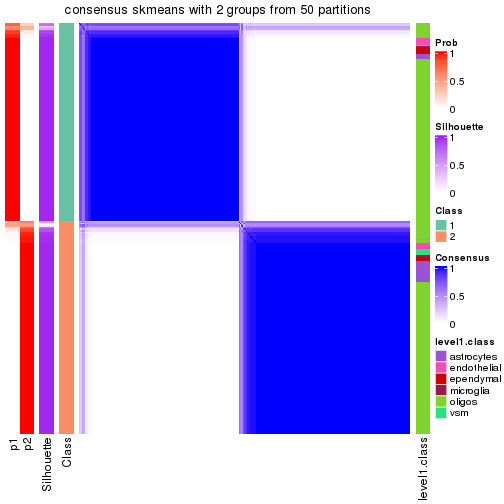</p>

</div>
<div id='tab-node-011-consensus-heatmap-2'>
<pre><code class="r">consensus_heatmap(res, k = 3)
</code></pre>

<p></p>

</div>
<div id='tab-node-011-consensus-heatmap-3'>
<pre><code class="r">consensus_heatmap(res, k = 4)
</code></pre>

<p></p>

</div>
</div>

Heatmaps for the membership of samples in all partitions to see how consistent they are:


<script>
$( function() {
	$( '#tabs-node-011-membership-heatmap' ).tabs();
} );
</script>
<div id='tabs-node-011-membership-heatmap'>
<ul>
<li><a href='#tab-node-011-membership-heatmap-1'>k = 2</a></li>
<li><a href='#tab-node-011-membership-heatmap-2'>k = 3</a></li>
<li><a href='#tab-node-011-membership-heatmap-3'>k = 4</a></li>
</ul>
<div id='tab-node-011-membership-heatmap-1'>
<pre><code class="r">membership_heatmap(res, k = 2)
</code></pre>

<p></p>

</div>
<div id='tab-node-011-membership-heatmap-2'>
<pre><code class="r">membership_heatmap(res, k = 3)
</code></pre>

<p></p>

</div>
<div id='tab-node-011-membership-heatmap-3'>
<pre><code class="r">membership_heatmap(res, k = 4)
</code></pre>

<p>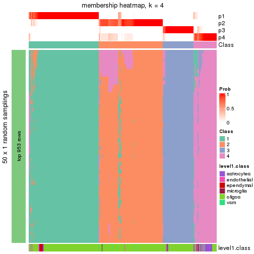</p>

</div>
</div>

As soon as the classes for columns are determined, the signatures
that are significantly different between subgroups can be looked for. 
Following are the heatmaps for signatures.


Signature heatmaps where rows are scaled:


<script>
$( function() {
	$( '#tabs-node-011-get-signatures' ).tabs();
} );
</script>
<div id='tabs-node-011-get-signatures'>
<ul>
<li><a href='#tab-node-011-get-signatures-1'>k = 2</a></li>
<li><a href='#tab-node-011-get-signatures-2'>k = 3</a></li>
<li><a href='#tab-node-011-get-signatures-3'>k = 4</a></li>
</ul>
<div id='tab-node-011-get-signatures-1'>
<pre><code class="r">get_signatures(res, k = 2)
</code></pre>

<p></p>

</div>
<div id='tab-node-011-get-signatures-2'>
<pre><code class="r">get_signatures(res, k = 3)
</code></pre>

<p>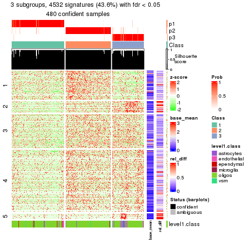</p>

</div>
<div id='tab-node-011-get-signatures-3'>
<pre><code class="r">get_signatures(res, k = 4)
</code></pre>

<p></p>

</div>
</div>


Signature heatmaps where rows are not scaled:


<script>
$( function() {
	$( '#tabs-node-011-get-signatures-no-scale' ).tabs();
} );
</script>
<div id='tabs-node-011-get-signatures-no-scale'>
<ul>
<li><a href='#tab-node-011-get-signatures-no-scale-1'>k = 2</a></li>
<li><a href='#tab-node-011-get-signatures-no-scale-2'>k = 3</a></li>
<li><a href='#tab-node-011-get-signatures-no-scale-3'>k = 4</a></li>
</ul>
<div id='tab-node-011-get-signatures-no-scale-1'>
<pre><code class="r">get_signatures(res, k = 2, scale_rows = FALSE)
</code></pre>

<p></p>

</div>
<div id='tab-node-011-get-signatures-no-scale-2'>
<pre><code class="r">get_signatures(res, k = 3, scale_rows = FALSE)
</code></pre>

<p></p>

</div>
<div id='tab-node-011-get-signatures-no-scale-3'>
<pre><code class="r">get_signatures(res, k = 4, scale_rows = FALSE)
</code></pre>

<p></p>

</div>
</div>


Compare the overlap of signatures from different k:

```r
compare_signatures(res)
```


`get_signature()` returns a data frame invisibly. To get the list of signatures, the function
call should be assigned to a variable explicitly. In following code, if `plot` argument is set
to `FALSE`, no heatmap is plotted while only the differential analysis is performed.

```r
# code only for demonstration
tb = get_signature(res, k = ..., plot = FALSE)
```

An example of the output of `tb` is:

```
#>   which_row         fdr    mean_1    mean_2 scaled_mean_1 scaled_mean_2 km
#> 1        38 0.042760348  8.373488  9.131774    -0.5533452     0.5164555  1
#> 2        40 0.018707592  7.106213  8.469186    -0.6173731     0.5762149  1
#> 3        55 0.019134737 10.221463 11.207825    -0.6159697     0.5749050  1
#> 4        59 0.006059896  5.921854  7.869574    -0.6899429     0.6439467  1
#> 5        60 0.018055526  8.928898 10.211722    -0.6204761     0.5791110  1
#> 6        98 0.009384629 15.714769 14.887706     0.6635654    -0.6193277  2
...
```

The columns in `tb` are:

1. `which_row`: row indices corresponding to the input matrix.
2. `fdr`: FDR for the differential test. 
3. `mean_x`: The mean value in group x.
4. `scaled_mean_x`: The mean value in group x after rows are scaled.
5. `km`: Row groups if k-means clustering is applied to rows (which is done by automatically selecting number of clusters).

If there are too many signatures, `top_signatures = ...` can be set to only show the 
signatures with the highest FDRs:

```r
# code only for demonstration
# e.g. to show the top 500 most significant rows
tb = get_signature(res, k = ..., top_signatures = 500)
```

If the signatures are defined as these which are uniquely high in current group, `diff_method` argument
can be set to `"uniquely_high_in_one_group"`:

```r
# code only for demonstration
tb = get_signature(res, k = ..., diff_method = "uniquely_high_in_one_group")
```


UMAP plot which shows how samples are separated.


<script>
$( function() {
	$( '#tabs-node-011-dimension-reduction' ).tabs();
} );
</script>
<div id='tabs-node-011-dimension-reduction'>
<ul>
<li><a href='#tab-node-011-dimension-reduction-1'>k = 2</a></li>
<li><a href='#tab-node-011-dimension-reduction-2'>k = 3</a></li>
<li><a href='#tab-node-011-dimension-reduction-3'>k = 4</a></li>
</ul>
<div id='tab-node-011-dimension-reduction-1'>
<pre><code class="r">dimension_reduction(res, k = 2, method = &quot;UMAP&quot;)
</code></pre>

<p></p>

</div>
<div id='tab-node-011-dimension-reduction-2'>
<pre><code class="r">dimension_reduction(res, k = 3, method = &quot;UMAP&quot;)
</code></pre>

<p></p>

</div>
<div id='tab-node-011-dimension-reduction-3'>
<pre><code class="r">dimension_reduction(res, k = 4, method = &quot;UMAP&quot;)
</code></pre>

<p></p>

</div>
</div>


Following heatmap shows how subgroups are split when increasing `k`:

```r
collect_classes(res)
```


Test correlation between subgroups and known annotations. If the known
annotation is numeric, one-way ANOVA test is applied, and if the known
annotation is discrete, chi-squared contingency table test is applied.

```r
test_to_known_factors(res)
```

```
#>             n_sample level1.class(p-value) k
#> ATC:skmeans      476              3.77e-03 2
#> ATC:skmeans      480              5.10e-07 3
#> ATC:skmeans      466              3.65e-34 4
```


If matrix rows can be associated to genes, consider to use `functional_enrichment(res,
...)` to perform function enrichment for the signature genes. See [this vignette](https://jokergoo.github.io/cola_vignettes/functional_enrichment.html) for more detailed explanations.


 

---------------------------------------------------


### Node0113


Parent node: [Node011](#Node011).
Child nodes: 
                Node01131-leaf
        ,
                Node01132-leaf
        ,
                Node01133-leaf
        ,
                Node01211-leaf
        ,
                Node01212-leaf
        ,
                Node01221-leaf
        ,
                Node01222-leaf
        ,
                Node01223-leaf
        ,
                Node01231-leaf
        ,
                Node01232-leaf
        ,
                Node01233-leaf
        ,
                Node01234-leaf
        ,
                [Node02111](#Node02111)
        ,
                [Node02112](#Node02112)
        ,
                Node02113-leaf
        ,
                Node02121-leaf
        ,
                Node02122-leaf
        ,
                Node02123-leaf
        ,
                Node02221-leaf
        ,
                Node02222-leaf
        ,
                Node03111-leaf
        ,
                Node03112-leaf
        ,
                Node03121-leaf
        ,
                [Node03122](#Node03122)
        .


The object with results only for a single top-value method and a single partitioning method 
can be extracted as:

```r
res = res_rh["0113"]
```

A summary of `res` and all the functions that can be applied to it:

```r
res
```

```
#> A 'ConsensusPartition' object with k = 2, 3, 4.
#>   On a matrix with 7277 rows and 119 columns.
#>   Top rows (728) are extracted by 'ATC' method.
#>   Subgroups are detected by 'skmeans' method.
#>   Performed in total 150 partitions by row resampling.
#>   Best k for subgroups seems to be 3.
#> 
#> Following methods can be applied to this 'ConsensusPartition' object:
#>  [1] "cola_report"             "collect_classes"         "collect_plots"          
#>  [4] "collect_stats"           "colnames"                "compare_partitions"     
#>  [7] "compare_signatures"      "consensus_heatmap"       "dimension_reduction"    
#> [10] "functional_enrichment"   "get_anno_col"            "get_anno"               
#> [13] "get_classes"             "get_consensus"           "get_matrix"             
#> [16] "get_membership"          "get_param"               "get_signatures"         
#> [19] "get_stats"               "is_best_k"               "is_stable_k"            
#> [22] "membership_heatmap"      "ncol"                    "nrow"                   
#> [25] "plot_ecdf"               "predict_classes"         "rownames"               
#> [28] "select_partition_number" "show"                    "suggest_best_k"         
#> [31] "test_to_known_factors"   "top_rows_heatmap"
```

`collect_plots()` function collects all the plots made from `res` for all `k` (number of subgroups)
into one single page to provide an easy and fast comparison between different `k`.

```r
collect_plots(res)
```


The plots are:

- The first row: a plot of the eCDF (empirical cumulative distribution
  function) curves of the consensus matrix for each `k` and the heatmap of
  predicted classes for each `k`.
- The second row: heatmaps of the consensus matrix for each `k`.
- The third row: heatmaps of the membership matrix for each `k`.
- The fouth row: heatmaps of the signatures for each `k`.

All the plots in panels can be made by individual functions and they are
plotted later in this section.

`select_partition_number()` produces several plots showing different
statistics for choosing "optimized" `k`. There are following statistics:

- eCDF curves of the consensus matrix for each `k`;
- 1-PAC. [The PAC score](https://en.wikipedia.org/wiki/Consensus_clustering#Over-interpretation_potential_of_consensus_clustering)
  measures the proportion of the ambiguous subgrouping.
- Mean silhouette score.
- Concordance. The mean probability of fiting the consensus subgroup labels in all
  partitions.
- Area increased. Denote $A_k$ as the area under the eCDF curve for current
  `k`, the area increased is defined as $A_k - A_{k-1}$.
- Rand index. The percent of pairs of samples that are both in a same cluster
  or both are not in a same cluster in the partition of k and k-1.
- Jaccard index. The ratio of pairs of samples are both in a same cluster in
  the partition of k and k-1 and the pairs of samples are both in a same
  cluster in the partition k or k-1.

The detailed explanations of these statistics can be found in [the _cola_
vignette](https://jokergoo.github.io/cola_vignettes/cola.html#toc_13).

Generally speaking, higher 1-PAC score, higher mean silhouette score or higher
concordance corresponds to better partition. Rand index and Jaccard index
measure how similar the current partition is compared to partition with `k-1`.
If they are too similar, we won't accept `k` is better than `k-1`.

```r
select_partition_number(res)
```


The numeric values for all these statistics can be obtained by `get_stats()`.

```r
get_stats(res)
```

```
#>   k 1-PAC mean_silhouette concordance area_increased  Rand Jaccard
#> 2 2 0.982           0.963       0.984         0.4984 0.499   0.499
#> 3 3 1.000           0.964       0.985         0.3433 0.724   0.501
#> 4 4 0.814           0.855       0.898         0.0957 0.927   0.781
```

`suggest_best_k()` suggests the best $k$ based on these statistics. The rules are as follows:

- All $k$ with Jaccard index larger than 0.95 are removed because increasing
  $k$ does not provide enough extra information. If all $k$ are removed, it is
  marked as no subgroup is detected.
- For all $k$ with 1-PAC score larger than 0.9, the maximal $k$ is taken as
  the best $k$, and other $k$ are marked as optional $k$.
- If it does not fit the second rule. The $k$ with the maximal vote of the
  highest 1-PAC score, highest mean silhouette, and highest concordance is
  taken as the best $k$.

```r
suggest_best_k(res)
```

```
#> [1] 3
#> attr(,"optional")
#> [1] 2
```

There is also optional best $k$ = 2 that is worth to check.

Following is the table of the partitions (You need to click the **show/hide
code output** link to see it). The membership matrix (columns with name `p*`)
is inferred by
[`clue::cl_consensus()`](https://www.rdocumentation.org/link/cl_consensus?package=clue)
function with the `SE` method. Basically the value in the membership matrix
represents the probability to belong to a certain group. The finall subgroup
label for an item is determined with the group with highest probability it
belongs to.

In `get_classes()` function, the entropy is calculated from the membership
matrix and the silhouette score is calculated from the consensus matrix.


<script>
$( function() {
	$( '#tabs-node-0113-get-classes' ).tabs();
} );
</script>
<div id='tabs-node-0113-get-classes'>
<ul>
<li><a href='#tab-node-0113-get-classes-1'>k = 2</a></li>
<li><a href='#tab-node-0113-get-classes-2'>k = 3</a></li>
<li><a href='#tab-node-0113-get-classes-3'>k = 4</a></li>
</ul>

<div id='tab-node-0113-get-classes-1'>
<p><a id='tab-node-0113-get-classes-1-a' style='color:#0366d6' href='#'>show/hide code output</a></p>
<pre><code class="r">cbind(get_classes(res, k = 2), get_membership(res, k = 2))
</code></pre>

<pre><code>#&gt;     class entropy silhouette   p1   p2
#&gt; 1       1   0.000      0.999 1.00 0.00
#&gt; 2       1   0.000      0.999 1.00 0.00
#&gt; 3       2   0.999      0.131 0.48 0.52
#&gt; 4       1   0.000      0.999 1.00 0.00
#&gt; 5       1   0.000      0.999 1.00 0.00
#&gt; 6       1   0.000      0.999 1.00 0.00
#&gt; 7       1   0.000      0.999 1.00 0.00
#&gt; 8       1   0.000      0.999 1.00 0.00
#&gt; 9       1   0.000      0.999 1.00 0.00
#&gt; 10      2   0.242      0.935 0.04 0.96
#&gt; 11      1   0.000      0.999 1.00 0.00
#&gt; 12      1   0.000      0.999 1.00 0.00
#&gt; 13      2   0.000      0.964 0.00 1.00
#&gt; 14      1   0.000      0.999 1.00 0.00
#&gt; 15      1   0.000      0.999 1.00 0.00
#&gt; 16      2   0.722      0.762 0.20 0.80
#&gt; 17      1   0.000      0.999 1.00 0.00
#&gt; 18      2   0.722      0.767 0.20 0.80
#&gt; 19      1   0.000      0.999 1.00 0.00
#&gt; 20      1   0.000      0.999 1.00 0.00
#&gt; 21      1   0.000      0.999 1.00 0.00
#&gt; 22      1   0.000      0.999 1.00 0.00
#&gt; 23      1   0.000      0.999 1.00 0.00
#&gt; 24      1   0.000      0.999 1.00 0.00
#&gt; 25      1   0.000      0.999 1.00 0.00
#&gt; 26      2   0.000      0.964 0.00 1.00
#&gt; 27      1   0.000      0.999 1.00 0.00
#&gt; 28      1   0.000      0.999 1.00 0.00
#&gt; 29      1   0.000      0.999 1.00 0.00
#&gt; 30      1   0.000      0.999 1.00 0.00
#&gt; 31      1   0.000      0.999 1.00 0.00
#&gt; 32      2   0.327      0.918 0.06 0.94
#&gt; 33      2   0.000      0.964 0.00 1.00
#&gt; 34      2   0.000      0.964 0.00 1.00
#&gt; 35      2   0.904      0.568 0.32 0.68
#&gt; 36      2   0.904      0.564 0.32 0.68
#&gt; 37      1   0.000      0.999 1.00 0.00
#&gt; 38      1   0.000      0.999 1.00 0.00
#&gt; 39      1   0.000      0.999 1.00 0.00
#&gt; 40      1   0.000      0.999 1.00 0.00
#&gt; 41      1   0.000      0.999 1.00 0.00
#&gt; 42      1   0.000      0.999 1.00 0.00
#&gt; 43      1   0.000      0.999 1.00 0.00
#&gt; 44      1   0.000      0.999 1.00 0.00
#&gt; 45      1   0.000      0.999 1.00 0.00
#&gt; 46      1   0.000      0.999 1.00 0.00
#&gt; 47      1   0.000      0.999 1.00 0.00
#&gt; 48      1   0.000      0.999 1.00 0.00
#&gt; 49      1   0.000      0.999 1.00 0.00
#&gt; 50      1   0.000      0.999 1.00 0.00
#&gt; 51      1   0.000      0.999 1.00 0.00
#&gt; 52      1   0.000      0.999 1.00 0.00
#&gt; 53      1   0.000      0.999 1.00 0.00
#&gt; 54      1   0.000      0.999 1.00 0.00
#&gt; 55      1   0.000      0.999 1.00 0.00
#&gt; 56      1   0.000      0.999 1.00 0.00
#&gt; 57      1   0.000      0.999 1.00 0.00
#&gt; 58      1   0.000      0.999 1.00 0.00
#&gt; 59      1   0.000      0.999 1.00 0.00
#&gt; 60      1   0.000      0.999 1.00 0.00
#&gt; 61      1   0.000      0.999 1.00 0.00
#&gt; 62      1   0.000      0.999 1.00 0.00
#&gt; 63      2   0.000      0.964 0.00 1.00
#&gt; 64      1   0.000      0.999 1.00 0.00
#&gt; 65      1   0.141      0.979 0.98 0.02
#&gt; 66      1   0.000      0.999 1.00 0.00
#&gt; 67      1   0.000      0.999 1.00 0.00
#&gt; 68      2   0.000      0.964 0.00 1.00
#&gt; 69      1   0.000      0.999 1.00 0.00
#&gt; 70      2   0.402      0.901 0.08 0.92
#&gt; 71      1   0.000      0.999 1.00 0.00
#&gt; 72      2   0.469      0.883 0.10 0.90
#&gt; 73      2   0.000      0.964 0.00 1.00
#&gt; 74      1   0.000      0.999 1.00 0.00
#&gt; 75      2   0.000      0.964 0.00 1.00
#&gt; 76      2   0.000      0.964 0.00 1.00
#&gt; 77      1   0.000      0.999 1.00 0.00
#&gt; 78      2   0.529      0.862 0.12 0.88
#&gt; 79      2   0.000      0.964 0.00 1.00
#&gt; 80      2   0.000      0.964 0.00 1.00
#&gt; 81      2   0.000      0.964 0.00 1.00
#&gt; 82      2   0.000      0.964 0.00 1.00
#&gt; 83      2   0.000      0.964 0.00 1.00
#&gt; 84      2   0.000      0.964 0.00 1.00
#&gt; 85      2   0.000      0.964 0.00 1.00
#&gt; 86      2   0.000      0.964 0.00 1.00
#&gt; 87      2   0.000      0.964 0.00 1.00
#&gt; 88      2   0.000      0.964 0.00 1.00
#&gt; 89      2   0.000      0.964 0.00 1.00
#&gt; 90      2   0.000      0.964 0.00 1.00
#&gt; 91      2   0.000      0.964 0.00 1.00
#&gt; 92      2   0.000      0.964 0.00 1.00
#&gt; 93      2   0.000      0.964 0.00 1.00
#&gt; 94      2   0.000      0.964 0.00 1.00
#&gt; 95      2   0.000      0.964 0.00 1.00
#&gt; 96      2   0.000      0.964 0.00 1.00
#&gt; 97      2   0.000      0.964 0.00 1.00
#&gt; 98      2   0.000      0.964 0.00 1.00
#&gt; 99      1   0.000      0.999 1.00 0.00
#&gt; 100     2   0.000      0.964 0.00 1.00
#&gt; 101     1   0.000      0.999 1.00 0.00
#&gt; 102     2   0.000      0.964 0.00 1.00
#&gt; 103     2   0.000      0.964 0.00 1.00
#&gt; 104     2   0.000      0.964 0.00 1.00
#&gt; 105     2   0.000      0.964 0.00 1.00
#&gt; 106     1   0.000      0.999 1.00 0.00
#&gt; 107     2   0.000      0.964 0.00 1.00
#&gt; 108     2   0.000      0.964 0.00 1.00
#&gt; 109     2   0.000      0.964 0.00 1.00
#&gt; 110     2   0.000      0.964 0.00 1.00
#&gt; 111     2   0.000      0.964 0.00 1.00
#&gt; 112     1   0.141      0.979 0.98 0.02
#&gt; 113     2   0.000      0.964 0.00 1.00
#&gt; 114     2   0.000      0.964 0.00 1.00
#&gt; 115     2   0.000      0.964 0.00 1.00
#&gt; 116     1   0.000      0.999 1.00 0.00
#&gt; 117     2   0.000      0.964 0.00 1.00
#&gt; 118     2   0.000      0.964 0.00 1.00
#&gt; 119     2   0.000      0.964 0.00 1.00
</code></pre>

<script>
$('#tab-node-0113-get-classes-1-a').parent().next().next().hide();
$('#tab-node-0113-get-classes-1-a').click(function(){
  $('#tab-node-0113-get-classes-1-a').parent().next().next().toggle();
  return(false);
});
</script>
</div>

<div id='tab-node-0113-get-classes-2'>
<p><a id='tab-node-0113-get-classes-2-a' style='color:#0366d6' href='#'>show/hide code output</a></p>
<pre><code class="r">cbind(get_classes(res, k = 3), get_membership(res, k = 3))
</code></pre>

<pre><code>#&gt;     class entropy silhouette   p1   p2   p3
#&gt; 1       1  0.0000      0.988 1.00 0.00 0.00
#&gt; 2       1  0.0000      0.988 1.00 0.00 0.00
#&gt; 3       1  0.6176      0.767 0.78 0.12 0.10
#&gt; 4       1  0.0000      0.988 1.00 0.00 0.00
#&gt; 5       1  0.0000      0.988 1.00 0.00 0.00
#&gt; 6       1  0.0000      0.988 1.00 0.00 0.00
#&gt; 7       1  0.0000      0.988 1.00 0.00 0.00
#&gt; 8       1  0.0000      0.988 1.00 0.00 0.00
#&gt; 9       1  0.0000      0.988 1.00 0.00 0.00
#&gt; 10      3  0.2959      0.886 0.00 0.10 0.90
#&gt; 11      1  0.0000      0.988 1.00 0.00 0.00
#&gt; 12      1  0.0000      0.988 1.00 0.00 0.00
#&gt; 13      2  0.0000      0.974 0.00 1.00 0.00
#&gt; 14      1  0.0000      0.988 1.00 0.00 0.00
#&gt; 15      1  0.0000      0.988 1.00 0.00 0.00
#&gt; 16      1  0.5016      0.687 0.76 0.24 0.00
#&gt; 17      1  0.0000      0.988 1.00 0.00 0.00
#&gt; 18      3  0.0000      0.990 0.00 0.00 1.00
#&gt; 19      1  0.0000      0.988 1.00 0.00 0.00
#&gt; 20      1  0.0000      0.988 1.00 0.00 0.00
#&gt; 21      1  0.0000      0.988 1.00 0.00 0.00
#&gt; 22      1  0.0000      0.988 1.00 0.00 0.00
#&gt; 23      1  0.0000      0.988 1.00 0.00 0.00
#&gt; 24      1  0.0000      0.988 1.00 0.00 0.00
#&gt; 25      1  0.0000      0.988 1.00 0.00 0.00
#&gt; 26      2  0.0000      0.974 0.00 1.00 0.00
#&gt; 27      1  0.0000      0.988 1.00 0.00 0.00
#&gt; 28      1  0.1529      0.952 0.96 0.00 0.04
#&gt; 29      3  0.0000      0.990 0.00 0.00 1.00
#&gt; 30      1  0.0000      0.988 1.00 0.00 0.00
#&gt; 31      1  0.0000      0.988 1.00 0.00 0.00
#&gt; 32      3  0.0000      0.990 0.00 0.00 1.00
#&gt; 33      2  0.0000      0.974 0.00 1.00 0.00
#&gt; 34      2  0.0000      0.974 0.00 1.00 0.00
#&gt; 35      3  0.0000      0.990 0.00 0.00 1.00
#&gt; 36      3  0.0000      0.990 0.00 0.00 1.00
#&gt; 37      1  0.0892      0.971 0.98 0.00 0.02
#&gt; 38      3  0.0000      0.990 0.00 0.00 1.00
#&gt; 39      1  0.0000      0.988 1.00 0.00 0.00
#&gt; 40      1  0.0000      0.988 1.00 0.00 0.00
#&gt; 41      1  0.0000      0.988 1.00 0.00 0.00
#&gt; 42      1  0.0000      0.988 1.00 0.00 0.00
#&gt; 43      1  0.0000      0.988 1.00 0.00 0.00
#&gt; 44      1  0.0000      0.988 1.00 0.00 0.00
#&gt; 45      1  0.0000      0.988 1.00 0.00 0.00
#&gt; 46      1  0.0000      0.988 1.00 0.00 0.00
#&gt; 47      1  0.0000      0.988 1.00 0.00 0.00
#&gt; 48      1  0.0000      0.988 1.00 0.00 0.00
#&gt; 49      1  0.0892      0.971 0.98 0.00 0.02
#&gt; 50      1  0.0000      0.988 1.00 0.00 0.00
#&gt; 51      1  0.0000      0.988 1.00 0.00 0.00
#&gt; 52      3  0.0000      0.990 0.00 0.00 1.00
#&gt; 53      1  0.0000      0.988 1.00 0.00 0.00
#&gt; 54      3  0.0000      0.990 0.00 0.00 1.00
#&gt; 55      3  0.0000      0.990 0.00 0.00 1.00
#&gt; 56      3  0.0000      0.990 0.00 0.00 1.00
#&gt; 57      3  0.0000      0.990 0.00 0.00 1.00
#&gt; 58      3  0.0000      0.990 0.00 0.00 1.00
#&gt; 59      3  0.0000      0.990 0.00 0.00 1.00
#&gt; 60      3  0.0000      0.990 0.00 0.00 1.00
#&gt; 61      3  0.0000      0.990 0.00 0.00 1.00
#&gt; 62      3  0.0000      0.990 0.00 0.00 1.00
#&gt; 63      3  0.0000      0.990 0.00 0.00 1.00
#&gt; 64      3  0.0000      0.990 0.00 0.00 1.00
#&gt; 65      3  0.0000      0.990 0.00 0.00 1.00
#&gt; 66      3  0.0000      0.990 0.00 0.00 1.00
#&gt; 67      3  0.0000      0.990 0.00 0.00 1.00
#&gt; 68      3  0.0000      0.990 0.00 0.00 1.00
#&gt; 69      3  0.0000      0.990 0.00 0.00 1.00
#&gt; 70      3  0.0000      0.990 0.00 0.00 1.00
#&gt; 71      3  0.0000      0.990 0.00 0.00 1.00
#&gt; 72      3  0.0000      0.990 0.00 0.00 1.00
#&gt; 73      3  0.0000      0.990 0.00 0.00 1.00
#&gt; 74      3  0.0000      0.990 0.00 0.00 1.00
#&gt; 75      2  0.2537      0.898 0.00 0.92 0.08
#&gt; 76      2  0.0000      0.974 0.00 1.00 0.00
#&gt; 77      3  0.0000      0.990 0.00 0.00 1.00
#&gt; 78      3  0.0000      0.990 0.00 0.00 1.00
#&gt; 79      2  0.6045      0.393 0.00 0.62 0.38
#&gt; 80      2  0.0000      0.974 0.00 1.00 0.00
#&gt; 81      2  0.0000      0.974 0.00 1.00 0.00
#&gt; 82      2  0.0000      0.974 0.00 1.00 0.00
#&gt; 83      2  0.0000      0.974 0.00 1.00 0.00
#&gt; 84      2  0.0000      0.974 0.00 1.00 0.00
#&gt; 85      2  0.0000      0.974 0.00 1.00 0.00
#&gt; 86      2  0.0000      0.974 0.00 1.00 0.00
#&gt; 87      2  0.0000      0.974 0.00 1.00 0.00
#&gt; 88      2  0.0000      0.974 0.00 1.00 0.00
#&gt; 89      2  0.0000      0.974 0.00 1.00 0.00
#&gt; 90      2  0.0000      0.974 0.00 1.00 0.00
#&gt; 91      2  0.0000      0.974 0.00 1.00 0.00
#&gt; 92      2  0.0000      0.974 0.00 1.00 0.00
#&gt; 93      2  0.0000      0.974 0.00 1.00 0.00
#&gt; 94      2  0.0000      0.974 0.00 1.00 0.00
#&gt; 95      2  0.0000      0.974 0.00 1.00 0.00
#&gt; 96      2  0.0000      0.974 0.00 1.00 0.00
#&gt; 97      2  0.0000      0.974 0.00 1.00 0.00
#&gt; 98      2  0.0000      0.974 0.00 1.00 0.00
#&gt; 99      1  0.0000      0.988 1.00 0.00 0.00
#&gt; 100     2  0.0000      0.974 0.00 1.00 0.00
#&gt; 101     1  0.0000      0.988 1.00 0.00 0.00
#&gt; 102     2  0.0000      0.974 0.00 1.00 0.00
#&gt; 103     2  0.6244      0.231 0.00 0.56 0.44
#&gt; 104     2  0.2066      0.920 0.00 0.94 0.06
#&gt; 105     2  0.0000      0.974 0.00 1.00 0.00
#&gt; 106     1  0.0000      0.988 1.00 0.00 0.00
#&gt; 107     3  0.4291      0.778 0.00 0.18 0.82
#&gt; 108     2  0.0000      0.974 0.00 1.00 0.00
#&gt; 109     3  0.0000      0.990 0.00 0.00 1.00
#&gt; 110     2  0.0000      0.974 0.00 1.00 0.00
#&gt; 111     3  0.2066      0.932 0.00 0.06 0.94
#&gt; 112     3  0.0000      0.990 0.00 0.00 1.00
#&gt; 113     2  0.0000      0.974 0.00 1.00 0.00
#&gt; 114     2  0.0000      0.974 0.00 1.00 0.00
#&gt; 115     2  0.0000      0.974 0.00 1.00 0.00
#&gt; 116     1  0.0000      0.988 1.00 0.00 0.00
#&gt; 117     2  0.0000      0.974 0.00 1.00 0.00
#&gt; 118     2  0.0000      0.974 0.00 1.00 0.00
#&gt; 119     2  0.0000      0.974 0.00 1.00 0.00
</code></pre>

<script>
$('#tab-node-0113-get-classes-2-a').parent().next().next().hide();
$('#tab-node-0113-get-classes-2-a').click(function(){
  $('#tab-node-0113-get-classes-2-a').parent().next().next().toggle();
  return(false);
});
</script>
</div>

<div id='tab-node-0113-get-classes-3'>
<p><a id='tab-node-0113-get-classes-3-a' style='color:#0366d6' href='#'>show/hide code output</a></p>
<pre><code class="r">cbind(get_classes(res, k = 4), get_membership(res, k = 4))
</code></pre>

<pre><code>#&gt;     class entropy silhouette   p1   p2   p3   p4
#&gt; 1       4  0.4790      0.812 0.38 0.00 0.00 0.62
#&gt; 2       4  0.4790      0.812 0.38 0.00 0.00 0.62
#&gt; 3       4  0.6930      0.684 0.14 0.06 0.12 0.68
#&gt; 4       4  0.4790      0.812 0.38 0.00 0.00 0.62
#&gt; 5       4  0.4790      0.812 0.38 0.00 0.00 0.62
#&gt; 6       4  0.4790      0.812 0.38 0.00 0.00 0.62
#&gt; 7       4  0.4790      0.812 0.38 0.00 0.00 0.62
#&gt; 8       4  0.4790      0.812 0.38 0.00 0.00 0.62
#&gt; 9       4  0.4790      0.812 0.38 0.00 0.00 0.62
#&gt; 10      4  0.5636      0.457 0.00 0.06 0.26 0.68
#&gt; 11      4  0.4134      0.753 0.26 0.00 0.00 0.74
#&gt; 12      1  0.3172      0.690 0.84 0.00 0.00 0.16
#&gt; 13      4  0.4624      0.361 0.00 0.34 0.00 0.66
#&gt; 14      1  0.0000      0.962 1.00 0.00 0.00 0.00
#&gt; 15      1  0.0000      0.962 1.00 0.00 0.00 0.00
#&gt; 16      4  0.1637      0.617 0.06 0.00 0.00 0.94
#&gt; 17      1  0.0000      0.962 1.00 0.00 0.00 0.00
#&gt; 18      3  0.4277      0.746 0.00 0.00 0.72 0.28
#&gt; 19      1  0.0000      0.962 1.00 0.00 0.00 0.00
#&gt; 20      1  0.0000      0.962 1.00 0.00 0.00 0.00
#&gt; 21      1  0.0000      0.962 1.00 0.00 0.00 0.00
#&gt; 22      1  0.0000      0.962 1.00 0.00 0.00 0.00
#&gt; 23      4  0.4790      0.812 0.38 0.00 0.00 0.62
#&gt; 24      1  0.0000      0.962 1.00 0.00 0.00 0.00
#&gt; 25      1  0.0000      0.962 1.00 0.00 0.00 0.00
#&gt; 26      2  0.4406      0.708 0.00 0.70 0.00 0.30
#&gt; 27      1  0.0000      0.962 1.00 0.00 0.00 0.00
#&gt; 28      1  0.2011      0.853 0.92 0.00 0.08 0.00
#&gt; 29      3  0.2647      0.798 0.12 0.00 0.88 0.00
#&gt; 30      1  0.0000      0.962 1.00 0.00 0.00 0.00
#&gt; 31      1  0.0000      0.962 1.00 0.00 0.00 0.00
#&gt; 32      3  0.4406      0.733 0.00 0.00 0.70 0.30
#&gt; 33      2  0.4713      0.661 0.00 0.64 0.00 0.36
#&gt; 34      2  0.4624      0.673 0.00 0.66 0.00 0.34
#&gt; 35      3  0.1211      0.893 0.00 0.00 0.96 0.04
#&gt; 36      3  0.4624      0.698 0.00 0.00 0.66 0.34
#&gt; 37      1  0.5062      0.452 0.68 0.00 0.02 0.30
#&gt; 38      3  0.1211      0.893 0.00 0.00 0.96 0.04
#&gt; 39      1  0.0000      0.962 1.00 0.00 0.00 0.00
#&gt; 40      1  0.1211      0.912 0.96 0.00 0.04 0.00
#&gt; 41      1  0.0000      0.962 1.00 0.00 0.00 0.00
#&gt; 42      1  0.0000      0.962 1.00 0.00 0.00 0.00
#&gt; 43      1  0.0707      0.939 0.98 0.00 0.00 0.02
#&gt; 44      1  0.0000      0.962 1.00 0.00 0.00 0.00
#&gt; 45      1  0.0000      0.962 1.00 0.00 0.00 0.00
#&gt; 46      1  0.0000      0.962 1.00 0.00 0.00 0.00
#&gt; 47      1  0.0000      0.962 1.00 0.00 0.00 0.00
#&gt; 48      1  0.0000      0.962 1.00 0.00 0.00 0.00
#&gt; 49      1  0.1211      0.913 0.96 0.00 0.04 0.00
#&gt; 50      1  0.0000      0.962 1.00 0.00 0.00 0.00
#&gt; 51      1  0.2011      0.853 0.92 0.00 0.08 0.00
#&gt; 52      3  0.2647      0.795 0.12 0.00 0.88 0.00
#&gt; 53      1  0.0000      0.962 1.00 0.00 0.00 0.00
#&gt; 54      3  0.0000      0.907 0.00 0.00 1.00 0.00
#&gt; 55      3  0.0707      0.901 0.00 0.00 0.98 0.02
#&gt; 56      3  0.0000      0.907 0.00 0.00 1.00 0.00
#&gt; 57      3  0.4624      0.698 0.00 0.00 0.66 0.34
#&gt; 58      3  0.0000      0.907 0.00 0.00 1.00 0.00
#&gt; 59      3  0.0000      0.907 0.00 0.00 1.00 0.00
#&gt; 60      3  0.0000      0.907 0.00 0.00 1.00 0.00
#&gt; 61      3  0.0000      0.907 0.00 0.00 1.00 0.00
#&gt; 62      3  0.0000      0.907 0.00 0.00 1.00 0.00
#&gt; 63      3  0.2345      0.865 0.00 0.00 0.90 0.10
#&gt; 64      3  0.0000      0.907 0.00 0.00 1.00 0.00
#&gt; 65      3  0.0000      0.907 0.00 0.00 1.00 0.00
#&gt; 66      3  0.0000      0.907 0.00 0.00 1.00 0.00
#&gt; 67      3  0.0000      0.907 0.00 0.00 1.00 0.00
#&gt; 68      3  0.4624      0.698 0.00 0.00 0.66 0.34
#&gt; 69      3  0.0000      0.907 0.00 0.00 1.00 0.00
#&gt; 70      3  0.0000      0.907 0.00 0.00 1.00 0.00
#&gt; 71      3  0.0000      0.907 0.00 0.00 1.00 0.00
#&gt; 72      3  0.0000      0.907 0.00 0.00 1.00 0.00
#&gt; 73      3  0.4624      0.698 0.00 0.00 0.66 0.34
#&gt; 74      3  0.0000      0.907 0.00 0.00 1.00 0.00
#&gt; 75      2  0.1637      0.875 0.00 0.94 0.06 0.00
#&gt; 76      2  0.4522      0.691 0.00 0.68 0.00 0.32
#&gt; 77      3  0.0000      0.907 0.00 0.00 1.00 0.00
#&gt; 78      3  0.0707      0.900 0.00 0.00 0.98 0.02
#&gt; 79      2  0.5915      0.286 0.00 0.56 0.40 0.04
#&gt; 80      2  0.0707      0.906 0.00 0.98 0.00 0.02
#&gt; 81      2  0.2011      0.885 0.00 0.92 0.00 0.08
#&gt; 82      2  0.1211      0.900 0.00 0.96 0.00 0.04
#&gt; 83      2  0.2647      0.864 0.00 0.88 0.00 0.12
#&gt; 84      2  0.0000      0.912 0.00 1.00 0.00 0.00
#&gt; 85      2  0.0000      0.912 0.00 1.00 0.00 0.00
#&gt; 86      2  0.0000      0.912 0.00 1.00 0.00 0.00
#&gt; 87      2  0.0000      0.912 0.00 1.00 0.00 0.00
#&gt; 88      2  0.0000      0.912 0.00 1.00 0.00 0.00
#&gt; 89      2  0.0000      0.912 0.00 1.00 0.00 0.00
#&gt; 90      2  0.0000      0.912 0.00 1.00 0.00 0.00
#&gt; 91      2  0.0000      0.912 0.00 1.00 0.00 0.00
#&gt; 92      2  0.0000      0.912 0.00 1.00 0.00 0.00
#&gt; 93      2  0.0000      0.912 0.00 1.00 0.00 0.00
#&gt; 94      2  0.0000      0.912 0.00 1.00 0.00 0.00
#&gt; 95      2  0.1211      0.898 0.00 0.96 0.00 0.04
#&gt; 96      2  0.0000      0.912 0.00 1.00 0.00 0.00
#&gt; 97      2  0.0000      0.912 0.00 1.00 0.00 0.00
#&gt; 98      2  0.0000      0.912 0.00 1.00 0.00 0.00
#&gt; 99      1  0.0000      0.962 1.00 0.00 0.00 0.00
#&gt; 100     2  0.0000      0.912 0.00 1.00 0.00 0.00
#&gt; 101     1  0.0000      0.962 1.00 0.00 0.00 0.00
#&gt; 102     2  0.0000      0.912 0.00 1.00 0.00 0.00
#&gt; 103     2  0.3801      0.708 0.00 0.78 0.22 0.00
#&gt; 104     2  0.1637      0.875 0.00 0.94 0.06 0.00
#&gt; 105     2  0.0000      0.912 0.00 1.00 0.00 0.00
#&gt; 106     1  0.0000      0.962 1.00 0.00 0.00 0.00
#&gt; 107     3  0.4936      0.575 0.00 0.28 0.70 0.02
#&gt; 108     2  0.0707      0.906 0.00 0.98 0.00 0.02
#&gt; 109     3  0.0000      0.907 0.00 0.00 1.00 0.00
#&gt; 110     2  0.0000      0.912 0.00 1.00 0.00 0.00
#&gt; 111     3  0.5271      0.678 0.00 0.02 0.64 0.34
#&gt; 112     3  0.0000      0.907 0.00 0.00 1.00 0.00
#&gt; 113     2  0.0707      0.906 0.00 0.98 0.00 0.02
#&gt; 114     2  0.4522      0.707 0.00 0.68 0.00 0.32
#&gt; 115     2  0.0707      0.906 0.00 0.98 0.00 0.02
#&gt; 116     4  0.4713      0.805 0.36 0.00 0.00 0.64
#&gt; 117     2  0.2345      0.877 0.00 0.90 0.00 0.10
#&gt; 118     2  0.2647      0.866 0.00 0.88 0.00 0.12
#&gt; 119     2  0.4277      0.745 0.00 0.72 0.00 0.28
</code></pre>

<script>
$('#tab-node-0113-get-classes-3-a').parent().next().next().hide();
$('#tab-node-0113-get-classes-3-a').click(function(){
  $('#tab-node-0113-get-classes-3-a').parent().next().next().toggle();
  return(false);
});
</script>
</div>
</div>

Heatmaps for the consensus matrix. It visualizes the probability of two
samples to be in a same group.


<script>
$( function() {
	$( '#tabs-node-0113-consensus-heatmap' ).tabs();
} );
</script>
<div id='tabs-node-0113-consensus-heatmap'>
<ul>
<li><a href='#tab-node-0113-consensus-heatmap-1'>k = 2</a></li>
<li><a href='#tab-node-0113-consensus-heatmap-2'>k = 3</a></li>
<li><a href='#tab-node-0113-consensus-heatmap-3'>k = 4</a></li>
</ul>
<div id='tab-node-0113-consensus-heatmap-1'>
<pre><code class="r">consensus_heatmap(res, k = 2)
</code></pre>

<p></p>

</div>
<div id='tab-node-0113-consensus-heatmap-2'>
<pre><code class="r">consensus_heatmap(res, k = 3)
</code></pre>

<p></p>

</div>
<div id='tab-node-0113-consensus-heatmap-3'>
<pre><code class="r">consensus_heatmap(res, k = 4)
</code></pre>

<p></p>

</div>
</div>

Heatmaps for the membership of samples in all partitions to see how consistent they are:


<script>
$( function() {
	$( '#tabs-node-0113-membership-heatmap' ).tabs();
} );
</script>
<div id='tabs-node-0113-membership-heatmap'>
<ul>
<li><a href='#tab-node-0113-membership-heatmap-1'>k = 2</a></li>
<li><a href='#tab-node-0113-membership-heatmap-2'>k = 3</a></li>
<li><a href='#tab-node-0113-membership-heatmap-3'>k = 4</a></li>
</ul>
<div id='tab-node-0113-membership-heatmap-1'>
<pre><code class="r">membership_heatmap(res, k = 2)
</code></pre>

<p></p>

</div>
<div id='tab-node-0113-membership-heatmap-2'>
<pre><code class="r">membership_heatmap(res, k = 3)
</code></pre>

<p>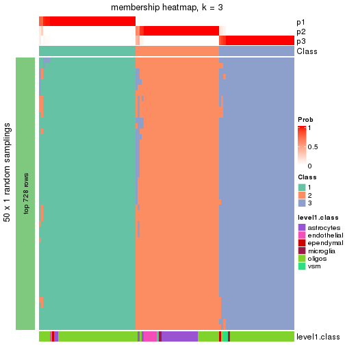</p>

</div>
<div id='tab-node-0113-membership-heatmap-3'>
<pre><code class="r">membership_heatmap(res, k = 4)
</code></pre>

<p></p>

</div>
</div>

As soon as the classes for columns are determined, the signatures
that are significantly different between subgroups can be looked for. 
Following are the heatmaps for signatures.


Signature heatmaps where rows are scaled:


<script>
$( function() {
	$( '#tabs-node-0113-get-signatures' ).tabs();
} );
</script>
<div id='tabs-node-0113-get-signatures'>
<ul>
<li><a href='#tab-node-0113-get-signatures-1'>k = 2</a></li>
<li><a href='#tab-node-0113-get-signatures-2'>k = 3</a></li>
<li><a href='#tab-node-0113-get-signatures-3'>k = 4</a></li>
</ul>
<div id='tab-node-0113-get-signatures-1'>
<pre><code class="r">get_signatures(res, k = 2)
</code></pre>

<p>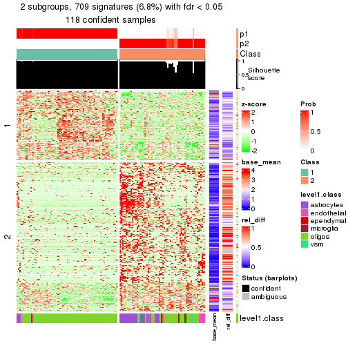</p>

</div>
<div id='tab-node-0113-get-signatures-2'>
<pre><code class="r">get_signatures(res, k = 3)
</code></pre>

<p></p>

</div>
<div id='tab-node-0113-get-signatures-3'>
<pre><code class="r">get_signatures(res, k = 4)
</code></pre>

<p></p>

</div>
</div>


Signature heatmaps where rows are not scaled:


<script>
$( function() {
	$( '#tabs-node-0113-get-signatures-no-scale' ).tabs();
} );
</script>
<div id='tabs-node-0113-get-signatures-no-scale'>
<ul>
<li><a href='#tab-node-0113-get-signatures-no-scale-1'>k = 2</a></li>
<li><a href='#tab-node-0113-get-signatures-no-scale-2'>k = 3</a></li>
<li><a href='#tab-node-0113-get-signatures-no-scale-3'>k = 4</a></li>
</ul>
<div id='tab-node-0113-get-signatures-no-scale-1'>
<pre><code class="r">get_signatures(res, k = 2, scale_rows = FALSE)
</code></pre>

<p></p>

</div>
<div id='tab-node-0113-get-signatures-no-scale-2'>
<pre><code class="r">get_signatures(res, k = 3, scale_rows = FALSE)
</code></pre>

<p></p>

</div>
<div id='tab-node-0113-get-signatures-no-scale-3'>
<pre><code class="r">get_signatures(res, k = 4, scale_rows = FALSE)
</code></pre>

<p></p>

</div>
</div>


Compare the overlap of signatures from different k:

```r
compare_signatures(res)
```


`get_signature()` returns a data frame invisibly. To get the list of signatures, the function
call should be assigned to a variable explicitly. In following code, if `plot` argument is set
to `FALSE`, no heatmap is plotted while only the differential analysis is performed.

```r
# code only for demonstration
tb = get_signature(res, k = ..., plot = FALSE)
```

An example of the output of `tb` is:

```
#>   which_row         fdr    mean_1    mean_2 scaled_mean_1 scaled_mean_2 km
#> 1        38 0.042760348  8.373488  9.131774    -0.5533452     0.5164555  1
#> 2        40 0.018707592  7.106213  8.469186    -0.6173731     0.5762149  1
#> 3        55 0.019134737 10.221463 11.207825    -0.6159697     0.5749050  1
#> 4        59 0.006059896  5.921854  7.869574    -0.6899429     0.6439467  1
#> 5        60 0.018055526  8.928898 10.211722    -0.6204761     0.5791110  1
#> 6        98 0.009384629 15.714769 14.887706     0.6635654    -0.6193277  2
...
```

The columns in `tb` are:

1. `which_row`: row indices corresponding to the input matrix.
2. `fdr`: FDR for the differential test. 
3. `mean_x`: The mean value in group x.
4. `scaled_mean_x`: The mean value in group x after rows are scaled.
5. `km`: Row groups if k-means clustering is applied to rows (which is done by automatically selecting number of clusters).

If there are too many signatures, `top_signatures = ...` can be set to only show the 
signatures with the highest FDRs:

```r
# code only for demonstration
# e.g. to show the top 500 most significant rows
tb = get_signature(res, k = ..., top_signatures = 500)
```

If the signatures are defined as these which are uniquely high in current group, `diff_method` argument
can be set to `"uniquely_high_in_one_group"`:

```r
# code only for demonstration
tb = get_signature(res, k = ..., diff_method = "uniquely_high_in_one_group")
```


UMAP plot which shows how samples are separated.


<script>
$( function() {
	$( '#tabs-node-0113-dimension-reduction' ).tabs();
} );
</script>
<div id='tabs-node-0113-dimension-reduction'>
<ul>
<li><a href='#tab-node-0113-dimension-reduction-1'>k = 2</a></li>
<li><a href='#tab-node-0113-dimension-reduction-2'>k = 3</a></li>
<li><a href='#tab-node-0113-dimension-reduction-3'>k = 4</a></li>
</ul>
<div id='tab-node-0113-dimension-reduction-1'>
<pre><code class="r">dimension_reduction(res, k = 2, method = &quot;UMAP&quot;)
</code></pre>

<p></p>

</div>
<div id='tab-node-0113-dimension-reduction-2'>
<pre><code class="r">dimension_reduction(res, k = 3, method = &quot;UMAP&quot;)
</code></pre>

<p></p>

</div>
<div id='tab-node-0113-dimension-reduction-3'>
<pre><code class="r">dimension_reduction(res, k = 4, method = &quot;UMAP&quot;)
</code></pre>

<p></p>

</div>
</div>


Following heatmap shows how subgroups are split when increasing `k`:

```r
collect_classes(res)
```


Test correlation between subgroups and known annotations. If the known
annotation is numeric, one-way ANOVA test is applied, and if the known
annotation is discrete, chi-squared contingency table test is applied.

```r
test_to_known_factors(res)
```

```
#>             n_sample level1.class(p-value) k
#> ATC:skmeans      118              2.58e-06 2
#> ATC:skmeans      117              5.39e-09 3
#> ATC:skmeans      115              7.83e-08 4
```


If matrix rows can be associated to genes, consider to use `functional_enrichment(res,
...)` to perform function enrichment for the signature genes. See [this vignette](https://jokergoo.github.io/cola_vignettes/functional_enrichment.html) for more detailed explanations.


 

---------------------------------------------------


### Node012


Parent node: [Node01](#Node01).
Child nodes: 
                Node0111-leaf
        ,
                Node0112-leaf
        ,
                [Node0113](#Node0113)
        ,
                [Node0121](#Node0121)
        ,
                [Node0122](#Node0122)
        ,
                [Node0123](#Node0123)
        ,
                Node0131-leaf
        ,
                Node0132-leaf
        ,
                Node0141-leaf
        ,
                Node0142-leaf
        ,
                Node0143-leaf
        ,
                [Node0211](#Node0211)
        ,
                [Node0212](#Node0212)
        ,
                Node0221-leaf
        ,
                [Node0222](#Node0222)
        ,
                Node0223-leaf
        ,
                Node0231-leaf
        ,
                Node0232-leaf
        ,
                Node0233-leaf
        ,
                Node0234-leaf
        ,
                [Node0311](#Node0311)
        ,
                [Node0312](#Node0312)
        ,
                Node0313-leaf
        ,
                Node0321-leaf
        ,
                Node0322-leaf
        ,
                Node0323-leaf
        ,
                Node0324-leaf
        ,
                Node0331-leaf
        ,
                Node0332-leaf
        ,
                Node0333-leaf
        .


The object with results only for a single top-value method and a single partitioning method 
can be extracted as:

```r
res = res_rh["012"]
```

A summary of `res` and all the functions that can be applied to it:

```r
res
```

```
#> A 'ConsensusPartition' object with k = 2, 3, 4.
#>   On a matrix with 9007 rows and 448 columns.
#>   Top rows (901) are extracted by 'ATC' method.
#>   Subgroups are detected by 'skmeans' method.
#>   Performed in total 150 partitions by row resampling.
#>   Best k for subgroups seems to be 3.
#> 
#> Following methods can be applied to this 'ConsensusPartition' object:
#>  [1] "cola_report"             "collect_classes"         "collect_plots"          
#>  [4] "collect_stats"           "colnames"                "compare_partitions"     
#>  [7] "compare_signatures"      "consensus_heatmap"       "dimension_reduction"    
#> [10] "functional_enrichment"   "get_anno_col"            "get_anno"               
#> [13] "get_classes"             "get_consensus"           "get_matrix"             
#> [16] "get_membership"          "get_param"               "get_signatures"         
#> [19] "get_stats"               "is_best_k"               "is_stable_k"            
#> [22] "membership_heatmap"      "ncol"                    "nrow"                   
#> [25] "plot_ecdf"               "predict_classes"         "rownames"               
#> [28] "select_partition_number" "show"                    "suggest_best_k"         
#> [31] "test_to_known_factors"   "top_rows_heatmap"
```

`collect_plots()` function collects all the plots made from `res` for all `k` (number of subgroups)
into one single page to provide an easy and fast comparison between different `k`.

```r
collect_plots(res)
```


The plots are:

- The first row: a plot of the eCDF (empirical cumulative distribution
  function) curves of the consensus matrix for each `k` and the heatmap of
  predicted classes for each `k`.
- The second row: heatmaps of the consensus matrix for each `k`.
- The third row: heatmaps of the membership matrix for each `k`.
- The fouth row: heatmaps of the signatures for each `k`.

All the plots in panels can be made by individual functions and they are
plotted later in this section.

`select_partition_number()` produces several plots showing different
statistics for choosing "optimized" `k`. There are following statistics:

- eCDF curves of the consensus matrix for each `k`;
- 1-PAC. [The PAC score](https://en.wikipedia.org/wiki/Consensus_clustering#Over-interpretation_potential_of_consensus_clustering)
  measures the proportion of the ambiguous subgrouping.
- Mean silhouette score.
- Concordance. The mean probability of fiting the consensus subgroup labels in all
  partitions.
- Area increased. Denote $A_k$ as the area under the eCDF curve for current
  `k`, the area increased is defined as $A_k - A_{k-1}$.
- Rand index. The percent of pairs of samples that are both in a same cluster
  or both are not in a same cluster in the partition of k and k-1.
- Jaccard index. The ratio of pairs of samples are both in a same cluster in
  the partition of k and k-1 and the pairs of samples are both in a same
  cluster in the partition k or k-1.

The detailed explanations of these statistics can be found in [the _cola_
vignette](https://jokergoo.github.io/cola_vignettes/cola.html#toc_13).

Generally speaking, higher 1-PAC score, higher mean silhouette score or higher
concordance corresponds to better partition. Rand index and Jaccard index
measure how similar the current partition is compared to partition with `k-1`.
If they are too similar, we won't accept `k` is better than `k-1`.

```r
select_partition_number(res)
```


The numeric values for all these statistics can be obtained by `get_stats()`.

```r
get_stats(res)
```

```
#>   k 1-PAC mean_silhouette concordance area_increased  Rand Jaccard
#> 2 2 0.886           0.950       0.977         0.5001 0.499   0.499
#> 3 3 1.000           0.988       0.995         0.3252 0.755   0.547
#> 4 4 0.789           0.447       0.552         0.0969 0.847   0.594
```

`suggest_best_k()` suggests the best $k$ based on these statistics. The rules are as follows:

- All $k$ with Jaccard index larger than 0.95 are removed because increasing
  $k$ does not provide enough extra information. If all $k$ are removed, it is
  marked as no subgroup is detected.
- For all $k$ with 1-PAC score larger than 0.9, the maximal $k$ is taken as
  the best $k$, and other $k$ are marked as optional $k$.
- If it does not fit the second rule. The $k$ with the maximal vote of the
  highest 1-PAC score, highest mean silhouette, and highest concordance is
  taken as the best $k$.

```r
suggest_best_k(res)
```

```
#> [1] 3
```


Following is the table of the partitions (You need to click the **show/hide
code output** link to see it). The membership matrix (columns with name `p*`)
is inferred by
[`clue::cl_consensus()`](https://www.rdocumentation.org/link/cl_consensus?package=clue)
function with the `SE` method. Basically the value in the membership matrix
represents the probability to belong to a certain group. The finall subgroup
label for an item is determined with the group with highest probability it
belongs to.

In `get_classes()` function, the entropy is calculated from the membership
matrix and the silhouette score is calculated from the consensus matrix.


<script>
$( function() {
	$( '#tabs-node-012-get-classes' ).tabs();
} );
</script>
<div id='tabs-node-012-get-classes'>
<ul>
<li><a href='#tab-node-012-get-classes-1'>k = 2</a></li>
<li><a href='#tab-node-012-get-classes-2'>k = 3</a></li>
<li><a href='#tab-node-012-get-classes-3'>k = 4</a></li>
</ul>

<div id='tab-node-012-get-classes-1'>
<p><a id='tab-node-012-get-classes-1-a' style='color:#0366d6' href='#'>show/hide code output</a></p>
<pre><code class="r">cbind(get_classes(res, k = 2), get_membership(res, k = 2))
</code></pre>

<pre><code>#&gt;     class entropy silhouette   p1   p2
#&gt; 1       2   0.760      0.748 0.22 0.78
#&gt; 2       2   0.722      0.776 0.20 0.80
#&gt; 3       2   0.722      0.776 0.20 0.80
#&gt; 4       1   0.327      0.926 0.94 0.06
#&gt; 5       2   0.722      0.776 0.20 0.80
#&gt; 6       2   0.722      0.776 0.20 0.80
#&gt; 7       2   0.634      0.821 0.16 0.84
#&gt; 8       2   0.722      0.776 0.20 0.80
#&gt; 9       2   0.722      0.776 0.20 0.80
#&gt; 10      2   0.722      0.776 0.20 0.80
#&gt; 11      2   0.722      0.776 0.20 0.80
#&gt; 12      2   0.722      0.776 0.20 0.80
#&gt; 13      2   0.855      0.652 0.28 0.72
#&gt; 14      2   0.722      0.776 0.20 0.80
#&gt; 15      2   0.722      0.776 0.20 0.80
#&gt; 16      2   0.722      0.776 0.20 0.80
#&gt; 17      2   0.722      0.776 0.20 0.80
#&gt; 18      2   0.722      0.776 0.20 0.80
#&gt; 19      2   0.722      0.776 0.20 0.80
#&gt; 20      2   0.722      0.776 0.20 0.80
#&gt; 21      2   0.722      0.776 0.20 0.80
#&gt; 22      2   0.722      0.776 0.20 0.80
#&gt; 23      1   0.000      0.988 1.00 0.00
#&gt; 24      2   0.760      0.748 0.22 0.78
#&gt; 25      2   0.722      0.776 0.20 0.80
#&gt; 26      1   0.943      0.405 0.64 0.36
#&gt; 27      1   0.000      0.988 1.00 0.00
#&gt; 28      1   0.000      0.988 1.00 0.00
#&gt; 29      1   0.855      0.592 0.72 0.28
#&gt; 30      2   0.722      0.776 0.20 0.80
#&gt; 31      1   0.141      0.969 0.98 0.02
#&gt; 32      1   0.981      0.228 0.58 0.42
#&gt; 33      1   0.000      0.988 1.00 0.00
#&gt; 34      1   0.827      0.632 0.74 0.26
#&gt; 35      1   0.000      0.988 1.00 0.00
#&gt; 36      1   0.402      0.903 0.92 0.08
#&gt; 37      1   0.141      0.969 0.98 0.02
#&gt; 38      1   0.000      0.988 1.00 0.00
#&gt; 39      1   0.000      0.988 1.00 0.00
#&gt; 40      1   0.000      0.988 1.00 0.00
#&gt; 41      1   0.000      0.988 1.00 0.00
#&gt; 42      1   0.000      0.988 1.00 0.00
#&gt; 43      1   0.000      0.988 1.00 0.00
#&gt; 44      1   0.000      0.988 1.00 0.00
#&gt; 45      1   0.000      0.988 1.00 0.00
#&gt; 46      1   0.000      0.988 1.00 0.00
#&gt; 47      1   0.000      0.988 1.00 0.00
#&gt; 48      1   0.000      0.988 1.00 0.00
#&gt; 49      1   0.000      0.988 1.00 0.00
#&gt; 50      1   0.000      0.988 1.00 0.00
#&gt; 51      1   0.000      0.988 1.00 0.00
#&gt; 52      1   0.000      0.988 1.00 0.00
#&gt; 53      1   0.000      0.988 1.00 0.00
#&gt; 54      1   0.000      0.988 1.00 0.00
#&gt; 55      1   0.000      0.988 1.00 0.00
#&gt; 56      1   0.000      0.988 1.00 0.00
#&gt; 57      1   0.000      0.988 1.00 0.00
#&gt; 58      1   0.000      0.988 1.00 0.00
#&gt; 59      1   0.000      0.988 1.00 0.00
#&gt; 60      1   0.000      0.988 1.00 0.00
#&gt; 61      1   0.000      0.988 1.00 0.00
#&gt; 62      1   0.000      0.988 1.00 0.00
#&gt; 63      1   0.000      0.988 1.00 0.00
#&gt; 64      1   0.000      0.988 1.00 0.00
#&gt; 65      1   0.000      0.988 1.00 0.00
#&gt; 66      1   0.000      0.988 1.00 0.00
#&gt; 67      1   0.000      0.988 1.00 0.00
#&gt; 68      1   0.000      0.988 1.00 0.00
#&gt; 69      1   0.000      0.988 1.00 0.00
#&gt; 70      1   0.000      0.988 1.00 0.00
#&gt; 71      1   0.000      0.988 1.00 0.00
#&gt; 72      1   0.000      0.988 1.00 0.00
#&gt; 73      1   0.000      0.988 1.00 0.00
#&gt; 74      1   0.000      0.988 1.00 0.00
#&gt; 75      1   0.000      0.988 1.00 0.00
#&gt; 76      1   0.000      0.988 1.00 0.00
#&gt; 77      1   0.000      0.988 1.00 0.00
#&gt; 78      1   0.000      0.988 1.00 0.00
#&gt; 79      1   0.000      0.988 1.00 0.00
#&gt; 80      1   0.000      0.988 1.00 0.00
#&gt; 81      1   0.000      0.988 1.00 0.00
#&gt; 82      1   0.000      0.988 1.00 0.00
#&gt; 83      1   0.000      0.988 1.00 0.00
#&gt; 84      1   0.000      0.988 1.00 0.00
#&gt; 85      1   0.000      0.988 1.00 0.00
#&gt; 86      1   0.000      0.988 1.00 0.00
#&gt; 87      1   0.000      0.988 1.00 0.00
#&gt; 88      1   0.000      0.988 1.00 0.00
#&gt; 89      1   0.000      0.988 1.00 0.00
#&gt; 90      1   0.000      0.988 1.00 0.00
#&gt; 91      1   0.000      0.988 1.00 0.00
#&gt; 92      1   0.000      0.988 1.00 0.00
#&gt; 93      1   0.000      0.988 1.00 0.00
#&gt; 94      1   0.000      0.988 1.00 0.00
#&gt; 95      1   0.000      0.988 1.00 0.00
#&gt; 96      1   0.000      0.988 1.00 0.00
#&gt; 97      1   0.000      0.988 1.00 0.00
#&gt; 98      1   0.000      0.988 1.00 0.00
#&gt; 99      1   0.000      0.988 1.00 0.00
#&gt; 100     1   0.000      0.988 1.00 0.00
#&gt; 101     1   0.000      0.988 1.00 0.00
#&gt; 102     1   0.000      0.988 1.00 0.00
#&gt; 103     1   0.000      0.988 1.00 0.00
#&gt; 104     1   0.000      0.988 1.00 0.00
#&gt; 105     1   0.000      0.988 1.00 0.00
#&gt; 106     1   0.000      0.988 1.00 0.00
#&gt; 107     1   0.000      0.988 1.00 0.00
#&gt; 108     1   0.000      0.988 1.00 0.00
#&gt; 109     1   0.000      0.988 1.00 0.00
#&gt; 110     1   0.000      0.988 1.00 0.00
#&gt; 111     1   0.000      0.988 1.00 0.00
#&gt; 112     1   0.000      0.988 1.00 0.00
#&gt; 113     1   0.000      0.988 1.00 0.00
#&gt; 114     1   0.000      0.988 1.00 0.00
#&gt; 115     1   0.000      0.988 1.00 0.00
#&gt; 116     1   0.000      0.988 1.00 0.00
#&gt; 117     1   0.000      0.988 1.00 0.00
#&gt; 118     1   0.000      0.988 1.00 0.00
#&gt; 119     1   0.000      0.988 1.00 0.00
#&gt; 120     1   0.000      0.988 1.00 0.00
#&gt; 121     1   0.000      0.988 1.00 0.00
#&gt; 122     1   0.000      0.988 1.00 0.00
#&gt; 123     1   0.000      0.988 1.00 0.00
#&gt; 124     1   0.000      0.988 1.00 0.00
#&gt; 125     1   0.000      0.988 1.00 0.00
#&gt; 126     1   0.000      0.988 1.00 0.00
#&gt; 127     1   0.000      0.988 1.00 0.00
#&gt; 128     1   0.000      0.988 1.00 0.00
#&gt; 129     1   0.000      0.988 1.00 0.00
#&gt; 130     1   0.000      0.988 1.00 0.00
#&gt; 131     1   0.000      0.988 1.00 0.00
#&gt; 132     1   0.000      0.988 1.00 0.00
#&gt; 133     1   0.000      0.988 1.00 0.00
#&gt; 134     1   0.000      0.988 1.00 0.00
#&gt; 135     1   0.000      0.988 1.00 0.00
#&gt; 136     1   0.000      0.988 1.00 0.00
#&gt; 137     1   0.000      0.988 1.00 0.00
#&gt; 138     1   0.000      0.988 1.00 0.00
#&gt; 139     1   0.000      0.988 1.00 0.00
#&gt; 140     1   0.000      0.988 1.00 0.00
#&gt; 141     1   0.000      0.988 1.00 0.00
#&gt; 142     1   0.000      0.988 1.00 0.00
#&gt; 143     1   0.000      0.988 1.00 0.00
#&gt; 144     1   0.000      0.988 1.00 0.00
#&gt; 145     1   0.000      0.988 1.00 0.00
#&gt; 146     1   0.000      0.988 1.00 0.00
#&gt; 147     1   0.000      0.988 1.00 0.00
#&gt; 148     1   0.000      0.988 1.00 0.00
#&gt; 149     1   0.141      0.968 0.98 0.02
#&gt; 150     1   0.000      0.988 1.00 0.00
#&gt; 151     1   0.000      0.988 1.00 0.00
#&gt; 152     1   0.000      0.988 1.00 0.00
#&gt; 153     1   0.000      0.988 1.00 0.00
#&gt; 154     1   0.000      0.988 1.00 0.00
#&gt; 155     2   0.722      0.776 0.20 0.80
#&gt; 156     1   0.000      0.988 1.00 0.00
#&gt; 157     1   0.000      0.988 1.00 0.00
#&gt; 158     1   0.000      0.988 1.00 0.00
#&gt; 159     1   0.000      0.988 1.00 0.00
#&gt; 160     1   0.000      0.988 1.00 0.00
#&gt; 161     1   0.000      0.988 1.00 0.00
#&gt; 162     1   0.000      0.988 1.00 0.00
#&gt; 163     1   0.000      0.988 1.00 0.00
#&gt; 164     1   0.000      0.988 1.00 0.00
#&gt; 165     1   0.000      0.988 1.00 0.00
#&gt; 166     1   0.000      0.988 1.00 0.00
#&gt; 167     1   0.000      0.988 1.00 0.00
#&gt; 168     1   0.000      0.988 1.00 0.00
#&gt; 169     1   0.000      0.988 1.00 0.00
#&gt; 170     1   0.000      0.988 1.00 0.00
#&gt; 171     1   0.000      0.988 1.00 0.00
#&gt; 172     1   0.000      0.988 1.00 0.00
#&gt; 173     1   0.000      0.988 1.00 0.00
#&gt; 174     1   0.000      0.988 1.00 0.00
#&gt; 175     1   0.000      0.988 1.00 0.00
#&gt; 176     1   0.000      0.988 1.00 0.00
#&gt; 177     1   0.000      0.988 1.00 0.00
#&gt; 178     1   0.000      0.988 1.00 0.00
#&gt; 179     1   0.000      0.988 1.00 0.00
#&gt; 180     1   0.000      0.988 1.00 0.00
#&gt; 181     1   0.000      0.988 1.00 0.00
#&gt; 182     1   0.000      0.988 1.00 0.00
#&gt; 183     1   0.000      0.988 1.00 0.00
#&gt; 184     1   0.000      0.988 1.00 0.00
#&gt; 185     1   0.000      0.988 1.00 0.00
#&gt; 186     1   0.000      0.988 1.00 0.00
#&gt; 187     1   0.000      0.988 1.00 0.00
#&gt; 188     1   0.000      0.988 1.00 0.00
#&gt; 189     1   0.000      0.988 1.00 0.00
#&gt; 190     1   0.000      0.988 1.00 0.00
#&gt; 191     1   0.000      0.988 1.00 0.00
#&gt; 192     1   0.000      0.988 1.00 0.00
#&gt; 193     1   0.000      0.988 1.00 0.00
#&gt; 194     1   0.000      0.988 1.00 0.00
#&gt; 195     1   0.000      0.988 1.00 0.00
#&gt; 196     1   0.000      0.988 1.00 0.00
#&gt; 197     1   0.000      0.988 1.00 0.00
#&gt; 198     1   0.000      0.988 1.00 0.00
#&gt; 199     1   0.000      0.988 1.00 0.00
#&gt; 200     1   0.000      0.988 1.00 0.00
#&gt; 201     1   0.000      0.988 1.00 0.00
#&gt; 202     1   0.000      0.988 1.00 0.00
#&gt; 203     1   0.000      0.988 1.00 0.00
#&gt; 204     1   0.000      0.988 1.00 0.00
#&gt; 205     1   0.000      0.988 1.00 0.00
#&gt; 206     1   0.000      0.988 1.00 0.00
#&gt; 207     1   0.000      0.988 1.00 0.00
#&gt; 208     1   0.000      0.988 1.00 0.00
#&gt; 209     1   0.000      0.988 1.00 0.00
#&gt; 210     1   0.000      0.988 1.00 0.00
#&gt; 211     1   0.000      0.988 1.00 0.00
#&gt; 212     1   0.000      0.988 1.00 0.00
#&gt; 213     1   0.000      0.988 1.00 0.00
#&gt; 214     1   0.000      0.988 1.00 0.00
#&gt; 215     2   0.469      0.883 0.10 0.90
#&gt; 216     2   0.327      0.917 0.06 0.94
#&gt; 217     1   0.000      0.988 1.00 0.00
#&gt; 218     2   0.000      0.965 0.00 1.00
#&gt; 219     1   0.000      0.988 1.00 0.00
#&gt; 220     2   0.000      0.965 0.00 1.00
#&gt; 221     2   0.000      0.965 0.00 1.00
#&gt; 222     2   0.242      0.934 0.04 0.96
#&gt; 223     2   0.000      0.965 0.00 1.00
#&gt; 224     1   0.000      0.988 1.00 0.00
#&gt; 225     1   0.000      0.988 1.00 0.00
#&gt; 226     1   0.000      0.988 1.00 0.00
#&gt; 227     1   0.000      0.988 1.00 0.00
#&gt; 228     1   0.000      0.988 1.00 0.00
#&gt; 229     1   0.000      0.988 1.00 0.00
#&gt; 230     1   0.000      0.988 1.00 0.00
#&gt; 231     1   0.000      0.988 1.00 0.00
#&gt; 232     1   0.000      0.988 1.00 0.00
#&gt; 233     1   0.000      0.988 1.00 0.00
#&gt; 234     1   0.000      0.988 1.00 0.00
#&gt; 235     1   0.000      0.988 1.00 0.00
#&gt; 236     1   0.000      0.988 1.00 0.00
#&gt; 237     2   0.000      0.965 0.00 1.00
#&gt; 238     2   0.722      0.776 0.20 0.80
#&gt; 239     2   0.881      0.611 0.30 0.70
#&gt; 240     1   0.760      0.704 0.78 0.22
#&gt; 241     1   0.000      0.988 1.00 0.00
#&gt; 242     2   0.141      0.950 0.02 0.98
#&gt; 243     2   0.000      0.965 0.00 1.00
#&gt; 244     2   0.000      0.965 0.00 1.00
#&gt; 245     1   0.000      0.988 1.00 0.00
#&gt; 246     2   0.000      0.965 0.00 1.00
#&gt; 247     2   0.000      0.965 0.00 1.00
#&gt; 248     2   0.000      0.965 0.00 1.00
#&gt; 249     1   0.855      0.598 0.72 0.28
#&gt; 250     2   0.000      0.965 0.00 1.00
#&gt; 251     2   0.000      0.965 0.00 1.00
#&gt; 252     2   0.000      0.965 0.00 1.00
#&gt; 253     2   0.000      0.965 0.00 1.00
#&gt; 254     2   0.000      0.965 0.00 1.00
#&gt; 255     2   0.402      0.898 0.08 0.92
#&gt; 256     2   0.000      0.965 0.00 1.00
#&gt; 257     2   0.000      0.965 0.00 1.00
#&gt; 258     2   0.000      0.965 0.00 1.00
#&gt; 259     2   0.904      0.576 0.32 0.68
#&gt; 260     2   0.000      0.965 0.00 1.00
#&gt; 261     2   0.000      0.965 0.00 1.00
#&gt; 262     2   0.000      0.965 0.00 1.00
#&gt; 263     2   0.000      0.965 0.00 1.00
#&gt; 264     2   0.000      0.965 0.00 1.00
#&gt; 265     2   0.000      0.965 0.00 1.00
#&gt; 266     2   0.242      0.935 0.04 0.96
#&gt; 267     2   0.000      0.965 0.00 1.00
#&gt; 268     2   0.000      0.965 0.00 1.00
#&gt; 269     2   0.000      0.965 0.00 1.00
#&gt; 270     2   0.000      0.965 0.00 1.00
#&gt; 271     2   0.000      0.965 0.00 1.00
#&gt; 272     1   0.000      0.988 1.00 0.00
#&gt; 273     2   0.000      0.965 0.00 1.00
#&gt; 274     2   0.000      0.965 0.00 1.00
#&gt; 275     2   0.000      0.965 0.00 1.00
#&gt; 276     2   0.000      0.965 0.00 1.00
#&gt; 277     2   0.000      0.965 0.00 1.00
#&gt; 278     2   0.000      0.965 0.00 1.00
#&gt; 279     2   0.000      0.965 0.00 1.00
#&gt; 280     2   0.000      0.965 0.00 1.00
#&gt; 281     1   0.000      0.988 1.00 0.00
#&gt; 282     1   0.000      0.988 1.00 0.00
#&gt; 283     2   0.000      0.965 0.00 1.00
#&gt; 284     2   0.000      0.965 0.00 1.00
#&gt; 285     2   0.000      0.965 0.00 1.00
#&gt; 286     2   0.000      0.965 0.00 1.00
#&gt; 287     1   0.584      0.827 0.86 0.14
#&gt; 288     2   0.000      0.965 0.00 1.00
#&gt; 289     2   0.000      0.965 0.00 1.00
#&gt; 290     2   0.000      0.965 0.00 1.00
#&gt; 291     2   0.000      0.965 0.00 1.00
#&gt; 292     2   0.000      0.965 0.00 1.00
#&gt; 293     2   0.000      0.965 0.00 1.00
#&gt; 294     2   0.000      0.965 0.00 1.00
#&gt; 295     2   0.000      0.965 0.00 1.00
#&gt; 296     2   0.000      0.965 0.00 1.00
#&gt; 297     2   0.000      0.965 0.00 1.00
#&gt; 298     2   0.000      0.965 0.00 1.00
#&gt; 299     2   0.000      0.965 0.00 1.00
#&gt; 300     2   0.000      0.965 0.00 1.00
#&gt; 301     2   0.000      0.965 0.00 1.00
#&gt; 302     2   0.000      0.965 0.00 1.00
#&gt; 303     2   0.000      0.965 0.00 1.00
#&gt; 304     2   0.000      0.965 0.00 1.00
#&gt; 305     2   0.000      0.965 0.00 1.00
#&gt; 306     2   0.000      0.965 0.00 1.00
#&gt; 307     2   0.000      0.965 0.00 1.00
#&gt; 308     2   0.000      0.965 0.00 1.00
#&gt; 309     2   0.000      0.965 0.00 1.00
#&gt; 310     2   0.000      0.965 0.00 1.00
#&gt; 311     2   0.000      0.965 0.00 1.00
#&gt; 312     1   0.000      0.988 1.00 0.00
#&gt; 313     2   0.000      0.965 0.00 1.00
#&gt; 314     2   0.000      0.965 0.00 1.00
#&gt; 315     2   0.000      0.965 0.00 1.00
#&gt; 316     2   0.000      0.965 0.00 1.00
#&gt; 317     2   0.000      0.965 0.00 1.00
#&gt; 318     2   0.000      0.965 0.00 1.00
#&gt; 319     2   0.000      0.965 0.00 1.00
#&gt; 320     2   0.000      0.965 0.00 1.00
#&gt; 321     2   0.000      0.965 0.00 1.00
#&gt; 322     2   0.000      0.965 0.00 1.00
#&gt; 323     2   0.000      0.965 0.00 1.00
#&gt; 324     2   0.000      0.965 0.00 1.00
#&gt; 325     2   0.000      0.965 0.00 1.00
#&gt; 326     2   0.000      0.965 0.00 1.00
#&gt; 327     2   0.469      0.877 0.10 0.90
#&gt; 328     2   0.000      0.965 0.00 1.00
#&gt; 329     2   0.000      0.965 0.00 1.00
#&gt; 330     2   0.000      0.965 0.00 1.00
#&gt; 331     2   0.000      0.965 0.00 1.00
#&gt; 332     2   0.000      0.965 0.00 1.00
#&gt; 333     2   0.000      0.965 0.00 1.00
#&gt; 334     2   0.000      0.965 0.00 1.00
#&gt; 335     2   0.000      0.965 0.00 1.00
#&gt; 336     2   0.000      0.965 0.00 1.00
#&gt; 337     2   0.000      0.965 0.00 1.00
#&gt; 338     2   0.000      0.965 0.00 1.00
#&gt; 339     2   0.000      0.965 0.00 1.00
#&gt; 340     2   0.000      0.965 0.00 1.00
#&gt; 341     2   0.000      0.965 0.00 1.00
#&gt; 342     2   0.000      0.965 0.00 1.00
#&gt; 343     2   0.000      0.965 0.00 1.00
#&gt; 344     2   0.000      0.965 0.00 1.00
#&gt; 345     2   0.000      0.965 0.00 1.00
#&gt; 346     2   0.000      0.965 0.00 1.00
#&gt; 347     2   0.000      0.965 0.00 1.00
#&gt; 348     2   0.000      0.965 0.00 1.00
#&gt; 349     2   0.000      0.965 0.00 1.00
#&gt; 350     2   0.000      0.965 0.00 1.00
#&gt; 351     1   0.904      0.530 0.68 0.32
#&gt; 352     2   0.000      0.965 0.00 1.00
#&gt; 353     2   0.000      0.965 0.00 1.00
#&gt; 354     2   0.000      0.965 0.00 1.00
#&gt; 355     2   0.000      0.965 0.00 1.00
#&gt; 356     2   0.000      0.965 0.00 1.00
#&gt; 357     2   0.000      0.965 0.00 1.00
#&gt; 358     2   0.000      0.965 0.00 1.00
#&gt; 359     2   0.000      0.965 0.00 1.00
#&gt; 360     2   0.000      0.965 0.00 1.00
#&gt; 361     2   0.000      0.965 0.00 1.00
#&gt; 362     2   0.000      0.965 0.00 1.00
#&gt; 363     2   0.000      0.965 0.00 1.00
#&gt; 364     2   0.000      0.965 0.00 1.00
#&gt; 365     2   0.000      0.965 0.00 1.00
#&gt; 366     2   0.000      0.965 0.00 1.00
#&gt; 367     2   0.000      0.965 0.00 1.00
#&gt; 368     2   0.000      0.965 0.00 1.00
#&gt; 369     2   0.000      0.965 0.00 1.00
#&gt; 370     2   0.000      0.965 0.00 1.00
#&gt; 371     2   0.000      0.965 0.00 1.00
#&gt; 372     2   0.000      0.965 0.00 1.00
#&gt; 373     2   0.000      0.965 0.00 1.00
#&gt; 374     2   0.000      0.965 0.00 1.00
#&gt; 375     2   0.000      0.965 0.00 1.00
#&gt; 376     2   0.000      0.965 0.00 1.00
#&gt; 377     2   0.000      0.965 0.00 1.00
#&gt; 378     2   0.000      0.965 0.00 1.00
#&gt; 379     2   0.000      0.965 0.00 1.00
#&gt; 380     2   0.000      0.965 0.00 1.00
#&gt; 381     2   0.000      0.965 0.00 1.00
#&gt; 382     2   0.000      0.965 0.00 1.00
#&gt; 383     2   0.000      0.965 0.00 1.00
#&gt; 384     2   0.000      0.965 0.00 1.00
#&gt; 385     2   0.000      0.965 0.00 1.00
#&gt; 386     2   0.000      0.965 0.00 1.00
#&gt; 387     2   0.000      0.965 0.00 1.00
#&gt; 388     2   0.000      0.965 0.00 1.00
#&gt; 389     2   0.000      0.965 0.00 1.00
#&gt; 390     2   0.000      0.965 0.00 1.00
#&gt; 391     2   0.925      0.496 0.34 0.66
#&gt; 392     2   0.000      0.965 0.00 1.00
#&gt; 393     2   0.000      0.965 0.00 1.00
#&gt; 394     1   0.000      0.988 1.00 0.00
#&gt; 395     2   0.000      0.965 0.00 1.00
#&gt; 396     2   0.000      0.965 0.00 1.00
#&gt; 397     2   0.000      0.965 0.00 1.00
#&gt; 398     2   0.000      0.965 0.00 1.00
#&gt; 399     2   0.000      0.965 0.00 1.00
#&gt; 400     2   0.000      0.965 0.00 1.00
#&gt; 401     2   0.000      0.965 0.00 1.00
#&gt; 402     2   0.000      0.965 0.00 1.00
#&gt; 403     2   0.000      0.965 0.00 1.00
#&gt; 404     2   0.000      0.965 0.00 1.00
#&gt; 405     2   0.000      0.965 0.00 1.00
#&gt; 406     2   0.000      0.965 0.00 1.00
#&gt; 407     2   0.000      0.965 0.00 1.00
#&gt; 408     2   0.000      0.965 0.00 1.00
#&gt; 409     2   0.000      0.965 0.00 1.00
#&gt; 410     2   0.000      0.965 0.00 1.00
#&gt; 411     2   0.000      0.965 0.00 1.00
#&gt; 412     2   0.000      0.965 0.00 1.00
#&gt; 413     2   0.000      0.965 0.00 1.00
#&gt; 414     2   0.000      0.965 0.00 1.00
#&gt; 415     2   0.000      0.965 0.00 1.00
#&gt; 416     2   0.000      0.965 0.00 1.00
#&gt; 417     2   0.000      0.965 0.00 1.00
#&gt; 418     2   0.000      0.965 0.00 1.00
#&gt; 419     2   0.000      0.965 0.00 1.00
#&gt; 420     2   0.000      0.965 0.00 1.00
#&gt; 421     2   0.000      0.965 0.00 1.00
#&gt; 422     2   0.000      0.965 0.00 1.00
#&gt; 423     2   0.000      0.965 0.00 1.00
#&gt; 424     2   0.000      0.965 0.00 1.00
#&gt; 425     2   0.000      0.965 0.00 1.00
#&gt; 426     2   0.000      0.965 0.00 1.00
#&gt; 427     2   0.000      0.965 0.00 1.00
#&gt; 428     2   0.000      0.965 0.00 1.00
#&gt; 429     2   0.000      0.965 0.00 1.00
#&gt; 430     2   0.000      0.965 0.00 1.00
#&gt; 431     2   0.000      0.965 0.00 1.00
#&gt; 432     2   0.000      0.965 0.00 1.00
#&gt; 433     2   0.000      0.965 0.00 1.00
#&gt; 434     2   0.000      0.965 0.00 1.00
#&gt; 435     2   0.000      0.965 0.00 1.00
#&gt; 436     2   0.000      0.965 0.00 1.00
#&gt; 437     2   0.000      0.965 0.00 1.00
#&gt; 438     2   0.000      0.965 0.00 1.00
#&gt; 439     2   0.000      0.965 0.00 1.00
#&gt; 440     1   0.141      0.969 0.98 0.02
#&gt; 441     1   0.000      0.988 1.00 0.00
#&gt; 442     2   0.242      0.935 0.04 0.96
#&gt; 443     2   0.000      0.965 0.00 1.00
#&gt; 444     2   0.795      0.718 0.24 0.76
#&gt; 445     2   0.904      0.576 0.32 0.68
#&gt; 446     2   0.990      0.275 0.44 0.56
#&gt; 447     1   0.000      0.988 1.00 0.00
#&gt; 448     1   0.141      0.969 0.98 0.02
</code></pre>

<script>
$('#tab-node-012-get-classes-1-a').parent().next().next().hide();
$('#tab-node-012-get-classes-1-a').click(function(){
  $('#tab-node-012-get-classes-1-a').parent().next().next().toggle();
  return(false);
});
</script>
</div>

<div id='tab-node-012-get-classes-2'>
<p><a id='tab-node-012-get-classes-2-a' style='color:#0366d6' href='#'>show/hide code output</a></p>
<pre><code class="r">cbind(get_classes(res, k = 3), get_membership(res, k = 3))
</code></pre>

<pre><code>#&gt;     class entropy silhouette   p1   p2   p3
#&gt; 1       3  0.0000      0.994 0.00 0.00 1.00
#&gt; 2       3  0.0000      0.994 0.00 0.00 1.00
#&gt; 3       3  0.0000      0.994 0.00 0.00 1.00
#&gt; 4       3  0.0000      0.994 0.00 0.00 1.00
#&gt; 5       3  0.0000      0.994 0.00 0.00 1.00
#&gt; 6       3  0.0000      0.994 0.00 0.00 1.00
#&gt; 7       3  0.0000      0.994 0.00 0.00 1.00
#&gt; 8       3  0.0000      0.994 0.00 0.00 1.00
#&gt; 9       3  0.0000      0.994 0.00 0.00 1.00
#&gt; 10      3  0.0000      0.994 0.00 0.00 1.00
#&gt; 11      3  0.0000      0.994 0.00 0.00 1.00
#&gt; 12      3  0.0000      0.994 0.00 0.00 1.00
#&gt; 13      3  0.0000      0.994 0.00 0.00 1.00
#&gt; 14      3  0.0000      0.994 0.00 0.00 1.00
#&gt; 15      3  0.0000      0.994 0.00 0.00 1.00
#&gt; 16      3  0.0000      0.994 0.00 0.00 1.00
#&gt; 17      3  0.0000      0.994 0.00 0.00 1.00
#&gt; 18      3  0.0000      0.994 0.00 0.00 1.00
#&gt; 19      3  0.0000      0.994 0.00 0.00 1.00
#&gt; 20      3  0.0000      0.994 0.00 0.00 1.00
#&gt; 21      3  0.0000      0.994 0.00 0.00 1.00
#&gt; 22      3  0.0000      0.994 0.00 0.00 1.00
#&gt; 23      3  0.0000      0.994 0.00 0.00 1.00
#&gt; 24      3  0.0000      0.994 0.00 0.00 1.00
#&gt; 25      3  0.0000      0.994 0.00 0.00 1.00
#&gt; 26      3  0.0000      0.994 0.00 0.00 1.00
#&gt; 27      3  0.0000      0.994 0.00 0.00 1.00
#&gt; 28      3  0.0000      0.994 0.00 0.00 1.00
#&gt; 29      3  0.0000      0.994 0.00 0.00 1.00
#&gt; 30      3  0.0000      0.994 0.00 0.00 1.00
#&gt; 31      3  0.0000      0.994 0.00 0.00 1.00
#&gt; 32      3  0.0000      0.994 0.00 0.00 1.00
#&gt; 33      3  0.0000      0.994 0.00 0.00 1.00
#&gt; 34      3  0.0000      0.994 0.00 0.00 1.00
#&gt; 35      3  0.0000      0.994 0.00 0.00 1.00
#&gt; 36      3  0.0000      0.994 0.00 0.00 1.00
#&gt; 37      3  0.0000      0.994 0.00 0.00 1.00
#&gt; 38      1  0.0000      0.996 1.00 0.00 0.00
#&gt; 39      1  0.0000      0.996 1.00 0.00 0.00
#&gt; 40      1  0.0000      0.996 1.00 0.00 0.00
#&gt; 41      1  0.0000      0.996 1.00 0.00 0.00
#&gt; 42      1  0.0000      0.996 1.00 0.00 0.00
#&gt; 43      1  0.0000      0.996 1.00 0.00 0.00
#&gt; 44      1  0.0000      0.996 1.00 0.00 0.00
#&gt; 45      1  0.0000      0.996 1.00 0.00 0.00
#&gt; 46      1  0.0000      0.996 1.00 0.00 0.00
#&gt; 47      1  0.0000      0.996 1.00 0.00 0.00
#&gt; 48      1  0.0000      0.996 1.00 0.00 0.00
#&gt; 49      1  0.0000      0.996 1.00 0.00 0.00
#&gt; 50      1  0.0000      0.996 1.00 0.00 0.00
#&gt; 51      1  0.0000      0.996 1.00 0.00 0.00
#&gt; 52      1  0.0000      0.996 1.00 0.00 0.00
#&gt; 53      1  0.0000      0.996 1.00 0.00 0.00
#&gt; 54      1  0.0000      0.996 1.00 0.00 0.00
#&gt; 55      1  0.0000      0.996 1.00 0.00 0.00
#&gt; 56      1  0.0000      0.996 1.00 0.00 0.00
#&gt; 57      1  0.0000      0.996 1.00 0.00 0.00
#&gt; 58      1  0.0000      0.996 1.00 0.00 0.00
#&gt; 59      1  0.0000      0.996 1.00 0.00 0.00
#&gt; 60      1  0.0000      0.996 1.00 0.00 0.00
#&gt; 61      1  0.0000      0.996 1.00 0.00 0.00
#&gt; 62      1  0.0000      0.996 1.00 0.00 0.00
#&gt; 63      1  0.0000      0.996 1.00 0.00 0.00
#&gt; 64      1  0.0000      0.996 1.00 0.00 0.00
#&gt; 65      1  0.0000      0.996 1.00 0.00 0.00
#&gt; 66      1  0.0000      0.996 1.00 0.00 0.00
#&gt; 67      1  0.0000      0.996 1.00 0.00 0.00
#&gt; 68      1  0.0000      0.996 1.00 0.00 0.00
#&gt; 69      1  0.0000      0.996 1.00 0.00 0.00
#&gt; 70      1  0.0000      0.996 1.00 0.00 0.00
#&gt; 71      1  0.0000      0.996 1.00 0.00 0.00
#&gt; 72      1  0.0000      0.996 1.00 0.00 0.00
#&gt; 73      1  0.0000      0.996 1.00 0.00 0.00
#&gt; 74      1  0.0000      0.996 1.00 0.00 0.00
#&gt; 75      1  0.0000      0.996 1.00 0.00 0.00
#&gt; 76      1  0.0000      0.996 1.00 0.00 0.00
#&gt; 77      1  0.0000      0.996 1.00 0.00 0.00
#&gt; 78      1  0.0000      0.996 1.00 0.00 0.00
#&gt; 79      1  0.0000      0.996 1.00 0.00 0.00
#&gt; 80      1  0.0000      0.996 1.00 0.00 0.00
#&gt; 81      1  0.0000      0.996 1.00 0.00 0.00
#&gt; 82      1  0.0000      0.996 1.00 0.00 0.00
#&gt; 83      1  0.0000      0.996 1.00 0.00 0.00
#&gt; 84      1  0.0000      0.996 1.00 0.00 0.00
#&gt; 85      1  0.0000      0.996 1.00 0.00 0.00
#&gt; 86      1  0.0000      0.996 1.00 0.00 0.00
#&gt; 87      1  0.0000      0.996 1.00 0.00 0.00
#&gt; 88      1  0.0000      0.996 1.00 0.00 0.00
#&gt; 89      1  0.0000      0.996 1.00 0.00 0.00
#&gt; 90      1  0.0000      0.996 1.00 0.00 0.00
#&gt; 91      1  0.0000      0.996 1.00 0.00 0.00
#&gt; 92      1  0.0000      0.996 1.00 0.00 0.00
#&gt; 93      1  0.0000      0.996 1.00 0.00 0.00
#&gt; 94      1  0.0000      0.996 1.00 0.00 0.00
#&gt; 95      1  0.0000      0.996 1.00 0.00 0.00
#&gt; 96      1  0.0000      0.996 1.00 0.00 0.00
#&gt; 97      1  0.0000      0.996 1.00 0.00 0.00
#&gt; 98      1  0.0000      0.996 1.00 0.00 0.00
#&gt; 99      1  0.0000      0.996 1.00 0.00 0.00
#&gt; 100     1  0.0000      0.996 1.00 0.00 0.00
#&gt; 101     1  0.0000      0.996 1.00 0.00 0.00
#&gt; 102     1  0.0000      0.996 1.00 0.00 0.00
#&gt; 103     1  0.0000      0.996 1.00 0.00 0.00
#&gt; 104     1  0.0000      0.996 1.00 0.00 0.00
#&gt; 105     1  0.0000      0.996 1.00 0.00 0.00
#&gt; 106     1  0.0000      0.996 1.00 0.00 0.00
#&gt; 107     1  0.0000      0.996 1.00 0.00 0.00
#&gt; 108     1  0.0000      0.996 1.00 0.00 0.00
#&gt; 109     1  0.0000      0.996 1.00 0.00 0.00
#&gt; 110     1  0.0000      0.996 1.00 0.00 0.00
#&gt; 111     1  0.0000      0.996 1.00 0.00 0.00
#&gt; 112     1  0.0000      0.996 1.00 0.00 0.00
#&gt; 113     1  0.0000      0.996 1.00 0.00 0.00
#&gt; 114     1  0.0000      0.996 1.00 0.00 0.00
#&gt; 115     1  0.0000      0.996 1.00 0.00 0.00
#&gt; 116     1  0.0000      0.996 1.00 0.00 0.00
#&gt; 117     1  0.0000      0.996 1.00 0.00 0.00
#&gt; 118     1  0.0000      0.996 1.00 0.00 0.00
#&gt; 119     1  0.0000      0.996 1.00 0.00 0.00
#&gt; 120     1  0.0000      0.996 1.00 0.00 0.00
#&gt; 121     1  0.0000      0.996 1.00 0.00 0.00
#&gt; 122     1  0.0000      0.996 1.00 0.00 0.00
#&gt; 123     1  0.0000      0.996 1.00 0.00 0.00
#&gt; 124     1  0.0000      0.996 1.00 0.00 0.00
#&gt; 125     1  0.0000      0.996 1.00 0.00 0.00
#&gt; 126     1  0.0000      0.996 1.00 0.00 0.00
#&gt; 127     1  0.0000      0.996 1.00 0.00 0.00
#&gt; 128     1  0.0000      0.996 1.00 0.00 0.00
#&gt; 129     1  0.0000      0.996 1.00 0.00 0.00
#&gt; 130     1  0.0000      0.996 1.00 0.00 0.00
#&gt; 131     1  0.0000      0.996 1.00 0.00 0.00
#&gt; 132     1  0.0000      0.996 1.00 0.00 0.00
#&gt; 133     1  0.0000      0.996 1.00 0.00 0.00
#&gt; 134     1  0.0000      0.996 1.00 0.00 0.00
#&gt; 135     1  0.0000      0.996 1.00 0.00 0.00
#&gt; 136     1  0.0000      0.996 1.00 0.00 0.00
#&gt; 137     1  0.0000      0.996 1.00 0.00 0.00
#&gt; 138     1  0.0000      0.996 1.00 0.00 0.00
#&gt; 139     1  0.0000      0.996 1.00 0.00 0.00
#&gt; 140     1  0.0000      0.996 1.00 0.00 0.00
#&gt; 141     1  0.0000      0.996 1.00 0.00 0.00
#&gt; 142     1  0.0000      0.996 1.00 0.00 0.00
#&gt; 143     1  0.0000      0.996 1.00 0.00 0.00
#&gt; 144     1  0.0000      0.996 1.00 0.00 0.00
#&gt; 145     1  0.0000      0.996 1.00 0.00 0.00
#&gt; 146     1  0.0000      0.996 1.00 0.00 0.00
#&gt; 147     1  0.0000      0.996 1.00 0.00 0.00
#&gt; 148     1  0.0000      0.996 1.00 0.00 0.00
#&gt; 149     3  0.0000      0.994 0.00 0.00 1.00
#&gt; 150     1  0.0000      0.996 1.00 0.00 0.00
#&gt; 151     1  0.0000      0.996 1.00 0.00 0.00
#&gt; 152     1  0.0000      0.996 1.00 0.00 0.00
#&gt; 153     1  0.0000      0.996 1.00 0.00 0.00
#&gt; 154     3  0.0000      0.994 0.00 0.00 1.00
#&gt; 155     3  0.0000      0.994 0.00 0.00 1.00
#&gt; 156     1  0.0000      0.996 1.00 0.00 0.00
#&gt; 157     1  0.0000      0.996 1.00 0.00 0.00
#&gt; 158     1  0.0000      0.996 1.00 0.00 0.00
#&gt; 159     1  0.0000      0.996 1.00 0.00 0.00
#&gt; 160     1  0.0000      0.996 1.00 0.00 0.00
#&gt; 161     1  0.0000      0.996 1.00 0.00 0.00
#&gt; 162     3  0.0000      0.994 0.00 0.00 1.00
#&gt; 163     1  0.0000      0.996 1.00 0.00 0.00
#&gt; 164     1  0.0000      0.996 1.00 0.00 0.00
#&gt; 165     1  0.0000      0.996 1.00 0.00 0.00
#&gt; 166     1  0.0000      0.996 1.00 0.00 0.00
#&gt; 167     3  0.0000      0.994 0.00 0.00 1.00
#&gt; 168     1  0.0000      0.996 1.00 0.00 0.00
#&gt; 169     1  0.0000      0.996 1.00 0.00 0.00
#&gt; 170     1  0.0000      0.996 1.00 0.00 0.00
#&gt; 171     1  0.0000      0.996 1.00 0.00 0.00
#&gt; 172     1  0.0000      0.996 1.00 0.00 0.00
#&gt; 173     1  0.0000      0.996 1.00 0.00 0.00
#&gt; 174     1  0.0000      0.996 1.00 0.00 0.00
#&gt; 175     1  0.0000      0.996 1.00 0.00 0.00
#&gt; 176     1  0.0000      0.996 1.00 0.00 0.00
#&gt; 177     1  0.0000      0.996 1.00 0.00 0.00
#&gt; 178     1  0.0000      0.996 1.00 0.00 0.00
#&gt; 179     1  0.0000      0.996 1.00 0.00 0.00
#&gt; 180     1  0.0000      0.996 1.00 0.00 0.00
#&gt; 181     1  0.0000      0.996 1.00 0.00 0.00
#&gt; 182     1  0.0000      0.996 1.00 0.00 0.00
#&gt; 183     1  0.0000      0.996 1.00 0.00 0.00
#&gt; 184     3  0.0000      0.994 0.00 0.00 1.00
#&gt; 185     1  0.0000      0.996 1.00 0.00 0.00
#&gt; 186     1  0.0000      0.996 1.00 0.00 0.00
#&gt; 187     1  0.0000      0.996 1.00 0.00 0.00
#&gt; 188     1  0.0000      0.996 1.00 0.00 0.00
#&gt; 189     1  0.3340      0.863 0.88 0.00 0.12
#&gt; 190     1  0.0000      0.996 1.00 0.00 0.00
#&gt; 191     1  0.0000      0.996 1.00 0.00 0.00
#&gt; 192     1  0.0000      0.996 1.00 0.00 0.00
#&gt; 193     1  0.0000      0.996 1.00 0.00 0.00
#&gt; 194     1  0.0000      0.996 1.00 0.00 0.00
#&gt; 195     3  0.0000      0.994 0.00 0.00 1.00
#&gt; 196     1  0.0000      0.996 1.00 0.00 0.00
#&gt; 197     1  0.0000      0.996 1.00 0.00 0.00
#&gt; 198     1  0.0000      0.996 1.00 0.00 0.00
#&gt; 199     1  0.0000      0.996 1.00 0.00 0.00
#&gt; 200     1  0.0892      0.976 0.98 0.00 0.02
#&gt; 201     1  0.0000      0.996 1.00 0.00 0.00
#&gt; 202     3  0.0000      0.994 0.00 0.00 1.00
#&gt; 203     1  0.0000      0.996 1.00 0.00 0.00
#&gt; 204     1  0.0000      0.996 1.00 0.00 0.00
#&gt; 205     1  0.0000      0.996 1.00 0.00 0.00
#&gt; 206     1  0.0000      0.996 1.00 0.00 0.00
#&gt; 207     1  0.0000      0.996 1.00 0.00 0.00
#&gt; 208     1  0.0000      0.996 1.00 0.00 0.00
#&gt; 209     1  0.0000      0.996 1.00 0.00 0.00
#&gt; 210     1  0.0000      0.996 1.00 0.00 0.00
#&gt; 211     1  0.2537      0.911 0.92 0.00 0.08
#&gt; 212     1  0.0000      0.996 1.00 0.00 0.00
#&gt; 213     1  0.0000      0.996 1.00 0.00 0.00
#&gt; 214     1  0.0000      0.996 1.00 0.00 0.00
#&gt; 215     3  0.0000      0.994 0.00 0.00 1.00
#&gt; 216     2  0.4291      0.780 0.18 0.82 0.00
#&gt; 217     1  0.0000      0.996 1.00 0.00 0.00
#&gt; 218     2  0.0000      0.992 0.00 1.00 0.00
#&gt; 219     1  0.0000      0.996 1.00 0.00 0.00
#&gt; 220     3  0.0000      0.994 0.00 0.00 1.00
#&gt; 221     2  0.5397      0.613 0.00 0.72 0.28
#&gt; 222     3  0.0000      0.994 0.00 0.00 1.00
#&gt; 223     2  0.0000      0.992 0.00 1.00 0.00
#&gt; 224     3  0.0000      0.994 0.00 0.00 1.00
#&gt; 225     3  0.0892      0.974 0.02 0.00 0.98
#&gt; 226     3  0.0000      0.994 0.00 0.00 1.00
#&gt; 227     3  0.0000      0.994 0.00 0.00 1.00
#&gt; 228     3  0.0000      0.994 0.00 0.00 1.00
#&gt; 229     3  0.0000      0.994 0.00 0.00 1.00
#&gt; 230     3  0.0000      0.994 0.00 0.00 1.00
#&gt; 231     3  0.0000      0.994 0.00 0.00 1.00
#&gt; 232     3  0.0000      0.994 0.00 0.00 1.00
#&gt; 233     3  0.0000      0.994 0.00 0.00 1.00
#&gt; 234     3  0.0000      0.994 0.00 0.00 1.00
#&gt; 235     3  0.0000      0.994 0.00 0.00 1.00
#&gt; 236     3  0.0000      0.994 0.00 0.00 1.00
#&gt; 237     2  0.0000      0.992 0.00 1.00 0.00
#&gt; 238     3  0.0000      0.994 0.00 0.00 1.00
#&gt; 239     3  0.0000      0.994 0.00 0.00 1.00
#&gt; 240     3  0.0000      0.994 0.00 0.00 1.00
#&gt; 241     3  0.0000      0.994 0.00 0.00 1.00
#&gt; 242     3  0.0000      0.994 0.00 0.00 1.00
#&gt; 243     3  0.0000      0.994 0.00 0.00 1.00
#&gt; 244     3  0.0000      0.994 0.00 0.00 1.00
#&gt; 245     3  0.0000      0.994 0.00 0.00 1.00
#&gt; 246     3  0.0000      0.994 0.00 0.00 1.00
#&gt; 247     3  0.0000      0.994 0.00 0.00 1.00
#&gt; 248     3  0.0000      0.994 0.00 0.00 1.00
#&gt; 249     3  0.0000      0.994 0.00 0.00 1.00
#&gt; 250     3  0.0000      0.994 0.00 0.00 1.00
#&gt; 251     3  0.0000      0.994 0.00 0.00 1.00
#&gt; 252     3  0.0000      0.994 0.00 0.00 1.00
#&gt; 253     3  0.0000      0.994 0.00 0.00 1.00
#&gt; 254     3  0.0000      0.994 0.00 0.00 1.00
#&gt; 255     3  0.1529      0.952 0.04 0.00 0.96
#&gt; 256     3  0.0000      0.994 0.00 0.00 1.00
#&gt; 257     3  0.0000      0.994 0.00 0.00 1.00
#&gt; 258     3  0.0000      0.994 0.00 0.00 1.00
#&gt; 259     3  0.0000      0.994 0.00 0.00 1.00
#&gt; 260     3  0.0000      0.994 0.00 0.00 1.00
#&gt; 261     3  0.0000      0.994 0.00 0.00 1.00
#&gt; 262     3  0.0000      0.994 0.00 0.00 1.00
#&gt; 263     3  0.0000      0.994 0.00 0.00 1.00
#&gt; 264     3  0.0000      0.994 0.00 0.00 1.00
#&gt; 265     3  0.0000      0.994 0.00 0.00 1.00
#&gt; 266     3  0.0000      0.994 0.00 0.00 1.00
#&gt; 267     3  0.0000      0.994 0.00 0.00 1.00
#&gt; 268     3  0.0000      0.994 0.00 0.00 1.00
#&gt; 269     3  0.5948      0.435 0.00 0.36 0.64
#&gt; 270     3  0.0000      0.994 0.00 0.00 1.00
#&gt; 271     3  0.0000      0.994 0.00 0.00 1.00
#&gt; 272     3  0.0000      0.994 0.00 0.00 1.00
#&gt; 273     3  0.0000      0.994 0.00 0.00 1.00
#&gt; 274     3  0.0000      0.994 0.00 0.00 1.00
#&gt; 275     3  0.0000      0.994 0.00 0.00 1.00
#&gt; 276     3  0.0000      0.994 0.00 0.00 1.00
#&gt; 277     3  0.0000      0.994 0.00 0.00 1.00
#&gt; 278     3  0.0000      0.994 0.00 0.00 1.00
#&gt; 279     2  0.2959      0.888 0.00 0.90 0.10
#&gt; 280     3  0.0000      0.994 0.00 0.00 1.00
#&gt; 281     1  0.0000      0.996 1.00 0.00 0.00
#&gt; 282     1  0.0000      0.996 1.00 0.00 0.00
#&gt; 283     3  0.0000      0.994 0.00 0.00 1.00
#&gt; 284     2  0.0000      0.992 0.00 1.00 0.00
#&gt; 285     3  0.0000      0.994 0.00 0.00 1.00
#&gt; 286     3  0.0000      0.994 0.00 0.00 1.00
#&gt; 287     1  0.0000      0.996 1.00 0.00 0.00
#&gt; 288     3  0.0000      0.994 0.00 0.00 1.00
#&gt; 289     3  0.0000      0.994 0.00 0.00 1.00
#&gt; 290     3  0.0000      0.994 0.00 0.00 1.00
#&gt; 291     3  0.0000      0.994 0.00 0.00 1.00
#&gt; 292     3  0.0000      0.994 0.00 0.00 1.00
#&gt; 293     3  0.0000      0.994 0.00 0.00 1.00
#&gt; 294     3  0.0000      0.994 0.00 0.00 1.00
#&gt; 295     3  0.0000      0.994 0.00 0.00 1.00
#&gt; 296     2  0.0892      0.974 0.00 0.98 0.02
#&gt; 297     2  0.0000      0.992 0.00 1.00 0.00
#&gt; 298     3  0.0000      0.994 0.00 0.00 1.00
#&gt; 299     3  0.0000      0.994 0.00 0.00 1.00
#&gt; 300     3  0.0000      0.994 0.00 0.00 1.00
#&gt; 301     3  0.0000      0.994 0.00 0.00 1.00
#&gt; 302     2  0.0000      0.992 0.00 1.00 0.00
#&gt; 303     3  0.0000      0.994 0.00 0.00 1.00
#&gt; 304     3  0.0892      0.976 0.00 0.02 0.98
#&gt; 305     3  0.1529      0.956 0.00 0.04 0.96
#&gt; 306     3  0.0000      0.994 0.00 0.00 1.00
#&gt; 307     3  0.0000      0.994 0.00 0.00 1.00
#&gt; 308     3  0.0000      0.994 0.00 0.00 1.00
#&gt; 309     3  0.0000      0.994 0.00 0.00 1.00
#&gt; 310     3  0.0000      0.994 0.00 0.00 1.00
#&gt; 311     3  0.0000      0.994 0.00 0.00 1.00
#&gt; 312     1  0.6244      0.214 0.56 0.00 0.44
#&gt; 313     3  0.0000      0.994 0.00 0.00 1.00
#&gt; 314     2  0.0000      0.992 0.00 1.00 0.00
#&gt; 315     2  0.0000      0.992 0.00 1.00 0.00
#&gt; 316     2  0.0000      0.992 0.00 1.00 0.00
#&gt; 317     2  0.2066      0.933 0.00 0.94 0.06
#&gt; 318     2  0.0000      0.992 0.00 1.00 0.00
#&gt; 319     2  0.0000      0.992 0.00 1.00 0.00
#&gt; 320     2  0.0000      0.992 0.00 1.00 0.00
#&gt; 321     2  0.0000      0.992 0.00 1.00 0.00
#&gt; 322     2  0.0000      0.992 0.00 1.00 0.00
#&gt; 323     2  0.0000      0.992 0.00 1.00 0.00
#&gt; 324     2  0.0000      0.992 0.00 1.00 0.00
#&gt; 325     2  0.0000      0.992 0.00 1.00 0.00
#&gt; 326     2  0.0000      0.992 0.00 1.00 0.00
#&gt; 327     2  0.0000      0.992 0.00 1.00 0.00
#&gt; 328     2  0.0000      0.992 0.00 1.00 0.00
#&gt; 329     2  0.0000      0.992 0.00 1.00 0.00
#&gt; 330     2  0.0000      0.992 0.00 1.00 0.00
#&gt; 331     2  0.0000      0.992 0.00 1.00 0.00
#&gt; 332     2  0.0000      0.992 0.00 1.00 0.00
#&gt; 333     2  0.0000      0.992 0.00 1.00 0.00
#&gt; 334     2  0.0000      0.992 0.00 1.00 0.00
#&gt; 335     2  0.0000      0.992 0.00 1.00 0.00
#&gt; 336     2  0.0000      0.992 0.00 1.00 0.00
#&gt; 337     2  0.0000      0.992 0.00 1.00 0.00
#&gt; 338     2  0.0000      0.992 0.00 1.00 0.00
#&gt; 339     2  0.0000      0.992 0.00 1.00 0.00
#&gt; 340     2  0.0000      0.992 0.00 1.00 0.00
#&gt; 341     2  0.0000      0.992 0.00 1.00 0.00
#&gt; 342     2  0.0000      0.992 0.00 1.00 0.00
#&gt; 343     2  0.0000      0.992 0.00 1.00 0.00
#&gt; 344     2  0.0000      0.992 0.00 1.00 0.00
#&gt; 345     2  0.0000      0.992 0.00 1.00 0.00
#&gt; 346     2  0.0000      0.992 0.00 1.00 0.00
#&gt; 347     2  0.0000      0.992 0.00 1.00 0.00
#&gt; 348     2  0.0000      0.992 0.00 1.00 0.00
#&gt; 349     2  0.0000      0.992 0.00 1.00 0.00
#&gt; 350     2  0.0000      0.992 0.00 1.00 0.00
#&gt; 351     2  0.0892      0.973 0.02 0.98 0.00
#&gt; 352     2  0.0000      0.992 0.00 1.00 0.00
#&gt; 353     2  0.0000      0.992 0.00 1.00 0.00
#&gt; 354     2  0.0000      0.992 0.00 1.00 0.00
#&gt; 355     2  0.0000      0.992 0.00 1.00 0.00
#&gt; 356     2  0.0000      0.992 0.00 1.00 0.00
#&gt; 357     2  0.0000      0.992 0.00 1.00 0.00
#&gt; 358     2  0.0000      0.992 0.00 1.00 0.00
#&gt; 359     2  0.0000      0.992 0.00 1.00 0.00
#&gt; 360     2  0.0000      0.992 0.00 1.00 0.00
#&gt; 361     2  0.0000      0.992 0.00 1.00 0.00
#&gt; 362     2  0.0000      0.992 0.00 1.00 0.00
#&gt; 363     2  0.0000      0.992 0.00 1.00 0.00
#&gt; 364     2  0.0000      0.992 0.00 1.00 0.00
#&gt; 365     2  0.0000      0.992 0.00 1.00 0.00
#&gt; 366     2  0.0000      0.992 0.00 1.00 0.00
#&gt; 367     2  0.0000      0.992 0.00 1.00 0.00
#&gt; 368     2  0.0000      0.992 0.00 1.00 0.00
#&gt; 369     2  0.0000      0.992 0.00 1.00 0.00
#&gt; 370     2  0.0000      0.992 0.00 1.00 0.00
#&gt; 371     2  0.0000      0.992 0.00 1.00 0.00
#&gt; 372     2  0.0000      0.992 0.00 1.00 0.00
#&gt; 373     2  0.0000      0.992 0.00 1.00 0.00
#&gt; 374     2  0.0000      0.992 0.00 1.00 0.00
#&gt; 375     2  0.0000      0.992 0.00 1.00 0.00
#&gt; 376     2  0.0000      0.992 0.00 1.00 0.00
#&gt; 377     2  0.0000      0.992 0.00 1.00 0.00
#&gt; 378     2  0.0000      0.992 0.00 1.00 0.00
#&gt; 379     2  0.0000      0.992 0.00 1.00 0.00
#&gt; 380     2  0.0000      0.992 0.00 1.00 0.00
#&gt; 381     3  0.1529      0.955 0.00 0.04 0.96
#&gt; 382     3  0.3686      0.837 0.00 0.14 0.86
#&gt; 383     2  0.0000      0.992 0.00 1.00 0.00
#&gt; 384     3  0.0000      0.994 0.00 0.00 1.00
#&gt; 385     3  0.0000      0.994 0.00 0.00 1.00
#&gt; 386     3  0.2959      0.888 0.00 0.10 0.90
#&gt; 387     2  0.0000      0.992 0.00 1.00 0.00
#&gt; 388     2  0.0000      0.992 0.00 1.00 0.00
#&gt; 389     2  0.0000      0.992 0.00 1.00 0.00
#&gt; 390     2  0.0000      0.992 0.00 1.00 0.00
#&gt; 391     2  0.0000      0.992 0.00 1.00 0.00
#&gt; 392     2  0.0892      0.974 0.00 0.98 0.02
#&gt; 393     2  0.0000      0.992 0.00 1.00 0.00
#&gt; 394     1  0.0000      0.996 1.00 0.00 0.00
#&gt; 395     2  0.0000      0.992 0.00 1.00 0.00
#&gt; 396     2  0.4555      0.750 0.00 0.80 0.20
#&gt; 397     2  0.0000      0.992 0.00 1.00 0.00
#&gt; 398     2  0.0000      0.992 0.00 1.00 0.00
#&gt; 399     2  0.0000      0.992 0.00 1.00 0.00
#&gt; 400     2  0.0000      0.992 0.00 1.00 0.00
#&gt; 401     2  0.0000      0.992 0.00 1.00 0.00
#&gt; 402     2  0.0000      0.992 0.00 1.00 0.00
#&gt; 403     2  0.0000      0.992 0.00 1.00 0.00
#&gt; 404     2  0.0000      0.992 0.00 1.00 0.00
#&gt; 405     2  0.0000      0.992 0.00 1.00 0.00
#&gt; 406     2  0.0000      0.992 0.00 1.00 0.00
#&gt; 407     2  0.0000      0.992 0.00 1.00 0.00
#&gt; 408     2  0.0000      0.992 0.00 1.00 0.00
#&gt; 409     2  0.0000      0.992 0.00 1.00 0.00
#&gt; 410     2  0.2537      0.911 0.00 0.92 0.08
#&gt; 411     2  0.0000      0.992 0.00 1.00 0.00
#&gt; 412     2  0.0000      0.992 0.00 1.00 0.00
#&gt; 413     2  0.0000      0.992 0.00 1.00 0.00
#&gt; 414     2  0.0000      0.992 0.00 1.00 0.00
#&gt; 415     2  0.0000      0.992 0.00 1.00 0.00
#&gt; 416     2  0.0000      0.992 0.00 1.00 0.00
#&gt; 417     2  0.0000      0.992 0.00 1.00 0.00
#&gt; 418     2  0.0000      0.992 0.00 1.00 0.00
#&gt; 419     2  0.0000      0.992 0.00 1.00 0.00
#&gt; 420     2  0.0000      0.992 0.00 1.00 0.00
#&gt; 421     2  0.0000      0.992 0.00 1.00 0.00
#&gt; 422     2  0.0000      0.992 0.00 1.00 0.00
#&gt; 423     2  0.0000      0.992 0.00 1.00 0.00
#&gt; 424     2  0.0000      0.992 0.00 1.00 0.00
#&gt; 425     2  0.0000      0.992 0.00 1.00 0.00
#&gt; 426     2  0.0000      0.992 0.00 1.00 0.00
#&gt; 427     2  0.0000      0.992 0.00 1.00 0.00
#&gt; 428     2  0.0000      0.992 0.00 1.00 0.00
#&gt; 429     2  0.0000      0.992 0.00 1.00 0.00
#&gt; 430     2  0.0000      0.992 0.00 1.00 0.00
#&gt; 431     2  0.0000      0.992 0.00 1.00 0.00
#&gt; 432     2  0.0000      0.992 0.00 1.00 0.00
#&gt; 433     2  0.0000      0.992 0.00 1.00 0.00
#&gt; 434     2  0.0000      0.992 0.00 1.00 0.00
#&gt; 435     2  0.0000      0.992 0.00 1.00 0.00
#&gt; 436     2  0.0000      0.992 0.00 1.00 0.00
#&gt; 437     2  0.0000      0.992 0.00 1.00 0.00
#&gt; 438     2  0.0000      0.992 0.00 1.00 0.00
#&gt; 439     2  0.0000      0.992 0.00 1.00 0.00
#&gt; 440     3  0.0000      0.994 0.00 0.00 1.00
#&gt; 441     3  0.0000      0.994 0.00 0.00 1.00
#&gt; 442     3  0.0000      0.994 0.00 0.00 1.00
#&gt; 443     2  0.0000      0.992 0.00 1.00 0.00
#&gt; 444     3  0.0000      0.994 0.00 0.00 1.00
#&gt; 445     3  0.0000      0.994 0.00 0.00 1.00
#&gt; 446     3  0.0000      0.994 0.00 0.00 1.00
#&gt; 447     1  0.0000      0.996 1.00 0.00 0.00
#&gt; 448     3  0.0000      0.994 0.00 0.00 1.00
</code></pre>

<script>
$('#tab-node-012-get-classes-2-a').parent().next().next().hide();
$('#tab-node-012-get-classes-2-a').click(function(){
  $('#tab-node-012-get-classes-2-a').parent().next().next().toggle();
  return(false);
});
</script>
</div>

<div id='tab-node-012-get-classes-3'>
<p><a id='tab-node-012-get-classes-3-a' style='color:#0366d6' href='#'>show/hide code output</a></p>
<pre><code class="r">cbind(get_classes(res, k = 4), get_membership(res, k = 4))
</code></pre>

<pre><code>#&gt;     class entropy silhouette   p1   p2   p3   p4
#&gt; 1       4  0.0000     0.6150 0.00 0.00 0.00 1.00
#&gt; 2       4  0.0000     0.6150 0.00 0.00 0.00 1.00
#&gt; 3       4  0.1637     0.5964 0.06 0.00 0.00 0.94
#&gt; 4       4  0.2345     0.5788 0.00 0.00 0.10 0.90
#&gt; 5       4  0.1637     0.5964 0.06 0.00 0.00 0.94
#&gt; 6       4  0.0000     0.6150 0.00 0.00 0.00 1.00
#&gt; 7       4  0.1637     0.5964 0.06 0.00 0.00 0.94
#&gt; 8       4  0.0000     0.6150 0.00 0.00 0.00 1.00
#&gt; 9       4  0.1637     0.5964 0.06 0.00 0.00 0.94
#&gt; 10      4  0.1637     0.5964 0.06 0.00 0.00 0.94
#&gt; 11      4  0.1637     0.5964 0.06 0.00 0.00 0.94
#&gt; 12      4  0.0000     0.6150 0.00 0.00 0.00 1.00
#&gt; 13      4  0.0000     0.6150 0.00 0.00 0.00 1.00
#&gt; 14      4  0.0000     0.6150 0.00 0.00 0.00 1.00
#&gt; 15      4  0.0000     0.6150 0.00 0.00 0.00 1.00
#&gt; 16      4  0.1637     0.5964 0.06 0.00 0.00 0.94
#&gt; 17      4  0.1637     0.5964 0.06 0.00 0.00 0.94
#&gt; 18      4  0.1637     0.5964 0.06 0.00 0.00 0.94
#&gt; 19      4  0.1637     0.5964 0.06 0.00 0.00 0.94
#&gt; 20      4  0.1637     0.5964 0.06 0.00 0.00 0.94
#&gt; 21      4  0.1637     0.5964 0.06 0.00 0.00 0.94
#&gt; 22      4  0.1637     0.5964 0.06 0.00 0.00 0.94
#&gt; 23      4  0.1637     0.5964 0.06 0.00 0.00 0.94
#&gt; 24      4  0.0000     0.6150 0.00 0.00 0.00 1.00
#&gt; 25      4  0.0000     0.6150 0.00 0.00 0.00 1.00
#&gt; 26      4  0.0000     0.6150 0.00 0.00 0.00 1.00
#&gt; 27      3  0.4855    -0.2361 0.00 0.00 0.60 0.40
#&gt; 28      3  0.3975    -0.0477 0.00 0.00 0.76 0.24
#&gt; 29      4  0.5000     0.3171 0.00 0.00 0.50 0.50
#&gt; 30      4  0.0000     0.6150 0.00 0.00 0.00 1.00
#&gt; 31      3  0.5000    -0.3333 0.00 0.00 0.50 0.50
#&gt; 32      4  0.4855     0.3934 0.00 0.00 0.40 0.60
#&gt; 33      3  0.4994    -0.3112 0.00 0.00 0.52 0.48
#&gt; 34      3  0.5000    -0.3333 0.00 0.00 0.50 0.50
#&gt; 35      3  0.4994    -0.3112 0.00 0.00 0.52 0.48
#&gt; 36      4  0.5000     0.3171 0.00 0.00 0.50 0.50
#&gt; 37      3  0.5000    -0.3333 0.00 0.00 0.50 0.50
#&gt; 38      1  0.5000     0.5345 0.50 0.00 0.50 0.00
#&gt; 39      1  0.0000     0.7625 1.00 0.00 0.00 0.00
#&gt; 40      1  0.0000     0.7625 1.00 0.00 0.00 0.00
#&gt; 41      1  0.0000     0.7625 1.00 0.00 0.00 0.00
#&gt; 42      1  0.0000     0.7625 1.00 0.00 0.00 0.00
#&gt; 43      1  0.0000     0.7625 1.00 0.00 0.00 0.00
#&gt; 44      1  0.0000     0.7625 1.00 0.00 0.00 0.00
#&gt; 45      1  0.0000     0.7625 1.00 0.00 0.00 0.00
#&gt; 46      1  0.3172     0.7295 0.84 0.00 0.16 0.00
#&gt; 47      1  0.0000     0.7625 1.00 0.00 0.00 0.00
#&gt; 48      1  0.0000     0.7625 1.00 0.00 0.00 0.00
#&gt; 49      1  0.0000     0.7625 1.00 0.00 0.00 0.00
#&gt; 50      1  0.0000     0.7625 1.00 0.00 0.00 0.00
#&gt; 51      1  0.0000     0.7625 1.00 0.00 0.00 0.00
#&gt; 52      1  0.0000     0.7625 1.00 0.00 0.00 0.00
#&gt; 53      1  0.0000     0.7625 1.00 0.00 0.00 0.00
#&gt; 54      1  0.0000     0.7625 1.00 0.00 0.00 0.00
#&gt; 55      1  0.0000     0.7625 1.00 0.00 0.00 0.00
#&gt; 56      1  0.0000     0.7625 1.00 0.00 0.00 0.00
#&gt; 57      1  0.0000     0.7625 1.00 0.00 0.00 0.00
#&gt; 58      1  0.0000     0.7625 1.00 0.00 0.00 0.00
#&gt; 59      1  0.0000     0.7625 1.00 0.00 0.00 0.00
#&gt; 60      1  0.0000     0.7625 1.00 0.00 0.00 0.00
#&gt; 61      1  0.0000     0.7625 1.00 0.00 0.00 0.00
#&gt; 62      1  0.0000     0.7625 1.00 0.00 0.00 0.00
#&gt; 63      1  0.0000     0.7625 1.00 0.00 0.00 0.00
#&gt; 64      1  0.0000     0.7625 1.00 0.00 0.00 0.00
#&gt; 65      1  0.0000     0.7625 1.00 0.00 0.00 0.00
#&gt; 66      1  0.0000     0.7625 1.00 0.00 0.00 0.00
#&gt; 67      1  0.0000     0.7625 1.00 0.00 0.00 0.00
#&gt; 68      1  0.0000     0.7625 1.00 0.00 0.00 0.00
#&gt; 69      1  0.0000     0.7625 1.00 0.00 0.00 0.00
#&gt; 70      1  0.0000     0.7625 1.00 0.00 0.00 0.00
#&gt; 71      1  0.0000     0.7625 1.00 0.00 0.00 0.00
#&gt; 72      1  0.0000     0.7625 1.00 0.00 0.00 0.00
#&gt; 73      1  0.2921     0.7360 0.86 0.00 0.14 0.00
#&gt; 74      3  0.5000    -0.5417 0.50 0.00 0.50 0.00
#&gt; 75      1  0.0000     0.7625 1.00 0.00 0.00 0.00
#&gt; 76      1  0.0000     0.7625 1.00 0.00 0.00 0.00
#&gt; 77      1  0.0000     0.7625 1.00 0.00 0.00 0.00
#&gt; 78      1  0.5000     0.5345 0.50 0.00 0.50 0.00
#&gt; 79      1  0.3172     0.7295 0.84 0.00 0.16 0.00
#&gt; 80      3  0.5000    -0.5417 0.50 0.00 0.50 0.00
#&gt; 81      1  0.0000     0.7625 1.00 0.00 0.00 0.00
#&gt; 82      1  0.0000     0.7625 1.00 0.00 0.00 0.00
#&gt; 83      1  0.3172     0.7303 0.84 0.00 0.16 0.00
#&gt; 84      1  0.3400     0.7225 0.82 0.00 0.18 0.00
#&gt; 85      1  0.1637     0.7560 0.94 0.00 0.06 0.00
#&gt; 86      1  0.0000     0.7625 1.00 0.00 0.00 0.00
#&gt; 87      3  0.5000    -0.5417 0.50 0.00 0.50 0.00
#&gt; 88      1  0.3975     0.6962 0.76 0.00 0.24 0.00
#&gt; 89      1  0.0000     0.7625 1.00 0.00 0.00 0.00
#&gt; 90      1  0.0000     0.7625 1.00 0.00 0.00 0.00
#&gt; 91      1  0.0000     0.7625 1.00 0.00 0.00 0.00
#&gt; 92      1  0.0000     0.7625 1.00 0.00 0.00 0.00
#&gt; 93      3  0.5000    -0.5417 0.50 0.00 0.50 0.00
#&gt; 94      1  0.3975     0.6961 0.76 0.00 0.24 0.00
#&gt; 95      1  0.1637     0.7560 0.94 0.00 0.06 0.00
#&gt; 96      1  0.1637     0.7560 0.94 0.00 0.06 0.00
#&gt; 97      1  0.4907     0.5915 0.58 0.00 0.42 0.00
#&gt; 98      1  0.5000     0.5345 0.50 0.00 0.50 0.00
#&gt; 99      3  0.5000    -0.5417 0.50 0.00 0.50 0.00
#&gt; 100     3  0.5000    -0.5417 0.50 0.00 0.50 0.00
#&gt; 101     1  0.0000     0.7625 1.00 0.00 0.00 0.00
#&gt; 102     1  0.4790     0.6179 0.62 0.00 0.38 0.00
#&gt; 103     3  0.5000    -0.5417 0.50 0.00 0.50 0.00
#&gt; 104     1  0.5000     0.5345 0.50 0.00 0.50 0.00
#&gt; 105     1  0.5000     0.5345 0.50 0.00 0.50 0.00
#&gt; 106     3  0.5000    -0.5417 0.50 0.00 0.50 0.00
#&gt; 107     3  0.5000    -0.5417 0.50 0.00 0.50 0.00
#&gt; 108     1  0.2011     0.7520 0.92 0.00 0.08 0.00
#&gt; 109     1  0.2921     0.7360 0.86 0.00 0.14 0.00
#&gt; 110     1  0.1637     0.7560 0.94 0.00 0.06 0.00
#&gt; 111     1  0.4790     0.6177 0.62 0.00 0.38 0.00
#&gt; 112     1  0.3400     0.7224 0.82 0.00 0.18 0.00
#&gt; 113     3  0.5000    -0.5417 0.50 0.00 0.50 0.00
#&gt; 114     1  0.0707     0.7611 0.98 0.00 0.02 0.00
#&gt; 115     3  0.5000    -0.5417 0.50 0.00 0.50 0.00
#&gt; 116     1  0.0000     0.7625 1.00 0.00 0.00 0.00
#&gt; 117     1  0.0000     0.7625 1.00 0.00 0.00 0.00
#&gt; 118     1  0.0000     0.7625 1.00 0.00 0.00 0.00
#&gt; 119     1  0.0000     0.7625 1.00 0.00 0.00 0.00
#&gt; 120     1  0.1637     0.7560 0.94 0.00 0.06 0.00
#&gt; 121     1  0.0000     0.7625 1.00 0.00 0.00 0.00
#&gt; 122     1  0.1637     0.7560 0.94 0.00 0.06 0.00
#&gt; 123     1  0.4994     0.5495 0.52 0.00 0.48 0.00
#&gt; 124     1  0.0000     0.7625 1.00 0.00 0.00 0.00
#&gt; 125     1  0.0000     0.7625 1.00 0.00 0.00 0.00
#&gt; 126     1  0.1211     0.7588 0.96 0.00 0.04 0.00
#&gt; 127     1  0.1637     0.7560 0.94 0.00 0.06 0.00
#&gt; 128     1  0.0000     0.7625 1.00 0.00 0.00 0.00
#&gt; 129     1  0.3801     0.7061 0.78 0.00 0.22 0.00
#&gt; 130     1  0.1637     0.7560 0.94 0.00 0.06 0.00
#&gt; 131     1  0.0000     0.7625 1.00 0.00 0.00 0.00
#&gt; 132     1  0.0000     0.7625 1.00 0.00 0.00 0.00
#&gt; 133     1  0.0000     0.7625 1.00 0.00 0.00 0.00
#&gt; 134     1  0.0000     0.7625 1.00 0.00 0.00 0.00
#&gt; 135     1  0.4790     0.6180 0.62 0.00 0.38 0.00
#&gt; 136     1  0.1637     0.7560 0.94 0.00 0.06 0.00
#&gt; 137     1  0.4977     0.5639 0.54 0.00 0.46 0.00
#&gt; 138     1  0.0000     0.7625 1.00 0.00 0.00 0.00
#&gt; 139     1  0.5000     0.5345 0.50 0.00 0.50 0.00
#&gt; 140     1  0.5000     0.5345 0.50 0.00 0.50 0.00
#&gt; 141     1  0.3400     0.7224 0.82 0.00 0.18 0.00
#&gt; 142     1  0.4277     0.6712 0.72 0.00 0.28 0.00
#&gt; 143     1  0.0000     0.7625 1.00 0.00 0.00 0.00
#&gt; 144     3  0.5000    -0.5417 0.50 0.00 0.50 0.00
#&gt; 145     1  0.2921     0.7365 0.86 0.00 0.14 0.00
#&gt; 146     3  0.5000    -0.5417 0.50 0.00 0.50 0.00
#&gt; 147     3  0.5000    -0.5417 0.50 0.00 0.50 0.00
#&gt; 148     3  0.5000    -0.5417 0.50 0.00 0.50 0.00
#&gt; 149     4  0.0000     0.6150 0.00 0.00 0.00 1.00
#&gt; 150     1  0.5000     0.5345 0.50 0.00 0.50 0.00
#&gt; 151     1  0.5000     0.5345 0.50 0.00 0.50 0.00
#&gt; 152     1  0.5000     0.5345 0.50 0.00 0.50 0.00
#&gt; 153     1  0.5000     0.5345 0.50 0.00 0.50 0.00
#&gt; 154     3  0.1637     0.1092 0.00 0.00 0.94 0.06
#&gt; 155     4  0.0000     0.6150 0.00 0.00 0.00 1.00
#&gt; 156     3  0.5000    -0.5417 0.50 0.00 0.50 0.00
#&gt; 157     3  0.5000    -0.5417 0.50 0.00 0.50 0.00
#&gt; 158     3  0.5000    -0.5417 0.50 0.00 0.50 0.00
#&gt; 159     3  0.5000    -0.5417 0.50 0.00 0.50 0.00
#&gt; 160     1  0.5000     0.5345 0.50 0.00 0.50 0.00
#&gt; 161     1  0.5000     0.5345 0.50 0.00 0.50 0.00
#&gt; 162     4  0.2647     0.5329 0.12 0.00 0.00 0.88
#&gt; 163     1  0.5000     0.5345 0.50 0.00 0.50 0.00
#&gt; 164     1  0.5000     0.5345 0.50 0.00 0.50 0.00
#&gt; 165     1  0.5000     0.5345 0.50 0.00 0.50 0.00
#&gt; 166     1  0.5000     0.5345 0.50 0.00 0.50 0.00
#&gt; 167     3  0.0707     0.1267 0.00 0.00 0.98 0.02
#&gt; 168     3  0.5000    -0.5417 0.50 0.00 0.50 0.00
#&gt; 169     1  0.5000     0.5345 0.50 0.00 0.50 0.00
#&gt; 170     3  0.5000    -0.5417 0.50 0.00 0.50 0.00
#&gt; 171     1  0.5000     0.5345 0.50 0.00 0.50 0.00
#&gt; 172     3  0.5000    -0.5417 0.50 0.00 0.50 0.00
#&gt; 173     1  0.5000     0.5345 0.50 0.00 0.50 0.00
#&gt; 174     1  0.5000     0.5345 0.50 0.00 0.50 0.00
#&gt; 175     1  0.5000     0.5345 0.50 0.00 0.50 0.00
#&gt; 176     1  0.5000     0.5345 0.50 0.00 0.50 0.00
#&gt; 177     1  0.5000     0.5345 0.50 0.00 0.50 0.00
#&gt; 178     1  0.5000     0.5345 0.50 0.00 0.50 0.00
#&gt; 179     3  0.5000    -0.5417 0.50 0.00 0.50 0.00
#&gt; 180     1  0.5000     0.5345 0.50 0.00 0.50 0.00
#&gt; 181     3  0.5000    -0.5417 0.50 0.00 0.50 0.00
#&gt; 182     3  0.5000    -0.5417 0.50 0.00 0.50 0.00
#&gt; 183     1  0.5000     0.5345 0.50 0.00 0.50 0.00
#&gt; 184     3  0.2921     0.0614 0.00 0.00 0.86 0.14
#&gt; 185     1  0.5000     0.5345 0.50 0.00 0.50 0.00
#&gt; 186     1  0.5000     0.5345 0.50 0.00 0.50 0.00
#&gt; 187     3  0.5000    -0.5417 0.50 0.00 0.50 0.00
#&gt; 188     3  0.5000    -0.5417 0.50 0.00 0.50 0.00
#&gt; 189     3  0.0707     0.1428 0.02 0.00 0.98 0.00
#&gt; 190     3  0.5000    -0.5417 0.50 0.00 0.50 0.00
#&gt; 191     1  0.5000     0.5345 0.50 0.00 0.50 0.00
#&gt; 192     1  0.5000     0.5345 0.50 0.00 0.50 0.00
#&gt; 193     3  0.5000    -0.5417 0.50 0.00 0.50 0.00
#&gt; 194     3  0.5000    -0.5417 0.50 0.00 0.50 0.00
#&gt; 195     4  0.4624     0.3915 0.00 0.00 0.34 0.66
#&gt; 196     1  0.5000     0.5345 0.50 0.00 0.50 0.00
#&gt; 197     1  0.5000     0.5345 0.50 0.00 0.50 0.00
#&gt; 198     1  0.5000     0.5345 0.50 0.00 0.50 0.00
#&gt; 199     3  0.5000    -0.5417 0.50 0.00 0.50 0.00
#&gt; 200     3  0.2647     0.1436 0.12 0.00 0.88 0.00
#&gt; 201     1  0.5000     0.5345 0.50 0.00 0.50 0.00
#&gt; 202     4  0.4948     0.0939 0.00 0.00 0.44 0.56
#&gt; 203     1  0.5000     0.5345 0.50 0.00 0.50 0.00
#&gt; 204     1  0.5000     0.5345 0.50 0.00 0.50 0.00
#&gt; 205     3  0.5000    -0.5417 0.50 0.00 0.50 0.00
#&gt; 206     3  0.5000    -0.5417 0.50 0.00 0.50 0.00
#&gt; 207     1  0.5000     0.5345 0.50 0.00 0.50 0.00
#&gt; 208     1  0.5000     0.5345 0.50 0.00 0.50 0.00
#&gt; 209     3  0.5000    -0.5417 0.50 0.00 0.50 0.00
#&gt; 210     1  0.5000     0.5345 0.50 0.00 0.50 0.00
#&gt; 211     3  0.1637     0.1580 0.06 0.00 0.94 0.00
#&gt; 212     3  0.4624    -0.3252 0.34 0.00 0.66 0.00
#&gt; 213     3  0.5000    -0.5417 0.50 0.00 0.50 0.00
#&gt; 214     1  0.5000     0.5345 0.50 0.00 0.50 0.00
#&gt; 215     3  0.5000    -0.3333 0.00 0.00 0.50 0.50
#&gt; 216     1  0.5606     0.0367 0.50 0.02 0.00 0.48
#&gt; 217     1  0.0707     0.7611 0.98 0.00 0.02 0.00
#&gt; 218     1  0.6323     0.0519 0.50 0.06 0.00 0.44
#&gt; 219     1  0.5000     0.5345 0.50 0.00 0.50 0.00
#&gt; 220     4  0.1913     0.6084 0.02 0.00 0.04 0.94
#&gt; 221     4  0.6011    -0.0220 0.48 0.04 0.00 0.48
#&gt; 222     3  0.5606    -0.3231 0.02 0.00 0.50 0.48
#&gt; 223     1  0.6005     0.0442 0.50 0.04 0.00 0.46
#&gt; 224     3  0.4977    -0.2937 0.00 0.00 0.54 0.46
#&gt; 225     3  0.3975    -0.0482 0.00 0.00 0.76 0.24
#&gt; 226     3  0.3172     0.0467 0.00 0.00 0.84 0.16
#&gt; 227     3  0.4855    -0.2370 0.00 0.00 0.60 0.40
#&gt; 228     3  0.3801    -0.0227 0.00 0.00 0.78 0.22
#&gt; 229     4  0.5000     0.3171 0.00 0.00 0.50 0.50
#&gt; 230     3  0.4277    -0.0986 0.00 0.00 0.72 0.28
#&gt; 231     4  0.4948     0.3634 0.00 0.00 0.44 0.56
#&gt; 232     3  0.2921     0.0616 0.00 0.00 0.86 0.14
#&gt; 233     3  0.3172     0.0467 0.00 0.00 0.84 0.16
#&gt; 234     3  0.3172     0.0467 0.00 0.00 0.84 0.16
#&gt; 235     3  0.3172     0.0467 0.00 0.00 0.84 0.16
#&gt; 236     3  0.2345     0.0872 0.00 0.00 0.90 0.10
#&gt; 237     2  0.2345     0.8634 0.00 0.90 0.00 0.10
#&gt; 238     4  0.0000     0.6150 0.00 0.00 0.00 1.00
#&gt; 239     4  0.5000     0.3171 0.00 0.00 0.50 0.50
#&gt; 240     3  0.5000    -0.3333 0.00 0.00 0.50 0.50
#&gt; 241     3  0.3172     0.0467 0.00 0.00 0.84 0.16
#&gt; 242     4  0.5000     0.3171 0.00 0.00 0.50 0.50
#&gt; 243     4  0.5000     0.3171 0.00 0.00 0.50 0.50
#&gt; 244     4  0.5000     0.3171 0.00 0.00 0.50 0.50
#&gt; 245     3  0.3172     0.0370 0.00 0.00 0.84 0.16
#&gt; 246     4  0.5000     0.3171 0.00 0.00 0.50 0.50
#&gt; 247     3  0.5000    -0.3333 0.00 0.00 0.50 0.50
#&gt; 248     3  0.5000    -0.3333 0.00 0.00 0.50 0.50
#&gt; 249     4  0.5000     0.3171 0.00 0.00 0.50 0.50
#&gt; 250     4  0.5000     0.3171 0.00 0.00 0.50 0.50
#&gt; 251     3  0.5000    -0.3333 0.00 0.00 0.50 0.50
#&gt; 252     3  0.5000    -0.3333 0.00 0.00 0.50 0.50
#&gt; 253     3  0.5000    -0.3333 0.00 0.00 0.50 0.50
#&gt; 254     3  0.5000    -0.3333 0.00 0.00 0.50 0.50
#&gt; 255     3  0.6005    -0.3146 0.04 0.00 0.50 0.46
#&gt; 256     3  0.5000    -0.3333 0.00 0.00 0.50 0.50
#&gt; 257     4  0.4994     0.3314 0.00 0.00 0.48 0.52
#&gt; 258     4  0.5000     0.3171 0.00 0.00 0.50 0.50
#&gt; 259     3  0.5000    -0.3333 0.00 0.00 0.50 0.50
#&gt; 260     3  0.5000    -0.3333 0.00 0.00 0.50 0.50
#&gt; 261     4  0.5000     0.3171 0.00 0.00 0.50 0.50
#&gt; 262     3  0.5000    -0.3333 0.00 0.00 0.50 0.50
#&gt; 263     3  0.5000    -0.3333 0.00 0.00 0.50 0.50
#&gt; 264     4  0.5000     0.3171 0.00 0.00 0.50 0.50
#&gt; 265     3  0.5000    -0.3333 0.00 0.00 0.50 0.50
#&gt; 266     3  0.5000    -0.3333 0.00 0.00 0.50 0.50
#&gt; 267     4  0.5000     0.3171 0.00 0.00 0.50 0.50
#&gt; 268     3  0.5000    -0.3333 0.00 0.00 0.50 0.50
#&gt; 269     4  0.7748     0.3138 0.00 0.28 0.28 0.44
#&gt; 270     3  0.5000    -0.3333 0.00 0.00 0.50 0.50
#&gt; 271     3  0.5000    -0.3333 0.00 0.00 0.50 0.50
#&gt; 272     3  0.3172     0.0467 0.00 0.00 0.84 0.16
#&gt; 273     4  0.5000     0.3171 0.00 0.00 0.50 0.50
#&gt; 274     3  0.6586    -0.2935 0.00 0.08 0.50 0.42
#&gt; 275     3  0.5606    -0.3138 0.00 0.02 0.50 0.48
#&gt; 276     4  0.5000     0.3171 0.00 0.00 0.50 0.50
#&gt; 277     3  0.5000    -0.3333 0.00 0.00 0.50 0.50
#&gt; 278     3  0.5606    -0.3138 0.00 0.02 0.50 0.48
#&gt; 279     3  0.6323    -0.1350 0.00 0.44 0.50 0.06
#&gt; 280     3  0.5000    -0.3333 0.00 0.00 0.50 0.50
#&gt; 281     1  0.0000     0.7625 1.00 0.00 0.00 0.00
#&gt; 282     1  0.0707     0.7611 0.98 0.00 0.02 0.00
#&gt; 283     4  0.1637     0.5964 0.06 0.00 0.00 0.94
#&gt; 284     2  0.1211     0.9325 0.00 0.96 0.00 0.04
#&gt; 285     3  0.5606    -0.3138 0.00 0.02 0.50 0.48
#&gt; 286     3  0.5000    -0.3333 0.00 0.00 0.50 0.50
#&gt; 287     1  0.0000     0.7625 1.00 0.00 0.00 0.00
#&gt; 288     3  0.5000    -0.3333 0.00 0.00 0.50 0.50
#&gt; 289     3  0.5606    -0.3138 0.00 0.02 0.50 0.48
#&gt; 290     3  0.5000    -0.3333 0.00 0.00 0.50 0.50
#&gt; 291     3  0.5606    -0.3138 0.00 0.02 0.50 0.48
#&gt; 292     3  0.5606    -0.3138 0.00 0.02 0.50 0.48
#&gt; 293     3  0.5000    -0.3333 0.00 0.00 0.50 0.50
#&gt; 294     3  0.5606    -0.3138 0.00 0.02 0.50 0.48
#&gt; 295     3  0.5000    -0.3333 0.00 0.00 0.50 0.50
#&gt; 296     3  0.6988    -0.1634 0.00 0.38 0.50 0.12
#&gt; 297     2  0.2411     0.8932 0.00 0.92 0.04 0.04
#&gt; 298     3  0.5606    -0.3138 0.00 0.02 0.50 0.48
#&gt; 299     4  0.5000     0.3171 0.00 0.00 0.50 0.50
#&gt; 300     3  0.5000    -0.3333 0.00 0.00 0.50 0.50
#&gt; 301     3  0.5606    -0.3138 0.00 0.02 0.50 0.48
#&gt; 302     2  0.0707     0.9525 0.00 0.98 0.00 0.02
#&gt; 303     3  0.5606    -0.3138 0.00 0.02 0.50 0.48
#&gt; 304     3  0.5606    -0.3138 0.00 0.02 0.50 0.48
#&gt; 305     3  0.5606    -0.3138 0.00 0.02 0.50 0.48
#&gt; 306     4  0.5000     0.3171 0.00 0.00 0.50 0.50
#&gt; 307     4  0.5000     0.3171 0.00 0.00 0.50 0.50
#&gt; 308     3  0.5606    -0.3138 0.00 0.02 0.50 0.48
#&gt; 309     3  0.5000    -0.3333 0.00 0.00 0.50 0.50
#&gt; 310     4  0.5000     0.3171 0.00 0.00 0.50 0.50
#&gt; 311     4  0.5000     0.3171 0.00 0.00 0.50 0.50
#&gt; 312     3  0.0000     0.1346 0.00 0.00 1.00 0.00
#&gt; 313     4  0.5000     0.3171 0.00 0.00 0.50 0.50
#&gt; 314     2  0.0000     0.9711 0.00 1.00 0.00 0.00
#&gt; 315     2  0.0000     0.9711 0.00 1.00 0.00 0.00
#&gt; 316     2  0.1637     0.9114 0.00 0.94 0.00 0.06
#&gt; 317     2  0.5957     0.1791 0.00 0.54 0.42 0.04
#&gt; 318     2  0.0000     0.9711 0.00 1.00 0.00 0.00
#&gt; 319     2  0.0000     0.9711 0.00 1.00 0.00 0.00
#&gt; 320     2  0.0000     0.9711 0.00 1.00 0.00 0.00
#&gt; 321     2  0.0000     0.9711 0.00 1.00 0.00 0.00
#&gt; 322     2  0.0000     0.9711 0.00 1.00 0.00 0.00
#&gt; 323     2  0.0707     0.9526 0.00 0.98 0.02 0.00
#&gt; 324     2  0.0000     0.9711 0.00 1.00 0.00 0.00
#&gt; 325     2  0.0000     0.9711 0.00 1.00 0.00 0.00
#&gt; 326     2  0.3172     0.7884 0.00 0.84 0.16 0.00
#&gt; 327     1  0.5000    -0.2564 0.50 0.50 0.00 0.00
#&gt; 328     2  0.0000     0.9711 0.00 1.00 0.00 0.00
#&gt; 329     2  0.0000     0.9711 0.00 1.00 0.00 0.00
#&gt; 330     2  0.0000     0.9711 0.00 1.00 0.00 0.00
#&gt; 331     2  0.0000     0.9711 0.00 1.00 0.00 0.00
#&gt; 332     2  0.0000     0.9711 0.00 1.00 0.00 0.00
#&gt; 333     2  0.0000     0.9711 0.00 1.00 0.00 0.00
#&gt; 334     2  0.0000     0.9711 0.00 1.00 0.00 0.00
#&gt; 335     2  0.5713     0.3856 0.00 0.62 0.34 0.04
#&gt; 336     2  0.3975     0.6653 0.00 0.76 0.24 0.00
#&gt; 337     2  0.0000     0.9711 0.00 1.00 0.00 0.00
#&gt; 338     2  0.0000     0.9711 0.00 1.00 0.00 0.00
#&gt; 339     2  0.0000     0.9711 0.00 1.00 0.00 0.00
#&gt; 340     2  0.0000     0.9711 0.00 1.00 0.00 0.00
#&gt; 341     2  0.0000     0.9711 0.00 1.00 0.00 0.00
#&gt; 342     2  0.0000     0.9711 0.00 1.00 0.00 0.00
#&gt; 343     2  0.0000     0.9711 0.00 1.00 0.00 0.00
#&gt; 344     2  0.0000     0.9711 0.00 1.00 0.00 0.00
#&gt; 345     2  0.0000     0.9711 0.00 1.00 0.00 0.00
#&gt; 346     2  0.0000     0.9711 0.00 1.00 0.00 0.00
#&gt; 347     2  0.0000     0.9711 0.00 1.00 0.00 0.00
#&gt; 348     2  0.0000     0.9711 0.00 1.00 0.00 0.00
#&gt; 349     2  0.0000     0.9711 0.00 1.00 0.00 0.00
#&gt; 350     2  0.0000     0.9711 0.00 1.00 0.00 0.00
#&gt; 351     2  0.5000     0.2321 0.50 0.50 0.00 0.00
#&gt; 352     2  0.0000     0.9711 0.00 1.00 0.00 0.00
#&gt; 353     2  0.0000     0.9711 0.00 1.00 0.00 0.00
#&gt; 354     2  0.0000     0.9711 0.00 1.00 0.00 0.00
#&gt; 355     2  0.1637     0.9121 0.00 0.94 0.06 0.00
#&gt; 356     2  0.0000     0.9711 0.00 1.00 0.00 0.00
#&gt; 357     2  0.0000     0.9711 0.00 1.00 0.00 0.00
#&gt; 358     2  0.0000     0.9711 0.00 1.00 0.00 0.00
#&gt; 359     2  0.0000     0.9711 0.00 1.00 0.00 0.00
#&gt; 360     2  0.0000     0.9711 0.00 1.00 0.00 0.00
#&gt; 361     2  0.0000     0.9711 0.00 1.00 0.00 0.00
#&gt; 362     2  0.0000     0.9711 0.00 1.00 0.00 0.00
#&gt; 363     2  0.0000     0.9711 0.00 1.00 0.00 0.00
#&gt; 364     2  0.0000     0.9711 0.00 1.00 0.00 0.00
#&gt; 365     2  0.0000     0.9711 0.00 1.00 0.00 0.00
#&gt; 366     2  0.0000     0.9711 0.00 1.00 0.00 0.00
#&gt; 367     2  0.0000     0.9711 0.00 1.00 0.00 0.00
#&gt; 368     2  0.0000     0.9711 0.00 1.00 0.00 0.00
#&gt; 369     2  0.0000     0.9711 0.00 1.00 0.00 0.00
#&gt; 370     2  0.0000     0.9711 0.00 1.00 0.00 0.00
#&gt; 371     2  0.0000     0.9711 0.00 1.00 0.00 0.00
#&gt; 372     2  0.0000     0.9711 0.00 1.00 0.00 0.00
#&gt; 373     2  0.0000     0.9711 0.00 1.00 0.00 0.00
#&gt; 374     2  0.0000     0.9711 0.00 1.00 0.00 0.00
#&gt; 375     2  0.0000     0.9711 0.00 1.00 0.00 0.00
#&gt; 376     2  0.0000     0.9711 0.00 1.00 0.00 0.00
#&gt; 377     2  0.0000     0.9711 0.00 1.00 0.00 0.00
#&gt; 378     2  0.0000     0.9711 0.00 1.00 0.00 0.00
#&gt; 379     2  0.0000     0.9711 0.00 1.00 0.00 0.00
#&gt; 380     2  0.0000     0.9711 0.00 1.00 0.00 0.00
#&gt; 381     4  0.6336     0.3135 0.00 0.06 0.46 0.48
#&gt; 382     3  0.6005    -0.3097 0.00 0.04 0.50 0.46
#&gt; 383     2  0.3172     0.8081 0.16 0.84 0.00 0.00
#&gt; 384     3  0.5606    -0.3138 0.00 0.02 0.50 0.48
#&gt; 385     3  0.5606    -0.3138 0.00 0.02 0.50 0.48
#&gt; 386     3  0.6005    -0.3101 0.00 0.04 0.50 0.46
#&gt; 387     2  0.0000     0.9711 0.00 1.00 0.00 0.00
#&gt; 388     2  0.0000     0.9711 0.00 1.00 0.00 0.00
#&gt; 389     2  0.0000     0.9711 0.00 1.00 0.00 0.00
#&gt; 390     2  0.0000     0.9711 0.00 1.00 0.00 0.00
#&gt; 391     2  0.5000     0.2450 0.50 0.50 0.00 0.00
#&gt; 392     2  0.4797     0.5945 0.00 0.72 0.26 0.02
#&gt; 393     2  0.0000     0.9711 0.00 1.00 0.00 0.00
#&gt; 394     1  0.2345     0.7473 0.90 0.00 0.10 0.00
#&gt; 395     2  0.0000     0.9711 0.00 1.00 0.00 0.00
#&gt; 396     3  0.7583    -0.2138 0.00 0.28 0.48 0.24
#&gt; 397     2  0.0000     0.9711 0.00 1.00 0.00 0.00
#&gt; 398     2  0.0000     0.9711 0.00 1.00 0.00 0.00
#&gt; 399     2  0.0000     0.9711 0.00 1.00 0.00 0.00
#&gt; 400     2  0.0000     0.9711 0.00 1.00 0.00 0.00
#&gt; 401     2  0.0000     0.9711 0.00 1.00 0.00 0.00
#&gt; 402     2  0.0000     0.9711 0.00 1.00 0.00 0.00
#&gt; 403     2  0.0000     0.9711 0.00 1.00 0.00 0.00
#&gt; 404     2  0.0000     0.9711 0.00 1.00 0.00 0.00
#&gt; 405     2  0.0000     0.9711 0.00 1.00 0.00 0.00
#&gt; 406     2  0.0000     0.9711 0.00 1.00 0.00 0.00
#&gt; 407     2  0.0000     0.9711 0.00 1.00 0.00 0.00
#&gt; 408     2  0.0000     0.9711 0.00 1.00 0.00 0.00
#&gt; 409     2  0.0000     0.9711 0.00 1.00 0.00 0.00
#&gt; 410     2  0.3853     0.7529 0.00 0.82 0.02 0.16
#&gt; 411     2  0.0000     0.9711 0.00 1.00 0.00 0.00
#&gt; 412     2  0.0000     0.9711 0.00 1.00 0.00 0.00
#&gt; 413     2  0.0000     0.9711 0.00 1.00 0.00 0.00
#&gt; 414     2  0.0000     0.9711 0.00 1.00 0.00 0.00
#&gt; 415     2  0.0000     0.9711 0.00 1.00 0.00 0.00
#&gt; 416     2  0.0000     0.9711 0.00 1.00 0.00 0.00
#&gt; 417     2  0.0000     0.9711 0.00 1.00 0.00 0.00
#&gt; 418     2  0.0000     0.9711 0.00 1.00 0.00 0.00
#&gt; 419     2  0.0000     0.9711 0.00 1.00 0.00 0.00
#&gt; 420     2  0.0000     0.9711 0.00 1.00 0.00 0.00
#&gt; 421     2  0.0000     0.9711 0.00 1.00 0.00 0.00
#&gt; 422     2  0.0000     0.9711 0.00 1.00 0.00 0.00
#&gt; 423     2  0.0000     0.9711 0.00 1.00 0.00 0.00
#&gt; 424     2  0.0000     0.9711 0.00 1.00 0.00 0.00
#&gt; 425     2  0.0000     0.9711 0.00 1.00 0.00 0.00
#&gt; 426     2  0.0000     0.9711 0.00 1.00 0.00 0.00
#&gt; 427     2  0.0000     0.9711 0.00 1.00 0.00 0.00
#&gt; 428     2  0.0000     0.9711 0.00 1.00 0.00 0.00
#&gt; 429     2  0.0000     0.9711 0.00 1.00 0.00 0.00
#&gt; 430     2  0.0000     0.9711 0.00 1.00 0.00 0.00
#&gt; 431     2  0.0000     0.9711 0.00 1.00 0.00 0.00
#&gt; 432     2  0.0000     0.9711 0.00 1.00 0.00 0.00
#&gt; 433     2  0.0000     0.9711 0.00 1.00 0.00 0.00
#&gt; 434     2  0.0000     0.9711 0.00 1.00 0.00 0.00
#&gt; 435     2  0.0000     0.9711 0.00 1.00 0.00 0.00
#&gt; 436     2  0.0000     0.9711 0.00 1.00 0.00 0.00
#&gt; 437     2  0.0000     0.9711 0.00 1.00 0.00 0.00
#&gt; 438     2  0.0000     0.9711 0.00 1.00 0.00 0.00
#&gt; 439     2  0.0000     0.9711 0.00 1.00 0.00 0.00
#&gt; 440     3  0.4994    -0.3112 0.00 0.00 0.52 0.48
#&gt; 441     3  0.3172     0.0467 0.00 0.00 0.84 0.16
#&gt; 442     3  0.5000    -0.3333 0.00 0.00 0.50 0.50
#&gt; 443     2  0.0000     0.9711 0.00 1.00 0.00 0.00
#&gt; 444     4  0.5000     0.3171 0.00 0.00 0.50 0.50
#&gt; 445     4  0.5000     0.3171 0.00 0.00 0.50 0.50
#&gt; 446     3  0.5000    -0.3333 0.00 0.00 0.50 0.50
#&gt; 447     1  0.0000     0.7625 1.00 0.00 0.00 0.00
#&gt; 448     3  0.4994    -0.3112 0.00 0.00 0.52 0.48
</code></pre>

<script>
$('#tab-node-012-get-classes-3-a').parent().next().next().hide();
$('#tab-node-012-get-classes-3-a').click(function(){
  $('#tab-node-012-get-classes-3-a').parent().next().next().toggle();
  return(false);
});
</script>
</div>
</div>

Heatmaps for the consensus matrix. It visualizes the probability of two
samples to be in a same group.


<script>
$( function() {
	$( '#tabs-node-012-consensus-heatmap' ).tabs();
} );
</script>
<div id='tabs-node-012-consensus-heatmap'>
<ul>
<li><a href='#tab-node-012-consensus-heatmap-1'>k = 2</a></li>
<li><a href='#tab-node-012-consensus-heatmap-2'>k = 3</a></li>
<li><a href='#tab-node-012-consensus-heatmap-3'>k = 4</a></li>
</ul>
<div id='tab-node-012-consensus-heatmap-1'>
<pre><code class="r">consensus_heatmap(res, k = 2)
</code></pre>

<p></p>

</div>
<div id='tab-node-012-consensus-heatmap-2'>
<pre><code class="r">consensus_heatmap(res, k = 3)
</code></pre>

<p></p>

</div>
<div id='tab-node-012-consensus-heatmap-3'>
<pre><code class="r">consensus_heatmap(res, k = 4)
</code></pre>

<p></p>

</div>
</div>

Heatmaps for the membership of samples in all partitions to see how consistent they are:


<script>
$( function() {
	$( '#tabs-node-012-membership-heatmap' ).tabs();
} );
</script>
<div id='tabs-node-012-membership-heatmap'>
<ul>
<li><a href='#tab-node-012-membership-heatmap-1'>k = 2</a></li>
<li><a href='#tab-node-012-membership-heatmap-2'>k = 3</a></li>
<li><a href='#tab-node-012-membership-heatmap-3'>k = 4</a></li>
</ul>
<div id='tab-node-012-membership-heatmap-1'>
<pre><code class="r">membership_heatmap(res, k = 2)
</code></pre>

<p></p>

</div>
<div id='tab-node-012-membership-heatmap-2'>
<pre><code class="r">membership_heatmap(res, k = 3)
</code></pre>

<p></p>

</div>
<div id='tab-node-012-membership-heatmap-3'>
<pre><code class="r">membership_heatmap(res, k = 4)
</code></pre>

<p></p>

</div>
</div>

As soon as the classes for columns are determined, the signatures
that are significantly different between subgroups can be looked for. 
Following are the heatmaps for signatures.


Signature heatmaps where rows are scaled:


<script>
$( function() {
	$( '#tabs-node-012-get-signatures' ).tabs();
} );
</script>
<div id='tabs-node-012-get-signatures'>
<ul>
<li><a href='#tab-node-012-get-signatures-1'>k = 2</a></li>
<li><a href='#tab-node-012-get-signatures-2'>k = 3</a></li>
<li><a href='#tab-node-012-get-signatures-3'>k = 4</a></li>
</ul>
<div id='tab-node-012-get-signatures-1'>
<pre><code class="r">get_signatures(res, k = 2)
</code></pre>

<p></p>

</div>
<div id='tab-node-012-get-signatures-2'>
<pre><code class="r">get_signatures(res, k = 3)
</code></pre>

<p></p>

</div>
<div id='tab-node-012-get-signatures-3'>
<pre><code class="r">get_signatures(res, k = 4)
</code></pre>

<p></p>

</div>
</div>


Signature heatmaps where rows are not scaled:


<script>
$( function() {
	$( '#tabs-node-012-get-signatures-no-scale' ).tabs();
} );
</script>
<div id='tabs-node-012-get-signatures-no-scale'>
<ul>
<li><a href='#tab-node-012-get-signatures-no-scale-1'>k = 2</a></li>
<li><a href='#tab-node-012-get-signatures-no-scale-2'>k = 3</a></li>
<li><a href='#tab-node-012-get-signatures-no-scale-3'>k = 4</a></li>
</ul>
<div id='tab-node-012-get-signatures-no-scale-1'>
<pre><code class="r">get_signatures(res, k = 2, scale_rows = FALSE)
</code></pre>

<p>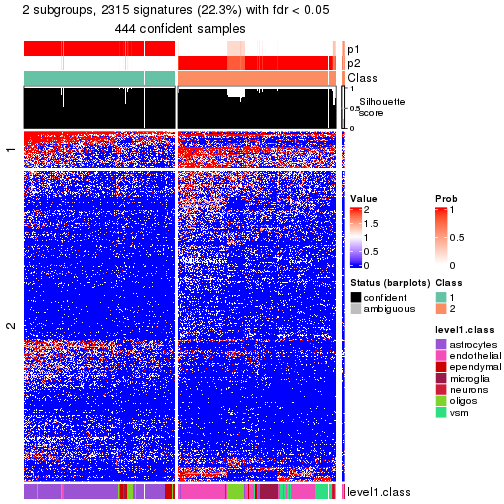</p>

</div>
<div id='tab-node-012-get-signatures-no-scale-2'>
<pre><code class="r">get_signatures(res, k = 3, scale_rows = FALSE)
</code></pre>

<p></p>

</div>
<div id='tab-node-012-get-signatures-no-scale-3'>
<pre><code class="r">get_signatures(res, k = 4, scale_rows = FALSE)
</code></pre>

<p></p>

</div>
</div>


Compare the overlap of signatures from different k:

```r
compare_signatures(res)
```


`get_signature()` returns a data frame invisibly. To get the list of signatures, the function
call should be assigned to a variable explicitly. In following code, if `plot` argument is set
to `FALSE`, no heatmap is plotted while only the differential analysis is performed.

```r
# code only for demonstration
tb = get_signature(res, k = ..., plot = FALSE)
```

An example of the output of `tb` is:

```
#>   which_row         fdr    mean_1    mean_2 scaled_mean_1 scaled_mean_2 km
#> 1        38 0.042760348  8.373488  9.131774    -0.5533452     0.5164555  1
#> 2        40 0.018707592  7.106213  8.469186    -0.6173731     0.5762149  1
#> 3        55 0.019134737 10.221463 11.207825    -0.6159697     0.5749050  1
#> 4        59 0.006059896  5.921854  7.869574    -0.6899429     0.6439467  1
#> 5        60 0.018055526  8.928898 10.211722    -0.6204761     0.5791110  1
#> 6        98 0.009384629 15.714769 14.887706     0.6635654    -0.6193277  2
...
```

The columns in `tb` are:

1. `which_row`: row indices corresponding to the input matrix.
2. `fdr`: FDR for the differential test. 
3. `mean_x`: The mean value in group x.
4. `scaled_mean_x`: The mean value in group x after rows are scaled.
5. `km`: Row groups if k-means clustering is applied to rows (which is done by automatically selecting number of clusters).

If there are too many signatures, `top_signatures = ...` can be set to only show the 
signatures with the highest FDRs:

```r
# code only for demonstration
# e.g. to show the top 500 most significant rows
tb = get_signature(res, k = ..., top_signatures = 500)
```

If the signatures are defined as these which are uniquely high in current group, `diff_method` argument
can be set to `"uniquely_high_in_one_group"`:

```r
# code only for demonstration
tb = get_signature(res, k = ..., diff_method = "uniquely_high_in_one_group")
```


UMAP plot which shows how samples are separated.


<script>
$( function() {
	$( '#tabs-node-012-dimension-reduction' ).tabs();
} );
</script>
<div id='tabs-node-012-dimension-reduction'>
<ul>
<li><a href='#tab-node-012-dimension-reduction-1'>k = 2</a></li>
<li><a href='#tab-node-012-dimension-reduction-2'>k = 3</a></li>
<li><a href='#tab-node-012-dimension-reduction-3'>k = 4</a></li>
</ul>
<div id='tab-node-012-dimension-reduction-1'>
<pre><code class="r">dimension_reduction(res, k = 2, method = &quot;UMAP&quot;)
</code></pre>

<p></p>

</div>
<div id='tab-node-012-dimension-reduction-2'>
<pre><code class="r">dimension_reduction(res, k = 3, method = &quot;UMAP&quot;)
</code></pre>

<p></p>

</div>
<div id='tab-node-012-dimension-reduction-3'>
<pre><code class="r">dimension_reduction(res, k = 4, method = &quot;UMAP&quot;)
</code></pre>

<p></p>

</div>
</div>


Following heatmap shows how subgroups are split when increasing `k`:

```r
collect_classes(res)
```

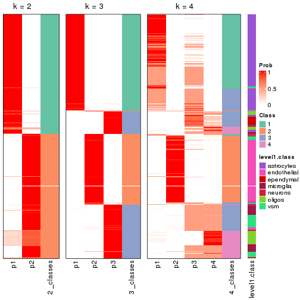


Test correlation between subgroups and known annotations. If the known
annotation is numeric, one-way ANOVA test is applied, and if the known
annotation is discrete, chi-squared contingency table test is applied.

```r
test_to_known_factors(res)
```

```
#>             n_sample level1.class(p-value) k
#> ATC:skmeans      444              1.62e-69 2
#> ATC:skmeans      446             1.88e-143 3
#> ATC:skmeans      289             3.24e-102 4
```


If matrix rows can be associated to genes, consider to use `functional_enrichment(res,
...)` to perform function enrichment for the signature genes. See [this vignette](https://jokergoo.github.io/cola_vignettes/functional_enrichment.html) for more detailed explanations.


 

---------------------------------------------------


### Node0121


Parent node: [Node012](#Node012).
Child nodes: 
                Node01131-leaf
        ,
                Node01132-leaf
        ,
                Node01133-leaf
        ,
                Node01211-leaf
        ,
                Node01212-leaf
        ,
                Node01221-leaf
        ,
                Node01222-leaf
        ,
                Node01223-leaf
        ,
                Node01231-leaf
        ,
                Node01232-leaf
        ,
                Node01233-leaf
        ,
                Node01234-leaf
        ,
                [Node02111](#Node02111)
        ,
                [Node02112](#Node02112)
        ,
                Node02113-leaf
        ,
                Node02121-leaf
        ,
                Node02122-leaf
        ,
                Node02123-leaf
        ,
                Node02221-leaf
        ,
                Node02222-leaf
        ,
                Node03111-leaf
        ,
                Node03112-leaf
        ,
                Node03121-leaf
        ,
                [Node03122](#Node03122)
        .


The object with results only for a single top-value method and a single partitioning method 
can be extracted as:

```r
res = res_rh["0121"]
```

A summary of `res` and all the functions that can be applied to it:

```r
res
```

```
#> A 'ConsensusPartition' object with k = 2, 3, 4.
#>   On a matrix with 7298 rows and 177 columns.
#>   Top rows (730) are extracted by 'ATC' method.
#>   Subgroups are detected by 'skmeans' method.
#>   Performed in total 150 partitions by row resampling.
#>   Best k for subgroups seems to be 2.
#> 
#> Following methods can be applied to this 'ConsensusPartition' object:
#>  [1] "cola_report"             "collect_classes"         "collect_plots"          
#>  [4] "collect_stats"           "colnames"                "compare_partitions"     
#>  [7] "compare_signatures"      "consensus_heatmap"       "dimension_reduction"    
#> [10] "functional_enrichment"   "get_anno_col"            "get_anno"               
#> [13] "get_classes"             "get_consensus"           "get_matrix"             
#> [16] "get_membership"          "get_param"               "get_signatures"         
#> [19] "get_stats"               "is_best_k"               "is_stable_k"            
#> [22] "membership_heatmap"      "ncol"                    "nrow"                   
#> [25] "plot_ecdf"               "predict_classes"         "rownames"               
#> [28] "select_partition_number" "show"                    "suggest_best_k"         
#> [31] "test_to_known_factors"   "top_rows_heatmap"
```

`collect_plots()` function collects all the plots made from `res` for all `k` (number of subgroups)
into one single page to provide an easy and fast comparison between different `k`.

```r
collect_plots(res)
```

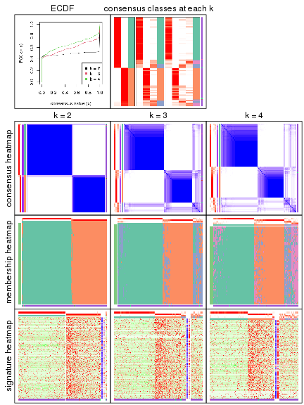

The plots are:

- The first row: a plot of the eCDF (empirical cumulative distribution
  function) curves of the consensus matrix for each `k` and the heatmap of
  predicted classes for each `k`.
- The second row: heatmaps of the consensus matrix for each `k`.
- The third row: heatmaps of the membership matrix for each `k`.
- The fouth row: heatmaps of the signatures for each `k`.

All the plots in panels can be made by individual functions and they are
plotted later in this section.

`select_partition_number()` produces several plots showing different
statistics for choosing "optimized" `k`. There are following statistics:

- eCDF curves of the consensus matrix for each `k`;
- 1-PAC. [The PAC score](https://en.wikipedia.org/wiki/Consensus_clustering#Over-interpretation_potential_of_consensus_clustering)
  measures the proportion of the ambiguous subgrouping.
- Mean silhouette score.
- Concordance. The mean probability of fiting the consensus subgroup labels in all
  partitions.
- Area increased. Denote $A_k$ as the area under the eCDF curve for current
  `k`, the area increased is defined as $A_k - A_{k-1}$.
- Rand index. The percent of pairs of samples that are both in a same cluster
  or both are not in a same cluster in the partition of k and k-1.
- Jaccard index. The ratio of pairs of samples are both in a same cluster in
  the partition of k and k-1 and the pairs of samples are both in a same
  cluster in the partition k or k-1.

The detailed explanations of these statistics can be found in [the _cola_
vignette](https://jokergoo.github.io/cola_vignettes/cola.html#toc_13).

Generally speaking, higher 1-PAC score, higher mean silhouette score or higher
concordance corresponds to better partition. Rand index and Jaccard index
measure how similar the current partition is compared to partition with `k-1`.
If they are too similar, we won't accept `k` is better than `k-1`.

```r
select_partition_number(res)
```


The numeric values for all these statistics can be obtained by `get_stats()`.

```r
get_stats(res)
```

```
#>   k 1-PAC mean_silhouette concordance area_increased  Rand Jaccard
#> 2 2 1.000           0.972       0.989          0.491 0.509   0.509
#> 3 3 0.755           0.794       0.906          0.210 0.895   0.796
#> 4 4 0.708           0.738       0.882          0.103 0.936   0.849
```

`suggest_best_k()` suggests the best $k$ based on these statistics. The rules are as follows:

- All $k$ with Jaccard index larger than 0.95 are removed because increasing
  $k$ does not provide enough extra information. If all $k$ are removed, it is
  marked as no subgroup is detected.
- For all $k$ with 1-PAC score larger than 0.9, the maximal $k$ is taken as
  the best $k$, and other $k$ are marked as optional $k$.
- If it does not fit the second rule. The $k$ with the maximal vote of the
  highest 1-PAC score, highest mean silhouette, and highest concordance is
  taken as the best $k$.

```r
suggest_best_k(res)
```

```
#> [1] 2
```


Following is the table of the partitions (You need to click the **show/hide
code output** link to see it). The membership matrix (columns with name `p*`)
is inferred by
[`clue::cl_consensus()`](https://www.rdocumentation.org/link/cl_consensus?package=clue)
function with the `SE` method. Basically the value in the membership matrix
represents the probability to belong to a certain group. The finall subgroup
label for an item is determined with the group with highest probability it
belongs to.

In `get_classes()` function, the entropy is calculated from the membership
matrix and the silhouette score is calculated from the consensus matrix.


<script>
$( function() {
	$( '#tabs-node-0121-get-classes' ).tabs();
} );
</script>
<div id='tabs-node-0121-get-classes'>
<ul>
<li><a href='#tab-node-0121-get-classes-1'>k = 2</a></li>
<li><a href='#tab-node-0121-get-classes-2'>k = 3</a></li>
<li><a href='#tab-node-0121-get-classes-3'>k = 4</a></li>
</ul>

<div id='tab-node-0121-get-classes-1'>
<p><a id='tab-node-0121-get-classes-1-a' style='color:#0366d6' href='#'>show/hide code output</a></p>
<pre><code class="r">cbind(get_classes(res, k = 2), get_membership(res, k = 2))
</code></pre>

<pre><code>#&gt;     class entropy silhouette   p1   p2
#&gt; 1       1   0.000     0.9919 1.00 0.00
#&gt; 2       2   0.000     0.9850 0.00 1.00
#&gt; 3       2   0.000     0.9850 0.00 1.00
#&gt; 4       2   0.000     0.9850 0.00 1.00
#&gt; 5       2   0.000     0.9850 0.00 1.00
#&gt; 6       2   0.000     0.9850 0.00 1.00
#&gt; 7       2   0.000     0.9850 0.00 1.00
#&gt; 8       2   0.000     0.9850 0.00 1.00
#&gt; 9       2   0.958     0.3950 0.38 0.62
#&gt; 10      2   0.000     0.9850 0.00 1.00
#&gt; 11      2   0.000     0.9850 0.00 1.00
#&gt; 12      2   0.000     0.9850 0.00 1.00
#&gt; 13      2   0.000     0.9850 0.00 1.00
#&gt; 14      2   0.000     0.9850 0.00 1.00
#&gt; 15      2   0.000     0.9850 0.00 1.00
#&gt; 16      2   0.000     0.9850 0.00 1.00
#&gt; 17      2   0.000     0.9850 0.00 1.00
#&gt; 18      2   0.000     0.9850 0.00 1.00
#&gt; 19      2   0.000     0.9850 0.00 1.00
#&gt; 20      2   0.000     0.9850 0.00 1.00
#&gt; 21      2   0.000     0.9850 0.00 1.00
#&gt; 22      2   0.000     0.9850 0.00 1.00
#&gt; 23      2   0.000     0.9850 0.00 1.00
#&gt; 24      2   0.000     0.9850 0.00 1.00
#&gt; 25      2   0.000     0.9850 0.00 1.00
#&gt; 26      2   0.000     0.9850 0.00 1.00
#&gt; 27      2   0.000     0.9850 0.00 1.00
#&gt; 28      2   0.000     0.9850 0.00 1.00
#&gt; 29      2   0.000     0.9850 0.00 1.00
#&gt; 30      2   0.000     0.9850 0.00 1.00
#&gt; 31      2   0.000     0.9850 0.00 1.00
#&gt; 32      2   0.000     0.9850 0.00 1.00
#&gt; 33      2   0.000     0.9850 0.00 1.00
#&gt; 34      2   0.000     0.9850 0.00 1.00
#&gt; 35      2   0.000     0.9850 0.00 1.00
#&gt; 36      1   0.000     0.9919 1.00 0.00
#&gt; 37      1   0.000     0.9919 1.00 0.00
#&gt; 38      2   0.000     0.9850 0.00 1.00
#&gt; 39      2   0.000     0.9850 0.00 1.00
#&gt; 40      2   0.000     0.9850 0.00 1.00
#&gt; 41      1   0.000     0.9919 1.00 0.00
#&gt; 42      1   0.000     0.9919 1.00 0.00
#&gt; 43      1   0.000     0.9919 1.00 0.00
#&gt; 44      2   0.000     0.9850 0.00 1.00
#&gt; 45      2   0.000     0.9850 0.00 1.00
#&gt; 46      1   0.141     0.9718 0.98 0.02
#&gt; 47      1   0.000     0.9919 1.00 0.00
#&gt; 48      2   0.141     0.9668 0.02 0.98
#&gt; 49      2   0.000     0.9850 0.00 1.00
#&gt; 50      1   0.000     0.9919 1.00 0.00
#&gt; 51      1   0.000     0.9919 1.00 0.00
#&gt; 52      2   0.000     0.9850 0.00 1.00
#&gt; 53      2   0.000     0.9850 0.00 1.00
#&gt; 54      2   0.000     0.9850 0.00 1.00
#&gt; 55      2   0.000     0.9850 0.00 1.00
#&gt; 56      1   0.000     0.9919 1.00 0.00
#&gt; 57      1   0.000     0.9919 1.00 0.00
#&gt; 58      2   0.000     0.9850 0.00 1.00
#&gt; 59      2   0.000     0.9850 0.00 1.00
#&gt; 60      1   0.000     0.9919 1.00 0.00
#&gt; 61      1   0.000     0.9919 1.00 0.00
#&gt; 62      1   0.000     0.9919 1.00 0.00
#&gt; 63      1   0.000     0.9919 1.00 0.00
#&gt; 64      2   0.000     0.9850 0.00 1.00
#&gt; 65      1   0.000     0.9919 1.00 0.00
#&gt; 66      1   0.000     0.9919 1.00 0.00
#&gt; 67      1   0.000     0.9919 1.00 0.00
#&gt; 68      1   0.000     0.9919 1.00 0.00
#&gt; 69      1   0.000     0.9919 1.00 0.00
#&gt; 70      1   0.000     0.9919 1.00 0.00
#&gt; 71      2   0.943     0.4458 0.36 0.64
#&gt; 72      1   0.855     0.6031 0.72 0.28
#&gt; 73      2   0.000     0.9850 0.00 1.00
#&gt; 74      1   0.000     0.9919 1.00 0.00
#&gt; 75      1   0.000     0.9919 1.00 0.00
#&gt; 76      1   0.000     0.9919 1.00 0.00
#&gt; 77      2   0.000     0.9850 0.00 1.00
#&gt; 78      1   0.000     0.9919 1.00 0.00
#&gt; 79      2   0.000     0.9850 0.00 1.00
#&gt; 80      2   0.000     0.9850 0.00 1.00
#&gt; 81      2   0.000     0.9850 0.00 1.00
#&gt; 82      2   0.000     0.9850 0.00 1.00
#&gt; 83      2   0.000     0.9850 0.00 1.00
#&gt; 84      2   0.000     0.9850 0.00 1.00
#&gt; 85      1   0.000     0.9919 1.00 0.00
#&gt; 86      1   0.000     0.9919 1.00 0.00
#&gt; 87      2   0.000     0.9850 0.00 1.00
#&gt; 88      2   0.000     0.9850 0.00 1.00
#&gt; 89      2   0.000     0.9850 0.00 1.00
#&gt; 90      2   0.141     0.9668 0.02 0.98
#&gt; 91      2   0.000     0.9850 0.00 1.00
#&gt; 92      2   0.827     0.6507 0.26 0.74
#&gt; 93      2   0.000     0.9850 0.00 1.00
#&gt; 94      2   0.000     0.9850 0.00 1.00
#&gt; 95      2   0.000     0.9850 0.00 1.00
#&gt; 96      2   0.000     0.9850 0.00 1.00
#&gt; 97      2   0.000     0.9850 0.00 1.00
#&gt; 98      1   0.000     0.9919 1.00 0.00
#&gt; 99      2   0.000     0.9850 0.00 1.00
#&gt; 100     1   0.000     0.9919 1.00 0.00
#&gt; 101     2   0.000     0.9850 0.00 1.00
#&gt; 102     1   0.000     0.9919 1.00 0.00
#&gt; 103     1   0.000     0.9919 1.00 0.00
#&gt; 104     1   0.000     0.9919 1.00 0.00
#&gt; 105     1   0.000     0.9919 1.00 0.00
#&gt; 106     2   0.000     0.9850 0.00 1.00
#&gt; 107     1   0.000     0.9919 1.00 0.00
#&gt; 108     1   0.000     0.9919 1.00 0.00
#&gt; 109     1   0.000     0.9919 1.00 0.00
#&gt; 110     1   0.000     0.9919 1.00 0.00
#&gt; 111     1   0.000     0.9919 1.00 0.00
#&gt; 112     1   0.000     0.9919 1.00 0.00
#&gt; 113     1   0.000     0.9919 1.00 0.00
#&gt; 114     1   0.000     0.9919 1.00 0.00
#&gt; 115     1   0.000     0.9919 1.00 0.00
#&gt; 116     1   0.000     0.9919 1.00 0.00
#&gt; 117     1   0.000     0.9919 1.00 0.00
#&gt; 118     1   0.000     0.9919 1.00 0.00
#&gt; 119     1   0.000     0.9919 1.00 0.00
#&gt; 120     1   0.000     0.9919 1.00 0.00
#&gt; 121     1   0.000     0.9919 1.00 0.00
#&gt; 122     1   0.000     0.9919 1.00 0.00
#&gt; 123     1   0.000     0.9919 1.00 0.00
#&gt; 124     1   0.000     0.9919 1.00 0.00
#&gt; 125     1   0.000     0.9919 1.00 0.00
#&gt; 126     1   0.000     0.9919 1.00 0.00
#&gt; 127     1   0.000     0.9919 1.00 0.00
#&gt; 128     1   0.000     0.9919 1.00 0.00
#&gt; 129     1   0.000     0.9919 1.00 0.00
#&gt; 130     1   0.000     0.9919 1.00 0.00
#&gt; 131     1   0.000     0.9919 1.00 0.00
#&gt; 132     1   0.000     0.9919 1.00 0.00
#&gt; 133     1   0.000     0.9919 1.00 0.00
#&gt; 134     1   0.000     0.9919 1.00 0.00
#&gt; 135     1   0.000     0.9919 1.00 0.00
#&gt; 136     1   0.000     0.9919 1.00 0.00
#&gt; 137     1   0.000     0.9919 1.00 0.00
#&gt; 138     1   0.000     0.9919 1.00 0.00
#&gt; 139     1   0.000     0.9919 1.00 0.00
#&gt; 140     1   0.000     0.9919 1.00 0.00
#&gt; 141     1   0.000     0.9919 1.00 0.00
#&gt; 142     1   0.000     0.9919 1.00 0.00
#&gt; 143     1   0.000     0.9919 1.00 0.00
#&gt; 144     1   0.000     0.9919 1.00 0.00
#&gt; 145     1   0.000     0.9919 1.00 0.00
#&gt; 146     1   0.000     0.9919 1.00 0.00
#&gt; 147     1   0.000     0.9919 1.00 0.00
#&gt; 148     1   0.000     0.9919 1.00 0.00
#&gt; 149     1   0.000     0.9919 1.00 0.00
#&gt; 150     1   0.000     0.9919 1.00 0.00
#&gt; 151     1   0.000     0.9919 1.00 0.00
#&gt; 152     1   0.000     0.9919 1.00 0.00
#&gt; 153     1   0.000     0.9919 1.00 0.00
#&gt; 154     1   0.000     0.9919 1.00 0.00
#&gt; 155     1   0.000     0.9919 1.00 0.00
#&gt; 156     1   0.000     0.9919 1.00 0.00
#&gt; 157     1   0.000     0.9919 1.00 0.00
#&gt; 158     1   0.000     0.9919 1.00 0.00
#&gt; 159     1   0.000     0.9919 1.00 0.00
#&gt; 160     1   0.000     0.9919 1.00 0.00
#&gt; 161     1   0.000     0.9919 1.00 0.00
#&gt; 162     1   0.000     0.9919 1.00 0.00
#&gt; 163     1   0.000     0.9919 1.00 0.00
#&gt; 164     1   0.000     0.9919 1.00 0.00
#&gt; 165     1   0.000     0.9919 1.00 0.00
#&gt; 166     1   0.000     0.9919 1.00 0.00
#&gt; 167     1   0.000     0.9919 1.00 0.00
#&gt; 168     1   0.000     0.9919 1.00 0.00
#&gt; 169     1   0.000     0.9919 1.00 0.00
#&gt; 170     2   0.327     0.9263 0.06 0.94
#&gt; 171     1   0.000     0.9919 1.00 0.00
#&gt; 172     2   0.000     0.9850 0.00 1.00
#&gt; 173     1   1.000    -0.0219 0.50 0.50
#&gt; 174     2   0.000     0.9850 0.00 1.00
#&gt; 175     1   0.000     0.9919 1.00 0.00
#&gt; 176     1   0.000     0.9919 1.00 0.00
#&gt; 177     2   0.000     0.9850 0.00 1.00
</code></pre>

<script>
$('#tab-node-0121-get-classes-1-a').parent().next().next().hide();
$('#tab-node-0121-get-classes-1-a').click(function(){
  $('#tab-node-0121-get-classes-1-a').parent().next().next().toggle();
  return(false);
});
</script>
</div>

<div id='tab-node-0121-get-classes-2'>
<p><a id='tab-node-0121-get-classes-2-a' style='color:#0366d6' href='#'>show/hide code output</a></p>
<pre><code class="r">cbind(get_classes(res, k = 3), get_membership(res, k = 3))
</code></pre>

<pre><code>#&gt;     class entropy silhouette   p1   p2   p3
#&gt; 1       1  0.0892     0.9261 0.98 0.00 0.02
#&gt; 2       2  0.0000     0.8959 0.00 1.00 0.00
#&gt; 3       2  0.0000     0.8959 0.00 1.00 0.00
#&gt; 4       2  0.0000     0.8959 0.00 1.00 0.00
#&gt; 5       2  0.0000     0.8959 0.00 1.00 0.00
#&gt; 6       2  0.6309    -0.0244 0.00 0.50 0.50
#&gt; 7       2  0.0000     0.8959 0.00 1.00 0.00
#&gt; 8       2  0.0000     0.8959 0.00 1.00 0.00
#&gt; 9       3  0.8859     0.2933 0.12 0.40 0.48
#&gt; 10      2  0.0000     0.8959 0.00 1.00 0.00
#&gt; 11      2  0.0000     0.8959 0.00 1.00 0.00
#&gt; 12      2  0.0000     0.8959 0.00 1.00 0.00
#&gt; 13      2  0.0000     0.8959 0.00 1.00 0.00
#&gt; 14      2  0.0000     0.8959 0.00 1.00 0.00
#&gt; 15      2  0.4796     0.6716 0.00 0.78 0.22
#&gt; 16      2  0.0000     0.8959 0.00 1.00 0.00
#&gt; 17      2  0.0000     0.8959 0.00 1.00 0.00
#&gt; 18      2  0.0000     0.8959 0.00 1.00 0.00
#&gt; 19      2  0.0000     0.8959 0.00 1.00 0.00
#&gt; 20      2  0.0000     0.8959 0.00 1.00 0.00
#&gt; 21      2  0.0000     0.8959 0.00 1.00 0.00
#&gt; 22      2  0.0000     0.8959 0.00 1.00 0.00
#&gt; 23      2  0.0000     0.8959 0.00 1.00 0.00
#&gt; 24      2  0.0000     0.8959 0.00 1.00 0.00
#&gt; 25      2  0.0000     0.8959 0.00 1.00 0.00
#&gt; 26      2  0.0000     0.8959 0.00 1.00 0.00
#&gt; 27      2  0.0000     0.8959 0.00 1.00 0.00
#&gt; 28      2  0.0000     0.8959 0.00 1.00 0.00
#&gt; 29      2  0.0000     0.8959 0.00 1.00 0.00
#&gt; 30      2  0.0000     0.8959 0.00 1.00 0.00
#&gt; 31      2  0.0000     0.8959 0.00 1.00 0.00
#&gt; 32      2  0.0000     0.8959 0.00 1.00 0.00
#&gt; 33      2  0.0000     0.8959 0.00 1.00 0.00
#&gt; 34      2  0.0000     0.8959 0.00 1.00 0.00
#&gt; 35      2  0.0000     0.8959 0.00 1.00 0.00
#&gt; 36      3  0.6045     0.4570 0.38 0.00 0.62
#&gt; 37      1  0.1529     0.9095 0.96 0.00 0.04
#&gt; 38      2  0.4796     0.6664 0.00 0.78 0.22
#&gt; 39      2  0.0000     0.8959 0.00 1.00 0.00
#&gt; 40      2  0.6045     0.3691 0.00 0.62 0.38
#&gt; 41      1  0.0892     0.9261 0.98 0.00 0.02
#&gt; 42      3  0.6302     0.2159 0.48 0.00 0.52
#&gt; 43      1  0.2066     0.8860 0.94 0.00 0.06
#&gt; 44      2  0.4796     0.6677 0.00 0.78 0.22
#&gt; 45      2  0.6192     0.2346 0.00 0.58 0.42
#&gt; 46      3  0.4796     0.6312 0.22 0.00 0.78
#&gt; 47      3  0.5948     0.5063 0.36 0.00 0.64
#&gt; 48      3  0.5706     0.4458 0.00 0.32 0.68
#&gt; 49      2  0.5835     0.4503 0.00 0.66 0.34
#&gt; 50      1  0.3686     0.7895 0.86 0.00 0.14
#&gt; 51      1  0.6192     0.0909 0.58 0.00 0.42
#&gt; 52      2  0.5706     0.4997 0.00 0.68 0.32
#&gt; 53      2  0.0892     0.8797 0.00 0.98 0.02
#&gt; 54      2  0.0000     0.8959 0.00 1.00 0.00
#&gt; 55      3  0.5397     0.4831 0.00 0.28 0.72
#&gt; 56      1  0.2066     0.8896 0.94 0.00 0.06
#&gt; 57      3  0.5216     0.6160 0.26 0.00 0.74
#&gt; 58      2  0.5948     0.4216 0.00 0.64 0.36
#&gt; 59      3  0.5835     0.3802 0.00 0.34 0.66
#&gt; 60      1  0.3340     0.8287 0.88 0.00 0.12
#&gt; 61      1  0.0000     0.9409 1.00 0.00 0.00
#&gt; 62      1  0.0000     0.9409 1.00 0.00 0.00
#&gt; 63      1  0.0000     0.9409 1.00 0.00 0.00
#&gt; 64      2  0.0000     0.8959 0.00 1.00 0.00
#&gt; 65      1  0.5706     0.5188 0.68 0.00 0.32
#&gt; 66      1  0.0000     0.9409 1.00 0.00 0.00
#&gt; 67      1  0.0892     0.9261 0.98 0.00 0.02
#&gt; 68      1  0.0000     0.9409 1.00 0.00 0.00
#&gt; 69      1  0.3340     0.8275 0.88 0.00 0.12
#&gt; 70      1  0.0000     0.9409 1.00 0.00 0.00
#&gt; 71      3  0.6245     0.5998 0.06 0.18 0.76
#&gt; 72      3  0.9020     0.5117 0.22 0.22 0.56
#&gt; 73      2  0.6302     0.0241 0.00 0.52 0.48
#&gt; 74      1  0.6192     0.2870 0.58 0.00 0.42
#&gt; 75      1  0.5948     0.4342 0.64 0.00 0.36
#&gt; 76      1  0.0000     0.9409 1.00 0.00 0.00
#&gt; 77      2  0.5016     0.6025 0.00 0.76 0.24
#&gt; 78      1  0.4555     0.7210 0.80 0.00 0.20
#&gt; 79      2  0.2959     0.8115 0.00 0.90 0.10
#&gt; 80      2  0.0000     0.8959 0.00 1.00 0.00
#&gt; 81      2  0.0000     0.8959 0.00 1.00 0.00
#&gt; 82      2  0.0000     0.8959 0.00 1.00 0.00
#&gt; 83      2  0.5397     0.5241 0.00 0.72 0.28
#&gt; 84      2  0.2066     0.8420 0.00 0.94 0.06
#&gt; 85      1  0.6984     0.2275 0.56 0.02 0.42
#&gt; 86      1  0.5835     0.4770 0.66 0.00 0.34
#&gt; 87      2  0.0000     0.8959 0.00 1.00 0.00
#&gt; 88      2  0.6126     0.3013 0.00 0.60 0.40
#&gt; 89      3  0.4796     0.5408 0.00 0.22 0.78
#&gt; 90      3  0.4796     0.5432 0.00 0.22 0.78
#&gt; 91      2  0.2959     0.8128 0.00 0.90 0.10
#&gt; 92      3  0.6677     0.5905 0.08 0.18 0.74
#&gt; 93      2  0.6126     0.3179 0.00 0.60 0.40
#&gt; 94      2  0.0000     0.8959 0.00 1.00 0.00
#&gt; 95      2  0.0000     0.8959 0.00 1.00 0.00
#&gt; 96      2  0.0000     0.8959 0.00 1.00 0.00
#&gt; 97      2  0.0000     0.8959 0.00 1.00 0.00
#&gt; 98      1  0.5560     0.5581 0.70 0.00 0.30
#&gt; 99      3  0.5397     0.4665 0.00 0.28 0.72
#&gt; 100     1  0.5706     0.5254 0.68 0.00 0.32
#&gt; 101     2  0.0000     0.8959 0.00 1.00 0.00
#&gt; 102     1  0.2066     0.8906 0.94 0.00 0.06
#&gt; 103     1  0.5397     0.5946 0.72 0.00 0.28
#&gt; 104     3  0.5835     0.5355 0.34 0.00 0.66
#&gt; 105     1  0.6045     0.2380 0.62 0.00 0.38
#&gt; 106     3  0.6280     0.0975 0.00 0.46 0.54
#&gt; 107     1  0.0000     0.9409 1.00 0.00 0.00
#&gt; 108     3  0.6045     0.4751 0.38 0.00 0.62
#&gt; 109     1  0.0000     0.9409 1.00 0.00 0.00
#&gt; 110     1  0.0000     0.9409 1.00 0.00 0.00
#&gt; 111     1  0.0000     0.9409 1.00 0.00 0.00
#&gt; 112     1  0.0000     0.9409 1.00 0.00 0.00
#&gt; 113     1  0.0000     0.9409 1.00 0.00 0.00
#&gt; 114     1  0.0000     0.9409 1.00 0.00 0.00
#&gt; 115     1  0.0000     0.9409 1.00 0.00 0.00
#&gt; 116     1  0.0000     0.9409 1.00 0.00 0.00
#&gt; 117     1  0.0000     0.9409 1.00 0.00 0.00
#&gt; 118     1  0.0000     0.9409 1.00 0.00 0.00
#&gt; 119     1  0.0000     0.9409 1.00 0.00 0.00
#&gt; 120     1  0.0000     0.9409 1.00 0.00 0.00
#&gt; 121     1  0.0000     0.9409 1.00 0.00 0.00
#&gt; 122     1  0.0000     0.9409 1.00 0.00 0.00
#&gt; 123     1  0.0000     0.9409 1.00 0.00 0.00
#&gt; 124     1  0.0000     0.9409 1.00 0.00 0.00
#&gt; 125     1  0.0000     0.9409 1.00 0.00 0.00
#&gt; 126     1  0.0000     0.9409 1.00 0.00 0.00
#&gt; 127     1  0.0000     0.9409 1.00 0.00 0.00
#&gt; 128     1  0.0000     0.9409 1.00 0.00 0.00
#&gt; 129     1  0.0000     0.9409 1.00 0.00 0.00
#&gt; 130     1  0.0892     0.9247 0.98 0.00 0.02
#&gt; 131     1  0.0000     0.9409 1.00 0.00 0.00
#&gt; 132     1  0.0000     0.9409 1.00 0.00 0.00
#&gt; 133     1  0.0000     0.9409 1.00 0.00 0.00
#&gt; 134     1  0.0000     0.9409 1.00 0.00 0.00
#&gt; 135     1  0.0000     0.9409 1.00 0.00 0.00
#&gt; 136     1  0.0000     0.9409 1.00 0.00 0.00
#&gt; 137     1  0.0000     0.9409 1.00 0.00 0.00
#&gt; 138     1  0.0000     0.9409 1.00 0.00 0.00
#&gt; 139     1  0.1529     0.9060 0.96 0.00 0.04
#&gt; 140     1  0.0000     0.9409 1.00 0.00 0.00
#&gt; 141     1  0.0892     0.9247 0.98 0.00 0.02
#&gt; 142     1  0.0000     0.9409 1.00 0.00 0.00
#&gt; 143     1  0.0000     0.9409 1.00 0.00 0.00
#&gt; 144     1  0.0000     0.9409 1.00 0.00 0.00
#&gt; 145     1  0.0000     0.9409 1.00 0.00 0.00
#&gt; 146     1  0.0000     0.9409 1.00 0.00 0.00
#&gt; 147     1  0.0000     0.9409 1.00 0.00 0.00
#&gt; 148     1  0.0000     0.9409 1.00 0.00 0.00
#&gt; 149     1  0.0000     0.9409 1.00 0.00 0.00
#&gt; 150     1  0.0000     0.9409 1.00 0.00 0.00
#&gt; 151     1  0.0000     0.9409 1.00 0.00 0.00
#&gt; 152     1  0.0000     0.9409 1.00 0.00 0.00
#&gt; 153     1  0.0000     0.9409 1.00 0.00 0.00
#&gt; 154     1  0.0000     0.9409 1.00 0.00 0.00
#&gt; 155     1  0.0000     0.9409 1.00 0.00 0.00
#&gt; 156     1  0.0000     0.9409 1.00 0.00 0.00
#&gt; 157     1  0.0000     0.9409 1.00 0.00 0.00
#&gt; 158     1  0.0000     0.9409 1.00 0.00 0.00
#&gt; 159     1  0.0000     0.9409 1.00 0.00 0.00
#&gt; 160     1  0.0892     0.9257 0.98 0.00 0.02
#&gt; 161     1  0.0000     0.9409 1.00 0.00 0.00
#&gt; 162     1  0.0000     0.9409 1.00 0.00 0.00
#&gt; 163     1  0.0000     0.9409 1.00 0.00 0.00
#&gt; 164     1  0.0000     0.9409 1.00 0.00 0.00
#&gt; 165     1  0.0000     0.9409 1.00 0.00 0.00
#&gt; 166     1  0.0000     0.9409 1.00 0.00 0.00
#&gt; 167     1  0.0000     0.9409 1.00 0.00 0.00
#&gt; 168     1  0.0000     0.9409 1.00 0.00 0.00
#&gt; 169     1  0.0000     0.9409 1.00 0.00 0.00
#&gt; 170     3  0.7310     0.4170 0.04 0.36 0.60
#&gt; 171     1  0.0000     0.9409 1.00 0.00 0.00
#&gt; 172     2  0.0000     0.8959 0.00 1.00 0.00
#&gt; 173     3  0.8631     0.5933 0.18 0.22 0.60
#&gt; 174     2  0.5397     0.5781 0.00 0.72 0.28
#&gt; 175     1  0.0000     0.9409 1.00 0.00 0.00
#&gt; 176     1  0.0892     0.9253 0.98 0.00 0.02
#&gt; 177     2  0.0000     0.8959 0.00 1.00 0.00
</code></pre>

<script>
$('#tab-node-0121-get-classes-2-a').parent().next().next().hide();
$('#tab-node-0121-get-classes-2-a').click(function(){
  $('#tab-node-0121-get-classes-2-a').parent().next().next().toggle();
  return(false);
});
</script>
</div>

<div id='tab-node-0121-get-classes-3'>
<p><a id='tab-node-0121-get-classes-3-a' style='color:#0366d6' href='#'>show/hide code output</a></p>
<pre><code class="r">cbind(get_classes(res, k = 4), get_membership(res, k = 4))
</code></pre>

<pre><code>#&gt;     class entropy silhouette   p1   p2   p3   p4
#&gt; 1       1  0.3610     0.7559 0.80 0.00 0.00 0.20
#&gt; 2       2  0.0000     0.8783 0.00 1.00 0.00 0.00
#&gt; 3       2  0.0000     0.8783 0.00 1.00 0.00 0.00
#&gt; 4       2  0.0000     0.8783 0.00 1.00 0.00 0.00
#&gt; 5       2  0.0000     0.8783 0.00 1.00 0.00 0.00
#&gt; 6       2  0.6766     0.2470 0.00 0.52 0.38 0.10
#&gt; 7       2  0.0000     0.8783 0.00 1.00 0.00 0.00
#&gt; 8       2  0.0000     0.8783 0.00 1.00 0.00 0.00
#&gt; 9       4  0.3821     0.4772 0.00 0.04 0.12 0.84
#&gt; 10      2  0.0000     0.8783 0.00 1.00 0.00 0.00
#&gt; 11      2  0.0000     0.8783 0.00 1.00 0.00 0.00
#&gt; 12      2  0.0000     0.8783 0.00 1.00 0.00 0.00
#&gt; 13      2  0.1637     0.8457 0.00 0.94 0.06 0.00
#&gt; 14      2  0.0000     0.8783 0.00 1.00 0.00 0.00
#&gt; 15      2  0.6074     0.4262 0.00 0.60 0.34 0.06
#&gt; 16      2  0.0000     0.8783 0.00 1.00 0.00 0.00
#&gt; 17      2  0.0000     0.8783 0.00 1.00 0.00 0.00
#&gt; 18      2  0.0000     0.8783 0.00 1.00 0.00 0.00
#&gt; 19      2  0.0000     0.8783 0.00 1.00 0.00 0.00
#&gt; 20      2  0.0000     0.8783 0.00 1.00 0.00 0.00
#&gt; 21      2  0.0000     0.8783 0.00 1.00 0.00 0.00
#&gt; 22      2  0.0000     0.8783 0.00 1.00 0.00 0.00
#&gt; 23      2  0.0000     0.8783 0.00 1.00 0.00 0.00
#&gt; 24      2  0.0000     0.8783 0.00 1.00 0.00 0.00
#&gt; 25      2  0.0000     0.8783 0.00 1.00 0.00 0.00
#&gt; 26      2  0.0000     0.8783 0.00 1.00 0.00 0.00
#&gt; 27      2  0.0000     0.8783 0.00 1.00 0.00 0.00
#&gt; 28      2  0.0000     0.8783 0.00 1.00 0.00 0.00
#&gt; 29      2  0.0000     0.8783 0.00 1.00 0.00 0.00
#&gt; 30      2  0.0000     0.8783 0.00 1.00 0.00 0.00
#&gt; 31      2  0.0000     0.8783 0.00 1.00 0.00 0.00
#&gt; 32      2  0.0000     0.8783 0.00 1.00 0.00 0.00
#&gt; 33      2  0.0000     0.8783 0.00 1.00 0.00 0.00
#&gt; 34      2  0.0000     0.8783 0.00 1.00 0.00 0.00
#&gt; 35      2  0.0000     0.8783 0.00 1.00 0.00 0.00
#&gt; 36      3  0.7382     0.2676 0.26 0.00 0.52 0.22
#&gt; 37      1  0.3400     0.7777 0.82 0.00 0.00 0.18
#&gt; 38      2  0.5173     0.5371 0.00 0.66 0.32 0.02
#&gt; 39      2  0.0000     0.8783 0.00 1.00 0.00 0.00
#&gt; 40      2  0.5271     0.4979 0.00 0.64 0.34 0.02
#&gt; 41      1  0.2647     0.8515 0.88 0.00 0.00 0.12
#&gt; 42      3  0.6976     0.2835 0.24 0.00 0.58 0.18
#&gt; 43      1  0.2706     0.8721 0.90 0.00 0.02 0.08
#&gt; 44      2  0.4948     0.3124 0.00 0.56 0.44 0.00
#&gt; 45      3  0.4713     0.2929 0.00 0.36 0.64 0.00
#&gt; 46      3  0.6574     0.1009 0.04 0.02 0.52 0.42
#&gt; 47      3  0.3037     0.5013 0.10 0.00 0.88 0.02
#&gt; 48      4  0.6366     0.3079 0.00 0.12 0.24 0.64
#&gt; 49      2  0.4277     0.6262 0.00 0.72 0.28 0.00
#&gt; 50      1  0.5594     0.6201 0.72 0.00 0.18 0.10
#&gt; 51      1  0.5487     0.2112 0.58 0.00 0.40 0.02
#&gt; 52      2  0.7310     0.1119 0.00 0.48 0.36 0.16
#&gt; 53      2  0.2830     0.8216 0.00 0.90 0.06 0.04
#&gt; 54      2  0.3525     0.7847 0.00 0.86 0.04 0.10
#&gt; 55      3  0.5428     0.4090 0.00 0.14 0.74 0.12
#&gt; 56      1  0.3853     0.7872 0.82 0.00 0.02 0.16
#&gt; 57      3  0.5657     0.4303 0.16 0.00 0.72 0.12
#&gt; 58      2  0.6805     0.1743 0.00 0.50 0.40 0.10
#&gt; 59      4  0.7135     0.2244 0.00 0.20 0.24 0.56
#&gt; 60      1  0.7121     0.1784 0.54 0.00 0.16 0.30
#&gt; 61      1  0.2647     0.8481 0.88 0.00 0.00 0.12
#&gt; 62      1  0.2921     0.8284 0.86 0.00 0.00 0.14
#&gt; 63      1  0.0000     0.9334 1.00 0.00 0.00 0.00
#&gt; 64      2  0.2011     0.8345 0.00 0.92 0.08 0.00
#&gt; 65      4  0.5487     0.2343 0.40 0.00 0.02 0.58
#&gt; 66      1  0.0707     0.9225 0.98 0.00 0.00 0.02
#&gt; 67      1  0.2647     0.8488 0.88 0.00 0.00 0.12
#&gt; 68      1  0.1211     0.9121 0.96 0.00 0.00 0.04
#&gt; 69      1  0.4936     0.5832 0.70 0.00 0.02 0.28
#&gt; 70      1  0.1211     0.9109 0.96 0.00 0.00 0.04
#&gt; 71      4  0.7075     0.1351 0.02 0.08 0.36 0.54
#&gt; 72      4  0.5255     0.5206 0.08 0.02 0.12 0.78
#&gt; 73      4  0.4292     0.4900 0.00 0.10 0.08 0.82
#&gt; 74      4  0.3611     0.5480 0.08 0.00 0.06 0.86
#&gt; 75      4  0.3335     0.5167 0.12 0.00 0.02 0.86
#&gt; 76      1  0.0000     0.9334 1.00 0.00 0.00 0.00
#&gt; 77      2  0.6611    -0.0145 0.00 0.46 0.08 0.46
#&gt; 78      1  0.4624     0.4719 0.66 0.00 0.00 0.34
#&gt; 79      2  0.4277     0.6290 0.00 0.72 0.28 0.00
#&gt; 80      2  0.0000     0.8783 0.00 1.00 0.00 0.00
#&gt; 81      2  0.1637     0.8452 0.00 0.94 0.00 0.06
#&gt; 82      2  0.0000     0.8783 0.00 1.00 0.00 0.00
#&gt; 83      2  0.6011     0.0369 0.00 0.48 0.04 0.48
#&gt; 84      2  0.4797     0.6270 0.00 0.72 0.02 0.26
#&gt; 85      4  0.2335     0.5417 0.06 0.00 0.02 0.92
#&gt; 86      4  0.4134     0.4200 0.26 0.00 0.00 0.74
#&gt; 87      2  0.0707     0.8663 0.00 0.98 0.00 0.02
#&gt; 88      2  0.6323     0.1758 0.00 0.50 0.44 0.06
#&gt; 89      3  0.1637     0.4792 0.00 0.06 0.94 0.00
#&gt; 90      3  0.2335     0.4472 0.00 0.02 0.92 0.06
#&gt; 91      2  0.3606     0.7670 0.00 0.84 0.14 0.02
#&gt; 92      4  0.6782     0.3203 0.04 0.04 0.34 0.58
#&gt; 93      2  0.7653     0.1092 0.00 0.46 0.30 0.24
#&gt; 94      2  0.0707     0.8679 0.00 0.98 0.02 0.00
#&gt; 95      2  0.0000     0.8783 0.00 1.00 0.00 0.00
#&gt; 96      2  0.0000     0.8783 0.00 1.00 0.00 0.00
#&gt; 97      2  0.0000     0.8783 0.00 1.00 0.00 0.00
#&gt; 98      4  0.5767     0.3546 0.28 0.00 0.06 0.66
#&gt; 99      4  0.6104     0.3830 0.00 0.18 0.14 0.68
#&gt; 100     4  0.6881     0.2543 0.34 0.00 0.12 0.54
#&gt; 101     2  0.0707     0.8676 0.00 0.98 0.02 0.00
#&gt; 102     1  0.4936     0.5885 0.70 0.00 0.02 0.28
#&gt; 103     1  0.4907     0.2603 0.58 0.00 0.00 0.42
#&gt; 104     3  0.5383     0.4191 0.10 0.00 0.74 0.16
#&gt; 105     3  0.4977     0.1562 0.46 0.00 0.54 0.00
#&gt; 106     3  0.3975     0.4111 0.00 0.24 0.76 0.00
#&gt; 107     1  0.0000     0.9334 1.00 0.00 0.00 0.00
#&gt; 108     3  0.5820     0.3948 0.24 0.00 0.68 0.08
#&gt; 109     1  0.0000     0.9334 1.00 0.00 0.00 0.00
#&gt; 110     1  0.0707     0.9221 0.98 0.00 0.02 0.00
#&gt; 111     1  0.0000     0.9334 1.00 0.00 0.00 0.00
#&gt; 112     1  0.0707     0.9221 0.98 0.00 0.02 0.00
#&gt; 113     1  0.0000     0.9334 1.00 0.00 0.00 0.00
#&gt; 114     1  0.0000     0.9334 1.00 0.00 0.00 0.00
#&gt; 115     1  0.0000     0.9334 1.00 0.00 0.00 0.00
#&gt; 116     1  0.0000     0.9334 1.00 0.00 0.00 0.00
#&gt; 117     1  0.0000     0.9334 1.00 0.00 0.00 0.00
#&gt; 118     1  0.0000     0.9334 1.00 0.00 0.00 0.00
#&gt; 119     1  0.0000     0.9334 1.00 0.00 0.00 0.00
#&gt; 120     1  0.2011     0.8817 0.92 0.00 0.00 0.08
#&gt; 121     1  0.0000     0.9334 1.00 0.00 0.00 0.00
#&gt; 122     1  0.0000     0.9334 1.00 0.00 0.00 0.00
#&gt; 123     1  0.0000     0.9334 1.00 0.00 0.00 0.00
#&gt; 124     1  0.0000     0.9334 1.00 0.00 0.00 0.00
#&gt; 125     1  0.0000     0.9334 1.00 0.00 0.00 0.00
#&gt; 126     1  0.0000     0.9334 1.00 0.00 0.00 0.00
#&gt; 127     1  0.0707     0.9221 0.98 0.00 0.00 0.02
#&gt; 128     1  0.0000     0.9334 1.00 0.00 0.00 0.00
#&gt; 129     1  0.0000     0.9334 1.00 0.00 0.00 0.00
#&gt; 130     1  0.2345     0.8518 0.90 0.00 0.10 0.00
#&gt; 131     1  0.0000     0.9334 1.00 0.00 0.00 0.00
#&gt; 132     1  0.0707     0.9221 0.98 0.00 0.02 0.00
#&gt; 133     1  0.0000     0.9334 1.00 0.00 0.00 0.00
#&gt; 134     1  0.1913     0.9015 0.94 0.00 0.02 0.04
#&gt; 135     1  0.0000     0.9334 1.00 0.00 0.00 0.00
#&gt; 136     1  0.0000     0.9334 1.00 0.00 0.00 0.00
#&gt; 137     1  0.0000     0.9334 1.00 0.00 0.00 0.00
#&gt; 138     1  0.0000     0.9334 1.00 0.00 0.00 0.00
#&gt; 139     1  0.2706     0.8656 0.90 0.00 0.08 0.02
#&gt; 140     1  0.0000     0.9334 1.00 0.00 0.00 0.00
#&gt; 141     1  0.0707     0.9217 0.98 0.00 0.02 0.00
#&gt; 142     1  0.0000     0.9334 1.00 0.00 0.00 0.00
#&gt; 143     1  0.0000     0.9334 1.00 0.00 0.00 0.00
#&gt; 144     1  0.0000     0.9334 1.00 0.00 0.00 0.00
#&gt; 145     1  0.0000     0.9334 1.00 0.00 0.00 0.00
#&gt; 146     1  0.0000     0.9334 1.00 0.00 0.00 0.00
#&gt; 147     1  0.0000     0.9334 1.00 0.00 0.00 0.00
#&gt; 148     1  0.0000     0.9334 1.00 0.00 0.00 0.00
#&gt; 149     1  0.0000     0.9334 1.00 0.00 0.00 0.00
#&gt; 150     1  0.0000     0.9334 1.00 0.00 0.00 0.00
#&gt; 151     1  0.0000     0.9334 1.00 0.00 0.00 0.00
#&gt; 152     1  0.0000     0.9334 1.00 0.00 0.00 0.00
#&gt; 153     1  0.0000     0.9334 1.00 0.00 0.00 0.00
#&gt; 154     1  0.0000     0.9334 1.00 0.00 0.00 0.00
#&gt; 155     1  0.0000     0.9334 1.00 0.00 0.00 0.00
#&gt; 156     1  0.0000     0.9334 1.00 0.00 0.00 0.00
#&gt; 157     1  0.0000     0.9334 1.00 0.00 0.00 0.00
#&gt; 158     1  0.2011     0.8844 0.92 0.00 0.00 0.08
#&gt; 159     1  0.0707     0.9225 0.98 0.00 0.00 0.02
#&gt; 160     1  0.5291     0.6655 0.74 0.00 0.08 0.18
#&gt; 161     1  0.0000     0.9334 1.00 0.00 0.00 0.00
#&gt; 162     1  0.1211     0.9108 0.96 0.00 0.00 0.04
#&gt; 163     1  0.0000     0.9334 1.00 0.00 0.00 0.00
#&gt; 164     1  0.0000     0.9334 1.00 0.00 0.00 0.00
#&gt; 165     1  0.3247     0.8406 0.88 0.00 0.06 0.06
#&gt; 166     1  0.0000     0.9334 1.00 0.00 0.00 0.00
#&gt; 167     1  0.0000     0.9334 1.00 0.00 0.00 0.00
#&gt; 168     1  0.0000     0.9334 1.00 0.00 0.00 0.00
#&gt; 169     1  0.0000     0.9334 1.00 0.00 0.00 0.00
#&gt; 170     3  0.6110     0.3661 0.00 0.24 0.66 0.10
#&gt; 171     1  0.0000     0.9334 1.00 0.00 0.00 0.00
#&gt; 172     2  0.1211     0.8570 0.00 0.96 0.04 0.00
#&gt; 173     3  0.7568     0.3929 0.14 0.06 0.62 0.18
#&gt; 174     2  0.5256     0.5952 0.00 0.70 0.26 0.04
#&gt; 175     1  0.0000     0.9334 1.00 0.00 0.00 0.00
#&gt; 176     1  0.5661     0.5466 0.70 0.00 0.08 0.22
#&gt; 177     2  0.0000     0.8783 0.00 1.00 0.00 0.00
</code></pre>

<script>
$('#tab-node-0121-get-classes-3-a').parent().next().next().hide();
$('#tab-node-0121-get-classes-3-a').click(function(){
  $('#tab-node-0121-get-classes-3-a').parent().next().next().toggle();
  return(false);
});
</script>
</div>
</div>

Heatmaps for the consensus matrix. It visualizes the probability of two
samples to be in a same group.


<script>
$( function() {
	$( '#tabs-node-0121-consensus-heatmap' ).tabs();
} );
</script>
<div id='tabs-node-0121-consensus-heatmap'>
<ul>
<li><a href='#tab-node-0121-consensus-heatmap-1'>k = 2</a></li>
<li><a href='#tab-node-0121-consensus-heatmap-2'>k = 3</a></li>
<li><a href='#tab-node-0121-consensus-heatmap-3'>k = 4</a></li>
</ul>
<div id='tab-node-0121-consensus-heatmap-1'>
<pre><code class="r">consensus_heatmap(res, k = 2)
</code></pre>

<p></p>

</div>
<div id='tab-node-0121-consensus-heatmap-2'>
<pre><code class="r">consensus_heatmap(res, k = 3)
</code></pre>

<p></p>

</div>
<div id='tab-node-0121-consensus-heatmap-3'>
<pre><code class="r">consensus_heatmap(res, k = 4)
</code></pre>

<p></p>

</div>
</div>

Heatmaps for the membership of samples in all partitions to see how consistent they are:


<script>
$( function() {
	$( '#tabs-node-0121-membership-heatmap' ).tabs();
} );
</script>
<div id='tabs-node-0121-membership-heatmap'>
<ul>
<li><a href='#tab-node-0121-membership-heatmap-1'>k = 2</a></li>
<li><a href='#tab-node-0121-membership-heatmap-2'>k = 3</a></li>
<li><a href='#tab-node-0121-membership-heatmap-3'>k = 4</a></li>
</ul>
<div id='tab-node-0121-membership-heatmap-1'>
<pre><code class="r">membership_heatmap(res, k = 2)
</code></pre>

<p></p>

</div>
<div id='tab-node-0121-membership-heatmap-2'>
<pre><code class="r">membership_heatmap(res, k = 3)
</code></pre>

<p></p>

</div>
<div id='tab-node-0121-membership-heatmap-3'>
<pre><code class="r">membership_heatmap(res, k = 4)
</code></pre>

<p></p>

</div>
</div>

As soon as the classes for columns are determined, the signatures
that are significantly different between subgroups can be looked for. 
Following are the heatmaps for signatures.


Signature heatmaps where rows are scaled:


<script>
$( function() {
	$( '#tabs-node-0121-get-signatures' ).tabs();
} );
</script>
<div id='tabs-node-0121-get-signatures'>
<ul>
<li><a href='#tab-node-0121-get-signatures-1'>k = 2</a></li>
<li><a href='#tab-node-0121-get-signatures-2'>k = 3</a></li>
<li><a href='#tab-node-0121-get-signatures-3'>k = 4</a></li>
</ul>
<div id='tab-node-0121-get-signatures-1'>
<pre><code class="r">get_signatures(res, k = 2)
</code></pre>

<p></p>

</div>
<div id='tab-node-0121-get-signatures-2'>
<pre><code class="r">get_signatures(res, k = 3)
</code></pre>

<p></p>

</div>
<div id='tab-node-0121-get-signatures-3'>
<pre><code class="r">get_signatures(res, k = 4)
</code></pre>

<p></p>

</div>
</div>


Signature heatmaps where rows are not scaled:


<script>
$( function() {
	$( '#tabs-node-0121-get-signatures-no-scale' ).tabs();
} );
</script>
<div id='tabs-node-0121-get-signatures-no-scale'>
<ul>
<li><a href='#tab-node-0121-get-signatures-no-scale-1'>k = 2</a></li>
<li><a href='#tab-node-0121-get-signatures-no-scale-2'>k = 3</a></li>
<li><a href='#tab-node-0121-get-signatures-no-scale-3'>k = 4</a></li>
</ul>
<div id='tab-node-0121-get-signatures-no-scale-1'>
<pre><code class="r">get_signatures(res, k = 2, scale_rows = FALSE)
</code></pre>

<p></p>

</div>
<div id='tab-node-0121-get-signatures-no-scale-2'>
<pre><code class="r">get_signatures(res, k = 3, scale_rows = FALSE)
</code></pre>

<p></p>

</div>
<div id='tab-node-0121-get-signatures-no-scale-3'>
<pre><code class="r">get_signatures(res, k = 4, scale_rows = FALSE)
</code></pre>

<p></p>

</div>
</div>


Compare the overlap of signatures from different k:

```r
compare_signatures(res)
```


`get_signature()` returns a data frame invisibly. To get the list of signatures, the function
call should be assigned to a variable explicitly. In following code, if `plot` argument is set
to `FALSE`, no heatmap is plotted while only the differential analysis is performed.

```r
# code only for demonstration
tb = get_signature(res, k = ..., plot = FALSE)
```

An example of the output of `tb` is:

```
#>   which_row         fdr    mean_1    mean_2 scaled_mean_1 scaled_mean_2 km
#> 1        38 0.042760348  8.373488  9.131774    -0.5533452     0.5164555  1
#> 2        40 0.018707592  7.106213  8.469186    -0.6173731     0.5762149  1
#> 3        55 0.019134737 10.221463 11.207825    -0.6159697     0.5749050  1
#> 4        59 0.006059896  5.921854  7.869574    -0.6899429     0.6439467  1
#> 5        60 0.018055526  8.928898 10.211722    -0.6204761     0.5791110  1
#> 6        98 0.009384629 15.714769 14.887706     0.6635654    -0.6193277  2
...
```

The columns in `tb` are:

1. `which_row`: row indices corresponding to the input matrix.
2. `fdr`: FDR for the differential test. 
3. `mean_x`: The mean value in group x.
4. `scaled_mean_x`: The mean value in group x after rows are scaled.
5. `km`: Row groups if k-means clustering is applied to rows (which is done by automatically selecting number of clusters).

If there are too many signatures, `top_signatures = ...` can be set to only show the 
signatures with the highest FDRs:

```r
# code only for demonstration
# e.g. to show the top 500 most significant rows
tb = get_signature(res, k = ..., top_signatures = 500)
```

If the signatures are defined as these which are uniquely high in current group, `diff_method` argument
can be set to `"uniquely_high_in_one_group"`:

```r
# code only for demonstration
tb = get_signature(res, k = ..., diff_method = "uniquely_high_in_one_group")
```


UMAP plot which shows how samples are separated.


<script>
$( function() {
	$( '#tabs-node-0121-dimension-reduction' ).tabs();
} );
</script>
<div id='tabs-node-0121-dimension-reduction'>
<ul>
<li><a href='#tab-node-0121-dimension-reduction-1'>k = 2</a></li>
<li><a href='#tab-node-0121-dimension-reduction-2'>k = 3</a></li>
<li><a href='#tab-node-0121-dimension-reduction-3'>k = 4</a></li>
</ul>
<div id='tab-node-0121-dimension-reduction-1'>
<pre><code class="r">dimension_reduction(res, k = 2, method = &quot;UMAP&quot;)
</code></pre>

<p></p>

</div>
<div id='tab-node-0121-dimension-reduction-2'>
<pre><code class="r">dimension_reduction(res, k = 3, method = &quot;UMAP&quot;)
</code></pre>

<p></p>

</div>
<div id='tab-node-0121-dimension-reduction-3'>
<pre><code class="r">dimension_reduction(res, k = 4, method = &quot;UMAP&quot;)
</code></pre>

<p></p>

</div>
</div>


Following heatmap shows how subgroups are split when increasing `k`:

```r
collect_classes(res)
```


Test correlation between subgroups and known annotations. If the known
annotation is numeric, one-way ANOVA test is applied, and if the known
annotation is discrete, chi-squared contingency table test is applied.

```r
test_to_known_factors(res)
```

```
#>             n_sample level1.class(p-value) k
#> ATC:skmeans      174                 0.411 2
#> ATC:skmeans      152                 0.471 3
#> ATC:skmeans      138                 0.941 4
```


If matrix rows can be associated to genes, consider to use `functional_enrichment(res,
...)` to perform function enrichment for the signature genes. See [this vignette](https://jokergoo.github.io/cola_vignettes/functional_enrichment.html) for more detailed explanations.


 

---------------------------------------------------


### Node0122


Parent node: [Node012](#Node012).
Child nodes: 
                Node01131-leaf
        ,
                Node01132-leaf
        ,
                Node01133-leaf
        ,
                Node01211-leaf
        ,
                Node01212-leaf
        ,
                Node01221-leaf
        ,
                Node01222-leaf
        ,
                Node01223-leaf
        ,
                Node01231-leaf
        ,
                Node01232-leaf
        ,
                Node01233-leaf
        ,
                Node01234-leaf
        ,
                [Node02111](#Node02111)
        ,
                [Node02112](#Node02112)
        ,
                Node02113-leaf
        ,
                Node02121-leaf
        ,
                Node02122-leaf
        ,
                Node02123-leaf
        ,
                Node02221-leaf
        ,
                Node02222-leaf
        ,
                Node03111-leaf
        ,
                Node03112-leaf
        ,
                Node03121-leaf
        ,
                [Node03122](#Node03122)
        .


The object with results only for a single top-value method and a single partitioning method 
can be extracted as:

```r
res = res_rh["0122"]
```

A summary of `res` and all the functions that can be applied to it:

```r
res
```

```
#> A 'ConsensusPartition' object with k = 2, 3, 4.
#>   On a matrix with 7335 rows and 131 columns.
#>   Top rows (734) are extracted by 'ATC' method.
#>   Subgroups are detected by 'skmeans' method.
#>   Performed in total 150 partitions by row resampling.
#>   Best k for subgroups seems to be 3.
#> 
#> Following methods can be applied to this 'ConsensusPartition' object:
#>  [1] "cola_report"             "collect_classes"         "collect_plots"          
#>  [4] "collect_stats"           "colnames"                "compare_partitions"     
#>  [7] "compare_signatures"      "consensus_heatmap"       "dimension_reduction"    
#> [10] "functional_enrichment"   "get_anno_col"            "get_anno"               
#> [13] "get_classes"             "get_consensus"           "get_matrix"             
#> [16] "get_membership"          "get_param"               "get_signatures"         
#> [19] "get_stats"               "is_best_k"               "is_stable_k"            
#> [22] "membership_heatmap"      "ncol"                    "nrow"                   
#> [25] "plot_ecdf"               "predict_classes"         "rownames"               
#> [28] "select_partition_number" "show"                    "suggest_best_k"         
#> [31] "test_to_known_factors"   "top_rows_heatmap"
```

`collect_plots()` function collects all the plots made from `res` for all `k` (number of subgroups)
into one single page to provide an easy and fast comparison between different `k`.

```r
collect_plots(res)
```


The plots are:

- The first row: a plot of the eCDF (empirical cumulative distribution
  function) curves of the consensus matrix for each `k` and the heatmap of
  predicted classes for each `k`.
- The second row: heatmaps of the consensus matrix for each `k`.
- The third row: heatmaps of the membership matrix for each `k`.
- The fouth row: heatmaps of the signatures for each `k`.

All the plots in panels can be made by individual functions and they are
plotted later in this section.

`select_partition_number()` produces several plots showing different
statistics for choosing "optimized" `k`. There are following statistics:

- eCDF curves of the consensus matrix for each `k`;
- 1-PAC. [The PAC score](https://en.wikipedia.org/wiki/Consensus_clustering#Over-interpretation_potential_of_consensus_clustering)
  measures the proportion of the ambiguous subgrouping.
- Mean silhouette score.
- Concordance. The mean probability of fiting the consensus subgroup labels in all
  partitions.
- Area increased. Denote $A_k$ as the area under the eCDF curve for current
  `k`, the area increased is defined as $A_k - A_{k-1}$.
- Rand index. The percent of pairs of samples that are both in a same cluster
  or both are not in a same cluster in the partition of k and k-1.
- Jaccard index. The ratio of pairs of samples are both in a same cluster in
  the partition of k and k-1 and the pairs of samples are both in a same
  cluster in the partition k or k-1.

The detailed explanations of these statistics can be found in [the _cola_
vignette](https://jokergoo.github.io/cola_vignettes/cola.html#toc_13).

Generally speaking, higher 1-PAC score, higher mean silhouette score or higher
concordance corresponds to better partition. Rand index and Jaccard index
measure how similar the current partition is compared to partition with `k-1`.
If they are too similar, we won't accept `k` is better than `k-1`.

```r
select_partition_number(res)
```

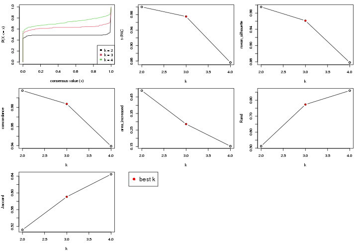

The numeric values for all these statistics can be obtained by `get_stats()`.

```r
get_stats(res)
```

```
#>   k 1-PAC mean_silhouette concordance area_increased  Rand Jaccard
#> 2 2 1.000           0.995       0.998          0.489 0.512   0.512
#> 3 3 0.975           0.961       0.984          0.286 0.773   0.591
#> 4 4 0.856           0.858       0.940          0.152 0.860   0.645
```

`suggest_best_k()` suggests the best $k$ based on these statistics. The rules are as follows:

- All $k$ with Jaccard index larger than 0.95 are removed because increasing
  $k$ does not provide enough extra information. If all $k$ are removed, it is
  marked as no subgroup is detected.
- For all $k$ with 1-PAC score larger than 0.9, the maximal $k$ is taken as
  the best $k$, and other $k$ are marked as optional $k$.
- If it does not fit the second rule. The $k$ with the maximal vote of the
  highest 1-PAC score, highest mean silhouette, and highest concordance is
  taken as the best $k$.

```r
suggest_best_k(res)
```

```
#> [1] 3
#> attr(,"optional")
#> [1] 2
```

There is also optional best $k$ = 2 that is worth to check.

Following is the table of the partitions (You need to click the **show/hide
code output** link to see it). The membership matrix (columns with name `p*`)
is inferred by
[`clue::cl_consensus()`](https://www.rdocumentation.org/link/cl_consensus?package=clue)
function with the `SE` method. Basically the value in the membership matrix
represents the probability to belong to a certain group. The finall subgroup
label for an item is determined with the group with highest probability it
belongs to.

In `get_classes()` function, the entropy is calculated from the membership
matrix and the silhouette score is calculated from the consensus matrix.


<script>
$( function() {
	$( '#tabs-node-0122-get-classes' ).tabs();
} );
</script>
<div id='tabs-node-0122-get-classes'>
<ul>
<li><a href='#tab-node-0122-get-classes-1'>k = 2</a></li>
<li><a href='#tab-node-0122-get-classes-2'>k = 3</a></li>
<li><a href='#tab-node-0122-get-classes-3'>k = 4</a></li>
</ul>

<div id='tab-node-0122-get-classes-1'>
<p><a id='tab-node-0122-get-classes-1-a' style='color:#0366d6' href='#'>show/hide code output</a></p>
<pre><code class="r">cbind(get_classes(res, k = 2), get_membership(res, k = 2))
</code></pre>

<pre><code>#&gt;     class entropy silhouette   p1   p2
#&gt; 1       2   0.000      0.996 0.00 1.00
#&gt; 2       2   0.000      0.996 0.00 1.00
#&gt; 3       2   0.000      0.996 0.00 1.00
#&gt; 4       2   0.000      0.996 0.00 1.00
#&gt; 5       2   0.000      0.996 0.00 1.00
#&gt; 6       1   0.000      0.998 1.00 0.00
#&gt; 7       1   0.000      0.998 1.00 0.00
#&gt; 8       1   0.000      0.998 1.00 0.00
#&gt; 9       1   0.000      0.998 1.00 0.00
#&gt; 10      1   0.242      0.959 0.96 0.04
#&gt; 11      2   0.000      0.996 0.00 1.00
#&gt; 12      1   0.000      0.998 1.00 0.00
#&gt; 13      1   0.000      0.998 1.00 0.00
#&gt; 14      1   0.000      0.998 1.00 0.00
#&gt; 15      1   0.000      0.998 1.00 0.00
#&gt; 16      2   0.000      0.996 0.00 1.00
#&gt; 17      2   0.000      0.996 0.00 1.00
#&gt; 18      2   0.242      0.959 0.04 0.96
#&gt; 19      2   0.000      0.996 0.00 1.00
#&gt; 20      1   0.000      0.998 1.00 0.00
#&gt; 21      1   0.000      0.998 1.00 0.00
#&gt; 22      1   0.000      0.998 1.00 0.00
#&gt; 23      1   0.000      0.998 1.00 0.00
#&gt; 24      2   0.000      0.996 0.00 1.00
#&gt; 25      1   0.000      0.998 1.00 0.00
#&gt; 26      1   0.000      0.998 1.00 0.00
#&gt; 27      1   0.000      0.998 1.00 0.00
#&gt; 28      1   0.000      0.998 1.00 0.00
#&gt; 29      1   0.000      0.998 1.00 0.00
#&gt; 30      1   0.000      0.998 1.00 0.00
#&gt; 31      1   0.000      0.998 1.00 0.00
#&gt; 32      1   0.000      0.998 1.00 0.00
#&gt; 33      1   0.000      0.998 1.00 0.00
#&gt; 34      1   0.000      0.998 1.00 0.00
#&gt; 35      1   0.000      0.998 1.00 0.00
#&gt; 36      1   0.000      0.998 1.00 0.00
#&gt; 37      1   0.000      0.998 1.00 0.00
#&gt; 38      2   0.000      0.996 0.00 1.00
#&gt; 39      1   0.000      0.998 1.00 0.00
#&gt; 40      1   0.000      0.998 1.00 0.00
#&gt; 41      1   0.000      0.998 1.00 0.00
#&gt; 42      1   0.000      0.998 1.00 0.00
#&gt; 43      1   0.000      0.998 1.00 0.00
#&gt; 44      1   0.000      0.998 1.00 0.00
#&gt; 45      1   0.000      0.998 1.00 0.00
#&gt; 46      1   0.000      0.998 1.00 0.00
#&gt; 47      1   0.000      0.998 1.00 0.00
#&gt; 48      2   0.000      0.996 0.00 1.00
#&gt; 49      1   0.000      0.998 1.00 0.00
#&gt; 50      1   0.000      0.998 1.00 0.00
#&gt; 51      1   0.000      0.998 1.00 0.00
#&gt; 52      1   0.000      0.998 1.00 0.00
#&gt; 53      1   0.000      0.998 1.00 0.00
#&gt; 54      1   0.000      0.998 1.00 0.00
#&gt; 55      1   0.000      0.998 1.00 0.00
#&gt; 56      1   0.000      0.998 1.00 0.00
#&gt; 57      1   0.000      0.998 1.00 0.00
#&gt; 58      1   0.000      0.998 1.00 0.00
#&gt; 59      1   0.000      0.998 1.00 0.00
#&gt; 60      1   0.000      0.998 1.00 0.00
#&gt; 61      1   0.000      0.998 1.00 0.00
#&gt; 62      1   0.000      0.998 1.00 0.00
#&gt; 63      1   0.000      0.998 1.00 0.00
#&gt; 64      1   0.000      0.998 1.00 0.00
#&gt; 65      2   0.000      0.996 0.00 1.00
#&gt; 66      1   0.000      0.998 1.00 0.00
#&gt; 67      1   0.000      0.998 1.00 0.00
#&gt; 68      1   0.000      0.998 1.00 0.00
#&gt; 69      1   0.141      0.979 0.98 0.02
#&gt; 70      1   0.000      0.998 1.00 0.00
#&gt; 71      1   0.000      0.998 1.00 0.00
#&gt; 72      1   0.000      0.998 1.00 0.00
#&gt; 73      1   0.000      0.998 1.00 0.00
#&gt; 74      2   0.000      0.996 0.00 1.00
#&gt; 75      1   0.000      0.998 1.00 0.00
#&gt; 76      1   0.000      0.998 1.00 0.00
#&gt; 77      2   0.000      0.996 0.00 1.00
#&gt; 78      2   0.000      0.996 0.00 1.00
#&gt; 79      1   0.000      0.998 1.00 0.00
#&gt; 80      1   0.000      0.998 1.00 0.00
#&gt; 81      1   0.000      0.998 1.00 0.00
#&gt; 82      2   0.000      0.996 0.00 1.00
#&gt; 83      2   0.000      0.996 0.00 1.00
#&gt; 84      1   0.000      0.998 1.00 0.00
#&gt; 85      2   0.000      0.996 0.00 1.00
#&gt; 86      2   0.000      0.996 0.00 1.00
#&gt; 87      1   0.000      0.998 1.00 0.00
#&gt; 88      2   0.000      0.996 0.00 1.00
#&gt; 89      2   0.000      0.996 0.00 1.00
#&gt; 90      1   0.000      0.998 1.00 0.00
#&gt; 91      2   0.000      0.996 0.00 1.00
#&gt; 92      2   0.000      0.996 0.00 1.00
#&gt; 93      1   0.000      0.998 1.00 0.00
#&gt; 94      1   0.000      0.998 1.00 0.00
#&gt; 95      1   0.000      0.998 1.00 0.00
#&gt; 96      1   0.000      0.998 1.00 0.00
#&gt; 97      2   0.000      0.996 0.00 1.00
#&gt; 98      1   0.000      0.998 1.00 0.00
#&gt; 99      2   0.000      0.996 0.00 1.00
#&gt; 100     2   0.000      0.996 0.00 1.00
#&gt; 101     2   0.242      0.959 0.04 0.96
#&gt; 102     2   0.000      0.996 0.00 1.00
#&gt; 103     2   0.000      0.996 0.00 1.00
#&gt; 104     1   0.327      0.936 0.94 0.06
#&gt; 105     2   0.000      0.996 0.00 1.00
#&gt; 106     2   0.000      0.996 0.00 1.00
#&gt; 107     2   0.000      0.996 0.00 1.00
#&gt; 108     1   0.000      0.998 1.00 0.00
#&gt; 109     2   0.000      0.996 0.00 1.00
#&gt; 110     1   0.000      0.998 1.00 0.00
#&gt; 111     1   0.000      0.998 1.00 0.00
#&gt; 112     2   0.469      0.891 0.10 0.90
#&gt; 113     2   0.000      0.996 0.00 1.00
#&gt; 114     2   0.000      0.996 0.00 1.00
#&gt; 115     2   0.000      0.996 0.00 1.00
#&gt; 116     2   0.000      0.996 0.00 1.00
#&gt; 117     2   0.000      0.996 0.00 1.00
#&gt; 118     2   0.000      0.996 0.00 1.00
#&gt; 119     2   0.000      0.996 0.00 1.00
#&gt; 120     2   0.000      0.996 0.00 1.00
#&gt; 121     2   0.000      0.996 0.00 1.00
#&gt; 122     2   0.000      0.996 0.00 1.00
#&gt; 123     2   0.000      0.996 0.00 1.00
#&gt; 124     2   0.000      0.996 0.00 1.00
#&gt; 125     2   0.141      0.978 0.02 0.98
#&gt; 126     2   0.000      0.996 0.00 1.00
#&gt; 127     2   0.000      0.996 0.00 1.00
#&gt; 128     2   0.000      0.996 0.00 1.00
#&gt; 129     2   0.000      0.996 0.00 1.00
#&gt; 130     2   0.000      0.996 0.00 1.00
#&gt; 131     1   0.000      0.998 1.00 0.00
</code></pre>

<script>
$('#tab-node-0122-get-classes-1-a').parent().next().next().hide();
$('#tab-node-0122-get-classes-1-a').click(function(){
  $('#tab-node-0122-get-classes-1-a').parent().next().next().toggle();
  return(false);
});
</script>
</div>

<div id='tab-node-0122-get-classes-2'>
<p><a id='tab-node-0122-get-classes-2-a' style='color:#0366d6' href='#'>show/hide code output</a></p>
<pre><code class="r">cbind(get_classes(res, k = 3), get_membership(res, k = 3))
</code></pre>

<pre><code>#&gt;     class entropy silhouette   p1   p2   p3
#&gt; 1       3  0.0000      0.984 0.00 0.00 1.00
#&gt; 2       3  0.0000      0.984 0.00 0.00 1.00
#&gt; 3       3  0.0000      0.984 0.00 0.00 1.00
#&gt; 4       3  0.0000      0.984 0.00 0.00 1.00
#&gt; 5       3  0.0000      0.984 0.00 0.00 1.00
#&gt; 6       1  0.0000      0.985 1.00 0.00 0.00
#&gt; 7       3  0.0000      0.984 0.00 0.00 1.00
#&gt; 8       1  0.5835      0.480 0.66 0.00 0.34
#&gt; 9       3  0.5835      0.473 0.34 0.00 0.66
#&gt; 10      3  0.0000      0.984 0.00 0.00 1.00
#&gt; 11      3  0.0000      0.984 0.00 0.00 1.00
#&gt; 12      1  0.0000      0.985 1.00 0.00 0.00
#&gt; 13      3  0.0000      0.984 0.00 0.00 1.00
#&gt; 14      1  0.0000      0.985 1.00 0.00 0.00
#&gt; 15      1  0.0000      0.985 1.00 0.00 0.00
#&gt; 16      2  0.0000      0.973 0.00 1.00 0.00
#&gt; 17      3  0.0000      0.984 0.00 0.00 1.00
#&gt; 18      2  0.0000      0.973 0.00 1.00 0.00
#&gt; 19      3  0.0000      0.984 0.00 0.00 1.00
#&gt; 20      1  0.0000      0.985 1.00 0.00 0.00
#&gt; 21      1  0.0000      0.985 1.00 0.00 0.00
#&gt; 22      1  0.0000      0.985 1.00 0.00 0.00
#&gt; 23      1  0.0000      0.985 1.00 0.00 0.00
#&gt; 24      3  0.0000      0.984 0.00 0.00 1.00
#&gt; 25      1  0.0892      0.967 0.98 0.02 0.00
#&gt; 26      1  0.0000      0.985 1.00 0.00 0.00
#&gt; 27      1  0.0000      0.985 1.00 0.00 0.00
#&gt; 28      1  0.0000      0.985 1.00 0.00 0.00
#&gt; 29      1  0.0000      0.985 1.00 0.00 0.00
#&gt; 30      1  0.0000      0.985 1.00 0.00 0.00
#&gt; 31      1  0.0000      0.985 1.00 0.00 0.00
#&gt; 32      1  0.0000      0.985 1.00 0.00 0.00
#&gt; 33      1  0.0000      0.985 1.00 0.00 0.00
#&gt; 34      1  0.0000      0.985 1.00 0.00 0.00
#&gt; 35      1  0.0000      0.985 1.00 0.00 0.00
#&gt; 36      1  0.1529      0.949 0.96 0.00 0.04
#&gt; 37      1  0.0000      0.985 1.00 0.00 0.00
#&gt; 38      2  0.0000      0.973 0.00 1.00 0.00
#&gt; 39      1  0.0000      0.985 1.00 0.00 0.00
#&gt; 40      1  0.0000      0.985 1.00 0.00 0.00
#&gt; 41      1  0.0000      0.985 1.00 0.00 0.00
#&gt; 42      1  0.0000      0.985 1.00 0.00 0.00
#&gt; 43      2  0.5560      0.585 0.30 0.70 0.00
#&gt; 44      1  0.2959      0.886 0.90 0.00 0.10
#&gt; 45      1  0.0000      0.985 1.00 0.00 0.00
#&gt; 46      1  0.0000      0.985 1.00 0.00 0.00
#&gt; 47      1  0.0000      0.985 1.00 0.00 0.00
#&gt; 48      3  0.0000      0.984 0.00 0.00 1.00
#&gt; 49      1  0.0000      0.985 1.00 0.00 0.00
#&gt; 50      1  0.0000      0.985 1.00 0.00 0.00
#&gt; 51      1  0.0000      0.985 1.00 0.00 0.00
#&gt; 52      1  0.0000      0.985 1.00 0.00 0.00
#&gt; 53      1  0.0000      0.985 1.00 0.00 0.00
#&gt; 54      1  0.4209      0.844 0.86 0.12 0.02
#&gt; 55      1  0.0892      0.967 0.98 0.02 0.00
#&gt; 56      1  0.0000      0.985 1.00 0.00 0.00
#&gt; 57      1  0.0000      0.985 1.00 0.00 0.00
#&gt; 58      1  0.0000      0.985 1.00 0.00 0.00
#&gt; 59      1  0.0000      0.985 1.00 0.00 0.00
#&gt; 60      1  0.0000      0.985 1.00 0.00 0.00
#&gt; 61      2  0.2066      0.918 0.06 0.94 0.00
#&gt; 62      1  0.0000      0.985 1.00 0.00 0.00
#&gt; 63      1  0.0000      0.985 1.00 0.00 0.00
#&gt; 64      1  0.2959      0.883 0.90 0.10 0.00
#&gt; 65      2  0.0000      0.973 0.00 1.00 0.00
#&gt; 66      1  0.0000      0.985 1.00 0.00 0.00
#&gt; 67      1  0.0000      0.985 1.00 0.00 0.00
#&gt; 68      2  0.4291      0.771 0.18 0.82 0.00
#&gt; 69      2  0.1529      0.938 0.04 0.96 0.00
#&gt; 70      1  0.0000      0.985 1.00 0.00 0.00
#&gt; 71      1  0.0000      0.985 1.00 0.00 0.00
#&gt; 72      1  0.0000      0.985 1.00 0.00 0.00
#&gt; 73      1  0.0000      0.985 1.00 0.00 0.00
#&gt; 74      2  0.0000      0.973 0.00 1.00 0.00
#&gt; 75      1  0.0000      0.985 1.00 0.00 0.00
#&gt; 76      2  0.2066      0.919 0.06 0.94 0.00
#&gt; 77      3  0.0000      0.984 0.00 0.00 1.00
#&gt; 78      3  0.0000      0.984 0.00 0.00 1.00
#&gt; 79      1  0.0000      0.985 1.00 0.00 0.00
#&gt; 80      1  0.0000      0.985 1.00 0.00 0.00
#&gt; 81      1  0.0000      0.985 1.00 0.00 0.00
#&gt; 82      2  0.0000      0.973 0.00 1.00 0.00
#&gt; 83      3  0.0000      0.984 0.00 0.00 1.00
#&gt; 84      1  0.0000      0.985 1.00 0.00 0.00
#&gt; 85      3  0.0000      0.984 0.00 0.00 1.00
#&gt; 86      3  0.0000      0.984 0.00 0.00 1.00
#&gt; 87      3  0.0000      0.984 0.00 0.00 1.00
#&gt; 88      3  0.0000      0.984 0.00 0.00 1.00
#&gt; 89      3  0.0000      0.984 0.00 0.00 1.00
#&gt; 90      2  0.3686      0.825 0.14 0.86 0.00
#&gt; 91      2  0.0000      0.973 0.00 1.00 0.00
#&gt; 92      2  0.0000      0.973 0.00 1.00 0.00
#&gt; 93      1  0.0000      0.985 1.00 0.00 0.00
#&gt; 94      1  0.0000      0.985 1.00 0.00 0.00
#&gt; 95      2  0.2537      0.897 0.08 0.92 0.00
#&gt; 96      1  0.0000      0.985 1.00 0.00 0.00
#&gt; 97      2  0.0000      0.973 0.00 1.00 0.00
#&gt; 98      1  0.0000      0.985 1.00 0.00 0.00
#&gt; 99      3  0.0000      0.984 0.00 0.00 1.00
#&gt; 100     3  0.0000      0.984 0.00 0.00 1.00
#&gt; 101     3  0.0000      0.984 0.00 0.00 1.00
#&gt; 102     3  0.0000      0.984 0.00 0.00 1.00
#&gt; 103     2  0.0000      0.973 0.00 1.00 0.00
#&gt; 104     2  0.0000      0.973 0.00 1.00 0.00
#&gt; 105     2  0.0000      0.973 0.00 1.00 0.00
#&gt; 106     2  0.0000      0.973 0.00 1.00 0.00
#&gt; 107     2  0.0000      0.973 0.00 1.00 0.00
#&gt; 108     1  0.0000      0.985 1.00 0.00 0.00
#&gt; 109     2  0.0000      0.973 0.00 1.00 0.00
#&gt; 110     1  0.0892      0.967 0.98 0.02 0.00
#&gt; 111     1  0.3686      0.837 0.86 0.14 0.00
#&gt; 112     2  0.0000      0.973 0.00 1.00 0.00
#&gt; 113     2  0.0000      0.973 0.00 1.00 0.00
#&gt; 114     2  0.0000      0.973 0.00 1.00 0.00
#&gt; 115     2  0.0000      0.973 0.00 1.00 0.00
#&gt; 116     2  0.0000      0.973 0.00 1.00 0.00
#&gt; 117     2  0.0000      0.973 0.00 1.00 0.00
#&gt; 118     2  0.0000      0.973 0.00 1.00 0.00
#&gt; 119     2  0.0000      0.973 0.00 1.00 0.00
#&gt; 120     2  0.0000      0.973 0.00 1.00 0.00
#&gt; 121     2  0.0000      0.973 0.00 1.00 0.00
#&gt; 122     2  0.0000      0.973 0.00 1.00 0.00
#&gt; 123     2  0.0000      0.973 0.00 1.00 0.00
#&gt; 124     2  0.0000      0.973 0.00 1.00 0.00
#&gt; 125     2  0.0892      0.956 0.02 0.98 0.00
#&gt; 126     2  0.0000      0.973 0.00 1.00 0.00
#&gt; 127     2  0.0000      0.973 0.00 1.00 0.00
#&gt; 128     2  0.0000      0.973 0.00 1.00 0.00
#&gt; 129     2  0.0000      0.973 0.00 1.00 0.00
#&gt; 130     2  0.0000      0.973 0.00 1.00 0.00
#&gt; 131     1  0.0000      0.985 1.00 0.00 0.00
</code></pre>

<script>
$('#tab-node-0122-get-classes-2-a').parent().next().next().hide();
$('#tab-node-0122-get-classes-2-a').click(function(){
  $('#tab-node-0122-get-classes-2-a').parent().next().next().toggle();
  return(false);
});
</script>
</div>

<div id='tab-node-0122-get-classes-3'>
<p><a id='tab-node-0122-get-classes-3-a' style='color:#0366d6' href='#'>show/hide code output</a></p>
<pre><code class="r">cbind(get_classes(res, k = 4), get_membership(res, k = 4))
</code></pre>

<pre><code>#&gt;     class entropy silhouette   p1   p2   p3   p4
#&gt; 1       3  0.0000     0.9928 0.00 0.00 1.00 0.00
#&gt; 2       3  0.0000     0.9928 0.00 0.00 1.00 0.00
#&gt; 3       3  0.0000     0.9928 0.00 0.00 1.00 0.00
#&gt; 4       3  0.0000     0.9928 0.00 0.00 1.00 0.00
#&gt; 5       3  0.0000     0.9928 0.00 0.00 1.00 0.00
#&gt; 6       1  0.0000     0.9317 1.00 0.00 0.00 0.00
#&gt; 7       3  0.0000     0.9928 0.00 0.00 1.00 0.00
#&gt; 8       1  0.1211     0.9002 0.96 0.00 0.04 0.00
#&gt; 9       1  0.4277     0.5905 0.72 0.00 0.28 0.00
#&gt; 10      3  0.0000     0.9928 0.00 0.00 1.00 0.00
#&gt; 11      3  0.0000     0.9928 0.00 0.00 1.00 0.00
#&gt; 12      1  0.0000     0.9317 1.00 0.00 0.00 0.00
#&gt; 13      3  0.0707     0.9711 0.02 0.00 0.98 0.00
#&gt; 14      1  0.0000     0.9317 1.00 0.00 0.00 0.00
#&gt; 15      1  0.1637     0.8936 0.94 0.00 0.00 0.06
#&gt; 16      4  0.0707     0.8088 0.00 0.02 0.00 0.98
#&gt; 17      3  0.0000     0.9928 0.00 0.00 1.00 0.00
#&gt; 18      4  0.1637     0.7842 0.00 0.06 0.00 0.94
#&gt; 19      3  0.2830     0.8973 0.00 0.06 0.90 0.04
#&gt; 20      1  0.0000     0.9317 1.00 0.00 0.00 0.00
#&gt; 21      1  0.0000     0.9317 1.00 0.00 0.00 0.00
#&gt; 22      1  0.0000     0.9317 1.00 0.00 0.00 0.00
#&gt; 23      1  0.0000     0.9317 1.00 0.00 0.00 0.00
#&gt; 24      3  0.0000     0.9928 0.00 0.00 1.00 0.00
#&gt; 25      4  0.1211     0.8030 0.04 0.00 0.00 0.96
#&gt; 26      1  0.0000     0.9317 1.00 0.00 0.00 0.00
#&gt; 27      1  0.0000     0.9317 1.00 0.00 0.00 0.00
#&gt; 28      1  0.0000     0.9317 1.00 0.00 0.00 0.00
#&gt; 29      1  0.4948     0.1907 0.56 0.00 0.00 0.44
#&gt; 30      1  0.0000     0.9317 1.00 0.00 0.00 0.00
#&gt; 31      1  0.0000     0.9317 1.00 0.00 0.00 0.00
#&gt; 32      1  0.0000     0.9317 1.00 0.00 0.00 0.00
#&gt; 33      1  0.0000     0.9317 1.00 0.00 0.00 0.00
#&gt; 34      1  0.0000     0.9317 1.00 0.00 0.00 0.00
#&gt; 35      1  0.0000     0.9317 1.00 0.00 0.00 0.00
#&gt; 36      1  0.2335     0.8783 0.92 0.02 0.00 0.06
#&gt; 37      1  0.4134     0.6494 0.74 0.00 0.00 0.26
#&gt; 38      2  0.0000     0.9633 0.00 1.00 0.00 0.00
#&gt; 39      4  0.5000     0.0243 0.50 0.00 0.00 0.50
#&gt; 40      1  0.0000     0.9317 1.00 0.00 0.00 0.00
#&gt; 41      1  0.0000     0.9317 1.00 0.00 0.00 0.00
#&gt; 42      1  0.4790     0.3450 0.62 0.00 0.00 0.38
#&gt; 43      4  0.0000     0.8158 0.00 0.00 0.00 1.00
#&gt; 44      1  0.0000     0.9317 1.00 0.00 0.00 0.00
#&gt; 45      1  0.0000     0.9317 1.00 0.00 0.00 0.00
#&gt; 46      1  0.0000     0.9317 1.00 0.00 0.00 0.00
#&gt; 47      1  0.0000     0.9317 1.00 0.00 0.00 0.00
#&gt; 48      3  0.0000     0.9928 0.00 0.00 1.00 0.00
#&gt; 49      4  0.0000     0.8158 0.00 0.00 0.00 1.00
#&gt; 50      1  0.0000     0.9317 1.00 0.00 0.00 0.00
#&gt; 51      1  0.0000     0.9317 1.00 0.00 0.00 0.00
#&gt; 52      1  0.0000     0.9317 1.00 0.00 0.00 0.00
#&gt; 53      1  0.0000     0.9317 1.00 0.00 0.00 0.00
#&gt; 54      4  0.7378     0.3262 0.38 0.10 0.02 0.50
#&gt; 55      4  0.0000     0.8158 0.00 0.00 0.00 1.00
#&gt; 56      4  0.5000     0.0397 0.50 0.00 0.00 0.50
#&gt; 57      1  0.0000     0.9317 1.00 0.00 0.00 0.00
#&gt; 58      1  0.1637     0.8901 0.94 0.00 0.00 0.06
#&gt; 59      1  0.0707     0.9189 0.98 0.00 0.00 0.02
#&gt; 60      1  0.0000     0.9317 1.00 0.00 0.00 0.00
#&gt; 61      4  0.5535     0.2226 0.02 0.42 0.00 0.56
#&gt; 62      1  0.0000     0.9317 1.00 0.00 0.00 0.00
#&gt; 63      1  0.0000     0.9317 1.00 0.00 0.00 0.00
#&gt; 64      1  0.5902     0.5757 0.70 0.14 0.00 0.16
#&gt; 65      2  0.0000     0.9633 0.00 1.00 0.00 0.00
#&gt; 66      1  0.0000     0.9317 1.00 0.00 0.00 0.00
#&gt; 67      1  0.0000     0.9317 1.00 0.00 0.00 0.00
#&gt; 68      4  0.4284     0.6493 0.02 0.20 0.00 0.78
#&gt; 69      4  0.0000     0.8158 0.00 0.00 0.00 1.00
#&gt; 70      1  0.0000     0.9317 1.00 0.00 0.00 0.00
#&gt; 71      1  0.3610     0.7426 0.80 0.00 0.00 0.20
#&gt; 72      1  0.2647     0.8374 0.88 0.00 0.00 0.12
#&gt; 73      1  0.0000     0.9317 1.00 0.00 0.00 0.00
#&gt; 74      2  0.2011     0.9036 0.00 0.92 0.00 0.08
#&gt; 75      4  0.0000     0.8158 0.00 0.00 0.00 1.00
#&gt; 76      4  0.0000     0.8158 0.00 0.00 0.00 1.00
#&gt; 77      3  0.0000     0.9928 0.00 0.00 1.00 0.00
#&gt; 78      3  0.0000     0.9928 0.00 0.00 1.00 0.00
#&gt; 79      1  0.0000     0.9317 1.00 0.00 0.00 0.00
#&gt; 80      1  0.1211     0.9045 0.96 0.00 0.00 0.04
#&gt; 81      1  0.5173     0.4879 0.66 0.02 0.00 0.32
#&gt; 82      2  0.0000     0.9633 0.00 1.00 0.00 0.00
#&gt; 83      3  0.0000     0.9928 0.00 0.00 1.00 0.00
#&gt; 84      1  0.0000     0.9317 1.00 0.00 0.00 0.00
#&gt; 85      3  0.0000     0.9928 0.00 0.00 1.00 0.00
#&gt; 86      3  0.0000     0.9928 0.00 0.00 1.00 0.00
#&gt; 87      3  0.1211     0.9470 0.04 0.00 0.96 0.00
#&gt; 88      3  0.0000     0.9928 0.00 0.00 1.00 0.00
#&gt; 89      3  0.0000     0.9928 0.00 0.00 1.00 0.00
#&gt; 90      4  0.0000     0.8158 0.00 0.00 0.00 1.00
#&gt; 91      2  0.3801     0.7352 0.00 0.78 0.00 0.22
#&gt; 92      4  0.4855     0.2741 0.00 0.40 0.00 0.60
#&gt; 93      1  0.2921     0.8155 0.86 0.00 0.00 0.14
#&gt; 94      4  0.4994     0.0707 0.48 0.00 0.00 0.52
#&gt; 95      4  0.1637     0.7864 0.00 0.06 0.00 0.94
#&gt; 96      4  0.2345     0.7720 0.10 0.00 0.00 0.90
#&gt; 97      2  0.0000     0.9633 0.00 1.00 0.00 0.00
#&gt; 98      4  0.4277     0.5765 0.28 0.00 0.00 0.72
#&gt; 99      3  0.0000     0.9928 0.00 0.00 1.00 0.00
#&gt; 100     3  0.0000     0.9928 0.00 0.00 1.00 0.00
#&gt; 101     3  0.0000     0.9928 0.00 0.00 1.00 0.00
#&gt; 102     3  0.0000     0.9928 0.00 0.00 1.00 0.00
#&gt; 103     2  0.0000     0.9633 0.00 1.00 0.00 0.00
#&gt; 104     4  0.1211     0.7998 0.00 0.04 0.00 0.96
#&gt; 105     2  0.0000     0.9633 0.00 1.00 0.00 0.00
#&gt; 106     2  0.0000     0.9633 0.00 1.00 0.00 0.00
#&gt; 107     2  0.0000     0.9633 0.00 1.00 0.00 0.00
#&gt; 108     1  0.3172     0.7930 0.84 0.00 0.00 0.16
#&gt; 109     2  0.0000     0.9633 0.00 1.00 0.00 0.00
#&gt; 110     4  0.0000     0.8158 0.00 0.00 0.00 1.00
#&gt; 111     4  0.0000     0.8158 0.00 0.00 0.00 1.00
#&gt; 112     4  0.0707     0.8088 0.00 0.02 0.00 0.98
#&gt; 113     2  0.2345     0.8855 0.00 0.90 0.00 0.10
#&gt; 114     2  0.0000     0.9633 0.00 1.00 0.00 0.00
#&gt; 115     2  0.2921     0.8396 0.00 0.86 0.00 0.14
#&gt; 116     2  0.0000     0.9633 0.00 1.00 0.00 0.00
#&gt; 117     2  0.0000     0.9633 0.00 1.00 0.00 0.00
#&gt; 118     2  0.0000     0.9633 0.00 1.00 0.00 0.00
#&gt; 119     2  0.0000     0.9633 0.00 1.00 0.00 0.00
#&gt; 120     2  0.0000     0.9633 0.00 1.00 0.00 0.00
#&gt; 121     2  0.3172     0.8061 0.00 0.84 0.00 0.16
#&gt; 122     2  0.0000     0.9633 0.00 1.00 0.00 0.00
#&gt; 123     2  0.0000     0.9633 0.00 1.00 0.00 0.00
#&gt; 124     2  0.0000     0.9633 0.00 1.00 0.00 0.00
#&gt; 125     2  0.0707     0.9468 0.00 0.98 0.00 0.02
#&gt; 126     2  0.0000     0.9633 0.00 1.00 0.00 0.00
#&gt; 127     2  0.0000     0.9633 0.00 1.00 0.00 0.00
#&gt; 128     2  0.0000     0.9633 0.00 1.00 0.00 0.00
#&gt; 129     2  0.0000     0.9633 0.00 1.00 0.00 0.00
#&gt; 130     2  0.3975     0.7001 0.00 0.76 0.00 0.24
#&gt; 131     1  0.3801     0.7123 0.78 0.00 0.00 0.22
</code></pre>

<script>
$('#tab-node-0122-get-classes-3-a').parent().next().next().hide();
$('#tab-node-0122-get-classes-3-a').click(function(){
  $('#tab-node-0122-get-classes-3-a').parent().next().next().toggle();
  return(false);
});
</script>
</div>
</div>

Heatmaps for the consensus matrix. It visualizes the probability of two
samples to be in a same group.


<script>
$( function() {
	$( '#tabs-node-0122-consensus-heatmap' ).tabs();
} );
</script>
<div id='tabs-node-0122-consensus-heatmap'>
<ul>
<li><a href='#tab-node-0122-consensus-heatmap-1'>k = 2</a></li>
<li><a href='#tab-node-0122-consensus-heatmap-2'>k = 3</a></li>
<li><a href='#tab-node-0122-consensus-heatmap-3'>k = 4</a></li>
</ul>
<div id='tab-node-0122-consensus-heatmap-1'>
<pre><code class="r">consensus_heatmap(res, k = 2)
</code></pre>

<p></p>

</div>
<div id='tab-node-0122-consensus-heatmap-2'>
<pre><code class="r">consensus_heatmap(res, k = 3)
</code></pre>

<p></p>

</div>
<div id='tab-node-0122-consensus-heatmap-3'>
<pre><code class="r">consensus_heatmap(res, k = 4)
</code></pre>

<p></p>

</div>
</div>

Heatmaps for the membership of samples in all partitions to see how consistent they are:


<script>
$( function() {
	$( '#tabs-node-0122-membership-heatmap' ).tabs();
} );
</script>
<div id='tabs-node-0122-membership-heatmap'>
<ul>
<li><a href='#tab-node-0122-membership-heatmap-1'>k = 2</a></li>
<li><a href='#tab-node-0122-membership-heatmap-2'>k = 3</a></li>
<li><a href='#tab-node-0122-membership-heatmap-3'>k = 4</a></li>
</ul>
<div id='tab-node-0122-membership-heatmap-1'>
<pre><code class="r">membership_heatmap(res, k = 2)
</code></pre>

<p></p>

</div>
<div id='tab-node-0122-membership-heatmap-2'>
<pre><code class="r">membership_heatmap(res, k = 3)
</code></pre>

<p></p>

</div>
<div id='tab-node-0122-membership-heatmap-3'>
<pre><code class="r">membership_heatmap(res, k = 4)
</code></pre>

<p></p>

</div>
</div>

As soon as the classes for columns are determined, the signatures
that are significantly different between subgroups can be looked for. 
Following are the heatmaps for signatures.


Signature heatmaps where rows are scaled:


<script>
$( function() {
	$( '#tabs-node-0122-get-signatures' ).tabs();
} );
</script>
<div id='tabs-node-0122-get-signatures'>
<ul>
<li><a href='#tab-node-0122-get-signatures-1'>k = 2</a></li>
<li><a href='#tab-node-0122-get-signatures-2'>k = 3</a></li>
<li><a href='#tab-node-0122-get-signatures-3'>k = 4</a></li>
</ul>
<div id='tab-node-0122-get-signatures-1'>
<pre><code class="r">get_signatures(res, k = 2)
</code></pre>

<p></p>

</div>
<div id='tab-node-0122-get-signatures-2'>
<pre><code class="r">get_signatures(res, k = 3)
</code></pre>

<p>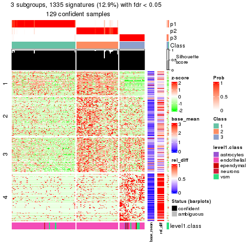</p>

</div>
<div id='tab-node-0122-get-signatures-3'>
<pre><code class="r">get_signatures(res, k = 4)
</code></pre>

<p></p>

</div>
</div>


Signature heatmaps where rows are not scaled:


<script>
$( function() {
	$( '#tabs-node-0122-get-signatures-no-scale' ).tabs();
} );
</script>
<div id='tabs-node-0122-get-signatures-no-scale'>
<ul>
<li><a href='#tab-node-0122-get-signatures-no-scale-1'>k = 2</a></li>
<li><a href='#tab-node-0122-get-signatures-no-scale-2'>k = 3</a></li>
<li><a href='#tab-node-0122-get-signatures-no-scale-3'>k = 4</a></li>
</ul>
<div id='tab-node-0122-get-signatures-no-scale-1'>
<pre><code class="r">get_signatures(res, k = 2, scale_rows = FALSE)
</code></pre>

<p></p>

</div>
<div id='tab-node-0122-get-signatures-no-scale-2'>
<pre><code class="r">get_signatures(res, k = 3, scale_rows = FALSE)
</code></pre>

<p></p>

</div>
<div id='tab-node-0122-get-signatures-no-scale-3'>
<pre><code class="r">get_signatures(res, k = 4, scale_rows = FALSE)
</code></pre>

<p></p>

</div>
</div>


Compare the overlap of signatures from different k:

```r
compare_signatures(res)
```


`get_signature()` returns a data frame invisibly. To get the list of signatures, the function
call should be assigned to a variable explicitly. In following code, if `plot` argument is set
to `FALSE`, no heatmap is plotted while only the differential analysis is performed.

```r
# code only for demonstration
tb = get_signature(res, k = ..., plot = FALSE)
```

An example of the output of `tb` is:

```
#>   which_row         fdr    mean_1    mean_2 scaled_mean_1 scaled_mean_2 km
#> 1        38 0.042760348  8.373488  9.131774    -0.5533452     0.5164555  1
#> 2        40 0.018707592  7.106213  8.469186    -0.6173731     0.5762149  1
#> 3        55 0.019134737 10.221463 11.207825    -0.6159697     0.5749050  1
#> 4        59 0.006059896  5.921854  7.869574    -0.6899429     0.6439467  1
#> 5        60 0.018055526  8.928898 10.211722    -0.6204761     0.5791110  1
#> 6        98 0.009384629 15.714769 14.887706     0.6635654    -0.6193277  2
...
```

The columns in `tb` are:

1. `which_row`: row indices corresponding to the input matrix.
2. `fdr`: FDR for the differential test. 
3. `mean_x`: The mean value in group x.
4. `scaled_mean_x`: The mean value in group x after rows are scaled.
5. `km`: Row groups if k-means clustering is applied to rows (which is done by automatically selecting number of clusters).

If there are too many signatures, `top_signatures = ...` can be set to only show the 
signatures with the highest FDRs:

```r
# code only for demonstration
# e.g. to show the top 500 most significant rows
tb = get_signature(res, k = ..., top_signatures = 500)
```

If the signatures are defined as these which are uniquely high in current group, `diff_method` argument
can be set to `"uniquely_high_in_one_group"`:

```r
# code only for demonstration
tb = get_signature(res, k = ..., diff_method = "uniquely_high_in_one_group")
```


UMAP plot which shows how samples are separated.


<script>
$( function() {
	$( '#tabs-node-0122-dimension-reduction' ).tabs();
} );
</script>
<div id='tabs-node-0122-dimension-reduction'>
<ul>
<li><a href='#tab-node-0122-dimension-reduction-1'>k = 2</a></li>
<li><a href='#tab-node-0122-dimension-reduction-2'>k = 3</a></li>
<li><a href='#tab-node-0122-dimension-reduction-3'>k = 4</a></li>
</ul>
<div id='tab-node-0122-dimension-reduction-1'>
<pre><code class="r">dimension_reduction(res, k = 2, method = &quot;UMAP&quot;)
</code></pre>

<p></p>

</div>
<div id='tab-node-0122-dimension-reduction-2'>
<pre><code class="r">dimension_reduction(res, k = 3, method = &quot;UMAP&quot;)
</code></pre>

<p></p>

</div>
<div id='tab-node-0122-dimension-reduction-3'>
<pre><code class="r">dimension_reduction(res, k = 4, method = &quot;UMAP&quot;)
</code></pre>

<p></p>

</div>
</div>


Following heatmap shows how subgroups are split when increasing `k`:

```r
collect_classes(res)
```


Test correlation between subgroups and known annotations. If the known
annotation is numeric, one-way ANOVA test is applied, and if the known
annotation is discrete, chi-squared contingency table test is applied.

```r
test_to_known_factors(res)
```

```
#>             n_sample level1.class(p-value) k
#> ATC:skmeans      131              3.20e-02 2
#> ATC:skmeans      129              5.06e-05 3
#> ATC:skmeans      122              2.90e-03 4
```


If matrix rows can be associated to genes, consider to use `functional_enrichment(res,
...)` to perform function enrichment for the signature genes. See [this vignette](https://jokergoo.github.io/cola_vignettes/functional_enrichment.html) for more detailed explanations.


 

---------------------------------------------------


### Node0123


Parent node: [Node012](#Node012).
Child nodes: 
                Node01131-leaf
        ,
                Node01132-leaf
        ,
                Node01133-leaf
        ,
                Node01211-leaf
        ,
                Node01212-leaf
        ,
                Node01221-leaf
        ,
                Node01222-leaf
        ,
                Node01223-leaf
        ,
                Node01231-leaf
        ,
                Node01232-leaf
        ,
                Node01233-leaf
        ,
                Node01234-leaf
        ,
                [Node02111](#Node02111)
        ,
                [Node02112](#Node02112)
        ,
                Node02113-leaf
        ,
                Node02121-leaf
        ,
                Node02122-leaf
        ,
                Node02123-leaf
        ,
                Node02221-leaf
        ,
                Node02222-leaf
        ,
                Node03111-leaf
        ,
                Node03112-leaf
        ,
                Node03121-leaf
        ,
                [Node03122](#Node03122)
        .


The object with results only for a single top-value method and a single partitioning method 
can be extracted as:

```r
res = res_rh["0123"]
```

A summary of `res` and all the functions that can be applied to it:

```r
res
```

```
#> A 'ConsensusPartition' object with k = 2, 3, 4.
#>   On a matrix with 7111 rows and 140 columns.
#>   Top rows (711) are extracted by 'ATC' method.
#>   Subgroups are detected by 'skmeans' method.
#>   Performed in total 150 partitions by row resampling.
#>   Best k for subgroups seems to be 4.
#> 
#> Following methods can be applied to this 'ConsensusPartition' object:
#>  [1] "cola_report"             "collect_classes"         "collect_plots"          
#>  [4] "collect_stats"           "colnames"                "compare_partitions"     
#>  [7] "compare_signatures"      "consensus_heatmap"       "dimension_reduction"    
#> [10] "functional_enrichment"   "get_anno_col"            "get_anno"               
#> [13] "get_classes"             "get_consensus"           "get_matrix"             
#> [16] "get_membership"          "get_param"               "get_signatures"         
#> [19] "get_stats"               "is_best_k"               "is_stable_k"            
#> [22] "membership_heatmap"      "ncol"                    "nrow"                   
#> [25] "plot_ecdf"               "predict_classes"         "rownames"               
#> [28] "select_partition_number" "show"                    "suggest_best_k"         
#> [31] "test_to_known_factors"   "top_rows_heatmap"
```

`collect_plots()` function collects all the plots made from `res` for all `k` (number of subgroups)
into one single page to provide an easy and fast comparison between different `k`.

```r
collect_plots(res)
```


The plots are:

- The first row: a plot of the eCDF (empirical cumulative distribution
  function) curves of the consensus matrix for each `k` and the heatmap of
  predicted classes for each `k`.
- The second row: heatmaps of the consensus matrix for each `k`.
- The third row: heatmaps of the membership matrix for each `k`.
- The fouth row: heatmaps of the signatures for each `k`.

All the plots in panels can be made by individual functions and they are
plotted later in this section.

`select_partition_number()` produces several plots showing different
statistics for choosing "optimized" `k`. There are following statistics:

- eCDF curves of the consensus matrix for each `k`;
- 1-PAC. [The PAC score](https://en.wikipedia.org/wiki/Consensus_clustering#Over-interpretation_potential_of_consensus_clustering)
  measures the proportion of the ambiguous subgrouping.
- Mean silhouette score.
- Concordance. The mean probability of fiting the consensus subgroup labels in all
  partitions.
- Area increased. Denote $A_k$ as the area under the eCDF curve for current
  `k`, the area increased is defined as $A_k - A_{k-1}$.
- Rand index. The percent of pairs of samples that are both in a same cluster
  or both are not in a same cluster in the partition of k and k-1.
- Jaccard index. The ratio of pairs of samples are both in a same cluster in
  the partition of k and k-1 and the pairs of samples are both in a same
  cluster in the partition k or k-1.

The detailed explanations of these statistics can be found in [the _cola_
vignette](https://jokergoo.github.io/cola_vignettes/cola.html#toc_13).

Generally speaking, higher 1-PAC score, higher mean silhouette score or higher
concordance corresponds to better partition. Rand index and Jaccard index
measure how similar the current partition is compared to partition with `k-1`.
If they are too similar, we won't accept `k` is better than `k-1`.

```r
select_partition_number(res)
```


The numeric values for all these statistics can be obtained by `get_stats()`.

```r
get_stats(res)
```

```
#>   k 1-PAC mean_silhouette concordance area_increased  Rand Jaccard
#> 2 2  1.00           0.973       0.989          0.400 0.602   0.602
#> 3 3  0.77           0.957       0.966          0.582 0.741   0.579
#> 4 4  0.99           0.966       0.984          0.193 0.860   0.629
```

`suggest_best_k()` suggests the best $k$ based on these statistics. The rules are as follows:

- All $k$ with Jaccard index larger than 0.95 are removed because increasing
  $k$ does not provide enough extra information. If all $k$ are removed, it is
  marked as no subgroup is detected.
- For all $k$ with 1-PAC score larger than 0.9, the maximal $k$ is taken as
  the best $k$, and other $k$ are marked as optional $k$.
- If it does not fit the second rule. The $k$ with the maximal vote of the
  highest 1-PAC score, highest mean silhouette, and highest concordance is
  taken as the best $k$.

```r
suggest_best_k(res)
```

```
#> [1] 4
#> attr(,"optional")
#> [1] 2
```

There is also optional best $k$ = 2 that is worth to check.

Following is the table of the partitions (You need to click the **show/hide
code output** link to see it). The membership matrix (columns with name `p*`)
is inferred by
[`clue::cl_consensus()`](https://www.rdocumentation.org/link/cl_consensus?package=clue)
function with the `SE` method. Basically the value in the membership matrix
represents the probability to belong to a certain group. The finall subgroup
label for an item is determined with the group with highest probability it
belongs to.

In `get_classes()` function, the entropy is calculated from the membership
matrix and the silhouette score is calculated from the consensus matrix.


<script>
$( function() {
	$( '#tabs-node-0123-get-classes' ).tabs();
} );
</script>
<div id='tabs-node-0123-get-classes'>
<ul>
<li><a href='#tab-node-0123-get-classes-1'>k = 2</a></li>
<li><a href='#tab-node-0123-get-classes-2'>k = 3</a></li>
<li><a href='#tab-node-0123-get-classes-3'>k = 4</a></li>
</ul>

<div id='tab-node-0123-get-classes-1'>
<p><a id='tab-node-0123-get-classes-1-a' style='color:#0366d6' href='#'>show/hide code output</a></p>
<pre><code class="r">cbind(get_classes(res, k = 2), get_membership(res, k = 2))
</code></pre>

<pre><code>#&gt;     class entropy silhouette   p1   p2
#&gt; 1       2   0.000      0.981 0.00 1.00
#&gt; 2       2   0.000      0.981 0.00 1.00
#&gt; 3       2   0.000      0.981 0.00 1.00
#&gt; 4       2   0.000      0.981 0.00 1.00
#&gt; 5       2   0.000      0.981 0.00 1.00
#&gt; 6       2   0.000      0.981 0.00 1.00
#&gt; 7       2   0.000      0.981 0.00 1.00
#&gt; 8       2   0.000      0.981 0.00 1.00
#&gt; 9       2   0.000      0.981 0.00 1.00
#&gt; 10      2   0.000      0.981 0.00 1.00
#&gt; 11      2   0.000      0.981 0.00 1.00
#&gt; 12      2   0.000      0.981 0.00 1.00
#&gt; 13      2   0.000      0.981 0.00 1.00
#&gt; 14      2   0.000      0.981 0.00 1.00
#&gt; 15      2   0.000      0.981 0.00 1.00
#&gt; 16      2   0.000      0.981 0.00 1.00
#&gt; 17      2   0.000      0.981 0.00 1.00
#&gt; 18      2   0.000      0.981 0.00 1.00
#&gt; 19      2   0.000      0.981 0.00 1.00
#&gt; 20      2   0.000      0.981 0.00 1.00
#&gt; 21      2   0.000      0.981 0.00 1.00
#&gt; 22      2   0.000      0.981 0.00 1.00
#&gt; 23      2   0.000      0.981 0.00 1.00
#&gt; 24      2   0.000      0.981 0.00 1.00
#&gt; 25      2   0.000      0.981 0.00 1.00
#&gt; 26      2   0.000      0.981 0.00 1.00
#&gt; 27      1   0.469      0.889 0.90 0.10
#&gt; 28      1   0.000      0.991 1.00 0.00
#&gt; 29      2   0.971      0.330 0.40 0.60
#&gt; 30      2   0.000      0.981 0.00 1.00
#&gt; 31      1   0.971      0.328 0.60 0.40
#&gt; 32      2   0.000      0.981 0.00 1.00
#&gt; 33      1   0.000      0.991 1.00 0.00
#&gt; 34      1   0.327      0.935 0.94 0.06
#&gt; 35      1   0.000      0.991 1.00 0.00
#&gt; 36      1   0.242      0.955 0.96 0.04
#&gt; 37      1   0.402      0.913 0.92 0.08
#&gt; 38      2   0.000      0.981 0.00 1.00
#&gt; 39      1   0.000      0.991 1.00 0.00
#&gt; 40      2   0.000      0.981 0.00 1.00
#&gt; 41      2   0.000      0.981 0.00 1.00
#&gt; 42      1   0.000      0.991 1.00 0.00
#&gt; 43      1   0.000      0.991 1.00 0.00
#&gt; 44      2   0.000      0.981 0.00 1.00
#&gt; 45      2   0.000      0.981 0.00 1.00
#&gt; 46      1   0.000      0.991 1.00 0.00
#&gt; 47      1   0.000      0.991 1.00 0.00
#&gt; 48      1   0.000      0.991 1.00 0.00
#&gt; 49      1   0.242      0.955 0.96 0.04
#&gt; 50      1   0.000      0.991 1.00 0.00
#&gt; 51      1   0.000      0.991 1.00 0.00
#&gt; 52      2   0.855      0.610 0.28 0.72
#&gt; 53      1   0.000      0.991 1.00 0.00
#&gt; 54      1   0.327      0.936 0.94 0.06
#&gt; 55      1   0.000      0.991 1.00 0.00
#&gt; 56      2   0.000      0.981 0.00 1.00
#&gt; 57      1   0.000      0.991 1.00 0.00
#&gt; 58      1   0.000      0.991 1.00 0.00
#&gt; 59      1   0.000      0.991 1.00 0.00
#&gt; 60      1   0.000      0.991 1.00 0.00
#&gt; 61      1   0.000      0.991 1.00 0.00
#&gt; 62      2   0.000      0.981 0.00 1.00
#&gt; 63      1   0.000      0.991 1.00 0.00
#&gt; 64      1   0.000      0.991 1.00 0.00
#&gt; 65      1   0.000      0.991 1.00 0.00
#&gt; 66      1   0.000      0.991 1.00 0.00
#&gt; 67      1   0.000      0.991 1.00 0.00
#&gt; 68      1   0.000      0.991 1.00 0.00
#&gt; 69      1   0.000      0.991 1.00 0.00
#&gt; 70      1   0.000      0.991 1.00 0.00
#&gt; 71      1   0.000      0.991 1.00 0.00
#&gt; 72      1   0.000      0.991 1.00 0.00
#&gt; 73      1   0.000      0.991 1.00 0.00
#&gt; 74      1   0.000      0.991 1.00 0.00
#&gt; 75      1   0.000      0.991 1.00 0.00
#&gt; 76      1   0.000      0.991 1.00 0.00
#&gt; 77      1   0.000      0.991 1.00 0.00
#&gt; 78      1   0.000      0.991 1.00 0.00
#&gt; 79      1   0.000      0.991 1.00 0.00
#&gt; 80      1   0.000      0.991 1.00 0.00
#&gt; 81      1   0.327      0.934 0.94 0.06
#&gt; 82      1   0.000      0.991 1.00 0.00
#&gt; 83      1   0.141      0.974 0.98 0.02
#&gt; 84      1   0.000      0.991 1.00 0.00
#&gt; 85      1   0.000      0.991 1.00 0.00
#&gt; 86      1   0.000      0.991 1.00 0.00
#&gt; 87      1   0.000      0.991 1.00 0.00
#&gt; 88      1   0.000      0.991 1.00 0.00
#&gt; 89      1   0.000      0.991 1.00 0.00
#&gt; 90      1   0.000      0.991 1.00 0.00
#&gt; 91      1   0.000      0.991 1.00 0.00
#&gt; 92      1   0.000      0.991 1.00 0.00
#&gt; 93      1   0.000      0.991 1.00 0.00
#&gt; 94      1   0.000      0.991 1.00 0.00
#&gt; 95      1   0.000      0.991 1.00 0.00
#&gt; 96      1   0.000      0.991 1.00 0.00
#&gt; 97      1   0.000      0.991 1.00 0.00
#&gt; 98      1   0.000      0.991 1.00 0.00
#&gt; 99      1   0.000      0.991 1.00 0.00
#&gt; 100     1   0.000      0.991 1.00 0.00
#&gt; 101     1   0.000      0.991 1.00 0.00
#&gt; 102     1   0.000      0.991 1.00 0.00
#&gt; 103     1   0.000      0.991 1.00 0.00
#&gt; 104     2   0.000      0.981 0.00 1.00
#&gt; 105     1   0.000      0.991 1.00 0.00
#&gt; 106     1   0.000      0.991 1.00 0.00
#&gt; 107     1   0.000      0.991 1.00 0.00
#&gt; 108     1   0.000      0.991 1.00 0.00
#&gt; 109     1   0.000      0.991 1.00 0.00
#&gt; 110     1   0.000      0.991 1.00 0.00
#&gt; 111     1   0.000      0.991 1.00 0.00
#&gt; 112     1   0.000      0.991 1.00 0.00
#&gt; 113     1   0.000      0.991 1.00 0.00
#&gt; 114     1   0.000      0.991 1.00 0.00
#&gt; 115     1   0.000      0.991 1.00 0.00
#&gt; 116     1   0.000      0.991 1.00 0.00
#&gt; 117     1   0.000      0.991 1.00 0.00
#&gt; 118     1   0.000      0.991 1.00 0.00
#&gt; 119     1   0.000      0.991 1.00 0.00
#&gt; 120     1   0.000      0.991 1.00 0.00
#&gt; 121     1   0.000      0.991 1.00 0.00
#&gt; 122     1   0.000      0.991 1.00 0.00
#&gt; 123     1   0.000      0.991 1.00 0.00
#&gt; 124     1   0.000      0.991 1.00 0.00
#&gt; 125     1   0.000      0.991 1.00 0.00
#&gt; 126     1   0.000      0.991 1.00 0.00
#&gt; 127     1   0.000      0.991 1.00 0.00
#&gt; 128     1   0.141      0.974 0.98 0.02
#&gt; 129     1   0.000      0.991 1.00 0.00
#&gt; 130     1   0.000      0.991 1.00 0.00
#&gt; 131     1   0.000      0.991 1.00 0.00
#&gt; 132     1   0.000      0.991 1.00 0.00
#&gt; 133     1   0.000      0.991 1.00 0.00
#&gt; 134     1   0.000      0.991 1.00 0.00
#&gt; 135     1   0.000      0.991 1.00 0.00
#&gt; 136     1   0.000      0.991 1.00 0.00
#&gt; 137     1   0.000      0.991 1.00 0.00
#&gt; 138     1   0.000      0.991 1.00 0.00
#&gt; 139     1   0.000      0.991 1.00 0.00
#&gt; 140     1   0.000      0.991 1.00 0.00
</code></pre>

<script>
$('#tab-node-0123-get-classes-1-a').parent().next().next().hide();
$('#tab-node-0123-get-classes-1-a').click(function(){
  $('#tab-node-0123-get-classes-1-a').parent().next().next().toggle();
  return(false);
});
</script>
</div>

<div id='tab-node-0123-get-classes-2'>
<p><a id='tab-node-0123-get-classes-2-a' style='color:#0366d6' href='#'>show/hide code output</a></p>
<pre><code class="r">cbind(get_classes(res, k = 3), get_membership(res, k = 3))
</code></pre>

<pre><code>#&gt;     class entropy silhouette   p1   p2   p3
#&gt; 1       2  0.0000      0.999 0.00 1.00 0.00
#&gt; 2       2  0.0000      0.999 0.00 1.00 0.00
#&gt; 3       2  0.0000      0.999 0.00 1.00 0.00
#&gt; 4       2  0.0000      0.999 0.00 1.00 0.00
#&gt; 5       2  0.0000      0.999 0.00 1.00 0.00
#&gt; 6       2  0.0000      0.999 0.00 1.00 0.00
#&gt; 7       2  0.0000      0.999 0.00 1.00 0.00
#&gt; 8       2  0.0000      0.999 0.00 1.00 0.00
#&gt; 9       2  0.0000      0.999 0.00 1.00 0.00
#&gt; 10      2  0.0000      0.999 0.00 1.00 0.00
#&gt; 11      2  0.0000      0.999 0.00 1.00 0.00
#&gt; 12      2  0.0000      0.999 0.00 1.00 0.00
#&gt; 13      2  0.0000      0.999 0.00 1.00 0.00
#&gt; 14      2  0.0000      0.999 0.00 1.00 0.00
#&gt; 15      2  0.0000      0.999 0.00 1.00 0.00
#&gt; 16      2  0.0000      0.999 0.00 1.00 0.00
#&gt; 17      2  0.0000      0.999 0.00 1.00 0.00
#&gt; 18      2  0.0000      0.999 0.00 1.00 0.00
#&gt; 19      2  0.0000      0.999 0.00 1.00 0.00
#&gt; 20      2  0.0000      0.999 0.00 1.00 0.00
#&gt; 21      2  0.0000      0.999 0.00 1.00 0.00
#&gt; 22      2  0.0000      0.999 0.00 1.00 0.00
#&gt; 23      2  0.0000      0.999 0.00 1.00 0.00
#&gt; 24      2  0.0000      0.999 0.00 1.00 0.00
#&gt; 25      2  0.0000      0.999 0.00 1.00 0.00
#&gt; 26      2  0.0000      0.999 0.00 1.00 0.00
#&gt; 27      1  0.3686      0.912 0.86 0.00 0.14
#&gt; 28      1  0.3686      0.912 0.86 0.00 0.14
#&gt; 29      1  0.5159      0.885 0.82 0.04 0.14
#&gt; 30      2  0.0000      0.999 0.00 1.00 0.00
#&gt; 31      1  0.4209      0.912 0.86 0.02 0.12
#&gt; 32      2  0.0892      0.975 0.02 0.98 0.00
#&gt; 33      1  0.3686      0.912 0.86 0.00 0.14
#&gt; 34      1  0.3686      0.912 0.86 0.00 0.14
#&gt; 35      1  0.3686      0.912 0.86 0.00 0.14
#&gt; 36      1  0.3686      0.912 0.86 0.00 0.14
#&gt; 37      1  0.3686      0.912 0.86 0.00 0.14
#&gt; 38      2  0.0000      0.999 0.00 1.00 0.00
#&gt; 39      1  0.3686      0.912 0.86 0.00 0.14
#&gt; 40      2  0.0000      0.999 0.00 1.00 0.00
#&gt; 41      2  0.0000      0.999 0.00 1.00 0.00
#&gt; 42      1  0.3686      0.912 0.86 0.00 0.14
#&gt; 43      1  0.3340      0.918 0.88 0.00 0.12
#&gt; 44      2  0.0000      0.999 0.00 1.00 0.00
#&gt; 45      2  0.0000      0.999 0.00 1.00 0.00
#&gt; 46      1  0.0000      0.930 1.00 0.00 0.00
#&gt; 47      1  0.0892      0.922 0.98 0.00 0.02
#&gt; 48      1  0.0000      0.930 1.00 0.00 0.00
#&gt; 49      1  0.3340      0.918 0.88 0.00 0.12
#&gt; 50      1  0.0000      0.930 1.00 0.00 0.00
#&gt; 51      1  0.3686      0.912 0.86 0.00 0.14
#&gt; 52      1  0.2066      0.908 0.94 0.06 0.00
#&gt; 53      1  0.3686      0.912 0.86 0.00 0.14
#&gt; 54      1  0.3686      0.912 0.86 0.00 0.14
#&gt; 55      1  0.3686      0.912 0.86 0.00 0.14
#&gt; 56      2  0.0000      0.999 0.00 1.00 0.00
#&gt; 57      1  0.3686      0.912 0.86 0.00 0.14
#&gt; 58      1  0.3686      0.912 0.86 0.00 0.14
#&gt; 59      1  0.3686      0.912 0.86 0.00 0.14
#&gt; 60      1  0.3686      0.912 0.86 0.00 0.14
#&gt; 61      1  0.3686      0.912 0.86 0.00 0.14
#&gt; 62      2  0.0000      0.999 0.00 1.00 0.00
#&gt; 63      1  0.2537      0.925 0.92 0.00 0.08
#&gt; 64      1  0.2959      0.922 0.90 0.00 0.10
#&gt; 65      1  0.3686      0.912 0.86 0.00 0.14
#&gt; 66      1  0.0000      0.930 1.00 0.00 0.00
#&gt; 67      1  0.0000      0.930 1.00 0.00 0.00
#&gt; 68      1  0.0000      0.930 1.00 0.00 0.00
#&gt; 69      1  0.0000      0.930 1.00 0.00 0.00
#&gt; 70      1  0.0000      0.930 1.00 0.00 0.00
#&gt; 71      1  0.0000      0.930 1.00 0.00 0.00
#&gt; 72      1  0.0000      0.930 1.00 0.00 0.00
#&gt; 73      1  0.0000      0.930 1.00 0.00 0.00
#&gt; 74      1  0.0000      0.930 1.00 0.00 0.00
#&gt; 75      1  0.0000      0.930 1.00 0.00 0.00
#&gt; 76      1  0.0000      0.930 1.00 0.00 0.00
#&gt; 77      1  0.0000      0.930 1.00 0.00 0.00
#&gt; 78      1  0.0000      0.930 1.00 0.00 0.00
#&gt; 79      1  0.0000      0.930 1.00 0.00 0.00
#&gt; 80      1  0.0000      0.930 1.00 0.00 0.00
#&gt; 81      1  0.0000      0.930 1.00 0.00 0.00
#&gt; 82      1  0.0000      0.930 1.00 0.00 0.00
#&gt; 83      1  0.2959      0.922 0.90 0.00 0.10
#&gt; 84      1  0.0000      0.930 1.00 0.00 0.00
#&gt; 85      1  0.0000      0.930 1.00 0.00 0.00
#&gt; 86      1  0.0000      0.930 1.00 0.00 0.00
#&gt; 87      1  0.0000      0.930 1.00 0.00 0.00
#&gt; 88      1  0.0000      0.930 1.00 0.00 0.00
#&gt; 89      1  0.0000      0.930 1.00 0.00 0.00
#&gt; 90      1  0.0000      0.930 1.00 0.00 0.00
#&gt; 91      1  0.0000      0.930 1.00 0.00 0.00
#&gt; 92      1  0.0000      0.930 1.00 0.00 0.00
#&gt; 93      1  0.0000      0.930 1.00 0.00 0.00
#&gt; 94      1  0.0000      0.930 1.00 0.00 0.00
#&gt; 95      1  0.0000      0.930 1.00 0.00 0.00
#&gt; 96      1  0.3686      0.912 0.86 0.00 0.14
#&gt; 97      3  0.0000      0.995 0.00 0.00 1.00
#&gt; 98      3  0.0000      0.995 0.00 0.00 1.00
#&gt; 99      3  0.0000      0.995 0.00 0.00 1.00
#&gt; 100     3  0.0000      0.995 0.00 0.00 1.00
#&gt; 101     3  0.0000      0.995 0.00 0.00 1.00
#&gt; 102     3  0.0000      0.995 0.00 0.00 1.00
#&gt; 103     3  0.0000      0.995 0.00 0.00 1.00
#&gt; 104     2  0.0000      0.999 0.00 1.00 0.00
#&gt; 105     3  0.0000      0.995 0.00 0.00 1.00
#&gt; 106     3  0.0000      0.995 0.00 0.00 1.00
#&gt; 107     3  0.0000      0.995 0.00 0.00 1.00
#&gt; 108     3  0.0000      0.995 0.00 0.00 1.00
#&gt; 109     3  0.0000      0.995 0.00 0.00 1.00
#&gt; 110     3  0.0000      0.995 0.00 0.00 1.00
#&gt; 111     3  0.0000      0.995 0.00 0.00 1.00
#&gt; 112     3  0.0000      0.995 0.00 0.00 1.00
#&gt; 113     3  0.0000      0.995 0.00 0.00 1.00
#&gt; 114     3  0.0000      0.995 0.00 0.00 1.00
#&gt; 115     3  0.0000      0.995 0.00 0.00 1.00
#&gt; 116     3  0.0000      0.995 0.00 0.00 1.00
#&gt; 117     3  0.0000      0.995 0.00 0.00 1.00
#&gt; 118     3  0.0000      0.995 0.00 0.00 1.00
#&gt; 119     3  0.0000      0.995 0.00 0.00 1.00
#&gt; 120     3  0.0000      0.995 0.00 0.00 1.00
#&gt; 121     3  0.0000      0.995 0.00 0.00 1.00
#&gt; 122     3  0.0000      0.995 0.00 0.00 1.00
#&gt; 123     3  0.0000      0.995 0.00 0.00 1.00
#&gt; 124     3  0.0000      0.995 0.00 0.00 1.00
#&gt; 125     3  0.0000      0.995 0.00 0.00 1.00
#&gt; 126     3  0.0000      0.995 0.00 0.00 1.00
#&gt; 127     3  0.0000      0.995 0.00 0.00 1.00
#&gt; 128     1  0.2959      0.910 0.90 0.00 0.10
#&gt; 129     3  0.4002      0.812 0.16 0.00 0.84
#&gt; 130     1  0.1529      0.911 0.96 0.00 0.04
#&gt; 131     3  0.0000      0.995 0.00 0.00 1.00
#&gt; 132     3  0.0000      0.995 0.00 0.00 1.00
#&gt; 133     3  0.0000      0.995 0.00 0.00 1.00
#&gt; 134     1  0.3686      0.912 0.86 0.00 0.14
#&gt; 135     1  0.3686      0.912 0.86 0.00 0.14
#&gt; 136     1  0.0000      0.930 1.00 0.00 0.00
#&gt; 137     1  0.3340      0.918 0.88 0.00 0.12
#&gt; 138     1  0.3340      0.918 0.88 0.00 0.12
#&gt; 139     1  0.3340      0.918 0.88 0.00 0.12
#&gt; 140     1  0.3686      0.912 0.86 0.00 0.14
</code></pre>

<script>
$('#tab-node-0123-get-classes-2-a').parent().next().next().hide();
$('#tab-node-0123-get-classes-2-a').click(function(){
  $('#tab-node-0123-get-classes-2-a').parent().next().next().toggle();
  return(false);
});
</script>
</div>

<div id='tab-node-0123-get-classes-3'>
<p><a id='tab-node-0123-get-classes-3-a' style='color:#0366d6' href='#'>show/hide code output</a></p>
<pre><code class="r">cbind(get_classes(res, k = 4), get_membership(res, k = 4))
</code></pre>

<pre><code>#&gt;     class entropy silhouette   p1   p2   p3   p4
#&gt; 1       2  0.0000      0.989 0.00 1.00 0.00 0.00
#&gt; 2       2  0.0000      0.989 0.00 1.00 0.00 0.00
#&gt; 3       2  0.0000      0.989 0.00 1.00 0.00 0.00
#&gt; 4       2  0.0000      0.989 0.00 1.00 0.00 0.00
#&gt; 5       2  0.0000      0.989 0.00 1.00 0.00 0.00
#&gt; 6       2  0.0000      0.989 0.00 1.00 0.00 0.00
#&gt; 7       2  0.0000      0.989 0.00 1.00 0.00 0.00
#&gt; 8       2  0.0000      0.989 0.00 1.00 0.00 0.00
#&gt; 9       2  0.0000      0.989 0.00 1.00 0.00 0.00
#&gt; 10      2  0.0000      0.989 0.00 1.00 0.00 0.00
#&gt; 11      2  0.0000      0.989 0.00 1.00 0.00 0.00
#&gt; 12      2  0.0000      0.989 0.00 1.00 0.00 0.00
#&gt; 13      2  0.0000      0.989 0.00 1.00 0.00 0.00
#&gt; 14      2  0.0000      0.989 0.00 1.00 0.00 0.00
#&gt; 15      2  0.0000      0.989 0.00 1.00 0.00 0.00
#&gt; 16      2  0.0000      0.989 0.00 1.00 0.00 0.00
#&gt; 17      2  0.0000      0.989 0.00 1.00 0.00 0.00
#&gt; 18      2  0.0000      0.989 0.00 1.00 0.00 0.00
#&gt; 19      2  0.0000      0.989 0.00 1.00 0.00 0.00
#&gt; 20      2  0.0000      0.989 0.00 1.00 0.00 0.00
#&gt; 21      2  0.0000      0.989 0.00 1.00 0.00 0.00
#&gt; 22      2  0.0000      0.989 0.00 1.00 0.00 0.00
#&gt; 23      2  0.0000      0.989 0.00 1.00 0.00 0.00
#&gt; 24      2  0.0000      0.989 0.00 1.00 0.00 0.00
#&gt; 25      2  0.0000      0.989 0.00 1.00 0.00 0.00
#&gt; 26      2  0.0707      0.973 0.02 0.98 0.00 0.00
#&gt; 27      1  0.0000      0.957 1.00 0.00 0.00 0.00
#&gt; 28      1  0.0000      0.957 1.00 0.00 0.00 0.00
#&gt; 29      1  0.0000      0.957 1.00 0.00 0.00 0.00
#&gt; 30      2  0.0000      0.989 0.00 1.00 0.00 0.00
#&gt; 31      1  0.0000      0.957 1.00 0.00 0.00 0.00
#&gt; 32      1  0.4907      0.261 0.58 0.42 0.00 0.00
#&gt; 33      1  0.0000      0.957 1.00 0.00 0.00 0.00
#&gt; 34      1  0.0000      0.957 1.00 0.00 0.00 0.00
#&gt; 35      1  0.0000      0.957 1.00 0.00 0.00 0.00
#&gt; 36      1  0.0000      0.957 1.00 0.00 0.00 0.00
#&gt; 37      1  0.0000      0.957 1.00 0.00 0.00 0.00
#&gt; 38      2  0.0000      0.989 0.00 1.00 0.00 0.00
#&gt; 39      1  0.0707      0.962 0.98 0.00 0.00 0.02
#&gt; 40      2  0.0000      0.989 0.00 1.00 0.00 0.00
#&gt; 41      2  0.0000      0.989 0.00 1.00 0.00 0.00
#&gt; 42      1  0.0707      0.962 0.98 0.00 0.00 0.02
#&gt; 43      1  0.1211      0.947 0.96 0.00 0.00 0.04
#&gt; 44      2  0.2647      0.860 0.12 0.88 0.00 0.00
#&gt; 45      2  0.0000      0.989 0.00 1.00 0.00 0.00
#&gt; 46      4  0.0000      0.987 0.00 0.00 0.00 1.00
#&gt; 47      4  0.0000      0.987 0.00 0.00 0.00 1.00
#&gt; 48      4  0.0000      0.987 0.00 0.00 0.00 1.00
#&gt; 49      1  0.0707      0.962 0.98 0.00 0.00 0.02
#&gt; 50      4  0.2011      0.904 0.08 0.00 0.00 0.92
#&gt; 51      1  0.0707      0.962 0.98 0.00 0.00 0.02
#&gt; 52      1  0.0707      0.962 0.98 0.00 0.00 0.02
#&gt; 53      1  0.0707      0.962 0.98 0.00 0.00 0.02
#&gt; 54      1  0.0000      0.957 1.00 0.00 0.00 0.00
#&gt; 55      1  0.0707      0.962 0.98 0.00 0.00 0.02
#&gt; 56      2  0.3975      0.683 0.24 0.76 0.00 0.00
#&gt; 57      1  0.0707      0.962 0.98 0.00 0.00 0.02
#&gt; 58      1  0.0707      0.962 0.98 0.00 0.00 0.02
#&gt; 59      1  0.0707      0.962 0.98 0.00 0.00 0.02
#&gt; 60      1  0.0707      0.962 0.98 0.00 0.00 0.02
#&gt; 61      1  0.0707      0.962 0.98 0.00 0.00 0.02
#&gt; 62      2  0.0000      0.989 0.00 1.00 0.00 0.00
#&gt; 63      1  0.4790      0.412 0.62 0.00 0.00 0.38
#&gt; 64      1  0.2647      0.868 0.88 0.00 0.00 0.12
#&gt; 65      1  0.0707      0.962 0.98 0.00 0.00 0.02
#&gt; 66      4  0.0000      0.987 0.00 0.00 0.00 1.00
#&gt; 67      4  0.0000      0.987 0.00 0.00 0.00 1.00
#&gt; 68      4  0.0000      0.987 0.00 0.00 0.00 1.00
#&gt; 69      4  0.0000      0.987 0.00 0.00 0.00 1.00
#&gt; 70      4  0.0000      0.987 0.00 0.00 0.00 1.00
#&gt; 71      4  0.0000      0.987 0.00 0.00 0.00 1.00
#&gt; 72      4  0.0000      0.987 0.00 0.00 0.00 1.00
#&gt; 73      4  0.0000      0.987 0.00 0.00 0.00 1.00
#&gt; 74      4  0.0000      0.987 0.00 0.00 0.00 1.00
#&gt; 75      4  0.0000      0.987 0.00 0.00 0.00 1.00
#&gt; 76      4  0.0000      0.987 0.00 0.00 0.00 1.00
#&gt; 77      4  0.0000      0.987 0.00 0.00 0.00 1.00
#&gt; 78      4  0.0000      0.987 0.00 0.00 0.00 1.00
#&gt; 79      4  0.0000      0.987 0.00 0.00 0.00 1.00
#&gt; 80      4  0.0000      0.987 0.00 0.00 0.00 1.00
#&gt; 81      4  0.0000      0.987 0.00 0.00 0.00 1.00
#&gt; 82      4  0.0000      0.987 0.00 0.00 0.00 1.00
#&gt; 83      1  0.0000      0.957 1.00 0.00 0.00 0.00
#&gt; 84      4  0.0000      0.987 0.00 0.00 0.00 1.00
#&gt; 85      4  0.0000      0.987 0.00 0.00 0.00 1.00
#&gt; 86      4  0.0000      0.987 0.00 0.00 0.00 1.00
#&gt; 87      4  0.0000      0.987 0.00 0.00 0.00 1.00
#&gt; 88      4  0.0000      0.987 0.00 0.00 0.00 1.00
#&gt; 89      4  0.0000      0.987 0.00 0.00 0.00 1.00
#&gt; 90      4  0.0000      0.987 0.00 0.00 0.00 1.00
#&gt; 91      4  0.0000      0.987 0.00 0.00 0.00 1.00
#&gt; 92      4  0.0000      0.987 0.00 0.00 0.00 1.00
#&gt; 93      4  0.0000      0.987 0.00 0.00 0.00 1.00
#&gt; 94      4  0.0000      0.987 0.00 0.00 0.00 1.00
#&gt; 95      4  0.0000      0.987 0.00 0.00 0.00 1.00
#&gt; 96      1  0.0707      0.962 0.98 0.00 0.00 0.02
#&gt; 97      3  0.0000      1.000 0.00 0.00 1.00 0.00
#&gt; 98      3  0.0000      1.000 0.00 0.00 1.00 0.00
#&gt; 99      3  0.0000      1.000 0.00 0.00 1.00 0.00
#&gt; 100     3  0.0000      1.000 0.00 0.00 1.00 0.00
#&gt; 101     3  0.0000      1.000 0.00 0.00 1.00 0.00
#&gt; 102     3  0.0000      1.000 0.00 0.00 1.00 0.00
#&gt; 103     3  0.0000      1.000 0.00 0.00 1.00 0.00
#&gt; 104     2  0.0000      0.989 0.00 1.00 0.00 0.00
#&gt; 105     3  0.0000      1.000 0.00 0.00 1.00 0.00
#&gt; 106     3  0.0000      1.000 0.00 0.00 1.00 0.00
#&gt; 107     3  0.0000      1.000 0.00 0.00 1.00 0.00
#&gt; 108     3  0.0000      1.000 0.00 0.00 1.00 0.00
#&gt; 109     3  0.0000      1.000 0.00 0.00 1.00 0.00
#&gt; 110     3  0.0000      1.000 0.00 0.00 1.00 0.00
#&gt; 111     3  0.0000      1.000 0.00 0.00 1.00 0.00
#&gt; 112     3  0.0000      1.000 0.00 0.00 1.00 0.00
#&gt; 113     3  0.0000      1.000 0.00 0.00 1.00 0.00
#&gt; 114     3  0.0000      1.000 0.00 0.00 1.00 0.00
#&gt; 115     3  0.0000      1.000 0.00 0.00 1.00 0.00
#&gt; 116     3  0.0000      1.000 0.00 0.00 1.00 0.00
#&gt; 117     3  0.0000      1.000 0.00 0.00 1.00 0.00
#&gt; 118     3  0.0000      1.000 0.00 0.00 1.00 0.00
#&gt; 119     3  0.0000      1.000 0.00 0.00 1.00 0.00
#&gt; 120     3  0.0000      1.000 0.00 0.00 1.00 0.00
#&gt; 121     3  0.0000      1.000 0.00 0.00 1.00 0.00
#&gt; 122     3  0.0000      1.000 0.00 0.00 1.00 0.00
#&gt; 123     3  0.0000      1.000 0.00 0.00 1.00 0.00
#&gt; 124     3  0.0000      1.000 0.00 0.00 1.00 0.00
#&gt; 125     3  0.0000      1.000 0.00 0.00 1.00 0.00
#&gt; 126     3  0.0000      1.000 0.00 0.00 1.00 0.00
#&gt; 127     3  0.0000      1.000 0.00 0.00 1.00 0.00
#&gt; 128     1  0.3335      0.838 0.86 0.00 0.02 0.12
#&gt; 129     4  0.2345      0.884 0.00 0.00 0.10 0.90
#&gt; 130     4  0.0000      0.987 0.00 0.00 0.00 1.00
#&gt; 131     3  0.0000      1.000 0.00 0.00 1.00 0.00
#&gt; 132     3  0.0000      1.000 0.00 0.00 1.00 0.00
#&gt; 133     3  0.0000      1.000 0.00 0.00 1.00 0.00
#&gt; 134     1  0.0000      0.957 1.00 0.00 0.00 0.00
#&gt; 135     1  0.0707      0.962 0.98 0.00 0.00 0.02
#&gt; 136     4  0.4134      0.635 0.26 0.00 0.00 0.74
#&gt; 137     1  0.0707      0.962 0.98 0.00 0.00 0.02
#&gt; 138     1  0.0707      0.962 0.98 0.00 0.00 0.02
#&gt; 139     1  0.0707      0.962 0.98 0.00 0.00 0.02
#&gt; 140     1  0.0707      0.962 0.98 0.00 0.00 0.02
</code></pre>

<script>
$('#tab-node-0123-get-classes-3-a').parent().next().next().hide();
$('#tab-node-0123-get-classes-3-a').click(function(){
  $('#tab-node-0123-get-classes-3-a').parent().next().next().toggle();
  return(false);
});
</script>
</div>
</div>

Heatmaps for the consensus matrix. It visualizes the probability of two
samples to be in a same group.


<script>
$( function() {
	$( '#tabs-node-0123-consensus-heatmap' ).tabs();
} );
</script>
<div id='tabs-node-0123-consensus-heatmap'>
<ul>
<li><a href='#tab-node-0123-consensus-heatmap-1'>k = 2</a></li>
<li><a href='#tab-node-0123-consensus-heatmap-2'>k = 3</a></li>
<li><a href='#tab-node-0123-consensus-heatmap-3'>k = 4</a></li>
</ul>
<div id='tab-node-0123-consensus-heatmap-1'>
<pre><code class="r">consensus_heatmap(res, k = 2)
</code></pre>

<p></p>

</div>
<div id='tab-node-0123-consensus-heatmap-2'>
<pre><code class="r">consensus_heatmap(res, k = 3)
</code></pre>

<p></p>

</div>
<div id='tab-node-0123-consensus-heatmap-3'>
<pre><code class="r">consensus_heatmap(res, k = 4)
</code></pre>

<p></p>

</div>
</div>

Heatmaps for the membership of samples in all partitions to see how consistent they are:


<script>
$( function() {
	$( '#tabs-node-0123-membership-heatmap' ).tabs();
} );
</script>
<div id='tabs-node-0123-membership-heatmap'>
<ul>
<li><a href='#tab-node-0123-membership-heatmap-1'>k = 2</a></li>
<li><a href='#tab-node-0123-membership-heatmap-2'>k = 3</a></li>
<li><a href='#tab-node-0123-membership-heatmap-3'>k = 4</a></li>
</ul>
<div id='tab-node-0123-membership-heatmap-1'>
<pre><code class="r">membership_heatmap(res, k = 2)
</code></pre>

<p></p>

</div>
<div id='tab-node-0123-membership-heatmap-2'>
<pre><code class="r">membership_heatmap(res, k = 3)
</code></pre>

<p></p>

</div>
<div id='tab-node-0123-membership-heatmap-3'>
<pre><code class="r">membership_heatmap(res, k = 4)
</code></pre>

<p></p>

</div>
</div>

As soon as the classes for columns are determined, the signatures
that are significantly different between subgroups can be looked for. 
Following are the heatmaps for signatures.


Signature heatmaps where rows are scaled:


<script>
$( function() {
	$( '#tabs-node-0123-get-signatures' ).tabs();
} );
</script>
<div id='tabs-node-0123-get-signatures'>
<ul>
<li><a href='#tab-node-0123-get-signatures-1'>k = 2</a></li>
<li><a href='#tab-node-0123-get-signatures-2'>k = 3</a></li>
<li><a href='#tab-node-0123-get-signatures-3'>k = 4</a></li>
</ul>
<div id='tab-node-0123-get-signatures-1'>
<pre><code class="r">get_signatures(res, k = 2)
</code></pre>

<p></p>

</div>
<div id='tab-node-0123-get-signatures-2'>
<pre><code class="r">get_signatures(res, k = 3)
</code></pre>

<p></p>

</div>
<div id='tab-node-0123-get-signatures-3'>
<pre><code class="r">get_signatures(res, k = 4)
</code></pre>

<p></p>

</div>
</div>


Signature heatmaps where rows are not scaled:


<script>
$( function() {
	$( '#tabs-node-0123-get-signatures-no-scale' ).tabs();
} );
</script>
<div id='tabs-node-0123-get-signatures-no-scale'>
<ul>
<li><a href='#tab-node-0123-get-signatures-no-scale-1'>k = 2</a></li>
<li><a href='#tab-node-0123-get-signatures-no-scale-2'>k = 3</a></li>
<li><a href='#tab-node-0123-get-signatures-no-scale-3'>k = 4</a></li>
</ul>
<div id='tab-node-0123-get-signatures-no-scale-1'>
<pre><code class="r">get_signatures(res, k = 2, scale_rows = FALSE)
</code></pre>

<p></p>

</div>
<div id='tab-node-0123-get-signatures-no-scale-2'>
<pre><code class="r">get_signatures(res, k = 3, scale_rows = FALSE)
</code></pre>

<p></p>

</div>
<div id='tab-node-0123-get-signatures-no-scale-3'>
<pre><code class="r">get_signatures(res, k = 4, scale_rows = FALSE)
</code></pre>

<p></p>

</div>
</div>


Compare the overlap of signatures from different k:

```r
compare_signatures(res)
```


`get_signature()` returns a data frame invisibly. To get the list of signatures, the function
call should be assigned to a variable explicitly. In following code, if `plot` argument is set
to `FALSE`, no heatmap is plotted while only the differential analysis is performed.

```r
# code only for demonstration
tb = get_signature(res, k = ..., plot = FALSE)
```

An example of the output of `tb` is:

```
#>   which_row         fdr    mean_1    mean_2 scaled_mean_1 scaled_mean_2 km
#> 1        38 0.042760348  8.373488  9.131774    -0.5533452     0.5164555  1
#> 2        40 0.018707592  7.106213  8.469186    -0.6173731     0.5762149  1
#> 3        55 0.019134737 10.221463 11.207825    -0.6159697     0.5749050  1
#> 4        59 0.006059896  5.921854  7.869574    -0.6899429     0.6439467  1
#> 5        60 0.018055526  8.928898 10.211722    -0.6204761     0.5791110  1
#> 6        98 0.009384629 15.714769 14.887706     0.6635654    -0.6193277  2
...
```

The columns in `tb` are:

1. `which_row`: row indices corresponding to the input matrix.
2. `fdr`: FDR for the differential test. 
3. `mean_x`: The mean value in group x.
4. `scaled_mean_x`: The mean value in group x after rows are scaled.
5. `km`: Row groups if k-means clustering is applied to rows (which is done by automatically selecting number of clusters).

If there are too many signatures, `top_signatures = ...` can be set to only show the 
signatures with the highest FDRs:

```r
# code only for demonstration
# e.g. to show the top 500 most significant rows
tb = get_signature(res, k = ..., top_signatures = 500)
```

If the signatures are defined as these which are uniquely high in current group, `diff_method` argument
can be set to `"uniquely_high_in_one_group"`:

```r
# code only for demonstration
tb = get_signature(res, k = ..., diff_method = "uniquely_high_in_one_group")
```


UMAP plot which shows how samples are separated.


<script>
$( function() {
	$( '#tabs-node-0123-dimension-reduction' ).tabs();
} );
</script>
<div id='tabs-node-0123-dimension-reduction'>
<ul>
<li><a href='#tab-node-0123-dimension-reduction-1'>k = 2</a></li>
<li><a href='#tab-node-0123-dimension-reduction-2'>k = 3</a></li>
<li><a href='#tab-node-0123-dimension-reduction-3'>k = 4</a></li>
</ul>
<div id='tab-node-0123-dimension-reduction-1'>
<pre><code class="r">dimension_reduction(res, k = 2, method = &quot;UMAP&quot;)
</code></pre>

<p></p>

</div>
<div id='tab-node-0123-dimension-reduction-2'>
<pre><code class="r">dimension_reduction(res, k = 3, method = &quot;UMAP&quot;)
</code></pre>

<p></p>

</div>
<div id='tab-node-0123-dimension-reduction-3'>
<pre><code class="r">dimension_reduction(res, k = 4, method = &quot;UMAP&quot;)
</code></pre>

<p></p>

</div>
</div>


Following heatmap shows how subgroups are split when increasing `k`:

```r
collect_classes(res)
```


Test correlation between subgroups and known annotations. If the known
annotation is numeric, one-way ANOVA test is applied, and if the known
annotation is discrete, chi-squared contingency table test is applied.

```r
test_to_known_factors(res)
```

```
#>             n_sample level1.class(p-value) k
#> ATC:skmeans      138              5.63e-15 2
#> ATC:skmeans      140              1.82e-35 3
#> ATC:skmeans      138              2.22e-45 4
```


If matrix rows can be associated to genes, consider to use `functional_enrichment(res,
...)` to perform function enrichment for the signature genes. See [this vignette](https://jokergoo.github.io/cola_vignettes/functional_enrichment.html) for more detailed explanations.


 

---------------------------------------------------


### Node013


Parent node: [Node01](#Node01).
Child nodes: 
                Node0111-leaf
        ,
                Node0112-leaf
        ,
                [Node0113](#Node0113)
        ,
                [Node0121](#Node0121)
        ,
                [Node0122](#Node0122)
        ,
                [Node0123](#Node0123)
        ,
                Node0131-leaf
        ,
                Node0132-leaf
        ,
                Node0141-leaf
        ,
                Node0142-leaf
        ,
                Node0143-leaf
        ,
                [Node0211](#Node0211)
        ,
                [Node0212](#Node0212)
        ,
                Node0221-leaf
        ,
                [Node0222](#Node0222)
        ,
                Node0223-leaf
        ,
                Node0231-leaf
        ,
                Node0232-leaf
        ,
                Node0233-leaf
        ,
                Node0234-leaf
        ,
                [Node0311](#Node0311)
        ,
                [Node0312](#Node0312)
        ,
                Node0313-leaf
        ,
                Node0321-leaf
        ,
                Node0322-leaf
        ,
                Node0323-leaf
        ,
                Node0324-leaf
        ,
                Node0331-leaf
        ,
                Node0332-leaf
        ,
                Node0333-leaf
        .


The object with results only for a single top-value method and a single partitioning method 
can be extracted as:

```r
res = res_rh["013"]
```

A summary of `res` and all the functions that can be applied to it:

```r
res
```

```
#> A 'ConsensusPartition' object with k = 2, 3, 4.
#>   On a matrix with 8520 rows and 201 columns.
#>   Top rows (852) are extracted by 'ATC' method.
#>   Subgroups are detected by 'skmeans' method.
#>   Performed in total 150 partitions by row resampling.
#>   Best k for subgroups seems to be 2.
#> 
#> Following methods can be applied to this 'ConsensusPartition' object:
#>  [1] "cola_report"             "collect_classes"         "collect_plots"          
#>  [4] "collect_stats"           "colnames"                "compare_partitions"     
#>  [7] "compare_signatures"      "consensus_heatmap"       "dimension_reduction"    
#> [10] "functional_enrichment"   "get_anno_col"            "get_anno"               
#> [13] "get_classes"             "get_consensus"           "get_matrix"             
#> [16] "get_membership"          "get_param"               "get_signatures"         
#> [19] "get_stats"               "is_best_k"               "is_stable_k"            
#> [22] "membership_heatmap"      "ncol"                    "nrow"                   
#> [25] "plot_ecdf"               "predict_classes"         "rownames"               
#> [28] "select_partition_number" "show"                    "suggest_best_k"         
#> [31] "test_to_known_factors"   "top_rows_heatmap"
```

`collect_plots()` function collects all the plots made from `res` for all `k` (number of subgroups)
into one single page to provide an easy and fast comparison between different `k`.

```r
collect_plots(res)
```

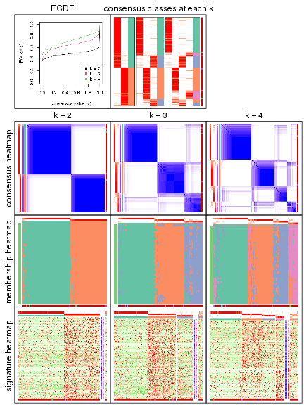

The plots are:

- The first row: a plot of the eCDF (empirical cumulative distribution
  function) curves of the consensus matrix for each `k` and the heatmap of
  predicted classes for each `k`.
- The second row: heatmaps of the consensus matrix for each `k`.
- The third row: heatmaps of the membership matrix for each `k`.
- The fouth row: heatmaps of the signatures for each `k`.

All the plots in panels can be made by individual functions and they are
plotted later in this section.

`select_partition_number()` produces several plots showing different
statistics for choosing "optimized" `k`. There are following statistics:

- eCDF curves of the consensus matrix for each `k`;
- 1-PAC. [The PAC score](https://en.wikipedia.org/wiki/Consensus_clustering#Over-interpretation_potential_of_consensus_clustering)
  measures the proportion of the ambiguous subgrouping.
- Mean silhouette score.
- Concordance. The mean probability of fiting the consensus subgroup labels in all
  partitions.
- Area increased. Denote $A_k$ as the area under the eCDF curve for current
  `k`, the area increased is defined as $A_k - A_{k-1}$.
- Rand index. The percent of pairs of samples that are both in a same cluster
  or both are not in a same cluster in the partition of k and k-1.
- Jaccard index. The ratio of pairs of samples are both in a same cluster in
  the partition of k and k-1 and the pairs of samples are both in a same
  cluster in the partition k or k-1.

The detailed explanations of these statistics can be found in [the _cola_
vignette](https://jokergoo.github.io/cola_vignettes/cola.html#toc_13).

Generally speaking, higher 1-PAC score, higher mean silhouette score or higher
concordance corresponds to better partition. Rand index and Jaccard index
measure how similar the current partition is compared to partition with `k-1`.
If they are too similar, we won't accept `k` is better than `k-1`.

```r
select_partition_number(res)
```


The numeric values for all these statistics can be obtained by `get_stats()`.

```r
get_stats(res)
```

```
#>   k 1-PAC mean_silhouette concordance area_increased  Rand Jaccard
#> 2 2 0.946           0.951       0.979          0.495 0.507   0.507
#> 3 3 0.780           0.869       0.936          0.303 0.797   0.619
#> 4 4 0.742           0.763       0.894          0.105 0.889   0.706
```

`suggest_best_k()` suggests the best $k$ based on these statistics. The rules are as follows:

- All $k$ with Jaccard index larger than 0.95 are removed because increasing
  $k$ does not provide enough extra information. If all $k$ are removed, it is
  marked as no subgroup is detected.
- For all $k$ with 1-PAC score larger than 0.9, the maximal $k$ is taken as
  the best $k$, and other $k$ are marked as optional $k$.
- If it does not fit the second rule. The $k$ with the maximal vote of the
  highest 1-PAC score, highest mean silhouette, and highest concordance is
  taken as the best $k$.

```r
suggest_best_k(res)
```

```
#> [1] 2
```


Following is the table of the partitions (You need to click the **show/hide
code output** link to see it). The membership matrix (columns with name `p*`)
is inferred by
[`clue::cl_consensus()`](https://www.rdocumentation.org/link/cl_consensus?package=clue)
function with the `SE` method. Basically the value in the membership matrix
represents the probability to belong to a certain group. The finall subgroup
label for an item is determined with the group with highest probability it
belongs to.

In `get_classes()` function, the entropy is calculated from the membership
matrix and the silhouette score is calculated from the consensus matrix.


<script>
$( function() {
	$( '#tabs-node-013-get-classes' ).tabs();
} );
</script>
<div id='tabs-node-013-get-classes'>
<ul>
<li><a href='#tab-node-013-get-classes-1'>k = 2</a></li>
<li><a href='#tab-node-013-get-classes-2'>k = 3</a></li>
<li><a href='#tab-node-013-get-classes-3'>k = 4</a></li>
</ul>

<div id='tab-node-013-get-classes-1'>
<p><a id='tab-node-013-get-classes-1-a' style='color:#0366d6' href='#'>show/hide code output</a></p>
<pre><code class="r">cbind(get_classes(res, k = 2), get_membership(res, k = 2))
</code></pre>

<pre><code>#&gt;     class entropy silhouette   p1   p2
#&gt; 1       2   0.000      0.980 0.00 1.00
#&gt; 2       2   0.000      0.980 0.00 1.00
#&gt; 3       2   0.000      0.980 0.00 1.00
#&gt; 4       2   0.000      0.980 0.00 1.00
#&gt; 5       2   0.000      0.980 0.00 1.00
#&gt; 6       1   0.000      0.977 1.00 0.00
#&gt; 7       1   0.141      0.961 0.98 0.02
#&gt; 8       2   0.000      0.980 0.00 1.00
#&gt; 9       2   0.000      0.980 0.00 1.00
#&gt; 10      2   0.000      0.980 0.00 1.00
#&gt; 11      1   0.000      0.977 1.00 0.00
#&gt; 12      1   0.327      0.925 0.94 0.06
#&gt; 13      1   0.402      0.904 0.92 0.08
#&gt; 14      2   0.000      0.980 0.00 1.00
#&gt; 15      2   0.000      0.980 0.00 1.00
#&gt; 16      2   0.000      0.980 0.00 1.00
#&gt; 17      2   0.000      0.980 0.00 1.00
#&gt; 18      2   0.000      0.980 0.00 1.00
#&gt; 19      2   0.000      0.980 0.00 1.00
#&gt; 20      2   0.000      0.980 0.00 1.00
#&gt; 21      2   0.000      0.980 0.00 1.00
#&gt; 22      2   0.000      0.980 0.00 1.00
#&gt; 23      2   0.000      0.980 0.00 1.00
#&gt; 24      2   0.000      0.980 0.00 1.00
#&gt; 25      2   0.000      0.980 0.00 1.00
#&gt; 26      2   0.000      0.980 0.00 1.00
#&gt; 27      1   0.925      0.491 0.66 0.34
#&gt; 28      2   0.000      0.980 0.00 1.00
#&gt; 29      1   0.000      0.977 1.00 0.00
#&gt; 30      1   0.000      0.977 1.00 0.00
#&gt; 31      2   0.000      0.980 0.00 1.00
#&gt; 32      1   0.242      0.944 0.96 0.04
#&gt; 33      1   0.971      0.342 0.60 0.40
#&gt; 34      1   0.000      0.977 1.00 0.00
#&gt; 35      2   0.000      0.980 0.00 1.00
#&gt; 36      2   0.000      0.980 0.00 1.00
#&gt; 37      2   0.000      0.980 0.00 1.00
#&gt; 38      2   0.000      0.980 0.00 1.00
#&gt; 39      2   0.000      0.980 0.00 1.00
#&gt; 40      1   0.000      0.977 1.00 0.00
#&gt; 41      2   0.000      0.980 0.00 1.00
#&gt; 42      1   0.000      0.977 1.00 0.00
#&gt; 43      1   0.000      0.977 1.00 0.00
#&gt; 44      2   0.000      0.980 0.00 1.00
#&gt; 45      2   0.141      0.963 0.02 0.98
#&gt; 46      2   0.469      0.886 0.10 0.90
#&gt; 47      1   0.722      0.752 0.80 0.20
#&gt; 48      2   0.000      0.980 0.00 1.00
#&gt; 49      1   0.000      0.977 1.00 0.00
#&gt; 50      1   0.925      0.493 0.66 0.34
#&gt; 51      2   0.000      0.980 0.00 1.00
#&gt; 52      2   0.529      0.862 0.12 0.88
#&gt; 53      2   0.000      0.980 0.00 1.00
#&gt; 54      2   0.000      0.980 0.00 1.00
#&gt; 55      2   0.000      0.980 0.00 1.00
#&gt; 56      2   0.000      0.980 0.00 1.00
#&gt; 57      1   0.634      0.809 0.84 0.16
#&gt; 58      2   0.000      0.980 0.00 1.00
#&gt; 59      2   0.000      0.980 0.00 1.00
#&gt; 60      2   0.000      0.980 0.00 1.00
#&gt; 61      1   0.000      0.977 1.00 0.00
#&gt; 62      1   0.000      0.977 1.00 0.00
#&gt; 63      2   0.000      0.980 0.00 1.00
#&gt; 64      1   0.000      0.977 1.00 0.00
#&gt; 65      1   0.000      0.977 1.00 0.00
#&gt; 66      2   0.000      0.980 0.00 1.00
#&gt; 67      1   0.000      0.977 1.00 0.00
#&gt; 68      1   0.000      0.977 1.00 0.00
#&gt; 69      2   0.000      0.980 0.00 1.00
#&gt; 70      1   0.469      0.882 0.90 0.10
#&gt; 71      1   0.634      0.809 0.84 0.16
#&gt; 72      1   0.000      0.977 1.00 0.00
#&gt; 73      2   0.680      0.783 0.18 0.82
#&gt; 74      1   0.000      0.977 1.00 0.00
#&gt; 75      2   0.000      0.980 0.00 1.00
#&gt; 76      2   0.000      0.980 0.00 1.00
#&gt; 77      2   0.000      0.980 0.00 1.00
#&gt; 78      2   0.000      0.980 0.00 1.00
#&gt; 79      1   0.141      0.961 0.98 0.02
#&gt; 80      1   0.000      0.977 1.00 0.00
#&gt; 81      2   0.000      0.980 0.00 1.00
#&gt; 82      1   0.000      0.977 1.00 0.00
#&gt; 83      2   0.000      0.980 0.00 1.00
#&gt; 84      2   0.000      0.980 0.00 1.00
#&gt; 85      2   0.141      0.963 0.02 0.98
#&gt; 86      2   0.000      0.980 0.00 1.00
#&gt; 87      2   0.000      0.980 0.00 1.00
#&gt; 88      2   0.141      0.963 0.02 0.98
#&gt; 89      1   0.000      0.977 1.00 0.00
#&gt; 90      1   0.000      0.977 1.00 0.00
#&gt; 91      2   0.795      0.688 0.24 0.76
#&gt; 92      2   0.000      0.980 0.00 1.00
#&gt; 93      1   0.000      0.977 1.00 0.00
#&gt; 94      1   0.000      0.977 1.00 0.00
#&gt; 95      1   0.000      0.977 1.00 0.00
#&gt; 96      1   0.000      0.977 1.00 0.00
#&gt; 97      1   0.000      0.977 1.00 0.00
#&gt; 98      1   0.000      0.977 1.00 0.00
#&gt; 99      1   0.000      0.977 1.00 0.00
#&gt; 100     1   0.000      0.977 1.00 0.00
#&gt; 101     1   0.000      0.977 1.00 0.00
#&gt; 102     1   0.000      0.977 1.00 0.00
#&gt; 103     1   0.000      0.977 1.00 0.00
#&gt; 104     1   0.000      0.977 1.00 0.00
#&gt; 105     1   0.000      0.977 1.00 0.00
#&gt; 106     1   0.000      0.977 1.00 0.00
#&gt; 107     1   0.000      0.977 1.00 0.00
#&gt; 108     1   0.000      0.977 1.00 0.00
#&gt; 109     1   0.000      0.977 1.00 0.00
#&gt; 110     2   0.000      0.980 0.00 1.00
#&gt; 111     1   0.000      0.977 1.00 0.00
#&gt; 112     1   0.000      0.977 1.00 0.00
#&gt; 113     1   0.000      0.977 1.00 0.00
#&gt; 114     1   0.000      0.977 1.00 0.00
#&gt; 115     1   0.000      0.977 1.00 0.00
#&gt; 116     1   0.000      0.977 1.00 0.00
#&gt; 117     1   0.000      0.977 1.00 0.00
#&gt; 118     1   0.000      0.977 1.00 0.00
#&gt; 119     1   0.000      0.977 1.00 0.00
#&gt; 120     1   0.000      0.977 1.00 0.00
#&gt; 121     1   0.000      0.977 1.00 0.00
#&gt; 122     1   0.000      0.977 1.00 0.00
#&gt; 123     1   0.000      0.977 1.00 0.00
#&gt; 124     1   0.000      0.977 1.00 0.00
#&gt; 125     1   0.000      0.977 1.00 0.00
#&gt; 126     1   0.000      0.977 1.00 0.00
#&gt; 127     1   0.242      0.944 0.96 0.04
#&gt; 128     2   0.722      0.754 0.20 0.80
#&gt; 129     1   0.141      0.961 0.98 0.02
#&gt; 130     1   0.000      0.977 1.00 0.00
#&gt; 131     1   0.000      0.977 1.00 0.00
#&gt; 132     1   0.000      0.977 1.00 0.00
#&gt; 133     1   0.000      0.977 1.00 0.00
#&gt; 134     1   0.000      0.977 1.00 0.00
#&gt; 135     1   0.000      0.977 1.00 0.00
#&gt; 136     2   0.680      0.786 0.18 0.82
#&gt; 137     2   0.000      0.980 0.00 1.00
#&gt; 138     1   0.000      0.977 1.00 0.00
#&gt; 139     2   0.000      0.980 0.00 1.00
#&gt; 140     1   0.000      0.977 1.00 0.00
#&gt; 141     1   0.000      0.977 1.00 0.00
#&gt; 142     1   0.000      0.977 1.00 0.00
#&gt; 143     2   0.995      0.139 0.46 0.54
#&gt; 144     1   0.000      0.977 1.00 0.00
#&gt; 145     1   0.000      0.977 1.00 0.00
#&gt; 146     1   0.000      0.977 1.00 0.00
#&gt; 147     1   0.000      0.977 1.00 0.00
#&gt; 148     1   0.000      0.977 1.00 0.00
#&gt; 149     1   0.000      0.977 1.00 0.00
#&gt; 150     1   0.000      0.977 1.00 0.00
#&gt; 151     1   0.000      0.977 1.00 0.00
#&gt; 152     1   0.000      0.977 1.00 0.00
#&gt; 153     2   0.000      0.980 0.00 1.00
#&gt; 154     1   0.000      0.977 1.00 0.00
#&gt; 155     1   0.000      0.977 1.00 0.00
#&gt; 156     2   0.402      0.907 0.08 0.92
#&gt; 157     1   0.000      0.977 1.00 0.00
#&gt; 158     1   0.000      0.977 1.00 0.00
#&gt; 159     2   0.000      0.980 0.00 1.00
#&gt; 160     2   0.000      0.980 0.00 1.00
#&gt; 161     2   0.000      0.980 0.00 1.00
#&gt; 162     1   0.000      0.977 1.00 0.00
#&gt; 163     1   0.000      0.977 1.00 0.00
#&gt; 164     2   0.000      0.980 0.00 1.00
#&gt; 165     2   0.402      0.907 0.08 0.92
#&gt; 166     1   0.000      0.977 1.00 0.00
#&gt; 167     1   0.000      0.977 1.00 0.00
#&gt; 168     1   0.000      0.977 1.00 0.00
#&gt; 169     1   0.995      0.158 0.54 0.46
#&gt; 170     1   0.000      0.977 1.00 0.00
#&gt; 171     1   0.000      0.977 1.00 0.00
#&gt; 172     1   0.141      0.961 0.98 0.02
#&gt; 173     1   0.000      0.977 1.00 0.00
#&gt; 174     1   0.000      0.977 1.00 0.00
#&gt; 175     1   0.000      0.977 1.00 0.00
#&gt; 176     1   0.000      0.977 1.00 0.00
#&gt; 177     1   0.000      0.977 1.00 0.00
#&gt; 178     1   0.000      0.977 1.00 0.00
#&gt; 179     1   0.000      0.977 1.00 0.00
#&gt; 180     1   0.000      0.977 1.00 0.00
#&gt; 181     2   0.000      0.980 0.00 1.00
#&gt; 182     1   0.000      0.977 1.00 0.00
#&gt; 183     1   0.000      0.977 1.00 0.00
#&gt; 184     2   0.000      0.980 0.00 1.00
#&gt; 185     2   0.000      0.980 0.00 1.00
#&gt; 186     2   0.000      0.980 0.00 1.00
#&gt; 187     2   0.000      0.980 0.00 1.00
#&gt; 188     2   0.000      0.980 0.00 1.00
#&gt; 189     2   0.000      0.980 0.00 1.00
#&gt; 190     2   0.000      0.980 0.00 1.00
#&gt; 191     2   0.000      0.980 0.00 1.00
#&gt; 192     2   0.000      0.980 0.00 1.00
#&gt; 193     2   0.000      0.980 0.00 1.00
#&gt; 194     2   0.000      0.980 0.00 1.00
#&gt; 195     1   0.000      0.977 1.00 0.00
#&gt; 196     2   0.000      0.980 0.00 1.00
#&gt; 197     1   0.000      0.977 1.00 0.00
#&gt; 198     2   0.000      0.980 0.00 1.00
#&gt; 199     1   0.242      0.944 0.96 0.04
#&gt; 200     1   0.000      0.977 1.00 0.00
#&gt; 201     2   0.000      0.980 0.00 1.00
</code></pre>

<script>
$('#tab-node-013-get-classes-1-a').parent().next().next().hide();
$('#tab-node-013-get-classes-1-a').click(function(){
  $('#tab-node-013-get-classes-1-a').parent().next().next().toggle();
  return(false);
});
</script>
</div>

<div id='tab-node-013-get-classes-2'>
<p><a id='tab-node-013-get-classes-2-a' style='color:#0366d6' href='#'>show/hide code output</a></p>
<pre><code class="r">cbind(get_classes(res, k = 3), get_membership(res, k = 3))
</code></pre>

<pre><code>#&gt;     class entropy silhouette   p1   p2   p3
#&gt; 1       2  0.0892     0.9255 0.00 0.98 0.02
#&gt; 2       2  0.0000     0.9299 0.00 1.00 0.00
#&gt; 3       2  0.0000     0.9299 0.00 1.00 0.00
#&gt; 4       2  0.0000     0.9299 0.00 1.00 0.00
#&gt; 5       2  0.0000     0.9299 0.00 1.00 0.00
#&gt; 6       1  0.3686     0.8321 0.86 0.00 0.14
#&gt; 7       1  0.1781     0.9311 0.96 0.02 0.02
#&gt; 8       2  0.0000     0.9299 0.00 1.00 0.00
#&gt; 9       2  0.0000     0.9299 0.00 1.00 0.00
#&gt; 10      2  0.2959     0.8670 0.00 0.90 0.10
#&gt; 11      3  0.2537     0.8500 0.08 0.00 0.92
#&gt; 12      3  0.1529     0.8637 0.04 0.00 0.96
#&gt; 13      3  0.1529     0.8657 0.04 0.00 0.96
#&gt; 14      2  0.0892     0.9255 0.00 0.98 0.02
#&gt; 15      2  0.0000     0.9299 0.00 1.00 0.00
#&gt; 16      2  0.0000     0.9299 0.00 1.00 0.00
#&gt; 17      2  0.2066     0.8994 0.00 0.94 0.06
#&gt; 18      3  0.2959     0.8293 0.00 0.10 0.90
#&gt; 19      2  0.0000     0.9299 0.00 1.00 0.00
#&gt; 20      2  0.0000     0.9299 0.00 1.00 0.00
#&gt; 21      2  0.1529     0.9111 0.00 0.96 0.04
#&gt; 22      2  0.0000     0.9299 0.00 1.00 0.00
#&gt; 23      2  0.2537     0.8839 0.00 0.92 0.08
#&gt; 24      2  0.2959     0.8673 0.00 0.90 0.10
#&gt; 25      2  0.0892     0.9255 0.00 0.98 0.02
#&gt; 26      2  0.0892     0.9255 0.00 0.98 0.02
#&gt; 27      2  0.9930    -0.0765 0.34 0.38 0.28
#&gt; 28      2  0.1529     0.9111 0.00 0.96 0.04
#&gt; 29      1  0.3686     0.8288 0.86 0.00 0.14
#&gt; 30      3  0.0892     0.8645 0.00 0.02 0.98
#&gt; 31      3  0.6126     0.3822 0.00 0.40 0.60
#&gt; 32      3  0.0892     0.8645 0.00 0.02 0.98
#&gt; 33      3  0.6176     0.7822 0.12 0.10 0.78
#&gt; 34      3  0.3340     0.8252 0.12 0.00 0.88
#&gt; 35      2  0.0000     0.9299 0.00 1.00 0.00
#&gt; 36      2  0.0000     0.9299 0.00 1.00 0.00
#&gt; 37      2  0.1529     0.9222 0.00 0.96 0.04
#&gt; 38      2  0.0892     0.9255 0.00 0.98 0.02
#&gt; 39      3  0.5216     0.6600 0.00 0.26 0.74
#&gt; 40      3  0.3340     0.8252 0.12 0.00 0.88
#&gt; 41      2  0.0892     0.9219 0.00 0.98 0.02
#&gt; 42      3  0.2537     0.8497 0.08 0.00 0.92
#&gt; 43      3  0.0892     0.8670 0.02 0.00 0.98
#&gt; 44      2  0.0000     0.9299 0.00 1.00 0.00
#&gt; 45      3  0.1529     0.8609 0.00 0.04 0.96
#&gt; 46      3  0.0892     0.8645 0.00 0.02 0.98
#&gt; 47      1  0.7424     0.4775 0.64 0.30 0.06
#&gt; 48      3  0.6244     0.2605 0.00 0.44 0.56
#&gt; 49      1  0.0000     0.9628 1.00 0.00 0.00
#&gt; 50      3  0.6793     0.7514 0.16 0.10 0.74
#&gt; 51      2  0.6126     0.3047 0.00 0.60 0.40
#&gt; 52      3  0.0892     0.8645 0.00 0.02 0.98
#&gt; 53      3  0.5560     0.6021 0.00 0.30 0.70
#&gt; 54      2  0.0892     0.9255 0.00 0.98 0.02
#&gt; 55      2  0.0892     0.9255 0.00 0.98 0.02
#&gt; 56      2  0.2537     0.8727 0.00 0.92 0.08
#&gt; 57      3  0.0892     0.8645 0.00 0.02 0.98
#&gt; 58      2  0.0000     0.9299 0.00 1.00 0.00
#&gt; 59      2  0.2959     0.8665 0.00 0.90 0.10
#&gt; 60      2  0.2066     0.8983 0.00 0.94 0.06
#&gt; 61      1  0.0892     0.9479 0.98 0.00 0.02
#&gt; 62      1  0.4002     0.8063 0.84 0.00 0.16
#&gt; 63      2  0.0000     0.9299 0.00 1.00 0.00
#&gt; 64      3  0.0892     0.8670 0.02 0.00 0.98
#&gt; 65      3  0.0892     0.8670 0.02 0.00 0.98
#&gt; 66      2  0.3340     0.8458 0.00 0.88 0.12
#&gt; 67      3  0.3686     0.8077 0.14 0.00 0.86
#&gt; 68      3  0.0892     0.8670 0.02 0.00 0.98
#&gt; 69      2  0.4796     0.7113 0.00 0.78 0.22
#&gt; 70      3  0.0892     0.8645 0.00 0.02 0.98
#&gt; 71      3  0.0892     0.8645 0.00 0.02 0.98
#&gt; 72      1  0.2066     0.9159 0.94 0.00 0.06
#&gt; 73      3  0.3686     0.7992 0.00 0.14 0.86
#&gt; 74      3  0.3340     0.8284 0.12 0.00 0.88
#&gt; 75      2  0.2537     0.8839 0.00 0.92 0.08
#&gt; 76      2  0.0000     0.9299 0.00 1.00 0.00
#&gt; 77      3  0.5835     0.5222 0.00 0.34 0.66
#&gt; 78      2  0.0892     0.9255 0.00 0.98 0.02
#&gt; 79      3  0.4002     0.7961 0.16 0.00 0.84
#&gt; 80      3  0.0892     0.8670 0.02 0.00 0.98
#&gt; 81      2  0.2537     0.8846 0.00 0.92 0.08
#&gt; 82      1  0.5016     0.6818 0.76 0.00 0.24
#&gt; 83      2  0.5835     0.4678 0.00 0.66 0.34
#&gt; 84      2  0.5016     0.6787 0.00 0.76 0.24
#&gt; 85      3  0.2959     0.8295 0.00 0.10 0.90
#&gt; 86      2  0.0000     0.9299 0.00 1.00 0.00
#&gt; 87      3  0.2066     0.8521 0.00 0.06 0.94
#&gt; 88      3  0.2959     0.8294 0.00 0.10 0.90
#&gt; 89      1  0.0000     0.9628 1.00 0.00 0.00
#&gt; 90      1  0.0000     0.9628 1.00 0.00 0.00
#&gt; 91      2  0.7074     0.0527 0.48 0.50 0.02
#&gt; 92      2  0.0892     0.9255 0.00 0.98 0.02
#&gt; 93      1  0.0000     0.9628 1.00 0.00 0.00
#&gt; 94      1  0.0000     0.9628 1.00 0.00 0.00
#&gt; 95      3  0.1529     0.8656 0.04 0.00 0.96
#&gt; 96      1  0.5948     0.4337 0.64 0.00 0.36
#&gt; 97      1  0.0000     0.9628 1.00 0.00 0.00
#&gt; 98      1  0.0000     0.9628 1.00 0.00 0.00
#&gt; 99      1  0.0000     0.9628 1.00 0.00 0.00
#&gt; 100     1  0.0000     0.9628 1.00 0.00 0.00
#&gt; 101     1  0.0000     0.9628 1.00 0.00 0.00
#&gt; 102     1  0.0000     0.9628 1.00 0.00 0.00
#&gt; 103     1  0.0000     0.9628 1.00 0.00 0.00
#&gt; 104     1  0.0000     0.9628 1.00 0.00 0.00
#&gt; 105     1  0.0000     0.9628 1.00 0.00 0.00
#&gt; 106     1  0.0000     0.9628 1.00 0.00 0.00
#&gt; 107     1  0.0000     0.9628 1.00 0.00 0.00
#&gt; 108     1  0.0000     0.9628 1.00 0.00 0.00
#&gt; 109     1  0.0000     0.9628 1.00 0.00 0.00
#&gt; 110     2  0.0892     0.9255 0.00 0.98 0.02
#&gt; 111     1  0.0000     0.9628 1.00 0.00 0.00
#&gt; 112     1  0.0000     0.9628 1.00 0.00 0.00
#&gt; 113     1  0.0000     0.9628 1.00 0.00 0.00
#&gt; 114     1  0.0000     0.9628 1.00 0.00 0.00
#&gt; 115     1  0.0000     0.9628 1.00 0.00 0.00
#&gt; 116     3  0.5016     0.6816 0.24 0.00 0.76
#&gt; 117     1  0.0000     0.9628 1.00 0.00 0.00
#&gt; 118     1  0.0000     0.9628 1.00 0.00 0.00
#&gt; 119     1  0.0000     0.9628 1.00 0.00 0.00
#&gt; 120     1  0.0000     0.9628 1.00 0.00 0.00
#&gt; 121     1  0.0000     0.9628 1.00 0.00 0.00
#&gt; 122     3  0.2959     0.8393 0.10 0.00 0.90
#&gt; 123     1  0.1529     0.9331 0.96 0.00 0.04
#&gt; 124     1  0.0892     0.9484 0.98 0.00 0.02
#&gt; 125     1  0.0000     0.9628 1.00 0.00 0.00
#&gt; 126     1  0.0000     0.9628 1.00 0.00 0.00
#&gt; 127     1  0.3415     0.8661 0.90 0.08 0.02
#&gt; 128     3  0.7208     0.5136 0.04 0.34 0.62
#&gt; 129     3  0.0892     0.8670 0.02 0.00 0.98
#&gt; 130     1  0.0000     0.9628 1.00 0.00 0.00
#&gt; 131     1  0.0000     0.9628 1.00 0.00 0.00
#&gt; 132     1  0.0892     0.9485 0.98 0.00 0.02
#&gt; 133     1  0.0000     0.9628 1.00 0.00 0.00
#&gt; 134     1  0.0000     0.9628 1.00 0.00 0.00
#&gt; 135     1  0.0000     0.9628 1.00 0.00 0.00
#&gt; 136     2  0.5147     0.7128 0.18 0.80 0.02
#&gt; 137     2  0.4035     0.8392 0.08 0.88 0.04
#&gt; 138     1  0.0000     0.9628 1.00 0.00 0.00
#&gt; 139     2  0.0000     0.9299 0.00 1.00 0.00
#&gt; 140     1  0.5835     0.4817 0.66 0.00 0.34
#&gt; 141     1  0.0000     0.9628 1.00 0.00 0.00
#&gt; 142     1  0.0000     0.9628 1.00 0.00 0.00
#&gt; 143     3  0.0892     0.8645 0.00 0.02 0.98
#&gt; 144     1  0.0000     0.9628 1.00 0.00 0.00
#&gt; 145     1  0.0000     0.9628 1.00 0.00 0.00
#&gt; 146     1  0.0000     0.9628 1.00 0.00 0.00
#&gt; 147     1  0.0000     0.9628 1.00 0.00 0.00
#&gt; 148     1  0.0000     0.9628 1.00 0.00 0.00
#&gt; 149     1  0.0000     0.9628 1.00 0.00 0.00
#&gt; 150     1  0.4862     0.7820 0.82 0.02 0.16
#&gt; 151     1  0.0000     0.9628 1.00 0.00 0.00
#&gt; 152     1  0.0000     0.9628 1.00 0.00 0.00
#&gt; 153     2  0.0892     0.9255 0.00 0.98 0.02
#&gt; 154     1  0.2066     0.9155 0.94 0.00 0.06
#&gt; 155     1  0.0000     0.9628 1.00 0.00 0.00
#&gt; 156     2  0.4035     0.8397 0.08 0.88 0.04
#&gt; 157     1  0.0892     0.9467 0.98 0.00 0.02
#&gt; 158     1  0.0000     0.9628 1.00 0.00 0.00
#&gt; 159     2  0.0892     0.9255 0.00 0.98 0.02
#&gt; 160     2  0.0892     0.9255 0.00 0.98 0.02
#&gt; 161     2  0.0892     0.9255 0.00 0.98 0.02
#&gt; 162     1  0.3340     0.8518 0.88 0.00 0.12
#&gt; 163     1  0.0000     0.9628 1.00 0.00 0.00
#&gt; 164     2  0.0000     0.9299 0.00 1.00 0.00
#&gt; 165     2  0.3832     0.8283 0.10 0.88 0.02
#&gt; 166     1  0.0000     0.9628 1.00 0.00 0.00
#&gt; 167     1  0.0000     0.9628 1.00 0.00 0.00
#&gt; 168     1  0.0000     0.9628 1.00 0.00 0.00
#&gt; 169     3  0.1781     0.8674 0.02 0.02 0.96
#&gt; 170     1  0.0000     0.9628 1.00 0.00 0.00
#&gt; 171     1  0.0000     0.9628 1.00 0.00 0.00
#&gt; 172     1  0.5948     0.4301 0.64 0.00 0.36
#&gt; 173     1  0.0000     0.9628 1.00 0.00 0.00
#&gt; 174     1  0.0000     0.9628 1.00 0.00 0.00
#&gt; 175     1  0.0000     0.9628 1.00 0.00 0.00
#&gt; 176     1  0.0000     0.9628 1.00 0.00 0.00
#&gt; 177     1  0.0892     0.9467 0.98 0.00 0.02
#&gt; 178     3  0.6045     0.4066 0.38 0.00 0.62
#&gt; 179     1  0.0000     0.9628 1.00 0.00 0.00
#&gt; 180     1  0.0000     0.9628 1.00 0.00 0.00
#&gt; 181     2  0.0892     0.9255 0.00 0.98 0.02
#&gt; 182     1  0.0000     0.9628 1.00 0.00 0.00
#&gt; 183     1  0.0000     0.9628 1.00 0.00 0.00
#&gt; 184     2  0.0000     0.9299 0.00 1.00 0.00
#&gt; 185     2  0.0000     0.9299 0.00 1.00 0.00
#&gt; 186     2  0.0000     0.9299 0.00 1.00 0.00
#&gt; 187     2  0.0000     0.9299 0.00 1.00 0.00
#&gt; 188     2  0.2066     0.8989 0.00 0.94 0.06
#&gt; 189     2  0.2537     0.8839 0.00 0.92 0.08
#&gt; 190     2  0.0000     0.9299 0.00 1.00 0.00
#&gt; 191     2  0.0892     0.9255 0.00 0.98 0.02
#&gt; 192     2  0.0892     0.9221 0.00 0.98 0.02
#&gt; 193     2  0.0000     0.9299 0.00 1.00 0.00
#&gt; 194     3  0.6280     0.2171 0.00 0.46 0.54
#&gt; 195     1  0.0000     0.9628 1.00 0.00 0.00
#&gt; 196     2  0.0892     0.9255 0.00 0.98 0.02
#&gt; 197     1  0.0000     0.9628 1.00 0.00 0.00
#&gt; 198     2  0.0892     0.9255 0.00 0.98 0.02
#&gt; 199     1  0.3832     0.8428 0.88 0.10 0.02
#&gt; 200     1  0.0000     0.9628 1.00 0.00 0.00
#&gt; 201     2  0.0000     0.9299 0.00 1.00 0.00
</code></pre>

<script>
$('#tab-node-013-get-classes-2-a').parent().next().next().hide();
$('#tab-node-013-get-classes-2-a').click(function(){
  $('#tab-node-013-get-classes-2-a').parent().next().next().toggle();
  return(false);
});
</script>
</div>

<div id='tab-node-013-get-classes-3'>
<p><a id='tab-node-013-get-classes-3-a' style='color:#0366d6' href='#'>show/hide code output</a></p>
<pre><code class="r">cbind(get_classes(res, k = 4), get_membership(res, k = 4))
</code></pre>

<pre><code>#&gt;     class entropy silhouette   p1   p2   p3   p4
#&gt; 1       4  0.4277     0.6649 0.00 0.28 0.00 0.72
#&gt; 2       2  0.0000     0.8629 0.00 1.00 0.00 0.00
#&gt; 3       2  0.0000     0.8629 0.00 1.00 0.00 0.00
#&gt; 4       2  0.0000     0.8629 0.00 1.00 0.00 0.00
#&gt; 5       2  0.0000     0.8629 0.00 1.00 0.00 0.00
#&gt; 6       1  0.3400     0.7793 0.82 0.00 0.18 0.00
#&gt; 7       1  0.4994     0.2100 0.52 0.00 0.00 0.48
#&gt; 8       2  0.0000     0.8629 0.00 1.00 0.00 0.00
#&gt; 9       2  0.0000     0.8629 0.00 1.00 0.00 0.00
#&gt; 10      2  0.0000     0.8629 0.00 1.00 0.00 0.00
#&gt; 11      3  0.0000     0.8321 0.00 0.00 1.00 0.00
#&gt; 12      3  0.1637     0.8088 0.00 0.00 0.94 0.06
#&gt; 13      3  0.4522     0.5157 0.00 0.00 0.68 0.32
#&gt; 14      2  0.4977    -0.1199 0.00 0.54 0.00 0.46
#&gt; 15      2  0.0000     0.8629 0.00 1.00 0.00 0.00
#&gt; 16      2  0.0000     0.8629 0.00 1.00 0.00 0.00
#&gt; 17      2  0.0000     0.8629 0.00 1.00 0.00 0.00
#&gt; 18      2  0.4907     0.2530 0.00 0.58 0.42 0.00
#&gt; 19      2  0.0000     0.8629 0.00 1.00 0.00 0.00
#&gt; 20      2  0.0000     0.8629 0.00 1.00 0.00 0.00
#&gt; 21      2  0.0000     0.8629 0.00 1.00 0.00 0.00
#&gt; 22      2  0.0000     0.8629 0.00 1.00 0.00 0.00
#&gt; 23      2  0.0000     0.8629 0.00 1.00 0.00 0.00
#&gt; 24      2  0.0000     0.8629 0.00 1.00 0.00 0.00
#&gt; 25      4  0.4277     0.6793 0.00 0.28 0.00 0.72
#&gt; 26      4  0.4977     0.3484 0.00 0.46 0.00 0.54
#&gt; 27      4  0.1211     0.7349 0.00 0.00 0.04 0.96
#&gt; 28      2  0.0000     0.8629 0.00 1.00 0.00 0.00
#&gt; 29      1  0.3172     0.8047 0.84 0.00 0.16 0.00
#&gt; 30      3  0.0000     0.8321 0.00 0.00 1.00 0.00
#&gt; 31      2  0.3975     0.6507 0.00 0.76 0.24 0.00
#&gt; 32      3  0.0000     0.8321 0.00 0.00 1.00 0.00
#&gt; 33      3  0.6731     0.5575 0.02 0.28 0.62 0.08
#&gt; 34      3  0.3172     0.7326 0.16 0.00 0.84 0.00
#&gt; 35      2  0.0000     0.8629 0.00 1.00 0.00 0.00
#&gt; 36      2  0.0000     0.8629 0.00 1.00 0.00 0.00
#&gt; 37      2  0.5173     0.3918 0.00 0.66 0.02 0.32
#&gt; 38      4  0.4994     0.2940 0.00 0.48 0.00 0.52
#&gt; 39      2  0.4948     0.2071 0.00 0.56 0.44 0.00
#&gt; 40      3  0.0707     0.8301 0.02 0.00 0.98 0.00
#&gt; 41      2  0.0000     0.8629 0.00 1.00 0.00 0.00
#&gt; 42      3  0.0707     0.8298 0.02 0.00 0.98 0.00
#&gt; 43      3  0.0000     0.8321 0.00 0.00 1.00 0.00
#&gt; 44      2  0.0000     0.8629 0.00 1.00 0.00 0.00
#&gt; 45      3  0.4406     0.5616 0.00 0.30 0.70 0.00
#&gt; 46      3  0.0707     0.8279 0.00 0.02 0.98 0.00
#&gt; 47      4  0.0000     0.7488 0.00 0.00 0.00 1.00
#&gt; 48      2  0.7206     0.0338 0.00 0.46 0.40 0.14
#&gt; 49      1  0.0000     0.9315 1.00 0.00 0.00 0.00
#&gt; 50      3  0.8406     0.4939 0.18 0.20 0.54 0.08
#&gt; 51      2  0.2647     0.7734 0.00 0.88 0.12 0.00
#&gt; 52      3  0.0707     0.8274 0.00 0.02 0.98 0.00
#&gt; 53      2  0.4977     0.1311 0.00 0.54 0.46 0.00
#&gt; 54      2  0.4855     0.1293 0.00 0.60 0.00 0.40
#&gt; 55      2  0.4522     0.3972 0.00 0.68 0.00 0.32
#&gt; 56      2  0.7581    -0.0665 0.00 0.44 0.20 0.36
#&gt; 57      3  0.0000     0.8321 0.00 0.00 1.00 0.00
#&gt; 58      2  0.0000     0.8629 0.00 1.00 0.00 0.00
#&gt; 59      2  0.2335     0.8109 0.00 0.92 0.06 0.02
#&gt; 60      2  0.0000     0.8629 0.00 1.00 0.00 0.00
#&gt; 61      1  0.1211     0.9109 0.96 0.00 0.00 0.04
#&gt; 62      1  0.4522     0.5567 0.68 0.00 0.32 0.00
#&gt; 63      2  0.0000     0.8629 0.00 1.00 0.00 0.00
#&gt; 64      3  0.0000     0.8321 0.00 0.00 1.00 0.00
#&gt; 65      3  0.0707     0.8301 0.02 0.00 0.98 0.00
#&gt; 66      2  0.0000     0.8629 0.00 1.00 0.00 0.00
#&gt; 67      3  0.3610     0.6881 0.20 0.00 0.80 0.00
#&gt; 68      3  0.0707     0.8299 0.02 0.00 0.98 0.00
#&gt; 69      2  0.1211     0.8362 0.00 0.96 0.04 0.00
#&gt; 70      3  0.0707     0.8262 0.00 0.02 0.98 0.00
#&gt; 71      3  0.0000     0.8321 0.00 0.00 1.00 0.00
#&gt; 72      1  0.2647     0.8465 0.88 0.00 0.12 0.00
#&gt; 73      3  0.3975     0.6558 0.00 0.24 0.76 0.00
#&gt; 74      3  0.4227     0.7366 0.12 0.00 0.82 0.06
#&gt; 75      2  0.0000     0.8629 0.00 1.00 0.00 0.00
#&gt; 76      2  0.0000     0.8629 0.00 1.00 0.00 0.00
#&gt; 77      2  0.4855     0.3218 0.00 0.60 0.40 0.00
#&gt; 78      4  0.4713     0.5757 0.00 0.36 0.00 0.64
#&gt; 79      3  0.4939     0.6487 0.22 0.04 0.74 0.00
#&gt; 80      3  0.0000     0.8321 0.00 0.00 1.00 0.00
#&gt; 81      2  0.0000     0.8629 0.00 1.00 0.00 0.00
#&gt; 82      1  0.4624     0.5153 0.66 0.00 0.34 0.00
#&gt; 83      2  0.3821     0.7440 0.00 0.84 0.12 0.04
#&gt; 84      2  0.2011     0.8076 0.00 0.92 0.08 0.00
#&gt; 85      3  0.4855     0.3433 0.00 0.40 0.60 0.00
#&gt; 86      2  0.0000     0.8629 0.00 1.00 0.00 0.00
#&gt; 87      3  0.4277     0.5888 0.00 0.28 0.72 0.00
#&gt; 88      2  0.5606    -0.0165 0.00 0.50 0.48 0.02
#&gt; 89      1  0.0000     0.9315 1.00 0.00 0.00 0.00
#&gt; 90      1  0.0000     0.9315 1.00 0.00 0.00 0.00
#&gt; 91      4  0.0000     0.7488 0.00 0.00 0.00 1.00
#&gt; 92      4  0.3400     0.7510 0.00 0.18 0.00 0.82
#&gt; 93      1  0.0707     0.9218 0.98 0.00 0.00 0.02
#&gt; 94      1  0.0000     0.9315 1.00 0.00 0.00 0.00
#&gt; 95      3  0.1637     0.8104 0.06 0.00 0.94 0.00
#&gt; 96      1  0.4977     0.1685 0.54 0.00 0.46 0.00
#&gt; 97      1  0.0707     0.9205 0.98 0.00 0.02 0.00
#&gt; 98      1  0.0000     0.9315 1.00 0.00 0.00 0.00
#&gt; 99      1  0.0000     0.9315 1.00 0.00 0.00 0.00
#&gt; 100     1  0.0707     0.9210 0.98 0.00 0.00 0.02
#&gt; 101     1  0.0000     0.9315 1.00 0.00 0.00 0.00
#&gt; 102     1  0.0000     0.9315 1.00 0.00 0.00 0.00
#&gt; 103     1  0.0000     0.9315 1.00 0.00 0.00 0.00
#&gt; 104     1  0.0000     0.9315 1.00 0.00 0.00 0.00
#&gt; 105     1  0.0000     0.9315 1.00 0.00 0.00 0.00
#&gt; 106     1  0.0000     0.9315 1.00 0.00 0.00 0.00
#&gt; 107     1  0.0000     0.9315 1.00 0.00 0.00 0.00
#&gt; 108     1  0.0000     0.9315 1.00 0.00 0.00 0.00
#&gt; 109     1  0.0000     0.9315 1.00 0.00 0.00 0.00
#&gt; 110     2  0.4134     0.5585 0.00 0.74 0.00 0.26
#&gt; 111     1  0.0000     0.9315 1.00 0.00 0.00 0.00
#&gt; 112     1  0.0000     0.9315 1.00 0.00 0.00 0.00
#&gt; 113     1  0.0000     0.9315 1.00 0.00 0.00 0.00
#&gt; 114     1  0.3400     0.7882 0.82 0.00 0.00 0.18
#&gt; 115     1  0.0000     0.9315 1.00 0.00 0.00 0.00
#&gt; 116     3  0.2011     0.7989 0.08 0.00 0.92 0.00
#&gt; 117     1  0.0000     0.9315 1.00 0.00 0.00 0.00
#&gt; 118     1  0.0000     0.9315 1.00 0.00 0.00 0.00
#&gt; 119     1  0.0000     0.9315 1.00 0.00 0.00 0.00
#&gt; 120     1  0.0000     0.9315 1.00 0.00 0.00 0.00
#&gt; 121     1  0.0000     0.9315 1.00 0.00 0.00 0.00
#&gt; 122     3  0.0707     0.8299 0.02 0.00 0.98 0.00
#&gt; 123     1  0.2011     0.8803 0.92 0.00 0.08 0.00
#&gt; 124     1  0.2011     0.8811 0.92 0.00 0.08 0.00
#&gt; 125     1  0.0000     0.9315 1.00 0.00 0.00 0.00
#&gt; 126     1  0.0000     0.9315 1.00 0.00 0.00 0.00
#&gt; 127     4  0.3610     0.5782 0.20 0.00 0.00 0.80
#&gt; 128     3  0.8581     0.2648 0.10 0.36 0.44 0.10
#&gt; 129     3  0.0000     0.8321 0.00 0.00 1.00 0.00
#&gt; 130     1  0.0000     0.9315 1.00 0.00 0.00 0.00
#&gt; 131     1  0.1211     0.9095 0.96 0.00 0.00 0.04
#&gt; 132     1  0.2345     0.8669 0.90 0.00 0.10 0.00
#&gt; 133     1  0.0000     0.9315 1.00 0.00 0.00 0.00
#&gt; 134     1  0.0000     0.9315 1.00 0.00 0.00 0.00
#&gt; 135     1  0.0000     0.9315 1.00 0.00 0.00 0.00
#&gt; 136     4  0.0000     0.7488 0.00 0.00 0.00 1.00
#&gt; 137     4  0.2011     0.7677 0.00 0.08 0.00 0.92
#&gt; 138     1  0.0000     0.9315 1.00 0.00 0.00 0.00
#&gt; 139     2  0.1211     0.8357 0.00 0.96 0.00 0.04
#&gt; 140     1  0.6005     0.0949 0.50 0.00 0.46 0.04
#&gt; 141     1  0.0000     0.9315 1.00 0.00 0.00 0.00
#&gt; 142     1  0.0000     0.9315 1.00 0.00 0.00 0.00
#&gt; 143     3  0.0000     0.8321 0.00 0.00 1.00 0.00
#&gt; 144     1  0.0000     0.9315 1.00 0.00 0.00 0.00
#&gt; 145     1  0.0000     0.9315 1.00 0.00 0.00 0.00
#&gt; 146     1  0.4277     0.6601 0.72 0.00 0.00 0.28
#&gt; 147     1  0.1637     0.8976 0.94 0.00 0.00 0.06
#&gt; 148     1  0.0000     0.9315 1.00 0.00 0.00 0.00
#&gt; 149     1  0.0000     0.9315 1.00 0.00 0.00 0.00
#&gt; 150     1  0.5422     0.6750 0.74 0.04 0.20 0.02
#&gt; 151     1  0.0000     0.9315 1.00 0.00 0.00 0.00
#&gt; 152     1  0.0000     0.9315 1.00 0.00 0.00 0.00
#&gt; 153     4  0.1637     0.7652 0.00 0.06 0.00 0.94
#&gt; 154     1  0.2647     0.8456 0.88 0.00 0.12 0.00
#&gt; 155     1  0.2011     0.8801 0.92 0.00 0.08 0.00
#&gt; 156     4  0.0000     0.7488 0.00 0.00 0.00 1.00
#&gt; 157     4  0.2921     0.6352 0.14 0.00 0.00 0.86
#&gt; 158     1  0.0000     0.9315 1.00 0.00 0.00 0.00
#&gt; 159     4  0.0707     0.7552 0.00 0.02 0.00 0.98
#&gt; 160     4  0.4522     0.6347 0.00 0.32 0.00 0.68
#&gt; 161     4  0.2921     0.7647 0.00 0.14 0.00 0.86
#&gt; 162     1  0.5291     0.6986 0.74 0.00 0.18 0.08
#&gt; 163     1  0.0000     0.9315 1.00 0.00 0.00 0.00
#&gt; 164     2  0.4134     0.5327 0.00 0.74 0.00 0.26
#&gt; 165     4  0.0000     0.7488 0.00 0.00 0.00 1.00
#&gt; 166     1  0.3335     0.8406 0.86 0.00 0.02 0.12
#&gt; 167     1  0.3610     0.7659 0.80 0.00 0.00 0.20
#&gt; 168     1  0.0000     0.9315 1.00 0.00 0.00 0.00
#&gt; 169     3  0.6831     0.2084 0.10 0.42 0.48 0.00
#&gt; 170     1  0.0000     0.9315 1.00 0.00 0.00 0.00
#&gt; 171     1  0.0000     0.9315 1.00 0.00 0.00 0.00
#&gt; 172     1  0.5883     0.5137 0.64 0.00 0.30 0.06
#&gt; 173     1  0.0000     0.9315 1.00 0.00 0.00 0.00
#&gt; 174     1  0.0000     0.9315 1.00 0.00 0.00 0.00
#&gt; 175     1  0.2335     0.8884 0.92 0.00 0.06 0.02
#&gt; 176     1  0.0000     0.9315 1.00 0.00 0.00 0.00
#&gt; 177     4  0.4624     0.3388 0.34 0.00 0.00 0.66
#&gt; 178     3  0.3610     0.6753 0.20 0.00 0.80 0.00
#&gt; 179     1  0.0000     0.9315 1.00 0.00 0.00 0.00
#&gt; 180     1  0.0000     0.9315 1.00 0.00 0.00 0.00
#&gt; 181     4  0.4522     0.6346 0.00 0.32 0.00 0.68
#&gt; 182     1  0.0000     0.9315 1.00 0.00 0.00 0.00
#&gt; 183     1  0.0000     0.9315 1.00 0.00 0.00 0.00
#&gt; 184     2  0.0000     0.8629 0.00 1.00 0.00 0.00
#&gt; 185     2  0.0000     0.8629 0.00 1.00 0.00 0.00
#&gt; 186     2  0.0000     0.8629 0.00 1.00 0.00 0.00
#&gt; 187     2  0.0000     0.8629 0.00 1.00 0.00 0.00
#&gt; 188     2  0.0000     0.8629 0.00 1.00 0.00 0.00
#&gt; 189     2  0.0000     0.8629 0.00 1.00 0.00 0.00
#&gt; 190     2  0.0000     0.8629 0.00 1.00 0.00 0.00
#&gt; 191     4  0.4713     0.5757 0.00 0.36 0.00 0.64
#&gt; 192     2  0.0000     0.8629 0.00 1.00 0.00 0.00
#&gt; 193     2  0.0000     0.8629 0.00 1.00 0.00 0.00
#&gt; 194     2  0.3172     0.7420 0.00 0.84 0.16 0.00
#&gt; 195     1  0.0707     0.9215 0.98 0.00 0.00 0.02
#&gt; 196     4  0.3975     0.7148 0.00 0.24 0.00 0.76
#&gt; 197     1  0.4624     0.5518 0.66 0.00 0.00 0.34
#&gt; 198     4  0.3975     0.7132 0.00 0.24 0.00 0.76
#&gt; 199     4  0.0000     0.7488 0.00 0.00 0.00 1.00
#&gt; 200     1  0.0707     0.9205 0.98 0.00 0.02 0.00
#&gt; 201     2  0.3975     0.5772 0.00 0.76 0.00 0.24
</code></pre>

<script>
$('#tab-node-013-get-classes-3-a').parent().next().next().hide();
$('#tab-node-013-get-classes-3-a').click(function(){
  $('#tab-node-013-get-classes-3-a').parent().next().next().toggle();
  return(false);
});
</script>
</div>
</div>

Heatmaps for the consensus matrix. It visualizes the probability of two
samples to be in a same group.


<script>
$( function() {
	$( '#tabs-node-013-consensus-heatmap' ).tabs();
} );
</script>
<div id='tabs-node-013-consensus-heatmap'>
<ul>
<li><a href='#tab-node-013-consensus-heatmap-1'>k = 2</a></li>
<li><a href='#tab-node-013-consensus-heatmap-2'>k = 3</a></li>
<li><a href='#tab-node-013-consensus-heatmap-3'>k = 4</a></li>
</ul>
<div id='tab-node-013-consensus-heatmap-1'>
<pre><code class="r">consensus_heatmap(res, k = 2)
</code></pre>

<p>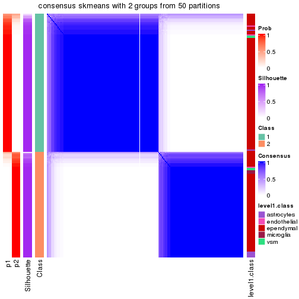</p>

</div>
<div id='tab-node-013-consensus-heatmap-2'>
<pre><code class="r">consensus_heatmap(res, k = 3)
</code></pre>

<p></p>

</div>
<div id='tab-node-013-consensus-heatmap-3'>
<pre><code class="r">consensus_heatmap(res, k = 4)
</code></pre>

<p></p>

</div>
</div>

Heatmaps for the membership of samples in all partitions to see how consistent they are:


<script>
$( function() {
	$( '#tabs-node-013-membership-heatmap' ).tabs();
} );
</script>
<div id='tabs-node-013-membership-heatmap'>
<ul>
<li><a href='#tab-node-013-membership-heatmap-1'>k = 2</a></li>
<li><a href='#tab-node-013-membership-heatmap-2'>k = 3</a></li>
<li><a href='#tab-node-013-membership-heatmap-3'>k = 4</a></li>
</ul>
<div id='tab-node-013-membership-heatmap-1'>
<pre><code class="r">membership_heatmap(res, k = 2)
</code></pre>

<p></p>

</div>
<div id='tab-node-013-membership-heatmap-2'>
<pre><code class="r">membership_heatmap(res, k = 3)
</code></pre>

<p></p>

</div>
<div id='tab-node-013-membership-heatmap-3'>
<pre><code class="r">membership_heatmap(res, k = 4)
</code></pre>

<p></p>

</div>
</div>

As soon as the classes for columns are determined, the signatures
that are significantly different between subgroups can be looked for. 
Following are the heatmaps for signatures.


Signature heatmaps where rows are scaled:


<script>
$( function() {
	$( '#tabs-node-013-get-signatures' ).tabs();
} );
</script>
<div id='tabs-node-013-get-signatures'>
<ul>
<li><a href='#tab-node-013-get-signatures-1'>k = 2</a></li>
<li><a href='#tab-node-013-get-signatures-2'>k = 3</a></li>
<li><a href='#tab-node-013-get-signatures-3'>k = 4</a></li>
</ul>
<div id='tab-node-013-get-signatures-1'>
<pre><code class="r">get_signatures(res, k = 2)
</code></pre>

<p></p>

</div>
<div id='tab-node-013-get-signatures-2'>
<pre><code class="r">get_signatures(res, k = 3)
</code></pre>

<p></p>

</div>
<div id='tab-node-013-get-signatures-3'>
<pre><code class="r">get_signatures(res, k = 4)
</code></pre>

<p></p>

</div>
</div>


Signature heatmaps where rows are not scaled:


<script>
$( function() {
	$( '#tabs-node-013-get-signatures-no-scale' ).tabs();
} );
</script>
<div id='tabs-node-013-get-signatures-no-scale'>
<ul>
<li><a href='#tab-node-013-get-signatures-no-scale-1'>k = 2</a></li>
<li><a href='#tab-node-013-get-signatures-no-scale-2'>k = 3</a></li>
<li><a href='#tab-node-013-get-signatures-no-scale-3'>k = 4</a></li>
</ul>
<div id='tab-node-013-get-signatures-no-scale-1'>
<pre><code class="r">get_signatures(res, k = 2, scale_rows = FALSE)
</code></pre>

<p></p>

</div>
<div id='tab-node-013-get-signatures-no-scale-2'>
<pre><code class="r">get_signatures(res, k = 3, scale_rows = FALSE)
</code></pre>

<p></p>

</div>
<div id='tab-node-013-get-signatures-no-scale-3'>
<pre><code class="r">get_signatures(res, k = 4, scale_rows = FALSE)
</code></pre>

<p></p>

</div>
</div>


Compare the overlap of signatures from different k:

```r
compare_signatures(res)
```


`get_signature()` returns a data frame invisibly. To get the list of signatures, the function
call should be assigned to a variable explicitly. In following code, if `plot` argument is set
to `FALSE`, no heatmap is plotted while only the differential analysis is performed.

```r
# code only for demonstration
tb = get_signature(res, k = ..., plot = FALSE)
```

An example of the output of `tb` is:

```
#>   which_row         fdr    mean_1    mean_2 scaled_mean_1 scaled_mean_2 km
#> 1        38 0.042760348  8.373488  9.131774    -0.5533452     0.5164555  1
#> 2        40 0.018707592  7.106213  8.469186    -0.6173731     0.5762149  1
#> 3        55 0.019134737 10.221463 11.207825    -0.6159697     0.5749050  1
#> 4        59 0.006059896  5.921854  7.869574    -0.6899429     0.6439467  1
#> 5        60 0.018055526  8.928898 10.211722    -0.6204761     0.5791110  1
#> 6        98 0.009384629 15.714769 14.887706     0.6635654    -0.6193277  2
...
```

The columns in `tb` are:

1. `which_row`: row indices corresponding to the input matrix.
2. `fdr`: FDR for the differential test. 
3. `mean_x`: The mean value in group x.
4. `scaled_mean_x`: The mean value in group x after rows are scaled.
5. `km`: Row groups if k-means clustering is applied to rows (which is done by automatically selecting number of clusters).

If there are too many signatures, `top_signatures = ...` can be set to only show the 
signatures with the highest FDRs:

```r
# code only for demonstration
# e.g. to show the top 500 most significant rows
tb = get_signature(res, k = ..., top_signatures = 500)
```

If the signatures are defined as these which are uniquely high in current group, `diff_method` argument
can be set to `"uniquely_high_in_one_group"`:

```r
# code only for demonstration
tb = get_signature(res, k = ..., diff_method = "uniquely_high_in_one_group")
```


UMAP plot which shows how samples are separated.


<script>
$( function() {
	$( '#tabs-node-013-dimension-reduction' ).tabs();
} );
</script>
<div id='tabs-node-013-dimension-reduction'>
<ul>
<li><a href='#tab-node-013-dimension-reduction-1'>k = 2</a></li>
<li><a href='#tab-node-013-dimension-reduction-2'>k = 3</a></li>
<li><a href='#tab-node-013-dimension-reduction-3'>k = 4</a></li>
</ul>
<div id='tab-node-013-dimension-reduction-1'>
<pre><code class="r">dimension_reduction(res, k = 2, method = &quot;UMAP&quot;)
</code></pre>

<p></p>

</div>
<div id='tab-node-013-dimension-reduction-2'>
<pre><code class="r">dimension_reduction(res, k = 3, method = &quot;UMAP&quot;)
</code></pre>

<p>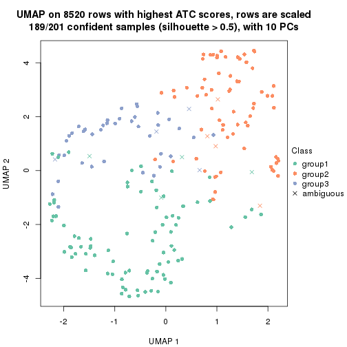</p>

</div>
<div id='tab-node-013-dimension-reduction-3'>
<pre><code class="r">dimension_reduction(res, k = 4, method = &quot;UMAP&quot;)
</code></pre>

<p></p>

</div>
</div>


Following heatmap shows how subgroups are split when increasing `k`:

```r
collect_classes(res)
```


Test correlation between subgroups and known annotations. If the known
annotation is numeric, one-way ANOVA test is applied, and if the known
annotation is discrete, chi-squared contingency table test is applied.

```r
test_to_known_factors(res)
```

```
#>             n_sample level1.class(p-value) k
#> ATC:skmeans      196                0.1663 2
#> ATC:skmeans      189                0.2321 3
#> ATC:skmeans      180                0.0307 4
```


If matrix rows can be associated to genes, consider to use `functional_enrichment(res,
...)` to perform function enrichment for the signature genes. See [this vignette](https://jokergoo.github.io/cola_vignettes/functional_enrichment.html) for more detailed explanations.


 

---------------------------------------------------


### Node014


Parent node: [Node01](#Node01).
Child nodes: 
                Node0111-leaf
        ,
                Node0112-leaf
        ,
                [Node0113](#Node0113)
        ,
                [Node0121](#Node0121)
        ,
                [Node0122](#Node0122)
        ,
                [Node0123](#Node0123)
        ,
                Node0131-leaf
        ,
                Node0132-leaf
        ,
                Node0141-leaf
        ,
                Node0142-leaf
        ,
                Node0143-leaf
        ,
                [Node0211](#Node0211)
        ,
                [Node0212](#Node0212)
        ,
                Node0221-leaf
        ,
                [Node0222](#Node0222)
        ,
                Node0223-leaf
        ,
                Node0231-leaf
        ,
                Node0232-leaf
        ,
                Node0233-leaf
        ,
                Node0234-leaf
        ,
                [Node0311](#Node0311)
        ,
                [Node0312](#Node0312)
        ,
                Node0313-leaf
        ,
                Node0321-leaf
        ,
                Node0322-leaf
        ,
                Node0323-leaf
        ,
                Node0324-leaf
        ,
                Node0331-leaf
        ,
                Node0332-leaf
        ,
                Node0333-leaf
        .


The object with results only for a single top-value method and a single partitioning method 
can be extracted as:

```r
res = res_rh["014"]
```

A summary of `res` and all the functions that can be applied to it:

```r
res
```

```
#> A 'ConsensusPartition' object with k = 2, 3, 4.
#>   On a matrix with 7603 rows and 139 columns.
#>   Top rows (760) are extracted by 'ATC' method.
#>   Subgroups are detected by 'skmeans' method.
#>   Performed in total 150 partitions by row resampling.
#>   Best k for subgroups seems to be 3.
#> 
#> Following methods can be applied to this 'ConsensusPartition' object:
#>  [1] "cola_report"             "collect_classes"         "collect_plots"          
#>  [4] "collect_stats"           "colnames"                "compare_partitions"     
#>  [7] "compare_signatures"      "consensus_heatmap"       "dimension_reduction"    
#> [10] "functional_enrichment"   "get_anno_col"            "get_anno"               
#> [13] "get_classes"             "get_consensus"           "get_matrix"             
#> [16] "get_membership"          "get_param"               "get_signatures"         
#> [19] "get_stats"               "is_best_k"               "is_stable_k"            
#> [22] "membership_heatmap"      "ncol"                    "nrow"                   
#> [25] "plot_ecdf"               "predict_classes"         "rownames"               
#> [28] "select_partition_number" "show"                    "suggest_best_k"         
#> [31] "test_to_known_factors"   "top_rows_heatmap"
```

`collect_plots()` function collects all the plots made from `res` for all `k` (number of subgroups)
into one single page to provide an easy and fast comparison between different `k`.

```r
collect_plots(res)
```


The plots are:

- The first row: a plot of the eCDF (empirical cumulative distribution
  function) curves of the consensus matrix for each `k` and the heatmap of
  predicted classes for each `k`.
- The second row: heatmaps of the consensus matrix for each `k`.
- The third row: heatmaps of the membership matrix for each `k`.
- The fouth row: heatmaps of the signatures for each `k`.

All the plots in panels can be made by individual functions and they are
plotted later in this section.

`select_partition_number()` produces several plots showing different
statistics for choosing "optimized" `k`. There are following statistics:

- eCDF curves of the consensus matrix for each `k`;
- 1-PAC. [The PAC score](https://en.wikipedia.org/wiki/Consensus_clustering#Over-interpretation_potential_of_consensus_clustering)
  measures the proportion of the ambiguous subgrouping.
- Mean silhouette score.
- Concordance. The mean probability of fiting the consensus subgroup labels in all
  partitions.
- Area increased. Denote $A_k$ as the area under the eCDF curve for current
  `k`, the area increased is defined as $A_k - A_{k-1}$.
- Rand index. The percent of pairs of samples that are both in a same cluster
  or both are not in a same cluster in the partition of k and k-1.
- Jaccard index. The ratio of pairs of samples are both in a same cluster in
  the partition of k and k-1 and the pairs of samples are both in a same
  cluster in the partition k or k-1.

The detailed explanations of these statistics can be found in [the _cola_
vignette](https://jokergoo.github.io/cola_vignettes/cola.html#toc_13).

Generally speaking, higher 1-PAC score, higher mean silhouette score or higher
concordance corresponds to better partition. Rand index and Jaccard index
measure how similar the current partition is compared to partition with `k-1`.
If they are too similar, we won't accept `k` is better than `k-1`.

```r
select_partition_number(res)
```


The numeric values for all these statistics can be obtained by `get_stats()`.

```r
get_stats(res)
```

```
#>   k 1-PAC mean_silhouette concordance area_increased  Rand Jaccard
#> 2 2 1.000           0.973       0.988          0.504 0.496   0.496
#> 3 3 1.000           0.963       0.986          0.246 0.814   0.648
#> 4 4 0.841           0.888       0.946          0.178 0.827   0.569
```

`suggest_best_k()` suggests the best $k$ based on these statistics. The rules are as follows:

- All $k$ with Jaccard index larger than 0.95 are removed because increasing
  $k$ does not provide enough extra information. If all $k$ are removed, it is
  marked as no subgroup is detected.
- For all $k$ with 1-PAC score larger than 0.9, the maximal $k$ is taken as
  the best $k$, and other $k$ are marked as optional $k$.
- If it does not fit the second rule. The $k$ with the maximal vote of the
  highest 1-PAC score, highest mean silhouette, and highest concordance is
  taken as the best $k$.

```r
suggest_best_k(res)
```

```
#> [1] 3
#> attr(,"optional")
#> [1] 2
```

There is also optional best $k$ = 2 that is worth to check.

Following is the table of the partitions (You need to click the **show/hide
code output** link to see it). The membership matrix (columns with name `p*`)
is inferred by
[`clue::cl_consensus()`](https://www.rdocumentation.org/link/cl_consensus?package=clue)
function with the `SE` method. Basically the value in the membership matrix
represents the probability to belong to a certain group. The finall subgroup
label for an item is determined with the group with highest probability it
belongs to.

In `get_classes()` function, the entropy is calculated from the membership
matrix and the silhouette score is calculated from the consensus matrix.


<script>
$( function() {
	$( '#tabs-node-014-get-classes' ).tabs();
} );
</script>
<div id='tabs-node-014-get-classes'>
<ul>
<li><a href='#tab-node-014-get-classes-1'>k = 2</a></li>
<li><a href='#tab-node-014-get-classes-2'>k = 3</a></li>
<li><a href='#tab-node-014-get-classes-3'>k = 4</a></li>
</ul>

<div id='tab-node-014-get-classes-1'>
<p><a id='tab-node-014-get-classes-1-a' style='color:#0366d6' href='#'>show/hide code output</a></p>
<pre><code class="r">cbind(get_classes(res, k = 2), get_membership(res, k = 2))
</code></pre>

<pre><code>#&gt;     class entropy silhouette   p1   p2
#&gt; 1       2   0.000      0.982 0.00 1.00
#&gt; 2       1   0.000      0.994 1.00 0.00
#&gt; 3       2   0.000      0.982 0.00 1.00
#&gt; 4       2   0.000      0.982 0.00 1.00
#&gt; 5       2   0.000      0.982 0.00 1.00
#&gt; 6       1   0.000      0.994 1.00 0.00
#&gt; 7       2   0.000      0.982 0.00 1.00
#&gt; 8       2   0.000      0.982 0.00 1.00
#&gt; 9       2   0.000      0.982 0.00 1.00
#&gt; 10      2   0.000      0.982 0.00 1.00
#&gt; 11      2   0.000      0.982 0.00 1.00
#&gt; 12      2   0.000      0.982 0.00 1.00
#&gt; 13      2   0.000      0.982 0.00 1.00
#&gt; 14      2   0.000      0.982 0.00 1.00
#&gt; 15      2   0.000      0.982 0.00 1.00
#&gt; 16      2   0.000      0.982 0.00 1.00
#&gt; 17      2   0.000      0.982 0.00 1.00
#&gt; 18      2   0.141      0.967 0.02 0.98
#&gt; 19      2   0.141      0.967 0.02 0.98
#&gt; 20      2   0.000      0.982 0.00 1.00
#&gt; 21      2   0.000      0.982 0.00 1.00
#&gt; 22      2   0.000      0.982 0.00 1.00
#&gt; 23      2   0.000      0.982 0.00 1.00
#&gt; 24      1   0.000      0.994 1.00 0.00
#&gt; 25      1   0.141      0.975 0.98 0.02
#&gt; 26      1   0.000      0.994 1.00 0.00
#&gt; 27      1   0.000      0.994 1.00 0.00
#&gt; 28      1   0.000      0.994 1.00 0.00
#&gt; 29      1   0.000      0.994 1.00 0.00
#&gt; 30      1   0.000      0.994 1.00 0.00
#&gt; 31      1   0.000      0.994 1.00 0.00
#&gt; 32      1   0.000      0.994 1.00 0.00
#&gt; 33      1   0.000      0.994 1.00 0.00
#&gt; 34      1   0.000      0.994 1.00 0.00
#&gt; 35      1   0.000      0.994 1.00 0.00
#&gt; 36      1   0.000      0.994 1.00 0.00
#&gt; 37      1   0.000      0.994 1.00 0.00
#&gt; 38      2   0.141      0.967 0.02 0.98
#&gt; 39      2   0.000      0.982 0.00 1.00
#&gt; 40      2   0.000      0.982 0.00 1.00
#&gt; 41      2   0.971      0.342 0.40 0.60
#&gt; 42      2   0.000      0.982 0.00 1.00
#&gt; 43      2   0.141      0.967 0.02 0.98
#&gt; 44      1   0.000      0.994 1.00 0.00
#&gt; 45      1   0.141      0.975 0.98 0.02
#&gt; 46      1   0.000      0.994 1.00 0.00
#&gt; 47      2   0.000      0.982 0.00 1.00
#&gt; 48      1   0.000      0.994 1.00 0.00
#&gt; 49      1   0.000      0.994 1.00 0.00
#&gt; 50      2   0.000      0.982 0.00 1.00
#&gt; 51      2   0.000      0.982 0.00 1.00
#&gt; 52      2   0.000      0.982 0.00 1.00
#&gt; 53      1   0.000      0.994 1.00 0.00
#&gt; 54      2   0.000      0.982 0.00 1.00
#&gt; 55      2   0.000      0.982 0.00 1.00
#&gt; 56      2   0.881      0.582 0.30 0.70
#&gt; 57      2   0.000      0.982 0.00 1.00
#&gt; 58      1   0.000      0.994 1.00 0.00
#&gt; 59      1   0.000      0.994 1.00 0.00
#&gt; 60      2   0.000      0.982 0.00 1.00
#&gt; 61      1   0.000      0.994 1.00 0.00
#&gt; 62      2   0.000      0.982 0.00 1.00
#&gt; 63      2   0.000      0.982 0.00 1.00
#&gt; 64      1   0.000      0.994 1.00 0.00
#&gt; 65      2   0.827      0.655 0.26 0.74
#&gt; 66      2   0.000      0.982 0.00 1.00
#&gt; 67      1   0.000      0.994 1.00 0.00
#&gt; 68      1   0.529      0.862 0.88 0.12
#&gt; 69      2   0.242      0.949 0.04 0.96
#&gt; 70      2   0.000      0.982 0.00 1.00
#&gt; 71      2   0.242      0.949 0.04 0.96
#&gt; 72      1   0.000      0.994 1.00 0.00
#&gt; 73      2   0.000      0.982 0.00 1.00
#&gt; 74      1   0.000      0.994 1.00 0.00
#&gt; 75      1   0.000      0.994 1.00 0.00
#&gt; 76      2   0.000      0.982 0.00 1.00
#&gt; 77      2   0.000      0.982 0.00 1.00
#&gt; 78      1   0.000      0.994 1.00 0.00
#&gt; 79      1   0.000      0.994 1.00 0.00
#&gt; 80      1   0.000      0.994 1.00 0.00
#&gt; 81      1   0.000      0.994 1.00 0.00
#&gt; 82      1   0.000      0.994 1.00 0.00
#&gt; 83      2   0.000      0.982 0.00 1.00
#&gt; 84      1   0.000      0.994 1.00 0.00
#&gt; 85      1   0.000      0.994 1.00 0.00
#&gt; 86      1   0.000      0.994 1.00 0.00
#&gt; 87      1   0.000      0.994 1.00 0.00
#&gt; 88      1   0.000      0.994 1.00 0.00
#&gt; 89      2   0.000      0.982 0.00 1.00
#&gt; 90      2   0.327      0.929 0.06 0.94
#&gt; 91      1   0.000      0.994 1.00 0.00
#&gt; 92      1   0.000      0.994 1.00 0.00
#&gt; 93      2   0.000      0.982 0.00 1.00
#&gt; 94      1   0.000      0.994 1.00 0.00
#&gt; 95      1   0.000      0.994 1.00 0.00
#&gt; 96      2   0.000      0.982 0.00 1.00
#&gt; 97      2   0.000      0.982 0.00 1.00
#&gt; 98      2   0.000      0.982 0.00 1.00
#&gt; 99      2   0.000      0.982 0.00 1.00
#&gt; 100     2   0.242      0.949 0.04 0.96
#&gt; 101     1   0.000      0.994 1.00 0.00
#&gt; 102     1   0.000      0.994 1.00 0.00
#&gt; 103     1   0.000      0.994 1.00 0.00
#&gt; 104     1   0.000      0.994 1.00 0.00
#&gt; 105     2   0.000      0.982 0.00 1.00
#&gt; 106     1   0.000      0.994 1.00 0.00
#&gt; 107     2   0.000      0.982 0.00 1.00
#&gt; 108     1   0.000      0.994 1.00 0.00
#&gt; 109     2   0.000      0.982 0.00 1.00
#&gt; 110     1   0.000      0.994 1.00 0.00
#&gt; 111     1   0.000      0.994 1.00 0.00
#&gt; 112     1   0.000      0.994 1.00 0.00
#&gt; 113     2   0.141      0.967 0.02 0.98
#&gt; 114     1   0.000      0.994 1.00 0.00
#&gt; 115     1   0.000      0.994 1.00 0.00
#&gt; 116     1   0.000      0.994 1.00 0.00
#&gt; 117     1   0.000      0.994 1.00 0.00
#&gt; 118     1   0.000      0.994 1.00 0.00
#&gt; 119     1   0.000      0.994 1.00 0.00
#&gt; 120     1   0.000      0.994 1.00 0.00
#&gt; 121     1   0.000      0.994 1.00 0.00
#&gt; 122     1   0.000      0.994 1.00 0.00
#&gt; 123     1   0.000      0.994 1.00 0.00
#&gt; 124     1   0.000      0.994 1.00 0.00
#&gt; 125     1   0.000      0.994 1.00 0.00
#&gt; 126     2   0.000      0.982 0.00 1.00
#&gt; 127     1   0.000      0.994 1.00 0.00
#&gt; 128     1   0.000      0.994 1.00 0.00
#&gt; 129     2   0.000      0.982 0.00 1.00
#&gt; 130     2   0.000      0.982 0.00 1.00
#&gt; 131     2   0.000      0.982 0.00 1.00
#&gt; 132     2   0.000      0.982 0.00 1.00
#&gt; 133     2   0.000      0.982 0.00 1.00
#&gt; 134     2   0.000      0.982 0.00 1.00
#&gt; 135     2   0.000      0.982 0.00 1.00
#&gt; 136     2   0.000      0.982 0.00 1.00
#&gt; 137     2   0.000      0.982 0.00 1.00
#&gt; 138     1   0.000      0.994 1.00 0.00
#&gt; 139     1   0.760      0.713 0.78 0.22
</code></pre>

<script>
$('#tab-node-014-get-classes-1-a').parent().next().next().hide();
$('#tab-node-014-get-classes-1-a').click(function(){
  $('#tab-node-014-get-classes-1-a').parent().next().next().toggle();
  return(false);
});
</script>
</div>

<div id='tab-node-014-get-classes-2'>
<p><a id='tab-node-014-get-classes-2-a' style='color:#0366d6' href='#'>show/hide code output</a></p>
<pre><code class="r">cbind(get_classes(res, k = 3), get_membership(res, k = 3))
</code></pre>

<pre><code>#&gt;     class entropy silhouette   p1   p2   p3
#&gt; 1       3  0.0000     0.9954 0.00 0.00 1.00
#&gt; 2       3  0.0000     0.9954 0.00 0.00 1.00
#&gt; 3       3  0.0000     0.9954 0.00 0.00 1.00
#&gt; 4       3  0.0000     0.9954 0.00 0.00 1.00
#&gt; 5       3  0.0000     0.9954 0.00 0.00 1.00
#&gt; 6       1  0.0000     0.9844 1.00 0.00 0.00
#&gt; 7       2  0.0000     0.9786 0.00 1.00 0.00
#&gt; 8       3  0.0000     0.9954 0.00 0.00 1.00
#&gt; 9       3  0.0000     0.9954 0.00 0.00 1.00
#&gt; 10      3  0.0000     0.9954 0.00 0.00 1.00
#&gt; 11      3  0.0000     0.9954 0.00 0.00 1.00
#&gt; 12      3  0.0000     0.9954 0.00 0.00 1.00
#&gt; 13      3  0.0000     0.9954 0.00 0.00 1.00
#&gt; 14      3  0.0000     0.9954 0.00 0.00 1.00
#&gt; 15      3  0.0000     0.9954 0.00 0.00 1.00
#&gt; 16      3  0.0000     0.9954 0.00 0.00 1.00
#&gt; 17      3  0.0000     0.9954 0.00 0.00 1.00
#&gt; 18      3  0.0000     0.9954 0.00 0.00 1.00
#&gt; 19      3  0.0000     0.9954 0.00 0.00 1.00
#&gt; 20      3  0.0000     0.9954 0.00 0.00 1.00
#&gt; 21      3  0.0000     0.9954 0.00 0.00 1.00
#&gt; 22      2  0.0000     0.9786 0.00 1.00 0.00
#&gt; 23      2  0.0000     0.9786 0.00 1.00 0.00
#&gt; 24      1  0.0892     0.9658 0.98 0.00 0.02
#&gt; 25      2  0.2066     0.9117 0.06 0.94 0.00
#&gt; 26      1  0.0000     0.9844 1.00 0.00 0.00
#&gt; 27      1  0.0000     0.9844 1.00 0.00 0.00
#&gt; 28      1  0.0000     0.9844 1.00 0.00 0.00
#&gt; 29      1  0.0000     0.9844 1.00 0.00 0.00
#&gt; 30      1  0.0000     0.9844 1.00 0.00 0.00
#&gt; 31      1  0.0000     0.9844 1.00 0.00 0.00
#&gt; 32      1  0.0000     0.9844 1.00 0.00 0.00
#&gt; 33      1  0.0000     0.9844 1.00 0.00 0.00
#&gt; 34      1  0.0892     0.9634 0.98 0.02 0.00
#&gt; 35      1  0.0000     0.9844 1.00 0.00 0.00
#&gt; 36      1  0.0000     0.9844 1.00 0.00 0.00
#&gt; 37      1  0.0000     0.9844 1.00 0.00 0.00
#&gt; 38      2  0.0000     0.9786 0.00 1.00 0.00
#&gt; 39      2  0.0000     0.9786 0.00 1.00 0.00
#&gt; 40      2  0.0000     0.9786 0.00 1.00 0.00
#&gt; 41      2  0.0892     0.9577 0.02 0.98 0.00
#&gt; 42      3  0.0000     0.9954 0.00 0.00 1.00
#&gt; 43      2  0.0000     0.9786 0.00 1.00 0.00
#&gt; 44      1  0.0000     0.9844 1.00 0.00 0.00
#&gt; 45      1  0.2537     0.8948 0.92 0.08 0.00
#&gt; 46      1  0.0000     0.9844 1.00 0.00 0.00
#&gt; 47      2  0.0000     0.9786 0.00 1.00 0.00
#&gt; 48      1  0.0000     0.9844 1.00 0.00 0.00
#&gt; 49      1  0.0000     0.9844 1.00 0.00 0.00
#&gt; 50      2  0.0000     0.9786 0.00 1.00 0.00
#&gt; 51      3  0.2959     0.8865 0.00 0.10 0.90
#&gt; 52      2  0.0000     0.9786 0.00 1.00 0.00
#&gt; 53      2  0.1529     0.9352 0.04 0.96 0.00
#&gt; 54      2  0.0000     0.9786 0.00 1.00 0.00
#&gt; 55      2  0.0000     0.9786 0.00 1.00 0.00
#&gt; 56      3  0.0000     0.9954 0.00 0.00 1.00
#&gt; 57      2  0.5835     0.4778 0.00 0.66 0.34
#&gt; 58      1  0.0000     0.9844 1.00 0.00 0.00
#&gt; 59      2  0.6126     0.3243 0.40 0.60 0.00
#&gt; 60      2  0.0000     0.9786 0.00 1.00 0.00
#&gt; 61      1  0.0000     0.9844 1.00 0.00 0.00
#&gt; 62      2  0.0000     0.9786 0.00 1.00 0.00
#&gt; 63      2  0.0000     0.9786 0.00 1.00 0.00
#&gt; 64      1  0.0000     0.9844 1.00 0.00 0.00
#&gt; 65      2  0.0000     0.9786 0.00 1.00 0.00
#&gt; 66      2  0.0000     0.9786 0.00 1.00 0.00
#&gt; 67      1  0.0000     0.9844 1.00 0.00 0.00
#&gt; 68      2  0.0000     0.9786 0.00 1.00 0.00
#&gt; 69      2  0.3832     0.8608 0.02 0.88 0.10
#&gt; 70      2  0.0000     0.9786 0.00 1.00 0.00
#&gt; 71      2  0.0000     0.9786 0.00 1.00 0.00
#&gt; 72      2  0.0000     0.9786 0.00 1.00 0.00
#&gt; 73      2  0.0000     0.9786 0.00 1.00 0.00
#&gt; 74      1  0.5016     0.6789 0.76 0.24 0.00
#&gt; 75      1  0.0000     0.9844 1.00 0.00 0.00
#&gt; 76      2  0.0000     0.9786 0.00 1.00 0.00
#&gt; 77      2  0.0000     0.9786 0.00 1.00 0.00
#&gt; 78      1  0.0000     0.9844 1.00 0.00 0.00
#&gt; 79      1  0.0000     0.9844 1.00 0.00 0.00
#&gt; 80      1  0.0000     0.9844 1.00 0.00 0.00
#&gt; 81      1  0.0000     0.9844 1.00 0.00 0.00
#&gt; 82      1  0.0000     0.9844 1.00 0.00 0.00
#&gt; 83      2  0.0000     0.9786 0.00 1.00 0.00
#&gt; 84      1  0.0000     0.9844 1.00 0.00 0.00
#&gt; 85      1  0.0000     0.9844 1.00 0.00 0.00
#&gt; 86      1  0.0000     0.9844 1.00 0.00 0.00
#&gt; 87      1  0.0000     0.9844 1.00 0.00 0.00
#&gt; 88      1  0.0000     0.9844 1.00 0.00 0.00
#&gt; 89      2  0.0000     0.9786 0.00 1.00 0.00
#&gt; 90      2  0.0000     0.9786 0.00 1.00 0.00
#&gt; 91      1  0.0000     0.9844 1.00 0.00 0.00
#&gt; 92      1  0.0000     0.9844 1.00 0.00 0.00
#&gt; 93      2  0.0000     0.9786 0.00 1.00 0.00
#&gt; 94      1  0.0000     0.9844 1.00 0.00 0.00
#&gt; 95      1  0.0000     0.9844 1.00 0.00 0.00
#&gt; 96      2  0.0000     0.9786 0.00 1.00 0.00
#&gt; 97      2  0.0000     0.9786 0.00 1.00 0.00
#&gt; 98      2  0.0000     0.9786 0.00 1.00 0.00
#&gt; 99      2  0.0000     0.9786 0.00 1.00 0.00
#&gt; 100     2  0.0000     0.9786 0.00 1.00 0.00
#&gt; 101     1  0.0000     0.9844 1.00 0.00 0.00
#&gt; 102     1  0.0000     0.9844 1.00 0.00 0.00
#&gt; 103     1  0.0000     0.9844 1.00 0.00 0.00
#&gt; 104     1  0.0000     0.9844 1.00 0.00 0.00
#&gt; 105     3  0.0000     0.9954 0.00 0.00 1.00
#&gt; 106     1  0.0000     0.9844 1.00 0.00 0.00
#&gt; 107     2  0.0000     0.9786 0.00 1.00 0.00
#&gt; 108     1  0.0000     0.9844 1.00 0.00 0.00
#&gt; 109     2  0.0000     0.9786 0.00 1.00 0.00
#&gt; 110     1  0.0000     0.9844 1.00 0.00 0.00
#&gt; 111     1  0.0000     0.9844 1.00 0.00 0.00
#&gt; 112     1  0.0000     0.9844 1.00 0.00 0.00
#&gt; 113     2  0.0000     0.9786 0.00 1.00 0.00
#&gt; 114     1  0.0000     0.9844 1.00 0.00 0.00
#&gt; 115     1  0.0000     0.9844 1.00 0.00 0.00
#&gt; 116     1  0.0000     0.9844 1.00 0.00 0.00
#&gt; 117     1  0.0000     0.9844 1.00 0.00 0.00
#&gt; 118     1  0.0000     0.9844 1.00 0.00 0.00
#&gt; 119     1  0.0000     0.9844 1.00 0.00 0.00
#&gt; 120     1  0.0000     0.9844 1.00 0.00 0.00
#&gt; 121     1  0.0000     0.9844 1.00 0.00 0.00
#&gt; 122     1  0.0000     0.9844 1.00 0.00 0.00
#&gt; 123     1  0.0000     0.9844 1.00 0.00 0.00
#&gt; 124     1  0.0000     0.9844 1.00 0.00 0.00
#&gt; 125     1  0.0000     0.9844 1.00 0.00 0.00
#&gt; 126     2  0.0000     0.9786 0.00 1.00 0.00
#&gt; 127     1  0.0000     0.9844 1.00 0.00 0.00
#&gt; 128     1  0.0000     0.9844 1.00 0.00 0.00
#&gt; 129     2  0.0000     0.9786 0.00 1.00 0.00
#&gt; 130     2  0.0000     0.9786 0.00 1.00 0.00
#&gt; 131     2  0.0000     0.9786 0.00 1.00 0.00
#&gt; 132     2  0.0000     0.9786 0.00 1.00 0.00
#&gt; 133     2  0.0000     0.9786 0.00 1.00 0.00
#&gt; 134     2  0.0000     0.9786 0.00 1.00 0.00
#&gt; 135     2  0.0000     0.9786 0.00 1.00 0.00
#&gt; 136     2  0.0000     0.9786 0.00 1.00 0.00
#&gt; 137     2  0.0000     0.9786 0.00 1.00 0.00
#&gt; 138     1  0.6302     0.0692 0.52 0.48 0.00
#&gt; 139     2  0.0000     0.9786 0.00 1.00 0.00
</code></pre>

<script>
$('#tab-node-014-get-classes-2-a').parent().next().next().hide();
$('#tab-node-014-get-classes-2-a').click(function(){
  $('#tab-node-014-get-classes-2-a').parent().next().next().toggle();
  return(false);
});
</script>
</div>

<div id='tab-node-014-get-classes-3'>
<p><a id='tab-node-014-get-classes-3-a' style='color:#0366d6' href='#'>show/hide code output</a></p>
<pre><code class="r">cbind(get_classes(res, k = 4), get_membership(res, k = 4))
</code></pre>

<pre><code>#&gt;     class entropy silhouette   p1   p2   p3   p4
#&gt; 1       3  0.0000      0.978 0.00 0.00 1.00 0.00
#&gt; 2       3  0.0000      0.978 0.00 0.00 1.00 0.00
#&gt; 3       3  0.0000      0.978 0.00 0.00 1.00 0.00
#&gt; 4       3  0.0000      0.978 0.00 0.00 1.00 0.00
#&gt; 5       3  0.0000      0.978 0.00 0.00 1.00 0.00
#&gt; 6       4  0.0707      0.845 0.02 0.00 0.00 0.98
#&gt; 7       2  0.2345      0.878 0.00 0.90 0.00 0.10
#&gt; 8       3  0.0000      0.978 0.00 0.00 1.00 0.00
#&gt; 9       3  0.0000      0.978 0.00 0.00 1.00 0.00
#&gt; 10      3  0.0000      0.978 0.00 0.00 1.00 0.00
#&gt; 11      3  0.0000      0.978 0.00 0.00 1.00 0.00
#&gt; 12      3  0.0000      0.978 0.00 0.00 1.00 0.00
#&gt; 13      3  0.0000      0.978 0.00 0.00 1.00 0.00
#&gt; 14      3  0.0000      0.978 0.00 0.00 1.00 0.00
#&gt; 15      3  0.0000      0.978 0.00 0.00 1.00 0.00
#&gt; 16      3  0.0000      0.978 0.00 0.00 1.00 0.00
#&gt; 17      3  0.0000      0.978 0.00 0.00 1.00 0.00
#&gt; 18      3  0.0000      0.978 0.00 0.00 1.00 0.00
#&gt; 19      3  0.0000      0.978 0.00 0.00 1.00 0.00
#&gt; 20      3  0.0000      0.978 0.00 0.00 1.00 0.00
#&gt; 21      3  0.0000      0.978 0.00 0.00 1.00 0.00
#&gt; 22      2  0.0000      0.958 0.00 1.00 0.00 0.00
#&gt; 23      2  0.0000      0.958 0.00 1.00 0.00 0.00
#&gt; 24      1  0.3037      0.859 0.88 0.00 0.02 0.10
#&gt; 25      4  0.0000      0.841 0.00 0.00 0.00 1.00
#&gt; 26      1  0.3975      0.660 0.76 0.00 0.00 0.24
#&gt; 27      1  0.0000      0.974 1.00 0.00 0.00 0.00
#&gt; 28      4  0.2345      0.839 0.10 0.00 0.00 0.90
#&gt; 29      4  0.0000      0.841 0.00 0.00 0.00 1.00
#&gt; 30      4  0.2011      0.844 0.08 0.00 0.00 0.92
#&gt; 31      4  0.3975      0.721 0.24 0.00 0.00 0.76
#&gt; 32      1  0.4134      0.622 0.74 0.00 0.00 0.26
#&gt; 33      4  0.2345      0.839 0.10 0.00 0.00 0.90
#&gt; 34      1  0.0707      0.953 0.98 0.02 0.00 0.00
#&gt; 35      4  0.3400      0.790 0.18 0.00 0.00 0.82
#&gt; 36      1  0.0000      0.974 1.00 0.00 0.00 0.00
#&gt; 37      4  0.3400      0.768 0.18 0.00 0.00 0.82
#&gt; 38      2  0.3610      0.761 0.00 0.80 0.00 0.20
#&gt; 39      2  0.0000      0.958 0.00 1.00 0.00 0.00
#&gt; 40      2  0.0707      0.943 0.00 0.98 0.00 0.02
#&gt; 41      4  0.4855      0.356 0.00 0.40 0.00 0.60
#&gt; 42      3  0.0000      0.978 0.00 0.00 1.00 0.00
#&gt; 43      2  0.4713      0.426 0.00 0.64 0.00 0.36
#&gt; 44      1  0.0000      0.974 1.00 0.00 0.00 0.00
#&gt; 45      1  0.3821      0.810 0.84 0.04 0.00 0.12
#&gt; 46      1  0.0000      0.974 1.00 0.00 0.00 0.00
#&gt; 47      2  0.0000      0.958 0.00 1.00 0.00 0.00
#&gt; 48      1  0.0000      0.974 1.00 0.00 0.00 0.00
#&gt; 49      1  0.2647      0.848 0.88 0.00 0.00 0.12
#&gt; 50      2  0.0000      0.958 0.00 1.00 0.00 0.00
#&gt; 51      3  0.4907      0.259 0.00 0.42 0.58 0.00
#&gt; 52      2  0.0000      0.958 0.00 1.00 0.00 0.00
#&gt; 53      4  0.0000      0.841 0.00 0.00 0.00 1.00
#&gt; 54      2  0.0000      0.958 0.00 1.00 0.00 0.00
#&gt; 55      2  0.0000      0.958 0.00 1.00 0.00 0.00
#&gt; 56      3  0.0000      0.978 0.00 0.00 1.00 0.00
#&gt; 57      2  0.0000      0.958 0.00 1.00 0.00 0.00
#&gt; 58      1  0.0000      0.974 1.00 0.00 0.00 0.00
#&gt; 59      4  0.4949      0.700 0.06 0.18 0.00 0.76
#&gt; 60      2  0.0000      0.958 0.00 1.00 0.00 0.00
#&gt; 61      1  0.0000      0.974 1.00 0.00 0.00 0.00
#&gt; 62      2  0.0000      0.958 0.00 1.00 0.00 0.00
#&gt; 63      2  0.0000      0.958 0.00 1.00 0.00 0.00
#&gt; 64      4  0.2011      0.844 0.08 0.00 0.00 0.92
#&gt; 65      4  0.2011      0.808 0.00 0.08 0.00 0.92
#&gt; 66      2  0.1637      0.914 0.00 0.94 0.00 0.06
#&gt; 67      1  0.0000      0.974 1.00 0.00 0.00 0.00
#&gt; 68      4  0.0000      0.841 0.00 0.00 0.00 1.00
#&gt; 69      2  0.5911      0.573 0.26 0.68 0.04 0.02
#&gt; 70      2  0.0000      0.958 0.00 1.00 0.00 0.00
#&gt; 71      4  0.4855      0.320 0.00 0.40 0.00 0.60
#&gt; 72      4  0.0000      0.841 0.00 0.00 0.00 1.00
#&gt; 73      2  0.0000      0.958 0.00 1.00 0.00 0.00
#&gt; 74      4  0.0000      0.841 0.00 0.00 0.00 1.00
#&gt; 75      4  0.2011      0.844 0.08 0.00 0.00 0.92
#&gt; 76      2  0.0000      0.958 0.00 1.00 0.00 0.00
#&gt; 77      2  0.0000      0.958 0.00 1.00 0.00 0.00
#&gt; 78      1  0.0000      0.974 1.00 0.00 0.00 0.00
#&gt; 79      4  0.2647      0.831 0.12 0.00 0.00 0.88
#&gt; 80      1  0.0000      0.974 1.00 0.00 0.00 0.00
#&gt; 81      1  0.0000      0.974 1.00 0.00 0.00 0.00
#&gt; 82      1  0.0000      0.974 1.00 0.00 0.00 0.00
#&gt; 83      2  0.0000      0.958 0.00 1.00 0.00 0.00
#&gt; 84      1  0.0000      0.974 1.00 0.00 0.00 0.00
#&gt; 85      1  0.0000      0.974 1.00 0.00 0.00 0.00
#&gt; 86      1  0.0000      0.974 1.00 0.00 0.00 0.00
#&gt; 87      1  0.0000      0.974 1.00 0.00 0.00 0.00
#&gt; 88      1  0.0000      0.974 1.00 0.00 0.00 0.00
#&gt; 89      2  0.0000      0.958 0.00 1.00 0.00 0.00
#&gt; 90      4  0.4948      0.205 0.00 0.44 0.00 0.56
#&gt; 91      1  0.0000      0.974 1.00 0.00 0.00 0.00
#&gt; 92      1  0.0000      0.974 1.00 0.00 0.00 0.00
#&gt; 93      2  0.0000      0.958 0.00 1.00 0.00 0.00
#&gt; 94      4  0.3801      0.750 0.22 0.00 0.00 0.78
#&gt; 95      4  0.3400      0.790 0.18 0.00 0.00 0.82
#&gt; 96      2  0.0000      0.958 0.00 1.00 0.00 0.00
#&gt; 97      2  0.0000      0.958 0.00 1.00 0.00 0.00
#&gt; 98      2  0.0000      0.958 0.00 1.00 0.00 0.00
#&gt; 99      2  0.0000      0.958 0.00 1.00 0.00 0.00
#&gt; 100     4  0.4624      0.468 0.00 0.34 0.00 0.66
#&gt; 101     4  0.0000      0.841 0.00 0.00 0.00 1.00
#&gt; 102     1  0.0000      0.974 1.00 0.00 0.00 0.00
#&gt; 103     4  0.2647      0.831 0.12 0.00 0.00 0.88
#&gt; 104     1  0.0000      0.974 1.00 0.00 0.00 0.00
#&gt; 105     3  0.0000      0.978 0.00 0.00 1.00 0.00
#&gt; 106     1  0.0000      0.974 1.00 0.00 0.00 0.00
#&gt; 107     2  0.4134      0.655 0.00 0.74 0.00 0.26
#&gt; 108     4  0.0000      0.841 0.00 0.00 0.00 1.00
#&gt; 109     2  0.0000      0.958 0.00 1.00 0.00 0.00
#&gt; 110     4  0.2345      0.839 0.10 0.00 0.00 0.90
#&gt; 111     4  0.3400      0.788 0.18 0.00 0.00 0.82
#&gt; 112     1  0.0000      0.974 1.00 0.00 0.00 0.00
#&gt; 113     4  0.4406      0.557 0.00 0.30 0.00 0.70
#&gt; 114     4  0.4406      0.622 0.30 0.00 0.00 0.70
#&gt; 115     4  0.0707      0.845 0.02 0.00 0.00 0.98
#&gt; 116     1  0.0000      0.974 1.00 0.00 0.00 0.00
#&gt; 117     1  0.0000      0.974 1.00 0.00 0.00 0.00
#&gt; 118     1  0.0000      0.974 1.00 0.00 0.00 0.00
#&gt; 119     1  0.0000      0.974 1.00 0.00 0.00 0.00
#&gt; 120     1  0.0000      0.974 1.00 0.00 0.00 0.00
#&gt; 121     1  0.0000      0.974 1.00 0.00 0.00 0.00
#&gt; 122     1  0.0000      0.974 1.00 0.00 0.00 0.00
#&gt; 123     1  0.0000      0.974 1.00 0.00 0.00 0.00
#&gt; 124     1  0.0000      0.974 1.00 0.00 0.00 0.00
#&gt; 125     1  0.0000      0.974 1.00 0.00 0.00 0.00
#&gt; 126     2  0.0000      0.958 0.00 1.00 0.00 0.00
#&gt; 127     1  0.0707      0.956 0.98 0.00 0.00 0.02
#&gt; 128     1  0.0000      0.974 1.00 0.00 0.00 0.00
#&gt; 129     2  0.1637      0.914 0.00 0.94 0.00 0.06
#&gt; 130     2  0.0000      0.958 0.00 1.00 0.00 0.00
#&gt; 131     2  0.0000      0.958 0.00 1.00 0.00 0.00
#&gt; 132     2  0.3801      0.735 0.00 0.78 0.00 0.22
#&gt; 133     2  0.0000      0.958 0.00 1.00 0.00 0.00
#&gt; 134     2  0.0000      0.958 0.00 1.00 0.00 0.00
#&gt; 135     2  0.0000      0.958 0.00 1.00 0.00 0.00
#&gt; 136     2  0.0000      0.958 0.00 1.00 0.00 0.00
#&gt; 137     2  0.0000      0.958 0.00 1.00 0.00 0.00
#&gt; 138     4  0.0000      0.841 0.00 0.00 0.00 1.00
#&gt; 139     4  0.1211      0.830 0.00 0.04 0.00 0.96
</code></pre>

<script>
$('#tab-node-014-get-classes-3-a').parent().next().next().hide();
$('#tab-node-014-get-classes-3-a').click(function(){
  $('#tab-node-014-get-classes-3-a').parent().next().next().toggle();
  return(false);
});
</script>
</div>
</div>

Heatmaps for the consensus matrix. It visualizes the probability of two
samples to be in a same group.


<script>
$( function() {
	$( '#tabs-node-014-consensus-heatmap' ).tabs();
} );
</script>
<div id='tabs-node-014-consensus-heatmap'>
<ul>
<li><a href='#tab-node-014-consensus-heatmap-1'>k = 2</a></li>
<li><a href='#tab-node-014-consensus-heatmap-2'>k = 3</a></li>
<li><a href='#tab-node-014-consensus-heatmap-3'>k = 4</a></li>
</ul>
<div id='tab-node-014-consensus-heatmap-1'>
<pre><code class="r">consensus_heatmap(res, k = 2)
</code></pre>

<p></p>

</div>
<div id='tab-node-014-consensus-heatmap-2'>
<pre><code class="r">consensus_heatmap(res, k = 3)
</code></pre>

<p></p>

</div>
<div id='tab-node-014-consensus-heatmap-3'>
<pre><code class="r">consensus_heatmap(res, k = 4)
</code></pre>

<p></p>

</div>
</div>

Heatmaps for the membership of samples in all partitions to see how consistent they are:


<script>
$( function() {
	$( '#tabs-node-014-membership-heatmap' ).tabs();
} );
</script>
<div id='tabs-node-014-membership-heatmap'>
<ul>
<li><a href='#tab-node-014-membership-heatmap-1'>k = 2</a></li>
<li><a href='#tab-node-014-membership-heatmap-2'>k = 3</a></li>
<li><a href='#tab-node-014-membership-heatmap-3'>k = 4</a></li>
</ul>
<div id='tab-node-014-membership-heatmap-1'>
<pre><code class="r">membership_heatmap(res, k = 2)
</code></pre>

<p></p>

</div>
<div id='tab-node-014-membership-heatmap-2'>
<pre><code class="r">membership_heatmap(res, k = 3)
</code></pre>

<p></p>

</div>
<div id='tab-node-014-membership-heatmap-3'>
<pre><code class="r">membership_heatmap(res, k = 4)
</code></pre>

<p></p>

</div>
</div>

As soon as the classes for columns are determined, the signatures
that are significantly different between subgroups can be looked for. 
Following are the heatmaps for signatures.


Signature heatmaps where rows are scaled:


<script>
$( function() {
	$( '#tabs-node-014-get-signatures' ).tabs();
} );
</script>
<div id='tabs-node-014-get-signatures'>
<ul>
<li><a href='#tab-node-014-get-signatures-1'>k = 2</a></li>
<li><a href='#tab-node-014-get-signatures-2'>k = 3</a></li>
<li><a href='#tab-node-014-get-signatures-3'>k = 4</a></li>
</ul>
<div id='tab-node-014-get-signatures-1'>
<pre><code class="r">get_signatures(res, k = 2)
</code></pre>

<p></p>

</div>
<div id='tab-node-014-get-signatures-2'>
<pre><code class="r">get_signatures(res, k = 3)
</code></pre>

<p></p>

</div>
<div id='tab-node-014-get-signatures-3'>
<pre><code class="r">get_signatures(res, k = 4)
</code></pre>

<p></p>

</div>
</div>


Signature heatmaps where rows are not scaled:


<script>
$( function() {
	$( '#tabs-node-014-get-signatures-no-scale' ).tabs();
} );
</script>
<div id='tabs-node-014-get-signatures-no-scale'>
<ul>
<li><a href='#tab-node-014-get-signatures-no-scale-1'>k = 2</a></li>
<li><a href='#tab-node-014-get-signatures-no-scale-2'>k = 3</a></li>
<li><a href='#tab-node-014-get-signatures-no-scale-3'>k = 4</a></li>
</ul>
<div id='tab-node-014-get-signatures-no-scale-1'>
<pre><code class="r">get_signatures(res, k = 2, scale_rows = FALSE)
</code></pre>

<p></p>

</div>
<div id='tab-node-014-get-signatures-no-scale-2'>
<pre><code class="r">get_signatures(res, k = 3, scale_rows = FALSE)
</code></pre>

<p></p>

</div>
<div id='tab-node-014-get-signatures-no-scale-3'>
<pre><code class="r">get_signatures(res, k = 4, scale_rows = FALSE)
</code></pre>

<p></p>

</div>
</div>


Compare the overlap of signatures from different k:

```r
compare_signatures(res)
```


`get_signature()` returns a data frame invisibly. To get the list of signatures, the function
call should be assigned to a variable explicitly. In following code, if `plot` argument is set
to `FALSE`, no heatmap is plotted while only the differential analysis is performed.

```r
# code only for demonstration
tb = get_signature(res, k = ..., plot = FALSE)
```

An example of the output of `tb` is:

```
#>   which_row         fdr    mean_1    mean_2 scaled_mean_1 scaled_mean_2 km
#> 1        38 0.042760348  8.373488  9.131774    -0.5533452     0.5164555  1
#> 2        40 0.018707592  7.106213  8.469186    -0.6173731     0.5762149  1
#> 3        55 0.019134737 10.221463 11.207825    -0.6159697     0.5749050  1
#> 4        59 0.006059896  5.921854  7.869574    -0.6899429     0.6439467  1
#> 5        60 0.018055526  8.928898 10.211722    -0.6204761     0.5791110  1
#> 6        98 0.009384629 15.714769 14.887706     0.6635654    -0.6193277  2
...
```

The columns in `tb` are:

1. `which_row`: row indices corresponding to the input matrix.
2. `fdr`: FDR for the differential test. 
3. `mean_x`: The mean value in group x.
4. `scaled_mean_x`: The mean value in group x after rows are scaled.
5. `km`: Row groups if k-means clustering is applied to rows (which is done by automatically selecting number of clusters).

If there are too many signatures, `top_signatures = ...` can be set to only show the 
signatures with the highest FDRs:

```r
# code only for demonstration
# e.g. to show the top 500 most significant rows
tb = get_signature(res, k = ..., top_signatures = 500)
```

If the signatures are defined as these which are uniquely high in current group, `diff_method` argument
can be set to `"uniquely_high_in_one_group"`:

```r
# code only for demonstration
tb = get_signature(res, k = ..., diff_method = "uniquely_high_in_one_group")
```


UMAP plot which shows how samples are separated.


<script>
$( function() {
	$( '#tabs-node-014-dimension-reduction' ).tabs();
} );
</script>
<div id='tabs-node-014-dimension-reduction'>
<ul>
<li><a href='#tab-node-014-dimension-reduction-1'>k = 2</a></li>
<li><a href='#tab-node-014-dimension-reduction-2'>k = 3</a></li>
<li><a href='#tab-node-014-dimension-reduction-3'>k = 4</a></li>
</ul>
<div id='tab-node-014-dimension-reduction-1'>
<pre><code class="r">dimension_reduction(res, k = 2, method = &quot;UMAP&quot;)
</code></pre>

<p></p>

</div>
<div id='tab-node-014-dimension-reduction-2'>
<pre><code class="r">dimension_reduction(res, k = 3, method = &quot;UMAP&quot;)
</code></pre>

<p></p>

</div>
<div id='tab-node-014-dimension-reduction-3'>
<pre><code class="r">dimension_reduction(res, k = 4, method = &quot;UMAP&quot;)
</code></pre>

<p>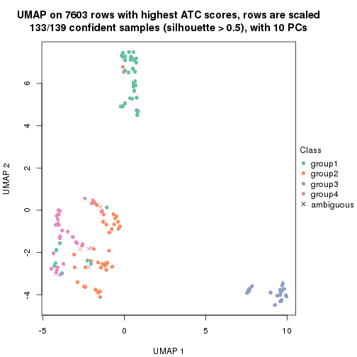</p>

</div>
</div>


Following heatmap shows how subgroups are split when increasing `k`:

```r
collect_classes(res)
```


Test correlation between subgroups and known annotations. If the known
annotation is numeric, one-way ANOVA test is applied, and if the known
annotation is discrete, chi-squared contingency table test is applied.

```r
test_to_known_factors(res)
```

```
#>             n_sample level1.class(p-value) k
#> ATC:skmeans      138              4.54e-04 2
#> ATC:skmeans      136              6.14e-17 3
#> ATC:skmeans      133              9.45e-16 4
```


If matrix rows can be associated to genes, consider to use `functional_enrichment(res,
...)` to perform function enrichment for the signature genes. See [this vignette](https://jokergoo.github.io/cola_vignettes/functional_enrichment.html) for more detailed explanations.


 

---------------------------------------------------


### Node02


Parent node: [Node0](#Node0).
Child nodes: 
                [Node011](#Node011)
        ,
                [Node012](#Node012)
        ,
                [Node013](#Node013)
        ,
                [Node014](#Node014)
        ,
                [Node021](#Node021)
        ,
                [Node022](#Node022)
        ,
                [Node023](#Node023)
        ,
                [Node031](#Node031)
        ,
                [Node032](#Node032)
        ,
                [Node033](#Node033)
        .


The object with results only for a single top-value method and a single partitioning method 
can be extracted as:

```r
res = res_rh["02"]
```

A summary of `res` and all the functions that can be applied to it:

```r
res
```

```
#> A 'DownSamplingConsensusPartition' object with k = 2, 3, 4.
#>   On a matrix with 10389 rows and 500 columns, randomly sampled from 960 columns.
#>   Top rows (975) are extracted by 'ATC' method.
#>   Subgroups are detected by 'skmeans' method.
#>   Performed in total 150 partitions by row resampling.
#>   Best k for subgroups seems to be 4.
#> 
#> Following methods can be applied to this 'DownSamplingConsensusPartition' object:
#>  [1] "cola_report"             "collect_classes"         "collect_plots"          
#>  [4] "collect_stats"           "colnames"                "compare_partitions"     
#>  [7] "compare_signatures"      "consensus_heatmap"       "dimension_reduction"    
#> [10] "functional_enrichment"   "get_anno_col"            "get_anno"               
#> [13] "get_classes"             "get_consensus"           "get_matrix"             
#> [16] "get_membership"          "get_param"               "get_signatures"         
#> [19] "get_stats"               "is_best_k"               "is_stable_k"            
#> [22] "membership_heatmap"      "ncol"                    "nrow"                   
#> [25] "plot_ecdf"               "predict_classes"         "rownames"               
#> [28] "select_partition_number" "show"                    "suggest_best_k"         
#> [31] "test_to_known_factors"   "top_rows_heatmap"
```

`collect_plots()` function collects all the plots made from `res` for all `k` (number of subgroups)
into one single page to provide an easy and fast comparison between different `k`.

```r
collect_plots(res)
```


The plots are:

- The first row: a plot of the eCDF (empirical cumulative distribution
  function) curves of the consensus matrix for each `k` and the heatmap of
  predicted classes for each `k`.
- The second row: heatmaps of the consensus matrix for each `k`.
- The third row: heatmaps of the membership matrix for each `k`.
- The fouth row: heatmaps of the signatures for each `k`.

All the plots in panels can be made by individual functions and they are
plotted later in this section.

`select_partition_number()` produces several plots showing different
statistics for choosing "optimized" `k`. There are following statistics:

- eCDF curves of the consensus matrix for each `k`;
- 1-PAC. [The PAC score](https://en.wikipedia.org/wiki/Consensus_clustering#Over-interpretation_potential_of_consensus_clustering)
  measures the proportion of the ambiguous subgrouping.
- Mean silhouette score.
- Concordance. The mean probability of fiting the consensus subgroup labels in all
  partitions.
- Area increased. Denote $A_k$ as the area under the eCDF curve for current
  `k`, the area increased is defined as $A_k - A_{k-1}$.
- Rand index. The percent of pairs of samples that are both in a same cluster
  or both are not in a same cluster in the partition of k and k-1.
- Jaccard index. The ratio of pairs of samples are both in a same cluster in
  the partition of k and k-1 and the pairs of samples are both in a same
  cluster in the partition k or k-1.

The detailed explanations of these statistics can be found in [the _cola_
vignette](https://jokergoo.github.io/cola_vignettes/cola.html#toc_13).

Generally speaking, higher 1-PAC score, higher mean silhouette score or higher
concordance corresponds to better partition. Rand index and Jaccard index
measure how similar the current partition is compared to partition with `k-1`.
If they are too similar, we won't accept `k` is better than `k-1`.

```r
select_partition_number(res)
```


The numeric values for all these statistics can be obtained by `get_stats()`.

```r
get_stats(res)
```

```
#>   k 1-PAC mean_silhouette concordance area_increased  Rand Jaccard
#> 2 2 1.000           0.978       0.991          0.499 0.502   0.502
#> 3 3 0.999           0.956       0.976          0.221 0.870   0.745
#> 4 4 0.970           0.938       0.975          0.145 0.880   0.705
```

`suggest_best_k()` suggests the best $k$ based on these statistics. The rules are as follows:

- All $k$ with Jaccard index larger than 0.95 are removed because increasing
  $k$ does not provide enough extra information. If all $k$ are removed, it is
  marked as no subgroup is detected.
- For all $k$ with 1-PAC score larger than 0.9, the maximal $k$ is taken as
  the best $k$, and other $k$ are marked as optional $k$.
- If it does not fit the second rule. The $k$ with the maximal vote of the
  highest 1-PAC score, highest mean silhouette, and highest concordance is
  taken as the best $k$.

```r
suggest_best_k(res)
```

```
#> [1] 4
#> attr(,"optional")
#> [1] 2 3
```

There is also optional best $k$ = 2 3 that is worth to check.

Following is the table of the partitions (You need to click the **show/hide
code output** link to see it). The membership matrix (columns with name `p*`)
is inferred by
[`clue::cl_consensus()`](https://www.rdocumentation.org/link/cl_consensus?package=clue)
function with the `SE` method. Basically the value in the membership matrix
represents the probability to belong to a certain group. The finall subgroup
label for an item is determined with the group with highest probability it
belongs to.

In `get_classes()` function, the entropy is calculated from the membership
matrix and the silhouette score is calculated from the consensus matrix.


<script>
$( function() {
	$( '#tabs-node-02-get-classes' ).tabs();
} );
</script>
<div id='tabs-node-02-get-classes'>
<ul>
<li><a href='#tab-node-02-get-classes-1'>k = 2</a></li>
<li><a href='#tab-node-02-get-classes-2'>k = 3</a></li>
<li><a href='#tab-node-02-get-classes-3'>k = 4</a></li>
</ul>

<div id='tab-node-02-get-classes-1'>
<p><a id='tab-node-02-get-classes-1-a' style='color:#0366d6' href='#'>show/hide code output</a></p>
<pre><code class="r">get_classes(res, k = 2)
</code></pre>

<pre><code>#&gt;     class     p
#&gt; 1       2 0.502
#&gt; 2       2 0.747
#&gt; 3       2 0.502
#&gt; 4       1 0.502
#&gt; 5       2 0.000
#&gt; 6       2 0.000
#&gt; 7       2 0.000
#&gt; 8       1 0.000
#&gt; 9       2 0.000
#&gt; 10      2 0.000
#&gt; 11      2 0.000
#&gt; 12      2 0.000
#&gt; 13      2 0.000
#&gt; 14      2 0.000
#&gt; 15      2 1.000
#&gt; 16      2 0.000
#&gt; 17      2 0.000
#&gt; 18      1 0.249
#&gt; 19      2 0.000
#&gt; 20      2 0.000
#&gt; 21      2 0.498
#&gt; 22      2 0.502
#&gt; 23      2 0.000
#&gt; 24      2 0.000
#&gt; 25      2 0.249
#&gt; 26      2 0.000
#&gt; 27      1 0.000
#&gt; 28      1 0.249
#&gt; 29      2 0.000
#&gt; 30      1 0.249
#&gt; 31      2 0.498
#&gt; 32      1 0.000
#&gt; 33      1 0.000
#&gt; 34      1 1.000
#&gt; 35      1 0.000
#&gt; 36      2 0.249
#&gt; 37      2 0.000
#&gt; 38      2 0.498
#&gt; 39      2 0.000
#&gt; 40      2 0.000
#&gt; 41      2 0.249
#&gt; 42      2 0.000
#&gt; 43      2 0.000
#&gt; 44      2 0.000
#&gt; 45      2 0.000
#&gt; 46      2 1.000
#&gt; 47      2 0.249
#&gt; 48      1 0.253
#&gt; 49      2 0.498
#&gt; 50      1 0.502
#&gt; 51      2 0.000
#&gt; 52      2 0.498
#&gt; 53      2 0.498
#&gt; 54      2 0.747
#&gt; 55      1 0.502
#&gt; 56      2 0.000
#&gt; 57      2 0.000
#&gt; 58      1 0.253
#&gt; 59      2 0.498
#&gt; 60      1 1.000
#&gt; 61      1 0.000
#&gt; 62      1 0.502
#&gt; 63      1 0.253
#&gt; 64      1 0.751
#&gt; 65      2 0.498
#&gt; 66      2 0.498
#&gt; 67      2 0.253
#&gt; 68      1 0.253
#&gt; 69      2 0.000
#&gt; 70      1 0.751
#&gt; 71      2 0.747
#&gt; 72      2 0.000
#&gt; 73      2 0.000
#&gt; 74      2 0.249
#&gt; 75      2 0.000
#&gt; 76      2 0.000
#&gt; 77      2 0.249
#&gt; 78      1 0.000
#&gt; 79      2 0.751
#&gt; 80      1 0.249
#&gt; 81      2 0.000
#&gt; 82      2 1.000
#&gt; 83      2 0.249
#&gt; 84      2 1.000
#&gt; 85      2 1.000
#&gt; 86      2 0.249
#&gt; 87      2 0.751
#&gt; 88      1 0.000
#&gt; 89      2 0.000
#&gt; 90      2 0.000
#&gt; 91      2 0.000
#&gt; 92      2 0.000
#&gt; 93      1 0.751
#&gt; 94      2 0.000
#&gt; 95      2 0.000
#&gt; 96      1 0.000
#&gt; 97      2 0.751
#&gt; 98      1 0.000
#&gt; 99      1 0.502
#&gt; 100     1 0.000
#&gt; 101     1 0.502
#&gt; 102     1 0.000
#&gt; 103     2 0.000
#&gt; 104     2 0.751
#&gt; 105     2 0.000
#&gt; 106     2 0.000
#&gt; 107     2 0.000
#&gt; 108     2 0.000
#&gt; 109     2 0.000
#&gt; 110     1 0.502
#&gt; 111     1 0.000
#&gt; 112     2 0.502
#&gt; 113     2 0.000
#&gt; 114     2 0.000
#&gt; 115     2 0.000
#&gt; 116     2 0.000
#&gt; 117     2 0.000
#&gt; 118     2 0.000
#&gt; 119     2 0.000
#&gt; 120     1 0.000
#&gt; 121     2 0.000
#&gt; 122     2 0.000
#&gt; 123     2 0.000
#&gt; 124     2 0.000
#&gt; 125     2 0.000
#&gt; 126     2 0.498
#&gt; 127     2 0.000
#&gt; 128     2 0.000
#&gt; 129     2 0.000
#&gt; 130     1 0.751
#&gt; 131     1 0.249
#&gt; 132     1 0.000
#&gt; 133     2 0.751
#&gt; 134     2 0.000
#&gt; 135     1 0.000
#&gt; 136     1 0.000
#&gt; 137     2 0.747
#&gt; 138     2 0.000
#&gt; 139     1 0.000
#&gt; 140     1 0.000
#&gt; 141     1 0.000
#&gt; 142     2 0.249
#&gt; 143     1 0.000
#&gt; 144     2 0.751
#&gt; 145     2 0.498
#&gt; 146     1 0.000
#&gt; 147     1 0.249
#&gt; 148     1 0.000
#&gt; 149     2 0.498
#&gt; 150     1 0.000
#&gt; 151     1 0.000
#&gt; 152     2 0.249
#&gt; 153     2 0.000
#&gt; 154     2 0.000
#&gt; 155     1 0.249
#&gt; 156     2 0.000
#&gt; 157     2 0.000
#&gt; 158     2 1.000
#&gt; 159     2 0.000
#&gt; 160     2 0.249
#&gt; 161     2 0.253
#&gt; 162     2 0.502
#&gt; 163     1 0.000
#&gt; 164     2 0.000
#&gt; 165     2 0.000
#&gt; 166     1 0.000
#&gt; 167     2 0.249
#&gt; 168     1 0.000
#&gt; 169     1 0.000
#&gt; 170     2 1.000
#&gt; 171     2 0.253
#&gt; 172     1 0.751
#&gt; 173     1 0.253
#&gt; 174     1 0.000
#&gt; 175     1 1.000
#&gt; 176     1 0.253
#&gt; 177     1 0.000
#&gt; 178     1 0.253
#&gt; 179     2 0.000
#&gt; 180     1 0.000
#&gt; 181     1 0.249
#&gt; 182     1 0.000
#&gt; 183     1 0.747
#&gt; 184     1 0.249
#&gt; 185     1 0.000
#&gt; 186     2 0.000
#&gt; 187     1 1.000
#&gt; 188     1 0.751
#&gt; 189     1 0.000
#&gt; 190     2 0.000
#&gt; 191     1 0.000
#&gt; 192     1 0.249
#&gt; 193     2 0.751
#&gt; 194     2 0.249
#&gt; 195     2 0.000
#&gt; 196     2 0.000
#&gt; 197     2 0.000
#&gt; 198     2 0.000
#&gt; 199     1 0.000
#&gt; 200     2 0.249
#&gt; 201     2 0.249
#&gt; 202     2 1.000
#&gt; 203     2 1.000
#&gt; 204     2 0.000
#&gt; 205     2 0.000
#&gt; 206     2 0.000
#&gt; 207     1 1.000
#&gt; 208     1 0.249
#&gt; 209     2 0.000
#&gt; 210     2 0.000
#&gt; 211     2 0.751
#&gt; 212     1 0.000
#&gt; 213     2 0.253
#&gt; 214     1 0.000
#&gt; 215     2 0.249
#&gt; 216     1 0.253
#&gt; 217     2 0.747
#&gt; 218     1 0.502
#&gt; 219     2 0.249
#&gt; 220     2 0.000
#&gt; 221     1 0.751
#&gt; 222     1 0.000
#&gt; 223     1 0.000
#&gt; 224     2 0.000
#&gt; 225     1 1.000
#&gt; 226     1 0.249
#&gt; 227     1 0.000
#&gt; 228     2 0.000
#&gt; 229     2 0.751
#&gt; 230     1 0.000
#&gt; 231     1 0.249
#&gt; 232     1 0.000
#&gt; 233     2 1.000
#&gt; 234     1 0.253
#&gt; 235     1 0.000
#&gt; 236     1 0.000
#&gt; 237     1 0.000
#&gt; 238     1 0.249
#&gt; 239     1 0.000
#&gt; 240     1 0.000
#&gt; 241     1 0.000
#&gt; 242     2 0.249
#&gt; 243     1 0.000
#&gt; 244     2 0.249
#&gt; 245     1 0.000
#&gt; 246     2 0.751
#&gt; 247     1 0.000
#&gt; 248     2 0.751
#&gt; 249     2 1.000
#&gt; 250     1 0.000
#&gt; 251     2 1.000
#&gt; 252     1 0.249
#&gt; 253     1 0.000
#&gt; 254     1 0.000
#&gt; 255     1 0.000
#&gt; 256     1 0.000
#&gt; 257     2 0.249
#&gt; 258     2 0.751
#&gt; 259     1 0.249
#&gt; 260     1 0.000
#&gt; 261     1 0.000
#&gt; 262     2 1.000
#&gt; 263     2 0.253
#&gt; 264     2 0.502
#&gt; 265     2 1.000
#&gt; 266     2 0.000
#&gt; 267     2 1.000
#&gt; 268     2 0.253
#&gt; 269     1 0.000
#&gt; 270     1 0.000
#&gt; 271     2 0.502
#&gt; 272     2 0.000
#&gt; 273     2 0.000
#&gt; 274     2 0.000
#&gt; 275     2 0.000
#&gt; 276     1 0.249
#&gt; 277     1 0.000
#&gt; 278     2 0.751
#&gt; 279     2 0.502
#&gt; 280     1 0.000
#&gt; 281     2 0.249
#&gt; 282     2 0.502
#&gt; 283     2 0.000
#&gt; 284     1 0.000
#&gt; 285     2 0.000
#&gt; 286     1 0.000
#&gt; 287     2 0.000
#&gt; 288     2 0.000
#&gt; 289     2 0.000
#&gt; 290     1 0.000
#&gt; 291     1 0.000
#&gt; 292     1 0.249
#&gt; 293     1 0.000
#&gt; 294     1 0.249
#&gt; 295     2 1.000
#&gt; 296     2 0.498
#&gt; 297     2 0.000
#&gt; 298     1 0.502
#&gt; 299     2 0.751
#&gt; 300     1 0.000
#&gt; 301     1 0.000
#&gt; 302     2 1.000
#&gt; 303     2 0.000
#&gt; 304     2 1.000
#&gt; 305     2 0.000
#&gt; 306     1 0.000
#&gt; 307     2 0.000
#&gt; 308     2 1.000
#&gt; 309     1 0.000
#&gt; 310     2 0.249
#&gt; 311     2 1.000
#&gt; 312     1 0.000
#&gt; 313     1 0.249
#&gt; 314     1 0.000
#&gt; 315     1 0.000
#&gt; 316     1 0.000
#&gt; 317     2 1.000
#&gt; 318     1 0.000
#&gt; 319     2 0.498
#&gt; 320     1 0.249
#&gt; 321     2 1.000
#&gt; 322     1 0.000
#&gt; 323     2 0.498
#&gt; 324     1 0.000
#&gt; 325     1 0.000
#&gt; 326     1 0.000
#&gt; 327     1 0.000
#&gt; 328     1 1.000
#&gt; 329     2 0.253
#&gt; 330     1 0.000
#&gt; 331     1 0.498
#&gt; 332     1 0.249
#&gt; 333     1 0.000
#&gt; 334     1 1.000
#&gt; 335     2 0.253
#&gt; 336     1 0.000
#&gt; 337     2 0.498
#&gt; 338     2 0.000
#&gt; 339     1 0.249
#&gt; 340     2 0.249
#&gt; 341     2 1.000
#&gt; 342     2 0.751
#&gt; 343     1 0.000
#&gt; 344     2 0.000
#&gt; 345     2 0.000
#&gt; 346     1 0.000
#&gt; 347     1 0.249
#&gt; 348     1 0.000
#&gt; 349     1 0.000
#&gt; 350     1 0.000
#&gt; 351     1 0.000
#&gt; 352     1 0.000
#&gt; 353     1 0.000
#&gt; 354     2 1.000
#&gt; 355     1 0.000
#&gt; 356     2 1.000
#&gt; 357     2 0.253
#&gt; 358     1 0.000
#&gt; 359     1 0.000
#&gt; 360     1 0.000
#&gt; 361     1 0.000
#&gt; 362     2 1.000
#&gt; 363     1 0.751
#&gt; 364     2 1.000
#&gt; 365     1 0.000
#&gt; 366     1 0.498
#&gt; 367     2 0.751
#&gt; 368     1 0.000
#&gt; 369     1 0.747
#&gt; 370     2 1.000
#&gt; 371     1 0.000
#&gt; 372     1 0.000
#&gt; 373     1 0.000
#&gt; 374     1 0.000
#&gt; 375     2 0.502
#&gt; 376     1 0.000
#&gt; 377     1 0.000
#&gt; 378     1 0.000
#&gt; 379     1 0.000
#&gt; 380     1 0.498
#&gt; 381     1 1.000
#&gt; 382     2 0.502
#&gt; 383     1 0.000
#&gt; 384     2 0.000
#&gt; 385     2 0.249
#&gt; 386     2 0.502
#&gt; 387     2 0.000
#&gt; 388     2 0.000
#&gt; 389     2 0.253
#&gt; 390     2 0.000
#&gt; 391     2 0.747
#&gt; 392     2 0.249
#&gt; 393     1 0.000
#&gt; 394     1 0.000
#&gt; 395     1 0.751
#&gt; 396     2 0.000
#&gt; 397     2 0.502
#&gt; 398     1 0.000
#&gt; 399     1 0.000
#&gt; 400     2 0.502
#&gt; 401     2 0.249
#&gt; 402     2 0.000
#&gt; 403     1 0.000
#&gt; 404     2 0.000
#&gt; 405     2 0.249
#&gt; 406     2 0.000
#&gt; 407     1 0.000
#&gt; 408     1 0.000
#&gt; 409     2 0.000
#&gt; 410     2 0.000
#&gt; 411     2 0.502
#&gt; 412     2 0.249
#&gt; 413     2 0.249
#&gt; 414     2 0.502
#&gt; 415     2 0.000
#&gt; 416     2 0.000
#&gt; 417     2 0.000
#&gt; 418     2 0.000
#&gt; 419     2 0.000
#&gt; 420     1 0.000
#&gt; 421     1 0.000
#&gt; 422     1 0.253
#&gt; 423     1 0.249
#&gt; 424     2 0.000
#&gt; 425     1 0.249
#&gt; 426     2 0.000
#&gt; 427     2 0.000
#&gt; 428     2 0.000
#&gt; 429     2 0.249
#&gt; 430     2 0.000
#&gt; 431     2 0.000
#&gt; 432     2 1.000
#&gt; 433     2 0.000
#&gt; 434     2 0.000
#&gt; 435     2 0.000
#&gt; 436     1 0.000
#&gt; 437     1 0.000
#&gt; 438     2 0.000
#&gt; 439     1 0.249
#&gt; 440     2 0.000
#&gt; 441     2 0.751
#&gt; 442     1 0.249
#&gt; 443     1 0.000
#&gt; 444     2 0.000
#&gt; 445     1 0.000
#&gt; 446     1 0.751
#&gt; 447     1 0.000
#&gt; 448     2 0.751
#&gt; 449     1 0.000
#&gt; 450     2 0.000
#&gt; 451     1 0.000
#&gt; 452     2 0.253
#&gt; 453     1 0.498
#&gt; 454     1 0.000
#&gt; 455     1 0.000
#&gt; 456     1 0.000
#&gt; 457     1 0.000
#&gt; 458     1 0.747
#&gt; 459     2 0.249
#&gt; 460     1 0.502
#&gt; 461     1 0.000
#&gt; 462     1 0.000
#&gt; 463     2 0.000
#&gt; 464     1 0.000
#&gt; 465     1 0.000
#&gt; 466     1 0.000
#&gt; 467     2 0.253
#&gt; 468     1 0.502
#&gt; 469     2 0.498
#&gt; 470     2 0.249
#&gt; 471     2 0.000
#&gt; 472     2 0.000
#&gt; 473     1 1.000
#&gt; 474     2 0.000
#&gt; 475     2 0.000
#&gt; 476     2 0.000
#&gt; 477     2 0.000
#&gt; 478     2 0.249
#&gt; 479     2 0.000
#&gt; 480     2 0.253
#&gt; 481     2 1.000
#&gt; 482     2 0.000
#&gt; 483     2 0.000
#&gt; 484     2 0.000
#&gt; 485     2 0.249
#&gt; 486     2 0.502
#&gt; 487     2 0.253
#&gt; 488     2 0.502
#&gt; 489     2 0.000
#&gt; 490     2 0.498
#&gt; 491     2 0.000
#&gt; 492     2 0.000
#&gt; 493     1 0.000
#&gt; 494     2 0.000
#&gt; 495     2 0.000
#&gt; 496     2 0.249
#&gt; 497     2 0.502
#&gt; 498     2 1.000
#&gt; 499     2 0.000
#&gt; 500     2 0.751
#&gt; 501     2 0.249
#&gt; 502     2 0.502
#&gt; 503     2 0.000
#&gt; 504     2 0.498
#&gt; 505     2 0.751
#&gt; 506     2 0.000
#&gt; 507     2 0.751
#&gt; 508     2 0.253
#&gt; 509     2 0.000
#&gt; 510     2 0.249
#&gt; 511     2 0.000
#&gt; 512     2 0.000
#&gt; 513     2 0.000
#&gt; 514     2 0.000
#&gt; 515     2 0.000
#&gt; 516     2 0.751
#&gt; 517     2 0.000
#&gt; 518     2 0.000
#&gt; 519     2 0.000
#&gt; 520     2 0.000
#&gt; 521     2 0.253
#&gt; 522     2 0.249
#&gt; 523     2 0.000
#&gt; 524     1 0.000
#&gt; 525     2 0.751
#&gt; 526     2 0.000
#&gt; 527     2 0.000
#&gt; 528     2 0.502
#&gt; 529     2 0.000
#&gt; 530     2 0.000
#&gt; 531     2 0.249
#&gt; 532     2 0.000
#&gt; 533     2 0.253
#&gt; 534     2 0.000
#&gt; 535     2 0.000
#&gt; 536     2 0.000
#&gt; 537     2 0.000
#&gt; 538     2 0.000
#&gt; 539     2 0.000
#&gt; 540     2 0.000
#&gt; 541     1 0.000
#&gt; 542     1 0.000
#&gt; 543     2 0.751
#&gt; 544     2 0.000
#&gt; 545     2 0.000
#&gt; 546     2 0.000
#&gt; 547     2 0.249
#&gt; 548     2 0.498
#&gt; 549     2 0.249
#&gt; 550     2 0.751
#&gt; 551     2 0.000
#&gt; 552     2 0.249
#&gt; 553     1 1.000
#&gt; 554     1 0.000
#&gt; 555     2 0.502
#&gt; 556     1 0.000
#&gt; 557     2 1.000
#&gt; 558     2 1.000
#&gt; 559     1 0.000
#&gt; 560     1 0.000
#&gt; 561     1 0.000
#&gt; 562     2 0.751
#&gt; 563     1 0.000
#&gt; 564     1 0.000
#&gt; 565     2 0.502
#&gt; 566     2 0.000
#&gt; 567     2 1.000
#&gt; 568     2 0.000
#&gt; 569     2 0.249
#&gt; 570     1 0.000
#&gt; 571     2 0.751
#&gt; 572     2 0.498
#&gt; 573     2 0.502
#&gt; 574     2 0.751
#&gt; 575     1 0.747
#&gt; 576     1 0.000
#&gt; 577     2 0.249
#&gt; 578     1 0.000
#&gt; 579     1 0.000
#&gt; 580     1 0.000
#&gt; 581     2 0.747
#&gt; 582     2 0.502
#&gt; 583     2 0.000
#&gt; 584     2 0.249
#&gt; 585     2 0.000
#&gt; 586     1 0.000
#&gt; 587     2 0.751
#&gt; 588     2 0.000
#&gt; 589     2 0.000
#&gt; 590     1 0.000
#&gt; 591     1 0.249
#&gt; 592     1 0.498
#&gt; 593     2 0.000
#&gt; 594     2 0.000
#&gt; 595     1 0.249
#&gt; 596     2 0.000
#&gt; 597     2 1.000
#&gt; 598     1 0.000
#&gt; 599     1 0.249
#&gt; 600     2 0.751
#&gt; 601     2 0.502
#&gt; 602     1 0.000
#&gt; 603     2 0.000
#&gt; 604     1 0.000
#&gt; 605     2 0.000
#&gt; 606     2 0.751
#&gt; 607     2 0.000
#&gt; 608     2 0.498
#&gt; 609     2 0.000
#&gt; 610     2 0.249
#&gt; 611     2 0.000
#&gt; 612     2 0.747
#&gt; 613     1 0.000
#&gt; 614     2 0.502
#&gt; 615     2 0.751
#&gt; 616     2 0.000
#&gt; 617     2 0.000
#&gt; 618     2 0.502
#&gt; 619     2 0.000
#&gt; 620     2 0.000
#&gt; 621     2 0.000
#&gt; 622     2 0.249
#&gt; 623     2 0.249
#&gt; 624     2 0.000
#&gt; 625     1 0.000
#&gt; 626     2 0.000
#&gt; 627     1 1.000
#&gt; 628     1 0.249
#&gt; 629     1 0.751
#&gt; 630     1 0.000
#&gt; 631     1 0.000
#&gt; 632     1 0.751
#&gt; 633     1 0.000
#&gt; 634     2 0.000
#&gt; 635     1 0.498
#&gt; 636     2 0.502
#&gt; 637     1 0.249
#&gt; 638     2 0.249
#&gt; 639     1 0.498
#&gt; 640     1 0.249
#&gt; 641     2 0.498
#&gt; 642     1 0.000
#&gt; 643     1 1.000
#&gt; 644     1 0.249
#&gt; 645     2 0.000
#&gt; 646     2 0.253
#&gt; 647     2 0.000
#&gt; 648     2 0.000
#&gt; 649     2 0.000
#&gt; 650     1 0.000
#&gt; 651     1 0.000
#&gt; 652     2 0.498
#&gt; 653     1 0.249
#&gt; 654     2 0.498
#&gt; 655     2 0.249
#&gt; 656     2 0.498
#&gt; 657     1 0.000
#&gt; 658     2 0.000
#&gt; 659     2 0.000
#&gt; 660     1 0.000
#&gt; 661     2 0.000
#&gt; 662     2 0.249
#&gt; 663     1 0.502
#&gt; 664     1 0.000
#&gt; 665     1 0.000
#&gt; 666     1 0.253
#&gt; 667     1 0.000
#&gt; 668     1 0.000
#&gt; 669     1 0.249
#&gt; 670     2 0.502
#&gt; 671     1 0.000
#&gt; 672     2 0.000
#&gt; 673     1 0.000
#&gt; 674     1 0.000
#&gt; 675     2 0.253
#&gt; 676     1 0.000
#&gt; 677     2 0.751
#&gt; 678     1 0.249
#&gt; 679     2 0.000
#&gt; 680     2 0.502
#&gt; 681     2 0.000
#&gt; 682     2 0.747
#&gt; 683     2 0.000
#&gt; 684     1 0.000
#&gt; 685     2 0.000
#&gt; 686     1 0.000
#&gt; 687     1 0.502
#&gt; 688     1 0.000
#&gt; 689     1 0.000
#&gt; 690     2 0.498
#&gt; 691     2 0.000
#&gt; 692     1 0.000
#&gt; 693     1 0.249
#&gt; 694     1 0.249
#&gt; 695     2 0.000
#&gt; 696     2 0.000
#&gt; 697     2 0.000
#&gt; 698     1 0.000
#&gt; 699     1 0.253
#&gt; 700     2 0.000
#&gt; 701     2 0.253
#&gt; 702     1 0.000
#&gt; 703     2 1.000
#&gt; 704     1 0.000
#&gt; 705     1 0.000
#&gt; 706     1 0.000
#&gt; 707     2 0.249
#&gt; 708     2 0.000
#&gt; 709     2 0.000
#&gt; 710     2 0.751
#&gt; 711     2 0.000
#&gt; 712     2 0.249
#&gt; 713     2 0.000
#&gt; 714     2 0.000
#&gt; 715     1 0.000
#&gt; 716     2 0.000
#&gt; 717     2 0.000
#&gt; 718     2 0.498
#&gt; 719     2 0.000
#&gt; 720     2 0.000
#&gt; 721     2 0.000
#&gt; 722     1 0.000
#&gt; 723     1 0.000
#&gt; 724     1 0.000
#&gt; 725     2 0.249
#&gt; 726     2 0.000
#&gt; 727     2 0.000
#&gt; 728     2 0.000
#&gt; 729     2 0.000
#&gt; 730     2 0.502
#&gt; 731     2 0.498
#&gt; 732     2 0.000
#&gt; 733     2 0.000
#&gt; 734     1 0.000
#&gt; 735     1 0.249
#&gt; 736     1 0.249
#&gt; 737     2 0.000
#&gt; 738     2 0.249
#&gt; 739     2 0.000
#&gt; 740     2 0.000
#&gt; 741     2 0.000
#&gt; 742     2 0.000
#&gt; 743     1 0.000
#&gt; 744     1 0.249
#&gt; 745     2 0.000
#&gt; 746     1 0.000
#&gt; 747     1 0.000
#&gt; 748     1 0.000
#&gt; 749     1 0.000
#&gt; 750     1 0.000
#&gt; 751     1 0.000
#&gt; 752     1 0.000
#&gt; 753     1 0.000
#&gt; 754     1 0.000
#&gt; 755     1 0.000
#&gt; 756     1 0.000
#&gt; 757     1 0.000
#&gt; 758     1 0.000
#&gt; 759     1 0.000
#&gt; 760     2 1.000
#&gt; 761     1 0.000
#&gt; 762     1 0.000
#&gt; 763     1 0.249
#&gt; 764     1 0.000
#&gt; 765     2 0.249
#&gt; 766     2 0.253
#&gt; 767     2 0.000
#&gt; 768     2 0.000
#&gt; 769     2 1.000
#&gt; 770     2 0.000
#&gt; 771     2 1.000
#&gt; 772     2 0.000
#&gt; 773     1 0.000
#&gt; 774     1 0.747
#&gt; 775     1 0.000
#&gt; 776     2 1.000
#&gt; 777     2 0.000
#&gt; 778     1 0.000
#&gt; 779     1 0.000
#&gt; 780     1 0.000
#&gt; 781     1 0.000
#&gt; 782     1 0.000
#&gt; 783     2 0.249
#&gt; 784     1 0.249
#&gt; 785     2 1.000
#&gt; 786     2 0.000
#&gt; 787     2 0.000
#&gt; 788     2 0.000
#&gt; 789     2 0.000
#&gt; 790     2 0.000
#&gt; 791     1 0.000
#&gt; 792     2 0.751
#&gt; 793     2 0.000
#&gt; 794     2 0.498
#&gt; 795     2 0.000
#&gt; 796     2 0.000
#&gt; 797     2 0.000
#&gt; 798     2 0.000
#&gt; 799     2 0.000
#&gt; 800     2 0.249
#&gt; 801     2 0.751
#&gt; 802     2 0.498
#&gt; 803     2 0.249
#&gt; 804     2 0.000
#&gt; 805     2 0.000
#&gt; 806     2 0.000
#&gt; 807     2 0.000
#&gt; 808     2 0.000
#&gt; 809     2 0.000
#&gt; 810     2 0.000
#&gt; 811     2 0.000
#&gt; 812     2 0.000
#&gt; 813     2 0.000
#&gt; 814     2 0.000
#&gt; 815     2 0.000
#&gt; 816     1 0.000
#&gt; 817     1 0.000
#&gt; 818     1 0.000
#&gt; 819     1 0.000
#&gt; 820     1 0.000
#&gt; 821     1 0.000
#&gt; 822     2 1.000
#&gt; 823     1 0.498
#&gt; 824     2 0.000
#&gt; 825     2 0.502
#&gt; 826     2 0.751
#&gt; 827     2 0.249
#&gt; 828     1 0.249
#&gt; 829     2 0.000
#&gt; 830     2 0.498
#&gt; 831     2 0.249
#&gt; 832     2 0.253
#&gt; 833     2 0.498
#&gt; 834     2 0.000
#&gt; 835     2 1.000
#&gt; 836     2 0.000
#&gt; 837     2 0.000
#&gt; 838     2 0.747
#&gt; 839     1 0.000
#&gt; 840     2 0.751
#&gt; 841     2 0.000
#&gt; 842     2 0.498
#&gt; 843     1 0.000
#&gt; 844     2 0.000
#&gt; 845     2 0.000
#&gt; 846     2 0.000
#&gt; 847     2 0.000
#&gt; 848     1 0.000
#&gt; 849     1 0.000
#&gt; 850     1 0.000
#&gt; 851     1 0.000
#&gt; 852     1 0.000
#&gt; 853     1 0.000
#&gt; 854     1 0.000
#&gt; 855     1 0.000
#&gt; 856     2 0.000
#&gt; 857     1 0.000
#&gt; 858     1 0.000
#&gt; 859     1 0.000
#&gt; 860     1 0.000
#&gt; 861     1 0.000
#&gt; 862     1 0.000
#&gt; 863     1 0.000
#&gt; 864     1 0.000
#&gt; 865     1 0.000
#&gt; 866     1 0.000
#&gt; 867     1 0.000
#&gt; 868     1 0.000
#&gt; 869     1 0.000
#&gt; 870     1 0.000
#&gt; 871     1 0.000
#&gt; 872     1 0.000
#&gt; 873     1 0.000
#&gt; 874     1 0.000
#&gt; 875     1 0.000
#&gt; 876     1 0.000
#&gt; 877     1 0.000
#&gt; 878     1 0.249
#&gt; 879     2 1.000
#&gt; 880     2 0.253
#&gt; 881     1 0.000
#&gt; 882     1 0.000
#&gt; 883     1 0.000
#&gt; 884     1 0.000
#&gt; 885     1 0.000
#&gt; 886     1 0.000
#&gt; 887     1 0.000
#&gt; 888     1 0.000
#&gt; 889     1 0.000
#&gt; 890     1 0.000
#&gt; 891     1 0.000
#&gt; 892     1 0.000
#&gt; 893     1 0.000
#&gt; 894     1 0.000
#&gt; 895     1 0.000
#&gt; 896     1 0.000
#&gt; 897     1 0.000
#&gt; 898     1 0.000
#&gt; 899     1 0.000
#&gt; 900     1 0.000
#&gt; 901     1 0.000
#&gt; 902     1 0.000
#&gt; 903     2 0.000
#&gt; 904     2 0.000
#&gt; 905     1 1.000
#&gt; 906     2 0.253
#&gt; 907     1 0.000
#&gt; 908     1 0.000
#&gt; 909     1 0.000
#&gt; 910     1 0.000
#&gt; 911     1 0.000
#&gt; 912     1 0.000
#&gt; 913     2 1.000
#&gt; 914     1 0.000
#&gt; 915     1 0.000
#&gt; 916     1 0.000
#&gt; 917     1 0.000
#&gt; 918     1 0.249
#&gt; 919     2 1.000
#&gt; 920     1 0.000
#&gt; 921     1 0.000
#&gt; 922     1 0.000
#&gt; 923     2 1.000
#&gt; 924     1 0.000
#&gt; 925     1 0.000
#&gt; 926     1 0.000
#&gt; 927     1 0.000
#&gt; 928     1 0.000
#&gt; 929     1 0.000
#&gt; 930     1 0.502
#&gt; 931     1 0.000
#&gt; 932     1 0.249
#&gt; 933     1 0.000
#&gt; 934     1 0.000
#&gt; 935     1 0.000
#&gt; 936     2 0.751
#&gt; 937     2 0.000
#&gt; 938     1 0.253
#&gt; 939     2 0.498
#&gt; 940     1 0.000
#&gt; 941     1 0.000
#&gt; 942     1 0.000
#&gt; 943     2 0.747
#&gt; 944     2 0.249
#&gt; 945     1 0.000
#&gt; 946     1 0.249
#&gt; 947     1 0.000
#&gt; 948     2 0.751
#&gt; 949     1 0.000
#&gt; 950     2 0.000
#&gt; 951     1 0.000
#&gt; 952     1 0.000
#&gt; 953     1 0.253
#&gt; 954     1 0.249
#&gt; 955     1 0.000
#&gt; 956     1 0.000
#&gt; 957     1 0.000
#&gt; 958     1 0.000
#&gt; 959     1 0.000
#&gt; 960     1 0.000
</code></pre>

<script>
$('#tab-node-02-get-classes-1-a').parent().next().next().hide();
$('#tab-node-02-get-classes-1-a').click(function(){
  $('#tab-node-02-get-classes-1-a').parent().next().next().toggle();
  return(false);
});
</script>
</div>

<div id='tab-node-02-get-classes-2'>
<p><a id='tab-node-02-get-classes-2-a' style='color:#0366d6' href='#'>show/hide code output</a></p>
<pre><code class="r">get_classes(res, k = 3)
</code></pre>

<pre><code>#&gt;     class     p
#&gt; 1       3 1.000
#&gt; 2       2 1.000
#&gt; 3       1 1.000
#&gt; 4       1 1.000
#&gt; 5       2 0.000
#&gt; 6       2 0.000
#&gt; 7       2 0.000
#&gt; 8       1 1.000
#&gt; 9       2 0.000
#&gt; 10      2 0.000
#&gt; 11      2 0.000
#&gt; 12      2 0.000
#&gt; 13      2 0.000
#&gt; 14      2 0.000
#&gt; 15      3 0.000
#&gt; 16      2 0.000
#&gt; 17      2 1.000
#&gt; 18      1 1.000
#&gt; 19      3 1.000
#&gt; 20      2 0.502
#&gt; 21      2 0.000
#&gt; 22      2 1.000
#&gt; 23      2 0.000
#&gt; 24      2 0.000
#&gt; 25      3 1.000
#&gt; 26      2 0.000
#&gt; 27      1 0.000
#&gt; 28      1 1.000
#&gt; 29      2 0.000
#&gt; 30      1 0.498
#&gt; 31      2 0.249
#&gt; 32      1 0.000
#&gt; 33      1 0.000
#&gt; 34      3 1.000
#&gt; 35      1 0.000
#&gt; 36      2 0.000
#&gt; 37      2 0.000
#&gt; 38      2 0.000
#&gt; 39      2 0.502
#&gt; 40      2 0.000
#&gt; 41      2 0.000
#&gt; 42      2 0.249
#&gt; 43      2 0.000
#&gt; 44      2 0.000
#&gt; 45      2 0.000
#&gt; 46      2 0.000
#&gt; 47      1 1.000
#&gt; 48      3 1.000
#&gt; 49      3 0.000
#&gt; 50      3 1.000
#&gt; 51      2 0.000
#&gt; 52      1 1.000
#&gt; 53      3 1.000
#&gt; 54      3 0.502
#&gt; 55      1 1.000
#&gt; 56      2 0.000
#&gt; 57      2 0.000
#&gt; 58      1 1.000
#&gt; 59      2 0.249
#&gt; 60      1 1.000
#&gt; 61      1 0.000
#&gt; 62      1 1.000
#&gt; 63      1 0.498
#&gt; 64      2 1.000
#&gt; 65      2 0.000
#&gt; 66      2 1.000
#&gt; 67      1 1.000
#&gt; 68      1 1.000
#&gt; 69      2 0.000
#&gt; 70      1 1.000
#&gt; 71      2 0.000
#&gt; 72      2 1.000
#&gt; 73      2 0.000
#&gt; 74      2 0.000
#&gt; 75      2 0.000
#&gt; 76      2 1.000
#&gt; 77      3 0.000
#&gt; 78      1 0.498
#&gt; 79      2 0.249
#&gt; 80      3 0.000
#&gt; 81      2 0.000
#&gt; 82      2 0.000
#&gt; 83      3 0.253
#&gt; 84      2 1.000
#&gt; 85      2 0.249
#&gt; 86      2 0.000
#&gt; 87      2 0.000
#&gt; 88      1 0.249
#&gt; 89      2 0.000
#&gt; 90      2 0.000
#&gt; 91      3 0.751
#&gt; 92      2 0.000
#&gt; 93      1 1.000
#&gt; 94      2 1.000
#&gt; 95      2 0.000
#&gt; 96      1 0.000
#&gt; 97      2 0.249
#&gt; 98      3 0.000
#&gt; 99      2 0.498
#&gt; 100     3 0.000
#&gt; 101     1 0.751
#&gt; 102     3 0.249
#&gt; 103     2 0.751
#&gt; 104     1 1.000
#&gt; 105     2 0.000
#&gt; 106     2 0.000
#&gt; 107     2 0.000
#&gt; 108     2 0.000
#&gt; 109     2 0.000
#&gt; 110     1 1.000
#&gt; 111     1 1.000
#&gt; 112     2 0.751
#&gt; 113     1 1.000
#&gt; 114     2 0.000
#&gt; 115     2 0.000
#&gt; 116     2 0.000
#&gt; 117     2 0.498
#&gt; 118     2 0.000
#&gt; 119     2 0.000
#&gt; 120     1 0.498
#&gt; 121     2 0.000
#&gt; 122     2 0.000
#&gt; 123     2 0.000
#&gt; 124     2 0.000
#&gt; 125     2 0.000
#&gt; 126     2 0.000
#&gt; 127     2 0.000
#&gt; 128     2 0.000
#&gt; 129     2 0.498
#&gt; 130     2 0.751
#&gt; 131     1 1.000
#&gt; 132     3 0.000
#&gt; 133     2 0.000
#&gt; 134     2 1.000
#&gt; 135     1 1.000
#&gt; 136     1 1.000
#&gt; 137     2 1.000
#&gt; 138     2 0.000
#&gt; 139     3 0.000
#&gt; 140     1 0.249
#&gt; 141     1 0.000
#&gt; 142     2 0.000
#&gt; 143     1 0.747
#&gt; 144     1 1.000
#&gt; 145     3 1.000
#&gt; 146     1 1.000
#&gt; 147     3 0.000
#&gt; 148     3 0.000
#&gt; 149     3 0.000
#&gt; 150     3 0.000
#&gt; 151     3 0.000
#&gt; 152     2 0.000
#&gt; 153     2 0.000
#&gt; 154     2 0.000
#&gt; 155     1 0.000
#&gt; 156     2 0.000
#&gt; 157     3 1.000
#&gt; 158     3 1.000
#&gt; 159     2 0.000
#&gt; 160     2 0.000
#&gt; 161     2 1.000
#&gt; 162     2 1.000
#&gt; 163     3 0.000
#&gt; 164     3 0.000
#&gt; 165     2 1.000
#&gt; 166     1 0.000
#&gt; 167     2 0.000
#&gt; 168     1 0.000
#&gt; 169     3 0.000
#&gt; 170     2 1.000
#&gt; 171     2 0.253
#&gt; 172     1 1.000
#&gt; 173     1 0.502
#&gt; 174     1 1.000
#&gt; 175     3 1.000
#&gt; 176     3 1.000
#&gt; 177     1 1.000
#&gt; 178     3 0.000
#&gt; 179     2 0.000
#&gt; 180     1 0.000
#&gt; 181     1 0.502
#&gt; 182     3 0.000
#&gt; 183     1 1.000
#&gt; 184     1 1.000
#&gt; 185     1 0.000
#&gt; 186     3 0.498
#&gt; 187     1 1.000
#&gt; 188     1 0.751
#&gt; 189     1 0.000
#&gt; 190     2 0.000
#&gt; 191     1 1.000
#&gt; 192     3 0.000
#&gt; 193     1 1.000
#&gt; 194     1 1.000
#&gt; 195     2 0.000
#&gt; 196     3 0.000
#&gt; 197     3 1.000
#&gt; 198     3 1.000
#&gt; 199     1 0.000
#&gt; 200     2 1.000
#&gt; 201     2 0.502
#&gt; 202     2 0.498
#&gt; 203     2 0.000
#&gt; 204     2 0.000
#&gt; 205     2 0.000
#&gt; 206     2 0.000
#&gt; 207     3 0.000
#&gt; 208     1 0.000
#&gt; 209     2 0.000
#&gt; 210     2 0.000
#&gt; 211     2 1.000
#&gt; 212     1 0.000
#&gt; 213     2 1.000
#&gt; 214     1 0.249
#&gt; 215     2 0.000
#&gt; 216     1 1.000
#&gt; 217     3 0.000
#&gt; 218     1 1.000
#&gt; 219     2 1.000
#&gt; 220     2 0.000
#&gt; 221     3 0.000
#&gt; 222     1 0.249
#&gt; 223     3 0.000
#&gt; 224     2 0.253
#&gt; 225     1 1.000
#&gt; 226     3 0.000
#&gt; 227     1 0.000
#&gt; 228     2 0.000
#&gt; 229     2 1.000
#&gt; 230     1 1.000
#&gt; 231     3 0.000
#&gt; 232     1 1.000
#&gt; 233     1 1.000
#&gt; 234     1 0.000
#&gt; 235     3 0.000
#&gt; 236     1 0.000
#&gt; 237     3 0.000
#&gt; 238     1 0.249
#&gt; 239     1 0.000
#&gt; 240     1 1.000
#&gt; 241     1 1.000
#&gt; 242     2 0.000
#&gt; 243     1 1.000
#&gt; 244     3 0.000
#&gt; 245     3 0.000
#&gt; 246     2 0.000
#&gt; 247     1 0.498
#&gt; 248     3 0.249
#&gt; 249     3 0.000
#&gt; 250     1 0.000
#&gt; 251     3 1.000
#&gt; 252     2 1.000
#&gt; 253     1 0.000
#&gt; 254     1 1.000
#&gt; 255     3 0.000
#&gt; 256     1 1.000
#&gt; 257     2 0.000
#&gt; 258     2 1.000
#&gt; 259     1 1.000
#&gt; 260     3 0.000
#&gt; 261     3 0.000
#&gt; 262     1 1.000
#&gt; 263     3 1.000
#&gt; 264     1 1.000
#&gt; 265     3 0.000
#&gt; 266     2 0.000
#&gt; 267     3 1.000
#&gt; 268     2 0.000
#&gt; 269     1 1.000
#&gt; 270     1 1.000
#&gt; 271     2 1.000
#&gt; 272     2 0.000
#&gt; 273     2 0.000
#&gt; 274     2 0.000
#&gt; 275     2 0.000
#&gt; 276     1 1.000
#&gt; 277     1 1.000
#&gt; 278     2 0.000
#&gt; 279     2 0.000
#&gt; 280     1 1.000
#&gt; 281     2 0.000
#&gt; 282     3 0.000
#&gt; 283     2 0.000
#&gt; 284     1 0.000
#&gt; 285     2 0.498
#&gt; 286     1 0.502
#&gt; 287     2 0.000
#&gt; 288     2 0.000
#&gt; 289     2 0.000
#&gt; 290     1 0.751
#&gt; 291     3 0.000
#&gt; 292     3 0.000
#&gt; 293     1 1.000
#&gt; 294     1 1.000
#&gt; 295     1 1.000
#&gt; 296     1 1.000
#&gt; 297     2 0.000
#&gt; 298     1 1.000
#&gt; 299     3 1.000
#&gt; 300     1 1.000
#&gt; 301     1 1.000
#&gt; 302     1 1.000
#&gt; 303     2 0.000
#&gt; 304     1 1.000
#&gt; 305     2 0.000
#&gt; 306     1 0.000
#&gt; 307     2 0.000
#&gt; 308     2 1.000
#&gt; 309     1 1.000
#&gt; 310     2 0.000
#&gt; 311     2 0.502
#&gt; 312     1 0.747
#&gt; 313     1 1.000
#&gt; 314     1 1.000
#&gt; 315     1 0.000
#&gt; 316     1 0.000
#&gt; 317     2 0.498
#&gt; 318     3 0.000
#&gt; 319     2 0.000
#&gt; 320     1 1.000
#&gt; 321     3 0.000
#&gt; 322     1 0.000
#&gt; 323     2 0.000
#&gt; 324     1 0.249
#&gt; 325     1 0.000
#&gt; 326     1 0.000
#&gt; 327     1 1.000
#&gt; 328     1 1.000
#&gt; 329     3 1.000
#&gt; 330     1 0.249
#&gt; 331     1 1.000
#&gt; 332     1 0.000
#&gt; 333     3 0.000
#&gt; 334     1 1.000
#&gt; 335     2 1.000
#&gt; 336     1 0.000
#&gt; 337     2 0.000
#&gt; 338     2 0.000
#&gt; 339     1 1.000
#&gt; 340     2 0.249
#&gt; 341     2 0.249
#&gt; 342     2 0.000
#&gt; 343     1 1.000
#&gt; 344     2 0.000
#&gt; 345     3 0.000
#&gt; 346     1 0.000
#&gt; 347     1 0.249
#&gt; 348     1 0.249
#&gt; 349     1 1.000
#&gt; 350     1 0.249
#&gt; 351     1 0.000
#&gt; 352     1 0.000
#&gt; 353     1 0.000
#&gt; 354     3 0.751
#&gt; 355     1 1.000
#&gt; 356     3 0.000
#&gt; 357     2 0.751
#&gt; 358     1 0.000
#&gt; 359     1 0.000
#&gt; 360     1 1.000
#&gt; 361     1 0.000
#&gt; 362     2 1.000
#&gt; 363     1 1.000
#&gt; 364     3 0.000
#&gt; 365     3 0.000
#&gt; 366     1 0.751
#&gt; 367     1 1.000
#&gt; 368     3 0.000
#&gt; 369     3 0.000
#&gt; 370     2 0.000
#&gt; 371     1 1.000
#&gt; 372     1 0.249
#&gt; 373     1 1.000
#&gt; 374     1 1.000
#&gt; 375     1 1.000
#&gt; 376     1 0.249
#&gt; 377     1 1.000
#&gt; 378     1 0.000
#&gt; 379     1 0.000
#&gt; 380     1 0.502
#&gt; 381     1 1.000
#&gt; 382     2 0.000
#&gt; 383     1 0.751
#&gt; 384     2 0.000
#&gt; 385     2 0.000
#&gt; 386     1 1.000
#&gt; 387     2 0.000
#&gt; 388     2 0.000
#&gt; 389     2 0.000
#&gt; 390     2 0.000
#&gt; 391     1 1.000
#&gt; 392     2 0.000
#&gt; 393     1 1.000
#&gt; 394     1 0.000
#&gt; 395     1 1.000
#&gt; 396     2 0.000
#&gt; 397     2 1.000
#&gt; 398     1 1.000
#&gt; 399     1 0.249
#&gt; 400     1 1.000
#&gt; 401     2 0.000
#&gt; 402     2 0.000
#&gt; 403     1 0.000
#&gt; 404     2 0.249
#&gt; 405     2 0.000
#&gt; 406     2 0.498
#&gt; 407     1 1.000
#&gt; 408     2 0.502
#&gt; 409     2 0.000
#&gt; 410     2 0.000
#&gt; 411     1 1.000
#&gt; 412     2 0.000
#&gt; 413     2 0.000
#&gt; 414     2 0.000
#&gt; 415     2 0.000
#&gt; 416     1 1.000
#&gt; 417     2 0.000
#&gt; 418     2 0.498
#&gt; 419     2 0.000
#&gt; 420     1 0.000
#&gt; 421     1 1.000
#&gt; 422     1 0.000
#&gt; 423     1 1.000
#&gt; 424     2 0.000
#&gt; 425     3 0.751
#&gt; 426     2 0.000
#&gt; 427     2 0.000
#&gt; 428     2 0.000
#&gt; 429     2 0.000
#&gt; 430     2 0.000
#&gt; 431     2 0.000
#&gt; 432     2 0.000
#&gt; 433     2 1.000
#&gt; 434     2 0.249
#&gt; 435     2 0.000
#&gt; 436     1 1.000
#&gt; 437     1 0.000
#&gt; 438     2 1.000
#&gt; 439     3 0.000
#&gt; 440     3 1.000
#&gt; 441     2 0.249
#&gt; 442     3 0.000
#&gt; 443     3 0.000
#&gt; 444     2 0.000
#&gt; 445     1 1.000
#&gt; 446     1 0.751
#&gt; 447     1 1.000
#&gt; 448     3 0.000
#&gt; 449     3 0.000
#&gt; 450     2 0.000
#&gt; 451     3 0.000
#&gt; 452     2 0.498
#&gt; 453     1 1.000
#&gt; 454     1 1.000
#&gt; 455     1 1.000
#&gt; 456     1 0.000
#&gt; 457     1 1.000
#&gt; 458     1 0.000
#&gt; 459     2 0.249
#&gt; 460     1 0.498
#&gt; 461     1 0.000
#&gt; 462     1 0.000
#&gt; 463     2 0.000
#&gt; 464     1 1.000
#&gt; 465     1 0.000
#&gt; 466     1 1.000
#&gt; 467     2 1.000
#&gt; 468     1 1.000
#&gt; 469     2 0.000
#&gt; 470     2 0.000
#&gt; 471     2 0.000
#&gt; 472     2 0.000
#&gt; 473     1 1.000
#&gt; 474     2 0.000
#&gt; 475     2 0.000
#&gt; 476     2 0.000
#&gt; 477     2 0.000
#&gt; 478     2 0.000
#&gt; 479     2 0.000
#&gt; 480     2 0.000
#&gt; 481     2 0.249
#&gt; 482     2 0.000
#&gt; 483     3 1.000
#&gt; 484     3 0.000
#&gt; 485     2 0.000
#&gt; 486     2 0.000
#&gt; 487     2 1.000
#&gt; 488     2 0.249
#&gt; 489     3 1.000
#&gt; 490     3 0.502
#&gt; 491     2 0.000
#&gt; 492     2 0.000
#&gt; 493     1 1.000
#&gt; 494     2 0.000
#&gt; 495     2 0.000
#&gt; 496     2 0.249
#&gt; 497     2 0.000
#&gt; 498     3 1.000
#&gt; 499     2 0.000
#&gt; 500     2 0.000
#&gt; 501     2 0.000
#&gt; 502     2 0.751
#&gt; 503     2 0.000
#&gt; 504     2 0.000
#&gt; 505     2 0.000
#&gt; 506     2 0.000
#&gt; 507     3 0.000
#&gt; 508     2 0.000
#&gt; 509     2 0.000
#&gt; 510     2 0.000
#&gt; 511     2 0.000
#&gt; 512     2 0.498
#&gt; 513     2 0.000
#&gt; 514     2 0.000
#&gt; 515     2 1.000
#&gt; 516     2 0.502
#&gt; 517     2 0.000
#&gt; 518     2 0.000
#&gt; 519     2 0.000
#&gt; 520     2 0.000
#&gt; 521     2 0.000
#&gt; 522     2 0.000
#&gt; 523     2 0.000
#&gt; 524     1 0.253
#&gt; 525     3 0.000
#&gt; 526     2 0.000
#&gt; 527     2 0.000
#&gt; 528     2 0.000
#&gt; 529     2 0.000
#&gt; 530     2 0.000
#&gt; 531     2 1.000
#&gt; 532     2 0.000
#&gt; 533     2 1.000
#&gt; 534     2 0.000
#&gt; 535     2 0.000
#&gt; 536     2 0.000
#&gt; 537     2 0.000
#&gt; 538     2 0.000
#&gt; 539     2 0.000
#&gt; 540     2 0.000
#&gt; 541     1 1.000
#&gt; 542     3 0.000
#&gt; 543     2 0.000
#&gt; 544     2 0.751
#&gt; 545     2 0.000
#&gt; 546     2 0.000
#&gt; 547     2 0.000
#&gt; 548     2 0.000
#&gt; 549     2 0.000
#&gt; 550     2 0.000
#&gt; 551     2 0.000
#&gt; 552     2 1.000
#&gt; 553     1 1.000
#&gt; 554     1 0.249
#&gt; 555     2 1.000
#&gt; 556     1 1.000
#&gt; 557     2 0.000
#&gt; 558     1 1.000
#&gt; 559     3 0.000
#&gt; 560     1 0.498
#&gt; 561     1 0.000
#&gt; 562     2 0.000
#&gt; 563     1 1.000
#&gt; 564     1 1.000
#&gt; 565     2 1.000
#&gt; 566     2 0.000
#&gt; 567     2 0.000
#&gt; 568     1 1.000
#&gt; 569     2 1.000
#&gt; 570     1 0.751
#&gt; 571     2 0.000
#&gt; 572     2 0.000
#&gt; 573     2 0.000
#&gt; 574     1 1.000
#&gt; 575     1 1.000
#&gt; 576     3 0.000
#&gt; 577     2 0.000
#&gt; 578     1 0.000
#&gt; 579     1 1.000
#&gt; 580     3 0.502
#&gt; 581     2 1.000
#&gt; 582     2 0.751
#&gt; 583     2 0.751
#&gt; 584     2 0.000
#&gt; 585     3 0.000
#&gt; 586     1 0.000
#&gt; 587     2 0.000
#&gt; 588     2 0.000
#&gt; 589     2 1.000
#&gt; 590     1 0.751
#&gt; 591     1 0.751
#&gt; 592     1 0.498
#&gt; 593     2 0.000
#&gt; 594     2 0.000
#&gt; 595     1 1.000
#&gt; 596     2 0.000
#&gt; 597     3 0.000
#&gt; 598     1 1.000
#&gt; 599     2 0.253
#&gt; 600     1 1.000
#&gt; 601     2 0.000
#&gt; 602     1 1.000
#&gt; 603     2 0.000
#&gt; 604     1 0.747
#&gt; 605     2 0.000
#&gt; 606     2 0.000
#&gt; 607     2 0.000
#&gt; 608     2 0.000
#&gt; 609     3 1.000
#&gt; 610     2 0.000
#&gt; 611     2 1.000
#&gt; 612     1 1.000
#&gt; 613     1 0.498
#&gt; 614     3 1.000
#&gt; 615     2 0.000
#&gt; 616     2 0.000
#&gt; 617     2 0.000
#&gt; 618     2 0.000
#&gt; 619     2 0.000
#&gt; 620     2 0.000
#&gt; 621     2 0.000
#&gt; 622     2 0.000
#&gt; 623     2 0.000
#&gt; 624     2 0.000
#&gt; 625     1 0.747
#&gt; 626     2 0.000
#&gt; 627     1 1.000
#&gt; 628     1 1.000
#&gt; 629     1 1.000
#&gt; 630     1 0.000
#&gt; 631     1 1.000
#&gt; 632     1 1.000
#&gt; 633     1 0.751
#&gt; 634     1 1.000
#&gt; 635     1 1.000
#&gt; 636     3 1.000
#&gt; 637     1 0.747
#&gt; 638     1 1.000
#&gt; 639     1 1.000
#&gt; 640     1 1.000
#&gt; 641     1 1.000
#&gt; 642     1 0.000
#&gt; 643     1 1.000
#&gt; 644     1 1.000
#&gt; 645     2 0.000
#&gt; 646     2 1.000
#&gt; 647     2 0.000
#&gt; 648     2 0.000
#&gt; 649     2 0.249
#&gt; 650     1 1.000
#&gt; 651     1 1.000
#&gt; 652     2 1.000
#&gt; 653     1 1.000
#&gt; 654     2 0.000
#&gt; 655     2 0.000
#&gt; 656     2 0.000
#&gt; 657     1 1.000
#&gt; 658     2 0.000
#&gt; 659     2 0.000
#&gt; 660     1 0.502
#&gt; 661     2 0.000
#&gt; 662     1 1.000
#&gt; 663     1 1.000
#&gt; 664     1 0.747
#&gt; 665     1 1.000
#&gt; 666     1 1.000
#&gt; 667     1 1.000
#&gt; 668     1 0.000
#&gt; 669     1 0.249
#&gt; 670     2 0.000
#&gt; 671     1 1.000
#&gt; 672     2 0.249
#&gt; 673     1 1.000
#&gt; 674     1 1.000
#&gt; 675     2 0.000
#&gt; 676     1 1.000
#&gt; 677     2 0.000
#&gt; 678     1 1.000
#&gt; 679     2 0.000
#&gt; 680     2 0.747
#&gt; 681     2 0.000
#&gt; 682     2 0.000
#&gt; 683     2 0.000
#&gt; 684     1 0.751
#&gt; 685     1 1.000
#&gt; 686     1 0.000
#&gt; 687     1 1.000
#&gt; 688     1 1.000
#&gt; 689     1 1.000
#&gt; 690     1 1.000
#&gt; 691     2 0.000
#&gt; 692     1 1.000
#&gt; 693     1 1.000
#&gt; 694     1 0.502
#&gt; 695     2 0.000
#&gt; 696     2 0.000
#&gt; 697     2 0.000
#&gt; 698     1 1.000
#&gt; 699     1 0.000
#&gt; 700     2 0.000
#&gt; 701     1 1.000
#&gt; 702     1 0.751
#&gt; 703     2 0.747
#&gt; 704     1 0.253
#&gt; 705     1 0.000
#&gt; 706     1 0.000
#&gt; 707     2 0.000
#&gt; 708     2 1.000
#&gt; 709     2 0.253
#&gt; 710     3 0.000
#&gt; 711     2 0.000
#&gt; 712     2 0.000
#&gt; 713     2 0.000
#&gt; 714     2 0.000
#&gt; 715     3 0.000
#&gt; 716     2 0.000
#&gt; 717     2 0.000
#&gt; 718     2 0.000
#&gt; 719     2 0.751
#&gt; 720     1 1.000
#&gt; 721     2 0.000
#&gt; 722     1 1.000
#&gt; 723     1 0.502
#&gt; 724     1 1.000
#&gt; 725     2 0.000
#&gt; 726     2 0.000
#&gt; 727     2 0.000
#&gt; 728     2 0.000
#&gt; 729     2 0.000
#&gt; 730     2 0.000
#&gt; 731     2 0.000
#&gt; 732     2 0.000
#&gt; 733     2 0.000
#&gt; 734     1 0.249
#&gt; 735     1 1.000
#&gt; 736     1 1.000
#&gt; 737     2 0.000
#&gt; 738     2 0.000
#&gt; 739     2 0.000
#&gt; 740     2 0.000
#&gt; 741     2 0.000
#&gt; 742     2 0.000
#&gt; 743     1 1.000
#&gt; 744     3 0.000
#&gt; 745     3 0.249
#&gt; 746     3 0.000
#&gt; 747     1 1.000
#&gt; 748     1 1.000
#&gt; 749     1 1.000
#&gt; 750     1 1.000
#&gt; 751     1 1.000
#&gt; 752     1 1.000
#&gt; 753     3 0.000
#&gt; 754     1 1.000
#&gt; 755     1 1.000
#&gt; 756     1 1.000
#&gt; 757     3 0.000
#&gt; 758     1 1.000
#&gt; 759     3 0.000
#&gt; 760     3 0.000
#&gt; 761     3 0.000
#&gt; 762     3 0.000
#&gt; 763     3 0.000
#&gt; 764     1 0.253
#&gt; 765     3 1.000
#&gt; 766     2 0.000
#&gt; 767     2 1.000
#&gt; 768     2 1.000
#&gt; 769     3 1.000
#&gt; 770     3 0.000
#&gt; 771     3 0.000
#&gt; 772     3 0.000
#&gt; 773     3 0.000
#&gt; 774     1 0.000
#&gt; 775     2 1.000
#&gt; 776     3 0.000
#&gt; 777     3 0.000
#&gt; 778     1 0.249
#&gt; 779     1 0.000
#&gt; 780     1 1.000
#&gt; 781     1 1.000
#&gt; 782     1 0.000
#&gt; 783     2 0.000
#&gt; 784     1 1.000
#&gt; 785     2 0.000
#&gt; 786     2 0.000
#&gt; 787     2 0.000
#&gt; 788     2 1.000
#&gt; 789     2 0.000
#&gt; 790     2 0.000
#&gt; 791     1 0.498
#&gt; 792     2 0.498
#&gt; 793     2 0.000
#&gt; 794     2 0.000
#&gt; 795     2 0.000
#&gt; 796     2 0.000
#&gt; 797     2 0.253
#&gt; 798     2 0.000
#&gt; 799     2 0.000
#&gt; 800     2 0.000
#&gt; 801     3 0.000
#&gt; 802     2 0.000
#&gt; 803     2 0.000
#&gt; 804     2 0.000
#&gt; 805     2 0.000
#&gt; 806     2 0.498
#&gt; 807     2 0.253
#&gt; 808     2 0.000
#&gt; 809     2 1.000
#&gt; 810     2 0.502
#&gt; 811     2 0.000
#&gt; 812     2 0.000
#&gt; 813     2 0.000
#&gt; 814     2 0.000
#&gt; 815     2 0.000
#&gt; 816     3 0.000
#&gt; 817     3 0.000
#&gt; 818     1 0.000
#&gt; 819     1 0.000
#&gt; 820     1 0.249
#&gt; 821     1 1.000
#&gt; 822     3 0.000
#&gt; 823     3 1.000
#&gt; 824     2 0.000
#&gt; 825     1 1.000
#&gt; 826     2 1.000
#&gt; 827     2 0.000
#&gt; 828     1 1.000
#&gt; 829     2 0.498
#&gt; 830     2 0.249
#&gt; 831     2 0.000
#&gt; 832     2 0.000
#&gt; 833     3 1.000
#&gt; 834     2 0.000
#&gt; 835     3 0.747
#&gt; 836     3 0.000
#&gt; 837     2 0.000
#&gt; 838     2 0.000
#&gt; 839     1 0.000
#&gt; 840     1 1.000
#&gt; 841     2 0.000
#&gt; 842     2 0.000
#&gt; 843     1 0.502
#&gt; 844     2 0.000
#&gt; 845     2 0.000
#&gt; 846     2 0.000
#&gt; 847     2 0.000
#&gt; 848     1 1.000
#&gt; 849     1 0.000
#&gt; 850     1 1.000
#&gt; 851     1 1.000
#&gt; 852     1 1.000
#&gt; 853     1 1.000
#&gt; 854     1 0.000
#&gt; 855     3 0.000
#&gt; 856     2 1.000
#&gt; 857     1 1.000
#&gt; 858     1 1.000
#&gt; 859     1 0.000
#&gt; 860     1 1.000
#&gt; 861     1 0.000
#&gt; 862     1 1.000
#&gt; 863     1 0.000
#&gt; 864     1 0.000
#&gt; 865     1 0.000
#&gt; 866     1 0.249
#&gt; 867     1 1.000
#&gt; 868     1 0.000
#&gt; 869     1 0.502
#&gt; 870     3 0.000
#&gt; 871     1 1.000
#&gt; 872     1 0.000
#&gt; 873     1 1.000
#&gt; 874     3 0.000
#&gt; 875     1 1.000
#&gt; 876     3 0.000
#&gt; 877     1 1.000
#&gt; 878     2 1.000
#&gt; 879     3 0.000
#&gt; 880     3 0.000
#&gt; 881     1 0.000
#&gt; 882     1 0.000
#&gt; 883     1 0.000
#&gt; 884     1 0.000
#&gt; 885     1 0.000
#&gt; 886     1 0.000
#&gt; 887     1 1.000
#&gt; 888     1 0.000
#&gt; 889     3 0.000
#&gt; 890     1 0.000
#&gt; 891     1 1.000
#&gt; 892     1 1.000
#&gt; 893     1 1.000
#&gt; 894     3 0.000
#&gt; 895     1 0.502
#&gt; 896     1 0.000
#&gt; 897     1 0.000
#&gt; 898     1 0.000
#&gt; 899     1 0.000
#&gt; 900     1 0.000
#&gt; 901     1 0.000
#&gt; 902     1 0.000
#&gt; 903     2 1.000
#&gt; 904     2 1.000
#&gt; 905     1 0.498
#&gt; 906     3 0.000
#&gt; 907     1 0.000
#&gt; 908     1 0.000
#&gt; 909     1 0.000
#&gt; 910     1 0.249
#&gt; 911     1 0.253
#&gt; 912     1 0.000
#&gt; 913     2 1.000
#&gt; 914     1 0.000
#&gt; 915     1 0.000
#&gt; 916     1 0.000
#&gt; 917     1 0.000
#&gt; 918     3 0.249
#&gt; 919     2 1.000
#&gt; 920     1 1.000
#&gt; 921     1 0.000
#&gt; 922     3 0.000
#&gt; 923     3 1.000
#&gt; 924     1 1.000
#&gt; 925     1 1.000
#&gt; 926     1 0.000
#&gt; 927     1 0.000
#&gt; 928     1 0.000
#&gt; 929     1 0.000
#&gt; 930     1 0.747
#&gt; 931     1 0.000
#&gt; 932     1 0.253
#&gt; 933     1 0.000
#&gt; 934     1 0.249
#&gt; 935     1 0.000
#&gt; 936     3 0.000
#&gt; 937     2 1.000
#&gt; 938     1 1.000
#&gt; 939     2 1.000
#&gt; 940     1 1.000
#&gt; 941     3 0.000
#&gt; 942     3 0.000
#&gt; 943     2 0.249
#&gt; 944     2 0.000
#&gt; 945     1 0.253
#&gt; 946     1 1.000
#&gt; 947     3 0.498
#&gt; 948     2 0.000
#&gt; 949     1 0.000
#&gt; 950     2 1.000
#&gt; 951     1 0.000
#&gt; 952     1 0.000
#&gt; 953     1 0.502
#&gt; 954     1 1.000
#&gt; 955     1 0.000
#&gt; 956     1 1.000
#&gt; 957     2 1.000
#&gt; 958     1 0.000
#&gt; 959     1 0.000
#&gt; 960     1 0.000
</code></pre>

<script>
$('#tab-node-02-get-classes-2-a').parent().next().next().hide();
$('#tab-node-02-get-classes-2-a').click(function(){
  $('#tab-node-02-get-classes-2-a').parent().next().next().toggle();
  return(false);
});
</script>
</div>

<div id='tab-node-02-get-classes-3'>
<p><a id='tab-node-02-get-classes-3-a' style='color:#0366d6' href='#'>show/hide code output</a></p>
<pre><code class="r">get_classes(res, k = 4)
</code></pre>

<pre><code>#&gt;     class     p
#&gt; 1       3 1.000
#&gt; 2       2 1.000
#&gt; 3       4 0.000
#&gt; 4       4 0.000
#&gt; 5       2 0.000
#&gt; 6       2 0.000
#&gt; 7       2 0.000
#&gt; 8       1 0.000
#&gt; 9       2 1.000
#&gt; 10      2 0.751
#&gt; 11      2 0.000
#&gt; 12      2 1.000
#&gt; 13      2 0.000
#&gt; 14      2 1.000
#&gt; 15      3 0.000
#&gt; 16      4 0.000
#&gt; 17      2 1.000
#&gt; 18      4 1.000
#&gt; 19      3 1.000
#&gt; 20      2 0.502
#&gt; 21      4 0.000
#&gt; 22      2 1.000
#&gt; 23      2 0.249
#&gt; 24      2 0.000
#&gt; 25      2 1.000
#&gt; 26      4 0.000
#&gt; 27      1 0.000
#&gt; 28      1 1.000
#&gt; 29      2 1.000
#&gt; 30      4 0.000
#&gt; 31      4 0.000
#&gt; 32      1 0.000
#&gt; 33      1 1.000
#&gt; 34      3 0.000
#&gt; 35      1 1.000
#&gt; 36      4 0.000
#&gt; 37      2 1.000
#&gt; 38      4 0.000
#&gt; 39      2 0.751
#&gt; 40      4 0.000
#&gt; 41      2 1.000
#&gt; 42      4 0.000
#&gt; 43      4 0.000
#&gt; 44      2 1.000
#&gt; 45      2 0.000
#&gt; 46      4 1.000
#&gt; 47      4 0.000
#&gt; 48      3 0.000
#&gt; 49      3 0.000
#&gt; 50      3 0.000
#&gt; 51      2 1.000
#&gt; 52      4 0.000
#&gt; 53      3 1.000
#&gt; 54      3 1.000
#&gt; 55      4 0.000
#&gt; 56      2 1.000
#&gt; 57      4 0.000
#&gt; 58      4 0.000
#&gt; 59      4 0.000
#&gt; 60      4 1.000
#&gt; 61      1 1.000
#&gt; 62      1 1.000
#&gt; 63      1 1.000
#&gt; 64      3 1.000
#&gt; 65      2 1.000
#&gt; 66      2 1.000
#&gt; 67      4 0.000
#&gt; 68      4 0.000
#&gt; 69      4 0.000
#&gt; 70      4 0.000
#&gt; 71      4 0.000
#&gt; 72      2 1.000
#&gt; 73      2 1.000
#&gt; 74      4 1.000
#&gt; 75      2 0.000
#&gt; 76      2 1.000
#&gt; 77      3 0.000
#&gt; 78      1 1.000
#&gt; 79      2 0.249
#&gt; 80      3 0.000
#&gt; 81      2 0.502
#&gt; 82      2 1.000
#&gt; 83      3 0.751
#&gt; 84      2 1.000
#&gt; 85      4 0.000
#&gt; 86      2 0.000
#&gt; 87      2 0.751
#&gt; 88      4 0.000
#&gt; 89      2 1.000
#&gt; 90      2 0.000
#&gt; 91      3 1.000
#&gt; 92      2 0.751
#&gt; 93      4 0.000
#&gt; 94      2 1.000
#&gt; 95      4 0.000
#&gt; 96      1 1.000
#&gt; 97      2 0.751
#&gt; 98      3 0.000
#&gt; 99      4 0.747
#&gt; 100     3 0.000
#&gt; 101     4 0.000
#&gt; 102     3 0.000
#&gt; 103     2 1.000
#&gt; 104     4 0.000
#&gt; 105     2 0.000
#&gt; 106     2 1.000
#&gt; 107     2 0.751
#&gt; 108     2 0.000
#&gt; 109     2 0.747
#&gt; 110     4 0.000
#&gt; 111     1 1.000
#&gt; 112     4 0.000
#&gt; 113     4 0.000
#&gt; 114     2 1.000
#&gt; 115     4 0.000
#&gt; 116     4 0.000
#&gt; 117     2 0.498
#&gt; 118     2 0.249
#&gt; 119     2 1.000
#&gt; 120     1 0.498
#&gt; 121     2 0.000
#&gt; 122     2 1.000
#&gt; 123     2 0.000
#&gt; 124     2 0.000
#&gt; 125     2 0.000
#&gt; 126     2 1.000
#&gt; 127     2 0.000
#&gt; 128     2 0.000
#&gt; 129     2 0.000
#&gt; 130     4 0.000
#&gt; 131     4 0.000
#&gt; 132     3 0.000
#&gt; 133     2 1.000
#&gt; 134     2 1.000
#&gt; 135     1 1.000
#&gt; 136     1 0.000
#&gt; 137     3 1.000
#&gt; 138     4 0.000
#&gt; 139     3 0.000
#&gt; 140     1 1.000
#&gt; 141     1 1.000
#&gt; 142     2 1.000
#&gt; 143     1 1.000
#&gt; 144     4 0.000
#&gt; 145     3 1.000
#&gt; 146     1 0.000
#&gt; 147     3 0.000
#&gt; 148     3 0.000
#&gt; 149     3 0.000
#&gt; 150     3 0.000
#&gt; 151     3 0.000
#&gt; 152     2 0.000
#&gt; 153     2 0.000
#&gt; 154     2 0.000
#&gt; 155     4 0.000
#&gt; 156     2 0.000
#&gt; 157     2 1.000
#&gt; 158     3 0.751
#&gt; 159     2 0.000
#&gt; 160     2 1.000
#&gt; 161     2 1.000
#&gt; 162     2 1.000
#&gt; 163     3 0.000
#&gt; 164     3 0.249
#&gt; 165     2 1.000
#&gt; 166     1 1.000
#&gt; 167     2 1.000
#&gt; 168     4 1.000
#&gt; 169     3 0.000
#&gt; 170     4 0.000
#&gt; 171     4 0.000
#&gt; 172     4 0.000
#&gt; 173     4 0.000
#&gt; 174     1 0.000
#&gt; 175     3 0.000
#&gt; 176     3 0.000
#&gt; 177     1 0.000
#&gt; 178     3 0.000
#&gt; 179     2 0.000
#&gt; 180     1 0.000
#&gt; 181     4 0.000
#&gt; 182     3 0.000
#&gt; 183     1 0.000
#&gt; 184     4 0.000
#&gt; 185     1 0.000
#&gt; 186     3 1.000
#&gt; 187     4 1.000
#&gt; 188     1 1.000
#&gt; 189     1 0.751
#&gt; 190     2 0.000
#&gt; 191     1 0.000
#&gt; 192     3 0.000
#&gt; 193     4 0.000
#&gt; 194     4 0.000
#&gt; 195     2 0.000
#&gt; 196     3 0.000
#&gt; 197     3 1.000
#&gt; 198     3 1.000
#&gt; 199     1 0.253
#&gt; 200     2 1.000
#&gt; 201     2 0.249
#&gt; 202     4 0.000
#&gt; 203     2 0.502
#&gt; 204     2 0.000
#&gt; 205     2 0.747
#&gt; 206     2 1.000
#&gt; 207     3 0.000
#&gt; 208     1 0.000
#&gt; 209     2 0.249
#&gt; 210     2 0.000
#&gt; 211     3 1.000
#&gt; 212     1 0.000
#&gt; 213     2 1.000
#&gt; 214     4 0.000
#&gt; 215     4 0.249
#&gt; 216     4 0.000
#&gt; 217     3 0.000
#&gt; 218     1 1.000
#&gt; 219     2 1.000
#&gt; 220     4 0.000
#&gt; 221     3 0.000
#&gt; 222     1 1.000
#&gt; 223     3 0.000
#&gt; 224     2 1.000
#&gt; 225     4 0.000
#&gt; 226     3 0.000
#&gt; 227     1 1.000
#&gt; 228     2 0.000
#&gt; 229     2 0.249
#&gt; 230     1 1.000
#&gt; 231     3 0.000
#&gt; 232     4 1.000
#&gt; 233     4 0.000
#&gt; 234     1 0.498
#&gt; 235     3 0.253
#&gt; 236     1 0.000
#&gt; 237     3 0.000
#&gt; 238     4 0.751
#&gt; 239     1 0.249
#&gt; 240     1 1.000
#&gt; 241     1 0.000
#&gt; 242     2 0.000
#&gt; 243     1 1.000
#&gt; 244     3 0.000
#&gt; 245     3 0.000
#&gt; 246     4 0.000
#&gt; 247     4 0.000
#&gt; 248     3 1.000
#&gt; 249     3 0.000
#&gt; 250     1 0.249
#&gt; 251     3 0.249
#&gt; 252     4 1.000
#&gt; 253     1 0.000
#&gt; 254     1 0.000
#&gt; 255     3 0.000
#&gt; 256     1 0.000
#&gt; 257     4 0.000
#&gt; 258     2 1.000
#&gt; 259     4 0.000
#&gt; 260     3 0.000
#&gt; 261     3 0.000
#&gt; 262     4 0.000
#&gt; 263     3 1.000
#&gt; 264     4 0.000
#&gt; 265     3 1.000
#&gt; 266     2 1.000
#&gt; 267     3 1.000
#&gt; 268     4 1.000
#&gt; 269     1 0.000
#&gt; 270     4 0.000
#&gt; 271     2 1.000
#&gt; 272     4 0.000
#&gt; 273     2 0.000
#&gt; 274     2 1.000
#&gt; 275     2 0.498
#&gt; 276     4 0.000
#&gt; 277     4 0.000
#&gt; 278     4 0.000
#&gt; 279     2 0.747
#&gt; 280     4 0.000
#&gt; 281     2 1.000
#&gt; 282     3 0.000
#&gt; 283     2 0.249
#&gt; 284     1 0.502
#&gt; 285     2 0.249
#&gt; 286     1 1.000
#&gt; 287     2 0.249
#&gt; 288     4 1.000
#&gt; 289     2 0.000
#&gt; 290     1 1.000
#&gt; 291     3 0.000
#&gt; 292     3 0.000
#&gt; 293     1 0.000
#&gt; 294     4 0.000
#&gt; 295     4 0.000
#&gt; 296     4 0.000
#&gt; 297     2 0.249
#&gt; 298     1 0.000
#&gt; 299     3 1.000
#&gt; 300     1 0.000
#&gt; 301     1 0.000
#&gt; 302     4 0.000
#&gt; 303     2 1.000
#&gt; 304     4 0.000
#&gt; 305     2 1.000
#&gt; 306     1 1.000
#&gt; 307     2 1.000
#&gt; 308     4 0.000
#&gt; 309     4 0.000
#&gt; 310     2 0.000
#&gt; 311     4 1.000
#&gt; 312     1 1.000
#&gt; 313     4 0.000
#&gt; 314     1 1.000
#&gt; 315     1 1.000
#&gt; 316     1 1.000
#&gt; 317     4 0.000
#&gt; 318     3 0.000
#&gt; 319     2 1.000
#&gt; 320     1 0.000
#&gt; 321     3 0.000
#&gt; 322     1 1.000
#&gt; 323     4 0.000
#&gt; 324     1 1.000
#&gt; 325     1 0.751
#&gt; 326     1 1.000
#&gt; 327     4 0.000
#&gt; 328     4 0.000
#&gt; 329     2 1.000
#&gt; 330     1 1.000
#&gt; 331     4 1.000
#&gt; 332     4 1.000
#&gt; 333     3 0.000
#&gt; 334     4 0.000
#&gt; 335     2 1.000
#&gt; 336     4 0.000
#&gt; 337     2 0.249
#&gt; 338     4 0.000
#&gt; 339     1 1.000
#&gt; 340     2 0.249
#&gt; 341     2 1.000
#&gt; 342     2 1.000
#&gt; 343     4 0.000
#&gt; 344     2 1.000
#&gt; 345     3 1.000
#&gt; 346     4 0.249
#&gt; 347     4 0.502
#&gt; 348     4 0.000
#&gt; 349     4 1.000
#&gt; 350     1 1.000
#&gt; 351     1 1.000
#&gt; 352     1 0.747
#&gt; 353     1 0.000
#&gt; 354     3 0.000
#&gt; 355     1 0.000
#&gt; 356     3 0.000
#&gt; 357     4 0.000
#&gt; 358     1 0.000
#&gt; 359     1 0.000
#&gt; 360     1 0.000
#&gt; 361     1 0.000
#&gt; 362     3 1.000
#&gt; 363     4 0.000
#&gt; 364     3 0.000
#&gt; 365     3 0.000
#&gt; 366     4 0.000
#&gt; 367     4 0.000
#&gt; 368     3 0.000
#&gt; 369     3 0.000
#&gt; 370     2 0.502
#&gt; 371     1 0.000
#&gt; 372     1 1.000
#&gt; 373     1 0.000
#&gt; 374     1 1.000
#&gt; 375     4 0.000
#&gt; 376     1 1.000
#&gt; 377     1 0.000
#&gt; 378     1 1.000
#&gt; 379     1 0.498
#&gt; 380     1 1.000
#&gt; 381     4 0.000
#&gt; 382     2 0.751
#&gt; 383     1 1.000
#&gt; 384     2 0.000
#&gt; 385     4 0.000
#&gt; 386     4 0.000
#&gt; 387     2 0.000
#&gt; 388     2 0.000
#&gt; 389     2 0.000
#&gt; 390     2 0.249
#&gt; 391     4 0.000
#&gt; 392     4 1.000
#&gt; 393     4 0.000
#&gt; 394     1 1.000
#&gt; 395     1 1.000
#&gt; 396     2 1.000
#&gt; 397     3 0.000
#&gt; 398     1 1.000
#&gt; 399     1 1.000
#&gt; 400     4 0.000
#&gt; 401     4 0.000
#&gt; 402     2 1.000
#&gt; 403     1 1.000
#&gt; 404     2 0.000
#&gt; 405     4 0.000
#&gt; 406     2 0.502
#&gt; 407     4 1.000
#&gt; 408     4 1.000
#&gt; 409     4 0.000
#&gt; 410     2 0.000
#&gt; 411     4 0.000
#&gt; 412     2 0.751
#&gt; 413     2 1.000
#&gt; 414     2 1.000
#&gt; 415     2 0.000
#&gt; 416     4 0.000
#&gt; 417     2 0.000
#&gt; 418     2 0.000
#&gt; 419     2 0.000
#&gt; 420     1 0.000
#&gt; 421     1 1.000
#&gt; 422     1 0.000
#&gt; 423     4 0.000
#&gt; 424     2 0.000
#&gt; 425     3 0.000
#&gt; 426     4 1.000
#&gt; 427     2 1.000
#&gt; 428     2 0.000
#&gt; 429     2 0.000
#&gt; 430     2 0.000
#&gt; 431     2 0.000
#&gt; 432     2 0.000
#&gt; 433     2 1.000
#&gt; 434     2 0.751
#&gt; 435     2 0.000
#&gt; 436     1 0.000
#&gt; 437     1 1.000
#&gt; 438     2 0.751
#&gt; 439     3 0.000
#&gt; 440     2 1.000
#&gt; 441     4 0.000
#&gt; 442     3 0.000
#&gt; 443     3 0.000
#&gt; 444     2 0.502
#&gt; 445     1 0.000
#&gt; 446     4 0.498
#&gt; 447     1 0.000
#&gt; 448     3 0.000
#&gt; 449     3 0.502
#&gt; 450     2 0.000
#&gt; 451     3 0.000
#&gt; 452     4 1.000
#&gt; 453     4 0.000
#&gt; 454     4 0.000
#&gt; 455     1 0.000
#&gt; 456     1 1.000
#&gt; 457     1 0.000
#&gt; 458     1 0.751
#&gt; 459     2 0.000
#&gt; 460     4 0.249
#&gt; 461     1 0.000
#&gt; 462     1 0.000
#&gt; 463     2 1.000
#&gt; 464     1 0.000
#&gt; 465     1 0.000
#&gt; 466     1 0.000
#&gt; 467     2 1.000
#&gt; 468     4 0.000
#&gt; 469     4 0.000
#&gt; 470     4 0.000
#&gt; 471     4 1.000
#&gt; 472     2 1.000
#&gt; 473     4 0.000
#&gt; 474     2 0.000
#&gt; 475     2 0.000
#&gt; 476     2 0.249
#&gt; 477     2 0.000
#&gt; 478     2 1.000
#&gt; 479     2 0.000
#&gt; 480     2 0.502
#&gt; 481     2 1.000
#&gt; 482     2 0.498
#&gt; 483     2 1.000
#&gt; 484     3 0.000
#&gt; 485     2 0.000
#&gt; 486     2 1.000
#&gt; 487     2 1.000
#&gt; 488     2 0.253
#&gt; 489     2 1.000
#&gt; 490     3 1.000
#&gt; 491     2 0.000
#&gt; 492     2 0.000
#&gt; 493     1 0.000
#&gt; 494     2 0.000
#&gt; 495     2 0.000
#&gt; 496     2 1.000
#&gt; 497     4 0.000
#&gt; 498     3 1.000
#&gt; 499     2 0.000
#&gt; 500     4 0.249
#&gt; 501     2 0.751
#&gt; 502     2 1.000
#&gt; 503     2 0.747
#&gt; 504     4 0.000
#&gt; 505     2 0.249
#&gt; 506     2 0.000
#&gt; 507     3 0.000
#&gt; 508     4 0.502
#&gt; 509     2 0.000
#&gt; 510     2 0.000
#&gt; 511     2 0.000
#&gt; 512     2 0.000
#&gt; 513     2 0.000
#&gt; 514     2 0.000
#&gt; 515     2 1.000
#&gt; 516     2 0.253
#&gt; 517     2 0.000
#&gt; 518     2 0.000
#&gt; 519     2 0.000
#&gt; 520     2 0.751
#&gt; 521     4 0.000
#&gt; 522     2 1.000
#&gt; 523     2 0.000
#&gt; 524     1 1.000
#&gt; 525     3 1.000
#&gt; 526     2 0.249
#&gt; 527     2 0.000
#&gt; 528     2 0.751
#&gt; 529     2 0.249
#&gt; 530     2 0.000
#&gt; 531     2 1.000
#&gt; 532     2 0.000
#&gt; 533     2 1.000
#&gt; 534     2 0.000
#&gt; 535     2 0.000
#&gt; 536     2 0.000
#&gt; 537     2 0.000
#&gt; 538     4 0.000
#&gt; 539     2 0.249
#&gt; 540     2 0.000
#&gt; 541     4 1.000
#&gt; 542     3 0.000
#&gt; 543     2 0.000
#&gt; 544     4 0.000
#&gt; 545     2 1.000
#&gt; 546     2 0.000
#&gt; 547     2 0.502
#&gt; 548     4 0.000
#&gt; 549     4 0.000
#&gt; 550     4 0.751
#&gt; 551     2 0.000
#&gt; 552     2 1.000
#&gt; 553     4 0.000
#&gt; 554     1 0.249
#&gt; 555     2 1.000
#&gt; 556     1 1.000
#&gt; 557     2 0.747
#&gt; 558     4 0.000
#&gt; 559     3 0.000
#&gt; 560     4 0.000
#&gt; 561     1 0.249
#&gt; 562     2 0.249
#&gt; 563     1 0.000
#&gt; 564     1 0.000
#&gt; 565     2 1.000
#&gt; 566     4 0.000
#&gt; 567     4 0.000
#&gt; 568     4 0.000
#&gt; 569     2 0.253
#&gt; 570     4 1.000
#&gt; 571     4 0.751
#&gt; 572     2 0.000
#&gt; 573     2 1.000
#&gt; 574     4 0.000
#&gt; 575     4 0.000
#&gt; 576     3 0.000
#&gt; 577     4 0.000
#&gt; 578     1 1.000
#&gt; 579     4 1.000
#&gt; 580     3 0.000
#&gt; 581     2 0.751
#&gt; 582     2 0.000
#&gt; 583     2 0.000
#&gt; 584     2 1.000
#&gt; 585     3 0.000
#&gt; 586     1 0.747
#&gt; 587     4 0.000
#&gt; 588     2 0.502
#&gt; 589     2 1.000
#&gt; 590     1 1.000
#&gt; 591     4 0.000
#&gt; 592     1 1.000
#&gt; 593     2 1.000
#&gt; 594     2 0.000
#&gt; 595     1 1.000
#&gt; 596     2 0.000
#&gt; 597     3 0.000
#&gt; 598     1 0.000
#&gt; 599     4 0.000
#&gt; 600     4 0.000
#&gt; 601     4 0.000
#&gt; 602     1 1.000
#&gt; 603     2 0.498
#&gt; 604     4 1.000
#&gt; 605     2 0.249
#&gt; 606     4 0.498
#&gt; 607     2 0.000
#&gt; 608     4 0.000
#&gt; 609     2 1.000
#&gt; 610     4 0.000
#&gt; 611     2 1.000
#&gt; 612     4 0.000
#&gt; 613     1 1.000
#&gt; 614     3 1.000
#&gt; 615     2 1.000
#&gt; 616     2 0.000
#&gt; 617     4 1.000
#&gt; 618     4 1.000
#&gt; 619     2 0.000
#&gt; 620     2 0.000
#&gt; 621     2 0.000
#&gt; 622     4 0.000
#&gt; 623     4 0.000
#&gt; 624     2 0.502
#&gt; 625     4 0.000
#&gt; 626     2 0.751
#&gt; 627     4 0.000
#&gt; 628     4 1.000
#&gt; 629     4 1.000
#&gt; 630     1 1.000
#&gt; 631     1 1.000
#&gt; 632     4 0.000
#&gt; 633     1 1.000
#&gt; 634     4 0.000
#&gt; 635     4 0.000
#&gt; 636     3 1.000
#&gt; 637     1 1.000
#&gt; 638     4 0.000
#&gt; 639     4 0.000
#&gt; 640     1 1.000
#&gt; 641     4 0.000
#&gt; 642     1 1.000
#&gt; 643     4 0.000
#&gt; 644     4 0.000
#&gt; 645     2 0.000
#&gt; 646     2 1.000
#&gt; 647     2 0.249
#&gt; 648     2 0.000
#&gt; 649     2 0.249
#&gt; 650     4 0.249
#&gt; 651     4 1.000
#&gt; 652     2 1.000
#&gt; 653     4 0.000
#&gt; 654     4 0.000
#&gt; 655     2 1.000
#&gt; 656     2 0.000
#&gt; 657     4 1.000
#&gt; 658     4 1.000
#&gt; 659     2 0.747
#&gt; 660     1 1.000
#&gt; 661     4 1.000
#&gt; 662     4 0.000
#&gt; 663     4 1.000
#&gt; 664     4 1.000
#&gt; 665     1 1.000
#&gt; 666     4 1.000
#&gt; 667     4 0.000
#&gt; 668     1 0.000
#&gt; 669     1 0.498
#&gt; 670     4 1.000
#&gt; 671     4 0.000
#&gt; 672     2 1.000
#&gt; 673     4 1.000
#&gt; 674     4 0.253
#&gt; 675     2 0.000
#&gt; 676     4 0.000
#&gt; 677     2 1.000
#&gt; 678     4 0.000
#&gt; 679     4 0.000
#&gt; 680     4 0.751
#&gt; 681     2 0.000
#&gt; 682     4 0.000
#&gt; 683     2 0.000
#&gt; 684     1 1.000
#&gt; 685     4 0.000
#&gt; 686     1 1.000
#&gt; 687     4 0.000
#&gt; 688     4 0.000
#&gt; 689     1 1.000
#&gt; 690     4 0.000
#&gt; 691     2 1.000
#&gt; 692     4 0.000
#&gt; 693     4 0.000
#&gt; 694     1 0.253
#&gt; 695     2 0.000
#&gt; 696     2 0.000
#&gt; 697     2 0.000
#&gt; 698     4 0.000
#&gt; 699     1 1.000
#&gt; 700     2 0.498
#&gt; 701     4 0.000
#&gt; 702     1 1.000
#&gt; 703     4 0.249
#&gt; 704     1 1.000
#&gt; 705     1 1.000
#&gt; 706     1 1.000
#&gt; 707     2 0.249
#&gt; 708     2 1.000
#&gt; 709     2 0.253
#&gt; 710     3 0.000
#&gt; 711     2 0.000
#&gt; 712     2 0.502
#&gt; 713     2 0.000
#&gt; 714     2 0.000
#&gt; 715     3 0.000
#&gt; 716     2 0.000
#&gt; 717     2 0.502
#&gt; 718     4 0.000
#&gt; 719     2 0.751
#&gt; 720     4 0.000
#&gt; 721     2 0.000
#&gt; 722     1 1.000
#&gt; 723     1 1.000
#&gt; 724     4 0.000
#&gt; 725     2 1.000
#&gt; 726     2 0.000
#&gt; 727     2 0.000
#&gt; 728     2 0.000
#&gt; 729     2 0.000
#&gt; 730     2 0.751
#&gt; 731     4 0.000
#&gt; 732     2 0.000
#&gt; 733     2 0.000
#&gt; 734     1 1.000
#&gt; 735     4 0.000
#&gt; 736     1 1.000
#&gt; 737     4 0.000
#&gt; 738     2 1.000
#&gt; 739     2 0.000
#&gt; 740     2 0.000
#&gt; 741     2 0.000
#&gt; 742     2 0.000
#&gt; 743     1 0.000
#&gt; 744     3 0.000
#&gt; 745     3 1.000
#&gt; 746     3 0.000
#&gt; 747     1 0.000
#&gt; 748     1 0.000
#&gt; 749     1 0.000
#&gt; 750     1 0.000
#&gt; 751     1 0.000
#&gt; 752     1 0.000
#&gt; 753     3 0.000
#&gt; 754     1 0.000
#&gt; 755     1 0.000
#&gt; 756     1 0.000
#&gt; 757     3 0.000
#&gt; 758     1 0.000
#&gt; 759     3 0.000
#&gt; 760     3 0.000
#&gt; 761     3 0.000
#&gt; 762     3 0.253
#&gt; 763     3 0.000
#&gt; 764     1 1.000
#&gt; 765     3 1.000
#&gt; 766     2 0.498
#&gt; 767     2 0.751
#&gt; 768     2 1.000
#&gt; 769     3 0.253
#&gt; 770     3 1.000
#&gt; 771     3 0.000
#&gt; 772     3 0.000
#&gt; 773     3 0.000
#&gt; 774     1 0.000
#&gt; 775     3 0.000
#&gt; 776     3 0.000
#&gt; 777     3 0.000
#&gt; 778     1 1.000
#&gt; 779     1 1.000
#&gt; 780     1 0.000
#&gt; 781     1 0.000
#&gt; 782     1 0.000
#&gt; 783     4 0.000
#&gt; 784     4 0.000
#&gt; 785     2 1.000
#&gt; 786     2 1.000
#&gt; 787     2 0.000
#&gt; 788     2 1.000
#&gt; 789     2 0.000
#&gt; 790     2 0.000
#&gt; 791     1 1.000
#&gt; 792     2 0.498
#&gt; 793     2 0.000
#&gt; 794     4 0.249
#&gt; 795     2 0.751
#&gt; 796     2 0.000
#&gt; 797     2 0.000
#&gt; 798     2 0.000
#&gt; 799     2 0.000
#&gt; 800     2 1.000
#&gt; 801     3 0.000
#&gt; 802     2 0.253
#&gt; 803     2 0.000
#&gt; 804     2 0.000
#&gt; 805     2 0.000
#&gt; 806     2 0.747
#&gt; 807     2 0.000
#&gt; 808     2 0.000
#&gt; 809     2 1.000
#&gt; 810     2 0.498
#&gt; 811     2 0.000
#&gt; 812     2 0.000
#&gt; 813     2 0.000
#&gt; 814     2 0.000
#&gt; 815     2 0.000
#&gt; 816     3 0.000
#&gt; 817     3 0.000
#&gt; 818     1 0.000
#&gt; 819     1 0.000
#&gt; 820     1 1.000
#&gt; 821     4 0.249
#&gt; 822     3 0.000
#&gt; 823     3 0.000
#&gt; 824     2 0.498
#&gt; 825     4 0.000
#&gt; 826     2 1.000
#&gt; 827     2 0.000
#&gt; 828     1 0.000
#&gt; 829     2 0.249
#&gt; 830     2 0.000
#&gt; 831     2 0.000
#&gt; 832     2 0.000
#&gt; 833     3 1.000
#&gt; 834     4 0.751
#&gt; 835     3 1.000
#&gt; 836     3 0.000
#&gt; 837     4 0.000
#&gt; 838     4 0.000
#&gt; 839     1 0.000
#&gt; 840     4 0.000
#&gt; 841     2 0.000
#&gt; 842     2 0.000
#&gt; 843     4 1.000
#&gt; 844     2 0.000
#&gt; 845     2 0.000
#&gt; 846     2 0.000
#&gt; 847     2 0.000
#&gt; 848     1 0.000
#&gt; 849     1 0.502
#&gt; 850     1 0.000
#&gt; 851     1 0.000
#&gt; 852     1 0.000
#&gt; 853     1 0.000
#&gt; 854     1 0.000
#&gt; 855     3 0.000
#&gt; 856     2 1.000
#&gt; 857     1 0.000
#&gt; 858     1 0.000
#&gt; 859     1 0.000
#&gt; 860     1 0.000
#&gt; 861     1 0.502
#&gt; 862     1 0.000
#&gt; 863     1 1.000
#&gt; 864     1 0.000
#&gt; 865     1 0.249
#&gt; 866     1 0.000
#&gt; 867     1 0.000
#&gt; 868     1 0.000
#&gt; 869     1 0.000
#&gt; 870     3 0.000
#&gt; 871     1 0.000
#&gt; 872     1 0.000
#&gt; 873     1 0.000
#&gt; 874     3 0.000
#&gt; 875     1 0.000
#&gt; 876     3 0.000
#&gt; 877     1 0.000
#&gt; 878     4 0.751
#&gt; 879     3 0.000
#&gt; 880     3 0.249
#&gt; 881     1 0.249
#&gt; 882     1 0.253
#&gt; 883     1 0.000
#&gt; 884     1 0.249
#&gt; 885     1 0.000
#&gt; 886     1 0.000
#&gt; 887     1 0.000
#&gt; 888     1 1.000
#&gt; 889     3 0.000
#&gt; 890     1 0.000
#&gt; 891     1 0.000
#&gt; 892     1 0.000
#&gt; 893     1 0.000
#&gt; 894     3 0.000
#&gt; 895     1 0.000
#&gt; 896     1 0.000
#&gt; 897     1 0.000
#&gt; 898     1 0.498
#&gt; 899     1 0.751
#&gt; 900     1 0.000
#&gt; 901     1 1.000
#&gt; 902     1 0.751
#&gt; 903     2 1.000
#&gt; 904     2 1.000
#&gt; 905     4 1.000
#&gt; 906     3 0.000
#&gt; 907     1 0.000
#&gt; 908     1 1.000
#&gt; 909     1 0.502
#&gt; 910     1 0.000
#&gt; 911     4 0.000
#&gt; 912     1 0.000
#&gt; 913     4 1.000
#&gt; 914     1 1.000
#&gt; 915     1 0.000
#&gt; 916     1 0.000
#&gt; 917     4 1.000
#&gt; 918     3 0.000
#&gt; 919     2 1.000
#&gt; 920     1 0.253
#&gt; 921     4 0.751
#&gt; 922     3 0.000
#&gt; 923     3 0.000
#&gt; 924     1 0.000
#&gt; 925     1 0.000
#&gt; 926     1 1.000
#&gt; 927     1 1.000
#&gt; 928     4 0.249
#&gt; 929     1 1.000
#&gt; 930     1 1.000
#&gt; 931     1 0.000
#&gt; 932     1 0.751
#&gt; 933     1 0.000
#&gt; 934     1 0.000
#&gt; 935     1 0.000
#&gt; 936     3 0.000
#&gt; 937     2 1.000
#&gt; 938     4 0.000
#&gt; 939     2 1.000
#&gt; 940     1 0.000
#&gt; 941     3 0.000
#&gt; 942     3 0.498
#&gt; 943     4 0.000
#&gt; 944     2 1.000
#&gt; 945     4 0.000
#&gt; 946     4 0.000
#&gt; 947     3 1.000
#&gt; 948     2 0.000
#&gt; 949     4 1.000
#&gt; 950     2 1.000
#&gt; 951     1 0.000
#&gt; 952     4 1.000
#&gt; 953     4 0.000
#&gt; 954     1 0.000
#&gt; 955     1 0.253
#&gt; 956     1 0.000
#&gt; 957     4 0.751
#&gt; 958     1 1.000
#&gt; 959     4 1.000
#&gt; 960     4 1.000
</code></pre>

<script>
$('#tab-node-02-get-classes-3-a').parent().next().next().hide();
$('#tab-node-02-get-classes-3-a').click(function(){
  $('#tab-node-02-get-classes-3-a').parent().next().next().toggle();
  return(false);
});
</script>
</div>
</div>

Heatmaps for the consensus matrix. It visualizes the probability of two
samples to be in a same group.


<script>
$( function() {
	$( '#tabs-node-02-consensus-heatmap' ).tabs();
} );
</script>
<div id='tabs-node-02-consensus-heatmap'>
<ul>
<li><a href='#tab-node-02-consensus-heatmap-1'>k = 2</a></li>
<li><a href='#tab-node-02-consensus-heatmap-2'>k = 3</a></li>
<li><a href='#tab-node-02-consensus-heatmap-3'>k = 4</a></li>
</ul>
<div id='tab-node-02-consensus-heatmap-1'>
<pre><code class="r">consensus_heatmap(res, k = 2)
</code></pre>

<p></p>

</div>
<div id='tab-node-02-consensus-heatmap-2'>
<pre><code class="r">consensus_heatmap(res, k = 3)
</code></pre>

<p></p>

</div>
<div id='tab-node-02-consensus-heatmap-3'>
<pre><code class="r">consensus_heatmap(res, k = 4)
</code></pre>

<p></p>

</div>
</div>

Heatmaps for the membership of samples in all partitions to see how consistent they are:


<script>
$( function() {
	$( '#tabs-node-02-membership-heatmap' ).tabs();
} );
</script>
<div id='tabs-node-02-membership-heatmap'>
<ul>
<li><a href='#tab-node-02-membership-heatmap-1'>k = 2</a></li>
<li><a href='#tab-node-02-membership-heatmap-2'>k = 3</a></li>
<li><a href='#tab-node-02-membership-heatmap-3'>k = 4</a></li>
</ul>
<div id='tab-node-02-membership-heatmap-1'>
<pre><code class="r">membership_heatmap(res, k = 2)
</code></pre>

<p></p>

</div>
<div id='tab-node-02-membership-heatmap-2'>
<pre><code class="r">membership_heatmap(res, k = 3)
</code></pre>

<p></p>

</div>
<div id='tab-node-02-membership-heatmap-3'>
<pre><code class="r">membership_heatmap(res, k = 4)
</code></pre>

<p></p>

</div>
</div>

As soon as the classes for columns are determined, the signatures
that are significantly different between subgroups can be looked for. 
Following are the heatmaps for signatures.


Signature heatmaps where rows are scaled:


<script>
$( function() {
	$( '#tabs-node-02-get-signatures' ).tabs();
} );
</script>
<div id='tabs-node-02-get-signatures'>
<ul>
<li><a href='#tab-node-02-get-signatures-1'>k = 2</a></li>
<li><a href='#tab-node-02-get-signatures-2'>k = 3</a></li>
<li><a href='#tab-node-02-get-signatures-3'>k = 4</a></li>
</ul>
<div id='tab-node-02-get-signatures-1'>
<pre><code class="r">get_signatures(res, k = 2)
</code></pre>

<p></p>

</div>
<div id='tab-node-02-get-signatures-2'>
<pre><code class="r">get_signatures(res, k = 3)
</code></pre>

<p></p>

</div>
<div id='tab-node-02-get-signatures-3'>
<pre><code class="r">get_signatures(res, k = 4)
</code></pre>

<p></p>

</div>
</div>


Signature heatmaps where rows are not scaled:


<script>
$( function() {
	$( '#tabs-node-02-get-signatures-no-scale' ).tabs();
} );
</script>
<div id='tabs-node-02-get-signatures-no-scale'>
<ul>
<li><a href='#tab-node-02-get-signatures-no-scale-1'>k = 2</a></li>
<li><a href='#tab-node-02-get-signatures-no-scale-2'>k = 3</a></li>
<li><a href='#tab-node-02-get-signatures-no-scale-3'>k = 4</a></li>
</ul>
<div id='tab-node-02-get-signatures-no-scale-1'>
<pre><code class="r">get_signatures(res, k = 2, scale_rows = FALSE)
</code></pre>

<p>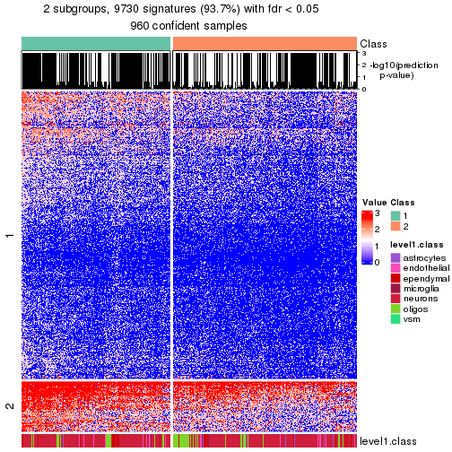</p>

</div>
<div id='tab-node-02-get-signatures-no-scale-2'>
<pre><code class="r">get_signatures(res, k = 3, scale_rows = FALSE)
</code></pre>

<p></p>

</div>
<div id='tab-node-02-get-signatures-no-scale-3'>
<pre><code class="r">get_signatures(res, k = 4, scale_rows = FALSE)
</code></pre>

<p></p>

</div>
</div>


Compare the overlap of signatures from different k:

```r
compare_signatures(res)
```


`get_signature()` returns a data frame invisibly. To get the list of signatures, the function
call should be assigned to a variable explicitly. In following code, if `plot` argument is set
to `FALSE`, no heatmap is plotted while only the differential analysis is performed.

```r
# code only for demonstration
tb = get_signature(res, k = ..., plot = FALSE)
```

An example of the output of `tb` is:

```
#>   which_row         fdr    mean_1    mean_2 scaled_mean_1 scaled_mean_2 km
#> 1        38 0.042760348  8.373488  9.131774    -0.5533452     0.5164555  1
#> 2        40 0.018707592  7.106213  8.469186    -0.6173731     0.5762149  1
#> 3        55 0.019134737 10.221463 11.207825    -0.6159697     0.5749050  1
#> 4        59 0.006059896  5.921854  7.869574    -0.6899429     0.6439467  1
#> 5        60 0.018055526  8.928898 10.211722    -0.6204761     0.5791110  1
#> 6        98 0.009384629 15.714769 14.887706     0.6635654    -0.6193277  2
...
```

The columns in `tb` are:

1. `which_row`: row indices corresponding to the input matrix.
2. `fdr`: FDR for the differential test. 
3. `mean_x`: The mean value in group x.
4. `scaled_mean_x`: The mean value in group x after rows are scaled.
5. `km`: Row groups if k-means clustering is applied to rows (which is done by automatically selecting number of clusters).

If there are too many signatures, `top_signatures = ...` can be set to only show the 
signatures with the highest FDRs:

```r
# code only for demonstration
# e.g. to show the top 500 most significant rows
tb = get_signature(res, k = ..., top_signatures = 500)
```

If the signatures are defined as these which are uniquely high in current group, `diff_method` argument
can be set to `"uniquely_high_in_one_group"`:

```r
# code only for demonstration
tb = get_signature(res, k = ..., diff_method = "uniquely_high_in_one_group")
```


UMAP plot which shows how samples are separated.


<script>
$( function() {
	$( '#tabs-node-02-dimension-reduction' ).tabs();
} );
</script>
<div id='tabs-node-02-dimension-reduction'>
<ul>
<li><a href='#tab-node-02-dimension-reduction-1'>k = 2</a></li>
<li><a href='#tab-node-02-dimension-reduction-2'>k = 3</a></li>
<li><a href='#tab-node-02-dimension-reduction-3'>k = 4</a></li>
</ul>
<div id='tab-node-02-dimension-reduction-1'>
<pre><code class="r">dimension_reduction(res, k = 2, method = &quot;UMAP&quot;)
</code></pre>

<p></p>

</div>
<div id='tab-node-02-dimension-reduction-2'>
<pre><code class="r">dimension_reduction(res, k = 3, method = &quot;UMAP&quot;)
</code></pre>

<p></p>

</div>
<div id='tab-node-02-dimension-reduction-3'>
<pre><code class="r">dimension_reduction(res, k = 4, method = &quot;UMAP&quot;)
</code></pre>

<p></p>

</div>
</div>


Following heatmap shows how subgroups are split when increasing `k`:

```r
collect_classes(res)
```


Test correlation between subgroups and known annotations. If the known
annotation is numeric, one-way ANOVA test is applied, and if the known
annotation is discrete, chi-squared contingency table test is applied.

```r
test_to_known_factors(res)
```

```
#>             n_sample level1.class(p-value) k
#> ATC:skmeans      590              7.23e-08 2
#> ATC:skmeans      526              2.08e-04 3
#> ATC:skmeans      542              4.67e-06 4
```


If matrix rows can be associated to genes, consider to use `functional_enrichment(res,
...)` to perform function enrichment for the signature genes. See [this vignette](https://jokergoo.github.io/cola_vignettes/functional_enrichment.html) for more detailed explanations.


 

---------------------------------------------------


### Node021


Parent node: [Node02](#Node02).
Child nodes: 
                Node0111-leaf
        ,
                Node0112-leaf
        ,
                [Node0113](#Node0113)
        ,
                [Node0121](#Node0121)
        ,
                [Node0122](#Node0122)
        ,
                [Node0123](#Node0123)
        ,
                Node0131-leaf
        ,
                Node0132-leaf
        ,
                Node0141-leaf
        ,
                Node0142-leaf
        ,
                Node0143-leaf
        ,
                [Node0211](#Node0211)
        ,
                [Node0212](#Node0212)
        ,
                Node0221-leaf
        ,
                [Node0222](#Node0222)
        ,
                Node0223-leaf
        ,
                Node0231-leaf
        ,
                Node0232-leaf
        ,
                Node0233-leaf
        ,
                Node0234-leaf
        ,
                [Node0311](#Node0311)
        ,
                [Node0312](#Node0312)
        ,
                Node0313-leaf
        ,
                Node0321-leaf
        ,
                Node0322-leaf
        ,
                Node0323-leaf
        ,
                Node0324-leaf
        ,
                Node0331-leaf
        ,
                Node0332-leaf
        ,
                Node0333-leaf
        .


The object with results only for a single top-value method and a single partitioning method 
can be extracted as:

```r
res = res_rh["021"]
```

A summary of `res` and all the functions that can be applied to it:

```r
res
```

```
#> A 'ConsensusPartition' object with k = 2, 3, 4.
#>   On a matrix with 9688 rows and 386 columns.
#>   Top rows (969) are extracted by 'ATC' method.
#>   Subgroups are detected by 'skmeans' method.
#>   Performed in total 150 partitions by row resampling.
#>   Best k for subgroups seems to be 3.
#> 
#> Following methods can be applied to this 'ConsensusPartition' object:
#>  [1] "cola_report"             "collect_classes"         "collect_plots"          
#>  [4] "collect_stats"           "colnames"                "compare_partitions"     
#>  [7] "compare_signatures"      "consensus_heatmap"       "dimension_reduction"    
#> [10] "functional_enrichment"   "get_anno_col"            "get_anno"               
#> [13] "get_classes"             "get_consensus"           "get_matrix"             
#> [16] "get_membership"          "get_param"               "get_signatures"         
#> [19] "get_stats"               "is_best_k"               "is_stable_k"            
#> [22] "membership_heatmap"      "ncol"                    "nrow"                   
#> [25] "plot_ecdf"               "predict_classes"         "rownames"               
#> [28] "select_partition_number" "show"                    "suggest_best_k"         
#> [31] "test_to_known_factors"   "top_rows_heatmap"
```

`collect_plots()` function collects all the plots made from `res` for all `k` (number of subgroups)
into one single page to provide an easy and fast comparison between different `k`.

```r
collect_plots(res)
```


The plots are:

- The first row: a plot of the eCDF (empirical cumulative distribution
  function) curves of the consensus matrix for each `k` and the heatmap of
  predicted classes for each `k`.
- The second row: heatmaps of the consensus matrix for each `k`.
- The third row: heatmaps of the membership matrix for each `k`.
- The fouth row: heatmaps of the signatures for each `k`.

All the plots in panels can be made by individual functions and they are
plotted later in this section.

`select_partition_number()` produces several plots showing different
statistics for choosing "optimized" `k`. There are following statistics:

- eCDF curves of the consensus matrix for each `k`;
- 1-PAC. [The PAC score](https://en.wikipedia.org/wiki/Consensus_clustering#Over-interpretation_potential_of_consensus_clustering)
  measures the proportion of the ambiguous subgrouping.
- Mean silhouette score.
- Concordance. The mean probability of fiting the consensus subgroup labels in all
  partitions.
- Area increased. Denote $A_k$ as the area under the eCDF curve for current
  `k`, the area increased is defined as $A_k - A_{k-1}$.
- Rand index. The percent of pairs of samples that are both in a same cluster
  or both are not in a same cluster in the partition of k and k-1.
- Jaccard index. The ratio of pairs of samples are both in a same cluster in
  the partition of k and k-1 and the pairs of samples are both in a same
  cluster in the partition k or k-1.

The detailed explanations of these statistics can be found in [the _cola_
vignette](https://jokergoo.github.io/cola_vignettes/cola.html#toc_13).

Generally speaking, higher 1-PAC score, higher mean silhouette score or higher
concordance corresponds to better partition. Rand index and Jaccard index
measure how similar the current partition is compared to partition with `k-1`.
If they are too similar, we won't accept `k` is better than `k-1`.

```r
select_partition_number(res)
```


The numeric values for all these statistics can be obtained by `get_stats()`.

```r
get_stats(res)
```

```
#>   k 1-PAC mean_silhouette concordance area_increased  Rand Jaccard
#> 2 2 1.000           0.970       0.988         0.4999 0.501   0.501
#> 3 3 0.941           0.944       0.976         0.2689 0.824   0.663
#> 4 4 0.820           0.863       0.926         0.0885 0.940   0.836
```

`suggest_best_k()` suggests the best $k$ based on these statistics. The rules are as follows:

- All $k$ with Jaccard index larger than 0.95 are removed because increasing
  $k$ does not provide enough extra information. If all $k$ are removed, it is
  marked as no subgroup is detected.
- For all $k$ with 1-PAC score larger than 0.9, the maximal $k$ is taken as
  the best $k$, and other $k$ are marked as optional $k$.
- If it does not fit the second rule. The $k$ with the maximal vote of the
  highest 1-PAC score, highest mean silhouette, and highest concordance is
  taken as the best $k$.

```r
suggest_best_k(res)
```

```
#> [1] 3
#> attr(,"optional")
#> [1] 2
```

There is also optional best $k$ = 2 that is worth to check.

Following is the table of the partitions (You need to click the **show/hide
code output** link to see it). The membership matrix (columns with name `p*`)
is inferred by
[`clue::cl_consensus()`](https://www.rdocumentation.org/link/cl_consensus?package=clue)
function with the `SE` method. Basically the value in the membership matrix
represents the probability to belong to a certain group. The finall subgroup
label for an item is determined with the group with highest probability it
belongs to.

In `get_classes()` function, the entropy is calculated from the membership
matrix and the silhouette score is calculated from the consensus matrix.


<script>
$( function() {
	$( '#tabs-node-021-get-classes' ).tabs();
} );
</script>
<div id='tabs-node-021-get-classes'>
<ul>
<li><a href='#tab-node-021-get-classes-1'>k = 2</a></li>
<li><a href='#tab-node-021-get-classes-2'>k = 3</a></li>
<li><a href='#tab-node-021-get-classes-3'>k = 4</a></li>
</ul>

<div id='tab-node-021-get-classes-1'>
<p><a id='tab-node-021-get-classes-1-a' style='color:#0366d6' href='#'>show/hide code output</a></p>
<pre><code class="r">cbind(get_classes(res, k = 2), get_membership(res, k = 2))
</code></pre>

<pre><code>#&gt;     class entropy silhouette   p1   p2
#&gt; 1       2   0.000      0.987 0.00 1.00
#&gt; 2       2   0.000      0.987 0.00 1.00
#&gt; 3       1   0.000      0.988 1.00 0.00
#&gt; 4       2   0.000      0.987 0.00 1.00
#&gt; 5       1   0.000      0.988 1.00 0.00
#&gt; 6       1   0.958      0.389 0.62 0.38
#&gt; 7       2   0.000      0.987 0.00 1.00
#&gt; 8       1   0.000      0.988 1.00 0.00
#&gt; 9       1   0.000      0.988 1.00 0.00
#&gt; 10      1   0.000      0.988 1.00 0.00
#&gt; 11      2   0.000      0.987 0.00 1.00
#&gt; 12      2   0.000      0.987 0.00 1.00
#&gt; 13      2   0.000      0.987 0.00 1.00
#&gt; 14      2   0.990      0.215 0.44 0.56
#&gt; 15      2   0.000      0.987 0.00 1.00
#&gt; 16      1   0.000      0.988 1.00 0.00
#&gt; 17      1   0.000      0.988 1.00 0.00
#&gt; 18      1   0.000      0.988 1.00 0.00
#&gt; 19      2   0.000      0.987 0.00 1.00
#&gt; 20      2   0.000      0.987 0.00 1.00
#&gt; 21      2   0.000      0.987 0.00 1.00
#&gt; 22      1   0.000      0.988 1.00 0.00
#&gt; 23      2   0.000      0.987 0.00 1.00
#&gt; 24      2   0.000      0.987 0.00 1.00
#&gt; 25      1   0.000      0.988 1.00 0.00
#&gt; 26      2   0.000      0.987 0.00 1.00
#&gt; 27      2   0.000      0.987 0.00 1.00
#&gt; 28      2   0.000      0.987 0.00 1.00
#&gt; 29      2   0.000      0.987 0.00 1.00
#&gt; 30      2   0.000      0.987 0.00 1.00
#&gt; 31      1   0.000      0.988 1.00 0.00
#&gt; 32      2   0.000      0.987 0.00 1.00
#&gt; 33      2   0.000      0.987 0.00 1.00
#&gt; 34      1   0.000      0.988 1.00 0.00
#&gt; 35      1   0.000      0.988 1.00 0.00
#&gt; 36      1   0.000      0.988 1.00 0.00
#&gt; 37      2   0.000      0.987 0.00 1.00
#&gt; 38      2   0.000      0.987 0.00 1.00
#&gt; 39      1   0.000      0.988 1.00 0.00
#&gt; 40      2   0.000      0.987 0.00 1.00
#&gt; 41      1   0.000      0.988 1.00 0.00
#&gt; 42      2   0.000      0.987 0.00 1.00
#&gt; 43      2   0.000      0.987 0.00 1.00
#&gt; 44      2   0.000      0.987 0.00 1.00
#&gt; 45      1   0.000      0.988 1.00 0.00
#&gt; 46      1   0.000      0.988 1.00 0.00
#&gt; 47      1   0.000      0.988 1.00 0.00
#&gt; 48      2   0.000      0.987 0.00 1.00
#&gt; 49      1   0.000      0.988 1.00 0.00
#&gt; 50      2   0.000      0.987 0.00 1.00
#&gt; 51      1   0.000      0.988 1.00 0.00
#&gt; 52      1   0.000      0.988 1.00 0.00
#&gt; 53      1   0.000      0.988 1.00 0.00
#&gt; 54      1   0.000      0.988 1.00 0.00
#&gt; 55      1   0.000      0.988 1.00 0.00
#&gt; 56      2   0.000      0.987 0.00 1.00
#&gt; 57      2   0.000      0.987 0.00 1.00
#&gt; 58      2   0.000      0.987 0.00 1.00
#&gt; 59      2   0.000      0.987 0.00 1.00
#&gt; 60      2   0.925      0.487 0.34 0.66
#&gt; 61      2   0.000      0.987 0.00 1.00
#&gt; 62      2   0.000      0.987 0.00 1.00
#&gt; 63      1   0.000      0.988 1.00 0.00
#&gt; 64      1   0.000      0.988 1.00 0.00
#&gt; 65      2   0.000      0.987 0.00 1.00
#&gt; 66      1   0.000      0.988 1.00 0.00
#&gt; 67      1   0.958      0.391 0.62 0.38
#&gt; 68      2   0.000      0.987 0.00 1.00
#&gt; 69      2   0.000      0.987 0.00 1.00
#&gt; 70      2   0.000      0.987 0.00 1.00
#&gt; 71      1   0.000      0.988 1.00 0.00
#&gt; 72      2   0.000      0.987 0.00 1.00
#&gt; 73      2   0.000      0.987 0.00 1.00
#&gt; 74      2   0.141      0.969 0.02 0.98
#&gt; 75      1   0.000      0.988 1.00 0.00
#&gt; 76      2   0.000      0.987 0.00 1.00
#&gt; 77      2   0.000      0.987 0.00 1.00
#&gt; 78      1   0.000      0.988 1.00 0.00
#&gt; 79      1   0.000      0.988 1.00 0.00
#&gt; 80      1   0.000      0.988 1.00 0.00
#&gt; 81      1   0.000      0.988 1.00 0.00
#&gt; 82      2   0.000      0.987 0.00 1.00
#&gt; 83      2   0.000      0.987 0.00 1.00
#&gt; 84      2   0.000      0.987 0.00 1.00
#&gt; 85      1   0.000      0.988 1.00 0.00
#&gt; 86      2   0.000      0.987 0.00 1.00
#&gt; 87      2   0.000      0.987 0.00 1.00
#&gt; 88      2   0.000      0.987 0.00 1.00
#&gt; 89      2   0.000      0.987 0.00 1.00
#&gt; 90      1   0.000      0.988 1.00 0.00
#&gt; 91      1   0.000      0.988 1.00 0.00
#&gt; 92      1   0.000      0.988 1.00 0.00
#&gt; 93      1   0.000      0.988 1.00 0.00
#&gt; 94      2   0.000      0.987 0.00 1.00
#&gt; 95      2   0.000      0.987 0.00 1.00
#&gt; 96      2   0.000      0.987 0.00 1.00
#&gt; 97      1   0.000      0.988 1.00 0.00
#&gt; 98      1   0.000      0.988 1.00 0.00
#&gt; 99      1   0.000      0.988 1.00 0.00
#&gt; 100     2   0.000      0.987 0.00 1.00
#&gt; 101     2   0.000      0.987 0.00 1.00
#&gt; 102     1   0.000      0.988 1.00 0.00
#&gt; 103     2   0.000      0.987 0.00 1.00
#&gt; 104     2   0.000      0.987 0.00 1.00
#&gt; 105     2   0.000      0.987 0.00 1.00
#&gt; 106     2   0.000      0.987 0.00 1.00
#&gt; 107     1   0.000      0.988 1.00 0.00
#&gt; 108     1   0.000      0.988 1.00 0.00
#&gt; 109     1   0.000      0.988 1.00 0.00
#&gt; 110     1   0.402      0.907 0.92 0.08
#&gt; 111     1   0.000      0.988 1.00 0.00
#&gt; 112     1   0.000      0.988 1.00 0.00
#&gt; 113     1   0.000      0.988 1.00 0.00
#&gt; 114     2   0.000      0.987 0.00 1.00
#&gt; 115     2   0.000      0.987 0.00 1.00
#&gt; 116     2   0.000      0.987 0.00 1.00
#&gt; 117     2   0.000      0.987 0.00 1.00
#&gt; 118     2   0.000      0.987 0.00 1.00
#&gt; 119     2   0.000      0.987 0.00 1.00
#&gt; 120     2   0.000      0.987 0.00 1.00
#&gt; 121     2   0.000      0.987 0.00 1.00
#&gt; 122     2   0.000      0.987 0.00 1.00
#&gt; 123     2   0.000      0.987 0.00 1.00
#&gt; 124     2   0.000      0.987 0.00 1.00
#&gt; 125     2   0.000      0.987 0.00 1.00
#&gt; 126     2   0.000      0.987 0.00 1.00
#&gt; 127     1   0.000      0.988 1.00 0.00
#&gt; 128     1   0.000      0.988 1.00 0.00
#&gt; 129     2   0.000      0.987 0.00 1.00
#&gt; 130     1   0.000      0.988 1.00 0.00
#&gt; 131     1   0.000      0.988 1.00 0.00
#&gt; 132     1   0.000      0.988 1.00 0.00
#&gt; 133     1   0.000      0.988 1.00 0.00
#&gt; 134     1   0.000      0.988 1.00 0.00
#&gt; 135     1   0.000      0.988 1.00 0.00
#&gt; 136     2   0.000      0.987 0.00 1.00
#&gt; 137     2   0.000      0.987 0.00 1.00
#&gt; 138     2   0.000      0.987 0.00 1.00
#&gt; 139     2   0.000      0.987 0.00 1.00
#&gt; 140     1   0.000      0.988 1.00 0.00
#&gt; 141     1   0.000      0.988 1.00 0.00
#&gt; 142     2   0.925      0.489 0.34 0.66
#&gt; 143     2   0.000      0.987 0.00 1.00
#&gt; 144     1   0.141      0.969 0.98 0.02
#&gt; 145     1   0.000      0.988 1.00 0.00
#&gt; 146     1   0.000      0.988 1.00 0.00
#&gt; 147     2   0.000      0.987 0.00 1.00
#&gt; 148     2   0.469      0.883 0.10 0.90
#&gt; 149     2   0.000      0.987 0.00 1.00
#&gt; 150     2   0.000      0.987 0.00 1.00
#&gt; 151     2   0.000      0.987 0.00 1.00
#&gt; 152     2   0.000      0.987 0.00 1.00
#&gt; 153     2   0.000      0.987 0.00 1.00
#&gt; 154     1   0.000      0.988 1.00 0.00
#&gt; 155     2   0.000      0.987 0.00 1.00
#&gt; 156     2   0.000      0.987 0.00 1.00
#&gt; 157     1   0.000      0.988 1.00 0.00
#&gt; 158     2   0.000      0.987 0.00 1.00
#&gt; 159     1   0.584      0.835 0.86 0.14
#&gt; 160     2   0.000      0.987 0.00 1.00
#&gt; 161     2   0.000      0.987 0.00 1.00
#&gt; 162     2   0.000      0.987 0.00 1.00
#&gt; 163     1   0.000      0.988 1.00 0.00
#&gt; 164     2   0.000      0.987 0.00 1.00
#&gt; 165     2   0.141      0.969 0.02 0.98
#&gt; 166     2   0.000      0.987 0.00 1.00
#&gt; 167     1   0.000      0.988 1.00 0.00
#&gt; 168     1   0.000      0.988 1.00 0.00
#&gt; 169     2   0.469      0.884 0.10 0.90
#&gt; 170     2   0.000      0.987 0.00 1.00
#&gt; 171     2   0.881      0.573 0.30 0.70
#&gt; 172     2   0.000      0.987 0.00 1.00
#&gt; 173     2   0.000      0.987 0.00 1.00
#&gt; 174     1   0.000      0.988 1.00 0.00
#&gt; 175     1   0.000      0.988 1.00 0.00
#&gt; 176     2   0.000      0.987 0.00 1.00
#&gt; 177     2   0.000      0.987 0.00 1.00
#&gt; 178     2   0.000      0.987 0.00 1.00
#&gt; 179     2   0.000      0.987 0.00 1.00
#&gt; 180     2   0.000      0.987 0.00 1.00
#&gt; 181     1   0.000      0.988 1.00 0.00
#&gt; 182     1   0.000      0.988 1.00 0.00
#&gt; 183     2   0.000      0.987 0.00 1.00
#&gt; 184     2   0.000      0.987 0.00 1.00
#&gt; 185     2   0.000      0.987 0.00 1.00
#&gt; 186     1   0.000      0.988 1.00 0.00
#&gt; 187     2   0.000      0.987 0.00 1.00
#&gt; 188     2   0.000      0.987 0.00 1.00
#&gt; 189     2   0.000      0.987 0.00 1.00
#&gt; 190     1   0.000      0.988 1.00 0.00
#&gt; 191     2   0.000      0.987 0.00 1.00
#&gt; 192     2   0.000      0.987 0.00 1.00
#&gt; 193     2   0.000      0.987 0.00 1.00
#&gt; 194     2   0.529      0.859 0.12 0.88
#&gt; 195     1   0.958      0.389 0.62 0.38
#&gt; 196     1   0.000      0.988 1.00 0.00
#&gt; 197     2   0.000      0.987 0.00 1.00
#&gt; 198     2   0.000      0.987 0.00 1.00
#&gt; 199     2   0.000      0.987 0.00 1.00
#&gt; 200     2   0.000      0.987 0.00 1.00
#&gt; 201     1   0.000      0.988 1.00 0.00
#&gt; 202     2   0.000      0.987 0.00 1.00
#&gt; 203     1   0.000      0.988 1.00 0.00
#&gt; 204     1   0.000      0.988 1.00 0.00
#&gt; 205     2   0.000      0.987 0.00 1.00
#&gt; 206     2   0.000      0.987 0.00 1.00
#&gt; 207     2   0.000      0.987 0.00 1.00
#&gt; 208     1   0.000      0.988 1.00 0.00
#&gt; 209     2   0.000      0.987 0.00 1.00
#&gt; 210     2   0.000      0.987 0.00 1.00
#&gt; 211     2   0.000      0.987 0.00 1.00
#&gt; 212     2   0.000      0.987 0.00 1.00
#&gt; 213     2   0.000      0.987 0.00 1.00
#&gt; 214     2   0.000      0.987 0.00 1.00
#&gt; 215     2   0.000      0.987 0.00 1.00
#&gt; 216     2   0.000      0.987 0.00 1.00
#&gt; 217     2   0.000      0.987 0.00 1.00
#&gt; 218     1   0.000      0.988 1.00 0.00
#&gt; 219     2   0.000      0.987 0.00 1.00
#&gt; 220     2   0.000      0.987 0.00 1.00
#&gt; 221     1   0.584      0.835 0.86 0.14
#&gt; 222     2   0.000      0.987 0.00 1.00
#&gt; 223     2   0.000      0.987 0.00 1.00
#&gt; 224     2   0.795      0.685 0.24 0.76
#&gt; 225     2   0.000      0.987 0.00 1.00
#&gt; 226     2   0.000      0.987 0.00 1.00
#&gt; 227     2   0.141      0.969 0.02 0.98
#&gt; 228     2   0.000      0.987 0.00 1.00
#&gt; 229     2   0.000      0.987 0.00 1.00
#&gt; 230     2   0.000      0.987 0.00 1.00
#&gt; 231     2   0.000      0.987 0.00 1.00
#&gt; 232     2   0.000      0.987 0.00 1.00
#&gt; 233     2   0.000      0.987 0.00 1.00
#&gt; 234     2   0.000      0.987 0.00 1.00
#&gt; 235     2   0.000      0.987 0.00 1.00
#&gt; 236     1   0.000      0.988 1.00 0.00
#&gt; 237     2   0.000      0.987 0.00 1.00
#&gt; 238     2   0.000      0.987 0.00 1.00
#&gt; 239     2   0.000      0.987 0.00 1.00
#&gt; 240     1   0.000      0.988 1.00 0.00
#&gt; 241     2   0.000      0.987 0.00 1.00
#&gt; 242     2   0.000      0.987 0.00 1.00
#&gt; 243     2   0.995      0.149 0.46 0.54
#&gt; 244     1   0.000      0.988 1.00 0.00
#&gt; 245     2   0.000      0.987 0.00 1.00
#&gt; 246     2   0.000      0.987 0.00 1.00
#&gt; 247     2   0.000      0.987 0.00 1.00
#&gt; 248     2   0.000      0.987 0.00 1.00
#&gt; 249     2   0.000      0.987 0.00 1.00
#&gt; 250     2   0.242      0.949 0.04 0.96
#&gt; 251     2   0.000      0.987 0.00 1.00
#&gt; 252     1   0.000      0.988 1.00 0.00
#&gt; 253     2   0.000      0.987 0.00 1.00
#&gt; 254     2   0.000      0.987 0.00 1.00
#&gt; 255     1   0.881      0.574 0.70 0.30
#&gt; 256     2   0.000      0.987 0.00 1.00
#&gt; 257     2   0.000      0.987 0.00 1.00
#&gt; 258     2   0.000      0.987 0.00 1.00
#&gt; 259     1   0.000      0.988 1.00 0.00
#&gt; 260     2   0.000      0.987 0.00 1.00
#&gt; 261     1   0.795      0.686 0.76 0.24
#&gt; 262     2   0.000      0.987 0.00 1.00
#&gt; 263     1   0.000      0.988 1.00 0.00
#&gt; 264     2   0.000      0.987 0.00 1.00
#&gt; 265     1   0.000      0.988 1.00 0.00
#&gt; 266     2   0.000      0.987 0.00 1.00
#&gt; 267     2   0.000      0.987 0.00 1.00
#&gt; 268     1   0.000      0.988 1.00 0.00
#&gt; 269     2   0.000      0.987 0.00 1.00
#&gt; 270     2   0.000      0.987 0.00 1.00
#&gt; 271     1   0.000      0.988 1.00 0.00
#&gt; 272     2   0.000      0.987 0.00 1.00
#&gt; 273     2   0.000      0.987 0.00 1.00
#&gt; 274     1   0.000      0.988 1.00 0.00
#&gt; 275     1   0.000      0.988 1.00 0.00
#&gt; 276     1   0.000      0.988 1.00 0.00
#&gt; 277     1   0.000      0.988 1.00 0.00
#&gt; 278     1   0.000      0.988 1.00 0.00
#&gt; 279     1   0.000      0.988 1.00 0.00
#&gt; 280     1   0.000      0.988 1.00 0.00
#&gt; 281     1   0.000      0.988 1.00 0.00
#&gt; 282     1   0.000      0.988 1.00 0.00
#&gt; 283     1   0.000      0.988 1.00 0.00
#&gt; 284     1   0.000      0.988 1.00 0.00
#&gt; 285     1   0.000      0.988 1.00 0.00
#&gt; 286     1   0.000      0.988 1.00 0.00
#&gt; 287     1   0.000      0.988 1.00 0.00
#&gt; 288     1   0.000      0.988 1.00 0.00
#&gt; 289     2   0.000      0.987 0.00 1.00
#&gt; 290     1   0.000      0.988 1.00 0.00
#&gt; 291     1   0.000      0.988 1.00 0.00
#&gt; 292     2   0.000      0.987 0.00 1.00
#&gt; 293     2   0.000      0.987 0.00 1.00
#&gt; 294     1   0.000      0.988 1.00 0.00
#&gt; 295     1   0.469      0.884 0.90 0.10
#&gt; 296     2   0.000      0.987 0.00 1.00
#&gt; 297     2   0.000      0.987 0.00 1.00
#&gt; 298     2   0.000      0.987 0.00 1.00
#&gt; 299     2   0.000      0.987 0.00 1.00
#&gt; 300     1   0.000      0.988 1.00 0.00
#&gt; 301     2   0.000      0.987 0.00 1.00
#&gt; 302     2   0.000      0.987 0.00 1.00
#&gt; 303     1   0.000      0.988 1.00 0.00
#&gt; 304     1   0.000      0.988 1.00 0.00
#&gt; 305     1   0.000      0.988 1.00 0.00
#&gt; 306     1   0.000      0.988 1.00 0.00
#&gt; 307     1   0.000      0.988 1.00 0.00
#&gt; 308     1   0.000      0.988 1.00 0.00
#&gt; 309     1   0.000      0.988 1.00 0.00
#&gt; 310     1   0.000      0.988 1.00 0.00
#&gt; 311     1   0.000      0.988 1.00 0.00
#&gt; 312     1   0.000      0.988 1.00 0.00
#&gt; 313     1   0.000      0.988 1.00 0.00
#&gt; 314     1   0.000      0.988 1.00 0.00
#&gt; 315     1   0.000      0.988 1.00 0.00
#&gt; 316     1   0.000      0.988 1.00 0.00
#&gt; 317     1   0.000      0.988 1.00 0.00
#&gt; 318     1   0.000      0.988 1.00 0.00
#&gt; 319     1   0.000      0.988 1.00 0.00
#&gt; 320     1   0.000      0.988 1.00 0.00
#&gt; 321     1   0.000      0.988 1.00 0.00
#&gt; 322     1   0.000      0.988 1.00 0.00
#&gt; 323     1   0.000      0.988 1.00 0.00
#&gt; 324     1   0.000      0.988 1.00 0.00
#&gt; 325     1   0.000      0.988 1.00 0.00
#&gt; 326     1   0.000      0.988 1.00 0.00
#&gt; 327     1   0.000      0.988 1.00 0.00
#&gt; 328     1   0.000      0.988 1.00 0.00
#&gt; 329     1   0.000      0.988 1.00 0.00
#&gt; 330     1   0.000      0.988 1.00 0.00
#&gt; 331     1   0.000      0.988 1.00 0.00
#&gt; 332     1   0.000      0.988 1.00 0.00
#&gt; 333     1   0.000      0.988 1.00 0.00
#&gt; 334     1   0.000      0.988 1.00 0.00
#&gt; 335     1   0.000      0.988 1.00 0.00
#&gt; 336     1   0.000      0.988 1.00 0.00
#&gt; 337     1   0.000      0.988 1.00 0.00
#&gt; 338     1   0.000      0.988 1.00 0.00
#&gt; 339     1   0.000      0.988 1.00 0.00
#&gt; 340     1   0.000      0.988 1.00 0.00
#&gt; 341     1   0.000      0.988 1.00 0.00
#&gt; 342     1   0.000      0.988 1.00 0.00
#&gt; 343     1   0.000      0.988 1.00 0.00
#&gt; 344     1   0.000      0.988 1.00 0.00
#&gt; 345     1   0.000      0.988 1.00 0.00
#&gt; 346     1   0.000      0.988 1.00 0.00
#&gt; 347     1   0.000      0.988 1.00 0.00
#&gt; 348     2   0.000      0.987 0.00 1.00
#&gt; 349     1   0.000      0.988 1.00 0.00
#&gt; 350     1   0.000      0.988 1.00 0.00
#&gt; 351     2   0.000      0.987 0.00 1.00
#&gt; 352     1   0.000      0.988 1.00 0.00
#&gt; 353     2   0.000      0.987 0.00 1.00
#&gt; 354     1   0.000      0.988 1.00 0.00
#&gt; 355     2   0.000      0.987 0.00 1.00
#&gt; 356     2   0.000      0.987 0.00 1.00
#&gt; 357     1   0.000      0.988 1.00 0.00
#&gt; 358     2   0.000      0.987 0.00 1.00
#&gt; 359     2   0.000      0.987 0.00 1.00
#&gt; 360     2   0.000      0.987 0.00 1.00
#&gt; 361     1   0.000      0.988 1.00 0.00
#&gt; 362     1   0.000      0.988 1.00 0.00
#&gt; 363     1   0.000      0.988 1.00 0.00
#&gt; 364     1   0.000      0.988 1.00 0.00
#&gt; 365     2   0.000      0.987 0.00 1.00
#&gt; 366     1   0.000      0.988 1.00 0.00
#&gt; 367     1   0.000      0.988 1.00 0.00
#&gt; 368     1   0.000      0.988 1.00 0.00
#&gt; 369     1   0.000      0.988 1.00 0.00
#&gt; 370     1   0.000      0.988 1.00 0.00
#&gt; 371     1   0.000      0.988 1.00 0.00
#&gt; 372     1   0.000      0.988 1.00 0.00
#&gt; 373     2   0.000      0.987 0.00 1.00
#&gt; 374     1   0.000      0.988 1.00 0.00
#&gt; 375     2   0.000      0.987 0.00 1.00
#&gt; 376     2   0.000      0.987 0.00 1.00
#&gt; 377     2   0.000      0.987 0.00 1.00
#&gt; 378     1   0.141      0.969 0.98 0.02
#&gt; 379     2   0.000      0.987 0.00 1.00
#&gt; 380     2   0.000      0.987 0.00 1.00
#&gt; 381     1   0.000      0.988 1.00 0.00
#&gt; 382     1   0.000      0.988 1.00 0.00
#&gt; 383     2   0.000      0.987 0.00 1.00
#&gt; 384     2   0.000      0.987 0.00 1.00
#&gt; 385     2   0.000      0.987 0.00 1.00
#&gt; 386     2   0.000      0.987 0.00 1.00
</code></pre>

<script>
$('#tab-node-021-get-classes-1-a').parent().next().next().hide();
$('#tab-node-021-get-classes-1-a').click(function(){
  $('#tab-node-021-get-classes-1-a').parent().next().next().toggle();
  return(false);
});
</script>
</div>

<div id='tab-node-021-get-classes-2'>
<p><a id='tab-node-021-get-classes-2-a' style='color:#0366d6' href='#'>show/hide code output</a></p>
<pre><code class="r">cbind(get_classes(res, k = 3), get_membership(res, k = 3))
</code></pre>

<pre><code>#&gt;     class entropy silhouette   p1   p2   p3
#&gt; 1       2  0.0000      0.992 0.00 1.00 0.00
#&gt; 2       2  0.0000      0.992 0.00 1.00 0.00
#&gt; 3       1  0.1529      0.935 0.96 0.00 0.04
#&gt; 4       2  0.0000      0.992 0.00 1.00 0.00
#&gt; 5       1  0.0000      0.969 1.00 0.00 0.00
#&gt; 6       1  0.4209      0.815 0.86 0.12 0.02
#&gt; 7       2  0.0000      0.992 0.00 1.00 0.00
#&gt; 8       1  0.0892      0.953 0.98 0.00 0.02
#&gt; 9       1  0.0000      0.969 1.00 0.00 0.00
#&gt; 10      1  0.1529      0.935 0.96 0.00 0.04
#&gt; 11      2  0.0000      0.992 0.00 1.00 0.00
#&gt; 12      2  0.0000      0.992 0.00 1.00 0.00
#&gt; 13      2  0.0000      0.992 0.00 1.00 0.00
#&gt; 14      1  0.8321      0.506 0.62 0.24 0.14
#&gt; 15      2  0.0000      0.992 0.00 1.00 0.00
#&gt; 16      1  0.4002      0.802 0.84 0.00 0.16
#&gt; 17      1  0.4291      0.778 0.82 0.00 0.18
#&gt; 18      1  0.5948      0.451 0.64 0.00 0.36
#&gt; 19      2  0.0000      0.992 0.00 1.00 0.00
#&gt; 20      2  0.0000      0.992 0.00 1.00 0.00
#&gt; 21      2  0.0000      0.992 0.00 1.00 0.00
#&gt; 22      1  0.5706      0.541 0.68 0.00 0.32
#&gt; 23      2  0.0000      0.992 0.00 1.00 0.00
#&gt; 24      2  0.0000      0.992 0.00 1.00 0.00
#&gt; 25      1  0.5560      0.579 0.70 0.00 0.30
#&gt; 26      2  0.0000      0.992 0.00 1.00 0.00
#&gt; 27      2  0.0000      0.992 0.00 1.00 0.00
#&gt; 28      2  0.0000      0.992 0.00 1.00 0.00
#&gt; 29      2  0.3340      0.861 0.00 0.88 0.12
#&gt; 30      2  0.0000      0.992 0.00 1.00 0.00
#&gt; 31      1  0.0892      0.953 0.98 0.00 0.02
#&gt; 32      2  0.0000      0.992 0.00 1.00 0.00
#&gt; 33      2  0.5397      0.611 0.00 0.72 0.28
#&gt; 34      3  0.2959      0.866 0.10 0.00 0.90
#&gt; 35      3  0.0000      0.945 0.00 0.00 1.00
#&gt; 36      3  0.0000      0.945 0.00 0.00 1.00
#&gt; 37      2  0.0000      0.992 0.00 1.00 0.00
#&gt; 38      2  0.0000      0.992 0.00 1.00 0.00
#&gt; 39      3  0.0000      0.945 0.00 0.00 1.00
#&gt; 40      2  0.0000      0.992 0.00 1.00 0.00
#&gt; 41      3  0.0000      0.945 0.00 0.00 1.00
#&gt; 42      2  0.0000      0.992 0.00 1.00 0.00
#&gt; 43      2  0.0000      0.992 0.00 1.00 0.00
#&gt; 44      2  0.0000      0.992 0.00 1.00 0.00
#&gt; 45      1  0.0000      0.969 1.00 0.00 0.00
#&gt; 46      1  0.0892      0.953 0.98 0.00 0.02
#&gt; 47      1  0.0000      0.969 1.00 0.00 0.00
#&gt; 48      2  0.0000      0.992 0.00 1.00 0.00
#&gt; 49      1  0.0000      0.969 1.00 0.00 0.00
#&gt; 50      2  0.0000      0.992 0.00 1.00 0.00
#&gt; 51      3  0.0000      0.945 0.00 0.00 1.00
#&gt; 52      1  0.0000      0.969 1.00 0.00 0.00
#&gt; 53      1  0.0000      0.969 1.00 0.00 0.00
#&gt; 54      3  0.0000      0.945 0.00 0.00 1.00
#&gt; 55      3  0.0892      0.932 0.02 0.00 0.98
#&gt; 56      2  0.0000      0.992 0.00 1.00 0.00
#&gt; 57      2  0.0000      0.992 0.00 1.00 0.00
#&gt; 58      3  0.5706      0.534 0.00 0.32 0.68
#&gt; 59      2  0.2959      0.886 0.00 0.90 0.10
#&gt; 60      3  0.3340      0.828 0.00 0.12 0.88
#&gt; 61      2  0.0000      0.992 0.00 1.00 0.00
#&gt; 62      2  0.0000      0.992 0.00 1.00 0.00
#&gt; 63      3  0.0000      0.945 0.00 0.00 1.00
#&gt; 64      3  0.0000      0.945 0.00 0.00 1.00
#&gt; 65      2  0.0000      0.992 0.00 1.00 0.00
#&gt; 66      1  0.4002      0.802 0.84 0.00 0.16
#&gt; 67      3  0.6500      0.737 0.14 0.10 0.76
#&gt; 68      2  0.0000      0.992 0.00 1.00 0.00
#&gt; 69      2  0.0000      0.992 0.00 1.00 0.00
#&gt; 70      2  0.3340      0.861 0.12 0.88 0.00
#&gt; 71      3  0.0000      0.945 0.00 0.00 1.00
#&gt; 72      2  0.0000      0.992 0.00 1.00 0.00
#&gt; 73      3  0.0000      0.945 0.00 0.00 1.00
#&gt; 74      2  0.4796      0.716 0.00 0.78 0.22
#&gt; 75      3  0.0000      0.945 0.00 0.00 1.00
#&gt; 76      2  0.0000      0.992 0.00 1.00 0.00
#&gt; 77      2  0.0000      0.992 0.00 1.00 0.00
#&gt; 78      3  0.0000      0.945 0.00 0.00 1.00
#&gt; 79      1  0.2959      0.874 0.90 0.00 0.10
#&gt; 80      3  0.2066      0.902 0.06 0.00 0.94
#&gt; 81      3  0.0000      0.945 0.00 0.00 1.00
#&gt; 82      2  0.0000      0.992 0.00 1.00 0.00
#&gt; 83      2  0.0000      0.992 0.00 1.00 0.00
#&gt; 84      2  0.0000      0.992 0.00 1.00 0.00
#&gt; 85      3  0.0000      0.945 0.00 0.00 1.00
#&gt; 86      2  0.0000      0.992 0.00 1.00 0.00
#&gt; 87      2  0.0000      0.992 0.00 1.00 0.00
#&gt; 88      2  0.0000      0.992 0.00 1.00 0.00
#&gt; 89      2  0.0000      0.992 0.00 1.00 0.00
#&gt; 90      1  0.5835      0.494 0.66 0.00 0.34
#&gt; 91      3  0.0000      0.945 0.00 0.00 1.00
#&gt; 92      3  0.0000      0.945 0.00 0.00 1.00
#&gt; 93      3  0.0000      0.945 0.00 0.00 1.00
#&gt; 94      2  0.0000      0.992 0.00 1.00 0.00
#&gt; 95      2  0.0000      0.992 0.00 1.00 0.00
#&gt; 96      2  0.0000      0.992 0.00 1.00 0.00
#&gt; 97      1  0.0000      0.969 1.00 0.00 0.00
#&gt; 98      3  0.0000      0.945 0.00 0.00 1.00
#&gt; 99      3  0.0000      0.945 0.00 0.00 1.00
#&gt; 100     2  0.0000      0.992 0.00 1.00 0.00
#&gt; 101     2  0.0000      0.992 0.00 1.00 0.00
#&gt; 102     3  0.0000      0.945 0.00 0.00 1.00
#&gt; 103     2  0.0000      0.992 0.00 1.00 0.00
#&gt; 104     3  0.4002      0.782 0.00 0.16 0.84
#&gt; 105     2  0.0000      0.992 0.00 1.00 0.00
#&gt; 106     2  0.0000      0.992 0.00 1.00 0.00
#&gt; 107     3  0.0000      0.945 0.00 0.00 1.00
#&gt; 108     3  0.0000      0.945 0.00 0.00 1.00
#&gt; 109     1  0.0000      0.969 1.00 0.00 0.00
#&gt; 110     3  0.0000      0.945 0.00 0.00 1.00
#&gt; 111     3  0.0000      0.945 0.00 0.00 1.00
#&gt; 112     3  0.5835      0.497 0.34 0.00 0.66
#&gt; 113     3  0.0000      0.945 0.00 0.00 1.00
#&gt; 114     2  0.0000      0.992 0.00 1.00 0.00
#&gt; 115     2  0.0000      0.992 0.00 1.00 0.00
#&gt; 116     2  0.0000      0.992 0.00 1.00 0.00
#&gt; 117     2  0.0000      0.992 0.00 1.00 0.00
#&gt; 118     2  0.0000      0.992 0.00 1.00 0.00
#&gt; 119     2  0.0000      0.992 0.00 1.00 0.00
#&gt; 120     2  0.0000      0.992 0.00 1.00 0.00
#&gt; 121     2  0.0000      0.992 0.00 1.00 0.00
#&gt; 122     2  0.0000      0.992 0.00 1.00 0.00
#&gt; 123     2  0.0000      0.992 0.00 1.00 0.00
#&gt; 124     2  0.0000      0.992 0.00 1.00 0.00
#&gt; 125     2  0.0000      0.992 0.00 1.00 0.00
#&gt; 126     2  0.0000      0.992 0.00 1.00 0.00
#&gt; 127     3  0.0000      0.945 0.00 0.00 1.00
#&gt; 128     3  0.0000      0.945 0.00 0.00 1.00
#&gt; 129     2  0.0000      0.992 0.00 1.00 0.00
#&gt; 130     3  0.0000      0.945 0.00 0.00 1.00
#&gt; 131     3  0.3686      0.826 0.14 0.00 0.86
#&gt; 132     3  0.4002      0.802 0.16 0.00 0.84
#&gt; 133     3  0.0000      0.945 0.00 0.00 1.00
#&gt; 134     3  0.0000      0.945 0.00 0.00 1.00
#&gt; 135     3  0.0000      0.945 0.00 0.00 1.00
#&gt; 136     2  0.0000      0.992 0.00 1.00 0.00
#&gt; 137     2  0.0000      0.992 0.00 1.00 0.00
#&gt; 138     2  0.0000      0.992 0.00 1.00 0.00
#&gt; 139     3  0.6302      0.083 0.00 0.48 0.52
#&gt; 140     3  0.0000      0.945 0.00 0.00 1.00
#&gt; 141     3  0.0892      0.932 0.02 0.00 0.98
#&gt; 142     3  0.0000      0.945 0.00 0.00 1.00
#&gt; 143     2  0.0000      0.992 0.00 1.00 0.00
#&gt; 144     3  0.0000      0.945 0.00 0.00 1.00
#&gt; 145     3  0.3686      0.826 0.14 0.00 0.86
#&gt; 146     3  0.0000      0.945 0.00 0.00 1.00
#&gt; 147     2  0.0000      0.992 0.00 1.00 0.00
#&gt; 148     3  0.0000      0.945 0.00 0.00 1.00
#&gt; 149     2  0.0000      0.992 0.00 1.00 0.00
#&gt; 150     2  0.0000      0.992 0.00 1.00 0.00
#&gt; 151     2  0.0000      0.992 0.00 1.00 0.00
#&gt; 152     2  0.0000      0.992 0.00 1.00 0.00
#&gt; 153     2  0.0000      0.992 0.00 1.00 0.00
#&gt; 154     3  0.0000      0.945 0.00 0.00 1.00
#&gt; 155     2  0.0000      0.992 0.00 1.00 0.00
#&gt; 156     2  0.0000      0.992 0.00 1.00 0.00
#&gt; 157     3  0.0000      0.945 0.00 0.00 1.00
#&gt; 158     2  0.0000      0.992 0.00 1.00 0.00
#&gt; 159     3  0.0000      0.945 0.00 0.00 1.00
#&gt; 160     2  0.0000      0.992 0.00 1.00 0.00
#&gt; 161     2  0.0000      0.992 0.00 1.00 0.00
#&gt; 162     2  0.0000      0.992 0.00 1.00 0.00
#&gt; 163     1  0.0000      0.969 1.00 0.00 0.00
#&gt; 164     2  0.0892      0.972 0.00 0.98 0.02
#&gt; 165     3  0.0000      0.945 0.00 0.00 1.00
#&gt; 166     2  0.0000      0.992 0.00 1.00 0.00
#&gt; 167     1  0.2066      0.917 0.94 0.00 0.06
#&gt; 168     3  0.0000      0.945 0.00 0.00 1.00
#&gt; 169     3  0.2959      0.852 0.00 0.10 0.90
#&gt; 170     2  0.0000      0.992 0.00 1.00 0.00
#&gt; 171     3  0.0000      0.945 0.00 0.00 1.00
#&gt; 172     2  0.0000      0.992 0.00 1.00 0.00
#&gt; 173     2  0.0000      0.992 0.00 1.00 0.00
#&gt; 174     3  0.3340      0.847 0.12 0.00 0.88
#&gt; 175     3  0.0000      0.945 0.00 0.00 1.00
#&gt; 176     2  0.0000      0.992 0.00 1.00 0.00
#&gt; 177     2  0.0000      0.992 0.00 1.00 0.00
#&gt; 178     2  0.0000      0.992 0.00 1.00 0.00
#&gt; 179     2  0.4796      0.719 0.00 0.78 0.22
#&gt; 180     2  0.0000      0.992 0.00 1.00 0.00
#&gt; 181     3  0.1529      0.918 0.04 0.00 0.96
#&gt; 182     3  0.0000      0.945 0.00 0.00 1.00
#&gt; 183     3  0.4002      0.780 0.00 0.16 0.84
#&gt; 184     2  0.0000      0.992 0.00 1.00 0.00
#&gt; 185     2  0.0000      0.992 0.00 1.00 0.00
#&gt; 186     3  0.0000      0.945 0.00 0.00 1.00
#&gt; 187     2  0.0000      0.992 0.00 1.00 0.00
#&gt; 188     2  0.0000      0.992 0.00 1.00 0.00
#&gt; 189     2  0.0000      0.992 0.00 1.00 0.00
#&gt; 190     3  0.6280      0.189 0.46 0.00 0.54
#&gt; 191     2  0.0000      0.992 0.00 1.00 0.00
#&gt; 192     2  0.0000      0.992 0.00 1.00 0.00
#&gt; 193     2  0.0000      0.992 0.00 1.00 0.00
#&gt; 194     3  0.0000      0.945 0.00 0.00 1.00
#&gt; 195     3  0.0000      0.945 0.00 0.00 1.00
#&gt; 196     3  0.0000      0.945 0.00 0.00 1.00
#&gt; 197     2  0.0000      0.992 0.00 1.00 0.00
#&gt; 198     2  0.0000      0.992 0.00 1.00 0.00
#&gt; 199     2  0.0000      0.992 0.00 1.00 0.00
#&gt; 200     2  0.0000      0.992 0.00 1.00 0.00
#&gt; 201     3  0.0000      0.945 0.00 0.00 1.00
#&gt; 202     2  0.0000      0.992 0.00 1.00 0.00
#&gt; 203     3  0.0000      0.945 0.00 0.00 1.00
#&gt; 204     1  0.0000      0.969 1.00 0.00 0.00
#&gt; 205     2  0.0000      0.992 0.00 1.00 0.00
#&gt; 206     2  0.0000      0.992 0.00 1.00 0.00
#&gt; 207     2  0.0000      0.992 0.00 1.00 0.00
#&gt; 208     1  0.0000      0.969 1.00 0.00 0.00
#&gt; 209     2  0.0000      0.992 0.00 1.00 0.00
#&gt; 210     2  0.5397      0.610 0.00 0.72 0.28
#&gt; 211     2  0.0000      0.992 0.00 1.00 0.00
#&gt; 212     2  0.0000      0.992 0.00 1.00 0.00
#&gt; 213     2  0.0000      0.992 0.00 1.00 0.00
#&gt; 214     2  0.0000      0.992 0.00 1.00 0.00
#&gt; 215     2  0.0000      0.992 0.00 1.00 0.00
#&gt; 216     2  0.0000      0.992 0.00 1.00 0.00
#&gt; 217     2  0.0000      0.992 0.00 1.00 0.00
#&gt; 218     3  0.3686      0.826 0.14 0.00 0.86
#&gt; 219     2  0.0000      0.992 0.00 1.00 0.00
#&gt; 220     2  0.0000      0.992 0.00 1.00 0.00
#&gt; 221     3  0.0000      0.945 0.00 0.00 1.00
#&gt; 222     2  0.0000      0.992 0.00 1.00 0.00
#&gt; 223     2  0.0000      0.992 0.00 1.00 0.00
#&gt; 224     3  0.0000      0.945 0.00 0.00 1.00
#&gt; 225     2  0.0000      0.992 0.00 1.00 0.00
#&gt; 226     2  0.0000      0.992 0.00 1.00 0.00
#&gt; 227     2  0.3042      0.917 0.04 0.92 0.04
#&gt; 228     2  0.0000      0.992 0.00 1.00 0.00
#&gt; 229     2  0.0000      0.992 0.00 1.00 0.00
#&gt; 230     2  0.0000      0.992 0.00 1.00 0.00
#&gt; 231     2  0.0000      0.992 0.00 1.00 0.00
#&gt; 232     2  0.0000      0.992 0.00 1.00 0.00
#&gt; 233     3  0.0892      0.928 0.00 0.02 0.98
#&gt; 234     2  0.0000      0.992 0.00 1.00 0.00
#&gt; 235     2  0.0000      0.992 0.00 1.00 0.00
#&gt; 236     3  0.0000      0.945 0.00 0.00 1.00
#&gt; 237     2  0.0000      0.992 0.00 1.00 0.00
#&gt; 238     2  0.0000      0.992 0.00 1.00 0.00
#&gt; 239     2  0.0000      0.992 0.00 1.00 0.00
#&gt; 240     1  0.0000      0.969 1.00 0.00 0.00
#&gt; 241     2  0.0000      0.992 0.00 1.00 0.00
#&gt; 242     2  0.0000      0.992 0.00 1.00 0.00
#&gt; 243     3  0.0000      0.945 0.00 0.00 1.00
#&gt; 244     3  0.0892      0.932 0.02 0.00 0.98
#&gt; 245     2  0.0000      0.992 0.00 1.00 0.00
#&gt; 246     2  0.0892      0.973 0.00 0.98 0.02
#&gt; 247     2  0.0000      0.992 0.00 1.00 0.00
#&gt; 248     2  0.0000      0.992 0.00 1.00 0.00
#&gt; 249     2  0.0000      0.992 0.00 1.00 0.00
#&gt; 250     3  0.0000      0.945 0.00 0.00 1.00
#&gt; 251     2  0.0000      0.992 0.00 1.00 0.00
#&gt; 252     3  0.0000      0.945 0.00 0.00 1.00
#&gt; 253     2  0.0000      0.992 0.00 1.00 0.00
#&gt; 254     2  0.0000      0.992 0.00 1.00 0.00
#&gt; 255     3  0.0000      0.945 0.00 0.00 1.00
#&gt; 256     2  0.0000      0.992 0.00 1.00 0.00
#&gt; 257     2  0.0000      0.992 0.00 1.00 0.00
#&gt; 258     2  0.0000      0.992 0.00 1.00 0.00
#&gt; 259     3  0.0000      0.945 0.00 0.00 1.00
#&gt; 260     2  0.0000      0.992 0.00 1.00 0.00
#&gt; 261     3  0.0000      0.945 0.00 0.00 1.00
#&gt; 262     2  0.0000      0.992 0.00 1.00 0.00
#&gt; 263     3  0.5706      0.525 0.32 0.00 0.68
#&gt; 264     3  0.3340      0.829 0.00 0.12 0.88
#&gt; 265     3  0.0000      0.945 0.00 0.00 1.00
#&gt; 266     2  0.0000      0.992 0.00 1.00 0.00
#&gt; 267     2  0.0000      0.992 0.00 1.00 0.00
#&gt; 268     3  0.0000      0.945 0.00 0.00 1.00
#&gt; 269     2  0.0000      0.992 0.00 1.00 0.00
#&gt; 270     2  0.0000      0.992 0.00 1.00 0.00
#&gt; 271     3  0.0000      0.945 0.00 0.00 1.00
#&gt; 272     2  0.0000      0.992 0.00 1.00 0.00
#&gt; 273     2  0.0000      0.992 0.00 1.00 0.00
#&gt; 274     1  0.6126      0.297 0.60 0.00 0.40
#&gt; 275     1  0.0000      0.969 1.00 0.00 0.00
#&gt; 276     1  0.0000      0.969 1.00 0.00 0.00
#&gt; 277     1  0.0000      0.969 1.00 0.00 0.00
#&gt; 278     1  0.0000      0.969 1.00 0.00 0.00
#&gt; 279     1  0.0000      0.969 1.00 0.00 0.00
#&gt; 280     1  0.0000      0.969 1.00 0.00 0.00
#&gt; 281     1  0.0000      0.969 1.00 0.00 0.00
#&gt; 282     1  0.0000      0.969 1.00 0.00 0.00
#&gt; 283     1  0.0000      0.969 1.00 0.00 0.00
#&gt; 284     1  0.0000      0.969 1.00 0.00 0.00
#&gt; 285     3  0.6280      0.179 0.46 0.00 0.54
#&gt; 286     3  0.0000      0.945 0.00 0.00 1.00
#&gt; 287     3  0.0000      0.945 0.00 0.00 1.00
#&gt; 288     3  0.0000      0.945 0.00 0.00 1.00
#&gt; 289     3  0.0000      0.945 0.00 0.00 1.00
#&gt; 290     3  0.4796      0.720 0.22 0.00 0.78
#&gt; 291     3  0.4555      0.749 0.20 0.00 0.80
#&gt; 292     2  0.0000      0.992 0.00 1.00 0.00
#&gt; 293     2  0.0000      0.992 0.00 1.00 0.00
#&gt; 294     1  0.1529      0.934 0.96 0.00 0.04
#&gt; 295     3  0.0000      0.945 0.00 0.00 1.00
#&gt; 296     2  0.0000      0.992 0.00 1.00 0.00
#&gt; 297     2  0.0000      0.992 0.00 1.00 0.00
#&gt; 298     2  0.0000      0.992 0.00 1.00 0.00
#&gt; 299     2  0.0000      0.992 0.00 1.00 0.00
#&gt; 300     3  0.0000      0.945 0.00 0.00 1.00
#&gt; 301     2  0.0000      0.992 0.00 1.00 0.00
#&gt; 302     2  0.0000      0.992 0.00 1.00 0.00
#&gt; 303     1  0.0000      0.969 1.00 0.00 0.00
#&gt; 304     1  0.0000      0.969 1.00 0.00 0.00
#&gt; 305     1  0.0000      0.969 1.00 0.00 0.00
#&gt; 306     1  0.0000      0.969 1.00 0.00 0.00
#&gt; 307     1  0.0000      0.969 1.00 0.00 0.00
#&gt; 308     1  0.0000      0.969 1.00 0.00 0.00
#&gt; 309     1  0.0000      0.969 1.00 0.00 0.00
#&gt; 310     1  0.0000      0.969 1.00 0.00 0.00
#&gt; 311     1  0.0000      0.969 1.00 0.00 0.00
#&gt; 312     1  0.0000      0.969 1.00 0.00 0.00
#&gt; 313     1  0.0000      0.969 1.00 0.00 0.00
#&gt; 314     1  0.0000      0.969 1.00 0.00 0.00
#&gt; 315     1  0.0000      0.969 1.00 0.00 0.00
#&gt; 316     1  0.0000      0.969 1.00 0.00 0.00
#&gt; 317     1  0.0000      0.969 1.00 0.00 0.00
#&gt; 318     1  0.0000      0.969 1.00 0.00 0.00
#&gt; 319     1  0.0000      0.969 1.00 0.00 0.00
#&gt; 320     1  0.0000      0.969 1.00 0.00 0.00
#&gt; 321     1  0.0000      0.969 1.00 0.00 0.00
#&gt; 322     1  0.0000      0.969 1.00 0.00 0.00
#&gt; 323     1  0.0000      0.969 1.00 0.00 0.00
#&gt; 324     1  0.0000      0.969 1.00 0.00 0.00
#&gt; 325     1  0.0000      0.969 1.00 0.00 0.00
#&gt; 326     1  0.0000      0.969 1.00 0.00 0.00
#&gt; 327     1  0.0000      0.969 1.00 0.00 0.00
#&gt; 328     1  0.0000      0.969 1.00 0.00 0.00
#&gt; 329     1  0.0000      0.969 1.00 0.00 0.00
#&gt; 330     1  0.0000      0.969 1.00 0.00 0.00
#&gt; 331     1  0.0000      0.969 1.00 0.00 0.00
#&gt; 332     1  0.0000      0.969 1.00 0.00 0.00
#&gt; 333     1  0.0000      0.969 1.00 0.00 0.00
#&gt; 334     1  0.0000      0.969 1.00 0.00 0.00
#&gt; 335     1  0.0000      0.969 1.00 0.00 0.00
#&gt; 336     1  0.0000      0.969 1.00 0.00 0.00
#&gt; 337     1  0.0000      0.969 1.00 0.00 0.00
#&gt; 338     1  0.0000      0.969 1.00 0.00 0.00
#&gt; 339     1  0.0000      0.969 1.00 0.00 0.00
#&gt; 340     1  0.0000      0.969 1.00 0.00 0.00
#&gt; 341     1  0.0000      0.969 1.00 0.00 0.00
#&gt; 342     1  0.0000      0.969 1.00 0.00 0.00
#&gt; 343     1  0.0000      0.969 1.00 0.00 0.00
#&gt; 344     1  0.0000      0.969 1.00 0.00 0.00
#&gt; 345     1  0.0000      0.969 1.00 0.00 0.00
#&gt; 346     1  0.0000      0.969 1.00 0.00 0.00
#&gt; 347     1  0.0000      0.969 1.00 0.00 0.00
#&gt; 348     2  0.0000      0.992 0.00 1.00 0.00
#&gt; 349     1  0.0000      0.969 1.00 0.00 0.00
#&gt; 350     1  0.0000      0.969 1.00 0.00 0.00
#&gt; 351     2  0.0000      0.992 0.00 1.00 0.00
#&gt; 352     1  0.0000      0.969 1.00 0.00 0.00
#&gt; 353     2  0.0000      0.992 0.00 1.00 0.00
#&gt; 354     1  0.0000      0.969 1.00 0.00 0.00
#&gt; 355     2  0.0000      0.992 0.00 1.00 0.00
#&gt; 356     2  0.0892      0.972 0.02 0.98 0.00
#&gt; 357     1  0.0000      0.969 1.00 0.00 0.00
#&gt; 358     2  0.0000      0.992 0.00 1.00 0.00
#&gt; 359     2  0.0000      0.992 0.00 1.00 0.00
#&gt; 360     2  0.0000      0.992 0.00 1.00 0.00
#&gt; 361     1  0.0000      0.969 1.00 0.00 0.00
#&gt; 362     1  0.0000      0.969 1.00 0.00 0.00
#&gt; 363     1  0.0000      0.969 1.00 0.00 0.00
#&gt; 364     1  0.0000      0.969 1.00 0.00 0.00
#&gt; 365     2  0.0000      0.992 0.00 1.00 0.00
#&gt; 366     1  0.0000      0.969 1.00 0.00 0.00
#&gt; 367     1  0.0000      0.969 1.00 0.00 0.00
#&gt; 368     1  0.0000      0.969 1.00 0.00 0.00
#&gt; 369     1  0.0000      0.969 1.00 0.00 0.00
#&gt; 370     1  0.0000      0.969 1.00 0.00 0.00
#&gt; 371     1  0.0000      0.969 1.00 0.00 0.00
#&gt; 372     1  0.0000      0.969 1.00 0.00 0.00
#&gt; 373     2  0.0000      0.992 0.00 1.00 0.00
#&gt; 374     3  0.1529      0.918 0.04 0.00 0.96
#&gt; 375     2  0.0000      0.992 0.00 1.00 0.00
#&gt; 376     2  0.0000      0.992 0.00 1.00 0.00
#&gt; 377     2  0.0000      0.992 0.00 1.00 0.00
#&gt; 378     1  0.0000      0.969 1.00 0.00 0.00
#&gt; 379     2  0.0000      0.992 0.00 1.00 0.00
#&gt; 380     2  0.0000      0.992 0.00 1.00 0.00
#&gt; 381     1  0.0000      0.969 1.00 0.00 0.00
#&gt; 382     1  0.0000      0.969 1.00 0.00 0.00
#&gt; 383     2  0.0000      0.992 0.00 1.00 0.00
#&gt; 384     2  0.0000      0.992 0.00 1.00 0.00
#&gt; 385     2  0.0000      0.992 0.00 1.00 0.00
#&gt; 386     2  0.0000      0.992 0.00 1.00 0.00
</code></pre>

<script>
$('#tab-node-021-get-classes-2-a').parent().next().next().hide();
$('#tab-node-021-get-classes-2-a').click(function(){
  $('#tab-node-021-get-classes-2-a').parent().next().next().toggle();
  return(false);
});
</script>
</div>

<div id='tab-node-021-get-classes-3'>
<p><a id='tab-node-021-get-classes-3-a' style='color:#0366d6' href='#'>show/hide code output</a></p>
<pre><code class="r">cbind(get_classes(res, k = 4), get_membership(res, k = 4))
</code></pre>

<pre><code>#&gt;     class entropy silhouette   p1   p2   p3   p4
#&gt; 1       2  0.0000     0.9666 0.00 1.00 0.00 0.00
#&gt; 2       4  0.3801     0.8366 0.00 0.22 0.00 0.78
#&gt; 3       1  0.0707     0.9133 0.98 0.00 0.02 0.00
#&gt; 4       4  0.3801     0.8366 0.00 0.22 0.00 0.78
#&gt; 5       1  0.0000     0.9254 1.00 0.00 0.00 0.00
#&gt; 6       4  0.4753     0.7205 0.18 0.02 0.02 0.78
#&gt; 7       4  0.3801     0.8366 0.00 0.22 0.00 0.78
#&gt; 8       4  0.4284     0.6975 0.20 0.00 0.02 0.78
#&gt; 9       1  0.0000     0.9254 1.00 0.00 0.00 0.00
#&gt; 10      4  0.4284     0.6975 0.20 0.00 0.02 0.78
#&gt; 11      4  0.3801     0.8366 0.00 0.22 0.00 0.78
#&gt; 12      4  0.4790     0.6069 0.00 0.38 0.00 0.62
#&gt; 13      4  0.3801     0.8366 0.00 0.22 0.00 0.78
#&gt; 14      4  0.5006     0.7408 0.16 0.04 0.02 0.78
#&gt; 15      4  0.3801     0.8366 0.00 0.22 0.00 0.78
#&gt; 16      4  0.5271     0.4839 0.34 0.00 0.02 0.64
#&gt; 17      4  0.4284     0.6975 0.20 0.00 0.02 0.78
#&gt; 18      4  0.4284     0.6975 0.20 0.00 0.02 0.78
#&gt; 19      4  0.3801     0.8366 0.00 0.22 0.00 0.78
#&gt; 20      4  0.3801     0.8366 0.00 0.22 0.00 0.78
#&gt; 21      4  0.3801     0.8366 0.00 0.22 0.00 0.78
#&gt; 22      4  0.4284     0.6975 0.20 0.00 0.02 0.78
#&gt; 23      2  0.0000     0.9666 0.00 1.00 0.00 0.00
#&gt; 24      4  0.3801     0.8366 0.00 0.22 0.00 0.78
#&gt; 25      4  0.4284     0.6975 0.20 0.00 0.02 0.78
#&gt; 26      2  0.0000     0.9666 0.00 1.00 0.00 0.00
#&gt; 27      2  0.0000     0.9666 0.00 1.00 0.00 0.00
#&gt; 28      2  0.1637     0.9061 0.00 0.94 0.00 0.06
#&gt; 29      4  0.4332     0.8049 0.00 0.16 0.04 0.80
#&gt; 30      2  0.2647     0.8280 0.00 0.88 0.00 0.12
#&gt; 31      1  0.1211     0.8971 0.96 0.00 0.04 0.00
#&gt; 32      2  0.0000     0.9666 0.00 1.00 0.00 0.00
#&gt; 33      4  0.5677     0.7390 0.00 0.14 0.14 0.72
#&gt; 34      3  0.4134     0.6838 0.26 0.00 0.74 0.00
#&gt; 35      3  0.0000     0.8610 0.00 0.00 1.00 0.00
#&gt; 36      3  0.1637     0.8439 0.06 0.00 0.94 0.00
#&gt; 37      2  0.4522     0.3937 0.00 0.68 0.00 0.32
#&gt; 38      2  0.0000     0.9666 0.00 1.00 0.00 0.00
#&gt; 39      3  0.2345     0.8245 0.10 0.00 0.90 0.00
#&gt; 40      2  0.0000     0.9666 0.00 1.00 0.00 0.00
#&gt; 41      3  0.1211     0.8517 0.04 0.00 0.96 0.00
#&gt; 42      2  0.0000     0.9666 0.00 1.00 0.00 0.00
#&gt; 43      2  0.0000     0.9666 0.00 1.00 0.00 0.00
#&gt; 44      2  0.0000     0.9666 0.00 1.00 0.00 0.00
#&gt; 45      1  0.0707     0.9133 0.98 0.00 0.02 0.00
#&gt; 46      1  0.0707     0.9133 0.98 0.00 0.02 0.00
#&gt; 47      1  0.0707     0.9133 0.98 0.00 0.02 0.00
#&gt; 48      2  0.0000     0.9666 0.00 1.00 0.00 0.00
#&gt; 49      1  0.0707     0.9133 0.98 0.00 0.02 0.00
#&gt; 50      2  0.0000     0.9666 0.00 1.00 0.00 0.00
#&gt; 51      3  0.0000     0.8610 0.00 0.00 1.00 0.00
#&gt; 52      1  0.5606    -0.0683 0.50 0.00 0.02 0.48
#&gt; 53      1  0.0707     0.9133 0.98 0.00 0.02 0.00
#&gt; 54      3  0.3400     0.7631 0.18 0.00 0.82 0.00
#&gt; 55      3  0.3610     0.7477 0.20 0.00 0.80 0.00
#&gt; 56      2  0.0000     0.9666 0.00 1.00 0.00 0.00
#&gt; 57      2  0.0000     0.9666 0.00 1.00 0.00 0.00
#&gt; 58      3  0.5173     0.3652 0.00 0.32 0.66 0.02
#&gt; 59      2  0.3335     0.8029 0.00 0.86 0.12 0.02
#&gt; 60      3  0.5902     0.5437 0.00 0.14 0.70 0.16
#&gt; 61      2  0.0000     0.9666 0.00 1.00 0.00 0.00
#&gt; 62      2  0.0000     0.9666 0.00 1.00 0.00 0.00
#&gt; 63      3  0.1211     0.8445 0.00 0.00 0.96 0.04
#&gt; 64      3  0.0000     0.8610 0.00 0.00 1.00 0.00
#&gt; 65      2  0.0000     0.9666 0.00 1.00 0.00 0.00
#&gt; 66      1  0.1637     0.8776 0.94 0.00 0.06 0.00
#&gt; 67      3  0.7828     0.0815 0.06 0.08 0.50 0.36
#&gt; 68      2  0.0707     0.9483 0.00 0.98 0.00 0.02
#&gt; 69      2  0.0000     0.9666 0.00 1.00 0.00 0.00
#&gt; 70      2  0.6286     0.4879 0.14 0.66 0.00 0.20
#&gt; 71      3  0.0707     0.8598 0.00 0.00 0.98 0.02
#&gt; 72      2  0.0000     0.9666 0.00 1.00 0.00 0.00
#&gt; 73      3  0.0707     0.8598 0.00 0.00 0.98 0.02
#&gt; 74      4  0.4894     0.7437 0.00 0.10 0.12 0.78
#&gt; 75      3  0.0707     0.8598 0.00 0.00 0.98 0.02
#&gt; 76      2  0.0000     0.9666 0.00 1.00 0.00 0.00
#&gt; 77      2  0.0000     0.9666 0.00 1.00 0.00 0.00
#&gt; 78      3  0.0707     0.8598 0.00 0.00 0.98 0.02
#&gt; 79      1  0.1913     0.8859 0.94 0.00 0.02 0.04
#&gt; 80      3  0.3975     0.7038 0.24 0.00 0.76 0.00
#&gt; 81      3  0.0707     0.8598 0.00 0.00 0.98 0.02
#&gt; 82      2  0.0000     0.9666 0.00 1.00 0.00 0.00
#&gt; 83      2  0.0000     0.9666 0.00 1.00 0.00 0.00
#&gt; 84      2  0.0000     0.9666 0.00 1.00 0.00 0.00
#&gt; 85      3  0.2647     0.8116 0.12 0.00 0.88 0.00
#&gt; 86      2  0.0000     0.9666 0.00 1.00 0.00 0.00
#&gt; 87      2  0.0000     0.9666 0.00 1.00 0.00 0.00
#&gt; 88      2  0.0000     0.9666 0.00 1.00 0.00 0.00
#&gt; 89      2  0.0000     0.9666 0.00 1.00 0.00 0.00
#&gt; 90      1  0.6649     0.2270 0.56 0.00 0.34 0.10
#&gt; 91      3  0.0000     0.8610 0.00 0.00 1.00 0.00
#&gt; 92      3  0.0000     0.8610 0.00 0.00 1.00 0.00
#&gt; 93      3  0.3400     0.7631 0.18 0.00 0.82 0.00
#&gt; 94      2  0.0000     0.9666 0.00 1.00 0.00 0.00
#&gt; 95      2  0.0000     0.9666 0.00 1.00 0.00 0.00
#&gt; 96      2  0.0000     0.9666 0.00 1.00 0.00 0.00
#&gt; 97      1  0.0707     0.9133 0.98 0.00 0.02 0.00
#&gt; 98      3  0.2345     0.8245 0.10 0.00 0.90 0.00
#&gt; 99      3  0.2647     0.8116 0.12 0.00 0.88 0.00
#&gt; 100     2  0.0000     0.9666 0.00 1.00 0.00 0.00
#&gt; 101     2  0.0000     0.9666 0.00 1.00 0.00 0.00
#&gt; 102     3  0.0707     0.8598 0.00 0.00 0.98 0.02
#&gt; 103     2  0.0000     0.9666 0.00 1.00 0.00 0.00
#&gt; 104     3  0.4994     0.1356 0.00 0.00 0.52 0.48
#&gt; 105     2  0.0000     0.9666 0.00 1.00 0.00 0.00
#&gt; 106     2  0.1211     0.9265 0.00 0.96 0.04 0.00
#&gt; 107     3  0.0000     0.8610 0.00 0.00 1.00 0.00
#&gt; 108     3  0.0707     0.8598 0.00 0.00 0.98 0.02
#&gt; 109     1  0.0707     0.9133 0.98 0.00 0.02 0.00
#&gt; 110     3  0.0707     0.8598 0.00 0.00 0.98 0.02
#&gt; 111     3  0.0707     0.8572 0.02 0.00 0.98 0.00
#&gt; 112     3  0.4855     0.4596 0.40 0.00 0.60 0.00
#&gt; 113     3  0.0000     0.8610 0.00 0.00 1.00 0.00
#&gt; 114     2  0.0707     0.9485 0.00 0.98 0.00 0.02
#&gt; 115     2  0.0000     0.9666 0.00 1.00 0.00 0.00
#&gt; 116     2  0.0000     0.9666 0.00 1.00 0.00 0.00
#&gt; 117     2  0.0000     0.9666 0.00 1.00 0.00 0.00
#&gt; 118     2  0.0000     0.9666 0.00 1.00 0.00 0.00
#&gt; 119     2  0.0000     0.9666 0.00 1.00 0.00 0.00
#&gt; 120     2  0.0000     0.9666 0.00 1.00 0.00 0.00
#&gt; 121     2  0.0000     0.9666 0.00 1.00 0.00 0.00
#&gt; 122     2  0.0000     0.9666 0.00 1.00 0.00 0.00
#&gt; 123     2  0.0000     0.9666 0.00 1.00 0.00 0.00
#&gt; 124     2  0.0000     0.9666 0.00 1.00 0.00 0.00
#&gt; 125     2  0.0000     0.9666 0.00 1.00 0.00 0.00
#&gt; 126     2  0.0000     0.9666 0.00 1.00 0.00 0.00
#&gt; 127     3  0.0000     0.8610 0.00 0.00 1.00 0.00
#&gt; 128     3  0.0000     0.8610 0.00 0.00 1.00 0.00
#&gt; 129     2  0.0707     0.9487 0.00 0.98 0.00 0.02
#&gt; 130     3  0.0707     0.8598 0.00 0.00 0.98 0.02
#&gt; 131     3  0.4624     0.5845 0.34 0.00 0.66 0.00
#&gt; 132     3  0.4406     0.6365 0.30 0.00 0.70 0.00
#&gt; 133     3  0.2011     0.8351 0.08 0.00 0.92 0.00
#&gt; 134     3  0.2647     0.8116 0.12 0.00 0.88 0.00
#&gt; 135     3  0.0707     0.8598 0.00 0.00 0.98 0.02
#&gt; 136     2  0.0000     0.9666 0.00 1.00 0.00 0.00
#&gt; 137     2  0.0000     0.9666 0.00 1.00 0.00 0.00
#&gt; 138     2  0.0000     0.9666 0.00 1.00 0.00 0.00
#&gt; 139     3  0.5606     0.0176 0.00 0.48 0.50 0.02
#&gt; 140     3  0.0000     0.8610 0.00 0.00 1.00 0.00
#&gt; 141     3  0.3400     0.7649 0.18 0.00 0.82 0.00
#&gt; 142     3  0.0707     0.8598 0.00 0.00 0.98 0.02
#&gt; 143     2  0.0000     0.9666 0.00 1.00 0.00 0.00
#&gt; 144     3  0.0707     0.8598 0.00 0.00 0.98 0.02
#&gt; 145     3  0.4713     0.5467 0.36 0.00 0.64 0.00
#&gt; 146     3  0.1211     0.8515 0.04 0.00 0.96 0.00
#&gt; 147     2  0.0000     0.9666 0.00 1.00 0.00 0.00
#&gt; 148     3  0.0707     0.8598 0.00 0.00 0.98 0.02
#&gt; 149     2  0.0000     0.9666 0.00 1.00 0.00 0.00
#&gt; 150     2  0.1411     0.9296 0.00 0.96 0.02 0.02
#&gt; 151     2  0.0000     0.9666 0.00 1.00 0.00 0.00
#&gt; 152     2  0.0000     0.9666 0.00 1.00 0.00 0.00
#&gt; 153     2  0.0000     0.9666 0.00 1.00 0.00 0.00
#&gt; 154     3  0.0000     0.8610 0.00 0.00 1.00 0.00
#&gt; 155     2  0.0000     0.9666 0.00 1.00 0.00 0.00
#&gt; 156     2  0.0000     0.9666 0.00 1.00 0.00 0.00
#&gt; 157     3  0.1637     0.8439 0.06 0.00 0.94 0.00
#&gt; 158     2  0.0000     0.9666 0.00 1.00 0.00 0.00
#&gt; 159     3  0.0707     0.8598 0.00 0.00 0.98 0.02
#&gt; 160     2  0.0000     0.9666 0.00 1.00 0.00 0.00
#&gt; 161     2  0.0000     0.9666 0.00 1.00 0.00 0.00
#&gt; 162     2  0.0000     0.9666 0.00 1.00 0.00 0.00
#&gt; 163     1  0.1211     0.9176 0.96 0.00 0.00 0.04
#&gt; 164     2  0.2706     0.8581 0.00 0.90 0.08 0.02
#&gt; 165     3  0.0707     0.8598 0.00 0.00 0.98 0.02
#&gt; 166     2  0.0000     0.9666 0.00 1.00 0.00 0.00
#&gt; 167     1  0.3400     0.7228 0.82 0.00 0.18 0.00
#&gt; 168     3  0.0000     0.8610 0.00 0.00 1.00 0.00
#&gt; 169     3  0.2706     0.7873 0.00 0.08 0.90 0.02
#&gt; 170     2  0.0000     0.9666 0.00 1.00 0.00 0.00
#&gt; 171     3  0.0707     0.8598 0.00 0.00 0.98 0.02
#&gt; 172     2  0.0000     0.9666 0.00 1.00 0.00 0.00
#&gt; 173     2  0.0000     0.9666 0.00 1.00 0.00 0.00
#&gt; 174     3  0.4277     0.6598 0.28 0.00 0.72 0.00
#&gt; 175     3  0.0000     0.8610 0.00 0.00 1.00 0.00
#&gt; 176     2  0.0707     0.9487 0.00 0.98 0.00 0.02
#&gt; 177     2  0.0000     0.9666 0.00 1.00 0.00 0.00
#&gt; 178     4  0.3801     0.8366 0.00 0.22 0.00 0.78
#&gt; 179     2  0.4642     0.6008 0.00 0.74 0.24 0.02
#&gt; 180     2  0.0707     0.9487 0.00 0.98 0.00 0.02
#&gt; 181     3  0.3172     0.7825 0.16 0.00 0.84 0.00
#&gt; 182     3  0.0000     0.8610 0.00 0.00 1.00 0.00
#&gt; 183     3  0.3606     0.6983 0.00 0.14 0.84 0.02
#&gt; 184     2  0.0000     0.9666 0.00 1.00 0.00 0.00
#&gt; 185     2  0.0000     0.9666 0.00 1.00 0.00 0.00
#&gt; 186     3  0.0000     0.8610 0.00 0.00 1.00 0.00
#&gt; 187     2  0.0707     0.9487 0.00 0.98 0.00 0.02
#&gt; 188     2  0.0000     0.9666 0.00 1.00 0.00 0.00
#&gt; 189     2  0.0000     0.9666 0.00 1.00 0.00 0.00
#&gt; 190     3  0.6649     0.3922 0.34 0.00 0.56 0.10
#&gt; 191     2  0.0000     0.9666 0.00 1.00 0.00 0.00
#&gt; 192     2  0.0000     0.9666 0.00 1.00 0.00 0.00
#&gt; 193     2  0.0000     0.9666 0.00 1.00 0.00 0.00
#&gt; 194     3  0.0707     0.8598 0.00 0.00 0.98 0.02
#&gt; 195     3  0.0707     0.8598 0.00 0.00 0.98 0.02
#&gt; 196     3  0.0707     0.8598 0.00 0.00 0.98 0.02
#&gt; 197     2  0.0000     0.9666 0.00 1.00 0.00 0.00
#&gt; 198     2  0.0000     0.9666 0.00 1.00 0.00 0.00
#&gt; 199     2  0.0000     0.9666 0.00 1.00 0.00 0.00
#&gt; 200     2  0.0000     0.9666 0.00 1.00 0.00 0.00
#&gt; 201     3  0.2345     0.8245 0.10 0.00 0.90 0.00
#&gt; 202     2  0.0000     0.9666 0.00 1.00 0.00 0.00
#&gt; 203     3  0.3172     0.7811 0.16 0.00 0.84 0.00
#&gt; 204     1  0.1211     0.9176 0.96 0.00 0.00 0.04
#&gt; 205     2  0.0000     0.9666 0.00 1.00 0.00 0.00
#&gt; 206     2  0.0000     0.9666 0.00 1.00 0.00 0.00
#&gt; 207     2  0.1637     0.9060 0.00 0.94 0.00 0.06
#&gt; 208     1  0.3610     0.8054 0.80 0.00 0.00 0.20
#&gt; 209     2  0.0000     0.9666 0.00 1.00 0.00 0.00
#&gt; 210     2  0.5883     0.4054 0.00 0.64 0.30 0.06
#&gt; 211     2  0.0000     0.9666 0.00 1.00 0.00 0.00
#&gt; 212     2  0.0000     0.9666 0.00 1.00 0.00 0.00
#&gt; 213     2  0.0707     0.9498 0.00 0.98 0.00 0.02
#&gt; 214     2  0.0000     0.9666 0.00 1.00 0.00 0.00
#&gt; 215     2  0.0000     0.9666 0.00 1.00 0.00 0.00
#&gt; 216     2  0.0000     0.9666 0.00 1.00 0.00 0.00
#&gt; 217     2  0.0000     0.9666 0.00 1.00 0.00 0.00
#&gt; 218     3  0.4406     0.6367 0.30 0.00 0.70 0.00
#&gt; 219     2  0.0000     0.9666 0.00 1.00 0.00 0.00
#&gt; 220     2  0.0000     0.9666 0.00 1.00 0.00 0.00
#&gt; 221     3  0.0707     0.8598 0.00 0.00 0.98 0.02
#&gt; 222     2  0.0000     0.9666 0.00 1.00 0.00 0.00
#&gt; 223     2  0.0000     0.9666 0.00 1.00 0.00 0.00
#&gt; 224     3  0.0000     0.8610 0.00 0.00 1.00 0.00
#&gt; 225     2  0.0000     0.9666 0.00 1.00 0.00 0.00
#&gt; 226     2  0.0000     0.9666 0.00 1.00 0.00 0.00
#&gt; 227     4  0.4284     0.8309 0.02 0.20 0.00 0.78
#&gt; 228     2  0.0000     0.9666 0.00 1.00 0.00 0.00
#&gt; 229     2  0.0000     0.9666 0.00 1.00 0.00 0.00
#&gt; 230     2  0.0000     0.9666 0.00 1.00 0.00 0.00
#&gt; 231     2  0.0000     0.9666 0.00 1.00 0.00 0.00
#&gt; 232     2  0.0000     0.9666 0.00 1.00 0.00 0.00
#&gt; 233     3  0.4790     0.3692 0.00 0.00 0.62 0.38
#&gt; 234     2  0.0000     0.9666 0.00 1.00 0.00 0.00
#&gt; 235     4  0.5570     0.4520 0.00 0.44 0.02 0.54
#&gt; 236     3  0.0000     0.8610 0.00 0.00 1.00 0.00
#&gt; 237     2  0.0000     0.9666 0.00 1.00 0.00 0.00
#&gt; 238     2  0.0000     0.9666 0.00 1.00 0.00 0.00
#&gt; 239     2  0.0000     0.9666 0.00 1.00 0.00 0.00
#&gt; 240     1  0.1211     0.9176 0.96 0.00 0.00 0.04
#&gt; 241     4  0.3801     0.8366 0.00 0.22 0.00 0.78
#&gt; 242     2  0.0000     0.9666 0.00 1.00 0.00 0.00
#&gt; 243     3  0.0707     0.8598 0.00 0.00 0.98 0.02
#&gt; 244     3  0.2345     0.8255 0.10 0.00 0.90 0.00
#&gt; 245     2  0.0000     0.9666 0.00 1.00 0.00 0.00
#&gt; 246     4  0.4134     0.8023 0.00 0.26 0.00 0.74
#&gt; 247     2  0.0000     0.9666 0.00 1.00 0.00 0.00
#&gt; 248     2  0.0000     0.9666 0.00 1.00 0.00 0.00
#&gt; 249     2  0.0000     0.9666 0.00 1.00 0.00 0.00
#&gt; 250     3  0.1411     0.8467 0.00 0.02 0.96 0.02
#&gt; 251     2  0.0000     0.9666 0.00 1.00 0.00 0.00
#&gt; 252     3  0.0000     0.8610 0.00 0.00 1.00 0.00
#&gt; 253     2  0.0000     0.9666 0.00 1.00 0.00 0.00
#&gt; 254     2  0.0000     0.9666 0.00 1.00 0.00 0.00
#&gt; 255     3  0.3172     0.7416 0.00 0.00 0.84 0.16
#&gt; 256     2  0.0000     0.9666 0.00 1.00 0.00 0.00
#&gt; 257     2  0.0000     0.9666 0.00 1.00 0.00 0.00
#&gt; 258     2  0.0000     0.9666 0.00 1.00 0.00 0.00
#&gt; 259     3  0.0707     0.8598 0.00 0.00 0.98 0.02
#&gt; 260     2  0.0000     0.9666 0.00 1.00 0.00 0.00
#&gt; 261     3  0.0707     0.8598 0.00 0.00 0.98 0.02
#&gt; 262     2  0.0000     0.9666 0.00 1.00 0.00 0.00
#&gt; 263     4  0.4284     0.6975 0.20 0.00 0.02 0.78
#&gt; 264     3  0.4553     0.6129 0.00 0.18 0.78 0.04
#&gt; 265     3  0.2647     0.8116 0.12 0.00 0.88 0.00
#&gt; 266     2  0.0000     0.9666 0.00 1.00 0.00 0.00
#&gt; 267     2  0.0000     0.9666 0.00 1.00 0.00 0.00
#&gt; 268     3  0.0707     0.8598 0.00 0.00 0.98 0.02
#&gt; 269     2  0.0000     0.9666 0.00 1.00 0.00 0.00
#&gt; 270     2  0.0000     0.9666 0.00 1.00 0.00 0.00
#&gt; 271     3  0.0000     0.8610 0.00 0.00 1.00 0.00
#&gt; 272     2  0.0000     0.9666 0.00 1.00 0.00 0.00
#&gt; 273     2  0.0000     0.9666 0.00 1.00 0.00 0.00
#&gt; 274     1  0.4713     0.3244 0.64 0.00 0.36 0.00
#&gt; 275     1  0.0000     0.9254 1.00 0.00 0.00 0.00
#&gt; 276     1  0.0000     0.9254 1.00 0.00 0.00 0.00
#&gt; 277     1  0.0000     0.9254 1.00 0.00 0.00 0.00
#&gt; 278     1  0.0000     0.9254 1.00 0.00 0.00 0.00
#&gt; 279     1  0.0000     0.9254 1.00 0.00 0.00 0.00
#&gt; 280     1  0.0000     0.9254 1.00 0.00 0.00 0.00
#&gt; 281     1  0.0000     0.9254 1.00 0.00 0.00 0.00
#&gt; 282     1  0.0000     0.9254 1.00 0.00 0.00 0.00
#&gt; 283     1  0.0000     0.9254 1.00 0.00 0.00 0.00
#&gt; 284     1  0.0000     0.9254 1.00 0.00 0.00 0.00
#&gt; 285     3  0.5957     0.2993 0.42 0.00 0.54 0.04
#&gt; 286     3  0.2011     0.8347 0.08 0.00 0.92 0.00
#&gt; 287     3  0.3801     0.6671 0.00 0.00 0.78 0.22
#&gt; 288     3  0.0000     0.8610 0.00 0.00 1.00 0.00
#&gt; 289     3  0.0707     0.8598 0.00 0.00 0.98 0.02
#&gt; 290     3  0.4624     0.5849 0.34 0.00 0.66 0.00
#&gt; 291     3  0.4522     0.6114 0.32 0.00 0.68 0.00
#&gt; 292     2  0.0000     0.9666 0.00 1.00 0.00 0.00
#&gt; 293     2  0.0000     0.9666 0.00 1.00 0.00 0.00
#&gt; 294     1  0.0707     0.9237 0.98 0.00 0.00 0.02
#&gt; 295     3  0.0707     0.8598 0.00 0.00 0.98 0.02
#&gt; 296     2  0.3400     0.7717 0.00 0.82 0.00 0.18
#&gt; 297     2  0.0000     0.9666 0.00 1.00 0.00 0.00
#&gt; 298     2  0.0000     0.9666 0.00 1.00 0.00 0.00
#&gt; 299     2  0.3400     0.7717 0.00 0.82 0.00 0.18
#&gt; 300     3  0.0707     0.8598 0.00 0.00 0.98 0.02
#&gt; 301     2  0.0000     0.9666 0.00 1.00 0.00 0.00
#&gt; 302     2  0.0000     0.9666 0.00 1.00 0.00 0.00
#&gt; 303     1  0.0000     0.9254 1.00 0.00 0.00 0.00
#&gt; 304     1  0.0707     0.9237 0.98 0.00 0.00 0.02
#&gt; 305     1  0.0000     0.9254 1.00 0.00 0.00 0.00
#&gt; 306     1  0.0000     0.9254 1.00 0.00 0.00 0.00
#&gt; 307     1  0.0000     0.9254 1.00 0.00 0.00 0.00
#&gt; 308     1  0.0000     0.9254 1.00 0.00 0.00 0.00
#&gt; 309     1  0.0000     0.9254 1.00 0.00 0.00 0.00
#&gt; 310     1  0.0000     0.9254 1.00 0.00 0.00 0.00
#&gt; 311     1  0.0000     0.9254 1.00 0.00 0.00 0.00
#&gt; 312     1  0.1211     0.9176 0.96 0.00 0.00 0.04
#&gt; 313     1  0.3610     0.8054 0.80 0.00 0.00 0.20
#&gt; 314     1  0.1211     0.9176 0.96 0.00 0.00 0.04
#&gt; 315     1  0.0000     0.9254 1.00 0.00 0.00 0.00
#&gt; 316     1  0.1211     0.9176 0.96 0.00 0.00 0.04
#&gt; 317     1  0.2011     0.8934 0.92 0.00 0.00 0.08
#&gt; 318     1  0.1211     0.9176 0.96 0.00 0.00 0.04
#&gt; 319     1  0.0707     0.9237 0.98 0.00 0.00 0.02
#&gt; 320     1  0.1211     0.9176 0.96 0.00 0.00 0.04
#&gt; 321     1  0.3610     0.8054 0.80 0.00 0.00 0.20
#&gt; 322     1  0.1211     0.9176 0.96 0.00 0.00 0.04
#&gt; 323     1  0.0000     0.9254 1.00 0.00 0.00 0.00
#&gt; 324     1  0.0000     0.9254 1.00 0.00 0.00 0.00
#&gt; 325     1  0.0000     0.9254 1.00 0.00 0.00 0.00
#&gt; 326     1  0.0000     0.9254 1.00 0.00 0.00 0.00
#&gt; 327     1  0.0000     0.9254 1.00 0.00 0.00 0.00
#&gt; 328     1  0.3610     0.8054 0.80 0.00 0.00 0.20
#&gt; 329     1  0.1211     0.9176 0.96 0.00 0.00 0.04
#&gt; 330     1  0.3610     0.8054 0.80 0.00 0.00 0.20
#&gt; 331     1  0.3610     0.8054 0.80 0.00 0.00 0.20
#&gt; 332     1  0.0000     0.9254 1.00 0.00 0.00 0.00
#&gt; 333     1  0.0707     0.9237 0.98 0.00 0.00 0.02
#&gt; 334     1  0.0707     0.9237 0.98 0.00 0.00 0.02
#&gt; 335     1  0.0000     0.9254 1.00 0.00 0.00 0.00
#&gt; 336     1  0.3610     0.8054 0.80 0.00 0.00 0.20
#&gt; 337     1  0.0000     0.9254 1.00 0.00 0.00 0.00
#&gt; 338     1  0.0000     0.9254 1.00 0.00 0.00 0.00
#&gt; 339     1  0.3610     0.8054 0.80 0.00 0.00 0.20
#&gt; 340     1  0.0000     0.9254 1.00 0.00 0.00 0.00
#&gt; 341     1  0.0707     0.9237 0.98 0.00 0.00 0.02
#&gt; 342     1  0.0707     0.9237 0.98 0.00 0.00 0.02
#&gt; 343     1  0.0000     0.9254 1.00 0.00 0.00 0.00
#&gt; 344     1  0.1211     0.9176 0.96 0.00 0.00 0.04
#&gt; 345     1  0.3610     0.8054 0.80 0.00 0.00 0.20
#&gt; 346     1  0.0707     0.9237 0.98 0.00 0.00 0.02
#&gt; 347     1  0.3610     0.8054 0.80 0.00 0.00 0.20
#&gt; 348     2  0.0707     0.9500 0.00 0.98 0.00 0.02
#&gt; 349     1  0.3610     0.8054 0.80 0.00 0.00 0.20
#&gt; 350     1  0.3610     0.8054 0.80 0.00 0.00 0.20
#&gt; 351     2  0.3610     0.7441 0.00 0.80 0.00 0.20
#&gt; 352     1  0.3610     0.8054 0.80 0.00 0.00 0.20
#&gt; 353     2  0.3172     0.7975 0.00 0.84 0.00 0.16
#&gt; 354     1  0.3610     0.8054 0.80 0.00 0.00 0.20
#&gt; 355     2  0.3610     0.7441 0.00 0.80 0.00 0.20
#&gt; 356     2  0.4284     0.7147 0.02 0.78 0.00 0.20
#&gt; 357     1  0.0707     0.9237 0.98 0.00 0.00 0.02
#&gt; 358     2  0.3172     0.7975 0.00 0.84 0.00 0.16
#&gt; 359     2  0.3610     0.7441 0.00 0.80 0.00 0.20
#&gt; 360     2  0.3400     0.7717 0.00 0.82 0.00 0.18
#&gt; 361     1  0.3610     0.8054 0.80 0.00 0.00 0.20
#&gt; 362     1  0.3610     0.8054 0.80 0.00 0.00 0.20
#&gt; 363     1  0.0707     0.9237 0.98 0.00 0.00 0.02
#&gt; 364     1  0.0000     0.9254 1.00 0.00 0.00 0.00
#&gt; 365     2  0.2011     0.8907 0.00 0.92 0.00 0.08
#&gt; 366     1  0.0000     0.9254 1.00 0.00 0.00 0.00
#&gt; 367     1  0.0707     0.9237 0.98 0.00 0.00 0.02
#&gt; 368     1  0.1211     0.9176 0.96 0.00 0.00 0.04
#&gt; 369     1  0.0707     0.9237 0.98 0.00 0.00 0.02
#&gt; 370     1  0.0000     0.9254 1.00 0.00 0.00 0.00
#&gt; 371     1  0.1211     0.9176 0.96 0.00 0.00 0.04
#&gt; 372     1  0.1211     0.9176 0.96 0.00 0.00 0.04
#&gt; 373     2  0.2011     0.8903 0.00 0.92 0.00 0.08
#&gt; 374     3  0.3801     0.7259 0.22 0.00 0.78 0.00
#&gt; 375     2  0.2921     0.8222 0.00 0.86 0.00 0.14
#&gt; 376     2  0.0000     0.9666 0.00 1.00 0.00 0.00
#&gt; 377     2  0.3172     0.7975 0.00 0.84 0.00 0.16
#&gt; 378     1  0.3610     0.8054 0.80 0.00 0.00 0.20
#&gt; 379     2  0.0000     0.9666 0.00 1.00 0.00 0.00
#&gt; 380     4  0.4134     0.8020 0.00 0.26 0.00 0.74
#&gt; 381     1  0.0000     0.9254 1.00 0.00 0.00 0.00
#&gt; 382     1  0.3610     0.8054 0.80 0.00 0.00 0.20
#&gt; 383     2  0.1211     0.9338 0.00 0.96 0.00 0.04
#&gt; 384     2  0.3400     0.7717 0.00 0.82 0.00 0.18
#&gt; 385     2  0.3172     0.7975 0.00 0.84 0.00 0.16
#&gt; 386     2  0.0000     0.9666 0.00 1.00 0.00 0.00
</code></pre>

<script>
$('#tab-node-021-get-classes-3-a').parent().next().next().hide();
$('#tab-node-021-get-classes-3-a').click(function(){
  $('#tab-node-021-get-classes-3-a').parent().next().next().toggle();
  return(false);
});
</script>
</div>
</div>

Heatmaps for the consensus matrix. It visualizes the probability of two
samples to be in a same group.


<script>
$( function() {
	$( '#tabs-node-021-consensus-heatmap' ).tabs();
} );
</script>
<div id='tabs-node-021-consensus-heatmap'>
<ul>
<li><a href='#tab-node-021-consensus-heatmap-1'>k = 2</a></li>
<li><a href='#tab-node-021-consensus-heatmap-2'>k = 3</a></li>
<li><a href='#tab-node-021-consensus-heatmap-3'>k = 4</a></li>
</ul>
<div id='tab-node-021-consensus-heatmap-1'>
<pre><code class="r">consensus_heatmap(res, k = 2)
</code></pre>

<p></p>

</div>
<div id='tab-node-021-consensus-heatmap-2'>
<pre><code class="r">consensus_heatmap(res, k = 3)
</code></pre>

<p></p>

</div>
<div id='tab-node-021-consensus-heatmap-3'>
<pre><code class="r">consensus_heatmap(res, k = 4)
</code></pre>

<p>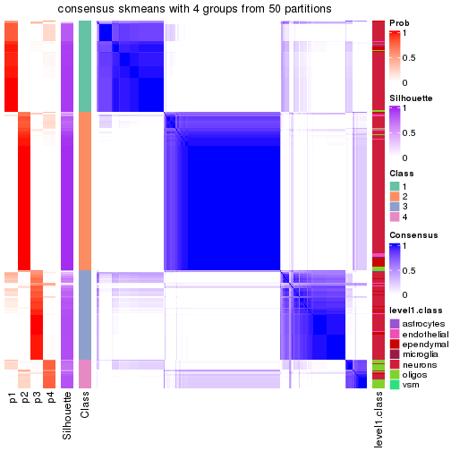</p>

</div>
</div>

Heatmaps for the membership of samples in all partitions to see how consistent they are:


<script>
$( function() {
	$( '#tabs-node-021-membership-heatmap' ).tabs();
} );
</script>
<div id='tabs-node-021-membership-heatmap'>
<ul>
<li><a href='#tab-node-021-membership-heatmap-1'>k = 2</a></li>
<li><a href='#tab-node-021-membership-heatmap-2'>k = 3</a></li>
<li><a href='#tab-node-021-membership-heatmap-3'>k = 4</a></li>
</ul>
<div id='tab-node-021-membership-heatmap-1'>
<pre><code class="r">membership_heatmap(res, k = 2)
</code></pre>

<p></p>

</div>
<div id='tab-node-021-membership-heatmap-2'>
<pre><code class="r">membership_heatmap(res, k = 3)
</code></pre>

<p></p>

</div>
<div id='tab-node-021-membership-heatmap-3'>
<pre><code class="r">membership_heatmap(res, k = 4)
</code></pre>

<p></p>

</div>
</div>

As soon as the classes for columns are determined, the signatures
that are significantly different between subgroups can be looked for. 
Following are the heatmaps for signatures.


Signature heatmaps where rows are scaled:


<script>
$( function() {
	$( '#tabs-node-021-get-signatures' ).tabs();
} );
</script>
<div id='tabs-node-021-get-signatures'>
<ul>
<li><a href='#tab-node-021-get-signatures-1'>k = 2</a></li>
<li><a href='#tab-node-021-get-signatures-2'>k = 3</a></li>
<li><a href='#tab-node-021-get-signatures-3'>k = 4</a></li>
</ul>
<div id='tab-node-021-get-signatures-1'>
<pre><code class="r">get_signatures(res, k = 2)
</code></pre>

<p></p>

</div>
<div id='tab-node-021-get-signatures-2'>
<pre><code class="r">get_signatures(res, k = 3)
</code></pre>

<p></p>

</div>
<div id='tab-node-021-get-signatures-3'>
<pre><code class="r">get_signatures(res, k = 4)
</code></pre>

<p></p>

</div>
</div>


Signature heatmaps where rows are not scaled:


<script>
$( function() {
	$( '#tabs-node-021-get-signatures-no-scale' ).tabs();
} );
</script>
<div id='tabs-node-021-get-signatures-no-scale'>
<ul>
<li><a href='#tab-node-021-get-signatures-no-scale-1'>k = 2</a></li>
<li><a href='#tab-node-021-get-signatures-no-scale-2'>k = 3</a></li>
<li><a href='#tab-node-021-get-signatures-no-scale-3'>k = 4</a></li>
</ul>
<div id='tab-node-021-get-signatures-no-scale-1'>
<pre><code class="r">get_signatures(res, k = 2, scale_rows = FALSE)
</code></pre>

<p></p>

</div>
<div id='tab-node-021-get-signatures-no-scale-2'>
<pre><code class="r">get_signatures(res, k = 3, scale_rows = FALSE)
</code></pre>

<p></p>

</div>
<div id='tab-node-021-get-signatures-no-scale-3'>
<pre><code class="r">get_signatures(res, k = 4, scale_rows = FALSE)
</code></pre>

<p></p>

</div>
</div>


Compare the overlap of signatures from different k:

```r
compare_signatures(res)
```


`get_signature()` returns a data frame invisibly. To get the list of signatures, the function
call should be assigned to a variable explicitly. In following code, if `plot` argument is set
to `FALSE`, no heatmap is plotted while only the differential analysis is performed.

```r
# code only for demonstration
tb = get_signature(res, k = ..., plot = FALSE)
```

An example of the output of `tb` is:

```
#>   which_row         fdr    mean_1    mean_2 scaled_mean_1 scaled_mean_2 km
#> 1        38 0.042760348  8.373488  9.131774    -0.5533452     0.5164555  1
#> 2        40 0.018707592  7.106213  8.469186    -0.6173731     0.5762149  1
#> 3        55 0.019134737 10.221463 11.207825    -0.6159697     0.5749050  1
#> 4        59 0.006059896  5.921854  7.869574    -0.6899429     0.6439467  1
#> 5        60 0.018055526  8.928898 10.211722    -0.6204761     0.5791110  1
#> 6        98 0.009384629 15.714769 14.887706     0.6635654    -0.6193277  2
...
```

The columns in `tb` are:

1. `which_row`: row indices corresponding to the input matrix.
2. `fdr`: FDR for the differential test. 
3. `mean_x`: The mean value in group x.
4. `scaled_mean_x`: The mean value in group x after rows are scaled.
5. `km`: Row groups if k-means clustering is applied to rows (which is done by automatically selecting number of clusters).

If there are too many signatures, `top_signatures = ...` can be set to only show the 
signatures with the highest FDRs:

```r
# code only for demonstration
# e.g. to show the top 500 most significant rows
tb = get_signature(res, k = ..., top_signatures = 500)
```

If the signatures are defined as these which are uniquely high in current group, `diff_method` argument
can be set to `"uniquely_high_in_one_group"`:

```r
# code only for demonstration
tb = get_signature(res, k = ..., diff_method = "uniquely_high_in_one_group")
```


UMAP plot which shows how samples are separated.


<script>
$( function() {
	$( '#tabs-node-021-dimension-reduction' ).tabs();
} );
</script>
<div id='tabs-node-021-dimension-reduction'>
<ul>
<li><a href='#tab-node-021-dimension-reduction-1'>k = 2</a></li>
<li><a href='#tab-node-021-dimension-reduction-2'>k = 3</a></li>
<li><a href='#tab-node-021-dimension-reduction-3'>k = 4</a></li>
</ul>
<div id='tab-node-021-dimension-reduction-1'>
<pre><code class="r">dimension_reduction(res, k = 2, method = &quot;UMAP&quot;)
</code></pre>

<p></p>

</div>
<div id='tab-node-021-dimension-reduction-2'>
<pre><code class="r">dimension_reduction(res, k = 3, method = &quot;UMAP&quot;)
</code></pre>

<p></p>

</div>
<div id='tab-node-021-dimension-reduction-3'>
<pre><code class="r">dimension_reduction(res, k = 4, method = &quot;UMAP&quot;)
</code></pre>

<p></p>

</div>
</div>


Following heatmap shows how subgroups are split when increasing `k`:

```r
collect_classes(res)
```

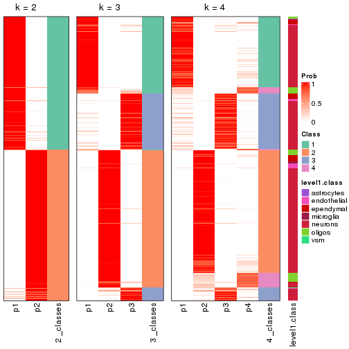


Test correlation between subgroups and known annotations. If the known
annotation is numeric, one-way ANOVA test is applied, and if the known
annotation is discrete, chi-squared contingency table test is applied.

```r
test_to_known_factors(res)
```

```
#>             n_sample level1.class(p-value) k
#> ATC:skmeans      379              2.59e-01 2
#> ATC:skmeans      379              5.32e-02 3
#> ATC:skmeans      370              2.65e-30 4
```


If matrix rows can be associated to genes, consider to use `functional_enrichment(res,
...)` to perform function enrichment for the signature genes. See [this vignette](https://jokergoo.github.io/cola_vignettes/functional_enrichment.html) for more detailed explanations.


 

---------------------------------------------------


### Node0211


Parent node: [Node021](#Node021).
Child nodes: 
                Node01131-leaf
        ,
                Node01132-leaf
        ,
                Node01133-leaf
        ,
                Node01211-leaf
        ,
                Node01212-leaf
        ,
                Node01221-leaf
        ,
                Node01222-leaf
        ,
                Node01223-leaf
        ,
                Node01231-leaf
        ,
                Node01232-leaf
        ,
                Node01233-leaf
        ,
                Node01234-leaf
        ,
                [Node02111](#Node02111)
        ,
                [Node02112](#Node02112)
        ,
                Node02113-leaf
        ,
                Node02121-leaf
        ,
                Node02122-leaf
        ,
                Node02123-leaf
        ,
                Node02221-leaf
        ,
                Node02222-leaf
        ,
                Node03111-leaf
        ,
                Node03112-leaf
        ,
                Node03121-leaf
        ,
                [Node03122](#Node03122)
        .


The object with results only for a single top-value method and a single partitioning method 
can be extracted as:

```r
res = res_rh["0211"]
```

A summary of `res` and all the functions that can be applied to it:

```r
res
```

```
#> A 'ConsensusPartition' object with k = 2, 3, 4.
#>   On a matrix with 9465 rows and 181 columns.
#>   Top rows (946) are extracted by 'ATC' method.
#>   Subgroups are detected by 'skmeans' method.
#>   Performed in total 150 partitions by row resampling.
#>   Best k for subgroups seems to be 3.
#> 
#> Following methods can be applied to this 'ConsensusPartition' object:
#>  [1] "cola_report"             "collect_classes"         "collect_plots"          
#>  [4] "collect_stats"           "colnames"                "compare_partitions"     
#>  [7] "compare_signatures"      "consensus_heatmap"       "dimension_reduction"    
#> [10] "functional_enrichment"   "get_anno_col"            "get_anno"               
#> [13] "get_classes"             "get_consensus"           "get_matrix"             
#> [16] "get_membership"          "get_param"               "get_signatures"         
#> [19] "get_stats"               "is_best_k"               "is_stable_k"            
#> [22] "membership_heatmap"      "ncol"                    "nrow"                   
#> [25] "plot_ecdf"               "predict_classes"         "rownames"               
#> [28] "select_partition_number" "show"                    "suggest_best_k"         
#> [31] "test_to_known_factors"   "top_rows_heatmap"
```

`collect_plots()` function collects all the plots made from `res` for all `k` (number of subgroups)
into one single page to provide an easy and fast comparison between different `k`.

```r
collect_plots(res)
```


The plots are:

- The first row: a plot of the eCDF (empirical cumulative distribution
  function) curves of the consensus matrix for each `k` and the heatmap of
  predicted classes for each `k`.
- The second row: heatmaps of the consensus matrix for each `k`.
- The third row: heatmaps of the membership matrix for each `k`.
- The fouth row: heatmaps of the signatures for each `k`.

All the plots in panels can be made by individual functions and they are
plotted later in this section.

`select_partition_number()` produces several plots showing different
statistics for choosing "optimized" `k`. There are following statistics:

- eCDF curves of the consensus matrix for each `k`;
- 1-PAC. [The PAC score](https://en.wikipedia.org/wiki/Consensus_clustering#Over-interpretation_potential_of_consensus_clustering)
  measures the proportion of the ambiguous subgrouping.
- Mean silhouette score.
- Concordance. The mean probability of fiting the consensus subgroup labels in all
  partitions.
- Area increased. Denote $A_k$ as the area under the eCDF curve for current
  `k`, the area increased is defined as $A_k - A_{k-1}$.
- Rand index. The percent of pairs of samples that are both in a same cluster
  or both are not in a same cluster in the partition of k and k-1.
- Jaccard index. The ratio of pairs of samples are both in a same cluster in
  the partition of k and k-1 and the pairs of samples are both in a same
  cluster in the partition k or k-1.

The detailed explanations of these statistics can be found in [the _cola_
vignette](https://jokergoo.github.io/cola_vignettes/cola.html#toc_13).

Generally speaking, higher 1-PAC score, higher mean silhouette score or higher
concordance corresponds to better partition. Rand index and Jaccard index
measure how similar the current partition is compared to partition with `k-1`.
If they are too similar, we won't accept `k` is better than `k-1`.

```r
select_partition_number(res)
```

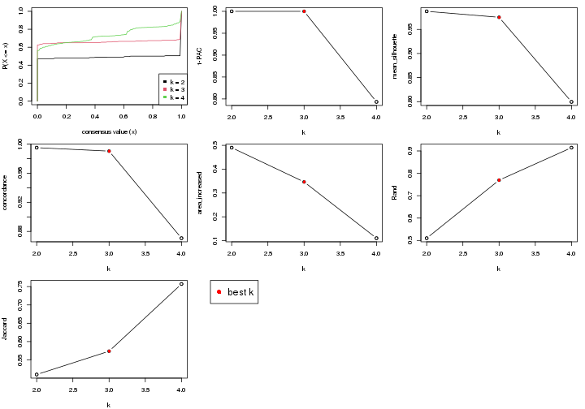

The numeric values for all these statistics can be obtained by `get_stats()`.

```r
get_stats(res)
```

```
#>   k 1-PAC mean_silhouette concordance area_increased  Rand Jaccard
#> 2 2 1.000           0.988       0.995          0.490 0.510   0.510
#> 3 3 1.000           0.975       0.990          0.346 0.769   0.574
#> 4 4 0.793           0.800       0.871          0.110 0.915   0.757
```

`suggest_best_k()` suggests the best $k$ based on these statistics. The rules are as follows:

- All $k$ with Jaccard index larger than 0.95 are removed because increasing
  $k$ does not provide enough extra information. If all $k$ are removed, it is
  marked as no subgroup is detected.
- For all $k$ with 1-PAC score larger than 0.9, the maximal $k$ is taken as
  the best $k$, and other $k$ are marked as optional $k$.
- If it does not fit the second rule. The $k$ with the maximal vote of the
  highest 1-PAC score, highest mean silhouette, and highest concordance is
  taken as the best $k$.

```r
suggest_best_k(res)
```

```
#> [1] 3
#> attr(,"optional")
#> [1] 2
```

There is also optional best $k$ = 2 that is worth to check.

Following is the table of the partitions (You need to click the **show/hide
code output** link to see it). The membership matrix (columns with name `p*`)
is inferred by
[`clue::cl_consensus()`](https://www.rdocumentation.org/link/cl_consensus?package=clue)
function with the `SE` method. Basically the value in the membership matrix
represents the probability to belong to a certain group. The finall subgroup
label for an item is determined with the group with highest probability it
belongs to.

In `get_classes()` function, the entropy is calculated from the membership
matrix and the silhouette score is calculated from the consensus matrix.


<script>
$( function() {
	$( '#tabs-node-0211-get-classes' ).tabs();
} );
</script>
<div id='tabs-node-0211-get-classes'>
<ul>
<li><a href='#tab-node-0211-get-classes-1'>k = 2</a></li>
<li><a href='#tab-node-0211-get-classes-2'>k = 3</a></li>
<li><a href='#tab-node-0211-get-classes-3'>k = 4</a></li>
</ul>

<div id='tab-node-0211-get-classes-1'>
<p><a id='tab-node-0211-get-classes-1-a' style='color:#0366d6' href='#'>show/hide code output</a></p>
<pre><code class="r">cbind(get_classes(res, k = 2), get_membership(res, k = 2))
</code></pre>

<pre><code>#&gt;     class entropy silhouette   p1   p2
#&gt; 1       2   0.000      0.996 0.00 1.00
#&gt; 2       1   0.000      0.994 1.00 0.00
#&gt; 3       2   0.000      0.996 0.00 1.00
#&gt; 4       2   0.000      0.996 0.00 1.00
#&gt; 5       2   0.000      0.996 0.00 1.00
#&gt; 6       2   0.000      0.996 0.00 1.00
#&gt; 7       2   0.000      0.996 0.00 1.00
#&gt; 8       2   0.000      0.996 0.00 1.00
#&gt; 9       2   0.000      0.996 0.00 1.00
#&gt; 10      2   0.000      0.996 0.00 1.00
#&gt; 11      2   0.000      0.996 0.00 1.00
#&gt; 12      2   0.000      0.996 0.00 1.00
#&gt; 13      2   0.000      0.996 0.00 1.00
#&gt; 14      2   0.000      0.996 0.00 1.00
#&gt; 15      2   0.000      0.996 0.00 1.00
#&gt; 16      2   0.000      0.996 0.00 1.00
#&gt; 17      2   0.000      0.996 0.00 1.00
#&gt; 18      2   0.000      0.996 0.00 1.00
#&gt; 19      2   0.000      0.996 0.00 1.00
#&gt; 20      2   0.000      0.996 0.00 1.00
#&gt; 21      2   0.000      0.996 0.00 1.00
#&gt; 22      2   0.000      0.996 0.00 1.00
#&gt; 23      2   0.000      0.996 0.00 1.00
#&gt; 24      2   0.000      0.996 0.00 1.00
#&gt; 25      2   0.000      0.996 0.00 1.00
#&gt; 26      2   0.000      0.996 0.00 1.00
#&gt; 27      2   0.000      0.996 0.00 1.00
#&gt; 28      2   0.000      0.996 0.00 1.00
#&gt; 29      2   0.000      0.996 0.00 1.00
#&gt; 30      2   0.000      0.996 0.00 1.00
#&gt; 31      2   0.000      0.996 0.00 1.00
#&gt; 32      2   0.000      0.996 0.00 1.00
#&gt; 33      2   0.000      0.996 0.00 1.00
#&gt; 34      2   0.000      0.996 0.00 1.00
#&gt; 35      2   0.000      0.996 0.00 1.00
#&gt; 36      2   0.000      0.996 0.00 1.00
#&gt; 37      2   0.000      0.996 0.00 1.00
#&gt; 38      2   0.000      0.996 0.00 1.00
#&gt; 39      2   0.000      0.996 0.00 1.00
#&gt; 40      2   0.000      0.996 0.00 1.00
#&gt; 41      2   0.000      0.996 0.00 1.00
#&gt; 42      2   0.000      0.996 0.00 1.00
#&gt; 43      2   0.000      0.996 0.00 1.00
#&gt; 44      2   0.000      0.996 0.00 1.00
#&gt; 45      2   0.000      0.996 0.00 1.00
#&gt; 46      2   0.000      0.996 0.00 1.00
#&gt; 47      2   0.000      0.996 0.00 1.00
#&gt; 48      2   0.000      0.996 0.00 1.00
#&gt; 49      2   0.000      0.996 0.00 1.00
#&gt; 50      2   0.000      0.996 0.00 1.00
#&gt; 51      2   0.000      0.996 0.00 1.00
#&gt; 52      2   0.000      0.996 0.00 1.00
#&gt; 53      2   0.000      0.996 0.00 1.00
#&gt; 54      2   0.000      0.996 0.00 1.00
#&gt; 55      2   0.000      0.996 0.00 1.00
#&gt; 56      2   0.000      0.996 0.00 1.00
#&gt; 57      2   0.000      0.996 0.00 1.00
#&gt; 58      2   0.000      0.996 0.00 1.00
#&gt; 59      2   0.000      0.996 0.00 1.00
#&gt; 60      2   0.000      0.996 0.00 1.00
#&gt; 61      2   0.000      0.996 0.00 1.00
#&gt; 62      2   0.000      0.996 0.00 1.00
#&gt; 63      2   0.000      0.996 0.00 1.00
#&gt; 64      2   0.000      0.996 0.00 1.00
#&gt; 65      2   0.000      0.996 0.00 1.00
#&gt; 66      2   0.000      0.996 0.00 1.00
#&gt; 67      2   0.000      0.996 0.00 1.00
#&gt; 68      2   0.000      0.996 0.00 1.00
#&gt; 69      1   0.000      0.994 1.00 0.00
#&gt; 70      2   0.000      0.996 0.00 1.00
#&gt; 71      2   0.000      0.996 0.00 1.00
#&gt; 72      2   0.000      0.996 0.00 1.00
#&gt; 73      2   0.000      0.996 0.00 1.00
#&gt; 74      2   0.000      0.996 0.00 1.00
#&gt; 75      2   0.000      0.996 0.00 1.00
#&gt; 76      2   0.000      0.996 0.00 1.00
#&gt; 77      1   0.943      0.437 0.64 0.36
#&gt; 78      2   0.000      0.996 0.00 1.00
#&gt; 79      2   0.000      0.996 0.00 1.00
#&gt; 80      2   0.000      0.996 0.00 1.00
#&gt; 81      2   0.000      0.996 0.00 1.00
#&gt; 82      1   0.000      0.994 1.00 0.00
#&gt; 83      1   0.000      0.994 1.00 0.00
#&gt; 84      2   0.000      0.996 0.00 1.00
#&gt; 85      2   0.000      0.996 0.00 1.00
#&gt; 86      2   0.000      0.996 0.00 1.00
#&gt; 87      2   0.000      0.996 0.00 1.00
#&gt; 88      2   0.000      0.996 0.00 1.00
#&gt; 89      2   0.000      0.996 0.00 1.00
#&gt; 90      2   0.000      0.996 0.00 1.00
#&gt; 91      2   0.000      0.996 0.00 1.00
#&gt; 92      2   0.000      0.996 0.00 1.00
#&gt; 93      2   0.000      0.996 0.00 1.00
#&gt; 94      2   0.000      0.996 0.00 1.00
#&gt; 95      2   0.000      0.996 0.00 1.00
#&gt; 96      2   0.000      0.996 0.00 1.00
#&gt; 97      1   0.000      0.994 1.00 0.00
#&gt; 98      1   0.000      0.994 1.00 0.00
#&gt; 99      2   0.000      0.996 0.00 1.00
#&gt; 100     1   0.000      0.994 1.00 0.00
#&gt; 101     1   0.000      0.994 1.00 0.00
#&gt; 102     2   0.000      0.996 0.00 1.00
#&gt; 103     1   0.000      0.994 1.00 0.00
#&gt; 104     1   0.000      0.994 1.00 0.00
#&gt; 105     1   0.000      0.994 1.00 0.00
#&gt; 106     1   0.000      0.994 1.00 0.00
#&gt; 107     1   0.000      0.994 1.00 0.00
#&gt; 108     2   0.000      0.996 0.00 1.00
#&gt; 109     2   0.000      0.996 0.00 1.00
#&gt; 110     2   0.000      0.996 0.00 1.00
#&gt; 111     2   0.000      0.996 0.00 1.00
#&gt; 112     2   0.000      0.996 0.00 1.00
#&gt; 113     2   0.000      0.996 0.00 1.00
#&gt; 114     1   0.529      0.861 0.88 0.12
#&gt; 115     2   0.000      0.996 0.00 1.00
#&gt; 116     2   0.000      0.996 0.00 1.00
#&gt; 117     1   0.000      0.994 1.00 0.00
#&gt; 118     1   0.000      0.994 1.00 0.00
#&gt; 119     1   0.000      0.994 1.00 0.00
#&gt; 120     1   0.000      0.994 1.00 0.00
#&gt; 121     1   0.000      0.994 1.00 0.00
#&gt; 122     1   0.000      0.994 1.00 0.00
#&gt; 123     1   0.000      0.994 1.00 0.00
#&gt; 124     1   0.000      0.994 1.00 0.00
#&gt; 125     1   0.000      0.994 1.00 0.00
#&gt; 126     1   0.000      0.994 1.00 0.00
#&gt; 127     1   0.000      0.994 1.00 0.00
#&gt; 128     1   0.000      0.994 1.00 0.00
#&gt; 129     1   0.000      0.994 1.00 0.00
#&gt; 130     1   0.000      0.994 1.00 0.00
#&gt; 131     1   0.000      0.994 1.00 0.00
#&gt; 132     1   0.000      0.994 1.00 0.00
#&gt; 133     1   0.000      0.994 1.00 0.00
#&gt; 134     1   0.000      0.994 1.00 0.00
#&gt; 135     1   0.000      0.994 1.00 0.00
#&gt; 136     1   0.000      0.994 1.00 0.00
#&gt; 137     1   0.000      0.994 1.00 0.00
#&gt; 138     1   0.000      0.994 1.00 0.00
#&gt; 139     1   0.000      0.994 1.00 0.00
#&gt; 140     1   0.000      0.994 1.00 0.00
#&gt; 141     1   0.000      0.994 1.00 0.00
#&gt; 142     1   0.000      0.994 1.00 0.00
#&gt; 143     1   0.000      0.994 1.00 0.00
#&gt; 144     1   0.000      0.994 1.00 0.00
#&gt; 145     1   0.000      0.994 1.00 0.00
#&gt; 146     1   0.000      0.994 1.00 0.00
#&gt; 147     1   0.000      0.994 1.00 0.00
#&gt; 148     1   0.000      0.994 1.00 0.00
#&gt; 149     1   0.000      0.994 1.00 0.00
#&gt; 150     1   0.000      0.994 1.00 0.00
#&gt; 151     1   0.000      0.994 1.00 0.00
#&gt; 152     1   0.000      0.994 1.00 0.00
#&gt; 153     1   0.000      0.994 1.00 0.00
#&gt; 154     1   0.000      0.994 1.00 0.00
#&gt; 155     1   0.000      0.994 1.00 0.00
#&gt; 156     1   0.000      0.994 1.00 0.00
#&gt; 157     1   0.000      0.994 1.00 0.00
#&gt; 158     1   0.000      0.994 1.00 0.00
#&gt; 159     1   0.000      0.994 1.00 0.00
#&gt; 160     1   0.000      0.994 1.00 0.00
#&gt; 161     1   0.000      0.994 1.00 0.00
#&gt; 162     1   0.000      0.994 1.00 0.00
#&gt; 163     1   0.000      0.994 1.00 0.00
#&gt; 164     1   0.000      0.994 1.00 0.00
#&gt; 165     1   0.000      0.994 1.00 0.00
#&gt; 166     1   0.000      0.994 1.00 0.00
#&gt; 167     1   0.000      0.994 1.00 0.00
#&gt; 168     1   0.000      0.994 1.00 0.00
#&gt; 169     1   0.000      0.994 1.00 0.00
#&gt; 170     2   0.000      0.996 0.00 1.00
#&gt; 171     1   0.000      0.994 1.00 0.00
#&gt; 172     2   0.000      0.996 0.00 1.00
#&gt; 173     1   0.000      0.994 1.00 0.00
#&gt; 174     1   0.000      0.994 1.00 0.00
#&gt; 175     2   0.971      0.326 0.40 0.60
#&gt; 176     1   0.000      0.994 1.00 0.00
#&gt; 177     1   0.000      0.994 1.00 0.00
#&gt; 178     2   0.000      0.996 0.00 1.00
#&gt; 179     1   0.000      0.994 1.00 0.00
#&gt; 180     1   0.000      0.994 1.00 0.00
#&gt; 181     1   0.000      0.994 1.00 0.00
</code></pre>

<script>
$('#tab-node-0211-get-classes-1-a').parent().next().next().hide();
$('#tab-node-0211-get-classes-1-a').click(function(){
  $('#tab-node-0211-get-classes-1-a').parent().next().next().toggle();
  return(false);
});
</script>
</div>

<div id='tab-node-0211-get-classes-2'>
<p><a id='tab-node-0211-get-classes-2-a' style='color:#0366d6' href='#'>show/hide code output</a></p>
<pre><code class="r">cbind(get_classes(res, k = 3), get_membership(res, k = 3))
</code></pre>

<pre><code>#&gt;     class entropy silhouette   p1   p2   p3
#&gt; 1       3  0.0000     0.9883 0.00 0.00 1.00
#&gt; 2       3  0.0000     0.9883 0.00 0.00 1.00
#&gt; 3       3  0.0000     0.9883 0.00 0.00 1.00
#&gt; 4       3  0.0000     0.9883 0.00 0.00 1.00
#&gt; 5       3  0.0000     0.9883 0.00 0.00 1.00
#&gt; 6       3  0.0000     0.9883 0.00 0.00 1.00
#&gt; 7       3  0.0000     0.9883 0.00 0.00 1.00
#&gt; 8       3  0.0000     0.9883 0.00 0.00 1.00
#&gt; 9       3  0.0000     0.9883 0.00 0.00 1.00
#&gt; 10      3  0.0000     0.9883 0.00 0.00 1.00
#&gt; 11      3  0.0000     0.9883 0.00 0.00 1.00
#&gt; 12      3  0.0000     0.9883 0.00 0.00 1.00
#&gt; 13      3  0.0000     0.9883 0.00 0.00 1.00
#&gt; 14      3  0.0000     0.9883 0.00 0.00 1.00
#&gt; 15      3  0.0000     0.9883 0.00 0.00 1.00
#&gt; 16      3  0.0000     0.9883 0.00 0.00 1.00
#&gt; 17      3  0.0000     0.9883 0.00 0.00 1.00
#&gt; 18      3  0.0000     0.9883 0.00 0.00 1.00
#&gt; 19      3  0.0000     0.9883 0.00 0.00 1.00
#&gt; 20      3  0.0000     0.9883 0.00 0.00 1.00
#&gt; 21      3  0.0000     0.9883 0.00 0.00 1.00
#&gt; 22      3  0.0000     0.9883 0.00 0.00 1.00
#&gt; 23      3  0.0000     0.9883 0.00 0.00 1.00
#&gt; 24      3  0.0000     0.9883 0.00 0.00 1.00
#&gt; 25      3  0.0000     0.9883 0.00 0.00 1.00
#&gt; 26      3  0.0000     0.9883 0.00 0.00 1.00
#&gt; 27      2  0.0000     0.9965 0.00 1.00 0.00
#&gt; 28      2  0.0000     0.9965 0.00 1.00 0.00
#&gt; 29      3  0.0000     0.9883 0.00 0.00 1.00
#&gt; 30      2  0.0000     0.9965 0.00 1.00 0.00
#&gt; 31      2  0.0000     0.9965 0.00 1.00 0.00
#&gt; 32      2  0.0000     0.9965 0.00 1.00 0.00
#&gt; 33      2  0.0000     0.9965 0.00 1.00 0.00
#&gt; 34      3  0.0000     0.9883 0.00 0.00 1.00
#&gt; 35      2  0.0000     0.9965 0.00 1.00 0.00
#&gt; 36      2  0.0000     0.9965 0.00 1.00 0.00
#&gt; 37      2  0.0000     0.9965 0.00 1.00 0.00
#&gt; 38      3  0.0000     0.9883 0.00 0.00 1.00
#&gt; 39      2  0.0000     0.9965 0.00 1.00 0.00
#&gt; 40      2  0.0000     0.9965 0.00 1.00 0.00
#&gt; 41      3  0.0000     0.9883 0.00 0.00 1.00
#&gt; 42      3  0.0892     0.9686 0.00 0.02 0.98
#&gt; 43      3  0.0000     0.9883 0.00 0.00 1.00
#&gt; 44      2  0.0000     0.9965 0.00 1.00 0.00
#&gt; 45      2  0.0000     0.9965 0.00 1.00 0.00
#&gt; 46      2  0.0000     0.9965 0.00 1.00 0.00
#&gt; 47      2  0.0000     0.9965 0.00 1.00 0.00
#&gt; 48      3  0.0000     0.9883 0.00 0.00 1.00
#&gt; 49      2  0.0000     0.9965 0.00 1.00 0.00
#&gt; 50      2  0.0000     0.9965 0.00 1.00 0.00
#&gt; 51      2  0.0000     0.9965 0.00 1.00 0.00
#&gt; 52      2  0.0000     0.9965 0.00 1.00 0.00
#&gt; 53      2  0.0000     0.9965 0.00 1.00 0.00
#&gt; 54      2  0.0000     0.9965 0.00 1.00 0.00
#&gt; 55      2  0.0000     0.9965 0.00 1.00 0.00
#&gt; 56      2  0.0000     0.9965 0.00 1.00 0.00
#&gt; 57      2  0.0000     0.9965 0.00 1.00 0.00
#&gt; 58      2  0.0000     0.9965 0.00 1.00 0.00
#&gt; 59      2  0.0000     0.9965 0.00 1.00 0.00
#&gt; 60      2  0.0000     0.9965 0.00 1.00 0.00
#&gt; 61      2  0.0000     0.9965 0.00 1.00 0.00
#&gt; 62      2  0.0000     0.9965 0.00 1.00 0.00
#&gt; 63      2  0.0000     0.9965 0.00 1.00 0.00
#&gt; 64      2  0.0000     0.9965 0.00 1.00 0.00
#&gt; 65      2  0.0000     0.9965 0.00 1.00 0.00
#&gt; 66      2  0.0000     0.9965 0.00 1.00 0.00
#&gt; 67      2  0.0000     0.9965 0.00 1.00 0.00
#&gt; 68      2  0.0000     0.9965 0.00 1.00 0.00
#&gt; 69      1  0.0000     0.9844 1.00 0.00 0.00
#&gt; 70      3  0.0000     0.9883 0.00 0.00 1.00
#&gt; 71      2  0.0000     0.9965 0.00 1.00 0.00
#&gt; 72      2  0.0000     0.9965 0.00 1.00 0.00
#&gt; 73      2  0.0000     0.9965 0.00 1.00 0.00
#&gt; 74      2  0.0000     0.9965 0.00 1.00 0.00
#&gt; 75      2  0.0000     0.9965 0.00 1.00 0.00
#&gt; 76      2  0.0000     0.9965 0.00 1.00 0.00
#&gt; 77      2  0.0000     0.9965 0.00 1.00 0.00
#&gt; 78      2  0.0000     0.9965 0.00 1.00 0.00
#&gt; 79      2  0.0000     0.9965 0.00 1.00 0.00
#&gt; 80      2  0.0000     0.9965 0.00 1.00 0.00
#&gt; 81      3  0.0000     0.9883 0.00 0.00 1.00
#&gt; 82      1  0.0000     0.9844 1.00 0.00 0.00
#&gt; 83      1  0.0000     0.9844 1.00 0.00 0.00
#&gt; 84      2  0.0000     0.9965 0.00 1.00 0.00
#&gt; 85      2  0.0000     0.9965 0.00 1.00 0.00
#&gt; 86      2  0.0000     0.9965 0.00 1.00 0.00
#&gt; 87      2  0.0000     0.9965 0.00 1.00 0.00
#&gt; 88      2  0.0000     0.9965 0.00 1.00 0.00
#&gt; 89      2  0.0000     0.9965 0.00 1.00 0.00
#&gt; 90      2  0.0000     0.9965 0.00 1.00 0.00
#&gt; 91      2  0.0000     0.9965 0.00 1.00 0.00
#&gt; 92      2  0.0000     0.9965 0.00 1.00 0.00
#&gt; 93      3  0.0000     0.9883 0.00 0.00 1.00
#&gt; 94      2  0.0000     0.9965 0.00 1.00 0.00
#&gt; 95      2  0.0000     0.9965 0.00 1.00 0.00
#&gt; 96      2  0.0000     0.9965 0.00 1.00 0.00
#&gt; 97      1  0.0000     0.9844 1.00 0.00 0.00
#&gt; 98      3  0.0000     0.9883 0.00 0.00 1.00
#&gt; 99      3  0.0000     0.9883 0.00 0.00 1.00
#&gt; 100     1  0.0000     0.9844 1.00 0.00 0.00
#&gt; 101     3  0.0000     0.9883 0.00 0.00 1.00
#&gt; 102     3  0.0000     0.9883 0.00 0.00 1.00
#&gt; 103     1  0.0000     0.9844 1.00 0.00 0.00
#&gt; 104     3  0.1529     0.9483 0.04 0.00 0.96
#&gt; 105     1  0.0000     0.9844 1.00 0.00 0.00
#&gt; 106     1  0.6302     0.0762 0.52 0.00 0.48
#&gt; 107     3  0.0000     0.9883 0.00 0.00 1.00
#&gt; 108     2  0.0000     0.9965 0.00 1.00 0.00
#&gt; 109     2  0.0000     0.9965 0.00 1.00 0.00
#&gt; 110     2  0.0000     0.9965 0.00 1.00 0.00
#&gt; 111     2  0.0000     0.9965 0.00 1.00 0.00
#&gt; 112     2  0.0000     0.9965 0.00 1.00 0.00
#&gt; 113     2  0.0000     0.9965 0.00 1.00 0.00
#&gt; 114     2  0.0000     0.9965 0.00 1.00 0.00
#&gt; 115     2  0.0000     0.9965 0.00 1.00 0.00
#&gt; 116     2  0.0000     0.9965 0.00 1.00 0.00
#&gt; 117     1  0.0000     0.9844 1.00 0.00 0.00
#&gt; 118     1  0.0000     0.9844 1.00 0.00 0.00
#&gt; 119     1  0.0000     0.9844 1.00 0.00 0.00
#&gt; 120     1  0.3686     0.8297 0.86 0.00 0.14
#&gt; 121     1  0.0000     0.9844 1.00 0.00 0.00
#&gt; 122     1  0.0000     0.9844 1.00 0.00 0.00
#&gt; 123     1  0.0000     0.9844 1.00 0.00 0.00
#&gt; 124     1  0.0000     0.9844 1.00 0.00 0.00
#&gt; 125     3  0.0000     0.9883 0.00 0.00 1.00
#&gt; 126     1  0.0000     0.9844 1.00 0.00 0.00
#&gt; 127     1  0.0000     0.9844 1.00 0.00 0.00
#&gt; 128     1  0.0000     0.9844 1.00 0.00 0.00
#&gt; 129     1  0.0000     0.9844 1.00 0.00 0.00
#&gt; 130     1  0.0000     0.9844 1.00 0.00 0.00
#&gt; 131     1  0.0000     0.9844 1.00 0.00 0.00
#&gt; 132     1  0.0000     0.9844 1.00 0.00 0.00
#&gt; 133     1  0.0000     0.9844 1.00 0.00 0.00
#&gt; 134     1  0.0000     0.9844 1.00 0.00 0.00
#&gt; 135     1  0.0000     0.9844 1.00 0.00 0.00
#&gt; 136     1  0.0000     0.9844 1.00 0.00 0.00
#&gt; 137     1  0.0000     0.9844 1.00 0.00 0.00
#&gt; 138     1  0.0000     0.9844 1.00 0.00 0.00
#&gt; 139     1  0.0000     0.9844 1.00 0.00 0.00
#&gt; 140     1  0.0000     0.9844 1.00 0.00 0.00
#&gt; 141     1  0.0000     0.9844 1.00 0.00 0.00
#&gt; 142     1  0.0000     0.9844 1.00 0.00 0.00
#&gt; 143     1  0.0000     0.9844 1.00 0.00 0.00
#&gt; 144     1  0.0000     0.9844 1.00 0.00 0.00
#&gt; 145     1  0.0000     0.9844 1.00 0.00 0.00
#&gt; 146     1  0.5706     0.5289 0.68 0.00 0.32
#&gt; 147     1  0.0000     0.9844 1.00 0.00 0.00
#&gt; 148     1  0.0000     0.9844 1.00 0.00 0.00
#&gt; 149     3  0.0000     0.9883 0.00 0.00 1.00
#&gt; 150     1  0.0000     0.9844 1.00 0.00 0.00
#&gt; 151     3  0.6244     0.1906 0.44 0.00 0.56
#&gt; 152     1  0.0000     0.9844 1.00 0.00 0.00
#&gt; 153     1  0.0000     0.9844 1.00 0.00 0.00
#&gt; 154     1  0.0000     0.9844 1.00 0.00 0.00
#&gt; 155     1  0.0000     0.9844 1.00 0.00 0.00
#&gt; 156     1  0.0000     0.9844 1.00 0.00 0.00
#&gt; 157     1  0.0000     0.9844 1.00 0.00 0.00
#&gt; 158     1  0.0000     0.9844 1.00 0.00 0.00
#&gt; 159     1  0.0000     0.9844 1.00 0.00 0.00
#&gt; 160     1  0.0000     0.9844 1.00 0.00 0.00
#&gt; 161     1  0.0000     0.9844 1.00 0.00 0.00
#&gt; 162     1  0.0000     0.9844 1.00 0.00 0.00
#&gt; 163     1  0.0000     0.9844 1.00 0.00 0.00
#&gt; 164     1  0.0000     0.9844 1.00 0.00 0.00
#&gt; 165     1  0.0000     0.9844 1.00 0.00 0.00
#&gt; 166     1  0.0000     0.9844 1.00 0.00 0.00
#&gt; 167     1  0.0000     0.9844 1.00 0.00 0.00
#&gt; 168     1  0.0000     0.9844 1.00 0.00 0.00
#&gt; 169     2  0.0892     0.9753 0.02 0.98 0.00
#&gt; 170     2  0.0000     0.9965 0.00 1.00 0.00
#&gt; 171     1  0.0000     0.9844 1.00 0.00 0.00
#&gt; 172     2  0.0000     0.9965 0.00 1.00 0.00
#&gt; 173     1  0.0000     0.9844 1.00 0.00 0.00
#&gt; 174     1  0.0000     0.9844 1.00 0.00 0.00
#&gt; 175     2  0.6500     0.7226 0.10 0.76 0.14
#&gt; 176     1  0.0000     0.9844 1.00 0.00 0.00
#&gt; 177     1  0.0000     0.9844 1.00 0.00 0.00
#&gt; 178     2  0.0000     0.9965 0.00 1.00 0.00
#&gt; 179     1  0.0000     0.9844 1.00 0.00 0.00
#&gt; 180     1  0.1529     0.9462 0.96 0.00 0.04
#&gt; 181     1  0.0000     0.9844 1.00 0.00 0.00
</code></pre>

<script>
$('#tab-node-0211-get-classes-2-a').parent().next().next().hide();
$('#tab-node-0211-get-classes-2-a').click(function(){
  $('#tab-node-0211-get-classes-2-a').parent().next().next().toggle();
  return(false);
});
</script>
</div>

<div id='tab-node-0211-get-classes-3'>
<p><a id='tab-node-0211-get-classes-3-a' style='color:#0366d6' href='#'>show/hide code output</a></p>
<pre><code class="r">cbind(get_classes(res, k = 4), get_membership(res, k = 4))
</code></pre>

<pre><code>#&gt;     class entropy silhouette   p1   p2   p3   p4
#&gt; 1       3  0.0000      0.913 0.00 0.00 1.00 0.00
#&gt; 2       3  0.0000      0.913 0.00 0.00 1.00 0.00
#&gt; 3       3  0.0000      0.913 0.00 0.00 1.00 0.00
#&gt; 4       3  0.0000      0.913 0.00 0.00 1.00 0.00
#&gt; 5       3  0.0000      0.913 0.00 0.00 1.00 0.00
#&gt; 6       3  0.0000      0.913 0.00 0.00 1.00 0.00
#&gt; 7       3  0.0000      0.913 0.00 0.00 1.00 0.00
#&gt; 8       3  0.0000      0.913 0.00 0.00 1.00 0.00
#&gt; 9       3  0.0000      0.913 0.00 0.00 1.00 0.00
#&gt; 10      3  0.0000      0.913 0.00 0.00 1.00 0.00
#&gt; 11      3  0.0000      0.913 0.00 0.00 1.00 0.00
#&gt; 12      3  0.2345      0.830 0.00 0.10 0.90 0.00
#&gt; 13      3  0.4790      0.540 0.00 0.00 0.62 0.38
#&gt; 14      3  0.2647      0.807 0.00 0.12 0.88 0.00
#&gt; 15      3  0.1637      0.868 0.00 0.06 0.94 0.00
#&gt; 16      3  0.4713      0.563 0.00 0.00 0.64 0.36
#&gt; 17      3  0.2345      0.829 0.00 0.10 0.90 0.00
#&gt; 18      3  0.0000      0.913 0.00 0.00 1.00 0.00
#&gt; 19      3  0.0000      0.913 0.00 0.00 1.00 0.00
#&gt; 20      3  0.0000      0.913 0.00 0.00 1.00 0.00
#&gt; 21      3  0.0000      0.913 0.00 0.00 1.00 0.00
#&gt; 22      3  0.4790      0.540 0.00 0.00 0.62 0.38
#&gt; 23      3  0.0000      0.913 0.00 0.00 1.00 0.00
#&gt; 24      3  0.0000      0.913 0.00 0.00 1.00 0.00
#&gt; 25      3  0.0000      0.913 0.00 0.00 1.00 0.00
#&gt; 26      3  0.1211      0.891 0.00 0.00 0.96 0.04
#&gt; 27      2  0.0000      0.822 0.00 1.00 0.00 0.00
#&gt; 28      2  0.0000      0.822 0.00 1.00 0.00 0.00
#&gt; 29      3  0.0000      0.913 0.00 0.00 1.00 0.00
#&gt; 30      2  0.0000      0.822 0.00 1.00 0.00 0.00
#&gt; 31      2  0.4624      0.740 0.00 0.66 0.00 0.34
#&gt; 32      2  0.4790      0.720 0.00 0.62 0.00 0.38
#&gt; 33      2  0.2345      0.803 0.00 0.90 0.00 0.10
#&gt; 34      3  0.0000      0.913 0.00 0.00 1.00 0.00
#&gt; 35      2  0.1637      0.773 0.00 0.94 0.00 0.06
#&gt; 36      2  0.4713      0.731 0.00 0.64 0.00 0.36
#&gt; 37      2  0.4790      0.720 0.00 0.62 0.00 0.38
#&gt; 38      3  0.0000      0.913 0.00 0.00 1.00 0.00
#&gt; 39      2  0.0000      0.822 0.00 1.00 0.00 0.00
#&gt; 40      2  0.0000      0.822 0.00 1.00 0.00 0.00
#&gt; 41      3  0.4790      0.540 0.00 0.00 0.62 0.38
#&gt; 42      4  0.6656      0.562 0.00 0.16 0.22 0.62
#&gt; 43      3  0.2411      0.869 0.00 0.04 0.92 0.04
#&gt; 44      2  0.4790      0.720 0.00 0.62 0.00 0.38
#&gt; 45      2  0.0000      0.822 0.00 1.00 0.00 0.00
#&gt; 46      2  0.0000      0.822 0.00 1.00 0.00 0.00
#&gt; 47      2  0.0000      0.822 0.00 1.00 0.00 0.00
#&gt; 48      4  0.0707      0.495 0.00 0.00 0.02 0.98
#&gt; 49      2  0.0000      0.822 0.00 1.00 0.00 0.00
#&gt; 50      2  0.0000      0.822 0.00 1.00 0.00 0.00
#&gt; 51      2  0.4522      0.328 0.00 0.68 0.00 0.32
#&gt; 52      2  0.0000      0.822 0.00 1.00 0.00 0.00
#&gt; 53      2  0.0000      0.822 0.00 1.00 0.00 0.00
#&gt; 54      2  0.0000      0.822 0.00 1.00 0.00 0.00
#&gt; 55      2  0.4713      0.731 0.00 0.64 0.00 0.36
#&gt; 56      2  0.4790      0.720 0.00 0.62 0.00 0.38
#&gt; 57      2  0.1637      0.812 0.00 0.94 0.00 0.06
#&gt; 58      2  0.4624      0.741 0.00 0.66 0.00 0.34
#&gt; 59      2  0.4522      0.747 0.00 0.68 0.00 0.32
#&gt; 60      2  0.4624      0.740 0.00 0.66 0.00 0.34
#&gt; 61      2  0.0000      0.822 0.00 1.00 0.00 0.00
#&gt; 62      2  0.4790      0.720 0.00 0.62 0.00 0.38
#&gt; 63      2  0.4624      0.741 0.00 0.66 0.00 0.34
#&gt; 64      2  0.4790      0.720 0.00 0.62 0.00 0.38
#&gt; 65      2  0.0000      0.822 0.00 1.00 0.00 0.00
#&gt; 66      2  0.0000      0.822 0.00 1.00 0.00 0.00
#&gt; 67      2  0.0000      0.822 0.00 1.00 0.00 0.00
#&gt; 68      2  0.0000      0.822 0.00 1.00 0.00 0.00
#&gt; 69      1  0.0000      0.966 1.00 0.00 0.00 0.00
#&gt; 70      3  0.4790      0.540 0.00 0.00 0.62 0.38
#&gt; 71      2  0.0000      0.822 0.00 1.00 0.00 0.00
#&gt; 72      2  0.4790      0.720 0.00 0.62 0.00 0.38
#&gt; 73      2  0.0000      0.822 0.00 1.00 0.00 0.00
#&gt; 74      2  0.4790      0.720 0.00 0.62 0.00 0.38
#&gt; 75      2  0.4522      0.747 0.00 0.68 0.00 0.32
#&gt; 76      2  0.4624      0.740 0.00 0.66 0.00 0.34
#&gt; 77      2  0.5271      0.730 0.02 0.64 0.00 0.34
#&gt; 78      2  0.4790      0.720 0.00 0.62 0.00 0.38
#&gt; 79      2  0.4790      0.720 0.00 0.62 0.00 0.38
#&gt; 80      2  0.0000      0.822 0.00 1.00 0.00 0.00
#&gt; 81      3  0.2647      0.807 0.00 0.12 0.88 0.00
#&gt; 82      1  0.0707      0.940 0.98 0.02 0.00 0.00
#&gt; 83      1  0.1211      0.915 0.96 0.00 0.00 0.04
#&gt; 84      2  0.2345      0.732 0.00 0.90 0.00 0.10
#&gt; 85      2  0.0000      0.822 0.00 1.00 0.00 0.00
#&gt; 86      2  0.0000      0.822 0.00 1.00 0.00 0.00
#&gt; 87      2  0.0000      0.822 0.00 1.00 0.00 0.00
#&gt; 88      2  0.1211      0.816 0.00 0.96 0.00 0.04
#&gt; 89      2  0.0000      0.822 0.00 1.00 0.00 0.00
#&gt; 90      2  0.0000      0.822 0.00 1.00 0.00 0.00
#&gt; 91      2  0.4713      0.731 0.00 0.64 0.00 0.36
#&gt; 92      2  0.0000      0.822 0.00 1.00 0.00 0.00
#&gt; 93      3  0.0000      0.913 0.00 0.00 1.00 0.00
#&gt; 94      2  0.0000      0.822 0.00 1.00 0.00 0.00
#&gt; 95      2  0.0000      0.822 0.00 1.00 0.00 0.00
#&gt; 96      2  0.0000      0.822 0.00 1.00 0.00 0.00
#&gt; 97      1  0.4790      0.347 0.62 0.00 0.00 0.38
#&gt; 98      4  0.4790      0.449 0.00 0.00 0.38 0.62
#&gt; 99      3  0.0000      0.913 0.00 0.00 1.00 0.00
#&gt; 100     4  0.4790      0.585 0.38 0.00 0.00 0.62
#&gt; 101     3  0.0707      0.903 0.00 0.00 0.98 0.02
#&gt; 102     3  0.0707      0.903 0.00 0.00 0.98 0.02
#&gt; 103     4  0.4907      0.535 0.42 0.00 0.00 0.58
#&gt; 104     4  0.4790      0.449 0.00 0.00 0.38 0.62
#&gt; 105     1  0.1637      0.892 0.94 0.00 0.00 0.06
#&gt; 106     4  0.6513      0.675 0.18 0.00 0.18 0.64
#&gt; 107     4  0.0707      0.495 0.00 0.00 0.02 0.98
#&gt; 108     2  0.0000      0.822 0.00 1.00 0.00 0.00
#&gt; 109     2  0.4790      0.720 0.00 0.62 0.00 0.38
#&gt; 110     2  0.0000      0.822 0.00 1.00 0.00 0.00
#&gt; 111     2  0.0000      0.822 0.00 1.00 0.00 0.00
#&gt; 112     2  0.4907      0.688 0.00 0.58 0.00 0.42
#&gt; 113     2  0.2011      0.754 0.00 0.92 0.00 0.08
#&gt; 114     2  0.7139      0.568 0.14 0.50 0.00 0.36
#&gt; 115     2  0.4713      0.731 0.00 0.64 0.00 0.36
#&gt; 116     2  0.4713      0.731 0.00 0.64 0.00 0.36
#&gt; 117     4  0.5355      0.624 0.36 0.00 0.02 0.62
#&gt; 118     1  0.0000      0.966 1.00 0.00 0.00 0.00
#&gt; 119     4  0.4790      0.607 0.38 0.00 0.00 0.62
#&gt; 120     4  0.6370      0.604 0.10 0.00 0.28 0.62
#&gt; 121     1  0.0000      0.966 1.00 0.00 0.00 0.00
#&gt; 122     4  0.4790      0.607 0.38 0.00 0.00 0.62
#&gt; 123     4  0.4790      0.607 0.38 0.00 0.00 0.62
#&gt; 124     1  0.0000      0.966 1.00 0.00 0.00 0.00
#&gt; 125     3  0.0707      0.903 0.00 0.00 0.98 0.02
#&gt; 126     1  0.0000      0.966 1.00 0.00 0.00 0.00
#&gt; 127     1  0.0000      0.966 1.00 0.00 0.00 0.00
#&gt; 128     1  0.0000      0.966 1.00 0.00 0.00 0.00
#&gt; 129     1  0.4977     -0.238 0.54 0.00 0.00 0.46
#&gt; 130     1  0.0000      0.966 1.00 0.00 0.00 0.00
#&gt; 131     1  0.0000      0.966 1.00 0.00 0.00 0.00
#&gt; 132     1  0.0000      0.966 1.00 0.00 0.00 0.00
#&gt; 133     1  0.0000      0.966 1.00 0.00 0.00 0.00
#&gt; 134     1  0.0000      0.966 1.00 0.00 0.00 0.00
#&gt; 135     1  0.0000      0.966 1.00 0.00 0.00 0.00
#&gt; 136     1  0.0000      0.966 1.00 0.00 0.00 0.00
#&gt; 137     1  0.0000      0.966 1.00 0.00 0.00 0.00
#&gt; 138     4  0.4790      0.607 0.38 0.00 0.00 0.62
#&gt; 139     4  0.5986      0.650 0.32 0.00 0.06 0.62
#&gt; 140     1  0.0000      0.966 1.00 0.00 0.00 0.00
#&gt; 141     1  0.0000      0.966 1.00 0.00 0.00 0.00
#&gt; 142     1  0.0000      0.966 1.00 0.00 0.00 0.00
#&gt; 143     1  0.0000      0.966 1.00 0.00 0.00 0.00
#&gt; 144     1  0.0000      0.966 1.00 0.00 0.00 0.00
#&gt; 145     1  0.0000      0.966 1.00 0.00 0.00 0.00
#&gt; 146     4  0.6201      0.580 0.08 0.00 0.30 0.62
#&gt; 147     1  0.0000      0.966 1.00 0.00 0.00 0.00
#&gt; 148     1  0.0000      0.966 1.00 0.00 0.00 0.00
#&gt; 149     4  0.4948      0.331 0.00 0.00 0.44 0.56
#&gt; 150     1  0.0000      0.966 1.00 0.00 0.00 0.00
#&gt; 151     4  0.6609      0.607 0.08 0.02 0.26 0.64
#&gt; 152     4  0.4790      0.607 0.38 0.00 0.00 0.62
#&gt; 153     1  0.0707      0.942 0.98 0.00 0.00 0.02
#&gt; 154     4  0.4790      0.607 0.38 0.00 0.00 0.62
#&gt; 155     1  0.0000      0.966 1.00 0.00 0.00 0.00
#&gt; 156     1  0.0000      0.966 1.00 0.00 0.00 0.00
#&gt; 157     4  0.6594      0.663 0.24 0.14 0.00 0.62
#&gt; 158     1  0.0000      0.966 1.00 0.00 0.00 0.00
#&gt; 159     1  0.0000      0.966 1.00 0.00 0.00 0.00
#&gt; 160     1  0.0000      0.966 1.00 0.00 0.00 0.00
#&gt; 161     1  0.0000      0.966 1.00 0.00 0.00 0.00
#&gt; 162     1  0.0000      0.966 1.00 0.00 0.00 0.00
#&gt; 163     1  0.0000      0.966 1.00 0.00 0.00 0.00
#&gt; 164     1  0.0000      0.966 1.00 0.00 0.00 0.00
#&gt; 165     1  0.0000      0.966 1.00 0.00 0.00 0.00
#&gt; 166     1  0.0000      0.966 1.00 0.00 0.00 0.00
#&gt; 167     1  0.0000      0.966 1.00 0.00 0.00 0.00
#&gt; 168     1  0.0000      0.966 1.00 0.00 0.00 0.00
#&gt; 169     4  0.4855      0.451 0.00 0.40 0.00 0.60
#&gt; 170     4  0.4790      0.483 0.00 0.38 0.00 0.62
#&gt; 171     4  0.6686      0.662 0.18 0.20 0.00 0.62
#&gt; 172     2  0.0000      0.822 0.00 1.00 0.00 0.00
#&gt; 173     1  0.0000      0.966 1.00 0.00 0.00 0.00
#&gt; 174     1  0.0000      0.966 1.00 0.00 0.00 0.00
#&gt; 175     4  0.4855      0.452 0.00 0.40 0.00 0.60
#&gt; 176     1  0.0000      0.966 1.00 0.00 0.00 0.00
#&gt; 177     1  0.0000      0.966 1.00 0.00 0.00 0.00
#&gt; 178     2  0.4790      0.720 0.00 0.62 0.00 0.38
#&gt; 179     1  0.0000      0.966 1.00 0.00 0.00 0.00
#&gt; 180     1  0.5175      0.608 0.76 0.00 0.12 0.12
#&gt; 181     1  0.0000      0.966 1.00 0.00 0.00 0.00
</code></pre>

<script>
$('#tab-node-0211-get-classes-3-a').parent().next().next().hide();
$('#tab-node-0211-get-classes-3-a').click(function(){
  $('#tab-node-0211-get-classes-3-a').parent().next().next().toggle();
  return(false);
});
</script>
</div>
</div>

Heatmaps for the consensus matrix. It visualizes the probability of two
samples to be in a same group.


<script>
$( function() {
	$( '#tabs-node-0211-consensus-heatmap' ).tabs();
} );
</script>
<div id='tabs-node-0211-consensus-heatmap'>
<ul>
<li><a href='#tab-node-0211-consensus-heatmap-1'>k = 2</a></li>
<li><a href='#tab-node-0211-consensus-heatmap-2'>k = 3</a></li>
<li><a href='#tab-node-0211-consensus-heatmap-3'>k = 4</a></li>
</ul>
<div id='tab-node-0211-consensus-heatmap-1'>
<pre><code class="r">consensus_heatmap(res, k = 2)
</code></pre>

<p></p>

</div>
<div id='tab-node-0211-consensus-heatmap-2'>
<pre><code class="r">consensus_heatmap(res, k = 3)
</code></pre>

<p></p>

</div>
<div id='tab-node-0211-consensus-heatmap-3'>
<pre><code class="r">consensus_heatmap(res, k = 4)
</code></pre>

<p></p>

</div>
</div>

Heatmaps for the membership of samples in all partitions to see how consistent they are:


<script>
$( function() {
	$( '#tabs-node-0211-membership-heatmap' ).tabs();
} );
</script>
<div id='tabs-node-0211-membership-heatmap'>
<ul>
<li><a href='#tab-node-0211-membership-heatmap-1'>k = 2</a></li>
<li><a href='#tab-node-0211-membership-heatmap-2'>k = 3</a></li>
<li><a href='#tab-node-0211-membership-heatmap-3'>k = 4</a></li>
</ul>
<div id='tab-node-0211-membership-heatmap-1'>
<pre><code class="r">membership_heatmap(res, k = 2)
</code></pre>

<p></p>

</div>
<div id='tab-node-0211-membership-heatmap-2'>
<pre><code class="r">membership_heatmap(res, k = 3)
</code></pre>

<p></p>

</div>
<div id='tab-node-0211-membership-heatmap-3'>
<pre><code class="r">membership_heatmap(res, k = 4)
</code></pre>

<p>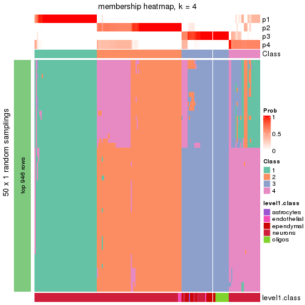</p>

</div>
</div>

As soon as the classes for columns are determined, the signatures
that are significantly different between subgroups can be looked for. 
Following are the heatmaps for signatures.


Signature heatmaps where rows are scaled:


<script>
$( function() {
	$( '#tabs-node-0211-get-signatures' ).tabs();
} );
</script>
<div id='tabs-node-0211-get-signatures'>
<ul>
<li><a href='#tab-node-0211-get-signatures-1'>k = 2</a></li>
<li><a href='#tab-node-0211-get-signatures-2'>k = 3</a></li>
<li><a href='#tab-node-0211-get-signatures-3'>k = 4</a></li>
</ul>
<div id='tab-node-0211-get-signatures-1'>
<pre><code class="r">get_signatures(res, k = 2)
</code></pre>

<p></p>

</div>
<div id='tab-node-0211-get-signatures-2'>
<pre><code class="r">get_signatures(res, k = 3)
</code></pre>

<p></p>

</div>
<div id='tab-node-0211-get-signatures-3'>
<pre><code class="r">get_signatures(res, k = 4)
</code></pre>

<p></p>

</div>
</div>


Signature heatmaps where rows are not scaled:


<script>
$( function() {
	$( '#tabs-node-0211-get-signatures-no-scale' ).tabs();
} );
</script>
<div id='tabs-node-0211-get-signatures-no-scale'>
<ul>
<li><a href='#tab-node-0211-get-signatures-no-scale-1'>k = 2</a></li>
<li><a href='#tab-node-0211-get-signatures-no-scale-2'>k = 3</a></li>
<li><a href='#tab-node-0211-get-signatures-no-scale-3'>k = 4</a></li>
</ul>
<div id='tab-node-0211-get-signatures-no-scale-1'>
<pre><code class="r">get_signatures(res, k = 2, scale_rows = FALSE)
</code></pre>

<p></p>

</div>
<div id='tab-node-0211-get-signatures-no-scale-2'>
<pre><code class="r">get_signatures(res, k = 3, scale_rows = FALSE)
</code></pre>

<p></p>

</div>
<div id='tab-node-0211-get-signatures-no-scale-3'>
<pre><code class="r">get_signatures(res, k = 4, scale_rows = FALSE)
</code></pre>

<p></p>

</div>
</div>


Compare the overlap of signatures from different k:

```r
compare_signatures(res)
```


`get_signature()` returns a data frame invisibly. To get the list of signatures, the function
call should be assigned to a variable explicitly. In following code, if `plot` argument is set
to `FALSE`, no heatmap is plotted while only the differential analysis is performed.

```r
# code only for demonstration
tb = get_signature(res, k = ..., plot = FALSE)
```

An example of the output of `tb` is:

```
#>   which_row         fdr    mean_1    mean_2 scaled_mean_1 scaled_mean_2 km
#> 1        38 0.042760348  8.373488  9.131774    -0.5533452     0.5164555  1
#> 2        40 0.018707592  7.106213  8.469186    -0.6173731     0.5762149  1
#> 3        55 0.019134737 10.221463 11.207825    -0.6159697     0.5749050  1
#> 4        59 0.006059896  5.921854  7.869574    -0.6899429     0.6439467  1
#> 5        60 0.018055526  8.928898 10.211722    -0.6204761     0.5791110  1
#> 6        98 0.009384629 15.714769 14.887706     0.6635654    -0.6193277  2
...
```

The columns in `tb` are:

1. `which_row`: row indices corresponding to the input matrix.
2. `fdr`: FDR for the differential test. 
3. `mean_x`: The mean value in group x.
4. `scaled_mean_x`: The mean value in group x after rows are scaled.
5. `km`: Row groups if k-means clustering is applied to rows (which is done by automatically selecting number of clusters).

If there are too many signatures, `top_signatures = ...` can be set to only show the 
signatures with the highest FDRs:

```r
# code only for demonstration
# e.g. to show the top 500 most significant rows
tb = get_signature(res, k = ..., top_signatures = 500)
```

If the signatures are defined as these which are uniquely high in current group, `diff_method` argument
can be set to `"uniquely_high_in_one_group"`:

```r
# code only for demonstration
tb = get_signature(res, k = ..., diff_method = "uniquely_high_in_one_group")
```


UMAP plot which shows how samples are separated.


<script>
$( function() {
	$( '#tabs-node-0211-dimension-reduction' ).tabs();
} );
</script>
<div id='tabs-node-0211-dimension-reduction'>
<ul>
<li><a href='#tab-node-0211-dimension-reduction-1'>k = 2</a></li>
<li><a href='#tab-node-0211-dimension-reduction-2'>k = 3</a></li>
<li><a href='#tab-node-0211-dimension-reduction-3'>k = 4</a></li>
</ul>
<div id='tab-node-0211-dimension-reduction-1'>
<pre><code class="r">dimension_reduction(res, k = 2, method = &quot;UMAP&quot;)
</code></pre>

<p></p>

</div>
<div id='tab-node-0211-dimension-reduction-2'>
<pre><code class="r">dimension_reduction(res, k = 3, method = &quot;UMAP&quot;)
</code></pre>

<p></p>

</div>
<div id='tab-node-0211-dimension-reduction-3'>
<pre><code class="r">dimension_reduction(res, k = 4, method = &quot;UMAP&quot;)
</code></pre>

<p></p>

</div>
</div>


Following heatmap shows how subgroups are split when increasing `k`:

```r
collect_classes(res)
```


Test correlation between subgroups and known annotations. If the known
annotation is numeric, one-way ANOVA test is applied, and if the known
annotation is discrete, chi-squared contingency table test is applied.

```r
test_to_known_factors(res)
```

```
#>             n_sample level1.class(p-value) k
#> ATC:skmeans      179              1.78e-04 2
#> ATC:skmeans      179              2.24e-17 3
#> ATC:skmeans      170              5.53e-18 4
```


If matrix rows can be associated to genes, consider to use `functional_enrichment(res,
...)` to perform function enrichment for the signature genes. See [this vignette](https://jokergoo.github.io/cola_vignettes/functional_enrichment.html) for more detailed explanations.


 

---------------------------------------------------


### Node02111


Parent node: [Node0211](#Node0211).
Child nodes: 
                Node021111-leaf
        ,
                Node021112-leaf
        ,
                Node021121-leaf
        ,
                Node021122-leaf
        ,
                Node031221-leaf
        ,
                Node031222-leaf
        .


The object with results only for a single top-value method and a single partitioning method 
can be extracted as:

```r
res = res_rh["02111"]
```

A summary of `res` and all the functions that can be applied to it:

```r
res
```

```
#> A 'ConsensusPartition' object with k = 2, 3, 4.
#>   On a matrix with 9056 rows and 65 columns.
#>   Top rows (906) are extracted by 'ATC' method.
#>   Subgroups are detected by 'skmeans' method.
#>   Performed in total 150 partitions by row resampling.
#>   Best k for subgroups seems to be 3.
#> 
#> Following methods can be applied to this 'ConsensusPartition' object:
#>  [1] "cola_report"             "collect_classes"         "collect_plots"          
#>  [4] "collect_stats"           "colnames"                "compare_partitions"     
#>  [7] "compare_signatures"      "consensus_heatmap"       "dimension_reduction"    
#> [10] "functional_enrichment"   "get_anno_col"            "get_anno"               
#> [13] "get_classes"             "get_consensus"           "get_matrix"             
#> [16] "get_membership"          "get_param"               "get_signatures"         
#> [19] "get_stats"               "is_best_k"               "is_stable_k"            
#> [22] "membership_heatmap"      "ncol"                    "nrow"                   
#> [25] "plot_ecdf"               "predict_classes"         "rownames"               
#> [28] "select_partition_number" "show"                    "suggest_best_k"         
#> [31] "test_to_known_factors"   "top_rows_heatmap"
```

`collect_plots()` function collects all the plots made from `res` for all `k` (number of subgroups)
into one single page to provide an easy and fast comparison between different `k`.

```r
collect_plots(res)
```


The plots are:

- The first row: a plot of the eCDF (empirical cumulative distribution
  function) curves of the consensus matrix for each `k` and the heatmap of
  predicted classes for each `k`.
- The second row: heatmaps of the consensus matrix for each `k`.
- The third row: heatmaps of the membership matrix for each `k`.
- The fouth row: heatmaps of the signatures for each `k`.

All the plots in panels can be made by individual functions and they are
plotted later in this section.

`select_partition_number()` produces several plots showing different
statistics for choosing "optimized" `k`. There are following statistics:

- eCDF curves of the consensus matrix for each `k`;
- 1-PAC. [The PAC score](https://en.wikipedia.org/wiki/Consensus_clustering#Over-interpretation_potential_of_consensus_clustering)
  measures the proportion of the ambiguous subgrouping.
- Mean silhouette score.
- Concordance. The mean probability of fiting the consensus subgroup labels in all
  partitions.
- Area increased. Denote $A_k$ as the area under the eCDF curve for current
  `k`, the area increased is defined as $A_k - A_{k-1}$.
- Rand index. The percent of pairs of samples that are both in a same cluster
  or both are not in a same cluster in the partition of k and k-1.
- Jaccard index. The ratio of pairs of samples are both in a same cluster in
  the partition of k and k-1 and the pairs of samples are both in a same
  cluster in the partition k or k-1.

The detailed explanations of these statistics can be found in [the _cola_
vignette](https://jokergoo.github.io/cola_vignettes/cola.html#toc_13).

Generally speaking, higher 1-PAC score, higher mean silhouette score or higher
concordance corresponds to better partition. Rand index and Jaccard index
measure how similar the current partition is compared to partition with `k-1`.
If they are too similar, we won't accept `k` is better than `k-1`.

```r
select_partition_number(res)
```


The numeric values for all these statistics can be obtained by `get_stats()`.

```r
get_stats(res)
```

```
#>   k 1-PAC mean_silhouette concordance area_increased  Rand Jaccard
#> 2 2 1.000           0.994       0.997          0.507 0.493   0.493
#> 3 3 0.932           0.908       0.961          0.299 0.805   0.622
#> 4 4 0.689           0.640       0.829          0.094 0.877   0.670
```

`suggest_best_k()` suggests the best $k$ based on these statistics. The rules are as follows:

- All $k$ with Jaccard index larger than 0.95 are removed because increasing
  $k$ does not provide enough extra information. If all $k$ are removed, it is
  marked as no subgroup is detected.
- For all $k$ with 1-PAC score larger than 0.9, the maximal $k$ is taken as
  the best $k$, and other $k$ are marked as optional $k$.
- If it does not fit the second rule. The $k$ with the maximal vote of the
  highest 1-PAC score, highest mean silhouette, and highest concordance is
  taken as the best $k$.

```r
suggest_best_k(res)
```

```
#> [1] 3
#> attr(,"optional")
#> [1] 2
```

There is also optional best $k$ = 2 that is worth to check.

Following is the table of the partitions (You need to click the **show/hide
code output** link to see it). The membership matrix (columns with name `p*`)
is inferred by
[`clue::cl_consensus()`](https://www.rdocumentation.org/link/cl_consensus?package=clue)
function with the `SE` method. Basically the value in the membership matrix
represents the probability to belong to a certain group. The finall subgroup
label for an item is determined with the group with highest probability it
belongs to.

In `get_classes()` function, the entropy is calculated from the membership
matrix and the silhouette score is calculated from the consensus matrix.


<script>
$( function() {
	$( '#tabs-node-02111-get-classes' ).tabs();
} );
</script>
<div id='tabs-node-02111-get-classes'>
<ul>
<li><a href='#tab-node-02111-get-classes-1'>k = 2</a></li>
<li><a href='#tab-node-02111-get-classes-2'>k = 3</a></li>
<li><a href='#tab-node-02111-get-classes-3'>k = 4</a></li>
</ul>

<div id='tab-node-02111-get-classes-1'>
<p><a id='tab-node-02111-get-classes-1-a' style='color:#0366d6' href='#'>show/hide code output</a></p>
<pre><code class="r">cbind(get_classes(res, k = 2), get_membership(res, k = 2))
</code></pre>

<pre><code>#&gt;    class entropy silhouette   p1   p2
#&gt; 1      2   0.469      0.889 0.10 0.90
#&gt; 2      2   0.000      0.997 0.00 1.00
#&gt; 3      2   0.000      0.997 0.00 1.00
#&gt; 4      2   0.000      0.997 0.00 1.00
#&gt; 5      1   0.000      0.998 1.00 0.00
#&gt; 6      1   0.000      0.998 1.00 0.00
#&gt; 7      1   0.000      0.998 1.00 0.00
#&gt; 8      1   0.000      0.998 1.00 0.00
#&gt; 9      1   0.000      0.998 1.00 0.00
#&gt; 10     1   0.000      0.998 1.00 0.00
#&gt; 11     1   0.000      0.998 1.00 0.00
#&gt; 12     1   0.000      0.998 1.00 0.00
#&gt; 13     1   0.000      0.998 1.00 0.00
#&gt; 14     1   0.000      0.998 1.00 0.00
#&gt; 15     1   0.000      0.998 1.00 0.00
#&gt; 16     1   0.000      0.998 1.00 0.00
#&gt; 17     2   0.000      0.997 0.00 1.00
#&gt; 18     2   0.000      0.997 0.00 1.00
#&gt; 19     1   0.000      0.998 1.00 0.00
#&gt; 20     1   0.000      0.998 1.00 0.00
#&gt; 21     1   0.000      0.998 1.00 0.00
#&gt; 22     2   0.000      0.997 0.00 1.00
#&gt; 23     1   0.000      0.998 1.00 0.00
#&gt; 24     1   0.000      0.998 1.00 0.00
#&gt; 25     2   0.000      0.997 0.00 1.00
#&gt; 26     2   0.000      0.997 0.00 1.00
#&gt; 27     2   0.000      0.997 0.00 1.00
#&gt; 28     1   0.000      0.998 1.00 0.00
#&gt; 29     1   0.000      0.998 1.00 0.00
#&gt; 30     1   0.000      0.998 1.00 0.00
#&gt; 31     1   0.000      0.998 1.00 0.00
#&gt; 32     1   0.000      0.998 1.00 0.00
#&gt; 33     2   0.000      0.997 0.00 1.00
#&gt; 34     2   0.000      0.997 0.00 1.00
#&gt; 35     2   0.000      0.997 0.00 1.00
#&gt; 36     2   0.000      0.997 0.00 1.00
#&gt; 37     1   0.000      0.998 1.00 0.00
#&gt; 38     1   0.000      0.998 1.00 0.00
#&gt; 39     1   0.000      0.998 1.00 0.00
#&gt; 40     2   0.000      0.997 0.00 1.00
#&gt; 41     1   0.000      0.998 1.00 0.00
#&gt; 42     2   0.000      0.997 0.00 1.00
#&gt; 43     1   0.000      0.998 1.00 0.00
#&gt; 44     1   0.000      0.998 1.00 0.00
#&gt; 45     1   0.000      0.998 1.00 0.00
#&gt; 46     1   0.000      0.998 1.00 0.00
#&gt; 47     2   0.000      0.997 0.00 1.00
#&gt; 48     2   0.000      0.997 0.00 1.00
#&gt; 49     1   0.000      0.998 1.00 0.00
#&gt; 50     2   0.000      0.997 0.00 1.00
#&gt; 51     2   0.000      0.997 0.00 1.00
#&gt; 52     2   0.000      0.997 0.00 1.00
#&gt; 53     2   0.000      0.997 0.00 1.00
#&gt; 54     2   0.000      0.997 0.00 1.00
#&gt; 55     2   0.000      0.997 0.00 1.00
#&gt; 56     2   0.000      0.997 0.00 1.00
#&gt; 57     2   0.000      0.997 0.00 1.00
#&gt; 58     1   0.000      0.998 1.00 0.00
#&gt; 59     2   0.000      0.997 0.00 1.00
#&gt; 60     2   0.000      0.997 0.00 1.00
#&gt; 61     2   0.000      0.997 0.00 1.00
#&gt; 62     1   0.402      0.913 0.92 0.08
#&gt; 63     2   0.000      0.997 0.00 1.00
#&gt; 64     1   0.000      0.998 1.00 0.00
#&gt; 65     2   0.000      0.997 0.00 1.00
</code></pre>

<script>
$('#tab-node-02111-get-classes-1-a').parent().next().next().hide();
$('#tab-node-02111-get-classes-1-a').click(function(){
  $('#tab-node-02111-get-classes-1-a').parent().next().next().toggle();
  return(false);
});
</script>
</div>

<div id='tab-node-02111-get-classes-2'>
<p><a id='tab-node-02111-get-classes-2-a' style='color:#0366d6' href='#'>show/hide code output</a></p>
<pre><code class="r">cbind(get_classes(res, k = 3), get_membership(res, k = 3))
</code></pre>

<pre><code>#&gt;    class entropy silhouette   p1   p2   p3
#&gt; 1      3  0.7277      0.556 0.06 0.28 0.66
#&gt; 2      2  0.0000      0.978 0.00 1.00 0.00
#&gt; 3      2  0.0000      0.978 0.00 1.00 0.00
#&gt; 4      2  0.0000      0.978 0.00 1.00 0.00
#&gt; 5      1  0.0000      0.950 1.00 0.00 0.00
#&gt; 6      1  0.0000      0.950 1.00 0.00 0.00
#&gt; 7      1  0.0000      0.950 1.00 0.00 0.00
#&gt; 8      1  0.0000      0.950 1.00 0.00 0.00
#&gt; 9      1  0.0000      0.950 1.00 0.00 0.00
#&gt; 10     3  0.5835      0.447 0.34 0.00 0.66
#&gt; 11     1  0.0000      0.950 1.00 0.00 0.00
#&gt; 12     1  0.0000      0.950 1.00 0.00 0.00
#&gt; 13     1  0.0000      0.950 1.00 0.00 0.00
#&gt; 14     1  0.0000      0.950 1.00 0.00 0.00
#&gt; 15     1  0.0000      0.950 1.00 0.00 0.00
#&gt; 16     1  0.0000      0.950 1.00 0.00 0.00
#&gt; 17     2  0.2537      0.905 0.00 0.92 0.08
#&gt; 18     2  0.0000      0.978 0.00 1.00 0.00
#&gt; 19     3  0.0000      0.936 0.00 0.00 1.00
#&gt; 20     1  0.0000      0.950 1.00 0.00 0.00
#&gt; 21     3  0.0000      0.936 0.00 0.00 1.00
#&gt; 22     3  0.0000      0.936 0.00 0.00 1.00
#&gt; 23     3  0.0892      0.924 0.02 0.00 0.98
#&gt; 24     1  0.5560      0.567 0.70 0.00 0.30
#&gt; 25     2  0.0000      0.978 0.00 1.00 0.00
#&gt; 26     2  0.0000      0.978 0.00 1.00 0.00
#&gt; 27     3  0.2537      0.874 0.00 0.08 0.92
#&gt; 28     1  0.0000      0.950 1.00 0.00 0.00
#&gt; 29     1  0.0000      0.950 1.00 0.00 0.00
#&gt; 30     1  0.0000      0.950 1.00 0.00 0.00
#&gt; 31     1  0.0000      0.950 1.00 0.00 0.00
#&gt; 32     1  0.0000      0.950 1.00 0.00 0.00
#&gt; 33     2  0.5706      0.527 0.00 0.68 0.32
#&gt; 34     2  0.2537      0.905 0.00 0.92 0.08
#&gt; 35     2  0.0000      0.978 0.00 1.00 0.00
#&gt; 36     2  0.0000      0.978 0.00 1.00 0.00
#&gt; 37     1  0.0000      0.950 1.00 0.00 0.00
#&gt; 38     1  0.6244      0.222 0.56 0.00 0.44
#&gt; 39     1  0.0000      0.950 1.00 0.00 0.00
#&gt; 40     2  0.0000      0.978 0.00 1.00 0.00
#&gt; 41     1  0.0000      0.950 1.00 0.00 0.00
#&gt; 42     2  0.0000      0.978 0.00 1.00 0.00
#&gt; 43     1  0.0000      0.950 1.00 0.00 0.00
#&gt; 44     3  0.0000      0.936 0.00 0.00 1.00
#&gt; 45     1  0.2537      0.882 0.92 0.00 0.08
#&gt; 46     1  0.5397      0.609 0.72 0.00 0.28
#&gt; 47     3  0.0000      0.936 0.00 0.00 1.00
#&gt; 48     2  0.0000      0.978 0.00 1.00 0.00
#&gt; 49     3  0.1529      0.908 0.04 0.00 0.96
#&gt; 50     2  0.0000      0.978 0.00 1.00 0.00
#&gt; 51     2  0.0000      0.978 0.00 1.00 0.00
#&gt; 52     3  0.0000      0.936 0.00 0.00 1.00
#&gt; 53     2  0.0000      0.978 0.00 1.00 0.00
#&gt; 54     2  0.0000      0.978 0.00 1.00 0.00
#&gt; 55     3  0.0000      0.936 0.00 0.00 1.00
#&gt; 56     2  0.0000      0.978 0.00 1.00 0.00
#&gt; 57     2  0.0000      0.978 0.00 1.00 0.00
#&gt; 58     1  0.0000      0.950 1.00 0.00 0.00
#&gt; 59     2  0.0000      0.978 0.00 1.00 0.00
#&gt; 60     3  0.0000      0.936 0.00 0.00 1.00
#&gt; 61     2  0.0000      0.978 0.00 1.00 0.00
#&gt; 62     3  0.0000      0.936 0.00 0.00 1.00
#&gt; 63     2  0.0000      0.978 0.00 1.00 0.00
#&gt; 64     1  0.3340      0.824 0.88 0.12 0.00
#&gt; 65     2  0.0000      0.978 0.00 1.00 0.00
</code></pre>

<script>
$('#tab-node-02111-get-classes-2-a').parent().next().next().hide();
$('#tab-node-02111-get-classes-2-a').click(function(){
  $('#tab-node-02111-get-classes-2-a').parent().next().next().toggle();
  return(false);
});
</script>
</div>

<div id='tab-node-02111-get-classes-3'>
<p><a id='tab-node-02111-get-classes-3-a' style='color:#0366d6' href='#'>show/hide code output</a></p>
<pre><code class="r">cbind(get_classes(res, k = 4), get_membership(res, k = 4))
</code></pre>

<pre><code>#&gt;    class entropy silhouette   p1   p2   p3   p4
#&gt; 1      4  0.8724    -0.2934 0.06 0.26 0.22 0.46
#&gt; 2      2  0.2830     0.8898 0.00 0.90 0.04 0.06
#&gt; 3      2  0.0707     0.9380 0.00 0.98 0.00 0.02
#&gt; 4      2  0.0707     0.9380 0.00 0.98 0.00 0.02
#&gt; 5      4  0.5000     0.5558 0.50 0.00 0.00 0.50
#&gt; 6      1  0.4977    -0.5191 0.54 0.00 0.00 0.46
#&gt; 7      4  0.5000     0.5558 0.50 0.00 0.00 0.50
#&gt; 8      1  0.4522     0.0124 0.68 0.00 0.00 0.32
#&gt; 9      1  0.0000     0.7024 1.00 0.00 0.00 0.00
#&gt; 10     1  0.6656     0.3822 0.62 0.00 0.16 0.22
#&gt; 11     1  0.0000     0.7024 1.00 0.00 0.00 0.00
#&gt; 12     1  0.0000     0.7024 1.00 0.00 0.00 0.00
#&gt; 13     1  0.4134     0.2410 0.74 0.00 0.00 0.26
#&gt; 14     1  0.0000     0.7024 1.00 0.00 0.00 0.00
#&gt; 15     1  0.0000     0.7024 1.00 0.00 0.00 0.00
#&gt; 16     1  0.4907    -0.2717 0.58 0.00 0.00 0.42
#&gt; 17     2  0.4610     0.7738 0.00 0.80 0.10 0.10
#&gt; 18     2  0.0000     0.9441 0.00 1.00 0.00 0.00
#&gt; 19     3  0.4227     0.7254 0.06 0.00 0.82 0.12
#&gt; 20     1  0.3801     0.3623 0.78 0.00 0.00 0.22
#&gt; 21     3  0.6382     0.3631 0.34 0.00 0.58 0.08
#&gt; 22     3  0.2011     0.7624 0.00 0.00 0.92 0.08
#&gt; 23     3  0.7869     0.2455 0.34 0.00 0.38 0.28
#&gt; 24     1  0.4841     0.5470 0.78 0.00 0.14 0.08
#&gt; 25     2  0.2011     0.9059 0.00 0.92 0.00 0.08
#&gt; 26     2  0.0000     0.9441 0.00 1.00 0.00 0.00
#&gt; 27     3  0.6320     0.6400 0.00 0.18 0.66 0.16
#&gt; 28     4  0.4907     0.6386 0.42 0.00 0.00 0.58
#&gt; 29     1  0.0000     0.7024 1.00 0.00 0.00 0.00
#&gt; 30     1  0.0000     0.7024 1.00 0.00 0.00 0.00
#&gt; 31     4  0.4948     0.6272 0.44 0.00 0.00 0.56
#&gt; 32     4  0.4948     0.6370 0.44 0.00 0.00 0.56
#&gt; 33     3  0.6605     0.0553 0.00 0.44 0.48 0.08
#&gt; 34     2  0.6649     0.2846 0.00 0.56 0.34 0.10
#&gt; 35     2  0.0000     0.9441 0.00 1.00 0.00 0.00
#&gt; 36     2  0.0000     0.9441 0.00 1.00 0.00 0.00
#&gt; 37     1  0.0000     0.7024 1.00 0.00 0.00 0.00
#&gt; 38     1  0.5902     0.4685 0.70 0.00 0.16 0.14
#&gt; 39     4  0.4713     0.6291 0.36 0.00 0.00 0.64
#&gt; 40     2  0.0000     0.9441 0.00 1.00 0.00 0.00
#&gt; 41     1  0.2345     0.5949 0.90 0.00 0.00 0.10
#&gt; 42     2  0.0000     0.9441 0.00 1.00 0.00 0.00
#&gt; 43     1  0.0000     0.7024 1.00 0.00 0.00 0.00
#&gt; 44     3  0.0000     0.7637 0.00 0.00 1.00 0.00
#&gt; 45     1  0.5956     0.4078 0.68 0.00 0.10 0.22
#&gt; 46     1  0.3821     0.5961 0.84 0.00 0.12 0.04
#&gt; 47     3  0.2345     0.7580 0.00 0.00 0.90 0.10
#&gt; 48     2  0.0000     0.9441 0.00 1.00 0.00 0.00
#&gt; 49     1  0.7139     0.0525 0.50 0.00 0.36 0.14
#&gt; 50     2  0.3335     0.8354 0.00 0.86 0.12 0.02
#&gt; 51     2  0.0707     0.9375 0.00 0.98 0.00 0.02
#&gt; 52     3  0.1211     0.7613 0.00 0.00 0.96 0.04
#&gt; 53     2  0.0000     0.9441 0.00 1.00 0.00 0.00
#&gt; 54     2  0.1211     0.9331 0.00 0.96 0.00 0.04
#&gt; 55     3  0.2345     0.7462 0.00 0.00 0.90 0.10
#&gt; 56     2  0.0000     0.9441 0.00 1.00 0.00 0.00
#&gt; 57     2  0.0000     0.9441 0.00 1.00 0.00 0.00
#&gt; 58     1  0.0000     0.7024 1.00 0.00 0.00 0.00
#&gt; 59     2  0.1637     0.9231 0.00 0.94 0.00 0.06
#&gt; 60     3  0.5489     0.7041 0.00 0.06 0.70 0.24
#&gt; 61     2  0.2011     0.9012 0.00 0.92 0.00 0.08
#&gt; 62     3  0.1637     0.7653 0.00 0.00 0.94 0.06
#&gt; 63     2  0.0000     0.9441 0.00 1.00 0.00 0.00
#&gt; 64     4  0.5616     0.5028 0.18 0.06 0.02 0.74
#&gt; 65     2  0.1211     0.9296 0.00 0.96 0.00 0.04
</code></pre>

<script>
$('#tab-node-02111-get-classes-3-a').parent().next().next().hide();
$('#tab-node-02111-get-classes-3-a').click(function(){
  $('#tab-node-02111-get-classes-3-a').parent().next().next().toggle();
  return(false);
});
</script>
</div>
</div>

Heatmaps for the consensus matrix. It visualizes the probability of two
samples to be in a same group.


<script>
$( function() {
	$( '#tabs-node-02111-consensus-heatmap' ).tabs();
} );
</script>
<div id='tabs-node-02111-consensus-heatmap'>
<ul>
<li><a href='#tab-node-02111-consensus-heatmap-1'>k = 2</a></li>
<li><a href='#tab-node-02111-consensus-heatmap-2'>k = 3</a></li>
<li><a href='#tab-node-02111-consensus-heatmap-3'>k = 4</a></li>
</ul>
<div id='tab-node-02111-consensus-heatmap-1'>
<pre><code class="r">consensus_heatmap(res, k = 2)
</code></pre>

<p></p>

</div>
<div id='tab-node-02111-consensus-heatmap-2'>
<pre><code class="r">consensus_heatmap(res, k = 3)
</code></pre>

<p></p>

</div>
<div id='tab-node-02111-consensus-heatmap-3'>
<pre><code class="r">consensus_heatmap(res, k = 4)
</code></pre>

<p></p>

</div>
</div>

Heatmaps for the membership of samples in all partitions to see how consistent they are:


<script>
$( function() {
	$( '#tabs-node-02111-membership-heatmap' ).tabs();
} );
</script>
<div id='tabs-node-02111-membership-heatmap'>
<ul>
<li><a href='#tab-node-02111-membership-heatmap-1'>k = 2</a></li>
<li><a href='#tab-node-02111-membership-heatmap-2'>k = 3</a></li>
<li><a href='#tab-node-02111-membership-heatmap-3'>k = 4</a></li>
</ul>
<div id='tab-node-02111-membership-heatmap-1'>
<pre><code class="r">membership_heatmap(res, k = 2)
</code></pre>

<p></p>

</div>
<div id='tab-node-02111-membership-heatmap-2'>
<pre><code class="r">membership_heatmap(res, k = 3)
</code></pre>

<p></p>

</div>
<div id='tab-node-02111-membership-heatmap-3'>
<pre><code class="r">membership_heatmap(res, k = 4)
</code></pre>

<p></p>

</div>
</div>

As soon as the classes for columns are determined, the signatures
that are significantly different between subgroups can be looked for. 
Following are the heatmaps for signatures.


Signature heatmaps where rows are scaled:


<script>
$( function() {
	$( '#tabs-node-02111-get-signatures' ).tabs();
} );
</script>
<div id='tabs-node-02111-get-signatures'>
<ul>
<li><a href='#tab-node-02111-get-signatures-1'>k = 2</a></li>
<li><a href='#tab-node-02111-get-signatures-2'>k = 3</a></li>
<li><a href='#tab-node-02111-get-signatures-3'>k = 4</a></li>
</ul>
<div id='tab-node-02111-get-signatures-1'>
<pre><code class="r">get_signatures(res, k = 2)
</code></pre>

<p>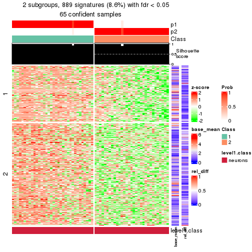</p>

</div>
<div id='tab-node-02111-get-signatures-2'>
<pre><code class="r">get_signatures(res, k = 3)
</code></pre>

<p></p>

</div>
<div id='tab-node-02111-get-signatures-3'>
<pre><code class="r">get_signatures(res, k = 4)
</code></pre>

<p></p>

</div>
</div>


Signature heatmaps where rows are not scaled:


<script>
$( function() {
	$( '#tabs-node-02111-get-signatures-no-scale' ).tabs();
} );
</script>
<div id='tabs-node-02111-get-signatures-no-scale'>
<ul>
<li><a href='#tab-node-02111-get-signatures-no-scale-1'>k = 2</a></li>
<li><a href='#tab-node-02111-get-signatures-no-scale-2'>k = 3</a></li>
<li><a href='#tab-node-02111-get-signatures-no-scale-3'>k = 4</a></li>
</ul>
<div id='tab-node-02111-get-signatures-no-scale-1'>
<pre><code class="r">get_signatures(res, k = 2, scale_rows = FALSE)
</code></pre>

<p></p>

</div>
<div id='tab-node-02111-get-signatures-no-scale-2'>
<pre><code class="r">get_signatures(res, k = 3, scale_rows = FALSE)
</code></pre>

<p></p>

</div>
<div id='tab-node-02111-get-signatures-no-scale-3'>
<pre><code class="r">get_signatures(res, k = 4, scale_rows = FALSE)
</code></pre>

<p></p>

</div>
</div>


Compare the overlap of signatures from different k:

```r
compare_signatures(res)
```


`get_signature()` returns a data frame invisibly. To get the list of signatures, the function
call should be assigned to a variable explicitly. In following code, if `plot` argument is set
to `FALSE`, no heatmap is plotted while only the differential analysis is performed.

```r
# code only for demonstration
tb = get_signature(res, k = ..., plot = FALSE)
```

An example of the output of `tb` is:

```
#>   which_row         fdr    mean_1    mean_2 scaled_mean_1 scaled_mean_2 km
#> 1        38 0.042760348  8.373488  9.131774    -0.5533452     0.5164555  1
#> 2        40 0.018707592  7.106213  8.469186    -0.6173731     0.5762149  1
#> 3        55 0.019134737 10.221463 11.207825    -0.6159697     0.5749050  1
#> 4        59 0.006059896  5.921854  7.869574    -0.6899429     0.6439467  1
#> 5        60 0.018055526  8.928898 10.211722    -0.6204761     0.5791110  1
#> 6        98 0.009384629 15.714769 14.887706     0.6635654    -0.6193277  2
...
```

The columns in `tb` are:

1. `which_row`: row indices corresponding to the input matrix.
2. `fdr`: FDR for the differential test. 
3. `mean_x`: The mean value in group x.
4. `scaled_mean_x`: The mean value in group x after rows are scaled.
5. `km`: Row groups if k-means clustering is applied to rows (which is done by automatically selecting number of clusters).

If there are too many signatures, `top_signatures = ...` can be set to only show the 
signatures with the highest FDRs:

```r
# code only for demonstration
# e.g. to show the top 500 most significant rows
tb = get_signature(res, k = ..., top_signatures = 500)
```

If the signatures are defined as these which are uniquely high in current group, `diff_method` argument
can be set to `"uniquely_high_in_one_group"`:

```r
# code only for demonstration
tb = get_signature(res, k = ..., diff_method = "uniquely_high_in_one_group")
```


UMAP plot which shows how samples are separated.


<script>
$( function() {
	$( '#tabs-node-02111-dimension-reduction' ).tabs();
} );
</script>
<div id='tabs-node-02111-dimension-reduction'>
<ul>
<li><a href='#tab-node-02111-dimension-reduction-1'>k = 2</a></li>
<li><a href='#tab-node-02111-dimension-reduction-2'>k = 3</a></li>
<li><a href='#tab-node-02111-dimension-reduction-3'>k = 4</a></li>
</ul>
<div id='tab-node-02111-dimension-reduction-1'>
<pre><code class="r">dimension_reduction(res, k = 2, method = &quot;UMAP&quot;)
</code></pre>

<p></p>

</div>
<div id='tab-node-02111-dimension-reduction-2'>
<pre><code class="r">dimension_reduction(res, k = 3, method = &quot;UMAP&quot;)
</code></pre>

<p></p>

</div>
<div id='tab-node-02111-dimension-reduction-3'>
<pre><code class="r">dimension_reduction(res, k = 4, method = &quot;UMAP&quot;)
</code></pre>

<p></p>

</div>
</div>


Following heatmap shows how subgroups are split when increasing `k`:

```r
collect_classes(res)
```


Test correlation between subgroups and known annotations. If the known
annotation is numeric, one-way ANOVA test is applied, and if the known
annotation is discrete, chi-squared contingency table test is applied.

```r
test_to_known_factors(res)
```

```
#>             n_sample level1.class(p-value) k
#> ATC:skmeans       65                    NA 2
#> ATC:skmeans       63                    NA 3
#> ATC:skmeans       51                    NA 4
```


If matrix rows can be associated to genes, consider to use `functional_enrichment(res,
...)` to perform function enrichment for the signature genes. See [this vignette](https://jokergoo.github.io/cola_vignettes/functional_enrichment.html) for more detailed explanations.


 

---------------------------------------------------


### Node02112


Parent node: [Node0211](#Node0211).
Child nodes: 
                Node021111-leaf
        ,
                Node021112-leaf
        ,
                Node021121-leaf
        ,
                Node021122-leaf
        ,
                Node031221-leaf
        ,
                Node031222-leaf
        .


The object with results only for a single top-value method and a single partitioning method 
can be extracted as:

```r
res = res_rh["02112"]
```

A summary of `res` and all the functions that can be applied to it:

```r
res
```

```
#> A 'ConsensusPartition' object with k = 2, 3, 4.
#>   On a matrix with 9147 rows and 71 columns.
#>   Top rows (915) are extracted by 'ATC' method.
#>   Subgroups are detected by 'skmeans' method.
#>   Performed in total 150 partitions by row resampling.
#>   Best k for subgroups seems to be 3.
#> 
#> Following methods can be applied to this 'ConsensusPartition' object:
#>  [1] "cola_report"             "collect_classes"         "collect_plots"          
#>  [4] "collect_stats"           "colnames"                "compare_partitions"     
#>  [7] "compare_signatures"      "consensus_heatmap"       "dimension_reduction"    
#> [10] "functional_enrichment"   "get_anno_col"            "get_anno"               
#> [13] "get_classes"             "get_consensus"           "get_matrix"             
#> [16] "get_membership"          "get_param"               "get_signatures"         
#> [19] "get_stats"               "is_best_k"               "is_stable_k"            
#> [22] "membership_heatmap"      "ncol"                    "nrow"                   
#> [25] "plot_ecdf"               "predict_classes"         "rownames"               
#> [28] "select_partition_number" "show"                    "suggest_best_k"         
#> [31] "test_to_known_factors"   "top_rows_heatmap"
```

`collect_plots()` function collects all the plots made from `res` for all `k` (number of subgroups)
into one single page to provide an easy and fast comparison between different `k`.

```r
collect_plots(res)
```


The plots are:

- The first row: a plot of the eCDF (empirical cumulative distribution
  function) curves of the consensus matrix for each `k` and the heatmap of
  predicted classes for each `k`.
- The second row: heatmaps of the consensus matrix for each `k`.
- The third row: heatmaps of the membership matrix for each `k`.
- The fouth row: heatmaps of the signatures for each `k`.

All the plots in panels can be made by individual functions and they are
plotted later in this section.

`select_partition_number()` produces several plots showing different
statistics for choosing "optimized" `k`. There are following statistics:

- eCDF curves of the consensus matrix for each `k`;
- 1-PAC. [The PAC score](https://en.wikipedia.org/wiki/Consensus_clustering#Over-interpretation_potential_of_consensus_clustering)
  measures the proportion of the ambiguous subgrouping.
- Mean silhouette score.
- Concordance. The mean probability of fiting the consensus subgroup labels in all
  partitions.
- Area increased. Denote $A_k$ as the area under the eCDF curve for current
  `k`, the area increased is defined as $A_k - A_{k-1}$.
- Rand index. The percent of pairs of samples that are both in a same cluster
  or both are not in a same cluster in the partition of k and k-1.
- Jaccard index. The ratio of pairs of samples are both in a same cluster in
  the partition of k and k-1 and the pairs of samples are both in a same
  cluster in the partition k or k-1.

The detailed explanations of these statistics can be found in [the _cola_
vignette](https://jokergoo.github.io/cola_vignettes/cola.html#toc_13).

Generally speaking, higher 1-PAC score, higher mean silhouette score or higher
concordance corresponds to better partition. Rand index and Jaccard index
measure how similar the current partition is compared to partition with `k-1`.
If they are too similar, we won't accept `k` is better than `k-1`.

```r
select_partition_number(res)
```


The numeric values for all these statistics can be obtained by `get_stats()`.

```r
get_stats(res)
```

```
#>   k 1-PAC mean_silhouette concordance area_increased  Rand Jaccard
#> 2 2 0.999           0.964       0.984          0.506 0.495   0.495
#> 3 3 0.906           0.914       0.964          0.227 0.868   0.738
#> 4 4 0.762           0.744       0.886          0.101 0.930   0.823
```

`suggest_best_k()` suggests the best $k$ based on these statistics. The rules are as follows:

- All $k$ with Jaccard index larger than 0.95 are removed because increasing
  $k$ does not provide enough extra information. If all $k$ are removed, it is
  marked as no subgroup is detected.
- For all $k$ with 1-PAC score larger than 0.9, the maximal $k$ is taken as
  the best $k$, and other $k$ are marked as optional $k$.
- If it does not fit the second rule. The $k$ with the maximal vote of the
  highest 1-PAC score, highest mean silhouette, and highest concordance is
  taken as the best $k$.

```r
suggest_best_k(res)
```

```
#> [1] 3
#> attr(,"optional")
#> [1] 2
```

There is also optional best $k$ = 2 that is worth to check.

Following is the table of the partitions (You need to click the **show/hide
code output** link to see it). The membership matrix (columns with name `p*`)
is inferred by
[`clue::cl_consensus()`](https://www.rdocumentation.org/link/cl_consensus?package=clue)
function with the `SE` method. Basically the value in the membership matrix
represents the probability to belong to a certain group. The finall subgroup
label for an item is determined with the group with highest probability it
belongs to.

In `get_classes()` function, the entropy is calculated from the membership
matrix and the silhouette score is calculated from the consensus matrix.


<script>
$( function() {
	$( '#tabs-node-02112-get-classes' ).tabs();
} );
</script>
<div id='tabs-node-02112-get-classes'>
<ul>
<li><a href='#tab-node-02112-get-classes-1'>k = 2</a></li>
<li><a href='#tab-node-02112-get-classes-2'>k = 3</a></li>
<li><a href='#tab-node-02112-get-classes-3'>k = 4</a></li>
</ul>

<div id='tab-node-02112-get-classes-1'>
<p><a id='tab-node-02112-get-classes-1-a' style='color:#0366d6' href='#'>show/hide code output</a></p>
<pre><code class="r">cbind(get_classes(res, k = 2), get_membership(res, k = 2))
</code></pre>

<pre><code>#&gt;    class entropy silhouette   p1   p2
#&gt; 1      1   0.000      0.978 1.00 0.00
#&gt; 2      1   0.327      0.930 0.94 0.06
#&gt; 3      1   0.634      0.820 0.84 0.16
#&gt; 4      2   0.000      0.988 0.00 1.00
#&gt; 5      2   0.000      0.988 0.00 1.00
#&gt; 6      2   0.000      0.988 0.00 1.00
#&gt; 7      1   0.000      0.978 1.00 0.00
#&gt; 8      2   0.000      0.988 0.00 1.00
#&gt; 9      2   0.000      0.988 0.00 1.00
#&gt; 10     1   0.000      0.978 1.00 0.00
#&gt; 11     1   0.000      0.978 1.00 0.00
#&gt; 12     2   0.000      0.988 0.00 1.00
#&gt; 13     1   0.000      0.978 1.00 0.00
#&gt; 14     1   0.000      0.978 1.00 0.00
#&gt; 15     1   0.000      0.978 1.00 0.00
#&gt; 16     2   0.000      0.988 0.00 1.00
#&gt; 17     1   0.000      0.978 1.00 0.00
#&gt; 18     1   0.000      0.978 1.00 0.00
#&gt; 19     1   0.000      0.978 1.00 0.00
#&gt; 20     1   0.000      0.978 1.00 0.00
#&gt; 21     1   0.000      0.978 1.00 0.00
#&gt; 22     2   0.000      0.988 0.00 1.00
#&gt; 23     2   0.000      0.988 0.00 1.00
#&gt; 24     1   0.760      0.728 0.78 0.22
#&gt; 25     2   0.000      0.988 0.00 1.00
#&gt; 26     2   0.000      0.988 0.00 1.00
#&gt; 27     2   0.000      0.988 0.00 1.00
#&gt; 28     1   0.000      0.978 1.00 0.00
#&gt; 29     2   0.000      0.988 0.00 1.00
#&gt; 30     2   0.000      0.988 0.00 1.00
#&gt; 31     2   0.000      0.988 0.00 1.00
#&gt; 32     1   0.000      0.978 1.00 0.00
#&gt; 33     1   0.000      0.978 1.00 0.00
#&gt; 34     1   0.000      0.978 1.00 0.00
#&gt; 35     1   0.680      0.789 0.82 0.18
#&gt; 36     1   0.000      0.978 1.00 0.00
#&gt; 37     2   0.000      0.988 0.00 1.00
#&gt; 38     1   0.000      0.978 1.00 0.00
#&gt; 39     2   0.000      0.988 0.00 1.00
#&gt; 40     2   0.000      0.988 0.00 1.00
#&gt; 41     2   0.000      0.988 0.00 1.00
#&gt; 42     2   0.000      0.988 0.00 1.00
#&gt; 43     2   0.000      0.988 0.00 1.00
#&gt; 44     2   0.000      0.988 0.00 1.00
#&gt; 45     1   0.000      0.978 1.00 0.00
#&gt; 46     1   0.000      0.978 1.00 0.00
#&gt; 47     1   0.000      0.978 1.00 0.00
#&gt; 48     1   0.000      0.978 1.00 0.00
#&gt; 49     1   0.000      0.978 1.00 0.00
#&gt; 50     2   0.000      0.988 0.00 1.00
#&gt; 51     1   0.000      0.978 1.00 0.00
#&gt; 52     1   0.000      0.978 1.00 0.00
#&gt; 53     2   0.000      0.988 0.00 1.00
#&gt; 54     2   0.000      0.988 0.00 1.00
#&gt; 55     1   0.000      0.978 1.00 0.00
#&gt; 56     2   0.000      0.988 0.00 1.00
#&gt; 57     1   0.000      0.978 1.00 0.00
#&gt; 58     1   0.402      0.911 0.92 0.08
#&gt; 59     2   0.000      0.988 0.00 1.00
#&gt; 60     1   0.000      0.978 1.00 0.00
#&gt; 61     2   0.943      0.421 0.36 0.64
#&gt; 62     2   0.000      0.988 0.00 1.00
#&gt; 63     1   0.000      0.978 1.00 0.00
#&gt; 64     2   0.000      0.988 0.00 1.00
#&gt; 65     2   0.000      0.988 0.00 1.00
#&gt; 66     2   0.000      0.988 0.00 1.00
#&gt; 67     1   0.000      0.978 1.00 0.00
#&gt; 68     1   0.000      0.978 1.00 0.00
#&gt; 69     1   0.000      0.978 1.00 0.00
#&gt; 70     1   0.402      0.912 0.92 0.08
#&gt; 71     2   0.000      0.988 0.00 1.00
</code></pre>

<script>
$('#tab-node-02112-get-classes-1-a').parent().next().next().hide();
$('#tab-node-02112-get-classes-1-a').click(function(){
  $('#tab-node-02112-get-classes-1-a').parent().next().next().toggle();
  return(false);
});
</script>
</div>

<div id='tab-node-02112-get-classes-2'>
<p><a id='tab-node-02112-get-classes-2-a' style='color:#0366d6' href='#'>show/hide code output</a></p>
<pre><code class="r">cbind(get_classes(res, k = 3), get_membership(res, k = 3))
</code></pre>

<pre><code>#&gt;    class entropy silhouette   p1   p2   p3
#&gt; 1      3  0.0000      0.870 0.00 0.00 1.00
#&gt; 2      3  0.0000      0.870 0.00 0.00 1.00
#&gt; 3      3  0.0000      0.870 0.00 0.00 1.00
#&gt; 4      2  0.0000      0.965 0.00 1.00 0.00
#&gt; 5      2  0.0000      0.965 0.00 1.00 0.00
#&gt; 6      2  0.2959      0.876 0.00 0.90 0.10
#&gt; 7      1  0.0000      0.981 1.00 0.00 0.00
#&gt; 8      2  0.0000      0.965 0.00 1.00 0.00
#&gt; 9      2  0.0000      0.965 0.00 1.00 0.00
#&gt; 10     1  0.0000      0.981 1.00 0.00 0.00
#&gt; 11     1  0.0000      0.981 1.00 0.00 0.00
#&gt; 12     2  0.0000      0.965 0.00 1.00 0.00
#&gt; 13     3  0.6280      0.186 0.46 0.00 0.54
#&gt; 14     1  0.0000      0.981 1.00 0.00 0.00
#&gt; 15     1  0.0000      0.981 1.00 0.00 0.00
#&gt; 16     2  0.6244      0.208 0.00 0.56 0.44
#&gt; 17     1  0.0000      0.981 1.00 0.00 0.00
#&gt; 18     1  0.0000      0.981 1.00 0.00 0.00
#&gt; 19     1  0.0000      0.981 1.00 0.00 0.00
#&gt; 20     1  0.0000      0.981 1.00 0.00 0.00
#&gt; 21     1  0.0000      0.981 1.00 0.00 0.00
#&gt; 22     2  0.0000      0.965 0.00 1.00 0.00
#&gt; 23     2  0.0000      0.965 0.00 1.00 0.00
#&gt; 24     1  0.8838      0.264 0.58 0.20 0.22
#&gt; 25     2  0.4291      0.773 0.00 0.82 0.18
#&gt; 26     2  0.1529      0.936 0.00 0.96 0.04
#&gt; 27     2  0.0000      0.965 0.00 1.00 0.00
#&gt; 28     1  0.0000      0.981 1.00 0.00 0.00
#&gt; 29     2  0.0000      0.965 0.00 1.00 0.00
#&gt; 30     2  0.0000      0.965 0.00 1.00 0.00
#&gt; 31     2  0.0000      0.965 0.00 1.00 0.00
#&gt; 32     1  0.0000      0.981 1.00 0.00 0.00
#&gt; 33     1  0.1529      0.942 0.96 0.00 0.04
#&gt; 34     1  0.0000      0.981 1.00 0.00 0.00
#&gt; 35     3  0.2959      0.831 0.10 0.00 0.90
#&gt; 36     1  0.0000      0.981 1.00 0.00 0.00
#&gt; 37     2  0.0000      0.965 0.00 1.00 0.00
#&gt; 38     1  0.0000      0.981 1.00 0.00 0.00
#&gt; 39     2  0.0000      0.965 0.00 1.00 0.00
#&gt; 40     2  0.0892      0.951 0.00 0.98 0.02
#&gt; 41     2  0.0000      0.965 0.00 1.00 0.00
#&gt; 42     2  0.0000      0.965 0.00 1.00 0.00
#&gt; 43     2  0.0000      0.965 0.00 1.00 0.00
#&gt; 44     2  0.0000      0.965 0.00 1.00 0.00
#&gt; 45     1  0.1529      0.942 0.96 0.00 0.04
#&gt; 46     1  0.0000      0.981 1.00 0.00 0.00
#&gt; 47     1  0.0000      0.981 1.00 0.00 0.00
#&gt; 48     1  0.0000      0.981 1.00 0.00 0.00
#&gt; 49     1  0.0000      0.981 1.00 0.00 0.00
#&gt; 50     2  0.4449      0.833 0.04 0.86 0.10
#&gt; 51     1  0.0000      0.981 1.00 0.00 0.00
#&gt; 52     1  0.0000      0.981 1.00 0.00 0.00
#&gt; 53     2  0.0000      0.965 0.00 1.00 0.00
#&gt; 54     3  0.2959      0.816 0.00 0.10 0.90
#&gt; 55     1  0.0000      0.981 1.00 0.00 0.00
#&gt; 56     3  0.4555      0.701 0.00 0.20 0.80
#&gt; 57     1  0.0000      0.981 1.00 0.00 0.00
#&gt; 58     3  0.5147      0.752 0.18 0.02 0.80
#&gt; 59     2  0.0000      0.965 0.00 1.00 0.00
#&gt; 60     1  0.0892      0.962 0.98 0.00 0.02
#&gt; 61     3  0.1529      0.858 0.00 0.04 0.96
#&gt; 62     2  0.0000      0.965 0.00 1.00 0.00
#&gt; 63     1  0.0000      0.981 1.00 0.00 0.00
#&gt; 64     2  0.1529      0.936 0.00 0.96 0.04
#&gt; 65     2  0.0000      0.965 0.00 1.00 0.00
#&gt; 66     2  0.0000      0.965 0.00 1.00 0.00
#&gt; 67     1  0.0000      0.981 1.00 0.00 0.00
#&gt; 68     1  0.0000      0.981 1.00 0.00 0.00
#&gt; 69     1  0.0000      0.981 1.00 0.00 0.00
#&gt; 70     3  0.0000      0.870 0.00 0.00 1.00
#&gt; 71     2  0.0000      0.965 0.00 1.00 0.00
</code></pre>

<script>
$('#tab-node-02112-get-classes-2-a').parent().next().next().hide();
$('#tab-node-02112-get-classes-2-a').click(function(){
  $('#tab-node-02112-get-classes-2-a').parent().next().next().toggle();
  return(false);
});
</script>
</div>

<div id='tab-node-02112-get-classes-3'>
<p><a id='tab-node-02112-get-classes-3-a' style='color:#0366d6' href='#'>show/hide code output</a></p>
<pre><code class="r">cbind(get_classes(res, k = 4), get_membership(res, k = 4))
</code></pre>

<pre><code>#&gt;    class entropy silhouette   p1   p2   p3   p4
#&gt; 1      3  0.0707     0.7763 0.00 0.00 0.98 0.02
#&gt; 2      3  0.0000     0.7818 0.00 0.00 1.00 0.00
#&gt; 3      3  0.0000     0.7818 0.00 0.00 1.00 0.00
#&gt; 4      2  0.3606     0.7719 0.00 0.84 0.02 0.14
#&gt; 5      2  0.0707     0.8473 0.00 0.98 0.00 0.02
#&gt; 6      2  0.4949     0.6390 0.00 0.76 0.18 0.06
#&gt; 7      1  0.4855     0.3717 0.60 0.00 0.00 0.40
#&gt; 8      2  0.0707     0.8401 0.00 0.98 0.00 0.02
#&gt; 9      2  0.4713     0.4944 0.00 0.64 0.00 0.36
#&gt; 10     1  0.0000     0.9436 1.00 0.00 0.00 0.00
#&gt; 11     1  0.0000     0.9436 1.00 0.00 0.00 0.00
#&gt; 12     2  0.0707     0.8473 0.00 0.98 0.00 0.02
#&gt; 13     1  0.7805    -0.1368 0.42 0.00 0.28 0.30
#&gt; 14     1  0.0707     0.9303 0.98 0.00 0.02 0.00
#&gt; 15     1  0.0000     0.9436 1.00 0.00 0.00 0.00
#&gt; 16     2  0.7674    -0.0789 0.00 0.46 0.28 0.26
#&gt; 17     1  0.0000     0.9436 1.00 0.00 0.00 0.00
#&gt; 18     1  0.0000     0.9436 1.00 0.00 0.00 0.00
#&gt; 19     1  0.0000     0.9436 1.00 0.00 0.00 0.00
#&gt; 20     1  0.0000     0.9436 1.00 0.00 0.00 0.00
#&gt; 21     1  0.1211     0.9159 0.96 0.00 0.00 0.04
#&gt; 22     2  0.5000     0.0931 0.00 0.50 0.00 0.50
#&gt; 23     2  0.2345     0.8232 0.00 0.90 0.00 0.10
#&gt; 24     4  0.6367     0.4595 0.14 0.08 0.06 0.72
#&gt; 25     2  0.6299     0.3733 0.00 0.60 0.08 0.32
#&gt; 26     4  0.4790     0.2057 0.00 0.38 0.00 0.62
#&gt; 27     2  0.0707     0.8401 0.00 0.98 0.00 0.02
#&gt; 28     1  0.0000     0.9436 1.00 0.00 0.00 0.00
#&gt; 29     2  0.0707     0.8473 0.00 0.98 0.00 0.02
#&gt; 30     2  0.0707     0.8473 0.00 0.98 0.00 0.02
#&gt; 31     2  0.0707     0.8473 0.00 0.98 0.00 0.02
#&gt; 32     1  0.0000     0.9436 1.00 0.00 0.00 0.00
#&gt; 33     1  0.5820     0.5644 0.68 0.00 0.08 0.24
#&gt; 34     1  0.0000     0.9436 1.00 0.00 0.00 0.00
#&gt; 35     4  0.7040    -0.0447 0.12 0.00 0.42 0.46
#&gt; 36     1  0.0707     0.9310 0.98 0.00 0.02 0.00
#&gt; 37     2  0.0000     0.8433 0.00 1.00 0.00 0.00
#&gt; 38     1  0.1211     0.9147 0.96 0.00 0.04 0.00
#&gt; 39     2  0.1637     0.8280 0.00 0.94 0.00 0.06
#&gt; 40     2  0.4642     0.6653 0.00 0.74 0.02 0.24
#&gt; 41     2  0.3610     0.7559 0.00 0.80 0.00 0.20
#&gt; 42     2  0.1637     0.8183 0.00 0.94 0.06 0.00
#&gt; 43     2  0.1211     0.8411 0.00 0.96 0.00 0.04
#&gt; 44     2  0.0707     0.8473 0.00 0.98 0.00 0.02
#&gt; 45     1  0.3525     0.8212 0.86 0.00 0.10 0.04
#&gt; 46     1  0.0000     0.9436 1.00 0.00 0.00 0.00
#&gt; 47     1  0.0000     0.9436 1.00 0.00 0.00 0.00
#&gt; 48     1  0.0000     0.9436 1.00 0.00 0.00 0.00
#&gt; 49     1  0.0000     0.9436 1.00 0.00 0.00 0.00
#&gt; 50     4  0.1913     0.5277 0.00 0.04 0.02 0.94
#&gt; 51     1  0.0000     0.9436 1.00 0.00 0.00 0.00
#&gt; 52     1  0.0000     0.9436 1.00 0.00 0.00 0.00
#&gt; 53     2  0.4277     0.6385 0.00 0.72 0.00 0.28
#&gt; 54     3  0.6497     0.3009 0.00 0.20 0.64 0.16
#&gt; 55     1  0.0000     0.9436 1.00 0.00 0.00 0.00
#&gt; 56     4  0.7414     0.2136 0.00 0.18 0.34 0.48
#&gt; 57     1  0.0000     0.9436 1.00 0.00 0.00 0.00
#&gt; 58     3  0.7201     0.3758 0.18 0.14 0.64 0.04
#&gt; 59     2  0.0707     0.8473 0.00 0.98 0.00 0.02
#&gt; 60     1  0.2335     0.8854 0.92 0.00 0.06 0.02
#&gt; 61     3  0.2706     0.7361 0.00 0.02 0.90 0.08
#&gt; 62     4  0.3400     0.5560 0.00 0.18 0.00 0.82
#&gt; 63     1  0.0000     0.9436 1.00 0.00 0.00 0.00
#&gt; 64     2  0.3172     0.7539 0.00 0.84 0.00 0.16
#&gt; 65     2  0.0000     0.8433 0.00 1.00 0.00 0.00
#&gt; 66     2  0.0000     0.8433 0.00 1.00 0.00 0.00
#&gt; 67     1  0.0000     0.9436 1.00 0.00 0.00 0.00
#&gt; 68     1  0.0000     0.9436 1.00 0.00 0.00 0.00
#&gt; 69     1  0.0000     0.9436 1.00 0.00 0.00 0.00
#&gt; 70     3  0.1637     0.7566 0.00 0.00 0.94 0.06
#&gt; 71     2  0.0707     0.8473 0.00 0.98 0.00 0.02
</code></pre>

<script>
$('#tab-node-02112-get-classes-3-a').parent().next().next().hide();
$('#tab-node-02112-get-classes-3-a').click(function(){
  $('#tab-node-02112-get-classes-3-a').parent().next().next().toggle();
  return(false);
});
</script>
</div>
</div>

Heatmaps for the consensus matrix. It visualizes the probability of two
samples to be in a same group.


<script>
$( function() {
	$( '#tabs-node-02112-consensus-heatmap' ).tabs();
} );
</script>
<div id='tabs-node-02112-consensus-heatmap'>
<ul>
<li><a href='#tab-node-02112-consensus-heatmap-1'>k = 2</a></li>
<li><a href='#tab-node-02112-consensus-heatmap-2'>k = 3</a></li>
<li><a href='#tab-node-02112-consensus-heatmap-3'>k = 4</a></li>
</ul>
<div id='tab-node-02112-consensus-heatmap-1'>
<pre><code class="r">consensus_heatmap(res, k = 2)
</code></pre>

<p></p>

</div>
<div id='tab-node-02112-consensus-heatmap-2'>
<pre><code class="r">consensus_heatmap(res, k = 3)
</code></pre>

<p></p>

</div>
<div id='tab-node-02112-consensus-heatmap-3'>
<pre><code class="r">consensus_heatmap(res, k = 4)
</code></pre>

<p></p>

</div>
</div>

Heatmaps for the membership of samples in all partitions to see how consistent they are:


<script>
$( function() {
	$( '#tabs-node-02112-membership-heatmap' ).tabs();
} );
</script>
<div id='tabs-node-02112-membership-heatmap'>
<ul>
<li><a href='#tab-node-02112-membership-heatmap-1'>k = 2</a></li>
<li><a href='#tab-node-02112-membership-heatmap-2'>k = 3</a></li>
<li><a href='#tab-node-02112-membership-heatmap-3'>k = 4</a></li>
</ul>
<div id='tab-node-02112-membership-heatmap-1'>
<pre><code class="r">membership_heatmap(res, k = 2)
</code></pre>

<p></p>

</div>
<div id='tab-node-02112-membership-heatmap-2'>
<pre><code class="r">membership_heatmap(res, k = 3)
</code></pre>

<p></p>

</div>
<div id='tab-node-02112-membership-heatmap-3'>
<pre><code class="r">membership_heatmap(res, k = 4)
</code></pre>

<p></p>

</div>
</div>

As soon as the classes for columns are determined, the signatures
that are significantly different between subgroups can be looked for. 
Following are the heatmaps for signatures.


Signature heatmaps where rows are scaled:


<script>
$( function() {
	$( '#tabs-node-02112-get-signatures' ).tabs();
} );
</script>
<div id='tabs-node-02112-get-signatures'>
<ul>
<li><a href='#tab-node-02112-get-signatures-1'>k = 2</a></li>
<li><a href='#tab-node-02112-get-signatures-2'>k = 3</a></li>
<li><a href='#tab-node-02112-get-signatures-3'>k = 4</a></li>
</ul>
<div id='tab-node-02112-get-signatures-1'>
<pre><code class="r">get_signatures(res, k = 2)
</code></pre>

<p></p>

</div>
<div id='tab-node-02112-get-signatures-2'>
<pre><code class="r">get_signatures(res, k = 3)
</code></pre>

<p></p>

</div>
<div id='tab-node-02112-get-signatures-3'>
<pre><code class="r">get_signatures(res, k = 4)
</code></pre>

<p></p>

</div>
</div>


Signature heatmaps where rows are not scaled:


<script>
$( function() {
	$( '#tabs-node-02112-get-signatures-no-scale' ).tabs();
} );
</script>
<div id='tabs-node-02112-get-signatures-no-scale'>
<ul>
<li><a href='#tab-node-02112-get-signatures-no-scale-1'>k = 2</a></li>
<li><a href='#tab-node-02112-get-signatures-no-scale-2'>k = 3</a></li>
<li><a href='#tab-node-02112-get-signatures-no-scale-3'>k = 4</a></li>
</ul>
<div id='tab-node-02112-get-signatures-no-scale-1'>
<pre><code class="r">get_signatures(res, k = 2, scale_rows = FALSE)
</code></pre>

<p></p>

</div>
<div id='tab-node-02112-get-signatures-no-scale-2'>
<pre><code class="r">get_signatures(res, k = 3, scale_rows = FALSE)
</code></pre>

<p></p>

</div>
<div id='tab-node-02112-get-signatures-no-scale-3'>
<pre><code class="r">get_signatures(res, k = 4, scale_rows = FALSE)
</code></pre>

<p></p>

</div>
</div>


Compare the overlap of signatures from different k:

```r
compare_signatures(res)
```


`get_signature()` returns a data frame invisibly. To get the list of signatures, the function
call should be assigned to a variable explicitly. In following code, if `plot` argument is set
to `FALSE`, no heatmap is plotted while only the differential analysis is performed.

```r
# code only for demonstration
tb = get_signature(res, k = ..., plot = FALSE)
```

An example of the output of `tb` is:

```
#>   which_row         fdr    mean_1    mean_2 scaled_mean_1 scaled_mean_2 km
#> 1        38 0.042760348  8.373488  9.131774    -0.5533452     0.5164555  1
#> 2        40 0.018707592  7.106213  8.469186    -0.6173731     0.5762149  1
#> 3        55 0.019134737 10.221463 11.207825    -0.6159697     0.5749050  1
#> 4        59 0.006059896  5.921854  7.869574    -0.6899429     0.6439467  1
#> 5        60 0.018055526  8.928898 10.211722    -0.6204761     0.5791110  1
#> 6        98 0.009384629 15.714769 14.887706     0.6635654    -0.6193277  2
...
```

The columns in `tb` are:

1. `which_row`: row indices corresponding to the input matrix.
2. `fdr`: FDR for the differential test. 
3. `mean_x`: The mean value in group x.
4. `scaled_mean_x`: The mean value in group x after rows are scaled.
5. `km`: Row groups if k-means clustering is applied to rows (which is done by automatically selecting number of clusters).

If there are too many signatures, `top_signatures = ...` can be set to only show the 
signatures with the highest FDRs:

```r
# code only for demonstration
# e.g. to show the top 500 most significant rows
tb = get_signature(res, k = ..., top_signatures = 500)
```

If the signatures are defined as these which are uniquely high in current group, `diff_method` argument
can be set to `"uniquely_high_in_one_group"`:

```r
# code only for demonstration
tb = get_signature(res, k = ..., diff_method = "uniquely_high_in_one_group")
```


UMAP plot which shows how samples are separated.


<script>
$( function() {
	$( '#tabs-node-02112-dimension-reduction' ).tabs();
} );
</script>
<div id='tabs-node-02112-dimension-reduction'>
<ul>
<li><a href='#tab-node-02112-dimension-reduction-1'>k = 2</a></li>
<li><a href='#tab-node-02112-dimension-reduction-2'>k = 3</a></li>
<li><a href='#tab-node-02112-dimension-reduction-3'>k = 4</a></li>
</ul>
<div id='tab-node-02112-dimension-reduction-1'>
<pre><code class="r">dimension_reduction(res, k = 2, method = &quot;UMAP&quot;)
</code></pre>

<p></p>

</div>
<div id='tab-node-02112-dimension-reduction-2'>
<pre><code class="r">dimension_reduction(res, k = 3, method = &quot;UMAP&quot;)
</code></pre>

<p></p>

</div>
<div id='tab-node-02112-dimension-reduction-3'>
<pre><code class="r">dimension_reduction(res, k = 4, method = &quot;UMAP&quot;)
</code></pre>

<p></p>

</div>
</div>


Following heatmap shows how subgroups are split when increasing `k`:

```r
collect_classes(res)
```


Test correlation between subgroups and known annotations. If the known
annotation is numeric, one-way ANOVA test is applied, and if the known
annotation is discrete, chi-squared contingency table test is applied.

```r
test_to_known_factors(res)
```

```
#>             n_sample level1.class(p-value) k
#> ATC:skmeans       70              3.02e-01 2
#> ATC:skmeans       68              3.41e-05 3
#> ATC:skmeans       59              1.85e-07 4
```


If matrix rows can be associated to genes, consider to use `functional_enrichment(res,
...)` to perform function enrichment for the signature genes. See [this vignette](https://jokergoo.github.io/cola_vignettes/functional_enrichment.html) for more detailed explanations.


 

---------------------------------------------------


### Node0212


Parent node: [Node021](#Node021).
Child nodes: 
                Node01131-leaf
        ,
                Node01132-leaf
        ,
                Node01133-leaf
        ,
                Node01211-leaf
        ,
                Node01212-leaf
        ,
                Node01221-leaf
        ,
                Node01222-leaf
        ,
                Node01223-leaf
        ,
                Node01231-leaf
        ,
                Node01232-leaf
        ,
                Node01233-leaf
        ,
                Node01234-leaf
        ,
                [Node02111](#Node02111)
        ,
                [Node02112](#Node02112)
        ,
                Node02113-leaf
        ,
                Node02121-leaf
        ,
                Node02122-leaf
        ,
                Node02123-leaf
        ,
                Node02221-leaf
        ,
                Node02222-leaf
        ,
                Node03111-leaf
        ,
                Node03112-leaf
        ,
                Node03121-leaf
        ,
                [Node03122](#Node03122)
        .


The object with results only for a single top-value method and a single partitioning method 
can be extracted as:

```r
res = res_rh["0212"]
```

A summary of `res` and all the functions that can be applied to it:

```r
res
```

```
#> A 'ConsensusPartition' object with k = 2, 3, 4.
#>   On a matrix with 9018 rows and 205 columns.
#>   Top rows (902) are extracted by 'ATC' method.
#>   Subgroups are detected by 'skmeans' method.
#>   Performed in total 150 partitions by row resampling.
#>   Best k for subgroups seems to be 3.
#> 
#> Following methods can be applied to this 'ConsensusPartition' object:
#>  [1] "cola_report"             "collect_classes"         "collect_plots"          
#>  [4] "collect_stats"           "colnames"                "compare_partitions"     
#>  [7] "compare_signatures"      "consensus_heatmap"       "dimension_reduction"    
#> [10] "functional_enrichment"   "get_anno_col"            "get_anno"               
#> [13] "get_classes"             "get_consensus"           "get_matrix"             
#> [16] "get_membership"          "get_param"               "get_signatures"         
#> [19] "get_stats"               "is_best_k"               "is_stable_k"            
#> [22] "membership_heatmap"      "ncol"                    "nrow"                   
#> [25] "plot_ecdf"               "predict_classes"         "rownames"               
#> [28] "select_partition_number" "show"                    "suggest_best_k"         
#> [31] "test_to_known_factors"   "top_rows_heatmap"
```

`collect_plots()` function collects all the plots made from `res` for all `k` (number of subgroups)
into one single page to provide an easy and fast comparison between different `k`.

```r
collect_plots(res)
```


The plots are:

- The first row: a plot of the eCDF (empirical cumulative distribution
  function) curves of the consensus matrix for each `k` and the heatmap of
  predicted classes for each `k`.
- The second row: heatmaps of the consensus matrix for each `k`.
- The third row: heatmaps of the membership matrix for each `k`.
- The fouth row: heatmaps of the signatures for each `k`.

All the plots in panels can be made by individual functions and they are
plotted later in this section.

`select_partition_number()` produces several plots showing different
statistics for choosing "optimized" `k`. There are following statistics:

- eCDF curves of the consensus matrix for each `k`;
- 1-PAC. [The PAC score](https://en.wikipedia.org/wiki/Consensus_clustering#Over-interpretation_potential_of_consensus_clustering)
  measures the proportion of the ambiguous subgrouping.
- Mean silhouette score.
- Concordance. The mean probability of fiting the consensus subgroup labels in all
  partitions.
- Area increased. Denote $A_k$ as the area under the eCDF curve for current
  `k`, the area increased is defined as $A_k - A_{k-1}$.
- Rand index. The percent of pairs of samples that are both in a same cluster
  or both are not in a same cluster in the partition of k and k-1.
- Jaccard index. The ratio of pairs of samples are both in a same cluster in
  the partition of k and k-1 and the pairs of samples are both in a same
  cluster in the partition k or k-1.

The detailed explanations of these statistics can be found in [the _cola_
vignette](https://jokergoo.github.io/cola_vignettes/cola.html#toc_13).

Generally speaking, higher 1-PAC score, higher mean silhouette score or higher
concordance corresponds to better partition. Rand index and Jaccard index
measure how similar the current partition is compared to partition with `k-1`.
If they are too similar, we won't accept `k` is better than `k-1`.

```r
select_partition_number(res)
```


The numeric values for all these statistics can be obtained by `get_stats()`.

```r
get_stats(res)
```

```
#>   k 1-PAC mean_silhouette concordance area_increased  Rand Jaccard
#> 2 2 1.000           0.975       0.989          0.502 0.498   0.498
#> 3 3 0.991           0.955       0.983          0.242 0.777   0.592
#> 4 4 0.691           0.734       0.841          0.166 0.848   0.618
```

`suggest_best_k()` suggests the best $k$ based on these statistics. The rules are as follows:

- All $k$ with Jaccard index larger than 0.95 are removed because increasing
  $k$ does not provide enough extra information. If all $k$ are removed, it is
  marked as no subgroup is detected.
- For all $k$ with 1-PAC score larger than 0.9, the maximal $k$ is taken as
  the best $k$, and other $k$ are marked as optional $k$.
- If it does not fit the second rule. The $k$ with the maximal vote of the
  highest 1-PAC score, highest mean silhouette, and highest concordance is
  taken as the best $k$.

```r
suggest_best_k(res)
```

```
#> [1] 3
#> attr(,"optional")
#> [1] 2
```

There is also optional best $k$ = 2 that is worth to check.

Following is the table of the partitions (You need to click the **show/hide
code output** link to see it). The membership matrix (columns with name `p*`)
is inferred by
[`clue::cl_consensus()`](https://www.rdocumentation.org/link/cl_consensus?package=clue)
function with the `SE` method. Basically the value in the membership matrix
represents the probability to belong to a certain group. The finall subgroup
label for an item is determined with the group with highest probability it
belongs to.

In `get_classes()` function, the entropy is calculated from the membership
matrix and the silhouette score is calculated from the consensus matrix.


<script>
$( function() {
	$( '#tabs-node-0212-get-classes' ).tabs();
} );
</script>
<div id='tabs-node-0212-get-classes'>
<ul>
<li><a href='#tab-node-0212-get-classes-1'>k = 2</a></li>
<li><a href='#tab-node-0212-get-classes-2'>k = 3</a></li>
<li><a href='#tab-node-0212-get-classes-3'>k = 4</a></li>
</ul>

<div id='tab-node-0212-get-classes-1'>
<p><a id='tab-node-0212-get-classes-1-a' style='color:#0366d6' href='#'>show/hide code output</a></p>
<pre><code class="r">cbind(get_classes(res, k = 2), get_membership(res, k = 2))
</code></pre>

<pre><code>#&gt;     class entropy silhouette   p1   p2
#&gt; 1       2   0.000      0.980 0.00 1.00
#&gt; 2       2   0.000      0.980 0.00 1.00
#&gt; 3       2   0.000      0.980 0.00 1.00
#&gt; 4       2   0.000      0.980 0.00 1.00
#&gt; 5       2   0.000      0.980 0.00 1.00
#&gt; 6       2   0.000      0.980 0.00 1.00
#&gt; 7       2   0.000      0.980 0.00 1.00
#&gt; 8       2   0.000      0.980 0.00 1.00
#&gt; 9       2   0.000      0.980 0.00 1.00
#&gt; 10      2   0.000      0.980 0.00 1.00
#&gt; 11      2   0.000      0.980 0.00 1.00
#&gt; 12      2   0.000      0.980 0.00 1.00
#&gt; 13      2   0.402      0.907 0.08 0.92
#&gt; 14      2   0.000      0.980 0.00 1.00
#&gt; 15      2   0.000      0.980 0.00 1.00
#&gt; 16      1   0.000      0.997 1.00 0.00
#&gt; 17      2   0.000      0.980 0.00 1.00
#&gt; 18      2   0.000      0.980 0.00 1.00
#&gt; 19      2   0.000      0.980 0.00 1.00
#&gt; 20      2   0.000      0.980 0.00 1.00
#&gt; 21      2   0.000      0.980 0.00 1.00
#&gt; 22      2   0.000      0.980 0.00 1.00
#&gt; 23      2   0.000      0.980 0.00 1.00
#&gt; 24      1   0.000      0.997 1.00 0.00
#&gt; 25      1   0.000      0.997 1.00 0.00
#&gt; 26      1   0.000      0.997 1.00 0.00
#&gt; 27      1   0.000      0.997 1.00 0.00
#&gt; 28      1   0.000      0.997 1.00 0.00
#&gt; 29      2   0.990      0.242 0.44 0.56
#&gt; 30      2   0.000      0.980 0.00 1.00
#&gt; 31      2   0.000      0.980 0.00 1.00
#&gt; 32      1   0.000      0.997 1.00 0.00
#&gt; 33      1   0.000      0.997 1.00 0.00
#&gt; 34      2   0.827      0.664 0.26 0.74
#&gt; 35      1   0.000      0.997 1.00 0.00
#&gt; 36      1   0.141      0.978 0.98 0.02
#&gt; 37      2   0.000      0.980 0.00 1.00
#&gt; 38      2   0.000      0.980 0.00 1.00
#&gt; 39      2   0.000      0.980 0.00 1.00
#&gt; 40      1   0.000      0.997 1.00 0.00
#&gt; 41      1   0.000      0.997 1.00 0.00
#&gt; 42      1   0.000      0.997 1.00 0.00
#&gt; 43      2   0.000      0.980 0.00 1.00
#&gt; 44      1   0.000      0.997 1.00 0.00
#&gt; 45      1   0.000      0.997 1.00 0.00
#&gt; 46      1   0.000      0.997 1.00 0.00
#&gt; 47      1   0.000      0.997 1.00 0.00
#&gt; 48      1   0.000      0.997 1.00 0.00
#&gt; 49      2   0.000      0.980 0.00 1.00
#&gt; 50      2   0.000      0.980 0.00 1.00
#&gt; 51      2   0.000      0.980 0.00 1.00
#&gt; 52      2   0.000      0.980 0.00 1.00
#&gt; 53      1   0.242      0.958 0.96 0.04
#&gt; 54      1   0.000      0.997 1.00 0.00
#&gt; 55      1   0.000      0.997 1.00 0.00
#&gt; 56      1   0.000      0.997 1.00 0.00
#&gt; 57      1   0.327      0.936 0.94 0.06
#&gt; 58      1   0.141      0.978 0.98 0.02
#&gt; 59      2   0.000      0.980 0.00 1.00
#&gt; 60      2   0.760      0.728 0.22 0.78
#&gt; 61      2   0.000      0.980 0.00 1.00
#&gt; 62      2   0.000      0.980 0.00 1.00
#&gt; 63      2   0.795      0.695 0.24 0.76
#&gt; 64      1   0.000      0.997 1.00 0.00
#&gt; 65      1   0.000      0.997 1.00 0.00
#&gt; 66      1   0.000      0.997 1.00 0.00
#&gt; 67      1   0.000      0.997 1.00 0.00
#&gt; 68      1   0.000      0.997 1.00 0.00
#&gt; 69      2   0.000      0.980 0.00 1.00
#&gt; 70      1   0.000      0.997 1.00 0.00
#&gt; 71      1   0.000      0.997 1.00 0.00
#&gt; 72      1   0.000      0.997 1.00 0.00
#&gt; 73      1   0.000      0.997 1.00 0.00
#&gt; 74      2   0.000      0.980 0.00 1.00
#&gt; 75      1   0.000      0.997 1.00 0.00
#&gt; 76      2   0.000      0.980 0.00 1.00
#&gt; 77      1   0.000      0.997 1.00 0.00
#&gt; 78      1   0.000      0.997 1.00 0.00
#&gt; 79      1   0.000      0.997 1.00 0.00
#&gt; 80      2   0.000      0.980 0.00 1.00
#&gt; 81      1   0.000      0.997 1.00 0.00
#&gt; 82      1   0.000      0.997 1.00 0.00
#&gt; 83      2   0.000      0.980 0.00 1.00
#&gt; 84      1   0.000      0.997 1.00 0.00
#&gt; 85      1   0.000      0.997 1.00 0.00
#&gt; 86      1   0.000      0.997 1.00 0.00
#&gt; 87      1   0.000      0.997 1.00 0.00
#&gt; 88      1   0.000      0.997 1.00 0.00
#&gt; 89      2   0.000      0.980 0.00 1.00
#&gt; 90      2   0.000      0.980 0.00 1.00
#&gt; 91      1   0.000      0.997 1.00 0.00
#&gt; 92      2   0.000      0.980 0.00 1.00
#&gt; 93      1   0.000      0.997 1.00 0.00
#&gt; 94      1   0.000      0.997 1.00 0.00
#&gt; 95      2   0.000      0.980 0.00 1.00
#&gt; 96      2   0.000      0.980 0.00 1.00
#&gt; 97      2   0.000      0.980 0.00 1.00
#&gt; 98      1   0.000      0.997 1.00 0.00
#&gt; 99      1   0.000      0.997 1.00 0.00
#&gt; 100     1   0.000      0.997 1.00 0.00
#&gt; 101     1   0.000      0.997 1.00 0.00
#&gt; 102     1   0.000      0.997 1.00 0.00
#&gt; 103     1   0.000      0.997 1.00 0.00
#&gt; 104     1   0.000      0.997 1.00 0.00
#&gt; 105     2   0.141      0.964 0.02 0.98
#&gt; 106     1   0.000      0.997 1.00 0.00
#&gt; 107     1   0.000      0.997 1.00 0.00
#&gt; 108     1   0.000      0.997 1.00 0.00
#&gt; 109     1   0.000      0.997 1.00 0.00
#&gt; 110     1   0.000      0.997 1.00 0.00
#&gt; 111     2   0.855      0.626 0.28 0.72
#&gt; 112     2   0.000      0.980 0.00 1.00
#&gt; 113     1   0.000      0.997 1.00 0.00
#&gt; 114     1   0.000      0.997 1.00 0.00
#&gt; 115     1   0.000      0.997 1.00 0.00
#&gt; 116     1   0.000      0.997 1.00 0.00
#&gt; 117     1   0.242      0.958 0.96 0.04
#&gt; 118     1   0.000      0.997 1.00 0.00
#&gt; 119     1   0.000      0.997 1.00 0.00
#&gt; 120     2   0.141      0.964 0.02 0.98
#&gt; 121     1   0.000      0.997 1.00 0.00
#&gt; 122     1   0.000      0.997 1.00 0.00
#&gt; 123     1   0.000      0.997 1.00 0.00
#&gt; 124     1   0.529      0.864 0.88 0.12
#&gt; 125     2   0.000      0.980 0.00 1.00
#&gt; 126     2   0.000      0.980 0.00 1.00
#&gt; 127     2   0.000      0.980 0.00 1.00
#&gt; 128     2   0.000      0.980 0.00 1.00
#&gt; 129     1   0.000      0.997 1.00 0.00
#&gt; 130     1   0.000      0.997 1.00 0.00
#&gt; 131     2   0.000      0.980 0.00 1.00
#&gt; 132     2   0.000      0.980 0.00 1.00
#&gt; 133     2   0.000      0.980 0.00 1.00
#&gt; 134     2   0.000      0.980 0.00 1.00
#&gt; 135     2   0.000      0.980 0.00 1.00
#&gt; 136     2   0.000      0.980 0.00 1.00
#&gt; 137     2   0.000      0.980 0.00 1.00
#&gt; 138     2   0.000      0.980 0.00 1.00
#&gt; 139     2   0.000      0.980 0.00 1.00
#&gt; 140     2   0.000      0.980 0.00 1.00
#&gt; 141     2   0.000      0.980 0.00 1.00
#&gt; 142     2   0.000      0.980 0.00 1.00
#&gt; 143     2   0.000      0.980 0.00 1.00
#&gt; 144     2   0.000      0.980 0.00 1.00
#&gt; 145     2   0.000      0.980 0.00 1.00
#&gt; 146     2   0.000      0.980 0.00 1.00
#&gt; 147     2   0.000      0.980 0.00 1.00
#&gt; 148     2   0.000      0.980 0.00 1.00
#&gt; 149     2   0.000      0.980 0.00 1.00
#&gt; 150     2   0.000      0.980 0.00 1.00
#&gt; 151     2   0.000      0.980 0.00 1.00
#&gt; 152     2   0.000      0.980 0.00 1.00
#&gt; 153     2   0.000      0.980 0.00 1.00
#&gt; 154     2   0.000      0.980 0.00 1.00
#&gt; 155     2   0.000      0.980 0.00 1.00
#&gt; 156     2   0.000      0.980 0.00 1.00
#&gt; 157     1   0.000      0.997 1.00 0.00
#&gt; 158     2   0.000      0.980 0.00 1.00
#&gt; 159     2   0.000      0.980 0.00 1.00
#&gt; 160     2   0.000      0.980 0.00 1.00
#&gt; 161     1   0.000      0.997 1.00 0.00
#&gt; 162     2   0.000      0.980 0.00 1.00
#&gt; 163     2   0.000      0.980 0.00 1.00
#&gt; 164     2   0.000      0.980 0.00 1.00
#&gt; 165     2   0.000      0.980 0.00 1.00
#&gt; 166     2   0.529      0.861 0.12 0.88
#&gt; 167     1   0.141      0.978 0.98 0.02
#&gt; 168     1   0.000      0.997 1.00 0.00
#&gt; 169     2   0.000      0.980 0.00 1.00
#&gt; 170     2   0.000      0.980 0.00 1.00
#&gt; 171     2   0.000      0.980 0.00 1.00
#&gt; 172     1   0.000      0.997 1.00 0.00
#&gt; 173     1   0.000      0.997 1.00 0.00
#&gt; 174     1   0.000      0.997 1.00 0.00
#&gt; 175     2   0.000      0.980 0.00 1.00
#&gt; 176     2   0.000      0.980 0.00 1.00
#&gt; 177     2   0.000      0.980 0.00 1.00
#&gt; 178     1   0.000      0.997 1.00 0.00
#&gt; 179     2   0.000      0.980 0.00 1.00
#&gt; 180     1   0.000      0.997 1.00 0.00
#&gt; 181     1   0.000      0.997 1.00 0.00
#&gt; 182     1   0.000      0.997 1.00 0.00
#&gt; 183     1   0.000      0.997 1.00 0.00
#&gt; 184     1   0.000      0.997 1.00 0.00
#&gt; 185     1   0.000      0.997 1.00 0.00
#&gt; 186     1   0.000      0.997 1.00 0.00
#&gt; 187     1   0.000      0.997 1.00 0.00
#&gt; 188     1   0.000      0.997 1.00 0.00
#&gt; 189     1   0.000      0.997 1.00 0.00
#&gt; 190     1   0.000      0.997 1.00 0.00
#&gt; 191     1   0.000      0.997 1.00 0.00
#&gt; 192     1   0.000      0.997 1.00 0.00
#&gt; 193     1   0.000      0.997 1.00 0.00
#&gt; 194     1   0.000      0.997 1.00 0.00
#&gt; 195     1   0.000      0.997 1.00 0.00
#&gt; 196     2   0.795      0.697 0.24 0.76
#&gt; 197     1   0.000      0.997 1.00 0.00
#&gt; 198     1   0.000      0.997 1.00 0.00
#&gt; 199     1   0.000      0.997 1.00 0.00
#&gt; 200     1   0.000      0.997 1.00 0.00
#&gt; 201     2   0.141      0.964 0.02 0.98
#&gt; 202     1   0.000      0.997 1.00 0.00
#&gt; 203     1   0.000      0.997 1.00 0.00
#&gt; 204     1   0.000      0.997 1.00 0.00
#&gt; 205     1   0.000      0.997 1.00 0.00
</code></pre>

<script>
$('#tab-node-0212-get-classes-1-a').parent().next().next().hide();
$('#tab-node-0212-get-classes-1-a').click(function(){
  $('#tab-node-0212-get-classes-1-a').parent().next().next().toggle();
  return(false);
});
</script>
</div>

<div id='tab-node-0212-get-classes-2'>
<p><a id='tab-node-0212-get-classes-2-a' style='color:#0366d6' href='#'>show/hide code output</a></p>
<pre><code class="r">cbind(get_classes(res, k = 3), get_membership(res, k = 3))
</code></pre>

<pre><code>#&gt;     class entropy silhouette   p1   p2   p3
#&gt; 1       3  0.0000      0.982 0.00 0.00 1.00
#&gt; 2       3  0.0000      0.982 0.00 0.00 1.00
#&gt; 3       3  0.0000      0.982 0.00 0.00 1.00
#&gt; 4       3  0.0000      0.982 0.00 0.00 1.00
#&gt; 5       3  0.0000      0.982 0.00 0.00 1.00
#&gt; 6       3  0.0000      0.982 0.00 0.00 1.00
#&gt; 7       3  0.0000      0.982 0.00 0.00 1.00
#&gt; 8       3  0.0000      0.982 0.00 0.00 1.00
#&gt; 9       3  0.0000      0.982 0.00 0.00 1.00
#&gt; 10      3  0.0000      0.982 0.00 0.00 1.00
#&gt; 11      3  0.0000      0.982 0.00 0.00 1.00
#&gt; 12      3  0.0000      0.982 0.00 0.00 1.00
#&gt; 13      3  0.0000      0.982 0.00 0.00 1.00
#&gt; 14      3  0.0000      0.982 0.00 0.00 1.00
#&gt; 15      3  0.0000      0.982 0.00 0.00 1.00
#&gt; 16      3  0.0000      0.982 0.00 0.00 1.00
#&gt; 17      3  0.0000      0.982 0.00 0.00 1.00
#&gt; 18      3  0.0000      0.982 0.00 0.00 1.00
#&gt; 19      3  0.0000      0.982 0.00 0.00 1.00
#&gt; 20      2  0.0000      0.973 0.00 1.00 0.00
#&gt; 21      2  0.0000      0.973 0.00 1.00 0.00
#&gt; 22      2  0.0000      0.973 0.00 1.00 0.00
#&gt; 23      2  0.0000      0.973 0.00 1.00 0.00
#&gt; 24      1  0.0000      0.985 1.00 0.00 0.00
#&gt; 25      1  0.0000      0.985 1.00 0.00 0.00
#&gt; 26      1  0.0000      0.985 1.00 0.00 0.00
#&gt; 27      1  0.0000      0.985 1.00 0.00 0.00
#&gt; 28      1  0.0892      0.967 0.98 0.00 0.02
#&gt; 29      3  0.0892      0.965 0.02 0.00 0.98
#&gt; 30      2  0.0000      0.973 0.00 1.00 0.00
#&gt; 31      2  0.0000      0.973 0.00 1.00 0.00
#&gt; 32      1  0.0000      0.985 1.00 0.00 0.00
#&gt; 33      1  0.2066      0.927 0.94 0.00 0.06
#&gt; 34      2  0.4002      0.786 0.16 0.84 0.00
#&gt; 35      1  0.0000      0.985 1.00 0.00 0.00
#&gt; 36      2  0.6280      0.166 0.46 0.54 0.00
#&gt; 37      3  0.5706      0.528 0.00 0.32 0.68
#&gt; 38      2  0.0000      0.973 0.00 1.00 0.00
#&gt; 39      2  0.0000      0.973 0.00 1.00 0.00
#&gt; 40      1  0.0000      0.985 1.00 0.00 0.00
#&gt; 41      1  0.0000      0.985 1.00 0.00 0.00
#&gt; 42      2  0.5706      0.543 0.32 0.68 0.00
#&gt; 43      2  0.0000      0.973 0.00 1.00 0.00
#&gt; 44      2  0.0892      0.952 0.02 0.98 0.00
#&gt; 45      3  0.0000      0.982 0.00 0.00 1.00
#&gt; 46      1  0.0000      0.985 1.00 0.00 0.00
#&gt; 47      3  0.3686      0.833 0.14 0.00 0.86
#&gt; 48      1  0.0000      0.985 1.00 0.00 0.00
#&gt; 49      2  0.0000      0.973 0.00 1.00 0.00
#&gt; 50      2  0.0000      0.973 0.00 1.00 0.00
#&gt; 51      2  0.0000      0.973 0.00 1.00 0.00
#&gt; 52      2  0.0000      0.973 0.00 1.00 0.00
#&gt; 53      2  0.0000      0.973 0.00 1.00 0.00
#&gt; 54      1  0.0000      0.985 1.00 0.00 0.00
#&gt; 55      1  0.0000      0.985 1.00 0.00 0.00
#&gt; 56      1  0.0000      0.985 1.00 0.00 0.00
#&gt; 57      2  0.0000      0.973 0.00 1.00 0.00
#&gt; 58      2  0.0000      0.973 0.00 1.00 0.00
#&gt; 59      2  0.0000      0.973 0.00 1.00 0.00
#&gt; 60      2  0.0000      0.973 0.00 1.00 0.00
#&gt; 61      2  0.0000      0.973 0.00 1.00 0.00
#&gt; 62      3  0.0000      0.982 0.00 0.00 1.00
#&gt; 63      2  0.0000      0.973 0.00 1.00 0.00
#&gt; 64      1  0.2537      0.896 0.92 0.08 0.00
#&gt; 65      2  0.3340      0.838 0.12 0.88 0.00
#&gt; 66      1  0.0000      0.985 1.00 0.00 0.00
#&gt; 67      1  0.0000      0.985 1.00 0.00 0.00
#&gt; 68      1  0.0000      0.985 1.00 0.00 0.00
#&gt; 69      2  0.0000      0.973 0.00 1.00 0.00
#&gt; 70      1  0.0000      0.985 1.00 0.00 0.00
#&gt; 71      1  0.0000      0.985 1.00 0.00 0.00
#&gt; 72      1  0.0000      0.985 1.00 0.00 0.00
#&gt; 73      1  0.0000      0.985 1.00 0.00 0.00
#&gt; 74      2  0.0000      0.973 0.00 1.00 0.00
#&gt; 75      1  0.0000      0.985 1.00 0.00 0.00
#&gt; 76      3  0.0000      0.982 0.00 0.00 1.00
#&gt; 77      1  0.0000      0.985 1.00 0.00 0.00
#&gt; 78      1  0.0000      0.985 1.00 0.00 0.00
#&gt; 79      1  0.0000      0.985 1.00 0.00 0.00
#&gt; 80      2  0.0000      0.973 0.00 1.00 0.00
#&gt; 81      1  0.0000      0.985 1.00 0.00 0.00
#&gt; 82      1  0.0000      0.985 1.00 0.00 0.00
#&gt; 83      2  0.0000      0.973 0.00 1.00 0.00
#&gt; 84      1  0.0000      0.985 1.00 0.00 0.00
#&gt; 85      1  0.3340      0.844 0.88 0.12 0.00
#&gt; 86      2  0.3686      0.814 0.14 0.86 0.00
#&gt; 87      1  0.0000      0.985 1.00 0.00 0.00
#&gt; 88      1  0.2066      0.920 0.94 0.06 0.00
#&gt; 89      2  0.0000      0.973 0.00 1.00 0.00
#&gt; 90      2  0.0000      0.973 0.00 1.00 0.00
#&gt; 91      1  0.0000      0.985 1.00 0.00 0.00
#&gt; 92      2  0.0000      0.973 0.00 1.00 0.00
#&gt; 93      1  0.0000      0.985 1.00 0.00 0.00
#&gt; 94      1  0.0000      0.985 1.00 0.00 0.00
#&gt; 95      2  0.0000      0.973 0.00 1.00 0.00
#&gt; 96      2  0.0000      0.973 0.00 1.00 0.00
#&gt; 97      2  0.0000      0.973 0.00 1.00 0.00
#&gt; 98      1  0.0000      0.985 1.00 0.00 0.00
#&gt; 99      1  0.0000      0.985 1.00 0.00 0.00
#&gt; 100     1  0.0000      0.985 1.00 0.00 0.00
#&gt; 101     1  0.0000      0.985 1.00 0.00 0.00
#&gt; 102     3  0.2537      0.906 0.08 0.00 0.92
#&gt; 103     1  0.0000      0.985 1.00 0.00 0.00
#&gt; 104     1  0.0000      0.985 1.00 0.00 0.00
#&gt; 105     3  0.0000      0.982 0.00 0.00 1.00
#&gt; 106     1  0.0000      0.985 1.00 0.00 0.00
#&gt; 107     1  0.0000      0.985 1.00 0.00 0.00
#&gt; 108     1  0.0000      0.985 1.00 0.00 0.00
#&gt; 109     1  0.0000      0.985 1.00 0.00 0.00
#&gt; 110     1  0.0000      0.985 1.00 0.00 0.00
#&gt; 111     2  0.0000      0.973 0.00 1.00 0.00
#&gt; 112     2  0.0000      0.973 0.00 1.00 0.00
#&gt; 113     1  0.0000      0.985 1.00 0.00 0.00
#&gt; 114     1  0.0000      0.985 1.00 0.00 0.00
#&gt; 115     1  0.6280      0.126 0.54 0.46 0.00
#&gt; 116     1  0.0000      0.985 1.00 0.00 0.00
#&gt; 117     2  0.0000      0.973 0.00 1.00 0.00
#&gt; 118     1  0.2066      0.920 0.94 0.06 0.00
#&gt; 119     1  0.0000      0.985 1.00 0.00 0.00
#&gt; 120     3  0.0000      0.982 0.00 0.00 1.00
#&gt; 121     1  0.0000      0.985 1.00 0.00 0.00
#&gt; 122     2  0.5216      0.646 0.26 0.74 0.00
#&gt; 123     1  0.0000      0.985 1.00 0.00 0.00
#&gt; 124     2  0.2066      0.909 0.06 0.94 0.00
#&gt; 125     2  0.0000      0.973 0.00 1.00 0.00
#&gt; 126     2  0.0000      0.973 0.00 1.00 0.00
#&gt; 127     2  0.0000      0.973 0.00 1.00 0.00
#&gt; 128     2  0.0000      0.973 0.00 1.00 0.00
#&gt; 129     1  0.0000      0.985 1.00 0.00 0.00
#&gt; 130     1  0.0000      0.985 1.00 0.00 0.00
#&gt; 131     2  0.0000      0.973 0.00 1.00 0.00
#&gt; 132     2  0.0000      0.973 0.00 1.00 0.00
#&gt; 133     2  0.0000      0.973 0.00 1.00 0.00
#&gt; 134     2  0.0000      0.973 0.00 1.00 0.00
#&gt; 135     2  0.0000      0.973 0.00 1.00 0.00
#&gt; 136     2  0.0000      0.973 0.00 1.00 0.00
#&gt; 137     2  0.0000      0.973 0.00 1.00 0.00
#&gt; 138     2  0.0000      0.973 0.00 1.00 0.00
#&gt; 139     2  0.0000      0.973 0.00 1.00 0.00
#&gt; 140     2  0.0000      0.973 0.00 1.00 0.00
#&gt; 141     2  0.0000      0.973 0.00 1.00 0.00
#&gt; 142     3  0.0892      0.964 0.00 0.02 0.98
#&gt; 143     2  0.0000      0.973 0.00 1.00 0.00
#&gt; 144     3  0.0000      0.982 0.00 0.00 1.00
#&gt; 145     2  0.0000      0.973 0.00 1.00 0.00
#&gt; 146     2  0.0000      0.973 0.00 1.00 0.00
#&gt; 147     2  0.0000      0.973 0.00 1.00 0.00
#&gt; 148     2  0.0000      0.973 0.00 1.00 0.00
#&gt; 149     2  0.0000      0.973 0.00 1.00 0.00
#&gt; 150     2  0.0000      0.973 0.00 1.00 0.00
#&gt; 151     2  0.0000      0.973 0.00 1.00 0.00
#&gt; 152     2  0.0000      0.973 0.00 1.00 0.00
#&gt; 153     2  0.0000      0.973 0.00 1.00 0.00
#&gt; 154     3  0.0000      0.982 0.00 0.00 1.00
#&gt; 155     2  0.0000      0.973 0.00 1.00 0.00
#&gt; 156     2  0.0000      0.973 0.00 1.00 0.00
#&gt; 157     2  0.5835      0.499 0.34 0.66 0.00
#&gt; 158     2  0.0000      0.973 0.00 1.00 0.00
#&gt; 159     2  0.0000      0.973 0.00 1.00 0.00
#&gt; 160     2  0.0000      0.973 0.00 1.00 0.00
#&gt; 161     1  0.0000      0.985 1.00 0.00 0.00
#&gt; 162     2  0.0000      0.973 0.00 1.00 0.00
#&gt; 163     2  0.0000      0.973 0.00 1.00 0.00
#&gt; 164     2  0.0000      0.973 0.00 1.00 0.00
#&gt; 165     2  0.0000      0.973 0.00 1.00 0.00
#&gt; 166     2  0.0000      0.973 0.00 1.00 0.00
#&gt; 167     2  0.0000      0.973 0.00 1.00 0.00
#&gt; 168     1  0.4796      0.701 0.78 0.22 0.00
#&gt; 169     2  0.0000      0.973 0.00 1.00 0.00
#&gt; 170     2  0.0000      0.973 0.00 1.00 0.00
#&gt; 171     2  0.0000      0.973 0.00 1.00 0.00
#&gt; 172     1  0.0000      0.985 1.00 0.00 0.00
#&gt; 173     1  0.0000      0.985 1.00 0.00 0.00
#&gt; 174     1  0.0000      0.985 1.00 0.00 0.00
#&gt; 175     2  0.0000      0.973 0.00 1.00 0.00
#&gt; 176     2  0.0000      0.973 0.00 1.00 0.00
#&gt; 177     2  0.0000      0.973 0.00 1.00 0.00
#&gt; 178     1  0.0000      0.985 1.00 0.00 0.00
#&gt; 179     2  0.0000      0.973 0.00 1.00 0.00
#&gt; 180     1  0.0892      0.964 0.98 0.02 0.00
#&gt; 181     1  0.0000      0.985 1.00 0.00 0.00
#&gt; 182     1  0.0000      0.985 1.00 0.00 0.00
#&gt; 183     1  0.0000      0.985 1.00 0.00 0.00
#&gt; 184     1  0.0000      0.985 1.00 0.00 0.00
#&gt; 185     1  0.0000      0.985 1.00 0.00 0.00
#&gt; 186     1  0.0000      0.985 1.00 0.00 0.00
#&gt; 187     1  0.0000      0.985 1.00 0.00 0.00
#&gt; 188     1  0.0000      0.985 1.00 0.00 0.00
#&gt; 189     1  0.0000      0.985 1.00 0.00 0.00
#&gt; 190     1  0.0000      0.985 1.00 0.00 0.00
#&gt; 191     1  0.0000      0.985 1.00 0.00 0.00
#&gt; 192     1  0.0000      0.985 1.00 0.00 0.00
#&gt; 193     1  0.0000      0.985 1.00 0.00 0.00
#&gt; 194     1  0.0000      0.985 1.00 0.00 0.00
#&gt; 195     1  0.0000      0.985 1.00 0.00 0.00
#&gt; 196     3  0.0000      0.982 0.00 0.00 1.00
#&gt; 197     1  0.0000      0.985 1.00 0.00 0.00
#&gt; 198     1  0.0000      0.985 1.00 0.00 0.00
#&gt; 199     1  0.0000      0.985 1.00 0.00 0.00
#&gt; 200     1  0.0000      0.985 1.00 0.00 0.00
#&gt; 201     3  0.0000      0.982 0.00 0.00 1.00
#&gt; 202     1  0.0000      0.985 1.00 0.00 0.00
#&gt; 203     1  0.0000      0.985 1.00 0.00 0.00
#&gt; 204     1  0.0000      0.985 1.00 0.00 0.00
#&gt; 205     1  0.0000      0.985 1.00 0.00 0.00
</code></pre>

<script>
$('#tab-node-0212-get-classes-2-a').parent().next().next().hide();
$('#tab-node-0212-get-classes-2-a').click(function(){
  $('#tab-node-0212-get-classes-2-a').parent().next().next().toggle();
  return(false);
});
</script>
</div>

<div id='tab-node-0212-get-classes-3'>
<p><a id='tab-node-0212-get-classes-3-a' style='color:#0366d6' href='#'>show/hide code output</a></p>
<pre><code class="r">cbind(get_classes(res, k = 4), get_membership(res, k = 4))
</code></pre>

<pre><code>#&gt;     class entropy silhouette   p1   p2   p3   p4
#&gt; 1       3  0.0000     0.9708 0.00 0.00 1.00 0.00
#&gt; 2       3  0.0000     0.9708 0.00 0.00 1.00 0.00
#&gt; 3       3  0.0000     0.9708 0.00 0.00 1.00 0.00
#&gt; 4       3  0.0000     0.9708 0.00 0.00 1.00 0.00
#&gt; 5       3  0.0000     0.9708 0.00 0.00 1.00 0.00
#&gt; 6       3  0.0000     0.9708 0.00 0.00 1.00 0.00
#&gt; 7       3  0.0000     0.9708 0.00 0.00 1.00 0.00
#&gt; 8       3  0.0000     0.9708 0.00 0.00 1.00 0.00
#&gt; 9       3  0.0000     0.9708 0.00 0.00 1.00 0.00
#&gt; 10      3  0.0000     0.9708 0.00 0.00 1.00 0.00
#&gt; 11      3  0.0000     0.9708 0.00 0.00 1.00 0.00
#&gt; 12      3  0.0000     0.9708 0.00 0.00 1.00 0.00
#&gt; 13      3  0.0000     0.9708 0.00 0.00 1.00 0.00
#&gt; 14      3  0.0000     0.9708 0.00 0.00 1.00 0.00
#&gt; 15      3  0.0000     0.9708 0.00 0.00 1.00 0.00
#&gt; 16      3  0.0000     0.9708 0.00 0.00 1.00 0.00
#&gt; 17      3  0.0000     0.9708 0.00 0.00 1.00 0.00
#&gt; 18      3  0.0000     0.9708 0.00 0.00 1.00 0.00
#&gt; 19      3  0.0000     0.9708 0.00 0.00 1.00 0.00
#&gt; 20      2  0.2345     0.7595 0.00 0.90 0.00 0.10
#&gt; 21      2  0.2345     0.7595 0.00 0.90 0.00 0.10
#&gt; 22      2  0.2345     0.7595 0.00 0.90 0.00 0.10
#&gt; 23      2  0.3801     0.7804 0.00 0.78 0.00 0.22
#&gt; 24      1  0.0000     0.8947 1.00 0.00 0.00 0.00
#&gt; 25      1  0.0000     0.8947 1.00 0.00 0.00 0.00
#&gt; 26      1  0.0707     0.8799 0.98 0.00 0.00 0.02
#&gt; 27      1  0.2345     0.8230 0.90 0.00 0.00 0.10
#&gt; 28      1  0.0000     0.8947 1.00 0.00 0.00 0.00
#&gt; 29      1  0.7525     0.3144 0.58 0.08 0.06 0.28
#&gt; 30      2  0.4277     0.7599 0.00 0.72 0.00 0.28
#&gt; 31      2  0.4277     0.7599 0.00 0.72 0.00 0.28
#&gt; 32      1  0.3610     0.6421 0.80 0.00 0.00 0.20
#&gt; 33      1  0.1637     0.8358 0.94 0.00 0.06 0.00
#&gt; 34      2  0.7485     0.2193 0.38 0.44 0.00 0.18
#&gt; 35      1  0.0000     0.8947 1.00 0.00 0.00 0.00
#&gt; 36      4  0.4581     0.5343 0.12 0.08 0.00 0.80
#&gt; 37      2  0.6617     0.6627 0.00 0.60 0.12 0.28
#&gt; 38      2  0.2345     0.7595 0.00 0.90 0.00 0.10
#&gt; 39      2  0.4277     0.7599 0.00 0.72 0.00 0.28
#&gt; 40      1  0.2011     0.8403 0.92 0.00 0.00 0.08
#&gt; 41      1  0.0000     0.8947 1.00 0.00 0.00 0.00
#&gt; 42      4  0.6933     0.4870 0.14 0.30 0.00 0.56
#&gt; 43      2  0.2345     0.7595 0.00 0.90 0.00 0.10
#&gt; 44      4  0.4277     0.5527 0.00 0.28 0.00 0.72
#&gt; 45      3  0.0000     0.9708 0.00 0.00 1.00 0.00
#&gt; 46      4  0.5661     0.6425 0.22 0.08 0.00 0.70
#&gt; 47      3  0.4292     0.7627 0.08 0.00 0.82 0.10
#&gt; 48      4  0.4713     0.5833 0.36 0.00 0.00 0.64
#&gt; 49      2  0.3801     0.7804 0.00 0.78 0.00 0.22
#&gt; 50      2  0.3975     0.7750 0.00 0.76 0.00 0.24
#&gt; 51      2  0.3801     0.7804 0.00 0.78 0.00 0.22
#&gt; 52      2  0.3172     0.7903 0.00 0.84 0.00 0.16
#&gt; 53      4  0.5570    -0.3137 0.02 0.44 0.00 0.54
#&gt; 54      4  0.4522     0.6093 0.32 0.00 0.00 0.68
#&gt; 55      4  0.4790     0.5656 0.38 0.00 0.00 0.62
#&gt; 56      4  0.4790     0.5656 0.38 0.00 0.00 0.62
#&gt; 57      2  0.7357     0.5082 0.18 0.50 0.00 0.32
#&gt; 58      4  0.4522     0.4898 0.00 0.32 0.00 0.68
#&gt; 59      2  0.2345     0.7595 0.00 0.90 0.00 0.10
#&gt; 60      4  0.4948     0.2845 0.00 0.44 0.00 0.56
#&gt; 61      2  0.2345     0.7595 0.00 0.90 0.00 0.10
#&gt; 62      3  0.0707     0.9516 0.00 0.02 0.98 0.00
#&gt; 63      2  0.4994     0.1299 0.00 0.52 0.00 0.48
#&gt; 64      4  0.7135     0.5815 0.24 0.20 0.00 0.56
#&gt; 65      4  0.5271     0.4745 0.02 0.34 0.00 0.64
#&gt; 66      1  0.0000     0.8947 1.00 0.00 0.00 0.00
#&gt; 67      1  0.0000     0.8947 1.00 0.00 0.00 0.00
#&gt; 68      1  0.0000     0.8947 1.00 0.00 0.00 0.00
#&gt; 69      2  0.2345     0.7595 0.00 0.90 0.00 0.10
#&gt; 70      4  0.5594     0.6455 0.10 0.18 0.00 0.72
#&gt; 71      1  0.0000     0.8947 1.00 0.00 0.00 0.00
#&gt; 72      1  0.0000     0.8947 1.00 0.00 0.00 0.00
#&gt; 73      1  0.0000     0.8947 1.00 0.00 0.00 0.00
#&gt; 74      2  0.2345     0.7595 0.00 0.90 0.00 0.10
#&gt; 75      1  0.0000     0.8947 1.00 0.00 0.00 0.00
#&gt; 76      3  0.0000     0.9708 0.00 0.00 1.00 0.00
#&gt; 77      1  0.2011     0.8212 0.92 0.00 0.00 0.08
#&gt; 78      4  0.4790     0.5656 0.38 0.00 0.00 0.62
#&gt; 79      1  0.0000     0.8947 1.00 0.00 0.00 0.00
#&gt; 80      2  0.2345     0.7595 0.00 0.90 0.00 0.10
#&gt; 81      4  0.5000     0.2984 0.50 0.00 0.00 0.50
#&gt; 82      1  0.0000     0.8947 1.00 0.00 0.00 0.00
#&gt; 83      2  0.3610     0.7532 0.00 0.80 0.00 0.20
#&gt; 84      1  0.1211     0.8570 0.96 0.00 0.00 0.04
#&gt; 85      4  0.6611     0.1452 0.46 0.08 0.00 0.46
#&gt; 86      4  0.4277     0.5527 0.00 0.28 0.00 0.72
#&gt; 87      4  0.5327     0.6433 0.22 0.06 0.00 0.72
#&gt; 88      1  0.3975     0.6189 0.76 0.00 0.00 0.24
#&gt; 89      4  0.4855     0.3706 0.00 0.40 0.00 0.60
#&gt; 90      2  0.2345     0.7595 0.00 0.90 0.00 0.10
#&gt; 91      1  0.4406     0.3466 0.70 0.00 0.00 0.30
#&gt; 92      2  0.2345     0.7595 0.00 0.90 0.00 0.10
#&gt; 93      4  0.4790     0.5656 0.38 0.00 0.00 0.62
#&gt; 94      4  0.4790     0.5656 0.38 0.00 0.00 0.62
#&gt; 95      2  0.2345     0.7595 0.00 0.90 0.00 0.10
#&gt; 96      2  0.6370     0.6691 0.10 0.62 0.00 0.28
#&gt; 97      2  0.4277     0.7599 0.00 0.72 0.00 0.28
#&gt; 98      1  0.0000     0.8947 1.00 0.00 0.00 0.00
#&gt; 99      4  0.4790     0.5656 0.38 0.00 0.00 0.62
#&gt; 100     1  0.0000     0.8947 1.00 0.00 0.00 0.00
#&gt; 101     1  0.0000     0.8947 1.00 0.00 0.00 0.00
#&gt; 102     3  0.5147     0.6534 0.06 0.00 0.74 0.20
#&gt; 103     1  0.0000     0.8947 1.00 0.00 0.00 0.00
#&gt; 104     1  0.0000     0.8947 1.00 0.00 0.00 0.00
#&gt; 105     3  0.0000     0.9708 0.00 0.00 1.00 0.00
#&gt; 106     1  0.4713     0.1856 0.64 0.00 0.00 0.36
#&gt; 107     1  0.0000     0.8947 1.00 0.00 0.00 0.00
#&gt; 108     1  0.0000     0.8947 1.00 0.00 0.00 0.00
#&gt; 109     4  0.5657     0.6474 0.12 0.16 0.00 0.72
#&gt; 110     1  0.4406     0.4232 0.70 0.00 0.00 0.30
#&gt; 111     2  0.5767     0.7129 0.06 0.66 0.00 0.28
#&gt; 112     2  0.4522     0.4157 0.00 0.68 0.00 0.32
#&gt; 113     1  0.0000     0.8947 1.00 0.00 0.00 0.00
#&gt; 114     1  0.0000     0.8947 1.00 0.00 0.00 0.00
#&gt; 115     1  0.7707     0.0639 0.44 0.24 0.00 0.32
#&gt; 116     1  0.0000     0.8947 1.00 0.00 0.00 0.00
#&gt; 117     2  0.5256     0.5240 0.04 0.70 0.00 0.26
#&gt; 118     4  0.3247     0.5342 0.06 0.06 0.00 0.88
#&gt; 119     1  0.0000     0.8947 1.00 0.00 0.00 0.00
#&gt; 120     3  0.0000     0.9708 0.00 0.00 1.00 0.00
#&gt; 121     1  0.0707     0.8799 0.98 0.00 0.00 0.02
#&gt; 122     4  0.5661     0.5439 0.08 0.22 0.00 0.70
#&gt; 123     1  0.0000     0.8947 1.00 0.00 0.00 0.00
#&gt; 124     4  0.4277     0.5527 0.00 0.28 0.00 0.72
#&gt; 125     2  0.2345     0.7595 0.00 0.90 0.00 0.10
#&gt; 126     2  0.3975     0.7759 0.00 0.76 0.00 0.24
#&gt; 127     2  0.2345     0.7595 0.00 0.90 0.00 0.10
#&gt; 128     2  0.2345     0.7595 0.00 0.90 0.00 0.10
#&gt; 129     4  0.4790     0.5656 0.38 0.00 0.00 0.62
#&gt; 130     1  0.0000     0.8947 1.00 0.00 0.00 0.00
#&gt; 131     2  0.3172     0.7918 0.00 0.84 0.00 0.16
#&gt; 132     2  0.3610     0.7850 0.00 0.80 0.00 0.20
#&gt; 133     2  0.2345     0.7595 0.00 0.90 0.00 0.10
#&gt; 134     2  0.0707     0.7785 0.00 0.98 0.00 0.02
#&gt; 135     2  0.0000     0.7815 0.00 1.00 0.00 0.00
#&gt; 136     2  0.3400     0.7881 0.00 0.82 0.00 0.18
#&gt; 137     2  0.3400     0.7881 0.00 0.82 0.00 0.18
#&gt; 138     2  0.1637     0.7883 0.00 0.94 0.00 0.06
#&gt; 139     2  0.0707     0.7785 0.00 0.98 0.00 0.02
#&gt; 140     2  0.2647     0.7914 0.00 0.88 0.00 0.12
#&gt; 141     2  0.4134     0.7678 0.00 0.74 0.00 0.26
#&gt; 142     3  0.3400     0.7696 0.00 0.18 0.82 0.00
#&gt; 143     2  0.3400     0.7881 0.00 0.82 0.00 0.18
#&gt; 144     3  0.3972     0.8078 0.00 0.08 0.84 0.08
#&gt; 145     2  0.2647     0.7914 0.00 0.88 0.00 0.12
#&gt; 146     2  0.0707     0.7785 0.00 0.98 0.00 0.02
#&gt; 147     2  0.2345     0.7595 0.00 0.90 0.00 0.10
#&gt; 148     2  0.3801     0.7804 0.00 0.78 0.00 0.22
#&gt; 149     2  0.2345     0.7595 0.00 0.90 0.00 0.10
#&gt; 150     2  0.2345     0.7595 0.00 0.90 0.00 0.10
#&gt; 151     2  0.4277     0.7599 0.00 0.72 0.00 0.28
#&gt; 152     2  0.2345     0.7595 0.00 0.90 0.00 0.10
#&gt; 153     2  0.2345     0.7595 0.00 0.90 0.00 0.10
#&gt; 154     3  0.0000     0.9708 0.00 0.00 1.00 0.00
#&gt; 155     2  0.2345     0.7595 0.00 0.90 0.00 0.10
#&gt; 156     2  0.4277     0.7599 0.00 0.72 0.00 0.28
#&gt; 157     4  0.5486     0.6206 0.08 0.20 0.00 0.72
#&gt; 158     2  0.3400     0.7896 0.00 0.82 0.00 0.18
#&gt; 159     2  0.2647     0.7625 0.00 0.88 0.00 0.12
#&gt; 160     2  0.4277     0.7599 0.00 0.72 0.00 0.28
#&gt; 161     1  0.4939     0.5689 0.74 0.04 0.00 0.22
#&gt; 162     2  0.4134     0.7679 0.00 0.74 0.00 0.26
#&gt; 163     2  0.3172     0.7903 0.00 0.84 0.00 0.16
#&gt; 164     2  0.4277     0.7599 0.00 0.72 0.00 0.28
#&gt; 165     2  0.5767     0.7130 0.06 0.66 0.00 0.28
#&gt; 166     2  0.4936     0.7464 0.02 0.70 0.00 0.28
#&gt; 167     4  0.5000    -0.5383 0.00 0.50 0.00 0.50
#&gt; 168     4  0.5956     0.5652 0.22 0.10 0.00 0.68
#&gt; 169     2  0.4277     0.7599 0.00 0.72 0.00 0.28
#&gt; 170     2  0.4134     0.7678 0.00 0.74 0.00 0.26
#&gt; 171     2  0.4277     0.7599 0.00 0.72 0.00 0.28
#&gt; 172     4  0.4713     0.5834 0.36 0.00 0.00 0.64
#&gt; 173     4  0.4790     0.5656 0.38 0.00 0.00 0.62
#&gt; 174     4  0.4948     0.4096 0.44 0.00 0.00 0.56
#&gt; 175     2  0.3400     0.7896 0.00 0.82 0.00 0.18
#&gt; 176     2  0.4277     0.7599 0.00 0.72 0.00 0.28
#&gt; 177     2  0.2345     0.7595 0.00 0.90 0.00 0.10
#&gt; 178     1  0.0000     0.8947 1.00 0.00 0.00 0.00
#&gt; 179     2  0.3400     0.6742 0.00 0.82 0.00 0.18
#&gt; 180     4  0.5327     0.6174 0.06 0.22 0.00 0.72
#&gt; 181     4  0.4977     0.4217 0.46 0.00 0.00 0.54
#&gt; 182     4  0.4522     0.6091 0.32 0.00 0.00 0.68
#&gt; 183     4  0.4994     0.3693 0.48 0.00 0.00 0.52
#&gt; 184     1  0.2345     0.8230 0.90 0.00 0.00 0.10
#&gt; 185     4  0.4790     0.5656 0.38 0.00 0.00 0.62
#&gt; 186     1  0.1211     0.8619 0.96 0.00 0.00 0.04
#&gt; 187     1  0.0000     0.8947 1.00 0.00 0.00 0.00
#&gt; 188     1  0.2345     0.8230 0.90 0.00 0.00 0.10
#&gt; 189     4  0.4977     0.4217 0.46 0.00 0.00 0.54
#&gt; 190     4  0.4907     0.5054 0.42 0.00 0.00 0.58
#&gt; 191     1  0.2345     0.8230 0.90 0.00 0.00 0.10
#&gt; 192     1  0.2345     0.8230 0.90 0.00 0.00 0.10
#&gt; 193     1  0.2345     0.8230 0.90 0.00 0.00 0.10
#&gt; 194     1  0.2345     0.8230 0.90 0.00 0.00 0.10
#&gt; 195     1  0.2345     0.8230 0.90 0.00 0.00 0.10
#&gt; 196     3  0.0000     0.9708 0.00 0.00 1.00 0.00
#&gt; 197     1  0.2345     0.8230 0.90 0.00 0.00 0.10
#&gt; 198     4  0.4855     0.5384 0.40 0.00 0.00 0.60
#&gt; 199     1  0.2345     0.8230 0.90 0.00 0.00 0.10
#&gt; 200     1  0.2011     0.8403 0.92 0.00 0.00 0.08
#&gt; 201     3  0.0000     0.9708 0.00 0.00 1.00 0.00
#&gt; 202     1  0.0000     0.8947 1.00 0.00 0.00 0.00
#&gt; 203     1  0.2345     0.8230 0.90 0.00 0.00 0.10
#&gt; 204     1  0.0000     0.8947 1.00 0.00 0.00 0.00
#&gt; 205     1  0.0000     0.8947 1.00 0.00 0.00 0.00
</code></pre>

<script>
$('#tab-node-0212-get-classes-3-a').parent().next().next().hide();
$('#tab-node-0212-get-classes-3-a').click(function(){
  $('#tab-node-0212-get-classes-3-a').parent().next().next().toggle();
  return(false);
});
</script>
</div>
</div>

Heatmaps for the consensus matrix. It visualizes the probability of two
samples to be in a same group.


<script>
$( function() {
	$( '#tabs-node-0212-consensus-heatmap' ).tabs();
} );
</script>
<div id='tabs-node-0212-consensus-heatmap'>
<ul>
<li><a href='#tab-node-0212-consensus-heatmap-1'>k = 2</a></li>
<li><a href='#tab-node-0212-consensus-heatmap-2'>k = 3</a></li>
<li><a href='#tab-node-0212-consensus-heatmap-3'>k = 4</a></li>
</ul>
<div id='tab-node-0212-consensus-heatmap-1'>
<pre><code class="r">consensus_heatmap(res, k = 2)
</code></pre>

<p></p>

</div>
<div id='tab-node-0212-consensus-heatmap-2'>
<pre><code class="r">consensus_heatmap(res, k = 3)
</code></pre>

<p></p>

</div>
<div id='tab-node-0212-consensus-heatmap-3'>
<pre><code class="r">consensus_heatmap(res, k = 4)
</code></pre>

<p></p>

</div>
</div>

Heatmaps for the membership of samples in all partitions to see how consistent they are:


<script>
$( function() {
	$( '#tabs-node-0212-membership-heatmap' ).tabs();
} );
</script>
<div id='tabs-node-0212-membership-heatmap'>
<ul>
<li><a href='#tab-node-0212-membership-heatmap-1'>k = 2</a></li>
<li><a href='#tab-node-0212-membership-heatmap-2'>k = 3</a></li>
<li><a href='#tab-node-0212-membership-heatmap-3'>k = 4</a></li>
</ul>
<div id='tab-node-0212-membership-heatmap-1'>
<pre><code class="r">membership_heatmap(res, k = 2)
</code></pre>

<p></p>

</div>
<div id='tab-node-0212-membership-heatmap-2'>
<pre><code class="r">membership_heatmap(res, k = 3)
</code></pre>

<p></p>

</div>
<div id='tab-node-0212-membership-heatmap-3'>
<pre><code class="r">membership_heatmap(res, k = 4)
</code></pre>

<p></p>

</div>
</div>

As soon as the classes for columns are determined, the signatures
that are significantly different between subgroups can be looked for. 
Following are the heatmaps for signatures.


Signature heatmaps where rows are scaled:


<script>
$( function() {
	$( '#tabs-node-0212-get-signatures' ).tabs();
} );
</script>
<div id='tabs-node-0212-get-signatures'>
<ul>
<li><a href='#tab-node-0212-get-signatures-1'>k = 2</a></li>
<li><a href='#tab-node-0212-get-signatures-2'>k = 3</a></li>
<li><a href='#tab-node-0212-get-signatures-3'>k = 4</a></li>
</ul>
<div id='tab-node-0212-get-signatures-1'>
<pre><code class="r">get_signatures(res, k = 2)
</code></pre>

<p></p>

</div>
<div id='tab-node-0212-get-signatures-2'>
<pre><code class="r">get_signatures(res, k = 3)
</code></pre>

<p></p>

</div>
<div id='tab-node-0212-get-signatures-3'>
<pre><code class="r">get_signatures(res, k = 4)
</code></pre>

<p></p>

</div>
</div>


Signature heatmaps where rows are not scaled:


<script>
$( function() {
	$( '#tabs-node-0212-get-signatures-no-scale' ).tabs();
} );
</script>
<div id='tabs-node-0212-get-signatures-no-scale'>
<ul>
<li><a href='#tab-node-0212-get-signatures-no-scale-1'>k = 2</a></li>
<li><a href='#tab-node-0212-get-signatures-no-scale-2'>k = 3</a></li>
<li><a href='#tab-node-0212-get-signatures-no-scale-3'>k = 4</a></li>
</ul>
<div id='tab-node-0212-get-signatures-no-scale-1'>
<pre><code class="r">get_signatures(res, k = 2, scale_rows = FALSE)
</code></pre>

<p></p>

</div>
<div id='tab-node-0212-get-signatures-no-scale-2'>
<pre><code class="r">get_signatures(res, k = 3, scale_rows = FALSE)
</code></pre>

<p></p>

</div>
<div id='tab-node-0212-get-signatures-no-scale-3'>
<pre><code class="r">get_signatures(res, k = 4, scale_rows = FALSE)
</code></pre>

<p></p>

</div>
</div>


Compare the overlap of signatures from different k:

```r
compare_signatures(res)
```


`get_signature()` returns a data frame invisibly. To get the list of signatures, the function
call should be assigned to a variable explicitly. In following code, if `plot` argument is set
to `FALSE`, no heatmap is plotted while only the differential analysis is performed.

```r
# code only for demonstration
tb = get_signature(res, k = ..., plot = FALSE)
```

An example of the output of `tb` is:

```
#>   which_row         fdr    mean_1    mean_2 scaled_mean_1 scaled_mean_2 km
#> 1        38 0.042760348  8.373488  9.131774    -0.5533452     0.5164555  1
#> 2        40 0.018707592  7.106213  8.469186    -0.6173731     0.5762149  1
#> 3        55 0.019134737 10.221463 11.207825    -0.6159697     0.5749050  1
#> 4        59 0.006059896  5.921854  7.869574    -0.6899429     0.6439467  1
#> 5        60 0.018055526  8.928898 10.211722    -0.6204761     0.5791110  1
#> 6        98 0.009384629 15.714769 14.887706     0.6635654    -0.6193277  2
...
```

The columns in `tb` are:

1. `which_row`: row indices corresponding to the input matrix.
2. `fdr`: FDR for the differential test. 
3. `mean_x`: The mean value in group x.
4. `scaled_mean_x`: The mean value in group x after rows are scaled.
5. `km`: Row groups if k-means clustering is applied to rows (which is done by automatically selecting number of clusters).

If there are too many signatures, `top_signatures = ...` can be set to only show the 
signatures with the highest FDRs:

```r
# code only for demonstration
# e.g. to show the top 500 most significant rows
tb = get_signature(res, k = ..., top_signatures = 500)
```

If the signatures are defined as these which are uniquely high in current group, `diff_method` argument
can be set to `"uniquely_high_in_one_group"`:

```r
# code only for demonstration
tb = get_signature(res, k = ..., diff_method = "uniquely_high_in_one_group")
```


UMAP plot which shows how samples are separated.


<script>
$( function() {
	$( '#tabs-node-0212-dimension-reduction' ).tabs();
} );
</script>
<div id='tabs-node-0212-dimension-reduction'>
<ul>
<li><a href='#tab-node-0212-dimension-reduction-1'>k = 2</a></li>
<li><a href='#tab-node-0212-dimension-reduction-2'>k = 3</a></li>
<li><a href='#tab-node-0212-dimension-reduction-3'>k = 4</a></li>
</ul>
<div id='tab-node-0212-dimension-reduction-1'>
<pre><code class="r">dimension_reduction(res, k = 2, method = &quot;UMAP&quot;)
</code></pre>

<p></p>

</div>
<div id='tab-node-0212-dimension-reduction-2'>
<pre><code class="r">dimension_reduction(res, k = 3, method = &quot;UMAP&quot;)
</code></pre>

<p></p>

</div>
<div id='tab-node-0212-dimension-reduction-3'>
<pre><code class="r">dimension_reduction(res, k = 4, method = &quot;UMAP&quot;)
</code></pre>

<p></p>

</div>
</div>


Following heatmap shows how subgroups are split when increasing `k`:

```r
collect_classes(res)
```


Test correlation between subgroups and known annotations. If the known
annotation is numeric, one-way ANOVA test is applied, and if the known
annotation is discrete, chi-squared contingency table test is applied.

```r
test_to_known_factors(res)
```

```
#>             n_sample level1.class(p-value) k
#> ATC:skmeans      204              8.37e-04 2
#> ATC:skmeans      202              2.62e-19 3
#> ATC:skmeans      184              2.27e-17 4
```


If matrix rows can be associated to genes, consider to use `functional_enrichment(res,
...)` to perform function enrichment for the signature genes. See [this vignette](https://jokergoo.github.io/cola_vignettes/functional_enrichment.html) for more detailed explanations.


 

---------------------------------------------------


### Node022


Parent node: [Node02](#Node02).
Child nodes: 
                Node0111-leaf
        ,
                Node0112-leaf
        ,
                [Node0113](#Node0113)
        ,
                [Node0121](#Node0121)
        ,
                [Node0122](#Node0122)
        ,
                [Node0123](#Node0123)
        ,
                Node0131-leaf
        ,
                Node0132-leaf
        ,
                Node0141-leaf
        ,
                Node0142-leaf
        ,
                Node0143-leaf
        ,
                [Node0211](#Node0211)
        ,
                [Node0212](#Node0212)
        ,
                Node0221-leaf
        ,
                [Node0222](#Node0222)
        ,
                Node0223-leaf
        ,
                Node0231-leaf
        ,
                Node0232-leaf
        ,
                Node0233-leaf
        ,
                Node0234-leaf
        ,
                [Node0311](#Node0311)
        ,
                [Node0312](#Node0312)
        ,
                Node0313-leaf
        ,
                Node0321-leaf
        ,
                Node0322-leaf
        ,
                Node0323-leaf
        ,
                Node0324-leaf
        ,
                Node0331-leaf
        ,
                Node0332-leaf
        ,
                Node0333-leaf
        .


The object with results only for a single top-value method and a single partitioning method 
can be extracted as:

```r
res = res_rh["022"]
```

A summary of `res` and all the functions that can be applied to it:

```r
res
```

```
#> A 'ConsensusPartition' object with k = 2, 3, 4.
#>   On a matrix with 9717 rows and 433 columns.
#>   Top rows (972) are extracted by 'ATC' method.
#>   Subgroups are detected by 'skmeans' method.
#>   Performed in total 150 partitions by row resampling.
#>   Best k for subgroups seems to be 4.
#> 
#> Following methods can be applied to this 'ConsensusPartition' object:
#>  [1] "cola_report"             "collect_classes"         "collect_plots"          
#>  [4] "collect_stats"           "colnames"                "compare_partitions"     
#>  [7] "compare_signatures"      "consensus_heatmap"       "dimension_reduction"    
#> [10] "functional_enrichment"   "get_anno_col"            "get_anno"               
#> [13] "get_classes"             "get_consensus"           "get_matrix"             
#> [16] "get_membership"          "get_param"               "get_signatures"         
#> [19] "get_stats"               "is_best_k"               "is_stable_k"            
#> [22] "membership_heatmap"      "ncol"                    "nrow"                   
#> [25] "plot_ecdf"               "predict_classes"         "rownames"               
#> [28] "select_partition_number" "show"                    "suggest_best_k"         
#> [31] "test_to_known_factors"   "top_rows_heatmap"
```

`collect_plots()` function collects all the plots made from `res` for all `k` (number of subgroups)
into one single page to provide an easy and fast comparison between different `k`.

```r
collect_plots(res)
```


The plots are:

- The first row: a plot of the eCDF (empirical cumulative distribution
  function) curves of the consensus matrix for each `k` and the heatmap of
  predicted classes for each `k`.
- The second row: heatmaps of the consensus matrix for each `k`.
- The third row: heatmaps of the membership matrix for each `k`.
- The fouth row: heatmaps of the signatures for each `k`.

All the plots in panels can be made by individual functions and they are
plotted later in this section.

`select_partition_number()` produces several plots showing different
statistics for choosing "optimized" `k`. There are following statistics:

- eCDF curves of the consensus matrix for each `k`;
- 1-PAC. [The PAC score](https://en.wikipedia.org/wiki/Consensus_clustering#Over-interpretation_potential_of_consensus_clustering)
  measures the proportion of the ambiguous subgrouping.
- Mean silhouette score.
- Concordance. The mean probability of fiting the consensus subgroup labels in all
  partitions.
- Area increased. Denote $A_k$ as the area under the eCDF curve for current
  `k`, the area increased is defined as $A_k - A_{k-1}$.
- Rand index. The percent of pairs of samples that are both in a same cluster
  or both are not in a same cluster in the partition of k and k-1.
- Jaccard index. The ratio of pairs of samples are both in a same cluster in
  the partition of k and k-1 and the pairs of samples are both in a same
  cluster in the partition k or k-1.

The detailed explanations of these statistics can be found in [the _cola_
vignette](https://jokergoo.github.io/cola_vignettes/cola.html#toc_13).

Generally speaking, higher 1-PAC score, higher mean silhouette score or higher
concordance corresponds to better partition. Rand index and Jaccard index
measure how similar the current partition is compared to partition with `k-1`.
If they are too similar, we won't accept `k` is better than `k-1`.

```r
select_partition_number(res)
```


The numeric values for all these statistics can be obtained by `get_stats()`.

```r
get_stats(res)
```

```
#>   k 1-PAC mean_silhouette concordance area_increased  Rand Jaccard
#> 2 2 1.000           0.973       0.989         0.4236 0.577   0.577
#> 3 3 0.989           0.953       0.981         0.5380 0.718   0.534
#> 4 4 0.942           0.914       0.965         0.0927 0.897   0.722
```

`suggest_best_k()` suggests the best $k$ based on these statistics. The rules are as follows:

- All $k$ with Jaccard index larger than 0.95 are removed because increasing
  $k$ does not provide enough extra information. If all $k$ are removed, it is
  marked as no subgroup is detected.
- For all $k$ with 1-PAC score larger than 0.9, the maximal $k$ is taken as
  the best $k$, and other $k$ are marked as optional $k$.
- If it does not fit the second rule. The $k$ with the maximal vote of the
  highest 1-PAC score, highest mean silhouette, and highest concordance is
  taken as the best $k$.

```r
suggest_best_k(res)
```

```
#> [1] 4
#> attr(,"optional")
#> [1] 2 3
```

There is also optional best $k$ = 2 3 that is worth to check.

Following is the table of the partitions (You need to click the **show/hide
code output** link to see it). The membership matrix (columns with name `p*`)
is inferred by
[`clue::cl_consensus()`](https://www.rdocumentation.org/link/cl_consensus?package=clue)
function with the `SE` method. Basically the value in the membership matrix
represents the probability to belong to a certain group. The finall subgroup
label for an item is determined with the group with highest probability it
belongs to.

In `get_classes()` function, the entropy is calculated from the membership
matrix and the silhouette score is calculated from the consensus matrix.


<script>
$( function() {
	$( '#tabs-node-022-get-classes' ).tabs();
} );
</script>
<div id='tabs-node-022-get-classes'>
<ul>
<li><a href='#tab-node-022-get-classes-1'>k = 2</a></li>
<li><a href='#tab-node-022-get-classes-2'>k = 3</a></li>
<li><a href='#tab-node-022-get-classes-3'>k = 4</a></li>
</ul>

<div id='tab-node-022-get-classes-1'>
<p><a id='tab-node-022-get-classes-1-a' style='color:#0366d6' href='#'>show/hide code output</a></p>
<pre><code class="r">cbind(get_classes(res, k = 2), get_membership(res, k = 2))
</code></pre>

<pre><code>#&gt;     class entropy silhouette   p1   p2
#&gt; 1       2   0.000      0.982 0.00 1.00
#&gt; 2       2   0.000      0.982 0.00 1.00
#&gt; 3       2   0.000      0.982 0.00 1.00
#&gt; 4       2   0.000      0.982 0.00 1.00
#&gt; 5       2   0.000      0.982 0.00 1.00
#&gt; 6       2   0.000      0.982 0.00 1.00
#&gt; 7       2   0.000      0.982 0.00 1.00
#&gt; 8       2   0.000      0.982 0.00 1.00
#&gt; 9       2   0.000      0.982 0.00 1.00
#&gt; 10      2   0.000      0.982 0.00 1.00
#&gt; 11      2   0.000      0.982 0.00 1.00
#&gt; 12      2   0.000      0.982 0.00 1.00
#&gt; 13      2   0.000      0.982 0.00 1.00
#&gt; 14      2   0.000      0.982 0.00 1.00
#&gt; 15      2   0.000      0.982 0.00 1.00
#&gt; 16      2   0.000      0.982 0.00 1.00
#&gt; 17      2   0.000      0.982 0.00 1.00
#&gt; 18      2   0.000      0.982 0.00 1.00
#&gt; 19      2   0.000      0.982 0.00 1.00
#&gt; 20      2   0.000      0.982 0.00 1.00
#&gt; 21      2   0.000      0.982 0.00 1.00
#&gt; 22      2   0.000      0.982 0.00 1.00
#&gt; 23      2   0.000      0.982 0.00 1.00
#&gt; 24      2   0.000      0.982 0.00 1.00
#&gt; 25      2   0.000      0.982 0.00 1.00
#&gt; 26      2   0.000      0.982 0.00 1.00
#&gt; 27      2   0.000      0.982 0.00 1.00
#&gt; 28      2   0.000      0.982 0.00 1.00
#&gt; 29      2   0.000      0.982 0.00 1.00
#&gt; 30      2   0.000      0.982 0.00 1.00
#&gt; 31      2   0.000      0.982 0.00 1.00
#&gt; 32      2   0.000      0.982 0.00 1.00
#&gt; 33      2   0.000      0.982 0.00 1.00
#&gt; 34      2   0.000      0.982 0.00 1.00
#&gt; 35      2   0.000      0.982 0.00 1.00
#&gt; 36      2   0.000      0.982 0.00 1.00
#&gt; 37      2   0.000      0.982 0.00 1.00
#&gt; 38      2   0.000      0.982 0.00 1.00
#&gt; 39      2   0.000      0.982 0.00 1.00
#&gt; 40      2   0.000      0.982 0.00 1.00
#&gt; 41      2   0.000      0.982 0.00 1.00
#&gt; 42      2   0.000      0.982 0.00 1.00
#&gt; 43      2   0.000      0.982 0.00 1.00
#&gt; 44      2   0.000      0.982 0.00 1.00
#&gt; 45      2   0.000      0.982 0.00 1.00
#&gt; 46      2   0.000      0.982 0.00 1.00
#&gt; 47      2   0.000      0.982 0.00 1.00
#&gt; 48      2   0.000      0.982 0.00 1.00
#&gt; 49      2   0.000      0.982 0.00 1.00
#&gt; 50      2   0.000      0.982 0.00 1.00
#&gt; 51      2   0.000      0.982 0.00 1.00
#&gt; 52      2   0.000      0.982 0.00 1.00
#&gt; 53      2   0.000      0.982 0.00 1.00
#&gt; 54      2   0.000      0.982 0.00 1.00
#&gt; 55      2   0.000      0.982 0.00 1.00
#&gt; 56      2   0.000      0.982 0.00 1.00
#&gt; 57      2   0.000      0.982 0.00 1.00
#&gt; 58      2   0.000      0.982 0.00 1.00
#&gt; 59      2   0.000      0.982 0.00 1.00
#&gt; 60      2   0.000      0.982 0.00 1.00
#&gt; 61      2   0.000      0.982 0.00 1.00
#&gt; 62      2   0.000      0.982 0.00 1.00
#&gt; 63      2   0.000      0.982 0.00 1.00
#&gt; 64      2   0.000      0.982 0.00 1.00
#&gt; 65      2   0.000      0.982 0.00 1.00
#&gt; 66      2   0.000      0.982 0.00 1.00
#&gt; 67      2   0.000      0.982 0.00 1.00
#&gt; 68      2   0.000      0.982 0.00 1.00
#&gt; 69      2   0.000      0.982 0.00 1.00
#&gt; 70      2   0.000      0.982 0.00 1.00
#&gt; 71      2   0.000      0.982 0.00 1.00
#&gt; 72      2   0.000      0.982 0.00 1.00
#&gt; 73      1   0.000      0.992 1.00 0.00
#&gt; 74      1   0.000      0.992 1.00 0.00
#&gt; 75      1   0.000      0.992 1.00 0.00
#&gt; 76      2   0.000      0.982 0.00 1.00
#&gt; 77      1   0.000      0.992 1.00 0.00
#&gt; 78      1   0.000      0.992 1.00 0.00
#&gt; 79      1   0.000      0.992 1.00 0.00
#&gt; 80      1   0.000      0.992 1.00 0.00
#&gt; 81      1   0.000      0.992 1.00 0.00
#&gt; 82      2   0.000      0.982 0.00 1.00
#&gt; 83      1   0.000      0.992 1.00 0.00
#&gt; 84      1   0.000      0.992 1.00 0.00
#&gt; 85      2   0.000      0.982 0.00 1.00
#&gt; 86      1   0.000      0.992 1.00 0.00
#&gt; 87      2   0.000      0.982 0.00 1.00
#&gt; 88      1   0.000      0.992 1.00 0.00
#&gt; 89      1   0.000      0.992 1.00 0.00
#&gt; 90      1   0.000      0.992 1.00 0.00
#&gt; 91      1   0.000      0.992 1.00 0.00
#&gt; 92      2   0.000      0.982 0.00 1.00
#&gt; 93      2   0.990      0.228 0.44 0.56
#&gt; 94      1   0.000      0.992 1.00 0.00
#&gt; 95      1   0.000      0.992 1.00 0.00
#&gt; 96      1   0.000      0.992 1.00 0.00
#&gt; 97      2   0.000      0.982 0.00 1.00
#&gt; 98      2   0.000      0.982 0.00 1.00
#&gt; 99      2   0.000      0.982 0.00 1.00
#&gt; 100     2   0.000      0.982 0.00 1.00
#&gt; 101     2   0.000      0.982 0.00 1.00
#&gt; 102     1   0.000      0.992 1.00 0.00
#&gt; 103     1   0.000      0.992 1.00 0.00
#&gt; 104     1   0.000      0.992 1.00 0.00
#&gt; 105     1   0.958      0.379 0.62 0.38
#&gt; 106     1   0.000      0.992 1.00 0.00
#&gt; 107     1   0.000      0.992 1.00 0.00
#&gt; 108     1   0.000      0.992 1.00 0.00
#&gt; 109     1   0.000      0.992 1.00 0.00
#&gt; 110     2   0.904      0.537 0.32 0.68
#&gt; 111     1   0.000      0.992 1.00 0.00
#&gt; 112     2   0.000      0.982 0.00 1.00
#&gt; 113     1   0.000      0.992 1.00 0.00
#&gt; 114     1   0.760      0.715 0.78 0.22
#&gt; 115     1   0.000      0.992 1.00 0.00
#&gt; 116     2   0.000      0.982 0.00 1.00
#&gt; 117     2   0.000      0.982 0.00 1.00
#&gt; 118     1   0.000      0.992 1.00 0.00
#&gt; 119     2   0.000      0.982 0.00 1.00
#&gt; 120     1   0.000      0.992 1.00 0.00
#&gt; 121     1   0.000      0.992 1.00 0.00
#&gt; 122     1   0.000      0.992 1.00 0.00
#&gt; 123     2   0.000      0.982 0.00 1.00
#&gt; 124     1   0.000      0.992 1.00 0.00
#&gt; 125     1   0.000      0.992 1.00 0.00
#&gt; 126     1   0.000      0.992 1.00 0.00
#&gt; 127     2   0.000      0.982 0.00 1.00
#&gt; 128     1   0.000      0.992 1.00 0.00
#&gt; 129     1   0.000      0.992 1.00 0.00
#&gt; 130     2   0.000      0.982 0.00 1.00
#&gt; 131     1   0.000      0.992 1.00 0.00
#&gt; 132     2   0.000      0.982 0.00 1.00
#&gt; 133     2   0.000      0.982 0.00 1.00
#&gt; 134     1   0.000      0.992 1.00 0.00
#&gt; 135     1   0.000      0.992 1.00 0.00
#&gt; 136     1   0.000      0.992 1.00 0.00
#&gt; 137     1   0.000      0.992 1.00 0.00
#&gt; 138     1   0.000      0.992 1.00 0.00
#&gt; 139     1   0.000      0.992 1.00 0.00
#&gt; 140     1   0.000      0.992 1.00 0.00
#&gt; 141     1   0.000      0.992 1.00 0.00
#&gt; 142     1   0.000      0.992 1.00 0.00
#&gt; 143     1   0.000      0.992 1.00 0.00
#&gt; 144     1   0.000      0.992 1.00 0.00
#&gt; 145     1   0.000      0.992 1.00 0.00
#&gt; 146     1   0.000      0.992 1.00 0.00
#&gt; 147     1   0.000      0.992 1.00 0.00
#&gt; 148     2   0.000      0.982 0.00 1.00
#&gt; 149     2   0.000      0.982 0.00 1.00
#&gt; 150     1   0.000      0.992 1.00 0.00
#&gt; 151     1   0.000      0.992 1.00 0.00
#&gt; 152     2   0.000      0.982 0.00 1.00
#&gt; 153     2   0.327      0.923 0.06 0.94
#&gt; 154     1   0.000      0.992 1.00 0.00
#&gt; 155     1   0.000      0.992 1.00 0.00
#&gt; 156     1   0.000      0.992 1.00 0.00
#&gt; 157     2   0.000      0.982 0.00 1.00
#&gt; 158     1   0.000      0.992 1.00 0.00
#&gt; 159     1   0.000      0.992 1.00 0.00
#&gt; 160     1   0.000      0.992 1.00 0.00
#&gt; 161     2   0.000      0.982 0.00 1.00
#&gt; 162     1   0.827      0.647 0.74 0.26
#&gt; 163     1   0.000      0.992 1.00 0.00
#&gt; 164     1   0.000      0.992 1.00 0.00
#&gt; 165     2   0.000      0.982 0.00 1.00
#&gt; 166     1   0.000      0.992 1.00 0.00
#&gt; 167     2   0.000      0.982 0.00 1.00
#&gt; 168     1   0.000      0.992 1.00 0.00
#&gt; 169     1   0.000      0.992 1.00 0.00
#&gt; 170     1   0.000      0.992 1.00 0.00
#&gt; 171     1   0.000      0.992 1.00 0.00
#&gt; 172     1   0.000      0.992 1.00 0.00
#&gt; 173     1   0.904      0.524 0.68 0.32
#&gt; 174     1   0.000      0.992 1.00 0.00
#&gt; 175     2   0.000      0.982 0.00 1.00
#&gt; 176     1   0.000      0.992 1.00 0.00
#&gt; 177     1   0.000      0.992 1.00 0.00
#&gt; 178     1   0.000      0.992 1.00 0.00
#&gt; 179     1   0.000      0.992 1.00 0.00
#&gt; 180     1   0.000      0.992 1.00 0.00
#&gt; 181     1   0.000      0.992 1.00 0.00
#&gt; 182     1   0.000      0.992 1.00 0.00
#&gt; 183     1   0.000      0.992 1.00 0.00
#&gt; 184     1   0.000      0.992 1.00 0.00
#&gt; 185     1   0.000      0.992 1.00 0.00
#&gt; 186     2   0.000      0.982 0.00 1.00
#&gt; 187     1   0.000      0.992 1.00 0.00
#&gt; 188     1   0.000      0.992 1.00 0.00
#&gt; 189     1   0.000      0.992 1.00 0.00
#&gt; 190     1   0.000      0.992 1.00 0.00
#&gt; 191     1   0.000      0.992 1.00 0.00
#&gt; 192     1   0.000      0.992 1.00 0.00
#&gt; 193     1   0.000      0.992 1.00 0.00
#&gt; 194     1   0.000      0.992 1.00 0.00
#&gt; 195     1   0.000      0.992 1.00 0.00
#&gt; 196     1   0.000      0.992 1.00 0.00
#&gt; 197     1   0.000      0.992 1.00 0.00
#&gt; 198     2   0.000      0.982 0.00 1.00
#&gt; 199     1   0.000      0.992 1.00 0.00
#&gt; 200     1   0.000      0.992 1.00 0.00
#&gt; 201     1   0.000      0.992 1.00 0.00
#&gt; 202     1   0.000      0.992 1.00 0.00
#&gt; 203     1   0.000      0.992 1.00 0.00
#&gt; 204     1   0.000      0.992 1.00 0.00
#&gt; 205     1   0.000      0.992 1.00 0.00
#&gt; 206     1   0.000      0.992 1.00 0.00
#&gt; 207     1   0.000      0.992 1.00 0.00
#&gt; 208     1   0.000      0.992 1.00 0.00
#&gt; 209     2   0.000      0.982 0.00 1.00
#&gt; 210     1   0.000      0.992 1.00 0.00
#&gt; 211     1   0.000      0.992 1.00 0.00
#&gt; 212     1   0.760      0.716 0.78 0.22
#&gt; 213     1   0.000      0.992 1.00 0.00
#&gt; 214     1   0.000      0.992 1.00 0.00
#&gt; 215     2   0.990      0.227 0.44 0.56
#&gt; 216     1   0.000      0.992 1.00 0.00
#&gt; 217     1   0.000      0.992 1.00 0.00
#&gt; 218     2   0.000      0.982 0.00 1.00
#&gt; 219     2   0.242      0.944 0.04 0.96
#&gt; 220     1   0.000      0.992 1.00 0.00
#&gt; 221     1   0.000      0.992 1.00 0.00
#&gt; 222     1   0.000      0.992 1.00 0.00
#&gt; 223     1   0.000      0.992 1.00 0.00
#&gt; 224     1   0.000      0.992 1.00 0.00
#&gt; 225     1   0.000      0.992 1.00 0.00
#&gt; 226     1   0.958      0.380 0.62 0.38
#&gt; 227     1   0.000      0.992 1.00 0.00
#&gt; 228     1   0.000      0.992 1.00 0.00
#&gt; 229     1   0.000      0.992 1.00 0.00
#&gt; 230     2   0.795      0.686 0.24 0.76
#&gt; 231     1   0.000      0.992 1.00 0.00
#&gt; 232     2   0.000      0.982 0.00 1.00
#&gt; 233     1   0.000      0.992 1.00 0.00
#&gt; 234     1   0.000      0.992 1.00 0.00
#&gt; 235     2   0.000      0.982 0.00 1.00
#&gt; 236     1   0.000      0.992 1.00 0.00
#&gt; 237     2   0.000      0.982 0.00 1.00
#&gt; 238     1   0.000      0.992 1.00 0.00
#&gt; 239     1   0.000      0.992 1.00 0.00
#&gt; 240     1   0.000      0.992 1.00 0.00
#&gt; 241     1   0.000      0.992 1.00 0.00
#&gt; 242     1   0.000      0.992 1.00 0.00
#&gt; 243     1   0.000      0.992 1.00 0.00
#&gt; 244     1   0.000      0.992 1.00 0.00
#&gt; 245     1   0.000      0.992 1.00 0.00
#&gt; 246     1   0.000      0.992 1.00 0.00
#&gt; 247     1   0.000      0.992 1.00 0.00
#&gt; 248     2   0.000      0.982 0.00 1.00
#&gt; 249     1   0.000      0.992 1.00 0.00
#&gt; 250     1   0.000      0.992 1.00 0.00
#&gt; 251     1   0.000      0.992 1.00 0.00
#&gt; 252     1   0.000      0.992 1.00 0.00
#&gt; 253     1   0.000      0.992 1.00 0.00
#&gt; 254     1   0.000      0.992 1.00 0.00
#&gt; 255     1   0.000      0.992 1.00 0.00
#&gt; 256     1   0.000      0.992 1.00 0.00
#&gt; 257     1   0.000      0.992 1.00 0.00
#&gt; 258     1   0.000      0.992 1.00 0.00
#&gt; 259     1   0.000      0.992 1.00 0.00
#&gt; 260     1   0.000      0.992 1.00 0.00
#&gt; 261     1   0.000      0.992 1.00 0.00
#&gt; 262     1   0.000      0.992 1.00 0.00
#&gt; 263     1   0.000      0.992 1.00 0.00
#&gt; 264     1   0.000      0.992 1.00 0.00
#&gt; 265     1   0.000      0.992 1.00 0.00
#&gt; 266     1   0.000      0.992 1.00 0.00
#&gt; 267     1   0.000      0.992 1.00 0.00
#&gt; 268     1   0.000      0.992 1.00 0.00
#&gt; 269     1   0.000      0.992 1.00 0.00
#&gt; 270     1   0.000      0.992 1.00 0.00
#&gt; 271     2   0.000      0.982 0.00 1.00
#&gt; 272     1   0.000      0.992 1.00 0.00
#&gt; 273     1   0.000      0.992 1.00 0.00
#&gt; 274     1   0.000      0.992 1.00 0.00
#&gt; 275     1   0.000      0.992 1.00 0.00
#&gt; 276     1   0.000      0.992 1.00 0.00
#&gt; 277     1   0.000      0.992 1.00 0.00
#&gt; 278     1   0.000      0.992 1.00 0.00
#&gt; 279     1   0.000      0.992 1.00 0.00
#&gt; 280     1   0.000      0.992 1.00 0.00
#&gt; 281     1   0.000      0.992 1.00 0.00
#&gt; 282     2   0.000      0.982 0.00 1.00
#&gt; 283     1   0.000      0.992 1.00 0.00
#&gt; 284     1   0.000      0.992 1.00 0.00
#&gt; 285     1   0.000      0.992 1.00 0.00
#&gt; 286     1   0.000      0.992 1.00 0.00
#&gt; 287     1   0.000      0.992 1.00 0.00
#&gt; 288     1   0.000      0.992 1.00 0.00
#&gt; 289     1   0.000      0.992 1.00 0.00
#&gt; 290     1   0.000      0.992 1.00 0.00
#&gt; 291     1   0.000      0.992 1.00 0.00
#&gt; 292     1   0.000      0.992 1.00 0.00
#&gt; 293     1   0.000      0.992 1.00 0.00
#&gt; 294     2   0.000      0.982 0.00 1.00
#&gt; 295     1   0.000      0.992 1.00 0.00
#&gt; 296     1   0.000      0.992 1.00 0.00
#&gt; 297     2   0.995      0.161 0.46 0.54
#&gt; 298     2   0.000      0.982 0.00 1.00
#&gt; 299     1   0.000      0.992 1.00 0.00
#&gt; 300     1   0.000      0.992 1.00 0.00
#&gt; 301     1   0.000      0.992 1.00 0.00
#&gt; 302     1   0.000      0.992 1.00 0.00
#&gt; 303     1   0.000      0.992 1.00 0.00
#&gt; 304     1   0.000      0.992 1.00 0.00
#&gt; 305     1   0.000      0.992 1.00 0.00
#&gt; 306     1   0.000      0.992 1.00 0.00
#&gt; 307     1   0.000      0.992 1.00 0.00
#&gt; 308     1   0.000      0.992 1.00 0.00
#&gt; 309     1   0.000      0.992 1.00 0.00
#&gt; 310     1   0.000      0.992 1.00 0.00
#&gt; 311     1   0.000      0.992 1.00 0.00
#&gt; 312     1   0.000      0.992 1.00 0.00
#&gt; 313     1   0.000      0.992 1.00 0.00
#&gt; 314     1   0.000      0.992 1.00 0.00
#&gt; 315     1   0.402      0.907 0.92 0.08
#&gt; 316     1   0.000      0.992 1.00 0.00
#&gt; 317     2   0.000      0.982 0.00 1.00
#&gt; 318     1   0.000      0.992 1.00 0.00
#&gt; 319     1   0.000      0.992 1.00 0.00
#&gt; 320     1   0.000      0.992 1.00 0.00
#&gt; 321     1   0.000      0.992 1.00 0.00
#&gt; 322     1   0.000      0.992 1.00 0.00
#&gt; 323     2   0.881      0.577 0.30 0.70
#&gt; 324     1   0.000      0.992 1.00 0.00
#&gt; 325     1   0.000      0.992 1.00 0.00
#&gt; 326     1   0.000      0.992 1.00 0.00
#&gt; 327     1   0.000      0.992 1.00 0.00
#&gt; 328     1   0.000      0.992 1.00 0.00
#&gt; 329     1   0.000      0.992 1.00 0.00
#&gt; 330     1   0.000      0.992 1.00 0.00
#&gt; 331     1   0.000      0.992 1.00 0.00
#&gt; 332     1   0.000      0.992 1.00 0.00
#&gt; 333     1   0.000      0.992 1.00 0.00
#&gt; 334     1   0.000      0.992 1.00 0.00
#&gt; 335     1   0.000      0.992 1.00 0.00
#&gt; 336     1   0.000      0.992 1.00 0.00
#&gt; 337     1   0.000      0.992 1.00 0.00
#&gt; 338     1   0.000      0.992 1.00 0.00
#&gt; 339     1   0.000      0.992 1.00 0.00
#&gt; 340     2   0.000      0.982 0.00 1.00
#&gt; 341     1   0.000      0.992 1.00 0.00
#&gt; 342     1   0.000      0.992 1.00 0.00
#&gt; 343     1   0.000      0.992 1.00 0.00
#&gt; 344     1   0.000      0.992 1.00 0.00
#&gt; 345     1   0.000      0.992 1.00 0.00
#&gt; 346     1   0.000      0.992 1.00 0.00
#&gt; 347     1   0.000      0.992 1.00 0.00
#&gt; 348     1   0.000      0.992 1.00 0.00
#&gt; 349     1   0.000      0.992 1.00 0.00
#&gt; 350     1   0.000      0.992 1.00 0.00
#&gt; 351     1   0.000      0.992 1.00 0.00
#&gt; 352     1   0.000      0.992 1.00 0.00
#&gt; 353     1   0.000      0.992 1.00 0.00
#&gt; 354     1   0.000      0.992 1.00 0.00
#&gt; 355     1   0.000      0.992 1.00 0.00
#&gt; 356     1   0.000      0.992 1.00 0.00
#&gt; 357     1   0.000      0.992 1.00 0.00
#&gt; 358     1   0.000      0.992 1.00 0.00
#&gt; 359     1   0.000      0.992 1.00 0.00
#&gt; 360     1   0.000      0.992 1.00 0.00
#&gt; 361     1   0.000      0.992 1.00 0.00
#&gt; 362     1   0.000      0.992 1.00 0.00
#&gt; 363     1   0.000      0.992 1.00 0.00
#&gt; 364     1   0.000      0.992 1.00 0.00
#&gt; 365     1   0.000      0.992 1.00 0.00
#&gt; 366     1   0.000      0.992 1.00 0.00
#&gt; 367     1   0.000      0.992 1.00 0.00
#&gt; 368     1   0.000      0.992 1.00 0.00
#&gt; 369     2   0.000      0.982 0.00 1.00
#&gt; 370     1   0.000      0.992 1.00 0.00
#&gt; 371     1   0.000      0.992 1.00 0.00
#&gt; 372     1   0.795      0.682 0.76 0.24
#&gt; 373     1   0.795      0.681 0.76 0.24
#&gt; 374     2   0.000      0.982 0.00 1.00
#&gt; 375     1   0.000      0.992 1.00 0.00
#&gt; 376     1   0.000      0.992 1.00 0.00
#&gt; 377     1   0.000      0.992 1.00 0.00
#&gt; 378     1   0.000      0.992 1.00 0.00
#&gt; 379     1   0.000      0.992 1.00 0.00
#&gt; 380     1   0.000      0.992 1.00 0.00
#&gt; 381     1   0.000      0.992 1.00 0.00
#&gt; 382     1   0.000      0.992 1.00 0.00
#&gt; 383     1   0.000      0.992 1.00 0.00
#&gt; 384     1   0.000      0.992 1.00 0.00
#&gt; 385     1   0.000      0.992 1.00 0.00
#&gt; 386     1   0.000      0.992 1.00 0.00
#&gt; 387     1   0.000      0.992 1.00 0.00
#&gt; 388     1   0.000      0.992 1.00 0.00
#&gt; 389     1   0.000      0.992 1.00 0.00
#&gt; 390     1   0.000      0.992 1.00 0.00
#&gt; 391     1   0.000      0.992 1.00 0.00
#&gt; 392     2   0.000      0.982 0.00 1.00
#&gt; 393     1   0.000      0.992 1.00 0.00
#&gt; 394     1   0.000      0.992 1.00 0.00
#&gt; 395     1   0.000      0.992 1.00 0.00
#&gt; 396     1   0.000      0.992 1.00 0.00
#&gt; 397     1   0.000      0.992 1.00 0.00
#&gt; 398     1   0.000      0.992 1.00 0.00
#&gt; 399     1   0.000      0.992 1.00 0.00
#&gt; 400     1   0.000      0.992 1.00 0.00
#&gt; 401     1   0.000      0.992 1.00 0.00
#&gt; 402     1   0.000      0.992 1.00 0.00
#&gt; 403     1   0.000      0.992 1.00 0.00
#&gt; 404     1   0.000      0.992 1.00 0.00
#&gt; 405     1   0.000      0.992 1.00 0.00
#&gt; 406     1   0.000      0.992 1.00 0.00
#&gt; 407     1   0.000      0.992 1.00 0.00
#&gt; 408     2   0.000      0.982 0.00 1.00
#&gt; 409     2   0.000      0.982 0.00 1.00
#&gt; 410     2   0.000      0.982 0.00 1.00
#&gt; 411     2   0.000      0.982 0.00 1.00
#&gt; 412     2   0.000      0.982 0.00 1.00
#&gt; 413     2   0.000      0.982 0.00 1.00
#&gt; 414     2   0.000      0.982 0.00 1.00
#&gt; 415     1   0.000      0.992 1.00 0.00
#&gt; 416     1   0.000      0.992 1.00 0.00
#&gt; 417     1   0.000      0.992 1.00 0.00
#&gt; 418     1   0.000      0.992 1.00 0.00
#&gt; 419     1   0.000      0.992 1.00 0.00
#&gt; 420     1   0.000      0.992 1.00 0.00
#&gt; 421     1   0.000      0.992 1.00 0.00
#&gt; 422     1   0.000      0.992 1.00 0.00
#&gt; 423     1   0.000      0.992 1.00 0.00
#&gt; 424     1   0.000      0.992 1.00 0.00
#&gt; 425     1   0.000      0.992 1.00 0.00
#&gt; 426     1   0.000      0.992 1.00 0.00
#&gt; 427     1   0.000      0.992 1.00 0.00
#&gt; 428     1   0.000      0.992 1.00 0.00
#&gt; 429     1   0.000      0.992 1.00 0.00
#&gt; 430     1   0.000      0.992 1.00 0.00
#&gt; 431     1   0.000      0.992 1.00 0.00
#&gt; 432     1   0.000      0.992 1.00 0.00
#&gt; 433     1   0.000      0.992 1.00 0.00
</code></pre>

<script>
$('#tab-node-022-get-classes-1-a').parent().next().next().hide();
$('#tab-node-022-get-classes-1-a').click(function(){
  $('#tab-node-022-get-classes-1-a').parent().next().next().toggle();
  return(false);
});
</script>
</div>

<div id='tab-node-022-get-classes-2'>
<p><a id='tab-node-022-get-classes-2-a' style='color:#0366d6' href='#'>show/hide code output</a></p>
<pre><code class="r">cbind(get_classes(res, k = 3), get_membership(res, k = 3))
</code></pre>

<pre><code>#&gt;     class entropy silhouette   p1   p2   p3
#&gt; 1       2  0.0000      0.995 0.00 1.00 0.00
#&gt; 2       2  0.0000      0.995 0.00 1.00 0.00
#&gt; 3       2  0.0000      0.995 0.00 1.00 0.00
#&gt; 4       2  0.0000      0.995 0.00 1.00 0.00
#&gt; 5       2  0.0000      0.995 0.00 1.00 0.00
#&gt; 6       2  0.0000      0.995 0.00 1.00 0.00
#&gt; 7       2  0.0000      0.995 0.00 1.00 0.00
#&gt; 8       2  0.0000      0.995 0.00 1.00 0.00
#&gt; 9       2  0.0000      0.995 0.00 1.00 0.00
#&gt; 10      2  0.0000      0.995 0.00 1.00 0.00
#&gt; 11      2  0.0000      0.995 0.00 1.00 0.00
#&gt; 12      2  0.0000      0.995 0.00 1.00 0.00
#&gt; 13      2  0.0000      0.995 0.00 1.00 0.00
#&gt; 14      2  0.0000      0.995 0.00 1.00 0.00
#&gt; 15      2  0.0000      0.995 0.00 1.00 0.00
#&gt; 16      2  0.0000      0.995 0.00 1.00 0.00
#&gt; 17      2  0.0000      0.995 0.00 1.00 0.00
#&gt; 18      2  0.0000      0.995 0.00 1.00 0.00
#&gt; 19      2  0.0000      0.995 0.00 1.00 0.00
#&gt; 20      2  0.0000      0.995 0.00 1.00 0.00
#&gt; 21      2  0.0000      0.995 0.00 1.00 0.00
#&gt; 22      2  0.0000      0.995 0.00 1.00 0.00
#&gt; 23      2  0.0000      0.995 0.00 1.00 0.00
#&gt; 24      2  0.0000      0.995 0.00 1.00 0.00
#&gt; 25      2  0.0000      0.995 0.00 1.00 0.00
#&gt; 26      2  0.0000      0.995 0.00 1.00 0.00
#&gt; 27      2  0.0000      0.995 0.00 1.00 0.00
#&gt; 28      2  0.0000      0.995 0.00 1.00 0.00
#&gt; 29      2  0.0000      0.995 0.00 1.00 0.00
#&gt; 30      2  0.0000      0.995 0.00 1.00 0.00
#&gt; 31      2  0.0000      0.995 0.00 1.00 0.00
#&gt; 32      2  0.0000      0.995 0.00 1.00 0.00
#&gt; 33      2  0.0000      0.995 0.00 1.00 0.00
#&gt; 34      2  0.0000      0.995 0.00 1.00 0.00
#&gt; 35      2  0.0000      0.995 0.00 1.00 0.00
#&gt; 36      2  0.0000      0.995 0.00 1.00 0.00
#&gt; 37      2  0.0000      0.995 0.00 1.00 0.00
#&gt; 38      2  0.0000      0.995 0.00 1.00 0.00
#&gt; 39      2  0.0000      0.995 0.00 1.00 0.00
#&gt; 40      2  0.0000      0.995 0.00 1.00 0.00
#&gt; 41      2  0.0000      0.995 0.00 1.00 0.00
#&gt; 42      2  0.0000      0.995 0.00 1.00 0.00
#&gt; 43      2  0.0000      0.995 0.00 1.00 0.00
#&gt; 44      2  0.0000      0.995 0.00 1.00 0.00
#&gt; 45      2  0.0000      0.995 0.00 1.00 0.00
#&gt; 46      2  0.0000      0.995 0.00 1.00 0.00
#&gt; 47      2  0.0000      0.995 0.00 1.00 0.00
#&gt; 48      2  0.0000      0.995 0.00 1.00 0.00
#&gt; 49      2  0.0000      0.995 0.00 1.00 0.00
#&gt; 50      2  0.0000      0.995 0.00 1.00 0.00
#&gt; 51      2  0.0000      0.995 0.00 1.00 0.00
#&gt; 52      2  0.0000      0.995 0.00 1.00 0.00
#&gt; 53      2  0.0000      0.995 0.00 1.00 0.00
#&gt; 54      2  0.0000      0.995 0.00 1.00 0.00
#&gt; 55      2  0.0000      0.995 0.00 1.00 0.00
#&gt; 56      2  0.0000      0.995 0.00 1.00 0.00
#&gt; 57      2  0.0000      0.995 0.00 1.00 0.00
#&gt; 58      2  0.0000      0.995 0.00 1.00 0.00
#&gt; 59      2  0.0000      0.995 0.00 1.00 0.00
#&gt; 60      2  0.0000      0.995 0.00 1.00 0.00
#&gt; 61      2  0.0000      0.995 0.00 1.00 0.00
#&gt; 62      2  0.0000      0.995 0.00 1.00 0.00
#&gt; 63      2  0.0000      0.995 0.00 1.00 0.00
#&gt; 64      2  0.0000      0.995 0.00 1.00 0.00
#&gt; 65      2  0.0000      0.995 0.00 1.00 0.00
#&gt; 66      2  0.0000      0.995 0.00 1.00 0.00
#&gt; 67      2  0.0000      0.995 0.00 1.00 0.00
#&gt; 68      2  0.0000      0.995 0.00 1.00 0.00
#&gt; 69      2  0.0000      0.995 0.00 1.00 0.00
#&gt; 70      2  0.0000      0.995 0.00 1.00 0.00
#&gt; 71      2  0.0000      0.995 0.00 1.00 0.00
#&gt; 72      2  0.0000      0.995 0.00 1.00 0.00
#&gt; 73      1  0.0000      0.978 1.00 0.00 0.00
#&gt; 74      3  0.0000      0.971 0.00 0.00 1.00
#&gt; 75      1  0.0000      0.978 1.00 0.00 0.00
#&gt; 76      2  0.0000      0.995 0.00 1.00 0.00
#&gt; 77      1  0.0000      0.978 1.00 0.00 0.00
#&gt; 78      3  0.0000      0.971 0.00 0.00 1.00
#&gt; 79      1  0.0000      0.978 1.00 0.00 0.00
#&gt; 80      1  0.0000      0.978 1.00 0.00 0.00
#&gt; 81      1  0.0000      0.978 1.00 0.00 0.00
#&gt; 82      3  0.0000      0.971 0.00 0.00 1.00
#&gt; 83      3  0.0000      0.971 0.00 0.00 1.00
#&gt; 84      1  0.0000      0.978 1.00 0.00 0.00
#&gt; 85      2  0.0000      0.995 0.00 1.00 0.00
#&gt; 86      3  0.0000      0.971 0.00 0.00 1.00
#&gt; 87      3  0.0000      0.971 0.00 0.00 1.00
#&gt; 88      1  0.0000      0.978 1.00 0.00 0.00
#&gt; 89      1  0.0000      0.978 1.00 0.00 0.00
#&gt; 90      3  0.6244      0.220 0.44 0.00 0.56
#&gt; 91      1  0.0000      0.978 1.00 0.00 0.00
#&gt; 92      2  0.0000      0.995 0.00 1.00 0.00
#&gt; 93      3  0.0000      0.971 0.00 0.00 1.00
#&gt; 94      1  0.0000      0.978 1.00 0.00 0.00
#&gt; 95      1  0.0000      0.978 1.00 0.00 0.00
#&gt; 96      1  0.0000      0.978 1.00 0.00 0.00
#&gt; 97      3  0.0892      0.954 0.00 0.02 0.98
#&gt; 98      3  0.5016      0.677 0.00 0.24 0.76
#&gt; 99      3  0.0000      0.971 0.00 0.00 1.00
#&gt; 100     2  0.1529      0.955 0.00 0.96 0.04
#&gt; 101     2  0.0000      0.995 0.00 1.00 0.00
#&gt; 102     1  0.0000      0.978 1.00 0.00 0.00
#&gt; 103     1  0.0000      0.978 1.00 0.00 0.00
#&gt; 104     1  0.0892      0.960 0.98 0.00 0.02
#&gt; 105     3  0.0000      0.971 0.00 0.00 1.00
#&gt; 106     1  0.0000      0.978 1.00 0.00 0.00
#&gt; 107     1  0.0000      0.978 1.00 0.00 0.00
#&gt; 108     3  0.3340      0.854 0.12 0.00 0.88
#&gt; 109     3  0.0000      0.971 0.00 0.00 1.00
#&gt; 110     3  0.0000      0.971 0.00 0.00 1.00
#&gt; 111     1  0.0000      0.978 1.00 0.00 0.00
#&gt; 112     3  0.0000      0.971 0.00 0.00 1.00
#&gt; 113     3  0.0892      0.954 0.02 0.00 0.98
#&gt; 114     3  0.0000      0.971 0.00 0.00 1.00
#&gt; 115     1  0.0000      0.978 1.00 0.00 0.00
#&gt; 116     3  0.0000      0.971 0.00 0.00 1.00
#&gt; 117     2  0.0000      0.995 0.00 1.00 0.00
#&gt; 118     1  0.0000      0.978 1.00 0.00 0.00
#&gt; 119     2  0.0000      0.995 0.00 1.00 0.00
#&gt; 120     1  0.0000      0.978 1.00 0.00 0.00
#&gt; 121     3  0.0000      0.971 0.00 0.00 1.00
#&gt; 122     3  0.0000      0.971 0.00 0.00 1.00
#&gt; 123     2  0.0000      0.995 0.00 1.00 0.00
#&gt; 124     1  0.3340      0.854 0.88 0.00 0.12
#&gt; 125     1  0.0000      0.978 1.00 0.00 0.00
#&gt; 126     3  0.0000      0.971 0.00 0.00 1.00
#&gt; 127     2  0.0000      0.995 0.00 1.00 0.00
#&gt; 128     3  0.0000      0.971 0.00 0.00 1.00
#&gt; 129     1  0.0000      0.978 1.00 0.00 0.00
#&gt; 130     2  0.0000      0.995 0.00 1.00 0.00
#&gt; 131     3  0.0000      0.971 0.00 0.00 1.00
#&gt; 132     3  0.0000      0.971 0.00 0.00 1.00
#&gt; 133     2  0.0000      0.995 0.00 1.00 0.00
#&gt; 134     3  0.0000      0.971 0.00 0.00 1.00
#&gt; 135     1  0.0000      0.978 1.00 0.00 0.00
#&gt; 136     1  0.0000      0.978 1.00 0.00 0.00
#&gt; 137     3  0.0892      0.954 0.02 0.00 0.98
#&gt; 138     3  0.0000      0.971 0.00 0.00 1.00
#&gt; 139     1  0.0000      0.978 1.00 0.00 0.00
#&gt; 140     1  0.0000      0.978 1.00 0.00 0.00
#&gt; 141     3  0.0000      0.971 0.00 0.00 1.00
#&gt; 142     3  0.0000      0.971 0.00 0.00 1.00
#&gt; 143     3  0.0000      0.971 0.00 0.00 1.00
#&gt; 144     3  0.0000      0.971 0.00 0.00 1.00
#&gt; 145     1  0.0000      0.978 1.00 0.00 0.00
#&gt; 146     3  0.0000      0.971 0.00 0.00 1.00
#&gt; 147     3  0.0000      0.971 0.00 0.00 1.00
#&gt; 148     2  0.0000      0.995 0.00 1.00 0.00
#&gt; 149     2  0.0000      0.995 0.00 1.00 0.00
#&gt; 150     1  0.0000      0.978 1.00 0.00 0.00
#&gt; 151     3  0.5397      0.617 0.28 0.00 0.72
#&gt; 152     3  0.0000      0.971 0.00 0.00 1.00
#&gt; 153     3  0.0000      0.971 0.00 0.00 1.00
#&gt; 154     3  0.0000      0.971 0.00 0.00 1.00
#&gt; 155     3  0.0000      0.971 0.00 0.00 1.00
#&gt; 156     3  0.2066      0.917 0.06 0.00 0.94
#&gt; 157     3  0.0000      0.971 0.00 0.00 1.00
#&gt; 158     3  0.0000      0.971 0.00 0.00 1.00
#&gt; 159     3  0.0000      0.971 0.00 0.00 1.00
#&gt; 160     1  0.0000      0.978 1.00 0.00 0.00
#&gt; 161     2  0.2066      0.930 0.06 0.94 0.00
#&gt; 162     3  0.0000      0.971 0.00 0.00 1.00
#&gt; 163     1  0.0000      0.978 1.00 0.00 0.00
#&gt; 164     1  0.0000      0.978 1.00 0.00 0.00
#&gt; 165     2  0.0000      0.995 0.00 1.00 0.00
#&gt; 166     3  0.1529      0.937 0.04 0.00 0.96
#&gt; 167     3  0.3340      0.850 0.00 0.12 0.88
#&gt; 168     3  0.0000      0.971 0.00 0.00 1.00
#&gt; 169     3  0.0000      0.971 0.00 0.00 1.00
#&gt; 170     3  0.0000      0.971 0.00 0.00 1.00
#&gt; 171     3  0.0000      0.971 0.00 0.00 1.00
#&gt; 172     1  0.0000      0.978 1.00 0.00 0.00
#&gt; 173     3  0.0000      0.971 0.00 0.00 1.00
#&gt; 174     1  0.0000      0.978 1.00 0.00 0.00
#&gt; 175     3  0.0000      0.971 0.00 0.00 1.00
#&gt; 176     3  0.0000      0.971 0.00 0.00 1.00
#&gt; 177     1  0.0000      0.978 1.00 0.00 0.00
#&gt; 178     3  0.0000      0.971 0.00 0.00 1.00
#&gt; 179     3  0.0000      0.971 0.00 0.00 1.00
#&gt; 180     3  0.0000      0.971 0.00 0.00 1.00
#&gt; 181     1  0.0000      0.978 1.00 0.00 0.00
#&gt; 182     1  0.0000      0.978 1.00 0.00 0.00
#&gt; 183     1  0.0000      0.978 1.00 0.00 0.00
#&gt; 184     1  0.0000      0.978 1.00 0.00 0.00
#&gt; 185     3  0.2537      0.896 0.08 0.00 0.92
#&gt; 186     2  0.0000      0.995 0.00 1.00 0.00
#&gt; 187     3  0.0000      0.971 0.00 0.00 1.00
#&gt; 188     1  0.0000      0.978 1.00 0.00 0.00
#&gt; 189     1  0.0000      0.978 1.00 0.00 0.00
#&gt; 190     1  0.0000      0.978 1.00 0.00 0.00
#&gt; 191     1  0.0000      0.978 1.00 0.00 0.00
#&gt; 192     1  0.5560      0.570 0.70 0.00 0.30
#&gt; 193     1  0.0000      0.978 1.00 0.00 0.00
#&gt; 194     1  0.0000      0.978 1.00 0.00 0.00
#&gt; 195     1  0.0000      0.978 1.00 0.00 0.00
#&gt; 196     1  0.0000      0.978 1.00 0.00 0.00
#&gt; 197     3  0.0000      0.971 0.00 0.00 1.00
#&gt; 198     2  0.0000      0.995 0.00 1.00 0.00
#&gt; 199     1  0.0000      0.978 1.00 0.00 0.00
#&gt; 200     3  0.0000      0.971 0.00 0.00 1.00
#&gt; 201     3  0.0000      0.971 0.00 0.00 1.00
#&gt; 202     1  0.2066      0.921 0.94 0.00 0.06
#&gt; 203     3  0.0000      0.971 0.00 0.00 1.00
#&gt; 204     3  0.0000      0.971 0.00 0.00 1.00
#&gt; 205     3  0.0000      0.971 0.00 0.00 1.00
#&gt; 206     3  0.0000      0.971 0.00 0.00 1.00
#&gt; 207     3  0.0000      0.971 0.00 0.00 1.00
#&gt; 208     1  0.0000      0.978 1.00 0.00 0.00
#&gt; 209     2  0.0000      0.995 0.00 1.00 0.00
#&gt; 210     1  0.0000      0.978 1.00 0.00 0.00
#&gt; 211     1  0.0000      0.978 1.00 0.00 0.00
#&gt; 212     3  0.0000      0.971 0.00 0.00 1.00
#&gt; 213     1  0.0000      0.978 1.00 0.00 0.00
#&gt; 214     3  0.0000      0.971 0.00 0.00 1.00
#&gt; 215     3  0.0000      0.971 0.00 0.00 1.00
#&gt; 216     3  0.0000      0.971 0.00 0.00 1.00
#&gt; 217     1  0.0000      0.978 1.00 0.00 0.00
#&gt; 218     2  0.0000      0.995 0.00 1.00 0.00
#&gt; 219     2  0.5560      0.568 0.30 0.70 0.00
#&gt; 220     1  0.0000      0.978 1.00 0.00 0.00
#&gt; 221     1  0.0000      0.978 1.00 0.00 0.00
#&gt; 222     1  0.0000      0.978 1.00 0.00 0.00
#&gt; 223     1  0.0000      0.978 1.00 0.00 0.00
#&gt; 224     1  0.0000      0.978 1.00 0.00 0.00
#&gt; 225     1  0.0000      0.978 1.00 0.00 0.00
#&gt; 226     3  0.0000      0.971 0.00 0.00 1.00
#&gt; 227     1  0.0000      0.978 1.00 0.00 0.00
#&gt; 228     3  0.0000      0.971 0.00 0.00 1.00
#&gt; 229     3  0.0892      0.954 0.02 0.00 0.98
#&gt; 230     3  0.0000      0.971 0.00 0.00 1.00
#&gt; 231     3  0.2066      0.917 0.06 0.00 0.94
#&gt; 232     2  0.0000      0.995 0.00 1.00 0.00
#&gt; 233     3  0.2066      0.917 0.06 0.00 0.94
#&gt; 234     1  0.0000      0.978 1.00 0.00 0.00
#&gt; 235     2  0.0000      0.995 0.00 1.00 0.00
#&gt; 236     1  0.5835      0.485 0.66 0.00 0.34
#&gt; 237     2  0.0000      0.995 0.00 1.00 0.00
#&gt; 238     1  0.0000      0.978 1.00 0.00 0.00
#&gt; 239     1  0.0000      0.978 1.00 0.00 0.00
#&gt; 240     1  0.0000      0.978 1.00 0.00 0.00
#&gt; 241     1  0.0000      0.978 1.00 0.00 0.00
#&gt; 242     1  0.0000      0.978 1.00 0.00 0.00
#&gt; 243     1  0.0000      0.978 1.00 0.00 0.00
#&gt; 244     1  0.0000      0.978 1.00 0.00 0.00
#&gt; 245     1  0.0000      0.978 1.00 0.00 0.00
#&gt; 246     1  0.0000      0.978 1.00 0.00 0.00
#&gt; 247     3  0.0000      0.971 0.00 0.00 1.00
#&gt; 248     2  0.0000      0.995 0.00 1.00 0.00
#&gt; 249     3  0.0892      0.954 0.02 0.00 0.98
#&gt; 250     1  0.0000      0.978 1.00 0.00 0.00
#&gt; 251     1  0.0000      0.978 1.00 0.00 0.00
#&gt; 252     1  0.0000      0.978 1.00 0.00 0.00
#&gt; 253     3  0.5216      0.653 0.26 0.00 0.74
#&gt; 254     1  0.0000      0.978 1.00 0.00 0.00
#&gt; 255     1  0.0000      0.978 1.00 0.00 0.00
#&gt; 256     1  0.0000      0.978 1.00 0.00 0.00
#&gt; 257     1  0.0000      0.978 1.00 0.00 0.00
#&gt; 258     1  0.0000      0.978 1.00 0.00 0.00
#&gt; 259     1  0.0000      0.978 1.00 0.00 0.00
#&gt; 260     3  0.6280      0.153 0.46 0.00 0.54
#&gt; 261     1  0.0000      0.978 1.00 0.00 0.00
#&gt; 262     1  0.0000      0.978 1.00 0.00 0.00
#&gt; 263     3  0.0000      0.971 0.00 0.00 1.00
#&gt; 264     1  0.0000      0.978 1.00 0.00 0.00
#&gt; 265     1  0.0000      0.978 1.00 0.00 0.00
#&gt; 266     3  0.5397      0.616 0.28 0.00 0.72
#&gt; 267     3  0.0000      0.971 0.00 0.00 1.00
#&gt; 268     3  0.1529      0.937 0.04 0.00 0.96
#&gt; 269     1  0.0000      0.978 1.00 0.00 0.00
#&gt; 270     1  0.0000      0.978 1.00 0.00 0.00
#&gt; 271     2  0.0000      0.995 0.00 1.00 0.00
#&gt; 272     3  0.0000      0.971 0.00 0.00 1.00
#&gt; 273     3  0.0000      0.971 0.00 0.00 1.00
#&gt; 274     1  0.0000      0.978 1.00 0.00 0.00
#&gt; 275     1  0.0000      0.978 1.00 0.00 0.00
#&gt; 276     1  0.0000      0.978 1.00 0.00 0.00
#&gt; 277     1  0.0000      0.978 1.00 0.00 0.00
#&gt; 278     1  0.3686      0.829 0.86 0.00 0.14
#&gt; 279     1  0.0000      0.978 1.00 0.00 0.00
#&gt; 280     3  0.0000      0.971 0.00 0.00 1.00
#&gt; 281     3  0.0000      0.971 0.00 0.00 1.00
#&gt; 282     3  0.0000      0.971 0.00 0.00 1.00
#&gt; 283     3  0.0000      0.971 0.00 0.00 1.00
#&gt; 284     1  0.0000      0.978 1.00 0.00 0.00
#&gt; 285     1  0.0000      0.978 1.00 0.00 0.00
#&gt; 286     3  0.0000      0.971 0.00 0.00 1.00
#&gt; 287     1  0.0000      0.978 1.00 0.00 0.00
#&gt; 288     3  0.0000      0.971 0.00 0.00 1.00
#&gt; 289     3  0.0000      0.971 0.00 0.00 1.00
#&gt; 290     3  0.0892      0.954 0.02 0.00 0.98
#&gt; 291     3  0.0000      0.971 0.00 0.00 1.00
#&gt; 292     1  0.6244      0.214 0.56 0.00 0.44
#&gt; 293     1  0.0000      0.978 1.00 0.00 0.00
#&gt; 294     3  0.0000      0.971 0.00 0.00 1.00
#&gt; 295     1  0.0000      0.978 1.00 0.00 0.00
#&gt; 296     1  0.0000      0.978 1.00 0.00 0.00
#&gt; 297     3  0.0000      0.971 0.00 0.00 1.00
#&gt; 298     2  0.1529      0.955 0.00 0.96 0.04
#&gt; 299     1  0.6244      0.215 0.56 0.00 0.44
#&gt; 300     1  0.0000      0.978 1.00 0.00 0.00
#&gt; 301     3  0.0000      0.971 0.00 0.00 1.00
#&gt; 302     1  0.0000      0.978 1.00 0.00 0.00
#&gt; 303     3  0.0000      0.971 0.00 0.00 1.00
#&gt; 304     3  0.0000      0.971 0.00 0.00 1.00
#&gt; 305     1  0.0000      0.978 1.00 0.00 0.00
#&gt; 306     3  0.0000      0.971 0.00 0.00 1.00
#&gt; 307     1  0.0000      0.978 1.00 0.00 0.00
#&gt; 308     3  0.0000      0.971 0.00 0.00 1.00
#&gt; 309     3  0.0000      0.971 0.00 0.00 1.00
#&gt; 310     1  0.0000      0.978 1.00 0.00 0.00
#&gt; 311     1  0.0000      0.978 1.00 0.00 0.00
#&gt; 312     1  0.0000      0.978 1.00 0.00 0.00
#&gt; 313     3  0.0000      0.971 0.00 0.00 1.00
#&gt; 314     3  0.0000      0.971 0.00 0.00 1.00
#&gt; 315     1  0.0892      0.959 0.98 0.02 0.00
#&gt; 316     3  0.6280      0.150 0.46 0.00 0.54
#&gt; 317     2  0.0000      0.995 0.00 1.00 0.00
#&gt; 318     1  0.0000      0.978 1.00 0.00 0.00
#&gt; 319     1  0.3340      0.853 0.88 0.00 0.12
#&gt; 320     1  0.0000      0.978 1.00 0.00 0.00
#&gt; 321     1  0.0000      0.978 1.00 0.00 0.00
#&gt; 322     3  0.0000      0.971 0.00 0.00 1.00
#&gt; 323     3  0.0000      0.971 0.00 0.00 1.00
#&gt; 324     1  0.6045      0.388 0.62 0.00 0.38
#&gt; 325     3  0.4291      0.781 0.18 0.00 0.82
#&gt; 326     3  0.0000      0.971 0.00 0.00 1.00
#&gt; 327     3  0.0000      0.971 0.00 0.00 1.00
#&gt; 328     3  0.0000      0.971 0.00 0.00 1.00
#&gt; 329     3  0.0000      0.971 0.00 0.00 1.00
#&gt; 330     3  0.0000      0.971 0.00 0.00 1.00
#&gt; 331     1  0.0000      0.978 1.00 0.00 0.00
#&gt; 332     3  0.0000      0.971 0.00 0.00 1.00
#&gt; 333     3  0.0000      0.971 0.00 0.00 1.00
#&gt; 334     3  0.0000      0.971 0.00 0.00 1.00
#&gt; 335     1  0.0000      0.978 1.00 0.00 0.00
#&gt; 336     3  0.0000      0.971 0.00 0.00 1.00
#&gt; 337     1  0.0000      0.978 1.00 0.00 0.00
#&gt; 338     1  0.6244      0.213 0.56 0.00 0.44
#&gt; 339     1  0.0000      0.978 1.00 0.00 0.00
#&gt; 340     2  0.0892      0.974 0.02 0.98 0.00
#&gt; 341     1  0.0000      0.978 1.00 0.00 0.00
#&gt; 342     1  0.4002      0.802 0.84 0.00 0.16
#&gt; 343     3  0.0000      0.971 0.00 0.00 1.00
#&gt; 344     1  0.0000      0.978 1.00 0.00 0.00
#&gt; 345     1  0.0000      0.978 1.00 0.00 0.00
#&gt; 346     1  0.0000      0.978 1.00 0.00 0.00
#&gt; 347     1  0.0000      0.978 1.00 0.00 0.00
#&gt; 348     1  0.0000      0.978 1.00 0.00 0.00
#&gt; 349     1  0.0000      0.978 1.00 0.00 0.00
#&gt; 350     1  0.0000      0.978 1.00 0.00 0.00
#&gt; 351     1  0.0000      0.978 1.00 0.00 0.00
#&gt; 352     1  0.0000      0.978 1.00 0.00 0.00
#&gt; 353     3  0.0000      0.971 0.00 0.00 1.00
#&gt; 354     1  0.0000      0.978 1.00 0.00 0.00
#&gt; 355     1  0.0000      0.978 1.00 0.00 0.00
#&gt; 356     3  0.0000      0.971 0.00 0.00 1.00
#&gt; 357     1  0.0000      0.978 1.00 0.00 0.00
#&gt; 358     1  0.0000      0.978 1.00 0.00 0.00
#&gt; 359     1  0.0000      0.978 1.00 0.00 0.00
#&gt; 360     1  0.0000      0.978 1.00 0.00 0.00
#&gt; 361     1  0.0000      0.978 1.00 0.00 0.00
#&gt; 362     3  0.0000      0.971 0.00 0.00 1.00
#&gt; 363     1  0.0000      0.978 1.00 0.00 0.00
#&gt; 364     1  0.0000      0.978 1.00 0.00 0.00
#&gt; 365     3  0.0000      0.971 0.00 0.00 1.00
#&gt; 366     3  0.0000      0.971 0.00 0.00 1.00
#&gt; 367     1  0.0000      0.978 1.00 0.00 0.00
#&gt; 368     1  0.0000      0.978 1.00 0.00 0.00
#&gt; 369     2  0.0000      0.995 0.00 1.00 0.00
#&gt; 370     1  0.0000      0.978 1.00 0.00 0.00
#&gt; 371     1  0.2959      0.876 0.90 0.00 0.10
#&gt; 372     3  0.0000      0.971 0.00 0.00 1.00
#&gt; 373     1  0.0000      0.978 1.00 0.00 0.00
#&gt; 374     2  0.0000      0.995 0.00 1.00 0.00
#&gt; 375     3  0.0000      0.971 0.00 0.00 1.00
#&gt; 376     3  0.0000      0.971 0.00 0.00 1.00
#&gt; 377     3  0.2066      0.917 0.06 0.00 0.94
#&gt; 378     1  0.0000      0.978 1.00 0.00 0.00
#&gt; 379     1  0.0000      0.978 1.00 0.00 0.00
#&gt; 380     1  0.0000      0.978 1.00 0.00 0.00
#&gt; 381     1  0.0000      0.978 1.00 0.00 0.00
#&gt; 382     1  0.0000      0.978 1.00 0.00 0.00
#&gt; 383     1  0.0000      0.978 1.00 0.00 0.00
#&gt; 384     3  0.0000      0.971 0.00 0.00 1.00
#&gt; 385     1  0.0892      0.960 0.98 0.00 0.02
#&gt; 386     1  0.0892      0.960 0.98 0.00 0.02
#&gt; 387     1  0.0000      0.978 1.00 0.00 0.00
#&gt; 388     1  0.0000      0.978 1.00 0.00 0.00
#&gt; 389     1  0.0000      0.978 1.00 0.00 0.00
#&gt; 390     1  0.6302      0.066 0.52 0.00 0.48
#&gt; 391     1  0.0000      0.978 1.00 0.00 0.00
#&gt; 392     2  0.0000      0.995 0.00 1.00 0.00
#&gt; 393     1  0.0000      0.978 1.00 0.00 0.00
#&gt; 394     1  0.0000      0.978 1.00 0.00 0.00
#&gt; 395     1  0.0000      0.978 1.00 0.00 0.00
#&gt; 396     1  0.0000      0.978 1.00 0.00 0.00
#&gt; 397     1  0.0000      0.978 1.00 0.00 0.00
#&gt; 398     1  0.0000      0.978 1.00 0.00 0.00
#&gt; 399     1  0.0000      0.978 1.00 0.00 0.00
#&gt; 400     1  0.0000      0.978 1.00 0.00 0.00
#&gt; 401     1  0.0000      0.978 1.00 0.00 0.00
#&gt; 402     1  0.0000      0.978 1.00 0.00 0.00
#&gt; 403     1  0.0000      0.978 1.00 0.00 0.00
#&gt; 404     1  0.0000      0.978 1.00 0.00 0.00
#&gt; 405     1  0.0000      0.978 1.00 0.00 0.00
#&gt; 406     1  0.0892      0.960 0.98 0.00 0.02
#&gt; 407     1  0.0000      0.978 1.00 0.00 0.00
#&gt; 408     2  0.0000      0.995 0.00 1.00 0.00
#&gt; 409     2  0.0000      0.995 0.00 1.00 0.00
#&gt; 410     2  0.0000      0.995 0.00 1.00 0.00
#&gt; 411     2  0.0000      0.995 0.00 1.00 0.00
#&gt; 412     2  0.0000      0.995 0.00 1.00 0.00
#&gt; 413     3  0.0000      0.971 0.00 0.00 1.00
#&gt; 414     2  0.0000      0.995 0.00 1.00 0.00
#&gt; 415     1  0.0000      0.978 1.00 0.00 0.00
#&gt; 416     1  0.0000      0.978 1.00 0.00 0.00
#&gt; 417     1  0.0000      0.978 1.00 0.00 0.00
#&gt; 418     1  0.0000      0.978 1.00 0.00 0.00
#&gt; 419     1  0.0000      0.978 1.00 0.00 0.00
#&gt; 420     1  0.0000      0.978 1.00 0.00 0.00
#&gt; 421     1  0.0000      0.978 1.00 0.00 0.00
#&gt; 422     3  0.0000      0.971 0.00 0.00 1.00
#&gt; 423     1  0.0000      0.978 1.00 0.00 0.00
#&gt; 424     1  0.0000      0.978 1.00 0.00 0.00
#&gt; 425     3  0.0000      0.971 0.00 0.00 1.00
#&gt; 426     3  0.0000      0.971 0.00 0.00 1.00
#&gt; 427     1  0.0000      0.978 1.00 0.00 0.00
#&gt; 428     1  0.6244      0.212 0.56 0.00 0.44
#&gt; 429     3  0.0000      0.971 0.00 0.00 1.00
#&gt; 430     3  0.4002      0.807 0.16 0.00 0.84
#&gt; 431     1  0.0000      0.978 1.00 0.00 0.00
#&gt; 432     1  0.0000      0.978 1.00 0.00 0.00
#&gt; 433     3  0.0000      0.971 0.00 0.00 1.00
</code></pre>

<script>
$('#tab-node-022-get-classes-2-a').parent().next().next().hide();
$('#tab-node-022-get-classes-2-a').click(function(){
  $('#tab-node-022-get-classes-2-a').parent().next().next().toggle();
  return(false);
});
</script>
</div>

<div id='tab-node-022-get-classes-3'>
<p><a id='tab-node-022-get-classes-3-a' style='color:#0366d6' href='#'>show/hide code output</a></p>
<pre><code class="r">cbind(get_classes(res, k = 4), get_membership(res, k = 4))
</code></pre>

<pre><code>#&gt;     class entropy silhouette   p1   p2   p3   p4
#&gt; 1       2  0.0000     0.9948 0.00 1.00 0.00 0.00
#&gt; 2       2  0.2345     0.8857 0.00 0.90 0.00 0.10
#&gt; 3       2  0.0000     0.9948 0.00 1.00 0.00 0.00
#&gt; 4       2  0.0000     0.9948 0.00 1.00 0.00 0.00
#&gt; 5       2  0.0000     0.9948 0.00 1.00 0.00 0.00
#&gt; 6       2  0.0000     0.9948 0.00 1.00 0.00 0.00
#&gt; 7       2  0.0000     0.9948 0.00 1.00 0.00 0.00
#&gt; 8       2  0.0000     0.9948 0.00 1.00 0.00 0.00
#&gt; 9       2  0.0000     0.9948 0.00 1.00 0.00 0.00
#&gt; 10      2  0.0000     0.9948 0.00 1.00 0.00 0.00
#&gt; 11      2  0.0000     0.9948 0.00 1.00 0.00 0.00
#&gt; 12      2  0.0000     0.9948 0.00 1.00 0.00 0.00
#&gt; 13      2  0.0000     0.9948 0.00 1.00 0.00 0.00
#&gt; 14      2  0.0000     0.9948 0.00 1.00 0.00 0.00
#&gt; 15      2  0.0000     0.9948 0.00 1.00 0.00 0.00
#&gt; 16      2  0.0000     0.9948 0.00 1.00 0.00 0.00
#&gt; 17      2  0.0000     0.9948 0.00 1.00 0.00 0.00
#&gt; 18      2  0.0000     0.9948 0.00 1.00 0.00 0.00
#&gt; 19      2  0.0000     0.9948 0.00 1.00 0.00 0.00
#&gt; 20      2  0.0000     0.9948 0.00 1.00 0.00 0.00
#&gt; 21      2  0.0000     0.9948 0.00 1.00 0.00 0.00
#&gt; 22      2  0.0000     0.9948 0.00 1.00 0.00 0.00
#&gt; 23      2  0.0000     0.9948 0.00 1.00 0.00 0.00
#&gt; 24      2  0.0000     0.9948 0.00 1.00 0.00 0.00
#&gt; 25      2  0.0000     0.9948 0.00 1.00 0.00 0.00
#&gt; 26      2  0.0000     0.9948 0.00 1.00 0.00 0.00
#&gt; 27      2  0.0000     0.9948 0.00 1.00 0.00 0.00
#&gt; 28      2  0.0000     0.9948 0.00 1.00 0.00 0.00
#&gt; 29      2  0.0000     0.9948 0.00 1.00 0.00 0.00
#&gt; 30      2  0.0000     0.9948 0.00 1.00 0.00 0.00
#&gt; 31      2  0.0000     0.9948 0.00 1.00 0.00 0.00
#&gt; 32      2  0.0000     0.9948 0.00 1.00 0.00 0.00
#&gt; 33      2  0.0000     0.9948 0.00 1.00 0.00 0.00
#&gt; 34      2  0.0000     0.9948 0.00 1.00 0.00 0.00
#&gt; 35      2  0.0000     0.9948 0.00 1.00 0.00 0.00
#&gt; 36      2  0.0000     0.9948 0.00 1.00 0.00 0.00
#&gt; 37      2  0.0000     0.9948 0.00 1.00 0.00 0.00
#&gt; 38      2  0.0000     0.9948 0.00 1.00 0.00 0.00
#&gt; 39      2  0.0000     0.9948 0.00 1.00 0.00 0.00
#&gt; 40      2  0.0000     0.9948 0.00 1.00 0.00 0.00
#&gt; 41      2  0.0000     0.9948 0.00 1.00 0.00 0.00
#&gt; 42      2  0.0000     0.9948 0.00 1.00 0.00 0.00
#&gt; 43      2  0.0000     0.9948 0.00 1.00 0.00 0.00
#&gt; 44      2  0.0000     0.9948 0.00 1.00 0.00 0.00
#&gt; 45      2  0.0000     0.9948 0.00 1.00 0.00 0.00
#&gt; 46      2  0.0000     0.9948 0.00 1.00 0.00 0.00
#&gt; 47      2  0.0000     0.9948 0.00 1.00 0.00 0.00
#&gt; 48      2  0.0000     0.9948 0.00 1.00 0.00 0.00
#&gt; 49      2  0.0000     0.9948 0.00 1.00 0.00 0.00
#&gt; 50      2  0.0000     0.9948 0.00 1.00 0.00 0.00
#&gt; 51      2  0.0000     0.9948 0.00 1.00 0.00 0.00
#&gt; 52      2  0.0000     0.9948 0.00 1.00 0.00 0.00
#&gt; 53      2  0.0000     0.9948 0.00 1.00 0.00 0.00
#&gt; 54      2  0.0000     0.9948 0.00 1.00 0.00 0.00
#&gt; 55      2  0.0000     0.9948 0.00 1.00 0.00 0.00
#&gt; 56      2  0.0000     0.9948 0.00 1.00 0.00 0.00
#&gt; 57      2  0.0000     0.9948 0.00 1.00 0.00 0.00
#&gt; 58      2  0.0000     0.9948 0.00 1.00 0.00 0.00
#&gt; 59      2  0.0000     0.9948 0.00 1.00 0.00 0.00
#&gt; 60      2  0.0000     0.9948 0.00 1.00 0.00 0.00
#&gt; 61      2  0.0000     0.9948 0.00 1.00 0.00 0.00
#&gt; 62      2  0.0000     0.9948 0.00 1.00 0.00 0.00
#&gt; 63      2  0.0000     0.9948 0.00 1.00 0.00 0.00
#&gt; 64      2  0.0000     0.9948 0.00 1.00 0.00 0.00
#&gt; 65      2  0.0000     0.9948 0.00 1.00 0.00 0.00
#&gt; 66      2  0.0000     0.9948 0.00 1.00 0.00 0.00
#&gt; 67      2  0.0000     0.9948 0.00 1.00 0.00 0.00
#&gt; 68      2  0.0000     0.9948 0.00 1.00 0.00 0.00
#&gt; 69      2  0.0000     0.9948 0.00 1.00 0.00 0.00
#&gt; 70      2  0.0000     0.9948 0.00 1.00 0.00 0.00
#&gt; 71      4  0.0000     0.9011 0.00 0.00 0.00 1.00
#&gt; 72      4  0.0000     0.9011 0.00 0.00 0.00 1.00
#&gt; 73      4  0.1637     0.8673 0.06 0.00 0.00 0.94
#&gt; 74      3  0.0000     0.9265 0.00 0.00 1.00 0.00
#&gt; 75      1  0.0000     0.9763 1.00 0.00 0.00 0.00
#&gt; 76      2  0.0000     0.9948 0.00 1.00 0.00 0.00
#&gt; 77      1  0.0000     0.9763 1.00 0.00 0.00 0.00
#&gt; 78      3  0.1211     0.9039 0.00 0.00 0.96 0.04
#&gt; 79      1  0.0000     0.9763 1.00 0.00 0.00 0.00
#&gt; 80      1  0.4522     0.5010 0.68 0.00 0.00 0.32
#&gt; 81      1  0.0000     0.9763 1.00 0.00 0.00 0.00
#&gt; 82      4  0.0000     0.9011 0.00 0.00 0.00 1.00
#&gt; 83      4  0.0000     0.9011 0.00 0.00 0.00 1.00
#&gt; 84      4  0.4522     0.5486 0.32 0.00 0.00 0.68
#&gt; 85      4  0.0000     0.9011 0.00 0.00 0.00 1.00
#&gt; 86      3  0.4977     0.1648 0.00 0.00 0.54 0.46
#&gt; 87      4  0.0000     0.9011 0.00 0.00 0.00 1.00
#&gt; 88      1  0.0000     0.9763 1.00 0.00 0.00 0.00
#&gt; 89      4  0.4994     0.1223 0.48 0.00 0.00 0.52
#&gt; 90      4  0.0000     0.9011 0.00 0.00 0.00 1.00
#&gt; 91      1  0.0000     0.9763 1.00 0.00 0.00 0.00
#&gt; 92      2  0.0000     0.9948 0.00 1.00 0.00 0.00
#&gt; 93      4  0.1211     0.8768 0.00 0.00 0.04 0.96
#&gt; 94      1  0.0000     0.9763 1.00 0.00 0.00 0.00
#&gt; 95      1  0.0707     0.9576 0.98 0.00 0.00 0.02
#&gt; 96      1  0.0000     0.9763 1.00 0.00 0.00 0.00
#&gt; 97      4  0.0000     0.9011 0.00 0.00 0.00 1.00
#&gt; 98      4  0.0000     0.9011 0.00 0.00 0.00 1.00
#&gt; 99      4  0.3610     0.7048 0.00 0.00 0.20 0.80
#&gt; 100     4  0.0000     0.9011 0.00 0.00 0.00 1.00
#&gt; 101     4  0.0000     0.9011 0.00 0.00 0.00 1.00
#&gt; 102     1  0.0000     0.9763 1.00 0.00 0.00 0.00
#&gt; 103     4  0.0707     0.8925 0.02 0.00 0.00 0.98
#&gt; 104     4  0.0000     0.9011 0.00 0.00 0.00 1.00
#&gt; 105     4  0.0707     0.8906 0.00 0.00 0.02 0.98
#&gt; 106     4  0.0707     0.8925 0.02 0.00 0.00 0.98
#&gt; 107     1  0.4134     0.6255 0.74 0.00 0.00 0.26
#&gt; 108     4  0.0000     0.9011 0.00 0.00 0.00 1.00
#&gt; 109     4  0.0000     0.9011 0.00 0.00 0.00 1.00
#&gt; 110     4  0.0000     0.9011 0.00 0.00 0.00 1.00
#&gt; 111     1  0.0000     0.9763 1.00 0.00 0.00 0.00
#&gt; 112     4  0.0000     0.9011 0.00 0.00 0.00 1.00
#&gt; 113     4  0.0000     0.9011 0.00 0.00 0.00 1.00
#&gt; 114     4  0.0707     0.8902 0.00 0.00 0.02 0.98
#&gt; 115     4  0.4790     0.4185 0.38 0.00 0.00 0.62
#&gt; 116     4  0.0000     0.9011 0.00 0.00 0.00 1.00
#&gt; 117     4  0.0000     0.9011 0.00 0.00 0.00 1.00
#&gt; 118     4  0.0707     0.8925 0.02 0.00 0.00 0.98
#&gt; 119     4  0.0000     0.9011 0.00 0.00 0.00 1.00
#&gt; 120     1  0.0000     0.9763 1.00 0.00 0.00 0.00
#&gt; 121     3  0.0000     0.9265 0.00 0.00 1.00 0.00
#&gt; 122     3  0.0000     0.9265 0.00 0.00 1.00 0.00
#&gt; 123     2  0.0000     0.9948 0.00 1.00 0.00 0.00
#&gt; 124     1  0.4406     0.5531 0.70 0.00 0.30 0.00
#&gt; 125     1  0.3172     0.7798 0.84 0.00 0.16 0.00
#&gt; 126     3  0.1211     0.9044 0.00 0.00 0.96 0.04
#&gt; 127     2  0.0000     0.9948 0.00 1.00 0.00 0.00
#&gt; 128     3  0.0000     0.9265 0.00 0.00 1.00 0.00
#&gt; 129     1  0.0000     0.9763 1.00 0.00 0.00 0.00
#&gt; 130     2  0.0707     0.9748 0.00 0.98 0.00 0.02
#&gt; 131     3  0.1211     0.9044 0.00 0.00 0.96 0.04
#&gt; 132     4  0.5000    -0.0450 0.00 0.00 0.50 0.50
#&gt; 133     2  0.0000     0.9948 0.00 1.00 0.00 0.00
#&gt; 134     3  0.0000     0.9265 0.00 0.00 1.00 0.00
#&gt; 135     1  0.0000     0.9763 1.00 0.00 0.00 0.00
#&gt; 136     1  0.0000     0.9763 1.00 0.00 0.00 0.00
#&gt; 137     3  0.0000     0.9265 0.00 0.00 1.00 0.00
#&gt; 138     3  0.0000     0.9265 0.00 0.00 1.00 0.00
#&gt; 139     1  0.0000     0.9763 1.00 0.00 0.00 0.00
#&gt; 140     1  0.0000     0.9763 1.00 0.00 0.00 0.00
#&gt; 141     3  0.0000     0.9265 0.00 0.00 1.00 0.00
#&gt; 142     3  0.0000     0.9265 0.00 0.00 1.00 0.00
#&gt; 143     3  0.0000     0.9265 0.00 0.00 1.00 0.00
#&gt; 144     3  0.0000     0.9265 0.00 0.00 1.00 0.00
#&gt; 145     1  0.0000     0.9763 1.00 0.00 0.00 0.00
#&gt; 146     3  0.0000     0.9265 0.00 0.00 1.00 0.00
#&gt; 147     3  0.0000     0.9265 0.00 0.00 1.00 0.00
#&gt; 148     2  0.0000     0.9948 0.00 1.00 0.00 0.00
#&gt; 149     2  0.0000     0.9948 0.00 1.00 0.00 0.00
#&gt; 150     1  0.0000     0.9763 1.00 0.00 0.00 0.00
#&gt; 151     4  0.0000     0.9011 0.00 0.00 0.00 1.00
#&gt; 152     4  0.3610     0.7052 0.00 0.00 0.20 0.80
#&gt; 153     3  0.4948     0.2284 0.00 0.00 0.56 0.44
#&gt; 154     3  0.0000     0.9265 0.00 0.00 1.00 0.00
#&gt; 155     3  0.0000     0.9265 0.00 0.00 1.00 0.00
#&gt; 156     3  0.1211     0.8934 0.04 0.00 0.96 0.00
#&gt; 157     3  0.3400     0.7587 0.00 0.00 0.82 0.18
#&gt; 158     3  0.0000     0.9265 0.00 0.00 1.00 0.00
#&gt; 159     3  0.0000     0.9265 0.00 0.00 1.00 0.00
#&gt; 160     1  0.0000     0.9763 1.00 0.00 0.00 0.00
#&gt; 161     2  0.1637     0.9102 0.06 0.94 0.00 0.00
#&gt; 162     3  0.0707     0.9166 0.00 0.00 0.98 0.02
#&gt; 163     1  0.0000     0.9763 1.00 0.00 0.00 0.00
#&gt; 164     1  0.0000     0.9763 1.00 0.00 0.00 0.00
#&gt; 165     2  0.0000     0.9948 0.00 1.00 0.00 0.00
#&gt; 166     3  0.3335     0.7884 0.12 0.00 0.86 0.02
#&gt; 167     3  0.3400     0.7278 0.00 0.18 0.82 0.00
#&gt; 168     3  0.0000     0.9265 0.00 0.00 1.00 0.00
#&gt; 169     3  0.0000     0.9265 0.00 0.00 1.00 0.00
#&gt; 170     3  0.0000     0.9265 0.00 0.00 1.00 0.00
#&gt; 171     4  0.4713     0.4068 0.00 0.00 0.36 0.64
#&gt; 172     1  0.0000     0.9763 1.00 0.00 0.00 0.00
#&gt; 173     3  0.0707     0.9166 0.00 0.00 0.98 0.02
#&gt; 174     1  0.0000     0.9763 1.00 0.00 0.00 0.00
#&gt; 175     3  0.3400     0.7612 0.00 0.00 0.82 0.18
#&gt; 176     3  0.0707     0.9166 0.00 0.00 0.98 0.02
#&gt; 177     1  0.0000     0.9763 1.00 0.00 0.00 0.00
#&gt; 178     3  0.0000     0.9265 0.00 0.00 1.00 0.00
#&gt; 179     3  0.0000     0.9265 0.00 0.00 1.00 0.00
#&gt; 180     3  0.0000     0.9265 0.00 0.00 1.00 0.00
#&gt; 181     1  0.0000     0.9763 1.00 0.00 0.00 0.00
#&gt; 182     1  0.0000     0.9763 1.00 0.00 0.00 0.00
#&gt; 183     1  0.0000     0.9763 1.00 0.00 0.00 0.00
#&gt; 184     1  0.0000     0.9763 1.00 0.00 0.00 0.00
#&gt; 185     3  0.4079     0.7466 0.02 0.00 0.80 0.18
#&gt; 186     2  0.0000     0.9948 0.00 1.00 0.00 0.00
#&gt; 187     3  0.0707     0.9166 0.00 0.00 0.98 0.02
#&gt; 188     1  0.0000     0.9763 1.00 0.00 0.00 0.00
#&gt; 189     1  0.0000     0.9763 1.00 0.00 0.00 0.00
#&gt; 190     1  0.0000     0.9763 1.00 0.00 0.00 0.00
#&gt; 191     1  0.0000     0.9763 1.00 0.00 0.00 0.00
#&gt; 192     3  0.4855     0.3687 0.40 0.00 0.60 0.00
#&gt; 193     1  0.0000     0.9763 1.00 0.00 0.00 0.00
#&gt; 194     1  0.0000     0.9763 1.00 0.00 0.00 0.00
#&gt; 195     1  0.0000     0.9763 1.00 0.00 0.00 0.00
#&gt; 196     1  0.0000     0.9763 1.00 0.00 0.00 0.00
#&gt; 197     3  0.0000     0.9265 0.00 0.00 1.00 0.00
#&gt; 198     2  0.0000     0.9948 0.00 1.00 0.00 0.00
#&gt; 199     4  0.1211     0.8815 0.04 0.00 0.00 0.96
#&gt; 200     3  0.3975     0.6728 0.00 0.00 0.76 0.24
#&gt; 201     3  0.0000     0.9265 0.00 0.00 1.00 0.00
#&gt; 202     3  0.5000     0.0309 0.50 0.00 0.50 0.00
#&gt; 203     4  0.2647     0.8058 0.00 0.00 0.12 0.88
#&gt; 204     3  0.0000     0.9265 0.00 0.00 1.00 0.00
#&gt; 205     3  0.0000     0.9265 0.00 0.00 1.00 0.00
#&gt; 206     3  0.0000     0.9265 0.00 0.00 1.00 0.00
#&gt; 207     3  0.0000     0.9265 0.00 0.00 1.00 0.00
#&gt; 208     1  0.0000     0.9763 1.00 0.00 0.00 0.00
#&gt; 209     2  0.0000     0.9948 0.00 1.00 0.00 0.00
#&gt; 210     1  0.0000     0.9763 1.00 0.00 0.00 0.00
#&gt; 211     1  0.0000     0.9763 1.00 0.00 0.00 0.00
#&gt; 212     3  0.0000     0.9265 0.00 0.00 1.00 0.00
#&gt; 213     1  0.0000     0.9763 1.00 0.00 0.00 0.00
#&gt; 214     3  0.0000     0.9265 0.00 0.00 1.00 0.00
#&gt; 215     3  0.0000     0.9265 0.00 0.00 1.00 0.00
#&gt; 216     3  0.0000     0.9265 0.00 0.00 1.00 0.00
#&gt; 217     1  0.0000     0.9763 1.00 0.00 0.00 0.00
#&gt; 218     2  0.0000     0.9948 0.00 1.00 0.00 0.00
#&gt; 219     4  0.4553     0.7225 0.04 0.18 0.00 0.78
#&gt; 220     1  0.0000     0.9763 1.00 0.00 0.00 0.00
#&gt; 221     1  0.0000     0.9763 1.00 0.00 0.00 0.00
#&gt; 222     1  0.0000     0.9763 1.00 0.00 0.00 0.00
#&gt; 223     1  0.0000     0.9763 1.00 0.00 0.00 0.00
#&gt; 224     1  0.0000     0.9763 1.00 0.00 0.00 0.00
#&gt; 225     1  0.0000     0.9763 1.00 0.00 0.00 0.00
#&gt; 226     3  0.4907     0.2944 0.00 0.00 0.58 0.42
#&gt; 227     1  0.0000     0.9763 1.00 0.00 0.00 0.00
#&gt; 228     3  0.0000     0.9265 0.00 0.00 1.00 0.00
#&gt; 229     3  0.0000     0.9265 0.00 0.00 1.00 0.00
#&gt; 230     3  0.4406     0.5673 0.00 0.00 0.70 0.30
#&gt; 231     3  0.0000     0.9265 0.00 0.00 1.00 0.00
#&gt; 232     2  0.0000     0.9948 0.00 1.00 0.00 0.00
#&gt; 233     3  0.0000     0.9265 0.00 0.00 1.00 0.00
#&gt; 234     1  0.0000     0.9763 1.00 0.00 0.00 0.00
#&gt; 235     2  0.0000     0.9948 0.00 1.00 0.00 0.00
#&gt; 236     3  0.4977     0.1797 0.46 0.00 0.54 0.00
#&gt; 237     2  0.0000     0.9948 0.00 1.00 0.00 0.00
#&gt; 238     1  0.0000     0.9763 1.00 0.00 0.00 0.00
#&gt; 239     1  0.2011     0.8938 0.92 0.00 0.00 0.08
#&gt; 240     1  0.0000     0.9763 1.00 0.00 0.00 0.00
#&gt; 241     1  0.0000     0.9763 1.00 0.00 0.00 0.00
#&gt; 242     1  0.0000     0.9763 1.00 0.00 0.00 0.00
#&gt; 243     1  0.0000     0.9763 1.00 0.00 0.00 0.00
#&gt; 244     1  0.0000     0.9763 1.00 0.00 0.00 0.00
#&gt; 245     1  0.0000     0.9763 1.00 0.00 0.00 0.00
#&gt; 246     1  0.0000     0.9763 1.00 0.00 0.00 0.00
#&gt; 247     3  0.1211     0.9044 0.00 0.00 0.96 0.04
#&gt; 248     2  0.0000     0.9948 0.00 1.00 0.00 0.00
#&gt; 249     3  0.0000     0.9265 0.00 0.00 1.00 0.00
#&gt; 250     1  0.0000     0.9763 1.00 0.00 0.00 0.00
#&gt; 251     1  0.0000     0.9763 1.00 0.00 0.00 0.00
#&gt; 252     1  0.0000     0.9763 1.00 0.00 0.00 0.00
#&gt; 253     3  0.1211     0.8930 0.04 0.00 0.96 0.00
#&gt; 254     1  0.0707     0.9564 0.98 0.00 0.02 0.00
#&gt; 255     1  0.0000     0.9763 1.00 0.00 0.00 0.00
#&gt; 256     1  0.0000     0.9763 1.00 0.00 0.00 0.00
#&gt; 257     1  0.0000     0.9763 1.00 0.00 0.00 0.00
#&gt; 258     1  0.0000     0.9763 1.00 0.00 0.00 0.00
#&gt; 259     1  0.0000     0.9763 1.00 0.00 0.00 0.00
#&gt; 260     1  0.6336    -0.0310 0.48 0.00 0.46 0.06
#&gt; 261     1  0.0000     0.9763 1.00 0.00 0.00 0.00
#&gt; 262     1  0.0000     0.9763 1.00 0.00 0.00 0.00
#&gt; 263     3  0.0000     0.9265 0.00 0.00 1.00 0.00
#&gt; 264     1  0.0000     0.9763 1.00 0.00 0.00 0.00
#&gt; 265     1  0.0000     0.9763 1.00 0.00 0.00 0.00
#&gt; 266     3  0.1637     0.8718 0.06 0.00 0.94 0.00
#&gt; 267     3  0.0000     0.9265 0.00 0.00 1.00 0.00
#&gt; 268     3  0.0707     0.9114 0.02 0.00 0.98 0.00
#&gt; 269     1  0.0000     0.9763 1.00 0.00 0.00 0.00
#&gt; 270     1  0.1211     0.9353 0.96 0.00 0.04 0.00
#&gt; 271     2  0.0000     0.9948 0.00 1.00 0.00 0.00
#&gt; 272     3  0.0000     0.9265 0.00 0.00 1.00 0.00
#&gt; 273     3  0.0000     0.9265 0.00 0.00 1.00 0.00
#&gt; 274     1  0.0000     0.9763 1.00 0.00 0.00 0.00
#&gt; 275     1  0.0000     0.9763 1.00 0.00 0.00 0.00
#&gt; 276     1  0.0000     0.9763 1.00 0.00 0.00 0.00
#&gt; 277     1  0.0707     0.9564 0.98 0.00 0.02 0.00
#&gt; 278     1  0.4855     0.3101 0.60 0.00 0.40 0.00
#&gt; 279     1  0.0000     0.9763 1.00 0.00 0.00 0.00
#&gt; 280     3  0.0707     0.9166 0.00 0.00 0.98 0.02
#&gt; 281     3  0.0000     0.9265 0.00 0.00 1.00 0.00
#&gt; 282     3  0.3853     0.7677 0.00 0.02 0.82 0.16
#&gt; 283     3  0.0000     0.9265 0.00 0.00 1.00 0.00
#&gt; 284     1  0.0000     0.9763 1.00 0.00 0.00 0.00
#&gt; 285     1  0.0707     0.9557 0.98 0.00 0.02 0.00
#&gt; 286     3  0.0000     0.9265 0.00 0.00 1.00 0.00
#&gt; 287     1  0.0000     0.9763 1.00 0.00 0.00 0.00
#&gt; 288     3  0.0000     0.9265 0.00 0.00 1.00 0.00
#&gt; 289     3  0.0000     0.9265 0.00 0.00 1.00 0.00
#&gt; 290     3  0.0000     0.9265 0.00 0.00 1.00 0.00
#&gt; 291     3  0.0000     0.9265 0.00 0.00 1.00 0.00
#&gt; 292     3  0.3610     0.6902 0.20 0.00 0.80 0.00
#&gt; 293     1  0.4790     0.3520 0.62 0.00 0.00 0.38
#&gt; 294     4  0.0000     0.9011 0.00 0.00 0.00 1.00
#&gt; 295     1  0.0000     0.9763 1.00 0.00 0.00 0.00
#&gt; 296     1  0.0000     0.9763 1.00 0.00 0.00 0.00
#&gt; 297     3  0.0707     0.9166 0.00 0.00 0.98 0.02
#&gt; 298     2  0.0000     0.9948 0.00 1.00 0.00 0.00
#&gt; 299     3  0.4406     0.5333 0.30 0.00 0.70 0.00
#&gt; 300     1  0.2011     0.8878 0.92 0.00 0.08 0.00
#&gt; 301     3  0.0000     0.9265 0.00 0.00 1.00 0.00
#&gt; 302     1  0.0000     0.9763 1.00 0.00 0.00 0.00
#&gt; 303     3  0.0000     0.9265 0.00 0.00 1.00 0.00
#&gt; 304     3  0.0000     0.9265 0.00 0.00 1.00 0.00
#&gt; 305     1  0.0000     0.9763 1.00 0.00 0.00 0.00
#&gt; 306     3  0.0000     0.9265 0.00 0.00 1.00 0.00
#&gt; 307     1  0.0000     0.9763 1.00 0.00 0.00 0.00
#&gt; 308     3  0.0000     0.9265 0.00 0.00 1.00 0.00
#&gt; 309     3  0.0000     0.9265 0.00 0.00 1.00 0.00
#&gt; 310     1  0.0000     0.9763 1.00 0.00 0.00 0.00
#&gt; 311     1  0.0000     0.9763 1.00 0.00 0.00 0.00
#&gt; 312     1  0.0000     0.9763 1.00 0.00 0.00 0.00
#&gt; 313     3  0.0000     0.9265 0.00 0.00 1.00 0.00
#&gt; 314     3  0.0707     0.9166 0.00 0.00 0.98 0.02
#&gt; 315     4  0.0000     0.9011 0.00 0.00 0.00 1.00
#&gt; 316     3  0.3400     0.7199 0.18 0.00 0.82 0.00
#&gt; 317     2  0.0000     0.9948 0.00 1.00 0.00 0.00
#&gt; 318     1  0.0000     0.9763 1.00 0.00 0.00 0.00
#&gt; 319     1  0.4624     0.4692 0.66 0.00 0.34 0.00
#&gt; 320     1  0.0000     0.9763 1.00 0.00 0.00 0.00
#&gt; 321     1  0.0000     0.9763 1.00 0.00 0.00 0.00
#&gt; 322     3  0.0707     0.9156 0.00 0.00 0.98 0.02
#&gt; 323     3  0.2011     0.8710 0.00 0.00 0.92 0.08
#&gt; 324     3  0.4134     0.5974 0.26 0.00 0.74 0.00
#&gt; 325     3  0.2921     0.7761 0.14 0.00 0.86 0.00
#&gt; 326     3  0.0000     0.9265 0.00 0.00 1.00 0.00
#&gt; 327     3  0.0707     0.9166 0.00 0.00 0.98 0.02
#&gt; 328     3  0.0000     0.9265 0.00 0.00 1.00 0.00
#&gt; 329     3  0.1211     0.9044 0.00 0.00 0.96 0.04
#&gt; 330     3  0.0707     0.9166 0.00 0.00 0.98 0.02
#&gt; 331     1  0.0000     0.9763 1.00 0.00 0.00 0.00
#&gt; 332     3  0.0000     0.9265 0.00 0.00 1.00 0.00
#&gt; 333     3  0.0000     0.9265 0.00 0.00 1.00 0.00
#&gt; 334     3  0.0707     0.9157 0.00 0.00 0.98 0.02
#&gt; 335     1  0.0000     0.9763 1.00 0.00 0.00 0.00
#&gt; 336     3  0.0000     0.9265 0.00 0.00 1.00 0.00
#&gt; 337     1  0.0000     0.9763 1.00 0.00 0.00 0.00
#&gt; 338     3  0.4406     0.5356 0.30 0.00 0.70 0.00
#&gt; 339     1  0.0000     0.9763 1.00 0.00 0.00 0.00
#&gt; 340     4  0.3610     0.7051 0.00 0.20 0.00 0.80
#&gt; 341     1  0.0000     0.9763 1.00 0.00 0.00 0.00
#&gt; 342     3  0.4948     0.2445 0.44 0.00 0.56 0.00
#&gt; 343     3  0.0707     0.9166 0.00 0.00 0.98 0.02
#&gt; 344     1  0.0000     0.9763 1.00 0.00 0.00 0.00
#&gt; 345     1  0.0000     0.9763 1.00 0.00 0.00 0.00
#&gt; 346     1  0.0000     0.9763 1.00 0.00 0.00 0.00
#&gt; 347     1  0.0000     0.9763 1.00 0.00 0.00 0.00
#&gt; 348     1  0.1637     0.9124 0.94 0.00 0.06 0.00
#&gt; 349     1  0.0000     0.9763 1.00 0.00 0.00 0.00
#&gt; 350     1  0.0000     0.9763 1.00 0.00 0.00 0.00
#&gt; 351     1  0.0000     0.9763 1.00 0.00 0.00 0.00
#&gt; 352     1  0.1211     0.9337 0.96 0.00 0.04 0.00
#&gt; 353     3  0.0000     0.9265 0.00 0.00 1.00 0.00
#&gt; 354     1  0.0000     0.9763 1.00 0.00 0.00 0.00
#&gt; 355     1  0.0000     0.9763 1.00 0.00 0.00 0.00
#&gt; 356     3  0.0000     0.9265 0.00 0.00 1.00 0.00
#&gt; 357     1  0.0000     0.9763 1.00 0.00 0.00 0.00
#&gt; 358     1  0.0000     0.9763 1.00 0.00 0.00 0.00
#&gt; 359     1  0.0000     0.9763 1.00 0.00 0.00 0.00
#&gt; 360     4  0.2647     0.8192 0.12 0.00 0.00 0.88
#&gt; 361     1  0.0707     0.9564 0.98 0.00 0.02 0.00
#&gt; 362     3  0.0000     0.9265 0.00 0.00 1.00 0.00
#&gt; 363     4  0.4713     0.4681 0.36 0.00 0.00 0.64
#&gt; 364     1  0.0000     0.9763 1.00 0.00 0.00 0.00
#&gt; 365     3  0.0000     0.9265 0.00 0.00 1.00 0.00
#&gt; 366     3  0.1211     0.9044 0.00 0.00 0.96 0.04
#&gt; 367     1  0.0000     0.9763 1.00 0.00 0.00 0.00
#&gt; 368     1  0.0000     0.9763 1.00 0.00 0.00 0.00
#&gt; 369     2  0.0000     0.9948 0.00 1.00 0.00 0.00
#&gt; 370     1  0.0000     0.9763 1.00 0.00 0.00 0.00
#&gt; 371     4  0.2335     0.8638 0.06 0.00 0.02 0.92
#&gt; 372     4  0.0000     0.9011 0.00 0.00 0.00 1.00
#&gt; 373     1  0.0000     0.9763 1.00 0.00 0.00 0.00
#&gt; 374     2  0.0000     0.9948 0.00 1.00 0.00 0.00
#&gt; 375     3  0.0000     0.9265 0.00 0.00 1.00 0.00
#&gt; 376     3  0.0000     0.9265 0.00 0.00 1.00 0.00
#&gt; 377     3  0.0707     0.9116 0.02 0.00 0.98 0.00
#&gt; 378     1  0.0000     0.9763 1.00 0.00 0.00 0.00
#&gt; 379     1  0.0000     0.9763 1.00 0.00 0.00 0.00
#&gt; 380     1  0.0000     0.9763 1.00 0.00 0.00 0.00
#&gt; 381     1  0.0000     0.9763 1.00 0.00 0.00 0.00
#&gt; 382     1  0.0000     0.9763 1.00 0.00 0.00 0.00
#&gt; 383     1  0.0000     0.9763 1.00 0.00 0.00 0.00
#&gt; 384     3  0.0000     0.9265 0.00 0.00 1.00 0.00
#&gt; 385     1  0.1211     0.9337 0.96 0.00 0.04 0.00
#&gt; 386     4  0.4088     0.7860 0.14 0.00 0.04 0.82
#&gt; 387     1  0.0000     0.9763 1.00 0.00 0.00 0.00
#&gt; 388     1  0.0000     0.9763 1.00 0.00 0.00 0.00
#&gt; 389     1  0.0000     0.9763 1.00 0.00 0.00 0.00
#&gt; 390     3  0.2921     0.7770 0.14 0.00 0.86 0.00
#&gt; 391     1  0.0000     0.9763 1.00 0.00 0.00 0.00
#&gt; 392     2  0.0000     0.9948 0.00 1.00 0.00 0.00
#&gt; 393     1  0.0000     0.9763 1.00 0.00 0.00 0.00
#&gt; 394     1  0.0000     0.9763 1.00 0.00 0.00 0.00
#&gt; 395     1  0.0000     0.9763 1.00 0.00 0.00 0.00
#&gt; 396     1  0.0000     0.9763 1.00 0.00 0.00 0.00
#&gt; 397     1  0.0000     0.9763 1.00 0.00 0.00 0.00
#&gt; 398     1  0.0000     0.9763 1.00 0.00 0.00 0.00
#&gt; 399     1  0.0000     0.9763 1.00 0.00 0.00 0.00
#&gt; 400     1  0.0000     0.9763 1.00 0.00 0.00 0.00
#&gt; 401     1  0.0000     0.9763 1.00 0.00 0.00 0.00
#&gt; 402     1  0.0000     0.9763 1.00 0.00 0.00 0.00
#&gt; 403     1  0.0000     0.9763 1.00 0.00 0.00 0.00
#&gt; 404     1  0.0000     0.9763 1.00 0.00 0.00 0.00
#&gt; 405     1  0.0707     0.9564 0.98 0.00 0.02 0.00
#&gt; 406     1  0.3801     0.6888 0.78 0.00 0.22 0.00
#&gt; 407     1  0.0000     0.9763 1.00 0.00 0.00 0.00
#&gt; 408     2  0.0000     0.9948 0.00 1.00 0.00 0.00
#&gt; 409     2  0.0000     0.9948 0.00 1.00 0.00 0.00
#&gt; 410     2  0.0000     0.9948 0.00 1.00 0.00 0.00
#&gt; 411     2  0.0000     0.9948 0.00 1.00 0.00 0.00
#&gt; 412     2  0.0000     0.9948 0.00 1.00 0.00 0.00
#&gt; 413     3  0.0707     0.9166 0.00 0.00 0.98 0.02
#&gt; 414     2  0.4406     0.5684 0.00 0.70 0.00 0.30
#&gt; 415     1  0.0000     0.9763 1.00 0.00 0.00 0.00
#&gt; 416     1  0.0000     0.9763 1.00 0.00 0.00 0.00
#&gt; 417     1  0.0000     0.9763 1.00 0.00 0.00 0.00
#&gt; 418     1  0.0000     0.9763 1.00 0.00 0.00 0.00
#&gt; 419     1  0.0000     0.9763 1.00 0.00 0.00 0.00
#&gt; 420     1  0.0000     0.9763 1.00 0.00 0.00 0.00
#&gt; 421     1  0.0000     0.9763 1.00 0.00 0.00 0.00
#&gt; 422     3  0.0000     0.9265 0.00 0.00 1.00 0.00
#&gt; 423     1  0.0000     0.9763 1.00 0.00 0.00 0.00
#&gt; 424     1  0.0000     0.9763 1.00 0.00 0.00 0.00
#&gt; 425     3  0.0000     0.9265 0.00 0.00 1.00 0.00
#&gt; 426     3  0.0000     0.9265 0.00 0.00 1.00 0.00
#&gt; 427     1  0.0000     0.9763 1.00 0.00 0.00 0.00
#&gt; 428     3  0.2921     0.7766 0.14 0.00 0.86 0.00
#&gt; 429     3  0.0000     0.9265 0.00 0.00 1.00 0.00
#&gt; 430     3  0.1211     0.8934 0.04 0.00 0.96 0.00
#&gt; 431     1  0.0000     0.9763 1.00 0.00 0.00 0.00
#&gt; 432     1  0.0000     0.9763 1.00 0.00 0.00 0.00
#&gt; 433     3  0.0000     0.9265 0.00 0.00 1.00 0.00
</code></pre>

<script>
$('#tab-node-022-get-classes-3-a').parent().next().next().hide();
$('#tab-node-022-get-classes-3-a').click(function(){
  $('#tab-node-022-get-classes-3-a').parent().next().next().toggle();
  return(false);
});
</script>
</div>
</div>

Heatmaps for the consensus matrix. It visualizes the probability of two
samples to be in a same group.


<script>
$( function() {
	$( '#tabs-node-022-consensus-heatmap' ).tabs();
} );
</script>
<div id='tabs-node-022-consensus-heatmap'>
<ul>
<li><a href='#tab-node-022-consensus-heatmap-1'>k = 2</a></li>
<li><a href='#tab-node-022-consensus-heatmap-2'>k = 3</a></li>
<li><a href='#tab-node-022-consensus-heatmap-3'>k = 4</a></li>
</ul>
<div id='tab-node-022-consensus-heatmap-1'>
<pre><code class="r">consensus_heatmap(res, k = 2)
</code></pre>

<p></p>

</div>
<div id='tab-node-022-consensus-heatmap-2'>
<pre><code class="r">consensus_heatmap(res, k = 3)
</code></pre>

<p>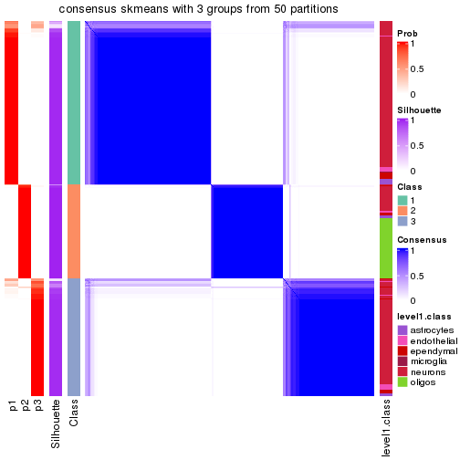</p>

</div>
<div id='tab-node-022-consensus-heatmap-3'>
<pre><code class="r">consensus_heatmap(res, k = 4)
</code></pre>

<p></p>

</div>
</div>

Heatmaps for the membership of samples in all partitions to see how consistent they are:


<script>
$( function() {
	$( '#tabs-node-022-membership-heatmap' ).tabs();
} );
</script>
<div id='tabs-node-022-membership-heatmap'>
<ul>
<li><a href='#tab-node-022-membership-heatmap-1'>k = 2</a></li>
<li><a href='#tab-node-022-membership-heatmap-2'>k = 3</a></li>
<li><a href='#tab-node-022-membership-heatmap-3'>k = 4</a></li>
</ul>
<div id='tab-node-022-membership-heatmap-1'>
<pre><code class="r">membership_heatmap(res, k = 2)
</code></pre>

<p></p>

</div>
<div id='tab-node-022-membership-heatmap-2'>
<pre><code class="r">membership_heatmap(res, k = 3)
</code></pre>

<p></p>

</div>
<div id='tab-node-022-membership-heatmap-3'>
<pre><code class="r">membership_heatmap(res, k = 4)
</code></pre>

<p></p>

</div>
</div>

As soon as the classes for columns are determined, the signatures
that are significantly different between subgroups can be looked for. 
Following are the heatmaps for signatures.


Signature heatmaps where rows are scaled:


<script>
$( function() {
	$( '#tabs-node-022-get-signatures' ).tabs();
} );
</script>
<div id='tabs-node-022-get-signatures'>
<ul>
<li><a href='#tab-node-022-get-signatures-1'>k = 2</a></li>
<li><a href='#tab-node-022-get-signatures-2'>k = 3</a></li>
<li><a href='#tab-node-022-get-signatures-3'>k = 4</a></li>
</ul>
<div id='tab-node-022-get-signatures-1'>
<pre><code class="r">get_signatures(res, k = 2)
</code></pre>

<p></p>

</div>
<div id='tab-node-022-get-signatures-2'>
<pre><code class="r">get_signatures(res, k = 3)
</code></pre>

<p></p>

</div>
<div id='tab-node-022-get-signatures-3'>
<pre><code class="r">get_signatures(res, k = 4)
</code></pre>

<p></p>

</div>
</div>


Signature heatmaps where rows are not scaled:


<script>
$( function() {
	$( '#tabs-node-022-get-signatures-no-scale' ).tabs();
} );
</script>
<div id='tabs-node-022-get-signatures-no-scale'>
<ul>
<li><a href='#tab-node-022-get-signatures-no-scale-1'>k = 2</a></li>
<li><a href='#tab-node-022-get-signatures-no-scale-2'>k = 3</a></li>
<li><a href='#tab-node-022-get-signatures-no-scale-3'>k = 4</a></li>
</ul>
<div id='tab-node-022-get-signatures-no-scale-1'>
<pre><code class="r">get_signatures(res, k = 2, scale_rows = FALSE)
</code></pre>

<p></p>

</div>
<div id='tab-node-022-get-signatures-no-scale-2'>
<pre><code class="r">get_signatures(res, k = 3, scale_rows = FALSE)
</code></pre>

<p></p>

</div>
<div id='tab-node-022-get-signatures-no-scale-3'>
<pre><code class="r">get_signatures(res, k = 4, scale_rows = FALSE)
</code></pre>

<p></p>

</div>
</div>


Compare the overlap of signatures from different k:

```r
compare_signatures(res)
```


`get_signature()` returns a data frame invisibly. To get the list of signatures, the function
call should be assigned to a variable explicitly. In following code, if `plot` argument is set
to `FALSE`, no heatmap is plotted while only the differential analysis is performed.

```r
# code only for demonstration
tb = get_signature(res, k = ..., plot = FALSE)
```

An example of the output of `tb` is:

```
#>   which_row         fdr    mean_1    mean_2 scaled_mean_1 scaled_mean_2 km
#> 1        38 0.042760348  8.373488  9.131774    -0.5533452     0.5164555  1
#> 2        40 0.018707592  7.106213  8.469186    -0.6173731     0.5762149  1
#> 3        55 0.019134737 10.221463 11.207825    -0.6159697     0.5749050  1
#> 4        59 0.006059896  5.921854  7.869574    -0.6899429     0.6439467  1
#> 5        60 0.018055526  8.928898 10.211722    -0.6204761     0.5791110  1
#> 6        98 0.009384629 15.714769 14.887706     0.6635654    -0.6193277  2
...
```

The columns in `tb` are:

1. `which_row`: row indices corresponding to the input matrix.
2. `fdr`: FDR for the differential test. 
3. `mean_x`: The mean value in group x.
4. `scaled_mean_x`: The mean value in group x after rows are scaled.
5. `km`: Row groups if k-means clustering is applied to rows (which is done by automatically selecting number of clusters).

If there are too many signatures, `top_signatures = ...` can be set to only show the 
signatures with the highest FDRs:

```r
# code only for demonstration
# e.g. to show the top 500 most significant rows
tb = get_signature(res, k = ..., top_signatures = 500)
```

If the signatures are defined as these which are uniquely high in current group, `diff_method` argument
can be set to `"uniquely_high_in_one_group"`:

```r
# code only for demonstration
tb = get_signature(res, k = ..., diff_method = "uniquely_high_in_one_group")
```


UMAP plot which shows how samples are separated.


<script>
$( function() {
	$( '#tabs-node-022-dimension-reduction' ).tabs();
} );
</script>
<div id='tabs-node-022-dimension-reduction'>
<ul>
<li><a href='#tab-node-022-dimension-reduction-1'>k = 2</a></li>
<li><a href='#tab-node-022-dimension-reduction-2'>k = 3</a></li>
<li><a href='#tab-node-022-dimension-reduction-3'>k = 4</a></li>
</ul>
<div id='tab-node-022-dimension-reduction-1'>
<pre><code class="r">dimension_reduction(res, k = 2, method = &quot;UMAP&quot;)
</code></pre>

<p></p>

</div>
<div id='tab-node-022-dimension-reduction-2'>
<pre><code class="r">dimension_reduction(res, k = 3, method = &quot;UMAP&quot;)
</code></pre>

<p></p>

</div>
<div id='tab-node-022-dimension-reduction-3'>
<pre><code class="r">dimension_reduction(res, k = 4, method = &quot;UMAP&quot;)
</code></pre>

<p></p>

</div>
</div>


Following heatmap shows how subgroups are split when increasing `k`:

```r
collect_classes(res)
```


Test correlation between subgroups and known annotations. If the known
annotation is numeric, one-way ANOVA test is applied, and if the known
annotation is discrete, chi-squared contingency table test is applied.

```r
test_to_known_factors(res)
```

```
#>             n_sample level1.class(p-value) k
#> ATC:skmeans      428              5.86e-43 2
#> ATC:skmeans      423              2.43e-47 3
#> ATC:skmeans      417              4.84e-88 4
```


If matrix rows can be associated to genes, consider to use `functional_enrichment(res,
...)` to perform function enrichment for the signature genes. See [this vignette](https://jokergoo.github.io/cola_vignettes/functional_enrichment.html) for more detailed explanations.


 

---------------------------------------------------


### Node0222


Parent node: [Node022](#Node022).
Child nodes: 
                Node01131-leaf
        ,
                Node01132-leaf
        ,
                Node01133-leaf
        ,
                Node01211-leaf
        ,
                Node01212-leaf
        ,
                Node01221-leaf
        ,
                Node01222-leaf
        ,
                Node01223-leaf
        ,
                Node01231-leaf
        ,
                Node01232-leaf
        ,
                Node01233-leaf
        ,
                Node01234-leaf
        ,
                [Node02111](#Node02111)
        ,
                [Node02112](#Node02112)
        ,
                Node02113-leaf
        ,
                Node02121-leaf
        ,
                Node02122-leaf
        ,
                Node02123-leaf
        ,
                Node02221-leaf
        ,
                Node02222-leaf
        ,
                Node03111-leaf
        ,
                Node03112-leaf
        ,
                Node03121-leaf
        ,
                [Node03122](#Node03122)
        .


The object with results only for a single top-value method and a single partitioning method 
can be extracted as:

```r
res = res_rh["0222"]
```

A summary of `res` and all the functions that can be applied to it:

```r
res
```

```
#> A 'ConsensusPartition' object with k = 2, 3, 4.
#>   On a matrix with 7471 rows and 109 columns.
#>   Top rows (747) are extracted by 'ATC' method.
#>   Subgroups are detected by 'skmeans' method.
#>   Performed in total 150 partitions by row resampling.
#>   Best k for subgroups seems to be 2.
#> 
#> Following methods can be applied to this 'ConsensusPartition' object:
#>  [1] "cola_report"             "collect_classes"         "collect_plots"          
#>  [4] "collect_stats"           "colnames"                "compare_partitions"     
#>  [7] "compare_signatures"      "consensus_heatmap"       "dimension_reduction"    
#> [10] "functional_enrichment"   "get_anno_col"            "get_anno"               
#> [13] "get_classes"             "get_consensus"           "get_matrix"             
#> [16] "get_membership"          "get_param"               "get_signatures"         
#> [19] "get_stats"               "is_best_k"               "is_stable_k"            
#> [22] "membership_heatmap"      "ncol"                    "nrow"                   
#> [25] "plot_ecdf"               "predict_classes"         "rownames"               
#> [28] "select_partition_number" "show"                    "suggest_best_k"         
#> [31] "test_to_known_factors"   "top_rows_heatmap"
```

`collect_plots()` function collects all the plots made from `res` for all `k` (number of subgroups)
into one single page to provide an easy and fast comparison between different `k`.

```r
collect_plots(res)
```


The plots are:

- The first row: a plot of the eCDF (empirical cumulative distribution
  function) curves of the consensus matrix for each `k` and the heatmap of
  predicted classes for each `k`.
- The second row: heatmaps of the consensus matrix for each `k`.
- The third row: heatmaps of the membership matrix for each `k`.
- The fouth row: heatmaps of the signatures for each `k`.

All the plots in panels can be made by individual functions and they are
plotted later in this section.

`select_partition_number()` produces several plots showing different
statistics for choosing "optimized" `k`. There are following statistics:

- eCDF curves of the consensus matrix for each `k`;
- 1-PAC. [The PAC score](https://en.wikipedia.org/wiki/Consensus_clustering#Over-interpretation_potential_of_consensus_clustering)
  measures the proportion of the ambiguous subgrouping.
- Mean silhouette score.
- Concordance. The mean probability of fiting the consensus subgroup labels in all
  partitions.
- Area increased. Denote $A_k$ as the area under the eCDF curve for current
  `k`, the area increased is defined as $A_k - A_{k-1}$.
- Rand index. The percent of pairs of samples that are both in a same cluster
  or both are not in a same cluster in the partition of k and k-1.
- Jaccard index. The ratio of pairs of samples are both in a same cluster in
  the partition of k and k-1 and the pairs of samples are both in a same
  cluster in the partition k or k-1.

The detailed explanations of these statistics can be found in [the _cola_
vignette](https://jokergoo.github.io/cola_vignettes/cola.html#toc_13).

Generally speaking, higher 1-PAC score, higher mean silhouette score or higher
concordance corresponds to better partition. Rand index and Jaccard index
measure how similar the current partition is compared to partition with `k-1`.
If they are too similar, we won't accept `k` is better than `k-1`.

```r
select_partition_number(res)
```


The numeric values for all these statistics can be obtained by `get_stats()`.

```r
get_stats(res)
```

```
#>   k 1-PAC mean_silhouette concordance area_increased  Rand Jaccard
#> 2 2 1.000           0.978       0.991          0.499 0.501   0.501
#> 3 3 0.829           0.840       0.926          0.315 0.804   0.623
#> 4 4 0.682           0.753       0.855          0.126 0.850   0.600
```

`suggest_best_k()` suggests the best $k$ based on these statistics. The rules are as follows:

- All $k$ with Jaccard index larger than 0.95 are removed because increasing
  $k$ does not provide enough extra information. If all $k$ are removed, it is
  marked as no subgroup is detected.
- For all $k$ with 1-PAC score larger than 0.9, the maximal $k$ is taken as
  the best $k$, and other $k$ are marked as optional $k$.
- If it does not fit the second rule. The $k$ with the maximal vote of the
  highest 1-PAC score, highest mean silhouette, and highest concordance is
  taken as the best $k$.

```r
suggest_best_k(res)
```

```
#> [1] 2
```


Following is the table of the partitions (You need to click the **show/hide
code output** link to see it). The membership matrix (columns with name `p*`)
is inferred by
[`clue::cl_consensus()`](https://www.rdocumentation.org/link/cl_consensus?package=clue)
function with the `SE` method. Basically the value in the membership matrix
represents the probability to belong to a certain group. The finall subgroup
label for an item is determined with the group with highest probability it
belongs to.

In `get_classes()` function, the entropy is calculated from the membership
matrix and the silhouette score is calculated from the consensus matrix.


<script>
$( function() {
	$( '#tabs-node-0222-get-classes' ).tabs();
} );
</script>
<div id='tabs-node-0222-get-classes'>
<ul>
<li><a href='#tab-node-0222-get-classes-1'>k = 2</a></li>
<li><a href='#tab-node-0222-get-classes-2'>k = 3</a></li>
<li><a href='#tab-node-0222-get-classes-3'>k = 4</a></li>
</ul>

<div id='tab-node-0222-get-classes-1'>
<p><a id='tab-node-0222-get-classes-1-a' style='color:#0366d6' href='#'>show/hide code output</a></p>
<pre><code class="r">cbind(get_classes(res, k = 2), get_membership(res, k = 2))
</code></pre>

<pre><code>#&gt;     class entropy silhouette   p1   p2
#&gt; 1       2   0.000      0.988 0.00 1.00
#&gt; 2       1   0.000      0.994 1.00 0.00
#&gt; 3       1   0.000      0.994 1.00 0.00
#&gt; 4       1   0.000      0.994 1.00 0.00
#&gt; 5       1   0.000      0.994 1.00 0.00
#&gt; 6       1   0.000      0.994 1.00 0.00
#&gt; 7       1   0.000      0.994 1.00 0.00
#&gt; 8       2   0.000      0.988 0.00 1.00
#&gt; 9       1   0.000      0.994 1.00 0.00
#&gt; 10      2   0.402      0.907 0.08 0.92
#&gt; 11      2   0.000      0.988 0.00 1.00
#&gt; 12      2   0.000      0.988 0.00 1.00
#&gt; 13      2   0.000      0.988 0.00 1.00
#&gt; 14      2   0.000      0.988 0.00 1.00
#&gt; 15      2   0.000      0.988 0.00 1.00
#&gt; 16      2   0.000      0.988 0.00 1.00
#&gt; 17      2   0.000      0.988 0.00 1.00
#&gt; 18      2   0.000      0.988 0.00 1.00
#&gt; 19      2   0.000      0.988 0.00 1.00
#&gt; 20      2   0.000      0.988 0.00 1.00
#&gt; 21      2   0.000      0.988 0.00 1.00
#&gt; 22      2   0.000      0.988 0.00 1.00
#&gt; 23      2   0.000      0.988 0.00 1.00
#&gt; 24      2   0.000      0.988 0.00 1.00
#&gt; 25      2   0.000      0.988 0.00 1.00
#&gt; 26      2   0.000      0.988 0.00 1.00
#&gt; 27      2   0.000      0.988 0.00 1.00
#&gt; 28      2   0.000      0.988 0.00 1.00
#&gt; 29      2   0.000      0.988 0.00 1.00
#&gt; 30      2   0.000      0.988 0.00 1.00
#&gt; 31      2   0.000      0.988 0.00 1.00
#&gt; 32      1   0.000      0.994 1.00 0.00
#&gt; 33      2   0.000      0.988 0.00 1.00
#&gt; 34      2   0.000      0.988 0.00 1.00
#&gt; 35      2   0.000      0.988 0.00 1.00
#&gt; 36      2   0.000      0.988 0.00 1.00
#&gt; 37      2   0.000      0.988 0.00 1.00
#&gt; 38      1   0.943      0.426 0.64 0.36
#&gt; 39      2   0.000      0.988 0.00 1.00
#&gt; 40      2   0.000      0.988 0.00 1.00
#&gt; 41      2   0.000      0.988 0.00 1.00
#&gt; 42      1   0.000      0.994 1.00 0.00
#&gt; 43      1   0.000      0.994 1.00 0.00
#&gt; 44      1   0.000      0.994 1.00 0.00
#&gt; 45      2   0.000      0.988 0.00 1.00
#&gt; 46      2   0.000      0.988 0.00 1.00
#&gt; 47      2   0.000      0.988 0.00 1.00
#&gt; 48      2   0.000      0.988 0.00 1.00
#&gt; 49      2   0.000      0.988 0.00 1.00
#&gt; 50      2   0.000      0.988 0.00 1.00
#&gt; 51      2   0.958      0.387 0.38 0.62
#&gt; 52      2   0.000      0.988 0.00 1.00
#&gt; 53      1   0.000      0.994 1.00 0.00
#&gt; 54      1   0.000      0.994 1.00 0.00
#&gt; 55      1   0.000      0.994 1.00 0.00
#&gt; 56      2   0.000      0.988 0.00 1.00
#&gt; 57      2   0.000      0.988 0.00 1.00
#&gt; 58      2   0.000      0.988 0.00 1.00
#&gt; 59      2   0.000      0.988 0.00 1.00
#&gt; 60      2   0.529      0.861 0.12 0.88
#&gt; 61      1   0.000      0.994 1.00 0.00
#&gt; 62      1   0.000      0.994 1.00 0.00
#&gt; 63      1   0.000      0.994 1.00 0.00
#&gt; 64      1   0.000      0.994 1.00 0.00
#&gt; 65      1   0.000      0.994 1.00 0.00
#&gt; 66      1   0.000      0.994 1.00 0.00
#&gt; 67      1   0.000      0.994 1.00 0.00
#&gt; 68      2   0.000      0.988 0.00 1.00
#&gt; 69      1   0.000      0.994 1.00 0.00
#&gt; 70      1   0.000      0.994 1.00 0.00
#&gt; 71      1   0.000      0.994 1.00 0.00
#&gt; 72      1   0.000      0.994 1.00 0.00
#&gt; 73      1   0.000      0.994 1.00 0.00
#&gt; 74      1   0.000      0.994 1.00 0.00
#&gt; 75      2   0.000      0.988 0.00 1.00
#&gt; 76      1   0.000      0.994 1.00 0.00
#&gt; 77      1   0.000      0.994 1.00 0.00
#&gt; 78      1   0.000      0.994 1.00 0.00
#&gt; 79      1   0.000      0.994 1.00 0.00
#&gt; 80      1   0.000      0.994 1.00 0.00
#&gt; 81      1   0.000      0.994 1.00 0.00
#&gt; 82      1   0.000      0.994 1.00 0.00
#&gt; 83      1   0.000      0.994 1.00 0.00
#&gt; 84      1   0.000      0.994 1.00 0.00
#&gt; 85      1   0.000      0.994 1.00 0.00
#&gt; 86      1   0.000      0.994 1.00 0.00
#&gt; 87      1   0.000      0.994 1.00 0.00
#&gt; 88      2   0.000      0.988 0.00 1.00
#&gt; 89      1   0.000      0.994 1.00 0.00
#&gt; 90      1   0.000      0.994 1.00 0.00
#&gt; 91      1   0.000      0.994 1.00 0.00
#&gt; 92      1   0.000      0.994 1.00 0.00
#&gt; 93      1   0.000      0.994 1.00 0.00
#&gt; 94      1   0.000      0.994 1.00 0.00
#&gt; 95      1   0.000      0.994 1.00 0.00
#&gt; 96      1   0.000      0.994 1.00 0.00
#&gt; 97      1   0.000      0.994 1.00 0.00
#&gt; 98      1   0.000      0.994 1.00 0.00
#&gt; 99      1   0.000      0.994 1.00 0.00
#&gt; 100     1   0.000      0.994 1.00 0.00
#&gt; 101     1   0.000      0.994 1.00 0.00
#&gt; 102     2   0.000      0.988 0.00 1.00
#&gt; 103     1   0.000      0.994 1.00 0.00
#&gt; 104     1   0.000      0.994 1.00 0.00
#&gt; 105     1   0.000      0.994 1.00 0.00
#&gt; 106     1   0.000      0.994 1.00 0.00
#&gt; 107     1   0.000      0.994 1.00 0.00
#&gt; 108     1   0.000      0.994 1.00 0.00
#&gt; 109     1   0.000      0.994 1.00 0.00
</code></pre>

<script>
$('#tab-node-0222-get-classes-1-a').parent().next().next().hide();
$('#tab-node-0222-get-classes-1-a').click(function(){
  $('#tab-node-0222-get-classes-1-a').parent().next().next().toggle();
  return(false);
});
</script>
</div>

<div id='tab-node-0222-get-classes-2'>
<p><a id='tab-node-0222-get-classes-2-a' style='color:#0366d6' href='#'>show/hide code output</a></p>
<pre><code class="r">cbind(get_classes(res, k = 3), get_membership(res, k = 3))
</code></pre>

<pre><code>#&gt;     class entropy silhouette   p1   p2   p3
#&gt; 1       2  0.0892     0.9537 0.00 0.98 0.02
#&gt; 2       1  0.0000     0.9048 1.00 0.00 0.00
#&gt; 3       1  0.5706     0.5335 0.68 0.00 0.32
#&gt; 4       1  0.0000     0.9048 1.00 0.00 0.00
#&gt; 5       3  0.6126     0.3259 0.40 0.00 0.60
#&gt; 6       1  0.0892     0.8946 0.98 0.00 0.02
#&gt; 7       1  0.0000     0.9048 1.00 0.00 0.00
#&gt; 8       2  0.0892     0.9537 0.00 0.98 0.02
#&gt; 9       1  0.0000     0.9048 1.00 0.00 0.00
#&gt; 10      3  0.2066     0.8185 0.00 0.06 0.94
#&gt; 11      3  0.6309    -0.1441 0.00 0.50 0.50
#&gt; 12      2  0.0892     0.9537 0.00 0.98 0.02
#&gt; 13      2  0.0892     0.9537 0.00 0.98 0.02
#&gt; 14      2  0.0892     0.9537 0.00 0.98 0.02
#&gt; 15      2  0.0892     0.9537 0.00 0.98 0.02
#&gt; 16      2  0.2414     0.9246 0.04 0.94 0.02
#&gt; 17      2  0.6244     0.2494 0.00 0.56 0.44
#&gt; 18      2  0.0892     0.9537 0.00 0.98 0.02
#&gt; 19      2  0.0892     0.9537 0.00 0.98 0.02
#&gt; 20      2  0.0892     0.9537 0.00 0.98 0.02
#&gt; 21      2  0.0892     0.9537 0.00 0.98 0.02
#&gt; 22      2  0.0000     0.9579 0.00 1.00 0.00
#&gt; 23      2  0.0892     0.9537 0.00 0.98 0.02
#&gt; 24      2  0.4551     0.8146 0.14 0.84 0.02
#&gt; 25      2  0.0892     0.9537 0.00 0.98 0.02
#&gt; 26      2  0.2947     0.9047 0.06 0.92 0.02
#&gt; 27      2  0.0892     0.9537 0.00 0.98 0.02
#&gt; 28      2  0.0000     0.9579 0.00 1.00 0.00
#&gt; 29      2  0.0000     0.9579 0.00 1.00 0.00
#&gt; 30      2  0.0000     0.9579 0.00 1.00 0.00
#&gt; 31      2  0.0000     0.9579 0.00 1.00 0.00
#&gt; 32      3  0.4555     0.7024 0.20 0.00 0.80
#&gt; 33      2  0.0000     0.9579 0.00 1.00 0.00
#&gt; 34      2  0.0000     0.9579 0.00 1.00 0.00
#&gt; 35      2  0.0000     0.9579 0.00 1.00 0.00
#&gt; 36      2  0.0000     0.9579 0.00 1.00 0.00
#&gt; 37      2  0.0000     0.9579 0.00 1.00 0.00
#&gt; 38      1  0.1529     0.8747 0.96 0.04 0.00
#&gt; 39      2  0.0000     0.9579 0.00 1.00 0.00
#&gt; 40      2  0.0000     0.9579 0.00 1.00 0.00
#&gt; 41      2  0.0000     0.9579 0.00 1.00 0.00
#&gt; 42      1  0.0000     0.9048 1.00 0.00 0.00
#&gt; 43      1  0.1529     0.8835 0.96 0.00 0.04
#&gt; 44      1  0.0000     0.9048 1.00 0.00 0.00
#&gt; 45      2  0.0000     0.9579 0.00 1.00 0.00
#&gt; 46      2  0.0000     0.9579 0.00 1.00 0.00
#&gt; 47      2  0.0000     0.9579 0.00 1.00 0.00
#&gt; 48      2  0.0000     0.9579 0.00 1.00 0.00
#&gt; 49      2  0.0000     0.9579 0.00 1.00 0.00
#&gt; 50      2  0.0000     0.9579 0.00 1.00 0.00
#&gt; 51      1  0.7277     0.5208 0.66 0.28 0.06
#&gt; 52      2  0.2066     0.9132 0.00 0.94 0.06
#&gt; 53      3  0.0892     0.8728 0.02 0.00 0.98
#&gt; 54      1  0.0000     0.9048 1.00 0.00 0.00
#&gt; 55      1  0.1529     0.8835 0.96 0.00 0.04
#&gt; 56      2  0.0000     0.9579 0.00 1.00 0.00
#&gt; 57      2  0.0000     0.9579 0.00 1.00 0.00
#&gt; 58      2  0.0000     0.9579 0.00 1.00 0.00
#&gt; 59      2  0.0000     0.9579 0.00 1.00 0.00
#&gt; 60      1  0.2537     0.8370 0.92 0.08 0.00
#&gt; 61      1  0.0000     0.9048 1.00 0.00 0.00
#&gt; 62      1  0.0892     0.8945 0.98 0.00 0.02
#&gt; 63      1  0.0892     0.8945 0.98 0.00 0.02
#&gt; 64      1  0.0000     0.9048 1.00 0.00 0.00
#&gt; 65      1  0.0000     0.9048 1.00 0.00 0.00
#&gt; 66      3  0.1529     0.8698 0.04 0.00 0.96
#&gt; 67      1  0.5397     0.6438 0.72 0.00 0.28
#&gt; 68      2  0.5016     0.6835 0.00 0.76 0.24
#&gt; 69      3  0.0892     0.8728 0.02 0.00 0.98
#&gt; 70      1  0.0000     0.9048 1.00 0.00 0.00
#&gt; 71      3  0.2066     0.8756 0.06 0.00 0.94
#&gt; 72      3  0.2066     0.8756 0.06 0.00 0.94
#&gt; 73      1  0.0000     0.9048 1.00 0.00 0.00
#&gt; 74      3  0.2959     0.8509 0.10 0.00 0.90
#&gt; 75      2  0.0000     0.9579 0.00 1.00 0.00
#&gt; 76      3  0.2066     0.8756 0.06 0.00 0.94
#&gt; 77      3  0.2066     0.8756 0.06 0.00 0.94
#&gt; 78      3  0.1529     0.8766 0.04 0.00 0.96
#&gt; 79      3  0.1529     0.8766 0.04 0.00 0.96
#&gt; 80      3  0.0000     0.8602 0.00 0.00 1.00
#&gt; 81      3  0.2537     0.8662 0.08 0.00 0.92
#&gt; 82      3  0.1529     0.8766 0.04 0.00 0.96
#&gt; 83      3  0.0892     0.8728 0.02 0.00 0.98
#&gt; 84      1  0.4002     0.7959 0.84 0.00 0.16
#&gt; 85      1  0.6192     0.3200 0.58 0.00 0.42
#&gt; 86      1  0.0000     0.9048 1.00 0.00 0.00
#&gt; 87      1  0.0000     0.9048 1.00 0.00 0.00
#&gt; 88      2  0.6244     0.2332 0.00 0.56 0.44
#&gt; 89      1  0.3686     0.8023 0.86 0.00 0.14
#&gt; 90      1  0.0000     0.9048 1.00 0.00 0.00
#&gt; 91      3  0.6192     0.2766 0.42 0.00 0.58
#&gt; 92      1  0.5397     0.6134 0.72 0.00 0.28
#&gt; 93      3  0.0892     0.8728 0.02 0.00 0.98
#&gt; 94      3  0.6302    -0.0181 0.48 0.00 0.52
#&gt; 95      3  0.2537     0.8663 0.08 0.00 0.92
#&gt; 96      3  0.0892     0.8728 0.02 0.00 0.98
#&gt; 97      1  0.5397     0.6391 0.72 0.00 0.28
#&gt; 98      3  0.2959     0.8519 0.10 0.00 0.90
#&gt; 99      1  0.5560     0.5815 0.70 0.00 0.30
#&gt; 100     1  0.5560     0.5752 0.70 0.00 0.30
#&gt; 101     1  0.0000     0.9048 1.00 0.00 0.00
#&gt; 102     2  0.2959     0.8858 0.00 0.90 0.10
#&gt; 103     1  0.0000     0.9048 1.00 0.00 0.00
#&gt; 104     1  0.0000     0.9048 1.00 0.00 0.00
#&gt; 105     1  0.0000     0.9048 1.00 0.00 0.00
#&gt; 106     1  0.0000     0.9048 1.00 0.00 0.00
#&gt; 107     1  0.0000     0.9048 1.00 0.00 0.00
#&gt; 108     1  0.3340     0.8326 0.88 0.00 0.12
#&gt; 109     3  0.2066     0.8756 0.06 0.00 0.94
</code></pre>

<script>
$('#tab-node-0222-get-classes-2-a').parent().next().next().hide();
$('#tab-node-0222-get-classes-2-a').click(function(){
  $('#tab-node-0222-get-classes-2-a').parent().next().next().toggle();
  return(false);
});
</script>
</div>

<div id='tab-node-0222-get-classes-3'>
<p><a id='tab-node-0222-get-classes-3-a' style='color:#0366d6' href='#'>show/hide code output</a></p>
<pre><code class="r">cbind(get_classes(res, k = 4), get_membership(res, k = 4))
</code></pre>

<pre><code>#&gt;     class entropy silhouette   p1   p2   p3   p4
#&gt; 1       4  0.0000     0.8099 0.00 0.00 0.00 1.00
#&gt; 2       1  0.0000     0.8616 1.00 0.00 0.00 0.00
#&gt; 3       1  0.6808     0.4022 0.56 0.00 0.12 0.32
#&gt; 4       1  0.0000     0.8616 1.00 0.00 0.00 0.00
#&gt; 5       1  0.7806     0.0626 0.42 0.02 0.14 0.42
#&gt; 6       1  0.2335     0.8372 0.92 0.06 0.00 0.02
#&gt; 7       1  0.1211     0.8457 0.96 0.00 0.00 0.04
#&gt; 8       4  0.1637     0.8022 0.00 0.06 0.00 0.94
#&gt; 9       1  0.0707     0.8539 0.98 0.00 0.00 0.02
#&gt; 10      4  0.5106     0.5395 0.00 0.04 0.24 0.72
#&gt; 11      4  0.5077     0.6851 0.00 0.08 0.16 0.76
#&gt; 12      4  0.3975     0.6321 0.00 0.24 0.00 0.76
#&gt; 13      4  0.2345     0.8303 0.00 0.10 0.00 0.90
#&gt; 14      4  0.2345     0.8303 0.00 0.10 0.00 0.90
#&gt; 15      4  0.2345     0.8303 0.00 0.10 0.00 0.90
#&gt; 16      4  0.1411     0.8169 0.02 0.02 0.00 0.96
#&gt; 17      4  0.2345     0.7400 0.00 0.00 0.10 0.90
#&gt; 18      4  0.2345     0.8303 0.00 0.10 0.00 0.90
#&gt; 19      4  0.2345     0.8303 0.00 0.10 0.00 0.90
#&gt; 20      4  0.2011     0.8300 0.00 0.08 0.00 0.92
#&gt; 21      4  0.2647     0.8152 0.00 0.12 0.00 0.88
#&gt; 22      4  0.4977     0.1001 0.00 0.46 0.00 0.54
#&gt; 23      4  0.2345     0.8303 0.00 0.10 0.00 0.90
#&gt; 24      4  0.1913     0.7792 0.04 0.02 0.00 0.94
#&gt; 25      4  0.2011     0.8300 0.00 0.08 0.00 0.92
#&gt; 26      4  0.1411     0.7933 0.02 0.02 0.00 0.96
#&gt; 27      4  0.2345     0.8303 0.00 0.10 0.00 0.90
#&gt; 28      4  0.4977     0.1054 0.00 0.46 0.00 0.54
#&gt; 29      2  0.2921     0.8996 0.00 0.86 0.00 0.14
#&gt; 30      4  0.4977     0.0471 0.00 0.46 0.00 0.54
#&gt; 31      2  0.4134     0.7483 0.00 0.74 0.00 0.26
#&gt; 32      1  0.8778     0.0480 0.42 0.10 0.36 0.12
#&gt; 33      2  0.3172     0.8822 0.00 0.84 0.00 0.16
#&gt; 34      2  0.2921     0.8996 0.00 0.86 0.00 0.14
#&gt; 35      2  0.2921     0.8996 0.00 0.86 0.00 0.14
#&gt; 36      2  0.2921     0.8996 0.00 0.86 0.00 0.14
#&gt; 37      2  0.2921     0.8996 0.00 0.86 0.00 0.14
#&gt; 38      1  0.4949     0.6723 0.76 0.18 0.00 0.06
#&gt; 39      2  0.2921     0.8996 0.00 0.86 0.00 0.14
#&gt; 40      2  0.2921     0.8996 0.00 0.86 0.00 0.14
#&gt; 41      2  0.3400     0.8434 0.00 0.82 0.00 0.18
#&gt; 42      1  0.0000     0.8616 1.00 0.00 0.00 0.00
#&gt; 43      1  0.3247     0.8053 0.88 0.06 0.06 0.00
#&gt; 44      1  0.0000     0.8616 1.00 0.00 0.00 0.00
#&gt; 45      2  0.3400     0.8744 0.00 0.82 0.00 0.18
#&gt; 46      2  0.2921     0.8996 0.00 0.86 0.00 0.14
#&gt; 47      2  0.2921     0.8996 0.00 0.86 0.00 0.14
#&gt; 48      2  0.2647     0.8910 0.00 0.88 0.00 0.12
#&gt; 49      2  0.2647     0.8910 0.00 0.88 0.00 0.12
#&gt; 50      2  0.2921     0.8996 0.00 0.86 0.00 0.14
#&gt; 51      2  0.2830     0.6987 0.04 0.90 0.06 0.00
#&gt; 52      2  0.1637     0.7385 0.00 0.94 0.06 0.00
#&gt; 53      3  0.3037     0.8188 0.02 0.10 0.88 0.00
#&gt; 54      1  0.0000     0.8616 1.00 0.00 0.00 0.00
#&gt; 55      1  0.4731     0.7351 0.78 0.16 0.06 0.00
#&gt; 56      2  0.2921     0.8996 0.00 0.86 0.00 0.14
#&gt; 57      2  0.2921     0.8996 0.00 0.86 0.00 0.14
#&gt; 58      2  0.2647     0.8910 0.00 0.88 0.00 0.12
#&gt; 59      2  0.2921     0.8996 0.00 0.86 0.00 0.14
#&gt; 60      2  0.6831     0.1067 0.42 0.48 0.00 0.10
#&gt; 61      1  0.0000     0.8616 1.00 0.00 0.00 0.00
#&gt; 62      1  0.1411     0.8493 0.96 0.02 0.02 0.00
#&gt; 63      1  0.3611     0.7918 0.86 0.08 0.06 0.00
#&gt; 64      1  0.0000     0.8616 1.00 0.00 0.00 0.00
#&gt; 65      1  0.0707     0.8556 0.98 0.02 0.00 0.00
#&gt; 66      3  0.3335     0.8106 0.02 0.12 0.86 0.00
#&gt; 67      1  0.6110     0.5835 0.66 0.10 0.24 0.00
#&gt; 68      2  0.2335     0.7479 0.00 0.92 0.06 0.02
#&gt; 69      3  0.2647     0.8120 0.00 0.12 0.88 0.00
#&gt; 70      1  0.0000     0.8616 1.00 0.00 0.00 0.00
#&gt; 71      3  0.1637     0.8654 0.06 0.00 0.94 0.00
#&gt; 72      3  0.1637     0.8654 0.06 0.00 0.94 0.00
#&gt; 73      1  0.0000     0.8616 1.00 0.00 0.00 0.00
#&gt; 74      3  0.1637     0.8654 0.06 0.00 0.94 0.00
#&gt; 75      2  0.4277     0.7249 0.00 0.72 0.00 0.28
#&gt; 76      3  0.1637     0.8654 0.06 0.00 0.94 0.00
#&gt; 77      3  0.1637     0.8654 0.06 0.00 0.94 0.00
#&gt; 78      3  0.1211     0.8626 0.04 0.00 0.96 0.00
#&gt; 79      3  0.0707     0.8560 0.02 0.00 0.98 0.00
#&gt; 80      3  0.6537     0.2857 0.02 0.04 0.54 0.40
#&gt; 81      3  0.2011     0.8559 0.08 0.00 0.92 0.00
#&gt; 82      3  0.1637     0.8654 0.06 0.00 0.94 0.00
#&gt; 83      3  0.1637     0.8334 0.00 0.06 0.94 0.00
#&gt; 84      1  0.4949     0.6910 0.76 0.06 0.18 0.00
#&gt; 85      3  0.6649     0.3285 0.34 0.10 0.56 0.00
#&gt; 86      1  0.0000     0.8616 1.00 0.00 0.00 0.00
#&gt; 87      1  0.0000     0.8616 1.00 0.00 0.00 0.00
#&gt; 88      2  0.2335     0.7479 0.00 0.92 0.06 0.02
#&gt; 89      1  0.3975     0.6636 0.76 0.00 0.24 0.00
#&gt; 90      1  0.0000     0.8616 1.00 0.00 0.00 0.00
#&gt; 91      3  0.4948     0.2060 0.44 0.00 0.56 0.00
#&gt; 92      1  0.4624     0.4736 0.66 0.00 0.34 0.00
#&gt; 93      3  0.0000     0.8460 0.00 0.00 1.00 0.00
#&gt; 94      3  0.6976     0.4933 0.24 0.18 0.58 0.00
#&gt; 95      3  0.2647     0.8281 0.12 0.00 0.88 0.00
#&gt; 96      3  0.2345     0.8206 0.00 0.10 0.90 0.00
#&gt; 97      1  0.4581     0.7471 0.80 0.08 0.12 0.00
#&gt; 98      3  0.2706     0.8569 0.08 0.02 0.90 0.00
#&gt; 99      1  0.4134     0.6253 0.74 0.00 0.26 0.00
#&gt; 100     1  0.4790     0.3704 0.62 0.00 0.38 0.00
#&gt; 101     1  0.2345     0.8099 0.90 0.00 0.10 0.00
#&gt; 102     4  0.4610     0.7683 0.00 0.10 0.10 0.80
#&gt; 103     1  0.0000     0.8616 1.00 0.00 0.00 0.00
#&gt; 104     1  0.0000     0.8616 1.00 0.00 0.00 0.00
#&gt; 105     1  0.0000     0.8616 1.00 0.00 0.00 0.00
#&gt; 106     1  0.0000     0.8616 1.00 0.00 0.00 0.00
#&gt; 107     1  0.0000     0.8616 1.00 0.00 0.00 0.00
#&gt; 108     1  0.3725     0.7949 0.86 0.02 0.10 0.02
#&gt; 109     3  0.1637     0.8654 0.06 0.00 0.94 0.00
</code></pre>

<script>
$('#tab-node-0222-get-classes-3-a').parent().next().next().hide();
$('#tab-node-0222-get-classes-3-a').click(function(){
  $('#tab-node-0222-get-classes-3-a').parent().next().next().toggle();
  return(false);
});
</script>
</div>
</div>

Heatmaps for the consensus matrix. It visualizes the probability of two
samples to be in a same group.


<script>
$( function() {
	$( '#tabs-node-0222-consensus-heatmap' ).tabs();
} );
</script>
<div id='tabs-node-0222-consensus-heatmap'>
<ul>
<li><a href='#tab-node-0222-consensus-heatmap-1'>k = 2</a></li>
<li><a href='#tab-node-0222-consensus-heatmap-2'>k = 3</a></li>
<li><a href='#tab-node-0222-consensus-heatmap-3'>k = 4</a></li>
</ul>
<div id='tab-node-0222-consensus-heatmap-1'>
<pre><code class="r">consensus_heatmap(res, k = 2)
</code></pre>

<p></p>

</div>
<div id='tab-node-0222-consensus-heatmap-2'>
<pre><code class="r">consensus_heatmap(res, k = 3)
</code></pre>

<p></p>

</div>
<div id='tab-node-0222-consensus-heatmap-3'>
<pre><code class="r">consensus_heatmap(res, k = 4)
</code></pre>

<p></p>

</div>
</div>

Heatmaps for the membership of samples in all partitions to see how consistent they are:


<script>
$( function() {
	$( '#tabs-node-0222-membership-heatmap' ).tabs();
} );
</script>
<div id='tabs-node-0222-membership-heatmap'>
<ul>
<li><a href='#tab-node-0222-membership-heatmap-1'>k = 2</a></li>
<li><a href='#tab-node-0222-membership-heatmap-2'>k = 3</a></li>
<li><a href='#tab-node-0222-membership-heatmap-3'>k = 4</a></li>
</ul>
<div id='tab-node-0222-membership-heatmap-1'>
<pre><code class="r">membership_heatmap(res, k = 2)
</code></pre>

<p></p>

</div>
<div id='tab-node-0222-membership-heatmap-2'>
<pre><code class="r">membership_heatmap(res, k = 3)
</code></pre>

<p></p>

</div>
<div id='tab-node-0222-membership-heatmap-3'>
<pre><code class="r">membership_heatmap(res, k = 4)
</code></pre>

<p></p>

</div>
</div>

As soon as the classes for columns are determined, the signatures
that are significantly different between subgroups can be looked for. 
Following are the heatmaps for signatures.


Signature heatmaps where rows are scaled:


<script>
$( function() {
	$( '#tabs-node-0222-get-signatures' ).tabs();
} );
</script>
<div id='tabs-node-0222-get-signatures'>
<ul>
<li><a href='#tab-node-0222-get-signatures-1'>k = 2</a></li>
<li><a href='#tab-node-0222-get-signatures-2'>k = 3</a></li>
<li><a href='#tab-node-0222-get-signatures-3'>k = 4</a></li>
</ul>
<div id='tab-node-0222-get-signatures-1'>
<pre><code class="r">get_signatures(res, k = 2)
</code></pre>

<p></p>

</div>
<div id='tab-node-0222-get-signatures-2'>
<pre><code class="r">get_signatures(res, k = 3)
</code></pre>

<p></p>

</div>
<div id='tab-node-0222-get-signatures-3'>
<pre><code class="r">get_signatures(res, k = 4)
</code></pre>

<p></p>

</div>
</div>


Signature heatmaps where rows are not scaled:


<script>
$( function() {
	$( '#tabs-node-0222-get-signatures-no-scale' ).tabs();
} );
</script>
<div id='tabs-node-0222-get-signatures-no-scale'>
<ul>
<li><a href='#tab-node-0222-get-signatures-no-scale-1'>k = 2</a></li>
<li><a href='#tab-node-0222-get-signatures-no-scale-2'>k = 3</a></li>
<li><a href='#tab-node-0222-get-signatures-no-scale-3'>k = 4</a></li>
</ul>
<div id='tab-node-0222-get-signatures-no-scale-1'>
<pre><code class="r">get_signatures(res, k = 2, scale_rows = FALSE)
</code></pre>

<p></p>

</div>
<div id='tab-node-0222-get-signatures-no-scale-2'>
<pre><code class="r">get_signatures(res, k = 3, scale_rows = FALSE)
</code></pre>

<p></p>

</div>
<div id='tab-node-0222-get-signatures-no-scale-3'>
<pre><code class="r">get_signatures(res, k = 4, scale_rows = FALSE)
</code></pre>

<p></p>

</div>
</div>


Compare the overlap of signatures from different k:

```r
compare_signatures(res)
```


`get_signature()` returns a data frame invisibly. To get the list of signatures, the function
call should be assigned to a variable explicitly. In following code, if `plot` argument is set
to `FALSE`, no heatmap is plotted while only the differential analysis is performed.

```r
# code only for demonstration
tb = get_signature(res, k = ..., plot = FALSE)
```

An example of the output of `tb` is:

```
#>   which_row         fdr    mean_1    mean_2 scaled_mean_1 scaled_mean_2 km
#> 1        38 0.042760348  8.373488  9.131774    -0.5533452     0.5164555  1
#> 2        40 0.018707592  7.106213  8.469186    -0.6173731     0.5762149  1
#> 3        55 0.019134737 10.221463 11.207825    -0.6159697     0.5749050  1
#> 4        59 0.006059896  5.921854  7.869574    -0.6899429     0.6439467  1
#> 5        60 0.018055526  8.928898 10.211722    -0.6204761     0.5791110  1
#> 6        98 0.009384629 15.714769 14.887706     0.6635654    -0.6193277  2
...
```

The columns in `tb` are:

1. `which_row`: row indices corresponding to the input matrix.
2. `fdr`: FDR for the differential test. 
3. `mean_x`: The mean value in group x.
4. `scaled_mean_x`: The mean value in group x after rows are scaled.
5. `km`: Row groups if k-means clustering is applied to rows (which is done by automatically selecting number of clusters).

If there are too many signatures, `top_signatures = ...` can be set to only show the 
signatures with the highest FDRs:

```r
# code only for demonstration
# e.g. to show the top 500 most significant rows
tb = get_signature(res, k = ..., top_signatures = 500)
```

If the signatures are defined as these which are uniquely high in current group, `diff_method` argument
can be set to `"uniquely_high_in_one_group"`:

```r
# code only for demonstration
tb = get_signature(res, k = ..., diff_method = "uniquely_high_in_one_group")
```


UMAP plot which shows how samples are separated.


<script>
$( function() {
	$( '#tabs-node-0222-dimension-reduction' ).tabs();
} );
</script>
<div id='tabs-node-0222-dimension-reduction'>
<ul>
<li><a href='#tab-node-0222-dimension-reduction-1'>k = 2</a></li>
<li><a href='#tab-node-0222-dimension-reduction-2'>k = 3</a></li>
<li><a href='#tab-node-0222-dimension-reduction-3'>k = 4</a></li>
</ul>
<div id='tab-node-0222-dimension-reduction-1'>
<pre><code class="r">dimension_reduction(res, k = 2, method = &quot;UMAP&quot;)
</code></pre>

<p></p>

</div>
<div id='tab-node-0222-dimension-reduction-2'>
<pre><code class="r">dimension_reduction(res, k = 3, method = &quot;UMAP&quot;)
</code></pre>

<p></p>

</div>
<div id='tab-node-0222-dimension-reduction-3'>
<pre><code class="r">dimension_reduction(res, k = 4, method = &quot;UMAP&quot;)
</code></pre>

<p></p>

</div>
</div>


Following heatmap shows how subgroups are split when increasing `k`:

```r
collect_classes(res)
```


Test correlation between subgroups and known annotations. If the known
annotation is numeric, one-way ANOVA test is applied, and if the known
annotation is discrete, chi-squared contingency table test is applied.

```r
test_to_known_factors(res)
```

```
#>             n_sample level1.class(p-value) k
#> ATC:skmeans      107              4.90e-07 2
#> ATC:skmeans      102              1.37e-07 3
#> ATC:skmeans       96              1.70e-06 4
```


If matrix rows can be associated to genes, consider to use `functional_enrichment(res,
...)` to perform function enrichment for the signature genes. See [this vignette](https://jokergoo.github.io/cola_vignettes/functional_enrichment.html) for more detailed explanations.


 

---------------------------------------------------


### Node023


Parent node: [Node02](#Node02).
Child nodes: 
                Node0111-leaf
        ,
                Node0112-leaf
        ,
                [Node0113](#Node0113)
        ,
                [Node0121](#Node0121)
        ,
                [Node0122](#Node0122)
        ,
                [Node0123](#Node0123)
        ,
                Node0131-leaf
        ,
                Node0132-leaf
        ,
                Node0141-leaf
        ,
                Node0142-leaf
        ,
                Node0143-leaf
        ,
                [Node0211](#Node0211)
        ,
                [Node0212](#Node0212)
        ,
                Node0221-leaf
        ,
                [Node0222](#Node0222)
        ,
                Node0223-leaf
        ,
                Node0231-leaf
        ,
                Node0232-leaf
        ,
                Node0233-leaf
        ,
                Node0234-leaf
        ,
                [Node0311](#Node0311)
        ,
                [Node0312](#Node0312)
        ,
                Node0313-leaf
        ,
                Node0321-leaf
        ,
                Node0322-leaf
        ,
                Node0323-leaf
        ,
                Node0324-leaf
        ,
                Node0331-leaf
        ,
                Node0332-leaf
        ,
                Node0333-leaf
        .


The object with results only for a single top-value method and a single partitioning method 
can be extracted as:

```r
res = res_rh["023"]
```

A summary of `res` and all the functions that can be applied to it:

```r
res
```

```
#> A 'ConsensusPartition' object with k = 2, 3, 4.
#>   On a matrix with 8383 rows and 141 columns.
#>   Top rows (838) are extracted by 'ATC' method.
#>   Subgroups are detected by 'skmeans' method.
#>   Performed in total 150 partitions by row resampling.
#>   Best k for subgroups seems to be 4.
#> 
#> Following methods can be applied to this 'ConsensusPartition' object:
#>  [1] "cola_report"             "collect_classes"         "collect_plots"          
#>  [4] "collect_stats"           "colnames"                "compare_partitions"     
#>  [7] "compare_signatures"      "consensus_heatmap"       "dimension_reduction"    
#> [10] "functional_enrichment"   "get_anno_col"            "get_anno"               
#> [13] "get_classes"             "get_consensus"           "get_matrix"             
#> [16] "get_membership"          "get_param"               "get_signatures"         
#> [19] "get_stats"               "is_best_k"               "is_stable_k"            
#> [22] "membership_heatmap"      "ncol"                    "nrow"                   
#> [25] "plot_ecdf"               "predict_classes"         "rownames"               
#> [28] "select_partition_number" "show"                    "suggest_best_k"         
#> [31] "test_to_known_factors"   "top_rows_heatmap"
```

`collect_plots()` function collects all the plots made from `res` for all `k` (number of subgroups)
into one single page to provide an easy and fast comparison between different `k`.

```r
collect_plots(res)
```


The plots are:

- The first row: a plot of the eCDF (empirical cumulative distribution
  function) curves of the consensus matrix for each `k` and the heatmap of
  predicted classes for each `k`.
- The second row: heatmaps of the consensus matrix for each `k`.
- The third row: heatmaps of the membership matrix for each `k`.
- The fouth row: heatmaps of the signatures for each `k`.

All the plots in panels can be made by individual functions and they are
plotted later in this section.

`select_partition_number()` produces several plots showing different
statistics for choosing "optimized" `k`. There are following statistics:

- eCDF curves of the consensus matrix for each `k`;
- 1-PAC. [The PAC score](https://en.wikipedia.org/wiki/Consensus_clustering#Over-interpretation_potential_of_consensus_clustering)
  measures the proportion of the ambiguous subgrouping.
- Mean silhouette score.
- Concordance. The mean probability of fiting the consensus subgroup labels in all
  partitions.
- Area increased. Denote $A_k$ as the area under the eCDF curve for current
  `k`, the area increased is defined as $A_k - A_{k-1}$.
- Rand index. The percent of pairs of samples that are both in a same cluster
  or both are not in a same cluster in the partition of k and k-1.
- Jaccard index. The ratio of pairs of samples are both in a same cluster in
  the partition of k and k-1 and the pairs of samples are both in a same
  cluster in the partition k or k-1.

The detailed explanations of these statistics can be found in [the _cola_
vignette](https://jokergoo.github.io/cola_vignettes/cola.html#toc_13).

Generally speaking, higher 1-PAC score, higher mean silhouette score or higher
concordance corresponds to better partition. Rand index and Jaccard index
measure how similar the current partition is compared to partition with `k-1`.
If they are too similar, we won't accept `k` is better than `k-1`.

```r
select_partition_number(res)
```


The numeric values for all these statistics can be obtained by `get_stats()`.

```r
get_stats(res)
```

```
#>   k 1-PAC mean_silhouette concordance area_increased  Rand Jaccard
#> 2 2 1.000           0.973       0.989          0.503 0.498   0.498
#> 3 3 0.947           0.919       0.968          0.307 0.749   0.539
#> 4 4 1.000           0.969       0.988          0.107 0.875   0.661
```

`suggest_best_k()` suggests the best $k$ based on these statistics. The rules are as follows:

- All $k$ with Jaccard index larger than 0.95 are removed because increasing
  $k$ does not provide enough extra information. If all $k$ are removed, it is
  marked as no subgroup is detected.
- For all $k$ with 1-PAC score larger than 0.9, the maximal $k$ is taken as
  the best $k$, and other $k$ are marked as optional $k$.
- If it does not fit the second rule. The $k$ with the maximal vote of the
  highest 1-PAC score, highest mean silhouette, and highest concordance is
  taken as the best $k$.

```r
suggest_best_k(res)
```

```
#> [1] 4
#> attr(,"optional")
#> [1] 2 3
```

There is also optional best $k$ = 2 3 that is worth to check.

Following is the table of the partitions (You need to click the **show/hide
code output** link to see it). The membership matrix (columns with name `p*`)
is inferred by
[`clue::cl_consensus()`](https://www.rdocumentation.org/link/cl_consensus?package=clue)
function with the `SE` method. Basically the value in the membership matrix
represents the probability to belong to a certain group. The finall subgroup
label for an item is determined with the group with highest probability it
belongs to.

In `get_classes()` function, the entropy is calculated from the membership
matrix and the silhouette score is calculated from the consensus matrix.


<script>
$( function() {
	$( '#tabs-node-023-get-classes' ).tabs();
} );
</script>
<div id='tabs-node-023-get-classes'>
<ul>
<li><a href='#tab-node-023-get-classes-1'>k = 2</a></li>
<li><a href='#tab-node-023-get-classes-2'>k = 3</a></li>
<li><a href='#tab-node-023-get-classes-3'>k = 4</a></li>
</ul>

<div id='tab-node-023-get-classes-1'>
<p><a id='tab-node-023-get-classes-1-a' style='color:#0366d6' href='#'>show/hide code output</a></p>
<pre><code class="r">cbind(get_classes(res, k = 2), get_membership(res, k = 2))
</code></pre>

<pre><code>#&gt;     class entropy silhouette   p1   p2
#&gt; 1       1   0.000      0.987 1.00 0.00
#&gt; 2       1   0.000      0.987 1.00 0.00
#&gt; 3       1   0.000      0.987 1.00 0.00
#&gt; 4       1   0.000      0.987 1.00 0.00
#&gt; 5       2   0.141      0.971 0.02 0.98
#&gt; 6       2   0.327      0.932 0.06 0.94
#&gt; 7       1   0.000      0.987 1.00 0.00
#&gt; 8       1   0.000      0.987 1.00 0.00
#&gt; 9       1   0.469      0.887 0.90 0.10
#&gt; 10      1   0.000      0.987 1.00 0.00
#&gt; 11      2   0.469      0.888 0.10 0.90
#&gt; 12      2   0.000      0.990 0.00 1.00
#&gt; 13      1   0.000      0.987 1.00 0.00
#&gt; 14      1   0.000      0.987 1.00 0.00
#&gt; 15      2   0.000      0.990 0.00 1.00
#&gt; 16      2   0.000      0.990 0.00 1.00
#&gt; 17      1   0.000      0.987 1.00 0.00
#&gt; 18      2   0.000      0.990 0.00 1.00
#&gt; 19      2   0.000      0.990 0.00 1.00
#&gt; 20      1   0.000      0.987 1.00 0.00
#&gt; 21      2   0.000      0.990 0.00 1.00
#&gt; 22      2   0.000      0.990 0.00 1.00
#&gt; 23      2   0.000      0.990 0.00 1.00
#&gt; 24      2   0.000      0.990 0.00 1.00
#&gt; 25      2   0.000      0.990 0.00 1.00
#&gt; 26      1   0.000      0.987 1.00 0.00
#&gt; 27      1   0.958      0.381 0.62 0.38
#&gt; 28      2   0.000      0.990 0.00 1.00
#&gt; 29      1   0.584      0.843 0.86 0.14
#&gt; 30      2   0.000      0.990 0.00 1.00
#&gt; 31      2   0.000      0.990 0.00 1.00
#&gt; 32      2   0.000      0.990 0.00 1.00
#&gt; 33      2   0.000      0.990 0.00 1.00
#&gt; 34      2   0.000      0.990 0.00 1.00
#&gt; 35      2   0.000      0.990 0.00 1.00
#&gt; 36      2   0.000      0.990 0.00 1.00
#&gt; 37      2   0.000      0.990 0.00 1.00
#&gt; 38      1   0.000      0.987 1.00 0.00
#&gt; 39      2   0.000      0.990 0.00 1.00
#&gt; 40      2   0.000      0.990 0.00 1.00
#&gt; 41      1   0.000      0.987 1.00 0.00
#&gt; 42      2   0.000      0.990 0.00 1.00
#&gt; 43      2   0.000      0.990 0.00 1.00
#&gt; 44      2   0.000      0.990 0.00 1.00
#&gt; 45      2   0.000      0.990 0.00 1.00
#&gt; 46      2   0.000      0.990 0.00 1.00
#&gt; 47      2   0.000      0.990 0.00 1.00
#&gt; 48      1   0.000      0.987 1.00 0.00
#&gt; 49      2   0.000      0.990 0.00 1.00
#&gt; 50      1   0.000      0.987 1.00 0.00
#&gt; 51      1   0.000      0.987 1.00 0.00
#&gt; 52      1   0.000      0.987 1.00 0.00
#&gt; 53      2   0.000      0.990 0.00 1.00
#&gt; 54      2   0.000      0.990 0.00 1.00
#&gt; 55      2   0.000      0.990 0.00 1.00
#&gt; 56      1   0.000      0.987 1.00 0.00
#&gt; 57      1   0.000      0.987 1.00 0.00
#&gt; 58      1   0.000      0.987 1.00 0.00
#&gt; 59      1   0.141      0.971 0.98 0.02
#&gt; 60      2   0.000      0.990 0.00 1.00
#&gt; 61      2   0.000      0.990 0.00 1.00
#&gt; 62      1   0.000      0.987 1.00 0.00
#&gt; 63      2   0.000      0.990 0.00 1.00
#&gt; 64      2   0.000      0.990 0.00 1.00
#&gt; 65      1   0.000      0.987 1.00 0.00
#&gt; 66      2   0.000      0.990 0.00 1.00
#&gt; 67      1   0.000      0.987 1.00 0.00
#&gt; 68      1   0.141      0.971 0.98 0.02
#&gt; 69      1   0.000      0.987 1.00 0.00
#&gt; 70      1   0.000      0.987 1.00 0.00
#&gt; 71      2   0.000      0.990 0.00 1.00
#&gt; 72      2   0.000      0.990 0.00 1.00
#&gt; 73      2   0.000      0.990 0.00 1.00
#&gt; 74      2   0.000      0.990 0.00 1.00
#&gt; 75      2   0.000      0.990 0.00 1.00
#&gt; 76      1   0.000      0.987 1.00 0.00
#&gt; 77      2   0.000      0.990 0.00 1.00
#&gt; 78      1   0.141      0.971 0.98 0.02
#&gt; 79      1   0.000      0.987 1.00 0.00
#&gt; 80      2   0.000      0.990 0.00 1.00
#&gt; 81      2   0.000      0.990 0.00 1.00
#&gt; 82      1   0.000      0.987 1.00 0.00
#&gt; 83      1   0.000      0.987 1.00 0.00
#&gt; 84      1   0.000      0.987 1.00 0.00
#&gt; 85      1   0.000      0.987 1.00 0.00
#&gt; 86      1   0.000      0.987 1.00 0.00
#&gt; 87      1   0.000      0.987 1.00 0.00
#&gt; 88      1   0.000      0.987 1.00 0.00
#&gt; 89      2   0.000      0.990 0.00 1.00
#&gt; 90      2   0.327      0.932 0.06 0.94
#&gt; 91      1   0.584      0.842 0.86 0.14
#&gt; 92      2   0.000      0.990 0.00 1.00
#&gt; 93      1   0.000      0.987 1.00 0.00
#&gt; 94      1   0.000      0.987 1.00 0.00
#&gt; 95      1   0.000      0.987 1.00 0.00
#&gt; 96      1   0.000      0.987 1.00 0.00
#&gt; 97      1   0.000      0.987 1.00 0.00
#&gt; 98      1   0.000      0.987 1.00 0.00
#&gt; 99      2   0.000      0.990 0.00 1.00
#&gt; 100     2   0.000      0.990 0.00 1.00
#&gt; 101     1   0.000      0.987 1.00 0.00
#&gt; 102     2   0.000      0.990 0.00 1.00
#&gt; 103     1   0.000      0.987 1.00 0.00
#&gt; 104     2   0.000      0.990 0.00 1.00
#&gt; 105     2   0.000      0.990 0.00 1.00
#&gt; 106     1   0.000      0.987 1.00 0.00
#&gt; 107     2   0.000      0.990 0.00 1.00
#&gt; 108     2   0.000      0.990 0.00 1.00
#&gt; 109     1   0.327      0.934 0.94 0.06
#&gt; 110     1   0.000      0.987 1.00 0.00
#&gt; 111     1   0.000      0.987 1.00 0.00
#&gt; 112     1   0.000      0.987 1.00 0.00
#&gt; 113     1   0.000      0.987 1.00 0.00
#&gt; 114     2   0.000      0.990 0.00 1.00
#&gt; 115     2   0.000      0.990 0.00 1.00
#&gt; 116     1   0.000      0.987 1.00 0.00
#&gt; 117     1   0.000      0.987 1.00 0.00
#&gt; 118     1   0.000      0.987 1.00 0.00
#&gt; 119     2   0.000      0.990 0.00 1.00
#&gt; 120     2   0.000      0.990 0.00 1.00
#&gt; 121     1   0.000      0.987 1.00 0.00
#&gt; 122     1   0.000      0.987 1.00 0.00
#&gt; 123     1   0.000      0.987 1.00 0.00
#&gt; 124     1   0.000      0.987 1.00 0.00
#&gt; 125     1   0.000      0.987 1.00 0.00
#&gt; 126     2   0.000      0.990 0.00 1.00
#&gt; 127     1   0.000      0.987 1.00 0.00
#&gt; 128     2   0.000      0.990 0.00 1.00
#&gt; 129     1   0.242      0.953 0.96 0.04
#&gt; 130     1   0.000      0.987 1.00 0.00
#&gt; 131     1   0.000      0.987 1.00 0.00
#&gt; 132     2   0.000      0.990 0.00 1.00
#&gt; 133     2   0.000      0.990 0.00 1.00
#&gt; 134     1   0.000      0.987 1.00 0.00
#&gt; 135     1   0.000      0.987 1.00 0.00
#&gt; 136     2   0.000      0.990 0.00 1.00
#&gt; 137     1   0.000      0.987 1.00 0.00
#&gt; 138     1   0.000      0.987 1.00 0.00
#&gt; 139     1   0.000      0.987 1.00 0.00
#&gt; 140     2   0.990      0.212 0.44 0.56
#&gt; 141     1   0.000      0.987 1.00 0.00
</code></pre>

<script>
$('#tab-node-023-get-classes-1-a').parent().next().next().hide();
$('#tab-node-023-get-classes-1-a').click(function(){
  $('#tab-node-023-get-classes-1-a').parent().next().next().toggle();
  return(false);
});
</script>
</div>

<div id='tab-node-023-get-classes-2'>
<p><a id='tab-node-023-get-classes-2-a' style='color:#0366d6' href='#'>show/hide code output</a></p>
<pre><code class="r">cbind(get_classes(res, k = 3), get_membership(res, k = 3))
</code></pre>

<pre><code>#&gt;     class entropy silhouette   p1   p2   p3
#&gt; 1       1  0.0000     0.9786 1.00 0.00 0.00
#&gt; 2       1  0.1529     0.9463 0.96 0.00 0.04
#&gt; 3       3  0.0000     0.9505 0.00 0.00 1.00
#&gt; 4       1  0.1529     0.9463 0.96 0.00 0.04
#&gt; 5       3  0.0000     0.9505 0.00 0.00 1.00
#&gt; 6       3  0.0000     0.9505 0.00 0.00 1.00
#&gt; 7       1  0.3686     0.8350 0.86 0.00 0.14
#&gt; 8       3  0.0000     0.9505 0.00 0.00 1.00
#&gt; 9       3  0.0000     0.9505 0.00 0.00 1.00
#&gt; 10      1  0.5560     0.5735 0.70 0.00 0.30
#&gt; 11      3  0.0000     0.9505 0.00 0.00 1.00
#&gt; 12      3  0.0000     0.9505 0.00 0.00 1.00
#&gt; 13      3  0.6045     0.3781 0.38 0.00 0.62
#&gt; 14      1  0.2066     0.9274 0.94 0.00 0.06
#&gt; 15      3  0.0000     0.9505 0.00 0.00 1.00
#&gt; 16      3  0.0000     0.9505 0.00 0.00 1.00
#&gt; 17      3  0.6192     0.2647 0.42 0.00 0.58
#&gt; 18      3  0.0000     0.9505 0.00 0.00 1.00
#&gt; 19      3  0.0000     0.9505 0.00 0.00 1.00
#&gt; 20      1  0.0000     0.9786 1.00 0.00 0.00
#&gt; 21      3  0.1529     0.9287 0.00 0.04 0.96
#&gt; 22      3  0.1529     0.9287 0.00 0.04 0.96
#&gt; 23      3  0.1529     0.9287 0.00 0.04 0.96
#&gt; 24      3  0.1529     0.9287 0.00 0.04 0.96
#&gt; 25      3  0.0000     0.9505 0.00 0.00 1.00
#&gt; 26      1  0.0000     0.9786 1.00 0.00 0.00
#&gt; 27      3  0.2537     0.8814 0.08 0.00 0.92
#&gt; 28      3  0.1529     0.9287 0.00 0.04 0.96
#&gt; 29      3  0.2066     0.9026 0.06 0.00 0.94
#&gt; 30      3  0.1529     0.9287 0.00 0.04 0.96
#&gt; 31      3  0.0000     0.9505 0.00 0.00 1.00
#&gt; 32      3  0.0000     0.9505 0.00 0.00 1.00
#&gt; 33      3  0.0000     0.9505 0.00 0.00 1.00
#&gt; 34      3  0.0000     0.9505 0.00 0.00 1.00
#&gt; 35      3  0.0000     0.9505 0.00 0.00 1.00
#&gt; 36      3  0.0000     0.9505 0.00 0.00 1.00
#&gt; 37      3  0.0000     0.9505 0.00 0.00 1.00
#&gt; 38      1  0.0000     0.9786 1.00 0.00 0.00
#&gt; 39      3  0.0000     0.9505 0.00 0.00 1.00
#&gt; 40      3  0.0000     0.9505 0.00 0.00 1.00
#&gt; 41      1  0.0000     0.9786 1.00 0.00 0.00
#&gt; 42      3  0.0000     0.9505 0.00 0.00 1.00
#&gt; 43      3  0.0000     0.9505 0.00 0.00 1.00
#&gt; 44      3  0.0000     0.9505 0.00 0.00 1.00
#&gt; 45      3  0.0000     0.9505 0.00 0.00 1.00
#&gt; 46      2  0.0000     0.9554 0.00 1.00 0.00
#&gt; 47      2  0.0000     0.9554 0.00 1.00 0.00
#&gt; 48      1  0.0000     0.9786 1.00 0.00 0.00
#&gt; 49      2  0.0000     0.9554 0.00 1.00 0.00
#&gt; 50      1  0.0000     0.9786 1.00 0.00 0.00
#&gt; 51      1  0.0000     0.9786 1.00 0.00 0.00
#&gt; 52      1  0.0000     0.9786 1.00 0.00 0.00
#&gt; 53      2  0.0000     0.9554 0.00 1.00 0.00
#&gt; 54      2  0.0000     0.9554 0.00 1.00 0.00
#&gt; 55      2  0.0000     0.9554 0.00 1.00 0.00
#&gt; 56      1  0.0000     0.9786 1.00 0.00 0.00
#&gt; 57      1  0.0000     0.9786 1.00 0.00 0.00
#&gt; 58      1  0.0000     0.9786 1.00 0.00 0.00
#&gt; 59      2  0.3340     0.8357 0.12 0.88 0.00
#&gt; 60      3  0.1529     0.9287 0.00 0.04 0.96
#&gt; 61      2  0.0000     0.9554 0.00 1.00 0.00
#&gt; 62      1  0.0000     0.9786 1.00 0.00 0.00
#&gt; 63      2  0.0000     0.9554 0.00 1.00 0.00
#&gt; 64      2  0.2066     0.9008 0.00 0.94 0.06
#&gt; 65      1  0.0000     0.9786 1.00 0.00 0.00
#&gt; 66      2  0.0000     0.9554 0.00 1.00 0.00
#&gt; 67      1  0.0000     0.9786 1.00 0.00 0.00
#&gt; 68      1  0.1529     0.9449 0.96 0.04 0.00
#&gt; 69      1  0.0892     0.9627 0.98 0.02 0.00
#&gt; 70      1  0.4555     0.7460 0.80 0.20 0.00
#&gt; 71      2  0.0000     0.9554 0.00 1.00 0.00
#&gt; 72      3  0.1529     0.9287 0.00 0.04 0.96
#&gt; 73      2  0.0000     0.9554 0.00 1.00 0.00
#&gt; 74      3  0.0000     0.9505 0.00 0.00 1.00
#&gt; 75      2  0.0000     0.9554 0.00 1.00 0.00
#&gt; 76      1  0.0000     0.9786 1.00 0.00 0.00
#&gt; 77      2  0.0000     0.9554 0.00 1.00 0.00
#&gt; 78      2  0.0000     0.9554 0.00 1.00 0.00
#&gt; 79      1  0.0000     0.9786 1.00 0.00 0.00
#&gt; 80      2  0.0000     0.9554 0.00 1.00 0.00
#&gt; 81      2  0.0000     0.9554 0.00 1.00 0.00
#&gt; 82      1  0.0000     0.9786 1.00 0.00 0.00
#&gt; 83      1  0.0000     0.9786 1.00 0.00 0.00
#&gt; 84      1  0.0000     0.9786 1.00 0.00 0.00
#&gt; 85      1  0.0000     0.9786 1.00 0.00 0.00
#&gt; 86      1  0.0000     0.9786 1.00 0.00 0.00
#&gt; 87      1  0.0000     0.9786 1.00 0.00 0.00
#&gt; 88      1  0.0000     0.9786 1.00 0.00 0.00
#&gt; 89      2  0.0000     0.9554 0.00 1.00 0.00
#&gt; 90      2  0.4796     0.7045 0.00 0.78 0.22
#&gt; 91      2  0.0000     0.9554 0.00 1.00 0.00
#&gt; 92      2  0.0000     0.9554 0.00 1.00 0.00
#&gt; 93      1  0.0000     0.9786 1.00 0.00 0.00
#&gt; 94      1  0.5706     0.5190 0.68 0.32 0.00
#&gt; 95      1  0.0000     0.9786 1.00 0.00 0.00
#&gt; 96      1  0.1529     0.9450 0.96 0.00 0.04
#&gt; 97      1  0.0000     0.9786 1.00 0.00 0.00
#&gt; 98      1  0.0000     0.9786 1.00 0.00 0.00
#&gt; 99      2  0.0000     0.9554 0.00 1.00 0.00
#&gt; 100     2  0.0000     0.9554 0.00 1.00 0.00
#&gt; 101     1  0.0000     0.9786 1.00 0.00 0.00
#&gt; 102     2  0.0000     0.9554 0.00 1.00 0.00
#&gt; 103     2  0.5216     0.6452 0.26 0.74 0.00
#&gt; 104     2  0.0000     0.9554 0.00 1.00 0.00
#&gt; 105     2  0.0000     0.9554 0.00 1.00 0.00
#&gt; 106     1  0.0000     0.9786 1.00 0.00 0.00
#&gt; 107     3  0.0000     0.9505 0.00 0.00 1.00
#&gt; 108     2  0.0000     0.9554 0.00 1.00 0.00
#&gt; 109     2  0.0000     0.9554 0.00 1.00 0.00
#&gt; 110     1  0.0000     0.9786 1.00 0.00 0.00
#&gt; 111     1  0.0000     0.9786 1.00 0.00 0.00
#&gt; 112     1  0.0000     0.9786 1.00 0.00 0.00
#&gt; 113     1  0.0000     0.9786 1.00 0.00 0.00
#&gt; 114     2  0.6302     0.0630 0.00 0.52 0.48
#&gt; 115     2  0.0000     0.9554 0.00 1.00 0.00
#&gt; 116     1  0.0000     0.9786 1.00 0.00 0.00
#&gt; 117     1  0.0000     0.9786 1.00 0.00 0.00
#&gt; 118     1  0.0000     0.9786 1.00 0.00 0.00
#&gt; 119     2  0.0000     0.9554 0.00 1.00 0.00
#&gt; 120     2  0.0000     0.9554 0.00 1.00 0.00
#&gt; 121     1  0.0000     0.9786 1.00 0.00 0.00
#&gt; 122     2  0.6280     0.1497 0.46 0.54 0.00
#&gt; 123     1  0.0000     0.9786 1.00 0.00 0.00
#&gt; 124     1  0.0000     0.9786 1.00 0.00 0.00
#&gt; 125     1  0.0000     0.9786 1.00 0.00 0.00
#&gt; 126     2  0.0000     0.9554 0.00 1.00 0.00
#&gt; 127     1  0.0000     0.9786 1.00 0.00 0.00
#&gt; 128     2  0.0000     0.9554 0.00 1.00 0.00
#&gt; 129     2  0.0000     0.9554 0.00 1.00 0.00
#&gt; 130     1  0.0892     0.9625 0.98 0.02 0.00
#&gt; 131     1  0.0000     0.9786 1.00 0.00 0.00
#&gt; 132     3  0.6302     0.0766 0.00 0.48 0.52
#&gt; 133     2  0.0000     0.9554 0.00 1.00 0.00
#&gt; 134     1  0.0000     0.9786 1.00 0.00 0.00
#&gt; 135     1  0.0000     0.9786 1.00 0.00 0.00
#&gt; 136     2  0.0000     0.9554 0.00 1.00 0.00
#&gt; 137     1  0.0000     0.9786 1.00 0.00 0.00
#&gt; 138     1  0.0000     0.9786 1.00 0.00 0.00
#&gt; 139     1  0.0000     0.9786 1.00 0.00 0.00
#&gt; 140     2  0.0892     0.9368 0.02 0.98 0.00
#&gt; 141     1  0.0000     0.9786 1.00 0.00 0.00
</code></pre>

<script>
$('#tab-node-023-get-classes-2-a').parent().next().next().hide();
$('#tab-node-023-get-classes-2-a').click(function(){
  $('#tab-node-023-get-classes-2-a').parent().next().next().toggle();
  return(false);
});
</script>
</div>

<div id='tab-node-023-get-classes-3'>
<p><a id='tab-node-023-get-classes-3-a' style='color:#0366d6' href='#'>show/hide code output</a></p>
<pre><code class="r">cbind(get_classes(res, k = 4), get_membership(res, k = 4))
</code></pre>

<pre><code>#&gt;     class entropy silhouette   p1   p2   p3   p4
#&gt; 1       1  0.0000     0.9812 1.00 0.00 0.00 0.00
#&gt; 2       4  0.0000     0.9988 0.00 0.00 0.00 1.00
#&gt; 3       4  0.0000     0.9988 0.00 0.00 0.00 1.00
#&gt; 4       4  0.0000     0.9988 0.00 0.00 0.00 1.00
#&gt; 5       4  0.0000     0.9988 0.00 0.00 0.00 1.00
#&gt; 6       4  0.0000     0.9988 0.00 0.00 0.00 1.00
#&gt; 7       4  0.0000     0.9988 0.00 0.00 0.00 1.00
#&gt; 8       4  0.0000     0.9988 0.00 0.00 0.00 1.00
#&gt; 9       4  0.0000     0.9988 0.00 0.00 0.00 1.00
#&gt; 10      4  0.0000     0.9988 0.00 0.00 0.00 1.00
#&gt; 11      4  0.0000     0.9988 0.00 0.00 0.00 1.00
#&gt; 12      4  0.0000     0.9988 0.00 0.00 0.00 1.00
#&gt; 13      4  0.0000     0.9988 0.00 0.00 0.00 1.00
#&gt; 14      4  0.0000     0.9988 0.00 0.00 0.00 1.00
#&gt; 15      4  0.0000     0.9988 0.00 0.00 0.00 1.00
#&gt; 16      4  0.0000     0.9988 0.00 0.00 0.00 1.00
#&gt; 17      4  0.0000     0.9988 0.00 0.00 0.00 1.00
#&gt; 18      3  0.0000     0.9797 0.00 0.00 1.00 0.00
#&gt; 19      3  0.0000     0.9797 0.00 0.00 1.00 0.00
#&gt; 20      1  0.0000     0.9812 1.00 0.00 0.00 0.00
#&gt; 21      3  0.0000     0.9797 0.00 0.00 1.00 0.00
#&gt; 22      3  0.0000     0.9797 0.00 0.00 1.00 0.00
#&gt; 23      3  0.0000     0.9797 0.00 0.00 1.00 0.00
#&gt; 24      3  0.0000     0.9797 0.00 0.00 1.00 0.00
#&gt; 25      3  0.0000     0.9797 0.00 0.00 1.00 0.00
#&gt; 26      1  0.0000     0.9812 1.00 0.00 0.00 0.00
#&gt; 27      3  0.0000     0.9797 0.00 0.00 1.00 0.00
#&gt; 28      3  0.0000     0.9797 0.00 0.00 1.00 0.00
#&gt; 29      3  0.0000     0.9797 0.00 0.00 1.00 0.00
#&gt; 30      3  0.0000     0.9797 0.00 0.00 1.00 0.00
#&gt; 31      3  0.0000     0.9797 0.00 0.00 1.00 0.00
#&gt; 32      3  0.0000     0.9797 0.00 0.00 1.00 0.00
#&gt; 33      3  0.0000     0.9797 0.00 0.00 1.00 0.00
#&gt; 34      3  0.0000     0.9797 0.00 0.00 1.00 0.00
#&gt; 35      3  0.0000     0.9797 0.00 0.00 1.00 0.00
#&gt; 36      3  0.0000     0.9797 0.00 0.00 1.00 0.00
#&gt; 37      3  0.0000     0.9797 0.00 0.00 1.00 0.00
#&gt; 38      1  0.0000     0.9812 1.00 0.00 0.00 0.00
#&gt; 39      3  0.0000     0.9797 0.00 0.00 1.00 0.00
#&gt; 40      3  0.0000     0.9797 0.00 0.00 1.00 0.00
#&gt; 41      1  0.0000     0.9812 1.00 0.00 0.00 0.00
#&gt; 42      3  0.0000     0.9797 0.00 0.00 1.00 0.00
#&gt; 43      3  0.0000     0.9797 0.00 0.00 1.00 0.00
#&gt; 44      3  0.0000     0.9797 0.00 0.00 1.00 0.00
#&gt; 45      3  0.0000     0.9797 0.00 0.00 1.00 0.00
#&gt; 46      2  0.0000     0.9937 0.00 1.00 0.00 0.00
#&gt; 47      2  0.0000     0.9937 0.00 1.00 0.00 0.00
#&gt; 48      1  0.0000     0.9812 1.00 0.00 0.00 0.00
#&gt; 49      2  0.0000     0.9937 0.00 1.00 0.00 0.00
#&gt; 50      1  0.0000     0.9812 1.00 0.00 0.00 0.00
#&gt; 51      1  0.0000     0.9812 1.00 0.00 0.00 0.00
#&gt; 52      1  0.0000     0.9812 1.00 0.00 0.00 0.00
#&gt; 53      2  0.0000     0.9937 0.00 1.00 0.00 0.00
#&gt; 54      2  0.0000     0.9937 0.00 1.00 0.00 0.00
#&gt; 55      2  0.0000     0.9937 0.00 1.00 0.00 0.00
#&gt; 56      1  0.0000     0.9812 1.00 0.00 0.00 0.00
#&gt; 57      1  0.0000     0.9812 1.00 0.00 0.00 0.00
#&gt; 58      1  0.0000     0.9812 1.00 0.00 0.00 0.00
#&gt; 59      2  0.3172     0.7852 0.16 0.84 0.00 0.00
#&gt; 60      3  0.0000     0.9797 0.00 0.00 1.00 0.00
#&gt; 61      2  0.0000     0.9937 0.00 1.00 0.00 0.00
#&gt; 62      1  0.0000     0.9812 1.00 0.00 0.00 0.00
#&gt; 63      2  0.0000     0.9937 0.00 1.00 0.00 0.00
#&gt; 64      3  0.0707     0.9589 0.00 0.02 0.98 0.00
#&gt; 65      1  0.0000     0.9812 1.00 0.00 0.00 0.00
#&gt; 66      2  0.0000     0.9937 0.00 1.00 0.00 0.00
#&gt; 67      1  0.0000     0.9812 1.00 0.00 0.00 0.00
#&gt; 68      1  0.0000     0.9812 1.00 0.00 0.00 0.00
#&gt; 69      1  0.0000     0.9812 1.00 0.00 0.00 0.00
#&gt; 70      1  0.1637     0.9221 0.94 0.06 0.00 0.00
#&gt; 71      2  0.0000     0.9937 0.00 1.00 0.00 0.00
#&gt; 72      3  0.0000     0.9797 0.00 0.00 1.00 0.00
#&gt; 73      2  0.0000     0.9937 0.00 1.00 0.00 0.00
#&gt; 74      4  0.0000     0.9988 0.00 0.00 0.00 1.00
#&gt; 75      2  0.0000     0.9937 0.00 1.00 0.00 0.00
#&gt; 76      1  0.0000     0.9812 1.00 0.00 0.00 0.00
#&gt; 77      2  0.0000     0.9937 0.00 1.00 0.00 0.00
#&gt; 78      2  0.0000     0.9937 0.00 1.00 0.00 0.00
#&gt; 79      1  0.0000     0.9812 1.00 0.00 0.00 0.00
#&gt; 80      2  0.0000     0.9937 0.00 1.00 0.00 0.00
#&gt; 81      2  0.0000     0.9937 0.00 1.00 0.00 0.00
#&gt; 82      1  0.0000     0.9812 1.00 0.00 0.00 0.00
#&gt; 83      1  0.0000     0.9812 1.00 0.00 0.00 0.00
#&gt; 84      1  0.0000     0.9812 1.00 0.00 0.00 0.00
#&gt; 85      1  0.0000     0.9812 1.00 0.00 0.00 0.00
#&gt; 86      1  0.0000     0.9812 1.00 0.00 0.00 0.00
#&gt; 87      1  0.0000     0.9812 1.00 0.00 0.00 0.00
#&gt; 88      1  0.0000     0.9812 1.00 0.00 0.00 0.00
#&gt; 89      2  0.0000     0.9937 0.00 1.00 0.00 0.00
#&gt; 90      4  0.0000     0.9988 0.00 0.00 0.00 1.00
#&gt; 91      2  0.0000     0.9937 0.00 1.00 0.00 0.00
#&gt; 92      2  0.0000     0.9937 0.00 1.00 0.00 0.00
#&gt; 93      1  0.0000     0.9812 1.00 0.00 0.00 0.00
#&gt; 94      1  0.1211     0.9427 0.96 0.04 0.00 0.00
#&gt; 95      1  0.0000     0.9812 1.00 0.00 0.00 0.00
#&gt; 96      1  0.1637     0.9228 0.94 0.00 0.06 0.00
#&gt; 97      1  0.0000     0.9812 1.00 0.00 0.00 0.00
#&gt; 98      1  0.0000     0.9812 1.00 0.00 0.00 0.00
#&gt; 99      2  0.0000     0.9937 0.00 1.00 0.00 0.00
#&gt; 100     2  0.0707     0.9735 0.00 0.98 0.02 0.00
#&gt; 101     4  0.0000     0.9988 0.00 0.00 0.00 1.00
#&gt; 102     2  0.0000     0.9937 0.00 1.00 0.00 0.00
#&gt; 103     1  0.4994     0.0885 0.52 0.48 0.00 0.00
#&gt; 104     2  0.0000     0.9937 0.00 1.00 0.00 0.00
#&gt; 105     2  0.0000     0.9937 0.00 1.00 0.00 0.00
#&gt; 106     1  0.0000     0.9812 1.00 0.00 0.00 0.00
#&gt; 107     4  0.0000     0.9988 0.00 0.00 0.00 1.00
#&gt; 108     2  0.0000     0.9937 0.00 1.00 0.00 0.00
#&gt; 109     2  0.0000     0.9937 0.00 1.00 0.00 0.00
#&gt; 110     1  0.0000     0.9812 1.00 0.00 0.00 0.00
#&gt; 111     1  0.0000     0.9812 1.00 0.00 0.00 0.00
#&gt; 112     1  0.0000     0.9812 1.00 0.00 0.00 0.00
#&gt; 113     4  0.0707     0.9750 0.02 0.00 0.00 0.98
#&gt; 114     3  0.6605     0.0930 0.00 0.44 0.48 0.08
#&gt; 115     2  0.0000     0.9937 0.00 1.00 0.00 0.00
#&gt; 116     1  0.0000     0.9812 1.00 0.00 0.00 0.00
#&gt; 117     1  0.0707     0.9636 0.98 0.00 0.00 0.02
#&gt; 118     1  0.0000     0.9812 1.00 0.00 0.00 0.00
#&gt; 119     2  0.0000     0.9937 0.00 1.00 0.00 0.00
#&gt; 120     2  0.0000     0.9937 0.00 1.00 0.00 0.00
#&gt; 121     4  0.0000     0.9988 0.00 0.00 0.00 1.00
#&gt; 122     1  0.4134     0.6507 0.74 0.26 0.00 0.00
#&gt; 123     1  0.0000     0.9812 1.00 0.00 0.00 0.00
#&gt; 124     1  0.0000     0.9812 1.00 0.00 0.00 0.00
#&gt; 125     1  0.0000     0.9812 1.00 0.00 0.00 0.00
#&gt; 126     2  0.0000     0.9937 0.00 1.00 0.00 0.00
#&gt; 127     1  0.0000     0.9812 1.00 0.00 0.00 0.00
#&gt; 128     2  0.0000     0.9937 0.00 1.00 0.00 0.00
#&gt; 129     2  0.0000     0.9937 0.00 1.00 0.00 0.00
#&gt; 130     1  0.0000     0.9812 1.00 0.00 0.00 0.00
#&gt; 131     1  0.0000     0.9812 1.00 0.00 0.00 0.00
#&gt; 132     3  0.0000     0.9797 0.00 0.00 1.00 0.00
#&gt; 133     2  0.0000     0.9937 0.00 1.00 0.00 0.00
#&gt; 134     1  0.0000     0.9812 1.00 0.00 0.00 0.00
#&gt; 135     1  0.0000     0.9812 1.00 0.00 0.00 0.00
#&gt; 136     2  0.0000     0.9937 0.00 1.00 0.00 0.00
#&gt; 137     1  0.0000     0.9812 1.00 0.00 0.00 0.00
#&gt; 138     1  0.0000     0.9812 1.00 0.00 0.00 0.00
#&gt; 139     1  0.0000     0.9812 1.00 0.00 0.00 0.00
#&gt; 140     2  0.0000     0.9937 0.00 1.00 0.00 0.00
#&gt; 141     1  0.0000     0.9812 1.00 0.00 0.00 0.00
</code></pre>

<script>
$('#tab-node-023-get-classes-3-a').parent().next().next().hide();
$('#tab-node-023-get-classes-3-a').click(function(){
  $('#tab-node-023-get-classes-3-a').parent().next().next().toggle();
  return(false);
});
</script>
</div>
</div>

Heatmaps for the consensus matrix. It visualizes the probability of two
samples to be in a same group.


<script>
$( function() {
	$( '#tabs-node-023-consensus-heatmap' ).tabs();
} );
</script>
<div id='tabs-node-023-consensus-heatmap'>
<ul>
<li><a href='#tab-node-023-consensus-heatmap-1'>k = 2</a></li>
<li><a href='#tab-node-023-consensus-heatmap-2'>k = 3</a></li>
<li><a href='#tab-node-023-consensus-heatmap-3'>k = 4</a></li>
</ul>
<div id='tab-node-023-consensus-heatmap-1'>
<pre><code class="r">consensus_heatmap(res, k = 2)
</code></pre>

<p></p>

</div>
<div id='tab-node-023-consensus-heatmap-2'>
<pre><code class="r">consensus_heatmap(res, k = 3)
</code></pre>

<p></p>

</div>
<div id='tab-node-023-consensus-heatmap-3'>
<pre><code class="r">consensus_heatmap(res, k = 4)
</code></pre>

<p></p>

</div>
</div>

Heatmaps for the membership of samples in all partitions to see how consistent they are:


<script>
$( function() {
	$( '#tabs-node-023-membership-heatmap' ).tabs();
} );
</script>
<div id='tabs-node-023-membership-heatmap'>
<ul>
<li><a href='#tab-node-023-membership-heatmap-1'>k = 2</a></li>
<li><a href='#tab-node-023-membership-heatmap-2'>k = 3</a></li>
<li><a href='#tab-node-023-membership-heatmap-3'>k = 4</a></li>
</ul>
<div id='tab-node-023-membership-heatmap-1'>
<pre><code class="r">membership_heatmap(res, k = 2)
</code></pre>

<p></p>

</div>
<div id='tab-node-023-membership-heatmap-2'>
<pre><code class="r">membership_heatmap(res, k = 3)
</code></pre>

<p></p>

</div>
<div id='tab-node-023-membership-heatmap-3'>
<pre><code class="r">membership_heatmap(res, k = 4)
</code></pre>

<p></p>

</div>
</div>

As soon as the classes for columns are determined, the signatures
that are significantly different between subgroups can be looked for. 
Following are the heatmaps for signatures.


Signature heatmaps where rows are scaled:


<script>
$( function() {
	$( '#tabs-node-023-get-signatures' ).tabs();
} );
</script>
<div id='tabs-node-023-get-signatures'>
<ul>
<li><a href='#tab-node-023-get-signatures-1'>k = 2</a></li>
<li><a href='#tab-node-023-get-signatures-2'>k = 3</a></li>
<li><a href='#tab-node-023-get-signatures-3'>k = 4</a></li>
</ul>
<div id='tab-node-023-get-signatures-1'>
<pre><code class="r">get_signatures(res, k = 2)
</code></pre>

<p></p>

</div>
<div id='tab-node-023-get-signatures-2'>
<pre><code class="r">get_signatures(res, k = 3)
</code></pre>

<p></p>

</div>
<div id='tab-node-023-get-signatures-3'>
<pre><code class="r">get_signatures(res, k = 4)
</code></pre>

<p></p>

</div>
</div>


Signature heatmaps where rows are not scaled:


<script>
$( function() {
	$( '#tabs-node-023-get-signatures-no-scale' ).tabs();
} );
</script>
<div id='tabs-node-023-get-signatures-no-scale'>
<ul>
<li><a href='#tab-node-023-get-signatures-no-scale-1'>k = 2</a></li>
<li><a href='#tab-node-023-get-signatures-no-scale-2'>k = 3</a></li>
<li><a href='#tab-node-023-get-signatures-no-scale-3'>k = 4</a></li>
</ul>
<div id='tab-node-023-get-signatures-no-scale-1'>
<pre><code class="r">get_signatures(res, k = 2, scale_rows = FALSE)
</code></pre>

<p></p>

</div>
<div id='tab-node-023-get-signatures-no-scale-2'>
<pre><code class="r">get_signatures(res, k = 3, scale_rows = FALSE)
</code></pre>

<p></p>

</div>
<div id='tab-node-023-get-signatures-no-scale-3'>
<pre><code class="r">get_signatures(res, k = 4, scale_rows = FALSE)
</code></pre>

<p></p>

</div>
</div>


Compare the overlap of signatures from different k:

```r
compare_signatures(res)
```


`get_signature()` returns a data frame invisibly. To get the list of signatures, the function
call should be assigned to a variable explicitly. In following code, if `plot` argument is set
to `FALSE`, no heatmap is plotted while only the differential analysis is performed.

```r
# code only for demonstration
tb = get_signature(res, k = ..., plot = FALSE)
```

An example of the output of `tb` is:

```
#>   which_row         fdr    mean_1    mean_2 scaled_mean_1 scaled_mean_2 km
#> 1        38 0.042760348  8.373488  9.131774    -0.5533452     0.5164555  1
#> 2        40 0.018707592  7.106213  8.469186    -0.6173731     0.5762149  1
#> 3        55 0.019134737 10.221463 11.207825    -0.6159697     0.5749050  1
#> 4        59 0.006059896  5.921854  7.869574    -0.6899429     0.6439467  1
#> 5        60 0.018055526  8.928898 10.211722    -0.6204761     0.5791110  1
#> 6        98 0.009384629 15.714769 14.887706     0.6635654    -0.6193277  2
...
```

The columns in `tb` are:

1. `which_row`: row indices corresponding to the input matrix.
2. `fdr`: FDR for the differential test. 
3. `mean_x`: The mean value in group x.
4. `scaled_mean_x`: The mean value in group x after rows are scaled.
5. `km`: Row groups if k-means clustering is applied to rows (which is done by automatically selecting number of clusters).

If there are too many signatures, `top_signatures = ...` can be set to only show the 
signatures with the highest FDRs:

```r
# code only for demonstration
# e.g. to show the top 500 most significant rows
tb = get_signature(res, k = ..., top_signatures = 500)
```

If the signatures are defined as these which are uniquely high in current group, `diff_method` argument
can be set to `"uniquely_high_in_one_group"`:

```r
# code only for demonstration
tb = get_signature(res, k = ..., diff_method = "uniquely_high_in_one_group")
```


UMAP plot which shows how samples are separated.


<script>
$( function() {
	$( '#tabs-node-023-dimension-reduction' ).tabs();
} );
</script>
<div id='tabs-node-023-dimension-reduction'>
<ul>
<li><a href='#tab-node-023-dimension-reduction-1'>k = 2</a></li>
<li><a href='#tab-node-023-dimension-reduction-2'>k = 3</a></li>
<li><a href='#tab-node-023-dimension-reduction-3'>k = 4</a></li>
</ul>
<div id='tab-node-023-dimension-reduction-1'>
<pre><code class="r">dimension_reduction(res, k = 2, method = &quot;UMAP&quot;)
</code></pre>

<p></p>

</div>
<div id='tab-node-023-dimension-reduction-2'>
<pre><code class="r">dimension_reduction(res, k = 3, method = &quot;UMAP&quot;)
</code></pre>

<p></p>

</div>
<div id='tab-node-023-dimension-reduction-3'>
<pre><code class="r">dimension_reduction(res, k = 4, method = &quot;UMAP&quot;)
</code></pre>

<p></p>

</div>
</div>


Following heatmap shows how subgroups are split when increasing `k`:

```r
collect_classes(res)
```


Test correlation between subgroups and known annotations. If the known
annotation is numeric, one-way ANOVA test is applied, and if the known
annotation is discrete, chi-squared contingency table test is applied.

```r
test_to_known_factors(res)
```

```
#>             n_sample level1.class(p-value) k
#> ATC:skmeans      139              5.26e-03 2
#> ATC:skmeans      136              2.51e-14 3
#> ATC:skmeans      139              5.84e-31 4
```


If matrix rows can be associated to genes, consider to use `functional_enrichment(res,
...)` to perform function enrichment for the signature genes. See [this vignette](https://jokergoo.github.io/cola_vignettes/functional_enrichment.html) for more detailed explanations.


 

---------------------------------------------------


### Node03


Parent node: [Node0](#Node0).
Child nodes: 
                [Node011](#Node011)
        ,
                [Node012](#Node012)
        ,
                [Node013](#Node013)
        ,
                [Node014](#Node014)
        ,
                [Node021](#Node021)
        ,
                [Node022](#Node022)
        ,
                [Node023](#Node023)
        ,
                [Node031](#Node031)
        ,
                [Node032](#Node032)
        ,
                [Node033](#Node033)
        .


The object with results only for a single top-value method and a single partitioning method 
can be extracted as:

```r
res = res_rh["03"]
```

A summary of `res` and all the functions that can be applied to it:

```r
res
```

```
#> A 'DownSamplingConsensusPartition' object with k = 2, 3, 4.
#>   On a matrix with 10389 rows and 500 columns, randomly sampled from 648 columns.
#>   Top rows (964) are extracted by 'ATC' method.
#>   Subgroups are detected by 'skmeans' method.
#>   Performed in total 150 partitions by row resampling.
#>   Best k for subgroups seems to be 4.
#> 
#> Following methods can be applied to this 'DownSamplingConsensusPartition' object:
#>  [1] "cola_report"             "collect_classes"         "collect_plots"          
#>  [4] "collect_stats"           "colnames"                "compare_partitions"     
#>  [7] "compare_signatures"      "consensus_heatmap"       "dimension_reduction"    
#> [10] "functional_enrichment"   "get_anno_col"            "get_anno"               
#> [13] "get_classes"             "get_consensus"           "get_matrix"             
#> [16] "get_membership"          "get_param"               "get_signatures"         
#> [19] "get_stats"               "is_best_k"               "is_stable_k"            
#> [22] "membership_heatmap"      "ncol"                    "nrow"                   
#> [25] "plot_ecdf"               "predict_classes"         "rownames"               
#> [28] "select_partition_number" "show"                    "suggest_best_k"         
#> [31] "test_to_known_factors"   "top_rows_heatmap"
```

`collect_plots()` function collects all the plots made from `res` for all `k` (number of subgroups)
into one single page to provide an easy and fast comparison between different `k`.

```r
collect_plots(res)
```


The plots are:

- The first row: a plot of the eCDF (empirical cumulative distribution
  function) curves of the consensus matrix for each `k` and the heatmap of
  predicted classes for each `k`.
- The second row: heatmaps of the consensus matrix for each `k`.
- The third row: heatmaps of the membership matrix for each `k`.
- The fouth row: heatmaps of the signatures for each `k`.

All the plots in panels can be made by individual functions and they are
plotted later in this section.

`select_partition_number()` produces several plots showing different
statistics for choosing "optimized" `k`. There are following statistics:

- eCDF curves of the consensus matrix for each `k`;
- 1-PAC. [The PAC score](https://en.wikipedia.org/wiki/Consensus_clustering#Over-interpretation_potential_of_consensus_clustering)
  measures the proportion of the ambiguous subgrouping.
- Mean silhouette score.
- Concordance. The mean probability of fiting the consensus subgroup labels in all
  partitions.
- Area increased. Denote $A_k$ as the area under the eCDF curve for current
  `k`, the area increased is defined as $A_k - A_{k-1}$.
- Rand index. The percent of pairs of samples that are both in a same cluster
  or both are not in a same cluster in the partition of k and k-1.
- Jaccard index. The ratio of pairs of samples are both in a same cluster in
  the partition of k and k-1 and the pairs of samples are both in a same
  cluster in the partition k or k-1.

The detailed explanations of these statistics can be found in [the _cola_
vignette](https://jokergoo.github.io/cola_vignettes/cola.html#toc_13).

Generally speaking, higher 1-PAC score, higher mean silhouette score or higher
concordance corresponds to better partition. Rand index and Jaccard index
measure how similar the current partition is compared to partition with `k-1`.
If they are too similar, we won't accept `k` is better than `k-1`.

```r
select_partition_number(res)
```


The numeric values for all these statistics can be obtained by `get_stats()`.

```r
get_stats(res)
```

```
#>   k 1-PAC mean_silhouette concordance area_increased  Rand Jaccard
#> 2 2 1.000           0.966       0.986          0.482 0.517   0.517
#> 3 3 1.000           0.955       0.972          0.232 0.846   0.715
#> 4 4 0.973           0.943       0.973          0.228 0.781   0.512
```

`suggest_best_k()` suggests the best $k$ based on these statistics. The rules are as follows:

- All $k$ with Jaccard index larger than 0.95 are removed because increasing
  $k$ does not provide enough extra information. If all $k$ are removed, it is
  marked as no subgroup is detected.
- For all $k$ with 1-PAC score larger than 0.9, the maximal $k$ is taken as
  the best $k$, and other $k$ are marked as optional $k$.
- If it does not fit the second rule. The $k$ with the maximal vote of the
  highest 1-PAC score, highest mean silhouette, and highest concordance is
  taken as the best $k$.

```r
suggest_best_k(res)
```

```
#> [1] 4
#> attr(,"optional")
#> [1] 2 3
```

There is also optional best $k$ = 2 3 that is worth to check.

Following is the table of the partitions (You need to click the **show/hide
code output** link to see it). The membership matrix (columns with name `p*`)
is inferred by
[`clue::cl_consensus()`](https://www.rdocumentation.org/link/cl_consensus?package=clue)
function with the `SE` method. Basically the value in the membership matrix
represents the probability to belong to a certain group. The finall subgroup
label for an item is determined with the group with highest probability it
belongs to.

In `get_classes()` function, the entropy is calculated from the membership
matrix and the silhouette score is calculated from the consensus matrix.


<script>
$( function() {
	$( '#tabs-node-03-get-classes' ).tabs();
} );
</script>
<div id='tabs-node-03-get-classes'>
<ul>
<li><a href='#tab-node-03-get-classes-1'>k = 2</a></li>
<li><a href='#tab-node-03-get-classes-2'>k = 3</a></li>
<li><a href='#tab-node-03-get-classes-3'>k = 4</a></li>
</ul>

<div id='tab-node-03-get-classes-1'>
<p><a id='tab-node-03-get-classes-1-a' style='color:#0366d6' href='#'>show/hide code output</a></p>
<pre><code class="r">get_classes(res, k = 2)
</code></pre>

<pre><code>#&gt;     class     p
#&gt; 1       2 0.000
#&gt; 2       2 0.000
#&gt; 3       2 0.000
#&gt; 4       1 0.000
#&gt; 5       2 0.000
#&gt; 6       2 0.000
#&gt; 7       2 0.000
#&gt; 8       2 0.000
#&gt; 9       2 0.000
#&gt; 10      1 0.000
#&gt; 11      2 0.000
#&gt; 12      2 0.000
#&gt; 13      2 0.000
#&gt; 14      2 0.000
#&gt; 15      1 0.000
#&gt; 16      1 0.000
#&gt; 17      1 0.000
#&gt; 18      1 0.000
#&gt; 19      1 0.000
#&gt; 20      1 1.000
#&gt; 21      1 0.000
#&gt; 22      1 0.000
#&gt; 23      2 0.000
#&gt; 24      1 0.000
#&gt; 25      2 0.000
#&gt; 26      2 0.000
#&gt; 27      1 0.000
#&gt; 28      2 0.000
#&gt; 29      2 0.751
#&gt; 30      1 1.000
#&gt; 31      1 0.000
#&gt; 32      2 0.502
#&gt; 33      2 0.253
#&gt; 34      2 0.000
#&gt; 35      1 0.000
#&gt; 36      2 0.000
#&gt; 37      2 0.000
#&gt; 38      2 0.253
#&gt; 39      2 0.000
#&gt; 40      1 0.249
#&gt; 41      1 0.000
#&gt; 42      1 1.000
#&gt; 43      2 1.000
#&gt; 44      1 0.000
#&gt; 45      2 0.751
#&gt; 46      2 0.502
#&gt; 47      2 1.000
#&gt; 48      1 0.747
#&gt; 49      1 0.000
#&gt; 50      1 0.249
#&gt; 51      1 0.000
#&gt; 52      2 1.000
#&gt; 53      1 0.000
#&gt; 54      1 0.000
#&gt; 55      1 0.000
#&gt; 56      1 0.000
#&gt; 57      1 0.000
#&gt; 58      1 0.000
#&gt; 59      1 0.000
#&gt; 60      1 0.000
#&gt; 61      1 0.498
#&gt; 62      1 0.000
#&gt; 63      2 1.000
#&gt; 64      1 0.000
#&gt; 65      2 1.000
#&gt; 66      1 0.000
#&gt; 67      1 0.000
#&gt; 68      2 0.000
#&gt; 69      1 0.000
#&gt; 70      1 0.000
#&gt; 71      1 0.000
#&gt; 72      2 0.751
#&gt; 73      1 0.000
#&gt; 74      1 0.000
#&gt; 75      1 0.000
#&gt; 76      1 0.000
#&gt; 77      1 0.000
#&gt; 78      1 0.000
#&gt; 79      1 0.000
#&gt; 80      1 0.000
#&gt; 81      1 0.000
#&gt; 82      1 0.000
#&gt; 83      2 0.502
#&gt; 84      1 1.000
#&gt; 85      2 0.253
#&gt; 86      1 0.000
#&gt; 87      1 0.000
#&gt; 88      1 0.000
#&gt; 89      1 0.000
#&gt; 90      1 0.000
#&gt; 91      2 0.751
#&gt; 92      1 0.000
#&gt; 93      1 1.000
#&gt; 94      1 0.000
#&gt; 95      1 0.000
#&gt; 96      1 0.000
#&gt; 97      1 0.000
#&gt; 98      1 0.000
#&gt; 99      1 0.000
#&gt; 100     1 0.000
#&gt; 101     1 0.000
#&gt; 102     1 1.000
#&gt; 103     1 0.000
#&gt; 104     1 0.000
#&gt; 105     1 0.000
#&gt; 106     1 1.000
#&gt; 107     1 0.000
#&gt; 108     1 0.000
#&gt; 109     1 0.000
#&gt; 110     1 0.000
#&gt; 111     1 0.000
#&gt; 112     1 0.000
#&gt; 113     1 0.000
#&gt; 114     1 0.000
#&gt; 115     1 0.000
#&gt; 116     1 0.000
#&gt; 117     1 0.000
#&gt; 118     1 0.000
#&gt; 119     1 0.000
#&gt; 120     1 0.000
#&gt; 121     1 0.498
#&gt; 122     1 0.000
#&gt; 123     1 0.000
#&gt; 124     1 1.000
#&gt; 125     1 0.000
#&gt; 126     1 1.000
#&gt; 127     1 0.000
#&gt; 128     1 1.000
#&gt; 129     1 0.000
#&gt; 130     1 0.000
#&gt; 131     1 1.000
#&gt; 132     1 0.000
#&gt; 133     1 0.000
#&gt; 134     1 0.000
#&gt; 135     2 0.502
#&gt; 136     1 1.000
#&gt; 137     1 0.000
#&gt; 138     1 0.000
#&gt; 139     1 0.000
#&gt; 140     1 0.000
#&gt; 141     1 0.000
#&gt; 142     1 0.498
#&gt; 143     1 0.000
#&gt; 144     1 0.000
#&gt; 145     1 0.000
#&gt; 146     1 0.000
#&gt; 147     1 0.000
#&gt; 148     1 0.000
#&gt; 149     1 0.000
#&gt; 150     1 0.000
#&gt; 151     1 0.000
#&gt; 152     1 0.249
#&gt; 153     1 0.000
#&gt; 154     1 0.000
#&gt; 155     1 0.000
#&gt; 156     1 0.000
#&gt; 157     1 0.000
#&gt; 158     1 0.000
#&gt; 159     1 0.000
#&gt; 160     1 0.000
#&gt; 161     1 0.000
#&gt; 162     1 0.000
#&gt; 163     1 0.000
#&gt; 164     1 0.000
#&gt; 165     1 1.000
#&gt; 166     1 0.000
#&gt; 167     1 0.000
#&gt; 168     1 0.000
#&gt; 169     1 0.000
#&gt; 170     1 0.000
#&gt; 171     1 0.000
#&gt; 172     1 0.000
#&gt; 173     1 1.000
#&gt; 174     1 0.502
#&gt; 175     1 0.751
#&gt; 176     1 0.000
#&gt; 177     1 0.000
#&gt; 178     1 0.000
#&gt; 179     1 0.000
#&gt; 180     1 0.000
#&gt; 181     1 0.000
#&gt; 182     1 0.000
#&gt; 183     1 0.000
#&gt; 184     1 0.000
#&gt; 185     1 0.000
#&gt; 186     1 0.000
#&gt; 187     1 0.000
#&gt; 188     1 0.000
#&gt; 189     1 0.000
#&gt; 190     1 1.000
#&gt; 191     1 0.000
#&gt; 192     1 0.000
#&gt; 193     1 0.249
#&gt; 194     1 0.000
#&gt; 195     1 0.000
#&gt; 196     1 0.000
#&gt; 197     1 0.000
#&gt; 198     1 0.000
#&gt; 199     1 0.000
#&gt; 200     1 0.000
#&gt; 201     1 0.000
#&gt; 202     1 0.000
#&gt; 203     1 0.000
#&gt; 204     1 0.000
#&gt; 205     1 0.000
#&gt; 206     1 0.000
#&gt; 207     1 0.000
#&gt; 208     1 0.000
#&gt; 209     1 0.000
#&gt; 210     1 0.000
#&gt; 211     1 0.000
#&gt; 212     2 0.000
#&gt; 213     1 1.000
#&gt; 214     1 0.000
#&gt; 215     1 1.000
#&gt; 216     1 0.000
#&gt; 217     1 0.000
#&gt; 218     1 0.000
#&gt; 219     1 0.000
#&gt; 220     1 0.000
#&gt; 221     1 0.000
#&gt; 222     1 0.000
#&gt; 223     1 0.000
#&gt; 224     1 0.751
#&gt; 225     1 0.000
#&gt; 226     1 0.000
#&gt; 227     1 0.000
#&gt; 228     1 0.000
#&gt; 229     1 0.000
#&gt; 230     1 0.000
#&gt; 231     1 0.000
#&gt; 232     1 0.000
#&gt; 233     1 0.000
#&gt; 234     1 0.000
#&gt; 235     1 0.000
#&gt; 236     1 0.000
#&gt; 237     1 0.000
#&gt; 238     1 0.000
#&gt; 239     1 0.000
#&gt; 240     1 0.000
#&gt; 241     1 0.000
#&gt; 242     1 0.000
#&gt; 243     1 0.000
#&gt; 244     1 0.000
#&gt; 245     1 0.000
#&gt; 246     1 0.000
#&gt; 247     1 0.000
#&gt; 248     1 0.000
#&gt; 249     1 0.000
#&gt; 250     1 0.000
#&gt; 251     1 0.000
#&gt; 252     1 0.000
#&gt; 253     1 0.000
#&gt; 254     1 0.000
#&gt; 255     1 0.000
#&gt; 256     1 0.000
#&gt; 257     1 0.000
#&gt; 258     1 0.000
#&gt; 259     1 0.000
#&gt; 260     1 0.000
#&gt; 261     1 0.000
#&gt; 262     1 0.000
#&gt; 263     1 0.000
#&gt; 264     1 0.000
#&gt; 265     1 0.000
#&gt; 266     1 0.000
#&gt; 267     1 0.000
#&gt; 268     1 0.000
#&gt; 269     1 0.000
#&gt; 270     1 0.000
#&gt; 271     1 0.000
#&gt; 272     1 0.000
#&gt; 273     1 0.000
#&gt; 274     1 0.000
#&gt; 275     1 0.000
#&gt; 276     1 0.000
#&gt; 277     1 0.000
#&gt; 278     1 0.000
#&gt; 279     1 0.000
#&gt; 280     1 0.000
#&gt; 281     1 0.000
#&gt; 282     1 0.000
#&gt; 283     1 0.000
#&gt; 284     1 0.000
#&gt; 285     1 0.000
#&gt; 286     1 0.000
#&gt; 287     1 0.000
#&gt; 288     1 0.751
#&gt; 289     2 0.000
#&gt; 290     2 0.000
#&gt; 291     1 0.000
#&gt; 292     2 0.000
#&gt; 293     1 0.000
#&gt; 294     1 0.000
#&gt; 295     1 0.502
#&gt; 296     1 1.000
#&gt; 297     1 0.000
#&gt; 298     1 0.000
#&gt; 299     1 0.000
#&gt; 300     2 0.000
#&gt; 301     1 0.000
#&gt; 302     1 0.000
#&gt; 303     1 0.000
#&gt; 304     1 0.000
#&gt; 305     1 0.000
#&gt; 306     1 1.000
#&gt; 307     1 0.000
#&gt; 308     1 0.000
#&gt; 309     1 0.000
#&gt; 310     1 0.000
#&gt; 311     1 0.000
#&gt; 312     1 0.000
#&gt; 313     1 0.000
#&gt; 314     1 0.000
#&gt; 315     1 0.000
#&gt; 316     1 0.000
#&gt; 317     1 0.000
#&gt; 318     1 0.000
#&gt; 319     1 0.000
#&gt; 320     1 0.000
#&gt; 321     1 0.000
#&gt; 322     1 0.000
#&gt; 323     1 0.000
#&gt; 324     1 0.000
#&gt; 325     1 0.000
#&gt; 326     1 0.000
#&gt; 327     1 0.000
#&gt; 328     1 0.000
#&gt; 329     1 0.000
#&gt; 330     1 0.000
#&gt; 331     1 0.000
#&gt; 332     1 0.000
#&gt; 333     1 0.000
#&gt; 334     1 0.000
#&gt; 335     1 0.000
#&gt; 336     1 0.000
#&gt; 337     1 0.000
#&gt; 338     1 0.000
#&gt; 339     1 0.249
#&gt; 340     1 0.000
#&gt; 341     1 0.000
#&gt; 342     1 0.000
#&gt; 343     1 0.000
#&gt; 344     1 0.000
#&gt; 345     1 0.000
#&gt; 346     1 0.000
#&gt; 347     1 0.000
#&gt; 348     1 0.000
#&gt; 349     1 0.000
#&gt; 350     1 0.000
#&gt; 351     1 0.000
#&gt; 352     1 0.000
#&gt; 353     1 0.000
#&gt; 354     2 0.751
#&gt; 355     2 1.000
#&gt; 356     1 0.000
#&gt; 357     1 0.000
#&gt; 358     1 1.000
#&gt; 359     1 0.000
#&gt; 360     1 0.000
#&gt; 361     1 0.000
#&gt; 362     1 0.000
#&gt; 363     1 0.000
#&gt; 364     1 0.000
#&gt; 365     1 0.000
#&gt; 366     1 0.000
#&gt; 367     1 0.000
#&gt; 368     1 0.000
#&gt; 369     1 0.000
#&gt; 370     1 0.000
#&gt; 371     1 0.000
#&gt; 372     1 0.000
#&gt; 373     2 1.000
#&gt; 374     1 1.000
#&gt; 375     1 0.000
#&gt; 376     1 0.000
#&gt; 377     1 0.000
#&gt; 378     1 0.000
#&gt; 379     1 0.000
#&gt; 380     1 0.000
#&gt; 381     1 0.000
#&gt; 382     1 0.000
#&gt; 383     1 0.000
#&gt; 384     1 0.000
#&gt; 385     1 0.000
#&gt; 386     1 0.000
#&gt; 387     1 0.000
#&gt; 388     1 0.000
#&gt; 389     1 0.000
#&gt; 390     1 0.000
#&gt; 391     2 0.000
#&gt; 392     2 0.000
#&gt; 393     2 0.000
#&gt; 394     2 0.000
#&gt; 395     2 0.000
#&gt; 396     2 0.000
#&gt; 397     2 1.000
#&gt; 398     2 0.000
#&gt; 399     2 0.000
#&gt; 400     1 0.000
#&gt; 401     1 0.498
#&gt; 402     2 0.000
#&gt; 403     1 0.000
#&gt; 404     1 0.751
#&gt; 405     1 0.000
#&gt; 406     2 0.000
#&gt; 407     2 0.000
#&gt; 408     1 0.000
#&gt; 409     1 0.000
#&gt; 410     1 0.000
#&gt; 411     2 1.000
#&gt; 412     2 1.000
#&gt; 413     2 0.000
#&gt; 414     2 0.000
#&gt; 415     1 0.000
#&gt; 416     1 0.000
#&gt; 417     2 0.000
#&gt; 418     1 0.000
#&gt; 419     2 0.000
#&gt; 420     1 0.000
#&gt; 421     1 0.000
#&gt; 422     1 0.000
#&gt; 423     1 0.000
#&gt; 424     1 0.249
#&gt; 425     1 0.000
#&gt; 426     2 0.249
#&gt; 427     2 0.000
#&gt; 428     1 0.000
#&gt; 429     2 0.000
#&gt; 430     1 0.000
#&gt; 431     1 0.000
#&gt; 432     1 0.249
#&gt; 433     2 0.000
#&gt; 434     1 0.000
#&gt; 435     1 0.000
#&gt; 436     2 0.000
#&gt; 437     1 0.000
#&gt; 438     1 0.000
#&gt; 439     1 0.000
#&gt; 440     2 0.000
#&gt; 441     2 0.000
#&gt; 442     1 0.000
#&gt; 443     1 0.249
#&gt; 444     2 0.000
#&gt; 445     1 1.000
#&gt; 446     2 0.000
#&gt; 447     1 0.000
#&gt; 448     1 0.000
#&gt; 449     2 0.000
#&gt; 450     1 0.000
#&gt; 451     2 0.000
#&gt; 452     2 0.000
#&gt; 453     2 0.000
#&gt; 454     2 0.000
#&gt; 455     2 0.000
#&gt; 456     2 0.000
#&gt; 457     1 0.000
#&gt; 458     2 0.000
#&gt; 459     2 0.000
#&gt; 460     2 0.000
#&gt; 461     1 0.000
#&gt; 462     1 0.000
#&gt; 463     1 0.000
#&gt; 464     1 0.000
#&gt; 465     1 0.000
#&gt; 466     1 0.000
#&gt; 467     1 0.249
#&gt; 468     1 0.000
#&gt; 469     1 0.000
#&gt; 470     1 0.000
#&gt; 471     1 0.000
#&gt; 472     2 0.000
#&gt; 473     2 0.000
#&gt; 474     2 0.000
#&gt; 475     1 0.000
#&gt; 476     1 0.000
#&gt; 477     1 0.000
#&gt; 478     1 0.000
#&gt; 479     1 0.000
#&gt; 480     1 0.000
#&gt; 481     2 0.000
#&gt; 482     2 0.000
#&gt; 483     2 0.000
#&gt; 484     1 0.751
#&gt; 485     2 0.000
#&gt; 486     1 1.000
#&gt; 487     2 0.000
#&gt; 488     2 0.000
#&gt; 489     2 0.000
#&gt; 490     1 1.000
#&gt; 491     2 0.000
#&gt; 492     1 0.751
#&gt; 493     2 0.000
#&gt; 494     2 0.000
#&gt; 495     1 0.000
#&gt; 496     2 0.000
#&gt; 497     2 0.000
#&gt; 498     2 0.000
#&gt; 499     2 0.000
#&gt; 500     2 0.000
#&gt; 501     2 0.000
#&gt; 502     2 0.000
#&gt; 503     2 0.253
#&gt; 504     1 0.000
#&gt; 505     2 0.000
#&gt; 506     1 0.000
#&gt; 507     2 0.000
#&gt; 508     2 0.000
#&gt; 509     1 0.000
#&gt; 510     1 0.000
#&gt; 511     1 0.000
#&gt; 512     2 0.000
#&gt; 513     1 0.000
#&gt; 514     1 0.000
#&gt; 515     1 0.000
#&gt; 516     1 1.000
#&gt; 517     1 0.000
#&gt; 518     2 0.000
#&gt; 519     1 0.000
#&gt; 520     1 0.498
#&gt; 521     2 0.000
#&gt; 522     1 0.000
#&gt; 523     2 0.000
#&gt; 524     1 0.502
#&gt; 525     1 0.000
#&gt; 526     2 0.000
#&gt; 527     2 0.000
#&gt; 528     1 1.000
#&gt; 529     1 0.000
#&gt; 530     1 0.000
#&gt; 531     1 0.000
#&gt; 532     2 0.000
#&gt; 533     2 0.000
#&gt; 534     2 0.000
#&gt; 535     2 0.000
#&gt; 536     2 1.000
#&gt; 537     1 0.000
#&gt; 538     1 0.000
#&gt; 539     1 0.000
#&gt; 540     2 0.000
#&gt; 541     2 1.000
#&gt; 542     2 0.000
#&gt; 543     2 0.000
#&gt; 544     1 0.000
#&gt; 545     2 0.000
#&gt; 546     2 0.000
#&gt; 547     1 0.000
#&gt; 548     2 0.000
#&gt; 549     2 0.000
#&gt; 550     1 0.000
#&gt; 551     2 0.000
#&gt; 552     2 0.000
#&gt; 553     2 0.000
#&gt; 554     2 0.000
#&gt; 555     1 1.000
#&gt; 556     2 0.000
#&gt; 557     1 0.000
#&gt; 558     2 0.000
#&gt; 559     2 0.000
#&gt; 560     2 0.000
#&gt; 561     2 0.000
#&gt; 562     2 1.000
#&gt; 563     2 1.000
#&gt; 564     2 0.000
#&gt; 565     2 0.000
#&gt; 566     1 0.000
#&gt; 567     1 0.000
#&gt; 568     2 0.000
#&gt; 569     1 1.000
#&gt; 570     2 0.000
#&gt; 571     2 0.000
#&gt; 572     2 0.000
#&gt; 573     2 0.000
#&gt; 574     2 0.000
#&gt; 575     2 0.000
#&gt; 576     2 0.000
#&gt; 577     2 0.000
#&gt; 578     2 0.000
#&gt; 579     1 0.000
#&gt; 580     2 0.000
#&gt; 581     2 0.000
#&gt; 582     2 0.000
#&gt; 583     2 0.000
#&gt; 584     2 0.000
#&gt; 585     2 0.000
#&gt; 586     2 0.000
#&gt; 587     2 0.000
#&gt; 588     2 0.000
#&gt; 589     2 0.000
#&gt; 590     2 0.000
#&gt; 591     2 0.000
#&gt; 592     2 0.000
#&gt; 593     2 0.000
#&gt; 594     2 0.000
#&gt; 595     2 0.000
#&gt; 596     2 0.000
#&gt; 597     2 0.000
#&gt; 598     2 0.000
#&gt; 599     2 0.000
#&gt; 600     2 0.000
#&gt; 601     2 0.000
#&gt; 602     2 0.000
#&gt; 603     2 0.000
#&gt; 604     2 0.000
#&gt; 605     2 0.000
#&gt; 606     2 0.000
#&gt; 607     2 0.000
#&gt; 608     2 0.000
#&gt; 609     2 0.000
#&gt; 610     2 0.000
#&gt; 611     2 0.000
#&gt; 612     2 0.000
#&gt; 613     2 0.000
#&gt; 614     2 0.000
#&gt; 615     2 0.000
#&gt; 616     2 0.000
#&gt; 617     2 0.000
#&gt; 618     2 0.000
#&gt; 619     2 0.000
#&gt; 620     2 0.000
#&gt; 621     2 0.000
#&gt; 622     2 0.000
#&gt; 623     2 0.000
#&gt; 624     2 0.000
#&gt; 625     2 0.000
#&gt; 626     2 0.000
#&gt; 627     2 0.000
#&gt; 628     2 0.000
#&gt; 629     2 0.000
#&gt; 630     2 0.000
#&gt; 631     2 0.000
#&gt; 632     2 0.000
#&gt; 633     2 0.000
#&gt; 634     2 0.000
#&gt; 635     2 0.000
#&gt; 636     2 0.000
#&gt; 637     2 0.000
#&gt; 638     2 0.000
#&gt; 639     2 0.000
#&gt; 640     2 0.000
#&gt; 641     2 0.000
#&gt; 642     2 0.000
#&gt; 643     2 0.000
#&gt; 644     2 0.000
#&gt; 645     2 0.000
#&gt; 646     2 0.000
#&gt; 647     2 0.000
#&gt; 648     2 0.000
</code></pre>

<script>
$('#tab-node-03-get-classes-1-a').parent().next().next().hide();
$('#tab-node-03-get-classes-1-a').click(function(){
  $('#tab-node-03-get-classes-1-a').parent().next().next().toggle();
  return(false);
});
</script>
</div>

<div id='tab-node-03-get-classes-2'>
<p><a id='tab-node-03-get-classes-2-a' style='color:#0366d6' href='#'>show/hide code output</a></p>
<pre><code class="r">get_classes(res, k = 3)
</code></pre>

<pre><code>#&gt;     class     p
#&gt; 1       2 0.000
#&gt; 2       2 0.000
#&gt; 3       2 0.000
#&gt; 4       1 0.747
#&gt; 5       2 0.000
#&gt; 6       2 0.000
#&gt; 7       2 0.000
#&gt; 8       2 0.000
#&gt; 9       2 0.000
#&gt; 10      1 0.000
#&gt; 11      2 0.000
#&gt; 12      2 0.000
#&gt; 13      2 0.000
#&gt; 14      2 0.000
#&gt; 15      1 0.000
#&gt; 16      1 0.000
#&gt; 17      1 0.000
#&gt; 18      1 0.000
#&gt; 19      1 0.000
#&gt; 20      2 1.000
#&gt; 21      1 0.000
#&gt; 22      1 0.498
#&gt; 23      2 0.000
#&gt; 24      1 0.000
#&gt; 25      2 0.000
#&gt; 26      2 0.000
#&gt; 27      1 0.000
#&gt; 28      2 0.000
#&gt; 29      2 0.751
#&gt; 30      2 0.751
#&gt; 31      1 0.000
#&gt; 32      2 0.249
#&gt; 33      2 0.000
#&gt; 34      2 0.000
#&gt; 35      1 0.000
#&gt; 36      2 0.000
#&gt; 37      2 0.000
#&gt; 38      2 0.000
#&gt; 39      2 0.000
#&gt; 40      1 0.000
#&gt; 41      1 0.000
#&gt; 42      1 0.000
#&gt; 43      2 1.000
#&gt; 44      1 0.000
#&gt; 45      2 1.000
#&gt; 46      2 1.000
#&gt; 47      2 0.751
#&gt; 48      1 0.249
#&gt; 49      1 0.000
#&gt; 50      2 1.000
#&gt; 51      1 0.000
#&gt; 52      2 0.000
#&gt; 53      1 0.000
#&gt; 54      1 0.000
#&gt; 55      1 0.000
#&gt; 56      1 0.000
#&gt; 57      1 0.000
#&gt; 58      1 0.000
#&gt; 59      1 0.000
#&gt; 60      1 0.000
#&gt; 61      2 1.000
#&gt; 62      1 0.751
#&gt; 63      2 1.000
#&gt; 64      1 0.000
#&gt; 65      1 1.000
#&gt; 66      1 1.000
#&gt; 67      1 0.000
#&gt; 68      2 0.000
#&gt; 69      1 0.000
#&gt; 70      1 0.000
#&gt; 71      1 0.000
#&gt; 72      2 1.000
#&gt; 73      1 0.000
#&gt; 74      1 0.000
#&gt; 75      1 0.000
#&gt; 76      1 0.000
#&gt; 77      1 0.000
#&gt; 78      1 0.000
#&gt; 79      1 0.000
#&gt; 80      1 0.000
#&gt; 81      1 0.000
#&gt; 82      1 0.000
#&gt; 83      2 0.498
#&gt; 84      1 0.000
#&gt; 85      2 0.000
#&gt; 86      1 0.000
#&gt; 87      1 0.000
#&gt; 88      1 0.000
#&gt; 89      1 1.000
#&gt; 90      1 0.000
#&gt; 91      2 1.000
#&gt; 92      1 0.000
#&gt; 93      1 0.000
#&gt; 94      1 0.000
#&gt; 95      1 0.000
#&gt; 96      1 0.000
#&gt; 97      1 0.000
#&gt; 98      1 0.000
#&gt; 99      1 0.000
#&gt; 100     1 0.000
#&gt; 101     1 0.000
#&gt; 102     1 0.000
#&gt; 103     1 0.000
#&gt; 104     1 0.000
#&gt; 105     1 0.000
#&gt; 106     1 0.000
#&gt; 107     1 0.000
#&gt; 108     1 0.498
#&gt; 109     1 0.000
#&gt; 110     1 0.000
#&gt; 111     1 0.000
#&gt; 112     1 0.000
#&gt; 113     1 0.000
#&gt; 114     1 0.000
#&gt; 115     1 0.000
#&gt; 116     1 0.000
#&gt; 117     1 0.000
#&gt; 118     1 0.000
#&gt; 119     1 0.000
#&gt; 120     1 0.000
#&gt; 121     1 0.000
#&gt; 122     1 0.000
#&gt; 123     1 0.000
#&gt; 124     1 0.000
#&gt; 125     1 0.000
#&gt; 126     1 0.000
#&gt; 127     1 0.249
#&gt; 128     1 0.000
#&gt; 129     1 0.000
#&gt; 130     1 0.000
#&gt; 131     1 1.000
#&gt; 132     1 0.000
#&gt; 133     1 0.000
#&gt; 134     1 0.000
#&gt; 135     2 1.000
#&gt; 136     1 0.000
#&gt; 137     1 0.000
#&gt; 138     1 0.000
#&gt; 139     1 0.000
#&gt; 140     1 0.000
#&gt; 141     1 0.000
#&gt; 142     1 0.000
#&gt; 143     1 0.000
#&gt; 144     1 0.000
#&gt; 145     1 0.000
#&gt; 146     1 0.000
#&gt; 147     1 0.000
#&gt; 148     1 0.000
#&gt; 149     1 0.000
#&gt; 150     1 0.000
#&gt; 151     1 0.000
#&gt; 152     1 0.000
#&gt; 153     1 0.000
#&gt; 154     1 0.000
#&gt; 155     1 0.000
#&gt; 156     1 0.000
#&gt; 157     1 0.000
#&gt; 158     1 0.000
#&gt; 159     1 0.000
#&gt; 160     1 0.000
#&gt; 161     1 0.000
#&gt; 162     1 0.000
#&gt; 163     1 0.000
#&gt; 164     1 0.000
#&gt; 165     1 0.000
#&gt; 166     1 0.000
#&gt; 167     1 0.000
#&gt; 168     1 0.000
#&gt; 169     1 0.000
#&gt; 170     1 0.000
#&gt; 171     1 0.000
#&gt; 172     1 0.000
#&gt; 173     1 1.000
#&gt; 174     1 0.000
#&gt; 175     1 0.000
#&gt; 176     1 0.000
#&gt; 177     1 0.000
#&gt; 178     1 0.000
#&gt; 179     1 0.000
#&gt; 180     1 0.000
#&gt; 181     1 0.000
#&gt; 182     1 0.000
#&gt; 183     1 0.000
#&gt; 184     1 0.000
#&gt; 185     1 0.000
#&gt; 186     1 0.000
#&gt; 187     1 0.000
#&gt; 188     1 0.000
#&gt; 189     1 0.000
#&gt; 190     1 0.000
#&gt; 191     1 0.000
#&gt; 192     1 0.000
#&gt; 193     1 0.000
#&gt; 194     1 0.000
#&gt; 195     1 0.000
#&gt; 196     1 0.000
#&gt; 197     1 0.000
#&gt; 198     1 0.000
#&gt; 199     1 0.000
#&gt; 200     1 0.000
#&gt; 201     1 0.000
#&gt; 202     1 0.000
#&gt; 203     1 0.000
#&gt; 204     1 0.000
#&gt; 205     1 0.000
#&gt; 206     1 0.000
#&gt; 207     1 0.000
#&gt; 208     1 0.000
#&gt; 209     1 0.000
#&gt; 210     1 0.000
#&gt; 211     1 0.000
#&gt; 212     2 0.502
#&gt; 213     1 0.000
#&gt; 214     1 0.000
#&gt; 215     1 0.249
#&gt; 216     1 0.000
#&gt; 217     1 0.000
#&gt; 218     1 0.000
#&gt; 219     1 0.000
#&gt; 220     1 0.000
#&gt; 221     1 0.000
#&gt; 222     1 0.000
#&gt; 223     1 0.000
#&gt; 224     1 0.000
#&gt; 225     1 0.000
#&gt; 226     1 0.000
#&gt; 227     1 0.000
#&gt; 228     1 0.000
#&gt; 229     1 0.000
#&gt; 230     1 0.000
#&gt; 231     1 0.000
#&gt; 232     1 0.000
#&gt; 233     1 0.000
#&gt; 234     1 0.000
#&gt; 235     1 0.000
#&gt; 236     1 0.000
#&gt; 237     1 0.000
#&gt; 238     1 0.000
#&gt; 239     1 0.000
#&gt; 240     1 0.000
#&gt; 241     1 0.000
#&gt; 242     1 0.000
#&gt; 243     1 0.000
#&gt; 244     1 0.000
#&gt; 245     1 0.000
#&gt; 246     1 0.000
#&gt; 247     1 0.000
#&gt; 248     1 0.000
#&gt; 249     1 0.000
#&gt; 250     1 0.000
#&gt; 251     1 0.000
#&gt; 252     1 0.000
#&gt; 253     1 0.000
#&gt; 254     1 0.000
#&gt; 255     1 0.000
#&gt; 256     1 0.000
#&gt; 257     1 0.000
#&gt; 258     1 0.000
#&gt; 259     1 0.000
#&gt; 260     1 0.000
#&gt; 261     1 0.000
#&gt; 262     1 0.000
#&gt; 263     1 0.000
#&gt; 264     1 0.000
#&gt; 265     1 0.000
#&gt; 266     1 0.000
#&gt; 267     1 0.000
#&gt; 268     1 0.000
#&gt; 269     1 0.000
#&gt; 270     1 0.000
#&gt; 271     1 0.000
#&gt; 272     1 0.000
#&gt; 273     1 0.000
#&gt; 274     1 0.000
#&gt; 275     1 0.000
#&gt; 276     1 0.000
#&gt; 277     1 0.000
#&gt; 278     1 0.000
#&gt; 279     1 0.000
#&gt; 280     1 0.000
#&gt; 281     1 0.000
#&gt; 282     1 0.000
#&gt; 283     1 0.000
#&gt; 284     1 0.502
#&gt; 285     1 0.000
#&gt; 286     1 1.000
#&gt; 287     1 0.000
#&gt; 288     1 0.000
#&gt; 289     2 0.000
#&gt; 290     2 1.000
#&gt; 291     1 0.000
#&gt; 292     2 0.249
#&gt; 293     1 0.000
#&gt; 294     1 0.000
#&gt; 295     1 0.000
#&gt; 296     1 0.000
#&gt; 297     1 0.000
#&gt; 298     1 0.000
#&gt; 299     1 0.000
#&gt; 300     2 1.000
#&gt; 301     1 0.000
#&gt; 302     1 0.000
#&gt; 303     1 0.000
#&gt; 304     1 0.000
#&gt; 305     1 0.000
#&gt; 306     1 1.000
#&gt; 307     1 0.000
#&gt; 308     1 0.000
#&gt; 309     1 0.000
#&gt; 310     1 0.000
#&gt; 311     1 0.000
#&gt; 312     1 0.000
#&gt; 313     1 0.000
#&gt; 314     1 0.000
#&gt; 315     1 0.000
#&gt; 316     1 0.000
#&gt; 317     1 0.000
#&gt; 318     1 0.000
#&gt; 319     1 0.000
#&gt; 320     1 0.000
#&gt; 321     1 0.000
#&gt; 322     1 0.000
#&gt; 323     1 0.000
#&gt; 324     1 0.000
#&gt; 325     1 0.000
#&gt; 326     1 0.000
#&gt; 327     1 0.000
#&gt; 328     1 0.000
#&gt; 329     1 0.000
#&gt; 330     1 0.000
#&gt; 331     1 0.000
#&gt; 332     1 0.000
#&gt; 333     1 0.000
#&gt; 334     1 0.000
#&gt; 335     1 0.000
#&gt; 336     1 0.000
#&gt; 337     1 0.000
#&gt; 338     1 0.000
#&gt; 339     1 0.000
#&gt; 340     1 0.000
#&gt; 341     1 0.000
#&gt; 342     1 0.000
#&gt; 343     1 0.000
#&gt; 344     1 0.000
#&gt; 345     1 0.000
#&gt; 346     1 0.000
#&gt; 347     1 0.000
#&gt; 348     1 0.000
#&gt; 349     1 0.000
#&gt; 350     1 0.000
#&gt; 351     1 0.000
#&gt; 352     1 0.000
#&gt; 353     1 0.000
#&gt; 354     2 1.000
#&gt; 355     2 0.249
#&gt; 356     1 0.000
#&gt; 357     1 0.000
#&gt; 358     1 1.000
#&gt; 359     1 0.000
#&gt; 360     1 0.000
#&gt; 361     1 0.000
#&gt; 362     1 0.000
#&gt; 363     1 0.249
#&gt; 364     1 0.000
#&gt; 365     1 0.000
#&gt; 366     1 0.000
#&gt; 367     1 0.000
#&gt; 368     1 0.000
#&gt; 369     1 0.000
#&gt; 370     1 0.000
#&gt; 371     1 0.000
#&gt; 372     1 0.000
#&gt; 373     2 1.000
#&gt; 374     1 0.000
#&gt; 375     1 0.000
#&gt; 376     1 0.000
#&gt; 377     1 1.000
#&gt; 378     1 0.000
#&gt; 379     1 0.000
#&gt; 380     1 0.000
#&gt; 381     1 0.000
#&gt; 382     1 0.000
#&gt; 383     1 0.000
#&gt; 384     1 0.000
#&gt; 385     1 0.000
#&gt; 386     1 0.000
#&gt; 387     1 0.000
#&gt; 388     1 0.000
#&gt; 389     1 0.000
#&gt; 390     1 0.000
#&gt; 391     2 0.000
#&gt; 392     2 0.502
#&gt; 393     2 0.000
#&gt; 394     2 0.000
#&gt; 395     2 0.253
#&gt; 396     2 0.000
#&gt; 397     1 1.000
#&gt; 398     2 0.000
#&gt; 399     2 0.000
#&gt; 400     1 0.000
#&gt; 401     1 0.253
#&gt; 402     2 0.751
#&gt; 403     1 0.000
#&gt; 404     1 1.000
#&gt; 405     1 0.000
#&gt; 406     2 0.000
#&gt; 407     2 0.000
#&gt; 408     1 0.751
#&gt; 409     1 0.000
#&gt; 410     1 0.000
#&gt; 411     1 1.000
#&gt; 412     2 1.000
#&gt; 413     2 0.000
#&gt; 414     2 0.000
#&gt; 415     1 0.000
#&gt; 416     1 0.000
#&gt; 417     2 0.000
#&gt; 418     1 0.000
#&gt; 419     2 0.000
#&gt; 420     1 0.000
#&gt; 421     1 0.000
#&gt; 422     1 0.000
#&gt; 423     1 0.000
#&gt; 424     1 0.000
#&gt; 425     1 0.000
#&gt; 426     2 0.751
#&gt; 427     2 0.000
#&gt; 428     1 0.249
#&gt; 429     2 0.000
#&gt; 430     1 0.000
#&gt; 431     1 0.000
#&gt; 432     3 1.000
#&gt; 433     2 0.000
#&gt; 434     1 0.000
#&gt; 435     1 0.000
#&gt; 436     3 0.000
#&gt; 437     3 0.000
#&gt; 438     3 0.000
#&gt; 439     3 0.000
#&gt; 440     3 0.000
#&gt; 441     3 0.000
#&gt; 442     3 0.000
#&gt; 443     3 0.000
#&gt; 444     3 0.000
#&gt; 445     3 0.000
#&gt; 446     3 0.000
#&gt; 447     3 0.000
#&gt; 448     3 0.000
#&gt; 449     3 0.000
#&gt; 450     3 0.000
#&gt; 451     3 0.000
#&gt; 452     3 0.000
#&gt; 453     3 0.000
#&gt; 454     3 0.000
#&gt; 455     3 0.000
#&gt; 456     3 0.000
#&gt; 457     3 0.000
#&gt; 458     3 0.000
#&gt; 459     2 0.000
#&gt; 460     3 0.000
#&gt; 461     1 1.000
#&gt; 462     3 0.751
#&gt; 463     1 0.000
#&gt; 464     3 1.000
#&gt; 465     1 0.751
#&gt; 466     1 1.000
#&gt; 467     3 1.000
#&gt; 468     3 0.000
#&gt; 469     1 1.000
#&gt; 470     3 0.000
#&gt; 471     1 1.000
#&gt; 472     2 0.000
#&gt; 473     2 0.000
#&gt; 474     3 0.249
#&gt; 475     3 1.000
#&gt; 476     1 0.502
#&gt; 477     1 0.000
#&gt; 478     3 0.751
#&gt; 479     3 0.000
#&gt; 480     3 0.000
#&gt; 481     3 0.000
#&gt; 482     3 0.000
#&gt; 483     3 0.000
#&gt; 484     3 0.000
#&gt; 485     3 0.000
#&gt; 486     3 0.000
#&gt; 487     3 0.000
#&gt; 488     3 0.000
#&gt; 489     3 0.000
#&gt; 490     3 0.000
#&gt; 491     3 0.000
#&gt; 492     3 0.000
#&gt; 493     3 0.000
#&gt; 494     3 0.000
#&gt; 495     3 0.000
#&gt; 496     3 0.000
#&gt; 497     3 0.000
#&gt; 498     3 0.000
#&gt; 499     3 0.000
#&gt; 500     3 0.000
#&gt; 501     2 0.000
#&gt; 502     2 0.000
#&gt; 503     2 0.000
#&gt; 504     1 0.000
#&gt; 505     2 0.000
#&gt; 506     1 0.000
#&gt; 507     2 0.000
#&gt; 508     2 0.000
#&gt; 509     1 0.000
#&gt; 510     1 0.000
#&gt; 511     1 0.000
#&gt; 512     2 0.000
#&gt; 513     1 0.000
#&gt; 514     1 0.000
#&gt; 515     1 0.000
#&gt; 516     2 1.000
#&gt; 517     1 0.000
#&gt; 518     2 0.000
#&gt; 519     1 0.000
#&gt; 520     1 0.747
#&gt; 521     2 0.000
#&gt; 522     1 0.000
#&gt; 523     2 0.000
#&gt; 524     1 0.249
#&gt; 525     1 0.000
#&gt; 526     2 0.000
#&gt; 527     2 0.000
#&gt; 528     2 0.000
#&gt; 529     1 0.000
#&gt; 530     3 0.000
#&gt; 531     1 0.000
#&gt; 532     2 0.000
#&gt; 533     2 0.000
#&gt; 534     2 0.000
#&gt; 535     2 0.000
#&gt; 536     2 0.000
#&gt; 537     1 0.000
#&gt; 538     1 0.000
#&gt; 539     1 0.000
#&gt; 540     2 0.000
#&gt; 541     1 0.498
#&gt; 542     3 0.000
#&gt; 543     2 0.000
#&gt; 544     1 0.000
#&gt; 545     2 0.000
#&gt; 546     2 0.000
#&gt; 547     1 0.000
#&gt; 548     2 0.000
#&gt; 549     2 0.000
#&gt; 550     3 1.000
#&gt; 551     2 0.751
#&gt; 552     2 0.000
#&gt; 553     2 0.000
#&gt; 554     3 0.000
#&gt; 555     1 1.000
#&gt; 556     2 0.000
#&gt; 557     1 0.000
#&gt; 558     2 0.000
#&gt; 559     2 0.000
#&gt; 560     2 0.000
#&gt; 561     2 0.000
#&gt; 562     2 0.000
#&gt; 563     2 0.000
#&gt; 564     3 0.000
#&gt; 565     2 0.000
#&gt; 566     1 0.000
#&gt; 567     1 0.000
#&gt; 568     2 0.000
#&gt; 569     1 0.000
#&gt; 570     2 0.000
#&gt; 571     2 0.000
#&gt; 572     2 0.000
#&gt; 573     3 0.000
#&gt; 574     2 0.000
#&gt; 575     2 0.000
#&gt; 576     2 0.000
#&gt; 577     2 0.000
#&gt; 578     2 0.000
#&gt; 579     1 0.000
#&gt; 580     2 0.000
#&gt; 581     2 0.000
#&gt; 582     2 0.000
#&gt; 583     2 0.000
#&gt; 584     2 0.000
#&gt; 585     2 0.000
#&gt; 586     2 0.000
#&gt; 587     2 0.000
#&gt; 588     2 0.000
#&gt; 589     2 0.000
#&gt; 590     2 0.000
#&gt; 591     2 0.000
#&gt; 592     2 0.000
#&gt; 593     2 0.000
#&gt; 594     2 0.000
#&gt; 595     2 0.000
#&gt; 596     2 0.000
#&gt; 597     2 0.000
#&gt; 598     2 0.000
#&gt; 599     2 0.000
#&gt; 600     2 0.000
#&gt; 601     2 0.000
#&gt; 602     2 0.000
#&gt; 603     2 0.000
#&gt; 604     2 0.000
#&gt; 605     2 0.000
#&gt; 606     2 0.000
#&gt; 607     2 0.000
#&gt; 608     2 0.000
#&gt; 609     2 0.000
#&gt; 610     2 0.000
#&gt; 611     2 0.000
#&gt; 612     2 0.000
#&gt; 613     2 0.000
#&gt; 614     2 0.000
#&gt; 615     2 0.000
#&gt; 616     2 0.000
#&gt; 617     2 0.000
#&gt; 618     2 0.000
#&gt; 619     2 0.000
#&gt; 620     2 0.000
#&gt; 621     2 0.000
#&gt; 622     2 0.000
#&gt; 623     2 0.000
#&gt; 624     2 0.000
#&gt; 625     2 0.000
#&gt; 626     2 0.000
#&gt; 627     2 0.000
#&gt; 628     2 0.000
#&gt; 629     2 0.000
#&gt; 630     2 0.000
#&gt; 631     2 0.000
#&gt; 632     2 0.000
#&gt; 633     2 0.000
#&gt; 634     2 0.000
#&gt; 635     2 0.000
#&gt; 636     2 0.000
#&gt; 637     2 0.000
#&gt; 638     2 0.000
#&gt; 639     2 0.000
#&gt; 640     2 0.000
#&gt; 641     2 0.000
#&gt; 642     2 0.000
#&gt; 643     2 0.000
#&gt; 644     2 0.000
#&gt; 645     2 0.000
#&gt; 646     2 0.000
#&gt; 647     2 0.000
#&gt; 648     2 0.000
</code></pre>

<script>
$('#tab-node-03-get-classes-2-a').parent().next().next().hide();
$('#tab-node-03-get-classes-2-a').click(function(){
  $('#tab-node-03-get-classes-2-a').parent().next().next().toggle();
  return(false);
});
</script>
</div>

<div id='tab-node-03-get-classes-3'>
<p><a id='tab-node-03-get-classes-3-a' style='color:#0366d6' href='#'>show/hide code output</a></p>
<pre><code class="r">get_classes(res, k = 4)
</code></pre>

<pre><code>#&gt;     class     p
#&gt; 1       2 0.000
#&gt; 2       2 0.000
#&gt; 3       2 0.000
#&gt; 4       4 0.000
#&gt; 5       2 0.000
#&gt; 6       2 0.000
#&gt; 7       2 0.000
#&gt; 8       2 0.000
#&gt; 9       2 0.000
#&gt; 10      1 1.000
#&gt; 11      2 0.000
#&gt; 12      4 1.000
#&gt; 13      2 0.000
#&gt; 14      2 0.000
#&gt; 15      1 0.000
#&gt; 16      4 1.000
#&gt; 17      4 1.000
#&gt; 18      4 1.000
#&gt; 19      1 1.000
#&gt; 20      4 1.000
#&gt; 21      1 1.000
#&gt; 22      4 1.000
#&gt; 23      2 0.000
#&gt; 24      4 1.000
#&gt; 25      4 1.000
#&gt; 26      2 0.000
#&gt; 27      4 0.000
#&gt; 28      4 0.751
#&gt; 29      4 0.000
#&gt; 30      4 1.000
#&gt; 31      4 1.000
#&gt; 32      4 0.751
#&gt; 33      2 1.000
#&gt; 34      2 0.000
#&gt; 35      4 0.751
#&gt; 36      2 0.249
#&gt; 37      2 0.000
#&gt; 38      4 0.253
#&gt; 39      2 0.000
#&gt; 40      4 1.000
#&gt; 41      4 1.000
#&gt; 42      4 1.000
#&gt; 43      4 1.000
#&gt; 44      1 1.000
#&gt; 45      4 0.000
#&gt; 46      4 0.000
#&gt; 47      4 0.751
#&gt; 48      4 1.000
#&gt; 49      4 1.000
#&gt; 50      4 0.751
#&gt; 51      1 1.000
#&gt; 52      4 1.000
#&gt; 53      4 1.000
#&gt; 54      4 1.000
#&gt; 55      4 1.000
#&gt; 56      1 1.000
#&gt; 57      1 0.747
#&gt; 58      1 1.000
#&gt; 59      1 0.000
#&gt; 60      4 1.000
#&gt; 61      4 0.751
#&gt; 62      4 0.502
#&gt; 63      4 0.000
#&gt; 64      4 1.000
#&gt; 65      4 0.000
#&gt; 66      4 0.000
#&gt; 67      1 0.000
#&gt; 68      4 1.000
#&gt; 69      1 0.747
#&gt; 70      1 0.000
#&gt; 71      1 1.000
#&gt; 72      4 0.000
#&gt; 73      1 0.000
#&gt; 74      1 0.000
#&gt; 75      1 0.000
#&gt; 76      1 0.000
#&gt; 77      1 0.000
#&gt; 78      1 0.249
#&gt; 79      1 0.000
#&gt; 80      1 1.000
#&gt; 81      1 0.000
#&gt; 82      1 0.000
#&gt; 83      4 0.000
#&gt; 84      4 1.000
#&gt; 85      4 0.253
#&gt; 86      1 1.000
#&gt; 87      4 1.000
#&gt; 88      1 0.000
#&gt; 89      4 0.751
#&gt; 90      1 1.000
#&gt; 91      4 0.000
#&gt; 92      1 0.000
#&gt; 93      1 1.000
#&gt; 94      1 1.000
#&gt; 95      1 0.000
#&gt; 96      1 0.498
#&gt; 97      1 0.000
#&gt; 98      1 1.000
#&gt; 99      1 0.000
#&gt; 100     1 0.000
#&gt; 101     1 1.000
#&gt; 102     4 1.000
#&gt; 103     1 0.000
#&gt; 104     1 1.000
#&gt; 105     1 0.000
#&gt; 106     1 1.000
#&gt; 107     4 1.000
#&gt; 108     1 0.000
#&gt; 109     1 0.000
#&gt; 110     4 1.000
#&gt; 111     4 1.000
#&gt; 112     1 0.000
#&gt; 113     1 0.000
#&gt; 114     1 0.000
#&gt; 115     1 0.000
#&gt; 116     1 1.000
#&gt; 117     4 1.000
#&gt; 118     1 0.498
#&gt; 119     1 0.000
#&gt; 120     1 0.000
#&gt; 121     4 1.000
#&gt; 122     4 1.000
#&gt; 123     1 0.000
#&gt; 124     4 1.000
#&gt; 125     4 1.000
#&gt; 126     4 1.000
#&gt; 127     4 0.751
#&gt; 128     4 1.000
#&gt; 129     4 1.000
#&gt; 130     4 1.000
#&gt; 131     4 0.000
#&gt; 132     1 0.000
#&gt; 133     4 0.751
#&gt; 134     4 0.747
#&gt; 135     4 0.000
#&gt; 136     4 0.253
#&gt; 137     4 1.000
#&gt; 138     4 1.000
#&gt; 139     4 0.747
#&gt; 140     1 0.498
#&gt; 141     1 0.000
#&gt; 142     1 0.000
#&gt; 143     1 0.000
#&gt; 144     1 0.000
#&gt; 145     1 0.000
#&gt; 146     1 0.000
#&gt; 147     1 0.000
#&gt; 148     1 0.000
#&gt; 149     1 0.000
#&gt; 150     1 0.000
#&gt; 151     1 0.000
#&gt; 152     1 1.000
#&gt; 153     4 1.000
#&gt; 154     4 1.000
#&gt; 155     1 0.000
#&gt; 156     1 0.000
#&gt; 157     1 0.000
#&gt; 158     1 1.000
#&gt; 159     4 1.000
#&gt; 160     4 1.000
#&gt; 161     1 0.000
#&gt; 162     4 1.000
#&gt; 163     4 0.747
#&gt; 164     1 0.747
#&gt; 165     1 0.000
#&gt; 166     4 1.000
#&gt; 167     1 0.000
#&gt; 168     4 0.000
#&gt; 169     4 1.000
#&gt; 170     1 0.000
#&gt; 171     4 1.000
#&gt; 172     1 1.000
#&gt; 173     4 0.000
#&gt; 174     4 1.000
#&gt; 175     4 1.000
#&gt; 176     4 1.000
#&gt; 177     4 1.000
#&gt; 178     4 1.000
#&gt; 179     1 0.751
#&gt; 180     4 1.000
#&gt; 181     4 0.498
#&gt; 182     4 1.000
#&gt; 183     4 1.000
#&gt; 184     1 0.747
#&gt; 185     4 1.000
#&gt; 186     1 0.000
#&gt; 187     1 0.000
#&gt; 188     1 0.000
#&gt; 189     1 0.000
#&gt; 190     1 1.000
#&gt; 191     4 1.000
#&gt; 192     1 1.000
#&gt; 193     1 0.249
#&gt; 194     4 1.000
#&gt; 195     4 1.000
#&gt; 196     4 1.000
#&gt; 197     1 0.000
#&gt; 198     1 0.000
#&gt; 199     1 0.000
#&gt; 200     1 0.249
#&gt; 201     1 0.000
#&gt; 202     1 0.000
#&gt; 203     1 0.000
#&gt; 204     1 0.000
#&gt; 205     1 0.000
#&gt; 206     1 0.000
#&gt; 207     1 0.000
#&gt; 208     1 0.000
#&gt; 209     4 0.249
#&gt; 210     4 0.000
#&gt; 211     4 0.498
#&gt; 212     4 1.000
#&gt; 213     4 0.000
#&gt; 214     4 0.751
#&gt; 215     4 0.000
#&gt; 216     4 0.751
#&gt; 217     4 1.000
#&gt; 218     4 0.000
#&gt; 219     4 1.000
#&gt; 220     4 0.000
#&gt; 221     4 1.000
#&gt; 222     4 1.000
#&gt; 223     4 1.000
#&gt; 224     4 1.000
#&gt; 225     4 0.249
#&gt; 226     1 0.249
#&gt; 227     4 1.000
#&gt; 228     4 1.000
#&gt; 229     1 1.000
#&gt; 230     1 0.000
#&gt; 231     1 0.000
#&gt; 232     1 0.000
#&gt; 233     1 1.000
#&gt; 234     4 1.000
#&gt; 235     1 0.000
#&gt; 236     1 0.000
#&gt; 237     1 0.000
#&gt; 238     4 1.000
#&gt; 239     1 0.000
#&gt; 240     1 1.000
#&gt; 241     4 1.000
#&gt; 242     1 0.000
#&gt; 243     1 0.000
#&gt; 244     1 0.000
#&gt; 245     1 0.000
#&gt; 246     1 0.000
#&gt; 247     1 0.000
#&gt; 248     1 0.000
#&gt; 249     4 1.000
#&gt; 250     1 0.000
#&gt; 251     1 0.000
#&gt; 252     1 0.000
#&gt; 253     4 1.000
#&gt; 254     4 1.000
#&gt; 255     1 0.000
#&gt; 256     1 0.498
#&gt; 257     4 1.000
#&gt; 258     1 0.747
#&gt; 259     4 1.000
#&gt; 260     4 1.000
#&gt; 261     1 0.000
#&gt; 262     1 0.498
#&gt; 263     1 1.000
#&gt; 264     1 0.000
#&gt; 265     1 0.000
#&gt; 266     1 0.000
#&gt; 267     1 0.000
#&gt; 268     4 1.000
#&gt; 269     1 0.000
#&gt; 270     1 0.747
#&gt; 271     4 1.000
#&gt; 272     4 0.747
#&gt; 273     4 1.000
#&gt; 274     4 1.000
#&gt; 275     4 1.000
#&gt; 276     1 1.000
#&gt; 277     1 0.000
#&gt; 278     1 0.000
#&gt; 279     1 0.000
#&gt; 280     1 0.000
#&gt; 281     1 0.000
#&gt; 282     1 0.000
#&gt; 283     1 0.000
#&gt; 284     4 0.000
#&gt; 285     4 1.000
#&gt; 286     4 0.000
#&gt; 287     4 0.747
#&gt; 288     4 1.000
#&gt; 289     2 1.000
#&gt; 290     4 0.000
#&gt; 291     4 0.000
#&gt; 292     4 1.000
#&gt; 293     4 0.747
#&gt; 294     1 0.000
#&gt; 295     4 0.000
#&gt; 296     4 1.000
#&gt; 297     4 0.498
#&gt; 298     1 0.000
#&gt; 299     4 1.000
#&gt; 300     4 0.000
#&gt; 301     4 0.747
#&gt; 302     4 0.000
#&gt; 303     4 1.000
#&gt; 304     4 0.000
#&gt; 305     4 0.000
#&gt; 306     4 0.000
#&gt; 307     4 0.000
#&gt; 308     4 1.000
#&gt; 309     4 1.000
#&gt; 310     4 0.747
#&gt; 311     4 1.000
#&gt; 312     4 0.502
#&gt; 313     4 1.000
#&gt; 314     4 0.751
#&gt; 315     1 1.000
#&gt; 316     4 0.751
#&gt; 317     4 0.253
#&gt; 318     4 1.000
#&gt; 319     4 1.000
#&gt; 320     4 1.000
#&gt; 321     1 0.000
#&gt; 322     1 1.000
#&gt; 323     4 0.000
#&gt; 324     4 1.000
#&gt; 325     4 1.000
#&gt; 326     1 0.000
#&gt; 327     4 1.000
#&gt; 328     4 0.000
#&gt; 329     4 0.000
#&gt; 330     4 1.000
#&gt; 331     4 0.000
#&gt; 332     1 0.000
#&gt; 333     4 1.000
#&gt; 334     4 1.000
#&gt; 335     4 1.000
#&gt; 336     4 0.000
#&gt; 337     1 1.000
#&gt; 338     1 0.000
#&gt; 339     4 1.000
#&gt; 340     1 0.000
#&gt; 341     1 0.000
#&gt; 342     1 0.000
#&gt; 343     1 1.000
#&gt; 344     1 1.000
#&gt; 345     4 1.000
#&gt; 346     1 0.000
#&gt; 347     4 1.000
#&gt; 348     4 1.000
#&gt; 349     1 0.000
#&gt; 350     1 1.000
#&gt; 351     1 0.000
#&gt; 352     4 1.000
#&gt; 353     4 1.000
#&gt; 354     4 0.000
#&gt; 355     4 0.000
#&gt; 356     4 0.000
#&gt; 357     4 1.000
#&gt; 358     4 0.000
#&gt; 359     4 0.498
#&gt; 360     1 0.498
#&gt; 361     1 1.000
#&gt; 362     4 0.498
#&gt; 363     4 0.000
#&gt; 364     1 0.000
#&gt; 365     4 0.747
#&gt; 366     4 1.000
#&gt; 367     1 0.000
#&gt; 368     1 0.000
#&gt; 369     1 0.000
#&gt; 370     4 0.747
#&gt; 371     4 1.000
#&gt; 372     4 0.747
#&gt; 373     4 0.000
#&gt; 374     4 1.000
#&gt; 375     4 1.000
#&gt; 376     1 1.000
#&gt; 377     4 0.000
#&gt; 378     4 0.747
#&gt; 379     1 0.000
#&gt; 380     1 1.000
#&gt; 381     4 1.000
#&gt; 382     1 0.000
#&gt; 383     1 0.000
#&gt; 384     4 1.000
#&gt; 385     1 0.000
#&gt; 386     1 1.000
#&gt; 387     4 1.000
#&gt; 388     4 0.747
#&gt; 389     4 1.000
#&gt; 390     4 1.000
#&gt; 391     2 1.000
#&gt; 392     4 1.000
#&gt; 393     2 1.000
#&gt; 394     2 0.000
#&gt; 395     4 1.000
#&gt; 396     2 0.751
#&gt; 397     4 0.000
#&gt; 398     2 0.000
#&gt; 399     2 0.502
#&gt; 400     4 0.000
#&gt; 401     4 0.000
#&gt; 402     4 1.000
#&gt; 403     4 0.000
#&gt; 404     4 0.000
#&gt; 405     4 0.000
#&gt; 406     2 0.000
#&gt; 407     2 1.000
#&gt; 408     4 0.000
#&gt; 409     1 1.000
#&gt; 410     4 1.000
#&gt; 411     4 0.000
#&gt; 412     4 0.000
#&gt; 413     2 0.000
#&gt; 414     2 0.000
#&gt; 415     4 0.751
#&gt; 416     1 0.000
#&gt; 417     2 0.000
#&gt; 418     1 0.000
#&gt; 419     4 1.000
#&gt; 420     1 0.000
#&gt; 421     1 0.498
#&gt; 422     1 1.000
#&gt; 423     4 1.000
#&gt; 424     1 0.000
#&gt; 425     1 0.000
#&gt; 426     4 1.000
#&gt; 427     2 0.000
#&gt; 428     4 0.000
#&gt; 429     2 0.000
#&gt; 430     4 1.000
#&gt; 431     4 1.000
#&gt; 432     3 1.000
#&gt; 433     2 0.000
#&gt; 434     4 1.000
#&gt; 435     4 0.000
#&gt; 436     3 0.000
#&gt; 437     3 0.000
#&gt; 438     3 0.000
#&gt; 439     3 0.000
#&gt; 440     3 0.000
#&gt; 441     3 0.000
#&gt; 442     3 0.000
#&gt; 443     3 0.000
#&gt; 444     3 0.000
#&gt; 445     3 0.000
#&gt; 446     3 0.000
#&gt; 447     3 0.000
#&gt; 448     3 0.000
#&gt; 449     3 0.000
#&gt; 450     3 0.000
#&gt; 451     3 0.000
#&gt; 452     3 0.000
#&gt; 453     3 0.000
#&gt; 454     3 0.000
#&gt; 455     3 0.000
#&gt; 456     3 0.000
#&gt; 457     3 0.000
#&gt; 458     3 0.000
#&gt; 459     2 0.000
#&gt; 460     3 0.000
#&gt; 461     4 0.000
#&gt; 462     3 0.000
#&gt; 463     1 1.000
#&gt; 464     3 0.000
#&gt; 465     4 0.000
#&gt; 466     4 0.000
#&gt; 467     3 0.000
#&gt; 468     3 0.000
#&gt; 469     1 1.000
#&gt; 470     3 0.000
#&gt; 471     1 0.747
#&gt; 472     2 0.000
#&gt; 473     2 0.000
#&gt; 474     2 0.000
#&gt; 475     3 0.000
#&gt; 476     1 1.000
#&gt; 477     1 0.000
#&gt; 478     3 1.000
#&gt; 479     3 0.000
#&gt; 480     3 0.000
#&gt; 481     3 0.000
#&gt; 482     3 0.000
#&gt; 483     3 0.000
#&gt; 484     3 0.000
#&gt; 485     3 0.000
#&gt; 486     3 0.000
#&gt; 487     3 0.000
#&gt; 488     3 0.000
#&gt; 489     3 0.000
#&gt; 490     3 0.000
#&gt; 491     3 0.000
#&gt; 492     3 0.000
#&gt; 493     3 0.000
#&gt; 494     3 0.000
#&gt; 495     3 0.000
#&gt; 496     3 0.000
#&gt; 497     3 0.000
#&gt; 498     3 0.000
#&gt; 499     3 0.000
#&gt; 500     3 0.000
#&gt; 501     2 0.000
#&gt; 502     2 0.000
#&gt; 503     4 0.747
#&gt; 504     1 1.000
#&gt; 505     2 0.000
#&gt; 506     4 0.000
#&gt; 507     2 0.000
#&gt; 508     2 0.000
#&gt; 509     4 1.000
#&gt; 510     1 0.751
#&gt; 511     4 1.000
#&gt; 512     2 1.000
#&gt; 513     1 0.000
#&gt; 514     1 0.000
#&gt; 515     4 1.000
#&gt; 516     4 1.000
#&gt; 517     4 1.000
#&gt; 518     2 0.000
#&gt; 519     4 1.000
#&gt; 520     4 1.000
#&gt; 521     2 0.000
#&gt; 522     4 1.000
#&gt; 523     2 0.000
#&gt; 524     4 0.249
#&gt; 525     4 1.000
#&gt; 526     2 0.000
#&gt; 527     2 0.000
#&gt; 528     4 0.751
#&gt; 529     1 0.000
#&gt; 530     3 0.000
#&gt; 531     1 0.000
#&gt; 532     2 0.000
#&gt; 533     2 0.000
#&gt; 534     2 0.000
#&gt; 535     2 0.000
#&gt; 536     2 1.000
#&gt; 537     1 1.000
#&gt; 538     4 1.000
#&gt; 539     1 0.000
#&gt; 540     2 0.000
#&gt; 541     4 0.000
#&gt; 542     3 0.000
#&gt; 543     2 0.000
#&gt; 544     1 0.000
#&gt; 545     2 0.000
#&gt; 546     2 0.000
#&gt; 547     4 1.000
#&gt; 548     2 0.000
#&gt; 549     2 0.000
#&gt; 550     3 0.000
#&gt; 551     4 1.000
#&gt; 552     2 0.000
#&gt; 553     2 0.000
#&gt; 554     3 0.000
#&gt; 555     4 0.751
#&gt; 556     2 0.000
#&gt; 557     1 0.000
#&gt; 558     2 0.000
#&gt; 559     2 0.000
#&gt; 560     2 0.000
#&gt; 561     2 0.000
#&gt; 562     2 1.000
#&gt; 563     4 1.000
#&gt; 564     3 0.000
#&gt; 565     2 0.000
#&gt; 566     1 0.000
#&gt; 567     1 0.000
#&gt; 568     2 0.000
#&gt; 569     4 1.000
#&gt; 570     2 0.000
#&gt; 571     2 0.000
#&gt; 572     2 0.000
#&gt; 573     3 0.000
#&gt; 574     2 0.000
#&gt; 575     2 0.000
#&gt; 576     2 0.000
#&gt; 577     2 0.000
#&gt; 578     2 0.000
#&gt; 579     1 0.498
#&gt; 580     2 0.000
#&gt; 581     2 0.000
#&gt; 582     2 0.000
#&gt; 583     2 0.000
#&gt; 584     2 0.000
#&gt; 585     2 0.000
#&gt; 586     2 0.000
#&gt; 587     2 0.000
#&gt; 588     2 0.000
#&gt; 589     2 0.000
#&gt; 590     2 0.000
#&gt; 591     2 0.000
#&gt; 592     2 0.000
#&gt; 593     2 0.000
#&gt; 594     2 0.000
#&gt; 595     2 0.000
#&gt; 596     2 0.000
#&gt; 597     2 0.000
#&gt; 598     2 0.000
#&gt; 599     2 0.000
#&gt; 600     2 0.000
#&gt; 601     2 0.000
#&gt; 602     2 0.000
#&gt; 603     2 0.000
#&gt; 604     2 0.000
#&gt; 605     2 0.000
#&gt; 606     2 0.000
#&gt; 607     2 0.000
#&gt; 608     2 0.000
#&gt; 609     2 0.000
#&gt; 610     2 0.000
#&gt; 611     2 0.000
#&gt; 612     2 0.000
#&gt; 613     2 0.000
#&gt; 614     2 0.000
#&gt; 615     2 0.000
#&gt; 616     2 0.000
#&gt; 617     2 0.000
#&gt; 618     2 0.000
#&gt; 619     2 0.000
#&gt; 620     2 0.000
#&gt; 621     2 0.000
#&gt; 622     2 0.000
#&gt; 623     2 0.000
#&gt; 624     2 0.000
#&gt; 625     2 0.000
#&gt; 626     2 0.000
#&gt; 627     2 0.000
#&gt; 628     2 0.000
#&gt; 629     2 0.000
#&gt; 630     2 0.000
#&gt; 631     2 0.000
#&gt; 632     2 0.000
#&gt; 633     2 0.000
#&gt; 634     2 0.000
#&gt; 635     2 0.000
#&gt; 636     2 0.000
#&gt; 637     2 0.000
#&gt; 638     2 0.000
#&gt; 639     2 0.000
#&gt; 640     2 0.000
#&gt; 641     2 0.000
#&gt; 642     2 0.000
#&gt; 643     2 0.000
#&gt; 644     2 0.000
#&gt; 645     2 0.000
#&gt; 646     2 0.000
#&gt; 647     2 0.000
#&gt; 648     2 0.000
</code></pre>

<script>
$('#tab-node-03-get-classes-3-a').parent().next().next().hide();
$('#tab-node-03-get-classes-3-a').click(function(){
  $('#tab-node-03-get-classes-3-a').parent().next().next().toggle();
  return(false);
});
</script>
</div>
</div>

Heatmaps for the consensus matrix. It visualizes the probability of two
samples to be in a same group.


<script>
$( function() {
	$( '#tabs-node-03-consensus-heatmap' ).tabs();
} );
</script>
<div id='tabs-node-03-consensus-heatmap'>
<ul>
<li><a href='#tab-node-03-consensus-heatmap-1'>k = 2</a></li>
<li><a href='#tab-node-03-consensus-heatmap-2'>k = 3</a></li>
<li><a href='#tab-node-03-consensus-heatmap-3'>k = 4</a></li>
</ul>
<div id='tab-node-03-consensus-heatmap-1'>
<pre><code class="r">consensus_heatmap(res, k = 2)
</code></pre>

<p></p>

</div>
<div id='tab-node-03-consensus-heatmap-2'>
<pre><code class="r">consensus_heatmap(res, k = 3)
</code></pre>

<p></p>

</div>
<div id='tab-node-03-consensus-heatmap-3'>
<pre><code class="r">consensus_heatmap(res, k = 4)
</code></pre>

<p></p>

</div>
</div>

Heatmaps for the membership of samples in all partitions to see how consistent they are:


<script>
$( function() {
	$( '#tabs-node-03-membership-heatmap' ).tabs();
} );
</script>
<div id='tabs-node-03-membership-heatmap'>
<ul>
<li><a href='#tab-node-03-membership-heatmap-1'>k = 2</a></li>
<li><a href='#tab-node-03-membership-heatmap-2'>k = 3</a></li>
<li><a href='#tab-node-03-membership-heatmap-3'>k = 4</a></li>
</ul>
<div id='tab-node-03-membership-heatmap-1'>
<pre><code class="r">membership_heatmap(res, k = 2)
</code></pre>

<p></p>

</div>
<div id='tab-node-03-membership-heatmap-2'>
<pre><code class="r">membership_heatmap(res, k = 3)
</code></pre>

<p></p>

</div>
<div id='tab-node-03-membership-heatmap-3'>
<pre><code class="r">membership_heatmap(res, k = 4)
</code></pre>

<p></p>

</div>
</div>

As soon as the classes for columns are determined, the signatures
that are significantly different between subgroups can be looked for. 
Following are the heatmaps for signatures.


Signature heatmaps where rows are scaled:


<script>
$( function() {
	$( '#tabs-node-03-get-signatures' ).tabs();
} );
</script>
<div id='tabs-node-03-get-signatures'>
<ul>
<li><a href='#tab-node-03-get-signatures-1'>k = 2</a></li>
<li><a href='#tab-node-03-get-signatures-2'>k = 3</a></li>
<li><a href='#tab-node-03-get-signatures-3'>k = 4</a></li>
</ul>
<div id='tab-node-03-get-signatures-1'>
<pre><code class="r">get_signatures(res, k = 2)
</code></pre>

<p></p>

</div>
<div id='tab-node-03-get-signatures-2'>
<pre><code class="r">get_signatures(res, k = 3)
</code></pre>

<p></p>

</div>
<div id='tab-node-03-get-signatures-3'>
<pre><code class="r">get_signatures(res, k = 4)
</code></pre>

<p></p>

</div>
</div>


Signature heatmaps where rows are not scaled:


<script>
$( function() {
	$( '#tabs-node-03-get-signatures-no-scale' ).tabs();
} );
</script>
<div id='tabs-node-03-get-signatures-no-scale'>
<ul>
<li><a href='#tab-node-03-get-signatures-no-scale-1'>k = 2</a></li>
<li><a href='#tab-node-03-get-signatures-no-scale-2'>k = 3</a></li>
<li><a href='#tab-node-03-get-signatures-no-scale-3'>k = 4</a></li>
</ul>
<div id='tab-node-03-get-signatures-no-scale-1'>
<pre><code class="r">get_signatures(res, k = 2, scale_rows = FALSE)
</code></pre>

<p></p>

</div>
<div id='tab-node-03-get-signatures-no-scale-2'>
<pre><code class="r">get_signatures(res, k = 3, scale_rows = FALSE)
</code></pre>

<p></p>

</div>
<div id='tab-node-03-get-signatures-no-scale-3'>
<pre><code class="r">get_signatures(res, k = 4, scale_rows = FALSE)
</code></pre>

<p></p>

</div>
</div>


Compare the overlap of signatures from different k:

```r
compare_signatures(res)
```


`get_signature()` returns a data frame invisibly. To get the list of signatures, the function
call should be assigned to a variable explicitly. In following code, if `plot` argument is set
to `FALSE`, no heatmap is plotted while only the differential analysis is performed.

```r
# code only for demonstration
tb = get_signature(res, k = ..., plot = FALSE)
```

An example of the output of `tb` is:

```
#>   which_row         fdr    mean_1    mean_2 scaled_mean_1 scaled_mean_2 km
#> 1        38 0.042760348  8.373488  9.131774    -0.5533452     0.5164555  1
#> 2        40 0.018707592  7.106213  8.469186    -0.6173731     0.5762149  1
#> 3        55 0.019134737 10.221463 11.207825    -0.6159697     0.5749050  1
#> 4        59 0.006059896  5.921854  7.869574    -0.6899429     0.6439467  1
#> 5        60 0.018055526  8.928898 10.211722    -0.6204761     0.5791110  1
#> 6        98 0.009384629 15.714769 14.887706     0.6635654    -0.6193277  2
...
```

The columns in `tb` are:

1. `which_row`: row indices corresponding to the input matrix.
2. `fdr`: FDR for the differential test. 
3. `mean_x`: The mean value in group x.
4. `scaled_mean_x`: The mean value in group x after rows are scaled.
5. `km`: Row groups if k-means clustering is applied to rows (which is done by automatically selecting number of clusters).

If there are too many signatures, `top_signatures = ...` can be set to only show the 
signatures with the highest FDRs:

```r
# code only for demonstration
# e.g. to show the top 500 most significant rows
tb = get_signature(res, k = ..., top_signatures = 500)
```

If the signatures are defined as these which are uniquely high in current group, `diff_method` argument
can be set to `"uniquely_high_in_one_group"`:

```r
# code only for demonstration
tb = get_signature(res, k = ..., diff_method = "uniquely_high_in_one_group")
```


UMAP plot which shows how samples are separated.


<script>
$( function() {
	$( '#tabs-node-03-dimension-reduction' ).tabs();
} );
</script>
<div id='tabs-node-03-dimension-reduction'>
<ul>
<li><a href='#tab-node-03-dimension-reduction-1'>k = 2</a></li>
<li><a href='#tab-node-03-dimension-reduction-2'>k = 3</a></li>
<li><a href='#tab-node-03-dimension-reduction-3'>k = 4</a></li>
</ul>
<div id='tab-node-03-dimension-reduction-1'>
<pre><code class="r">dimension_reduction(res, k = 2, method = &quot;UMAP&quot;)
</code></pre>

<p></p>

</div>
<div id='tab-node-03-dimension-reduction-2'>
<pre><code class="r">dimension_reduction(res, k = 3, method = &quot;UMAP&quot;)
</code></pre>

<p></p>

</div>
<div id='tab-node-03-dimension-reduction-3'>
<pre><code class="r">dimension_reduction(res, k = 4, method = &quot;UMAP&quot;)
</code></pre>

<p></p>

</div>
</div>


Following heatmap shows how subgroups are split when increasing `k`:

```r
collect_classes(res)
```


Test correlation between subgroups and known annotations. If the known
annotation is numeric, one-way ANOVA test is applied, and if the known
annotation is discrete, chi-squared contingency table test is applied.

```r
test_to_known_factors(res)
```

```
#>             n_sample level1.class(p-value) k
#> ATC:skmeans      568              2.02e-54 2
#> ATC:skmeans      577             1.13e-156 3
#> ATC:skmeans      381              1.15e-98 4
```


If matrix rows can be associated to genes, consider to use `functional_enrichment(res,
...)` to perform function enrichment for the signature genes. See [this vignette](https://jokergoo.github.io/cola_vignettes/functional_enrichment.html) for more detailed explanations.


 

---------------------------------------------------


### Node031


Parent node: [Node03](#Node03).
Child nodes: 
                Node0111-leaf
        ,
                Node0112-leaf
        ,
                [Node0113](#Node0113)
        ,
                [Node0121](#Node0121)
        ,
                [Node0122](#Node0122)
        ,
                [Node0123](#Node0123)
        ,
                Node0131-leaf
        ,
                Node0132-leaf
        ,
                Node0141-leaf
        ,
                Node0142-leaf
        ,
                Node0143-leaf
        ,
                [Node0211](#Node0211)
        ,
                [Node0212](#Node0212)
        ,
                Node0221-leaf
        ,
                [Node0222](#Node0222)
        ,
                Node0223-leaf
        ,
                Node0231-leaf
        ,
                Node0232-leaf
        ,
                Node0233-leaf
        ,
                Node0234-leaf
        ,
                [Node0311](#Node0311)
        ,
                [Node0312](#Node0312)
        ,
                Node0313-leaf
        ,
                Node0321-leaf
        ,
                Node0322-leaf
        ,
                Node0323-leaf
        ,
                Node0324-leaf
        ,
                Node0331-leaf
        ,
                Node0332-leaf
        ,
                Node0333-leaf
        .


The object with results only for a single top-value method and a single partitioning method 
can be extracted as:

```r
res = res_rh["031"]
```

A summary of `res` and all the functions that can be applied to it:

```r
res
```

```
#> A 'ConsensusPartition' object with k = 2, 3, 4.
#>   On a matrix with 9434 rows and 402 columns.
#>   Top rows (943) are extracted by 'ATC' method.
#>   Subgroups are detected by 'skmeans' method.
#>   Performed in total 150 partitions by row resampling.
#>   Best k for subgroups seems to be 4.
#> 
#> Following methods can be applied to this 'ConsensusPartition' object:
#>  [1] "cola_report"             "collect_classes"         "collect_plots"          
#>  [4] "collect_stats"           "colnames"                "compare_partitions"     
#>  [7] "compare_signatures"      "consensus_heatmap"       "dimension_reduction"    
#> [10] "functional_enrichment"   "get_anno_col"            "get_anno"               
#> [13] "get_classes"             "get_consensus"           "get_matrix"             
#> [16] "get_membership"          "get_param"               "get_signatures"         
#> [19] "get_stats"               "is_best_k"               "is_stable_k"            
#> [22] "membership_heatmap"      "ncol"                    "nrow"                   
#> [25] "plot_ecdf"               "predict_classes"         "rownames"               
#> [28] "select_partition_number" "show"                    "suggest_best_k"         
#> [31] "test_to_known_factors"   "top_rows_heatmap"
```

`collect_plots()` function collects all the plots made from `res` for all `k` (number of subgroups)
into one single page to provide an easy and fast comparison between different `k`.

```r
collect_plots(res)
```


The plots are:

- The first row: a plot of the eCDF (empirical cumulative distribution
  function) curves of the consensus matrix for each `k` and the heatmap of
  predicted classes for each `k`.
- The second row: heatmaps of the consensus matrix for each `k`.
- The third row: heatmaps of the membership matrix for each `k`.
- The fouth row: heatmaps of the signatures for each `k`.

All the plots in panels can be made by individual functions and they are
plotted later in this section.

`select_partition_number()` produces several plots showing different
statistics for choosing "optimized" `k`. There are following statistics:

- eCDF curves of the consensus matrix for each `k`;
- 1-PAC. [The PAC score](https://en.wikipedia.org/wiki/Consensus_clustering#Over-interpretation_potential_of_consensus_clustering)
  measures the proportion of the ambiguous subgrouping.
- Mean silhouette score.
- Concordance. The mean probability of fiting the consensus subgroup labels in all
  partitions.
- Area increased. Denote $A_k$ as the area under the eCDF curve for current
  `k`, the area increased is defined as $A_k - A_{k-1}$.
- Rand index. The percent of pairs of samples that are both in a same cluster
  or both are not in a same cluster in the partition of k and k-1.
- Jaccard index. The ratio of pairs of samples are both in a same cluster in
  the partition of k and k-1 and the pairs of samples are both in a same
  cluster in the partition k or k-1.

The detailed explanations of these statistics can be found in [the _cola_
vignette](https://jokergoo.github.io/cola_vignettes/cola.html#toc_13).

Generally speaking, higher 1-PAC score, higher mean silhouette score or higher
concordance corresponds to better partition. Rand index and Jaccard index
measure how similar the current partition is compared to partition with `k-1`.
If they are too similar, we won't accept `k` is better than `k-1`.

```r
select_partition_number(res)
```


The numeric values for all these statistics can be obtained by `get_stats()`.

```r
get_stats(res)
```

```
#>   k 1-PAC mean_silhouette concordance area_increased  Rand Jaccard
#> 2 2 0.974           0.956       0.982          0.486 0.514   0.514
#> 3 3 0.996           0.957       0.983          0.367 0.723   0.508
#> 4 4 0.943           0.916       0.966          0.109 0.843   0.583
```

`suggest_best_k()` suggests the best $k$ based on these statistics. The rules are as follows:

- All $k$ with Jaccard index larger than 0.95 are removed because increasing
  $k$ does not provide enough extra information. If all $k$ are removed, it is
  marked as no subgroup is detected.
- For all $k$ with 1-PAC score larger than 0.9, the maximal $k$ is taken as
  the best $k$, and other $k$ are marked as optional $k$.
- If it does not fit the second rule. The $k$ with the maximal vote of the
  highest 1-PAC score, highest mean silhouette, and highest concordance is
  taken as the best $k$.

```r
suggest_best_k(res)
```

```
#> [1] 4
#> attr(,"optional")
#> [1] 2 3
```

There is also optional best $k$ = 2 3 that is worth to check.

Following is the table of the partitions (You need to click the **show/hide
code output** link to see it). The membership matrix (columns with name `p*`)
is inferred by
[`clue::cl_consensus()`](https://www.rdocumentation.org/link/cl_consensus?package=clue)
function with the `SE` method. Basically the value in the membership matrix
represents the probability to belong to a certain group. The finall subgroup
label for an item is determined with the group with highest probability it
belongs to.

In `get_classes()` function, the entropy is calculated from the membership
matrix and the silhouette score is calculated from the consensus matrix.


<script>
$( function() {
	$( '#tabs-node-031-get-classes' ).tabs();
} );
</script>
<div id='tabs-node-031-get-classes'>
<ul>
<li><a href='#tab-node-031-get-classes-1'>k = 2</a></li>
<li><a href='#tab-node-031-get-classes-2'>k = 3</a></li>
<li><a href='#tab-node-031-get-classes-3'>k = 4</a></li>
</ul>

<div id='tab-node-031-get-classes-1'>
<p><a id='tab-node-031-get-classes-1-a' style='color:#0366d6' href='#'>show/hide code output</a></p>
<pre><code class="r">cbind(get_classes(res, k = 2), get_membership(res, k = 2))
</code></pre>

<pre><code>#&gt;     class entropy silhouette   p1   p2
#&gt; 1       1   0.000     0.9851 1.00 0.00
#&gt; 2       2   0.000     0.9758 0.00 1.00
#&gt; 3       2   0.000     0.9758 0.00 1.00
#&gt; 4       2   0.855     0.6191 0.28 0.72
#&gt; 5       1   0.000     0.9851 1.00 0.00
#&gt; 6       1   0.000     0.9851 1.00 0.00
#&gt; 7       2   0.000     0.9758 0.00 1.00
#&gt; 8       2   0.000     0.9758 0.00 1.00
#&gt; 9       1   0.000     0.9851 1.00 0.00
#&gt; 10      1   0.000     0.9851 1.00 0.00
#&gt; 11      1   0.000     0.9851 1.00 0.00
#&gt; 12      1   0.000     0.9851 1.00 0.00
#&gt; 13      1   0.000     0.9851 1.00 0.00
#&gt; 14      1   0.000     0.9851 1.00 0.00
#&gt; 15      1   0.000     0.9851 1.00 0.00
#&gt; 16      1   0.000     0.9851 1.00 0.00
#&gt; 17      2   0.722     0.7536 0.20 0.80
#&gt; 18      1   0.000     0.9851 1.00 0.00
#&gt; 19      1   0.000     0.9851 1.00 0.00
#&gt; 20      2   0.000     0.9758 0.00 1.00
#&gt; 21      1   0.141     0.9665 0.98 0.02
#&gt; 22      1   0.000     0.9851 1.00 0.00
#&gt; 23      2   0.529     0.8584 0.12 0.88
#&gt; 24      1   0.000     0.9851 1.00 0.00
#&gt; 25      2   0.000     0.9758 0.00 1.00
#&gt; 26      1   0.469     0.8822 0.90 0.10
#&gt; 27      2   0.000     0.9758 0.00 1.00
#&gt; 28      1   0.000     0.9851 1.00 0.00
#&gt; 29      1   0.000     0.9851 1.00 0.00
#&gt; 30      1   0.000     0.9851 1.00 0.00
#&gt; 31      1   0.000     0.9851 1.00 0.00
#&gt; 32      1   0.000     0.9851 1.00 0.00
#&gt; 33      2   0.000     0.9758 0.00 1.00
#&gt; 34      2   0.000     0.9758 0.00 1.00
#&gt; 35      2   0.000     0.9758 0.00 1.00
#&gt; 36      1   0.000     0.9851 1.00 0.00
#&gt; 37      2   0.000     0.9758 0.00 1.00
#&gt; 38      2   0.000     0.9758 0.00 1.00
#&gt; 39      2   0.000     0.9758 0.00 1.00
#&gt; 40      2   0.000     0.9758 0.00 1.00
#&gt; 41      2   0.000     0.9758 0.00 1.00
#&gt; 42      1   0.000     0.9851 1.00 0.00
#&gt; 43      2   0.000     0.9758 0.00 1.00
#&gt; 44      2   0.000     0.9758 0.00 1.00
#&gt; 45      2   0.000     0.9758 0.00 1.00
#&gt; 46      2   0.000     0.9758 0.00 1.00
#&gt; 47      1   0.000     0.9851 1.00 0.00
#&gt; 48      2   0.760     0.7232 0.22 0.78
#&gt; 49      1   0.000     0.9851 1.00 0.00
#&gt; 50      2   0.000     0.9758 0.00 1.00
#&gt; 51      1   0.000     0.9851 1.00 0.00
#&gt; 52      2   0.000     0.9758 0.00 1.00
#&gt; 53      2   0.000     0.9758 0.00 1.00
#&gt; 54      2   0.000     0.9758 0.00 1.00
#&gt; 55      2   0.584     0.8342 0.14 0.86
#&gt; 56      2   0.000     0.9758 0.00 1.00
#&gt; 57      1   0.855     0.6094 0.72 0.28
#&gt; 58      2   0.000     0.9758 0.00 1.00
#&gt; 59      2   0.000     0.9758 0.00 1.00
#&gt; 60      2   0.000     0.9758 0.00 1.00
#&gt; 61      2   0.000     0.9758 0.00 1.00
#&gt; 62      2   0.000     0.9758 0.00 1.00
#&gt; 63      1   0.327     0.9266 0.94 0.06
#&gt; 64      2   0.000     0.9758 0.00 1.00
#&gt; 65      1   0.242     0.9473 0.96 0.04
#&gt; 66      2   0.000     0.9758 0.00 1.00
#&gt; 67      2   0.000     0.9758 0.00 1.00
#&gt; 68      1   0.000     0.9851 1.00 0.00
#&gt; 69      2   0.000     0.9758 0.00 1.00
#&gt; 70      2   0.000     0.9758 0.00 1.00
#&gt; 71      1   0.000     0.9851 1.00 0.00
#&gt; 72      1   0.000     0.9851 1.00 0.00
#&gt; 73      2   0.000     0.9758 0.00 1.00
#&gt; 74      2   0.000     0.9758 0.00 1.00
#&gt; 75      2   0.000     0.9758 0.00 1.00
#&gt; 76      2   0.000     0.9758 0.00 1.00
#&gt; 77      2   0.000     0.9758 0.00 1.00
#&gt; 78      1   0.000     0.9851 1.00 0.00
#&gt; 79      2   0.000     0.9758 0.00 1.00
#&gt; 80      2   0.000     0.9758 0.00 1.00
#&gt; 81      2   0.000     0.9758 0.00 1.00
#&gt; 82      1   0.000     0.9851 1.00 0.00
#&gt; 83      1   0.000     0.9851 1.00 0.00
#&gt; 84      2   0.000     0.9758 0.00 1.00
#&gt; 85      1   0.000     0.9851 1.00 0.00
#&gt; 86      1   0.000     0.9851 1.00 0.00
#&gt; 87      1   0.000     0.9851 1.00 0.00
#&gt; 88      1   0.000     0.9851 1.00 0.00
#&gt; 89      2   0.584     0.8347 0.14 0.86
#&gt; 90      1   0.000     0.9851 1.00 0.00
#&gt; 91      1   0.000     0.9851 1.00 0.00
#&gt; 92      1   0.000     0.9851 1.00 0.00
#&gt; 93      2   0.141     0.9589 0.02 0.98
#&gt; 94      1   0.000     0.9851 1.00 0.00
#&gt; 95      1   0.000     0.9851 1.00 0.00
#&gt; 96      1   0.000     0.9851 1.00 0.00
#&gt; 97      1   0.000     0.9851 1.00 0.00
#&gt; 98      1   0.000     0.9851 1.00 0.00
#&gt; 99      1   0.000     0.9851 1.00 0.00
#&gt; 100     1   0.000     0.9851 1.00 0.00
#&gt; 101     2   0.000     0.9758 0.00 1.00
#&gt; 102     2   0.000     0.9758 0.00 1.00
#&gt; 103     2   0.000     0.9758 0.00 1.00
#&gt; 104     2   0.000     0.9758 0.00 1.00
#&gt; 105     2   0.000     0.9758 0.00 1.00
#&gt; 106     2   0.000     0.9758 0.00 1.00
#&gt; 107     2   0.000     0.9758 0.00 1.00
#&gt; 108     2   0.000     0.9758 0.00 1.00
#&gt; 109     2   0.000     0.9758 0.00 1.00
#&gt; 110     2   0.000     0.9758 0.00 1.00
#&gt; 111     2   0.000     0.9758 0.00 1.00
#&gt; 112     1   0.000     0.9851 1.00 0.00
#&gt; 113     1   0.000     0.9851 1.00 0.00
#&gt; 114     1   0.000     0.9851 1.00 0.00
#&gt; 115     2   0.000     0.9758 0.00 1.00
#&gt; 116     2   0.000     0.9758 0.00 1.00
#&gt; 117     2   0.000     0.9758 0.00 1.00
#&gt; 118     1   0.999     0.0588 0.52 0.48
#&gt; 119     1   0.000     0.9851 1.00 0.00
#&gt; 120     1   0.000     0.9851 1.00 0.00
#&gt; 121     2   0.000     0.9758 0.00 1.00
#&gt; 122     1   0.000     0.9851 1.00 0.00
#&gt; 123     1   0.000     0.9851 1.00 0.00
#&gt; 124     1   0.000     0.9851 1.00 0.00
#&gt; 125     2   0.000     0.9758 0.00 1.00
#&gt; 126     1   0.000     0.9851 1.00 0.00
#&gt; 127     1   0.000     0.9851 1.00 0.00
#&gt; 128     1   0.000     0.9851 1.00 0.00
#&gt; 129     1   0.000     0.9851 1.00 0.00
#&gt; 130     2   0.000     0.9758 0.00 1.00
#&gt; 131     1   0.000     0.9851 1.00 0.00
#&gt; 132     1   0.000     0.9851 1.00 0.00
#&gt; 133     1   0.000     0.9851 1.00 0.00
#&gt; 134     1   0.000     0.9851 1.00 0.00
#&gt; 135     1   0.000     0.9851 1.00 0.00
#&gt; 136     1   0.000     0.9851 1.00 0.00
#&gt; 137     1   0.000     0.9851 1.00 0.00
#&gt; 138     1   0.000     0.9851 1.00 0.00
#&gt; 139     1   0.000     0.9851 1.00 0.00
#&gt; 140     1   0.000     0.9851 1.00 0.00
#&gt; 141     1   0.000     0.9851 1.00 0.00
#&gt; 142     1   0.000     0.9851 1.00 0.00
#&gt; 143     1   0.000     0.9851 1.00 0.00
#&gt; 144     2   0.469     0.8807 0.10 0.90
#&gt; 145     1   0.000     0.9851 1.00 0.00
#&gt; 146     2   0.000     0.9758 0.00 1.00
#&gt; 147     2   0.000     0.9758 0.00 1.00
#&gt; 148     2   0.000     0.9758 0.00 1.00
#&gt; 149     2   0.000     0.9758 0.00 1.00
#&gt; 150     2   0.000     0.9758 0.00 1.00
#&gt; 151     1   0.000     0.9851 1.00 0.00
#&gt; 152     2   0.990     0.2295 0.44 0.56
#&gt; 153     2   0.000     0.9758 0.00 1.00
#&gt; 154     1   0.000     0.9851 1.00 0.00
#&gt; 155     1   0.000     0.9851 1.00 0.00
#&gt; 156     1   0.000     0.9851 1.00 0.00
#&gt; 157     2   0.000     0.9758 0.00 1.00
#&gt; 158     2   0.000     0.9758 0.00 1.00
#&gt; 159     2   0.000     0.9758 0.00 1.00
#&gt; 160     1   0.904     0.5275 0.68 0.32
#&gt; 161     2   0.000     0.9758 0.00 1.00
#&gt; 162     2   0.000     0.9758 0.00 1.00
#&gt; 163     2   0.000     0.9758 0.00 1.00
#&gt; 164     2   0.000     0.9758 0.00 1.00
#&gt; 165     2   0.000     0.9758 0.00 1.00
#&gt; 166     2   0.000     0.9758 0.00 1.00
#&gt; 167     2   0.000     0.9758 0.00 1.00
#&gt; 168     2   0.000     0.9758 0.00 1.00
#&gt; 169     1   0.000     0.9851 1.00 0.00
#&gt; 170     1   0.000     0.9851 1.00 0.00
#&gt; 171     1   0.000     0.9851 1.00 0.00
#&gt; 172     1   0.000     0.9851 1.00 0.00
#&gt; 173     1   0.000     0.9851 1.00 0.00
#&gt; 174     1   0.000     0.9851 1.00 0.00
#&gt; 175     1   0.000     0.9851 1.00 0.00
#&gt; 176     1   0.000     0.9851 1.00 0.00
#&gt; 177     1   0.000     0.9851 1.00 0.00
#&gt; 178     1   0.000     0.9851 1.00 0.00
#&gt; 179     1   0.000     0.9851 1.00 0.00
#&gt; 180     1   0.000     0.9851 1.00 0.00
#&gt; 181     1   0.000     0.9851 1.00 0.00
#&gt; 182     1   0.000     0.9851 1.00 0.00
#&gt; 183     1   0.000     0.9851 1.00 0.00
#&gt; 184     1   0.000     0.9851 1.00 0.00
#&gt; 185     1   0.000     0.9851 1.00 0.00
#&gt; 186     1   0.000     0.9851 1.00 0.00
#&gt; 187     1   0.000     0.9851 1.00 0.00
#&gt; 188     1   0.000     0.9851 1.00 0.00
#&gt; 189     2   0.000     0.9758 0.00 1.00
#&gt; 190     2   0.000     0.9758 0.00 1.00
#&gt; 191     2   0.000     0.9758 0.00 1.00
#&gt; 192     1   0.000     0.9851 1.00 0.00
#&gt; 193     1   0.000     0.9851 1.00 0.00
#&gt; 194     2   0.000     0.9758 0.00 1.00
#&gt; 195     2   0.000     0.9758 0.00 1.00
#&gt; 196     2   0.000     0.9758 0.00 1.00
#&gt; 197     1   0.000     0.9851 1.00 0.00
#&gt; 198     2   0.000     0.9758 0.00 1.00
#&gt; 199     1   0.000     0.9851 1.00 0.00
#&gt; 200     1   0.000     0.9851 1.00 0.00
#&gt; 201     2   0.000     0.9758 0.00 1.00
#&gt; 202     2   0.000     0.9758 0.00 1.00
#&gt; 203     2   0.000     0.9758 0.00 1.00
#&gt; 204     2   0.327     0.9220 0.06 0.94
#&gt; 205     2   0.000     0.9758 0.00 1.00
#&gt; 206     2   0.000     0.9758 0.00 1.00
#&gt; 207     2   0.000     0.9758 0.00 1.00
#&gt; 208     1   0.000     0.9851 1.00 0.00
#&gt; 209     2   0.000     0.9758 0.00 1.00
#&gt; 210     2   0.000     0.9758 0.00 1.00
#&gt; 211     2   0.000     0.9758 0.00 1.00
#&gt; 212     1   0.000     0.9851 1.00 0.00
#&gt; 213     1   0.000     0.9851 1.00 0.00
#&gt; 214     2   0.000     0.9758 0.00 1.00
#&gt; 215     1   0.795     0.6830 0.76 0.24
#&gt; 216     1   0.000     0.9851 1.00 0.00
#&gt; 217     2   0.990     0.2311 0.44 0.56
#&gt; 218     1   0.000     0.9851 1.00 0.00
#&gt; 219     1   0.000     0.9851 1.00 0.00
#&gt; 220     2   0.000     0.9758 0.00 1.00
#&gt; 221     1   0.141     0.9665 0.98 0.02
#&gt; 222     1   0.000     0.9851 1.00 0.00
#&gt; 223     2   0.000     0.9758 0.00 1.00
#&gt; 224     2   0.000     0.9758 0.00 1.00
#&gt; 225     2   0.000     0.9758 0.00 1.00
#&gt; 226     2   0.000     0.9758 0.00 1.00
#&gt; 227     1   0.000     0.9851 1.00 0.00
#&gt; 228     2   0.000     0.9758 0.00 1.00
#&gt; 229     1   0.634     0.8061 0.84 0.16
#&gt; 230     1   0.000     0.9851 1.00 0.00
#&gt; 231     1   0.000     0.9851 1.00 0.00
#&gt; 232     1   0.000     0.9851 1.00 0.00
#&gt; 233     1   0.000     0.9851 1.00 0.00
#&gt; 234     1   0.000     0.9851 1.00 0.00
#&gt; 235     1   0.000     0.9851 1.00 0.00
#&gt; 236     1   0.000     0.9851 1.00 0.00
#&gt; 237     2   0.000     0.9758 0.00 1.00
#&gt; 238     1   0.000     0.9851 1.00 0.00
#&gt; 239     2   0.000     0.9758 0.00 1.00
#&gt; 240     2   0.000     0.9758 0.00 1.00
#&gt; 241     2   1.000     0.0111 0.50 0.50
#&gt; 242     2   0.000     0.9758 0.00 1.00
#&gt; 243     1   0.000     0.9851 1.00 0.00
#&gt; 244     1   0.000     0.9851 1.00 0.00
#&gt; 245     1   0.000     0.9851 1.00 0.00
#&gt; 246     1   0.000     0.9851 1.00 0.00
#&gt; 247     1   0.000     0.9851 1.00 0.00
#&gt; 248     1   0.000     0.9851 1.00 0.00
#&gt; 249     1   0.000     0.9851 1.00 0.00
#&gt; 250     2   0.958     0.4014 0.38 0.62
#&gt; 251     1   0.000     0.9851 1.00 0.00
#&gt; 252     2   0.242     0.9414 0.04 0.96
#&gt; 253     1   0.000     0.9851 1.00 0.00
#&gt; 254     2   0.000     0.9758 0.00 1.00
#&gt; 255     1   0.000     0.9851 1.00 0.00
#&gt; 256     1   0.000     0.9851 1.00 0.00
#&gt; 257     1   0.000     0.9851 1.00 0.00
#&gt; 258     1   0.000     0.9851 1.00 0.00
#&gt; 259     1   0.000     0.9851 1.00 0.00
#&gt; 260     1   0.000     0.9851 1.00 0.00
#&gt; 261     1   0.000     0.9851 1.00 0.00
#&gt; 262     1   0.000     0.9851 1.00 0.00
#&gt; 263     1   0.000     0.9851 1.00 0.00
#&gt; 264     1   0.000     0.9851 1.00 0.00
#&gt; 265     1   0.000     0.9851 1.00 0.00
#&gt; 266     1   0.634     0.8060 0.84 0.16
#&gt; 267     1   0.000     0.9851 1.00 0.00
#&gt; 268     1   0.000     0.9851 1.00 0.00
#&gt; 269     1   0.000     0.9851 1.00 0.00
#&gt; 270     1   0.000     0.9851 1.00 0.00
#&gt; 271     1   0.000     0.9851 1.00 0.00
#&gt; 272     1   0.000     0.9851 1.00 0.00
#&gt; 273     1   0.000     0.9851 1.00 0.00
#&gt; 274     1   0.000     0.9851 1.00 0.00
#&gt; 275     1   0.000     0.9851 1.00 0.00
#&gt; 276     2   0.000     0.9758 0.00 1.00
#&gt; 277     1   0.402     0.9052 0.92 0.08
#&gt; 278     1   0.000     0.9851 1.00 0.00
#&gt; 279     1   0.000     0.9851 1.00 0.00
#&gt; 280     1   0.000     0.9851 1.00 0.00
#&gt; 281     2   0.000     0.9758 0.00 1.00
#&gt; 282     1   0.000     0.9851 1.00 0.00
#&gt; 283     1   0.000     0.9851 1.00 0.00
#&gt; 284     1   0.000     0.9851 1.00 0.00
#&gt; 285     1   0.000     0.9851 1.00 0.00
#&gt; 286     1   0.000     0.9851 1.00 0.00
#&gt; 287     2   0.680     0.7823 0.18 0.82
#&gt; 288     1   0.000     0.9851 1.00 0.00
#&gt; 289     1   0.000     0.9851 1.00 0.00
#&gt; 290     1   0.000     0.9851 1.00 0.00
#&gt; 291     1   0.000     0.9851 1.00 0.00
#&gt; 292     2   0.000     0.9758 0.00 1.00
#&gt; 293     2   0.000     0.9758 0.00 1.00
#&gt; 294     2   0.680     0.7819 0.18 0.82
#&gt; 295     2   0.000     0.9758 0.00 1.00
#&gt; 296     2   0.000     0.9758 0.00 1.00
#&gt; 297     2   0.000     0.9758 0.00 1.00
#&gt; 298     2   0.000     0.9758 0.00 1.00
#&gt; 299     2   0.000     0.9758 0.00 1.00
#&gt; 300     1   0.000     0.9851 1.00 0.00
#&gt; 301     2   0.000     0.9758 0.00 1.00
#&gt; 302     1   0.000     0.9851 1.00 0.00
#&gt; 303     1   0.000     0.9851 1.00 0.00
#&gt; 304     2   0.000     0.9758 0.00 1.00
#&gt; 305     2   0.000     0.9758 0.00 1.00
#&gt; 306     2   0.000     0.9758 0.00 1.00
#&gt; 307     1   0.000     0.9851 1.00 0.00
#&gt; 308     1   0.000     0.9851 1.00 0.00
#&gt; 309     1   0.000     0.9851 1.00 0.00
#&gt; 310     1   0.000     0.9851 1.00 0.00
#&gt; 311     1   0.000     0.9851 1.00 0.00
#&gt; 312     1   0.000     0.9851 1.00 0.00
#&gt; 313     2   0.141     0.9589 0.02 0.98
#&gt; 314     1   0.943     0.4330 0.64 0.36
#&gt; 315     1   0.000     0.9851 1.00 0.00
#&gt; 316     1   0.000     0.9851 1.00 0.00
#&gt; 317     2   0.242     0.9411 0.04 0.96
#&gt; 318     1   0.000     0.9851 1.00 0.00
#&gt; 319     2   0.000     0.9758 0.00 1.00
#&gt; 320     2   0.000     0.9758 0.00 1.00
#&gt; 321     2   0.000     0.9758 0.00 1.00
#&gt; 322     2   0.000     0.9758 0.00 1.00
#&gt; 323     1   0.000     0.9851 1.00 0.00
#&gt; 324     1   0.000     0.9851 1.00 0.00
#&gt; 325     1   0.000     0.9851 1.00 0.00
#&gt; 326     1   0.141     0.9666 0.98 0.02
#&gt; 327     1   0.000     0.9851 1.00 0.00
#&gt; 328     2   0.000     0.9758 0.00 1.00
#&gt; 329     1   0.000     0.9851 1.00 0.00
#&gt; 330     1   0.000     0.9851 1.00 0.00
#&gt; 331     2   0.000     0.9758 0.00 1.00
#&gt; 332     1   0.000     0.9851 1.00 0.00
#&gt; 333     1   0.000     0.9851 1.00 0.00
#&gt; 334     2   0.000     0.9758 0.00 1.00
#&gt; 335     2   0.000     0.9758 0.00 1.00
#&gt; 336     1   0.000     0.9851 1.00 0.00
#&gt; 337     2   0.000     0.9758 0.00 1.00
#&gt; 338     2   0.000     0.9758 0.00 1.00
#&gt; 339     1   0.000     0.9851 1.00 0.00
#&gt; 340     1   0.000     0.9851 1.00 0.00
#&gt; 341     1   0.000     0.9851 1.00 0.00
#&gt; 342     1   0.000     0.9851 1.00 0.00
#&gt; 343     1   0.000     0.9851 1.00 0.00
#&gt; 344     1   0.000     0.9851 1.00 0.00
#&gt; 345     1   0.000     0.9851 1.00 0.00
#&gt; 346     1   0.000     0.9851 1.00 0.00
#&gt; 347     1   0.000     0.9851 1.00 0.00
#&gt; 348     1   0.000     0.9851 1.00 0.00
#&gt; 349     1   0.000     0.9851 1.00 0.00
#&gt; 350     1   0.000     0.9851 1.00 0.00
#&gt; 351     1   0.000     0.9851 1.00 0.00
#&gt; 352     1   0.000     0.9851 1.00 0.00
#&gt; 353     1   0.000     0.9851 1.00 0.00
#&gt; 354     2   0.000     0.9758 0.00 1.00
#&gt; 355     2   0.000     0.9758 0.00 1.00
#&gt; 356     2   0.000     0.9758 0.00 1.00
#&gt; 357     2   0.242     0.9413 0.04 0.96
#&gt; 358     2   0.958     0.4020 0.38 0.62
#&gt; 359     1   0.000     0.9851 1.00 0.00
#&gt; 360     1   0.958     0.3810 0.62 0.38
#&gt; 361     2   0.000     0.9758 0.00 1.00
#&gt; 362     1   0.000     0.9851 1.00 0.00
#&gt; 363     1   0.000     0.9851 1.00 0.00
#&gt; 364     1   0.000     0.9851 1.00 0.00
#&gt; 365     1   0.634     0.8053 0.84 0.16
#&gt; 366     1   0.000     0.9851 1.00 0.00
#&gt; 367     1   0.000     0.9851 1.00 0.00
#&gt; 368     1   0.000     0.9851 1.00 0.00
#&gt; 369     1   0.000     0.9851 1.00 0.00
#&gt; 370     1   0.000     0.9851 1.00 0.00
#&gt; 371     1   0.000     0.9851 1.00 0.00
#&gt; 372     1   0.000     0.9851 1.00 0.00
#&gt; 373     1   0.000     0.9851 1.00 0.00
#&gt; 374     2   0.000     0.9758 0.00 1.00
#&gt; 375     1   0.000     0.9851 1.00 0.00
#&gt; 376     1   0.000     0.9851 1.00 0.00
#&gt; 377     1   0.680     0.7779 0.82 0.18
#&gt; 378     1   0.141     0.9666 0.98 0.02
#&gt; 379     1   0.000     0.9851 1.00 0.00
#&gt; 380     2   0.000     0.9758 0.00 1.00
#&gt; 381     2   0.000     0.9758 0.00 1.00
#&gt; 382     1   0.000     0.9851 1.00 0.00
#&gt; 383     1   0.000     0.9851 1.00 0.00
#&gt; 384     1   0.000     0.9851 1.00 0.00
#&gt; 385     1   0.000     0.9851 1.00 0.00
#&gt; 386     1   0.000     0.9851 1.00 0.00
#&gt; 387     1   0.000     0.9851 1.00 0.00
#&gt; 388     1   0.000     0.9851 1.00 0.00
#&gt; 389     2   0.000     0.9758 0.00 1.00
#&gt; 390     2   0.000     0.9758 0.00 1.00
#&gt; 391     2   0.000     0.9758 0.00 1.00
#&gt; 392     1   0.000     0.9851 1.00 0.00
#&gt; 393     2   0.000     0.9758 0.00 1.00
#&gt; 394     1   0.000     0.9851 1.00 0.00
#&gt; 395     2   0.000     0.9758 0.00 1.00
#&gt; 396     2   0.000     0.9758 0.00 1.00
#&gt; 397     2   0.000     0.9758 0.00 1.00
#&gt; 398     2   0.000     0.9758 0.00 1.00
#&gt; 399     2   0.000     0.9758 0.00 1.00
#&gt; 400     2   0.000     0.9758 0.00 1.00
#&gt; 401     1   0.904     0.5266 0.68 0.32
#&gt; 402     2   0.000     0.9758 0.00 1.00
</code></pre>

<script>
$('#tab-node-031-get-classes-1-a').parent().next().next().hide();
$('#tab-node-031-get-classes-1-a').click(function(){
  $('#tab-node-031-get-classes-1-a').parent().next().next().toggle();
  return(false);
});
</script>
</div>

<div id='tab-node-031-get-classes-2'>
<p><a id='tab-node-031-get-classes-2-a' style='color:#0366d6' href='#'>show/hide code output</a></p>
<pre><code class="r">cbind(get_classes(res, k = 3), get_membership(res, k = 3))
</code></pre>

<pre><code>#&gt;     class entropy silhouette   p1   p2   p3
#&gt; 1       3  0.0000   0.970324 0.00 0.00 1.00
#&gt; 2       2  0.0000   0.990731 0.00 1.00 0.00
#&gt; 3       2  0.0000   0.990731 0.00 1.00 0.00
#&gt; 4       1  0.5706   0.535731 0.68 0.32 0.00
#&gt; 5       1  0.0000   0.983275 1.00 0.00 0.00
#&gt; 6       1  0.0000   0.983275 1.00 0.00 0.00
#&gt; 7       2  0.0000   0.990731 0.00 1.00 0.00
#&gt; 8       2  0.0000   0.990731 0.00 1.00 0.00
#&gt; 9       3  0.0000   0.970324 0.00 0.00 1.00
#&gt; 10      1  0.0000   0.983275 1.00 0.00 0.00
#&gt; 11      1  0.0000   0.983275 1.00 0.00 0.00
#&gt; 12      3  0.0000   0.970324 0.00 0.00 1.00
#&gt; 13      3  0.0000   0.970324 0.00 0.00 1.00
#&gt; 14      3  0.0000   0.970324 0.00 0.00 1.00
#&gt; 15      3  0.0000   0.970324 0.00 0.00 1.00
#&gt; 16      3  0.0000   0.970324 0.00 0.00 1.00
#&gt; 17      3  0.0000   0.970324 0.00 0.00 1.00
#&gt; 18      3  0.0000   0.970324 0.00 0.00 1.00
#&gt; 19      3  0.0000   0.970324 0.00 0.00 1.00
#&gt; 20      3  0.0000   0.970324 0.00 0.00 1.00
#&gt; 21      3  0.0000   0.970324 0.00 0.00 1.00
#&gt; 22      3  0.0000   0.970324 0.00 0.00 1.00
#&gt; 23      3  0.0000   0.970324 0.00 0.00 1.00
#&gt; 24      3  0.0000   0.970324 0.00 0.00 1.00
#&gt; 25      3  0.5706   0.537475 0.00 0.32 0.68
#&gt; 26      3  0.0000   0.970324 0.00 0.00 1.00
#&gt; 27      2  0.0000   0.990731 0.00 1.00 0.00
#&gt; 28      3  0.0000   0.970324 0.00 0.00 1.00
#&gt; 29      3  0.0000   0.970324 0.00 0.00 1.00
#&gt; 30      3  0.0000   0.970324 0.00 0.00 1.00
#&gt; 31      3  0.0000   0.970324 0.00 0.00 1.00
#&gt; 32      3  0.0000   0.970324 0.00 0.00 1.00
#&gt; 33      2  0.0000   0.990731 0.00 1.00 0.00
#&gt; 34      3  0.0000   0.970324 0.00 0.00 1.00
#&gt; 35      2  0.0000   0.990731 0.00 1.00 0.00
#&gt; 36      3  0.0000   0.970324 0.00 0.00 1.00
#&gt; 37      2  0.0000   0.990731 0.00 1.00 0.00
#&gt; 38      2  0.0000   0.990731 0.00 1.00 0.00
#&gt; 39      2  0.0000   0.990731 0.00 1.00 0.00
#&gt; 40      2  0.0000   0.990731 0.00 1.00 0.00
#&gt; 41      2  0.0000   0.990731 0.00 1.00 0.00
#&gt; 42      3  0.0000   0.970324 0.00 0.00 1.00
#&gt; 43      2  0.0000   0.990731 0.00 1.00 0.00
#&gt; 44      3  0.0000   0.970324 0.00 0.00 1.00
#&gt; 45      2  0.0000   0.990731 0.00 1.00 0.00
#&gt; 46      2  0.0000   0.990731 0.00 1.00 0.00
#&gt; 47      3  0.0000   0.970324 0.00 0.00 1.00
#&gt; 48      3  0.0000   0.970324 0.00 0.00 1.00
#&gt; 49      3  0.0000   0.970324 0.00 0.00 1.00
#&gt; 50      2  0.0000   0.990731 0.00 1.00 0.00
#&gt; 51      3  0.0000   0.970324 0.00 0.00 1.00
#&gt; 52      3  0.6045   0.397457 0.00 0.38 0.62
#&gt; 53      2  0.0000   0.990731 0.00 1.00 0.00
#&gt; 54      2  0.0000   0.990731 0.00 1.00 0.00
#&gt; 55      3  0.0000   0.970324 0.00 0.00 1.00
#&gt; 56      2  0.0000   0.990731 0.00 1.00 0.00
#&gt; 57      3  0.0000   0.970324 0.00 0.00 1.00
#&gt; 58      2  0.0000   0.990731 0.00 1.00 0.00
#&gt; 59      3  0.0000   0.970324 0.00 0.00 1.00
#&gt; 60      2  0.0000   0.990731 0.00 1.00 0.00
#&gt; 61      2  0.0000   0.990731 0.00 1.00 0.00
#&gt; 62      3  0.0000   0.970324 0.00 0.00 1.00
#&gt; 63      3  0.0000   0.970324 0.00 0.00 1.00
#&gt; 64      2  0.0000   0.990731 0.00 1.00 0.00
#&gt; 65      3  0.0000   0.970324 0.00 0.00 1.00
#&gt; 66      2  0.0000   0.990731 0.00 1.00 0.00
#&gt; 67      2  0.0000   0.990731 0.00 1.00 0.00
#&gt; 68      3  0.0000   0.970324 0.00 0.00 1.00
#&gt; 69      2  0.0000   0.990731 0.00 1.00 0.00
#&gt; 70      3  0.0000   0.970324 0.00 0.00 1.00
#&gt; 71      3  0.0000   0.970324 0.00 0.00 1.00
#&gt; 72      3  0.0000   0.970324 0.00 0.00 1.00
#&gt; 73      2  0.0000   0.990731 0.00 1.00 0.00
#&gt; 74      2  0.0000   0.990731 0.00 1.00 0.00
#&gt; 75      2  0.0000   0.990731 0.00 1.00 0.00
#&gt; 76      2  0.0000   0.990731 0.00 1.00 0.00
#&gt; 77      2  0.0000   0.990731 0.00 1.00 0.00
#&gt; 78      3  0.0000   0.970324 0.00 0.00 1.00
#&gt; 79      3  0.3686   0.827502 0.00 0.14 0.86
#&gt; 80      2  0.4796   0.712150 0.00 0.78 0.22
#&gt; 81      2  0.0000   0.990731 0.00 1.00 0.00
#&gt; 82      3  0.0000   0.970324 0.00 0.00 1.00
#&gt; 83      3  0.0000   0.970324 0.00 0.00 1.00
#&gt; 84      2  0.0000   0.990731 0.00 1.00 0.00
#&gt; 85      3  0.0000   0.970324 0.00 0.00 1.00
#&gt; 86      3  0.0000   0.970324 0.00 0.00 1.00
#&gt; 87      3  0.0000   0.970324 0.00 0.00 1.00
#&gt; 88      3  0.0000   0.970324 0.00 0.00 1.00
#&gt; 89      3  0.0000   0.970324 0.00 0.00 1.00
#&gt; 90      3  0.0000   0.970324 0.00 0.00 1.00
#&gt; 91      3  0.0000   0.970324 0.00 0.00 1.00
#&gt; 92      3  0.0000   0.970324 0.00 0.00 1.00
#&gt; 93      3  0.6126   0.347891 0.00 0.40 0.60
#&gt; 94      3  0.0000   0.970324 0.00 0.00 1.00
#&gt; 95      3  0.0000   0.970324 0.00 0.00 1.00
#&gt; 96      3  0.0000   0.970324 0.00 0.00 1.00
#&gt; 97      3  0.0000   0.970324 0.00 0.00 1.00
#&gt; 98      3  0.1529   0.936747 0.04 0.00 0.96
#&gt; 99      3  0.0000   0.970324 0.00 0.00 1.00
#&gt; 100     3  0.0000   0.970324 0.00 0.00 1.00
#&gt; 101     2  0.0000   0.990731 0.00 1.00 0.00
#&gt; 102     2  0.0000   0.990731 0.00 1.00 0.00
#&gt; 103     2  0.0000   0.990731 0.00 1.00 0.00
#&gt; 104     2  0.0000   0.990731 0.00 1.00 0.00
#&gt; 105     2  0.0000   0.990731 0.00 1.00 0.00
#&gt; 106     2  0.0000   0.990731 0.00 1.00 0.00
#&gt; 107     2  0.0000   0.990731 0.00 1.00 0.00
#&gt; 108     2  0.0000   0.990731 0.00 1.00 0.00
#&gt; 109     2  0.0000   0.990731 0.00 1.00 0.00
#&gt; 110     2  0.0000   0.990731 0.00 1.00 0.00
#&gt; 111     2  0.0000   0.990731 0.00 1.00 0.00
#&gt; 112     3  0.0000   0.970324 0.00 0.00 1.00
#&gt; 113     3  0.0000   0.970324 0.00 0.00 1.00
#&gt; 114     3  0.0000   0.970324 0.00 0.00 1.00
#&gt; 115     2  0.0000   0.990731 0.00 1.00 0.00
#&gt; 116     2  0.0892   0.970787 0.00 0.98 0.02
#&gt; 117     2  0.0000   0.990731 0.00 1.00 0.00
#&gt; 118     3  0.0000   0.970324 0.00 0.00 1.00
#&gt; 119     3  0.0000   0.970324 0.00 0.00 1.00
#&gt; 120     3  0.0000   0.970324 0.00 0.00 1.00
#&gt; 121     2  0.0000   0.990731 0.00 1.00 0.00
#&gt; 122     3  0.0000   0.970324 0.00 0.00 1.00
#&gt; 123     3  0.0000   0.970324 0.00 0.00 1.00
#&gt; 124     3  0.0000   0.970324 0.00 0.00 1.00
#&gt; 125     2  0.0000   0.990731 0.00 1.00 0.00
#&gt; 126     3  0.0000   0.970324 0.00 0.00 1.00
#&gt; 127     1  0.6192   0.266280 0.58 0.00 0.42
#&gt; 128     3  0.2537   0.898223 0.08 0.00 0.92
#&gt; 129     3  0.0000   0.970324 0.00 0.00 1.00
#&gt; 130     3  0.5216   0.652394 0.00 0.26 0.74
#&gt; 131     3  0.0000   0.970324 0.00 0.00 1.00
#&gt; 132     3  0.0000   0.970324 0.00 0.00 1.00
#&gt; 133     3  0.0000   0.970324 0.00 0.00 1.00
#&gt; 134     3  0.0000   0.970324 0.00 0.00 1.00
#&gt; 135     3  0.0000   0.970324 0.00 0.00 1.00
#&gt; 136     3  0.0000   0.970324 0.00 0.00 1.00
#&gt; 137     3  0.0000   0.970324 0.00 0.00 1.00
#&gt; 138     3  0.0000   0.970324 0.00 0.00 1.00
#&gt; 139     1  0.0000   0.983275 1.00 0.00 0.00
#&gt; 140     1  0.3686   0.830851 0.86 0.00 0.14
#&gt; 141     3  0.0000   0.970324 0.00 0.00 1.00
#&gt; 142     3  0.0000   0.970324 0.00 0.00 1.00
#&gt; 143     3  0.0000   0.970324 0.00 0.00 1.00
#&gt; 144     3  0.0000   0.970324 0.00 0.00 1.00
#&gt; 145     3  0.0000   0.970324 0.00 0.00 1.00
#&gt; 146     2  0.0000   0.990731 0.00 1.00 0.00
#&gt; 147     2  0.0000   0.990731 0.00 1.00 0.00
#&gt; 148     2  0.0000   0.990731 0.00 1.00 0.00
#&gt; 149     2  0.0000   0.990731 0.00 1.00 0.00
#&gt; 150     2  0.0000   0.990731 0.00 1.00 0.00
#&gt; 151     3  0.0000   0.970324 0.00 0.00 1.00
#&gt; 152     3  0.0000   0.970324 0.00 0.00 1.00
#&gt; 153     3  0.0000   0.970324 0.00 0.00 1.00
#&gt; 154     3  0.0000   0.970324 0.00 0.00 1.00
#&gt; 155     3  0.0000   0.970324 0.00 0.00 1.00
#&gt; 156     3  0.1529   0.936747 0.04 0.00 0.96
#&gt; 157     2  0.0000   0.990731 0.00 1.00 0.00
#&gt; 158     2  0.0000   0.990731 0.00 1.00 0.00
#&gt; 159     2  0.0000   0.990731 0.00 1.00 0.00
#&gt; 160     3  0.0000   0.970324 0.00 0.00 1.00
#&gt; 161     2  0.0000   0.990731 0.00 1.00 0.00
#&gt; 162     2  0.0000   0.990731 0.00 1.00 0.00
#&gt; 163     2  0.0000   0.990731 0.00 1.00 0.00
#&gt; 164     2  0.0000   0.990731 0.00 1.00 0.00
#&gt; 165     2  0.0000   0.990731 0.00 1.00 0.00
#&gt; 166     2  0.0000   0.990731 0.00 1.00 0.00
#&gt; 167     2  0.0000   0.990731 0.00 1.00 0.00
#&gt; 168     2  0.0000   0.990731 0.00 1.00 0.00
#&gt; 169     3  0.2537   0.897786 0.08 0.00 0.92
#&gt; 170     1  0.0000   0.983275 1.00 0.00 0.00
#&gt; 171     1  0.0000   0.983275 1.00 0.00 0.00
#&gt; 172     1  0.0000   0.983275 1.00 0.00 0.00
#&gt; 173     1  0.0000   0.983275 1.00 0.00 0.00
#&gt; 174     1  0.0000   0.983275 1.00 0.00 0.00
#&gt; 175     1  0.5560   0.568672 0.70 0.00 0.30
#&gt; 176     3  0.4555   0.745640 0.20 0.00 0.80
#&gt; 177     1  0.0000   0.983275 1.00 0.00 0.00
#&gt; 178     1  0.4002   0.804073 0.84 0.00 0.16
#&gt; 179     1  0.0000   0.983275 1.00 0.00 0.00
#&gt; 180     1  0.0892   0.964805 0.98 0.00 0.02
#&gt; 181     1  0.0000   0.983275 1.00 0.00 0.00
#&gt; 182     1  0.0000   0.983275 1.00 0.00 0.00
#&gt; 183     1  0.0000   0.983275 1.00 0.00 0.00
#&gt; 184     3  0.2959   0.875908 0.10 0.00 0.90
#&gt; 185     1  0.0000   0.983275 1.00 0.00 0.00
#&gt; 186     1  0.0000   0.983275 1.00 0.00 0.00
#&gt; 187     1  0.0000   0.983275 1.00 0.00 0.00
#&gt; 188     1  0.0000   0.983275 1.00 0.00 0.00
#&gt; 189     2  0.0000   0.990731 0.00 1.00 0.00
#&gt; 190     2  0.0000   0.990731 0.00 1.00 0.00
#&gt; 191     2  0.0000   0.990731 0.00 1.00 0.00
#&gt; 192     1  0.0000   0.983275 1.00 0.00 0.00
#&gt; 193     1  0.0000   0.983275 1.00 0.00 0.00
#&gt; 194     2  0.2537   0.903878 0.08 0.92 0.00
#&gt; 195     2  0.0000   0.990731 0.00 1.00 0.00
#&gt; 196     2  0.0000   0.990731 0.00 1.00 0.00
#&gt; 197     1  0.2537   0.902787 0.92 0.00 0.08
#&gt; 198     2  0.0000   0.990731 0.00 1.00 0.00
#&gt; 199     1  0.0000   0.983275 1.00 0.00 0.00
#&gt; 200     1  0.0000   0.983275 1.00 0.00 0.00
#&gt; 201     2  0.0000   0.990731 0.00 1.00 0.00
#&gt; 202     2  0.0000   0.990731 0.00 1.00 0.00
#&gt; 203     2  0.0000   0.990731 0.00 1.00 0.00
#&gt; 204     1  0.0892   0.964451 0.98 0.02 0.00
#&gt; 205     2  0.0000   0.990731 0.00 1.00 0.00
#&gt; 206     2  0.0000   0.990731 0.00 1.00 0.00
#&gt; 207     2  0.0000   0.990731 0.00 1.00 0.00
#&gt; 208     1  0.0000   0.983275 1.00 0.00 0.00
#&gt; 209     2  0.0000   0.990731 0.00 1.00 0.00
#&gt; 210     2  0.0000   0.990731 0.00 1.00 0.00
#&gt; 211     2  0.0000   0.990731 0.00 1.00 0.00
#&gt; 212     1  0.0000   0.983275 1.00 0.00 0.00
#&gt; 213     1  0.0000   0.983275 1.00 0.00 0.00
#&gt; 214     2  0.0000   0.990731 0.00 1.00 0.00
#&gt; 215     1  0.1529   0.945241 0.96 0.04 0.00
#&gt; 216     1  0.0000   0.983275 1.00 0.00 0.00
#&gt; 217     1  0.0000   0.983275 1.00 0.00 0.00
#&gt; 218     1  0.0000   0.983275 1.00 0.00 0.00
#&gt; 219     1  0.0000   0.983275 1.00 0.00 0.00
#&gt; 220     2  0.0000   0.990731 0.00 1.00 0.00
#&gt; 221     1  0.0000   0.983275 1.00 0.00 0.00
#&gt; 222     1  0.0000   0.983275 1.00 0.00 0.00
#&gt; 223     2  0.0000   0.990731 0.00 1.00 0.00
#&gt; 224     2  0.0000   0.990731 0.00 1.00 0.00
#&gt; 225     2  0.0000   0.990731 0.00 1.00 0.00
#&gt; 226     2  0.0000   0.990731 0.00 1.00 0.00
#&gt; 227     1  0.0000   0.983275 1.00 0.00 0.00
#&gt; 228     2  0.0000   0.990731 0.00 1.00 0.00
#&gt; 229     1  0.0000   0.983275 1.00 0.00 0.00
#&gt; 230     1  0.0000   0.983275 1.00 0.00 0.00
#&gt; 231     1  0.0000   0.983275 1.00 0.00 0.00
#&gt; 232     1  0.0000   0.983275 1.00 0.00 0.00
#&gt; 233     1  0.0000   0.983275 1.00 0.00 0.00
#&gt; 234     1  0.0000   0.983275 1.00 0.00 0.00
#&gt; 235     1  0.0000   0.983275 1.00 0.00 0.00
#&gt; 236     1  0.0000   0.983275 1.00 0.00 0.00
#&gt; 237     2  0.0000   0.990731 0.00 1.00 0.00
#&gt; 238     1  0.0000   0.983275 1.00 0.00 0.00
#&gt; 239     2  0.0000   0.990731 0.00 1.00 0.00
#&gt; 240     2  0.0000   0.990731 0.00 1.00 0.00
#&gt; 241     3  0.4555   0.749699 0.00 0.20 0.80
#&gt; 242     2  0.0000   0.990731 0.00 1.00 0.00
#&gt; 243     1  0.0000   0.983275 1.00 0.00 0.00
#&gt; 244     1  0.0000   0.983275 1.00 0.00 0.00
#&gt; 245     1  0.0000   0.983275 1.00 0.00 0.00
#&gt; 246     1  0.0000   0.983275 1.00 0.00 0.00
#&gt; 247     1  0.0000   0.983275 1.00 0.00 0.00
#&gt; 248     1  0.0000   0.983275 1.00 0.00 0.00
#&gt; 249     1  0.0000   0.983275 1.00 0.00 0.00
#&gt; 250     2  0.7464   0.246777 0.04 0.56 0.40
#&gt; 251     1  0.0000   0.983275 1.00 0.00 0.00
#&gt; 252     1  0.0000   0.983275 1.00 0.00 0.00
#&gt; 253     3  0.6280   0.153099 0.46 0.00 0.54
#&gt; 254     2  0.0000   0.990731 0.00 1.00 0.00
#&gt; 255     3  0.1529   0.936768 0.04 0.00 0.96
#&gt; 256     3  0.0000   0.970324 0.00 0.00 1.00
#&gt; 257     3  0.0000   0.970324 0.00 0.00 1.00
#&gt; 258     3  0.0000   0.970324 0.00 0.00 1.00
#&gt; 259     1  0.0000   0.983275 1.00 0.00 0.00
#&gt; 260     1  0.0000   0.983275 1.00 0.00 0.00
#&gt; 261     1  0.0000   0.983275 1.00 0.00 0.00
#&gt; 262     1  0.0000   0.983275 1.00 0.00 0.00
#&gt; 263     3  0.0892   0.953633 0.02 0.00 0.98
#&gt; 264     1  0.0000   0.983275 1.00 0.00 0.00
#&gt; 265     1  0.0000   0.983275 1.00 0.00 0.00
#&gt; 266     1  0.0000   0.983275 1.00 0.00 0.00
#&gt; 267     1  0.0000   0.983275 1.00 0.00 0.00
#&gt; 268     1  0.0000   0.983275 1.00 0.00 0.00
#&gt; 269     1  0.0000   0.983275 1.00 0.00 0.00
#&gt; 270     3  0.0000   0.970324 0.00 0.00 1.00
#&gt; 271     1  0.0000   0.983275 1.00 0.00 0.00
#&gt; 272     1  0.0000   0.983275 1.00 0.00 0.00
#&gt; 273     1  0.0000   0.983275 1.00 0.00 0.00
#&gt; 274     1  0.0000   0.983275 1.00 0.00 0.00
#&gt; 275     1  0.0000   0.983275 1.00 0.00 0.00
#&gt; 276     2  0.0000   0.990731 0.00 1.00 0.00
#&gt; 277     1  0.7138   0.677857 0.72 0.12 0.16
#&gt; 278     1  0.0000   0.983275 1.00 0.00 0.00
#&gt; 279     1  0.0000   0.983275 1.00 0.00 0.00
#&gt; 280     1  0.0000   0.983275 1.00 0.00 0.00
#&gt; 281     2  0.0000   0.990731 0.00 1.00 0.00
#&gt; 282     1  0.0000   0.983275 1.00 0.00 0.00
#&gt; 283     1  0.0000   0.983275 1.00 0.00 0.00
#&gt; 284     1  0.0000   0.983275 1.00 0.00 0.00
#&gt; 285     1  0.0000   0.983275 1.00 0.00 0.00
#&gt; 286     1  0.0000   0.983275 1.00 0.00 0.00
#&gt; 287     3  0.3340   0.852654 0.00 0.12 0.88
#&gt; 288     1  0.0000   0.983275 1.00 0.00 0.00
#&gt; 289     1  0.0000   0.983275 1.00 0.00 0.00
#&gt; 290     1  0.0000   0.983275 1.00 0.00 0.00
#&gt; 291     1  0.0000   0.983275 1.00 0.00 0.00
#&gt; 292     2  0.0000   0.990731 0.00 1.00 0.00
#&gt; 293     2  0.0000   0.990731 0.00 1.00 0.00
#&gt; 294     1  0.0892   0.964451 0.98 0.02 0.00
#&gt; 295     2  0.0000   0.990731 0.00 1.00 0.00
#&gt; 296     2  0.0000   0.990731 0.00 1.00 0.00
#&gt; 297     2  0.0000   0.990731 0.00 1.00 0.00
#&gt; 298     1  0.0000   0.983275 1.00 0.00 0.00
#&gt; 299     1  0.5560   0.576687 0.70 0.30 0.00
#&gt; 300     1  0.0000   0.983275 1.00 0.00 0.00
#&gt; 301     2  0.0000   0.990731 0.00 1.00 0.00
#&gt; 302     1  0.0000   0.983275 1.00 0.00 0.00
#&gt; 303     1  0.0000   0.983275 1.00 0.00 0.00
#&gt; 304     2  0.0000   0.990731 0.00 1.00 0.00
#&gt; 305     2  0.0000   0.990731 0.00 1.00 0.00
#&gt; 306     2  0.0000   0.990731 0.00 1.00 0.00
#&gt; 307     1  0.0000   0.983275 1.00 0.00 0.00
#&gt; 308     1  0.0000   0.983275 1.00 0.00 0.00
#&gt; 309     1  0.0000   0.983275 1.00 0.00 0.00
#&gt; 310     1  0.0000   0.983275 1.00 0.00 0.00
#&gt; 311     1  0.0000   0.983275 1.00 0.00 0.00
#&gt; 312     1  0.0000   0.983275 1.00 0.00 0.00
#&gt; 313     1  0.0000   0.983275 1.00 0.00 0.00
#&gt; 314     1  0.0000   0.983275 1.00 0.00 0.00
#&gt; 315     1  0.0000   0.983275 1.00 0.00 0.00
#&gt; 316     1  0.0000   0.983275 1.00 0.00 0.00
#&gt; 317     1  0.0000   0.983275 1.00 0.00 0.00
#&gt; 318     1  0.0000   0.983275 1.00 0.00 0.00
#&gt; 319     1  0.2066   0.924520 0.94 0.06 0.00
#&gt; 320     2  0.0000   0.990731 0.00 1.00 0.00
#&gt; 321     2  0.0000   0.990731 0.00 1.00 0.00
#&gt; 322     2  0.0000   0.990731 0.00 1.00 0.00
#&gt; 323     1  0.0000   0.983275 1.00 0.00 0.00
#&gt; 324     1  0.0000   0.983275 1.00 0.00 0.00
#&gt; 325     1  0.0000   0.983275 1.00 0.00 0.00
#&gt; 326     1  0.0000   0.983275 1.00 0.00 0.00
#&gt; 327     1  0.0000   0.983275 1.00 0.00 0.00
#&gt; 328     2  0.1529   0.948482 0.04 0.96 0.00
#&gt; 329     1  0.0000   0.983275 1.00 0.00 0.00
#&gt; 330     1  0.0000   0.983275 1.00 0.00 0.00
#&gt; 331     2  0.0000   0.990731 0.00 1.00 0.00
#&gt; 332     1  0.0000   0.983275 1.00 0.00 0.00
#&gt; 333     1  0.0000   0.983275 1.00 0.00 0.00
#&gt; 334     2  0.0000   0.990731 0.00 1.00 0.00
#&gt; 335     2  0.0000   0.990731 0.00 1.00 0.00
#&gt; 336     1  0.0000   0.983275 1.00 0.00 0.00
#&gt; 337     2  0.0000   0.990731 0.00 1.00 0.00
#&gt; 338     1  0.0000   0.983275 1.00 0.00 0.00
#&gt; 339     1  0.0000   0.983275 1.00 0.00 0.00
#&gt; 340     1  0.0000   0.983275 1.00 0.00 0.00
#&gt; 341     1  0.0000   0.983275 1.00 0.00 0.00
#&gt; 342     1  0.0000   0.983275 1.00 0.00 0.00
#&gt; 343     1  0.0000   0.983275 1.00 0.00 0.00
#&gt; 344     1  0.0000   0.983275 1.00 0.00 0.00
#&gt; 345     1  0.0000   0.983275 1.00 0.00 0.00
#&gt; 346     1  0.0000   0.983275 1.00 0.00 0.00
#&gt; 347     1  0.0000   0.983275 1.00 0.00 0.00
#&gt; 348     1  0.0000   0.983275 1.00 0.00 0.00
#&gt; 349     1  0.0000   0.983275 1.00 0.00 0.00
#&gt; 350     1  0.0000   0.983275 1.00 0.00 0.00
#&gt; 351     1  0.0000   0.983275 1.00 0.00 0.00
#&gt; 352     1  0.0000   0.983275 1.00 0.00 0.00
#&gt; 353     1  0.0000   0.983275 1.00 0.00 0.00
#&gt; 354     2  0.0000   0.990731 0.00 1.00 0.00
#&gt; 355     2  0.0000   0.990731 0.00 1.00 0.00
#&gt; 356     2  0.0000   0.990731 0.00 1.00 0.00
#&gt; 357     1  0.0000   0.983275 1.00 0.00 0.00
#&gt; 358     1  0.0000   0.983275 1.00 0.00 0.00
#&gt; 359     3  0.0000   0.970324 0.00 0.00 1.00
#&gt; 360     3  0.0000   0.970324 0.00 0.00 1.00
#&gt; 361     2  0.0000   0.990731 0.00 1.00 0.00
#&gt; 362     1  0.0000   0.983275 1.00 0.00 0.00
#&gt; 363     3  0.0000   0.970324 0.00 0.00 1.00
#&gt; 364     3  0.6309   0.000536 0.50 0.00 0.50
#&gt; 365     1  0.0000   0.983275 1.00 0.00 0.00
#&gt; 366     1  0.0000   0.983275 1.00 0.00 0.00
#&gt; 367     1  0.0000   0.983275 1.00 0.00 0.00
#&gt; 368     1  0.0000   0.983275 1.00 0.00 0.00
#&gt; 369     1  0.0000   0.983275 1.00 0.00 0.00
#&gt; 370     1  0.0000   0.983275 1.00 0.00 0.00
#&gt; 371     3  0.0000   0.970324 0.00 0.00 1.00
#&gt; 372     3  0.0000   0.970324 0.00 0.00 1.00
#&gt; 373     1  0.0000   0.983275 1.00 0.00 0.00
#&gt; 374     2  0.5948   0.432250 0.36 0.64 0.00
#&gt; 375     1  0.0000   0.983275 1.00 0.00 0.00
#&gt; 376     1  0.0000   0.983275 1.00 0.00 0.00
#&gt; 377     3  0.0000   0.970324 0.00 0.00 1.00
#&gt; 378     1  0.0000   0.983275 1.00 0.00 0.00
#&gt; 379     1  0.0000   0.983275 1.00 0.00 0.00
#&gt; 380     2  0.0000   0.990731 0.00 1.00 0.00
#&gt; 381     2  0.0000   0.990731 0.00 1.00 0.00
#&gt; 382     1  0.0000   0.983275 1.00 0.00 0.00
#&gt; 383     3  0.0000   0.970324 0.00 0.00 1.00
#&gt; 384     3  0.0000   0.970324 0.00 0.00 1.00
#&gt; 385     3  0.0000   0.970324 0.00 0.00 1.00
#&gt; 386     3  0.0000   0.970324 0.00 0.00 1.00
#&gt; 387     1  0.0000   0.983275 1.00 0.00 0.00
#&gt; 388     3  0.0000   0.970324 0.00 0.00 1.00
#&gt; 389     2  0.0000   0.990731 0.00 1.00 0.00
#&gt; 390     2  0.0000   0.990731 0.00 1.00 0.00
#&gt; 391     2  0.0000   0.990731 0.00 1.00 0.00
#&gt; 392     1  0.0000   0.983275 1.00 0.00 0.00
#&gt; 393     2  0.0000   0.990731 0.00 1.00 0.00
#&gt; 394     1  0.0000   0.983275 1.00 0.00 0.00
#&gt; 395     2  0.0000   0.990731 0.00 1.00 0.00
#&gt; 396     1  0.5706   0.536958 0.68 0.32 0.00
#&gt; 397     2  0.0000   0.990731 0.00 1.00 0.00
#&gt; 398     2  0.0000   0.990731 0.00 1.00 0.00
#&gt; 399     2  0.0000   0.990731 0.00 1.00 0.00
#&gt; 400     2  0.0000   0.990731 0.00 1.00 0.00
#&gt; 401     1  0.0000   0.983275 1.00 0.00 0.00
#&gt; 402     2  0.0000   0.990731 0.00 1.00 0.00
</code></pre>

<script>
$('#tab-node-031-get-classes-2-a').parent().next().next().hide();
$('#tab-node-031-get-classes-2-a').click(function(){
  $('#tab-node-031-get-classes-2-a').parent().next().next().toggle();
  return(false);
});
</script>
</div>

<div id='tab-node-031-get-classes-3'>
<p><a id='tab-node-031-get-classes-3-a' style='color:#0366d6' href='#'>show/hide code output</a></p>
<pre><code class="r">cbind(get_classes(res, k = 4), get_membership(res, k = 4))
</code></pre>

<pre><code>#&gt;     class entropy silhouette   p1   p2   p3   p4
#&gt; 1       3  0.4277     0.6090 0.28 0.00 0.72 0.00
#&gt; 2       2  0.0000     0.9960 0.00 1.00 0.00 0.00
#&gt; 3       2  0.0000     0.9960 0.00 1.00 0.00 0.00
#&gt; 4       4  0.0000     0.9150 0.00 0.00 0.00 1.00
#&gt; 5       4  0.0000     0.9150 0.00 0.00 0.00 1.00
#&gt; 6       1  0.5355     0.3621 0.62 0.00 0.02 0.36
#&gt; 7       2  0.0000     0.9960 0.00 1.00 0.00 0.00
#&gt; 8       4  0.3610     0.7095 0.00 0.20 0.00 0.80
#&gt; 9       3  0.0000     0.9623 0.00 0.00 1.00 0.00
#&gt; 10      1  0.0707     0.9349 0.98 0.00 0.00 0.02
#&gt; 11      1  0.0000     0.9505 1.00 0.00 0.00 0.00
#&gt; 12      3  0.0000     0.9623 0.00 0.00 1.00 0.00
#&gt; 13      3  0.0707     0.9427 0.02 0.00 0.98 0.00
#&gt; 14      3  0.0707     0.9438 0.02 0.00 0.98 0.00
#&gt; 15      3  0.0000     0.9623 0.00 0.00 1.00 0.00
#&gt; 16      3  0.0000     0.9623 0.00 0.00 1.00 0.00
#&gt; 17      3  0.0000     0.9623 0.00 0.00 1.00 0.00
#&gt; 18      3  0.0000     0.9623 0.00 0.00 1.00 0.00
#&gt; 19      3  0.0000     0.9623 0.00 0.00 1.00 0.00
#&gt; 20      3  0.0000     0.9623 0.00 0.00 1.00 0.00
#&gt; 21      3  0.0000     0.9623 0.00 0.00 1.00 0.00
#&gt; 22      3  0.0000     0.9623 0.00 0.00 1.00 0.00
#&gt; 23      3  0.0000     0.9623 0.00 0.00 1.00 0.00
#&gt; 24      3  0.0000     0.9623 0.00 0.00 1.00 0.00
#&gt; 25      3  0.0000     0.9623 0.00 0.00 1.00 0.00
#&gt; 26      3  0.0000     0.9623 0.00 0.00 1.00 0.00
#&gt; 27      2  0.0000     0.9960 0.00 1.00 0.00 0.00
#&gt; 28      3  0.0000     0.9623 0.00 0.00 1.00 0.00
#&gt; 29      3  0.0000     0.9623 0.00 0.00 1.00 0.00
#&gt; 30      3  0.0000     0.9623 0.00 0.00 1.00 0.00
#&gt; 31      1  0.0000     0.9505 1.00 0.00 0.00 0.00
#&gt; 32      3  0.0000     0.9623 0.00 0.00 1.00 0.00
#&gt; 33      2  0.0000     0.9960 0.00 1.00 0.00 0.00
#&gt; 34      3  0.0000     0.9623 0.00 0.00 1.00 0.00
#&gt; 35      2  0.0000     0.9960 0.00 1.00 0.00 0.00
#&gt; 36      3  0.0000     0.9623 0.00 0.00 1.00 0.00
#&gt; 37      2  0.0000     0.9960 0.00 1.00 0.00 0.00
#&gt; 38      2  0.0000     0.9960 0.00 1.00 0.00 0.00
#&gt; 39      2  0.0000     0.9960 0.00 1.00 0.00 0.00
#&gt; 40      2  0.0000     0.9960 0.00 1.00 0.00 0.00
#&gt; 41      2  0.0000     0.9960 0.00 1.00 0.00 0.00
#&gt; 42      3  0.0000     0.9623 0.00 0.00 1.00 0.00
#&gt; 43      2  0.0000     0.9960 0.00 1.00 0.00 0.00
#&gt; 44      3  0.0000     0.9623 0.00 0.00 1.00 0.00
#&gt; 45      2  0.0000     0.9960 0.00 1.00 0.00 0.00
#&gt; 46      2  0.0000     0.9960 0.00 1.00 0.00 0.00
#&gt; 47      3  0.0000     0.9623 0.00 0.00 1.00 0.00
#&gt; 48      3  0.0000     0.9623 0.00 0.00 1.00 0.00
#&gt; 49      3  0.0000     0.9623 0.00 0.00 1.00 0.00
#&gt; 50      2  0.0000     0.9960 0.00 1.00 0.00 0.00
#&gt; 51      3  0.0000     0.9623 0.00 0.00 1.00 0.00
#&gt; 52      3  0.2647     0.8295 0.00 0.12 0.88 0.00
#&gt; 53      2  0.1211     0.9549 0.00 0.96 0.04 0.00
#&gt; 54      2  0.0000     0.9960 0.00 1.00 0.00 0.00
#&gt; 55      3  0.0000     0.9623 0.00 0.00 1.00 0.00
#&gt; 56      2  0.0000     0.9960 0.00 1.00 0.00 0.00
#&gt; 57      3  0.0000     0.9623 0.00 0.00 1.00 0.00
#&gt; 58      2  0.0000     0.9960 0.00 1.00 0.00 0.00
#&gt; 59      3  0.0000     0.9623 0.00 0.00 1.00 0.00
#&gt; 60      2  0.0000     0.9960 0.00 1.00 0.00 0.00
#&gt; 61      2  0.0000     0.9960 0.00 1.00 0.00 0.00
#&gt; 62      3  0.0000     0.9623 0.00 0.00 1.00 0.00
#&gt; 63      3  0.0000     0.9623 0.00 0.00 1.00 0.00
#&gt; 64      2  0.0000     0.9960 0.00 1.00 0.00 0.00
#&gt; 65      3  0.0000     0.9623 0.00 0.00 1.00 0.00
#&gt; 66      2  0.0000     0.9960 0.00 1.00 0.00 0.00
#&gt; 67      2  0.0000     0.9960 0.00 1.00 0.00 0.00
#&gt; 68      3  0.0000     0.9623 0.00 0.00 1.00 0.00
#&gt; 69      2  0.0000     0.9960 0.00 1.00 0.00 0.00
#&gt; 70      3  0.0000     0.9623 0.00 0.00 1.00 0.00
#&gt; 71      3  0.0000     0.9623 0.00 0.00 1.00 0.00
#&gt; 72      3  0.0000     0.9623 0.00 0.00 1.00 0.00
#&gt; 73      2  0.0000     0.9960 0.00 1.00 0.00 0.00
#&gt; 74      2  0.0000     0.9960 0.00 1.00 0.00 0.00
#&gt; 75      2  0.0000     0.9960 0.00 1.00 0.00 0.00
#&gt; 76      2  0.0000     0.9960 0.00 1.00 0.00 0.00
#&gt; 77      2  0.0000     0.9960 0.00 1.00 0.00 0.00
#&gt; 78      3  0.0000     0.9623 0.00 0.00 1.00 0.00
#&gt; 79      3  0.0000     0.9623 0.00 0.00 1.00 0.00
#&gt; 80      3  0.2345     0.8526 0.00 0.10 0.90 0.00
#&gt; 81      2  0.0000     0.9960 0.00 1.00 0.00 0.00
#&gt; 82      3  0.0000     0.9623 0.00 0.00 1.00 0.00
#&gt; 83      3  0.0000     0.9623 0.00 0.00 1.00 0.00
#&gt; 84      2  0.0000     0.9960 0.00 1.00 0.00 0.00
#&gt; 85      3  0.0000     0.9623 0.00 0.00 1.00 0.00
#&gt; 86      3  0.0000     0.9623 0.00 0.00 1.00 0.00
#&gt; 87      3  0.0000     0.9623 0.00 0.00 1.00 0.00
#&gt; 88      3  0.0000     0.9623 0.00 0.00 1.00 0.00
#&gt; 89      3  0.0000     0.9623 0.00 0.00 1.00 0.00
#&gt; 90      1  0.0000     0.9505 1.00 0.00 0.00 0.00
#&gt; 91      3  0.0000     0.9623 0.00 0.00 1.00 0.00
#&gt; 92      3  0.0000     0.9623 0.00 0.00 1.00 0.00
#&gt; 93      2  0.4894     0.7470 0.12 0.78 0.10 0.00
#&gt; 94      3  0.0000     0.9623 0.00 0.00 1.00 0.00
#&gt; 95      1  0.0000     0.9505 1.00 0.00 0.00 0.00
#&gt; 96      1  0.4790     0.3695 0.62 0.00 0.38 0.00
#&gt; 97      1  0.0707     0.9334 0.98 0.00 0.02 0.00
#&gt; 98      1  0.0000     0.9505 1.00 0.00 0.00 0.00
#&gt; 99      3  0.0707     0.9436 0.02 0.00 0.98 0.00
#&gt; 100     3  0.0000     0.9623 0.00 0.00 1.00 0.00
#&gt; 101     2  0.0707     0.9742 0.02 0.98 0.00 0.00
#&gt; 102     2  0.0000     0.9960 0.00 1.00 0.00 0.00
#&gt; 103     2  0.0000     0.9960 0.00 1.00 0.00 0.00
#&gt; 104     2  0.0000     0.9960 0.00 1.00 0.00 0.00
#&gt; 105     2  0.0000     0.9960 0.00 1.00 0.00 0.00
#&gt; 106     2  0.0000     0.9960 0.00 1.00 0.00 0.00
#&gt; 107     2  0.0000     0.9960 0.00 1.00 0.00 0.00
#&gt; 108     2  0.0000     0.9960 0.00 1.00 0.00 0.00
#&gt; 109     2  0.0000     0.9960 0.00 1.00 0.00 0.00
#&gt; 110     2  0.0000     0.9960 0.00 1.00 0.00 0.00
#&gt; 111     2  0.0000     0.9960 0.00 1.00 0.00 0.00
#&gt; 112     3  0.0000     0.9623 0.00 0.00 1.00 0.00
#&gt; 113     1  0.2345     0.8524 0.90 0.00 0.10 0.00
#&gt; 114     3  0.4406     0.5800 0.30 0.00 0.70 0.00
#&gt; 115     2  0.0000     0.9960 0.00 1.00 0.00 0.00
#&gt; 116     2  0.1211     0.9551 0.00 0.96 0.04 0.00
#&gt; 117     2  0.0000     0.9960 0.00 1.00 0.00 0.00
#&gt; 118     3  0.0000     0.9623 0.00 0.00 1.00 0.00
#&gt; 119     1  0.0000     0.9505 1.00 0.00 0.00 0.00
#&gt; 120     3  0.0000     0.9623 0.00 0.00 1.00 0.00
#&gt; 121     2  0.0000     0.9960 0.00 1.00 0.00 0.00
#&gt; 122     3  0.0000     0.9623 0.00 0.00 1.00 0.00
#&gt; 123     1  0.0707     0.9334 0.98 0.00 0.02 0.00
#&gt; 124     1  0.3801     0.7007 0.78 0.00 0.22 0.00
#&gt; 125     2  0.0000     0.9960 0.00 1.00 0.00 0.00
#&gt; 126     3  0.0000     0.9623 0.00 0.00 1.00 0.00
#&gt; 127     1  0.0000     0.9505 1.00 0.00 0.00 0.00
#&gt; 128     1  0.0000     0.9505 1.00 0.00 0.00 0.00
#&gt; 129     1  0.0707     0.9341 0.98 0.00 0.02 0.00
#&gt; 130     3  0.4522     0.5290 0.00 0.32 0.68 0.00
#&gt; 131     3  0.0000     0.9623 0.00 0.00 1.00 0.00
#&gt; 132     3  0.0000     0.9623 0.00 0.00 1.00 0.00
#&gt; 133     3  0.0000     0.9623 0.00 0.00 1.00 0.00
#&gt; 134     3  0.0000     0.9623 0.00 0.00 1.00 0.00
#&gt; 135     3  0.4994     0.0945 0.48 0.00 0.52 0.00
#&gt; 136     3  0.0000     0.9623 0.00 0.00 1.00 0.00
#&gt; 137     3  0.1211     0.9239 0.04 0.00 0.96 0.00
#&gt; 138     1  0.0000     0.9505 1.00 0.00 0.00 0.00
#&gt; 139     1  0.0000     0.9505 1.00 0.00 0.00 0.00
#&gt; 140     1  0.0000     0.9505 1.00 0.00 0.00 0.00
#&gt; 141     3  0.4790     0.4022 0.38 0.00 0.62 0.00
#&gt; 142     3  0.0000     0.9623 0.00 0.00 1.00 0.00
#&gt; 143     1  0.0707     0.9334 0.98 0.00 0.02 0.00
#&gt; 144     3  0.0000     0.9623 0.00 0.00 1.00 0.00
#&gt; 145     3  0.0000     0.9623 0.00 0.00 1.00 0.00
#&gt; 146     2  0.0000     0.9960 0.00 1.00 0.00 0.00
#&gt; 147     2  0.0000     0.9960 0.00 1.00 0.00 0.00
#&gt; 148     2  0.0000     0.9960 0.00 1.00 0.00 0.00
#&gt; 149     2  0.0000     0.9960 0.00 1.00 0.00 0.00
#&gt; 150     2  0.0000     0.9960 0.00 1.00 0.00 0.00
#&gt; 151     3  0.0000     0.9623 0.00 0.00 1.00 0.00
#&gt; 152     3  0.0707     0.9424 0.00 0.02 0.98 0.00
#&gt; 153     3  0.0000     0.9623 0.00 0.00 1.00 0.00
#&gt; 154     3  0.0000     0.9623 0.00 0.00 1.00 0.00
#&gt; 155     3  0.4134     0.6501 0.26 0.00 0.74 0.00
#&gt; 156     1  0.0000     0.9505 1.00 0.00 0.00 0.00
#&gt; 157     2  0.0000     0.9960 0.00 1.00 0.00 0.00
#&gt; 158     2  0.0000     0.9960 0.00 1.00 0.00 0.00
#&gt; 159     2  0.0000     0.9960 0.00 1.00 0.00 0.00
#&gt; 160     3  0.0000     0.9623 0.00 0.00 1.00 0.00
#&gt; 161     2  0.0000     0.9960 0.00 1.00 0.00 0.00
#&gt; 162     2  0.0000     0.9960 0.00 1.00 0.00 0.00
#&gt; 163     2  0.0000     0.9960 0.00 1.00 0.00 0.00
#&gt; 164     2  0.0000     0.9960 0.00 1.00 0.00 0.00
#&gt; 165     2  0.0000     0.9960 0.00 1.00 0.00 0.00
#&gt; 166     2  0.0000     0.9960 0.00 1.00 0.00 0.00
#&gt; 167     2  0.0000     0.9960 0.00 1.00 0.00 0.00
#&gt; 168     2  0.0000     0.9960 0.00 1.00 0.00 0.00
#&gt; 169     1  0.0000     0.9505 1.00 0.00 0.00 0.00
#&gt; 170     1  0.0000     0.9505 1.00 0.00 0.00 0.00
#&gt; 171     1  0.0000     0.9505 1.00 0.00 0.00 0.00
#&gt; 172     1  0.0000     0.9505 1.00 0.00 0.00 0.00
#&gt; 173     1  0.0000     0.9505 1.00 0.00 0.00 0.00
#&gt; 174     1  0.0000     0.9505 1.00 0.00 0.00 0.00
#&gt; 175     1  0.0000     0.9505 1.00 0.00 0.00 0.00
#&gt; 176     1  0.0000     0.9505 1.00 0.00 0.00 0.00
#&gt; 177     1  0.0000     0.9505 1.00 0.00 0.00 0.00
#&gt; 178     1  0.0000     0.9505 1.00 0.00 0.00 0.00
#&gt; 179     1  0.0000     0.9505 1.00 0.00 0.00 0.00
#&gt; 180     1  0.0000     0.9505 1.00 0.00 0.00 0.00
#&gt; 181     1  0.0000     0.9505 1.00 0.00 0.00 0.00
#&gt; 182     1  0.0000     0.9505 1.00 0.00 0.00 0.00
#&gt; 183     1  0.0000     0.9505 1.00 0.00 0.00 0.00
#&gt; 184     1  0.0000     0.9505 1.00 0.00 0.00 0.00
#&gt; 185     4  0.4134     0.6596 0.26 0.00 0.00 0.74
#&gt; 186     1  0.0000     0.9505 1.00 0.00 0.00 0.00
#&gt; 187     1  0.0000     0.9505 1.00 0.00 0.00 0.00
#&gt; 188     1  0.0000     0.9505 1.00 0.00 0.00 0.00
#&gt; 189     2  0.0000     0.9960 0.00 1.00 0.00 0.00
#&gt; 190     2  0.0000     0.9960 0.00 1.00 0.00 0.00
#&gt; 191     2  0.0000     0.9960 0.00 1.00 0.00 0.00
#&gt; 192     1  0.0000     0.9505 1.00 0.00 0.00 0.00
#&gt; 193     4  0.0707     0.9067 0.02 0.00 0.00 0.98
#&gt; 194     4  0.3610     0.7098 0.00 0.20 0.00 0.80
#&gt; 195     2  0.0000     0.9960 0.00 1.00 0.00 0.00
#&gt; 196     2  0.0000     0.9960 0.00 1.00 0.00 0.00
#&gt; 197     1  0.0000     0.9505 1.00 0.00 0.00 0.00
#&gt; 198     2  0.0000     0.9960 0.00 1.00 0.00 0.00
#&gt; 199     1  0.0000     0.9505 1.00 0.00 0.00 0.00
#&gt; 200     1  0.0000     0.9505 1.00 0.00 0.00 0.00
#&gt; 201     2  0.0000     0.9960 0.00 1.00 0.00 0.00
#&gt; 202     2  0.0000     0.9960 0.00 1.00 0.00 0.00
#&gt; 203     2  0.0000     0.9960 0.00 1.00 0.00 0.00
#&gt; 204     4  0.0000     0.9150 0.00 0.00 0.00 1.00
#&gt; 205     2  0.0000     0.9960 0.00 1.00 0.00 0.00
#&gt; 206     2  0.0000     0.9960 0.00 1.00 0.00 0.00
#&gt; 207     2  0.0000     0.9960 0.00 1.00 0.00 0.00
#&gt; 208     4  0.0707     0.9067 0.02 0.00 0.00 0.98
#&gt; 209     2  0.0000     0.9960 0.00 1.00 0.00 0.00
#&gt; 210     2  0.0000     0.9960 0.00 1.00 0.00 0.00
#&gt; 211     2  0.0000     0.9960 0.00 1.00 0.00 0.00
#&gt; 212     1  0.0000     0.9505 1.00 0.00 0.00 0.00
#&gt; 213     1  0.0000     0.9505 1.00 0.00 0.00 0.00
#&gt; 214     2  0.0000     0.9960 0.00 1.00 0.00 0.00
#&gt; 215     1  0.0000     0.9505 1.00 0.00 0.00 0.00
#&gt; 216     1  0.0707     0.9350 0.98 0.00 0.00 0.02
#&gt; 217     4  0.0000     0.9150 0.00 0.00 0.00 1.00
#&gt; 218     1  0.0000     0.9505 1.00 0.00 0.00 0.00
#&gt; 219     1  0.2011     0.8824 0.92 0.00 0.00 0.08
#&gt; 220     2  0.0000     0.9960 0.00 1.00 0.00 0.00
#&gt; 221     4  0.0000     0.9150 0.00 0.00 0.00 1.00
#&gt; 222     1  0.0000     0.9505 1.00 0.00 0.00 0.00
#&gt; 223     2  0.0000     0.9960 0.00 1.00 0.00 0.00
#&gt; 224     2  0.0000     0.9960 0.00 1.00 0.00 0.00
#&gt; 225     2  0.0000     0.9960 0.00 1.00 0.00 0.00
#&gt; 226     2  0.0000     0.9960 0.00 1.00 0.00 0.00
#&gt; 227     1  0.0000     0.9505 1.00 0.00 0.00 0.00
#&gt; 228     2  0.0000     0.9960 0.00 1.00 0.00 0.00
#&gt; 229     4  0.3172     0.7897 0.16 0.00 0.00 0.84
#&gt; 230     1  0.0000     0.9505 1.00 0.00 0.00 0.00
#&gt; 231     1  0.0000     0.9505 1.00 0.00 0.00 0.00
#&gt; 232     1  0.0000     0.9505 1.00 0.00 0.00 0.00
#&gt; 233     1  0.0000     0.9505 1.00 0.00 0.00 0.00
#&gt; 234     1  0.0000     0.9505 1.00 0.00 0.00 0.00
#&gt; 235     1  0.3172     0.7854 0.84 0.00 0.00 0.16
#&gt; 236     1  0.3172     0.7822 0.84 0.00 0.00 0.16
#&gt; 237     2  0.0000     0.9960 0.00 1.00 0.00 0.00
#&gt; 238     4  0.3801     0.7150 0.22 0.00 0.00 0.78
#&gt; 239     2  0.0000     0.9960 0.00 1.00 0.00 0.00
#&gt; 240     2  0.0000     0.9960 0.00 1.00 0.00 0.00
#&gt; 241     1  0.3525     0.8093 0.86 0.10 0.04 0.00
#&gt; 242     2  0.0000     0.9960 0.00 1.00 0.00 0.00
#&gt; 243     1  0.0000     0.9505 1.00 0.00 0.00 0.00
#&gt; 244     1  0.0000     0.9505 1.00 0.00 0.00 0.00
#&gt; 245     1  0.0000     0.9505 1.00 0.00 0.00 0.00
#&gt; 246     1  0.0000     0.9505 1.00 0.00 0.00 0.00
#&gt; 247     4  0.0000     0.9150 0.00 0.00 0.00 1.00
#&gt; 248     1  0.0000     0.9505 1.00 0.00 0.00 0.00
#&gt; 249     1  0.0000     0.9505 1.00 0.00 0.00 0.00
#&gt; 250     1  0.4406     0.5513 0.70 0.30 0.00 0.00
#&gt; 251     1  0.0000     0.9505 1.00 0.00 0.00 0.00
#&gt; 252     4  0.0000     0.9150 0.00 0.00 0.00 1.00
#&gt; 253     1  0.0000     0.9505 1.00 0.00 0.00 0.00
#&gt; 254     2  0.0000     0.9960 0.00 1.00 0.00 0.00
#&gt; 255     1  0.0000     0.9505 1.00 0.00 0.00 0.00
#&gt; 256     1  0.0000     0.9505 1.00 0.00 0.00 0.00
#&gt; 257     1  0.0000     0.9505 1.00 0.00 0.00 0.00
#&gt; 258     1  0.2011     0.8758 0.92 0.00 0.08 0.00
#&gt; 259     1  0.0000     0.9505 1.00 0.00 0.00 0.00
#&gt; 260     1  0.0000     0.9505 1.00 0.00 0.00 0.00
#&gt; 261     1  0.0000     0.9505 1.00 0.00 0.00 0.00
#&gt; 262     1  0.0000     0.9505 1.00 0.00 0.00 0.00
#&gt; 263     1  0.0000     0.9505 1.00 0.00 0.00 0.00
#&gt; 264     1  0.0000     0.9505 1.00 0.00 0.00 0.00
#&gt; 265     4  0.0000     0.9150 0.00 0.00 0.00 1.00
#&gt; 266     4  0.0000     0.9150 0.00 0.00 0.00 1.00
#&gt; 267     4  0.0707     0.9067 0.02 0.00 0.00 0.98
#&gt; 268     1  0.0000     0.9505 1.00 0.00 0.00 0.00
#&gt; 269     1  0.2345     0.8577 0.90 0.00 0.00 0.10
#&gt; 270     1  0.1211     0.9153 0.96 0.00 0.04 0.00
#&gt; 271     4  0.0707     0.9067 0.02 0.00 0.00 0.98
#&gt; 272     1  0.0000     0.9505 1.00 0.00 0.00 0.00
#&gt; 273     1  0.0000     0.9505 1.00 0.00 0.00 0.00
#&gt; 274     4  0.4522     0.5634 0.32 0.00 0.00 0.68
#&gt; 275     1  0.0000     0.9505 1.00 0.00 0.00 0.00
#&gt; 276     2  0.0000     0.9960 0.00 1.00 0.00 0.00
#&gt; 277     1  0.0000     0.9505 1.00 0.00 0.00 0.00
#&gt; 278     1  0.0000     0.9505 1.00 0.00 0.00 0.00
#&gt; 279     4  0.0707     0.9067 0.02 0.00 0.00 0.98
#&gt; 280     1  0.0000     0.9505 1.00 0.00 0.00 0.00
#&gt; 281     2  0.0000     0.9960 0.00 1.00 0.00 0.00
#&gt; 282     4  0.0000     0.9150 0.00 0.00 0.00 1.00
#&gt; 283     1  0.0000     0.9505 1.00 0.00 0.00 0.00
#&gt; 284     1  0.2647     0.8335 0.88 0.00 0.00 0.12
#&gt; 285     1  0.0707     0.9350 0.98 0.00 0.00 0.02
#&gt; 286     1  0.0000     0.9505 1.00 0.00 0.00 0.00
#&gt; 287     3  0.7653     0.2870 0.30 0.24 0.46 0.00
#&gt; 288     1  0.0000     0.9505 1.00 0.00 0.00 0.00
#&gt; 289     1  0.1637     0.8992 0.94 0.00 0.00 0.06
#&gt; 290     1  0.0000     0.9505 1.00 0.00 0.00 0.00
#&gt; 291     1  0.2921     0.8090 0.86 0.00 0.00 0.14
#&gt; 292     2  0.0707     0.9781 0.00 0.98 0.00 0.02
#&gt; 293     2  0.0000     0.9960 0.00 1.00 0.00 0.00
#&gt; 294     4  0.0000     0.9150 0.00 0.00 0.00 1.00
#&gt; 295     2  0.0000     0.9960 0.00 1.00 0.00 0.00
#&gt; 296     2  0.0000     0.9960 0.00 1.00 0.00 0.00
#&gt; 297     2  0.1211     0.9584 0.00 0.96 0.00 0.04
#&gt; 298     4  0.0000     0.9150 0.00 0.00 0.00 1.00
#&gt; 299     4  0.0000     0.9150 0.00 0.00 0.00 1.00
#&gt; 300     4  0.0000     0.9150 0.00 0.00 0.00 1.00
#&gt; 301     2  0.2011     0.9146 0.00 0.92 0.00 0.08
#&gt; 302     4  0.0000     0.9150 0.00 0.00 0.00 1.00
#&gt; 303     4  0.0000     0.9150 0.00 0.00 0.00 1.00
#&gt; 304     2  0.0000     0.9960 0.00 1.00 0.00 0.00
#&gt; 305     2  0.0707     0.9781 0.00 0.98 0.00 0.02
#&gt; 306     2  0.0000     0.9960 0.00 1.00 0.00 0.00
#&gt; 307     4  0.0000     0.9150 0.00 0.00 0.00 1.00
#&gt; 308     4  0.0000     0.9150 0.00 0.00 0.00 1.00
#&gt; 309     4  0.4855     0.3886 0.40 0.00 0.00 0.60
#&gt; 310     4  0.4855     0.3919 0.40 0.00 0.00 0.60
#&gt; 311     4  0.4994     0.1441 0.48 0.00 0.00 0.52
#&gt; 312     4  0.1637     0.8806 0.06 0.00 0.00 0.94
#&gt; 313     4  0.0000     0.9150 0.00 0.00 0.00 1.00
#&gt; 314     4  0.0000     0.9150 0.00 0.00 0.00 1.00
#&gt; 315     4  0.0000     0.9150 0.00 0.00 0.00 1.00
#&gt; 316     1  0.1637     0.8995 0.94 0.00 0.00 0.06
#&gt; 317     4  0.0000     0.9150 0.00 0.00 0.00 1.00
#&gt; 318     4  0.0707     0.9067 0.02 0.00 0.00 0.98
#&gt; 319     4  0.0000     0.9150 0.00 0.00 0.00 1.00
#&gt; 320     2  0.0000     0.9960 0.00 1.00 0.00 0.00
#&gt; 321     2  0.0000     0.9960 0.00 1.00 0.00 0.00
#&gt; 322     2  0.0000     0.9960 0.00 1.00 0.00 0.00
#&gt; 323     4  0.1211     0.8949 0.04 0.00 0.00 0.96
#&gt; 324     4  0.0000     0.9150 0.00 0.00 0.00 1.00
#&gt; 325     4  0.1637     0.8807 0.06 0.00 0.00 0.94
#&gt; 326     4  0.0000     0.9150 0.00 0.00 0.00 1.00
#&gt; 327     4  0.0000     0.9150 0.00 0.00 0.00 1.00
#&gt; 328     4  0.0000     0.9150 0.00 0.00 0.00 1.00
#&gt; 329     1  0.0000     0.9505 1.00 0.00 0.00 0.00
#&gt; 330     4  0.4907     0.3364 0.42 0.00 0.00 0.58
#&gt; 331     2  0.0000     0.9960 0.00 1.00 0.00 0.00
#&gt; 332     1  0.0000     0.9505 1.00 0.00 0.00 0.00
#&gt; 333     4  0.0000     0.9150 0.00 0.00 0.00 1.00
#&gt; 334     2  0.0000     0.9960 0.00 1.00 0.00 0.00
#&gt; 335     2  0.0000     0.9960 0.00 1.00 0.00 0.00
#&gt; 336     4  0.0000     0.9150 0.00 0.00 0.00 1.00
#&gt; 337     4  0.0000     0.9150 0.00 0.00 0.00 1.00
#&gt; 338     4  0.0000     0.9150 0.00 0.00 0.00 1.00
#&gt; 339     4  0.0000     0.9150 0.00 0.00 0.00 1.00
#&gt; 340     4  0.4855     0.3874 0.40 0.00 0.00 0.60
#&gt; 341     4  0.4406     0.5963 0.30 0.00 0.00 0.70
#&gt; 342     4  0.0000     0.9150 0.00 0.00 0.00 1.00
#&gt; 343     1  0.0000     0.9505 1.00 0.00 0.00 0.00
#&gt; 344     1  0.0000     0.9505 1.00 0.00 0.00 0.00
#&gt; 345     1  0.4134     0.6188 0.74 0.00 0.00 0.26
#&gt; 346     1  0.0000     0.9505 1.00 0.00 0.00 0.00
#&gt; 347     1  0.0000     0.9505 1.00 0.00 0.00 0.00
#&gt; 348     1  0.0000     0.9505 1.00 0.00 0.00 0.00
#&gt; 349     1  0.4948     0.1487 0.56 0.00 0.00 0.44
#&gt; 350     4  0.0000     0.9150 0.00 0.00 0.00 1.00
#&gt; 351     4  0.0707     0.9067 0.02 0.00 0.00 0.98
#&gt; 352     1  0.4948     0.1487 0.56 0.00 0.00 0.44
#&gt; 353     1  0.4948     0.1542 0.56 0.00 0.00 0.44
#&gt; 354     2  0.0000     0.9960 0.00 1.00 0.00 0.00
#&gt; 355     2  0.0000     0.9960 0.00 1.00 0.00 0.00
#&gt; 356     2  0.0000     0.9960 0.00 1.00 0.00 0.00
#&gt; 357     4  0.0000     0.9150 0.00 0.00 0.00 1.00
#&gt; 358     4  0.0000     0.9150 0.00 0.00 0.00 1.00
#&gt; 359     3  0.0000     0.9623 0.00 0.00 1.00 0.00
#&gt; 360     3  0.0000     0.9623 0.00 0.00 1.00 0.00
#&gt; 361     2  0.0000     0.9960 0.00 1.00 0.00 0.00
#&gt; 362     4  0.4855     0.3887 0.40 0.00 0.00 0.60
#&gt; 363     3  0.0000     0.9623 0.00 0.00 1.00 0.00
#&gt; 364     1  0.0000     0.9505 1.00 0.00 0.00 0.00
#&gt; 365     4  0.0000     0.9150 0.00 0.00 0.00 1.00
#&gt; 366     1  0.0000     0.9505 1.00 0.00 0.00 0.00
#&gt; 367     4  0.4522     0.5617 0.32 0.00 0.00 0.68
#&gt; 368     1  0.0000     0.9505 1.00 0.00 0.00 0.00
#&gt; 369     1  0.0000     0.9505 1.00 0.00 0.00 0.00
#&gt; 370     1  0.4907     0.2165 0.58 0.00 0.00 0.42
#&gt; 371     1  0.2921     0.8066 0.86 0.00 0.14 0.00
#&gt; 372     3  0.0000     0.9623 0.00 0.00 1.00 0.00
#&gt; 373     1  0.0000     0.9505 1.00 0.00 0.00 0.00
#&gt; 374     4  0.0000     0.9150 0.00 0.00 0.00 1.00
#&gt; 375     4  0.0000     0.9150 0.00 0.00 0.00 1.00
#&gt; 376     1  0.0000     0.9505 1.00 0.00 0.00 0.00
#&gt; 377     3  0.0000     0.9623 0.00 0.00 1.00 0.00
#&gt; 378     4  0.4977     0.1980 0.46 0.00 0.00 0.54
#&gt; 379     1  0.0000     0.9505 1.00 0.00 0.00 0.00
#&gt; 380     2  0.0000     0.9960 0.00 1.00 0.00 0.00
#&gt; 381     2  0.0000     0.9960 0.00 1.00 0.00 0.00
#&gt; 382     1  0.4713     0.3971 0.64 0.00 0.00 0.36
#&gt; 383     3  0.0000     0.9623 0.00 0.00 1.00 0.00
#&gt; 384     3  0.0000     0.9623 0.00 0.00 1.00 0.00
#&gt; 385     3  0.0000     0.9623 0.00 0.00 1.00 0.00
#&gt; 386     1  0.0000     0.9505 1.00 0.00 0.00 0.00
#&gt; 387     4  0.0000     0.9150 0.00 0.00 0.00 1.00
#&gt; 388     3  0.0000     0.9623 0.00 0.00 1.00 0.00
#&gt; 389     2  0.0000     0.9960 0.00 1.00 0.00 0.00
#&gt; 390     2  0.0000     0.9960 0.00 1.00 0.00 0.00
#&gt; 391     4  0.0000     0.9150 0.00 0.00 0.00 1.00
#&gt; 392     4  0.0000     0.9150 0.00 0.00 0.00 1.00
#&gt; 393     2  0.0000     0.9960 0.00 1.00 0.00 0.00
#&gt; 394     1  0.0000     0.9505 1.00 0.00 0.00 0.00
#&gt; 395     2  0.0000     0.9960 0.00 1.00 0.00 0.00
#&gt; 396     4  0.0000     0.9150 0.00 0.00 0.00 1.00
#&gt; 397     2  0.0000     0.9960 0.00 1.00 0.00 0.00
#&gt; 398     2  0.0000     0.9960 0.00 1.00 0.00 0.00
#&gt; 399     2  0.0000     0.9960 0.00 1.00 0.00 0.00
#&gt; 400     2  0.0000     0.9960 0.00 1.00 0.00 0.00
#&gt; 401     4  0.0000     0.9150 0.00 0.00 0.00 1.00
#&gt; 402     2  0.0000     0.9960 0.00 1.00 0.00 0.00
</code></pre>

<script>
$('#tab-node-031-get-classes-3-a').parent().next().next().hide();
$('#tab-node-031-get-classes-3-a').click(function(){
  $('#tab-node-031-get-classes-3-a').parent().next().next().toggle();
  return(false);
});
</script>
</div>
</div>

Heatmaps for the consensus matrix. It visualizes the probability of two
samples to be in a same group.


<script>
$( function() {
	$( '#tabs-node-031-consensus-heatmap' ).tabs();
} );
</script>
<div id='tabs-node-031-consensus-heatmap'>
<ul>
<li><a href='#tab-node-031-consensus-heatmap-1'>k = 2</a></li>
<li><a href='#tab-node-031-consensus-heatmap-2'>k = 3</a></li>
<li><a href='#tab-node-031-consensus-heatmap-3'>k = 4</a></li>
</ul>
<div id='tab-node-031-consensus-heatmap-1'>
<pre><code class="r">consensus_heatmap(res, k = 2)
</code></pre>

<p></p>

</div>
<div id='tab-node-031-consensus-heatmap-2'>
<pre><code class="r">consensus_heatmap(res, k = 3)
</code></pre>

<p></p>

</div>
<div id='tab-node-031-consensus-heatmap-3'>
<pre><code class="r">consensus_heatmap(res, k = 4)
</code></pre>

<p></p>

</div>
</div>

Heatmaps for the membership of samples in all partitions to see how consistent they are:


<script>
$( function() {
	$( '#tabs-node-031-membership-heatmap' ).tabs();
} );
</script>
<div id='tabs-node-031-membership-heatmap'>
<ul>
<li><a href='#tab-node-031-membership-heatmap-1'>k = 2</a></li>
<li><a href='#tab-node-031-membership-heatmap-2'>k = 3</a></li>
<li><a href='#tab-node-031-membership-heatmap-3'>k = 4</a></li>
</ul>
<div id='tab-node-031-membership-heatmap-1'>
<pre><code class="r">membership_heatmap(res, k = 2)
</code></pre>

<p></p>

</div>
<div id='tab-node-031-membership-heatmap-2'>
<pre><code class="r">membership_heatmap(res, k = 3)
</code></pre>

<p></p>

</div>
<div id='tab-node-031-membership-heatmap-3'>
<pre><code class="r">membership_heatmap(res, k = 4)
</code></pre>

<p></p>

</div>
</div>

As soon as the classes for columns are determined, the signatures
that are significantly different between subgroups can be looked for. 
Following are the heatmaps for signatures.


Signature heatmaps where rows are scaled:


<script>
$( function() {
	$( '#tabs-node-031-get-signatures' ).tabs();
} );
</script>
<div id='tabs-node-031-get-signatures'>
<ul>
<li><a href='#tab-node-031-get-signatures-1'>k = 2</a></li>
<li><a href='#tab-node-031-get-signatures-2'>k = 3</a></li>
<li><a href='#tab-node-031-get-signatures-3'>k = 4</a></li>
</ul>
<div id='tab-node-031-get-signatures-1'>
<pre><code class="r">get_signatures(res, k = 2)
</code></pre>

<p></p>

</div>
<div id='tab-node-031-get-signatures-2'>
<pre><code class="r">get_signatures(res, k = 3)
</code></pre>

<p></p>

</div>
<div id='tab-node-031-get-signatures-3'>
<pre><code class="r">get_signatures(res, k = 4)
</code></pre>

<p></p>

</div>
</div>


Signature heatmaps where rows are not scaled:


<script>
$( function() {
	$( '#tabs-node-031-get-signatures-no-scale' ).tabs();
} );
</script>
<div id='tabs-node-031-get-signatures-no-scale'>
<ul>
<li><a href='#tab-node-031-get-signatures-no-scale-1'>k = 2</a></li>
<li><a href='#tab-node-031-get-signatures-no-scale-2'>k = 3</a></li>
<li><a href='#tab-node-031-get-signatures-no-scale-3'>k = 4</a></li>
</ul>
<div id='tab-node-031-get-signatures-no-scale-1'>
<pre><code class="r">get_signatures(res, k = 2, scale_rows = FALSE)
</code></pre>

<p></p>

</div>
<div id='tab-node-031-get-signatures-no-scale-2'>
<pre><code class="r">get_signatures(res, k = 3, scale_rows = FALSE)
</code></pre>

<p></p>

</div>
<div id='tab-node-031-get-signatures-no-scale-3'>
<pre><code class="r">get_signatures(res, k = 4, scale_rows = FALSE)
</code></pre>

<p>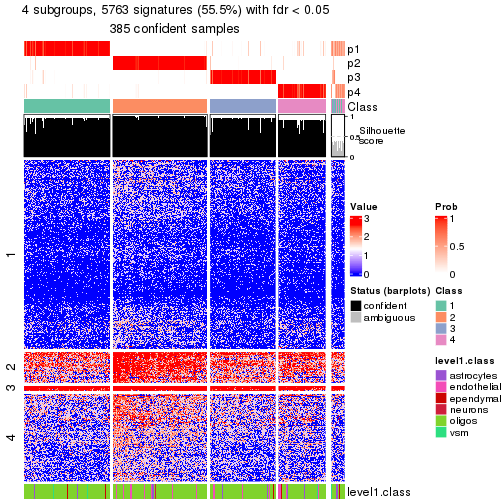</p>

</div>
</div>


Compare the overlap of signatures from different k:

```r
compare_signatures(res)
```


`get_signature()` returns a data frame invisibly. To get the list of signatures, the function
call should be assigned to a variable explicitly. In following code, if `plot` argument is set
to `FALSE`, no heatmap is plotted while only the differential analysis is performed.

```r
# code only for demonstration
tb = get_signature(res, k = ..., plot = FALSE)
```

An example of the output of `tb` is:

```
#>   which_row         fdr    mean_1    mean_2 scaled_mean_1 scaled_mean_2 km
#> 1        38 0.042760348  8.373488  9.131774    -0.5533452     0.5164555  1
#> 2        40 0.018707592  7.106213  8.469186    -0.6173731     0.5762149  1
#> 3        55 0.019134737 10.221463 11.207825    -0.6159697     0.5749050  1
#> 4        59 0.006059896  5.921854  7.869574    -0.6899429     0.6439467  1
#> 5        60 0.018055526  8.928898 10.211722    -0.6204761     0.5791110  1
#> 6        98 0.009384629 15.714769 14.887706     0.6635654    -0.6193277  2
...
```

The columns in `tb` are:

1. `which_row`: row indices corresponding to the input matrix.
2. `fdr`: FDR for the differential test. 
3. `mean_x`: The mean value in group x.
4. `scaled_mean_x`: The mean value in group x after rows are scaled.
5. `km`: Row groups if k-means clustering is applied to rows (which is done by automatically selecting number of clusters).

If there are too many signatures, `top_signatures = ...` can be set to only show the 
signatures with the highest FDRs:

```r
# code only for demonstration
# e.g. to show the top 500 most significant rows
tb = get_signature(res, k = ..., top_signatures = 500)
```

If the signatures are defined as these which are uniquely high in current group, `diff_method` argument
can be set to `"uniquely_high_in_one_group"`:

```r
# code only for demonstration
tb = get_signature(res, k = ..., diff_method = "uniquely_high_in_one_group")
```


UMAP plot which shows how samples are separated.


<script>
$( function() {
	$( '#tabs-node-031-dimension-reduction' ).tabs();
} );
</script>
<div id='tabs-node-031-dimension-reduction'>
<ul>
<li><a href='#tab-node-031-dimension-reduction-1'>k = 2</a></li>
<li><a href='#tab-node-031-dimension-reduction-2'>k = 3</a></li>
<li><a href='#tab-node-031-dimension-reduction-3'>k = 4</a></li>
</ul>
<div id='tab-node-031-dimension-reduction-1'>
<pre><code class="r">dimension_reduction(res, k = 2, method = &quot;UMAP&quot;)
</code></pre>

<p></p>

</div>
<div id='tab-node-031-dimension-reduction-2'>
<pre><code class="r">dimension_reduction(res, k = 3, method = &quot;UMAP&quot;)
</code></pre>

<p></p>

</div>
<div id='tab-node-031-dimension-reduction-3'>
<pre><code class="r">dimension_reduction(res, k = 4, method = &quot;UMAP&quot;)
</code></pre>

<p></p>

</div>
</div>


Following heatmap shows how subgroups are split when increasing `k`:

```r
collect_classes(res)
```


Test correlation between subgroups and known annotations. If the known
annotation is numeric, one-way ANOVA test is applied, and if the known
annotation is discrete, chi-squared contingency table test is applied.

```r
test_to_known_factors(res)
```

```
#>             n_sample level1.class(p-value) k
#> ATC:skmeans      394                0.0985 2
#> ATC:skmeans      395                0.1796 3
#> ATC:skmeans      385                0.3778 4
```


If matrix rows can be associated to genes, consider to use `functional_enrichment(res,
...)` to perform function enrichment for the signature genes. See [this vignette](https://jokergoo.github.io/cola_vignettes/functional_enrichment.html) for more detailed explanations.


 

---------------------------------------------------


### Node0311


Parent node: [Node031](#Node031).
Child nodes: 
                Node01131-leaf
        ,
                Node01132-leaf
        ,
                Node01133-leaf
        ,
                Node01211-leaf
        ,
                Node01212-leaf
        ,
                Node01221-leaf
        ,
                Node01222-leaf
        ,
                Node01223-leaf
        ,
                Node01231-leaf
        ,
                Node01232-leaf
        ,
                Node01233-leaf
        ,
                Node01234-leaf
        ,
                [Node02111](#Node02111)
        ,
                [Node02112](#Node02112)
        ,
                Node02113-leaf
        ,
                Node02121-leaf
        ,
                Node02122-leaf
        ,
                Node02123-leaf
        ,
                Node02221-leaf
        ,
                Node02222-leaf
        ,
                Node03111-leaf
        ,
                Node03112-leaf
        ,
                Node03121-leaf
        ,
                [Node03122](#Node03122)
        .


The object with results only for a single top-value method and a single partitioning method 
can be extracted as:

```r
res = res_rh["0311"]
```

A summary of `res` and all the functions that can be applied to it:

```r
res
```

```
#> A 'ConsensusPartition' object with k = 2, 3, 4.
#>   On a matrix with 8477 rows and 153 columns.
#>   Top rows (848) are extracted by 'ATC' method.
#>   Subgroups are detected by 'skmeans' method.
#>   Performed in total 150 partitions by row resampling.
#>   Best k for subgroups seems to be 3.
#> 
#> Following methods can be applied to this 'ConsensusPartition' object:
#>  [1] "cola_report"             "collect_classes"         "collect_plots"          
#>  [4] "collect_stats"           "colnames"                "compare_partitions"     
#>  [7] "compare_signatures"      "consensus_heatmap"       "dimension_reduction"    
#> [10] "functional_enrichment"   "get_anno_col"            "get_anno"               
#> [13] "get_classes"             "get_consensus"           "get_matrix"             
#> [16] "get_membership"          "get_param"               "get_signatures"         
#> [19] "get_stats"               "is_best_k"               "is_stable_k"            
#> [22] "membership_heatmap"      "ncol"                    "nrow"                   
#> [25] "plot_ecdf"               "predict_classes"         "rownames"               
#> [28] "select_partition_number" "show"                    "suggest_best_k"         
#> [31] "test_to_known_factors"   "top_rows_heatmap"
```

`collect_plots()` function collects all the plots made from `res` for all `k` (number of subgroups)
into one single page to provide an easy and fast comparison between different `k`.

```r
collect_plots(res)
```


The plots are:

- The first row: a plot of the eCDF (empirical cumulative distribution
  function) curves of the consensus matrix for each `k` and the heatmap of
  predicted classes for each `k`.
- The second row: heatmaps of the consensus matrix for each `k`.
- The third row: heatmaps of the membership matrix for each `k`.
- The fouth row: heatmaps of the signatures for each `k`.

All the plots in panels can be made by individual functions and they are
plotted later in this section.

`select_partition_number()` produces several plots showing different
statistics for choosing "optimized" `k`. There are following statistics:

- eCDF curves of the consensus matrix for each `k`;
- 1-PAC. [The PAC score](https://en.wikipedia.org/wiki/Consensus_clustering#Over-interpretation_potential_of_consensus_clustering)
  measures the proportion of the ambiguous subgrouping.
- Mean silhouette score.
- Concordance. The mean probability of fiting the consensus subgroup labels in all
  partitions.
- Area increased. Denote $A_k$ as the area under the eCDF curve for current
  `k`, the area increased is defined as $A_k - A_{k-1}$.
- Rand index. The percent of pairs of samples that are both in a same cluster
  or both are not in a same cluster in the partition of k and k-1.
- Jaccard index. The ratio of pairs of samples are both in a same cluster in
  the partition of k and k-1 and the pairs of samples are both in a same
  cluster in the partition k or k-1.

The detailed explanations of these statistics can be found in [the _cola_
vignette](https://jokergoo.github.io/cola_vignettes/cola.html#toc_13).

Generally speaking, higher 1-PAC score, higher mean silhouette score or higher
concordance corresponds to better partition. Rand index and Jaccard index
measure how similar the current partition is compared to partition with `k-1`.
If they are too similar, we won't accept `k` is better than `k-1`.

```r
select_partition_number(res)
```


The numeric values for all these statistics can be obtained by `get_stats()`.

```r
get_stats(res)
```

```
#>   k 1-PAC mean_silhouette concordance area_increased  Rand Jaccard
#> 2 2 0.973           0.964       0.985          0.492 0.508   0.508
#> 3 3 0.957           0.937       0.976          0.315 0.783   0.596
#> 4 4 0.731           0.724       0.866          0.103 0.931   0.808
```

`suggest_best_k()` suggests the best $k$ based on these statistics. The rules are as follows:

- All $k$ with Jaccard index larger than 0.95 are removed because increasing
  $k$ does not provide enough extra information. If all $k$ are removed, it is
  marked as no subgroup is detected.
- For all $k$ with 1-PAC score larger than 0.9, the maximal $k$ is taken as
  the best $k$, and other $k$ are marked as optional $k$.
- If it does not fit the second rule. The $k$ with the maximal vote of the
  highest 1-PAC score, highest mean silhouette, and highest concordance is
  taken as the best $k$.

```r
suggest_best_k(res)
```

```
#> [1] 3
#> attr(,"optional")
#> [1] 2
```

There is also optional best $k$ = 2 that is worth to check.

Following is the table of the partitions (You need to click the **show/hide
code output** link to see it). The membership matrix (columns with name `p*`)
is inferred by
[`clue::cl_consensus()`](https://www.rdocumentation.org/link/cl_consensus?package=clue)
function with the `SE` method. Basically the value in the membership matrix
represents the probability to belong to a certain group. The finall subgroup
label for an item is determined with the group with highest probability it
belongs to.

In `get_classes()` function, the entropy is calculated from the membership
matrix and the silhouette score is calculated from the consensus matrix.


<script>
$( function() {
	$( '#tabs-node-0311-get-classes' ).tabs();
} );
</script>
<div id='tabs-node-0311-get-classes'>
<ul>
<li><a href='#tab-node-0311-get-classes-1'>k = 2</a></li>
<li><a href='#tab-node-0311-get-classes-2'>k = 3</a></li>
<li><a href='#tab-node-0311-get-classes-3'>k = 4</a></li>
</ul>

<div id='tab-node-0311-get-classes-1'>
<p><a id='tab-node-0311-get-classes-1-a' style='color:#0366d6' href='#'>show/hide code output</a></p>
<pre><code class="r">cbind(get_classes(res, k = 2), get_membership(res, k = 2))
</code></pre>

<pre><code>#&gt;     class entropy silhouette   p1   p2
#&gt; 1       2   0.000      0.981 0.00 1.00
#&gt; 2       2   0.000      0.981 0.00 1.00
#&gt; 3       2   0.000      0.981 0.00 1.00
#&gt; 4       1   0.000      0.987 1.00 0.00
#&gt; 5       1   0.000      0.987 1.00 0.00
#&gt; 6       1   0.000      0.987 1.00 0.00
#&gt; 7       1   0.000      0.987 1.00 0.00
#&gt; 8       1   0.000      0.987 1.00 0.00
#&gt; 9       1   0.000      0.987 1.00 0.00
#&gt; 10      1   0.000      0.987 1.00 0.00
#&gt; 11      1   0.000      0.987 1.00 0.00
#&gt; 12      1   0.000      0.987 1.00 0.00
#&gt; 13      1   0.000      0.987 1.00 0.00
#&gt; 14      1   0.000      0.987 1.00 0.00
#&gt; 15      1   0.000      0.987 1.00 0.00
#&gt; 16      1   0.000      0.987 1.00 0.00
#&gt; 17      1   0.000      0.987 1.00 0.00
#&gt; 18      1   0.000      0.987 1.00 0.00
#&gt; 19      1   0.000      0.987 1.00 0.00
#&gt; 20      1   0.000      0.987 1.00 0.00
#&gt; 21      1   0.141      0.970 0.98 0.02
#&gt; 22      1   0.000      0.987 1.00 0.00
#&gt; 23      1   0.000      0.987 1.00 0.00
#&gt; 24      1   0.000      0.987 1.00 0.00
#&gt; 25      1   0.000      0.987 1.00 0.00
#&gt; 26      1   0.000      0.987 1.00 0.00
#&gt; 27      2   0.000      0.981 0.00 1.00
#&gt; 28      1   0.000      0.987 1.00 0.00
#&gt; 29      1   0.000      0.987 1.00 0.00
#&gt; 30      1   0.000      0.987 1.00 0.00
#&gt; 31      1   0.141      0.970 0.98 0.02
#&gt; 32      1   0.141      0.970 0.98 0.02
#&gt; 33      1   0.000      0.987 1.00 0.00
#&gt; 34      1   0.000      0.987 1.00 0.00
#&gt; 35      1   0.000      0.987 1.00 0.00
#&gt; 36      1   0.000      0.987 1.00 0.00
#&gt; 37      1   0.000      0.987 1.00 0.00
#&gt; 38      1   0.000      0.987 1.00 0.00
#&gt; 39      1   0.000      0.987 1.00 0.00
#&gt; 40      2   0.000      0.981 0.00 1.00
#&gt; 41      1   0.000      0.987 1.00 0.00
#&gt; 42      1   0.000      0.987 1.00 0.00
#&gt; 43      1   0.000      0.987 1.00 0.00
#&gt; 44      1   0.000      0.987 1.00 0.00
#&gt; 45      1   0.000      0.987 1.00 0.00
#&gt; 46      1   0.000      0.987 1.00 0.00
#&gt; 47      1   0.000      0.987 1.00 0.00
#&gt; 48      1   0.000      0.987 1.00 0.00
#&gt; 49      1   0.000      0.987 1.00 0.00
#&gt; 50      1   0.000      0.987 1.00 0.00
#&gt; 51      1   0.000      0.987 1.00 0.00
#&gt; 52      1   0.000      0.987 1.00 0.00
#&gt; 53      1   0.000      0.987 1.00 0.00
#&gt; 54      1   0.000      0.987 1.00 0.00
#&gt; 55      1   0.000      0.987 1.00 0.00
#&gt; 56      2   0.760      0.723 0.22 0.78
#&gt; 57      1   0.000      0.987 1.00 0.00
#&gt; 58      1   0.242      0.951 0.96 0.04
#&gt; 59      1   0.000      0.987 1.00 0.00
#&gt; 60      2   0.584      0.836 0.14 0.86
#&gt; 61      1   0.000      0.987 1.00 0.00
#&gt; 62      1   0.000      0.987 1.00 0.00
#&gt; 63      1   0.760      0.721 0.78 0.22
#&gt; 64      1   0.000      0.987 1.00 0.00
#&gt; 65      1   0.000      0.987 1.00 0.00
#&gt; 66      2   0.000      0.981 0.00 1.00
#&gt; 67      2   0.000      0.981 0.00 1.00
#&gt; 68      2   0.000      0.981 0.00 1.00
#&gt; 69      1   0.000      0.987 1.00 0.00
#&gt; 70      1   0.000      0.987 1.00 0.00
#&gt; 71      1   0.584      0.833 0.86 0.14
#&gt; 72      1   0.000      0.987 1.00 0.00
#&gt; 73      1   0.000      0.987 1.00 0.00
#&gt; 74      1   0.000      0.987 1.00 0.00
#&gt; 75      1   0.000      0.987 1.00 0.00
#&gt; 76      1   0.000      0.987 1.00 0.00
#&gt; 77      1   0.000      0.987 1.00 0.00
#&gt; 78      2   0.242      0.946 0.04 0.96
#&gt; 79      1   0.000      0.987 1.00 0.00
#&gt; 80      2   0.242      0.946 0.04 0.96
#&gt; 81      1   0.000      0.987 1.00 0.00
#&gt; 82      1   0.000      0.987 1.00 0.00
#&gt; 83      2   0.000      0.981 0.00 1.00
#&gt; 84      1   0.000      0.987 1.00 0.00
#&gt; 85      1   0.000      0.987 1.00 0.00
#&gt; 86      2   0.995      0.137 0.46 0.54
#&gt; 87      1   0.000      0.987 1.00 0.00
#&gt; 88      1   0.634      0.809 0.84 0.16
#&gt; 89      2   0.000      0.981 0.00 1.00
#&gt; 90      2   0.000      0.981 0.00 1.00
#&gt; 91      2   0.000      0.981 0.00 1.00
#&gt; 92      2   0.000      0.981 0.00 1.00
#&gt; 93      2   0.000      0.981 0.00 1.00
#&gt; 94      2   0.000      0.981 0.00 1.00
#&gt; 95      2   0.000      0.981 0.00 1.00
#&gt; 96      2   0.000      0.981 0.00 1.00
#&gt; 97      2   0.000      0.981 0.00 1.00
#&gt; 98      2   0.000      0.981 0.00 1.00
#&gt; 99      2   0.000      0.981 0.00 1.00
#&gt; 100     2   0.000      0.981 0.00 1.00
#&gt; 101     2   0.000      0.981 0.00 1.00
#&gt; 102     2   0.000      0.981 0.00 1.00
#&gt; 103     2   0.000      0.981 0.00 1.00
#&gt; 104     2   0.000      0.981 0.00 1.00
#&gt; 105     2   0.000      0.981 0.00 1.00
#&gt; 106     2   0.000      0.981 0.00 1.00
#&gt; 107     2   0.000      0.981 0.00 1.00
#&gt; 108     2   0.000      0.981 0.00 1.00
#&gt; 109     2   0.000      0.981 0.00 1.00
#&gt; 110     2   0.000      0.981 0.00 1.00
#&gt; 111     2   0.000      0.981 0.00 1.00
#&gt; 112     2   0.000      0.981 0.00 1.00
#&gt; 113     2   0.000      0.981 0.00 1.00
#&gt; 114     2   0.000      0.981 0.00 1.00
#&gt; 115     1   0.000      0.987 1.00 0.00
#&gt; 116     2   0.000      0.981 0.00 1.00
#&gt; 117     2   0.000      0.981 0.00 1.00
#&gt; 118     2   0.000      0.981 0.00 1.00
#&gt; 119     2   0.000      0.981 0.00 1.00
#&gt; 120     2   0.000      0.981 0.00 1.00
#&gt; 121     2   0.000      0.981 0.00 1.00
#&gt; 122     2   0.000      0.981 0.00 1.00
#&gt; 123     1   0.141      0.970 0.98 0.02
#&gt; 124     2   0.584      0.835 0.14 0.86
#&gt; 125     2   0.000      0.981 0.00 1.00
#&gt; 126     1   0.981      0.279 0.58 0.42
#&gt; 127     2   0.000      0.981 0.00 1.00
#&gt; 128     1   0.141      0.970 0.98 0.02
#&gt; 129     2   0.000      0.981 0.00 1.00
#&gt; 130     2   0.000      0.981 0.00 1.00
#&gt; 131     2   0.000      0.981 0.00 1.00
#&gt; 132     2   0.000      0.981 0.00 1.00
#&gt; 133     1   0.242      0.950 0.96 0.04
#&gt; 134     2   0.000      0.981 0.00 1.00
#&gt; 135     2   0.000      0.981 0.00 1.00
#&gt; 136     2   0.000      0.981 0.00 1.00
#&gt; 137     2   0.000      0.981 0.00 1.00
#&gt; 138     1   0.000      0.987 1.00 0.00
#&gt; 139     2   0.000      0.981 0.00 1.00
#&gt; 140     1   0.000      0.987 1.00 0.00
#&gt; 141     1   0.000      0.987 1.00 0.00
#&gt; 142     2   0.000      0.981 0.00 1.00
#&gt; 143     1   0.000      0.987 1.00 0.00
#&gt; 144     2   0.000      0.981 0.00 1.00
#&gt; 145     1   0.000      0.987 1.00 0.00
#&gt; 146     1   0.000      0.987 1.00 0.00
#&gt; 147     1   0.000      0.987 1.00 0.00
#&gt; 148     1   0.000      0.987 1.00 0.00
#&gt; 149     2   0.584      0.836 0.14 0.86
#&gt; 150     2   0.000      0.981 0.00 1.00
#&gt; 151     1   0.000      0.987 1.00 0.00
#&gt; 152     2   0.000      0.981 0.00 1.00
#&gt; 153     2   0.000      0.981 0.00 1.00
</code></pre>

<script>
$('#tab-node-0311-get-classes-1-a').parent().next().next().hide();
$('#tab-node-0311-get-classes-1-a').click(function(){
  $('#tab-node-0311-get-classes-1-a').parent().next().next().toggle();
  return(false);
});
</script>
</div>

<div id='tab-node-0311-get-classes-2'>
<p><a id='tab-node-0311-get-classes-2-a' style='color:#0366d6' href='#'>show/hide code output</a></p>
<pre><code class="r">cbind(get_classes(res, k = 3), get_membership(res, k = 3))
</code></pre>

<pre><code>#&gt;     class entropy silhouette   p1   p2   p3
#&gt; 1       2  0.0000    0.96602 0.00 1.00 0.00
#&gt; 2       2  0.0000    0.96602 0.00 1.00 0.00
#&gt; 3       2  0.2959    0.86581 0.00 0.90 0.10
#&gt; 4       1  0.0000    0.98588 1.00 0.00 0.00
#&gt; 5       1  0.1529    0.94997 0.96 0.00 0.04
#&gt; 6       1  0.0000    0.98588 1.00 0.00 0.00
#&gt; 7       3  0.0000    0.95726 0.00 0.00 1.00
#&gt; 8       3  0.0000    0.95726 0.00 0.00 1.00
#&gt; 9       3  0.0000    0.95726 0.00 0.00 1.00
#&gt; 10      1  0.0000    0.98588 1.00 0.00 0.00
#&gt; 11      3  0.0000    0.95726 0.00 0.00 1.00
#&gt; 12      1  0.2959    0.88388 0.90 0.00 0.10
#&gt; 13      3  0.0000    0.95726 0.00 0.00 1.00
#&gt; 14      1  0.0000    0.98588 1.00 0.00 0.00
#&gt; 15      1  0.0000    0.98588 1.00 0.00 0.00
#&gt; 16      1  0.0000    0.98588 1.00 0.00 0.00
#&gt; 17      1  0.0000    0.98588 1.00 0.00 0.00
#&gt; 18      3  0.0000    0.95726 0.00 0.00 1.00
#&gt; 19      3  0.0000    0.95726 0.00 0.00 1.00
#&gt; 20      1  0.0000    0.98588 1.00 0.00 0.00
#&gt; 21      3  0.0000    0.95726 0.00 0.00 1.00
#&gt; 22      1  0.0000    0.98588 1.00 0.00 0.00
#&gt; 23      1  0.0000    0.98588 1.00 0.00 0.00
#&gt; 24      1  0.0000    0.98588 1.00 0.00 0.00
#&gt; 25      1  0.0000    0.98588 1.00 0.00 0.00
#&gt; 26      1  0.0000    0.98588 1.00 0.00 0.00
#&gt; 27      2  0.0000    0.96602 0.00 1.00 0.00
#&gt; 28      1  0.0000    0.98588 1.00 0.00 0.00
#&gt; 29      1  0.0000    0.98588 1.00 0.00 0.00
#&gt; 30      1  0.0000    0.98588 1.00 0.00 0.00
#&gt; 31      1  0.1529    0.94797 0.96 0.04 0.00
#&gt; 32      1  0.0000    0.98588 1.00 0.00 0.00
#&gt; 33      1  0.0000    0.98588 1.00 0.00 0.00
#&gt; 34      1  0.0000    0.98588 1.00 0.00 0.00
#&gt; 35      1  0.0000    0.98588 1.00 0.00 0.00
#&gt; 36      1  0.0000    0.98588 1.00 0.00 0.00
#&gt; 37      1  0.0000    0.98588 1.00 0.00 0.00
#&gt; 38      1  0.0000    0.98588 1.00 0.00 0.00
#&gt; 39      1  0.0000    0.98588 1.00 0.00 0.00
#&gt; 40      2  0.0000    0.96602 0.00 1.00 0.00
#&gt; 41      1  0.0000    0.98588 1.00 0.00 0.00
#&gt; 42      1  0.0000    0.98588 1.00 0.00 0.00
#&gt; 43      3  0.3686    0.82511 0.14 0.00 0.86
#&gt; 44      1  0.0000    0.98588 1.00 0.00 0.00
#&gt; 45      1  0.0000    0.98588 1.00 0.00 0.00
#&gt; 46      1  0.0000    0.98588 1.00 0.00 0.00
#&gt; 47      1  0.0000    0.98588 1.00 0.00 0.00
#&gt; 48      1  0.0000    0.98588 1.00 0.00 0.00
#&gt; 49      1  0.0000    0.98588 1.00 0.00 0.00
#&gt; 50      1  0.0000    0.98588 1.00 0.00 0.00
#&gt; 51      1  0.0000    0.98588 1.00 0.00 0.00
#&gt; 52      3  0.0000    0.95726 0.00 0.00 1.00
#&gt; 53      1  0.0000    0.98588 1.00 0.00 0.00
#&gt; 54      3  0.0000    0.95726 0.00 0.00 1.00
#&gt; 55      3  0.0892    0.94029 0.02 0.00 0.98
#&gt; 56      3  0.0000    0.95726 0.00 0.00 1.00
#&gt; 57      1  0.0000    0.98588 1.00 0.00 0.00
#&gt; 58      1  0.0000    0.98588 1.00 0.00 0.00
#&gt; 59      3  0.0000    0.95726 0.00 0.00 1.00
#&gt; 60      3  0.0000    0.95726 0.00 0.00 1.00
#&gt; 61      1  0.0000    0.98588 1.00 0.00 0.00
#&gt; 62      1  0.0000    0.98588 1.00 0.00 0.00
#&gt; 63      1  0.6244    0.19222 0.56 0.44 0.00
#&gt; 64      1  0.0000    0.98588 1.00 0.00 0.00
#&gt; 65      1  0.0000    0.98588 1.00 0.00 0.00
#&gt; 66      3  0.0000    0.95726 0.00 0.00 1.00
#&gt; 67      2  0.0000    0.96602 0.00 1.00 0.00
#&gt; 68      3  0.0000    0.95726 0.00 0.00 1.00
#&gt; 69      1  0.0000    0.98588 1.00 0.00 0.00
#&gt; 70      1  0.0000    0.98588 1.00 0.00 0.00
#&gt; 71      3  0.0000    0.95726 0.00 0.00 1.00
#&gt; 72      1  0.0000    0.98588 1.00 0.00 0.00
#&gt; 73      1  0.1529    0.94980 0.96 0.00 0.04
#&gt; 74      1  0.0000    0.98588 1.00 0.00 0.00
#&gt; 75      1  0.0000    0.98588 1.00 0.00 0.00
#&gt; 76      1  0.0000    0.98588 1.00 0.00 0.00
#&gt; 77      1  0.0000    0.98588 1.00 0.00 0.00
#&gt; 78      2  0.2959    0.85806 0.10 0.90 0.00
#&gt; 79      1  0.0000    0.98588 1.00 0.00 0.00
#&gt; 80      3  0.6192    0.25972 0.00 0.42 0.58
#&gt; 81      3  0.0000    0.95726 0.00 0.00 1.00
#&gt; 82      1  0.0000    0.98588 1.00 0.00 0.00
#&gt; 83      2  0.0000    0.96602 0.00 1.00 0.00
#&gt; 84      1  0.0000    0.98588 1.00 0.00 0.00
#&gt; 85      1  0.0000    0.98588 1.00 0.00 0.00
#&gt; 86      2  0.6309    0.00391 0.50 0.50 0.00
#&gt; 87      1  0.0000    0.98588 1.00 0.00 0.00
#&gt; 88      1  0.1529    0.94689 0.96 0.04 0.00
#&gt; 89      3  0.0000    0.95726 0.00 0.00 1.00
#&gt; 90      2  0.0000    0.96602 0.00 1.00 0.00
#&gt; 91      2  0.0000    0.96602 0.00 1.00 0.00
#&gt; 92      2  0.0000    0.96602 0.00 1.00 0.00
#&gt; 93      2  0.0000    0.96602 0.00 1.00 0.00
#&gt; 94      2  0.0000    0.96602 0.00 1.00 0.00
#&gt; 95      2  0.0000    0.96602 0.00 1.00 0.00
#&gt; 96      2  0.0000    0.96602 0.00 1.00 0.00
#&gt; 97      2  0.0000    0.96602 0.00 1.00 0.00
#&gt; 98      2  0.0000    0.96602 0.00 1.00 0.00
#&gt; 99      2  0.0000    0.96602 0.00 1.00 0.00
#&gt; 100     2  0.0000    0.96602 0.00 1.00 0.00
#&gt; 101     2  0.0000    0.96602 0.00 1.00 0.00
#&gt; 102     2  0.0000    0.96602 0.00 1.00 0.00
#&gt; 103     2  0.0000    0.96602 0.00 1.00 0.00
#&gt; 104     2  0.0000    0.96602 0.00 1.00 0.00
#&gt; 105     2  0.0000    0.96602 0.00 1.00 0.00
#&gt; 106     2  0.0000    0.96602 0.00 1.00 0.00
#&gt; 107     3  0.0000    0.95726 0.00 0.00 1.00
#&gt; 108     2  0.0000    0.96602 0.00 1.00 0.00
#&gt; 109     2  0.0000    0.96602 0.00 1.00 0.00
#&gt; 110     2  0.0000    0.96602 0.00 1.00 0.00
#&gt; 111     3  0.0000    0.95726 0.00 0.00 1.00
#&gt; 112     2  0.0000    0.96602 0.00 1.00 0.00
#&gt; 113     3  0.0000    0.95726 0.00 0.00 1.00
#&gt; 114     2  0.0000    0.96602 0.00 1.00 0.00
#&gt; 115     1  0.0000    0.98588 1.00 0.00 0.00
#&gt; 116     2  0.0000    0.96602 0.00 1.00 0.00
#&gt; 117     2  0.0000    0.96602 0.00 1.00 0.00
#&gt; 118     2  0.0000    0.96602 0.00 1.00 0.00
#&gt; 119     2  0.0000    0.96602 0.00 1.00 0.00
#&gt; 120     2  0.0000    0.96602 0.00 1.00 0.00
#&gt; 121     2  0.0000    0.96602 0.00 1.00 0.00
#&gt; 122     2  0.0000    0.96602 0.00 1.00 0.00
#&gt; 123     3  0.5016    0.68313 0.24 0.00 0.76
#&gt; 124     2  0.2537    0.88153 0.08 0.92 0.00
#&gt; 125     3  0.0000    0.95726 0.00 0.00 1.00
#&gt; 126     2  0.5216    0.64498 0.26 0.74 0.00
#&gt; 127     3  0.0000    0.95726 0.00 0.00 1.00
#&gt; 128     1  0.1529    0.94761 0.96 0.04 0.00
#&gt; 129     2  0.0000    0.96602 0.00 1.00 0.00
#&gt; 130     2  0.0000    0.96602 0.00 1.00 0.00
#&gt; 131     2  0.0000    0.96602 0.00 1.00 0.00
#&gt; 132     2  0.0000    0.96602 0.00 1.00 0.00
#&gt; 133     3  0.0000    0.95726 0.00 0.00 1.00
#&gt; 134     2  0.0000    0.96602 0.00 1.00 0.00
#&gt; 135     3  0.0000    0.95726 0.00 0.00 1.00
#&gt; 136     2  0.0000    0.96602 0.00 1.00 0.00
#&gt; 137     2  0.0000    0.96602 0.00 1.00 0.00
#&gt; 138     3  0.0000    0.95726 0.00 0.00 1.00
#&gt; 139     2  0.0000    0.96602 0.00 1.00 0.00
#&gt; 140     1  0.0000    0.98588 1.00 0.00 0.00
#&gt; 141     1  0.0000    0.98588 1.00 0.00 0.00
#&gt; 142     2  0.0000    0.96602 0.00 1.00 0.00
#&gt; 143     1  0.0000    0.98588 1.00 0.00 0.00
#&gt; 144     2  0.0000    0.96602 0.00 1.00 0.00
#&gt; 145     1  0.0000    0.98588 1.00 0.00 0.00
#&gt; 146     3  0.0000    0.95726 0.00 0.00 1.00
#&gt; 147     1  0.3340    0.85684 0.88 0.00 0.12
#&gt; 148     3  0.6126    0.34734 0.40 0.00 0.60
#&gt; 149     3  0.0000    0.95726 0.00 0.00 1.00
#&gt; 150     2  0.6244    0.19067 0.00 0.56 0.44
#&gt; 151     1  0.0000    0.98588 1.00 0.00 0.00
#&gt; 152     3  0.3340    0.83819 0.00 0.12 0.88
#&gt; 153     3  0.0000    0.95726 0.00 0.00 1.00
</code></pre>

<script>
$('#tab-node-0311-get-classes-2-a').parent().next().next().hide();
$('#tab-node-0311-get-classes-2-a').click(function(){
  $('#tab-node-0311-get-classes-2-a').parent().next().next().toggle();
  return(false);
});
</script>
</div>

<div id='tab-node-0311-get-classes-3'>
<p><a id='tab-node-0311-get-classes-3-a' style='color:#0366d6' href='#'>show/hide code output</a></p>
<pre><code class="r">cbind(get_classes(res, k = 4), get_membership(res, k = 4))
</code></pre>

<pre><code>#&gt;     class entropy silhouette   p1   p2   p3   p4
#&gt; 1       2  0.0707     0.8366 0.00 0.98 0.00 0.02
#&gt; 2       2  0.1211     0.8243 0.00 0.96 0.00 0.04
#&gt; 3       2  0.5428     0.5611 0.00 0.74 0.14 0.12
#&gt; 4       1  0.2345     0.8144 0.90 0.00 0.00 0.10
#&gt; 5       1  0.7427     0.0174 0.50 0.00 0.30 0.20
#&gt; 6       1  0.1637     0.8368 0.94 0.00 0.00 0.06
#&gt; 7       3  0.0000     0.9211 0.00 0.00 1.00 0.00
#&gt; 8       3  0.0000     0.9211 0.00 0.00 1.00 0.00
#&gt; 9       3  0.0000     0.9211 0.00 0.00 1.00 0.00
#&gt; 10      1  0.2647     0.8016 0.88 0.00 0.00 0.12
#&gt; 11      3  0.0000     0.9211 0.00 0.00 1.00 0.00
#&gt; 12      1  0.7372    -0.2240 0.42 0.00 0.16 0.42
#&gt; 13      3  0.0000     0.9211 0.00 0.00 1.00 0.00
#&gt; 14      1  0.3801     0.6855 0.78 0.00 0.00 0.22
#&gt; 15      1  0.2345     0.8160 0.90 0.00 0.00 0.10
#&gt; 16      1  0.2011     0.8286 0.92 0.00 0.00 0.08
#&gt; 17      4  0.4713     0.2485 0.36 0.00 0.00 0.64
#&gt; 18      3  0.0000     0.9211 0.00 0.00 1.00 0.00
#&gt; 19      3  0.0000     0.9211 0.00 0.00 1.00 0.00
#&gt; 20      1  0.4731     0.6884 0.78 0.00 0.06 0.16
#&gt; 21      3  0.0000     0.9211 0.00 0.00 1.00 0.00
#&gt; 22      1  0.0000     0.8610 1.00 0.00 0.00 0.00
#&gt; 23      1  0.0000     0.8610 1.00 0.00 0.00 0.00
#&gt; 24      1  0.0000     0.8610 1.00 0.00 0.00 0.00
#&gt; 25      1  0.0000     0.8610 1.00 0.00 0.00 0.00
#&gt; 26      1  0.0000     0.8610 1.00 0.00 0.00 0.00
#&gt; 27      2  0.2345     0.8340 0.00 0.90 0.00 0.10
#&gt; 28      1  0.0707     0.8542 0.98 0.00 0.00 0.02
#&gt; 29      1  0.0000     0.8610 1.00 0.00 0.00 0.00
#&gt; 30      1  0.0000     0.8610 1.00 0.00 0.00 0.00
#&gt; 31      1  0.1211     0.8347 0.96 0.04 0.00 0.00
#&gt; 32      1  0.1637     0.8211 0.94 0.00 0.00 0.06
#&gt; 33      1  0.0000     0.8610 1.00 0.00 0.00 0.00
#&gt; 34      1  0.0000     0.8610 1.00 0.00 0.00 0.00
#&gt; 35      1  0.0000     0.8610 1.00 0.00 0.00 0.00
#&gt; 36      1  0.0000     0.8610 1.00 0.00 0.00 0.00
#&gt; 37      1  0.0000     0.8610 1.00 0.00 0.00 0.00
#&gt; 38      1  0.0000     0.8610 1.00 0.00 0.00 0.00
#&gt; 39      1  0.0000     0.8610 1.00 0.00 0.00 0.00
#&gt; 40      2  0.3198     0.7888 0.08 0.88 0.00 0.04
#&gt; 41      1  0.0000     0.8610 1.00 0.00 0.00 0.00
#&gt; 42      1  0.0000     0.8610 1.00 0.00 0.00 0.00
#&gt; 43      3  0.3610     0.5948 0.20 0.00 0.80 0.00
#&gt; 44      1  0.2011     0.8259 0.92 0.00 0.00 0.08
#&gt; 45      1  0.0000     0.8610 1.00 0.00 0.00 0.00
#&gt; 46      1  0.0000     0.8610 1.00 0.00 0.00 0.00
#&gt; 47      1  0.2345     0.7817 0.90 0.00 0.00 0.10
#&gt; 48      1  0.0000     0.8610 1.00 0.00 0.00 0.00
#&gt; 49      1  0.0000     0.8610 1.00 0.00 0.00 0.00
#&gt; 50      1  0.1913     0.8205 0.94 0.00 0.04 0.02
#&gt; 51      1  0.0000     0.8610 1.00 0.00 0.00 0.00
#&gt; 52      3  0.0707     0.9099 0.00 0.00 0.98 0.02
#&gt; 53      1  0.0707     0.8542 0.98 0.00 0.00 0.02
#&gt; 54      3  0.0707     0.9070 0.00 0.00 0.98 0.02
#&gt; 55      4  0.5860     0.1285 0.04 0.00 0.38 0.58
#&gt; 56      3  0.0000     0.9211 0.00 0.00 1.00 0.00
#&gt; 57      1  0.4790     0.4599 0.62 0.00 0.00 0.38
#&gt; 58      1  0.4406     0.5672 0.70 0.00 0.00 0.30
#&gt; 59      3  0.0707     0.9106 0.00 0.00 0.98 0.02
#&gt; 60      3  0.0000     0.9211 0.00 0.00 1.00 0.00
#&gt; 61      1  0.2647     0.8016 0.88 0.00 0.00 0.12
#&gt; 62      1  0.2647     0.8016 0.88 0.00 0.00 0.12
#&gt; 63      4  0.7869    -0.0250 0.28 0.34 0.00 0.38
#&gt; 64      1  0.2647     0.8016 0.88 0.00 0.00 0.12
#&gt; 65      1  0.1211     0.8465 0.96 0.00 0.00 0.04
#&gt; 66      3  0.0000     0.9211 0.00 0.00 1.00 0.00
#&gt; 67      2  0.1211     0.8463 0.00 0.96 0.00 0.04
#&gt; 68      3  0.0707     0.9124 0.00 0.00 0.98 0.02
#&gt; 69      1  0.0000     0.8610 1.00 0.00 0.00 0.00
#&gt; 70      1  0.4406     0.5564 0.70 0.00 0.00 0.30
#&gt; 71      3  0.1637     0.8802 0.00 0.00 0.94 0.06
#&gt; 72      1  0.0000     0.8610 1.00 0.00 0.00 0.00
#&gt; 73      1  0.5956     0.5365 0.68 0.00 0.10 0.22
#&gt; 74      1  0.2345     0.7816 0.90 0.00 0.00 0.10
#&gt; 75      1  0.0000     0.8610 1.00 0.00 0.00 0.00
#&gt; 76      1  0.0000     0.8610 1.00 0.00 0.00 0.00
#&gt; 77      1  0.4948     0.1845 0.56 0.00 0.00 0.44
#&gt; 78      2  0.7274     0.4446 0.22 0.54 0.00 0.24
#&gt; 79      1  0.0000     0.8610 1.00 0.00 0.00 0.00
#&gt; 80      3  0.7783     0.2695 0.04 0.26 0.56 0.14
#&gt; 81      3  0.0000     0.9211 0.00 0.00 1.00 0.00
#&gt; 82      1  0.4277     0.5384 0.72 0.00 0.00 0.28
#&gt; 83      2  0.4134     0.7793 0.00 0.74 0.00 0.26
#&gt; 84      1  0.2345     0.8138 0.90 0.00 0.00 0.10
#&gt; 85      1  0.0000     0.8610 1.00 0.00 0.00 0.00
#&gt; 86      1  0.7748    -0.0712 0.44 0.28 0.00 0.28
#&gt; 87      1  0.0000     0.8610 1.00 0.00 0.00 0.00
#&gt; 88      1  0.5392     0.4651 0.68 0.04 0.00 0.28
#&gt; 89      3  0.0707     0.9124 0.00 0.00 0.98 0.02
#&gt; 90      2  0.0000     0.8463 0.00 1.00 0.00 0.00
#&gt; 91      2  0.0000     0.8463 0.00 1.00 0.00 0.00
#&gt; 92      2  0.0000     0.8463 0.00 1.00 0.00 0.00
#&gt; 93      2  0.0000     0.8463 0.00 1.00 0.00 0.00
#&gt; 94      2  0.0000     0.8463 0.00 1.00 0.00 0.00
#&gt; 95      2  0.1211     0.8459 0.00 0.96 0.00 0.04
#&gt; 96      2  0.0000     0.8463 0.00 1.00 0.00 0.00
#&gt; 97      2  0.4134     0.7793 0.00 0.74 0.00 0.26
#&gt; 98      2  0.0000     0.8463 0.00 1.00 0.00 0.00
#&gt; 99      2  0.4134     0.7793 0.00 0.74 0.00 0.26
#&gt; 100     2  0.4134     0.7793 0.00 0.74 0.00 0.26
#&gt; 101     2  0.0000     0.8463 0.00 1.00 0.00 0.00
#&gt; 102     2  0.0000     0.8463 0.00 1.00 0.00 0.00
#&gt; 103     2  0.0000     0.8463 0.00 1.00 0.00 0.00
#&gt; 104     2  0.4134     0.7793 0.00 0.74 0.00 0.26
#&gt; 105     2  0.0000     0.8463 0.00 1.00 0.00 0.00
#&gt; 106     2  0.0707     0.8471 0.00 0.98 0.00 0.02
#&gt; 107     3  0.0707     0.9124 0.00 0.00 0.98 0.02
#&gt; 108     2  0.4134     0.7793 0.00 0.74 0.00 0.26
#&gt; 109     2  0.0000     0.8463 0.00 1.00 0.00 0.00
#&gt; 110     2  0.1637     0.8433 0.00 0.94 0.00 0.06
#&gt; 111     3  0.0707     0.9124 0.00 0.00 0.98 0.02
#&gt; 112     2  0.0000     0.8463 0.00 1.00 0.00 0.00
#&gt; 113     3  0.0000     0.9211 0.00 0.00 1.00 0.00
#&gt; 114     2  0.4134     0.7793 0.00 0.74 0.00 0.26
#&gt; 115     1  0.0000     0.8610 1.00 0.00 0.00 0.00
#&gt; 116     2  0.4134     0.7793 0.00 0.74 0.00 0.26
#&gt; 117     2  0.3400     0.8096 0.00 0.82 0.00 0.18
#&gt; 118     2  0.0000     0.8463 0.00 1.00 0.00 0.00
#&gt; 119     2  0.0000     0.8463 0.00 1.00 0.00 0.00
#&gt; 120     2  0.4134     0.7793 0.00 0.74 0.00 0.26
#&gt; 121     2  0.4134     0.7793 0.00 0.74 0.00 0.26
#&gt; 122     2  0.4134     0.7793 0.00 0.74 0.00 0.26
#&gt; 123     4  0.4642     0.3326 0.02 0.00 0.24 0.74
#&gt; 124     2  0.6836     0.5417 0.14 0.58 0.00 0.28
#&gt; 125     3  0.0000     0.9211 0.00 0.00 1.00 0.00
#&gt; 126     4  0.7365    -0.2023 0.16 0.40 0.00 0.44
#&gt; 127     3  0.0000     0.9211 0.00 0.00 1.00 0.00
#&gt; 128     1  0.6766     0.2281 0.52 0.10 0.00 0.38
#&gt; 129     2  0.4134     0.7793 0.00 0.74 0.00 0.26
#&gt; 130     2  0.0707     0.8466 0.00 0.98 0.00 0.02
#&gt; 131     2  0.4134     0.7793 0.00 0.74 0.00 0.26
#&gt; 132     2  0.4134     0.7793 0.00 0.74 0.00 0.26
#&gt; 133     4  0.4994    -0.1835 0.00 0.00 0.48 0.52
#&gt; 134     2  0.5713     0.3149 0.00 0.62 0.04 0.34
#&gt; 135     3  0.5062     0.5718 0.00 0.02 0.68 0.30
#&gt; 136     2  0.1637     0.8111 0.00 0.94 0.00 0.06
#&gt; 137     2  0.1637     0.8105 0.00 0.94 0.00 0.06
#&gt; 138     3  0.3801     0.6996 0.00 0.00 0.78 0.22
#&gt; 139     2  0.1637     0.8111 0.00 0.94 0.00 0.06
#&gt; 140     4  0.4790     0.3358 0.38 0.00 0.00 0.62
#&gt; 141     1  0.3172     0.7674 0.84 0.00 0.00 0.16
#&gt; 142     2  0.4134     0.7793 0.00 0.74 0.00 0.26
#&gt; 143     1  0.4134     0.5930 0.74 0.00 0.00 0.26
#&gt; 144     2  0.0707     0.8376 0.00 0.98 0.00 0.02
#&gt; 145     4  0.5000    -0.0533 0.50 0.00 0.00 0.50
#&gt; 146     4  0.4790     0.0647 0.00 0.00 0.38 0.62
#&gt; 147     4  0.4277     0.4881 0.28 0.00 0.00 0.72
#&gt; 148     4  0.5173     0.4681 0.32 0.00 0.02 0.66
#&gt; 149     3  0.2011     0.8678 0.00 0.00 0.92 0.08
#&gt; 150     4  0.5355     0.3024 0.00 0.36 0.02 0.62
#&gt; 151     4  0.4134     0.4948 0.26 0.00 0.00 0.74
#&gt; 152     4  0.6594     0.3492 0.00 0.24 0.14 0.62
#&gt; 153     3  0.4790     0.4606 0.00 0.00 0.62 0.38
</code></pre>

<script>
$('#tab-node-0311-get-classes-3-a').parent().next().next().hide();
$('#tab-node-0311-get-classes-3-a').click(function(){
  $('#tab-node-0311-get-classes-3-a').parent().next().next().toggle();
  return(false);
});
</script>
</div>
</div>

Heatmaps for the consensus matrix. It visualizes the probability of two
samples to be in a same group.


<script>
$( function() {
	$( '#tabs-node-0311-consensus-heatmap' ).tabs();
} );
</script>
<div id='tabs-node-0311-consensus-heatmap'>
<ul>
<li><a href='#tab-node-0311-consensus-heatmap-1'>k = 2</a></li>
<li><a href='#tab-node-0311-consensus-heatmap-2'>k = 3</a></li>
<li><a href='#tab-node-0311-consensus-heatmap-3'>k = 4</a></li>
</ul>
<div id='tab-node-0311-consensus-heatmap-1'>
<pre><code class="r">consensus_heatmap(res, k = 2)
</code></pre>

<p></p>

</div>
<div id='tab-node-0311-consensus-heatmap-2'>
<pre><code class="r">consensus_heatmap(res, k = 3)
</code></pre>

<p></p>

</div>
<div id='tab-node-0311-consensus-heatmap-3'>
<pre><code class="r">consensus_heatmap(res, k = 4)
</code></pre>

<p></p>

</div>
</div>

Heatmaps for the membership of samples in all partitions to see how consistent they are:


<script>
$( function() {
	$( '#tabs-node-0311-membership-heatmap' ).tabs();
} );
</script>
<div id='tabs-node-0311-membership-heatmap'>
<ul>
<li><a href='#tab-node-0311-membership-heatmap-1'>k = 2</a></li>
<li><a href='#tab-node-0311-membership-heatmap-2'>k = 3</a></li>
<li><a href='#tab-node-0311-membership-heatmap-3'>k = 4</a></li>
</ul>
<div id='tab-node-0311-membership-heatmap-1'>
<pre><code class="r">membership_heatmap(res, k = 2)
</code></pre>

<p></p>

</div>
<div id='tab-node-0311-membership-heatmap-2'>
<pre><code class="r">membership_heatmap(res, k = 3)
</code></pre>

<p></p>

</div>
<div id='tab-node-0311-membership-heatmap-3'>
<pre><code class="r">membership_heatmap(res, k = 4)
</code></pre>

<p></p>

</div>
</div>

As soon as the classes for columns are determined, the signatures
that are significantly different between subgroups can be looked for. 
Following are the heatmaps for signatures.


Signature heatmaps where rows are scaled:


<script>
$( function() {
	$( '#tabs-node-0311-get-signatures' ).tabs();
} );
</script>
<div id='tabs-node-0311-get-signatures'>
<ul>
<li><a href='#tab-node-0311-get-signatures-1'>k = 2</a></li>
<li><a href='#tab-node-0311-get-signatures-2'>k = 3</a></li>
<li><a href='#tab-node-0311-get-signatures-3'>k = 4</a></li>
</ul>
<div id='tab-node-0311-get-signatures-1'>
<pre><code class="r">get_signatures(res, k = 2)
</code></pre>

<p></p>

</div>
<div id='tab-node-0311-get-signatures-2'>
<pre><code class="r">get_signatures(res, k = 3)
</code></pre>

<p></p>

</div>
<div id='tab-node-0311-get-signatures-3'>
<pre><code class="r">get_signatures(res, k = 4)
</code></pre>

<p></p>

</div>
</div>


Signature heatmaps where rows are not scaled:


<script>
$( function() {
	$( '#tabs-node-0311-get-signatures-no-scale' ).tabs();
} );
</script>
<div id='tabs-node-0311-get-signatures-no-scale'>
<ul>
<li><a href='#tab-node-0311-get-signatures-no-scale-1'>k = 2</a></li>
<li><a href='#tab-node-0311-get-signatures-no-scale-2'>k = 3</a></li>
<li><a href='#tab-node-0311-get-signatures-no-scale-3'>k = 4</a></li>
</ul>
<div id='tab-node-0311-get-signatures-no-scale-1'>
<pre><code class="r">get_signatures(res, k = 2, scale_rows = FALSE)
</code></pre>

<p>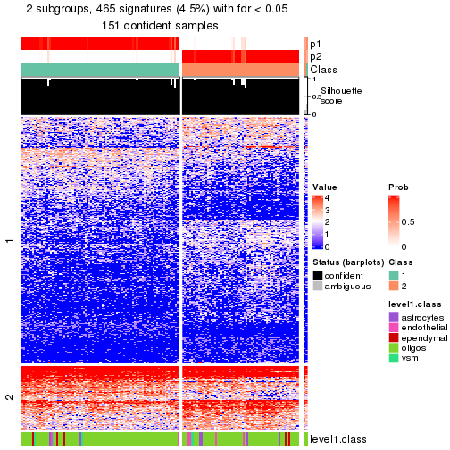</p>

</div>
<div id='tab-node-0311-get-signatures-no-scale-2'>
<pre><code class="r">get_signatures(res, k = 3, scale_rows = FALSE)
</code></pre>

<p></p>

</div>
<div id='tab-node-0311-get-signatures-no-scale-3'>
<pre><code class="r">get_signatures(res, k = 4, scale_rows = FALSE)
</code></pre>

<p></p>

</div>
</div>


Compare the overlap of signatures from different k:

```r
compare_signatures(res)
```


`get_signature()` returns a data frame invisibly. To get the list of signatures, the function
call should be assigned to a variable explicitly. In following code, if `plot` argument is set
to `FALSE`, no heatmap is plotted while only the differential analysis is performed.

```r
# code only for demonstration
tb = get_signature(res, k = ..., plot = FALSE)
```

An example of the output of `tb` is:

```
#>   which_row         fdr    mean_1    mean_2 scaled_mean_1 scaled_mean_2 km
#> 1        38 0.042760348  8.373488  9.131774    -0.5533452     0.5164555  1
#> 2        40 0.018707592  7.106213  8.469186    -0.6173731     0.5762149  1
#> 3        55 0.019134737 10.221463 11.207825    -0.6159697     0.5749050  1
#> 4        59 0.006059896  5.921854  7.869574    -0.6899429     0.6439467  1
#> 5        60 0.018055526  8.928898 10.211722    -0.6204761     0.5791110  1
#> 6        98 0.009384629 15.714769 14.887706     0.6635654    -0.6193277  2
...
```

The columns in `tb` are:

1. `which_row`: row indices corresponding to the input matrix.
2. `fdr`: FDR for the differential test. 
3. `mean_x`: The mean value in group x.
4. `scaled_mean_x`: The mean value in group x after rows are scaled.
5. `km`: Row groups if k-means clustering is applied to rows (which is done by automatically selecting number of clusters).

If there are too many signatures, `top_signatures = ...` can be set to only show the 
signatures with the highest FDRs:

```r
# code only for demonstration
# e.g. to show the top 500 most significant rows
tb = get_signature(res, k = ..., top_signatures = 500)
```

If the signatures are defined as these which are uniquely high in current group, `diff_method` argument
can be set to `"uniquely_high_in_one_group"`:

```r
# code only for demonstration
tb = get_signature(res, k = ..., diff_method = "uniquely_high_in_one_group")
```


UMAP plot which shows how samples are separated.


<script>
$( function() {
	$( '#tabs-node-0311-dimension-reduction' ).tabs();
} );
</script>
<div id='tabs-node-0311-dimension-reduction'>
<ul>
<li><a href='#tab-node-0311-dimension-reduction-1'>k = 2</a></li>
<li><a href='#tab-node-0311-dimension-reduction-2'>k = 3</a></li>
<li><a href='#tab-node-0311-dimension-reduction-3'>k = 4</a></li>
</ul>
<div id='tab-node-0311-dimension-reduction-1'>
<pre><code class="r">dimension_reduction(res, k = 2, method = &quot;UMAP&quot;)
</code></pre>

<p></p>

</div>
<div id='tab-node-0311-dimension-reduction-2'>
<pre><code class="r">dimension_reduction(res, k = 3, method = &quot;UMAP&quot;)
</code></pre>

<p></p>

</div>
<div id='tab-node-0311-dimension-reduction-3'>
<pre><code class="r">dimension_reduction(res, k = 4, method = &quot;UMAP&quot;)
</code></pre>

<p></p>

</div>
</div>


Following heatmap shows how subgroups are split when increasing `k`:

```r
collect_classes(res)
```


Test correlation between subgroups and known annotations. If the known
annotation is numeric, one-way ANOVA test is applied, and if the known
annotation is discrete, chi-squared contingency table test is applied.

```r
test_to_known_factors(res)
```

```
#>             n_sample level1.class(p-value) k
#> ATC:skmeans      151                0.4714 2
#> ATC:skmeans      148                0.0856 3
#> ATC:skmeans      128                0.2420 4
```


If matrix rows can be associated to genes, consider to use `functional_enrichment(res,
...)` to perform function enrichment for the signature genes. See [this vignette](https://jokergoo.github.io/cola_vignettes/functional_enrichment.html) for more detailed explanations.


 

---------------------------------------------------


### Node0312


Parent node: [Node031](#Node031).
Child nodes: 
                Node01131-leaf
        ,
                Node01132-leaf
        ,
                Node01133-leaf
        ,
                Node01211-leaf
        ,
                Node01212-leaf
        ,
                Node01221-leaf
        ,
                Node01222-leaf
        ,
                Node01223-leaf
        ,
                Node01231-leaf
        ,
                Node01232-leaf
        ,
                Node01233-leaf
        ,
                Node01234-leaf
        ,
                [Node02111](#Node02111)
        ,
                [Node02112](#Node02112)
        ,
                Node02113-leaf
        ,
                Node02121-leaf
        ,
                Node02122-leaf
        ,
                Node02123-leaf
        ,
                Node02221-leaf
        ,
                Node02222-leaf
        ,
                Node03111-leaf
        ,
                Node03112-leaf
        ,
                Node03121-leaf
        ,
                [Node03122](#Node03122)
        .


The object with results only for a single top-value method and a single partitioning method 
can be extracted as:

```r
res = res_rh["0312"]
```

A summary of `res` and all the functions that can be applied to it:

```r
res
```

```
#> A 'ConsensusPartition' object with k = 2, 3, 4.
#>   On a matrix with 8616 rows and 131 columns.
#>   Top rows (862) are extracted by 'ATC' method.
#>   Subgroups are detected by 'skmeans' method.
#>   Performed in total 150 partitions by row resampling.
#>   Best k for subgroups seems to be 4.
#> 
#> Following methods can be applied to this 'ConsensusPartition' object:
#>  [1] "cola_report"             "collect_classes"         "collect_plots"          
#>  [4] "collect_stats"           "colnames"                "compare_partitions"     
#>  [7] "compare_signatures"      "consensus_heatmap"       "dimension_reduction"    
#> [10] "functional_enrichment"   "get_anno_col"            "get_anno"               
#> [13] "get_classes"             "get_consensus"           "get_matrix"             
#> [16] "get_membership"          "get_param"               "get_signatures"         
#> [19] "get_stats"               "is_best_k"               "is_stable_k"            
#> [22] "membership_heatmap"      "ncol"                    "nrow"                   
#> [25] "plot_ecdf"               "predict_classes"         "rownames"               
#> [28] "select_partition_number" "show"                    "suggest_best_k"         
#> [31] "test_to_known_factors"   "top_rows_heatmap"
```

`collect_plots()` function collects all the plots made from `res` for all `k` (number of subgroups)
into one single page to provide an easy and fast comparison between different `k`.

```r
collect_plots(res)
```


The plots are:

- The first row: a plot of the eCDF (empirical cumulative distribution
  function) curves of the consensus matrix for each `k` and the heatmap of
  predicted classes for each `k`.
- The second row: heatmaps of the consensus matrix for each `k`.
- The third row: heatmaps of the membership matrix for each `k`.
- The fouth row: heatmaps of the signatures for each `k`.

All the plots in panels can be made by individual functions and they are
plotted later in this section.

`select_partition_number()` produces several plots showing different
statistics for choosing "optimized" `k`. There are following statistics:

- eCDF curves of the consensus matrix for each `k`;
- 1-PAC. [The PAC score](https://en.wikipedia.org/wiki/Consensus_clustering#Over-interpretation_potential_of_consensus_clustering)
  measures the proportion of the ambiguous subgrouping.
- Mean silhouette score.
- Concordance. The mean probability of fiting the consensus subgroup labels in all
  partitions.
- Area increased. Denote $A_k$ as the area under the eCDF curve for current
  `k`, the area increased is defined as $A_k - A_{k-1}$.
- Rand index. The percent of pairs of samples that are both in a same cluster
  or both are not in a same cluster in the partition of k and k-1.
- Jaccard index. The ratio of pairs of samples are both in a same cluster in
  the partition of k and k-1 and the pairs of samples are both in a same
  cluster in the partition k or k-1.

The detailed explanations of these statistics can be found in [the _cola_
vignette](https://jokergoo.github.io/cola_vignettes/cola.html#toc_13).

Generally speaking, higher 1-PAC score, higher mean silhouette score or higher
concordance corresponds to better partition. Rand index and Jaccard index
measure how similar the current partition is compared to partition with `k-1`.
If they are too similar, we won't accept `k` is better than `k-1`.

```r
select_partition_number(res)
```


The numeric values for all these statistics can be obtained by `get_stats()`.

```r
get_stats(res)
```

```
#>   k 1-PAC mean_silhouette concordance area_increased  Rand Jaccard
#> 2 2 1.000           0.952       0.981          0.501 0.500   0.500
#> 3 3 0.974           0.937       0.973          0.334 0.748   0.535
#> 4 4 0.920           0.911       0.959          0.110 0.895   0.701
```

`suggest_best_k()` suggests the best $k$ based on these statistics. The rules are as follows:

- All $k$ with Jaccard index larger than 0.95 are removed because increasing
  $k$ does not provide enough extra information. If all $k$ are removed, it is
  marked as no subgroup is detected.
- For all $k$ with 1-PAC score larger than 0.9, the maximal $k$ is taken as
  the best $k$, and other $k$ are marked as optional $k$.
- If it does not fit the second rule. The $k$ with the maximal vote of the
  highest 1-PAC score, highest mean silhouette, and highest concordance is
  taken as the best $k$.

```r
suggest_best_k(res)
```

```
#> [1] 4
#> attr(,"optional")
#> [1] 2 3
```

There is also optional best $k$ = 2 3 that is worth to check.

Following is the table of the partitions (You need to click the **show/hide
code output** link to see it). The membership matrix (columns with name `p*`)
is inferred by
[`clue::cl_consensus()`](https://www.rdocumentation.org/link/cl_consensus?package=clue)
function with the `SE` method. Basically the value in the membership matrix
represents the probability to belong to a certain group. The finall subgroup
label for an item is determined with the group with highest probability it
belongs to.

In `get_classes()` function, the entropy is calculated from the membership
matrix and the silhouette score is calculated from the consensus matrix.


<script>
$( function() {
	$( '#tabs-node-0312-get-classes' ).tabs();
} );
</script>
<div id='tabs-node-0312-get-classes'>
<ul>
<li><a href='#tab-node-0312-get-classes-1'>k = 2</a></li>
<li><a href='#tab-node-0312-get-classes-2'>k = 3</a></li>
<li><a href='#tab-node-0312-get-classes-3'>k = 4</a></li>
</ul>

<div id='tab-node-0312-get-classes-1'>
<p><a id='tab-node-0312-get-classes-1-a' style='color:#0366d6' href='#'>show/hide code output</a></p>
<pre><code class="r">cbind(get_classes(res, k = 2), get_membership(res, k = 2))
</code></pre>

<pre><code>#&gt;     class entropy silhouette   p1   p2
#&gt; 1       1   0.000     0.9807 1.00 0.00
#&gt; 2       1   0.000     0.9807 1.00 0.00
#&gt; 3       1   0.000     0.9807 1.00 0.00
#&gt; 4       1   0.000     0.9807 1.00 0.00
#&gt; 5       1   0.000     0.9807 1.00 0.00
#&gt; 6       1   0.000     0.9807 1.00 0.00
#&gt; 7       1   0.000     0.9807 1.00 0.00
#&gt; 8       1   0.000     0.9807 1.00 0.00
#&gt; 9       1   0.000     0.9807 1.00 0.00
#&gt; 10      1   0.000     0.9807 1.00 0.00
#&gt; 11      2   0.000     0.9806 0.00 1.00
#&gt; 12      1   0.000     0.9807 1.00 0.00
#&gt; 13      1   0.000     0.9807 1.00 0.00
#&gt; 14      1   0.000     0.9807 1.00 0.00
#&gt; 15      1   0.000     0.9807 1.00 0.00
#&gt; 16      1   0.000     0.9807 1.00 0.00
#&gt; 17      1   0.000     0.9807 1.00 0.00
#&gt; 18      1   0.000     0.9807 1.00 0.00
#&gt; 19      2   0.242     0.9459 0.04 0.96
#&gt; 20      1   0.000     0.9807 1.00 0.00
#&gt; 21      1   0.000     0.9807 1.00 0.00
#&gt; 22      1   0.000     0.9807 1.00 0.00
#&gt; 23      1   0.000     0.9807 1.00 0.00
#&gt; 24      1   0.000     0.9807 1.00 0.00
#&gt; 25      1   0.000     0.9807 1.00 0.00
#&gt; 26      1   0.000     0.9807 1.00 0.00
#&gt; 27      1   0.000     0.9807 1.00 0.00
#&gt; 28      1   0.000     0.9807 1.00 0.00
#&gt; 29      1   0.000     0.9807 1.00 0.00
#&gt; 30      1   0.000     0.9807 1.00 0.00
#&gt; 31      1   0.000     0.9807 1.00 0.00
#&gt; 32      1   0.000     0.9807 1.00 0.00
#&gt; 33      1   0.000     0.9807 1.00 0.00
#&gt; 34      1   0.000     0.9807 1.00 0.00
#&gt; 35      1   0.000     0.9807 1.00 0.00
#&gt; 36      1   0.000     0.9807 1.00 0.00
#&gt; 37      1   0.000     0.9807 1.00 0.00
#&gt; 38      2   0.000     0.9806 0.00 1.00
#&gt; 39      1   0.000     0.9807 1.00 0.00
#&gt; 40      1   0.000     0.9807 1.00 0.00
#&gt; 41      1   0.000     0.9807 1.00 0.00
#&gt; 42      1   0.000     0.9807 1.00 0.00
#&gt; 43      1   0.000     0.9807 1.00 0.00
#&gt; 44      2   0.000     0.9806 0.00 1.00
#&gt; 45      1   0.000     0.9807 1.00 0.00
#&gt; 46      2   0.000     0.9806 0.00 1.00
#&gt; 47      1   0.000     0.9807 1.00 0.00
#&gt; 48      1   0.000     0.9807 1.00 0.00
#&gt; 49      1   0.000     0.9807 1.00 0.00
#&gt; 50      1   0.000     0.9807 1.00 0.00
#&gt; 51      2   0.000     0.9806 0.00 1.00
#&gt; 52      1   0.000     0.9807 1.00 0.00
#&gt; 53      2   0.000     0.9806 0.00 1.00
#&gt; 54      2   0.995     0.1397 0.46 0.54
#&gt; 55      1   0.000     0.9807 1.00 0.00
#&gt; 56      1   0.000     0.9807 1.00 0.00
#&gt; 57      1   0.000     0.9807 1.00 0.00
#&gt; 58      1   0.000     0.9807 1.00 0.00
#&gt; 59      2   0.000     0.9806 0.00 1.00
#&gt; 60      2   0.000     0.9806 0.00 1.00
#&gt; 61      1   0.000     0.9807 1.00 0.00
#&gt; 62      1   0.000     0.9807 1.00 0.00
#&gt; 63      1   0.000     0.9807 1.00 0.00
#&gt; 64      1   0.000     0.9807 1.00 0.00
#&gt; 65      2   0.000     0.9806 0.00 1.00
#&gt; 66      2   0.402     0.9045 0.08 0.92
#&gt; 67      2   0.000     0.9806 0.00 1.00
#&gt; 68      2   0.881     0.5749 0.30 0.70
#&gt; 69      1   0.000     0.9807 1.00 0.00
#&gt; 70      1   0.000     0.9807 1.00 0.00
#&gt; 71      2   0.000     0.9806 0.00 1.00
#&gt; 72      2   0.141     0.9641 0.02 0.98
#&gt; 73      2   0.000     0.9806 0.00 1.00
#&gt; 74      2   0.000     0.9806 0.00 1.00
#&gt; 75      2   0.000     0.9806 0.00 1.00
#&gt; 76      2   0.529     0.8602 0.12 0.88
#&gt; 77      2   0.000     0.9806 0.00 1.00
#&gt; 78      2   0.000     0.9806 0.00 1.00
#&gt; 79      2   0.000     0.9806 0.00 1.00
#&gt; 80      2   0.327     0.9270 0.06 0.94
#&gt; 81      2   0.000     0.9806 0.00 1.00
#&gt; 82      2   0.000     0.9806 0.00 1.00
#&gt; 83      1   0.000     0.9807 1.00 0.00
#&gt; 84      2   0.000     0.9806 0.00 1.00
#&gt; 85      1   0.000     0.9807 1.00 0.00
#&gt; 86      2   0.242     0.9465 0.04 0.96
#&gt; 87      2   0.000     0.9806 0.00 1.00
#&gt; 88      2   0.000     0.9806 0.00 1.00
#&gt; 89      2   0.000     0.9806 0.00 1.00
#&gt; 90      1   0.000     0.9807 1.00 0.00
#&gt; 91      2   0.000     0.9806 0.00 1.00
#&gt; 92      1   0.000     0.9807 1.00 0.00
#&gt; 93      1   0.000     0.9807 1.00 0.00
#&gt; 94      1   0.242     0.9415 0.96 0.04
#&gt; 95      2   0.000     0.9806 0.00 1.00
#&gt; 96      1   0.000     0.9807 1.00 0.00
#&gt; 97      2   0.000     0.9806 0.00 1.00
#&gt; 98      2   0.000     0.9806 0.00 1.00
#&gt; 99      2   0.000     0.9806 0.00 1.00
#&gt; 100     2   0.000     0.9806 0.00 1.00
#&gt; 101     2   0.000     0.9806 0.00 1.00
#&gt; 102     2   0.000     0.9806 0.00 1.00
#&gt; 103     2   0.000     0.9806 0.00 1.00
#&gt; 104     2   0.000     0.9806 0.00 1.00
#&gt; 105     2   0.000     0.9806 0.00 1.00
#&gt; 106     2   0.000     0.9806 0.00 1.00
#&gt; 107     2   0.000     0.9806 0.00 1.00
#&gt; 108     2   0.000     0.9806 0.00 1.00
#&gt; 109     2   0.000     0.9806 0.00 1.00
#&gt; 110     2   0.000     0.9806 0.00 1.00
#&gt; 111     2   0.000     0.9806 0.00 1.00
#&gt; 112     2   0.000     0.9806 0.00 1.00
#&gt; 113     2   0.000     0.9806 0.00 1.00
#&gt; 114     2   0.000     0.9806 0.00 1.00
#&gt; 115     1   0.141     0.9616 0.98 0.02
#&gt; 116     1   0.000     0.9807 1.00 0.00
#&gt; 117     1   0.981     0.2673 0.58 0.42
#&gt; 118     2   0.000     0.9806 0.00 1.00
#&gt; 119     1   0.000     0.9807 1.00 0.00
#&gt; 120     1   0.943     0.4313 0.64 0.36
#&gt; 121     2   0.000     0.9806 0.00 1.00
#&gt; 122     2   0.000     0.9806 0.00 1.00
#&gt; 123     2   0.000     0.9806 0.00 1.00
#&gt; 124     2   0.000     0.9806 0.00 1.00
#&gt; 125     1   0.999     0.0721 0.52 0.48
#&gt; 126     2   0.000     0.9806 0.00 1.00
#&gt; 127     2   0.000     0.9806 0.00 1.00
#&gt; 128     1   0.000     0.9807 1.00 0.00
#&gt; 129     2   0.000     0.9806 0.00 1.00
#&gt; 130     2   0.000     0.9806 0.00 1.00
#&gt; 131     1   0.000     0.9807 1.00 0.00
</code></pre>

<script>
$('#tab-node-0312-get-classes-1-a').parent().next().next().hide();
$('#tab-node-0312-get-classes-1-a').click(function(){
  $('#tab-node-0312-get-classes-1-a').parent().next().next().toggle();
  return(false);
});
</script>
</div>

<div id='tab-node-0312-get-classes-2'>
<p><a id='tab-node-0312-get-classes-2-a' style='color:#0366d6' href='#'>show/hide code output</a></p>
<pre><code class="r">cbind(get_classes(res, k = 3), get_membership(res, k = 3))
</code></pre>

<pre><code>#&gt;     class entropy silhouette   p1   p2   p3
#&gt; 1       1  0.0000      0.965 1.00 0.00 0.00
#&gt; 2       1  0.0000      0.965 1.00 0.00 0.00
#&gt; 3       1  0.0000      0.965 1.00 0.00 0.00
#&gt; 4       3  0.0000      0.978 0.00 0.00 1.00
#&gt; 5       1  0.0000      0.965 1.00 0.00 0.00
#&gt; 6       1  0.0000      0.965 1.00 0.00 0.00
#&gt; 7       1  0.0000      0.965 1.00 0.00 0.00
#&gt; 8       1  0.0000      0.965 1.00 0.00 0.00
#&gt; 9       1  0.0000      0.965 1.00 0.00 0.00
#&gt; 10      1  0.0000      0.965 1.00 0.00 0.00
#&gt; 11      2  0.0000      0.975 0.00 1.00 0.00
#&gt; 12      1  0.0000      0.965 1.00 0.00 0.00
#&gt; 13      1  0.0000      0.965 1.00 0.00 0.00
#&gt; 14      1  0.0000      0.965 1.00 0.00 0.00
#&gt; 15      1  0.0000      0.965 1.00 0.00 0.00
#&gt; 16      1  0.0000      0.965 1.00 0.00 0.00
#&gt; 17      1  0.2066      0.911 0.94 0.00 0.06
#&gt; 18      1  0.0000      0.965 1.00 0.00 0.00
#&gt; 19      1  0.0892      0.947 0.98 0.02 0.00
#&gt; 20      1  0.0000      0.965 1.00 0.00 0.00
#&gt; 21      1  0.0000      0.965 1.00 0.00 0.00
#&gt; 22      1  0.0000      0.965 1.00 0.00 0.00
#&gt; 23      1  0.0000      0.965 1.00 0.00 0.00
#&gt; 24      1  0.0000      0.965 1.00 0.00 0.00
#&gt; 25      1  0.0000      0.965 1.00 0.00 0.00
#&gt; 26      1  0.0000      0.965 1.00 0.00 0.00
#&gt; 27      1  0.0000      0.965 1.00 0.00 0.00
#&gt; 28      1  0.0000      0.965 1.00 0.00 0.00
#&gt; 29      1  0.0000      0.965 1.00 0.00 0.00
#&gt; 30      1  0.0000      0.965 1.00 0.00 0.00
#&gt; 31      1  0.0000      0.965 1.00 0.00 0.00
#&gt; 32      1  0.0000      0.965 1.00 0.00 0.00
#&gt; 33      1  0.0000      0.965 1.00 0.00 0.00
#&gt; 34      1  0.0000      0.965 1.00 0.00 0.00
#&gt; 35      3  0.0000      0.978 0.00 0.00 1.00
#&gt; 36      1  0.0000      0.965 1.00 0.00 0.00
#&gt; 37      1  0.0000      0.965 1.00 0.00 0.00
#&gt; 38      2  0.2947      0.910 0.02 0.92 0.06
#&gt; 39      1  0.0000      0.965 1.00 0.00 0.00
#&gt; 40      3  0.0000      0.978 0.00 0.00 1.00
#&gt; 41      3  0.0000      0.978 0.00 0.00 1.00
#&gt; 42      3  0.0000      0.978 0.00 0.00 1.00
#&gt; 43      1  0.0000      0.965 1.00 0.00 0.00
#&gt; 44      2  0.0000      0.975 0.00 1.00 0.00
#&gt; 45      1  0.0000      0.965 1.00 0.00 0.00
#&gt; 46      2  0.0000      0.975 0.00 1.00 0.00
#&gt; 47      3  0.0000      0.978 0.00 0.00 1.00
#&gt; 48      3  0.0000      0.978 0.00 0.00 1.00
#&gt; 49      1  0.0000      0.965 1.00 0.00 0.00
#&gt; 50      1  0.5948      0.444 0.64 0.00 0.36
#&gt; 51      3  0.5216      0.653 0.00 0.26 0.74
#&gt; 52      1  0.6192      0.286 0.58 0.00 0.42
#&gt; 53      2  0.0000      0.975 0.00 1.00 0.00
#&gt; 54      3  0.0892      0.963 0.00 0.02 0.98
#&gt; 55      1  0.5835      0.488 0.66 0.00 0.34
#&gt; 56      3  0.1529      0.946 0.04 0.00 0.96
#&gt; 57      3  0.1529      0.946 0.04 0.00 0.96
#&gt; 58      1  0.0892      0.948 0.98 0.00 0.02
#&gt; 59      2  0.0000      0.975 0.00 1.00 0.00
#&gt; 60      2  0.5706      0.524 0.00 0.68 0.32
#&gt; 61      3  0.2959      0.886 0.10 0.00 0.90
#&gt; 62      3  0.4291      0.781 0.18 0.00 0.82
#&gt; 63      3  0.0000      0.978 0.00 0.00 1.00
#&gt; 64      3  0.0000      0.978 0.00 0.00 1.00
#&gt; 65      2  0.0000      0.975 0.00 1.00 0.00
#&gt; 66      1  0.5835      0.484 0.66 0.34 0.00
#&gt; 67      2  0.0000      0.975 0.00 1.00 0.00
#&gt; 68      3  0.0000      0.978 0.00 0.00 1.00
#&gt; 69      3  0.0000      0.978 0.00 0.00 1.00
#&gt; 70      3  0.0000      0.978 0.00 0.00 1.00
#&gt; 71      3  0.0000      0.978 0.00 0.00 1.00
#&gt; 72      3  0.0000      0.978 0.00 0.00 1.00
#&gt; 73      2  0.0000      0.975 0.00 1.00 0.00
#&gt; 74      2  0.0000      0.975 0.00 1.00 0.00
#&gt; 75      2  0.0000      0.975 0.00 1.00 0.00
#&gt; 76      3  0.0000      0.978 0.00 0.00 1.00
#&gt; 77      2  0.0000      0.975 0.00 1.00 0.00
#&gt; 78      2  0.0000      0.975 0.00 1.00 0.00
#&gt; 79      3  0.0000      0.978 0.00 0.00 1.00
#&gt; 80      3  0.0000      0.978 0.00 0.00 1.00
#&gt; 81      2  0.0000      0.975 0.00 1.00 0.00
#&gt; 82      2  0.0000      0.975 0.00 1.00 0.00
#&gt; 83      3  0.0000      0.978 0.00 0.00 1.00
#&gt; 84      2  0.0000      0.975 0.00 1.00 0.00
#&gt; 85      3  0.0000      0.978 0.00 0.00 1.00
#&gt; 86      3  0.0000      0.978 0.00 0.00 1.00
#&gt; 87      3  0.0000      0.978 0.00 0.00 1.00
#&gt; 88      2  0.0000      0.975 0.00 1.00 0.00
#&gt; 89      2  0.0000      0.975 0.00 1.00 0.00
#&gt; 90      3  0.0000      0.978 0.00 0.00 1.00
#&gt; 91      2  0.0000      0.975 0.00 1.00 0.00
#&gt; 92      3  0.0000      0.978 0.00 0.00 1.00
#&gt; 93      3  0.0000      0.978 0.00 0.00 1.00
#&gt; 94      3  0.0000      0.978 0.00 0.00 1.00
#&gt; 95      3  0.0000      0.978 0.00 0.00 1.00
#&gt; 96      3  0.0000      0.978 0.00 0.00 1.00
#&gt; 97      2  0.2066      0.930 0.00 0.94 0.06
#&gt; 98      2  0.0000      0.975 0.00 1.00 0.00
#&gt; 99      2  0.0000      0.975 0.00 1.00 0.00
#&gt; 100     2  0.0000      0.975 0.00 1.00 0.00
#&gt; 101     2  0.0000      0.975 0.00 1.00 0.00
#&gt; 102     2  0.0000      0.975 0.00 1.00 0.00
#&gt; 103     2  0.0000      0.975 0.00 1.00 0.00
#&gt; 104     2  0.0000      0.975 0.00 1.00 0.00
#&gt; 105     2  0.0000      0.975 0.00 1.00 0.00
#&gt; 106     2  0.0000      0.975 0.00 1.00 0.00
#&gt; 107     2  0.2066      0.929 0.00 0.94 0.06
#&gt; 108     2  0.1529      0.946 0.00 0.96 0.04
#&gt; 109     2  0.0000      0.975 0.00 1.00 0.00
#&gt; 110     2  0.2066      0.929 0.00 0.94 0.06
#&gt; 111     2  0.1529      0.946 0.00 0.96 0.04
#&gt; 112     2  0.0000      0.975 0.00 1.00 0.00
#&gt; 113     2  0.0000      0.975 0.00 1.00 0.00
#&gt; 114     2  0.6280      0.180 0.00 0.54 0.46
#&gt; 115     1  0.0000      0.965 1.00 0.00 0.00
#&gt; 116     1  0.0000      0.965 1.00 0.00 0.00
#&gt; 117     3  0.0000      0.978 0.00 0.00 1.00
#&gt; 118     2  0.0000      0.975 0.00 1.00 0.00
#&gt; 119     3  0.0000      0.978 0.00 0.00 1.00
#&gt; 120     3  0.4035      0.883 0.08 0.04 0.88
#&gt; 121     2  0.0000      0.975 0.00 1.00 0.00
#&gt; 122     2  0.0000      0.975 0.00 1.00 0.00
#&gt; 123     2  0.0000      0.975 0.00 1.00 0.00
#&gt; 124     2  0.1529      0.946 0.00 0.96 0.04
#&gt; 125     1  0.0892      0.947 0.98 0.02 0.00
#&gt; 126     2  0.0000      0.975 0.00 1.00 0.00
#&gt; 127     2  0.0000      0.975 0.00 1.00 0.00
#&gt; 128     1  0.0000      0.965 1.00 0.00 0.00
#&gt; 129     2  0.0000      0.975 0.00 1.00 0.00
#&gt; 130     2  0.0000      0.975 0.00 1.00 0.00
#&gt; 131     1  0.0000      0.965 1.00 0.00 0.00
</code></pre>

<script>
$('#tab-node-0312-get-classes-2-a').parent().next().next().hide();
$('#tab-node-0312-get-classes-2-a').click(function(){
  $('#tab-node-0312-get-classes-2-a').parent().next().next().toggle();
  return(false);
});
</script>
</div>

<div id='tab-node-0312-get-classes-3'>
<p><a id='tab-node-0312-get-classes-3-a' style='color:#0366d6' href='#'>show/hide code output</a></p>
<pre><code class="r">cbind(get_classes(res, k = 4), get_membership(res, k = 4))
</code></pre>

<pre><code>#&gt;     class entropy silhouette   p1   p2   p3   p4
#&gt; 1       1  0.0000      0.957 1.00 0.00 0.00 0.00
#&gt; 2       1  0.4522      0.538 0.68 0.32 0.00 0.00
#&gt; 3       1  0.0000      0.957 1.00 0.00 0.00 0.00
#&gt; 4       3  0.0000      0.953 0.00 0.00 1.00 0.00
#&gt; 5       1  0.0000      0.957 1.00 0.00 0.00 0.00
#&gt; 6       1  0.0000      0.957 1.00 0.00 0.00 0.00
#&gt; 7       1  0.1211      0.926 0.96 0.00 0.00 0.04
#&gt; 8       1  0.0707      0.948 0.98 0.02 0.00 0.00
#&gt; 9       1  0.0000      0.957 1.00 0.00 0.00 0.00
#&gt; 10      1  0.0000      0.957 1.00 0.00 0.00 0.00
#&gt; 11      2  0.0707      0.936 0.00 0.98 0.00 0.02
#&gt; 12      1  0.0000      0.957 1.00 0.00 0.00 0.00
#&gt; 13      1  0.0000      0.957 1.00 0.00 0.00 0.00
#&gt; 14      1  0.0000      0.957 1.00 0.00 0.00 0.00
#&gt; 15      1  0.0000      0.957 1.00 0.00 0.00 0.00
#&gt; 16      1  0.0000      0.957 1.00 0.00 0.00 0.00
#&gt; 17      1  0.0707      0.943 0.98 0.00 0.02 0.00
#&gt; 18      1  0.0000      0.957 1.00 0.00 0.00 0.00
#&gt; 19      2  0.0707      0.921 0.02 0.98 0.00 0.00
#&gt; 20      1  0.0000      0.957 1.00 0.00 0.00 0.00
#&gt; 21      1  0.1637      0.916 0.94 0.06 0.00 0.00
#&gt; 22      1  0.0707      0.948 0.98 0.02 0.00 0.00
#&gt; 23      1  0.0000      0.957 1.00 0.00 0.00 0.00
#&gt; 24      1  0.0000      0.957 1.00 0.00 0.00 0.00
#&gt; 25      1  0.0000      0.957 1.00 0.00 0.00 0.00
#&gt; 26      1  0.0000      0.957 1.00 0.00 0.00 0.00
#&gt; 27      1  0.0000      0.957 1.00 0.00 0.00 0.00
#&gt; 28      1  0.0707      0.948 0.98 0.02 0.00 0.00
#&gt; 29      1  0.0000      0.957 1.00 0.00 0.00 0.00
#&gt; 30      1  0.0000      0.957 1.00 0.00 0.00 0.00
#&gt; 31      1  0.0000      0.957 1.00 0.00 0.00 0.00
#&gt; 32      1  0.0000      0.957 1.00 0.00 0.00 0.00
#&gt; 33      1  0.0000      0.957 1.00 0.00 0.00 0.00
#&gt; 34      1  0.0000      0.957 1.00 0.00 0.00 0.00
#&gt; 35      3  0.0000      0.953 0.00 0.00 1.00 0.00
#&gt; 36      1  0.0000      0.957 1.00 0.00 0.00 0.00
#&gt; 37      1  0.0707      0.948 0.98 0.02 0.00 0.00
#&gt; 38      2  0.0000      0.933 0.00 1.00 0.00 0.00
#&gt; 39      1  0.0707      0.948 0.98 0.02 0.00 0.00
#&gt; 40      3  0.0000      0.953 0.00 0.00 1.00 0.00
#&gt; 41      3  0.0000      0.953 0.00 0.00 1.00 0.00
#&gt; 42      3  0.0000      0.953 0.00 0.00 1.00 0.00
#&gt; 43      1  0.0707      0.948 0.98 0.02 0.00 0.00
#&gt; 44      2  0.0000      0.933 0.00 1.00 0.00 0.00
#&gt; 45      1  0.0000      0.957 1.00 0.00 0.00 0.00
#&gt; 46      2  0.0000      0.933 0.00 1.00 0.00 0.00
#&gt; 47      3  0.0000      0.953 0.00 0.00 1.00 0.00
#&gt; 48      3  0.0000      0.953 0.00 0.00 1.00 0.00
#&gt; 49      1  0.0707      0.948 0.98 0.02 0.00 0.00
#&gt; 50      1  0.4522      0.543 0.68 0.00 0.32 0.00
#&gt; 51      2  0.0000      0.933 0.00 1.00 0.00 0.00
#&gt; 52      1  0.4624      0.499 0.66 0.00 0.34 0.00
#&gt; 53      2  0.0000      0.933 0.00 1.00 0.00 0.00
#&gt; 54      3  0.1637      0.907 0.00 0.06 0.94 0.00
#&gt; 55      1  0.4522      0.544 0.68 0.00 0.32 0.00
#&gt; 56      3  0.0000      0.953 0.00 0.00 1.00 0.00
#&gt; 57      3  0.0000      0.953 0.00 0.00 1.00 0.00
#&gt; 58      1  0.3606      0.818 0.84 0.02 0.14 0.00
#&gt; 59      2  0.0000      0.933 0.00 1.00 0.00 0.00
#&gt; 60      2  0.0000      0.933 0.00 1.00 0.00 0.00
#&gt; 61      3  0.3975      0.674 0.24 0.00 0.76 0.00
#&gt; 62      3  0.3172      0.789 0.16 0.00 0.84 0.00
#&gt; 63      3  0.0000      0.953 0.00 0.00 1.00 0.00
#&gt; 64      3  0.0000      0.953 0.00 0.00 1.00 0.00
#&gt; 65      2  0.0000      0.933 0.00 1.00 0.00 0.00
#&gt; 66      2  0.0000      0.933 0.00 1.00 0.00 0.00
#&gt; 67      2  0.2345      0.880 0.00 0.90 0.00 0.10
#&gt; 68      3  0.0000      0.953 0.00 0.00 1.00 0.00
#&gt; 69      3  0.0000      0.953 0.00 0.00 1.00 0.00
#&gt; 70      3  0.0000      0.953 0.00 0.00 1.00 0.00
#&gt; 71      3  0.4790      0.406 0.00 0.00 0.62 0.38
#&gt; 72      3  0.0000      0.953 0.00 0.00 1.00 0.00
#&gt; 73      2  0.4713      0.489 0.00 0.64 0.00 0.36
#&gt; 74      2  0.0707      0.936 0.00 0.98 0.00 0.02
#&gt; 75      2  0.0707      0.936 0.00 0.98 0.00 0.02
#&gt; 76      3  0.0000      0.953 0.00 0.00 1.00 0.00
#&gt; 77      2  0.0707      0.936 0.00 0.98 0.00 0.02
#&gt; 78      2  0.0707      0.936 0.00 0.98 0.00 0.02
#&gt; 79      3  0.0707      0.939 0.00 0.00 0.98 0.02
#&gt; 80      3  0.0000      0.953 0.00 0.00 1.00 0.00
#&gt; 81      2  0.0707      0.936 0.00 0.98 0.00 0.02
#&gt; 82      2  0.0707      0.936 0.00 0.98 0.00 0.02
#&gt; 83      3  0.0000      0.953 0.00 0.00 1.00 0.00
#&gt; 84      2  0.4994      0.143 0.00 0.52 0.00 0.48
#&gt; 85      3  0.0000      0.953 0.00 0.00 1.00 0.00
#&gt; 86      3  0.0000      0.953 0.00 0.00 1.00 0.00
#&gt; 87      3  0.0707      0.938 0.00 0.02 0.98 0.00
#&gt; 88      4  0.0000      0.992 0.00 0.00 0.00 1.00
#&gt; 89      2  0.3400      0.791 0.00 0.82 0.00 0.18
#&gt; 90      3  0.0000      0.953 0.00 0.00 1.00 0.00
#&gt; 91      2  0.0707      0.936 0.00 0.98 0.00 0.02
#&gt; 92      3  0.0000      0.953 0.00 0.00 1.00 0.00
#&gt; 93      3  0.0000      0.953 0.00 0.00 1.00 0.00
#&gt; 94      3  0.0000      0.953 0.00 0.00 1.00 0.00
#&gt; 95      3  0.3801      0.715 0.00 0.00 0.78 0.22
#&gt; 96      3  0.0000      0.953 0.00 0.00 1.00 0.00
#&gt; 97      4  0.0000      0.992 0.00 0.00 0.00 1.00
#&gt; 98      4  0.0000      0.992 0.00 0.00 0.00 1.00
#&gt; 99      4  0.0000      0.992 0.00 0.00 0.00 1.00
#&gt; 100     4  0.0000      0.992 0.00 0.00 0.00 1.00
#&gt; 101     4  0.0000      0.992 0.00 0.00 0.00 1.00
#&gt; 102     4  0.0000      0.992 0.00 0.00 0.00 1.00
#&gt; 103     4  0.0000      0.992 0.00 0.00 0.00 1.00
#&gt; 104     2  0.1637      0.911 0.00 0.94 0.00 0.06
#&gt; 105     4  0.0000      0.992 0.00 0.00 0.00 1.00
#&gt; 106     2  0.0707      0.936 0.00 0.98 0.00 0.02
#&gt; 107     4  0.0000      0.992 0.00 0.00 0.00 1.00
#&gt; 108     4  0.0000      0.992 0.00 0.00 0.00 1.00
#&gt; 109     2  0.0707      0.936 0.00 0.98 0.00 0.02
#&gt; 110     4  0.0000      0.992 0.00 0.00 0.00 1.00
#&gt; 111     4  0.0000      0.992 0.00 0.00 0.00 1.00
#&gt; 112     2  0.2647      0.859 0.00 0.88 0.00 0.12
#&gt; 113     4  0.0000      0.992 0.00 0.00 0.00 1.00
#&gt; 114     4  0.0000      0.992 0.00 0.00 0.00 1.00
#&gt; 115     2  0.4522      0.504 0.32 0.68 0.00 0.00
#&gt; 116     1  0.0000      0.957 1.00 0.00 0.00 0.00
#&gt; 117     3  0.0000      0.953 0.00 0.00 1.00 0.00
#&gt; 118     2  0.0707      0.936 0.00 0.98 0.00 0.02
#&gt; 119     3  0.1637      0.906 0.00 0.00 0.94 0.06
#&gt; 120     3  0.6606      0.600 0.10 0.22 0.66 0.02
#&gt; 121     2  0.0707      0.936 0.00 0.98 0.00 0.02
#&gt; 122     4  0.0000      0.992 0.00 0.00 0.00 1.00
#&gt; 123     2  0.0000      0.933 0.00 1.00 0.00 0.00
#&gt; 124     4  0.0000      0.992 0.00 0.00 0.00 1.00
#&gt; 125     2  0.1637      0.884 0.06 0.94 0.00 0.00
#&gt; 126     2  0.0707      0.936 0.00 0.98 0.00 0.02
#&gt; 127     4  0.2921      0.821 0.00 0.14 0.00 0.86
#&gt; 128     1  0.0000      0.957 1.00 0.00 0.00 0.00
#&gt; 129     4  0.0000      0.992 0.00 0.00 0.00 1.00
#&gt; 130     4  0.0000      0.992 0.00 0.00 0.00 1.00
#&gt; 131     1  0.0000      0.957 1.00 0.00 0.00 0.00
</code></pre>

<script>
$('#tab-node-0312-get-classes-3-a').parent().next().next().hide();
$('#tab-node-0312-get-classes-3-a').click(function(){
  $('#tab-node-0312-get-classes-3-a').parent().next().next().toggle();
  return(false);
});
</script>
</div>
</div>

Heatmaps for the consensus matrix. It visualizes the probability of two
samples to be in a same group.


<script>
$( function() {
	$( '#tabs-node-0312-consensus-heatmap' ).tabs();
} );
</script>
<div id='tabs-node-0312-consensus-heatmap'>
<ul>
<li><a href='#tab-node-0312-consensus-heatmap-1'>k = 2</a></li>
<li><a href='#tab-node-0312-consensus-heatmap-2'>k = 3</a></li>
<li><a href='#tab-node-0312-consensus-heatmap-3'>k = 4</a></li>
</ul>
<div id='tab-node-0312-consensus-heatmap-1'>
<pre><code class="r">consensus_heatmap(res, k = 2)
</code></pre>

<p></p>

</div>
<div id='tab-node-0312-consensus-heatmap-2'>
<pre><code class="r">consensus_heatmap(res, k = 3)
</code></pre>

<p></p>

</div>
<div id='tab-node-0312-consensus-heatmap-3'>
<pre><code class="r">consensus_heatmap(res, k = 4)
</code></pre>

<p></p>

</div>
</div>

Heatmaps for the membership of samples in all partitions to see how consistent they are:


<script>
$( function() {
	$( '#tabs-node-0312-membership-heatmap' ).tabs();
} );
</script>
<div id='tabs-node-0312-membership-heatmap'>
<ul>
<li><a href='#tab-node-0312-membership-heatmap-1'>k = 2</a></li>
<li><a href='#tab-node-0312-membership-heatmap-2'>k = 3</a></li>
<li><a href='#tab-node-0312-membership-heatmap-3'>k = 4</a></li>
</ul>
<div id='tab-node-0312-membership-heatmap-1'>
<pre><code class="r">membership_heatmap(res, k = 2)
</code></pre>

<p></p>

</div>
<div id='tab-node-0312-membership-heatmap-2'>
<pre><code class="r">membership_heatmap(res, k = 3)
</code></pre>

<p></p>

</div>
<div id='tab-node-0312-membership-heatmap-3'>
<pre><code class="r">membership_heatmap(res, k = 4)
</code></pre>

<p></p>

</div>
</div>

As soon as the classes for columns are determined, the signatures
that are significantly different between subgroups can be looked for. 
Following are the heatmaps for signatures.


Signature heatmaps where rows are scaled:


<script>
$( function() {
	$( '#tabs-node-0312-get-signatures' ).tabs();
} );
</script>
<div id='tabs-node-0312-get-signatures'>
<ul>
<li><a href='#tab-node-0312-get-signatures-1'>k = 2</a></li>
<li><a href='#tab-node-0312-get-signatures-2'>k = 3</a></li>
<li><a href='#tab-node-0312-get-signatures-3'>k = 4</a></li>
</ul>
<div id='tab-node-0312-get-signatures-1'>
<pre><code class="r">get_signatures(res, k = 2)
</code></pre>

<p></p>

</div>
<div id='tab-node-0312-get-signatures-2'>
<pre><code class="r">get_signatures(res, k = 3)
</code></pre>

<p></p>

</div>
<div id='tab-node-0312-get-signatures-3'>
<pre><code class="r">get_signatures(res, k = 4)
</code></pre>

<p></p>

</div>
</div>


Signature heatmaps where rows are not scaled:


<script>
$( function() {
	$( '#tabs-node-0312-get-signatures-no-scale' ).tabs();
} );
</script>
<div id='tabs-node-0312-get-signatures-no-scale'>
<ul>
<li><a href='#tab-node-0312-get-signatures-no-scale-1'>k = 2</a></li>
<li><a href='#tab-node-0312-get-signatures-no-scale-2'>k = 3</a></li>
<li><a href='#tab-node-0312-get-signatures-no-scale-3'>k = 4</a></li>
</ul>
<div id='tab-node-0312-get-signatures-no-scale-1'>
<pre><code class="r">get_signatures(res, k = 2, scale_rows = FALSE)
</code></pre>

<p></p>

</div>
<div id='tab-node-0312-get-signatures-no-scale-2'>
<pre><code class="r">get_signatures(res, k = 3, scale_rows = FALSE)
</code></pre>

<p></p>

</div>
<div id='tab-node-0312-get-signatures-no-scale-3'>
<pre><code class="r">get_signatures(res, k = 4, scale_rows = FALSE)
</code></pre>

<p></p>

</div>
</div>


Compare the overlap of signatures from different k:

```r
compare_signatures(res)
```


`get_signature()` returns a data frame invisibly. To get the list of signatures, the function
call should be assigned to a variable explicitly. In following code, if `plot` argument is set
to `FALSE`, no heatmap is plotted while only the differential analysis is performed.

```r
# code only for demonstration
tb = get_signature(res, k = ..., plot = FALSE)
```

An example of the output of `tb` is:

```
#>   which_row         fdr    mean_1    mean_2 scaled_mean_1 scaled_mean_2 km
#> 1        38 0.042760348  8.373488  9.131774    -0.5533452     0.5164555  1
#> 2        40 0.018707592  7.106213  8.469186    -0.6173731     0.5762149  1
#> 3        55 0.019134737 10.221463 11.207825    -0.6159697     0.5749050  1
#> 4        59 0.006059896  5.921854  7.869574    -0.6899429     0.6439467  1
#> 5        60 0.018055526  8.928898 10.211722    -0.6204761     0.5791110  1
#> 6        98 0.009384629 15.714769 14.887706     0.6635654    -0.6193277  2
...
```

The columns in `tb` are:

1. `which_row`: row indices corresponding to the input matrix.
2. `fdr`: FDR for the differential test. 
3. `mean_x`: The mean value in group x.
4. `scaled_mean_x`: The mean value in group x after rows are scaled.
5. `km`: Row groups if k-means clustering is applied to rows (which is done by automatically selecting number of clusters).

If there are too many signatures, `top_signatures = ...` can be set to only show the 
signatures with the highest FDRs:

```r
# code only for demonstration
# e.g. to show the top 500 most significant rows
tb = get_signature(res, k = ..., top_signatures = 500)
```

If the signatures are defined as these which are uniquely high in current group, `diff_method` argument
can be set to `"uniquely_high_in_one_group"`:

```r
# code only for demonstration
tb = get_signature(res, k = ..., diff_method = "uniquely_high_in_one_group")
```


UMAP plot which shows how samples are separated.


<script>
$( function() {
	$( '#tabs-node-0312-dimension-reduction' ).tabs();
} );
</script>
<div id='tabs-node-0312-dimension-reduction'>
<ul>
<li><a href='#tab-node-0312-dimension-reduction-1'>k = 2</a></li>
<li><a href='#tab-node-0312-dimension-reduction-2'>k = 3</a></li>
<li><a href='#tab-node-0312-dimension-reduction-3'>k = 4</a></li>
</ul>
<div id='tab-node-0312-dimension-reduction-1'>
<pre><code class="r">dimension_reduction(res, k = 2, method = &quot;UMAP&quot;)
</code></pre>

<p></p>

</div>
<div id='tab-node-0312-dimension-reduction-2'>
<pre><code class="r">dimension_reduction(res, k = 3, method = &quot;UMAP&quot;)
</code></pre>

<p></p>

</div>
<div id='tab-node-0312-dimension-reduction-3'>
<pre><code class="r">dimension_reduction(res, k = 4, method = &quot;UMAP&quot;)
</code></pre>

<p></p>

</div>
</div>


Following heatmap shows how subgroups are split when increasing `k`:

```r
collect_classes(res)
```


Test correlation between subgroups and known annotations. If the known
annotation is numeric, one-way ANOVA test is applied, and if the known
annotation is discrete, chi-squared contingency table test is applied.

```r
test_to_known_factors(res)
```

```
#>             n_sample level1.class(p-value) k
#> ATC:skmeans      127                0.0696 2
#> ATC:skmeans      126                0.1794 3
#> ATC:skmeans      127                0.1304 4
```


If matrix rows can be associated to genes, consider to use `functional_enrichment(res,
...)` to perform function enrichment for the signature genes. See [this vignette](https://jokergoo.github.io/cola_vignettes/functional_enrichment.html) for more detailed explanations.


 

---------------------------------------------------


### Node03122


Parent node: [Node0312](#Node0312).
Child nodes: 
                Node021111-leaf
        ,
                Node021112-leaf
        ,
                Node021121-leaf
        ,
                Node021122-leaf
        ,
                Node031221-leaf
        ,
                Node031222-leaf
        .


The object with results only for a single top-value method and a single partitioning method 
can be extracted as:

```r
res = res_rh["03122"]
```

A summary of `res` and all the functions that can be applied to it:

```r
res
```

```
#> A 'ConsensusPartition' object with k = 2, 3, 4.
#>   On a matrix with 7376 rows and 60 columns.
#>   Top rows (738) are extracted by 'ATC' method.
#>   Subgroups are detected by 'skmeans' method.
#>   Performed in total 150 partitions by row resampling.
#>   Best k for subgroups seems to be 2.
#> 
#> Following methods can be applied to this 'ConsensusPartition' object:
#>  [1] "cola_report"             "collect_classes"         "collect_plots"          
#>  [4] "collect_stats"           "colnames"                "compare_partitions"     
#>  [7] "compare_signatures"      "consensus_heatmap"       "dimension_reduction"    
#> [10] "functional_enrichment"   "get_anno_col"            "get_anno"               
#> [13] "get_classes"             "get_consensus"           "get_matrix"             
#> [16] "get_membership"          "get_param"               "get_signatures"         
#> [19] "get_stats"               "is_best_k"               "is_stable_k"            
#> [22] "membership_heatmap"      "ncol"                    "nrow"                   
#> [25] "plot_ecdf"               "predict_classes"         "rownames"               
#> [28] "select_partition_number" "show"                    "suggest_best_k"         
#> [31] "test_to_known_factors"   "top_rows_heatmap"
```

`collect_plots()` function collects all the plots made from `res` for all `k` (number of subgroups)
into one single page to provide an easy and fast comparison between different `k`.

```r
collect_plots(res)
```


The plots are:

- The first row: a plot of the eCDF (empirical cumulative distribution
  function) curves of the consensus matrix for each `k` and the heatmap of
  predicted classes for each `k`.
- The second row: heatmaps of the consensus matrix for each `k`.
- The third row: heatmaps of the membership matrix for each `k`.
- The fouth row: heatmaps of the signatures for each `k`.

All the plots in panels can be made by individual functions and they are
plotted later in this section.

`select_partition_number()` produces several plots showing different
statistics for choosing "optimized" `k`. There are following statistics:

- eCDF curves of the consensus matrix for each `k`;
- 1-PAC. [The PAC score](https://en.wikipedia.org/wiki/Consensus_clustering#Over-interpretation_potential_of_consensus_clustering)
  measures the proportion of the ambiguous subgrouping.
- Mean silhouette score.
- Concordance. The mean probability of fiting the consensus subgroup labels in all
  partitions.
- Area increased. Denote $A_k$ as the area under the eCDF curve for current
  `k`, the area increased is defined as $A_k - A_{k-1}$.
- Rand index. The percent of pairs of samples that are both in a same cluster
  or both are not in a same cluster in the partition of k and k-1.
- Jaccard index. The ratio of pairs of samples are both in a same cluster in
  the partition of k and k-1 and the pairs of samples are both in a same
  cluster in the partition k or k-1.

The detailed explanations of these statistics can be found in [the _cola_
vignette](https://jokergoo.github.io/cola_vignettes/cola.html#toc_13).

Generally speaking, higher 1-PAC score, higher mean silhouette score or higher
concordance corresponds to better partition. Rand index and Jaccard index
measure how similar the current partition is compared to partition with `k-1`.
If they are too similar, we won't accept `k` is better than `k-1`.

```r
select_partition_number(res)
```


The numeric values for all these statistics can be obtained by `get_stats()`.

```r
get_stats(res)
```

```
#>   k 1-PAC mean_silhouette concordance area_increased  Rand Jaccard
#> 2 2 1.000           0.979       0.990         0.5073 0.494   0.494
#> 3 3 0.871           0.916       0.964         0.3224 0.754   0.540
#> 4 4 0.749           0.826       0.892         0.0884 0.928   0.786
```

`suggest_best_k()` suggests the best $k$ based on these statistics. The rules are as follows:

- All $k$ with Jaccard index larger than 0.95 are removed because increasing
  $k$ does not provide enough extra information. If all $k$ are removed, it is
  marked as no subgroup is detected.
- For all $k$ with 1-PAC score larger than 0.9, the maximal $k$ is taken as
  the best $k$, and other $k$ are marked as optional $k$.
- If it does not fit the second rule. The $k$ with the maximal vote of the
  highest 1-PAC score, highest mean silhouette, and highest concordance is
  taken as the best $k$.

```r
suggest_best_k(res)
```

```
#> [1] 2
```


Following is the table of the partitions (You need to click the **show/hide
code output** link to see it). The membership matrix (columns with name `p*`)
is inferred by
[`clue::cl_consensus()`](https://www.rdocumentation.org/link/cl_consensus?package=clue)
function with the `SE` method. Basically the value in the membership matrix
represents the probability to belong to a certain group. The finall subgroup
label for an item is determined with the group with highest probability it
belongs to.

In `get_classes()` function, the entropy is calculated from the membership
matrix and the silhouette score is calculated from the consensus matrix.


<script>
$( function() {
	$( '#tabs-node-03122-get-classes' ).tabs();
} );
</script>
<div id='tabs-node-03122-get-classes'>
<ul>
<li><a href='#tab-node-03122-get-classes-1'>k = 2</a></li>
<li><a href='#tab-node-03122-get-classes-2'>k = 3</a></li>
<li><a href='#tab-node-03122-get-classes-3'>k = 4</a></li>
</ul>

<div id='tab-node-03122-get-classes-1'>
<p><a id='tab-node-03122-get-classes-1-a' style='color:#0366d6' href='#'>show/hide code output</a></p>
<pre><code class="r">cbind(get_classes(res, k = 2), get_membership(res, k = 2))
</code></pre>

<pre><code>#&gt;    class entropy silhouette   p1   p2
#&gt; 1      1   0.000      0.982 1.00 0.00
#&gt; 2      1   0.000      0.982 1.00 0.00
#&gt; 3      1   0.000      0.982 1.00 0.00
#&gt; 4      1   0.000      0.982 1.00 0.00
#&gt; 5      1   0.000      0.982 1.00 0.00
#&gt; 6      1   0.000      0.982 1.00 0.00
#&gt; 7      1   0.000      0.982 1.00 0.00
#&gt; 8      1   0.722      0.763 0.80 0.20
#&gt; 9      1   0.000      0.982 1.00 0.00
#&gt; 10     1   0.000      0.982 1.00 0.00
#&gt; 11     1   0.000      0.982 1.00 0.00
#&gt; 12     1   0.000      0.982 1.00 0.00
#&gt; 13     1   0.141      0.967 0.98 0.02
#&gt; 14     1   0.634      0.820 0.84 0.16
#&gt; 15     2   0.000      0.998 0.00 1.00
#&gt; 16     2   0.000      0.998 0.00 1.00
#&gt; 17     1   0.529      0.868 0.88 0.12
#&gt; 18     1   0.000      0.982 1.00 0.00
#&gt; 19     1   0.000      0.982 1.00 0.00
#&gt; 20     2   0.000      0.998 0.00 1.00
#&gt; 21     1   0.000      0.982 1.00 0.00
#&gt; 22     1   0.000      0.982 1.00 0.00
#&gt; 23     2   0.000      0.998 0.00 1.00
#&gt; 24     2   0.000      0.998 0.00 1.00
#&gt; 25     1   0.000      0.982 1.00 0.00
#&gt; 26     1   0.000      0.982 1.00 0.00
#&gt; 27     2   0.000      0.998 0.00 1.00
#&gt; 28     2   0.000      0.998 0.00 1.00
#&gt; 29     2   0.327      0.935 0.06 0.94
#&gt; 30     2   0.000      0.998 0.00 1.00
#&gt; 31     1   0.000      0.982 1.00 0.00
#&gt; 32     1   0.000      0.982 1.00 0.00
#&gt; 33     2   0.000      0.998 0.00 1.00
#&gt; 34     2   0.000      0.998 0.00 1.00
#&gt; 35     2   0.000      0.998 0.00 1.00
#&gt; 36     2   0.000      0.998 0.00 1.00
#&gt; 37     2   0.000      0.998 0.00 1.00
#&gt; 38     2   0.000      0.998 0.00 1.00
#&gt; 39     2   0.000      0.998 0.00 1.00
#&gt; 40     2   0.000      0.998 0.00 1.00
#&gt; 41     1   0.000      0.982 1.00 0.00
#&gt; 42     2   0.000      0.998 0.00 1.00
#&gt; 43     1   0.000      0.982 1.00 0.00
#&gt; 44     2   0.000      0.998 0.00 1.00
#&gt; 45     2   0.000      0.998 0.00 1.00
#&gt; 46     1   0.000      0.982 1.00 0.00
#&gt; 47     2   0.000      0.998 0.00 1.00
#&gt; 48     2   0.000      0.998 0.00 1.00
#&gt; 49     1   0.000      0.982 1.00 0.00
#&gt; 50     2   0.000      0.998 0.00 1.00
#&gt; 51     2   0.000      0.998 0.00 1.00
#&gt; 52     1   0.000      0.982 1.00 0.00
#&gt; 53     1   0.000      0.982 1.00 0.00
#&gt; 54     2   0.000      0.998 0.00 1.00
#&gt; 55     1   0.000      0.982 1.00 0.00
#&gt; 56     2   0.000      0.998 0.00 1.00
#&gt; 57     1   0.000      0.982 1.00 0.00
#&gt; 58     1   0.242      0.950 0.96 0.04
#&gt; 59     2   0.000      0.998 0.00 1.00
#&gt; 60     2   0.000      0.998 0.00 1.00
</code></pre>

<script>
$('#tab-node-03122-get-classes-1-a').parent().next().next().hide();
$('#tab-node-03122-get-classes-1-a').click(function(){
  $('#tab-node-03122-get-classes-1-a').parent().next().next().toggle();
  return(false);
});
</script>
</div>

<div id='tab-node-03122-get-classes-2'>
<p><a id='tab-node-03122-get-classes-2-a' style='color:#0366d6' href='#'>show/hide code output</a></p>
<pre><code class="r">cbind(get_classes(res, k = 3), get_membership(res, k = 3))
</code></pre>

<pre><code>#&gt;    class entropy silhouette   p1   p2   p3
#&gt; 1      1  0.0000      0.952 1.00 0.00 0.00
#&gt; 2      1  0.0000      0.952 1.00 0.00 0.00
#&gt; 3      3  0.0892      0.918 0.02 0.00 0.98
#&gt; 4      1  0.0000      0.952 1.00 0.00 0.00
#&gt; 5      1  0.0000      0.952 1.00 0.00 0.00
#&gt; 6      3  0.2959      0.861 0.10 0.00 0.90
#&gt; 7      1  0.0000      0.952 1.00 0.00 0.00
#&gt; 8      3  0.0000      0.928 0.00 0.00 1.00
#&gt; 9      1  0.0000      0.952 1.00 0.00 0.00
#&gt; 10     3  0.4555      0.750 0.20 0.00 0.80
#&gt; 11     1  0.0000      0.952 1.00 0.00 0.00
#&gt; 12     1  0.0000      0.952 1.00 0.00 0.00
#&gt; 13     3  0.0000      0.928 0.00 0.00 1.00
#&gt; 14     3  0.0000      0.928 0.00 0.00 1.00
#&gt; 15     3  0.2959      0.859 0.00 0.10 0.90
#&gt; 16     3  0.0000      0.928 0.00 0.00 1.00
#&gt; 17     1  0.8472      0.240 0.54 0.10 0.36
#&gt; 18     3  0.4555      0.747 0.20 0.00 0.80
#&gt; 19     1  0.5706      0.512 0.68 0.00 0.32
#&gt; 20     3  0.0000      0.928 0.00 0.00 1.00
#&gt; 21     1  0.0000      0.952 1.00 0.00 0.00
#&gt; 22     1  0.0000      0.952 1.00 0.00 0.00
#&gt; 23     3  0.0000      0.928 0.00 0.00 1.00
#&gt; 24     3  0.0000      0.928 0.00 0.00 1.00
#&gt; 25     1  0.0000      0.952 1.00 0.00 0.00
#&gt; 26     1  0.0000      0.952 1.00 0.00 0.00
#&gt; 27     3  0.2959      0.858 0.00 0.10 0.90
#&gt; 28     3  0.6126      0.357 0.00 0.40 0.60
#&gt; 29     3  0.0000      0.928 0.00 0.00 1.00
#&gt; 30     2  0.0000      1.000 0.00 1.00 0.00
#&gt; 31     1  0.0000      0.952 1.00 0.00 0.00
#&gt; 32     1  0.0000      0.952 1.00 0.00 0.00
#&gt; 33     3  0.0000      0.928 0.00 0.00 1.00
#&gt; 34     2  0.0000      1.000 0.00 1.00 0.00
#&gt; 35     2  0.0000      1.000 0.00 1.00 0.00
#&gt; 36     2  0.0000      1.000 0.00 1.00 0.00
#&gt; 37     2  0.0000      1.000 0.00 1.00 0.00
#&gt; 38     2  0.0000      1.000 0.00 1.00 0.00
#&gt; 39     2  0.0000      1.000 0.00 1.00 0.00
#&gt; 40     2  0.0000      1.000 0.00 1.00 0.00
#&gt; 41     1  0.0000      0.952 1.00 0.00 0.00
#&gt; 42     2  0.0000      1.000 0.00 1.00 0.00
#&gt; 43     1  0.0000      0.952 1.00 0.00 0.00
#&gt; 44     2  0.0000      1.000 0.00 1.00 0.00
#&gt; 45     2  0.0000      1.000 0.00 1.00 0.00
#&gt; 46     1  0.0000      0.952 1.00 0.00 0.00
#&gt; 47     2  0.0000      1.000 0.00 1.00 0.00
#&gt; 48     2  0.0000      1.000 0.00 1.00 0.00
#&gt; 49     1  0.0000      0.952 1.00 0.00 0.00
#&gt; 50     2  0.0000      1.000 0.00 1.00 0.00
#&gt; 51     2  0.0000      1.000 0.00 1.00 0.00
#&gt; 52     1  0.0000      0.952 1.00 0.00 0.00
#&gt; 53     3  0.0000      0.928 0.00 0.00 1.00
#&gt; 54     2  0.0000      1.000 0.00 1.00 0.00
#&gt; 55     1  0.0000      0.952 1.00 0.00 0.00
#&gt; 56     2  0.0000      1.000 0.00 1.00 0.00
#&gt; 57     1  0.0000      0.952 1.00 0.00 0.00
#&gt; 58     1  0.5397      0.605 0.72 0.28 0.00
#&gt; 59     2  0.0000      1.000 0.00 1.00 0.00
#&gt; 60     2  0.0000      1.000 0.00 1.00 0.00
</code></pre>

<script>
$('#tab-node-03122-get-classes-2-a').parent().next().next().hide();
$('#tab-node-03122-get-classes-2-a').click(function(){
  $('#tab-node-03122-get-classes-2-a').parent().next().next().toggle();
  return(false);
});
</script>
</div>

<div id='tab-node-03122-get-classes-3'>
<p><a id='tab-node-03122-get-classes-3-a' style='color:#0366d6' href='#'>show/hide code output</a></p>
<pre><code class="r">cbind(get_classes(res, k = 4), get_membership(res, k = 4))
</code></pre>

<pre><code>#&gt;    class entropy silhouette   p1   p2   p3   p4
#&gt; 1      1  0.0000      0.899 1.00 0.00 0.00 0.00
#&gt; 2      1  0.1637      0.888 0.94 0.00 0.00 0.06
#&gt; 3      4  0.4088      0.792 0.04 0.00 0.14 0.82
#&gt; 4      1  0.1637      0.888 0.94 0.00 0.00 0.06
#&gt; 5      1  0.3172      0.810 0.84 0.00 0.00 0.16
#&gt; 6      4  0.4939      0.756 0.04 0.00 0.22 0.74
#&gt; 7      1  0.1637      0.888 0.94 0.00 0.00 0.06
#&gt; 8      3  0.3610      0.674 0.00 0.00 0.80 0.20
#&gt; 9      1  0.1637      0.888 0.94 0.00 0.00 0.06
#&gt; 10     4  0.4581      0.782 0.08 0.00 0.12 0.80
#&gt; 11     1  0.4277      0.639 0.72 0.00 0.00 0.28
#&gt; 12     1  0.4994      0.128 0.52 0.00 0.00 0.48
#&gt; 13     4  0.3801      0.756 0.00 0.00 0.22 0.78
#&gt; 14     4  0.4406      0.665 0.00 0.00 0.30 0.70
#&gt; 15     3  0.4079      0.730 0.00 0.18 0.80 0.02
#&gt; 16     3  0.0707      0.874 0.00 0.02 0.98 0.00
#&gt; 17     4  0.8188      0.504 0.22 0.08 0.14 0.56
#&gt; 18     4  0.3611      0.785 0.06 0.00 0.08 0.86
#&gt; 19     4  0.7016      0.501 0.32 0.00 0.14 0.54
#&gt; 20     3  0.0707      0.874 0.00 0.02 0.98 0.00
#&gt; 21     1  0.0000      0.899 1.00 0.00 0.00 0.00
#&gt; 22     1  0.0000      0.899 1.00 0.00 0.00 0.00
#&gt; 23     3  0.1637      0.839 0.00 0.00 0.94 0.06
#&gt; 24     3  0.0707      0.874 0.00 0.02 0.98 0.00
#&gt; 25     1  0.0707      0.897 0.98 0.00 0.00 0.02
#&gt; 26     1  0.1211      0.893 0.96 0.00 0.00 0.04
#&gt; 27     3  0.2830      0.850 0.00 0.06 0.90 0.04
#&gt; 28     3  0.3172      0.764 0.00 0.16 0.84 0.00
#&gt; 29     3  0.2647      0.786 0.00 0.00 0.88 0.12
#&gt; 30     2  0.1913      0.928 0.00 0.94 0.04 0.02
#&gt; 31     1  0.1211      0.875 0.96 0.00 0.00 0.04
#&gt; 32     1  0.3172      0.810 0.84 0.00 0.00 0.16
#&gt; 33     3  0.1211      0.869 0.00 0.04 0.96 0.00
#&gt; 34     2  0.3400      0.809 0.00 0.82 0.18 0.00
#&gt; 35     2  0.0707      0.933 0.00 0.98 0.00 0.02
#&gt; 36     2  0.1411      0.925 0.00 0.96 0.02 0.02
#&gt; 37     2  0.0707      0.933 0.00 0.98 0.00 0.02
#&gt; 38     2  0.0707      0.933 0.00 0.98 0.00 0.02
#&gt; 39     2  0.0707      0.933 0.00 0.98 0.00 0.02
#&gt; 40     2  0.0707      0.933 0.00 0.98 0.00 0.02
#&gt; 41     1  0.0000      0.899 1.00 0.00 0.00 0.00
#&gt; 42     2  0.1411      0.933 0.00 0.96 0.02 0.02
#&gt; 43     1  0.0000      0.899 1.00 0.00 0.00 0.00
#&gt; 44     2  0.2345      0.893 0.00 0.90 0.10 0.00
#&gt; 45     2  0.3037      0.883 0.00 0.88 0.10 0.02
#&gt; 46     1  0.0000      0.899 1.00 0.00 0.00 0.00
#&gt; 47     2  0.0707      0.932 0.00 0.98 0.02 0.00
#&gt; 48     2  0.3335      0.866 0.00 0.86 0.12 0.02
#&gt; 49     1  0.0000      0.899 1.00 0.00 0.00 0.00
#&gt; 50     2  0.0000      0.933 0.00 1.00 0.00 0.00
#&gt; 51     2  0.2345      0.893 0.00 0.90 0.10 0.00
#&gt; 52     1  0.0000      0.899 1.00 0.00 0.00 0.00
#&gt; 53     4  0.3172      0.771 0.00 0.00 0.16 0.84
#&gt; 54     2  0.1211      0.931 0.00 0.96 0.04 0.00
#&gt; 55     1  0.2011      0.876 0.92 0.00 0.00 0.08
#&gt; 56     2  0.1211      0.931 0.00 0.96 0.04 0.00
#&gt; 57     1  0.0000      0.899 1.00 0.00 0.00 0.00
#&gt; 58     1  0.7355      0.345 0.58 0.26 0.02 0.14
#&gt; 59     2  0.3606      0.827 0.00 0.84 0.02 0.14
#&gt; 60     2  0.3335      0.846 0.00 0.86 0.02 0.12
</code></pre>

<script>
$('#tab-node-03122-get-classes-3-a').parent().next().next().hide();
$('#tab-node-03122-get-classes-3-a').click(function(){
  $('#tab-node-03122-get-classes-3-a').parent().next().next().toggle();
  return(false);
});
</script>
</div>
</div>

Heatmaps for the consensus matrix. It visualizes the probability of two
samples to be in a same group.


<script>
$( function() {
	$( '#tabs-node-03122-consensus-heatmap' ).tabs();
} );
</script>
<div id='tabs-node-03122-consensus-heatmap'>
<ul>
<li><a href='#tab-node-03122-consensus-heatmap-1'>k = 2</a></li>
<li><a href='#tab-node-03122-consensus-heatmap-2'>k = 3</a></li>
<li><a href='#tab-node-03122-consensus-heatmap-3'>k = 4</a></li>
</ul>
<div id='tab-node-03122-consensus-heatmap-1'>
<pre><code class="r">consensus_heatmap(res, k = 2)
</code></pre>

<p></p>

</div>
<div id='tab-node-03122-consensus-heatmap-2'>
<pre><code class="r">consensus_heatmap(res, k = 3)
</code></pre>

<p></p>

</div>
<div id='tab-node-03122-consensus-heatmap-3'>
<pre><code class="r">consensus_heatmap(res, k = 4)
</code></pre>

<p></p>

</div>
</div>

Heatmaps for the membership of samples in all partitions to see how consistent they are:


<script>
$( function() {
	$( '#tabs-node-03122-membership-heatmap' ).tabs();
} );
</script>
<div id='tabs-node-03122-membership-heatmap'>
<ul>
<li><a href='#tab-node-03122-membership-heatmap-1'>k = 2</a></li>
<li><a href='#tab-node-03122-membership-heatmap-2'>k = 3</a></li>
<li><a href='#tab-node-03122-membership-heatmap-3'>k = 4</a></li>
</ul>
<div id='tab-node-03122-membership-heatmap-1'>
<pre><code class="r">membership_heatmap(res, k = 2)
</code></pre>

<p></p>

</div>
<div id='tab-node-03122-membership-heatmap-2'>
<pre><code class="r">membership_heatmap(res, k = 3)
</code></pre>

<p></p>

</div>
<div id='tab-node-03122-membership-heatmap-3'>
<pre><code class="r">membership_heatmap(res, k = 4)
</code></pre>

<p></p>

</div>
</div>

As soon as the classes for columns are determined, the signatures
that are significantly different between subgroups can be looked for. 
Following are the heatmaps for signatures.


Signature heatmaps where rows are scaled:


<script>
$( function() {
	$( '#tabs-node-03122-get-signatures' ).tabs();
} );
</script>
<div id='tabs-node-03122-get-signatures'>
<ul>
<li><a href='#tab-node-03122-get-signatures-1'>k = 2</a></li>
<li><a href='#tab-node-03122-get-signatures-2'>k = 3</a></li>
<li><a href='#tab-node-03122-get-signatures-3'>k = 4</a></li>
</ul>
<div id='tab-node-03122-get-signatures-1'>
<pre><code class="r">get_signatures(res, k = 2)
</code></pre>

<p></p>

</div>
<div id='tab-node-03122-get-signatures-2'>
<pre><code class="r">get_signatures(res, k = 3)
</code></pre>

<p></p>

</div>
<div id='tab-node-03122-get-signatures-3'>
<pre><code class="r">get_signatures(res, k = 4)
</code></pre>

<p></p>

</div>
</div>


Signature heatmaps where rows are not scaled:


<script>
$( function() {
	$( '#tabs-node-03122-get-signatures-no-scale' ).tabs();
} );
</script>
<div id='tabs-node-03122-get-signatures-no-scale'>
<ul>
<li><a href='#tab-node-03122-get-signatures-no-scale-1'>k = 2</a></li>
<li><a href='#tab-node-03122-get-signatures-no-scale-2'>k = 3</a></li>
<li><a href='#tab-node-03122-get-signatures-no-scale-3'>k = 4</a></li>
</ul>
<div id='tab-node-03122-get-signatures-no-scale-1'>
<pre><code class="r">get_signatures(res, k = 2, scale_rows = FALSE)
</code></pre>

<p></p>

</div>
<div id='tab-node-03122-get-signatures-no-scale-2'>
<pre><code class="r">get_signatures(res, k = 3, scale_rows = FALSE)
</code></pre>

<p></p>

</div>
<div id='tab-node-03122-get-signatures-no-scale-3'>
<pre><code class="r">get_signatures(res, k = 4, scale_rows = FALSE)
</code></pre>

<p></p>

</div>
</div>


Compare the overlap of signatures from different k:

```r
compare_signatures(res)
```


`get_signature()` returns a data frame invisibly. To get the list of signatures, the function
call should be assigned to a variable explicitly. In following code, if `plot` argument is set
to `FALSE`, no heatmap is plotted while only the differential analysis is performed.

```r
# code only for demonstration
tb = get_signature(res, k = ..., plot = FALSE)
```

An example of the output of `tb` is:

```
#>   which_row         fdr    mean_1    mean_2 scaled_mean_1 scaled_mean_2 km
#> 1        38 0.042760348  8.373488  9.131774    -0.5533452     0.5164555  1
#> 2        40 0.018707592  7.106213  8.469186    -0.6173731     0.5762149  1
#> 3        55 0.019134737 10.221463 11.207825    -0.6159697     0.5749050  1
#> 4        59 0.006059896  5.921854  7.869574    -0.6899429     0.6439467  1
#> 5        60 0.018055526  8.928898 10.211722    -0.6204761     0.5791110  1
#> 6        98 0.009384629 15.714769 14.887706     0.6635654    -0.6193277  2
...
```

The columns in `tb` are:

1. `which_row`: row indices corresponding to the input matrix.
2. `fdr`: FDR for the differential test. 
3. `mean_x`: The mean value in group x.
4. `scaled_mean_x`: The mean value in group x after rows are scaled.
5. `km`: Row groups if k-means clustering is applied to rows (which is done by automatically selecting number of clusters).

If there are too many signatures, `top_signatures = ...` can be set to only show the 
signatures with the highest FDRs:

```r
# code only for demonstration
# e.g. to show the top 500 most significant rows
tb = get_signature(res, k = ..., top_signatures = 500)
```

If the signatures are defined as these which are uniquely high in current group, `diff_method` argument
can be set to `"uniquely_high_in_one_group"`:

```r
# code only for demonstration
tb = get_signature(res, k = ..., diff_method = "uniquely_high_in_one_group")
```


UMAP plot which shows how samples are separated.


<script>
$( function() {
	$( '#tabs-node-03122-dimension-reduction' ).tabs();
} );
</script>
<div id='tabs-node-03122-dimension-reduction'>
<ul>
<li><a href='#tab-node-03122-dimension-reduction-1'>k = 2</a></li>
<li><a href='#tab-node-03122-dimension-reduction-2'>k = 3</a></li>
<li><a href='#tab-node-03122-dimension-reduction-3'>k = 4</a></li>
</ul>
<div id='tab-node-03122-dimension-reduction-1'>
<pre><code class="r">dimension_reduction(res, k = 2, method = &quot;UMAP&quot;)
</code></pre>

<p>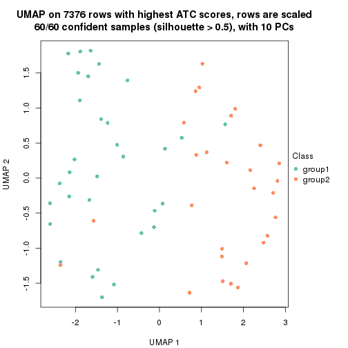</p>

</div>
<div id='tab-node-03122-dimension-reduction-2'>
<pre><code class="r">dimension_reduction(res, k = 3, method = &quot;UMAP&quot;)
</code></pre>

<p></p>

</div>
<div id='tab-node-03122-dimension-reduction-3'>
<pre><code class="r">dimension_reduction(res, k = 4, method = &quot;UMAP&quot;)
</code></pre>

<p></p>

</div>
</div>


Following heatmap shows how subgroups are split when increasing `k`:

```r
collect_classes(res)
```


Test correlation between subgroups and known annotations. If the known
annotation is numeric, one-way ANOVA test is applied, and if the known
annotation is discrete, chi-squared contingency table test is applied.

```r
test_to_known_factors(res)
```

```
#>             n_sample level1.class(p-value) k
#> ATC:skmeans       60                 0.633 2
#> ATC:skmeans       58                 0.532 3
#> ATC:skmeans       58                 0.569 4
```


If matrix rows can be associated to genes, consider to use `functional_enrichment(res,
...)` to perform function enrichment for the signature genes. See [this vignette](https://jokergoo.github.io/cola_vignettes/functional_enrichment.html) for more detailed explanations.


 

---------------------------------------------------


### Node032


Parent node: [Node03](#Node03).
Child nodes: 
                Node0111-leaf
        ,
                Node0112-leaf
        ,
                [Node0113](#Node0113)
        ,
                [Node0121](#Node0121)
        ,
                [Node0122](#Node0122)
        ,
                [Node0123](#Node0123)
        ,
                Node0131-leaf
        ,
                Node0132-leaf
        ,
                Node0141-leaf
        ,
                Node0142-leaf
        ,
                Node0143-leaf
        ,
                [Node0211](#Node0211)
        ,
                [Node0212](#Node0212)
        ,
                Node0221-leaf
        ,
                [Node0222](#Node0222)
        ,
                Node0223-leaf
        ,
                Node0231-leaf
        ,
                Node0232-leaf
        ,
                Node0233-leaf
        ,
                Node0234-leaf
        ,
                [Node0311](#Node0311)
        ,
                [Node0312](#Node0312)
        ,
                Node0313-leaf
        ,
                Node0321-leaf
        ,
                Node0322-leaf
        ,
                Node0323-leaf
        ,
                Node0324-leaf
        ,
                Node0331-leaf
        ,
                Node0332-leaf
        ,
                Node0333-leaf
        .


The object with results only for a single top-value method and a single partitioning method 
can be extracted as:

```r
res = res_rh["032"]
```

A summary of `res` and all the functions that can be applied to it:

```r
res
```

```
#> A 'ConsensusPartition' object with k = 2, 3, 4.
#>   On a matrix with 8202 rows and 185 columns.
#>   Top rows (820) are extracted by 'ATC' method.
#>   Subgroups are detected by 'skmeans' method.
#>   Performed in total 150 partitions by row resampling.
#>   Best k for subgroups seems to be 4.
#> 
#> Following methods can be applied to this 'ConsensusPartition' object:
#>  [1] "cola_report"             "collect_classes"         "collect_plots"          
#>  [4] "collect_stats"           "colnames"                "compare_partitions"     
#>  [7] "compare_signatures"      "consensus_heatmap"       "dimension_reduction"    
#> [10] "functional_enrichment"   "get_anno_col"            "get_anno"               
#> [13] "get_classes"             "get_consensus"           "get_matrix"             
#> [16] "get_membership"          "get_param"               "get_signatures"         
#> [19] "get_stats"               "is_best_k"               "is_stable_k"            
#> [22] "membership_heatmap"      "ncol"                    "nrow"                   
#> [25] "plot_ecdf"               "predict_classes"         "rownames"               
#> [28] "select_partition_number" "show"                    "suggest_best_k"         
#> [31] "test_to_known_factors"   "top_rows_heatmap"
```

`collect_plots()` function collects all the plots made from `res` for all `k` (number of subgroups)
into one single page to provide an easy and fast comparison between different `k`.

```r
collect_plots(res)
```

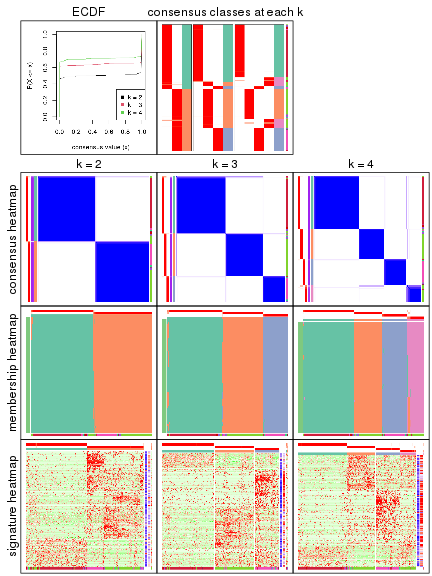

The plots are:

- The first row: a plot of the eCDF (empirical cumulative distribution
  function) curves of the consensus matrix for each `k` and the heatmap of
  predicted classes for each `k`.
- The second row: heatmaps of the consensus matrix for each `k`.
- The third row: heatmaps of the membership matrix for each `k`.
- The fouth row: heatmaps of the signatures for each `k`.

All the plots in panels can be made by individual functions and they are
plotted later in this section.

`select_partition_number()` produces several plots showing different
statistics for choosing "optimized" `k`. There are following statistics:

- eCDF curves of the consensus matrix for each `k`;
- 1-PAC. [The PAC score](https://en.wikipedia.org/wiki/Consensus_clustering#Over-interpretation_potential_of_consensus_clustering)
  measures the proportion of the ambiguous subgrouping.
- Mean silhouette score.
- Concordance. The mean probability of fiting the consensus subgroup labels in all
  partitions.
- Area increased. Denote $A_k$ as the area under the eCDF curve for current
  `k`, the area increased is defined as $A_k - A_{k-1}$.
- Rand index. The percent of pairs of samples that are both in a same cluster
  or both are not in a same cluster in the partition of k and k-1.
- Jaccard index. The ratio of pairs of samples are both in a same cluster in
  the partition of k and k-1 and the pairs of samples are both in a same
  cluster in the partition k or k-1.

The detailed explanations of these statistics can be found in [the _cola_
vignette](https://jokergoo.github.io/cola_vignettes/cola.html#toc_13).

Generally speaking, higher 1-PAC score, higher mean silhouette score or higher
concordance corresponds to better partition. Rand index and Jaccard index
measure how similar the current partition is compared to partition with `k-1`.
If they are too similar, we won't accept `k` is better than `k-1`.

```r
select_partition_number(res)
```


The numeric values for all these statistics can be obtained by `get_stats()`.

```r
get_stats(res)
```

```
#>   k 1-PAC mean_silhouette concordance area_increased  Rand Jaccard
#> 2 2     1           0.987       0.994          0.503 0.498   0.498
#> 3 3     1           0.978       0.992          0.274 0.804   0.628
#> 4 4     1           0.976       0.990          0.108 0.911   0.760
```

`suggest_best_k()` suggests the best $k$ based on these statistics. The rules are as follows:

- All $k$ with Jaccard index larger than 0.95 are removed because increasing
  $k$ does not provide enough extra information. If all $k$ are removed, it is
  marked as no subgroup is detected.
- For all $k$ with 1-PAC score larger than 0.9, the maximal $k$ is taken as
  the best $k$, and other $k$ are marked as optional $k$.
- If it does not fit the second rule. The $k$ with the maximal vote of the
  highest 1-PAC score, highest mean silhouette, and highest concordance is
  taken as the best $k$.

```r
suggest_best_k(res)
```

```
#> [1] 4
#> attr(,"optional")
#> [1] 2 3
```

There is also optional best $k$ = 2 3 that is worth to check.

Following is the table of the partitions (You need to click the **show/hide
code output** link to see it). The membership matrix (columns with name `p*`)
is inferred by
[`clue::cl_consensus()`](https://www.rdocumentation.org/link/cl_consensus?package=clue)
function with the `SE` method. Basically the value in the membership matrix
represents the probability to belong to a certain group. The finall subgroup
label for an item is determined with the group with highest probability it
belongs to.

In `get_classes()` function, the entropy is calculated from the membership
matrix and the silhouette score is calculated from the consensus matrix.


<script>
$( function() {
	$( '#tabs-node-032-get-classes' ).tabs();
} );
</script>
<div id='tabs-node-032-get-classes'>
<ul>
<li><a href='#tab-node-032-get-classes-1'>k = 2</a></li>
<li><a href='#tab-node-032-get-classes-2'>k = 3</a></li>
<li><a href='#tab-node-032-get-classes-3'>k = 4</a></li>
</ul>

<div id='tab-node-032-get-classes-1'>
<p><a id='tab-node-032-get-classes-1-a' style='color:#0366d6' href='#'>show/hide code output</a></p>
<pre><code class="r">cbind(get_classes(res, k = 2), get_membership(res, k = 2))
</code></pre>

<pre><code>#&gt;     class entropy silhouette   p1   p2
#&gt; 1       2   0.000      0.992 0.00 1.00
#&gt; 2       2   0.000      0.992 0.00 1.00
#&gt; 3       2   0.000      0.992 0.00 1.00
#&gt; 4       2   0.000      0.992 0.00 1.00
#&gt; 5       2   0.000      0.992 0.00 1.00
#&gt; 6       2   0.000      0.992 0.00 1.00
#&gt; 7       2   0.000      0.992 0.00 1.00
#&gt; 8       2   0.000      0.992 0.00 1.00
#&gt; 9       2   0.000      0.992 0.00 1.00
#&gt; 10      2   0.000      0.992 0.00 1.00
#&gt; 11      2   0.000      0.992 0.00 1.00
#&gt; 12      2   0.000      0.992 0.00 1.00
#&gt; 13      2   0.000      0.992 0.00 1.00
#&gt; 14      2   0.000      0.992 0.00 1.00
#&gt; 15      2   0.000      0.992 0.00 1.00
#&gt; 16      2   0.000      0.992 0.00 1.00
#&gt; 17      2   0.000      0.992 0.00 1.00
#&gt; 18      2   0.000      0.992 0.00 1.00
#&gt; 19      2   0.000      0.992 0.00 1.00
#&gt; 20      2   0.000      0.992 0.00 1.00
#&gt; 21      2   0.000      0.992 0.00 1.00
#&gt; 22      1   0.000      0.997 1.00 0.00
#&gt; 23      2   0.000      0.992 0.00 1.00
#&gt; 24      1   0.000      0.997 1.00 0.00
#&gt; 25      2   0.000      0.992 0.00 1.00
#&gt; 26      2   0.242      0.952 0.04 0.96
#&gt; 27      2   0.000      0.992 0.00 1.00
#&gt; 28      2   0.000      0.992 0.00 1.00
#&gt; 29      2   0.000      0.992 0.00 1.00
#&gt; 30      2   0.000      0.992 0.00 1.00
#&gt; 31      2   0.000      0.992 0.00 1.00
#&gt; 32      2   0.000      0.992 0.00 1.00
#&gt; 33      2   0.000      0.992 0.00 1.00
#&gt; 34      2   0.000      0.992 0.00 1.00
#&gt; 35      2   0.000      0.992 0.00 1.00
#&gt; 36      2   0.000      0.992 0.00 1.00
#&gt; 37      2   0.000      0.992 0.00 1.00
#&gt; 38      2   0.000      0.992 0.00 1.00
#&gt; 39      2   0.000      0.992 0.00 1.00
#&gt; 40      2   0.000      0.992 0.00 1.00
#&gt; 41      2   0.990      0.212 0.44 0.56
#&gt; 42      1   0.000      0.997 1.00 0.00
#&gt; 43      2   0.000      0.992 0.00 1.00
#&gt; 44      1   0.327      0.935 0.94 0.06
#&gt; 45      2   0.000      0.992 0.00 1.00
#&gt; 46      2   0.000      0.992 0.00 1.00
#&gt; 47      2   0.000      0.992 0.00 1.00
#&gt; 48      2   0.000      0.992 0.00 1.00
#&gt; 49      2   0.000      0.992 0.00 1.00
#&gt; 50      2   0.000      0.992 0.00 1.00
#&gt; 51      2   0.000      0.992 0.00 1.00
#&gt; 52      1   0.000      0.997 1.00 0.00
#&gt; 53      2   0.141      0.973 0.02 0.98
#&gt; 54      1   0.000      0.997 1.00 0.00
#&gt; 55      1   0.000      0.997 1.00 0.00
#&gt; 56      1   0.722      0.749 0.80 0.20
#&gt; 57      2   0.000      0.992 0.00 1.00
#&gt; 58      1   0.000      0.997 1.00 0.00
#&gt; 59      1   0.327      0.935 0.94 0.06
#&gt; 60      2   0.000      0.992 0.00 1.00
#&gt; 61      1   0.000      0.997 1.00 0.00
#&gt; 62      2   0.000      0.992 0.00 1.00
#&gt; 63      2   0.000      0.992 0.00 1.00
#&gt; 64      2   0.000      0.992 0.00 1.00
#&gt; 65      2   0.000      0.992 0.00 1.00
#&gt; 66      2   0.722      0.749 0.20 0.80
#&gt; 67      1   0.000      0.997 1.00 0.00
#&gt; 68      1   0.000      0.997 1.00 0.00
#&gt; 69      1   0.000      0.997 1.00 0.00
#&gt; 70      1   0.000      0.997 1.00 0.00
#&gt; 71      1   0.000      0.997 1.00 0.00
#&gt; 72      2   0.000      0.992 0.00 1.00
#&gt; 73      1   0.000      0.997 1.00 0.00
#&gt; 74      2   0.000      0.992 0.00 1.00
#&gt; 75      1   0.000      0.997 1.00 0.00
#&gt; 76      1   0.000      0.997 1.00 0.00
#&gt; 77      2   0.000      0.992 0.00 1.00
#&gt; 78      2   0.000      0.992 0.00 1.00
#&gt; 79      2   0.000      0.992 0.00 1.00
#&gt; 80      1   0.000      0.997 1.00 0.00
#&gt; 81      1   0.000      0.997 1.00 0.00
#&gt; 82      2   0.000      0.992 0.00 1.00
#&gt; 83      2   0.000      0.992 0.00 1.00
#&gt; 84      2   0.000      0.992 0.00 1.00
#&gt; 85      2   0.000      0.992 0.00 1.00
#&gt; 86      1   0.000      0.997 1.00 0.00
#&gt; 87      2   0.000      0.992 0.00 1.00
#&gt; 88      2   0.000      0.992 0.00 1.00
#&gt; 89      2   0.000      0.992 0.00 1.00
#&gt; 90      2   0.000      0.992 0.00 1.00
#&gt; 91      2   0.000      0.992 0.00 1.00
#&gt; 92      2   0.000      0.992 0.00 1.00
#&gt; 93      2   0.000      0.992 0.00 1.00
#&gt; 94      2   0.000      0.992 0.00 1.00
#&gt; 95      2   0.000      0.992 0.00 1.00
#&gt; 96      2   0.000      0.992 0.00 1.00
#&gt; 97      2   0.000      0.992 0.00 1.00
#&gt; 98      2   0.000      0.992 0.00 1.00
#&gt; 99      2   0.000      0.992 0.00 1.00
#&gt; 100     2   0.000      0.992 0.00 1.00
#&gt; 101     2   0.000      0.992 0.00 1.00
#&gt; 102     2   0.000      0.992 0.00 1.00
#&gt; 103     2   0.000      0.992 0.00 1.00
#&gt; 104     2   0.000      0.992 0.00 1.00
#&gt; 105     2   0.000      0.992 0.00 1.00
#&gt; 106     2   0.000      0.992 0.00 1.00
#&gt; 107     2   0.000      0.992 0.00 1.00
#&gt; 108     2   0.000      0.992 0.00 1.00
#&gt; 109     2   0.000      0.992 0.00 1.00
#&gt; 110     2   0.000      0.992 0.00 1.00
#&gt; 111     2   0.000      0.992 0.00 1.00
#&gt; 112     1   0.000      0.997 1.00 0.00
#&gt; 113     1   0.000      0.997 1.00 0.00
#&gt; 114     1   0.000      0.997 1.00 0.00
#&gt; 115     1   0.000      0.997 1.00 0.00
#&gt; 116     1   0.000      0.997 1.00 0.00
#&gt; 117     1   0.000      0.997 1.00 0.00
#&gt; 118     1   0.000      0.997 1.00 0.00
#&gt; 119     1   0.000      0.997 1.00 0.00
#&gt; 120     1   0.000      0.997 1.00 0.00
#&gt; 121     1   0.000      0.997 1.00 0.00
#&gt; 122     1   0.000      0.997 1.00 0.00
#&gt; 123     1   0.000      0.997 1.00 0.00
#&gt; 124     1   0.000      0.997 1.00 0.00
#&gt; 125     1   0.000      0.997 1.00 0.00
#&gt; 126     1   0.000      0.997 1.00 0.00
#&gt; 127     1   0.000      0.997 1.00 0.00
#&gt; 128     1   0.000      0.997 1.00 0.00
#&gt; 129     1   0.000      0.997 1.00 0.00
#&gt; 130     1   0.000      0.997 1.00 0.00
#&gt; 131     1   0.000      0.997 1.00 0.00
#&gt; 132     1   0.000      0.997 1.00 0.00
#&gt; 133     1   0.000      0.997 1.00 0.00
#&gt; 134     1   0.000      0.997 1.00 0.00
#&gt; 135     1   0.000      0.997 1.00 0.00
#&gt; 136     1   0.000      0.997 1.00 0.00
#&gt; 137     1   0.000      0.997 1.00 0.00
#&gt; 138     1   0.000      0.997 1.00 0.00
#&gt; 139     1   0.000      0.997 1.00 0.00
#&gt; 140     1   0.000      0.997 1.00 0.00
#&gt; 141     1   0.000      0.997 1.00 0.00
#&gt; 142     1   0.000      0.997 1.00 0.00
#&gt; 143     1   0.000      0.997 1.00 0.00
#&gt; 144     1   0.000      0.997 1.00 0.00
#&gt; 145     1   0.000      0.997 1.00 0.00
#&gt; 146     1   0.000      0.997 1.00 0.00
#&gt; 147     1   0.000      0.997 1.00 0.00
#&gt; 148     1   0.000      0.997 1.00 0.00
#&gt; 149     1   0.000      0.997 1.00 0.00
#&gt; 150     1   0.000      0.997 1.00 0.00
#&gt; 151     1   0.000      0.997 1.00 0.00
#&gt; 152     1   0.000      0.997 1.00 0.00
#&gt; 153     1   0.000      0.997 1.00 0.00
#&gt; 154     1   0.000      0.997 1.00 0.00
#&gt; 155     1   0.000      0.997 1.00 0.00
#&gt; 156     1   0.000      0.997 1.00 0.00
#&gt; 157     1   0.000      0.997 1.00 0.00
#&gt; 158     1   0.000      0.997 1.00 0.00
#&gt; 159     1   0.000      0.997 1.00 0.00
#&gt; 160     2   0.000      0.992 0.00 1.00
#&gt; 161     1   0.000      0.997 1.00 0.00
#&gt; 162     1   0.000      0.997 1.00 0.00
#&gt; 163     1   0.000      0.997 1.00 0.00
#&gt; 164     1   0.000      0.997 1.00 0.00
#&gt; 165     1   0.000      0.997 1.00 0.00
#&gt; 166     1   0.000      0.997 1.00 0.00
#&gt; 167     1   0.000      0.997 1.00 0.00
#&gt; 168     1   0.000      0.997 1.00 0.00
#&gt; 169     1   0.000      0.997 1.00 0.00
#&gt; 170     1   0.000      0.997 1.00 0.00
#&gt; 171     1   0.000      0.997 1.00 0.00
#&gt; 172     1   0.000      0.997 1.00 0.00
#&gt; 173     1   0.000      0.997 1.00 0.00
#&gt; 174     1   0.000      0.997 1.00 0.00
#&gt; 175     1   0.000      0.997 1.00 0.00
#&gt; 176     1   0.000      0.997 1.00 0.00
#&gt; 177     1   0.000      0.997 1.00 0.00
#&gt; 178     1   0.000      0.997 1.00 0.00
#&gt; 179     1   0.000      0.997 1.00 0.00
#&gt; 180     1   0.000      0.997 1.00 0.00
#&gt; 181     1   0.000      0.997 1.00 0.00
#&gt; 182     1   0.000      0.997 1.00 0.00
#&gt; 183     1   0.000      0.997 1.00 0.00
#&gt; 184     1   0.000      0.997 1.00 0.00
#&gt; 185     1   0.000      0.997 1.00 0.00
</code></pre>

<script>
$('#tab-node-032-get-classes-1-a').parent().next().next().hide();
$('#tab-node-032-get-classes-1-a').click(function(){
  $('#tab-node-032-get-classes-1-a').parent().next().next().toggle();
  return(false);
});
</script>
</div>

<div id='tab-node-032-get-classes-2'>
<p><a id='tab-node-032-get-classes-2-a' style='color:#0366d6' href='#'>show/hide code output</a></p>
<pre><code class="r">cbind(get_classes(res, k = 3), get_membership(res, k = 3))
</code></pre>

<pre><code>#&gt;     class entropy silhouette   p1   p2   p3
#&gt; 1       2  0.0000      0.992 0.00 1.00 0.00
#&gt; 2       2  0.0000      0.992 0.00 1.00 0.00
#&gt; 3       2  0.0000      0.992 0.00 1.00 0.00
#&gt; 4       2  0.0000      0.992 0.00 1.00 0.00
#&gt; 5       2  0.0000      0.992 0.00 1.00 0.00
#&gt; 6       2  0.0000      0.992 0.00 1.00 0.00
#&gt; 7       2  0.0000      0.992 0.00 1.00 0.00
#&gt; 8       2  0.0000      0.992 0.00 1.00 0.00
#&gt; 9       2  0.0000      0.992 0.00 1.00 0.00
#&gt; 10      2  0.0000      0.992 0.00 1.00 0.00
#&gt; 11      2  0.0000      0.992 0.00 1.00 0.00
#&gt; 12      2  0.0000      0.992 0.00 1.00 0.00
#&gt; 13      2  0.0000      0.992 0.00 1.00 0.00
#&gt; 14      2  0.0000      0.992 0.00 1.00 0.00
#&gt; 15      2  0.0000      0.992 0.00 1.00 0.00
#&gt; 16      2  0.0000      0.992 0.00 1.00 0.00
#&gt; 17      2  0.0000      0.992 0.00 1.00 0.00
#&gt; 18      2  0.0000      0.992 0.00 1.00 0.00
#&gt; 19      2  0.0000      0.992 0.00 1.00 0.00
#&gt; 20      2  0.0000      0.992 0.00 1.00 0.00
#&gt; 21      2  0.0000      0.992 0.00 1.00 0.00
#&gt; 22      1  0.0892      0.967 0.98 0.02 0.00
#&gt; 23      2  0.0000      0.992 0.00 1.00 0.00
#&gt; 24      1  0.0000      0.988 1.00 0.00 0.00
#&gt; 25      2  0.0000      0.992 0.00 1.00 0.00
#&gt; 26      2  0.0000      0.992 0.00 1.00 0.00
#&gt; 27      2  0.0000      0.992 0.00 1.00 0.00
#&gt; 28      2  0.0000      0.992 0.00 1.00 0.00
#&gt; 29      2  0.0000      0.992 0.00 1.00 0.00
#&gt; 30      2  0.0000      0.992 0.00 1.00 0.00
#&gt; 31      2  0.0000      0.992 0.00 1.00 0.00
#&gt; 32      2  0.0000      0.992 0.00 1.00 0.00
#&gt; 33      2  0.0000      0.992 0.00 1.00 0.00
#&gt; 34      2  0.0000      0.992 0.00 1.00 0.00
#&gt; 35      2  0.0000      0.992 0.00 1.00 0.00
#&gt; 36      2  0.0000      0.992 0.00 1.00 0.00
#&gt; 37      2  0.0000      0.992 0.00 1.00 0.00
#&gt; 38      2  0.0000      0.992 0.00 1.00 0.00
#&gt; 39      2  0.0000      0.992 0.00 1.00 0.00
#&gt; 40      2  0.0000      0.992 0.00 1.00 0.00
#&gt; 41      2  0.0000      0.992 0.00 1.00 0.00
#&gt; 42      2  0.0000      0.992 0.00 1.00 0.00
#&gt; 43      2  0.0000      0.992 0.00 1.00 0.00
#&gt; 44      2  0.0000      0.992 0.00 1.00 0.00
#&gt; 45      2  0.0000      0.992 0.00 1.00 0.00
#&gt; 46      2  0.0000      0.992 0.00 1.00 0.00
#&gt; 47      2  0.0000      0.992 0.00 1.00 0.00
#&gt; 48      2  0.0000      0.992 0.00 1.00 0.00
#&gt; 49      2  0.0892      0.972 0.00 0.98 0.02
#&gt; 50      2  0.0000      0.992 0.00 1.00 0.00
#&gt; 51      2  0.0000      0.992 0.00 1.00 0.00
#&gt; 52      1  0.0000      0.988 1.00 0.00 0.00
#&gt; 53      2  0.0000      0.992 0.00 1.00 0.00
#&gt; 54      2  0.0000      0.992 0.00 1.00 0.00
#&gt; 55      1  0.0000      0.988 1.00 0.00 0.00
#&gt; 56      2  0.0000      0.992 0.00 1.00 0.00
#&gt; 57      2  0.0000      0.992 0.00 1.00 0.00
#&gt; 58      1  0.0000      0.988 1.00 0.00 0.00
#&gt; 59      2  0.0000      0.992 0.00 1.00 0.00
#&gt; 60      2  0.0000      0.992 0.00 1.00 0.00
#&gt; 61      2  0.0000      0.992 0.00 1.00 0.00
#&gt; 62      3  0.0000      0.996 0.00 0.00 1.00
#&gt; 63      2  0.0000      0.992 0.00 1.00 0.00
#&gt; 64      2  0.0000      0.992 0.00 1.00 0.00
#&gt; 65      2  0.0000      0.992 0.00 1.00 0.00
#&gt; 66      2  0.9372      0.280 0.30 0.50 0.20
#&gt; 67      1  0.0000      0.988 1.00 0.00 0.00
#&gt; 68      1  0.0000      0.988 1.00 0.00 0.00
#&gt; 69      1  0.0000      0.988 1.00 0.00 0.00
#&gt; 70      1  0.0000      0.988 1.00 0.00 0.00
#&gt; 71      1  0.0000      0.988 1.00 0.00 0.00
#&gt; 72      3  0.0000      0.996 0.00 0.00 1.00
#&gt; 73      1  0.0000      0.988 1.00 0.00 0.00
#&gt; 74      2  0.0000      0.992 0.00 1.00 0.00
#&gt; 75      3  0.0000      0.996 0.00 0.00 1.00
#&gt; 76      3  0.0892      0.976 0.02 0.00 0.98
#&gt; 77      3  0.0000      0.996 0.00 0.00 1.00
#&gt; 78      3  0.0000      0.996 0.00 0.00 1.00
#&gt; 79      2  0.0000      0.992 0.00 1.00 0.00
#&gt; 80      3  0.0000      0.996 0.00 0.00 1.00
#&gt; 81      3  0.0000      0.996 0.00 0.00 1.00
#&gt; 82      3  0.0000      0.996 0.00 0.00 1.00
#&gt; 83      3  0.0000      0.996 0.00 0.00 1.00
#&gt; 84      3  0.0000      0.996 0.00 0.00 1.00
#&gt; 85      2  0.0000      0.992 0.00 1.00 0.00
#&gt; 86      1  0.0892      0.968 0.98 0.00 0.02
#&gt; 87      3  0.0000      0.996 0.00 0.00 1.00
#&gt; 88      3  0.0000      0.996 0.00 0.00 1.00
#&gt; 89      3  0.0000      0.996 0.00 0.00 1.00
#&gt; 90      3  0.0000      0.996 0.00 0.00 1.00
#&gt; 91      3  0.0000      0.996 0.00 0.00 1.00
#&gt; 92      3  0.0000      0.996 0.00 0.00 1.00
#&gt; 93      3  0.0000      0.996 0.00 0.00 1.00
#&gt; 94      3  0.0000      0.996 0.00 0.00 1.00
#&gt; 95      3  0.0000      0.996 0.00 0.00 1.00
#&gt; 96      3  0.0000      0.996 0.00 0.00 1.00
#&gt; 97      3  0.0000      0.996 0.00 0.00 1.00
#&gt; 98      3  0.0000      0.996 0.00 0.00 1.00
#&gt; 99      3  0.0000      0.996 0.00 0.00 1.00
#&gt; 100     3  0.0000      0.996 0.00 0.00 1.00
#&gt; 101     3  0.0000      0.996 0.00 0.00 1.00
#&gt; 102     3  0.0000      0.996 0.00 0.00 1.00
#&gt; 103     3  0.0000      0.996 0.00 0.00 1.00
#&gt; 104     3  0.0000      0.996 0.00 0.00 1.00
#&gt; 105     3  0.0000      0.996 0.00 0.00 1.00
#&gt; 106     3  0.0000      0.996 0.00 0.00 1.00
#&gt; 107     3  0.0000      0.996 0.00 0.00 1.00
#&gt; 108     3  0.0000      0.996 0.00 0.00 1.00
#&gt; 109     3  0.0000      0.996 0.00 0.00 1.00
#&gt; 110     3  0.0000      0.996 0.00 0.00 1.00
#&gt; 111     3  0.0000      0.996 0.00 0.00 1.00
#&gt; 112     1  0.0000      0.988 1.00 0.00 0.00
#&gt; 113     1  0.0000      0.988 1.00 0.00 0.00
#&gt; 114     1  0.0000      0.988 1.00 0.00 0.00
#&gt; 115     1  0.0000      0.988 1.00 0.00 0.00
#&gt; 116     1  0.0000      0.988 1.00 0.00 0.00
#&gt; 117     1  0.0000      0.988 1.00 0.00 0.00
#&gt; 118     1  0.0000      0.988 1.00 0.00 0.00
#&gt; 119     1  0.0000      0.988 1.00 0.00 0.00
#&gt; 120     1  0.0000      0.988 1.00 0.00 0.00
#&gt; 121     1  0.0000      0.988 1.00 0.00 0.00
#&gt; 122     1  0.0000      0.988 1.00 0.00 0.00
#&gt; 123     1  0.0000      0.988 1.00 0.00 0.00
#&gt; 124     1  0.0000      0.988 1.00 0.00 0.00
#&gt; 125     1  0.0000      0.988 1.00 0.00 0.00
#&gt; 126     1  0.0000      0.988 1.00 0.00 0.00
#&gt; 127     1  0.0000      0.988 1.00 0.00 0.00
#&gt; 128     1  0.0000      0.988 1.00 0.00 0.00
#&gt; 129     1  0.0000      0.988 1.00 0.00 0.00
#&gt; 130     1  0.0000      0.988 1.00 0.00 0.00
#&gt; 131     1  0.0000      0.988 1.00 0.00 0.00
#&gt; 132     1  0.0000      0.988 1.00 0.00 0.00
#&gt; 133     1  0.0000      0.988 1.00 0.00 0.00
#&gt; 134     1  0.0000      0.988 1.00 0.00 0.00
#&gt; 135     1  0.0000      0.988 1.00 0.00 0.00
#&gt; 136     1  0.0000      0.988 1.00 0.00 0.00
#&gt; 137     1  0.0000      0.988 1.00 0.00 0.00
#&gt; 138     1  0.0000      0.988 1.00 0.00 0.00
#&gt; 139     1  0.0000      0.988 1.00 0.00 0.00
#&gt; 140     1  0.0000      0.988 1.00 0.00 0.00
#&gt; 141     1  0.0000      0.988 1.00 0.00 0.00
#&gt; 142     1  0.0000      0.988 1.00 0.00 0.00
#&gt; 143     1  0.0000      0.988 1.00 0.00 0.00
#&gt; 144     1  0.0000      0.988 1.00 0.00 0.00
#&gt; 145     1  0.0000      0.988 1.00 0.00 0.00
#&gt; 146     1  0.0000      0.988 1.00 0.00 0.00
#&gt; 147     1  0.0000      0.988 1.00 0.00 0.00
#&gt; 148     1  0.0000      0.988 1.00 0.00 0.00
#&gt; 149     1  0.0000      0.988 1.00 0.00 0.00
#&gt; 150     1  0.6126      0.334 0.60 0.40 0.00
#&gt; 151     1  0.0000      0.988 1.00 0.00 0.00
#&gt; 152     1  0.0000      0.988 1.00 0.00 0.00
#&gt; 153     1  0.0000      0.988 1.00 0.00 0.00
#&gt; 154     1  0.0000      0.988 1.00 0.00 0.00
#&gt; 155     1  0.0000      0.988 1.00 0.00 0.00
#&gt; 156     1  0.0000      0.988 1.00 0.00 0.00
#&gt; 157     1  0.0000      0.988 1.00 0.00 0.00
#&gt; 158     1  0.0000      0.988 1.00 0.00 0.00
#&gt; 159     1  0.0000      0.988 1.00 0.00 0.00
#&gt; 160     3  0.0000      0.996 0.00 0.00 1.00
#&gt; 161     1  0.0000      0.988 1.00 0.00 0.00
#&gt; 162     1  0.0000      0.988 1.00 0.00 0.00
#&gt; 163     1  0.0000      0.988 1.00 0.00 0.00
#&gt; 164     1  0.0000      0.988 1.00 0.00 0.00
#&gt; 165     1  0.0000      0.988 1.00 0.00 0.00
#&gt; 166     1  0.0000      0.988 1.00 0.00 0.00
#&gt; 167     1  0.0000      0.988 1.00 0.00 0.00
#&gt; 168     1  0.0000      0.988 1.00 0.00 0.00
#&gt; 169     1  0.0000      0.988 1.00 0.00 0.00
#&gt; 170     1  0.0000      0.988 1.00 0.00 0.00
#&gt; 171     1  0.0000      0.988 1.00 0.00 0.00
#&gt; 172     1  0.6280      0.150 0.54 0.46 0.00
#&gt; 173     1  0.0000      0.988 1.00 0.00 0.00
#&gt; 174     1  0.0000      0.988 1.00 0.00 0.00
#&gt; 175     1  0.0000      0.988 1.00 0.00 0.00
#&gt; 176     1  0.0000      0.988 1.00 0.00 0.00
#&gt; 177     1  0.0000      0.988 1.00 0.00 0.00
#&gt; 178     1  0.0000      0.988 1.00 0.00 0.00
#&gt; 179     1  0.0000      0.988 1.00 0.00 0.00
#&gt; 180     1  0.0000      0.988 1.00 0.00 0.00
#&gt; 181     1  0.0000      0.988 1.00 0.00 0.00
#&gt; 182     1  0.0000      0.988 1.00 0.00 0.00
#&gt; 183     1  0.0000      0.988 1.00 0.00 0.00
#&gt; 184     3  0.2959      0.887 0.10 0.00 0.90
#&gt; 185     1  0.0000      0.988 1.00 0.00 0.00
</code></pre>

<script>
$('#tab-node-032-get-classes-2-a').parent().next().next().hide();
$('#tab-node-032-get-classes-2-a').click(function(){
  $('#tab-node-032-get-classes-2-a').parent().next().next().toggle();
  return(false);
});
</script>
</div>

<div id='tab-node-032-get-classes-3'>
<p><a id='tab-node-032-get-classes-3-a' style='color:#0366d6' href='#'>show/hide code output</a></p>
<pre><code class="r">cbind(get_classes(res, k = 4), get_membership(res, k = 4))
</code></pre>

<pre><code>#&gt;     class entropy silhouette   p1   p2   p3   p4
#&gt; 1       2  0.0000      0.997 0.00 1.00 0.00 0.00
#&gt; 2       2  0.0000      0.997 0.00 1.00 0.00 0.00
#&gt; 3       2  0.0000      0.997 0.00 1.00 0.00 0.00
#&gt; 4       2  0.0000      0.997 0.00 1.00 0.00 0.00
#&gt; 5       2  0.0000      0.997 0.00 1.00 0.00 0.00
#&gt; 6       2  0.0000      0.997 0.00 1.00 0.00 0.00
#&gt; 7       2  0.0000      0.997 0.00 1.00 0.00 0.00
#&gt; 8       2  0.0000      0.997 0.00 1.00 0.00 0.00
#&gt; 9       2  0.0000      0.997 0.00 1.00 0.00 0.00
#&gt; 10      2  0.0000      0.997 0.00 1.00 0.00 0.00
#&gt; 11      2  0.0000      0.997 0.00 1.00 0.00 0.00
#&gt; 12      2  0.0000      0.997 0.00 1.00 0.00 0.00
#&gt; 13      2  0.0000      0.997 0.00 1.00 0.00 0.00
#&gt; 14      2  0.0000      0.997 0.00 1.00 0.00 0.00
#&gt; 15      2  0.0000      0.997 0.00 1.00 0.00 0.00
#&gt; 16      2  0.0707      0.976 0.00 0.98 0.00 0.02
#&gt; 17      2  0.0000      0.997 0.00 1.00 0.00 0.00
#&gt; 18      2  0.0000      0.997 0.00 1.00 0.00 0.00
#&gt; 19      2  0.0000      0.997 0.00 1.00 0.00 0.00
#&gt; 20      2  0.0000      0.997 0.00 1.00 0.00 0.00
#&gt; 21      2  0.0000      0.997 0.00 1.00 0.00 0.00
#&gt; 22      1  0.2335      0.911 0.92 0.06 0.00 0.02
#&gt; 23      2  0.0000      0.997 0.00 1.00 0.00 0.00
#&gt; 24      4  0.2011      0.853 0.08 0.00 0.00 0.92
#&gt; 25      2  0.0000      0.997 0.00 1.00 0.00 0.00
#&gt; 26      4  0.0000      0.933 0.00 0.00 0.00 1.00
#&gt; 27      2  0.0000      0.997 0.00 1.00 0.00 0.00
#&gt; 28      2  0.0000      0.997 0.00 1.00 0.00 0.00
#&gt; 29      2  0.0000      0.997 0.00 1.00 0.00 0.00
#&gt; 30      2  0.0000      0.997 0.00 1.00 0.00 0.00
#&gt; 31      2  0.0000      0.997 0.00 1.00 0.00 0.00
#&gt; 32      2  0.0000      0.997 0.00 1.00 0.00 0.00
#&gt; 33      2  0.0000      0.997 0.00 1.00 0.00 0.00
#&gt; 34      2  0.0000      0.997 0.00 1.00 0.00 0.00
#&gt; 35      2  0.0000      0.997 0.00 1.00 0.00 0.00
#&gt; 36      2  0.0000      0.997 0.00 1.00 0.00 0.00
#&gt; 37      2  0.0000      0.997 0.00 1.00 0.00 0.00
#&gt; 38      2  0.0000      0.997 0.00 1.00 0.00 0.00
#&gt; 39      2  0.0000      0.997 0.00 1.00 0.00 0.00
#&gt; 40      2  0.0000      0.997 0.00 1.00 0.00 0.00
#&gt; 41      4  0.0000      0.933 0.00 0.00 0.00 1.00
#&gt; 42      4  0.0000      0.933 0.00 0.00 0.00 1.00
#&gt; 43      4  0.0000      0.933 0.00 0.00 0.00 1.00
#&gt; 44      4  0.0000      0.933 0.00 0.00 0.00 1.00
#&gt; 45      4  0.0000      0.933 0.00 0.00 0.00 1.00
#&gt; 46      4  0.4522      0.558 0.00 0.32 0.00 0.68
#&gt; 47      4  0.4522      0.558 0.00 0.32 0.00 0.68
#&gt; 48      4  0.4522      0.558 0.00 0.32 0.00 0.68
#&gt; 49      4  0.0000      0.933 0.00 0.00 0.00 1.00
#&gt; 50      4  0.0000      0.933 0.00 0.00 0.00 1.00
#&gt; 51      4  0.0000      0.933 0.00 0.00 0.00 1.00
#&gt; 52      4  0.0000      0.933 0.00 0.00 0.00 1.00
#&gt; 53      4  0.0000      0.933 0.00 0.00 0.00 1.00
#&gt; 54      4  0.0000      0.933 0.00 0.00 0.00 1.00
#&gt; 55      4  0.0000      0.933 0.00 0.00 0.00 1.00
#&gt; 56      4  0.0000      0.933 0.00 0.00 0.00 1.00
#&gt; 57      4  0.0000      0.933 0.00 0.00 0.00 1.00
#&gt; 58      4  0.0000      0.933 0.00 0.00 0.00 1.00
#&gt; 59      4  0.0000      0.933 0.00 0.00 0.00 1.00
#&gt; 60      4  0.1637      0.889 0.00 0.06 0.00 0.94
#&gt; 61      4  0.0000      0.933 0.00 0.00 0.00 1.00
#&gt; 62      3  0.0000      0.993 0.00 0.00 1.00 0.00
#&gt; 63      2  0.0000      0.997 0.00 1.00 0.00 0.00
#&gt; 64      2  0.0000      0.997 0.00 1.00 0.00 0.00
#&gt; 65      2  0.0000      0.997 0.00 1.00 0.00 0.00
#&gt; 66      2  0.2011      0.882 0.08 0.92 0.00 0.00
#&gt; 67      1  0.0000      0.999 1.00 0.00 0.00 0.00
#&gt; 68      1  0.0000      0.999 1.00 0.00 0.00 0.00
#&gt; 69      1  0.0000      0.999 1.00 0.00 0.00 0.00
#&gt; 70      1  0.0000      0.999 1.00 0.00 0.00 0.00
#&gt; 71      1  0.0000      0.999 1.00 0.00 0.00 0.00
#&gt; 72      3  0.0000      0.993 0.00 0.00 1.00 0.00
#&gt; 73      1  0.0000      0.999 1.00 0.00 0.00 0.00
#&gt; 74      2  0.0000      0.997 0.00 1.00 0.00 0.00
#&gt; 75      3  0.0707      0.969 0.02 0.00 0.98 0.00
#&gt; 76      3  0.1637      0.915 0.06 0.00 0.94 0.00
#&gt; 77      3  0.0000      0.993 0.00 0.00 1.00 0.00
#&gt; 78      3  0.0000      0.993 0.00 0.00 1.00 0.00
#&gt; 79      2  0.0000      0.997 0.00 1.00 0.00 0.00
#&gt; 80      3  0.0000      0.993 0.00 0.00 1.00 0.00
#&gt; 81      3  0.0000      0.993 0.00 0.00 1.00 0.00
#&gt; 82      3  0.0000      0.993 0.00 0.00 1.00 0.00
#&gt; 83      3  0.0000      0.993 0.00 0.00 1.00 0.00
#&gt; 84      3  0.0000      0.993 0.00 0.00 1.00 0.00
#&gt; 85      2  0.0000      0.997 0.00 1.00 0.00 0.00
#&gt; 86      1  0.0000      0.999 1.00 0.00 0.00 0.00
#&gt; 87      3  0.0000      0.993 0.00 0.00 1.00 0.00
#&gt; 88      3  0.0000      0.993 0.00 0.00 1.00 0.00
#&gt; 89      3  0.0000      0.993 0.00 0.00 1.00 0.00
#&gt; 90      3  0.0000      0.993 0.00 0.00 1.00 0.00
#&gt; 91      3  0.0000      0.993 0.00 0.00 1.00 0.00
#&gt; 92      3  0.0000      0.993 0.00 0.00 1.00 0.00
#&gt; 93      3  0.0000      0.993 0.00 0.00 1.00 0.00
#&gt; 94      3  0.0000      0.993 0.00 0.00 1.00 0.00
#&gt; 95      3  0.0000      0.993 0.00 0.00 1.00 0.00
#&gt; 96      3  0.0000      0.993 0.00 0.00 1.00 0.00
#&gt; 97      3  0.0000      0.993 0.00 0.00 1.00 0.00
#&gt; 98      3  0.0000      0.993 0.00 0.00 1.00 0.00
#&gt; 99      3  0.0000      0.993 0.00 0.00 1.00 0.00
#&gt; 100     3  0.0000      0.993 0.00 0.00 1.00 0.00
#&gt; 101     3  0.0000      0.993 0.00 0.00 1.00 0.00
#&gt; 102     3  0.0000      0.993 0.00 0.00 1.00 0.00
#&gt; 103     3  0.0000      0.993 0.00 0.00 1.00 0.00
#&gt; 104     3  0.0000      0.993 0.00 0.00 1.00 0.00
#&gt; 105     3  0.0000      0.993 0.00 0.00 1.00 0.00
#&gt; 106     3  0.0000      0.993 0.00 0.00 1.00 0.00
#&gt; 107     3  0.0000      0.993 0.00 0.00 1.00 0.00
#&gt; 108     3  0.0000      0.993 0.00 0.00 1.00 0.00
#&gt; 109     3  0.0000      0.993 0.00 0.00 1.00 0.00
#&gt; 110     3  0.0000      0.993 0.00 0.00 1.00 0.00
#&gt; 111     3  0.0000      0.993 0.00 0.00 1.00 0.00
#&gt; 112     1  0.0000      0.999 1.00 0.00 0.00 0.00
#&gt; 113     1  0.0000      0.999 1.00 0.00 0.00 0.00
#&gt; 114     1  0.0000      0.999 1.00 0.00 0.00 0.00
#&gt; 115     1  0.0000      0.999 1.00 0.00 0.00 0.00
#&gt; 116     1  0.0000      0.999 1.00 0.00 0.00 0.00
#&gt; 117     1  0.0000      0.999 1.00 0.00 0.00 0.00
#&gt; 118     1  0.0000      0.999 1.00 0.00 0.00 0.00
#&gt; 119     1  0.0000      0.999 1.00 0.00 0.00 0.00
#&gt; 120     1  0.0000      0.999 1.00 0.00 0.00 0.00
#&gt; 121     1  0.0000      0.999 1.00 0.00 0.00 0.00
#&gt; 122     1  0.0000      0.999 1.00 0.00 0.00 0.00
#&gt; 123     1  0.0000      0.999 1.00 0.00 0.00 0.00
#&gt; 124     1  0.0000      0.999 1.00 0.00 0.00 0.00
#&gt; 125     1  0.0000      0.999 1.00 0.00 0.00 0.00
#&gt; 126     1  0.0000      0.999 1.00 0.00 0.00 0.00
#&gt; 127     1  0.0000      0.999 1.00 0.00 0.00 0.00
#&gt; 128     1  0.0000      0.999 1.00 0.00 0.00 0.00
#&gt; 129     1  0.0000      0.999 1.00 0.00 0.00 0.00
#&gt; 130     1  0.0000      0.999 1.00 0.00 0.00 0.00
#&gt; 131     1  0.0000      0.999 1.00 0.00 0.00 0.00
#&gt; 132     1  0.0000      0.999 1.00 0.00 0.00 0.00
#&gt; 133     1  0.0000      0.999 1.00 0.00 0.00 0.00
#&gt; 134     1  0.0000      0.999 1.00 0.00 0.00 0.00
#&gt; 135     1  0.0000      0.999 1.00 0.00 0.00 0.00
#&gt; 136     1  0.0000      0.999 1.00 0.00 0.00 0.00
#&gt; 137     1  0.0000      0.999 1.00 0.00 0.00 0.00
#&gt; 138     1  0.0000      0.999 1.00 0.00 0.00 0.00
#&gt; 139     1  0.0000      0.999 1.00 0.00 0.00 0.00
#&gt; 140     1  0.0000      0.999 1.00 0.00 0.00 0.00
#&gt; 141     1  0.0000      0.999 1.00 0.00 0.00 0.00
#&gt; 142     1  0.0000      0.999 1.00 0.00 0.00 0.00
#&gt; 143     1  0.0000      0.999 1.00 0.00 0.00 0.00
#&gt; 144     1  0.0000      0.999 1.00 0.00 0.00 0.00
#&gt; 145     1  0.0000      0.999 1.00 0.00 0.00 0.00
#&gt; 146     1  0.0000      0.999 1.00 0.00 0.00 0.00
#&gt; 147     1  0.0000      0.999 1.00 0.00 0.00 0.00
#&gt; 148     1  0.0000      0.999 1.00 0.00 0.00 0.00
#&gt; 149     1  0.0000      0.999 1.00 0.00 0.00 0.00
#&gt; 150     4  0.0000      0.933 0.00 0.00 0.00 1.00
#&gt; 151     1  0.0000      0.999 1.00 0.00 0.00 0.00
#&gt; 152     1  0.0000      0.999 1.00 0.00 0.00 0.00
#&gt; 153     1  0.0000      0.999 1.00 0.00 0.00 0.00
#&gt; 154     1  0.0000      0.999 1.00 0.00 0.00 0.00
#&gt; 155     1  0.0000      0.999 1.00 0.00 0.00 0.00
#&gt; 156     1  0.0000      0.999 1.00 0.00 0.00 0.00
#&gt; 157     1  0.0000      0.999 1.00 0.00 0.00 0.00
#&gt; 158     1  0.0000      0.999 1.00 0.00 0.00 0.00
#&gt; 159     1  0.0000      0.999 1.00 0.00 0.00 0.00
#&gt; 160     3  0.0000      0.993 0.00 0.00 1.00 0.00
#&gt; 161     1  0.0000      0.999 1.00 0.00 0.00 0.00
#&gt; 162     1  0.0000      0.999 1.00 0.00 0.00 0.00
#&gt; 163     1  0.0000      0.999 1.00 0.00 0.00 0.00
#&gt; 164     1  0.0000      0.999 1.00 0.00 0.00 0.00
#&gt; 165     1  0.0000      0.999 1.00 0.00 0.00 0.00
#&gt; 166     1  0.0000      0.999 1.00 0.00 0.00 0.00
#&gt; 167     1  0.0000      0.999 1.00 0.00 0.00 0.00
#&gt; 168     1  0.0000      0.999 1.00 0.00 0.00 0.00
#&gt; 169     1  0.0000      0.999 1.00 0.00 0.00 0.00
#&gt; 170     4  0.4790      0.379 0.38 0.00 0.00 0.62
#&gt; 171     1  0.0000      0.999 1.00 0.00 0.00 0.00
#&gt; 172     4  0.0000      0.933 0.00 0.00 0.00 1.00
#&gt; 173     1  0.0000      0.999 1.00 0.00 0.00 0.00
#&gt; 174     1  0.0000      0.999 1.00 0.00 0.00 0.00
#&gt; 175     1  0.0000      0.999 1.00 0.00 0.00 0.00
#&gt; 176     1  0.0707      0.978 0.98 0.00 0.00 0.02
#&gt; 177     1  0.0000      0.999 1.00 0.00 0.00 0.00
#&gt; 178     1  0.0000      0.999 1.00 0.00 0.00 0.00
#&gt; 179     1  0.0000      0.999 1.00 0.00 0.00 0.00
#&gt; 180     1  0.0000      0.999 1.00 0.00 0.00 0.00
#&gt; 181     1  0.0000      0.999 1.00 0.00 0.00 0.00
#&gt; 182     1  0.0000      0.999 1.00 0.00 0.00 0.00
#&gt; 183     1  0.0000      0.999 1.00 0.00 0.00 0.00
#&gt; 184     3  0.2345      0.857 0.10 0.00 0.90 0.00
#&gt; 185     1  0.0000      0.999 1.00 0.00 0.00 0.00
</code></pre>

<script>
$('#tab-node-032-get-classes-3-a').parent().next().next().hide();
$('#tab-node-032-get-classes-3-a').click(function(){
  $('#tab-node-032-get-classes-3-a').parent().next().next().toggle();
  return(false);
});
</script>
</div>
</div>

Heatmaps for the consensus matrix. It visualizes the probability of two
samples to be in a same group.


<script>
$( function() {
	$( '#tabs-node-032-consensus-heatmap' ).tabs();
} );
</script>
<div id='tabs-node-032-consensus-heatmap'>
<ul>
<li><a href='#tab-node-032-consensus-heatmap-1'>k = 2</a></li>
<li><a href='#tab-node-032-consensus-heatmap-2'>k = 3</a></li>
<li><a href='#tab-node-032-consensus-heatmap-3'>k = 4</a></li>
</ul>
<div id='tab-node-032-consensus-heatmap-1'>
<pre><code class="r">consensus_heatmap(res, k = 2)
</code></pre>

<p></p>

</div>
<div id='tab-node-032-consensus-heatmap-2'>
<pre><code class="r">consensus_heatmap(res, k = 3)
</code></pre>

<p></p>

</div>
<div id='tab-node-032-consensus-heatmap-3'>
<pre><code class="r">consensus_heatmap(res, k = 4)
</code></pre>

<p></p>

</div>
</div>

Heatmaps for the membership of samples in all partitions to see how consistent they are:


<script>
$( function() {
	$( '#tabs-node-032-membership-heatmap' ).tabs();
} );
</script>
<div id='tabs-node-032-membership-heatmap'>
<ul>
<li><a href='#tab-node-032-membership-heatmap-1'>k = 2</a></li>
<li><a href='#tab-node-032-membership-heatmap-2'>k = 3</a></li>
<li><a href='#tab-node-032-membership-heatmap-3'>k = 4</a></li>
</ul>
<div id='tab-node-032-membership-heatmap-1'>
<pre><code class="r">membership_heatmap(res, k = 2)
</code></pre>

<p></p>

</div>
<div id='tab-node-032-membership-heatmap-2'>
<pre><code class="r">membership_heatmap(res, k = 3)
</code></pre>

<p></p>

</div>
<div id='tab-node-032-membership-heatmap-3'>
<pre><code class="r">membership_heatmap(res, k = 4)
</code></pre>

<p></p>

</div>
</div>

As soon as the classes for columns are determined, the signatures
that are significantly different between subgroups can be looked for. 
Following are the heatmaps for signatures.


Signature heatmaps where rows are scaled:


<script>
$( function() {
	$( '#tabs-node-032-get-signatures' ).tabs();
} );
</script>
<div id='tabs-node-032-get-signatures'>
<ul>
<li><a href='#tab-node-032-get-signatures-1'>k = 2</a></li>
<li><a href='#tab-node-032-get-signatures-2'>k = 3</a></li>
<li><a href='#tab-node-032-get-signatures-3'>k = 4</a></li>
</ul>
<div id='tab-node-032-get-signatures-1'>
<pre><code class="r">get_signatures(res, k = 2)
</code></pre>

<p></p>

</div>
<div id='tab-node-032-get-signatures-2'>
<pre><code class="r">get_signatures(res, k = 3)
</code></pre>

<p></p>

</div>
<div id='tab-node-032-get-signatures-3'>
<pre><code class="r">get_signatures(res, k = 4)
</code></pre>

<p></p>

</div>
</div>


Signature heatmaps where rows are not scaled:


<script>
$( function() {
	$( '#tabs-node-032-get-signatures-no-scale' ).tabs();
} );
</script>
<div id='tabs-node-032-get-signatures-no-scale'>
<ul>
<li><a href='#tab-node-032-get-signatures-no-scale-1'>k = 2</a></li>
<li><a href='#tab-node-032-get-signatures-no-scale-2'>k = 3</a></li>
<li><a href='#tab-node-032-get-signatures-no-scale-3'>k = 4</a></li>
</ul>
<div id='tab-node-032-get-signatures-no-scale-1'>
<pre><code class="r">get_signatures(res, k = 2, scale_rows = FALSE)
</code></pre>

<p></p>

</div>
<div id='tab-node-032-get-signatures-no-scale-2'>
<pre><code class="r">get_signatures(res, k = 3, scale_rows = FALSE)
</code></pre>

<p></p>

</div>
<div id='tab-node-032-get-signatures-no-scale-3'>
<pre><code class="r">get_signatures(res, k = 4, scale_rows = FALSE)
</code></pre>

<p></p>

</div>
</div>


Compare the overlap of signatures from different k:

```r
compare_signatures(res)
```


`get_signature()` returns a data frame invisibly. To get the list of signatures, the function
call should be assigned to a variable explicitly. In following code, if `plot` argument is set
to `FALSE`, no heatmap is plotted while only the differential analysis is performed.

```r
# code only for demonstration
tb = get_signature(res, k = ..., plot = FALSE)
```

An example of the output of `tb` is:

```
#>   which_row         fdr    mean_1    mean_2 scaled_mean_1 scaled_mean_2 km
#> 1        38 0.042760348  8.373488  9.131774    -0.5533452     0.5164555  1
#> 2        40 0.018707592  7.106213  8.469186    -0.6173731     0.5762149  1
#> 3        55 0.019134737 10.221463 11.207825    -0.6159697     0.5749050  1
#> 4        59 0.006059896  5.921854  7.869574    -0.6899429     0.6439467  1
#> 5        60 0.018055526  8.928898 10.211722    -0.6204761     0.5791110  1
#> 6        98 0.009384629 15.714769 14.887706     0.6635654    -0.6193277  2
...
```

The columns in `tb` are:

1. `which_row`: row indices corresponding to the input matrix.
2. `fdr`: FDR for the differential test. 
3. `mean_x`: The mean value in group x.
4. `scaled_mean_x`: The mean value in group x after rows are scaled.
5. `km`: Row groups if k-means clustering is applied to rows (which is done by automatically selecting number of clusters).

If there are too many signatures, `top_signatures = ...` can be set to only show the 
signatures with the highest FDRs:

```r
# code only for demonstration
# e.g. to show the top 500 most significant rows
tb = get_signature(res, k = ..., top_signatures = 500)
```

If the signatures are defined as these which are uniquely high in current group, `diff_method` argument
can be set to `"uniquely_high_in_one_group"`:

```r
# code only for demonstration
tb = get_signature(res, k = ..., diff_method = "uniquely_high_in_one_group")
```


UMAP plot which shows how samples are separated.


<script>
$( function() {
	$( '#tabs-node-032-dimension-reduction' ).tabs();
} );
</script>
<div id='tabs-node-032-dimension-reduction'>
<ul>
<li><a href='#tab-node-032-dimension-reduction-1'>k = 2</a></li>
<li><a href='#tab-node-032-dimension-reduction-2'>k = 3</a></li>
<li><a href='#tab-node-032-dimension-reduction-3'>k = 4</a></li>
</ul>
<div id='tab-node-032-dimension-reduction-1'>
<pre><code class="r">dimension_reduction(res, k = 2, method = &quot;UMAP&quot;)
</code></pre>

<p></p>

</div>
<div id='tab-node-032-dimension-reduction-2'>
<pre><code class="r">dimension_reduction(res, k = 3, method = &quot;UMAP&quot;)
</code></pre>

<p></p>

</div>
<div id='tab-node-032-dimension-reduction-3'>
<pre><code class="r">dimension_reduction(res, k = 4, method = &quot;UMAP&quot;)
</code></pre>

<p></p>

</div>
</div>


Following heatmap shows how subgroups are split when increasing `k`:

```r
collect_classes(res)
```


Test correlation between subgroups and known annotations. If the known
annotation is numeric, one-way ANOVA test is applied, and if the known
annotation is discrete, chi-squared contingency table test is applied.

```r
test_to_known_factors(res)
```

```
#>             n_sample level1.class(p-value) k
#> ATC:skmeans      184              8.28e-24 2
#> ATC:skmeans      182              5.76e-54 3
#> ATC:skmeans      184              1.87e-53 4
```


If matrix rows can be associated to genes, consider to use `functional_enrichment(res,
...)` to perform function enrichment for the signature genes. See [this vignette](https://jokergoo.github.io/cola_vignettes/functional_enrichment.html) for more detailed explanations.


 

---------------------------------------------------


### Node033


Parent node: [Node03](#Node03).
Child nodes: 
                Node0111-leaf
        ,
                Node0112-leaf
        ,
                [Node0113](#Node0113)
        ,
                [Node0121](#Node0121)
        ,
                [Node0122](#Node0122)
        ,
                [Node0123](#Node0123)
        ,
                Node0131-leaf
        ,
                Node0132-leaf
        ,
                Node0141-leaf
        ,
                Node0142-leaf
        ,
                Node0143-leaf
        ,
                [Node0211](#Node0211)
        ,
                [Node0212](#Node0212)
        ,
                Node0221-leaf
        ,
                [Node0222](#Node0222)
        ,
                Node0223-leaf
        ,
                Node0231-leaf
        ,
                Node0232-leaf
        ,
                Node0233-leaf
        ,
                Node0234-leaf
        ,
                [Node0311](#Node0311)
        ,
                [Node0312](#Node0312)
        ,
                Node0313-leaf
        ,
                Node0321-leaf
        ,
                Node0322-leaf
        ,
                Node0323-leaf
        ,
                Node0324-leaf
        ,
                Node0331-leaf
        ,
                Node0332-leaf
        ,
                Node0333-leaf
        .


The object with results only for a single top-value method and a single partitioning method 
can be extracted as:

```r
res = res_rh["033"]
```

A summary of `res` and all the functions that can be applied to it:

```r
res
```

```
#> A 'ConsensusPartition' object with k = 2, 3, 4.
#>   On a matrix with 7257 rows and 61 columns.
#>   Top rows (671) are extracted by 'ATC' method.
#>   Subgroups are detected by 'skmeans' method.
#>   Performed in total 150 partitions by row resampling.
#>   Best k for subgroups seems to be 4.
#> 
#> Following methods can be applied to this 'ConsensusPartition' object:
#>  [1] "cola_report"             "collect_classes"         "collect_plots"          
#>  [4] "collect_stats"           "colnames"                "compare_partitions"     
#>  [7] "compare_signatures"      "consensus_heatmap"       "dimension_reduction"    
#> [10] "functional_enrichment"   "get_anno_col"            "get_anno"               
#> [13] "get_classes"             "get_consensus"           "get_matrix"             
#> [16] "get_membership"          "get_param"               "get_signatures"         
#> [19] "get_stats"               "is_best_k"               "is_stable_k"            
#> [22] "membership_heatmap"      "ncol"                    "nrow"                   
#> [25] "plot_ecdf"               "predict_classes"         "rownames"               
#> [28] "select_partition_number" "show"                    "suggest_best_k"         
#> [31] "test_to_known_factors"   "top_rows_heatmap"
```

`collect_plots()` function collects all the plots made from `res` for all `k` (number of subgroups)
into one single page to provide an easy and fast comparison between different `k`.

```r
collect_plots(res)
```


The plots are:

- The first row: a plot of the eCDF (empirical cumulative distribution
  function) curves of the consensus matrix for each `k` and the heatmap of
  predicted classes for each `k`.
- The second row: heatmaps of the consensus matrix for each `k`.
- The third row: heatmaps of the membership matrix for each `k`.
- The fouth row: heatmaps of the signatures for each `k`.

All the plots in panels can be made by individual functions and they are
plotted later in this section.

`select_partition_number()` produces several plots showing different
statistics for choosing "optimized" `k`. There are following statistics:

- eCDF curves of the consensus matrix for each `k`;
- 1-PAC. [The PAC score](https://en.wikipedia.org/wiki/Consensus_clustering#Over-interpretation_potential_of_consensus_clustering)
  measures the proportion of the ambiguous subgrouping.
- Mean silhouette score.
- Concordance. The mean probability of fiting the consensus subgroup labels in all
  partitions.
- Area increased. Denote $A_k$ as the area under the eCDF curve for current
  `k`, the area increased is defined as $A_k - A_{k-1}$.
- Rand index. The percent of pairs of samples that are both in a same cluster
  or both are not in a same cluster in the partition of k and k-1.
- Jaccard index. The ratio of pairs of samples are both in a same cluster in
  the partition of k and k-1 and the pairs of samples are both in a same
  cluster in the partition k or k-1.

The detailed explanations of these statistics can be found in [the _cola_
vignette](https://jokergoo.github.io/cola_vignettes/cola.html#toc_13).

Generally speaking, higher 1-PAC score, higher mean silhouette score or higher
concordance corresponds to better partition. Rand index and Jaccard index
measure how similar the current partition is compared to partition with `k-1`.
If they are too similar, we won't accept `k` is better than `k-1`.

```r
select_partition_number(res)
```


The numeric values for all these statistics can be obtained by `get_stats()`.

```r
get_stats(res)
```

```
#>   k 1-PAC mean_silhouette concordance area_increased  Rand Jaccard
#> 2 2     1           0.990       0.995         0.5057 0.495   0.495
#> 3 3     1           0.989       0.995         0.3125 0.780   0.581
#> 4 4     1           0.981       0.991         0.0875 0.915   0.757
```

`suggest_best_k()` suggests the best $k$ based on these statistics. The rules are as follows:

- All $k$ with Jaccard index larger than 0.95 are removed because increasing
  $k$ does not provide enough extra information. If all $k$ are removed, it is
  marked as no subgroup is detected.
- For all $k$ with 1-PAC score larger than 0.9, the maximal $k$ is taken as
  the best $k$, and other $k$ are marked as optional $k$.
- If it does not fit the second rule. The $k$ with the maximal vote of the
  highest 1-PAC score, highest mean silhouette, and highest concordance is
  taken as the best $k$.

```r
suggest_best_k(res)
```

```
#> [1] 4
#> attr(,"optional")
#> [1] 2 3
```

There is also optional best $k$ = 2 3 that is worth to check.

Following is the table of the partitions (You need to click the **show/hide
code output** link to see it). The membership matrix (columns with name `p*`)
is inferred by
[`clue::cl_consensus()`](https://www.rdocumentation.org/link/cl_consensus?package=clue)
function with the `SE` method. Basically the value in the membership matrix
represents the probability to belong to a certain group. The finall subgroup
label for an item is determined with the group with highest probability it
belongs to.

In `get_classes()` function, the entropy is calculated from the membership
matrix and the silhouette score is calculated from the consensus matrix.


<script>
$( function() {
	$( '#tabs-node-033-get-classes' ).tabs();
} );
</script>
<div id='tabs-node-033-get-classes'>
<ul>
<li><a href='#tab-node-033-get-classes-1'>k = 2</a></li>
<li><a href='#tab-node-033-get-classes-2'>k = 3</a></li>
<li><a href='#tab-node-033-get-classes-3'>k = 4</a></li>
</ul>

<div id='tab-node-033-get-classes-1'>
<p><a id='tab-node-033-get-classes-1-a' style='color:#0366d6' href='#'>show/hide code output</a></p>
<pre><code class="r">cbind(get_classes(res, k = 2), get_membership(res, k = 2))
</code></pre>

<pre><code>#&gt;    class entropy silhouette   p1   p2
#&gt; 1      1   0.141      0.977 0.98 0.02
#&gt; 2      1   0.000      0.993 1.00 0.00
#&gt; 3      2   0.000      0.997 0.00 1.00
#&gt; 4      2   0.000      0.997 0.00 1.00
#&gt; 5      2   0.000      0.997 0.00 1.00
#&gt; 6      1   0.000      0.993 1.00 0.00
#&gt; 7      2   0.141      0.980 0.02 0.98
#&gt; 8      2   0.000      0.997 0.00 1.00
#&gt; 9      2   0.000      0.997 0.00 1.00
#&gt; 10     1   0.000      0.993 1.00 0.00
#&gt; 11     2   0.000      0.997 0.00 1.00
#&gt; 12     1   0.000      0.993 1.00 0.00
#&gt; 13     1   0.634      0.816 0.84 0.16
#&gt; 14     2   0.000      0.997 0.00 1.00
#&gt; 15     1   0.000      0.993 1.00 0.00
#&gt; 16     2   0.000      0.997 0.00 1.00
#&gt; 17     1   0.000      0.993 1.00 0.00
#&gt; 18     1   0.000      0.993 1.00 0.00
#&gt; 19     1   0.000      0.993 1.00 0.00
#&gt; 20     1   0.000      0.993 1.00 0.00
#&gt; 21     1   0.000      0.993 1.00 0.00
#&gt; 22     1   0.000      0.993 1.00 0.00
#&gt; 23     2   0.000      0.997 0.00 1.00
#&gt; 24     1   0.000      0.993 1.00 0.00
#&gt; 25     1   0.000      0.993 1.00 0.00
#&gt; 26     1   0.141      0.977 0.98 0.02
#&gt; 27     1   0.000      0.993 1.00 0.00
#&gt; 28     1   0.000      0.993 1.00 0.00
#&gt; 29     2   0.000      0.997 0.00 1.00
#&gt; 30     1   0.141      0.977 0.98 0.02
#&gt; 31     1   0.000      0.993 1.00 0.00
#&gt; 32     1   0.000      0.993 1.00 0.00
#&gt; 33     2   0.000      0.997 0.00 1.00
#&gt; 34     2   0.000      0.997 0.00 1.00
#&gt; 35     2   0.000      0.997 0.00 1.00
#&gt; 36     2   0.000      0.997 0.00 1.00
#&gt; 37     2   0.141      0.980 0.02 0.98
#&gt; 38     2   0.000      0.997 0.00 1.00
#&gt; 39     2   0.000      0.997 0.00 1.00
#&gt; 40     1   0.000      0.993 1.00 0.00
#&gt; 41     2   0.000      0.997 0.00 1.00
#&gt; 42     1   0.000      0.993 1.00 0.00
#&gt; 43     2   0.000      0.997 0.00 1.00
#&gt; 44     1   0.000      0.993 1.00 0.00
#&gt; 45     2   0.000      0.997 0.00 1.00
#&gt; 46     1   0.000      0.993 1.00 0.00
#&gt; 47     2   0.000      0.997 0.00 1.00
#&gt; 48     1   0.000      0.993 1.00 0.00
#&gt; 49     1   0.000      0.993 1.00 0.00
#&gt; 50     2   0.000      0.997 0.00 1.00
#&gt; 51     1   0.000      0.993 1.00 0.00
#&gt; 52     1   0.000      0.993 1.00 0.00
#&gt; 53     1   0.000      0.993 1.00 0.00
#&gt; 54     1   0.000      0.993 1.00 0.00
#&gt; 55     1   0.000      0.993 1.00 0.00
#&gt; 56     2   0.000      0.997 0.00 1.00
#&gt; 57     2   0.000      0.997 0.00 1.00
#&gt; 58     2   0.000      0.997 0.00 1.00
#&gt; 59     2   0.242      0.961 0.04 0.96
#&gt; 60     1   0.000      0.993 1.00 0.00
#&gt; 61     2   0.000      0.997 0.00 1.00
</code></pre>

<script>
$('#tab-node-033-get-classes-1-a').parent().next().next().hide();
$('#tab-node-033-get-classes-1-a').click(function(){
  $('#tab-node-033-get-classes-1-a').parent().next().next().toggle();
  return(false);
});
</script>
</div>

<div id='tab-node-033-get-classes-2'>
<p><a id='tab-node-033-get-classes-2-a' style='color:#0366d6' href='#'>show/hide code output</a></p>
<pre><code class="r">cbind(get_classes(res, k = 3), get_membership(res, k = 3))
</code></pre>

<pre><code>#&gt;    class entropy silhouette   p1   p2   p3
#&gt; 1      3   0.000      0.988 0.00 0.00 1.00
#&gt; 2      1   0.000      1.000 1.00 0.00 0.00
#&gt; 3      3   0.000      0.988 0.00 0.00 1.00
#&gt; 4      2   0.153      0.961 0.00 0.96 0.04
#&gt; 5      2   0.153      0.961 0.00 0.96 0.04
#&gt; 6      1   0.000      1.000 1.00 0.00 0.00
#&gt; 7      2   0.000      0.992 0.00 1.00 0.00
#&gt; 8      2   0.153      0.961 0.00 0.96 0.04
#&gt; 9      2   0.000      0.992 0.00 1.00 0.00
#&gt; 10     1   0.000      1.000 1.00 0.00 0.00
#&gt; 11     3   0.000      0.988 0.00 0.00 1.00
#&gt; 12     1   0.000      1.000 1.00 0.00 0.00
#&gt; 13     3   0.000      0.988 0.00 0.00 1.00
#&gt; 14     3   0.400      0.808 0.00 0.16 0.84
#&gt; 15     1   0.000      1.000 1.00 0.00 0.00
#&gt; 16     3   0.000      0.988 0.00 0.00 1.00
#&gt; 17     1   0.000      1.000 1.00 0.00 0.00
#&gt; 18     1   0.000      1.000 1.00 0.00 0.00
#&gt; 19     1   0.000      1.000 1.00 0.00 0.00
#&gt; 20     1   0.000      1.000 1.00 0.00 0.00
#&gt; 21     1   0.000      1.000 1.00 0.00 0.00
#&gt; 22     1   0.000      1.000 1.00 0.00 0.00
#&gt; 23     2   0.000      0.992 0.00 1.00 0.00
#&gt; 24     1   0.000      1.000 1.00 0.00 0.00
#&gt; 25     3   0.000      0.988 0.00 0.00 1.00
#&gt; 26     3   0.000      0.988 0.00 0.00 1.00
#&gt; 27     3   0.000      0.988 0.00 0.00 1.00
#&gt; 28     3   0.000      0.988 0.00 0.00 1.00
#&gt; 29     3   0.000      0.988 0.00 0.00 1.00
#&gt; 30     3   0.000      0.988 0.00 0.00 1.00
#&gt; 31     1   0.000      1.000 1.00 0.00 0.00
#&gt; 32     3   0.000      0.988 0.00 0.00 1.00
#&gt; 33     3   0.000      0.988 0.00 0.00 1.00
#&gt; 34     2   0.000      0.992 0.00 1.00 0.00
#&gt; 35     2   0.000      0.992 0.00 1.00 0.00
#&gt; 36     2   0.000      0.992 0.00 1.00 0.00
#&gt; 37     2   0.000      0.992 0.00 1.00 0.00
#&gt; 38     2   0.000      0.992 0.00 1.00 0.00
#&gt; 39     2   0.000      0.992 0.00 1.00 0.00
#&gt; 40     1   0.000      1.000 1.00 0.00 0.00
#&gt; 41     2   0.000      0.992 0.00 1.00 0.00
#&gt; 42     1   0.000      1.000 1.00 0.00 0.00
#&gt; 43     2   0.000      0.992 0.00 1.00 0.00
#&gt; 44     1   0.000      1.000 1.00 0.00 0.00
#&gt; 45     2   0.000      0.992 0.00 1.00 0.00
#&gt; 46     1   0.000      1.000 1.00 0.00 0.00
#&gt; 47     2   0.000      0.992 0.00 1.00 0.00
#&gt; 48     1   0.000      1.000 1.00 0.00 0.00
#&gt; 49     1   0.000      1.000 1.00 0.00 0.00
#&gt; 50     2   0.000      0.992 0.00 1.00 0.00
#&gt; 51     1   0.000      1.000 1.00 0.00 0.00
#&gt; 52     1   0.000      1.000 1.00 0.00 0.00
#&gt; 53     1   0.000      1.000 1.00 0.00 0.00
#&gt; 54     1   0.000      1.000 1.00 0.00 0.00
#&gt; 55     1   0.000      1.000 1.00 0.00 0.00
#&gt; 56     2   0.000      0.992 0.00 1.00 0.00
#&gt; 57     2   0.000      0.992 0.00 1.00 0.00
#&gt; 58     3   0.000      0.988 0.00 0.00 1.00
#&gt; 59     2   0.153      0.951 0.04 0.96 0.00
#&gt; 60     1   0.000      1.000 1.00 0.00 0.00
#&gt; 61     2   0.000      0.992 0.00 1.00 0.00
</code></pre>

<script>
$('#tab-node-033-get-classes-2-a').parent().next().next().hide();
$('#tab-node-033-get-classes-2-a').click(function(){
  $('#tab-node-033-get-classes-2-a').parent().next().next().toggle();
  return(false);
});
</script>
</div>

<div id='tab-node-033-get-classes-3'>
<p><a id='tab-node-033-get-classes-3-a' style='color:#0366d6' href='#'>show/hide code output</a></p>
<pre><code class="r">cbind(get_classes(res, k = 4), get_membership(res, k = 4))
</code></pre>

<pre><code>#&gt;    class entropy silhouette   p1   p2   p3   p4
#&gt; 1      3   0.000      0.985 0.00 0.00 1.00 0.00
#&gt; 2      1   0.000      0.997 1.00 0.00 0.00 0.00
#&gt; 3      2   0.340      0.775 0.00 0.82 0.18 0.00
#&gt; 4      2   0.000      0.977 0.00 1.00 0.00 0.00
#&gt; 5      2   0.000      0.977 0.00 1.00 0.00 0.00
#&gt; 6      1   0.000      0.997 1.00 0.00 0.00 0.00
#&gt; 7      4   0.000      1.000 0.00 0.00 0.00 1.00
#&gt; 8      2   0.000      0.977 0.00 1.00 0.00 0.00
#&gt; 9      2   0.000      0.977 0.00 1.00 0.00 0.00
#&gt; 10     1   0.000      0.997 1.00 0.00 0.00 0.00
#&gt; 11     3   0.317      0.802 0.00 0.16 0.84 0.00
#&gt; 12     1   0.000      0.997 1.00 0.00 0.00 0.00
#&gt; 13     3   0.000      0.985 0.00 0.00 1.00 0.00
#&gt; 14     2   0.000      0.977 0.00 1.00 0.00 0.00
#&gt; 15     1   0.000      0.997 1.00 0.00 0.00 0.00
#&gt; 16     3   0.000      0.985 0.00 0.00 1.00 0.00
#&gt; 17     1   0.000      0.997 1.00 0.00 0.00 0.00
#&gt; 18     1   0.000      0.997 1.00 0.00 0.00 0.00
#&gt; 19     1   0.000      0.997 1.00 0.00 0.00 0.00
#&gt; 20     1   0.000      0.997 1.00 0.00 0.00 0.00
#&gt; 21     1   0.000      0.997 1.00 0.00 0.00 0.00
#&gt; 22     1   0.000      0.997 1.00 0.00 0.00 0.00
#&gt; 23     2   0.000      0.977 0.00 1.00 0.00 0.00
#&gt; 24     1   0.000      0.997 1.00 0.00 0.00 0.00
#&gt; 25     3   0.000      0.985 0.00 0.00 1.00 0.00
#&gt; 26     3   0.000      0.985 0.00 0.00 1.00 0.00
#&gt; 27     3   0.000      0.985 0.00 0.00 1.00 0.00
#&gt; 28     3   0.000      0.985 0.00 0.00 1.00 0.00
#&gt; 29     3   0.000      0.985 0.00 0.00 1.00 0.00
#&gt; 30     3   0.000      0.985 0.00 0.00 1.00 0.00
#&gt; 31     1   0.000      0.997 1.00 0.00 0.00 0.00
#&gt; 32     3   0.000      0.985 0.00 0.00 1.00 0.00
#&gt; 33     3   0.000      0.985 0.00 0.00 1.00 0.00
#&gt; 34     2   0.000      0.977 0.00 1.00 0.00 0.00
#&gt; 35     2   0.000      0.977 0.00 1.00 0.00 0.00
#&gt; 36     4   0.000      1.000 0.00 0.00 0.00 1.00
#&gt; 37     4   0.000      1.000 0.00 0.00 0.00 1.00
#&gt; 38     4   0.000      1.000 0.00 0.00 0.00 1.00
#&gt; 39     2   0.000      0.977 0.00 1.00 0.00 0.00
#&gt; 40     1   0.164      0.936 0.94 0.00 0.00 0.06
#&gt; 41     2   0.265      0.857 0.00 0.88 0.00 0.12
#&gt; 42     1   0.000      0.997 1.00 0.00 0.00 0.00
#&gt; 43     4   0.000      1.000 0.00 0.00 0.00 1.00
#&gt; 44     1   0.000      0.997 1.00 0.00 0.00 0.00
#&gt; 45     2   0.000      0.977 0.00 1.00 0.00 0.00
#&gt; 46     1   0.000      0.997 1.00 0.00 0.00 0.00
#&gt; 47     2   0.000      0.977 0.00 1.00 0.00 0.00
#&gt; 48     1   0.000      0.997 1.00 0.00 0.00 0.00
#&gt; 49     1   0.000      0.997 1.00 0.00 0.00 0.00
#&gt; 50     2   0.000      0.977 0.00 1.00 0.00 0.00
#&gt; 51     1   0.000      0.997 1.00 0.00 0.00 0.00
#&gt; 52     1   0.000      0.997 1.00 0.00 0.00 0.00
#&gt; 53     1   0.000      0.997 1.00 0.00 0.00 0.00
#&gt; 54     1   0.000      0.997 1.00 0.00 0.00 0.00
#&gt; 55     1   0.000      0.997 1.00 0.00 0.00 0.00
#&gt; 56     2   0.000      0.977 0.00 1.00 0.00 0.00
#&gt; 57     4   0.000      1.000 0.00 0.00 0.00 1.00
#&gt; 58     3   0.000      0.985 0.00 0.00 1.00 0.00
#&gt; 59     4   0.000      1.000 0.00 0.00 0.00 1.00
#&gt; 60     1   0.000      0.997 1.00 0.00 0.00 0.00
#&gt; 61     4   0.000      1.000 0.00 0.00 0.00 1.00
</code></pre>

<script>
$('#tab-node-033-get-classes-3-a').parent().next().next().hide();
$('#tab-node-033-get-classes-3-a').click(function(){
  $('#tab-node-033-get-classes-3-a').parent().next().next().toggle();
  return(false);
});
</script>
</div>
</div>

Heatmaps for the consensus matrix. It visualizes the probability of two
samples to be in a same group.


<script>
$( function() {
	$( '#tabs-node-033-consensus-heatmap' ).tabs();
} );
</script>
<div id='tabs-node-033-consensus-heatmap'>
<ul>
<li><a href='#tab-node-033-consensus-heatmap-1'>k = 2</a></li>
<li><a href='#tab-node-033-consensus-heatmap-2'>k = 3</a></li>
<li><a href='#tab-node-033-consensus-heatmap-3'>k = 4</a></li>
</ul>
<div id='tab-node-033-consensus-heatmap-1'>
<pre><code class="r">consensus_heatmap(res, k = 2)
</code></pre>

<p>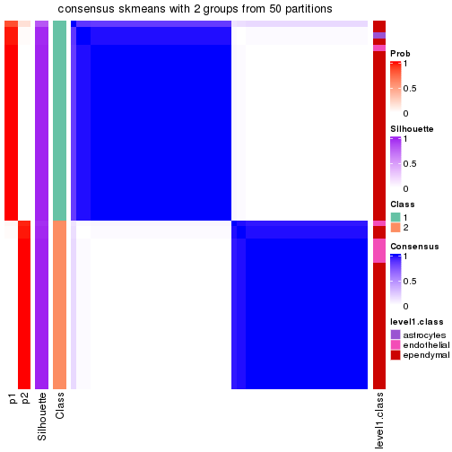</p>

</div>
<div id='tab-node-033-consensus-heatmap-2'>
<pre><code class="r">consensus_heatmap(res, k = 3)
</code></pre>

<p></p>

</div>
<div id='tab-node-033-consensus-heatmap-3'>
<pre><code class="r">consensus_heatmap(res, k = 4)
</code></pre>

<p></p>

</div>
</div>

Heatmaps for the membership of samples in all partitions to see how consistent they are:


<script>
$( function() {
	$( '#tabs-node-033-membership-heatmap' ).tabs();
} );
</script>
<div id='tabs-node-033-membership-heatmap'>
<ul>
<li><a href='#tab-node-033-membership-heatmap-1'>k = 2</a></li>
<li><a href='#tab-node-033-membership-heatmap-2'>k = 3</a></li>
<li><a href='#tab-node-033-membership-heatmap-3'>k = 4</a></li>
</ul>
<div id='tab-node-033-membership-heatmap-1'>
<pre><code class="r">membership_heatmap(res, k = 2)
</code></pre>

<p></p>

</div>
<div id='tab-node-033-membership-heatmap-2'>
<pre><code class="r">membership_heatmap(res, k = 3)
</code></pre>

<p></p>

</div>
<div id='tab-node-033-membership-heatmap-3'>
<pre><code class="r">membership_heatmap(res, k = 4)
</code></pre>

<p></p>

</div>
</div>

As soon as the classes for columns are determined, the signatures
that are significantly different between subgroups can be looked for. 
Following are the heatmaps for signatures.


Signature heatmaps where rows are scaled:


<script>
$( function() {
	$( '#tabs-node-033-get-signatures' ).tabs();
} );
</script>
<div id='tabs-node-033-get-signatures'>
<ul>
<li><a href='#tab-node-033-get-signatures-1'>k = 2</a></li>
<li><a href='#tab-node-033-get-signatures-2'>k = 3</a></li>
<li><a href='#tab-node-033-get-signatures-3'>k = 4</a></li>
</ul>
<div id='tab-node-033-get-signatures-1'>
<pre><code class="r">get_signatures(res, k = 2)
</code></pre>

<p></p>

</div>
<div id='tab-node-033-get-signatures-2'>
<pre><code class="r">get_signatures(res, k = 3)
</code></pre>

<p></p>

</div>
<div id='tab-node-033-get-signatures-3'>
<pre><code class="r">get_signatures(res, k = 4)
</code></pre>

<p></p>

</div>
</div>


Signature heatmaps where rows are not scaled:


<script>
$( function() {
	$( '#tabs-node-033-get-signatures-no-scale' ).tabs();
} );
</script>
<div id='tabs-node-033-get-signatures-no-scale'>
<ul>
<li><a href='#tab-node-033-get-signatures-no-scale-1'>k = 2</a></li>
<li><a href='#tab-node-033-get-signatures-no-scale-2'>k = 3</a></li>
<li><a href='#tab-node-033-get-signatures-no-scale-3'>k = 4</a></li>
</ul>
<div id='tab-node-033-get-signatures-no-scale-1'>
<pre><code class="r">get_signatures(res, k = 2, scale_rows = FALSE)
</code></pre>

<p>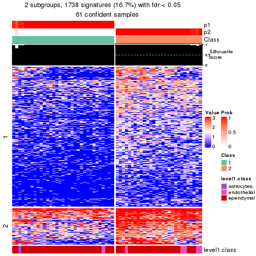</p>

</div>
<div id='tab-node-033-get-signatures-no-scale-2'>
<pre><code class="r">get_signatures(res, k = 3, scale_rows = FALSE)
</code></pre>

<p></p>

</div>
<div id='tab-node-033-get-signatures-no-scale-3'>
<pre><code class="r">get_signatures(res, k = 4, scale_rows = FALSE)
</code></pre>

<p></p>

</div>
</div>


Compare the overlap of signatures from different k:

```r
compare_signatures(res)
```


`get_signature()` returns a data frame invisibly. To get the list of signatures, the function
call should be assigned to a variable explicitly. In following code, if `plot` argument is set
to `FALSE`, no heatmap is plotted while only the differential analysis is performed.

```r
# code only for demonstration
tb = get_signature(res, k = ..., plot = FALSE)
```

An example of the output of `tb` is:

```
#>   which_row         fdr    mean_1    mean_2 scaled_mean_1 scaled_mean_2 km
#> 1        38 0.042760348  8.373488  9.131774    -0.5533452     0.5164555  1
#> 2        40 0.018707592  7.106213  8.469186    -0.6173731     0.5762149  1
#> 3        55 0.019134737 10.221463 11.207825    -0.6159697     0.5749050  1
#> 4        59 0.006059896  5.921854  7.869574    -0.6899429     0.6439467  1
#> 5        60 0.018055526  8.928898 10.211722    -0.6204761     0.5791110  1
#> 6        98 0.009384629 15.714769 14.887706     0.6635654    -0.6193277  2
...
```

The columns in `tb` are:

1. `which_row`: row indices corresponding to the input matrix.
2. `fdr`: FDR for the differential test. 
3. `mean_x`: The mean value in group x.
4. `scaled_mean_x`: The mean value in group x after rows are scaled.
5. `km`: Row groups if k-means clustering is applied to rows (which is done by automatically selecting number of clusters).

If there are too many signatures, `top_signatures = ...` can be set to only show the 
signatures with the highest FDRs:

```r
# code only for demonstration
# e.g. to show the top 500 most significant rows
tb = get_signature(res, k = ..., top_signatures = 500)
```

If the signatures are defined as these which are uniquely high in current group, `diff_method` argument
can be set to `"uniquely_high_in_one_group"`:

```r
# code only for demonstration
tb = get_signature(res, k = ..., diff_method = "uniquely_high_in_one_group")
```


UMAP plot which shows how samples are separated.


<script>
$( function() {
	$( '#tabs-node-033-dimension-reduction' ).tabs();
} );
</script>
<div id='tabs-node-033-dimension-reduction'>
<ul>
<li><a href='#tab-node-033-dimension-reduction-1'>k = 2</a></li>
<li><a href='#tab-node-033-dimension-reduction-2'>k = 3</a></li>
<li><a href='#tab-node-033-dimension-reduction-3'>k = 4</a></li>
</ul>
<div id='tab-node-033-dimension-reduction-1'>
<pre><code class="r">dimension_reduction(res, k = 2, method = &quot;UMAP&quot;)
</code></pre>

<p></p>

</div>
<div id='tab-node-033-dimension-reduction-2'>
<pre><code class="r">dimension_reduction(res, k = 3, method = &quot;UMAP&quot;)
</code></pre>

<p></p>

</div>
<div id='tab-node-033-dimension-reduction-3'>
<pre><code class="r">dimension_reduction(res, k = 4, method = &quot;UMAP&quot;)
</code></pre>

<p></p>

</div>
</div>


Following heatmap shows how subgroups are split when increasing `k`:

```r
collect_classes(res)
```


Test correlation between subgroups and known annotations. If the known
annotation is numeric, one-way ANOVA test is applied, and if the known
annotation is discrete, chi-squared contingency table test is applied.

```r
test_to_known_factors(res)
```

```
#>             n_sample level1.class(p-value) k
#> ATC:skmeans       61                0.1069 2
#> ATC:skmeans       61                0.1849 3
#> ATC:skmeans       61                0.0659 4
```


If matrix rows can be associated to genes, consider to use `functional_enrichment(res,
...)` to perform function enrichment for the signature genes. See [this vignette](https://jokergoo.github.io/cola_vignettes/functional_enrichment.html) for more detailed explanations.


 

## Session info


```r
sessionInfo()
```

```
#> R version 4.1.0 (2021-05-18)
#> Platform: x86_64-pc-linux-gnu (64-bit)
#> Running under: CentOS Linux 7 (Core)
#> 
#> Matrix products: default
#> BLAS/LAPACK: /usr/lib64/libopenblas-r0.3.3.so
#> 
#> locale:
#>  [1] LC_CTYPE=en_US.UTF-8       LC_NUMERIC=C               LC_TIME=en_US.UTF-8       
#>  [4] LC_COLLATE=en_US.UTF-8     LC_MONETARY=en_US.UTF-8    LC_MESSAGES=en_US.UTF-8   
#>  [7] LC_PAPER=en_US.UTF-8       LC_NAME=C                  LC_ADDRESS=C              
#> [10] LC_TELEPHONE=C             LC_MEASUREMENT=en_US.UTF-8 LC_IDENTIFICATION=C       
#> 
#> attached base packages:
#>  [1] grid      parallel  stats4    stats     graphics  grDevices utils     datasets  methods  
#> [10] base     
#> 
#> other attached packages:
#>  [1] genefilter_1.74.0           ComplexHeatmap_2.8.0        markdown_1.1               
#>  [4] knitr_1.33                  scRNAseq_2.6.1              SingleCellExperiment_1.14.1
#>  [7] SummarizedExperiment_1.22.0 Biobase_2.52.0              GenomicRanges_1.44.0       
#> [10] GenomeInfoDb_1.28.1         IRanges_2.26.0              S4Vectors_0.30.0           
#> [13] BiocGenerics_0.38.0         MatrixGenerics_1.4.0        matrixStats_0.59.0         
#> [16] cola_1.9.4                 
#> 
#> loaded via a namespace (and not attached):
#>   [1] circlize_0.4.13               AnnotationHub_3.0.1           BiocFileCache_2.0.0          
#>   [4] lazyeval_0.2.2                polylabelr_0.2.0              splines_4.1.0                
#>   [7] Polychrome_1.3.1              BiocParallel_1.26.1           ggplot2_3.3.5                
#>  [10] digest_0.6.27                 foreach_1.5.1                 ensembldb_2.16.3             
#>  [13] htmltools_0.5.1.1             viridis_0.6.1                 fansi_0.5.0                  
#>  [16] magrittr_2.0.1                memoise_2.0.0                 cluster_2.1.2                
#>  [19] doParallel_1.0.16             Biostrings_2.60.1             annotate_1.70.0              
#>  [22] askpass_1.1                   prettyunits_1.1.1             colorspace_2.0-2             
#>  [25] blob_1.2.1                    rappdirs_0.3.3                xfun_0.24                    
#>  [28] dplyr_1.0.7                   crayon_1.4.1                  RCurl_1.98-1.3               
#>  [31] microbenchmark_1.4-7          jsonlite_1.7.2                impute_1.66.0                
#>  [34] brew_1.0-6                    survival_3.2-11               iterators_1.0.13             
#>  [37] glue_1.4.2                    polyclip_1.10-0               gtable_0.3.0                 
#>  [40] zlibbioc_1.38.0               XVector_0.32.0                GetoptLong_1.0.5             
#>  [43] DelayedArray_0.18.0           shape_1.4.6                   scales_1.1.1                 
#>  [46] data.tree_1.0.0               DBI_1.1.1                     Rcpp_1.0.7                   
#>  [49] viridisLite_0.4.0             xtable_1.8-4                  progress_1.2.2               
#>  [52] clue_0.3-59                   reticulate_1.20               bit_4.0.4                    
#>  [55] mclust_5.4.7                  umap_0.2.7.0                  httr_1.4.2                   
#>  [58] RColorBrewer_1.1-2            ellipsis_0.3.2                pkgconfig_2.0.3              
#>  [61] XML_3.99-0.6                  dbplyr_2.1.1                  utf8_1.2.1                   
#>  [64] tidyselect_1.1.1              rlang_0.4.11                  later_1.2.0                  
#>  [67] AnnotationDbi_1.54.1          munsell_0.5.0                 BiocVersion_3.13.1           
#>  [70] tools_4.1.0                   cachem_1.0.5                  generics_0.1.0               
#>  [73] RSQLite_2.2.7                 ExperimentHub_2.0.0           evaluate_0.14                
#>  [76] stringr_1.4.0                 fastmap_1.1.0                 yaml_2.2.1                   
#>  [79] bit64_4.0.5                   purrr_0.3.4                   dendextend_1.15.1            
#>  [82] KEGGREST_1.32.0               AnnotationFilter_1.16.0       mime_0.11                    
#>  [85] slam_0.1-48                   xml2_1.3.2                    biomaRt_2.48.2               
#>  [88] compiler_4.1.0                rstudioapi_0.13               filelock_1.0.2               
#>  [91] curl_4.3.2                    png_0.1-7                     interactiveDisplayBase_1.30.0
#>  [94] tibble_3.1.2                  stringi_1.7.3                 highr_0.9                    
#>  [97] GenomicFeatures_1.44.0        RSpectra_0.16-0               lattice_0.20-44              
#> [100] ProtGenerics_1.24.0           Matrix_1.3-4                  vctrs_0.3.8                  
#> [103] pillar_1.6.1                  lifecycle_1.0.0               BiocManager_1.30.16          
#> [106] eulerr_6.1.0                  GlobalOptions_0.1.2           bitops_1.0-7                 
#> [109] irlba_2.3.3                   httpuv_1.6.1                  rtracklayer_1.52.0           
#> [112] R6_2.5.0                      BiocIO_1.2.0                  promises_1.2.0.1             
#> [115] gridExtra_2.3                 codetools_0.2-18              assertthat_0.2.1             
#> [118] openssl_1.4.4                 rjson_0.2.20                  GenomicAlignments_1.28.0     
#> [121] Rsamtools_2.8.0               GenomeInfoDbData_1.2.6        hms_1.1.0                    
#> [124] skmeans_0.2-13                Cairo_1.5-12.2                scatterplot3d_0.3-41         
#> [127] shiny_1.6.0                   restfulr_0.0.13
```


